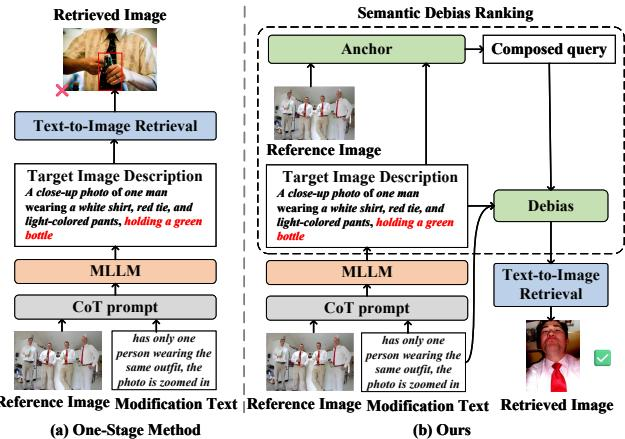
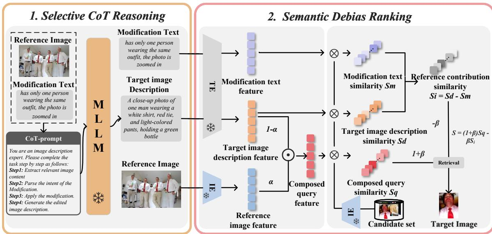
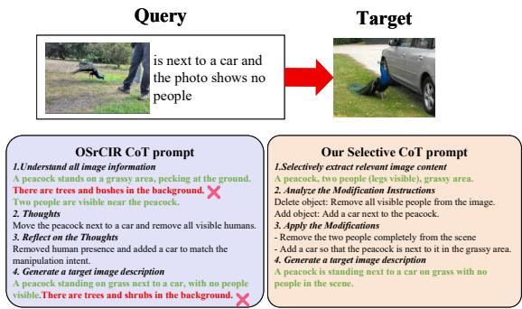
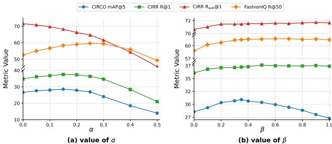
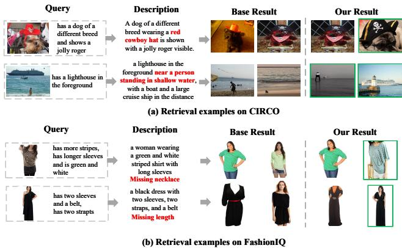
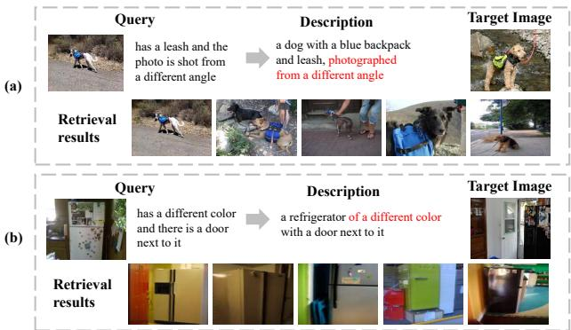

# SDR-CIR: 无训练零样本复合图像检索的语义去偏检索框架

易孙\* 武汉科技大学 中国武汉 syi1005@whut.edu.cn 许金玉\* 武汉科技大学 中国武汉 jinyxu@whut.edu.cn 谢清 武汉科技大学 中国武汉 felixxq@whut.edu.cn 李佳琛 武汉科技大学 中国武汉 lijiachen@whut.edu.cn 马艳春 武汉职业学院 软件与工程 中国武汉 mayanchun@whvcse.edu.cn 刘永健 武汉科技大学 中国武汉 liuyj@whut.edu.cn

# 摘要

组合图像检索 (CIR) 旨在从由参考图像和修改文本组成的查询中检索目标图像。近来的无训练零-shot 方法通常使用多模态大语言模型 (MLLM) 结合思维链 (CoT) 来生成用于检索的目标图像描述。然而，由于 ZS-CIR 的模糊匹配特性，生成的描述容易相对于目标图像产生语义偏差。我们提出了基于 CoT 推理的无训练语义去偏排名方法 SDRCIR。首先，选择性思维链指导 MLLM 在图像理解过程中提取与修改文本相关的视觉内容，从源头上减少视觉噪声。然后，我们引入一个包含两个步骤的语义去偏排名，锚定和去偏，以减轻语义偏差。在锚定步骤中，我们将参考图像特征与目标描述特征融合，以增强有用语义并补充省略线索。在去偏步骤中，我们明确建模参考图像对描述的视觉语义贡献，并将其作为惩罚项纳入相似性评分中。通过补充省略的线索并抑制冗余，SDR-CIR 减轻了语义偏差，提高了检索性能。在三个标准 CIR 基准测试上的实验表明，SDR-CIR 在一阶段方法中实现了最先进的结果，同时保持了高效性。代码已公开，地址为 https://github.com/suny105/SDR-CIR。

# CCS 概念

信息系统 信息检索；检索模型与排序。

# 关键词

组合图像检索；多模态检索；语义去偏差

# ACM参考格式：

Yi Sun、Jinyu Xu、Qing Xie、Jiachen Li、Yanchun Ma 和 Yongjian Liu。2026。《SDR-CIR：无训练的零-shot 组合图像检索的语义去偏框架》。发表于2026年ACM网络会议论文集（WWW '26），2026年4月13日至17日，阿联酋迪拜。纽约：ACM，页码11。https://doi.org/10.1145/3774904.3792339

# 1 引言

复合图像检索 (CIR) [42, 44, 48] 旨在基于参考图像和修改文本检索目标图像。近年来，由于其灵活的查询组合，CIR 已在电子商务 [10] 和网络搜索 [16, 33] 中得到广泛应用。然而，CIR 仍然是一个具有挑战性的任务，因为它需要对参考图像中的视觉内容和修改文本所传达的语义变化进行联合理解。传统的 CIR 方法 [3, 4, 13, 25, 42] 通常在包含参考图像、修改文本和目标图像的三元组上进行训练，但构建这样的三元组非常耗时，并限制了 CIR 的泛化能力。为了解决这一问题，零样本 CIR (ZS-CIR) [2, 17, 35, 40] 方法利用大规模预训练视觉-语言模型 (VLMs) [21, 34] 的零样本能力，能够在没有特定任务三元组的情况下进行检索。

现有的零样本条件图像检索（ZS-CIR）方法可以大致分为依赖训练的方法和无训练的方法。依赖训练的方法，如文本反转，学习一个投影模块，利用图像-文本对将参考图像映射为伪词元，然后与修改文本组合进行检索。然而，这些方法仍然依赖于在大规模图像-文本对上的额外训练或微调。相比之下，无训练的方法直接利用大型语言模型（LLMs）或多模态大型语言模型（MLLMs）生成组合查询。随着GPT和LLaVA等大型模型的快速发展，无训练的零样本条件图像检索方法展现出更大的潜力和更广泛的应用前景。无训练的零样本条件图像检索方法通常包括描述生成过程和排名过程。在第一个过程中，使用LLMs或MLLMs生成目标图像的描述，该描述通过组合参考图像和修改文本来描述目标图像。在第二个过程中，生成的描述被作为文本查询，用于基于相似度排名进行图像检索。

  

Figure 1: Comparison of existing one-stage method and our proposed method SDR-CIR.

无训练的零-shot图像检索方法可以进一步根据参考图像在描述生成过程中是否需要通过图像描述模型进行预处理分为两阶段方法和单阶段方法 [41]。两阶段方法 [18, 26, 36, 46, 47] 首先利用图像描述模型 [9, 19, 20] 获取参考图像的图像描述，然后通过大语言模型（LLMs）将该描述与修改文本组合，生成目标图像描述。然而，由于参考图像的图像描述与修改文本是独立进行的，生成的描述可能会遗漏与预期修改相关的关键视觉细节 [37]。因此，LLMs 在关键视觉信息缺失的情况下难以推断出准确的语义，从而降低了整体检索性能。为了解决这一局限性，单阶段方法利用多语言大模型（MLLMs）通过精心设计的提示语同时处理参考图像和修改文本，从而确保在生成目标图像描述时，视觉细节和文本意图能够共同考虑。尽管已有进展，但大多数现有的直接应用 MLLMs 进行图像检索的单阶段方法仍面临两个挑战：（1）描述生成过程中的视觉噪声。在零-shot图像检索中，多模态查询固有的不确定性以及参考图像包含冗余视觉语义使得这一过程复杂。大多数现有的单阶段方法 [41] 采用链式思维（CoT） [12, 43] 策略，首先从参考图像中提取几乎所有视觉信息，然后根据修改文本过滤无关细节。然而，这种方式在初始提取过程中固有地缺乏语义选择性。由于视觉提取是基于整体图像内容而非修改意图驱动的，因此无关的视觉信息可能会干扰后续的过滤。因此，生成的目标图像描述可能引入噪声，最终降低检索性能。

(2) 排名过程中的语义偏差。ZS-CIR可以被视为一种模糊匹配任务，因为参考图像和目标图像之间的对应关系并未严格由修改文本定义。在实际操作中，目标图像可能在指定修改之外的其他隐含语义方面与参考图像有所不同。因此，生成的目标图像描述仅部分对应于目标图像，导致描述中不可避免地存在语义偏差。例如，如图1所示，“一个绿色瓶子”与目标图像无关，但在参考图像中却是与人物相关的特征。由于人物是图像中的主要对象，MLLMs可能将其视为有用线索并将其包含在目标图像描述中。这种偏差包括冗余偏差和遗漏偏差：目标图像描述要么包含冗余细节，要么省略对目标图像有用的线索。因此，这种语义偏差可能误导排名过程，因为生成描述中的无关或不准确概念可能虚假地提高非目标候选的相似度分数，同时降低真实目标图像的相关性。为了解决这些挑战，我们提出了一种新颖的无训练语义去偏框架，用于零-shot 组合图像检索（SDR-CIR）。在生成过程中，与以往提取所有视觉内容后进行过滤的一阶段基于CoT的方法不同，我们设计了一种选择性CoT，指导MLLMs选择性地提取与修改文本相关的视觉内容，从而减轻参考图像理解过程中的视觉噪声。从概念上讲，选择性CoT充当了一种推理控制机制，限制MLLM的推理轨迹到与修改文本相关的语义范围，这有助于减少冗余的视觉推理，生成的目标图像描述与意图目标图像在语义上更加一致。

为了进一步减轻参考图像引入的语义偏差，我们在排序过程中设计了一个语义去偏排名模块。不同于先前的方法[46]依赖于语义编辑增量来缓解语义偏差，由于目标描述与目标图像间的偏差是由参考图像与目标图像之间的模糊匹配造成的，因此描述中的语义偏差本质上源于参考图像。因此，我们显式建模并修正参考图像可能不正确主导相似度计算的视觉语义贡献，从而减轻语义偏差。具体而言，该模块包括两个步骤：锚点步骤和去偏步骤。在锚点步骤中，我们通过融合参考图像和生成描述特征建立语义锚点，以强化有用的视觉语义并补充遗漏的视觉线索。在去偏步骤中，我们通过惩罚有偏的视觉语义贡献来调整最终的相似度。该设计使我们的方法能够补充来自参考图像的遗漏视觉线索，同时抑制冗余语义，实现更加准确和均衡的排名结果。总之，我们的主要贡献如下： • 我们提出了一个无训练的语义去偏检索框架用于零样本组合图像检索（SDR-CIR）。该框架解决了零样本组合图像检索中描述生成过程中的视觉噪声和排序过程中的语义偏差问题。我们设计了一种选择性链式思维（Selective CoT），指导多模态大语言模型（MLLMs）选择性地提取与修改文本相关的视觉语义，从而减轻在理解参考图像时的视觉噪声，提高目标图像描述生成的准确性。我们引入了一种带有锚点-再去偏（Anchor-then-Debias）策略的语义去偏排名模块，以纠正有偏的视觉语义贡献，实现均衡的检索性能。 • 在三个标准基准上的实验表明，与之前的方法相比，表现出一致的改进。

# 2 相关工作

# 2.1 零样本组合图像检索

零样本组合图像检索 (ZS-CIR) [2, 14, 18, 35, 37, 40, 41, 46, 47] 利用预训练的视觉语言模型 (VLM) 来避免 CIR 风格的三元组监督。这些方法主要关注如何将参考图像和修改文本结合形成用于检索的组合查询。依赖训练的 ZS-CIR 方法（例如，Pic2Word [35]，SEARLE [2]）学习一个映射模块，将参考图像映射为伪词元，然后与修改文本组合，但仍然需要在大规模图像-文本对上进行额外训练，这激励了无训练管道的发展。两阶段的无训练方法（例如，CIReVL [18]，LDRE [47]，SEIZE [46]）首先将参考图像转换为标题，然后通过大语言模型推理将该标题与修改文本组合。然而，由于参考图像的标题生成独立于修改文本，这些方法可能会遗漏与预期修改相关的关键视觉细节，从而导致推理不准确。相比之下，一阶段的无训练方法，如 OSrCIR [41] 和 CoTMR [37]，将参考图像和修改文本共同输入到多模态大语言模型中，以确保视觉细节和修改意图被共同考虑。许多方法仅使用生成的描述进行检索和排序 [18, 41]，或通过将生成的描述与多尺度物体结合 [37]。然而，由于 ZS-CIR 本质上是一个模糊匹配任务，生成的目标图像描述不可避免地表现出与目标图像相关的语义偏差。为了应对这个问题，我们提出了一种语义去偏排名模块，通过显式建模和惩罚参考图像对描述的视觉语义贡献来减轻这种语义偏差，适用于一阶段方法。

# 2.2 零-shot分类中的思维链

近期研究表明，链式思维（Chain-of-Thought, CoT）提示可以显著增强大型语言模型（LLMs）或多模态大型语言模型（MLLMs）的推理和理解能力。CoT 的核心思想是设计特定任务的提示，鼓励模型生成中间推理步骤，这在多个领域已证明有效。在零样本图像检索（ZS-CIR）任务中，一些单阶段方法最近探讨了结合 CoT 以提升 MLLMs 的推理能力。例如，OSrCIR 引入了反思式 CoT，帮助 MLLMs 理解和实施修改。CoTMR 利用 CoT 推理使 MLLMs 能够逐步应用修改。这些方法有效提升了 MLLMs 在结合视觉和文本模态进行检索时的推理能力。然而，这些方法忽视了参考图像的冗余性。现有基于 CoT 的 ZS-CIR 方法要求 MLLMs 在过滤无关细节之前提取几乎所有的视觉信息，固有地缺乏语义选择性。因此，生成的目标图像描述中可能包含无关或冗余的视觉内容，从而引入视觉噪声，影响检索性能。为了缓解这一问题，我们提出了一种选择性 CoT，指导 MLLM 在理解参考图像时有选择地提取与修改文本相关的视觉内容。

# 3 方法论

在本节中，我们介绍了SDR-CIR，一种无训练的ZS-CIR方法，旨在减轻语义偏差（见图2）。3.1节概述了我们的方法。3.2节介绍了我们的选择性CoT提示的设计，3.3节引入了语义去偏排名模块，该模块缓解了语义偏差。

# 3.1 概述

图2展示了整体框架。我们首先使用选择性链式思维（Selective CoT）来减少生成过程中的视觉噪声，通过引导多模态语言模型（MLLM）提取与修改相关的视觉元素。接着，我们通过语义去偏排序（Semantic Debias Ranking, SDR）模块进行检索，以减轻排序中的语义偏差，其中锚定步骤构建一个稳健的复合查询，去偏步骤则通过惩罚由参考引起的语义偏差来压制非目标候选，从而提升检索性能。

# 3.2 选择性链式推理

在CIR任务中，用户查询由参考图像和修改文本组成。参考图像提供了检索目标图像的视觉内容。实际上，参考图像提供的视觉内容往往包含冗余信息。然而，现有的一阶段方法忽略了这一事实，采用CoT提示来引导MLLM提取几乎所有视觉信息，以理解参考图像，这可能会给生成的描述引入噪声细节，从而影响检索性能。为了解决这个问题，我们设计了一个选择性CoT提示：在修改文本的指导下，MLLM在理解参考图像时有选择性地提取与修改相关的视觉内容。与现有的CoT提示类似，我们的提示采用四阶段结构：(1) 参考图像理解，(2) 修改文本理解，(3) 应用修改，(4) 目标图像描述生成。关键区别在于我们在图像理解过程中引入修改文本的指导，以提取与修改相关的视觉内容。具体来说，在参考图像理解中，我们首先解析修改文本以推断显式修改目标（直接指定），并推断隐式修改目标（由修改文本暗示）。然后，我们理解参考图像，并在这些目标的指导下选择性地提取与修改文本相关的视觉内容。例如，在图3中，与修改文本相关的视觉内容包括：一只孔雀、两个人（可见腿）和一片草地，而不是背景。这一选择性过程有助于减少生成过程中的目标图像描述中的视觉噪声。接着，MLLM从修改文本中推断修改意图，逐步应用修改以更新提取的视觉内容，最终获得目标图像描述。

  
F veurR-rkTh lecv  s  ti n between the visual semantic contribution and candidate images as a penalty term to debias.

  

Figure 3: Comparison on CoT prompt between OSrCIR and ours.

# 3.3 语义去偏排名

为了缓解由参考图像引入的偏见视觉语义贡献所导致的语义偏见，我们提出了一个包含两个步骤的语义去偏模块：锚点步骤和去偏步骤。锚点步骤通过将参考图像特征与目标图像描述特征融合，强化相关有用的语义并补充缺失的线索。然后，去偏步骤惩罚参考图像的偏见视觉语义贡献，以降低非目标候选图像的排名，从而去除偏见并改善检索性能。3.3.1 锚点：强化和补充信息。目标图像描述与目标图像之间的语义偏见源于参考图像与目标图像之间模糊的对应关系。因此，描述中的偏见主要源自参考图像。在实践中，偏见描述表现出两种偏差类型：冗余偏见和遗漏偏见。在冗余情况下，生成的目标描述保留了来自参考图像与目标图像无关的细节。在遗漏情况下，它省略了参考图像中的关键线索。这些偏见反映了参考图像内容的过度或不足表征。值得注意的是，参考图像的视觉语义贡献中也包含了对目标图像有用的视觉语义。直接抑制视觉贡献可能会导致有用语义的丢失。因此，我们利用参考图像特征和目标图像描述特征构建一个稳健的复合查询特征，加强有用的视觉语义并补充描述中遗漏的关键线索。具体而言，我们通过融合参考图像特征和目标图像描述特征建立一个语义锚点。我们使用CLIP文本编码器将描述$T _ { d }$编码为特征$F _ { d }$。候选图像集$D$中的图像$I _ { t } ^ { i }$和参考图像$I _ { r }$通过CLIP图像编码器编码为$F ( I _ { t } ^ { i } )$和$F _ { r }$，确保它们处于同一特征空间。随后，我们将参考图像特征$F _ { r }$与目标图像描述特征$F _ { d }$融合，以获得复合查询特征$F _ { q }$。

$$
F _ { q } = ( 1 - \alpha ) F _ { d } + \alpha F _ { r } ,
$$

其中 $\alpha$ 是分配给参考图像特征的权重。由于有用的视觉语义占主导地位（例如“白色衬衫、红色领带和浅色”，如图 2 所示）参考图像，对于冗余描述，添加图像特征可以增加有用信息的相对权重，并防止在惩罚视觉语义贡献时削弱此信息。对于不完整的描述，图像特征可以补充遗漏的线索。此 Anchor 步骤获得了一个稳健的复合查询，保持有用语义的突出，同时补充遗漏的线索。3.3.2 消除偏见：惩罚视觉语义贡献。由于参考图像是描述中语义偏见的主要来源，我们可以通过表达参考图像对目标图像描述的视觉语义贡献来缓解语义偏见。受 SEIZE [46] 启发，我们从相似性的角度表示描述中的视觉语义贡献。目标图像描述是通过参考图像和修改文本的共同影响生成的，而修改文本通常包含正确的信息。因此，可以将参考图像的语义贡献近似为目标图像描述与修改文本贡献之间的差异。具体而言，我们计算复合查询特征 $F _ { q }$、目标图像描述特征 $F _ { d }$ 和修改文本特征 $F _ { m }$ 之间的余弦相似度 $S _ { q }$、$S _ { d }$、$S _ { m }$，以及来自候选图像集 $D$ 的图像特征 $F ( I _ { t } ^ { i } )$。

$$
[ S _ { q } , S _ { d } , S _ { m } ] = s i m ( [ F _ { q } , F _ { d } , F _ { m } ] , F ( I _ { t } ^ { i } ) ) , \forall I _ { t } ^ { i } \in { \cal D } ,
$$

因此，我们可以通过计算 $S _ { d }$ 和 $S _ { m }$ 之间的差异来获得候选图像与参考图像的视觉语义贡献之间的余弦相似度 $S _ { i }$。

$$
S _ { i } = S _ { d } - S _ { m } ,
$$

对于冗余描述，$S _ { i }$ 主要表示候选图像与包含冗余视觉信息的视觉语义贡献之间的相似性。对于不完整描述，$S _ { i }$ 主要表示候选图像与省略关键线索的视觉语义贡献之间的相似性。当 $S _ { i }$ 值较高时，通常意味着候选图像与冗余或不完整的视觉语义贡献一致。这样的候选图像更可能是非目标图像。因此，我们将 $S _ { i }$ 作为最终相似性中的惩罚项，以惩罚那些可能是非目标的候选图像。我们从组合查询相似性分数 $S _ { q }$ 中减去视觉语义贡献的相似性 $S _ { i }$，以获得最终相似性 $S _ { f }$。

$$
S _ { f } = ( 1 + \beta ) S _ { q } - \beta S _ { i } ,
$$

其中 $\beta$ 是抑制参考图像贡献的权重。同时，我们将 $S _ { q }$ 的权重设置为 $1 + \beta$ 以平衡得分。最后，最终相似度得分 $S _ { f }$ 被用于检索。

# 4 实验

# 4.1 实验设置

数据集。我们在三个广泛使用的CIR数据集上进行实验：CIRR [25]、CIRCO [2]和FashionIQ [45]。CIRR是第一个开放领域的CIR数据集，包含36,554个查询，每个查询都配有一张目标图像。CIRCO由COCO 2017未标注集中的真实图像构建，包含800个测试查询和220个验证查询。每个查询关联多个真实标注数据，平均每个查询有4.53个真实标注。FashionIQ专注于时尚领域，涵盖了三大类——衬衫、连衣裙和上衣。它由30,135个查询三元组和77,683个候选图像组成，每个查询链接到一张目标图像。这些数据集涵盖了CIR中不同类型的修改需求：CIRR和CIRCO强调对象级别的变化（例如，添加、移除或替换对象），而FashionIQ则强调属性级别的修改（例如，衣物颜色和风格）。 评价指标。我们对CIRR和FashionIQ采用Recall@k $( \mathrm { R } @ \mathrm { k } )$，而CIRCO则使用平均准确率 $( \mathrm { m A P @ k } )$。此外，我们在CIRR子集上报告 $\mathrm { R e c a l l } _ { \mathrm { s u b } @ \mathrm { k } }$，该子集包含与目标图像高度相似的样本，以提供更严格的评估。 基线。我们将所提方法与几种常见的ZS-CIR方法进行比较。对于训练依赖的ZS-CIR方法，我们选择：1)

Pic2Word [35]：将参考图像特征映射到伪词元。2) SEARLE [2]：将伪词元与 GPT 生成的标题结合。3) MLLM-I2W [5] 利用 MLLM 上下文提示将参考图像特征映射到伪词元。对于无训练的 ZS-CIR 方法，我们比较了一步法和两步法。对于两步法：1) CIReVL [18]：使用 BLIP-2 [19] 和 LLM 的两步过程生成目标图像描述。2) LDRE [47]：生成并聚合多个目标图像描述。3) SEIZE [46]：生成并聚合多个目标图像描述，并执行语义编辑搜索。对于一步法：1) OSrCIR [41]：基于 CoT 的 MLLM 生成目标图像描述，并执行直接搜索。2) CoTMR [37]：基于 CoT 的 MLLM 生成目标图像描述，并进行多尺度推断。实施细节。我们采用 GPT-4.1 [31] 作为目标图像描述生成的主要 MLLM，并使用 Qwen2.5-VL-72B [1] 和 GPT-4o-mini [30] 进行消融分析。对于检索编码器，我们采用 OpenCLIP [15] 中三个变体的预训练 CLIP 模型：ViT-B/32、ViT-L/14 和 ViT-G/14。缩放因子 $\alpha$ 和 $\beta$ 分别设置为 CIRR 数据集的 0.05 和 0.5、CIRCO 数据集的 0.15 和 0.35、FashionIQ 数据集的 0.2 和 0.4。所有实验在 PyTorch [32] 中实现，并在单个 NVIDIA RTX 3090 GPU 上进行。

# 4.2 ZS-CIR 基准比较

我们的方法遵循单阶段流程，因此采用其他单阶段方法作为主要基线进行比较。为了公平比较，我们在所有单阶段基线中使用相同的多模态大语言模型（GPT-4.1）。CIRCO：表1的左侧展示了在CIRCO测试数据集上的实验结果。我们有以下观察：（1）在CIRCO中，每个查询都有多个真实图像，过于精确的描述可能仅对齐于单个实例，从而缩小检索范围。SDR-CIR通过语义去偏差来缓解这一问题，抑制描述中由参考引起的无关细节，以提高有效目标的覆盖率，在所有比较的基线中取得了最佳性能。（2）与我们的直接基线OSrCIR和CoTMR相比，以ViT-L/14为例，我们的SDR-CIR在mAP $@ 5$上分别提高了 $9.08\%$ 和 $4.39\%$。即使不使用上下文示例，我们的方法仍显著有效，并保持了友好的计算成本。

CIRR：表1的右侧展示了CIRR测试数据集及其子集的实验结果。我们做出以下观察：（1）CIRR数据集存在大量的假阴性，并且检索主要受修改文本的主导。因此，如果描述包含冗余的参考图像内容，内容会极大地影响检索性能。在这种情况下，SDR-CIR可以显著抑制来自参考图像冗余信息的干扰，达到所有基线中的最佳性能。例如，在ViT-L/14主干上，与最佳的无训练方法CoTMR相比，我们的方法在Recall $@ 1$上提高了$4.07\%$。（2）在CIRR子集中，SDR-CIR优于所有单阶段基线。例如，在ViT-G/14上，相较于最佳单阶段方法CoTMR，我们的方法在$\mathrm {R e c a l l} _ { \mathrm {s u b} @ } 1$上实现了$2.48\%$的提升，但仍落后于双阶段的SEIZE。这个差距可能源于子集对更细粒度区分的需求，在该情况下，语义编辑增量提供了更强的线索。我们的方法主要抑制参考图像的冗余，整体上仍保持竞争力。

<table><tr><td colspan="3">CIRCO+CIRR→</td><td colspan="4">CIRCO</td><td colspan="8">CIRR</td></tr><tr><td>Backbone</td><td>Method</td><td>Training-free</td><td>Type</td><td></td><td colspan="3">mAP@k</td><td></td><td colspan="3">Recall@k</td><td colspan="3">Recallsub@k</td></tr><tr><td rowspan="2"></td><td></td><td></td><td></td><td>k=5</td><td>k=10</td><td>k=25</td><td>k=50</td><td>k=1</td><td>k=5</td><td>k=10</td><td>k=50</td><td>k=1</td><td>k=2</td><td>k=3</td></tr><tr><td>SEARLE [2]</td><td>×</td><td></td><td>9.35</td><td>9.94</td><td>11.13</td><td>11.84</td><td>24.00</td><td>53.42</td><td>66.82</td><td>89.78</td><td>54.89</td><td>76.60</td><td>88.19</td></tr><tr><td rowspan="7">ViT-B/32</td><td>CIReVL [18]</td><td>√</td><td>2S</td><td>14.95</td><td>15.42</td><td>17.00</td><td>17.82</td><td>23.94</td><td>52.51</td><td>66.00</td><td>86.95</td><td>60.17</td><td>80.05</td><td>90.19</td></tr><tr><td>LDRE [47]</td><td>√</td><td>2S</td><td>17.96</td><td>18.32</td><td>20.21</td><td>21.11</td><td>25.69</td><td>55.13</td><td>69.04</td><td>89.90</td><td>60.53</td><td>80.65</td><td>90.70</td></tr><tr><td>SEIZE [46]</td><td>√</td><td>2S</td><td>19.04</td><td>19.64</td><td>21.55</td><td>22.49</td><td>27.47</td><td>57.42</td><td>70.17</td><td>-</td><td>65.59</td><td>84.48</td><td>92.77</td></tr><tr><td>OSrCIR* [41]</td><td></td><td>1S</td><td>16.85</td><td>17.39</td><td>19.15</td><td>20.01</td><td>28.07</td><td>57.95</td><td>69.71</td><td>88.94</td><td>62.31</td><td>81.18</td><td>91.04</td></tr><tr><td>CoTR*[37]</td><td>√</td><td>1S</td><td>21.16</td><td>21.77</td><td>23.71</td><td>24.70</td><td>30.12</td><td>60.19</td><td>71.71</td><td>90.34</td><td>67.11</td><td>85.13</td><td>93.64</td></tr><tr><td>SDR-CIR</td><td>√</td><td>1S</td><td>23.78</td><td>24.43</td><td>26.58</td><td>27.50</td><td>34.48</td><td>65.74</td><td>76.87</td><td>93.06</td><td>69.90</td><td>87.04</td><td>94.48</td></tr><tr><td>Pic2Word [35]</td><td>×</td><td>-</td><td>8.72</td><td>9.51</td><td>10.64</td><td>11.29</td><td>23.90</td><td>51.70</td><td>65.30</td><td>87.80</td><td>-</td><td>-</td><td>-</td></tr><tr><td rowspan="7">ViT-L/14</td><td>SEARLE [2]</td><td>×</td><td>-</td><td>11.68</td><td>12.73</td><td>14.33</td><td>15.12</td><td>24.24</td><td>52.48</td><td>66.29</td><td>88.84</td><td>53.76</td><td>75.01</td><td>88.19</td></tr><tr><td>MLLM-I2W [5]</td><td>×</td><td>-</td><td>-</td><td>-</td><td>-</td><td>-</td><td>28.30</td><td>57.90</td><td>70.20</td><td>93.90</td><td>-</td><td>-</td><td>-</td></tr><tr><td>CIReVL [18]</td><td>√</td><td>2S</td><td>18.57</td><td>19.01</td><td>20.89</td><td>21.80</td><td>24.55</td><td>52.31</td><td>64.92</td><td>86.34</td><td>59.54</td><td>79.88</td><td>89.69</td></tr><tr><td>LDRE [47]</td><td>√</td><td>2S</td><td>23.25</td><td>24.03</td><td>26.44</td><td>27.50</td><td>26.53</td><td>55.57</td><td>67.54</td><td>88.50</td><td>60.43</td><td>80.31</td><td>89.90</td></tr><tr><td>SEIZE [46]</td><td>√</td><td>2S</td><td>24.98</td><td>25.82</td><td>28.24</td><td>29.35</td><td>28.65</td><td>57.16</td><td>69.23</td><td>-</td><td>66.22</td><td>84.05</td><td>92.34</td></tr><tr><td>OSrCIR* [41]</td><td>√</td><td>1S</td><td>21.83</td><td>22.46</td><td>24.49</td><td>25.44</td><td>30.63</td><td>60.34</td><td>72.00</td><td>89.86</td><td>64.31</td><td>82.29</td><td>91.35</td></tr><tr><td>CTTR[37]</td><td>√</td><td>1S</td><td>26.52</td><td>27.13</td><td>29.51</td><td>30.56</td><td>33.54</td><td>63.25</td><td>74.63</td><td>91.08</td><td>69.88</td><td>86.53</td><td>94.19</td></tr><tr><td rowspan="7">ViT-G/14</td><td>SDR-CIR</td><td>√</td><td>1S</td><td>30.91</td><td>31.50</td><td>34.03</td><td>35.08</td><td>37.61</td><td>67.71</td><td>79.13</td><td>93.81</td><td>71.90</td><td>88.39</td><td>94.63</td></tr><tr><td>CIReVL [18]</td><td>√</td><td>2S</td><td>26.77</td><td>27.59</td><td>29.96</td><td>31.03</td><td>34.65</td><td>64.29</td><td>75.06</td><td>91.66</td><td>67.95</td><td>84.87</td><td>93.21</td></tr><tr><td>LDRE [47]</td><td>v</td><td>2S</td><td>31.12</td><td>32.24</td><td>34.95</td><td>36.03</td><td>36.15</td><td>66.39</td><td>77.25</td><td>93.95</td><td>68.82</td><td>85.66</td><td>93.76</td></tr><tr><td>SEIZE [46]</td><td>√</td><td>2S</td><td>32.46</td><td>33.77</td><td>36.46</td><td>37.55</td><td>38.87</td><td>69.42</td><td>79.42</td><td>-</td><td>74.15</td><td>89.23</td><td>95.71</td></tr><tr><td>OSrCIR* [41]</td><td>√</td><td>1S</td><td>24.73</td><td>25.99</td><td>28.09</td><td>29.19</td><td>33.52</td><td>61.66</td><td>73.30 75.33</td><td>90.17</td><td>65.42</td><td>82.75</td><td>91.54</td></tr><tr><td>CoTR*[37]</td><td>√</td><td>1S 1S</td><td>29.59 33.05</td><td>30.74</td><td>33.37 37.21</td><td>34.44</td><td>35.93 40.17</td><td>65.11 69.76</td><td>79.88</td><td>91.45</td><td>70.82</td><td>87.16</td><td>94.48</td></tr><tr><td>SDR-CIR</td><td>√</td><td></td><td></td><td>34.50</td><td></td><td>38.42</td><td></td><td></td><td></td><td>94.00</td><td>73.30</td><td>88.89</td><td>94.99</td></tr></table>

FashionIQ：表2展示了在FashionIQ验证集上的实验结果。（1）我们的SDR-CIR在两个主干网络ViT-B/32和ViT-L/14上，无论是与文本反转方法还是无训练方法相比，都实现了最佳的平均$\mathrm{R @ 10}$和$\mathrm{R @ 50}$性能。特别是在ViT-L/14主干网络上，我们的方法的平均$\mathrm{R @ 10}$相比当前最先进的方法CoTMR提高了$8.22\%$。这表明我们的方法不仅在对象修改的检索上表现出色，在属性修改上也展现了良好的性能。（2）在ViT-G/14上，我们的SDR-CIR的平均$\mathrm{R @ 50}$略低于SEIZE，暗示更大的主干网络进一步增强了SEIZE在语义编辑增量中的细粒度编辑线索。值得注意的是，SDR-CIR的效率明显更高。总之，这些结果验证了SDR-CIR在不同主干网络和数据集上的强泛化能力，展示了其在保持高检索准确率的同时减轻语义偏差的能力。

# 4.3 消融研究

我们在CIRCO测试集和FashionIQ验证集上进行消融实验，使用ViT-L/14作为主干网络，以验证我们方法中不同模块的效果。消融研究结果如表3所示。

选择性CoT提示的影响。CoT的消融结果表明：（1）无CoT：没有CoT推理。在CIRCO数据集上，移除CoT导致$\mathbf { m A P } @ 5$显著下降$6.09\%$。在FashionIQ数据集上，移除CoT导致与完整的SDR-CIR相比，平均$\mathrm { R @ 10 }$下降$2.27\%$。这一差异表明CoT推理对于理解参考图像和修改文本的重要性。此外，由于FashionIQ中的图像相对简单且噪声较少，移除CoT导致的性能下降小于CIRCO。这表明，对于图像更复杂的数据集，CoT的效果更为显著。（2）无选择性提取：在CIRCO和FashionIQ数据集上，CoT中的综合图像理解导致$\mathrm { m A P } @ 5$下降$0.26\%$，$\mathrm { R @ 10 }$下降$0.33\%$。这些小幅但一致的下降表明，仅依靠CoT对冗余现象的处理能力有限。

SDR中的关键步骤效果。 (1) 仅描述。仅使用目标图像描述进行检索。 (2) $+ .$ 锚点。基于仅描述添加锚点步骤。与仅描述相比，CIRCO的 $\mathrm { m A P } @ 5$ 提高了 $1 . 9 5 \%$，FashionIQ的平均召回率 $@ 10$ 提高了 $6 . 1 5 \%$。这表明图像特征可以稳定有用的视觉语义，并恢复原本会被遗漏的线索。FashionIQ上更大的提升表明该数据集中遗漏线索的发生率更高，使得集成图像特征尤其有所裨益。 (3) $^ +$ 去偏差。基于仅描述添加去偏差过程，不使用锚点步骤。与仅描述相比，CIRCO和FashionIQ仅实现了 $0 . 2 7 \%$ 和 $1 . 3 7 \%$ 的小幅提升。这表明直接抑制描述中的视觉语义贡献可能削弱有用的视觉信息，从而限制了好处。 (4) $\mathbf { \sigma } _ { + \mathbf { S D R } }$ .SDR-CIR。与仅描述相比，CIRCO提高了 $+ 4 . 3 0 \%$，FashionIQ提高了 $8 . 5 8 \%$。与 $^ +$ 锚点相比，这两个数据集分别进一步提升了 $2 . 3 5 \%$ 和 $2 . 4 3 \%$。这表明去偏差在锚点之后更为有效，这两个步骤在SDR模块中是互补的。

<table><tr><td colspan="4">FashionIQ→</td><td colspan="2">Shirt</td><td colspan="2">Dress</td><td colspan="2">Toptee</td><td colspan="2">Average</td></tr><tr><td>Backbone</td><td>Method</td><td>Training-free</td><td>Type</td><td>R@10</td><td>R@50</td><td>R@10</td><td>R@50</td><td>R@10</td><td>R@50</td><td>R@10</td><td>R@50</td></tr><tr><td rowspan="7">ViT-B/32</td><td>SEARLE [2]</td><td>×</td><td>-</td><td>24.44</td><td>41.61</td><td>18.54</td><td>39.51</td><td>25.70</td><td>46.46</td><td>22.89</td><td>42.53</td></tr><tr><td>CIReVL [18]</td><td>√</td><td>2S</td><td>28.36</td><td>47.84</td><td>25.29</td><td>46.36</td><td>31.21</td><td>53.85</td><td>28.29</td><td>49.35</td></tr><tr><td>LDRE [47]</td><td>v</td><td>2S</td><td>27.38</td><td>46.27</td><td>19.97</td><td>41.84</td><td>27.07</td><td>48.78</td><td>24.81</td><td>45.63</td></tr><tr><td>SEIZE [46]</td><td>v</td><td>2S</td><td>29.38</td><td>47.97</td><td>25.37</td><td>46.84</td><td>32.07</td><td>54.78</td><td>28.94</td><td>49.86</td></tr><tr><td>OSrCIR* [41]</td><td></td><td>1S</td><td>31.31</td><td>50.74</td><td>27.07</td><td>48.83</td><td>33.71</td><td>55.23</td><td>30.70</td><td>51.60</td></tr><tr><td>CoTMR* [37]</td><td>√</td><td>1S</td><td>30.77</td><td>50.54</td><td>29.45</td><td>50.92</td><td>34.93</td><td>57.57</td><td>31.72</td><td>53.01</td></tr><tr><td>SDR-CIR</td><td>√</td><td>1S</td><td>36.41</td><td>57.02</td><td>36.84</td><td>58.85</td><td>43.14</td><td>64.71</td><td>38.80</td><td>60.19</td></tr><tr><td rowspan="9">ViT-L/14</td><td>Pic2Word [35]</td><td>×</td><td>-</td><td>26.20</td><td>43.60</td><td>20.00</td><td>40.20</td><td>27.90</td><td>47.40</td><td>24.70</td><td>43.70</td></tr><tr><td>SEARLE [2]</td><td>×</td><td>-</td><td>26.89</td><td>45.58</td><td>20.48</td><td>43.13</td><td>29.32</td><td>49.97</td><td>25.56</td><td>46.23</td></tr><tr><td>MLLM-I2W [5]</td><td>×</td><td>-</td><td>27.30</td><td>46.50</td><td>29.90</td><td>48.60</td><td>33.80</td><td>55.20</td><td>30.30</td><td>50.10</td></tr><tr><td>CIReVL [18]</td><td>√</td><td>2S</td><td>29.49</td><td>47.40</td><td>24.79</td><td>44.76</td><td>31.36</td><td>53.65</td><td>28.55</td><td>48.57</td></tr><tr><td>LDRE [47]</td><td>√</td><td>2S</td><td>31.04</td><td>51.22</td><td>22.93</td><td>46.76</td><td>31.57</td><td>53.64</td><td>28.51</td><td>50.54</td></tr><tr><td>SEIZE [46]</td><td>v</td><td>2S</td><td>33.04</td><td>53.22</td><td>30.93</td><td>50.76</td><td>35.57</td><td>58.64</td><td>33.18</td><td>54.21</td></tr><tr><td>OSrCIR* [41]</td><td>√</td><td>1S</td><td>34.00</td><td>51.86</td><td>27.57</td><td>48.34</td><td>32.94</td><td>54.46</td><td>31.50</td><td>51.55</td></tr><tr><td>CoTMR* [37]</td><td>√</td><td>1S</td><td>33.42</td><td>52.31</td><td>29.70</td><td>50.42</td><td>34.73</td><td>57.47</td><td>32.62</td><td>53.40</td></tr><tr><td>SDR-CIR</td><td>√</td><td>1S</td><td>41.02</td><td>59.27</td><td>37.04</td><td>59.15</td><td>44.47</td><td>65.32</td><td>40.84</td><td>61.25</td></tr><tr><td rowspan="6">ViT-G/14</td><td>CIReVL [18]</td><td>√</td><td>2S</td><td>33.71</td><td>51.42</td><td>27.07</td><td>49.53</td><td>35.80</td><td>56.14</td><td>32.19</td><td>52.36</td></tr><tr><td>LDRE [47]</td><td>v</td><td>2S</td><td>35.94</td><td>58.58</td><td>26.11</td><td>51.12</td><td>35.42</td><td>56.67</td><td>32.49</td><td>55.46</td></tr><tr><td>SEIZE [46]</td><td>√</td><td>2S</td><td>43.60</td><td>65.42</td><td>39.61</td><td>61.02</td><td>45.94</td><td>71.12</td><td>43.05</td><td>65.85</td></tr><tr><td>OSrCIR* [41]</td><td>√</td><td>1S</td><td>35.03</td><td>54.02</td><td>30.94</td><td>53.50</td><td>36.66</td><td>58.29</td><td>34.21</td><td>55.27</td></tr><tr><td>CoTMR* [37]</td><td>√</td><td>1S</td><td>35.03</td><td>53.39</td><td>32.82</td><td>55.48</td><td>37.89</td><td>59.46</td><td>35.25</td><td>56.11</td></tr><tr><td>SDR-CIR</td><td>√</td><td>1S</td><td>44.55</td><td>62.37</td><td>42.74</td><td>63.41</td><td>48.29</td><td>69.71</td><td>45.19</td><td>65.16</td></tr></table>

Table 3: Ablation study on CIRCO test set and FashionIQ val set with ViT-L/14.   

<table><tr><td rowspan="2">Method</td><td colspan="3">CIRCO</td><td colspan="2">FashionIQ</td></tr><tr><td>k=5</td><td>k=10</td><td>k=25</td><td>k=10</td><td>k=50</td></tr><tr><td>SDR-CIR</td><td>30.91</td><td>31.50</td><td>34.03</td><td>40.84</td><td>61.25</td></tr><tr><td colspan="6">1. Chain-of-Thought</td></tr><tr><td>w/o CoT</td><td>24.82</td><td>25.61</td><td>27.79</td><td>38.57</td><td>59.26</td></tr><tr><td>w/o Selective extraction</td><td>30.65</td><td>31.42</td><td>33.82</td><td>40.51</td><td>60.15</td></tr><tr><td colspan="6">2. Key modules of SDR-CIR</td></tr><tr><td>only description</td><td>26.61</td><td>27.54</td><td>30.01</td><td>32.26</td><td>52.61</td></tr><tr><td>+Anchor</td><td>28.56</td><td>29.48</td><td>31.39</td><td>38.41</td><td>59.01</td></tr><tr><td>+Debias</td><td>26.88</td><td>27.86</td><td>30.38</td><td>33.63</td><td>54.43</td></tr><tr><td>+SDR</td><td>30.91</td><td>31.50</td><td>34.03</td><td>40.84</td><td>61.25</td></tr><tr><td colspan="6">3. Different MLLMs</td></tr><tr><td>Qwen2.5-VL-72B</td><td>27.82</td><td>28.46</td><td>30.80</td><td>38.71</td><td>58.60</td></tr><tr><td>GPT-4omini</td><td>30.67</td><td>31.33</td><td>33.66</td><td>39.26</td><td>59.85</td></tr><tr><td>GPT-4.1</td><td>30.91</td><td>31.50</td><td>34.03</td><td>40.84</td><td>61.25</td></tr></table>

Table 4: Impact of SDR on different one-stage methods with ViT-L/14   

<table><tr><td rowspan="2">Method</td><td rowspan="2">SDR</td><td colspan="4">CIRCO (mAP@k)</td></tr><tr><td>k=5</td><td>k=10</td><td>k=25</td><td>k=50</td></tr><tr><td rowspan="3">OSrCIR [41]</td><td>×</td><td>21.83</td><td>22.46</td><td>24.49</td><td>25.44</td></tr><tr><td>√</td><td>25.86</td><td>26.56</td><td>28.73</td><td>29.77</td></tr><tr><td>∆</td><td>+4.03</td><td>+4.10</td><td>+4.24</td><td>+4.33</td></tr><tr><td rowspan="3">CoTMR [37]</td><td>×</td><td>26.52</td><td>27.13</td><td>29.51</td><td>30.56</td></tr><tr><td>√</td><td>30.12</td><td>30.74</td><td>33.20</td><td>34.28</td></tr><tr><td>∆</td><td>+3.60</td><td>+3.61</td><td>+3.69</td><td>+3.72</td></tr><tr><td rowspan="3">Ours</td><td>×</td><td>26.61</td><td>27.54</td><td>30.01</td><td>31.14</td></tr><tr><td>√</td><td>30.91</td><td>31.50</td><td>34.03</td><td>35.08</td></tr><tr><td>∆</td><td>+4.30</td><td>+3.96</td><td>+4.02</td><td>+3.94</td></tr></table>

不同多语言大模型（MLLM）的比较。我们比较了不同的 MLLM，GPT-4.1 达到了最佳结果。与 GPT-4.1 相比，Qwen2.5-VL-72B 在 CIRCO 上低 $3.09\%$，在 FashionIQ 上低 $2.13\%$。GPT-4o-mini 表现相当，仅在 CIRCO 上低 $0.24\%$，在 FashionIQ 上低 $1.58\%$，同时效率更高。这些结果表明我们的方法在不同的 MLLM 上仍然表现强劲。

# 4.4 深入分析

语义去偏排名对单阶段零样本分类-图像检索（ZS-CIR）方法的影响。如表4所示，我们验证了基于ViT-L/14主干网络的语义去偏排名（SDR）机制的有效性。我们使用几种单阶段ZS-CIR方法作为基准，并在CoT提示中未使用上下文示例，以便进行公平比较。结果表明，结合SDR模块的方法实现了不同程度的改进。OSrCIR和CoTMR方法在采用SDR模块后，在$\mathrm{mAP}@5$上分别实现了$4.03\%$和$3.60\%$的显著提升。这证明了SDR能够缓解MLLMs在单阶段方法中难以解决的语义偏差，从而验证了其即插即用的适用性和有效性。

  

Figure 4: Hyperparameter analysis of $\alpha$ and $\beta$ on CIRCO test set, CIRR test set and FashionIQ val set. All experiments are performed with the ViT-L/14.

Table 5: Comparison with training-free methods on accuracy and efficiency metics with ViT-G/14.   

<table><tr><td rowspan="2">Method</td><td colspan="2">Accuracy metic</td><td colspan="2">Efficiency metic (per query)</td></tr><tr><td>CIRCO (k=1)</td><td>FashionIQ (k=10)</td><td>Infer time (s)</td><td>Calls (times)</td></tr><tr><td>LDRE [47]</td><td>31.12</td><td>32.49</td><td>19.24</td><td>15</td></tr><tr><td>SEIZE [46]</td><td>32.46</td><td>43.05</td><td>19.24</td><td>15</td></tr><tr><td>OSrCIR [41]</td><td>24.73</td><td>34.21</td><td>1.01</td><td>1</td></tr><tr><td>CoTMR [37]</td><td>29.59</td><td>35.25</td><td>1.48</td><td>2</td></tr><tr><td>Ours</td><td>33.05</td><td>45.19</td><td>0.37</td><td>1</td></tr></table>

超参数 $\alpha$ 和 $\beta$ 的影响 我们通过控制实验分析了 SDR-CIR 中的超参数，如图 4 所示。如图 4 (a) 所示，增加 $\alpha$ 在一定范围内提升了多个指标，但达到一定程度后性能开始下降。FashionIQ 随着 $\alpha$ 的增加持续提升，并在 $\alpha = 0.2$ 附近稳定。值得注意的是，CIRR 的 $\mathbb{R}_{\mathrm{sub}}@1$ 始终呈下降趋势，表明过大的 $\alpha$ 可能会放大参考图像噪声，从而削弱子集检索精度。如图 4 (b) 所示，随着 $\beta$ 增加，所有数据集的整体性能提升：CIRCO 和 FashionIQ 在 $\beta = 0.35$ 和 $0.4$ 时达到最佳；而 CIRR 的 $\mathrm{R@1}$ 和 $\mathbb{R}_{\mathrm{sub}}@1$ 在 $\beta = 0.5$ 时效果最佳。效率分析。如表 5 所示，我们比较了常见的两阶段和单阶段免训练方法的有效性和效率。在使用相同主干网络 ViT-G/14 的情况下，我们的方法在现有的免训练方法中实现了最优性能，同时显著减少了时间。SEIZE 的准确率与我们的方法相似，但每个查询需耗时多达 19.24 秒，因为它为每个查询生成 15 个描述并调用 LLM 15 次。因此，我们的方法在有效性和效率上均表现最佳。

  

Figure 5: Robustness to redundant and missing information on CIRCO and FashionIQ. Top-2 retrieval results of SDR-CIR and a description-only baseline (Base Result) are compared. Red text marks redundant or missing information; green boxes indicate targets.

# 4.5 定性结果

图5 (a) 说明了CIRCO验证集上冗余偏差的示例。在第一个示例中，描述中包含冗余短语“红色牛仔帽”。在第二个示例中，包含“靠近一个站在浅水中的人”，这与目标图像无关。仅使用描述进行检索时，这些细节会影响结果，从而检索到错误的图像。通过我们的语义去偏排名机制，主要信息得以保留，同时减少了冗余短语的影响，从而成功检索到目标图像。图5 (b) 显示了FashionIQ验证集上遗漏偏差的示例。在这些示例中，描述中遗漏了与目标图像相关的关键线索（例如，项链、裙长），导致仅凭描述的检索无法找到目标图像。我们的方法能够补充描述中遗漏的元素，从而在两种情况下成功检索到目标图像。

# 5 结论

在本文中，我们提出了SDR-CIR，这是一种一阶段、无训练的方法，用于解决ZS-CIR问题，依次处理参考图像引入的语义偏差，采用选择性链式思维和语义去偏排。选择性链式思维引导多模态语言模型选择性地提取参考图像内容，从而减少视觉噪声的引入。然后，在语义去偏排中，我们获得一个稳健的复合查询，并明确建模参考图像的视觉语义贡献。在三个基准CIR数据集上的实验表明，我们的方法在一阶段方法中达到了最先进的性能，有效减轻了语义偏差。

# 致谢

本研究部分得到中国国家自然科学基金（项目编号：62572365, 62271360）、中国国家重点研发计划（项目编号：2024YFF0907002）的支持。

# References

[1] Shuai Bai, Keqin Chen, Xuejing Liu, Jialin Wang, Wenbin Ge, Sibo Song, Kai Dang, Peng Wang, Shijie Wang, Jun Tang, Humen Zhong, Yuanzhi Zhu, Mingkun Xu, Jiabo Ye, Xi Zhang, Tianbao Xie, Zesen Cheng, Hang Zhang, Zhibo Yang, arXiv:2502.13923 (2025). https://arxiv.org/abs/2502.13923   
[2] Alberto Baldrati, Lorenzo Agnolucci, Marco Bertini, and Alberto Del Bimbo. 2023. Zero-shot composed image retrieval with textual inversion. In Proceedings of the IEEE/CVF International Conference on Computer Vision. 1533815347. https: //doi.org/10.1109/ICCV51070.2023.01407   
[3] Alberto Baldrati, Marco Bertini, Tiberio Uricchio, and Alberto Del Bimbo. 2022. Conditone and composedimag retrial combinng and partl ne-nng CLIP-based features. In Proceedings of the IEEE/CVF Conference on Computer Vision and Pattern Recognition. 49554964. https://doi.org/10.1109/CVPRW56347. 2022.00543   
[4] Alberto Baldrati, Marco Bertini, Tiberio Uricchio, and Alberto Del Bimbo. 2022. Effective conditioned and composed image retrieval combining clip-based features. In Proceedings of the IEE/CVF conference on computer vision and pattern recognition. 2146621474. https://doi.org/10.1109/CVPR52688.2022.02080 [5] Tong Bao, Che Liu, Derong Xu, Zhi Zheng, and Tong Xu. 2025. MLLMI2W: Harnessing Multimodal Large Language Model for Zero-Shot Composed Image Retrieval. In Proceedings of the 31st International Conference on Computational Linguistics. Association for Computational Linguistics, 18391849. https://aclanthology.org/2025.coling-main.125/   
[6] Gloria Bordogna and Gabriella Pasi. 1993. A fuzzy linguistic approach generalii boolean information retrieval A model and its evaluation. Journal of the American Society for Information Science 44, 2 (1993), 7082.   
[7] Yixin Chen and James Ze Wang. 2002. A region-based fuzzy feature matching approach to content-based image retrieval. IEEE transactions on pattern analysis and machine intelligence 24, 9 (2002), 12521267. https://doi.org/10.1109/TPAMI. 2002.1033216   
[8] Niv Cohen, Rinon Gal, Eli A Meirom, Gal Chechik, and Yuval Atzmon. 2022. "This is my unicorn, Fluffy": Personalizing frozen vision-language representations. In European conference on computer vision. Springer, 558577. https://doi.org/10. 1007/978-3-031-20044-1_32   
Wang, Boyang Li, Pascale N Fung, and Steven Hoi. 2023. Instructblip: Towards general-purpose vision-language models with instruction tuning. Advances in neural information processing systems 36 (2023), 4925049267. https://doi.org/10. 5555/3666122.3668264   
[10] Yali Du, Yinwei Wei, Wei Ji, Fan Liu, Xin Luo, and Liqiang Nie. 2023. Multiqueue momentum contrast for microvideo-product retrieval. In Proceedings of 10031011. https://doi.org/10.1145/3539597.3570405   
[1] Guho Feng, Bohan Zhang, Yuntian Gu, Haotn Ye, Di He, and Liwei Wang. 2023. Towards revealing the mystery behind chain of thought: a theoretical ppeveal io osi yste  0 70798. https://doi.org/10.5555/3666122.3669222   
[12] Timin Gao, Peixian Chen, Mengdan Zhang, Chaoyou Fu, Yunhang Shen, Yan Zhang, Shengchuan Zhang, Xiawu Zheng, Xing Sun, Liujuan Cao, et al. 2024. Canor: Inspiring multimodal chain-of-thought of mllm. In Proceedings of the 10.1145/3664647.3681249   
[13] Hongfei Ge, Yuanchun Jiang, Jianshan Sun, Kun Yuan, and Yezheng Liu. 2025. Llm-enhanced composed image retrieval: An intent uncertainty-aware linguisticvisual dual channel matching model. ACM Transactions on Information Systems 43, 2 (2025), 130. https://doi.org/10.1145/3699715   
[14] Geonmo Gu, Sanghyuk Chun, Wonjae Kim, Yoohoon Kang, and Sangdoo Yun. 2024. Language-only training of zero-shot composed image retrieval. In Proceedings of he IEEE/VF Conference on Computer Vision and Pattern Recognition. 1322513234. https://doi.org/10.1109/CVPR52733.2024.01256   
[15] Gabriel Ilharco, Mitchell Wortsman, Nicholas Carlini, Rohan Taori, Achal Dave, Vaishaal Shankar, Hongseok Namkoong, John Miller, Hannaneh Hajishirzi, Ali Farhadi, and Ludwig Schmidt. 2021. OpenCLIP. https://doi.org/10.5281/zenodo. 5143773   
[16] Surgan Jandial, Pinkesh Badjatiya, Pranit Chawla, Ayush Chopra, Mausoom Sarkar, and Balaji Krishnamurthy. 2022. SAC: Semantic attention composition for text-conditioned image retrieval. In Proceedings of the IEEE/CVF winter conference on applications of computer vision. 597606.https://doi.org/10.1109/WACV51458. 2022.00067   
[17] Young Kyun Jang, Dat Huynh, Ashish Shah, Wen-Kai Chen, and Ser-Nam Lim. 2024. Spherical linear interpolation and text-anchoring for zero-shot composed image retrieval. In European Conference on Computer Vision. Springer, 239254. https://doi.org/10.1007/978-3-031-72655-2_14   
[18] Shyamgopal Karthik, Karsten Roth, Massimiliano Mancini, and Zeynep Akata. 2023. Vision-by-language for training-free compositional image retrieval. arXiv preprint arXiv:2310.09291 (2023).   
[9] Junnan Li, Dongxu Li, Silvio Savaree, and Steven Hoi. 2023. Blip-2: Bootstrapping models. In International conference on machine learning. PMLR, 1973019742. https://doi.org/10.555/3618408.3619222   
[20] Junnan Li, Dongxu Li, Caiming Xiong, and Steven Hoi. 2022. Blip: Bootstrapping language-image pre-training for unified vision-language understanding and generation. In International conference on machine learning, Vol. 162. PMLR, 1288812900.   
[21] Liunian Harold Li, Pengchuan Zhang, Haotian Zhang, Jianwei Yang, Chunyuan Li, Yiwu Zhong, Lijuan Wang, Lu Yuan, Lei Zhang, Jenq-Neng Hwang, et al. 2022. Grounded language-image pre-training. In Proceedings of the IEEE/CVF conference on computer vision and pattern recognition. 1096510975.https://doi.org/10.1109/ CVPR52688.2022.01069   
[22] Haoqiang Lin, Haokun Wen, Xuemeng Song, Meng Liu, Yupeng Hu, and Liqiang Nie. 2024. Fine-grained textual inversion network for zero-shot composed image retrieval. In Proceedings of the 47th International ACM SIGIR Conference on Machinery, 240250. https://doi.org/10.1145/3626772.3657831   
[23] Tsung-Yi Lin, Michael Maire, Serge Belongie, James Hays, Pietro Perona, Deva Ramanan, Piotr Dollár, and C Lawrence Zitnick. 2014. Microsoft coco: Common objects in context. In European conference on computer vision. Springer, 740-755. https://doi.org/10.1007/978-3-319-10602-1_48   
[24] Haotian Liu, Chunyuan Li, Qingyang Wu, and Yong Jae Lee. 2023. Visual in, 3489234916. https://doi.org/10.5555/3666122.3667638   
[25] Zheyuan Liu, Cristian Rodriguez-Opazo, Damien Teney, and Stephen Gould. 2Imag etrial n real-ifages with pre-rai vision-an-anguae ms. Iie E/tal coeen n uen. 2125-2134. https://doi.org/10.1109/ICCV48922.2021.00213   
[26] Pengfei Luo, Jingbo Zhou, Tong Xu, Yuan Xia, Linli Xu, and Enhong Chen. 2025. ImageScope: Unifying Language-Guided Image Retrieval via Large Multimodal Model Collective Reasoning. In Proceedings of the ACM on Web Conference 2025. 16661682. https://doi.org/10.1145/3696410.3714777   
[27] Qing Lyu, Shreya Havaldar, Adam Stein, Li Zhang, Delip Rao, Eric Wong, Marianna Apidianaki, and Chris Callison-Burch. 2023. Faithful chain-of-thought reasoning. In The 13th International Joint Conference on Natural Language Processing and the 3rd Conference of the Asia-Pacific Chapter of the Association for Computational Linguistics (IJCNLP-AACL 2023). 305329. https://doi.org/10. 18653/v1/2023.ijcnlp-main.20   
[28] Jing Miao, Charat Thongprayoon, Supawadee Sppadungsuk, Pajaree Krisanapan, Yeshwanter Radhakrishnan, and Wisit Cheungpasitporn. 2024. Chain of thought utilization in large language models and application in nephrology. Medicina 60, 1 (2024), 148. https://doi.org/10.3390/medicina60010148   
[29] Chancharik Mitra, Brandon Huang, Trevor Darrell, and Roei Herzig. 2024. Composioal chain-of-thought prompting for large multimodal models. In Procedings of the IEEE/CVF Conference on Computer Vision and Pattern Recognition. 14420 14431. https://doi.org/10.1109/CVPR52733.2024.01367   
[30] OpenAI. 2024. GPT-40 mini Model. https:/platform.openai.com/docs/models/gpt4o-mini. Accessed: 2026-01-20.   
[31] OpenAI. 2025. GPT-4.1 Model. https://platform.openai.com/docs/models/gpt-4.1. Accessed: 2026-01-20.   
[32] Adam Paszke, Sam Gross, Francisco Massa, Adam Lerer, James Bradbury, Gregory Chanan, Trevor Killeen, Zeming Lin, Natalia Gimelshein, Luca Antiga, et al. 2019. Pytorch: An imperative style, high-performance deep learning library. Advances in neural information processing systems 32 (2019), 12 pages. https: //doi.org/10.5555/3454287.3455008   
[33] Bill Psomas, Ioannis Kakogeorgiou, Nikos Efthymiadis, Giorgos Tolias, Ondej Chum, Yannis Avrithis, and Konstantinos Karantzalos. 2024. Composed image retrieval for remote sensing. In IGARSS 2024-2024 IEEE International GeoRm Sen Sm.EEE, 8283tpi.rg/0.19 IGARSS53475.2024.10642874   
[34] Alec Radford, Jong Wook Kim, Chris Hallacy, Aditya Ramesh, Gabriel Goh, Sandhini Agarwal, Girish Sastry, Amanda Askell, Pamela Mishkin, Jack Clark, et al. 2021. Learning transferable visual models from natural language supervision. In Itenal coeec na earng Vol..PmLR, 848.: //proceedings.mlr.press/v139/radford21a.html   
[35] Kuniaki Saito, Kihyuk Sohn, Xiang Zhang, Chun-Liang Li, Chen-Yu Lee, Kate Saenko, and Tomas Pfister. 2023. Pic2Word: Mapping Pictures to Words for Zero-shot Composed Image Retrieval. In 2023 IEEE/CVF Conference on Computer Vision and Pattern Recognition (CVPR). 1930519314. https://doi.org/10.1109/ CVPR52729.2023.01850   
[36] Shitong Sun, Fanghua Ye, and Shaogang Gong. 2023. Training-free zeroarXiv:2312.08924 (2023). https://arxiv.org/abs/2312.08924   
[37] Zelong Sun, Dong Jing, and Zhiwu Lu. 2025. CoTMR: Chain-of-Thought MultiScale Reasoning for Training-Free Zero-Shot Composed Image Retrieval. In Proceedings of the IEEE/CVF International Conference on Computer Vision (ICCV). 2267522684.   
[38] Yucheng Suo, Fan Ma, Linchao Zhu, and Yi Yang. 2024. Knowledge-enhanced dual-stream zero-shot composed image retrieval. In Proceedings of the IEEE/CVF conference on computer vision and pattern recognition. 2695126962. https://doi. org/10.1109/CVPR52733.2024.02545   
[39] Mirac Suzgun, Nathan Scales, Nathanael Schärli, Sebastian Gehrmann, Yi Tay, Hyung Won Chung, Aakanksha Chowdhery, Quoc V Le, Ed H Chi, Denny Zhou, et al. 2022. Challenging big-bench tasks and whether chain-of-thought can solve them. arXiv preprint arXiv:2210.09261 (2022). https://arxiv.org/abs/2210.09261   
[40] Yuanmin Tang, Jing Yu, Keke Gai, Jiamin Zhuang, Gang Xiong, Yue Hu, and Qi Wu. 2024. Context-i2w: Mapping images to context-dependent words for accurate zero-shot composed image retrieval. In Proceedings of the AAAI Conference on Artificial Intelligence, Vol. 38. 51805188. https://doi.org/10.1609/aaai.v38i6.28324   
[41] Yuanmin Tang, Jue Zhang, Xiaoting Qin, Jing Yu, Gaopeng Gou, Gang Xiong, Qingwei Lin, Saravan Rajmohan, Dongmei Zhang, and Qi Wu. 2025. Reasonbefore-retrieve: One-stage reflective chain-of-thoughts for training-free zeroshot composed image retrieval. In Proceedings of the Computer Vision and Pattern Recognition Conference. 1440014410.   
[42] Nam Vo, Lu Jiang, Chen Sun, Kevin Murphy, Li-Jia Li, Li Fei-Fei, and James Hays. 2019. Composing text and image for image retrieval-an empirical odyssey. In Proceedings of the IEEE/CVF conference on computer vision and pattern recognition. 64396448. https://doi.org/10.1109/CVPR.2019.00660   
[43] Jason Wei, Xuezhi Wang, Dale Schuurmans, Maarten Bosma, Fei Xia, Ed Chi, Quoc V Le, Denny Zhou, et al. 2022. Chain-of-thought prompting elicits reasoning in large language models. Advances in neural information processing systems 35 (2022), 2482424837.   
[44] Haokun Wen, Xian Zhang, Xuemeng Song, Yinwei Wei, and Liqiang Nie. 2023. Target-guided composed image retrieval. In Proceedings of the 31st ACM international conference on multimedia. 915923. https://doi.org/10.1145/3581783. 3611817   
[45] Hui Wu, Yupeng Gao, Xiaoxiao Guo, Ziad Al-Halah, Steven Rennie, Kristen Grauman, and Rogerio Feris. 2021. Fashion iq: A new dataset towards retrieving images by natural language feedback. In Proceedings of the IEEE/CVF Conference on computer vision and pattern recognition. 1130711317. https://doi.org/10.1109/ CVPR46437.2021.01115   
[46] Zhenyu Yang, Shengsheng Qian, Dizhan Xue, Jiahong Wu, Fan Yang, Weiming Dong, and Changsheng Xu. 2024. Semantic editing increment benefits zeroshot composed image retrieval. In Proceedings of the 32nd ACM International Conference on Multimedia. 12451254. https://doi.org/10.1145/3664647.3681649   
[47] Zhenyu Yang, Dizhan Xue, Shengsheng Qian, Weiming Dong, and Changsheng Xu. 2024. Ldre: Llm-based divergent reasoning and ensemble for zero-shot composed image retrieval. In Proceedings of the 47th International ACM SIGIR conference on research and development in information retrieval. 8090. https: //doi.org/10.1145/3626772.3657740   
[48] Gangjian Zhang, Shikui Wei, Huaxin Pang, and Yao Zhao. 2021. Heterogeneous feature fusion and cross-modal alignment for composed image retrieval. In Proceedings of the 29th ACM international conference on multimedia. 53535362. https://doi.org/10.1145/3474085.3475659   
[49] Zhuosheng Zhang, Aston Zhang, Mu Li, and Alex Smola. 2022. Automatic chain of thought prompting in large language models. arXiv preprint arXiv:2210.03493 (2022). https://arxiv.org/abs/2210.03493   
[50] Zhuosheng Zhang, Aston Zhang, Mu Li, Hai Zhao, George Karypis, and Alex Smola. 2023. Multimodal chain-of-thought reasoning in language models. arXiv preprint arXiv:2302.00923 (2023). https://arxiv.org/abs/2302.00923

# A Appendix

# A.1 Selective CoT

Our Selective CoT is shown in the Figure 6.

# Selective CoT

You are an image description expert. I have an image. Given an instruction to edit instruction I provide will begin with 'Modification text:'. Each time generate one instruction and one target image description only.

Please complete the task step by step as follows:

# ### Selectively extract relevant image content ###

1. Identify explicit and implicit modification targets (objects, attributes, scene elements) in the instruction.   
2. Extract objects, attributes, and spatial relationships relevant to the instruction from the reference image.   
3. Igoreobjects, ttributes, and background details not mentioned or implied by the instruction.   
ehis task e by ep.

# ### Analyze the Modification Instructions ###

1. Break down the modification instructions into separate modification steps.   
2. Determine which objects or attributes need to be modified and how.   
3. Pay attention to any additions, deletions, or changes to attributes.   
Please complete this task step by ste.

# ### Apply the Modifications###

1. Apply the modifications step by step to update the content of the reference image.

# ### Generate the Target image description ###

1. Write a coherent and concise image description .   
2. Ensure the description accurately reflects allthe modifications.   
3. The target image description needs to be as simple as possible.   
4.Donot mentionhe content that will not be present n the target me. 5.Only output Target image description, not output the process of thinking and reasoning.   
<output Format>   
a <object> of ...

# A.2 Failure Analysis

To better understand the limitations of SDR-CIR, we present representative failure cases in Fig. 7. These examples highlight challenges under ambiguous editing intentions and complex visual scenes, suggesting directions for future improvements.

We find that when the modification text does not specify a particular change but only requires something different from the reference image, the MLLM often fails to infer the intended result. For example, in Figure 7 (a), the modification text "the photo is shot from a different angle" only indicates that the angle of the target image should be different from the reference image and does not specify the exact change (e.g., top-down, low-angle, side view, or back view). In Figure 7 (b), the modification text "has a different color and there is a door next to it" indicates that the color of the target image should be different from the reference and but does not specify which color. However, the target image has a fixed viewpoint/color, which leads to two issues (1) the MLLM cannot determine the specific change due to the ambiguity of modification intent ("photographed from a different angle" in Figure 7 (a) description); (2) even if the MLLM determines the specific change, it may differ from the target image. Consequently, these cases may not retrieve the target image. These failures are mainly triggered by underspecified edits, where the modification does not provide sufficient constraints to uniquely determine the target, leading to plausible but non-discriminative descriptions.

  
Figure 6: Our Selective CoT prompt.   
Figure 7: Some failure cases of SDR-CIR.