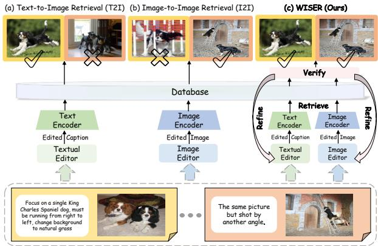
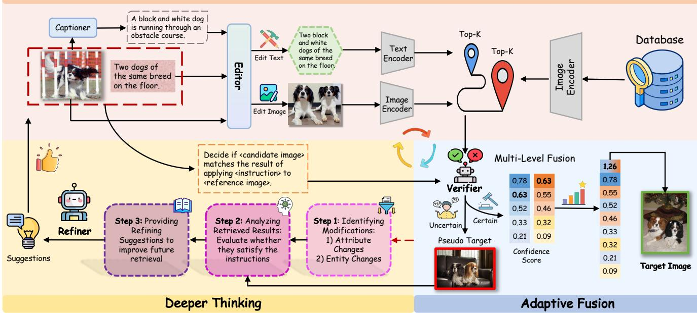
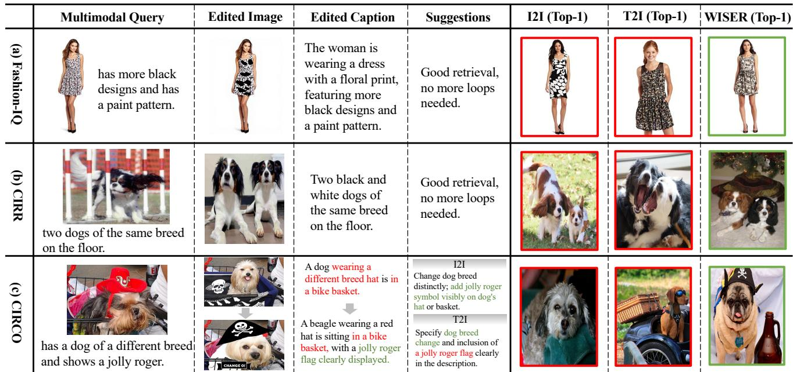
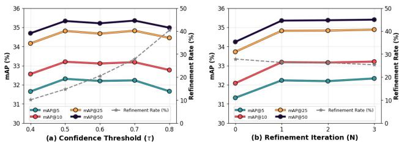
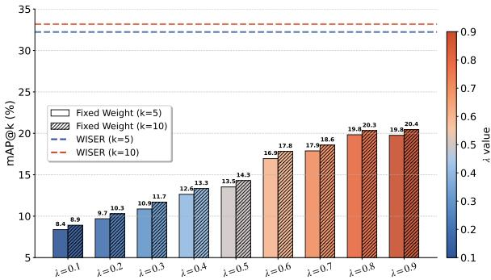
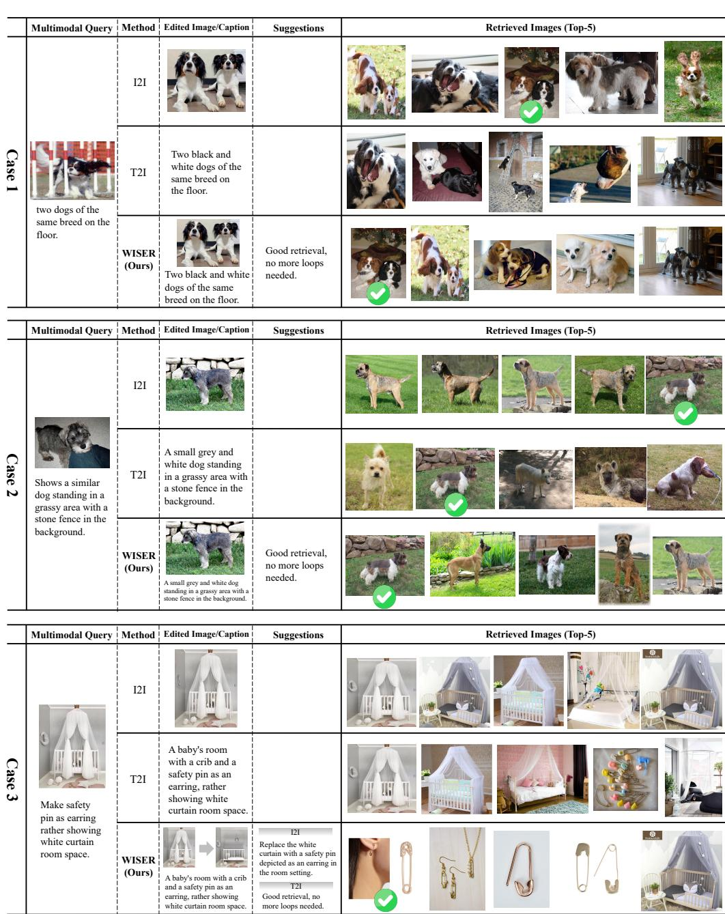
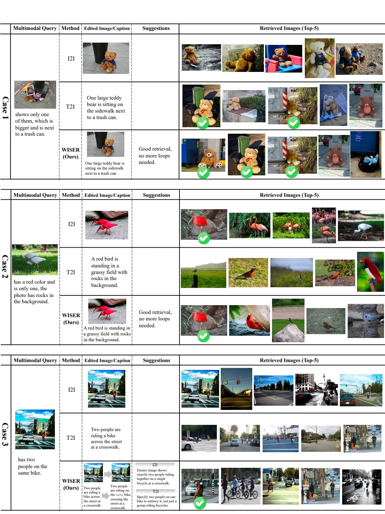
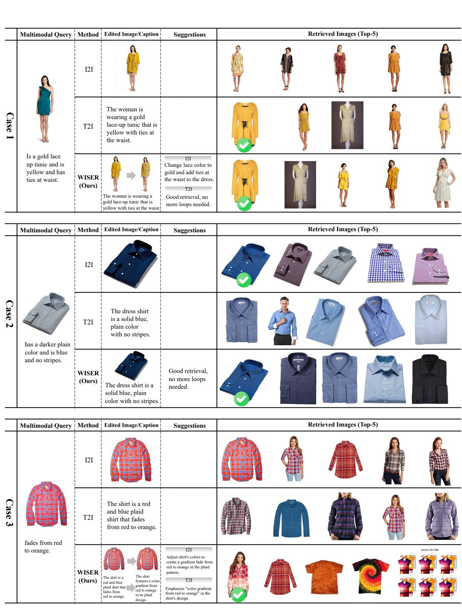
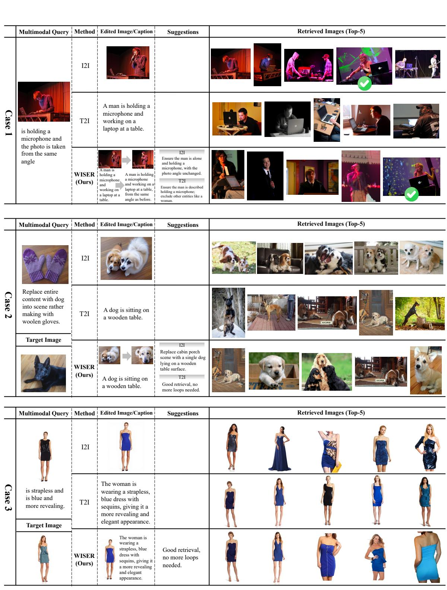

# WISER: 更广泛的搜索、更深入的思考与自适应融合用于无训练零-shot组合图像检索

王天悦1,2，曲磊刚$\mathrm { Q u ^ { 3 } }$，杨天宇2，郝向赵2，许逸凡$\mathrm { { X u ^ { 4 } } }$，郭海云$\mathrm { G u o ^ { 2 } }$，王进桥1,2 1中国科学院大学SAIS 2中国科学院自动化研究所 3新加坡国立大学 4中国民族大学 wangtianyue25@mails.ucas.ac.cn，leigangqu@gmail.com，{yangtianyu2024，haoxiangzhao2023}@ia.ac.cn，24012460@muc.edu.cn，{haiyun.guo，jqwang}@nlpr.ia.ac.cn

# 摘要

零镜头组合图像检索（ZS-CIR）的目标是针对多模态查询（包含参考图像和修改文本）检索目标图像，而无需在标注三元组上进行训练。现有方法通常将多模态查询转换为单一模态——要么作为用于图像生成的编辑标题（T2I），要么作为用于图像到图像检索的编辑图像（I2I）。然而，每种范式都有其固有的局限性：T2I常常丢失细粒度的视觉细节，而I2I则在复杂语义修改方面表现不佳。为了有效利用它们在不同查询意图下的互补优势，我们提出WISER，这是一个无训练框架，通过“检索—验证—精炼”流程统一T2I和I2I，明确建模意图意识和不确定性意识。具体而言，WISER首先通过生成编辑标题和图像进行并行检索，执行广泛检索，以拓宽候选池。然后，它与验证器进行自适应融合，以评估检索信心，并对不确定的检索触发精炼，对可靠的检索进行动态融合。对于不确定的检索，WISER通过结构化自我反思生成精炼建议，引导下一轮检索朝向更深层的思考。大量实验表明，WISER在多个基准测试中显著超越了先前的方法，在CIRCO（mAP@5）上相对于现有无训练方法实现了$45\%$的提升，在CIRR（Recall@1）上实现了$57\%$的提升。值得注意的是，它甚至超过了许多依赖训练的方法，突显出其在多样化场景下的优越性和泛化能力。代码将在https://github.com/Physicsmile/WISER发布。

  
Figure 1. Comparison of existing ZS-CIR methods. (a) T2I may fail to preserve visual details from the reference image, while (b) I2I often struggles with complex modifications. In contrast, (c) WISER successfully adapts to diverse modification intents through a "retrieve—verify-refine" pipeline.

# 1. 引言

想象一下，你的目标是找到一件红色皮夹克，类似于你朋友穿的那件，但需要带有帽子而不是领口。你把夹克展示给检索系统，并说：“加上帽子”。这个场景传达了组合图像检索（CIR）的本质：从参考图像和修改文本组成的查询中检索与目标图像匹配的图像。CIR在时尚搜索和产品推荐等应用中起着至关重要的作用。大多数现有的CIR方法依赖于昂贵的标注三元组，这些标注既耗时又难以扩展到新领域。为减轻这种依赖性，零-shot组合图像检索（ZS-CIR）最近被引入，主要遵循两个范式，如下所示。

Figure 1. The first paradigm leverages the text editor (usually implemented with a textual inversion module [6, 21, 43] or an image captioner cascaded with a Large Language Model [15, 26, 53]) to transform the composed query into an edited caption, and then performs Text-to-Image retrieval (T2I). Although this paradigm shows promise for complex semantic modifications, it often fails to preserve finegrained visual details from the reference image. The second paradigm, in contrast, employs an image editor to produce an edited image by editing the reference image conditioned on the modification text, thus framing CIR as Image-toImage retrieval (I2I) [20, 31, 47]. It retains visual details better but performs poorly when the query intent is ambiguous or involves complex compositional edits. Given the diversity of real-world CIR queries, relying solely on either T2I or I2I is insufficient. This raises a crucial question: How can we leverage the complementary strengths of both paradigms to accommodate diverse modification intents? However, effectively unifying T2I and I2I for ZS-CIR is non-trivial, due to the following two key challenges: (1) Intent Awareness. Existing methods often adopt static (e.g., fixed-weight) fusion strategies [31, 47], which lack adaptability to varying query intents. (2) Uncertainty Awareness. Current approaches overlook the uncertainty of candidates from each branch, leading to unreliable fusion.

为应对这些挑战，我们提出了WISER，这是一个无训练框架，旨在实现更广泛的搜索、自适应融合和更深入的思考，以应对零样本图像创建（ZS-CIR）。WISER在不同领域中具备良好的泛化能力，无需额外训练，其模块化设计与现成模型兼容。具体而言，WISER通过“检索—验证—精炼”流程统一了从文本到图像（T2I）和图像到图像（I2I）范式，明确建模意图和不确定性意识，以处理多样化的修改意图。首先，我们通过并行激活T2I和I2I路径执行更广泛的搜索。它使用编辑器生成编辑后的标题和编辑后的图像，从两个互补视角扩展候选池。接下来，我们通过使用验证器对每个分支中的候选进行置信度评分，进行自适应融合，以确定每个路径的可靠性。对于不确定的检索，它触发精炼过程；否则，它应用多级融合策略，以在分支级别处理不确定性意识，并在候选级别处理意图意识。最后，我们通过精炼器启用更深入的思考，精炼不确定的检索，通过结构化自我反思生成改进建议，以指导下一轮检索。该流程不断迭代，直到达到最大次数。总之，我们的主要贡献如下：（1）我们首次提出了一种无训练的ZS-CIR框架，能够自适应地利用T2I和I2I范式的互补优势。（2）WISER通过迭代的“检索—验证—精炼”循环将T2I和I2I统一起来，能够实现意图和不确定性意识。（3）WISER在多个基准测试中展现出显著的优越性和泛化能力，甚至超越了许多基于训练的方法。

# 2. 相关工作

# 2.1. 零-shot 复合图像检索

组合图像检索（CIR）根据参考图像和修改文本作为查询来检索目标图像。监督学习方法[5, 17, 22, 36, 46, 49]依赖于昂贵的注释三元组，而零样本CIR（ZS-CIR）利用预训练视觉-语言模型的内在泛化能力，无需依赖任何手动三元组注释[6, 16, 43]。现有的ZS-CIR方法主要遵循两种范式。文本到图像检索（T2I）方法[6, 21, 26, 43, 44, 53]，如Pic2Word[43]和SEARLE[6]，需要依赖训练的文本反演模块，并且在视觉表达能力上有限。无训练方法如CIReVL[26]和CoTMR[44]利用大型语言模型（LLMs）或多模态大型语言模型（MLLMs）通过多模态推理推断目标标题，在语义变化方面表现出色，但可能会丢失视觉细节。图像到图像检索（I2I）方法，以CompoDiff[20]为例，在CLIP[41]特征空间中采用基于扩散的框架以保留视觉细节，尽管它们在处理复杂编辑时可能遇到困难。最近的方法，如CIG[47]和IP-CIR[31]，通过扩散模型[40, 42, 57]对图像进行编辑，以增强T2I基准，但仍然依赖于额外的训练或手动调整融合超参数。相比之下，我们的工作在一个无训练框架中统一了这两种范式，动态平衡T2I和I2I，克服了静态融合策略的局限性。

# 2.2. 用于CIR的视觉语言模型

视觉-语言模型（VLMs）从大规模图像-文本对中学习对齐表示，将视觉和文本输入映射到共享嵌入空间。CLIP模型展现了在多种应用中的显著零-shot 能力。在CIR之外，VLMs在零-shot 图像分类、视觉问答（VQA）、语义分割、推荐系统和社交网络分析等任务中也表现出了强劲的性能。大多数ZS-CIR方法依赖于CLIP变体，这些变体要么将多模态查询转换为文本嵌入空间（T2I），要么转换为图像嵌入空间（I2I）。然而，它们未能根据特定的修改意图自适应地利用两者的优势。我们的框架通过一种新颖的“检索-验证-优化”流程适应性地整合了T2I和I2I路径，从而克服了这一局限。

# 3. 方法

在本节中，我们介绍了WISER，这是一个无训练的零样本图像重建框架。如图2所示，WISER采用“检索—验证—精炼”的管道，通过三个核心组件统一了T2I和I2I路径：Wider Search支持双路径检索（第3.1节），Adaptive Fusion根据置信评分动态评估和融合候选项（第3.2节），Deeper Thinking精炼不确定的检索结果（第3.3节）。形式上，给定一个由参考图像$I_{\mathrm{ref}}$和修改文本$T_{\mathrm{mod}}$组成的查询，CIR的目标是从数据库$\mathcal{D}$中检索目标图像以匹配该查询。在我们的工作中，我们首先使用编辑器$\mathcal{F}$生成编辑后的图像$I_{\mathrm{edit}}$和编辑后的标题$C_{\mathrm{edit}}$。然后，分别使用视觉编码器$E_{\mathrm{img}}$和文本编码器$E_{\mathrm{text}}$将其编码为查询向量$q_{v}$和$q_{t}$ [41]。最终的检索是通过计算这些查询向量与$\mathcal{D}$中候选项之间的余弦相似度来进行的。

# 3.1. 扩展搜索：双路径检索

为了满足 ZS-CIR 中多样化的检索需求，我们设计了 Wider Search，一种同时激活文本到图像检索（T2I）和图像到图像检索（I2I）的策略，以扩展候选池。文本到图像检索（T2I）。我们首先使用预训练的标题生成器将参考图像 $I _ { \mathrm { r e f } }$ 编码为描述性标题 $C _ { \mathrm { r e f } }$。随后，编辑器通过其理解能力将 $C _ { \mathrm { r e f } }$ 与修改文本 $T _ { \mathrm { m o d } }$ 结合，生成明确描述目标图像的编辑标题 $C _ { \mathrm { e d i t } }$ 。正式表达为：

$$
C _ { \mathrm { e d i t } } = \mathcal { F } _ { \mathrm { t x t } } \big ( C _ { \mathrm { r e f } } , T _ { \mathrm { m o d } } \big ) ,
$$

其中 $\mathcal { F } _ { \mathrm { t x t } }$ 表示编辑器的文本编辑功能。此过程旨在捕捉文本中指定的复杂语义修改。图像到图像检索（I2I）。与此同时，编辑器利用其图像编辑能力直接从 $I _ { \mathrm { r e f } }$ 和 $T _ { \mathrm { m o d } }$ 生成编辑后的图像 $I _ { \mathrm { e d i t } }$：

$$
I _ { \mathrm { e d i t } } = \mathcal { F } _ { \mathrm { i m g } } ( I _ { \mathrm { r e f } } , T _ { \mathrm { m o d } } ) ,
$$

其中 ${ \mathcal { F } } _ { \mathrm { i m g } }$ 表示图像编辑函数。$I _ { \mathrm { e d i t } }$ 保留了参考图像的详细视觉属性（例如，纹理、风格），同时应用所需的修改。双路径检索。给定编辑后的标题 $C _ { \mathrm { e d i t } }$ 和编辑后的图像 $I _ { \mathrm { e d i t } }$，我们通过两条路径进行基于 CLIP 的检索。对于每条路径 $p \in \{ \mathrm { T } 2 \mathrm { I } , \mathrm { I } 2 \mathrm { I } \}$，我们检索前 $K$ 个候选图像：

$$
\mathcal { R } _ { p } = \{ I _ { p } ^ { 1 } , I _ { p } ^ { 2 } , \ldots , I _ { p } ^ { K } \} .
$$

然后，我们将两个候选集进行并集，形成一个扩展的候选池：

$$
\mathcal { R } _ { \mathrm { u n i o n } } = \mathcal { R } _ { \mathrm { T 2 I } } \cup \mathcal { R } _ { \mathrm { I 2 I } } .
$$

此操作确保从 T2I 和 I2I 检索中考虑所有潜在相关候选者，从而提高检索召回率。

# 3.2. 自适应融合：基于验证的双路径集成

尽管Wider Search通过独立产生语义和视觉上对齐的候选项来扩大检索空间，但简单地将双路径合并无法在多样的查询意图下动态平衡其互补优势。为了解决这个问题，我们引入了自适应融合，一个以验证为导向的模块，明确建模不确定性和意图以实现有效融合。它首先验证候选项，以评估每条路径的可靠性。如果检索被认为不确定，它会触发更深入的思考（第3.3节）进行细化；否则，它通过多层融合策略动态整合来自两个路径的候选项。基于验证的评分。对于每个候选项 $I _ { p } ^ { k } \in { } { \mathcal { R } } _ { \mathrm { u n i o n } }$，我们构造一个三元组 $( I _ { \mathrm { r e f } } , T _ { \mathrm { m o d } } , I _ { p } ^ { k } )$ 并使用基于VLM的验证器 $\Phi$ 进行评估，以判断修改意图是否在候选图像中得到忠实反映。验证器被要求回答一个二元问题：“请判断候选图像是否与将指令应用于参考图像的结果匹配。”令 $y_s$ 和 $n$ 表示与答案“是”和“否”对应的logits。

$$
\{ \ell _ { p , k } ^ { \mathrm { ( y e s ) } } , \ell _ { p , k } ^ { \mathrm { ( n o ) } } \} = \Phi ( I _ { \mathrm { r e f } } , T _ { \mathrm { m o d } } , I _ { p } ^ { k } ) .
$$

置信度分数 $c _ { p } ^ { k }$ 用于判断 $I _ { p } ^ { k }$ 是正确修改的计算公式为：

$$
c _ { p } ^ { k } = \frac { \exp ( \ell _ { p , k } ^ { \mathrm { ( y e s ) } } ) } { \exp ( \ell _ { p , k } ^ { \mathrm { ( y e s ) } } ) + \exp ( \ell _ { p , k } ^ { \mathrm { ( n o ) } } ) } .
$$

更高的置信度分数表示候选与查询意图之间的更强对齐。多级融合策略。我们的融合策略在两个层面上进行，以解决不确定性和意图感知问题。分支级不确定性感知。我们首先通过识别每个路径中最有前景的候选作为伪目标 $I _ { p } ^ { * }$ 来评估每个路径的可靠性：

$$
I _ { p } ^ { * } = \arg \operatorname* { m a x } _ { k } c _ { p } ^ { k } , \quad r _ { p } = \operatorname* { m a x } _ { k } c _ { p } ^ { k } ,
$$

其中 $r _ { p }$ 表示路径 $p$ 的可靠性评分。如果 $\operatorname* { m i n } ( r _ { \mathrm { T 2 I } } , r _ { \mathrm { I 2 I } } ) < \tau$（即任一路径表现出不确定性），相应的伪目标将被转发到更深层思考（第 3.3 节）进行优化，而不是继续进行融合。候选级意图感知。对于可靠的检索，我们通过意图感知动态整合候选项。

# 更广泛的搜索融合。我们首先计算一个融合置信度得分，该得分汇聚了来自两个路径的证据：

  
for dual-path retrieval, aggregating the top- $K$ results into a unified candidate pool. (2) Adaptive Fusion. We employ a verifier to assess suggestions back to the editor, iterating until a predefined limit is reached.

$$
{ \mathrm { c } } _ { \mathrm { f u s e d } } ^ { k } = { c } _ { \mathrm { T 2 I } } ^ { k } + { c } _ { \mathrm { I 2 I } } ^ { k } .
$$

T2I 通常对语义丰富的编辑产生更高的置信度，而 I2I 在视觉细节关键时则表现更佳。当这两个方面都重要时，在语义和视觉上都强的候选者会获得更高的融合得分和更优的排名。然后，我们按照以下定义的字典序对 ${ \mathcal { R } } _ { \mathrm { u n i o n } }$ 进行排序：

$$
\Psi ( I ^ { k } ) = \left( - c _ { \mathrm { f u s e d } } ^ { k } , \ - \operatorname* { m a x } \left( c _ { \mathrm { T 2 I } } ^ { k } , c _ { \mathrm { I 2 I } } ^ { k } \right) , \ - c _ { \mathrm { T 2 I } } ^ { k } \right) .
$$

主要排序关键是融合得分，它捕捉了整体意图对齐。为了打破平局，采用了最大单路径置信度和T2I置信度，以提供细致的、意图感知的消歧义。与依赖于固定权重或额外训练模块的传统融合策略不同，我们动态地整合了两个检索路径，同时考虑意图和不确定性。

# 3.3. 更深入的思考：不确定检索的结构化自我反思

对于来自自适应融合的不可确定检索 $( r _ { \mathrm { p } } ~ < ~ \tau )$ ，我们引入深度思考（Deeper Thinking），这是一个精细化模块，通过分析修改失败和生成针对性建议来提高相应编辑标题和编辑图像的质量。精细化过程由基于大型语言模型（LLM）的精细化器驱动，进行三步分析：步骤1：识别修改。给定参考图像的标题 $C _ { \mathrm { r e f } }$ 和修改文本 $T _ { \mathrm { m o d } }$ ，精细化器深入分析预期的变化并生成结构化的修改短语。具体来说，它识别出两种类型的修改：（1）属性变化：如果修改涉及更改 $I _ { \mathrm { r e f } }$ 中实体的特征，精细化器将明确该变化；（2）实体添加/删除：如果修改添加或删除了一个实体，精细化器将指定该操作。步骤2：分析检索结果。我们首先获得伪目标的标题 $I _ { \mathfrak { p } } ^ { * }$ 。然后与步骤1中的修改短语进行比较，以确定检索的图像是否满足用户的指示。这种比较揭示了修改的哪些方面被遗漏或错误应用。步骤3：提供精细化建议。对于任何未满足的修改，精细化器提出简洁、针对性的建议，以改善未来的检索：对于文本到图像（T2I），它生成文本建议以增强编辑标题。对于图像到图像（I2I），它提供视觉指导以改善编辑图像的生成。否则，精细化循环被终止，并将当前检索的图像保留为最终输出。然后，将建议与修改文本连接起来，并反馈给编辑器 $\mathcal { F }$ ，以重新生成精细化的 $C _ { \mathrm { e d i t } }$ 或 $I _ { \mathrm { e d i t } }$ ，继续“检索-验证-精细化”循环。该过程迭代进行，直到达到最大迭代次数 $N$ 。深度思考模拟类似人类的反思能力，使得WISER能够自我反思并适应复杂或模糊的查询，而无需任何训练。

# 4. 实验

我们进行了广泛的实验以调查我们所提出方法的有效性。

# 4.1. 实验设置

数据集。我们在三个零样本条件下的图像检索基准上评估我们提出的WISER：Fashion-IQ、CIRR和CIRCO。Fashion-IQ侧重于时尚检索，包含三个子类（裙子、衬衫、上衣），我们使用Recall $@ 10$ 和Recall $@ 50$ 作为评估指标，并计算这三个类别的均值。CIRR是第一个专为条件图像检索设计的自然图像数据集，基于开放领域的真实图像构建。我们报告Recall $@ \mathbf{k}$ $(k \in \{ 1, 5, 10, 50 \})$ 和 ${\mathrm{Recall}}_{\mathrm{Subset}} @{ \mathrm{k}}$ $(k \in \{ 1, 2, 3 \})$，遵循基准协议。CIRCO基于COCO 2017未标记数据集构建，是第一个为每个查询提供多个真实标注的数据集。它包含数据库中的123,403张图像和800个测试查询。遵循以往的工作，我们报告$\mathrm{mAP @ k}$ $(k \in \{ 5, 10, 25, 50 \})$ 作为评估指标。实现细节。我们采用BAGEL作为编辑器，Qwen2.5-VL-7b作为验证器，以及GPT-4o作为精炼器。继承之前的方法，我们使用预训练的BLIP-2作为我们的图像说明生成器。对于检索模型，我们尝试了不同的CLIP变体，包括来自OpenCLIP的ViT-B/32、ViT-L/14和ViT-G/14。检索候选池大小$K$设为50，可靠性阈值$\tau$设为0.7。对于不确定的情况，精炼迭代默认设置为一轮。所有实验均在单个NVIDIA H20 GPU上使用PyTorch实现，并在官方验证或测试集上报告结果。基线。我们将WISER与多种代表性的零样本条件下的图像检索基线进行了比较。具体而言，PALAVRA、SEARLE、LinCIR、MOA和HIT是最初为零样本条件下的图像检索任务设计或调整的文本反演方法。我们还包括最近的无训练方法，如CIReVL、LDRE、OSrCIR、AutoCIR和CoTMR，这些方法利用了大规模语言模型或多模态大模型而无需额外训练。我们还在不训练的设置下与报告的IP-CIR进行比较，该方法通过固定权重融合了文本到图像和图像到图像的路径。

# 4.2. ZS-CIR 基准比较

我们在三个基准数据集上对WISER和最先进的零样本邻接图像重建(ZS-CIR)方法进行了全面比较：CIRCO、CIRR和Fashion-IQ。结果汇总在表1和表2中。

CIRCO。如表1左侧所示，WISER在CIRCO数据集上的表现卓越，该数据集每个查询都有多个真实标注数据，并且注释干净。基于这些结果，我们有以下几个关键观察： (1) WISER在所有CLIP主干网络上显著优于无训练和基于训练的方法。例如，在ViTB/32下，相较于CoTMR，WISER在$\mathrm { m A P } @ 5$上实现了$4 4 . 9 8 \%$的相对提升，并且在ViT-L/14下，超过LinCIR的$\mathrm { m A P } @ 5$达到了$2 2 . 5 1 \%$，这证明了我们框架的有效性。 (2) 此外，WISER在所有$k$上始终取得更优的mAP，这得益于同时整合了来自T2I和I2I路径的候选项，从而扩展了搜索空间，增加了在CIRCO的多目标特性下检索相关目标的可能性。

CIRR。表1的右侧展示了在具有高噪声和参考图像与目标图像之间弱相关性的挑战性CIRR数据集上的结果。结果导致以下关键观察：（1）尽管该数据集固有挑战较大，但WISER展现了卓越的性能。在ViT-B/32下，我们的方法在Recall $@ 1$上相对于最佳基线实现了$56.98\%$的相对提升。这突显了WISER在处理多样且模糊的修改意图方面的强大能力。（2）在子集召回评估中，要求从六个精心挑选的样本中检索正确图像，WISER在ViT-B/32下达到了$77.30\%$的$\mathrm{Recall}_{\mathrm{sub}}@ 1$，超越第二名方法$10.69\%$。这一提升在较小的$k$下更为显著，确认了其在将最相关图像排名靠前方面的有效性，这在实际应用中至关重要。（3）尽管一些基线在更大的主干网络下表现出性能饱和，WISER却展现了持续的提升，ViT-G/14在Recall $@ 1$上达到了$49.54\%$的顶级水平，远超其他方法。这种可扩展性进一步验证了我们框架设计的普适性和稳健性。 Fashion-IQ。表2报告了在Fashion-IQ验证集上的结果，该验证集专注于时尚领域的细粒度属性修改。Fashion-IQ在参考图像和目标图像之间存在强相关性，要求模型理解语义属性，同时保持原始风格结构。基于结果，我们获得以下观察：（1）WISER通过利用来自T2I和I2I路径的互补信息，确保了语义准确性与视觉一致性之间的更好平衡，超越了使用ViT-B/32和ViT-L/14的无训练和有训练基线。（2）在ViT-G/14的主干下，WISER的性能与一些训练方法如LinCIR相当甚至更优，尽管缺乏其训练优势，这在专业领域中至关重要。这进一步确认了我们工作的强泛化能力和有效性。

<table><tr><td rowspan="3">Backbone Method</td><td rowspan="3"></td><td rowspan="3">Training -free</td><td colspan="4">CIRCO</td><td colspan="7">CIRR</td></tr><tr><td colspan="4">mAP@k</td><td rowspan="2">Recall@k</td><td colspan="4"></td><td colspan="3">Recallsub@k</td></tr><tr><td colspan="4">k = 5 k = 10 k = 25 k = 50</td><td colspan="3">k= 1 k = 5 k = 10</td><td colspan="3">k = 50 k = 1 k = 2 k = 3</td></tr><tr><td rowspan="8">ViT-B/32</td><td>PALAVRA (ECCV&#x27;22)</td><td>X</td><td>4.61</td><td>5.32</td><td>6.33</td><td>6.80</td><td>16.62</td><td>43.49</td><td>58.51</td><td>83.95</td><td>41.61</td><td>65.30</td><td>80.94</td></tr><tr><td>SEARLE (ICCV&#x27;23)</td><td>X</td><td>9.35</td><td>9.94</td><td>11.13</td><td>11.84</td><td>24.00</td><td>53.42</td><td>66.82</td><td>89.78</td><td>54.89</td><td>76.60</td><td>88.19</td></tr><tr><td>CIReVL (ICLR&#x27;24)</td><td>✓</td><td>14.94</td><td>15.42</td><td>17.00</td><td>17.82</td><td>23.94</td><td>52.51</td><td>66.00</td><td>86.95</td><td>60.17</td><td>80.05</td><td>90.19</td></tr><tr><td>LDRE (SIGIR&#x27;24)</td><td>✓</td><td>17.96</td><td>18.32</td><td>20.21</td><td>21.11</td><td>25.69</td><td>55.13</td><td>69.04</td><td>89.90</td><td>60.53</td><td>80.65</td><td>90.70</td></tr><tr><td>OSrCIR (CVPR&#x27;25)</td><td>✓</td><td>18.04</td><td>19.17</td><td>20.94</td><td>21.85</td><td>25.42</td><td>54.54</td><td>68.19</td><td>-</td><td>62.31</td><td>80.86</td><td>91.13</td></tr><tr><td>AutoCIR (KDD&#x27;25)</td><td>✓</td><td>18.82</td><td>19.41</td><td>21.38</td><td>22.32</td><td>30.53</td><td>59.42</td><td>72.19</td><td>91.47</td><td>65.11</td><td>84.02</td><td>92.70</td></tr><tr><td>CoTMR (ICCV&#x27;25)</td><td>✓</td><td>22.23</td><td>22.78</td><td>24.68</td><td>25.74</td><td>31.50</td><td>60.80</td><td>73.04</td><td>91.06</td><td>66.61</td><td>84.50</td><td>92.55</td></tr><tr><td>WISER (Ours)</td><td>✓</td><td>32.23</td><td>33.18</td><td>34.82</td><td>35.35</td><td>49.45</td><td>76.55</td><td>85.21</td><td>93.81</td><td>77.30</td><td>88.63</td><td>92.27</td></tr><tr><td rowspan="10">ViT-L/14</td><td>SEARLE (ICCV&#x27;23)</td><td>X</td><td>11.68</td><td>12.73</td><td>14.33</td><td>15.12</td><td>24.24</td><td>52.48</td><td>66.29</td><td>88.84</td><td>53.76</td><td>75.01</td><td>88.19</td></tr><tr><td>LinCIR (CVPR&#x27;24)</td><td>X</td><td>12.59</td><td>13.58</td><td>15.00</td><td>15.85</td><td>25.04</td><td>53.25</td><td>66.68</td><td>-</td><td>57.11</td><td>77.37</td><td>88.89</td></tr><tr><td>MOA (SIGIR&#x27;25)</td><td>X</td><td>15.30</td><td>17.10</td><td>18.50</td><td>19.30</td><td>27.10</td><td>56.50</td><td>69.20</td><td>90.00</td><td>-</td><td>-</td><td>-</td></tr><tr><td>HIT (ICCV&#x27;25)</td><td>X</td><td>15.50</td><td>16.70</td><td>18.90</td><td>19.90</td><td>27.90</td><td>57.60</td><td>70.50</td><td>90.40</td><td>-</td><td>-</td><td>-</td></tr><tr><td>CIReVL (ICLR&#x27;24)</td><td>✓</td><td>18.57</td><td>19.01</td><td>20.89</td><td>21.80</td><td>24.55</td><td>52.31</td><td>64.92</td><td>86.34</td><td>59.54</td><td>79.88</td><td>89.69</td></tr><tr><td>LDRE (SIGIR&#x27;24)</td><td>✓</td><td>23.35</td><td>24.03</td><td>26.44</td><td>27.50</td><td>26.53</td><td>55.57</td><td>67.54</td><td>88.50</td><td>60.43</td><td>80.31</td><td>89.90</td></tr><tr><td>IP-CIR (CVPR&#x27;25)</td><td>✓</td><td>26.43</td><td>27.41</td><td>29.87</td><td>31.07</td><td>29.76</td><td>58.82</td><td>71.21</td><td>90.41</td><td>62.48</td><td>81.64</td><td>90.89</td></tr><tr><td>OSrCIR (CVPR&#x27;25)</td><td>✓</td><td>23.87</td><td>25.33</td><td>27.84</td><td>28.97</td><td>29.45</td><td>57.68</td><td>69.86</td><td>-</td><td>62.12</td><td>81.92</td><td>91.10</td></tr><tr><td>AutoCIR (KDD&#x27;25)</td><td>✓</td><td>24.05</td><td>25.14</td><td>27.35</td><td>28.36</td><td>31.81</td><td>61.95</td><td>73.86</td><td>92.07</td><td>67.21</td><td>84.89</td><td>93.13</td></tr><tr><td>CoTMR (ICCV&#x27;25) WISER (Ours)</td><td>✓</td><td>27.61</td><td>28.22</td><td>30.61</td><td>31.70</td><td>35.02</td><td>64.75</td><td>76.18</td><td>92.51</td><td>69.39</td><td>85.75</td><td>93.33</td></tr><tr><td></td><td>✓</td><td>35.10</td><td>36.30</td><td>38.46</td><td>39.15</td><td>49.23</td><td>76.72</td><td>85.11</td><td>94.17</td><td>77.81</td><td>88.89</td><td>92.77</td></tr><tr><td rowspan="7">ViT-G/14</td><td>LinCIR (CVPR&#x27;24)</td><td>X</td><td>19.71</td><td>21.01</td><td>23.13</td><td>24.18</td><td>35.25</td><td>64.72</td><td>76.05</td><td>-</td><td>63.35</td><td>82.22</td><td>91.98</td></tr><tr><td>CIReVL (ICLR&#x27;24)</td><td>✓</td><td>26.77</td><td>27.59</td><td>29.96</td><td>31.03</td><td>34.65</td><td>64.29</td><td>75.06</td><td>91.66</td><td>67.95</td><td>84.87</td><td>93.21</td></tr><tr><td>LDRE (SIGIR&#x27;24)</td><td>✓</td><td>31.12</td><td>32.24</td><td>34.95</td><td>36.03</td><td>36.15</td><td>66.39</td><td>77.25</td><td>93.95</td><td>68.82</td><td>85.66</td><td>93.76</td></tr><tr><td>IP-CIR (CVPR&#x27;25)</td><td>✓</td><td>32.75</td><td>34.26</td><td>36.86</td><td>38.03</td><td>39.25</td><td>70.07</td><td>80.00</td><td>94.89</td><td>69.95</td><td>86.87</td><td>94.22</td></tr><tr><td>OSrCIR (CVPR&#x27;25)</td><td>✓</td><td>30.47</td><td>31.14</td><td>35.03</td><td>36.59</td><td>37.26</td><td>67.25</td><td>77.33</td><td>-</td><td>69.22</td><td>85.28</td><td>93.55</td></tr><tr><td>CoTMR (ICCV&#x27;25)</td><td>✓</td><td>32.23</td><td>32.72</td><td>35.60</td><td>36.83</td><td>36.36</td><td>67.52</td><td>77.82</td><td>93.99</td><td>71.19</td><td>86.34</td><td>93.87</td></tr><tr><td>WISER (Ours)</td><td>√</td><td>36.53</td><td>38.14</td><td>40.46</td><td>41.26</td><td>49.54</td><td>77.40</td><td>85.76</td><td>94.17</td><td>78.10</td><td>89.06</td><td>92.68</td></tr></table>

# 4.3. 消融研究

在本节中，我们对Fashion-IQ和CIRCO进行了实验，使用ViT-B/32对WISER进行深入分析，包括其核心组件的有效性、与各种模块的兼容性、超参数敏感性和计算效率。

核心组件的有效性。表3展示了我们方法核心组件的消融实验结果。我们观察到以下关键发现：（1）单独依赖 T2I 或 I2I 的性能有限，I2I 的表现甚至弱于 T2I，主要是由于其在准确解释语义修改方面的困难。这些结果证实了在多样化 CIR 需求下单一检索范式的固有局限性。（2）简单地以固定权重在相似度层面合并双路径（“AVG”行）性能反而会下降，低于单路径检索。我们进一步比较了各种固定融合策略与 WISER（见补充材料中的图5）。结果显示，WISER 显著优于所有固定权重组合，突显了手动权重调优的局限性，并验证了我们自适应融合在利用互补优势方面的有效性。（3）在自适应融合基础上引入更深层思考可以带来进一步一致的改进。此外，将更深层思考应用于单路径基线也有帮助。这些结果表明，迭代分析能有效纠正检索错误。（4）值得注意的是，T2I（使用 BAGEL）与基于 T2I 的基线 CIReVL 的表现相当（例如，$2 8 . 5 9 \%$ 对比 $2 8 . 2 7 \% \mathrm { R } @ 1 0$ 在 Fashion-IQ 上），表明仅依靠编辑器并没有明显优势。我们的完整框架实现了显著提升，几乎使单路径性能翻倍，这验证了改进归因于我们的新颖设计，而不仅仅是依赖更强大的模型。与不同模块的兼容性。我们在表4中分析了不同编辑器、验证器和细化器模块的效果。（1）细化器：不同的 LLMs 达成了相当的性能，表明 WISER 对于具体 LLM 的选择是稳健的。（2）验证器：性能通常随着模型规模的增加而改善，尽管 32B 变体略有下降，可能是由于过度推理。次佳结果用下划线标出。我们的方法用灰色突出显示。

<table><tr><td rowspan="2">Backbone</td><td rowspan="2">Method</td><td rowspan="2">Training -free</td><td colspan="2">Shirt</td><td colspan="2">Dress</td><td colspan="2">Toptee</td><td colspan="2">Avg.</td></tr><tr><td>R@10</td><td>R@50</td><td>R@10</td><td>R@50</td><td>R@10</td><td>R@50</td><td>R@10</td><td>R@50</td></tr><tr><td rowspan="7">ViT-B/32</td><td>PALAVRA (ECCV&#x27;22)</td><td>X</td><td>21.49 24.44</td><td>37.05</td><td>17.25</td><td>35.94</td><td>20.55</td><td>38.76</td><td>19.76</td><td>37.25</td></tr><tr><td>SEARLE (ICCV&#x27;23)</td><td>X</td><td>28.36</td><td>41.61</td><td>18.54</td><td>39.51</td><td>25.70</td><td>46.46</td><td>22.89</td><td>42.53</td></tr><tr><td>CIReVL (ICLR&#x27;24)</td><td>✓</td><td></td><td>47.84</td><td>25.29</td><td>46.36</td><td>31.21</td><td>53.85</td><td>28.29</td><td>49.35</td></tr><tr><td>LDRE (SIGIR&#x27;24)</td><td>✓</td><td>27.38</td><td>46.27</td><td>19.97</td><td>41.84</td><td>27.07</td><td>48.78</td><td>24.81</td><td>45.63</td></tr><tr><td>OSrCIR (CVPR&#x27;25)</td><td>✓</td><td>31.16</td><td>51.13</td><td>29.35</td><td>50.37</td><td>36.51</td><td>58.71</td><td>32.34</td><td>53.40</td></tr><tr><td>AutoCIR (KDD&#x27;25)</td><td>✓</td><td>32.43</td><td>51.67</td><td>26.52</td><td>46.36</td><td>33.96</td><td>56.09</td><td>30.97</td><td>51.37</td></tr><tr><td>CoTMR (ICCV&#x27;25)</td><td>✓</td><td>33.42 41.51</td><td>53.93</td><td>31.09</td><td>54.54</td><td>38.40</td><td>61.14</td><td>34.30</td><td>56.54</td></tr><tr><td rowspan="10">ViT-L/14</td><td>WISER (Ours)</td><td>✓</td><td>26.89</td><td>56.92</td><td>37.48</td><td>56.97</td><td>46.97</td><td>62.32</td><td>41.99</td><td>58.74</td></tr><tr><td>SEARLE (ICCV&#x27;23)</td><td>X</td><td>29.10</td><td>45.58</td><td>20.48</td><td>43.13</td><td>29.32</td><td>49.97</td><td>25.56</td><td>46.23</td></tr><tr><td>LinCIR (CVPR&#x27;24)</td><td>X</td><td>31.90</td><td>46.81</td><td>20.92</td><td>42.44</td><td>28.81</td><td>50.18</td><td>26.28</td><td>46.49</td></tr><tr><td>MOA (SIGIR&#x27;25)</td><td>X</td><td>32.40</td><td>50.70</td><td>25.20</td><td>48.50</td><td>33.20</td><td>54.80</td><td>30.10</td><td>51.30</td></tr><tr><td>HIT (ICCV&#x27;25) CIReVL (ICLR&#x27;24)</td><td>X</td><td>29.49</td><td>51.20 47.40</td><td>25.60</td><td>47.10</td><td>32.80</td><td>54.70</td><td>30.30</td><td>51.00</td></tr><tr><td></td><td>✓</td><td>31.04</td><td>51.22</td><td>24.79</td><td>44.76</td><td>31.36</td><td>53.65</td><td>28.55</td><td>48.57</td></tr><tr><td>LDRE (SIGIR&#x27;24)</td><td>✓ ✓</td><td>33.17</td><td>52.03</td><td>22.93 29.70</td><td>46.76</td><td>31.57</td><td>53.64</td><td>28.51</td><td>50.54</td></tr><tr><td>OSrCIR (CVPR&#x27;25)</td><td>✓</td><td>34.00</td><td>53.43</td><td>24.94</td><td>51.81</td><td>36.92</td><td>59.27</td><td>33.26</td><td>54.37</td></tr><tr><td>AutoCIR (KDD&#x27;25) CoTMR (ICCV&#x27;25)</td><td>✓</td><td>35.43</td><td>54.91</td><td>31.18</td><td>45.81 55.04</td><td>33.10 38.55</td><td>55.58 61.33</td><td>30.68</td><td>51.60</td></tr><tr><td>WISER (Ours)</td><td>✓</td><td>43.13</td><td>57.85</td><td>38.42</td><td>55.92</td><td>45.39</td><td>61.50</td><td>35.05 42.17</td><td>57.09 58.51</td></tr><tr><td rowspan="7">ViT-G/14</td><td>LinCIR (CVPR&#x27;24)</td><td>X</td><td>46.76</td><td>65.11</td><td>38.08</td><td>60.88</td><td>50.48</td><td>71.09</td><td>45.11</td><td>65.69</td></tr><tr><td>CIReVL (ICLR&#x27;24)</td><td>✓</td><td>33.71</td><td>51.42</td><td>27.07</td><td>49.53</td><td>35.80</td><td>56.14</td><td>32.19</td><td></td></tr><tr><td>LDRE (SIGIR&#x27;24)</td><td>✓</td><td>35.94</td><td>58.58</td><td>26.11</td><td>51.12</td><td>35.42</td><td>56.67</td><td>32.49</td><td>52.36</td></tr><tr><td>OSrCIR (CVPR&#x27;25)</td><td>✓</td><td>38.65</td><td>54.71</td><td>33.02</td><td>54.78</td><td>41.04</td><td>61.83</td><td>37.57</td><td>55.46</td></tr><tr><td>AutoCIR (KDD&#x27;25)</td><td>✓</td><td>36.36</td><td>55.84</td><td>26.18</td><td>47.69</td><td>37.28</td><td>60.38</td><td>33.27</td><td>57.11 54.63</td></tr><tr><td>CoTMR (ICCV&#x27;25)</td><td>✓</td><td>38.32</td><td>62.24</td><td>34.51</td><td>57.36</td><td>41.90</td><td>64.30</td><td>38.25</td><td>61.32</td></tr><tr><td>WISER (Ours)</td><td>✓</td><td>45.98</td><td>61.58</td><td>38.57</td><td>58.35</td><td>49.21</td><td>66.96</td><td>44.59</td><td>62.30</td></tr></table>

Table 3. Ablation study on the core components of WISER. "AVG" denotes average and "ADA" denotes Adaptive Fusion.   

<table><tr><td colspan="2">Wider Search</td><td rowspan="2">Deeper Thinking</td><td rowspan="2">Fusion</td><td colspan="2">Fashion-IQ-Avg</td><td colspan="4">CIRCO</td></tr><tr><td>T2I I2I</td><td></td><td>R@10</td><td></td><td>R@50 mAP@5</td><td>mAP@10</td><td>mAP@25</td><td>mAP@50</td></tr><tr><td>-</td><td>✓</td><td>-</td><td>-</td><td>22.65</td><td>38.84</td><td>7.00</td><td>7.46</td><td>8.40</td><td>8.95</td></tr><tr><td>-</td><td>√</td><td>✓</td><td>-</td><td>23.58</td><td>40.10</td><td>7.57</td><td>8.05</td><td>9.04</td><td>9.62</td></tr><tr><td>✓</td><td>-</td><td>-</td><td>-</td><td>28.59</td><td>49.18</td><td>17.28</td><td>17.94</td><td>19.64</td><td>20.51</td></tr><tr><td>✓</td><td>-</td><td>✓</td><td>-</td><td>29.22</td><td>49.94</td><td>17.64</td><td>18.30</td><td>20.01</td><td>20.94</td></tr><tr><td>✓</td><td>✓</td><td>-</td><td>AVG</td><td>33.40</td><td>52.92</td><td>13.53</td><td>14.30</td><td>15.96</td><td>16.77</td></tr><tr><td>✓</td><td>✓</td><td>-</td><td>ADA</td><td>40.83</td><td>57.86</td><td>31.32</td><td>32.08</td><td>33.72</td><td>34.24</td></tr><tr><td></td><td>✓</td><td>✓</td><td>ADA</td><td>41.99</td><td>58.74</td><td>32.23</td><td>33.18</td><td>34.82</td><td>35.35</td></tr></table>

尽管如此，所有验证器配置均实现了高性能，超越了最佳基线。(3) 编辑器：尽管编辑模型的性能存在差异，但我们的框架保持了令人满意的结果。这些发现表明WISER具有即插即用的特性，能够有效地与各种现成模型协同工作。阈值和迭代次数的参数敏感性。我们分析了置信度阈值$\tau$在深入思考中的影响（图4，左）。随着$\tau$从0.4增加到0.8，mAP先升高然后略有下降，表明过低的阈值错失了提升机会，而过高的阈值则触发了不必要的细化。当$\tau$在0.5到0.7之间时，性能始终保持强劲，允许在效率和效果之间灵活权衡。我们进一步检查细化迭代次数$N$（图4，右）。所有指标在第一次迭代中都表现出快速提升，而后续轮次的提升幅度仅为边际收益。这表明一次迭代通常能够实现稳定性能，而额外的迭代在更高的计算成本下收益递减。

Table 4. Ablation study on the choice of editor, verifier, and refiner models on the CIRCO dataset, evaluated with mAP $@ \mathbf { k }$ .   

<table><tr><td>Editor</td><td>Verifier</td><td>Refiner</td><td>k=5</td><td>k=10</td><td>k=25</td><td>k=50</td></tr><tr><td rowspan="4">Bagel [18]</td><td rowspan="4">Qwen2.5-VL-7B [3]</td><td>Qwen-Turbo [2]</td><td>32.80</td><td>33.56</td><td>35.21</td><td>35.79</td></tr><tr><td>GPT-3.5-Turbo [7]</td><td>32.57</td><td>33.49</td><td>35.13</td><td>35.63</td></tr><tr><td>GPT-4o-Mini [7]</td><td>32.21</td><td>33.06</td><td>34.74</td><td>35.28</td></tr><tr><td>GPT-4o [1]</td><td>32.23</td><td>33.18</td><td>34.82</td><td>35.35</td></tr><tr><td rowspan="4">Bagel [18]</td><td>Qwen2-VL-7B [48] Qwen2.5-VL-3B [3]</td><td rowspan="4">GPT-4o [1]</td><td>25.50</td><td>26.26</td><td>28.41</td><td>29.12</td></tr><tr><td></td><td>27.50</td><td>28.45</td><td>30.16</td><td>30.79</td></tr><tr><td>Qwen2.5-VL-7B [3]</td><td>32.23</td><td>33.18</td><td>34.82</td><td>35.35</td></tr><tr><td>Qwen2.5-VL-32B [3]</td><td>31.69</td><td>32.26</td><td>34.22</td><td>34.70</td></tr><tr><td rowspan="4">GPT4o + OmniGen2 [51] GPT4o + Step1X-Edit [35] GPT4o + Bagel-Edit [18]</td><td rowspan="4">Qwen2.5-VL-7B [3]</td><td rowspan="4">GPT-4o [1]</td><td>31.18</td><td>32.16</td><td>33.82</td><td>34.34</td></tr><tr><td>31.91</td><td>33.02</td><td>34.92</td><td>35.46</td></tr><tr><td>32.21</td><td>33.25</td><td>34.99</td><td>35.51</td></tr><tr><td>32.23</td><td>33.18</td><td>34.82</td><td>35.35</td></tr></table>

效率分析。WISER 的计算开销通过显著的性能提升得到了合理的 justification，因为每提升 $1 \%$ 仅需 0.5 个 GPU 小时。此外，其即插即用架构使得在效率和有效性之间可以灵活权衡，因为任何组件都可以替换为更快的变体。作为成本最高的组件，Deeper Thinking 仅在低置信度的情况下被触发，这些情况由阈值 $\tau$ 决定。在合理的 $\tau$ 值下，精细化率保持在 30% 以下（见图 4），允许大多数查询直接检索。值得注意的是，WISER 在单轮检索中已经超越了先前的工作。因此，用户可以根据实际需求灵活调整 $\tau$ 和 $N$。

  
the gray arrow points to refined results.

  
Figure 4. Sensitivity analysis on confidence threshold $\tau$ and refinement iteration N on CIRCO.

# 4.4. 定性结果

图3展示了WISER在三个数据集上的定性示例。每个案例包含组合查询、编辑后的图像、编辑后的标题、改进建议以及来自T2I-only、I2I-only和WISER的top-1结果。在图3(a)中，查询要求保留参考样式的同时添加图案变化。T2I捕捉了语义变化，但丢失了全局样式线索；而I2I保持了外观，但误解了目标图案。WISER通过优先考虑具有更高整体一致性的候选图像，成功将目标图像重新排序为top-1。图3(b)涉及细粒度品种识别和背景替换。T2I对品种细节的抽象过度，而I2I在精确检索上表现乏力。通过共同验证品种线索和背景变化，WISER动态平衡视觉保真度和语义精确度，以实现top-1检索。图3(c)展示了处理模糊修改的能力。最初的T2I和I2I均未能成功——T2I误解了关键意图，而I2I则错误放置了视觉元素。因此，WISER激活了更深层次的思考，以改进这两条路径：提升T2I的语义恢复和纠正I2I的视觉定位。在后续检索中，改进后的编辑图像和标题实现了正确的top-1识别，展示了WISER通过自我反思所展现的鲁棒性。更多详情和失败案例详见补充材料第7节。

# 5. 结论

在本研究中，我们引入了WISER，一个新颖的无训练框架用于零样本内容检索（ZS-CIR）。为了应对现实世界用户意图的多样性，WISER利用文本到图像检索（T2I）和图像到图像检索（I2I）范式的互补优势，提出了“检索-验证-优化”的流程。多项基准测试的广泛实验表明，WISER达到了新的最先进性能，显著超越了以往的无训练方法，甚至超过了许多训练方法。这一显著提升证明了WISER在各种修改意图上的强大优势和泛化能力。我们相信WISER代表了向更智能、更适应的内容检索系统迈出的重要一步。未来的工作将探索将“检索-验证-优化”流程扩展到更广泛的检索任务，并进一步优化框架在实时应用中的效率。

# References

[1] Josh Achiam, Steven Adler, Sandhini Agarwal, Lama Ahmad, Ilge Akkaya, Florencia Leoni Aleman, Diogo Almeida, Janko Altenschmidt, Sam Altman, Shyamal Anadkat, et al. Gpt-4 technical report. arXiv preprint arXiv:2303.08774, 2023. 5, 7   
[2] Jinze Bai, Shuai Bai, Yunfei Chu, Zeyu Cui, Kai Dang, Xiaodong Deng, Yang Fan, Wenbin Ge, Yu Han, Fei Huang, et al. Qwen technical report. arXiv preprint arXiv:2309.16609, 2023. 7   
[3] Shuai Bai, Keqin Chen, Xuejing Liu, Jialin Wang, Wenbin Ge, Sibo Song, Kai Dang, Peng Wang, Shijie Wang, Jun Tang, et al. Qwen2. 5-vl technical report. arXiv preprint arXiv:2502.13923, 2025. 5, 7   
[4] Alberto Baldrati, Marco Bertini, Tiberio Uricchio, and Alberto Del Bimbo. Conditioned and composed image retrieval combining and partially fine-tuning clip-based features. In Proceedings of the IEEE/CVF Conference on Computer Vision and Pattern Recognition, pages 49594968, 2022. 1   
[5] Alberto Baldrati, Marco Bertini, Tiberio Uricchio, and Alberto Del Bimbo. Effective conditioned and composed image retrieval combining clip-based features. In Proceedings of the IEEE/CVF conference on computer vision and pattern recognition, pages 2146621474, 2022. 1, 2   
[6] Alberto Baldrati, Lorenzo Agnolucci, Marco Bertini, and Alberto Del Bimbo. Zero-shot composed image retrieval with textual inversion. In Proceedings of the IEEE/CVF International Conference on Computer Vision, pages 1533815347, 2023. 1, 2, 5   
[7] Tom Brown, Benjamin Mann, Nick Ryder, Melanie Subbiah, Jared D Kaplan, Prafulla Dhariwal, Arvind Neelakantan, Pranav Shyam, Girish Sastry, Amanda Askell, et al. Language models are few-shot learners. Advances in neural information processing systems, 33:18771901, 2020. 7   
[8] Jiati Cai, Xiagang Liu, Hongie Yang, Yi Ding, Ting Zhong, and Zhen Qin. Cpsnet: Comprehensive enhancement representation for polyp segmentation task. In ICASSP 2025- 2025 IEEE International Conference on Acoustics, Speech and Signal Processing (ICASSP), pages 15. IEEE, 2025. 2   
[9] Tanchi Cai, Zhiwen Tan, Xierui Song, To Sun, Jyan Jang, Yunqi Xu, Yinger Zhang, and Jinjie Gu. Forag: Factualityoptimized retrieval augmented generation for web-enhanced long-form question answering. In Proceedings of the 30th ACM SIGKDD Conference on Knowledge Discovery and Data Mining, pages 199210, 2024. 2   
[10] Weipeng Cao, Yuhao Wu, Yixuan Sun, Haigang Zhang, Jin Ren, Dujuan Gu, and Xingkai Wang. A review on multimodal zero-shot learning. Wiley Interdisciplinary Reviews: Data Mining and Knowledge Discovery, 13(2):e1488, 2023. 2   
[11] Fei-Long Chen, Du-Zhen Zhang, Ming-Lun Han, Xiu-Yi Ce, Jing Shi, Shuag Xu, and Bo u.:A surv on vision-language pre-training. Machine Intelligence Research, 20(1):3856, 2023. 2   
[12] Yanbei Chen, Shaogang Gong, and Loris Bazzani. Image search with text feedback by visiolinguistic attention learning. In Proceedings of the IEEE/CVF Conference on Computer Vision and Pattern Recognition, pages 30013011, 2020. 1   
[13] Zhangtao Cheng, Jian Lang, Ting Zhong, and Fan Zhou. Seeing the unseen in micro-video popularity prediction: Selfcorrelation retrieval for missing modality generation. In Proceedings of the 31st ACM SIGKDD Conference on Knowledge Discovery and Data Mining V. 1, pages 142152, 2025. 2   
[14] Zhangtao Cheng, Yang Liu, Ting Zhong, Kunpeng Zhang, Fan Zhou, and Philip S Yu. Disentangling inter-and intracascades dynamics for information diffusion prediction. IEEE Transactions on Knowledge and Data Engineering, 2025. 2   
[15] Zhangtao Cheng, Yuhao Ma, Jian Lang, Kunpeng Zhang, Ting Zhong, Yong Wang, and Fan Zhou. Generative thinking, corrective action: User-friendly composed image retrieval via automatic multi-agent collaboration. In Proceedings of the 31st ACM SIGKDD Conference on Knowledge Discovery and Data Mining V. 2, pages 334344, 2025. 2, 5   
[16] Niv Cohen, Rinon Gal, Eli A Meirom, Gal Chechik, and an, frozen vision-language representations. In European conference on computer vision, pages 558577. Springer, 2022. 2, 5   
[17] Ginger Delmas, Rafael Sampaio de Rezende, Gabriela Csurka, and Diane Larlus. Artemis: Attention-based retrieval with text-explicit matching and implicit similarity. arXiv preprint arXiv:2203.08101, 2022. 1, 2   
[18] Chaorui Deng, Deyao Zhu, Kunchang Li, Chenhui Gou, Feng Li, Zeyu Wang, Shu Zhong, Weihao Yu, Xiaonan Nie, Ziang Song, et al. Emerging properties in unified multimodal pretraining. arXiv preprint arXiv:2505.14683, 2025. 5, 7   
[19] Siqi Fan, Yequan Wang, Xiaobing Pang, Lisi Chen, Peng Han, and Shuo Shang. Uamc: user-augmented conversation recommendation via multi-modal graph learning and context mining. World Wide Web, 26(6):41094129, 2023. 2   
[20] Geonmo Gu, Sanghyuk Chun, Wonjae Kim, HeeJae Jun, Yoohoon Kang, and Sangdoo Yun. Compodiff: Versatile composed image retrieval with latent diffusion. arXiv preprint arXiv:2303.11916, 2023. 2   
[21] Geonmo Gu, Sanghyuk Chun, Wonjae Kim, Yoohoon Kang, and Sangdoo Yun. Language-only training of zero-shot composed image retrieval. In Proceedings of the IEEE/CVF Conference on Computer Vision and Pattern Recognition, pges   
1322513234, 2024. 2, 5 [22] Xintong Han, Zuxuan Wu, Phoenix X Huang, Xiao Zhang, Menglong Zhu, Yuan Li, Yang Zhao, and Larry S Davis. Automatic spatially-aware fashion concept discovery. In Proceedings of the IEEE international conference on computer vision, pages 14631471, 2017. 1, 2 [23] Zheng Hu, Zhe Li, Ziyun Jiao, Satoshi Nakagawa, Jiawen Deng, Shimin Cai, Tao Zhou, and Fuji Ren. Bridging the user-side knowledge gap in knowledge-aware recommendations with large language models. In Proceedings of the AAAI Conference on Artificial Intelligence, pages 11799   
11807, 2025. 2 [24] Gabriel Iharco, Mitchell Wortsman, Nicholas Carlini, Rohan Taori, Achal Dave, Vaishaal Shankar, Hongseok Namkoong, John Miller, Hannaneh Hajishirzi, Ali Farhadi, et al. Openclip. Zenodo, 2021. 5 [25] Xintong Jiang, Yaxiong Wang, Mengjian Li, Yujiao Wu, Bingwen Hu, and Xueming Qian. Cala: Complementary association learning for augmenting comoposed image retrieval. In Proceedings of the 47th International ACM SIGIR Conference on Research and Development in Information Retrieval, pages 21772187, 2024. 1 [26] Shyamgopal Karthik, Karsten Roth, Massimiliano Mancini, and Zeynep Akata. Vision-by-language for trainingfree compositional image retrieval. arXiv preprint arXiv:2310.09291, 2023. 2, 5 [27] Jian Lang, Zhangtao Cheng, Ting Zhong, and Fan Zhou. Retrieval-augmented dynamic prompt tuning for incomplete multimodal learning. In Proceedings of the AAAI Conference on Artificial Intelligence, pages 1803518043, 2025. 2 [28] Seungmin Lee, Dongwan Kim, and Bohyung Han. Cosmo: Content-style modulation for image retrieval with text feedback. In Proceedings of the IEEE/CVF Conference on Computer Vision and Pattern Recognition, pages 802812, 2021.   
1 [29] Junnan Li, Ramprasaath Selvaraju, Akhilesh Gotmare, Shafiq Joty, Caiming Xiong, and Steven Chu Hong Hoi. Align before fuse: Vision and language representation learning with momentum distillation. Advances in neural information processing systems, 34:96949705, 2021. 2 [30] Junnan Li, Dongxu Li, Silvio Savarese, and Steven Hoi. Blip-2: Bootstrapping language-image pre-training with frozen image encoders and large language models. In International conference on machine learning, pages 19730   
19742. PMLR, 2023. 2, 5 [31] You Li, Fan Ma, and Yi Yang. Imagine and seek: Improving composed image retrieval with an imagined proxy. In Proceedings of the Computer Vision and Pattern Recognition Conference, pages 39843993, 2025. 2, 5 [32] Zhe Li, Lei Zhang, Zheren Fu, Kun Zhang, and Zhendong Mao. Hierarchy-aware pseudo word learning with text adaptation for zero-shot composed image retrieval. In Proceedings of the IEEE/CVF International Conference on Computer Vision, pages 2431924329, 2025. 5 [33] Zhe Li, Lei Zhang, Kun Zhang, Weidong Chen, Yongdong Zhang, and Zhendong Mao. Rethinking pseudo word learning in zero-shot composed image retrieval: From an objectaware perspective. In Proceedings of the 48th International ACM SIGIR Conference on Research and Development in Information Retrieval, pages 833843, 2025. 5   
[4] Xi Lian,C ao, YanLu, Xovee Xu, u Zh, and Fan Zhou. Facing anomalies head-on: Network traffic anomaly detection via uncertainty-inspired inter-sample differences. In Proceedings of the ACM on Web Conference 2025, pages 39083917, 2025. 2   
[35] Shiyu Liu, Yucheng Han, Peng Xing, Fukun Yin, Rui Wang, Wei Cheng, Jiaqi Liao, Yingming Wang, Honghao Fu, Chunrui Han, et al. Step1x-edit: A practical framework for general image editing. arXiv preprint arXiv:2504.17761, 2025. 7   
[36] Zheyuan Liu, Cristian Rodriguez-Opazo, Damien Teney, and Stephen Gould. Image retrieval on real-life images with pre-trained vision-and-language models. In Proceedings of the IEEE/CVF international conference on computer vision, pages 21252134, 2021. 1, 2, 5   
[37] Zijun Long, Xuri Ge, Richard McCreadie, and Joemon M Jose. Cfir: Fast and effective long-text to image retrieval for large corpora. In Proceedings of the 47th international acm sigir conference on research and development in information retrieval, pages 21882198, 2024. 1   
[38] Nandita Naik, Christopher Potts, and Elisa Kreiss. Contextvqa: Towards context-aware and purposeful visual question answering. In Proceedings of the IEEE/CVF International Conference on Computer Vision, pages 28212825, 2023. 2   
[39] Adam Paszke, Sam Gross, Francisco Massa, Adam Lerer, James Bradbury, Gregory Chanan, Trevor Killeen, Zeming Lin, Natalia Gimelshein, Luca Antiga, et al. Pytorch: An imperative style, high-performance deep learning library. Advances in neural information processing systems, 32, 2019. 5   
[40] Dustin Podell, Zion English, Kyle Lacey, Andreas Blattmann, Tim Dockhorn, Jonas Müller, Joe Penna, and Robin Rombach. Sdxl: Improving latent diffusion models for high-resolution image synthesis. arXiv preprint arXiv:2307.01952, 2023. 2   
[41] Alec Radford, Jong Wook Kim, Chris Hallacy, Aditya Ramesh, Gabriel Goh, Sandhini Agarwal, Girish Sastry, Amanda Askell, Pamela Mishkin, Jack Clark, et al. Learning transferable visual models from natural language supervision. In International conference on machine learning, pages 87488763. PmLR, 2021. 2, 3   
[42] Robin Rombach, Andreas Blattmann, Dominik Lorenz, Patrick Esser, and Björn Ommer. High-resolution image synthesis with latent diffusion models. In Proceedings of the IEEE/CVF conference on computer vision and pattern recognition, pages 1068410695, 2022. 2   
[43] Kuniaki Saito, Kihyuk Sohn, Xiang Zhang, Chun-Liang Li, Chen-Yu Lee, Kate Saenko, and Tomas Pfister. Pic2word: Mapping pictures to words for zero-shot composed image retrieval. In Proceedings of the IEEE/CVF Conference on Computer Vision and Pattern Recognition, pages 19305 19314, 2023. 1, 2   
[44] Zelong Sun, Dong Jing, and Zhiwu Lu. Cotmr: Chainof-thought multi-scale reasoning for training-free zero-shot   
[56] Jingyi Zhang, Jiaxing Huang, Sheng Jin, and Shijian Lu. Vision-language models for vision tasks: A survey. IEEE transactions on pattern analysis and machine intelligence, 46(8):56255644, 2024. 2   
[57] Dewei Zhou, You Li, Fan Ma, Xiaoting Zhang, and Yi Yang. Migc: Multi-instance generation controller for text-to-image synthesis. In Proceedings of the IEEE/CVF conference on computer vision and pattern recognition, pages 68186828, 2024. 2   
[58] Fan Zhou, Xovee Xu, Goce Trajcevski, and Kunpeng Zhang. A survey of information cascade analysis: Models, predictions, and recent advances. ACM Computing Surveys (CSUR), 54(2):136, 2021. 2 composed image retrieval. arXiv preprint arXiv:2502.20826, 2025. 2, 5   
[45] Yuanmin Tang, Jue Zhang, Xioting Qin, Jing Yu, Gaopeng Gou, Gang Xiong, Qingwei Lin, Saavan Raoan, Dongmei Zhang, and Qi Wu. Reason-before-retrieve: One-stage reflective chain-of-thoughts for training-free zero-shot composed image retrieval. In Proceedings of the Computer Vision and Pattern Recognition Conference, pages 14400 14410, 2025. 5   
[46] Nam Vo, Lu Jiang, Chen Sun, Kevin Murphy, Li-Jia Li, Li Fei-Fei, and James Hays. Composing text and image for image retrieval-an empirical odyssey. In Proceedings of the IEEE/CVF conference on computer vision and pattern recognition, pages 64396448, 2019. 1, 2   
[47] Lan Wang, Wei Ao, Vishnu Naresh Boddeti, and Ser-Nam Lim. Generative zero-shot composed image retrieval. In Proceedings of the Computer Vision and Pattern Recognition Conference, pages 2969029700, 2025. 2   
[48] Peng Wang, Shuai Bai, Sinan Tan, Shijie Wang, Zhihao Fan, Jinze Bai, Keqin Chen, Xuejing Liu, Jialin Wang, Wenbin Ge, et al. Qwen2-vl: Enhancing vision-language model's perception of the world at any resolution. arXiv preprint arXiv:2409.12191, 2024. 7   
[49] Tianshi Wang, Fengling Li, Lei Zhu, Jinging Li, Zheng Zhang, and Heng Tao Shen. Cross-modal retrieval: a systematic review of methods and future directions. arXiv preprint arXiv:2308.14263, 2023. 1, 2   
[50] Haokun Wen, Xuemeng Song, Xiaolin Chen, Yinwei Wei, Liqiang Nie, and Tat-Seng Chua. Simple but effective rawdata level multimodal fusion for composed image retrieval. In Proceedings of the 47th International ACM SIGIR conference on research and development in information retrieval, pages 229239, 2024. 1   
[51] Chenyuan Wu, Pengfei Zheng, Ruiran Yan, Shitao Xiao, Xin Luo, Yueze Wang, Wanli Li, Xiyan Jiang, Yexin Liu, Junjie Zhou, et al. Omnigen2: Exploration to advanced multimodal generation. arXiv preprint arXiv:2506.18871, 2025. 7   
[52] Hui Wu, Yupeng Gao, Xiaoxiao Guo, Ziad Al-Halah, Steven Rennie, Kristen Grauman, and Rogerio Feris. Fashion iq: A new dataset towards retrieving images by natural language feedback. In Proceedings of the IEEE/CVF Conference on computer vision and pattern recognition, pages 11307- 11317, 2021. 5   
[53] Zhenyu Yang, Dizhan Xue, Shengsheng Qian, Weiming Dong, and Changsheng Xu. Ldre: Llm-based divergent reasoning and ensemble for zero-shot composed image retrieval. In Proceedings of the 47th International ACM SIGIR conference on research and development in information retrieval, pages 8090, 2024. 2, 5   
[54] Jiahui Yu, Zirui Wang, Vijay Vasudevan, Legg Yeung, Mojtaba Seyedhosseini, and Yonghui Wu. Coca: Contrastive captioners are image-text foundation models. arXiv preprint arXiv:2205.01917, 2022. 2   
[55] Chongzhi Zhang, Zhiping Peng, Junhao Zheng, and Qianli Ma. Conditional logical message passing transformer for complex query answering. In Proceedings of the 30th ACM SIGKDD Conference on Knowledge Discovery and Data Mining, pages 41194130, 2024. 2

# WISER: Wider Search, Deeper Thinking, and Adaptive Fusion for Training-Free Zero-Shot Composed Image Retrieval

Supplementary Material

  
Figure 5. Comparison between fixed fusion strategies and WISER on CIRCO. $\lambda$ controls the T2I weight in the fixed fusion ( $\lambda$ for T2I and $_ { 1 - \lambda }$ for I2I). Our WISER method achieves superior performance over all $\lambda$ values, highlighting the limitation of static weighting.

# 6. More Ablation Study

To further validate the contribution of each component, we conduct additional ablation studies focusing on the effect of the reranking component of Adaptive Fusion on single-path baselines, as shown in Table 5. Specifically, we investigate whether the verification-based reranking strategy benefits single retrieval pathways. When applied to the T2I-only baseline, it brings performance improvements of $7 . 7 8 \%$ $\mathrm { R @ 1 0 }$ on Fashion-IQ and $1 1 . 1 2 \%$ $\mathrm { m A P } @ 5$ on CIRCO. Similarly, for the I2I-only baseline, it boosts performance by $9 . 9 9 \%$ $\mathrm { R @ 1 0 }$ and $1 3 . 4 0 \% \mathrm { \ m A P } @ 5$ This demonstrates that the verifier effectively identifies target candidates within each pathway's retrieval results. Despite these gains, a significant performance gap remains compared to the full WISER framework. This indicates that while reranking improves single-path retrieval, the complementary strengths of T2I and I2I are essential for achieving optimal performance in diverse CIR scenarios.

# 7. More Qualitative Examples

In this section, we show more qualitative results on three datasets. We present the multimodal query, along with the edited image, edited caption, suggestions, and the top-5 retrieval results from T2I, I2I, and our method.

# 7.1. More Qualitative results on CIRR

We present additional qualitative results on CIRR in Figure 7. In Case 1, WISER combines the strengths of I2I to capture fine-grained visual details (e.g., the dog's breed)

Table 5. More ablation study on the core components of WISER on the Fashion-IQ and CIRCO datasets. "RAK" denotes rerank, "AVG" denotes average fusion at the similarity level, and "ADA" denotes Adaptive Fusion.   

<table><tr><td colspan="2">Wider Search</td><td rowspan="2">Fusion</td><td rowspan="2">Deeper Thinking</td><td colspan="2">Fashion-IQ-Avg</td><td colspan="4">CIRCO</td></tr><tr><td>T2I I2I</td><td></td><td></td><td>R@10</td><td>R@50 mAP@5</td><td>mAP@10</td><td>mAP@25</td><td>mAP@50</td></tr><tr><td>-</td><td>✓</td><td>-</td><td>-</td><td>22.65</td><td>38.84</td><td>7.00</td><td>7.46</td><td>8.40</td><td>8.95</td></tr><tr><td>-</td><td>✓</td><td>-</td><td>✓</td><td>23.58</td><td>40.10</td><td>7.57</td><td>8.05</td><td>9.04</td><td>9.62</td></tr><tr><td>-</td><td>✓</td><td>RAK</td><td>-</td><td>32.64</td><td>38.84</td><td>20.40</td><td>20.12</td><td>20.63</td><td>20.73</td></tr><tr><td>✓</td><td>-</td><td>-</td><td>-</td><td>28.59</td><td>49.18</td><td>17.28</td><td>17.94</td><td>19.64</td><td>20.51</td></tr><tr><td>✓</td><td>-</td><td>-</td><td>✓</td><td>29.22</td><td>49.94</td><td>17.64</td><td>18.30</td><td>20.01</td><td>20.94</td></tr><tr><td>✓</td><td>-</td><td>RAK</td><td>-</td><td>36.37</td><td>49.18</td><td>28.40</td><td>28.74</td><td>30.22</td><td>30.56</td></tr><tr><td>✓</td><td>✓</td><td>AVG</td><td>-</td><td>33.40</td><td>52.92</td><td>13.53</td><td>14.30</td><td>15.96</td><td>16.77</td></tr><tr><td>✓</td><td>✓</td><td>ADA</td><td>-</td><td>40.83</td><td>57.86</td><td>31.32</td><td>32.08</td><td>33.72</td><td>34.24</td></tr><tr><td>✓</td><td>✓</td><td>ADA</td><td>✓</td><td>41.99</td><td>58.74</td><td>32.23</td><td>33.18</td><td>34.82</td><td>35.35</td></tr></table>

and T2I for semantic understanding, thereby retrieving the target image at top-1. In Case 2, although I2I generates a reasonable edited image that follows the modification intent, the inherent fuzziness of ZS-CIR (e.g., variations in the dog's orientation) introduces retrieval challenges. T2I retrieves more relevant candidates, benefiting from a more flexible textual representation. By adaptively fusing both pathways, WISER achieves top-1 retrieval of the target image. Case 3 represents a highly complex modification where the target image has a weak correlation with the reference image. Both T2I and I2I baselines are misled by visual information from the reference, leading to initial retrieval failure. Consequently, this triggers Deeper Thinking to refine the edited image. Although some noise remains, WISER demonstrates strong robustness by successfully identifying the target image at top-1, highlighting its ability to handle abstract and semantically challenging edits.

# 7.2. More Qualitative results on CIRCO

We present additional qualitative results on CIRCO in Figure 8. In Case 1, the modification intent is inherently ambiguous. I2I fails to retrieve the target, likely due to its strict reliance on visual similarity. In contrast, T2I successfully retrieves two target images within the top-5 by capturing key semantic elements while allowing for visual variation. WISER further expands retrieval diversity and returns more relevant targets through its adaptive fusion. Case 2 demonstrates a scenario where visual precision is critical. I2I excels by preserving fine-grained details (e.g., the bird's breed) and successfully retrieves the target image at top-1. T2I suffers from the inherent ambiguity of textual representation and fails to identify the correct instance. WISER maintains the strong performance of I2I, highlighting its ability to preserve visual fidelity when it is essential. Case

3 involves a complex compositional edit. Initially, both I2I and T2I struggle: I2I fails to generate a correct edited image ("two people on the same bike"), while T2I does not fully capture the precise semantic constraint ("on the same bike"). This uncertainty triggers Deeper Thinking. After refinement, both the edited image and caption accurately reflect the intended modification, enabling WISER to retrieve the target image at top-1 correctly. This case highlights the critical role of iterative refinement in resolving semantically and visually challenging queries.

# 7.3. More Qualitative results on Fashion-IQ

We present additional qualitative results on the FashionIQ dataset in Figure 9. In Case 1, due to the ambiguity in translating the specific attributes into a visual edit, I2I fails to retrieve the target accurately. In contrast, both T2I and WISER successfully retrieve the target image at top-1, demonstrating the advantage of semantic understanding in capturing detailed attribute-based changes. In Case 2, I2I excels by preserving the structural details of the reference garment while accurately applying the color and pattern modifications, leading to correct top-1 retrieval. WISER maintains this strong performance through adaptive fusion. Case 3 presents a more complex color transformation. I2I fails to generate a correct color gradient, while T2I introduces interference from the reference image by retaining the "red and blue plaid" pattern in its edited caption. This imprecision leads to retrieval inaccuracy. WISER, however, identifies the uncertainty and triggers Deeper Thinking to improve retrieval performance.

# Prompt for the verifier

You are a strict visual verifier. Output exactly one token: yes or no (lowercase). Do not add punctuation or explanations.

Reference image: <reference image> Candidate image: <candidate image> Instruction: {modification text}

Decide if the candidate image matches the result of applying the instruction to the reference image.

Return yes if all required elements implied by the instruction are satisfied (like counts, categories, attributes, spatial relations). If any required element is missing or contradicted, answer no.

Answer:"

fashion items, both T2I and WISER struggle to precisely identify the target from a large pool of candidate images with similar attributes. This case underscores the difficulty in handling subjective or abstract attribute changes within a fine-grained retrieval domain.

# 7.4. Failure Cases

We also demonstrate failure cases across three datasets in Figure 10. For Case 1 from CIRCO, I2I retains most visual information from the reference image and correctly generates the edited scene, which helps retrieve the target within top-5. However, it also introduces distraction by prioritizing stylistically similar but semantically unmatched images. T2I misunderstands the reference scene, incorrectly describing "a man is working on a laptop" instead of "a DJ facing the camera with a console and a laptop." WISER overemphasizes the "microphone" attribute while neglecting other contextual information, leading to retrieval inaccuracy. In Case 2 from CIRR, the modification requires complete replacement of the main subject, presenting a significant challenge. I2I mistakenly retains the entity count, generating two dogs instead of one. Although T2I captures the modification intent correctly, and WISER successfully refines the edited image after one iteration, all methods ultimately fail due to the high noise and inherent ambiguity in the CIRR dataset. Case 3 from Fashion-IQ involves an ambiguous modification request. Due to the subjective nature of the description and the high visual similarity among

# 8. Prompt

In this section, we illustrate all the prompts used in our paper. For Adaptive Fusion, we use the prompt shown in Figure 6. For Deeper Thinking, the prompt for T2I and I2I is shown in Figure 11 and Figure 12, respectively. Part of our prompts are taken from AutoCIR [22].

  
image at top-1 across various scenarios.

  
i target image at top-1 across various scenarios.

  
F target image at top-1 across various scenarios.

  
IRCIRRaI retrieve the target image at top-1.

# Prompt for the refiner (T2I)

Assume you are an experienced composed image retrieval expert, skilled at precisely generating new image descriptions based on a reference image's description and the user's modification instructions. You excel at creating modified descriptions that can retrieve images matching the user's requested changes through vector retrieval.

Your task is to help improve the effectiveness of compositional image retrieval by generating precise modification suggestions that will assist another large language model (LLM) in producing a better image description.

Please note that this LLM has received the reference image's description and the user's modification instructions, and already generated a modified description.

Moreover, a retrieval has been performed based on this modified description. Thus your task is to analyze the last retrieval result and provide modification suggestions and please follow the below steps to finish this task.

Dtp 1. lucluymg muuncauuns   
Your first task is to identify the modifications and generate   
corresponding modification phrases.   
Specifically, here is the description of the reference image:   
" {reference image caption}." Here are the user's modification requests: " {modification text}"   
By deeply understanding the image description and the user's modifications, please generate the following two types of   
modification phrases:   
1. If the modification involves changing the characteristics of an entity in the original reference image, please specify the changes, 2. If the modification involves adding or deleting an entity, please specify the additions or deletions.   
Please note that the user's modifications may lack a subject; in such cases, infer and supply the object corresponding to the modification. Only include modifications explicitly mentioned by the user. If a certain type of modification is not present, you do not need to provide it and should avoid generating unspecified content.

Step 2: Analyzing the Retrieved Image

Compare the modification phrases identified in Step 1 with the description of the retrieved image : "{pseudo image caption}". Note that this retrieval is performed with the modified description generated by another LLM, which has been mentioned above. Determine if the retrieved image meets the user's modification instructions.

If it matches after excluding subjective modifications (e.g, "casual," "relaxed"), respond with: "Good retrieval, no more loops needed." If there are unmet modification phrases, proceed to Step 3.

Step 3: Providing Modification Suggestions   
For any unmet modifications identified in Step 2, suggest targeted changes to help the LLM regenerate an improved modified description. Keep suggestions concise and specific to ensure they effectively guide the LLM.   
\*\*Output format:\*\*

'Suggestion: <concise, actionable suggestion in 10-20 words>"

# Prompt for the refiner (I2I)

Assume you are an experienced composed image retrieval expert, skilled at precisely generating new image based on a reference image's description and the user's modification instructions.   
You excel at creating modified images that can retrieve images matching the user's requested changes through vector retrieval. Your task is to help improve the effectiveness of compositional image retrieval by generating precise modification suggestions that will assist another multimodal large language model (MLLM) in producing a better image.   
Please note that this MLLM has received the reference image's description and the user's modification instructions, and already generated a modified image.   
Moreover, a retrieval has been performed based on this modified image. Thus your task is to analyze the last retrieval result and provide modification suggestions and please follow the below steps to finish this task.

Step 1: Identifying Modifications

Your first task is to identify the modifications and generate   
corresponding modification phrases.   
Specifically, here is the description of the reference image:   
" {reference image caption}." Here are the user's modification requests: " {modification text}."   
By deeply understanding the image description and the user's modifications, please generate the following two types of   
modification phrases:   
1. If the modification involves changing the characteristics of an entity in the original reference image, please specify the changes, 2. If the modification involves adding or deleting an entity, please specify the additions or deletions.   
Please note that the user's modifications may lack a subject; in such cases, infer and supply the object corresponding to the modification. Only include modifications explicitly mentioned by the user. If a certain type of modification is not present, you do not need to provide it and should avoid generating unspecified content.

# Step 2: Analyzing the Retrieved Image

Compare the modification phrases identified in Step 1 with the description of the retrieved image $: " \{ \} "$ . Note that this retrieval is performed with the modified image generated by another MLLM, which has been mentioned above.

Determine if the retrieved image meets the user's modification instructions.

If it matches after excluding subjective modifications (e.g., "casual," "relaxed"), respond with: "Good retrieval, no more loops needed." If there are unmet modification phrases, proceed to Step 3.

Step 3: Providing Modification Suggestions   
For any unmet modifications identified in Step 2, suggest targeted changes to help the MLLM regenerate an improved modified image. Keep suggestions concise and specific to ensure they effectively guide the MLLM.   
\*\*Output format:\*\*   
"Suggestion: <concise, actionable suggestion in 10-20 words>"