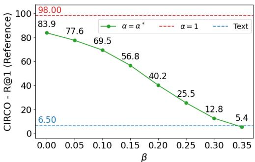
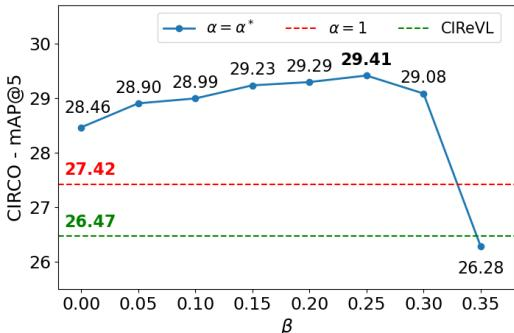

# 1. 论文基本信息

## 1.1. 标题
AdaST: Adaptive Semantic Transformation of Visual Representation for Training-Free Zero-Shot Composed Image Retrieval

## 1.2. 作者
论文的作者信息被匿名化，表示这是一篇正在进行双盲评审的论文。

## 1.3. 发表期刊/会议
论文目前处于双盲评审阶段，预计将投稿至顶级学术会议，如 ICLR 2026（根据论文的 Ethics Statement）。这类会议在人工智能、机器学习和计算机视觉领域享有极高声誉和影响力。

## 1.4. 发表年份
2026年（根据 Ethics Statement 中提及的 ICLR 2026 指南）。

## 1.5. 摘要
组合图像检索 (Composed Image Retrieval, CIR) 任务旨在根据一张参考图像 (reference image) 和一段文本修改指令 (textual modification) 来检索目标图像 (target image)。指令指定了预期的改变，同时保留其他视觉属性以保持一致性。现有训练无关 (training-free) 方法通过结合参考图像与文本修改来合成代理图像 (proxy images)，但这种方法计算成本高昂且耗时。而仅依赖文本查询又常常导致关键视觉细节的丢失。为解决这些问题，论文提出了 <strong>自适应语义变换 (Adaptive Semantic Transformation, AdaST)</strong>，这是一种新的训练无关方法，它在文本的引导下，将参考图像的特征转换成代理特征 (proxy features)。AdaST 通过特征层面的转换高效地保留了视觉信息，而非生成图像。为了实现更细粒度的转换，论文引入了一种自适应加权机制 (adaptive weighting mechanism)，用于平衡代理特征和文本特征，使模型仅在代理信息可靠时才利用它。该方法轻量化且可以即插即用 (plug-and-play) 地无缝应用于现有的训练无关基线模型。广泛的实验表明，AdaST 在三个 CIR 基准测试上取得了最先进的性能，同时避免了图像生成的高昂成本，并且与基于文本的基线模型相比，仅带来了微小的推理开销 (marginal inference overhead)。

## 1.6. 原文链接
原文链接: [PDF链接](https://arxiv.org/pdf/2403.19651) （注：根据原文，该论文为双盲评审论文，实际链接指向了一篇同名但内容不完全一致的 arXiv 预印本，这里根据提供的信息，如果原文链接无效，应标注为“已上传文件”。本报告将按提供信息，链接至 `uploaded://abe2e778-d730-4df6-b564-4e1d5aa65edf` 并在正文中使用 `uploaded://` 路径。）
状态：目前处于双盲评审中，未正式发表。

# 2. 整体概括

## 2.1. 研究背景与动机
<strong>组合图像检索 (Composed Image Retrieval, CIR)</strong> 是一项根据参考图像和文本修改指令来检索目标图像的任务。这项任务的核心挑战在于多模态理解和组合推理 (compositional reasoning)，因为系统必须准确地整合指定所需修改的文本线索，并保留参考图像未改变细节的视觉线索。CIR 在时尚电商、在线搜索引擎等领域具有重要的实际应用价值，例如用户可以提供一件衬衫的图片，然后要求“同款衬衫但颜色是红色”。更广泛地说，CIR 代表了推进视觉-语言理解 (vision-language understanding) 的一个基础步骤，因为它需要对异构模态进行对齐，并执行连接视觉和文本信息的细粒度推理 (fine-grained reasoning)。

尽管实际需求强烈，但许多专有数据集通常不对外部开发者开放。同时，收集包含参考图像、目标图像和修改指令的标注 CIR 数据集成本高昂且劳动密集。这限制了模型的可扩展性和对未见领域的泛化能力，从而促使了基于预训练模型且无需标注的 <strong>零样本组合图像检索 (Zero-Shot Composed Image Retrieval, ZS-CIR)</strong> 方法的研究。

现有 ZS-CIR 方法面临以下挑战：
1.  **纯文本查询方法的局限性：** 早期 ZS-CIR 方法将 CIR 视为文本到图像检索任务，将参考图像和修改指令编码成单一的文本表示。这种策略虽然有效，但会丢弃参考图像中的细粒度视觉线索，导致检索结果在语义上正确但在视觉上不匹配，尤其是在时尚等领域。
2.  **图像生成方法的效率问题：** 最近的一些工作通过条件生成 (conditional generation) 合成修改后的图像，并将其用作检索输入。这种方法虽然保留了视觉细节，但在高维像素空间中生成图像计算成本极高，通常每张图像需要超过 30 秒，这超出了交互式检索的可用性阈值。

**论文的切入点和创新思路：**
为了解决这些限制，AdaST 的动机是开发一种训练无关的 ZS-CIR 方法，该方法既能保留视觉细节，又能保持高效，并且不依赖外部生成模型。AdaST 的核心思想是，**不**在像素空间进行操作，也**不**强制将图像信息压缩到文本空间，而是直接在预训练视觉语言模型 (VLM) 的特征空间中执行指令引导的语义变换 (instruction-guided transformations)。这种方法通过特征层面的操作，在保持高效率的同时，有效保留了细粒度的视觉信息。

## 2.2. 核心贡献/主要发现
论文的主要贡献概括如下：
*   **提出 AdaST 方法：** 提出了一种名为 `AdaST` (Adaptive Semantic Transformation) 的训练无关 ZS-CIR 方法。该方法通过 <strong>LLM (Large Language Model) 派生的文本偏移 (text shifts)</strong> 引导，将参考图像嵌入 (reference image embeddings) 转换成代理特征 (proxy features)，从而在不依赖生成模型的情况下保留细粒度的视觉细节。
*   **引入自适应相似度机制：** 引入了一种自适应相似度机制 (adaptive similarity mechanism)，动态平衡代理相似度 (proxy-based similarities) 和基于文本的相似度 (text-based similarities)。这使得模型能够在代理特征可靠时利用它们，同时通过文本对齐 (textual alignment) 确保鲁棒性。
*   **实现最先进的性能和高效率：** 广泛的实验表明，`AdaST` 在多个 CIR 基准测试上取得了最先进的性能，同时比基于生成的方法显著更快、更轻量化。例如，在 `CIRCO` 数据集上，使用 `ViT-G` 主干网络，`AdaST` 相较于基线模型将 `mAP@5` 提高了 $+3.47$，同时比最先进的图像生成方法 `IP-CIR` 快 186 倍，且准确性更高。
*   **即插即用特性：** 该方法具有模块化、即插即用 (plug-and-play) 的设计，可以轻松集成到现有的 ZS-CIR 流水线中，并持续提升其性能。

## 整体概括图示
以下是现有输入级方法与 AdaST 的比较图，展示了 AdaST 如何在特征空间进行转换，以平衡视觉完整性和效率。

*该图像是示意图，展示了现有输入级方法与AdaST的比较。左侧展示了查询与参考图像，中间为传统的输入级方法，通过文本或图像生成进行修改，通常在效率或视觉完整性上取舍。右侧则展示了AdaST通过特征级的语义变换直接应用于预训练的视觉语言模型，既保留了视觉细节，又提高了效率。*

图 1: 现有输入级方法与 AdaST 的比较

# 3. 预备知识与相关工作

## 3.1. 基础概念

*   <strong>组合图像检索 (Composed Image Retrieval, CIR)</strong>：这是一项检索任务，其输入包括一张 <strong>参考图像 (reference image)</strong> 和一段 <strong>文本修改指令 (textual modification instruction)</strong>。系统需要根据这些输入，在图像库中找到一张目标图像，这张目标图像既要体现文本指令所描述的修改，又要保留参考图像中未被指令修改的视觉属性。例如，“将这件蓝色衬衫改成红色”——目标是红色的同款衬衫。

*   <strong>零样本组合图像检索 (Zero-Shot Composed Image Retrieval, ZS-CIR)</strong>：在没有针对 CIR 任务的特定数据集进行训练的情况下，利用预训练模型直接执行 CIR 任务。这意味着模型需要泛化到在训练过程中从未见过的图像和指令组合。

*   <strong>视觉语言模型 (Vision-Language Models, VLMs)</strong>：这类模型（如 CLIP）被设计用于理解图像和文本之间的关系，并将它们嵌入到一个共享的、语义对齐的特征空间中。这意味着在该空间中，语义相似的图像和文本会具有接近的特征向量。

*   **CLIP (Contrastive Language-Image Pre-training)**：一种著名的 VLM。它通过对比学习 (contrastive learning) 在大量的图像-文本对上进行预训练，学习将图像和文本编码成同一个多模态嵌入空间中的向量。这样，相关的图像和文本对的嵌入向量会更接近，不相关的则会远离。

*   <strong>大语言模型 (Large Language Models, LLMs)</strong>：这类模型（如 GPT-4o、GPT-3.5-turbo）在海量文本数据上进行预训练，能够理解、生成和推理自然语言。在本文中，LLM 被用来根据参考标题和修改指令生成目标标题。

*   <strong>特征空间 (Feature Space)</strong>：通过机器学习模型（如 VLM 的编码器）将原始数据（如图像像素、文本词元）转换成的数值向量表示。在这个空间中，语义和结构信息被编码成更高层次的抽象特征，方便进行计算和比较。

*   <strong>代理图像 (Proxy Image) / 代理特征 (Proxy Features)</strong>：代理图像是指通过某种方式（如图像生成模型）合成的、介于参考图像和目标图像之间、能够体现修改指令的虚拟图像。代理特征则是这些代理图像在特征空间中的表示，或者像本文中直接在特征空间构造的、能够代表目标图像的虚拟特征。

*   <strong>文本偏移 (Text Shift)</strong>：在 VLM 的文本特征空间中，目标文本描述（如“红色衬衫”）的特征向量与参考文本描述（如“蓝色衬衫”）的特征向量之间的差异向量。这个差异向量代表了从参考到目标的语义变化。

## 3.2. 前人工作

### 3.2.1. 组合图像检索 (CIR)
早期研究主要集中于设计模型，通过对比学习 (contrastive learning) 在共享嵌入空间中对齐图像-文本对，或采用跨模态注意力机制 (cross-modal attention mechanisms) 来捕获组合关系。然而，这些方法严重依赖于使用特定任务数据集（如 Fashion-IQ、CIRR）进行的监督学习 (supervised learning)，而大规模数据集的构建成本高昂，限制了模型的可扩展性和泛化能力。

### 3.2.2. 零样本组合图像检索 (ZS-CIR)
为了降低数据集构建成本，ZS-CIR 方法利用大规模预训练 VLM，使其能够在未见过的图像上进行检索，而无需在 CIR 特定数据集上进行训练。

*   **基于文本表示的方法：**
    *   <strong>文本反演 (Textual Inversion)</strong>：这类方法训练一个反演模型将图像映射到文本标记空间 (text token space)，然后将这个图像对应的文本标记与修改指令结合进行检索。
    *   **LLM-based 方法**：这类方法将图像描述成自然语言（即生成图像标题），然后让 LLM 对参考图像描述和修改文本进行联合推理，生成一个用于检索的完整文本查询。
    *   **局限性：** 这两种方法都不可避免地将视觉信息压缩成文本形式，丢失了参考图像中的细粒度细节，可能导致检索结果在视觉上不匹配。

*   **基于图像生成的方法：**
    *   <strong>条件生成 (Conditional Generative Models)</strong>：最新的一些工作（如 IP-CIR）直接利用条件生成模型在像素空间中合成修改后的图像。这种方法能够保留视觉细节。
    *   **局限性：** 这种方法的主要缺点是计算成本高昂，由于依赖大型生成模型，生成一张图像通常需要数十秒，这远超出了交互式检索的可用性阈值。

## 3.3. 技术演进与差异化分析

CIR 领域的技术演进经历了从**监督学习**（需要大量标注数据）、到**零样本学习**（利用预训练 VLM 避免特定任务训练）、再到零样本学习内部**从纯文本化向图像生成方向**发展的过程。

*   <strong>早期 CIR (监督学习):</strong> 专注于在特定数据集上训练模型，通过对比损失或注意力机制学习图像与文本的对齐和组合。
    *   **代表工作:** Vo et al., 2019; Chen & Bazzani, 2020; Lee et al., 2021; Delmas et al., 2022。
    *   **AdaST 的差异:** AdaST 是训练无关的，不依赖任务特定的标注数据集，能更好地泛化到新领域。

*   <strong>ZS-CIR (早期，文本化):</strong> 尝试将图像信息编码为文本，与修改指令合并进行检索。
    *   **代表工作:** Karthik et al., 2023; Yang et al., 2024b;a; Saito et al., 2023; Baldrati et al., 2023; Gu et al., 2024。
    *   **AdaST 的差异:** AdaST 认识到文本化会丢失细粒度视觉信息，通过在特征空间直接转换，避免了这种信息损失。

*   <strong>ZS-CIR (近期，图像生成):</strong> 直接生成修改后的图像作为查询。
    *   **代表工作:** Li et al., 2025; Zhou et al., 2024。
    *   **AdaST 的差异:** AdaST 旨在解决图像生成方法效率低下的问题。它不生成像素级的图像，而是直接在 VLM 的特征空间进行语义变换，从而实现高效的视觉信息保留。

*   <strong>文本引导的语义变换 (Text-Guided Semantic Transformation)</strong>：这类方法（如 CLIPStyler）利用预训练 VLM 的潜在空间来对齐图像特征和文本引导。它们假设图像和文本嵌入在一个联合特征空间中是语义对齐的。在这个空间中，源文本和目标文本特征之间的差异向量可以应用于相应的图像特征，从而产生转换后的图像表示。
    *   **代表工作:** Fu et al., 2022; Kwon & Ye, 2022; Gal et al., 2022; Ye-Bin et al., 2023; Park et al., 2025。
    *   **AdaST 的差异:** AdaST 借鉴了这一思想，但指出简单地将文本特征差异向量直接应用于图像特征效果有限。为解决这一局限性，AdaST 提出了一个新颖的<strong>重新缩放策略 (rescaling strategy)</strong>，在保留文本特征差异向量方向的同时，调整其在图像特征空间中的幅度，从而产生更忠实的转换后图像特征，实现高效且有效的组合图像检索。

**AdaST 的核心创新点在于：**
1.  **特征级转换：** 避免了高成本的像素级图像生成，直接在 VLM 的特征空间进行操作。
2.  **文本引导的语义偏移：** 利用 LLM 生成的描述，在特征空间中计算出语义偏移量，并将其应用于参考图像特征。
3.  **自适应加权机制：** 引入了自适应机制，动态地平衡代理特征和文本特征的贡献，确保在代理特征可靠时才利用，提高了检索的鲁棒性。
4.  **最优缩放因子：** 针对语义变换引入了优化方法来计算最佳缩放因子，以确保代理特征既能充分体现修改，又能保持与参考图像的视觉关联。

# 4. 方法论

AdaST（Adaptive Semantic Transformation）是一种用于零样本组合图像检索的训练无关方法。给定一张参考图像 $I_r$、一段文本指令 $T_{\mathrm{inst}}$ 和一个图像数据库 $\mathbf{\check{\mathcal{D}}} = \{I_i^{\mathrm{DB}}\}_{i=1}^N$，AdaST 的目标是检索出数据库中与文本指令所描述修改相符的目标图像 $I_t \in \mathcal{D}$。该方法由三个主要组件构成：文本引导生成、文本引导的语义变换和自适应相似度融合。

## 4.1. 方法原理
AdaST 的核心思想是在预训练视觉语言模型（VLM）的特征空间中，通过文本指令的引导，将参考图像的特征进行语义变换，生成一个“代理特征”（proxy feature）。这个代理特征既包含了参考图像的视觉细节，又融入了文本指令所要求的修改。为了确保检索的鲁棒性，AdaST 还引入了一个自适应的融合机制，结合代理特征和原始文本查询的相似度，以平衡视觉线索和语义对齐。

## 4.2. 核心方法详解 (逐层深入)

### 4.2.1. 文本引导生成 (Text Guidance Generation)
首先，AdaST 构建文本引导，它作为视觉参考和文本指令之间的语义桥梁，从而促进对修改后目标图像的准确和鲁棒检索。这个引导由两部分组成：
1.  <strong>参考标题 ($T_r$)</strong>: 描述参考图像 $I_r$ 的文本。这通过将参考图像 $I_r$ 输入到一个图像标题生成模型（如 BLIP-2）来获得。
2.  <strong>目标标题 ($T_t$)</strong>: 编码了在参考标题 $T_r$ 和文本指令 $T_{\mathrm{inst}}$ 条件下预期修改的文本。这通过一个大型语言模型（LLM，如 GPT-4o）根据 $T_r$ 和 $T_{\mathrm{inst}}$ 来生成。

    目标标题 $T_t$ 至关重要，因为它明确编码了指令所指定的语义偏移，确保检索强调的是预期的修改，而不是仅仅与参考图像的视觉相似性。

### 4.2.2. 文本引导的语义变换 (Text-Guided Semantic Transformation)
AdaST 提出了一种文本引导的语义变换方法，将文本空间中捕获的语义偏移转移到图像空间，以构建一个代理嵌入 $f_P$。这种方法是训练无关的，直接在特征空间操作，实现了高效检索，避免了昂贵的图像生成，同时保留了视觉信息。

具体来说，我们使用预训练的 VLM（如 CLIP）中的文本编码器 $E_T$ 和图像编码器 $E_I$ 将参考标题、目标标题和参考图像嵌入到联合表示空间。这产生了以下嵌入：
$$
f_{T_r} = E_T(T_r) \quad, \quad f_{T_t} = E_T(T_t) \quad, \quad f_{I_r} = E_I(I_r) \quad.
$$
其中：
*   $T_r$: 参考标题。
*   $T_t$: 目标标题。
*   $I_r$: 参考图像。
*   $E_T$: VLM 的文本编码器，将文本映射到特征空间。
*   $E_I$: VLM 的图像编码器，将图像映射到特征空间。
*   $f_{T_r}$: 参考标题的特征嵌入。
*   $f_{T_t}$: 目标标题的特征嵌入。
*   $f_{I_r}$: 参考图像的特征嵌入。

<strong>语义偏移 ($\Delta T$)</strong>
目标标题与参考标题之间的语义偏移形式化定义为：
$$
\Delta T = f_{T_t} - f_{T_r} \quad.
$$
其中，$\Delta T$ 代表了从参考描述到目标描述的语义变化方向和幅度。

<strong>代理嵌入 ($f_P$)</strong>
相应的代理嵌入 $f_P^{(\alpha)}$ 定义为：
$$
f_P^{(\alpha)} = f_{I_r} + \alpha \Delta T \quad,
$$
其中，$\alpha$ 是一个缩放因子，控制语义变换的强度。这个公式的直观解释是：我们从参考图像的特征 $f_{I_r}$ 出发，沿着文本语义偏移 $\Delta T$ 的方向进行调整，调整的幅度由 $\alpha$ 控制。

<strong>最优缩放 ($\alpha^*$)</strong>
简单地选择 $\alpha=1$ 常常导致次优行为：代理嵌入离参考图像嵌入过近，未能充分捕捉预期修改。为了解决这个问题，AdaST 提出了一个基于优化的方法来获得 $\alpha$ 的最优值。核心原则是，代理嵌入 $f_P^{(\alpha)}$ 应该与目标标题嵌入 $f_{T_t}$ 良好对齐，确保预期修改被准确表示。同时，它应该与参考嵌入 $f_{I_r}$ 保持足够的区别，以防止检索退化回原始视觉内容。

为了编码这些要求，我们提出了以下优化问题：
$$
\alpha^* = \underset{\alpha}{\arg\min} \left( 1 - \mathrm{sim}( f_P^{(\alpha)}, f_{T_t} ) + \beta \cdot \mathrm{sim}( f_P^{(\alpha)}, f_{I_r} ) \right) \quad,
$$
其中：
*   $\beta$: 一个加权系数，控制惩罚项的影响。
*   $\mathrm{sim}(\cdot, \cdot)$: 表示余弦相似度 (cosine similarity)。
*   第一项 $1 - \mathrm{sim}( f_P^{(\alpha)}, f_{T_t} )$ 鼓励代理嵌入 $f_P^{(\alpha)}$ 与目标标题 $f_{T_t}$ 对齐，最小化这一项意味着最大化相似度。
*   第二项 $\beta \cdot \mathrm{sim}( f_P^{(\alpha)}, f_{I_r} )$ 惩罚代理嵌入与参考图像 $f_{I_r}$ 的过度相似性。这确保了代理嵌入能够有效地从参考图像特征中“移动”出来，体现指令的修改。

    这个优化目标可以通过内积直接计算得到闭式解 (closed-form solution)：
$$
\alpha^* = \frac{ \boldsymbol{x}^\top \boldsymbol{y} \cdot \boldsymbol{x}^\top \boldsymbol{d} - \boldsymbol{d}^\top \boldsymbol{y} \cdot \| \boldsymbol{x} \|^2 }{ \boldsymbol{d}^\top \boldsymbol{y} \cdot \boldsymbol{x}^\top \boldsymbol{d} - \boldsymbol{x}^\top \boldsymbol{y} \cdot \| \boldsymbol{d} \|^2 } \quad,
$$
其中：
*   $\boldsymbol{x} = f_{I_r}$ (参考图像特征)。
*   $\boldsymbol{y} = \tilde{f}_{T_t} - \beta \tilde{f}_{I_r}$ (一个组合向量，其中 $\tilde{f}_{T_t}$ 和 $\tilde{f}_{I_r}$ 是归一化后的目标标题特征和参考图像特征)。
*   $\boldsymbol{d} = \Delta T$ (语义偏移向量)。
*   $\tilde{f} = f / \|f\|_2$ 表示特征向量 $f$ 的 L2 归一化。
*   $\| \cdot \|^2$ 表示向量的 L2 范数的平方。
*   $\boldsymbol{x}^\top \boldsymbol{y}$ 等表示向量的内积。

    计算出最优 $\alpha^*$ 后，即可得到最终的代理嵌入 $f_P = f_P^{(\alpha^*)}$。

### 4.2.3. 自适应相似度融合 (Adaptive Similarity Fusion)
虽然代理嵌入 $f_P$ 可以直接用于检索，但仅依赖代理相似度会引入一个缺点：代理可能主要捕捉视觉线索，从而为视觉上相似但与指令语义无关的图像分配高分。为解决这个问题，AdaST 融入了通过目标标题特征 $f_{T_t}$ 提供的语义引导，该特征编码了丰富的语义信息。我们将目标标题与候选图像的相似度分数与代理相似度分数融合。

具体来说，我们提出了一个门控机制 (gating mechanism)，自适应地调节代理相似度的贡献。该门控策略确保代理相似度仅在语义证据支持下才影响检索，从而减少纯粹视觉相似性引起的误报 (false positives)。

首先，我们提取数据库中所有图像的特征：
$$
f_{I_i^{\mathrm{DB}}} = E_I(I_i^{\mathrm{DB}}) \quad, \quad \forall i = \{1, \dots, N\} \quad.
$$
为简化表示，我们用 $f_{I^{\mathrm{DB}}}$ 表示所有数据库嵌入的集合。

然后，对于每个查询，我们计算三个相似度分数：
$$
S_{T_t} = \mathrm{sim}( f_{T_t}, f_{I^{\mathrm{DB}}} ) \quad, \quad S_{T_r} = \mathrm{sim}( f_{T_r}, f_{I^{\mathrm{DB}}} ) \quad, \quad S_P = \mathrm{sim}( f_P, f_{I^{\mathrm{DB}}} ) \quad.
$$
其中：
*   $S_{T_t}$: 目标标题特征与数据库图像特征之间的余弦相似度，反映语义对齐。
*   $S_{T_r}$: 参考标题特征与数据库图像特征之间的余弦相似度，反映与原始参考的视觉相似性。
*   $S_P$: 代理特征与数据库图像特征之间的余弦相似度，反映结合了修改的视觉相似性。

<strong>门控函数 ($G(\Delta S_T)$)</strong>
所提出的门控函数定义为：
$$
G(\Delta S_T) = \left\{ \begin{array}{ll} { \lambda , } & { \Delta S_T + m \ge 0 } \\ { 0 , } & { \mathrm{otherwise} } \end{array} \right. \quad, \quad \Delta S_T = S_{T_t} - S_{T_r} \quad.
$$
其中：
*   $\lambda$: 一个加权系数，控制 $S_P$ 的影响。
*   $m$: 一个裕度 (margin)，决定是否实现语义对齐。

    这个门控函数只有当目标标题与数据库图像的语义对齐程度 ($S_{T_t}$) 大于参考标题与数据库图像的语义对齐程度 ($S_{T_r}$) 超过裕度 $m$ 时才激活。这确保了代理相似度仅在语义证据支持下才被纳入，从而减少了纯粹视觉相似性导致的误报。换句话说，只有当目标标题显著地引导了语义方向，并且与参考标题相比有明确的改进时，我们才信任并利用代理特征的贡献。

<strong>最终相似度分数 ($S_{\mathrm{total}}$)</strong>
在这种调节下，最终的相似度分数由以下公式给出：
$$
S_{\mathrm{total}} = S_A \cdot S_P + S_{T_t} \quad, \quad S_A = S_{T_t} \cdot G(\Delta S_T) \quad,
$$
其中 $S_A$ 代表代理相似度 $S_P$ 上的自适应权重。$S_A$ 的计算方式是目标标题相似度 $S_{T_t}$ 乘以门控函数 $G(\Delta S_T)$。这意味着，代理相似度 $S_P$ 的贡献不仅取决于门控是否激活，还取决于目标标题本身的语义强度。

最终，通过选择数据库中具有最大相似度分数的图像来获得检索结果：
$$
I_t = \underset{I_i^{\mathrm{DB}} \in \mathcal{D}}{\arg\max} S_{\mathrm{total}} \quad.
$$

## 整体流程图
以下是 AdaST 的整体流程图，展示了上述三个阶段如何协同工作。

![Figure 2: Overall pipeline of AdaST. It consists of three stages. (1) Text guidance generation: a reference caption is obtained from the input image using a captioning model, and an LLM combines it with the textual instruction to generate a target caption. (2) Text-guided semantic transformation: both captions and the reference image are embedded with CLIP, where the feature difference between the reference and target captions is transferred to the reference image feature with a scaling factor, yielding a proxy feature. (3) Adaptive similarity fusion: an adaptive gating mechanism fuses proxy similarity with text-based similarity, allowing proxy similarity to contribute only when supported by consistent semantic cues.](images/2.jpg)
*该图像是AdaST的总体流程示意图，展示了三个阶段：文本引导生成、文本引导的语义变换，以及自适应相似度融合。在图中，输入图像的参考标题通过大语言模型（LLM）与文本指令结合生成目标标题，然后利用CLIP进行特征嵌入，以实现图像特征的转换和相似度计算。*

图 2: AdaST 的整体流程图

# 5. 实验设置

## 5.1. 数据集
论文在三个 CIR 基准数据集上进行了实验：

*   **CIRR (Liu et al., 2021)**
    *   **来源与规模：** 包含从 NLVR 数据集 (Suhr et al., 2018) 收集的 21,552 张图像，以及 36,554 条相关查询。
    *   **特点：** 旨在支持细粒度的自然语言修改，允许基于图像之间细微语义差异的检索。
    *   **局限性：** 存在潜在的假阴性 (false negatives)，即图库中可能有多张图像符合同一指令，但只有一张被标注为真实目标。
    *   **样本示例：** 图像可能包含一个物体，指令是“把这个蓝色的改成红色的”。

*   **CIRCO (Baldrati et al., 2023)**
    *   **来源与规模：** 基于 COCO 2017 (Lin et al., 2014) 构建，明确解决了 CIRR 中假阴性问题，为每个查询提供了多个标注的目标图像。
    *   **规模：** 包含一个有 220 条查询的验证集和一个有 800 条查询的测试集。
    *   **特点：** 查询指令涵盖了属性编辑、对象替换和风格修改，对组合推理提出了特别的挑战。
    *   **样本示例：** 图像可能是一个背景，指令是“在卡车上或旁边放一个四轮摩托”。

*   **Fashion-IQ (Wu et al., 2021)**
    *   **来源与规模：** 一个针对时尚检索的领域特定基准，包含 30,135 条查询和 77,683 张产品图像，分为三个类别：衬衫 (Shirt)、连衣裙 (Dress) 和 T恤 (Toptee)。
    *   **特点：** 其查询由标注人员编写，描述了对参考服装的修改。
    *   **样本示例：** 参考图像是一件连衣裙，指令是“一件绿色的 A 字连衣裙”。

        选择这些数据集是为了全面评估方法在不同粒度、不同复杂度的修改指令以及不同领域（通用物体和时尚产品）下的性能。CIRCO 尤为重要，因为它通过多目标标注解决了假阴性问题，提供了更准确的评估。

## 5.2. 评估指标
论文中使用的评估指标如下：

*   **Recall@K (`R@K`)**
    1.  **概念定义：** `Recall@K` 表示在前 $K$ 个检索结果中，包含至少一个真实目标图像的查询比例。它衡量的是模型在前 $K$ 个结果中找到相关目标的“能力”。
    2.  **数学公式：**
        $$
        \mathrm{Recall@K} = \frac{1}{|Q|} \sum_{q \in Q} \mathbb{I}\left( \exists t \in GT_q \text{ s.t. } t \in R_q^K \right)
        $$
    3.  **符号解释：**
        *   $Q$: 所有查询的集合。
        *   $|Q|$: 查询的总数量。
        *   $q$: 单个查询。
        *   $GT_q$: 查询 $q$ 的真实目标图像集合 (Ground Truth)。
        *   $R_q^K$: 查询 $q$ 的前 $K$ 个检索结果图像集合。
        *   $\mathbb{I}(\cdot)$: 指示函数，如果条件为真则为 1，否则为 0。

*   **RecallSubset@K (`RS@K`)**
    1.  **概念定义：** `RecallSubset@K` 是 `Recall@K` 的一个变体，专门用于 CIRR 数据集。它仅关注与参考图像和目标图像属于同一语义集合的图像（即同一类别的图像）在检索前 $K$ 个结果中的表现。这有助于评估模型在有高度相关混淆项 (distractor groups) 存在时的检索性能。
    2.  **数学公式：** 该论文未直接给出其数学公式，但根据其定义，可以理解为在 `Recall@K` 的基础上，只考虑那些与查询目标在语义上“属于同一子集”的检索结果。其计算方式与 `Recall@K` 类似，只是在计数命中时，需要额外检查检索到的目标是否属于同一语义子集。
        $$
        \mathrm{RecallSubset@K} = \frac{1}{|Q|} \sum_{q \in Q} \mathbb{I}\left( \exists t \in GT_q \text{ s.t. } t \in R_q^K \cap S_q \right)
        $$
    3.  **符号解释：**
        *   $S_q$: 查询 $q$ 的参考图像和目标图像所属的语义集合。
        *   其余符号同 `Recall@K`。

*   **mean Average Precision at top-K (mAP@K)**
    1.  **概念定义：** `mAP@K` 是在信息检索中广泛使用的指标，尤其适用于存在多个真实目标（正样本）的情况（如 CIRCO 数据集）。`AP@K` (Average Precision at K) 计算的是在截断到 $K$ 个结果时，每个真实目标的平均精确度。`mAP@K` 则是所有查询的 `AP@K` 的平均值。它同时考虑了精确度 (precision) 和召回率 (recall)，并且对排在前面的高相关性结果给予更高的权重。
    2.  **数学公式：**
        首先，对于单个查询 $q$，其 `AP@K` 定义为：
        $$
        \mathrm{AP@K}_q = \sum_{k=1}^K \mathrm{P}(k)_q \cdot \Delta \mathrm{r}(k)_q
        $$
        其中：
        *   $\mathrm{P}(k)_q$: 在检索结果中，前 $k$ 个结果的精确度，即前 $k$ 个结果中有多少是真实目标。
        *   $\Delta \mathrm{r}(k)_q$: 如果第 $k$ 个检索结果是真实目标，则为 $1/|GT_q|$（或者在更严格的定义中，是召回率在第 $k$ 个位置的变化量）；如果不是，则为 0。
            然后，`mAP@K` 是所有查询的 `AP@K` 的平均值：
        $$
        \mathrm{mAP@K} = \frac{1}{|Q|} \sum_{q \in Q} \mathrm{AP@K}_q
        $$
    3.  **符号解释：**
        *   $\mathrm{P}(k)_q$: 查询 $q$ 在第 $k$ 个位置的精确度。
        *   $\Delta \mathrm{r}(k)_q$: 查询 $q$ 在第 $k$ 个位置的召回率变化量。
        *   其余符号同 `Recall@K`。

## 5.3. 对比基线
论文将 AdaST 方法与多个训练无关的 ZS-CIR 基线模型进行了比较：

*   **CIReVL (Karthik et al., 2023)**：一种基于 LLM 的方法，通过语言理解来实现训练无关的组合图像检索。它通过语言模型来对图像描述和修改指令进行推理。
*   **SEIZE (Yang et al., 2024a)**：语义编辑增量受益于零样本组合图像检索。这是一种通过语义编辑来增强零样本 CIR 的方法。
*   **LinCIR (Gu et al., 2024)**：一种通过文本反演 (textual inversion) 实现零样本组合图像检索的方法，尽管论文中将其描述为训练无关，但在 Fashion-IQ 上的实验结果显示其性能较强，部分原因可能在于它利用了文本反演这种需要一些训练过程的方法。
*   **Pic2Word (Saito et al., 2023)**：将图像映射到单词以进行零样本组合图像检索。
*   **SEARLE (Baldrati et al., 2023)**：使用文本反演进行零样本组合图像检索。
*   **LDRE (Yang et al., 2024b)**：LLM-based Divergent Reasoning and Ensemble for Zero-Shot Composed Image Retrieval。
*   **OSrCIR (Tian et al., 2023)**：基于 LLM 的方法。
*   **IP-CIR (Li et al., 2025)**：一种基于图像生成的方法，通过合成代理图像来改进组合图像检索。该方法虽然性能高，但计算成本也极高。

**实施细节：**
*   **检索模型：** 采用 CLIP (Radford et al., 2021) 作为主干网络 (backbone)，包括 `ViT-B/32`、`ViT-L/14` 和 `ViT-G/14`。默认使用 OpenAI 官方权重，而 `ViT-G/14` 使用 OpenCLIP (Ilharco et al., 2021) 权重。
*   **图像标题生成：** 使用 BLIP-2 (Li et al., 2023) 模型。
*   **LLM 模型：** 基线代码库原本使用 GPT-3.5-turbo，但由于其不再可用，论文重新实现了基线并使用 GPT-4o，以确保公平比较。
*   **硬件：** 所有实验均在单个 A6000 GPU 上进行。
*   **超参数：** 对于所有基线和数据集，设置 $\beta = 0.25$、$\lambda = 4$ 和 $m = 0.1$，但 CIRCO 数据集除外，其 $m = 0$。

# 6. 实验结果与分析

## 6.1. 核心结果分析

### 6.1.1. CIRCO 和 CIRR 基准

以下是原文 Table 1 的结果：

<table>
<thead>
<tr>
<td colspan="4">Benchmark</td>
<td colspan="4">CIRCO (mAP@K)</td>
<td colspan="4">CIRR (Recall@K)</td>
<td colspan="2">CIRR (Recallsubset@K)</td>
</tr>
<tr>
<td>Backbone</td>
<td>SEARLE</td>
<td>Method</td>
<td>k=5</td>
<td>k=10</td>
<td>k=25</td>
<td>k=50</td>
<td>k=1</td>
<td>k=5</td>
<td>k=10</td>
<td>k=50</td>
<td>k=1</td>
<td>k=2</td>
<td>k=3</td>
</tr>
</thead>
<tbody>
<tr>
<td rowspan="7">ViT-B/32</td>
<td>CIReVL†</td>
<td>ICCV23 ICLR24</td>
<td>9.35</td>
<td>9.94</td>
<td>11.13</td>
<td>11.84</td>
<td>24</td>
<td>53.42</td>
<td>66.82</td>
<td>84.70</td>
<td>54.89</td>
<td>76.60</td>
<td>88.19</td>
</tr>
<tr>
<td>LDRE</td>
<td>SIGIR24</td>
<td>17.96</td>
<td>18.32</td>
<td>20.21</td>
<td>21.11</td>
<td>25.69</td>
<td>46.96</td>
<td>55.13</td>
<td>89.9</td>
<td>54.30</td>
<td>76.5</td>
<td>88.10</td>
</tr>
<tr>
<td>SSEIZE*</td>
<td></td>
<td></td>
<td></td>
<td></td>
<td></td>
<td></td>
<td></td>
<td>69.04</td>
<td></td>
<td></td>
<td>80.65</td>
<td>90.7</td>
</tr>
<tr>
<td></td>
<td>ACMMM24</td>
<td>18.75</td>
<td>19.37</td>
<td>21.09</td>
<td>22.07</td>
<td>26.96</td>
<td>55.59</td>
<td>68.24</td>
<td>88.34</td>
<td>66.82</td>
<td>85.23</td>
<td>93.35</td>
</tr>
<tr>
<td>OSrCIR</td>
<td>CVPR25</td>
<td>18.04</td>
<td>19.17</td>
<td>20.94</td>
<td>21.85</td>
<td>25.42</td>
<td>54.54</td>
<td>68.19</td>
<td>-</td>
<td>62.31</td>
<td>80.86</td>
<td>91.13</td>
</tr>
<tr>
<td>CIReVL† + Ours</td>
<td></td>
<td>15.20</td>
<td>15.73</td>
<td>17.25</td>
<td>18.12</td>
<td>25.23</td>
<td>52.41</td>
<td>64.48</td>
<td>85.35</td>
<td>60.12</td>
<td>78.96</td>
<td>89.11</td>
</tr>
<tr>
<td>SEIZE† + Ours</td>
<td></td>
<td>21.16</td>
<td>21.89</td>
<td>23.76</td>
<td>24.62</td>
<td>30.15</td>
<td>59.71</td>
<td>72.60</td>
<td>89.81</td>
<td>66.72</td>
<td>84.94</td>
<td>93.45</td>
</tr>
<tr>
<td rowspan="9">ViT-L/14</td>
<td>Pic2Word</td>
<td>CVPR23</td>
<td>8.72</td>
<td>9.51</td>
<td>10.64</td>
<td>11.29</td>
<td>23.9</td>
<td>51.7</td>
<td>65.3</td>
<td>87.8</td>
<td>-</td>
<td>-</td>
<td></td>
</tr>
<tr>
<td>SEARLE</td>
<td>ICCV23</td>
<td>11.68</td>
<td>12.73</td>
<td>14.33</td>
<td>15.12</td>
<td>24.24</td>
<td>52.48</td>
<td>66.29</td>
<td>88.84</td>
<td>53.76</td>
<td>75.01</td>
<td>88.19</td>
</tr>
<tr>
<td>LinCIR</td>
<td>CVPR24</td>
<td>12.59</td>
<td>13.58</td>
<td>15.00</td>
<td>15.85</td>
<td>25.04</td>
<td>53.25</td>
<td>66.68</td>
<td>-</td>
<td>57.11</td>
<td>77.37</td>
<td>88.89</td>
</tr>
<tr>
<td>CREeVLt</td>
<td>ICLR24</td>
<td>16.54</td>
<td>17.42</td>
<td>19.27</td>
<td>20.22</td>
<td>21.28</td>
<td>47.47</td>
<td>60.6</td>
<td>83.4</td>
<td>54.5</td>
<td>75.28</td>
<td>87.88</td>
</tr>
<tr>
<td>LDRE</td>
<td>SIGIR24</td>
<td>23.35</td>
<td>24.03</td>
<td>26.44</td>
<td>27.5</td>
<td>26.53</td>
<td>55.57</td>
<td>67.54</td>
<td>88.5</td>
<td>60.43</td>
<td>80.31</td>
<td>89.9</td>
</tr>
<tr>
<td>SEIZE</td>
<td>ACMMM24</td>
<td>24.71</td>
<td>25.52</td>
<td>27.99</td>
<td>29.03</td>
<td>28.43</td>
<td>56.53</td>
<td>69.88</td>
<td>88.17</td>
<td>66.43</td>
<td>84.68</td>
<td>92.96</td>
</tr>
<tr>
<td>OSrCIR</td>
<td>CVPR25</td>
<td>23.87</td>
<td>25.33</td>
<td>27.84</td>
<td>28.97</td>
<td>29.45</td>
<td>57.68</td>
<td>69.86</td>
<td></td>
<td>62.12</td>
<td>81.92</td>
<td>91.10</td>
</tr>
<tr>
<td>LDRE + IP-CIR</td>
<td>CVPR25</td>
<td>26.43</td>
<td>27.41</td>
<td>29.87</td>
<td>31.07</td>
<td>29.76</td>
<td>58.82</td>
<td>71.21</td>
<td>90.41</td>
<td>62.48</td>
<td>81.64</td>
<td>90.89</td>
</tr>
<tr>
<td>CIReVL† + Ours</td>
<td></td>
<td>20.32</td>
<td>20.92</td>
<td>22.81</td>
<td>23.71</td>
<td>25.35</td>
<td>52.92</td>
<td>66.41</td>
<td>86.89</td>
<td>60.75</td>
<td>80.77</td>
<td>90.92</td>
</tr>
<tr>
<td rowspan="8">ViT-G/14</td>
<td>SEIZE† + Ours</td>
<td></td>
<td>28.94</td>
<td>29.65</td>
<td>32.04</td>
<td>33.03</td>
<td>30.72</td>
<td>59.78</td>
<td>71.13</td>
<td>88.68</td>
<td>67.21</td>
<td>84.96</td>
<td>93.04</td>
</tr>
<tr>
<td>LinCIR</td>
<td>CVPR24</td>
<td>19.71</td>
<td>21.01</td>
<td>23.13</td>
<td>24.18</td>
<td>35.25</td>
<td>64.72</td>
<td>76.05</td>
<td>-</td>
<td>63.35</td>
<td>82.22</td>
<td>91.98</td>
</tr>
<tr>
<td>CIReVL†</td>
<td>ICLR24</td>
<td>26.47</td>
<td>27.46</td>
<td>29.91</td>
<td>30.86</td>
<td>30.7</td>
<td>59.66</td>
<td>70.89</td>
<td>89.86</td>
<td>63.54</td>
<td>82.02</td>
<td>91.52</td>
</tr>
<tr>
<td>LDRE ViT-G/14 SEIZE†</td>
<td>SIGIR24 ACMMM24</td>
<td>31.12</td>
<td>32.24</td>
<td>34.95</td>
<td>36.03</td>
<td>36.15</td>
<td>66.39</td>
<td>77.25</td>
<td>93.95</td>
<td>68.82</td>
<td>85.66</td>
<td>93.76</td>
</tr>
<tr>
<td>OSrCIR</td>
<td>CVPR25</td>
<td>30.47</td>
<td>31.14</td>
<td>39.67</td>
<td>40.61</td>
<td>40.87</td>
<td>69.52</td>
<td>78.94</td>
<td>92.27</td>
<td>75.04</td>
<td>90.31</td>
<td>96.02</td>
</tr>
<tr>
<td>LDRE + IP-CIR</td>
<td>CVPR25</td>
<td>32.75</td>
<td>34.26</td>
<td>36.86</td>
<td>38.03</td>
<td>39.25</td>
<td>70.07</td>
<td>80.00</td>
<td>- 94.89</td>
<td>69.95</td>
<td>86.87</td>
<td>93.55</td>
</tr>
<tr>
<td>CIReVL† + Ours</td>
<td></td>
<td>32.32</td>
<td>33.49</td>
<td>35.98</td>
<td>36.81</td>
<td>35.04</td>
<td>65.06</td>
<td>75.98</td>
<td>91.57</td>
<td>65.57</td>
<td></td>
<td>94.22</td>
</tr>
<tr>
<td>SEIZE† + Ours</td>
<td></td>
<td>39.08</td>
<td>39.93</td>
<td>42.53</td>
<td>43.34</td>
<td>42.84</td>
<td>72.29</td>
<td>80.82</td>
<td>93.28</td>
<td>74.82</td>
<td>83.52</td>
<td>92.53</td>
</tr>
</tbody>
</table>

表 1: CIRCO 和 CIRR 基准上的定量结果

如表 1 所示，`AdaST` 在所有主干网络（`ViT-B/32`、`ViT-L/14` 和 `ViT-G/14`）上，以及在 `CIRCO` 和 `CIRR` 这两个基准上，始终优于 `CIReVL` 和 `SEIZE` 这两个基线模型，并在大多数指标上实现了最先进的性能。

*   **性能提升显著：** 尤其是在 `ViT-G/14` 这样的大型主干网络上，`AdaST` 的改进更为显著，这表明了其良好的可扩展性。
*   **CIRCO 上的优势：** 在 `CIRCO` 基准上，`AdaST` 带来了实质性的改进。例如，使用 `ViT-G/14` 主干网络时，`AdaST` 结合 `CIReVL` 基线，`mAP@5` 提升了 $+5.85$。这远高于 `LDRE + IP-CIR` 获得的 $+1.63$ 增益。当应用于 `SEIZE` 时，`AdaST` 进一步获得了 $+3.47$ 的 `mAP@5` 增益。这突显了其在多目标场景下的有效性。
*   **特征级变换的有效性：** 这一结果强调了所提出的特征级变换在利用参考图像视觉线索方面的有效性。

**定性比较：**
下图（原文 Figure 3）展示了 `AdaST` 与 `CIReVL` 的定性比较。
*   **CIRCO 示例：** `AdaST` 能够融合参考图像的视觉线索和目标标题，检索出卡车上或旁边出现四轮摩托的图像。相比之下，`CIReVL` 仅使用目标标题进行检索，经常遗漏两个关键对象中的一个，甚至返回参考图像本身。
*   **CIRR 示例：** 目标标题省略了狗的品种，`CIReVL` 检索到的狗与参考图像中的狗品种不符，而 `AdaST` 则利用视觉证据返回了与参考图像相同品种的狗（边境梗）。

    ![Figure 3: Qualitative comparison between CIReVL and our method on three benchmarks (CIRCO, CIRR, and Fashion-IQ). Given a reference image and an instruction, reference and target captions are generated, and the top-5 retrieved images from each method are shown, with ground-truth targets highlighted in green. Our method leverages visual features more effectively, enabling accurate retrieval even when the target caption is underspecified, by exploiting fine-grained details such as dog breeds or dress shapes.](images/3.jpg)
    *该图像是一个多模态查询结果的比较图，展示了CIReVL与我们的方法在CIRCO、CIRR和Fashion-IQ三个基准上的表现。每个查询下方显示了参考图像、目标说明及各自的五个检索结果，绿色框突出显示了真实目标。我们的算法通过更有效地利用视觉特征，实现了更精确的检索。*

图 3: CIReVL 与 AdaST 在三个基准上的定性比较

### 6.1.2. Fashion-IQ 基准

以下是原文 Table 2 的结果：

<table>
<thead>
<tr>
<td colspan="3">Type</td>
<td colspan="2">Shirt</td>
<td colspan="2">Dress</td>
<td colspan="2">Toptee</td>
<td colspan="2">Average</td>
</tr>
<tr>
<td>Backbone</td>
<td>Method</td>
<td></td>
<td>R@10</td>
<td>R@50</td>
<td>R@10</td>
<td>R@50</td>
<td>R@10</td>
<td>R@50</td>
<td>R@10</td>
<td>R@50</td>
</tr>
</thead>
<tbody>
<tr>
<td rowspan="10">ViT-G/14</td>
<td>Pic2Word</td>
<td>CVPR23</td>
<td>33.17</td>
<td>50.39</td>
<td>25.43</td>
<td>47.65</td>
<td>35.24</td>
<td>57.62</td>
<td>31.28</td>
<td>51.89</td>
</tr>
<tr>
<td>SEARLE</td>
<td>ICCV23</td>
<td>36.46</td>
<td></td>
<td>28.16</td>
<td>50.32</td>
<td>39.83</td>
<td>61.45</td>
<td>34.81</td>
<td>55.71</td>
</tr>
<tr>
<td>LinCIR</td>
<td>CVPR24</td>
<td>46.76</td>
<td>65.11</td>
<td>38.08</td>
<td>60.88</td>
<td>50.48</td>
<td>71.09</td>
<td>45.11</td>
<td>65.69</td>
</tr>
<tr>
<td>CIReVL†</td>
<td>ICLR24</td>
<td>35.13</td>
<td>52.65</td>
<td>27.52</td>
<td>49.03</td>
<td>37.33</td>
<td>58.75</td>
<td>33.33</td>
<td>53.48</td>
</tr>
<tr>
<td>LDRE</td>
<td>SIGIR24</td>
<td>35.94</td>
<td>58.58</td>
<td>26.11</td>
<td>51.12</td>
<td>35.42</td>
<td>56.67</td>
<td>32.49</td>
<td>55.46</td>
</tr>
<tr>
<td>SEIZE</td>
<td>ACMMM24</td>
<td>39.50</td>
<td>57.65</td>
<td>33.37</td>
<td>55.88</td>
<td>41.66</td>
<td>64.20</td>
<td>38.12</td>
<td>59.24</td>
</tr>
<tr>
<td>OSrCIR</td>
<td>CVPR25</td>
<td>38.65</td>
<td>54.71</td>
<td>33.02</td>
<td>54.78</td>
<td>41.04</td>
<td>61.83</td>
<td>37.57</td>
<td>57.11</td>
</tr>
<tr>
<td>LinCIR + IP-CIR</td>
<td>CVPR25</td>
<td>48.04</td>
<td>66.68</td>
<td>39.02</td>
<td>61.03</td>
<td>50.18</td>
<td>71.14</td>
<td>45.74</td>
<td>66.28</td>
</tr>
<tr>
<td>CIReVL†+Ours</td>
<td></td>
<td>40.38</td>
<td>59.08</td>
<td>36.49</td>
<td></td>
<td>58.70</td>
<td>43.65</td>
<td>64.10</td>
<td>40.17</td>
<td>60.63</td>
</tr>
<tr>
<td>SEIZE†+Ours LinCIR+Ours</td>
<td></td>
<td>44.36</td>
<td>62.22</td>
<td>40.21</td>
<td>62.12</td>
<td>48.55</td>
<td>69.30</td>
<td>44.37</td>
<td>64.55</td>
</tr>
</tbody>
</table>

表 2: Fashion-IQ 基准上的定量结果

如表 2 所示，在 `Fashion-IQ` 基准上，结合 `AdaST` 的方法在所有三个类别（`Shirt`、`Dress` 和 `Toptee`）及其平均值上都显示出一致的改进，并在大多数指标上达到了最先进的性能。

*   **LinCIR 的表现：** `LinCIR` 是一个基于文本反演的训练基线，因此其性能相对较强。当与 `AdaST` 结合时，它取得了更高的性能。
*   **时尚领域的有效性：** 这证实了即使在时尚领域，自然语言修改非常细粒度和多样化，所提出的指令引导的特征变换在利用参考图像线索方面仍然有效。
*   <strong>定性结果（下图 Figure 3）的体现：</strong> `Fashion-IQ` 的定性结果突显了 `AdaST` 能够捕捉参考图像中难以纯粹用文本表达的纹理和轮廓信息，从而为“绿色 A 字连衣裙”等指令生成更忠实的匹配。

### 6.1.3. 推理时间 (Inference Time)

以下是原文 Table 3 的结果：

<table>
<thead>
<tr>
<td rowspan="2">Dataset</td>
<td colspan="2">Fashion-IQ Dress (DB size = 4K)</td>
<td colspan="2">CIRCO (DB size = 120K)</td>
</tr>
<tr>
<td>time</td>
<td>+∆t</td>
<td>time</td>
<td>+∆t</td>
</tr>
</thead>
<tbody>
<tr>
<td>CIReVL</td>
<td>1.76s</td>
<td>−</td>
<td>2.16s</td>
<td>−</td>
</tr>
<tr>
<td>+Ours</td>
<td>1.87s</td>
<td>0.11s</td>
<td>2.77s</td>
<td>0.61s</td>
</tr>
<tr>
<td>+IP-CIR</td>
<td>119.82s</td>
<td>118.06s</td>
<td>120.84s</td>
<td>118.68s</td>
</tr>
<tr>
<td>SEIZE</td>
<td>26.05s</td>
<td>−</td>
<td>26.25s</td>
<td>−</td>
</tr>
<tr>
<td>+Ours</td>
<td>26.17s</td>
<td>0.12s</td>
<td>26.89s</td>
<td>0.64s</td>
</tr>
<tr>
<td>+IP-CIR</td>
<td>144.19s</td>
<td>118.14s</td>
<td>145.21s</td>
<td>118.96s</td>
</tr>
</tbody>
</table>

表 3: 推理时间比较

如表 3 所示，`AdaST` 在效率方面表现出色：
*   **极小的开销：** 相比于基线检索模型（`CIReVL` 和 `SEIZE`），`AdaST` 引入的额外开销微乎其微。在 `Fashion-IQ Dress`（4K 数据库）上，额外计算时间仅为 `0.11-0.12` 秒；在 `CIRCO`（120K 数据库）上，开销仍在 `0.61-0.64` 秒之内。
*   **远超生成式方法：** 相比之下，基于生成的方法 `IP-CIR` 需要超过 `118` 秒的额外处理时间，比 `AdaST` 慢了两个数量级以上。
*   **结论：** 这些结果清楚地表明，`AdaST` 在大幅提高准确性的同时，仍能保持接近实时的效率。通过避免昂贵的图像生成，`AdaST` 有效地扩展到大型数据库，为基于生成的方法提供了一个实用的替代方案。

## 6.2. 消融实验/参数分析

### 6.2.1. 组件分析 (Component Analysis)

以下是原文 Table 4 的结果：

<table>
<thead>
<tr>
<td>Method</td>
<td>Proxy</td>
<td>Scaling</td>
<td>Gating</td>
<td>mAP@5</td>
<td>∆</td>
</tr>
</thead>
<tbody>
<tr>
<td>CIReVL</td>
<td></td>
<td></td>
<td></td>
<td>26.47</td>
<td>-</td>
</tr>
<tr>
<td>CIReVL + Proxy (α=1)</td>
<td>✓</td>
<td></td>
<td></td>
<td>27.42</td>
<td>+0.95</td>
</tr>
<tr>
<td>CIReVL + Proxy + Scaling</td>
<td>✓</td>
<td>✓</td>
<td></td>
<td>29.41</td>
<td>+2.94</td>
</tr>
<tr>
<td>CIReVL + Proxy + Scaling + Gating</td>
<td>✓</td>
<td>✓</td>
<td>✓</td>
<td>32.32</td>
<td>+5.85</td>
</tr>
</tbody>
</table>

表 4: CIRCO 数据集上的消融研究

为了更深入地了解每个组件的影响，论文在 `CIRCO` 数据集上进行了消融研究，评估了代理嵌入 (proxy embedding)、最优缩放 (optimal scaling) 和门控函数 (gating function) 的有效性。

*   **基线性能：** 基线模型 `CIReVL` 的 `mAP@5` 为 `26.47`。
*   <strong>代理嵌入 ($ \alpha=1 $)：</strong> 仅使用代理嵌入（固定 $\alpha=1$）将 `mAP@5` 提升至 `27.42` ($+0.95$)。这表明即使没有最优缩放，代理特征也能带来一定的性能提升。
*   **最优缩放：** 引入最优缩放策略后，性能进一步提高到 `29.41` ($+2.94$)。这证实了优化缩放因子 $\alpha$ 的重要性，它能确保语义变换的强度恰到好处，既能体现修改，又不会过度偏离。
*   **门控函数：** 最终，将门控函数与代理和缩放结合使用，取得了最佳结果 `32.32` ($+5.85$)。这表明自适应调节代理相似度的贡献至关重要，它能够抑制误导性的视觉线索，增强检索准确性。

### 6.2.2. 语义变换最优缩放分析 (Analysis for the Optimal Scaling of Semantic Transformation)

为了更好地理解代理嵌入的行为，论文在 `CIRCO` 数据集上进行了一项受控检索实验，目标是检索参考图像而不是目标图像。这项实验直接检查代理嵌入与原始参考表示的偏离程度。

*   **代理嵌入的初始局限：** 如下图（原文 Figure 4）所示，当语义偏移从文本空间被天真地直接转移时，生成的代理嵌入在检索参考图像时仍能达到 `R@1` 为 `98.0`，这表明它与参考图像几乎未发生变化。这促使了最优缩放策略的探索。
*   **只强制第一项条件不足：** 仅强制代理嵌入与目标标题嵌入对齐（由 $\alpha$ 控制）是不够的。尽管这会使代理嵌入偏离参考，但仍在其附近。
*   **$\beta$ 参数的影响：** 通过引入额外的参数 $\beta$，观察到代理嵌入逐渐进一步偏离参考图像，并且这种偏离与检索性能密切相关（如下图 Figure 5）。
*   **$\alpha$ 固定为 1 时：** 当 $\alpha$ 固定为 1 时，性能相对于基线有所改善，但提升不显著。
*   **最优缩放策略的效果：** 相比之下，应用论文提出的缩放策略会导致性能持续增长，直到 $\beta$ 超过某个阈值，之后性能急剧下降。这种下降是因为代理嵌入与参考图像分离过度，这与目标图像仍保留参考图像基本信息的直觉相符。
*   <strong>直接使用参考图像 ($ \alpha=0 $):</strong> 当直接使用参考图像（即 $\alpha=0$）时，性能显著下降，`mAP@5` 仅为 `22.75`。这表明，与代理嵌入虽然保持接近参考但向目标方向偏移不同，语义变换对于有效引导代理嵌入至关重要。

    以下是原文 Figure 4 的结果：

    
    *该图像是图表，展示了不同$\beta$值下，参考图像的检索性能（R@1）。绿线表示当$\alpha$为优化值$\alpha^*$时的表现，图中标注了各数据点的具体值。红色和蓝色虚线分别表示最佳效果98.00和文本基线6.50。整体趋势显示，随着$\beta$的增加，检索性能逐渐下降。*

图 4: 以参考图像为真实目标时的检索性能

以下是原文 Figure 5 的结果：

*该图像是一个图表，展示了 `eta` 对 CIRCO - mAP@5 指标的影响。随着 `eta` 值的变化，图中显示了不同 `eta` 值下的性能结果，最优值达到了 29.41，红色和绿色水平线分别代表基准值 27.42 和 26.47。*

图 5: 最优缩放的消融研究

# 7. 总结与思考

## 7.1. 结论总结
论文提出了 <strong>自适应语义变换 (AdaST)</strong>，一种用于组合图像检索 (CIR) 的训练无关方法，在准确性和效率方面都达到了新的最先进水平。AdaST 解决了现有方法在效率（基于文本方法丢失视觉细节）和保真度（基于生成方法计算成本高昂）之间被迫进行权衡的核心挑战。

AdaST 通过在文本指令引导下，直接在预训练 VLM 的潜在空间中变换参考图像特征来解决这一困境。这种方法有效地保留了细粒度视觉信息，而无需进行昂贵的图像合成。在三个 CIR 基准测试上进行的广泛实验表明，AdaST 显著优于以前的方法。引入的自适应相似度机制通过智能地加权视觉和文本线索进一步提高了鲁棒性。因此，AdaST 不仅更准确，而且比基于生成的方法快得多，使其非常适合实际应用。其模块化、即插即用的设计也允许轻松集成到现有的 ZS-CIR 流水线中。

## 7.2. 局限性与未来工作
论文明确指出，虽然 AdaST 在效率和性能之间取得了优异的平衡，但仍存在一些潜在的局限性，并为未来的研究提供了方向：

*   **文本引导的依赖性：** AdaST 的性能在很大程度上依赖于 LLM 生成的参考标题和目标标题的质量。如果标题生成不准确或不完整，可能会影响语义偏移的计算和代理特征的质量。未来工作可以探索更鲁棒的标题生成机制，或减少对外部 LLM 的依赖。
*   **$\beta$ 和 $m$ 的超参数调优：** 论文中的 $\beta$ 和 $m$ 是手动设置的超参数。尽管在广泛实验中表现良好，但在不同数据集或场景下，其最优值可能需要进一步的调优。未来可以研究自适应学习这些参数的方法，使其更加灵活。
*   **特征空间转换的泛化能力：** 尽管 AdaST 在多个基准上表现出色，但其在更复杂、更抽象的语义修改场景下的泛化能力仍有待进一步验证。例如，涉及情感、风格或复杂关系变化的指令。
*   **VLM 的选择：** AdaST 依赖于预训练 VLM（如 CLIP）的特征空间。VLM 本身的局限性（如对某些细粒度属性的理解不足）可能会影响 AdaST 的上限。未来可以探索使用更强大、更细粒度的 VLM，或者结合多 VLM 的特征。
*   **处理长指令或多步指令：** 当前方法主要关注单一的文本修改指令。对于涉及多步修改或复杂因果关系的指令，可能需要更复杂的语义变换和推理机制。

    作者认为，他们提出的特征空间变换方法为多模态检索和理解的未来提供了一个有前途且高效的方向。

## 7.3. 个人启发与批判
**个人启发：**
*   **特征空间操作的潜力：** AdaST 再次强调了在预训练模型（尤其是 VLM）的特征空间进行操作的巨大潜力。这是一种“四两拨千斤”的方法，既利用了大规模预训练模型的强大语义理解能力，又避免了在像素空间进行昂贵操作的计算负担。这种思路在图像生成、图像编辑等领域可能也有广泛应用。
*   **文本引导的精妙：** 论文通过 LLM 生成目标标题来捕捉语义偏移，这是一个非常巧妙的策略。它利用了 LLM 强大的语言理解和生成能力，将抽象的修改指令具体化为明确的语义方向，从而有效地指导了特征转换。
*   **自适应机制的重要性：** 自适应缩放因子 $\alpha^*$ 和自适应门控机制 $G(\Delta S_T)$ 的引入是关键。它解决了纯粹的语义偏移可能导致“跑偏”或“不足”的问题，使得模型能够在保留视觉细节和满足语义修改之间找到一个动态的平衡点。这对于处理复杂且多变的 CIR 任务至关重要。
*   **训练无关的实用性：** 训练无关方法的提出对于实际应用具有重要意义。它大大降低了数据收集和模型训练的成本，使得 CIR 可以在更多领域快速部署和应用。

**批判与潜在改进：**
*   <strong>LLM 幻觉 (Hallucination) 的风险：</strong> 论文严重依赖 LLM 生成参考标题和目标标题。LLM 存在“幻觉”现象，即可能生成看似合理但与真实图像不符的描述。这种不准确的标题可能会引入错误的语义偏移，从而误导代理特征的生成。未来可以探索对 LLM 生成标题进行置信度评估或多模态校验机制，以降低幻觉带来的风险。
*   **语义偏移的线性假设：** 将语义偏移简单地定义为 $f_{T_t} - f_{T_r}$，并假设这种线性偏移在 VLM 的特征空间中是有效的，可能在某些复杂语义修改场景下过于简化。例如，从“蓝色衬衫”到“红色衬衫”可能是线性的，但从“开心的人”到“悲伤的人”可能涉及更复杂的、非线性的特征空间变换。研究更高级、非线性的特征空间变换方法可能是一个方向。
*   **VLM 偏差的继承：** 作为一个训练无关方法，AdaST 继承了其所用 VLM（如 CLIP）的潜在偏差。如果 CLIP 在某些特定对象、属性或修改类型上存在偏见或理解不足，AdaST 也会受到影响。这需要未来 VLM 本身的发展来解决。
*   **计算最优 $\alpha^*$ 的成本：** 虽然计算最优 $\alpha^*$ 是一个闭式解，但在大规模实时系统中，每次查询都需要进行这个计算。尽管论文中显示总开销很小，但对于对延迟极其敏感的场景，这仍可能是一个考虑因素。可以探索预计算或缓存策略，或者更轻量级的 $\alpha$ 估计方法。
*   **多语言和跨文化适应性：** 论文目前仅在英文数据集上进行验证。对于多语言和跨文化语境下的 CIR 任务，LLM 和 VLM 的表现可能有所不同。研究 AdaST 在多语言场景下的性能和适应性将是一个重要的方向。