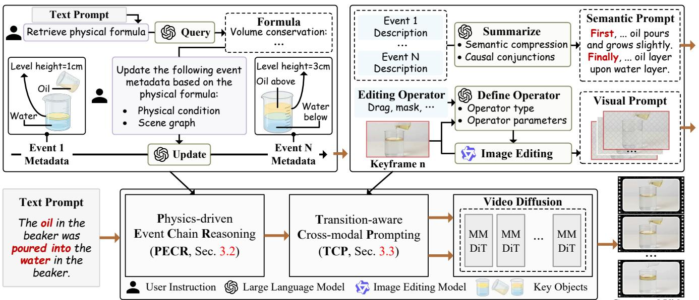
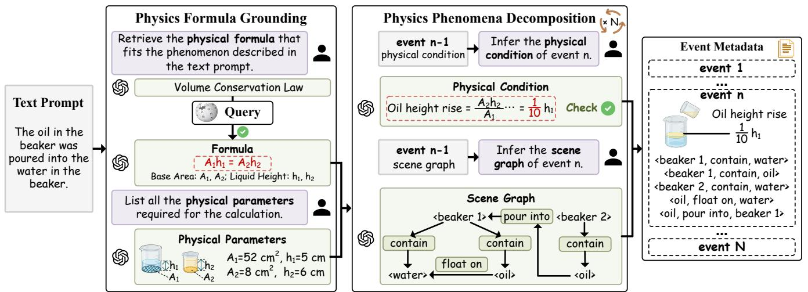
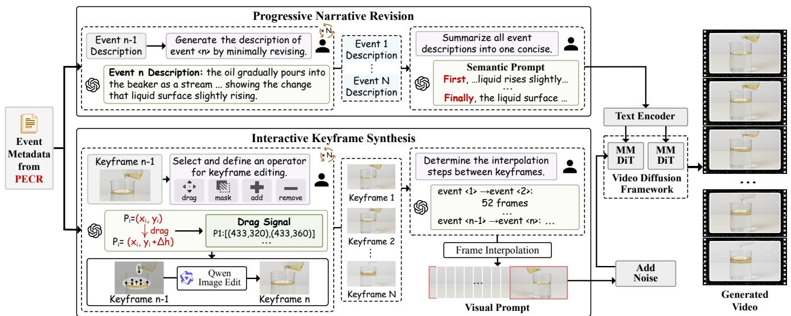
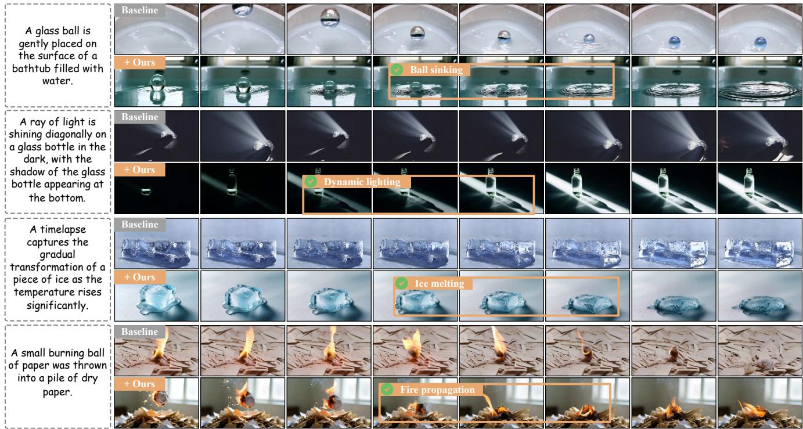
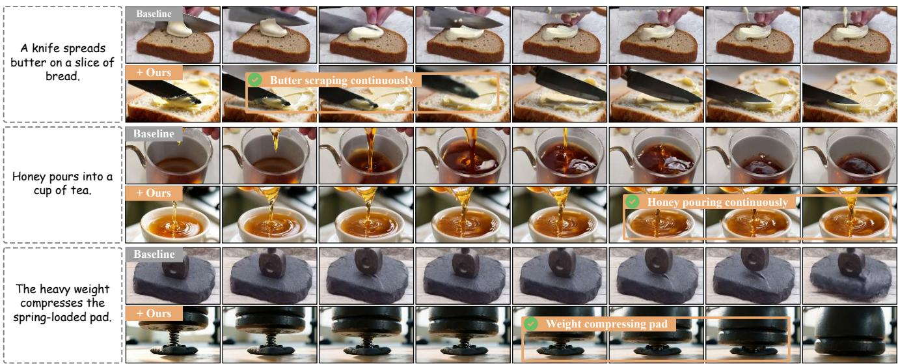
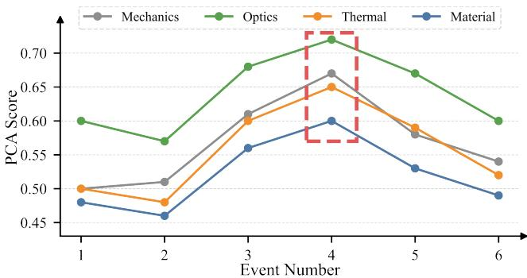
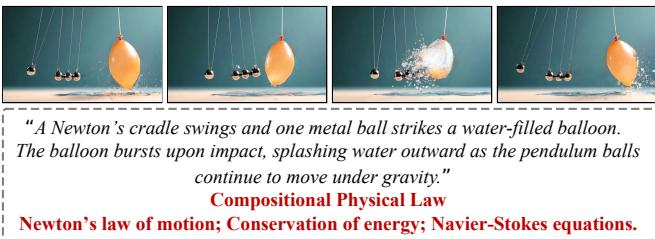

# 以事件为中心的因果思维链在物理合理视频生成中的应用

王子轩\* 四川大学 成都，中国 zixuan98@stu.scu.edu.cn 胡怡欣\* 四川大学 成都，中国 yixinhu@stu.scu.edu.cn 王浩兰 四川大学 成都，中国 haolan.wang.scu@gmail.com 陈峰 阿德莱德大学 澳大利亚阿德莱德 chenfeng1271@gmail.com 刘妍 香港理工大学 中国香港 yan2297.liu@polyu.edu.hk 李文 电子科技大学 成都，中国 liwen@uestc.edu.cn 雷寅杰 四川大学 成都，中国 yinjie@scu.edu.cn

  
F frameworks to generate videos capturing the causal progression of physical phenomena.

# 摘要

物理上合理的视频生成（PPVG）已成为建模现实世界物理现象的一条有前景的途径。PPVG 需要对常识知识的理解，而这在视频扩散模型中仍然面临挑战。目前的方法利用大型语言模型的常识推理能力，将物理概念嵌入到提示中。然而，生成模型通常仅将物理现象呈现为由提示定义的单一时刻，这主要是由于缺乏建模因果进展的条件机制。在本文中，我们将 PPVG 视为生成一系列因果连接和动态演变的事件。为了实现这一范式，我们设计了两个关键模块：(1) 物理驱动的事件链推理。该模块将提示中描述的物理现象分解为多个基本事件单元，利用思维链推理。为了减轻因果模糊性，我们将物理公式嵌入作为约束，以在推理过程中施加确定性的因果依赖。(2) 过渡感知的跨模态提示（TCP）。为了保持事件之间的连续性，该模块将因果事件单元转换为时间对齐的视觉-语言提示。它总结离散事件描述，以获得因果一致的叙事，同时通过交互编辑逐步合成单个事件的视觉关键帧。在 PhyGenBench 和 VideoPhy 基准上的全面实验表明，我们的框架在生成跨多种物理领域的物理上合理的视频方面表现出色。我们的代码将很快发布。

# 1. 引言

PPVG 已开辟了广泛的现实应用，包括电影制作 [1]、自动驾驶 [2] 和具身人工智能 [3]。近年来，视频扩散模型，如 Kling [4] 和 OpenAI-Sora [5]，在从用户提示合成摄影真实场景方面展示了显著能力。然而，简短的提示未能提供生成物理上可信的内容所需的详细物理规律。此外，视频扩散模型缺乏从这些提示中隐式推断常识知识的能力。这一差距阻碍了此类生成模型模拟现实世界物理现象，例如流体动力学、光折射和热力学效应。最近的 PPVG 研究 [6-8] 已基于大语言模型（LLM）辅助推理增强用户提示，引入物理概念。这些增强的提示作为更清晰的物理约束，引导视频生成模型以更高的物理可信度渲染外观和风格。然而，这些方法通常将生成的物理现象简化为由静态提示定义的单一时刻。这一挑战源于几个关键因素： (1) 因果模糊性。在现实世界中，物理现象按因果顺序依次展开。不幸的是，嵌入语义标签来描述这种复杂现象往往无法捕捉其动态特性。这需要通过因果确定性推理对物理现象进行结构化分解。 (2) 物理一致性约束不足。仅凭语言本质上无法传达事件之间的因果连续性。视觉线索（例如参考视频）可以提供事件转换的可观察证据。即便如此，与特定物理现象紧密关联的视觉先验通常很难获得。

在本文中，我们提出了一种以事件为中心的物理可 plausibility 视频生成框架，该框架将物理现象建模为因果关联事件之间的转变，如图 1 所示。该框架由两个核心模块组成：（1）我们设计了一个物理驱动的事件链推理（PECR）模块（第 3.2 节），将物理现象分解为一系列细粒度事件单元。为了减轻因果歧义，我们在推理过程中嵌入了基于物理公式的计算分析与场景图结合。这使得我们能够推断具有清晰因果关系的物理现实事件。（2）我们开发了一个转变感知的跨模态提示（TCP）模块（第 3.3 节），通过语义提示和视觉提示的协同作用，确保生成事件之间的因果一致性和视觉连续性。从语义角度来看，该模块利用因果连词将多个事件描述压缩为一个因果一致的表示。在视觉方面，该模块使用通过交互编辑合成的关键帧作为视觉提示，保持事件之间的平滑过渡。我们在 PhyGenBench [9] 和 VideoPhy [10] 基准上评估了我们的框架。我们的框架在不同物理领域的物理信息度量指标上显著超越了当前的 PPVG 方法。关键是，我们框架生成的视频能够保留物理事件合理的时间顺序。我们的贡献总结如下： • 我们提出了一种以事件为中心的生成框架，将物理可 plausibility 视频建模为因果关联和动态演变事件序列。 • 为了处理因果歧义，我们通过确定性物理约束进行因果推理，将物理现象分解为因果排序的事件单元。 • 为了约束物理事件之间的连续生成，我们合成了时间对齐的语义-视觉提示，引导事件过渡。 • 综合实验表明，我们的框架在生成物理现实和因果一致视频方面优于现有方法。

# 2. 相关工作

物理可行视频生成。为了使视频遵循物理法则，已探索物理感知生成。一些工作通过基于图形引擎的仿真来描述物理现象，这些引擎被整合到扩散采样中以增强物理真实感。不幸的是，发动机属性需要手动规定。为应对多样的开放域物理现象，VideoREPA利用基础模型的物理知识。WISA和PhysHPO指导扩散模型从分解原则中学习物理现象。VLIPP、DiffPhy、PAG-SAD和PhyT2V利用链式思维推理设计物理感知提示。然而，物理事件以因果有序的过程展开，而当前的方法由于缺乏因果建模，往往将其简化为单一场景。 视觉生成中的链式思维。最近的研究将链式思维推理从语言理解适应到视觉生成。这些方法分为两类。第一类利用生成前推理范式来增强条件信号。例如，IRG和Draw-In-Mind为细粒度图像生成优化用户提示。LayerCraft和GoT通过推理空间安排使得多个物体的生成成为可能。其他方法则通过在生成过程中嵌入逐步推理，即在生成期间的推理范式。例如，Z-Sampling执行扩散自反思，利用去噪与反转之间的差距来增强语义一致性。Visual-CoG采用链式引导框架，通过强化学习监督每个生成阶段。然而，目前的方法主要集中于语义和空间推理，忽视了确定性因果关系的建模。 视频生成中的双重提示。虽然自然语言定义场景语义，但通常未充分详细说明几何形状和运动。因此，引入视觉线索来指导视频生成，包括参考图像、空间布局和运动先验。一些工作将参考图像作为生成高保真纹理和多样视觉风格的外观先验。为了增强几何细节，一些研究在生成过程中引入空间布局。例如，SketchVideo利用草图约束物体轮廓。DyST-XL和BlobGEN-Vid分别通过边界框和斑点来指定物体的位置。鉴于视频的动态特性，最近的研究使用运动先验来捕捉复杂轨迹。例如，TrackGo和Mojito调节运动的方向和强度以实现平滑动态。然而，这些方法主要限制个人场景，缺乏确保多个事件之间平滑过渡的能力。

# 3. 方法论

# 3.1. 整体框架

根据用户提供的物理现象的语言描述 $w$，我们的目标是生成相应的物理上合理的视频 $\mathbf { V }$，以刻画所描述现象的基本发展进程。

$$
\Gamma : w \to \mathbf { V } ,
$$

其中，$\Gamma$ 表示我们的物理感知视频生成框架。具体而言，我们的框架组织为两个协同模块。在第3.2节中，我们设计了一个基于物理驱动的事件链推理（PECR）模块，该模块将用户提供的描述中每个复杂现象解释为一系列有序的物理事件。在第3.3节中，我们开发了一个过渡意识的跨模态提示（TCP）模块，该模块将PECR模块推断出的事件链与视频生成过程连接起来。我们的TCP模块动态合成与物理过程演变相适应的双重条件，而不是时间不变的语言描述和参考图像。总体而言，我们的框架捕捉了物理过程的连续演变，使生成的视频能够真实再现动态物理现象。

# 3.2. 物理驱动的事件链推理

物理现象涉及事件的进程以及相应的物理参数变化。目前的研究通常将物理现象与单一对象绑定，并简单地使用语义标签粗略描述每个现象。与此类方法不同，我们将物理现象概念化为一系列因果排序的事件，如图2所示。每个事件可以视为一个复合单元，包含对象的语义信息和相互作用的描述，以及由物理公式支配的可测量的物理条件。这使得我们能够从定性和定量两个角度表征物理过程中的关键时刻。物理公式基础。为了数值描述物理过程，我们基于嵌入语言描述 $w$ 中的物理法律 $\mathcal { L }$ 对物理公式 ${ \mathcal { F } } ^ { * }$ 进行推理。具体而言，物理法律 $\mathcal { L }$ 由问答确定，选项根据[35]定义。与物理法律相关的公式名称是从语言描述中推断出来的。之后，推断的公式名称 $\mathcal { N } _ { \mathcal { L } }$ 被用作查询，以从知识库中检索物理公式 $\mathcal { F } ^ { * }$。

$$
\mathcal { F } ^ { * } = \mathrm { T o p K } _ { f \in \mathcal { F } _ { \mathcal { L } } } P ( f \mid \mathcal { N } _ { \mathcal { L } } , \mathcal { L } ) ,
$$

其中 $\mathcal { F } _ { \mathcal { L } }$ 表示与物理定律 $\mathcal { L }$ 相关的在线知识库中的所有公式，$P ( \cdot )$ 是候选公式 $\mathcal { F } _ { \mathcal { L } }$ 的评分函数。当在 $\mathcal { F } _ { \mathcal { L } }$ 中未找到推断公式名称 $\mathcal { N } _ { \mathcal { L } }$ 的直接匹配时，我们将使用 $\mathcal { F } _ { \mathcal { L } }$ 重新生成公式名称。一旦公式被检索，进行公式分析所需的物理参数由常识推理设定。

物理现象分解。为了描述复杂物理现象引起的场景变化，我们将这些现象分解为有序序列 $\{ \mathcal { E } _ { t } \} _ { t = 1 } ^ { \bar { T } } ~ = ~ \{ \{ \mathcal { C } _ { t } \} _ { t = 1 } ^ { T } , \{ \mathcal { G } _ { t } \} _ { t = 1 } ^ { T } \}$。其中，$\{ \mathcal { E } _ { t } \} _ { t = 1 } ^ { T }$ 中的 $\{ \mathcal { C } _ { t } \} _ { t = 1 } ^ { T }$ 指定物理条件，$\{ \mathcal { G } _ { t } \} _ { t = 1 } ^ { T }$ 表示动态场景图，$T$ 是事件数量。物理条件是基于我们检索到的物理公式计算得出的。在分析计算过程中产生的中间量提供了额外的物理意义信号。通过分析物理参数是否发生显著变化，可以确定物理事件的边界。这些边界使得连续的视频能够离散为事件序列。

$$
\mathcal { C } _ { t } = \left\{ \left( \mathbf { P } _ { t } , \mathcal { F } ^ { * } ( \mathbf { P } _ { t } ) \right) \big | \| \mathbf { P } _ { t } - \mathbf { P } _ { t - 1 } \| > \tau _ { p } \right\} ,
$$

其中 $\mathbf { P } _ { t }$ 表示第 $t$ 次事件中所有物体的物理参数向量。$\tau _ { p }$ 是变化阈值，用于确定物理参数的变化是否足以指示一个新事件。为了确保物理的一致性，通过检测违反物理连续性的突然变化来验证当前事件推断的参数是否与相邻事件的一致。当发现无效变化时，相应的参数和物理情境会被反馈以进行重新推断。随后，我们根据物理条件更新场景图。给定 $\mathcal { C } _ { t }$ ，我们更新场景图 $\mathcal { G } _ { t } = \{ \mathcal { V } _ { t } , \mathcal { R } _ { t } \}$ 的节点 $\nu _ { t }$ 和边 $\mathcal { R } _ { t }$。对于节点 $\nu _ { t }$ ，外观（例如，液体颜色变化）或语义标签（例如，燃烧成灰）会根据其物理参数的变化而更新。边 $\mathcal { R } _ { t }$ 的更新由物体之间交互的变化（例如，距离的减少）驱动，这需要考虑多个物体的物理参数的协调变化，即：

$$
\mathcal { G } _ { t } = \Phi ( \mathcal { G } _ { t - 1 } , \mathcal { C } _ { t } ) ,
$$

其中 $\Phi ( \cdot )$ 表示场景图更新函数，该函数将 $\mathcal { C } _ { t }$ 中捕捉到的物理变化融入到之前的场景图 $\mathcal { G } _ { t - 1 }$ 中，以生成当前的新图 $\mathcal { G } _ { t }$。

# 3.3. 过渡感知跨模态提示

通过从先前阶段推断的一系列事件，关键挑战在于将这些事件桥接到物理现实的视频生成上。一个双条件框架[26, 28]作为一种有前景的解决方案。然而，当前的框架未能使条件随时间演变，导致无法捕捉事件的发展。与以往的工作不同，我们逐步合成每个事件的语义-视觉提示，同时保持无缝的时间进展，如图3所示。语义提示在去噪过程中作为指导，而视觉提示则替代原始高斯噪声，以提供物理感知的先验。生成过程被正式定义为：

$$
\mathbf { Z } _ { \tau _ { z } - 1 } = \epsilon _ { \theta } ( \mathbf { Z } _ { \tau _ { z } } ; \mathbf { W } ) ,
$$

其中 $\mathbf { Z } _ { \tau _ { z } }$ 表示视觉先验。W 指的是语言描述的嵌入。$\epsilon _ { \theta }$ 是视频扩散模型的去噪网络。渐进叙事修订。独立描述事件可能会破坏叙事的整体连贯性。

  
.

因此，我们执行最小渐进修订，依据前述上下文。具体来说，物理条件 $\mathcal { C } _ { t }$ 限制物理上可行的转变，例如，温度上升允许“融化”但排除“冻结”。我们采用场景图 $\mathcal { G } _ { t }$ 来保留对象的身份，并指定哪些属性和关系可以变化。设 $w _ { t }$ 表示第 $t$ 个事件的描述，我们通过以下方式获得 $w _ { t }$：

$$
w _ { t } = \mathrm { L L M } \big ( w _ { t - 1 } + \Delta ( w _ { t - 1 } , \mathcal { C } _ { t } , \mathcal { G } _ { t } ) \big ) ,
$$

其中 $\Delta ( \cdot )$ 表示由 $\mathcal { C } _ { t }$ 和 $\mathcal { G } _ { t }$ 指导的增量语义修正。视频扩散模型通常基于单个句子进行条件设置。然而，连接多个事件描述会产生语义冗余。基于这一点，我们通过语义凝聚和因果连接将事件描述合并成一个正语义提示。此外，我们构造了一个负描述 $w _ { - } ^ { * }$。两个描述被单独嵌入，并连接为：

$$
\mathbf { W } = [ \psi _ { \mathrm { t e x t } } ( w _ { + } ^ { * } ) ; ~ \psi _ { \mathrm { t e x t } } ( w _ { - } ^ { * } ) ] ,
$$

其中 $\psi _ { \mathrm { t e x t } } ( \cdot )$ 是文本编码器。交互式关键帧合成。虽然语言提供了概念上的语义指导，但由于语言描述的模糊性，物理上逼真的细节仍然没有明确规定。为了将与物理相关的细节嵌入随机高斯噪声中，我们通过交互式图像编辑为每个物理事件合成关键帧 $v _ { t }$。这些生成的关键帧作为先验，指导视频生成过程。具体来说，我们从预定义的操作集（例如，拖动或遮罩）中选择适当的编辑操作符。连续条件之间的物理参数变化作为数值正则化器。它限制了包含拖动幅度和视觉变化区域的动作空间。实际上，我们在源图像上绘制操作提示，通过 Qwen-Image-Edit [36] 引导修改。每个关键帧的获取过程如下：

$$
\mathcal { O } _ { t } = \mathrm { L L M } \big ( ( \mathcal { C } _ { t - 1 } , \mathcal { G } _ { t - 1 } ) \to ( \mathcal { C } _ { t } , \mathcal { G } _ { t } ) \big ) ,
$$

$$
v _ { t } = \mathrm { E d i t } ( v _ { t - 1 } ; \mathcal { O } _ { t } )
$$

其中 ${ \mathcal { O } } _ { t }$ 表示编辑算子。关键帧 $v _ { 1 }$ 直接从事件描述中合成。为了提供平滑的过渡，我们在关键帧之间应用线性插值。与推断 ${ \mathcal { O } } _ { t }$ 同时，为从第 $( t - 1 )$ 个事件到第 $t$ 个事件的变化预测一个物理上合理的时间跨度 $d _ { t }$，该时间跨度确定在 $v _ { t - 1 }$ 和 $v _ { t }$ 之间插值的中间帧数量。由于视频扩散模型通常在压缩特征空间中操作，我们使用变分自编码器（VAE）[37] 对每个关键帧进行编码。基于预测的时间跨度和嵌入的关键帧特征，我们执行如下帧插值：

$$
\begin{array} { r } { \mathbf { z } _ { 0 , t } = \mathrm { I N T E R P } ( \psi _ { \mathrm { i m g } } ( v _ { t - 1 } ) , \ \psi _ { \mathrm { i m g } } ( v _ { t } ) ; \ d _ { t } ) , } \end{array}
$$

其中 $\mathbf { z } _ { 0 , t }$ 表示两个事件之间的插值特征。INTERP $( \cdot )$ 表示线性插值。$\psi _ { \mathrm { i m g } } ( \cdot )$ 是变分自编码器（VAE）的编码器。给定一个预定义的时间步 $\tau _ { z }$，我们向 $[ { \bf z } _ { 0 } , \ldots , { \bf z } _ { T } ]$ 添加噪声，作为视频扩散模型去噪过程的先验。

$$
{ \mathbf Z } _ { \tau _ { z } } = [ { \mathbf z } _ { 0 } , \ldots , { \mathbf z } _ { T } ] + \sigma _ { \tau _ { z } } ^ { 2 } \epsilon , \quad \epsilon \sim \mathcal { N } ( 0 , I ) ,
$$

其中 $\sigma _ { \tau _ { z } } ^ { 2 }$ 表示高斯噪声的方差。

Table 1. Performance comparison on PhyGenBench [9] across four physical domains. The best and second-best results are highlighted and underlined, respectively.   

<table><tr><td rowspan="2">Methods</td><td colspan="4">Physical domains (↑)</td><td rowspan="2">Avg.</td></tr><tr><td>Mechanics</td><td>Optics</td><td>Thermal</td><td>Material</td></tr><tr><td>Video Foundation Model</td><td></td><td></td><td></td><td></td><td></td></tr><tr><td>Lavie [40]</td><td>0.30</td><td>0.44</td><td>0.38</td><td>0.32</td><td>0.36</td></tr><tr><td>VideoCrafter v2.0 [41]</td><td>-</td><td>-</td><td>-</td><td>-</td><td>0.48</td></tr><tr><td>Open-Sora v1.2 [42]</td><td>0.43</td><td>0.50</td><td>0.34</td><td>0.37</td><td>0.44</td></tr><tr><td>Vchitect v2.0 [43]</td><td>0.41</td><td>0.56</td><td>0.44</td><td>0.37</td><td>0.45</td></tr><tr><td>Wan [44]</td><td>0.36</td><td>0.53</td><td>0.36</td><td>0.33</td><td>0.40</td></tr><tr><td>Kling [45]</td><td>0.45</td><td>0.58</td><td>0.50</td><td>0.40</td><td>0.49</td></tr><tr><td>Pika [46]</td><td>0.35</td><td>0.56</td><td>0.43</td><td>0.39</td><td>0.44</td></tr><tr><td>Gen-3 [47]</td><td>0.45</td><td>0.57</td><td>0.49</td><td>0.51</td><td>0.51</td></tr><tr><td colspan="6">Physics-aware Video Generation Model</td></tr><tr><td>WISA [15]</td><td>-</td><td></td><td>-</td><td>-</td><td>0.43</td></tr><tr><td>DiffPhy [8]</td><td>0.53</td><td>0.59</td><td>0.58</td><td>0.46</td><td>0.54</td></tr><tr><td>CogVideoX-5B [38]</td><td>0.39</td><td>0.55</td><td>0.40</td><td>0.42</td><td>0.45</td></tr><tr><td>+ PhyT2V [6]</td><td>0.45</td><td>0.55</td><td>0.43</td><td>0.53</td><td>0.50</td></tr><tr><td>+ SGD [7]</td><td>0.49</td><td>0.58</td><td>0.42</td><td>0.48</td><td>0.49</td></tr><tr><td>+ PhysHPO [16]</td><td>0.55</td><td>0.68</td><td>0.50</td><td>0.65</td><td>0.61</td></tr><tr><td>+ Ours</td><td>0.67</td><td>0.72</td><td>0.65</td><td>0.60</td><td>0.66</td></tr></table>

# 4. 实验

# 4.1. 实验设置

数据集。我们在 PhyGenBench [9] 和 Video-Phy [10] 数据集上进行评估。具体来说，PhyGenBench 包含 160 个设计的语言描述，涵盖 27 条物理定律，分为四个基本领域：力学、光学、热学和材料。VideoPhy 提供了 688 个经过人工验证的语言提示，描述了物体之间的各种物理互动，包括固体-固体、固体-流体和流体-流体。评估指标。按照 PhyGenBench [9] 的标准，我们使用物理常识对齐（Physical Commonsense Alignment, PCA）作为我们的评估指标，该指标通过考虑关键现象检测、物理顺序验证和整体自然性评估来指示视频质量。对于 VideoPhy [10]，我们使用其提供的 VideoCon-Physics 评估器来评估语义一致性（Semantic Adherence, SA）和物理常识（Physical Commonsense, PC）。SA 评估语言描述是否在生成的视频帧中具有语义基础。PC 检查所描绘的动作和物体属性是否符合现实物理定律。实施细节。我们使用 CogVideoX 5B [38] 作为视频生成的基线。按照官方实现，视频生成模型配置为每个样本 161 帧，分辨率为 $1 3 6 0 \times 7 6 8$。对于语言推理，我们采用开源的 GPT-OSS-20B [39]，配置为默认设置。我们使用 Qwen-Image 系列 [36] 进行关键帧生成。

Table 2. PhyGenBench [9] evaluation of Phenomena Detection (PD) and Physical Order (PO).The best and second-best results are highlighted and underlined, respectively.   

<table><tr><td rowspan="2">Model</td><td colspan="2">Mechanics</td><td colspan="2">Optics</td><td colspan="2">Thermal</td><td colspan="2">Material</td></tr><tr><td>PD</td><td>PO</td><td>PD</td><td>PO</td><td>PD</td><td>PO</td><td>PD</td><td>PO</td></tr><tr><td>Kling [45]</td><td>0.61</td><td>0.45</td><td>0.75</td><td>0.55</td><td>0.61</td><td>0.37</td><td>0.62</td><td>0.34</td></tr><tr><td>Wan 44]</td><td>0.61</td><td>0.40</td><td>0.76</td><td>0.56</td><td>0.50</td><td>0.27</td><td>0.58</td><td>0.25</td></tr><tr><td>Dif Phy [8]</td><td>0.73</td><td>0.53</td><td>0.83</td><td>0.66</td><td>0.70</td><td>0.58</td><td>0.73</td><td>0.43</td></tr><tr><td>Ours</td><td>0.79</td><td>0.79</td><td>0.84</td><td>0.85</td><td>0.78</td><td>0.69</td><td>0.75</td><td>0.58</td></tr></table>

# 4.2. 在 PhyGenBench 上的评估

我们将我们的框架与视频基础模型 [38, 4045, 47] 和物理感知视频生成模型 [68, 15, 16] 在 PhyGenBench [9] 基准上进行了对比。如表 1 所示，我们的框架始终达到最佳整体性能 0.66，平均超越了 PhysHPO [16]（之前的最先进技术）$8 . 1 9 \%$。表 2 提供了对关键现象和物理序列的详细 PhyGen-Bench 评估。如图 4 所示，与基线 CogVideo-5B [38] 相比，我们的框架在逐渐下沉（第 1 行）、光折射（第 2 行）、真实融化（第 3 行）和自然燃烧（第 4 行）的生成上实现了更具视觉真实性的效果。这些结果表明我们的框架能够通过明确考虑因果序列事件来理解物理法则及其对应的视觉动态。

# 4.3. 在 VideoPhy 上的评估

我们将我们的框架与一些视频生成模型[6, 16, 38, 4042, 46, 4850]在VideoPhy [10]基准上进行了比较。如Tab. 3所示，我们的方法在整体上达到了$4 9 . 3 \%$的分数$S \mathsf { A } { = } 1$，$\mathrm { P C } { = } 1$，显著优于之前的最先进方法PhysHPO [16]，提升约$3 . 4 \%$。这证实了我们框架在遵循语义线索和物理规律方面的有效性，通过利用通过链式推理推断的视觉-语言提示。如Fig. 5所示，与基线CogVideo-5B [38]相比，我们的方法展示了黄油沿刀具路径延展（第1行）、蜂蜜以连续粘稠流的形式倾倒，且液位稳定上升（第2行），以及在持续压缩下弹簧单调缩短（第3行）。这些案例强调了我们的框架能够捕捉不同物理阶段中物体之间的相互作用。

# 4.4. 消融研究

我们基于 PhyGenBench [9] 进行消融研究，系统分析我们提出的 PECR 和 TCP 模块中各个模块的贡献。我们分析了 PECR 模块中的物理公式基础 (PFG) 和物理现象分解 (PPD) 模块的有效性。当去除 PFG 模块时，我们仅依赖原始描述来推断物理事件；而去除 PPD 模块时，跨模态条件仅从物理公式中得出。如表 4 所示，排除 PFG 模块导致各物理领域平均性能下降约 $6 \%$，强调了标准公式在定量理解物理法则中的必要性。类似地，去除 PPD 模块导致平均下降约 $11 \%$，表明其在通过将复杂过程分解为逻辑有序的事件链生成真实物理现象的发展中具有有效性。

分别以高亮和下划线显示。

<table><tr><td rowspan="2">Methods</td><td colspan="3">Overall (%)</td><td colspan="3">Solid-Solid (%)</td><td colspan="3">Solid-Fluid (%)</td><td colspan="3">Fluid-Fluid (%)</td></tr><tr><td>SA, PC</td><td>SA</td><td>PC</td><td>SA,PC</td><td>SA</td><td>PC</td><td>SA,PC</td><td>SA</td><td>PC</td><td>SA, PC</td><td>SA</td><td>PC</td></tr><tr><td colspan="10">Video Foundation Model</td><td colspan="3"></td></tr><tr><td>VideoCrafter2 [41]</td><td>19.0</td><td>48.5</td><td>34.6</td><td>4.9</td><td>31.5</td><td>23.8</td><td>27.4</td><td>57.5</td><td>41.8</td><td>32.7</td><td>69.1</td><td>43.6</td></tr><tr><td>LaVIE [40]</td><td>15.7</td><td>48.7</td><td>28.0</td><td>8.5</td><td>37.3</td><td>19.0</td><td>15.8</td><td>52.1</td><td>30.8</td><td>34.5</td><td>69.1</td><td>43.6</td></tr><tr><td>SVD-T212V [48]</td><td>11.9</td><td>42.4</td><td>30.8</td><td>4.2</td><td>25.9</td><td>27.3</td><td>17.1</td><td>52.7</td><td>32.9</td><td>18.2</td><td>58.2</td><td>34.5</td></tr><tr><td>OpenSora [42]</td><td>4.9</td><td>18.0</td><td>23.5</td><td>1.4</td><td>7.7</td><td>23.8</td><td>7.5</td><td>30.1</td><td>21.9</td><td>7.3</td><td>12.7</td><td>27.3</td></tr><tr><td>Pika [46]</td><td>19.7</td><td>41.1</td><td>36.5</td><td>13.6</td><td>24.8</td><td>36.8</td><td>16.3</td><td>46.5</td><td>27.9</td><td>44.0</td><td>68.0</td><td>58.0</td></tr><tr><td>Dream Machine [49]</td><td>13.6</td><td>61.9</td><td>21.8</td><td>12.6</td><td>50.0</td><td>24.3</td><td>16.6</td><td>68.1</td><td>23.6</td><td>9.0</td><td>76.3</td><td>11.0</td></tr><tr><td>Lumiere [50]</td><td>9.0</td><td>38.4</td><td>27.9</td><td>8.4</td><td>26.6</td><td>27.3</td><td>9.6</td><td>47.3</td><td>26.0</td><td>9.1</td><td>45.5</td><td>34.5</td></tr><tr><td colspan="10">Physics-aware Video Generation Model</td><td colspan="3"></td></tr><tr><td>CogVideoX-5B [38]</td><td>39.6</td><td>63.3</td><td>53</td><td>24.4</td><td>50.3</td><td>43.3</td><td>53.1</td><td>76.5</td><td>59.3</td><td>43.6</td><td>61.8</td><td>61.8</td></tr><tr><td>+ PhyT2V [6]</td><td>40.1</td><td>-</td><td>-</td><td>25.4</td><td>-</td><td>-</td><td>48.6</td><td>-</td><td>-</td><td>55.4</td><td>-</td><td>-</td></tr><tr><td>+ Vanilla DPO [51]</td><td>41.3</td><td></td><td>-</td><td>28.2</td><td></td><td></td><td>50.0</td><td>-</td><td>-</td><td>51.8</td><td></td><td>-</td></tr><tr><td>+ Ours</td><td>49.3</td><td>79.5</td><td>59.4</td><td>40.6</td><td>73.4</td><td>53.8</td><td>60.0</td><td>85.6</td><td>66.7</td><td>54.5</td><td>85.4</td><td>61.8</td></tr></table>

TCP 模块中的 PNR 和 IKS 块。我们进一步研究了渐进叙述修正（PNR）和交互式关键帧合成（IKS）块对 TCP 模块的影响。如表 4 所示，移除 PNR 块导致平均下降约 $3\%$，这表明其在改善场景的连续性和流畅演变方面的支持作用。相反，排除 IKS 块则导致平均下降约 $17\%$，这突显了为每个物理阶段显式生成专用关键帧在锚定跨帧动态和保持物理基础视觉进程方面的重要性。

  
hone inflow with a rising level, and monotoni spring compression. Al prompts are sourced from Videohy [10].

Table 4. Ablation analysis of PECR and TCP modules, including Physics Formula Grounding (PFG) and Physical Phenomena Decomposition (PPD) in PECR, and Progressive Narrative Revision (PNR) and Interactive Keyframe Synthesis (IRS) in TCP.   

<table><tr><td rowspan="2">Variant</td><td colspan="4">Physical domains (↑)</td><td rowspan="2">Avg.</td></tr><tr><td>Mechanics</td><td>Optics</td><td>Thermal</td><td>Material</td></tr><tr><td>Ours</td><td>0.67</td><td>0.72</td><td>0.65</td><td>0.60</td><td>0.66</td></tr><tr><td>Ablations of PECR module</td><td></td><td></td><td></td><td></td><td></td></tr><tr><td>w/o PFG</td><td>0.63</td><td>0.69</td><td>0.61</td><td>0.53</td><td>0.62</td></tr><tr><td>w/o PPD</td><td>0.58</td><td>0.67</td><td>0.61</td><td>0.52</td><td>0.59</td></tr><tr><td>Ablations of TCP module</td><td></td><td></td><td></td><td></td><td></td></tr><tr><td>w/o PNR</td><td>0.65</td><td>0.70</td><td>0.64</td><td>0.56</td><td>0.64</td></tr><tr><td>w/o IKS</td><td>0.50</td><td>0.64</td><td>0.58</td><td>0.48</td><td>0.55</td></tr></table>

事件数量分析。如图6所示，我们的框架在所有物理领域中以4个事件达到了最佳性能。由于每个事件都作为指导，数量过少的事件（例如13个）提供的时间监督较弱，使得模型难以准确遵循指令，从而降低了PCA分数。同时，事件数量增加（例如56个）由于基于编辑的传播引入了关键帧生成中的累积误差，导致糟糕的前导信号和视频质量下降。为平衡时间指导和关键帧稳定性，我们将事件数量设定为4个。

  
Figure 6. Effect of event number on Physical Commonsense Alignment (PCA) Score [9] across four physical domains: Mechanics, Optics, Thermal, and Material.

# 5. 结论与局限性

本文解决了生成符合物理规律的视频这一挑战，该视频描述了由真实物理法则支配的物理现象的有序进展。我们将每个物理现象分解为一系列因果相关的物理事件，而不是用简单的语义标签描绘复杂的物理现象，基于标准物理公式进行分解。我们推断物理事件并将其转化为与每个事件对应的视觉-语言提示。这些提示随后用于调节视频生成过程，确保与物理动态的一致性。综合实验验证了我们框架在生成物理合理视频方面的有效性，特别是在建模复杂和演变的物理现象方面。然而，如图7所示，我们的框架偶尔在由组合物理法则支配的场景中失效，因为现成的基础模型在组合物理推理方面能力较弱。未来，我们计划利用组合视觉推理的进展来增强物理感知视频生成中的多物理一致性。

  
Figure 7. Failure case. As foundation models lack capability in compositional physical reasoning, our framework fails to generate scenarios governed by multiple physical laws.

# References

[1] Ruihan Zhang, Borou Yu, Jiajian Min, Yetong Xin, Zheng Wei, Juncheng Nemo Shi, Mingzhen Huang, Xianghao Kong, Nix Liu Xin, Shanshan Jiang, et al. Generative ai for film creation: A survey of recent advances. In Proceedings of the IEEE/CVF Conference on Computer Vision and Pattern Recognition (CVPR), pages 62676279, 2025. 2   
[2] Boyang Deng, Richard Tucker, Zhengqi Li, Leonidas Guibas, Noah Snavely, and Gordon Wetzstein. Streetscapes: Large-scale consistent street view generation using autoregressive video diffusion. In ACM SIGGRAPH 2024 Conference Papers, pages 111, 2024. 2   
[3] Niket Agarwal, Arslan Ali, Maciej Bala, Yogesh Balaji, Erik Barker, Tiffany Cai, Prithvijit Chattopadhyay, Yongxin Chen, Yin Cui, Yifan Ding, et al. Cosmos world foundation model platform for physical ai. arXiv preprint arXiv:2501.03575, 2025. 2   
[4] Kuaishou. Kling. https://klingai.kuaishou. com/, 2024. Accessed: 2024-09-03. 2   
[5] Yixin Liu, Kai Zhang, Yuan Li, Zhiling Yan, Chujie Gao, Ruoxi Chen, Zhengqing Yuan, Yue Huang, Hanchi Sun, Jianfeng Gao, et al. Sora: A review on background, technology, limitations, and opportunities of large vision models. arXiv preprint arXiv:2402.17177, 2024. 2   
[6] Qiyao Xue, Xiangyu Yin, Boyuan Yang, and Wei Gao. Phyt2v: Llm-guided iterative self-refinement for physicsgrounded text-to-video generation. In Proceedings of the Computer Vision and Pattern Recognition Conference, pages 1882618836, 2025. 2, 3, 6, 7   
[7] Yutong Hao, Chen Chen, Ajmal Saeed Mian, Chang Xu, and Daochang Liu. Enhancing physical plausibility in video generation by reasoning the implausibility. arXiv preprint arXiv:2509.24702, 2025. 3, 6 [8] Ke Zhang, Cihan Xiao, Yiqun Mei, Jiacong Xu, and Vishal M Patel. Think before you diffuse: Llmsguided physics-aware video generation. arXiv preprint arXiv:2505.21653, 2025. 2, 3, 6   
[9] Fanqing Meng, Jiaqi Liao, Xinyu Tan, Wenqi Shao, Quanfeng Lu, Kaipeng Zhang, Yu Cheng, Dianqi Li, Yu Qiao, and Ping Luo. Towards world simulator: Crafting physical commonsense-based benchmark for video generation. arXiv preprint arXiv:2410.05363, 2024. 2, 6, 7, 8   
[10] Hritik Bansal, Zongyu Lin, Tianyi Xie, Zeshun Zong, Michal Yarom, Yonatan Bitton, Chenfanfu Jiang, Yizhou Sun, Kai-Wei Chang, and Aditya Grover. Videophy: Evaluating physical commonsense for video generation. arXiv preprint arXiv:2406.03520, 2024. 2, 6, 7, 8   
[11] Yuanming Hu, Luke Anderson, Tzu-Mao Li, Qi Sun, Nathan Carr, Jonathan Ragan-Kelley, and Frédo Durand. Difftaichi: Differentiable programming for physical simulation. arXiv preprint arXiv:1910.00935, 2019. 2   
[12] Yuanming Hu, Tzu-Mao Li, Luke Anderson, Jonathan Ragan-Kelley, and Frédo Durand. Taichi: a language for high-performance computation on spatially sparse data structures. ACM Transactions on Graphics (TOG), 38(6):1 16, 2019.   
[13] Hao-Yu Hsu, Chih-Hao Lin, Albert J Zhai, Hongchi Xia, and Shenlong Wang. Autovfx: Physically realistic video editing from natural language instructions. In 2025 International Conference on 3D Vision (3DV), pages 769780. IEEE, 2025. 2   
[14] Xiangdong Zhang, Jiaqi Liao, Shaofeng Zhang, Fanqing Meng, Xiangpeng Wan, Junchi Yan, and Yu Cheng. Videorepa: Learning physics for video generation through relational alignment with foundation models. arXiv preprint arXiv:2505.23656, 2025. 3   
[15] Jing Wang, Ao Ma, Ke Cao, Jun Zheng, Zhanjie Zhang, Jiasong Feng, Shanyuan Liu, Yuhang Ma, Bo Cheng, Dawei Leng, et al. Wisa: World simulator assistant for physics-aware text-to-video generation. arXiv preprint arXiv:2503.08153, 2025. 3, 6   
[16] Harold Haodong Chen, Haojian Huang, Qifeng Chen, Harry Yang, and Ser-Nam Lim. Hierarchical fine-grained preference optimization for physically plausible video generation. arXiv preprint arXiv:2508.10858, 2025. 3, 6   
[17] Xindi Yang, Baolu Li, Yiming Zhang, Zhenfei Yin, Lei Bai, Liqian Ma, Zhiyong Wang, Jianfei ai, Tien-Tsin Wong, Huchuan Lu, et al. Vlipp: Towards physically plausible video generation with vision and language informed physical prior. arXiv preprint arXiv:2503.23368, 2025. 3   
[18] Jason Wei, Xuezhi Wang, Dale Schuurmans, Maarten Bosma, Fei Xia, Ed Chi, Quoc V Le, Denny Zhou, et al. Chain-of-thought prompting elicits reasoning in large language models. Advances in Neural Information Processing Systems (NeurIPS), 35:2482424837, 2022. 3   
[19] Wenxuan Huang, Shuang Chen, Zheyong Xie, Shaosheng Cao, Shixiang Tang, Yufan Shen, Qingyu Yin, Wenbo Hu, Xiaoman Wang, Yuntian Tang, et al. Interleaving reasog for better text-o-image enetion.i p arXiv:2509.06945, 2025. 3   
[20] Ziyun Zeng, Junhao Zhang, Wei Li, and Mike Zheng Shou. Draw-in-mind: Learning precise image editing via chainof-thought imagination. arXiv preprint arXiv:2509.01986, 2025. 3   
[21] Yuyao Zhang, Jinghao Li, and Yu-Wing Tai. Layercraft: Enhancing text-to-image generation with cot reasoning and layered object integration. arXiv preprint arXiv:2504.00010, 2025. 3   
[22] Rongyao Fang, Chengqi Duan, Kun Wang, Linjiang Huang, Hao Li, Shilin Yan, Hao Tian, Xingyu Zeng, Rui Zhao, Jifeng Dai, et al. Got: Unleashing reasoning capability of multimodal large language model for visual generation and editing. arXiv preprint arXiv:2503.10639, 2025. 3   
[23] Lichen Bai, Shitong Shao, Zikai Zhou, Zipeng Qi, Zhiqiang Xu, Haoyi Xiong, and Zeke Xie. Zigzag diffusion sampling: Diffusion models can self-improve via self-reflection. arXiv preprint arXiv:2412.10891, 2024. 3   
[24] Yaqi Li, Peng Chen, Mingyang Han, Bu Pi, Haoxiang Shi, Runou Zhao, Yang Yao, Xuan Zhang, and Jun Song. Visual-cog: Stage-aware reinforcement learning with chain of guidance for text-to-image generation. arXiv preprint arXiv:2508.18032, 2025. 3   
[25] Rohit Girdhar, Mannat Singh, Andrew Brown, Quentin Duval, Samaneh Azadi, Sai Saketh Rambhatla, Akbar Shah, Xi Yin, Devi Parikh, and Ishan Misra. Factorizing text-tovideo generation by explicit image conditioning. In European Conference on Computer Vision (ECCV), pages 205 224. Springer, 2024. 3   
[26] Zongyu Lin, Wei Liu, Chen Chen, Jiasen Lu, Wenze Hu, Tsu-Jui Fu, Jesse Allardice, Zhengfeng Lai, Liangchen Song, Bowen Zhang, et al. Stiv: Scalable text and image conditioned video generation. In Proceedings of the IEEE/CVF Inteainal ocnu Visn ), s 1624916259, 2025. 4   
[27] Bolin Lai, Sangmin Lee, Xu Cao, Xiang Li, and James M Rehg. Incorporating flexible image conditioning into textto-video diffusion models without training. arXiv preprint arXiv:2505.20629, 2025.   
[28] Haomiao Ni, Bernhard Egger, Suhas Lohit, Anoop Cherian, Ye Wang, Toshiaki Koike-Akino, Sharon X Huang, and Tim K Marks. Ti2v-zero: Zero-shot image conditioning for text-to-video diffusion models. In Proceedings of the IEEE/CVF Conference on Computer Vision and Pattern Recognition (CVPR), pages 90159025, 2024. 4   
[29] Xin Li, Wenqing Chu, Ye Wu, Weihang Yuan, Fanglong Liu, Qi Zhang, Fu Li, Haocheng Feng, Errui Ding, and Jingdong Wang. Videogen: A reference-guided latent diffusion approach for high definition text-to-video generation. arXiv preprint arXiv:2309.00398, 2023. 3   
[30] Feng-Lin Liu, Hongbo Fu, Xintao Wang, Weicai Ye, Pengfei Wan, Di Zhang, and Lin Gao. Sketchvideo: Sketch-based video generation and editing. In Proceedings of the Computer Vision and Pattern Recognition Conference (CVPR), pages 2337923390, 2025. 3   
[31] Weijie He, Mushui Liu, Yunlong Yu, Zhao Wang, and Chao Wu. Dyst-xl: Dynamic layout planning and content control for compositional text-to-video generation. arXiv preprint arXiv:2504.15032, 2025. 3   
[32] Weixi Feng, Chao Liu, Sifei Liu, William Yang Wang, Arash Vahdat, and Weili Nie. Blobgen-vid: Compositional text-tovideo generation with blob video representations. In Proceedings of the Computer Vision and Pattern Recognition Conference (CVPR), pages 1298912998, 2025. 3   
[33] Haitao Zhou, Chuang Wang, Rui Nie, Jinlin Liu, Dongdong Yu, Qian Yu, and Changhu Wang. Trackgo: A flexible and efficient method for controllable video generation. In Proceedings of the AAAI Conference on Artificial Intelligence (AAAI), volume 39, pages 1074310751, 2025. 3   
[34] Xuehai He, Shuohang Wang, Jianwei Yang, Xiaoxia Wu, Yiping Wang, Kuan Wang, Zheng Zhan, Olatunji Ruwase, Yelong Shen, and Xin Eric Wang. Mojito: Motion trajectory and intensity control for video generation. arXiv preprint arXiv:2412.08948, 2024. 3   
[35] Minghui Lin, Xiang Wang, Yishan Wang, Shu Wang, Fengqi Dai, Pengxiang Ding, Cunxiang Wang, Zhengrong Zuo, Nong Sang, Siteng Huang, et al. Exploring the evolution of physics cognition in video generation: A survey. arXiv preprint arXiv:2503.21765, 2025. 3   
[36] Chenfei Wu, Jiahao Li, Jingren Zhou, Junyang Lin, Kaiyuan Gao, Kun Yan, Sheng-ming Yin, Shuai Bai, Xiao Xu, Yilei Chen, et al. Qwen-image technical report. arXiv preprint arXiv:2508.02324, 2025. 5, 6   
[37] Diederik P Kingma and Max Welling. Auto-encoding variational bayes. arXiv preprint arXiv:1312.6114, 2013. 5   
[38] Zhuoyi Yang, Jiayan Teng, Wendi Zheng, Ming Ding, Shiyu Huang, Jiazheng Xu, Yuanming Yang, Wenyi Hong, Xiaohan Zhang, Guanyu Feng, et al. Cogvideox: Text-to-video diffusion models with an expert transformer. arXiv preprint arXiv:2408.06072, 2024. 6, 7, 8   
[39] OpenAI. Gpt-oss-20b model card, 2025. ht tps : / / openai.com/index/gpt-oss-model-card/.6   
[40] Yaohui Wang, Xinyuan Chen, Xin Ma, Shangchen Zhou, Ziqi Huang, Yi Wang, Ceyuan Yang, Yinan He, Jiashuo Yu, Peiqing Yang, et al. Lavie: High-quality video generation with cascaded latent diffusion models. International Journal of Computer Vision, 133(5):30593078, 2025. 6, 7   
[41] Haoxin Chen, Yong Zhang, Xiaodong Cun, Menghan Xia, Xintao Wang, Chao Weng, and Ying Shan. Videocrafter2: Overcoming data limitations for high-quality video diffusion models. In Proceedings of the IEEE/CVF Conference on Computer Vision and Pattern Recognition, pages 7310 7320, 2024. 6, 7   
[42] Zangwei Zheng, Xiangyu Peng, Tianji Yang, Chenhui Shen, Shei Li Ho Lu, Yu Zou, Tai Li nd You.Open-sora: Democratizing efficient video production for all. arXiv preprint arXiv:2412.20404, 2024. 6, 7   
[43] Weichen Fan, Chenyang Si, Junhao Song, Zhenyu Yang, Yinan He, Long Zhuo, Ziqi Huang, Ziyue Dong, Jingwen He, Dongwei Pan, et al. Vchitect-2.0: Parallel transformer for scaling up video diffusion models. arXiv preprint arXiv:2501.08453, 2025. 6   
[44] Team Wan, Ang Wang, Baole Ai, Bin Wen, Chaojie Mao, Chen-Wei Xie, Di Chen, Feiwu Yu, Haiming Zhao, Jianxiao Yang, et al. Wan: Open and advanced large-scale video generative models. arXiv preprint arXiv:2503.20314, 2025. 6   
[45] Kling AI. Kling, 2024. https: //www.klingai. com/. 6   
[46] Pika. Pika, 2024. https: //pika.art/. 6, 7   
[47] Anastasis Germanidis and Runway Research. Introducing gen-3 alpha: A new frontier for video generation, 2024. https://runwayml.com/research/ introducing-gen-3-alpha/.6   
[48] Andreas Blattmann, Tim Dockhorn, Sumith Kulal, Daniel Mendelevitch, Maciej Kilian, Dominik Lorenz, Yam Levi, Zion English, Vikram Voleti, Adam Letts, et al. Stable video diffusion: Scaling latent video diffusion models to large datasets. arXiv preprint arXiv:2311.15127, 2023. 6, 7   
[49] Luma AI. Luma dream machine: Ai video generator, 2024. https://lumalabs.ai/dream-machine.7   
[50] Omer Bar-Tal, Hila Chefer, Omer Tov, Charles Herrmann, Roni Paiss, Shiran Zada, Ariel Ephrat, Junhwa Hur, Guanghui Liu, Amit Raj, et al. Lumiere: A space-time diffusion model for video generation. In SIGGRAPH Asia 2024 Conference Papers, pages 111, 2024. 6, 7   
[51] Bram Wallace, Meihua Dang, Rafael Rafailov, Linqi Zhou, Aaron Lou, Senthil Purushwalkam, Stefano Ermon, Caiming Xiong, Shafiq Joty, and Nikhil Naik. Diffusion model alignment using direct preference optimization. In CVPR, pages 82288238, 2024. 7   
[52] Shi Qiu, Shaoyang Guo, Zhuo-Yang Song, Yunbo Sun, Zeyu Cai, Jiashen Wei, Tianyu Luo, Yixuan Yin, Haoxu Zhang, Yi Hu, et al. Phybench: Holistic evaluation of physical perception and reasoning in large language models. arXiv preprint arXiv:2504.16074, 2025. 9   
[53] Jiajun Shi, Chaoren Wei, Liqun Yang, Zekun Moore Wang, Chenghao Yang, Ge Zhang, Stephen Huang, Tao Peng, Jian Yang, and Zhoufutu Wen. Cryptox: Compositional reasoning evaluation of large language models. arXiv preprint arXiv:2502.07813, 2025.   
[54] Chenyu Zhang, Daniil Cherniavskii, Andrii Zadaianchuk, Antonios Tragoudaras, Antonios Vozikis, Thijmen Nijdam, Derck WE Prinzhorn, Mark Bodracska, Nicu Sebe, and Efstratios Gavves. Morpheus: Benchmarking physical reasoning of video generative models with real physical experiments. arXiv preprint arXiv:2504.02918, 2025. 9   
[55] Fucai Ke, Joy Hsu, Zhixi Cai, Zixian Ma, Xin Zheng, Xindi Wu, Sukai Huang, Weiqing Wang, Pari Delir Haghighi, Gholamreza Haffari, et al. Explain before you answer: A survey on compositional visual reasoning. arXiv preprint arXiv:2508.17298, 2025. 9   
[56] Zixuan Wang, Duo Peng, Feng Chen, Yuwei Yang, and Yinjie Lei. Training-free dense-aligned diffusion guidance for modular conditional image synthesis. In Proceedings of the Computer Vision and Pattern Recognition Conference (CVPR), pages 1313513145, 2025. 9