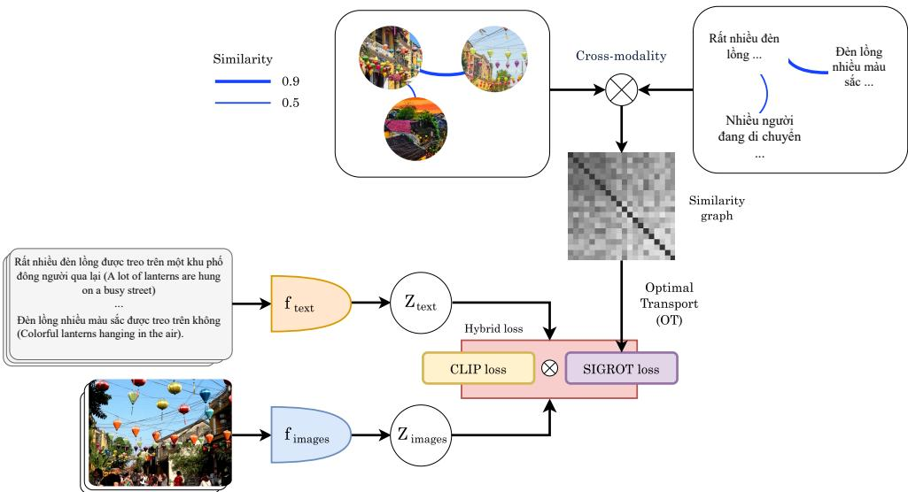
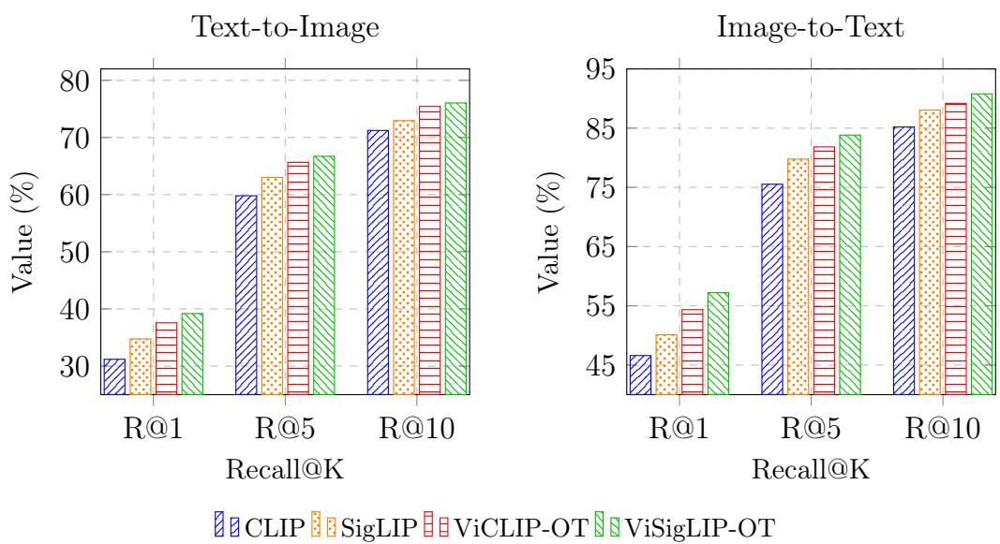
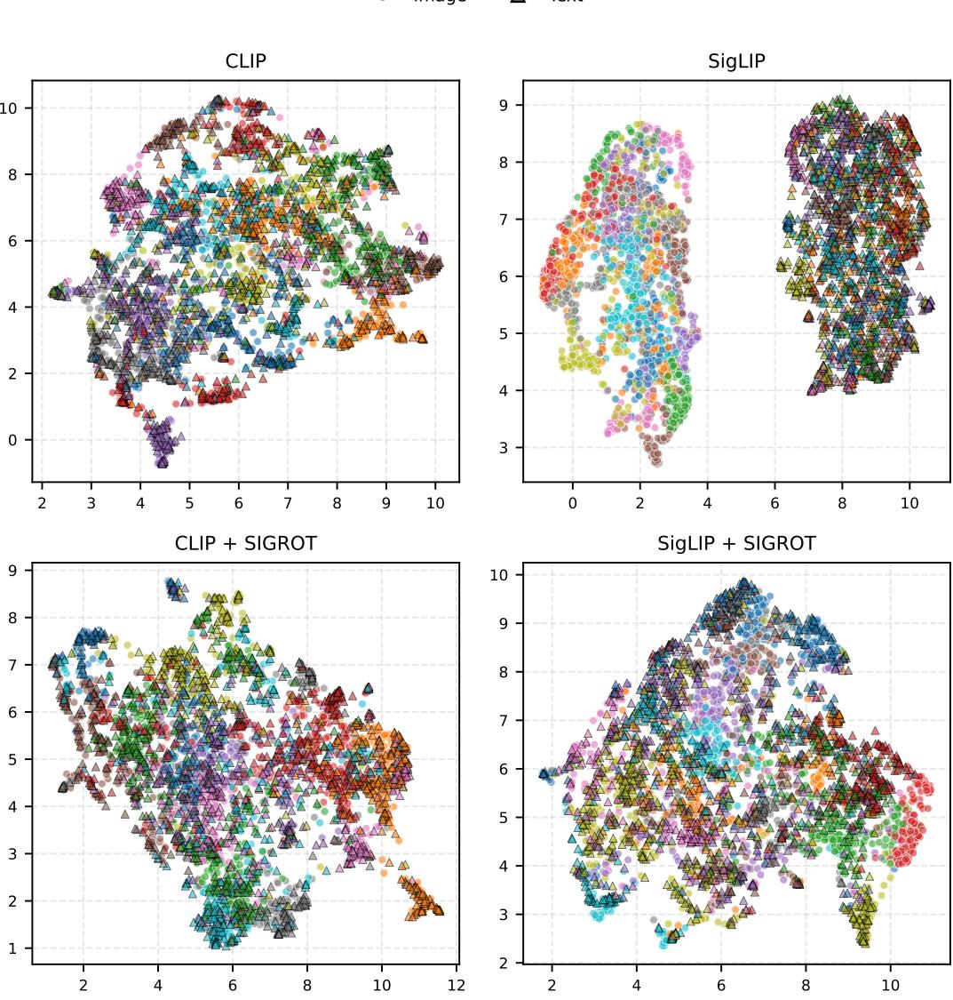
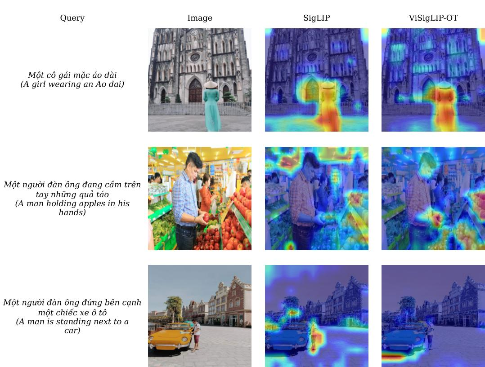
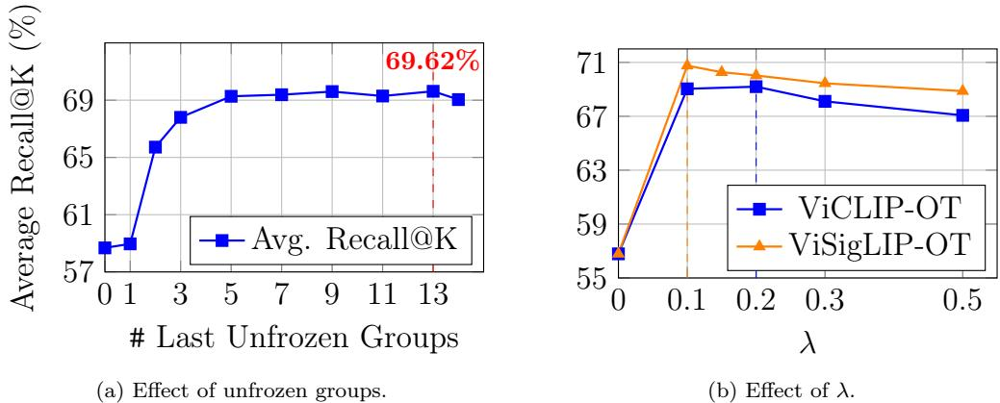
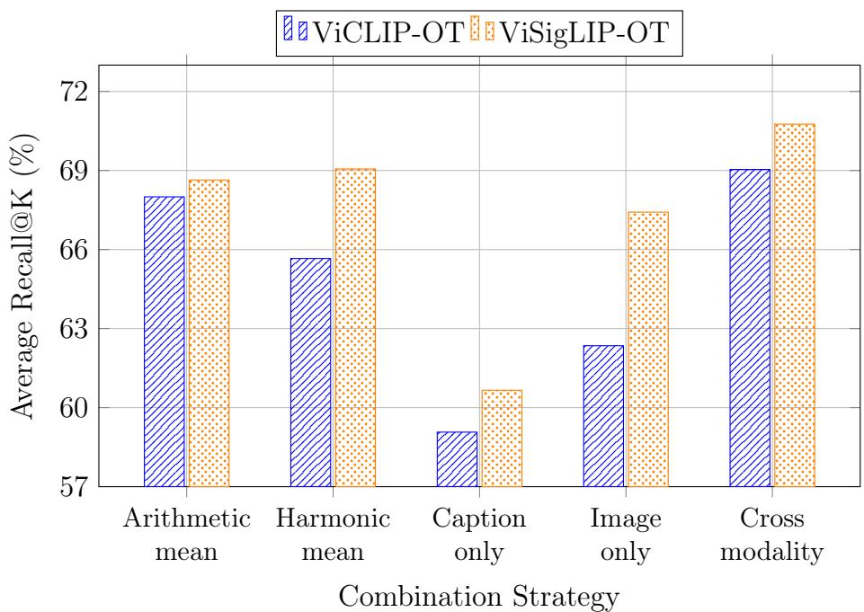
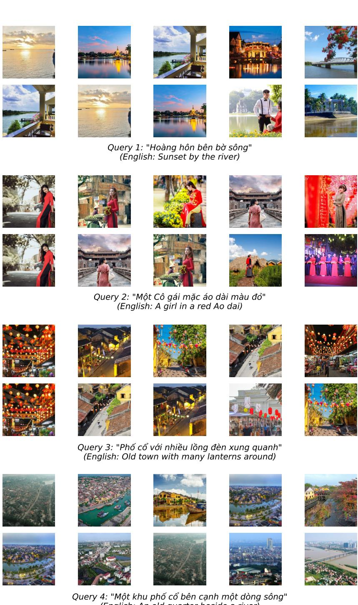
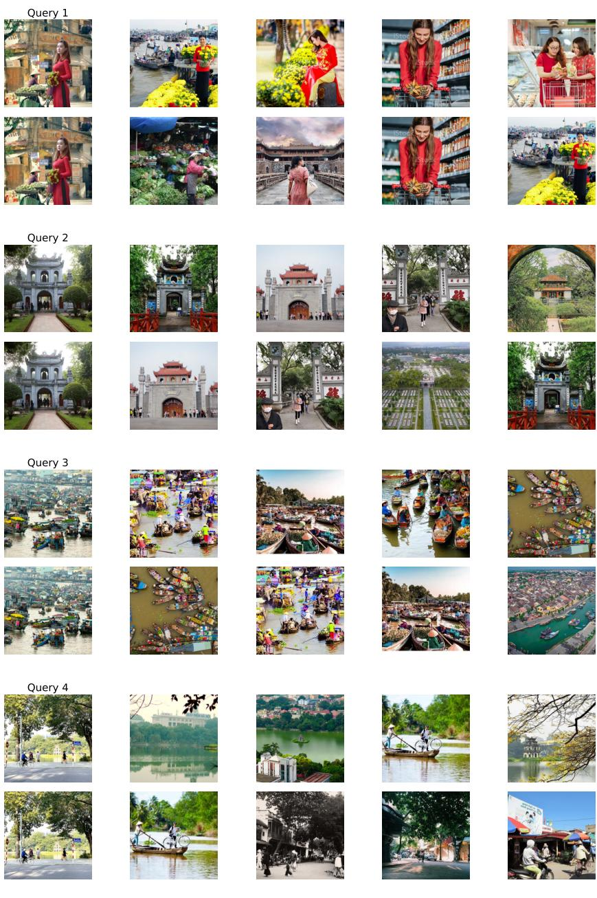
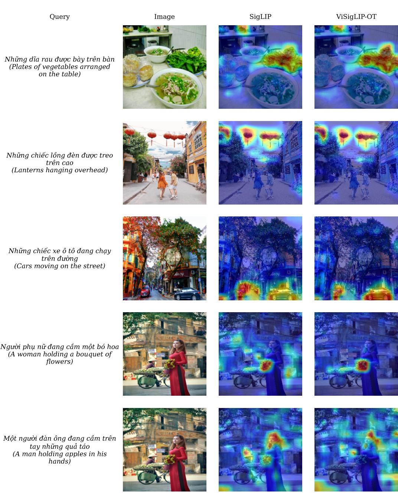

# ViCLIP-OT：首个用于越南图像文本检索的基础视觉-语言模型与最优传输联合应用

Quoc-Khang Tran $^ \mathrm { a }$ , Minh-Thien Nguyen $^ \mathrm { a }$ , Nguyen-Khang Pham $\mathrm { a }, \ast$ $^ { a }$ 岘港大学，越南岘港

# 摘要

图像-文本检索已成为智能多媒体系统的一个基本组成部分；然而，现有的大多数视觉-语言模型主要针对高资源语言进行优化，在越南语等低资源环境中表现不佳。本研究提出了ViCLIP-OT，一个专门为越南图像-文本检索设计的基础视觉-语言模型。该框架将类CLIP对比学习与相似度图正则化最优传输（SIGROT）损失相结合，以增强全局跨模态一致性并减轻模态间差异问题。在三个越南基准数据集（UIT-OpenViIC、KTVIC和Crossmodal-3600）上的大量实验表明，ViCLIP-OT在领域内和零样本设置下均持续优于CLIP和SigLIP基线。在UIT-OpenViIC上，该模型实现了$67.34\%$的平均召回率@K，相比CLIP提高了5.75个百分点。在Crossmodal-3600的零样本评估中，ViCLIP-OT超过了CLIP 11.72个百分点。嵌入空间分析进一步确认了模型对齐质量的提升和模态间差异的减小。结果表明，集成SIGROT为低资源语言中的跨模态检索提供了一种有效且可扩展的策略，对越南及其他少数语言环境下的智能多媒体检索系统具有实际意义。

# 关键词：

越南语，视觉语言模型，图像-文本检索，对比学习，最优传输

# 1. 引言

图像文本检索已经取得了显著进展，这得益于大规模的视觉语言预训练。像 CLIP 和 ALIGN 这样的模型采用双编码器架构，训练于数亿到数十亿的图像-文本对，使其能够学习通用的多模态表示并达到强大的检索性能。然而，以上这些进展大多集中在高资源语言上，尤其是英语。对于像越南语这样的低资源语言，缺乏大规模的图像-文本数据集和预训练模型仍然是一个主要挑战。直到最近，仅有有限的公共图像-标题数据集可用于越南语，这限制了 CLIP 风格训练的直接应用。一种常见的解决方案是将越南语标题翻译为英语并应用基于英语的模型，但这种方法可能引入翻译噪声，并无法完全保留特定语言的含义。

本研究通过提出ViCLIP-OT，解决了上述问题，这是一个针对越南图像-文本检索的对比视觉-语言模型。ViCLIP-OT在两个关键方面扩展了CLIP双编码器架构。首先，它为每种模态采用强大且最新的主干模型：使用基于DINOv3的视觉变换器进行图像编码，并使用在大规模越南语语料库上预训练的越南句子BERT模型进行文本编码。这两个编码器将图像和文本投影到一个共享嵌入空间，并采用对比损失共同优化，遵循标准的CLIP训练范式。其次，ViCLIP-OT引入了一种基于最优传输（OT）的相似性图正则化最优传输（SIGROT）损失，以对齐图像和文本表示，同时保持样本之间的全局关系结构。预计算的相似性图编码了每个训练批次中样本之间的关系，并通过OT求解器寻找尊重这种关系结构的全局一致的跨模态匹配。这种结构感知的对齐方式补充了实例级的对比目标，使模型不仅捕捉成对的对应关系，还能够识别每个批次中模态之间的分布关系。ViCLIP-OT在三个不同领域和规模的越南图像-文本数据集上进行训练和评估。主要评估在UIT-OpenViIC上进行，这是一种大规模开放领域的越南图像字幕数据集，包括13,100张图像和61,241条字幕，展示了复杂的现实场景和多样的语义内容。该数据集用于评估模型在现实且具有挑战性的条件下的整体检索性能。此外，还在两个保留数据集上进行零样本评估，以评估学习表示的鲁棒性和迁移能力：KTVIC，一个基准数据集，包含4,327张图像和21,635条描绘越南日常生活场景的字幕，以及Crossmodal-3600，一个地理多样化的3,600张照片集合，附有36种语言的人类生成参考字幕。由于未对任何数据集进行微调，因此这些评估直接衡量学习的视觉-语言表示在不同领域中的泛化能力。贡献概述。本文的主要贡献总结如下：• ViCLIP-OT作为越南图像-文本检索的基础视觉-语言模型被提出，扩展了基于OT的机制以捕捉细粒度的跨模态对齐，从而增强了CLIP风格的对比学习。 提出SIGROT损失，通过利用每个训练批次中样本之间的关系结构来增强跨模态对齐，从而改善表示一致性，减小模态差距。 在三个越南图像-文本检索基准上进行的广泛实验表明，ViCLIP-OT达到了最先进的性能，并在数据集之间具有强大的零样本泛化能力。根据我们所知，ViCLIP-OT是在这一规模上开发的第一个越南基础视觉-语言模型，在图像-文本检索和跨模态理解方面提供了强大的性能。预训练模型公开可用，以支持可重复性和未来的研究。1 论文结构。本文余下部分组织如下。第2节回顾与对比学习和最优传输（OT）相关的工作。第3节介绍图像-文本检索和OT的基础知识。第4节描述ViCLIP-OT架构和SIGROT损失的公式。第5节呈现数据集、评估指标和实现细节。第6节报告并讨论实验结果。第7节提供消融研究，分析所提方法的关键组成部分。最后，第8节总结论文并概述未来的研究方向。

# 2. 背景

对比学习是一种表示学习范式，旨在通过将语义相关的样本拉近，同时将不相关的样本推开，在共享潜在空间中学习具有区分性的嵌入。在图像-文本检索等跨模态任务中，对比目标通过将匹配的图像-标题对视为正样本，将不匹配的对视为负样本，从而对齐视觉和文本表示，实现强大的零样本迁移和有效的跨模态相似度估计。尽管对比学习强制执行实例级对齐，但最优传输（OT）通过计算概率分布之间的成本有效的传输计划，提供了一种互补的分布级视角，最初由Monge和Kantorovich提出。在机器学习中，OT已广泛应用于分布对齐问题，包括跨模态表示学习。最近的研究表明，熵正则化的OT可以将对比学习与分布对齐连接起来，从而产生更具结构性和语义一致性的嵌入空间。总体而言，对比学习和OT为跨模态学习提供了互补机制，其中对比目标捕捉成对的语义关系，而OT增强了跨模态的全局对齐。

# 3. 基础知识

# 3.1. 图像-文本检索

图像-文本检索涉及根据文本查询搜索最相关的图像（文本到图像检索），或为给定图像找到最相关的说明（图像到文本检索）[17, 6, 30]。形式上，令 $\mathcal { D } =$ $\{ ( x _ { i } , t _ { i } ) \} _ { i = 1 } ^ { M }$ 表示一个包含 $M$ 个图像-文本对的数据集，其中 $x _ { i }$ 是一幅图像，$t _ { i }$ 是其对应的说明。图像-文本检索的目标是学习两个编码器 $f _ { \mathrm { i m a g e } }$ 和 $f _ { \mathrm { t e x t } }$，将图像和文本映射到一个共享的嵌入空间：

$$
\begin{array} { r } { \mathbf { z } _ { i } ^ { \mathrm { i m a g e } } = f _ { \mathrm { i m a g e } } ( x _ { i } ) , \qquad \mathbf { z } _ { i } ^ { \mathrm { t e x t } } = f _ { \mathrm { t e x t } } ( t _ { i } ) , } \end{array}
$$

其中 $\mathbf { z } _ { i } ^ { \mathrm { { i m a g e } } } , \mathbf { z } _ { i } ^ { \mathrm { { t e x t } } } \in \mathbb { R } ^ { d }$ 是 $d$ 维嵌入。图像和文本之间的相似性通常使用余弦相似度来测量：

$$
\sin ( x _ { i } , t _ { j } ) = { \frac { \mathbf { z } _ { i } ^ { \mathrm { i m a g e } } \cdot \mathbf { z } _ { j } ^ { \mathrm { t e x t } } } { \| \mathbf { z } _ { i } ^ { \mathrm { i m a g e } } \| _ { 2 } \| \mathbf { z } _ { j } ^ { \mathrm { t e x t } } \| _ { 2 } } } .
$$

在检索过程中，给定一个查询（图像或文本），模型根据相似度得分对数据库中的所有候选项进行排名，并返回前 $K$ 个最相关的结果。图像-文本检索模型的性能通常使用度量标准进行评估，例如 Recall@K (R $@$ K)，该指标衡量在前 $K$ 个检索结果中找到正确匹配的查询所占的比例。

# 3.2. 最优传输

最优传输（OT）是一个数学框架，旨在寻找从一个概率分布到另一个概率分布的最有效的质量传输方式，同时最小化总传输成本。它为概率分布之间提供了有意义的几何距离，使其在不同领域或模态之间对齐数据时尤为有用。

形式上，设 $\mu \in \mathbb { R } _ { + } ^ { n }$ 和 $\nu \in \mathbb { R } _ { + } ^ { m }$ 是两个离散概率分布，满足 $\begin{array} { r } { \sum _ { i = 1 } ^ { n } \mu _ { i } = \sum _ { j = 1 } ^ { m } \nu _ { j } = 1 } \end{array}$。给定一个成本矩阵 $C \in \mathbb { R } _ { + } ^ { n \times m }$，其中 $C _ { i j }$ 表示将单位质量从 $\mu$ 的第 $i$ 个元素移动到 $\nu$ 的第 $j$ 个元素的成本，最优传输(OT)的目标是找到一个运输计划 $\gamma \in \mathbb { R } _ { + } ^ { n \times m }$，以最小化总成本：

$$
\gamma ^ { * } = \underset { \gamma \in \Pi ( \mu , \nu ) } { \arg \operatorname* { m i n } } \langle \gamma , C \rangle _ { F } = \underset { \gamma \in \Pi ( \mu , \nu ) } { \arg \operatorname* { m i n } } \sum _ { i = 1 } ^ { n } \sum _ { j = 1 } ^ { m } \gamma _ { i j } C _ { i j } ,
$$

其中 $\langle \cdot , \cdot \rangle _ { F }$ 表示 Frobenius 内积，$\Pi ( \mu , \nu ) = \{ \gamma \in \mathbb { R } _ { + } ^ { n \times m } | \gamma \mathbf { 1 } _ { m } = \mu , \gamma ^ { \mathsf { T } } \mathbf { 1 } _ { n } = \nu \}$ 是传输多面体。熵正则化。对于大规模应用，解决式（3）中的标准最优运输问题计算上是不可行的。为了解决这个问题，Cutui [8] 引入了熵正则化项 $\begin{array} { r } { H ( \gamma ) = - \sum _ { i , j } \gamma _ { i j } ( \log \gamma _ { i j } - } \end{array}$ 1)，从而得到严格凸的 Sinkhorn 距离问题：

$$
\gamma _ { \varepsilon } ^ { * } = \arg \operatorname* { m i n } _ { \gamma \in \Pi ( \mu , \nu ) } \langle \gamma , C \rangle _ { F } - \varepsilon H ( \gamma ) ,
$$

其中 $\varepsilon > 0$ 是正则化系数。该正则化使得优化问题严格凸，确保了独特的最优解，该解近似于公式 (3) 中的原始最优传输问题，同时通过 Sinkhorn-Knopp 算法 [38] 实现高效计算。失衡最优传输。标准的最优传输强制严格的质量守恒 $\begin{array} { r } { \big ( \sum \mu _ { i } = \sum \nu _ { j } \big ) } \end{array}$，使其对离群点敏感。在图像-文本检索中，由于图像可能包含背景杂物或文本中可能包含非视觉词汇，严格对齐通常并不是最优的。失衡最优传输 (UOT) [11] 通过使用散度惩罚（如 Kullback-Leibler（KL）散度）放松边际约束来解决这一问题。熵正则化的 UOT 问题可表述为：

$$
\gamma _ { \mathrm { U O T } } ^ { \mathrm { * } } = \underset { \gamma \in \mathbb { R } _ { + } ^ { n \times m } } { \arg \operatorname* { m i n } } \langle \gamma , C \rangle _ { F } - \varepsilon H ( \gamma ) + \tau _ { m \mathrm { l } } \mathrm { K L } ( \gamma \mathbf { 1 } _ { m } \| \mu ) + \tau _ { m 2 } \mathrm { K L } ( \gamma ^ { \mathsf { T } } \mathbf { 1 } _ { n } \| \nu ) ,
$$

其中 $\tau_{m1}, \tau_{m2} > 0$ 控制边际约束的松弛程度，向量 $\mathbf{u}$ 和 $\mathbf{v}$ 之间的 KL 散度定义为：

$$
\mathrm { K L } ( \mathbf { u } \| \mathbf { v } ) = \sum _ { i = 1 } ^ { n } u _ { i } \log \left( \frac { u _ { i } } { v _ { i } } \right) - u _ { i } + v _ { i } .
$$

这种形式化允许部分匹配，使得模型能够有效处理噪声对，通过在对齐过程中忽略无关的视觉或文本元素。

# 4. 提出的方法

本节介绍了ViCLIP-OT，这是一种越南语视觉-语言检索模型，采用了结合了CLIP风格对比学习和基于最优传输（OT）的正则化的混合目标进行训练。整体流程如图1所示，其中图像和文本嵌入通过CLIP损失进行对齐，同时OT模块利用相似性图施加分布层面的跨模态一致性。

  

Figure 1: ViCLIP-OT architecture overview. The model consists of a DINOv3-based image encoder and a Vietnamese Sentence-BERT text encoder that project images and texts into a shared embedding space. The hybrid training objective combines a CLIPstyle contrastive loss with the proposed SIGROT loss, which uses a similarity graph and optimal transport to enforce global cross-modal alignment.

# 4.1. 架构概述

ViCLIP-OT 采用双编码器设计，包括一个图像塔 $f$ 和一个文本塔 $f _ { \mathrm { t e x t } }$。给定图像 $x _ { i }$ 和文本 $t _ { i }$，编码器输出 $d$ 维嵌入：

$$
\begin{array} { r } { \mathbf { z } _ { i } ^ { \mathrm { i m a g e } } = f _ { \mathrm { i m a g e } } ( x _ { i } ) \in \mathbb { R } ^ { d } , \qquad \mathbf { z } _ { i } ^ { \mathrm { t e x t } } = f _ { \mathrm { t e x t } } ( t _ { i } ) \in \mathbb { R } ^ { d } , } \end{array}
$$

接着进行 $\ell _ { 2 }$ 归一化：

$$
\tilde { \mathbf { z } } = \frac { \mathbf { z } } { \| \mathbf { z } \| _ { 2 } } .
$$

图像塔。图像编码器基于 DINOv3 [37]，这是一个最先进的 ViT，使用自蒸馏在大规模图像数据集上进行预训练。给定输入图像，DINOv3 主干提取补丁级特征，然后通过均值池化聚合这些特征，以获得全局图像表示。线性投影层将该表示映射到共享的 $d$ 维嵌入空间。文本塔。文本编码器使用预训练的越南语句子 BERT (SBERT) 模型。给定标记化的输入，标记表示通过对非填充标记的均值池化进行聚合，以获得句子嵌入。当 SBERT 的隐藏层大小与 $d$ 不匹配时，应用一个可选的线性投影。这两个编码器使用混合损失进行联合训练，该损失结合了 CLIP 风格的对比学习和基于 OT 的正则化，如后续章节所述。

# 4.2. 相似性图正则化的最优传输损失

本文提出了SIGROT（相似性图正则化最优运输），这是一种基于最优运输（OT）的目标，旨在通过将全局结构注入批量跨模态匹配中来补充CLIP风格的对比学习。如图1所示，SIGROT构建了一个相似性图，并使用OT来规范化图像和文本嵌入之间的对齐。动机。标准的CLIP损失通过批内负样本强制执行实例级对齐，但并未明确利用样本之间的关系结构（例如，多个标题描述相似的视觉概念）。SIGROT通过以下方式解决这一问题：（i）构建一个编码批内样本关系的相似性图，以及（ii）使用OT求解器促进尊重这些关系的全局一致的图像-文本匹配。批量相似性图构建。对于每个训练批次，SIGROT使用预计算的且经过 $\ell _ { 2 }$ 归一化的嵌入来构建相似性图。这些嵌入可以通过强大的预训练嵌入模型计算。设 $E _ { \mathrm { t e x t } }$ 和 $E _ { \mathrm { i m a g e } }$ 分别表示当前批次样本的预计算标题和图像嵌入的矩阵。文本-文本相似性矩阵和图像-图像相似性矩阵计算如下：

$$
G _ { \mathrm { t e x t } } = E _ { \mathrm { t e x t } } E _ { \mathrm { t e x t } } ^ { \intercal } , \qquad G _ { \mathrm { i m a g e } } = E _ { \mathrm { i m a g e } } E _ { \mathrm { i m a g e } } ^ { \intercal } .
$$

可选地，包含跨模态相似性术语：

$$
G _ { \mathrm { t e x t - i m a g e } } = E _ { \mathrm { t e x t } } E _ { \mathrm { i m a g e } } ^ { \intercal } , \qquad G _ { \mathrm { i m a g e - t e x t } } = E _ { \mathrm { i m a g e } } E _ { \mathrm { t e x t } } ^ { \intercal } .
$$

这些图通过聚合函数 $\Phi$ 合并成一个单一的相似度图 $G$：

$$
G = \Phi ( G _ { \mathrm { t e x t } } , G _ { \mathrm { i m a g e } } , G _ { \mathrm { t e x t - i m a g e } } , G _ { \mathrm { i m a g e - t e x t } } ) .
$$

在这项工作中，$G$ 是通过对所有四个相似性矩阵进行平均得到的：

$$
G _ { \mathrm { c r o s s } } = { \frac { 1 } { 4 } } \left( G _ { \mathrm { t e x t } } + G _ { \mathrm { i m a g e } } + G _ { \mathrm { t e x t - i m a g e } } + G _ { \mathrm { i m a g e - t e x t } } \right) .
$$

这种表达被称为跨模态相似性图，记作 $G _ { \mathrm { c r o s s } }$，因为它捕捉了每个批次内的模内和跨模态关系。替代组合策略在第 7.3 节中进行了探讨。使用作为软目标的相似性图，该图由数据集元数据（例如，图像-标题对中的标题）推导而来，之前已由 Sobal 等人探讨过 [39]。在此基础上，该方法进一步扩展，以包含文本到图像和图像到文本的关系，如公式 (12) 所述。带有相似性图正则化的 OT 公式。在批次大小为 $N$ 的模型输出下，获得归一化的嵌入 $\tilde { Z } _ { \mathrm { i m a g e } }$ 和 $\tilde { Z } _ { \mathrm { t e x t } }$，它们的跨模态相似性矩阵为：

$$
S _ { \mathrm { i m a g e - t e x t } } = \tilde { Z } _ { \mathrm { i m a g e } } \tilde { Z } _ { \mathrm { t e x t } } ^ { \intercal } .
$$

运输成本矩阵定义为 $C _ { \mathrm { i m a g e - t e x t } } = \mathbf { 1 } - S _ { \mathrm { i m a g e - t e x t } }$，其中更高的相似度对应于更低的运输成本。SIGROT定义了一个运输计划 $\gamma \in \mathbb { R } _ { + } ^ { N \times N }$，用于在批量级别上匹配图像与文本。在图像到文本的方向上，最优运输计划通过求解以下问题获得：

$$
\begin{array} { r l } & { \gamma _ { \mathrm { i 2 t } } ^ { * } = \underset { \gamma \in \mathbb { R } _ { + } ^ { N \times N } } { \arg \operatorname* { m i n } } \left. \gamma , C _ { \mathrm { i m a g e - t e x t } } \right. _ { F } - \varepsilon H ( \gamma ) } \\ & { } \\ & { \qquad + \tau _ { m 1 } \mathrm { K L } ( \gamma \mathbf { 1 } _ { N } \| \mu ) + \tau _ { m 2 } \mathrm { K L } ( \gamma ^ { \top } \mathbf { 1 } _ { N } \| \nu ) , } \end{array}
$$

其中 $\mu = \nu = \textstyle { \frac { 1 } { N } } \mathbf { 1 } _ { N }$ 是批次上的均匀分布，$\varepsilon > 0$ 是熵正则化系数，$\tau _ { m 1 } , \tau _ { m 2 } > 0$ 控制边际约束的松弛程度。该形式对应标准的非平衡最优传输问题（式(5)）。给定最优传输计划 $\gamma _ { \mathrm { i 2 t } } ^ { \ast }$ 后，图像到文本的 SIGROT 损失衡量归一化传输计划与相似度图分布之间的差异：

$$
\mathcal { L } _ { \mathrm { S I G R O T } } ^ { \mathrm { i 2 t } } = \mathrm { K L } ( N \gamma _ { \mathrm { i 2 t } } ^ { * } \Vert \mathrm { s o f t m a x } ( G _ { \mathrm { c r o s s } } ) ) .
$$

在这里，运输计划按批大小 $N$ 进行缩放，使得 $N \gamma _ { \mathrm { i 2 t } } ^ { \ast }$ 的总和为一，从而形成有效的概率分布。同样，$\operatorname { s o f t m a x } ( G _ { \mathrm { c r o s s } } )$ 将相似性图归一化为概率分布，便于对两者进行有原则的 KL 散度比较。同样，在文本到图像的方向上，最优运输计划的获取方法为：

$$
\begin{array} { r l } & { \gamma _ { \mathrm { t 2 i } } ^ { * } = \underset { \gamma \in \mathbb { R } _ { + } ^ { N \times N } } { \arg \operatorname* { m i n } } \left. \gamma , C _ { \mathrm { i m a g e - t e x t } } ^ { \intercal } \right. _ { F } - \varepsilon H ( \gamma ) } \\ & { } \\ & { \qquad + \tau _ { m 1 } \mathrm { K L } ( \gamma \mathbf { 1 } _ { N } \| \nu ) + \tau _ { m 2 } \mathrm { K L } ( \gamma ^ { \intercal } \mathbf { 1 } _ { N } \| \mu ) , } \end{array}
$$

文本到图像的SIGROT损失为：

$$
\mathcal { L } _ { \mathrm { S I G R O T } } ^ { \mathrm { t 2 i } } = \mathrm { K L } ( N \gamma _ { \mathrm { t 2 i } } ^ { * } | | \mathrm { s o f t m a x } ( G _ { \mathrm { c r o s s } } ) ) .
$$

最终的SIGROT损失是两个方向的平均值：

$$
\mathcal { L } _ { \mathrm { S I G R O T } } = \frac { 1 } { 2 } \left( \mathcal { L } _ { \mathrm { S I G R O T } } ^ { \mathrm { i 2 t } } + \mathcal { L } _ { \mathrm { S I G R O T } } ^ { \mathrm { t 2 i } } \right) .
$$

# 4.3. 混合训练目标

ViCLIP-OT 采用一种混合目标进行优化（图 1），该目标结合了对比损失和所提出的 SIGROT 损失。采用了两种对比学习的公式，即标准 CLIP 损失 [30] 和 SigLIP 损失 [46]，从而得到了两个混合目标函数：

$$
\begin{array} { r } { \mathcal { L } _ { \mathrm { C L I P - S I G R O T } } = \lambda \mathcal { L } _ { \mathrm { C L I P } } + \mathcal { L } _ { \mathrm { S I G R O T } } , } \end{array}
$$

$$
\begin{array} { r } { \mathcal { L } _ { \mathrm { S i g L I P - S I G R O T } } = \lambda \mathcal { L } _ { \mathrm { S i g L I P } } + \mathcal { L } _ { \mathrm { S I G R O T } } , } \end{array}
$$

其中 $\lambda \geq 0$ 是一个超参数，用于平衡两个目标。CLIP 损失是一个对称的交叉熵目标，它在每个批次中将匹配的图像-文本对拉在一起，同时将不匹配的对推开。它对所有样本应用 softmax 归一化，使得学习信号依赖于整个批次。SigLIP 损失用一个只对单个图像-文本对独立运作的 sigmoid 损失替代了基于 softmax 的公式。这个公式去除了全局归一化的需求，并使得使用更大批次进行更高效的训练成为可能。尽管二者存在差异，但 CLIP 和 SigLIP 都独立处理每个样本，并没有明确建模批次内样本之间的关系。SIGROT 通过使用预计算的相似性图和最佳运输方法来解决这一限制，从而在批次中找到全局一致的匹配。将对比损失（CLIP 或 SigLIP）与 SIGROT 相结合，使模型能够学习强的成对对齐，同时捕捉样本之间的关系结构。稳定 CLIP 和 SigLIP 的训练。参考文献 [30, 43, 46] 引入了两个可学习参数来控制 logits 的范围：温度 $\tau$ 和偏置 $b$。温度被参数化为 $\tau = \exp ( \tau ^ { \prime } )$，其中 $\tau ^ { \prime }$ 是一个可学习的标量，确保在整个训练过程中保持正值。偏置项 $b$ 仅在 SigLIP 公式中应用。结合这两个参数有助于通过自适应调整 logits 分布来稳定优化。在所有实验中，ViCLIP-OT 和 ViSigLIP-OT 分别使用式 (19) 和 (20) 中定义的混合目标进行训练。为简洁起见，后续部分将方法论描述为 ViCLIP-OT；ViSigLIP-OT 的对应结果在第 6 节中一并包含。

# 5. 实验设置

# 5.1. 数据集

ViCLIP-OT 的训练和评估使用了三个数据集：UIT-OpenViIC、KTVIC 和 Crossmodal-3600。UIT-OpenViIC 是用于训练和领域内评估的主要数据集，而 KTVIC 和 Crossmodal-3600（或 XM3600）则仅用于零-shot 评估，以评估跨数据集的泛化能力。为了防止训练-测试污染，使用 SSCD [29] 识别并移除评估数据集中与 UIT-OpenViIC 训练集近重复的图像（详情见附录 B）。每个数据集的详细描述见附录 A。UIT-OpenViIC。UIT-OpenViIC [2] 是一个大规模开放领域的越南图像字幕数据集，包含 13,100 张图像和 61,241 条字幕，分为训练集（9,088 张图像）、验证集（2,011 张图像）和测试集（2,001 张图像）。KTVIC。KTVIC [28] 是一个越南图像字幕基准数据集，包含 4,327 张图像和 21,635 条字幕，描绘了越南的日常生活活动和地点。与 UIT-OpenViIC 训练集的近重复检测揭示了显著的重叠：558 张测试图像中有 401 张，3,769 张训练图像中有 2,464 张被识别为近重复。移除后，去重的测试集包含 157 张图像，训练集包含 1,305 张图像。由于测试集大幅缩减，两个数据集上的零-shot 评估均已执行。本文其余部分中，KTVIC-train 和 KTVIC-test 指去重后的数据集，除非另有说明。Crossmodal-3600。Crossmodal-3600 (XM3600) [41] 是一个地理多样化的多语言数据集，包含 3,600 张图像和 36 种语言的字幕。未发现与 UIT-OpenViIC 训练集的近重复。所有 3,600 张配有越南字幕的图像均用于零-shot 评估，生成 7,350 对图像字幕。

# 5.2. 评估指标

ViCLIP-OT在图像-文本检索任务上的性能使用Recall@K (R@K)进行评估，这是一种标准的跨模态检索指标。R@K衡量的是在排名前$K$的结果中，至少检索到一个相关项的查询所占的比例。 文本检索。在文本检索设置中，每个图像都与多个真实标注标题相关联。给定一个图像查询，模型根据相似度得分对所有候选标题进行排名。如果任何对应的真实标注标题出现在排名前$K$的检索标题中，则检索被认为是成功的。R@$K$的计算为满足此条件的图像查询所占的百分比。 图像检索。在图像检索设置中，每个标题与一个真实标注图像一一对应。给定一个标题查询，模型对所有候选图像进行排名。如果关联的真实标注图像出现在排名前$K$的图像中，则检索被视为正确的。R@$K$的计算为满足此标准的标题查询所占的百分比。 嵌入空间质量。为了评估学习到的共享嵌入空间的质量，使用了两个额外的指标。对齐评分测量图像-文本配对的匹配程度。

$$
\mathrm { A l i g n m e n t } = \frac { 1 } { N } \sum _ { i = 1 } ^ { N } \mathrm { s i m } ( \mathbf { z } _ { i } ^ { \mathrm { i m a g e } } , \mathbf { z } _ { i } ^ { \mathrm { t e x t } } ) ,
$$

其中 $\mathrm { s i m } ( \cdot , \cdot )$ 表示余弦相似度，较高的对齐得分表明更好的成对对齐。模态间距 [22] 量化了图像和文本嵌入的质心之间的距离：

$$
\Delta _ { \mathrm { g a p } } = \frac { 1 } { N } \sum _ { i = 1 } ^ { N } { \bf z } _ { i } ^ { \mathrm { i m a g e } } - \frac { 1 } { N } \sum _ { i = 1 } ^ { N } { \bf z } _ { i } ^ { \mathrm { t e x t } } ,
$$

较小的值表示模态之间的分离度较小。

# 5.3. 基准模型

基线模型遵循标准的双编码器架构用于图像-文本检索 [30, 46, 47]。在视觉模态方面，采用使用 DINOv3 [37] 自监督学习框架预训练的视觉变换器（ViT-B/16）主干网络将图像编码为固定维度的嵌入。对于文本模态，使用已经在越南语语料库上进行过微调的 SBERT [31] 模型对文本描述进行编码。图像和文本编码器将各自的输入投影到共享嵌入空间，在该空间中使用余弦相似度计算跨模态相似性。构建了两个基线模型，二者在编码器架构上相同，但在各自的训练目标上有所不同：CLIP 基线：该模型使用原始 CLIP 对比损失 [30] 进行训练，该损失对批次中的所有样本应用 softmax 归一化，并鼓励匹配的图像-文本对比不匹配对具有更高的相似性得分。• SigLIP 基线：该模型使用 SigLIP 损失 [46] 进行训练，该损失将基于 softmax 的归一化替换为对个别图像-文本对独立操作的 sigmoid 损失，从而使得能够在更大的批次大小下更高效地进行训练。两个主干编码器的所有参数在训练期间共同优化，从而使得跨模态对齐可以直接从越南图像-文本数据中学习。

# 5.4. 实施细节

ViCLIP-OT 使用 PyTorch $^ 4$ 实现，支持 Python 3.12。所有实验均在单个 NVIDIA RTX 4090 GPU 上进行，内存为 24 GB。为了在有限的 GPU 内存下促进大批量对比训练，采用了梯度累积结合 Gao 等人提出的梯度缓存策略 [12]，从而实现有效的更大批量而不增加额外的 GPU 内存开销。预计算相似性图的嵌入。为了构建第 4.2 节中描述的相似性图，采用 Qwen3-VL-Embedding-2B [21] 作为一种紧凑而强大的多模态多语言嵌入模型，能够编码图像和文本。对训练集中的所有图像-文本对进行嵌入的预计算，随后用于计算成对的余弦相似度，形成公式 (12) 中的图 $G _ { \mathrm { c r o s s } }$。

训练配置。图像被调整为 $224 \times 224$ 像素，并使用 ImageNet 统计数据进行归一化。数据增强包括随机旋转、随机水平翻转和颜色抖动（亮度=0.2，对比度=0.2，饱和度=0.2，色调=0.0）。图像和文本编码器的嵌入维度设置为 768。所有模型在混合精度训练下，以批量大小 128 训练 30 个 epoch，使用 bfloat16。优化使用 AdamW 优化器 [23]，配置为 $\epsilon = 10^{-10}$，$\beta = (0.9, 0.999)$，权重衰减系数为 $10^{-4}$。采用差异化学习率策略：主干编码器使用最高学习率 $5 \times 10^{-5}$，而线性投影头和多层感知机使用 $2 \times 10^{-4}$。学习率遵循 warmup-cosine 计划：在前 2 个 epoch 线性升温至 $0.01 \times \mathsf{peak\_lr}$，然后使用余弦退火衰减至 $0.0001 \times \mathsf{peak\_lr}$。应用梯度裁剪，最大范数为 1.0。对于方程 (19) 和 (20) 中的混合训练目标，平衡系数设置为 $\lambda = 0.1$。遵循 [30, 46]，温度和偏置参数初始化为 CLIP 中的 $\tau = 0.07$，SigLIP 中的 $\tau = 0.06$，$b = -9$。方程 (14) 和 (16) 中的正则化系数设置为 $\varepsilon = 0.05$，$\tau_{m1} = \tau_{m2} = 0.5$。由于每个图像可能与多个标题相关联，因此所有对应的标题都包含在批次中，与其配对的图像一起。模型选择。最终在测试集上评估的模型是基于在验证集上达到最高文本到图像 R@1 的检查点进行选择。

# 6. 结果

本节展示了 ViCLIP-OT 在图像—文本检索任务中的实验结果，包括在 UIT-OpenViIC 上的领域内评估，以及在 KTVIC 和 Crossmodal-3600 数据集上的零样本评估。ViCLIP-OT 的性能与基线模型 CLIP 和 SigLIP 及其他相关方法进行了比较，以展示所提出方法的有效性。

Table 1: Image-text retrieval performance on the test set of the UIT-OpenViIC dataset. UOT denotes Unbalanced Optimal Transport. \* indicates zero-shot evaluation. Best results are in bold and second-best are underlined. ViCLIP-OT and ViSigLIP-OT outperform their corresponding baselines (CLIP and SigLIP without SIGROT), other loss variants (CLIP + UOT, SigLIP + UOT, SIGROT), and pretrained vision-language models under zero-shot settings, demonstrating the effectiveness of integrating the SIGROT loss.   

<table><tr><td rowspan="2">Method/Model</td><td rowspan="2"># Params</td><td colspan="3">Text → Image</td><td colspan="3">Image → Text</td><td rowspan="2">Avg.</td></tr><tr><td>R@1</td><td>R@5</td><td>R@10</td><td>R@1</td><td>R@5</td><td>R@10</td></tr><tr><td>mSigLIP-base* [46]</td><td>370M</td><td>14.34</td><td>28.94</td><td>36.21</td><td>20.49</td><td>32.23</td><td>37.43</td><td>28.27</td></tr><tr><td>Jina CLIP v2* ]</td><td>865M</td><td>30.01</td><td>52.09</td><td>61.70</td><td>40.23</td><td>65.02</td><td>74.41</td><td>53.91</td></tr><tr><td>Jina Embedding v4* [14]</td><td>4B</td><td>23.97</td><td>42.22</td><td>50.29</td><td>41.48</td><td>66.77</td><td>75.61</td><td>50.06</td></tr><tr><td>Qwen3-VL-Embedding-2B* [21]</td><td>2B</td><td>32.13</td><td>54.00</td><td>62.93</td><td>39.83</td><td>66.52</td><td>77.01</td><td>55.40</td></tr><tr><td>CLIP</td><td>221M</td><td>31.19</td><td>59.80</td><td>71.23</td><td>46.60</td><td>75.53</td><td>85.19</td><td>61.59</td></tr><tr><td>igLIP</td><td>221M</td><td>34.75</td><td>63.01</td><td>72.96</td><td>50.10</td><td>79.78</td><td>88.04</td><td>64.77</td></tr><tr><td>CLIP + UOT</td><td>221M</td><td>29.27</td><td>57.62</td><td>69.07</td><td>43.59</td><td>75.03</td><td>84.03</td><td>59.77</td></tr><tr><td>SigLIP + UOT</td><td>221M</td><td>37.84</td><td>65.30</td><td>74.98</td><td>53.95</td><td>80.95</td><td>88.81</td><td>66.97</td></tr><tr><td>SIGROT</td><td>221M</td><td>40.75</td><td>70.72</td><td>80.90</td><td>37.99</td><td>61.11</td><td>71.68</td><td>60.53</td></tr><tr><td>ViCLIP-OT (Eq. 19)</td><td>221M</td><td>37.57</td><td>65.65</td><td>75.43</td><td>54.35</td><td>81.83</td><td>89.19</td><td>67.34</td></tr><tr><td>ViSigLIP-OT (Eq. 20)</td><td>221M</td><td>39.19</td><td>66.71</td><td>76.04</td><td>57.21</td><td>83.83</td><td>90.79</td><td>68.96</td></tr></table>

# 6.1. UIT-Open ViIC 上的图像-文本检索

ViCLIP-OT在UIT-OpenViIC测试集上的检索性能总结如表1所示。结果表明，ViCLIP-OT在文本到图像和图像到文本检索任务中的所有R@K指标上显著优于基线CLIP和SigLIP模型。具体而言，ViCLIP-OT的平均R@K为67.34%，而基线CLIP模型为61.59%，提高了5.75个百分点。虽然ViSigLIP-OT的平均R@K达到了68.96%，比ViCLIP-OT高出1.62个百分点。这一性能提升突显了引入SIGROT损失的有效性，该损失利用最优传输和相似性图增强了跨模态对齐。在图2中展示了不同模型的R@$K的视觉比较。

超越基线的 CLIP 风格模型，ViCLIP-OT 在零样本设置下与几种预训练的多语言视觉-语言模型进行了比较，包括 mSigLIP [46]、Jina CLIP v2 [19]、Jina Embedding v4 [14] 和 Qwen3-VL-Embedding-2B [21]。ViCLIP-OT 显著优于所有这些模型，平均 R@K 达到 67.34%，相比之下 Qwen3-VL-Embedding-2B 的 R@K 为 55.40%，提高了 11.94 个百分点。ViSigLIP-OT 进一步提升了性能，平均 R@K 达到 68.96%，超过 Qwen3-VL-Embedding-2B 13.56 个百分点。此结果强调了在特定领域的越南图像-文本数据上进行训练的优势，以及所提出的 SIGROT 损失在提升跨模态检索性能方面的有效性。附录 G 中的额外实验进一步确认 SIGROT 在不同模型架构下始终能提升性能。附录 E 提供了 SigLIP 与 ViSigLIP-OT 的定性比较及检索示例。

  

Figure 2: R@K comparison on UIT-OpenViIC for text-to-image (left) and image-to-text (right) retrieval tasks. Incorporating the SIGROT loss consistently improves performance over both CLIP and SigLIP baselines across all R@K metrics.

# 6.2. 零样本图像-文本检索

ViCLIP-OT在KTVIC和Crossmodal-3600数据集上的零样本检索性能如表2所示。如第5.1节所述，KTVIC中的近重复图像已根据UIT-OpenViIC训练集移除，以确保公平评估（见附录B）。由于存在大量重叠（558个测试图像中有401个），评估在KTVIC的去重训练集和测试集上进行。结果表明，ViCLIP-OT在文本到图像和图像到文本的检索任务中，显著优于基线CLIP模型和SigLIP变体，所有R@K指标均如此。在KTVIC测试集中，ViCLIP-OT的R@K平均值达到$82.68\%$，相比CLIP的$79.32\%$，提高了3.36个百分点。在Crossmodal-3600中，ViCLIP-OT的R@K平均值为$56.85\%$，比CLIP的$45.13\%$高出11.72个百分点。与ViCLIP-OT一起，ViSigLIP-OT也表现出色，在KTVIC训练集上的R@K平均值为$54.37\%$，在KTVIC测试集上的为$82.78\%$，在Crossmodal-3600上的为$56.17\%$。这些发现强调了SIGROT损失在增强跨模态检索能力方面的有效性，特别是在模型必须对未见数据分布进行泛化的零样本场景中。

Table 2: Zero-shot image-text retrieval results on KTVIC and Crossmodal-3600. KTVIC images are deduplicated against the UIT-OpenViIC training set (see Appendix B). Vietnamese captions are used for Crossmodal-3600. ViCLIP-OT and ViSigLIP-OT consistently outperform their corresponding baselines across both datasets in zero-shot settings, confirming the generalizability of the SIGROT loss.   

<table><tr><td rowspan="2">Method</td><td colspan="3">Text → Image</td><td colspan="3">Image → Text</td><td rowspan="2">Avg.</td></tr><tr><td>R@1</td><td>R@5</td><td>R@10</td><td>R@1</td><td>R@5</td><td>R@10</td></tr><tr><td colspan="8">KTVIC-train</td></tr><tr><td>CLIP</td><td>21.12</td><td>46.99</td><td>59.22</td><td>31.65</td><td>59.46</td><td>72.49</td><td>48.49</td></tr><tr><td>SigLIP</td><td>23.16</td><td>48.78</td><td>60.57</td><td>35.48</td><td>62.22</td><td>73.64</td><td>50.64</td></tr><tr><td>ViCLIP-OT</td><td>26.24</td><td>52.46</td><td>64.14</td><td>38.47</td><td>64.37</td><td>75.48</td><td>53.52</td></tr><tr><td>ViSigLIP-OT</td><td>26.28</td><td>52.58</td><td>63.49</td><td>39.62</td><td>66.44</td><td>77.78</td><td>54.37</td></tr><tr><td colspan="8">KTVIC-test</td></tr><tr><td>CLIP</td><td>50.32</td><td>82.80</td><td>89.94</td><td>63.06</td><td>92.36</td><td>97.45</td><td>79.32</td></tr><tr><td>SigLIP</td><td>52.61</td><td>83.31</td><td>89.94</td><td>71.97</td><td>94.27</td><td>96.18</td><td>81.38</td></tr><tr><td>ViCLIP-OT</td><td>56.69</td><td>85.61</td><td>91.97</td><td>70.06</td><td>93.63</td><td>98.09</td><td>82.68</td></tr><tr><td>ViSigLIP-OT</td><td>56.56</td><td>85.99</td><td>91.72</td><td>71.34</td><td>93.63</td><td>97.45</td><td>82.78</td></tr><tr><td colspan="8">Crossmodal-3600</td></tr><tr><td>CLIP</td><td>22.52</td><td>45.55</td><td>58.01</td><td>26.22</td><td>53.42</td><td>65.06</td><td>45.13</td></tr><tr><td>SigLIP</td><td>26.67</td><td>50.31</td><td>61.78</td><td>31.17</td><td>57.78</td><td>69.83</td><td>49.59</td></tr><tr><td>ViCLIP-OT</td><td>28.90</td><td>55.29</td><td>66.37</td><td>42.56</td><td>68.81</td><td>79.17</td><td>56.85</td></tr><tr><td>ViSigLIP-OT</td><td>32.04</td><td>57.90</td><td>68.95</td><td>37.97</td><td>64.64</td><td>75.53</td><td>56.17</td></tr></table>

# 6.3. 嵌入空间的可视化

为了更好地理解学习到的嵌入空间，使用 UMAP [25] 可视化来自不同目标训练模型的图像和文本嵌入。图 3 显示了这些可视化结果，其中圆圈表示图像嵌入，而三角形表示文本嵌入。模态间隙 [22] 是多模态表示学习中的一个已知问题，不同模态在共享潜在空间中占据不同区域（更多细节参见附录 C）。这种分离在使用跨模态对比目标训练的模型中常常被观察到，例如在 CLIP 和 SigLIP 中使用的模型。模态间隙可能会妨碍跨模态检索性能，因为语义相似的图像-文本对在嵌入空间中可能并不十分接近。在图 3 中，SigLIP 的模态间隙明显可见，图像和文本文档嵌入形成两个相互重叠较少的独立簇。相比之下，CLIP 没有明显的模态间隙，两个模态很好地交错在一起。这一差异被假设源于 SigLIP 在训练初期对其温度和偏差参数的敏感性，尽管对这些参数如何影响模态间隙的深入研究超出了本工作的范围。值得注意的是，添加 SIGROT 在两种情况下改善了跨模态对齐。对于 ViSigLIP-OT，与 ViCLIP-OT 相比仍然存在一些不对齐，但相较于单独的 SigLIP，这一差距已大幅缩小。ViCLIP-OT 显示出最紧密的聚类，匹配对的紧密靠近，表明 SIGROT 强化了模态之间的几何一致性。为了量化这一效应，使用第 5.2 节中定义的两个指标：对齐分数和模态间隙。结果见表 3。表 3 显示，SIGROT 在所有数据集上改善了这两个指标。在 UIT-OpenViIC 上，SigLIP 的对齐分数在添加 SIGROT 后从 0.3637 提高到 0.3928，而模态间隙则从 0.5843 降低到 0.3177。类似的模式在基于 CLIP 的模型中也存在：ViCLIP-OT 达到最低的模态间隙（在 UIT-OpenViIC 上为 0.1026），而仅 SIGROT 则实现了最高的对齐分数。这些结果表明，SIGROT 使图像和文本模态之间的耦合更加紧密，从而提升了检索性能。

# 6.4. 检索的视觉可解释性

为了进一步评估SIGROT目标对模型视觉注意力的影响，应用GradCAM [33]来可视化输入图像中对图像-文本相似度得分贡献最大的区域。图4展示了基线模型SigLIP和提出的ViSigLIP-OT在UIT-OpenViIC测试集中选定示例的GradCAM热图。在前两行中，ViSigLIP-OT生成的激活图更集中于查询中提到的对象：穿着奥黛的女孩（第1行）和手持苹果的男子（第2行），而SigLIP则趋向于将激活分散到更广泛的背景区域。这表明SIGROT损失鼓励模型关注语义相关的对象，而不是上下文环境。然而，ViSigLIP-OT并不总是优于SigLIP。在第三行中，SigLIP正确突出显示了站在汽车旁边的男子，而ViSigLIP-OT则关注于不太相关的背景区域。附录D中提供了更多的GradCAM可视化结果。

  

Figure 3: UMAP visualization of image and text embeddings on the UIT-OpenViIC test set. Each subplot corresponds to a different training objective. Circles represent image embeddings and triangles represent text embeddings, with colors indicating pseudo labels obtained via K-Means clustering ( $k = 2 0$ ). SIGROT-based methods exhibit tighter crossmodal clustering compared to baselines.

Table 3: Alignment score (A) and Modality gap ( $\| \Delta _ { \mathrm { g a p } } \| )$ across different datasets. Higher Alignment scores and lower Modality gaps indicate better cross-modal alignment. SIGROT achieves the highest Alignment scores across all datasets. Integrating SIGROT consistently improves both metrics compared to the corresponding baselines, confirming its role in enhancing cross-modal alignment.   

<table><tr><td rowspan="2">Method</td><td colspan="2">UIT-OpenViIC</td><td colspan="2">KTVIC-test</td><td colspan="2">Crossmodal-3600</td></tr><tr><td>A↑</td><td>∥|∆gap∥| </td><td>A ↑</td><td>∥|∆gap∥ </td><td>A↑</td><td>∥Δgap|</td></tr><tr><td>SIGROT</td><td>0.8061</td><td>0.1323</td><td>0.7670</td><td>0.2135</td><td>0.6976</td><td>0.1625</td></tr><tr><td>CLIP</td><td>0.5201</td><td>0.1952</td><td>0.4696</td><td>0.2032</td><td>0.5329</td><td>0.2558</td></tr><tr><td>ViCLIP-OT</td><td>0.6624</td><td>0.1026</td><td>0.6212</td><td>0.1636</td><td>0.6225</td><td>0.1273</td></tr><tr><td>SigLIP</td><td>0.3637</td><td>0.5843</td><td>0.3182</td><td>0.5757</td><td>0.3790</td><td>0.5789</td></tr><tr><td>ViSigLIP-OT</td><td>0.3928</td><td>0.3177</td><td>0.3373</td><td>0.3385</td><td>0.4142</td><td>0.3442</td></tr></table>

# 7. 消融研究

本节展示了消融研究，以检验 ViCLIP-OT 对关键设计选择的敏感性，包括图像编码器的部分微调（第 7.1 节）、混合损失权重 $\lambda$ （第 7.2 节）以及相似性图组合策略（第 7.3 节）。所有消融实验均在 UIT-OpenViIC 验证集上进行。

  

Figure 4: GradCAM visualization comparing the baseline SigLIP and the proposed ViSigLIP-OT on the UIT-OpenViIC test set. Each row shows the original image alongside the GradCAM heatmaps from both models for a given Vietnamese text query. In the first two rows, ViSigLIP-OT focuses more precisely on the query-relevant objects (the girl wearing an Ao dai and the man holding apples in his hands), while SigLIP spreads activations over background regions. In the third row, SigLIP correctly attends to the man standing next to a car, whereas ViSigLIP-OT highlights irrelevant background areas.

  

Figure 5: Effect of (a) the number of last unfrozen groups in the image encoder using ViCLIP-OT, and (b) the hybrid loss weight $\lambda$ where $\lambda = 0$ corresponds to SIGROT only. Peak performance occurs at 13 unfrozen groups $( 6 9 . 6 2 \% )$ and $\lambda = 0 . 2$ for ViCLIP-OT, $\lambda = 0 . 1$ for ViSigLIP-OT.

# 7.1. 图像编码器部分微调的影响

为了研究对图像编码器不同部分微调的影响，进行了消融研究，在训练过程中解冻了DINOv3图像编码器中最后几个变换器组的不同数量。结果显示在图5a和表G.6（附录F）中，部分解冻相较于完全冻结设置带来了显著的改进。解冻最后13个组得到了最佳的平均R@K值为$6 9 . 6 2 \%$，而解冻过多层（例如，全部14个组）则导致了轻微的性能下降，这可能是由于过拟合或预训练特征的不稳定性所致。当仅解冻最后2个组时，观察到最大增益，提升近7个百分点，表明对高级视觉特征进行适度适应是非常有益的。这很可能归因于用于预训练DINOv3的通用数据与UIT-OpenViIC之间的领域差距，后者包含了通过网络搜索收集的多样化与越南相关的图像。这一观察结果与先前的研究发现一致，其中用更小的学习率训练图像塔的过程相比仅调优文本塔以对齐其嵌入到冻结图像塔的“锁定-图像文本调优”范式，提升了检索性能。为了简化和可重复性，所有图像塔层在主要实验中都进行了微调。

# 7.2. 混合损失权重 λ 的影响

对混合损失权重 $\lambda$ 在公式 (19) 和 (20) 的敏感性分析被执行，以评估其对检索性能的影响。如图 5b 和附录 F 中的表 G.7 和 G.8 所示，$ \lambda $ 从 0.0 变化到 0.5 的过程揭示，结合对比损失（CLIP 或 SigLIP）与 SIGROT 损失在一起使用时，相较于单独使用 SIGROT（$ \lambda = 0.0 $），显著提升了检索指标。对于 ViCLIP-OT，其最佳性能在 $ \lambda = 0.2 $ 时达成，平均 R@K 达到 $ 69.20\% $。对于 ViSigLIP-OT，最佳结果在 $ \lambda = 0.1 $ 时观察到，平均 R@K 达到 $ 70.76\% $。在这两种情况下，超过最佳值的 $\lambda $ 增加导致性能逐渐下降，这表明虽然对比损失是有益的，但过高的权重会掩盖 SIGROT 正则化所提供的优势。这些发现凸显了平衡两种损失成分的贡献，以最大化跨模态检索效果的重要性。在主要实验中，对于两个目标均使用 $ \lambda = 0.1 $。

# 7.3. 相似性图组合策略的影响

为了评估用于构建SIGROT中相似度图的不同组合策略的影响，进行了消融研究。测试了多种组合文本-文本、图像-图像和跨模态相似度矩阵的方法，包括算术平均、调和平均、仅使用标题相似度、仅使用图像相似度和跨模态相似度。公式（12）展示了在主要实验中使用的跨模态组合策略（$G _ { \mathrm { c r o s s } }$）。算术平均策略将文本-文本和图像-图像相似度图组合如下：

$$
G _ { \mathrm { a r i t h } } = \frac { 1 } { 2 } \left( G _ { \mathrm { t e x t } } + G _ { \mathrm { i m a g e } } \right) .
$$

而对于调和平均数，相似性图的计算方法为：

$$
G _ { \mathrm { h a r m } } = 2 \left( \frac { 1 } { G _ { \mathrm { t e x t } } } + \frac { 1 } { G _ { \mathrm { i m a g e } } } \right) ^ { - 1 } = \frac { 2 G _ { \mathrm { t e x t } } G _ { \mathrm { i m a g e } } } { G _ { \mathrm { t e x t } } + G _ { \mathrm { i m a g e } } } .
$$

类似地，仅使用标题的策略和仅使用图像的策略分别直接使用 $G _ { \mathrm { t e x t } }$ 和 $G _ { \mathrm { i m a g e } }$ 作为相似性图。

  

Figure 6: Average Recall@K for different similarity graph combination strategies. The cross-modality approach achieves the highest performance for both loss configurations.

结果在图6和表G.10（附录F）中总结，表明跨模态组合策略实现了最佳的检索性能，ViCLIP-OT的平均R@K为69.04%，ViSigLIP-OT为$70.76\%$。该方法有效捕捉了内模态和跨模态的相似性，增强了模型对图像和文本的对齐能力。相比之下，单模态策略（仅依赖字幕或仅依赖图像）由于依赖于单一模态内的相似性，导致性能最低。双模态策略（算术平均和调和平均）从两个模态聚合相似性，较单模态策略有所提升，但仍不及跨模态策略。这些结果强调了在相似性图构建中整合跨模态信息的重要性。结合这些消融研究的洞见，可以明显看出模型组件和超参数的精心选择对ViCLIP-OT在跨模态检索任务中的有效性有显著影响。研究结果突出强调了微调策略、损失函数平衡和相似性图构建在优化模型性能方面的重要性。

# 8. 结论

本研究提出了ViCLIP-OT，这是一个针对越南图像-文本检索的基础视觉-语言模型。通过将对比学习与相似性图正则化的最优传输目标相结合，所提出的方法增强了实例级对齐和跨模态的分布级结构一致性。对UIT-OpenViIC、KTVIC和Crossmodal-3600的实验评估表明，在领域内和零样本场景中，与强大的CLIP和SigLIP基线相比，表现出一致的改进。混合目标不仅提高了R@K性能，还减少了图像和文本嵌入之间的模态差距，导致更连贯的共享潜在空间。消融分析证实了部分微调、平衡混合损失权重和跨模态图构建的重要性。研究结果表明，基于最优传输的结构正则化是在有限资源条件下改善跨模态检索的一个有前景的方向。未来的工作可能会探索大规模预训练策略、端到端相似性图学习及向其他多模态专家系统（如视觉问答和多模态推理框架）的扩展。

# 致谢

作者感谢西宁大学（CTU）的CICT提供计算资源，这些资源部分支持了本研究中使用模型的训练。

# 数据可用性

为了支持可重复性和未来的研究，官方实现和预训练模型已公开提供：代码库：$\pmb { \Omega }$ minhnguyent546/ViCLIP-OT 预训练模型：$\mathfrak { s }$ minhnguyent546/viclip-ot

# References

[1] Luigi Ambrosio. Optimal transport maps in monge-kantorovich problem, 2002. Lecture Notes in ICM, vol. III, pp. 131140.   
[2] Doanh C. Bui, Nghia Hieu Nguyen, and Khang Nguyen. Uit-openviic: An open-domain benchmark for evaluating image captioning in vietnamese. Signal Processing: Image Communication, 140:117430, 2026.   
[3] Min Cao, Shiping Li, Juntao Li, Liqiang Nie, and Min Zhang. Image-text retrieval: A survey on recent research and development, 2022.   
[4] Jianlv Chen, Shitao Xiao, Peitian Zhang, Kun Luo, Defu Lian, and Zheng Liu. Bge m3-embedding: Multi-lingual, multi-functionality, multi-granularity text embeddings through self-knowledge distillation. arXiv preprint arXiv:2402.03216, 4(5), 2024.   
[5] Ting Chen, Simon Kornblith, Mohammad Norouzi, and Geoffrey Hinton. A simple framework for contrastive learning of visual representations, 2020.   
[6] Yen-Chun Chen, Linjie Li, Licheng Yu, Ahmed El Kholy, Faisal Ahmed, Zhe Gan, Yu Cheng, and Jingjing Liu. Uniter: Universal image-text representation learning. In European conference on computer vision, pages 104120. Springer, 2020.   
[7] Daniel Csizmadia, Andrei Codreanu, Victor Sim, Vighnesh Prabhu, Michael Lu, Kevin Zhu, Sean O'Brien, and Vasu Sharma. Distill clip (dclip): Enhancing image-text retrieval via cross-modal transformer distillation, 2025.   
[8] Marco Cuturi. Sinkhorn distances: Lightspeed computation of optimal transport. Advances in neural information processing systems, 26, 2013.   
[9] Kenneth Enevoldsen, Isaac Chung, Imene Kerboua, Márton Kardos, Ashwin Mathur, David Stap, Jay Gala, Wissam Siblini, Dominik Krzeminski, Genta Indra Winata, Saba Sturua, Saiteja Utpala, Mathieu Ciancone, Marion Schaeffer, Gabriel Sequeira, Diganta Misra, Shreeya Dhakal, Jonathan Rystrøm, Roman Solomatin, Ömer Çagatan, Akash Kundu, Martin Bernstorff, Shitao Xiao, Akshita Sukhlecha, Bhavish Pahwa, Rafal Powiata, Kranthi Kiran GV, Shawon Ashraf,

Daniel Auras, Björn Plüster, Jan Philipp Harries, Loïc Magne, Isabelle Mohr, Mariya Hendriksen, Dawei Zhu, Hippolyte Gisserot-Boukhlef, Tom Aarsen, Jan Kostkan, Konrad Wojtasik, Taemin Lee, Marek Suppa, Crystina Zhang, Roberta Rocca, Mohammed Hamdy, Andrianos Michail, John Yang, Manuel Faysse, Aleksei Vatolin, Nandan Thakur, Manan Dey, Dipam Vasani, Pranjal Chitale, Simone Tedeschi, Nguyen Tai, Artem Snegirev, Michael Günther, Mengzhou Xia, Weijia Shi, Xing Han Lù, Jordan Clive, Gayatri Krishnakumar, Anna Maksimova, Silvan Wehrli, Maria Tikhonova, Henil Panchal, Aleksandr Abramov, Malte Ostendorff, Zheng Liu, Simon Clematide, Lester James Miranda, Alena Fenogenova, Guangyu Song, Ruqiya Bin Safi, Wen-Ding Li, Alessia Borghini, Federico Cassano, Hongjin Su, Jimmy Lin, Howard Yen, Lasse Hansen, Sara Hooker, Chenghao Xiao, Vaibhav Adlakha, Orion Weller, Siva Reddy, and Niklas Muennighoff. Mmteb: Massive multilingual text embedding benchmark. arXiv preprint arXiv:2502.13595, 2025.

[10] Sedigheh Eslami and Gerard de Melo. Mitigate the gap: Improving cross-modal alignment in clip. In The Thirteenth International Conference on Learning Representations, 2025.

[11] Charlie Frogner, Chiyuan Zhang, Hossein Mobahi, Mauricio Araya, and Tomaso A Poggio. Learning with a wasserstein loss. Advances in neural information processing systems, 28, 2015.

[12] Luyu Gao, Yunyi Zhang, Jiawei Han, and Jamie Callan. Scaling deep contrastive learning batch size under memory limited setup. In Proceedings of the 6th Workshop on Representation Learning for NLP, 2021.

[13] Shashank Goel, Hritik Bansal, Sumit Bhatia, Ryan Rossi, Vishwa Vinay, and Aditya Grover. Cyclip: Cyclic contrastive language-image pretraining. Advances in Neural Information Processing Systems, 35:67046719, 2022.

[14] Michael Günther, Saba Sturua, Mohammad Kalim Akram, Isabelle Mohr, Andrei Ungureanu, Bo Wang, Sedigheh Eslami, Scott Martens, Maximilian Werk, Nan Wang, et al. jina-embeddings-v4: Universal embeddings for multimodal multilingual retrieval. In Proceedings of the 5th Workshop on Multilingual Representation Learning (MRL 2025), pages 531550, 2025.

[15] Haigen Hu, Xiaoyuan Wang, Yan Zhang, Qi Chen, and Qiu Guan. A comprehensive survey on contrastive learning. Neurocomputing, 610:128645, 2024.   
[16] Chao Jia, Yinfei Yang, Ye Xia, Yi-Ting Chen, Zarana Parekh, Hieu Pham, Quoc Le, Yun-Hsuan Sung, Zhen Li, and Tom Duerig. Scaling up visual and vision-language representation learning with noisy text supervision. In International conference on machine learning, pages 49044916. PMLR, 2021.   
[17] Andrej Karpathy and Li Fei-Fei. Deep visual-semantic alignments for generating image descriptions. In Proceedings of the IEEE conference on computer vision and pattern recognition, pages 31283137, 2015.   
[18] Abdelwahed Khamis, Russell Tsuchida, Mohamed Tarek, Vivien Rolland, and Lars Petersson. Scalable optimal transport methods in machine learning: A contemporary survey. IEEE Transactions on Pattern Analysis and Machine Intelligence, 2024.   
[19] Andreas Koukounas, Georgios Mastrapas, Bo Wang, Mohammad Kalim Akram, Sedigheh Eslami, Michael Günther, Isabelle Mohr, Saba Sturua, Scott Martens, Nan Wang, and Han Xiao. jina-clip-v2: Multilingual multimodal embeddings for text and images, 2024.   
[20] Quan Hoang Lam, Quang Duy Le, Van Kiet Nguyen, and Ngan Luu-Thuy Nguyen. Uit-viic: A dataset for the first evaluation on vietnamese image captioning. In Ngoc Thanh Nguyen, Bao Hung Hoang, Cong Phap Huynh, Dosam Hwang, Bogdan Trawinski, and Gottfried Vossen, editors, Computational Collective Intelligence, pages 730742, Cham, 2020. Springer International Publishing.   
[21] Mingxin Li, Yanzhao Zhang, Dingkun Long, Chen Keqin, Sibo Song, Shuai Bai, Zhibo Yang, Pengjun Xie, An Yang, Dayiheng Liu, Jingren Zhou, and Junyang Lin. Qwen3-vl-embedding and qwen3-vl-reranker: A unified framework for state-of-the-art multimodal retrieval and ranking. arXiv preprint arXiv:2601.04720, 2026.   
[22] Victor Weixin Liang, Yuhui Zhang, Yongchan Kwon, Serena Yeung, and James Y Zou. Mind the gap: Understanding the modality gap in multimodal contrastive representation learning. Advances in Neural Information Processing Systems, 35:1761217625, 2022.

[23] Ilya Loshchilov and Frank Hutter. Decoupled weight decay regularization. arXiv preprint arXiv:1711.05101, 2017.

[24] Ngan Luu-Thuy Nguyen, Nghia Hieu Nguyen, Duong T.D. Vo, Khanh Quoc Tran, and Kiet Van Nguyen. Evjvqa challenge: Multilingual visual question answering. Journal of Computer Science and Cybernetics, page 237258, September 2023.

[25] Leland McInnes, John Healy, and James Melville. Umap: Uniform manifold approximation and projection for dimension reduction. arXiv preprint arXiv:1802.03426, 2018.

[26] Eduardo Fernandes Montesuma, Fred Maurice Ngole Mboula, and Antoine Souloumiac. Recent advances in optimal transport for machine learning. IEEE Transactions on Pattern Analysis and Machine Intelligence, 2024.

[27] Niklas Muennighoff, Nouamane Tazi, Loic Magne, and Nils Reimers. Mteb: Massive text embedding benchmark. arXiv preprint arXiv:2210.07316, 2022.

[28] Anh-Cuong Pham, Van-Quang Nguyen, Thi-Hong Vuong, and Quang-Thuy Ha. Ktvic: A vietnamese image captioning dataset on the life domain, 2024.

[29] Ed Pizzi, Sreya Dutta Roy, Sugosh Nagavara Ravindra, Priya Goyal, and Matthijs Douze. A self-supervised descriptor for image copy detection. Proc. CVPR, 2022.

[30] Alec Radford, Jong Wook Kim, Chris Hallacy, Aditya Ramesh, Gabriel Goh, Sandhini Agarwal, Girish Sastry, Amanda Askell, Pamela Mishkin, Jack Clark, Gretchen Krueger, and Ilya Sutskever. Learning transferable visual models from natural language supervision. In Marina Meila and Tong Zhang, editors, Proceedings of the 38th International Conference on Machine Learning, volume 139 of Proceedings of Machine Learning Research, pages 87488763. PMLR, 1824 Jul 2021.

[31] Nils Reimers and Iryna Gurevych. Sentence-bert: Sentence embeddings using siamese bert-networks. In Proceedings of the 2019 Conference on Empirical Methods in Natural Language Processing. Association for Computational Linguistics, 11 2019.

[32] Konstantin Schall, Kai Uwe Barthel, Nico Hezel, and Klaus Jung. Optimizing clip models for image retrieval with maintained joint-embedding alignment. In Edgar Chávez, Benjamin Kimia, Jakub Loko, Marco Patella, and Jan Sedmidubsky, editors, Similarity Search and Applications, pages 97110, Cham, 2025. Springer Nature Switzerland.

[33] Ramprasaath R Selvaraju, Michael Cogswell, Abhishek Das, Ramakrishna Vedantam, Devi Parikh, and Dhruv Batra. Grad-cam: Visual explanations from deep networks via gradient-based localization. In Proceedings of the IEEE international conference on computer vision, pages 618626, 2017.

[34] Xiaorong Shen, Maowei Huang, Zheng Hu, Shimin Cai, and Tao Zhou. Multimodal fake news detection with contrastive learning and optimal transport. Frontiers in Computer Science, Volume 6 - 2024, 2024.

[35] Liangliang Shi, Gu Zhang, Haoyu Zhen, Jintao Fan, and Junchi Yan. Understanding and generalizing contrastive learning from the inverse optimal transport perspective. In International conference on machine learning, pages 3140831421. PMLR, 2023.

[36] Peiyang Shi, Michael C. Welle, Mårten Björkman, and Danica Kragic. Towards understanding the modality gap in CLIP. In ICLR 2023 Workshop on Multimodal Representation Learning: Perks and Pitfalls, 2023.

[37] Oriane Siméoni, Huy V. Vo, Maximilian Seitzer, Federico Baldassarre, Maxime Oquab, Cijo Jose, Vasil Khalidov, Marc Szafraniec, Seungeun Yi, Michaël Ramamonjisoa, Francisco Massa, Daniel Haziza, Luca Wehrstedt, Jianyuan Wang, Timothée Darcet, Théo Moutakanni, Leonel Sentana, Claire Roberts, Andrea Vedaldi, Jamie Tolan, John Brandt, Camille Couprie, Julien Mairal, Hervé Jégou, Patrick Labatut, and Piotr Bojanowski. DINOv3, 2025.

[38] Richard Sinkhorn and Paul Knopp. Concerning nonnegative matrices and doubly stochastic matrices. Pacific Journal of Mathematics, 21:343 348, 1967.

[39] Vlad Sobal, Mark Ibrahim, Randall Balestriero, Vivien Cabannes, Diane Bouchacourt, Pietro Astolfi, Kyunghyun Cho, and Yann LeCun. X-sample contrastive loss: Improving contrastive learning with sample similarity graphs. In Y. Yue, A. Garg, N. Peng, F. Sha, and R. Yu, editors, International Conference on Learning Representations, volume 2025, pages 7056470585, 2025.

[40] Amit Sofer, Yoav Goldman, and Shlomo E Chazan. Pull it together: Reducing the modality gap in contrastive learning. In Proc. Interspeech 2025, pages 196200, 2025.

[41] Ashish V Thapliyal, Jordi Pont Tuset, Xi Chen, and Radu Soricut. Crossmodal-3600: A massively multilingual multimodal evaluation dataset. In Proceedings of the 2022 Conference on Empirical Methods in Natural Language Processing, pages 715729, 2022.

[42] Henrique Schechter Vera, Sahil Dua, Biao Zhang, Daniel Salz, Ryan Mullins, Sindhu Raghuram Panyam, Sara Smoot, Iftekhar Naim, Joe Zou, Feiyang Chen, et al. Embeddinggemma: Powerful and lightweight text representations. arXiv preprint arXiv:2509.20354, 2025.

[43] Zhirong Wu, Yuanjun Xiong, Stella X Yu, and Dahua Lin. Unsupervised feature learning via non-parametric instance discrimination. In Proceedings of the IEEE conference on computer vision and pattern recognition, pages 37333742, 2018.

[44] Rui Yang, Shuang Wang, Yu Gu, Jihui Wang, Yingzhi Sun, Huan Zhang, Yu Liao, and Licheng Jiao. Continual learning for cross-modal imagetext retrieval based on domain-selective attention. Pattern Recognition, 149:110273, 2024.

[45] Can Yaras, Siyi Chen, Peng Wang, and Qing Qu. Explaining and mitigating the modality gap in contrastive multimodal learning. In Beidi Chen, Shijia Liu, Mert Pilanci, Weijie Su, Jeremias Sulam, Yuxiang Wang, and Zhihui Zhu, editors, Conference on Parsimony and Learning, volume 280 of Proceedings of Machine Learning Research, pages 13651387. PMLR, 2427 Mar 2025.

[46] Xiaohua Zhai, Basil Mustafa, Alexander Kolesnikov, and Lucas Beyer. Sigmoid loss for language image pre-training. In Proceedings of the IEEE/CVF international conference on computer vision, pages 11975 11986, 2023.

[47] Xiaohua Zhai, Xiao Wang, Basil Mustafa, Andreas Steiner, Daniel Keysers, Alexander Kolesnikov, and Lucas Beyer. Lit: Zero-shot transfer with locked-image text tuning. 2022 ieee. In CVF Conference on Computer Vision and Pattern Recognition (CVPR), pages 1810218112, 2021.   
[48] Xiaohua Zhai, Xiao Wang, Basil Mustafa, Andreas Steiner, Daniel Keysers, Alexander Kolesnikov, and Lucas Beyer. Lit: Zero-shot transfer with locked-image text tuning. In Proceedings of the IEEE/CVF conference on computer vision and pattern recognition, pages 1812318133, 2022.   
[49] Guanqi Zhan, Yuanpei Liu, Kai Han, Weidi Xie, and Andrew Zisserman. Elip: Enhanced visual-language foundation models for image retrieval. In 2025 International Conference on Content-Based Multimedia Indexing (CBMI), pages 18. IEEE, 2025.

# Appendix A. Dataset Details

This appendix provides detailed descriptions of the three datasets used in this work. Table A.4 summarizes the key statistics of the datasets.

UIT-Open ViIC. UIT-OpenViIC [2] is a large-scale open-domain Vietnamese image captioning dataset. The images were primarily crawled from Google and Bing using Vietnamese search keywords. After collection, images that were duplicated or lacked sufficient visual information were filtered out. The final dataset consists of 13,100 images annotated with a total of 61,241 captions. The dataset is split into training, validation, and test sets following an image-level partitioning strategy. Approximately 30% of the images and their corresponding captions are reserved for validation and testing, with each split accounting for about 15% of the total images. Images are randomly sampled using a uniform distribution to ensure equal selection probability. As a result, the training set contains 9,088 images with 41,238 captions, the validation set includes 2,011 images with 10,002 captions, and the test set consists of 2,001 images with 10,001 captions.

KTVIC. KTVIC [28] is a Vietnamese image captioning benchmark constructed from images sourced from the UIT-EVJVQA [24] dataset. It comprises 4,327 images annotated with a total of 21,635 captions, where each image is associated with five human-written captions. These multiple annotations capture visual content from diverse perspectives, contributing to linguistic richness and semantic diversity. The images mainly depict dailylife activities of Vietnamese people and various locations within Vietnam. Following the original splits of UIT-EVJVQA, the dataset is divided into a training set of 3,769 images and a test set of 558 images. Near-duplicate detection against the UIT-OpenViIC training set reveals a substantial overlap (see Appendix B): 401 out of 558 test images and 2,464 out of 3,769 training images. After deduplication against the UIT-OpenViIC training set, 157 test images and 1,305 training images remain.

Table A.4: Summary statistics of the datasets used in this work. KTVIC (dedup.) denotes the deduplicated version after near-duplicate removal against the UIT-OpenVilC training set.   

<table><tr><td rowspan="2">Dataset</td><td rowspan="2">Domain</td><td colspan="2">Train</td><td colspan="2">Validation</td><td colspan="2">Test</td></tr><tr><td># Img.</td><td># Cap.</td><td># Img.</td><td># Cap.</td><td># Img.</td><td># Cap.</td></tr><tr><td>UIT-OpenViIC [2]</td><td>Open domain</td><td>9,088</td><td>41,238</td><td>2,011</td><td>10,002</td><td>2,001</td><td>10,001</td></tr><tr><td>KTVIC [28]</td><td>Daily activities</td><td>3,769</td><td>18,845</td><td></td><td></td><td>558</td><td>2,790</td></tr><tr><td>KTVIC (dedup.)</td><td>Daily activities</td><td>1,305</td><td>6,525</td><td></td><td></td><td>157</td><td>785</td></tr><tr><td>XM3600 [41]</td><td>Geographically diverse</td><td>-</td><td>-</td><td></td><td></td><td>3,600</td><td>7,350</td></tr></table>

Crossmodal-3600. Crossmodal-3600 (or XM3600) [41] is a geographically diverse collection of 3,600 photos tagged with human-generated reference captions in 36 languages. For each language, 100 images were selected from regions where the language is spoken. This ensures diverse visual contexts across the dataset. The photographs are annotated with captions that achieve uniformity in terms of style across all languages, while avoiding annotation artifacts caused by direct translation. Near-duplicate detection against the UIT-OpenViIC training set yields no matches. In this work, Crossmodal-3600 is employed for zero-shot evaluation to assess model generalization. All 3,600 images paired with Vietnamese captions are used, yielding 7,350 image— caption pairs.

# Appendix B. Near-Duplicate Removal from Evaluation Data

To prevent train-test contamination and ensure fair evaluation, a nearduplicate detection step is performed on the evaluation datasets against the

Table B.5: Near-duplicate removal results against the UIT-OpenViIC training set using SSCD with a cosine similarity threshold of 0.8.   

<table><tr><td rowspan="2">Dataset</td><td colspan="2">Original</td><td colspan="2">Duplicates</td><td colspan="2">Remaining</td></tr><tr><td># Img.</td><td># Cap.</td><td># Img.</td><td># Cap.</td><td># Img.</td><td># Cap.</td></tr><tr><td>KTVIC-train</td><td>3,769</td><td>18,845</td><td>2,464</td><td>12,320</td><td>1,305</td><td>6,525</td></tr><tr><td>KTVIC-test</td><td>558</td><td>2,790</td><td>401</td><td>2,005</td><td>157</td><td>785</td></tr><tr><td>Crossmodal-3600</td><td>3,600</td><td>7,350</td><td>0</td><td>0</td><td>3,600</td><td>7,350</td></tr></table>

UIT-OpenViIC training set. Specifically, SSCD (A Self-Supervised Descriptor for Image Copy Detection) [29] is employed to identify duplicate and near-duplicate images in the evaluation datasets against the UIT-OpenViIC training set. The pretrained sscd_disc_mixup5 model is used, and image pairs with a cosine similarity $\ge 0 . 8$ are considered near-duplicates. The deduplication is applied to both the training and test splits of KTVIC, as well as to Crossmodal-3600. The UIT-OpenViIC training set is kept intact, as the available training data is limited.

Table B.5 summarizes the results. A substantial overlap is found in KTVIC: 401 out of 558 test images $( 7 1 . 9 \% )$ and 2,464 out of 3,769 training images (65.4%) are identified as near-duplicates of UIT-OpenViIC training images. After removal, only 157 test images and 1,305 training images remain. Due to the severely reduced test set, zero-shot evaluation on KTVIC is performed on both the deduplicated training and test splits. No nearduplicates are found for Crossmodal-3600.

# Appendix C. Modality gap in multimodal contrastive representation learning

The modality gap [22] is a known phenomenon in multimodal representation learning, where embeddings from different modalities occupy distinct regions within the shared latent space. Existing studies have investigated this phenomenon from both theoretical and empirical perspectives. [22] demonstrate empirically and theoretically that the modality gap arises from a combination of initialization and optimization dynamics, and that contrastive learning objective encourages the existence of the modality gap. [36] experimentally examine the influence of different initialization strategies and temperature parameters on the modality gap using toy datasets, though without providing theoretical justification for its emergence under varying conditions. More recent work has also focused on proposing practical solutions. [45] analyze the gradient flow dynamics during training and identify mismatched data pairs and a learnable temperature parameter as key contributors to the modality gap; they further show empirically that closing the modality gap is particularly beneficial for image-text retrieval, whereas zero-shot and linear probing on image classification are not strongly correlated with the modality gap but rather with the uniformity of the embedding space. [10] propose sharing learnable parameters between modality encoders to improve the alignment between text and image embeddings, while [40] introduce a solution combining a modality classifier with a Gradient Reversal Layer (GRL) to reduce the gap in the text-audio domain.

# Appendix D. Additional Visual Interpretability of Retrieval

Figure G.9 shows additional GradCAM visualizations comparing SigLIP and ViSigLIP-OT on further examples from the UIT-OpenViIC test set.

# Appendix E. Qualitative Comparison between SigLIP and ViSigLIP-OT

This appendix provides examples of retrieval results obtained using ViSig -CLIP-OT on the UIT-OpenViIC test set. Text-to-image retrieval examples are shown in Figure G.7 and image-to-image retrieval examples are shown in Figure G.8.

# Appendix F. Detailed Ablation Results

This subsection provides the full per-metric retrieval results for the ablation studies discussed in Section 7. Specifically, Table G.6 reports results for partial fine-tuning of the image encoder, Tables G.7 and G.8 report results for varying the hybrid loss weight $\lambda$ , and Table G.10 reports results for different similarity graph combination strategies.

# Appendix G. Retrieval Results with Different Model Architectures

To verify whether SIGROT improves performance across different model architectures, an ablation study was conducted by alternating the image and text towers with different pretrained models. For all main experiments presented in Section 5, the text tower uses an SBERT [31] model fine-tuned on Vietnamese corpora $\cdot ^ { 6 }$ and the image tower uses ViT-B/16 pretrained with DINOv3 [37]. In this ablation, additional text encoders are evaluated, including EmbeddingGemma-300M $^ 7$ [42] and BGE-M3 $^ { 8 }$ [4], both of which are topperforming small-size multilingual models on the MTEB leaderboard $^ { 9 }$ [27, 9] with support for Vietnamese. For the image tower, ConvNeXt-base $_ { 1 0 }$ pretrained with DINOv3 is also considered as an alternative architecture.

Detailed retrieval results are presented in Table G.9. Across all tested configurations, integrating SIGROT with SigLIP consistently improves retrieval performance compared to using SigLIP alone. These results demonstrate that the effectiveness of SIGROT is not limited to a specific architecture but generalizes across different encoder choices. Notably, the SBERT model finetuned specifically for Vietnamese exhibits strong robustness against larger multilingual text encoders such as EmbeddingGemma-300M and BGE-M3. While using BGE-M3 as the text tower yields the highest overall retrieval results, the improvement over SBERT is marginal despite being roughly 3 $\times$ larger in model size. On the image encoder side, ConvNeXt-base performs behind ViT-B/16 across all configurations.

Furthermore, the alignment score increases and the modality gap decreases consistently when SIGROT is applied, regardless of the model architecture, as shown in Table G.11. This indicates that SIGROT effectively bridges the modality gap by aligning image and text representations more closely in the shared embedding space, confirming its generalizability across diverse model architectures.

Table G.6: Effect of partial fine-tuning of the image encoder on retrieval performance using ViCLIP-OT. The row with 0 represents a fully frozen image encoder, while $k$ indicates unfreezing the last $k$ groups (14 corresponds to all layers).   

<table><tr><td rowspan="2"># Last Unfrozen Groups</td><td colspan="3">Text → Image</td><td colspan="3">Image → Text</td><td rowspan="2">Avg.</td></tr><tr><td>R@1</td><td>R@5</td><td>R@10</td><td>R@1</td><td>R@5</td><td>R@10</td></tr><tr><td>0</td><td>28.06</td><td>55.94</td><td>67.48</td><td>44.36</td><td>73.45</td><td>82.79</td><td>58.68</td></tr><tr><td>1</td><td>28.21</td><td>56.12</td><td>67.64</td><td>43.76</td><td>74.14</td><td>83.89</td><td>58.96</td></tr><tr><td>2</td><td>35.91</td><td>63.63</td><td>74.17</td><td>52.86</td><td>80.11</td><td>87.62</td><td>65.72</td></tr><tr><td>3</td><td>39.01</td><td>66.04</td><td>75.91</td><td>55.49</td><td>81.20</td><td>89.16</td><td>67.80</td></tr><tr><td>5</td><td>40.96</td><td>67.96</td><td>77.01</td><td>57.28</td><td>82.35</td><td>90.05</td><td>69.27</td></tr><tr><td>7</td><td>40.65</td><td>68.41</td><td>77.79</td><td>57.28</td><td>82.00</td><td>90.15</td><td>69.38</td></tr><tr><td>9</td><td>41.33</td><td>68.28</td><td>77.49</td><td>57.24</td><td>82.35</td><td>90.90</td><td>69.60</td></tr><tr><td>11</td><td>40.98</td><td>68.18</td><td>77.61</td><td>56.49</td><td>82.45</td><td>90.01</td><td>69.29</td></tr><tr><td>13</td><td>41.47</td><td>68.26</td><td>77.77</td><td>57.09</td><td>83.29</td><td>89.86</td><td>69.62</td></tr><tr><td>14</td><td>41.01</td><td>67.67</td><td>77.39</td><td>56.29</td><td>82.05</td><td>89.81</td><td>69.04</td></tr></table>

Table G.7: Effect of the CLIP loss weight $\lambda$ on retrieval performance using the proposed hybrid loss ( $\lambda = 0$ corresponds to SIGROT only). The highest scores are highlighted in bold, and the second-highest scores are underlined.   

<table><tr><td rowspan="2">λ</td><td colspan="3">Text → Image</td><td colspan="3">Image → Text</td><td rowspan="2">Avg.</td></tr><tr><td>R@1</td><td>R@5</td><td>R@10</td><td>R@1</td><td>R@5</td><td>R@10</td></tr><tr><td>0.0</td><td>38.48</td><td>64.47</td><td>74.59</td><td>35.90</td><td>58.83</td><td>68.47</td><td>56.79</td></tr><tr><td>0.1</td><td>41.01</td><td>67.67</td><td>77.39</td><td>56.29</td><td>82.05</td><td>89.81</td><td>69.04</td></tr><tr><td>0.2</td><td>39.94</td><td>67.62</td><td>77.24</td><td>56.74</td><td>82.89</td><td>90.75</td><td>69.20</td></tr><tr><td>0.3</td><td>38.38</td><td>66.67</td><td>76.49</td><td>55.10</td><td>82.30</td><td>89.71</td><td>68.11</td></tr><tr><td>0.5</td><td>37.40</td><td>65.88</td><td>75.76</td><td>53.26</td><td>81.15</td><td>88.96</td><td>67.07</td></tr><tr><td>1.0</td><td>36.27</td><td>65.03</td><td>75.13</td><td>52.26</td><td>79.61</td><td>87.52</td><td>65.97</td></tr><tr><td>2.0</td><td>35.22</td><td>63.85</td><td>74.25</td><td>50.82</td><td>77.97</td><td>86.97</td><td>64.85</td></tr></table>

Table G.8: Effect of the SigLIP loss weight $\lambda$ on retrieval performance using the proposed hybrid loss $\lambda = 0$ corresponds to SIGROT only). The highest scores are highlighted in bold, and the second-highest scores are underlined.   

<table><tr><td rowspan="2">λ</td><td colspan="3">Text → Image</td><td colspan="3">Image → Text</td><td rowspan="2">Avg.</td></tr><tr><td>R@1</td><td>R@5</td><td>R@10</td><td>R@1</td><td>R@5</td><td>R@10</td></tr><tr><td>0.0</td><td>38.48</td><td>64.47</td><td>74.59</td><td>35.90</td><td>58.83</td><td>68.47</td><td>56.79</td></tr><tr><td>0.1</td><td>41.51</td><td>68.76</td><td>77.91</td><td>59.08</td><td>85.33</td><td>91.99</td><td>70.76</td></tr><tr><td>0.15</td><td>40.91</td><td>68.46</td><td>77.88</td><td>58.53</td><td>84.49</td><td>91.35</td><td>70.27</td></tr><tr><td>0.2</td><td>40.69</td><td>68.27</td><td>77.50</td><td>58.48</td><td>84.24</td><td>91.00</td><td>70.03</td></tr><tr><td>0.3</td><td>40.20</td><td>67.84</td><td>77.10</td><td>57.88</td><td>83.49</td><td>90.20</td><td>69.45</td></tr><tr><td>0.5</td><td>39.35</td><td>67.31</td><td>76.68</td><td>57.09</td><td>82.84</td><td>89.96</td><td>68.87</td></tr></table>

Table G.9: Retrieval results with different model architectures. Results are reported on the UIT-OpenViIC test set. EG-300M denotes EmbeddingGemma-300M. ViT-B/16 and ConvNeXt-base are pretrained with the DINOv3 framework. Integrating SIGROT consistently improves retrieval performance across all model architectures.   

<table><tr><td rowspan="2">Text tower</td><td rowspan="2">Image tower</td><td rowspan="2"># Params</td><td rowspan="2">Method</td><td colspan="3">Text → Image</td><td colspan="3">Image → Text</td><td rowspan="2">Avg.</td></tr><tr><td>R@1</td><td>R@5</td><td>R@10</td><td>R@1</td><td>R@5</td><td>R@10</td></tr><tr><td rowspan="2">SBERT</td><td rowspan="2">ViT-B/16</td><td rowspan="2">221M</td><td>SigLIP</td><td>34.75</td><td>63.01</td><td>72.96</td><td>50.10</td><td>79.78</td><td>88.04</td><td>64.77</td></tr><tr><td>SigLIP-SIGROT</td><td>39.19</td><td>66.71</td><td>76.04</td><td>57.21</td><td>83.83</td><td>90.79</td><td>68.96</td></tr><tr><td rowspan="2">EG-300M</td><td rowspan="2">ViT-B/16</td><td rowspan="2">394M</td><td>SigLIP</td><td>34.02</td><td>60.89</td><td>71.33</td><td>51.60</td><td>79.88</td><td>87.89</td><td>64.27</td></tr><tr><td>SigLIP-SIGROT</td><td>39.63</td><td>65.93</td><td>75.07</td><td>57.61</td><td>83.58</td><td>90.04</td><td>68.64</td></tr><tr><td rowspan="2">BGE-M3</td><td rowspan="2">ViT-B/16</td><td rowspan="2">655M</td><td>SigLIP</td><td>34.88</td><td>62.41</td><td>72.70</td><td>52.30</td><td>81.03</td><td>89.14</td><td>65.41</td></tr><tr><td>SigLIP-SIGROT</td><td>39.77</td><td>66.91</td><td>76.65</td><td>58.06</td><td>85.04</td><td>91.29</td><td>69.62</td></tr><tr><td rowspan="2">SBERT</td><td rowspan="2">ConvNeXt-base</td><td rowspan="2">223M</td><td>SigLIP</td><td>32.83</td><td>60.96</td><td>71.46</td><td>48.10</td><td>77.33</td><td>86.19</td><td>62.81</td></tr><tr><td>SigLIP-SIGROT</td><td>36.44</td><td>63.81</td><td>73.17</td><td>51.45</td><td>80.48</td><td>88.19</td><td>65.59</td></tr></table>

Table G.10: Effect of different similarity graph combination strategies on retrieval performance. The cross-modality strategy achieves the highest average R@K for both ViCLIP-OT and ViSigLIP-OT, while the caption-only strategy yields the lowest performance.   

<table><tr><td rowspan="3">Combination strategy</td><td colspan="3">Text → Image</td><td colspan="3">Image → Text</td><td rowspan="3">Avg.</td></tr><tr><td>R@1</td><td>R@5</td><td>R@10</td><td>R@1</td><td>R@5</td><td>R@10</td></tr><tr><td colspan="8">ViCLIP-OT</td></tr><tr><td>Arithmetic mean (Eq. 23) Harmonic mean (Eq. 24)</td><td>38.77</td><td>66.09</td><td>76.21</td><td>54.85</td><td>81.65</td><td>90.45</td><td>68.00</td></tr><tr><td></td><td>37.02</td><td>64.13</td><td>74.80</td><td>49.78</td><td>80.01</td><td>88.21</td><td>65.66</td></tr><tr><td>Caption only [39]</td><td>33.29</td><td>59.24</td><td>69.26</td><td>42.37</td><td>70.01</td><td>80.26</td><td>59.07</td></tr><tr><td>Image only</td><td>32.18</td><td>60.08</td><td>70.94</td><td>47.79</td><td>76.83</td><td>86.28</td><td>62.35</td></tr><tr><td>Cross modality (Sec. 4.2)</td><td>41.01</td><td>67.67</td><td>77.39</td><td>56.29</td><td>82.05</td><td>89.81</td><td>69.04</td></tr><tr><td colspan="8">ViSigLIP-OT</td></tr><tr><td>Arithmetic mean (Eq. 23)</td><td>39.53</td><td>66.83</td><td>76.50</td><td>57.28</td><td>82.05</td><td>89.66</td><td>68.64</td></tr><tr><td>Harmonic mean (Eq. 24)</td><td>39.99</td><td>67.19</td><td>76.55</td><td>57.43</td><td>82.89</td><td>90.30</td><td>69.06</td></tr><tr><td>Caption only [39]</td><td>31.28</td><td>58.25</td><td>68.42</td><td>46.64</td><td>75.19</td><td>84.19</td><td>60.66</td></tr><tr><td>Image only</td><td>38.56</td><td>66.02</td><td>75.22</td><td>53.95</td><td>81.45</td><td>89.31</td><td>67.42</td></tr><tr><td>Cross modality (Sec. 4.2)</td><td>41.51</td><td>68.76</td><td>77.91</td><td>59.08</td><td>85.33</td><td>91.99</td><td>70.76</td></tr></table>

Table G.11: Alignment score and modality gap with different model architectures. A denotes the alignment score (higher is better), and $\| \Delta _ { \mathrm { g a p } } \|$ denotes the modality gap (lower is better).   

<table><tr><td>Text tower</td><td>Image tower</td><td>Method</td><td>A↑</td><td>∥Δgap∥</td></tr><tr><td>SBERT</td><td>ViT-B/16</td><td>SigLIP SigLIP-SIGROT</td><td>0.3637 0.3928</td><td>0.5843 0.3177</td></tr><tr><td>EG-300M</td><td>ViT-B/16</td><td>SigLIP SigLIP-SIGROT</td><td>0.3460 0.3543</td><td>0.5234 0.4066</td></tr><tr><td>BGE-M3</td><td>ViT-B/16</td><td>SigLIP</td><td>0.3866</td><td>1.3584</td></tr><tr><td></td><td></td><td>SigLIP-SIGROT SigLIP</td><td>0.4007 0.3473</td><td>0.8405</td></tr><tr><td>SBERT</td><td>ConvNeXt-base</td><td>SigLIP-SIGROT</td><td>0.3742</td><td>0.5835 0.3340</td></tr></table>

  
(English: An old quarter beside a river)   
Figure G.7: Text-to-image retrieval examples on the UIT-OpenViIC test set. For each query, the first row shows results from ViSigLIP-OT and the second row from SigLIP. Retrieved images are sorted by similarity scores.

  
Figure G.8: Image-to-image retrieval examples on the UIT-OpenViIC test set. The first image in each row is the query. For each query, the first row shows results from ViSigLIP-OT and the second row from SigLIP. Retrieved images are sorted by similarity scores.

  
Figure G.9: Additional GradCAM visualizations comparing SigLIP and ViSigLIP-OT. When the relevant objects are easy to identify (rows 12: plates of vegetables and lanterns), both models produce similar heatmaps. In more complex scenes (rows 34: cars on the street and a woman holding fowers), ViSigLIP-OT attends more precisely to the queryrelevant objects, while SigLIP distributes attention to background regions. In the last row, the image does not match the query, and ViSigLIP-OT produces a more spread-out heatmap rather than concentrating on specific regions.