# VTAM: Video-Tactile-Action Models for Complex Physical Interaction Beyond VLAs

Haoran Yuan1,\*\*, Weigang $\mathbf { Y _ { i } ^ { \bullet } } ^ { 1 , \ast }$ , Zhenyu Zhang, Wendi Chen3, Yuchen Mo1, Jiashi $\mathrm { Y i n } ^ { 1 }$ , Xinzhuo $\mathrm { L i } ^ { 1 }$ , Xiangyu Zeng1 C We C ², e riCmellu Univerity of Ilinois Urbana-Champaig tanord Univy3Shanghai Jiao Ton Uni

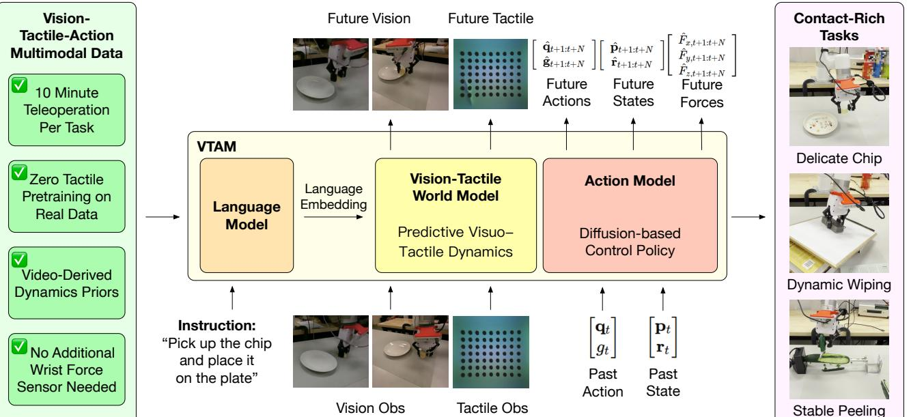  

Figure 1: We introduce VTAM, a generalist VideoTactile Action Model that integrates tactile sensing into a predictive video world model. By grounding control in visuotactile dynamics and force-aware reasoning, VTAM enables stable control in diverse contact-rich scenarios.

Abstract. Video-Action Models (VAMs) have emerged as a promising framework for embodied intelligence, learning implicit world dynamics from raw video streams to produce temporally consistent action predictions. Although such models demonstrate strong performance on long-horizon tasks through visual reasoning, they reinac  wheac at parseva alone In particular, fne-graineforce modulation and contact transitions are not reliably ecoded inviual tokens, leading tnstable rprecise behaviors.To brige this gap, weintroduce the Video-Tactilec Model (VTAM), a multimodal world modeling framework that incorporates tactile perception as a complementary groundingsignal. TAM augments a pretrainedvideo transformer with tactile streams via a lightweight modality tranetuiabli coss-modarereentatioargithout tactanguage pardat oindependent tactile pretraining.To stabilize ultimodal fusion, weintroduce a tactile regularization los that enforces balanced cross-modal attention, preventing visual latent dominance in the action model. VTAM demonstrates superior performance in contact-rich manipulation, maintaining a robust success rate of $9 0 \%$ on veragehangiar su otathipickanplaceqhdelrwareeA outperforms the $\pi _ { 0 . 5 }$ baseline by $8 0 \%$ .Our findings demonstrate that integrating tactile feedback is essential for correcting visualstimation errors in wor acton model, providingscalableapproach  physically grounde embodied foundation models.

# 1. Introduction

Recent advances in VisionLanguage—Action (VLA) models have enabled generalist robot control through large-scale multimodal alignment [3, 17, 49]. By embedding visual observations and language instructions into a shared semantic latent space, these models can generalize across diverse manipulation tasks and environments [9, 30]. However, while vision supports high-level semantic understanding and language seaste, hysilteratioentallver bytactack, thenly malha directly encodes instantaneous contact dynamics between the robot and its environment. Tactile sensing is particularly critical for finegrained, contact-rich manipulation, such as handling fragile, deformable,or slippery objects.Unlike vision, which captures relatively stableobject geometry from adistance, actile l rlche ransintsatiemporal voluio or  hecntacnterafectivus modality requires not only spatial reasoning over force distributions but also temporal reasoning over how these distributions evolve under dynamic interaction.

Most existing tactile-augmented VLA architectures incorporate tactile information by either (1) projecting tactile embeddings into a pre-trained visionlanguage latent space, treating them as additional semantic tokens [37], or (2) concatenating tactile features with language-conditioned visual representations in the downstream policy [2, 11, 16]. While these approaches expose the model to tactile inputs, they place a substantial burden on representation learning: the model must implicitly infer contact physics within a semantic embeding space optimized for visual alignment and static scene description rather than physical prediction. Learing that particular tact patters correpond t slip, deforation, oinstabiliy requires discovering these concepts indirectly through static correlations. This often demands large-scale annotated datanersoguarantethat henderlyinhig-requencynamic wi befaithfullyaptureWithou explicit temporalmodeling thes learned representations struggletencode the causal relationships betwen iv came, preche ure neee npatiumode suc  cp l [22, 32, 42]. Moreover, because many VLA backbones prioritize semantic alignment over predictive physical modeling, they further underutilize tactile signals for fine-grained spatial and temporal reasoning [2, 16].

We address these limitations by introducing VTAM, a generalist VideoTactile Action Model that integrates tactile sensing into a predictive world-model framework for contact-rich manipulation, as shown in Fig. 1. At the representation level, we design a visuotactile predictive module built on top of a pretrained video backone. Instead of mapping tactil signals int a languagealign semanti space, VAM treats touc as a primary snsoymodality nd jointy predicthefuture evolution visul an tactl ream conditi therobot' end-efector state.This predictiveformulation eables the backbone leartemporally consstent visuotactile features without requiring explicit semantic annotations of contact events. Furthermore, at the action-learning level, we address the modality collapse problem that commonly arises when integrating ta puts ntactin raing. yuing virtual or peditijectivat he ctn e we regularize multimodal fusion and stabilizetraining. This design encourages the policy to maintain sensitivity to tactile signals during action optimization, effectively preventing the dominance of visual features. Wevalidate AM on three diverse contact-rich manipulation tasks: chip pick-and-place, peeling, and wiping. On the chip pick-and-place task, VTAM achieves a $9 0 \%$ success rate, compared to $0 \%$ for the vision-only baseline and $1 0 \%$ when removing the virtual force regularization. A naive downstream force integration without predictive visuo-tactile modeling fails entirely $\mathrm { 0 \% }$ success). Similar trends are observed across the peeling and wiping tasks, demonstrating that predictive visuotactile representation learning combined with actionlevel regularization ubstantiallmprovesstability and task success. In smmary our main contributions re: We introduce VAM, a visuotactile world action model that integrates high-resolution tactile sensing wit visual observations within a predictive video backbone to enable robust contact-rich robotic manipulatior We propose a joint visuotactile prediction framework that forecasts future visual and tactile streams in a shared latent space, enabling the model to learn temporally consistent contact dynamics without requiring explicit semantic annotations.   
We introduce a virtual force prediction objective that successfully mitigates modality collapse during training, yielding empirical improvements over vision-only and naive integration baselines.   
Wvalidate TAMon challengingcontac-richrobotictasks, includingpotato chippick-and-placecuer peeling, and whiteboard wiping with varying heights and tilt angles, demonstrating large improvements in success rate over vision-only and naive tactile baselines.

# 2.Related Works

Vision-Language-Action Models. VLA models have emerged as the dominant paradigm for generalist robot control, leveraging internet-scale visionlanguage pretraining to groundnatural-language instructions in visual observations and decode motor commands through a unified architecture [3, 4, 17, 30, 49]. Subsequent efforts have expanded the paradigm along several axes, incorporating 3D geometric priors [28, 46], hierarchical task planning [1, 23], and predictive world knowledge [44, 47], consistently improving generalization and sample efficiency. Existing visuo-linguistic VLAs struggle with physical interactions when visual cues are occluded, particularly with fragile objects. VTAM targets this gap by incorporating hig-resolution tactileobservations directly into a generative world-model backbone: the model learns joint visuotactile dynamics and uses these representations to guide action generation, so tactile cues can correct visual misestimation during interaction and improve robustness on fragile and force-sensitive tasks. Generative World Models for Robotics. Generative world models forecast future environment states to support planning and policy learning [26, 38]. Recent work has scaled this idea by jointly diffusing video and action trajectories [19]. DreamZero [39] builds a World Action Model on a pretrained video diffusion backbone, achieving zero-shot generalization and cross-embodiment transfer by learning physical dynamics from heterogeneous robot data. UWM [47] introduces modality-specific diffusion timesteps that decouple video and action noise schedules, enabling pretraining on large-scale datasets that include action-free video. DreamVLA [44] augments VLAs with future visual token prediction, and RDP [36] applies diffusion hierarchically for contact-aware action refinement. Despite these advances, most existing world models encode environmental dynamics almost exclusively throvis predicio.Whilvisloreasiapturejecmotionan scenevolution  provie idireaccess  the physicalinteractio gals that gove contact-ric manipulation.Critical phenen suc  sp,deforatn, nd ortranse arisat he contacnterfaceand reoten weakyservab entirely hidden from camera views. As a result, models that rely solely on visual dynamics may struggle to anticipate ailure modes during delicateor force-sensitiveinteractions. Motivated by this limitation, VTAM brings tactile deformation dynamics into the predictive world model and anchors control learning with a virtual-force target so the policy remains responsive when contact becomes visually ambiguous.

Tactile Integration in Robotic Learning. Tactile sensing provides direct access to contact physics and is essential for manipulation involving deformable, fragile, or occluded objects [14, 7]. On the representation side, contrastive objectives have been used to align visual and tactile embeddings [7, 13] or to learn sensor-At h  veetoro r Mixture-of-Experts routing [40], dual-level feedback fusion [2], or tactile preference optimization [43]. Thes approaches, however, treat touch as a supplementary input channel fused reactively with vision rather than modeled predictively. A further practical challenge is modality collapse: visual gradients dominate during training and suppress the tactile or force signal [6, 20, 33, 34, 45]. Existing mitigations rely on explicit force-torque sensors [15] or hybrid position-force controllers [16], imposing hardware constraints that limit generality. VTAM departs from this reactive paradigm in two ways: it embeds tactile perception into thegenerative video backbone for joint visuo-tactile dynamics prediction rather than static fusion, and it introduces deformation-aware virtual force regularization at the action head tomaintain tactile gradient influence throughout training without external force-torque hardware.

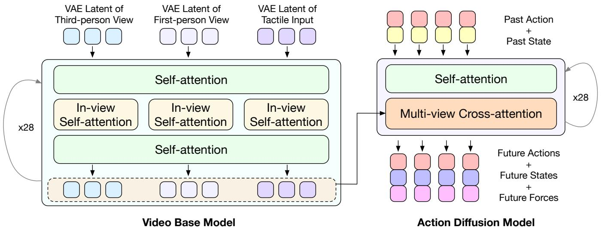  

Figure 2: VTAM Overview. A pretrained video backbone jointly models multi-view visual and tactile latents via alternating intra-view and cross-view attention. The resulting multimodal representation is injected into a conditional action diffusion head to predict action, virtual force, and proprioceptive state.

# 3. Method

We present the Video-Tactile Action Model (VTAM), a unified visuo-tactile world action model designed for contact-rich manipulation. As illustrated in Figure 2, VTAM operates by projecting both multi-view visual obersand hig-eout tactre .. Geht [it harate sa pre-trainedVariational Autoencoder (VAE). Within this space, a multi-view diffusion process employing alternating intra-viewand cross-view attention jointly models the temporal dynamicof the visual sceneand the finegraine physical deformations captured by thetactile sensor. The resultingmultimodal representations encode redictivecontac volution.Thesrepresentations are ubsequentlnjcteinto conditional diffsnbase action head via cross-attention, yielding temporally consistent and physicallygroundedcontrol actions. Jointly optimizing visual and tactile modalities within a shared backbone often leads to modality collapse, in which dominant visual gradients suppress localized, high-frequency tactile signals. To address this fundamental optimization challenge, we introduce a deformation-aware virtual force regularization at theaction head. This mechanism provides targeted supervision of the tactile pathway, thereby stabilizing multimodal fusion and ensuring that the policy remains sensitive to critical contact transitions duringdownstream tasks.

# 3.1. Vision-Tactile Latent World Modeling via Multi-View Diffusion

A fundamental challenge in visuo-tactile modeling is preserving the high-requency spatial details, such as ubtle surface deformations and texture variations, that encod shear, slip, and pressure in tactile sensors like GelSight [8, 41]. Standard semantic vision encoders [12] often discard these details in favor of coarse, object-level features. Therefore, we base our representation on a pretrained video Variational Autoencoder VAE) [18, 31].The reconstruction-oriented objective of the VAE provides a natural inductive bias that preserves fine-grained spatial and motion patterns [5].This allows us to efficiently transfer modalities without designing a specialized tactile backbone. Beyond spatial details, efective contact manipulation requires understanding how forces evolve over time. Instead of routing tactile signals through lightweight, reactive downstream branches, we embed the tactile stream directly into a high-capacity video transormer. This architecturecapture both theintrrameeormation ructure n thenteame contacevoun. Consequently, the model performs predictive reasoning over force trends, enabling it to anticipate critical transitions—a vital capability for handling brittle bjects where ailureoccurs within millimeters of motin. Formally, given an input frame $\mathbf { I } _ { t } ^ { v }$ at timestep $t$ from view $v$ , we use the pretrained video VAE encoder $E$ to extract a continuous latent representation $ { \mathbf { z } } _ { t } ^ { v }$ :

$$
\begin{array} { r } { \mathbf { z } _ { t } ^ { v } = E \big ( \mathbf { I } _ { t } ^ { v } \big ) , \quad v \in \{ 1 , 2 , 3 \} , } \end{array}
$$

where $v = 1 , 2$ denote the third-person and first-person visual camera views, and $v = 3$ denotes the GelSight tactile stream. To model the complex spatial and inter-modal dynamics, we process these latents through a sequence of $B$ alin on . $\mathbf { Z } _ { b } = \big \{ \mathbf { z } _ { t , b } ^ { 1 } , \mathbf { z } _ { t , b } ^ { 2 } , \mathbf { z } _ { t , b } ^ { 3 } \big \}$   
$b$ -th block, with $\mathbf { Z } _ { 0 }$ being the initial VAE encodings. For each block $b \in \left\{ 1 , \ldots , B \right\}$ , we first apply intra-view self-attention independently to each modality to capture spatial structures:

$$
\tilde { \mathbf { z } } _ { t , b } ^ { v } = \mathrm { S e l f A t t e n t i o n } ( \mathbf { z } _ { t , b - 1 } ^ { v } ) \quad \forall v \in \{ 1 , 2 , 3 \} .
$$

Next, we concatenate the updated tokens across all views and apply a cross-view self-attention operation to model inter-modal interactions:

$$
\mathbf { Z } _ { b } = \mathrm { C r o s s V i e w A t t e n t i o n } \bigl ( \mathrm { C o n c a t } \bigl ( \tilde { \mathbf { z } } _ { t , b } ^ { 1 } , \tilde { \mathbf { z } } _ { t , b } ^ { 2 } , \tilde { \mathbf { z } } _ { t , b } ^ { 3 } \bigr ) \bigr ) .
$$

This alternating structure is repeated across all $B$ blocks, gradually building a dense visuo-tactile representation of the joint.

# 3.2. Deformation-Aware Regularization via Virtual Force Prediction

While the predictive backbone enables joint visuo-tactile representation learning, we observe a critical modality collapse phenomenon during action training. Specifically, when the task loss can be sufficently minimized using visual cues alone, gradients flowing through the tactile branch diminish. Consequently, the policy becomes overly reliant on vision and ignores tactilefeedback, leading tounstable contact controlin force-sensitive manipulation tasks [20, 33]. Tcteract hissuewentrducdeformati-awaruxilaryjectivhat provideire upeisn to the tactile pathway. Prior works often rely on external force-torque sensors mounted at the robot wrist oripper to obtain ground-truth 3D force supervision [29, 48]. In contrast, we observe that vision-based tactile sensors inherently encode rich deformation patterns correlated with contact forces. By enforcing the prediction of a compact, deformation-related signal, we ensure that tactile representations remain informative without the computational overhead of reconstructing high-dimensional tactile images. Formally, given a no-contact reference frame $I _ { 0 }$ and a current tactile frame $I _ { t }$ , we compute the dense optical flow $u _ { t } = \left( u _ { x } , u _ { y } \right)$ . We derive a 3D virtual force proxy $\boldsymbol { F } _ { t } ^ { v } = \left[ f _ { x } , f _ { y } , f _ { z } \right] ^ { \intercal }$ directly from this deformation field:

$$
f _ { x } = \mathbb { E } \big [ u _ { x } \big ] , \quad f _ { y } = \mathbb { E } \big [ u _ { y } \big ] , \quad f _ { z } = \mathbb { E } \big [ \boldsymbol { \nabla } \cdot \boldsymbol { u } _ { t } \big ] .
$$

Here, the spatial expectations of the flow components, $f _ { x }$ and $f _ { y }$ ,encode tangential shear. Crucially, $f _ { z }$ approximates normal compression via flow divergence, exploiting the property that pressing a deformable elastomer against an object induces an outward expansion of the surface pattern. This signal serves as a geometrically grounded proxy rather than a calibrated physical force. The derived virtual force $\boldsymbol { F } _ { t } ^ { v } \in \mathbb { R } ^ { 3 }$ acts as an auxiliary supervision signal during action training. Instead of appending an isolated downstream prediction head, we incorporate this compact force proxy as an additional component n the joint denoisingtarge f the conditional flow-matching objective. Specifically, the network is tasked with jointly predicting the future action and the virtual force, effectively binding the contol gradients to the tactile representations. The explicit force regularization term evaluates the vector field velocity matching for the force component:

$$
\mathcal { L } _ { \mathrm { f o r c e } } = \mathbb { E } \left[ \left\| v _ { \theta } ^ { f } ( z _ { t } , t \vert c ) - v ^ { * f } \right\| ^ { 2 } \right] .
$$

This formulation preserves deformation-sensitive information in the latent space and maintains balanced multimodal gradients throughout optimization.

# 3.3. Optimization Objective

To adapt the pretrained visual backbone for multimodal visuotactile modeling, we employ a two-stage training strategy. The backbone, initially pretrained exclusively on visual datasets, lacks prior exposure to the high-frequency, localized deformation patterns characteristicof tactile signals. Introducing action supervision and virtual force regularization simultaneously with modality alignment forces the network to adapt its internal representations while simultaneously optimizing a control policy. the quality of the tactile latents and leading to unstable convergence. To overcome this, we decouple the pSa e-ne he aconexcusive odjoinisa ate yami blih a coerent multimodal world representation. tage Ithen leverages this aligned representation tointroduce regularized action prediction. Stage I: Multi-View Visuo-Tactile Latent Flow Matching. Let $\mathbf { z } _ { 0 }$ denote the VAE-encoded latent sequence of future multi-view observations, encompassing the two camera views and the GelSight stream. We apply the flow matching formulation to model the forward dynamics of these visuo—tactile latents:

$$
\mathcal { L } _ { \mathrm { s t a g e 1 } } = \mathbb { E } \left[ \left. \mathbf { v } _ { \boldsymbol { \theta } } ( \mathbf { z } _ { t } , t ) - \mathbf { v } ^ { * } \right. ^ { 2 } \right] .
$$

Crucially, this loss is applied exclusively to future prediction frames, while the initial conditioning rames are excluded from the optimization target. This stage adapts the pretrained backbone to capture the physical interplay between macroscopic visual dynamics and microscopic tactile deformations, ensuring a well-behaved multimodal latent space before any control signals are introduced. Stage II: Conditional Joint ActionStateForce Denoising. Following the training of a robust visuotactile world model in Stage I, we optimize the control policy. We formulate action generation as a conditional flo-atching proces. The joint denoising target is constructed by concatenating the action, virtual force, and state:

$$
{ \bf z } _ { 0 } = \big [ { \bf a } ; { \bf f } ; { \bf s } \big ] ,
$$

where a $\in \mathbb { R } ^ { 7 }$ represents the 6-DoF end-effector pose and 1D gripper width, $\mathbf { f } \in \mathbb { R } ^ { 3 }$ is the deformation-derived virtual force, and $\mathbf { s } \in \mathbb { R } ^ { 1 6 }$ is the proriceptiv ate.The networ predict the jint velociy fl condind on the current state token $\mathbf { c } = \left[ \mathbf { 0 } _ { 1 0 } ; \mathbf { s } _ { t } \right]$ , where the action and force dimensions are zero-padded during conditioning. We define the flow-matching objectives for the action and state components to track the optimal denoising trajectories for their respective sub-spaces:

$$
\mathcal { L } _ { \mathrm { a c t i o n } } = \mathbb { E } \left[ \left. \mathbf { v } _ { \boldsymbol { \theta } } ^ { \mathbf { a } } ( \mathbf { z } _ { t } , t \mid \mathbf { c } ) - \mathbf { v } ^ { * { \mathbf { a } } } \right. ^ { 2 } \right] ,
$$

$$
\mathcal { L } _ { \mathrm { s t a t e } } = \mathbb { E } \left[ \left. \mathbf { v } _ { \theta } ^ { \mathbf { s } } ( \mathbf { z } _ { t } , t \mid \mathbf { c } ) - \mathbf { v } ^ { * s } \right. ^ { 2 } \right] .
$$

We then integrate these with the virtual force regularization ${ \mathcal { L } } _ { \mathrm { f o r c e } }$ (defined previously in Eq. 5) to form the cope tag Ijective.The total loss inimize thesumf he velociymatching erors acrosa re components:

$$
\mathcal { L } _ { \mathrm { s t a g e 2 } } = \mathcal { L } _ { \mathrm { a c t i o n } } + \lambda _ { 1 } \mathcal { L } _ { \mathrm { s t a t e } } + \lambda _ { 2 } \mathcal { L } _ { \mathrm { f o r c e } } .
$$

Because flow matching regresses a normalized velocity field $( \epsilon - { \bf z } _ { 0 } )$ rather than raw data values, the target variances across the action, state, and force dimensions remain naturally scaled. This circumvents the need for the aggressive hyperparameter balancing typically required in standard MSE-based regression. Furthermore, joint state prediction introduces a vital dynamics-consistency constraint, ensuring that the model grounds its control predictions in coherent physical state transitions rather than memorizing isolated action trajectories.

# 4. Experiments

We evaluate VAM on real-world contact-rich manipulation tasks to study the effectiveness of visuotactil world action modeling. Our experiments aim to answer the following key questions: Q1: Effectiveness of Visuo-Tactile World Action Modeling. Does VTAM outperform vision-only and multimodal baselines in scenarios requiring fine-grained force modulation?   
: Latent Video Fusion vs. Late-stage Injection. Does modeling visuo-tactile dynamics within a shared video latent space offer performance advantages over late-stage tactile injection?   
3: Impact of Virtual Force Regularization. To what extent does contact-aware virtual target regularization mitigate modality collapse and stabilize multimodal training?

# 4.1. Experimental Setup

All experiments are conducted on a 6-DoF xArm6 robotic manipulator equipped with a parallel gripper (3a). We use a GelSight Mini tactile sensor mounted on the gripper finger to capture high-resolution surface deformation. Visual observations are obtained from two Intel RealSense D455 RGB-D cameras mounted in a dual-head configuration. Both data collection and action execution run at $3 0 \mathrm { H z }$ .We compare VTAM against several strong baselines to evaluate the effectiveness of visuotactile world action modeling.

Video-Action Model (Genie Envisioner) [19]. A state-of-the-art video foundation model that integrates an instruction-conditioned video diffusion backbone with a flow-matching action decoder. • $\pi _ { 0 . 5 }$ (Vision-Only) [24]. The official implementation of the $\pi _ { 0 . 5 }$ generalist Vision-Language-Action (VLA) policy, which scales the $\pi _ { 0 }$ architecture [3] for open-world generalization. This baseline isolates the performance limits o semantic-heavy, vision-only representations in force-sensitive scenarios wherecritial contact states are visually occluded. b $\pi _ { 0 . 5 } ~ +$ Naïve Tactile Injection [24]. A multimodal extension of the $\pi _ { 0 . 5 }$ architecture where the highdimensional GelSight tactile stream is injected simply as an additional visual view. This setup is specifically included to demonstrate the modality collapse phenomenon, where dominant visual gradients suppress localized tactile signals during unregularized joint training.

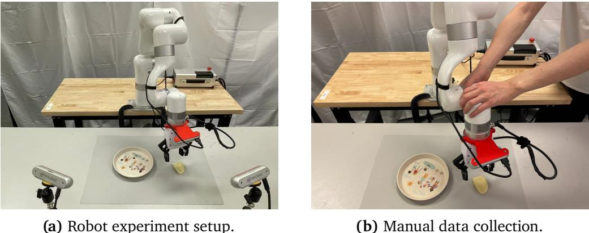  

Figure 3: Experiment setup and data acquisition. We collect demonstrations through manual teleoperatio using a visuotactile sensing setup for contact-rich manipulation tasks such as chip pick-and-place.

# 4.2. Real-World Tasks and Data Collection

We evaluate VTAM on three contact-rich manipulation tasks: Potato Chip Pick-and-Place: Grasping and transporting fragile potato chips without breakage, requiring fine-grained force modulation. Success depends on precisely regulating grasp force and detecting contact onset under severe hand-induced occlusion. The policy must avoid both under-grasping (slip/drop) and over-grasping (chip fracture) while lifting and placing. •Cucumber Peeling: Maintaining stable contact while peeling a deformable vegetable, demanding continuous shear-force control. This task requires sensitivity to small changes in friction and deformation as the tool slides. Whiteboard Wiping: Using a rigid whiteboard eraser to wipe a flat or inclined surface, requiring sustained contact and precise normal force regulation to prevent chatter and lift-off. For evaluation, we collect a real-world visuotactie dataset or these tasks using a dual-camera setup and a GelSight sensor (Fig. 3b). The dataset consists of 100 chip pick-and-place, 105 whiteboard wiping, and 61 peeling trajectories. All demonstrations are collected through manual teleoperation and include synchronized multi-view RGB streams, tactile deformation images, and robot state information.

# 4.3. Quantitative Results (Q1)

For evaluation, we conduct 20 trials per task. The tasks include chip pick-and-place, flat whiteboard wiping with a rigid eraser, tilted whiteboard wiping, and cucumber peeling. In total, each model is evaluated on 80 real-world trials, with inference performed at $1 \ \mathrm { H z }$ Table 1 reports the performance comparison across contact-rich manipulation tasks. Overall, VTAM significantly outperforms baselines, achieving success rates of $9 0 \%$ , $8 5 \%$ ,and $9 5 \%$ on chip pick-and-place, cucumber peeling, and whiteboard wiping, respectively.

Table 1: Overall performance comparison.   

<table><tr><td>Model</td><td>Chip</td><td>Peel</td><td>Wipe</td></tr><tr><td>Genie Envisioner</td><td>0%</td><td>0%</td><td>2.5%</td></tr><tr><td>π0.5 (Vision)</td><td>10%</td><td>0%</td><td>0%</td></tr><tr><td>π0.5 + Tactile</td><td>5%</td><td>0%</td><td>0%</td></tr><tr><td>VTAM (Ours)</td><td>90%</td><td>85%</td><td>95%</td></tr></table>

On the chip pick-and-place task, VTAM achieves a success rate of $9 0 \%$ , demonstrating strong robustness inbritte-object manipulation where accurategras verifiation and force control are required. In contrast, baselines frequently fail to detect unsuccessful grasps and proceed directly to the placement stage. For cucumber peeling, VTAM reaches $8 5 \%$ success while all baselines fail to complete the task, confirming tactil feedback is essential formaintaining stable contact and regulating shear forces when interactin with deformable objects. On the whiteboard wiping task, VTAM achieves $9 5 \%$ success across both flat and tilted surfaces, whereas baseline methods either apply unstable contact forces or fail to maintain consistent surface following. These results highlight the importance o visuotactile world action modeling for robust force regulationin contact-rich manipulation.

# 4.4. Qualitative Examples and Failure Mode Analysis

Figur 4 shows qualitative comparisons across the three tasks. We analyze the behaviors of different methods to understand how VTAM addresses the challenges in contact-rich tasks. Additional examples can be found in the Appendix. Chip Pick-and-Place. For the G vision-only baseline, the main failure arises from the inability to verify suful grasps The robot oten closes the gripper above he chip and proceds t the plate even when the The vnt wi ou acuhi avricathat e without effective tactile ignal integration cannot perform correct force-awaregrasping. In contrast, VTAM ehibits tactile-aware behaviors.The robot ts the chip only when tactile deformation confirms succesful contact andmaintains a stabe gripper width to prevent droppin durig liftig In case thegraspfails, the policy can also detect the absence of tactile signals during lifting and immediately return to the chip to reattempt the grasp, rather than continuing to the plate and releasing the gripper. Cucumber Peeling. The GE baseline and both Pi variants exhibit similar motion patterns. Starting from the left side of the cucumber, the tool first moves toward the centerline and then moves away from it while sliding along the surface. This trajectory resembles a vision-driven strategy that attempts to follow the object curvature rather than regulating contact force. As a result, the tool frequently loses contact with the cucumber surface. In contrast, our VTAM policy establishes stable contact and maintains proper force while moving along the surface. The robot can perform repeated peeling motions at the same location, demonstrating accurate perception of contact states even when the cucumber thickness varies. Whiteboard Wiping. On both flat and tilted whiteboards, the two Pivariants apply excessively large contact forces, sometimes even pushing the books used to support the tilted board out of place. This behavior likely arises because the training data contains both flat and tilted surfaces, making it difficult for the model to infer the correct end-effector height from visual observations alone. As a result, the policy cannot reliably determine when the gripper should move downward to follow a lower surface or remain higher to accommodate a tilted plane, and instead compensates by applying excessive force to maintain contact. Iner GEbsenaly r ipn   a beces unstable and the end-effectrmotion turns irregular n tilted boards. The polcy teds to fllowa trajery itbl or lat rac, cusihe nefector  preexcesivel gainst igherregin e tilted board while failing to maintain stable contact when the surface height changes. In contrast, VTAM mainais moderate and stabl contact forces on bot fat and til surace, enabli conssten wiping and effective stain removal. This reflects that VTAM can effectively leverage tactile information to handle visually ambiguous contact-rich tasks.

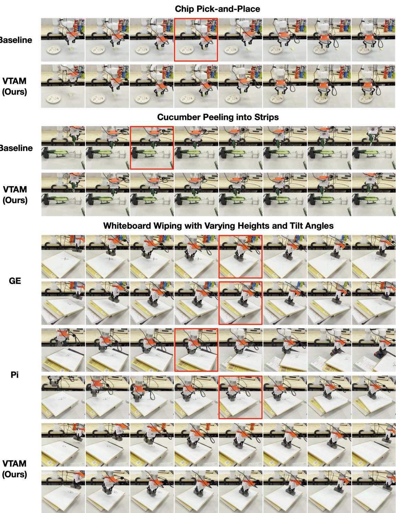  

Figure 4: Qualitative comparison between VTAM and baseline methods on real-world manipulation tassTop:Chippick-an-plaVisin-y baselne l detere whethehe hias beeuy raspe and proc the placeent tage even when he rasp fails.Mid:ucmber peelig int s. Baselines tend to follow a vision-driven trajectory that approaches the center of the cucumber but fail to maintain consistent contact with the surfae, indicating poor forc regulation and lackof contac awareness. Bot:Whiteboard wipng under varying heights and tilt angles. Baselines exhibit unstable wiping behaviors, oe applyieithesuient  xcesivel largorce, particularyntilteurfacs. In cntrast, VTAM maintains stable contact and appropriate force regulation across all tasks, enabling robust manipulation behaviors. Red boxes highlight representative failure cases of baselines.

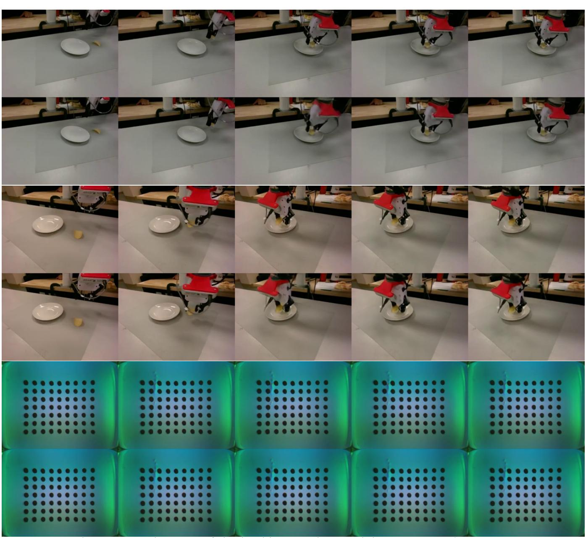  

Figure 5: Prediction visualization of the backbone video model. From top to bottom: Camera-1 viev Camera-2 view, Tactile stream prediction. Ground-truth (top rows) and VTAM predictions (bottom rows).

# 4.5. Prediction Visualization

We visualize the predictions of the backbone video model in Fig. 5. For each view and tactile prediction, the top row shows ground-truth frames while the bottom row shows model predictions. The model preserves cross-view temporal consistency and in-view dynamics, with only minor blurring in details irrelevant to manipulation, indicating reliable visuo—tactile world modeling for action generation.

Table 2: Ablation study on the Chip Pick-and-Place task (10 trials per variant).   

<table><tr><td>Model Variant</td><td>Tactile Integration</td><td>Success Rate</td></tr><tr><td>Vision-only (No Tactile)</td><td>None</td><td>0%</td></tr><tr><td>Late-Fusion Tactile</td><td>Downstream Only</td><td>0%</td></tr><tr><td>No Virtual-Force Reg.</td><td>Joint Latent</td><td>10%</td></tr><tr><td>VTAM (Ours)</td><td>Hierarchical World Model</td><td>90%</td></tr></table>

# 4.6. Ablation Study on Chip Pick-and-Place Task (Q2 & Q3)

Toevaluate VTAM's architectural components, we conduct ablations on the contact-sensitive Chip Pick-and-Place task at a constrained $1 \ \mathrm { H z }$ inference frequency (Table 2). The full VTAM model achieves $9 0 \%$ success rate,utilizing predictive world modeling to anticipate interaction states between low-frequency sensory uates In cntrast, al blations fail treliably scureheragil hip.TheVisin-on baseline is $0 \%$ success rate, as visual depth estimation suffers from severe occlusion during the final approach and cannot perive subtle contact transitions. Introducing tactile signals only at the action head (Late-Fusion) lso results in $0 \%$ success (Q2), demonstrating that raw force injection is insufficient without our hierarchical visutactile world modeling.Finally, removing the virtual-force regularization (No Reg. drops performance to $1 0 \%$ due to "vision modality dominance" (Q3), confirming that this auxiliary loss is critical for preventing representation collapse and ensuring tactile signals influence the entire denoising process.

# 5. Conclusion

We introduce VTAM, a visuotactile world action model for contact-rich manipulation. VTAM trains a predictive backbone to model the joint evolution of multi-view video and high-resolution tactile signals, so the policy can use contact dynamics that are weakly observable or occluded in vision. This predictive forulation learns temporally consistent contact features without requirinexplicit labels or contact evnts and avoids relying on purely downstream, reactive tactile fusion. To prevent the common failure mode where action training defaults to visual cues and suppresses tactile information, we add a deformation-derived virtual-force prediction objective that maintains tactile supervision through the control pathway. On real robot tasks that demand precise force regulation, including chip pick-and-place and cucumber peeling, VTAM substantiallyimprove success rate and interaction stability over vision-only and naive tactil basens, highlightinheportancmodelin contact ynamic directly forreliabl physicalinteraction. Ultiately our framework provides a scalable, physically grounded approach to embodied intelligence, proving that predictive joint modeling is essential for reliable execution in complex physical interactions.

# References

[16] Jialei Huang, Shuo Wang, Fanqi Lin, Yihang Hu, Chuan Wen, and Yang Gao. Tactile-VLA: Unlocking vision-language-action model's physical knowledge for tactile generalization. arXiv preprint arXiv:2507.09160, 2025. [17] Moo Jin Kim, Karl Pertsch, Siddharth Karamcheti, Ted Xiao, Ashwin Balakrishna, Suraj Nair, Rafael Rafailov, Ethan Foster, Grace Lam, Pannag Sanketi, et al. OpenVLA: An open-source vision-languageaction model. arXiv preprint arXiv:2406.09246, 2024. [18] Diederik P Kingma and Max Welling. Auto-encoding variational bayes. arXiv preprint arXiv:1312.6114 2013. [19] Yue Liao, Pengfei Zhou, Siyuan Huang, Donglin Yang, Shengcong Chen, Yuxin Jiang, Yue Hu, Jingbin Cai, Si Liu, Jianlan Luo, et al. Genie envisioner: A unified world foundation platform for robotic manipulation. arXiv preprint arXiv:2508.05635, 2025. [20 Jason Jingzhou Lu, Yulong Li, Kennh Shaw, Tony To, Ruslan Salakhudinov, and Deepak Pathak. acr: Force-attending curriculum training for contact-rich policy learning. arXiv preprint arXiv:2502.17432, 2025. [21] Ilya Loshchilov and Frank Hutter. Decoupled weight decay regularization. arXiv preprin arXiv:1711.05101, 2017. [22] Amit Parag, Edward H Adelson, and Ekrem Misimi. Learning incipient slip with gelsight sensors: Attention classification with video vision transformers. In International Conference on Intelligent Robots and Systems (IROS), pages 1396013966, 2024. [23] Jeongeun Park, Jihwan Yoon, Byungwoo Jeon, Juhan Park, Jinwoo Shin, Namhoon Cho, Kyungjae Lee, Sangdoo Yun, and Sungjoon Choi. Hierarchical vision language action model using success and failure demonstrations. arXiv preprint arXiv:2512.03913, 2025. [24] Physical Intelligence, Kevin Black, Noah Brown, James Darpinian, Karan Dhabalia, Danny Driess, Adnan Esmail, Michael Equi, Chelsea Finn, Niccolo Fusai, et al. pi0.5: a vision-language-action model with open-world generalization. arXiv preprint arXiv:2504.16054, 2025. [25] Samyam Rajbhandari, Jeff Rasley, Olatunji Ruwase, and Yuxiong He. Zero: Memory optimizations toward training trillion parameter models. In SC20: International Conference for High Performance Computing, Networking, Storage and Analysis, pages 116. IEEE, 2020. [26] Younggyo Seo, Danijar Hafner, Hao Liu, Fangchen Liu, Stephen James, Kimin Lee, and Pieter Abbeel. Masked world models for visual control. In Conference on Robot Learning (CoRL), pages 13321344, 2023. [27] Zilin Si, Gu Zhang, Qingwei Ben, Branden Romero, Zhou Xian, Chao Liu, and Chuang Gan. Difftactile: A physics-based differentiable tactile simulator for contact-rich robotic manipulation. arXiv preprint arXiv:2403.08716, 2024. [28] Lin Sun, Bin Xie, Yingfei Liu, Hao Shi, Tiancai Wang, and Jiale Cao. Geovla: Empowering 3d represer tations in vision-language-action models. arXiv preprint arXiv:2508.09071, 2025. [29] Balakumar Sundaralingam, Alexander Sasha Lambert, Ankur Handa, Byron Boots, Tucker Hermans, Stan Birchfield, Nathan Ratliff, and Dieter Fox. Robust learning of tactile force estimation through robot interaction. In International Conference on Robotics and Automation (ICRA), pages 90359042, 2019. [30] Octo Model Team, Dibya Ghosh, Homer Walke, Karl Pertsch, Kevin Black, Oier Mees, Sudeep Dasari, Joey Hejna, Tobias Kreiman, Charles Xu, et al. Octo: An open-source generalist robot policy. arXiv preprint arXiv:2405.12213, 2024. [31] Pascal Vincent, Hugo Larochelle, Yoshua Bengio, and Pierre-Antoine Manzagol. Extracting and composing robust features with denoising autoencoders. In International Conference on Machine Learning (ICML), pages 10961103, 2008. [32] Qiang Wang, Pablo Martinez Ulloa, Robert Burke, David Cordova Bulens, and Stephen J Redmond. Robust learning-based incipient slip detection using the papillarray optical tactile sensor for improved robotic gripping. IEEE Robotics and Automation Letters, 9(2):18271834, 2023. [33] Weiyao Wang, Du Tran, and Matt Feiszli. What makes training multi-modal classification networks hard? In IEEE Conference on Computer Vision and Pattern Recognition (CVPR), pages 1269512705, 2020. [34] Nan Wu, Stanislaw Jastrzebski, Kyunghyun Cho, and Krzysztof J Geras. Characterizing and overcoming the greedy nature of learning in multi-modal deep neural networks. In International Conference on Machine Learning (ICML), pages 2404324055, 2022. [35] Zhengtong Xu, Raghava Uppuluri, Xinwei Zhang, Cael Fitch, Philip Glen Crandall, Wan Shou, Dongyi Wang, and Yu She. Unit: Data efficient tactile representation with generalization to unseen objects. IEEE Robotics and Automation Letters, 2025. [36] Han Xue, Jieji Ren, Wendi Chen, Gu Zhang, Yuan Fang, Guoying Gu, Huazhe Xu, and Cewu Lu. Reactive diffusion policy: Slow-fast visual-tactile policy learning for contact-rich manipulation. arXiv preprint arXiv:2503.02881, 2025. [37] Fengyu Yang, Chao Feng, Ziyang Chen, Hyoungseob Park, Daniel Wang, Yiming Dou, Ziyao Zeng, Xien Chen, Rit Gangopadhyay, Andrew Owens, et al. Binding touch to everything: Learning unified multimodal tactile representations. In IEE Conference on Computer Vision and Pattern Recognition (CVPR), pages 2634026353, 2024. [38] Ze Yang, Yun Chen, Jingkang Wang, Sivabalan Manivasagam, Wei-Chiu Ma, Anqi Joyce Yang, and Raquel Urtasun. Unisim: A neural closed-loop sensor simulator. In IEE Conference on Computer Vision and Pattern Recognition (CVPR), pages 13891399, 2023. [39] Seonghyeon Ye, Yunhao Ge, Kaiyuan Zheng, Shenyuan Gao, Sihyun Yu, George Kurian, Suneel Indupuru, You Liang Tan, Chuning Zhu, Jiannan Xiang, et al. World action models are zero-shot policies. arXiv preprint arXiv:2602.15922, 2026. [40] Jiawen Yu, Hairuo Liu, Qiaojun Yu, Jieji Ren, Ce Hao, Haitong Ding, Guangyu Huang, Guofan Huang, Yan Song, Panpan Cai, et al. Forcevla: Enhancing vla models with a force-aware moe for contact-rich manipulation. arXiv preprint arXiv:2505.22159, 2025. [41] Wenzhen Yuan, Siyuan Dong, and Edward H Adelson. Gelsight: High-resolution tactile sensors fo: perceiving physical properties. IEEE Robotics & Automation Magazine, 24(3):6677, 2017. [42] Brayan S Zapata-Impata, Pablo Gil, and Fernando Torres. Learning spatio temporal tactile feature with a convlstm for the direction of slip detection. Sensors, 19(3):523, 2019. [43] Chaofan Zhang, Peng Hao, Xiaoge Cao, Xiaoshuai Hao, Shaowei Cui, and Shuo Wang. VTLA: Visiontactile-language-action model with preference learning for insertion manipulation. arXiv preprint arXiv:2505.09577, 2025. [44] Wenyao Zhang, Hongsi Liu, Zekun Qi, Yunnan Wang, Xinqiang Yu, Jiazhao Zhang, Runpei Dong, Jiawei He, Fan Lu, He Wang, et al. DreamVLA: a vision-language-action model dreamed with comprehensive world knowledge. arXiv preprint arXiv:2507.04447, 2025. [45] Zongzheng Zhang, Haobo Xu, Zhuo Yang, Chenghao Yue, Zehao Lin, Huan-ang Gao, Ziwei Wang, and Hao Zhao. Ta-vla: Elucidating the design space of torque-aware vision-language-action models. arXiv preprint arXiv:2509.07962, 2025. [46] Haoyu Zhen, Xiaowen Qiu, Peihao Chen, Jincheng Yang, Xin Yan, Yilun Du, Yining Hong, and Chuang Gan. 3d-vla: A 3d vision-language-action generative world model. arXiv preprint arXiv:2403.09631, 2024. [47] Chuning Zhu, Raymond Yu, Siyuan Feng, Benjamin Burchfiel, Paarth Shah, and Abhishek Gupta. Unified world models: Coupling video and action diffusion for pretraining on large robotic datasets. arXiv preprint arXiv:2504.02792, 2025. [48] Yifan Zhu, Mei Hao, Xupeng Zhu, Quentin Bateux, Alex Wong, and Aaron M Dollar. Forces for free: Vision-based contact force estimation with a compliant hand. Science Robotics, 10(103):eadq5046, 2025. [49] Briana Zitkovich, Tianhe u, Sichun Xu, Peng Xu, Ted Xiao, Fei Xia, Jialin Wu, Paul Wohhart, Stefan Welker, Ayzaan Wahid, et al. RT-2: Vision-language-action models transfer web knowledge to robotic control. In Conference on Robot Learning (CoRL), pages 21652183, 2023.

# A. Training Details

VTAM World Model. The VTAM model is trained in two stages on $4 \times$ NVIDIA A100 GPUs (40 GB VRAM each) using DeepSpeed ZeRO Stage 2 [25] with bf16 mixed precision. In Stage 1: Video-only pre-training, the video prediction backbone is initialized from a pre-trained Genie Envisioner (GE-base) checkpoint [19], an LTX-Video transformer [10] with 28 layers, 32 attention heads, and hidden dimension 2048, and fine-tuned for 50,000 steps using the video-only objective (train_mode $=$ video_only). We set $B \ = \ 2 8$ following the default configuration of the pretrained LTx-Video backbone. This choice ensures compatibility with the pretrained architecture and maintains stable training behavior. We employ AdamW [21] $( \beta _ { 1 } = 0 . 9$ $\beta _ { 2 } = 0 . 9 5$ weight decay ${ { 1 0 } ^ { - 5 } } \cdot$ a cnstn learng a $3 \times { 1 0 } ^ { - 4 }$ after 1,000 warmup steps, gradient clipping $( \lVert \nabla \rVert = 1 . 0 )$ , and a per-GPU batch size of 16. In Stage 2: Action head training, an action expert head is appended to the frozen video backbone. The action expert is implemented as a parallel Transformer branch consisting of 28 layers, mirroring the depth of the video backbone. Each layer contains (i) a selfattention module over action-state tokens, (ii) a cross-attention module attending to the corresponding layer' videohidden states, and ii a feed-forwardnetwork. All modules are modulated using adaptive ayer noralization (AdaL) conditioned on the diffusion timestep. This stage is tained for 20,000 steps using the action-full objective with a lower learning rate of $5 \times { 1 0 } ^ { - 5 }$ (constant with 1,000 warmup steps), while keeping all other hyperparameters identical to Stage 1. Training is performed using Flow Matching with the Euler Discrete Scheduler, achieving approximately 3.4s per optimization step. For the chip pick-and-place, cucumber peeling, and whiteboard wiping tasks, video inputs are resized to $1 9 2 \times 2 5 6$ with a temporal chunk frames and an actin chunk siz .Actins arerepresent in bsolute joit space . te joint positions rather than deltas) and normalized using pre-computed per-dimension statistics. We apply caption dropout $( p = 0 . 0 6 )$ and first-frame noise injection (scale 0.1) for regularization. Optimization Details. We set the total loss coefficients to $\lambda _ { 1 } = \lambda _ { 2 } = 1$ for all experiments. Since all three objectives share the same flow-matching formulation, implemented as mean squared error on predicted velocity fields in normalized latent space, their magnitudes remain on comparable scales. Therefore, equal weighting provides a stable and straightforward choice without introducing additional hyperparameters.

GE-Act Baseline. The Vision-only GE-Act baseline [19] follows the same two-stage training protocol as VTAM. In Stage 1, the LTX-Video transformer backbone is initialized from the GE-base checkpoint and fine-tuned for 50,000 steps using the video-only objective. We employ AdamW $\beta _ { 1 } = 0 . 9$ $\beta _ { 2 } = 0 . 9 5$ , weight decay ${ { 1 0 } ^ { - 5 } } )$ with a constant learning rate of $3 \times { 1 0 } ^ { - 4 }$ after 1,000 warmup steps, gradient clipping $( \lVert \nabla \rVert = 1 . 0 )$ , and a per-GPU batch size of 16. In Stage 2, a randomly initialized action expert head is appended and trained for 20,000 steps using the action-full objective with a lower learning rate of $5 \times { 1 0 } ^ { - 5 }$ (constant with 1,000 warmup steps). All remaining settings, including video resolution $( 1 9 2 \times 2 5 6 )$ , temporal chunk size (9 frames), action chunk size (54), bf16 precision, DeepSpeed ZeRO Stage 2, and Flow Matching with the Euler Discrete Scheduler, are identical to those used in VTAM training.

$\pi _ { 0 . 5 }$ Policy. The $\pi _ { 0 . 5 }$ policies [24] are fine-tuned from a pre-trained $\pi _ { 0 . 5 }$ base checkpoint on $4 \times$ NVIDIA A100 GPUs (40 GB VRAM each) using Fully Sharded Data Parallel (FSDP) with bfloat16 mixed precision. We optimize the models using AdamW $( \beta _ { 1 } = 0 . 9$ , $\beta _ { 2 } = 0 . 9 5 )$ with a peak learning rate of $2 . 5 \times { { 1 0 } ^ { - 5 } }$ following a cosne decy hedule wih 1,000 wrmup seps, deyn o $2 . 5 \times { { 1 0 } ^ { - 6 } }$ over 30,000 steps. Gradient clipping is applied with $\Vert \nabla \Vert = 1 . 0$ . The global batch size is set to 64, and we use an exponential moving average (EMA) with decay 0.999. The action dimension is 32 with an action horizon of 50. Input images are resized to $2 2 4 \times 2 2 4$ .States and actions are normalized using quantile normalization with pre-computed dataset statistics. All task-specific models are trained for 10,000 optimization steps.

# B. Experimental Details

Evltn roWe valuat a poic usigl-oruc rat over muliplndpenent ils. For all tasks, the robot executes the policy under randomized initial conditions, and success is determined according to task-specific criteria. Chip Pick-and-Place.The polic is evaluated over 20 consecutive trials. In each trial, the potato chip is pl t a rndm nitl poitn. Therobot mus mov abov he potao hi, gras it ihout dme, p drops it during transport. Whiteboard Wiping. We evaluate the wiping task under two board inclination settings: $0 ^ { \circ }$ (flat) and $4 5 ^ { \circ }$ icn.Aranom black stain irawat he tar  ac t.The robot is aloweat most vep mos e e leolh a ioser . Each setting is evaluated over 20 trials. Cucuber Peeling. For the peeling task, the robot performs 20 consecutive motions at a fixed cutting posi As the cucumber is peeled, its height decreases, requiring the robot to dynamically adjust contact forc As shown in Fig. 6, 17 out of 20 trials ( $8 5 \%$ success rate) produced peel strips longer than $_ { 1 0 \mathrm { c m } }$ , demonstrating the VTAM's ability to maintain stable contact despite changing geometry.

# C. Video Prediction Examples

We visualize qualitative video prediction results for two contactrich manipulation tasks: cucumber peeling and whiteboard wiping. To evaluate visual fidelity, we compare predicted frames against ground truth for the rear camera (Fig. 7 and Fig. 10) and front camera (Fig. 8 and Fig. 11). Furthermore, we assess the model's ability to anticipate contact dynamics by predicting tactile streams (Fig. 9 and Fig. 12). Yellow arrows in the tactile plots visualize estimated contact force magnitude and direction. Note that these are for visualization purposes only; the model processes raw tactile tokens without explicit force inputs. Results demonstrate that VTAM effectively captures both visual motion and fine-grained contact dynamics across modalities.

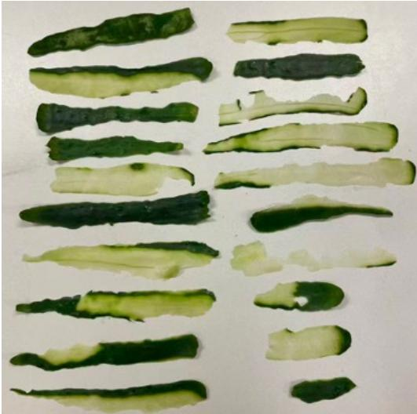  

Figure 6: Qualitative peeling results. VTAM achieves an $8 5 \%$ success rate (17/20 trials), producing peel strips longer than $1 0 \mathrm { c m }$ in successful runs.

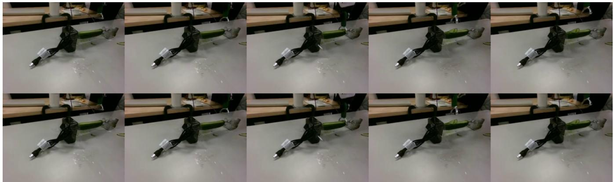  

Figure 7: Cucumber peeling video prediction (rear camera view). Top row: ground-truth; Bottom row model predictions. The predicted frames closely match the ground-truth observations.

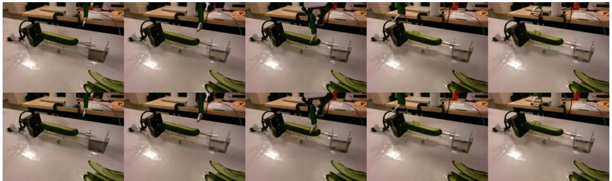  

Figure 8: Cucumber peeling video prediction (front camera view). The model maintains consistenc: with the ground truth across the manipulation sequence.

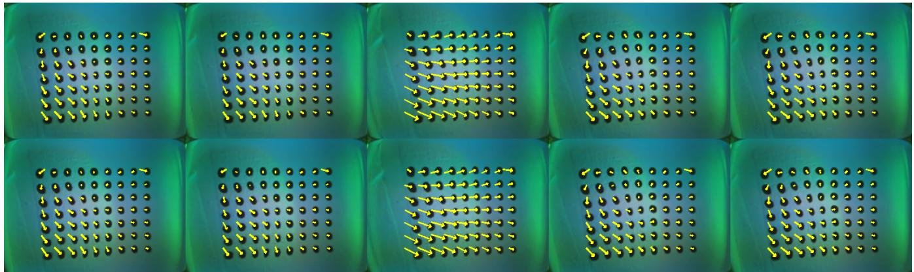  

Figure 9: Cucumber peeling tactile prediction. Tactile frames are predicted accurately. Yellow arrow visualize estimated forces for interpretation only.

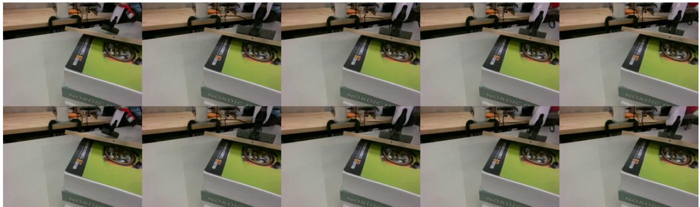  

Figure 10: Whiteboard wiping video prediction (rear camera view). Top row: ground-truth; Bottom row model predictions. Predictions match the ground truth across the wiping motion.

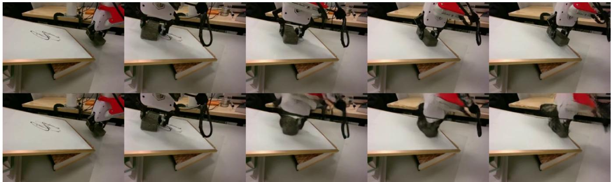  

Figure 11: Whiteboard wiping video prediction (front camera view). The model successfull reproduce the visual dynamics of the wiping interaction.

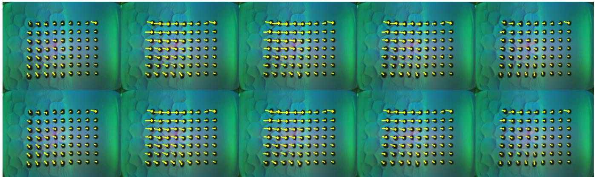  

Figure 12: Whiteboard wiping tactile prediction. The predicted tactile frames capture the interactio oetween the wiper and the board surface.