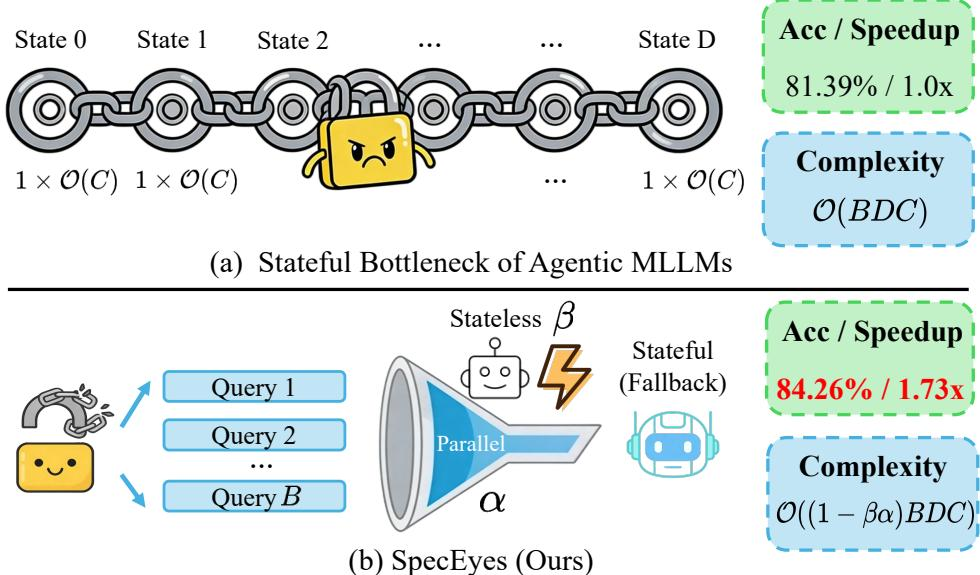
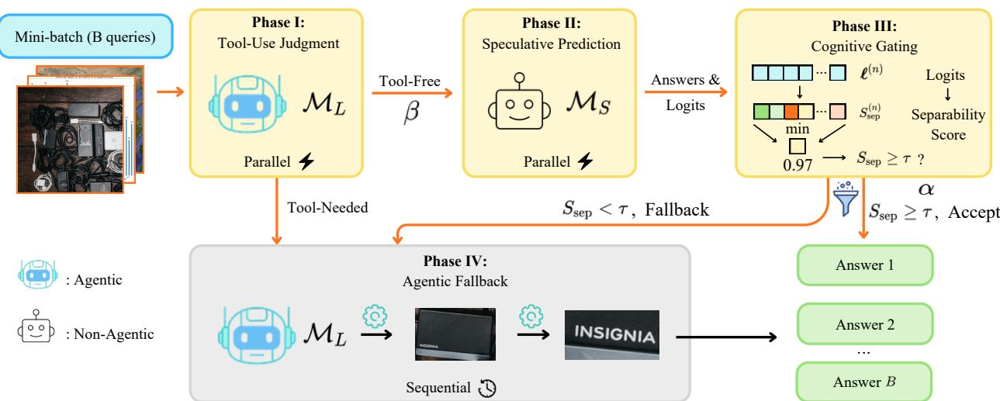
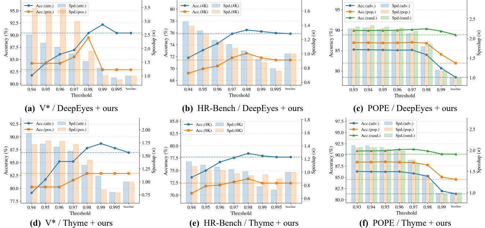
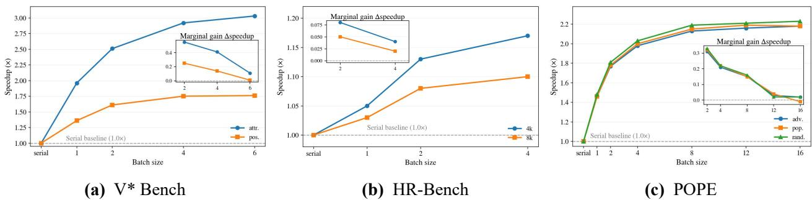
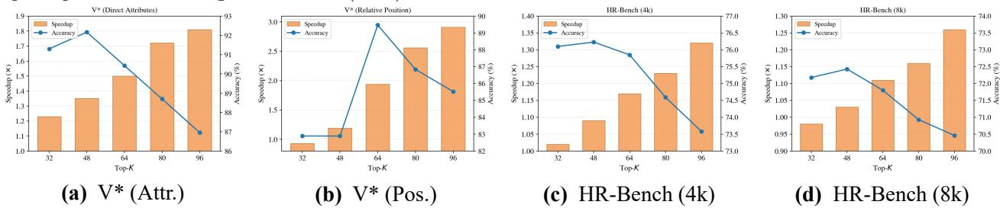

# SpecEyes: Accelerating Agentic Multimodal LLMs via Speculative Perception and Planning

Haoyu Huang1, Jinfa Huang2, Zhongwei Wan³, Xiawu Zheng1 Rongrong Ji1,, Jiebo Luo2, 1Xiamen University University of Rochester 3The Ohio State University \* Equal Contributors

# ABSTRACT

Agentic multimodal large language models (MLLMs) (e.g., OpenAI o3 [36] and Gemini Agentic Vision [9]) achieve remarkable reasoning capabilities through iterative visual tool invocation. However, the cascaded perception, reasoning, and tool-calling loops introduce significant sequential overhead. This overhead, termed agentic depth, incurs prohibitive latency and seriously limits system-level concurrency. To this end, we propose SpecEyes, an agentic-level speculative acceleration framework that breaks this sequential bottleneck. Our key insight is that a lightweight, tool-free MLLM can serve as a speculative planner to predict the execution trajectory, enabling early termination of expensive tool chains without sacrificing accuracy. To regulate this speculative planning, we introduce a cognitive gating mechanism based on answer separability, which quantifies the model's confidence for self-verification without requiring oracle labels. Furthermore, we design a heterogeneous parallel funnel that exploits the stateless concurrency of the small model to mask the stateful serial execution of the large model, maximizing system throughput. Extensive experiments on $\mathrm { V } ^ { \ast }$ Bench, HR-Bench, and POPE demonstrate that SpecEyes achieves ${ \bf 1 . 1 - 3 . 3 5 \times }$ speedup over the agentic baseline while preserving or even improving accuracy (up to $+ 6 . 7 \%$ ), boosting serving throughput under concurrent workloads. Email: Jinfa Huang jhuang90@ur.rochester.edu, Haoyu Huang huanghaoyu@stu.xmu.edu.cn Code: github.com/MAC-AutoML/SpecEyes

# 1 Introduction

Multimodal large language models (MLLMs) have undergone a paradigm shift, from static, single-pass visual perception to dynamic, agentic interaction with the visual world. Early MLLMs encode an image once and generate a response in a single forward pass, treating vision as a passive input channel. Recent breakthroughs [14, 16, 42, 63, 67] fundamentally alter this design: models actively invoke external perception tools (e.g., zoom-in, crop, OCR) to form iterative loops of perception, reasoning, and tool calling that prgressively refine their understanding. This agentic paradigm excels in challenging visual tasks that require fine-grained inspection, multi-step compositional reasoning, and active information seeking [7, 22, 59]. However, the mechanism that empowers agentic MLLMs simultaneously introduces a severe efficiency crisis. As shown in Fig. 1, each query triggers a cascade of tool-callng steps, a quantity we term the agenti depth $D$ , in which each step depends on the observation from the previous step. This strict data dependency inficts a dual disaster on system performance: (i) Latency explosion: the end-to-end response time for a single query grows linearly with $D$ , since each reasoning-and-tool cycle must complete before the next can begin; (ii) Concurrency collapse: because each query's tool-use chain mutates a per-query state, GPU batching is effectively nullified, the agentic model can only advance one step at a time per query, leaving massive hardware parallelism idle. Therefore, these effects render agentic MLLMs orders of magnitude slower than non-agentic counterparts, posing a fundamental barrier to real-world deployment.

  
Fig. 1. Motivation and overview of SpecEyes. Top: Agentic MLLMs evaluate each query via a Markovian sequence of stateful tool invocations of depth $D$ . This strict causal dependency prohibits parallelization, imposing a serving complexity of $\mathcal { O } ( B D C )$ for $B$ queries, where $C$ denotes the tool per-step inference cost. Bottom: SpecEyes enables agentic-evel speculative bypass with a stateless small model and an answer-separability gate. Here, $\beta$ is the fraction of tool-free candidates after screening (Sec. 3.4) and $\alpha$ is the acceptance rate of speculative answers among them (Secs. 3.2 and 3.3), averaging $8 0 \%$ and $7 1 \%$ across all benchmarks, respectively. All reported accuracy and speedup values are averaged across V $^ *$ [52], HR-Bench [50], and POPE [26].

Existing approaches to eficient reasoning fallshort of addressing this bottleneck. Token-level speculative decoding [18, 37] accelerates individual generation steps by letting a small draft model propose tokens for a larger model to verify. However, these methods stilloperate within a fxed reasoning trajectory: theagentic pipeline itself i.e, , the multi-turn loop o perception and reasoning, remains fuly serial and every tool must still be invoked in sequence. Moreover, the additional draft/verification interaction often expands the generated traces (longer token sequences and extra turns), introducing non-trivial overhead that can offset the per-step speedup in practice. Similarly, multimodal token pruning [10, 15, 25, 49] and temporal compression [12, 17] reduce per-step compute within a fixed model, yet they do not eliminate the repeated tool invocations that dominate agentic latency. In short, all prior methods operate within the agentic loop, none question whether the loop itself is necessary for every query. In this paper, we make a conceptual leap: we lift the speculative paradigm from the token/semantic level to the agentic level. Our key observation is that a large fraction of queries directed at agentic MLLMs do not actually require deep tool-assisted reasoning. Instead, a lightweight, tool-free vision model can answer them correctly from the original image alone, provided we can reliably identify which queries fall into this category. This motivates a heterogeneous "think fast, think slow" architecture:a smal non-agentic model rapily enerates speculative answers vintuition" fast thinking) while the large agentic model is reerved for queries that genuinely demand multi-step tool interaction (slow thinking).

We instantiate this idea by introducing SpecEyes, an agentic-level speculative acceleration framework for multimodal reasoning. It comprises three tightly integrated components: (1) A four-phase speculative pipeline (Sec. 3.2) that routes each query through heuristic tool-use judgment, small-model speculation, confidence-based switching, and agentic fallback. (2) Cognitive gating (Sec. 3.3) via a novel answer separability metric $S _ { \mathrm { s e p } }$ that measures the competitive margin among top- $K$ logits, providing a calibration-free, scale-invariant decision boundary for trusting the small model's output. (3) A heterogeneous parallel serving architecture (Sec. 3.4) that runs the stateless small model concurrently and forwards only lowconfidence queries to the agentic model, converting the speculative acceptance rate into multiplicative throughput gains. Extensive experiments on V $^ *$ Bench, HR-Bench, and POPE show that SpecEyes preserves the full accuracy of the agentic pipeline while substantially reducing latency and improving throughput. In summary, we make the following contributions: We identify and formalize the stateful bottleneck of agentic MLLMs, showing that data dependency inherent in tool-use chains imposes a fundamental barier to both per-query latency and system-level concurrency. We propose SpecEyes, the first framework that lifts speculative acceleration from the token level to the aei level bypassig entire tool-use lop for quers that do not require it while preerving full accuray. •We introduce cognitive gating based on answer separability among top- $K$ logits, providing a label-free, scale-invariant criterion for small model to decide when to trust its own versus escalating to agentic model. We design a heterogeneous parallel funnel that exploits the stateless nature of the small model to achieve concurrent query processing, yielding throughput gains proportional to speculative acceptance rate.

# 2 Related Work

Agentic Multimodal Large Language Models. Agentic reasoning in language models originates from tool-augmented frameworks that interleave action generation with external feedback [30, 39, 41, 60, 61]. Building on this, multimodal large language models (MLLMs) have adopted a similar agentic paradigm, enabling active interleaving of perception and reasoning through external visual tools rather than relying on passive single-pass encoding. Early large-scale MLLMs [1, 2, 8, 24, 34, 43] established the backbone architectures upon which agentic extensions are built. DeepEyes [67] demonstrates that reinforcement learning can train models to call perception tools during reasoning; subsequent work enables executable reasoning via code generation and visual manipulation [14, 16, 42, 44, 6365], and further scales agentic depth through multi-turn interaction and sel-reflection [7, 19, 2, 35, 38, 59]. Despite their effectivenes, these methods rely on deeply sequential perceptionreasoning tool loops, incurring substantial latency and limitedconcurency, a system-level bottleneck that prior work largely overlooks. Efficient Reasoning. Token-level speculative decoding [4, 5, 23, 2729, 40, 53, 54, 56, 57, 62] accelerates generation by having a small draft model propose tokens for a larger model to verify. Recent extensions apply this idea to collaborative reasoning: SpecReason [37] delegates simpler steps to a lightweight model verified via semantic consistency; RelayLLM [18] dynamically invokes a stronger expert at critical steps; and SpecTemp [17] and MSD [31, 32] reduce redundant visual processing in multimodal and interactive settings. Adaptive computation and early-exit methods [6, 11, 21, 46, 68] further bypass layers for easier inputs. Yet all these methods accelerate steps within a fixed trajectory, agentic loop itself remains fully serial.

Efficient Multimodal Perception. A parallel line of work reduces the per-step computational burden of multimodal perception. Frequency-based compression truncates high-frequency visual signals [49]; token pruning retains visually salient tokens via attention scores or multimodal relevance [10, 25, 5, 58]; and dynamic sparsification optimizes retention across layers [15]. Token merging [3, 20, 51] reduces sequence length by combining redundant representations, and temporal redundancy across frames is exploited to merge or prune spatial tokens in video settings [12]. KV-cache compression [33, 47, 48] additionally reduces memory and decoding cost by evicting cached visual keys and values. Despite these gains, al such methods operate within a monolithic model and leave the sequential agentic pipeline intact, as the large model must still exeute the ful perceptionreasoning loop.In contrast, SpecEyes targets effciency at the agenticlevelrather than accelerating individualoperations within the pipeline, it speculatively bypasses entire too-uselops v a lightweight, non-agentic model governed by a cognitive gating mechanism. This design breaks the rigid sequential dependency of existing agentic MLLMs, enabling heterogeneous parallel execution that maximizes hardware utilization with substantially improved latency and system-level throughput.

# 3 Methodology

We begin by formalizing the stateful bottleneck inherent in agentic multimodal reasoning (Sec. 3.1), then present SpecEyes, our four-phase speculative acceleration framework (Sec. 3.2). We detail the cognitive gating mechanism that governs speculative bypass (Sec. 3.3), and finally describe the heterogeneous parallel architecture that maximizes system throughput (Sec. 3.4).

  
Fig. 2. Pipeline overview of SpecEyes. A batch of $B$ queries passes through a four-phase funnel. I: $\mathcal { M } _ { L }$ screens tool necessity, splitting queries into tool-free and tool-required. II: A stateless $\mathcal { M } _ { S }$ speculatively answers all tool-free queries with token-level logits. III: An answer separability score $S _ { \mathrm { s e p } }$ gates each answer; those above $\tau$ are accepted directly. IV: Remaining queries fall back to the full agentic loop. The funnel yields ${ \approx } 1 / ( 1 { - } \beta \alpha ) \times$ throughput speedup.

# 3.1 Modeling the Stateful Bottleneck of Agentic MLLMs

Preliminaries. We formalize an agentic multimodal large language model (MLLM) as a stateful reasoning system $\mathcal { A } = ( \mathcal { S } , \mathcal { T } , \pi )$ , where $\boldsymbol { S }$ denotes the state space, $\mathcal { T } = \{ t _ { 1 } , \ldots , t _ { N } \}$ is a finite set of perception tools (e.g., Zoom-in, Crop, OCR), and $\pi$ is policy that jointly selects tool invocations and generates reasoning tokens. Given a query and an input image $I$ , the model maintains a state trajectory $\{ s _ { 0 } , s _ { 1 } , \ldots , s _ { D } \}$ over $D$ reasoning $q$ steps. The initial state is $s _ { 0 } = ( q , I )$ . At each step $d$ , the policy produces an action $ { \boldsymbol { a } } _ { d } = \pi (  { \boldsymbol { s } } _ { d } )$ that either invokes a tool $t \in \tau$ or emits a final answer. When a tool is invoked, the state transitions as:

$$
\boldsymbol { s } _ { d + 1 } = \boldsymbol { f } ( \boldsymbol { s } _ { d } , t _ { d } ( \boldsymbol { s } _ { d } ) ) ,
$$

where $t _ { d } ( s _ { d } )$ applies the selected tool $t _ { d }$ to the current visual context (e.g., cropping a region of interest from $I$ ) and $f$ fuses the resulting observation into the next state. We refer to $D$ as the agentic depth of the query. State Dependency and Sequential Bottleneck. A critical property of Eq. (1) is that subsequent tool selections depend causally on prior observations. Concretely, let $t _ { d + 1 } \sim \pi ( \cdot \mid s _ { d + 1 } )$ be the tool chosen at step $d { + 1 }$ . Since $s d \substack { + 1 }$ contains the output of $t _ { d }$ , the Markov chain $( s _ { 0 } , a _ { 0 } , s _ { 1 } , a _ { 1 } , . . . )$ forms a strict data dependency:

$$
a _ { 0 } , \dots , s _ { d } ) = p ( a _ { d + 1 } \mid s _ { d } , t _ { d } ( s _ { d } ) ) \neq p ( a _ { d + 1 } \mid s _ { 0 } )
$$

This dependency renders the agentic pipeline inherently sequential: step $d { + 1 }$ cannot begin until step $d$ completes. Consequently, the end-to-end latency for a single query scales linearly with agentic depth:

$$
L _ { \mathrm { a g e n t } } ( q ) = \sum _ { d = 0 } ^ { D ( q ) } \big ( \underbrace { c _ { \mathrm { l l m } } } _ { \mathrm { r e a s o n i n g } } + \underbrace { c _ { \mathrm { t o o l } } ( t _ { d } ) } _ { \mathrm { p e r c e p t i o n } } \big ) ,
$$

where $c _ { \mathrm { l l m } }$ and $c _ { \mathrm { t o o l } } ( t _ { d } )$ denote the latency of LLM inference and tool execution at step $d$ , respectively. Throughput Implication. At the system level, this strict serialization also limits concurrency. Consider a serving scenario with a batch of $B$ queries $\mathcal { Q } = \{ q _ { 1 } , \dots , q _ { B } \}$ . Due to the stateful nature of each query, the large agentic model $\mathcal { A }$ can only process one tool-use loop at a time per query, resulting in a per-query occupancy of $L _ { \mathrm { a g e n t } } ( q _ { i } )$ . The maximum throughput is therefore bounded by:

$$
\Theta _ { \mathrm { a g e n t } } \leq \frac { B } { \sum _ { i = 1 } ^ { B } L _ { \mathrm { a g e n t } } ( q _ { i } ) } .
$$

This bound becomes increasingly restrictive as the average agentic depth $D$ grows, motivating our approach to speculatively eliminate unnecessary tool invocations.

# 3.2 SpecEyes: Agentic-Level Speculative Reasoning

Our key insight is that not all queris require dee agentic reasoning. For a substantial fraction of inputs, a small non-agentic MLLM, denoted $\mathcal { M } _ { S }$ , can produce a correct answer without any tool invocation, directly from the original image $I$ . SpecEyes exploits this observation through a four-phase pipeline (Fig. 2) that speculatively bypasses expensive tool chains whenever $\mathcal { M } _ { S }$ is sufficiently confident, and falls back to the full agentic model $\mathcal { M } _ { L }$ otherwise. We denote the small non-agentic model as $\mathcal { M } _ { S }$ and the large agentic MLLM as $\mathcal { M } _ { L } = \mathcal { A }$ . The step-by-step execution of these four consecutive phases is systematically detailed below. Phase I: Heuristic Tool-Use Judgment. Given a query $q$ and image $I$ , the large agentic model $\mathcal { M } _ { L }$ first determines whether tool invocation is necessary. We prompt $\mathcal { M } _ { L }$ with a lightweight binary classification head:

$$
g ( q , I ) = \mathcal { M } _ { L } ( q , I ; \mathcal { P } _ { \mathrm { j u d g e } } ) \in \{ 0 , 1 \} ,
$$

where $\mathcal { P } _ { \mathrm { j u d g e } }$ is a prompt instructing the model to assess tool necessity, $g = 0$ indicates that $\mathcal { M } _ { L }$ judges the query to be answerable from the global image alone, and $g = 1$ indicates a potential need for tool-assisted perception. Queries with $g = 0$ proceed directly to Phase II; queries with $g = 1$ are immediately forwarded to Phase IV (agentic fallback). Although Phase I is executed by $\mathcal { M } _ { L }$ , it generates only a single binary token with no tool invocation, incurring negligible overhead. We use $\mathcal { M } _ { L }$ rather than $\mathcal { M } _ { S }$ because its tool-calling capability makes it a more reliable judge of tool necessity, yielding more accurate screening. Phase II: Speculative Prediction. For queries passing Phase I (i.e., , $g = 0$ ), $\mathcal { M } _ { S }$ directly generates an answer ${ \hat { y } } _ { S }$ along with the full output logit distribution:

$$
\hat { y } _ { S } , \{ \ell ^ { ( n ) } \} _ { n = 1 } ^ { \lvert \hat { y } _ { S } \rvert } = \mathcal { M } _ { S } ( q , I ) ,
$$

where $\ b { \ell } ^ { ( n ) } \in \mathbb { R } ^ { | \mathcal { V } | }$ is the logit vector over the vocabulary $\nu$ for the $n ^ { \mathrm { t h } }$ generated token. Crucially, this inference is stateless: it requires no tool execution and can be performed concurrently for all queries in the batch. Phase III: Small MLLM Confidence Switching. The logits from Phase II are passed to a cognitive gating function $S _ { \mathrm { s e p } }$ (detailed in Sec. 3.3) that quantifies the answer confidence of $\mathcal { M } _ { S }$ without requiring ground-truth labels. We compute a scalar separability score for the speculative answer ${ \hat { y } } _ { S }$ .

$$
\mathrm { d e c i s i o n } = \left\{ \begin{array} { l l } { \mathrm { a c c e p t } ~ \hat { y } _ { S } , } & { \mathrm { i f } ~ S _ { \mathrm { s e p } } ( \hat { y } _ { S } ) \geq \tau , } \\ { \mathrm { f a l l b a c k ~ t o } ~ \mathcal { M } _ { L } , } & { \mathrm { i f } ~ S _ { \mathrm { s e p } } ( \hat { y } _ { S } ) < \tau , } \end{array} \right.
$$

where $\tau$ is a threshold calibrated on a small held-out validation set. Accepted answers are returned immediately, completely bypassing the agentic pipeline; rejected queries proceed to Phase IV. Phase IV: Agentic Fallback. Queries that fail confidence switching are routed to the full agentic model $\mathcal { M } _ { L }$ , which executes the complete stateful perception-reasoning loop:

$$
\begin{array} { r } { \hat { y } _ { L } = \mathcal { M } _ { L } ( q , I ) = \pi \big ( s _ { 0 } \xrightarrow [ ] { t _ { 0 } } s _ { 1 } \xrightarrow [ ] { t _ { 1 } } \cdot \cdot \cdot \xrightarrow [ ] { t _ { D - 1 } } s _ { D } \big ) . } \end{array}
$$

The agentic model retains full access to all tools $\tau$ and performs multi-step reasoning at the cost of sequential latency $L _ { \mathrm { a g e n t } } ( q )$ . By design, Phase IV serves as a safety net: routing low-confidence queries back to the full agentc pipelne substantially mitigates potentialaccuracy loss, even  marginal perormancegap relativeo the baseline remains due to the imperfect nature of the gating mechanism. End-to-End Latency. Let $\beta \in [ 0 , 1 ]$ denote the tool-free screening ratio from Phase I and $\alpha \in [ 0 , 1 ]$ the cognitive gate acceptance rate from Phase III. All queries incur the judgment cost $c _ { J }$ ; only the $\beta$ fraction passing Phase I additionally incurs the small model cost $c _ { S }$ ; the remaining $( 1 - \beta \alpha )$ fraction forwarded to $M _ { L }$ pays the full agentic cost $L _ { \mathrm { a g e n t } }$ . Therefore, the expected per-query latency under SpecEyes is:

$$
\mathbb { E } [ L _ { \mathrm { S p e c E y e s } } ] = c _ { J } + \beta c _ { S } + \left( 1 - \beta \alpha \right) L _ { \mathrm { a g e n t } } ,
$$

where $c _ { J } + \beta c _ { S } \ll L _ { \mathrm { a g e n t } }$ . When $\beta \alpha$ is large (e.g., $\beta \alpha > 0 . 6$ ), the expected latency is dominated by the lightweight front-end cost, yielding substantial speedups over the purely agentic baseline.

# 3.3 Small MLLM Cognitive Gating via Answer Separability

The effectiveness of SpecEyes hinges critically on the quality of the confidence switching mechanism in Phase III. We now introduce the answer separability score $S _ { \mathrm { s e p } }$ that serves as the cognitive gate. Limitations of Probability-Based Confidence. A common probability-based confidence for sequence generation aggregates per-token max-softmax probabilities via the geometric mean [66]. Concretely, for the $n$ th generated token with logits $\ell ^ { ( n ) }$ , we define the maximum softmax probability $p _ { \mathrm { m a x } } ^ { ( n ) }$ as:

$$
p _ { \operatorname* { m a x } } ^ { ( n ) } = \operatorname* { m a x } _ { v \in \mathcal { V } } \sigma ( \ell ^ { ( n ) } ) _ { v } ,
$$

where $\sigma ( \cdot )$ denotes the softmax operator and $\nu$ is the vocabulary. The overall confidence is computed as:

$$
S _ { \log } ( \hat { y } _ { S } ) = \exp \left( \frac { 1 } { \vert \hat { y } _ { S } \vert } \sum _ { n = 1 } ^ { \vert \hat { y } _ { S } \vert } \log p _ { \operatorname* { m a x } } ^ { ( n ) } \right) ,
$$

w cn $\{ p _ { \mathrm { m a x } } ^ { ( n ) } \}$ However, $S _ { \mathrm { l o g } }$ the well-known miscalibration of softmax, where large logit magnitudes can yield overconfident probabilities; (2) token-wise $p _ { \mathrm { m a x } } ^ { ( n ) }$ can be spuriously high for low-entropy or nearly-deterministic positions (e.g., punctuation, formatting tokens), and the geometric aggregation does not explicitly measure how well the top prediction is separated from strong competitors.These issues increase the riskof falseacceptance in ur speculativebypass. Answer Separability Score. Instead of relying on the raw softmax probability, we design a metric that will lives tthe dee a dei For the $n ^ { \mathrm { t h } }$ generted tokem $\ell ^ { ( n ) }$ $\ell _ { [ 1 ] } ^ { ( n ) } \geq \ell _ { [ 2 ] } ^ { ( n ) } \geq \cdot \cdot \cdot \geq \ell _ { [ | \mathcal { V } | ] } ^ { ( n ) }$ token-level separability by standardizing the leading logit against its nearest competitors, defined as:

$$
S _ { \mathrm { s e p } } ^ { ( n ) } = \frac { \ell _ { [ 1 ] } ^ { ( n ) } - \mu _ { K } ^ { ( n ) } } { \sigma _ { K } ^ { ( n ) } + \epsilon } ,
$$

where µK) and σ(n) $K$ logits $\{ \ell _ { [ 1 ] } ^ { ( n ) } , \ldots , \ell _ { [ K ] } ^ { ( n ) } \}$ , and $\epsilon > 0$ is $S _ { \mathrm { s e p } } ^ { ( n ) }$ qaif  ng from its nearest competitors:a large value indicates a clear decision boundary, while a small value signals $S _ { \mathrm { s e p } } ^ { ( n ) }$ off scale-invariant, since both the numerator and denominator scale linearly with logit magnitude, neutralizing the calibration artifacts f sotmax; (i) it explictl models the copetitive landscapeamong top candidates via the variance term $\sigma _ { K } ^ { ( n ) }$ , providing more informativeconidence al. Token-ooh- $S _ { \mathrm { s e p } } ^ { ( n ) }$ must be aggregated acros all $| \hat { y } _ { S } |$ generated tokens to obtain an answer-level confidence. We consider three natural aggregation strategies:

$$
S _ { \mathrm { s e p } } ^ { \mathrm { m e a n } } = \frac { 1 } { | \hat { y } _ { S } | } \sum _ { n = 1 } ^ { | \hat { y } _ { S } | } S _ { \mathrm { s e p } } ^ { ( n ) } , \quad S _ { \mathrm { s e p } } ^ { \mathrm { m i n } } = \operatorname* { m i n } _ { n \in [ | \hat { y } _ { S } | ] } S _ { \mathrm { s e p } } ^ { ( n ) } , \quad S _ { \mathrm { s e p } } ^ { \mathrm { b o t t o m } } = \frac { 1 } { | \mathcal { B } | } \sum _ { n \in \mathcal { B } } S _ { \mathrm { s e p } } ^ { ( n ) } ,
$$

where $\boldsymbol { \beta }$ s $r$ fration   alle $S _ { \mathrm { s e p } } ^ { ( n ) }$ values, i.e., , $| B | = \lceil r \rceil \hat { y } _ { S } | \rceil$ for a ratio $r \in ( 0 , 1 )$ chosen empirically. The aggregated score is then normalized via a sigmoid function. We adopt the min aggregation as our default strategy, based on the following risk-theoretic argument: Proposition 1. Let $\hat { y } _ { S } = ( y _ { 1 } , \dots , y _ { | \hat { y } _ { S } | } )$ be the speculative answer. Define the answer-level error event $\textstyle { \mathcal { E } } = \bigcup _ { n } { \mathcal { E } } _ { n }$ , where $\xi _ { n }$ denotes the event that token $y _ { n }$ is incorrect. Then:

$$
P ( \mathcal { E } ) = P { \bigg ( } \bigcup _ { n } \mathcal { E } _ { n } { \bigg ) } \leq \sum _ { n } P ( \mathcal { E } _ { n } ) .
$$

If each $P ( \mathcal { E } _ { n } )$ is monotonically dercasng in $S _ { s e p } ^ { ( n ) }$ , then thressholding on $\mathrm { m i n } _ { n } S _ { s e p } ^ { ( n ) }$ ensures thateery token exceeds the confidence threshold, thereby bounding the union probability $P ( \mathcal { E } )$ most tightly among the three strategis. Intuitively, the mi strategy act as a wors-case guard: ttrigrsfalback wheneverany tokei the answe exhibits w eparabilityThis  onservative by desig, priitizing precision (voidne acceptances) to preserve the accuracy guarantee of the agentic pipeline.

# 3.4 Heterogeneous Parallelism for Throughput Acceleration

Beyond per-query latency reduction, SpecEyes enables system-level throughput gains by organizing the four phases into a heterogeneous parallel funnel, decoupling stateless concurrency from stateful execution. Batch-Parallel Front-End. We serve requests in batches of size $B$ . Let $\beta \in [ 0 , 1 ]$ be the fraction of queries that Phase I screens as tool-free ( $g$ =0) and $\alpha \in [ 0 , 1 ]$ be the acceptance rate of the cognitive gate among those candidates. Both screening (Phase I, latency $c _ { J }$ ) and speculative inference (Phase II, latency $c _ { S }$ ) are stateless single-turn forward passes and therefore fully batch-parallelizable, giving a parallel front-end cost of $c _ { J } + c _ { S }$ Funnel-Shaped Serving. Accepted queries $( \alpha \beta B )$ are returned immediately; the remaining residual set $_ { \mathcal { R } }$ , consisting of gating-rejected and tool-required queries, falls back to sequential agentic execution:

$$
\begin{array} { r l } & { \underbrace { \vphantom { \int } { \int } \underbrace { \begin{array} { l } { B } \\ { \sum _ { g = 0 } ^ { B } \frac { \mathcal { M } _ { L } \mathrm { ~ s c r e n ~ ( p a r . ) } } { g = 0 } } \underbrace { \beta B } _ { g = 0 } + \underbrace { ( 1 - \beta ) B } _ { g = 1 } } \\ { \underbrace { \beta B } _ { g = 0 } \frac { \mathcal { M } _ { S } \mathrm { ~ s p e c u l a t e ~ ( p a r . ) } } { \mathrm { ~ \underbrace { ~ \alpha ~ \in ~ \beta ~ \mathbb { S } _ { \varepsilon } ~ } _ { a c c e p t } ~ } } + \underbrace { ( 1 - \alpha ) \beta B } _ { \mathrm { ~ r e j e c t } } } \end{array} } _ { \underbrace { \left( 1 - \beta \right) B + ( 1 - \alpha ) \beta B } _ { \mathcal { R } } } } \\ & { \underbrace { \left( 1 - \beta \right) B + ( 1 - \alpha ) \beta B } _ { \mathcal { R } } \xrightarrow { \mathcal { M } _ { L } \mathrm { ~ a g e n t i c ~ ( s e q . ) } } \underbrace { \left( 1 - \beta \alpha \right) B } _ { \mathrm { ~ f a l l b a c k } } . } \end{array}
$$

Since $c _ { J } + c _ { S } \ll B \bar { L } _ { \mathrm { a g e n t } }$ for practical batch sizes, the batch time is dominated by the agentic fallback on the residual set of size $| \mathcal { R } | = ( 1 - \beta \alpha ) B$ , yielding a throughput speedup of which is jointly governed by the screening ratio $\beta$ and the gate acceptance rate $\alpha$

$$
\Theta _ { \mathrm { S p e c E y e s } } / \Theta _ { \mathrm { a g e n t } } \approx 1 / ( 1 - \beta \alpha ) ,
$$

# 4 Experiment

# 4.1 Experiment Setups

Benchmarks and Baselines. We evaluate SpecEyes on three multimodal benchmarks spanning fine-grained perception, high-resolution understanding, and hallucination robustness. V $^ *$ [52] provides two multiple-choice subsets: Direct Attributes (115 questions) for attribute recognition and Relative Position (76 questions) for spatial reasoning. HR-Bench [50] tests high-resolution perception with 4K and 8K subsets (800 questions each). POPE [26] is a yes/no hallucination probe with Adversarial, Popular, and Random splits (3000 questions each). The small non-agentic model $M _ { S }$ is Qwen3-VL-2B [45]; the large agentic model $M _ { L }$ is instantiated with DeepEyes [67] and Thyme [63], both capped at 5 tool-use steps per query. Implementation Details. All models use greedy decoding (temperature 0), and all reported latencies include tool execution time. For cognitive gating (Sec. 3.3), we set $K { = } 6 4$ , $\scriptstyle \epsilon = 1 0 ^ { - 6 }$ , and adopt min-token aggregation; for the bottom aggregation variant, we set the bottom fraction to $r { = } 0 . 2$ , inspired by [13]. The gating threshold is selected by running $M _ { S }$ once per benchmark to collect the empirical confidence distribution ${ \sim } 5 \mathrm { - } 1 0 \mathrm { m i n }$ offine), from which we evenly sample multiple operating points to characterize the accuracy-latency trade-off. All experiments run on a single NVIDIA A100 40 GB GPU.

# 4.2 Main Results

Tab. 1 compares SpecEyes against the agentic baselines and SpecReason [37] across all seven evaluation splits, using two agentic backbones (DeepEyes [67] and Thyme [63]) paired with Qwen3-VL-2B [45] as the tool-free speculative model. For each SpecEyes variant, we report the result at the best operating-point threshold that preserves the baseline level accuracy. Among the four confidence aggregation strategies, SpecEyes (min) consistently delivers the strongest accuracyspeed profile, validating the worst-case guard design in Sec.3.3; we focus the discussion on this variant below. Tab. 1. Main results on ${ \mathbf { V } } ^ { * }$ , HR-Bench, and POPE. Spd. means wall-clock speedup over each base model. Bold indicate the bes acuray within agroup, andhighlighted rows reprentou recomended variants SpeEye (min) offers the best trade-off between speed and accuracy across both agentic mllm backbones.   

<table><tr><td rowspan="3">Method</td><td colspan="4">V*</td><td colspan="4">HR-Bench</td><td colspan="6">POPE</td><td rowspan="2" colspan="2">Avg.</td></tr><tr><td colspan="2">Attr.</td><td colspan="2">Pos.</td><td colspan="2">4K</td><td colspan="2">8K</td><td colspan="2">Adv.</td><td colspan="2">Pop.</td><td colspan="2">Rand.</td></tr><tr><td>Acc.</td><td>Spd.</td><td>Acc.</td><td>Spd.</td><td>Acc.</td><td>Spd.</td><td>Acc.</td><td>Spd.</td><td>Acc.</td><td>Spd.</td><td>Acc.</td><td>Spd.</td><td>Acc.</td><td>Spd.</td><td>Acc.</td><td>Spd.</td></tr><tr><td>Qwen3-VL-2B (draft only)</td><td>77.39</td><td>5.44×</td><td>82.89</td><td>5.31×</td><td>71.38</td><td>3.20×</td><td>68.00</td><td>2.90×</td><td>82.56</td><td>4.20×</td><td>83.80</td><td>3.78×</td><td>86.47</td><td>4.07×</td><td>78.93</td><td>4.13×</td></tr><tr><td>Based on DeepEyes [67]</td><td></td><td></td><td></td><td></td><td></td><td></td><td></td><td></td><td></td><td></td><td></td><td></td><td></td><td></td><td></td><td></td></tr><tr><td>DeepEyes [67]</td><td>90.43</td><td>1.00×</td><td>82.89</td><td>1.00×</td><td>75.85</td><td>1.00×</td><td>71.43</td><td>1.00×</td><td>78.43</td><td>1.00×</td><td>81.90</td><td>1.00×</td><td>88.83</td><td>1.00×</td><td>81.39</td><td>1.00×</td></tr><tr><td>SpecReason [37]</td><td>80.19</td><td>0.61×</td><td>73.91</td><td>0.38×</td><td>80.43</td><td>0.44×</td><td>72.54</td><td>0.42×</td><td>49.10</td><td>0.38×</td><td>51.55</td><td>0.38×</td><td>60.20</td><td>0.37×</td><td>66.85</td><td>0.43×</td></tr><tr><td>SpecEyes (log)</td><td>83.48</td><td>2.06×</td><td>88.16</td><td>2.05×</td><td>73.71</td><td>1.35×</td><td>69.67</td><td>1.28×</td><td>83.97</td><td>1.89×</td><td>86.70</td><td>1.95×</td><td>90.50</td><td>2.05×</td><td>82.31</td><td>1.80×</td></tr><tr><td>SpecEyes (mean)</td><td>78.26</td><td>2.89×</td><td>84.21</td><td>3.35×</td><td>71.62</td><td>1.88×</td><td>67.38</td><td>1.77×</td><td>85.13</td><td>2.06×</td><td>87.00</td><td>2.10×</td><td>90.13</td><td>2.14×</td><td>80.53</td><td>2.31×</td></tr><tr><td>SpecEyes (bottom)</td><td>83.48</td><td>2.13×</td><td>84.21</td><td>2.12×</td><td>75.22</td><td>1.20×</td><td>71.18</td><td>1.04×</td><td>85.13</td><td>2.08×</td><td>87.00</td><td>2.08×</td><td>90.13</td><td>2.11×</td><td>82.34</td><td>1.82×</td></tr><tr><td> SpecEyes (min)</td><td>90.43</td><td>1.53×</td><td>89.47</td><td>1.90×</td><td></td><td>75.85 1.13×</td><td>71.80</td><td>1.08×</td><td>85.13</td><td>2.13×</td><td>87.00</td><td>2.15×</td><td>90.13</td><td>2.19×</td><td>84.26</td><td>1.73×</td></tr><tr><td>Based on Thyme [63]</td><td></td><td></td><td></td><td></td><td></td><td></td><td></td><td></td><td></td><td></td><td></td><td></td><td></td><td></td><td></td><td></td></tr><tr><td>Thyme [63]</td><td></td><td>86.96 1.00×</td><td>82.89 1.00×</td><td></td><td></td><td>77.72 1.00×</td><td></td><td>72.43 1.00×</td><td></td><td>81.32 1.00×</td><td></td><td>84.53 1.00×</td><td>90.17 1.00×</td><td></td><td>82.29</td><td>1.00×</td></tr><tr><td>SpecReason [37]</td><td>89.57</td><td>0.48×</td><td>75.00</td><td>0.53×</td><td>80.01</td><td>0.52×</td><td>81.02</td><td>0.51×</td><td>84.62</td><td>0.46×</td><td>85.97</td><td>0.43×</td><td>90.27</td><td>0.46×</td><td>83.78</td><td>0.48×</td></tr><tr><td>SpecEyes (log)</td><td>80.87</td><td>1.82×</td><td>82.89</td><td>1.45×</td><td>74.97</td><td>1.13×</td><td>70.84</td><td>1.06×</td><td>85.76</td><td>1.68×</td><td>87.80</td><td>1.67×</td><td>91.47</td><td>1.59×</td><td>82.09</td><td>1.49×</td></tr><tr><td> SpecEyes (mean)</td><td>77.39</td><td>2.34×</td><td>80.26</td><td>1.83×</td><td>72.62</td><td>1.27×</td><td>68.00</td><td>1.21×</td><td>85.89</td><td>1.78×</td><td>88.30</td><td>1.80×</td><td>91.27</td><td>1.65×</td><td>80.53</td><td>1.70×</td></tr><tr><td>SpecEyes (bottom)</td><td>78.26</td><td>2.18× 1.32× 82.89</td><td>80.26</td><td>1.84×</td><td>77.35</td><td>1.05×</td><td>72.31</td><td>0.99×</td><td>85.89</td><td>1.81×</td><td>88.30</td><td>1.81×</td><td>91.27</td><td>1.73×</td><td>81.95</td><td>1.63×</td></tr><tr><td> SpecEyes (min)</td><td>87.83</td><td></td><td></td><td>1.42×</td><td>78.47</td><td>1.01×</td><td>73.31</td><td>0.95×</td><td>85.87</td><td>1.77×</td><td>88.30</td><td>1.78×</td><td>91.27</td><td>1.70×</td><td>83.99</td><td>1.42×</td></tr></table>

With DeepEyes, SpecEyes (min) achieves a $1 . 7 3 \times$ average speedup while improving average accuracy from $8 1 . 3 9 \%$ to $8 4 . 2 6 \%$ . On V\* Bench [52], it matches the baseline on Direct Attributes (90.43%, $1 . 5 3 \times$ )and boosts Relative Position from $8 2 . 8 9 \%$ to 89.47% at $1 . 9 0 \times$ . POPE benefits most (2.132.19 $\times$ ) with accuracy consistently above baseline (e.g., Adversarial: $7 8 . 4 3 \% \to 8 5 . 1 3 \%$ ), suggesting that bypassing unnecessary tool trajectories can also reduce hallucination errors. HR-Bench yields moderate speedups (1.081.13 $\times$ ) as queries more frequently demand fine-grained tool-assisted inspection. Replacing the backbone with Thyme confirms generalization: SpecEyes (min) yields a $1 . 4 2 \times$ average speedup while raising accuracy from $8 2 . 2 9 \%$ to $8 3 . 9 9 \%$ . The per-benchmark pattern shows similarity: POPE benefits most (1.701.78 $\times$ ), V $^ *$ enjoys solid gains (1.321.42 $\times$ ), and HR-Bench remains the bottleneck (0.951.01 $\times$ ). The marginal sub-1 $\times$ speedup on HR-Bench 8K arises because high-resolution inputs suppress both $\beta$ and $\alpha$ keeping $\beta \alpha$ low. In this regime, fixed cost of running $M _ { S }$ slightly exceeds any savings, consistent with Eq. (9). In contrast, SpecReason [37] consistently decelerates inference (0.370.61 $\times$ with DeepEyes; 0.430.53 $\times$ with Thyme), as the small model lacks structured tool-callng capability and incurs substantial token and turn overhead (414 tokens and 3.48 rounds on average). It also degrades sharply on POPE (as low as $4 9 . 1 0 \%$ ). By contrast, SpecEyes lets accepted queries bypass the tool-use chain entirely, avoiding this overhead. The Qwen3-VL-2B (draft only) row establishes a speedup upper bound $( 4 . 1 3 \times )$ at notable accuracy cost (78.93%); SpecEyes captures most of this latency saving while preserving full reasoning quality.

# 4.3 Analysis of Confidence Calibration

A reliable gating signal must be discriminative: confidence scores of correct answers should be stochastically higher than those of incorrct ones. Fig. 3 visualises this property via kernel density estimates (KDE) of each confidence score on correct and incorrect samples from $M _ { S }$ on V $^ *$ [52], with each subplot annotated by $\Delta$ (peak distance between the two distributions) as a direct measure of discriminability. Both $S _ { \mathrm { l o g } }$ (Fig. 3a) and $S _ { \mathrm { s e p } } ^ { \mathrm { m e a n } }$ (Fig. 3b) yield small $\Delta$ $S _ { \mathrm { s e p } } ^ { \mathrm { b o t t o m } }$ (Fig. 3d) improves $\Delta$

Confidence Distribution (KDE) Confidence Distribution (KDE) Confidence Distribution (KDE) Confidence Distribution (KDE) 600 Coroct 10 40 Corc 125 Corect C 100 80.004 Δ=0.001 Δ=0.030 Δ=0.010 400- 50 10 10 200 25- 0- 0+ 0f 0- 0.93 0.94 0.95 0.96 0.97 0.98 0.99 1.00 0.9955 0.9960 0.9965 0.9970 0.9975 0.9980 0.94 0.95 0.96 0.97 0.98 0.99 0.970 0.975 0.980 0.985 0.990 0.995 Confidence Score Confidence Score Confidence Score Confidence Score (aSlog Smepan (c) Sme Sbotom

  
Fig. 3. KDE of confidence scores for correct vs. incorrect samples on ${ \mathbf { V } } ^ { * }$ (Qwen3-VL-2B). $\Delta$ measures gating discriminabil a peakcea $( \mathbf { a } , \mathbf { b } , \mathbf { d } )$ or (c) $S _ { \mathrm { s e p } } ^ { \mathrm { m i n } }$ b $\Delta$   
Fig. 4. Ablation on the gating threshold of SpecEyes. Lowering the threshold increases speedup at cost of accuracy. Dashed horizontal lines indicate baseline accuracy.

$S _ { \mathrm { s e p } } ^ { \mathrm { m i n } }$ (Fig. 3c) achieves the largest : incorrect samples collapse to a low-score peak, while correct samples form a sharp high-score mode, consistent with Proposition 1. Tab. 1 shows that a single threshold to preserve accuracy while maximizing acceptance, explaining why SpecEyes (min) delivers a superior accuracyspeedup trade-off.

# 4.4 Ablation Study

We conduct ablations to study the effects of three key hyperparameters in SpecEyes: the gating threshold, the serving batch size, and the separability computation parameter $K$ .

Ablation on Threshold. Fig. 4 visualizes the accuracyspeedup trade-of as the gating threshold varies, using $S _ { \mathrm { s e p } } ^ { \mathrm { m i n } }$ increases the acceptance ratio and thus the speedup, while accuracy degrades gracefully. On V $^ *$ and POPE, accuracy remains above or near the agentic baseline over a wide threshold range (0.940.99), confirming that alarge fraction f queries can be safely bypassed.HR-Benc i more sensitiv:speedup gains are modest, and accuracy begins to drop at thresholds below 0.97, refecting the higher proportion of queries that genuinely require tool-assisted inspection. Across all settings, there exists a broad operating region where SpecEyes simultaneously improves over the baseline in both acuracy and speed, validating that the threshold is not a fragile hyperparameter but a smooth control knob for navigating the accuracy-efficiency Pareto front. Ablation on batch size.Fig. 5 studies the effect of serving batch size while fixing the gating threshold t the operating point used in the main results. We observe that increasing batch size consistently improves the end-to-end speedup, while accuracy remains unchanged (batching only affects system execution, not model decisions). This trend is expected from our heterogeneous funnel design (Sec. 3.4): the speculative stage is stateless and thus highly batchable, so its per-query overhead is effectively amortized as batch size grows. In contrast, the agentic falback stage is dominated by per-query tool-use dependencies and remains largely sequential, which leads to diminishing marginal speedup gains at larger batch sizes. Across benchmarks, datasets with higher bypass rates (e.g., V\* and POPE) benefit more from batching, whereas HR-Bench saturates earlier due to a larger fraction of tool-required queries.

  
Fi.Ablation ervbat zLarerbatheortiz he ate ecativ ageroi wih dminihimargialgainsas the stateulgenallbacbecmeshe bottleneckCurv repor etoen speedup over the serial agentic baseline $( 1 . 0 \times )$ .   
Fig. 6. Ablation on Top- $K$ in separability-based gating. Larger $K$ consistently increases speedup but may reduce accuracy, suggesting that $K$ acts as a knob that tunes speculative aggressiveness.

Ablation on Top- $K$ in separability computation. As shown in Fig. 6, $K$ acts as a control knob: increasing $K$ monotonically improves speedup but degrades accuracy, mirroring the effect of lowering the gating threshold, as larger $K$ includes tokens with weaker contrastive signal, thereby inflating confidence estimates. We set $K { = } 6 4$ as a balanced default, which matches baseline accuracy on Direct Attributes (90.43%, $1 . 5 0 \times$ and achieves a strong speedup on Relative Position $( 1 . 9 4 \times , 8 9 . 4 7 \% )$ , while overly large $K$ over-optimizes for raw execution speed at the direct expense of overall reasoning accuracy.

# 5 Conclusion and Future Work

Inthis paper, we present SpecEye a agentic-eve seulativecceratioeworkthats the ec paradigm from individual tokens to the entire agentic pipeline.A lightweight, tool-free model speculatively answers queries that do not require multi-step tool use, governed by a cognitive gating mechanism based on answer separability and served through a heterogeneous paralel funnel that converts per-query latency savings into system-level throughput gains. Across three diverse image understanding benchmarks, SpecEyes reduces end-to-end latency by up to $3 . 3 5 \times$ , while it is comparable with the agentic baseline in accuracy and delivers consistent throughput improvements under concurrent serving. Future Work. However, our speculative model currently operates at agentic depth $D { = } 0$ (fully tool-free), limiting speedups on benchmarks (e.g., HR-Bench) where most queries genuinely require tool assistance. A natural extension in future work is multi-depth speculation $( L ) { = } 1 , 2 , \ldots , n$ ), allowing the speculative model a bounded number of lightweight tool calls before gating. This strategy intercepts queries at the earliest sufficient depth, further reducing unnecessary fallbacks to the heavy backbone.

# References

[1] Jean-Baptiste Alayrac, Jef Donahue, Pauline Luc, Antone Miech, Iain Bar, Yana Hasson, Karel Lenc, Arthu Mensch, Katherine Millican, Malcolm Reynolds,  al. Flamingo:a visual language model or few-shot learning. Advances in neural information processing systems, 35:2371623736, 2022.   
[2] Jinze Bai, Shuai Bai, Yunfei Chu, Zeyu Cui, Kai Dang, Xiaodong Deng, Yang Fan, Wenbin Ge, Yu Han, Fei Huang, et al. Qwen technical report. arXiv preprint arXiv:2309.16609, 2023.   
[3] Danel Bolya, Cheng-ang Fu, Xiaoliang Dai, Peizo Zhang, Christop Feichtenhoer, and Judy Hofan.Token merging: Your vit but faster. arXiv preprint arXiv:2210.09461, 2022.   
[4] Tianle Cai, Yuhong Li, Zhengyang Geng, Hongwu Peng, Jason D Lee, Deming Chen, and Tri Dao. Medusa: Simple lminference acceleration framework with multiple decoding heads.arXiv preprint arXiv:2401.10774, 2024.   
[5] ChareChen, Sebastian Borgeaud, Georey Irving, Jean-Baptiste Lespau, Laurent Sfre, and John Jumper. Accelerating large language model decoding with speculative sampling. arXiv preprint arXiv:2302.01318, 2023.   
[YxiChen, Xuchen an, Yalang  Bol in, and Ji Zhoue-:Lrealrai nd early-exit large language models with 3d parallelism. arXiv preprint arXiv:2312.04916, 2023.   
[7] Yong Xien Chng, Tao Hu, Wenwen Tong, Xueheng Li, Jiandong Chen, Haojia Yu, Jiefan Lu, Hewei Guo, Hanming Deng, Chengjun Xie, Gao Huang, Dahua Lin, and Lewei Lu. Sensenova-mars: Empowering multimodal agentic reasoning and search via reinforcement learning. arXiv preprint arXiv:2512.24330, 2025.   
[8] Wenliang Dai, Junnan Li, Dongxu Li, Anthony Tiong, Junqi Zhao, Weisheng Wang, Boyang Li, Pascale  Fung, a Steven Ho Instructbi:Towar eneal-purpo isin-anguage mode wit instructio tunin.Av in neural information processing systems, 36:4925049267, 2023.   
[9] Rohan Doshi. Introducing Agentic Visionin Gemini 3 Flash.https://blog.google/inovation-and-ai/tech nology/developers-tools/agentic-vision-gemini-3-flash/, January 2026. Accessed: 2026-02-24.   
[10] Mark Endo, Xiaohan Wang, and Serena Yeung-Levy. Feather the throttle: Revisiting visual token prung for vision-language model acceleration. ICCV, 2025.   
[11] Siqi Fan, Xin Jiang, Xiang Li, Xuying Meng, Peng Han, Shuo Shang, Aixin Sun, Yequan Wang, and Zhonguan Wang. Not all layers of llms are necessary during inference. arXiv preprint arXiv:2403.02181, 2024.   
[12] Tanyu Fu, Tengxuan Lu, Qingho Han, Gohao Dai, Shengen Yan, HuazhogYang, Xuefei Ning, and Yu Wang. Framefusion:Combining similarity and importance forvideo token reduction on large vision language models. In Proceedings of the IEEE/CVF International Conference on Computer Vision, pages 22654-22663, 2025.   
[13] Yichao Fu, Xuewei Wang, Yuandong Tian, and Jiawei Zhao. Deep think with confidence. arXiv preprint arXiv:2508.15260, 2025.   
[14] Zirun Guo, Minjie Hong, Feng Zhang, Kai Jia, and Tao Jin. Thinking with programming vision: Towards a unified view for thinking with images. arXiv preprint arXiv:2512.03746, 2025.   
[5] Yefei He, Feng Chen, Jing Lu, Wenq Shao, Hong Zhou, Kaipg Zhang, and Bohan Zung. Zipv: Efict are vision-language models with dynamic token sparsification, 2024. URL https://arxiv.org/abs/2410.08584.   
[16] Jack Hong, Chenxiao Zhao, ChengLin Zhu, Weiheng Lu, Guohai Xu, and Xing Yu. Deepeyesv2: Toward agentic multimodal model. arXiv preprint arXiv:2511.05271, 2025.   
[17] Pengfei Hu, Meng Cao, Yingyao Wang, Yi Wang, Jiahua Dong, Jun Song, Yu Cheng, Bo Zheng, and Xiaodan Liang. Thinking with drafts: Speculative temporal reasoning for efficient long video understanding. ArXiv, abs/2512.00805, 2025. URL https://api.semanticscholar.org/CorpusID:283449335.   
[18] Chengong Huang, Tong Zheng, Langlin Huang, Jinyuan Li, Haolin Liu, and Jiaxin Huang. Relaylm: Eient reasoning via collaborative decoding. ArXiv, abs/2601.05167, 2026. URL https://api.semanticscholar.org/ CorpusID:284544142.   
[9] Jia Huang, Jinsheg an, Zhongi Wan, Hanja Lyu, and Jiebo Luo. Evolver:Chain--evolu proig to boost large multimodal models for hateul meme detection. In Proceedings of the 31st International Conference on Computational Linguistics, pages 73217330, 2025.   
[20] Minchul Kim, Shangqian Gao, Yen-Chang Hsu, Yilin Shen, and Hongxia Jin. Token fusion: Bridging the gap between token pruning and token merging. In Proceedings of the IEEE/CVF Winter Conference on Applications of Computer Vision, pages 13831392, 2024.   
[21] Avinash Kumar, Shashank Nag, Jason Clemons, Lizy John, and Poulami Das. Helios: Adaptive model and early-exit selection for efficient llm inference serving. arXiv preprint arXiv:2504.10724, 2025.   
[2] Xin Lai, Junyi Li, Wi Li, Tao Lu, Tan  and Hengu ZhaoMin3:Scal u rea pattes and interaction turns for visual search. ArXiv, abs/2509.07969, 2025. URL https://api.semanticscholar.org/ CorpusID:281217747.   
[3] Yaniv Leviathan, Matan Kalman, and Yossi Matis. Fast inerence from transormers vi speculativ decng. In International Conference on Machine Learning, pages 1927419286. PMLR, 2023.   
[] Junan Li, Dongxu Li, Silvio Savare, and Steven HoiBlip-2:Botstrappin lnguage-image pre-trainig with frozen image encoders and large language models. In Interational conferenceon machine learning, pages 1973019742. PMLR, 2023.   
[25] Xu Li, Yuxuan Liang, Xiaolei Chen, Yi Zheng, Haotian Chen, Bin Li, and Xiangyang Xue. Hero: Rethinking visual token early dropping inhigh-resolution large vision-language models, 2025.URL https://arxiv.org/abs/ 2509.13067.   
[26] Yifan Li, Yifan Du, Kun Zhou, Jinpeng Wang, Xin Zhao, and Ji-Rong Wen.Evaluating object hallucination in large vision-language models. In Houda Bouamor, Juan Pino, and Kalika Bali, editors, Proceedings of the 2023 Conference on Empirical Methods in Natural Language Processing, pages 292305, Singapore, December 2023. Association for Computational Linguistics. doi: 10.18653/v1/2023.emnlp-main.20. URL https: //aclanthology.org/2023.emnlp-main.20/.   
[27] Yuhui Li, Fangyun Wei, Chao Zhang, and Hongyang Zhang. Eagle: Speculative sampling requires rethinking feature uncertainty. arXiv preprint arXiv:2401.15077, 2024.   
[28] Yuhui Li, Fangyun Wei, Chao Zhang, and Hongyang Zhang. Eagle-2: Fster iference of language models with dynamic drat tres. In Procdings of the 2024 conference on epirical methods in natural language proceng, pages 74217432, 2024.   
[9]Yuhui Li Fangyun Wei Chao Zhang, and Hongyag Zhang. Eagle-3: Scalng up inerece aeleration  arge language models via training-time test. arXiv preprint arXiv:2503.01840, 2025.   
[0Bin Lin Zhe Tag, Yane, Ji Hu, JZa Y ng, P n, Mung JiboLoa Li Yuan. Moe-ava: Mixture of experts or large vision-language modes. IEEE Transactions on Multimedia, 2026.   
[31] Luxi Lin, Zhihang Lin, Zhanpeng Zeng, and Rongrong Ji. Speculative decoding reimagined for multimodal large language models. arXiv preprint arXiv:2505.14260, 2025.   
[32] Ziyang Lin, Zixuan Sun, Sanhorn Chen, Xiaoyang Chen, and Roy Zhao. Accelerating multi-modal  gaming performance via input prediction and mishit correction. arXiv preprint arXiv:2512.17250, 2025.   
[33] Zuyan Liu, Benlin Liu, Jiahui Wang, Yuhao Dong, Guangyi Chen, Yongmig Rao, Ranjy Krishna, and Jiwen Lu. Efnterencvisnnstructionfollowimode wit elasti cache.In urope CnferencCu Vision, pages 5469. Springer, 2024.   
[34] Yongong Luo, Xiawu Zheng, Guilin Li, Shukang Yin, Haojia Lin,Chayou Fu, JinfaHuan, Jayi Ji, Fi Cha, Jiebo Luo, et al. Video-rag: Visually-aligned retrieval-augmented long video comprehension. arXiv preprint arXiv:2411.13093, 2024.   
[35] Yongdong Luo, Wang Chen, Weizhong Huang, Shukang Yin, Haojia Lin, Jinfa Huang, Chaoyou Fu, Jiayi Ji, Xiawu Zheng, and Jiebo Luo. Quota: Query-oriented token assignment via cot query decouple for long video comprehension. In Proceedings of the AAAI Conference on Artificial Intelligence, volume 40, pages 2416024168, 2026.   
[36] OpenAI. Introducing OpenAI o3 and 04-mini. https://openai.com/index/introducing-03-and-04-mini/, April 2025. Accessed: 2026-02-24.   
[3] Rui Pan, Yinwei Dai, Zhihao Zhang, Gabriele Oliaro, Zhihao Jia, and Ravi Netravali. Specreason: Fast and accurate inference-time compute via speculative reasoning. arXiv preprint arXiv:2504.07891, 2025.   
[38] Yi Peng, Peiyu Wang, Xiaokun Wang, Yichen Wei, Jiangbo Pei, Weije Qiu, Ai Jian, Yunzhuo Hao, Jiachun Pan, Tianyidan Xie, et al. Skywork r1v: Pioneering multimodal reasoning with chain-o-thought. arXiv preprint arXiv:2504.05599, 2025.   
[39] TimoSchick, Jane Dwivedi-Yu, Roberto Dessi, Roberta Raileanu, MariaLomeli, Eric Hambro, Luke Zetteoyer, Nicola Cancedda, and Thomas Scialom. Toolformer: Language models can teach themselves to use tools.Advances in neural information processing systems, 36:6853968551, 2023.   
[40] Hui Shen, Xin Wang, Ping Zhang, Yunta Hsieh, Qi Han, Zhongwei Wan, Ziheng Zhang, Jingxuan Zhang, Jing Xiong, Ziyuan Liu, et al. Mmspec: Benchmarking speculative decoding for vision-language models.arXiv preprint arXiv:2603.14989, 2026.   
[41] Yongliang Shen, Kaitao Song, Xu Tan, Dongsheng Li, Weiming Lu, and Yueting Zhuang. Huggingpt: Solving ai tasks with chatgpt and its friends in hugging face.Advances in Neural Information Processing Systems, 36: 3815438180, 2023.   
[42] Qi Song, Honglin Li, Yingchen Yu, Haoi Zhou, Lin Yang, Song Bai, Qi She, Zilong Huang, and Yunqing Zhao. Codedance: A dynamic tool-integrated mlm for executable visual reasoning. ArXiv, abs/2512.17312, 2025. URL https://api.semanticscholar.org/CorpusID:284058227.   
[3] GmTeam,Rohi SasBr, Jan-Baptislayr, Jiau, Rad Sri, JohanScha, Andrew M Dai, Anja Hauth, Katie Millican, et al. Gemini: a family of highly capable multimodal models.arXiv preprint arXiv:2312.11805, 2023.   
[44] Kimi Team, Tongtong Bai, Yifan Bai, Yiping Bao, SH Cai, Yuan Cao, Y Charles, HS Che, Cheng Chen, Guanduo Chen, et al. Kimi k2. 5: Visual agentic intelligence. arXiv preprint arXiv:2602.02276, 2026.   
[45] Qwen Team. Qwen3 technical report, 2025. URL https://arxiv.org/abs/2505.09388.   
[46] Surat Terapittaynon, Bradley McDanel, and Hsiang-Tsung Kung. Brancynet: Fst inferenceviaeary exiig from deep neural networks. In 2016 23rd international conference on patter recognition (ICPR), pages 24642469. IEEE, 2016.   
[7] Zoi Wan, Ziang Wu, Che iu, JinaHu, Zhig Zhu, Peng Jin, Lon Wang, and iYuan. Look-: Look-onctiizationn k cahe or ef ultmodal long-contextirenc. In Finif thesti for Computational Linguistics: EMNLP 2024, pages 40654078, 2024.   
[48] Zhongwei Wan, Hui Shen, Xin Wang, Che Liu, Zheda Mai, and Mi Zhang. Meda: Dynamic kv cache allocation for efficient multimodal long-context inference. In Proceedings of the 2025 Conference of the Nations of the Americas Chapter of the Association for Computational Linguistics: Human Language Technologies (Volume 1: Long Papers), pages 24852497, 2025.   
[49] Huanyu Wang, Jushi Kai, Haoli Bai, Lu Hou, Bo Jiang, Ziwei He, and Zhouhan Lin. Fourier-vlm: Compressing vision tokens in the frequency domain for large vision-language models, 2025. URL https://arxiv.org/abs/25 08.06038.   
[50] Wenin Wang, Liang Ding, Minyan Zeng, Xiabin Zhou, Li Shen, Yong Luo, Wei Yu, and Dacheng Tao. Divide, co ndcinrainemework orhig-reolutimage erptionultimodal largee models. In Proceedings of the AAAI Conference on Artificial Intelligence, volume 39, pages 79077915, 2025.   
[51] Yancheng Wang and Yingzhen Yng.Effent visalranormer by learable token merging. IEEE ranins on pattern analysis and machine intelligence, 2025.   
[52] Penghao Wu and Saining Xie. V $^ *$ : Guided visual search as a core mechanism in multimodal llms. arXiv preprint arXiv:2312.14135, 2023.   
[53] Heming Xia, Tao Ge, Peiyi Wang, Si-Qing Chen, Furu Wei, and Zhifang Sui. Speculative decoding: Exploiting speculative execution for accelerating seq2seq generation. In Houda Bouamor, Juan Pino, and Kalika Bali, editors, Findings of the Association for Computational Linguistics: EMNLP 2023, pages 39093925, Singapore, December 2023. Association for Computational Linguistics. doi: 10.18653/v1/2023.findings-emnlp.257. URL https://aclanthology.org/2023.findings-emnlp.257/.   
[54] Hemg Xia, Yongqi Li, Jun Zhanguno Du, and Wenj Li.wi:On-they sel-speulativedecodr llm inference acceleration. arXiv preprint arXiv:2410.06916, 2024.   
[55] Long Xing, Qidong Huang, Xiaoyi Dong, Jiajie Lu, Pan Zhang, Yuhang Zang, Yuhang Cao, Conghui He, Jiaqi W uyrg ur-ger reduction. arXiv preprint arXiv:2410.17247, 2024.   
[56 J Xu,Jiay Pan YonZho SmChen, Jii, Y Lian, Ju Wu, nd uDai.pee: Accelerating large language model inference with speculative early exiting. In Procdings of the 52nd Annual International Symposium on Computer Architecture, pages 467481, 2025.   
[57] Penghui Yang, Cunxiao Du, Fengzhuo Zhang, Haonan Wang, Tianyu Pang, Chao Du, and Bo An. Longspec: Long-context speculativedecoding with effcient drafting and vrication. arXiv e-prints, pages arXiv2502, 2025.   
[8] Sqang Yuk hen, Zhuo Tan, Che Wang, Jngy , Bei u, and Jay Ji.is:Lon is better but not necessary in vision language models. In Proceedings of the IEEE/CVF Conference on Computer Vision and Pattern Recognition, pages 1979219802, 2025.   
[59] Wehao Yang, Yu Xia, Jinlong Huang, Shiyin Lu, Qing-Guo Chen, Zhao Xu, Weihua Luo, Kaifu Zhang,Yuau Wan, and Lijun Zhang. Deep but reliable: Advancing multi-turn reasoning for thinking with images, 2026. URL https://arxiv.org/abs/2512.17306.   
[60] Shunyu Yao, Jefrey Zhao, Dian Yu, Nan Du, Izhak Shafran, Karthik R Narasimhan, and Yuan Cao. React: Synergizing reasoning and acting in language models. In The eleventh international conference on learning representations, 2022.   
[1] ZhaangYu, Jayi Zhang, Huixu u, Yufan Zhao, Yfan Wu, Mingi Deng, Jinyu Xiang, Yizhang Lin, Lingxiao Tang, Yuyu Luo, et al. Recode: Unify plan and action for universal granularity control. arXiv preprint arXiv:2510.23564, 2025.   
[62] Ju Zhang, Jue Wang, Huan Li, Lidan Shou, Ke Chen, Gang Chen, and Sharad Mehror. Dratveriy: Lossless large language model acceleration via sel-speculative decoding. In Proceedings of the 62nd Annual Meeting of the Association for Computational Linguistics (Volume 1: Long Papers), pages 1126311282, 2024.   
[63] Yi-Fan Zhang, Xingyu Lu, Shukang Yin, Chaoyou Fu, Wei Chen, Xiao Hu, Bin Wen, Kaiyu Jiang, Changyi Liu, Tianke Zhang, et al. Thyme: Think beyond images. arXiv preprint arXiv:2508.11630, 2025.   
[64] Yifan Zhang, Liang Hu, Haofeng Sun, Peiyu Wang, Yichen Wei, Shukang Yin, Jiango Pei, Wei Shen, Peng Xia, Yi Peng, e al. Skywork-r1v4:Toward agenticmultimodalintelligence throug interleave thinking with ages and deepresearch. arXiv preprint arXiv:2512.02395, 2025.   
[] Shitian Zhao, Shaoheng Lin, Ming Li, Haoquan Zhang, Wenshuo Peng, Kaipeg Zhang, and ChenWei.Pyvison-rl: Forging open agentic vision models via rl. arXiv preprint arXiv:2602.20739, 2026.   
[66] Wangbo Zhao, Yizeng Han, Jiasheng Tang, Zhikai Li, Yibing Song, Kai Wang, Zhangyang Wang, and Yang You. A stitch in time saves nine Smal vlm is a precise guidance oraccelerating large vlms. In Procdings  the IEEE/CVF Conference on Computer Vision and Pattern Recognition, pages 19814-19824, 2025.   
[67] Ziwei Zheng, Michal Yang, Jack Hong, Chenxio Zhao, Guohai Xu, Le Yang, ChaoShen, and Xing Yu. Deepeyes: Incentivizing" thinking with images" via reinforcement learning. arXiv preprint arXiv:2505.14362, 2025.   
[68] Yunqi Zhu, Xuebing Yang, Yuanyuan Wu, and Wensheng Zhang. Hierarchical skip decoding for effcient autoregressive text generation. arXiv preprint arXiv:2403.14919, 2024.