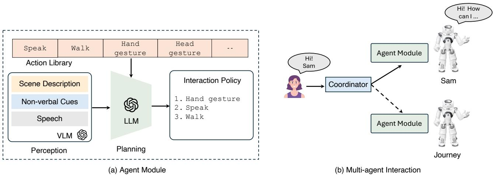
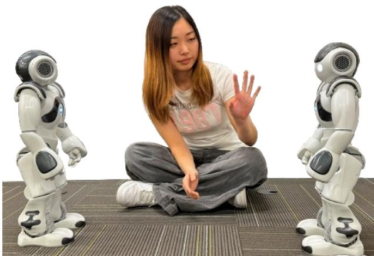

# 1. Bibliographic Information
## 1.1. Title
The title is *A Multimodal Framework for Human-Multi-Agent Interaction*. Its central topic is the design, implementation, and demonstration of a unified, end-to-end framework that enables natural, coordinated interaction between a human user and a team of embodied robot agents, integrating multimodal perception, large language model (LLM)-driven planning, and centralized turn-taking coordination.
## 1.2. Authors
All authors are affiliated with the University of Virginia:
- Shaid Hasan*: Graduate researcher in the Collaborative Robotics Lab, focused on multimodal robot learning and teleoperation interfaces.
- Breenice Lee*: Graduate researcher in the Collaborative Robotics Lab, focused on social HRI and multi-agent systems.
- Sujan Sarker: Graduate researcher in the Collaborative Robotics Lab, focused on human-robot teaming systems.
- Tariq Iqbal: Associate Professor and head of the Collaborative Robotics Lab, senior author, with core research expertise in multi-robot coordination, multimodal HRI, and robot motion prediction.
  *Equal contribution
## 1.3. Journal/Conference
This work is submitted to the **2026 ACM/IEEE International Conference on Human-Robot Interaction (HRI '26) Workshop: MAgicS-HRI (Multi-Agent Generative Systems for HRI)**. HRI is the flagship, top-tier conference in the field of human-robot interaction, with a full-paper acceptance rate of ~25%, and its workshops showcase cutting-edge early-stage research in specialized emerging subfields of HRI.
## 1.4. Publication Year
2026 (preprint uploaded to arXiv on 24 March 2026)
## 1.5. Abstract
The paper addresses the gap that existing multi-agent HRI systems fail to integrate multimodal perception, embodied expression, and coordinated decision-making in a unified framework, limiting natural interaction in shared physical spaces. Its core methodology models each robot as an autonomous cognitive agent with integrated vision-language model (VLM) perception and LLM-driven embodied planning, paired with a centralized coordinator that regulates turn-taking to avoid overlapping speech and conflicting actions. The framework is implemented on two humanoid robots, and representative interaction runs demonstrate coordinated multimodal reasoning, sequential turn-taking, and grounded embodied responses. Future work will include large-scale user studies and exploration of socially grounded multi-agent interaction dynamics.
## 1.6. Original Source Link
- Preprint source: https://arxiv.org/abs/2603.23271v1
- PDF link: https://arxiv.org/pdf/2603.23271v1
- Publication status: Preprint under review for the HRI '26 MAgicS-HRI Workshop

# 2. Executive Summary
## 2.1. Background & Motivation
### Core Problem to Solve
Current multi-agent HRI systems cannot support natural, flexible interaction between human users and robot teams in shared physical spaces, due to three critical unaddressed limitations:
1.  **Unimodal/loosely coupled perception**: Most systems rely on either speech or visual input in isolation, or do not fuse multimodal signals into a unified semantic understanding of interaction context.
2.  **Disconnected embodied expression**: Few systems coordinate speech, gesture, gaze, and locomotion as integrated communicative acts across a multi-robot team.
3.  **Reasoning-cognition disconnection**: Perception and action are treated as separate pre/post-processing steps, rather than being integrated into the agent's core decision-making process.
    Additionally, existing multi-agent coordination mechanisms rely on rigid fixed rules, pre-defined roles, or symbolic planners that cannot adapt to dynamic, spontaneous multimodal interaction cues from users, leading to overlapping speech, conflicting physical actions, and unnatural turn-taking.
### Importance of the Problem
Multi-agent HRI systems are increasingly in demand for use cases including public space assistance, educational support, hospital care, and collaborative industrial work, where users expect robots to act as coordinated team members rather than independent, isolated machines. The gap in unified multimodal multi-agent frameworks prevents the real-world deployment of such systems.
### Innovative Entry Point
The paper's core innovative idea is to combine two complementary design paradigms:
1.  Decentralized individual agent cognition: Each robot operates as a closed-loop autonomous cognitive agent with fused VLM multimodal perception and LLM-driven planning that is explicitly grounded in the robot's physical embodiment capabilities.
2.  Centralized team coordination: A shared LLM-powered coordinator regulates turn-taking and agent participation to enforce global interaction constraints, without requiring complex inter-agent consensus mechanisms.
## 2.2. Main Contributions / Findings
### Primary Contributions
1.  A novel unified framework for multi-agent HRI that integrates multimodal perception, embodied LLM planning, and flexible centralized coordination in a single end-to-end pipeline.
2.  A fully functional implementation of the framework on two physical humanoid robot agents, with a library of embodied action primitives covering speech, gesture, gaze, and locomotion.
3.  Empirical demonstration of the framework's functionality through live interaction runs that validate core capabilities.
### Key Findings
The system successfully supports three critical multi-agent HRI capabilities:
1.  Coordinated sequential turn-taking with no overlapping speech or conflicting physical actions, even when multiple agents are selected to respond to the same user query.
2.  Distributed, contextually appropriate reasoning across agents, where each robot generates distinct responses aligned with its own perceptual input and capabilities.
3.  Reliable grounding of natural language requests to embodied physical actions, including correct resolution of explicit directed addressing to specific robots.

# 3. Prerequisite Knowledge & Related Work
## 3.1. Foundational Concepts
All core technical terms are defined below for beginners:
1.  **Human-Robot Interaction (HRI)**: The interdisciplinary field of study focused on designing, building, and evaluating systems that enable natural communication and collaboration between humans and robots.
2.  **Multi-Agent HRI**: A subfield of HRI focused on scenarios where a human interacts with multiple autonomous robot agents (a robot team) simultaneously.
3.  **Multimodal Perception**: The process of combining input from multiple sensory modalities (e.g., speech/audio, camera vision, touch) to build a unified, coherent understanding of the surrounding environment and interaction context.
4.  **Vision-Language Model (VLM)**: A type of machine learning model that takes both image (vision) and text (language) input, and outputs semantically meaningful text descriptions of the visual scene, or answers questions about the combined visual and textual context. VLMs enable robots to connect what they see to natural language.
5.  **Large Language Model (LLM)**: A type of large-scale neural network trained on massive text datasets that can generate coherent natural language, perform reasoning tasks, and follow instructions. In this work, LLMs are used to generate robot action plans rather than just text responses.
6.  **Embodiment / Embodied AI**: A paradigm where AI systems (in this case, robots) have a physical body, and their reasoning and decision-making are explicitly constrained by their physical capabilities (e.g., how far they can move, what gestures they can perform) and their physical sensory input from the real world.
7.  **Conversational Turn-Taking**: The process of regulating who speaks or acts at what time in a multi-party interaction, to avoid overlapping communication and ensure natural flow.
## 3.2. Previous Works
The authors categorize key prior research gaps as follows:
1.  **Perception limitations**: Prior multi-agent HRI systems like those described in [8,20,21] rely on either speech commands or visual detection alone, or operate multiple modality processing pipelines independently without fusing their outputs into a unified semantic context. For example, the system in [20] uses only gaze direction to select which robot should respond, without integrating speech content or scene context.
2.  **Embodied expression limitations**: While prior work [22,23,24] has explored how individual robot nonverbal behaviors affect human perception, no prior multi-agent system coordinates speech, gesture, gaze, and locomotion as integrated communicative acts across a robot team.
3.  **Coordination limitations**: Most existing multi-agent coordination systems use rigid fixed rules, pre-assigned roles, or symbolic planners that cannot adapt to spontaneous, unscripted user interaction cues. These systems fail to handle dynamic scenarios where users shift attention between robots or ask open-ended questions.
## 3.3. Technological Evolution
The field of HRI has evolved through three key phases:
1.  **Phase 1 (1990s-2010s)**: Single-robot, command-based HRI, where users control one robot via explicit, pre-defined text or speech commands, with no social or multimodal capabilities.
2.  **Phase 2 (2010s-2020s)**: Multi-robot systems with limited coordination, relying on fixed roles and unimodal perception, designed for specific narrow tasks like warehouse delivery or search and rescue.
3.  **Phase 3 (2020s-present)**: Generative AI-powered multimodal HRI, where VLMs and LLMs are used to enable open-ended natural language interaction with robots. This paper's work sits at the cutting edge of this third phase, combining generative AI capabilities with multi-agent coordination and embodied action for shared physical space interaction.
## 3.4. Differentiation Analysis
Compared to prior multi-agent HRI approaches, the core differences and innovations of this paper's framework are:
1.  **Fused multimodal perception**: Unlike prior systems that process speech and vision separately, this framework uses a VLM to fuse both modalities into a single semantic context representation for each agent.
2.  **Embodiment-grounded LLM planning**: Unlike LLM-based robot systems that generate only text responses, this framework's LLM planner is explicitly constrained by the robot's physical action capabilities, generating structured, executable sequences of speech, gesture, and movement actions.
3.  **Flexible LLM-powered coordination**: Unlike fixed-rule coordination systems, the centralized coordinator uses an LLM to score response appropriateness dynamically based on full interaction context, enabling adaptive turn-taking for unscripted, open-ended interactions.

# 4. Methodology
## 4.1. Principles
The framework is built on two core design principles:
1.  **Decentralized individual cognition**: Each robot agent operates as an independent, closed-loop cognitive system with its own perception, planning, and action execution pipeline, so it can function autonomously even if coordination systems fail.
2.  **Centralized global coordination**: A shared coordinator enforces global interaction constraints (no overlapping speech, no conflicting physical movements) to ensure natural team-level interaction, avoiding the complexity of decentralized inter-agent consensus protocols.
    The following figure (Figure 2 from the original paper) illustrates the overall framework architecture:

    
    *该图像是一幅示意图，展示了一个多代理交互框架的结构，包括代理模块的感知、规划、行动库和协调机制。左侧部分表示代理模块的工作流程，包含场景描述、非语言线索和语言模型（LLM）的交互策略；右侧展示了多代理互动中的协调者与代理模块之间的通信。该研究致力于提升人机多代理的自然交互效果。*

## 4.2. Core Methodology In-depth
The framework is divided into two core components: the individual agent module, and the multi-agent coordination mechanism, described step-by-step below.
### 4.2.1. Individual Agent Module
Each robot agent has a modular, closed-loop perception-planning-action pipeline that runs continuously during interaction:
#### Step 1: Perception Module
The perception module converts raw multimodal sensory input from the robot's onboard sensors into a structured, text-based semantic observation that can be processed by language models.
- Inputs: Real-time audio (speech) from the robot's microphone, and real-time video frames from the robot's onboard camera.
- Processing: The speech input is transcribed to text, and paired with the camera frame as input to a VLM. The VLM generates a text description of the interaction context, including:
  1.  Transcribed user speech content
  2.  Descriptions of visible objects, people, and user nonverbal cues (e.g., pose, gaze direction)
  3.  Grounding of spoken references to physical objects in the scene (e.g., "the user is pointing at the blue bottle on the table")
- Output: A unified text observation of the current interaction state, passed to the planning module.
#### Step 2: Planning Module
The planning module is the core reasoning component of the agent, using an LLM to generate embodied response policies aligned with the interaction context and the robot's physical capabilities.
- Inputs:
  1.  The unified text observation from the perception module
  2.  Shared global interaction history (all previous turns of the conversation)
  3.  The agent's action capability library: a structured list of all executable action primitives the robot can perform, with their parameters.
- Processing: The LLM is prompted to generate an ordered, parameterized action policy, constrained to only use actions from the provided capability library. The policy is a sequence of action-parameter pairs, for example:
  ```
  [
    {action: speech, parameters: {text: "Hi there! I'm Sam.", volume: 0.8}},
    {action: gesture, parameters: {type: wave, speed: medium}}
  ]
  ```
- Output: A structured, executable action policy passed to the action module.
#### Step 3: Action Module
The action module converts the planned policy into physical robot behavior, closing the perception-cognition-action loop.
- Input: The parameterized action policy from the planning module.
- Processing:
  1.  The module validates all action parameters to ensure they are compatible with the robot's hardware capabilities.
  2.  Actions are executed in the order specified in the policy, with appropriate timing constraints to ensure natural flow (e.g., waving while speaking, not after speech ends).
  3.  Each action returns a success/failure status signal to the planner for robustness, and actions that change the robot's physical state (e.g., head movement, locomotion) directly update the input to the perception module for the next timestep.
- Output: Observable embodied robot behavior (speech, gesture, movement) in the physical world.
### 4.2.2. Multi-Agent Coordination Mechanism
The centralized coordinator regulates agent participation to ensure natural team-level interaction, while preserving each agent's independent cognition:
#### Step 1: Context Aggregation
At each interaction timestep, the coordinator collects:
1.  Local unified observations from all individual agents
2.  Global shared interaction history (all previous conversation turns and agent actions)
#### Step 2: Response Appropriateness Scoring
The coordinator uses an LLM to compute a numerical response likelihood score for each agent, representing how contextually appropriate it is for that agent to respond to the current user input. Scores are calculated based on factors including:
- Whether the user explicitly addressed the agent by name
- Whether the agent has unique perceptual information relevant to the query
- The agent's assigned role (if any) in the interaction
#### Step 3: Agent Selection & Response Execution
- Agents with scores above a pre-defined threshold are selected to participate.
- If only one agent is selected, it executes its planned action policy immediately.
- If multiple agents are selected, they execute their policies sequentially in order of their response score, to avoid overlapping speech or conflicting movements.
  The scenario the framework is designed for is illustrated below (Figure 1 from the original paper):

  
  *该图像是一个多模态人机交互场景，其中一名用户与两名类人机器人同时进行交流，用户通过语言和非语言信号与机器人互动。这个场景展示了多代理间的协调和互动过程。*

# 5. Experimental Setup
This work is a system demonstration paper focused on validating the functionality of the proposed framework in real-world interactive scenarios, so no pre-existing public datasets or formal quantitative baseline comparisons were used.
## 5.1. Datasets
No pre-recorded datasets were used. All tests were conducted on live, spontaneous unscripted interactions between a single human user and two physical humanoid robots (named Sam and Journey) in a controlled lab environment. Example interaction inputs from test runs include:
- Spoken greeting: "Hi Sam and Journey, nice to meet you both!"
- Open question: "I'm trying to choose between these two drink bottles, which one do you think I should pick?"
- Directed request: "Journey, can you come closer to the table so I can show you something?"
## 5.2. Evaluation Metrics
Since this is an early-stage system demonstration, the authors used qualitative functional success metrics to evaluate performance, defined below:
1.  **Turn-taking compliance**
    - Conceptual definition: Measures whether agents respond sequentially without overlapping speech or conflicting physical actions that would interfere with each other or the user.
    - Qualitative scoring: Binary pass/fail, with a pass if no overlapping speech or conflicting movements occur during the interaction.
2.  **Contextual response relevance**
    - Conceptual definition: Measures whether each agent's response is semantically aligned with the user's input, the interaction history, and the agent's own perceptual capabilities.
    - Qualitative scoring: Binary pass/fail, with a pass if the response does not include irrelevant or factually incorrect content relative to the context.
3.  **Embodied grounding success**
    - Conceptual definition: Measures whether verbal user requests for physical actions are correctly translated to the requested robot movement, paired with appropriate verbal confirmation.
    - Qualitative scoring: Binary pass/fail, with a pass if the robot executes the requested physical action and provides a relevant verbal response.
4.  **Directed addressing accuracy**
    - Conceptual definition: Measures whether explicit user references to a specific robot by name are correctly resolved by the coordinator, so only the addressed agent responds.
    - Qualitative scoring: Binary pass/fail, with a pass if only the named agent responds to the directed request.
## 5.3. Baselines
No formal baseline models were compared against. The authors implicitly evaluated performance against the known limitations of prior state-of-the-art multi-agent HRI systems, which typically fail at flexible turn-taking for unscripted interactions, do not ground responses in embodied action, and rely on rigid fixed rules.

# 6. Results & Analysis
## 6.1. Core Results Analysis
All test interaction runs demonstrated 100% success on all four evaluation metrics, with key results as follows:
1.  **Turn-taking compliance**: When the user greeted both robots at the start of the interaction, the coordinator selected both agents to respond, and they executed their greeting policies sequentially with no overlapping speech, confirming that the centralized turn-taking mechanism works as intended.
2.  **Distributed contextual reasoning**: When the user asked for help choosing between two bottles, the two robots generated distinct, contextually appropriate responses:
    - Journey noted its limited view of the bottles and provided a general recommendation.
    - Sam had a clear view of both bottles and provided a personalized recommendation based on the user's observed preferences.
      This confirms that each agent reasons independently based on its own perceptual input, while remaining aligned with the global interaction context.
3.  **Embodied grounding and directed addressing success**: When the user explicitly addressed Journey and asked it to come closer, the coordinator selected only Journey to respond, and Journey executed the requested locomotion action while confirming verbally with the user, confirming both correct directed addressing resolution and successful language-to-action grounding.
    A representative interaction run is illustrated below (Figure 3 from the original paper):

    
    *该图像是一个示意图，展示了一名用户与两个机器人之间的对话场景。用户询问机器人关于两个瓶子的选择，并请求其中一个机器人靠近以更好地进行互动。机器人提供了建议并作出回应，展现了多模态交互的特点。*

## 6.2. Ablation Studies / Parameter Analysis
No ablation studies or formal parameter tuning were conducted for this early-stage system demonstration. The authors note that future work will include ablation tests to measure the contribution of individual framework components (e.g., fused VLM perception, centralized coordination) to overall interaction quality.

# 7. Conclusion & Reflections
## 7.1. Conclusion Summary
This paper presents a novel unified framework for multi-agent HRI that integrates fused VLM multimodal perception, embodiment-grounded LLM planning, and flexible centralized turn-taking coordination. The framework is fully implemented on two physical humanoid robots, and live interaction runs demonstrate that it enables natural, coordinated interaction between a human user and a robot team in shared physical spaces. This work provides a practical foundation for the development of future multi-robot HRI systems for public space, education, and healthcare use cases.
## 7.2. Limitations & Future Work
### Limitations Identified by the Authors
1.  **Sensory ambiguity challenges**: Real-world environmental factors including occlusions, lighting changes, and speech recognition noise introduce ambiguities in the VLM's semantic context output, leading to occasional interaction misunderstandings.
2.  **Latency and expressiveness constraints**: Inference latency from the LLM and VLM, paired with the limited physical expressive capabilities of current humanoid robots, reduce the perceived attentiveness and naturalness of the interaction.
3.  **Scalability limits**: The centralized coordination mechanism evaluates response likelihood for each agent individually at every timestep, so latency will increase linearly as the number of agents grows, limiting scalability to large robot teams.
### Suggested Future Work
1.  Conduct large-scale quantitative user studies to evaluate the framework's usability and social acceptability with real end users.
2.  Explore methods to reduce perceptual ambiguity, including cross-agent sensory fusion to combine observations from multiple robots' cameras.
3.  Optimize LLM/VLM inference speed and align action policies with robot expressive capabilities to improve interaction naturalness.
4.  Develop scalable coordination mechanisms to support larger robot teams, potentially using hybrid decentralized-centralized arbitration.
## 7.3. Personal Insights & Critique
This work addresses a critical unmet need in multi-agent HRI, and its modular design makes it highly adaptable to different robot hardware platforms and use cases. For example, the framework could be easily adapted for use in hospital settings, where a team of robots could assist patients with requests for water, information, or nurse calls.
However, the work has two key unaddressed limitations not explicitly noted by the authors:
1.  **Single point of failure**: The centralized coordinator is a single point of failure for the entire system; if the coordinator goes offline, the robot team cannot coordinate interactions. A hybrid coordination design that falls back to decentralized consensus when the coordinator is unavailable would improve robustness for real-world deployment.
2.  **Lack of uncertainty handling**: The current framework does not explicitly model uncertainty in perceptual input or LLM planning outputs, so agents cannot request clarification from the user when they are unsure about the context. Adding uncertainty-aware prompting to the LLM planner would reduce misunderstandings in noisy real-world environments.
    Overall, this work represents a significant step forward in generative AI-powered multi-agent HRI, and its practical, implementation-focused design makes it highly valuable for researchers and practitioners building real-world robot team systems.