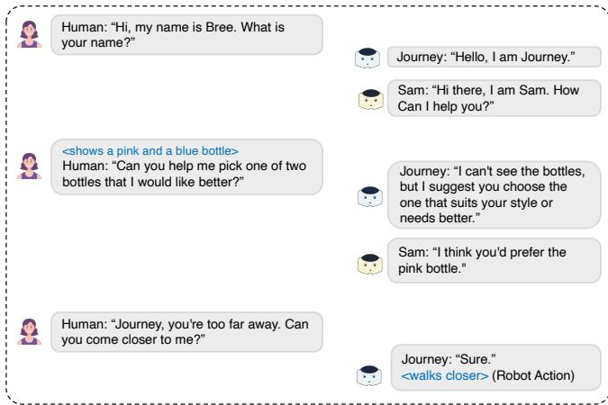

# 人类与多智能体交互的多模态框架

谢德·哈桑* 维吉尼亚大学 qmz9mg@virginia.edu 布雷尼斯·李* 维吉尼亚大学 pkb5ne@virginia.edu 苏贞·萨克尔 维吉尼亚大学 zzr2hs@virginia.edu 塔里克·伊克巴尔 维吉尼亚大学 tiqbal@virginia.edu

# 摘要

人机交互正越来越多地朝向多机器人、社会化的环境发展。现有系统在统一框架内整合多模态感知、具身表达和协调决策方面存在困难。这限制了在共享物理空间中的自然且可扩展的互动。我们通过引入一个多模态框架来填补这一空白，该框架支持人类与多智能体的交互，其中每个机器人作为一个自主的认知智能体运行，具备集成的多模态感知和基于具身性的语言模型（LLM）驱动的规划。在团队层面上，一个集中协调机制调节轮流发言和智能体参与，以防止重叠发言和冲突行为。在两个类人机器人上实现的我们的框架通过结合语言、手势、注视和运动的互动策略，支持连贯的多智能体互动。代表性的互动演示显示了智能体之间的协调多模态推理和基于具身的响应。未来的工作将侧重于更大规模的用户研究以及对社会化多智能体交互动态的深入探索。

# 关键词

多智能体人机交互，多模态人机交互，基于大语言模型的规划

# ACM 参考格式：

Shaid Hasan, Breenice Lee, Sujan Sarker, 和 Tariq Iqbal. 2026. 人类与多智能体交互的多模态框架. 载于《ACM/IEEE国际人机交互大会论文集》（HRI '26 研讨会：MAgicS-HRI）。ACM, 纽约, 美国, 4 页。

# 1 介绍

人机交互（HRI）正从传统的单机器人、基于命令的系统发展到更丰富、更具社会基础的环境，在这些环境中，人们通过自然的交流渠道与多个自主机器人进行互动，包括语言、目光、手势和体现运动（如图1所示）[1, 2, 3, 4]。多智能体HRI系统通过允许机器人群体协同工作、分担任务和承担不同角色，从而提高了可扩展性、灵活性和社会互动[5, 6]。在公共空间、学校、医院和协作工作场所等地方，这一点尤为重要，因为人们自然期望机器人表现得像团队成员，而不是独立的机器[7, 8, 9, 10, 11, 12, 13]。

  

Figure 1: Multimodal multi-agent human-robot interaction scenario. A single human user engages simultaneously with two humanoid robot agents through speech and non-verbal cues.

有效的人机交互本质上依赖于多模态通信。随着机器人变得越来越复杂，作为社会智能体，它们通过多种模态感知和响应的能力对于自然、直观的互动变得至关重要。在多智能体环境中，多模态性引入了额外的复杂性和机遇。视觉反馈和实时可视化已被证明能够增强人们在多机器人系统中的理解与控制。然而，尽管多模态交互的重要性得到了认可，大多数现有的多智能体人机交互系统在感知和通信能力上仍然有限。目前的多智能体人机交互方法在多模态集成方面面临三个关键限制。首先，感知通常是单一模态的或松散耦合的。许多系统依赖于语音指令或视觉检测，但很少将这些模态整合成对交互上下文的统一理解。当多种模态同时存在时，它们通常是独立运作，而不是融合成连贯的语义表示。其次，具身多模态表达仍然受到限制。虽然研究探讨了机器人运动模式和非语言行为如何影响人类感知，但很少有系统在多智能体团队中协调语音、手势、注视和移动作为整合的交际行为。第三，多模态推理与智能体认知之间缺乏连接。现有框架通常将感知视为前处理步骤，将行动视为后处理步骤，且在智能体的决策过程中集成程度有限。

  
LLM agents (e.g., Sam and Journey) interact with a human user under centralized coordination.

在多机器人环境中，这些挑战变得更加困难。除了感知和对话外，系统还必须管理团队协调——决定哪台机器人应该作出响应，以及如说话、手势和移动等动作如何协调，以避免相互干扰。每台机器人还需要在共享同一物理和对话空间的情况下，结合多模态感知与行动。大多数现有系统通过简单的规则、固定角色或符号规划来解决这些问题，这些方法往往缺乏适应变化的多模态交互线索所需的灵活性。为了解决这些挑战，我们开发了一种多模态多智能体人机交互系统，其中每台机器人作为一个自主的认知智能体运行，具备集成的多模态感知和基于体现的LLM驱动规划。每台机器人使用视觉-语言模型(VLM)处理语音和视觉输入，将其结合为对交互上下文的统一理解，从而支持高层推理和动作选择。在团队层面，系统采用集中协调器，根据多模态线索和共享上下文确定哪台机器人应该响应。这使得机器人能够动态轮流、生成协调响应计划并执行体现行为，同时避免重叠的发言或冲突的动作。

# 2 系统设计

我们开发的框架（图2）是一个共存的多模态多智能体人机交互系统，旨在实现单个用户与一组具身机器人智能体之间自然且协调的互动。在该系统中，多个人形机器人与一个人类用户在共享的物理空间中进行互动。

# 2.1 智能体模块

每个机器人被建模为一个模块化的闭环认知智能体，包含三个核心组件：感知、规划和行动执行。这些组件形成一个连续的感知-认知-行动循环，其中多模态感官输入被转化为具体现实的机器人行为。感知将智能体置于物理和对话上下文中，规划将上下文信息综合为结构化的行动策略，行动通过可执行的机器人行为实施这些策略。我们在下文中逐一描述每个模块。 A. 感知。感知模块使每个智能体能够将原始的多模态感官输入转化为结构化的语义观察，这为下游推理和行动生成奠定基础。在每个交互时间步，智能体接收来自其机载摄像头的语音输入和视觉输入。这些信号被联合处理，以生成表示当前交互状态的统一观察。感知模块作为一个多模态推理组件实现，集成了语音处理、视觉感知和视觉-语言模型（VLM）。VLM生成与交互上下文相关的语义描述，例如在物理场景中定位口语参考、识别可见实体或解释用户姿势。这将异构感官数据转化为可以被基于语言的推理模块直接使用的一致文本表示。 B. 规划。规划模块作为每个智能体的中央推理组件，整合感知观察、交互上下文和可用的行动能力，以生成具体现实的响应策略。该系统不依赖固定的决策规则或符号规划器，而是采用语言模型驱动的规划范式，其中高层次的推理和行动选择通过有结构的认知输入条件下由大型语言模型（LLM）共同执行。在每个时间步，规划器接收当前观察、共享的交互上下文和智能体的行动能力库。这些输入被综合以生成表示为一系列参数化动作的策略。每个动作对应一个可执行的基本动作，如语音、手势、头部运动或移动，并附带指定内容和执行风格的相关参数。根据交互上下文，策略可以包含一个单一动作或一个多步骤序列。交互规划器的一个独特方面是推理受限于智能体的具体现实行动能力。规划并非仅仅生成自由形式的文本，而是在明确意识到可用动作集的情况下进行，包括语音、手势、头部运动、移动和基于视觉的行为。因此，生成的策略由一系列结构化的行动意图组成，确保每个推理周期都能导致可观察的机器人行为。

C. 动作。动作模块实现了智能体在物理世界中的计划行为。在规划者生成的参数化动作序列的基础上，动作模块在机器人上实例化并执行每个动作原语，确保每个认知周期产生可观察的行为。机器人行为被建模为有限可重用动作原语的组合。动作库旨在覆盖交互式人机交互所需的核心具身行为，包括言语交流、非言语表达和基于运动的行为。在我们的系统中，这些原语包括语音动作、姿势动作（例如，站立、坐下、休息）、表现性手势（例如，点头、挥手、握手）、用于注意力和摄像机框架的头部移动、运动指令以及简单的手臂或手部动作，如指点和手的开合。每个原语接受指定执行内容和风格的参数，例如语音的发言文本和音量、手势类型和速度、头部的平移或俯仰角度，或者行走方向和幅度。动作模块将每个动作-参数对转换为具体的机器人指令，并将其分派到执行层。由于动作是参数化的，该模块充当解释器，验证参数，确保与机器人的能力兼容，并在适当的时机和顺序约束下执行动作。多步骤策略通过按顺序执行动作来处理，允许规划者表达复合行为，例如“手势说点头”。或者与感知驱动的动作互相交替执行。执行返回状态信号，指示每个动作的成功或失败，以支持交互环境中的鲁棒性并实现优雅降级。此外，某些动作直接影响后续的感知，例如，头部移动会影响摄像机视角，从而闭合感知运动循环。

# 2.2 多智能体交互

我们的框架采用中心化协调机制，调节多个智能体之间的交互，同时保持去中心化认知。每个智能体独立维持其感知-规划-行动循环，如2.1节所述，而共享协调者则实现对话轮次和智能体的参与。在每次交互时间步中，每个智能体通过其感知模块生成本地观察，系统维护一个表示对话历史的全球交互上下文。中心化协调者评估每个智能体在当前观察和共享上下文下回应的适当性。这一评估通过一个语言模型实现，该模型为所有智能体产生响应可能性得分。得分超过预定义阈值的智能体被选中参与。如果选择了单个智能体，它将独自回应；如果选择了多个智能体，它们将依次回应。每个选中的智能体通过其规划器独立生成自己的体现交互策略，然后通过其行动模块执行该策略。

  

Figure 3: A representative interaction run from our system demonstration. A human user engages two humanoid robots in shared space through speech and visual cues. The central coordinator selects the most contextually relevant agent(s) to respond, enabling sequential, non-overlapping dialogue and grounded physical actions such as verbal replies and locomotion.

尽管理论上可以以去中心化的方式计算响应可能性，但在具身多机器人环境中，采用集中协调来强制执行全球交互约束是必要的。中央仲裁防止了同时发言和冲突的物理行动，确保了确定性的轮转顺序，并在用户明确指定机器人的情况下解决了定向地址问题。在完全去中心化系统中实现这些保证将需要复杂的智能体间共识机制。

# 3 系统演示与结果

我们提出的框架有效地整合了多模态感知与协调的多智能体响应。从图3所示的互动示例中，我们观察到系统成功地处理了口头对话、非语言暗示和在共享物理环境中的定向呼叫。在互动开始时，用户自我介绍，两个机器人依次响应，展示了协调的轮流发言而没有重叠的现象。这表明集中协调器能够调节智能体之间的参与，同时保持个体响应。当用户请求帮助选择两瓶之间的选择时，机器人生成了不同但具有上下文基础的回复：Journey 认识到其视觉限制并提供了一般性推荐，而 Sam 则提供了个性化建议。这展示了智能体之间的分布式推理，每个机器人通过自身的感知和上下文理解来解读相同的互动。最后，当用户明确呼唤 Journey 并要求其靠近时，系统正确解析了定向语言，Journey 在确认口头响应的同时执行了物理行动。这种行为展示了语言成功嵌入具体行动的能力。总体而言，这次互动表明我们开发的框架支持多模态理解、协调的多智能体参与以及在人与机器人互动场景中执行物理行为。

# 4 讨论

我们的框架探讨了如何将多模态感知、具身行动和集中协调相结合，以支持人类与多智能体之间的互动。通过多次演示运行，我们观察到了一些互动模式，提供了若干设计洞察。我们的演示表明，多模态感知在很大程度上影响了人类与机器人团队之间互动的展开。尽管语音和视觉被整合为一个单一表示，现实世界中的因素，例如遮挡、光照变化和语音识别噪声，仍然在互动过程中引入了模糊性。在实践中，这些模糊性表现为误解，而不是明显的感知错误。在多智能体环境中，这也影响了哪个机器人选择响应，表明感知质量可以塑造团队内的代理性和责任感。来自大型语言模型和视觉语言模型的延迟以及机器人的有限物理表现明显影响了互动的展开。迟缓的响应和受限的动作影响了专注度和能力的传达。我们并不将延迟和具身性视为纯粹的技术问题，而是将其视为塑造轮流发言和参与的沟通信号。提供增量反馈并更好地将行动策略与机器人的表达能力对齐，可能有助于保持对话流程并使机器人意图更加明确。通过我们的演示，互动反映了系统作为一个协调团队运行，而非孤立智能体。尽管集中仲裁防止了重叠的语音和冲突的动作，但有效的人类与多智能体的沟通依赖于这种协调是否在外部可见。相互意识和共享背景的迹象似乎影响了集体行为的理解。尽管我们当前的实现展示了两个类人智能体之间的协调互动，但将框架扩展到更大的机器人团队可能引入计算挑战。集中协调机制在每个时间步评估每个智能体的响应可能性，随着智能体数量的增加，仲裁的复杂性和延迟可能增加，进而影响对话流畅性和行为。

# 5 结论

我们提出了一种多模态多智能体人机互动系统，该系统整合了视觉-语言感知、基于大语言模型的规划以及在集中协调框架下的赋能行动。通过将每个机器人建模为自主认知智能体，同时在团队层面调节轮流交互，该系统使人类用户与多个机器人在共享物理空间中实现连贯且具有社会基础的互动。代表性的交互运行展示了多模态理解、协调的智能体参与以及有依据的赋能响应。本研究为未来的多机器人系统提供了实用基础，我们计划通过更大规模的用户研究和深入探索长时间跨度的社会化互动来扩展这一工作。

# References

[1] Ramtin Tabatabaei, Vassilis Kostakos, and Wafa Johal. 2025. Gazing at failure: investigating human gaze in response to robot failure in collaborative tasks. In HRI. IEEE.   
[2] Haley N Green and Tariq Iqbal. 2025. Using physiological measures, gaze, and facial expressions to model human trust in a robot partner. In ICRA. IEEE.   
[3] Yan Zhang, Tharaka Sachintha Ratnayake, Cherie Sew, Jarrod Knibbe, Jorge Goncalves, and Wafa Johal. 2025. Can you pass that tool?: implications of indirect speech in physical human-robot collaboration. In 2025 CHI.   
[4] Haley N Green and Tariq Iqbal. 2025. Examining physiological response and faial expression as indicators of trust in a robot partner. ACM THRI.   
[5] Isabella Pu, Jeff Snyder, and Naomi Ehrich Leonard. 2025. The beatbots: a musician-informed multi-robot percussion quartet. In HRI. IEEE.   
[6] Sujan Sarker, Haley N Green, Mohammad Samin Yasar, and Tariq Iqbal. 2024. Cohrt: a collaboration system for human-robot teamwork. Robotics Science and Systems (RSS) Workshop.   
[7] Mohammad Samin Yasar and Tariq Iqbal. 2022. Robots that can anticipate and learn in human-robot teams. In HRI. IEEE.   
[8] Emanuel et al. Gollob. 2025. Envisioning individualized fashion remanufacturing: empowering non-experts through visualization-enhanced human-multirobot interaction. In 2025 HRI.   
[9] Mohammad Samin Yasar, Md Mofijul Islam, and Tariq Iqbal. 2024. Imprint: interactional dynamics-aware motion prediction in teams using multimodal context. ACM THRI.   
[10] Mohammad Samin Yasar, Md Mofijul Islam, and Tariq Iqbal. 2024. Posetron: enabling close-proximity human-robot collaboration through multi-human motion prediction. In HRI.   
[11] Qinyuan Jiang, Lucas Zak, Shirley Leshem, Pulkit Rampa, Sophie Howle, Haley N Green, and Tariq Iqbal. 023. mbodied ai or fnancal literay social robots. In 2023 SIEDS. IEEE.   
[12] Mohammad Samin Yasar and Tariq Iqbal. 2023. Vader: vector-quantized generative adversarial network for motion prediction. In 2023 IEEE/RSJ International Conference on Intelligent Robots and Systems (IROS). IEEE, 38273834.   
[13] Mohammad Samin Yasar and Tariq Iqbal. 2021. Improving human motion prediction through continual learning.   
[14] Md Mofijul Islam, Alexi Gladstone, Sujan Sarker, Ganesh Nanduru, Md Fahim, Keyan Du, Aman Chadha, and Tariq Iqbal. 2026. Embodied referring expression comprehension in human-robot interaction. HRI.   
[15] Md Mofijul Islam, Alexi Gladstone, and Tariq Iqbal. 202. Patron: perspetiveaware multitask model for referring expression grounding using embodied multimodal cues. In AAAI.   
[16] u  Ae     : embodied question answering using multimodal expression. In ICLR.   
[17] Md Mofijul Islam, Reza Mirzaiee, Alexi Gladstone, Haley Green, and Tariq Il. 20.Cer:  bodi mulator o geneatinmultmoal reeri expression datasets. NeurIPS.   
[18] Shaid Hasan, Mohammad Samin Yasar, and Tariq Iqbal. 2024. M2rl: a multimodal multi-interface dataset for robot learning from human demonstrations. In ICMI.   
[19] Shaid Hasan, Mohammad Samin Yasar, and Tariq Iqbal. 2024. A holistic evaluation of teleoperation interfaces for robotic manipulation. ACM Transactions on Human-Robot Interaction.   
[20] Lingkang Zhang and Richard Vaughan. 2016. Optimal robot selection by gaze direction in multi-human multi-robot interaction. In IROS. IEEE.   
[21] Wonse Jo, Jee Hwan Park, Sangjun Lee, Ahreum Lee, and Byung-Cheol Min. 2. De ummulooinactio meu  iti - tion. In HRI. IEEE.   
[22] Jiadi et al. Luo. 2024. Impact of multi-robot presence and anthropomorphism on human cognition and emotion. In 2024 CH.   
[23] Nevo Heimann Saadon, Benny Megidish, and Hadas Erel. 2025. Scammed by robots: can deception by two simple non-humanoid robots shape general attitudes toward robots? In HRI. IEEE.   
[24] Xiang Zhi Tan, Samantha Reig, Elizabeth J Carter, and Aaron Steinfeld. 2019. F ne tonothe how obo-obotintection affecs usrs' percions following a transition between robots. In HRI. IEEE.   
[25] Sarah Schömbs, Yan Zhang, Jorge Goncalves, and Wafa Johal. 2025. From conversation to orchestration: hci challenges and opportunities in interactive multi-agentic systems. In HAI.