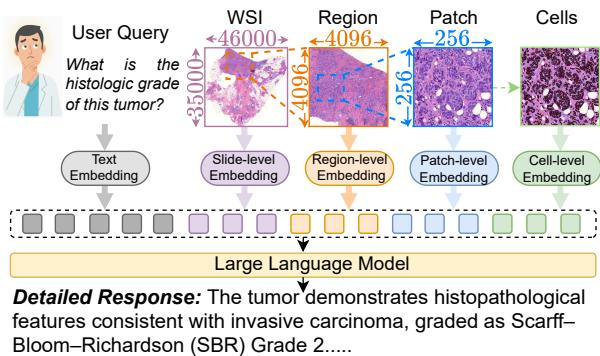
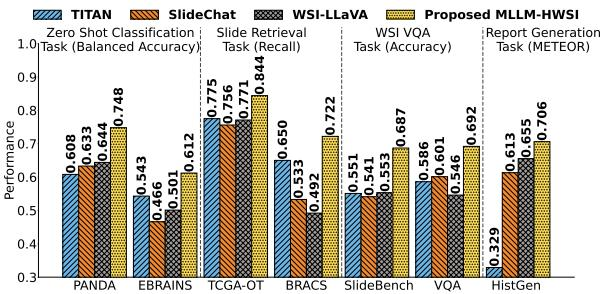
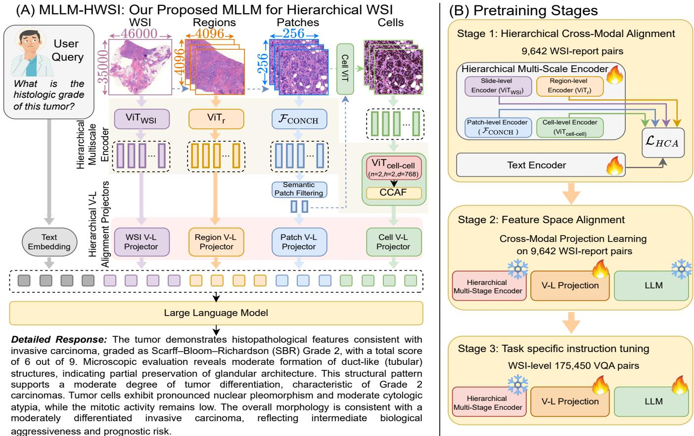
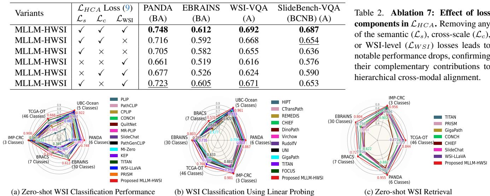

# ?o MLLM-HWSI: A Multimodal Large Language Model for Hierarchical Whole Slide Image Understanding

Basit Alawode1, Arif Mahmood2, Muaz Khalifa Al-Radi1, Shahad Albastaki1, Asim Khan1, Muhammad Bilal3, Moshira Ali Abdalla1, Mohammed Bennamoun4, Sajid Javed1   
1Department of Computer Science, Khalifa University of Science and Technology, UAE.   
2Information Technology University, Pakistan.3KAU, KSA. 4University of the Western Australia.

# Abstract

Whole Slide Images (WSIs) exhibit hierarchical structure, where diagnostic information emerges from cellular morphology, regional tissue organization, and global context. Existing Computational Pathology (CPath) Multimodal Large Language Models (MLLMs) typically compress an entire WSI into a single embedding, which hinders fine-grained grounding and ignores how pathologists synthesize evidence across different scales. We introduce MLLM-HWSI, a Hierarchical WSI-level MLLM that aligns visual features with pathology language at four distinct scales, cell as word, patch as phrase, region as sentence, and WSI as paragraph to support interpretable evidencegrounded reasoning. MLLM-HWSI decomposes each WSI into multi-scale embeddings with scale-specific projectors and jointly enforces (i) a hierarchical contrastive objective and (ii) a cross-scale consistency loss, preserving semantic coherence from cells to the WSI. We compute diagnostically relevant patches and aggregate segmented cell embeddings into a compact cellular token per-patch using a lightweight CellCell Attention Fusion (CCAF) transformer. The projected multi-scale tokens are fused with text tokens and fed to an instruction-tuned LLM for open-ended reasoning, VQA, report, and caption generation tasks. Trained in three stages, MLLM-HWSI achieves new SOTA results on 13 WSIlevel benchmarks across six CPath tasks. By aligning language with multi-scale visual evidence, MLLM-HWSI provides accurate, interpretable outputs that mirror diagnostic workflows and advance holistic WSI understanding. Code is available at: GitHub.

# 1. Introduction

Cancer diagnosis and prognosis using gigapixel Whole Slide Images (WSIs) remain the clinical gold standard for histopathological assessment [13, 53, 54, 69, 75]. The rise of Computational Pathology (CPath) has opened new possibilities to accelerate diagnostic workflows, improve reproducibility, and enable earlier cancer detection through quantitative analysis of the histology landscape [20, 27, 61]. WSIs are inherently hierarchical, both biologically and structurally, capturing the full spatial organization of tissue across multiple magnifications and scales (Fig. 1)[15, 19, 30, 75]. This hierarchical organization reflects the architecture of tissue itself, where diagnostic cues emerge across nested levels, from cellular morphology to regional, and global structural patterns [9, 15, 30, 75]. At the cellular level, WSIs capture diverse morphological attributes including variations in nuclear size, cytoplasmic texture, and mitotic activity that collectively define the vocabulary of pathology [3, 50, 55]. At the regional level, these cells form micro-architectural structures such as glands, ducts, or solid nests, which define the syntax of tissue organization and carry diagnostic meaning [11, 51]. At the global WSI level, multiple regions integrate into a coherent tissue architecture, illustrating spatial relationships between tumor and normal areas, invasion of adjacent structures, and necrosis [6, 11, 15, 67]. This multiscale organization forms the biological foundation of histopathologic interpretation, underpinning how both human experts and computational models reason about cancer [6, 37]. Expert pathologists perceive a WSI not as a static but as a multiscale landscape [6, 11, 26, 32]. Diagnostic reasoning typically begins at low magnification, progresses to the examination of regional tissue morphology, and concludes in the inspection of cellular features [56, 57]. Pathologists interpret WSIs as structured narratives in which tissue architecture provides context, regions define syntax, and cells define vocabulary [8, 22, 40]. This process is bidirectional: global context informs local inspection, while local findings refine global understanding until a coherent finding is reached [11, 26].

  
Figure 1. Our proposed MLLM-HWSI model aligns WSIs across multiple scales e.g., cells, patches, regions, and WSI enabling finegrained, context-aware, and interpretable pathology reasoning.

  
Figure 2. Comparison of MLLM-HWSI with SOTA methods.

In CPath, Multimodal Large Language Models (MLLMs) including Quilt-LLaVA [59], SlideChat [17], WSI-LLaVA [44], TITAN [23], PRISM [60], and HistGen [29] have been proposed for a wide range of tasks, such as Visual Question Answering (VQA), morphological reasoning, and report generation [17, 59]. SOTA MLLMs such as SlideChat [17] and WSI-LLaVA [44], aggregate patch-level embeddings into a single WSI-level representation aligned with corresponding reports [23, 29]. Although this aggregation captures a higher-level context, it neglects the hierarchical composition of WSIs, leading to the loss of fine-grained spatial semantics [14, 17, 43]. Also, existing models overlook the clinical workflow of expert pathologists, who integrate multi-scale visual cues obtained from progressive zooming and contextual reasoning [3, 28].

In this work, we address these limitations by introducing a Hierarchical WSI-level MLLM (MLLM-HWSI) for comprehensive WSI understanding, including analysis, retrieval, pathological inference, and report generation (Figs. 1-2). Our approach decodes the inherent pathology language by interpreting individual cells as words, small patches as phrases that describe cellular neighborhoods, larger regions as sentences that depict tissue architecture, and the entire WSI as a paragraph that forms a coherent visual narrative of the disease [18, 21, 62]. We align the hierarchical structure of WSIs with pathology reports across multiple scales, ensuring that MLLM-HWSI mimics the standard diagnostic workflow of pathologists. By grounding textual description (e.g., pleomorphic nuclei, stromal invasion) in their corresponding visual counterparts, the model captures compositional reasoning underlying expert diagnosis. This multi-scale alignment enhances interpretability, enabling biologically grounded and explainable predictions (Fig. 2). MLLM-HWSI bridges the gap between tissue-level interpretation by pathologists and computational model reasoning. Unlike SlideChat [17], TITAN [23], and WSI-LLaVA [44], which rely solely on global embeddings, our model decomposes each WSI into multiple semantic scales-cells, patches, regions, and global WSI—and learns distinct representations for each (Fig. 1). At the cellular scale, segmented cells are embedded to represent morphological and cytoplasmic features, and a lightweight Vision Transformer (ViT) with a CellCell cross-Embedding Fusion (CCEF) module aggregates cellular information efficiently. At higher scales, a hierarchical encoder extracts patch, region, and WSI-level embeddings representing local tissue structure and global architecture. A Semantic Patch Filtering module further refines patchlevel tokens. These embeddings are projected into a shared multimodal space through scale-specific VisionLanguage (VL) projectors and aligned with corresponding textual descriptions. By jointly enforcing hierarchical alignment and cross-scale consistency, MLLM-HWSI preserves diagnostic relationships between local cellular features and global structural patterns. Aligned visual tokens are then fused with textual tokens during LLM pretraining, enabling multiscale, evidence-based reasoning. MLLM-HWSI is optimized via a hierarchical contrastive alignment loss and a cross-scale consistency loss to maintain semantic coherence across spatial hierarchies. Finally, the fused multi-scale visual and textual tokens pre-train an LLM capable of multi-scale interpretative reasoning, mirroring how pathologists integrate detail and context into coherent diagnoses. We evaluate our proposed MLLM-HWSI model on six different WSI-level CPath tasks including zero-shot classification, retrieval, VQA, report generation, captioning, and cross-modal retrieval using 13 publicly available datasets. Compared to 24 SOTA CPath models, MLLM-HWSI achieves substantial performance improvements as shown in Fig. 2. Our main contributions are: 1. We introduce a multi-scale hierarchical MLLM that performs cell-, patch-, region-, and WSI-level alignment with pathology reports, enabling unified multi-scale understanding and reasoning over WSIs. 2. We jointly optimize hierarchical contrastive alignment and cross-scale consistency losses to preserve semantic coherence across scales, enabling multi-scale and evidence-based reasoning. 3. By unifying visual hierarchies with pathology reports, our model enhances diagnostic accuracy and generalization compared to global-only MLLMs.

# 2. Literature Review

1. MLLMs in CPath: MLLMs integrate LLMs with visual encoders to perform instruction-following, reasoning, and report-generation tasks in CPath [14, 59]. By coupling visual representations with powerful LLMs (e.g., GPT or

LLAMA), these models generate pathology reports, answer clinical queries, and explain diagnostic findings in natural language. Patch-level MLLMs such as Quilt-LLaVA [59] extend VLM pretraining to interactive dialogue and captioning. Similarly, WSI-level MLLMs such as PathChat [48], TITAN [23], SlideChat [17], and WSI-LLaVA [44] enable open-ended reasoning across WSIs [59]. However, most existing CPath MLLMs rely on global WSI-level embeddings that compress the entire WSI into a single vector aligned with a full pathology report. While effective for coarse-level reasoning, this approach neglects the multiscale, hierarchical nature of pathology, limiting the model's ability to associate textual descriptions with localized visual evidence (Fig. 2). Our Hierarchical WSI-level MLLM (MLLM-HWSI) addresses this gap by aligning features across multiple scales—cell, patch, region, and WSI—with corresponding pathology vocabulary in diagnostic reports, enabling interpretable and biologically grounded reasoning. 2. VLMs in CPath: CPath VLMs align histology patches with pathology-specific descriptions, producing semantically meaningful visual representations [34, 46]. Several prominent VLMs including CONCH [47], PLIP [34], QuiltNet [36], CPLIP [38], MR-PLIP [1], and OmniPath [65] have demonstrated improved performance across diverse pathology-related tasks. The patch-level embeddings from these VLMs are typically aggregated into global representations for WSI-level tasks. However, SOTA VLMs primarily operate at the patch-level and fail to explicitly capture the hierarchical organization of WSIs, where diagnostic insights arise from cellular, regional, and global structures. 3. Visual Foundation Models in CPath: These models are pretrained on large-scale pathology datasets using a self-supervised learning paradigm [16, 39, 70]. These models learn transferable, general-purpose visual representations applicable to diverse downstream tasks, including classification and survival prediction [16]. Prominent patch-level models are CTransPath [70], UNI [16], DI-NOSSLPath [39], Virchow [68], Phikon [25], CHIEF [71], GigaPath [73], and REMEDIS [4]. These models act as powerful visual feature extractors capable of encoding cellular and subcellular morphology with strong generalization across tissue types and cancer cohorts [49]. At the WSIlevel, these models aggregate local patch-level representation popular examples are GigaPath [73] and Virchow2 [77]. Such models serve as the visual backbone of modern CPath, offering scalable and generalizable representations for both discriminative and generative pathology tasks. In our work, we adopt these backbones as hierarchical encoders to extract multi-scale WSI features.

# 3. Proposed Hierarchical WSI MLLM

Overview: In this work, we propose Hierarchical WSIlevel Multimodal Large Language Model (MLLM-HWSI), a unified framework for multi-scale visual understanding and language alignment of WSIs in CPath. MLLM-HWSI aims to align the textual content of a pathology report with specific spatial and morphological features within a WSI, ranging from fine-grained cellular morphology to global tissue organization. By aligning hierarchical visual-textual representation, MLLM-HWSI enables interpretable, coherent diagnostic reasoning that parallels how pathologists integrate observations across hierarchical scales. An overview of MLLM-HWSI architecture is illustrated in Fig. 3 (A). It employs a hierarchical multi-encoder design to capture semantic information at four hierarchical levels. At the cellular scale, a CellViT encoder [33] performs cell segmentation and extracts cell-level embeddings that describe nuclear morphology. Three additional encoders process patch, region, and WSI-level representations to capture progressively broader structural and contextual information. To efficiently process WSIs, we introduce two key modules: Semantic Patch Filtering (SPF) and CellCell Attention Fusion (CCAF). SPF removes homogeneous patches and selects diagnostically meaningful heterogeneous ones based on cosine similarity with textual embeddings, for multimodal pretraining. CCAF employs a lightweight ViT that performs cross-attention among cellular embeddings within each patch, producing a single aggregated cellular token that captures cell-level morphology. At each hierarchical level, the resulting embeddings are projected into a shared multimodal space using scalespecific VL projectors that align visual features with corresponding textual semantics from pathology reports. MLLM-HWSI jointly optimizes two complementary objectives: (1) a hierarchical contrastive alignment loss, which strengthens cross-modal correspondence between textual and visual features at each scale, and (2) a cross-scale consistency loss, which enforces semantic coherence and hierarchical alignment across different spatial levels. For multimodal reasoning, the aligned multi-scale embeddings are fused with textual tokens and integrated into an LLM, enabling hierarchical instruction tuning. During pretraining, both VL projectors and multi-scale encoder are optimized jointly, achieving end-to-end VL alignment across scales.

# 3.1. Hierarchical Decomposition of Gigapixel WSIs

WSIs often exceed $1 0 0 , 0 0 0 \times 1 0 0 , 0 0 0$ pixels, thus direct end-to-end processing is computationally infeasible. We perform hierarchical decomposition of WSIs to efficiently capture both fine-grained cellular morphology and global tissue context [15]. This not only mitigates the processing challenge but also reflects the pathologists' workflow.

In our model, WSI $I$ at $2 0 \times$ is divided into nonoverlapping regions, $I = \{ R _ { i } \} _ { i = 1 } ^ { n _ { r } }$ , $R _ { i } \ \in \ \mathbb { R } ^ { 4 0 9 6 \times 4 0 9 6 \times 3 }$ where each region $R _ { i }$ preserves sufficient mesoscopic context to capture tissue organization patterns. Each region is further subdivided into smaller patches, $\begin{array} { r l } { R _ { i } } & { { } = } \end{array}$ $\{ P _ { i j } \} _ { j = 1 } ^ { n _ { p } }$ $\begin{array} { r c l } { P _ { i j } } & { \in } & { \mathbb { R } ^ { 2 5 6 \times 2 5 6 \times 3 } } \end{array}$ In total, we extracted 0.356M regions and 91.33M patches from $9 , 6 4 2 ~ W S I s$ Hierarchical decomposition allows efficient multi-scale feature extraction while maintaining spatial correspondence across levels. It also enables MLLM-HWSI to integrate information from $\{ P _ { i j } \} _ { j = 1 } ^ { n _ { p } } \to \{ R _ { i } \} _ { i = 1 } ^ { n _ { r } } \to I$ facilitating hierarchical VL alignment.

  
aligned with MLLM. (B) MLLM-HWSI three stage pre-training paradigm for multimodal reasoning.

# 3.2. Architecture

The overall architecture of the proposed MLLM-HWSI comprises five key components (Fig. 3 (A)): (i) a Hierarchical Multi-Scale Encoder, (ii) a Cell-Cell Attention Fusion (CCAF) module, (iii) a Semantic Patch Filtering (SPF) mechanism, (iv) Hierarchical $\mathbf { V } { \to } \mathbf { L }$ Alignment Projectors, and (v) a LLM. Together, these components enable MLLM-HWSI for robust multimodal reasoning.

# 3.3. Hierarchical Multi-Scale Encoder

The hierarchical encoder captures WSI semantics across four spatial levels—cell, patch, region, and WSI, reflecting the diagnostic reasoning process of expert pathologists. Patch-Level Encoder: At the patch level, visual embeddings are extracted using the CONCH encoder [47], which captures fine-grained texture and mesoscopic structural cues such as glandular formation and stromal organization: $f _ { i j } = \mathcal { F } _ { \mathrm { C O N C H } } ( P _ { i j } )$ , where $f _ { i j } \in \mathbb { R } ^ { d _ { p } }$ denotes the representation of patch $P _ { i j }$ . Semantic Patch Filtering (SPF): Given the large number o f patches $\{ P _ { i j } \} _ { j = 1 } ^ { n _ { p } }$ WSI, SP redundant and homogeneous patches while retaining diagnostically diverse and report-relevant ones. For each region $R _ { i }$ $\{ f _ { i j } \} _ { j = 1 } ^ { n _ { p } }$ are normalized, and pairwise cosine similarity is computed as:

$$
\hat { f } _ { i j } = \frac { \overset { \cdot } { f } _ { i j } } { \lVert f _ { i j } \rVert _ { 2 } } , s _ { i } ^ { j , k } = \hat { f } _ { i j } \cdot \hat { f } _ { i k } , \overset { \cdot } { \tau } _ { i } = \overset { \cdot } { \mu _ { i } } + \sigma _ { i } ,
$$

where $\begin{array} { r c l } { \mu _ { i } } & { = } & { \frac { 1 } { n _ { p } ^ { 2 } } \sum _ { j } \sum _ { k } s _ { i } ^ { j , k } } \end{array}$ is the mean similarity, and $\begin{array} { r } { \sigma _ { i } ^ { 2 } = \frac { 1 } { n _ { p } ^ { 2 } } \sum _ { j } \sum _ { k } ( s _ { i } ^ { j , k } - \mu _ { i } ) ^ { 2 } } \end{array}$ denotes the variance of similarity scores within $R _ { i }$ . $P _ { i j }$ is considered redundant if its mean similarity $\begin{array} { r } { \mu _ { i } ^ { j } = \frac { 1 } { n _ { p } } \sum _ { k = 1 } ^ { n _ { p } } s _ { i } ^ { j , k } > \tau _ { i } } \end{array}$ ; otherwise, it is retained in the subset $\boldsymbol { R _ { i } ^ { ' } } = \{ P _ { i j } \} _ { j = 1 } ^ { h _ { i } }$ ,where $h _ { i } < n _ { p }$ . Next, to identify diagnostically relevant patches, the pathology report $( D )$ is tokenized into $M$ semantic entities: $D =$ $\left\{ w _ { 1 } , w _ { 2 } , \dots , w _ { M } \right\}$ [2]. Each token $w _ { m }$ is encoded via the CONCH text encoder $\mathcal { T } _ { \mathrm { C O N C H } }$ :

$$
\mathbf { t } _ { m } = { \mathcal { T } } _ { \mathrm { C O N C H } } ( w _ { m } ) , \quad { \hat { \mathbf { t } } } _ { m } = { \frac { \mathbf { t } _ { m } } { \| \mathbf { t } _ { m } \| _ { 2 } } } , \quad m \in \{ 1 , \ldots , M \} .
$$

$\mathrm { k e y ^ { 2 } } .$ word embedding is then computed as: $s _ { i j , m } = \tilde { \hat { f } } _ { i j } ^ { \top } \hat { \mathbf { t } } _ { m }$ .The overall relevance of each patch is quantified by: $\begin{array} { r l } { r _ { i j } } & { { } = } \end{array}$ M ∑m=1 sij,m. Finally, the top-k patches with the highest relevance scores are selected: $P _ { i j } \in R _ { i } ^ { ' } \mid \mathrm { r a n k } ( r _ { i j } ) \le$ $k$ .The resulting subset $\hat { R } _ { i }$ forms a compact, semantically aligned representation with pathology keywords. Cell-Level Encoder: At cellular scale, each patch $P _ { i j } \in { \hat { R } } _ { i }$ is processed by the CellViT encoder [33], which performs cell segmentation and encodes nuclear morphology: b where $c _ { i j k } \in \mathbb { R } ^ { d _ { c } }$ represents the embedding of cell $k$ within patch $P _ { i j }$ , and $n _ { i j }$ is the number of segmented cells. Given the large number of cells (often exceeding 100K per WSI), we introduce a CellCell Attention Fusion (CCAF) module to aggregate cell-level embeddings efficiently. CCAF employs a lightweight ViT that performs cross-attention among $\{ c _ { i j k } \}$ within each patch, producing a compact token $c _ { i j }$ summarizing cell-cell interactions:

. $\begin{array} { r } { c _ { i j } ^ { \circ } = \mathrm { V i T } _ { \mathrm { c e l l - c e l l } } ( [ \overline { { \mathbf { C } \mathbf { L } } } \mathbf { S } ] _ { i j } , \{ c _ { i j k } \} _ { k = 1 } ^ { n _ { i j } } ) , \quad c _ { i j } \in \mathbb { R } ^ { 7 8 4 } , } \end{array}$ (4) where $[ \mathrm { C L S } ] _ { i j }$ is the token appended next to the sequence $\left\{ c _ { i j k } \right\} _ { k = 1 } ^ { n _ { i j } }$ in $\mathrm { V i T _ { c e l l - c e l l } }$ lar descriptor per patch, encapsulating nuclear diversity and intra-patch morphological context.

Region-Level Encoder: At region-level, we adopt the HIPT hierarchical encoder [15], denoted as $\mathrm { V i T } _ { r }$ , which aggregates patch-level representations $( p _ { i j } )$ using $\mathrm { V i T } _ { p }$ into region-level embeddings that encode micro-architectural dependencies such as tissue polarity, glandular organization, and stromal invasion: $p _ { i j } \ = \ \mathrm { V i T } _ { p } ( \{ P _ { i j } \} _ { j = 1 } ^ { 2 5 6 } ) , r _ { i } \ =$ $\mathrm { V i T } _ { r } ( \{ p _ { i j } \} _ { j = 1 } ^ { 2 5 6 } )$ . The resulting $r _ { i }$ provides mesoscopic abstraction bridging cellular features and global context. WSI-Level Encoder: The WSI-level encoder integrates region embeddings $\{ r _ { i } \} _ { i = 1 } ^ { n _ { r } }$ captures WSI-level wide histological patterns such as tumor distribution: $f _ { \mathrm { W S I } } = \mathrm { V i T } _ { W S I } ( \{ r _ { i } \} _ { i = 1 } ^ { n _ { r } } )$ The $\operatorname { V i T } _ { W S I }$ architecture follows HIPT [15] but is pre-trained to enhance global tissue-level representation learning. Final Hierarchical Representation: The resulting multiscale representation of a WSI is expressed as: This hierarchical structure enables MLLM-HWSI to jointly model cellular morphology, regional organization, and global tissue architecture—providing a biologically VL alignment and diagnostic reasoning.

# 3.4. Hierarchical Alignment $\mathbf { V } \to \mathbf { L }$ Projectors

To align hierarchical visual features with the language model's latent space, we employ four distinct $\mathrm { V } { \to } \mathrm { L }$ projectors corresponding to each scale: cell-level $( A _ { c } )$ , patchlevel $( A _ { p } )$ , region-level $( A _ { r } )$ , and WSI-level $( A _ { \mathrm { W S I } } )$ . The projected features at each level are expressed as: $z _ { c } =$ $A _ { c } ( c _ { i j } ) , z _ { p } = A _ { p } ( f _ { i j } ) , z _ { r } = A _ { r } ( r _ { i } ) , z _ { \mathrm { W S I } } = A _ { \mathrm { W S I } } ( f _ { \mathrm { W S I } } )$ .

# 3.5. Multimodal Large Language Model (LLM)

The projected embeddings are concatenated with tokenized textual instruction embeddings $\boldsymbol { z } _ { \mathrm { t e x t } } \in \mathbb { R } ^ { l \times d _ { t } }$ to form the final multimodal input sequence: $Z = [ z _ { c } , z _ { p } , z _ { r } , z _ { \mathrm { W S I } } , z _ { \mathrm { t e x t } } ]$ , which is then fed into the LLM. This fusion enables MLLM-HWSI to reason jointly over cell patch region $ \mathrm { W S I }$ , and the textual context, allowing comprehensive diagnostic interpretation. We adopt Qwen2.5-7B-Instruct [74] as a backbone LLM due to its strong reasoning and instruction-following capabilities.

# 3.6. Training Strategy

Stage 1: Hierarchical Cross-Modal Alignment: Recent SOTA CPath models align global WSI embeddings with entire pathology reports [17, 42], which limits fine-grained semantic alignment and degrades VQA performance (Fig. 2). MLLM-HWSI achieves hierarchical visualtextual alignment across multiple levels via hierarchical contrastive and cross-scale consistency objectives, capturing the linguistic hierarchy of pathology reports. This stage utilizes 9,642 WSIreport pairs [44], updating all hierarchical encoders (ViTcell-cell, $\mathcal { F } \mathrm { C O N C H }$ , $\mathrm { V i T r }$ , ViTWSI) and the text encoder, while keeping the VL projectors and LLM weights frozen. Let the token embeddings of a pathology report be $\mathbf { T } = \{ t _ { 1 } , t _ { 2 } , \dots , t _ { M } \}$ , the scale-specific contrastive loss is:

$$
\mathcal { L } _ { s } = - \frac { 1 } { n _ { s } } \sum _ { i } \log \frac { \exp ( \sin ( z _ { s , i } , t _ { i } ) / \tau ) } { \sum _ { j } \exp ( \sin ( z _ { s , i } , t _ { j } ) / \tau ) } ,
$$

where $s \in \{ c , p , r \}$ represents the cell-, patch-, and regionlevel, and $n _ { s }$ denotes the number of visual tokens at that level, and $\tau$ is a temperature parameter controlling distribution sharpness. Each $t _ { j }$ corresponds to the $j ^ { \mathrm { t h } }$ token embedding from the pathology report, serving as a contrastive negative in the denominator. At the WSI-level, we use an analogous formulation:

$$
\mathcal { L } _ { \mathrm { W S I } } = - \frac { 1 } { n _ { b } } \sum _ { b } \log \frac { \exp ( \sin ( z _ { \mathrm { W S I } , b } , t _ { r , b } ) / \tau ) } { \sum _ { l = 1 } ^ { n _ { b } } \exp ( \sin ( z _ { \mathrm { W S I } , b } , t _ { r , l } ) / \tau ) } ,
$$

where $n _ { b }$ denotes the batch size, and $t _ { r , b }$ represents the textual embedding of the pathology report associated with each WSI. While $\mathcal { L } _ { s }$ and ${ \mathcal { L } } _ { \mathrm { W S I } }$ ensure local alignment at individual scales, they do not ensure semantic consistency between adjacent levels (e.g., patch vs. region, region vs. WSI) leading to semantic drift across scales. To address this issue, we introduce a cross-scale consistency loss that promotes hierarchical coherence by encouraging smooth transitions from fine- to coarse-grained representations:

$$
\begin{array} { r } { \mathcal { L } _ { c } = \displaystyle \frac { 1 } { 2 n _ { r } } \sum _ { s \in \{ c , p \} } \sum _ { k = 1 } ^ { n _ { r } } \left\| z _ { r , k } - \displaystyle \frac { 1 } { n _ { s } } \sum _ { i = 1 } ^ { n _ { s } } z _ { s , k , i } \right\| _ { 2 } ^ { 2 } } \\ { + \displaystyle \frac { 1 } { n _ { p } } \sum _ { j = 1 } ^ { n _ { p } } \left\| z _ { c _ { j } } - z _ { p _ { j } } \right\| _ { 2 } ^ { 2 } . } \end{array}
$$

Table 1. Ablation 1: Effect of hierarchical representations in MLLM-HWSI. Progressive inclusion of cell-, patch-, region-, and WSI-level features improves performance across all benchmarks. The full MLLM-HWSI achieves the highest scores, confirming the importance of hierarchical multiscale alignment. Feat. stands for "Features", BA stands for "Balanced Accuracy", and A stands for "Accuracy".   

<table><tr><td>Models</td><td>Cell Feat.</td><td>Patch Feat.</td><td>Region Feat.</td><td>WSI Feat.</td><td>PANDA [12] (BA)</td><td>EBRAINS [58] (BA)</td><td>WSI-VQA [14] (A)</td><td>SlideBench-VQA (BCNB) [17] (A)</td></tr><tr><td>WSI-LLaVA [44]</td><td>×</td><td>×</td><td>×</td><td>✓</td><td>0.644</td><td>0.501</td><td>0.546</td><td>0.553</td></tr><tr><td>SlideChat [17]</td><td>×</td><td>×</td><td>×</td><td>✓</td><td>0.633</td><td>0.466</td><td>0.601</td><td>0.541</td></tr><tr><td>MLLM-HWSI1</td><td>×</td><td>×</td><td>×</td><td>✓</td><td>0.661</td><td>0.519</td><td>0.616</td><td>0.576</td></tr><tr><td>MLLM-HWSI2</td><td>×</td><td>×</td><td>✓</td><td>✓</td><td>0.686</td><td>0.534</td><td>0.611</td><td>0.592</td></tr><tr><td>MLLM-HWSI3</td><td>×</td><td>√</td><td>✓</td><td>✓</td><td>0.711</td><td>0.566</td><td>0.661</td><td>0.621</td></tr><tr><td>MLLM-HWSI4</td><td>✓</td><td>×</td><td>×</td><td>√</td><td>0.674</td><td>0.531</td><td>0.613</td><td>0.588</td></tr><tr><td>MLLM-HWSI5</td><td>×</td><td>✓</td><td>×</td><td>√</td><td>0.698</td><td>0.548</td><td>0.623</td><td>0.606</td></tr><tr><td>MLLM-HWSI6</td><td>✓</td><td>✓</td><td>×</td><td>✓</td><td>0.715</td><td>0.575</td><td>0.669</td><td>0.640</td></tr><tr><td>MLLM-HWSI7</td><td></td><td>×</td><td>✓</td><td>√</td><td>0.714</td><td>0.587</td><td>0.668</td><td>0.653</td></tr><tr><td>MLLM-HWSI</td><td></td><td>✓</td><td>V</td><td>✓</td><td>0.748</td><td>0.612</td><td>0.692</td><td>0.687</td></tr></table>

The total hierarchical alignment loss, denoted as ${ \mathcal { L } } _ { \mathrm { H C A } }$ , integrates all scale-specific objectives as:

$$
\mathcal { L } _ { \mathrm { H C A } } = \frac { 1 } { n _ { b } } \sum _ { k = 1 } ^ { n _ { b } } ( \mathcal { L } _ { s \in \{ c , p , r \} } ^ { k } + \mathcal { L } _ { c } ^ { k } ) + \mathcal { L } _ { \mathrm { W S I } } .
$$

This stage ensures semantically consistent hierarchical visual-pathology report alignment. Stage 2: Feature Space Alignment: In this stage, the pretrained hierarchical encoders are combined with the $_ { \mathrm { V - L } }$ projectors and the LLM. Only the projection matrices are trained on 9,642 WSIreport pairs [44]. Stage 3: Task-Specific Instruction Tuning: In this stage, the projection matrices and LLM are jointly fine-tuned using 175,450 WSI-level VQA pairs [44]. This stage enables the model to perform task-specific reasoning, including WSI-level diagnostic classification, report generation, and VQA, by leveraging the aligned multi-scale visualtextual representations learned in previous stages.

# 4. Experiments

Training and Implementation: Stage 1 pretraining uses 9,642 WSIcaption (report) pairs [44], and train for 50 epochs with learning rate $1 0 ^ { - 3 }$ , $n _ { b } ~ 6 4$ ,and $\tau \ 0 . 0 2$ .All encoders including $\mathrm { V i T _ { c e l l - c e l l } }$ , $\mathcal { F } _ { \mathrm { C O N C H } }$ , $\mathrm { V i T } _ { r }$ , and $\mathrm { V i T } _ { \mathrm { W S I } }$ , and the text encoder are fine-tuned. $\mathrm { V i T _ { c e l l - c e l l } }$ contains two transformer blocks with two self-attention heads. We employed Qwen2.5-7B-Instruct as backbone LLM [74] during pretraining. In Stage 2, two-layer hierarchical VL projectors are trained with batch size 256. In Stage 3, we used WSI-Bench [44] with learning rate $2 \times 1 0 ^ { - 5 }$ , and batch size 128. We adopt LoRA (rank 128, $\alpha = 2 5 6$ and leverage DeepSpeed ZeRO-3 for distributed training. All experiments are run on 4 NVIDIA A100 80GB GPUs.

CPath Tasks and Datasets: MLLM-HWSI is evaluated on six WSI-level tasks. For classification (zero-shot and linear probe), we use BRACS (7 classes) [10], UBC-Ocean (5) [7], TCGA-OT (46) [23, 49], EBRAINS (30) [58], PANDA (6) [12], and IMP-CRC (3) datasets [52]. Zero-shot VQA is assessed on WSI-Bench (4,119 pairs) [43], WSI-VQA (8,672) [14], SlideBench-VQA (BCNB: 7,247) [17], and SlideBench-VQA (TCGA: 7,824) [17]. Report generation is evaluated on WSI-Bench (208 WSIreport pairs) [44] and HistGen (700) [29]. WSI retrieval uses TCGA-OT [23, 49], EBRAINS [58], and IMP-CRC [52]. Cross-modal retrieval is measured on TCGA Reports [23, 72], and caption generation on SlideBench [17].

# 4.1. Evaluation Metrics and SOTA Comparisons

For classification, we employed weighted $F _ { 1 }$ and Balanced Accuracy (BA) [16], for report/caption generation, ROUGE, BLEU-14, and METEOR [17, 59], for VQA accuracy [59], for cross-modal retrieval Recal $@ \mathrm { K }$ [23], for WSI retrieval Top $1 \%$ accuracy [23].

For zero-shot classification and WSI retrieval, we compare against 10 SOTA CPath VLMs: PLIP [34], PathCLIP [64], MI-Zero [46], CONCH [47], QuiltNet [36], CPLIP [38], MR-PLIP [1], PathGenCLIP [63], TITAN [23], KEP [76], and PRISM [60]. We use dataset-specific prompts as recommended by CONCH [47]. For linear-probe and weakly supervised settings, we compare with HIPT [15], TITAN [23], UNI [16], CTransPath [70], REMEDIS [4], CHIEF [71], DINOPath [39], Virchow [68], GigaPath [73], and RudolfV [24]. For VQA, report/caption generation, and cross-modal retrieval, we benchmark against general LMMs—GPT-4V [35], LLaVA [45], Qwen-VL-Max [5], and Gemini-Pro-Vision [66], as well as CPath-specific MLLMs: Quilt-LLaVA [59], SlideChat [17], WSI-LLaVA [44], PRISM [60], MedDr [31], LLaVA-Med [41], HistGen [29], and PathGen-LLaVA [63]. For fairness, we use official code, consistent test splits, and identical inference prompts.

# 4.2. Ablation Studies

1. Importance of Hierarchical Representations: As shown in Table 1, we progressively augment the hierarchical features in MLLM- $\mathrm { \cdot H W S I _ { 1 - 3 } }$ . Using only WSI-level features (MLLM- $\mathbf { \cdot H W S I _ { 1 } }$ ) already exceeds baseline methods. Adding region, patch, and cell-level features yields consistent improvements across all datasets. A complementary subtractive study $\mathrm { ( M L L M  – H W S I _ { 4 - 7 } }$ causes notable drops, underscoring the importance of every representation level. 2. Loss Function: Table 2 further analyzes the hierarchical cross-modal alignment loss ${ \mathcal { L } } _ { \mathrm { H C A } }$ (Eq. 9) by removing each term in turn. Dropping any component degrades performance. With only the WSI-level loss LwsI (Eq. 7) retained (i.e., removing both $\mathcal { L } _ { c }$ and $\mathcal { L } _ { s }$ WSIlevel classification declines by $8 . 7 0 \%$ (PANDA) and $9 . 3 0 \%$ (EBRAINS), while VQA accuracy drops by $7 . 6 0 \%$ (WSI-VQA) and $1 1 . 1 0 \%$ (SlideBench). These results confirm the necessity of cross-modal alignment across hierarchices.

  
Fuerrac cparion he proos MLLM-HWSI w SOTAPat modesL-HWS achivee

# 4.3. Main Results

1. Zero-shot WSI Classification: The proposed MLLM-HWSI is compared against 13 SOTA CPath VLMs and MLLMs across five external and one internal dataset in terms of BA (Fig. 4 (a)). MLLM-HWSI model achieves an average $B A$ of $7 1 . 8 6 \%$ surpassing TITAN $( 6 4 . 5 6 \% )$ and WSI-LLaVA $( 6 I . O I \% )$ by $7 . 3 0 \%$ and $I O . 8 5 \%$ ,respectively. This consistent improvement highlights the effectiveness of hierarchical multi-scale alignment. 2. Linear Probe Evaluation: We compare MLLM-HWSI with 11 SOTA vision-only and VL CPath models across six datasets using linear probe and weakly supervised classification in terms of BA (Fig. 4(b)). MLLM-HWSI achieves an average BA of $8 2 . 4 8 \%$ , outperforming TITAN $7 5 . 6 8 \%$ and UNI $( 7 2 . 8 6 \% )$ by $6 . 8 0 \%$ and $9 . 6 2 \%$ ,respectively. These results emphasize the contribution of our hierarchical multi-scale visual representations to more discriminative feature learning. 3. WSI Retrieval: MLLM-HWSI is evaluated on five datasets for zero-shot retrieval performance using top- $1 \%$ accuracy (Fig. 4(c)). MLLM-HWSI achieves an average performance of $8 5 . 6 2 \%$ ,outperforming TITAN $( 8 0 . 0 6 \% )$ and CONCH $7 3 . 7 4 \% )$ by $5 . 5 6 \%$ and $I I . 8 8 \%$ ,respectively. These improvements validate the benefit of hierarchical multi-scale representation alignment for accurate WSI retrieval. 4. WSI VQA: We evaluate MLLM-HWSI on four VQA benchmarks to assess multi-scale reasoning and diagnostic comprehension across morphological, clinical, and pathological tasks (Table 3). These benchmarks require both detailed cell-level analysis and holistic WSI-level interpretation, offering a rigorous test of multimodal reasoning. MLLM-HWSI consistently outperforms both generalpurpose MLLMs and pathology-specific models. On average, it achieves $8 9 . 6 0 \%$ accuracy on SlideBench-VQA (TCGA), $6 8 . 7 0 \%$ on SlideBench-VQA (BCNB), $9 7 . 9 0 \%$ on WSI-Bench, and $6 9 . 2 0 \%$ on WSI-VQA—surpassing all previous SOTA results. These gains stem from MLLM-HWSI's hierarchical visual representations, cross-scale VL alignment via consistency-regularized loss, and instruction finetuning that strengthens context-aware clinical reasoning. 5. WSI Report Generation: We evaluate MLLM-HWSI for report generation using WSI-Bench and HisGen datasets, comparing against both general-purpose and CPath-specific models (Table 4). MLLM-HWSI achieves the best performance across all metrics. These results surpass all prior SOTA models, demonstrating MLLM-HWSI's ability to generate accurate, clinically coherent, and morphologyaware diagnostic reports. The performance gains arise from hierarchical visual alignment and cross-scale consistency that capture both fine-grained morphology and highlevel diagnostic context. 6. WSI Caption Generation: For caption generation on the SlideBench-Caption dataset, MLLM-HWSI achieves the best results across all metrics (Table 4). It achieves BLEU-1/2/3/4 of $4 6 . 2 0 \%$ $3 2 . 4 0 \%$ , $2 6 . 7 0 \%$ , and $2 3 . 1 0 \%$ ,with ROUGE- $L = 3 6 . 7 0 \%$ and ME-$T E O R = 6 2 . 7 0 \%$ , surpassing WSI-LLaVA by a notable margin. These results highlight the model's strong ability to produce concise, morphology-aware, and clinically relevant captions that faithfully summarize WSI-level findings. 7. WSI Cross-Modal Retrieval: We evaluate cross-modal re- trieval performance using Recall $@ \mathrm { K }$ metrics. MLLM-HWSI achieves consistent gains, outperforming WSI-LLaVA by $4 . 7 0 \%$ and $6 . I O \%$ on both tasks (Table 5). These findings validate MLLM-HWSI's strong alignment between textual and hierarchical visual modalities, enabling accurate and interpretable retrieval through consistency-regularized hierarchical VL alignment.

<table><tr><td rowspan="2">General MLLMs</td><td colspan="2">SlideBench-VQA (TCGA)</td><td>WSI-Bench</td><td colspan="2">SlideBench-</td></tr><tr><td>Micro. Diag. Clinical Average</td><td>MA Diag. TP</td><td>Average</td><td>VQA(BCNB)</td><td>WSI-VQA</td></tr><tr><td>InstructBLIP-FLAN</td><td>0.366 0.186 0.221</td><td>0.257 0.198 0.221</td><td>0.389 0.269</td><td>0.189</td><td>0.102</td></tr><tr><td>LLaVA-1.5</td><td>0.451 0.219 0.389</td><td>0.353 0.232 0.271</td><td>0.677 0.393</td><td>0.201</td><td>0.121</td></tr><tr><td>Qwen-VL-MAX</td><td>0.496 0.288 0.405</td><td>0.396</td><td>0.288 0.322 0.706 0.438</td><td>0223</td><td>0.133</td></tr><tr><td>GeminiProV</td><td>0.506 0.304 0.587</td><td>0.465</td><td>0.403 0.433 0.821 0.552</td><td>0.282</td><td>0.167</td></tr><tr><td>GPT-4V</td><td>0.628 0.466 0.667</td><td>0.587</td><td>0.471 0.530 0.875 0.625</td><td>0.414</td><td>0.304</td></tr><tr><td rowspan="2">CPath MLLMs</td><td>SlideBench-VQA (TCGA)</td><td></td><td>WSI-Bench</td><td>SlideBench-</td><td></td></tr><tr><td>Micro. Diag. Clinical Average</td><td>MA</td><td>Diag. TP Average</td><td>VQA(BCNB)</td><td>WSI-VQA</td></tr><tr><td>LLaVA-Med</td><td>0.458 0.275 0.408</td><td>0.803</td><td>0.866 0.732 0.912</td><td>0.836</td><td>0.124 0.187</td></tr><tr><td>Quilt-LLaVA</td><td>0.491 0.269 0.447</td><td>0.402</td><td>0.947 0.849 1.000</td><td>0.932 0.415</td><td>0.354</td></tr><tr><td>PathGen-LLaVA</td><td>0.566 0.321 0.509</td><td>0.465</td><td>0.882 0.781 0.922</td><td>0.861 0.401</td><td>0.331</td></tr><tr><td>MedDr</td><td>0.733 0.577 0.742</td><td>0.684</td><td>0.902 0.831 0.922 0.885</td><td>0.336</td><td>0.543</td></tr><tr><td>WSI-VQA</td><td>0.334 0.189 0.306</td><td>0.276</td><td>0.758 0.577 0.771 0.702</td><td>0.113</td><td>0.469</td></tr><tr><td>TITAN</td><td>0.851 0.745 0.824</td><td>0.806</td><td>0.940 0.883 1.000</td><td>0.941 0.551</td><td>0.586</td></tr><tr><td>SlideChat</td><td>0.876 0.732 0.842</td><td>0.816</td><td>0.932 0.858 0.971</td><td>0.920 0.541</td><td>0.601</td></tr><tr><td>WSI-LLaVA</td><td>0.882 0.752 0.841</td><td>0.825</td><td>0.951 0.863 1.000</td><td>0.938 0.553</td><td>0.546</td></tr><tr><td>MLLM-HWSI</td><td>0.956 0.824 0.908</td><td>0.896</td><td>0.989 0.962 0.986</td><td>0.979 0.687</td><td>0.692</td></tr><tr><td></td><td></td><td></td><td></td><td></td><td></td></tr></table>

Table 3. Comparison of MLLM-HWSI with SOTA general-purpose and CPath-specific MLLMs on multidomain VQA benchmarks. We evaluate MLLM-HWSI across four datasets, two external (SlideBench-VQA (BCNB), WSI-VQA) and two TCGA-based (SlideBench-VQA (TCGA), WSI-Bench), covering Microscopy Micro, Diagnosis Diag., Morphological Analysis MA, and Treatment Panning $T P .$ -related questions. Performance is reported in terms of accuracy. MLLM-HWSI achieves superior accuracy across all datasets and sub-tasks, demonstrating its strong generalization and diagnostic reasoning capabilities.

Table 4. Report generation comparison on two benchmarks WSI-Bench HistGen. MLLM-HWSI outperforms all SOTA models across BLEU, ROUGE-L, and METEOR metrics, highlighting its ability to produce accurate and clinically coherent diagnostic reports.   

<table><tr><td>Models</td><td>BLEU-1</td><td>BLEU-2</td><td>BLEU-3</td><td>BLEU-4</td><td>ROUGE</td><td>METEOR</td></tr><tr><td>GPT-4V</td><td>0.202|0.158</td><td>0.069|0.420</td><td>0.030|0.240</td><td>0.016|0.100</td><td>0.132|0.128</td><td>0.167|0.144</td></tr><tr><td>Quilt-LLaVA</td><td>0.474|0.384</td><td>0.351|0.364</td><td>0.282|0.301</td><td>0.236|0.254</td><td>0.475|0.441</td><td>0.460|0.462</td></tr><tr><td>MIGen</td><td>0.403|0.402</td><td>0.306|0.466</td><td>0.248|0.266</td><td>0.209|0.234</td><td>0.446|0.322</td><td>0.407|0.412</td></tr><tr><td>WSICaption</td><td>0.203|0.218</td><td>0.156|0.137</td><td>0.183|0.460</td><td>0.130|0.540</td><td>0.265|0.251</td><td>0.317|0.322</td></tr><tr><td>TITAN</td><td>0.399|0.382</td><td>0.321|0.318</td><td>0.223|0.247</td><td>0.203|0.314</td><td>0.304|0.341</td><td>0.385|0.329</td></tr><tr><td>HistGen</td><td>0.406|0.413</td><td>0.307|0.297</td><td>0.248|0.229</td><td>0.208| 0.184</td><td>0.448|0.344</td><td>0.416|0.182</td></tr><tr><td>SlideChat</td><td>0.441|0.551</td><td>0.310|0.533</td><td>0.277|0.379</td><td>0.191|0.655</td><td>0.463|0.492</td><td>0.422|0.613</td></tr><tr><td>WSI-LLaVA</td><td>0.480|0.592</td><td>0.358|0.527</td><td>0.287|0.488</td><td>0.240|0.644</td><td>0.490|0.544</td><td>0.465|0.655</td></tr><tr><td>MLLM-HWSI</td><td>0.556|0.667</td><td>0.426|0.570</td><td>0.348|0.566</td><td>0.287|0.685</td><td>0.551|0.605</td><td>0.513|0.706</td></tr></table>

Table 5. Cross-modal retrieval on TCGA-Slide-Reports. MLLM-HWSI consistently outperforms SOTA models in both report-to-slide and slide-to-report tasks across all recall metrics.   

<table><tr><td>Models</td><td>R@1</td><td>R@3</td><td>R@5</td><td>R@10</td><td>Average</td></tr><tr><td>PRISM</td><td>0.542|0.634</td><td>0.674|0.768</td><td>0.724|0.817</td><td>0.767|0.880</td><td>0.669|0.765</td></tr><tr><td>TITAN</td><td>0.732|0.754</td><td>0.818|0.896</td><td>0.841|0.908</td><td>0.876|0.922</td><td>0.811|0.866</td></tr><tr><td>SlideChat</td><td>0.7660.771</td><td>0.823|0.855</td><td>0.838|0.884</td><td>0.852|0.907</td><td>0.819|0.854</td></tr><tr><td>WSI-LLaVA</td><td>0.786|0.770</td><td>0.824|0.867</td><td>0.844|0.890</td><td>0.858|0.912</td><td>0.828 |0.859</td></tr><tr><td>MLLM-HWSI</td><td>0.822|0.842</td><td>0.856|0.942</td><td>0.897|0.952</td><td>0.926|0.946</td><td>0.875|0.920</td></tr></table>

Table 6. Captioning performance on SlideBench-Caption. MLLM-HWSI outperforms all SOTA models showing strong capability in producing morphology-aware and accurate captions.   

<table><tr><td>Models</td><td>BLEU-1</td><td>BLEU-2</td><td>BLEU-3</td><td>BLEU-4</td><td>ROUGE-L</td><td>METEOR</td></tr><tr><td>GPT-4V</td><td>0.100</td><td>0.030</td><td>0.010</td><td>0.010</td><td>0.110</td><td>0.131</td></tr><tr><td>Quilt-LLaVA</td><td>0.230</td><td>0.090</td><td>0.040</td><td>0.010</td><td>0.160</td><td>0.420</td></tr><tr><td>MIGen</td><td>0.370</td><td>0.240</td><td>0.150</td><td>0.100</td><td>0.250</td><td>0.381</td></tr><tr><td>HistGen</td><td>0.300</td><td>0.181</td><td>0.110</td><td>0.090</td><td>0.171</td><td>0.288</td></tr><tr><td>SlideChat</td><td>0.370</td><td>0.210</td><td>0.120</td><td>0.080</td><td>0.240</td><td>0.488</td></tr><tr><td>TITAN</td><td>0.377</td><td>0.233</td><td>0.169</td><td>0.176</td><td>0.302</td><td>0.506</td></tr><tr><td>PRISM</td><td>0.302</td><td>0.168</td><td>0.156</td><td>0.161</td><td>0.266</td><td>0.423</td></tr><tr><td>WSI-LLaVA</td><td>0.411</td><td>0.266</td><td>0.180</td><td>0.150</td><td>0.320</td><td>0.551</td></tr><tr><td>MLLM-HWSI</td><td>0.462</td><td>0.324</td><td>0.267</td><td>0.231</td><td>0.367</td><td>0.627</td></tr></table>

# 5. Conclusion

We presented a hierarchical multimodal LLM in CPath that leverages multi-scale VL alignment across WSI to enhance diagnostic understanding in key tasks such as VQA, captioning, and report generation. It decomposes WSIs into a hierarchical representation comprising cell, patch, region, and WSI-level embeddings. Each hierarchy is aligned with textual semantics via dedicated VL projectors integrated into a MLLM, enabling multi-granular reasoning across spatial scales. The proposed optimization objective combines three complementary components including cross-modal alignment, hierarchical feature-space consistency, and instruction fine-tuning to enhance diagnostic reasoning. Comprehensive experiments across six CPath tasks demonstrate that MLLM-HWSI consistently surpasses SOTA models, validating the effectiveness of hierarchical multi-scale alignment and cross-modal reasoning. By unifying hierarchical visual understanding with language-driven inference, MLLM-HWSI establishes a new paradigm for interpretable foundation models in CPath, offering potential to assist expert pathologists in clinical decision-making. In future work, we aim to extend MLLM-HWSI beyond histopathology toward broader multimodal medical integration including radiology, genomics, and clinical records—to enable holistic, patient-level reasoning within a unified medical AI framework.

# 6. Acknowledgement

This research was funded by Khalifa University of Science and Technology through the Faculty Start-Ups under the grant number: KU-INT-FSU-2005-8474000775.

# References

[1] Shahad Albastaki, Anabia Sohail, Iyyakutti Iyappan Ganapathi, Basit Alawode, Asim Khan, Sajid Javed, Naoufel Werghi, Mohammed Bennamoun, and Arif Mahmood. Multi-resolution pathology-language pre-training model with text-guided visual representation. In Proceedings of the Computer Vision and Pattern Recognition Conference, pages 2590725919, 2025. 3, 6   
[2] Emily Alsentzer, John RMurphy, Willie Boag, Wei-Hung Weng, Di Jin, Tristan Naumann, and Matthew McDermott. Publicly available clinical bert embeddings. arXiv preprint arXiv:1904.03323, 2019. 4   
[3] Orly Ardon, Allyne Manzo, Jamaal Spencer, Victor E Reuter, Meera Hameed, and Matthew G Hanna. Digital slide scanning at scale: Comparison of whole slide imaging devices in a clinical setting. Journal of Pathology Informatics, page 100446, 2025. 1, 2   
[4] Shekoofeh Azizi, Laura Culp, Jan Freyberg, Basil Mustafa, Sebastien Baur, Simon Kornblith, Ting Chen, Patricia MacWilliams, S Sara Mahdavi, Ellery Wulczyn, et al. Robust and efficient medical imaging with self-supervision. arXiv preprint arXiv:2205.09723, 2022. 3, 6   
[5] Jinze Bai, Shuai Bai, Shusheng Yang, Shijie Wang, Sinan Tan, Peng Wang, Junyang Lin, Chang Zhou, and Jingren Zhou. Qwen-vl: A versatile vision-language model for understanding, localization, text reading, and beyond. arXiv preprint arXiv:2308.12966, 2023. 6   
[6] Alexi Baidoshvili, Mariam Khacheishvili, Jeroen AWM n r Lak, ad ul Jan .e- - ing based workflow reduces the reading time of pathologists. Pathology International, 73(3):127134, 2023. 1, 2   
[7] Ali Bashashati, Hossein Farahani, OTTA Consortium, Anthony Karnezis, Ardalan Akbari, Sirim Kim, Ashley Chow, Sohier Dane, Allen Zhang, and Maryam Asadi. Ubc ovarian cancer subtype classification and outlier detection (ubcocean), 2023. 6   
[8] Samar Betmouni. Diagnostic digital pathology implementation: learning from the digital health experience. Digital Health, 7:20552076211020240, 2021. 2   
[9] BF Boyce. Whole slide imaging: uses and limitations for surgical pathology and teaching. Biotechnic & Histochemistry, 90(5):321330, 2015. 1   
10] Nadia Brancati, Anna Maria Anniciello, Pushpak Pati, Daniel Riccio, Giosuè Scognamiglio, Guillaume Jaume, Giuseppe De Pietro, Maurizio Di Bonito, Antonio Foncubierta, Gerardo Botti, et al. Bracs: A dataset for breast carcinoma subtyping in h&e histology images. Database, 2022: baac093, 2022. 6   
11] Romain Brixtel, Sebastien Bougleux, Olivier Lézoray, Yann Caillot, Benoit Lemoine, Mathieu Fontaine, Dalal Nebati, and Arnaud Renouf. Whole slide image quality in digital pathology: review and perspectives. IEEE Access, 10:   
131005131035, 2022. 1, 2 [12] Wouter Bulten, Kimmo Kartasalo, Po-Hsuan Cameron Chen, Peter Ström, Hans Pinckaers, Kunal Nagpal, Yuannan Cai, David F. Steiner, Hester van Boven, Robert Vink, Christina Hulsbergen-van de Kaa, Jeroen van der Laak, Mahul B. Amin, Andrew J. Evans, Theodorus van der Kwast, Robert Allan, Peter A. Humphrey, Henrik Grönberg, Hemamali Samaratunga, and .. . the PANDA challenge consortium. Artificial intelligence for diagnosis and gleason grading of prostate cancer: the panda challenge. Nature Medicine, 28:   
154163, 2022. 6 [13] John KC Chan. The wonderful colors of the hematoxylineosin stain in diagnostic surgical pathology. International journal of surgical pathology, 22(1):1232, 2014. 1 [14] Pingyi Chen, Chenglu Zhu, Sunyi Zheng, Honglin Li, and Lin Yang. Wsi-vqa: Interpreting whole slide images by generative visual question answering. In European Conference on Computer Vision, pages 401417. Springer, 2025. 2, 6 [15] Richard J Chen, Chengkuan Chen, Yicong Li, Tiffany Y Chen, Andrew D Trister, Rahul G Krishnan, and Faisal Mahmood. Scaling vision transformers to gigapixel images via hierarchical self-supervised learning. In Proceedings of the IEEE/CVF Conference on Computer Vision and Pattern Recognition, pages 1614416155, 2022. 1, 3, 5, 6 [16] Richard J Chen, Tong Ding, Ming Y Lu, Drew FK Williamson, Guillaume Jaume, Andrew H Song, Bowen Chen, Andrew Zhang, Daniel Shao, Muhammad Shaban, et al. Towards a general-purpose foundation model for computational pathology. Nature Medicine, 30(3):850862,   
2024. 3, 6 [17] Ying Chen, Guoan Wang, Yuanfeng Ji, Yanjun Li, Jin Ye, Tianbin Li, Ming Hu, Rongshan Yu, Yu Qiao, and Junjun He. Slidechat: A large vision-language assistant for wholeslide pathology image understanding. In Proceedings of the Computer Vision and Pattern Recognition Conference, pages   
51345143, 2025. 2, 3, 5, 6 [18] Norman F Cheville. Cell pathology. Number Edition 2. 1983.   
2 [19] Toby C Cornish, Ryan E Swapp, and Keith J Kaplan. Wholeslide imaging: routine pathologic diagnosis. Advances in anatomic pathology, 19(3):152159, 2012. 1 [20] Miao Cui and David Y Zhang. Artificial intelligence and computational pathology. Laboratory Investigation, 101(4):   
412422, 2021. 1 [21] Charles Frederick Albert Culling, RT Allison, and WT Barr. Cellular pathology technique. Elsevier, 2014. 2 [22] Neofytos Dimitriou, Ognjen Arandjelovi, and David J Harrison. Magnifying networks for histopathological images with billions of pixels. Diagnostics, 14(5):524, 2024. 2 [23] Tong Ding, Sophia J. Wagner, Andrew H. Song, Richard J. Chen, Ming Y. Lu, Andrew Zhang, Anurag J. Vaidya, Guillaume Jaume, Muhammad Shaban, Ahrong Kim, Drew F. K. Williamson, Bowen Chen, Cristina Almagro-Perez, Paul Doucet, Sharifa Sahai, Chengkuan Chen, Daisuke Komura, Akihiro Kawabe, Shumpei Ishikawa, Georg Gerber, Tingying Peng, Long Phi Le, and Faisal Mahmood. Multimodal whole slide foundation model for pathology, 2024. 2, 3, 6 [24] Jonas Dippel, Barbara Feulner, Tobias Winterhoff, Timo Milbich, Stephan Tietz, Simon Schallenberg, Gabriel Dernbach, Andreas Kunft, Simon Heinke, Marie-Lisa Eich, et al. Rudolfv: a foundation model by pathologists for pathologists. arXiv preprint arXiv:2401.04079, 2024. 6 [25] Alexandre Filiot, Paul Jacob, Alice Mac Kain, and Charlie Saillard. Phikon-v2, a large and public feature extractor for biomarker prediction. arXiv preprint arXiv:2409.09173,   
2024. 3 [26] Filippo Fraggetta, Salvatore Garozzo, Gian Franco Zannoni, Liron Pantanowitz, and Esther Diana Rossi. Routine digital pathology workflow: the catania experience. Journal of pathology informatics, 8(1):51, 2017. 2 [27] Thomas J Fuchs and Joachim M Buhmann. Computational pathology: challenges and promises for tissue analysis. Computerized Medical Imaging and Graphics, 35(7-8):   
515530, 2011. 1 [28] Farzad Ghaznavi, Andrew Evans, Anant Madabhushi, and Michael Feldman. Digital imaging in pathology: whole-slide imaging and beyond. Annual Review of Pathology: Mechanisms of Disease, 8(1):331359, 2013. 2 [29] Zhengrui Guo, Jiabo Ma, Yingxue Xu, Yihui Wang, Liansheng Wang, and Hao Chen. Histgen: Histopathology report generation via local-global feature encoding and crossmodal context interaction. In International Conference on Medical Image Computing and Computer-Assisted Intervention, pages 189199. Springer, 2024. 2, 6 [30] Matthew G Hanna, Anil Parwani, and Sahussapont Joseph Sirintrapun. Whole slide imaging: technology and applications. Advances in anatomic pathology, 27(4):251259,   
2020.1 [31] Sunan He, Yuxiang Nie, Zhixuan Chen, Zhiyuan Cai, Hongmei Wang, Shu Yang, and Hao Chen. Meddr: Diagnosis-guided bootstrapping for large-scale medical vision-language learning. CoRR, 2024. 6 [32] Assia Hijazi, Carlo Bifulco, Pamela Baldin, and Jérôme Galon. Digital pathology for better clinical practice. Cancers,   
16(9):1686, 2024. 2 [33] Fabian Hörst, Moritz Rempe, Lukas Heine, Constantin Seibold, Julius Keyl, Giulia Baldini, Selma Ugurel, Jens Siveke, Barbara Grünwald, Jan Egger, et al. Cellvit:Vision transformers for precise cell segmentation and classification. Medical Image Analysis, 94:103143, 2024. 3, 5 [34] Zhi Huang, Federico Bianchi, Mert Yuksekgonul, Thomas J Montine, and James Zou. A visual-language foundation model for pathology image analysis using medical twitter. Nature medicine, 29(9):23072316, 2023. 3, 6 [35] Aaron Hurst, Adam Lerer, Adam P Goucher, Adam Perelman, Aditya Ramesh, Aidan Clark, AJ Ostrow, Akila Welihinda, Alan Hayes, Alec Radford, et al. Gpt-4o system card. arXiv preprint arXiv:2410.21276, 2024. 6 [36] Wisdom Ikezogwo, Saygin Seyfioglu, Fatemeh Ghezloo, Dylan Geva, Fatwir Sheikh Mohammed, Pavan Kumar Anand, Ranjay Krishna, and Linda Shapiro. Quilt-1m: One million image-text pairs for histopathology. Advances in naural informati. , mustams 262024 26   
[37] Stephan W Jahn, Markus Plass, and Farid Moinfar. Digital pathology: advantages, limitations and emerging perspectives. Journal of clinical medicine, 9(11):3697, 2020. 1   
[38] Sajid Javed, Arif Mahmood, Iyyakutti Iyappan Ganapathi, Fayaz Ali Dharejo, Naoufel Werghi, and Mohammed Bennamoun. Cplip: Zero-shot learning for histopathology with comprehensive vision-language alignment. In Proceedings of the IEEE/CVF Conference on Computer Vision and Pattern Recognition, pages 1145011459, 2024. 3, 6   
[39] Mingu Kang, Heon Song, Seonwook Park, Donggeun Yoo, and Sérgio Pereira. Benchmarking self-supervised learning on diverse pathology datasets. In Proceedings of the IEEE/CVF Conference on Computer Vision and Pattern Recognition, pages 33443354, 2023. 3, 6   
[40] Nfn Kiran, FNU Sapna, FNU Kiran, Deepak Kumar, FNU Raja, Sheena Shiwlani, Antonella Paladini, FNU Sonam, Ahmed Bendari, Raja Sandeep Perkash, et al. Digital pathology: transforming diagnosis in the digital age. Cureus, 15(9), 2023. 2   
[41] Chunyuan Li, Cliff Wong, Sheng Zhang, Naoto Usuyama, Haotian Liu, Jianwei Yang, Tristan Naumann, Hoifung Poon, and Jianfeng Gao. Llava-med: Training a large languageand-vision assistant for biomedicine in one day. Advances in Neural Information Processing Systems, 36:2854128564, 2023.6   
[42] Chunyuan Li, Cliff Wong, Sheng Zhang, Naoto Usuyama, Haotian Liu, Jianwei Yang, Tristan Naumann, Hoifung Poon, and Jianfeng Gao. Llava-med: Training a large languageand-vision assistant for biomedicine in one day. Advances in Neural Information Processing Systems, 36, 2024. 5   
[43] Yuci Liang, Xinheng Lyu, Meidan Ding, Wenting Chen, Jipeng Zhang, Yuexiang Ren, Xiangjian He, Song Wu, Sen Yang, Xiyue Wang, Xiaohan Xing, and Linlin Shen. Wsillava: A multimodal large language model for whole slide image. arXiv preprint arXiv:2412.02141, 2024. 2, 6   
[44] Yuci Liang, Xinheng Lyu, Wenting Chen, Meidan Ding, Jipeng Zhang, Xiangjian He, Song Wu, Xiaohan Xing, Sen Yang, Xiyue Wang, and Linlin Shen. Wsi-lava: A multimodal large language model for whole slide image, 2025. 2, 3, 5, 6   
[45] Haotian Liu, Chunyuan Li, Yuheng Li, and Yong Jae Lee. Improved baselines with visual instruction tuning. In Proceedings of the IEEE/CVF conference on computer vision and pattern recognition, pages 2629626306, 2024. 6   
[46] Ming Y Lu, Bowen Chen, Andrew Zhang, Drew FK Williamson, Richard J Chen, Tong Ding, Long Phi Le, Yung-Sung Chuang, and Faisal Mahmood. Visual language pretrained multiple instance zero-shot transfer for histopathology images. In Proceedings of the IEEE/CVF conference on computer vision and pattern recognition, pages 19764 19775, 2023. 3, 6   
[47] Ming Y Lu, Bowen Chen, Drew FK Williamson, Richard J Chen, Ivy Liang, Tong Ding, Guillaume Jaume, Igor Odintsov, Long Phi Le, Georg Gerber, et al. A visuallanguage fundation model for computational pathology. Nature Medicine, 30(3):863874, 2024. 3, 4, 6   
[48] Ming Y Lu, Bowen Chen, Drew FK Williamson, Richard J Chen, Melissa Zhao, Aaron K Chow, Kenji Ikemura, Ahrong Kim, Dimitra Pouli, Ankush Patel, et al. A multimodal generative ai copilot for human pathology. Nature, pages 13, 2024. 3   
[49] F. Mahmood et al. Tcga-ot: A 46-class whole slide image dataset for oncotree classification, 2024. Accessed: 2025- 09-27. 3, 6   
[50] David S McClintock, Jacob T Abel, and Toby C Cornish. Whole slide imaging hardware, software, and infrastructure. In Whole Slide Imaging: Current Applications and Future Directions, pages 2356. Springer, 2021. 1   
[51] Tianhang Nan, Song Zheng, Siyuan Qiao, Hao Quan, Xin Gao, Jun Niu, Bin Zheng, Chunfang Guo, Yue Zhang, Xiaoqin Wang, et al. Deep learning quantifies pathologists' visual patterns for whole slide image diagnosis. Nature Communications, 16(1):5493, 2025. 1   
[52] Pedro C Neto, Diana Montezuma, Sara P Oliveira, Domingos Oliveira, João Fraga, Ana Monteiro, João Monteiro, Liliana Ribeiro, Sofia Gonçalves, Stefan Reinhard, et al. An interpretable machine learning system for colorectal cancer diagnosis from pathology slides. NPJ precision oncology, 8 (1):56, 2024. 6   
[53] Liron Pantanowitz, Paul N Valenstein, Andrew J Evans, Keith J Kaplan, John D Pfeifer, David C Wilbur, Laura C Collins, and Terence J Colgan. Review of the current state of whole slide imaging in pathology. Journal of pathology informatics, 2(1):36, 2011. 1   
[54] Liron Pantanowitz, John H Sinard, Walter H Henricks, Lisa A Fatheree, Alexis B Carter, Lydia Contis, Bruce A Beckwith, Andrew J Evans, Avtar Lal, and Anil V Parwani. Validating whole slide imaging for diagnostic purposes in pathology: guideline from the college of american pathologists pathology and laboratory quality center. Archives of Pathology and Laboratory Medicine, 137(12):17101722, 2013. 1   
[55] Anil V Parwani. Whole Slide Imaging. Springer, 2022. 1   
[56] Markus Plass, Michaela Kargl, Tim-Rasmus Kiehl, Peter Regitnig, Christian GeiBler, Theodore Evans, Norman Zerbe, Rita Carvalho, Andreas Holzinger, and Heimo Müller. Explainability and causability in digital pathology. The Journal of Pathology: Clinical Research, 9(4):251260, 2023. 2   
[57] Bhagavathi Ramamurthy, Frederick D Coffman, and Stanley Cohen. A perspective on digital and computational pathology. Journal of pathology informatics, 6(1):29, 2015. 2   
[58] Thomas Roetzer-Pejrimovsky, Anna-Christina Moser, Baran Atli, Clemens Christian Vogel, Petra A Mercea, Romana Prihoda, Ellen Gelpi, Christine Haberler, Romana Höftberger, Johannes A Hainfellner, et al. The digital brain tumour atlas, an open histopathology resource. Scientific Data, 9(1):55, 2022.6   
[59] Mehmet Saygin Seyfioglu, Wisdom O Ikezogwo, Fatemeh Ghezloo, Ranjay Krishna, and Linda Shapiro. Quilt-lava: Visual instruction tuning by extracting localized narratives from open-source histopathology videos. In Proceedings of the IEEE/CVF Conference on Computer Vision and Pattern Recognition, pages 1318313192, 2024. 2, 3, 6   
[60] George Shaikovski, Adam Casson, Kristen Severson, Eric Zimmermann, Yi Kan Wang, Jeremy D Kunz, Juan A Retamero, Gerard Oakley, David Klimstra, Christopher Kanan, et al. Prism: A multi-modal generative foundation model for slide-level histopathology. arXiv preprint arXiv:2405.10254, 2024. 2, 6   
[61] Andrew H Song, Guillaume Jaume, Drew FK Williamson, Ming Y Lu, Anurag Vaidya, Tiffany R Miller, and Faisal Mahmood. Artificial intelligence for digital and computational pathology. Nature Reviews Bioengineering, 1(12): 930949, 2023. 1   
[62] Sara C Steele. Vocabulary intervention: A national survey of school-based speechlanguage pathologists. Communication Disorders Quarterly, 41(3):151161, 2020. 2   
[63] Yuxuan Sun, Yunlong Zhang, Yixuan Si, Chenglu Zhu, Zhongyi Shui, Kai Zhang, Jingxiong Li, Xingheng Lyu, Tao Lin and Lin Yang. Pathgen-1.6 m:1.6 million pat image-text pairs generation through multi-agent collaboration. arXiv preprint arXiv:2407.00203, 2024. 6   
[64] Yuxuan Sun, Chenglu Zhu, Sunyi Zheng, Kai Zhang, Lin Sun, Zhongyi Shui, Yunlong Zhang, Honglin Li, and Lin Yang. Pathasst: A generative foundation ai assistant towards artificial general intelligence of pathology. In Proceedings of the AAAI Conference on Artificial Intelligence, pages 5034 5042, 2024. 6   
[65] Yuxuan Sun, Yixuan Si, Chenglu Zhu, Xuan Gong, Kai Zhang, Pingyi Chen, Ye Zhang, Zhongyi Shui, Tao Lin, and Lin Yang. Cpath-omni: A unified multimodal foundation model for patch and whole slide image analysis in computational pathology. In Proceedings of the Computer Vision and Pattern Recognition Conference, pages 1036010371, 2025. 3   
[66] Gemini Team, Rohan Anil, Sebastian Borgeaud, Jean-Baptiste Alayrac, Jiahui Yu, Radu Soricut, Johan Schalkwyk, Andrew M Dai, Anja Hauth, Katie Millican, et al. Gemini: a family of highly capable multimodal models. arXiv preprint arXiv:2312.11805, 2023. 6   
[67] Manuel Tran, Sophia Wagner, Wilko Weichert, Christian Matek, Melanie Boxberg, and Tingying Peng. Navigating through whole slide images with hierarchy, multi-object, and multi-scale data. IEEE transactions on medical imaging, 2025. 1   
[68] Eugene Vorontsov, Alican Bozkurt, Adam Casson, George Shaikovski, Michal Zelechowski, Kristen Severson, Eric Zimmermann, James Hall, Neil Tenenholtz, Nicolo Fusi, et al. A foundation model for clinical-grade computational pathology and rare cancers detection. Nature Medicine, pages 112, 2024. 3, 6   
[69] Shidan Wang, Ruichen Rong, Donghan M Yang, Junya Fujimoto, Shirley Yan, Ling Cai, Lin Yang, Danni Luo, Carmen Behrens, Edwin R Parra, et al. Computational staining of pathology images to study the tumor microenvironment in lung cancer. Cancer research, 80(10):20562066, 2020. 1   
[70] Xiyue Wang, Sen Yang, Jun Zhang, Minghui Wang, Jing Zhang, Wei Yang, Junzhou Huang, and Xiao Han. Transformer-based unsupervised contrastive learning for histopathological image classification. Medical image analysis, 81:102559, 2022. 3, 6   
[71] Xiyue Wang, Junhan Zhao, Eliana Marostica, Wei Yuan, Jietian Jin, Jiayu Zhang, Ruijiang Li, Hongping Tang, Kanran Wang, Yu Li, et al. A pathology foundation model for cancer diagnosis and prognosis prediction. Nature, pages 19, 2024. 3, 6   
[72] John N Weinstein, Eric A Collisson, Gordon B Mills, Kenna R Shaw, Brad A Ozenberger, Kyle Ellrott, Ilya Shmulevich, Chris Sander, and Joshua M Stuart. The cancer genome atlas pan-cancer analysis project. Nature genetics, 45(10):11131120, 2013. 6   
[73] Hanwen Xu, Naoto Usuyama, Jaspreet Bagga, Sheng Zhang, Rajesh Rao, Tristan Naumann, Cliff Wong, Zelalem Gero, Javier González, Yu Gu, et al. A whole-slide foundation model for digital pathology from real-world data. Nature, pages 18, 2024. 3, 6   
[74] An Yang, Baosong Yang, Binyuan Hui, Bo Zheng, Bowen Yu, Chang Zhou, Chengpeng Li, Chengyuan Li, Dayiheng Liu, Fei Huang, and Guanting Dong et al. Qwen2 technical report. Technical Report arXiv:2407.10671, CoRR, arXiv, 2024. 5, 6   
[75] Mark D Zarella, Douglas Bowman, Famke Aeffner, Navid Farahani, Albert Xthona, Syeda Fatima Absar, Anil Parwani, Marilyn Bui, and Douglas J Hartman. A practical guide to whole slide imaging: a white paper from the digital pathology association. Archives of pathology & laboratory medicine, 143(2):222234, 2019. 1   
[76] Xiao Zhou, Xiaoman Zhang, Chaoyi Wu, Ya Zhang, Weidi Xie, and Yanfeng Wang. Knowledge-enhanced visuallanguage pretraining for computational pathology. In European Conference on Computer Vision, pages 345362. Springer, 2024. 6   
[77] Eric Zimmermann, Eugene Vorontsov, Julian Viret, Adam Casson, Michal Zelechowski, George Shaikovski, Neil Tenenholtz, James Hall, David Klimstra, Razik Yousfi, et al. Virchow2: Scaling self-supervised mixed magnification models in pathology. arXiv preprint arXiv:2408.00738, 2024. 3