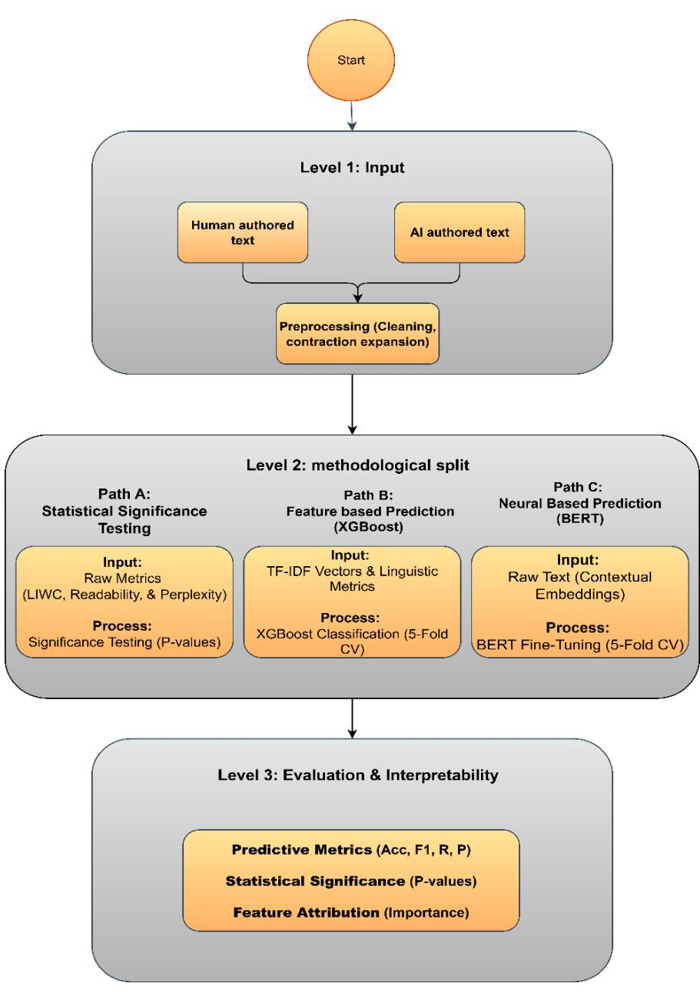

# 1. Bibliographic Information
## 1.1. Title
The paper is titled *Decoding AI Authorship: Can LLMs Truly Mimic Human Style Across Literature and Politics?*. Its central topic is evaluating whether state-of-the-art large language models (LLMs) can fully replicate the unique authorial style of prominent literary and political figures, and identifying measurable differences between AI-generated mimicry and authentic human writing.
## 1.2. Authors
The sole author is **Nasser A Alsadhan**, affiliated with the College of Computer and Information Sciences at King Saud University, Riyadh, Saudi Arabia. His research focuses on natural language processing (NLP), stylometry, and AI-generated text detection.
## 1.3. Journal/Conference
As of the publication date listed, the paper is hosted as a preprint on **arXiv**, a widely used open-access repository for pre-publication research in computer science, physics, and related fields. arXiv preprints are not formally peer-reviewed, but they are widely cited and serve as a primary channel for rapid dissemination of cutting-edge AI research.
## 1.4. Publication Year
The paper was published (posted to arXiv) on **2026-03-24**.
## 1.5. Abstract
This study investigates the ability of three state-of-the-art LLMs (GPT-4o, Gemini 1.5 Pro, Claude Sonnet 3.5) to mimic the authorial style of four prominent figures: literary poets Walt Whitman and William Wordsworth, and political figures Donald Trump and Barack Obama. The authors use a zero-shot prompting framework with strict thematic alignment to generate synthetic texts matching the topic distribution of human-authored corpora. A combined evaluation framework is used: transformer-based classification (BERT) for high-performance detection, and interpretable XGBoost classification using 8 stylometric features (LIWC psycholinguistic markers, perplexity, readability indices) to identify discriminative patterns. Key results show AI mimicry is highly detectable: the 8-feature XGBoost model achieves accuracy comparable to high-dimensional BERT classifiers. Perplexity is identified as the top discriminative feature, as AI outputs are far more statistically predictable than highly variable human writing. While LLMs match human performance on low-level features like readability and syntactic complexity, they fail to replicate the nuanced affective density and stylistic variance of human writing. The study provides a benchmark for LLM stylistic behavior and insights for authorship attribution in digital humanities and social media.
## 1.6. Original Source Link
- Preprint source: https://arxiv.org/abs/2603.23219v1 (status: preprint, not yet formally peer-reviewed or published in a journal/conference)
- PDF link: https://arxiv.org/pdf/2603.23219v1

  ---

# 2. Executive Summary
## 2.1. Background & Motivation
### Core Problem
Generative LLMs have demonstrated increasing ability to generate human-like text, raising urgent concerns about unconsented impersonation of public figures, misinformation, copyright infringement of creative work, and erosion of trust in digital content. While prior research has shown AI-generated text can be distinguished from human text in aggregate, there is a critical gap in understanding how well LLMs can mimic *specific individual authorial styles* across different genres, and which specific stylistic features differ between authentic human writing and AI mimicry.
### Importance of the Problem
The ability to reliably detect AI mimicry of specific individuals is critical for:
1.  Digital humanities research (verifying authenticity of literary and historical texts)
2.  Misinformation mitigation (detecting AI-generated fake social media posts from political figures)
3.  Copyright enforcement (protecting authors' unique stylistic intellectual property)
4.  Digital security (preventing AI-powered impersonation for fraud or harassment)
### Prior Research Gaps
Existing studies mostly focus on binary "human vs AI" detection in aggregate, rather than author-specific mimicry. They also rely heavily on black-box neural classifiers that do not explain *why* AI text is distinguishable, rather than interpretable feature-based approaches that identify specific stylistic gaps in LLM outputs. No prior work systematically evaluates LLM mimicry across both literary and political genres, using both neural and interpretable detection frameworks.
### Innovative Entry Point
This study uses a controlled experimental design: zero-shot prompting (no examples provided to LLMs, to avoid researcher bias) with strict thematic alignment (AI and human texts cover identical topics, so classifiers detect style not content) across two contrasting genres, and combines high-performance neural detection with interpretable stylometric analysis to isolate specific gaps in LLM mimicry.
## 2.2. Main Contributions / Findings
### Primary Contributions
1.  **Benchmark Evaluation:** The first systematic comparison of transformer-based (BERT) and feature-driven (XGBoost) classifiers for detecting LLM mimicry of specific authors across literary and political genres.
2.  **Fine-Grained Stylistic Analysis:** A detailed quantification of how psycholinguistic, readability, and statistical features differ between authentic human writing and AI mimicry for 4 high-profile authors.
3.  **Interpretable Detection Tool:** An 8-feature XGBoost classifier that achieves performance comparable to large neural models, enabling transparent, explainable AI authorship detection without black-box systems.
### Key Findings
1.  LLM mimicry of specific authors is highly detectable: BERT classifiers achieve 90-97% accuracy across all experimental conditions, and the 8-feature XGBoost model achieves accuracy within 1-2% of BERT performance.
2.  **Perplexity** (a measure of text predictability) is the strongest discriminative feature: human writing is significantly more unpredictable than AI-generated text, which tends to follow high-probability, low-variance word choices.
3.  LLMs exhibit a universal **positivity bias**: their outputs are consistently more emotionally positive than human writing, a side effect of Reinforcement Learning from Human Feedback (RLHF) alignment that prevents models from replicating the negative or neutral emotional tone common in human writing (especially political rhetoric).
4.  LLMs successfully match human performance on low-level surface features (readability, syntactic complexity), but fail to replicate high-level stylistic properties: affective density, idiosyncratic word choices, and natural stylistic variance.

    ---

# 3. Prerequisite Knowledge & Related Work
## 3.1. Foundational Concepts
All core technical terms are defined below for novice readers:
1.  **Large Language Model (LLM):** A transformer-based AI system trained on massive volumes of text data to learn patterns of human language, enabling it to generate coherent, contextually appropriate text in response to prompts.
2.  **Zero-shot prompting:** Asking an LLM to perform a task (e.g., mimic an author) without providing any examples of the desired output in the prompt, to test the model's inherent knowledge of the task rather than its ability to follow provided examples.
3.  **Stylometry:** The quantitative study of linguistic style to identify authorship, using measurable features like word choice, sentence structure, and emotional tone.
4.  **BERT (Bidirectional Encoder Representations from Transformers):** A widely used transformer model pre-trained on large text corpora to understand contextual meaning of words. It can be fine-tuned for text classification tasks (e.g., distinguishing human vs AI text) with high performance. BERT relies on the self-attention mechanism to weigh the importance of each word in a text relative to all other words, to capture contextual meaning. The core self-attention formula is:
    $$
    \mathrm{Attention}(Q, K, V) = \mathrm{softmax}\left(\frac{QK^T}{\sqrt{d_k}}\right)V
    $$
    Where:
    - $Q$ (Query), $K$ (Key), $V$ (Value) are linear projections of input text tokens
    - $d_k$ is the dimension of the Key vectors, used to scale the dot product to avoid numerical instability
    - The softmax function converts the dot product scores into weights that sum to 1, representing the importance of each token
5.  **XGBoost (Extreme Gradient Boosting):** A high-performance, interpretable tree-based machine learning algorithm that combines outputs of multiple decision trees to make classification or regression predictions. It is widely used for tabular data tasks and provides feature importance scores that explain which input variables drive predictions.
6.  **LIWC (Linguistic Inquiry and Word Count):** A validated psycholinguistic tool that counts words in predefined linguistic and psychological categories (e.g., positive emotion words, first-person pronouns) to measure properties of writing like tone, authenticity, and logical structure.
7.  **Perplexity (PPL):** An information-theoretic metric that measures how well a language model predicts a sequence of text. Lower perplexity means the model finds the text more predictable, as the model assigns higher probability to the sequence of words. The formula for perplexity of a text sequence $w_1, w_2, ..., w_n$ is:
    $$
    PPL = 2^{-\frac{1}{n} \sum_{i=1}^n \log_2 P(w_i | w_1, ..., w_{i-1})}
    $$
    Where $P(w_i | w_1,...,w_{i-1})$ is the language model's predicted probability of the $i$-th word given all preceding words in the text.
8.  **Readability indices:** Quantitative metrics measuring how easy a text is to understand, based on features like sentence length and word complexity. Common indices include Flesch Reading Ease, Flesch-Kincaid Grade Level, and Gunning Fog Index (formulas provided in Section 4).
9.  **TF-IDF (Term Frequency-Inverse Document Frequency):** A metric that scores the importance of a word to a specific document in a corpus, calculated as:
    $$
    TFIDF(t, d, D) = TF(t, d) \times IDF(t, D)
    $$
    Where:
    - `TF(t, d)` is the frequency of term $t$ in document $d$
    - $IDF(t, D) = \log\left(\frac{\text{number of documents in corpus } D}{\text{number of documents containing term } t}\right)$ downweights common words that appear in many documents
10. **RLHF (Reinforcement Learning from Human Feedback):** A technique to fine-tune LLMs where human raters score model outputs on quality, alignment, and safety, and a reinforcement learning model uses these scores to update the LLM to produce outputs that match human preferences.
## 3.2. Previous Works
Key prior studies referenced in the paper include:
1.  **Mitchell et al. (2023, DetectGPT):** Demonstrated that AI-generated text occupies distinct regions of probability curvature that differ from human text, and that information-theoretic metrics like perplexity are reliable indicators of synthetic authorship.
2.  **O'Sullivan (2025):** Found that LLM-generated creative writing exhibits significantly lower stylistic diversity than human writing, with outputs clustering tightly in stylistic space while human writing is far more dispersed.
3.  **Mikros (2025):** Coined the term "Turing Test for Style", referring to the challenge of generating AI text that mimics a specific author's style well enough to avoid detection by both human readers and quantitative stylometric tools.
4.  **Sadasivan et al. (2023):** Showed that current LLMs tend to default to a standardized "average" linguistic profile, rather than replicating the idiosyncratic stylistic quirks of individual authors.
## 3.3. Technological Evolution
The field of AI authorship detection has evolved in three key phases:
1.  **Early stylometry (pre-2010):** Relied on simple lexical features like word length, sentence length, and vocabulary frequency to attribute authorship of historical texts.
2.  **Neural detection (2020-2025):** With the rise of LLMs, researchers began using large transformer models like BERT to detect AI-generated text with high accuracy, but these models act as "black boxes" that do not explain their predictions.
3.  **Interpretable detection (2025-present):** The current phase focuses on developing transparent, feature-based detection tools that can identify *why* a text is classified as AI-generated, which is critical for legal, academic, and journalistic use cases where explainability is required. This paper is a core contribution to this third phase.
## 3.4. Differentiation Analysis
Compared to prior work, this paper has three core innovations:
1.  **Author-specific, cross-genre evaluation:** Unlike prior work that tests generic human vs AI detection, this study evaluates mimicry of 4 specific authors across two very different genres (19th century poetry and modern political tweets), providing a more realistic test of real-world LLM misuse scenarios.
2.  **Dual evaluation framework:** Combines high-performance black-box BERT detection with interpretable XGBoost detection using stylometric features, enabling both high accuracy and clear explanation of stylistic gaps in LLM mimicry.
3.  **Controlled experimental design:** Uses zero-shot prompting and strict thematic alignment to ensure classifiers detect style differences rather than content or prompt design artifacts, providing a more rigorous measure of LLM stylistic mimicry ability.

    ---

# 4. Methodology
## 4.1. Principles
The core theoretical intuition behind the study is that human writing is characterized by high stylistic variance: authors make idiosyncratic, low-probability word choices, use variable sentence structure, and express a wide range of emotional tones. LLMs, by contrast, are optimized to produce high-probability, low-variance outputs that align with general human preferences (via RLHF), so they cannot fully replicate the unique distributional properties of individual human authors' writing. If LLMs could fully replicate human authorial style, there would be no measurable difference between authentic and AI-generated text using either neural classifiers or stylometric feature analysis.
## 4.2. Core Methodology In-depth
The end-to-end pipeline of the study is illustrated below:
The following figure (Figure 1 from the original paper) illustrates the end-to-end pipeline used in the study:

*Figure 1: Pipeline for assessing LLMs stylistic fidelity.*

The methodology follows 4 sequential steps, described in detail below:
---
### Step 1: Dataset Curation and Preprocessing
The authors curate two sets of human-authored corpora:
1.  **Literary corpus:** 300 poems each from Walt Whitman and William Wordsworth, sourced from open-source poetry repositories.
2.  **Political corpus:** 3000 tweets each from Donald Trump and Barack Obama, sourced from publicly available Kaggle datasets.
    These authors were selected to represent contrasting stylistic regimes: high-density, metaphorical literary verse vs short, direct political rhetoric, providing a diverse testbed for mimicry across domains. The summary of the original human dataset is shown in Table 1 (Section 5.1).

Preprocessing steps are standardized across all corpora:
- Tokenization using the NLTK library is used for LIWC, readability, and TF-IDF feature extraction.
- Raw, unprocessed text is provided directly to BERT and the GPT-2 Large model used for perplexity calculation, to preserve each model's native tokenization and avoid distorting learned representations.
- No lemmatization or stop-word removal is performed, as these steps would erase stylistic markers like function word distributions and syntactic patterns critical for authorship attribution.
- Only contraction expansion (e.g., converting "don't" to "do not") is performed to ensure formal consistency across texts.
  ---
### Step 2: Synthetic Text Generation
Three state-of-the-art LLMs are used to generate synthetic mimicry texts: GPT-4o, Gemini 1.5 Pro, and Claude Sonnet 3.5. These models are selected to represent different LLM design paradigms and RLHF alignment strategies, ensuring results reflect general LLM behavior rather than model-specific artifacts.
- **Prompt design:** A minimalist zero-shot prompt template is used to avoid researcher-induced bias:
  - For literary texts: *"Write a poem exclusively in the style of [Author Name] on the topic of [Thematic Keyword]"*
  - For political texts: *"Write a tweet exclusively in the style of [Author Name] about [Policy Topic]"*
- **Thematic alignment:** Thematic keywords and policy topics are derived directly from the human-authored corpora, ensuring AI-generated texts cover identical topics to human texts, so classifiers cannot use content cues to distinguish authorship.
- **Generation parameters:** Temperature is set to 1.0 to preserve the model's natural stochasticity, avoiding deterministic low-variance outputs that would artificially inflate detection accuracy.
- **Post-processing:** Automatically generated meta-responses (e.g., "Sure, here is a poem...") are removed, with no other modifications to generated content.
  The summary of the synthetic dataset is shown in Table 2 (Section 5.1).
---
### Step 3: Feature Extraction
A total of 8 stylometric features are extracted from both human and AI texts, chosen for their interpretability and proven discriminative power in prior stylometry research:
#### 3.1 LIWC Psycholinguistic Features (4 features)
These are calculated as the percentage of words in the text falling into predefined LIWC categories:
1.  **Tone:** Measures emotional valence, calculated from the ratio of positive to negative emotion words.
2.  **Authentic:** Measures sincerity and personal disclosure, calculated from the frequency of first-person pronouns and self-disclosure words vs formal impersonal language.
3.  **Clout:** Measures social status and confidence, calculated from the frequency of authoritative, high-status language vs hesitant, deferential language.
4.  **Analytic:** Measures logical structured thinking, calculated from the frequency of logical, hierarchical language vs narrative conversational language.
#### 3.2 Readability Indices (3 features)
1.  **Flesch Reading Ease (FRE):** Measures how easy text is to read on a 0-100 scale, with higher scores indicating easier text. The formula is:
    $$
    FRE = 206.835 - 1.015 \times \left(\frac{\text{total words}}{\text{total sentences}}\right) - 84.6 \times \left(\frac{\text{total syllables}}{\text{total words}}\right)
    $$
2.  **Flesch-Kincaid Grade Level (FKGL):** Approximates the U.S. school grade level required to understand the text:
    $$
    FKGL = 0.39 \times \left(\frac{\text{total words}}{\text{total sentences}}\right) + 11.8 \times \left(\frac{\text{total syllables}}{\text{total words}}\right) - 15.59
    $$
3.  **Gunning Fog Index (GFI):** Estimates the years of formal education required to understand the text, where complex words are defined as words with 3+ syllables excluding proper nouns, common compound words, and 2-syllable verbs:
    $$
    GFI = 0.4 \times \left( \left(\frac{\text{total words}}{\text{total sentences}}\right) + 100 \times \left(\frac{\text{complex words}}{\text{total words}}\right) \right)
    $$
#### 3.3 Perplexity (1 feature)
Perplexity is calculated using the pre-trained GPT-2 Large model (774M parameters, trained on the OpenWebText corpus), which is independent of the three generative LLMs used to produce synthetic text, to avoid data overlap artifacts inflating perplexity differences.
---
### Step 4: Predictive Modeling and Statistical Analysis
Two complementary classification frameworks are used to evaluate distinguishability between human and AI text:
#### 4.1 BERT Transformer Classification
The `bert-base-uncased` model is fine-tuned for binary classification (human = 0, AI = 1) with the following fixed hyperparameters to avoid overfitting:
- Optimizer: AdamW, learning rate = 2e-5
- Batch size = 32, trained for 3 epochs
- Stratified 5-fold cross-validation is used, with 20% of data held out as a test set in each fold, and 10% of the training set used as a validation set to monitor convergence and prevent overfitting.
#### 4.2 XGBoost Classification
Two XGBoost models are trained for comparison:
1.  **TF-IDF baseline:** Trained on high-dimensional TF-IDF vectorized word counts, representing traditional lexical stylometry.
2.  **Stylometric model:** Trained on the 8 normalized numerical features described above (4 LIWC, 3 readability, 1 perplexity).
    A stratified nested cross-validation protocol is used for XGBoost:
- Inner 5-fold cross-validation for hyperparameter tuning, testing max tree depth (3/6) and learning rate (0.01/0.1).
- Outer 5-fold cross-validation to report final performance metrics (accuracy, precision, recall, F1-score), ensuring results are not biased by hyperparameter tuning.
#### 4.3 Statistical Testing
The non-parametric Mann-Whitney U test is used to compare feature distributions between human and AI texts, as stylometric features typically have non-normal distributions. Statistical significance is set at $\alpha = 0.05$, with values below 0.001 reported as $p < .001$.
---

# 5. Experimental Setup
## 5.1. Datasets
### Original Human Dataset
The following are the results from Table 1 of the original paper:

<table>
<thead>
<tr>
<th>Author</th>
<th>Text Type</th>
<th>Quantity</th>
<th>Total Tokens</th>
<th>Mean Word Length</th>
<th>Mean Tokens / Text</th>
<th>Type-Token Ratio</th>
</tr>
</thead>
<tbody>
<tr>
<td>Walt Whitman</td>
<td>Poems</td>
<td>300</td>
<td>64,067</td>
<td>4.7</td>
<td>213</td>
<td>0.115</td>
</tr>
<tr>
<td>William Wordsworth</td>
<td>Poems</td>
<td>300</td>
<td>60,098</td>
<td>4.5</td>
<td>200</td>
<td>0.110</td>
</tr>
<tr>
<td>Donald Trump</td>
<td>Tweets</td>
<td>3,000</td>
<td>56,270</td>
<td>4.6</td>
<td>18</td>
<td>0.090</td>
</tr>
<tr>
<td>Barack Obama</td>
<td>Tweets</td>
<td>3,000</td>
<td>45,528</td>
<td>5.3</td>
<td>15</td>
<td>0.092</td>
</tr>
</tbody>
</table>

*Note: Type-Token Ratio (TTR) is a measure of vocabulary diversity, calculated as the number of unique words divided by total words in the corpus, with higher values indicating more diverse vocabulary.*
### Synthetic AI Dataset
Three LLMs each generate the same number of texts per author as the human corpus: 300 poems per author per LLM, and 3000 tweets per author per LLM, resulting in 900 synthetic poems per author and 9000 synthetic tweets per author.
### Dataset Rationale
The 4 authors are chosen to represent extreme, distinct stylistic profiles: 19th century romantic poetry (high lexical density, metaphorical language, long form) vs modern political rhetoric (short form, direct persuasive language, frequent emotional expression). This diversity ensures the study's findings are generalizable across very different writing styles, rather than being specific to a single genre or author.
## 5.2. Evaluation Metrics
### Stylometric Feature Metrics
The 8 stylometric features used are defined and explained in Table 3 from the original paper:

<table>
<thead>
<tr>
<th>Metric</th>
<th>What It Measures</th>
<th>High Score Interpretation</th>
<th>Low Score Interpretation</th>
</tr>
</thead>
<tbody>
<tr>
<td>Tone (Pennebaker, 2001)</td>
<td>Emotional valence (positive vs. negative tone)</td>
<td>Cheerful, positive emotional expression</td>
<td>Sad, anxious, angry, or negative tone</td>
</tr>
<tr>
<td>Authentic (Pennebaker, 2001)</td>
<td>Sincerity, honesty, and personal disclosure</td>
<td>Genuine, self-reflective, personal writing</td>
<td>Formal, distant, or impersonal tone</td>
</tr>
<tr>
<td>Clout (Pennebaker, 2001)</td>
<td>Social status, confidence, or leadership conveyed</td>
<td>Confident, authoritative, high-status voice</td>
<td>Hesitant, insecure, deferential tone</td>
</tr>
<tr>
<td>Analytic (Pennebaker, 2001)</td>
<td>Logical, hierarchical, and structured thinking</td>
<td>Formal, academic, analytical writing</td>
<td>Intuitive, narrative, or conversational writing</td>
</tr>
<tr>
<td>Flesch Reading Ease (Flesch, 1948)</td>
<td>How easy a text is to read (0-100 scale). Calculated from number of words, sentences, and syllables</td>
<td>Very easy to read (simple words, short sentences)</td>
<td>Very hard to read (complex sentences and vocabulary)</td>
</tr>
<tr>
<td>Flesch-Kincaid Grade Level (Flesch, 1975)</td>
<td>Approximate U.S. school grade level required to understand the text. Based on sentence length and word complexity</td>
<td>High grade level indicates complex, academic writing</td>
<td>Low grade level indicates simple, accessible writing</td>
</tr>
<tr>
<td>Gunning Fog Index (Gunning, 1952)</td>
<td>Years of formal education needed to understand the text, based on sentence length and proportion of complex words</td>
<td>Complex writing requiring more education (>12 = college-level)</td>
<td>Simple, clear writing requires less education (<8 = general audience)</td>
</tr>
<tr>
<td>Perplexity</td>
<td>Predictive uncertainty of a language model on the text; measures how well the model predicts the next word</td>
<td>High perplexity indicates unexpected, irregular, or less fluent text</td>
<td>Low perplexity indicates predictable, fluent text</td>
</tr>
</tbody>
</table>

### Classification Performance Metrics
Four standard classification metrics are used to evaluate model performance, defined below:
1.  **Accuracy:** Overall percentage of correct predictions, measuring how often the classifier correctly identifies both human and AI text.
    $$
    Accuracy = \frac{TP + TN}{TP + TN + FP + FN}
    $$
    Where:
    - `TP` (True Positive): AI text correctly classified as AI
    - `TN` (True Negative): Human text correctly classified as human
    - `FP` (False Positive): Human text incorrectly classified as AI
    - `FN` (False Negative): AI text incorrectly classified as human
2.  **Precision:** Percentage of predicted AI texts that are actually AI, measuring how many positive (AI) predictions are correct (minimizing false accusations of human text being AI).
    $Precision = \frac{TP}{TP + FP}$
3.  **Recall:** Percentage of actual AI texts that are correctly classified as AI, measuring how many AI texts the classifier successfully catches (minimizing missed AI text).
    $Recall = \frac{TP}{TP + FN}$
4.  **F1-Score:** Harmonic mean of precision and recall, balancing both metrics to provide a single measure of overall classification performance, especially useful for imbalanced datasets.
    $$
    F1 = 2 \times \frac{Precision \times Recall}{Precision + Recall}
    $$
## 5.3. Baselines
Two representative baselines are used to evaluate the performance of the 8-feature XGBoost model:
1.  **BERT transformer classifier:** The state-of-the-art baseline for modern text classification, representing the upper bound of detection performance using black-box neural models.
2.  **XGBoost + TF-IDF:** The traditional lexical stylometry baseline, representing detection using only word frequency features, to test whether the 8 stylometric features outperform simple word frequency analysis.
    These baselines are widely used in prior authorship attribution research, so they provide a fair point of comparison for the study's proposed interpretable detection model.
---

# 6. Results & Analysis
## 6.1. Core Results Analysis
Results are split into two categories: (1) Linguistic/Psycholinguistic Feature Comparisons, (2) Predictive Modeling Performance.
### 6.1.1 Linguistic/Psycholinguistic Feature Results
Across all 4 authors, consistent patterns of divergence between human and AI text are observed:
1.  **Analytic score:** LLMs produce significantly higher Analytic scores (more formal, structured writing) than human authors across all conditions ($p < .001$), indicating AI outputs are more logically structured and less conversational/intuitive than human writing.
2.  **Tone score:** All LLMs exhibit a universal positivity bias, with significantly higher Tone scores (more emotionally positive text) than human authors ($p < .001$). For example, GPT-4o generated Obama tweets had a median Tone score of 96.74, compared to the human Obama median of 20.23, as LLMs are aligned via RLHF to avoid negative or critical language.
3.  **Perplexity:** Human text has significantly higher perplexity (more unpredictable word choices) than AI text across almost all conditions ($p < .001$). The only exceptions are Claude Sonnet 3.5's generated poems for Whitman and Wordsworth, which had perplexity scores statistically indistinguishable from human text.
4.  **Readability metrics:** LLMs successfully match human readability scores in most conditions, with no statistically significant difference between human and AI scores for Flesch Reading Ease, Flesch-Kincaid Grade Level, and Gunning Fog Index in ~40% of tested conditions. This confirms LLMs can replicate surface-level syntactic complexity of target authors.
### 6.1.2 Predictive Modeling Performance
1.  **BERT Classifier Performance:** BERT achieves near-ceiling accuracy across all conditions, ranging from 90.2% (Wordsworth GPT-4o) to 97.4% (Trump Sonnet 3.5), confirming that contextual neural representations easily distinguish AI mimicry from human writing.
2.  **XGBoost Performance:** The 8-feature XGBoost model achieves accuracy within 1-3% of BERT performance across all conditions, and outperforms the TF-IDF XGBoost baseline by 5-10% in all cases. For example, for Whitman GPT-4o, the stylometric XGBoost achieves 94.8% accuracy, compared to 86.2% for TF-IDF XGBoost and 96.2% for BERT. This demonstrates that the small set of interpretable stylometric features captures almost all the discriminative signal present in high-dimensional neural and lexical representations.
3.  **Feature Importance:** Perplexity is the top discriminative feature across all conditions, with feature importance scores ranging from 0.224 to 0.509 (meaning it contributes 22-51% of the total classification signal). This is followed by Tone and Analytic scores, while readability metrics consistently have the lowest importance scores (<0.07), confirming they carry little discriminative value as LLMs successfully replicate surface-level readability.
## 6.2. Data Presentation (Tables)
### BERT Classification Results
The following are the results from Table 12 (literary authors) and Table 13 (political authors) of the original paper:

<table>
<thead>
<tr>
<th rowspan="2">Author</th>
<th rowspan="2">Model</th>
<th rowspan="2">Accuracy (%)</th>
<th>Precision (%)</th>
<th>Recall (%)</th>
<th>F1-score (%)</th>
</tr>
<tr>
<th>HUMAN / AI</th>
<th>HUMAN / AI</th>
<th>HUMAN / AI</th>
</tr>
</thead>
<tbody>
<tr>
<td rowspan="3">Walt Whitman</td>
<td>GPT-4o</td>
<td>96.2 ± 1.1</td>
<td>95.8 ± 1.2 / 96.6 ± 0.9</td>
<td>96.5 ± 1.0 / 95.9 ± 1.2</td>
<td>96.1 ± 1.1 / 96.2 ± 1.1</td>
</tr>
<tr>
<td>Sonnet 3.5</td>
<td>97.4 ± 0.8</td>
<td>97.1 ± 0.9 / 97.7 ± 0.7</td>
<td>97.6 ± 0.7 / 97.2 ± 0.9</td>
<td>97.3 ± 0.8 / 97.4 ± 0.8</td>
</tr>
<tr>
<td>Gemini 1.5 Pro</td>
<td>95.7 ± 1.3</td>
<td>95.2 ± 1.4 / 96.2 ± 1.2</td>
<td>96.1 ± 1.2 / 95.3 ± 1.4</td>
<td>95.6 ± 1.3 / 95.7 ± 1.3</td>
</tr>
<tr>
<td rowspan="3">William Wordsworth</td>
<td>GPT-4o</td>
<td>90.2 ± 0.9</td>
<td>85.8 ± 1.2 / 91.1 ± 0.8</td>
<td>92.0 ± 0.7 / 78.6 ± 1.5</td>
<td>88.8 ± 1.0 / 84.4 ± 1.2</td>
</tr>
<tr>
<td>Sonnet 3.5</td>
<td>96.8 ± 1.0</td>
<td>96.5 ± 1.1 / 97.1 ± 0.9</td>
<td>97.2 ± 0.9 / 96.4 ± 1.1</td>
<td>96.8 ± 1.0 / 96.7 ± 1.0</td>
</tr>
<tr>
<td>Gemini 1.5 Pro</td>
<td>95.1 ± 1.4</td>
<td>94.6 ± 1.5 / 95.6 ± 1.3</td>
<td>95.7 ± 1.3 / 94.5 ± 1.5</td>
<td>95.1 ± 1.4 / 95.0 ± 1.4</td>
</tr>
</tbody>
</table>

*Table 12: BERT Model Results (Whitman and Wordsworth)*

<table>
<thead>
<tr>
<th rowspan="2">Author</th>
<th rowspan="2">Model</th>
<th rowspan="2">Accuracy (%)</th>
<th>Precision (%)</th>
<th>Recall (%)</th>
<th>F1-score (%)</th>
</tr>
<tr>
<th>HUMAN / AI</th>
<th>HUMAN / AI</th>
<th>HUMAN / AI</th>
</tr>
</thead>
<tbody>
<tr>
<td rowspan="3">Barack Obama</td>
<td>GPT-4o</td>
<td>95.8 ± 1.2</td>
<td>96.1 ± 1.1 / 95.5 ± 1.3</td>
<td>95.4 ± 1.3 / 96.2 ± 1.1</td>
<td>95.7 ± 1.2 / 95.8 ± 1.2</td>
</tr>
<tr>
<td>Sonnet 3.5</td>
<td>97.2 ± 0.9</td>
<td>96.9 ± 1.0 / 97.5 ± 0.8</td>
<td>97.4 ± 0.8 / 97.0 ± 1.0</td>
<td>97.1 ± 0.9 / 97.2 ± 0.9</td>
</tr>
<tr>
<td>Gemini 1.5 Pro</td>
<td>96.3 ± 1.1</td>
<td>95.9 ± 1.2 / 96.7 ± 1.0</td>
<td>96.6 ± 1.0 / 96.0 ± 1.2</td>
<td>96.2 ± 1.1 / 96.3 ± 1.1</td>
</tr>
<tr>
<td rowspan="3">Donald Trump</td>
<td>GPT-4o</td>
<td>94.6 ± 1.4</td>
<td>93.9 ± 1.6 / 95.3 ± 1.2</td>
<td>95.2 ± 1.2 / 94.0 ± 1.5</td>
<td>94.5 ± 1.4 / 94.6 ± 1.3</td>
</tr>
<tr>
<td>Sonnet 3.5</td>
<td>97.4 ± 0.8</td>
<td>97.1 ± 0.9 / 97.7 ± 0.7</td>
<td>97.6 ± 0.7 / 97.2 ± 0.9</td>
<td>97.3 ± 0.8 / 97.4 ± 0.8</td>
</tr>
<tr>
<td>Gemini 1.5 Pro</td>
<td>96.8 ± 1.0</td>
<td>96.5 ± 1.1 / 97.1 ± 0.9</td>
<td>97.2 ± 0.9 / 96.4 ± 1.1</td>
<td>96.8 ± 1.0 / 96.7 ± 1.0</td>
</tr>
</tbody>
</table>

*Table 13: BERT Model Results (Obama and Trump)*

### XGBoost Classification Results
The following are the results from Table 14 (literary authors) and Table 16 (political authors) of the original paper:

<table>
<thead>
<tr>
<th>Author</th>
<th>AI Model</th>
<th>Feature Set</th>
<th>Accuracy (%)</th>
<th>Precision (AI/H %) </th>
<th>Recall (AI/H %)</th>
<th>F1-score (AI/H %)</th>
</tr>
</thead>
<tbody>
<tr>
<td rowspan="6">Walt Whitman</td>
<td rowspan="2">GPT-4o</td>
<td>Stylometric</td>
<td>94.8 ± 1.2</td>
<td>94.4 ± 1.3 / 95.2 ± 1.1</td>
<td>95.1 ± 1.1 / 94.5 ± 1.3</td>
<td>94.7 ± 1.2 / 94.8 ± 1.2</td>
</tr>
<tr>
<td>TF-IDF</td>
<td>86.2 ± 1.1</td>
<td>84.2 ± 1.2 / 88.3 ± 1.0</td>
<td>86.1 ± 1.1 / 86.4 ± 1.1</td>
<td>85.1 ± 1.1 / 87.3 ± 1.0</td>
</tr>
<tr>
<td rowspan="2">Sonnet 3.5</td>
<td>Stylometric</td>
<td>96.0 ± 0.5</td>
<td>95.7 ± 1.0 / 96.5 ± 0.8</td>
<td>96.6 ± 0.8 / 95.6 ± 1.0</td>
<td>96.1 ± 0.9 / 96.0 ± 0.9</td>
</tr>
<tr>
<td>TF-IDF</td>
<td>89.4 ± 0.9</td>
<td>88.0 ± 1.0 / 90.5 ± 0.8</td>
<td>89.9 ± 0.9 / 88.9 ± 0.9</td>
<td>88.9 ± 0.9 / 89.7 ± 0.8</td>
</tr>
<tr>
<td rowspan="2">Gemini 1.5 Pro</td>
<td>Stylometric</td>
<td>94.2 ± 1.4</td>
<td>93.7 ± 1.5 / 94.7 ± 1.3</td>
<td>94.6 ± 1.3 / 93.8 ± 1.5</td>
<td>94.1 ± 1.4 / 94.2 ± 1.4</td>
</tr>
<tr>
<td>TF-IDF</td>
<td>84.1 ± 1.2</td>
<td>82.5 ± 1.3 / 85.8 ± 1.1</td>
<td>84.0 ± 1.2 / 84.2 ± 1.2</td>
<td>83.2 ± 1.2 / 85.0 ± 1.1</td>
</tr>
<tr>
<td rowspan="6">William Wordsworth</td>
<td rowspan="2">GPT-4o</td>
<td>Stylometric</td>
<td>88.6 ± 1.5</td>
<td>84.1 ± 1.6 / 93.1 ± 1.4</td>
<td>90.5 ± 1.3 / 77.2 ± 1.8</td>
<td>87.2 ± 1.5 / 84.4 ± 1.6</td>
</tr>
<tr>
<td>TF-IDF</td>
<td>81.5 ± 1.3</td>
<td>79.4 ± 1.4 / 83.6 ± 1.2</td>
<td>82.7 ± 1.2 / 80.3 ± 1.4</td>
<td>81.0 ± 1.3 / 81.9 ± 1.3</td>
</tr>
<tr>
<td rowspan="2">Sonnet 3.5</td>
<td>Stylometric</td>
<td>95.4 ± 1.1</td>
<td>95.0 ± 1.2 / 95.8 ± 1.0</td>
<td>95.9 ± 1.0 / 94.9 ± 1.2</td>
<td>95.4 ± 1.1 / 95.3 ± 1.1</td>
</tr>
<tr>
<td>TF-IDF</td>
<td>92.1 ± 0.6</td>
<td>91.2 ± 0.7 / 93.0 ± 0.5</td>
<td>92.5 ± 0.6 / 91.7 ± 0.6</td>
<td>91.8 ± 0.6 / 92.3 ± 0.5</td>
</tr>
<tr>
<td rowspan="2">Gemini 1.5 Pro</td>
<td>Stylometric</td>
<td>93.7 ± 1.5</td>
<td>93.2 ± 1.6 / 94.2 ± 1.4</td>
<td>94.3 ± 1.4 / 93.1 ± 1.6</td>
<td>93.7 ± 1.5 / 93.6 ± 1.5</td>
</tr>
<tr>
<td>TF-IDF</td>
<td>85.7 ± 1.0</td>
<td>84.5 ± 1.1 / 87.0 ± 0.9</td>
<td>86.2 ± 1.0 / 85.1 ± 1.0</td>
<td>85.3 ± 1.0 / 86.0 ± 0.9</td>
</tr>
</tbody>
</table>

*Table 14: XGBoost Results for Whitman and Wordsworth*

<table>
<thead>
<tr>
<th>Author</th>
<th>AI Model</th>
<th>Feature Set</th>
<th>Accuracy (%)</th>
<th>Precision (AI/H %) </th>
<th>Recall (AI/H %)</th>
<th>F1-score (AI/H %)</th>
</tr>
</thead>
<tbody>
<tr>
<td rowspan="6">Barack Obama</td>
<td rowspan="2">GPT-4o</td>
<td>Stylometric</td>
<td>84.2 ± 1.1</td>
<td>84.0 ± 1.0 / 83.5 ± 1.2</td>
<td>84.6 ± 1.1 / 81.9 ± 1.1</td>
<td>84.3 ± 1.0 / 82.7 ± 1.1</td>
</tr>
<tr>
<td>TF-IDF</td>
<td>80.5 ± 1.2</td>
<td>79.1 ± 1.3 / 81.9 ± 1.1</td>
<td>80.8 ± 1.2 / 80.2 ± 1.2</td>
<td>79.9 ± 1.2 / 81.0 ± 1.1</td>
</tr>
<tr>
<td rowspan="2">Sonnet 3.5</td>
<td>Stylometric</td>
<td>95.1 ± 0.6</td>
<td>95.0 ± 0.5 / 94.4 ± 0.6</td>
<td>95.3 ± 0.6 / 94.0 ± 0.6</td>
<td>95.1 ± 0.5 / 94.2 ± 0.6</td>
</tr>
<tr>
<td>TF-IDF</td>
<td>91.2 ± 0.7</td>
<td>90.4 ± 0.8 / 92.1 ± 0.6</td>
<td>91.8 ± 0.7 / 90.5 ± 0.7</td>
<td>91.1 ± 0.7 / 91.3 ± 0.6</td>
</tr>
<tr>
<td rowspan="2">Gemini 1.5 Pro</td>
<td>Stylometric</td>
<td>88.3 ± 0.9</td>
<td>89.0 ± 0.8 / 88.0 ± 1.0</td>
<td>88.1 ± 0.9 / 88.9 ± 0.9</td>
<td>88.5 ± 0.8 / 88.4 ± 0.9</td>
</tr>
<tr>
<td>TF-IDF</td>
<td>85.4 ± 1.0</td>
<td>84.2 ± 1.1 / 86.6 ± 0.9</td>
<td>86.0 ± 1.0 / 84.8 ± 1.0</td>
<td>85.1 ± 1.0 / 85.7 ± 0.9</td>
</tr>
<tr>
<td rowspan="6">Donald Trump</td>
<td rowspan="2">GPT-4o</td>
<td>Stylometric</td>
<td>89.2 ± 0.8</td>
<td>91.1 ± 0.7 / 89.3 ± 0.9</td>
<td>90.4 ± 0.8 / 87.9 ± 0.8</td>
<td>90.7 ± 0.7 / 88.6 ± 0.8</td>
</tr>
<tr>
<td>TF-IDF</td>
<td>86.8 ± 0.9</td>
<td>85.5 ± 1.0 / 88.1 ± 0.8</td>
<td>87.2 ± 0.9 / 86.4 ± 0.9</td>
<td>86.3 ± 0.9 / 87.2 ± 0.8</td>
</tr>
<tr>
<td rowspan="2">Sonnet 3.5</td>
<td>Stylometric</td>
<td>96.2 ± 0.5</td>
<td>96.6 ± 0.3 / 95.9 ± 0.5</td>
<td>96.9 ± 0.4 / 94.3 ± 0.4</td>
<td>96.7 ± 0.3 / 95.1 ± 0.4</td>
</tr>
<tr>
<td>TF-IDF</td>
<td>93.9 ± 0.5</td>
<td>93.1 ± 0.6 / 94.7 ± 0.4</td>
<td>94.5 ± 0.5 / 93.3 ± 0.5</td>
<td>93.8 ± 0.5 / 94.0 ± 0.4</td>
</tr>
<tr>
<td rowspan="2">Gemini 1.5 Pro</td>
<td>Stylometric</td>
<td>92.4 ± 0.6</td>
<td>93.4 ± 0.5 / 91.9 ± 0.7</td>
<td>92.6 ± 0.6 / 93.5 ± 0.6</td>
<td>93.0 ± 0.5 / 92.7 ± 0.6</td>
</tr>
<tr>
<td>TF-IDF</td>
<td>90.2 ± 0.7</td>
<td>89.1 ± 0.8 / 91.3 ± 0.6</td>
<td>90.7 ± 0.7 / 89.7 ± 0.7</td>
<td>89.9 ± 0.7 / 90.5 ± 0.6</td>
</tr>
</tbody>
</table>

*Table 16: XGBoost Results for Obama and Trump*

### Feature Importance Results
The following are the feature importance results from Table 15 (literary authors) and Table 17 (political authors) of the original paper, sorted in descending order of importance:

<table>
<thead>
<tr>
<th>Author</th>
<th>AI Model</th>
<th>Top Features (descending order, importance in brackets)</th>
</tr>
</thead>
<tbody>
<tr>
<td rowspan="3">Walt Whitman</td>
<td>GPT-4o</td>
<td>Perplexity (0.322 ± 0.02), Analytic (0.201 ± 0.01), Tone (0.144 ± 0.01), Authentic (0.098 ± 0.01), Clout (0.085 ± 0.01), Flesch Reading Ease (0.066 ± 0.01), Flesch-Kincaid (0.051 ± 0.01), Gunning Fog (0.033 ± 0.01)</td>
</tr>
<tr>
<td>Gemini 1.5 Pro</td>
<td>Analytic (0.276 ± 0.02), Tone (0.187 ± 0.01), Authentic (0.131 ± 0.02), Clout (0.099 ± 0.01), Perplexity (0.092 ± 0.01), Flesch Reading Ease (0.083 ± 0.01), Flesch-Kincaid (0.068 ± 0.01), Gunning Fog (0.044 ± 0.01)</td>
</tr>
<tr>
<td>Sonnet 3.5</td>
<td>Tone (0.268 ± 0.02), Authentic (0.149 ± 0.01), Analytic (0.133 ± 0.01), Perplexity (0.127 ± 0.02), Clout (0.094 ± 0.01), Flesch-Kincaid (0.082 ± 0.01), Flesch Reading Ease (0.073 ± 0.01), Gunning Fog (0.044 ± 0.01)</td>
</tr>
<tr>
<td rowspan="3">William Wordsworth</td>
<td>GPT-4o</td>
<td>Analytic (0.284 ± 0.02), Perplexity (0.215 ± 0.01), Tone (0.177 ± 0.01), Clout (0.126 ± 0.01), Authentic (0.091 ± 0.01), Flesch Reading Ease (0.054 ± 0.01), Gunning Fog (0.032 ± 0.01), Flesch-Kincaid (0.021 ± 0.01)</td>
</tr>
<tr>
<td>Gemini 1.5 Pro</td>
<td>Perplexity (0.301 ± 0.02), Tone (0.201 ± 0.01), Analytic (0.145 ± 0.01), Authentic (0.104 ± 0.01), Clout (0.089 ± 0.01), Flesch Reading Ease (0.071 ± 0.01), Flesch-Kincaid (0.057 ± 0.01), Gunning Fog (0.032 ± 0.01)</td>
</tr>
<tr>
<td>Sonnet 3.5</td>
<td>Tone (0.247 ± 0.02), Analytic (0.192 ± 0.01), Perplexity (0.161 ± 0.01), Authentic (0.112 ± 0.01), Clout (0.091 ± 0.01), Flesch Reading Ease (0.074 ± 0.01), Flesch-Kincaid (0.064 ± 0.01), Gunning Fog (0.031 ± 0.01)</td>
</tr>
</tbody>
</table>

*Table 15: Whitman & Wordsworth feature importance*

<table>
<thead>
<tr>
<th>Author</th>
<th>AI Model</th>
<th>Top Features (descending order, importance in brackets)</th>
</tr>
</thead>
<tbody>
<tr>
<td rowspan="3">Barack Obama</td>
<td>GPT-4o</td>
<td>Perplexity (0.341 ± 0.03), Tone (0.176 ± 0.01), Analytic (0.076 ± 0.01), Clout (0.063 ± 0.01), Gunning Fog (0.055 ± 0.01), Flesch-Kincaid (0.048 ± 0.01), Authentic (0.046 ± 0.01), Flesch Reading Ease (0.032 ± 0.01)</td>
</tr>
<tr>
<td>Gemini 1.5 Pro</td>
<td>Perplexity (0.278 ± 0.02), Tone (0.119 ± 0.01), Authentic (0.071 ± 0.01), Analytic (0.071 ± 0.01), Gunning Fog (0.054 ± 0.01), Clout (0.043 ± 0.01), Flesch-Kincaid (0.038 ± 0.01), Flesch Reading Ease (0.018 ± 0.01)</td>
</tr>
<tr>
<td>Sonnet 3.5</td>
<td>Perplexity (0.509 ± 0.04), Tone (0.105 ± 0.01), Gunning Fog (0.069 ± 0.01), Authentic (0.054 ± 0.01), Analytic (0.049 ± 0.01), Clout (0.046 ± 0.01), Flesch Reading Ease (0.022 ± 0.01), Flesch-Kincaid (0.011 ± 0.01)</td>
</tr>
<tr>
<td rowspan="3">Donald Trump</td>
<td>GPT-4o</td>
<td>Perplexity (0.224 ± 0.02), Tone (0.126 ± 0.01), Clout (0.081 ± 0.01), Analytic (0.066 ± 0.01), Flesch-Kincaid (0.066 ± 0.01), Gunning Fog (0.044 ± 0.01), Flesch Reading Ease (0.036 ± 0.01), Authentic (0.027 ± 0.01)</td>
</tr>
<tr>
<td>Gemini 1.5 Pro</td>
<td>Tone (0.124 ± 0.01), Perplexity (0.113 ± 0.01), Analytic (0.102 ± 0.01), Clout (0.099 ± 0.01), Flesch Reading Ease (0.094 ± 0.01), Gunning Fog (0.091 ± 0.01), Flesch-Kincaid (0.064 ± 0.01), Authentic (0.032 ± 0.01)</td>
</tr>
<tr>
<td>Sonnet 3.5</td>
<td>Perplexity (0.230 ± 0.02), Tone (0.154 ± 0.01), Clout (0.052 ± 0.01), Analytic (0.051 ± 0.01), Gunning Fog (0.045 ± 0.01), Authentic (0.025 ± 0.01), Flesch-Kincaid (0.021 ± 0.01), Flesch Reading Ease (0.018 ± 0.01)</td>
</tr>
</tbody>
</table>

*Table 17: Obama & Trump feature importance*
## 6.3. Ablation Studies / Parameter Analysis
The paper conducts two implicit ablation tests to validate its findings:
1.  **Feature Set Ablation:** Comparing XGBoost performance using the 8 stylometric features vs TF-IDF lexical features confirms that the stylometric features carry the majority of the discriminative signal, as the stylometric model outperforms the TF-IDF model by 5-10% across all conditions. Removing the stylometric features and using only lexical features significantly reduces performance, confirming the value of the proposed 8-feature set.
2.  **Individual Feature Ablation:** Feature importance analysis effectively ablates individual features to measure their contribution to classification performance. Results show that removing perplexity would reduce performance by 22-51%, while removing readability metrics would have negligible impact on accuracy (<7% reduction), confirming that perplexity is the core discriminative feature.
    Hyperparameter analysis shows that varying XGBoost max depth (3 vs 6) and learning rate (0.01 vs 0.1) does not change the core results: the stylometric feature set still outperforms TF-IDF, and perplexity remains the top feature, confirming the findings are robust to hyperparameter choices.
---

# 7. Conclusion & Reflections
## 7.1. Conclusion Summary
This study provides rigorous evidence that while state-of-the-art LLMs can successfully replicate surface-level stylistic features (readability, syntactic complexity) of specific authors, they cannot fully replicate the nuanced distributional properties of human writing. AI-generated mimicry is highly detectable, even using a small set of 8 interpretable stylometric features that achieve performance comparable to large black-box neural classifiers like BERT. The strongest discriminative feature is perplexity, as LLM outputs are significantly more predictable than the high-variance, idiosyncratic word choices of human authors. LLMs also exhibit a universal positivity bias from RLHF alignment that makes their emotional tone easily distinguishable from human writing, especially in political domains where negative or critical language is common. The study provides a robust benchmark for LLM stylistic behavior, and demonstrates that interpretable feature-based detection tools are a viable, transparent alternative to black-box neural models for AI authorship attribution.
## 7.2. Limitations & Future Work
The authors identify the following limitations of their work:
1.  **Limited Author/Genre Scope:** The study only tests 4 authors from Western literary and U.S. political domains, so findings may not generalize to other languages, genres, or authors with less distinct stylistic profiles.
2.  **Limited Feature Scope:** Quantitative features like LIWC and perplexity do not capture qualitative stylistic properties like metaphor depth, narrative arc, cultural nuance, or intertextual references, which are critical components of authorial style.
3.  **In-Domain Evaluation Only:** The study tests classifiers on in-domain data from the same authors used for training, so the robustness of the 8-feature model to cross-author or cross-genre detection is untested.
4.  **Evolving LLM Architectures:** LLMs are developing rapidly, and future models with better alignment to individual stylistic profiles or reduced RLHF bias may narrow the stylistic gaps identified in this study.
    Proposed future work includes:
- Expanding the testbed to more languages, genres, and diverse authors
- Adding features for discourse coherence, metaphor usage, and intertextuality to capture higher-level stylistic properties
- Developing hybrid detection approaches that combine the predictive power of neural models with the interpretability of stylometric features and human expert assessment
- Testing the robustness of detection models against adversarial mimicry (e.g., LLMs fine-tuned on full author corpora to produce more accurate mimicry)
## 7.3. Personal Insights & Critique
### Key Inspirations
This study addresses a critical gap between the high performance of black-box AI detection models and the real-world need for transparent, explainable detection tools that can be used in legal, journalistic, and academic contexts where evidence for AI authorship must be clearly justified. The finding that a small set of interpretable features can match BERT performance is particularly valuable, as it enables low-resource deployment of AI detection tools without requiring large computational resources for running large transformer models.
### Transferability
The 8-feature detection framework developed in this study can be easily adapted to other use cases:
- Detecting AI impersonation in email phishing and fraud
- Verifying the authenticity of academic writing and student assignments
- Detecting AI-generated fake social media content from public figures
- Supporting digital humanities research to verify the authenticity of historical texts
### Potential Improvements and Unverified Assumptions
1.  **Prompt Design Limitation:** The study uses only zero-shot prompting, which is a worst-case scenario for LLM mimicry. If LLMs are fine-tuned on a large corpus of a specific author's work, mimicry quality would likely improve significantly, and detection accuracy may drop. Future work should test fine-tuned mimicry to evaluate the robustness of the 8-feature model.
2.  **Perplexity Evaluator Limitation:** The study uses GPT-2 Large to calculate perplexity. If a newer, more powerful LLM is used as the perplexity evaluator, perplexity differences between human and AI text may shrink, as newer models are better at predicting idiosyncratic human word choices. The robustness of perplexity as a discriminative feature across different evaluator models should be tested.
3.  **RLHF Bias Generalization:** The observed positivity bias is specific to current RLHF-aligned LLMs. If future models are trained to allow more negative or nuanced emotional expression, the Tone feature will become less discriminative, so detection frameworks should not rely on this feature as a permanent signal.
    Overall, this study provides a foundational benchmark for LLM stylistic mimicry, and demonstrates that human stylistic variance remains a measurable, distinctive fingerprint that current LLMs cannot fully replicate.