# 更稀疏、更快、更轻量的变压器语言模型

埃多阿多·切廷*1，斯特法诺·佩卢凯蒂1，埃米利奥·卡斯特尔*2，成濑明2，村上真奈2 和利昂·琼斯1 1SakanaI，核心承包商

扩展自回归大型语言模型（LLMs）推动了前所未有的进展，但也带来了巨大的计算成本。在本工作中，我们通过利用 LLM 前馈层中的非结构化稀疏性来应对这些成本，前馈层是占据模型参数和执行 FLOPs 大部分的组件。为此，我们引入了一种新的稀疏打包格式以及一组设计用来无缝集成现代 GPU 优化执行管线的 CUDA 核心，能够在 LLM 推理和训练期间高效进行稀疏计算。为了证明我们的成果，我们提供了一项 LLM 稀疏性的定量研究，表明简单的 L1 正则化可以引入超过 $99\%$ 的稀疏性，对下游性能几乎没有影响。当与我们的核心配对时，我们展示了这些稀疏水平转化为显著的吞吐量、能效和内存使用收益，这些收益随着模型规模的增加而增加。我们将以开源许可发布所有代码和核心，以促进采用并加速研究，将稀疏性作为提高现代基础模型效率和可扩展性的实用方向。 $\pmb{ \bigcirc }$ 代码: github.com/SakanaAI/sparser-faster-llms

# 1. 引言

大型语言模型（LLMs）已彻底改变自然语言处理领域，展现出在文本生成、推理和知识检索方面前所未有的能力（OpenAI, 2023; Team et al., 2023）。推动这些进展的核心因素是对开创性Transformer架构进行大规模计算投资，目前的LLMs参数数量已达到数百亿（Brown et al., 2020; Radford et al., 2019; Vaswani et al., 2017）。然而，随着模型规模的不断扩大，推理和训练所需的计算资源也显著增加，因此对基础效率改进的需求愈发显著，以确保该领域的当前和未来可持续性（Luccioni et al., 2023; Schwartz et al., 2020）。改善机器学习模型效率的一个重要方向是稀疏性（Han et al., 2015; Hoefler et al., 2021; Le-Cun et al., 1989）。对于现代的过参数化LLMs，近期的研究甚至记录到稀疏性在其前馈层中自然出现，对于任意给定的词元，仅有一小部分隐层神经元被激活（Li et al., 2023; Zhang et al., 2022b）。因此，考虑到前馈计算占据了大模型参数的超过三分之二以及超过 $80\%$ 的总FLOPs（Pope et al., 2023），稀疏性似乎为具体的计算节省提供了自然的机会。

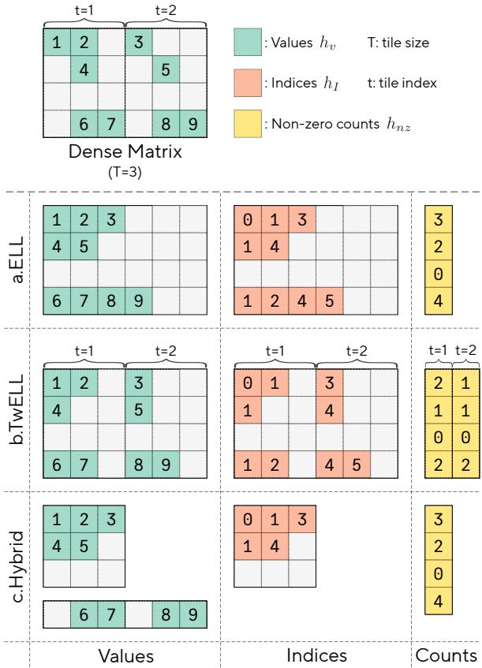  
Figure 1 | Comparison of ELL with our new TwELL and Hybrid sparse formats designed for LLM inference and training, respectively.

然而，一个令人沮丧的悖论阻碍了进展：尽管理论计算远少于稠密计算，但实现稀疏操作的官方内核往往在现代 GPU 上运行速度比稠密操作还慢。罪魁祸首是非结构稀疏性与 GPU 架构之间的根本不匹配，其硬件和软件堆栈已针对稠密计算模式进行了深度优化（Lawson et al., 1979；NVIDIA, 2025a,b,c）。相反，异构工作负载以及从物化和管理稀疏索引产生的开销是 preventing generalized computational savings 的关键挑战。由于这些挑战，以前实现效率提升的尝试依赖于与现代训练方法的显著偏离，并且尚未见到实际应用（Liu et al., 2023；Wang et al., 2024）。在这项工作中，我们提出了专为现代 NVIDIA GPU 设计的新内核，以弥合这一差距，并利用非结构稀疏性在 LLM 推理和训练过程中提供显著的加速，同时减少内存需求和能耗。我们的内核基于 Tile-wise ELLPACK (TwELL)，这是一种用于稀疏数据的新打包格式，可以自然地在高优化矩阵乘法内核的末尾物化，消除了先前打包方案的典型瓶颈。从 TwELL 开始，我们的推理内核将多个矩阵乘法融合成一个单一的优化管道，尽量减少计算，而我们的训练内核进一步将稀疏表示减少到一种混合格式，使得中间激活的存储成本变得微不足道。为了证实我们的收益，我们提供了一个 LLM 稀疏性的定量研究，展示出轻微的 L1 正则化水平可以实现超过 $9 9 \%$ 的稀疏性，对下游性能的影响微乎其微。通过我们的新内核，我们表明这些稀疏水平在参数量更大的模型中，能够在处理吞吐量、节能和内存需求方面带来越来越多的好处，在拥有数十亿参数的模型中实现高达 $2 0 . 5 \%$ 和 $2 1 . 9 \%$ 的前向执行和训练速度提升。我们分析这些好处具体来源于网络层和自然语言数据之间的计算不均匀性，可以在稀疏模型中固有地利用。通过清晰地展示其实际好处，我们希望这项工作能够帮助确立稀疏性作为改善现代基础模型可扩展性和性能的新方向。总之，我们的主要贡献有三点：1. 我们提出并分享了用于推理和训练的新 CUDA 内核，具有几项关键创新，使得稀疏 LLM 在现代 GPU 上更便宜、更快且更轻便。2. 我们提供了定量分析，显示使用轻微的 L1 正则化可以实现高水平的非结构稀疏性，对性能的妥协可以忽略不计。3. 我们展示和分析了我们的内核如何利用这种稀疏性，在具有数十亿参数的大规模 LLM 中带来显著且逐渐增加的好处。

# 2. 大语言模型、前馈块与稀疏性

尽管原始的 Transformer 采用了简单的 2 层前馈网络模块，但自其概念以来，此模块经历了显著的演变（Vaswani 等，2017）。最新的架构大多收敛到一个 3 层的门控设计，在大规模评估时始终展现出经验上的优越性（Shazeer，2020）。尽管在本工作中我们发布了原始和门控模块的内核，但我们将主要文本的重点放在更新设计上，并将在附录 C 中对旧变体进行进一步讨论、结果和比较。

# 2.1. 前馈模块作为稀疏知识储存器

现代门控前馈块（Shazeer, 2020）由三个权重矩阵参数化，分别为 $W _ { g } \in \mathbb { R } ^ { K \times N }$、$W _ { u } \in \mathbb { R } ^ { K \times N }$ 和 $W _ { d } \in \mathbb { R } ^ { N \times K }$，分别表示门控矩阵、向上投影矩阵和向下投影矩阵。我们用 $M$ 表示前馈块在所有批次序列和位置上的有效批次大小，$K$ 表示其输入/输出维度，$N$ 表示其隐藏扩展维度。门控矩阵和向上投影矩阵都处理块的输入批次 $x \in \mathbb { R } ^ { M \times K }$，并产生向上和门控激活 $h _ { g }$ 和 $h _ { u } \in \mathbb { R } ^ { M \times N }$，两者之间的对称性通过非线性激活函数 $\sigma$ 被打破。这些投影随后通过逐元素相乘组合成统一的隐藏表示 $h \in \mathbb { R } ^ { M \times N }$，再使用向下投影权重 $W _ { d }$ 投影回原始维度，以计算块的输出 $y \in \mathbb { R } ^ { M \times K }$。

$$
h _ { u } = x W _ { u } , \quad h _ { g } = \sigma ( x W _ { g } ) , \quad h = h _ { u } \odot h _ { g } , \quad y = h W _ { d } .
$$

由于隐藏维度 $N$ 通常远大于 $K$，前馈模块通常可以占据模型参数和浮点运算次数的绝大部分。我们注意到，这些架构组件的一个常见概念化是动态键值存储（Dai et al., 2022; Geva et al., 2021）。在这个心理模型中，$x$ 与 $W _ { g }$ 和 $W _ { u }$ 的列之间的内积产生键 $h$ ，而 $W _ { d }$ 的行被视为作为值的存储槽，这些存储槽可以根据输入动态检索。

# 2.2. 训练稀疏大语言模型的简单成分

我们采用一个简单的方法来引入不同程度的稀疏性到前馈激活中，几乎不偏离已建立的架构和训练目标。首先，我们在门控投影后选择使用ReLU作为激活函数。其次，我们在标准交叉熵中添加一个简单的L1损失，并设置一个可调系数$L _ { 1 }$，以促进模型$L$层的稀疏性：

$$
L _ { 1 } \times \frac { 1 } { L } \sum _ { l = 1 } ^ { L } \frac { 1 } { M N } \sum _ { m = 1 } ^ { M } \sum _ { n = 1 } ^ { N } \lvert h ^ { l } [ m , n ] \rvert .
$$

我们注意到，许多最近的语言模型架构已经偏离了使用 ReLU，而更倾向于使用更平滑的激活函数，如 SiLU，虽然好处不大但却是一致的（Shazeer, 2020；Touvron et al. 2023；Yang et al., 2024）。在附录 C 中，我们提供了这些选择之间的直接实证比较，并且还提到最近文献中相关的研究，显示出可以通过针对性的训练技术来弥合领域特定的性能差异（Lomeli et al., 2025；Mirzadeh et al., 2023）。

# 3. 加速稀疏大语言模型

我们引入了新的CUDA内核用于推理和训练，利用非结构化稀疏性来提高效率。我们的内核基于TwELL，这是一种专为无缝内核融合设计的新稀疏格式，以实现稀疏性的内在吞吐量和内存优势，同时将开销降至最低。在本节中，我们描述了新内核的核心组件和优势，并提供了算法描述，总结了它们在单个协作线程阵列（CTA）级别的逻辑。有关H100 GPU线程级CUDA实现的代码清单和更详细的设计讨论，请参阅附录A。

# 算法 1 | 使用我们的矩阵乘法内核和 TwELL 存储进行门投影的算法描述

参数：切片大小 $T_{n}, T_{m}$，压缩率 $C$ 输入：稠密矩阵 $\boldsymbol{x} \in \mathbb{R}^{M \times K}$，权重矩阵 $W_{g} \in \mathbb{R}^{K \times N}$ 输出：稀疏矩阵 $h_{\nu} \in \mathbb{R}^{M \times N/C}$，索引矩阵 $h_{I} \in \mathbb{N}^{M \times N/C}$，非零计数矩阵 $h_{nz} \in \mathbb{N}^{M \times N_{T}}$ 并行遍历所有以 $(m_{0}, n_{0})$ 为起点的切片（跨 CTA） 将 $S \gets x[m_{0} : m_{0} + T_{m}, :] \times W_{g}[:, n_{0} : n_{0} + T_{n}]$ 对 $r$ 从 $0$ 到 $T_{m} - 1$ 做 令 $m \gets m_{0} + r$（全局行索引） 令 $z \gets 0$（当前切片中的非零元素计数） 对 $c$ 从 $0$ 到 $T_{n} - 1$ 做 若 $(S[r, c] > 0)$ 则令 $n \gets n_{0} / C + z$（全局 TwELL 列索引） 将非零索引存入 $h_{I}[m, n] \gets n_{0} + c$ 将非零值存入 $h_{\nu}[m, n] \gets S[r, c]$ 非零计数 $z \gets z + 1$ 结束若 结束循环 将该行切片的非零数存入 $h_{nz}[m, n_{0} / T_{n}] \gets z$ 结束循环 结束遍历

# 算法 2 | TwELL 格式中基于门激活的融合向上和向下投影的算法描述

1: 参数：瓷砖大小 $T _ { n }$ ，压缩比 C 2: 输入：稀疏 $h _ { \nu } \in \mathbb { R } ^ { M \times N / C }$ ，$\bar { h _ { I } } \in \mathbb { N } ^ { M \times N / C }$ ，$h _ { n z } \in \mathbb { N } ^ { M \times N _ { T } }$ ; 密集 $\boldsymbol { x } \in \mathbb { R } ^ { M \times K }$ ，$W _ { u } \in \mathbb { R } ^ { K \times N }$ ，$W _ { d } \in \mathbb { R } ^ { N \times K }$ 3: 输出：密集 $y \in \mathbb { R } ^ { M \times K }$ 4: 对于所有 $m \in \pi ( 0 . . M { - } 1 )$ 在 CTAs 中并行执行 5: $x _ { m } \gets x [ m , : ]$ ; $y _ { m } \gets 0$ 6: o $\mathfrak { r } t \gets 0 \ldots N _ { T } - 1$ 做 7: $z \gets h _ { n z } [ m , t ]$ 8: 对于 $c \gets 0 \ldots z - 1$ 做 9: $n \gets h _ { I } [ m , t \times T _ { n } / C + c ]$ {非零列索引} 10: $w _ { u } = W _ { u } [ : , n ]$ $\{ W _ { u } 的 n$ - 列）$ 11: $u \gets ( x _ { m } \cdot w _ { u } )$ {稀疏 $h _ { u } [ m , n ]$ 元素} 12: $w _ { d } \gets W _ { d } [ n , : ]$ $\mathbf { \xi } _ { n }$ - 行的 $W _ { d } \}$ 13: $y _ { m } \gets y _ { m } + \left( h _ { \nu } [ m , t \times T _ { n } / C + c ] \times u \right) w _ { c }$ 14: 结束 15: 结束 16: $y [ m , : ] \gets y _ { m }$ 17: 结束循环

# 3.1. 稀疏格式与核函数

ELLPACK 格式（ELL）被认为是快速高效稀疏矩阵乘法的最先进方法（Kincaid 等，1989）。这一格式在一些最早的 GPU 稀疏代数实现中被采用（Bell 和 Garland，2009），而最近的研究则集中于开发打包和排序的变体以提高性能（Anzt 等，2014；Kreutzer 等，2014）。如图 1 的部分 a 所示，ELLPACK 格式中的一个 $M \times N$ 矩阵 $h$ 被存储为两个填充矩阵 $h_{ν}$ 和 $h_{I}$，其大小为 $M \times N_{nz}$，非零值 $x$ 及其列索引被打包在每行的开头。该格式优先考虑下游的可用性，而非存储，对于高效检索，将行填充到最大的非零元素数量 $N_{nz}$。

大多数矩阵乘法内核在使用 ELL 格式执行 $y = h W$ 时的主要逻辑，是为稀疏矩阵 $h$ 的每一行 $m = 0 , \ldots , M - 1$ 启动不同的并行累加，使用固定数量的线程。在每次累加中，内核会迭代 $n = 0 , . . . , N _ { n z } - 1$ 次，加载 $h$ 的每个列索引 $i = h _ { I } [ i , j ]$ 和值 $\nu = h _ { \nu } [ i , j ]$，并将其与稠密权重 $W [ i , : ]$ 的 $K$ 维行相乘。这种格式的关键优势在于，仅需处理一部分权重列和输入值，跳过其余的零值。为了进一步减少数据访问和计算，一些后续扩展如 ELLPACK-R（Vazquez 等，2010）还在一个单独的向量 $h _ { n z }$ 中存储每一行的非零元素数量。

# 3.2. TwELL，一种用于核融合的稀疏数据格式

现代内核管道的一种有效主导设计是最大化运算符融合，避免不必要的全局内存访问，以更好地利用现代NVIDIA GPU的高计算吞吐量。为此，在门控前馈块中，由门激活 $h _ { g }$ 确定稀疏模式时，现有的稀疏格式如ELL存在一个主要缺陷。本质上，用ELL表示 $h _ { g }$ 需要首先访问每一行中的所有元素，以便对非零值和索引进行计数、比较和对齐。然而，现有的稠密输入矩阵乘法内核依赖于将计算并行化到输出的小二维瓦片 $T _ { m } \times T _ { n }$，这些计算在不同的CTA中独立进行。因此，从非稀疏输入中直接以ELL格式获取门激活 $h _ { g } = \mathrm { R e L U } ( x W )$ 是不可能的，因为这会在不同的CTA之间引入昂贵的同步。相反，启动一个单独的内核进行转换会固有地引入非平凡的开销，这具体限制了整个计算可实现的吞吐量增益。

为了解决这些局限性，我们引入了按块存储的 ELLPACK（TwELL）。如图1的部分b所示，TwELL不再关注整个行，而是将 $h _ { g }$ 的列分成横向大小为 $T$ 的一维平铺块。在每组列中，TwELL以基于 ELL 的局部打包格式存储非零值及其索引，且每行的数据都对齐在每个横向平铺块的开始。这导致生成两个矩阵，分别包含局部对齐的值 $h _ { \nu } \in R ^ { M \times N / C }$ 和索引 $h _ { I } \in R ^ { M \times N / C }$，其中 $C$ 是设置的压缩因子，使得 $T / C$ 高于任何平铺块中的最大非零元素个数，以避免存储溢出。在我们实现的 TwELL 中，我们还存储了一个附加矩阵，记录非零元素的数量 $h _ { n z } \in R ^ { M \times N _ { T } }$ 以便利后续计算，列数与总平铺块数相同 $N _ { T } = \lceil N / T \rceil$。虽然推导上本质上成本较低，但 TwELL 相比 ELL 的主要优势在于在现代块状矩阵乘法后的物化简便性：通过将横向平铺维度设定为相匹配，即 $T = T _ { n }$，TwELL 格式可以在执行 $h _ { g } = \mathrm { R e L U } ( x W )$ 的相同内核中恢复，然后将输出存储到 DRAM 中。融合这两个操作消除了额外内核生成、内存读取或同步步骤的需求，使其自然地融入现有的大语言模型管道中。

# 3.3. TwELL构建与快速融合推断的核函数

在算法1中，我们提供了伪代码，以总结我们的CUDA矩阵乘法内核的逻辑，同时将稀疏输出存储在TwELL格式中（第6-18行）。考虑到张量核心操作的输出分布模式，我们通过保持局部非零计数来获取存储打包非零值$h _ { \nu }$及其索引$h _ { I }$的内存地址，这只需进行warp级别的同步。虽然这不是TwELL的固有要求，但在每个瓦片中存储非零个数$h _ { n z }$，使我们能够省去用任何“填充”值初始化$h _ { I }$的开销，以及在未来使用中检查有效性的额外控制逻辑。虽然在算法1中省略了这部分，但我们通过首先将密集输入和稀疏TwELL输出缓存到共享内存中，从而利用快速异步TMA读写。我们还采用与CUTLASS（NVIDIA，2025c）中类似的持久协作设计，对计算和全局内存访问进行流水线处理。

为了推理，我们引入了一个额外的内核，在前馈块中执行其余计算，利用以TwELL格式存储的门激活有效地将上行和下行投影融合在一起。该内核在算法2中进行了总结，其在由单个warp CTA构成的网格上启动，每个CTA处理输入激活$x$的不同行$m$。最小化每个CTA的大小旨在最大化网格中的并发性和L2缓存命中率，因为非零激活在输入序列中往往具有较高的相关性。融合的矩阵乘法通过两个嵌套的for循环遍历稀疏激活来执行：第一个在列平铺的数量上静态展开（第6行），第二个动态遍历每个平铺中对应的非零数量（第8行）。对于索引为$n$的每个非零激活，CTA共同加载$W _ { u }$的第$n ^ { t h }$行和$W _ { d }$的列以执行点积，然后进行标量-向量乘法并累加其结果（第9-13行），对应以下计算：

$$
[ m , : ] = \sum _ { t = 0 } ^ { N _ { T } - 1 } \sum _ { c = 0 } ^ { h _ { \mathbb { Z } } [ m , t ] - 1 } \underbrace { h _ { \boldsymbol \nu } [ m , t \times T _ { n } / C + c ] } _ { h _ { \boldsymbol \nu } \mathrm { ~ n o n - z e r o ~ v a l u e } } \underbrace { ( \boldsymbol { x } [ m , : ] \cdot \boldsymbol { W _ { u } } [ : , n ] ) } _ { h _ { \boldsymbol \nu } \mathrm { ~ e l e m e n t } } \underbrace { \boldsymbol { W _ { d } } [ n , : ] } _ { \begin{array} { c } { \boldsymbol { W _ { d } } \mathrm { ~ r o w } } \\ { \boldsymbol { W _ { d } } \mathrm { ~ r o w } } \end{array} } , \mathrm { ~ w h e r e ~ } n = \underbrace { h _ { I } [ m , t \times T _ { n } / C + c ] } _ { h _ { I } \mathrm { ~ n o n - z e r o ~ i n d e x } }
$$

在内核内部隐式地物化 $h _ { u }$ 值可以进一步减少对 DRAM 的访问，以最大化吞吐量。总体而言，我们推理管道中的内核将平铺和操作融合的核心原则整合为单一的执行流程，充分利用稀疏性的计算优势，同时最小化其固有的开销。

# 3.4. 高效存储的混合转换

在训练过程中，内存成为吞吐量的关键瓶颈，因为反向传播需要大量的中间激活值和优化器状态。在这种情况下，稀疏性为解决这些瓶颈提供了一个自然的机会，通过简化中间存储成本和加速梯度计算。然而，直接使用高压缩比的 TwELL 或其他基于 ELL 的格式来实现这一目的，固有地依赖于已知的最大非零元素数量 $N_{nz}$ ，并且这个值必须严格较小。然而，正如我们将在第 4 节中阐述的那样，我们发现这些条件在 LLM 训练过程中几乎从未满足，因为稀疏模式在不同token之间表现出显著的不均匀性，最大非零元素的数量通常比平均数量大几个数量级。

我们通过首先将 TwELL 激活转换为混合稀疏格式来克服这些限制，并引入了一组专门为内存高效训练设计的新自定义内核。如图 1 的 c 部分所示，我们的格式动态地对 $h _ { g }$ 的行进行分区和存储，分为稀疏格式 $h _ { g } ^ { s } \in R ^ { M ^ { s } \times N _ { \hat { n } z } }$ 或者密集备份 $h _ { g } ^ { d } \in R ^ { M ^ { d } \times N }$。分区逻辑简单地根据 $h _ { g }$ 的非零计数路由行，这些计数可以通过本地对齐的 TwELL 瓦片便宜地计算得出。我们的混合格式还维护一个轻量级的列索引数组 $h _ { I } \in R ^ { M ^ { s } \times N _ { \hat { n } z } }$，其大小与稀疏的 ELL 矩阵相匹配，以及一个简单的二进制向量 $h _ { b } \in R ^ { M }$，用于指示每一行的存储位置。在实际应用中，我们发现可以将 $N _ { \hat { n } \tilde { z } }$ 设置为比 $N$ 低一个数量级，同时只在 $h _ { g } ^ { d }$ 中产生最小的溢出，从而避免严格的 ELL 要求，同时在训练的其余步骤中减轻内存和计算的负担。

# 3.5. 用于轻量高效训练的核函数

在我们的混合格式中从前激活 $x W _ { g }$ 实现 $h _ { g }$ 后，我们设计了自定义核来执行高效的混合到稠密和稠密到混合的矩阵乘法。我们直接使用这些核执行其余的前向传播，计算 $h _ { u } = x W _ { u }$ 和 $y = h W _ { d }$。与推理不同，在训练过程中我们将上投影和下投影分开执行，这使我们可以高效地存储稀疏的隐藏状态，并在反向传播中最小化重新计算。在算法 3 中，我们概述了针对通用输入 $h$ 和权重 $W$ 的混合到稠密矩阵乘法的逻辑，稠密到混合的变体也遵循相同的一般结构。我们的方法结合了典型的 ELL 核，每个 CTA 处理输出 $y$ 的单独行（第 4-13 行），以及使用张量核心的传统平铺核来处理稠密备份行（第 14-17 行）。在矩阵乘法计算的稀疏部分，我们选择静态展开累加，直到每行的最大非零元素数量 $N _ { \hat { n } \tilde { z } }$。此外，我们还根据训练期间观察到的稀疏性统计信息，静态预分配所有激活的稠密备份部分。我们注意到，这些设计选择引入了最小的额外计算和存储成本，这些成本在很大程度上被避免动态开销所抵消。在反向传播阶段，我们一起检索稀疏激活及 L1 和输出梯度 $\nabla \boldsymbol { y }$，使我们能够进行反向传播而无需进行昂贵的稠密计算。这是通过两个额外的核实现的，支持将 L1 梯度有效注入给定的稀疏模式，并有效转置我们的混合格式以便于未来的合并访问。我们首先使用存储的 $h$ 的稀疏模式，通过我们高效的稠密到混合矩阵乘法 $\nabla y W _ { d } ^ { T }$ 获取它的梯度，随后进行 L1 注入。得到 $\nabla h$ 后，我们通过直接应用我们的混合到稠密和转置核恢复其余的输入和权重梯度：

$$
\begin{array} { r l } & { \quad \quad \nabla h _ { u } = \nabla h \odot h _ { g } , \quad \nabla h _ { g } = \nabla h \odot h _ { u } , } \\ & { \quad \quad \nabla W _ { u } = x ^ { \top } \nabla h _ { u } , \quad \nabla W _ { g } = x ^ { \top } \nabla h _ { g } , \quad \nabla W _ { d } = h ^ { \top } \nabla y , } \\ & { \quad \quad \quad \nabla x = \nabla h _ { u } W _ { u } ^ { \top } + \nabla h _ { g } W _ { g } ^ { \top } . } \end{array}
$$

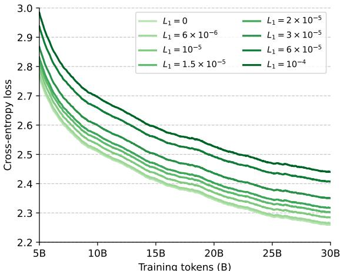  
Figure 2 | Training curves of LLMs across L1 regularization levels.

# 算法 3 | 以混合格式从输入激活值得出的矩阵乘法的算法描述

1: 输入: $T _ { m } , T _ { k } , T _ { n }$ , $h : = ( h ^ { s } , h ^ { d } , h _ { I } , h _ { b } )$ , $W \in \mathbb { R } ^ { K \times N }$ 2: 输出: $y \in \mathbb { R } ^ { M \times N }$ 3: $\pi _ { s } \gets \{ m : h _ { b } [ m ] = 0 \}$ ; $\pi _ { d } \gets \{ m : h _ { b } [ m ] = 1 \}$ 4: 对于所有 $m _ { s } \in 0 . . M ^ { s } - 1$ 并行执行 5: $m \gets \pi _ { s } [ m _ { s } ]$ {全局行索引} 6: $y _ { m } \gets 0$ {行累加器} 7: 对于 $j \gets 0 \ldots N _ { \hat { n } z } - 1$ 执行 8: $n \gets h _ { I } [ m _ { s } , j ]$ {非零列索引} 9: $\nu \gets h ^ { s } [ m _ { s } , j ]$ {稀疏值} 10: $y _ { m } \gets y _ { m } + \nu \cdot W [ n , : ]$ {稀疏行更新} 11: 结束循环 12: $y [ m , : ] \gets y _ { m }$ 13: 结束循环 14: 对于所有以 $( m _ { 0 } , n _ { 0 } )$ 开始的块并行执行 15: $S \gets h ^ { d } [ m _ { 0 } ; m _ { 0 } { + } \bar { T } _ { m } , ;$ ] [:, $n _ { 0 } { : } n _ { 0 } { + } T _ { n } ]$ 16: $y \big [ \pi _ { d } \big [ m _ { 0 } { : } m _ { 0 } { + } T _ { m } \big ]$ , $n _ { 0 } ! n _ { 0 } + T _ { n } ] \gets S$ 17: 结束循环 关键在于，我们的执行逻辑反映了一种有意的设计选择：与其积极融合单个操作符，不如围绕训练步骤的核心结构设计训练内核流水线。在这种设置中，混合格式最小化了反向计算和内存开销，使我们能够避免密集计算，同时保持对传统上脆弱的 ELL 基础方法的高度非均匀稀疏模式的稳健性。

# 4. 实验结果

# 4.1. 训练与评估设置

我们提供定量结果，评估不同稀疏级别和规模下大语言模型（LLMs）的性能和效率。我们的模型基于“Transformer $+ + { } ^ { \dag }$架构，这一架构在近期的LLM中十分常见，如Qwen和Llama（Touvron et al., 2023；Yang et al., 2024），并使用了第2节中描述的门控前馈模块。我们针对每种模型大小，训练模型时的词元数量略高于Chinchilla最优数量（Hoffmann et al., 2022），使用fineweb数据集（Penedo et al., 2024）。我们默认的上下文长度为2048，批量大小为1M词元，采用AdamW优化器，权重衰减为0.1，并使用余弦调度（Loshchilov和Hutter, 2017）。其他超参数，如隐藏层大小和总层数，依据模型大小并根据现代实践进行选择（Hoffmann et al., 2022）。我们注意到，我们的稀疏模型使用与非稀疏基线相同的训练超参数，因为在前馈模块中添加L1正则化似乎并未影响其他选择。

为了衡量模型性能，我们使用交叉熵评分和七个不同的常见下游任务来评估逻辑和推理能力，任务在预训练后进行（Bisk et al., 2020; Clark et al., 2018; Mihaylov et al., 2018; Sakaguchi et al., 2021; Talmor et al., 2019; Zellers et al., 2019）。在本节中，我们集中讨论聚合性能指标以简洁表达，并参考附录D获取每个任务的详细数据。为了衡量效率，我们分析在不同稀疏级别下集成训练和推理内核时的吞吐量增益，通过记录每个阶段的执行时间、内存需求和能耗进行分析。在我们的实验中，我们保持固定的序列长度为2048，并根据可用内存调整微批量大小。除非另有说明，我们在八个H100 PCIe GPU的单节点上进行训练并收集结果，这在当前云提供商和科学集群的列表中是一种常见基础设施。有关我们的训练和评估设置的更多详细信息，以及针对每种考虑的模型规模的完整超参数，请参考附录B。

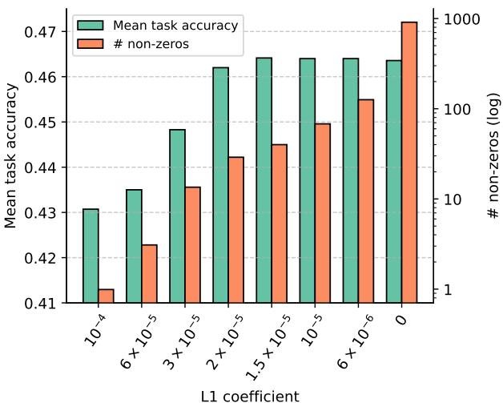  
Figure 3 | Downstream accuracy and sparsity statistics of LLMs across L1 regularization levels.

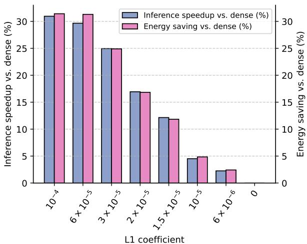  
Figure 4 | Forward pass speedups and energy savings from our sparse LLM inference kernels across L1 regularization levels.

# 4.2. 更高效的具有无结构稀疏性的语言模型

稀疏水平下的性能。我们首先评估引入不同程度的 L1 正则化对一个 15 亿参数模型的性能和稀疏性的影响。具体而言，我们考虑了八个 $L_{1}$ 系数值，从没有正则化 $\left( L _ { 1 } = 0 \right)$ 到训练后平均仅激活一个神经元的点 $( L _ { 1 } = 1 \times 1 0 ^ { - 4 } )$。在图 2 中，我们展示了不同模型的训练曲线，而在图 3 中，我们报告了下游任务的性能以及遍历前馈块时最终的非零激活数量的平均值。尽管我们的 15 亿模型具有 5632 的隐藏前馈维度，但我们发现未正则化模型已经在仅激活 911 个神经元的情况下达到了超过 $20\%$ 的稀疏性。此外，与 Mirzadeh 等人（2023）的结果一致，我们发现引入小规模的正则化已经将平均非零激活数量降低了几个数量级，但不同的标记和层之间的变化非常大。特别是，即使在最高正则化水平下，我们发现少数标记仍然激活了几百个神经元，表明容量的重新分配。尽管存在这种适应性，在性能方面，我们确实开始看到在激活神经元低于 $0.5\%$ 时性能出现一定程度的下降。然而，我们的结果表明，较小的正则化水平不会明显妨碍容量，超出 AdamW 优化器已引起的权重衰减：在 $L_{1} = 3 \times 1 0 ^ { - 5 }$ 之前，我们几乎没有记录到任务性能的下降，最终的交叉熵仅在与未正则化基线相比时有 $2\%$ 的微小增加。

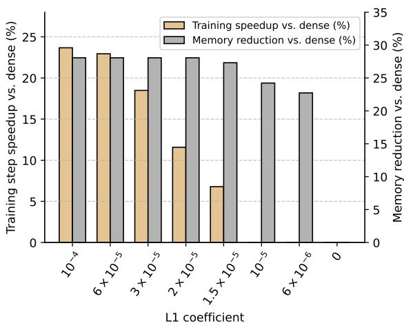  
Figure 5 | Training speedups and peak memory reduction from our sparse LLM training kernels across L1 regularization levels.

利用稀疏性加速和轻量化大型语言模型。我们通过分析在不同稀疏性水平下集成我们内核所带来的效率提升，对比性能结果。表1 | 使用我们内核的稀疏大型语言模型与传统模型的性能和效率统计比较。

<table><tr><td>Model scale</td><td>Sparse</td><td>Mean task accuracy</td><td colspan="2">Forward execution (input tokens/ms)</td><td colspan="2">Energy per token (mJ)</td><td colspan="2">Training step Peak memory (input token/ms)</td></tr><tr><td>0.5B params</td><td>X</td><td>40.4%</td><td>410 (0.0%)</td><td>1.63</td><td>(0.0%)</td><td>97.3 (0.0%)</td><td>26.2</td><td>(0.0%)</td></tr><tr><td>10B tokens</td><td>✓</td><td>40.4%</td><td>480 (+17.0%)</td><td></td><td>1.43 (-11.8%)</td><td>95.9 (-1.5%)</td><td>21.2</td><td>(-19.2%)</td></tr><tr><td>1B params 20B tokens</td><td>X</td><td>44.6%</td><td>185</td><td>(0.0%)</td><td>3.71 (0.0%)</td><td>48.6 (0.0%)</td><td>44.5</td><td>(0.0%)</td></tr><tr><td></td><td>✓</td><td>44.7%</td><td>219 (+18.1%)</td><td></td><td>3.17 (-14.6%)</td><td>52.1 (+7.1%)</td><td>33.1</td><td>(-25.5%)</td></tr><tr><td>1.5B params</td><td>X</td><td>46.4%</td><td>119</td><td>(0.0%)</td><td>5.73 (0.0%)</td><td>31.8 (0.0%)</td><td>62.8</td><td>(0.0%)</td></tr><tr><td>30B tokens</td><td>✓</td><td>46.2%</td><td>141 (+18.8%)</td><td></td><td>4.87 (-15.0%)</td><td>35.5 (+11.6%)</td><td>45.1</td><td>(-28.1%)</td></tr><tr><td>2B params</td><td>X</td><td>49.1%</td><td>87.8</td><td>(0.0%)</td><td>7.85 (0.0%)</td><td>22.4 (0.0%)</td><td>46.7</td><td>(0.0%)</td></tr><tr><td>40B tokens</td><td>✓</td><td>48.8%</td><td>106 (+20.5%)</td><td></td><td>6.51 (-17.0%)</td><td>27.3 (+21.9%)</td><td>57.1</td><td>(+22.3%)</td></tr></table>

图4中，我们提供了在通过我们的LLM进行前向执行过程中记录的平均相对加速和总能量节省。在所有考虑的稀疏级别上，当$L_{1}=0$时，我们发现我们的推理内核使得吞吐量提高可达$30\%$。在$L_{1}=3 \times 10^{-5}$以上，这些吞吐量的提升伴随着减少近$3\%$的GPU功耗，从而带来了更高的能量节省。在图5中，我们还展示了使用我们训练内核时的平均相对加速和峰值内存减少情况。与我们的推理内核一致，在训练过程中记录的加速在使用更稀疏模型时显著提高，最高可达$24\%$。此外，即使在考虑的最低稀疏级别下，训练所需的峰值GPU内存也减少了超过$24\%$，降低了在亿参数规模上进行高效训练的硬件门槛（有关RTx6000的结果，请参阅附录D）。综合来看，我们认为我们的结果提供了有力证据，表明专业化的目标内核可以使稀疏性成为现代LLM设计中的新可行轴线，从而在其整个生命周期内带来显著的效率提升。

模型规模的稀疏性。我们分析模型规模如何影响稀疏大型语言模型（LLMs）的性能和效率。在本次分析中，我们基于之前对1.5B模型的结果将$L_{1} = 2 \times 10^{-5}$设定为一个保守的阈值，以避免显著的性能下降。在表1中，我们比较了在由0.5B模型（训练于10B标记）到2B模型（训练于40B标记）之间的chin-chilla最优边界上稀疏和非稀疏LLMs的性能和效率。与我们之前的结果一致，我们发现当引入轻微的L1正则化时，各个规模的模型性能没有超过随机偏差的下降。此外，我们发现LLMs在较大规模时更有效地支持稀疏性，导致平均非零元素数量减少（从0.5B模型的39减少到2B模型的24）。反过来，这使得我们内核的所有吞吐量和内存优势增强：2B稀疏模型在推理期间处理标记的速度快了$20.5\%$，并且以更大的微批处理大小的训练效率提高了$21.9\%$。这些发现表明，稀疏性与最近盛行的规模趋势相一致，突显了其在未来模型开发中的日益重要性。

# 4.3. 稀疏大型语言模型的特性

我们分析了大语言模型如何在其层和批量样本之间有效分配稀疏性。为了进行分析，我们使用经过建议性能保持的 $L _ { 1 } = 2 \times 1 0 ^ { - 5 }$ 训练的 15 亿参数模型，从 $2 ^ { 2 0 }$ 个输入词元中收集激活值。我们在 D 附录中补充了这一小节的额外结果，考察了不同水平的 L1 正则化，以及稀疏性在训练过程中的演变及其对死神经元的影响。

稀疏性和模型深度。图6考察了模型深度下的激活情况，将每层的非零统计与其对推理加速的贡献相关联。尽管所有层的平均非零数少于30，但该图突显了各层之间以及单独层内稀疏性的明显差异。特别是，前两层的激活最少，其后是网络前半部分的非零数显著增加的高峰。这种稀疏性模式在早中层达到顶峰，似乎与之前的研究一致，表明LLM的推理和知识检索很大程度上发生在这些深度（Wendler等，2024）。此外，在每层内，最大非零数通常超过该层平均值一个数量级，并且在架构中没有表现出一致的模式。我们还观察到，各层的平均非零数与其相对加速之间存在直观且显著的负相关，皮尔逊系数超过-0.996。相比之下，最大激活数对推理加速的影响较小，只有在第8层明显可见。这种稳健性源于我们的内核设计，该设计通过最大并行化执行来掩盖高度激活词元的延迟。

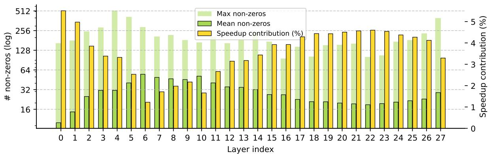  
Figure 6 | Sparsity statistics and speedup contributions across different layers of our sparse LLMs.

稀疏性和输入属性。鉴于激活的不均匀程度较高，我们分析了哪些输入导致非零激活计数的峰值和谷值。在图7的部分a中，我们识别了六个最低和最高非零平均数量的常见词元，过滤掉发生频率低于 $1 / 2 ^ { 1 4 }$ 的异常值。我们发现，具有最低非零活动的词元常常代表常见网页链接的部分（如 doi、nlm、gov、nih）或缩写词（如 doesn、couldn），这些词元通常出现在爬取的网页语料库中可预测下一个词元之前。相比之下，提供关于段落重要上下文信息的词元活动最为频繁，包括某些动词（如 loud、enduring）或表示特定地点或物质的名词（如 Vermont、Greeks、formaldehyde、ACH）。在图7的部分b中，我们绘制了词元在输入序列中的位置与平均非零数量之间的关系，采用对数-对数坐标系。值得注意的是，我们发现 LLM 对序列中的第一个词元分配了显著更多的非零计数，而此后则以指数方式减少。从直观上看，这些结果表明 LLM 有效关注的信息内容高的词元及其上下文线索缺失的序列位置。这里，稀疏性的引入不仅为模型行为提供了可解释的视角，还使我们的核能够利用这种固有的信息不均匀性，从而显著提高训练和推理速度。

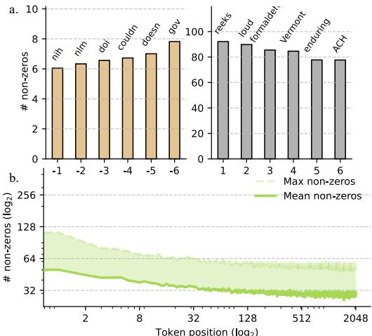  
Figure 7 | Sparsity statistics across LLM input tokens and positions.

# 5. 相关工作

在之前的研究中（Li等，2023；Mirzadeh等，2023），已经多次记录了具有ReLU激活的LLM中稀疏性的出现及其理论优点。此后，提出了更多方法，通过改变现代门控架构来增强稀疏性，声称在旧一代设备上单独运行稀疏前馈层可以加速计算。TurboSparse（Song等，2024）研究了通过重复ReLU非线性来提升稀疏性，而ProSparse（Song等，2025）则通过手动阈值激活来微调预训练模型。Q-Sparse（Wang等，2024）进一步偏离标准模型，采用直通估计器，仅保留前K个激活值。其他研究则专注于在训练后引入结构化稀疏性，例如通过预测（Liu等，2023）和修剪激活值以加速计算（Lee等，2024；Liu等，2024）。与这些努力不同，我们的论文引入通用内核以利用无结构稀疏性，证明在LLM推理和训练过程中都具有实证效率优势。有关更根本性重塑架构设计的先前工作的扩展概述，请参见附录E。

# 6. 讨论与未来工作

在这项工作中，我们利用非结构化稀疏性来减轻现代大语言模型（LLMs）的计算负担。针对推理，我们设计了一种新的稀疏格式和融合操作，以高效执行整个门控前馈块，仅需两次内核启动，从而最小化全局内存访问和计算量。针对训练，我们引入了一种新的混合算法，该算法动态调度在CUDA和Tensor核心上的计算，同时简化了反向传播过程中中间激活的存储成本。我们证明，适度的L1正则化能够引入可观的稀疏程度，而对下游性能几乎没有影响，我们的内核在十亿参数规模上转化为显著的吞吐量、能效和内存占用的提升。虽然我们的工作为稀疏LLMs的好处提供了一个具体的示范，但未来扩展的令人兴奋的方向还有很多。例如，在附录C中，我们提供了初步结果，表明高度稀疏的LLMs的性能可以通过针对死神经元减缓的策略进一步改善。此外，通过最近的稀疏化方法（Mirzadeh等，2023；Song等，2025）微调现有的密集模型将使我们的内核的好处扩展到可用的丰富预训练LLMs库中。通过分享我们的内核，我们希望我们的工作能够促进稀疏性作为一个新的设计轴，从而提高效率，最终降低大规模基础模型日益增长的能源和硬件成本。

# 作者贡献

Edoardo Cetin 构思了 TwELL 格式，主导了基于 TwELL 的 CUDA 内核的实现与设计，负责模型训练与基准测试，并对写作作出了贡献。Stefano Peluchetti 进行了稀疏模型训练的早期研究，指导了该项目，并对写作作出了贡献。Emilio Castillo 构思了混合格式，共同主导了 CUDA 内核的实现并设计了训练扩展，参与了内核基准测试的贡献，并对写作作出了贡献。Akira Naruse 指导了该项目，参与了关于方法设计的早期讨论，并在稀疏内核的早期实现中进行了工作。Mana Murakami 参与了关于方法设计的早期讨论。Llion Jones 进行了稀疏模型训练的初步探索，指导了该项目，参与了关于方法设计的早期讨论，并对写作作出了贡献。

# References

Loubna Ben Allal, Anton Lozhkov, Elie Bakouch, Leandro von Werra, and Thomas Wolf. Smollm - blazingly fast and remarkably powerful, 2024.

Hartwig Anzt, Stanimire Tomov, and Jack Dongarra. Implementing a sparse matrix vector product for the sell-c/sell-c-σ formats on nvidia gpus. University of Tennessee, Tech. Rep. ut-eecs-14-727, 2014.

Jordan Ash and Ryan P Adams. On warm-starting neural network training. Advances in neural information processing systems, 33:38843894, 2020.

Peter Belcak and Roger Wattenhofer. Fast feedforward networks, 2023. URL https: / /arxiv.org/ abs/2308.14711.

Nathan Bell and Michael Garland. Implementing sparse matrix-vector multiplication on throughputoriented processors. In Proceedings of the conference on high performance computing networking, storage and analysis, pages 111, 2009.

Yonatan Bisk, Rowan Zellers, Jianfeng Gao, Yejin Choi, et al. Piqa: Reasoning about physical commonsense in natural language. In Proceedings of the AAAI conference on artificial intelligence, volume 34, pages 74327439, 2020.

Tom Brown, Benjamin Mann, Nick Ryder, Melanie Subbiah, Jared D Kaplan, Prafulla Dhariwal, Arvind Neelakantan, Pranav Shyam, Girish Sastry, Amanda Askell, et al. Language models are few-shot learners. Advances in neural information processing systems, 33:18771901, 2020.

Siddhartha Chatterjee, Alvin R Lebeck, Praveen K Patnala, and Mithuna Thottethodi. Recursive array layouts and fast parallel matrix multiplication. In Proceedings of the eleventh annual ACM symposium on Parallel algorithms and architectures, pages 222231, 1999.

Peter Clark, Isaac Cowhey, Oren Etzioni, Tushar Khot, Ashish Sabharwal, Carissa Schoenick, and Oyvind Tafjord. Think you have solved question answering? try arc, the ai2 reasoning challenge. arXiv preprint arXiv:1803.05457, 2018.

Damai Dai, Li Dong, Yaru Hao, Zhifang Sui, Baobao Chang, and Furu Wei. Knowledge neurons in pretrained transformers. In Smaranda Muresan, Preslav Nakov, and Aline Villavicencio, editors, Proceedings of the 60th Annual Meeting of the Association for Computational Linguistics (Volume 1: Long Papers), pages 84938502, Dublin, Ireland, May 2022. Association for Computational Linguistics. doi: 10.18653/v1/2022.acl-long.581.

William Fedus, Barret Zoph, and Noam Shazeer. Switch transformers: Scaling to trllion parameter models with simple and efficient sparsity. Journal of Machine Learning Research, 23(120):139, 2022.

Mor Geva, Roei Schuster, Jonathan Berant, and Omer Levy. Transformer feed-forward layers are key-value memories. In Marie-Francine Moens, Xuanjing Huang, Lucia Specia, and Scott Wen-tau Yih, editors, Proceedings of the 2021 Conference on Empirical Methods in Natural Language Processing, pages 54845495, Online and Punta Cana, Dominican Republic, November 2021. Association for Computational Linguistics. doi: 10.18653/v1/2021.emnlp-main.446.

Aaron Grattafiori, Abhimanyu Dubey, Abhinav Jauhri, Abhinav Pandey, Abhishek Kadian, Ahmad Al-Dahle, Aiesha Letman, Akhil Mathur, Alan Schelten, Alex Vaughan, et al. The llama 3 herd of models. arXiv preprint arXiv:2407.21783, 2024.

Song Han, Jeff Pool, John Tran, and William Dally. Learning both weights and connections for efficient neural network. Advances in neural information processing systems, 28, 2015.

Xu Owen He. Mixture of a million experts, 2024. URL https: //arxiv. org/abs/2407. 04153.

D Hendrycks. Gaussian error linear units (gelus). arXiv preprint arXiv:1606.08415, 2016.

Torsten Hoefler, Dan Alistarh, Tal Ben-Nun, Nikoli Dryden, and Alexandra Peste. Sparsity in deep learning: Pruning and growth for efficient inference and training in neural networks. Journal of Machine Learning Research, 22(241):1124, 2021.

Jordan Hoffmann, Sebastian Borgeaud, Arthur Mensch, Elena Buchatskaya, Trevor Cai, Eliza Rutherford, Diego de Las Casas, Lisa Anne Hendricks, Johannes Welbl, Aidan Clark, et al.Training compute-optimal large language models. arXiv preprint arXiv:2203.15556, 2022.

Zihao Huang, Qiyang Min, Hongzhi Huang, Defa Zhu, Yutao Zeng, Ran Guo, and Xun Zhou. Ultrasparse memory network, 2025. URL https://arxiv.org/abs/2411.12364.

David R Kincaid, Thomas C Oppe, and David M Young. Itpackv 2d user's guide. Technical report, Texas Univ., Austin, TX (USA). Center for Numerical Analysis, 1989.

Moritz Kreutzer, Georg Hager, Gerhard Wellein, Holger Fehske, and Alan R Bishop. A unified sparse matrix data format for efficient general sparse matrix-vector multiplication on modern processors with wide simd units. SIAM Journal on Scientific Computing, 36(5):C401C423, 2014.

Guillaume Lample, Alexandre Sablayrolles, Marc'Aurelio Ranzato, Ludovic Denoyer, and Hervé Jégou. Large memory layers with product keys, 2019. URL https : //arxiv. org/abs/1907. 05242.

Chuck L Lawson, Richard J. Hanson, David R Kincaid, and Fred T. Krogh. Basic linear algebra subprograms for fortran usage. ACM Transactions on Mathematical Software (TOMS), 5(3):308323, 1979.

Yann LeCun, John Denker, and Sara Solla. Optimal brain damage. Advances in neural information processing systems, 2, 1989.

Donghyun Lee, Je-Yong Lee, Genghan Zhang, Mo Tiwari, and Azalia Mirhoseini. Cats: Contextuallyaware thresholding for sparsity in large language models. arXiv preprint arXiv:2404.08763, 2024.

Dmitry Lepikhin, HyoukJoong Lee, Yuanzhong Xu, Dehao Chen, Orhan Firat, Yanping Huang, Maxim Krikun, Noam Shazeer, and Zhifeng Chen. Gshard: Scaling giant models with conditional computation and automatic sharding. arXiv preprint arXiv:2006.16668, 2020.

Zonglin Li, Chong You, Srinadh Bhojanapalli, Daliang Li, Ankit Singh Rawat, Sashank J. Reddi, Ke Ye, Felix Chern, Felix Yu, Ruiqi Guo, and Sanjiv Kumar. The lazy neuron phenomenon: On emergence of activation sparsity in transformers, 2023. URL https: //arxiv . org/abs/2210 . 06313.

James Liu, Pragaash Ponnusamy, Tianle Cai, Han Guo, Yoon Kim, and Ben Athiwaratkun. Training-free activation sparsity in large language models. arXiv preprint arXiv:2408.14690, 2024.

Zichang Liu, Jue Wang, Tri Dao, Tianyi Zhou, Binhang Yuan, Zhao Song, Anshumali Shrivastava, Ce Zhang, Yuandong Tian, Christopher Re, et al. Deja vu: Contextual sparsity for efficient llms at inference time. In International Conference on Machine Learning, pages 2213722176. PMLR, 2023.

Maria Lomeli, Matthijs Douze, Gergely Szilvasy, Loic Cabannes, Jade Copet, Sainbayar Sukhbaatar, Jason Weston, Gabriel Synnaeve, Pierre-Emmanuel Mazaré, and Hervé Jégou. Stochastic activations, 2025.

Ilya Loshchilov and Frank Hutter. Decoupled weight decay regularization. arXiv preprint arXiv:1711.05101, 2017.

Alexandra Sasha Luccioni, Sylvain Viguier, and Anne-Laure Ligozat. Estimating the carbon footprint of BLOOM, a 176b parameter language model. Journal of Machine Learning Research, 24(253): 115, 2023.

Todor Mihaylov, Peter Clark, Tushar Khot, and Ashish Sabharwal. Can a suit of armor conduct electricity? a new dataset for open book question answering. arXiv preprint arXiv:1809.02789, 2018.

Seyed Iman Mirzadeh, Keivan Alizadeh-Vahid, Sachin Mehta, Carlo C. del Mundo, Oncel Tuzel, Golnoosh Samei, Mohammad Rastegari, and Mehrdad Farajtabar. ReLU Strikes Back: Exploiting Activation Sparsity in Large Languag Models. In The Twelfth International Conferenceon Leari Representations, 2023.

NVIDIA. cuBLAS Library, 2025a. URL https://docs.nvidia. com/cuda/cublas/index.html. Release 13.1.

NVIDIA. NVIDIA cuBLASDx Documentation, 2025b. URL https://docs.nvidia. com/cuda/ cublasdx/. Version 0.5.0.

NVIDIA. Cutlass: Cuda templates and python dsls for high-performance linear algebra, Dec 2025c. URL https://github.com/NVIDIA/cutlass.

OpenAI. GPT-4 technical report. arXiv preprint arXiv:2303.08774, 2023.

Guilherme Penedo, Hynek Kydlíek, Anton Lozhkov, Margaret Mitchell, Colin A Raffel, Leandro Von Werra, Thomas Wolf, et al. The fineweb datasets: Decanting the web for the finest text data at scale. Advances in Neural Information Processing Systems, 37:3081130849, 2024.

Reiner Pope, Sholto Douglas, Aakanksha Chowdhery, Jacob Devlin, James Bradbury, Jonathan Heek, Kefan Xiao, Shivani Agrawal, and Jeff Dean. Efficiently scaling transformer inference. Procedings of machine learning and systems, 5:606624, 2023.

Alec Radford, Jeffrey Wu, Rewon Child, David Luan, Dario Amodei, Ilya Sutskever, et al. Language models are unsupervised multitask learners. OpenAI blog, 1(8):9, 2019.

Prajit Ramachandran, Barret Zoph, and Quoc V Le. Searching for activation functions. arXiv preprint arXiv:1710.05941, 2017.

Keisuke Sakaguchi, Ronan Le Bras, Chandra Bhagavatula, and Yejin Choi. Winogrande: An adversarial winograd schema challenge at scale. Communications of the ACM, 64(9):99106, 2021.

Roy Schwartz, Jesse Dodge, Noah A. Smith, and Oren Etzioni. Green AI. Communications of the ACM, 63(12):5463, 2020.

Pranjal Shankhdhar. Outperforming cublas on h100: a worklog, November 2024. URL https: //cudaforfun.substack.com/p/outperforming-cublas-on-h100-a-worklog.

Noam Shazeer. Glu variants improve transformer. arXiv preprint arXiv:2002.05202, 2020.

Noam Shazeer, Azalia Mirhoseini, Krzysztof Maziarz, Andy Davis, Quoc V. Le, Geoffrey E. Hinton, and Jeff Dean. Outrageously large neural networks: The sparsely-gated mixture-of-experts layer. CoRR, abs/1701.06538, 2017. URL http://arxiv.org/abs/1701.06538.

Chenyang Song, Xu Han, Zhengyan Zhang, Shengding Hu, Xiyu Shi, Kuai Li, Chen Chen, Zhiyuan Liu, Guangli Li, Tao Yang, et al. Prosparse: Introducing and enhancing intrinsic activation sparsity within large language models. In Proceedings of the 31st International Conference on Computational Linguistics, pages 26262644, 2025.

Yixin Song, Haotong Xie, Zhengyan Zhang, Bo Wen, Li Ma, Zeyu Mi, and Haibo Chen. Turbo sparse: Achieving llm sota performance with minimal activated parameters, 2024.

Alon Talmor, Jonathan Herzig, Nicholas Lourie, and Jonathan Berant. Commonsenseqa: A question answering challenge targeting commonsense knowledge. In Proceedings of the 2019 Conference of the North American Chapter of the Association for Computational Linguistics: Human Language Technologies, Volume 1 (Long and Short Papers), pages 41494158, 2019.

Gemini Team, Rohan Anil, Sebastian Borgeaud, Jean-Baptiste Alayrac, Jiahui Yu, Radu Soricut, Johan Schalkwyk, Andrew M Dai, Anja Hauth, Katie Millican, et al. Gemini: a family of highly capable multimodal models. arXiv preprint arXiv:2312.11805, 2023.

Hugo Touvron, Louis Martin, Kevin Stone, Peter Albert, Amjad Almahairi, Yasmine Babaei, Nikolay Bashlykov, Soumya Batra, Prajwal Bhargava, Shruti Bhosale, et al. Llama 2: Open foundation and fine-tuned chat models. arXiv preprint arXiv:2307.09288, 2023.

Ashish Vaswani, Noam Shazeer, Niki Parmar, Jakob Uszkoreit, Llion Jones, Aidan N Gomez, Lukasz Kaiser, and Illia Polosukhin. Attention is all you need. Advances in neural information processing systems, 30, 2017.

Francisco Vazquez, G Ortega, José-Jesús Fernández, and Ester M Garzón. Improving the performance of the sparse matrix vector product with gpus. In 2010 10th IEEE International Conference on Computer and Information Technology, pages 11461151. IEEE, 2010.

Hongyu Wang, Shuming Ma, Ruiping Wang, and Furu Wei. Q-sparse: All large language models can be fully sparsely-activated. arXiv preprint arXiv:2407.10969, 2024.

Chris Wendler, Veniamin Veselovsky, Giovanni Monea, and Robert West. Do llamas work in english? on the latent language of multilingual transformers. arXiv preprint arXiv:2402.10588, 2024.

An Yang, Baosong Yang, Binyuan Hui, Bo Zheng, Bowen Yu, Chang Zhou, Chengpeng Li, Chengyuan Li, Dayiheng Liu, Fei Huang, et al. Qwen2 technical report, 2024. URL https://arxiv. org/abs/2407.10671, 7:8, 2024.

Rowan Zellers, Ari Holtzman, Yonatan Bisk, Ali Farhadi, and Yejin Choi. Hellaswag: Can a machine really finish your sentence? arXiv preprint arXiv:1905.07830, 2019.

Susan Zhang, Stephen Roller, Naman Goyal, Mikel Artetxe, Moya Chen, Shuohui Chen, Christopher Dewan, Mona Diab, Xian Li, Xi Victoria Lin, et al. Opt: Open pre-trained transformer language models. arXiv preprint arXiv:2205.01068, 2022a.

Zhengyan Zhang, Yankai Lin, Zhiyuan Liu, Peng Li, Maosong Sun, and Jie Zhou. Moefication: Transformer feed-forward layers are mixtures of experts. In Findings of the Association for Computational Linguistics: ACL 2022, pages 877890, 2022b.

# A. Kernels Implementation Details

# A.1. Inference Kernels Selection

1 template <const int T_m, const int T_n, const int T_k>   
2 struct Tiles   
3 {   
4 alignas(128) __nv_bfloat16 a[T_m][T_k];   
5 alignas(128) __nv_bfloat16 b[T_n][T_k];   
6 };   
7   
8 template <   
9 const int T_m,   
10 const int T Tn,   
11 const int T_k,   
12 const int QUEUE_SIZE,   
13 const int T_n_compressed,   
14 int PADDING $\ c = ~ 4$   
15 >   
16 struct SmemStorage   
17 {   
18 Tiles<T_m, T_n, T_k> queue[QUEUE_SIZE];   
19 alignas(128)uint32_t c_packed[T_m][T_n_compressed $^ +$ PADDING];   
20 };   
21   
22 template <   
23 const int T_m,   
24 constnt n,   
25 const int T_k,   
26 const int CLUSTER_DIM_m,   
27 const int CLUSTER DIM_n,   
28 const int QUEUE_SIZE,   
29 const int NUM_ACTIVE_SMs,   
30 const int T_n_compressed,   
31 const bool LOOP_OVERFLOW_STORAGE   
32 >   
33 __global_ launch_bounds__(NUM_THREADS_PER_BLOCK)   
34 __cluster_dims__(CLUSTER_DIM_m $^ *$ CLUSTER_DIM_n, 1, 1)   
35 void mm_wgmma_nt_kernel(   
36 const CUtensorMap __grid_constant__ A_tm,   
37 const CUtensorMap _grid_constant__ B_tm,   
38 const CUtensorMap___grid_constant__ C_packed_tm,   
39 const int\* schedule_gmem_ptr,   
40 const int schedule_size_per_sm,   
41 const int K   
42   
43 {   
44 static_assert(   
45 b $( \mathrm { T } \_ \mathrm { m } \ = = \ 6 4 \ * \ 2 )$ ,   
46 "Only $\mathrm { ~ T ~ } _ { - } \mathrm { m } \ = = \ 1 2 8$ supported"   
47 );   
48   
49 constexpr int CLUSTER_SIZE $\equiv$ CLUSTER_DIM_m $^ *$ CLUSTER_DIM_n;   
50 extern __shared_ _align__(1024) unsigned char dynamic_smem[];   
51   
52 int cluster_idx;   
53 asm ("mov.u32 %   
54   
55 int cluster_lane_m;   
56 asm volatile("mov.u32 %   
57   
58 int cluster_lane_n $=$ cluster_lane_m %   
59 cluster_lane_m $/ =$ CLUSTER_DIM_n;   
60   
61 auto& tiles_s $\equiv$   
62 \*reinterpret_cast<   
63 SmemStorage<T_m, T_n, T_k, QUEUE_SIZE, T_n_compressed>\*   
64 >(dynamic_smem);   
65 int\* schedule_s $\equiv$ reinterpret_cast<int\*>(   
66 dynamic_smem   
67 + sizeof(SmemStorage<T_m, T_n, T_k, QUEUE_SIZE, T_n_compressed>)   
68 );   
69   
70 schedule_gmem_ptr $+ =$ cluster_idx $^ *$ schedule_size_per_sm;   
71 if (threadIdx.x < schedule_size_per_sm) {   
72 schedule_s[threadIdx.x] $\equiv$ schedule_gmem_ptr[threadIdx.x];   
73 }   
74   
75 _syncthreads();   
76   
shared _align_ 8uint64_t queue_full[QUEUE_SIZE];   
78 shared _align 8uint64_t queue_empty[QUEUE_SIZE];   
79   
80 if (threadIdx. $\texttt { x } = = \texttt { 0 }$ {   
81 #pragma unroll   
82 for (int queue_idx $\qquad = \ 0$ ; queue_idx $<$ QUEUE_SIZE; ++queue_idx) {   
83 ptx_init_smem_barrier(&queue_full[queue_idx], 1);   
84 ptx_init_smem_barrier(&queue_empty[queue_idx], $^ \mathrm { ~ 2 ~ * ~ }$ CLUSTER_SIZE);   
85 }   
86 }   
87   
88 asm volatile("barrier.cluster.arrive;\n" : :);   
89 asm volatile("barrier.cluster.wait; $\sin " : : \ u : )$ ;   
90   
91 if (threadIdx.x < WARP_GROUP_SIZE) {   
92 asm volatile("setmaxnreg.dec.sync.aligned.u32 %   
93   
94 if (threadIdx. $\texttt { x } = = \texttt { 0 }$ {   
95 int queue_idx $\qquad = \ 0$ ;   
96 int queue_phase $\qquad = \ 0$ ;   
97 uinti6_t mask_multicast $\mathrm { ~ \underline { ~ } { ~ m ~ } ~ } = \mathrm { ~ 0 ~ }$ ;   
98   
99 if constexpr (CLUSTER_DIM $\mathrm { ~ m ~ } > ~ 1$ {   
100 for (int $\mathrm { ~ \ ~ { ~ i ~ } ~ } = \mathrm { ~ 0 ~ }$ ; $\mathrm { ~ i ~ } <$ CLUSTER_DIM_m; $+ + \dot { 1 }$ ) {   
101 mask_multicast_m $| =$ (1u << (i \* CLUSTER_DIM_n));   
102 }   
103 mask_multicast_m $< < =$ cluster_lane_n;   
104   
105   
106 uint16_t mask_multicast_n;   
107 if constexpr (CLUSTER_DIM_n $> ~ 1$ ) {   
108 mask_multicast_n $=$   
109 ( $\mathrm { . 1 u \ < < }$ CLUSTER_DIM_n) - 1)   
110 $< <$ (cluster_lane_m $^ *$ CLUSTER_DIM_n);   
111 }   
112   
113 for (int schedule_it $\mathit { \Theta } = \mathit { \Theta } 0$ ;   
114 schedule_it < schedule_size_per_sm;   
115 ++schedule_it{   
116 const int packed_tile $=$ schedule_s[schedule_it];   
117 if (packed_tile $\ c = - 1$ {   
118 break;   
119   
120   
121 int tile_coord_m $=$ packed_tile $> > ~ 1 6$ ;   
122 int tile_coord_n $=$ packed_tile & OxFFF;   
123   
124 if constexpr (CLUSTER_DIM_n > 1) {   
125 tile_coord_n $\ast =$ CLUSTER_DIM_n;   
126 tilecoord_n $+ =$ cluster_lane_n;   
127 }   
128 if constexpr (CLUSTER_DIM_m $> ~ 1$ ){   
129 tile_coord_m $\ast =$ CLUSTER_DIM_m;   
130 tile_coord_m $+ =$ cluster_lane_m;   
131   
132   
133 for (int tile_start_k $\qquad = \ 0$ ;   
134 tile_start_k $< \mathtt { K }$ ;   
135 tile_start_k $+ =$ T_k, $^ { + + }$ queue_idx) {   
136 if (queue_idx $= =$ QUEUE_SIZE){   
105 cιle_cοu⊥u_ 1∥l,   
164 tile_start_k,   
165 &queue_full[queue_idx]   
166 ;   
167   
168   
169 if constexpr (CLUSTER_DIM_m $> ~ 1$ {   
170 if (cluster_lane_m $\scriptstyle = = 0$ ) {   
171 ptx_load_tile_tma_multicast_2d(   
172 &tiles_s.queue[queue_idx].b[0][0],   
173 &B_tm,   
174 tile_coord_ $\texttt { 1 * T } _ { - } \texttt { n }$ ,   
175 tile_start_k,   
176 mask_multicast_m,   
177 &queue_full[queue_idx]   
178 );   
179 }   
180 } else {   
181 ptx_load_tile_tma_2d(   
182 &tiles_s.queue[queue_idx].b[0][0],   
183 &B_tm,   
184 tile_coord_n $^ *$ T_n,   
185 tile_start_k,   
186 &queue_full[queue_idx]   
187 );   
188   
189   
190 }   
191   
192 } else {   
193 asm volatile("setmaxnreg.inc.sync.aligned.u32 %   
194 int queue_idx $\qquad = \ 0$ ;   
195 int queue_phase $\qquad = \ 0$ ;   
196 const int consumer_warpgroup_id $\equiv$   
197 (threadIdx.x - WARP_GROUP_SIZE) / WARP_GROUP_SIZE;   
198 const int tile_start_m $\equiv$ consumer_warpgroup_id $^ *$ WGMMA_m;   
199 const int consumer_thread_id $\equiv$ threadIdx.x %   
200 const uint thread_lane_idx_n $=$ (consumer_thread_id %   
201   
202 const int thread_store_offset_m $\equiv$ (   
203 tile_start_m   
204 $^ +$ consumer_thread_id / 32 \* 16   
205 $^ +$ (consumer_thread_id %   
206 );

const int thread_store_offset_n $\equiv$ ((consumer_thread_id %   
if (consumer_thread_id $<$ CLUSTER_SIZE){ for (int queue_idx $\qquad = \ 0$ ; queue_idx $<$ QUEUE_SIZE; ++queue_idx) { ptx_arrive_barrier_across_cluster( &queue_empty[queue_idx], consumer_thread_id, 1 ); }   
}   
at C_accum[T_n/16] [8];   
(int schedule_it $\qquad = \ 0$ ; schedule_it < schedule_size_per_sm; ++schedule_it {   
const int packed_tile $\equiv$ schedule_s[schedule_it];   
if (packed_tile $\mathbf { \Phi } = \mathbf { \Phi } - \mathbf { 1 } \dot { } .$ { break;   
}   
int tile_coord_m $\equiv$ packed_tile >> 16;   
int tile_coord_n $\equiv$ packed_tile & OxFFFF;   
if constexpr (CLUSTER_DIM $\smash { \texttt { n } > 1 }$ { tile_coord_n $\ast =$ CLUSTER_DIM_n; tile_coord_n $+ =$ cluster_lane_n;   
}   
if constexpr (CLUSTER_DIM_m > 1) { tile_coord_m $\ast =$ CLUSTER_DIM_m; tile_coord_m $+ =$ cluster_lane_m;   
}   
if (queue_idx $= =$ QUEUE_SIZE){ queue_idx $\qquad = \ 0$ ; queue_phase $\mathit { \hat { \Pi } } = \mathit { \Pi } 1$ ;   
}   
ptx_wait_barrier(&queue_full[queue_idx], queue_phase);   
asm volatile("wgmma.fence.sync.aligned;" ::: "memory");   
wgmma<T_n, 0, 1, 1, 0, $\mathtt { O } >$ ( C_accum, &tiles_s.queue[queue_idx].a[tile_start_m][0], &tiles_s.queue[queue_idx].b[0] [0]   
);   
#pragma unroll   
for (int wgmma_start_k $=$ WGMMA_k; wgmma_start_k < T_k; wgmma_start_k $\mathbf { \curlyeq } = \mathsf { \normalfont ~ W G M M A \_ k }$ { wgmma<T_n, 1, 1, 1, 0, $\mathtt { O } >$ ( C_accum, &tiles_s.queue[queue_idx].a[tile_start_m][wgmma_start_k], &tiles_s.queue[queue_idx].b[0] [wgmma_start_k] );   
}   
asm volatile("wgmma.commit_group.sync.aligned;" ::: "memory");   
asm volatile("wgmma.wait_group.sync.aligned %   
if (consumer thread id $<$ CLUSTER SIZE) {

ptx_arrive_barrier_across_cluster( &queue_empty[queue_idx], consumer_thread_id, 1 ; }

Sparser, Faster, Lighter Transformer Language Models   
277 queue_idx++;   
278   
279 for (int tile_idx_k $\mathit { \Theta } = \mathit { \Theta } 1$ ;   
280 tile_ix_k $<$ K/T_k;   
281 ++tile_idx_k, $^ { + + }$ queue_idx){   
282 if (queue_idx $= =$ QUEUE_SIZE){   
283 queue_idx $\qquad = \ 0$ ;   
284 queue_phase $\mathit { \hat { \Pi } } = \mathit { \Pi } 1$ ;   
285   
286   
287 ptx_wait_barrier(&queue_full[queue_idx], queue_phase);   
288 asm volatile("wgmma.fence.sync.aligned;" ::: "memory");   
289   
290 #pragma unroll   
291 for (int wgmma_start_k $\qquad = \ 0$ ;   
293 wgmma_start_k $<$ T_k;   
wgmma_start_k $+ =$ WGMMA_k){   
294 wgmma<T_n, 1, 1, 1, 0, O>(   
295 C_ccum,   
296 &tiles_s.queue[queue_idx].a[tile_start_m][wgmma_start_k],   
297 &tiles_s.queue[queue_idx].b[0][wgmma_start_k]   
298 );   
299   
300   
301 asm volatile("wgmma.commit_group.sync.aligned;" ::: "memory");   
302 asm volatile("wgmma.wait_group.sync.aligned %   
303   
304 if (consumer_thread_id $<$ CLUSTER_SIZE){   
305 ptx_arrive_barrier_across_cluster(   
306 &queue_empty[queue_idx],   
307 consumer_thread_id,   
308 1   
309 );   
310 }   
311 }   
312   
313 {   
314 asm volatile("cp.async.bulk.wait_group.read $0 ; \ln ^ { \mathfrak { n } } )$ ;   
315 if (thread_lane_idx_n $\scriptstyle < = ~ 1$ {   
316 tiles_s.c_packed[   
317 thread_store_offset $\underline { { \boldsymbol { \ m } } } \ + \ \boldsymbol { 8 } \ *$ thread_lane_idx_n   
318 $] [ 0 ] ~ = ~ 0$   
319 }   
320 _syncwarp();   
321   
32 #pragma unroll   
for (int quadrant_slice_ $\mathtt { m } \ = \ 0$ ;   
324 quadrant_slice_m $< ~ 4$ ;   
325 quadrant_slice_m $+ = ~ 2$ $\begin{array} { r } { \mathopen { } \mathclose \bgroup \left\{ \begin{array} { r l r l } \end{array} \aftergroup \egroup \right. } \end{array}$   
326 int quadrant_store_offset_m =   
thread_store_offset_m $^ +$ quadrant_slice_m $\ast \textit { 4 }$ ;   
328   
329 #pragma unroll   
330 for (int wgmma_slice_n $\qquad = \ 0$ ;   
331 wgmma_slice_n < T_n / 16;   
302 ++wgmma_slice_n){   
int quadrant_store_offset_n $\equiv$   
334 thread_store_offset_n $^ +$ wgmma_slice_n \* 16;   
335   
336 #pragma unroll   
337 for (int quadrant_slice_n $\qquad = \ 0$ ;   
quadrant_slice_n $< ~ 8$ ;   
339 quadrant_slice_n $+ = 4$ {   
340 #pragma unroll   
341 for (int element $\mathrm { ~ \bf ~ \underline { ~ } { ~ n ~ } ~ } = \mathrm { ~ 0 ~ }$ ;   
343 element_n $< ~ 2$ ;   
++element_n) {   
344 if   
345 C_accum[wgmma_slice_n][   
346 quadrant_slice_m

In Figure 1, we provide code listings with the device code for our kernel implementing a custom matmul with our new TwELL storage, which we use to run the gate projection in our model. We omit device functions wrapping longer PTX injections for readability. As explained in Section 3 in the main text, this kernel executes an efficient tiled matrix multiplication, loading the dense input and the dense weight matrix and storing the output values using the Tensor Memory Accelerator (TMA) introduced with Hopper GPUs, while storing the output in the TwELL format during the kernel's epilogue. The base kernel follows a persistent design with pipelined computation based on persistent cooperative kernels in CUTLASS (NVIDIA, 2025c) and open-source CUDA reproductions (Shankhdhar, 2024). Unlike CUTLASS, the tile scheduler follows a pre-constructed ordering based on a Hilbert curve to maximize the reuse of the L2 cache (Chatterjee et al., 1999; Shankhdhar, 2024). In practice, we opt to pack the TwELL values $h$ ,indices $h _ { I }$ , and number of non-zeros $h _ { n z }$ in a single 32-bit matrix in $\mathbb { R } ^ { M \times N / C }$ .Thi is done by placing the number of non-zeros for each tile row in the first column and fitting the 16-bit TwELL value and index in the remaining entries. This design ensures strong locality and allows storing and loading the number of non-zeros together with the first 31 TwELL indices and values in a single coalesced access. While this loses a storage position, we set TwELL compression factors very conservatively for each sparsity level, making the occurrence of overflow practically impossible. For instance, we set the compression factor to 8 for our recommended sparsity regularization studied in our main results, with models ranging from 39-24 average non-zeros and an hanc eo $1 0 ^ { - 3 4 }$ Te TL cnvein rs whe mappi te partial outputs of the asynchronous warpgroup level matmul instructions (WGMMA) from registers to shared memory via a fast CTA-scoped atomic operation with relaxed semantics. To avoid bank conflicts when resetting the number of non-zeros, we minimally pad the TwELL output with four extra elements in the last dimension. In this instance, we found our padding approach to work significantly better than swizzling, due to the lower register pressure introduced in the kernel's epilogue. In an alternative implementation, we also explored a different packing layout, placing the number of non-zeros across the diagonal of the first 32-dimensional subtile to cover all memory banks, an approach we found brought minimal throughput improvements at the cost of extra complexity. We note that for the non-gated variant of our models, we use this same kernel to perform the up projection, as this layer is the one determining the overall sparsity pattern of the tile.

template < const int T_n, const int T_n_compressed, const int NUM_T_n, const int OUT_DIM > _global __launch_bounds__(WARP_SIZE) 8 void mm_t2d_kernel( const __nv_bfloat16\* IN_d, const uint32_t\* GATE_OUT_twell_packed_d, const __nv_bfloat16\* UP_transposed_d, const __nv_bfloat16\* DOWN_d, __nv_bfloat16\* OUT_d { static_assert( (OUT_DIM % "OUT_DIM must be divisible by WARP_SIZE." ); static_assert(T_n_compressed $= =$ WARP_SIZE, "Warp-sync TwELL-to-dense assumes a 32-wide compressed tile."); constexpr int NUM_LOAD_ITERS $\equiv$ OUT_DIM / STRIDE_8xWARP; float OUT_accum[NUM_LOAD_ITERS] $[ 8 ] ~ = ~ \{ 0 . 0 \mathbf { f } \}$ ; __nv_bfloat162 IN_cached[NUM_LOAD_ITERS][4]; $\mathbb { T N } _ { - } \mathbb { d } \ + =$ blockIdx.x \* OUT_DIM $^ +$ threadIdx. $\texttt { x * 8 }$ ; GATE_OUT_twell_packed_d $+ =$ ( blockIdx. $\texttt { x * }$ T_n_compressed $^ *$ NUM_T_n $^ +$ threadIdx.X ); Uw rar er $+ =$ I x. $\texttt { x * 8 }$ ; $+ =$ $\texttt { x * 8 }$ OUT_d $+ =$ blockIdx. $\texttt { x * }$ OUT_DIM $^ +$ threadIdx. $\texttt { x * 8 }$ ;

#pragma unroll   
for (int iter_idx $\qquad = \ 0$ ; iter_idx $<$ NUM_LOAD_ITERS; ++iter_idx) { \*reinterpret_cast<uint4 $\ast >$ (&IN_cached[iter_idx][0]) $=$ \*reinterpret_cast<const uint $4 * >$ ( IN_d $^ +$ iter_idx $^ *$ STRIDE_8xWARP );   
}   
#pragma unroll 1   
for (int tile_idx $\qquad = \ 0$ ; tile_idx $<$ NUM_T_n; $^ { + + }$ tile_idx) { const int lane_tile_register $\equiv$ GATE_OUT_twell_packed_d[tile_idx $^ *$ T_n_compressed]; const int num_nonzeros $\equiv$ __shfl_sync(OxFFFFFFFFu, lane_tile_register, 0);   
#pragma unroll   
for (int iter_idx $\qquad = \ 0$ ; iter_idx $<$ NUM_LOAD_ITERS; ++iter_idx) { const uint4 packed_bfloats_x8 $\equiv$ \*reinterpret_cast<const uint4\*>( UP_transposed_d $^ +$ nonzero_idx $^ *$ OUT_DIM $^ +$ iter_idx $^ *$ STRIDE_8xWARP ); const __nv_bfloat162 packed_bfloats_1 $=$ \*reinterpret_cast<const __nv_bfloat162\*>( &packed_bfloats_x8.x ); __nv_bfloat162 scaled_bfloats_1 =

_hmul2(IN_cached[iter_idx][0], packed_bfloats_1); float2 scaled_floats_1 $\equiv$ __bfloat1622float2(scaled_bfloats_1); UP_OUT_accum $+ =$ scaled_floats_ $. 1 . \mathrm { ~ x ~ } + \mathrm { ~ \ }$ scaled_floats_1.y; const __nv_bfloat162 packed_bfloats_ $. 2 \ =$ \*reinterpret_cast<const __nv_bfloat $1 6 2 * >$ ( &packed_bfloats_x8.y ); __nv_bfloat162 scaled_bfloats_ $. 2 \ =$ _hmul2(IN_cached[iter_idx][1], packed_bfloats_2); float2 scaled_floats $. 2 \ =$ __bfloat1622float2(scaled_bfloats_2); UP_OUT_accum $+ =$ scaled_floats_ $_ { 2 . \mathrm { ~ x ~ } + }$ scaled_floats_2.y; const __nv_bfloat162 packed_bfloats_ $_ 3 \ =$ \*reinterpret_cast<const __nv_bfloat162\*>( &packed_bfloats_x8.z ); __nv_bfloat162 scaled_bfloats_ $_ 3 \ =$ _hmul2(IN_cached[iter_idx][2], packed_bfloats_3); float2 scaled_floats_ $. 3 \ =$ __bfloat1622float2(scaled_bfloats_3); UP_OUT_accum $+ =$ scaled_floats_ $. 3 . \mathrm { \textbf { x } } +$ scaled_floats_3.y; const __nv_bfloat162 packed_bfloats_ $. 4 \ =$ \*reinterpret_cast<const __nv_bfloat162\*>( &packed_bfloats_x8.w ); __nv_bfloat162 scaled_bfloats_ $. 4 \ =$ _hmul2(IN_cached[iter_idx][3], packed_bfloats_4); float2 scaled_floats_ $. 4 \ =$ __bfloat1622float2(scaled_bfloats_4); UP_OUT_accum $+ =$ scaled_floats_4 $\cdot \texttt { x } +$ scaled_floats_4.y; }

#pragma unroll   
for (int butterfly_stride $\equiv$ WARP_SIZE / 2; butterfly_stride > 0; butterfly_stride $\mathbf { \Psi } / = \mathbf { \Psi } 2$ { UP_OUT_accum $+ =$ __shfl_xor_sync( OxFFFFFFFFu, UP_OUT_accum, butterfly_stride );   
}

const __nv_bfloat162 nonzero_feature $=$ bfloat162bfloat162( _hmul( reinterpret_cast<const __nv_bfloat16\*>( &compressed_idx_bf16 )[1], _float2bfloat16_rn(UP_OUT_accum) ) );

#pragma unroll   
for (int iter_idx $\qquad = \ 0$ ; iter_idx $<$ NUM_LOAD_ITERS; ++iter_idx) { const uint4 packed_bfloats_x8 $\equiv$ \*reinterpret_cast<const uint4\*>( DOWN_d $^ +$ nonzero_idx $^ *$ OUT_DIM $^ +$ iter_idx $^ *$ STRIDE_8xWARP ); const __nv_bfloat162 packed_bfloats_1 $=$ \*reinterpret_cast<const __nv_bfloat162\*>( &packed_bfloats_x8.x ); __nv_bfloat162 scaled_bfloats_1 $=$ _hmul2(nonzero_feature, packed_bfloats_1); float2 scaled_floats_1 $\equiv$ __bfloat1622float2(scaled_bfloats_1); OUT_accum[iter_idx][0] $+ =$ scaled_floats_1.x; OUT_accum[iter_idx][1] $+ =$ scaled_floats_1.y;

141   
142 const _nv_bfloat162 packed_bfloats_ $. 2 \ =$   
143 \*reinterpret_cast<const __nv_bfloat $1 6 2 * >$ (   
144 &packed_bfloats_x8.y   
145 );   
146 __nv_bfloat162 scaled_bfloats_ $. 2 \ =$   
147 _hmul2(nonzero_feature, packed_bfloats_2);   
148 float2 scaled_floats_2 $\equiv$ __bfloat1622float2(scaled_bfloats_2);   
149 OUT_accum[iter_idx][2] $+ =$ scaled_floats_2.x;   
150 OUT_accum[iter_idx] [3] $+ =$ scaled_floats_2.y;   
151   
152 const __nv_bfloat162 packed_bfloats_ $. 3 \ =$   
153 \*reinterpret_cast<const___nv_bfloat162\*>(   
154 &packed_bfloats_ $_ { \textrm x 8 . z }$   
155 );   
156 __nv_bfloat162 scaled_bfloats_ $_ 3 \ =$   
157 _hmul2(nonzero_feature, packed_bfloats_3);   
158 float2 scaled_floats $. 3 \ =$ __bfloat1622float2(scaled_bfloats_3);   
159 OUT_accum[iter_idx][4] $+ =$ scaled_floats_3.x;   
160 OUT_accum[iter_idx] [5] $+ =$ scaled_floats_3.y;   
161   
162 const __nv_bfloat162 packed_bfloats_4 $=$   
163 \*reinterpret_cast<const __nv_bfloat162\*>(   
164 &packed_bfloats_x8.w   
165 );   
166 __nv_bfloat162 scaled_bfloats_ $. 4 \ =$   
167 _hmul2(nonzero_feature, packed_bfloats_4);   
168 float2 scaled_floats_4 $\equiv$ __bfloat1622float2(scaled_bfloats_4);   
169 OUT_accum[iter_idx][6] $+ =$ scaled_floats_4.x;   
170 OUT_accum[iter_idx] [7] $+ =$ scaled_floats_4.y;   
171 }   
172 }   
173 }   
174   
175 #pragma unroll   
176 for (int iter_idx $\qquad = \ 0$ ; iter_idx < NUM_LOAD_ITERS; ++iter_idx) {   
177 ._nv_bfloat162 _align__(8) packed_bfloats_x8[4];   
178 packed_bfloats_ $. { \bf x } 8 [ 0 ] =$ __floats2bfloat162_rn(   
179 OUT_accum[iter_idx][0], OUT_accum[iter_idx][1]   
180 );   
181 packed_bfloats_x8[1] $=$ _floats2bfloat162_rn(   
182 OUT_accum[iter_idx][2], OUT_accum[iter_idx][3]   
183 );   
184 packed_bfloats_x8[2] $=$ . _floats2bfloat162_rn(   
185 OUT_accum[iter_idx][4], OUT_accum[iter_idx][5]   
186 );   
187 packed_bfloats_x8[3] $=$ __floats2bfloat162_rn(   
188 OUT_accum[iter_idx] [6], OUT_accum[iter_idx][7]   
189 );   
190   
191 \*reinterpret_cast<uint4\*>(OUT_d $^ +$ iter_idx $^ *$ STRIDE_8xWARP) =   
192 \*reinterpret_cast<uint4 $\ast >$ (packed_bfloats_x8);   
193 }   
194 }

In Figure 2, we provide code listings with the device code for our kernel implementing the custom fused up and down projection kernel that leverages the gate projections stored in the TwELL format. As explained in Section 3 in the main text, this kernel is launched on a grid of warp-sized CTAs and fuses the two operations by keeping in memory the input dense feature row and an accumulator. Then, iterating first statically through the TwELL tiles and then dynamically through the number of non-zeros in each tile, it loads the corresponding gate index, which directly maps to a unique column of the up projection and row of the down projection weight matrices. The kernel computes the up-projected feature from a dot product between the input dense feature row and the up projection weight column, multiplies it by the gate value, and finally uses it to scale the down projection weight row before accumulating the output. To ensure coalesced access, we note that the up projection weight matrix is stored in transposed format. This version of the kernel is specialized to handle the case where $T _ { n } = 2 5 6$ and the compression ratio is 8, leading to a total of 32 elements for each packed TwELL tile. In this specific instance, we load both the number of non-zeros and all the indices and values for the tile in a single fully coalesced access over the CTA's warp, which later allows loading the full TwELL tile information via minimal warp register shuffle operations without incurring any shared memory overheads. In preliminary experiments, we also found that re-ordering the kernel calls in descending order of non-zeros can further accelerate performance with low batch sizes. However, we note that we did not find this optimization necessary with large batches and omitted it for simplicity.

template < const int T_n, const int T_n_compressed, const int NUM_T_n, const int OUT_DIM, const int SPLIT_OUT_DIM > global _launch_bounds__(32) 9 void mm_t2d_kernel( const uint32_t\* IN_twell_packed_d, const __nv_bfloat16\* DOwn_d, __nv_bfloat16\* OUT_d { static_assert( (SPLIT_OUT_DIM % "OUT_DIM must be divisible by WARP_SIZE." ); static_assert( (OUT_DIM % "OUT_DIM must be divisible by SPLIT_OUT_DIM." ); static_assert(T_n_compressed $= =$ WARP_SIZE, "Warp-sync TwELL-to-dense assumes a 32-wide compressed tile."); float OUT_accum[OUT_DIM / STRIDE_8xWARP] [8] $= \ \{ 0 . 0 \mathbf { f } \}$ ; constexpr int NUM_LOAD_ITERS $\equiv$ SPLIT_OUT_DIM / STRIDE_8xWARP; IN_twell_packed_d $+ =$ blockIdx.x \* T_n_compressed $^ *$ NUM_T_n $^ +$ threadIdx.x; DOWN_d $+ =$ threadIdx. $\textbf { x * 8 + }$ blockIdx.y $^ *$ SPLIT_OUT_DIM; OUT_d $+ =$ blockIdx.x \* OUT_DIM $^ +$ threadIdx. $\texttt { x * 8 + }$ blockIdx.y $^ *$ SPLIT_OUT_DIM;

#pragma unroll 1   
for (int tile_idx $\qquad = \ 0$ ; tile_idx $<$ NUM_T_n; $^ { + + }$ tile_idx){ const int lane_tile_register $\equiv$ IN_twell_packed_d[tile_idx $^ *$ T_n_compressed]; const int num_nonzeros $\equiv$ _shfl_sync(OxFFFFFFFFu, lane_tile_register, 0);   
#pragma unroll 1   
for (int idx $\ c = ~ 1$ ; idx $<$ num_nonzeros $^ { + 1 }$ ; $+ + \mathrm { i } \mathrm { d } \mathrm { x }$ { const uint32_t compressed_idx_bf16 $\equiv$ _shfl_sync(OxFFFFFFFFu, lane_tile_register, idx); const uint32_t nonzero_idx $\equiv$ compressed_idx_bf16 & OxFFFFu; const _nv_bfloat162 nonzero_feature $=$ bfloat162bfloat162( reinterpret_cast<const __nv_bfloat16\*>( &compressed_idx_bf16 )[1] );   
#pragma unroll   
for (int iter_idx $\qquad = \ 0$ ; iter_idx $<$ NUM_LOAD_ITERS; ++iter_idx) { const uint4 packed_bfloats_x8 $\equiv$ \*reinterpret_cast<const uint4\*>( DOWN_d $^ +$ nonzero_idx $^ *$ OUT_DIM $^ +$ iter_idx $^ *$ STRIDE_8xWARP ); const __nv_bfloat162 packed_bfloats_1 $=$ \*reinterpret_cast<const__nv_bfloat162\*>( &packed_bfloats_x8.x ); __nv_bfloat162 scaled_bfloats_ $. 1 \ =$ _hmul2(nonzero_feature, packed_bfloats_1); float2 scaled_floats_1 $\equiv$ . _bfloat1622float2(scaled_bfloats_1); OUT_accum[iter_idx][0] $+ =$ scaled_floats_1.x; OUT_accum[iter_idx][1] $+ =$ scaled_floats_1.y; const __nv_bfloat162 packed_bfloats_ $. 2 \ =$

71 \*reinterpret_cast<const __nv_bfloat162\*>(   
72 &packed_bfloats_x8.y   
73 );   
74 __nv_bfloat162 scaled_bfloats_ $. 2 \ =$   
75 _hmul2(nonzero_feature, packed_bfloats_2);   
76 float2 scaled_floats_2 $\equiv$ __bfloat1622float2(scaled_bfloats_2);   
77 OUT_accum[iter_idx][2] $+ =$ scaled_floats_2.x;   
78 OUT_accum[iter_idx] [3] $+ =$ scaled_floats_2.y;   
79   
80 const __nv_bfloat162 packed_bfloats_ $. 3 \ =$   
81 \*reinterpret_cast<const __nv_bfloat162\*>(   
82 &packed_bfloats_ $. \tt { x 8 . z }$   
83 );   
84 __nv_bfloat162 scaled_bfloats_ $_ 3 \ =$   
85 _hmul2(nonzero_feature, packed_bfloats_3);   
86 float2 scaled_floats_ $. 3 \ =$ . _bfloat1622float2(scaled_bfloats_3);   
87 OUT_accum[iter_idx][4] $+ =$ scaled_floats_3.x;   
88 OUT_accum[iter_idx] [5] $+ =$ scaled_floats_3.y;   
89   
90 const __nv_bfloat162 packed_bfloats_ $. 4 \ =$   
91 \*reinterpret_cast<const__nv_bfloat162\*>(   
92 &packed_bfloats_x8.w   
93 );   
94 __nv_bfloat162 scaled_bfloats_ $. 4 \ =$   
95 _hmul2(nonzero_feature, packed_bfloats_4);   
96 float2 scaled_floats $\underline { { 4 } } \ =$ __bfloat1622float2(scaled_bfloats_4);   
97 OUT_accum[iter_idx][6] $+ =$ scaled_floats_4.x;   
98 OUT_accum[iter_idx][7] $+ =$ scaled_floats_4.y;   
99 }   
100 }   
101 }   
102   
103 #pragma unroll   
104 for (int iter_idx $\qquad = \ 0$ ; iter_idx $<$ NUM_LOAD_ITERS; ++iter_idx) {   
105 __nv_bfloat162 _align__(8) packed_bfloats_x8[4];   
106 packed_bfloats_x8[0] $=$ _floats2bfloat162_rn(   
107 OUT_accum[iter_idx][0], OUT_accum[iter_idx][1]   
108 );   
109 packed_bfloats_x8[1] $=$ - _floats2bfloat162_rn(   
110 OUT_accum[iter_idx][2], OUT_accum[iter_idx][3]   
111 );   
112 packed_bfloats_x8[2] $=$ . _floats2bfloat162_rn(   
113 OUT_accum[iter_idx][4], OUT_accum[iter_idx][5]   
114 );   
115 packed_bfloats_x8[3] $=$ __floats2bfloat162_rn(   
116 OUT_accum[iter_idx][6], OUT_accum[iter_idx][7]   
117 );   
118   
119 \*reinterpret_cast<uint4\*>(OUT_d $^ +$ iter_idx $^ *$ STRIDE_8xWARP) $\equiv$   
120 \*reinterpret_cast<uint4\*>(packed_bfloats_x8);   
121 }   
122 }

As mentioned in Section 2 of the main text, together with modern gated LLMs, we also provide specific kernels that support older non-gated variants, which we empirically evaluate in Appendix C. In Figure 3, we provide code listings with the device code for our kernel implementing the custom down projection kernel that leverages up projection activations stored in the TwELL format for these experiments. Similarly to the fused kernel explained in Section 3 and examined above, this kernel is launched on a grid of warp-sized CTAs and reads the sparsity pattern, this time from the up projection activations stored in the TwELL format. This time, the kernel maintains in memory the out projection and a float32 accumulator for a small output segment. Then, it first statically iterates through the TwELL tile and then dynamically iterates over the number of non-zeros in each tile. At each iteration, it loads the non-zero index and the corresponding activation down projection column segment, before multiplying the two and accumulating the result. In contrast to our fused kernel, where we have to consider full rows on the input and output to perform dot products between the input features and the up projection weights, introducing the split formulation in this kernel is a deliberate and purposeful choice: by introducing trivial duplication of the non-zero reads we can further increase parallelism, reduce register pressure, increase occupancy, and hide longer latencies from uneven sparsity. In practice, we note that using a split dimension of half the base output dimension, leading to two CTAs per output row, appears optimal on our Hopper GPUs.

# A.2. Training Kernels Selection

global void twell_to_ell_kernel(   
2 const __nv_bfloat16\* _restrict__ C_vals,   
3 const uint8_t\* __restrict__ C_idx,   
4 const uint32_t\* __restrict__ C_nnz,   
5 __nv_bfloat16\* __restrict__ ell_val,   
int16_t\* restrict ell_col,   
int32_t\* __restrict__ row_nnz,   
8 float\* __restrict__ l0_out,   
9 float\* _restrict_ 11out,   
10 int M,   
11 int N_TILES,   
12 int BW,   
13 int  EL_,   
14 int T_n   
15   
16 {   
17 const int row $\equiv$ blockIdx.x \* blockDim.y $^ +$ threadIdx.y;   
18 if (row $> = \mathrm { ~ \mathbb { M } ~ }$ {   
19 return;   
20 }   
21   
22 const int tid $\equiv$ threadIdx.x;   
23 int cnt $\equiv$ (tid $< ~ 1$ V_TILES) ? C_nnz[(size_t)tid \* M $^ +$ row] : 0;   
24 cnt $\equiv$ min(cnt, BW);   
25   
26 int offset $\equiv$ cnt;   
27 for (int delta $\ c = ~ 1$ ; delta $<$ WARP_SIZE; delta $< < = ~ 1$ {   
28 const int recv $\equiv$ __shfl_up_sync(OxFFFFFFFu, offset, delta);   
29 if (tid $> =$ delta) $\bar { \boldsymbol { \updownarrow } }$   
30 offset $+ =$ recv;   
31 }   
32 }   
33   
34 const int start $\equiv$ offset - cnt;   
35 const int total $\equiv$   
36 __shfl_sync(OxFFFFFFFFu, offset, min(N_TILES - 1, WARP_SIZE - 1));   
37   
38 const __nv_bfloat16\* sv $\equiv$   
39 C_vals $^ +$ (size_t)row $^ *$ N_TILES $^ *$ BW $^ +$ (size_t)tid $^ *$ BW;   
40 const uint8_t\* si $\equiv$   
41 C_idx $^ +$ (size_t)row $^ *$ N_TILES $^ *$ BW $^ +$ (size_t)tid $^ *$ BW;   
42   
43 float 10_acc $= \ 0 . 0 \mathbf { f }$ ;   
44 float 11_acc $= \ 0 . 0 \mathbf { f }$ ;   
45 if (10_out) {   
46 const float inv_ $\mathrm { ~  ~ \cal ~ M ~ } = \mathrm { ~  ~ 1 ~ } . 0 \dot { \bf f }$ / (float)M;   
47 10_acc $=$ (float)cnt $^ *$ inv_M;   
48 for (int $\mathrm { ~ \tt ~ { ~ i ~ } ~ } = \mathrm { ~ 0 ~ }$ ; i < cnt; $^ { + + \dot { \bf 1 } }$ {   
49 11_acc $+ =$ __bfloat162float(sv[i]) \* inv_M;   
50 }   
51 }   
52   
53 if (cnt > O && start $<$ ELL_W){   
54 const int copy_n $\equiv$ min(cnt, ELL_W - start);   
55 _nv_bfloat $^ { 1 6 * }$ dv $\equiv$ ell_val $^ +$ (size_t)row $^ *$ ELL_W + start;   
56 int1tt\*dc $\equiv$ ell_col $^ +$ (sizet)row $^ *$ ELL_W $^ +$ start;   
57 for (int $\mathrm { ~ \tt ~ { ~ i ~ } ~ } = \mathrm { ~ 0 ~ }$ ; i < copy_n; $+ + \dot { 1 }$ {   
58 dv [i] $=$ sv[i];   
59 dc[i] $=$ (int16_t)(si[i]) + (int16_t)(tid \*T_n);   
60 }   
61 }   
62   
63 if $\mathbf { \Psi } _ { \mathbf { { t i d } } } ~ = = ~ 0 .$ {   
64 row_nnz[row] $\equiv$ total;   
65 }   
66   
67 if (10_out){   
68 for (int $\mathrm { ~ s ~ } = \ 1 6$ ; s > 0; s $> > = ~ 1 \dot { }$ {   
69 10_acc $+ =$ __shfl_down_sync(OxFFFFFFFFu, 10_acc, s);

<table><tr><td>70</td><td>11_acc += __shfl_down_sync(OxFFFFFFFFu, 11_acc, s);</td><td></td></tr><tr><td>71</td><td>}</td><td></td></tr><tr><td>72</td><td>if (tid == 0){</td><td></td></tr><tr><td>73</td><td>atomicAdd(10_out, 10_acc);</td><td></td></tr><tr><td>74</td><td>if (11_out) {</td><td></td></tr><tr><td>75</td><td>atomicAdd(l1_out, 11_acc);</td><td></td></tr><tr><td>76</td><td>}</td><td></td></tr><tr><td>77</td><td>}</td><td></td></tr><tr><td>78</td><td>}</td><td></td></tr><tr><td>79</td><td></td><td></td></tr></table>

Listing 4 | Conversion from TwELL to the hybrid format logic.

In Figure 4, we provide code listings with the device code for our training kernel used to convert gate activations stored in the TwELL format into the compact ELL component of our hybrid training representation while accumulating $L _ { 0 }$ and $L _ { 1 }$ statistics. As discussed in Section 3, the conversion dynamically partitions the rows based on the non-zero counts. We allocate a warp to each row, and let each thread read the number of active entries in a single tile. We then use warp register shuffles to obtain an inclusive prefix scan and determine the starting offset of that tile within the destination ELL row. This design allows for directly compacting the tiled representation into contiguous row-wise ELL storage without requiring any synchronization beyond warp-level or shared memory accesses. The kernel writes the true row occupancy to row_nnz even when the row exceeds the configured ELL width ELL_W, allowing overflow rows to be detected and promoted to the dense tail of the hybrid format. During training, each warp also reduces simple $L _ { 0 }$ and $L _ { 1 }$ sparsity statistics to compute the sparsity levels and L1 loss before issuing a single atomic update.

_global_ void matmul_save_sparse_like_ell(   
2 bfloat16\* A,   
3 bfloat16\* B_T,   
4 ELLL\* out,   
5 int M,   
6 int K,   
int N   
8 )   
9 {   
10 const int row $\equiv$ blockIdx.x;   
11 const int ell_n $\equiv$ out->row_counts[row];   
12 if $\mathbf { \hat { \Pi } } _ { \mathbf { \tilde { \Pi } } } \mathbf { \Pi } _ { \mathbf { \tilde { \Pi } } } \mathbf { \Pi } _ { \mathbf { \tilde { \Pi } } } \mathbf { \Pi } _ { \mathbf { \tilde { \Pi } } } \mathbf { \Pi } _ { \mathbf { \tilde { \Pi } } } \mathbf { \Pi } _ { \mathbf { \tilde { \Pi } } } \mathbf { \Pi } _ { \mathbf { \tilde { \Pi } } } \mathbf { \Pi } _ { \mathbf { \tilde { \Pi } } } \mathbf { \Pi } _ { \mathbf { \tilde { \Pi } } } \mathbf { \Pi } _ { \mathbf { \tilde { \Pi } } } \mathbf { \Pi } _ { \mathbf { \tilde { \Pi } } } \mathbf { \Pi } _ { \mathbf { \tilde { \Pi } } } \mathbf { \Pi } _ { \mathbf { \tilde { \Pi } } } \mathbf { \Pi } _ { \mathbf { \tilde { \Pi } } } \mathbf { \Pi } _ { \mathbf { \tilde { \Pi } } } \mathbf { \Pi } _ { \mathbf { \tilde { \Pi } } } \mathbf { \Pi } _ { \mathbf { \tilde { \Pi } } } \mathbf { \Pi } _ { \mathbf { \tilde \Pi } } \mathbf { \Pi } _ { \mathbf { \tilde \Pi { \Pi } } } \mathbf { \Pi \tilde { \Pi } } _ { \mathbf { \tilde \Pi } } \mathbf { \Pi } _ { \mathbf { \tilde \Pi } } \mathbf { \Pi \tilde { \Pi } } _ \mathbf { \tilde \Pi } _ { \mathbf \tilde { \Pi \Pi } } \mathbf { \Pi } _ \mathbf { \tilde \tilde { \Pi \Pi } } _ \mathbf { \tilde \tilde \Pi } _ { \mathbf \tilde { \Pi \Pi } \Psi } _ \mathbf { \tilde \Psi \Psi } _ \mathbf { \Psi \Psi \Psi } _ \mathbf { \Psi \Psi \Psi } \mathbf \Psi \Psi _ { \Psi \Psi \Psi } \mathbf \Psi \Psi \Psi \Psi \Psi \Psi \Psi \Psi \Psi \Psi \Psi \Psi \Psi \Psi \Psi \Psi \Psi \Psi \Psi \Psi \Psi \Psi \Psi \Psi \Psi \Psi \Psi \Psi \Psi \Psi \Psi \Psi \Psi \Psi \Psi \Psi \Psi \Psi \Psi \Psi \Psi \Psi \Psi \Psi \Psi \Psi \Psi \Psi \Psi \Psi \Psi \Psi \Psi \Psi \Psi \Psi \Psi \Psi \Psi \Psi \Psi \Psi \Psi \Psi \Psi \Psi \Psi \Psi \Psi \Psi \Psi \Psi \Psi \Psi \Psi \Psi \Psi \Psi $ ll ell_n $>$ ELL_WIDTH){   
13 return;   
(14 }   
15   
16 bfloat16\* A_row_ptr $\equiv$ A + row \* K;   
17 const int lane_id $\equiv$ threadIdx.x & 31;   
18 const int warp_id $\equiv$ threadIdx. $\texttt { x } > > 5$ ;   
19 const int num_warps $\equiv$ blockDim. $\texttt { x } > > 5$ ;   
20 const int num_chunks $= \texttt { K } / \texttt { 8 }$ ;   
21   
22 for (int out_idx $\equiv$ warp_id; out_idx $<$ ell_n; out_idx $+ =$ num_warps) {   
23 const int col $\equiv$ out->cols [row $^ *$ ELL_WIDTH $^ +$ out_idx];   
24 bfloat $^ { 1 6 * }$ B_row_ptr $= \texttt { B } _ { - } \texttt { T }$ $^ +$ col $* \texttt { K }$ ;   
25 float acc $= \ 0 . 0 \mathbf { f }$ ;   
26   
27 for (int chunk_base $\qquad = \ 0$ ; chunk_base $<$ num_chunks; chunk_base $+ = ~ 3 2$ {   
28 const int chunk $=$ chunk_base $^ +$ lane_id;   
29 if (chunk $> =$ num_chunks){   
30 break;   
31 }   
32   
33 int4 a_raw $\qquad = ~ *$ (int4\*)(A_row_ptr $^ +$ chunk $* \ 8 \mathrm { , }$ ;   
34 int4 b_raw $\qquad = ~ *$ (int4\*)(B_row_ptr $^ +$ chunk $* \ 8 )$ ;   
35 bfloat16_2\* a_vec $=$ bfloat16) $^ { 2 * }$ )&a_raw;   
36 bfloat16_2\* b_vec $=$ (bfloat16_2\*)&b_raw;   
37   
38 for (int $\texttt { t } = \texttt { 0 }$ ; t < 4; $+ + \mathtt { t }$ {   
39 float2 af $\equiv$ bfloat1622float2(a_vec[t]);   
40 float2 bf $\equiv$ bfloat1622float2(b_vec[t]);   
41 acc $\equiv$ fmaf(af.x, bf.x, acc);   
42 acc $\equiv$ fmaf(af.y, bf.y, acc);   
43 }   
44 }   
45   
46 for (int offset $\ l = \ 1 6$ ; offset $> ~ 0$ ; offset $> > = ~ 1$ {   
47 acc $+ =$ __shfl_xor_sync(OxFFFFFFFFu, acc, offset);   
48 }   
49 if (lane_id $\scriptstyle = = 0$ {   
50 out->vals[row $^ *$ ELL_WIDTH $^ +$ out_idx] $=$ float2bfloat16(acc);   
51 }   
52 }   
53

In Figure 5, we provide code listings of our custom kernel used to perform the efficient denseto-hybrid matmuls used during training, focusing on the sparse component. This kernel shows the logic of the dynamic hybrid partitioning, skipping the sparse operation in the non-zeros is recognized to exceed the size of the aggressively compact ELL format. The kernel takes two dense matrices, A and $B$ (provided as $B _ { T } \mathrm { ~ . ~ }$ ), and a pre-allocated ELL output "out" of shape $M \times N$ , whose column indices encode the sparsity pattern to be evaluated. Rather than computing all MN outputs, each thread block processes a single output row and iterates only over the column indices stored for that row in out. For each selected column, the kernel computes the dot product between $A \left[ r o w , : \right]$ and $B _ { T } [ c o l , : ]$

To maximize coalescing and enable vectorized memory accesses, $B$ is stored transposed so that rows of $B _ { T }$ are contiguous in memory. To maximize throughput with bfloat16, threads load $A$ and $B _ { T }$ in 128-bit transactions (8 bfloat16 values at a time) and accumulate in float32 using fused multiply-adds. Each warp reduces partial sums using shuffle-based reduction, and the final value is written to the corresponding slot in the ELL value array. This design aligns with ELL's row-oriented storage: the sparsity pattern is known up front, so the kernel avoids both dense materialization and irregular gathers beyond the indexed rows of $B _ { T }$ . In the forward pass, we use this kernel to compute only the entries of the up projection operation $x W _ { u }$ that willsurvive the subsequent gating, by copying the sparsity pattern from $h _ { g }$ into out and filling its values with the corresponding dot products. In the backward pass, the same kernel is reused for masked gradient matmuls that share a known sparsity pattern. For instance, we use it to compute $\nabla h = \nabla y , W _ { d } ^ { T }$ . Rows that exceed the ELL capacity are handled by routing the overflow to the dense backup matrix and computing that portion with Tensor Coreoptimized kernels, as described in Algorithm 3, and they are multiplied by a binary mask containing the sparsity pattern to be applied.

global void hybrid_to_dense_mamtul(   
2 ELL\*A,   
3 bfloat16\* B,   
4 bfloat16\* C,   
5 int M,   
6 int N,   
int K   
8 )   
9 {   
10 const int row $\equiv$ blockIdx.x;   
11 const int ell_n $\equiv$ A->row_counts[row];   
12 if $\mathbf { \hat { \Pi } } _ { \mathbf { \tilde { \Pi } } } \mathbf { \Pi } _ { \mathbf { \tilde { \Pi } } } \mathbf { \Pi } _ { \mathbf { \tilde { \Pi } } } \mathbf { \Pi } _ { \mathbf { \tilde { \Pi } } } \mathbf { \Pi } _ { \mathbf { \tilde { \Pi } } } \mathbf { \Pi } _ { \mathbf { \tilde { \Pi } } } \mathbf { \Pi } _ { \mathbf { \tilde { \Pi } } } \mathbf { \Pi } _ { \mathbf { \tilde { \Pi } } } \mathbf { \Pi } _ { \mathbf { \tilde { \Pi } } } \mathbf { \Pi } _ { \mathbf { \tilde { \Pi } } } \mathbf { \Pi } _ { \mathbf { \tilde { \Pi } } } \mathbf { \Pi } _ { \mathbf { \tilde { \Pi } } } \mathbf { \Pi } _ { \mathbf { \tilde { \Pi } } } \mathbf { \Pi } _ { \mathbf { \tilde { \Pi } } } \mathbf { \Pi } _ { \mathbf { \tilde { \Pi } } } \mathbf { \Pi } _ { \mathbf { \tilde { \Pi } } } \mathbf { \Pi } _ { \mathbf { \tilde { \Pi } } } \mathbf { \Pi } _ { \mathbf { \tilde \Pi } } \mathbf { \Pi } _ { \mathbf { \tilde \Pi { \Pi } } } \mathbf { \Pi \tilde { \Pi } } _ { \mathbf { \tilde \Pi } } \mathbf { \Pi } _ { \mathbf { \tilde \Pi } } \mathbf { \Pi \tilde { \Pi } } _ \mathbf { \tilde \Pi } _ { \mathbf \tilde { \Pi \Pi } } \mathbf { \Pi } _ \mathbf { \tilde \tilde { \Pi \Pi } } _ \mathbf { \tilde \tilde \Pi } _ { \mathbf \tilde { \Pi \Pi } \Psi } _ \mathbf { \tilde \Psi \Psi } _ \mathbf { \Psi \Psi \Psi } _ \mathbf { \Psi \Psi \Psi } \mathbf \Psi \Psi _ { \Psi \Psi \Psi } \mathbf \Psi \Psi \Psi \Psi \Psi \Psi \Psi \Psi \Psi \Psi \Psi \Psi \Psi \Psi \Psi \Psi \Psi \Psi \Psi \Psi \Psi \Psi \Psi \Psi \Psi \Psi \Psi \Psi \Psi \Psi \Psi \Psi \Psi \Psi \Psi \Psi \Psi \Psi \Psi \Psi \Psi \Psi \Psi \Psi \Psi \Psi \Psi \Psi \Psi \Psi \Psi \Psi \Psi \Psi \Psi \Psi \Psi \Psi \Psi \Psi \Psi \Psi \Psi \Psi \Psi \Psi \Psi \Psi \Psi \Psi \Psi \Psi \Psi \Psi \Psi \Psi \Psi \Psi $ ll ell_n $>$ ELL_WIDTH){   
13 return;   
14 }   
15   
16 bfloat16\* A_row_vals $\equiv$ A->vals $^ +$ row $^ *$ ELL_WIDTH;   
17 uint16_t\* A_row_idxs $\equiv$ A->cols $^ +$ row $^ *$ ELL_WIDTH;   
18   
19 for (int n_out $=$ threadIdx. $\texttt { x * 8 }$ ; n_out $< \mathbb { N }$ ; n_out $\scriptstyle + = \ 8 \ *$ blockDim.x) {   
20 float2 acc[4];   
21 for (int $\mathrm { ~ \tt ~ { ~ i ~ } ~ } = \mathrm { ~ 0 ~ }$ ; $\dot { \mathrm { ~ \scriptsize ~ 1 ~ } } < \mathrm { ~ \scriptsize ~ 4 ~ }$ ; $^ { + + \dot { \bf 1 } }$ ) {   
22 acc [i] $\equiv$ make_float2(0.f, 0.f);   
23 }   
24   
25 for (int $\mathtt { k } \ = \ 0$ ; k < ELL_WIDTH; $+ + \mathbf { k } { \mathrm { . } }$ {   
26 if $( \tt k > = e l l _ { - } n )$ {   
27 break;   
28 }   
29   
30 const bfloat16 a_val $=$ A_row_vals[k];   
31 const uint16_t col_idx $=$ A_row_idxs[k];   
32 bfloat $^ { 1 6 * }$ B_row_ptr $=$ B $^ +$ col_idx \* N + n_out;   
33 int4 b_vec_raw $\qquad = ~ *$ (int4\*)(B_row_ptr);   
34 bfloat $^ { 1 6 2 * }$ b_vec $=$ (bfloat162\*)(&b_vec_raw);   
35 const float a $=$ bfloat162float(a_val);   
36   
37 for (int $\texttt { t } = \texttt { 0 }$ ; $\ t \ < \ 4$ ; $+ + \mathtt { t }$ {   
38 float2 b_f32 $\equiv$ bfloat1622float2(b_vec[t]);   
39 acc[t]. $\begin{array} { r l } { \mathbf { x } } & { { } = } \end{array}$ fmaf(a, b_f32.x, acc[t].x);   
40 acc [t] $\texttt { y } =$ fmaf(a, b_f32.y, acc[t].y);   
41 }   
42 }   
43   
44 bfloat162\* C_ptr $\equiv$ (bfloat162\*)(C + row \* N + n_out);   
45 for (int $\mathrm { ~ \tt ~ { ~ i ~ } ~ } = \mathrm { ~ 0 ~ }$ ; i < 4; $^ { + + \dot { \bf 1 } }$ {   
46 C_ptr[i] $\equiv$ float22bfloat162(acc[i]);   
47 }   
48 }   
4

Listing 6 | Hybrid-to-dense sparse matmul using the ELL component during training using CUDA cores.

In Figure 6, we provide code listings of our custom kernel used to perform the efficient hybrid-todense used during training, focusing on the sparse component. Again, this kernel implements the same dynamic hybrid partitioning logic, skipping the sparse operation in the non-zeros is recognized to exceed the size of the aggressively compact ELL format. In particular, the kernel computes a sparse—dense matrix multiplication $C = A B$ , where $A$ is stored in ELL format and $B$ and $C$ are dense row-major matrices. The kernel maps one CTA per output row of $C$ , which aligns naturally with ELL's row-wise storage and lets the CTA reuse the same sparse row metadata while sweeping across the output columns. Within a CTA, threads partition the output row into contiguous column tiles. For each tile, they iterate over the non-zeros in the corresponding ELL row of $A$ and accumulate contributions of the form $a \cdot B [ c o l _ { i } d x , : ]$ into $C \left[ r o w , : \right]$ . To maximize memory throughput for bfloat16, the kernel accesses $B$ using 128-bit SIMD loads, so that each thread processes 8 output elements at a time. Accumulation is performed in float32, and the results are written back in vectorized form, providing a simple and efficient SpMM for the fixed-width ELL layout. Rows that exceed the ELL capacity are handled by routing the overflow to the dense backup matrix and computing that portion with Tensor Coreoptimized kernels, as described in Algorithm 3. This kernel is used in the forward pass to compute the feedforward layer output. In the backward pass, it is also used to compute gradients with respect to the layer parameters as well as the input activations.

global void hybrid_transpose(   
2 ELL\*A,   
3 ELL\* A_T,   
4 bfloat16\* tail_A,   
5 bfloat16_t\* tail_A_T,   
6 int M,   
7 int N   
8 )   
9 {   
10 for (int row $=$ blockIdx.x; row $< ~ \mathbb { M }$ ; row $+ =$ gridDim.x){   
11 const int nnz_row $=$ A->row_counts[row];   
12 if (nnz_row $\scriptstyle = = 0$ ll nnz_row $>$ ELL_WIDTH){   
13 continue;   
14 }   
15   
16 for (int $\mathrm { ~ \bf ~ k ~ } =$ threadIdx.x; k < nnz_row; k $+ =$ blockDim.x) {   
17 const uint16_t col $\equiv$ A->cols [row $^ *$ ELL_WIDTH $^ +$ k];   
18 const bfloat16 val $\equiv$ A->vals [row $^ *$ ELL_WIDTH $^ +$ k];   
19 const int out_row $=$ col;   
20 const int out_col $=$ row;   
21 const int pos $\equiv$ atomicAdd(A_T->row_counts[out_row], 1);   
22   
23 if (pos $<$ ELL_WIDTH){   
24 const size_t addr $=$ out_row $^ *$ ELL_WIDTH $^ +$ pos;   
25 A_T->cols [addr] $=$ out_col;   
26 A_T->vals [addr] $=$ val;   
27 } else {   
28 const int d_row $\equiv$   
29 get_or_allocate_dense_row(out_row, A_T->tail_map);   
30 tail_A_T[d_row $^ *$ M $^ +$ out_col] $=$ val;   
31 }   
32 }   
33 }   
35 for (int d_row $=$ blockIdx.x; d_row $<$ A->tail_rows; d_row $+ =$ gridDim.x){   
36 const int src_row $\mathbf { \lambda } = \mathbf { \lambda } \mathsf { A } - \mathbf { \boldsymbol { > } } \mathbf { \lambda }$ tail_map_reverse[d_row];   
bfloat16_t\* src $\equiv$ tail_A $^ +$ d_row $\ast \intercal$ ;   
38   
39 for (int colo $\equiv$ threadIdx. $\texttt { x * 8 }$ ; $\mathsf { c o l o \mathrm { ~ < ~ } N }$ ; colo $+ =$ blockDim. $\texttt { x * 8 }$ {   
40 int4 raw $\mathbf { \mu } = \mathbf { \sigma } * ( \mathrm { i n t } 4 * )$ (src $^ +$ colo);   
41 if ((raw.x | raw.y Ⅰ raw.z | raw.w) == O) {   
42 continue;   
43 }   
44   
45 for (int $\mathrm { ~ \tt ~ { ~ i ~ } ~ } = \mathrm { ~ 0 ~ }$ ; $\textup { i } < \textup { 8 }$ ; $+ + \dot { 1 }$ {   
46 const bfloat16_t val $=$ unpack_element(&raw,i);   
47 if (val $\scriptstyle = = \ 0 . 0 \mathrm { f }$ {   
48 continue;   
49 }   
50   
51 const int out_row $\equiv$ $\mathbf { \lambda } = \mathbf { \lambda } _ { \mathsf { C O I O } } \mathbf { \lambda } + \mathbf { \lambda } \mathbf { i }$ ;   
52 const int out_col $\equiv$ src_row;   
53 const int pos $=$ atomicAdd(A_T->row_counts[out_row], 1);   
54   
55 if (pos < ELL_WIDTH) {   
56 const size_t addr $=$ out_row $^ *$ ELL_WIDTH $^ +$ pos;   
57 A_T->cols [addr] $\equiv$ out_col;   
58 A_T->vals[addr] $\equiv$ val;   
59 } else {   
60 const int dense_row $\equiv$   
61 get_or_allocate_dense_row(out_row, A_T->tail_map);   
62 tail_A_T[dense_row $^ *$ M $^ +$ out_col] $\equiv$ val;   
63 }   
64 }   
65 }   
66 }   
67 }

Listing 7 | Transposition of the hybrid sparse used during training.

In Figure 7, we provide code listings of our custom kernel used to perform efficient transposition of a matrix stored in our hybrid training format. The kernel takes as input a matrix A and produces $A _ { T }$ in the same representation: an ELL matrix, plus a dense backup for rows that overflow the maximum number of non-zeros. It operates in two parts. First, it transposes the non-overflow rows stored in the ELL structure by iterating over each row's non-zeros and inserting them into the corresponding row of $A _ { T }$ (since a non-zero at (row, col) becomes an entry in row col of the transpose). Because many source rows may map to the same destination row, the kernel uses atomic increments to reserve an insertion slot. If the destination row still has capacity, the entry is written into the ELL arrays of $A _ { T }$ ; otherwise, it is routed to the dense backup, using a per-row mapping that allocates a dense-tail row on demand. Second, it handles the overflow rows that are materialized in the dense tail of A. These rows are scanned in vectorized chunks (128-bit loads, i.e., 8 bfloat16 values at a time) with a fast zero check to skip all-zero vectors. Only non-zero elements are emitted into $A _ { T }$ using the same hybrid partitioning logic. This approach keeps transposition efficient while preserving the hybrid format and avoiding expensive conversions to more general sparse layouts. After this kernel completes, we launch a small helper kernel to copy the entries stored in the ELL arrays for rows that overflowed into the corresponding dense-backup rows. We note that the necessity of this final small step comes from the fact that dense rows are only allocated and populated after the ELL slots for a given output row have been exhausted.

# B. Hyperparameters and Datasets

# B.1. Training Details

Table 2 | Default Hyperparameters for Pretraining Sparse and Non-Sparse LLMs.   

<table><tr><td>Hyperparameter</td><td>Gated LLM</td><td>Non-Gated LLM</td></tr><tr><td colspan="3">Model architecture</td></tr><tr><td>Hidden size</td><td>2048</td><td>2048</td></tr><tr><td>Hidden MLP size (intermediate)</td><td>5632</td><td>8192</td></tr><tr><td>Gated MLP</td><td>true</td><td>false</td></tr><tr><td>Hidden activation</td><td>ReLU</td><td>ReLU</td></tr><tr><td>Number of hidden layers</td><td>8/18/28/38</td><td>8/18/28/38</td></tr><tr><td>Number of attention heads</td><td>32</td><td>32</td></tr><tr><td>Number of keyvalue heads</td><td>32</td><td>32</td></tr><tr><td>Head dimension</td><td>64</td><td>64</td></tr><tr><td>Attention bias</td><td>false</td><td>false</td></tr><tr><td>Attention dropout</td><td>0.0</td><td>0.0</td></tr><tr><td>Initializer range</td><td>0.02</td><td>0.02</td></tr><tr><td>RoPE θ</td><td>10,000</td><td>10,000</td></tr><tr><td>Tied word embeddings Vocabulary size</td><td>true</td><td>true</td></tr><tr><td>Tokenizer</td><td>49,152</td><td>49,152</td></tr><tr><td></td><td>GPT2</td><td>GPT2</td></tr><tr><td>Computation dtype</td><td>bfloat16</td><td>bfloat16</td></tr><tr><td>MLP bias</td><td>false</td><td>false</td></tr><tr><td colspan="3">Training setup</td></tr><tr><td>Dataset</td><td>fineweb</td><td>finewebB</td></tr><tr><td>Maximum sequence length</td><td>2048</td><td>2048</td></tr><tr><td>Tokens per training step</td><td>1,048,576</td><td>1,048,576</td></tr><tr><td>Training steps</td><td>10K/20K/30K/40K</td><td>10K/20K/30K/40K</td></tr><tr><td>Total training tokens</td><td>10.49B/20.97B/31.46B/41.94B</td><td>10.49B/20.97B/31.46B/41.94B</td></tr><tr><td colspan="3">Optimization</td></tr><tr><td>Optimizer</td><td>AdamW</td><td>AdamW</td></tr><tr><td>Learning rate</td><td>1.0 × 10-3</td><td>1.0 × 10-3</td></tr><tr><td>Weight decay</td><td>0.1</td><td>0.1</td></tr><tr><td>Adam parameters (β1, β2, )</td><td>(0.9, 0.95, 1×10-8)</td><td>(0.9, 0.95, 1×10-8)</td></tr><tr><td>Learning rate scheduler</td><td>Cosine decay</td><td>Cosine decay</td></tr><tr><td>Warmup steps</td><td>600</td><td>600</td></tr><tr><td>Max grad norm</td><td>1.0</td><td>1.0</td></tr></table>

As explained in Section 4 of the main text, our sparse models and dense baselines in the main text implement a "Transformer $+ + { } ^ { \mathfrak { n } }$ architecture with gated feedforward blocks, as common in recent LLMs such as Qwen and Llama (Touvron et al., 2023; Yang et al., 2024). Moreover, in Appendix C, we also collect results on a non-gated variant of the same architecture, more similar to the traditional architecture, more similar to the original transformer design (Vaswani et al., 2017). We train all models using the fineweb (Penedo et al., 2024). In particular, we consider a deduplicated version of the fineweb-edu split, obtained by from an open corpus used to pretrain the SmolLM family of models (Allal et al., 2024). We note that all our models are trained with the chinchilla-optimal number of tokens (Hoffmann et al., 2022): around 10B tokens for our 0.5B models, 20B tokens for our 1B models, 30B tokens for our 1.5B models, and 40B tokens for our 2B models.

We provide a full list of hyperparameters and training specifications for our training settings and models in Table 2. For all models, we use context lengths of 2048 tokens, with batches of 512 sequences, resulting in a global batch size of 1M tokens. For our gated variant, we use a dimensionality of 2048 and a hidden dimension of 5632 in the feedforward blocks, roughly eight-thirds of the hidden size. The main difference with the non-gated variant is that we use a much larger intermediate size of 8192, four times the hidden size, leading to the same total number of parameters. We note that both these choices are considered optimal in the current literature with larger model design practices. When varying model sizes, we modify the number of layers to achieve the target parameter counts. In practice, modern small models have also considered shifting even more of the parameters and flops to the feedforward blocks: for instance, the 1B model of the llama 3 family has a feedforward size of $_ { 4 \mathrm { X } }$ the hidden size even while implementing the gated design (Grattafiori et al., 2024). While the gains from our sparse kernels could be even greater in these settings, we opted for a more conservative design to avoid biasing our results toward smaller models.

To optimize our models, we use the AdamW optimizer (Loshchilov and Hutter, 2017) with a weight decay of 0.1 and a cosine learning rate schedule starting from a peak learning rate of $1 . 0 \times 1 0 ^ { - 3 }$ , after a small warmup of 600 steps. We use the default Adam parameters of $( \beta _ { 1 } , \beta _ { 2 } , \epsilon ) = ( 0 . 9 , 0 . 9 5 , 1 \times 1 0 ^ { - 8 } )$ and clip gradients at a maximum norm of 1.0. Our vocabulary of tokens comes from a GPT2 tokenizer (Radford et al., 2019). We train using standard mixed precision with the bfloat16 format, with our optimizer states stored in full precision.

# B.2. Task Evaluation Details

We evaluate our models using cloze-formulation scores on seven standard downstream multiplechoice benchmarks that probe logical and commonsense reasoning after pretraining. In particular, we consider ARC (Easy and Hard versions) (Clark et al., 2018), a grade-school science question answering benchmark comprising both Easy and Challenge subsets, with the latter designed to defeat simple retrieval- and co-occurrence-based baselines; HellaSwag (Zellers et al., 2019), a commonsense sentence completion task that was designed for counterintuitive LLM challenge; OpenBookQA (Mihaylov et al., 2018), focused on probing curated sets of science-based and commonsense knowledge; PIQA (Bisk et al., 2020), a benchmark benchmark focused on physical commonsense reasoning; WinoGrande (Sakaguchi et al., 2021), a Winograd-style large-scale conference benchmark; and CommonsenseQA (Talmor et al., 2019), evaluating broader commonsense reasoning. We follow standard evaluation protocols and hyperparameters for formatting the input questions.

# B.2.1. Sparse data structures sizing

We note that the hybrid training format proposed in this paper introduces two core hyperparameters necessary to fulfillits targeted static allocation design: the ELL maximum number of elements per row, and the number of rows in the dense matrix that stores overflowing elements. Both hyperparameters effectively control a trade-off between performance and memory savings, making their value partially dependent on the sparsity level. Moreover, because sparsity can change abruptly during training, we evaluate a set of sizes that can tolerate sudden decreases in sparsity while remaining performant. In practice, we find that setting the maximum number of elements to 128, and the maximum number of backup rows to one-eighth of the token batch size, to be a robust choice for all sparsity levels above $1 . 5 \times 1 0 ^ { - 5 }$ .Moreover, below this point, simply doubling the ELL non-zeros prevents other instabilities. However, we note that with prior knowledge of the sparsity evolution, these structures can often be made smaller within training itself. For example, for $L _ { 1 } = 1 \times 1 0 ^ { - 4 }$ , we observe that after training stabilizes, we can reduce the number of rows in the dense overflow matrix to 512, enabling higher speedups and additional memory savings. Moreover, the requirements on these two limits differ between the forward and backward passes due to the sparse-matrix transposition used in backpropagation. We note that relevant future extensions could characterize these requirements and develop online tuning of these hyperparameters to improve performance and memory savings further. Finally, when the number of elements exceeds the capacity of our data structures, we currently discard the excess values to avoid a hard failure and set a flag that is reported to the CPU at the next GPU synchronization point. This allows the training system to adaptively increase the structure sizes and repeat the latest training optimization step to avoid any deterioration in the learning dynamics.

Table 3 | Comparison of performance and efficiency statistics of sparse LLMs leveraging our kernels with traditional gated models using both ReLU and SiLU activations (Hendrycks, 2016; Ramachandran et al., 2017; Shazeer, 2020).   

<table><tr><td>Model scale Activation Sparse L1 coeff. accuracy</td><td></td><td></td><td></td><td>Mean task</td><td></td><td></td><td colspan="4">Forward execution Energy per token</td></tr><tr><td></td><td></td><td></td><td></td><td></td><td>Cross-entropy # non-zeros</td><td></td><td colspan="2">(input tokens/ms)</td><td colspan="2">(mJ)</td></tr><tr><td rowspan="3">1.5B params 30B tokens</td><td>ReLU</td><td>X</td><td>0</td><td>46.4%</td><td>2.255</td><td>911</td><td>117.1</td><td>(0.0%)</td><td>5.77</td><td>(0.0%)</td></tr><tr><td>SiLU</td><td>X</td><td>0</td><td>47.1%</td><td>2.240</td><td>5632</td><td>116.5</td><td>(-0.5%)</td><td>5.82</td><td>(+0.1%)</td></tr><tr><td>ReLU</td><td>✓</td><td>2×10-5</td><td>46.2%</td><td>2.297</td><td>29</td><td>138.0 (+17.9%)</td><td></td><td>5.07</td><td>7 (-12.1%)</td></tr></table>

Table 4 | Comparison of performance and efficiency statistics of sparse LLMs leveraging our kernels with traditional baselines, considering both gated models (Shazeer, 2020), and their original nongated counterparts used in the original transformer (Vaswani et al., 2017).   

<table><tr><td colspan="5"></td><td colspan="2">Forward execution (input tokens/ms)</td><td colspan="2">Energy per token (mJ)</td></tr><tr><td>Model scale</td><td>Gated</td><td>Sparse X</td><td>L1 coefficient 0</td><td>Mean task accuracy 46.36%</td><td>117.1</td><td>(0.0%)</td><td>5.79</td></tr><tr><td rowspan="3">1.5B params 30B tokens</td><td>✓</td><td>✓</td><td>2× 10-5</td><td>46.20%</td><td>138.0 (+17.9%)</td><td>5.07</td><td>(0.0%) (-12.5%)</td></tr><tr><td></td><td>✓</td><td>3 ×10-5</td><td>44.83%</td><td>147.0 (+25.5%)</td><td>4.75</td><td>(-18.0%)</td></tr><tr><td></td><td></td><td>0</td><td>46.57%</td><td></td><td></td><td></td></tr><tr><td rowspan="3">1.5B params 30B tokens</td><td>X</td><td>X V</td><td>2×10-5</td><td>46.46%</td><td>125.8 (0.0%) 139.9 (+11.2%)</td><td>5.52 5.03</td><td>(0.0%) (-8.8%)</td></tr><tr><td></td><td>√</td><td>3 × 10-5</td><td>44.71%</td><td>142.3 (+13.1%)</td><td>4.86</td><td>(-12.0%)</td></tr><tr><td></td><td></td><td></td><td></td><td></td><td></td><td></td></tr></table>

# C. Parameter Studies and Ablations

# C.1. Performance and Efficiency Across Activation Functions

As noted in Section 2, many recent LLM architectures have deviated from using ReLUs in favor of smoother activation functions such as SiLU (Hendrycks, 2016; Ramachandran et al., 2017). To provide a direct comparison between the two activations, we collect additional training runs on 30B tokens with our 1.5B model and collect efficiency and performance results. In Table 3, we find that, while final cross-entropy appears equivalent, SiLU activations indeed yield slightly higher task accuracy in our evaluation set. However, we note that SiLU LLMs are already marginally slower than non-sparse ReLU LLMs by $0 . 5 \%$ , and due to their inherent non-sparse nature, they cannot support integration with sparsity and, therefore, the benefits of our kernels. Overall, we find these results are consistent with the ones from Mirzadeh et al. (2023) using larger OPT models (Zhang et al., 2022a)  appearing to indicate that the advantages of smooth activation functions are minor and could potentially be offset by efficiency considerations.

Table 5 | Comparison of performance and efficiency statistics of sparse LLMs leveraging our kernels with traditional baselines trained using our standard recipe, or with dead neuron mitigation strategies such as warming up the coefficient of the L1 loss and applying targeted reinitialization to the gate projection's weights.   

<table><tr><td rowspan="2">Model scale</td><td rowspan="2">Training modification</td><td colspan="5">Mean task Sr1 ce  Co no(/)</td><td colspan="3">Forward execution Energy per token</td></tr><tr><td></td><td></td><td></td><td></td><td></td><td></td><td></td><td>(mJ)</td></tr><tr><td rowspan="4">1.5B params 30B tokens</td><td></td><td>X</td><td>0</td><td>46.4%</td><td>2.255</td><td>911</td><td>117.1</td><td>(0.0%)</td><td>5.77 (0.0%)</td></tr><tr><td></td><td>✓</td><td>2 × 10-5</td><td>46.2%</td><td>2.297</td><td>29</td><td>138.0 (+17.9%)</td><td></td><td>5.07 (-12.1%)</td></tr><tr><td>Dead neuron reinit.</td><td>✓</td><td>2×10-5</td><td>46.6%</td><td>2.298</td><td>29</td><td>139.4 (+19.1%)</td><td></td><td>4.96 (-14.0%)</td></tr><tr><td>Sparsity warmup</td><td>✓</td><td>3 × 10-4</td><td>45.9%</td><td>2.293</td><td>108</td><td>119.3 (+1.9%)</td><td></td><td>5.76 (-0.1%)</td></tr></table>

# C.2. Non-gated Sparse LLMs

As explained in Section 2, from the simple 2-layer feed-forward block used in the original transformer, there has been a notable shift, with modern models adopting a gated variant due to small but consistent superior empirical results. Nonetheless, in our work, we introduce training and inference kernels for both variants. In contrast to the gated variant, computing the output activations following 1, for the non-gated variant, the computation simplifies to:

$$
h = \phi ( x W _ { u } ) , y = h W _ { d } ,
$$

where $\phi$ is, once again, the non-linear activation function. Thus, when $\phi$ is a ReLU activation, the sparsity pattern is determined by the up-projection rather than the gate projection. For inference kernels, we note this implies that a difference between the two variants is that the non-gated version performs the up projection rather than the gate projection with our matrix multiplication kernel with TwELL storage introduced in Section 3. Moreover, as detailed in Appendix A, we designed an additional kernel optimized to perform the down projection alone starting from the TwELL format.

Thus, to provide a direct comparison between the two variants and the relative effects of sparsity and our custom kernels, we collect additional training runs on 30B tokens with our 1.5B model implementing the non-gated parameterization. In particular, we consider two sparsity levels in addition to a non-sparse baseline $( L _ { 1 } = 0 )$ :our recommended conservative regularization of $L _ { 1 } =$ $2 \times 1 0 ^ { - 5 }$ and a more aggressive regularization of $L _ { 1 } = 3 \times 1 0 ^ { - 5 }$ . In Table 4, we report the collected relative performance and efficiency results for both variants and all three sparsity levels. As shown, we find only minor performance differences between the two variants, which are likely not significant and attributable to random variations. However, we do note that such differences might become visible only when training with token budgets beyond chinchilla optimality (Hoffmann et al., 2022). Efficiency-wise, while both our variants benefit significantly from our sparse kernels, we find such benefits to be larger for the gated variant. The inference speedup of the non-gated variant is $1 1 . 2 \%$ at $L _ { 1 } = 2 \times 1 0 ^ { - 5 }$ compared to $1 7 . 9 \%$ for the gated variant at the same sparsity level. At larger sparsity levels, this divide is more pronounced, with the gated variant achieving a $2 5 . 5 \%$ speedup at $L _ { 1 } = 3 \times 1 0 ^ { - 5 }$ compared to only $1 3 . 1 \%$ for the non-gated variant. These results are intuitively based on the nature of both models, as the gated variant allows our new inference kernels to leverage the opportunity of efficient fast fusion of both up and down projections. Nonetheless, they also demonstrate that the benefits of our kernels extend beyond a single architectural choice.

# C.3. Strategies for Dead Neuron Mitigation

While we find that using an L1 coefficient of $L _ { 1 } = 2 \times 1 0 ^ { - 5 }$ provides a relevant boost in efficiency vithout any noticeable downstream performance degradation, we explore preliminary directions to mitigate the potential downsides of sparse training. In particular, as detailed in Appendix D, when examining the number of active neurons throughout training, we see that over $3 0 \%$ of the neurons become permanently inactive on average across layers when using our recommended L1 coefficient, with this metric considerably rising for higher regularizations. While for our recommended coeffcient, this symptom does not seem to evidently reflect on downstream performance, reducing such an effect could potentially allow supporting even higher sparsity before incurring performance degradation.

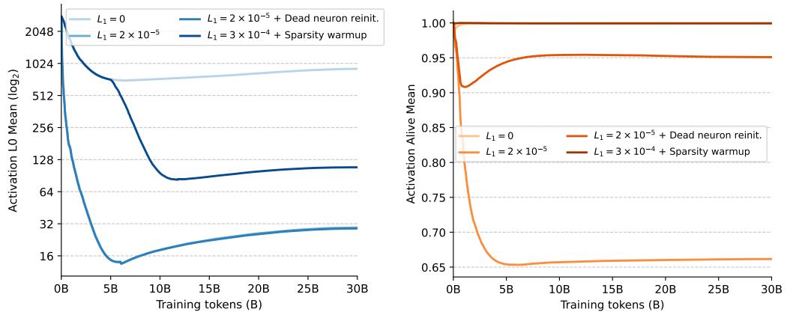  
Figure 8 | Number of non-zeros and fraction of dead neurons of LLMs with different strategies for dead neuron mitigation throughout training.

Based on these considerations, we explore two preliminary extensions to our simple L1-regularized training recipe explained in Section 2. First, we consider simply scheduling the L1 regularization, motivated by our findings that dead neurons appear to arise very early during training. Concretely, we first train our models for 5000 steps without any L1 regularization, followed by a further 5000 steps of linear increase of the L1 coefficient. We make the training setting artificially similar to prior work that focuses on finetuning and continued-pretraining (Song et al., 2025; Wang et al., 2024). Second, we consider implementing a target reinitialization strategy to lower the magnitude and reinject random noise only in the columns of the gate projection that lead to always negative outputs (which then, after ReLU, lead to dead neurons). Given the model's initialization standard deviation $\sigma = 0 . 0 2$ , we noised and rescaled to regress the weights to their initial state, essentially interpolating with a coefficient $\lambda$ :

$$
W _ { g } [ : , j ] \gets ( 1 - \lambda ) W _ { g } [ : , j ] + \lambda N ( 0 , \sigma ^ { 2 } ) ,
$$

We apply this targeted reinitialization after every training step, which we find does not significantly affect training time. In preliminary experiments, We found $\lambda = 0 . 1$ to be a good choice that avoids affecting training dynamics while injecting sufficient noise to revive dead neurons. We note this strategy is similar to older techniques for reinjecting plasticity into architectures in continual learning and other non-stationary settings (Ash and Adams, 2020).

In Table 5, we report the performance and efficiency results of our two strategies compared to our standard recipe and the non-sparse baseline, while in Figure 8 we analyze the number of non-zero activations and dead neurons throughout training. When looking at the dead neuron statistics, we find that both strategies almost entirely mitigate the emergence of dead neurons. However, we immediately see a concerning pattern with the sparsity-warmup strategy, as the number of non-zeros considerably increases throughout training. In particular, the considered coefficient of $L _ { 1 } = 3 \times 1 0 ^ { - 4 }$ which is ten times larger than our recommended value, leads to over 100 non-zeros on average across layers at the end of training, compared to only 29 non-zeros when using our standard recipe with $L _ { 1 } = 2 \times 1 0 ^ { - 5 }$ . We note that, in early experiments, we found that increasing the L1 coefficient further led to training instabilities and loss spikes. In contrast, using the targeted dead neuron reinitialization, we find similar non-zero statistics to our standard recipe while stillefectively mitigating dead neurons. Furthermore, as reported in Table 5, we find that this latter strategy provides a small boost in both downstream performance and efficiency, processing tokens $1 9 . 1 \%$ faster than the non-sparse baseline with our default L1 coefficient of $L _ { 1 } = 2 \times 1 0 ^ { - 5 }$ .We believe these preliminary results suggest that further research in examining optimal sparse training would potentially further increase the relevance and efficiency upsides of sparse LLMs.

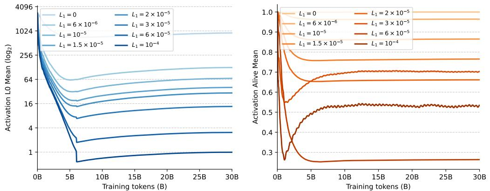  
Figure 9 | Number of non-zeros and fraction of dead neurons of LLMs across L1 regularization levels throughout training.

# D. Extended Results

# D.1. Sparsity and Dead Neurons During Training

In Figure 9, we provide detailed results about how activation sparsity and dead neuron occurrence evolve during training for all our different L1 regularization levels. In particular, we record dead neurons at the end of each training step by keeping track, for each hidden feedforward activation of each layer, the last time it was non-zero. If a neuron was never active for a whole training step (just above 1M tokens), we consider it dead for that step.

We make two immediate observations from these results. First, we find that the sparsity levels settle early on to low values after only around 1000 training steps (around 1B tokens). Due to this property, we note that the throughput and memory advantages of our training kernels become relevant almost at the inception of our training runs. Second, we observe that the same trend applies to the number of dead neurons: our recommended $L _ { 1 } = 2 \times 1 0 ^ { - 5 }$ already exceeds $3 0 \%$ inactivity, which further monotonically increases with higher regularization levels. While for our recommended coefficient, this symptom does not seem to evidently reflect on downstream performance, reducing such an effect could potentially allow supporting even higher sparsity before incurring performance degradation. To this end, we note that in Appendix C we provide preliminary results indicating that the performance of sparse LLMs could be further improved with strategies targeted at dead-neuron mitigation.

# D.2. Task Performance Details

To complement the results in Section 4 in the main text, we provide the detailed granular results of downstream task performance across the seven downstream tasks considered, targeting logic and reasoning capabilities after pretraining (Bisk et al., 2020; Clark et al., 2018; Mihaylov et al., 2018; Sakaguchi et al., 2021; Talmor et al., 2019; Zellers et al., 2019). In particular, we report the per-task accuracies for both sparse models, using our recommended conservative L1 regularization of $2 \times 1 0 ^ { - 5 }$ , and their non-sparse counterparts across all the examined model scales. As shown in Table 6 and consistently with our main text analysis, we do not find significant performance differences between sparse and non-sparse models for our regularization level and all considered tasks. We do, indeed, observe an expected performance rise with larger models across the great majority of tasks.

Table 6 | Granular comparison of per-task downstream performance across model scales to complement Table 1.   

<table><tr><td colspan="4">Model scale Sparse Mean Accuracy HellaSwag</td><td rowspan="2">CQA PIQA</td><td colspan="5">Winogrande ARC-easy ARC-challenge OpenBookQA</td></tr><tr><td rowspan="2">0.5B params 10B tokens</td><td>X</td><td>40.4%</td><td>33.7%</td><td>20.9%</td><td>64.5%</td><td>50.9% 64.1%</td><td>28.1%</td><td>20.8%</td></tr><tr><td>✓</td><td>40.4%</td><td>34.0%</td><td>22.3%</td><td>66.4%</td><td>53.8%</td><td>60.5%</td><td>27.5%</td><td>18.0%</td></tr><tr><td rowspan="2">1B params 20B tokens</td><td>X</td><td>44.6%</td><td>39.2%</td><td>20.0%</td><td>68.7%</td><td>54.4%</td><td>72.6%</td><td>34.0%</td><td>23.6%</td></tr><tr><td>✓</td><td>44.7%</td><td>39.8%</td><td>18.6%</td><td>68.1%</td><td>54.8%</td><td>71.6%</td><td>35.3%</td><td>24.4%</td></tr><tr><td rowspan="2">1.5B params 30B tokens</td><td>X</td><td>46.4%</td><td>41.0%</td><td>20.8%</td><td>70.2%</td><td>55.9%</td><td>72.5%</td><td>36.7%</td><td>27.4%</td></tr><tr><td>✓</td><td>46.2%</td><td>41.1%</td><td>21.0%</td><td>69.1%</td><td>54.4%</td><td>74.3%</td><td>37.5%</td><td>26.0%</td></tr><tr><td rowspan="2">2B params 40B tokens</td><td></td><td>49.1%</td><td></td><td>21.0%</td><td>72.0%</td><td>57.8%</td><td>77.2%</td><td></td><td></td></tr><tr><td>X ✓</td><td>48.8%</td><td>45.7% 45.0%</td><td>21.3%</td><td>70.9%</td><td>57.5%</td><td>75.6%</td><td>41.7% 42.2%</td><td>28.6% 28.8%</td></tr></table>

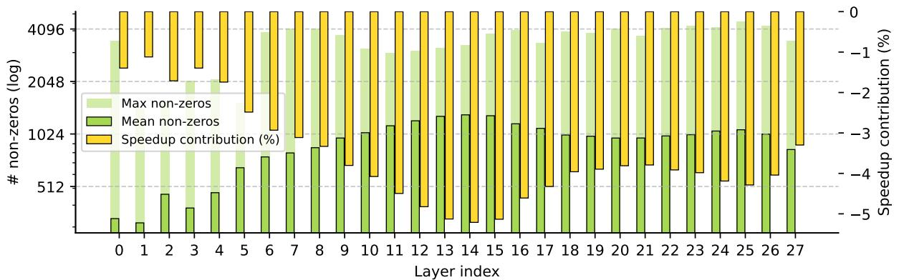  
Figure 10 | Sparsity statistics and speedup contributions across different layers of non-sparse LLMs.

# D.3. Activation Sparsity at High and Low Levels

To complement the analysis results provided in Section 4 of the main text, we examine how sparsity regularization affects the distribution of non-zero activations across model depth and relate these metrics to the corresponding speed-up contributions from our kernels during inference. While in our main analysis we reported and analyzed the LLM trained with our recommended conservative L1 regularization of $2 \times 1 0 ^ { - 5 }$ , in Figures 10 we provide analogous results for a non-sparse LLM while in Figure 11 we analyze an LLM trained with the highest regularization regularization level considered $( 1 \times 1 0 ^ { - 4 } )$ . We note that for non-sparse models, due to the high number of non-zeros, the contributions of applying our kernel are actually detrimental  and as such, we report the speed-up contributions as negative percentages. A first observation from the sparsity statistics is that the average number of non-zeros also follows a noticeable trend in the non-sparse model, with the first few layers being the least active, followed by a hump with a peak in activations. However, a key difference comes with the location of the hump: while in our recommended sparse model the peak occurs around layer 6, in the non-sparse LLM the peak still occurs within the first half of the network but is shifted visibly deeper into the architecture around layer 13. Interestingly, in the high-regularization LLM, we actually observe that while the very first layer is again the least active, there are two different peaks  one very early around the second layer and another one in the last layer of the model. Once again, we find that maximum activation counts can easily be well over an order of magnitude higher than the average, with no clear pattern across layers. For the non-sparse model, we again observe a strong inverse correlation between each layer's average non-zeros and its relative speed-up. In contrast to the high-regularization LLM, this correlation is much less visible, as given the high sparsity encountered, the speedups of our kernels are already at their achievable maximum for almost all layers, essentially making executing the up and down projection negligible in the overall computation time.

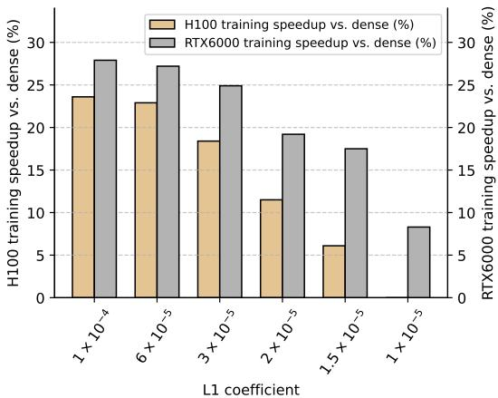  
Figure 12 | Training speedups from our sparse LLM training kernels across L1 regularization levels for both H100 and RTX6000 devices.

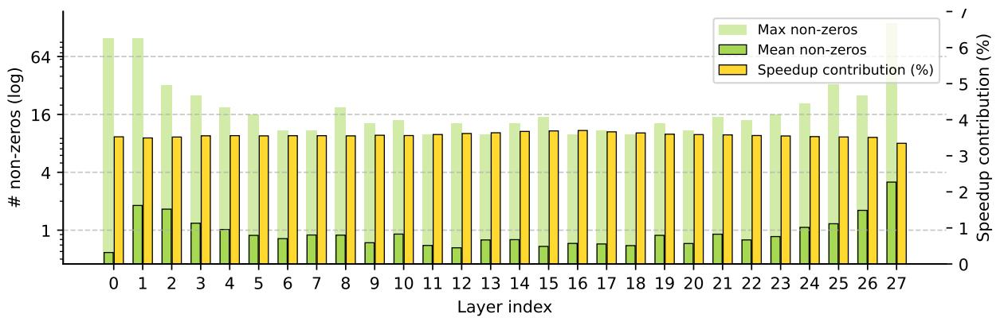  
Figure 11 | Sparsity statistics and speedup contributions across different layers of an LLM with high regularization $L _ { 1 } = 1 0 ^ { 4 }$ .

# D.4. Improving Efficiency of other Devices

As mentioned in Section 4, given that our kernels consistently reduce memory requirements during training, and as a side benefit, reduce reliance on newer tensor core units, they immediately have higher potential relevance for less capable hardware. Thus, to empirically validate these considerations, we provide additional results comparing the performance speedups of our kernels during training on NVIDIA's RTX PRO 6000 GPUs against the H100 PCIe GPUs used throughout our main paper and other experiments. Some of the other crucial differences of this GPU come from the memory side, with a considerably reduced memory bandwidth (1.59 TB/s vs. 2.0 TB/s). In contrast, the RTX PRO 6000 can benefit from a larger number of Streaming Multiprocessors than the H100 (188 vs. 114), potentially allowing for greater occupancy for sparse workloads.

As shown in Figure 12, and in line with our considerations, we find significantly higher speedups on the RTX 6000 GPU across al L1 regularization levels considered. These speedup differences are even more pronounced at higher regularization levels, extending the practical range of L1 coefficients make sparsity provide meaningful efficiency improvements. When dissecting what causes these greater speedups, we first find that thanks to the specific H100 features, such as the higher tensor cores throughput, the runtime of the dense GEMM operations increases from around 400 to 800 microseconds on the RTX 6000. Similarly, kernels that are memory bandwidth bound, including the dense to hybrid matrix multiplication, are also slightly slower by $1 9 \%$ on the RTX 6000 than on the

H100. However, once in our hybrid sparse format, due to the larger Streaming Multiprocessors count of the RTX 6000 GPU, the sparse operations run faster than on the H100, with speedups of $1 . 3 4 \times$ and $2 . 1 \times$ for sparse-to-dense and transposition operations, respectively. We find these results indicate that leveraging sparsity with targeted kernels could significantly improve the performance of cheaper devices, which do not implement the latest hardware innovations of higher-end units such as the H100, lowering the field's canonical hardware barriers.

# E. Further Related Work

# E.1. Activation Sparsity in Transformers

Expanding on the findings of Zhang et al. (2022b), Li et al. (2023) documents that Transformer MLP layers with ReLU activations exhibit inherent activation sparsity across architectures, depths, and data distributions. Building on this observation, Mirzadeh et al. (2023) shows that replacing GELU with ReLU in non-gated feed-forward layers yields negligible performance degradation while enabling up to three times theoretical inference speedup with less computation. However, they focus on older architectures (OPT models) with non-gated feed-forward blocks and leave efficient kernel implementation to future work.

More recent methods have also been proposed to enhance sparsity after altering modern gated architectures and have claimed speedups when running sparse feedforward layers in isolation on older generations of devices. TurboSparse (Song et al., 2024) proposes a modification to the feedforward block itself, introducing dReLU, which applies ReLU to both gate and up projections: $h =$ $\mathrm { R e L U } ( x W _ { g } ) \odot \mathrm { R e L U } ( x W _ { u } )$ . ProSparse (Song et al., 2025) proposes finetuning pretrained models and artificial thresholding of the activations to increase sparsity. Q-Sparse (Wang et al., 2024), further deviates from standard architectures via maintaining only the top-K activations and applying a straight-through estimator. We also note that additional works proposed introducing structured sparsity post-training, such as by predicting (Liu et al., 2023) and pruning activation to set sparsity levels (Lee et al., 2024; Liu et al., 2024). Unlike these works, our paper introduces general-purpose kernels to leverage unstructured sparsity, demonstrating empirical efficiency benefits during LLM training and inference.

# E.2. Architectural Approaches to Sparsity

Mixture-of-Experts (MoE) architectures (Fedus et al., 2022; Lepikhin et al., 2020; Shazeer et al., 2017) partition feed-forward layers into separately routed experts, decoupling model capacity from per-token computation. However, MoE requires predetermining the number of experts and sparsity level before training, limiting adaptability to input complexity.

Product key memory (Lample et al., 2019) maintains fixed sparsity patterns through $O ( \log n )$ key retrieval. PEER (He, 2024) extends this approach to over one million single-neuron experts with $9 9 . 9 9 \%$ architectural sparsity. UltraMem (Huang et al., 2025) improves PKM and scales to 20 million memory slots, showing that it can outperform MoE with the same parameter and computation budgets. Fast Feedforward Networks (Belcak and Wattenhofer, 2023) use differentiable binary trees to achieve $9 9 \%$ sparsity.

While these architectural approaches achieve extreme sparsity, they require substantial modifications to standard Transformer training pipelines. Our approach instead works with conventional architectures, requiring only a change of activation function and optional regularization, making it readily applicable to existing models and training infrastructure.