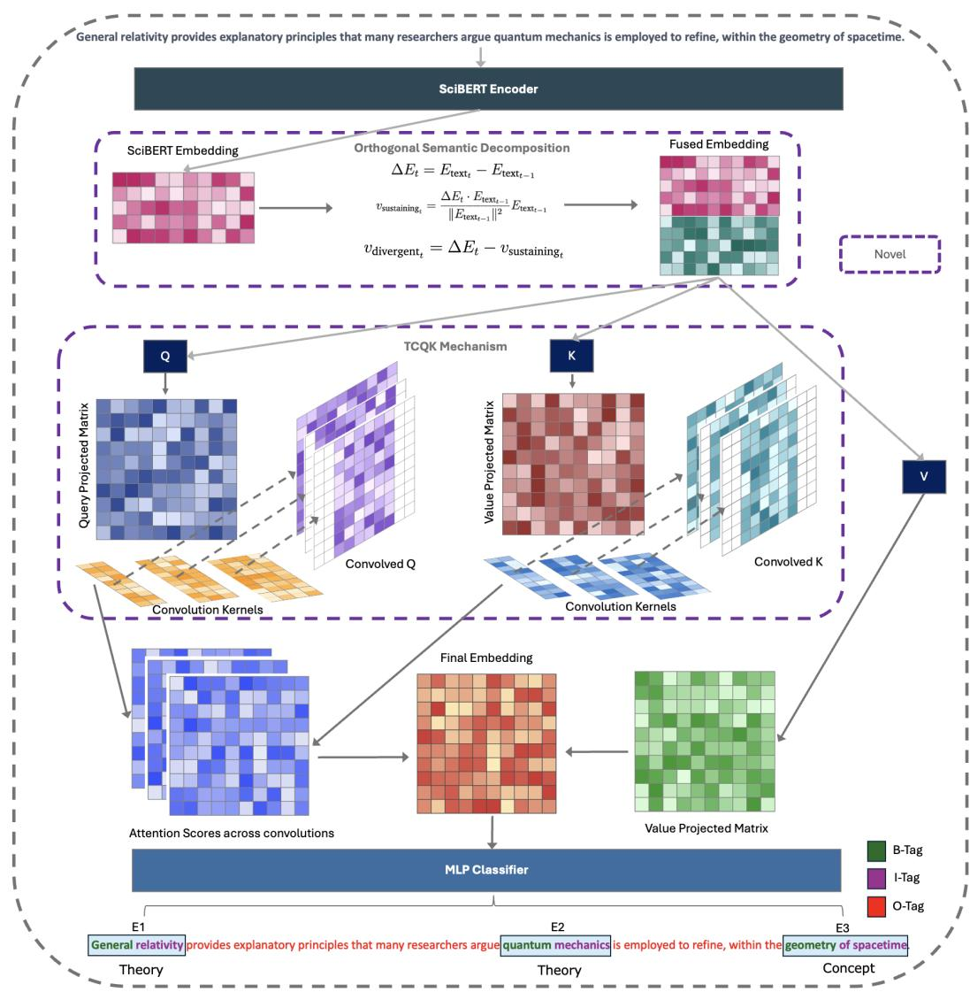
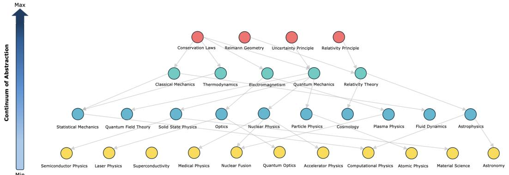
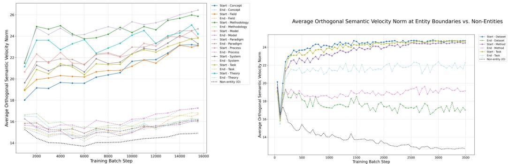
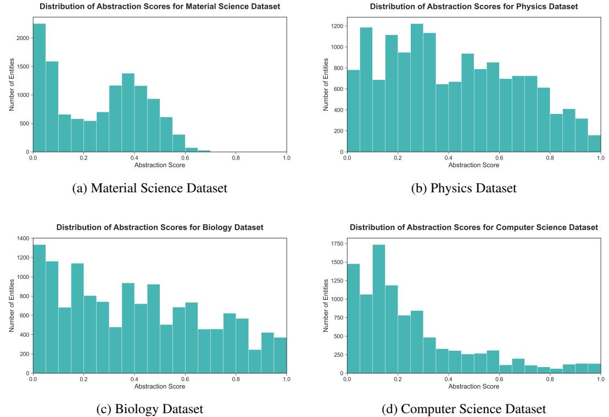

# 1. 论文基本信息
## 1.1. 标题
论文标题为 **HGNet: Scalable Foundation Model for Automated Knowledge Graph Generation from Scientific Literature**，核心主题是提出一种可扩展的基础模型，实现从科学文献中自动构建知识图谱（Knowledge Graph, KG），解决现有方法在长实体识别、跨域泛化、层级知识建模和全局一致性上的痛点。
> 首次出现术语解释：<strong>知识图谱（Knowledge Graph, KG）</strong> 是一种结构化知识表示形式，由<头实体, 关系, 尾实体>三元组组成，例如<深度学习, 子类属于, 机器学习>，可以高效组织、检索和推理结构化知识。
## 1.2. 作者
两位作者均来自英国帝国理工学院（Imperial College London）：
- Devvrat Joshi：BASIRA实验室、Imperial-X（I-X）与计算机系博士生
- Islem Rekik：BASIRA实验室负责人，Imperial-X与计算机系副教授，研究方向为医学影像分析、机器学习、知识图谱构建
  > 补充背景：帝国理工学院计算机系位列全球Top 10，BASIRA实验室专注于医疗与科学领域的AI方法研究，在相关领域具有较高学术影响力。
## 1.3. 发表期刊/会议
该论文当前为arXiv预印本状态，尚未正式发表于期刊或会议。arXiv是计算机领域主流的预印本平台，用于快速传播最新研究成果，无需同行评议。
## 1.4. 发表年份
预印本发布于2026年3月24日（UTC时间）。
## 1.5. 摘要
论文核心研究目标是解决现有科学文献知识图谱构建的四大痛点：长多词实体识别困难、跨域泛化能力差、忽略科学知识的层级结构、通用大模型成本高且精度不稳定。
核心方法为两阶段端到端框架：第一阶段`Z-NERD`零样本实体识别模型，通过<strong>正交语义分解（Orthogonal Semantic Decomposition, OSD）</strong> 提取领域不变的语义转向特征，通过**多尺度TCQK注意力机制**捕获不同长度的多词实体；第二阶段`HGNet`层级图网络，通过三通道层级感知消息传递建模父子、对等关系，同时引入**可微层级损失**保证图结构为合法有向无环图（DAG）、<strong>连续抽象场（Continuum Abstraction Field, CAF）损失</strong>在欧氏空间中编码抽象层级。此外作者还发布了大规模多域层级关系抽取基准数据集`SPHERE`。
实验结果：在SciERC、SciER、SPHERE基准上达到新的最先进水平（SOTA），分布外测试中命名实体识别（NER）F1提升8.08%，关系抽取（RE）Rel+ F1提升5.99%；零样本设置下NER提升10.76%，RE提升26.2%。
## 1.6. 原文链接
- 预印本主页：https://arxiv.org/abs/2603.23136v1
- PDF链接：https://arxiv.org/pdf/2603.23136v1
- 代码与数据集开源地址：https://github.com/basiralab/HGNet
- 发布状态：arXiv预印本，未经过同行评议，未正式发表。

  ---

# 2. 整体概括
## 2.1. 研究背景与动机
### 2.1.1. 核心问题与研究价值
当前科学文献呈指数级增长，人工综述与知识整理的速度远低于文献出版速度，自动知识图谱构建是解决这一矛盾的核心技术，可支持科研人员快速检索领域知识、发现研究关联、探索前沿方向。
### 2.1.2. 现有研究的空白（Gap）
现有科学KG构建方法存在四大未解决的耦合问题：
1.  **长多词实体识别误差大**：科学领域大量实体为长多词短语（如"原位透射电子显微镜"），现有模型将实体边界识别作为预训练的涌现特性，而非专门优化目标，常出现边界切分错误。
2.  **跨域泛化能力弱**：监督模型在分布外数据上性能骤降，通用大模型（10B+参数）泛化性好但推理成本极高，无法支撑大规模KG构建。
3.  **忽略知识层级结构**：科学知识天然具有层级性（如"深度学习"是"机器学习"的子类），现有方法依赖浅层共现特征，未显式建模层级关系，生成的KG结构扁平。
4.  **缺乏全局一致性约束**：现有方法无显式结构约束，容易出现逻辑矛盾（如A是B的父类、B又是A的父类的环路），无法保证KG为合法有向无环图（DAG）。
    > 首次出现术语解释：<strong>有向无环图（Directed Acyclic Graph, DAG）</strong> 是一种边带方向、不存在环路的图结构，是层级知识（如学科分类、概念从属）的天然表示形式。
### 2.1.3. 论文创新思路
针对上述四大痛点，论文提出两阶段的分层优化框架：第一阶段专门解决实体识别的长实体、跨域泛化问题，第二阶段专门解决关系抽取的层级建模、全局一致性问题，端到端联合训练实现高效、鲁棒的科学KG构建。
## 2.2. 核心贡献/主要发现
论文的核心贡献可分为四点：
1.  **Z-NERD零样本实体识别模型**：两个核心创新：① 多尺度TCQK注意力机制，让不同注意力头专门捕获不同长度的n-gram模式，精准识别长多词实体；② 正交语义分解（OSD），提取"语义转向"的领域不变特征，大幅提升跨域零样本泛化能力，模型仅约3亿参数，远小于通用大模型。
2.  **HGNet层级图网络**：首个专门面向科学KG的层级感知GNN架构，通过父类、子类、对等三通道独立消息传递，显式建模不同方向的层级信息流动，远超通用GNN的层级关系建模性能。
3.  **抽象的几何表示理论**：首次将层级抽象定义为标准欧氏空间的内在几何属性，通过可学习的抽象场向量定义通用抽象轴，用CAF损失实现层级的连续编码，相比传统双曲嵌入方法更简单、可解释性更强，同时支持对等关系建模。
4.  **SPHERE大规模基准数据集**：首个面向层级关系抽取的多域大规模基准，覆盖计算机科学、物理、生物、材料科学四个领域，包含1万篇文档、11.1万标注关系，层级为全局一致结构而非文档局部结构，解决了层级RE数据稀缺的问题。
    实验核心发现：该框架在所有测试基准上均大幅领先现有SOTA，尤其是零样本场景下的提升极为显著，证明了结构感知的KG构建方法的有效性。

---

# 3. 预备知识与相关工作
## 3.1. 基础概念
为便于初学者理解，首先解释本文涉及的核心基础概念：
### 3.1.1. 自然语言处理基础任务
- <strong>命名实体识别（Named Entity Recognition, NER）</strong>：自然语言处理基础任务，目标是从非结构化文本中识别出指定类型实体的边界和类别，例如从句子中识别出"深度学习"是"方法"类实体。
- <strong>关系抽取（Relation Extraction, RE）</strong>：在NER识别出实体的基础上，判断实体对之间的语义关系，例如判断"深度学习"和"机器学习"之间为"子类属于"关系。
- <strong>零样本学习（Zero-shot Learning）</strong>：模型在训练时未见过目标领域/类别的样本，无需重新微调即可完成对应任务，本文中指模型在物理、生物领域训练后，无需标注数据即可在计算机科学、材料科学领域完成NER和RE任务。
### 3.1.2. 核心模型基础
- <strong>自注意力机制（Self-attention）</strong>：Transformer架构的核心组件，通过计算序列中每个词元（token）与所有其他词元的关联权重，聚合上下文信息，是当前预训练语言模型的核心。其标准公式为：
  $$
  \mathrm{Attention}(Q, K, V) = \mathrm{softmax}\left(\frac{QK^T}{\sqrt{d_k}}\right)V
  $$
  符号解释：$Q$（查询）、$K$（键）、$V$（值）是输入嵌入经过线性变换得到的三个矩阵，$d_k$是$K$的维度，除以$\sqrt{d_k}$是为了防止内积过大导致softmax函数饱和。
- <strong>图神经网络（Graph Neural Network, GNN）</strong>：专门处理图结构数据的神经网络，通过消息传递机制让节点聚合邻居节点的信息，更新自身表示，天然适合处理KG这类图结构数据。
## 3.2. 前人工作
论文将相关工作分为三个方向，核心内容如下：
### 3.2.1. 科学文本实体识别
现有科学NER的SOTA方法基于领域预训练语言模型，例如SciBERT（科学文献预训练BERT）、BioBERT（生物领域预训练BERT）、BioMedLM（大规模生物领域预训练模型）。这类方法的问题是：长多词实体识别是预训练的涌现特性，而非专门优化目标，边界切分错误率高。
零样本NER方向的现有工作（如GLiNER、UniversalNER、通用大模型）依赖表面语义匹配或世界知识，跨域泛化能力有限，且大模型推理成本极高。
### 3.2.2. 关系抽取与层级建模
早期RE方法为句子级模型，后来发展为实体关系联合抽取模型（如PL-Marker、HGERE），但局限于句子级推理，无法捕获跨句子的长距离依赖。
跨文档RE方法引入GNN和多跳检索，但依赖共现、句法距离等表面特征，将文本邻近性等同于概念关联性，生成的KG噪声大。层级感知方法（如层级注意力、强化学习框架）仅适配浅层分类体系，无法处理科学知识的深层嵌套隐式层级。
### 3.2.3. 层级的几何与逻辑表示
现有层级结构建模主流方法为双曲嵌入（如Poincaré嵌入），利用双曲空间适合低失真树结构嵌入的特性建模层级，但双曲空间计算复杂、可解释性差，且无法很好地支持不符合严格树结构的对等关系。现有方法也缺乏显式的逻辑约束，无法保证生成的KG为合法DAG。
## 3.3. 技术演进
科学KG构建的技术发展脉络如下：
1.  早期：基于规则+监督机器学习的流水线方法，先做NER再做RE，误差传播严重，泛化性差。
2.  中期：基于预训练语言模型的联合抽取方法，性能有所提升，但未显式建模层级结构，跨域泛化能力有限。
3.  近期：引入GNN做关系抽取，但通用GNN为"层级盲"，未区分不同方向的关系信息流动，无全局结构约束。
4.  最新尝试：用通用大模型做零样本KG构建，但成本高、精度不稳定、无结构一致性约束。
    本文的工作填补了"轻量、零样本、层级感知、全局一致的科学KG构建"这一技术空白。
## 3.4. 差异化分析
本文方法与现有工作的核心区别如下：

| 对比维度         | 现有方法                          | 本文方法                          |
|------------------|-----------------------------------|-----------------------------------|
| 长实体识别       | 依赖预训练涌现特性，无专门优化    | 多尺度TCQK注意力显式优化n-gram匹配 |
| 跨域泛化         | 依赖表面语义匹配，泛化性有限      | OSD提取领域不变的语义转向特征      |
| 层级建模         | 无显式层级建模，依赖表面共现      | 三通道层级消息传递显式建模层级关系 |
| 全局一致性       | 无结构约束，易出现环路、逻辑矛盾  | 可微层级损失+CAF损失从逻辑、几何双维度约束一致性 |
| 效率             | 大模型参数大、成本高，监督模型泛化差 | 仅3亿参数，兼具大模型的泛化性和专用模型的效率 |

---

# 4. 方法论
本文整体框架为两阶段端到端架构，共享SciBERT编码器：第一阶段Z-NERD从文本中识别实体，输出实体的上下文嵌入；第二阶段HGNet基于实体嵌入完成关系抽取，同时通过结构损失保证全局一致性，两阶段联合训练。
## 4.1. 方法原理
核心直觉（intuition）：科学知识的层级性是内在属性，可通过两个维度的专门设计实现精准捕获：
1.  实体识别阶段：新概念的引入会带来语义突变（语义转向），该特征是领域无关的，结合多尺度n-gram匹配即可实现跨域的长多词实体识别。
2.  关系抽取阶段：层级中不同方向的信息（父类的抽象信息、子类的具体信息、对等实体的同类信息）语义差异大，需要分通道处理；同时从逻辑（保证DAG结构）、几何（在欧氏空间编码抽象程度）两个维度约束，即可实现全局一致的层级KG构建。
## 4.2. 核心方法详解
### 4.2.1. Z-NERD：零样本实体识别
Z-NERD解决实体识别的两大痛点：跨域泛化、长多词实体识别，包含两个核心组件：正交语义分解（OSD）和多尺度TCQK注意力。
#### 4.2.1.1. 正交语义分解（OSD）
核心假设：鲁棒的跨域泛化可以通过训练模型依赖"新概念引入的语义转向特征"而非整体语义流实现，语义转向（当前词与前文语义的偏差程度）是领域不变的，不受领域特定词汇的影响。
具体实现步骤：
1.  计算连续两个词元的嵌入差向量：$\Delta E_t = E_{\text{text}_t} - E_{\text{text}_{t-1}}$，其中$E_{\text{text}_t}$是第t个词元的SciBERT上下文嵌入。
2.  将差向量分解为两个正交分量：
    - 维持分量：差向量在前一个词元嵌入上的投影，代表对前文概念的延伸补充，公式：
      $$
      v_{\text{sustaining}_t} = \frac{\Delta E_t \cdot E_{\text{text}_{t-1}}}{\| E_{\text{text}_{t-1}} \|^2} E_{\text{text}_{t-1}}
      $$
      符号解释：$\cdot$为向量点积，$\| \cdot \|$为L2范数。
    - 发散分量：差向量减去维持分量，与前一个词元的嵌入方向正交，代表新概念的引入（即语义转向信号），公式：
      $$
      v_{\text{divergent}_t} = \Delta E_t - v_{\text{sustaining}_t}
      $$
3.  将发散分量$v_{\text{divergent}_t}$与原第t个词元的嵌入$E_{\text{text}_t}$拼接，作为后续TCQK注意力的输入，为模型提供领域无关的实体边界信号。
#### 4.2.1.2. 多尺度TCQK（Temporal Convolutional Queries & Keys）注意力
核心假设：让不同注意力头专门捕获不同长度的n-gram模式，即可鲁棒识别不同长度的实体（短到缩写、长到复杂技术术语）。
具体实现步骤：
1.  标准自注意力会将输入嵌入线性变换为查询$Q$、键$K$、值$V$三个矩阵，本文在计算注意力得分前，先对$Q$和$K$用1D卷积做变换。
2.  将H个注意力头分为G组，每组对应一个特定大小的1D卷积核$C_g$，核大小$k_g$通常取[1,3,5,7]，对应不同长度的n-gram。
3.  对组g内的每个注意力头h，计算卷积后的查询和键：
    $$
    \mathbf{Q}_{\mathrm{conv}, h} = C_g(\mathbf{Q}_h); \quad \mathbf{K}_{\mathrm{conv}, h} = C_g(\mathbf{K}_h)
    $$
    符号解释：$\mathbf{Q}_h$为头h的原始查询矩阵，$\mathbf{K}_h$为头h的原始键矩阵，$C_g$为组g的1D卷积核。
4.  用卷积后的$Q$和$K$计算注意力得分，和标准自注意力流程一致，不同头会专门处理对应长度的n-gram，实现长多词实体的精准边界识别。
    Z-NERD的完整架构如下图（原文Figure 6）所示：

    
    *该图像是示意图，展示了提议的 Z-NERD 算法的工作机制。图中首先通过 SciBERT 编码器进行嵌入，并利用正交语义分解生成融合嵌入。接着，TCQK 机制使用卷积操作处理查询、键和值的投影矩阵，并最终生成嵌入和注意力得分。最后，通过 MLP 分类器对识别的实体进行标记，分别标识为 B-Tag、I-Tag 和 O-Tag。*

### 4.2.2. HGNet：层级图网络
HGNet的输入是Z-NERD识别出的实体的上下文嵌入（保留文档级上下文），目标是估计实体对的关系分布，同时保证全局层级一致性，包含五个核心组件。
HGNet的完整架构如下图（原文Figure 7）所示：

*该图像是示意图，展示了提出的HGNet框架的各个组成部分。图中包含了模型的层次关系损失、概率消息传递机制以及不同损失函数（包括$L_{\text{acyclic}}$和$L_{\text{separation}}$）的概念。整体结构清晰地展示了在图的拓扑结构上如何进行节点的更新与关系预测，从而实现科学知识图谱的自动构建。*

#### 4.2.2.1. 概率层级消息传递
核心假设：如果GNN的消息传递架构专门分通道处理不同层级方向的信息，即可保留和利用层级结构；传统GNN所有边的消息传递无差异，会破坏层级表示。
具体实现步骤：
1.  首先用潜关系预测器（MLP）估计每对实体`(u, v)`的关系类型分布，关系集合为$\mathcal{R} = \{\text{父类-of, 对等-of, 无边}\}$，公式：
    $$
    P_{uv} = \mathrm{softmax}\left( \mathrm{MLP}([h_u || h_v]) \right)
    $$
    符号解释：$h_u$为实体u的上下文嵌入，`||`为向量拼接操作，$P_{uv}$为实体u到v的三类关系的概率，作为软边权重。
2.  采用三通道独立消息传递，每个通道有独立的可学习权重矩阵，分别聚合不同方向的信息：
    - 父类（上游）聚合：节点v聚合所有父类节点的信息，公式：
      $$
      \boldsymbol{m}_v^{\mathrm{parents}} = \sum_{u \in V} P_{uv}^{\mathrm{parent}} \cdot (W_{\mathrm{up}} \boldsymbol{h}_u^{(k)})
      $$
      符号解释：$V$为所有实体节点的集合，$P_{uv}^{\mathrm{parent}}$为u是v的父类的概率，$W_{\mathrm{up}}$为父类通道的权重矩阵，$\boldsymbol{h}_u^{(k)}$为第k层节点u的嵌入。
    - 子类（下游）聚合：节点v聚合所有子类节点的信息，公式：
      $$
      \boldsymbol{m}_v^{\mathrm{children}} = \sum_{u \in V} P_{vu}^{\mathrm{parent}} \cdot (W_{\mathrm{down}} \boldsymbol{h}_u^{(k)})
      $$
      符号解释：$P_{vu}^{\mathrm{parent}}$为v是u的父类的概率，$W_{\mathrm{down}}$为子类通道的权重矩阵。
    - 对等聚合：节点v聚合所有对等节点的信息，公式：
      $$
      \boldsymbol{m}_v^{\mathrm{peers}} = \sum_{u \in V} P_{uv}^{\mathrm{peer}} \cdot (W_{\mathrm{peer}} \boldsymbol{h}_u^{(k)})
      $$
      符号解释：$P_{uv}^{\mathrm{peer}}$为u和v是对等关系的概率，$W_{\mathrm{peer}}$为对等通道的权重矩阵。
3.  将三个聚合的消息与节点v当前的嵌入拼接，输入更新MLP得到第k+1层的结构感知嵌入：
    $$
    \boldsymbol{h}_v^{(k+1)} = \mathrm{UpdateMLP}\left( [\boldsymbol{h}_v^{(k)} || \boldsymbol{m}_v^{\mathrm{parents}} || \boldsymbol{m}_v^{\mathrm{children}} || \boldsymbol{m}_v^{\mathrm{peers}}] \right)
    $$
#### 4.2.2.2. 可微层级损失（DhL）
核心假设：通过可微地惩罚结构不可能的情况（环路、跳级捷径边），即可让潜层级结构逻辑合理，成为合法DAG。无该约束时模型易出现逻辑矛盾（如A是B的父类、B又是A的父类）或跳级错误（如直接把祖父类当父类）。
可微层级损失为两个分量的加权和，公式：
$$
\mathcal{L}_{\mathrm{hierarchy}} = \lambda_{\mathrm{acyclic}} \mathcal{L}_{\mathrm{acyclic}} + \lambda_{\mathrm{separation}} \mathcal{L}_{\mathrm{separation}}
$$
符号解释：$\lambda_{\mathrm{acyclic}}$和$\lambda_{\mathrm{separation}}$为超参数，控制两个损失的权重。
1.  无环损失$\mathcal{L}_{\mathrm{acyclic}}$：惩罚环路，利用矩阵指数的迹实现可微的DAG约束，公式：
    $$
    \mathcal{L}_{\mathrm{acyclic}} = \mathrm{tr}(e^{A_{\mathrm{parent}} \circ A_{\mathrm{parent}}}) - d
    $$
    符号解释：$A_{\mathrm{parent}}$为父类关系的邻接矩阵，$\circ$为哈达玛积（对应元素相乘），$e^{\cdot}$为矩阵指数，$\mathrm{tr}(\cdot)$为矩阵的迹（对角线元素之和），d为节点数。原理：若图为DAG，则邻接矩阵所有k≥1次幂的迹均为0，因此$\mathrm{tr}(e^A) = \mathrm{tr}(I) = d$，损失为0；若存在环路，损失大于0，优化该损失即可让图趋近于DAG。
2.  层级分离损失$\mathcal{L}_{\mathrm{separation}}$：惩罚跳级捷径边，即若存在u→v→w的路径，则惩罚u→w的直接父类边，公式：
    $$
    \mathcal{L}_{\mathrm{separation}} = \sum_{u,w} (A_{\mathrm{parent}}^2)_{uw} \cdot (A_{\mathrm{parent}})_{uw}
    $$
    符号解释：$A_{\mathrm{parent}}^2$为邻接矩阵的平方，$(A_{\mathrm{parent}}^2)_{uw}$为u到w的长度为2的路径的总权重，$(A_{\mathrm{parent}})_{uw}$为u到w的直接父类边权重，乘积越大说明捷径边越明显，优化该损失即可保证层级为严格的父子结构。
#### 4.2.2.3. 连续抽象场（CAF）损失
核心假设：层级理解是嵌入空间的内在几何属性，将所有概念沿一个通用"抽象轴"组织，即可把层级信息直接编码到向量表示中，抽象程度是嵌入的固有属性而非额外预测标签。
具体实现步骤：
1.  定义可学习的单位向量$\boldsymbol{w}_{\mathrm{abs}}$（抽象场向量）作为通用抽象轴，实体v的抽象得分为其嵌入在该轴上的投影：$\hat{y}_{\mathrm{abs}}(v) = h_v \cdot w_{\mathrm{abs}}$，为连续实数值，无需离散层级标注。
2.  CAF损失为三个分量的加权和，公式：
    $$
    \mathcal{L}_{\mathrm{caf}} = \mathcal{L}_{\mathrm{ranking}} + \gamma_1 \mathcal{L}_{\mathrm{anchor}} + \gamma_2 \mathcal{L}_{\mathrm{regression}}
    $$
    符号解释：$\gamma_1$和$\gamma_2$为超参数，控制分量权重。
    - 排序分量$\mathcal{L}_{\mathrm{ranking}}$：强制父类的抽象得分高于子类（父类更抽象、子类更具体），采用带间隔$\delta$的排序损失：
      $$
      \mathcal{L}_{\mathrm{ranking}} = \frac{1}{|\mathcal{E}_{\mathrm{part-of}}|} \sum_{(c,p) \in \mathcal{E}_{\mathrm{part-of}}} \max(0, (h_c - h_p) \cdot w_{\mathrm{abs}} + \delta)
      $$
      符号解释：$\mathcal{E}_{\mathrm{part-of}}$为所有"子类-父类"边的集合，$c$为子类，$p$为父类，$\delta$为间隔超参数。若子类抽象得分比父类高超过$-\delta$则产生损失，保证父类抽象得分始终高于子类至少$\delta$。
    - 锚定分量$\mathcal{L}_{\mathrm{anchor}}$：将最抽象的根节点（如"计算机科学"）的抽象得分锚定为1，最具体的叶子节点（如"Adam优化器"）的抽象得分锚定为0，为抽象轴提供参考点：
      $$
      \mathcal{L}_{\mathrm{anchor}} = \frac{1}{|\mathcal{V}_s|} \sum_{v_s \in \mathcal{V}_s} (\boldsymbol{h}_{v_s} \cdot \boldsymbol{w}_{\mathrm{abs}} - 1)^2 + \frac{1}{|\mathcal{V}_t|} \sum_{v_t \in \mathcal{V}_t} (\boldsymbol{h}_{v_t} \cdot \boldsymbol{w}_{\mathrm{abs}} - 0)^2
      $$
      符号解释：$\mathcal{V}_s$为根节点集合，$\mathcal{V}_t$为叶子节点集合。
    - 回归分量$\mathcal{L}_{\mathrm{regression}}$：将预测的抽象得分拉向真实拓扑深度得分（通过对真实层级做拓扑排序得到），保证抽象轴与真实层级对齐：
      $$
      \mathcal{L}_{\mathrm{regression}} = \frac{1}{|\mathcal{V}_{\mathrm{train}}|} \sum_{v \in \mathcal{V}_{\mathrm{train}}} ((h_v \cdot w_{\mathrm{abs}}) - y_{\mathrm{topo}}(v))^2
      $$
      符号解释：$\mathcal{V}_{\mathrm{train}}$为训练集节点集合，$y_{\mathrm{topo}}(v)$为节点v的真实拓扑深度得分。
物理领域的抽象轴示例如下图（原文Figure 1）所示，顶部为最抽象的基础概念，底部为最具体的应用领域：

*该图像是一个展示物理学主题抽象连续体的示意图。图中垂直轴表示抽象程度，顶部的红色节点为高级概念，底部的黄色节点为具体领域，展示了从基本法则到应用领域的层次关系。*

#### 4.2.2.4. 最终关系预测
上述{父类-of, 对等-of, 无边}是内部用于结构约束的粗粒度关系，最终需要预测任务要求的细粒度关系（如"用于"、"包含"等），采用标准下游分类头，输入为HGNet输出的结构感知嵌入$\boldsymbol{h}^{(k+1)}$，该分类头的损失为$\mathcal{L}_{\mathrm{RE}}$，是模型的主要任务目标。
#### 4.2.2.5. 联合优化
整个框架端到端联合训练，总损失为RE任务损失加两个结构正则项的加权和，公式：
$$
\mathcal{L}_{\mathrm{Total}} = \mathcal{L}_{\mathrm{RE}} + \lambda_1 \mathcal{L}_{\mathrm{hierarchy}} + \lambda_2 \mathcal{L}_{\mathrm{caf}}
$$
符号解释：$\lambda_1$和$\lambda_2$为超参数，控制结构损失的权重。可微层级损失保证图结构逻辑合理，CAF损失保证节点嵌入几何合理，两者共同约束KG的全局一致性。

---

# 5. 实验设置
## 5.1. 数据集
实验采用两类数据集：现有公开基准、新发布的SPHERE数据集。
### 5.1.1. 现有公开基准

| 数据集 | 领域 | 规模 | 特点 |
|--------|------|------|------|
| SciERC | 计算机科学（AI） | 500篇摘要，~4.6k关系 | 科学KG构建的常用标准基准 |
| SciER | 计算机科学 | 106篇文档，~12k关系 | 专门标注数据集、方法、任务之间的关系 |
| BioRED | 生物医学 | 600篇文档，~38k关系 | 生物医学领域的权威RE基准 |
| SemEval-2017 Task 10 | 跨科学领域 | 约500篇文档 | 科学信息抽取的通用基准 |

上述数据集均为文档级的局部层级，用于和现有SOTA方法对比。
### 5.1.2. SPHERE数据集
本文新发布的大规模多域层级关系抽取基准，核心属性如下：
- 覆盖四个科学领域：计算机科学、物理、生物、材料科学
- 规模：1万篇文档，11.1万标注关系，4万+实体
- 特点：从全局KG脚手架生成，层级为全局一致结构，而非文档局部层级，适合评估零样本泛化和层级建模能力
- 生成方法：三阶段LLM辅助生成：① 程序式KG脚手架，让LLM递归生成各领域的深度层级结构；② 高吞吐量句子生成，采样相关概念生成描述关系的学术段落；③ LLM自标注，对生成文本做NER和RE并链接到全局KG。人工验证实体精度96.5%，关系精度94.2%，质量接近人工标注。
  SPHERE与现有基准的对比如下（原文Table 6）：

  <table>
  <thead>
  <tr>
  <th>Dataset</th>
  <th>Domain</th>
  <th>Docs</th>
  <th>Relations</th>
  <th>Graph Scope</th>
  <th>Hierarchy Source</th>
  </tr>
  </thead>
  <tbody>
  <tr>
  <td>SciERC</td>
  <td>CS (AI)</td>
  <td>500</td>
  <td>~4.6k</td>
  <td>Local (Doc-Level)</td>
  <td>Inferred from Text</td>
  </tr>
  <tr>
  <td>BioRED</td>
  <td>Biomed</td>
  <td>600</td>
  <td>~38k</td>
  <td>Local (Doc-Level)</td>
  <td>Inferred from Text</td>
  </tr>
  <tr>
  <td>SciER</td>
  <td>CS</td>
  <td>106</td>
  <td>~12k</td>
  <td>Local (Doc-Level)</td>
  <td>Inferred from Text</td>
  </tr>
  <tr>
  <td>SPHERE</td>
  <td>4 Domains</td>
  <td>10,000</td>
  <td>111,000</td>
  <td>Global (Corpus-Level)</td>
  <td>Pre-defined Scaffold</td>
  </tr>
  </tbody>
  </table>

## 5.2. 评估指标
本文采用两个任务的标准评估指标：
### 5.2.1. Micro F1（NER任务指标）
1.  **概念定义**：综合衡量模型识别实体的边界和类别的准确率与召回率，micro指将所有样本的真阳性、假阳性、假阴性汇总后计算，而非按类别平均后再汇总，适合类别不平衡的NER任务。
2.  **数学公式**：
    首先定义精确率和召回率：
    $$
    \text{Precision} = \frac{TP}{TP + FP}, \quad \text{Recall} = \frac{TP}{TP + FN}
    $$
    Micro F1为：
    $$
    \text{Micro F1} = 2 \times \frac{\text{Micro Precision} \times \text{Micro Recall}}{\text{Micro Precision} + \text{Micro Recall}}
    $$
3.  **符号解释**：
    - `TP`（真阳性）：模型正确识别的实体数量（边界、类别均正确）
    - `FP`（假阳性）：模型错误识别的实体数量（非实体被识别为实体，或边界/类别错误）
    - `FN`（假阴性）：真实存在的实体未被模型识别的数量
### 5.2.2. Rel+ F1（RE任务指标）
1.  **概念定义**：非常严格的端到端RE评估指标，要求模型同时正确预测头实体的边界+类别、关系类型、尾实体的边界+类别，任意一项错误则该样本判定为错误，用于衡量完整KG构建的性能。
2.  **数学公式**：
    与F1公式结构一致，仅TP的定义更严格：
    $$
    \text{Rel+ F1} = 2 \times \frac{P_{\text{Rel+}} \times R_{\text{Rel+}}}{P_{\text{Rel+}} + R_{\text{Rel+}}}
    $$
3.  **符号解释**：
    - $P_{\text{Rel+}}$：Rel+精确率，即预测正确的三元组占所有预测三元组的比例
    - $R_{\text{Rel+}}$：Rel+召回率，即预测正确的三元组占所有真实三元组的比例
## 5.3. 对比基线
实验分为NER和RE两个任务的基线：
### 5.3.1. NER基线
- 监督基线：SciBERT、PL-Marker、HGERE，均为现有科学NER的SOTA监督模型
- 专门零样本NER模型：UniversalNER-7b（70亿参数的零样本NER SOTA模型）
- 零样本大模型基线：Llama-3.3-70b、Qwen3-32b、Llama-3.1-8b-instant，通用大模型零样本设置
### 5.3.2. RE基线
- 监督端到端模型：PL-Marker、HGERE，现有科学RE的SOTA监督模型
- 监督GNN基线：GCN、GAT，通用图神经网络基线
- 零样本大模型基线：GPT-3.5 Turbo、GPT-oss-120b、Llama-3.3-70b等通用大模型零样本设置
- 几何基线：HGCN（双曲GCN）、Order-Embeddings，用于对比CAF损失与非欧几何方法的性能
- 少样本大模型基线：Llama-3-8B 3-Shot CoT，对比少样本大模型的性能

  ---

# 6. 实验结果与分析
## 6.1. 核心结果分析
### 6.1.1. Z-NERD NER结果
不同模型在NER基准上的F1得分如下（原文Table 1）：

<table>
<thead>
<tr>
<th rowspan="2">Models</th>
<th rowspan="2">SciERC</th>
<th rowspan="2">SciER</th>
<th rowspan="2">BioRED</th>
<th rowspan="2">SemEval</th>
<th colspan="2">CS</th>
<th colspan="2">Physics</th>
<th colspan="2">Bio</th>
<th colspan="2">MS</th>
</tr>
<tr>
<th>Sup</th>
<th>ZS</th>
<th>Sup</th>
<th>ZS</th>
<th>Sup</th>
<th>ZS</th>
<th>Sup</th>
<th>ZS</th>
</tr>
</thead>
<tbody>
<tr>
<td colspan="13">Supervised Baselines</td>
</tr>
<tr>
<td>SciBERT Ye et al. (2022)</td>
<td>67.52</td>
<td>70.71</td>
<td>89.15</td>
<td>49.14</td>
<td>68.19</td>
<td>57.02</td>
<td>72.90</td>
<td>61.22</td>
<td>75.83</td>
<td>68.45</td>
<td>67.29</td>
<td>57.14</td>
</tr>
<tr>
<td>PL-Marker Yan et al. (2023)</td>
<td>70.32</td>
<td>74.04</td>
<td>86.41</td>
<td>47.69</td>
<td>68.64</td>
<td>56.39</td>
<td>72.83</td>
<td>60.51</td>
<td>-</td>
<td>66.17</td>
<td>-</td>
<td>-</td>
</tr>
<tr>
<td>HGERE Yan et al. (2023)</td>
<td>75.92</td>
<td>81.19</td>
<td>89.43</td>
<td>48.25</td>
<td>69.82</td>
<td>-</td>
<td>72.46</td>
<td>-</td>
<td>75.78</td>
<td>-</td>
<td>66.72</td>
<td>57.92</td>
</tr>
<tr>
<td>UniversalNER-7b Zhou et al. (2024)</td>
<td>66.09</td>
<td>73.13</td>
<td>88.46</td>
<td>47.60</td>
<td>-</td>
<td>58.95</td>
<td>-</td>
<td>60.67</td>
<td>76.42</td>
<td>68.51</td>
<td>67.24</td>
<td>58.03</td>
</tr>
<tr>
<td colspan="13">Zero-Shot LLM Baselines</td>
</tr>
<tr>
<td>llama-3.3-70b Touvron et al. (2023)</td>
<td>46.20</td>
<td>49.57</td>
<td>54.82</td>
<td>OOM</td>
<td>-</td>
<td>-</td>
<td>-</td>
<td>-</td>
<td>OOM</td>
<td>-</td>
<td>-</td>
<td>-</td>
</tr>
<tr>
<td>qwen3-32b Qwen et al. (2025)</td>
<td>41.63</td>
<td>46.52</td>
<td>31.71</td>
<td>30.16</td>
<td>-</td>
<td>-</td>
<td>-</td>
<td>-</td>
<td>OOM</td>
<td>-</td>
<td>-</td>
<td>-</td>
</tr>
<tr>
<td>llama-3.1-8b-instant Touvron et al. (2023)</td>
<td>31.21</td>
<td>33.96</td>
<td>33.58</td>
<td>26.48</td>
<td>-</td>
<td>-</td>
<td>-</td>
<td>-</td>
<td>OOM</td>
<td>-</td>
<td>-</td>
<td>-</td>
</tr>
<tr>
<td colspan="13">Proposed Approach (Z-NERD)</td>
</tr>
<tr>
<td>Z-NERD w/o OSD</td>
<td>73.43</td>
<td>75.12</td>
<td>84.43</td>
<td>47.85</td>
<td>68.47</td>
<td>59.35</td>
<td>74.92</td>
<td>61.74</td>
<td>73.92</td>
<td>68.30</td>
<td>69.48</td>
<td>57.73</td>
</tr>
<tr>
<td>Z-NERD w/o TCQK</td>
<td>74.39</td>
<td>80.27</td>
<td>90.12</td>
<td>50.98</td>
<td>76.93</td>
<td>62.04</td>
<td>76.68</td>
<td>65.17</td>
<td>82.40</td>
<td>73.29</td>
<td>78.24</td>
<td>63.45</td>
</tr>
<tr>
<td>Z-NERD</td>
<td>78.84</td>
<td>82.71</td>
<td>91.05</td>
<td>52.26</td>
<td>80.47</td>
<td>69.52</td>
<td>82.39</td>
<td>73.19</td>
<td>84.35</td>
<td>74.21</td>
<td>83.96</td>
<td>72.28</td>
</tr>
</tbody>
</table>

结果分析：
- Z-NERD在所有基准上均达到新的SOTA，监督设置下平均比之前的SOTA高8.08%，零样本设置下平均高10.76%。
- 通用大模型的零样本性能极差，主要因为长多词实体边界识别不准，且大模型参数过大，很多场景出现OOM（显存不足），而Z-NERD仅不到10亿参数，推理效率高很多。
### 6.1.2. HGNet RE结果
首先是公开基准的RE结果（原文Table 2）：

<table>
<thead>
<tr>
<th rowspan="2">Models</th>
<th colspan="3">SciERC</th>
<th colspan="3">SciER</th>
<th colspan="3">BioRED</th>
<th colspan="3">SemEval</th>
</tr>
<tr>
<th>Hier.</th>
<th>Peer</th>
<th>Overall</th>
<th>Hier.</th>
<th>Peer</th>
<th>Overall</th>
<th>Hier.</th>
<th>Peer</th>
<th>Overall</th>
<th>Hier.</th>
<th>Peer</th>
<th>Overall</th>
</tr>
</thead>
<tbody>
<tr>
<td colspan="13">Supervised Models</td>
</tr>
<tr>
<td>PL-Marker Ye et al. (2022)</td>
<td>35.60</td>
<td>44.97</td>
<td>41.63</td>
<td>40.25</td>
<td>61.84</td>
<td>56.78</td>
<td>-</td>
<td>43.40</td>
<td>43.40</td>
<td>29.87</td>
<td>32.96</td>
<td>37.19</td>
</tr>
<tr>
<td>HGERE Yan et al. (2023)</td>
<td>37.72</td>
<td>47.35</td>
<td>43.86</td>
<td>43.79</td>
<td>64.35</td>
<td>58.47</td>
<td>-</td>
<td>45.73</td>
<td>45.73</td>
<td>32.39</td>
<td>33.81</td>
<td>38.63</td>
</tr>
<tr>
<td>PURE Zhong & Chen (2021)</td>
<td>34.39</td>
<td>38.46</td>
<td>36.78</td>
<td>38.53</td>
<td>56.21</td>
<td>49.35</td>
<td>-</td>
<td>41.35</td>
<td>41.35</td>
<td>29.41</td>
<td>28.94</td>
<td>34.92</td>
</tr>
<tr>
<td colspan="13">Zero-Shot LLM Models</td>
</tr>
<tr>
<td>GPT-3.5 Turbo Ye et al. (2023)</td>
<td>14.97</td>
<td>15.02</td>
<td>14.98</td>
<td>8.35</td>
<td>8.91</td>
<td>8.58</td>
<td>-</td>
<td>17.13</td>
<td>17.13</td>
<td>6.36</td>
<td>16.30</td>
<td>16.74</td>
</tr>
<tr>
<td>openai/gpt-oss-120b Ye et al. (2023)</td>
<td>19.68</td>
<td>21.27</td>
<td>20.45</td>
<td>27.93</td>
<td>27.52</td>
<td>27.64</td>
<td>-</td>
<td>24.16</td>
<td>24.16</td>
<td>7.15</td>
<td>23.59</td>
<td>23.88</td>
</tr>
<tr>
<td>llama-3.3-70b-versatile Touvron et al. (2023)</td>
<td>22.15</td>
<td>22.53</td>
<td>22.39</td>
<td>23.97</td>
<td>25.06</td>
<td>24.59</td>
<td>-</td>
<td>25.38</td>
<td>25.38</td>
<td>7.29</td>
<td>23.65</td>
<td>24.12</td>
</tr>
<tr>
<td>qwen/qwen3-32b Qwen et al. (2025)</td>
<td>16.57</td>
<td>19.33</td>
<td>18.20</td>
<td>24.02</td>
<td>24.45</td>
<td>24.28</td>
<td>-</td>
<td>21.38</td>
<td>21.38</td>
<td>6.71</td>
<td>20.92</td>
<td>21.09</td>
</tr>
<tr>
<td>llama-3.1-8b-instant Touvron et al. (2023)</td>
<td>13.30</td>
<td>14.27</td>
<td>13.92</td>
<td>17.15</td>
<td>17.69</td>
<td>17.43</td>
<td>-</td>
<td>14.46</td>
<td>14.46</td>
<td>5.48</td>
<td>14.11</td>
<td>14.24</td>
</tr>
<tr>
<td colspan="13">Supervised GNN-based Models</td>
</tr>
<tr>
<td>GCN</td>
<td>40.13</td>
<td>48.78</td>
<td>45.62</td>
<td>47.37</td>
<td>63.89</td>
<td>57.35</td>
<td>-</td>
<td>45.92</td>
<td>45.92</td>
<td>31.93</td>
<td>34.08</td>
<td>38.96</td>
</tr>
<tr>
<td>GCN w/o LDHL</td>
<td>38.46</td>
<td>48.51</td>
<td>44.98</td>
<td>46.85</td>
<td>64.22</td>
<td>56.89</td>
<td>-</td>
<td>45.72</td>
<td>45.72</td>
<td>32.28</td>
<td>32.82</td>
<td>37.99</td>
</tr>
<tr>
<td>GAT</td>
<td>40.37</td>
<td>49.11</td>
<td>46.21</td>
<td>47.35</td>
<td>64.29</td>
<td>57.64</td>
<td>-</td>
<td>46.19</td>
<td>46.19</td>
<td>32.40</td>
<td>34.47</td>
<td>39.25</td>
</tr>
<tr>
<td>GAT w/o LDHL</td>
<td>38.96</td>
<td>49.25</td>
<td>45.48</td>
<td>47.03</td>
<td>64.23</td>
<td>57.30</td>
<td>-</td>
<td>45.88</td>
<td>45.88</td>
<td>32.74</td>
<td>33.52</td>
<td>38.43</td>
</tr>
<tr>
<td colspan="13">Proposed Approaches</td>
</tr>
<tr>
<td>HGNet w/o LDHL</td>
<td>42.70</td>
<td>52.14</td>
<td>47.33</td>
<td>54.75</td>
<td>61.21</td>
<td>58.67</td>
<td>-</td>
<td>43.28</td>
<td>43.28</td>
<td>33.09</td>
<td>38.58</td>
<td>41.19</td>
</tr>
<tr>
<td>HGNet w/o LCAF Loss</td>
<td>50.96</td>
<td>55.41</td>
<td>53.19</td>
<td>62.36</td>
<td>67.02</td>
<td>65.38</td>
<td>-</td>
<td>50.64</td>
<td>50.64</td>
<td>33.85</td>
<td>45.37</td>
<td>47.03</td>
</tr>
<tr>
<td>HGNet</td>
<td>48.52</td>
<td>55.37</td>
<td>51.68</td>
<td>59.10</td>
<td>65.95</td>
<td>62.79</td>
<td>-</td>
<td>49.42</td>
<td>49.42</td>
<td>34.31</td>
<td>42.16</td>
<td>45.05</td>
</tr>
</tbody>
</table>

SPHERE数据集监督RE结果（原文Table 3）：

<table>
<thead>
<tr>
<th rowspan="2">Models</th>
<th colspan="3">Comp. Sci.</th>
<th colspan="3">Physics</th>
<th colspan="3">Biology</th>
<th colspan="3">Mat. Sci.</th>
</tr>
<tr>
<th>Hier.</th>
<th>Peer</th>
<th>All</th>
<th>Hier.</th>
<th>Peer</th>
<th>All</th>
<th>Hier.</th>
<th>Peer</th>
<th>All</th>
<th>Hier.</th>
<th>Peer</th>
<th>All</th>
</tr>
</thead>
<tbody>
<tr>
<td colspan="13">Supervised Models</td>
</tr>
<tr>
<td>PL-Marker Ye et al. (2022)</td>
<td>51.98</td>
<td>57.04</td>
<td>55.29</td>
<td>50.22</td>
<td>56.48</td>
<td>53.51</td>
<td>52.35</td>
<td>53.76</td>
<td>53.03</td>
<td>52.96</td>
<td>53.27</td>
<td>53.12</td>
</tr>
<tr>
<td>HGERE Yan et al. (2023)</td>
<td>54.20</td>
<td>59.86</td>
<td>57.93</td>
<td>53.17</td>
<td>58.90</td>
<td>56.28</td>
<td>54.52</td>
<td>56.47</td>
<td>55.21</td>
<td>55.84</td>
<td>55.86</td>
<td>55.43</td>
</tr>
<tr>
<td colspan="13">Proposed Approaches</td>
</tr>
<tr>
<td>HGNet (ours)</td>
<td>77.40</td>
<td>81.36</td>
<td>79.51</td>
<td>76.93</td>
<td>83.47</td>
<td>80.60</td>
<td>82.53</td>
<td>84.29</td>
<td>83.74</td>
<td>81.91</td>
<td>85.64</td>
<td>83.65</td>
</tr>
<tr>
<td>w/o LDHL</td>
<td>73.62</td>
<td>74.83</td>
<td>74.17</td>
<td>74.01</td>
<td>75.30</td>
<td>74.66</td>
<td>79.15</td>
<td>78.64</td>
<td>78.90</td>
<td>77.43</td>
<td>76.92</td>
<td>77.28</td>
</tr>
<tr>
<td>w/o Lcaf</td>
<td>67.14</td>
<td>65.89</td>
<td>66.50</td>
<td>64.51</td>
<td>66.24</td>
<td>65.96</td>
<td>75.17</td>
<td>73.29</td>
<td>74.13</td>
<td>75.95</td>
<td>77.38</td>
<td>76.32</td>
</tr>
</tbody>
</table>

零样本RE结果（训练集为物理+生物，测试集为计算机科学+材料科学，原文Table 4）：

<table>
<thead>
<tr>
<th rowspan="2">Models</th>
<th colspan="3">Comp. Sci.</th>
<th colspan="3">Mat. Sci.</th>
</tr>
<tr>
<th>Hier.</th>
<th>Peer</th>
<th>All</th>
<th>Hier.</th>
<th>Peer</th>
<th>All</th>
</tr>
</thead>
<tbody>
<tr>
<td>PL-Marker Ye et al. (2022)</td>
<td>28.72</td>
<td>28.41</td>
<td>28.56</td>
<td>33.10</td>
<td>34.22</td>
<td>33.85</td>
</tr>
<tr>
<td>HGERE Yan et al. (2023)</td>
<td>29.93</td>
<td>29.63</td>
<td>29.81</td>
<td>36.27</td>
<td>39.41</td>
<td>37.97</td>
</tr>
<tr>
<td>HGNet (ours)</td>
<td>59.36</td>
<td>64.07</td>
<td>62.60</td>
<td>69.92</td>
<td>71.33</td>
<td>70.62</td>
</tr>
</tbody>
</table>

结果分析：
- HGNet在所有基准上均超过基线，监督设置下平均提升5.99%，零样本设置下平均提升26.2%，层级关系的提升尤为明显，证明其层级建模能力的有效性。
- 通用大模型的零样本性能远低于HGNet，即使是3-shot CoT的Llama-3-8B也仅达到19.45%的Rel+ F1，远低于HGNet的53.19%。
- 与双曲GCN、Order-Embeddings等几何基线相比，HGNet性能更高，说明CAF损失的欧氏空间建模比非欧方法更灵活，尤其适合处理不符合严格树结构的对等关系。
## 6.2. 消融实验分析
### 6.2.1. Z-NERD消融
- 去掉TCQK机制：性能严重下降，尤其长实体较多的数据集下降更明显，验证了TCQK对多尺度n-gram模式的捕获能力，证明假设3.2成立。
- 去掉OSD特征：性能下降，零样本设置下下降尤为显著，说明OSD提取的语义转向特征是领域不变的，可有效提升跨域泛化能力，证明假设3.1成立。
  OSD的有效性可视化证据如下图（原文Figure 2），实体边界的平均正交语义速度远高于非实体，两者清晰分离：

  
  *该图像是图表，展示了SPHERE-CS（左）和SciER（右）中实体边界处的平均正交语义速度范数（'Start'、'End'）与非实体的对比。数据清晰分离，为假设3.1提供了视觉证据。*

### 6.2.2. HGNet消融
- 去掉可微层级损失（DhL）：性能明显下降，尤其层级关系性能下降更多，说明惩罚环路和捷径边可有效提升逻辑一致性，证明假设3.4成立。
- 去掉CAF损失：性能大幅下降，说明将抽象程度编码为欧氏空间的几何属性可有效提升层级推理能力，证明假设3.5成立。
- 去掉三通道消息传递：性能下降，说明分通道处理不同方向的层级信息可有效保留层级结构，证明假设3.3成立。
  不同领域的抽象分数分布如下图（原文Figure 3），每个领域的分布符合其内在层级结构，例如计算机科学的分布呈指数衰减，符合从抽象到具体的层级特点：

  
  *该图像是图表，展示了不同科学领域的抽象分数分布。包括材料科学、物理学、生物学和计算机科学的数据集，每个图表展示了对应领域中不同抽象分数下的实体数量。*

---

# 7. 总结与思考
## 7.1. 结论总结
本文提出了首个端到端解决科学KG构建四大痛点的两阶段框架：
1.  第一阶段Z-NERD通过正交语义分解和多尺度TCQK注意力，解决了长多词实体识别和跨域零样本泛化的问题，仅3亿参数，兼具高性能和高效率。
2.  第二阶段HGNet通过三通道层级消息传递、可微层级损失和CAF损失，实现了层级结构的显式建模和全局一致性约束，首次将层级抽象编码为欧氏空间的内在几何属性，比传统双曲方法更简单可解释。
3.  新发布的SPHERE数据集是首个大规模多域层级关系抽取基准，解决了该领域数据稀缺的问题。
    实验结果表明，该框架在所有测试基准上均大幅领先现有SOTA，零样本场景下提升尤为显著，为大规模科学KG构建提供了可行的落地方案。
## 7.2. 局限性与未来工作
### 7.2.1. 作者指出的局限性与未来方向
1.  当前框架仅处理文本模态，未来可融合图表、公式等多模态信息，构建更完整的科学KG。
2.  可扩展到动态更新的KG，实时反映科学领域的最新研究进展。
3.  可加入基于依存句法分析的预处理步骤，剪枝不可能的实体对，进一步提升关系抽取的精度。
4.  可利用构建的KG做下游推理任务，例如自动假设生成、跨领域知识发现等。
### 7.2.2. 未提及的局限性
当前CAF损失仅采用单一抽象轴，假设所有抽象为单维度，但实际科学知识可能存在多维度的抽象（例如"方法"的抽象维度和"数据集"的抽象维度可能不同），单一轴无法完全覆盖复杂的层级结构。此外，当文本存在循环定义时，无环损失会强制打破环路，可能丢失有效语义链接。
## 7.3. 个人启发与批判
### 7.3.1. 启发与迁移价值
1.  **方法迁移**：OSD提取领域不变语义转向特征的思路可迁移到其他跨域NLP任务（如跨域文本分类、低资源信息抽取），无需依赖领域特定词汇，仅通过话语结构特征即可实现跨域泛化。CAF损失的单轴抽象编码思路可迁移到其他需要层级建模的场景（如推荐系统用户兴趣层级建模、电商分类体系构建），相比双曲方法更易落地。
2.  **数据构建思路**：SPHERE数据集的"全局KG脚手架引导LLM生成+自标注"方法，为复杂结构标注数据的构建提供了低成本的可行方案，可推广到其他缺乏标注数据的领域。
3.  **应用价值**：该框架可用于构建全学科的科学文献KG，帮助科研人员快速梳理领域知识结构、发现研究关联、识别前沿方向，甚至可以支持跨领域的知识迁移发现，对科研效率提升具有重要价值。
### 7.3.2. 潜在改进方向
1.  可将CAF损失的单一抽象轴扩展为多个正交抽象轴，建模多维度的层级结构，适配更复杂的科学知识表示。
2.  可探索更高效的无环约束方法，降低可微层级损失在超大规模KG上的计算开销。
3.  可设计更紧密的两阶段联合训练机制，让RE阶段的结构信号反馈优化NER阶段的实体识别，减少误差传播。