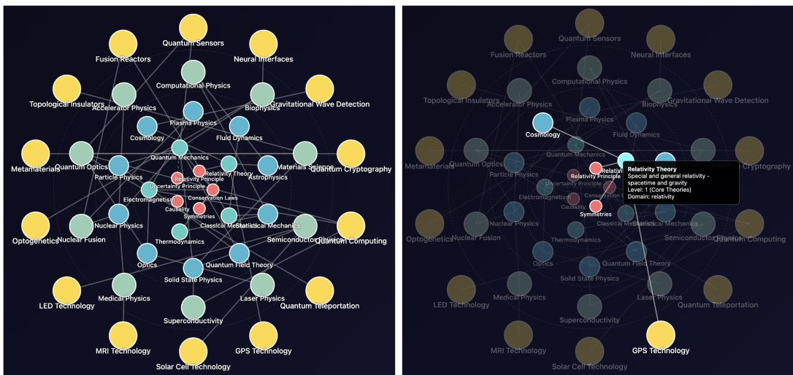
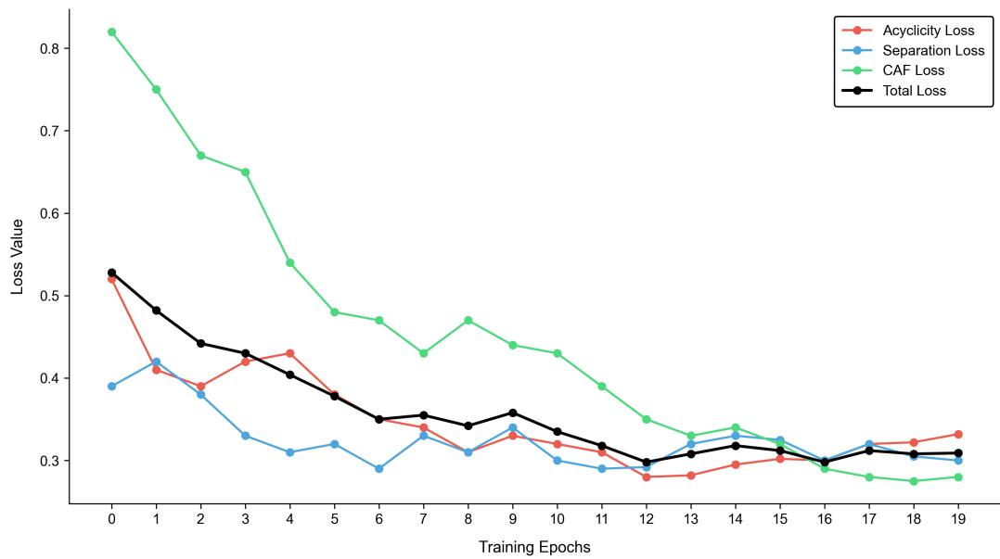
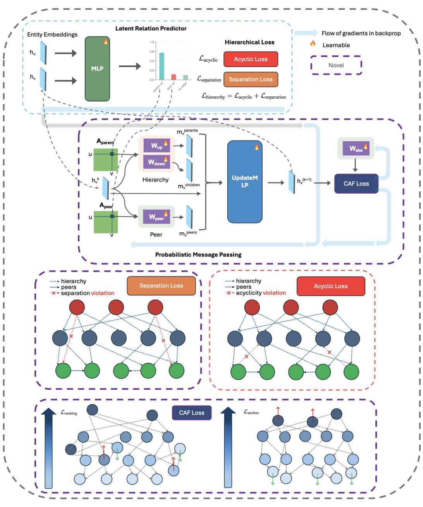

# HgNet: 可伸缩的基础模型用于自动化从科学文献中生成知识图谱

Devvrat Joshi 和 Islem Rekik BASIRA 实验室，帝国-X（I-X）及计算系 帝国理工学院，英国伦敦 {devvrat.joshi24, i.rekik}@imperial.ac.uk

# 摘要

自动化知识图谱（KG）构建对于应对快速扩展的科学文献至关重要。然而，现有方法面临持续挑战：它们难以识别长的多词实体，通常无法在不同领域之间进行泛化，并且通常忽视科学知识的层次性和逻辑约束特性。虽然通用的大型语言模型（LLMs）提供了一定的适应性，但它们计算成本高昂，并且在科学知识图谱构建等专业领域任务上的准确性不一致。因此，当前的知识图谱较为浅显且不一致，限制了其在探索和综合中的实用性。我们提出了一种两阶段框架，用于可扩展的零样本科学KG构建。第一阶段，Z-NERD，引入了（i）正交语义分解（OSD），通过隔离文本中的语义“转折”来促进领域无关的实体识别，以及（ii）一种多尺度TCQK注意力机制，通过n-gram-aware注意力头捕获连贯的多词实体。第二阶段，HGNet，通过层次感知的消息传递进行关系抽取，明确建模父级、子级和同级关系。为了强制保证全局一致性，我们引入两个互补的目标：一个可微层次损失，以抑制循环和短路边，并且一个连续抽象场（CAF）损失，在欧几里得空间中沿可学习的轴嵌入抽象层级。据我们所知，这是第一次将层次抽象形式化为标准欧几里得嵌入中的连续属性，为超曲面方法提供了更简单、更易解释的替代方案。为了解决数据匮乏问题，我们还发布了SPHERE1，这是一个大型多领域的层次关系抽取基准。我们的框架在SciERC、SciER和SPHERE基准上建立了新的最先进水平，在官方的分布外测试集上，命名实体识别（NER）提高了$8.08\%$，关系抽取（RE）提高了$5.99\%$。在零样本设置下，增益更为显著，NER提升$10.76\%$，RE提升$26.2\%$，标志着可靠和可扩展的科学知识图谱构建的重要一步。我们的HGNet代码可在https://github.com/basiralab/HGNet获取。

# 1 引言

科学文献的指数级增长带来了压倒性的挑战：出版速度远远超过了人类手动审阅和综合的能力（Taylor 等，2022）。因此，能够将非结构化文本提炼成结构化、机器可读表示的自动化系统至关重要。知识图谱 (KGs) 提供了一种有力的解决方案，将方法、数据集或概念等实体表示为节点，并将它们的语义连接表示为边（Wang 等，2022a）。然而，从密集且充满行话的科学文本中构建高质量的知识图谱仍然是一个困难的任务，因为复杂术语、长多词实体和分层结构带来了当前方法无法解决的挑战。

科学知识图谱的构建受到四个相互依赖的挑战的限制，这些挑战限制了准确性和可扩展性。前两个挑战涉及节点识别。许多科学概念以长的多词短语形式表达，例如“原位透射电子显微镜”，必须被识别为连贯的单位。多词实体识别的问题尚未解决，因为大多数最先进的模型将词元边界视为偶然的而非明确的目标 Zhou et al. (2024); Zaratiana et al. (2023)。第二个挑战是领域泛化：在一个学科上训练的系统必须适应新领域，而无需广泛重新训练。监督模型往往在分布外崩溃，而参数超过100亿的大型语言模型（LLM）则提供了更广泛的适应性，但计算成本高，使其在常规知识图谱构建中不切实际。相比之下，我们提出的模型是轻量级的，仅包含约 $ \sim 300 $ 百万个参数。与需要数十亿参数才能实现泛化的通用大型语言模型不同，HGNet 在计算效率上匹配专门的基准，同时提供基础模型的强大零-shot 能力。

一旦实体被识别，接下来的任务是建立它们之间的边，从而引入两个进一步的挑战。科学知识是层级性的，例如，“深度学习”是“机器学习”的一个子领域。捕捉这种关系需要层级感知的关系建模（Bai 等，2021），然而传统模型在很大程度上对层级视而不见，依赖于浅层共现统计而非更深层的概念结构。除了层级之外，图形还必须逻辑一致：例如，声明A是B的一部分而B又是A的一部分的矛盾关系会削弱完整性。尽管大型语言模型能够在单一框架内同时执行命名实体识别（NER）和关系提取（RE），但它们的成本仍然非常高，并且在专业的、层级的科学知识上产生不一致的结果（参见Zhang等（2024）的表3）。因此，确保全球一致的结构至关重要，但当前的方法缺乏机制来保证图形形成一个有效的有向无环图（DAG）（Chami等，2020）。因此，可靠的知识图谱构建不仅需要准确的实体识别，还需要原则性地建模关系和结构依赖性。

据我们所知，我们首次提出了一种端到端系统，旨在通过直接从文本中发现潜在的层次结构来解决所有四个挑战。我们的框架分为两个阶段。第一个阶段采用 Z-NERD，一种零样本识别器，通过正交语义分解（OSD）确保强健的领域泛化，并通过多尺度 TCQK 注意力机制捕捉复杂实体。第二个阶段应用 HGNet（层次图网络），该网络构建潜在的概率图，通过专门的消息传递保留层次依赖关系，并通过两个目标强制结构完整性：可微分层次损失和连续抽象场（CAF）损失。为了进行严格评估并缓解数据稀缺问题，我们贡献了 SPHERE，这是一个大规模、多领域的基准测试。在 SciERC、SciER 和 SPHERE 等数据集上，我们的框架实现了新的最先进结果：NER 平均提升 $8.08\%$，RE 平均提升 $5.99\%$，在零样本设置下更是有显著提高（NER 提升 $10.76\%$，RE 提升 $26.2\%$）。所有贡献共同奠定了建立稳健、高质量科学知识图谱（KGs）的一种首个原则性、经实证验证的解决方案。我们的主要贡献包括：• Z-NERD：我们提出了一种新颖的领域无关的 NER 模型，在最具挑战性的科学基准测试中显著超越所有最先进基线（参见表 1）。其核心创新是多尺度 TCQK 机制，通过将注意力头专门分配给 n-gram 模式，实现多词实体的连贯识别，以及正交语义分解（OSD），这是一种用于零样本泛化的新技术，用于识别领域不变的“语义转折”信号。• 层次图网络（HGNet）：我们介绍了一种用于关系抽取的图神经网络（GNN）架构，在复杂层次基准测试中显著设立了新的最先进记录（参见表 2、3、4）。它在潜在的概率概念图上学习和推理，与标准 GNN 不同，它使用专门的消息传递通道（父到子、子到父和同级之间）来保留层次信息的方向流动。• 抽象的几何理论：我们引入了一种新的层次知识表示范式。我们首次将抽象形式化为标准欧几里得空间的内在几何属性，并通过可学习的抽象场向量实现，创建了一个通用的“抽象”轴。这种方法通过我们的连续抽象场（CAF）损失进行强化，提供了比复杂的方法（如双曲嵌入）更直接和可解释的替代方案。• SPHERE 数据集：为了应对数据稀缺这一关键瓶颈，我们创建并发布了 SPHERE，这是第一个专门为层次关系提取设计的大规模、多领域基准测试。该数据集通过一种新颖的方法生成，包含超过 100 万段文本和 111,000 个标注关系，能够更稳健地训练和评估复杂的知识图谱构建模型。

# 2 相关工作

从科学文献中构建知识图谱（KG）的任务包括两个主要子任务：命名实体识别（NER）以识别概念节点，以及关系抽取（RE）以识别它们之间的语义边缘。本节将我们的工作置于这些任务的现有范式中，强调激励我们提出框架的持续差距。

# 2.1 科学文本中的实体识别

高性能的科学命名实体识别（NER）主要受到监督式变换模型的主导，例如SciBERT（Beltagy等，2019年）和BioBERT（Lee等，2019年），这些模型在大型科学语料库上进行预训练，并在特定任务数据上进行微调。这种范式在领域内基准测试中实现了最先进的性能，并已扩展到基础模型如BioMedLM（Bolton等，2024年），然而它面临着一个重要的架构限制。捕捉复杂的多词实体（例如“原位传递电子显微镜”）的能力仅作为上下文嵌入的涌现特性出现，而不是一个专门的特征，这常常导致碎片化或不完整的识别。我们的Z-NERD框架通过多尺度TCQK机制解决了这一问题，该机制从内在上修改注意力，使头部专门针对不同长度的n-gram模式提供原则性和结构性的解决方案。第二个限制是领域泛化能力差：监督模型在领域外文本上的性能急剧下降。零样本方法如GLiNER（Zaratiana等，2023年）和UniversalNER（Zhou等，2024年）将任务重新表述为跨度匹配，而通用大语言模型（LLMs）如GPT-4（OpenAI，2025年）显示出令人印象深刻但不一致的零样本性能（Zhang等，2024年）。然而，这些方法仍然依赖于表层语义或世界知识。相反，我们的正交语义分解（OSD）训练模型检测与领域无关的语义转向——引入新概念的节点，转移关注点从词汇到话语结构。这使得Z-NERD能够实现超越语义匹配范围的稳健零样本性能。

# 2.2 关系提取与层次建模

关系抽取 (RE) 已经从局部的句子级模型发展到能够在文档间进行多跳推理的语料库级系统。早期的神经网络方法依赖于流水线架构，但错误传播很快促使了联合模型的出现，这些模型同时提取实体和关系（Zhong & Chen, 2021；Yamada et al., 2020；Yan et al., 2023）。基准测试如 SciERC（Luan et al., 2018）和 SciER（Zhang et al., 2024）在推动进展方面发挥了重要作用，使基于变换器的方法在细粒度科学关系上达到了最先进的性能。然而，这些方法仍然局限于句子级推理，未能捕捉到在科学文献中至关重要的长远依赖关系和跨句证据链。

为了解决这一局限性，近期的研究转向跨文档关系抽取，使用图神经网络（GNN）和多跳检索来链接跨文档中的实体提及并聚合分散证据 Wang et al. (2022b); Lu et al. (2023)。然而，这种方法通常依赖于共现或句法接近等表面特征，将文本邻近性与真实概念相关性混淆，从而产生噪声图。同时，层次感知的方法如层次注意力 Han et al. (2018) 和强化学习框架 Takanobu et al. (2019) 展现出潜力，但它们主要针对浅层分类法，限制了其在科学知识深层、嵌套和隐含层次结构中的适用性。因此，我们引入 HGNet，这是一种专门为科学文献中的层次关系抽取设计的首个 GNN 架构。HGNet 构建了潜在的概念图，并利用父节点、子节点和同级节点的消息传递通道来建模信息的方向流动，将文本邻近性与概念层次解耦，同时捕捉局部和全局依赖关系，并保持科学知识的分层结构。

# 2.3 几何和逻辑层次表示

学习层次结构的一个关键挑战是确保它们在逻辑和几何上都是合理的。我们的HGNet捕捉了方向信息流，并将文本相似性与概念层次解耦，但仍需要一个原则性的嵌入空间以确保全球一致性。为了解决这个问题，我们引入了一种几何视角：我们不仅仅提取关系，而是学习一个尊重逻辑约束和抽象层次的层次表示。虽然双曲几何常用于低失真树嵌入（Nickel & Kiela，2017），但我们的方法定义了一个新范式，直接在欧几里得空间中学习一个全球一致的抽象排序。这是通过连续抽象场（CAF）损失实现的，该损失沿着一个可学习的通用“抽象轴”来定向嵌入空间。这个先验更简单且更易解释，与我们的可微分层次损失结合，强制执行如无环性等逻辑约束。结合这些损失，确保了学习到的知识图谱在几何上是有序的，并且在逻辑上是一致的。

# 3 方法论

我们的框架由一个统一的、共同训练的架构组成，利用共享的 SciBERT 编码器。首先，Z-NERD 处理原始科学文本，以识别和提取实体提及。其次，HGNet 将来自该共享编码器的上下文化实体嵌入作为输入，这些嵌入保持了文档级别的上下文，并学习它们的层次关系和同级关系，从而构建一个全球一致的知识图谱。

# 3.1 Z-NERD: 零样本实体识别

Z-NERD 是一个高效的标注模型，解决了命名实体识别中的两个关键挑战：识别多词实体和推广到新领域。其架构首先对输入嵌入应用正交语义分解，以提取与领域无关的特征，然后将这些增强的表征输入到经过我们的多尺度 TCQK 机制修改的变换器编码器中。

# 3.1.1 通过正交语义分解（OSD）实现领域泛化

为了克服领域过拟合，模型必须学习识别抽象的语言模式，而不是记忆特定领域的词汇。这需要识别在不同科学领域中不变的特征。因此，我们假设假设3.1：通过训练模型依赖于显式隔离新语义概念引入的特征，而不仅仅是追踪整体语义流，可以实现稳健的领域泛化。通过为模型提供“语义转变”信号（衡量意义偏离前一上下文的程度），我们可以使其对文本的潜在逻辑结构敏感，而不是过度拟合词汇。我们通过将连续词嵌入之间的变化向量分解为两个正交分量来实现这一点，$\Delta E _ { t } =$ $E _ { \mathrm { t e x t } _ { t } } - E _ { \mathrm { t e x t } _ { t - 1 } }$。持续分量是此变化在前一个词嵌入上的投影，代表了扩展。而与前一个词方向正交的发散分量则捕捉新概念的引入。

$$
v _ { \mathrm { s u s t a i n i n g } _ { t } } = \frac { \Delta E _ { t } \cdot E _ { \mathrm { t e x t } _ { t - 1 } } } { \| E _ { \mathrm { t e x t } _ { t - 1 } } \| ^ { 2 } } E _ { \mathrm { t e x t } _ { t - 1 } }
$$

$$
v _ { \mathrm { d i v e r g e n t } _ { t } } = \Delta E _ { t } - v _ { \mathrm { s u s t a i n i n g } _ { t } }
$$

我们将发散向量 $v _ { \mathrm { d i v e r g e n t } _ { t } }$ 与原始上下文嵌入 $E _ { \mathrm { t e x t } _ { t } }$ 进行拼接（参见图6）。这种增强的表示为模型提供了在概念变化中保持域不变的信号，这对稳健的零样本泛化是必需的。Staarani ua wor 辨识长实体的精确边界。这导致了碎片化的预测和对复杂概念的不完整理解。我们的指导假设是：假设 3.2 稳健的可变长度实体检测可以通过设计一个自注意力机制来实现，其中不同的头在架构上专门化，以捕捉不同长度的 $n$ 元组模式。通过将注意力的全局覆盖范围与多尺度卷积的局部序列意识相结合，模型可以学习并行识别单个词元、短语和长实体。我们引入多尺度时间卷积查询与键（TCQK）机制来实现这一点。在计算注意力得分之前，我们使用一维卷积修改查询 $( \mathbf { Q } )$ 和键 $( \mathbf { K } )$ 向量。我们将 $H$ 个注意力头分成 $G$ 组，为每组 $g$ 分配一个特定大小 $k _ { g }$ 的卷积核 $C _ { g }$（例如，1、3、5）。对于组 $g$ 中的每个头 $h$，我们计算：

$$
{ \bf Q } _ { \mathrm { c o n v } , h } = C _ { g } ( { \bf Q } _ { h } ) ; \quad { \bf K } _ { \mathrm { c o n v } , h } = C _ { g } ( { \bf K } _ { h } )
$$

该修改本质上改变了自注意力机制，强迫不同的头部在不同长度的n-gram模式上进行专业化。这样，模型能够将短缩写和长化学名称作为单一的、连贯的概念进行捕捉。注意：我们在来自正交语义分解的连接嵌入上应用多尺度TCQK机制。（更多细节请参见图6）

# 3.2 HGNet：层次图网络

根据 Z-NERD 提取的实体，层次图网络（HGNet）的目标是估计条件分布 $P ( T _ { \mathrm { l o c a l } } \mid D , { \mathcal { G } } _ { K } )$ ，其中每个局部关系三元组（起始实体，关系，结束实体）受到全局层次知识图（HKG） $\mathcal { G } _ { K }$ 的约束。输入实体 $( h _ { u } , h _ { v } )$ 是来自 SciBERT 编码器的上下文化输出嵌入，确保在关系预测中保持文档级上下文，这是最先进的关系抽取模型中的一项标准程序。由于 $\mathcal { G } _ { K }$ 是未被观察的，HGNet 必须共同推断其结构并利用其进行推理。该模型围绕三个核心组件组织，每个组件都基于关于层次一致性的特定假设。（有关架构的完整视觉概述，请参见附录中的图 7。）

# 3.2.1 概率分层消息传递

传统图神经网络（GNN）从根本上来说是“层次盲”的。它们在一个单一的、无差异的图上操作，在所有连接之间均匀传播信息。这种方法存在缺陷，因为它无法区分信息是从特定子节点“向上”流动、从抽象父节点“向下”流动，还是从同级节点“横向”流动，从而导致学习到的表示受到污染。为了解决这一问题，我们的工作基于假设3.3，即如果图神经网络的消息传递架构明确设计以遵循层次结构，它可以保留并利用层次结构。通过为沿不同层次轴流动的信息创建独特的、并行的通道，该模型能够学习特定的、上下文感知的更新函数，从而获得更丰富、更稳健的实体嵌入。为了实现这一点，我们的架构在一个概率图上操作，其中关系被视为可学习的变量。首先，一个隐含关系预测器（MLP）为每对实体节点$( u , v )$ 估计关系类型的概率分布 $\mathcal { R } = \left\{ \begin{array} { r l r l } \end{array} \right.$ parent-of, peer-of, no-edge $\}$。

$$
P _ { u v } = \mathrm { s o f t m a x } \big ( \mathrm { M L P } ( [ h _ { u } | | h _ { v } ] ) \big )
$$

这些概率作为三通道信息传递方案中的软边权重。对于层 $k$ 中的给定节点 $v$，我们计算聚合消息，每个消息都有一个独立的可学习权重矩阵 $( W _ { \mathrm { u p } } , W _ { \mathrm { d o w n } } , W _ { \mathrm { p e e r } } )$，以捕捉每个关系方向的独特语义：

父节点（上游）聚合：$\begin{array} { r } { \pmb { m } _ { v } ^ { \mathrm { p a r e n t s } } = \sum _ { u \in V } P _ { u v } ^ { \mathrm { p a r e n t } } \cdot ( W _ { \mathrm { u p } } \pmb { h } _ { u } ^ { ( k ) } ) } \end{array}$ 子节点（下游）聚合：$\begin{array} { r } { \pmb { m } _ { v } ^ { \mathrm { c h i l d r e n } } = \sum _ { u \in V } P _ { v u } ^ { \mathrm { p a r e n t } } \cdot ( W _ { \mathrm { d o w n } } \pmb { h } _ { u } ^ { ( k ) } ) } \end{array}$ 同伴聚合：$\begin{array} { r } { \pmb { m } _ { v } ^ { \mathrm { p e e r s } } = \sum _ { u \in V } P _ { u v } ^ { \mathrm { p e e r } } \cdot ( W _ { \mathrm { p e e r } } \pmb { h } _ { u } ^ { ( k ) } ) } \end{array}$ 最后，这三种上下文特定的消息与节点的先前状态进行连接，并通过更新 MLP 生成下一层的最终结构感知嵌入：

$$
\begin{array} { r } { \pmb { h } _ { v } ^ { ( k + 1 ) } = \mathrm { U p d a t e M L P } ( [ \pmb { h } _ { v } ^ { ( k ) } | | { \pmb { m } } _ { v } ^ { \mathrm { p a r e n t s } } | | { \pmb { m } } _ { v } ^ { \mathrm { c h i l d r e n } } | | { \pmb { m } } _ { v } ^ { \mathrm { p e e r s } } ] ) } \end{array}
$$

# 3.2.2 通过可微分层次损失（DhL）实现逻辑一致性

学习潜在图的一个关键挑战在于，如果没有明确的约束，模型没有动力确保其结构在全局上是一致的。在训练过程中，它可能会预测逻辑上不可能的结构，例如循环（例如，A 是 B 的一部分，而 B 是 A 的一部分）或跳过层级的捷径（例如，将祖父母误认为父母）。这些结构不一致性会破坏消息传递过程，并导致语义上无效的图。因此，我们假设假设 $3.4$：通过明确且可微分地惩罚这些结构不可能性，我们可以强制实施一个在逻辑上合理的潜在层级。特别是，通过引入一个复合损失来惩罚循环和无效捷径，我们引导模型朝向一个参数空间，使潜在图形成一个有效的有向无环图（DAG），并具备严格的父子层级结构。这是通过可微层级损失（$\scriptstyle \mathcal{L}_{\mathrm{hie r a r c h y}}$）实现的，该损失对预测的父关系邻接矩阵 $A_{\mathrm{parent}}$ 进行正则化。它是两个部分的加权和：

$$
{ \mathcal { L } } _ { \mathrm { h i e r a r c h y } } = \lambda _ { \mathrm { a c y c l i c } } { \mathcal { L } } _ { \mathrm { a c y c l i c } } + \lambda _ { \mathrm { s e p a r a t i o n } } { \mathcal { L } } _ { \mathrm { s e p a r a t i o n } }
$$

第一个组件是无环性损失（Acyclicity Loss），它使用矩阵指数的迹来可微分地确保图是有向无环图（DAG）（有关使用Krylov子空间进行加速计算的内容，请参见附录A.7）。这里，$d$ 是图中节点（实体）的数量。有关此函数为何推动我们的图结构成为DAG的证明，请参见附录A.11。

$$
\mathcal { L } _ { \mathrm { a c y c l i c } } = \mathrm { t r } ( e ^ { A _ { \mathrm { p a r e n t } } \circ A _ { \mathrm { p a r e n t } } } ) - d
$$

第二个组成部分是层次分离损失，它惩罚那些跳过中间层次的快捷边（有关高效计算的详情，请参见附录 A.7）。它的正式定义为：

$$
\mathcal { L } _ { \mathrm { s e p a r a t i o n } } = \sum _ { u , w } ( A _ { \mathrm { p a r e n t } } ^ { 2 } ) _ { u w } \cdot ( A _ { \mathrm { p a r e n t } } ) _ { u w }
$$

在这里，$( A _ { \mathrm { p a r e n t } } ^ { 2 } ) _ { u w }$ 计算从节点 $u$ 到节点 $w$ 的长度为2的路径数量，和 $( A _ { \mathrm { p a r e n t } } ) _ { u w }$ 的逐元素乘法仅选择跳过中间节点的直接边。这鼓励模型保持严格的父子层级结构，并抑制捷径的形成。

# 3.2.3 通过连续抽象场（CAF）损失实现几何一致性

一个模型的嵌入空间通常在几何上是“肥胖”的，缺乏内在的抽象结构。尽管模型可能学习到“RNN”和“LSTM”之间的关系，但它无法编码RNN是一个更一般概念的事实，从而使得嵌入形成一个无序的点云。我们的方法基于假设3.5：层次理解是嵌入空间的一个基本几何特性。通过沿着一个单一的、普遍的“抽象轴”组织所有概念，模型能够将层次信息直接嵌入到向量表示中，使得概念的抽象层次成为其学习到的嵌入的内在属性。

我们引入连续抽象场（Continuum Abstraction Field, $C A F$）损失 ${\mathcal {L}}_{\mathrm {c a f}}$ 来赋予这种几何结构。它引入了一个可学习的单位向量，即抽象场向量 ${\pmb w}_{\mathrm {a b s}}$，定义了这个通用轴线（详见附录 A.5 了解单位抽象场向量的更多细节）。实体 $v$ 的抽象分数定义为其在该轴线上的投影：$\hat {y}_{\mathrm {a b s}}(v) = h_{v} \cdot w_{\mathrm {a b s}}$。这个抽象分数是一个连续的实数，确保模型学习到的是一种流动的连续性，而不是有限数量的固定离散层次。复合损失 ${\mathcal {L}}_{\mathrm {c a f}} = {\mathcal {L}}_{\mathrm {r a n k i n g}} + \gamma_{1} {\mathcal {L}}_{\mathrm {a n c h o r}} + \gamma_{2} {\mathcal {L}}_{\mathrm {r e g r e s s i o n}}$ 通过三个不同的目标来塑造这一结构：排名组件：强制执行相对父子关系的排序，带有间隔 $\delta$。

$$
\mathcal { L } _ { \mathrm { r a n k i n g } } = \frac { 1 } { | \mathcal { E } _ { \mathrm { p a r t - o f } } | } \sum _ { ( c , p ) \in \mathcal { E } _ { \mathrm { p a r t - o f } } } \operatorname* { m a x } ( 0 , ( h _ { c } - h _ { p } ) \cdot w _ { \mathrm { a b s } } + \delta )
$$

• 锚定组件：将已知根节点 $( \mathcal { V } _ { s } )$ 和叶节点 $( \nu _ { t } )$ 固定为评分1和0。

$$
{ \mathcal { L } } _ { \mathrm { a n c h o r } } = { \frac { 1 } { | \mathcal { V } _ { s } | } } \sum _ { v _ { s } \in \mathcal { V } _ { s } } ( \pmb { h } _ { v _ { s } } \cdot \pmb { w } _ { \mathrm { a b s } } - 1 ) ^ { 2 } + { \frac { 1 } { | \mathcal { V } _ { t } | } } \sum _ { v _ { t } \in \mathcal { V } _ { t } } ( \pmb { h } _ { v _ { t } } \cdot \pmb { w } _ { \mathrm { a b s } } - 0 ) ^ { 2 }
$$

• 回归组件：将预测分数向真实标注拓扑深度分数 $y _ { \mathrm { t o p o } } ( v )$ 拉拽，这些分数通过对真实标注的层次关系进行拓扑排序而得出，适用于所有基准。

$$
\mathcal { L } _ { \mathrm { r e g r e s s i o n } } = \frac { 1 } { | \mathcal { V } _ { \mathrm { t r a i n } } | } \sum _ { v \in \mathcal { V } _ { \mathrm { t r a i n } } } ( ( h _ { v } \cdot w _ { \mathrm { a b s } } ) - y _ { \mathrm { t o p o } } ( v ) ) ^ { 2 }
$$

请注意，尽管在 $\mathcal { L } _ { \mathrm { r a n k i n g } }$ 中的边际 $\delta$ 理论上可以将离散级别限制为 $1 / \delta$，但这一约束实际上被 $\mathcal { L } _ { \mathrm { r e g r e s s i o n } }$ 放宽，该项作为主导的全局锚点，将每个嵌入拉向其真实的拓扑深度。因此，模型学习到的是一个连续的抽象光谱，而非离散级别（有关实证证据，请参见附录 A.6）。这将抽象从简单的回归目标转变为整个嵌入空间的组织原则。

# 3.2.4 最终关系预测

在3.2.1节中描述的关系{parent-of, peer-of, no-edge}是仅用于结构调节的内部机制。HGNet生成的$\mathbf { h } ^ { ( k + 1 ) }$嵌入表示最终的、经过优化的结构感知表示。然后，通过标准的下游分类头（与HGERE或PL-Marker等模型所使用的类型相同）在这一精炼表示上提取实际的、特定于任务的三元组（头、关系、尾）。该分类头以结构感知的$\mathbf { h } ^ { ( k + 1 ) }$嵌入作为输入，并预测基准所需的全套细粒度关系。来自这一外部任务的损失$\mathcal { L } _ { \mathrm { R E } }$构成了整个框架的主要任务目标。

# 3.2.5 连贯架构与联合优化

虽然第 3.2.13.2.4 节定义了 HGNet 的模块化组件，但该系统作为一个统一的框架运行，其中所有元素在一次端到端的前向传递中同时优化。这种共同训练机制确保所学习的结构是全局一致的、逻辑合理的和几何连贯的。实体嵌入 $( h _ { u } , h _ { v } )$ 是来自 Z-NERD 阶段共享 SciBERT 编码器的上下文化输出。潜在关系预测器估计关系的初始概率分布 $P _ { u v }$，并立即启动两个并行路径：逻辑正则化和消息传递。预测的父矩阵 $( A _ { \mathrm { p a r e n t } } )$ 直接输入可微分层次损失 $( \mathcal { L } _ { \mathrm { h i e r a r c h y } } )$，该损失惩罚结构错误，如循环 $( { \mathcal { L } } _ { \mathrm { a c y c l i c } } )$ 和快捷边 $( \mathcal { L } _ { \mathrm { s e p a r a t i o n } } )$。与此同时，概率 $P _ { u v }$ 被用作软边权重，指导三通道概率消息传递 GNN，这生成 $( \boldsymbol { h } _ { \boldsymbol { v } } ^ { ( \boldsymbol { k + 1 } ) } )$。这些最终嵌入 $\boldsymbol { h } _ { v } ^ { ( k + 1 ) }$ 用于损失 $( \mathcal { L } _ { \mathrm { c a f } } )$。该损失强制几何排序，沿着抽象的通用轴形状嵌入空间。嵌入还被传递到最终分类头，预测任务特定的头、关系、尾三元组 $( \mathcal { L } _ { \mathrm { R E } } )$。模型的总损失是主要任务目标和两个结构正则化器的加权复合和：

$$
\mathcal { L } _ { \mathrm { T o t a l } } = \mathcal { L } _ { \mathrm { R E } } + \lambda _ { 1 } \mathcal { L } _ { \mathrm { h i e r a r c h y } } + \lambda _ { 2 } \mathcal { L } _ { \mathrm { c a f } }
$$

这种联合优化是HGNet的核心：$\mathcal { L } _ { \mathrm { h i e r a r c h y } }$ 强制图结构在逻辑上合理，同时 $\mathcal { L } _ { \mathrm { c a f } }$ 强制节点嵌入在几何上合理。

# 结构损失的验证

通过针对性的消融研究，证实了强化结构和几何一致性的有效性。去除可微层次损失（DHL）导致性能显著下降，确认了惩罚循环和捷径边缘等逻辑不一致性的必要性。同样，去除连续抽象场（CAF）损失也导致 $\mathrm { R e l + F 1 }$ 分数显著下降，验证了将广义性作为内在几何属性嵌入对于层次推理的重要性。 （有关详细的实证结果，请参阅第4节。）有关 HGNet 所有组成部分的详细可视化，请参阅图7。有关 HGNet 作为一种广义注意力机制的简要证明草图，请参阅附录 A.12。有关 HGNet 收敛性的简要讨论，请参阅附录 A.13。

# 4 实验

在本节中，我们对提出的 Z-NERD 和 HGNet 框架进行了全面的实证评估。我们首先详细介绍实验设置，然后展示与强基线模型的主要性能结果，最后进行一系列消融研究和分析，以验证我们的核心假设。

# 4.1 实验设置

数据集 我们在一组多样化的科学信息提取基准上评估我们的模型。这包括四个已建立的数据集：SciERC Luan et al. (2018)、SciER Zhang et al. (2024)、BioRED，以及SemEval-2017任务10 Augenstein et al. (2017)。这些数据集涵盖多个科学领域，具有复杂的实体和关系类型，并且是该任务的标准基准。为公正比较，我们在离线官方测试集上报告所有指标。为了解决大规模标注数据稀缺的问题，我们还引入了SPHERE，一个通过新颖的基于大语言模型的生成和标注方法创建的大规模数据集。SPHERE包含四个不同的科学领域（计算机科学、物理学、生物学和材料科学），以便能够对领域内和零样本表现进行稳健评估。评估指标 对于命名实体识别（NER），我们报告标准的微F1分数。对于更复杂的端到端关系提取（RE）任务，我们使用严格的 $\mathrm { R e l + }$ F1指标 Zhong & Chen (2021)，该指标要求模型正确预测关系中两个实体的边界和类型，以及关系类型本身。基准 我们的框架与一套全面的强大模型进行基准比较。对于NER，我们将Z-NERD与最先进的监督模型（SciBERT, PL-Marker, HGERE）、一个强大的专用模型（UniversalNER-7b）和若干通用大语言模型在零样本环境下进行比较。对于RE，我们将HGNet与表现最佳的端到端监督模型（PL-Marker, HGERE）、标准GNN架构（GCN, GAT）以及大语言模型进行比较。（参考表1以查看引用）。在A.8和A.9中详细说明了对HGNet与超曲线基准和少样本CoT大语言模型的比较实验。有关实现细节、超参数和SPHERE数据集生成过程，请参见附录A.2和A.3.1。

# 4.2 主要结果

Z-NERD用于实体识别如表1所示，我们的Z-NERD框架在所有基准数据集上设定了新的最先进水平，相较于先前的监督模型实现了$8.08\%$的平均F1改进。零-shot SPHERE领域的增益更高，达到了$10.76\%$的平均提升。相比之下，直接在零-shot模式下评估的通用大型语言模型未能产生有意义的结果，主要因为难以识别多词实体边界。这些大型语言模型的规模也更大，凸显了Z-NERD在不到10亿参数下的高效性。HGNet用于关系提取HGNet的核心目标是学习一个全球一致性的科学知识表示，尊重其内在的层次结构。我们将每个数据集中的关系分为两个类别：层次关系和平行关系，并分别报告这两个类别的宏观F1。如表2、3和4所示，HGNet始终优于所有基线模型，在基准数据集上平均提升$5.99\%$，在零-shot SPHERE数据集上提升$26.20\%$。这证明了在特征复杂层次关系的数据集上，HGNet具有明显的优势，其驱动因素是其考虑层次的多通道信息传递架构。

# 4.3 消融研究与分析

Z-NERD架构分析 为了验证我们对Z-NERD架构的贡献，我们进行了针对性的消融研究。首先，移除多尺度TCQK机制会导致每个数据集的性能严重下降。这一显著下降确认了假设3.1，验证了标准注意力机制无法有效处理复杂多词实体的一致识别，而对n-gram模式的显式架构偏置对成功至关重要。其次，移除正交语义分解（OSD）的特征也会导致F1分数的一致下降。该组件的真正重要性在零-shot领域泛化任务中最为明显，性能下降尤为明显。这为假设3.2提供了有力证据，确认孤立“语义转变”是学习抽象、领域无关模式以实现稳健泛化的关键。（参见表1）关于正交语义分解如何影响学习的嵌入以改善零-shot推理的证据，请参见附录A.4。

HGNet架构分析 HGNet的优异性能源于其独特设计，我们通过消融实验进行了验证。模型在所有数据集上，特别是在具有深层次层次结构的数据集上表现出色，为假设3.3提供了强有力的实证支持。这证实了一个明确关注层次的GNN架构，配备专门的父节点、子节点和同级消息传递通道，能够比标准GNN生成更丰富、更准确的实体表示。此外，移除连续抽象场（CAF）损失导致Rel+ F1分数显著下降，验证了假设3.5，表明将一般性作为空间的内在几何属性嵌入对于层次推理至关重要。同样，消融可微层次损失也导致性能显著下降，确认了假设3.4，并强调了强制执行无环性等逻辑约束的必要性。（参见表2和表3）有关学习到的抽象分数分析和定性误差分析，请参阅附录A.10和A.6。

Table 1: F1 scores $( \% )$ of different models on NER benchmarks. SPHERE: CS, Physics, Bio, MS report both supervised (Sup) and zero-shot (ZS) results. OSD refers to orthogonal semantic decomposition. Z-NERD w/o OSD and w/o TCQK refer to ablations.   

<table><tr><td>Models</td><td>SciERC</td><td>SciER</td><td>BioRED</td><td>SemEval</td><td colspan="2">CS</td><td colspan="2">Physics Sup</td><td colspan="2">Bio</td><td colspan="2">MS</td></tr><tr><td></td><td></td><td></td><td>Supervised Baselines</td><td></td><td>Sup</td><td>ZS</td><td></td><td>ZS</td><td>Sup</td><td>ZS</td><td>Sup</td><td>ZS</td></tr><tr><td>SciBERT Ye et al. (2022)</td><td>67.52</td><td>70.71</td><td>89.15</td><td>49.14</td><td>68.19</td><td>57.02</td><td>72.90</td><td>61.22</td><td>75.83</td><td>68.45</td><td>67.29</td><td>57.14</td></tr><tr><td>PL-Marker Yan et al. (2023)</td><td>70.32</td><td>74.04</td><td>86.41</td><td>47.69</td><td>68.64</td><td>56.39</td><td>72.83</td><td>60.51</td><td></td><td>66.17</td><td></td><td></td></tr><tr><td>HGERE Yan et al. (2023)</td><td>75.92</td><td>81.19</td><td>89.43</td><td>48.25</td><td>69.82</td><td></td><td>72.46</td><td></td><td>75.78</td><td></td><td>66.72</td><td>57.92</td></tr><tr><td>UniversalNER-7b Zhou et al. (2024)</td><td>66.09</td><td>73.13</td><td>88.46</td><td>47.60</td><td></td><td>58.95</td><td></td><td>60.67</td><td>76.42</td><td>68.51</td><td>67.24</td><td>58.03</td></tr><tr><td></td><td></td><td></td><td></td><td>Zero-Shot LLM Baselines</td><td></td><td></td><td></td><td>OOM</td><td></td><td></td><td></td><td></td></tr><tr><td>1lama-3.3-70b Touvron et al. (2023)</td><td>46.20</td><td>49.57</td><td>54.82</td><td></td><td></td><td></td><td></td><td></td><td></td><td></td><td></td><td></td></tr><tr><td>qwen3-32b Qwen et al. (2025)</td><td>41.63</td><td>46.52</td><td>31.71</td><td>30.16</td><td></td><td></td><td></td><td></td><td>OOM</td><td></td><td></td><td></td></tr><tr><td>1lama-3.1-8b-instant Touvron et al. (2023) 31.21</td><td>33.96</td><td></td><td>33.58</td><td>26.48 21.70</td><td></td><td></td><td></td><td></td><td>OOM</td><td></td><td></td><td></td></tr><tr><td>Proposed Approach (Z-NERD)</td><td></td><td></td><td></td><td></td><td></td><td></td><td></td><td></td><td>OOM</td><td></td><td></td><td></td></tr><tr><td></td><td></td><td></td><td></td><td></td><td></td><td></td><td></td><td></td><td></td><td></td><td></td><td></td></tr><tr><td>Z-NERD w/ TCQK Z-NERD w/o OSD</td><td>73.43</td><td>75.12</td><td>84.43</td><td>47.85</td><td>68.47</td><td>59.35</td><td>74.92</td><td>61.74</td><td>73.92</td><td>68.30</td><td>69.48</td><td>57.73</td></tr><tr><td>Z-NERD</td><td>74.39</td><td>80.27 82.71</td><td>90.12</td><td>50.98</td><td>76.93</td><td>62.04</td><td>76.68</td><td>65.17</td><td>82.40</td><td>73.29</td><td>78.24</td><td>63.45</td></tr><tr><td></td><td>78.84</td><td></td><td>91.05</td><td>52.26</td><td>80.47</td><td>69.52</td><td>82.39</td><td>73.19</td><td>84.35</td><td>74.21</td><td>83.96</td><td>72.28</td></tr></table>

# 5 结论与未来工作

我们提出了一种新颖的两阶段框架，用于科学领域的自动知识图谱构建。第一阶段，Z-NERD，结合了正交语义分解和多尺度TCQK注意力机制，能够稳健且领域无关地识别复杂实体。第二阶段，HGNet，采用带有专门消息传递通道的概率图模型，结合可微分层次和连续抽象场损失进行正则化。后者引入了可学习的抽象场向量，确保逻辑一致性和围绕普遍抽象轴的几何结构。我们还介绍了SPHERE，一个用于科学知识图谱构建的大规模基准数据集。实验结果表明，在零样本场景下，命名实体识别（NER）提升了高达$10.76\%$，关系抽取（RE）提升了$26.2\%$，验证了我们的假设以及结构感知的知识提取方法的有效性。

Table 2: $\mathrm { R e l + }$ F1 scores $( \% )$ of different models on SciERC, SciER, BioRED, and SemEval 2017 for two relation types (Hierarchical and Peer), along with overall F1 across all relation types. For BioRED, which only has Peer relations, the overall score equals the peer score. The same entity prediction method is used across models for fair comparison. All values are rounded to two decimals.   

<table><tr><td>Models</td><td colspan="3">SciERC Hier.</td><td colspan="3">SciER</td><td colspan="3">BioRED Overall</td></tr><tr><td></td><td>Peer</td><td>Overall</td><td>Hier.</td><td>Peer</td><td>Overall</td><td></td><td>Hier.</td><td>Peer</td><td>Overall</td></tr><tr><td colspan="10">Supervised Models</td></tr><tr><td>PL-Marker Ye et al. (2022)</td><td>35.60</td><td>44.97</td><td>41.63 40.25</td><td>61.84</td><td>56.78</td><td></td><td>29.87</td><td>32.96 43.40</td><td></td><td>37.19</td></tr><tr><td>HGERE Yan et al. (2023)</td><td>37.72</td><td>47.35</td><td>43.86</td><td>43.79</td><td>64.35</td><td>58.47</td><td>32.39</td><td>33.81</td><td>45.73</td><td>38.63</td></tr><tr><td>PURE Zhong &amp; Chen (2021)</td><td>34.39</td><td>38.46</td><td>36.78</td><td>38.53</td><td>56.21</td><td>49.35</td><td>29.41</td><td>28.94</td><td>41.35</td><td>34.92</td></tr><tr><td colspan="10">Zero-Shot LLM Models</td></tr><tr><td>GPT-3.5 Turbo Ye et al. (2023)</td><td>14.97</td><td>15.02</td><td>14.98</td><td>8.35</td><td>8.91</td><td>8.58</td><td>6.36</td><td>16.30</td><td>17.13</td><td>16.74</td></tr><tr><td>openai/gpt-oss-120b Ye et al. (2023)</td><td>19.68</td><td>21.27</td><td>20.45</td><td>27.93</td><td>27.52</td><td>27.64</td><td>7.15</td><td>23.59</td><td>24.16</td><td>23.88</td></tr><tr><td>llama-3.3-70b-versatile Touvron et al. (2023)</td><td>22.15</td><td>22.53</td><td>22.39</td><td>23.97</td><td>25.06</td><td>24.59</td><td>7.29</td><td>23.65</td><td>25.38</td><td>24.12</td></tr><tr><td>qwen/qwen3-32b Qwen et al. (2025)</td><td>16.57</td><td>19.33</td><td>18.20</td><td>24.02</td><td>24.45</td><td>24.28</td><td>6.71</td><td>20.92</td><td>21.38</td><td>21.09</td></tr><tr><td>llama-3.1-8b-instant Touvron et al. (2023)</td><td>13.30</td><td>14.27</td><td>13.92</td><td>17.15</td><td>17.69</td><td>17.43</td><td>5.48</td><td>14.11</td><td>14.46</td><td>14.24</td></tr><tr><td colspan="10">Supervised GNN-based Models</td></tr><tr><td>GCN</td><td>40.13</td><td>48.78</td><td>45.62</td><td>47.37</td><td>63.89</td><td>57.35</td><td>31.93</td><td>34.08</td><td>45.92</td><td>38.96</td></tr><tr><td>GCN w/o LDHL GAT</td><td>38.46</td><td>48.51</td><td>44.98</td><td>46.85</td><td>64.22</td><td>56.89</td><td>32.28</td><td>32.82</td><td>45.72</td><td>37.99</td></tr><tr><td>GAT w/o LDHL</td><td>40.37</td><td>49.11</td><td>46.21</td><td>47.35</td><td>64.29</td><td>57.64</td><td>32.40</td><td>34.47</td><td>46.19</td><td>39.25</td></tr><tr><td></td><td>38.96</td><td>49.25</td><td>45.48</td><td>47.03</td><td>64.23</td><td>57.30</td><td>32.74</td><td>33.52</td><td>45.88</td><td>38.43</td></tr><tr><td colspan="10">Proposed Approaches</td></tr><tr><td>HGNet w/0 LDHL</td><td>48.52 42.70</td><td>55.37</td><td>51.68</td><td>59.10</td><td>65.95</td><td>62.79</td><td>34.31</td><td>42.16</td><td>49.42</td><td>45.05</td></tr><tr><td>HGNet w/o LCAF Loss HGNet</td><td>50.96</td><td>52.14</td><td>47.33</td><td>54.75</td><td>61.21</td><td>58.67</td><td>33.09</td><td>38.58</td><td>43.28</td><td>41.19</td></tr><tr><td></td><td></td><td>55.41</td><td>53.19</td><td>62.36</td><td>67.02</td><td>65.38</td><td>33.85</td><td>45.37</td><td>50.64</td><td>47.03</td></tr></table>

Table 3: Rel+ F1 scores $( \% )$ on SPHERE dataset variants (Computer Science, Physics, Biology, Material Science) for two relation types (Hier., Peer). We also report overall F1 across all relation types. All models use the same entity prediction method for a fair comparison. Subscripts indicate improvement over SOTA model HGERE.   

<table><tr><td>Models</td><td colspan="3">Comp. Sci.</td><td colspan="3">Physics</td><td colspan="3">Biology</td><td colspan="3">Mat. Sci.</td></tr><tr><td></td><td>Hier.</td><td>Peer</td><td>All</td><td>Hier. Peer</td><td>All</td><td></td><td>Hier. Peer</td><td>All</td><td>Hier.</td><td>Peer</td><td></td><td>All</td></tr><tr><td colspan="9">Supervised Models</td><td colspan="3"></td><td></td></tr><tr><td>PL-Marker Ye et al. (2022)</td><td>51.98</td><td>57.04</td><td>55.29</td><td>50.22</td><td>56.48</td><td>53.51</td><td>52.35</td><td>53.76</td><td>53.03</td><td>52.96</td><td>53.27</td><td>53.12</td></tr><tr><td>HGERE Yan et al. (2023)</td><td>54.20</td><td>59.86</td><td>57.93</td><td>53.17</td><td>58.90</td><td>56.28</td><td>54.52</td><td>56.47</td><td>55.21</td><td>55.84</td><td>55.86</td><td>55.43</td></tr><tr><td></td><td colspan="10">Proposed Approaches</td><td></td></tr><tr><td>HGNet (ours)</td><td>77.40</td><td>81.36</td><td>79.51</td><td>76.93</td><td>83.47</td><td>80.60</td><td>82.53</td><td>84.29</td><td>83.74</td><td>81.91</td><td>85.64</td><td>83.65</td></tr><tr><td>w/o LDHL</td><td>73.62</td><td>74.83</td><td>74.17</td><td>74.01</td><td>75.30</td><td>74.66</td><td>79.15</td><td>78.64</td><td>78.90</td><td>77.43</td><td>76.92</td><td>77.28</td></tr><tr><td>w/o Lcaf</td><td>67.14</td><td>65.89</td><td>66.50</td><td>64.51</td><td>66.24</td><td>65.96</td><td>75.17</td><td>73.29</td><td>74.13</td><td>75.95</td><td>77.38</td><td>76.32</td></tr></table>

Table 4: Zero-shot Rel+ F1 $( \% )$ when trained on Physics $^ +$ Biology and evaluated on Comp. Sci. and Mat. Sci. datasets. Due to the expensive nature of these experiments, we only tested our zero-shot performance on the best performing state-of-the-art models in our previous experiments.   

<table><tr><td rowspan="2">Models</td><td colspan="3">Comp. Sci.</td><td colspan="3">Mat. Sci.</td></tr><tr><td>Hier.</td><td>Peer</td><td>All</td><td>Hier.</td><td>Peer</td><td>All</td></tr><tr><td>PL-Marker Ye et al. (2022)</td><td>28.72</td><td>28.41</td><td>28.56</td><td>33.10</td><td>34.22</td><td>33.85</td></tr><tr><td>HGERE Yan et al. (2023)</td><td>29.93</td><td>29.63</td><td>29.81</td><td>36.27</td><td>39.41</td><td>37.97</td></tr><tr><td>HGNet (ours)</td><td>59.36</td><td>64.07</td><td>62.60</td><td>69.92</td><td>71.33</td><td>70.62</td></tr></table>

未来的工作可以扩展该框架以结合来自图形和表格的多模态信息，并探索其在动态、持续更新的知识图谱中的应用，这些知识图谱反映科学领域的实时演变。此外，可以将基于依赖解析的句法过滤集成作为预处理步骤，以剔除不太可能的实体对，从而进一步提高关系提取的精度（Joshi & Rekik，2025）。此外，利用这些结构化知识图谱进行下游推理任务，如自动假设生成，为进一步研究提供了一个令人兴奋的方向。

# 可重复性声明

为了确保我们结果的可重复性，Z-NERD 和 HGNet 模型的所有源代码以及新引入的 SPHERE 数据集都已在 https : / / github. com/ bas i ralab/HGNet 上公开。我们提供了实验设置的全面细节，包括数据集、评估指标（第 4.1 节）、实现、软件/硬件配置和训练超参数（附录 A.2）。SPHERE 数据集生成的方法在附录 A.3.1 中进一步详细说明，所有基线模型在第 4.1 节中描述，以便进行公平比较。

# 致谢

我们感谢伦敦帝国学院的计算支持组（CSG）管理我们实验中使用的GPU集群。我们也感谢匿名评审对我们论文的建设性反馈，这大大增强了本文的质量。

# REFERENCES

Isabelle Augenstein, Mrinal Das, Sebastian Riedel, Lakshmi Vikraman, and Andrew McCallum. SemEval 2017 task 10: ScienceIE - extracting keyphrases and relations from scientific publications. In Steven Bethard, Marine Carpuat, Marianna Apidianaki, Saif M. Mohammad, Daniel Cer, and David Jurgens (eds.), Proceedings of the 11th International Workshop on Semantic Evaluation (SemEval-2017), pp. 546555, Vancouver, Canada, August 2017. Association for Computational Linguistics. doi: 10.18653/v1/S17-2091. URL https: / /aclanthology.org/ S17-2091/.

Haim Avron and Sivan Toledo. Randomized algorithms for the trace of an implicit symmetric positive semi-definite matrix. Journal of the ACM, 58(2):134, 2011. doi: 10.1145/1944345. 1944349.

Yushi Bai, Zhitao Ying, Hongyu Ren, and Jure Leskovec. Modeling heterogeneous hierarchies with relation-specific hyperbolic cones. In A. Beygelzimer, Y. Dauphin, P. Liang, and J. Wortman Vaughan (eds.), Advances in Neural Information Processing Systems, 2021. URL https : / / openreview.net/forum?id $\underline { { \underline { { \mathbf { \Pi } } } } } =$ chuGnZMuye.

Iz Beltagy, Kyle Lo, and Arman Cohan. Scibert: A pretrained language model for scientific text, 2019.URL https://arxiv.org/abs/1903.10676.

Elliot Bolton, Abhinav Venigalla, Michihiro Yasunaga, David Hall, Betty Xiong, Tony Lee, Roxana Daneshjou, Jonathan Frankle, Percy Liang, Michael Carbin, and Christopher D. Manning. Biomedlm: A 2.7b parameter language model trained on biomedical text, 2024. URL https://arxiv.org/abs/2403.18421.

Ines Chami, Rex Ying, Christopher Ré, and Jure Leskovec. Hyperbolic graph convolutional neural networks,2019.URL https://arxiv.org/abs/1910.12933.

Ines Chami, Adva Wolf, Da-Cheng Juan, Frederic Sala, Sujith Ravi, and Christopher Ré. Lowdimensional hyperbolic knowledge graph embeddings, 2020. URL https : / /arxiv. org/ abs/2005.00545.

Xu Han, Pengfei Yu, Zhiyuan Liu, Maosong Sun, and Peng Li. Hierarchical relation extraction with coarse-to-fine grained attention. In Ellen Riloff, David Chiang, Julia Hockenmaier, and Jun'ichi Tsuji (eds.), Proceedings of the 2018 Conference on Empirical Methods in Natural Language Processing, pp. 22362245, Brussels, Belgium, October-November 2018. Association for Computational Linguistics. doi: 10.18653/v1/D18-1247. URL https : / /aclanthology .org/ D18-1247/.

Devvrat Joshi and Islem Rekik. Dependency parsing-based syntactic enhancement of relation extraction in scientific texts. In Christos Christodoulopoulos, Tanmoy Chakraborty, Carolyn Rose, and Violet Peng (eds.), Findings of the Association for Computational Linguistics: EMNLP 2025, pp. 2488824897, Suzhou, China, November 2025. Association for Computational Linguistics. ISBN 979-8-89176-335-7. doi: 10.18653/v1/2025.findings-emnlp.1354. URL ht tps : //aclanthology.org/2025.findings-emnlp.1354/.

Jinhyuk Lee, Wonjin Yoon, Sungdong Kim, Donghyeon Kim, Sunkyu Kim, Chan Ho So, and Jaewoo Kang. Biobert: a pre-trained biomedical language representation model for biomedical text mining. Bioinformatics, 36(4):12341240, 09 2019. ISSN 1367-4803. doi: 10.1093/bioinformatics/btz682. URL https://doi.org/10.1093/bioinformatics/ btz682.

Keming Lu, I-Hung Hsu, Wenxuan Zhou, Mingyu Derek Ma, and Muhao Chen. Multi-hop evidence retrieval for cross-document relation extraction. In Anna Rogers, Jordan Boyd-Graber, and Naoaki Okazaki (eds.), Findings of the Association for Computational Linguistics: ACL 2023, pp. 1033610351, Toronto, Canada, July 2023. Association for Computational Linguistics. doi: 10.18653/vl/2023.findings-acl.657. URL https : / /aclanthology.org/2023. findings-acl.657/.

Yi Luan, Luheng He, Mari Ostendorf, and Hannaneh Hajishirzi. Multi-task identification of entities, relations, and coreference for scientific knowledge graph construction. In Ellen Riloff, David Chiang, Julia Hockenmaier, and Jun'ichi Tsujii (eds.), Proceedings of the 2018 Conference on Empirical Methods in Natural Language Processing, pp. 32193232, Brussels, Belgium, October-November 2018. Association for Computational Linguistics. doi: 10.18653/v1/D18-1360. URL https://aclanthology.org/D18-1360/.

Maximilian Nickel and Douwe Kiela. Poincaré embeddings for learning hierarchical representations,2017.URL https://arxiv.org/abs/1705.08039.

OpenAI. Chatgpt. https : / / chat . openai . com/, 2025. Large language model (March 2025 version).

Qwen, :, An Yang, Baosong Yang, Beichen Zhang, Binyuan Hui, Bo Zheng, Bowen Yu, Chengyuan Li, Dayiheng Liu, Fei Huang, Haoran Wei, Huan Lin, Jian Yang, Jianhong Tu, Jianwei Zhang, Jianxin Yang, Jiaxi Yang, Jingren Zhou, Junyang Lin, Kai Dang, Keming Lu, Keqin Bao, Kexin Yang, Le Yu, Mei Li, Mingfeng Xue, Pei Zhang, Qin Zhu, Rui Men, Runji Lin, Tianhao Li, Tianyi Tang, Tingyu Xia, Xingzhang Ren, Xuancheng Ren, Yang Fan, Yang Su, Yichang Zhang, Yu Wan, Yuqiong Liu, Zeyu Cui, Zhenru Zhang, and Zihan Qiu. Qwen2.5 technical report, 2025. URLhttps://arxiv.org/abs/2412.15115.

Yousef Saad. Iterative Methods for Sparse Linear Systems. SIAM, 2 edition, 2003. doi: 10.1137/1. 9780898718003.

Ryuichi Takanobu, Tianyang Zhang, Jiexi Liu, and Minlie Huang. A hierarchical framework for relation extraction with reinforcement learning. Proceedings of the AAAI Conference on Artificial Intelligence, 33(01):70727079, Jul. 2019. doi: 10.1609/aaai.v33i01.33017072. URL ht tps : //ojs.aaai.org/index.php/AAAI/article/view/4688.

Ross Taylor, Marcin Kardas, Guillem Cucurull Thomas Scialom, Anthony Hartshorn, Elvis Saravia, Andrew Poulton, Viktor Kerkez, and Robert Stojnic. Galactica: A large language model for science, 2022.

Hugo Touvron, Thibaut Lavril, Gautier Izacard, Xavier Martinet, Marie-Anne Lachaux, Timothée Lacroix, Baptiste Rozière, Naman Goyal, Eric Hambro, Faisal Azhar, Aurelien Rodriguez, Armand Joulin, Edouard Grave, and Guillaume Lample. Llama: Open and efficient foundation language models, 2023. URL https://arxiv.org/abs/2302.13971.

Ivan Vendrov, Ryan Kiros, Sanja Fidler, and Raquel Urtasun. Order-embeddings of images and language. arXiv preprint arXiv:1511.06361, 2015.

Chenglin Wang, Yucheng Zhou, Guodong Long, Xiaodong Wang, and Xiaowei Xu. Unsupervised knowledge graph construction and event-centric knowledge infusion for scientific nli, 2022a.

Fengqi Wang, Fei Li, Hao Fei, Jingye Li, Shengqiong Wu, Fangfang Su, Wenxuan Shi, Donghong Ji, and Bo Cai. Entity-centered cross-document relation extraction. In Yoav Goldberg, Zornitsa Kozareva, and Yue Zhang (eds.), Proceedings of the 2022 Conference on Empirical Methods in Natural Language Processing, pp. 98719881, Abu Dhabi, United Arab Emirates, December 2022b. Association for Computational Linguistics. doi: 10.18653/v1/2022.emnlp-main.671. URLhttps://aclanthology.org/2022.emnlp-main.671/.

Ikuya Yamada, Akari Asai, Hiroyuki Shindo, Hideaki Takeda, and Yuji Matsumoto. Luke: Deep contextualized entity representations with entity-aware self-attention. In Proceedings of the 2020 Conference on Empirical Methods in Natural Language Processing (EMNLP), pp. 64426454, Online, November 2020. Association for Computational Linguistics. doi: 10.18653/v1/2020. emnlp-main.523.URL https://aclanthology.org/2020.emnlp-main.523.

Zhaohui Yan, Songlin Yang, Wei Liu, and Kewei Tu. Joint entity and relation extraction with span pruning and hypergraph neural networks. In Houda Bouamor, Juan Pino, and Kalika Bali (eds.), Proceedings of the 2023 Conference on Empirical Methods in Natural Language Processing, pp. 75127526, Singapore, December 2023. Association for Computational Linguistics. doi: 10.18653/v1/2023.emnlp-main.467. URL https : / /aclanthology . org/2023. emnlp-main.467/.

Deming Ye, Yankai Lin, Peng Li, and Maosong Sun. Packed levitated marker for entity and relation extraction. In Smaranda Muresan, Preslav Nakov, and Aline Villavicencio (eds.), Proceedings of the 60th Annual Meeting of the Association for Computational Linguistics (Volume 1: Long Papers), pp. 49044917, Dublin, Ireland, May 2022. Association for Computational Linguistics. doi: 10.18653/v1/2022.acl-long.337. URL https://aclanthology.org/2022. acl-long.337/.

Junjie Ye, Xuanting Chen, Nuo Xu, Can Zu, Zekai Shao, Shichun Liu, Yuhan Cui, Zeyang Zhou, Chao Gong, Yang Shen, Jie Zhou, Siming Chen, Tao Gui, Qi Zhang, and Xuanjing Huang. A comprehensive capability analysis of gpt-3 and gpt-3.5 series models, 2023. URL ht tps : / / arxiv.org/abs/2303.10420.

Urchade Zaratiana, Nadi Tomeh, Pierre Holat, and Thierry Charnois. Gliner: Generalist model for named entity recognition using bidirectional transformer, 2023. URL ht tps : / / arxiv . org/ abs/2311.08526.

Qi Zhang, Zhijia Chen, Huitong Pan, Cornelia Caragea, Longin Jan Latecki, and Eduard Dragut. SciER: An entity and relation extraction dataset for datasets, methods, and tasks in scientific documents. In Yaser Al-Onaizan, Mohit Bansal, and Yun-Nung Chen (eds.), Proceedings of the 2024 Conference on Empirical Methods in Natural Language Processing, pp. 1308313100, Miami, Florida, USA, November 2024. Association for Computational Linguistics. doi: 10.18653/v1/2024.emnlp-main.726. URL https : / /aclantho1ogy. org/2024. emnlp-main.726/.

Zexuan Zhong and Danqi Chen. A frustratingly easy approach for entity and relation extraction. In Kristina Toutanova, Anna Rumshisky, Luke Zettlemoyer, Dilek Hakkani-Tur, Iz Beltagy, Steven Bethard, Ryan Cotterell, Tanmoy Chakraborty, and Yichao Zhou (eds.), Proceedings of the 2021 Conference of the North American Chapter of the Association for Computational Linguistics: Human Language Technologies, pp. 50-61, Online, June 2021. Association for Computational Linguistics. doi: 10.18653/v1/2021.naacl-main.5. URL https: //aclanthology.org/ 2021.naacl-main.5/.

Wenxuan Zhou, Sheng Zhang, Yu Gu, Muhao Chen, and Hoifung Poon. Universalner: Targeted distillation from large language models for open named entity recognition, 2024.

# A APPENDIX

A.1 StaTEMENT oN THE UsE OF LaRgE LaNgUage ModELS (LLMs)

In adherence to the ICLR 2026 policy, we disclose the use of Large Language Models (LLMs) in the preparation of this manuscript and in our research methodology.

1. Role in Dataset Generation As detailed in Appendix A.3.1, LLMs (specifically, a mixture of models from the GPT and Gemini families) were a core component of our research. They were programmatically used to generate and self-annotate the SPHERE dataset, which was crucial for training and evaluating our proposed models. The entire process, from KG scaffolding to sentence generation and annotation, was designed and supervised by the authors to ensure the quality and validity of the dataset.

2. Role in Manuscript Preparation Beyond their role in the research itself, LLMs were also utilized as tools to aid in the preparation of this paper in the following ways:

•Writing and Polishing: We used LLMs (e.g., GPT-4) as advanced writing assistants. Their use was primarily focused on improving the clarity, precision, and readability of the text. This included tasks such as rephrasing sentences for better flow, correcting grammatical errors, ensuring consistent terminology, and polishing the overall prose. The core scientific ideas, arguments, and the structure of the paper were conceived and written entirely by the authors.

•Literature Retrieval and Discovery: LLMs were used as a supplementary tool to augment our traditional literature review process. We used them to summarize abstracts of known papers and to help identify potential related work based on keyword and concept queries. This assisted in broadening our search, but the final selection, critical reading, analysis, and citation of all literature were performed by the authors to ensure academic rigor.

  
Figure 1: Continuous axis of abstraction for topics in physics.

# A.2 ImPLeMEntation DetaiLS

Hardware and Software All experiments were conducted on a high-performance computing cluster equipped with NVIDIA A30 24GB GPUs. Our frameworks were implemented using PyTorch 2.1 and the Hugging Face Transformers library. For baseline models, we used their official public implementations and recommended hyperparameters to ensure fair comparison.

Training Hyperparameters To ensure reproducibility, we detail the key hyperparameters for our proposed models in Table 5. We used the AdamW optimizer for all training runs and employed a linear learning rate scheduler with a warm-up phase. The optimal hyperparameters were determined via a grid search on the validation sets of the respective datasets.

Table 5: Key hyperparameters for Z-NERD and HGNet.   

<table><tr><td>Hyperparameter</td><td>Z-NERD</td><td>HGNet</td></tr><tr><td>Encoder Base Model Learning Rate Batch Size</td><td>SciBERT-base 2 × 10-5 16</td><td>SciBERT-base 1 × 10-5 8</td></tr><tr><td>Optimizer Dropout Rate</td><td>AdamW 0.1</td><td>AdamW 0.2</td></tr><tr><td>Max Sequence Length</td><td>512</td><td>512</td></tr><tr><td>TCQK Kernel Sizes</td><td>[1, 3, 5, 7]</td><td>N/A</td></tr><tr><td>HGNet Layers</td><td>N/A</td><td>3</td></tr><tr><td>CAF Loss Margin (δ) CAF Weights (γ1, γ2)</td><td>N/A</td><td>0.5</td></tr><tr><td>DHL Weights (λacyclic, λseparation)</td><td>N/A N/A</td><td>(1.0, 0.5) (1.0, 0.1)</td></tr></table>

# A.3 SPHERE DATASET

# A.3.1 GENERatIoN METHODOLOgy

The SPHERE (Scientific Multidomain Large Entity and Relation Extraction) dataset was created to overcome the critical bottleneck of data scarcity in scientific RE. We employed a novel, three-phase generate-and-annotate methodology driven by a Large Language Model (in our case, mixture of GPT (OpenAI) and Gemini (Google DeepMind) models).

1. Phase 1: Programmatic KG Scaffolding. We first constructed a ground-truth knowledge graph to serve as a structured backbone. This was done by prompting the LLM with a highlevel field (e.g., "Computer Science") and asking it to recursively expand it into more granular, interconnected sub-fields, methods, and concepts. This foundational step produced a deep and logically consistent taxonomy of over 40,000 entities across four domains before any text was generated.

2. Phase 2: High-Throughput Sentence Generation. With the KG as a scaffold, a highthroughput pipeline generated annotated sentences. This involved sampling small, contextually related sets of concepts from the graph (e.g., a parent, child, and peer concept) and prompting the LLM, acting as an expert technical writer, to compose a long, complex, academic-style paragraph describing their relationships.

3. Phase 3: LLM Self-Annotation. The newly created sentences were immediately passed back to the same LLM for self-annotation within the original context. The model performed Named Entity Recognition and Relation Extraction, linking the identified concepts back to their permanent IDs in the ground-truth KG. We observed that the LLM's annotation performance is drastically higher on text it has generated itself, enabling the creation of a large-scale (10,000 documents, 111,000 relations), high-quality corpus.

# A.3.2 STRUCTURAL COMPLEXITY AND SCALE ANALYSIS

To validate the necessity of SPHERE as a foundation benchmark, we compare its structural properties against existing gold-standard datasets in Table 6.

Scale and Diversity. Existing benchmarks like SciERC and BioRED are constrained by the high cost of human annotation, typically limited to roughly 500 abstracts and a single domain. In contrast, SPHERE leverages the generative scaffolding approach to scale to 10,000 documents across four distinct domains (Computer Science, Physics, Biology, Material Science). This scale is critical for pre-training "foundation" extraction models that can generalize zero-shot.

Taxonomic Depth. Most standard datasets utilize "flat" entity ontologies (e.g., broad categories like Method or Material). SPHERE, being generated from a deep Knowledge Graph scaffold, contains nested hierarchical definitions (e.g., Adam Optimizer Stochastic Optimization Optimization Method). This distinct structural depth forces models to learn fine-grained hierarchical reasoning (tested via HGNet) rather than simple surface-level pattern matching.

Structural Consistency and Global Scope. A critical distinction of SPHERE is the scope of its graph topology. Standard benchmarks like SciERC are annotated at the document level, meaning the hierarchical relationships are locally inferred and often inconsistent (e.g., an entity may be a root in one document but a leaf in another). In contrast, SPHERE is generated from a Global Knowledge Graph Scaffold containing over 40,000 entities. This ensures that the hierarchical position of a concept remains globally consistent across the entire corpus, preventing the "inflated structure" or hallucinated loops often associated with unconstrained LLM generation.

Table 6: Comparison of SPHERE against standard scientific IE benchmarks. A key distinction is Graph Scope: standard datasets define hierarchies locally within isolated documents (fragmented), whereas SPHERE is generated from a single Global Knowledge Graph, ensuring hierarchical consistency across the entire corpus.   

<table><tr><td>Dataset</td><td>Domain</td><td>Docs</td><td>Relations</td><td>Graph Scope</td><td>Hierarchy Source</td></tr><tr><td>SciERC</td><td>CS (AI)</td><td>500</td><td>~4.6k</td><td>Local (Doc-Level)</td><td>Inferred from Text</td></tr><tr><td>BioRED</td><td>Biomed</td><td>600</td><td>∼38k</td><td>Local (Doc-Level)</td><td>Inferred from Text</td></tr><tr><td>SciER</td><td>CS</td><td>106</td><td>~12k</td><td>Local (Doc-Level)</td><td>Inferred from Text</td></tr><tr><td>SPHERE</td><td>4 Domains</td><td>10,000</td><td>111,000</td><td>Global (Corpus-Level)</td><td>Pre-defined Scaffold</td></tr></table>

The fidelity of the SPHERE dataset is evidenced by its surprising zero-shot efficacy. When trained only on SPHERE, our model generalizes to the human-annotated SciERC and SciER benchmarks with scores of $4 6 . 5 5 \%$ and $5 9 . 1 7 \%$ respectively, outperforming the previous fully supervised stateof-the-art (HGERE). This confirms that SPHERE faithfully models the complex entity-relation dependencies of scientific text, validating our constrained generation pipeline.

Table 7: Performance comparison on SciERC and SciER datasets.   

<table><tr><td>Metric</td><td>Training Source</td><td>SciERC (Test)</td><td>SciER (Test)</td></tr><tr><td>HGERE Yan et al. (2023)</td><td>Full Supervised Training</td><td>43.86%</td><td>56.28%</td></tr><tr><td>HGERE (Zero-shot transfer)</td><td>SPHERE-CS Training Only</td><td>25.62%</td><td>28.34%</td></tr><tr><td>HGNet (Zero-shot transfer)</td><td>SPHERE-CS Training Only</td><td>46.55%</td><td>59.17%</td></tr></table>

Manual Quality Audit. To quantitatively assess the fidelity of the SPHERE dataset and ensure minimal hallucination, we conducted a manual verification study on a randomly sampled subset of the corpus. We analyzed 1,000 entity spans and 500 relation triples against the ground-truth topological scaffold. The audit yielded an entity precision of $9 6 . 5 \%$ (measuring correct boundary and type) and a relation precision of $9 4 . 2 \%$ (measuring correct edge classification). These high precision scores confirm that our constrained "generate-from-graph" pipeline effectively enforces structural consistency while maintaining textual fluency.

# A.4 Visual Evidence for Orthogonal Semantic Decomposition

To further validate the premise of OSD, Figures 2 illustrate the average Orthogonal Semantic Velocity Norm for tokens at entity boundaries versus non-entity tokens. The plots provide compelling visual support forHypothesis 3.2. A clear and substantial gap emerges between the high velocity norms of boundary tokens and the low norms of non-entity tokens. This demonstrates that our engineered feature effectively captures the sharp "semantic turns" that occur when a new concept is introduced, providing a robust, domain-agnostic indicator of entity boundaries.

# A.5 GEOMETRIC REALIZATION VIA AN ABSTRACTION FIELD

Instead of treating abstraction score as an external label to be predicted, our central hypothesis is that the abstraction score should be an intrinsic geometric property of the learned embedding space itself. We propose that the entire high-dimensional space can be oriented along a single, universal direction that represents a continuum from specificity to generality. We formalize this concept as the Abstraction Field Vector.

  
Figure 2: Average Orthogonal Semantic Velocity for tokens at entity boundaries ('Start''End') vs. 'Non-entity' tokens for SPHERE-CS (left) and SciER (right). The clear separation provides visual evidence for Hypothesis 3.1.

Definition A.1 (Abstraction Field Vector) a learnable unit vector ${ \pmb w } _ { a b s } ~ \in ~ \mathbb { R } ^ { d }$ This vector defines the primary axis of abstraction within the embedding space. The predicted abstraction score, $\hat { y } _ { a b s } ( v )$ , for any concept $v$ with embedding $ { \boldsymbol { h } } _ { v }$ is then simply its orthogonal projection onto this vector:

$$
\hat { y } _ { a b s } ( v ) : = h _ { v } \cdot w _ { a b s }
$$

Justification for a Single Universal Axis: The choice to model abstraction with a single unit vector is a deliberate application of simplicity and a method for imposing a strong, beneficial inductive bias. While one could model abstraction using multiple orthogonal vectors or a more complex non-linear function, such approaches would implicitly assume the existence of multiple, independent "types" of abstraction. Our formulation, by contrast, hypothesizes that the dominant organizing principle of a scientific knowledge hierarchy is a single, primary dimension of generality versus specificity. This constraint forces the model to discover the most salient and universal axis of abstraction that is consistent across all entities, rather than overfitting to spurious, domain-specific hierarchical patterns. This mirrors findings in other areas of representation learning, where simple linear axes have been shown to capture profound semantic relationships (e.g., the famous 'king - man $^ +$ woman' analogy in word embeddings). By reducing abstraction to a single, interpretable dimension, we ensure the learned geometric structure is not only robust but also directly analyzable. The empirical success of this method across multiple domains serves as strong validation for this simplifying, yet powerful, geometric assumption.

This formulation is powerful because it transforms theabstract notion of "generality"into a concee, measurable geometric arrangement. A concept's position along this axis directly reflects its level of abstraction. This approach ensures that the learned hierarchy is not an afterthought but the primary organizing principle of the entire embedding space, making the learned representations globally coherent and interpretable. Refer figure 1 for visualization of continuum of abstraction in physics domain.

# A.6 LEARNED ABSTRACTION SCORE ANALYSIS

To qualitatively assess the geometric structure learned by HGNet, we visualized the distribution of the final abstraction scores for entities within each domain of the SPHERE dataset, as shown in Figure 3. Based on the programmatic, recursive generation of the underlying knowledge graph, the ideal distribution would exhibit an exponential decay, with a high density of concrete entities at low abstraction scores and a progressively smaller number of entities at higher levels of abstraction. The analysis reveals distinct, domain-specific patterns that reflect the inherent structure learned from each field.

The Computer Science domain (d) aligns most closely with this expected pattern, showing a clear concentration of entities at lower abstraction values and a long tail of increasingly abstract concepts. In contrast, the Material Science data (a) shows a distribution heavily clustered at lower scores, while the Biology data (c) displays a more gradual decline, likely reflecting a flatter hierarchy in its source text. It is crucial to note, however, that even the Computer Science distribution is not a perfect match for the ground-truth hierarchy. The visible deviations from an ideal curve highlight that some concepts are still misplaced along the abstraction axis. These imperfections in the learned geometric structure are precisely what lead to a non-perfect $\mathrm { R e l + }$ F1 score, highlighting the tight coupling between representational geometry and task performance.

  
Figure 3: Distribution of abstraction scores across different scientific domains, showing distinct patterns for each field.

# A.7 SCALABLE AcYcLiCITy REGuLaRiZatIoN vIa KRyLOv SUBSPACE METHodS

A potential computational bottleneck in our framework is the Differentiable Hierarchy Loss (Eq. 7), which involves the calculation of a matrix exponential. For a graph with $n$ entities, the parentof adjacency matrix $\mathbf { A } _ { \mathrm { p a r e n t } }$ is of size $n \times n$ : A direct computation of the matrix exponential, $\exp ( \mathbf { A } _ { \mathrm { p a r e n t } } \circ \mathbf { A } _ { \mathrm { p a r e n t } } )$ , scales with a time complexity of $\mathcal { O } ( n ^ { 3 } )$ , which can become prohibitive for the large-scale knowledge graphs targeted by our work.

To ensure the scalability of our approach, this term can be efficiently approximated using Krylov subspace methods (Saad, 2003). Instead of explicitly forming the dense $n \times n$ matrix exponential, these iterative methods approximate its action on a vector by projecting the matrix onto a lowdimensional Krylov subspace, $\kappa _ { m }$ , of dimension $m \ll n$ .

The computational cost of this approach is dominated by two steps. First, the construction of an orthonormal basis for the subspace, typically via the Arnoldi iteration, requires $m$ matrix-vector products. Since the learned adjacency matrix $\mathbf { A } _ { \mathrm { p a r e n t } }$ is inherently sparse, with a number of nonzero entries denoted by $\mathrm { n n z } ( \mathbf { A } _ { \mathrm { p a r e n t } } )$ , this step has a complexity of $\mathcal { O } ( m \cdot \mathrm { n n z } ( \mathbf { A } _ { \mathrm { p a r e n t } } ) )$ . Second, the exponential of the small $m \times m$ projected matrix is computed directly, which incurs a cost of $\mathcal { O } ( m ^ { 3 } )$ .

Therefore, the total time complexity for the approximation is $\mathcal { O } ( m { \cdot } \mathrm { n n z } ( \mathbf { A } _ { \mathrm { p a r e n t } } ) { + } m ^ { 3 } )$ Furthermore, to compute the trace required by our loss function, Krylov methods is combined with stochastic trace estimators, Hutchinson method (Avron & Toledo, 2011), to approximate $\operatorname { t r } ( \exp ( \mathbf { A } ) )$ without ever forming the full matrix.

Hierarchical Separation Loss The second component, the Hierarchical Separation Loss (Eq. 8), is defined as $\begin{array} { r } { \mathcal { L } _ { \mathrm { s e p a r a t i o n } } = \sum _ { u , w } ( \mathbf { A } _ { \mathrm { p a r e n t } } ^ { 2 } ) _ { u w } \cdot ( \mathbf { A } _ { \mathrm { p a r e n t } } ^ { - } ) _ { u w } } \end{array}$   
squaring the matrix $\mathbf { A } _ { \mathrm { p a r e n t } }$ , an operation that, even for sparse matrices, can be costly as the resulting matrix $\mathbf { A } _ { \mathrm { p a r e n t } } ^ { 2 }$   
sec raph strctures. The term $( \mathbf { A } _ { \mathrm { p a r e n t } } ^ { 2 } ) _ { u w }$ represents the sum of weights o all paths of lengh two from entity $u$ to $w$ . The loss thus penalizes the existence of a direct "shortcut" edge $( u , w )$ when such two-step paths exist. This structure allows for a far more efficient calculation. Instead of matrix multiplication, we can compute the sum by iterating through all 2-paths in the graph. An efficient algorithm involves iterating through each node $v$ and considering all pairs of its incoming edges $( u , v )$ and outgoing edges $( v , w )$ . For each such 2-path $u  v  w$ , we perform a sparse lookup to check for the existence of the direct edge $( u , w )$ . The total complexity of this approach is approximately ${ \mathcal { O } } ( \sum v \in V$ in-degree $( v ) \cdot$ out-degree $( v )$ ), which is directly proportional to the local sparsity of the graph and avoids the costly formation of $\mathbf { A } _ { \mathrm { p a r e n t } } ^ { 2 }$ .

This analysis demonstrates that both components of the Differentiable Hierarchy Loss can be computed efciently, ensuring that the enforcement of a globally consistent DAG structure remains computationally feasible even for knowledge graphs containing thousands of entities.

# A.8 EXTENDED GEOMETIC BASELINE ANALYSIS

To validate the efficacy of the Continuum Abstraction Field (CAF) against non-Euclidean approaches, we compare HGNet against two strong geometric baselines using the same SciBERT backbone:

• HGCN (Hyperbolic GCN) Chami et al. (2019): Maps embeddings to the Poincaré ball manifold, theoretically optimized for hierarchical trees.   
•Order-Embeddings Vendrov et al. (2015): Enforces partial order constraints via cone geometry $( E = | | \bar { \operatorname* { m a x } } ( 0 , v - u ) | | ^ { 2 } )$ .

Table 8 presents the results. HGNet outperforms both baselines. We observe that HGCN requires extensive tuning of the Riemannian Adam optimizer and often struggles with "Peer" relations that violate strict tree geometries, whereas HGNet's Euclidean CAF objective remains stable and accurate.

Table 8: Comparison against Geometric Baselines $( \mathrm { R e l + F 1 ~ \% }$ . HGNet outperforms non-Euclidean methods on both standard and large-scale hierarchical datasets.   

<table><tr><td>Model</td><td>Geometry</td><td>SciERC (Overall)</td><td>SPHERE-CS (Overall)</td></tr><tr><td>HGCN Chami et al. (2019)</td><td>Hyperbolic (Dn)</td><td>45.82</td><td>66.35</td></tr><tr><td>Order-Embeddings Vendrov et al. (2015)</td><td>Cone (Rn)</td><td>44.27</td><td>67.97</td></tr><tr><td>HGNet (Ours)</td><td>Euclidean + CAF</td><td>53.19</td><td>79.51</td></tr></table>

# A.9 FEW-SHoT LLM EvaLUaTION

To ensure a fair comparison regarding reasoning capabilities, we evaluated Llama-3-8B using a 3- Shot Chain-of-Thought (CoT) strategy. We provided the model with three context-response pairs demonstrating step-by-step relation extraction before querying the target sentence.

As shown in Table 9, while CoT provides a notable performance boost over the zero-shot setting $( + 5 . 7 3 \%$ on SciERC), the model still significantly underperforms compared to HGNet. Qualitative error analysis reveals that while CoT helps identifying relation types, the LLM continues to struggle with precise entity boundary detection (e.g., including determiners or punctuation in the span), which is penalized by the strict $\mathrm { R e l + }$ metric.

Table 9: Impact of Prompting Strategy on Llama-3-8B Performance $( \mathrm { R e l + F 1 ~ \% }$ .   

<table><tr><td rowspan=1 colspan=1>Model</td><td rowspan=1 colspan=1>Prompting Strategy</td><td rowspan=1 colspan=1>SciERC</td><td rowspan=1 colspan=1>SciER</td></tr><tr><td rowspan=1 colspan=1>Llama-3-8B</td><td rowspan=1 colspan=1>Zero-Shot3-Shot CoT</td><td rowspan=1 colspan=1>13.7219.45</td><td rowspan=1 colspan=1>14.9525.18</td></tr><tr><td rowspan=1 colspan=1>HGNet</td><td rowspan=1 colspan=1>Supervised</td><td rowspan=1 colspan=1>53.19</td><td rowspan=1 colspan=1>62.36</td></tr></table>

# A.10 QUALITaTIvE ERROR ANALYSIs

Corrected Error: Preventing Hierarchical Shortcuts

A significant advantage of HGNet is its ability to maintain a strict, multi-level hierarchy by penalizing "shortcut" edges that skip intermediate levels. This corrects errors where a local model might conflate a grandparent relationship with a direct parent one. Consider a biology paper discussing genetics:

Sentence 1: The SRY gene is responsible for encoding the Testis-determining factor protein. •Sentence 2: A conserved motif within the Testis-determining factor protein is the Highmobility group (HMG) box, which binds to DNA.

From these sentences, a correct hierarchy is established: (HMG box Testis-determining factor protein $\to \operatorname { S R Y }$ gene). However, another sentence might state: "The DNA-binding function of the SRY gene is conferred by its HMG box." A local model, seeing this direct functional link, could incorrectly infer a direct compositional relation: (HMG box, Part-Of, SRY gene). This creates a flawed, flattened hierarchy.

HGNet corrects this error. Its Hierarchical Separation Loss $\mathcal { L } _ { \mathrm { s e p a r a t i o n } } )$ is explicitly designed to prevent this. Once the model identifies the valid two-step path from "HMG box" to "SRY gene", the loss function penalizes the prediction of a direct edge between them. This forces the model to respect the intermediate entity ("Testis-determining factor protein"), ensuring the final graph accurately reflects the nested biological structure.

Robustness to Non-Hierarchical Structures. Here, we explain how HGNet behaves when the underlying structure is not a strict tree (e.g., multiple inheritance or cross-links). We observe that the Peer message-passing channel is critical in these scenarios. In cases of multiple inheritance (e.g., "Reinforcement Learning" being a child of both "Machine Learning" and "Control Theory"), HGNet successfully assigns high probability to both parent edges because the DAG constraint $( \mathcal { L } _ { a c y c l i c } )$ permits multiple parents, only forbidding cycles. However, we note a failure mode in "loopy" citations where definitions are circular (A defines B, B defines A). In such rare cases, the acyclicity loss forces the model to arbitrarily break the loop, potentially dropping a valid semantic link.

# A.11 Justification for tHe DifferentiaBLe AcycLicITy Loss

To enforce a Directed Acyclic Graph (DAG) structure, we require a differentiable function that pe-h     a $\mathbf { A } _ { \mathrm { p a r e n t } }$ . Our loss function is built upon a well-established connection between the algebraic properties of a graph's adjacency matrix and its topological structure.

The foundation of this approach lies in the observation that the number of distinct walks of length $k$ from a node $i$ to a node $j$ is given by the entry $( i , j )$ of the matrix power $\mathbf { A } ^ { k }$ . Consequently, a cycle, which is a walk from a node back to itself, is captured by the diagonal entries. The sum of these diagonal elements, or the trace $\operatorname { t r } ( \mathbf { A } ^ { k } )$ , therefore counts the total number of cycles of length $k$ across the entire graph.

A graph is a DAG if and only if it contains no cycles of any length $k \geq 1$ ,which implies that $\operatorname { t r } ( \mathbf { A } ^ { k } ) \ = \ 0$ for all $k \geq 1$ . To aggregate this condition over all possible cycle lengths into a single, smooth function, we leverage the matrix exponential, defined by its Taylor series $\begin{array} { r } { \exp ( \mathbf { A } ) = \sum _ { k = 0 } ^ { \infty } \frac { 1 } { k ! } \mathbf { A } ^ { k } } \end{array}$

$$
\operatorname { t r } ( \exp ( \mathbf { A } ) ) = \sum _ { k = 0 } ^ { \infty } { \frac { \operatorname { t r } ( \mathbf { A } ^ { k } ) } { k ! } } = \operatorname { t r } ( \mathbf { I } ) + \operatorname { t r } ( \mathbf { A } ) + { \frac { \operatorname { t r } ( \mathbf { A } ^ { 2 } ) } { 2 ! } } + \dots
$$

For a graph with $d$ nodes that is a perfect DAG, all trace terms for $k \geq 1$ vanish, causing the expression to simplify elegantly to ${ \mathrm { t r } } ( \exp ( \mathbf { A } ) ) = \operatorname { t r } ( \mathbf { I } ) = d$ .

Based on this property, our loss function, $L _ { \mathrm { a c y c l i c } } = \mathrm { t r } ( \exp ( \mathbf { A } _ { \mathrm { p a r e n t } } ) ) - d$ , is formulated. This objective function is non-negative and equals zero only when the graph is perfectly acyclic. By minimizing this loss during training, a computation made efficient by modern numerical libraries such as PyTorch's 'torch.linalg.matrix_exp', we guide the model to learn an adjacency matrix $\mathbf { A } _ { \mathrm { p a r e n t } }$ whose corresponding graph structure satisfies the DAG constraint.

# A.12 PERSPECTIVE: HGNET AS A GENERALIZED ATTENTION MECHANISM

At its core, the self-attention mechanism, which powers modern Transformers, can be understood as a form of message passing on a fully connected graph. Each token in a sequence acts as a node, and it updates its representation by aggregating information from every other token. This is very powerful, as it allows the model to capture long-range dependencies. However, it is also a bruteforce approach. It operates under the assumption that any token could be relevant to any other, leading to two major limitations:

1. Computational Inefficiency: The number of connections grows quadratically with the sequence length, making it computationally expensive for long documents. 2. Semantic Noise: In a scientific document, the relationship between the vast majority of token pairs is meaningless. Forcing a token like "LSTM" to attend to every instance of the" or "is" introduces significant noise and forces the model to expend capacity learning to ignore these irrelevant connections.

The fundamental insight of our work is that we can create a far more powerful and efficient reasoning mechanism by moving from a dense, token-level graph to a sparse, entity-level graph. Instead of every word attending to every other word, we want key scientific concepts to attend only to other relevant scientific concepts. By "skipping the middle tokens" and operating directly on the meaningful entities, we can focus the model's capacity on learning the true global structure of knowledge. Our Hierarchical GNN is the formal embodiment of this principle, representing a more advanced and generalized form of attention.

Proof SKetch: From Full ATTEntion to StructurED, HiErarchiCAl ATtention

To prove this, let us first formulate the standard self-attention mechanism in the language of Graph Neural Networks.

1. Self-Attention as a GNN on a Fully Connected Graph The update rule for a single token embedding $\boldsymbol { h } _ { i }$ in a self-attention layer is:

$$
h _ { i } ^ { \prime } = \sum _ { j \in \mathscr { V } _ { \mathrm { a l l } } } \alpha _ { i j } ( h _ { j } W _ { V } )
$$

where $\nu _ { \mathrm { a l l } }$ is the set of all tokens in the sequence, and $\alpha _ { i j }$ is the attention weight between token $i$ and token $j$ This is precisely a GNN message-passing step where the graph is fully connected, meaning every token is a neighbor of every other token. The message from node $j$ to node $i$ is its transformed value, $m _ { j  i } = h _ { j } W _ { V }$ , and the aggregation is a weighted sum, with attention scores serving as the weights. This is a powerful but unstructured mechanism. It treats all potential connections as equally plausible a priori.

2. The Hierarchical GNN as a Generalized, Structured Attention Our Hierarchical GNN introduces a powerful inductive bias by replacing the fully connected graph with a sparse, semantically meaningul graph, one based on the learned hierarchy. The update rule for an entity embeding $h _ { v }$ is:

$$
\pmb { h } _ { v } ^ { ( k + 1 ) } = \mathrm { U p d a t e M L P } ( [ \pmb { h } _ { v } ^ { ( k ) } | \pmb { m } _ { v } ^ { \mathrm { p a r e n t s } } | \pmb { m } _ { v } ^ { \mathrm { c h i l d r e n } } | \pmb { m } _ { v } ^ { \mathrm { p e e r s } } ] )
$$

Let's analyze one of these components, the message from parents:

$$
m _ { v } ^ { \mathrm { p a r e n t s } } = \sum _ { u \in \mathcal { N } _ { v } ^ { \mathrm { p a r e n t s } } } \alpha _ { v u } ^ { \mathrm { p a r e n t } } ( W _ { \mathrm { p a r e n t } } \pmb { h } _ { u } ^ { ( k ) } )
$$

This is also an attention mechanism, but with three crucial generalizations. First, through Graph Sparsification, the aggregation is no longer over all possible nodes $\nu _ { \mathrm { a l l } }$ but is instead over a small, mically $\mathcal { N } _ { v } ^ { \mathrm { g a r e n t s } }$ tions, focusing the model's attention on the relationships that truly matter and directly addressing both the computational and semantic noise problems. Second, instead of a single, monolithic attention mechanism, our GNN employs Multi-Channel Attention with multiple, specialized channels. It learns separate projection matrices $( W _ { \mathrm { p a r e n t } } , W _ { \mathrm { c h i l d } } , W _ { \mathrm { p e e r } } )$ and attention mechanisms for each type of hierarchical relationship, allowing the model to learn different "types" of attention. For example, learning to "inherit" abstract properties from parents while "aggregating" specific evidence from children. Third, through Entity-Level Reasoning, the nodes in our graph are not tokens but aggregated entity concepts representing stable ideas across the entire corpus. This provides a much more robust and global context for reasoning than the ephemeral, document-specific context of individual tokens.

Conclusion of Proof The standard self-attention mechanism is a special case of our Hierarchical GNN framework under a specific set of simplifying assumptions. These assumptions are that the graph is fully connected ( $\bar { \mathcal { N } } _ { v } = \mathcal { V } _ { \mathrm { a l l } }$ for all $v$ ), that there is only one message-passing channel (e.g., only a "peer" channel), and that the nodes represent tokens, not global entities. By relaxing these assumptions, our Hierarchical GNN generalizes the attention mechanism to operate on a sparse, structured, multi-channel graph of global concepts. This is not merely an incremental improvement; it is a fundamental shift from brute-force pattern matching to structured, hierarchical reasoning. It allows the model to capture the kind of radial, layered knowledge depicted in the conceptual image 4 of the scientific domain, making it a far more powerful and effient architecture for understanding complex, interconnected information.

  
Figure 4: Example of physics domain hierarchical knowledge graph. Hierarchy radially extends outward.

# A.13 DIScussioN oN CoNvergeNce OF HGNET

Given that HGNet is a probabilistic model, it's important to understand why its predicted probabilities converge toward a consistent graph structure rather than fluctuating randomly. The primary reason is that the model is not initialized from scratch. Instead, it uses a standard MLP classifier to generate the initial edge probabilities between entities.

  
HGNet Structural Loss Functions (Computer Science)   
Figure 5: Loss plot of HGNet on computer science SPHERE dataset.

As demonstrated by the baseline models in our experiments, which rely on an MLP for classification, these approaches are reasonably effective, often achieving Rel+ F1 scores exceeding $3 0 { - } 4 0 \%$ on their own. By using this as a starting point, HGNet's probabilistic message-passing begins with a well-informed "draft" of the graph. This process is far more efficient than random initialization; it's like solving a jigsaw puzzle where a significant portion of the pieces are already in their approximate correct locations, allowing the model to focus on refining the details rather than building the entire structure from scratch. Refer loss plot 5.

# A.14 COMputationaL COMpLexITy And EfFiCiEncy AnalySIs

We conduct a comprehensive analysis of parameter efficiency, computational cost (FLOPs), and inference throughput to validate our lightweight claims.

Efficiency vs. Generalization Landscape. Table 10 benchmarks HGNet against General-purpose LLMs, Specialized SOTA methods (PL-Marker, HGERE), and lightweight Graph Neural Networks (GCN, GAT). HGNet occupies a unique "sweet spot": it matches the generalization of LLMs while maintaining the throughput of specialized models.

Component-Wise Parameter Breakdown. Table 11 details the parameter distribution of the full HGNet pipeline. We employ a two-stage architecture (Z-NERD and HGNet) where decoupling implies the worst case parameter setting. Notably, the Z-NERD stage is architecturally heavier (42.4M trainable params) due to the Multi-Scale TCQK mechanism, which employs 8 parallel convolutional heads with wide projection matrices $( d _ { p r o j } = 2 0 4 8 )$ to cpture dense n-gram contexts. The HGNet stage utilizes a lighter, structure-aware GNN (31.6M trainable params) to reason over the sparse entity graph.

Training Overhead. Structural losses (DHL/CAF) are not computed during inference. During training, the Krylov subspace approximation reduces the exact matrix exponential calculation time from ${ \sim } 1 5 0 \mathrm { m s }$ to ${ \sim } 1 2 \mathrm { m s }$ per batch, rendering the overhead negligible ( $\textless 5 \%$ total training time).

  
Figure 6: Main figure explaining the proposed Z-NERD algorithm. For TCQK, multi-head for each convolution has been shown as single head for simplicity. B refers to begin entity, I refers to inside entity and O refers to outside entity.

  
Figure 7: Main figure of proposed HGNet illustrating all proposed components. For clarity, we omit $\mathcal { L } _ { \mathrm { r e g r e s s i o n } }$ , since it is simply a regression loss applied over the graph topology, similar in nature to standard losses such as mean squared error or binary cross entropy.

Table 10: Efficiency Landscape on SciERC (A30 GPU, Batch $^ { 1 = 8 }$ ). GFLOPs are estimated per input instance. HGNet (Full Pipeline) provides superior throughput compared to pipeline-based SOTA models despite robust parameter capacity.   

<table><tr><td>Model</td><td>Params</td><td>GFLOPs</td><td>Speed (doc/s)</td><td>Mem (GB)</td><td>Zero-Shot Gen.</td></tr><tr><td colspan="6">Large Language Models</td></tr><tr><td>Llama-3-70B</td><td>~70B</td><td>&gt;140k</td><td>~0.5</td><td>OOM</td><td>High</td></tr><tr><td>Llama-3-8B</td><td>~8B</td><td>&gt;16k</td><td>~4.2</td><td>16.0+</td><td>Moderate</td></tr><tr><td colspan="6">Specialized SOTA</td></tr><tr><td>PL-Marker</td><td>~220M</td><td>44.0</td><td>12.4</td><td>7.2</td><td>Low</td></tr><tr><td>HGERE</td><td>~220M</td><td>22.5</td><td>14.1</td><td>9.5</td><td>Low</td></tr><tr><td colspan="6">Graph Baselines</td></tr><tr><td>SciBERT+GCN</td><td>~110M</td><td>22.0</td><td>48.2</td><td>6.1</td><td>Low</td></tr><tr><td>SciBERT+GAT</td><td>~110M</td><td>22.1</td><td>46.8</td><td>6.3</td><td>Low</td></tr><tr><td colspan="6">Proposed</td></tr><tr><td>HGNet</td><td>~293M</td><td>44.7</td><td>14.6</td><td>10.5</td><td>High</td></tr></table>

Table 11: Detailed parameter breakdown of the HGNet framework (Two-Stage Configuration, worst case parameters). The Z-NERD stage incorporates high-capacity TCQK attention (8 Heads) to resolve complex multi-word boundaries, while HGNet utilizes specialized message-passing layers.   

<table><tr><td>Stage</td><td>Component</td><td>Params (M)</td><td>% of Total</td></tr><tr><td rowspan="2">Stage 1: Z-NERD</td><td>Specialized SciBERT Encoder</td><td>109.5</td><td>37.4%</td></tr><tr><td>Multi-Scale TCQK (8 Heads)</td><td>42.4</td><td>14.5%</td></tr><tr><td rowspan="2">Stage 2: HGNet</td><td>Specialized SciBERT Encoder</td><td>109.5</td><td>37.4%</td></tr><tr><td>Hierarchical GNN Layers</td><td>31.6</td><td>10.7%</td></tr><tr><td>Total</td><td>Full Two-Stage Pipeline</td><td>~293.0</td><td>100%</td></tr></table>