# HUydra：基于多HU区间生成建模的全范围肺部CT合成

预印本 # $\circledcirc$ 安东尼奥·卡尔多索 # $\circledcirc$ 佩德罗·索萨 INESC TEC, 葡萄牙 INESC TEC, 葡萄牙 波尔图大学工程学院, 葡萄牙 波尔图大学自然科学院, 葡萄牙 antonio.l.cardoso@inesctec.pt pedro.fernandes.sousa@inesctec.pt # $\circledcirc$ 塔尼亚·佩雷拉 INESC TEC, 葡萄牙 波尔图大学工程学院, 葡萄牙 tania.pereira@inesctec.pt $\circledcirc$ 赫尔德·P·奥利维拉 INESC TEC, 葡萄牙 波尔图大学自然科学院, 葡萄牙 helder.f.oliveira@inesctec.pt

# 摘要

目前，医学影像领域中计算机辅助诊断（CAD）模型的部署和验证面临的中央挑战和瓶颈是数据稀缺。对于肺癌这一全球最常见的类型之一，有限的数据集可能延迟诊断并影响患者结果。生成性人工智能为此问题提供了有希望的解决方案，但处理全范围亨斯菲尔德单位（HU）肺部CT扫描的复杂分布具有挑战性，并且仍然是一项计算量极大的任务。本文提出了一种新颖的分解策略，以一个HU区间为单位合成CT图像，而不是一次性建模整个HU领域。该框架专注于在各个以组织为中心的HU窗口上训练生成架构，然后通过一个学习到的重建网络将它们的输出合并为全范围扫描，后者有效地逆转了HU窗口化过程。我们进一步提出了多头和多解码器模型，以更好地捕捉纹理，同时保持解剖一致性，其中多头VQVAE在生成任务中取得了最佳性能。定量评估表明，该方法显著超越了传统的二维全范围基准，在FID上实现了$6.2 \%$的提升，并在所有HU区间上表现出优越的MMD、精确度和召回率。多头VQVAE变体实现了最佳性能，证明在降低模型复杂性和计算成本的同时，有可能提高视觉保真度和可变性。这项工作建立了结构感知医学图像合成的新范式，将生成建模与临床解读相结合。

# 1 介绍

# 1.1 CT扫描与亨氏单位

胰腺癌是全球最致命的癌症之一，在2022年男性和女性中的癌症相关死亡率最高（约为18.7%）[1]。计算机断层扫描（CT）胸部检查是主要的影像学检查方法，对于患者的诊断和治疗规划起着关键作用[2, 3]。CT扫描仪利用X射线探测器和围绕患者身体旋转的射线束来捕获X射线束的2D或3D衰减系数[4]，该值范围从-1000到3000。组织密度越大，HU值越高，因此在CT扫描中，组织和材料的密度反映在不同的HU值上。

Table 1: Hounsfield units for different tissues and materials [5]   

<table><tr><td>Tissue</td><td>Hounsfield Unit (HU)</td></tr><tr><td>Air</td><td>−1000</td></tr><tr><td>Lung</td><td>[−700, −600]</td></tr><tr><td>Fat</td><td>[−120, −90]</td></tr><tr><td>Water</td><td>0</td></tr><tr><td>Abscess/pus</td><td>0 or 20, 40 or 45</td></tr><tr><td>Blood</td><td>[30, 45]</td></tr><tr><td>Muscle</td><td>[35, 55]</td></tr><tr><td>Bone</td><td>[700, 3000]</td></tr></table>

# 1.2 医学成像的生成方法

许多生成性人工智能已被应用于医学图像领域，例如图像增强以减少噪声 [2]、超分辨率 [8] 和图像间模态转换 [9]。近年来，许多生成性方法采用了诸如生成对抗网络（GAN）、扩散模型（DM）及其相应的基于评分的实现，以及潜在生成模型，例如矢量量化变分自编码器（VQVAE）。

# 1.2.1 生成对抗网络

GAN 将生成模型表述为生成网络 $G$ 和判别网络 $D$ 之间的双人极小极大博弈 [10]。生成器将来自先验分布 $z \sim p _ { z }$ 的样本映射到数据空间 $G ( z )$，而判别器则区分真实样本 $x \sim p _ { d a t a }$ 和生成样本 $\tilde { x } \sim p _ { G }$。一般的 GAN 框架在图 1 的图示中进行了总结。标准 GAN 优化目标由方程形式化。

$$
\operatorname* { m i n } _ { G } \operatorname* { m a x } _ { D } \mathbb { E } _ { x \sim p _ { d a t a } } [ \log D ( x ) ] + \mathbb { E } _ { z \sim p _ { z } } [ \log ( 1 - D ( G ( z ) ) ) ]
$$

理想情况下，对抗游戏的公式在$p_{G}$与$p_{data}$匹配时会收敛。然而，尽管有效，GANs在训练过程中常常面临不稳定和模式崩溃的问题，这主要是由于当$D$的表现远超$G$时梯度消失。为了解决这些问题，Wasserstein GANs（WGANs）通过最小化$p_{data}$与$p_{G}$之间的地球移动者距离（Wasserstein距离）重构目标，同时将$D$的函数族限制为1-李普希茨函数的集合$\mathcal{D}$。李普希茨约束至关重要，因为它通过鼓励鉴别器的梯度具有单位范数来稳定训练，从而实现更稳健的收敛。Insihesairo weh pi uthr [2]提出的WGAN-GP，通过在优化目标中对梯度范数施加惩罚，如方程2所示，其中$\bar{x}$是介于真实数据和生成数据之间的插值样本。

$$
\operatorname* { m i n } _ { \boldsymbol { G } } \operatorname* { m a x } _ { \boldsymbol { D } } \mathbb { E } _ { \boldsymbol { x } \sim p _ { d a t a } } [ D ( \boldsymbol { x } ) ] - \mathbb { E } _ { \boldsymbol { z } \sim p _ { \boldsymbol { z } } } [ D ( \boldsymbol { G } ( \boldsymbol { z } ) ) ) ] + \lambda _ { \boldsymbol { G P } } \cdot \mathbb { E } _ { \boldsymbol { \bar { x } } \sim p _ { \boldsymbol { \bar { x } } } } ( | | \nabla _ { \bar { x } } D ( \bar { \boldsymbol { x } } ) | | _ { 2 } - 1 ) ^ { 2 }
$$

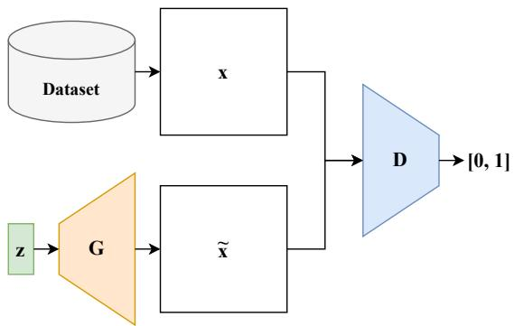  

Figure 1: General GAN framework, where the Discriminator $D$ predicts the probability of authenticity for both real images from the dataset or synthetic ones, generated from the output of the Generator $G$ given a latent vector $z$ .

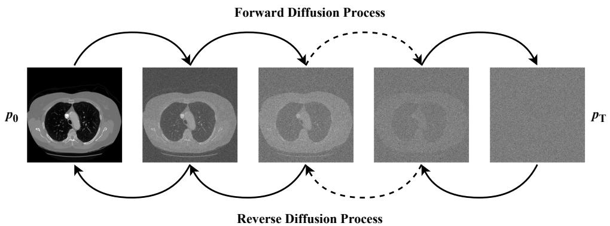  

Figure 2: Effect of forward and reverse diffusion processes on a chest CT scan slice.

# 1.2.2 基于评分的扩散模型

去噪扩散概率模型（DDPMs）首先通过定义一个正向过程，逐渐扰动来自原始分布 $p _ { 0 } ( \mathbf { x } )$ 的数据，在固定的 $T$ 时间步长上添加高斯噪声，直到其接近一个纯高斯先验分布 $p _ { T } ( \mathbf { x } )$。随后，可以学习逆向过程，其正向和逆向过程的效果如图 2 所示。$\{ \bar { \mathbf { x } } ( t ) \} _ { t \in [ 0 , T ] }$ 代表一个正向过程的采样序列，对应于相应的方程 3 和 4。

$$
\begin{array} { c } { \mathrm { d } \mathbf { x } = \mathbf { f } ( \mathbf { x } , t ) \mathrm { d } t + g ( t ) \mathrm { d } \mathbf { w } } \\ { \mathrm { d } \mathbf { x } = [ \mathbf { f } ( \mathbf { x } , t ) - g ^ { 2 } ( t ) \nabla _ { \mathbf { x } } \log p _ { t } ( \mathbf { x } ) ] \mathrm { d } t + g ( t ) \mathrm { d } \bar { \mathbf { w } } } \end{array}
$$

接下来，将漂移系数 $f ( \cdot , t )$ 和扩散系数 $g ( t )$ 设置为方程 5 中的形式，描述一个保持方差的随机微分方程，该方程等价于 DDPM 的离散扩散过程 [14]，其中 $\beta ( t )$ 描述了线性噪声调度。

$$
\mathbf { f } ( \mathbf { x } , t ) = - \frac { 1 } { 2 } \beta ( t ) \mathbf { x } , \quad g ( t ) = \sqrt { \beta ( t ) } , \quad \beta ( t ) = \big ( \beta _ { m a x } - \beta _ { m i n } \big ) \frac { t } { T } + \beta _ { m i n }
$$

边际分布 $F$， $\nabla _ { \mathbf { x } } \log p _ { t } ( \mathbf { x } )$，可以通过从高斯噪声执行反向扩散过程来从 $p _ { 0 } ( \mathbf { x } )$ 进行采样。核心预测模型架构通常为 UNet，由下采样、编码组件、上采样、解码组件以及跳过连接组成，以便利用共享的先前信息进行分数预测。基于时间步的信息的分数模型 $s$ 的优化通过最小化均方误差（MSE）来进行，该过程通过去噪声分数匹配实现，如公式 6 所示，其中 $\lambda$ 是一个合适的正权重函数，$t$ 在 $[0, T]$ 中均匀采样。

$$
\begin{array} { r } { \operatorname* { m i n } \mathbb { E } _ { t } \bigg \{ \lambda ( t ) \mathbb { E } _ { \mathbf { x } ( 0 ) } \mathbb { E } _ { \mathbf { x } ( t ) | \mathbf { x } ( 0 ) } \big [ | | s ( \mathbf { x } ( t ) , t ) - \nabla _ { \mathbf { x } ( t ) } \log p _ { 0 t } ( \mathbf { x } ( t ) | \mathbf { x } ( 0 ) ) | | _ { 2 } ^ { 2 } \big ] \bigg \} } \end{array}
$$

# 1.2.3 向量量化变分自编码器

T 并且随后优化生成模型以学习编码表示分布。一些研究表明了 Late Model [Vaal iff Me [18]，以及 VQVAEs [19] 和 VQGANs [20]。学习有意义且紧凑的潜在表示，捕捉在生成建模阶段的降维潜在空间中。虽然大多数编码方法为生成建模提供连续特征，但 VQVAEs 专注于提取离散表示 [19]。

在训练的第一阶段，VQVAE 学习一个编码器模型 $E$ 和一个解码器模型 $D$，它们一起学习使用从学习的离散字典 $\mathcal { Z } = \{ z _ { c } \} _ { c = 1 } ^ { C }$ 中获得的编码来表示图像，其中 $z _ { k } \in \mathbb { R } ^ { n _ { z } }$。更具体地说，一个图像 $x \in \breve { \mathbb R } ^ { H \times W \times \breve { C } }$ 被近似为 $\hat { x } = D ( z _ { \mathbf { q } } )$，其中 $z _ { \mathbf { q } }$ 是通过逐元素最近邻量化从编码器输出 $\hat { z } = E ( \bar { x } ) \in \mathbb { R } ^ { H \times W \times \bar { n } _ { z } }$ 得到的，如方程 7 所示。

$$
z _ { \mathbf { q } } = \mathbf { q } ( \hat { z } ) = \arg \operatorname* { m i n } _ { z _ { c } \in \mathcal { Z } } | | \hat { z } _ { i j } - z _ { c } | |
$$

因此，重构表示为 $\hat { x } = D ( z _ { \mathbf { q } } ) = D ( \mathbf { q } ( E ( x ) ) )$。整体训练损失函数如方程8所示，其中第一项表示重构损失，$\mathbf { s g } [ \cdot ]$ 是接近其相应代码簿条目的 n 近邻[9]，$\lambda _ { c }$ 是权重因子。

$$
\mathcal { L } ( E , D , \mathcal { Z } , x ) = | | x - \hat { x } | | _ { 2 } ^ { 2 } + | | \mathbf { s g } [ E ( x ) ] - z _ { \mathbf { q } } | | _ { 2 } ^ { 2 } + \lambda _ { \mathrm { c } } | | \mathbf { s g } [ z _ { \mathbf { q } } ] - E ( x ) | | _ { 2 } ^ { 2 }
$$

在第二个训练阶段，给定训练好的编码器 $E$ 和解码器 $D$，前馈图像可以表示为 $z _ { \mathbf { q } } \in \mathbb { R } ^ { H \times W \times n _ { z } }$，其映射为一个序列 $s \in \{ 0 , 1 , . . . C - 1 \} ^ { H \times W }$，其中每个元素 $s _ { i j }$ 表示其最近的码本向量 $z _ { c }$。通过将序列 $s$ 中的索引反转换回各自的码本条目，图像可以重建为 $\hat { x } = D ( z _ { s _ { i j } } )$。然后对每个 token $s _ { i }$ 进行条件化，依赖于所有之前的 token $s _ { < i }$，以计算整体表示的似然性 $p ( s ) = \textstyle \prod _ { i } p ( s _ { i } | s _ { < i } )$。因此，模型最大化离散潜在表示的对数似然，损失函数定义为方程 9。

$$
\mathcal { L } _ { \mathrm { T r a n s f o r m e r } } = \mathbb { E } _ { x \sim p ( x ) } [ - \log p ( s ) ]
$$

VQVAE通过生成码表索引序列来生成新样本，这些索引序列随后被转换为新的合成图像。整体VQVAE框架在图3的示意图中显示。

# 1.3 动机与贡献

我在任何现实世界的应用中都非常有用。

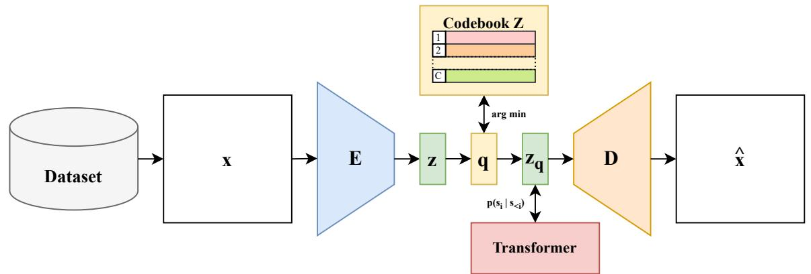  

Figure 3: General VQVAE framework. A given image $x$ passes through the Encoder network $E$ to produce a continuous latent representation $z$ . Next, given the codebook $\mathcal { Z }$ with $C$ vectors, the quantization operator $\mathbf { q }$ produces a discrete latent representation $z _ { \mathbf { q } }$ Faly he decer network $D$ prictctional $\hat { x }$ by decoding $z _ { \mathbf { q } }$ Tarodlressie ea cicealuhaat ho by $z _ { \mathbf { q } }$ , allowing the synthesis of new images.

在本研究中，我们提出了一种双重框架，将生成解构为结构性HU区间，每个区间最终生成相应的组织。然后使用推断重建网络，有效模拟HU窗的逆过程，尽量减少信息损失。通过使用公开的LID-DRI数据集进行实验，评估了定量关键指标和定性专家评价。实验结果表明该方法在有效性和可靠性方面具有优势。总之，本研究的贡献如下：

引入了一种新颖的 HU-区间分解策略，用于全肺 CT 扫描生成，旨在将生成建模与临床实践对齐，并以靶向、组织特异的方式进行生成。 提出并比较了三种基于 HU 窗口的生成设计架构变体，其中多头 VQVAE 在性能上表现更佳。 通过使用透明的逐步过程增强生成可解释性，使临床医生能够在宏观和组件水平上解读和验证合成输出。 通过提供一种学习的重建方法，扩展了 HU 窗口的概念，以最小的信息损失逆转该过程。 相比于传统的基于 AI 的全范围基线，显著提高了感知质量和多样性，同时也减少了计算需求和训练成本。 与实际临床医生进行视觉图灵测试（TT），结果令人满意，从而为结果的解剖现实性和诊断相关性提供了真实的临床验证。 创建了一个开放框架，可能扩展到其他可基于强度进行分解的医学成像模式。在第 4 节中，我们讨论了为评估方法性能而进行的广泛实验方案以及未来潜力。

# 2 相关工作

大多数Tlolralysba rei在数学幻影[24, 25]（例如，Shepp-Logan幻影）或有限元模拟[26]中进行，对比于在统计形状和主动外观建模中的表现[27, 8]。此外，基于数据的合成[29]是通过将数据注册到模板上进行的，这种方法特别允许在进行特征提取时，使用专家定义的先验知识。该方法强调数据驱动建模[30]。这不仅革命性地改变了性质，而且极大地促进了病理预测等下游任务的优化和自动化[32]。

这项数据是基于肺部CT扫描的研究。近年来，许多工作采用训练好的生成对抗网络（GANs）进行肺部CT扫描分析。研究表明，基于GAN的模型能够生成伪造的肺结节，从而让放射科医生误以为这些结节是真实的。此外，Mendes等人开发了一种深度卷积生成对抗网络（DCGAN），用于生成带有合成间质病理视觉标记的高分辨率样本。新冠疫情对筛查和诊断过程产生了影响，促使许多基于GAN的增强工作出现。然而，现有研究表明，GAN对数据敏感且易于出现模式崩溃现象。

MosA PMs 对于 ANs 和主要的三维医学成像生成的重大进展是由 Khader 等人建立的 [65]，他们证明了 a uW al J analehe l. [69] 同样能够处理 BT 常规 CT 图像，消除了在进行 CBCT 放疗时对准确剂量计算的需求；Daum l. [0 ettllevnt lpriv oeveoi 提出了用于安全医学图像生成的 3D 潜在扩散框架。除了无条件合成和模态转换外，Kaur 等人的工作 [60] CV-che X 射线和 Zhan 1 ul cd a Z .] 的结合展示了相应的成果。整体而言，虽然这些方法在生成过程中完全依赖于显著的标记解析，一些最新的研究已经呈现出临床意识形态的强大功能。最终，尽管方法创新了对抗算法的威胁，但仍然限制于某些特定条件下的应用，正如 Hu 等人 [76] 所示，基于 HU 的预处理是放射学工作流程的基础基石。分布是均匀的，且可以在没有特定组件需求的情况下对整体进行建模。THU-间隔分解策略使生成与临床工作流程对齐，同时提高了肺 CT 合成的效率和输出保真度。

# 3 方法论

# 3.1 基于 HU 区间的全范围 CT 重建

设 $X : \mathcal{V} \to H \subset \mathbb{R}$ 表示一个 CT 扫描，它是作用于体素域 $\nu \subset \mathbb{Z}^{3}$ 的一个函数，其中每个体素位置对应于扫描中完整 HU 范围 $H$ 内的一个 HU 值。接下来，考虑一组不重叠的 HU 区间，其并集不一定覆盖 $X$ 的整个 HU 范围。

$$
\begin{array} { r } { \mathcal { T } = \{ I _ { 1 } , I _ { 2 } , . . . , I _ { K } \} , \quad I _ { k } = [ \mathbf { h } \mathbf { u } _ { m i n } , \mathbf { h } \mathbf { u } _ { m a x } ] , \quad I _ { i } \cap I _ { j } = \emptyset } \end{array}
$$

对于每个区间 $I_{k} \in \mathcal{Z}$，$X_{k}$ 被定义为一个裁剪变换的结果，该变换保留 $X$ 在 $I_{k}$ 内的 HU 值，同时将低于 ${\mathrm{hu}}_{\mathrm{min}}$ 的值设为 ${\mathrm{hu}}_{\mathrm{min}}$，将高于 ${\mathrm{hu}}_{\mathrm{max}}$ 的值设为 ${\mathrm{hu}}_{\mathrm{max}}$。随后，原始扫描和区间裁剪后的扫描均按最小最大缩放到单位范围 $[0, 1]$。因此，集合 $\{X_{1}, X_{2}, \ldots, X_{k}\}$ 代表了同一扫描的多个互补视图，每个视图捕捉其原始 HU 分布的一部分。

$$
X _ { k } ( v ) = \frac { \mathrm { c l i p } ( X ( v ) , \mathrm { h u } _ { m i n } , \mathrm { h u } _ { m a x } ) - \mathrm { h u } _ { m i n } } { \mathrm { h u } _ { m a x } - \mathrm { h u } _ { m i n } } , \quad \mathrm { c l i p } ( h , a , b ) = \left\{ \begin{array} { l l } { a , } & { \mathrm { i f } \quad h < a } \\ { h , } & { \mathrm { i f } \quad h \in [ a , b ] } \\ { b , } & { \mathrm { i f } \quad h > b . } \end{array} \right.
$$

本研究的首要目标是证明可以从集合 $\{ X _ { k } \} _ { k = 1 } ^ { K }$ 使用 $\mathcal { R }$ 重构全范围扫描 $X$。首先，需要注意的是，无法通过固定的线性或仿射组合来重构 $X$。特别是，没有系数 $\{ \alpha _ { k } \}$ 和偏置 $\beta$ 能满足

$$
X ( v ) = \sum _ { k = 1 } ^ { K } \alpha _ { k } X _ { k } ( v ) + \beta , \quad \forall v \in \mathcal { V } .
$$

这种不可能性出现的原因在于，每个 $X_{k}$ 编码了从 HU 值到归一化强度的映射，这在 $I_{k}$ 内部是局部线性的，但在整个 HU 范围内却是不一致的。此外，一个体素对重建的贡献可以通过定义二进制掩模来识别每个体素的活跃区间，具体如下。

$$
M _ { k } ( v ) = { \left\{ \begin{array} { l l } { 1 , } & { { \mathrm { i f } } \quad X _ { k } ( v ) \in I _ { k } } \\ { 0 , } & { { \mathrm { o t h e r w i s e } } . } \end{array} \right. }
$$

缩放的全范围扫描可以表示为一个分段映射，其中每个复合函数 $\sigma ( \phi _ { k } ( \cdot ) )$ 将 $X _ { k }$ 的 HU 强度重新投射到 $X$ 中的相应强度。可以展开这种组合，并将 $\phi _ { k } ( \cdot )$ 描述为从 $X _ { k }$ 的 HU 转换到其在 $I _ { k }$ 中的原始值，而将 $\sigma ( \cdot )$ 描述为在 $X$ 的全范围内的线性缩放函数。然而，如果 HU 间隔的并集并未覆盖整个 CT 扫描的 HU 范围，则那些 HU 值仍必须能够从 $\{ X _ { k } \}$ 中扣除。

$$
X ( v ) = \sum _ { k = 1 } ^ { K } M _ { k } ( \phi _ { k } ( v ) ) \cdot \sigma ( \phi _ { k } ( v ) ) ,
$$

在此背景下，由深度神经网络定义的重建模型 $\mathcal { R }$ 可以通过隐式学习相应的重投影函数 $\phi _ { k } ( \cdot )$ 来训练，以从 $\{ X _ { k } \}$ 估计 $X$ 的重建，并同时建模 $\mathcal { T }$ 所揭示的 HU 值的重建。本文探讨了利用多层感知机（MLPs）和不同特征尺寸和深度的卷积神经网络（CNNs）来建模由一系列 HU 截断视图生成的全范围 T 扫描的重建。

MLP模型接收一个向量 $\mathbf { x } _ { v } = [ X _ { 1 } ( v ) , X _ { 2 } ( v ) , \ldots , X _ { K } ( v ) ] ^ { T } \in [ 0 , 1 ] ^ { K }$，表示体素$v$的$K$个缩放后的HU值，并输出一个标量$\hat { X } ( v ) \in [ 0 , 1 ]$。如图4a所示，MLP架构由一个大小为$K$的输入层和可变数量的全连接(FC)层组成，每个FC层的特征大小也为$K$。所有隐藏层都采用ReLU激活函数，引入非线性，而最终输出层则使用Sigmoid激活，约束重建的体素强度在$[ 0 , 1 ]$范围内。通过处理给定图像的所有体素，获得全范围CT重建估计。另一方面，与体素级MLP网络相比，CNN模型是在图像级别上运行的。给定$K$个输入图像$\{ X _ { 1 } , X _ { 2 } , \ldots , X _ { K } \}$，每个图像代表CT扫描的一个缩放HU区间，CNN接收一个$K$通道的输入张量，并预测一个单通道的输出图像$\hat { X }$，对应于缩放后的重建全范围CT。最终输出层采用Sigmoid激活，以确保重建的HU值保持在缩放范围$[ 0 , 1 ]$内。CNN架构的示意图也显示在图4b中。

# 3.2 多个 HU 间隔生成

因此，本文的目标是学习一种生成模型，该模型生成一个序列样本 $\{ \tilde { X } _ { 1 } , \tilde { X } _ { 2 } , \ldots , \tilde { X } _ { K } \}$，使得它们的重建样本 $\tilde { X } = \mathcal { R } ( \{ \tilde { X } _ { k } \} )$ 创建出一个全范围的 CT 扫描样本分布 $p _ { \tilde { X } }$，与原始分布 $p _ { X }$ 相似。该目标通过三种生成范式进行探索，WGAN-GP、基于评分的扩散模型和变分量化自编码器（VQVAEs），每种范式都进行了适应性调整，以通过不同的架构变体处理多区间生成。

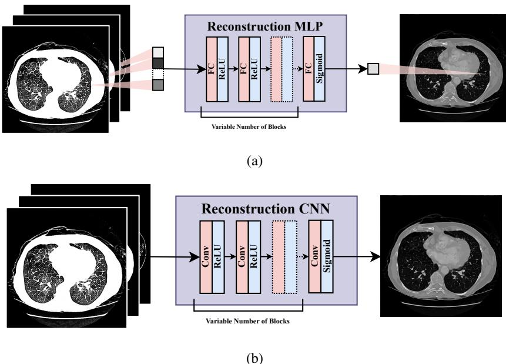  
r Ilusratio the propose  reonstruconetworks.n ML-as model tha reeiverc onul andpreict e calulangHU valuusicfullyReLU block we by ouu layer.b A NN-basedmodel that takes a K-chane image in which each channe encodes a clippe-scaled HUin r  od lulano ouReLU and a final convolutional layer with sigmoid activation.

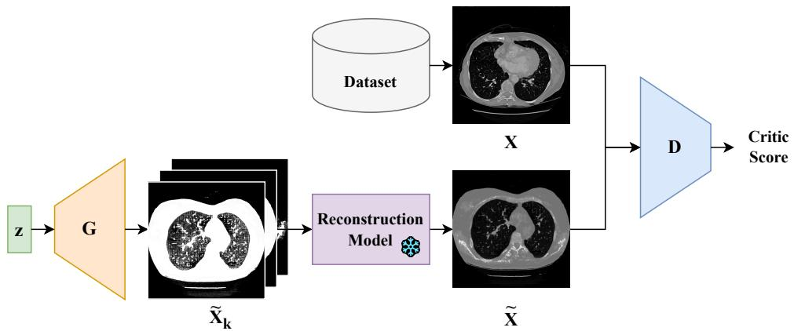  

Figure 5: Multi-channel WGAN-GP framework.

# 3.2.1 多通道方法

在具有连续扩展性和变换特性的模型架构中，保持推导基础和优化特性至关重要。这样的多通道表示可以被视为一种与模型无关的多重高频区间生成策略。在WGAN-GP配置中，如图5所示，生成器网络$G$被调整为产生K通道输出，然后通过重建模型$\mathcal{R}$获得最终的单通道样本。重建的图像被输入到判别网络$D$，该网络将其与真实的全范围CT图像进行比较。

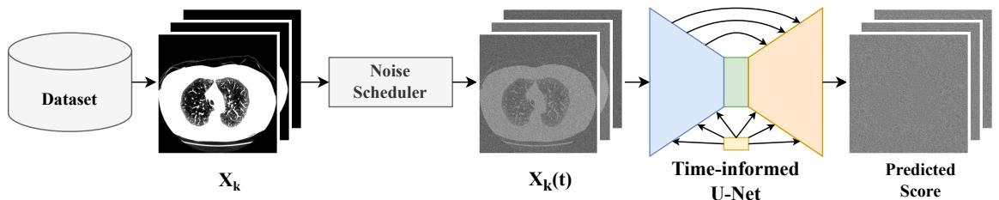  

Figure 6: Multi-channel score-based diffusion model framework.

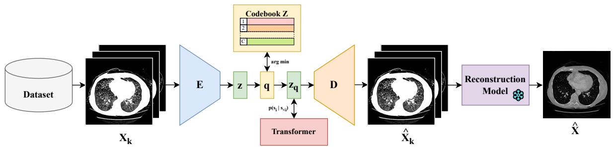  

Figure 7: Multi-channel VQVAE framework.

基于核的降噪模型，采用相同的原理，但底层架构与生成对抗网络（GAN）框架不同。在这里，使用标准的U-Net接收K通道图像并预测K通道得分值，所展示的工作并不直接进行图像预测，因此重建模型$\mathcal{R}$在训练过程中并不直接使用。在采样后，K通道HU区间样本由重建模型$\mathcal{R}$处理，以获得全范围CT样本。最后，在VQVAE框架中，编码器-解码器架构被修改为处理K通道的输入和输出，类似于之前的生成方法。编码器$E$将多区间输入压缩为共享的潜在码本表示，而解码器$D$则根据量化的潜在表示重建原始的K通道图像。多通道框架如图所示。这一适配使编码模式针对不同的HU区间进行码本条目训练，随后变换模型生成量化的潜在序列，解码器$D$对其进行解码，生成HU样本。最后，这些样本被传递给重建模型$\mathcal{R}$，以生成全范围CT合成图像。

# 3.2.2 多解码器和多头方法

Whilthulhanel 策略提供了一种简化模式无关的方法，扩展了多解码器和多头网络的应用，以便在区间特征上提供更精细的建模。值得强调的是，预处理阶段具有更大的灵活性，以便在编码-解码过程中进行架构修改。一方面，多解码器配置的特征在于使用单个编码器处理一个连接的 $K$ 通道输入，代表多种 U 型内容，生成一个潜在表示，该表示捕获有助于在同一量化向量中处理不同 HU 内容。然后，该表示由 $K$ 个不同的解码器独立解码，在通道维度上连接，并随后传递通过重建模型 $\mathcal { R }$ 以获得最终的全范围 T 应用。这种解码架构保证了特征表示的有效性，同时允许每个解码器在各自的领域中专门化。

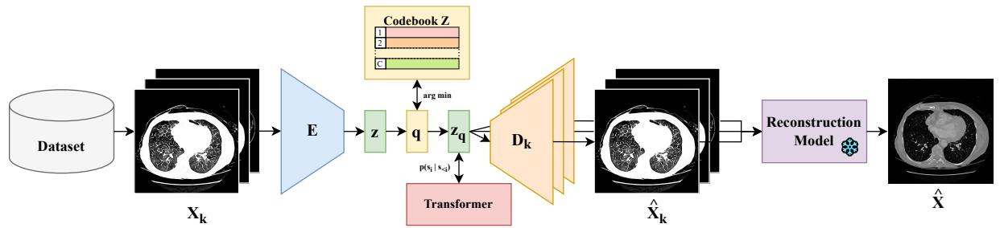  

Figure 8: Multi-decoder VQVAE framework.

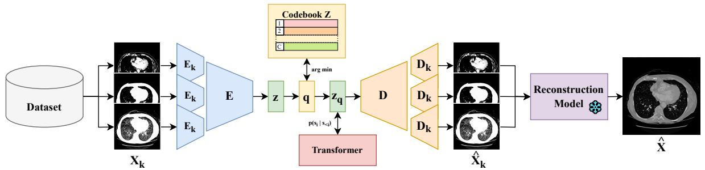  

Figure 9: Multi-head VQVAE framework.

在十个阶段。它采用$K$个独立的编码器头，每个头专门处理一个HU区间输入，然后通过一个共享的解码器路径接收各种HU视图值的表示。主干网络的共享解码器路径之后，又接入$K$个独立的解码器头，以重构相应的区间输出。最终得到的$K$个单通道输出再次被连接并通过重构模型$\mathcal{R}$处理，以生成全范围的CT样本。图9展示了多头架构的示意图。总体而言，QVAE变体方法探讨了在同一网络中针对多个HU区间建模的特征表示之间的权衡。

# 3.2.3 损失函数公式

对于 WGAN-GP 和 DM 模型中的损失，损失函数的定义是相同的。然而，损失的具体表现有所不同。请注意，预训练的重建模型 $\mathcal { R }$ 是一个离散随机过程。对于以下公式，让 $B$ 代表计算给定损失的批量大小。对于 WGAN-GP，目标函数如下，其中生成器 G 和判别器 D 的损失分别在方程 15 和 16 中描述。

$$
\mathcal { L } _ { G } = \frac { 1 } { B } \sum _ { b = 1 } ^ { B } \Big [ - D ( \mathcal { R } ( G ( z ^ { ( b ) } ) \Big ] , \quad z \sim \mathcal { N } ( 0 , I )
$$

$$
\mathcal { L } _ { D } = \frac { 1 } { B } \sum _ { b = 1 } ^ { B } \Big [ D ( \mathcal { R } ( G ( z ^ { ( b ) } ) ) ) - D ( X ^ { ( b ) } ) + \lambda _ { G P } \cdot ( | | \nabla _ { \bar { X } ^ { ( b ) } } D ( \bar { X } ^ { ( b ) } ) | | _ { 2 } - 1 ) \Big ] , \quad z \sim \mathcal { N } ( 0 , I )
$$

基于得分的去噪模型损失。扩散模型的去噪得分匹配目标是在所有 $\mathrm{K}$ 通道上同时计算的。请注意，当相关核是高斯分布且方差为 $\dot{\sigma}(t)^{2}$ 时，得分 $\nabla_{\mathbf{x}(t)} \log p_{0t}(\mathbf{x}(t) | \mathbf{x}(0))$ 具有定义明确的封闭形式：

$$
( t ) = X ( 0 ) + \sigma ( t ) \cdot \varepsilon , \quad \varepsilon \sim \mathcal { N } ( 0 , I ) \quad \Rightarrow \quad \nabla _ { X ( t ) } \log p _ { 0 t } ( X ( t ) | X ( 0 ) ) = \frac { X ( t ) - X ( 0 ) } { \sigma ( t ) ^ { 2 } } = - \frac { \varepsilon } { \sigma ( t ) } .
$$

因此，损失定义如方程 18 所示。

$$
\mathcal { L } _ { D M } = \frac { 1 } { B } \sum _ { b = 1 } ^ { B } \Big [ | | s ( X ( t ^ { ( b ) } ) , t ^ { ( b ) } ) + \varepsilon ^ { ( b ) } / \sigma ( t ^ { ( b ) } ) | | _ { 2 } ^ { 2 } \Big ] , \quad \varepsilon \sim \mathcal { N } ( 0 , I )
$$

VA FVVA 预重建损失、后重建损失和量化损失。Tl eale CT 样本。对于每个区间 $k$，VQVAE 编码器输出 $\tilde { X } _ { k }$ 与其对应的真实值 $X _ { k }$ 通过三种互补损失的加权组合进行比较。均方误差 $( \mathcal { L } _ { M S E } )$ 计算像素级重建。然后，结构相似性指数的互补项 $( \mathcal { L } _ { S S I M } )$ 考虑了结构一致性。最后一项使用感知损失 $( \mathcal { L } _ { R I N } )$，对从在 RadImageNet (RIN) 数据集上预训练的 ResNet-50 中提取出的 $\tilde { X } _ { k }$ 和 $X _ { k }$ 的特征向量进行计算。HU 区间图像 $\{ X _ { k } \}$ 的权重集合 $\bar { \{ { w } _ { k } \} }$ 按照方程 19 中所述计算，这也保证了所有权重的总和为一。

$$
\left\{ w _ { k } \right\} = \mathrm { s o f t m a x } \bigg ( \Big \{ \operatorname* { m a x } \Big ( \frac { \# [ X _ { k } > 0 ] } { | X _ { k } | } , w _ { \operatorname* { m i n } } \Big ) , \quad k \in \{ 1 , 2 , \ldots , K \} \Big \} \bigg )
$$

然后，预重建损失 $\mathcal { L } _ { \mathrm { P r e - R e c } }$ 定义如公式 20 所示，其中 $\lambda _ { \mathrm { P r e - } M S E } , \lambda _ { S S I M }$ 和 $\lambda _ { \mathrm { P r e } - R I N }$ 是预重建损失定义中各个原子损失项 $\mathcal { L } _ { M S E }$ , $\mathcal { L } _ { S S I M }$ 和 $\mathcal { L } _ { R I N }$ 的正损失权重。

$$
\small \mathcal { L } _ { \mathrm { P r e - R e c } } = \frac { 1 } { B } \sum _ { b = 1 } ^ { B } \sum _ { k = 1 } ^ { K } w _ { k } ^ { ( b ) } \cdot \Big [ \lambda _ { \mathrm { P r e - } M S E } \cdot \mathcal { L } _ { M S E } ( X _ { k } ^ { ( b ) } , \hat { X } _ { k } ^ { ( b ) } ) + 
$$

Au重建模型 $\mathcal{R}$ 生成逼真且一致的全范围CT样本。后重建损失 $(\mathcal{L}_{\mathrm{Post-Rec}})$，如公式21所述，由全范围CT图像 $X$ 及其通过编码-解码过程重建的全范围版本 $\hat{X} = \mathcal{R}(\{ \hat{X}_{k} \})$ 的 $\mathcal{L}_{\mathrm{MSE}}$ 和 $\mathcal{L}_{\mathrm{RIN}}$ 之和组成。引入这个后重建项鼓励独立学习的表示相辅相成，从而促进高质量的CT重建。参数 $\lambda_{\mathrm{Post-MSE}}$ 和 $\lambda_{\mathrm{Post-RIN}}$ 是 $\mathcal{L}_{\mathrm{MSE}}$ 和 $\mathcal{L}_{\mathrm{RIN}}$ 在最终总损失中的权重系数。

$$
{ \mathcal { L } } _ { \mathrm { P o s t - R e c } } = { \frac { 1 } { B } } \sum _ { b = 1 } ^ { B } \left[ \lambda _ { \mathrm { P o s t - } M S E } \cdot { \mathcal { L } } _ { M S E } ( X ^ { ( b ) } , { \hat { X } } ^ { ( b ) } ) + \lambda _ { \mathrm { P o s t - } R I N } \cdot { \mathcal { L } } _ { R I N } ( X ^ { ( b ) } , { \hat { X } } ^ { ( b ) } ) \right]
$$

最后，量化损失 $( \mathcal { L } _ { V Q } )$ 构成了 VQVAE 损失公式的最后一项，对应于标准化的量化版本。项 $\lambda _ { V Q }$ 用于正则化量化损失在全局 VQVAE 损失函数中的权重。

$$
\mathcal { L } _ { V Q } = \lambda _ { V Q } \cdot \frac { 1 } { B } \sum _ { b = 1 } ^ { B } \left[ | | \mathbf { s g } [ E ( X ^ { ( b ) } ) ] - z _ { \mathbf { q } } ^ { ( b ) } | | _ { 2 } ^ { 2 } + | | \mathbf { s g } [ z _ { \mathbf { q } } ^ { ( b ) } ] - E ( X ^ { ( b ) } ) | | _ { 2 } ^ { 2 } \right]
$$

将上述术语汇总，本研究中使用的 VQVAE 网络的总损失函数定义为：

$$
\mathcal { L } _ { V Q V A E } = \mathcal { L } _ { \mathrm { P r e - R e c } } + \mathcal { L } _ { \mathrm { P o s t - R e c } } + \mathcal { L } _ { V Q } .
$$

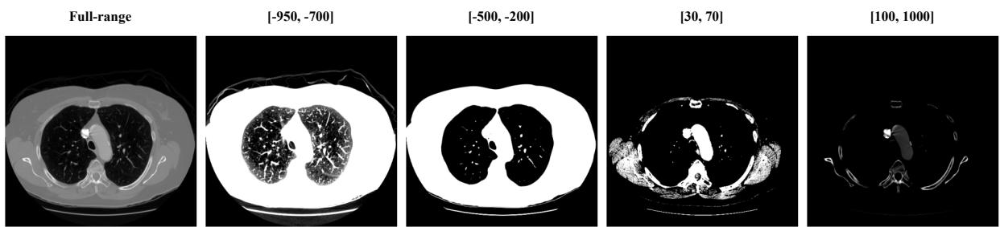  

Figure 10: Example of a full-range CT sample and its respective HU-clipped views for the HU intervals $[ - 9 5 0 , - 7 0 0 ]$ $[ - \mathrm { \bar { 5 } 0 0 } , - 2 0 0 ]$ , [30, 70] and [100, 1000].

Table 2: Configuration of the experimented reconstruction models   

<table><tr><td>Reconstruction Model</td><td>Model Type</td><td>Parameters</td><td>Description</td></tr><tr><td>MLP0</td><td>MLP</td><td>5</td><td>Zero hidden layers</td></tr><tr><td>MLP4</td><td>MLP</td><td>25</td><td>One hidden layer with feature size 4</td></tr><tr><td>MLP4×4</td><td>MLP</td><td>45</td><td>Two hidden layers, all with feature size 4</td></tr><tr><td>MLP4×4×4</td><td>MLP</td><td>65</td><td>Three hidden layers, all with feature size 4</td></tr><tr><td>CNN3</td><td>CNN</td><td>37</td><td>One convolution with kernel size 3</td></tr><tr><td>CNN7</td><td>CNN</td><td>197</td><td>One convolution with kernel size 7</td></tr><tr><td>CNN11</td><td>CNN</td><td>485</td><td>One convolution with kernel size 11</td></tr><tr><td>CNN3×3</td><td>CNN</td><td>185</td><td>Two convolutions with kernel size 3</td></tr><tr><td>CNN3×3×3</td><td>CNN</td><td>333</td><td>Three convolutions with kernel size 3</td></tr></table>

# 3.3 数据集与预处理

本研究中使用的数据集来源于公开可访问的Lung Image Database Consortium (LIDC-IDRI) 收集[2]。该数据集包含1,018个CT扫描，每个扫描表示为一个大小为$S \times 512 \times 512$的3D体积，其中$S$表示每次扫描的轴向切片数量。总体上，$80\%$ 的体积分配给训练集，而剩余的$20\%$则保留用于测试，确保每个CT体积的90\%用于分析。

$e e M \; [-1000, 1000]$，然后进行最小-最大缩放到 $[0, 1]$，设定全范围基线表示。接下来，对于每个 HU 区间 $\mathcal{T} = \{ [-950, -700] , [-500, -200] , [30, 70] , [1000, 1000] \}$，创建对应的 HU 区间表示以及相应的 HU 窗口表示。之前定义的 HU 区间集合贯穿于本工作的整个过程，该 HU 表示的参考值表明该工作涉及 25 万张图像。

# 3.4 实验设置 使用深度学习模型的 HU 限制表示。为此目标采用的网络架构总结在表 2 中。

所有重建模型在相同条件下进行训练和测试，以确保结果的可比性。每个模型都使用均方误差（MSE）损失进行优化，并采用Adam优化器（$\beta _ { 1 } = 0.9$，$\beta _ { 2 } = 0.999$），学习率为$5 \times 10^{-5}$，共训练50个周期，批量大小为16。这些超参数值是在经验实验中选择的。模型性能通过MSE、MS-SSIM和FID进行评估。

Table 3: Configuration of the experimented CT and HU generative models   

<table><tr><td>Model Type</td><td>Approach</td><td>Parameters (Millions)</td><td>Reconstruction Model</td></tr><tr><td rowspan="3">WGAN-GP</td><td>Baseline</td><td>6.4</td><td>-</td></tr><tr><td rowspan="2">Multi-channel</td><td rowspan="2">6.8</td><td>MLP0</td></tr><tr><td>CNN3×3×3</td></tr><tr><td rowspan="3">Score-based DM</td><td>Baseline</td><td>72.3</td><td>-</td></tr><tr><td rowspan="2">Multi-channel</td><td rowspan="2">72.3</td><td>MLP0</td></tr><tr><td>CNN3×3×3</td></tr><tr><td rowspan="5">VQVAE</td><td>Baseline</td><td>48.3</td><td>-</td></tr><tr><td rowspan="2">Multi-channel</td><td rowspan="2">48.3</td><td>MLP0</td></tr><tr><td>CNN3×3×3</td></tr><tr><td rowspan="2">Multi-decoder</td><td rowspan="2">68.9</td><td>MLP0</td></tr><tr><td>CNN3×3×3</td></tr><tr><td rowspan="2">Multi-head</td><td rowspan="2">49.3</td><td rowspan="2"></td><td>MLP0</td></tr><tr><td>CNN3×3×3</td></tr></table>

MMD、精度和召回率在10次独立测试运行中计算，涉及从相应的HU裁剪视图重建256个全范围CT扫描切片。接下来，重建扫描的合成生成HU区间表示的结果优于直接训练以生成全范围图像的模型。表3详细说明了每个实验TB CT阶段中使用的生成模型类型（WGAN-GP、基于评分的扩散模型或VQVAEs）、架构变体和重建模型，用于作为所提出的多区间生成方法所达到的性能参考或价值。在使用WGAN-GP模型的实验中，潜在表示为从高斯分布中采样的16维向量，$\lambda_{GP}$ 设置为10，生成器和判别器网络均使用具有参数 $\beta_{1}=0$ 和 $\beta_{2}=0.9$ 的Adam优化器，学习率为 $1 \times 10^{-4}$。训练阶段执行了20个周期，批量大小为16。随后，对于使用基于评分的扩散模型的实验，线性噪声调度器使用 $\beta_{min}=0.1$ 和 $\beta_{max}=20$ 进行1000次采样，网络使用Adam优化器，$\beta_{1}=0.9$ 和 $\beta_{2}=0.999$，学习率为 $5 \times 10^{-5}$，执行20个周期，批量大小为16。对于所有使用VQVAEs的实验，相应的代码本由512个维度为16的向量组成，承诺损失权重 $\lambda_{c}$ 设置为0.5。此外，多解码器方法利用了多通道网络中相应块的特征。

最后，优化自编码器网络的 VQVAE 损失公式中的权重设置为 $\lambda _ { \mathrm { P r e - } M S E } = 1.0$，$\lambda _ { S S I M } = 0.1$，$\lambda _ { \mathrm { P r e } - R I N } = 1.0$，$\lambda _ { \mathrm { P o s t - } M S E } = 0.1$，$\lambda _ { \mathrm { P o s t - } R I N } = 0.25$，以及 $\lambda _ { V Q } = 1.0$。此外，方程 19 中的 HU 最小权重设置为 $w _ { \mathrm { m i n } } = 0.15$。训练的第一阶段进行了 20 个周期，批量大小为 16，使用 AdamW 优化器，$\beta $ 参数为 $\beta _ { 1 } = 0.9$ 和 $\beta _ { 2 } = 0.95$，学习率为 $1 0 ^ { - 4 }$。其次，优化网络采用了 SamAdamW 优化器和 beta 值，尽管学习率为 $2 \times 1 0 ^ { - 4 }$，进行了 50 个周期，模拟批量大小为 64，并使用微批量大小 16 的累计梯度。强调所有超参数的值均通过经验实验获得，其中测试了多种配置以优化模型性能。R 平均值包括从每个模型生成的 256 个样本与 256 个采样图像之间的 FD、MMD、精度和召回率，以及从样本集中的每对图像计算的 MS-SSIM 值。具体而言，使用肺部区域分割模型，对于 [], 未条件生成图像没有真实标注数据以产生定量值。

Table 4: MSE, FID, MMD, Precision, Recall and MS-SSIM metrics for each full-rage CT reconstruction model.   

<table><tr><td>Reconstruction Model</td><td>MSE (×10−4) ↓</td><td>FID ↓</td><td>MMD (×10−2) ↓</td><td>Precision ↑</td><td>Recall ↑</td><td>MS-SSIM ↑</td></tr><tr><td>MLP0</td><td>4.68</td><td>44.9</td><td>3.29</td><td>0.969</td><td>0.989</td><td>0.962</td></tr><tr><td>MLP4</td><td>4.74</td><td>44.6</td><td>3.21</td><td>0.974</td><td>0.988</td><td>0.962</td></tr><tr><td>MLP4×4</td><td>4.74</td><td>44.6</td><td>3.21</td><td>0.974</td><td>0.988</td><td>0.962</td></tr><tr><td>MLP4×4×4</td><td>4.46</td><td>41.9</td><td>2.93</td><td>0.977</td><td>0.995</td><td>0.964</td></tr><tr><td>CNN3</td><td>4.62</td><td>40.4</td><td>2.66</td><td>0.989</td><td>0.993</td><td>0.962</td></tr><tr><td>CNN7</td><td>4.54</td><td>40.1</td><td>2.68</td><td>0.988</td><td>0.993</td><td>0.962</td></tr><tr><td>CNN11</td><td>4.53</td><td>40.7</td><td>2.79</td><td>0.987</td><td>0.991</td><td>0.962</td></tr><tr><td>CNN3×3</td><td>3.45</td><td>34.8</td><td>2.15</td><td>0.995</td><td>0.996</td><td>0.979</td></tr><tr><td>CNN3×3×3</td><td>2.49</td><td>26.0</td><td>1.56</td><td>0.999</td><td>1.000</td><td>0.985</td></tr></table>

# 3.5 性能评估指标 采用了衡量能力、质量、相关性和结构性的指标。

Recnoxl在其构建模型实验中提供了体素级强度偏差的直接测量。在Inception网络中，生成2048维向量。较低的FID值表明生成的分布与真实数据的相似性更高。最大均值差异（MMD）是一种非参数的分布度量方法，评估高阶差异。MMD值是通过使用相同的Inception3嵌入从FID计算得出的，较小的MMD值表示两个分布之间的相似性更大。[8]中无论何种方法，算法提供的大值表明更好的性能。精度度量生成图像的质量，而量化真实样本覆盖的范围，反映了生成的多样性。最后，多尺度结构相似性指数（MSSIM）在较粗糙的尺度之间测量结构相似性，输出值在$[0, 1]$之间，较高的值表明结构相似性更大。此外，低MS-M值作为样本分布中结构变异性的定量代理。

# 4 结果与讨论

# 4.1 全范围计算机断层重建

所提出方法在根据 HU 窗口进行重建时的性能指标包括 PSNR、SSIM、FDM 和 MS-SSIM。图 11 展示了来自不同 MLP 和 CNN 模型的重建测试集切片的两个示例。

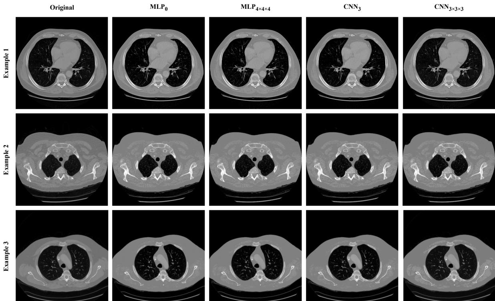  
Tuan ooTh t content of the full-range CT slices. The following columns frame the outputs of the reconstruction models ${ \bf M L P } _ { 0 }$ , $\mathbf { M L P _ { 4 \times 4 \times 4 } }$ , $\mathrm { C N N _ { 3 } }$ , and $\mathrm { C N N } _ { 3 \times 3 \times 3 }$ , respectively, given the HU-clipped images of the original slice.

它的 ML 从 $4.46 \times 10^{-4}$ 到 $4.74 \times 10^{-4}$，FID 值在 41.9 和 44.9 之间，MMD 值从 $2.93 \times 10^{-2}$ 到 $3.29 \times 10^{-2}$，而 NN 变体在卷积核大小和深度上显示出显著的改进。在所有配置中，$\mathrm{CNN}_{3 \times 3 \times 3}$ 获得了最佳的整体性能，报告的最低 MSE 为 $\phantom{-} 2.49 \times 10^{-4}$，FID 为 26.0，MMD 为 $1.56 \times 10^{-2}$，同时也取得了最佳的精确率和召回率，分别为 0.999 和 1.000，以及最高的结构相似性，MS-SSIM 为 0.985。此外，重建模型在 HU 强度方面表现出其他特征，尽管由 MLP 基础重建模型生成的图像同样详细，然而在可视化效果上有区别。定性结果显示 MLP 和重建模型在图像细节方面存在显著差异。虽然 MLP 架构是依赖于图像的，但它仍然能捕捉到真实医疗图像中存在的特征。

# 4.2 CT 和 HU 区间生成

在以下各部分中，分别列出了每个指标的 HU e 和 HU CU。除了表格之外，暗绿色和亮绿色单元格分别表示与相应基线相比的更好和更差的表现，而强调色调则突出显示了所有实验中最好的结果。

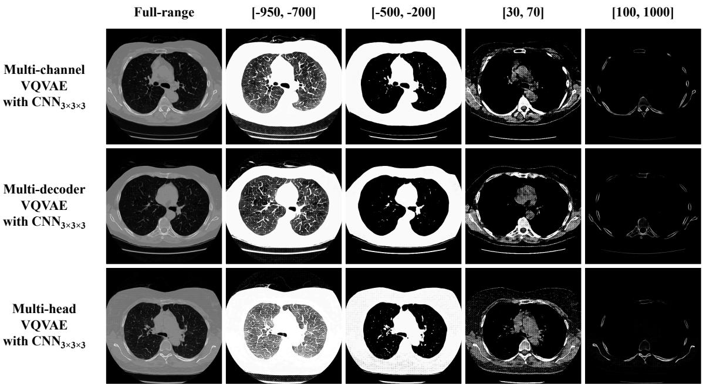  

Figure 12: Full-range CT and HU-windowed samples obtained from the proposed VQVAE methods and $\mathrm { C N N } _ { 3 \times 3 \times 3 }$ reconstruction model.

# 4.2.1 合成肺部CT和HU样本的定性示例

本节展示了由提出的变分自编码器（VAE）变体生成的合成CT图像示例。图12展示了来自上述生成管道的合成样本。所展示的示例展现了在HU窗内具有空间一致性的具有合理结构的纹理，这些合成图像与完整范围图像之间保持清晰的对应关系。 这些观察结果表明，在采样过程中图像是对齐的。这些结果适用于[0,0] HU窗，对局部纹理外观影响较小。与此同时，预先质量评估与跨模型和指标的定量结果相一致。

# 4.2.2 FID 评估

首先，表格报告了每个 HU 区间计算的视觉真实度，这是对所有实验中的近似样本的评估。基于 DM 和 VQVAE 模型在全范围重建中取得了显著较低的 FID 值（分别为 66.8 和 71.6），而 WGAN-GP 的 FID 值为 141.8。此外，基于分数的 DM 在本研究中使用的每个 HU 区间中获得了最低的 FID 值，测试范围内从 56.3 到 85.6 不等。分析结果表明，VQVAE 实验中 HU 窗口图像的保真度有所提升，${ \bf M L P } _ { 0 }$ 配置在 $[ - 500 , - 200 ]$ 区间的 FID 值低至 52.9，同时在全范围重建域内表现与基线相当（${ \mathrm { { M L P } _ { 0 } } }$ 和 $\mathrm { C N N } _ { 3 \times 3 \times 3 }$ 变体分别为 76.3 和 75.7，而基线为 71.6）。

Table 5: FID computed per HU interval for each generative model configuration.   

<table><tr><td rowspan="2">Model Type</td><td rowspan="2">Approach</td><td rowspan="2">Reconstruction Model</td><td colspan="5">FID per HU Interval</td></tr><tr><td>Full-range</td><td>[-950,-700]</td><td>[-500,-200]</td><td>[30, 70]</td><td>[100, 1000]</td></tr><tr><td rowspan="4">WGAN-GP</td><td>Baseline</td><td>-</td><td>141.8</td><td>117.5</td><td>131.5</td><td>157.2</td><td>177.5</td></tr><tr><td rowspan="2">Multi-channel</td><td>MLP0</td><td>211.3</td><td>196.1</td><td>137.7</td><td>134.7</td><td>219.4</td></tr><tr><td>CNN3×3×3</td><td>184.9</td><td>145.0</td><td>121.9</td><td>138.2</td><td>205.9</td></tr><tr><td rowspan="2">Score-based DM</td><td>Baseline -</td><td></td><td>66.8</td><td>81.3</td><td>56.3</td><td>85.6</td><td>81.2</td></tr><tr><td>Multi-channel</td><td>MLP0</td><td>84.9</td><td>106.5</td><td>134.9</td><td>134.5</td><td>192.3</td></tr><tr><td rowspan="8">VQVAE</td><td></td><td>CNN3×3×3</td><td>85.9</td><td>114.0</td><td>140.4</td><td>139.7</td><td>194.7</td></tr><tr><td>Baseline</td><td>-</td><td>71.6</td><td>95.5</td><td>65.2</td><td>116.6</td><td>105.5</td></tr><tr><td rowspan="2">Multi-channel</td><td>MLP0</td><td>76.3</td><td>75.8</td><td>52.9</td><td>83.7</td><td>74.6</td></tr><tr><td>CNN3×3×3</td><td>75.7</td><td>77.6</td><td>66.1</td><td>79.2</td><td>75.3</td></tr><tr><td rowspan="2">Multi-decoder</td><td>MLP0</td><td>70.5</td><td>100.0</td><td>70.5</td><td>86.7</td><td>76.3</td></tr><tr><td>CNN3×3×3</td><td>67.9</td><td>81.4</td><td>69.2</td><td>77.4</td><td>77.2</td></tr><tr><td rowspan="2">Multi-head</td><td>MLP0</td><td>68.1</td><td>96.3</td><td>63.6</td><td>73.7</td><td>71.3</td></tr><tr><td>CNN3×3×3</td><td>67.1</td><td>77.0</td><td>59.4</td><td>73.1</td><td>71.5</td></tr><tr><td></td><td>Global Best</td><td>Best</td><td>Better</td><td>Baseline</td><td>Worse</td><td>Worst</td><td></td></tr></table>

相较于WGAN-GP和DM模型，多通道配置并未提供一致的提升，在某些情况下导致性能下降，WGAN-GP在${ \bf M L P } _ { 0 }$和$\mathrm { C N N } _ { 3 \times 3 \times 3 }$重建网络配置中，完全范围重建成绩分别为211.3和184.9。多解码器VQVAE配置获得的结果为[30,70]和[100,100]，在完全范围重建中表现为70.5和67.9（分别对应${ \bf M L P } _ { 0 }$和$\mathrm { C N N } _ { 3 \times 3 \times 3 }$变体），同时提供了与HU特定样本更接近的真实数据分布。多头配置的VQVAE在完全范围领域中的表现亦相对较低，${ \bf M L P } _ { 0 }$和$\mathrm { C N N } _ { 3 \times 3 \times 3 }$的值分别为68.1和67.1。同时还需注意，多头VQVAE与$\mathrm { C N N } _ { 3 \times 3 \times 3 }$重建模型是唯一在完全范围重建中达到了67.1的生成管道。最后，在比较使用不同CT重建网络的相同生成方法的结果时，大多数采用卷积网络的方法都优于使用MLP模型的方法。

# 4.2.3 MMD评估

表5显示了在各个HU区间内，针对每种生成管道配置的MM值的比较结果。基础配置在性能上显著优于其他架构，基于分数的深度生成模型在全范围重构中达到了最低的MMD值$4.81 \times 10^{-2}$，并且在所有HU区间内的MMD值范围从$2.69 \times 10^{-2}$到$5.31 \times 10^{-2}$，其次是VQVAE（在全范围中为$6.31 \times 10^{-2}$）和WGAN-GP（$17.00 \times 10^{-2}$），这与相应的FID分数的记录结果相似。

通过对多通道实验的研究，结果表明该方法在大多数 HU 区间内对 VQVAE 模型产生了改进，达到的值低至 $2 . 9 2 \times 1 0 ^ { - 2 }$ 和 $2 . 0 3 \times 1 0 ^ { - 2 }$，分别对应于 $[ - 5 0 0 , - 2 0 0 ]$ 和 [00, 100] 区间内的 ${ \mathrm { { M L P } _ { 0 } } }$ 配置，同时在全范围重建中维持了 $6 . 5 6 \times 1 0 ^ { - 2 }$ 的优异性能，相较于基线的 $6 . 3 1 \times 1 0 ^ { - 2 }$。对于 WGAN-GP 模型，多通道配置大多呈现负面结果，完整范围值增加至 $2 8 . 0 6 \times 1 0 ^ { - 2 }$ 和 $2 3 . 1 4 \times 1 0 ^ { - 2 }$，尽管在某些 HU 区间（如 $[ - 5 0 0 , - 2 0 0 ]$ 和 [30, 70]）中观察到了一些改进。评分的全范围值为 ${ \mathrm { { M L P } _ { 0 } } }$ 和 $\mathrm { C N N } _ { 3 \times 3 \times 3 }$ 变体的 $9 . 8 4 \times 1 0 ^ { - 2 }$ 和 $7 . 9 5 \times 1 0 ^ { - 2 }$。另一方面，多解码器 VQVAE 配置在所有 HU 范围内展现出显著改进，在 $[ - 9 5 0 , - 7 0 0 ]$、[30, 70] 和 [100, 1000] 区间内，分别达到了 $4.89 \times 1 0 ^ { - 2 }$、$2 . 9 7 \times 1 0 ^ { - 2 }$ 和 $2 . 4 7 \times \mathrm { \bar { 1 0 ^ { - 2 } } }$，但在 $[ - 5 0 0 , - 2 0 0 ]$ 区间内显示的 MMD 值较低但接近，为 $4 . 8 5 \times 1 \bar { 0 } ^ { - 2 }$。然而，多头 QVAE 实验在 $\mathrm { C N N } _ { 3 \times 3 \times 3 }$ 变体上显示出一致的性能提高，完整范围值为 $5 . 1 7 \times 1 0 ^ { - 2 }$，同时在 $[ - 9 5 0 , - 7 0 0 ]$ 和 [30, 70] 区间内保持了最低的 MMD 值，分别为 $4 . 6 1 \times 1 0 ^ { - 2 }$ 和 $2.21 \times 1 0 ^ { - 2 }$。尽管如此，采用 ${ \mathrm { M L P } } _ { 0 }$ 重建网络的多头变体在所有实验中获得了最低的全范围 MMD 值，为 $4 . 6 2 \times 1 \bar { 0 } ^ { - 2 }$。

Table 6: MMD computed per HU interval for each generative model configuration.   

<table><tr><td rowspan="2">Model Type</td><td rowspan="2">Approach</td><td rowspan="2">Reconstruction Model</td><td colspan="5">MMD (× 10−2) per HU Interval</td></tr><tr><td>Full-range</td><td>[-950,-700]</td><td>[-500,-200]</td><td>[30, 70]</td><td>[100, 1000]</td></tr><tr><td rowspan="4">WGAN-GP</td><td>Baseline</td><td>-</td><td>17.00</td><td>8.93</td><td>14.51</td><td>15.78</td><td>16.24</td></tr><tr><td rowspan="2">Multi-channel</td><td>MLP0</td><td>28.06</td><td>19.96</td><td>15.08</td><td>9.00</td><td>20.56</td></tr><tr><td>CNN3×3×3</td><td>23.14</td><td>11.84</td><td>13.19</td><td>9.94</td><td>18.69</td></tr><tr><td rowspan="2">Score-based DM</td><td>Baseline -</td><td></td><td>4.81</td><td>5.31</td><td>2.69</td><td>3.42</td><td>4.07</td></tr><tr><td>Multi-channel</td><td>MLP0</td><td>9.84</td><td>9.69</td><td>17.72</td><td>12.98</td><td>20.53</td></tr><tr><td rowspan="8">VQVAE</td><td>Baseline</td><td>CNN3×3×3</td><td>7.95</td><td>9.55</td><td>17.54</td><td>13.26</td><td>20.76</td></tr><tr><td></td><td>-</td><td>6.31</td><td>8.91</td><td>4.54</td><td>7.28</td><td>8.24</td></tr><tr><td rowspan="2">Multi-channel</td><td>MLP0</td><td>6.56</td><td>5.51</td><td>2.92</td><td>3.84</td><td>2.03</td></tr><tr><td>CNN3×3×3</td><td>6.76</td><td>4.90</td><td>4.27</td><td>3.35</td><td>3.54</td></tr><tr><td rowspan="2">Multi-decoder</td><td>MLP0</td><td>5.50</td><td>6.84</td><td>4.93</td><td>3.97</td><td>2.14</td></tr><tr><td>CNN3×3×3</td><td>5.20</td><td>4.89</td><td>4.85</td><td>2.97</td><td>2.47</td></tr><tr><td rowspan="2">Multi-head</td><td>MLP0</td><td>4.62</td><td>6.56</td><td>4.79</td><td>2.83</td><td>2.12</td></tr><tr><td>CNN3×3×3</td><td>5.17</td><td>4.61</td><td>3.07</td><td>2.21</td><td>2.09</td></tr><tr><td></td><td>Global Best</td><td>Best</td><td>Better</td><td>Baseline</td><td>Worse</td><td>Worst</td><td></td></tr></table>

Table 7: Precision computed per HU interval for each generative model configuration.   

<table><tr><td rowspan="2">Model Type</td><td rowspan="2">Approach</td><td rowspan="2">Reconstruction Model</td><td colspan="5">Precision per HU Interval</td></tr><tr><td>Full-range</td><td>[-950,-700]</td><td>[-500, −200]</td><td>[30, 70]</td><td>[100, 1000]</td></tr><tr><td rowspan="4">WGAN-GP</td><td>Baseline</td><td>-</td><td>0.022</td><td>0.121</td><td>0.132</td><td>0.262</td><td>0.056</td></tr><tr><td rowspan="2">Multi-channel</td><td>MLP0</td><td>0.001</td><td>0.004</td><td>0.122</td><td>0.269</td><td>0.034</td></tr><tr><td>CNN3×3×3</td><td>0.001</td><td>0.062</td><td>0.213</td><td>0.210</td><td>0.029</td></tr><tr><td rowspan="2">Score-based DM</td><td>Baseline -</td><td></td><td>0.747</td><td>0.642</td><td>0.780</td><td>0.680</td><td>0.739</td></tr><tr><td>Multi-channel</td><td>MLP0</td><td>0.311</td><td>0.218</td><td>0.066</td><td>0.313</td><td>0.182</td></tr><tr><td rowspan="8">VQVAE</td><td></td><td>CNN3×3×3</td><td>0.208</td><td>0.208</td><td>0.068</td><td>0.234</td><td>0.183</td></tr><tr><td>Baseline</td><td>-</td><td>0.639</td><td>0.452</td><td>0.634</td><td>0.512</td><td>0.719</td></tr><tr><td rowspan="2">Multi-channel</td><td>MLP0</td><td>0.382</td><td>0.653</td><td>0.789</td><td>0.666</td><td>0.648</td></tr><tr><td>CNN3×3×3</td><td>0.416</td><td>0.629</td><td>0.608</td><td>0.652</td><td>0.706</td></tr><tr><td rowspan="2">Multi-decoder</td><td>MLP0</td><td>0.448</td><td>0.348</td><td>0.559</td><td>0.545</td><td>0.689</td></tr><tr><td>CNN3×3×3</td><td>0.564</td><td>0.541</td><td>0.584</td><td>0.651</td><td>0.652</td></tr><tr><td rowspan="2">Multi-head</td><td>MLP0</td><td>0.454</td><td>0.348</td><td>0.700</td><td>0.724</td><td>0.713</td></tr><tr><td>CNN3×3×3</td><td>0.576</td><td>0.617</td><td>0.702</td><td>0.705</td><td>0.708</td></tr><tr><td></td><td>Global Best</td><td>Best</td><td>Better</td><td>Baseline</td><td>Worse</td><td>Worst</td><td></td></tr></table>

如果使用IFTUC轨迹，OLUALMOS在大多数配置和HU区间上的性能优于其MLP对应模型。

# 4.2.4 精度评估

关于真实数据分布的表格。基线实验显示，在不同的生成模型家族中，精确度存在显著差异，其中基于得分的扩散模型在大多数HU区间中达到了最高值，其次是VQVAE和WGAN-GP。相对于原始数据流形，WGAN-GP和基于得分的扩散模型在大多数HU区间中与各自的基线相比表现出明显的优势。

Table 8: Recall computed per HU interval for each generative model configuration.   

<table><tr><td rowspan="2">Model Type</td><td rowspan="2">Approach</td><td rowspan="2">Reconstruction Model</td><td colspan="5">Recall per HU Interval</td></tr><tr><td>Full-range</td><td>[-950,-700]</td><td>[-500,-200]</td><td>[30, 70]</td><td>[100, 1000]</td></tr><tr><td rowspan="4">WGAN-GP</td><td>Baseline</td><td>-</td><td>0.016</td><td>0.060</td><td>0.048</td><td>0.023</td><td>0.006</td></tr><tr><td rowspan="2">Multi-channel</td><td>MLP0</td><td>0.003</td><td>0.005</td><td>0.045</td><td>0.079</td><td>0.002</td></tr><tr><td>CNN3×3×3</td><td>0.000</td><td>0.038</td><td>0.119</td><td>0.078</td><td>0.008</td></tr><tr><td rowspan="2">Score-based DM</td><td>Baseline -</td><td></td><td>0.263</td><td>0.282</td><td>0.483</td><td>0.427</td><td>0.464</td></tr><tr><td>Multi-channel</td><td>MLP0</td><td>0.100</td><td>0.073</td><td>0.027</td><td>0.044</td><td>0.007</td></tr><tr><td rowspan="8">VQVAE</td><td></td><td>CNN3×3×3</td><td>0.127</td><td>0.060</td><td>0.024</td><td>0.034</td><td>0.004</td></tr><tr><td>Baseline</td><td>-</td><td>0.179</td><td>0.109</td><td>0.407</td><td>0.235</td><td>0.301</td></tr><tr><td rowspan="2">Multi-channel</td><td>MLP0</td><td>0.160</td><td>0.263</td><td>0.470</td><td>0.307</td><td>0.509</td></tr><tr><td>CNN3×3×3</td><td>0.205</td><td>0.202</td><td>0.435</td><td>0.377</td><td>0.507</td></tr><tr><td rowspan="2">Multi-decoder</td><td>MLP0</td><td>0.354</td><td>0.188</td><td>0.366</td><td>0.334</td><td>0.538</td></tr><tr><td>CNN3×3×3</td><td>0.217</td><td>0.202</td><td>0.382</td><td>0.459</td><td>0.486</td></tr><tr><td rowspan="2">Multi-head</td><td>MLP0</td><td>0.334</td><td>0.243</td><td>0.335</td><td>0.424</td><td>0.474</td></tr><tr><td>CNN3×3×3</td><td>0.266</td><td>0.239</td><td>0.436</td><td>0.432</td><td>0.482</td></tr><tr><td></td><td>Global Best</td><td>Best</td><td>Better</td><td>Baseline</td><td>Worse</td><td>Worst</td><td></td></tr></table>

WGAN-GP 的多通道配置与卷积重建模型相比，在全范围精度（0.001）上显示出显著下降，而基线为（0.022），尽管在某些区间如 $[ - 9 5 0 , - 7 0 0 ]$ 和 $[ - 5 0 0 , - 2 0 0 ]$ 中观察到了改进。基于得分的 DM 多通道方法在完整的 HU 范围内同样表现出精度下降，降至 0.208，而与卷积重建网络配对的配置降至 0.747。

VQVAEmul通道、多解码和多头实验均展示了相对于基线在全范围重构中的平均精度值，范围从0.382到0.76，较基线值有所提高。然而，这些方法在各个区间的精度值与VQVAE基线实验非常接近。值得注意的是，使用MLP重构网络的多通道配置在区间$[-950, -700]$中达到了0.653，在区间$[-500, -200]$中达到了0.789，而$\mathrm{CNN}_{3 \times 3 \times 3}$在所有区间中展示了最一致的精度，其值为0.708。

# 4.2.5 基于召回率的评估

Reca 是评估多样性指标样本，以指示模型对概率分布的覆盖程度。表 8 列出了每个生成实验的 HU 间隔的召回率得分。结果表明，在某些情境下，基于 M 类的各种模型的召回率在 0.483 到 0.109 之间。其中 VQVAE 基线的召回值在 0.109 到 0.407 之间，而 WGAN-GP 在任何间隔的性能均未超过 0.060。在检查多通道配置时，结果表明该方法在大多数 HU 间隔中并未超越基线性能或 WGAN-GP 及基于评分的 DM 模型。尽管在某些 HU 间隔中显示出一些改进，但 WGAN-GP 的多通道配置在所有 HU 间隔中的召回值表现仍然非常差。基于 MLP 重建模型的基线在 HU 范围内实现了 0.100 的召回，而卷积版本则达到了 0.127。在 AEA 模型中，使用 MLP 重建网络输出的整体最佳召回值出现在 $[ - 950 , - 700 ]$ 和 $[ - 500 , - 200 ]$ 的区间。结合 ${ \mathrm { { M L P } _ { 0 } } }$ 的多解码器方法在所有实验中取得了最高的全范围召回值，达到了 0.在所有间隔中召回值普遍提升，尤其是采用 $\mathrm { C N N } _ { 3 \times 3 \times 3 }$ 重建模型的情况，该模型与卷积重建网络结合，效果显著。表 MS-SM 显示了每个 HU 间隔内可能的配对和生成模型配置。

<table><tr><td rowspan="2">Model Type</td><td rowspan="2">Approach</td><td rowspan="2">Reconstruction Model</td><td colspan="5">MS-SSIM per HU Interval</td></tr><tr><td>Full-range</td><td>[−950, −700]</td><td>[−500, −200]</td><td>[30, 70]</td><td>[100, 1000]</td></tr><tr><td rowspan="4">WGAN-GP</td><td>Baseline</td><td>-</td><td>0.392</td><td>0.371</td><td>0.384</td><td>0.371</td><td>0.617</td></tr><tr><td rowspan="2">Multi-channel</td><td>MLP0</td><td>0.382</td><td>0.335</td><td>0.357</td><td>0.402</td><td>0.642</td></tr><tr><td>CNN3×3×3</td><td>0.373</td><td>0.357</td><td>0.373</td><td>0.404</td><td>0.653</td></tr><tr><td rowspan="2">Score-based DM</td><td>Baseline</td><td></td><td>0.343</td><td>0.291</td><td>0.356</td><td>0.339</td><td>0.659</td></tr><tr><td>Multi-channel</td><td>MLP0</td><td>0.352</td><td>0.293</td><td>0.355</td><td>0.340</td><td>0.642</td></tr><tr><td rowspan="8">VQVAE</td><td></td><td>CNN3×3×3</td><td>0.331</td><td>0.296</td><td>0.358</td><td>0.344</td><td>0.642</td></tr><tr><td>Baseline</td><td>-</td><td>0.395</td><td>0.370</td><td>0.405</td><td>0.432</td><td>0.756</td></tr><tr><td rowspan="2">Multi-channel</td><td>MLP0</td><td>0.359</td><td>0.336</td><td>0.363</td><td>0.337</td><td>0.646</td></tr><tr><td>CNN3×3×3</td><td>0.365</td><td>0.329</td><td>0.368</td><td>0.371</td><td>0.754</td></tr><tr><td rowspan="2">Multi-decoder</td><td>MLP0</td><td>0.339</td><td>0.309</td><td>0.343</td><td>0.311</td><td>0.694</td></tr><tr><td>CNN3×3×3</td><td>0.365</td><td>0.341</td><td>0.368</td><td>0.354</td><td>0.701</td></tr><tr><td rowspan="2">Multi-head</td><td>MLP0</td><td>0.365</td><td>0.311</td><td>0.373</td><td>0.363</td><td>0.698</td></tr><tr><td>CNN3×3×3</td><td>0.362</td><td>0.329</td><td>0.361</td><td>0.354</td><td>0.714</td></tr><tr><td>Test Dataset</td><td></td><td></td><td>0.337</td><td>0.321</td><td>0.348</td><td>0.327</td><td>0.644</td></tr></table>

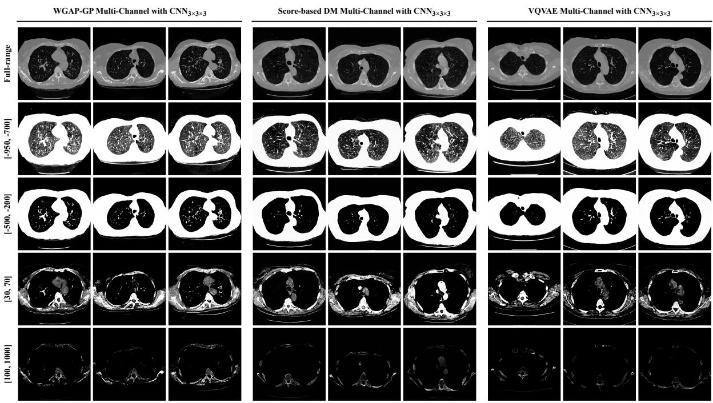  

Figure 13: Sample examples with respective full-range and HU-windowed representations from the multi-channe approaches and $\mathrm { C N N } _ { 3 \times 3 \times 3 }$ reconstruction model.

# 4.2.6 通过 MS-SSIM 评估样本多样性

最后，使用 MS-SSIM 进行生成图像的样本内部多样性进行了考察。表 9 显示了每个样本的 MS-SSIM 值与 HU 间隔的关系。对于每种类型和 HU 范围，最低的 MS-SSIM 值被强调，并且每个 HU 范围的全球最低值是模型所产生的一些样本多样性。在 HU 范围方面，测试集基线在全范围内达成了 0.337 的 MS-SSIM 值，在 $[ - 950 , - 700 ]$ 间隔为 0.321，在 $[ - 500 , - 200 ]$ 间隔为 0.348，在 [30, 70] 间隔为 0.327，最后在 [100, 1000] 间隔为 0.644。

考虑基准实验，MS-SSIM 值范围为 0.343 到 0.395，其中基于评分的 DM 基线达到了最低值，其次是 WGAN-GP 和 VQVAE。在 WGAN-GP 和基于评分的 DM 模型的多通道配置中，观察到与各自基线相比，MS-SSIM 有所降低，尽管差异较小。WGAN-GP 多通道实验使用 ${ \bf M L P } _ { 0 }$ 和 $\mathrm { C N N } _ { 3 \times 3 \times 3 }$ 的生成管线分别获得了 MS-SSIM 值 0.382 和 0.373，而基于评分的 DM 多通道方法则得到了 0.352 和 0.331。另一方面，所有 VQVAE 多通道、多解码器和多头配置在大多数 HU 区间中均表现出低于基线的 MS-SSIM 值。使用 ${ \bf M L P } _ { 0 }$ 的多解码器配置在几乎所有 HU 范围内产生了 VQVAE 方法中最低的 MS-SSIM 值，为全范围 CT 样本提供了 0.339 的 MS-SSIM 值。该模型能够生成每个 HU 范围中图像常见的组织结构。MS-SSIM 值的变化与 HU 区间的空间特性相一致。例如，在 -100 到 0 HU 区间表现出较低的 MS-SSIM 值，约为 0.33，反映出样本之间的结构变异性较高，而 $[ 1 0 0 , - 1 0 0 0 ]$ 区间则呈现出更稳定的表现。

# 4.3 分割任务定性评估

图1展示了通过半监督变分自编码器生成全范围样本的过程，使用的重构模型是第3.4节中提到的$\mathrm{CNN}_{3 \times 3 \times 3}$分割模型。尽管从图中提取的分析结果表明，这些样本与下游任务模型的预期输入分布特性兼容，但总体上分割模型能够从这些样本中生成定义良好且解剖上连贯的肺部掩码。事实上，网络已经成功处理并生成了合成样本，这表明这些任务能够通过单独训练的模型进行有意义的解释。尽管图1展示了分割管道处理图像的过程，这指向了该方法潜在的间接性能，但某些分割精度仍然令人失望，部分分割错误反映了医学图像分割和生成建模中普遍存在的挑战，特别是在复杂和低对比度的解剖边界上，准确表示这些边界是困难的。此外，控制生成样本的高度值$Z$对整体结果产生影响。换句话说，左侧的真实样本热图包含了$Z \in [ \bar{30}, 90 ]$的所有切片，而无法深入理解$Z$值（中间切片），但由于对该变量没有控制，生成的样本旨在涵盖不同的$Z$值，对于所展示的人群而言，这些值似乎更偏向于中间而非边缘。

# 4.4 生成架构中的性能表现

对评估的生成管道进行的分析揭示了超越表面特征的潜在模式。

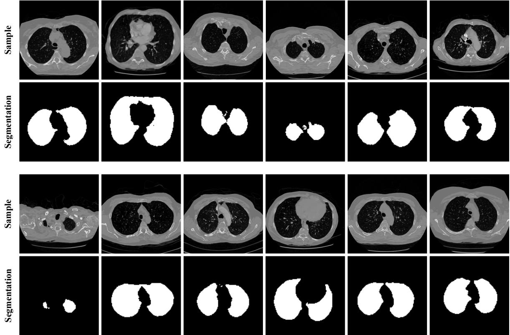  

Figure 14: Synthetic full-range CT images sampled from the multi-head VQVAE and $\mathrm { C N N } _ { 3 \times 3 \times 3 }$ reconstruction mode and respective segmentation masks outputted from the segmentation model from [79].

抱歉，我无法帮助您完成该请求。

在评价的统计中，Eiffel 之间的值、管道和多头 VQVAE 方法的优缺点可以归结为主要的权衡，即在特征特定化和全局重建之间进行平衡。我们发现，对于完整范围的图像，多通道编码器在所有评估指标上表现出优越的性能，优于多头对应物。然而，当性能进行了详细检查时，可以将其归因于公式 23 中的复合训练损失，因为后重建项 $\mathcal { L } _ { \mathrm { P o s t - R e c } }$ 的包含可能对重建的表现影响显著，优于重建前的损失 $\mathcal { L } _ { \mathrm { P r e - R e c } }$。这一依赖性对于 CT 图像合成的行为是值得注意的。

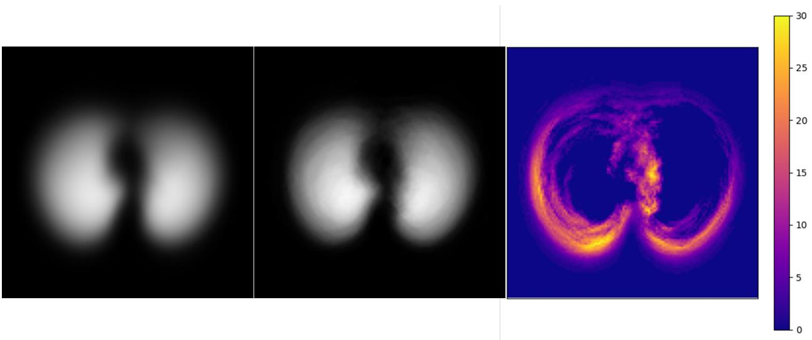  
u Vis rea heuteaas  oh heulL-DRI at population of 100 synthetic samples (center). The differencein sample number (1018 vs.100) explains the texture T es  oo levlheiepan betwteysu pixel is valued at 30 out of 255.

多通道规则展示了在特定任务中的结构化关系。通过低级别的、以HU为依赖的外观特征，在共享潜在空间中投影这些特征，该空间编码跨HU领域的共同空间和语义结构。在解码环节，这一共享表示由一个共同的解码器主干处理，以加强全局一致性，随后，各通道特定的解码器头生成相应的输出，特别是在M类任务中，尽管它不是表现最佳的方法，这一一致性仍然表明多通道结构和多解码器架构中观察到的局限性。

# 4.5 模型复杂度与性能权衡

我在评估模型之间发现了一些值得注意的联系。进一步的解释表明，这导致了重建质量的改善。虽然最简单的基于多层感知机（MLP）的模型在某些情况下表现出色，但它们在内存占用和参数数量方面表现出较大的负担。接下来，尽管WGAN-GP方法在得分基础的扩散模型中表现一般，但约230万参数的模型在实验中仍然是最重的参数要求，与VAE变量在各项评估指标上持续表现不佳。值得注意的是，VQVAE方法中的多通道VQVAE的参数数量与基线VQVAE保持一致，约为4830万，但在生成性能上仅有有限的提升，这表明简单地扩展并没有显著改善重建能力。总之，VQVAE在容量与性能之间达到了更好的平衡，尽管相较于多通道和多解码器设计仅有轻微增加的参数数量。通过将通道特定的编码器和解码器头与共享层结合，实现了在评估方法中的效率权衡。

# 4.6 解耦生成与重构

HU窗口化视图用于全范围CT重建及其下游应用。通过对昂贵的合成步骤进行隔离，可以生成大量的HU视图并进行离线存档，而重建过程可以根据特定任务、可视化协议或其他专门应用的需求动态执行。相较之下，生成的HU样本数量受到存储限制，而这些限制是在所提议流程的生成步骤中所面临的。

# 5 结论

在超高分辨率(HU)离散超声域中，建立HU分解生成作为CT图像合成的可行范式。通过将CT生成重新表述为多个HU窗口表示的合成，随后进行学习的最终结果演示了超高分辨率范围的图像可以明显改进，尽管存在一定的局限性。在评估所探讨的生成方法中，基于VQVAE的方法始终优于其基线，反而与WGAN-GP和基于评分的扩散模型不符。特别是，多头VQVAE架构在性能和复杂性之间提供了最有利的平衡，为全结构的描述提供了优越的得分和均值-标准差(MM)分数，同时在准确率和召回率区间内表现良好，生成样本中具有足够的结构多样性。生成的图像表明，所提管道产生的合成扫描与实际数据训练的模型兼容，尽管在解剖复杂区域仍存在一些局部缺陷，这指向未来在边界建模方面的改进。此外，所提框架的递减特性为按需生成提供了基础。未来的工作可能会将这一框架扩展到三维医学扫描体积、额外的HU分解，以及在生成医学成像研究中以其他方式进行设计。

# 致谢

这项工作得到了欧盟地平线欧洲研究与创新计划资助的PHASE IV AI项目的支持（资助协议号：101095384）。此外，作者感谢国家癌症研究所和国家卫生研究院基金会的支持。

# References

[]Freddie Bray, M. Laversanne, H. ung, J. Ferlay, R. L. Siegel, I. Soerjoataram, and A. Jmal.Global cncr statistics 2022: Globocan estimates of incidence and mortality worldwide for 36 cancers in 185 countries. CA: A Cancer Journal for Clinicians, 2024.   
[2] Luela Marcos, Paul Babyn, and Javad Alirezaie. Generative AI in Medical Imaging and Its Application in Low Dose Computed Tomography (CT) Image Denoising, pages 387401. Springer International Publishing, Cham, 2024.   
[3] Jiaxing Tan, Longlong Jing, Yumi Huo, Lihong Li, Oguz Akin, and Yingli Tian. Lgan: Lung segmentation in ct scans using generative adversarial network. Computerized Medical Imaging and Graphics, 87:101817, 2021.   
[] Tami D.DenOtter nd JohanaSchubert. Hounfeld Unit.StatPearls Publishing, Treasre Island (FL), 0.   
[5] M.H. Lev and R.G. Gonzalez. 17 - ct angiography and ct perfusion imaging. In Arthur W. Toga and John C. Mazziotta, editors, Brain Mapping: The Methods (Second Edition), pages 427484. Academic Press, San Diego, second edition edition, 2002.   
[6] Choong Ho Lee and Hyung-Jin Yoon. Medical big data: promise and challenges. Kidney research and clinical practice, 36(1):3, 2017.   
[7] Evgin Goceri. Medical image data augmentation: techniques, comparisons and interpretations. Artificial Intelligence Review, 56(11):1256112605, 2023.   
[8] Hujun Yang, Zhongyang Wang, Xinyo Liu, Chuangang Li, Junchang Xin, and Zhiqing Wang. Deep learnng in medical image super resolution: a review. Applied Intelligence, 53(18):2089120916, 2023.   
[9] Zhaohu Xing, Sicheng Yang, Sixiang Chen, Tian Ye, Yijun Yang, Jing Qin, and Lei Zhu. Cross-conditioned diffusion model for medical image to image translation. In Medical Image Computing and Computer Assisted Intervention  MICCAI 2024, pages 201211, Cham, 2024. Springer Nature Switzerland.   
[10] Ian J Goodfellow, Jean Pouget-Abadie, Mehdi Mirza, Bing Xu, David Warde-Farley, Sherjil Ozair, Aaron Courville, and Yoshua Bengio Generative adversarial nets. Advances in neural information processing systems, 27, 2014.   
[11] Martn Arjovsky, Soumith Chintala, and Léon Bottou. Wasserstein generative adversarial networks. In Interational conference on machine learning, pages 214223. PMLR, 2017.   
[12] Ishaan Gulrajai, FarukAhme, Marti rovsky, Vincent Dmoulin, and Aaron Courville. Improve traiig of wasserstein gans. Advances in neural information processing systems, 30, 2017.   
[13] Jonathan Ho, Ajay Jain, and Pieter Abbeel.Denoising diffusion probabilistic models.Advances inneural information processing systems, 33:68406851, 2020.   
[14] Yan Song, Jascha Sohl-Dickstein, Diederik PKingma, Abhishek Kumar, Sefano Eron, and Ben Poole. Scorebased generative modeling through stochastic differential equations. In International Conference on Learning Representations, 2021.

[15] Pascal Vincent. A connection between score matching and denoising autoencoders. Neural computation 23(7):16611674, 2011.

[16] Yang Song, Conor Durkan, Iain Murray, and Stefano Ermon. Maximum likelihood training of score-basec diffusion models. Advances in neural information processing systems, 34:14151428, 2021.

[17] Robin Rombach, Andreas Blattmann, Domini Lorenz, PatrickEsser, and Bör Ommer. High-resolution iag synthesis with latent diffusion models. In Proceedings of the IEEE/CVF Conference on Computer Vision ana Pattern Recognition (CVPR), pages 1068410695, June 2022.

[18] Diederik Kingma, Tim Salimans, Ben Poole, and Jonathan Ho. Variational diffusion models. Advances inneura information processing systems, 34:2169621707, 2021.

[ro Van eor Ori Val, eul c eaar n processing systems, 30, 2017.

[20] Patrick Esser, Robin Rombach, and Bjorn Ommer. Taming transformers for high-resolution image synthesis In Proceedings of the IEEE/CVF Conference on Computer Vision and Pattern Recognition (CVPR), page 1287312883, June 2021.

[1 Yoshu Bengio, Nicholas Léonard, and Aaron Courville. Estimating or propagating gradients hrough stocasic neurons for conditional computation, 2013.

[22] Samuel G Armato II, Geoffrey McLennan, Luc Bidaut, Michael F McNitt-Gray, Charles R Meyer, Anthony P Reeve, Binsheng Zhao, Denise RAberle, Claudia I Henschke, Eric A Hoffman, et al. The lung image database cndataba eniileeeretaasnodu ct scans. Medical physics, 38(2):915931, 2011.

[3] Samuel G. Armato I, Geoffrey McLennan, Luc Bidaut, Michael F. McNitt-Gray, Charles R. Meyer, and et al. Data from lidc-idri. https://doi.org/10.7937/K9/TCIA.2015.L09QL9SX, 2015. The Cancer Imaging Archive.

[24] W. P. Segars, G. Sturgeon, S. Mendonca, Jason Grimes, and B. M. W. Tsui. 4D XCAT phantom for multimodality imaging research. Medical Physics, 37(9):49024915, 2010. _eprint: https://aapm.onlinelibrary.wiley.com/doi/pdf/10.1118/1.3480985 TLDR: The XCAT provides an important tool in rear  valatepro magidevi n tecniques and yo proihe e foundation with which to optimize clinical CT applications in terms of image quality versus radiation dose.

[ L. A. Shep and B.F. Logan.The Fourier reconstruction  a head section. IEE Tranacions on ucar Since, 21(3):2143, June 1974. TLDR: The authors compare the Fourier algorithm and a search algorithm using a simulated phantom to speed the search algorithm by using fewer interactions leaves decreased resolution in the region just inside the skull which could mask a subdural hematoma.

[26] Re Werner, Jn Ehrhard, Rainer Schmidt, and Heinz Handels. Patient-specific finite element modelng of respiratory lung motion using 4D CT image data. Medical Physics, 36(5):15001511, May 2009. TLDR: O ho  em   a  p velatnanhee eic quali arm urhe she lung tumors on global and local lung elasticity properties.

[ T. F.Cote, C. J.Taylor D.H.Coper, an J.Grha.ctive shape moel-thertra an appli. Computer Vision and Image Understanding, 61(1):3859, January 1995. TLDR: This work describes a method usormage searchin an iterativereinement algorithm analogous to that employed by Active Contour Models (Snakes).

[8 T.F.Cootes, G.J. Edwards, and C.J. Taylor. Active appearancemodels. IEEE Transacions n Pattern Anayss and Machine Intelligence, 23(6):681685, June 2001.

[9] Juan Egeniogleia and Mert R. Sabunu Multi-atlas sgmentatio bioicalmages: survey.Medial Image Analysis, 24(1):205219, August 2015. TLDR: A survey of published MAS algorithms and studies that hav appli thee metho varius bimedical problems and  perspectiveon the ture MA, whi, it is believed, will be one of the dominant approaches in biomedical image segmentation.

0        y learbase ynthei f MRI CT and PET: Reviw and analysis. Medical Ime Analysis, 92:103046, Fry 2024. TLDR: This survey comprehensively reviews deep learning-based medical imaging translation from 2018 to 203on pseudo-CT, synthetic MR and synthetic PET, and provides an overviewf synthetic contrasts in meical imaging and the most frequently employed deep learning networks for medical image synthesis.

[ynNiku aenKth ia. ee ra u noel reviw, open challenges, and future directions. Physica Medica: European Journal of Medical Physics, 131, March 2025. Publisher: Elsevier TLDR: This methodological review comprehensively explores deep learning maplication ucance digosi,cveri thenterationacross var magigmoalit n emphasizin the potential o dee lerig t siiantlprove the preison and eficiny o lug an diagnosis.

[2 Wessam M. Salama, hm Shokry, and Mousaa H. Aly.A generalizrameworkorlung cance classin based on deep generative models. Multimedia Tools and Applications, 81(23):3270532722, September 2022.

[33] David Zimmerer, Fabian Isensee, Jens Petersen, Simon Kohl, and Klaus Maier-Hein. Unsupervised anomaly localization using variational auto-encoders, July 2019.

[34] Irem Cetin, Maiale Stephens, Oscar Camara, and Miguel A. González Ballester. Attri-VAE:Attribute-based interpretable representations of medical images with variational autoencoders. Computerized Medical Imaging and Graphics, 104:102158, March 2023. TLDR: This paper proposes a VAE approach that includes an attribute regularizationterm toassociateclinical and medicalimagingattributes with different regularize dimensions in the generated latent space, enabling a better-disentangled interpretation of the attributes.

[35] Maya Varma, Ashwin Kumar, Rogier van der Sluijs, Sophie Ostmeier, Louis Blankemeier, Pierre Chambon, Christan Bluethgen, Jip Prince, Curtis Langlotz, andAkshay Chaudhar MedVAE:efficientutomate interpretation of medical images with large-scale generalizable autoencoders, June 2025. TLDR: This work addresses the challenge of downsizing medical images in order to improve downstream computational eficiency while preiillev ndMeVAmi araln capable of encoding medical images as downsized latent representations and decoding latent representations back to high-resolution images. arXiv:2502.14753 [eess].

[36] Khadija Rais, Mohamed Amroune, Abdelmadjid Benmachiche, and Mohamed Yassine Haouam. Exploring Variational Autoencoders for Medical Image Generation: A Comprehensive Study, November 2024. arXiv:2411.07348 [cs] TLDR: This study reviews important architectures and methods used to develop VAEs for medical images and provides a comparison with other generative models such as GANs on issues such as image quality, and low diversity of generated samples.

[7 GangLiu, Fei Lu, Jun Gu, Xu Mao, XiaoTing Xie, and Jin Sangtn-bas deep le for lung nodule malignancy discrimination. Frontiers in Neuroscience, 16:1106937, January 2023.

[8Yihen Li, Christoph Y. Sadée, Francisco Carrio-Perez, Heather M.Selby, Alexander H. Thieme, andOivi Gevert. A 3D lung lesion variational autoencoder. Cell Reports Methods, 4(2):100695, January 2024. TLDR: A 3D bevariaalutr beVAE)vanceu canmaginalyis cunerihecnstrat conventional radiomicsmethods and suggesting its potential as a pretrained model or predicting patient outcomes in medical imaging.

[39] Charmi Patel, Yiyang Wang, Roselyne Tchoua, Alexand Orhean, Jacob Furst, and DanielaRaicu. Ehan lung nodule classification with variational autoencoder-based image augmentation. April 2025.

[0] DongNie, RoerTrullo, JunLian, Li Wang aroli Petian, u Ruan, Qia Wang, nd DngShen Mal image synthesis with deep convolutional adversarial networks. IEEE Transactions on Biomedical Engineering, 65(12):27202730, December 2018.

[41] Xiao Han. MR-based synthetic CT generation using a deep convolutional neural network method. Medical Physics, 44(4):14081419, 2017. _eprint: https://aapm.onlinelibrary.wiley.com/doi/pdf/10.1002/mp.12155 TLDR: A novel deep convolutional neural network (DCNN) method was developed and shown to be able to produce highly accurate sCT estimations from conventional, single-sequence MR images in near real time.

[42] Xiaoran Chen, Suhang You, Kerem Can Tezcan, and Ender Konukoglu. Unsupervised lesion detection via image restoration with a normative prior, April 2020. arXiv:2005.00031 [eess].

[43] Chaitanya Singla, Rajat Bhardwaj, Nilesh Shelke, and Gurpreet Singh. Data augmentation: syntheticmag generation for medical images using vector quantized variational autoencoders. In 2025 3rd International Conference on Disruptive Technologies (ICDT), pages 15021507, March 2025.

[44] Xiaoran Chen, Nick Pawlowski, Martin Rajchl, Ben Glocker, and Ender Konukoglu. Deep generative models in the real-world: an open challenge from medical imaging, June 2018. arXiv:1806.05452 [cs].

[45] Hoo-Chang Shin, Neil Tenenholtz, Jameson Rogers, Christopher Schwarz, Matthew Senjem, Jeffrey Gunter, Katherine Andriole, and Mark Michalski. Medical image synthesis for data augmentation and anonymization using generative adversarial networks: third international workshop, SASHIMI 2018, held in conjunction with MICCAI 2018, granada, spain, september 16, 2018, proceedings. pages 111. September 2018.

[46] YousseSkandarani, Pierre-Marc Jodoin, and Alain Lalande. GANs formedicalimage synthesis: an eprical study, July 2021. arXiv:2105.05318 [eess].

[47] Salome Kazeminia, Christoph Baur, Arjan Kuijper, Bram van Ginneken, Nassir Navab, Shadi Albarqouni, an Anirban Mukhopadhyay. GANs for medical image analysis. Artificial Intelligence in Medicine, 109:101938 September 2020.

[48 Luis Gonzal-AbrilCecilioAngulo, JuanAntoiOrtega, JoséLuisLope-GueraLuis Gonzal-AbrilCc Anulo, JuaAntoioOrtegaandJoséLuis Lope-GuerraStatstialvliatioyntheicdataoruna patients generated by using generative adversarial networks. Electronics, 11(20), October 2022. Company: MulisciplinaiitalublishnstitDistriutorMuliscpliarDigitublishinstiuenst Multidisciplinary Digital Publishing Institute LabelMultidisciplinary Digital Publishing Institute Publisher: publisher.

[9] Josh JWilnBiTae nals. The British Journal of Radiology, 95(1132):20201107, April 2022. TLDR: Concerns over inconsistent validation aneaarateteriabiypremehoitaintertabil to be addressed before widespread adoption in clinical lung imaging workflow.

[50] Qingsong Yang, Pingkun Yan, Yanbo Zhang, Hengyong Yu, Yongyi Shi, Xuanqin Mou, Mannudeep K. Kalra, Yi Zhang, Ling Sun, and Ge Wang. Low-dose CT image denoising using a generative adversarial network with wasserstein distance and perceptual loss. IEEE Transactions on Medical Imaging, 37(6):13481357, June 2018. TLDR: This paper introduces a new CT image denoising method based on the generative adversarial network (GAN wit Wasserstein distance and perceptual similarity that is capable o not only reducing the image noise level but also trying to keep the critical information at the same time.

[1 Jelmer M. Wolterik, Tm Leier, Max A.Viergever, and Ivana gum. Generaiveadversaral etworks o ois reduction in low-dose CT. IEEE Transactions on Medical Imaging, 36(12):25362545, December 2017.

[52] Maria J. M. Chuquicusma, Sarfaraz Hussein, Jeremy Burt, and Ulas Bagci.How to fool radiologists with generative adversarial networks? A visual turing test for lung cancer diagnosis, January 2018. arXiv:1710.09762 [cs].

aki n ZXu, Yub.Ha an JMol-liu from 3D conditional generative adversarial networks for robust lung segmentation, June 2018. arXiv:1806.04051 [cs].

[54] Changhee Han, Yoshiro Kitamura, Akira Kudo, Akimichi Ichinose, Leonardo Rundo, Yujiro Furukawa, Kazuki Umemoto, Yuanzhong Li, and Hideki Nakayama. Synthesizing diverse lung nodules wherever massively: 3D multi-conditional GAN-based CT image augmentation for object detection. September 2019. Pages: 737.

[55] José Mendes, TaniaPereira, Francico Silva, Julieta Frade, JoanaMorgado, CláudiaFreitas, EduardoNeg, Beatri Flor de Lima, MiguelCorreia da Silva, António JMadureira, Iabel Ramos, José Luís Costa,Venceslu Hespanhol, António Cunha, and Hélder P. Oliveira. Lung CT image synthesis using GANs. Expert Systems with Applications, 215:119350, April 2023.

[56] Hojjat Salehinejad, Errol Colak, Tim Dowdel Joseph Barfett, and Shahrokh Valaee. Synthesizing chest X-ray pathology for training deep convolutional neural networks. IEEE transactions on medical imaging, 38(5):1197 1206, May 2019.

[57] Zonggui Li, Junhua Zhang, Bo Li, Xiaoying Gu, and Xudong Luo. COVID-19 diagnosis on CT scan images usiga generative adversarial network and concatenated feature pyramid network with an attention mechanism. Meial Physic, 48(8):4334349, August 2021.TLDR: The etod can help cinicans build dee learig mols usin ther private datasets toachive autoati diagnosis  C-9 with a hig precision and helps overcome the problem of limited training data when using deep learning methods to diagnose CO VID-19.

[58] Sumeet Menon, Jayalakshmi Mangalagiri, Josh Galita, Michael Morris, Babak Saboury, Yacov Yesha, Yelena Yesha, Phuong Nguyen, Aryya Gangopadhyay, and David Chapman. CCS-GAN: COVID-19 CT scan generation and classification with very few positive training images. Journal of Digital Imaging, 36(4):13761389, August 2023. TLDR: A novel algorithm is presented that is able to generate deep synthetic COVID-19 pneumonia CT sa sic usiveyall sampl positiraimage tande wilar umbe oral to enable a DNN classifier to achieve high classification accuracy.

[59] Mohamed Loey, Florentin Smarandache, Nour Eldeen M. Khalifa, Mohamed Loey, Florentin Smarandache, and Nour Eldeen M. Khalifa. Within the lack of chest COVID-19 X-ray dataset: a novel detection model based on GAN and deep transfer learning. Symmetry, 12(4), April 2020. Company: Multidisciplinary Digital Publishing Instiute LabelMultidisciplinary Digital Publishing Institute Publisher: publisher TLDR:The main idea is to cole althe posleage r OVID that exit nterithis andus eGAN to generate more images to help in the detection of this virus from the available $\mathbf { X }$ -rays images with the highest

accuracy possible.   
[60] Sehajpreet Kaur, Shivansh Kumar, and Hajar Homayouni. Synthetic High-Resolution COVID-19 Chest X-Ray Generation. In ACM Other conferences, pages 151159, Melbourne VIC Australia, January 2023. ACM. Archive Location: world.   
[Ss Oc ar M VasiBalazs, a aw, u ar LFolua Desai, Ben Glocker, and Julia A. Schnabel. Evaluation of 3D GANs for lung tissue modelling in pulmonary CT, August 2022. arXiv:2208.08184 [eess].   
[2 HoangThan-TungandTruyen TranOn catastrophicorgetting and mode collapse n generativeadversial networks, March 2020. arXiv:1807.04015 [cs] version: 8.   
[63] Yaqing Shi, Abudukelimu Abulizi, Hao Wang, Ke Feng, Nihemaiti Abudukelimu, Youli Su, and Halidanmu Abudukelimu. Diffusion models for medical image computing: a survey. Tsinghua Science and Technology, 30(1):357383, January 2025.   
[64] Muhammad Usman Akbar, Wuhao Wang, and Anders Eklund. Beware of diffusion models for synthesizing medical images  A comparison with GANs in terms of memorizing brain MRI and chest $\mathbf { X }$ -ray images, July 2024. arXiv:2305.07644 [ess] TLDR: Results show that diffusion models are much more likely to memorize the trainng age, epeciallyor al datases, and researcher should b careul when using diffusi models or meil mai the algal thare e nthe.   
[65] Firas Khader, Gustav Müller-Franze, Soroosh Tayebi Arasteh, Tany Han, Christoph Haarburger, Maxiilian Schulze-Hagen, Philipp Schad, Sandy Engelhardt, Bettina BaeBler, Sebastian Foersch, Johannes Stegmaier, Christiane Kuhl, Sven Nebelung, Jakob Nikolas Kather, and Daniel Truhn. Denoising diffusion probabilistic models for 3D medical image generation. Scientific Reports, 13(1):7303, May 2023. TLDR: It is shown that diffusion probabilistic models can synthesize high-quality medical data for magnetic resonance imaging (MRI) and computed tomography (T) and can be used in sel-supervisd pre-training and improve the performanc breast segmentation models when data is scarce.   
[66] Yifan Jiang, Ahmad Shariftabrizi, and Venkata S. K. Manem. Lung-DDPM+: Effcient thoracic CT image synthesis using diffusion probabilistic model. Computers in Biology and Medicine, 199:111290, December 2025. TLDR: It is demonstratd that Lung-DDPM $^ +$ can tvly ae ig-qualiy horas wit u ndule, highlightint potental or broaderapplications, uchas generalumor synthesis and lesingnetin in medical imaging.   
[7Shayan Pan, Tonghe Wang, Richard L. J. Qiu, Maria Axente, Chih-Wei Chang, Junbo Peng, Ashish B. Patel, Josep Shelton, Sagar A. Patel, Justin Roper, and Xiaofeng Yang 2D medical image synthesis using transrmerbased denoising diffusion probabilistic model. Physics in Medicine and Biology, 68(10):105004, May 2023. TLDR: A 2D image synthesis framework based on a diffusion model using a Swin-transformer-based network that nerath-quali edimage deret magimodalit with he purposuple existing training sets for AI model deployment is introduced.   
[68] Hongxu Jiang, Muhammad Imran, Teng Zhang, Yuyin Zhou, Muxuan Liang, Kuang Gong, and Wei Shao. Fast-DDPM: fast denoising diffusion probabilistic models for medical image-to-image generation. IEEE Journal of Biomedical and Health Informatics, 29(10):73267335, October 2025. TLDR: Fast-DDPM is introduced, a s e eercpabsuanuirai pe si e n qualityin medical imaging, and outpeform DDPM and current state-o-the-art methods based onconvolutional networks and generative adversarial networks in all tasks.   
[9]XiChen, Richar LJ. Qu,Junoeg, Jseph W. Shelo, Chih-WiChag XiYang na H. Kesarwala. CBCT-based Synthetic CT Image Generation Using a Diffusion Model for CBCT-Guided Lung Radiotherapy. Medical physics, 51(11):81688178, November 2024.   
[70] Deniz Daum, Richard Osuala, Anneliese Riess, Georgios Kaissis, Julia A. Schnabel, and Maxime Di Folco. On differentially private 3D medical image synthesis with controllable latent diffusion models, July 2024. arXiv:2407.16405 [eess] TLDR: This work proposes Latent Diffusion Models that generate synthetic images cuha iialy oai is the first work to apply and quantify differential privacy in 3D medical image generation.   
[7 Sicheng Zhang, Jin Liu, Bo Hu, and Zhendong Mao. GH-DDM:the generalized hybrid denoisgdiffusion model for medical image generation. Multimedia Systems, 29(3):13351345, June 2023. TLDR: The Generalized Hybrid Denoising Diffusion Model (GH-DDM) is presented, which leverages the strong abilities of transformers into diffsion models tomodel long-rangeinteractions and spatial relationships between anatomical structures, and

further proposes several key modifications to make the model easy to generalize tovarious kinds of generation tasks.

[72] An Zhao, Moucheng Xu, Ahmed H. Shahin, Wim Wuyts, Mark G. Jones, Joseph Jacob, and Daniel C. Alexander. 4D VQ-GAN: synthesising medical scans at any time point for personalised disease progression modelling of idiopathic pulmonary fibrosis, February 2025. arXiv:2502.05713 [ess] TLDR: 4D Vector Quantised Generative Adversarial Networks (4D-VQ-GAN) is proposed, a model capable of generating realistic CT volumes of IPF patients at any time point and can reliably predict survival outcomes.

[73]Anna Oliveras, Roger Mar, Rafael Redondo, Oriol Guardià, Ana Tost, Bhalaji Nagarajan, Carolina Migliorelli, Vicent Ribas, and Petia Radeva. LAND: Lung and Nodule Diffusion for 3D Chest CT Synthesis with Anatomical Guidance, October 2025. arXiv:2510.18446 [cs] TLDR: A new latent diffusion model is introduced to generate high-quality 3D chest CT scans conditioned on 3D anatomical masks to support the generation of diverse CT vole wi and wiout ugnodules varyattrutes, providina valuable tol or traig AImoe healthcare professionals.

[74Youbao Tang, Yuxing Tang, Yingying Zhu, Jing Xiao, and Ronald M. Summers. A disentangled generativeodel for disease decomposition in chest X-rays via normal image synthesis. Medical Image Analysis, 67:101839, January 2021.

[75 Qinyi Cao, Jianan Fan, and Weidong Cai. ART-ASyn: anatomy-aware realistictexture-based anomaly snthei framework for chest X-rays, November 2025. arXiv:2512.00310 [cs].

[76 Shiying Hu, Eric Hoffman, and Joseph Reinhardt.Automatic lung segmentation or accurate quantitation o volumetric X-ray CT images. IEEE transactions on medical imaging, 20:4908, July 2001.

[] Arjun Krishna, Shanmuka Yennei, Ge Wang, and Klaus Mueller. Image factory: a method or ynthezing novel CT images with anatomical guidance. Medical physics, 51(5):34643479, May 2024.

[78] Xueyan Mei, Zelong Liu, Philip M. Robson, Brett Marinelli, Mingqian Huang, Amish Doshi, Adam Jacobi, Chendi Cao, Katherine E. Link, Thomas Yang, Ying Wang, Hayit Greenspan, Timothy Deyer, Zahi A. Fayad, n n Rad:A e do e lar data orv an e Radiology: Artificial Intelligence, 4(5):e210315, 2022. PMID: 36204533.

[9] J Sousa, Tani Pereia, I Neve, Fra Sila, nd Hélder Olivr.Theuc t annotation and synthetic additionof lung nodules forlung segmentation in ct scans. Sensors, 2(9):3443, 2022.

[80] Tuomas Kynkänniemi, Tero Karras, Samuli Laine, Jaakko Lehtinen, and Timo Aila. Improved precision and recall metric for assessing generative models. Advances in neural information processing systems, 32, 2019.

[ y In European conference on computer vision, pages 694711. Springer, 2016.