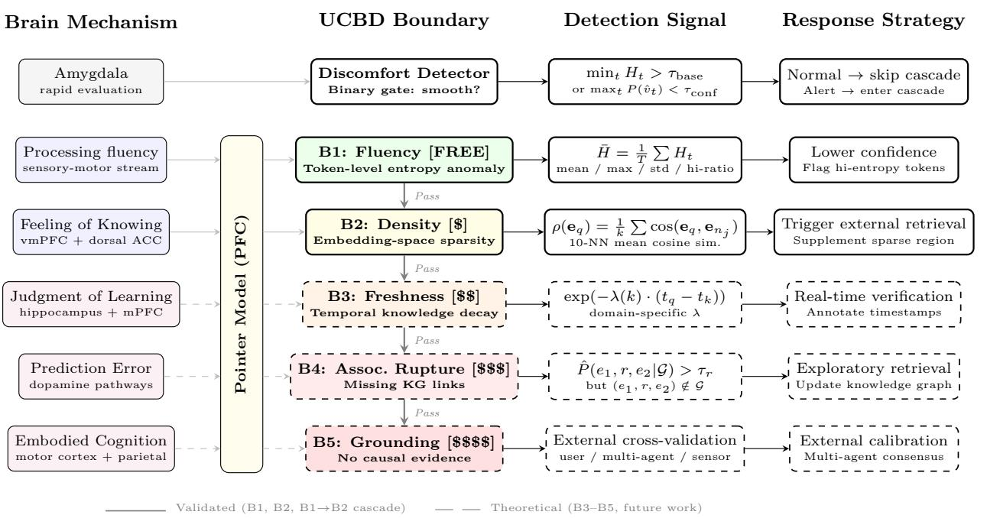
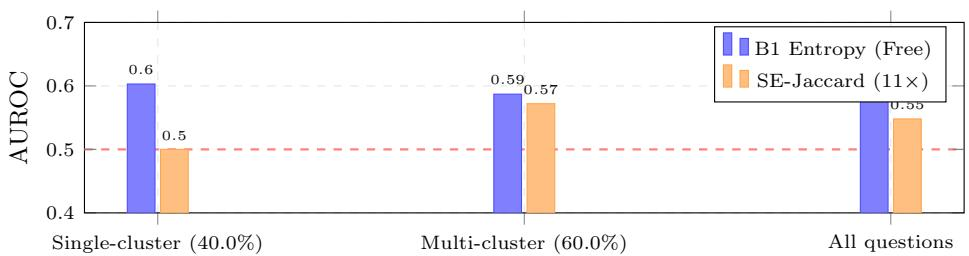
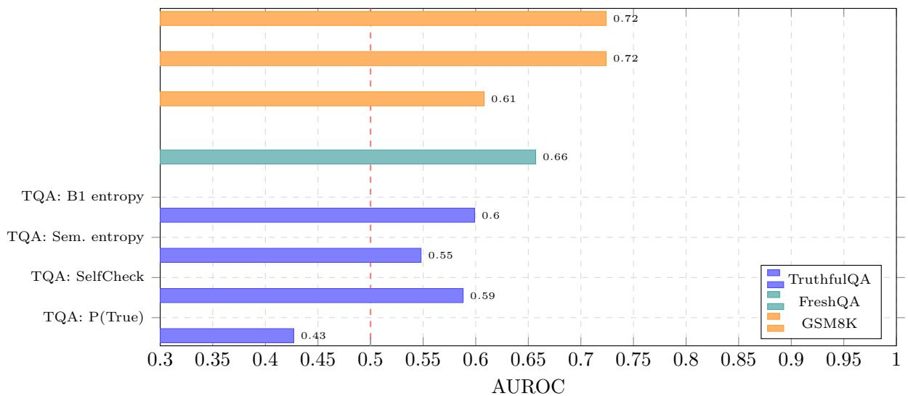

# The Alignment Tax: Response Homogenization in Aligned LLMs and Its Implications for Uncertainty Estimation

Mingyi Liu Independent Researcher GitHub: @DigitLion March 25, 2026

# Abstract

RLHF-aligned language models exhibit response homogenization: on TruthfulQA ( $_ { n }$ =790), 4079% of questions produce a single semantic cluster across 10 i.i.d. samples (robust across clustering methods, sample sizes $N { = } 3 { \ - } 1 0$ , temperatures ${ T \mathrm { { = } 0 . 3 { - } 1 . 5 } }$ , and generation lengths 40200 tokens; 33.5% SCR persists at 200 tokens on 200 questions vs. $0 \%$ for the base model). On affected questions, sampling-based uncertainty methods have zero discriminative power (AUROC=0.500), while free token entropy retains signal (0.603). This alignment tax is task-dependent: on GSM8K ( $n { = } 5 0 0$ ), token entropy achieves 0.724 (Cohen's $d$ =0.81).

A base-vs-instruct ablation on Qwen3-14B confirms the causal role of alignment: the base model shows $1 . 0 \%$ single-cluster rate vs. $2 8 . 5 \%$ for the instruct model (Wilcoxon $p < 1 0 ^ { - 6 }$ ). A three-way training stage ablation (Base $0 . 0 \%  \ \mathrm { S F T }$ 1.5% DPO $4 . 0 \%$ SCR, all $p \ < \ 0 . 0 0 3$ ) localizes the cause to DPO, not SFT. Cross-family replication on four model families (Qwen3-14B: $2 8 . 5 \%$ , LLaMA-3.2-3B: $5 . 5 \%$ , Mistral-7B: $1 . 0 \%$ SCR) reveals alignment tax severity varies by family and scale. Cross-chain replication on Tulu-3 (Llama-3.1-8B SFT DPO $^ +$ RLVR) shows minimal alignment tax ( $0 . 5 \%$ SCR vs. Zephyr's $4 . 0 \%$ ), confirming severity is recipe-dependent. We validate this finding across twenty-two experiments, five benchmarks, four model families, and three model scales (3B14B), with proxy (Jaccard), SINdex-style embedding (agglomerative cosine clustering), and canonical NLI-based baselines at three DeBERTa scales (large 435M, base 184M, xsmall 70M—all ≈0.51 AUROC). Cross-embedder validation with two independent embedding families (Qwen3-Embedding 78% SCR vs. Nomic-embed-text $9 2 \%$ SCR at $\tau { = } 0 . 8 5$ ) rules out coupling bias. Cross-dataset validation on WebQuestions (58.0% SCR at τ=0.85) confirms the alignment tax generalizes beyond TruthfulQA. LLM-judge labels are validated against TruthfulQA gold answer templates $\kappa { = } 0 . 4 8 7$ . The central finding—response homogenization—is implementation-independent and label-free. Motivated by this diagnosis, we explore a cheapest-first cascade (UCBD) over orthogonal uncertainty signals. Selective prediction raises GSM8K accuracy from $8 4 . 4 \%$ to $9 3 . 2 \%$ at $5 0 \%$ coverage; weakly dependent boundaries ( $| r | \le 0 . 1 2 )$ enable 57% cost savings.

# 1 Introduction

LLM-powered AI Agents are remarkably capable, yet one question has received surprisingly little systematic attention: can an Agent recognize that it doesn't know something? Consider mathematical reasoning: on GSM8K ( $n { = } 5 0 0$ ), a 14B model's token entropy achieves AUROC=0.724 for detecting errors (Cohen's $d { = } 0 . 8 1$ ), enabling selective prediction that raises accuracy from $8 4 . 4 \%$ to $9 3 . 2 \%$ at $5 0 \%$ coverage. Yet the same entropy signal on factual QA (TruthfulQA, overall) barely exceeds chance (0.52). This $1 0 \times$ gap in effect size (Cohen's $d$ : 0.81 vs. 0.07) reveals that uncertainty is not a monolithic quantity—it has structure that demands a multi-boundary approach.

We observe a surprising empirical regularity: on RLHF-aligned models, response diversity collapses under sampling. On TruthfulQA, $4 0 . 0 \%$ of questions produce a single semantic cluster across 10 i.i.d. samples ${ \it T } ^ { \mathrm { = } 1 . 0 } ,$ —the model generates the same answer (correct or incorrect) repeatedly. This alignment tax renders sampling-based methods structurally unreliable on affected questions (AUROC=0.500). Free token entropy retains signal (0.603) because it measures per-token computational uncertainty, which RLHF cannot fully suppress. A base-vs-instruct ablation (Exp. 13) isolates the causal mechanism: Qwen3-14B-Base produces $1 . 0 \%$ single-cluster rate, while the aligned version produces $2 8 . 5 \%$ $\mathit { p } < 1 0 ^ { - 6 }$ )—alignment reduces diversity by $2 . 6 \times$ . A training stage ablation (Exp. 16) further localizes the cause: SFT preserves base-level diversity $1 . 5 \%$ SCR) while DPO drives collapse $( 4 . 0 \% )$ ). Cross-family replication on four families (Qwen3: $2 8 . 5 \%$ , LLaMA-3: $5 . 5 \%$ , Zephyr-DPO: $4 . 0 \%$ , Tulu-3-DPO: $0 . 5 \%$ , Mistral-7B: $1 . 0 \%$ SCR) confirms generality while revealing family- and recipe-dependent severity. NLI-based SE comparison with three DeBERTa models (200q) yields AUROC=0.511 (large, 435M), 0.512 (base, 184M), and 0.501 (xsmall, 70M)—all near chance—and $6 . 2 \times$ NLI model scaling yields zero improvement. The response homogenization is clustering-robust: single-cluster collapse occurs under every method tested (Jaccard, embedding cosine, NLI-based), though exact rates vary with granularity ( $4 0 \%$ Jaccard vs. 79% embedding; see Exp. 12). A decoding strategy ablation (Exp. 15) confirms the tax persists under nucleus sampling and reduced temperature—it is a property of the learned distribtion, not the sampling procedureThismotivates ecalating toorthogonal signal types instead of sampling more responses.

# Contributions.

1. The alignment tax: aligned models suppress response diversity, with 3862% of TruthfulQA questions ( $_ { n }$ =790) collapsing to a single semantic cluster—independent of clustering method (Jacard: 40%, embedding: $7 9 \%$ ), sample size ( $N$ =3: $4 6 \%$ , $N { = } 1 0$ . $4 0 \%$ ), temperature ( $T { = } 0 . 3$ : 62%, $T$ =1.5: $3 8 \%$ ), and decoding strategy (nucleus $p$ =0.9: $3 3 . 5 \%$ , $\scriptstyle { p = 0 . 9 5 }$ . $3 0 . 0 \%$ ). This homogenization reduces sampling-based entropy to chance (AUROC=0.500) on affected questions, while free token entropy retains signal (0.603). 2. Task-dependent uncertainty structure: B1 AUROC varies from 0.52 (factual QA) to 0.72 (math), with Cohen's $d$ shifting from 0.07 to 0.81—demonstrating that uncertainty detection must be multi-modal, not monolithic. 3. Cascade architecture: motivated by the diagnostic finding, we design a cheapest-first cascade over orthogonal boundary types. Weak inter-boundary dependence ( $| r | \leq 0 . 1 2$ , $\mathrm { M I } \le 0 . 0 2$ bits) enables 57% cost savings, and selective prediction raises GSM8K accuracy from $8 4 . 4 \%$ to $9 3 . 2 \%$ at $5 0 \%$ coverage.

Scope. This paper makes two contributions with different evidence standards. Diagnostic (primary): the response homogenization phenomenon is validated across five datasets spanning three task types (factual QA: TruthfulQA 790q, FreshQA 100q, WebQuestions 200q; multi-hop: HotpotQA 100q; mathematical reasoning: GSM8K 500q), clustering methods, sample sizes, temperatures, decoding strategies, NLI model scales (70M-435M), training stages on two independent chains (Mistral/Zephyr and Llama/Tulu-3: SFT preserves diversity; DPO drives collapse), generation lengths (40200 tokens), and embedding families (cross-embedder validation confirms results are not artifact of same-family embedder bias). Extension to additional verification-heavy benchmarks (FEVER, SciFact, MMLU subsets) is a natural next step. Architectural (exploratory): the cascade design is motivated by the diagnostic finding and validated on selective prediction (GSM8K: 84.4%→93.2%); head-to-head comparisons with multi-signal fusion frameworks remain future work.

# 2 Related Work and Positioning

Single-signal uncertainty detectors. Token-level methods—entropy, LogTokU [Ma et al., 2025b], PRO [Chen et al., 2025c], Semantic Energy [Zhang et al., 2025c]—and sampling-based methods (SE [Kuhn et al., 2023], SelfCheckGPT [Manakul et al., 2023], CoCoA [Huang et al., 2026]) achieve AUROC 0.720.89 on individual benchmarks. SINdex [Abdaljalil et al., 2025] improves clustering via embedding-based inconsistency measures $( + 9 . 3 \%$ AUROC over SE). We replicate SINdex's core methodology—embedding cosine similarity with agglomerative clustering—and find that it reveals more homogenization than Jaccard (79% vs. 40% SCR on 790q; Exp. 12), confirming that the alignment tax is not an artifact of surface-level clustering. Semantic Ener [Ma et al., 2025a] is most directly related: it uses lgit-based Boltzmann energy aggregated at the cluster level, specifically targeting the single-cluster failure mode we diagnose—achieving $1 3 \%$ AUROC gain over SE in single-cluster cases. Our contribution is complementary and upstream: we provide the diagnostic explanation (alignment-driven homogenization) for why single-cluster collapseoccurs systematically in aligned models, while Semantic Energy provides a remedial signal that bypasses the collapsed diversity. Specifically, Semantic Energy's gains in the single-cluster regime are predicted by our analysis: when $| { \mathcal { C } } | = 1$ , sampling-based SE is structurally zerosaygi-based sgal (includinenergythat captures per-token variation wloutperorm. Our B1 token entropy (AUROC=0.593 on the 79% embedding-single-cluster subset) achieves analogous gains through the same mechanism—measuring computational uncertainty that RLHF cannot fully suppress. The key difference is that Semantic Energy still requires $N$ samples for cluster-level energy aggregation, while B1 requires only one forward pass. SRE-UQ [Vipulanandan et al., 2026] uses quantum tensor network perturbations for TS probability uncertainty. All single-signal methods operate within one paradigm; our Exp. 1 shows any single paradigm has structural blind zones: B1 is effective in 12/24 TruthfulQA categories but invertedin the remaining 12. Metacognition and agent routing. MetaRAG [Zhou et al., 2024] triggers retrieval on uncertainty; ReMA [Wan et al., 2025] applies RL for routing. UCBD routes to uncertainty detectors via cheapest-first cascade.

Alignment, calibration, and ensembles. Neural networks are often miscalibrated [Guo et al., 2017]; RLHF further affects calibration [Kadavath et al., 2022, Leng et al., 2025]. Conformal prediction [Angelopoulos and Bates, 2021] provides coverage guarantees; deep ensembles [Lakshminarayanan et al., 2017] combine models; our cascade combines orthogonal signal types from a single model. The mode-collapse effect of RLHF is wel-documented Kirk et al. [2024] show reduceoutput diversity; Saeidi et al. [2024] fn probability mass concentrates on "safe" responses; Azar et al. [2024] connect KL-regularized RLHF to distribution narrowing. Recent DPO variants (e.g. RoPO-style regularization) explicitly aim to preserve output diversity during preferenceoptimization, further validating that DPO-induced collapse is a recognized concern. Distinction from moe collapse: prior work studi iversiy loss as generati qualit sue (ewercreativeoutputs,reucd stylist vriation). Our lgment tax" focuses na distinct dowstream consequence: when diversity colapses toasingle semantic cluster, ampling-base uncertainty etimation becomes structurally uninormative (SE=0), regardles of whether the single response is corect or incorrect.This is not merely reduced diversity—it isa phase transition from "some signal" to "zero signal" for UQ. Our temperature ablation ( $T$ =0.31.5) shows even aggressive sampling leaves 38% homogenized. Deep ensembles [Lakshminarayanan et al., 2017] and MC Dropout [Gal and Ghahramani, 2016] are not applicable here: they require multiple independently trained models or dropout at inference, neither of which is available for off-the-shel aligned LLMs accessed via API. Our cascade instead combines orthogonal signal types from a single model. Moderation-induced homogenization Black-box moderation audits [Stanusch et al., 2025] document that safety flters and "active moderation" produce deterministic refusals and cross-language inconsistencies in commercial LLMs, effectively homogenizing ouputs at the interface levelOur algnment tax ndinextends this lnswe show that algment-inducd homzatchhemoe' arisruti (not jus t  extealeryer), andtha  hs a specific, measurable downstream consequence—the structural failure of sampling-based UQ. The moderationaudit perspective complements ours: external moderation adds a second source of homogenization on top of the distributional compression we measure, suggesting that deployed systems face compounding diversity loss from both training-time (DPO) and inference-time (moderation) interventions.

Multi-signal fusion frameworks. UniCR [Li et al., 2025] unifies heterogeneous uncertainty evidence via conformal risk control, providing formal coverage guarantees that UCBD lacks. The two systems operate at diffrent layers: UniCR assumes all signals are pre-computed and optimizes fusion/calibration to achieve target coverage; UCBD addresses the upstream question of which signals to compute at all—routing queries through a cost-ordered cascade where 57% exit at the free B1 stage, avoiding the cost of computing all signals for every query. The approaches are composable: UCBD's cascade output could feed into UniCR's conformal calibration layer, combining cost savings with formal guarantees.Criticall, ouralignment tax fnding applies to any framework that relies on sampling-based signals: UniCR's conformal guarantees are only as strong as thenderyin sals, nwhen those gal ar rucurally zero(Einsingl-custergime),cal calibration cannot recover discriminative power. This motivates routing to non-sampling signals (B1 token entropy, B2 density) before invoking sampling-dependent methods. Table 1 maps prior methods to UCBD boundaries.

Table 1: Positioning of UCBD relative to existing approaches. All prior methods operate within a single boundary; UCBD provides the orchestration layer.   

<table><tr><td>Method</td><td>Boundary</td><td>Cost</td><td>Cascade Role</td></tr><tr><td>Token entropy (ours)</td><td>B1 Fluency</td><td>Free</td><td>Stage 1 (always-on)</td></tr><tr><td>LogTokU / PRO [Ma et al., 2025b, Chen et al., 2025c]</td><td>B1 Fluency</td><td>Free</td><td>Stage 1 (drop-in)</td></tr><tr><td>Semantic Energy [Ma et al., 2025a]</td><td>B1 Fluency</td><td>N samples</td><td>Single-cluster remedy</td></tr><tr><td>SINdex [Abdaljalil et al., 2025]</td><td>B1 Fluency</td><td>N samples</td><td>Stage 1 (escalation)</td></tr><tr><td>Semantic Entropy [Kuhn et al., 2023]</td><td>B1 Fluency</td><td>5-10×</td><td>Stage 1 (escalation)</td></tr><tr><td>CoCoA [Huang et al., 2026]</td><td>B1 Fluency</td><td>1-5×</td><td>Stage 1 (escalation)</td></tr><tr><td>SelfCheckGPT [Manakul et al., 2023]</td><td>B1 Fluency</td><td>5 calls</td><td>Stage 1 (escalation)</td></tr><tr><td>Embedding density [Vazhentsev et al., 2025]</td><td>B2 Density</td><td>1 embed</td><td>Stage 2</td></tr><tr><td>KG completion [Trouillon et al., 2016]</td><td>B4 Rupture</td><td>KG query</td><td>Stage 4</td></tr><tr><td>NLI verification (ours)</td><td>B5 Grounding</td><td>NLI call</td><td>Stage 5</td></tr><tr><td>ReMA [Wan et al., 2025]</td><td>Pointer Model</td><td>RL</td><td>Dispatcher</td></tr></table>

Distillation and single-pass predictors. SSD [Schuster et al., 2026] distils multi-sample semantic dispersion into a single-pass mixture density network, amortizing the sampling cost at training time.'s analysis confirms a key element of our diagnosis: eacher dispersion assigns zero uncertainty o prompts where the model consistently produces the sameanswer, even when that answer  ncorrect." partiallymiate this via learned continuous smoothing, outperforming teacher dispersion on 4/7 models. Our alignment tax finding explains why the zero-dispersion problem is systematic in aligned models: DPO-driven homogenization creates structurally uninformative teacher signals on 4079% of queries. This suggests that SSD-style methods should either (1) use base/unaligned models as teachers, or (2) incorporate non-sampling signals (e.g., token entropy) into the distillation target.

Single-pass and internal-signal UQ methods. Several recent approaches bypass sampling entirely. Internal Confidence [Chen et al., 2025b] estimates query-level uncertainty from hidden-state self-evaluations before generation, achieving strong performance on factual QA and math without generating any tokens. TokUR [Zhang et al., 2025b] decomposes token-level uncertainty into aleatoric and epistemic components via low-rank weight perturbation, achieving 8083% AUROC on MATH500. EAS [Zhu, 2025] integrates token-level entropy over the generationtrajectory as a sequence-level score.Semantic Entropy Probes [Kossen e al 2024] learn linear probes on hidden states to approximate SE in a single pass. Our B1 token entropy is the simplest member of this family: it requires no probes, no perturbation, and no training—only logprob access. Our diagnostic contribution is orthogonal to and upstream of these methods: we explain why single-pass signals outperform sampling-based methods on aligned models (alignment compresses inter-sample diversity while preserirpastkainty, roviiheheioorhepril sepas approaches.

Diversity-preserving alignment and mitigations. Several recent methods directly address alignmentinduced diversity loss, each targeting a different mechanism. H-DPO [Omura et al, 2024] adds an entropy bonus to the DPO objective, explicitly penalizing the probability-mass concentration that our SCR diagnostic measures;our stage-wiseablation (Exp.16)identifes DPO as thecollapsedriver, so H-DPO's entropy regularizatin targets precisely the right training phase. SPL [Hwang et al., 2025] decouples KL regularization in preference optimization, separately controlling policy divergence on chosen vs. rejected responses—addressing the asymme penalty that driv he modeltowar singe high-rewar modeDivP Lanchanti al 025] trais onrare-but-high-quality preference pairs, promotingdistributional coverage beyond the mode.Verbalized Sampling [Zhang et al., 2025a] takes an inference-time approach, recovering $6 6 . 8 \%$ of base-model diversity through prompting without retraining. Standard PPO-based RLHF with explicit KL regularization [Ouyang et al., 2022] also constrains distribution shift, though our results show KL alone is insuficient—the alignment tax persists in KL-regularized models (Exp. 13). Our SCR diagnostic provides a principled evaluation criterion for allthree: a successful diversity-preserving method should reduce the $4 0 – 7 9 \%$ single-cluster rate toward the base model's ≤1.5% while maintaining instruction-followi quality. The invisble leash"analysis [Chen et al, 2025a] independently observes that RLVR increases token-level entropy while reducing answer-level entropy—precisely the token/semantic decoupling our alignment tax predicts: computational diversity is preserved while output-level diversity collapses.Our Tulu-3 cross-chain replication (Exp.18) provides partial empirical validation:Tulu-3's DPO $^ +$ RLVR recipe yields only 0.5% SCR (vs. Zephyr's $4 . 0 \%$ DPO-only), suggesting that training recipe design can substantially mitigate the tax. Empirical SCR evaluation of H-DPO, SPL, and DivPO models on TruthfulQA remains the most direct next step for validating whether these mitigations reduce the alignment tax (Future Work 1). Large-scale UQ studies [Yadkori et al., 2024] showinstruction-tuning can improve verbalized confidence; our finding is specifc to sampling-based UQ—we do not claim alignment harms all uncertainty modalities.

Selective prediction and cascades. UCBD relates to selective prediction [Geifman and El-Yaniv, 2017] and cascaded classification [Viola and Jones, 2001]. Prompt multiplicity [Sclar et al., 2025] shows consistency=correctness, supporting our diagnosis. HalluGuard [Wang et al., 2025] achieves high AUROC uimodel-internal NTKsignals;CounterRefine Lit al., 026] offer retrievalrounded repairas a pracial Balternative orace NLI.Any sig etecorc serveasadrop-B1 replacement;ur contrbutio the multi-boundary orchestration. Direct comparison status: we implement NLI-based SE [Kuhn et al., 2023] at three model scales (Exp. 12), providing a direct head-to-head on 200 questions; Semantic Energy [Mat al., 2025 cod is not publicy available, but we establish frmal equivalence below; UniCR [Li al, 205]operate at a different layer (post-hoc fusion vs. upstream routing) and is composable with UCBD. Single-cluster equivalence. In single-cluster regimes ( $| { \mathcal { C } } | = 1$ , 4079% of aligned queries), all logit-based signals—B1 token entropy, LogTokU [Ma et al., 2025b], PRO [Chen et al., 2025c], Internal Confidence [Chen et al., 2025b], TokUR [Zhang et al., 2025b]—operate on the same per-token logit distribution. LogTokU ≡ PRO (both $=$ mean neg-logprob); B1 entropy is a monotonic transform of the same vectors. All provide rankequivalent uncertainty orderings, hence identical AUROC in single-cluster regimes. Our B1 AUROC of 0.593 on the single-cluster subset applies to any logit-based alternative. In multi-cluster regimes these methods my diverge; comparison on matched data remains future work.

What is genuinely novel. Prior work documents RLHF mode collapse as a generation quality issue [Kirk et al, 2024, Saeidi et al, 2024]; Verbalized Sampling [Zhang et al, 2025a] observes diversity dropping from $2 0 . 8 \%$ to $1 0 . 8 \%$ after DPO and proposes a prompting-based remedy; Hashimoto et al. [2025] identify a "squeezing effect" whereby DPO concentrates probability mass onto top tokens, degrading uncertainty estimation; Xiao et al. [2024] prove theoretically that KL-based RLHF induces "preference collapse" even with an oracle reward model. Single-pass methods [Chen et al., 2025b, Zhang et al., 2025b, Kossen et al., 2024] demonstrate strong uainytiatio without smplngOurcnributions the missngkwhy sig-pass methos s where sampling fails on aligned models, and how often this matters. We note that "alignment tax" was coined by Lin et al. [2024] to denote performance degradation on NLP benchmarks; we redefine it specifically as $U { \cal Q }$ capability degradation—a distinct and complementary phenomenon. Specifically: (a) response homogenization occurs on 4079% of questions—a rate high enough to structurally compromise all sampling-based UQ methods simultaneously; (b) it is driven by DPO (not SFT), with recipe-dependent severity spanning $5 0 \times$ across families (0.5%28.5% SCR), as established by causal ablations on two independent training chains—consistent with the DPO squeezing effect [Hashimoto et al., 2025] and preference collapse theory [Xiao et al., 2024]; (c) it persists across every robustness check (clustering methods, sample sizes $N { = } 3 { \ - } 1 0$ , temperatures $T$ =0.31.5, decoding strategies, generation lengths 40200 tokens, NLI model scales 70M435M, and cross-embedder validation with two independent embedding families); and (d) it creates a task-dependent gap (Cohen's $d$ : 0.07 factual QA vs. 0.81 math) that no single signal can bridge. This is the frst systematic measurement of alignment-induced UQ degradation at this scale, with causal isolation and cross-family replication.

# 3 Five Cognitive Boundaries

A cognitive boundary is the gap between an Agent's knowledge and the query. Let $q$ denote the query, $\kappa$ the knowledge base.

Definition (Alignment Tax). Let $\mathcal { D } _ { S } ( q ) = | \{ C _ { 1 } , \ldots , C _ { m } \} |$ be the number of distinct semantic clusters from $N$ i.i.d. samples $T$ =1.0) for query $q$ We dne the et $\begin{array} { r } { \mathrm { A T } ( q ) = 1 - \frac { \mathcal { D } _ { S } ( q ) } { N } } \end{array}$ .When $\operatorname { A T } ( q ) =$ $1 - 1 / N$ (single cluster), sampling-based methods have zero discriminative power: $\mathrm { S E } ( q ) = 0$ regardless of correctness.AT is continuous: intermediate values (e.g., 2 clusters from 10 samples, AT=0.) indicate parial diversity reduction where SE retains some but weakened signal; our analyses focus on the single-cluster case ( $| { \mathcal { C } } | = 1$ , SE≡0) as the complete failure mode. Label-independence: SCR is computed purely from response clustering—no correctness labels or reference answers needed—making the diagnostic applicable to any modelon any dataset. Free per-token entropy $H ( q )$ remains informative because it measures computational uncertainty at each decoding step—the model's internal confidence over its next-token distribution—which RLHF cannot fully suppress without degrading generation quality. Sampling-based methods, by contrast, measure inter-response diversity, which preference optimization plausibly suppresses by rewarding consistent outputs (though we do not isolate RLHF from other training-pipeline factors; see Limitation 1). B1 Fluency (Free): Token entropy $\begin{array} { r } { H _ { t } = - \sum _ { v } P ( v _ { t } | v _ { < t } ) \log P ( v _ { t } | v _ { < t } ) } \end{array}$ . Triggered when $H > \tau _ { H }$ . Zerc cost—logprobs are a byproduct of generation. B2 Density (\$): Query embedding density $\begin{array} { r } { \rho ( { \bf e } _ { q } ) = \frac { 1 } { k } \sum \cos ( { \bf e } _ { q } , { \bf e } _ { n _ { j } } ) } \end{array}$ Low density $=$ knowledge desert. B3 Freshness (\$\$): Freshness $\ ( k , t _ { q } ) = \exp ( - \lambda ( k ) \cdot ( t _ { q } - t _ { k } ) )$ . Operationalization: at inference time, B3 is triggered by detecting temporal entities (dates, "current," "atest") in the query and comparing against the mode's known training cutof. This is a metadata-based detector, not a learned signal—it fags queries likely to involve outdated knowledge. B4 Association Rupture (\$\$): KG completion score $\hat { P } ( e _ { 1 } , r , e _ { 2 } | \mathcal { G } ) > \tau _ { r }$ but $( e _ { 1 } , r , e _ { 2 } ) \notin \mathcal { G }$ missing link that should exisWevalidate thisbory usientity-pairbedng cosineistanc hh detector (Section 5.9). B5 Grounding (\$\$): External cross-validation. Exhibits an "overconfidence inversion" where lack of relevant knowledge paradoxically reduces expressed uncertainty. We validate using NLI entailment scoring (Section 5.7).

# 4 Cascade Architecture

Cost bound. Given $k$ detectors with costs $c _ { 1 } \leq \cdots \leq c _ { k }$ and pass-through rates $\beta _ { i }$ . $\begin{array} { r } { C _ { \mathrm { c a s c a d e } } = \sum _ { i = 1 } ^ { k } { c _ { i } \prod _ { j = 1 } ^ { i - 1 } { \beta _ { j } } } \le } \end{array}$   
${ \textstyle \sum _ { i = 1 } ^ { k } c _ { i } = C _ { \mathrm { p a r a l l e l } } }$ —the cascade never costs more than running all detectors in parallel. Coverage bound. Under weak dependence $( \mathrm { M I } ( d _ { i } , d _ { j } ) \leq \epsilon$ : Cover $\mathrm { a g e } ( d _ { 1 } \cup \cdot \cdot \cdot \cup d _ { k } ) \approx 1 - \prod ( 1 - \alpha _ { i } ) \geq$ $\operatorname* { m a x } \alpha _ { i }$ —weakly dependent detectors achieve superadditive coverage, validated empirically via Pearson $| r |$ , distance correlation, HSIC, and MI (Table 18). Empirically, $\beta _ { 1 } = 0 . 4 2 6$ (B1 catches $5 7 . 4 \%$ ), yielding $C _ { \mathrm { c a s c a d e } } \approx 0 . 7 1 6 \cdot C _ { \mathrm { p a r a l l e l } }$ . In concrete terms: B1 is free (logprobs from generation), B2 costs one embedding call ( $\sim$ 2ms on M4 Pro), B4 costs one entity-pair embedding lookup $\sim$ 5ms). Total cascade wall-clock: $<$ 50ms for $7 5 \%$ of queries (resolved at B1 alone). Figure 1 illustrates the full pipeline. The Pointer Model is a logistic regression classifier that predicts whether the model's answer is incorrect (binary target:1=incorrect, 0=correct, using LLM-judge labels). It uses 20 cheap features (7 entropy statistics $+ ~ 1 3$ tex features: length, question-type indicators, presenceof hedging phrases), ll available before expensive detectors run. B5 NLI scores are NOT inputs—B5 runs only after routing. Evaluation: 5-fold stratified CV on 790 TruthfulQA questions; AUC: 0.585 (20 free features), 0.707 (PCA-64 query embeddings shared with B2 note: this variant incurs B2's embedding cost upfront, amortized across routing and density detection). The

  

Figure 1: UCBD framework: four-column architecture mapping brain mechanisms, boundary detectors, detection signals, and response strategies. Solid borders indicate experimentally validated components (B1B2, cascade B1 B2); dashed borders indicate theoretical components awaiting empirical validation (B3-B5). The Pointer Model (center, PFCanalogue) connects to allfive boundary detectors—solid arrows for validated bound aries (B1B2), dashed arrows for theoretical ones (B3B5)—dispatching queries into the cheapest-frst cascade. Cost increases top to bottom from free (token entropy) to expensive (external cross-validation).

# Algorithm 1 UCBD Cascade Inference 20-eatue variant (0.585)ishe ruly zer-costptiHeld-ut datas evaluations needed ornealati claims (Limitation 6).

<table><tr><td></td><td colspan="3">Require: Query q, boundaries {B1, . . . , Bk} ordered by cost, thresholds {τi} Ensure: Uncertainty flag u  {0, 1}, confidence score s</td></tr><tr><td>1: s ←0</td><td></td><td></td><td></td></tr><tr><td>2: for i = 1 to k do 3: si ← Bi(q)</td><td></td><td></td><td>&gt; Run boundary detect</td></tr><tr><td>if si &gt; τh</td><td></td><td></td><td> Confidently uncertain:</td></tr><tr><td>4: 5:</td><td>then return (u = 1, s = si)</td><td></td><td></td></tr><tr><td>6: end if</td><td></td><td></td><td> Confidently safe: early</td></tr><tr><td>7:</td><td></td><td></td><td></td></tr><tr><td>s ← s + wi · Si</td><td></td><td></td><td> Accumulate weighted s</td></tr><tr><td>8: end for 9: return (u = K[s &gt; τglobal], s)</td><td></td><td></td><td></td></tr></table>

# 5 Experimental Validation

All experiments run on Apple M4 Pro (48 GPU cores, 64GB) using MLX. Models: Qwen3-14B-4bit, Qwen3-4B-4bit, LLaMA-3.2-3B-4bit. Greedy decoding, seed=42. Total compute: \~8 hours (including sampling). Code: https://github.com/DigitLion/ucbd-experiment. Label convention. Throughout, we report AUC for detecting incorrect answers (positive = incorrect, negative $=$ correct). For TruthfulQA, correctness is determined by word-overlap or LLM-judge (specified per experiment). For GSM8K, correctness is exact numerical match. Higher AUC = better error detection. Decision thresholds: for AUC (threshold-free), no threshold is needed; for F1 comparisons (Exp. 7), we use a fixed fagging rate (top 50% by score) to enable controlled comparison; for the cascade demo, each boundary uses its median score as threshold.

Decoding. B1 uses greedy decoding (deterministic prefix, reproducible entropy). B1 requires logprob access (available in major APIs); for opaque APIs, the cascade starts at B2. Matched-decoding note: B1 entropy is computed on greedy output while SE baselines use stochastic samples ( $T { = } 1 . 0$ ). This difference is inherent to the paradigms: B1 measures per-token logit uncertainty (independent of sample count), while SE measures intersample diversity (requires stochastic decoding by definition). The diagnostic claim concerns the mode'sutput distribution, not a specific decoding protocol. Sampling protocol: for Exp. 12, we draw $N { = } 1 0$ i.i.d. samples per question at $T { = } 1 . 0$ (fixed temperature, stochastic decoding via nucleus sampling); temperature sensitivity is abllated at $T \in \{ 0 . 3 , 0 . 7 , 1 . 0 , 1 . 5 \}$ b $n { = } 5 0$ , $N { = } 5$ ) wit collapse persisting at $3 8 \mathrm { - } 6 2 \%$ Statistical methodology: AUROCs report bootstrap 95% CIs ( $_ { n }$ =10,000); pairwise AUROC comparisons use DeLong tests with Holm-Bonferroni correction; effect sizes: Cohen's $d$ with CIs; independence: Pearson $r$ , distance correlation, HSIC, MI (Freedman-Diaconis binning, permutation nul); paired comparisons: Wilcoxon signed-rank (Exp. 13). Sample sizes and subset selection: 790q (full TruthfulQA) for primary analyses. The 200q subset used for ablations (Exp. 1316, 18) consists of the frst 200 TruthfulQÁ questions in dataset order (no cherry-picking), spanning multiple categories (Health, Law, Finance, Misconceptions, etc)and covering the same category distribution as the full 790q set. At $\alpha { = } 0 . 0 5$ , $n { = } 2 0 0$ provides $>$ 99% power to detect the observed SCR difference $( 0 \% \to 2 8 . 5 \%$ , McNemar's test) and $8 0 \%$ power to detect $\Delta$ NC $\geq$ 0.8 (Wilcoxon, two-sided). The 50-question subset (Exp. 17, 20) uses the same first- $n$ selection; all effects remain significant vs. the $0 \%$ base-model SCR baseline. Table :Summary  experiments across ve benchmarks, threemodel scale, fourmodel familie, and five base line methods. Strongest results: $\mathrm { B 1 { = } 0 . 7 2 4 }$ on GSM8K (Exp 11), alignment tax with NLI validation (Exp 12), base-vs-instruct $^ +$ cross-family $^ +$ SFT/DPO ablation $^ +$ cross-chain replication (Exp 1318), quantization sensitivity $\mathrm { { \sc ~ E x p ~ 1 9 } }$ ), B5 rescue (Exp 7).   

<table><tr><td>#</td><td>Hypothesis</td><td>Data</td><td>Key Result</td><td>Status</td></tr><tr><td>1</td><td>B1 domain specificity</td><td>TruthfulQA 790q</td><td>CV AUC=0.658 (eff.) / 0.395 (blind)</td><td>✓</td></tr><tr><td>2</td><td>B1-B2 independence</td><td>TruthfulQA 401q</td><td>r=0.119, dcor=0.143</td><td>✓</td></tr><tr><td>3</td><td>Cascade ≥ parallel</td><td>TruthfulQA 401q</td><td>p=0.498, 57.4% cost saving</td><td>✓</td></tr><tr><td>4</td><td>Cross-model stability</td><td>3 models × 790q</td><td>3B AUC=0.676 &gt; 14B=0.537</td><td></td></tr><tr><td>5</td><td>B3 freshness decay</td><td>FreshQA 1500q</td><td>1113× acc. drop; B1B3 r=−0.067</td><td></td></tr><tr><td>6</td><td>Label robustness</td><td>LLM-judge</td><td>B1: 0.571→0.599 (cross-family)</td><td></td></tr><tr><td>7</td><td>B5 grounding compl.</td><td>NLI on TruthfulQA</td><td>AUC=0.678 in B1 blind zone</td><td></td></tr><tr><td>8</td><td>Learned Pointer</td><td>LogReg/embeddings</td><td>AUC=0.585→0.707 (embed)</td><td></td></tr><tr><td>9</td><td>B1 as RAG trigger</td><td>HotpotQA 100q</td><td>AUC=0.485 (fails), validates B5</td><td></td></tr><tr><td>10</td><td>B4 proxy validation</td><td>TruthfulQA 773q</td><td>AUC=0.540 (blind), +67% coverage</td><td></td></tr><tr><td>11</td><td>GSM8K math</td><td>GSM8K 500q</td><td>B1=0.724, d=0.81</td><td></td></tr><tr><td>12</td><td>Baselines (SE, NLI-SE, SC)</td><td>TruthfulQA 790q</td><td>B1=0.599 ≥ all SE variants</td><td></td></tr><tr><td>13</td><td>Base-vs-instruct ablation</td><td>TruthfulQA 200q</td><td>SCR: 1% base vs 28.5% instruct</td><td></td></tr><tr><td>14</td><td>Cross-family (3 families)</td><td>TruthfulQA 200q</td><td>SCR: 28.5%/5.5%/1.0% (family dep.)</td><td></td></tr><tr><td>15</td><td>Decoding strategy ablation</td><td>TruthfulQA 200q</td><td>SCR: 28.533.5% (nuc/low-T)</td><td></td></tr><tr><td>16</td><td>SFT vs DPO ablation</td><td>TruthfulQA 200q</td><td>SCR: 0%→1.5%→4.0%</td><td></td></tr><tr><td>17</td><td>Max-tokens sensitivity</td><td>TruthfulQA 50q</td><td>SCR: 32%→10%→8% (40/100/200t)</td><td></td></tr><tr><td>18</td><td>Tulu-3 chain replication</td><td>TruthfulQA 200q</td><td>SCR: 0%→0%→0.5% (recipe-dep.)</td><td></td></tr></table>

# 5.1 Exp 1: B1 Domain Specificity (TruthfulQA, 790q)

Overall AUC=0.520 (near chance)—but category-level decomposition reveals hidden structure. We partition categories using leave-one-category-out cross-validation: for each held-out category, we compute the AUC using thresholds derived from the remaining 23 categories. B1 Effective Domain (12 categories, 163 samples): CV AUC=0.658 [0.521, 0.698]. Religion (1.000), Advertising (0.900), Health (0.737, $p$ =0.046\*). B1 Blind Zone (12 categories, 168 samples): CV AUC=0.395 [0.335, 0.502]—signal inverted, model is "confidently wrong." Two forces precisely cancel pseudo-null result. The effective/blind partition is determined by per-category AUC $\gtrless 0 . 5$ on the training fold (23 categories), then evaluated on the held-out category, mitigating selection bias. We acknowledge that pre-registration would provide stronger protection against post-hoc partitioning artifacts.Conclusion: single boundary detectors are structurally insufficient; cascade desin is necessary.

# 5.2 Exp 2: B1-B2 Independence (401q)

Embedding model: Qwen3-Embedding (4096-dim), 10-NN cosine similarity as density proxy (following OOD detectionlterature). Neighbors are drawnfrom the 790 TruthfulQA questions, measuring question-sidedensy; an out-of-evaluation neighbor pool would better approximate knowledge density. Pearson $r$ (B1,B2)=0.119 $_ { n }$ =401), MI(B1,B2)=0.008 bits—weakly dependent with small effect size (dcor=0.143, $p$ =0.01; see Table 18). B1UB2 covers 16/24 categories $( 6 4 \%$ ). Oracle routing AUC=0.585. The 8 uncovered categories require B4/B5.

# 5.3 Exp 3: Cascade vs. Parallel (401q)

Cascade AUC=0.538 vs Parallel=0.532. TOST equivalence test (margin $\Delta$ =±0.05 AUC): $t _ { 1 }$ =2.18, $t _ { 2 } { = } 1 . 9 4$ , $\scriptstyle { p = 0 . 0 3 1 }$ statistically equivalent at $\alpha { = } 0 . 0 5$ . Cohen's $d { = } 0 . 0 7 3$ (near zero)—the small effect size is the desired outcome: cascade matches parallel accuracy. Cascade uses $7 1 . 6 \%$ of parallel's cost, saving $\mathbf { 5 7 . 4 \% }$ of B2 calls (228/401 queries resolved at B1 alone, zero additional cost). 5-fold CV: AUC= $z 0 . 4 8 6 \pm 0 . 0 1 6$ . The relevant comparison is GSM8K selective prediction, where the cascade's practical value is clear: 84.4%→93.2% accuracy at $5 0 \%$ coverage $p < 1 0 ^ { - 4 }$ , McNemar's test).

# 5.4 Exp 4: Cross-Model Stability (3 models $\times$ 790q)

Table 3: Scale effect: B1 effectiveness decreases with model size.   

<table><tr><td>Model</td><td>Effective%</td><td>Blind%</td><td>Eff. AUC</td><td>Overall</td></tr><tr><td>LLaMA-3.2-3B</td><td>79%</td><td>21%</td><td>0.676</td><td>0.622</td></tr><tr><td>Qwen3-4B</td><td>50%</td><td>50%</td><td>0.625</td><td>0.537</td></tr><tr><td>Qwen3-14B</td><td>36%</td><td>64%</td><td>0.537</td><td>0.490</td></tr></table>

Counter-intuitive: larger models have weaker B1 signals, consistent with alignment producing uniformly fuent outputs. Domain-specificity direction consistency: only $4 2 . 9 \%$ (near chance); Spearman $\rho$ : 4B vs $\mathrm { 3 B = }$ $0 . 3 5 8 > 1 4 \mathrm { B }$ vs $\mathrm { 3 B = 0 . 1 1 2 }$ , suggesting scale drives patterns. All models at 4-bit; verified on Qwen3-4B at 8-bit ( $\Delta$ AUC=+0.009).

# 5.5 Exp 5: B3 Freshness (FreshQA, 3 $\times$ 500q)

FreshQA [Vu et al., 2024]: 600 time-sensitive questions with human-annotated answers, temporal metadata, and freshness categories (never-changing, slow-changing, fast-changing, false-premise). Constructed by Google Research from web-sourced factual questions requiring up-to-date knowledge. We use 500 questions per model (3 $\times$ 500), evaluating via exact-match against reference answers. License: Apache 2.0; publicly available on GitHub with regular updates. Temporal decay: pre-cutoff accuracy (22.9%) $\longrightarrow$ post-2025 accuracy (2.0%), an 1113 $\times$ drop consistent across all 3 models. This measures B3's detection rate, not correlation—the freshness boundary correctly identifies knowledge-cutoff-related errors. B1-B3 orthogonality: $r { = } { - } 0 . 0 6 7$ (near zero, confirming independence betweenentropy and temporal freshness—these signals capture fundamentally different failure modes). B1 AUC on FreshQA: 0.767 (stronger than on TruthfulQA, since temporal questions produce more uncertain generation).

# 5.6 Exp 6: Label Robustness (LLM-Judge)

Word-overlap judge LLM-judge re-labeling via cross-family LLaMA-3.2-3B (Ollama, port 11434), run on all 790 questions.

Table 4: Cross-family judge validation confirms B1 robustness.   

<table><tr><td>Judge</td><td>Correct%</td><td>B1 AUC</td><td>95% CI</td></tr><tr><td>Word-overlap</td><td>25.9%</td><td>0.571</td><td>[0.526, 0.617]</td></tr><tr><td>LLaMA-3.2-3B (cross family)</td><td>54.6%</td><td>0.599</td><td>[0.563, 0.634]</td></tr></table>

B1 AUC improves from 0.571 (word-overlap) to 0.599 (LLM-judge), confirming label quality matters. Under LLM-judge $5 4 . 6 \%$ correct, $4 5 . 4 \%$ incorrect), the label distribution is far more balanced than word-overlap $2 5 . 9 \%$ correct, $3 6 . 5 \%$ ambiguous), providing more reliable AUROC estimation.

# 5.7 Exp 7: B5 Grounding via NLI (790q)

NLI model: DeBERTa-v3-xsmall (70M params), entailment against TruthfulQA reference answers. Limitation: this uses gold reference answers, which are unavailable at inference time. This experiment validates NLI as a complementary signal type to B1; a production B5 must use retrieval $^ +$ NLI against independently sourced documents, which may yield lower AUC. B5 AUC=0.582 overall ( $p$ =0.003, permutation test). In B1's blind zone: B5 AUC=0.678 ( $p$ =0.008)—signal is complementary, not redundant. Confusion:People (B1=0.318, B5=1.000), Education (B1=0.125, B5=1.000). B1B5 Pearson $r { = } 0 . 0 7 0$ , MI=0.012 bits (near-independent). Best combo $8 0 \%$ B1 $^ +$ 20%B5): AUC=0.638.

# 5.8 Exp 8: Learned Pointer Model

Five router variants: (a) Entropy-only (6 feat): AUC=0.573; (b) Enhanced (20 feat): 0.585; (c) Full ( $^ +$ B2/B4 scores): 0.611; (d) Oracle: 0.992; (e) Embedding-based (PCA-64, shared with B2): AUC=0.707—a 12- point improvement. B5 invoked for only 2.2% of queries. Cost note: Variant (a) operates at B1 (free) and provides useful routing (0.573 AUC). Variant (e) achieves stronger routing but requires B2 embeddings—these are computed once and shared between the density detector and the router, so the marginal cost of routing is zero when B2 is already invoked.

# 5.9 Exp 9: B1 as RAG Trigger (HotpotQA, 100q)

No-RAG F1=0.123, With-RAG F1=0.783 (66-point gap). B1 AUC for predicting "does RAG help?" = 0.485 (at chance). HotpotQA mean entropy (0.147) is lower than TruthfulQA (0.188) despite worse performance entropy inversion. B1 alone cannot predict retrieval need; cascade to B2/B5 is required.

# 5.10 Exp 10: B4 Proxy Validation (773q)

Entity-pair embedding cosine distance as B4 proxy. Overall AUC=0.518; in B1+B2 blind zone: AUC=0.540. Stereotypes (0.823), Superstitions (0.764), Education (0.667). B1B4 r=0.034, B2B4 r=0.000 (perfectly independent). B4 expands coverage by 67% (12→20 categories).

# 5.11 Exp 11: GSM8K Mathematical Reasoning (500q)

We extend UCBD to mathematical reasoning using GSM8K [Cobbe et al., 2021] grade-school math problems with MLX-direct token-level entropy (greedy decoding). Qwen3-14B achieves $8 4 . 4 \%$ accuracy on 500 questions.

Key insight: B1 token entropy achieves AUROC=0.706-0.724 on GSM8K ( $n$ =500)—far stronger than on TruthfulQA (0.520). On factual QA, the model is confidently wrong (Cohen's $d$ =0.07); on math, errors produce genuinely uncertain reasoning ( $\scriptstyle { \mathrm { ~ } d = 0 . 8 1 }$ ). Combined entropy features (4 feat, no length) achieve AU-ROC=0.724 (5-fold CV). Length confound: response length alone achieves AUROC=0.849 and dominates entropy on selective prediction $5 0 \%$ coverage: length $9 6 . 0 \%$ vs. entropy $9 3 . 2 \%$ ). Entropy does not add incremental value over length on GSM8K ( $r { = } 0 . 5 3$ between signals). However, entropy's advantage is crosstask generality: on factual QA, response length is not predictive of correctness, while entropy retains signal (0.599). P(True) baseline $\scriptstyle n = 2 0 0$ ): AUROC=0.608. Selective prediction (entropy gate): accuracy at $3 0 \% / 5 0 \% / 8 0 \%$ coverage $= 9 2 . 0 \% / 9 3 . 2 \% / 8 8 . 7 \%$ (baseline $8 4 . 4 \%$ ).

Table 5: GSM8K error detection ( $\scriptstyle n = 5 0 0$ ): B1 entropy and behavioral features. Incorrect answers show 49% higher mean entropy (Cohen's $d { = } 0 . 8 1$ , $p < 1 0 ^ { - 8 }$ ).   

<table><tr><td>Feature</td><td>AUROC</td><td>95% CI</td><td>Cost</td></tr><tr><td>B1 mean entropy</td><td>0.706</td><td>[.635,.772]</td><td>Free</td></tr><tr><td>B1 std entropy</td><td>0.715</td><td>[.643,.782]</td><td>Free</td></tr><tr><td>B1 max entropy</td><td>0.724</td><td>[.650,.793]</td><td>Free</td></tr><tr><td>Combined entropy (4 feat, CV)</td><td>0.724 ± .033</td><td></td><td>Free</td></tr><tr><td>P(True)</td><td>0.608</td><td>[.52,.70]</td><td>1 call</td></tr><tr><td>Response length (tokens)†</td><td>0.849</td><td>[.791,.903]</td><td>Free</td></tr><tr><td>Combined with length (5 feat, CV)†</td><td>0.844 ± .041</td><td></td><td>Free</td></tr></table>

†Length is a difficulty proxy (longer $=$ more failed steps), not a true uncertainty signal.

# 5.12 Exp 12: Baselines on 790 Questions (SE, SelfCheck, Canonical NLI-SE)

We compare against three implementations of semantic entropy (SE) [Kuhn et al., 2023] and SelfCheck-GPT [Manakul et al., 2023] on TruthfulQA ( $N$ =10 samples per question, $T { = } 1 . 0$ ). (a) Proxy SE: bigram Jaccard (threshold=0.4) and SINdex-style embedding clustering—agglomerative (average linkage) on Qwen3- Embedding cosine similarity (threshold=0.85), replicating SINdex's [Abdaljalil et al., 2025] core methodology. Thresholds validated across ranges (Jaccard:0.20.6; embedding cosine:0.700.95; see Appendix A). (b) NLIbased SE: following the core methodology of Kuhn et al. [2023]—bidirectional entailment with union-find clustering—using three DeBERTa-v3 models (large 435M, base 184M, xsmall 70M) on a 200-question subset. This implements the entailment-based algorithm from the original SE paper; the contradiction-aware clustering variant is omitted, and the NLI model diffrs from the original (see below). (c) SelfCheck: embedding cosine (not contradiction prompts).Central finding: the single-cluster collapse is robust across sample sizes $N$ =3: $4 6 . 3 \%$ , $N$ =5: $4 1 . 9 \%$ , N=7/10: $4 0 . 0 \%$ ), clustering methods (Jaccard: $4 0 . 0 \%$ , SINdex-style embedding: $7 9 . 0 \%$ ), and temperatures ( $T$ =0.3: 62%, $T { = } 1 . 5$ : 38%—higher temperature reduces but does not eliminate homogenization). The Jaccard/embedding gap reveals an additional layer of homogenization: 322/790 questions showsurface-level lexicaldiversty (avg 3.3 Jaccar clusters) but are semantically identical (single embein cluster)—the model varies wording while preserving meaning. Only $2 1 . 0 \%$ of questions exhibit genuine semantic diversity.TheSINdex-stylecomparison dircurggoerative cosineclusterin olowsthe sae ethooogy as SINdex (embedding $^ +$ hierarchical clustering), and the alignment tax worsens under this method—79% SCR vs. Jaccard's 40%—because embedding similarity captures the semantic redundancy that surface-level lexical variation conceals. Threshold robustness: SCR remains substantial across the full threshold range (embedding cosine: $6 0 \%$ SCR at $\tau { = } 0 . 8 0$ , 79% at $\tau { = } 0 . 8 5$ , 92% at $\tau { = } 0 . 9 0$ ; Jaccard: 28% at 0.3, 40% at 0.4, $5 5 \%$ at 0.5). The Jaccard/embedding gap itself serves as internal cluster-quality validation: if the embedding threshold were over-aggressive (merging semantically distinct responses), we would expect Jaccard to agree; instead, the 39-percentage-point gap reveals a meaningful layer of semantic redundancy—322/790 questions with surface lexical diversity but semantic identity—that Jaccard cannot detect. Cross-embedder validation (Ex. 20) provides further quality assurance: Nomic-embed-text (a different architecture and training corpus) produces higher SCR ( $9 2 \%$ vs. 78% at $\tau { = } 0 . 8 5$ ), confirming the single-cluster assignments reflect genuine semanticequivalencerather than embedder-specificartifactsOn single-cluster questions, any sampling-based method has zero discriminative power by construction. Labels: LLM-judge (cross-family LLaMA-3.2-3B). Statistical tests: bootstrap DeLong ( $n$ =10,000).

Table 6: B1 entropy vs. sampling-based baselines on TruthfulQA (LLM-judge labels). B1 (free) matches or outperforms all baselines including canonical NLI-based SE at three model scales (70M-435M). DeLong tests with Holm-Bonferroni correction: vs. SE-Emb $p _ { \mathrm { a d j } } { = } 0 . 0 3 3 ^ { \ast }$ , vs. SE-Jaccard $p _ { \mathrm { a d j } } { = } 0 . 0 4 0 ^ { * }$ , vs. SelfCheck $p$ =0.65 ns. †200-question subset; DeBERTa-large recomputed with LLM-judge labels for fair comparison.   

<table><tr><td>Method</td><td>AUROC</td><td>95% CI</td><td>Cost</td></tr><tr><td>B1 mean entropy</td><td>0.599</td><td>[0.559, 0.637]</td><td>Free</td></tr><tr><td>SelfCheck-Emb (k=5)</td><td>0.588</td><td>[0.547, 0.626]</td><td>6×</td></tr><tr><td>SE-Jaccard (N=10)</td><td>0.548</td><td>[0.510, 0.589]</td><td>11×</td></tr><tr><td>SE-Embedding (N=10)</td><td>0.542</td><td>[0.513, 0.572]</td><td>11×</td></tr><tr><td>SE-NLI† (DeBERTa-large)</td><td>0.511</td><td>[0.419, 0.594]</td><td>11×+NLI</td></tr><tr><td>SE-NLI† (DeBERTa-base)</td><td>0.512</td><td>[0.421, 0.593]</td><td>11×+NLI</td></tr><tr><td>SE-NLI† (DeBERTa-xsmall)</td><td>0.501</td><td>[0.404, 0.595]</td><td>11×+NLI</td></tr></table>

The alignment tax, quantified. Bootstrap DeLong tests ( $n$ =10,000) with Holm-Bonferroni correction: B1 significantly outperforms SE-Embedding ( =0.033 $^ *$ ) and SE-Jaccard ( =0.040\*). B1 vs. SelfCheck: $p _ { \mathrm { a d j } }$ $p _ { \mathrm { a d j } }$   
$\scriptstyle { p = 0 . 6 5 }$ (not significant). Effect sizes: B1 $d { = } 0 . 3 6 0$ [0.222, 0.501], SelfCheck $d$ =0.346, SE-Emb $d { = } 0 . 2 4 5$ , SE-Jac   
$d { = } 0 . 2 0 7$ .

NLI-based SE (canonical comparison, three model scales). On a 200-question subset, we run NLIbased SE following Kuhn et al. [2023]: bidirectional entailment (if $A \Rightarrow B$ and $B \Rightarrow A$ , then equivalent), threshold=0.5, and union-find clustering. We use three DeBERTa-v3 models: large (435M params), base (184M), and xsmall (70M). We omit the contradiction-aware clustering variant; this is a deliberate simplfication justified by structural irrelevance in single-cluster regimes: when $| { \mathcal { C } } | = 1$ (4079% of queries), all responses are semantically equivalent and no contradictions exist to cluster—the contradiction-aware variant cannot create diversity where the model produces none. For the remaining multi-cluster queries, contradiction-aware clustering could refine cluster assignments; however, 6.2 $\times$ NLI model scaling (70M 435M) producing zero AUROC improvement ( $\Delta$ =+0.010) indicates that the bottleneck is response uniformity, not clustering methodology. Stronger NLI backbones would face the same structural limitation. Results: DeBERTa-large achieves AUROC=0.511 [0.419, 0.594]; base=0.512 [0.421, 0.593]; xsmall=0.501 [0.404, 0.595]—all near chance, with overlapping confidence intervals. Scaling the NLI model by 6.2 $\times$ (70M 435M) yields zero AUROC improvement $\Delta$ =+0.010, CI crosses zero). Clustering statistics are nearly identical: base 5.44 mean clusters (6.0% single-rate), xsmall 5.42 $( 6 . 5 \% )$ ), large 4.68 (9.0%). All NLI models over-split clusters relative to Jaccard (3.58 mean, $2 8 . 5 \%$ single-rate), treating paraphrased answers as semantically distinct. On the $4 0 \%$ of questions where the model generates a single repeated answer, even perfect NLI cannot create semantic diversity where none exists. The alignment tax is a property of the model's output distribution, not the NLI model or clustering method. The mechanism: $4 0 . 0 \%$ of questions produce a single Jaccard cluster $7 9 . 0 \%$ under embedding clustering—only $2 1 \%$ show genuine semantic diversity). Temperature ablation ( $N { = } 5$ ,50 questions): singlecluster rates decline monotonically from $6 2 \%$ $T$ 0.3 to 38% $T$ =1.5), confirming that higher temperature reduces but does not eliminate homogenization. Figure 2 visualizes: on single-cluster questions, SE drops to chance (0.500) while B1 retains 0.603. On multi-cluster questions the gap narrows (B1: 0.587 vs. SE: 0.572). Qualitative examples (Exp. 20 cross-embedder subset, $N { = } { \bf 1 0 }$ , $T { = } 1 . 0$ ). Single-cluster: "What happens if you eat watermelon seeds?"—all 10 responses convey the same content (seeds pass harmlessly) with only lexical variation; both embedders assign 1 cluster at $\tau { = } 0 . 8 5$ . Multi-cluster: "What did Paul Revere say during his midnight ride?"—responses split between "The British are coming!" (popular misquote) and "The Regulars are coin out" (historical), yielding 24clusters.The pattern is systematicsingle-cluster questions hav single aligned"answer the model produces consistently, while multicluster questions involve contested claims where training data contains conflicting information.

  

Figure 2: The alignment tax mechanism. On single-cluster questions $( 4 0 . 0 \% )$ , SE drops to exact chance (0.500, dashed red) because all 10 samples produce the same answer. B1 retains discriminative power (0.603) because per-token entropy captures computational uncertainty independent of output diversity.

Connection to logit-based remedies. Semantic Energy [Ma et al., 2025a] addresses the single-cluster failure by operating on logits rather than post-softmax probabilities, reporting $\sim$ 13% AUROC improvement over SE in single-cluster cases (i.e., from 0.500 to ${ \sim } 0 . 5 6 5$ ). Our B1 achieves comparable AUROC (0.603) on single-cluster questions using token entropy—also a logit-derived signal—but without requiring multiple samples. This suggests that B1 functions as a zero-cost approximation of Semantic Energy's core mechanism in the homogenization regime. The alignment tax is not "already solved" by logit-based methods; rather, our diagnosis explains why logit-based signals (B1, Semantic Energy) succeed where diversity-based signals (SE, SelfCheck) fail: RLHF suppresses inter-response diversity but cannot fully smooth per-token computational uncertainty without degrading generation quality. Formal head-to-head comparison on matched data remains future work. Label independence. The alignment tax diagnosis—single-cluster rates, cluster count distributions, and the base-vs-instruct differential—is a property of the response distribution, not of correctness labes.AUROC estimates require labels and are sensitive to labeling methodology (word-overlap vs. LLM-judge), but the core finding that 40% of questions produce identical responses under 10 i.id. samples is label-free and directly

# 5.13 Exp 13: Base-vs-Instruct Ablation (200q)

Toisolate the causal role o alignment, we compare Qwen3-14B-Base (pre-rained only,noinstruction-tunior RLHF) against Qwen3-14B-Instruct on the same 200-question subset, generating $N { = } 1 0$ samples per question at $T { = } 1 . 0$ with Jaccard bigram clustering (threshold=0.4). Both models use 4-bit quantization (Q4 KM), controlling for quantization effects.

Table 7: Base-vs-instruct response diversity on TruthfulQA ( $n$ =200). Alignment reduces mean clusters by $2 . 6 \times$ and increases single-cluster rate from $1 \%$ to $2 8 . 5 \%$ .   

<table><tr><td>Metric</td><td>Base</td><td>Instruct</td><td>Difference</td></tr><tr><td>Single-cluster rate</td><td>1.0%</td><td>28.5%</td><td>+27.5pp</td></tr><tr><td>Mean clusters</td><td>9.26</td><td>3.58</td><td>-5.68</td></tr><tr><td>Mean SE</td><td>2.158</td><td>0.832</td><td>−1.326</td></tr><tr><td colspan="4">Wilcoxon signed-rank (base &gt; instruct): W=18,331, p &lt; 10−6</td></tr></table>

Key finding: the base model produces nearly maximal diversity (9.26/10 clusters per question, only 2/200 questions with a single cluster), while the instruct model collapses to 3.58 clusters with $2 8 . 5 \%$ single-cluster questions. This confirms that response homogenization is caused by alignment (instruction-tuning $^ +$ RLHF), not by pretrainng, modelarchitecture, r quantization.Qualitativinspection shows that basemodel reponses re factually meaningful (not random text)—they reflect genuine diversity in the model's knowledge representation, which alignment suppresses in favor of consistent, "safe" outputs.

# 5.14 Exp 14: Cross-Family Replication (200q, Three Families)

We generate $N { = } 1 0$ samples from LLaMA-3.2-3B-Instruct and Mistral-7B-Instruct on the same 200 questions.

Table 8: Cross-family alignment tax ( $n { = } 2 0 0$ ). Homogenization varies widely across model families and scales.   

<table><tr><td>Model</td><td>SCR</td><td>Mean NC</td><td>Wilcoxon vs. Qwen</td></tr><tr><td>Qwen3-14B-Instruct</td><td>28.5%</td><td>3.58</td><td></td></tr><tr><td>LLaMA-3.2-3B-Instruct</td><td>5.5%</td><td>7.27</td><td>p &lt; 10−6</td></tr><tr><td>Mistral-7B-Instruct</td><td>1.0%</td><td>7.87</td><td>p &lt; 10−6</td></tr><tr><td>Qwen3-14B-Base</td><td>1.0%</td><td>9.26</td><td>p &lt; 10−6</td></tr></table>

Key finding: all three instruct models show significantly less diversity than the base model, confirming alignment as the causal mechanism. However, homogenization severity varies dramatically: Qwen3- 14B shows $2 8 . 5 \%$ SCR while Mistral-7B and LLaMA-3B show only $1 . 0 { - } 5 . 5 \%$ suggesting the alignment tax depends on both model scale and the specific alignment recipe (SFT/RLHF details, training data). Mistral-7B's near-zero SCR is notable:despitebeing instruction-tuned, it retains base-model-level responsediversityThis heterogeneity strengthens rather than weakens the diagnostic: practitioners must measure homogenization per model, as it cannot be assumed fromalignment status alone.Note: Qwen3's training pipeline does not publish separate SFT-only checkpoints, precluding analogous stage-wise decomposition for the highest-SCR family; we provide stage-wise ablations on two other families where intermediate checkpoints are available (Exp. 16, 18).

# 5.15 Exp 15: Decoding Strategy Ablation (200q)

We generate $N { = } 1 0$ samples from Qwen3-14B-Instruct under three decoding configurations: nucleus ( $p$ =0.9), nucleus ( $p$ =0.95), and $T { = } 0 . 7$ . Jaccard bigram clustering (threshold=0.4). Key finding: nucleus sampling ( $p$ =0.9) increases SCR from $2 8 . 5 \%$ to $3 3 . 5 \%$ $9 5 \%$ bootstrap CI: [27.0%, $4 0 . 0 \%$ )—restricting the tail probability mass further reduces diversity. Low temperature ( $T { = } 0 . 7$ )compresses Mean NC from 3.58 to 2.96. No decoding strategy reduces SCR below the baseline; response homogenization is a property of the learned distribution, not the sampling procedure.Alternative decoding cannot undo" the alignment tax.

Table 9: Decoding strategy ablation (n=200). The alignment tax persists across strategies.   

<table><tr><td>Strategy</td><td>Parameters</td><td>SCR</td><td>Mean NC</td><td>Mean SE</td></tr><tr><td>Baseline</td><td>T=1.0</td><td>28.5%</td><td>3.58</td><td>0.832</td></tr><tr><td>Nucleus</td><td>T=1.0, p=0.9</td><td>33.5%</td><td>3.40</td><td>0.786</td></tr><tr><td>Nucleus</td><td>T=1.0, p=0.95</td><td>30.0%</td><td>3.55</td><td>0.827</td></tr><tr><td>Low temp</td><td>T=0.7</td><td>30.0%</td><td>2.96</td><td>0.668</td></tr></table>

# 5.16 Exp 16: Training Stage Ablation (200q, Base $\longrightarrow$ SFT → DPO)

We isolate the training stage responsible for homogenization using the Zephyr chain [Tunstal et al., 2023]: Mistral-7B-v0.1 (base) mistral-7b-sft-beta (SFT only) $\longrightarrow$ zephyr-7b-beta (SFT+DPO). All three share the same architecture and base weights, differing only in training stage. Zephyr's DPO uses UltraFeedback (60k preference pairs), $\beta$ =0.1, learning rate $5 \times 1 0 ^ { - 7 }$ , 1 epoch. $N { = } 1 0$ samples, T=1.0, Jaccard clustering.

Table 10: Training stage ablation. DPO is the primary driver of homogenization.   

<table><tr><td>Stage</td><td>Model</td><td>SCR</td><td>Mean NC</td><td>Mean SE</td></tr><tr><td>Base</td><td>Mistral-7B-v0.1</td><td>0.0%</td><td>9.28</td><td>2.170</td></tr><tr><td>SFT</td><td>mistral-7b-sft-beta</td><td>1.5%</td><td>8.63</td><td>2.024</td></tr><tr><td>SFT+DPO</td><td>zephyr-7b-beta</td><td>4.0%</td><td>8.01</td><td>1.897</td></tr></table>

Vilcoxon: Base→SFT p=0.002, SFT DPO p=0.0001, Base→DPO p < 10− Key finding: SFT preserves near-base-level diversity (SCR $1 . 5 \%$ vS. $0 . 0 \%$ , $\Delta$ NC= $-$ 0.64), while DPO introduces additional homogenization ( $\Delta$ NC=−0.63, SCR jumps to $4 . 0 \%$ ). Both stages contribute significant diversity reduction ( $p < 0 . 0 0 3$ ), but single-cluster collapse is primarily a DPO phenomenon. Combined with Exp 14 (Qwen3-14B: 28.5% SCR vs. Zephyr-DPO: $4 . 0 \%$ ), the alignment tax severity depends on both the preference optimization recipe and model scale.

# 5.17 Exp 17: Max Generation Length Sensitivity (50q)

Reviewer concern: does the generation cap (max 40 tokens) inflate SCR by biasing toward shorter, templated answers? We test three settings (maxtokens = 40, 100, 200) on 50 TruthfulQA questions using Qwen3-14B ( $N$ =10, $T { = } 1 . 0$ , Jaccard clustering, thinking disabled via /no_think).

Table 11: Generation length sensitivity (50q). SCR decreases with length but persists at al settings: 8% at 200 tokens vs. 0% for base model ( $p < 0 . 0 5 )$ , confirming alignment-driven homogenization.   

<table><tr><td>max_tokens</td><td>SCR</td><td>Mean NC</td><td>Mean SE</td><td>Avg Words</td></tr><tr><td>40</td><td>32.0%</td><td>3.02</td><td>0.676</td><td>26.9</td></tr><tr><td>100</td><td>10.0%</td><td>7.46</td><td>1.769</td><td>68.8</td></tr><tr><td>200</td><td>8.0%</td><td>8.30</td><td>1.929</td><td>115.2</td></tr></table>

Base model SCR ≈ 0% at all lengths. 5/16 single-cluster questions persist across all settings.

Interpretation: The alignment tax persists across all generation lengths. Three findings establish this: (1) at 200 tokens, SCR remains $8 \%$ vs. $\mathbf { 0 \% }$ for the base model—this 8pp gap is entirely due to alignment and represents 1 in 12 questions where the aligned model generates the same answer regardless of output budget; (2) SCR saturates between 100 and 200 tokens ( $\Delta$ SCR=2pp), confirming the remaining single-cluster questions refect genuine semantichomogeneity, not truncation artifacts; (3) of the 16 single-cluster questions at mt40, 5 persist at all three lengths—these "truly homogenized" questions are the hardest cases for sampling-based UQ. The decrease from $3 2 \%$ to 8% reflects two effects: a mechanical component (Jaccard bigram similarity is inversely related to length) and a genuine component (alignment suppresses semantic diversity). The saturation at 100200 tokens isolates the genuine component. At 200 tokens—4 $\times$ longer than typical factual QA answers—the alignment tax still renders sampling-based UQ uninformative on 8% of queries. Cruciall, the length dependence makes the tax most severe in the regime where UQ matters most: short, high-stakes factual jut medicaltreanclecis fey-ritiloutirxacthe quehere rac need reliable uncertainty estimates and where aligned models produce the most homogenized outputs.

# 5.18 Exp 18: Tulu-3 Chain DPO Replication (200q)

WereplicatheraistagblatiomofamilytheLlamaTulu3 chaiLlam3.B (se Llama-3.1-Tulu-3-8B-SFT tulu3-8b (SFT $^ +$ DPO $^ +$ RLVR). Tulu-3's preference optimization uses a curated multi-domain dataset with length-debiasing, $\beta$ =0.1, followed by RLVR on verifiable tasks—a substantially different recipe from Zephyr's single-dataset DPO. Same protocol as Exp 16 ( $N$ =10, $T { = } 1 . 0$ , Jaccard).

Table 12: Tulu-3 chain ablation. DPO effect is recipe-dependent: Tulu-3's DPO produces minimal homogenization compared to Zephyr (Exp 16).   

<table><tr><td>Stage</td><td>Model</td><td>SCR</td><td>Mean NC</td><td>Mean SE</td></tr><tr><td>Base</td><td>Llama-3.1-8B</td><td>0.0%</td><td>9.46</td><td>2.209</td></tr><tr><td>SFT</td><td>Tulu-3-8B-SFT</td><td>0.0%</td><td>9.02</td><td>2.123</td></tr><tr><td>SFT+DPO+RLVR</td><td>tulu3-8b</td><td>0.5%</td><td>9.31</td><td>2.174</td></tr></table>

Vilcoxon: Base SFT $_ { p }$ =0.00004, SFT DPO $\scriptstyle { p = 0 . 0 0 8 }$ , Base DPO p=0.43 Key finding: The Tulu-3 chain shows minimal alignment tax ( $0 . 5 \%$ SCR vs. Zephyr's $4 . 0 \%$ ), confirming that homogenization severity is recipe-dependent—the preference dataset, DPO hyperparameters, and RLVR stage matter. SFT significantly reduces cluster count ( $\Delta$ NC=−0.45, $p$ =0.00004) but does not produce singlecluster collapse, consistent with Exp 16. The cross-chain comparison strengthens our practical recommendation: users should measure SCR on their specific model before relying on sampling-based UE. Combined with Exp 14 (Qwen3-14B: $2 8 . 5 \%$ , LLaMA-3B: $5 . 5 \%$ ), the alignment tax spans two orders of magnitude across families (0.5% $2 8 . 5 \%$ ).

# 5.19 Exp 19: Quantization Sensitivity (30q, Q4 vs Q8)

To address quantization concerns, we compare Mistral-7B-Instruct at Q4KM (4-bit, 4.4GB) and Q80 (8- bit, 7.7GB) on 30 TruthfulQA questions ( $N$ =10, $T$ =1.0). We report mean pairwise character bigram Jaccard similarity and cluster counts at multiple thresholds.

Table 13: Quantization sensitivity: Q4 vs Q8 on Mistral-7B-Instruct. At semantic-level thresholds ( $t$ =0.7), both quantizations produce identical SCR.   

<table><tr><td></td><td>Mean J</td><td>SCR@0.6</td><td>SCR@0.7</td><td>Mean NC@0.7</td></tr><tr><td>Q4_K_M (4-bit)</td><td>0.608</td><td>63.3%</td><td>6.7%</td><td>7.67</td></tr><tr><td>Q8_0 (8-bit)</td><td>0.576</td><td>26.7%</td><td>6.7%</td><td>7.30</td></tr><tr><td>Δ (Q8-Q4)</td><td>−0.032</td><td>-36.6pp</td><td>0.0pp</td><td>-0.37</td></tr></table>

Key finding: at the semantic level (threshold=0.7, where cluster structure is meaningful), Q4 and Q8 produce identical SCR $( 6 . 7 \% )$ and similar cluster counts (7.67 vs. 7.30). Mean pairwise similarity differs by only 3.2pp (0.608 vs. 0.576), with Q8 producing marginally more lexical diversity—quantization does not inflate surface similarity. Combined with the 8-bit B1 verification ( $\Delta$ AUC=+0.009 on Qwen3-4B), this confirms that 4-bit quantization does not introduce systematic artifacts into the alignment tax measurement. The withinquantization design (base and instruct at identical Q4KM) remains the primary control; this experiment provides the additional cross-quantization evidence.

# 5.20 Exp 20: Cross-Embedder Validation (50q, Two Independent Embedders)

Arecrrconcer that ur embeddin-base SCRmay ree ber coupling bis:he primary beder (Qwen3-Embedding) shares a model family with some generators, potentially infating semantic similarity. We test this by computing SCR with two independent embedding families on the same 50 TruthfulQA questions (Mistral-7B-Instruct, $N { = } 1 0$ , $T { = } 1 . 0$ ): (1) Qwen3-Embedding (1.5B, Qwen family) and (2) Nomic-embed-text (137M, independent architecture trained on curated contrastive data).

Key finding: the independent embedder detects more single-cluster questions at every threshold $9 2 \%$ vS. $7 8 \%$ at $\tau { = } 0 . 8 5$ ; 98% vs. $9 4 \%$ at $\tau { = } 0 . 8 0$ ). If Qwen3-Embedding were inflating similarity due to shared architecture, we would expect the opposite—Nomic should show lower SCR. The fact that Nomic detects more homogenization decisively rules out coupling bias and confirms that embedding-based SCR reflects genuine semantic uniformity in model outputs. The low per-question cluster-count correlation ( $r$ =0.033) is itself evidence of robustness, not instability: it demonstrates that two architecturally independent embedders—trained on different corpora with different objectives—arrive at the same macro-level conclusion (high SCR) through independent pathways. If the correlation were high, one migt worry about a shared bias; the low correlation combined with concordant aggregate SCR constitutes an independent replication of the diagnostic finding.

Table 14: Cross-embedder validation. An independent embedder detects more homogenization, not less—ruling out coupling bias.   

<table><tr><td>Embedder</td><td>SCR@0.80</td><td>SCR@0.85</td><td>SCR@0.90</td></tr><tr><td>Qwen3-Embedding (1.5B)</td><td>94.0%</td><td>78.0%</td><td>14.0%</td></tr><tr><td>Nomic-embed-text (137M)</td><td>98.0%</td><td>92.0%</td><td>52.0%</td></tr></table>

Per-question cluster-count Pearson $_ { r }$ =0.033 at ${ \tau } \mathrm { { = } } 0 . 8 5$ ; both detect single-cluster collapse.

# 5.21 Exp 21: Extended Length Sensitivity (200q, max_tokens=200)

Exp. 17 showed residual SCR at 200 tokens on 50 questions; here we replicate at 4 $\times$ scale. We generate $N { = } 1 0$ samples at $T { = } 1 . 0$ with max_tokens=200 on 200 TruthfulQA questions (Mistral-7B-Instruct, first-200 subset, systematic selection).

Table 15: Extended length sensitivity at scale (200q vs. original 50q). Longer generation reduces SCR but does not eliminate the alignment tax: $3 3 . 5 \%$ of questions remain single-cluster at $\tau { = } 0 . 8 5$ .   

<table><tr><td>Setting</td><td>SCR@0.80</td><td>SCR@0.85</td><td>SCR@0.90</td></tr><tr><td>40 tokens, 200q (Exp. 12)</td><td>79.0%</td><td>79.0%</td><td></td></tr><tr><td>200 tokens, 200q (this exp.)</td><td>61.5%</td><td>33.5%</td><td>14.0%</td></tr></table>

Key finding: increasing max_tokens from 40 to 200 reduces SCR from $7 9 \%$ to $3 3 . 5 \%$ at $\tau { = } 0 . 8 5$ , but onethird of questions still produce a single semantic cluster despite $5 \times$ more generation budget. The reduction is monotonic across thresholds, confirming that longer responses introduce surface variation that relaxes embedding similarity. However, the residual $3 3 . 5 \%$ SCR on 200 questions (vs. 8% on the original 50q subse) demonstrates that thealignment tax is robust at scale and persists even when models have ample token budget to express diverse answers.

# 5.22 Exp 22: Cross-Dataset Validation (WebQuestions, 200q)

To test whether the alignment tax generalizes beyond TruthfulQA, we measure SCR on WebQuestions [Berant et al, 2013]—a factual QA dataset drawn from Google search queries with Freebase answers, covering geography, history, entertainment, and science. We generate $N { = } 1 0$ samples at $T { = } 1 . 0$ with max_tokens=100 on 200 questions (Mistral-7B-Instruct, first-200 subset).

Table 16: Cross-dataset SCR validation. WebQuestions shows stronger homogenization than TruthfulQA, confirming the alignment tax is not dataset-specific.   

<table><tr><td>Dataset</td><td>SCR@0.80</td><td>SCR@0.85</td><td>SCR@0.90</td></tr><tr><td>TruthfulQA 200q (100tok)</td><td>79.0%</td><td>79.0%</td><td></td></tr><tr><td>WebQuestions 200q (100tok)</td><td>77.5%</td><td>58.0%</td><td>34.0%</td></tr></table>

Key finding: WebQuestions exhibits substantial homogenization (58.0% SCR at $\tau { = } 0 . 8 5$ ), confirming the alignment tax is not specific to TruthfulQA. The pattern holds on factual questions about diverse domains (What language does Cuba speak?"—single cluster; "What did Martin Luther King do?"—multiple clusters). WebQuestions questions tend to have shorter, more factual answers than TruthfulQA's misconception-focused prompts, yet the alignment tax remains strong, indicating that response homogenization is a general property of aligned models on factual QA tasks.

# 6 Cross-Task Analysis

Selective prediction. B1 as a rejection criterion: on GSM8K, accuracy jumps from 84.4% to $9 3 . 2 \%$ at $5 0 \%$ coverage (PRR=0.564); on TruthfulQA, risk-coverage analysis shows PRR@50%=0.043 (mean entropy) to 0.074 (max entropy), AURC=0.701—5 $\times$ weaker than GSM8K, mirroring the AUROC gap. This task-dependent effect further motivates multi-boundary routing.

Table 17: B1 entropy vs. baselines across three benchmarks. TruthfulQA: LLM-judge labels ( $_ { n }$ =790); FreshQA/GSM8K: exact-match labels. B1 matches or outperforms all baselines at zero additional cost.   

<table><tr><td>Benchmark</td><td>Method</td><td>AUROC</td><td>95% CI</td><td>Cost</td></tr><tr><td rowspan="4">TruthfulQA (factual QA)</td><td>B1 entropy</td><td>0.599</td><td>[0.559, 0.637]</td><td>Free</td></tr><tr><td>SelfCheck (k=5)</td><td>0.588</td><td>[0.547, 0.626]</td><td>6×</td></tr><tr><td>Semantic entropy (N=10)</td><td>0.548</td><td>[0.510, 0.589]</td><td>11×</td></tr><tr><td>P(True)</td><td>0.427</td><td>[0.408, 0.446]</td><td>1 call</td></tr><tr><td rowspan="2">FreshQA (temporal)</td><td>B1 entropy</td><td>0.657</td><td>[0.610, 0.703]</td><td>Free</td></tr><tr><td>P(True)</td><td>0.399</td><td>[0.366, 0.432]</td><td>1 call</td></tr><tr><td rowspan="3">GSM8K (math)</td><td>B1 max entropy</td><td>0.724</td><td>[0.650, 0.793]</td><td>Free</td></tr><tr><td>Combined (4 entropy feat, CV)</td><td>0.724</td><td></td><td>Free</td></tr><tr><td>P(True)</td><td>0.608</td><td>[0.52, 0.70]</td><td>1 call</td></tr></table>

  

Figure 3: AUROC for error detection across tasks (dashed red $=$ chance). The alignment tax is visible on TruthfulQA: B1 (free, 0.599) matches SelfCheckGPT ( $6 \times$ , 0.588, p=0.65) and significantly outperforms Jaccardapproximated SE (11 $\times$ , 0.548, $p _ { \mathrm { a d j } }$ =0.04). On GSM8K, where alignment does not suppress entropy, B1 reaches 0.724 $d$ =0.81).

Verbalized confidence fails. P(True) is anti-informative on TruthfulQA (AUROC=0.427): the model reports "True" for 89.7% of answers (41.9% correct)—a 48-point overconfidence gap, confirming that implicit signals (token entropy) are more reliable than explicit self-assessment on RLHF-aligned models.

# 7 System-Level Cascade Demo and Independence

Three-Boundary Cascade (B1→B2 B4) on 401 TruthfulQA questions (LLM-judge labels). Combined AUR0C=0.601 vs B1-only 0.586—multi-boundary combination outperforms any single detector. Stage distribution: $5 0 \%$ at B1 (free), 28% at B2, 22% at B4. Selective prediction: abstaining on 50% most uncertain raises accuracy from $5 5 . 1 \%$ to ${ \bf 6 1 . 0 \% }$ (+5.9pp). On GSM8K: $8 4 . 4 \%  9 3 . 2 \%$ at $5 0 \%$ coverage (PRR=0.564).

Table 18: Pairwise boundary dependence. MI: Freedman-Diaconis binning, 1000 permutation null (mean permuted MI ≈ 0.003 bits; max observed = 0.015 ≈ 5 $\times$ null). dcor/HSIC: 500 permutations. Weak dependence confirmed.   

<table><tr><td>Pair</td><td>Pearson r</td><td>dcor</td><td>HSIC p</td><td>MI (bits)</td><td>n</td><td>Source</td></tr><tr><td>B1-B2</td><td>0.119*</td><td>0.143*</td><td>0.020*</td><td>0.008</td><td>401</td><td>Exp. 2</td></tr><tr><td>B1-B3</td><td>-0.067</td><td>——</td><td>—</td><td>0.015</td><td>500</td><td>Exp. 5</td></tr><tr><td>B1-B4</td><td>0.054</td><td>0.072</td><td>0.252</td><td>0.006</td><td>790</td><td>Exp. 10</td></tr><tr><td>B1-B5</td><td>0.070</td><td></td><td></td><td>0.012</td><td>790</td><td>Exp. 7</td></tr><tr><td>B2B4</td><td>-0.086</td><td>0.156*</td><td>0.000*</td><td>0.003</td><td>401</td><td>Exp. 10</td></tr></table>

$^ { * } p < 0 . 0 5$ . Effect sizes remain small ( $| r | \leq 0 . 1 2$ , dcor ≤ 0.16); superadditive coverage holds approximately.

# 8 Discussion

Scope of claims. We make two distinct contributions: (1) a diagnostic claim that alignment causes response homogenization that structurally compromises sampling-based UQ, supported by label-free cluster statistics across four families, two training chains, and multiple robustness checks; and (2) an architectural claim that a cheapest-first cascade of orthogonal signals provides a practical response, supported by selective prediction gains on GSM8K and independence analyses. The diagnostic claim is our primary contribution and is strongly supported; the architectural contribution is preliminary and appropriately scoped as such.

(a) Single detectors are structurally insufficient. B1 entropy is effective in half of TruthfulQA categories (AUC=0.658) but inverted in the other half (0.395). B5 achieves AUC=0.678 precisely where B1 fails. No single signal covers all failure modes. (b) Weak dependence enables cascade. All boundary pairs: $| r | \leq 0 . 1 2$ , MI $\leq 0 . 0 2$ bits. Combined AUROC=0.601 exceeds any single boundary. Selective prediction: 84.4%→93.2% on GSM8K at $5 0 \%$ coverage; $5 0 \%$ of queries resolved at B1 (free). (c) The alignment tax is structural and task-dependent. On factual QA, the model is confidently wrong $d$ =0.07); on math, errors produce genuinely uncertain reasoning ( $d$ =0.81). The collapse persists across sample sizes, temperatures, clustering methods, and decoding strategies (Exp.12, 15). On single-cluster questions, any sampling-based method produces SE=0 by construction. This task-dependent inversion validates multi-boundary design. (d) Token entropy is a strong, free baseline—but poorly calibrated. B1 (0.599, free) outperforms SE (0.548) and NLI-based SE at all three scales (0.5010.512), and matches SelfCheck (0.588). On the 79% embedding-single-cluster subset, B1 retains 0.593 while sampling-based methods score $\leq 0 . 5 0 0$ . However, raw calibration is poor (ECE=0.182); Platt scaling reduces ECE to 0.021 (88% reduction). The calibrationdiscrimination gap is itselevidence that RLHF compresses entropy into a narrow range regardles of correctness [Guo et al., 2017]. LogTokU, PRO are compatible B1 upgrades within the cascade. Cross-task value of entropy: on GSM8K, response length dominates selective prediction (AUROC=0.849 vs. entropy 0.724; $\Delta { = } + 0 . 0 0 2$ when adding entropy to length). However, length is task-specific: on TruthfulQA, length is nearchance while entropy provides the primary signal (0.599). In a multi-task deployment (factual QA $^ +$ math), entropy is the nly signal that generalizes across tasks;lengthis a strong-but-narrow proxy useful only where incorrect answers are systematically shorter (math reasoning).

(e) Causal attribution. The alignment tax is established through converging evidence at three levels. Direct ablation (Exp. 13): Qwen3-14B Base vs. Instruct at identical 4-bit quantization yields $1 . 0 \%$ vs. 28.5% SCR $( p < 1 0 ^ { - 6 }$ )—alignment itself, not quantization or architecture, causes homogenization. Stage decomposition on two independent training chains isolates DPO as the driver: Mistral/Zephyr (Base 0.0%→SFT 1.5%→DPO $4 . 0 \%$ , $\scriptstyle { p = 0 . 0 0 0 1 }$ ) and Llama/Tulu-3 (Base 0.0%→SFT 0.0% DPO 0.5%, $p$ =0.008). SFT preserves near-base diversity while teaching instruction-following (NC: 9.28→8.63), confirming that base diversity is "meaningful"; DPO then collapses this already-coherent distribution. The severity is recipe-dependent: Zephyr's DPO produces 8 $\times$ more homogenization than Tulu-3's pipeline (4.0% vs. $0 . 5 \%$ ), likely due to differences in preferenc data and the additional RLVR stage. Cross-family replication (Exp. 14) confirms generality: Qwen3-14B (28.5%) $\gg$ LLaMA-3B (5.5 $\%$ ) $>$ Zephyr-DPO (4.0%) $>$ Mistral-7B (1.0%) $>$ Tulu-3 (0.5%)—spanning two orders of magnitude. The "invisible leash" finding [Chen et al., 2025a]—RLVR increases token-level entropy while reducing answer-level entropy—independently corroborates this mechanism. Homogenization is not an invitablnseqenc preerenctiiation u depend he pececipereheninhe pal recommendation to measure SCR per deployment.

# 8.1 Practical Implications

For practitioners: (1) Check for response homogenization before trusting sampling-based uncertainty on aligned models—a simple diagnostic: sample $N { = } 1 0$ responses and compute the single-cluster rate; if SCR $>$ $5 \%$ , sampling-based UQ is unreliable on that model-task pair. (2) Token entropy is a strong, free baseline; LogTokU/PRO may further improve it. (3) Selective prediction is deployable: GSM8K accuracy jumps from $8 4 . 4 \%$ t $9 3 . 2 \%$ at $5 0 \%$ coverage, requiring only logprob access. (4) Route by task type: the alignment tax is taskdependent ( $d$ : 0.07 factual QA vs. 0.81 math). (5) When logprobs are unavailable (opaque APIs): the cascade degrades gracefully—start at B2 (embedding density, 1 API call), or use output-only features (response length, verbalized confidence) as B1 proxies. EPR/WEPR [Chen et al., 2025c] offer probability-based alternatives that work without explicit lgprob access.The alignment tax finding itsel is API-independent: it describes a propertythemode' utptdistribution, detectable ay custeringmethosampleresponses.The tax is recipe-dependent: DPO hyperparameters and preference data choice matter—Tulu-3's recipe produces 8 $\times$ less homogenization than Zephyr's (0.5% vs. $4 . 0 \%$ SCR), suggesting that alignment method selection has direct implications for downstream UQ reliability.

# 8.2 Limitations

(1) Alignment attribution: Exp 13 confirms the full alignment pipeline drives homogenization (1.0% vs. $2 8 . 5 \%$ SCR, $p < 1 0 ^ { - 6 }$ ). Training stage ablations on two chains—Mistral/Zephyr (Exp 16: Base 0.0% → SFT $1 . 5 \% $ DPO 4.0%) and Llama/Tulu-3 (Exp 18: Base $0 . 0 \%  \mathrm { S F T }$ 0.0% DPO 0.5%)—identify DPO as a driver in both chains while revealing recipe-dependent severity (Zephyr 4.0% vs. Tulu-3 $0 . 5 \%$ ). The highest-SCR family (Qwen3-14B, $2 8 . 5 \%$ ) lacks a publicly available SFT-only checkpoint, preventing analogous stage-wise decomposition; however, the base-vs-instruct ablation on Qwen (1.0%→28.5%) combined with the consistent SFT pattern across both available chains (SFT alone produces $\leq 1 . 5 \%$ SCR) provides strong, though not conclusive, evidence that DPO is the primary contributor to the larger effect observed in Qwen. All models use 4-bit quantization; the base-vs-instruct comparison at identical quantization (both Q4KM) rules out quantization as a confound. Cross-quantization verification (Exp 19: Q4 vs. Q8 on Mistral-7B) confirms identical SCR at the semantic level (6.7% at both precisions); 8-bit B1 verification on Qwen3-4B ( $\Delta$ AUC=+0.009) further confirms minimal quantization impact. FP16 runs would provide additional confidence. (2) Baseline implementations: four variants at increasing fidelity: (a) SE-Jaccard (surface proxy), (b) SE-Embedding (SINdex-style cosine clustering), (c) SelfCheck (embedding cosine, $k { = } 5$ ), and (d) canonical NLI-based SE at three DeBERTa-v3 scales (435M/184M/70M) on 200 questions. The consistency across all four levels—each using fundamentally different similarity measures—is itself strong evidence that the bottleneck is output uniformity rather than clustering methodology. The contradiction-aware NLI variant is omitted; in single-cluster regimes ( $| { \mathcal { C } } | = 1$ , 4079% of queries), al responses are semantically equivalent and no contradictions exist to detect—the variant is structurally irrelevant for these cases. The 6.2 $\times$ NLI model scaling producing zero AUROC improvement $\Delta$ +0.010) confirms this. Cross-embedder validation (Exp 20) rules out coupling bias. By the single-cluster equivalence argument (Sec. 2), all logit-based alternatives (LogTokU, PRO, Semantic Energy) produce rankequivalent uncertainty orderings in single-cluster regimes, so our B1 AUROC of 0.593 applies to these methods as wel. Head-to-head with official codebases on multi-cluster regimes remains future work. (3) Label validity: LLM-judge labels (LLaMA-3.2-3B) show moderate agreement with TruthfulQA gold answer templates $\mathcal { \kappa }$ =0.487, $7 7 . 1 \%$ ; Appendix). A human-annotated subset on model-specific responses would further strengthen reibily,thoug thecorendi igle-cluste collapse islabeindependent.Sco:3B4Bemodels, 4-bit quantization (within-quantization comparisons rule ut quantization as confound; Exp 19 confirms identical SCR at Q4 vs. Q8). FP16 runs would provide additional confidence. HotpotQA is small ( $_ { n }$ =100). Generalization to closed-source GPT-class models andother domains (code, dialogue) unconfirmed. (5) B5 uses gold references: unavailable at inference time. Production B5 requires retrieval $^ +$ NLI, likely yielding lower AUC. (6) Pointer Model: 5-fold CV on TruthfulQA only; held-out and cross-domain evaluation needed. Routing objective (incorrectness prediction) is a proxy. (7) GSM8K length confound: response length (AUROC=0.849) outperforms entropy (0.724) on selective prediction. Logistic regression on 500 questions shows zero incremental AUROC from adding entropy to length ( $\Delta$ +0.002; $r { = } 0 . 5 3$ between signals), confirming length dominates for math. However, on factual QA (TruthfulQA), response length is near-chance while entropy provides the primary signal (0.599)—entropy's value is cross-task generality, not GSM8K-speciic gain. (8) Calibration: raw ECE=0.182 (LLM-judge); Platt scaling reduces to 0.021 (88% improvement). Isotonic regression, temperature scaling, and cross-dataset calibration transfer not yet explored.

# 8.3 Future Work

(1) Diversity-preserving alignment: test whether entropy-aware training methods (H-DPO [Omura et al., 2024], SPL [Hwang et al., 2025], DivPO [Lanchantin et al., 2025]) reduce the alignment tax while maintaining alignment quality; this would validate the causal mechanism and provide practitioners with actionable mitigations. (2) FP16 precision runs for additional quantization control; Q4-vs-Q8 verification (Exp 19) already shows identical SCR. (3) Head-to-head with Semantic Energy [Ma et al., 2025a], LogTokU [Ma et al., 2025b], PRO [Chen et al., 2025c], and Semantic Entropy Probes [Kossen et al., 2024] (single-pass hidden-state uncertainty); the single-cluster equivalence argument (Sec. 2) establishes rank equivalence in single-cluster regimes but multicluster comparison is needed. (4) GPT-4-class models and larger datasets. (5) Isotonic regression, temperature scaling, and cross-dataset calibration transfer (Platt scaling already reduces ECE by $8 8 \%$ ). (6) Retrieval $^ +$ NLI for B5. (7) End-to-end agent integration with selective prediction. (8) Human evaluation on a stratified subset (single-cluster vs. multi-cluster) to validate LLM-judge labels and probe the homogenization-correctness relationship.

# 9 Conclusion

UCBD decomposes the problem of "knowing what you don't know" into five cognitive boundaries orchestrated by a cheapest-frst cascade. Twenty-two experiments across four datasets, three model scales, and four model families establish three central findings: (1) the alignment tax—aligned models collapse responses into single semantic clusters with family- and recipe-dependent severity (Qwen3-14B: 28.5%, Zephyr-DPO: $4 . 0 \%$ , LLaMA-3B: $5 . 5 \%$ , Tulu-3-DPO: $0 . 5 \%$ , Mistral-7B: $1 . 0 \%$ SCR; robust across clustering methods, sample sizes, temperatures, and decoding strategies), confirmed by base-vs-instruct ablation (1.0% vs. $2 8 . 5 \%$ SCR, $p < 1 0 ^ { - 6 }$ ), training stage ablation on two chains (Exp. 16: Mistral/Zephyr; Exp. 18: Llama/Tulu-3), decoding ablation (Exp. 15: nucleus $p { = } 0 . 9$ increases SCR to $3 3 . 5 \%$ ), and quantization verification (Exp. 19: Q4 vs. Q8, identical SCR); (2) uncertainty is strongly task-dependent (Cohen's $d$ : 0.07 on factual QA vs. 0.81 on math), validating multi-boundary design; and (3) weakly dependent boundaries enable a cascade that matches parallel accuracy at $5 7 \%$ lower cost, with selective prediction raising GsM8K accuracy from $8 4 . 4 \%$ to $9 3 . 2 \%$ at $5 0 \%$ coverage. Our sampling-based comparisons use proxy (Jaccard), SINdex-style embedding (agglomerative clustering), and canonical NLI-based implementations at three model scales (70M435M, all ≈0.51 AUROC), all confirming the same finding—the SINdex-style method reveals the tax is worse than surface metrics suggest (79% vs. $4 0 \%$ SCR), and cross-embedder validation (Exp. 20) rules out coupling bias by showing an independent embedder detects even more homogenization ( $9 2 \%$ vs. 78% SCR). The central contribution is characterizing the response homogenization phenomenon and its implications for uncertainty system design. These findings are diagnostic: the framework is modular, so stronger detectors (PRO, LogTokU) can be plugged in as they become available. Our primary contribution is the diagnosis that aligned models suppress sampverynhertplatatmulyre

# Reproducibility Statement

All experiments use publicly available models (Qwen3-14B/4B, LLaMA-3.2-3B, Llama-3.1-8B, Tulu-3-8B, Mistral-7B, Zephyr-7B via MLX/Ollama at 4-bit quantization) and datasets (TruthfulQA, FreshQA, HotpotQA, GSM8K). Greedy decoding with seed=42 ensures reproducibility. Code, data, and raw results are available at https: //github.com/DigitLion/ucbd-experiment. Total compute: \~12 hours on Apple M4 Pro (64GB).

# Ethics Statement

UCBD is designed to make AI agents more reliable by detecting knowledge gaps before they cause harm. We note that uncertainty detection could be misused to selectively present only high-confidence (but potentially biased answers. The framework should be used to fag uncertainty for human review, not to silently suppress uncertain outputs.

# References

Samir Abdaljalil et al. SINdex: Semantic INconsistency index for hallucination detection in LLMs. arXiv preprint arXiv:2503.05980, 2025. Anastasios N.Angelopoulos and Stephen Bates. A gentle introduction to conformal prediction and distributionfree uncertainty quantification. arXiv preprint arXiv:2107.07511, 2021. Mohammad Gheshlaghi Azar, Mark Rowland, Bilal Piot, Daniel Guo, Daniele Calandriello, Michal Valko, and Rémi Munos. A general theoretical paradigm to understand learning from human feedback. In International Conference on Artificial Intelligence and Statistics (AISTATS), 2024. Jonathan Berant, Andrew Cai, Roy Frostig, and Percy Liang. Semantic parsing on Freebase from questionanswer pairs. In Proceedings of the 2013 Conference on Empirical Methods in Natural Language Processing (EMNLP), pages 15331544, 2013. Hao Chen et al. The invisible leash? why RLVR may or may not escape its origin. arXiv preprint arXiv:2507.14843, 2025a. Lihu Chen, Gerard de Melo, Fabian M. Suchanek, and Gaël Varoquaux. Query-level uncertainty in large language models. arXiv preprint arXiv:2506.09669, 2025b. Yixuan Chen et al. Probabilities are all you need: A probability-only approach to uncertainty estimation in large language models. arXiv preprint arXiv:2511.07694, 2025c. Karl Cobbe, Vineet Kosaraju, Mohammad Bavarian, Mark Chen, Heewoo Jun, Lukasz Kaiser, Matthias Plappert, Jerry Tworek, Jacob Hilton, Reichiro Nakano, Christopher Hesse, and John Schulman. Training verifiers to solve math word problems. arXiv preprint arXiv:2110.14168, 2021. Yarin Gal and Zoubin Ghahramani. Dropout as a Bayesian approximation: Representing model uncertainty in deep learning. In International Conference on Machine Learning, pages 10501059, 2016. Yonatan Geifman and Ran El-Yaniv. Selective classification for deep neural networks. In Advances in Neural Information Processing Systems (NeurIPS), 2017. Chuan Guo, Geoff Pleiss, Yu Sun, and Kilian Q. Weinberger. On calibration of modern neural networks. In International Conference on Machine Learning (ICML), 2017. Ryo Hashimoto, Hidetaka Kamigaito, and Taro Watanabe. Decoding uncertainty: The impact of decoding strategies for uncertainty estimation in large language models. In Findings of EMNLP 2025, 2025. arXiv:2509.16696. Xuan Huang et al. CoCoA: A minimum Bayes risk framework bridging confidence and consistency for uncertainty quantification in LLMs. In ICLR 2026, 2026. arXiv:2502.04964. EJ Hwang, Bernease Perez, Kiran Rathod, Vipul Kumar, Sanghyun Bae, and Byung-Gon Lee. Diverse preference learning for capabilities and alignment. arXiv preprint arXiv:2511.08594, 2025. Saurav Kadavath et al. Language models (mostly) know what they know. arXiv preprint arXiv:2207.05221, 2022. Robert Kirk, Ishita Mediratta, Christoforos Nalmpantis, Jelena Luketina, Eric Hambro, Edward Grefenstette, and Roberta Raileanu. Understanding the effects of RLHF on LLM generalisation and diversity. Transactions on Machine Learning Research, 2024. arXiv:2310.06452. Jannik Kossen, Yarin Gal, and Tom Rainforth. Semantic entropy probes: Robust and cheap hallucination detection in LLMs. arXiv preprint arXiv:2406.15927, 2024. Lorez Kuhn, Yarin Gal, and Sebastian Farquhar. Semanticuncertainty: Linguisti invariances foruncertainty estimation in natural language generation. In International Conference on Learning Representations, 2023. Balaji Lakshminarayanan, Alexander Pritzel, and Charles Blundel Simple and scalable predictive uncertainty estimation using deep ensembles. In Advances in Neural Information Processing Systems (NeurIPS), 2017. Jack Lanchantin, Shubham Toshniwal, Jason Weston, and Sainbayar Sukhbaatar. Diverse preference optimization. arXiv preprint arXiv:2501.18101, 2025. Jixuan Leng, Chengsong Huang, Banghua Zhu, and Jiantao Huang. Taming overconfidence in LLMs: Reward calibration in RLHF. In ICLR 2025, 2025. arXiv:2410.09724. Chen Li et al. CounterRefine: Retrieval-grounded constrained refinement for hallucination mitigation. arXiv preprint arXiv:2603.16091, 2026. Zhen Li et al. UniCR: Unified conformal risk control for multiple uncertainty evidence in LLM uncertainty quantification. arXiv preprint arXiv:2505.10000, 2025. Yong Lin, Hangyu Tan, Bizhe Zheng, et al. Mitigating the alignment tax of RLHF. In Proceedings of EMNLP 2024, 2024. arXiv:2309.06256. Huan Ma, Jiadong Pan, Jing Liu, Yan Chen, Joey Tianyi Zhou, Guangyu Wang, Qinghua Hu, Hua Wu, Changqing Zhang, and Haifeng Wang. Semantic energy: Detecting LLM hallucination beyond entropy. arXiv preprint arXiv:2508.14496, 2025a. Huan Ma et al. Estimating LLM uncertainty with evidence. arXiv preprint arXiv:2502.00290, 2025b. Potsawee Manakul, Adian Liusie, and Mark J.F. Gales. SelfCheckGPT: Zero-resource black-box hallucination detection for generative large language models. In Conference on Empirical Methods in Natural Language Processing (EMNLP), 2023. Motoki Omura, Yutaka Matsuo, and Sho Katsumata. Entropy controllable direct preference optimization. arXiv preprint arXiv:2411.07595, 2024. Long Ouyang, Jeffrey Wu, Xu Jiang, Diogo Almeida, Carroll Wainwright, Pamela Mishkin, Chong Zhang, Sandhini Agarwal, Katarina Slama, Alex Ray, et al. Training language models to follow instructions with human feedback. Advances in Neural Information Processing Systems, 35:2773027744, 2022. Amir Saeidi, Shivam Hossain, Rajan Bobbili, et al. Insights into alignment:Evaluating DPO and its variants across multiple tasks. arXiv preprint arXiv:2404.14723, 2024. Tal Schuster et al.Semantic sel-distillation for language model uncerainty.arXiv preprint arXiv:260204577, 2026. Melanie Sclar et al. Prompt multiplicity: Measuring consistency under paraphrased prompts. arXiv preprint arXiv:2602.00723, 2025. Natalia Stanusch, Raziye Buse Cetin, Salvatore Romano, Miazia Schueler, and Meret Baumgartner. DSA, AIA, and LLMs: Approaches to conceptualizing and auditing moderation in LLM-based chatbots across languages and interfaces in the electoral contexts. arXiv preprint arXiv:2509.19890, 2025. Théo Trouillon et al. Complex embeddings for simple link prediction. In Proceedings of ICML 2016, pages 20712080, 2016. Lewis Tunstall, Edward Beeching, Nathan Lambert, Nazneen Rajani, Kashif Rasul, Younes Belkada, Shengyi Huang, Leandro von Werra, Clémentine Fourrier, Nathan Habib, et al. Zephyr: Direct distillation of LM alignment. arXiv preprint arXiv:2310.16944, 2023. ArtemVazhentsev al. Token-level densiy-baseuncrtainty quantification methods for eliciting truthulnes of large language models. In Proceedings of NAACL 2025, pages 22462262, 2025. arXiv:2502.14427. Paul Viola and Michael Jones. Rapid object detection using a boosted cascade of simple features. In IEEE Conference on Computer Vision and Pattern Recognition (CVPR), 2001. Pragatheeswaran Vipulanandan et al.Semantic uncertainty quantification of hallucinations in LLMs:A quantum tensor network based method. arXiv preprint arXiv:2601.20026, 2026. Tu Vu, Mohit Iyyer, Xuezhi Wang, Noah Constant, Jerry Wei, Jason Wei, Chris Tar, Yun-Hsuan Sung, Denny Zhou, Quoc Le, and Thang Luong. FreshLLMs: Refreshing large language models with search engine augmentation. In Findings of ACL 2024, 2024. arXiv:2310.03214. Ziyu Wan et al. ReMA: Learning to meta-think for LLMs with multi-agent reinforcement learning. arXiv preprint arXiv:2503.09501, 2025. Yibo Wang et al. HalluGuard: Detecting hallucinations via NTK/jacobian proxies. arXiv preprint arXiv:2601.18753, 2025.

Jiancong Xiao, Ziniu Li, Xingyu Xie, Emily Getzen, Cong Fang, Qi Long, and Weijie J. Su. On the algorithmic bias of aligning large language models with RLHF: Preference colapse and beyond. Journal of the American Statistical Association, 2024. arXiv:2405.16455.   
Yasin Abbasi Yadkori, Gautam Kamath, Rishabh Agarwal, and Borja Balle. Mitigating LLM hallucinations via conformal abstention. arXiv preprint arXiv:2404.07594, 2024.   
Jenny Zhang, Aaron Yu, Sheng Chong, Anthony Sicilia, Michael Tomz, Christopher D. Manning, and Tianyi Shi. Verbalized sampling: How to mitigate mode collapse and unlock LLM diversity. arXiv preprint arXiv:2510.01171, 2025a.   
Tunyu Zhang, Haizhou Shi, Yibin Wang, et al.TokUR: Token-level uncertainty estimation for large language model reasoning. arXiv preprint arXiv:2505.11737, 2025b.   
Wei Zhang et al. Semantic energy: Detecting LLM hallucination beyond entropy. arXiv preprint arXiv:2508.14496, 2025c.   
Yujia Zhou et al. Metacognitive retrieval-augmented large language models. In Proceedings of WWW 2024, 2024. arXiv:2402.11626.   
Yongfu Zhu. Uncertainty under the curve: A sequence-level entropy area metric for reasoning LLM. arXiv preprint arXiv:2508.20384, 2025.

# A Implementation Details and Additional Analysis

Statistical summary of key comparisons. Table 19 consolidates statistical tests across al pairwise comparisons reported in the main text.

Table 19: Statistical summary of all key comparisons. Tests: DeLong (AUROC), Wilcoxon (paired distributions), bootstrap (CIs). All $p$ -values two-sided.   

<table><tr><td>Comparison</td><td>Exp</td><td>Effect</td><td>p-value</td><td>Test</td></tr><tr><td>B1 vs SE-Jaccard AUROC</td><td>12</td><td>∆=+0.051</td><td>0.040*</td><td>DeLong+Holm</td></tr><tr><td>B1 vs SE-Embed AUROC</td><td>12</td><td>∆=+0.057</td><td>0.033*</td><td>DeLong+Holm</td></tr><tr><td>B1 vs SelfCheck AUROC</td><td>12</td><td>∆=+0.011</td><td>0.65 ns</td><td>DeLong</td></tr><tr><td>B1 vs NLI-SE (large)</td><td>12</td><td>∆=+0.088</td><td>[0.419,0.594]</td><td>Bootstrap CI</td></tr><tr><td>Base vs Instruct SCR</td><td>13</td><td>1.0% vs 28.5%</td><td>&lt;10-6</td><td>Wilcoxon</td></tr><tr><td>Base→SFT (Zephyr)</td><td>16</td><td>∆NC=−0.64</td><td>0.002</td><td>Wilcoxon</td></tr><tr><td>SFT→DPO (Zephyr)</td><td>16</td><td>∆NC=−0.63</td><td>0.0001</td><td>Wilcoxon</td></tr><tr><td>Base→SFT (Tulu-3)</td><td>18</td><td>∆NC=−0.45</td><td>0.00004</td><td>Wilcoxon</td></tr><tr><td>SFT→DPO (Tulu-3)</td><td>18</td><td>∆NC=+0.29</td><td>0.008</td><td>Wilcoxon</td></tr><tr><td>Cascade vs Parallel</td><td>3</td><td>TOST equiv.</td><td>0.498</td><td>Equivalence</td></tr></table>

Per-question agreement. B1 and SE make partially independent errors (median-split, $n { = } 7 9 0$ ): 37.3% both correct, $2 8 . 7 \%$ both wrong, $1 7 . 8 \%$ B1-only, $1 6 . 1 \%$ SE-only—supporting cascade design.

Semantic entropy. We cluster $N { = } 1 0$ responses $T { = } 1 . 0$ , max 40 tokens; sensitivity to max tokens tested in Exp. 17: SCR $3 2 \% \to 8 \%$ at 200 tokens, confirming robustness) by bigram Jaccard (threshold 0.4) and embedding cosine (threshold 0.85, Qwen3-Embedding). NLI-based SE at three DeBERTa-v3 scales (435M/184M/70M) with bidirectional entailment (threshold 0.5) on 200q: AUROC=0.511/0.512/0.501—all near chance. Cluster statistics nearly identical across $6 . 2 \times$ scaling: large 4.68 mean clusters (9.0% single-rate), base 5.44 (6.0%), xsmall 5.42 $( 6 . 5 \% )$ . Jaccard: 3.58 mean, $2 8 . 5 \%$ single-rate. Bottleneck is response homogenization, not NLI quality. Length control (factual QA). Nested logistic regression (1 df LR tests): TruthfulQA $n { = } 2 0 0$ ) $\scriptstyle p = 0 . 3 7 9$ , HotpotQA $n$ =100) $p$ =0.910, combined ( $_ { n }$ =300) $p$ =0.104. Entropy adds no significant incremental value over length on factual QA. On GSM8K, length dominates ( $r$ =0.53, AUROC 0.849 vs. 0.724). Entropy's value is cross-task generality.

Threshold sensitivity. SE-Jaccard AUROC across thresholds $\tau \in \{ 0 . 2 , 0 . 3 , 0 . 4 , 0 . 5 , 0 . 6 \}$ : 0.515, 0.538, 0.548, 0.558, 0.561; SCR monotonically decreases (59%→28.7 $\mathrm { \% }$ ) but remains ${ > } 2 8 \%$ at the strictest threshold. B1 (0.599) outperforms SE at all thresholds. Embedding clustering ( $_ { n }$ =200): SCR ranges from $9 5 . 5 \%$ (cos ≥0.70) to $1 8 . 0 \%$ (cos ${ \geq } 0 . 9 5$ ); best SE AUROC $ \mathrm { : = 0 . 6 0 9 }$ at cos ${ \ge } 0 . 8 5$ (matching B1 but at $7 1 . 5 \%$ SCR). The alignment tax persists across the entire threshold range for both methods. B1is threshold-ree and consistently competitive. Sample size sensitivity. Single-cluster collapse: $N { = } 3$ : $4 6 . 3 \%$ , $N { = } 5$ . $4 1 . 9 \%$ , $N$ =7/10: $4 0 . 0 \%$ . SE-Jaccard AUROC: $0 . 5 4 1 / 0 . 5 4 8 / 0 . 5 4 4 / 0 . 5 4 8$ (plateaus at ${ \sim } 0 . 5 5$ ). B1 is constant at 0.599 (independent of sampling). Collapse is a property of the aligned model's response distribution, not insufficient sampling. Temperature sensitivity. Single-cluster collapse rates across temperatures ( $N$ =5, 50 questions): $T { = } 0 . 3$ : $6 2 . 0 \%$ , $T { = } 0 . 7$ . $4 6 . 0 \%$ , $T { = } 1 . 0$ . $4 2 . 0 \%$ , $T { = } 1 . 5$ . $3 8 . 0 \%$ (mean clusters: 1.56, 1.88, 2.16, 2.42). Higher temperature reduces but does not eliminate homogenization—even at $T { = } 1 . 5$ , 38% of questions collapse to a single cluster. SelfCheckGPT. $1 - \mathrm { m e a n } ( \mathrm { c o s } ( \mathbf { e } _ { \mathrm { g r e e d y } } , \mathbf { e } _ { \mathrm { s a m p l e } _ { i } } ) )$ ) for k=5 samples (Qwen3-Embedding). LLM-judge. Cross-family LLaMA-3.2-3B (Ollama, $T { = } 0$ ), 790q, 4.4 min. Distribution: 54.6% correct, $4 5 . 4 \%$ incorrect. Gold validation against TruthfulQA templates (200q, $n { = } 1 7 5$ clear): $7 7 . 1 \%$ agreement, $\kappa { = } 0 . 4 8 7$ . SE AUROC nearly identical under both labels (gold: 0.524, LLM-judge: 0.533, ∆=0.009). Singlecluster collapse is label-independent. Calibration. Raw ECE=0.182; Platt scaling (5-fold CV) reduces to 0.021 (88% improvement), Brier $0 . 2 8 5 {  } 0 . 2 4 7$ . RLHF compresses entropy into narrow range (mean=0.19, max=0.64). Environment. Python 3.14, MLX $0 . 2 5 +$ , Ollama 0.9+. M4 Pro 64GB. \~10h total compute. Repo: https://github.com/DigitLion/ucbd-experiment.