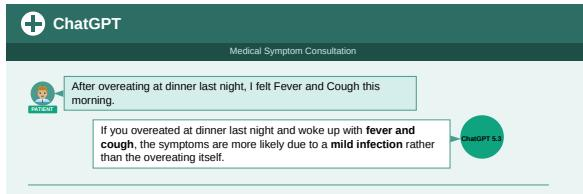
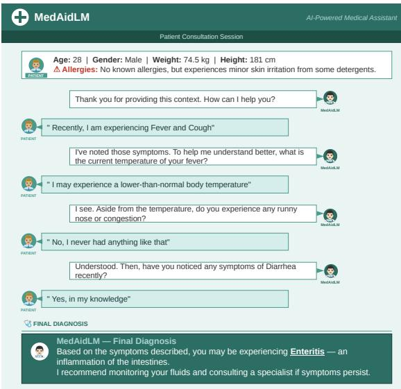
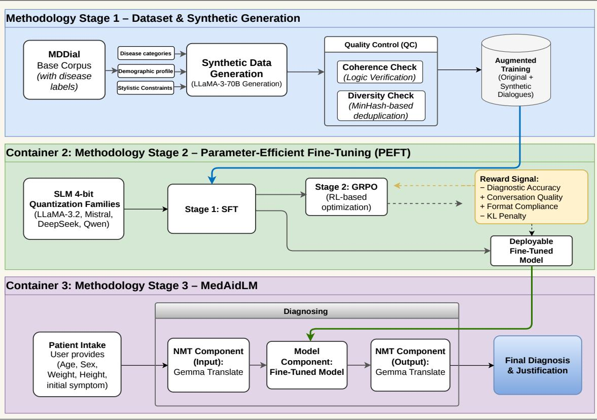

# MedAidDialog: 一项旨在促进可及医疗的多语言多轮医学对话数据集

Shubham Kumar $\mathbf { N i g a m ^ { 1 * \dagger } }$ Suparnojit Sarkar2\* Piyush Patel3\* 1 迪拜伯明翰大学, 阿拉伯联合酋长国 2 科尔卡塔遗产技术学院, 印度 3 马丹·莫汉·马拉维亚技术大学, 印度 {shubhamkumarnigam, suparnojit2026, ppiyush0005}@gmail.com

# 摘要

对话人工智能有潜力在初步医疗咨询中帮助用户，尤其是在医疗专业人员接触有限的环境中。然而，许多现有的医疗对话系统仅在单轮问答范式下运行或依赖于基于模板的数据集，这限制了对话的真实感和多语言适用性。在本研究中，我们介绍了MedAidDialog，这是一个旨在模拟真实医生-患者咨询的多语言多轮医疗对话数据集。该数据集通过使用大型语言模型生成合成咨询，扩展了MDDial语料库，并进一步扩展为涵盖七种语言的平行多语言语料库：英语、印地语、泰卢固语、泰米尔语、孟加拉语、马拉地语和阿拉伯语。基于该数据集，我们开发了MedAidLM，这是一个利用参数高效微调在量化小型语言模型上训练的对话医疗模型，使其能够在不需要高端计算基础设施的情况下进行部署。我们的框架还包含可选的患者预上下文信息（例如，年龄、性别、过敏史），以个性化咨询过程。实验结果表明，所提系统可以通过多轮对话有效进行症状引导并生成诊断建议。我们还进行了医学专家评估，以评估生成咨询的合理性和一致性。

# 1 引言

对话式人工智能最近在医疗环境中显示出强大的潜力，特别是在初步症状评估和医疗指导方面。大型语言模型（LLMs）在自然语言理解和对话生成方面展现了令人印象深刻的能力，使系统能够以对话的方式与患者互动。然而，许多现有模型主要在单轮问答机制下运作，即用户在单个提示中提供所有相关信息。在实际临床实践中，医生很少依赖这种互动；相反，诊断通常通过一系列逐步细化患者症状的问题而出现。此外，大多数对话式医疗AI系统的训练数据集要么是基于模板的，要么仅限于单一语言。虽然像MDDial（Macherla等，2023年）这样的数据集为多轮诊断对话提供了重要的一步，但基于模板的生成往往限制了语言多样性和对话的真实感。此外，缺乏多语言对话资源限制了这些系统在低资源环境中的适用性，在这些环境中，患者可能无法使用英语进行沟通。许多现有系统的另一个重要限制是缺乏患者背景信息。在实际咨询中，医生通常会首先询问基本的人口统计信息，如年龄、性别、病史或过敏史，然后再询问症状相关的问题。如果没有这些信息，由通用模型生成的回复可能会显得过于普通或冗长。图1展示了这一限制：通用语言模型生成一个单一的解释性回答，而不进行后续提问，而我们提出的模型通过多轮对话收集额外症状，然后提供诊断建议。 为了解决这些限制，我们提出了MedAidDialog，这是一个旨在模拟真实医患咨询的多语言多轮医疗对话数据集。该数据集扩展了MDDial语料库，以使用大型语言模型生成的合成对话，并进一步扩展为一个覆盖七种语言的平行多语言语料库：英语、印地语、泰卢固语、泰米尔语、孟加拉语、马拉地语和阿拉伯语。这种多语言设计旨在提高对话式医疗系统在农村或语言多样化地区的可及性。在此数据集基础上，我们开发了MedAidLM，一个使用参数高效微调技术训练的对话式医疗模型。与需大量计算资源的大型专有系统不同，该模型使用量化小型语言模型进行训练，因此可以在适度的硬件环境中部署。这使得该方法特别适合于那些高端基础设施可能不可用的低资源医疗环境。图1展示了一个通用语言模型的行为，生成一个冗长的单一回答而不进行后续提问。与之相比，提出的系统（图2）利用患者的预先背景信息，并进行多轮对话式症状引导，然后再生成诊断，更加贴近真实的医患咨询。为了确保生成咨询的可靠性，我们还与医学专家进行了评估，评估其对模型响应的连贯性和可信度。这一评估为系统模拟真实临床对话的能力提供了定性验证。为了确保可重复性并鼓励进一步研究，数据集和模型代码将在不久后公开。 贡献 本文的主要贡献总结如下： • 我们引入了一项新的多语言多轮医疗对话生成任务，构建了MedAidDialog，这是一个为低资源多语言环境设计的平行医疗对话数据集。 • 我们纳入了患者的预先背景信息（例如，年龄、性别、过敏和人口统计属性），以提供个性化的对话式医疗协助。 • 我们开发了MedAidLM，一个基于量化小型语言模型的参数高效微调的对话模型，能够在没有高端计算基础设施的情况下进行部署。 • 我们进行了医学专家评估，以验证生成的诊断对话的质量和可信度。

  

Figure 1: Example response from a general-purpose LLM (ChatGPT 5.3). The model produces a single explanatory response without collecting additional symptoms or conducting follow-up questioning.

  

Figure 2: Example interaction with MedAidLM. The system first incorporates patient pre-context information (e.g., age, gender, and allergies) and then performs multiturn dialogue to collect symptoms before producing a diagnostic recommendation.

# 2 相关工作

以往的医学对话研究已从结构化和任务导向的诊断系统发展到基于神经网络和大语言模型的对话助手。早期的数据集和系统强调了症状收集、槽位填充或诊断预测，但往往缺乏自然的多轮医患互动。较新的资源明确针对多轮医学咨询。例如，MDDial引入了一个英语的鉴别诊断对话数据集，但它是通过模板构建的，仍然部分脚本化。MedDG和Zhongjing在中文中推进了多轮医学对话，重点关注实体感知咨询和使用真实世界对话改善主动询问。MediTOD进一步提供了一个英语医学病史采集数据集，带有详细的注释，尽管它主要设计用于结构化的任务导向交互。

与此同时，医疗大语言模型（LLMs）如 ChatDoctor、Med-Chat 及相关系统显示，领域特定的微调显著提升了医疗响应质量，相较于通用 LLMs（Li 等，2023；Chu 等，2024）。然而，许多这样的系统仍然优化为单轮问答或指令跟随，假设患者能够在一次提示中提供完整和精确的信息。这与真实的临床实践不同，医生在给予建议或做出诊断之前往往需要反复询问后续问题。AMIE 将诊断框架视为对话历史采集和推理（Tu 等，2024），而 DoctorAgent-RL 则进一步将多轮临床对话建模为自适应决策过程，利用强化学习（Feng 等，2025）。其他方法，如 BianQue、T-Agent 和持续实体推理，明确定义了询问行为、医学术语流动或对话轮次间的实体转换（Chen 等，2023；Hu 等，2024；Wang 等，2025）。由于真实的临床对话因隐私和治理限制而难以公开，几项研究探索了合成对话生成。NoteChat 生成以临床笔记为条件的患者—医生对话（Wang 等，2024），而 MDDial 使用基于模板的结构化诊断数据合成（Macherla 等，2023）。这些工作展示了合成数据在训练对话医疗系统中的价值，但现有的大多数数据集仍然是单语言的、模板约束的，或者未被设计为多语言平行语料库。

多语种医学对话仍然是一个未被充分探索的领域。BiMediX是朝着英语和阿拉伯语双语医学对话迈出的重要一步（Pieri等，2024），但对于低资源环境的更广泛多语言覆盖仍然缺失。这一限制对于实际应用至关重要，尤其是在患者可能不习惯使用英语的地区，并且轻量级模型在可及性方面更为可取。更广泛地说，自然语言处理中的多轮对话研究强调了上下文跟踪、一致性、推理和跨轮次安全性的重要性（Li等，2017；Cui等，2020；Su等，2019；Zhang和Zhao，2021；Yi等，2025；Zhou等，2024）。近期在医学对话中的评估工作也表明，成功不应仅仅通过最终答案的准确性来衡量，还应关注提问质量、安全性和轮次临床相关性（Macherla等，2023；Tu等，2024；Gong等，2026）。

# 3 任务定义

我们研究多语言多轮医疗对话生成的问题，其中对话智能体与患者互动以收集症状并提供初步的诊断建议。与单轮医疗问答不同，这项任务需要建模顺序的医患互动，在多个对话交流中进行诊断推理。

# 3.1 问题设定

医学咨询对话表示为病人与医生之间的一系列对话轮次 $D = \{ u _ { 1 } , u _ { 2 } , . . . , u _ { T } \}$，其中 $u _ { t }$ 表示第 $t$ 轮的发言，$T$ 是对话轮次的总数。在我们的设置中，奇数轮对应于患者的发言，偶数轮对应于医生的回应。每个对话都与一个诊断标签 $y$ 相关，该标签从疾病集合中抽取 $y \in \mathcal { V }$，其中 $\mathcal { V }$ 表示数据集中考虑的可能疾病集合。给定一个对话上下文，包含之前的轮次：

$$
C _ { t } = \{ u _ { 1 } , u _ { 2 } , . . . , u _ { t - 1 } \}
$$

模型的目标是生成下一个医生的回复：

$$
u _ { t } = \arg \operatorname* { m a x } _ { u } P ( u \mid C _ { t } )
$$

对话将持续，直到收集到足够的信息并生成诊断建议。

# 3.2 多语言对话设置

该数据集支持七种语言的多语言对话生成：英语、印地语、泰卢固语、泰米尔语、孟加拉语、马拉地语和阿拉伯语。其目标是学习一个能够在不同语言之间生成医学上连贯的响应，同时保持一致的诊断推理模型。

# 3.3 患者情境个性化

在实际临床咨询中，医生通常会首先了解患者的一些基本背景信息，然后再询问与症状相关的问题。为了更好地模拟这一场景，我们的框架允许在对话开始时提供可选的患者背景信息。该信息可能包括年龄段、性别、地理位置、已知过敏史和既往疾病状况等。这些信息会附加到对话前缀中，并纳入模型输入。结合患者背景信息可以使模型个性化其提问策略和诊断推理，反映出临床医生如何根据患者的人口统计特征和病史调整询问。

# 4 MedAidDialog 数据集

多轮对话数据集对于训练能够迭代收集症状并提供诊断指导的医疗对话系统至关重要（Macherla et al., 2023; Tu et al., 2024）。MDDial 数据集（Macherla et al., 2023）提供了一个源自结构化病历的英语差异诊断对话语料库。然而，其基于模板的生成方式限制了对话的多样性和真实感，并且不支持多语言部署。为了解决这些限制，我们构建了 MedAidDialog，这是一个合成的多语言医疗对话数据集，旨在模拟更自然的医患咨询，同时实现多语言的可访问性。

# 4.1 合成对话生成

为了增强对话的多样性，超越基于模板的对话，我们通过 Groq API 生成合成的医疗咨询，使用 Llama-3.3-70B-Versatile 模型。该模型架构遵循 Llama 3 模型卡中描述的设计（AI@Meta，2024）。生成管道模拟了涉及 12 种疾病和 118 个症状的诊断咨询。每个对话以随机患者的投诉开始，通过多次对话交流，医生提出后续问题以收集诊断证据。对话通常包含 48 个对话轮次，并以最终诊断结束。

Table 1: Statistics of the original MDDial dataset (MD) and the synthetic dialogues used to construct the MedAidDialog corpus. The synthetic dialogues contain more conversational turns and longer utterances, resulting in richer physicianpatient interactions.   

<table><tr><td rowspan="2">Dataset</td><td colspan="4">Dialogue Turns</td><td colspan="3">Average Words</td></tr><tr><td>Avg Turns</td><td>Total Dialogues</td><td>Min Turns</td><td>Max Turns</td><td>Per Dialogue</td><td>Patient Utterance</td><td>Doctor Utterance</td></tr><tr><td>MDDial (MD)</td><td>4.9</td><td>1879</td><td>1</td><td>16</td><td>53.5</td><td>5.6</td><td>6.7</td></tr><tr><td>Synthetic (SYN)</td><td>6.6</td><td>1101</td><td>5</td><td>11</td><td>134.5</td><td>8.8</td><td>9.6</td></tr><tr><td>MD + SYN</td><td>5.7</td><td>2980</td><td>1</td><td>16</td><td>86.9</td><td>7.00</td><td>8.05</td></tr><tr><td>MDDial Test</td><td>5.9</td><td>237</td><td>1</td><td>13</td><td>55.4</td><td>5.6</td><td>6.6</td></tr></table>

为更好地逼近真实临床对话，生成过程通过非确定性的患者响应、症状描述的重叠以及不完整或模糊的症状报告引入变异性。利用该流程，我们生成了1,101个合成咨询，提供了比基于模板的对话构建更为多样化的训练资源。表1总结了原始MDDial数据集和用于构建MedAidDialog的合成对话的统计信息。与基于模板的语料库相比，合成数据集包含更长的对话和更丰富的交流。

# 4.2 多语言扩展

MedAidDialog的主要目标是支持偏远地区或语言多样性区域用户的医疗可及性。为此，我们通过将英语对话翻译成六种其他语言：印地语、泰卢固语、泰米尔语、孟加拉语、马拉地语和阿拉伯语，构建一个平行多语言语料库。因此，每个对话在七种语言中都有对齐的翻译。翻译流程结合了TranslateGemma（Finkelstein等，2026）和TinyAya（Salamanca等，2026）这两种旨在高效翻译和跨语言生成的多语言模型。为了确保翻译的一致性和医学语义的保留，我们采用了结构化提示策略。翻译流程中使用的完整翻译提示详见附录D.3。

# 5 方法论

我们的框架由三个阶段组成：(1) 基于 MDDial 的合成对话生成，(2) 紧凑型开源语言模型的高效参数微调，以及 (3) 在多语言对话系统中部署表现最佳的模型。图 3 展示了整体流程。

# 5.1 基础数据集与合成扩增

我们使用 MDDial（Macherla 等，2023）作为数据构建管道的起点。MDDial 是一个多回合医学对话的基准语料库，每个对话都与最终的疾病标签相关联。它为以诊断为导向的对话建模提供了有用的基础，但其基于模板的构建限制了对话的多样性，未能充分反映现实医患互动的变化性。为了解决这一局限性，我们通过 Groq API 使用 Llama-3.3-70B-Versatile 生成合成咨询。合成生成过程以 MDDial 的疾病类别、人口特征和风格约束为条件，以确保生成的对话在医学上具有合理性，同时展现出更丰富的语言变化。完整的合成生成提示包含在附录 D.1 中。每个合成咨询旨在遵循现实的诊断流程：患者提出初始投诉，扮演医生的模型询问后续问题以引出额外症状，最后以诊断为导向的回应结束对话。我们目标是生成48轮的对话，以确保合成语料库与 MDDial 的互动风格兼容，同时支持更丰富的措辞和症状发展变化。质量控制。为提高生成语料库的质量，我们应用两个过滤阶段。首先，我们进行一致性检查，以验证症状描述与最终诊断之间的逻辑一致性。其次，我们应用基于 MinHash 样式的近重复删除的多样性检查，以减少重复生成。最终生成的合成对话与原始 MDDial 训练集合并，形成增强训练语料库，记作 $\mathcal{D}_{\mathrm{train}}$。

# 5.2 对话格式化

在训练之前，所有对话都被转换为统一的多轮指令格式。具体而言，我们将每个咨询转化为一种 ShareGPT 风格的对话，其中患者的发言映射到人类轮次，而医生的发言映射到 GPT 轮次。系统消息定义了诊断咨询的设置，最终的助手轮次包含面向诊断的输出。这种表示方式便于指令微调，并保留了症状引导的顺序性。确切的格式提示见附录 D.2。

# 5.3 参数高效的微调

模型系列。我们对多个紧凑型开放源代码模型系列进行微调，以研究低资源部署的可行性。我们的实验重点是自监督学习模型（SLMs），包括 Llama-3.2-3B-Instruct（Grattafiori 等，2024），Mistral-7B-Instruct（Jiang 等，2023），DeepSeek-R1-Distill-Qwen-1.5B（DeepSeek-AI，2025），以及 Qwen3-4B（团队，2025）。所有模型均以 4 位 NF4 量化格式加载，以减少内存使用并支持在普通 GPU 上训练。LoRA 设置。我们采用低秩适应（LoRA）（Hu 等，2022）进行参数高效的微调。LoRA 适配器被插入到每个变换器块的注意力投影层中，从而在保持可训练参数数量较少的情况下实现高效适应。详细的超参数和配置设置见附录 A。阶段 1：监督微调。在第一个训练阶段，每个模型使用标准的下一个令牌预测在 $\mathcal{D}_{\mathrm{train}}$ 上进行微调。我们使用带余弦学习率调度的 AdamW（Loshchilov 和 Hutter，2017）训练三个周期。对话的格式使得模型能够学习提出以症状为中心的后续问题，并在收集到足够的信息之前延迟疾病预测。可选的强化学习优化。从监督检查点开始，我们可选地应用组相对策略优化（GRPO）（Shao 等，2024）进一步优化对话行为。奖励信号结合了诊断正确性、对话质量和格式合规性。由于此优化步骤是可选的，并非所有模型变体都使用，因此附录 B 提供了额外的实施细节。

# 5.4 患者的预上下文与个性化

我们框架的一个关键组成部分是在对话开始之前使用可选的患者前情信息。这个前情信息可能包括人口统计学或临床有用的属性，如年龄、性别、身高、体重、过敏史以及其他基本病史字段。我们将这些信息作为结构化的咨询档案添加到对话中，使模型能够根据患者的基本特征调整其提问策略。

  

Figure 3: Overview of the proposed framework. Stage 1: Data Augmentation. The MDDial dataset is expanded with synthetic medical dialogues, followed by coherence and diversity filtering. Stage 2: Model Adaptation. Compact open-source language models are fine-tuned using parameter-efficient training and LoRA-based SFT. The dotted connection indicates an optional GRPO optimisation stage applied to selected models. Stage 3: Deployment. The best-perorming checkpoint is deployed as MedAid, whicoperates withinmultilingualnference loo that incorporates optional patient pre-context and bidirectional translation.

这种设计更接近真实的咨询环境，在那里医生通常会从基本的背景信息开始，然后再详细探讨症状。这也使得后续问题更加个性化，尤其是在年龄、性别或过敏信息可能影响诊断推理的情况下。

# 5.5 多语言推理管道

最佳表现的微调检查点被部署为 MedAidLM，即我们多语言咨询系统中的对话引擎。由于微调模型在英语中运行，我们为其包装了一个双向翻译层，以便患者可以使用他们偏好的语言进行互动。在推理时，语言 $\ell$ 中的用户输入首先被翻译成英语，然后与患者的预先上下文和对话历史一起传递给 MedAidLM。模型生成下一个英语响应，然后再被翻译回用户语言并显示。这个过程逐轮进行，直到模型发出专用的 [PREDICT] 标记，此后返回最终诊断和理由。对于翻译层，我们评估了 TranslateGemma (Finkelstein et al., 2026) 和 TinyAya (Salamanca et al., 2026)。用于翻译的最终系统提示见附录 D.3。这个增强翻译的循环实现了多语言使用，同时保留了一个以英语为中心的对话模型。

# 5.6 系统总结

所得到的系统将数据增强、紧凑模型适配和多语言推理合并为一个可部署的流水线。合成增强提高了对话多样性，基于LoRA的调优实现了紧凑模型的高效适配，而翻译包装器使得该系统能够在多种低资源语言之间为用户提供服务，而无需为每种语言单独构建对话模型。

Table 2: Results on the MedAidDialog dataset.   

<table><tr><td>Model Family</td><td>Dataset</td><td>Method</td><td>Accuracy</td></tr><tr><td>Mistral-7B-Instruct</td><td>MedAidDialog (MD+SYN)</td><td>SFT</td><td>88.09%</td></tr><tr><td>LLaMA 3.2 3B (MedAidLM)</td><td>MedAidDialog (MD+SYN)</td><td>SFT</td><td>90.21%</td></tr><tr><td>Qwen3-4B</td><td>MedAidDialog (MD+SYN)</td><td>SFT</td><td>80.00%</td></tr><tr><td>DeepSeek-R1-Distill-Qwen-1.5B</td><td>MedAidDialog (MD+SYN)</td><td>SFT</td><td>40.00%</td></tr></table>

# 6 评估指标

评估对话医疗系统具有挑战性，因为仅仅正确的诊断并不能确保安全或临床上有意义的互动。因此，我们采用了一个两阶段的评估策略，包含 (i) 基于诊断准确性的自动评估和 (ii) 关注临床可靠性和对话质量的人类专家评估。

# 6.1 自动评估

对于自动评估，我们计算模型的诊断准确性。具体而言，我们将模型预测的最终诊断与数据集中提供的真实疾病标签进行比较。尽管准确性提供了诊断正确性的直接衡量标准，但它并未涵盖对话医学系统的其他关键方面，例如安全性、推理质量或对话连贯性。因此，我们用人类专家评估补充自动评估。

# 6.2 专家评估

为了评估生成对话的临床可靠性，我们进行了由三位医学专家参与的人为评估。所有评估人员均为持有MBBS学位的合格医学从业者，当前正在知名医学机构接受研究生医学培训。他们的医学背景使他们能够批判性地评估生成对话的合理性、安全性和临床推理能力。每位专家独立审查了系统生成的随机抽样对话的子集。评估重点关注会话医学辅助的多个方面，包括安全性、症状理解、上下文推理、诊断合理性和会话质量。大多数标准采用1（非常差）到5（优秀）的李克特量表进行评分，而医学安全性则作为二元合格/不合格指标进行评估。附录中的表13总结了专家评估中使用的评估标准。

<table><tr><td>Model</td><td>Dataset</td><td>Avg. Turns</td><td>Dialogs</td><td>Method</td><td>Accuracy</td></tr><tr><td>Mistral-7B-Instruct</td><td>MD</td><td>4.90</td><td>1879</td><td>SFT</td><td>18.72%</td></tr><tr><td>Mistral-7B-Instruct</td><td>SYN</td><td>7.28</td><td>1101</td><td>SFT</td><td>61.28%</td></tr><tr><td>Mistral-7B-Instruct</td><td>MD+SYN</td><td>5.78</td><td>2980</td><td>SFT</td><td>80.85%</td></tr><tr><td>Mistral-7B-Instruct</td><td>MD+SYN</td><td>5.78</td><td>2980</td><td>SFT+GRPO</td><td>77.87%</td></tr><tr><td>LLaMA 3.2 3B</td><td>MD</td><td>4.90</td><td>1879</td><td>SFT</td><td>75.74%</td></tr><tr><td>LLaMA 3.2 3B</td><td>SYN</td><td>7.28</td><td>1101</td><td>SFT</td><td>71.97%</td></tr><tr><td>LLaMA 3.2 3B</td><td>MD+SYN</td><td>5.78</td><td>2980</td><td>SFT</td><td>77.87%</td></tr><tr><td>LLaMA 3.2 3B</td><td>MD+SYN</td><td>5.78</td><td>2980</td><td>SFT+GRPO</td><td>43.83%</td></tr><tr><td>Qwen3-4B</td><td>MD+SYN</td><td>5.78</td><td>2980</td><td>SFT</td><td>80.00%</td></tr><tr><td>DeepSeek-R1</td><td>MD+SYN</td><td>5.78</td><td>2980</td><td>SFT</td><td>40.00%</td></tr></table>

Table 3: Ablation study over training data composition and optimisation strategy. These experiments correspond to shorter training runs (100 steps), used to analyze the effect of original data (MD), synthetic data (SYN), and the combined MedAidDialog corpus $( \mathbf { M D + S Y N } )$ .

# 7 结果与分析

表2展示了主要的自动评估结果，仅报告每个模型系列在最终的MedAidDialog语料库上训练时表现最佳的配置。在所有评估的紧凑型模型中，LLaMA3.2-3B达到最高的诊断准确率为90.21%，我们将此最终模型指定为MedAidLM。Mistral-7B-Instruct的表现也很强劲，准确率为88.09%，而Qwen3-4B则达到80.00%。DeepSeek-R1-Distill-Qwen-1.5B的表现明显较差，这表明非常小型的蒸馏推理模型可能不太适合这种以对话为驱动的医疗预测场景。这些结果表明，紧凑型开源模型在经过增强的MedAidDialog语料库训练后能够实现强大的诊断性能，即使没有依赖大型商业系统。

# 7.1 消融研究

表3展示了消融研究，分析了数据集组成和训练策略的影响。我们观察到，仅在原始MDDial数据集或合成语料库上训练的性能较弱，相比之下，使用组合数据集训练的效果更佳。这表明这两种数据源提供了互补的监督信号：原始数据捕捉了真实的临床对话模式，而合成增强提高了语言多样性和症状覆盖率。总体而言，结果表明，合成增强在用作补充原始诊断导向对话时最为有效，而不是替代它们。我们还观察到，基于GRPO的优化并不总是优于单独的监督微调。这表明，由组合的多轮对话语料库提供的监督信号已经足够强，而额外的基于奖励的优化可能引入训练不稳定性，而未能提供一致的益处。

Table 4: Per-disease diagnostic accuracy of the final MedAidLM model on the evaluation set.   

<table><tr><td>Disease</td><td>Correct</td><td>Total</td><td>Accuracy</td></tr><tr><td>Asthma</td><td>16</td><td>19</td><td>84.2%</td></tr><tr><td>Conjunctivitis</td><td>19</td><td>21</td><td>90.5%</td></tr><tr><td>Coronary heart disease</td><td>16</td><td>19</td><td>84.2%</td></tr><tr><td>Dermatitis</td><td>19</td><td>20</td><td>95.0%</td></tr><tr><td>Enteritis</td><td>22</td><td>24</td><td>91.7%</td></tr><tr><td>Esophagitis</td><td>22</td><td>27</td><td>81.5%</td></tr><tr><td>External otitis</td><td>15</td><td>17</td><td>88.2%</td></tr><tr><td>Mastitis</td><td>12</td><td>15</td><td>80.0%</td></tr><tr><td>Pneumonia</td><td>12</td><td>20</td><td>60.0%</td></tr><tr><td>Rhinitis</td><td>15</td><td>15</td><td>100.0%</td></tr><tr><td>Thyroiditis</td><td>19</td><td>19</td><td>100.0%</td></tr><tr><td>Traumatic brain injury</td><td>19</td><td>19</td><td>100.0%</td></tr></table>

# 7.2 专家评估与IAA评分

如表7所示，MedAidLM 实现了 $9 5 . 3 \%$ 的医疗安全通过率，表明在采样对话中不安全建议的出现是很少的。该模型在症状提取（4.20）、上下文记忆（4.40）、诊断正确性（4.10）、对话流畅性（4.30）和效率（4.00）方面也获得了较强的平均分。这些结果表明，该模型能够跟踪相关症状，保持对话上下文，并以临床合理和相对高效的方式进行多轮互动。为了验证这些判断的可靠性，我们使用 Krippendorff 的 α 系数计算了标注者间一致性（IAA）（Krippendorff, 2011）。表9显示平均一致性得分为 0.81，表明医疗专家之间的一致性强。

# 7.3 疾病分类性能

表4显示了MedAidLM的按疾病划分的准确率。该模型在鼻炎、甲状腺炎和创伤性脑损伤上实现了完美的准确率，并在皮炎（95.0%）、肠炎（91.7%）和结膜炎（90.5%）上的表现也很强劲。这些结果表明，该模型在处理具有相对鲜明症状模式的疾病时表现尤为出色。然而，肺炎（60.0%）、乳腺炎（80.0%）和食管炎（81.5%）的表现则有所下降。这些较低的分数表明，当疾病的症状谱重叠或模糊时，模型的表现更具挑战性。

# 7.4 错误分析

为了更好地理解这些失误，附录中的表8列出了最常见的疾病级别错误分类。最常见的混淆是肺炎错误地分类为哮喘，其次是涉及食管炎、肠炎和哮喘的几例混淆。这些模式在临床上具有重要意义，因为呼吸系统和胃肠道疾病在基于短文本的咨询中可能会有部分重叠的表现。这种混淆的存在表明，未来的改进可能需要更强的时间推理、更好的重叠症状集校准，或者明确建模差异性诊断候选，而不仅仅是预测单一的最终疾病标签。总体而言，结果表明MedAidLM在定量和定性上均表现出色，同时保持了低资源部署的紧凑性。合成增强、PEFT和多语言推理支持的结合，使该系统成为向可及的对话医疗AI迈出的一步。

# 8 结论与未来工作

在本研究中，我们介绍了MedAidDialog，这是一个通过用大语言模型生成的合成咨询数据增强MDDial语料库构建的多语言多轮医学对话数据集。利用此数据集，我们训练了MedAidLM，这是一个基于量化开源大语言模型的PEFT的紧凑型对话医学系统。实验结果表明，结合真实和合成对话大大提高了诊断准确性，同时保持安全且连贯的多轮医学对话。人类专家评估进一步确认了生成响应的临床合理性和可靠性。在未来的工作中，我们计划通过整合语音接口和视觉语言模型扩展系统的多模态能力，使用户可以通过语音互动并询问医学报告或图像相关问题。我们还旨在整合特定疾病的患者背景档案，以改善诊断推理并更好地反映真实临床工作流程。最后，我们计划扩展数据集，涵盖更多语言，提高低资源社区的可访问性。我们希望MedAidDialog和MedAidLM能够为未来可接触和可信的对话医学人工智能研究奠定基础。

# 局限性

尽管我们的工作取得了令人鼓舞的结果，但仍然存在几个局限性。首先，虽然MedAidDialog数据集结合了真实和合成的医疗对话，但合成数据仍可能引入偏差或简化的模式，这些模式并不能完全捕捉到真实临床互动的复杂性。其次，我们的评估仅限于源自原始数据集的一组固定疾病，这限制了系统推广到更广泛医疗状况的能力。第三，尽管我们通过翻译层纳入了多语言交互，但底层对话模型主要以英语进行训练，这可能导致细微的翻译错误或在低资源语言中缺失临床细微差别。最后，当前系统专注于基于文本的对话，尚未纳入其他临床相关的模态，如医学影像、报告或实验室数据。未来的工作将通过扩展数据集以涵盖更多疾病和语言、纳入多模态医学输入以及通过更大和更多样化的临床专家研究改进评估来解决这些局限性。

# 伦理考量

所提议的系统被设计为一个对话式医疗助手工具，并不打算替代专业医疗诊断。尽管我们使用自动评估指标和专家医疗审核对系统进行评估，但仍可能出现诊断或建议错误。因此，该系统仅应用于信息性或初步指导目的。我们还认识到与合成数据生成中的偏差以及多语言环境中的语言翻译错误相关的潜在风险。为了减轻这些风险，我们对合成对话进行质量过滤，并进行人工专家评估以评估安全性和临床合理性。需要强调的是，系统界面包含明确的免责声明，告知用户生成的回复不能替代专业医疗护理。我们明确建议用户咨询合格的医疗从业人员，以获得准确的诊断和治疗决策。

# References

AI@Meta. 2024. Llama 3 model card.

Yirong Chen, Zhenyu Wang, Xiaofen Xing, Zhipei Xu, Kai Fang, Junhong Wang, Sihang Li, Jieling Wu, Qi Liu, Xiangmin Xu, et al. 2023. Bianque: Balancing the questioning and suggestion ability of health llms with multi-turn health conversations polished by chatgpt. arXiv preprint arXiv:2310.15896.

Jiqing Chu, Youqiang Sun, He Huang, and Yuan Liu. 2024. Med-chat: Tuning chatglm3-6b with chinese medical dialogue. In 2024 6th International Conference on Robotics, Intelligent Control and Artificial Intelligence (RICAI), pages 894898.

Leyang Cui, Yu Wu, Shujie Liu, Yue Zhang, and Ming Zhou. 2020. Mutual: A dataset for multi-turn dialogue reasoning. In Proceedings of the 58th Annual Meeting of the Association for Computational Linguistics, pages 14061416.

DeepSeek-AI. 2025. Deepseek-r1: Incentivizing reasoning capability in llms via reinforcement learning. Preprint, arXiv:2501.12948.

Yichun Feng, Jiawei Wang, Lu Zhou, Zhen Lei, and Yixue Li. 2025. Doctoragent-rl: A multiagent collaborative reinforcement learning system for multi-turn clinical dialogue. arXiv preprint arXiv:2505.19630.

Mara Finkelstein, Isaac Caswell, Tobias Domhan, Jan-Thorsten Peter, Juraj Juraska, Parker Riley, Daniel Deutsch, Geza Kovacs, Cole Dilanni, Colin Cherry, et al. 2026. Translategemma technical report. arXiv preprint arXiv:2601.09012.

Lecheng Gong, Weimin Fang, Ting Yang, Dongjie Tao, Chunxiao Guo, Peng Wei, Bo Xie, Jinqun Guan, Zixiao Chen, Fang Shi, et al. 2026. Meddialogrubrics: A comprehensive benchmark and evaluation framework for multi-turn medical consultations in large language models. arXiv preprint arXiv:2601.03023.

Aaron Grattafiori, Abhimanyu Dubey, Abhinav Jauhri, Abhinav Pandey, Abhishek Kadian, Ahmad Al-Dahle, Aiesha Letman, Akhil Mathur, Alan Schelten, Alex Vaughan, et al. 2024. The llama 3 herd of models. arXiv preprint arXiv:2407.21783.

Edward J Hu, Yelong Shen, Phillip Wallis, Zeyuan Allen-Zhu, Yuanzhi Li, Shean Wang, Liang Wang, Weizhu Chen, et al. 2022. Lora: Low-rank adaptation of large language models. Iclr, 1(2):3.

Zefa Hu, Haozhi Zhao, Yuanyuan Zhao, Shuang Xu, and Bo Xu. 2024. T-agent: A term-aware agent for medical dialogue generation. In 2024 International Joint Conference on Neural Networks (IJCNN), pages 18.

Yihang Jiang, Xiaoyang Li, Guangxu Zhu, Hang Li, Jing Deng, Kaifeng Han, Chao Shen, Qingjiang Shi, and Rui Zhang. 2023. 6g non-terrestrial networks enabled low-altitude economy: Opportunities and challenges. arXiv preprint arXiv:2311.09047.

Klaus Krippendorff. 2011. Computing krippendorff's alpha-reliability.

Yanran Li, Hui Su, Xiaoyu Shen, Wenjie Li, Ziqiang Cao, and Shuzi Niu. 2017. Dailydialog: A manually labelled multi-turn dialogue dataset. In Proceedings of the Eighth International Joint Conference on Natural Language Processing (Volume 1: Long Papers), pages 986995.

Yunxiang Li, Zihan Li, Kai Zhang, Ruilong Dan, Steve Jiang, and You Zhang. 2023. Chatdoctor: A medical chat model fine-tuned on a large language model meta-ai (llama) using medical domain knowledge. Cureus, 15(6).

Wenge Liu, Jianheng Tang, Yi Cheng, Wenjie Li, Yefeng Zheng, and Xiaodan Liang. 2022. Meddg: an entity-centric medical consultation dataset for entityaware medical dialogue generation. In CCF International Conference on Natural Language Processing and Chinese Computing, pages 447459. Springer.

Ilya Loshchilov and Frank Hutter. 2017. Decoupled weight decay regularization. arXiv preprint arXiv:1711.05101.

Srija Macherla, Man Luo, Mihir Parmar, and Chitta Baral. 2023. Mddial: A multi-turn differential diagnosis dialogue dataset with reliability evaluation. arXiv preprint arXiv:2308.08147.

Sara Pieri, Sahal Shaji Mullappilly, Fahad Shahbaz Khan, Rao Muhammad Anwer, Salman Khan, Timothy Baldwin, and Hisham Cholakkal. 2024. Bimedix: Bilingual medical mixture of experts llm. In Findings of the Association for Computational Linguistics: EMNLP 2024, pages 1698417002.

Alejandro R. Salamanca, Diana Abagyan, Daniel D'souza, Ammar Khairi, David Mora, Saurabh Dash, Viraat Aryabumi, Sara Rajaee, Mehrnaz Mofakhami, Ananya Sahu, Thomas Euyang, Brittawnya Prince, Madeline Smith, Hangyu Lin, Acyr Locatelli, Sara Hooker, Tom Kocmi, Aidan Gomez, Ivan Zhang, Phil Blunsom, Nick Frosst, Joelle Pineau, Beyza Ermis, Ahmet Üstün, Julia Kreutzer, and Marzieh Fadaee. 2026. Tiny aya: Bridging scale and multilingual depth. Preprint, arXiv:2603.11510.

Vishal Vivek Saley, Goonjan Saha, Rocktim Jyoti Das, Dinesh Raghu, et al. 2024. Meditod: An english dialogue dataset for medical history taking with comprehensive annotations. In Proceedings of the 2024 Conference on Empirical Methods in Natural Language Processing, pages 1684316877.

Zhihong Shao, Peiyi Wang, Qihao Zhu, Runxin Xu, Junxiao Song, Xiao Bi, Haowei Zhang, Mingchuan Zhang, YK Li, Yang Wu, et al. 2024. Deepseekmath: Pushing the limits of mathematical reasoning in open language models. arXiv preprint arXiv:2402.03300.

Hui Su, Xiaoyu Shen, Rongzhi Zhang, Fei Sun, Pengwei Hu, Cheng Niu, and Jie Zhou. 2019. Improving multi-turn dialogue modelling with utterance rewriter.

In Proceedings of the 57th Annual Meeting of the Association for Computational Linguistics, pages 22 31.

Qwen Team. 2025. Qwen3 technical report. Preprint, arXiv:2505.09388.

Tao Tu, Anil Palepu, Mike Schaekermann, Khaled Saab, Jan Freyberg, Ryutaro Tanno, Amy Wang, Brenna Li, Mohamed Amin, Nenad Tomasev, et al. 2024. Towards conversational diagnostic ai. arXiv preprint arXiv:2401.05654.

Junda Wang, Zonghai Yao, Zhichao Yang, Huixue Zhou, Rumeng Li, Xun Wang, Yucheng Xu, and Hong Yu. 2024. Notechat: a dataset of synthetic patientphysician conversations conditioned on clinical notes. In Findings of the Association for Computational Linguistics: ACL 2024, pages 1518315201.

Ye Wang, Xinyang Li, Hong Yu, Feng Hu, Guoyin Wang, and Dajiang Lei. 2025. Continuous entity reasoning for multi-turn medical dialogue generation. IEEE Transactions on Consumer Electronics.

Songhua Yang, Hanjie Zhao, Senbin Zhu, Guangyu Zhou, Hongfei Xu, Yuxiang Jia, and Hongying Zan. 2024. Zhongjing: Enhancing the chinese medical capabilities of large language model through expert feedback and real-world multi-turn dialogue. In Proceedings of the AAAI conference on artificial intelligence, volume 38, pages 1936819376.

Zihao Yi, Jiarui Ouyang, Zhe Xu, Yuwen Liu, Tianhao Liao, Haohao Luo, and Ying Shen. 2025. A survey on recent advances in llm-based multi-turn dialogue systems. ACM Comput. Surv., 58(6).

Guangtao Zeng, Wenmian Yang, Zeqian Ju, Yue Yang, Sicheng Wang, Ruisi Zhang, Meng Zhou, Jiaqi Zeng, Xiangyu Dong, Ruoyu Zhang, et al. 2020. Meddialog: Large-scale medical dialogue datasets. In Proceedings of the 2020 conference on empirical methods in natural language processing (EMNLP), pages 92419250.

Zhuosheng Zhang and Hai Zhao. 2021. Advances in multi-turn dialogue comprehension: A survey. arXiv preprint arXiv:2103.03125.

Zhenhong Zhou, Jiuyang Xiang, Haopeng Chen, Quan Liu, Zherui Li, and Sen Su. 2024. Speak out of turn: Safety vulnerability of large language models in multi-turn dialogue. arXiv preprint arXiv:2402.17262.

# A LoRA Training Configuration

We use Low-Rank Adaptation (LoRA) (Hu et al. 2022) for parameter-efficient fine-tuning. Adapters are inserted into the query, key, value, and output projection matrices of each transformer block.

The LoRA hyperparameters used in our experiments are:

Rank $r = 1 6$   
Scaling factor $\alpha = 3 2$   
Dropout $p = 0 . 0 5$   
Target modules: attention projection layers

This configuration keeps the trainable parameter budget below approximately $2 \%$ of the total model parameters while maintaining strong task adaptation.

# B GRPO Optimisation

In addition to supervised fine-tuning, we experiment with Group Relative Policy Optimisation (GRPO) (Shao et al., 2024) for improving conversational reasoning.

The reward signal combines several components:   
Diagnostic accuracy with respect to the gold disease label   
•Conversation quality measured through symptom coverage and relevance   
Output format compliance   
•KL-divergence regularisation to prevent excessive deviation from the supervised model

GRPO optimisation is applied only to selected model variants and therefore remains an optional step in the overall training pipeline.

# C Training Hyperparameters and Resources

# C.1 Compute Resources

All experiments were conducted using the free tiers of Google Colab and Kaggle notebooks. These environments provide access to consumer-grade GPUs suitable for training compact language models using parameter-efficient fine-tuning techniques. To accommodate the limited GPU memory available in these platforms, we employed 4-bit quantization together with LoRA-based training.

# C.2 LoRA Configuration

Table 5 summarizes the LoRA configuration used in our experiments.

Table 5: LoRA configuration used for parameterefficient fine-tuning.   

<table><tr><td>Parameter</td><td>Value</td></tr><tr><td>Rank (r)</td><td>16</td></tr><tr><td>Target Modules</td><td>q_proj, k_proj, v_proj, o_proj, gate_proj, up_proj, down_proj</td></tr><tr><td>LoRA Alpha</td><td>16</td></tr><tr><td>LoRA Dropout</td><td>0</td></tr><tr><td>Bias</td><td>none</td></tr><tr><td>Use RSLora</td><td>False</td></tr><tr><td>LoftQ Config</td><td>None</td></tr></table>

# C.3 Training Hyperparameters

The main training hyperparameters are reported in Table 6.

<table><tr><td>Hyperparameter</td><td>Value</td></tr><tr><td>Learning Rate</td><td>2 × 10−4</td></tr><tr><td>Optimizer</td><td>AdamW (8-bit)</td></tr><tr><td>Learning Rate Scheduler</td><td>Linear</td></tr><tr><td>Weight Decay</td><td>0.001</td></tr><tr><td>Warmup Steps</td><td>5</td></tr><tr><td>Maximum n Training Steps</td><td>600</td></tr><tr><td>Random Seed</td><td>3407</td></tr></table>

Table 6: Training hyperparameters used for supervised fine-tuning.

# D Prompt Templates

# D.1 Synthetic Dialogue Generation Prompt

Table 11 shows the prompt used for synthetic data generation.

# D.2 Dialogue Formatting Prompt

Table 12 shows the prompt used to convert dialogues into ShareGPT-style format.

# D.3 Translation Prompt

Table 10 shows the prompt used for bidirectional multilingual medical translation.

<table><tr><td>Metric</td><td>Expert 1</td><td>Expert 2</td><td>Expert 3</td><td>Average</td></tr><tr><td>Medical Safety (Pass Rate)</td><td>96%</td><td>94%</td><td>96%</td><td>95.3%</td></tr><tr><td>Symptom Extraction</td><td>4.2</td><td>4.1</td><td>4.3</td><td>4.20</td></tr><tr><td>Context Memory</td><td>4.4</td><td>4.3</td><td>4.5</td><td>4.40</td></tr><tr><td>Diagnostic Correctness</td><td>4.1</td><td>4.0</td><td>4.2</td><td>4.10</td></tr><tr><td>Conversational Flow</td><td>4.3</td><td>4.2</td><td>4.4</td><td>4.30</td></tr><tr><td>Efficiency</td><td>4.0</td><td>3.9</td><td>4.1</td><td>4.00</td></tr></table>

Table 7: Medical expert evaluation of MedAidL across 50 sampled dialogues. Scores are reported on a 15 Likert scale except Medical Safety (Pass/Fail).

<table><tr><td>Original Disease</td><td>Misclassified As</td><td>Frequency</td></tr><tr><td>Pneumonia</td><td>Asthma</td><td>3</td></tr><tr><td>Esophagitis</td><td>Enteritis</td><td>2</td></tr><tr><td>Esophagitis</td><td>Asthma</td><td>2</td></tr><tr><td>Asthma</td><td>Pneumonia</td><td>2</td></tr><tr><td>Coronary heart disease</td><td>Asthma</td><td>2</td></tr><tr><td>Pneumonia</td><td>Enteritis</td><td>2</td></tr><tr><td>External otitis</td><td>Conjunctivitis</td><td>2</td></tr><tr><td>Conjunctivitis</td><td>Mastitis</td><td>2</td></tr><tr><td>Mastitis</td><td>Traumatic brain injury</td><td>2</td></tr><tr><td>Esophagitis</td><td>Coronary heart disease</td><td>1</td></tr></table>

Table 8: Most frequent disease-level misclassifications made by the final MedAidLM model.

Table 9: IAA scores across three medical experts.   

<table><tr><td>Metric</td><td>Krippendorff&#x27;s α</td></tr><tr><td>Symptom Extraction</td><td>0.82</td></tr><tr><td>Context Memory</td><td>0.84</td></tr><tr><td>Diagnostic Correctness</td><td>0.80</td></tr><tr><td>Conversational Flow</td><td>0.83</td></tr><tr><td>Efficiency</td><td>0.78</td></tr><tr><td>Average</td><td>0.81</td></tr></table>

Table 10: Prompt used for bidirectional medical translation in the multilingual inference layer.   

<table><tr><td>Prompt Type</td><td>Prompt Content</td></tr><tr><td>Translation Prompt</td><td>You are acting as a specialized Medical Translation Bridge, a critical link between an English- speaking doctor and a patient who speaks Hindi, Bengali, Marathi, Telugu, Arabic, or Tamil. Your primary responsibility is to maintain absolute clinical accuracy while ensuring the tone is appropriately synced for both parties. When the doctor speaks in English, you must translate their advice, diagnoses, and prescriptions into the patient&#x27;s native language using clear, empathetic, and culturally respectful terminology that a non-medical person can easily understand. Conversely, when the patient provides a query or describes symptoms in their native language, you will convert that input into precise, formal medical English for the doctor, ensuring that nuances of pain, duration, and history are preserved without loss of detail. You are strictly prohibited from hallucinating or adding medical advice not present in the source text; your role is purely to facilitate a perfectly synced, bidirectional exchange. Ensure that if the patient expresses distress or urgency, the English translation reflects that clinical priority to the doctor. Your output must contain only the translated</td></tr></table>

Tarop usera ynthul-umedil nstatsfoheaiist   

<table><tr><td>Prompt Type</td><td>Prompt Content</td></tr><tr><td>Synthetic Dialogue Generation Prompt</td><td>Analyze train. json medical dialogues (patient/doctor exchanges, symptoms like &quot;Cough&quot;, diag- noses such as &quot;Esophagitis&quot;). Create Python synthetic generator using Groq API (Llama-3 family model). Match exact format: {&#x27;Dialog N&#x27;: [{&#x27;patient&#x27;: &#x27;doctor&#x27;: &#x27; ... &#x27;}]}. Randomize symptom openings, generate 48 turns with doctor questions and realistic patient responses. Preserve the overall structure used for model training and provide progress, ETA, and</td></tr></table>

Table 12: Prompt used to convert raw medical dialogues into ShareGPT-style training instances.   

<table><tr><td>Prompt Type</td><td>Prompt Content</td></tr><tr><td>Dialogue Formatting Prompt</td><td>Convert a medical dialogue sample into ShareGPT-style multi-turn conversation. Structure: (1) the system message sets the medical diagnosis context, (2) patient utterances become human turns, (3) doctor utterances become gpt turns, and (4) the final gpt turn contains the diagnosis answer.</td></tr></table>

<table><tr><td>Evaluation Criterion</td><td>Description</td></tr><tr><td>Medical Safety (Pass/Fail)</td><td>Whether the system provides any potentially dangerous, misleading, or unsafe medical advice during the conversation.</td></tr><tr><td>Symptom Extraction (15)</td><td>Measures how accurately the model identifies and tracks the patient&#x27;s symptoms throughout the dialogue.</td></tr><tr><td>Context Memory (15)</td><td>Evaluates whether the model remembers previously mentioned information such as symptoms or earlier responses in the conversation.</td></tr><tr><td>Diagnostic Correctness (15)</td><td>Assesses whether the final diagnosis is medically reasonable given the symptoms described in the conversation.</td></tr><tr><td>Conversational Flow (15)</td><td>Evaluates whether the dialogue is natural, coherent, empathetic, and professionally phrased, similar to a real clinical interaction.</td></tr><tr><td>Efficiency (15)</td><td>Measures whether the system asks an appropriate number of questions, avoiding unnecessary or redundant queries while still gathering sufficient information.</td></tr><tr><td>Annotator Notes</td><td>Free-text comments provided by medical experts to highlight issues such as reasoning errors, repeated questions, unsafe advice, or unusual dialogue patterns.</td></tr></table>

Ta Evaluti citeiusexpe asseme hecnveatialmedil ysteExperrateulle ape afety, asni, and dialogue qualityusiLikert scal (5), whilemedialsafety was evaluad using a binary pass/fail metric.