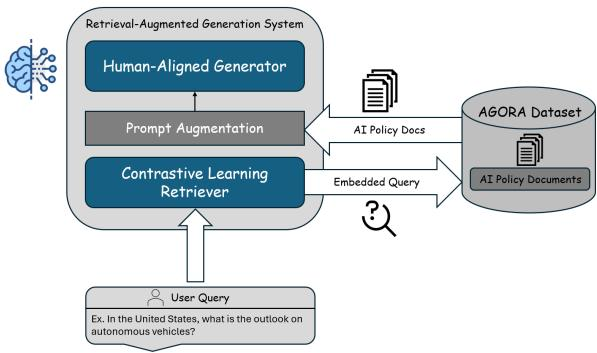
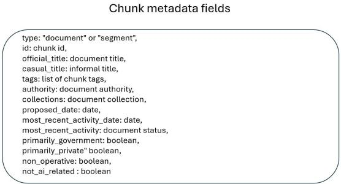
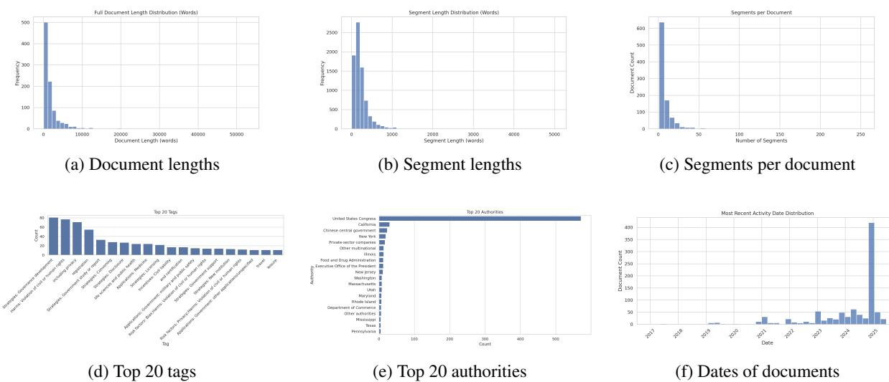
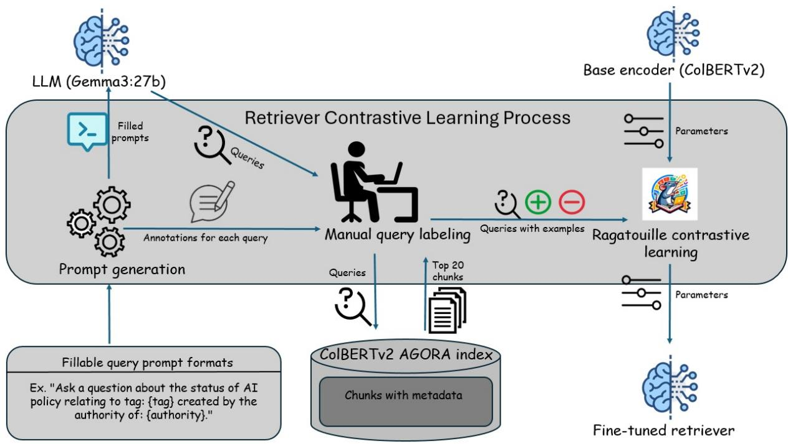
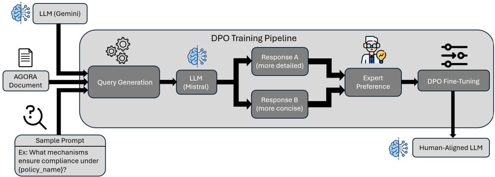
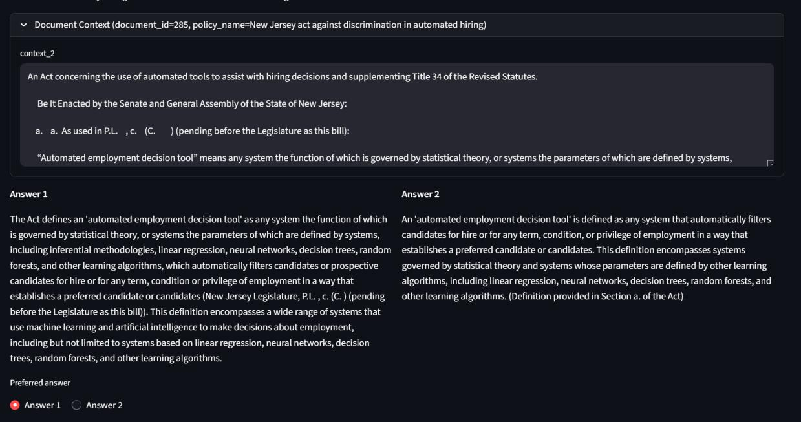
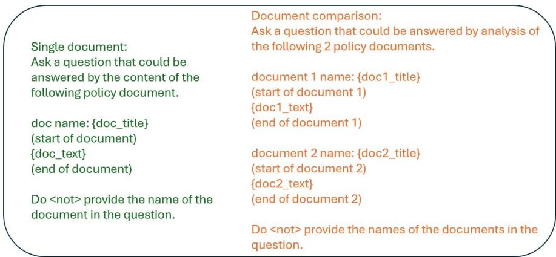

# 1. Bibliographic Information
## 1.1. Title
The central topic of the paper is an empirical analysis of retrieval-augmented generation (RAG) systems for AI policy question answering, specifically investigating whether improvements to individual RAG components (e.g., retrieval performance) translate to better end-to-end answer quality. The full title is *Retrieval Improvements Do Not Guarantee Better Answers: A Study of RAG for AI Policy QA*.
## 1.2. Authors
The paper is authored by an interdisciplinary team from Purdue University:
- Saahil Mathur, Ryan David Rittner, Tunazzina Islam: Department of Computer Science, Purdue University (focus areas: natural language processing, RAG system development, LLM alignment)
- Vedant Ajit Thakur, Daniel Stuart Schiff: Department of Political Science, Purdue University (focus areas: AI governance, policy analysis, regulatory corpus curation)
## 1.3. Publication Venue/Status
As of the current date (2026-03-26), the paper is published as a preprint on arXiv, and has not yet been peer-reviewed or accepted for publication at a conference or journal. arXiv is the leading open-access preprint repository for computer science and related fields, widely used to disseminate cutting-edge research prior to formal peer review.
## 1.4. Publication Year
The paper was first published on arXiv on 2026-03-25.
## 1.5. Abstract
This paper addresses the challenge of building reliable RAG systems for analyzing dense, evolving AI policy documents, which is a high-stakes use case for policymakers and researchers. The authors develop a domain-adapted RAG pipeline for the AI Governance and Regulatory Archive (AGORA) corpus of 947 AI policy documents, combining a ColBERT-based retriever fine-tuned with contrastive learning, and a generator aligned to human preferences via Direct Preference Optimization (DPO). Through systematic evaluation of retrieval quality, answer relevance, and faithfulness, the authors find that while domain-specific fine-tuning improves standard retrieval metrics, it does not consistently improve end-to-end QA performance. Counterintuitively, stronger retrieval can lead to more confident hallucinations when relevant documents are absent from the corpus. The core conclusion is that improvements to individual RAG components do not guarantee more reliable answers for policy-focused use cases.
## 1.6. Original Source Links
- Official preprint source: https://arxiv.org/abs/2603.24580v1
- PDF download link: https://arxiv.org/pdf/2603.24580v1
- Publication status: Preprint (unpeer-reviewed as of 2026-03-26)

# 2. Executive Summary
## 2.1. Background & Motivation
### Core Problem
AI governance is a rapidly evolving domain, with thousands of dense, cross-jurisdictional policy documents (laws, regulations, guidelines) published annually. Manual analysis of these documents is time-intensive and error-prone, so RAG systems are increasingly deployed to automate policy QA. A widely held assumption in RAG development is that improving retrieval performance (e.g., via domain fine-tuning) will directly improve end-to-end answer quality. This assumption has not been systematically tested in high-stakes policy domains, where corpus coverage is often incomplete and errors can have significant real-world consequences.
### Importance & Research Gap
Prior work on policy-focused NLP has largely focused on building domain-specific benchmarks, curating regulatory corpora, or improving individual RAG components (retrievers or generators) in isolation. No prior work has investigated whether component-level improvements translate to better end-to-end performance for AI policy QA, or evaluated the risks of component optimization in settings where the underlying corpus may not contain relevant information for user queries.
### Innovative Entry Point
The authors take an interdisciplinary approach combining computer science and political science expertise to build a fully domain-adapted RAG pipeline for the AGORA AI policy corpus, then rigorously evaluate both component-level and end-to-end performance to test the assumed link between retrieval improvements and answer quality.
## 2.2. Main Contributions / Findings
### Primary Contributions
1.  The first large-scale empirical study of RAG performance for question answering over the AGORA AI governance corpus.
2.  An open-source, domain-adapted RAG pipeline combining contrastive learning for retriever fine-tuning and DPO-based preference alignment for the generator, optimized for policy analysis tasks.
3.  Novel empirical evidence that improvements in standard retrieval metrics do not consistently translate to better end-to-end QA performance, and can in fact increase the risk of confident hallucinations when the corpus lacks relevant documents.
### Key Findings
- Retriever fine-tuning improves standard retrieval metrics (Mean Reciprocal Rank, Recall@5, Mean Average Precision@5) by up to 16.6% relative to the baseline ColBERT retriever.
- The best performing fine-tuned retrieval configuration reduces end-to-end QA accuracy by 7.6% and answer relevancy by 6.2% relative to the untuned baseline RAG pipeline.
- Stronger retrieval systems are more likely to retrieve highly semantically similar but irrelevant (outdated, wrong jurisdiction) documents when relevant content is missing from the corpus, leading generators to produce more confident, factually incorrect answers grounded in the irrelevant retrieved context.
- DPO alignment of the generator yields a small (2.6%) improvement in answer faithfulness (share of claims supported by retrieved context) but does not offset the performance decline from retriever fine-tuning.

# 3. Prerequisite Knowledge & Related Work
## 3.1. Foundational Concepts
All core technical terms are explained below for beginner understanding:
### 1. Retrieval-Augmented Generation (RAG)
A natural language processing framework that combines large language model (LLM) generation with external knowledge retrieval to reduce hallucinations and improve factual accuracy. For a given user query, the system first retrieves relevant text snippets from a curated external corpus, then passes both the query and retrieved snippets to the LLM to generate a context-grounded response.
### 2. ColBERT
Short for *Contextual Late Interaction over BERT*, a state-of-the-art dense retrieval model that generates token-level embeddings for both queries and passages, rather than encoding entire queries/passages into single vectors. This late interaction mechanism enables more fine-grained similarity matching, making it well-suited for domain-specific text with specialized terminology (e.g., legal policy language).
### 3. Contrastive Learning
A self-supervised/semi-supervised training technique that trains models to embed semantically similar inputs close to each other in vector space, and dissimilar inputs far apart. For retriever training, this uses triples of (query, relevant passage, irrelevant passage) to optimize the retriever to rank relevant passages higher for a given query.
### 4. Direct Preference Optimization (DPO)
A lightweight LLM alignment technique that fine-tunes models to match human preferences without requiring a separate reward model or reinforcement learning. It uses pairwise preference data (human selections of the better of two candidate responses to the same prompt) to directly optimize the LLM to generate preferred responses more frequently.
### 5. Key Retrieval Evaluation Metrics
- **Mean Reciprocal Rank (MRR):** Measures how high the first relevant result appears in a ranked retrieval list, averaged across all queries. Values range from 0 (no relevant results retrieved) to 1 (first relevant result is always top-ranked).
- **Recall@k:** Measures the share of all relevant passages for a query that appear in the top-k ranked retrieval results, for a given k (e.g., 5, 10, 20).
- **Mean Average Precision (MAP@k):** Measures the quality of the full ranked list of top-k retrieval results, accounting for both the share of relevant results retrieved and their position in the ranking.
### 6. Key QA Evaluation Metrics (RAGAS Framework)
- **Relevancy:** Measures how relevant the generated answer is to the user's query.
- **Accuracy:** Measures the factual correctness of the generated answer, compared to a ground-truth answer.
- **Faithfulness:** Measures the share of claims in the generated answer that are directly supported by the retrieved context, rather than hallucinated by the LLM.
### 7. Hallucination
A phenomenon where LLMs generate fluent, plausible-sounding text that is factually incorrect, unsupported by input context, or entirely fabricated.
## 3.2. Previous Works
### Policy-Focused NLP
Prior research has demonstrated that NLP can support policy analysis by organizing and interpreting regulatory text. Domain-specific QA benchmarks such as PolicyQA (2020), PrivacyQA (2019), and LegalBench (2024) have shown that domain-specific corpora and task design are required for reliable performance on regulatory text, but these works do not focus specifically on the fast-evolving, cross-jurisdictional AI governance domain.
### AI Governance Corpus Development
The AGORA corpus (Arnold et al., 2024) is the leading open collection of AI policy documents across jurisdictions, but prior work using AGORA has focused on corpus construction, descriptive analysis, and document-level assessment, rather than interactive question answering grounded in policy text.
### RAG for Legal/Policy Domains
Prior work has shown that RAG reduces hallucinations for legal text analysis, but existing research focuses on improving individual RAG components (retrievers or generators) in isolation, rather than evaluating how component improvements translate to end-to-end performance in policy QA settings.
## 3.3. Technological Evolution
The development of policy-focused RAG systems has followed three key stages:
1.  **Stage 1 (Pre-2020):** Basic LLM applications for legal text, limited by high hallucination rates and poor performance on domain-specific terminology.
2.  **Stage 2 (2020-2023):** Adoption of RAG to ground LLM outputs in external regulatory corpora, reducing hallucinations but relying on generic, untuned retrievers and generators.
3.  **Stage 3 (2023-2026):** Optimization of individual RAG components via contrastive learning for retrievers and preference alignment (e.g., DPO) for generators, with assumed improvements to end-to-end performance.
    This paper sits at the cutting edge of Stage 3, testing the unproven assumption that component-level improvements translate to better end-to-end performance for high-stakes policy QA.
## 3.4. Differentiation Analysis
Compared to prior related work, this paper has three core unique innovations:
1.  It is the first work to systematically evaluate the translation of retrieval performance improvements to end-to-end QA performance in the AI policy domain.
2.  It explicitly evaluates RAG performance in realistic settings where the underlying corpus may not contain relevant documents for user queries, a common real-world scenario ignored by most prior RAG evaluations.
3.  It combines interdisciplinary expertise from computer science and political science to ensure the system and evaluation are aligned with the real needs of policy researchers, rather than only optimizing for standard technical metrics.

# 4. Methodology
## 4.1. Principles
The core principle of the work is to build a fully domain-adapted RAG pipeline for AI policy QA, then evaluate both component-level and end-to-end performance to test the causal link between retrieval improvements and answer quality. The pipeline is designed to match the real needs of policy researchers, with fine-tuning data and evaluation tasks focused on realistic policy analysis queries (e.g., cross-jurisdictional comparison, policy provision interpretation, compliance requirement identification).
The overall system architecture is shown in Figure 1 from the original paper:

*该图像是一个示意图，展示了检索增强生成系统的结构。系统包括两个主要组件：对人类偏好对齐的生成器和基于对比学习的检索器，分别与用户查询和 AGORA 数据集中的 AI 政策文档交互。*

## 4.2. Core Methodology In-depth
The methodology is split into four sequential components: dataset preprocessing, retriever fine-tuning, generator alignment, and inference pipeline execution.
### 4.2.1. Dataset Preprocessing
The system is built on the AGORA corpus of 947 AI policy documents, which has been pre-chunked by policy researchers into 7893 coherent segments (average length 226 words, 99% of segments <1000 words, average 8 segments per document). Each segment is annotated with metadata including document type, issuing authority, jurisdiction, enactment date, and thematic policy tags, as shown in Figure 3:

*该图像是一个示意图，展示了块元数据字段的结构，包括文档类型、ID、官方标题、非正式标题、标签、文档权威和其他相关信息。这些字段对处理和管理政策文档至关重要。*

The distribution of document lengths, segment lengths, authorities, tags, and enactment dates is shown in Figure 2:

*该图像是图表，展示了不同文档的长度分布、段落长度、每个文档的段落数量、前20个标签、前20个权威机构以及文档日期分布。图中可以观察到文档和段落长度的偏态分布特征。*

To support training, the authors generate 2000 synthetic policy queries using LLM prompts that incorporate document metadata, and collect pairwise human preferences for responses to these queries for DPO training. For evaluation, the authors curate a set of 300 expert-validated policy queries derived from real AI policy analysis commentary.
### 4.2.2. Retriever Fine-tuning Pipeline
The retriever is based on ColBERTv2, fine-tuned via contrastive learning. The pipeline is shown in Figure 4:

*该图像是一个示意图，展示了检索器对比学习过程。图中包含了填充提示、查询生成、手动标注以及ColBERTv2的使用，强调了各个环节如查询、例子和对比学习的相互作用。*

#### Step 1: Synthetic Query Generation
Thousands of synthetic domain-specific queries are generated using an LLM, with prompts that incorporate AGORA metadata (tags, authorities, dates) to cover realistic policy analysis use cases (e.g., cross-jurisdictional comparison, policy trend analysis). 127 of these queries are manually filtered for quality, and the top 20 retrieved passages for each query are manually labeled as relevant or irrelevant to create training triples.
#### Step 2: Negative Sampling
Three negative sampling strategies are tested to create contrastive training triples (query, positive passage, negative passage):
1.  **Labeled negatives:** Only use manually labeled irrelevant passages as negatives
2.  **Mined negatives:** Use hard negative mining to automatically identify semantically similar but irrelevant passages as negatives
3.  **Mixed negatives:** Combine both manually labeled and automatically mined negatives
#### Step 3: Contrastive Training
The retriever is optimized using an InfoNCE contrastive loss objective, which increases similarity between queries and relevant passages while decreasing similarity between queries and irrelevant passages.
First, the ColBERT similarity function between a query $q$ and passage $p$ is defined as:
$$
S(q,p) = \sum_{t} \max_{s} \sin(u_t, v_s) \tag{1}
$$
Where:
- $u_t$ = token-level embedding of the $t$-th token in the query
- $v_s$ = token-level embedding of the $s$-th token in the passage
- $\sin(\cdot)$ = cosine similarity between two token embeddings
- The sum is over all query tokens, and the maximum similarity is taken over all passage tokens for each query token.

  The contrastive loss objective for a training triple (query $q$, positive relevant passage $p^+$, negative irrelevant passage $p^-$) is:
$$
\mathcal{L}(q,p^+,p^-) = -\log \frac{e^{S(q,p^+)/\tau}}{e^{S(q,p^+)/\tau} + e^{S(q,p^-)/\tau}} \tag{2}
$$
Where:
- $\tau$ = temperature hyperparameter that scales the similarity logits
- The loss penalizes the model when the similarity between the query and negative passage is higher than the similarity between the query and positive passage.
### 4.2.3. Generator Alignment Pipeline
The generator is based on Mistral-7B-Instruct, aligned to policy researcher preferences using DPO. The pipeline is shown in Figure 6:

*该图像是 DPO 训练管道的示意图。图中展示了从 AGORA 文档生成查询，并使用 LLM（Mistral）处理后得到更详细和更简洁的回应，随后经过专家偏好评估进行 DPO 微调，最终输出人类对齐的 LLM。*

#### Step 1: Preference Data Collection
For each of the 2000 synthetic training queries, two candidate responses are generated using different prompting and decoding strategies: one detailed, comprehensive response, and one concise, brief response. Human annotators (policy researchers) select the preferred response for each query, creating (prompt, chosen response, rejected response) training triples. Preference annotations are collected via the GUI shown in Figure 5:

*该图像是一个关于新泽西州自动化招聘法案的文档内容展示，包含法案背景和对‘自动就业决策工具’的定义。法案明确了各种统计理论及机器学习方法的应用，并制定了相关法律条款。*

#### Step 2: DPO Fine-tuning
The generator is fine-tuned using the DPO objective, which directly optimizes the model to increase the relative likelihood of the preferred response over the rejected response, without requiring a separate reward model. The DPO loss is:
$$
\mathcal{L}_{\mathrm{DPO}} = - \log \sigma \Bigg( \beta \Bigg[ \log \pi_\theta(y^+ \mid x) - \log \pi_\theta(y^- \mid x) - \log \pi_{\mathrm{ref}}(y^+ \mid x) + \log \pi_{\mathrm{ref}}(y^- \mid x) \Bigg] \Bigg)
$$
Where:
- $\pi_\theta$ = the fine-tuned generator model being trained
- $\pi_{\mathrm{ref}}$ = a frozen reference copy of the base Mistral-7B-Instruct model, used to prevent the model from deviating too far from the base distribution
- $x$ = the input prompt (query + retrieved context)
- $y^+$ = the preferred (chosen) response
- $y^-$ = the rejected response
- $\beta$ = temperature hyperparameter controlling how far the model can deviate from the reference model
- $\sigma(\cdot)$ = the sigmoid activation function
- The loss penalizes the model when it assigns higher likelihood to the rejected response than the preferred response, relative to the reference model.

  Fine-tuning is done using parameter-efficient fine-tuning (PEFT) with LoRA adapters, which only updates ~0.1% of model parameters to reduce computational cost and avoid overfitting. The prompts used for synthetic query generation and response generation are shown in Figure 7:

  
  *该图像是一个示意图，描述了如何使用政策文件进行问题分析。左侧展示了单一文件的问答格式，右侧则是对比两份文件的提问方式，强调在问题中不要提供文件名称。*

### 4.2.4. Inference RAG Pipeline
At inference time:
1.  A user query is encoded using the fine-tuned ColBERT retriever
2.  The top-20 most relevant policy segments are retrieved from the AGORA index
3.  The query and retrieved segments are passed to the DPO-aligned generator
4.  The generator produces a context-grounded answer to the query

# 5. Experimental Setup
## 5.1. Datasets
### Training Datasets
1.  **AGORA Corpus:** 947 AI policy documents (7893 segments) from multiple jurisdictions, covering laws, regulations, standards, and guidelines from 2017 to 2025. The corpus is curated by policy researchers and annotated with rich metadata.
2.  **Retriever Training Data:** 127 manually labeled synthetic queries, generating 8339 contrastive training triples (query, positive passage, negative passage).
3.  **Generator Training Data:** 2000 synthetic policy queries with pairwise human preference annotations, split into 6 categories: Summarization/Explanation (299 queries), Implication (305 queries), Stakeholder Interpretation (349 queries), Definitions in Context (342 queries), Compliance (368 queries), Evaluation (337 queries). An example training query is: *"How does this act define 'automated employment decision tool' and what types of systems does this definition encompass?"*
### Evaluation Datasets
1.  **Retriever Evaluation Set:** 50 manually labeled synthetic queries, with the top 50 retrieved passages for each query marked as relevant or irrelevant.
2.  **End-to-End QA Evaluation Set:** 300 expert-validated policy queries derived from real AI policy analysis commentary, with ground-truth factual answers verified by policy researchers. A subset of 208 queries is used for faithfulness evaluation.
### Dataset Suitability
The AGORA corpus is the most comprehensive open collection of AI policy documents available, making it ideal for evaluating real-world policy RAG systems. The evaluation queries are designed to match real use cases of policy researchers, rather than synthetic toy queries, ensuring results are generalizable to real deployments.
## 5.2. Evaluation Metrics
All metrics are explained below with conceptual definitions, mathematical formulas, and symbol explanations:
### Retrieval Metrics
#### 1. Mean Reciprocal Rank (MRR)
- **Conceptual Definition:** Measures the rank of the first relevant passage for each query, averaged across all queries. It prioritizes retrieving at least one relevant result as high as possible in the ranking.
- **Formula:**
  $$
  \text{MRR} = \frac{1}{|Q|} \sum_{i=1}^{|Q|} \frac{1}{\text{rank}_i}
  $$
- **Symbol Explanation:**
  - $|Q|$ = total number of evaluation queries
  - $\text{rank}_i$ = the position of the first relevant passage in the ranked retrieval list for query $i$ (if no relevant passage is retrieved, $\frac{1}{\text{rank}_i} = 0$)
#### 2. Recall@k
- **Conceptual Definition:** Measures the share of all relevant passages for a query that are retrieved in the top-k ranked results, for a given k (e.g., 5, 10, 20). It measures how complete the retrieved set of passages is for answering the query.
- **Formula:**
  $$
  \text{Recall@k} = \frac{\text{Number of relevant passages in top-k results}}{\text{Total number of relevant passages for the query}}
  $$
#### 3. Mean Average Precision@k (MAP@k)
- **Conceptual Definition:** Measures the quality of the full ranked list of top-k results, accounting for both the share of relevant passages retrieved and their position in the ranking. Higher values indicate that relevant passages are ranked higher.
- **Formula:**
  $$
  \text{MAP@k} = \frac{1}{|Q|} \sum_{i=1}^{|Q|} \text{AP}_i@k
  $$
  Where average precision for query $i$ is:
  $$
  \text{AP}_i@k = \sum_{j=1}^k P(j) \times \text{rel}(j)
  $$
- **Symbol Explanation:**
  - `P(j)` = precision at rank $j$ (share of relevant passages in the top-$j$ results)
  - $\text{rel}(j)$ = 1 if the passage at rank $j$ is relevant, 0 otherwise
### End-to-End QA Metrics (RAGAS Framework)
#### 1. Relevancy
- **Conceptual Definition:** Measures how relevant the generated answer is to the user's query, focusing on whether it addresses the full intent of the query. It is scored by an LLM evaluator on a 0-1 scale.
#### 2. Accuracy
- **Conceptual Definition:** Measures the factual correctness of the generated answer compared to a ground-truth expert-verified answer. It is scored by an LLM evaluator on a 0-1 scale.
#### 3. Faithfulness
- **Conceptual Definition:** Measures the share of individual claims in the generated answer that are directly supported by the retrieved context, rather than hallucinated by the generator. It is scored by decomposing the answer into individual claims and verifying each against the retrieved context, on a 0-1 scale.
## 5.3. Baselines
### End-to-End QA Baselines
1.  **Base Mistral (w/o RAG):** Mistral-7B-Instruct with no retrieval augmentation, generating answers from its parametric knowledge only.
2.  **Base ColBERT/Base Mistral:** Untuned baseline RAG pipeline with vanilla ColBERTv2 retriever and unaligned Mistral-7B-Instruct generator.
3.  **GPT-5.4:** Closed-state-of-the-art LLM with no external retrieval access, used as a high-performance reference baseline.
### Retriever Baselines
1.  **ColBERTv2-base:** Vanilla, untuned ColBERTv2 retriever with no domain fine-tuning.
2.  **Labeled negatives fine-tuned retriever:** ColBERTv2 fine-tuned with manually labeled negative passages only.
3.  **Mined negatives fine-tuned retriever:** ColBERTv2 fine-tuned with automatically mined hard negative passages only.
4.  **Mixed negatives fine-tuned retriever:** ColBERTv2 fine-tuned with both manually labeled and mined negative passages.

# 6. Results & Analysis
## 6.1. Core Results Analysis
### End-to-End QA Performance
The following are the results from Table 1 of the original paper:

| Retriever/Generator               | Relevancy | Accuracy |
|------------------------------------|-----------|----------|
| Base Mistral (w/o RAG)             | 0.733     | 0.581    |
| Base ColBERT/Base Mistral          | 0.746     | 0.605    |
| CL ColBERT/Base Mistral            | 0.744     | 0.580    |
| Base ColBERT/DPO Mistral           | 0.747     | 0.601    |
| CL ColBERT/DPO Mistral             | 0.700     | 0.559    |
| GPT-5.4                            | 0.744     | 0.777    |

Key observations from end-to-end results:
1.  The untuned baseline RAG pipeline (Base ColBERT/Base Mistral) outperforms all fine-tuned RAG configurations, with 0.746 relevancy and 0.605 accuracy.
2.  Fine-tuning the retriever with contrastive learning (CL ColBERT) reduces end-to-end accuracy by 4.1% when paired with the base generator, and by 7.6% when paired with the DPO-aligned generator.
3.  Combining both fine-tuned retriever and fine-tuned generator (CL ColBERT/DPO Mistral) yields the worst performance of all RAG configurations, with relevancy dropping by 6.2% and accuracy dropping by 7.6% relative to the baseline.
4.  DPO alignment alone yields a minor 0.1% improvement in relevancy but a 0.7% reduction in accuracy relative to the baseline pipeline.
5.  The closed-source GPT-5.4 model achieves substantially higher accuracy (0.777) despite no access to the AGORA corpus, due to its larger scale and better uncertainty calibration.
### Retriever Performance
The following are the results from Table 2 of the original paper:

| Retriever               | MRR      | Recall@5 | Recall@10 | Recall@20 | MAP@5    | MAP@10   | MAP@20   |
|-------------------------|----------|----------|-----------|-----------|----------|----------|----------|
| ColBERTv2-base          | 0.641757 | 0.220146 | 0.347234  | 0.585305  | 0.456694 | 0.441440 | 0.481813 |
| Mined negatives         | 0.748333 | 0.289443 | 0.384164  | 0.483517  | 0.584472 | 0.561838 | 0.561443 |
| Labeled negatives       | 0.727095 | 0.267648 | 0.397876  | 0.506035  | 0.504367 | 0.517485 | 0.502683 |
| Mixed negatives         | 0.725857 | 0.300559 | 0.401189  | 0.484138  | 0.528367 | 0.492509 | 0.476172 |

Key observations from retriever results:
1.  All fine-tuned retriever variants outperform the base ColBERTv2 on standard top-k retrieval metrics:
    - Mined negatives retriever achieves the highest MRR (0.748, +16.6% relative to base) and highest MAP@5 (0.584, +27.9% relative to base)
    - Mixed negatives retriever achieves the highest Recall@5 (0.301, +36.5% relative to base)
2.  Fine-tuned retrievers underperform the base retriever on Recall@20 (share of relevant passages retrieved in top 20 results), with the base retriever achieving 0.585 Recall@20 vs 0.484 for the best fine-tuned variant.
### Generator Faithfulness Results
The DPO-aligned Mistral generator achieves a faithfulness score of 0.80, compared to 0.78 for the base Mistral generator, a 2.6% relative improvement in the share of claims supported by retrieved context.
## 6.2. Ablation Studies & Parameter Analysis
### Negative Sampling Strategy Ablation
The authors test three negative sampling strategies for retriever fine-tuning, with the following tradeoffs:
1.  **Mined negatives:** Best for MRR and top-5 precision, but worst for deep recall (Recall@20)
2.  **Mixed negatives:** Best for Recall@5, balanced performance across top-k metrics
3.  **Labeled negatives:** Best for Recall@10, smallest performance drop on Recall@20 relative to base
    The results show that negative sampling strategy has a significant impact on retrieval performance across different k values, but no fine-tuned strategy outperforms the base retriever across all retrieval depths.
### DPO Training Parameter Analysis
The authors find that training for 1 epoch with a learning rate of $5 \times 10^{-6}$ and $\beta=0.1$ yields the best faithfulness performance, with longer training leading to overfitting on the small preference dataset.
## 6.3. Error Analysis
The authors identify three core error types that explain why retrieval improvements do not translate to end-to-end gains:
### 1. Missing Documents in the Corpus
When a query references policy documents not yet included in the AGORA corpus (e.g., the FY 2026 NDAA, which was not added to the corpus at the time of the study), fine-tuned retrievers retrieve highly semantically similar but outdated documents (e.g., previous years' NDAA). The generator then treats these outdated documents as relevant, producing confident but factually incorrect answers. Stronger retrievers are more likely to retrieve these highly similar but irrelevant documents, increasing hallucination risk.
### 2. Cross-Jurisdiction Retrieval Errors
AI policy documents from different jurisdictions often share very similar terminology, leading fine-tuned retrievers to retrieve passages from the wrong jurisdiction for jurisdiction-specific queries. For example, a query about South Korean AI adoption policy retrieved documents from the US, Singapore, and China (no South Korean documents were present in the corpus), and the generator incorrectly attributed these policies to South Korea.
### 3. Complex Query Interpretation Errors
Queries with nuanced constraints (e.g., "policies from entities other than major governmental bodies") or requiring cross-document comparison are often misinterpreted by the retriever, which prioritizes semantic similarity over satisfying all query constraints. For example, a query about non-governmental AI policy pilot programs retrieved passages from a US presidential executive order, which is explicitly excluded by the query constraints.
### Expert Review Findings
Policy experts evaluating the system found that it correctly captures high-level policy themes but struggles with precise policy interpretation, cross-document grounding, and citation of specific international standards. For example, the system incorrectly claimed that Turkey's National AI Strategy uses a risk-tiering framework, when no such framework exists in the policy document.

# 7. Conclusion & Reflections
## 7.1. Conclusion Summary
This paper provides rigorous empirical evidence that the widely held assumption that "better retrieval = better RAG performance" does not hold for high-stakes AI policy QA use cases. While domain fine-tuning of retrievers improves standard retrieval metrics (MRR, Recall@5, MAP@5), these improvements do not translate to better end-to-end answer quality, and can in fact increase the risk of confident hallucinations when relevant documents are missing from the corpus. The core takeaway for RAG developers in policy and other high-stakes domains is that component-level optimization is not sufficient, and end-to-end evaluation in realistic settings (including cases where the corpus lacks relevant content) is mandatory to build reliable systems.
## 7.2. Limitations & Future Work
### Stated Limitations
1.  **Model Scale:** The study uses a 7B-parameter open-source LLM as the generator, rather than larger state-of-the-art models that may have better reasoning and hallucination mitigation capabilities.
2.  **Evaluation Coverage:** The evaluation set includes queries referencing documents not present in the AGORA corpus, which disadvantages RAG systems relative to closed models trained on broader data.
3.  **Preference Data Size:** Generator alignment uses a relatively small set of 2000 pairwise preference annotations, which may not fully capture the needs of all policy researchers.
4.  **Bias Mitigation:** The study does not explicitly measure or mitigate biases present in the base LLM or AGORA corpus.
### Suggested Future Work
1.  Develop stronger hallucination mitigation strategies for RAG systems, particularly for cases where relevant documents are missing from the corpus.
2.  Improve cross-document contextual grounding to support complex queries requiring comparison across multiple policies or jurisdictions.
3.  Develop mechanisms to handle dynamic corpus updates, including identifying outdated or superseded policy documents.
4.  Curate larger, more diverse expert-labeled preference datasets for policy domain alignment.
## 7.3. Personal Insights & Critique
This paper addresses a critical, understudied gap in RAG research that has significant real-world implications for high-stakes domain applications. Its key contribution is challenging the industry-wide focus on component-level optimization, and highlighting that end-to-end evaluation in realistic deployment settings is far more important than optimizing for isolated technical metrics.
The findings are generalizable to a wide range of high-stakes RAG use cases beyond AI policy, including healthcare regulation, financial compliance, and legal research, where corpus coverage is often incomplete and hallucinations can have severe consequences. A key practical improvement not explicitly mentioned by the authors is adding a pre-retrieval confidence calibration step that estimates whether the corpus is likely to contain relevant content for a query, and explicitly informs the user if no relevant information is available, rather than retrieving semantically similar but irrelevant content.
One potential limitation of the study not addressed by the authors is that the retrieval depth is fixed at top-20 passages. It is possible that the performance gap between fine-tuned and base retrievers could be reduced by adjusting retrieval depth based on query complexity, or adding metadata filtering steps (e.g., explicitly filtering by jurisdiction or date) to reduce cross-jurisdiction and outdated document errors.
Overall, this paper is a highly valuable contribution to the RAG research community, and its findings should be incorporated into the development workflow for all real-world RAG systems operating in high-stakes domains.