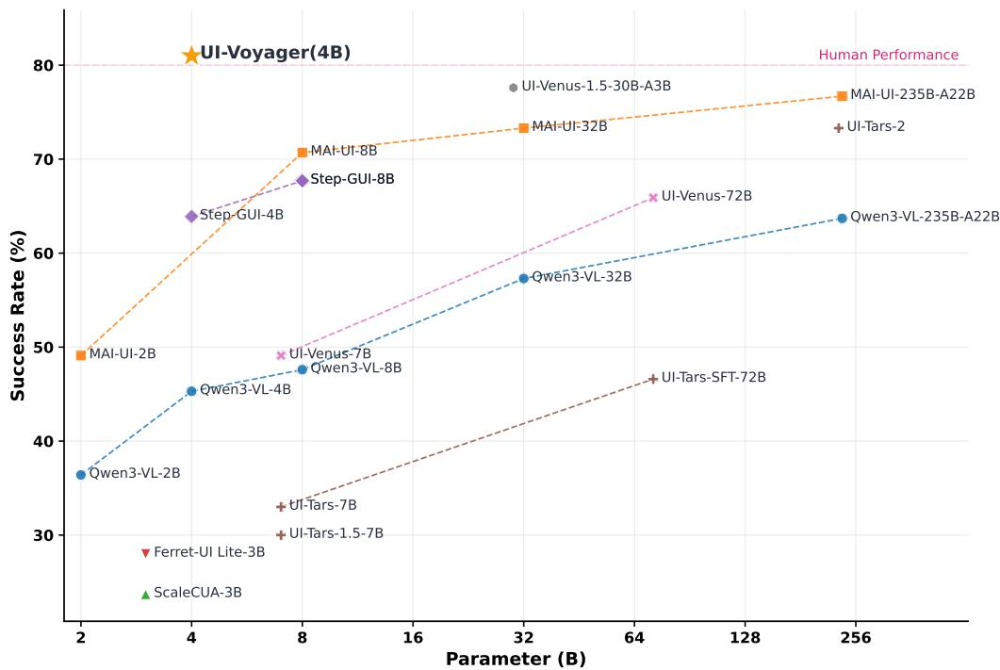
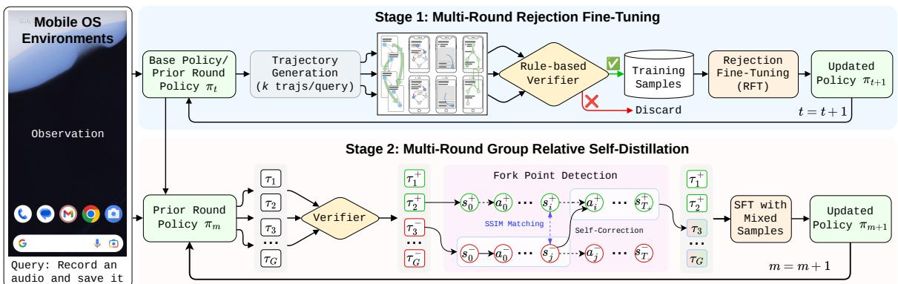
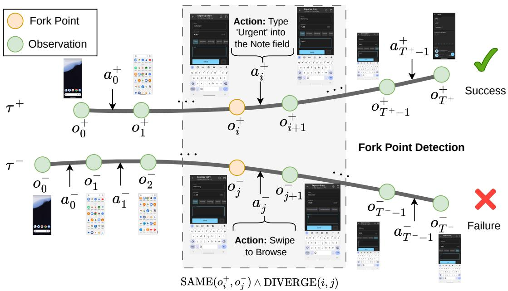
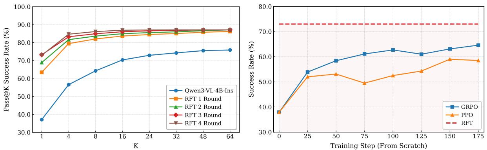
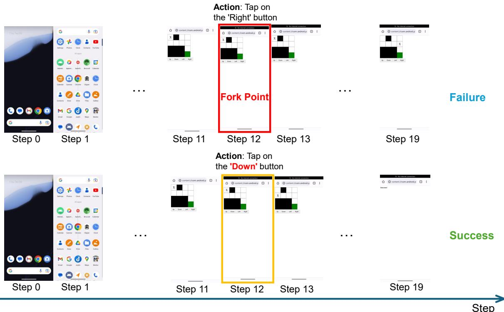
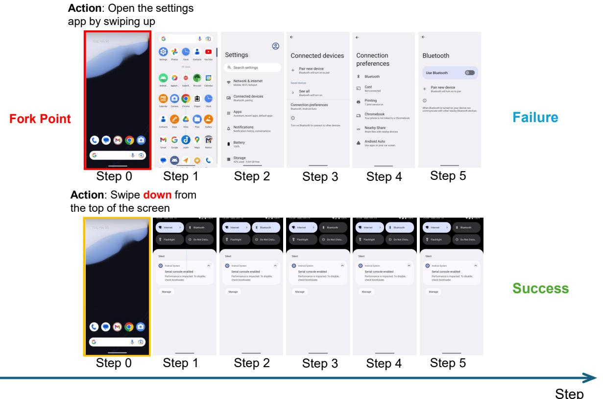
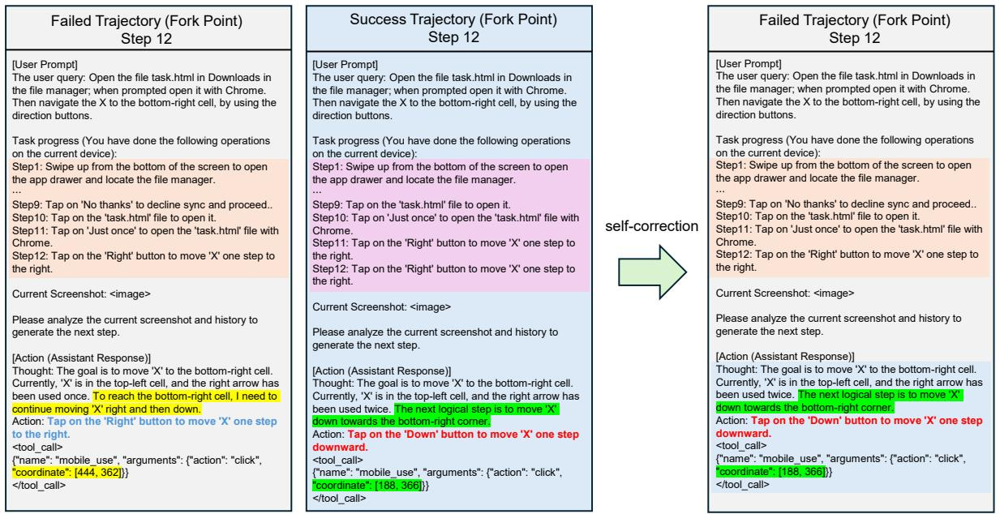
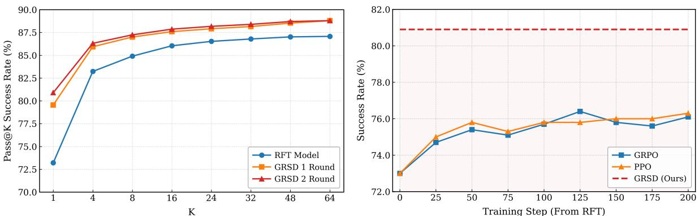
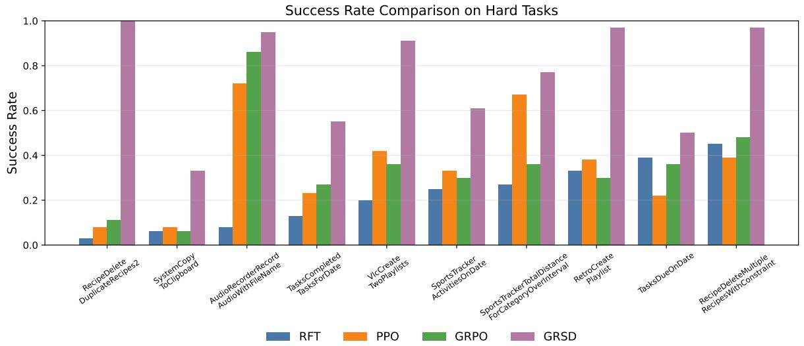

# UI-Voyager: A Self-Evolving GUI Agent Learning via Failed Experience

Zichuan Lin\*\*, Feiyu Liu\*, Yijun Yang\*, Jiafei Lyu\*, Yiming Gao\*, Yicheng Liu\*, Zhicong Lu Yangbin Yu, Mingyu Yang, Junyou Li, Deheng $\mathrm { Y e ^ { \ddag } }$ , Jie Jiang lzcthul2@gmail.com, ydyl1991@gmail.com, zeus@tencent.com Tencent Hunyuan Code and Models: github.com/ui-voyager/ui-voyager

# Abstract

Autonomous mobile GUI agents have attracted increasing attention along with the advancement of Multimodal Large Language Models (MLLMs). However, existing methods still suffer from inefficient learning from failed trajectories and ambiguous credit assignment under sparse rewards for long-horizon GUI tasks. To that end, we propose UI-Voyager, a novel two-stage selfevolving mobile GUI agent. In the first stage, we employ Rejection Fine-Tuning (RFT), which enables the continuous co-evolution of data and models in a fully autonomous loop. The second stage introduces Group Relative Self-Distillation (GRSD), which identifies critical fork points in group rollouts and constructs dense step-level supervision from successful trajectories to correct failed ones. Extensive experiments on AndroidWorld show that our 4B model achieves an $8 1 . 0 \%$ Pass $@ 1$ success rate, outperforming numerous recent baselines and exceeding human-level performance. Ablation and case studies further verify the effectiveness of GRSD. Our method represents a significant leap toward efficient, self-evolving, and high-performance mobile GUI automation without expensive manual data annotation.

  

Figure 1: Performance comparison of various GUI agents on AndroidWorld. Our UI-Voyager (4B) achieves an $8 1 . 0 \%$ Pass $@ 1$ success rate, outperforming larger models and exceeding reported human-level performance.

# 1 Introduction

The uooeratiinteligentgal ystes u s mobi phone,has beeoandg urt and challenge. Some prior agents, like Siri (Apple) and Cortana (Microsoft), can only complete some predefined or simple operations. With the rapid development of Multimodal Large Language Models (MLLMs) (Bai et al, aTe al 0Gue al 02;Yane al 025Coet l 02; Lin et l0 years GUI agents (Denget al 2024 Wang et al, 2024a;Chen etal, 2025b,a; Lu e al 025) havege  a prireowr uidiua-kteigen gent apabl periidsand, planning, reasoning, and operating graphical user interfaces in a fully autonomous manner.

Among various GUI scenarios, mobile interfaces stand out as a representative and challenging domain (Rawles lha 0ue theivr eayots he re ayou an  perliz iteraiosyles  lic wieopevriu aps iput text li visal context, anynaae transitions. It is necessary and meaningul to study mobile GUI agents, considering the growing importance mo honesin people' daily ives. In acttherehave beeumerous rts integrate rong MLLMs in m phoe buil poweuobie GUI aents Xu  al 2025Ye t l 02;Shi al 20;Dai, anl nthere  ral atsevDe phone and using Qwen to order takeout. Despite remarkable progress in general GUI agents, mobile-riented agents soofairayu, undruilizn convential trapipelines whi lmits data efficincy;  migus ceit asst exisgReiorcement Learni RLalgorithsorhe spare eward caseThe carsgrainetrajectory-evel rewars (success/failureobtainefrommobil GUI interactions make the agent incapable identifying which specific step caused task failure, thus hindering stable policy optimization. In   th hal oe    hi woro UI ai   e evolving optization pipelie.In the rst stage, we employ he Rejection Fine-Tuning (RT) sraty, whi itatively collecs, flers anrefe GU nteactiontrajector without manal otation, l atic co-evolutio  both trai dat and model capabilis.In e a sae we dopt he Group Relative Self-Distillation (GRSD) method to alleviate the severe credit assignment issue in long-horizon GUI tasks.GRenti ha states orkpointm grou out nextracts dese ste-evel supeis frosutaorupeilehicectivyepla sarsaecory-vewar prisatarl euheajnmiatehe ss To validate the effectiveness of the proposed u1Voyager framework, we conduct experiments on the Android-World (Rawles et al 2025) benchmark, which features diverse tasks (116 tasks), easy-t-use evaluation protcol, and varying complexities across numerous real-world apps. Empirical results show that our 4B model achieves a Pass $@ 1$ success rate of ${ \bf 8 1 . 0 \% }$ , surpassing all baseline methods and the reported human-level performance o AdroidWorld tasksFurther ablation studies nd case studies confirm thecritialcntributins  te components introduced in Urvoyager. Specifically, we demonstrate how fork point detection works and the effectiveness of GRSD by comparing it against methods like GRPO. These results clearly show that UIVoyager i stronger and more powerful GUI agents.

# 2 Related Work

# 2.1 Interactive Environments

For raini GUI agents, many rearcher resor raini he gentn larcal atatase thatn extensive interaction data collected from real app or web environments (Deng et al., 2023; Rawles et al., 2023; Ch  al  De al 0 Ga al Wa al 0Che l  Su al0 ;uha Th  p  e alHowu l linof research focuses on training and evaluating the GU agent in nteractive environments, whic typicaly incude the GUI interface of the computer desktop or mobile phone, and actions taken in the environment can alter the state (Nguyen t al., 025). There are numerous environments targeting web browsng (Shi t al, 2017; Liu et al., 2018; Mialon et al, 2023; Zhang et al., 2026c), e.g, WebShop (Yao et al., 2022), WebArena (Zhou et al, 2024), VisualWebArena (Koh et al., 2024), WorkArena (Drouin et al., 2024), WebChoreArena (Miyai etal, 205), etc. Some environments like OSWorld (Xie et al., 2024, 2025b), WindowsAgentArena (Bonatti et al., 2024), AStu Zhe  beui rhe puro  u  In theob arealso many existing benchmarks, including Mobile-Env (Zhang et al., 2023) and MobileWorld (Konget al, Theteacivvit  provirwar l wheheask s uully plet Ab R lTi . t ork we  eo R enviroment, which involves 116 diverse and programmatic tasks with varyingcomplexities and optimal interaction steps, making it a challenging benchmark for evaluating the performance of GUI agents.

# 2.2 Interactive Agents

Prior interactive agents are oten emphasized in reinorcement learning (RL) where the agent interacts with the eent ( am (Broan t al 201; Tassa t al 2018;We l202a, 2025a,b, boi t ( al 01 Saval 01;Yan al0 anthe poliy Yanal 01;Li, 020 20; Ly  02, 024a,Earl trials n deveoping theU-eati agent priariy us u H. With the advancement of foundation models, such as ChatGPT (Achiam et al., 2023), DeepSeek-R1 (Guo et al, Qwe (Yanl 02;Wang al 20b; Bai al0, an Gem Te al 023 e large language models (LLMs) and large vision-language models (LVLMs) have led to significant breakthroughs in intent comprehension, multi-modal reasoning, and GUI understandin (Wei et al, 2022b; You et al., 2024; Li 0 Ho l0Zha Li  Liu  Th  y u uitronGU an iheby ve hee ipeode or pa r b fne-tun VLMs or downstre asks (Xiee al 025a; Gu e al., 025 Luet al, 2025; Zhou e al. 02Ye ZH WU in ysers, icld moble phoneYan  al 3;Bishop  al 0; Zhan&Zhang, 20 Dai, Kaa 0eWu el 0Za al0b,a Xieal 202Hu al 0Z e al 202, and desktop web (Zheng et al, 2024a; Koh et al, 2024 Cheng et al 2024; Song et al., 02; Cai ork r interactive agent in AndroidWorld that can efficiently and succesfully solve long-horizon, complex tasks. Toress the credit assmet problem Lu l 026)iheent i on-horizon GUI tasks, rent udi , EvoCUA (Xue et al., 2026) identiy critical forking points and rely on external VLMs to synthesize corretion he lote bas ave a ey models. Different from prior works, we introduce a Group Relative Self-Distillation (GRSD) mechanism that avos oet rstiu o historical context of failed rollouts.

# 3 Method

  

Figure : The whole pipeline of training UIVoyager for mobile GUI tasks. It consists of two iterative sages: (R  a ou a vrier t collect high-quality samples for spervised fine-tuning; () Group Relative Sel-Distiation (GRSD), whic identies "ork points" betwee succesful and file trajectoy groups using SMmatching and cot erronous actions o rthereine te poliy $\pi _ { m }$ through mixed-data training.

# 3.1 Overview

We provide a comprehensive overview f urvoyager, including task formulation, the state and action spaces, and the agent architecture.

Task Formulation In the context of GUI tasks, the interaction is modele as a Partially Observable Markov Decision Process (POMDP) defined by the tuple $( \mathcal { S } , \mathcal { O } , \mathcal { A } , \mathcal { T } )$ . Here, $s$ represents the underlying states, while $\mathcal { O }$ constitutes the observation space, merging visual screenshots with linguistic instructions $\mathcal { T }$ The action space $\mathcal { A }$ epasc mob Utns suc s cick ii an typ as ste Tabl Th transitions are given by $\mathcal { T } : \mathcal { S } \times \mathcal { A }  \mathcal { S }$ . At each step $t$ , the agent determines its next move $a _ { t } = \pi ( \mathcal { T } , o _ { t } , \mathcal { H } _ { t } )$ , where $\mathcal { T }$ is the task instruction, $o _ { t }$ ti $\mathcal { H } _ { t } = ( a _ { t - h } , o _ { t - h } , . . . , a _ { t - 1 } , o _ { t - 1 } )$ denotes the history context of previous actions and observations with window size $h$ Task completion is determined by a durable, rule-based verifier, which assigns a shaped scalar reward $\mathcal { R } : \mathcal { S } \times \mathcal { A }  \mathbb { R }$ by checking application states using the Android Debug Bridge (adb command).

Table 1: Predefined action space of AndroidWorld (Rawles et al., 2025).   

<table><tr><td>Code Actions</td><td>Descriptions</td></tr><tr><td>click(x,y)</td><td>Clicking at coordinates (x, y)</td></tr><tr><td>long_press(x,y)</td><td>Long-pressing at coordinates (x, y )</td></tr><tr><td>swipe(x,Y,x&#x27;,y&#x27;)</td><td>Swiping from (x, y) to (x&#x27;, y′ )</td></tr><tr><td>open_app(app_name)</td><td>Opening an app by name</td></tr><tr><td>input_text(text)</td><td>Typing input text</td></tr><tr><td>keyboard_enter()</td><td>Pressing the Enter key on the keyboard</td></tr><tr><td>navigateback()</td><td>Pressing the system Back button</td></tr><tr><td>navigate_home()</td><td>Pressing the system Home button</td></tr><tr><td>wait()</td><td>Waiting / no-op action (also used for unsupported actions)</td></tr><tr><td>status(goal_status)</td><td>Terminating the episode with status, e.g., success</td></tr><tr><td>answer(text)</td><td>Returning the final answer text</td></tr></table>

Agent Architecture As shown in Fig. 2, UI-Voyager is trained via a two-stage self-evolving optimization pipeline: (1) Rejection Fine-Tuning (RFT), which employs a multi-round rejection sampling mechanism where fivoepdates;and (GrouRelativeDstiin GRD), whicint ean bee cr enabeo transitions and achieve robust policy refinement.

# 3.2 Rejection Fine-Tuning

Slar tret work (an  al2025; Zhou al 202), weply  co-loop el-evolvigtra pipeiclitahemul e raidatnmoeapaili, herproU performance. This pipeline consists of two main modules: Trajectory Generation and Rejection Sampling. Trajctory Generation. To provie divrse and novel task trajectors or both ST and the subsequent GRSD stages, we design a seed task generator that synthesizes novel tasks by perturbing key parameters—such as temporal constraints, qantities, and leenttie—from riginal taskeplates.Given helabor-intensiveaue of human annotation, which is difficult to scale, we rely on GUI agents to automate trajectory synthesis.By combining automated execution in GUI environments with the task generator, we establish a high-throughput pipeline or generating diverse trajectoris. This closed-loop paradigmfosters aco-evolutionary cycl in which model refinements and high-quality data synthesis reinforce each other. Rejection Sampling. After generating diverse raw trajectories, we apply a rejection sampling mechanism to curatea hig-fidelity T dataset.Only uccessful" trajectories—those that either reach the predefined goalr pa sk-ein —aThiso e s heu ntr trajectories and the correctness of individual action steps, resulting in a refined, high-quality SFT corpus. Iterative Training. In the initial iteration, we deploy various scales of the Qwen3-VL series as GUI agents for trajectory generation, using Qwen3-VL-4B-Instruct as the base model for SFT. In subsequent iterations, the mfomhe previus atn erve  heagent neate ewajersThe rajecor r throuh rejection sampling, and the resulting high-quality samples areused to fine-tune the mode for the next rounNotably, each iteration uses new tasks generated by the sed task generator tmaintain novely and prevent overfitting. Empirical Results.This sel-volving aproac creates a synergy between data quality and model capabiliy. Experimental results show that after three iterations, the Pass $@ 1$ score improves significantly from $37 \%$ to $73 \%$ , with consistent gains observed across all Pass $@ \mathrm { K }$ metrics.

# 3.3 Group Relative Self-Distillation

DuL aoR al2024)or Proximal Polic Optimization (PP) (Schulman e al., 017. GR samples a group  resonses $\{ o _ { i } \} _ { i = 1 } ^ { G }$ for each task $q$ andoptimizes the policy via maximizing the ojective below:

$$
\mathcal { I } _ { G R P O } = \mathbb { E } _ { q , o _ { i } } \left[ \frac { 1 } { \sum _ { i = 1 } ^ { G } \left| o _ { i } \right| } \sum _ { i = 1 } ^ { G } \sum _ { t = 1 } ^ { \left| o _ { i } \right| } \operatorname* { m i n } \Bigl ( r _ { i , t } ( \theta ) \hat { A } _ { i , t } , \mathrm { c l i p } \Bigl ( r _ { i , t } ( \theta ) , 1 - \epsilon _ { \mathrm { l o w } } , 1 + \epsilon _ { \mathrm { h i g h } } \Bigr ) \hat { A } _ { i , t } \Bigr ) \right] ,
$$

  

Fgure : Ilustration of the fork point detection strategy. Given  uccessful trajecory $\tau ^ { + }$ and a failed trajectory $\tau ^ { - }$ for heeask ter po teanien estracohee matches that of a successful step $( \mathrm { S A M E } ( o _ { i } ^ { + } , o _ { j } ^ { - } ) ) ,$ but the subsequent action leads to divergence $( \mathrm { D I V E R G E } ( i , j ) )$ , iaha cakeheilajcy  o ule 3.or.

where $\begin{array} { r } { r _ { i , t } ( \theta ) = \frac { \pi _ { \theta } ( o _ { i , t } | q , o _ { i , < t } ) } { \pi _ { \theta _ { o l d } } ( o _ { i , t } | q , o _ { i , < t } ) } } \end{array}$ is the token-level importance sampling ratio, and $\begin{array} { r } { \hat { A } _ { i , t } = \frac { R ^ { ( i ) } - \mathrm { m e a n } ( \{ R ^ { ( i ) } \} _ { i = 1 } ^ { G } ) } { \mathrm { s t d } ( \{ R ^ { ( i ) } \} _ { i = 1 } ^ { G } ) } } \end{array}$ is the oralize vantage. In ntrast   whic elin roup-base atisti  estiate hevne u typically employing GeneralizedAdvantage Estimation (GAE) (Schulman e al., 2015) to achieve a more accurate and variance-reduced estimate of the advantage function. The PPO objective is defined as:

$$
\mathcal { I } _ { P P O } = \mathbb { E } _ { q , o } \left[ \frac { 1 } { | o | } \sum _ { t = 1 } ^ { | o | } \operatorname* { m i n } \Bigl ( r _ { t } ( \theta ) \hat { A } _ { t } ^ { G A E } , \mathrm { c l i p } \Bigl ( r _ { t } ( \theta ) , 1 - \epsilon , 1 + \epsilon \Bigr ) \hat { A } _ { t } ^ { G A E } \Bigr ) \right] ,
$$

where $\begin{array} { r } { r _ { t } ( \theta ) = \frac { \pi _ { \theta } \left( o _ { t } | q , o _ { < t } \right) } { \pi _ { \theta _ { o l d } } \left( o _ { t } | q , o _ { < t } \right) } } \end{array}$ $\hat { A } _ { t } ^ { G A E }$ is te E. However, applyng GRPO/PPO to multi-turn and long-horizon GUI agent training presents afundamental challenge credit assignment. Since the reward $R _ { \mathrm { b a s e } }$ is only assigned at the trajectory level: 1 for success and 0 for failure, and the advantage $\hat { A } _ { i , t }$ is identical for every token within the same trajectory. The agent receives no signal about whic step caused the failureor what action should have been takeninstead In tasks with up to 30 inteactin sehakem 30-step trajectory to receive zero reward, yet the other 29 correct actions also receive zero credit. Key insight. When performing group rollouts for the same task, the $G$ trajectories often visit identical screen states arain stes but divergeue  diffe actionsThee ork pont—where heagent sees hesames but makes a different decision—represent critical moments for step-level corrective supervision.Crucially, the l  h o ev er  neh share the same state and how they diverge, we can extract precise, token-evel supervision without any exteral annotation, as illustrated by Figure 3. We formalize this idea as Group Relative Self-Distillation (GRSD): within each group of $G$ rollouts, the shortest n jeih arjveceleve supison,abin targete sel-coecionGR differ roecent n-poliyistilaion OPD)vnts (Lu & Lab, 2025; Zhang e al, 2026; Zhaoet al, 2026; Xiong et al., 026) i that it enjoy a moe oncse, practialearg parai that does ot depenn any explicttacher poliy nd skilully distis noege from self-generated successful trajectories through SFT.

# 3.3.1 Fork Point Detection

We now describe how to extract step-level supervision from paired trajectories.Given a successful trajectory $\tau _ { . } ^ { + } = \{ ( \varrho _ { . } ^ { + } , a _ { 0 } ^ { + } ) , \dots , ( o _ { T ^ { + } } ^ { + } , a _ { T ^ { + } } ^ { + } ) \}$ and a failed trajectory $\tau ^ { - } \stackrel { . } { = } \{ ( o _ { 0 } ^ { - } , \stackrel { . } { a } _ { 0 } ^ { - } ) , \ldots , ( o _ { T ^ { - } } ^ { - } , a _ { T ^ { - } } ^ { - } ) \}$ for the same task, where $o _ { t }$ is the screen observation (screenshot) and $a _ { t }$ is the action taken at step $t$ our goal is to find fork points: u yet chose a different—and ultimately wrong—action. Cross-Trajectory State Matching. We define an observation equivalence function to determine whether two screenshots depic he same creen stateWhile pretrain visin encoder could in principle, be use to cu cosi similarity between visual embeddings, we opt or a more practical approach: Structural Similarity Index (SM) Bru  al 1T elerat ouai, ea sensho is rscope  emov fxe zoys  qic obviously dissimilar pairs (hash similarity below 0.80) before the more expensive SSIM computation:

$$
\mathrm { S A M E } \big ( o _ { a } , o _ { b } \big ) = \mathbb { 1 } \big [ \mathrm { S S I M } \big ( \phi \big ( o _ { a } \big ) , \phi \big ( o _ { b } \big ) \big ) \geq \theta \big ] ,
$$

where $\phi ( \cdot )$ denotes the crop-resize-grayscale preprocessing pipeline and $\theta$ is the similarity threshold. Transition Alignment Before matching a teacher step for failed step $j$ , we perform a transition-alignment check: ithee exits esul $i$ such that $\mathbf { S } \mathbf { A M E } \big ( o _ { i } ^ { + } , o _ { j } ^ { - } \big )$ and $\mathbf { S } \mathbf { A M E } ( o _ { i + 1 } ^ { + } , o _ { j + 1 } ^ { - } )$ , we treat the trajectory prefixes as aligned. In this case, we skip failed step $j$ and advance the minimum successful index to $i _ { \mathrm { m i n } }  i + 1$ for all subsequent failed steps $j ^ { \prime } > j$ Teacher Step Selection. For each remaining failed step $j$ , we search over successful steps $i \geq i _ { \operatorname* { m i n } }$ to find the best teacher step, subject to two conditions: (1) observation equivalence (i.e., $\mathbf { S } \mathrm { A M E } \big ( o _ { i } ^ { + } , o _ { j } ^ { - } \big ) \big )$ ; and (2) transition divergence:

$$
\begin{array} { r } { \mathrm { D I V E R G E } ( i , j ) = \left\{ \begin{array} { l l } { \mathbf { t r u e } } & { \mathrm { i f } \ i = T ^ { + } \ \mathrm { o r } \ j = T ^ { - } } \\ { \mathbf { t r u e } } & { \mathrm { i f } \ \mathrm { S S I M } ( \phi ( o _ { i + 1 } ^ { + } ) , \phi ( o _ { j + 1 } ^ { - } ) ) < \theta } \\ { \mathbf { f a l s e } } & { \mathrm { o t h e r w i s e } } \end{array} \right. } \end{array}
$$

j avseuend lsa earen e considered to have the same effect and the pair is discarded as uninformative. Among all qualifying teacher step candidates $\mathcal { C } ( j )$ , we select the one with the highest SSIM score, breaking ties by preferring the smallest successful-step index:

$$
i ^ { * } ( j ) = \arg \operatorname* { m a x } _ { i \in \mathcal { C } ( j ) } \left( \operatorname { S S I M } ( \phi ( o _ { i } ^ { + } ) , \phi ( o _ { j } ^ { - } ) ) , - i \right) .
$$

$j$ i o  sul $i ^ { * } ( j )$ , any subsequent failed step $j ^ { \prime } > j$ can only match successful steps $i \geq i ^ { * } ( j )$ . This preserves the temporal ordering betehewoacor event pthogi etei e ap aru stes. Eacfail eatea os l sep, utheul ste may ev e for multiple failed steps. Figur prent he enal lstrati  therk po dtect Not that he ork podetein ea can also be extended to the language-only scenarios (e.g., observation $o$ is the text. We can discard $\phi ( \cdot )$ and directly compute $\mathrm { S I M } \big ( o _ { i } ^ { + } , o _ { j } ^ { - } \big )$ , where $\operatorname { S I M } ( \cdot , \cdot )$ is the similarity measure). Algorithm 1 summarized the fork point detection mechanism.

# 3.3.2 Step-Level Self Distillation

For each identified fork point $\left( j , i ^ { * } ( j ) \right)$ (icluding its contextual history at step $j )$ and replacing the response with the successful trajectory's response at step $i ^ { * } ( j )$ .

$$
\begin{array} { r } { \mathbf { x } _ { j } ^ { \mathrm { t r a i n } } = [ \underbrace { \mathrm { p r o m p t } _ { j } ^ { - } } _ { \mathrm { f a i l e d - c o n t e x t ~ p r o m p t } } | \underbrace { \mathrm { r e s p o n s e } _ { i ^ { * } ( j ) } ^ { + } } _ { \mathrm { c o r r e c t ~ a c t i o n } } | . } \end{array}
$$

The trainijectivs thestandarautoeressivenext-token predictionloss compute only verthe rens tokens:

$$
\mathcal { L } _ { \mathrm { G R S D } } = - \frac { 1 } { \left| \mathcal { D } \right| } \sum _ { \mathbf { x } \in \mathcal { D } } \frac { 1 } { T _ { \mathbf { x } } } \sum _ { t = 1 } ^ { T _ { \mathbf { x } } } \log \pi _ { \theta } ( y _ { t } \mid s _ { 1 } , \ldots , s _ { P _ { \mathbf { x } } } , y _ { < t } ) ,
$$

# Algorithm 1 Fork Point Detection

Require: Successful trajectory $\tau ^ { + }$ , failed trajectory $\tau ^ { - }$ , threshold $\theta$

Ensure: Fork point set $\mathcal { M }$   
1: $\mathcal { M }  \emptyset$ $i _ { \mathrm { m i n } } \gets 0$   
2: for $j = 0$ to $T ^ { - }$ do   
3: if $\exists i \geq i _ { \mathrm { m i n } }$ s.t. $\mathbf { S } \mathbf { A M E } \big ( o _ { i } ^ { + } , o _ { j } ^ { - } \big )$ and $\mathbf { S } \mathrm { A M E } ( o _ { i + 1 } ^ { + } , o _ { j + 1 } ^ { - } )$ then   
4: $i _ { \mathrm { m i n } }  i + 1$   
5: continue   
6: $\mathcal { C } ( j ) \gets \{ i \geq i _ { \mathrm { m i n } } ~ | ~ \mathrm { S A M E } \big ( o _ { i } ^ { + } , o _ { j } ^ { - } \big ) \wedge \mathrm { D I V E R G E } \big ( i , j \big ) \}$   
7: if $\mathcal { C } ( j ) = \mathcal { D }$ then   
8: continue   
9: $\begin{array} { r l } & { i ^ { * } ( j )  \arg \operatorname* { m a x } _ { i \in \mathcal { C } ( j ) } ( \mathrm { S S I M } ( \phi ( o _ { i } ^ { + } ) , \phi ( o _ { j } ^ { - } ) ) , - i ) } \\ & { \mathcal { M }  \mathcal { M } \cup \{ ( j , i ^ { * } ( j ) ) \} } \\ & { i _ { \operatorname* { m i n } }  i ^ { * } ( j ) } \end{array}$   
10:   
11:   
12: return M Transition Alignment Teacher Step Selection where $\mathcal { D }$ is the set of constructed samples, $s _ { 1 : P _ { \mathbf { x } } }$ are prompt tokens, $y _ { 1 : T _ { \mathbf { x } } }$ are response tokens, and $P _ { \mathbf { x } }$ and $T _ { \mathbf { x } }$ are prompt and response lengths, respectively. In rexperents, we us GRSD as the ole trai bjective, replac GRPO and PPO This reflcts he it that or compex muli-step GUI tasks, prece step-level el-distillatin rom ucessul pee ismoreeive than trajectory-level advantage estimation with sparse rewards.

# 4 Experiment

# 4.1 Experimental Setup

Implementation details UI-Voyager uses Qwen3-VL-4B-Instruct (Bai et al., 2025a) as the backbone. We evaluate on a popularly used Mobile GUI benchmark: AndroidWorld (Rawles et al., 2025), which comprises 116 diverse tasks across real-world mobile applications with varying complexity levels. AndroidWorld provides ranmizlizti pareter wh enable heerationarumberrai sk wi v rewards by replacing predefined substitutable components in the tasks and by varying the initial device states. During training, we follow MobileRL (Xu et al., 2025) and employ training sets from AndroidWorld, consisting over 7000 tasks. Basles Our baselnes include both closeand pen-sour aents n model, including Qwen-L ser (Bai e al 2025a UI-Tars (Qin et al 2025;See 202 MAI-U Zho  al, 025a Step-GUI Yan et al , MoAgent(Xu eal 2026;Ye al 025), SeeL seriGuet al 202b; See 2025a, GeiDeMi, 2025), U1-Venus (Gu et al., 2025; Gao et al., 2026), ScaleCUA (Liu et al., 2025).

# 4.2 Main Results

We report the pass $@ 1$ success rate and compare with a wide range of baseline models, including general-purpose VLMs (e.g., Qwen3-VL series), specialize GUI agents (e.g., UI-Tars, GUI-Owl, Step-GUI, MAI-UI, UI-Venus), and large-scale proprietary models (e.g., Gemini-2.5-Pro, Seed1.8).

As shown in Table 2, UI-Voyager (4B) achieves $8 1 . 0 \%$ success rate, outperforming all baseline methods and surpassing the reported human-level performance of $8 0 . 0 \%$ on AndroidWorld. Notably, our model achieves this with only 4B parameters, demonstrating superior effciency compared to much larger models such as MAI-UI-235B-A22B $( 7 6 . 7 \% )$ , UI-Tars-2 $( 7 3 . 3 \% )$ , and Qwen3-VL-235B-A22B $( 6 3 . 7 \% )$ . Even among models of comparable size, our approach significantly exceeds Step-GUI-4B $( 6 3 . 9 \% )$ and Qwen3-VL-4B $( 4 5 . 3 \% )$ , highlighting the effectiveness orrain mwork.To ensurereroucibiliy, we report he averae ucs rat oyagr vr independent runs with randomized task parameters, whereas baseline results are taken from prior papers. These results demonstrate that Uvoyager, through its fork point detection and self-distillation mechanisms, efectivelyadresse the creit assimen challengein ong-horizon GUI agent learnigenabling compac 4B model to achieve superior performance on AndroidWorld.

<table><tr><td>MODEL</td><td>#PARAMS</td><td>Success Rate</td></tr><tr><td>Baselines</td><td></td><td></td></tr><tr><td>Qwen3-VL-2B (Bai et al., 2025a)</td><td>2B</td><td>36.4</td></tr><tr><td>MAI-UI-2B (Zhou et al., 2025b)</td><td>2B</td><td>49.1</td></tr><tr><td>ScaleCUA-3B (Liu et al., 2025)</td><td>3B</td><td>23.7</td></tr><tr><td>Ferret-UI Lite-3B (Yang et al., 2025c)</td><td>3B</td><td>28.0</td></tr><tr><td>Qwen3-VL-4B (Bai et al., 2025a)</td><td>4B</td><td>45.3</td></tr><tr><td>Step-GUI-4B (Yan et al., 2025b)</td><td>4B</td><td>63.9</td></tr><tr><td>UI-Tars-7B (Qin et al., 2025)</td><td>7B</td><td>33.0</td></tr><tr><td>UI-Tars-1.5-7B (Seed, 2025b)</td><td>7B</td><td>30.0</td></tr><tr><td>UI-Venus-7B (Gu et al., 2025)</td><td>7B</td><td>49.1</td></tr><tr><td>GUI-Owl-7B (Ye et al., 2025b)</td><td>7B</td><td>66.4</td></tr><tr><td>Step-GUI-8B (Yan et al., 2025a)</td><td>8B</td><td>67.7</td></tr><tr><td>Qwen3-VL-8B (Bai et al., 2025a)</td><td>8B</td><td>47.6</td></tr><tr><td>MAI-UI-8B (Zhou et al., 2025b)</td><td>8B</td><td>70.7</td></tr><tr><td>Step-GUI-8B (Yan et al., 2025b)</td><td>8B</td><td>67.7</td></tr><tr><td>GUI-Owl-1.5-8B-Thinking (Xu et al., 2026)</td><td>8B</td><td>71.6</td></tr><tr><td>UI-Venus-1.5-30B-A3B (Gao et al., 2026)</td><td>30B</td><td>77.6</td></tr><tr><td>Qwen3-VL-32B (Bai et al., 2025a)</td><td>32B</td><td>57.3</td></tr><tr><td>MAI-UI-32B (Zhou et al., 2025b)</td><td>32B</td><td>73.3</td></tr><tr><td>UI-Tars-SFT-72B (Qin et al., 2025)</td><td>72B</td><td>46.6</td></tr><tr><td>UI-Venus-72B (Gu et al., 2025)</td><td>72B</td><td>65.9</td></tr><tr><td>Seed1.5-VL (Guo et al., 2025b)</td><td>-</td><td>62.1</td></tr><tr><td>UI-Tars-2 (Wang et al., 2025)</td><td>230B</td><td>73.3</td></tr><tr><td>Qwen3-VL-235B-A22B (Bai et al., 2025a)</td><td>235B</td><td>63.7</td></tr><tr><td>UI-Tars-1.5 (Seed, 2025b)</td><td></td><td>64.2</td></tr><tr><td>Gemini-2.5-Pro (DeepMind, 2025)</td><td></td><td>69.7</td></tr><tr><td>Seed1.8 (Seed, 2025a)</td><td>-</td><td>70.7</td></tr><tr><td>MAI-UI-235B-A22B (Zhou et al., 2025b)</td><td>235B</td><td>76.7</td></tr><tr><td>Human (Rawles et al., 2025)</td><td></td><td>80.0</td></tr><tr><td>Ours</td><td></td><td></td></tr><tr><td>UI-Voyager</td><td>4B</td><td>81.0</td></tr></table>

  

Table 2: Performance comparison on AndroidWorld Benchmark. Best results are in bold, and second-best results are underlined. u1-Voyager achieves an $8 1 . 0 \%$ success rate, surpassing all baseline methods and the reported human-level performance of $8 0 . 0 \%$ . Notably, our model achieves superior results with only 4B parameters, at  r   e.  bliy r success rate over 64 random seeds, whereas baseline results are taken from prior papers.   

Figure 4: RFT significantly boosts agent performance. Left: Pass $@ \mathrm { K }$ performance across four iterative rounds of RFT. The results show consistent improvement in both $\mathrm { P a s s } @ 1$ and Pass $@ \mathbf { k }$ as the self-evolution progresses. We select the checkpoint from the third RFT round $( \mathrm { P a s s } @ 1 = 7 3 . 2 \% )$ for subsequent training. Right: Training curves of GRPO and PPO initialized from Qwen3-VL-4B-Instruct. The results show that directly deploying RL algorithms from Qwen3-VL-4B-Instruct model yelds marginal gains and exhibits high sample ineffciency.

# 4.3 Analysis

In this part, we provide some case studies on the algorithmic components in voyager, including fork point detcion an el-corective samples.The analysis ca provi more insights andhelp better understan the effectiveness of our propsoed ur-voyager framework. the bottom-right cell, by using the direction buttons.

  
Fur Example rk poi detection n BrowserMaze askBoth faileand uccesful trajectoris hare the e atet te or point.The ailjeytakesaval Ritac locke by l, whle theesu trajectrytakes he c "own"actThe ork poi dtectnmeani eni

Rejection Fine-Tuning RFT exhibits a robust and consistent capability to enhance agent performance through vzasllragurLehe w-LB-Instmo hobsan in both $\mathrm { P a s s } @ 1$ and $\mathrm { P a s s } @ \mathrm { k }$ metrics across four rounds of RFT. Notably, it demonstrates continued, steady im-ha heol o GRPO and PPO when initialized directly from the Qwen3-VL-4B-Instruct model. Both RL methods exhibit slow performance improvements, taking approximately 175 steps to reach the performance of a single RFT iteration $( 6 4 . 0 \% )$ . These results suggest that directly applying RLVR training from the base model is highly inefficient, hilighting theportancef usingRFT as a reliable nitialization strategy—providingnecessary warart for mastering complex, long-horizon agentic tasks. We adopt the model from the third iteration $( \mathrm { P a s s } @ 1 = 7 3 . 2 \% )$ as the foundation for subsequent agentic multi-turn RL training (GRPO and PPO) and our proposed GRSD. Fo Poin Deon T itively vliate he uinality an praial valu hork poit dn mechanism, we demonstrate how it works by visualizing successful and failed trajectories of two representative tasks in AndroidWorld, BrowserMaze and ystemBluetoothTurnOff, as depicted in Figure 5 and 6, respectively. Thzatuptuilivet toy illustrating how our method identifies shared screen states and corrects erroneous actions at key states. To be speci,n theBrorMaze ask (Figur), both the aileansul trajectori share nin a  Tsi o" action at Step 12 and ends u copleting the task. By identiying this fork point Step 12, our ethod a eoavaskhn and hence improving the task success rate. Anoi is hat e ork poit can e he tat e il sa o SseBluetothTurnOf task (Figure ), the ork pont ccrs at Ste 0, whe both trajecrs art om the o reeThefairacotes toen e   war wipe w suul trajcoyuseoar ie en heoathad ndcche quic ettFo v oha <User query> Turn bluetooth off.

  

Figure 6: Example of fork point detection on SystemBluetoothTurnOff task. The fork point occurs at Step l sat h a aro  om Te i j ttt the etti p wanc war swipe while heul trajey use  downwar swipe the otti hadeanc quc tts. Forkpoin deteonens this itl diveren, pri corrective supervision at the very first step.

eae sratehat he or po detemeanis bot esar  ecivey aroi trajectories and for providing dense, step-level supervision for mobile GUI agent training.

Sel-Corrective Sample We now demonstrate how UI-Voyager performs self-correction at those fork points. Weusehe BroMaz asks theexame, wit salizuceu andilout hown The ork po curs a Ste  where both th ful an ail tjers hare he am cee sa u ve eco i failed trajectory, the agent incorrectly reasons that "To reach the bottom-right cell, I need to continue moving $\mathbf { \nabla } ^ { \prime } X ^ { \prime }$ rndthendown"nd taps he Rih"uttn—anvamoveblocke by  walIn ctrast, te u trajectory correctly reasons that "The next logical step is to move $\mathbf { \delta } ^ { \prime } X ^ { \prime }$ down towards the bottom-right corner" and tak e "oy heik  he n nd h ol , vhaijiaT ni o capability without expensive human annotations. Comparison with RL Methods We evaluate the performance of GRSD against GRPO and PPO. The results are presented in Fig. 8. We find that while all methods originate from the same RFT model with $7 3 . 2 \%$ success rate, GRSD significantly boosts success rate to $81 \%$ , whereas GRPO and PPO exhibit sluggish progress and eventually plateau at $76 \%$ This substantial performance gap stems from two primary limitations in standard RL baselines: frst, the lackanefecivcredi sstmeanimn-horion GU agent task sreheenti cleerst improvement. In contrast, GRSD leverages precise fork point detection to pinpoint decisive actions and employs self-distillation for rapid error correction, thereby facilitatinga highly effective self-evolution process. Eies  R T valua whether RS canctel lea rom falure trajr, wel reretaivask wherehebasei moe xhibi e w  at ilstrate Fi o

  
rati iplBular stateat Step 2 fork point).The aildtrajectory coecy takes the "Right"aci with fawreasni need to continue moving $\mathbf { \hat { x } } ^ { \prime }$ right and then down"), while the successful trajectory correctly takes the "Down" action with proper reasoning ("The next logical step is to move $\mathbf { \delta } ^ { \ast } \mathbf { X } '$ down towards the bottom-right corner"). Fork pua trajectories into high-quality supervised data.

  

Figure 8: Training performance comparison of GRSD, GRPO, and PPO. All methods start from the same RFT model with $7 3 . 2 \%$ success rate. GRSD successfully boosts the agent's Pass $@ 1$ performance to $81 \%$ (Left), while GRPO and PPO show slower progress and plateau around $76 \%$ (Right). The results demonstrate that GRSD's fork point detection and sel-corection mechanisms enable more effectiv learning compared to standard RL baselines.

PPO and GRPO struggle to achieve significant performance gains on these challenging tasks. This stagnation is praryuth carciyulsampduriexplratncoupl with hesencrous assmet nd errorcorecion ehaniss  critialdecisn points Incntrast,GRident pivotal d junuihlraornvercerpart ro -istillaiThi unllyhepesk capability even in sparse-reward environments.

# 5 Discussion

Real-time execution and SSIM-based matching. Following AndroidEnv (Toyama et al., 2021), mobile GUI inteacion herently syncronousservationsaretreameat  devidependenframe rateact eyn f -aseork-poi detectio  two ajo waysirst, tmpoalmismewotraje m n he  au   t , keyboard transions, or lading), whic can lower SM and lead tomisse matches.Secnd, tansint visal peturanai wietsu ascur blinki tasotatis prore dicatoran clocupdat alte local pixels witout changinghe sman state, irducg noisy hig-SMor owSM pairs.There, under streaming observations, SSM should be treated as a strong but imperfect proxy for state equivalence.

  

Figure 9: Performance comparison of GRSD, GRPO, and PPO on ten representative low-success-rate tasks. GRSD consistently achieves the highest success rate across all tasks, significantly outperorming both PPO and GRPO. In cntrast, PO nd GRPOstrumakesusanal ais ue thearcy eu sam t lac edi asset eanis. The eult strate hat R ables effnt from failed trajectories even in sparse-reward environments.

Praccal implications for G.A pracical direion is to akemathingexplicitlytimeawae ratheha relying o single-frame comparison.Concretely, instead of matching one failed frame to one successfulrame, we can match over a short temporal window and keep the best candidate, optionally with temporal smoothness constraints across neighboring steps.We can further reduce noise by masking high-variance U regions (.g, stat bar, keyboard pop-ups, ansntoverays an cbin wih htweht rcturesals uc OCR/layout tokens  sibiliy-rees.Theditis ee themeho whipoioe t   un deployment settings. Lmaction spnother pracialmto s he prefi actin spaceuseAdroiWorl a. Whi ig-evel riiive  cickwie, type and navigati ctinmakedateeratnanver tractable, they abstract away low-level touch dynamics emphasized by AndroidEnv (Toyama et al., 2021), where raw interactions are continuous and asynchronously interpreted by the OS. This abstraction reduces exploration iul pva abiy  mont o o lat duratntrajector hape reseimanactatoiCnseueny, polctrainmit sp an be lessrobust when tranerre to settings withfinerrai controls or diferent action wrappers. A proisingdirection is hierarchical actnmodeling: retain hig-evel actions or sample-cient learin, hen introduce low-level gestures and perturbations during post-training to improve transfer robustness.

# 6 Conclusion

In this paper, we address two critial challenges in obile GUI agent training: inefficient learing rom ild trajectories and ambiguous credit assignment under sparse rewards.As a result, we propose Uvoyager trained by a two-stage self-evolving framework consisting of Rejection Fine-Tuning (RFT) and Group Relative Self-Distillation (GRSD). RFT enables automatic datamodel co-evolution, while GRSD leverages fork point detection torovdense p-evel spevisnomsesurajectorisExeenta results n1AndroidWorask show that our 4B model achieves an $8 1 . 0 \%$ pass $@ 1$ success rate across 116 AndroidWorld tasks, outperforming all baselines (with larger model sizes) and human-level performance.Ablation and case studies validate the eivenes  ur or dess.orue work it would b teesti  extend theoyorkt other GUI tasks (we ny consider AndroidWorld in this work), exploremoreadaptivereasoning and sel-coen mechanisms, and further improve the efficiency and robustness of mobile GUI agents in real-world scenarios.

References   
Josh Abramson, Arun Ahuja, Federico Carnevale, Petko Georgiev, Alex Goldin, Alden Hung, Jessica Landon, Timothy Lillicrap, Alistair Muldal, Blake Richards, et al.Evaluating multimodal interactive agents.arXiv preprint arXiv:2205.13274, 2022.   
Josh Achiam, Steven Adler, Sandhini Agarwal, Lama Ahmad, Ilge Akkaya, Florencia Leoni Aleman, Diogo Almeida, Janko Altenschmidt, Sam Altman, Shyamal Anadkat, et al. Gpt-4 technical report. arXiv preprint arXiv:2303.08774, 2023.   
Shuai Bai, Yuxuan Cai, Ruizhe Chen, Keqin Chen, Xiong-Hui Chen, Zesen Cheng, Lianghao Deng, Wei Ding, Rongyao Fang, Chang Gao, Chunjiang Ge, Wenbin Ge, Zhifang Guo, Qidong Huang, Qidong Huang, Fei Huang, Binyuan Hui, Shutong Jiang, Zhaohai Li, Mingsheng Li, Mei Li, Kaixin Li, Zicheng Lin, Junyang Lin, Xuejing Liu, Jiawei Liu, Chenglong Liu, Yang Liu, DayihengLiu, Shixuan Liu, Dunje Lu, Ruilin Luo, Chenxu Lv, Rui Men, Li Ying Meng, Xuancheng Ren, Xin yi Ren, Sibo Song, Yu chen Sun, Jun Tang, Jianhong Tu, Jianqiang Wan, Peng Wang, Pengfei Wang, Qiuyue Wang, Yuxuan Wang, Tianbao Xie, Yihe Xu, Haiyang Xu, Jin Xu, Zhibo Yang, Mingkun Yang, Jianxin Yang, An Yang, Bowen Yu, Fei Zhang, Hang Zhang, Xi Zhang, Botao Zheng, Humen Zhong, Jingren Zhou, Fanxi Zhou, Jingren Zhou, Yuanzhi Zhu, and Keming Zhu. Qwen3-vl technical report. ArXiv, abs/2511.21631, 2025a.   
Shuai Bai, Keqin Chen, Xuejing Liu, Jialin Wang, Wenbin Ge, Sibo Song, Kai Dang, Peng Wang, Shijie Wang, Jun Tang, et al. Qwen2. 5-vl technical report. arXiv preprint arXiv:2502.13923, 2025b.   
WilliBishop, Alice Li Cristopher Rawles, and OrianaRivLatent state stimatin helps i agents eas arXiv preprint arXiv:2405.11120, 2024.   
RogriBonatt Dan Zhao, FrancecBonaci DillonDupont, SaraAbdali, Yinhen Li, Yadong Lu, Justi Wagle, Kauhito Koishida Arthur Bucker, e al.Windows agen aren:Evaluatig multi-odal s agents at scaleriv preprint arXiv:2409.08264, 2024.   
Greg Brockman, Vicki Cheung, Ludwig Pettersson, Jonas Schneider, John Schulman, Jie Tang, and Wojciech Zaremba. Openai gym. arXiv preprint arXiv:1606.01540, 2016.   
Dominiqu Brunet, Edward R Vrscay, and Zho Wang. On the matheatical properties of the sructural siilarty index. IEEE Transactions on Image Processing, 21(4):14881499, 2011.   
Hongru Cai, Yongqi Li, Wenjie Wang, Fengbin Zhu, Xiaoyu Shen, Wenjie Li, and Tat-Seng Chua. Large language models empowered personalized web agents. In Proceedings of the ACM on Web Conference 2025, pp. 198215, 2025.   
Su Cao, Hanging Chen, PengChen, Yiji Cheng, Yutao Cui, Xinchi Deng, Yi Dong, K.Gong, Tianpeng Gu, Xiusen Gu, Tiankai Hang, Duojun Huang, Jie Jiang, Zhengkai Jiang, Weijie Kong, Changlin Li, Donghao Li, Junzhe Li, Xin Li, Yang Li, Zhenxi Li, Zhimin Li, Jiaxin Lin, Linus, Lu-Hao Liu, Shu Liu, Songtao Liu, Yu Liu, Yuhong Lu, Yanxin Long, Fanbin Lu, Qinglin Lu, Yuyan Peng, Yuanbo Peng, Xiang-Yu Shen, Yi-Ping Shi, Jiale Tao, Yang-Dan Tao, Qianhui Tian, Pengfei Wan, Chunyu Wang, Kai Wang, Lei Wang, Linqing Wang, Lucas Wang, Qixun Wang, Weiyang Wang, Hao Wen, Bing Wu, Jianbing Wu, Yue Wu, Senhao Xie, Fangzhou Yang, Miles Yang, Xiaofeng Yang, Xuan Yang, Zhantao Yang, Jingmiao Yu, Zhengang Yuan, Chao Zhang, Jianwei Zhang, Pei pei Zhang, Shixiong Zhang, Tao Zhang, Weigang Zhang, Yepeng Zhang, Yingfang Zhang, Zihao Zhang, Zijian Zhang, Penghao Zhao, Zhiyuan Zhao, Xuefei Zhe, Jian-Xiang Zhu, and Zhao Zhong. Hunyuanimage 3.0 technical report. ArXiv, abs/2509.23951, 2025.   
Yuxiang Chai, Siyuan Huang, Yazhe Niu, Han Xiao, Liang Liu, Guozhi Wang, Dingyu Zhang, Shuai Ren, and HonshengLiAmex:Androidmult-anotation expodataset or mobile gui agents. In Finding of the Assotin for Computational Linguistics: ACL 2025, pp. 21382156, 2025a.   
Yuxiang Chai, Shunye Tang, Han Xiao, Weifeng Lin, Liang Liu, Hanho Li, Jiayu Zhang, Pengxiang Zhao, Guangyi Liu, Rongduo Han, Guozhi Wang, Shuai Ren, Siyuan Huang, and Hongsheng Li. A3: Android agent arena for mobile GUI agents, 2025b. URL https://openreview.net/forum?id=zE2tVigoub.   
Dongping Chen, Yue Huang, Siyuan Wu, Jingyu Tang, Huichi Zhou, Qihui Zhang, Zhigang He, Yilin Bai, Chujie Gao, Liuyi Chen, Yiqiang Li, Chenlong Wang, Yue Yu, Tianshuo Zhou, Zhen Li, Yi Gui, Yao Wan, Pan Zhou, Jianfeng Gao, and Lichao Sun. GUI-world: A video benchmark and dataset for multimodal GUIoriented understanding. In The Thirteenth International Conference on Learning Representations, 2025a. URL https://openreview.net/forum?id=QarKTT5brZ.   
Wentong Chen, Junbo Cui, Jinyi Hu, Yujia Qin, Junjie Fang, Yue Zhao, Chongyi Wang, Jun Liu, Guiron Chen, Yupeng Huo, et al. Guicourse: From general vision language model to versatile gui agent. In Proceedings l  oL 2193621959, 2025b. Kanzhi Cheng, Qiushi Sun, Yougang Chu, Fangzhi Xu, Li YanTao, Jianbing Zhang, and Zhiyong Wu. Seeclick: Harnessing gui grounding for advanced visual gui agents. In Proceedings of the 62nd Annual Meeing of the Association for Computational Linguistics (Volume 1: Long Papers), pp. 93139332, 2024. Ge Dai, Shiqi Jiag, Ti Co, Yuncun Li, YuqiYng, Rui Tan, Mo Li, and Lili QAvan moi ui agents: A verifier-driven approach to practical deployment. arXiv preprint arXiv:2503.15937, 2025. Google DeepMind. Gemini 2.5 pro. https: / /deepmind.google/models/gemini/pro/, 2025. Xiang Deng, Yu Gu, Boyuan Zheng, Shijie Chen, Samuel Stevens, Boshi Wang, Huan Sun, and Yu Su. Mind2web: Towards a generalist agent or the web. In Thirty-seventh Conferenceon Neural Information rocessing Systems Datasets and Benchmarks Track, 2023. URL https: / /openreview. net/ forum?id $\underline { { \underline { { \mathbf { \Pi } } } } } =$ kiYqb03wqw. Yang Deng, Xuan Zhang, Wenxuan Zhang, Yifei Yuan, See Kiong Ng, and Tat-Seng Chua. On the multi-turn instruction followin or conversational web agents. In Proceeding ofthe 62nd Annal Meeting oftheAsstn for Computational Linguistics (Volume 1: Long Papers), pp. 87958812, 2024. Alexandre Drouin, Maxime Gasse, Massimo Caccia, Issam H. Laradji, Manuel Del Verme, Tom Marty, David Vazquez, Nicolas Chapados, and Alexandre Lacoste. WorkArena: How capable are web agents at solving common knowledge work tasks? In Proceedings of the 41st International Conference on Machine Learning, volume 235 of Proceedings of Machine Learning Research, pp. 1164211662. PMLR, 2127 Jul 2024. URL https://proceedings.mlr.press/v235/drouin24a.html. ChangongGao, Zhangxuan Gu, Yulin Liu, Xinyu Qu, Shuheg Shen, Yue Wen, Tianyu Xia, Zhenyu Xu, Zhengwen Zeng, Beitong Zhou, et al. Ui-venus-1.5 technical report. arXiv preprint arXiv:2602.09082, 2026. Lonxi Gao, Li Zhang, Shihe Wang, Shangguang Wang, Yuanchun Li, and Mengwei Xu. Mobileviews: A large-scale mobile gui dataset. arXiv preprint arXiv:2409.14337, 2024. Zhangxuan Gu, Zhengwen Zeng, Zhenyu Xu, Xingran Zhou, Shuheng Shen, Yunfei Liu, Beitong Zhou, Changhua Me Tianyu Xia, Weizhi Chen, e al.Ui-venus technil report:Building high-performancui agents with t arXiv preprint arXiv:2508.10833, 2025. Daya Guo, Dejian Yang, Haowei Zhang, Junxiao Song, Peiyi Wang, Qihao Zhu, Runxin Xu, Ruoyu Zhang, Shirong Ma, Xiao Bi, et al. Deepseek-r1 incentivizes reasoning in llms through reinforcement learning. Nature, 645 (8081):633638, 2025a.

)ong Guo, Faming Wu, Feida Zhu, Fuxing Leng, Guang Shi, Haobin Chen, Haoqi Fan, Jian Wang, Jianyu Jiang, Jiawei Wang, Jingi Chen, Jingja Huag, Kang Lei, Liping Yuan, Lishu Luo Pengi Liu, Qinghao Ye, Rui Qian, Shen Yan, Shixiong Zhao, Shuai Peng, Shuangye Li, Sihang Yuan, Si-Ming Wu, Tianheng Cheng, Weiwei Liu, Wenqian Wang, Xianhan Zeng, Xiao Liu, Xiaobo Qin, Xiaohan Ding, Xiaojun Xiao, Xiaoying Zhang, Xuanwei Zhang, Xuehan Xiong, Yanghua Peng, Yangrui Chen, Yanwei Li, Ya-Fang Hu, Yi Lin, Yi Chun Hu, Yiyuan Zhang, Youbin Wu, Yu Li, Yudong Liu, Yueming Ling, Yujia Qin, Zanbo Wang, Zhi. He, Aoxue Zhang, Bairen Y Ben Ben Liao, Can Huang, Can Zhang, Chaorui Deng, Chaoyi Deng, Cheng Lin, Chengo Yuan, Chegan C Li, Feng Zhang, Gang Wu, Guodong Li, Guo zhen Xiao, Haibin Lin, Haihua Yang, Haoming Wang, Heng Ji, Hoiag Hao, Hui Shen, HuixiLi, JahLi, Jialon Wu, JanuZhu, Jianeg Jiao, Jashi Feg Jiazhen, Jan Duan, JihaoLiu, Jin Zeng, Jnqu Tang, Jingyu Sun, Joya Chen, Jun Long, JundaFeng, JuneZhan, Junjie Fang, Ju Lu, Kai Hua, Kai Liu, Kai Shen, Kai-Hua Zhang, Ke Shen, Ke Wang, Keyu Pan, Kun Zhang, Kunchang Li, Lanxin Li, Lei Li, Lei Shi, Li Han, Liang Xiang, Liangqiang Chen, Lin Chen, Lin Li, Lin Yan, Liying Chi, Longxiang Liu, Meng-Han Du, Mingxuan Wang, Ningxin Pan, Peibin Chen, Pengfei Chen, Pengfei Wu, Qing yun Yuan, Qi Shuai, Qi Tao, Ren Kui Zheng, Renrui Zhang, Ru Zhang, Rui Wang, Rui Yang, Rui Zhao, Shaoqiang Xu, Shiho Liang, Shi feng Yan, Shu Zhong, Shuai Cao, Shuangzhi Wu, Shufan Liu, Shu-Huan Chang, Songhua Cai, Tenglong Ao, Tian-Yi Yang, Tingting Zhang, Wanjun Zhong, Wei Jia, Wei Weng, Weihao Yu, Wenhao Huang, Wenjia Zhu, Wenli Yang, Wenzhi Wang, Xiang Long, Xian gang Yin, Xiao Li, Xiaolei Zhu, Xia Jia, Xii Zhang, Xin Lu, Xie Zha, Xiu Yag, Xio uo, Xiul Chen, Xu Zhong, Xuefeng Xiao, Xujing Li, Yan Wu, Ya-Feng Wen, Yi-Mei Du, Yihao Zhang, Yining Ye, Yong-Xu Wu, Y Lu, Yuanaue, Yufe Zhou, Yuf Yuan,Yuhan Xu, YuhoYng, Yun Zhang, Yu-Qin g, Yuntao Li, Yurui Ren, Yuwen Xiong, Zehua Hong, Zehua Wang, Ze-Bang Sun, Zeyu Wang, Zhao Cai, Zhaoyue Za, ZechnZehu Zhao Zheg XuZip Chen, ZiyogWu, ZhuZeZiha Wang, Zilon Huang, Ziyu Zhu, and Zuquan Song. Seed1.5-vl technical report. ArXiv, abs/2505.07062, 2025b. Izzeddin Gur, Natasha Jaques, Yingjie Miao, Jongwook Choi, Manoj Tiwari, Honglak Lee, and Aleksandra Faust. Environment generation for zero-shot compositional reinforcement learning. In A. Beygelzimer, Y. Dauphin, P. Liang, and J. Wortman Vaughan (eds.), Advances in Neural Information Processing Systems, 2021. URL https://openreview.net/forum?id=CeByDMy0YTL. Wenyi Hong, Weihan Wang, Ming Ding, Wenmeng Yu, Qingsong Lv, Yan Wang, Yean Cheng, Shiyu Huang, Junhui Ji, Zhao Xue, et al. Cogvlm2: Visual language models for image and video understanding. arXiv preprint arXiv:2408.16500, 2024. ueyu Hu, Tao Xiong, Biao Yi, Zishu Wei, Ruixuan Xiao, Yuru Chen, Jasheng Ye, Meiling Tao, Xiangxin Zhou, Zyu Zhao, et al. Os agents: A survey on mllm-based agents for general computing devices use. arXiv preprint arXiv:2508.04482, 2025. Zh Huang, Zmiheg, Junti an, Zhau Hou, and MingZan.Spirsiht agen:Advanuint with one look. In Proceedings of the Computer Vision and Pattern Recognition Conference, pp. 2949029500, 2025. Peter C. Humphreys, David Raposo, Tobias Pohlen, Gregory Thornton, Rachita Chhaparia, Alistair Muldal, Josh Abrason, Petko Georgiev, Alex Goldin, Adam Santoro, and Timothy P. Lillicrap. A data-driven approach for learning to control computers. In International Conference on Machine Learning, 2022. Linjia Kang, Zhimin Wang, Yongkang Zhang, Duo Wu, Jinghe Wang, Ming Ma, Haopeng Yan, and Zhi Wang. Learig withchallengeAdaptivdifficulty-awar data eratin ormobile iagent trainiari e arXiv:2601.22781, 2026. Jing Yu Koh, Robert Lo, Lawrence Jang, Vikram Duvvur, Ming Lim, Po-Yu Huang, Graham Neubig, Shuyan Zhou, Russ Salakhutdinov, and Daniel Fried. Visualwebarena: Evaluating multimodal agents on realistic visual web tasks. In Proceedings of the 62nd Annual Meeting of the Association for Computational Linguistics (Volume 1: Long Papers), pp. 881905, 2024. Quyu Kong, Xu Zhang, Zhenyu Yang, Nolan Gao, Chen Liu, Panrong Tong, Chenglin Cai, Hanzhang Zhou, Jianan Zhang, Liangyu Chen, et al. Mobileworld: Benchmarking autonomous mobile agents in agent-user interactive and mcp-augmented environments. arXiv preprint arXiv:2512.19432, 2025. Zhangheng Li, Keen You, Haotian Zhang, Di Feng, Harsh Agrawal, Xiujun Li, Mohana Prasad Sathya Moorthy, Jef Nichols, Yinfei Yang, and Zhe Gan. Ferret-ui 2: Mastering universal user interface understanding across platforms. arXiv preprint arXiv:2410.18967, 2024. Kevin Qinghong Lin, Linjie Li, Difei Gao, Zhengyuan Yang, Shiwei Wu, Zechen Bai, Stan Weixian Lei, Lijuan Wang, and Mike Zheng Shou. Showui: One vision-language-action model for gui visual agent. In Proceedings of the Computer Vision and Pattern Recognition Conference, pp. 1949819508, 2025a. Zichuan Lin, Tianqi Zhao, Guangwen Yang, and Lintao Zhang. Episodic memory deep q-networks. arXiv preprin arXiv:1805.07603, 2018. Zichuan Lin, Garrett Thomas, Guangwen Yang, and Tengyu Ma. Model-based adversarial meta-reinforcement learning. Advances in Neural Information Processing Systems, 33:1016110173, 2020. Zichuan Lin, Junyou Li, Jianing Shi, Deheng Ye, Qiang Fu, and Wei Yang. Juewu-mc: Playing minecraft with sample-efficient hierarchical reinforcement learning. arXiv preprint arXiv:2112.04907, 2021. Zichuan Lin, Yicheng Liu, Yang Yang, Lvfang Tao, and Deheng Ye. Adaptvision: Efficient vision-language models via adaptive visual acquisition. arXiv preprint arXiv:2512.03794, 2025b. Thomas F Liu, Mark Craft, Jason Situ, Ersin Yumer, Radomir Mech, and Ranjitha Kumar. Learning design semantics for mobile apps. In Proceedings of the 31st Annual ACM Symposium on User Interface Software and Technology, pp. 569579, 2018. Yuliang Liu, Biao Yang, Qiang Liu, Zhang Li, Zhiyin Ma, Shuo Zhang, and Xiang Bai. Textmonkey:An ocr-free large multimodal model for understanding document. IEEE Transactions on Pattern Analysis and Machine Intelligence, 2026. Zhaang Liu, JingJing Xie, Zichen Ding, ZehaoLi, Bowen Yang, Zhenyu Wu, Xuehui Wang, Qiushi Sun, Shi Liu, W Wan lScaluScal en-our copuer useagents withcross-platrm dataarXiv e arXiv:2509.15221, 2025. Kevin Lu and Thinking Machines Lab. On-policy distillation. Thinking Machines Lab: Connectionism, 2025.doi: 10.64434/tml.20251026. https://thinkingmachines.ai/blog/on-policy-distillation. Quanfeng Lu, Wenqi Shao, Zitao Liu, Lingxiao Du, Fanqing Meng, Boxuan Li, Botong Chen, Siyuan Huang, Kaipeng Zhang, and Ping Luo. Guiodyssey: A comprehensive dataset for cross-app gui navigation on mobile devices. In Proceedings of the IEEE/CVF International Conference on Computer Vision, pp. 240422414, 2025. Zhicon Lu, Zichuan Lin, Wei Jia, Changyuan Tian, Deheng Ye, Peiguang Li, Li Jin, Nayu Liu, Guangluan Xu, and WFeng. HisrHindsight inormation odulat segmental process rewards ormulti-turn agentic reinforcment learning. arXiv preprint arXiv:2603.18683, 2026. Run Luo, Lu Wang, Wanwei He, Longze Chen, Jiaming Li, and Xiaobo Xia. Gui-rl: A generalist rl-styl vision-language action model for gui agents. arXiv preprint arXiv:2504.10458, 2025. J Lyu XioeMa JYan,and XiLiEctr widubactor ngu critics. In Proceedings of the AAAI Conference on Artificial Intelligence, volume 36, pp. 76557663, 2022. Jiafei Lyu, Le Wan, Xiu Li, and Zongqing Lu.Off-policy rl algorithms can be sample-efficient for continuous control via sample multiple reuse. Information Sciences, 666:120371, 2024a. Jia Lyu, Kang Xu, Jiacheg Xu, Jing-Wen Yang, Zongha Zhag, ChenjBaiZonqig Lu, XiuLi, etl.Odrl: A benchmark for off-dynamics reinforcement learning Advances in Neural Information Processing Systems, 37: 5985959911, 2024b. Grégoire Mialon, Clémentine Fourrier, Thomas Wolf, Yann LeCun, and Thomas Scialom. Gaia: a benchmark for general ai assistants. In The Twelfth International Conference on Learning Representations, 2023. Atsuyuki Miyai, Zaiying Zhao, KazukiEgashira, Atsuki Sato, Tatsumi Sunada, Shota Onohara, Hiromasa Yamanishi, Mashiro Toyooka, Kunato Nishina, Ryoma Maeda, et al. Webchorearena: Evaluating web browsing agents on realistic tedious web tasks. arXiv preprint arXiv:2506.01952, 2025. Dang Nguyen, Jian Chen, Yu Wang, Gang Wu, Namyong Park, Zhengmian Hu, Hanjia Lyu, Junda Wu, Ryan Aponte, Yu Xia, et al.Gui agents:A survey. In Findings of the Association for Computational Linguistics:ACL 2025, pp. 2252222538, 2025. Xavier Puig Kevin Ra, Marko Boben, Jiaman Li Tingwu Wang, Sanja Fidler, and Antonio TorralbaVirtuahome: Simulating household activities via programs. In Proceedings of the IEEE conference on computer vision and pattern recognition, pp. 84948502, 2018. Yuja Qin, Yining Ye, Junj Fang, Haomig Wang, ShihaoLiang, ShizuoTian, Junda Zhang, JiahoLi, Yuxin Li, Shijue Huang, et al.Ui-tars: Pioneering automated gui interaction with native agents.arXiv prerint arXiv:2501.12326, 2025. Rafael Rafailov, Archit Sharma, Eric Mitchell, Christopher DManning, Stefano Ermon, and ChelseaFinn. Direct preference optimization: Your language model is secretly a reward model. Advances in neural information processing systems, 36:5372853741, 2023. Crise Rawes, Alice L, Danie Rogue, OriRiva, d Tmoty Lillica.dhewil:g scale dataset for android device control. Advances in Neural Information Processing Systems, 36:5970859728, 2023. Christopher Rawles, Sarah Clinckemaillie, Yifan Chang, Jonathan Waltz, Gabrielle Lau, Marybeth Fair, Alice Li, William E Bishop, Wei Li, Folawiyo Campbell-Ajala, Daniel Kenji Toyama, Robert James Berry, Divya Tyamagundlu, Timothy P Lllicrap, and Oriana Riva. Androidworld: A dynamic benchmarking environment for autonomous agents. In The Thirteenth International Conference on Learning Representations, 2025. URL https://openreview.net/forum?id $_ { \cdot } =$ i15yUQsrjC. Yangjun Ruan, Honghua Dong, Andrew Wang, Silviu Pitis, Yongchao Zhou, Jimmy Ba, Yann Dubois, Chris J. Maddison, and Tatsunori Hashimoto. Identifying the risks of LM agents with an LM-emulated sandbox. In The Twelfth International Conference on Learning Representations, 2024. URL https: / /openreview.net/ forum?id $\underline { { \underline { { \mathbf { \Pi } } } } } =$ GEcwtMkluA. Manolis Savva, Abhishek Kadian, Oleksandr Maksymets, Yili Zhao, Erik Wijmans, Bhavana Jin, Julian Straub, Jia L Vladen Koltun, Jtendra Malik, et al. Habitat:A platfor orbodie i research. In Procings the IEEE/CVF international conference on computer vision, pp. 93399347, 2019. John Schulman, Philipp Moritz, Sergey Levine, Michael Jordan, and PieterAbbeel. High-dimensional continuous control using generalized advantage estimation. arXiv preprint arXiv:1506.02438, 2015. John Schulman, Filip Wolski, Prafulla Dhariwal, Alec Radford, and Oleg Klimov. Proximal policy optimizatior algorithms. arXiv preprint arXiv:1707.06347, 2017. ByteDance Seed. Seed1.8. https://seed.bytedance.com/en/seed1_8,2025a. ByteDance Seed. Ui-tars-1.5. https: //seed-tars.com/1.5, 2025b. Zhiog Shao, Peiyi Wang, Qihao Zhu, Runxin Xu, Junxiao Song, Xiao Bi, Haowei Zhang, Mingchuan Zhang, YK Li, Yang Wu, et al. Deepseekmath: Pushing the limits of mathematical reasoning in open language models. arXiv preprint arXiv:2402.03300, 2024. Tianlin Shi, Andrej Karpathy, Linxi Fan, Jonathan Hernandez, and Percy Liang.World of bits:An open-domain platform for web-based agents. In International Conference on Machine Learning, pp. 31353144. PMLR, 2017. Yucheng Shi, Wenhao Yu, Zaitang Li, Yonglin Wang, Hongming Zhang, Ninghao Liu, Haitao Mi, and Dong Yu. Mobilegui-rl: Advancing mobile gui agent through reinforcement learning in online environment. ArXiv, abs/2507.05720, 2025. Maayan Shvo, Zhiming Hu, Rodrigo Toro Icarte, Iqbal Mohomed, Allan D Jepson, and Sheila A McIlraith. Appbuddy: Learning to accomplish tasks in mobile apps via reinforcement learning. In Canadian AI, volume 1, pp. 2, 2021. Yuei Song, Frank FXu, Shuyan Zhou, and Graham Neubig Beyond browsing: Api-based web agents. In Finding of the Association for Computational Linguistics: ACL 2025, pp. 1106611085, 2025. Yuchen Sun, Shanhui Zhao, Tao Yu, Hao Wen, Samith Va, Mengwei Xu, Yuanchun Li, and Chongyang Zhang Gui-xplore: Empowering generalizable gui agents with one exploration. In Proceedings of the Computer Vision and Pattern Recognition Conference, pp. 1947719486, 2025. Yuval Tassa, Yotam Doron, Alistair Muldal, Tom Erez, Yazhe Li, Diego de Las Casas, David Budden, Abbas Abdolmaleki, Josh Merel, Andrew Lefrancq, et al. Deepmind control suite. arXiv preprint arXiv:1801.00690, 2018. GemiTeam, Rohan Anil SebastianBorgeaud, Jean-Baptistlayrac, Jiahui u, Radu Soricut, Johan Schalkyk, Anre M Dai, Anja Hauth, KatieMillican, et l.Gemina family o highly capablemultimdal modelrXi preprint arXiv:2312.11805, 2023.

Kimi Team, Angang Du, Bohong Yin, Bowei Xing, Bowen Qu, Bowen Wang, Cheng Chen, Chenlin Zhang, Chenzhuang Du, Chu Wei, Congcong Wang, Dehao Zhang, Dikang Du, Dongliang Wang, Enming Yuan, Enzhe L, Fang i, Flood Sung, Guaa Wei, Guoun Lai, Han Zhu, Hao Ding, Hao-Xing Hu, Hao Yng, HaoZha, Haoning Wu, Haotian Yao, Haoyu Lu, Heng Wang, Hongcheng Gao, Huabin Zheng, Jiaming Li, Jianling Su, W  un Chen, Lin Sui, Long Yu, Mengfan Dong, Meng Dong, Nuo Xu, Peng Cheng, Qizheng Gu, Runjie Zhou, Shaowei Liu, Sihan Cao, Tao Yu, Tianhui Song, Tongtong Bai, Wei Song, Weiran He, Weixiao Huang, Weixin Xu, Xiao feg Yuan, Xingcheng Yao, Xingzhe Wu, Xinxing Zu, Xinyu Zhou, Xinyuan Wang, Y. Charles, Yan-Qing Zhong, Yan Li, Yan-Ni Hu, Yanru Chen, Ye-Jia Wang, Yibo Liu, YiboMiao, Yidao Qin, Yimin Chen, Yiping Bao, Yiqin Wang, Yongsheng Kang, Yuan-Qing Liu, Yulun Du, Yuxin Wu, Yuzhi Wang, Yuzi Yan, Zaida Zhou, Zhaowei Li, Zhejun Jiang, Zheng Zhang, Zhilin Yang, Zhiqi Huang, Zihao Huang, Zijia Zhao, and Ziwei Chen. Kimi-vl technical report. ArXiv, abs/2504.07491, 2025. Shulin Tian, Ziniu Zhang, Liang-Yu Chen, and Ziwei Liu. Mmina: Benchmarking multihop multimodal interne agents. In Findings of the Association for Computational Linguistics: ACL 2025, p. 1368213697, 2025. Daniel Toyama, Philippe Hamel, Anita Gergely, Gheorghe Comanici, Amelia Glaese, Zafarali Ahmed, Tyler Jackson, Shibl Mourad, and Doina Precup. Androidenv:A reinforcement learning platform for android. arXi preprint arXiv:2105.13231, 2021. Haoming Wang, Haoyang Zou, Huatong Song, Jiazhan Feng, Junjie Fang, Junting Lu, Longxiang Liu, Qinyu Luo. ShiLianShjHuan, elUi-tar-tecnilepordvancg uiagent wit muli-ur eort learning. arXiv preprint arXiv:2509.02544, 2025. Ke Wang, Tianyu Xia, Zhangxuan Gu, Yi Zhao, Shuheng Shen, Changhua Meng, Weiqiang Wang, and Ke Xu E-ant: A large-scale dataset for efficient automatic gui navigation. arXiv preprint arXiv:2406.14250, 2024a. Peng Wang, Shuai Bai, Sinan Tan, Shijie Wang, Zhihao Fan, Jinze Bai, Keqin Chen, Xuejing Liu, Jialin Wang Wen Ge, al QwenEnancig visin-language mode's pereption fthe worlat any reolutioniv preprint arXiv:2409.12191, 2024b. Yuyang Wanyan, Xi Zhang, Haiyang Xu, Haowei Liu, Junyang Wang, Jiabo Ye, Yutong Kou, Ming Yan, Fei Huang Xiaoshan Yang, et al. Look before you leap:A gui-criti-r1 model for pre-operative error diagnosis in gui automation. arXiv preprint arXiv:2506.04614, 2025. Hua Wei, Jingxiao Chen, Xiyang Ji, Hongyang Qin, Minwen Deng, Siqin Li, Liang Wang, Weinan Zhang, Yong Yu, L Linc, al Honor o kig area n vironment or genealization in competitive reinorcement le Advances in Neural Information Processing Systems, 35:1188111892, 2022a. Jason Wei, Xuzhi Wang, Dal Schuurmans, Maart Bosma, Fei Xia, Ed Chi, QuocVLe, Dey Zhou,  al.haino-thought prompting elicits reasoning in large language models. Advances in neural information processing systems, 35:2482424837, 2022b. Tong Wei, Yijun Yang, Junliang Xing, Yuanchun Shi, Zongqing Lu, and Deheng Ye. Gtr: Guided thought reinforcement prevents thought collapse in rl-based vlm agent training. In Proceedings of the IEEE/CVF International Conference on Computer Vision, pp. 1885518865, 2025a. Tong Wei, Yijun Yang, Changhao Zhang, Junliang Xing, Yuanchun Shi, Zongqing Lu, and Deheng Ye. Gtr-turbo: Merge checkpoint is secretly a free teacher for agentic vlmtraining arXiv preprint arXiv:2512.13043, 025. Zhepei Wei, Wenlin Yao, Yao Liu, Weizhi Zhang, Qin Lu, Liang Qiu, Changlong Yu, Puyang Xu, Chao ZhangBing Yi eal.Webagent-r: Traing web agents v end-to-end multi-ur reiorceet learning. arXiv preit arXiv:2505.16421, 2025c. ZWu, Chege Han ZicheDig Zhe We Zhouiz Lu Shuy o, ToYu, and Li Kong. Os-copilot: Towards generalist computer agents with self-improvement. ArXiv, abs/2402.07456, 2024. Bin Xie, Rui Shao, Gongwei Chen, Kaiwen Zhou, Yinchuan Li, Jie Liu, Min Zhang, and Liqiang Nie. Guiexplorer: Autonomous exploration and mining of transition-aware knowledge for gui agent.arXiv preprint arXiv:2505.16827, 2025a. Tianbao Xie, Danyang Zhang, Jixuan Chen, Xiaochuan Li, Siheng Zhao, Ruisheng Cao, Toh J Hua, ZhoujunChen Dongchan Shin, Fangyu Lei, et al. Osworld: Benchmarking multimodal agents for open-ended tasks in real computer environments. Advances in Neural Information Processing Systems, 37:5204052094, 2024. Tianbao Xie, Jiaqi Deng, Xiaochuan Li, Junlin Yang, Haoyuan Wu, Jixuan Chen, Wenjing Hu, Xinyuan Wang Yuhui Xu, Zekun Wang, et al. Scaling computer-use grounding via user interface decomposition and synthesis arXiv preprint arXiv:2505.13227, 2025b. Jing Xiong, Hui Shen, Shansan Gong, Yuxin Cheng, Jianghan Shen, Chaofan Tao, Haochen Tan, Haoli Bai, Lifeng Shang, and Ngai Wong. Ovd: On-policy verbal distillation. ArXiv, abs/2601.21968, 2026. Haiyang Xu, Xi Zhang, Haowei Liu, Junyang Wang, Zhozai Zhu, ShengjieZhou, Xuhao Hu, Fiyu Gao, JunjCao, ZiWang, et al Mobile-agent-v3.5: Multiplatfor undametal gui agents arXivpreprit arXiv:260.16855 2026. Yifan Xu, Xiao Liu, Xinghan Liu, Jiaqi Fu, Hanchen Zhang, Bohao Jing, Shudan Zhang, Yuting Wang, Wenyi Zhao, and Yuxiao Dong. Mobiler: Online agentic reinforcement learning for mobile gui agents. ArXiv, abs/2509.18119, 2025. Taofeng Xue, Chong Peng, Mianqiu Huang, Linsen Guo, Tiancheng Han, Haozhe Wang, Jianing Wang, Xiaocheng Zhang, Xin Yang, Dengchang Zhao, et al. Evocua: Evolving computer use agents via learning from scalable synthetic experience. arXiv preprint arXiv:2601.15876, 2026. An Yan, Zhengyuan Yang, Wanrong Zhu, Kevin Lin, Linjie Li, Jianfeng Wang, Jianwei Yang, Yiwu Zhong, Julian McAuley, Jianfeng Gao, et al. Gpt-4v in wonderland: Large multimodal models for zero-shot smartphone gui navigation. arXiv preprint arXiv:2311.07562, 2023. Haolong Yan, Jia Wang, Xin Huang, Yeqing Shen, Ziyang Meng, Zhimin Fan, Kaijun Tan, Jin Gao, Lieyu Shi, Mi Yang, et al. Step-gui technical report. arXiv preprint arXiv:2512.15431, 2025a.

Haolong Yan, Jia Wang, Xin Huang, Yeqing Shen, Ziyang Meng, Zhimin Fan, Kaijun Tan, Jin Gao, Lieyu Shi, Mi Jung Yang, Shi Qiang Yang, Zhirui Wang, Brian Li, Kang An, Chenyang Li, Lei Lei, Meng Duan, Dan Liang, Guodong Liu, Hang Cheng, Hao Wu, Jie Dong, Junhao Huang, Mei Chen, Renjie Yu, Shun Hang Li, Xu Zhou, Yiting Dai, Yineng Deng, Ying-Long Liang, Ze-Wei Chen, Wen Sun, Chen Yan, Chun Xu, Dong Li, Feng Xiao, Guanghao Fan, Guopeng Li, Guozhen Peng, Hongbing Li, Hang Li, Hongming Chen, Jin-Sheng Xie, Jianyong Li, Jingyang Zhang, Jiajun Ren, Jiayu Yuan, Jia-Yi Yin, Kai Cao, Liang Zhao, Liguo Tan, Li-Min Shi, Mengqiang Ren, Min Xu, Manjiao Liu, Mao Luo, Ming Wan, Na Wang, Nan Wu, Ning Wang, Peiyao Ma, Qingzhou Zhang, Qiao Wang, Qi Zeng, Qiong Gao, Qiongyao Li, Shangwu Zhong, Shu-Tao Gao, Shao-Hua Liu, Shisi Gao, Shuang Luo, Xing-Guang Liu, Xiao-Juan Liu, Xi Hou, Xin Liu, Xu Feng, Xuedan Cai, Xuan Wen, Xian-ing Zhu, Xin Liang, Xin Zhou, Yifan Sui, Ying Zhao, Yukang Shi, Yun-Xia Xu, Yuqing Zeng, Yixun Zhang, Zejia Weng, Zhonghao Yan, Zhiguo Huang, Zhuoyu Wang, Zihan Yan, Zheng Ge, Jing Li, Yibo Zhu, Binxing Jiao, Xiangyu Zhang, and Daxin Jiang. Step-gui technical report. ArXiv, abs/2512.15431, 2025b. An Yang, Anfeng Li, Baosong Yang, Beichen Zhang, Binyuan Hui, Bo Zheng, Bowen Yu, Chang Gao, Chengen Huang, Chenxu Lv, et al. Qwen3 technical report. arXiv preprint arXiv:2505.09388, 2025a. De Yang, Li Zhao ZicuanLin Tao Qin, Jiag Bian, and T-Yan LiFully pareiz qaiuncr distributional reinforcement learning. Advances in neural information processing systems, 32, 2019. Ling Yang, Ye Tian, Bowen Li, Xinchen Zhang, Ke Shen, Yunhai Tong, and Mengdi Wang. Mmada: Multimodal large diffusion language models. ArXiv, abs/2505.15809, 2025b. Yijun Yang, Tianyi Zhou, Kanxue Li, Dapeng Tao, Lusong Li, Li Shen, Xiaodong He, Jing Jiang, and Yuhui Shi. Embodied multi-modal agent trained by an llm from a parallel textworld. In Proceedings of the IEEE/CVF conference on computer vision and pattern recognition, pp. 2627526285, 2024. Zhen Yang, Zi-Yi Dou, Di Feng, Forrest Huang, Anh Nguyen, Keen You, Omar Attia, Yuhao Yang, Michael Fe, Haotian Zhang, e al. Ferret-ui lite: Lessons from building small on-device gui agents.arXiv prerint arXiv:2509.26539, 2025c. Shunyu Yao, Howard Chen, John Yang, and Karthik Narasimhan. Webshop: Towards scalable real-world web interaction with grounded language agents. Advances in Neural Information Processing Systems, 35:2074420757, 2022. Jiabo Ye, Xi Zhang, Haiyang Xu, Haowei Liu, Junyang Wang, Zhoqing Zhu, Ziwei Zheng, Feiyu Gao, JunjeCao, Zhengxi Lu, Jitong Liao, Qi Zheng, Fei Huang, Jingren Zhou, and Ming Yan. Mobile-agent-v3: Fundamental agents for gui automation. ArXiv, abs/2508.15144, 2025a. Jiabo Ye, Xi Zhang, Haiyang Xu, Haowei Liu, Junyang Wang, Zhaoqing Zhu, Ziwei Zheng, Feiyu Gao, Junjie Cao, Zhengxi Lu, et al. Mobile-agent-v3: Fundamental agents for gui automation. arXiv preprint arXiv:2508.15144, 2025b. Keen You, Haotian Zhang, Eldon Schoop, Floris Weers, Amanda Swearngin, Jeffrey Nichols, Yinfei Yang, and Zhe Gan. Ferret-ui: Grounded mobile ui understanding with multimodal llms. In European Conference on Computer Vision, pp. 240255. Springer, 2024. Zhixiong Zeng, Jing Huang, Liming Zheng, Wenkang Han, Yufeng Zhong, Lei Chen, Longrong Yang, Yingjie Chu, YuzHe, and Lin Ma. Uitro: Foundational gui agent wit advancd perception and planni. arXiv preit arXiv:2508.21767, 2025. Zha, He Hhii, Jianui Qin ShH u WFi  u Zo hu, et al. Ufo2: The desktop agentos. arXiv preprint arXiv:2504.14603, 2025a. Chaoyun Zhang, Liqun Li, Shilin He, Xu Zhang, Bo Qiao, Si Qin, Minghua Ma, Yu Kang, Qingwei Lin, Saravan Rajmohan, et al. Ufo: A ui-ocused agent for windows os interaction. In Proceedings of the 2025 Conference of the Nations of the Americas Chapter of the Association for Computational Linguistics: Human Language Technologies (Volume 1: Long Papers), pp. 597622, 2025b. Danyang Zhang, Zhennan Shen, Rui Xie, Situo Zhang, Tianbao Xie, Zihan Zhao, Siyuan Chen, Lu Chen, Hongshen u, Ruisheng Cao, et al. Mobile-env: Building qualified evaluation benchmarks for llm-gui interaction. arXiv preprint arXiv:2305.08144, 2023. Di Zhang, Jingdi Lei, Junxin Li, Xunzi Wang, Yujie Liu, Zonglin Yang, Jiatong Li, Weia Wang, SuorongYang Jianbo Wu, et al.Criti-v:Vlm critics help catch vlm errors in multimodal reasoning. In Proceedings f the Computer Vision and Pattern Recognition Conference, pp. 90509061, 2025c. Dongxu Zhang, Zhichao Yang, Sepehr Janghorbani, Jun Han, Andrew Ressler, Qian Qian, Gregory D. Lyng, Sanjt Singh Batra, and Robert E Tillman. Fast and effective on-policy distilation from reasoning preixes. ArXiv, abs/2602.15260, 2026a. Wen Zhang, Yulin Shen, Changyue Jiang, Jiarun Dai, Geng Hong, and Xudong Pan. Mirrorguard Toward secure computer-use agents via simulation-to-real reasoning correction. arXiv preprint arXiv:2601.12822, 2026b. Zhuosheng Zhang and Aston Zhang. You only look at screens: Multimodal chain-o-action agents. In Findings of the Association for Computational Linguistics: ACL 2024, pp. 31323149, 2024. Ziyu Zhang, Zezhou Wang, Xiaoyi Zhang, Zongyu Guo, Jiahao Li, Bin Li, and Yan Lu. Infiniteweb: Scalable web environment synthesis for gui agent training. arXiv preprint arXiv:2601.04126, 2026c. Siyan Zhao, Zhihui Xie, Mengchen Liu, Jing Huang, Guan Pang, Feiyu Chen, and Aditya Grover.Self-distilled reasoner: On-policy self-distillation for large language models. ArXiv, abs/2601.18734, 2026. B Zhe Boyu Gou JiyuKi HuanSunand ut-v isees weaentd arXiv preprint arXiv:2401.01614, 2024a.

Longtao Zheng, Zhiyuan Huang, Zhenghai Xue, Xinrun Wang, Bo An, and Shuicheng Yan. Agentstudio: A toolkit for building general virtual agents. arXiv preprint arXiv:2403.17918, 2024b.   
Hanzhang Zhou, Xu Zhang, Panrong Tong, Jianan Zhang, Liangyu Chen, Quyu Kong, Chenglin Cai, Chen Liu, Yue Wag, Jingren Zhou, and Steven Hoi. Mai-i technical report: Real-world centricfoundation gui agents.ArXiv, abs/2512.22047, 2025a.   
Hanzang Zhou, Xu Zhang, Panrong Tong, Jianan Zhang, Liangyu Chen, Quyu Kong, Chenglin Cai, Chen Liu, Yue Wan, Jingren Zhou, et al. Mai-ui technical report: Real-world centricfoundation gui agents.arXiv preprint arXiv:2512.22047, 2025b.   
Shuyan Zhou, Frank F. Xu, Hao Zhu, Xuhui Zhou, Robert Lo, Abishek Sridhar, Xianyi Cheng, Tianyue Ou, Yonatan Bisk, Daniel Fried, Uri Alon, and Graham Neubig. Webarena: A realistic web environment for building autonomous agents. In The Twelfth International Conference on Learning Representations, 2024. URL https://openreview.net/forum?id $\underline { { \underline { { \mathbf { \Pi } } } } } =$ oKn9c6ytLx.   
Yuqi Zhou, Sunhao Dai, Shuai Wang, Kaiwen Zhou, Qinglin Jia, and Jun Xu.Gui-g1: Understanding r1-zero-like training for visual grounding in gui agents. arXiv preprint arXiv:2505.15810, 2025c.