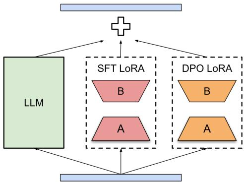

# 1. 论文基本信息
## 1.1. 标题
论文标题为《From Oracle to Noisy Context: Mitigating Contextual Exposure Bias in Speech-LLMs》，中文译名为《从真值上下文到带噪上下文：缓解语音大模型中的上下文暴露偏差》，核心研究主题是解决<strong>语音大模型（Speech-LLMs）</strong>在上下文语音识别任务中训练与推理阶段上下文分布不匹配的问题。
## 1.2. 作者与隶属机构
第一作者为郭晓勇（Xiaoyong Guo），通讯作者为黄浩（Hao Huang），作者团队来自两个机构：
1.  新疆大学计算机科学与技术学院、丝绸之路多语言认知计算国际联合实验室
2.  时空壶（Timekettle，智能翻译硬件厂商）
## 1.3. 发表状态
当前为预印本，发布于arXiv预印本平台，尚未正式发表于期刊或会议。
## 1.4. 发表时间
UTC时间2026年3月25日。
## 1.5. 摘要
本论文首次提出**上下文暴露偏差**的概念：上下文语音识别（ASR）任务中，训练阶段使用完全正确的<strong>真值（Oracle）</strong>对话历史作为上下文，但推理阶段只能使用前序识别得到的带错误的历史文本，导致上下文通道的训练测试分布不匹配。
为解决该问题，论文提出了包含三个互补策略的统一训练框架：
1.  教师错误知识：训练时使用Whisper large-v3的识别假设作为历史上下文，模拟推理阶段的真实错误
2.  上下文Dropout：随机掩码历史上下文，正则化模型对历史的过度依赖
3.  基于困难负例的直接偏好优化（DPO）：显式训练模型偏好正确输出，抑制错误传播
    实验结果显示：在域内TED-LIUM 3数据集上，上下文窗口为2个utterance时，仅用Whisper假设的SFT就将WER从真值训练的5.59%降至5.47%，加DPO后进一步降至5.17%；在无关上下文攻击下，DPO优化后的模型性能下降仅0.46%，鲁棒性显著提升；零样本跨域LibriSpeech测试也获得稳定增益。
## 1.6. 原文链接
- 预印本原文链接：https://arxiv.org/abs/2603.24034v1
- PDF链接：https://arxiv.org/pdf/2603.24034v1

# 2. 整体概括
## 2.1. 研究背景与动机
### 2.1.1. 核心问题
基于Speech-LLMs的上下文语音识别任务中，存在严重的训练测试不匹配问题：
- 训练阶段：模型可以拿到完全正确的人工标注历史文本作为上下文
- 推理部署阶段：无法获取真值历史，只能使用前序轮次模型自己输出的带识别错误的历史文本
  这种上下文通道的分布偏差会导致模型推理时被错误历史误导，出现错误放大的问题，论文将其定义为**上下文暴露偏差**。
### 2.1.2. 研究必要性
上下文信息是解决声学歧义、提升ASR准确率的核心手段，但现有上下文ASR方法普遍假设上下文是完全正确的，忽略了真实部署场景下上下文必然带噪的现实，导致实验室效果好但落地性能骤降。
### 2.1.3. 现有研究空白
此前相关方法要么仅使用隐式正则（如普通Dropout），要么需要额外辅助模块，没有显式引导模型拒绝错误上下文的干扰，也没有系统性地对齐训练与推理阶段的上下文分布。
### 2.1.4. 创新思路
论文从分布对齐、正则约束、偏好对齐三个层面互补设计方案：
1.  用强ASR模型生成的带错历史替换真值训练历史，直接对齐训练与推理的上下文分布
2.  用上下文Dropout防止模型过度依赖历史，强制模型优先关注当前声学特征
3.  用DPO在模型自己的错误样本上做偏好优化，显式抑制错误传播
## 2.2. 核心贡献与主要发现
### 2.2.1. 核心贡献
1.  **问题定义**：首次明确提出Speech-LLMs上下文ASR中的上下文暴露偏差问题，将其作为核心优化目标
2.  **统一训练框架**：提出三个互补组件的训练范式，无需额外推理开销即可大幅提升真实场景下的识别性能和鲁棒性
3.  **实验验证**：在域内、零样本跨域、对抗攻击三种场景下均验证了方法的有效性，取得了SOTA结果
### 2.2.2. 主要发现
1.  直接用带噪的教师模型输出作为训练上下文，配合0.5概率的上下文Dropout，即可显著缩小训练推理的性能差距
2.  针对困难负例的DPO优化比额外一轮SFT效果稳定得多，可进一步降低WER，同时大幅提升对错误、无关上下文的鲁棒性
3.  DPO的LoRA权重需要在推理阶段降低强度（论文取γ=0.25），否则会出现奖励过优化问题，导致通用性能下降

# 3. 预备知识与相关工作
## 3.1. 基础概念
本小节对理解论文所需的核心术语做面向初学者的解释：
1.  <strong>自动语音识别（Automatic Speech Recognition, ASR）</strong>：将人类语音信号转换为文本的任务，是语音交互的核心基础技术。
2.  <strong>语音大模型（Speech-LLMs）</strong>：结合预训练语音编码器和大语言模型（LLM）的多模态模型，可统一完成语音识别、翻译、理解等多种语音任务。
3.  <strong>上下文ASR（Contextual ASR）</strong>：利用前序对话历史、领域实体词等上下文信息，解决当前语音的声学歧义，提升识别准确率的ASR范式，常见于多轮对话、长语音转录场景。
4.  <strong>真值（Oracle/Ground Truth, GT）</strong>：人工标注的完全正确的文本标签，训练阶段通常可以拿到，但推理部署阶段无法获取。
5.  <strong>暴露偏差（Exposure Bias）</strong>：最初出现在序列生成任务中，指训练时用前一步的真值输入作为上下文（教师强制），但推理时用前一步自己生成的带错输出作为上下文，导致分布不匹配的问题；本文定义的**上下文暴露偏差**特指历史上下文通道的分布不匹配，而非当前序列生成的教师强制偏差。
6.  <strong>监督微调（Supervised Fine-Tuning, SFT）</strong>：用标注好的<输入, 输出>配对数据微调预训练大模型，使其适配下游任务的过程。
7.  <strong>直接偏好优化（Direct Preference Optimization, DPO）</strong>：一种大模型对齐算法，无需训练单独的奖励模型，直接通过<偏好输出, 非偏好输出>配对数据优化模型，使其生成符合人类/任务偏好的结果。
8.  <strong>低秩适配（Low-Rank Adaptation, LoRA）</strong>：高效大模型微调技术，冻结大模型全量参数，仅训练小参数量的低秩矩阵来适配下游任务，微调成本仅为全量微调的1%以下。
9.  <strong>词错误率（Word Error Rate, WER）</strong>：ASR任务的核心评估指标，值越低代表识别准确率越高，具体定义见5.2节。
## 3.2. 前人工作
### 3.2.1. 上下文ASR技术范式
上下文ASR技术主要分为两大流派：
1.  <strong>浅融合（Shallow Fusion）</strong>：推理阶段用外部语言模型对声学模型的识别假设重打分，提升上下文相关内容的准确率，无需修改ASR模型结构，但无法深度利用上下文信息。
2.  <strong>深融合（Deep Fusion）</strong>：将上下文信息编码为向量，直接融入ASR模型的内部组件，训练阶段学习声学特征与上下文的联合表示，性能上限更高，也是当前Speech-LLMs上下文ASR的主流范式。
### 3.2.2. Speech-LLMs上下文利用研究
近年Speech-LLMs的上下文利用主要通过Prompt注入实现，包括注入元数据、实体列表、对话历史、RAG检索到的领域知识等，也有部分工作研究了模型对上下文扰动的鲁棒性，但尚未有工作系统性解决上下文暴露偏差问题。
### 3.2.3. 暴露偏差缓解相关工作
此前在语音翻译、对话ASR等任务中，有研究者用上下文Dropout、噪声表示学习等方法缓解上下文带噪的问题，但都是隐式正则，没有显式引导模型拒绝错误上下文的干扰。
## 3.3. 技术演进脉络
ASR技术的演进路径为：
1.  传统架构：CTC、AED、RNN-T端到端模型
2.  预训练语音模型：HuBERT、Whisper等大规模预训练语音模型，大幅提升了通用ASR性能
3.  Speech-LLMs：将语音编码接入LLM，利用LLM的上下文推理能力进一步提升复杂场景ASR性能
    本文的工作处于Speech-LLMs落地优化的技术阶段，聚焦解决真实部署场景下上下文带噪的核心痛点。
## 3.4. 差异化分析
与现有方法相比，本文的核心创新点在于：
1.  首次将上下文暴露偏差作为独立问题明确提出，作为优化的核心目标
2.  首次将DPO偏好优化用于抑制上下文错误传播，效果远优于传统的额外SFT方案
3.  三个组件互补配合，同时解决分布对齐、正则约束、偏好对齐三个层面的问题，无需额外推理开销

# 4. 方法论
## 4.1. 方法原理
本文的核心思想是从三个层面系统性解决上下文暴露偏差问题：
1.  **分布对齐**：让训练阶段的上下文分布尽可能贴近推理阶段的带噪分布，用强教师ASR的识别结果模拟真实推理错误
2.  **正则约束**：防止模型过度依赖上下文，强制模型优先关注当前语音的声学特征，避免错误历史的误导
3.  **偏好对齐**：显式训练模型区分正确输出和被错误上下文误导的错误输出，从偏好层面抑制错误传播
## 4.2. 核心方法详解
### 4.2.1. 问题定义： utterance级上下文ASR
本文研究逐utterance的上下文ASR场景：长语音被切分为连续的utterance序列$\{X_t\}_{t=1}^T$，其中$X_t$是第$t$个utterance的语音信号，$Y_t$是其对应的真值转录文本。
对于第$t$个utterance，模型的识别假设$\hat{Y}_t$由当前语音$X_t$和上下文$C_t$共同决定：
$$
\hat{Y}_t \sim p_\theta(Y | X_t, C_t)
$$
其中上下文$C_t$是前$N$个utterance的转录拼接：
$$
C_t = concat(S_{t-N}, \dots, S_{t-1})
$$
$S_i$是第$i$个utterance的历史转录，$N$是上下文窗口大小，$N=0$对应无上下文基线。
训练阶段$S_i$通常取真值$Y_i$（Oracle上下文），但推理阶段只能取模型前序的识别结果$\hat{Y}_i$（带噪上下文），二者分布的差异就是本文定义的**上下文暴露偏差**。
### 4.2.2. 模型架构
本文采用Speech-LLMs的经典架构，如下图（原文Figure 1）所示：

*该图像是示意图，展示了LLM模型架构及其模块之间的关系。图中包含两个LoRA模块：SFT LoRA和DPO LoRA，分别对应不同的处理路径，用于提高模型在上下文处理中的性能和鲁棒性。*

架构包含三个核心部分：
1.  **语音编码器**：使用Whisper large-v3的编码器（冻结参数），将语音信号转换为语音特征
2.  **模态投影层**：可训练的MLP层，将语音特征映射为LLM支持的嵌入维度
3.  **大语言模型主干**：使用Vicuna-7B v1.5（冻结主干参数），用两个独立的LoRA模块分别做SFT和DPO微调，两个LoRA互不干扰，可独立控制强度。
### 4.2.3. 训练策略1：教师错误知识（Teacher Error Knowledge）
为了对齐训练与推理的上下文分布，本文预训练阶段用Whisper large-v3对整个训练集做离线解码，保存其识别假设$\hat{Y}_i^{Whisper}$，训练时直接用这些带错误的假设作为历史上下文构造$C_t$，而非使用真值历史，让模型在训练阶段就接触到真实的识别错误，提升对带噪上下文的鲁棒性。
该阶段采用标准的序列负对数似然损失作为SFT损失：
$$
\mathcal{L}_{SFT} = -\sum_t \log p_\theta(Y_t | X_t, C_t, P)
$$
其中$P$是任务Prompt，$\theta$是可训练参数（MLP投影层+SFT LoRA参数）。
### 4.2.4. 训练策略2：上下文Dropout（Context Dropout）
仅用带噪历史训练仍可能出现模型过度信任上下文、被错误历史误导的问题，因此本文引入上下文Dropout正则：训练时以固定概率$p_{drop}$将整个历史上下文$C_t$替换为空，仅保留当前语音$X_t$不变：
$$
\tilde{C}_t = \begin{cases}
\emptyset, & \mathrm{with\ } p_{\mathrm{drop}}, \\
C_t, & \mathrm{otherwise}
\end{cases}
$$
SFT损失基于掩码后的上下文$\tilde{C}_t$计算。该策略可以防止模型将历史作为识别捷径，强制模型优先学习从当前语音中提取信息，同时保留上下文可用时的性能增益。本文实验中$p_{drop}=0.5$。
### 4.2.5. 训练策略3：基于困难负例的DPO优化
SFT阶段仅能让模型学习正确的输出，但无法显式抑制模型被错误上下文误导的行为。因此本文在SFT之后增加DPO优化阶段：
1.  **困难负例构造**：用SFT阶段的模型解码训练集，筛选出WER超过20%的困难样本，对每个样本构造偏好对$(Y^+, Y^-)$：其中$Y^+$是真值转录（偏好输出），$Y^-$是SFT模型的识别结果（非偏好输出），输入条件均为$X=(X_t, C_t, P)$。
2.  **DPO损失函数**：DPO无需额外奖励模型，直接优化模型对偏好输出的似然差，损失计算如下：
    $$
    \Delta_\theta = \log \pi_\theta(Y^+ \mid \mathbf{X}) - \log \pi_\theta(Y^- \mid \mathbf{X})
    $$
    $$
    \Delta_r = \log \pi_r(Y^+ \mid \mathbf{X}) - \log \pi_r(Y^- \mid \mathbf{X})
    $$
    $$
    m = \beta \left( \Delta_\theta - \Delta_r \right)
    $$
    $$
    \mathcal{L}_{\mathrm{DPO}} = - \log \sigma(m)
    $$
    其中：
    - $\pi_\theta$是当前训练的DPO策略（主干+SFT LoRA+DPO LoRA）
    - $\pi_r$是冻结的SFT阶段参考模型
    - $\beta$是温度系数，控制偏好优化的强度，本文取$\beta=0.1$
    - $\sigma(\cdot)$是sigmoid激活函数
3.  **独立LoRA设计**：DPO阶段使用独立的LoRA模块，不与SFT LoRA共享参数，避免偏好优化破坏SFT阶段学到的通用ASR能力。
### 4.2.6. 推理阶段DPO LoRA强度调整
DPO训练时$\gamma=1$（DPO LoRA全强度生效），但推理时如果保持全强度会出现奖励过优化问题（模型为了符合偏好牺牲生成的流畅性和通用性），因此本文引入推理缩放因子$\gamma$调整DPO LoRA的强度：
$$
W = W_{\mathrm{LLM}} + \frac{\alpha}{r} \Delta W_{\mathrm{SFT}} + \gamma \frac{\alpha'}{r'} \Delta W_{\mathrm{DPO}}
$$
其中：
- $W_{\mathrm{LLM}}$是冻结的LLM主干权重
- $\frac{\alpha}{r}$是SFT LoRA的缩放系数，$\Delta W_{\mathrm{SFT}}$是SFT LoRA的低秩更新
- $\frac{\alpha'}{r'}$是DPO LoRA的缩放系数，$\Delta W_{\mathrm{DPO}}$是DPO LoRA的低秩更新
  本文中两个LoRA的秩和缩放系数相同：$r=r'=8$，$\alpha=\alpha'=32$，推理时取$\gamma=0.25$，将DPO LoRA的强度降低4倍，平衡鲁棒性增益和通用性能。

# 5. 实验设置
## 5.1. 数据集
### 5.1.1. 域内数据集：TED-LIUM 3
- 来源：TED公开演讲数据集，包含150小时的英文演讲音频和人工标注转录
- 特点：单说话人、无重叠、正式演讲场景，按utterance做了切分，同一会话的utterance天然存在上下文关联
- 划分：使用官方的训练/验证/测试集划分，用于域内训练和评估
### 5.1.2. 跨域数据集：LibriSpeech
- 来源：公共领域有声书数据集，包含1000小时的英文朗读音频
- 特点：与TED-LIUM 3的演讲场景差异大，用于零样本跨域泛化性评估，无需额外训练
- 评估子集：使用test-clean（清晰朗读，难度低）和test-other（带口音、噪声，难度高）两个测试集
## 5.2. 评估指标
本文核心评估指标为<strong>词错误率（Word Error Rate, WER）</strong>，详细说明如下：
1.  **概念定义**：衡量ASR识别结果与真值转录的差异，统计所有替换、删除、插入的词数占真值总词数的比例，值越低代表识别准确率越高。
2.  **数学公式**：
    $$
    \mathrm{WER} = \frac{S + D + I}{N}
    $$
3.  **符号解释**：
    - $S$：替换错误数，指识别结果中与真值词义不同的词的数量
    - $D$：删除错误数，指真值中存在但识别结果中缺失的词的数量
    - $I$：插入错误数，指识别结果中多出的、真值中不存在的词的数量
    - $N$：真值转录的总词数
## 5.3. 对比基线
本文设置了多组对比基线验证各组件的有效性：
1.  无上下文基线：不使用任何历史上下文的Speech-LLM ASR模型
2.  真值训练基线：训练阶段使用真值历史上下文，是现有上下文ASR的标准做法
3.  SFT2基线：在SFT模型的基础上，用困难负例再做一轮SFT，用于对比DPO的有效性

# 6. 实验结果与分析
## 6.1. 核心结果分析
以下是原文Table 1的完整结果，展示了不同上下文窗口大小、不同训练配置下的WER：

<table>
<thead>
<tr>
<th rowspan="2">N</th>
<th rowspan="2">Coninf/Contrain</th>
<th colspan="4">0 Dropout WER (%)↓</th>
<th colspan="4">0.5 Dropout WER (%)↓</th>
</tr>
<tr>
<th>TED</th>
<th>Test-clean</th>
<th>Test-other</th>
<th>LS-Ave.</th>
<th>TED</th>
<th>Test-clean</th>
<th>Test-other</th>
<th>LS-Ave.</th>
</tr>
</thead>
<tbody>
<tr>
<td>0</td>
<td>-/-</td>
<td>7.89</td>
<td>4.79</td>
<td>9.83</td>
<td>7.310</td>
<td>-</td>
<td>-</td>
<td>-</td>
<td>-</td>
</tr>
<tr>
<td rowspan="5">1</td>
<td>GT / GT</td>
<td>5.6</td>
<td>4.49</td>
<td>10.36</td>
<td>7.425</td>
<td>7.89</td>
<td>4.31</td>
<td>9.68</td>
<td>6.995</td>
</tr>
<tr>
<td>hyp / GT</td>
<td>5.85</td>
<td>4.54</td>
<td>10.63</td>
<td>7.585</td>
<td>7.47</td>
<td>4.74</td>
<td>9.94</td>
<td>7.340</td>
</tr>
<tr>
<td>hyp / Whisper</td>
<td>5.62</td>
<td>4.67</td>
<td>9.46</td>
<td>7.065</td>
<td>7.21</td>
<td>5.37</td>
<td>9.96</td>
<td>7.665</td>
</tr>
<tr>
<td>+ DPO</td>
<td>5.69</td>
<td>4.71</td>
<td>9.57</td>
<td>7.140</td>
<td>5.32</td>
<td>4.56</td>
<td>9.38</td>
<td>6.970</td>
</tr>
<tr>
<td>+ SFT2</td>
<td>5.76</td>
<td>4.67</td>
<td>9.49</td>
<td>7.080</td>
<td>7.26</td>
<td>5.14</td>
<td>9.30</td>
<td>7.220</td>
</tr>
<tr>
<td rowspan="5">2</td>
<td>GT / GT</td>
<td>6.73</td>
<td>4.10</td>
<td>8.36</td>
<td>6.230</td>
<td>5.66</td>
<td>4.10</td>
<td>8.37</td>
<td>6.235</td>
</tr>
<tr>
<td>hyp / GT</td>
<td>6.89</td>
<td>4.85</td>
<td>9.88</td>
<td>7.365</td>
<td>5.59</td>
<td>5.15</td>
<td>9.10</td>
<td>7.130</td>
</tr>
<tr>
<td>hyp / Whisper</td>
<td>8.15</td>
<td>5.57</td>
<td>12.00</td>
<td>8.785</td>
<td>5.47</td>
<td>5.14</td>
<td>9.50</td>
<td>7.320</td>
</tr>
<tr>
<td>+ DPO</td>
<td>5.07</td>
<td>4.87</td>
<td>9.51</td>
<td>7.190</td>
<td>5.17</td>
<td>4.84</td>
<td>9.19</td>
<td>7.015</td>
</tr>
<tr>
<td>+ SFT2</td>
<td>6.90</td>
<td>4.55</td>
<td>11.17</td>
<td>7.860</td>
<td>6.10</td>
<td>5.43</td>
<td>9.66</td>
<td>7.545</td>
</tr>
<tr>
<td rowspan="5">3</td>
<td>GT / GT</td>
<td>7.35</td>
<td>4.24</td>
<td>8.29</td>
<td>6.265</td>
<td>10.42</td>
<td>4.89</td>
<td>10.36</td>
<td>7.625</td>
</tr>
<tr>
<td>hyp / GT</td>
<td>7.05</td>
<td>5.03</td>
<td>10.68</td>
<td>7.855</td>
<td>12.62</td>
<td>5.28</td>
<td>10.93</td>
<td>8.105</td>
</tr>
<tr>
<td>hyp / Whisper</td>
<td>10.06</td>
<td>5.36</td>
<td>10.69</td>
<td>8.025</td>
<td>7.87</td>
<td>5.93</td>
<td>10.39</td>
<td>8.160</td>
</tr>
<tr>
<td>+ DPO</td>
<td>5.98</td>
<td>5.60</td>
<td>9.96</td>
<td>7.780</td>
<td>5.18</td>
<td>4.73</td>
<td>9.36</td>
<td>7.045</td>
</tr>
<tr>
<td>+ SFT2</td>
<td>9.30</td>
<td>5.22</td>
<td>10.49</td>
<td>7.855</td>
<td>8.01</td>
<td>6.11</td>
<td>10.20</td>
<td>8.155</td>
</tr>
<tr>
<td rowspan="5">4</td>
<td>GT / GT</td>
<td>8.54</td>
<td>4.26</td>
<td>9.01</td>
<td>6.635</td>
<td>9.22</td>
<td>4.75</td>
<td>10.23</td>
<td>7.490</td>
</tr>
<tr>
<td>hyp / GT</td>
<td>7.74</td>
<td>4.87</td>
<td>11.07</td>
<td>7.970</td>
<td>10.87</td>
<td>4.75</td>
<td>10.23</td>
<td>7.490</td>
</tr>
<tr>
<td>hyp / Whisper</td>
<td>87.37</td>
<td>4.66</td>
<td>10.81</td>
<td>7.735</td>
<td>7.81</td>
<td>4.75</td>
<td>9.82</td>
<td>7.285</td>
</tr>
<tr>
<td>+ DPO</td>
<td>4.93</td>
<td>4.79</td>
<td>9.97</td>
<td>7.380</td>
<td>5.69</td>
<td>4.79</td>
<td>9.25</td>
<td>7.020</td>
</tr>
<tr>
<td>+ SFT2</td>
<td>113.95</td>
<td>4.90</td>
<td>11.34</td>
<td>8.120</td>
<td>9.16</td>
<td>4.75</td>
<td>9.83</td>
<td>7.290</td>
</tr>
<tr>
<td rowspan="5">5</td>
<td>GT / GT</td>
<td>8.72</td>
<td>5.46</td>
<td>9.49</td>
<td>7.475</td>
<td>9.57</td>
<td>4.90</td>
<td>10.04</td>
<td>7.470</td>
</tr>
<tr>
<td>hyp / GT</td>
<td>10.34</td>
<td>5.08</td>
<td>10.76</td>
<td>7.920</td>
<td>8.19</td>
<td>5.36</td>
<td>11.29</td>
<td>8.325</td>
</tr>
<tr>
<td>hyp / Whisper</td>
<td>135.57</td>
<td>4.59</td>
<td>10.87</td>
<td>7.730</td>
<td>8.5</td>
<td>4.95</td>
<td>9.33</td>
<td>7.140</td>
</tr>
<tr>
<td>+ DPO</td>
<td>5.34</td>
<td>4.67</td>
<td>9.85</td>
<td>7.260</td>
<td>4.96</td>
<td>4.55</td>
<td>9.24</td>
<td>6.895</td>
</tr>
<tr>
<td>+ SFT2</td>
<td>72.55</td>
<td>4.90</td>
<td>10.57</td>
<td>7.735</td>
<td>8.51</td>
<td>5.23</td>
<td>9.33</td>
<td>7.280</td>
</tr>
</tbody>
</table>

核心结论如下：
1.  **上下文Dropout的必要性**：不使用上下文Dropout时，用Whisper带噪历史训练的模型性能甚至低于无上下文基线（如N=2时0 Dropout WER为8.15%，远高于无上下文的7.89%），说明无正则的带噪上下文会导致模型过度拟合错误历史；加入0.5 Dropout后，同配置WER降至5.47%，超过真值训练基线的5.59%。
2.  **DPO的稳定增益**：DPO在几乎所有配置下都带来稳定WER下降，而额外SFT（SFT2）经常导致性能下降（如N=2 0.5 Dropout时SFT2将WER从5.47%升至6.10%），说明DPO的显式偏好优化比单纯增加标注训练更有效。
3.  **跨域泛化提升**：DPO可显著提升零样本跨域性能，如N=5 0.5 Dropout时，DPO将LibriSpeech平均WER从7.140%降至6.895%，超过无上下文基线的7.310%。
## 6.2. 鲁棒性测试结果
以下是原文Table 2的结果，展示了DPO LoRA缩放因子γ对性能和鲁棒性的影响（无关上下文攻击指推理时将历史替换为随机采样的无关文本）：

<table>
<thead>
<tr>
<th rowspan="2">γ</th>
<th colspan="3">TED-LIUM 3 (WER %)↓</th>
<th colspan="3">LibriSpeech (WER %) ↓</th>
</tr>
<tr>
<th>Attacks/o（无攻击）</th>
<th>Attacks/w（有攻击）</th>
<th>Gap（性能下降）</th>
<th>Test-clean</th>
<th>Test-other</th>
<th>Ave.</th>
</tr>
</thead>
<tbody>
<tr>
<td>0</td>
<td>5.47</td>
<td>7.93</td>
<td>2.46</td>
<td>5.14</td>
<td>9.50</td>
<td>7.320</td>
</tr>
<tr>
<td>0.0625</td>
<td>5.37</td>
<td>7.13</td>
<td>1.76</td>
<td>5.12</td>
<td>9.31</td>
<td>7.215</td>
</tr>
<tr>
<td>0.125</td>
<td>5.11</td>
<td>5.76</td>
<td>0.65</td>
<td>5.02</td>
<td>9.53</td>
<td>7.275</td>
</tr>
<tr>
<td>0.1875</td>
<td>5.06</td>
<td>5.69</td>
<td>0.63</td>
<td>4.70</td>
<td>9.08</td>
<td>6.890</td>
</tr>
<tr>
<td>0.25</td>
<td>5.17</td>
<td>5.63</td>
<td>0.46</td>
<td>4.84</td>
<td>9.19</td>
<td>7.015</td>
</tr>
<tr>
<td>0.375</td>
<td>5.55</td>
<td>5.73</td>
<td>0.18</td>
<td>4.85</td>
<td>9.63</td>
<td>7.240</td>
</tr>
<tr>
<td>0.5</td>
<td>8.39</td>
<td>8.67</td>
<td>0.28</td>
<td>6.44</td>
<td>12.14</td>
<td>9.290</td>
</tr>
<tr>
<td>0.625</td>
<td>53.26</td>
<td>57.15</td>
<td>3.89</td>
<td>27.11</td>
<td>28.96</td>
<td>28.035</td>
</tr>
</tbody>
</table>

核心结论：
- γ在0.1875~0.25区间时可以平衡无攻击准确率和攻击下的鲁棒性，γ超过0.375后会出现严重的奖励过优化，性能骤降，因此本文选择γ=0.25作为最优值。
## 6.3. 消融实验结果
### 6.3.1. 困难负例阈值消融
原文附录Table 4测试了不同WER阈值筛选困难负例的效果，结果显示阈值在5%~30%区间内都能获得稳定的WER增益，无需精细调参，且最优γ值稳定在0.25左右，说明方法的鲁棒性很强。
### 6.3.2. 无关上下文攻击鲁棒性
原文Table 3的攻击测试结果显示，DPO优化后的模型在所有上下文窗口大小下都获得了最低的攻击后WER，性能下降幅度远小于基线模型，验证了方法对误导性上下文的抵抗能力。

# 7. 总结与思考
## 7.1. 结论总结
本文首次明确了Speech-LLMs上下文ASR中的上下文暴露偏差问题，提出了包含教师错误知识、上下文Dropout、DPO偏好优化三个互补组件的统一训练框架：
1.  教师错误知识对齐了训练与推理的上下文分布，缩小了训练推理性能差距
2.  上下文Dropout防止模型过度依赖历史，强制模型优先关注当前声学特征
3.  DPO显式优化模型偏好，抑制错误传播，同时提升跨域泛化性和对抗鲁棒性
    实验证明该框架在域内、零样本跨域、对抗攻击场景下均获得稳定性能提升，且无额外推理开销，为真实场景下的长语音、多轮对话ASR落地提供了可靠的技术方案。
## 7.2. 局限性与未来工作
### 7.2.1. 作者指出的局限性
1.  **多说话人重叠场景未验证**：当前实验仅使用单说话人、无重叠的数据集，未测试多说话人重叠的"鸡尾酒会"场景，该场景下的上下文建模需要额外的架构优化。
2.  **教师错误来源单一**：当前仅使用Whisper large-v3生成教师错误，错误类型受限于Whisper的错误模式，无法覆盖真实场景中所有可能的错误类型（如不同口音、不同ASR模型的错误）。
### 7.2.2. 未来研究方向
1.  扩展到多说话人、重叠语音的上下文ASR场景
2.  使用多个不同的ASR模型生成教师错误，增加错误类型的多样性
3.  探索动态上下文Dropout，根据历史上下文的置信度自适应调整掩码概率
4.  扩展到流式上下文ASR场景，适配实时语音交互需求
## 7.3. 个人启发与批判
### 7.3.1. 启发
1.  本文的思路可以迁移到所有多轮序列任务中：包括对话系统、多轮语音翻译、多模态对话等，只要存在训练用真值历史、推理用带错历史的暴露偏差问题，三个组件的组合方案都可以复用。
2.  DPO不仅可以用于对齐人类偏好，也可以用于感知任务的错误抑制，比传统的额外SFT效果更稳定，为ASR等感知任务的优化提供了新的思路。
### 7.3.2. 潜在改进点
1.  当前上下文窗口是固定大小的，可以加入上下文相关性筛选，仅保留与当前utterance相关的历史，进一步降低错误历史的干扰。
2.  DPO的负例可以扩展为多种类型：不仅是模型自己的错误，还可以加入被错误上下文专门误导的构造负例，进一步提升模型对错误上下文的抵抗能力。
3.  可以加入上下文置信度编码，让模型知道历史上下文的可靠程度，自适应调整对上下文的依赖程度。