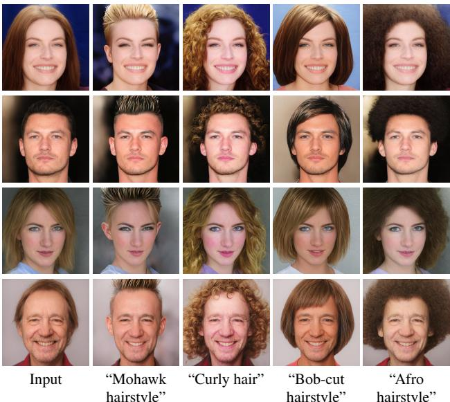
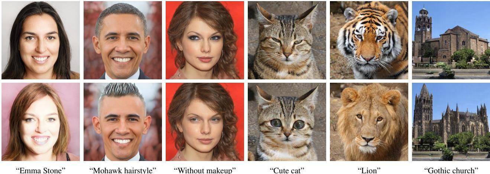
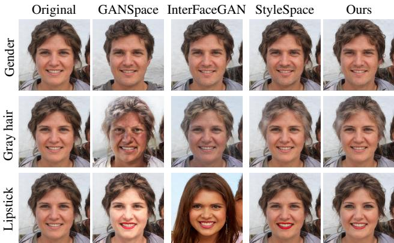

# 1. Bibliographic Information

## 1.1. Title
The title of the paper is **"StyleCLIP: Text-Driven Manipulation of StyleGAN Imagery"**. This indicates that the central topic of the research is the manipulation of images generated by StyleGAN models using natural language text prompts, specifically leveraging the CLIP model.

## 1.2. Authors
The authors of the paper are **Or Patashnik**, **Zongze Wu**, **Eli Shechtman**, **Daniel Cohen-Or**, and **Dani Lischinski**.

*   **Or Patashnik** is affiliated with the Hebrew University of Jerusalem and Tel-Aviv University.
*   **Zongze Wu** is affiliated with the Hebrew University of Jerusalem.
*   **Eli Shechtman** is affiliated with Adobe Research.
*   **Daniel Cohen-Or** is affiliated with Tel-Aviv University.
*   **Dani Lischinski** is affiliated with the Hebrew University of Jerusalem.

    The collaboration involves both academic institutions (Hebrew University of Jerusalem, Tel-Aviv University) and industrial research labs (Adobe Research), suggesting a blend of theoretical exploration and practical application in image synthesis and editing.

## 1.3. Journal/Conference
The paper was published on **arXiv** as a preprint on March 31, 2021 (arXiv:2103.17249). While it is a preprint and not yet published in a specific journal or conference proceedings at the time of the document provided, arXiv is a highly reputable and widely used repository for scientific papers in fields like Computer Vision and Machine Learning. Publication on arXiv allows for rapid dissemination of cutting-edge research. The work has been widely cited in the computer vision community, indicating significant influence.

## 1.4. Publication Year
The paper was published in **2021**.

## 1.5. Abstract
The paper addresses the challenge of manipulating images generated by StyleGAN in a semantically meaningful way. Previous methods required either manual examination of latent space degrees of freedom or annotated image collections for each specific manipulation, which is labor-intensive. The authors propose leveraging **Contrastive Language-Image Pre-training (CLIP)** models to create a text-based interface for StyleGAN image manipulation that eliminates the need for manual effort.

The research introduces three specific techniques:
1.  An **optimization scheme** that uses a CLIP-based loss to modify an input latent vector based on a text prompt.
2.  A **latent mapper** that infers a text-guided latent manipulation step for a given input image, enabling faster and more stable manipulation.
3.  A method for mapping text prompts to **input-agnostic directions** in StyleGAN's style space, allowing for interactive text-driven image manipulation.

    Extensive results demonstrate the effectiveness of these approaches in manipulating images of faces, animals, cars, and churches.

## 1.6. Original Source Link
The official source is the arXiv preprint server.
*   **Link:** https://arxiv.org/abs/2103.17249
*   **PDF Link:** https://arxiv.org/pdf/2103.17249v1
*   **Publication Status:** Preprint.

# 2. Executive Summary

## 2.1. Background & Motivation
**Core Problem:** The core problem is the difficulty of discovering and executing semantically meaningful manipulations (e.g., making a person look older, changing hair color, adding glasses) on images generated by StyleGAN. While StyleGAN's latent space is known to be disentangled (meaning different dimensions control different features), finding the specific direction or combination of directions that correspond to a user's desired semantic change is non-trivial.

**Importance & Challenges:** Existing solutions typically require either:
*   **Manual examination:** Humans manually inspect the effects of changing latent dimensions, which is "painstaking" and inefficient.
*   **Annotated data:** Collecting large datasets labeled with the specific attribute (e.g., "smiling" vs "not smiling") to train a classifier or find a direction.
*   **Pre-trained classifiers:** Relying on existing models that can only detect a limited set of preset attributes.

    These limitations severely restrict user creativity because whenever a user wants a new, unmapped manipulation (e.g., "make him look like a specific celebrity" or "give him a surprised expression"), new data or manual effort is required.

**Innovative Idea:** The authors propose using **CLIP** (Contrastive Language-Image Pre-training), a model trained on millions of image-text pairs from the internet. CLIP understands the relationship between natural language and visual concepts. By combining CLIP with StyleGAN, the authors create a system where a user can simply type a text prompt (e.g., "make him look surprised"), and the system automatically finds the corresponding manipulation in the latent space without any new training data or manual annotation for that specific prompt.

## 2.2. Main Contributions / Findings
The paper makes three primary technical contributions:

1.  **Text-guided Latent Optimization:** A method that treats the CLIP model as a "loss network." It takes a source image and a text prompt, then optimizes the latent code of the source image until the generated image matches the text prompt according to CLIP. This is versatile but slow (requires optimization per image).
2.  **Latent Mapper (Local Method):** A separate neural network (Mapper) is trained for a specific text prompt. Once trained, it can quickly take any input image and output the latent step required to apply that prompt. This is faster than optimization but still "local" (the step can vary slightly depending on the input image).
3.  **Global Direction Method:** A technique to map a text prompt to a single, fixed direction in StyleGAN's **Style Space ($S$)**. This direction is "input-agnostic," meaning the same mathematical vector is added to any image to apply the effect. This allows for interactive manipulation (sliders) and fine-grained control over disentanglement (changing one attribute without affecting others).

**Key Findings:**
*   The combination of StyleGAN and CLIP enables a vast range of manipulations previously impossible or very difficult to achieve, including complex, abstract, or fine-grained edits.
*   The **Global Direction** method in Style Space ($S$) offers better disentanglement (fewer unwanted side effects) compared to methods working in the $W+$ space.
*   The **Latent Mapper** is better for complex, identity-specific edits (e.g., "look like Trump"), while **Global Directions** are better for simpler, common attributes (e.g., "grey hair").

# 3. Prerequisite Knowledge & Related Work

## 3.1. Foundational Concepts
To understand this paper, one must be familiar with the following concepts:

*   **Generative Adversarial Networks (GANs):** A class of machine learning frameworks designed to generate new data instances (e.g., images). They consist of two networks: a **Generator** ($G$) that creates images and a **Discriminator** that tries to distinguish between real images and fake ones created by the generator. They compete against each other, improving over time.
*   **StyleGAN:** A specific architecture of GANs known for generating high-quality, realistic images. Unlike traditional GANs that feed noise directly into the network, StyleGAN uses a "mapping network" to transform input noise into an intermediate latent space, and then uses "Adaptive Instance Normalization (AdaIN)" to inject style information at each layer of the generator.
*   **Latent Spaces ($Z$, $W$, $W+$, $S$):** The input space of the generator is called the latent space.
    *   **$Z$ space:** The input noise space. It is often entangled (changing one value might change multiple unrelated features).
    *   **$W$ space:** An intermediate space in StyleGAN obtained by passing $Z$ through a mapping network. It is more disentangled.
    *   **$W+$ space:** An extension of $W$ where a different latent vector is used for each layer of the generator. This allows for finer control but is higher dimensional.
    *   **$S$ space (Style Space):** The space of the channel-wise features inside the generator's layers (the inputs to AdaIN). Research (like StyleSpace analysis) has shown this space is even more disentangled than $W+$, making it ideal for precise editing.
*   **CLIP (Contrastive Language-Image Pre-training):** A model developed by OpenAI trained on 400 million image-text pairs. It consists of an Image Encoder and a Text Encoder. It learns to map images and text descriptions into a shared **joint embedding space**. In this space, the vector for an image of a "dog" will be close to the text vector for the word "dog," and far from "car." This allows calculating the similarity between an image and a text description.
*   **Cosine Similarity:** A metric used to measure how similar two vectors are. It is the cosine of the angle between them. A value of 1 means identical direction, 0 means orthogonal, and -1 means opposite. CLIP uses cosine similarity to match text and images.

## 3.2. Previous Works
The paper discusses several relevant areas of prior research:

*   **Vision and Language Models:**
    *   Models like **BERT** and **Transformers** have been used to learn joint representations of vision and language for tasks like image captioning.
    *   **CLIP** is highlighted as a breakthrough because of its massive scale (400M pairs) and ability to perform zero-shot classification (classifying images it hasn't seen before) by using text labels.
*   **Text-guided Image Generation/Manipulation:**
    *   **AttnGAN** and **StackGAN:** Earlier works that generated images from text using attention mechanisms.
    *   **DALL·E (OpenAI):** A massive 12-billion parameter model based on text-to-image generation. The authors note that DALL·E requires huge computational resources (24GB+ GPU memory), whereas StyleCLIP is deployable on commodity GPUs.
    *   **TediGAN:** A concurrent work that also combines StyleGAN and CLIP. It encodes both image and text into the latent space and uses style mixing. The authors claim StyleCLIP produces better semantic reflection of the text.
*   **Latent Space Image Manipulation:**
    *   **InterFaceGAN:** Finds linear directions in the latent space corresponding to binary attributes (e.g., male/female) using classifiers.
    *   **GANSpace:** Uses Principal Component Analysis (PCA) on latent codes to find major axes of variation.
    *   **StyleFlow:** Uses conditional normalizing flows to model non-linear trajectories in latent space for attribute manipulation.
    *   **StyleSpace:** Introduced by Wu et al. (co-author of this paper), demonstrating that the $S$ space (style space) is better disentangled than $W+$.

**Crucial Formula from Related Work:**
While the paper focuses on CLIP, understanding the **CLIP loss** (or similarity function) is fundamental. CLIP typically maximizes the cosine similarity between the image embedding and the text embedding. The cosine similarity between two vectors $A$ and $B$ is defined as:
$$
\text{Similarity}(A, B) = \frac{A \cdot B}{\|A\| \|B\|}
$$
Where $A \cdot B$ is the dot product, and $\|A\|$ is the Euclidean norm (length) of vector $A$. In StyleCLIP, the loss is often the distance (1 - similarity), which the system tries to minimize.

## 3.3. Technological Evolution
The field has evolved from:
1.  **Basic GANs:** Generating random noise-like images.
2.  **StyleGAN:** High-quality generation, but editing required finding specific directions manually or with classifiers.
3.  **Disentanglement Analysis:** Discovering that $S$ space is better for editing than $W+$.
4.  **Vision-Language Models (CLIP):** Providing a bridge between natural language and pixels.

    This paper fits at the intersection of steps 3 and 4. It uses the "semantic bridge" provided by CLIP to navigate the "precise control space" ($S$) of StyleGAN. It represents a shift from "classifier-based" editing (limited to what classifiers exist) to "text-based" editing (limited only by language understanding).

## 3.4. Differentiation Analysis
The core difference between StyleCLIP and previous methods is the **source of supervision**.
*   **Previous methods (e.g., InterFaceGAN):** Rely on **labeled datasets** (e.g., CelebA with "Smiling" labels) or **pre-trained classifiers** to find directions. You cannot edit "surprised" if you don't have a "surprised" classifier.
*   **StyleCLIP:** Relies on the **knowledge embedded in CLIP**. Since CLIP has seen "surprised" in text associated with images during training, StyleCLIP can perform this edit without any specific labeled dataset for "surprised." It makes the manipulation **open-vocabulary**—any text prompt understood by CLIP can potentially be used for manipulation.

# 4. Methodology

The paper proposes three distinct methods for text-driven manipulation, each trading off speed, versatility, and disentanglement.

## 4.1. Method 1: Text-guided Latent Optimization

### Principles
This is the most direct approach. The goal is to find a latent code $w$ that generates an image matching the text prompt $t$, while staying close to the original image. It treats the problem as an optimization task.

### Core Methodology In-depth
The method starts with a source image encoded into the $W+$ space, denoted as $w_s$. The user provides a text prompt $t$. The system seeks to find a new latent code $w$ that minimizes a loss function.

The optimization problem is defined as follows:

$$
\operatorname* { a r g m i n } _ { w \in \mathcal { W } + } D _ { \mathrm { C L I P } } ( G ( w ) , t ) + \lambda _ { \mathrm { L 2 } } \left. w - w _ { s } \right. _ { 2 } + \lambda _ { \mathrm { I D } } \mathcal { L } _ { \mathrm { I D } } ( w )
$$

Where:
*   `G(w)` is the StyleGAN generator that produces an image from latent code $w$.
*   $D_{\mathrm{CLIP}}(G(w), t)$ is the **CLIP Loss**. It calculates the distance (dissimilarity) between the generated image and the text prompt in CLIP's joint embedding space. Minimizing this forces the generated image to look like the text description.
*   $\lambda_{\mathrm{L2}} \left. w - w _ { s } \right. _ { 2}$ is the **L2 Distance Loss**. It penalizes the new code $w$ for being too far from the original code $w_s$. This ensures the result doesn't drift too far from the original image structure. $\lambda_{\mathrm{L2}}$ is a hyperparameter controlling the strength of this constraint.
*   $\lambda_{\mathrm{ID}} \mathcal{L}_{\mathrm{ID}}(w)$ is the **Identity Loss**. This is crucial for face manipulation to ensure the person doesn't change identity (e.g., turning Person A into Person B).

    The Identity Loss $\mathcal{L}_{\mathrm{ID}}(w)$ is calculated using a pre-trained face recognition network (ArcFace), denoted as $R$:

$$
\mathcal { L } _ { \mathrm { I D } } \left( w \right) = 1 - \left. R ( G ( w _ { s } ) ) , R ( G ( w ) ) \right.
$$

Where:
*   $R(G(w_s))$ is the embedding of the original image.
*   `R(G(w))` is the embedding of the generated image.
*   The term $\langle \cdot , \cdot \rangle$ represents the cosine similarity. The loss is $1 - \text{similarity}$, so maximizing similarity minimizes the loss.

    The optimization is performed using gradient descent. The gradients flow from the CLIP loss back through the fixed StyleGAN generator to update the latent code $w$.

The following figure (Figure 3 from the original paper) shows examples of edits obtained using this latent optimization method:

*该图像是示意图，展示了通过潜在优化获得的真实名人肖像的编辑效果。每个输出图像下方标注了驱动的文本提示以及对应的参数 $\left( \lambda _ { \mathrm { L } 2 } , \lambda _ { \mathrm { I D } } \right)$。图中展示了不同文本提示对输入图像的影响。*

## 4.2. Method 2: Latent Mapper (Local Method)

### Principles
The optimization method is slow because it must run for every new image and text prompt. The **Latent Mapper** aims to learn a function that predicts the required manipulation step directly. It is "local" because the step it predicts can depend on the specific input image.

### Core Methodology In-depth
The authors train a separate mapping network $M_t$ for a specific text prompt $t$. Once trained, for any input latent code $w$, the mapper outputs a residual step $\Delta w$ to add to $w$.

**Architecture:**
The mapper architecture is designed to handle different levels of detail (coarse, medium, fine) corresponding to different layers of StyleGAN. It consists of three separate fully-connected networks (similar to StyleGAN's mapping network but smaller), denoted as $M_t^c$, $M_t^m$, and $M_t^f$.

The mapping function is defined as:

$$
M _ { t } ( w ) = ( M _ { t } ^ { c } ( w _ { c } ) , M _ { t } ^ { m } ( w _ { m } ) , M _ { t } ^ { f } ( w _ { f } ) )
$$

Where $w = (w_c, w_m, w_f)$ represents the input latent code split into coarse, medium, and fine parts.

**Training Process:**
The mapper is trained to minimize a combined loss function:

$$
\mathcal { L } ( w ) = \mathcal { L } _ { \mathrm { C L I P } } ( w ) + \lambda _ { L 2 } \left. M _ { t } ( w ) \right. _ { 2 } + \lambda _ { \mathrm { I D } } \mathcal { L } _ { \mathrm { I D } } ( w )
$$

The components are:
1.  **CLIP Loss:** $\mathcal{L}_{\mathrm{CLIP}}(w) = D_{\mathrm{CLIP}}(G(w + M_t(w)), t)$. This measures how well the *edited* image ($w + M_t(w)$) matches the text prompt $t$.
2.  **L2 Regularization:** $\lambda_{L2} \| M_t(w) \|_2$. This penalizes the mapper for taking large steps, encouraging it to find the minimal change needed.
3.  **Identity Loss:** $\mathcal{L}_{\mathrm{ID}}(w)$ ensures the identity is preserved (same definition as in Method 1).

    The following figure (Figure 4 from the original paper) illustrates hair style edits using the mapper:

    
    *该图像是一个展示不同发型编辑的插图。每列下面的文本提示表明应用的发型，例如“Mohawk hairstyle”、“Curly hair”、“Bob-cut hairstyle”和“Afro hairstyle”。所有输入图像均为真实图像的反转。*

## 4.3. Method 3: Global Directions

### Principles
The authors observed that while the "Local Mapper" predicts different steps for different images, the directions of these steps are often very similar (high cosine similarity). This suggests that for many attributes, a single global direction exists. Furthermore, working in the $S$ space (Style Space) allows for better disentanglement than $W+$. This method finds a single global direction $\Delta s$ in $S$ space corresponding to a text prompt.

### Core Methodology In-depth
The goal is to find a direction $\Delta s$ such that adding it to a style code $s$ (i.e., $s + \alpha \Delta s$) introduces the desired attribute. $\alpha$ controls the strength.

**Step 1: Obtaining a Target Direction in CLIP Space ($\Delta t$)**
The method uses "Prompt Engineering" to get a robust text embedding. Instead of just one sentence, it uses a bank of templates (e.g., "a photo of a {attribute}", "a painting of a {attribute}"). It computes the average embedding for the target attribute and the neutral class, then takes the normalized difference to get a target direction vector $\Delta t$ in CLIP's text embedding space.

**Step 2: Channel-wise Relevance**
The core innovation is determining which channels in the $S$ space are relevant to the target direction $\Delta t$. The system perturbs each channel $c$ of the style code $s$ (adding and subtracting a small value) to see how the image changes in CLIP space.

For each channel $c$, the relevance $R_c$ is estimated as the mean projection of the image change $\Delta i_c$ onto the target direction $\Delta i$ (which is assumed to be collinear with $\Delta t$):

$$
R _ { c } ( \Delta i ) = \mathbb { E } _ { s \in { \mathcal { S } } } \{ \Delta i _ { c } \cdot \Delta i \}
$$

Where:
*   $\Delta i_c$ is the change in CLIP image embedding when channel $c$ is perturbed.
*   $\Delta i$ is the ideal change direction (aligned with text prompt).
*   $\mathbb{E}$ denotes the expectation (average) over a set of sample style codes.

**Step 3: Constructing the Global Direction**
Finally, the global direction $\Delta s$ is constructed by keeping only the channels whose relevance exceeds a threshold $\beta$.

$$
\Delta s = \left\{ \begin{array} { l l } { \Delta i _ { c } \cdot \Delta i \quad } & { \mathrm { i f } \left| \Delta i _ { c } \cdot \Delta i \right| \geq \beta } \\ { \quad 0 \quad } & { \mathrm { o t h e r w i s e } } \end{array} \right.
$$

This threshold $\beta$ allows the user to control the **degree of disentanglement**. A high $\beta$ selects only the most relevant channels, resulting in a pure change (e.g., only hair color). A low $\beta$ includes more channels, capturing correlated attributes (e.g., grey hair + wrinkles).

The following figure (Figure 6 from the original paper) demonstrates how the manipulation strength and disentanglement threshold affect the "grey hair" prompt:

![Figure 6. Image manipulation driven by the prompt "grey hair" for different manipulation strengths and disentanglement thresholds. Moving along the $\\Delta s$ direction, causes the hair color to become more grey, while steps in the $- \\Delta s$ direction yields darker hair. The effect becomes stronger as the strength $\\alpha$ increases. When the disentanglement threshold $\\beta$ is high, only the hair color is affected, and as $\\beta$ is lowered, additional correlated attributes, such as wrinkles and the shape of the face are affected as well.](images/6.jpg)
*该图像是示意图，展示了通过提示“灰发”进行的图像操控，展示了不同的操控强度 $\alpha$ 和解耦阈值 $\beta$。图中第一列为原始图像，右侧的列显示了随着 $\alpha$ 增加，头发颜色变得越来越灰，而 $\alpha$ 为负值时则使头发颜色变暗。随着解耦阈值 $\beta$ 的降低，除了头发颜色外，还会影响其他相关属性。*

# 5. Experimental Setup

## 5.1. Datasets
The experiments utilize high-quality datasets to train the StyleGAN models and provide input images for manipulation.

*   **FFHQ (Flickr-Faces-HQ):** A dataset of high-quality human faces at 1024x1024 resolution. This is the primary dataset used for face manipulation results. It was chosen because it is the standard benchmark for StyleGAN2, providing realistic and diverse faces.
*   **LSUN Cars:** A dataset of car images. Used to demonstrate that the method generalizes beyond faces to objects.
*   **AFHQ (Animal Faces HQ):** A dataset of animal faces (cats, dogs, wild). Specifically, the "dogs" and "wild" (lions, tigers) subsets were used to show cross-domain manipulation capabilities.

**Data Sample Example:**
For the FFHQ dataset, a sample is a high-resolution portrait of a person (e.g., a celebrity photo) that has been inverted into the StyleGAN latent space $W+$ using an encoder (e4e).

## 5.2. Evaluation Metrics
Since image manipulation is often subjective, the paper relies on a mix of quantitative metrics and qualitative visual inspection.

1.  **Qualitative Visual Comparison:**
    *   **Conceptual Definition:** The primary metric is human visual inspection of the generated images. The goal is to see if the manipulation matches the text prompt and if unwanted artifacts or changes (entanglement) are present.
    *   **Formula:** N/A (Visual).

2.  **ArcFace Identity Similarity (ID Loss):**
    *   **Conceptual Definition:** Used to measure how well the identity of the person is preserved during manipulation. This is crucial for face editing to ensure the subject doesn't look like a different person.
    *   **Mathematical Formula:**
        $$ \text{Similarity} = \cos(\theta) = \frac{\mathbf{A} \cdot \mathbf{B}}{\|\mathbf{A}\| \|\mathbf{B}\|} $$
    *   **Symbol Explanation:** $\mathbf{A}$ and $\mathbf{B}$ are the feature vectors of the original face and the manipulated face extracted by the ArcFace network.

3.  **Attribute Classifier Scores:**
    *   **Conceptual Definition:** Used in comparisons with other methods (like InterFaceGAN). Pre-trained classifiers (e.g., for "Smiling", "Male") are used to measure the magnitude of the change.
    *   **Formula:** Standard classifier confidence score (Logit or Probability).

## 5.3. Baselines
The paper compares against several state-of-the-art methods:

*   **TediGAN:** A concurrent method for text-driven image generation and manipulation using StyleGAN and CLIP.
*   **GANSpace:** A method for discovering interpretable controls in GANs using Principal Component Analysis (PCA).
*   **InterFaceGAN:** A method that manipulates faces by traversing the boundary of binary classifiers in the latent space.
*   **StyleFlow:** A method using normalizing flows to model non-linear trajectories in latent space for attribute manipulation.
*   **StyleSpace:** A method demonstrating that the $S$ space offers better disentanglement than $W+$.

    These baselines are representative because they cover the main approaches to GAN manipulation: classifier-based (InterFaceGAN), unsupervised linear (GANSpace), unsupervised non-linear (StyleFlow), and space-specific analysis (StyleSpace).

# 6. Results & Analysis

## 6.1. Core Results Analysis
The paper presents extensive results demonstrating the versatility of the three proposed methods.

**Comparison of the Three Proposed Methods:**
The following table (Table 1 from the original paper) summarizes the trade-offs between the optimization, mapper, and global direction methods:

The following are the results from Table 1 of the original paper:

<table>
<thead>
<tr>
<th rowspan="1" colspan="1"></th>
<th rowspan="1" colspan="1">pre-proc.</th>
<th rowspan="1" colspan="1">traintime</th>
<th rowspan="1" colspan="1">infer.time</th>
<th rowspan="1" colspan="1">input imagedependent</th>
<th rowspan="1" colspan="1">latentspace</th>
</tr>
</thead>
<tbody>
<tr>
<td rowspan="1" colspan="1">optimizer</td>
<td rowspan="1" colspan="1"></td>
<td rowspan="1" colspan="1"></td>
<td rowspan="1" colspan="1">98 sec</td>
<td rowspan="1" colspan="1">yes</td>
<td rowspan="1" colspan="1">W+</td>
</tr>
<tr>
<td rowspan="1" colspan="1">mapper</td>
<td rowspan="1" colspan="1"></td>
<td rowspan="1" colspan="1">10 - 12h</td>
<td rowspan="1" colspan="1">75 ms</td>
<td rowspan="1" colspan="1">yes</td>
<td rowspan="1" colspan="1">W+</td>
</tr>
<tr>
<td rowspan="1" colspan="1">global dir.</td>
<td rowspan="1" colspan="1">4h</td>
<td rowspan="1" colspan="1"></td>
<td rowspan="1" colspan="1">72 ms</td>
<td rowspan="1" colspan="1">no</td>
<td rowspan="1" colspan="1">S</td>
</tr>
</tbody>
</table>

*   **Optimizer:** Slowest inference (98 sec) but requires no training. Good for one-off edits.
*   **Mapper:** Requires training (10-12h) but then very fast (75ms). Good for applying the same edit to many images.
*   **Global Direction:** Requires preprocessing (4h) but then very fast (72ms) and works in $S$ space (better disentanglement). Good for interactive sliders.

**Mapper vs. Global Direction:**
The authors find that the **Mapper** is better for complex, identity-specific edits (e.g., "Trump"). It can capture specific nuances. The **Global Direction** is better for simpler, common attributes (e.g., "Grey hair", "Male"). It offers superior disentanglement (e.g., removing wrinkles without changing gender).

**Comparison with TediGAN:**
The results show that StyleCLIP (specifically the Mapper and Global Direction) produces manipulations that reflect the semantics of the text much better than TediGAN. For example, TediGAN fails to capture the "Mohawk" hairstyle or the specific identity of "Trump" effectively compared to StyleCLIP.

The following figure (Figure 9 from the original paper) compares the Mapper, Global Direction, and TediGAN on different attribute types:

**Comparison with StyleGAN Manipulation Methods:**
The Global Direction method is compared to GANSpace, InterFaceGAN, and StyleSpace on standard attributes like Gender, Grey hair, and Lipstick. The results show that StyleCLIP's Global Direction achieves similar quality to StyleSpace (which is state-of-the-art for disentanglement) and outperforms GANSpace and InterFaceGAN in terms of avoiding entanglement (e.g., changing lighting or skin color unintentionally).

The following figure (Figure 10 from the original paper) illustrates this comparison:

*该图像是一个比较图，展示了不同方法在图像风格操控上的效果，包括原始图像、GANSpace、InterFaceGAN、StyleSpace和本文提出的方法。每行对应不同的属性操控，如性别、灰发和口红，显示了各方法在特定操控下的生成结果。*

## 6.2. Data Presentation (Tables)
In addition to Table 1, the paper provides quantitative analysis of the Mapper's behavior.

The following are the results from the analysis of cosine similarity of manipulation directions (Table 2 from the original paper):

<table>
<thead>
<tr>
<th rowspan="1" colspan="1"></th>
<th rowspan="1" colspan="1">Mohawk</th>
<th rowspan="1" colspan="1">Afro</th>
<th rowspan="1" colspan="1">Bob-cut</th>
<th rowspan="1" colspan="1">Curly</th>
<th rowspan="1" colspan="1">Beyonce</th>
<th rowspan="1" colspan="1">Taylor Swift</th>
<th rowspan="1" colspan="1">Surprised</th>
<th rowspan="1" colspan="1">Purple hair</th>
</tr>
</thead>
<tbody>
<tr>
<td rowspan="1" colspan="1">Mean</td>
<td rowspan="1" colspan="1">0.82</td>
<td rowspan="1" colspan="1">0.84</td>
<td rowspan="1" colspan="1">0.82</td>
<td rowspan="1" colspan="1">0.84</td>
<td rowspan="1" colspan="1">0.83</td>
<td rowspan="1" colspan="1">0.77</td>
<td rowspan="1" colspan="1">0.79</td>
<td rowspan="1" colspan="1">0.73</td>
</tr>
<tr>
<td rowspan="1" colspan="1">Std</td>
<td rowspan="1" colspan="1">0.096</td>
<td rowspan="1" colspan="1">0.085</td>
<td rowspan="1" colspan="1">0.095</td>
<td rowspan="1" colspan="1">0.088</td>
<td rowspan="1" colspan="1">0.081</td>
<td rowspan="1" colspan="1">0.107</td>
<td rowspan="1" colspan="1">0.893</td>
<td rowspan="1" colspan="1">0.145</td>
</tr>
</tbody>
</table>

This table shows the mean cosine similarity and standard deviation of the manipulation steps inferred by the Mapper for different inputs. The high mean values (e.g., 0.84 for Afro) confirm that the directions are very consistent across different input images, supporting the validity of the "Global Direction" approach.

## 6.3. Ablation Studies / Parameter Analysis
The authors perform ablation studies on the Latent Mapper and Global Direction methods.

**Mapper Architecture Ablation:**
*   **Single Network vs. Three Networks:** The authors compare using a single mapping network for the whole latent vector versus the proposed three-network architecture (for coarse, medium, fine). The three-network architecture performs significantly better for complex edits (e.g., "Donald Trump") because it can handle multi-level changes (expression + hair + background) effectively. The single network fails to capture sufficient detail.
*   **Removing $M^f$ (Fine network):** For edits that shouldn't affect color scheme (like hairstyles), removing the fine network ($M^f$) yields slightly better results, preventing unwanted color shifts.

**Mapper Loss Ablation:**
*   **CLIP Loss vs. Identity Loss:** Replacing the CLIP loss with a simple identity loss (matching a target celebrity image) fails to produce the semantic edit. It just morphs the face. CLIP is necessary to capture the abstract concept.
*   **Identity Loss Importance:** Removing the identity loss ($\lambda_{ID} = 0$) results in the mapper changing the identity of the person too much, essentially creating a new face rather than editing the existing one.

**Global Direction Parameters:**
*   **Disentanglement Threshold ($\beta$):** The authors demonstrate that increasing $\beta$ makes the manipulation more disentangled (affecting fewer attributes). For "Grey hair," a high $\beta$ changes only hair color, while a low $\beta$ also introduces wrinkles and skin texture changes. This provides a valuable "knob" for users to control the nature of the edit.

# 7. Conclusion & Reflections

## 7.1. Conclusion Summary
The paper successfully demonstrates that combining the generative power of StyleGAN with the semantic understanding of CLIP enables a powerful, text-driven interface for image manipulation. The authors introduced three methods:
1.  **Latent Optimization:** A versatile but slow baseline.
2.  **Latent Mapper:** A fast, learned method for specific prompts, suitable for complex edits.
3.  **Global Directions:** A fast, interactive method operating in the disentangled Style $S$ space, suitable for common attributes.

    The results show that these methods can handle a wide range of manipulations—from simple attributes like "grey hair" to complex concepts like "look like Trump"—without requiring manual annotation or training data for each specific attribute.

## 7.2. Limitations & Future Work
**Limitations:**
*   **Domain Constraints:** The method is limited by the domains covered by the pre-trained StyleGAN generator. It cannot manipulate images outside the training domain (e.g., turning a human face into a car if the generator is trained only on faces).
*   **CLIP Coverage:** The effectiveness depends on CLIP's understanding. Prompts that map to sparsely populated areas of CLIP's embedding space may fail or produce unexpected results.
*   **Drastic Manipulations:** Transforming between very different domains (e.g., Tiger to Wolf) is difficult and often fails to capture shape deformations, though texture changes (Tiger to Lion) work better.

**Future Work:**
The authors suggest that text-driven manipulation is a growing field. Future work could focus on improving the stability of optimization, handling 3D consistency, or extending this to video manipulation.

## 7.3. Personal Insights & Critique
**Inspirations:**
*   **Democratization of Creativity:** This paper is significant because it lowers the barrier to entry for high-quality image editing. Users no longer need to understand latent spaces or train classifiers; they just need to describe what they want.
*   **Synergy of Models:** It is a great example of how combining two large, pre-trained models (StyleGAN and CLIP) can create a new capability without training a massive model from scratch.

**Potential Issues:**
*   **Evaluation Rigor:** The evaluation relies heavily on qualitative visual results (figures). While this is standard for generative art, more rigorous quantitative metrics for "text alignment" (how well the image matches the text) could strengthen the claims.
*   **Hyperparameter Sensitivity:** The methods (especially optimization and mapper) rely on several hyperparameters ($\lambda_{L2}$, $\lambda_{ID}$, $\beta$). Finding the right values for a completely new prompt might still require some trial and error, though less than previous methods.
*   **Computational Cost:** While inference is fast for Mapper/Global Direction, the training time (10-12 hours per prompt for Mapper) is non-trivial if a user wants to switch between many unique, complex prompts frequently.

**Transferability:**
The approach is highly transferable. As new and better generative models (e.g., StyleGAN3, diffusion models) and better vision-language models emerge, this framework of "using VL understanding to navigate the latent space" will likely remain a powerful paradigm.