# 基于查询条件的证据关键帧采样用于大语言模型的视频理解

王怡恒1 朱立晨1 林跃谦1 刘宇东1 张景扬2 海琳"海伦" 陈怡然1 1杜克大学，美国北卡罗来纳州达勒姆 2独立研究员

# 摘要

多模态大语言模型（MLLMs）在视频问答任务中表现出色，但在长篇视频中的应用受到有限上下文长度和计算成本的限制，使得关键帧采样变得至关重要。现有方法通常依赖于语义相关性或强化学习，这两者要么无法捕捉证据线索，要么在组合优化上不足。在本研究中，我们提出了一种基于信息瓶颈理论的证据驱动关键帧采样框架。我们将关键帧选择问题表述为最大化所选帧与查询之间的条件互信息，提供一个反映每帧在回答问题中的贡献的原则性目标。为了使这一目标可行，我们利用其结构推导出一种分解优化方法，从而减少在独立帧级别上的子选择时间。我们进一步引入了一种基于查询的证据评分网络，该网络使用对比目标进行训练，以高效评估证据的重要性。在长篇视频理解基准上的实验表明，我们的方法在严格的令牌预算下始终优于先前的采样策略，同时显著提高了训练效率。

# 1. 引言

多模态大语言模型（MLLMs）[1, 2, 3, 4, 5, 6, 7] 在视频理解和自然语言问答方面表现出了强大能力。然而，实际部署受到上下文长度和词元预算的限制。将长视频的所有帧输入 MLLM 通常是不切实际的，这使得关键帧抽样成为长视频理解的一个关键组成部分。这引出了一个重要问题：在进行问答时，哪些帧是真正重要的？

Anatura 方法是基于视觉或语义相关性来选择关键帧。然而，这种相关性存在问题。早期的关键帧采样方法遵循这一直觉，并依赖于语义匹配启发式方法，这些方法利用预训练的视觉-语言模型来获取帧之间的相似性得分，并通过启发式方法优先考虑相关性和时间覆盖。然而，这些策略可能导致次优性能，因为语义相似性与实际有用性之间存在不匹配。基于强化学习（RL）的关键帧采样策略通过训练策略网络来选择能够使大语言模型正确回答查询的关键帧，从而缓解了这个问题。尽管有效，这些方法也探索了指数级组合搜索空间，导致采样效率低下。此外，从回答准确性中派生的稀疏奖励引入了艰巨的信用分配问题，使得对单个帧提供精确的质量评估变得困难，从而导致训练不稳定。

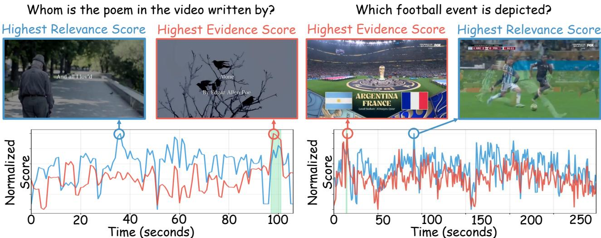  
Svy ( o   ee anr-rittThee gdictoal etcntai inne answering.

为克服这些局限性，我们提出了一种受信息瓶颈启发的证据评分框架。我们将关键帧采样目标表述为在给定查询条件下，最大化选定帧与答案之间的条件互信息。由于组合性质的原因，在所有子集上进行直接优化是不可行的。我们表明，得到的目标是单调亚次模的，并利用模态上界将组合选择问题分解为独立的帧级证据评分，从而避免了基于强化学习的方法所面临的指数搜索空间。此外，通过分配密集的帧级证据评分，而不是依赖稀疏的答案级奖励，我们的表述缓解了网络的训练负担，这使得强证据的网络输出的损失率高于弱证据的网络，从而通过消除对昂贵的组合探索和MLLM-in-the-loop监督的需求，显著提高了训练效率。我们的主要贡献如下。首先，我们提出了一个用于关键帧采样的证据评分框架，将目标表述为最大化条件互信息，并将其分解为可处理的帧级评分。其次，我们设计了一个条件查询的证据评分网络，并采用对比目标进行训练，以估计每帧的证据贡献。最后，广泛的实验证明，我们的方法在相似预算下始终优于已有方法，在LVBench上对Qwen2.5-VL-7B的准确率提升达$1 0 . 1 \%$，同时在训练效率上显著优于基于强化学习的关键帧采样方法。

# 相关工作

# 2.1. 多模态大语言模型在视频理解中的应用

MLLMs的快速发展显著推动了视频理解的边界。VideoL-LaMA开创了视觉-语言和音频-语言预训练，使视频基础的对话成为可能。VideoLLaMA2通过空间-时间卷积连接器改进了之前的工作。VideoLLaMA3进一步提出了以视频为中心的微调阶段，以提升视频理解性能。Qwen系列提出了M-RoPE，将时间依赖性整合到注意力机制中，提升了视频理解和时间感知的性能。InternVL系列扩大了视觉编码器的规模，并将其多模态框架扩展到视频理解，以提高视频理解性能。尽管这些架构取得了重大进展，但高效的长格式视频理解仍然是一个关键瓶颈。随着视频时长延伸至数小时，密集视觉词元的线性积累不可避免地超出上下文窗口，导致严重的计算延迟和内存消耗。因此，从高度冗余的时间流中动态隔离关键证据信息仍然是一个基本的开放挑战。

# 2.2. 关键帧采样

最近，关键帧采样方法应运而生，以通过减轻处理长视觉序列的计算负担来提升长视频理解中的多模态大语言模型（MLLMs）。这些方法一般分为两类：基于语义匹配的方法和可训练策略。基于语义匹配的方法动态选择帧，依据启发式规则进行优化。具体来说，AKS 和 FOCUS [9, 11] 通过一种即插即用的优化算法平衡语义相关性和时间覆盖率。Q-Frame [10] 则通过动态多分辨率缩放执行查询感知采样。尽管这些方法有效，但它们倾向于选择视觉上对齐的帧，而这些帧可能并不包含回答查询所需的证据，往往导致性能不佳。可训练方法通过引入可学习的组件或利用强化学习（RL）来优化帧选择。MLLM-Selector [20] 和 FFS [21] 集成了可学习的过滤模块，并注册令牌以适应性地确定帧的重要性，与查询条件相关。在探索基于强化学习的范式时，TSPO [14] 通过GRPO训练一个事件感知的智能体，而ReaSon [8]则采用了因果信息瓶颈与反事实干预来识别决定性时刻。尽管有效，这些方法在一个大的组合空间中运作，导致样本效率较低。

# 3. 方法论

# 3.1. 证据瓶颈

问题描述。给定一个表示为帧序列的视频 $V = \{ f _ { 1 } , \ldots , f _ { n } \}$ 和一个自然语言查询 $Q$，关键帧采样旨在根据词元预算 $| S | \le K$ 寻找一个紧凑的子集 $S \subseteq V$，使得多模态大型语言模型能够依据 $S$ 准确回答 $Q$，其准确性可与使用 $V$ 时相媲美。尽管 $S$ 是在可行子集上确定性地进行选择的，我们将该问题建模为条件信息瓶颈，旨在最大化选定帧与答案之间的条件互信息，考虑到查询 $Q$：

$$
\operatorname* { m a x } _ { S } I ( S ; O \mid Q ) \quad { \mathrm { s . t . } } \quad | S | \leq m ,
$$

其中 $o$ 表示大语言模型输出，$m$ 表示帧预算，而 $I ( S ; O \mid Q )$ 表示条件互信息。对 $Q$ 的条件化反映了帧的证据价值本质上依赖于查询的事实。同一帧对于一个问题可能是决定性的，而对于另一个问题则可能无关紧要。为了验证这一公式与最大化回答准确性的实际目标一致，我们展开互信息项：

$$
I ( S ; O \mid Q ) = \mathbb { E } _ { Q } \left[ \mathbb { E } _ { p ( S , O \mid Q ) } \left[ \log \frac { p ( O \mid S , Q ) } { p ( O \mid Q ) } \right] \right] .
$$

因为 $p ( O \mid Q )$ 对于选择 $S$ 是一个常数，最大化 $I ( S ; O \mid Q )$ 等价于：

$$
\operatorname* { m a x } _ { S } \mathbb { E } [ \log p ( O \mid S , Q ) ] .
$$

应当选择那些能够最大程度支持多语言大模型（MLLM）正确预测答案的帧。证据目标的子模块性。对目标（1）的直接优化是不可行的：对所有 $\binom { n } { m }$ 子集进行穷举搜索在视频长度增长时呈指数级增长。该目标具有可进行原则性近似的子模块性。香农熵作为随机变量的集合函数是子模块的 [22]：对于 $A \subseteq B$ 且 $f \notin B$ ，有 $H ( f \mid A ) \geq H ( f \mid B )$ 。因此，$H ( O \mid S , Q )$ 在 $S$ 中是超模块的，且证据目标是单调非减且子模块的，满足 $F ( \varnothing ) = 0$。根据经典结果 [23]，贪心选择可以达到 $( 1 - 1 / e )$ 的近似。然而，对于长视频来说，对 $n$ 帧进行 $K$ 次顺序处理仍然代价高昂。

$$
F ( S ) = I ( S ; O \mid Q ) = H ( O \mid Q ) - H ( O \mid S , Q )
$$

模块化上界松弛。当通过其模块化上界放松子模块化目标时，可以获得一个完全可并行化的选择规则。对于任何单调子模块化函数 $F$，若满足 $F ( \varnothing ) = 0$ [23, 24]：

$$
F ( S ) \leq \sum _ { f _ { i } \in S } F ( \{ f _ { i } \} ) = \sum _ { f _ { i } \in S } I ( f _ { i } ; O \mid Q ) .
$$

该不等式源于收益递减原理：每个边际增益 $F ( S _ { j } ) - F ( S _ { j - 1 } ) \ \leq \ F ( \{ f _ { i _ { j } } \} )$，因为 $\emptyset \subseteq S _ { j - 1 }$。我们采用一种时间自适应的帧选择策略，以箱数 $B$ 和每个箱的帧数 $k$ 作为参数。视频被划分为 $B$ 个等长的时间段，并根据它们的条件互信息从每个段中选择得分最高的 $k$ 个帧：

$$
S ^ { * } = \bigcup _ { b = 1 } ^ { B } \mathrm { t o p } { - k _ { f _ { i } \in B I N _ { b } } I ( f _ { i } ; O \mid Q ) } ,
$$

其中 $B I N _ { b }$ 表示 $^ b$-t 段的帧集合。该公式统一了两种选择机制：将 $k = 1$ 强制施加严格的时间多样性，每个段贡献恰好一帧，而将 $k = m$ 则恢复了完全由互信息分数驱动的全局前 $m$ 选择。所选帧的总数 $m = B \times k$ 是根据下游 MLLM 的上下文窗口固定的。

从互信息到可学习的证据评分函数。每帧数量 $I ( f _ { i } ; O \mid Q )$ 测量观察帧 $f _ { i }$ 如何减少模型对答案的不确定性的程度。由于该数量依赖于未知答案 $o$，因此在推理时无法直接获得。然而，这种不确定性减少的幅度在很大程度上受到帧 $f _ { i }$ 的视觉内容与查询 $Q$ 语义之间相互作用的影响：描绘查询事件、对象或状态转换的帧往往包含较高的互信息。这激励我们训练一个条件于查询的评分网络 $g _ { \theta } ( f _ { i } , Q )$，以预测每帧的相对证据值。在训练期间，给定（帧，查询）的元组，$g _ { \theta }$ 学习识别哪些视觉模式倾向于为给定查询解决答案的不确定性，从而作为 $I ( f _ { i } ; O \mid Q )$ 的参数化代理。由于选择仅依赖于帧的排序，评分网络无需恢复精确的互信息值，保持正确的排序即可。关于 $g _ { \theta }$ 的架构及训练过程在 $\ S 3 . 2$ 和 $\ S 3 . 3$ 中详细介绍。

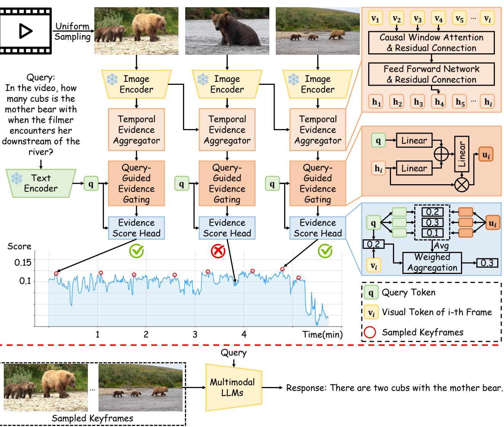  
Oveve uvecoThuo, n n o mvn o    . Frames with the highest evidence scores are then selected and fed into an MLLM to generate the final response.

# 3.2. 查询条件证据评分网络

如图 2 所示，评分网络 $g _ { \theta }$ 包含一个预训练的视觉-语言编码器、一个时间证据聚合器、一个查询引导的证据门控模块和一个证据评分头。每个帧 $f _ { i }$ 和查询 $Q$ 由一个共享的视觉-语言编码器编码：

$$
\mathbf { v } _ { i } = \mathcal { E } _ { \nu } ( f _ { i } ) \in \mathbb { R } ^ { d } , \quad \mathbf { q } = \mathcal { E } _ { t } ( Q ) \in \mathbb { R } ^ { d } .
$$

模块松弛方程(6)独立地处理每一帧。因此，简单的实现会将每一帧视为独立的。为了解决这个问题，我们引入了一个时间证据聚合器，采用因果窗口注意机制。对于位置为 $\tau$ 的帧 $f _ { \tau }$，定义因果窗口 $\mathcal { W } _ { \tau } = \{ f _ { j } \ | \ \operatorname* { m a x } ( 1 , \tau { - } k { + } 1 ) \leq j \leq \tau \}$。上下文化表示为：

$$
\mathbf { h } _ { \tau } = \mathcal { T } \big ( \mathbf { v } _ { \tau } \mid \{ \mathbf { v } _ { j } : f _ { j } \in \mathcal { W } _ { \tau } \} \big ) .
$$

关键的是，窗口大小 $k$ 相对于视频长度保持较小，从而将时间聚合限制在局部邻域内。为了将上下文化的视觉表示与查询语义相结合，我们引入了一个查询引导的证据 gating 模块，该模块充当通道级的信息阀：

$$
\mathbf { g } _ { i } = \sigma ( \mathbf { W } _ { h } \mathbf { h } _ { i } + \mathbf { W } _ { q } \mathbf { q } + \mathbf { b } ) , \quad \mathbf { u } _ { i } = \mathbf { h } _ { i } \odot \mathbf { g } _ { i } ,
$$

其中 $\mathbf { W } _ { h } , \mathbf { W } _ { q } \in \mathbb { R } ^ { d \times d } , \mathbf { b } \in \mathbb { R } ^ { d }$，且 $\sigma$ 是 sigmoid 函数。门 $\mathbf { g } _ { i } \in ( 0 , 1 ) ^ { d }$ 抑制与查询无关的通道，仅保留携带决定性证据的通道。我们将证据得分分解到 $K$ 个语义子空间，以捕捉查询与帧对齐的不同方面。在第 $k$ 个子空间中：

$$
s _ { i , k } = \frac { 1 } { \gamma _ { k } } \frac { ( \mathbf { W } _ { \nu } ^ { ( k ) } \mathbf { u } _ { i } ) ^ { \top } ( \mathbf { W } _ { q } ^ { ( k ) } \mathbf { q } ) } { \| \mathbf { W } _ { \nu } ^ { ( k ) } \mathbf { u } _ { i } \| _ { 2 } \| \mathbf { W } _ { q } ^ { ( k ) } \mathbf { q } \| _ { 2 } } ,
$$

其中 $\mathbf{W}_{\nu}^{(k)}, \mathbf{W}_{q}^{(k)} \in \mathbb{R}^{d_k \times d} \left( d_k = d / K \right)$ 和 $\gamma_k$。 $T$ 号的 $\ell_2$ 规范化使得评分对特征幅度不变，仅依赖于方向对齐。总体证据分数在子空间中聚合：

$$
g _ { \theta } ( f _ { i } , Q ) = \lambda \frac { \mathbf { v } _ { i } ^ { \top } \mathbf { q } } { \| \mathbf { v } _ { i } \| _ { 2 } \| \mathbf { q } \| _ { 2 } } + ( 1 - \lambda ) \frac { 1 } { K } \sum _ { k = 1 } ^ { K } s _ { i , k } ,
$$

其中 $\lambda \in [0, 1]$ 是一个可学习的参数，用于平衡两个项的贡献。在早期阶段引入 preraivis-gugcosilriy poviern rindfrwealratil 证据评分。

# 3.3. 训练目标

分解目标方程 (6) 选择具有最高每帧互信息 $I ( f _ { i } ; O \mid Q )$ 的帧。由于选择仅依赖于得分的排名而非其绝对值，因此 $g _ { \theta }$ 无需恢复 $I ( f _ { i } ; O \mid Q )$ 的精确值；保留正确的顺序即可。这将一个困难的密度估计问题转换为一个适合对比学习的排序问题。对于每个查询 $Q$，我们构建一个正帧集 ${ { \mathcal { F } } ^ { + } }$ 和一个负帧集 ${ { \mathcal { F } } ^ { - } }$。当某帧标记为 T 时，这被视为足够让大语言模型正确回答 $Q$，这意味着期望上，$p ( O \mid x \sim { \mathcal { F } } ^ { + } , Q )$ 高于 $p ( O \mid x \sim { \mathcal { F } } ^ { - } , Q )$，因此正帧的 $I ( x ; O \mid Q )$ 通常高于负帧。我们使用 IoNC 损失训练 $g _ { \theta }$，基于查询 $Q$ 的正集 ${ { \mathcal { F } } ^ { + } }$ 和负集 ${ \mathcal { F } ^ { - } }$。

$$
\begin{array} { r } { \mathcal { L } = - \log \frac { \sum _ { x \in \mathcal { F } ^ { + } } \exp { g _ { \theta } ( x , Q ) } } { \sum _ { x \in \mathcal { F } ^ { + } } \exp { g _ { \theta } ( x , Q ) } + \sum _ { x \in \mathcal { F } ^ { - } } \exp { g _ { \theta } ( x , Q ) } } . } \end{array}
$$

到一个常数 [25, 27]：

$$
g _ { \theta } ^ { * } ( x , Q ) \propto \log \frac { p ( x \mid \mathcal { F } ^ { + } , Q ) } { p ( x \mid \mathcal { F } ^ { - } , Q ) } + C ,
$$

其中 $C$ 独立于 $x$。这个比率捕捉了在给定查询下，一个帧比背景更具证据性的可能性。由于正负划分与 $I ( x ; O \mid Q )$ 所引入的排序一致，最优分数 $g _ { \theta } ^ { * }$ 保持了该排序。

# 4. 实验

# 4.1. 实验设置

# 4.1.1. 实现细节

我们在 Seek-173K 数据集的 LLaVA-Video 子集上训练了所提出的关键帧采样模型 [28]。训练数据提供了经过注释的证据片段，这些片段已经验证足够用于多模态大语言模型（MLLMs）正确回答相应的查询。采样自证据片段中的帧被视为正样本，而在片段外的帧则被视为负样本。我们的模型采用 CLIP-ViT-L [12] 作为默认的视觉-语言编码器。在训练过程中，该编码器保持不变，而其余模块（大约 1000 万个参数）则进行优化。训练在 8 块 NVIDIA RTX A5000 GPU 上进行，批量大小为 128，训练周期为 5 个。

我们在长视频理解基准上评估模型，即 LVBench [16] 和 Video-MME [29]。对于每个视频-问题对，我们的关键帧采样方法应用于采样 $m$ 帧，然后将其输入到 MLLM 以生成响应。模型性能通过问答准确率来衡量。对于 Video-MME，我们采用时间多样性策略 $( k = 1 , B = m )$，将视频划分为 $m$ 个等长段落，并从每个段落中选择一帧，以确保均匀的时间覆盖。对于包含长篇视频的 LVBench，由于查询相关内容可能局部集中在较小的时间区域，我们改为应用全局 top-$m$ 选择 $( k = m , B = 1 )$，使模型能够将帧预算集中在视频中信息量最大的部分。按照之前的工作，所有评估都使用 lmms-eval [30] 框架进行，以确保公平比较。评估在 NVIDIA L40S GPU 上进行。

# 4.2. 与最先进方法的比较

LVBench。LVBench 是一个长视频理解基准，平均持续时间为 4101 秒。如表 1 所示，我们的方法在与一般的 MLLM、智能体 MLLM、基于 SFT/RL 的 MLLM 以及几种其他关键帧采样方法的比较中取得了具有竞争力的表现。与现有的关键帧采样方法[38, 14, 39]相比，我们的方法在相同的 MLLM 和相同的帧预算下实现了最佳性能，同时在使用明显更多帧的方法中依然保持竞争力。在细粒度评估中，我们的方法在多个子任务上表现出显著改进，尤其是在关键信息检索方面，表明其在捕捉关键时间线索方面具有更强的能力。此外，我们观察到 Qwen2-VL-7B 和 LLaVa-Video-7B 在推理和摘要子任务上表现略有下降。我们在附录中提供了对这些改进和局限性的详细定性分析。VideoMME。如表 2 所示，在相同的 MLLM 和帧预算下，我们的方法提高了 VideoMME 的性能。使用 Qwen2-VL-7B，我们的方法将平均准确率提高到 60.1，并将长视频子集的性能提升到 51.4，这表明在长时间视频理解方面能力的增强。使用 Qwen2.5-VL-7B，我们的方法在平均准确率上达到了 63.6，并在长视频子集上提高了 $4.4\%$ 的表现，显示了在相同设置下的一致性提升。相比最先进的 LVBenc [6]，ER、EU、KIR、TG、Rea 和 Suan y 表示我们的重现结果。

<table><tr><td rowspan="2">Method</td><td rowspan="2">Frames</td><td colspan="7">LVBench</td></tr><tr><td>Overall</td><td>ER</td><td>EU</td><td>KIR</td><td>TG</td><td></td><td>Rea Sum</td></tr><tr><td colspan="10">Agentic MLLMs</td></tr><tr><td>VideoTree [31]</td><td></td><td>28.8</td><td>30.3</td><td></td><td>25.1 26.5</td><td></td><td></td><td>27.7 31.9 25.5</td></tr><tr><td>VideoAgent [32]</td><td></td><td>29.3</td><td>28.0</td><td>30.3 28.0</td><td></td><td></td><td></td><td>29.3 28.0 36.4</td></tr><tr><td>VCA [33]</td><td></td><td>41.3</td><td>43.7</td><td>40.7</td><td>37.8</td><td>38.0</td><td>46.2</td><td>27.3</td></tr><tr><td colspan="10">SFT/RL MLLMs</td></tr><tr><td>MovieChat-7B [34]</td><td>&gt;10000</td><td>22.5</td><td></td><td></td><td></td><td></td><td></td><td>21.3 23.1 25.9 22.3 24.0 17.2</td></tr><tr><td>TimeMarker-8B [35]</td><td>≤128</td><td>41.3</td><td></td><td></td><td></td><td></td><td></td><td>42.8 39.1 34.9 38.7 38.2 48.8</td></tr><tr><td>VideoLLaMA3-7B [19]</td><td>-</td><td>45.3</td><td>-</td><td>-</td><td>-</td><td>-</td><td>-</td><td>-</td></tr><tr><td>Video-R1-7B [36]</td><td>32</td><td>37.4</td><td>-</td><td>-</td><td></td><td></td><td></td><td></td></tr><tr><td>Video-Thinker-7B [37]</td><td>32</td><td>38.4</td><td></td><td></td><td></td><td></td><td></td><td></td></tr><tr><td>Video-03 [28]</td><td>≤ 768</td><td>47.6</td><td></td><td></td><td></td><td></td><td></td><td></td></tr><tr><td colspan="9">Keyframe Sampling for MLLMs</td></tr><tr><td>Qwen2-VL-7B† [2]</td><td>32</td><td>39.1</td><td></td><td>38.7 39.0 36.8 37.3 39.8 29.3</td><td></td><td></td><td></td><td></td></tr><tr><td>+ ReTaKe [38]</td><td>≤ 2048</td><td>47.8</td><td>-</td><td>-</td><td>-</td><td>-</td><td>-</td><td>-</td></tr><tr><td>+ TSPO [14]</td><td>64</td><td>46.4</td><td></td><td></td><td></td><td></td><td></td><td></td></tr><tr><td>+ Ours</td><td>32</td><td>46.6</td><td></td><td>47.9 44.5 55.0 42.7 43.8 25.9</td><td></td><td></td><td></td><td></td></tr><tr><td>Qwen2.5-VL-7B‡ [15]</td><td>32</td><td>37.6</td><td></td><td>36.8 38.6 40.6 32.7 37.3 29.3</td><td></td><td></td><td></td><td></td></tr><tr><td>+ FrameThinker [39]</td><td>23.9</td><td>36.6</td><td></td><td>-</td><td>-</td><td>-</td><td>-</td><td>-</td></tr><tr><td>+ Ours</td><td>32</td><td>47.7</td><td></td><td>49.8 44.5 57.0 37.3 41.8 34.5</td><td></td><td></td><td></td><td></td></tr><tr><td>LLaVA-Video-7B† [40]</td><td>64</td><td>41.7</td><td></td><td>41.5 40.2 42.3 33.2 49.8 29.3</td><td></td><td></td><td></td><td></td></tr><tr><td>+ ReTaKe [38]</td><td>≤ 1024</td><td>48.5</td><td>-</td><td>-</td><td>-</td><td>-</td><td>-</td><td>-</td></tr><tr><td>+ TSPO [14]</td><td>64</td><td>45.3</td><td></td><td></td><td></td><td></td><td></td><td></td></tr><tr><td>+ Ours</td><td>64</td><td></td><td></td><td>49.4 52.4 45.9 54.6 39.0 46.8 32.8</td><td></td><td></td><td></td><td></td></tr></table>

# 4.3. 消融研究

# 4.3.1. 预训练编码器的影响

我们首先调查了不同视觉-语言编码器对整体性能的影响，如表3所示。我们比较了几种最先进的编码器，即 CLIP、SigLIP 和 SigLIP2。我们的关键帧采样策略在所有 MLLMs 和所有编码器选择中始终优于均匀采样。然而，性能在不同编码器之间变化适中。这些结果表明，尽管我们的方法对编码器的选择具有鲁棒性，但不同编码器与特定 MLLM 的对齐程度存在差异。总体而言，在所有设置中一致的性能提升证明了我们采样策略的通用性和有效性。

Table 2: Comparison with existing keyframe sampling methods on VideoMME [29]. $^ \dagger$ denotes our reproduced results.   

<table><tr><td rowspan="2">Method</td><td rowspan="2">Architecture</td><td rowspan="2">Frames</td><td colspan="2">VideoMME</td></tr><tr><td>Long</td><td>Average</td></tr><tr><td>Qwen2-VL-7B‡</td><td></td><td>32</td><td>48.7</td><td>58.0</td></tr><tr><td>+ AKS [9]</td><td>BLIP-0.5B</td><td>32</td><td>-</td><td>59.9</td></tr><tr><td>+ FOCUS [11]</td><td>BLIP-0.5B</td><td>32</td><td>-</td><td>59.7</td></tr><tr><td>+ Q-Frame [10]</td><td>CLIP-0.4B</td><td>44</td><td>48.3</td><td>58.3</td></tr><tr><td>+ MLLM-Selector [20]</td><td>MLLM-1.5B</td><td>32</td><td>-</td><td>58.7</td></tr><tr><td>+ Ours</td><td>CLIP-0.4B</td><td>32</td><td>51.4</td><td>60.1</td></tr><tr><td>+ ReTaKe [38]</td><td></td><td>≤ 2048</td><td>56.2</td><td>63.9</td></tr><tr><td>Qwen2.5-VL-7B†</td><td>-</td><td>32</td><td>50.6</td><td>60.7</td></tr><tr><td>+ K-Frames [41]</td><td>MLLM-3B</td><td>32</td><td>-</td><td>62.1</td></tr><tr><td>+ AKS [9]</td><td>CLIP-0.4B</td><td>32</td><td></td><td>62.4</td></tr><tr><td>+ BOLT [42]</td><td>CLIP-0.4B</td><td>32</td><td></td><td>62.0</td></tr><tr><td>+ ASCS [43]</td><td>CLIP-0.4B</td><td>32</td><td></td><td>63.1</td></tr><tr><td>+ Ours</td><td>CLIP-0.4B</td><td>32</td><td>55.0</td><td>63.6</td></tr></table>

<table><tr><td>Method</td><td>Sampling</td><td>Encoder</td><td>VideoMME</td><td>LVBench</td></tr><tr><td rowspan="4">Qwen2-VL-7B</td><td>Uniform</td><td>-</td><td>58.0</td><td>39.1</td></tr><tr><td>Ours</td><td>CLIP</td><td>60.1</td><td>46.6</td></tr><tr><td>Ours</td><td>SigLIP</td><td>59.9</td><td>45.8</td></tr><tr><td>Ours</td><td>SigLIP2</td><td>59.0</td><td>44.2</td></tr><tr><td rowspan="4">Qwen2.5-VL-7B</td><td>Uniform</td><td>-</td><td>60.7</td><td>37.6</td></tr><tr><td>Ours</td><td>CLIP</td><td>63.6</td><td>47.7</td></tr><tr><td>Ours</td><td>SigLIP</td><td>64.4</td><td>48.5</td></tr><tr><td>Ours</td><td>SigLIP2</td><td>61.8</td><td>43.6</td></tr></table>

对最终性能有中等影响的 LLsOuprcnset urp。

# 4.3.2. 关键帧采样预算的影响

为了研究关键帧采样如何在不同计算预算下影响大语言模型的性能，我们在LVBench上评估了LLaVA-Video-7B，使用不同数量的输入帧。如表4所示，我们的方法在所有预算下都表现优越，表明我们的策略即使在多种有限预算下也能选择到更具信息量的帧。此外，仅使用8个采样帧，我们的方法的性能就已超过了使用显著更多帧的均匀采样，彰显出其卓越的效率。

# 4.4. 效率分析

训练效率。在可训练的关键帧采样方法中，我们的方法展示了显著更高的训练效率。具体而言，基于强化学习的方法 TSPO [14]，我们按照原始代码进行了复现，需要在 10K 样本上使用 8 个 NVIDIA L40 GPU 训练 78 小时，而我们的方法则大大缩短了训练时间。我们在 LVBench 上比较了不同帧数下我们的方法与 LLaVa-Video-7B 的采样效果。

<table><tr><td rowspan="2">Frames</td><td colspan="2">LVBench</td></tr><tr><td>Uniform</td><td>Ours</td></tr><tr><td>8</td><td>35.8</td><td>45.1 (↑ 9.3)</td></tr><tr><td>16</td><td>37.1</td><td>46.0 (↑ 8.9)</td></tr><tr><td>32</td><td>40.9</td><td>48.3 (↑ 7.4)</td></tr><tr><td>64</td><td>41.7</td><td>49.4 (↑ 7.7)</td></tr></table>

<table><tr><td>Duration</td><td>Frames</td><td>Sampling</td><td>MLLM</td></tr><tr><td>2 min</td><td>64</td><td>3.0</td><td>2.1</td></tr><tr><td>8 min</td><td>64</td><td>7.6</td><td>2.1</td></tr><tr><td>30 min</td><td>64</td><td>18.6</td><td>2.1</td></tr></table>

表5展示了在不同视频时长下NVIDIA L0S GPU的MLLM推理延迟报告。所报告的MLLM延迟对应于只生成单个词元响应的最小设置，因此代表了实际推理成本的下限。在相同硬件设置下，训练在264K样本上完成需要0.6小时。这种效率提高源于将MLLM与训练过程解耦，从而显著降低了计算开销。推理延迟。我们对使用LLaVA-Video-7B作为目标MLLM的视频进行端到端推理延迟分析，帧以1 FPS密集提取。如表5所示，采样成本随着视频时长的增加而增加，这主要归因于在密集帧序列上的CLIP特征提取，而非我们得分网络中的轻量级可训练组件。MLLM成本在所有时长中保持不变，因为我们的方法始终提供64帧的固定预算，无论视频长度如何。我们的系统将总体复杂度从视频长度的二次方降低到线性，因为MLLM在固定的词元预算上运行，而采样阶段与帧数的增加呈线性增长。

# 5. 结论

在本研究中，我们提出了一种基于查询条件的关键帧采样框架，用于长视频理解，基于信息论视角。通过将帧选择问题表述为最大化互信息，我们的方法优先考虑能够直接证实回答查询的帧，超越了传统的基于相关性的启发式方法。这一表述进一步使得选择问题能够高效地分解为帧级评分，从而避免了先前方法中的组合复杂性。与现有的层次扩展实验验证相比，我们的方法在性能和训练效率上均有显著提升。总之，我们的研究为在长上下文约束下的MLLM视频理解做出了贡献。

# References

[1] Mingze Xu, Mingfei Gao, Shiyu Li, Jiasen Lu, Zhe Gan, Zhengfeng Lai, Meng Cao, Kai Kang, Yinfei Yang, and Afshin Dehghan. SlowFast-LLaVA-1.5: A Family of Token-Efficient Video Large Language Models for Long-Form Video Understanding. In Proceedings of the Second Conference on Language Modeling (COLM), 2025.

[2] Peng Wang, Shuai Bai, Sinan Tan, Shijie Wang, Zhihao Fan, Jian Bai, Keqin Chen, Xuejing Liu, Jialin Wa Wenbin Ge, e al. Qwen2-L:Enhanci Vision-Language Modes Perception f the World a Ay Resolution. arXiv preprint arXiv:2409.12191, 2024.

[3] Shuai Bai, Yuxuan Cai, Ruizhe Chen, Keqin Chen, Xionghui Chen, Zesen Cheng, Lianghao Deng, Wei Ding, Chang Gao, Chunjiang Ge, et al. Qwen3-VL Technical Report. arXiv preprint arXiv:2511.21631, 2025.

[4] Zhe Chen, Jiannan Wu, Wenhai Wang, Weijie Su, Guo Chen, Sen Xing, Zhong Muyan, Qinglong Zhang, Xizhou Zhu, Lewei Lu, et al. InternVL: Scaling up Vision Foundation Models and Aligning for Generic Visual-Linguistic Tasks. arXiv preprint arXiv:2312.14238, 2023.

[5] Zhe Chen, Weiyun Wang, Hao Tian, Shenglong Ye, Zhangwei Gao, Erfei Cui, Wenwen Tong, Kongzhi Hu, Jiapeng Luo, Zheng Ma, et al. How Far are We to GPT-4V? Closing the Gap to Commercial Multimodal Models with Open-Source Suites. Science China Information Sciences, 67(12):220101, 2024.

[6] Zhe Chen, Weiyun Wang, Yue Cao, Yangzhou Liu, Zhangwei Gao, Erfei Cui, Jinguo Zhu, Shenglong Ye, Hao Tian, Zhaoyang Liu, et al. Expanding Performance Boundaries of Open-Source Multimodal Models with Model, Data, and Test-Time Scaling. arXiv preprint arXiv:2412.05271, 2024.

[7] Andrés Marafioti, Orr Zohar, Miquel Farré, Elie Bakouch, Pedro Manuel Cuenca Jiménez, Cyril Zakka, Anton Lozhkov, Nouamane Tazi, Vaibhav Srivastav, Joshua Lochner, et al. SmolVLM: Redefining Small and Efficient Multimodal Models. In Proceedings of the Conference on Language Modeling (COLM), 2025.

[8] Yuan Zhou, Litao Hua, Shilong Jin, Wentao Huang, and Haoran Duan. ReaSon: Reinforced Causal Search with Information Bottleneck for Video Understanding. In Proceedings of the AAAI Conference on Artificial Intelligence (AAAI), 2026.

[9] Xi Tang, Jihao Qiu, Lingxi Xie, Yunje Tian, Jianbi Jiao, and Qixiag Ye. AdaptiveKeyframe Sapg for Long Video Understanding. In Proceedings of the IEEE/CVF Conference on Computer Vision and Pattern Recognition (CVPR), pages 2911829128, 2025.

[10] Shaojie Zhang, Jiahui Yang, Jianqin Yin, Zhenbo Luo, and Jian Luan. Q-Frame: Query-Aware Frame Selection and Multi-Resolution Adaptation for Video-LLMs. In Proceedings of the IEEE/CVF International Conference on Computer Vision (ICCV), pages 2205622065, 2025.

[11] Zirui Zhu, Hailun Xu, Yang Luo, Yong Liu, Kanchan Sarkar, Zhenheng Yang, and Yang You. FOCUS: Efficient Keyframe Selection for Long Video Understanding. arXiv preprint arXiv:2510.27280, 2025.

[12] Alec Radford, Jong Wook Kim, Chris Hallacy, Aditya Ramesh, Gabriel Goh, Sandhini Agarwal, Girish Sastry, Amanda Askell, Pamela Mishkin, Jack Clark, et al. Learning Transferable Visual Models from Natural Language Supervision. In Proceedings of the International Conference on Machine Learning (ICML), pages 87488763, 2021.

[13]Junan Li, Dongxu Li, Caimig Xiong, and Steven Hoi. BLIP: Bootstrapping Languae-Image re-Traing for Unified Vision-Language Understanding and Generation. In Proceedings of the International Conference on Machine Learning (ICML), pages 1288812900, 2022.

[14] Canhui Tang, Zifan Han, Hongbo Sun, Sanping Zhou, Xuchong Zhang, Xin Wei, Ye Yuan, Huayu Zhang, Jinglin Xu, and Hao Sun. Tspo: Temporal Sampling Policy Optimization for Long-Form Video Language Understanding. In Proceedings of the AAAI Conference on Artificial Intelligence (AAAI), 2026.

[15] Shuai Bai, Keqin Chen, Xuejing Liu, Jialin Wang, Wenbin Ge, Sibo Song, Kai Dang, Peng Wang, Shijie WaJun Tan, Hum Zhog, Yuai Zhu, Ming Yag, Zhaoai Li, Jia Wan, Peni Wang, Wei Ding, Zheren Fu, Yiheng Xu, Jiabo Ye, Xi Zhang, Tianbao Xie, Zesen Cheng, Hang Zhang, Zhibo Yang, Haiyang Xu, and Junyang Lin. Qwen2.5-VL Technical Report, 2025.

[16] Weihan Wang, Zehai He, Wenyi Hong, Yean Cheng, Xiaohan Zhang, Ji Qi, Ming Ding, Xiaotao Gu, Shiyu Huang, Bin Xu, et al. LVBench: An Extreme Long Video Understanding Benchmark. In Proceedings of the IEEE/CVF International Conference on Computer Vision (ICCV), pages 2295822967, 2025.

[17] Hang Zhang, Xin Li, and Lidong Bing. Video-LLaMA: An Instruction-Tuned Audio-Visual Language Model for Video Understanding. In Proceedings of the Conference on Empirical Methods in Natural Language Processing (EMNLP), pages 543553, 2023.

[18] Zesen Cheng, Sicong Leng, Hang Zhang, Yifei Xin, Xin Li, Guanzheng Chen, Yongxin Zhu, Wenqi Zhang, Ziyang Luo, Deli Zhao, et al. VideoLLaMA 2: Advancing Spatial-Temporal Modeling and Audio Understanding in Video-LLMs. arXiv preprint arXiv:2406.07476, 2024.

[19] Boqiang Zhang, Kehan Li, Zesen Cheng, Zhiqiang Hu, Yuqian Yuan, Guanzheng Chen, Sicong Leng, Yuming Jiang, Hang Zhang, Xin Li, et al. VideoLLaMA 3: Frontier Multimodal Foundation Models for Image and Video Understanding. arXiv preprint arXiv:2501.13106, 2025.

[20] Kai Hu, Feng Gao, Xiaohan Nie, Peng Zhou, Son Tran, Tal Neiman, Lingyun Wang, Mubarak Shah, Raffay Hamid, Bing Yin, et al. MLLM-based Video Frame Selection for Efficient Video Understanding. In Proceedings of the IEEE/CVF Conference on Computer Vision and Pattern Recognition (CVPR), pages 1370213712, 2025.

[21] Shyamal Buch, Arsha Nagrani, Anurag Arnab, and Cordelia Schmid. Flexible Frame Selection for Efficient Video Reasoning. In Proceedings of the IEEE/CVF Conference on Computer Vision and Pattern Recognition (CVPR), pages 2907129082, 2025.

[22] Thomas M Cover. Elements of Information Theory. 1999.

[23] George L Nemhauser, Laurence A Wolsey, and Marshall L Fisher. An Analysis of Approximations for Maximizing Submodular Set Functions—I. Mathematical programming, 14(1):265294, 1978.

[24] Rishabh Iyer, Ninad Khargoankar, Jeff Bilmes, and Himanshu Asanani. Submodular Combinatorial Information Measures with Applications in Machine Learning. In Algorithmic Learning Theory, pages 722754, 2021.

[25] Aaron van den Oord, Yazhe Li, and Oriol Vinyals. Representation Learning with Contrastive Predictive Coding. arXiv preprint arXiv:1807.03748, 2018.

[26] Prannay Khosla, Piotr Teterwak, Chen Wang, Aaron Sarna, Yonglong Tian, Phllip Isola, Aaron Maschinot, Ce Liu, and Dilip Krishnan. Supervised contrastive learning. Advances in Neural Information Processing Systems, 33:1866118673, 2020.

[27] Zhuang Ma and Michael Collins. Noise Contrastive Estimation and Negative Sampling for Conditional Models: Consistency and Statistical Efficiency. In Proceedings of the Conference on Empirical Methods in Natural Language Processing (EMNLP), pages 36983707, 2018.

[28] Xiangyu Zeng, Zhiqiu Zhang, Yuhan Zhu, Xinhao Li, Zikang Wang, Changlian Ma, Qingyu Zhang, Zizheng Huang, Kun Ouyang, Tianxiang Jiang, et al. Video-o3: Native Interleaved Clue Seeking for Long Video Multi-Hop Reasoning. arXiv preprint arXiv:2601.23224, 2026.

[29] Chaoyou Fu, Yuhan Dai, Yongdong Luo, Lei Li, Shuhuai Ren, Renrui Zhang, Zihan Wang, Chenyu Zhou, Yunhang Shen, Mengdan Zhang, et al. Video-MME: The First-Ever Comprehensive Evaluation Benchmark of Multi-Modal LLMs in Video Analysis. In Procedings of the IEEE/CVF Conference on Computer Vision and Pattern Recognition (CVPR), pages 2410824118, 2025.

[30] Kaichen Zhang, Bo Li, Peiyuan Zhang, Fanyi Pu, Joshua Adrian Cahyono, Kairui Hu, Shuai Liu, Yuanhan Zhang, Jingkang Yang, Chunyuan Li, and Ziwei Liu. LMMs-Eval: Reality Check on the Evaluation of Large Multimodal Models. arXiv preprint arXiv:2407.12772, 2024.

[31] Ziyang Wang, Shoubin Yu, Elias Stengel-Eskin, Jaehong Yoon, Feng Cheng, Gedas Bertasius, and Mohit Bansal. VideoTree: Adaptive Tree-Based Video Representation for LLM Reasoning on Long Videos. In Proceedings of the IEEE/CVF Conference on Computer Vision and Pattern Recognition (CVPR), pages 32723283, 2025.

[32] Xiaohan Wang, Yuhui Zhang, Orr Zohar, and Serena Yeung-Levy. VideoAgent: Long-Form Video Understanding with Large Language Model as Agent. In Proceedings of the European Conference on Computer Vision (ECCV), pages 5876, 2024.

[33] Zeyuan Yang, Delin Chen, Xueyang Yu, Maohao Shen, and Chuang Gan. VCA: Video Curious Agent for Long Video Understanding. In Proceedings of the IEEE/CVF International Conference on Computer Vision (ICCV), pages 2016820179, 2025.

[34] Enxin Song, Wenhao Chai, Guanhong Wang, Yucheng Zhang, Haoyang Zhou, Feiyang Wu, Haozhe Chi, Xun Guo, Tian Ye, Yanting Zhang, et al. MovieChat: From Dense Token to Sparse Memory for Long Video Understanding. In Proceedings of the IEEE/CVF Conference on Computer Vision and Pattern Recognition (CVPR), pages 1822118232, 2024.

[35] Shimin Chen, Xiaohan Lan, Yitian Yuan, Zequn Jie, and Lin Ma. TimeMarker: A Versatile Video-LLM for Long and Short Video Understanding with Superior Temporal Localization Ability. arXiv preprint arXiv:2411.18211, 2024.

[36] Kaituo Feng, Kaixiong Gong, Bohao Li, Zonghao Guo, Yibing Wang, Tianshuo Peng, Junfei Wu, Xiaoying Zhang, Benyou Wang, and Xiangyu Yue. Video-r1: Reinforcing video reasoning in mllms. arXiv preprint arXiv:2503.21776, 2025.

[37] Shijian Wang, Jiarui Jin, Xingjian Wang, Linxin Song, Runhao Fu, Hecheng Wang, Zongyuan Ge, Yuan Lu, and Xuelian Cheng. Video-Thinker: Sparking "Thinking with Videos" via Reinforcement Learning. arXiv preprint arXiv:2510.23473, 2025.

[38] Xiao Wang, Qingyi Si, Jianlong Wu, Shiyu Zhu, Li Cao, and Liqiang Nie. ReTaKe: Reducing Temporal and Knowledge Redundancy for Long Video Understanding. arXiv preprint arXiv:2412.20504, 2024.

[39] Zefeng He, Xiaoye Qu, Yafu Li, Siyuan Huang, Daizong Liu, and Yu Cheng. FrameThinker: Learning to Think with Long Videos via Multi-Turn Frame Spotlighting. arXiv preprint arXiv:2509.24304, 2025.

[40] Yuanhan Zhang, Jinming Wu, Wei Li, Bo Li, Zejun MA, Ziwei Liu, and Chunyuan Li. LLaVA-Video: Video Instruction Tuning With Synthetic Data. Transactions on Machine Learning Research, 2025.

[41] Yifeng Yao, Yike Yun, Jing Wang, Huishuai Zhang, Dongyan Zhao, Ke Tian, Zhihao Wang, Minghui Qiu, and Tao Wang. K-Frames: Scene-Driven Any-K Keyframe Selection for Long Video Understanding. arXiv preprint arXiv:2510.13891, 2025.

[42] Shuming Liu, Chen Zhao, Tianqi Xu, and Bernard Ghanem. BOLT: Boost Large Vision-Language Model without Training for Long-Form Video Understanding. In Proceedings of the IEEE/CVF Conference on Computer Vision and Pattern Recognition (CVPR), pages 33183327, 2025.

[43] Zongyao Li, Kengo Ishida, Satoshi Yamazaki, Xiaotong Ji, and Jianquan Liu. KFS-Bench: Comprehensive Evaluation of Key Frame Sampling in Long Video Understanding. In Proceedings of the IEEE/CVF Winter Conference on Applications of Computer Vision (WACV), pages 56435652, 2026.

[44] Xiaohua Zhai, Basil Mustafa, Alexander Kolesnikov, and Lucas Beyer. Sigmoid loss for language image pre-training. In Proceedings of the IEEE/CVF International Conference on Computer Vision (ICCV), pages 1197511986, 2023.

[45] Michael Tschannen, Alexey Gritsenko, Xiao Wang, Muhammad Ferjad Naeem, Ibrahim Alabdulmohsin, Nikhil Parthasarathy, Talfan Evans, Lucas Beyer, Ye Xia, Basil Mustafa, et al. Siglip 2: Multilingual Vision-Language Encoders with Improved Semantic Understanding, Localization, and Dense Features. arXiv preprint arXiv:2502.14786, 2025.

# S1. Supplementary Materials

# S1.1. Qualitative Studies

# S1.1.1. Cases Where Our Sampling Outperforms Uniform Sampling

As illustrated in Figure 1, Figure 2, and Figure 3, our sampling strategy demonstrates clear advantagesin lon-videoscenarios where the query is highly speciic and therelevant evidence s confined to short temporal segments.In these cases, correctly answering the question depends on capturing a small number of critial frames that contain the key visual cues.

Uniform sampling is fundamentally limited under such conditions. Due to its fixed and sparse sampling paval ha  e occupies only a tiny fraction of the video. Missing these keyframes directly leads to incomplete or misleading visual context, which in turn degrades the reasoning capability of downstream MLLMs.

In contrast, our keyframe sampling model is explicitly designed to identify query-relevant and informationdense moments. By prioritizing frames that are more likely to contain discriminative evidence, our method consistently captures the necessary visual signals. As a result, multiple MLLMs, including Qwen2-VL-7B, Qwen2.5-VL-7B, and LLaVA-Video-7B, are able to produce correct answers when paired with our sampled frames, highlighting the generality of our approach across different model architectures.

These results suggest that, for long-form video understanding, the bottleneck often lies not in the reasoning capability of MLLMs, but in whether the input frames contain sufficient task-relevant evidenc. Improvig the quality of keyframe sampling can therefore lead to substantial gains without modifying the underlying MLLMs.

# S1.1.2. Cases Where Uniform Sampling Outperforms Our Sampling

In contrast, Figure S4 presents a failure case where uniform sampling outperforms our method. This example iveesti thatequrgobalndertandinthicontet, rathethaneyi hor lz evidence.

As shown in the figure, answering the question depends on aggregating information across diverse scenes throughout the vido.Uniform sampling by distributingframes more evenly over the entire temporal span, is mrikly cptur roa nereenativ  slcntnt Incnrasr era ample tends to concentrate on visually salient or query-relevant moments, which can lead to temporal clustering of samplrameWhilehis behavior isbeneicial orcapturi sparse vidence it ma reducecoverag the overall video content. As a result, the sampled frames may lack sufficient diversity to support questions that require holistic understanding, leading to inferior performance compared to uniform sampling.

# S1.2. Limitations

Failure for Audio-Centric Questions. Our framework operates exclusively on visual frames, encoding each framrou visin-angugncoder  eiate vidential valuor ive querys resul i fundamentally capture audio-base evidence, e.g. spoken dialogue sound effects, or backgroundmusic, that may be critical for answering certain queris. Forinstance, questions such as "What type of song is the ht contestant singing according to the refection ofcoaches?" require acoustic information that is entirelyabsent from urrame-leve evidence scores. In such cases,our method may assinhigh scores tovisually salt but acoustically irrelevant frames, leading to systematic ailures.Extending the evidence scoring framework to iporatudioalitydivisrasivjectivejoudiialncere a promising direction for future work.

Failure for Timestamp-Grounded Questions. The scoring network $g _ { \theta }$ is not explicitly trained to reason about absolute timestamps or temporal intervals.Consequently, our method tends tounderperform on questions that require precise temporal grounding, such as "What happens from 02:45-04:00?" These questions demand not only identifying relevant frames, but also localizing them at specific temporal positions with fine-grained reslutio.Sinceurmodular relaxation scoreframes independently without explicit tmporal position encdin the model lacks the inductive bias necessary or such queris. Future work could integrate explicit temporal position embeddings or timestamp-aware supervision signals into the evidence scoringobjective to addres this limitation.

# S1.3. MLLM Hallucination Analysis

We analyze hallucination from the perspective of evidence availability We begin by examining model behavior shat eualatoeThha ss when uncertain, the models tend to produce confident predictions even when they are incorrect. Therefore, halluinaion n this sett s nlikely o stefrom explic modeluncetainty, but ratherrominsufficn missing visual evidence.

Motivated by this observation, we investigate whether the sampled frames actually contain the evidence required to answer the query. To this end, we introduce a metric that measures whether the sampled frames incueat leas eframe overappin with the round-rut evidence ment.Specifcally, the rouruh temporal evidence is derived from the time-reference annotations provided in LVBench.

Under a sampling budget of 32 frames, uniform sampling achieves a coverage of $3 3 . 6 4 \%$ , meaning that in nearly two-third  the cases, hemodel never serves the elevant vidence In contrast, ormethodpoe the coverage to $5 0 . 2 6 \%$ , yielding a gain of $+ 1 6 . 6 2 \%$ .When increasing the budget to 64 frames, uniform sampling reaches $4 5 . 3 5 \%$ , while our method further improves it to $5 7 . 8 5 \%$ , with an additional $+ 1 2 . 5 0 \%$ improvement.

These results suggest that hallucination in long-video understanding is largely evidence-driven. When the sampled frames ail to cover the relevant sement, hemodel isorced t reyon prior knowlege orncoplete visual cues, leading to confident yet ungrounded predictions. Notably, even with 64 sampled frames, uniform sml eeo anl theae vihe po. In corast ystantyeekelpt siderameethp stronger grounding signals and helps mitigate hallucination.

Who is the director of this video? (A) Bong Ho Kim (B) Bong Joon Ho (C) Mike Yangtzi (D) Jin Kum Answer the question with the option letter

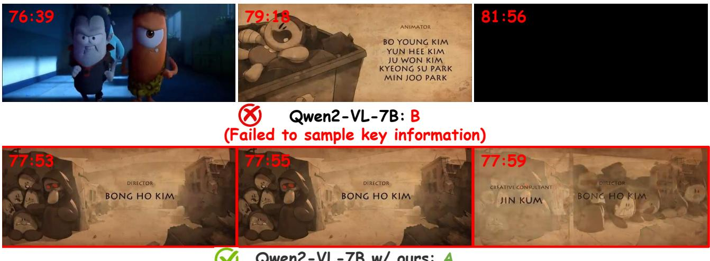

#

What letter appears on the computer after the girl with orange hair comes down from the bed and turns on the computer? (A) M (B)N(C) W Answer the question with the option letter

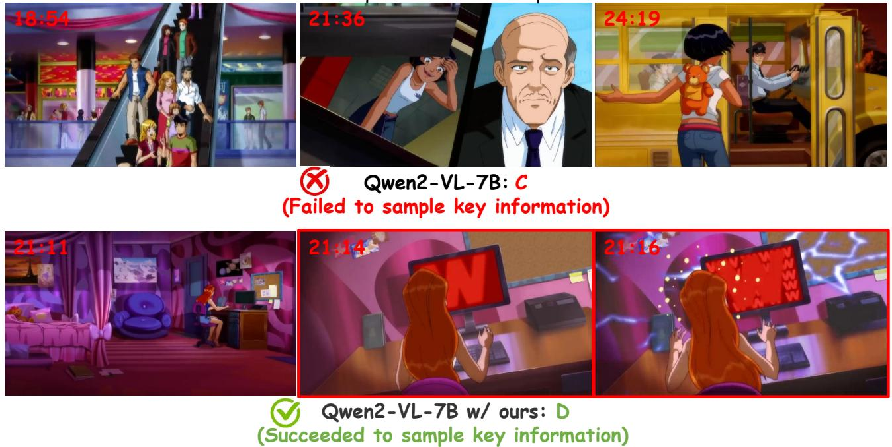  
Fig.S: Comparison between uniform sampling and our keyframe sampling on long-form video examples. Red boxes eevaabLncus uniform sampling misses these critical moments.

What year appears in the opening caption of the video? (A)1636 (B) 1366 (C) 1363 (D) 1633 Answer the question with the option letter

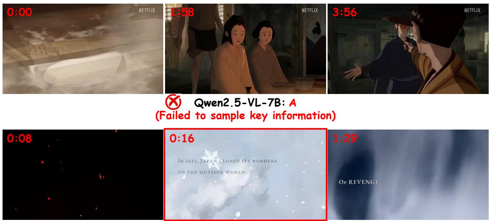  
(Succeeded to sample key information)

# Qwen2.5-VL-7B w/ ours: D

What is the license plate number of the purple car driven by a woman with long black hair? (A) Mandy (B) Erica (C) Lucy (D) Angela Answer the question with the option letter

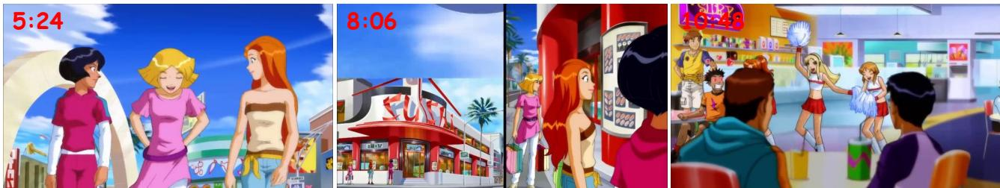

Qwen2.5-VL-7B: C (Failed to sample key information)

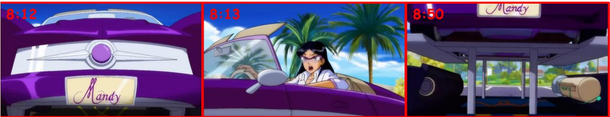  
Qwen2.5-VL-7B w/ ours: A (Succeeded to sample key information)   
SCmparionbetwnirmpli ndur keam mplRed boxe idicate y ien e wL, while uniform sampling overlooks them.

What's the name of the host in the green skirt? (A) Steve Multer (B) Petek Ergul (C) Nish Parkar (D) Carrie Palin Answer the question with the option letter

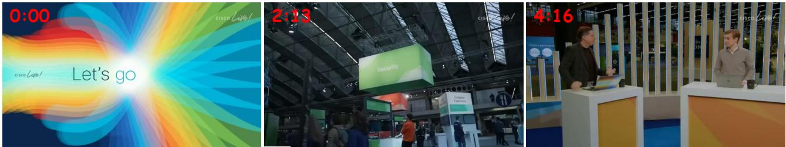  
LLaVA-Video-7B: A (Failed to sample key information)

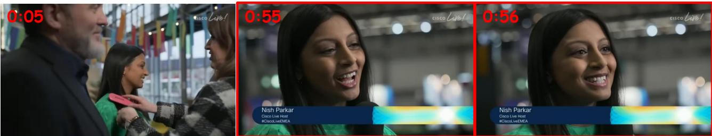

# LLaVA-Video-7B w/ ours:

(Succeeded to sample key information)

How many percentage of the land is covered in forest mentioned in the video? (A) 60 (B) 70 (C) 40 (D) 50 Answer the question with the option letter

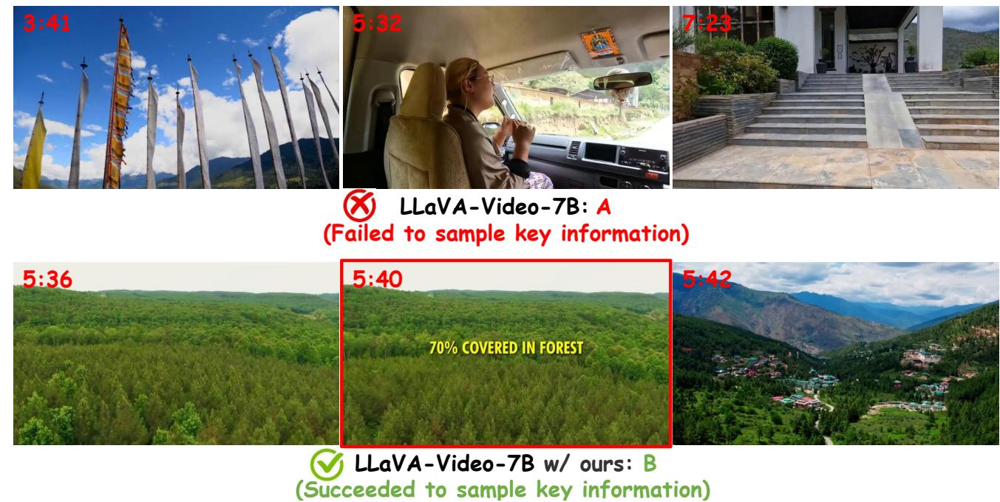  
Cpar etnio smplingn keam mpiReboxe dnoheila cBuabLVA to arrive at the correct answer, whereas uniform sampling fails.

What does this documentary mainly introduce? (A) Introducing BRABUS's modification of BMW cars. This video records the process of BRABUS's modification of Mercedes Benz E Class   
)Iroducig BRABUS'smodiication Audicars.This videorecors he process of BRABUS's modiicatin of Mercedes Benz G Class   
)Introducing BRABUS's modification of Mercedes-Benz cars. This video records the process of BRABUS's modification of Mercedes Benz E Class   
() Introducing BRABUS's modification of Mercedes-Benz cars. This video records the process of BRABUS's modification of Mercedes Benz G Class Answer the question with the option letter

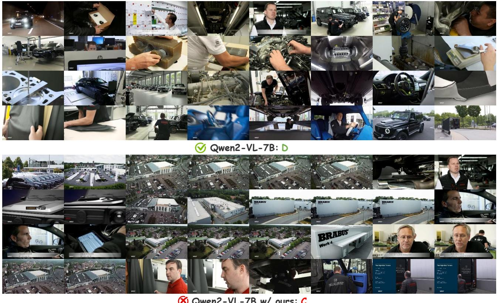  
  
FBe  s T oal i contt.nismpl prov roar oal covgn aptus mor erentaiv, lec nsehe r  p pruoralustn insufficient coverage.