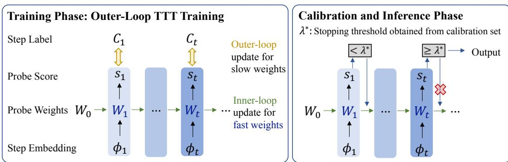
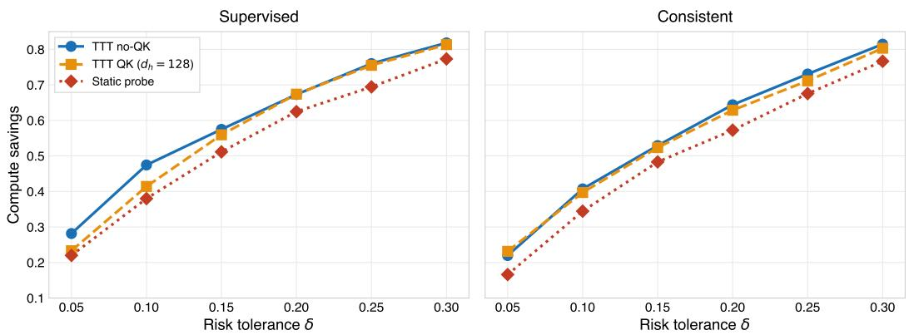
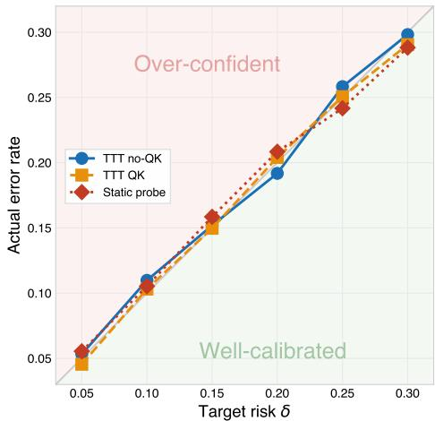
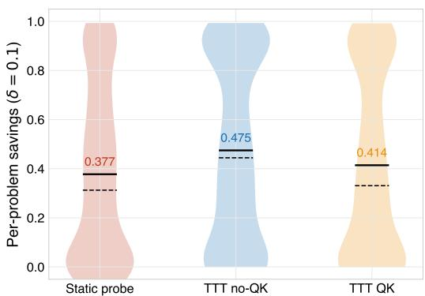
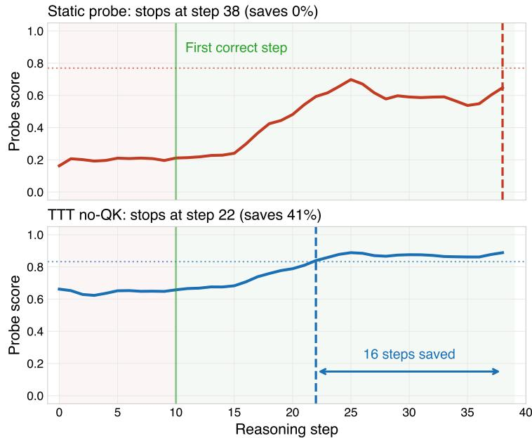

# Online Reasoning Calibration: Test-Time Training Enables Generalizable Conformal LLM Reasoning

Cai Zhou\* 123 Zekai Wang\*13 Menghua ${ \bf W } { \bf u } ^ { 1 2 }$ Qianyu Julie $\mathbf { Z } \mathbf { h } \mathbf { u } ^ { 3 4 }$ Flora C. Shi13   
Chenyu Wang12 Ashia Wilson13 Tommi Jaakkola12 Stephen Bates13 1Department o Electrical Engineering and Computer Scienc (MIT EECS)   
2Computer Science and Artificial Intelligence Laboratory (MIT CSAIL)   
3boto onio  Dec Systs ( DS)   
4Computational Science and Engineering (MIT CSE)   
Massachusetts Institute of Technology   
{caiz428,zekai}@mit.edu

# Abstract

While test-time scaling has enabled large language models to solve highly difficult tasks, state-of-the-art results come at exorbitant compute costs. These inefficiencies can be attributed to the miscalibration of post-trained language models, and the lack of calibration in popular sampling techniques. Here, we present Online Reasoning Calibration (ORCÅ), a framework for calibrating the sampling process that draws upon conformal prediction and test-time training. Specifically, we introduce a meta-learning procedure that updates the calibration module for each input. This allows us to provide valid confidence estimates under distributional shift, e.g. in thought patterns that occur across different stages of reasoning, or in prompt distributions between model development and deployment. ORCÅ not only provides theoretical guarantees on conformal risks, but also empirically shows higher efficiency and generalization across different reasoning tasks. At risk level $\delta { = } 0 . 1$ , ORCA improves Qwen2.5-32B efficiency on in-distribution tasks with savings up to $4 7 . 5 \%$ with supervised labels and $4 0 . 7 \%$ with self-consistency labels. Under zero-shot out-of-domain settings, it improves MATH-500 savings from $2 4 . 8 \%$ of the static calibration baseline to $6 \hat { 7 } . 0 \%$ while maintaining a low empirical error rate, and the same trend holds across model families and downstream benchmarks. Our code is publicly available at https:/ / github.com/wzekai99/ORCA.

# 1 Introduction

Large language models have solved increasingly complex problems, such as olympiad mathematics or software engineering tasks, by vastly scaling test-time compute. Strategies such as parallel sampling (Qi et al., 2025), sequential Monte Carlo (Feng et al., 2025), Monte Carlo tree search (Zhang et al., 2024), verifier-guided sampling (Yu et al., 2025), and self-consistency (Xie et al., 2024; Huang et al., 2025) are key to eliciting advanced reasoning capabilities from LLMs, but they are often subject to efficiency and reliability bottlenecks. Post-trained LLMs are known to be miscalibrated about when their intermediate rnin tates and final answers are correct (Li  al., 2025a). As a result, tes-time sal strategies often involve handcrafted parameters that balance sample quality and resource allocation  e.g. the number of parallel rollouts, or the verifier's prompt  heuristics which are vulnerable to reward hacking and distribution shift (Snell et al., 2024). This work addresses these challenges through a principled approach. We aim to (i) support adaptive compute allocation based on task difficulty, while providing statistical guarantees on sample quality and efficiency at test time, and (ii) remain robust under distribution shift, as the prompt distribution at deployment may differ that of model development.

Conformal prediction (Shafer & Vovk, 2008; Angelopoulos & Bates, 2021) and calibration methods provide finite-sample coverage guarantees, and they may provide confidence estimates of whether a set of LLM outputs contains the correct answer. In the context of testtime scaling, these methods are used to limit the number of tokens or examples that must be sampled, while still ensuring a high quality response. For example, Thought Calibration (Wu et al., 2025) among others (Xie et al., 2025; Wang et al., 2026) formulates inference efficiency as a risk-controlled stopping problem, and it produces calibrated thresholds for an online probe that emits stopping probabilities. However, these methods assume a fixed inference procedure, whose dynamics are uniform over the course of sampling. That is, they do not address the validity of confidence estimates under distribution shifts at two levels. On the sample level, reasoning patterns may vary across different positions within a long chain-ofthough (CoT). On the dataset level, models are often deployed in out-of-distribution (OOD) circumstances that have not been seen during training. In an orthogonal direction, Test-Time Training (TTT) (Sun et al., 2020; 2024) provides a natural mechanism for online adaptation of LLMs. At a high level, the goal is to adapt model weights at inference time, based on characteristics of the input. Specifically, an inner loop updates a small set of "fast" weights based on each incoming token or reasoning step, by minimizing a self-supervised objective. A separate outer loop is trained across many sequences to learn the shared initialization and feature mappings, which make the innerloop updates stable and transferable (Sun et al., 2020). The TTT framework is designed to improve overall modeling capability and generalization in new domains or long sequences through meta-learning. Its standard losses are reconstruction-based, which are not directly aligned with calibration or risk control. In this paper, we propose Online Reasoning Calibration (ORCA), which achieves efficient and confident test-time scaling, by framing calibration itself as an objective that can be optimized at inference time. Concretely, the inner loop optimizes a scoring function (correctness or consistency of LLM attempt), which is implemented through a TTT layer and updated online during the reasoning / search trajectory. As a result, calibration can be adapted to different stages of reasoning at the instance level. In parallel, the outer-loop is a meta-training procedure that learns the shared "slow" weights (initialization and feature mappings of the calibration layer), so that the online updates can remain stable, dataefficient, and transferable at dataset level. This design addresses two key limitations of prior work. First, it preserves statistical validity by calibrating the actual algorithm executed at deployment. Second, it improves robustness to distribution shift, by allowing instance-wise online adaptation of confidence estimates, while the base LLM remains fixed.

Empirically, our approach provides reliable stopping and candidate selection with controlled risk, reducing unnecessary test-time compute on easy instances and scaling compute only when uncertainty warrants it. At the target risk level $\delta { = } 0 . 1$ on the in-distribution test split, applying ORCA to Qwen2.5-32B leads to savings up to $4 7 . 5 \%$ in supervised mode and $4 0 . { \dot { 7 } } \%$ in consistency mode. In the zero-shot OOD setting, our method improves MATH-500 savings from $2 4 . 8 \%$ of static baseline to $6 7 . 0 \%$ with supervised labels, and it consistently outperforms static probes across model families (Qwen2.5-32B, QwQ-32B, and Llama-3.3-70B) and benchmarks (MATH, GPQA, and AIME).

# 2 Preliminary

Test-time training. Language models can be brittle under instance-level variation and distribution shift (Lu et al., 2022; Tang et al., 2024). Since it is intractable to enumerate new use cases and finetune models, test-time training (TTT) addresses this issue by meta-training to adapt lightweight modules during inference (Sun et al., 2020). Concretely, TTT introduces fas t weights $W _ { t }$ updated within each test sequence by minimizing a self-supervised or proxy objective. Following the standard formulation as in (Sun et al., 2024),

$$
\begin{array} { r } { \ell ( W ; x _ { t } ) = \| f ( \theta _ { K } x _ { t } ; W ) - C _ { t } \| _ { 2 } ^ { 2 } , \quad \quad \quad } \\ { W _ { t } = W _ { t - 1 } - \eta G _ { t } , \quad G _ { t } \approx \nabla _ { W } \ell ( W _ { t - 1 } ; x _ { t } ) , } \\ { z _ { t } = f ( \theta _ { Q } x _ { t } ; W _ { t } ) . \quad \quad } \end{array}
$$

Table 1: Notation summary.   

<table><tr><td>Symbol</td><td>Learned in</td><td>Description</td></tr><tr><td>φt</td><td></td><td>Step embedding: mean-pooled LLM hidden state at step t</td></tr><tr><td>Ct</td><td></td><td>Step label: correctness or consistency; Ct=0 at inference</td></tr><tr><td>Wo, b0</td><td>outer loop</td><td>Initial probe weights, learned via meta-training</td></tr><tr><td>Wt, bt</td><td>inner loop</td><td>Probe weights at step t, updated online during inference</td></tr><tr><td>θQ,K</td><td>outer loop</td><td>Unified outer view parameters (optional learned projections or identity)</td></tr><tr><td>η</td><td>outer loop</td><td>Inner learning rate; fixed or learned</td></tr><tr><td>S</td><td></td><td>Probe score: st = σ(f (θQφt; Wt))</td></tr><tr><td>l(W;φt)</td><td>−</td><td>Inner-loop objective: (st  Ct)2 (Brier score)</td></tr><tr><td>$λ</td><td>calibration</td><td>LTT-calibrated stopping threshold</td></tr><tr><td>δ</td><td></td><td>Target risk upper bound</td></tr><tr><td>E</td><td></td><td>LTT failure probability level</td></tr></table>

Here, $C _ { t }$ is the designed objective, which is a projection $\theta _ { V } x _ { t }$ aiming for self-reconstruction in the original formulation of Sun et al. (2024), but can actually be any properly defined target (e.g., calibration label in our setting); the inner loop performs per-step online adaptation via fast weights $W _ { t } ,$ while the outer loop meta-learns shared slow weights parameters (e.g., optional projections $\theta _ { Q , K , V } ,$ initialization $W _ { 0 }$ ) across many sequences so that inner-loop updates are stable and transferable. For simplicity, we use $\bar { { \boldsymbol { \theta } } _ { Q , K , V } }$ as a unified notation for outer-loop view parameters: they instantiate $\mathrm { Q / { K / V } }$ -style projections as feature extractors if learnable, or recover the no-QK special case when set to identity. TTT can be viewed as bilevel optimization: the outer objective learns how to make fast online learning effective, and the inner objective realizes instance-specific adaptation at inference time. In our setting, this mechanism is used to improve calibration quality while preserving downstream risk control through conformal calibration of the deployed procedure. Conformal prediction and risk control. In real-world deployment, we need uncertainty estimates that make stopping/selection decisions statistically reliable rather than heuristic. Conformal prediction provides finite-sample, distribution-free validity under exchangeability by converting nonconformity scores into calibrated prediction sets (Shafer & Vovk, 2008; Angelopoulos & Bates, 2021). In split conformal prediction, the score model is fit on training data and the decision threshold is calibrated on a held-out calibration set (Vovk et al., 2005; Papadopoulos, 2008). Concretely, given calibration scores $\{ u _ { i } \} _ { i = 1 } ^ { n }$ and miscoverage level $\epsilon \in ( 0 , 1 )$ , define the empirical quantile

$$
\tau _ { 1 - \epsilon } = \mathrm { Q u a n t i l e } _ { \lceil ( n + 1 ) ( 1 - \epsilon ) \rceil / ( n + 1 ) } \big ( u _ { 1 } , \dots , u _ { n } \big ) .
$$

At test time, we accept outputs whose score is below (or confidence above) this threshold. Equivalently, we form a conformal set containing all candidates that satisfy the calibrated criterion. This yields marginal finite-sample coverage (equivalently, risk control), typically of the form $\mathbb { P } ( \overset { \cdot } { Y } \in \widehat { \mathcal { C } } ( X ) ) \overset { \cdot } { \geq } 1 - \epsilon$ . Learn-then-Test (LTT) complements conformal prediction by calibrating decision rules rather than prediction sets. Given a candidate family of rules (or thresholds), LTT tests mean-risk nulls of the form $H _ { j } : r _ { j } \geq \delta$ with valid p-values on a held-out calibration set, then applies multiple testing (e.g., fixed-sequence testing) to select a rule with finite-sample guarantee $\mathbb { P } ( r ( \hat { j } ) \le \delta ) \ge \bar { 1 } - \bar { \epsilon }$ (Angelopoulos et al., 2021; Wu et al., 2025; Wang et al., 2026). Thus, conformal and LTT share the same exchangeability-based validity principle, but target different objects: set coverage vs. rule-level risk control.

# 3 Online Reasoning Calibration

# 3.1 Setup

We study the test-time reasoning procedure for input $x \in \mathcal { X }$ . At reasoning step $t$ , the model has generated thought prefix $\mathsf { \bar { y } } _ { t } = [ y ^ { ( 1 ) } , \ldots , y ^ { ( \hat { t } ) } ] ,$ where the current answer candidate ans $\left( y _ { t } \right)$ can be derived from the reasoning state. We denote by $\phi _ { t } \in \mathbb { R } ^ { d _ { \phi } }$ a hidden representation extracted from the base LLM at step $t$ This feature vector is input to the calibration module, which then outputs a probe score $\dot { z } _ { t } = f ( \phi _ { t } ; W _ { t } ) .$ , where $W _ { t }$ are step-dependent fast weights. For risk control, let $L ( \hat { y } , y ) \in \{ 0 , 1 \}$ denote the final-decision loss (e.g., a premature stop or an incorrect accepted answer).

  

Figure 1: Framework of Online Reasoning Calibration (ORCA).

Our formulation follows the TTT update structure of Sun et al. (2024) and the Learn-then-Test (LTT) risk-control framework of Angelopoulos et al. (2021); Wu et al. (2025). TTT updates use inner-loop fast-weight adaptation with outer-loop learned mappings/initialization, and risk control is enforced through LTT calibration of the deployed decision procedure. We redefine the per-step objective to target calibration quality rather than reconstruction. Since inference includes online updates of $\mathsf { \bar { \boldsymbol { W } } } _ { t } ,$ we calibrate the full adaptive algorithm (including sampling, updates, stopping rule) rather than relying on a static scorer. Table 1 summarizes the notation correspondence.

# 3.2 Inner loop: online-adaptive probe via fast-weight updates

At each reasoning step $t _ { \iota }$ , the base LLM produces a hidden representation $\phi _ { t } \in \mathbb { R } ^ { d _ { \phi } }$ (e.g., the mean-pooled last-layer hidden state). Our probe maintains fast weights $W _ { t }$ that are updated online along the reasoning chain, producing a confidence score $s _ { t } \in [ 0 , 1 ]$ at each step. The procedure follows a score-then-update protocol: the probe first scores the current step using the accumulated weights, then updates its weights before moving to the next step. We first introduce a vanilla form of inner loop updates. Let $f ( \cdot ; W ) : \mathbb { R } ^ { d _ { \phi } } \to [ 0 , 1 ]$ be a probe model (e.g., $f ( u ; W ) = \sigma ( W \cdot u + b ) )$ . We first describe the vanilla version, whose three operations at each step are as follows, Score (using weights from previous steps):

$$
s _ { t } = f ( \phi _ { t } ; W _ { t - 1 } )
$$

Inner-loop loss (Brier score against label $C _ { t }$ ):

$$
\ell ( W _ { t - 1 } ; \phi _ { t } ) = \left( s _ { t } - C _ { t } \right) ^ { 2 }
$$

Weight update (online gradient descent):

$$
W _ { t } = W _ { t - 1 } - \eta \nabla _ { W } \ell \bigl ( W _ { t - 1 } ; \phi _ { t } \bigr )
$$

Here $C _ { t } ~ \in ~ \{ 0 , 1 \}$ is a step-level label indicating the quality of current answer attempt, depending on the calibration metric. As discussed in Wu et al. (2025), $C _ { t }$ can come from multiple sources in meta-training: (i) supervised: $C _ { t } ~ = ~ \mathbb { I } \{ \mathsf { a n s } ( y _ { t } )$ is correct}, requiring ground-truth answers; (ii) consistent: $C _ { t } \dot { = } \mathbb { I } \{ \mathsf { a n s } ( y _ { t } ) = \mathsf { a n s } ( y _ { T } ) \} ,$ comparing to the fullbudget answer without ground truth; or (ii) teacher/verifier labels from an external model. Algorithm 1 Training phase: outer-loop TTT training Require: Training prompts $\mathcal { D } _ { \mathrm { t r a i n } } ;$ outer parameters $\Theta _ { \mathrm { o u t e r } } = ( \theta _ { Q , K } , W _ { 0 } , \eta )$ .

1: for each prompt $x \in { \overline { { \mathcal { D } } } } _ { \operatorname { t r a i n } }$ do   
2: Unrollinner updates along the reasoning trajectory to obtain $\{ W _ { t } \} _ { t = 1 } ^ { T }$ using $W _ { t } =$   
$W _ { t - 1 } - \eta \nabla _ { W } \ell \bar { ( W _ { t - 1 } ; \phi _ { t } ) }$ .   
3: Compute $\begin{array} { r } { \mathcal { L } _ { \mathrm { o u t e r } } \big ( \boldsymbol { x } , \{ W _ { t } \} _ { t = 1 } ^ { T } ; \Theta _ { \mathrm { o u t e r } } \big ) = \sum _ { t = 1 } ^ { T } \big ( s _ { t } - C _ { t } ^ { \mathrm { t r u e } } \big ) ^ { 2 } } \end{array}$ .   
4: Update trainable components of $\Theta _ { \mathrm { o u t e r } }$ by differentiating $\mathcal { L } _ { \mathrm { o u t e r } }$ through the unroll.   
5:end for   
6: Return trained $\Theta _ { \mathrm { o u t e r } }$ .

# 3.3 Outer loop: meta-learning for generalizable adaptive calibration

Instance-wise updates alone may overfit local noise and degrade risk control under distribution shift. Analogous to meta-learning, the outer loop learns proper initialization and feature interfaces, so that inner-loop adaptation remains transferable across tasks (Sun et al., 2020). Concretely, the inner loop learns to calibrate (task-specific online adaptation), while the outer loop learns to learn to calibrate. By meta-training across heterogeneous datasets and prompts, the model learns initialization and update dynamics that generalize beyond single training distribution, enabling robust and efficient calibration under distribution shift. Equations (5)(7) define the simplest TTT update rule, where a probe with fast weights $\bar { W } \in \mathbb { R } ^ { 1 \times d _ { \phi } }$ $\phi _ { t }$ T ztion s y $d _ { \phi } + 1$ learnable parameters (the initialization $W _ { 0 }$ and bias $b _ { 0 }$ ) and can be viewed as an onlineadaptive logistic regression, which is denoted as the vanilla or no-QK variant. Analogous to Sun et al. (2024), a natural extension introduces learned projections $\theta _ { K } , \theta _ { Q } \in$ $\mathbb { R } ^ { d _ { h } \times d _ { \phi } }$ that map $\phi _ { t }$ to a lower-dimensional space before the update and scoring operations:

$$
\begin{array} { r } { \begin{array} { r l } { s _ { t } = f ( \theta _ { Q } \phi _ { t } ; W _ { t - 1 } ) , \quad W \in \mathbb { R } ^ { 1 \times d _ { h } } } \\ { \ell ( W ; \phi _ { t } ) = \left( f ( \theta _ { K } \phi _ { t } ; W ) - C _ { t } \right) ^ { 2 } } \end{array} } \end{array}
$$

This QK variant allows the update direction $( \theta _ { K } )$ and scoring direction $( \theta _ { Q } )$ to attend to different aspects of the hidden state. The projections $\theta _ { K } , \theta _ { Q }$ are "slow weights" and are learned in the outer loop along with $W _ { 0 }$ and $\eta$ .Both variants share the same single-step expressiveness, but they differ in the dynamics of online adaptation. The no-QK variant updates in the full $d _ { \phi }$ -dimensional space, while $\mathrm { Q } / \mathrm { K }$ updates are constrained to a $d _ { h }$ . dimensional subspace. For comprehensiveness, we experiment with TTT with and without QK updates, and observe significant improvement over static baselines for both variants. We now formally introduce the general framework of slow weight training. Let $\Theta _ { \mathrm { o u t e r } } =$ $( \theta _ { Q , K } , W _ { 0 } , \eta )$ denote outer parameters. Recall that in our framework, base LLM parameters are not updated during training by default. Given a training prompt $x _ { \mathrm { . } }$ we first unroll the $\{ W _ { t } \} _ { t = 1 } ^ { T } .$ and then optimize:

$$
\operatorname* { m i n } _ { \Theta _ { \mathrm { o u t e r } } } \ \mathbb { E } _ { x \sim \mathcal { D } _ { \mathrm { t r a i n } } } \mathcal { L } _ { \mathrm { o u t e r } } \left( x , \{ W _ { t } \} _ { t = 1 } ^ { T } ; \Theta _ { \mathrm { o u t e r } } \right) ,
$$

with the outer loss defined as subject to $W _ { t } = W _ { t - 1 } - \eta \nabla _ { W } \ell ( W _ { t - 1 } ; x _ { t } )$ . We optimize this bilevel objective with truncated backpropagation through inner updates, then run LTT on a held-out calibration split produced by the same deployed procedure to select stopping thresholds. Algorithm 1 summarizes the general form of outer-loop training algorithm, which is visualized in Figure 1.

$$
\mathcal { L } _ { \mathrm { o u t e r } } \left( \boldsymbol { x } , \{ W _ { t } \} _ { t = 1 } ^ { T } ; \Theta _ { \mathrm { o u t e r } } \right) : = \sum _ { t = 1 } ^ { T } \left( s _ { t } - C _ { t } ^ { \mathrm { t r u e } } \right) ^ { 2 } .
$$

Algorithm 2 Calibration and inference phase

Require: Calibration prompts $\mathcal { D } _ { \mathrm { c a l } } ;$ threshold grid $\Lambda = \{ \lambda _ { 1 } > \cdots > \lambda _ { m } \} ;$ prompt $x _ { \mathrm { . } }$ trained $\Theta _ { \mathrm { o u t e r } }$ .   
1: (A) Calibrate stopping threshold via LTT.   
2: for each $\lambda _ { j } \in \Lambda$ do   
3: Run deployed procedure on $\mathcal { D } _ { \mathrm { c a l } }$ with threshold $\lambda _ { j } ;$ compute $\widehat { R } _ { n } ( \lambda _ { j } )$ and p-value $p _ { j }$ . 4:end for   
Apply fixed-sequence testing over $\{ H _ { j } \} _ { j = 1 } ^ { m }$ to control FWER, obtain $\Lambda _ { \mathrm { v a l i d } } ,$ and choose the most aggressive $\lambda ^ { \star } \in \Lambda _ { \mathrm { v a l i d } }$ .   
6: (B) Deploy inference procedure with online self-calibration.   
Initialize fast weights $\bar { \boldsymbol { W } }  \boldsymbol { W } _ { 0 }$ .   
8: for $t = 1 , \dots , T$ do   
9: Obtain the current hidden representation $\phi _ { t }$ from the reasoning state.   
10: Compute probe score $s _ { t } = f { \big ( } \phi _ { t } ; W { \big ) }$ .   
11: if $s _ { t } \subseteq \lambda ^ { \star }$ then   
12: Stop and output $\hat { z } \gets \mathrm { a n s } ( y _ { t } )$ .   
13: return z.   
14: end if   
15: Set pseudo-target $C _ { t } \gets 0$ and perform inner-loop update $W \gets W - \eta \nabla _ { W } \ell \bigl ( W ; \phi _ { t } \bigr )$ . 16: end for   
17: Return ans $\left( y _ { T } \right)$ if the budget is exhausted.

# 3.4 Risk-controlled conformal reasoning with online self-calibration

Following Wu et al. (2025), calibration is performed on a stopping decision rule (i.e. the full deployed procedure), rather than on raw uncalibrated scores. For a threshold $\lambda \in \Lambda ,$ recall the score process produced by the deployed procedure $s _ { t } ( x ) \ : = \ f ( \phi _ { t } ; W _ { t - 1 } )$ Define the stopping time and the corresponding deployed decision rule / procedure output i.e., the final answer attempt at the stopping time (or ans $\left( y _ { T } \right)$ if the budget is exhausted). Learn-then-Test (LTT) selects $\lambda ^ { \star }$ by calibrating the risk of the entire procedure $\mathbf { \mathcal { A } } _ { \lambda }$ on a held-out calibration set. In particular, LTT sweeps a grid $\Lambda = { \bf \bar { \{ } }  \lambda _ { 1 } > \cdot \cdot \cdot \bf { \dot { > } } \lambda _ { m } \}$ from conservative to aggressive, testing at each $\lambda$ whether the empirical risk exceeds the tolerance using a binomial p-value, i.e., we test where $\delta$ is the target risk upper bound, and construct p-values where $\epsilon$   
over $\{ H _ { j } \} _ { j = 1 } ^ { m }$   
rejected threshold $\lambda ^ { * }$ .The selected threshold satisfies

$$
\tau _ { \lambda } ( x ) : = \operatorname* { m i n } \{ t \leq T \colon s _ { t } ( x ) \geq \lambda \} ,
$$

$$
\ A _ { \lambda } ( x ) : = \mathrm { a n s } \big ( y _ { \tau _ { \lambda } ( x ) } \big ) ,
$$

$$
H _ { j } : \mathbb { E } [ R ( y _ { \tau _ { \lambda _ { j } } } ) ] \geq \delta ,
$$

$$
p _ { j } ^ { \mathrm { B T } } : = \mathbb { P } \big ( \mathrm { B i n o m } ( n , \delta ) \leq n \widehat { R } _ { n } \big ( \lambda _ { j } \big ) \big ) .
$$

$$
\mathbb { P } \left( \mathbb { E } [ R ( y _ { \tau _ { \lambda ^ { * } } } ) ] \le \delta \right) \ge 1 - \epsilon .
$$

Consequently, FWER control yields finite-sample risk control at level $( \delta , \epsilon )$ under exchangeability. Remarkably, guarantees apply to the entire deployed procedure, including reasoning chain expansion, online fast-weight updates, and threshold-based stopping (Figure 1). The full calibration and inference-time deployment of ORCA is presented in Algorithm 2. We detail the theoretical guarantees in Appendix A and more discussions in Appendix B.

# 4 Experiments

We evaluate the Online Reasoning Calibration framework on reasoning efficiency: given a risk tolerance $\delta$ how much compute can be saved by early stopping while maintaining answer quality? We compare against the static linear probe of Wu et al. (2025) across multiple models, label modes, and out-of-distribution benchmarks. More experimental results and ablation studies are deferred to Appendix C.

# 4.1 Setup

Datasets. We construct a 5K training corpus by combining three sources: (i) the s1K dataset of 1,000 math problems from Muennighoff et al. (2025), (ii) 2,000 problems from OpenR1 (Hugging Face, 2025), and (iii) 2,000 problems from DeepMath (He et al., 2025). Problems are split 3:1:1 into training (3,000), calibration (1,000), and test (1,000) sets. For outof-distribution (OOD) evaluation, we use five held-out benchmarks: MATH-500 (Hendrycks et al., 2021), GPQA-Diamond (Rein et al., 2024) (198 problems), and AIME 2024/2025/2026 (30 problems each). No OOD problems appear in training or calibration. Models. Our primary experiments use Qwen2.5-32B-Instruct (Yang et al., 2024), extracting mean-pooled last-layer hidden states $( d _ { \phi } = 5 , 1 2 0 )$ at each reasoning step. We also evaluate on QwQ-32B (Team, 2025) and Llama-3.3-70B-Instruct (Grattafiori et al., 2024) $( d _ { \phi } = 8 , 1 9 2 )$ to test cross-model generalization. Reasoning trajectories are generated by DeepSeek-R1- 671B (Guo et al., 2025a), and step labels are produced by a teacher model (Qwen-3-32B for correctness, GPT-4.1 for evaluation). Label modes. We evaluate two labeling strategies, following Wu et al. (2025): Supervised, where $C _ { t } ~ = ~ \mathbb { I } \{ z _ { t }$ is correct $\}$ requires ground-truth labels, and Consistent, where $C _ { t } ~ =$ $\mathbb { I } \{ z _ { t } = z _ { T } \}$ compares intermediate answers to the full-budget answer (no labels required).

Metrics. At each risk tolerance $\delta _ { \iota }$ Learn-then-Test (LTT; Angelopoulos et al. (2021)) calibration determines a threshold $\lambda ^ { * }$ . We report two metrics.  Savings $= 1 - \bar { t } _ { \mathrm { s t o p } } / \bar { t } _ { \mathrm { t o t a l } } ,$ the fraction of reasoning steps saved by early stopping. We verify in Section C.3 that step-level and token-level savings are highly consistent, so we report step-level savings throughout. $\pmb { \varrho }$ Error rate, the fraction of problems where the model is stopped at a step where its answer is still incorrect. Since step labels are cumulative (flip after first correct attempt), only stopping too early leads to an error. These two metrics form a natural trade-off controlled by the threshold $\bar { \lambda } ^ { * }$ : a lower threshold stops earlier, yielding higher savings but higher error risk; a higher threshold is more conservative, with lower error but less compute saved. LTT selects $\lambda ^ { * }$ to satisfy the guarantee $\begin{array} { r } { \mathbb { P } ( R \le \delta ) \ge 1 - \epsilon , } \end{array}$ where we fix $\epsilon = 0 . 0 \dot { 5 }$ and sweep the risk tolerance $\delta$ Unless stated otherwise, we report results at $\delta = 0 . 1$ . Training and epoch selection. All TTT-Probe variants are meta-trained with Adam (outer $\ln = 1 0 ^ { - 3 }$ ), gradient clipping at 1.0, and inner learning rate $\eta = 0 . 0 1$ We select epoch 20 for the no-QK variant and epoch 10 for all QK variants (see Section C.4 for details). Score trajectories are smoothed with a rolling window of 10 steps.

Table 2: In-distribution early-stopping performance on the 5K test set (Qwen2.5-32B, ${ \epsilon } \mathrm { { = } } 0 . 0 5$ . TTT-Probe (no-QK) improves savings by $2 4 . 9 \%$ relative over the static baseline.   

<table><tr><td rowspan="2">Method</td><td colspan="2">δ = 0.05</td><td colspan="2">δ = 0.1</td><td colspan="2">δ = 0.15</td><td colspan="2">δ = 0.2</td></tr><tr><td>Sav.</td><td>Err.</td><td>Sav.</td><td>Err.</td><td>Sav.</td><td>Err.</td><td>Sav.</td><td>Err.</td></tr><tr><td colspan="9">Supervised labels</td></tr><tr><td>Static Probe</td><td>.220</td><td>.055</td><td>.380</td><td>.105</td><td>.512</td><td>.159</td><td>.625</td><td>.208</td></tr><tr><td>TTT no-QK</td><td>.282</td><td>.053</td><td>.475</td><td>.110</td><td>.575</td><td>.152</td><td>.673</td><td>.192</td></tr><tr><td>TTT QK (d=128)</td><td>.233</td><td>.046</td><td>.414</td><td>.103</td><td>.560</td><td>.150</td><td>.674</td><td>.204</td></tr><tr><td colspan="9">Consistent labels (no ground truth)</td></tr><tr><td>Static Probe</td><td>.166</td><td>.049</td><td>.345</td><td>.098</td><td>.483</td><td>.156</td><td>.573</td><td>.197</td></tr><tr><td>TTT no-QK</td><td>.220</td><td>.045</td><td>.407</td><td>.096</td><td>.529</td><td>.141</td><td>.644</td><td>.193</td></tr><tr><td>TTT QK (dh=128)</td><td>.232</td><td>.064</td><td>.397</td><td>.113</td><td>.524</td><td>.150</td><td>.629</td><td>.187</td></tr></table>

# 4.2 In-Distribution Results

Table 2 (and Figure 2 in Appendix) compares the static baseline against TTT-Probe across four risk levels. At $\delta = 0 . { \overset { \triangledown } { 1 } }$ , the supervised TTT-Probe (no-QK) saves $4 7 . 5 \%$ of reasoning steps compared to $3 8 . 0 \%$ for the static baseline, a $2 4 . 9 \%$ relative improvement. The QK variant achieves $4 1 . 4 \%$ an $8 . 9 \%$ relative improvement. In consistent mode, the no-QK probe saves $4 0 . 7 \%$ vS. $3 4 . 5 \%$ , an $1 8 . 2 \%$ relative improvement without any ground-truth labels. Across all four $\delta$ levels, TTT-Probe uniformly dominates the baseline. Both the no-QK and QK variants maintain error rates within or close to the prescribed $\delta$ budgets, demonstrating that the online adaptation provides genuine calibration improvements.

# 4.3 Out-of-Distribution Generalization

A key motivation for TTT-Probe is robustness under distribution shift. Table 3 evaluates probes trained on the 5K corpus and applied zero-shot to five OOD benchmarks. Under supervised labels, both TTT variants achieve strong OOD generalization on MATH-500: no-QK saves $6 3 . 7 \%$ and QK saves $6 7 . 0 \%$ , compared to $2 4 . 8 \%$ for the baseline (a $2 . 6 { - } 2 . 7 \times$ improvement), while keeping errors below $2 . 3 \%$ On GPQA-Diamond, the no-QK probe achieves $7 1 . 5 \%$ savings. Under consistent labels, the QK variant achieves $6 3 . 7 \%$ on MATH-500 $2 . 7 \times$ the baseline), demonstrating that label-free TTT is viable for OOD deployment.

Table 3: O0D generalization at $\delta { = } 0 . 1$ The TTT-Probe achieves $2 . 6 { - } 2 . 7 \times$ the baseline savings on MATH-500 under supervised labels.   

<table><tr><td rowspan="2">Method</td><td colspan="2">MATH-500</td><td colspan="2">GPQA</td><td colspan="2">AIME&#x27;24</td><td colspan="2">AIME&#x27;25</td><td colspan="2">AIME&#x27;26</td></tr><tr><td>Sav.</td><td>Err.</td><td>Sav.</td><td>Err.</td><td>Sav.</td><td>Err.</td><td>Sav.</td><td>Err.</td><td>Sav.</td><td>Err.</td></tr><tr><td colspan="9">Supervised labels</td><td></td><td></td></tr><tr><td>Static Probe</td><td>.248</td><td>.008</td><td>.643</td><td>.270</td><td>.158</td><td>.050</td><td>.139</td><td>.000</td><td>.147</td><td>.050</td></tr><tr><td>TTT no-QK</td><td>.637</td><td>.023</td><td>.715</td><td>.300</td><td>.293</td><td>.150</td><td>.265</td><td>.056</td><td>.198</td><td>.050</td></tr><tr><td>TTT QK (d=128)</td><td>.670</td><td>.021</td><td>.665</td><td>.210</td><td>.295</td><td>.100</td><td>.258</td><td>.000</td><td>.134</td><td>.050</td></tr><tr><td colspan="9">Consistent labels (no ground truth)</td><td></td><td></td></tr><tr><td>Static Probe</td><td>.239</td><td>.004</td><td>.602</td><td>.328</td><td>.118</td><td>.033</td><td>.101</td><td>.000</td><td>.147</td><td>.100</td></tr><tr><td>TTT no-QK</td><td>.555</td><td>.012</td><td>.598</td><td>.318</td><td>.141</td><td>.033</td><td>.166</td><td>.067</td><td>.154</td><td>.067</td></tr><tr><td>TTT QK (dh=128)</td><td>.637</td><td>.016</td><td>.653</td><td>.328</td><td>.185</td><td>.033</td><td>.139</td><td>.000</td><td>.092</td><td>.000</td></tr></table>

# 4.4 Cross-Model Performance

To verify that our findings generalize beyond Qwen2.5-32B, we evaluate the same configurations on QwQ-32B $( d _ { \phi } = \bar { 5 } , 1 2 0 )$ and Llama-3.3-70B-Instruct $( d _ { \phi } = 8 , 1 9 2 )$ . All probes are trained and evaluated independently on each model's own embéddings. Both TTT-Probe variants consistently outperform the static baseline across all three models. The no-QK probe achieves relative improvements of $2 4 . 9 \%$ on Qwen, $3 3 . 7 \%$ on ${ \mathrm { Q w Q } } ,$ and $1 9 . 8 \%$ on Llama. The QK variant also improves over the baseline on all models $( 6 . 8 \mathrm { - } 2 7 . 6 \%$ relative). All error rates remain within or close to the $\delta { = } 0 . 1$ budget, confirming that the online adaptation mechanism is model-agnostic.

Table 4: Cross-model results $\delta \mathrm { = } 0 . 1 .$ , supervised). TTT-Probe consistently outperforms the static baseline across all three model families.   

<table><tr><td></td><td colspan="2">Qwen2.5-32B</td><td colspan="2">QwQ-32B</td><td colspan="2">Llama-3.3-70B</td></tr><tr><td>Method</td><td>Sav.</td><td>Err.</td><td>Sav.</td><td>Err.</td><td>Sav.</td><td>Err.</td></tr><tr><td>Static Probe</td><td>.380</td><td>.105</td><td>.295</td><td>.094</td><td>.354</td><td>.104</td></tr><tr><td>TTT no-QK</td><td>.475</td><td>.110</td><td>.394</td><td>.081</td><td>.424</td><td>.090</td></tr><tr><td>TTT QK (=128)</td><td>.414</td><td>.103</td><td>.376</td><td>.076</td><td>.378</td><td>.081</td></tr></table>

# 5 Related Work

Efficient test-time scaling. Recent literature span two directions. First, numerous works focus on reducing overthinking in post-trained LLMs, either during training or at inference time. Examples include explicit stopping policies and compute-aware generation control (Guo et al., 2025b; Sui et al., 2025; Han et al., 2024; Hou et al., 2025; Yang et al., 2025; Zhang et al., 2025; Sun et al., 2025). Second, self-consistency between parallel trajectories may be used to rank or terminate reasoning attempts (Wang et al., 2022; Mitchell et al., 2022; Weng et al., 2023; Wang et al., 2024a), and may also be combined with calibration methods for controllable efficiency gains (Xie et al., 2024; Huang et al., 2025; Liu et al., 2026). Our work also aims to sample efficiently from language models at inference time, but differs in its scope. While prior works calibrate probes that predict when to stop, we conformalize the end-to-end decision rule for stopping, which includes reasoning expansion and online adaptation to sampling dynamics.

Uncertainty quantification and calibration for LLM reasoning. Uncertainty quantification methods have primarily been used to calibrate whether language model outputs are selfconsistent (Rubin-Toles et al., 2025), high quality (Quach et al., 2024; Qiu & Miikkulainen, 2024; Jiang et al., 2024; Li et al., 2025b), and factual (Mohri & Hashimoto, 2024; Cherian et al., 2024a;b; Liu et al., 2024; Prinster et al., 2026). Some recent papers extend the framework from LLMs to agentic reasoning (Feng et al., 2024; Sadhuka et al., 2025; Lee et al., 2026). However,these methods filter sets of text post-hoc, rather than guide decoding in an online setting. More similar to this work, several methods calibrate the sampling of output sets (Quach et al., 2024; Wu et al., 2025; Huang et al., 2026b; Xiong et al., 2025; Xie et al., 2025; Wang et al., 2026; Huang et al., 2026a), but these methods often assume that the distributions of reasoning steps and prompts are static. Our work differs in that it models the sampling dynamics, as well as potential shifts in prompt distribution at deployment. Test-time training and online adaptation. TTT aims to improve generalization capability under distribution shifts by learning to conduct lightweight parameter updates at testtime, usually through self-supervised loss (Sun et al., 2020). The framework is also widely adopted to design efficient architectures including RNNs and linear transformers (Sun et al., 2024; Zhang et al., 2026), or adopt other designs such as sample-specific vector (Hu et al., 2025b), LoRA (Wang et al., 2024b) or input perplexity minimization (Hu et al., 2025a) to adapt language models at test time. In comparison, we are the first to introduce online adaptation and test-time training into calibration of LLM reasoning.

# 6 Conclusion

We introduced Online Reasoning Calibration (ORCA), a unified framework for riskcontrolled test-time scaling that combines online test-time training with conformal calibration of the deployed stopping rule. The key idea is to treat calibration itself as an adaptive prediction problem: the inner loop performs instance-specific learn-to-calibrate updates, while the outer loop meta-learns the initialization and update dynamics, which transfer across datasets and remain robust under distribution shift. By calibrating the full deployed procedure via LTT, ORCA provides finite-sample risk control while enabling adaptive compute allocation. Empirically, ORCA significantly improves efficiency at controlled error rates across multiple model families and benchmarks, including challenging zero-shot OOD settings. These results indicate that dynamically updated calibration modules can substantially improve both reliability and compute efficiency relative to static confidence estimators. More broadly, this work highlights a practical direction for integrating metalearning and conformal decision-making towards efficient reasoning, and demonstrates that jointly designing adaptation and calibration yield effective and robust systems.

# Ethics Statement

This paper is about technical methods for LLM reasoning, and is not directly related to any ethical issues. Moreover, the calibration methods can be applied to produce more trustworthy LLM outputs, which may benefit the ethical aspects in LLM usages.

# References

Anastasios N Angelopoulos and Stephen Bates. A gentle introduction to conformal prediction and distribution-free uncertainty quantification. arXiv preprint arXiv:2107.07511, 2021. Anastasios N Angelopoulos, Stephen Bates, Emmanuel J Candès, Michael I Jordan, and Lihua Lei. Learn then Test: Calibrating predictive algorithms to achieve risk control. arXiv preprint arXiv:2110.01052, 2021. John Cherian, Isaac Gibbs, and Emmanuel Candes. Large language model validity via enhanced conformal prediction methods. In The Thirty-eighth Annual Conference on Neural Information Processing Systems, 2024a. URL https: //openreview. net/forum?id=JD3NYpeQ3R. John Cherian, Isaac Gibbs, and Emmanuel Candes. Large language model validity via enhanced conformal prediction methods. Advances in Neural Information Processing Systems, 37:114812114842, 2024b. Shengyu Feng, Xiang Kong, Shuang Ma, Aonan Zhang, Dong Yin, Chong Wang, Ruoming Pang, and Yiming Yang. Step-by-step reasoning for math problems via twisted sequential monte carlo. In The Thirteenth International Conference on Learning Representations, 2025. URL https://openreview.net/forum?id=Ze4aPP0tIn. Yu Feng, Phu Mon Htut, Zheng Qi, Wei Xiao, Manuel Mager, Nikolaos Pappas, Kishaloy Halder, Yang Li, Yassine Benajiba, and Dan Roth. Diverseagententropy: Quantifying black-box ll unerainty throuh divers perspective andmultiagent interaction. Xi preprint arXiv:2412.09572, 2024. Aaron Grattafiori, Abhimanyu Dubey, Abhinav Jauhri, Abhinav Pandey, Abhishek Kadian, Ahmad Al-Dahle, Aiesha Letman, Akhil Mathur, Alan Schelten, Alex Vaughan, et al. The llama 3 herd of models. arXiv preprint arXiv:2407.21783, 2024. Daya Guo, Dejian Yang, Haowei Zhang, Junxiao Song, Ruoyu Zhang, Runxin Xu, Qihao Zhu, Shirong Ma, Peiyi Wang, Xiao Bi, et al. DeepSeek-R1: Incentivizing reasoning capability in LLMs via reinforcement learning. arXiv preprint arXiv:2501.12948, 2025a. Daya Guo, Dejian Yang, Haowei Zhang, Junxiao Song, Ruoyu Zhang, Runxin Xu, Qihao Zhu, Shirong Ma, Peiyi Wang, Xiao Bi, et al. DeepSeek-R1: Incentivizing reasoning capability in LLMs via reinforcement learning. arXiv preprint arXiv:2501.12948, 2025b. Tingxu Han, Zhenting Wang, Chunrong Fang, Shiyu Zhao, Shiqing Ma, and Zhenyu Chen. Token-budget-aware LLM reasoning. arXiv preprint arXiv:2412.18547, 2024. Zhiwei He, Tian Liang, Jiahao Xu, Qiuzhi Liu, Xingyu Chen, Yue Wang, Linfeng Song, Dian Yu, Zhenwen Liang, Wenxuan Wang, Zhuosheng Zhang, Rui Wang, Zhaopeng Tu, Haitao Mi, and Dong Yu." Deepmath-103k: A large-scale, challenging, decontaminated, and verifiable mathematical dataset for advancing reasoning, 2025. URL https: / /arxiv. org/ abs/2504.11456. Dan Hendrycks, Collin Burns, Saurav Kadavath, Akul Arora, Steven Basart, Eric Tang, Dawn Song, and Jacob Steinhardt. Measuring mathematical problem solving with the math dataset. In Thirty-fifth Conference on Neural Information Processing Systems Datasets and Benchmarks Track (Round 2), 2021. Bairu Hou, Yang Zhan, Jiabao Ji, Yujian Liu, Kaizhi Qian, JacobAndreas, and Shiyu hang. ThinkPrune: Pruning long chain-of-thought of LLMs via reinforcement learning. arXiv preprint arXiv:2504.01296, 2025. Jinwu Hu, Zhitian Zhang, Guohao Chen, Xutao Wen, Chao Shuai, Wei Luo, Bin Xiao, Yuanqing Li, and Mingkui Tan. Test-time learning for large language models, 2025a. URL https://arxiv.org/abs/2505.20633. Yang Hu, Xingyu Zhang, Xueji Fang, Zhiyang Chen, Xiao Wang, Huatian Zhang, and Guojun Qi. Slot: Sample-specific language model optimization at test-time, 2025b. URL https://arxiv.org/abs/2505.12392. Chengsong Huang, Langlin Huang, Jixuan Leng, Jiacheng Liu, and Jiaxin Huang. Efficient test-time scaling via self-calibration. arXiv preprint arXiv:2503.00031, 2025. Chengsong Huang, Langlin Huang, Jixuan Leng, Jiacheng Liu, and Jiaxin Huang. CaTS: Calibrated test-time scaling for efficient LLM inference. In The Fourteenth International Conference on Learning Representations, 2026a. URL https: //openreview. net/forum?id= jrSc4RJXy1. Jianguo Huang, Zhiyi Lyu, Fuxiang Zhang, Yanchen Deng, Deheng Ye, and Bo An. Uncertainty-aware tree search for efficient LLM reasoning, 2026b. URL https: // openreview.net/forum?id=RrLQbXCflj. Hugging Face. Open r1: A fully open reproduction of deepseek-r1, January 2025. URL https://github.com/huggingface/open-r1. Mingjian Jiang, Yangjun Ruan, Prasanna Sattigeri, Salim Roukos, and Tatsunori Hashimoto. Graph-based uncertainty metrics for long-form language model generations. In The Thirty-eighth Annual Conference on Neural Information Processing Systems, 2024. URL https: //openreview.net/forum?id=YgJPQw0lkO. Nicholas Lee, Lutfi Eren Erdogan, Chris Joseph John, Surya Krishnapillai, Michael W Mahoney, Kurt Keutzer, and Amir Gholami. Agentic test-time scaling for webagents. arXiv preprint arXiv:2602.12276, 2026. Chengzu Li, Han Zhou, Goran Glava, Anna Korhonen, and Ivan Vuli. Large language models are miscalibrated in-context learners. In Wanxiang Che, Joyce Nabende, Ekaterina Shutova, and Mohammad Taher Pilehvar (eds.), Findings of the Association for Computational Linguistics: ACL 2025, pp. 1157511596, Vienna, Austria, July 2025a. Association for Computational Linguistics. ISBN 979-8-89176-256-5. doi: 10.18653/v1/2025.findings-acl. 603. URL https://aclanthology.org/2025.findings-acl.603/. Yawei Li, David Rügamer, Bernd Bischl, and Mina Rezaei. Calibrating llms with informationtheoretic evidential deep learning, 2025b. URL https: //arxiv . org/abs/2502 . 06351. Linyu Liu, Yu Pan, Xiaocheng Li, and Guanting Chen. Uncertainty estimation and quantification for llms: A simple supervised approach, 2024. URL https: //arxiv . org/abs/2404. 15993. Zhangyi Liu, Huaizhi Qu, Xiaowei Yin, He Sun, Yanjun Han, Tianlong Chen, and Zhun Deng. Pets: A principled framework towards optimal trajectory allocation for efficient test-time self-consistency, 2026. URL https: //arxiv . org/abs/2602 . 16745. Yao Lu, Max Bartolo, Alastair Moore, Sebastian Riedel, and Pontus Stenetorp. Fantastically ordered prompts and where to find them: Overcoming few-shot prompt order sensitivity. In Smaranda Muresan, Preslav Nakov, and Aline Villavicencio (eds.), Proceedings of the 60th Annual Meeting of the Association for Computational Linguistics (Volume 1: Long Papers), pp. 80868098, Dublin, Ireland, May 2022. Association for Computational Linguistics. doi: 10.18653/v1/2022.acl-long.556. URL https://aclanthology.org/2022.ac1-1ong.556/. Eric Mitchell, Joseph Noh, Siyan Li, Will Armstrong, Ananth Agarwal, Patrick Liu, Chelsea Finn, and Christopher D Manning. Enhancing self-consistency and performance of pretrained language models through natural language inference. In Proceedings of the 2022 Conference on Empirical Methods in Natural Language Processing, pp. 17541768, 2022. Christopher Mohri and Tatsunori Hashimoto. Language models with conformal factuality guarantees. In Proceedings of the 41st International Conference on Machine Learning, ICML'24. JMLR.org, 2024. Niklas Muennighoff, Zitong Yang, Weijia Shi, Xiang Lisa Li, Li Fei-Fei, Hannaneh Hajishirzi, Luke Zettlemoyer, Percy Liang, Emmanuel Candes, and Tatsunori Hashimoto. s1: Simple test-time scaling. In Proceedings of the 2025 Conference on Empirical Methods in Natural Language Processing, pp. 2027520321, 2025. Harris Papadopoulos. Inductive conformal prediction: Theory and application to neural networks. In Tools in artificial intelligence. Citeseer, 2008. Drew Prinster, Clara Fannjiang, Ji Won Park, Kyunghyun Cho, Anqi Liu, Suchi Saria, and Samuel Stanton. Conformal policy control. arXiv preprint arXiv:2603.02196, 2026. Jianing Qi, Xi Ye, Hao Tang, Zhigang Zhu, and Eunsol Choi. Learning to reason across parallel samples for llm reasoning, 2025. URL https: //arxiv. org/abs/2506. 09014. Xin Qiu and Risto Miikkulainen. Semantic density: Uncertainty quantification for large language models through confidence measurement in semantic space. In A. Globerson, L. Mackey, D. Belgrave, A. Fan, U. Paquet, J. Tomczak, and C. Zhang (eds.), Advances in Neural Information Processing Systems, volume 37, pp. 134507134533, 2024. Victor Quach, Adam Fisch, Tal Schuster, Adam Yala, Jae Ho Sohn, Tommi S Jaakkola, and Regina Barzilay. Conformal language modeling. In The Twelfth International Conference on Learning Representations, 2024. David Rein, Betty Li Hou, Asa Cooper Stickland, Jackson Petty, Richard Yuanzhe Pang, Julien Dirani, Julian Michael, and Samuel R Bowman. GPQA: A graduate-level Googleproof Q&A benchmark. In First Conference on Language Modeling, 2024. Maxon Rubin-Toles, Maya Gambhir, Keshav Ramji, Aaron Roth, and Surbhi Goel. Conformal language model reasoning with coherent factuality. In The Thirteenth International Conference on Learning Representations, 2025. URL https: //openreview. net/forum?id= AJpUZd8C1b. Shuvom Sadhuka, Drew Prinster, Clara Fannjiang, Gabriele Scalia, Aviv Regev, and Hanchen Wang. E-valuator: Reliable agent verifiers with sequential hypothesis testing. arXiv preprint arXiv:2512.03109, 2025. Glenn Shafer and Vladimir Vovk. A tutorial on conformal prediction. Journal of Machine Learning Research, 9(3), 2008. Charlie Snell, Jaehoon Lee, Kelvin Xu, and Aviral Kumar. Scaling LLM test-time compute optimally can be more effective than scaling model parameters. arXiv preprint arXiv:2408.03314, 2024. Yang Sui, Yu-Neng Chuang, Guanchu Wang, Jiamu Zhang, Tianyi Zhang, Jiayi Yuan, Hongyi Liu, Andrew Wen, Shaochen Zhong, Hanjie Chen, et al. Stop overthinking: A survey on efficient reasoning for large language models. arXiv preprint arXiv:2503.16419, 2025. Renliang Sun, Wei Cheng, Dawei Li, Haifeng Chen, and Wei Wang. Stop when enough: Adaptive early-stopping for chain-of-thought reasoning, 2025. URL https: //arxiv. org/ abs/2510.10103. Yu Sun, Xiaolong Wang, Zhuang Liu, John Miller, Alexei A. Efros, and Moritz Hardt. Testtime training with self-supervision for generalization under distribution shifts, 2020. URL https://arxiv.org/abs/1909.13231. Yu Sun, Xinhao Li, Karan Dalal, Jiarui Xu, Arjun Vikram, Genghan Zhang, Yann Dubois, Xinlei Chen, Xiaolong Wang, Sanmi Koyejo, et al. Learning to (learn at test time): Rnns with expressive hidden states. arXiv preprint arXiv:2407.04620, 2024. Raphael Tang, Crystina Zhang, Xueguang Ma, Jimmy Lin, and Ferhan Ture. Found in the middle: Permutation self-consistency improves listwise ranking in large language models. In Kevin Duh, Helena Gomez, and Steven Bethard (eds.), Proceedings of the 2024 Conference of the North American Chapter of the Association for Computational Linguistics: Human Language Technologies (Volume 1: Long Papers), June 2024. Qwen Team. QwQ-32B: Embracing the power of reinforcement learning, March 2025. URL https://qwenlm.github.io/blog/qwq-32b/. Vladimir Vovk, Alexander Gammerman, and Glenn Shafer. Algorithmic learning in a random world, volume 29. Springer, 2005. Peiyi Wang, Lei Li, Zhihong Shao, Runxin Xu, Damai Dai, Yifei Li, Deli Chen, Yu Wu, and Zhifang Sui. Math-shepherd: Verify and reinforce llms step-by-step without human annotations. In Proceedings of the 62nd Annual Meeting of the Association for Computational Linguistics (Volume 1: Long Papers), pp. 94269439, 2024a. Xi Wang, Anushri Suresh, Alvin Zhang, Rishi More, William Jurayj, Benjamin Van Durme, Mehrdad Farajtabar, Daniel Khashabi, and Eric Nalisnick. Conformal thinking: Risk control for reasoning on a compute budget, 2026. URL https: //arxiv. org/abs/2602. 03814. Xuezhi Wang, Jason Wei, Dale Schuurmans, Quoc Le, Ed Chi, Sharan Narang, Aakanksha Chowdhery, and Denny Zhou. Self-consistency improves chain of thought reasoning in language models. arXiv preprint arXiv:2203.11171, 2022. Y. Wang, D. Ma, and D. Cai. With greater text comes greater necessity: Inference-time training helps long text generation, 2024b. URL https: //arxiv . org/abs/2401. 11504. Yixuan Weng, Minjun Zhu, Fei Xia, Bin Li, Shizhu He, Shengping Liu, Bin Sun, Kang Liu, and Jun Zhao. Large language models are better reasoners with self-verification. In Findings of the Association for Computational Linguistics: EMNLP 2023, pp. 25502575, 2023. Menghua Wu, Cai Zhou, Stephen Bates, and Tommi Jaakkola. Thought calibration: Efficient and confident test-time scaling. arXiv preprint arXiv:2505.18404, 2025. Yangxinyu Xie, Tao Wang, Soham Mallick, Yan Sun, Georgy Noarov, Mengxin Yu, Tanwi Mallick, Weijie J Su, and Edgar Dobriban. Statistical early stopping for reasoning models. In NeurIPS 2025 Workshop on Efficient Reasoning, 2025. URL https: //openreview. net/ forum?id=cmi4FBheRq. Zhihui Xie, Jizhou Guo, Tong Yu, and Shuai Li. Calibrating reasoning in language models with internal consistency. arXiv preprint arXiv:2405.18711, 2024. Jing Xiong, Qiujiang Chen, Fanghua Ye, Zhongwei Wan, Chuanyang Zheng, Chenyang Zhao, Hui Shen, Alexander Hanbo Li, Chaofan Tao, Haochen Tan, et al. Atts: Asynchronous test-time scaling via conformal prediction. arXiv preprint arXiv:2509.15148, 2025. An Yang, Baosong Yang, Beichen Zhang, Binyuan Hui, Bo Zheng, Bowen Yu, Chengyuan Li, Dayiheng Liu, Fei Huang, Haoran Wei, et al. Qwen2.5 technical report. arXiv preprint arXiv:2412.15115, 2024. Chenxu Yang, Qingyi Si, Yongjie Duan, Zheliang Zhu, Chenyu Zhu, Zheng Lin, Li Cao, and Weiping Wang. Dynamic early exit in reasoning models. arXiv preprint arXiv:2504.15895, 2025. Fei Yu, Yingru Li, and Benyou Wang. Scaling flaws of verifier-guided search in mathematical reasoning, 2025. URL https://arxiv.org/abs/2502.00271. Anqi Zhang, Yulin Chen, Jane Pan, Chen Zhao, Aurojit Panda, Jinyang Li, and He He. Reasoning models know when they're right: Probing hidden states for self-verification. arXiv preprint arXiv:2504.05419, 2025.

Dan Zhang, Sining Zhoubian, Ziniu Hu, Yisong Yue, Yuxiao Dong, and Jie Tang. Rest-mcts\*: Llm self-training via process reward guided tree search. Advances in Neural Information Processing Systems, 37:6473564772, 2024. Tianyuan Zhang, Sai Bi, Yicong Hong, Kai Zhang, Fujun Luan, Songlin Yang, Kalyan Sunkavalli, William T. Freeman, and Hao Tan. Test-time training done right.  In The Fourteenth International Conference on Learning Representations, 2026. URL https: //openreview.net/forum?id=Tb9qAxT3xv.

# Appendix

# A Theoretical Guarantees

We provide theoretical guarantees of risk control through ORCA in this section, with slightly more complicated and rigorous notations. The central question is whether intra-instance online updates invalidate Learn-then-Test (LTT) risk control. Our key observation is that LTT calibrates the entire deployed procedure as a black-box algorithm. As long as (i) the procedure resets its internal state across instances and (i) calibration and test runs are exchangeable under the same deployed procedure, finite-sample risk control remains valid.

Calibration and test data. Let $\mathcal { D } _ { \mathtt { c a l } } = \{ ( X _ { i } , Y _ { i } ) \} _ { i = 1 } ^ { n }$ be a calibration set and let $\left( X _ { n + 1 } , Y _ { n + 1 } \right)$ be a fresh test point. For the p-value construction below, we assume $( X _ { i } , Y _ { i } )$ are i.i.d. from a distribution $\bar { P }$ (hence exchangeable), and independent of the random seeds used by the deployed algorithm. All trained outer-loop parameters (e.g., $\Theta _ { \mathrm { o u t e r } }$ and any fixed feature extractors) are treated as fixed constants independent of $\mathcal { D } _ { \mathrm { c a l } }$ (e.g., learned on disjoint data); equivalently, all guarantees hold conditional on these fixed parameters.

Deployed procedure as a randomized map. For each threshold $\lambda \in \Lambda ,$ define the entire deployed reasoning procedure as a (possibly randomized) mapping where $U \sim P _ { U }$ denotes all internal randomness (LLM sampling, search randomness, etc.). This mapping includes (i) initializing fast weights $W _ { 0 }  \hat { \Theta _ { \mathrm { o u t e r } } } ,$ (ii) computing step representations $\phi _ { t } ,$ (iii) computing scores $\begin{array} { r } { { s } _ { t } = f ( \phi _ { t } ; \mathbf { \breve { W } } _ { t - 1 } ) } \end{array}$ , (iv) updating fast weights within the instance, and (v) stopping at $\tau _ { \lambda } ( x ; U ) = \operatorname* { m i n } \{ t \leq T \colon s _ { t } ( x ; \hat { U } ) \geq \lambda \}$ .

$$
\mathcal { A } _ { \lambda } : \mathcal { X } \times \mathcal { U } \to \mathcal { V } , \qquad \hat { Y } = \mathcal { A } _ { \lambda } ( \boldsymbol { x } ; \boldsymbol { U } ) ,
$$

Risk definition (includes algorithm randomness). Let $L : \mathcal { y } \times \mathcal { y }  \{ 0 , 1 \}$ be a 01 risk (e.g., incorrectness indicator). For a single instance $( X , Y )$ and randomness $U$ , define

$$
R ( \lambda ; X , Y , U ) : = L ( \mathcal { A } _ { \lambda } ( X ; U ) , Y ) \in \{ 0 , 1 \} .
$$

Let the marginal (deployment) risk of threshold $\lambda$ be

$$
r ( \lambda ) : = \mathbb { E } _ { ( X , Y ) \sim P } \mathbb { E } _ { U \sim P _ { U } } [ R ( \lambda ; X , Y , U ) ] .
$$

On the calibration set, for each $\lambda$ we run the deployed procedure independently per instance with fresh randomness $U _ { i } \stackrel { \mathrm { i . i . d . } } { \sim } P _ { U }$ and obtain

$$
R _ { i } ( \lambda ) : = R ( \lambda ; X _ { i } , Y _ { i } , U _ { i } ) , \qquad i = 1 , \ldots , n .
$$

Lemma A.1 (Intra-instance adaptation preserves inter-instance exchangeability). Fix any threshold $\lambda \in \Lambda$ $\{ ( X _ { i } , Y _ { i } ) \} _ { i = 1 } ^ { n + 1 }$ are exchangeable and $\{ U _ { i } \} _ { i = 1 } ^ { n + 1 }$ are id.andindependent of $\{ ( X _ { i } , Y _ { i } ) \} .$ I hen tthe sequence $\{ R _ { i } ( \lambda ) \} _ { i = 1 } ^ { n + 1 }$ with $R _ { i } ( \lambda ) : = R ( \lambda ; X _ { i } , Y _ { i } , U _ { i } )$ is exchangeable (indeed i.i.d. under the i.i.d. assumption). Proof. Because the deployed procedure resets its internal state at the start of each instance, $( \boldsymbol { X _ { i } } , \boldsymbol { \dot { Y _ { i } } } , \boldsymbol { U _ { i } } ) \mapsto R ( \lambda ; \boldsymbol { X _ { i } } , \boldsymbol { Y _ { i } } , \boldsymbol { U _ { i } } )$ is the same measurable function applied separately to each triple. Exchangeability of $\{ ( X _ { i } , Y _ { i } , U _ { i } ) \}$ implies exchangeability of $\{ R _ { i } ( \lambda ) \}$ by closure of exchangeability under measurable mappings. □ Theorem A.2 (Finite-sample risk control of ORCA via LTT fixed-sequence testing). Let $\delta \in ( 0 , 1 )$ be a target risk level and $\epsilon \in ( 0 , 1 )$ a failure-probability level. Fix an ordered threshold grid $\dot { \Lambda } = \{ \lambda _ { 1 } > \breve { \lambda } _ { 2 } > \cdot \cdot \cdot > \lambda _ { m } \}$ For each $\lambda _ { j } ,$ consider the null hypothesis

$$
H _ { j } : \ r ( \lambda _ { j } ) \geq \delta \quad ( e q u i v a l e n t l y , t h e \ p r o c e d u r e \ i s \ \mathrm { n o t } \ \delta \ – s a f e ) .
$$

For each $j ,$ let $\begin{array} { r } { \widehat { r } _ { n } ( \lambda _ { j } ) = \frac { 1 } { n } \sum _ { i = 1 } ^ { n } R _ { i } ( \lambda _ { j } ) } \end{array}$ and define the one-sided binomial $p$ value

$$
p _ { j } : = \mathbb { P } \big ( \mathtt { B i n o m } ( n , \delta ) \leq n \widehat { r } _ { n } ( \lambda _ { j } ) \big ) .
$$

Assume $\{ R _ { i } ( \lambda _ { j } ) \} _ { i = 1 } ^ { n }$ are i.id. Beliwih mean $r ( \lambda _ { j } )$ (whichholdndethe assuptinse). Apply fixed-sequence testing (FST): test $H _ { 1 } , H _ { 2 } , \ldots$ in order at level $\epsilon _ { \iota }$ rejecting $H _ { j }$ if $p _ { j } \leq \epsilon ,$ and stop at the first $j$ such that $p _ { j } > \epsilon$ .Let $\hat { \jmath }$ be the last rejected index (or $\hat { \jmath } = 0$ if none are rejected) and output $\lambda ^ { \star } : = \lambda _ { \widehat { \jmath } }$ (the most aggressive rejected threshold). Then

$$
\begin{array} { r } { \mathbb { P } _ { \mathcal { D } _ { \mathrm { c a l } } } \mathopen { } \mathclose \bgroup \left( r \mathopen { } \mathclose \bgroup \left( \lambda ^ { \star } \aftergroup \egroup \right) \leq \delta \aftergroup \egroup \right) ~ \geq ~ 1 - \epsilon . } \end{array}
$$

Proof. Under $H _ { j }$ (i.e., $r ( \lambda _ { j } ) \geq \delta )$ , the p-value $p _ { j }$ is super-uniform: for any $\alpha \in [ 0 , 1 ]$ , (standard one-sided binomial test; see Angelopoulos et al. (2021)). In FST, if any true null is ever rejected, then the first true null in the ordered sequence must be rejected at level $\epsilon$ Therefore, by super-uniformity, i.e., FST controls the family-wise error rate (FWER) at level $\epsilon$ On the complement event (probability at least $1 - \epsilon )$ , every rejected $H _ { j }$ is false, hence $r ( \lambda _ { j } ) ~ < ~ \delta$ for all rejected indices, and in particular for the selected $\lambda ^ { \star }$ (the most aggressive rejected threshold). Thus $\begin{array} { r } { \mathbb { P } ( r ( \lambda ^ { \star } ) \le \delta ) \ge 1 - \epsilon } \end{array}$ . □

$$
\mathbb { P } ( p _ { j } \le \alpha \mid H _ { j } ) \le \alpha
$$

$$
\mathbb { P } ( \mathrm { F S T ~ r e j e c t s ~ a n y ~ t r u e ~ } H _ { j } ) \ \leq \ \epsilon ,
$$

Remark A.3 (Marginal guarantee). Theorem A.2 provides marginal guarantee (expectation of all prompt distribution), not conditional guarantee (specific for a certain prompt). Remark A.4 (General bounded risks). If one wishes to allow $L ( \cdot , \cdot ) \in [ 0 , 1 ]$ (not necessarily $\{ 0 , 1 \} )$ , the same proof structure holds by replacing the binomial p-values with any valid super-uniform $\mathrm { p }$ -values for the mean-risk null $r ( \lambda _ { j } ) \geq \delta$ (e.g., Hoeffding-type tests under independence), without changing the FST argument.

# B Discussions

Self-supervised inner loop at inference. A central design choice is that, during deployment (both calibration-set runs and test inference), the inner-loop update uses $\dot { C } _ { t } = 0$ at every non-stopping step. Formally, updates are applied only while $\bar { s } _ { t } < \lambda ^ { * }$ ;once $s _ { t } \geq \lambda ^ { * }$ , the procedure stops and no further gradient step is taken. This yields a fully self-supervised inference-time update rule, since no external label is required after deployment. It also improves traininginference consistency: in meta-training, all pre-transition steps (for which $C _ { t } ^ { \mathrm { t r u e } } = 0 ,$ ipeii only through the outer objective. Detecting the reasoning breakthrough. For each problem at training time, we assume (after cumulative transformation) that the true step labels $C _ { t } ^ { \mathrm { t r u e } }$ follow a monotone binary sequence, $[ 0 , 0 , \ldots , 0 , 1 , 1 , \ldots , 1 ] ,$ with a single transition point at which the answer first becomes correct. The outer-loop objective $\bar { \sum _ { t } } ( s _ { t } - C _ { t } ) ^ { 2 }$ therefore encourages the probe to localize this transition, assigning low scores before the transition and high scores afterward.

At inference time, we do not assume access to $C _ { t } ^ { \mathrm { t r u e } }$ and we do not claim that "not stopping" implies $C _ { t } ^ { \mathrm { t r u e } } = 0$ Instead, we use the pseudo-target $C _ { t }$ to adapt the fast weights toward the instance-specific pre-transition baseline, which empirically acts as a novelty detector for the transition. Consequently, the probe accumulates an instance-specific representation of typical pre-transition reasoning patterns. When a substantive reasoning breakthrough occurs and the embedding $\phi _ { t }$ shifts accordingly, the probe score increases because the new state is no longer well explained by the current adaptation. Meta-training embeds this behavior into the slow parameters: $\dot { W } _ { 0 }$ sets the initialization and $\eta$ controls the adaptation rate to the problem-specific baseline. Under this view, the $C _ { t } { = } 0$ inner loop acts as an implicit novelty detector, where "novelty" corresponds to the transition pattern learned during meta-training. From another perspective, the entire deployment procedure can be treated as a binary classification task, hence there is no train-test gap at all. Onieadaptation vs. on-policy valiity.Our metho isonline: during a single reasi trajectory, the fast weights are updated step-by-step, and the stopping decision is made from the current adapted state. This describes the algorithmic form of the method and does not, by itself, imply a distributional guarantee. By contrast, on-policy is the condition required by conformal/LTT calibration: calibration trajectories and deployment trajectories should be generated under the same effective policy (including search behavior, stopping logic, and update dynamics). Therefore, ORCÅ is best described as an online method with on-policy validity guarantees. If the deployment policy changes, one should re-calibrate under the new policy or apply explicit off-policy correction (e.g., importance weighting); otherwise, exchangeability assumptions can fail.

# C Additional Experiments

# C.1 Ablation Studies

  

Figure 2: Compute savings vs. risk tolerance $\delta$ for supervised (left) and consistent (right) labels (Qwen2.5-32B). TTT no-QK consistently outperforms the baseline across all risk levels, with the largest gap at low $\delta$ .

TTT is essential, not just the architecture. Table 5 ablates the TTT-Probe by comparing against two controls: (1) standard supervised training on the same architecture, and (2) random initialization without any training. The "standard" variants train the same probe architecture (no-QK or QK) via standard Adam optimization, using the same learning rate $( 1 0 ^ { - 3 } )$ and number of epochs (20 for no-QK, 10 for QK) as the corresponding TTT variants. At inference, standard-trained probes apply a single forward pass per step without online updates. The "no meta-training" variants use randomly initialized weights with online updates only; since no training occurs, these results are epoch-independent.

Standard training is insufficient; TTT meta-learning is the key contributor. The standardtrained no-QK probe achieves only $2 3 . 9 \%$ savings, substantially below the static baseline $( 3 8 . 0 \% )$ . Without $\mathrm { P C A } _ { \iota }$ training a linear model on the full 5,120-dimensional embedding space is prone to overfitting on 150K training samples. The standard-trained QK variant $( { \bar { 3 } } 9 . 4 \% )$ performs comparably to the static baseline, since its learned projection $( \theta _ { Q } \colon 5 , 1 2 0 \to$ 128) serves a similar role to PCA. Neither standard-trained variant benefits from online adaptation at inference. Replacing standard training with TTT meta-learning improves savings from $2 3 . 9 \%$ to $4 7 . 5 \%$ for no-QK (a $2 . 0 \times$ increase) and from $3 9 . 4 \%$ to $4 1 . { \overset { \cdot } { 4 } } \%$ for QK. The meta-learning outer loop trains the probe not just to classify correctness, but to produce scores that improve through online updates at inference. Without any training at all (random initialization), online updates alone achieve only $2 5 . 4 \%$ savings, confirming that meta-learned initialization is essential. Figure 2 visualizes the full risksavings tradeoff in the in-distribution setting. The gap between TTT-Probe and the static baseline is most pronounced in the moderate-risk regime $( \delta \in [ 0 . 0 5 , 0 . 2 ] )$ , where the online adaptation provides the largest marginal benefit. At higher $\delta _ { . }$ , all methods converge as most steps can be skipped regardless of probe quality.

Table 5: Core mechanism ablation (supervised, $\delta \mathrm { = } 0 . 1$ . Standard supervised training on the same architecture underperforms the static baseline (no-QK) or only matches it (QK). TTT meta-learning with online updates is necessary for substantial improvement. Rows marked with $^ *$ use random initialization.   

<table><tr><td>Configuration</td><td>Architecture</td><td>Training</td><td>Online update</td><td>Savings</td><td>Error</td></tr><tr><td>Full TTT (no-QK)</td><td>Linear</td><td>Meta-learn</td><td>✓</td><td>.475</td><td>.110</td></tr><tr><td>Standard (no-QK)</td><td>Linear</td><td>Supervised</td><td></td><td>.239</td><td>.095</td></tr><tr><td>Full TTT (Q, h=128)</td><td>QK proj.</td><td>Meta-learn</td><td>√</td><td>.414</td><td>.103</td></tr><tr><td>Standard (QK, dh=128)</td><td>QK proj.</td><td>Supervised</td><td></td><td>.394</td><td>.108</td></tr><tr><td>No meta-training*</td><td>QK proj.</td><td>None</td><td>√</td><td>.254</td><td>.099</td></tr><tr><td>No meta + no update*</td><td>QK proj.</td><td>None</td><td></td><td>.173</td><td>.091</td></tr><tr><td>Static Probe</td><td>PCA+LogReg</td><td>Supervised</td><td></td><td>.380</td><td>.105</td></tr></table>

Together, meta-training and online updates are complementary: meta-training provides the foundation for calibration quality, while online updates enable instance-level adaptation. Architecture variants. Table 6 evaluates alternative probe designs. QK architecture variants achieve competitive in-distribution savings (0.410.45). LayerNorm, residual, and shared QK variants reach 0.4490.451, approaching the no-QK probe (0.475).

Table 6: Architecture ablation (supervised, $d _ { h } = 1 2 8 , \delta = 0 . 1 )$ .   

<table><tr><td colspan="3"></td><td colspan="5">OOD Savings</td></tr><tr><td>Variant</td><td>Sav.</td><td>Err.</td><td>MATH</td><td>GPQA</td><td>A&#x27;24</td><td>A&#x27;25</td><td>A&#x27;26</td></tr><tr><td>QK (dh=128)</td><td>.414</td><td>.103</td><td>.670</td><td>.665</td><td>.295</td><td>.258</td><td>.134</td></tr><tr><td>+ LayerNorm</td><td>.451</td><td>.095</td><td>.697</td><td>.726</td><td>.265</td><td>.256</td><td>.144</td></tr><tr><td>+ LN + Residual</td><td>.450</td><td>.094</td><td>.697</td><td>.726</td><td>.265</td><td>.256</td><td>.144</td></tr><tr><td>+ Shared QK</td><td>.449</td><td>.094</td><td>.698</td><td>.724</td><td>.264</td><td>.256</td><td>.144</td></tr><tr><td>+ Learnable η</td><td>.421</td><td>.109</td><td>.679</td><td>.656</td><td>.364</td><td>.260</td><td>.104</td></tr><tr><td>+ MLP (2-layer)</td><td>.441</td><td>.093</td><td>.717</td><td>.633</td><td>.258</td><td>.231</td><td>.325</td></tr><tr><td>no-QK (ep20)</td><td>.475</td><td>.110</td><td>.637</td><td>.715</td><td>.293</td><td>.265</td><td>.198</td></tr></table>

The OOD results reveal complementary strengths across architectures. The MLP variant achieves the highest MATH-500 savings (0.717) and AIME'26 (0.325), while LayerNorm variants lead on GPQA (0.726). The no-QK probe is strongest on $\mathrm { A I M E } ^ { \prime } 2 5$ (0.265) and AIME'26 (0.198), while the learnable $\eta$ variant achieves the best $\mathrm { A I M E ^ { \prime } } 2 4$ savings (0.364). The no-QK architecture remains the recommended default due to its simplicity (only $d _ { \phi } + 1$ parameters), stability across epochs, and consistently strong performance. QK variants with LayerNorm offer a viable alternative when MATH-style OOD generalization is prioritized.

Table 7: Effect of QK projection dimension (supervised, $\delta { = } 0 . 1$ ).   

<table><tr><td>dh</td><td>Parameters</td><td>Savings</td><td>Error</td></tr><tr><td>32</td><td>328K</td><td>.440</td><td>.105</td></tr><tr><td>64</td><td>656K</td><td>.439</td><td>.106</td></tr><tr><td>128</td><td>1.3M</td><td>.414</td><td>.103</td></tr><tr><td>256</td><td>2.6M</td><td>.408</td><td>.104</td></tr><tr><td>512</td><td>5.2M</td><td>.398</td><td>.099</td></tr><tr><td>no-QK</td><td>5.1K</td><td>.475</td><td>.110</td></tr></table>

Projection dimension. Table 7 evaluates the effect of QK projection dimension. The smallest QK dimension $( d _ { h } = 3 2 )$ achieves the highest QK savings (0.440) with the fewest parameters (328K), while larger dimensions show diminishing returns. The no-QK variant, with only 5.1K parameters, outperforms all QK dimensions in savings. This suggests that for the early-stopping task, a high-capacity projection is unnecessary; the raw hidden states already contain sufficient signal for adaptive confidence estimation. In learnig r nsy. The -QK pro is akay robs o the in leg rate. Across a $\mathrm { \bar { 1 0 0 } } \times$ range $( \mathrm { l r ~ \bar { \epsilon } _ { \mathrm { ~ \tiny ~ ( ~ 0 . 0 0 1 , 0 . 0 0 5 , 0 . 0 1 , 0 . 0 5 , 0 . 1 } } } \} )$ ), supervised savings vary only between 0.461 and 0.463, a fluctuation of less than $0 . 5 \%$ In consistent mode, the invariance is even more extreme: al five learning rates produce identical savings of 0.418. This robustness eliminates a key hyperparameter from practical deployment.

# C.2 Supervised vs. Consistent Labels

Table 8: Supervised vs. consistent comparison( $\delta \mathrm { = } 0 . 1 $ , including average OOD savings and error across five benchmarks.   

<table><tr><td rowspan="3"></td><td colspan="4">Supervised</td><td colspan="4">Consistent</td></tr><tr><td colspan="2">In-dist</td><td colspan="2">OOD avg</td><td colspan="2">In-dist</td><td colspan="2">OOD avg</td></tr><tr><td>Sav.</td><td>Err.</td><td>Sav.</td><td>Err.</td><td>Sav.</td><td>Err.</td><td>Sav.</td><td>Err.</td></tr><tr><td>Static Probe</td><td>.380</td><td>.105</td><td>.267</td><td>.076</td><td>.345</td><td>.098</td><td>.241</td><td>.093</td></tr><tr><td>TTT no-QK</td><td>.475</td><td>.110</td><td>.422</td><td>.116</td><td>.407</td><td>.096</td><td>.323</td><td>.099</td></tr><tr><td>TTT QK (dh=128)</td><td>.414</td><td>.103</td><td>.404</td><td>.076</td><td>.397</td><td>.113</td><td>.341</td><td>.076</td></tr></table>

Supervised labels yield $1 0 – 1 7 \%$ higher savings than consistent labels on in-distribution data, reflecting the additional information provided by ground-truth correctness (Table 8). The no-QK probe achieves $4 7 . 5 \%$ savings in supervised mode and $4 0 . 7 \%$ in consistent mode, both substantial improvements over the static baseline $( 2 4 . 9 \%$ and $1 8 . 2 \%$ relative respectively). On OOD data, supervised no-QK averages $4 2 . 2 \%$ savings vs. $3 2 . 3 \%$ for consistent. The consistent TTT-Probe remains attractive for deployment where ground-truth labels are unavailable: it achieves a $3 4 . 0 \%$ relative improvement on OOD data over the consistent baseline while requiring only the model's own full-budget answers as supervision.

# C.3 Step-Level vs. Token-Level Savings

Table 9: Step-level vs. token-level savings $\delta \mathrm { = } 0 . 1 .$ , supervised). The two metrics are highly consistent across models.   

<table><tr><td>Configuration</td><td>Step Sav.</td><td>Token Sav.</td><td>∆</td></tr><tr><td>Qwen2.5-32B</td><td></td><td></td><td></td></tr><tr><td>Static Probe</td><td>.377</td><td>.377</td><td>.000</td></tr><tr><td>TTT no-QK</td><td>.475</td><td>.471</td><td>−.004 .000</td></tr><tr><td>TTT QK (dh=128)</td><td>.414</td><td>.414</td><td></td></tr><tr><td>QwQ-32B</td><td></td><td></td><td></td></tr><tr><td>Static Probe</td><td>.293</td><td>.296</td><td>+.003</td></tr><tr><td>TTT no-QK</td><td>.394</td><td>.397</td><td>+.003</td></tr><tr><td>TTT QK (dh=128)</td><td>.376</td><td>.380</td><td>+.003</td></tr><tr><td>Llama-3.3-70B</td><td></td><td></td><td></td></tr><tr><td>Static Probe</td><td>.352</td><td>.372</td><td>+.020</td></tr><tr><td>TTT no-QK</td><td>.424</td><td>.438</td><td>+.014</td></tr><tr><td>TTT QK (dh=128)</td><td>.378</td><td>.399</td><td>+.021</td></tr></table>

We verify that step-level savings translate to comparable token-level savings. Table 9 compares the two metrics for representative configurations at $\delta { = } 0 . 1$ . On Qwen and QwQ, step-level and token-level savings differ by less than 0.5 percentage points, confirming that reasoning steps are roughly uniform in length. On Llama, token-level savings are 12 percentage points higher than step-level savings, indicating that later reasoning steps tend to be longer; early stopping thus saves proportionally more tokens than steps. Given the close agreement, we report step-level savings throughout this paper.

  

Figure 3: Actual error rate vs. target risk $\delta$ (supervised, Qwen2.5-32B). All methods track the diagonal, confirming valid risk control. Points below the diagonal satisfy the LTT guarantee.

# C.4 Epoch Selection

Table 10 shows in-distribution savings at selected epochs. The no-QK probe is stable across epochs due to its small parameter count (5.1K), so we select epoch 20 where savings are near-peak. The QK variant $\scriptstyle { d _ { h } = 1 2 8 } ,$ 1.3M parameters) peaks at epoch 10 and degrades at later epochs. We therefore use epoch 10 for all QK variants.

Table 10: Savings at selected epochs (supervised, $\delta \mathrm { = } 0 . 1$ ). The no-QK probe is stable; QK peaks early and overfits.   

<table><tr><td>Epoch</td><td>10</td><td>20</td><td>30</td><td>40</td><td>50</td></tr><tr><td>no-QK</td><td>.443</td><td>.475</td><td>.471</td><td>.476</td><td>.464</td></tr><tr><td>QK (dh=128)</td><td>.414</td><td>.387</td><td>.381</td><td>.357</td><td>.324</td></tr></table>

# C.5 Calibration Quality

LTT calibration guarantees that the selected decision rule has deployment risk at most $\delta$ with probability at least $1 - \epsilon$ Figure 3 validates this empirically by plotting the actual test-set error rate against the target $\delta$ . All three methods closely track the $y = x$ diagonal, confirming that the LTT guarantee holds empirically. At low $\delta$ (0.05 to 0.15), all probes are slightly conservative, with actual error rates below the target risk level. This is expected since LT'T calibration optimizes for finitesample validity. Notably, TTT-Probe achieves higher savings (Figure 2) while maintaining the same calibration quality as the static baseline, indicating that online adaptation improves efficiency without degrading risk control. Figure 4 shows the distribution of per-problem savings at $\delta { = } 0 . 1$ .All three methods exhibit high variance, with a significant mass near zero (problems where early stopping is not triggered) and near one (problems stopped very early). The TTT no-QK distribution has a higher mean (0.475) and median (0.444) than the static baseline (mean 0.377, median 0.313), confirming that the improvement is broadly distributed across problems rather than driven by a few outliers.

  

Figure 4: Distribution of per-problem savings at $\delta { = } 0 . 1$ (supervised, Qwen2.5-32B, 902 problems). Solid lines: mean; dashed lines: median. TTT no-QK shifts the distribution toward higher savings across the full range.

  

Figure 5: Probe score trajectories for a test problem (Qwen2.5-32B, $\delta \mathrm { = } 0 . 1$ . The green line marks the first correct step. The static probe (top) never crosses its threshold and saves $0 \%$ . The TTT no-QK probe (bottom) crosses the threshold at step 22 and saves $4 1 \%$ .

# C.6 Score Trajectory Analysis

Figure 5 compares the probe score trajectories on a representative test problem. The green vertical line marks the first correct reasoning step. The static probe score rises gradually after the first correct step but remains below its threshold (0.77) throughout the entire trajectory. As a result, reasoning runs to completion with zero savings. The TTT no-QK probe starts at a higher score $( \sim 0 . 6 5 )$ due to meta-learned initialization and adapts online via the $C _ { t } { = } 0$ update rule. After the first correct step, the score increases and crosses the calibrated threshold (0.83) at step 22, stopping reasoning 16 steps early and saving $4 1 \%$ of compute. This example illustrates the two components at work: meta-training provides a good initialization, and online updates adapt the probe to the specific problem instance.