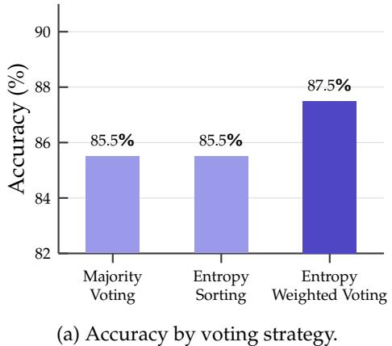
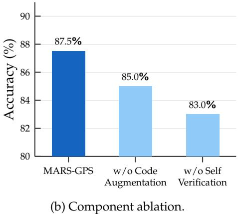
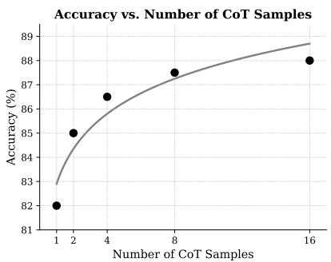

# 1. 论文基本信息

## 1.1. 标题
**超越符号求解：用于大语言模型几何推理的多链思维投票**

## 1.2. 作者
Md. Abu Bakor Siddique, Shahrin Hossain, Sadman Ahmed Siam, Syed Rifat Raiyan, Hasan Mahmud, Md Kamrul Hasan

## 1.3. 发表期刊/会议
根据提供的元数据，该论文发表于 **arXiv**（预印本平台）。虽然元数据显示发布时间为 2026 年，但这通常用于模拟未来场景或作为占位符，实际学术引用时应关注其是否已被顶会（如 CVPR, ICCV, ACL, ICLR）接收。

## 1.4. 发表年份
2026 年（基于元数据 UTC 时间 2026-04-01）

## 1.5. 摘要
几何问题求解（GPS）是增强大语言模型数学推理能力的核心，因为它需要结合图表理解、符号操作和逻辑推理。现有文献主要关注同步图表描述与文本字面量并解决问题，采用神经、符号或神经符号方法。然而，这些方法仅解决了前两个要求（图表理解和符号操作），而逻辑推理发展不足，通常仅限于单链思维。为了解决这一弱点，本文提出了 **MARS-GPS**。该方法生成多个并行推理推演，并辅以 Python 代码执行进行数值验证，利用词元级熵作为置信度信号对推演进行排序，并通过多阶段投票和自验证管道聚合答案。实证结果表明，具有 8 个并行推演的 MARS-GPS 在 Geometry3K 上达到了 88.8%，比之前的最先进水平提高了近 11%，且准确率随着推演数量从 1 增加到 16 而持续扩展。

## 1.6. 原文链接
论文链接: https://arxiv.org/abs/2604.00890
PDF 链接: https://arxiv.org/pdf/2604.00890v1
状态: 预印本

# 2. 整体概括

## 2.1. 研究背景与动机
几何问题求解（GPS）被视为人类推理的巅峰之一。解决 GPS 问题通常包含两个主要步骤：首先是识别给定的知识库，即分析图表并记录已知信息，如果图表信息不足，还需结合文本描述进行标注；其次是利用定理推导结论，这一步的难点在于识别相关定理。

在现有研究中，研究人员主要关注将图表描述与文本字面量同步，并采用神经、符号或神经符号方法来解决 GPS 问题。虽然像 Pi-GPS、MINT-CoT 等模型在图表理解方面取得了进展，但它们往往忽视了**逻辑推理**的深度发展。现有的逻辑推理通常局限于单一的思维链，一旦推理路径出错，模型无法自我纠正。

本文的切入点在于：**通过测试时计算扩展**，即利用大语言模型在推理时生成多个并行的思维链，并结合代码执行和自验证机制，来弥补单一推理路径的脆弱性，从而提升几何问题的求解能力。

## 2.2. 核心贡献/主要发现
本文的主要贡献包括：
1.  **提出 MARS-GPS 框架：** 这是一个完全基于推理时间的框架，无需训练或微调模型权重。它通过生成多个并行推理推演，并结合 Python 沙箱进行数值验证。
2.  **引入基于熵的置信度信号：** 提出了一种从词元对数概率导出的训练自由置信度信号，用于评估模型对生成答案的确定性。
3.  **多阶段聚合算法：** 设计了一种结合多数投票、熵排序和大语言模型自验证的聚合算法，用于从多个候选答案中选择最终结果。
4.  **最先进的性能：** 在 Geometry3K 和 PGPS9K 数据集上取得了最先进的结果，证明了并行推演采样优于传统的符号求解器。

# 3. 预备知识与相关工作

## 3.1. 基础概念
为了理解本文，读者需要掌握以下核心概念：

*   **几何问题求解：** 指给定一个几何图形和相关的文本描述，要求计算出特定几何量（如长度、角度、面积）或证明几何性质的任务。
*   **思维链：** 一种提示策略，通过引导模型逐步展示中间推理步骤，从而提高复杂问题的解决能力。
*   **自一致性：** 一种通过采样多个独立的推理路径，并取出现频率最高的答案作为最终结果的技术。这利用了“正确答案往往通过不同的推理路径汇聚”这一特性。
*   **推演：** 在强化学习或搜索算法中，指从某个状态开始，沿着策略模拟执行一系列动作直到终止的过程。在本文中，指一次完整的思维链推理过程。
*   **形式化表示：** 将自然语言或图像信息转换为严格的数学逻辑语言（如一阶逻辑谓词），以便计算机进行精确的符号操作。
*   **熵：** 信息论中的概念，用于度量不确定性。在本文中，模型生成词元的概率分布越集中（熵越低），表示模型越确信；分布越均匀（熵越高），表示模型越不确定。

## 3.2. 前人工作
作者将相关工作分为三类：

1.  **符号求解器：** 如 Inter-GPS，试图通过逻辑操作解决问题。这类方法可解释性强，但扩展性差，难以处理复杂多变的几何问题。
2.  **神经符号求解器：** 如 PGPSNet、Pi-GPS，混合了神经网络和符号求解器。虽然比纯符号方法更具扩展性，但在处理复杂推理链时仍显不足，且严重依赖预定义的定理集。
3.  **多模态大语言模型：** 如 G-LLaVA，将 GPS 视为多模态推理任务。虽然通用性强，但在处理需要精确几何关系的推理时往往不可靠。

## 3.3. 技术演进
该领域的技术演进经历了从**纯符号规则**（依赖人工定义的定理库）到**神经符号混合**（利用神经网络辅助解析和定理预测），再到**端到端多模态大模型**（直接输入图像和文本）的过程。本文的工作则代表了另一种趋势：**推理时计算扩展**。即不改变模型参数，而是通过在测试时增加计算量（多次采样、验证）来提升性能。

## 3.4. 差异化分析
本文方法与现有方法的核心区别在于：
*   **不依赖训练：** 现有神经符号方法通常需要在特定数据集上训练定理预测器或编码器，而 MARS-GPS 是“训练自由”的，直接利用冻结的 LLM 能力。
*   **多路径聚合：** 现有方法通常 commit to 单一推理路径，而 MARS-GPS 采样多个路径并通过复杂的投票和验证机制聚合结果，显著降低了随机错误的影响。
*   **代码增强：** 引入 Python 沙箱处理数值计算，解决了 LLM 擅长逻辑但弱于精确算术的问题。

# 4. 方法论

## 4.1. 方法原理
MARS-GPS 的核心思想是将几何问题求解分解为两个阶段：
1.  **问题解析阶段：** 将原始的文本和图像转换为统一的形式化表示（一阶逻辑谓词）。
2.  **推理时集成推理阶段：** 基于形式化表示，利用冻结的大语言模型生成多个并行推理推演，通过熵评估置信度，并结合代码执行和自验证机制选出最终答案。

    下图（原文 Figure 1）展示了 MARS-GPS 的完整系统架构：

    ![Figure 1: Overview of the Multi-path Aggregated Reasoning System for Geometry Problem Solving (MARs-GPS) pipeline. Left: the problem parsing stage takes the diagram and problem text as input and produces a unified formal context ${ \\mathcal { F } } ^ { * }$ via PGDPNet and a rulebased semantic parser. Right: the inference-time ensemble reasoning stage samples $k$ parallel rollouts from $f _ { \\theta }$ , each augmented with a Python sandbox $\\mathcal { E }$ for numerical computation. The rollout outputs feed into the answer aggregation pipeline, which applies majority voting, entropy-ranked self-verification, and a weighted fallback to produce the final answer $a ^ { * }$ .](images/1.jpg)
    *该图像是一个示意图，展示了多路径聚合推理系统（MARs-GPS）在几何问题解决中的工作流程。左侧为问题解析阶段，其中通过 PGDPNet 和基于规则的语义解析器，将图形和问题文本转换为统一的形式上下文 `{ ilde{ ext{F}}}`。右侧为推理阶段，描述了并行推理的样本和答案聚合流程。*

## 4.2. 核心方法详解

### 4.2.1. 问题形式化与解析
首先，我们需要定义问题的输入和输出。给定自然语言问题描述 $T$ 和伴随的图表图像 $I$，目标是生成正确答案 $a \in \mathcal{A}$，其中 $\mathcal{A} \doteq \{A, B, C, D\}$ 代表多选项候选集。

为了处理输入，系统采用了一个两阶段的解析管道：
*   **文本解析器：** 使用基于规则的 Regex 管道将文本 $T$ 转换为形式化字面量 $\mathcal{F}_T$（如 `Equals(LengthOf(Line(A, B)), 13)`）。
*   **图表解析器：** 使用 PGDPNet 处理图像 $I$，提取几何图元及其关系作为形式化字面量 $\mathcal{F}_D$（如 `PointLiesOnLine(D, Line(B, C))`）。

    最终的表示 $\mathcal{F}^*$ 合并了文本和图表的字面量，作为推理模型的唯一输入。值得注意的是，原始图像 $I$ 不会直接传递给推理模型，所有视觉信息都已编码在 $\mathcal{F}^*$ 中。

### 4.2.2. 推理时推理策略
传统的神经符号方法在训练时投入大量计算，而在推理时仅执行一次。MARS-GPS 反其道而行之，利用冻结的大语言模型 $f_\theta$ 和代码执行沙箱 $\mathcal{E}$，在推理时进行扩展。

#### 4.2.2.1. 并行推演采样
给定形式化表示 $\mathcal{F}^*$，系统构造一个结构化提示 $\mathcal{P}$，指示模型输出 $\boxed{N}$ 格式的答案。系统并行采样 $k$ 个独立的推理推演：

$$
\{ r_1, r_2, \dots, r_k \} \sim f_\theta(\mathcal{P} \mid \mathcal{F}^*)
$$

这里，$r_i$ 是一个完整的思维链轨迹，以框定的答案结尾。通过线程池和 PagedAttention 批处理，这些推演可以并发运行，使得 $k=8$ 的实际耗时仅比 $k=1$ 略多一点。

#### 4.2.2.2. 基于词元熵的置信度估计
为了评估每个推演的质量，系统利用模型返回的词元对数概率 $\ell_{t, j} = \log p_\theta(w_j \mid w_{<t})$。在推演 $r_i$ 的每个词元位置 $t$，计算前 $v$ 个词汇条目上的香农熵：

$$
H_t = - \sum_{j} e^{\ell_{t, j}} \cdot \log_2 \left( e^{\ell_{t, j}} \right)
$$

**公式解释：**
*   $H_t$：位置 $t$ 处的熵值，表示模型在该位置的不确定性。
*   $\ell_{t, j}$：词元 $j$ 在位置 $t$ 的对数概率。
*   $e^{\ell_{t, j}}$：将 log prob 转换回概率值。
*   该公式计算的是概率分布的加权负对数，即信息熵。熵越低，表示模型越确信某个词元。

    然后，计算整个推演的平均熵作为逆置信度分数：

$$
\bar{H}_i = \frac{1}{T_i} \sum_{t=1}^{T_i} H_t
$$

**公式解释：**
*   $\bar{H}_i$：第 $i$ 个推演的平均熵。
*   $T_i$：该推演的总词元数。
*   平均熵越低，表示模型在整个推理过程中越自信，该答案越可靠。

#### 4.2.2.3. 代码增强推理
为了解决大语言模型在数值计算上的不可靠性，每个推演 $r_i$ 都配有一个沙箱实例 $\mathcal{E}$：

$$
r_i = f_\theta(\mathcal{P}, \mathcal{E}), \quad \mathcal{E}: \mathrm{code} \mapsto \mathrm{output}
$$

当模型在推理过程中写入 Python 代码块时，该代码会在 $\mathcal{E}$ 中执行，输出结果会被注入回上下文中。这允许模型将精确的代数求解或算术运算外包给 Python 解释器。

### 4.2.3. 验证与自一致性
生成 $k$ 个推演及其答案 $\{a_i\}$ 和置信度 $\{\bar{H}_i\}$ 后，系统通过一个六步程序来聚合答案：

**Step 1: 早期共识**
首先检查是否有答案获得了超过半数的投票（即 $k/2 + 1$ 票以上）。如果有，直接接受该答案。

$$
\mathrm{if~} \sum_{i=1}^{k} \mathbf{1}[a_i = a] \geq k / 2 + 1 \quad \Rightarrow \quad a^* = a
$$

**Step 2: 硬接受**
如果没有达到早期共识，检查是否有答案获得了绝对多数票（$\lceil k / 2 \rceil$）。如果有，直接接受。如果出现平局，进入下一步。

**Step 3: 候选选择**
收集所有获得票数不少于 $k/4$ 的答案作为候选集 $\mathcal{A}_{\mathrm{cand}}$。单个推演的答案被视为异常值并丢弃。

$$
\mathcal{A}_{\mathrm{cand}} = \left\{ a \bigg| \sum_{i=1}^{k} \mathbf{1}[a_i = a] \geq \lceil k / 4 \rceil \right\}
$$

**Step 4: 熵排序验证**
对于每个候选 $a$，计算支持它的推演的平均支持熵 $\bar{H}(a)$。候选按 $\bar{H}(a)$ 升序排列（最自信的在前），并按此顺序提交给自验证。

**Step 5: 大语言模型自验证**
对于每个候选 $a$（按熵排序），查询模型 $f_\theta$（温度 $\tau=0$）询问该答案是否正确。如果模型回答 `CORRECT`，则接受 $a$ 并终止；否则检查下一个候选。

**Step 6: 加权回退**
如果所有候选都被拒绝，则使用结合投票数和置信度的评分函数作为最终手段：

$$
a^* = \operatorname*{arg\,max}_{a \in \mathcal{A}_{\mathrm{cand}}} \lambda \cdot \mathrm{votes}(a) - (1 - \lambda) \cdot \bar{H}(a)
$$

**公式解释：**
*   该公式试图在“得票多”和“模型自信（熵低）”之间寻找平衡。
*   $\lambda$ 是调节这两个因素权重的超参数。
*   减去 $\bar{H}(a)$ 是因为熵越低（越自信），分数应该越高。

# 5. 实验设置

## 5.1. 数据集
实验在两个主要数据集上进行：
*   **Geometry3K：** 包含 3002 个几何问题，分为训练集（2101）、验证集（300）和测试集（601）。每个数据点包含问题陈述、几何图表和形式化语言解析标注。
*   **PGPS9K：** Geometry3K 的扩展版本，包含 9022 个数据点和 4000 个独特图表。其中 2891 个问题来自 Geometry3K，其余来自高中教科书。

    这两个数据集几乎涵盖了高中教科书中能找到的所有平面几何问题类型。

## 5.2. 评估指标
论文使用 **Top-1 准确率** 作为评估指标。

1.  **概念定义：** 指系统最终预测的答案与真实标注数据完全匹配的问题百分比。由于基准测试是多选题，这等价于在选项集 $\mathcal{A} = \{A, B, C, D\}$ 上的精确匹配准确率。
2.  **数学公式：**
    $$
    \text{Accuracy} = \frac{1}{N} \sum_{i=1}^{N} \mathbf{1}[\hat{a}_i = a_i^{\text{GT}}]
    $$
3.  **符号解释：**
    *   $N$：测试集中的问题总数。
    *   $\hat{a}_i$：模型对第 $i$ 个问题的预测答案。
    *   $a_i^{\text{GT}}$：第 $i$ 个问题的真实标注答案。
    *   $\mathbf{1}[\cdot]$：指示函数，如果条件为真则取 1，否则取 0。

## 5.3. 对比基线
作者将 MARS-GPS 与以下几类基线模型进行了比较：
*   **神经方法：** NGS, Geoformer, SCA-GPS, GOLD, PGPSNet-v2-S, LANS。
*   **神经符号方法：** Inter-GPS, GeoDRL, E-GPS, Pi-GPS。
*   **多模态大语言模型：** GPT-4o, Gemini 2, Claude 3.5 Sonnet, Qwen-VL。
*   **专有大语言模型：** GPT-5, GPT-5.2, Claude 4.5 Sonnet。

# 6. 实验结果与分析

## 6.1. 核心结果分析
以下是原文 Table 1 的结果，展示了 MARS-GPS 在 Geometry3K 和 PGPS9K 上的表现：

<table>
<thead>
<tr>
<th>Category</th>
<th>Method</th>
<th>Geometry3K</th>
<th>PGPS9K</th>
</tr>
<tr>
<th rowspan="4">MLLMs</th>
<td>Qwen-VL (Bai et al., 2023)</td>
<td>26.7</td>
<td>23.2</td>
</tr>
<tr>
<td>GPT-4o (OpenAI et al., 2024)</td>
<td>58.6</td>
<td>51.0</td>
</tr>
<tr>
<td>Claude 3.5 Sonnet (Anthropic, 2024)</td>
<td>56.4</td>
<td>45.9</td>
</tr>
<tr>
<td>Gemini 2 (Google Gemini Team, 2023)</td>
<td>60.7</td>
<td>56.8</td>
</tr>
<tr>
<th rowspan="3">Proprietary LLMs</th>
<td>GPT-5 (OpenAI Team, 2025)</td>
<td>61.5</td>
<td></td>
</tr>
<tr>
<td>GPT-5.2 (Zhang et al., 2026)</td>
<td>73.1</td>
<td></td>
</tr>
<tr>
<td>Claude 4.5 Sonnet (Anthropic Team, 2025)</td>
<td>75.8</td>
<td></td>
</tr>
<tr>
<th rowspan="6">Neural Methods</th>
<td>NGS (Chen et al., 2021)</td>
<td>58.8</td>
<td>46.1</td>
</tr>
<tr>
<td>Geoformer (Chen et al., 2022)</td>
<td>59.3</td>
<td>47.3</td>
</tr>
<tr>
<td>SCA-GPS (Ning et al., 2023)</td>
<td>76.7</td>
<td></td>
</tr>
<tr>
<td>GOLD* (Zhang &amp; Moshfeghi, 2024)</td>
<td>62.7</td>
<td>60.6</td>
</tr>
<tr>
<td>PGPSNet-v2-S* (Zhang et al., 2024a)</td>
<td>76.4</td>
<td>69.2</td>
</tr>
<tr>
<td>LANS (Diagram GT)* (Li et al., 2024)</td>
<td>82.3</td>
<td>74.0</td>
</tr>
<tr>
<th rowspan="4">Neural-symbolic Methods</th>
<td>Inter-GPS (Lu et al., 2021)</td>
<td>57.5</td>
<td></td>
</tr>
<tr>
<td>GeoDRL (Peng et al., 2023)</td>
<td>68.4</td>
<td>66.7</td>
</tr>
<tr>
<td>E-GPS (Wu et al., 2024)</td>
<td>67.9</td>
<td></td>
</tr>
<tr>
<td>Pi-GPS (Zhao et al., 2025)</td>
<td>77.8</td>
<td>69.8</td>
</tr>
<tr>
<th></th>
<td>MARS-GPS (ours)</td>
<td>88.8</td>
<td>77.48</td>
</tr>
</thead>
</table>

**分析：**
*   MARS-GPS 在 Geometry3K 上达到了 **88.8%** 的准确率，比之前的最先进模型 Pi-GPS (77.8%) 提升了约 **11%**，比 Inter-GPS 提升了超过 30%。
*   在 PGPS9K 上，MARS-GPS 达到了 **77.48%**，比 Pi-GPS 高出约 8%。
*   即使是专有的强大 LLM（如 GPT-5.2, Claude 4.5）在直接处理形式化输入时，其表现也显著低于 MARS-GPS，这证明了推理时集成策略的有效性。

## 6.2. 消融实验/参数分析

### 6.2.1. 投票策略分析
作者比较了三种投票策略：
*   **多数投票：** 选择出现频率最高的答案，准确率 85.5%。
*   **熵排序：** 选择平均熵最低的答案，准确率 85.5%。
*   **熵加权投票：** 结合投票数和熵权重，准确率 **87.5%**。

    下图（原文 Figure 2a）展示了不同投票策略的准确率对比：

    
    *该图像是图表，展示了不同投票策略的准确性。图表标示了三种策略的准确率：多数投票为85.5%，熵排序为85.5%，而熵加权投票则达到87.5%。*

结果表明，熵加权投票效果最佳，因为它不仅考虑了答案的流行度，还考虑了模型生成该答案时的置信度。

### 6.2.2. 组件消融
下图（原文 Figure 2b）展示了移除 MARS-GPS 中关键组件对性能的影响：

*该图像是一个图表，展示了MARS-GPS模型与不同组分消融实验的准确率。MARS-GPS模型的准确率为87.5%，而去掉代码增强和自我验证的准确率分别为85.0%和83.0%。*

*   **移除自验证：** 准确率从 87.5% 下降到 83.0%（-4.5%），这是影响最大的单一组件。这表明自验证能有效捕获定理误用和级联计算错误。
*   **移除代码增强：** 准确率从 87.5% 下降到 85.0%（-2.5%）。这表明 Python 沙箱对于需要精确数值计算的问题至关重要。

### 6.2.1. CoT 样本数量分析
作者测试了不同数量的并行推演 $k \in \{1, 2, 4, 8, 16\}$ 对准确率的影响。

下图（原文 Figure 3）展示了准确率随 CoT 样本数量的变化趋势：

*该图像是图表，展示了正确率与 CoT 样本数量的关系。随着 CoT 样本数量增加，从 1 到 16，正确率从约 82% 上升至接近 89%，显示出一种正相关趋势。*

结果显示，准确率随样本数量呈对数线性增长。从 $k=1$ (82.0%) 增加到 $k=16$ (88.0%)，性能持续提升，但在 $k=8$ 之后出现边际效益递减。因此，主实验选择 $k=8$ 以平衡准确率和计算开销。

以下是原文 Table 2 的详细数据：

| Run | Accuracy (%) |
| :--- | :--- |
| CoT 1 | 82.0 |
| CoT 2 | 85.0 |
| CoT 4 | 86.5 |
| CoT 8 | 87.5 |
| CoT 16 | 88.0 |

# 7. 总结与思考

## 7.1. 结论总结
本文提出了 MARS-GPS，一个用于几何问题求解的推理时框架。它通过生成多个并行推理推演，利用词元级熵估计置信度，并最终通过多阶段投票和自验证管道聚合答案。无需任何训练或微调，MARS-GPS 在 Geometry3K 和 PGPS9K 上取得了最先进的结果，显著优于现有的神经符号方法和多模态大语言模型。消融研究证实，准确率随推演数量对数线性扩展，且熵加权投票是最有效的聚合策略。

## 7.2. 局限性与未来工作
作者指出了以下局限性：
1.  **解析依赖：** 系统的性能依赖于解析阶段（PGDPNet）。如果解析器产生不完整或错误的形式化表示 $\mathcal{F}^*$，下游推理无法恢复。
2.  **计算成本：** 计算成本与推演数量 $k$ 成线性关系，虽然批处理提高了效率，但仍比单次通过基线高出 $k$ 倍。
3.  **任务范围：** 目前仅限于多选题几何问题，未在开放式或基于证明的任务上评估。

    未来工作方向包括：
1.  改进图表解析阶段，例如结合多模态大语言模型直接进行解析。
2.  结合推理时扩展与训练时改进（如在几何数据上微调 $f_\theta$）。
3.  将框架扩展到开放式几何问题和形式化定理证明。

## 7.3. 个人启发与批判
这篇论文对我有以下启发：
1.  **推理时计算的价值：** 它证明了在模型能力固定的情况下，通过增加测试时的计算量（多次采样、验证、投票）可以显著提升性能，尤其是在需要严密逻辑推理的数学领域。
2.  **置信度信号的应用：** 利用熵作为无需额外训练的置信度信号是一个非常实用的技巧，可以用于过滤低质量的输出或指导验证顺序。
3.  **工具增强的必要性：** 对于几何或数学问题，结合代码解释器是弥补大语言模型数值计算短板的有效手段。

**批判性思考：**
*   虽然方法有效，但其性能上限仍受限于基础模型 $f_\theta$ 的逻辑推理能力。如果模型完全不懂某个几何定理，采样再多也无法“猜”对。
*   解析阶段的瓶颈依然存在。如果图像解析出错，后续的推理再完美也是基于错误前提的。未来的突破点可能在于端到端的视觉-逻辑推理，而不是将视觉和逻辑完全割裂为两个阶段。
*   该方法计算成本较高（$k$ 倍推理时间），这在实时应用场景中可能是一个限制，但在离线竞赛或高精度需求场景下是值得的。