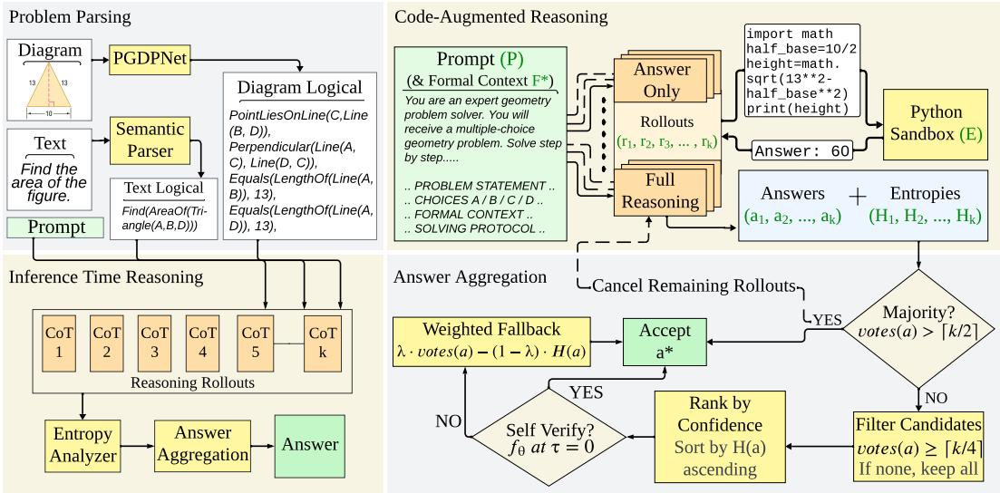

# 超越符号求解：大语言模型中的多链思维投票用于几何推理

Md. Abu Bakor Siddique† Shahrin Hossain† Sadman Ahmed Siam† Syed Rifat Raiyan‡ Hasan Mahmud Md Kamrul Hasan 系统与软件实验室 (SSL)，计算机科学与工程系，孟加拉国达卡伊斯兰科技大学 †共同贡献 †通讯作者：rifatraiyan@iut-dhaka.edu

# 摘要

几何问题求解（GPS）仍然是增强大语言模型数学推理能力的核心，因为它需要图示理解、符号操作和逻辑推理的结合。在现有文献中，研究者主要集中在将图示描述与文本文字同步以及解决问题上。在这个方向上，他们采取了神经、符号或神经符号相结合的方法。但这仅解决了两个需求，即图示理解和符号操作，而逻辑推理却发展不足。逻辑推理通常局限于单一的思维链（CoT）。为了解决现有模型的这一弱点，本文提出了MARS-GPS，它生成多个并行推理的推导，结合Python代码执行进行数值验证，使用词元级熵作为置信信号进行排名，并通过多阶段投票和自我验证管道汇聚答案。实证结果显示，MARS-GPS在Geometry3K上8个并行推导的准确率达到了$8 \mathbf { \dot { 8 } } .8 \%$，较之前的最先进水平提高了近$\mathbf { + 1 1 \% }$，且随着推导数量从1增加到16，准确率始终呈现一致的提升（在消融子集上提高了$\dot { + } 6 . 0 \%$）。我们已在一个匿名库中提供了我们的代码和数据： https://anonymous.4open.science/r/MARS-GPS-DE55。

# 1 引言

几何问题解决被视为人类推理的巅峰之一。简而言之，GPS接收一个图形和一个文本描述，并尝试解决一个问题。解决问题的过程本质上分为两个步骤。初始任务是识别给定的知识库，即分析图示并记录已经提供的信息。如果图示中没有足够的信息超出基本形状，则需要根据文本描述对图示进行适当的信息注释。第二个任务是利用定理得出进一步的结论。在这种情况下，主要难点在于识别相关定理。例如，毕达哥拉斯定理不适用于与圆相关的问题。有些问题可能没有独特的解决路径，使事情变得复杂。诸如Pi-GPS（赵等，2025）、MINT-CoT（陈等，2025）、PGPSNet-v2（张等，2024a）、G-LLaVA（高等，2025）等模型，试图完善图形理解，即过程的前半部分。但正如我们将展示的，通过多链思维（CoTs）集中逻辑推理可以显著提高GPS的性能。我们的贡献可总结如下： • 显示并行推演采样优于符号求解器 • 引入从每个词元的对数概率衍生的无训练信号，且没有额外成本 • 结合多数投票、熵排名和大语言模型自我验证的聚合算法 • 在Geometry3K和PGPS9K上取得最先进的结果

# 2 相关工作

GPS 领域的研究者们专注于一些特定的方法。象征性求解器，如 InterGPS（Lu et al., 2021），试图通过逻辑操作来解决问题。这些系统的可扩展性有限，这促使了神经符号求解器的发展。神经符号求解器，如 PGPSNet（Zhang et al., 2023）、PGPSNet-v2（Zhang et al., 2024a）、DualGeoSolver（Xiao et al., 2024）、FormalGeo（Zhang et al., 2024b）结合了神经网络和符号求解器来解决几何问题。这种方法比纯符号系统更具可扩展性，但由于处理复杂推理链的困难以及对定理集的依赖，这些模型最终在推理上未能取得更好的表现。最后，基于多模态大语言模型的方法，如 G-LLaVA（Gao et al., 2025）、GeoUni（Cheng et al., 2025）将 GPS 视为一种多模态推理任务，最终遭遇类似的不可靠推理。最新的研究包括 Zhao et al.（2025），他们提出的 Pi-GPS 使用图示通过整流器-验证器微模块消除文本形式语言的歧义。这种方法强调了图示信息在 GPS 中的重要性，但依赖于提供的定理集。类似地，Chen et al.（2025）提出的 MINT-CoT 通过交错令牌机制将细粒度视觉词元交织进思维链推理步骤中。这种方法凸显了推理过程中视觉基础的重要性，但推理仍然不可靠。推理时可扩展性是在推理过程中提高性能的方法。Balachandran et al.（2025）表明，推理时可扩展性可以改善数学推理，但在几何推理中成功较少，因为 GPS 需要更多的多模态推理，而推理时可扩展性在文本密集场景中更为适用。正如本论文将展示的，他们的见解同样适用于 GPS。几个基准测试，如 Geometry3k、MathVista、MathVerse、GeoEval，被用来评估 GPS 系统的性能。题目集需要谨慎选择，以确保图示和文本具有相等的重要性，以便检查系统对它们的准确解析和解决能力。

# 3 方法

# 3.1 问题表述

我们考虑标准几何问题求解（GPS）设置：给定自然语言问题描述 $T$ 和相应的图像 $I$，目标是生成正确的答案 $a \in {\mathcal{A}}$，其中 $\mathcal{A} \doteq \{ \hat{A}, B, C, D \}$ 表示多项选择候选集。我们使用 Pi-GPS（Zhao et al., 2025）的结构化表示，其中 $(T, I)$ 被解析为一组一阶几何谓词 $\mathcal{F}$（例如，Perpendicular $(\mathrm{Line}(B, D), \mathrm{Line}(\bar{D}, C))$）。我们将元组 $(\breve{\mathcal{F}}, A)$ 称为问题实例的结构化上下文。我们的方法完全在推理时进行，这意味着没有调整或微调模型权重。我们使用两个轴来扩大测试时间计算。首先，一个冻结的大语言模型 $f_{\theta}$ 被赋予访问代码执行沙箱 $\dot{\varepsilon}$ 的权限，该沙箱是一个运行 $f_{\theta}$ 生成的代码的实时 Python 内核，并在推理过程中将实际输出注入其上下文中。其次，我们并行生成 $k$ 个独立的解答尝试，每个产生一个候选答案 $\hat{a}_{m} \in \mathcal{A} \cup \{ \emptyset \}$。最终答案 $\hat{a}$ 是通过第 3.4 节中描述的并行投票策略从 $\{ \hat{a}_{1}, \dotsc, \hat{a}_{k} \}$ 中选出的。

# 3.2 图示理解与解析

由于前沿的多模态大语言模型在从几何图中直接提取精确的逻辑关系方面存在困难，我们通过一个两阶段的解析管道将这两种模态转换为统一的形式表示 ${ \mathcal { F } } ^ { * }$，该表示用作我们推理时 reasoning 策略的输入（见第 3.3 节）。

  

Figure 1: Overview of the Multi-path Aggregated Reasoning System for Geometry Problem Solving (MARs-GPS) pipeline. Left: the problem parsing stage takes the diagram and problem text as input and produces a unified formal context ${ \mathcal { F } } ^ { * }$ via PGDPNet and a rulebased semantic parser. Right: the inference-time ensemble reasoning stage samples $k$ parallel rollouts from $f _ { \theta }$ , each augmented with a Python sandbox $\mathcal { E }$ for numerical computation. The rollout outputs feed into the answer aggregation pipeline, which applies majority voting, entropy-ranked self-verification, and a weighted fallback to produce the final answer $a ^ { * }$ .

文本解析器。文本解析器对 $T _ { \cdot }$ 应用基于规则的正则表达式管道，生成形式文字 $\hat { \mathcal { F } } _ { T }$，例如 $= \mathsf { i n d } \big ( \mathsf { A r e a o f } \big ( \mathsf { T r i a n g l e } ( A , B , \dot { C } ) \big ) \big )$ 或 Equa $\mathsf { l s } ( \bar { \mathsf { L e n g t h O f } } ( \bar { \mathsf { L i n e } } ( A , B ) ) , 1 \mathrm { : } 3)$。我们更倾向于这种设计而非神经网络替代方案，因为几何数据集相对较小，而下游推理阶段的准确率为 $9 7 \%$，相比之下，基于 BART 的基线为 $6 7 \%$（Lu et al., 2021）。图形解析器。图形 $I$ 被 PGDPNet (Zhang et al., 2022) 处理，该网络提取几何原始元素及其关系作为形式文字 $\mathcal { F } _ { D }$ （例如，PointLiesOnLine $\mathsf { \check { ( } } D , \mathsf { L i n e } ( B , \mathsf { \bar { C } } ) )$ ，Equals(Lengthof(Line(A, B)),5)）。最终表示 ${ \mathcal { F } } ^ { * }$ 将文本文字 $\mathcal { F } _ { T }$ 和图形文字 $\mathcal { F } _ { D }$ 合并成对每个问题的统一结构描述，并作为推理时传递给 $f _ { \theta }$ 的唯一输入。

# 3.3 推理阶段的推理策略

以前的神经符号方法在GPS中将计算预算投入到训练阶段，学习定理预测器（Lu et al., 2021）、强化训练的搜索策略（Peng et al., 2023）或微调的多模态编码器（Zhang et al., 2023）。在推理阶段，这些方法坚持一种单一推理路径：一次符号执行，一个答案。这种单路径范式是一个错误的步骤，导致不可逆转地传播到错误答案。我们采取了不同的方法。我们并不依赖确定性的符号求解器，而是使用 $f _ { \theta }$（GPT-OSS 120B，通过VLMs提供（Kwon et al., 2023））直接对 ${ \mathcal { F } } ^ { * }$ 进行推理，并且不再坚持单一轨迹，而是在并行采样 $k$ 个独立的推理推演并使用基于置信度的选择策略聚合它们的输出。该方法的三个组成部分在下面描述：并行推演采样（第3.3.1节）、通过词元熵的置信度估计（第3.3.2节）以及代码增强推理（第3.3.3节）。

# 3.3.1 并行推演采样

给定 ${ \mathcal { F } } ^ { * }$，我们构造一个结构化提示 $\mathcal { P }$，其中包含系统提示，指示 $f _ { \theta }$ 输出 \boxed{N}，其中 $N \in \{ 1 , 2 , 3 , 4 \}$，以及 $T , { \dot { \mathcal { A } } } ,$ 和 ${ \mathcal { F } } ^ { * }$。原始图像 $I$ 从未传递给 $f _ { \theta }$，因为所有视觉信息已包含在 ${ \mathcal { F } } ^ { * }$ 中。我们并行采样 $k$ 个独立的推演：

$$
\{ r _ { 1 } , r _ { 2 } , \dots , r _ { k } \} \sim f _ { \theta } ( \mathcal { P } \mid \mathcal { F } ^ { * } )
$$

每个推演 $r _ { i }$ 是一个完整的思维链，最终以盒装答案 $a _ { i }$ 终止，该答案通过对 \boxed{N} 的模式匹配提取。没有可提取答案的推演被排除在聚合之外。$k$ 个推演通过一个包含 16 个工作线程的线程池并发运行，VLM 的 PagedAttention 在单次前向传播中批处理所有请求，使得 $k = 8$ 的墙钟时间仅比 $k = 1$ 略有增加。每个问题的最大预算为 900 秒（Wang 等，2023）。

# 3.3.2 基于词元熵的置信度估计

VLMs 在每个词元位置 $t$ 的推演 $\boldsymbol { r } _ { i }$ 中返回每个词元的对数概率 $\ell _ { t , j } = \log p _ { \theta } ( w _ { j } \mid w _ { < t } )$，且不增加额外成本。我们对排名前 $\boldsymbol { \cdot } \boldsymbol { v }$ 词汇项计算香农熵：

$$
H _ { t } = - \sum _ { j } e ^ { \ell _ { t , j } } \cdot \log _ { 2 } \left( e ^ { \ell _ { t , j } } \right)
$$

并聚合为每次推演的平均熵：

$$
\bar { H } _ { i } = \frac { 1 } { T _ { i } } \sum _ { t = 1 } ^ { T _ { i } } H _ { t }
$$

$\bar { H _ { i } }$ 作为一种反向置信度分数，意味着数值越低表示置信度越高。它用于打破投票平局，并对候选答案进行自我验证排序，确保最有置信度的答案优先得到验证（第 3.4 节）。

# 3.3.3 代码增强推理

几何问题通常需要精确的数值计算，而大型语言模型通过纯粹的词元生成来处理这类问题时常不可靠（Wang et al.，2024）。因此，每个推演 $r _ { i }$ 都与一个沙箱实例 $\mathcal { E }$ 配对：

$$
r _ { i } = f _ { \theta } ( \mathcal { P } , \mathcal { E } ) , \quad \mathcal { E } : \mathrm { c o d e } \mapsto \mathrm { o u t p u t }
$$

当 $f _ { \theta }$ 在推理过程中写入 Python 代码块时，它将在 $\mathcal { E }$ 中执行，输出结果会被注入回上下文。我们维护一个包含 16 个持久 $\mathcal { E }$ 实例的池，以避免内核启动的开销，同时保持推演的隔离。在实践中，近 $40\%$ 的推演至少调用一次 $\mathcal { E }$，使用集中在需要精确数值计算的计算密集型问题上。完整的过程详见算法 1（见附录 A）。

# 3.4 验证与自我一致性

生成了 $k$ 次推演的答案 $\{ a _ { i } \} _ { i = 1 } ^ { k }$ 和置信度分数 $\{ \bar { H } _ { i } \} _ { i = 1 } ^ { k }$ 后，再次投票是一个自然的基线，但它将所有推演视为同样可信。我们采用一种六步程序，逐步通过投票计数、熵分数和自我验证来筛选候选答案，仅在更强信号不可用时才退回到加权评分。第 1 步：早期共识。我们首先检查是否有任何答案出现在 $k / 2 + 1$ 次或更多的 $k$ 次推演中。如果是，我们立即接受该答案：

$$
\mathrm { i f ~ } \sum _ { i = 1 } ^ { k } { \bf 1 } [ a _ { i } = a ] \geq k / 2 + 1 \quad \Rightarrow \quad a ^ { \ast } = a
$$

独立推演中几乎一致的共识是一个强烈的正确性信号，这一早期退出避免了在简单案例上浪费验证预算。步骤2：强接受。如果没有答案获得 $\lceil k / 2 \rceil + 1$ 票，我们检查是否有一个较弱的共识，即获得 $\lceil k / 2 \rceil$ 及以上票数。例如：一个由八个推演中的四个支持的答案构成绝对多数，直接被接受。如果出现平局，我们进入步骤3。步骤3：候选者选择。如果两个条件都未满足，我们收集候选答案或出现在 $k / 4$ 或更多推演中的答案：

$$
\mathcal { A } _ { \mathrm { c a n d } } = \left\{ a \bigg | \sum _ { i = 1 } ^ { k } { \bf 1 } [ a _ { i } = a ] \geq \lceil k / 4 \rceil \right\}
$$

单次推演的答案被视为异常值并被丢弃。如果 $\mathcal { A } _ { \mathrm { c a n d } }$ 为空（所有答案都是单例），则保留所有四个选项。步骤 4：熵排名验证。对于每个候选答案 $a \in \mathcal { A } _ { \mathrm { c a n d } }$，我们计算其在产生它的推演过程中平均支持熵：

$$
\bar { H } ( a ) = \frac { 1 } { | \mathcal { T } _ { a } | } \sum _ { i \in \mathcal { T } _ { a } } \bar { H } _ { i } , \quad \mathcal { T } _ { a } = \{ i : a _ { i } = a \}
$$

候选者按照 $\bar { H } ( a )$ 的升序排序，最自信的候选者优先，并按照此顺序提交进行自我验证。首先验证最自信的候选者是高效的：如果通过验证，我们在不查询模型的情况下停止后续候选者。步骤 5：大语言模型自我验证。对于每个候选者 $a$（按熵排名顺序），我们以温度 $\tau = 0$ 使用结构化验证提示查询 $f _ { \theta }$ ，询问所提出的答案是否正确或错误。确定性设置确保了稳定、可重复的决策。如果 $f _ { \theta }$ 回应正确，我们将接受 $a$ 作为 $a ^ { * }$ 并终止；如果错误，我们将转向下一个候选者。这一步利用模型自身的推理，对候选者进行交叉验证，以检验其符合 ${ \mathcal { F } } ^ { * }$ 的标准，而无需单独训练验证器。步骤 6：加权回退。如果所有候选者都被拒绝，我们将回退到一个结合投票数和置信度的评分函数：

$$
a ^ { * } = \arg \operatorname* { m a x } _ { a \in { \mathcal { A } } _ { \mathrm { c a n d } } } \lambda \cdot \mathrm { v o t e s } ( a ) - ( 1 - \lambda ) \cdot { \bar { H } } ( a )
$$

其中 $\bar { H } ( a )$ 被减去是因为较低的熵应该得到奖励。这种后备机制在不到 $8\%$ 的问题中被触发，表明早期的步骤解决了绝大多数情况。完整的聚合过程在算法 2 中详细说明（见附录 A）。

# 3.5 完整流程总结

图1展示了完整的系统。我们的方法将GPS分解为两个顺序阶段，二者之间有一个清晰的接口。阶段1 — 问题解析（第3.2节）将原始问题$( T , I )$作为输入，产生正式表示${ \mathcal { F } } ^ { * }$。这一阶段包括两个组成部分：一个基于规则的文本解析器产生$\mathcal { F } _ { T }$，以及PGDPNet图形解析器产生$\mathcal { F } _ { D }$。所有的视觉理解都在此阶段进行，原始图像$I$不会被转发给推理模型。阶段2— 推理时集成推理（第3.3节和3.4节）以${ \mathcal { F } } ^ { * }$为输入，产生最终答案$a ^ { * }$。这是我们的主要贡献，包含三个组成部分：从固定的$\dot { f _ { \theta } }$进行并行推演采样，基于词元熵的每次推演置信度估计，以及利用大型语言模型进行的置信度感知聚合和自我验证。我们称我们的完整系统为MARS-GPS。表1报告了在Geometry3K和PGPS9K上与所有先前的神经符号基线的结果。

# 4 实验设置

# 4.1 数据集

我们在Geometry3K和PGPS9K数据集上进行了实验。Geometry3K由3002个几何问题组成，数据集划分为三部分：2101个问题用于训练，300个问题用于验证，最后601个数据点用于测试。每个数据点包含问题描述、几何图示和形式语言解析标注。PGPS9K是Geometry3K的扩展版本，包含9022个数据点，拥有4000个独特图示。其中，2891个问题直接来自Geometry3K数据集，其余来自高中教科书。这些数据集几乎涵盖了高中教科书中所有类型的平面几何问题。

# 4.2 基准对比

我们在我们的流水线中使用 GPT-OSS（120B）（OpenAI 等，2025）。我们还使用最先进的人工智能模型，并分析它们在几何问题解决中的性能，具体如下。 神经方法。我们使用 NGS（Chen 等，2021），它利用 ResNet-101 对图表进行编码；使用 Geoformer（Chen 等，2022），它采用 VL-T5 进行图表编码；使用 SCA-GPS（Ning 等，2023），一种符号字符感知模型；使用 GOLD（Zhang & Moshfeghi，2024），它将图表转换为自然语言描述；使用 PGPSNet-v2-S（Zhang 等，2024a），它结合了 CNN 和 GRU 编码器，并采用融合-推理-验证的流程；以及 LANS（Li 等，2024），一种布局感知的神经求解器，依赖真实标注的图表注释。 神经-符号方法。我们将其与 Inter-GPS（Lu 等，2021）进行比较，该方法将问题解析为形式语言并应用符号定理搜索；GeoDRL（Peng 等，2023），它将强化学习扩展到定理预测之中；E-GPS（Wu 等，2024），它结合自上而下的求解与自下而上的程序生成；以及 Pi-GPS（Zhao 等，2025），它使用整流器-验证器模块利用图表信息消歧文本。 多模态大型语言模型（MLLMs）。对于被评估为直接多模态求解器的 MLLMs，我们包括 GPT-4o（OpenAI 等，2024）、Gemini 2（Google Gemini 团队，2023）、Claude 3.5 Sonnet（Anthropic，2024）和 Qwen-VL（Bai 等，2023），这些模型可以端到端处理问题文本和图表。 专有大型语言模型。我们还比较了在解析的形式表示上评估的专有大型语言模型：GPT-5（OpenÅI 团队，2025）、GPT-5.2（Zhang 等，2026）和 Claude 4.5 Sonnet（Anthropic 团队，2025）。结果在表 1 中报告。所有结果使用 top-1 准确率进行报告，即系统的最终答案与真实标注标签匹配的问题的百分比。由于这两个基准都是选择题，因此这相当于在 $\mathcal { A } = \{ A , B , C , D \}$ 上的精确匹配准确率。

# 5 结果

# 5.1 主要结果

我们在表1中展示了与其他基线的比较结果。可以看到，MARS-GPS在Geometry3k数据集上的表现始终优于所有其他基线，且差距显著。即使在多模态大语言模型表现明显更好的情况下，它们在几何细节上缺乏准确性。该表格反映了这一现象。通用大语言模型在准确解析精确的几何图形以及准确计算嵌入其中的值方面存在困难，例如平方的一条边的长度或三角形的角度值。我们的方法通过利用大语言模型更强的推理能力，同时使用专门的图形解析器和校正方法，获得了更高的准确性。

Table 1: Comparison on Geometry3K and PGPS9K. Best results in bold. \* indicates models trained on the larger PGPS9K dataset.   

<table><tr><td>Category</td><td>Method</td><td>Geometry3K</td><td>PGPS9K</td></tr><tr><td rowspan="4">MLLMs</td><td>Qwen-VL (Bai et al., 2023)</td><td>26.7</td><td>23.2</td></tr><tr><td>GPT-4o (OpenAI et al., 2024)</td><td>58.6</td><td>51.0</td></tr><tr><td>Claude 3.5 Sonnet (Anthropic, 2024)</td><td>56.4</td><td>45.9</td></tr><tr><td>Gemini 2 (Google Gemini Team, 2023)</td><td>60.7</td><td>56.8</td></tr><tr><td rowspan="3">Proprietary LLMs</td><td>GPT-5 (OpenAI Team, 2025)</td><td>61.5</td><td></td></tr><tr><td>GPT-5.2 (Zhang et al., 2026)</td><td>73.1</td><td></td></tr><tr><td>Claude 4.5 Sonnet (Anthropic Team, 2025)</td><td>75.8</td><td></td></tr><tr><td rowspan="6">Neural Methods</td><td>NGS (Chen et al., 2021)</td><td>58.8</td><td>46.1</td></tr><tr><td>Geoformer (Chen et al., 2022)</td><td>59.3</td><td>47.3</td></tr><tr><td>SCA-GPS (Ning et al., 2023)</td><td>76.7</td><td></td></tr><tr><td>GOLD* (Zhang &amp; Moshfeghi, 2024)</td><td>62.7</td><td>60.6</td></tr><tr><td>PGPSNet-v2-S* (Zhang et al., 2024a)</td><td>76.4</td><td>69.2</td></tr><tr><td>LANS (Diagram GT)* (Li et al., 2024)</td><td>82.3</td><td>74.0</td></tr><tr><td rowspan="4">Neural-symbolic Methods</td><td>Inter-GPS (Lu et al., 2021)</td><td>57.5</td><td></td></tr><tr><td>GeoDRL (Peng et al., 2023)</td><td>68.4</td><td>66.7</td></tr><tr><td>E-GPS (Wu et al., 2024)</td><td>67.9</td><td></td></tr><tr><td>Pi-GPS (Zhao et al., 2025)</td><td>77.8</td><td>69.8</td></tr><tr><td></td><td>MARS-GPS (ours)</td><td>88.8</td><td>77.48</td></tr></table>

与神经符号方法相比，我们的模型在像 PI-GPS 这样的前沿工作上取得了显著的 $\mathbf{11\%}$ 改进，而在像 Inter-GPS 这样的开创性工作上更是有高达 $30\%$ 的显著提升。这些结果有效地巩固了我们的论点，即利用大型语言模型的优越推理能力可以获得比基于规则的神经符号方法更好的结果。我们在 PGPS9k 数据集上进行了比较，以进一步巩固我们方法的有效性。MARS-GPS 实现了 $77.48\%$ 的准确率，比 PI-GPS 近高出 $8\%$，比通用多模态大型语言模型高出超过 $20\%$。这些结果展示了我们流程的全面性以及对不同类型几何问题的鲁棒性。我们还对顶尖神经模型进行了比较，特别是 LANS，这个模型在更大的 PGPS9K 数据集上训练。它因在图表解析和训练数据上的真实标注上表现出色而达到了 $82\%$ 的准确率。然而，它仍然被 MARS-GPS 超越。

# 5.2 消融研究

投票策略 我们比较了三种用于聚合预测的投票策略，基于抽样推理链。多数投票（Wang 等，2023）选择出现频率最高的答案，在我们的评估集上达到了 $85.5\%$ 的准确率。熵排序通过候选答案的平均词元熵对其进行排名，并选择熵最低的预测，同样实现了 $85.5\%$ 的准确率。熵加权投票在多数投票的基础上，通过候选答案的熵的倒数赋予每个答案权重，从而降低不确定预测的权重；该策略达到了最高的准确率 $87.5\%$，比两者基准提高了 2 个百分点（见图 2a）。基于这些结果，熵加权投票被用作 MARS-GPS 的默认聚合策略。

  
Accuracy vs. Voting Strategy   

Figure 2: Ablation studies on a subset of Geometry3K. (a) Entropy-weighted voting outperforms majority voting and entropy sorting by 2.0 percentage points. (b) Removing self-verification causes the largest single-component accuracy drop $\mathrm { \bar { ( - 4 . 5 p p ) } }$ , followed by code augmentation $( - 2 . 5 \mathrm { p p } )$ .

  
Component Ablation

代码增强推理。我们为每个推理推演增添了一个受限的 Python 执行器，使模型能够卸载精确的数值计算，减少算术幻觉（王等，2024）。去除代码增强后，准确率从 $87.5\%$ 降低到 $85.0\%$（图 2b），下降了 2.5 百分点。我们观察到 $42\%$ 的所有 CoT 推演至少调用一次代码执行；在这些推演中，拒绝代码访问导致准确率降至 $75\%$，表明需要计算的问题相对更困难，并且最受益于符号验证。每个问题的详细分解见附录 E。自我验证。自我验证阶段促使模型在确定最终答案前重新检查其解决方案的逻辑一致性。如图 2b 所示，去除自我验证后，准确率从 $87.5\%$ 降低到 $83.0\%$，降幅为 4.5 百分点，为所有单组件中的最大降级。这确认了自我验证作为有效的后续过滤器，能够捕捉定理误用和在初始推理过程中幸存的连锁计算错误。

准确率与 CoT 样本数量的关系。为了确定准确率提升与 CoT 数量之间的关系，我们在 Geometry3K 数据集上对 $k \in \left\{ 1 , 2 , 4 , 8 , 16 \right\}$ 个 CoT 样本进行了测试。如图 3 所示，准确率随着样本数量的增加呈对数线性增长，从 $\check{82.0\%}$ $(k { \overset{-}{=}} 1)$ 上升到 $88.0\%$ $(k = 16)$，与自一致性解码中观察到的对数线性扩展行为一致（Wang et al., 2023）。我们观察到在 $k = 8$ 和 $k = 16$ 之间收益递减，即计算预算翻倍仅带来了 0.5 个百分点的提升。因此，主要实验使用 $k = 8$ 以平衡准确率和计算开销。详细的每 $k$ 值结果见附录 B。

  

Figure 3: Accuracy vs. number of CoT samples.

注意：我们在随机抽样的 Geometry3K 子集上进行消融实验，以确定每个管道组件的贡献。除非另有说明，所有消融实验使用 $k { = } 8$ 次推演并应用加权熵投票。

# 6 分析与讨论

错误分析。我们检查了Geometry3K测试集中错误回答的问题，以识别失败模式。最困难的类别是基于面积的问题，准确率为$77.4\%$。这一结果与Pi-GPS在面积歧义上的发现一致。第二难的类别是长度/其他参数的确定，准确率为$85.\overset{\sim}{6}\%$。其他类别，如三角学、圆、角和四边形问题，对系统而言并没有太大难度。另一个需要注意的点是，错误预测的执行时间几乎是正确预测的4.2倍，具体数据见附录E的表5。可能的原因是因为推演结果不一致，熵值高，系统在回退之前耗尽了验证步骤。圆和长度/其他问题在预测错误答案之前耗时最长。这意味着系统在这些情况下耗尽了全部验证预算，才进行回退，具体数据见附录E的表7。 推理时间缩放何时有帮助？并行推演采样在中等难度的问题上提供了最大的收益，这类问题需要35个推理步骤。对于简单问题（12步），单个推演已经足够，因此额外的样本增益有限。对于最困难的问题（$^{6+}$步，辅助构造），所有推演往往以相似的方式失败，因此投票无法恢复系统性错误的方法。这一模式与Balachandran等人（2025）在其他数学领域的观察一致，并表明将推理时间缩放与推理模型的训练时间改进结合起来，可能进一步提高最难层级的准确性。 局限性。我们的方法继承了其解析阶段的局限性：PGDPNet生成的不完整或不正确的${\mathcal{F}}^{*}$的问题无法通过下游推理恢复，无论采样多少个推演。此外，计算成本与$k$成线性关系；虽然VLM的批处理使其在实践中高效，但相对于单次通行基线，它仍然代表着生成token的$k$倍增加。最后，MARS-GPS目前仅限于多项选择几何问题，尚未在开放式或基于证明的任务上进行评估。这可能为在自动形式化领域工作的研究人员提供一个潜在途径，以结合这些策略使用lean或CoT证明定理。

# 未来工作

展望未来，有几个令人期待的方向。首先，通过改进图示解析阶段，例如通过更好的神经解析器或直接将多模态大语言模型整合到解析中，可以解决最大的单一错误来源。其次，将推理时的扩展与训练时的改进相结合，例如在特定几何数据上对 $f _ { \theta }$ 进行微调，可能会产生叠加收益。第三，将框架扩展到开放式几何问题和形式定理证明将扩大其适用性。最后，采用自适应推演预算或对简单问题进行较少的推演，而对困难问题进行更多推演，可以在不牺牲准确性的情况下降低计算成本。

# 8 结论

在本文中，我们提出了 MARS-GPS，这是一个用于几何问题求解的推理时间框架。它生成多个并行推理轨迹，通过词元级别的熵来估计其置信度，并最终通过多阶段投票和自我验证流程来聚合答案。MARS-GPS 在 Geometry3K 上取得了 $8 8 . 8 \%$ 的精度，在 PGPS9K 上达到了 $7 7 . 5 \%$，超越了现有的方法。我们的消融研究确认了准确率与推理轨迹数量呈对数线性关系，并且熵加权投票是最有效的聚合策略。

# References

Anthropic. Claude 3.5 sonnet. https://www.anthropic.com/news/claude-3-5-sonnet, 2024.

Anthropic Team. Claude 4.5 model card. arXiv preprint arXiv:2511.19773, 2025.

Ji Bai Sh Bi u an Shij Wa,Sin n Wa,  L a Zhou, and Jingren Zhou. Qwen-vl: A versatile vision-language model for understanding, localization, text reading, and beyond. arXiv preprint arXiv:2308.12966, 2023.

Vidhisha Balachandran, Jingya Chen, Lingjiao Chen, Shivam Garg, Neel Joshi, Yash Lara, John Langford, Besmira Nushi, Vibhav Vineet, Yue Wu, and Safoora Yousefi. Inference-time scaling for complex tasks: Where we stand and what lies ahead. CoRR, abs/2504.00294, 2025. doi: 10.48550/arXiv.2504.00294. URL https: //arxiv. org/abs/ 2504.00294.

Jiaqi Chen, Jianheng Tang, Jinghui Qin, Xiaodan Liang, Lingbo Liu, Eric Xing, and Liang Lin. Geoqa: A geometric question answering benchmark towards multimodal numerical reasoning. In Findings of the Association for Computational Linguistics: ACL-IJCNLP 2021, pp. 513523, 2021.

Jiaqi Chen, Tong Li, Jinghui Qin, Pan Lu, Liang Lin, Chongyu Chen, and Xiaodan Liang. Unigeo: Unifying geometry logical reasoning via reformulating mathematical expression. In Procedings of the2022 Conference on Empirical Methods in Natural Language Processing, pp. 33133323, 2022.

Xinyan Chen, Renrui Zhang, Dongzhi Jiang, Aojun Zhou, Shilin Yan, Weifeng Lin, and Hongsheng Li. Mint-cot: Enabling interleaved visual tokens in mathematical chain-ofthought reasoning, 2025. URL https://arxiv.org/abs/2506. 05331.

Jo-Ku Cheng, Zeren Zhang, Ran Chen, Jingyang Deng, Ziran Qin, and Jinwen Ma. Geouni: A unified model for generating geometry diagrams, problems and problem solutions, 2025. URL https://arxiv.org/abs/2504.10146.

Jiahi Gao, Renj Pi, Jipeng Zhang, Jiacheng Ye, Wanju Zhong, Yufei Wang, Lanqing Hon, Jianhua Han, Hang Xu, Zhenguo Li, and Lingpeng Kong. G-llava: Solving geometric problem with multi-modal large language model, 2025. URL https: //arxiv . org/abs/ 2312.11370.

Google Gemini Team. Gemini: A family of highly capable multimodal models. arXiv preprint arXiv:2312.11805, 2023.

Woosuk Kwon, Zhuohan Li, Siyuan Zhuang, Ying Sheng, Lianmin Zheng, Cody Hao Yu, Joseph Gonzalez, Hao Zhang, and Ion Stoica. Efficient memory management for large language model serving with pagedattention. In Proceedings of the 29th Symposium on Operating Systems Principles, SOSP '23, pp. 611626, New York, NY, USA, 2023. Association for Computing Machinery. ISBN 9798400702297. doi: 10.1145/3600006.3613165. URL https://doi.org/10.1145/3600006.3613165.

Zhong-Zhi Li, Ming-Liang Zhang, Fei Yin, and Cheng-Lin Liu. Lans: A layout-aware neural solver for plane geometry problem. In Findings of the Association for Computational Linguistics: ACL 2024, pp. 25962608, 2024.

Pan Lu, Ran Gong, Shibiao Jiang, Liang Qiu, Siyuan Huang, Xiaodan Liang, and Song-Chun Zhu. Inter-gps: Interpretable geometry problem solving with formal language and symbolic reasoning, 2021. URL https: //arxiv. org/abs/2105. 04165.

Maizhen Ning, Qiu-Feng Wang, Kaizhu Huang, and Xiaowei Huang. A symbolic characters aware model for solving geometry problems. In Proceedings of the 31st ACM International Conference on Multimedia, pp. 77677775, 2023.

penAI, :, Aaron Hurst, Adam Lerer, Adam P. Goucher, Adam Perelman, Aditya Ramesh, Aidan Clark, AJ Ostrow, Akila Welihinda, Alan Hayes, Alec Radford, Aleksander Madry, Alex Baker-Whitcomb, Alex Beutel, Alex Borzunov, Alex Carney, Alex Chow, Alex Kirillov, Alex Nichol, Alex Paino, Alex Renzin, Alex Tachard Passos, Alexander Kirillov, Alexi Christakis, Alexis Conneau, Ali Kamali, Allan Jabri, Allison Moyer, Allison Tam, Amadou Crookes, Amin Tootoochian, Amin Tootoonchian, Ananya Kumar, Andrea Vallone, Andrej Karpathy, Andrew Braunstein, Andrew Cann, Andrew Codispoti, Andrew Galu, AnKonich, An Tloh, Andy Miseko, Angel Bk, Angl Jng Antoine Pelisse, Antonia Woodford, Anuj Gosalia, Arka Dhar, Ashley Pantuliano, Avi Nayak, Avital Oliver, Barret Zoph, Behrooz Ghorbani, Ben Leimberger, Ben Rossen, Ben Sokolowsky, Ben Wang, Benjamin Zweig, Beth Hoover, Blake Samic, Bob McGrew, Bobby Spero, Bogo Giertler, Bowen Cheng, Brad Lightcap, Brandon Walkin, Brendan Quinn, Brian Guarraci, Brian Hsu, Bright Kellogg, Brydon Eastman, Camillo Lugaresi, Carroll Wainwright, Cary Bassin, Cary Hudson, Casey Chu, Chad Nelson, Chak Li, Chan Jun Zhang, Chris Beaumont, Chris Hallacy, Chris Koch, Christian Gibson, Christina Kim, Christine Choi, Christine McLeavey, Christopher Hesse, Claudia Fischer, Clemens Winter, Coley Czarnecki, Colin Jarvis, Colin Wei, Constantin Koumouzelis, Dane Sherburn, Daniel Kappler, Daniel Levin, Daniel Levy, David Carr, David Farhi, David Mely, David Robinson, David Sasaki, Denny Jin, Dev Valladares, Dimitris Tsipras, Doug Li, Duc Phong Nguyen, Duncan Findlay, Edede Oiwoh, Edmund Wong, Ehsan Asdar, Elizabeth Proehl, Elizabeth ang, EricAntw, Ericramer, Eric Peterson, ric Sigler, Eric Wallace, ugene e Fred von Lohmann, Freddie Sulit, Gabriel Goh, Gene Oden, Geoff Salmon, Giulio Starace, Grg Brockman, Hadi Salman, Haimig Bao, Haitng Hu, Hannah Wong, Haoyu Wang, Heather Schmidt, Heather Whitney, Heewoo Jun, Hendrik Kirchner, Henrique Ponde de Oliveira Pinto, Hongyu Ren, Huiwen Chang, Hyung Won Chung, Ian Kivlichan, Ian O'Connell, Ian O'Connell, Ian Osband, Ian Silber, Ian Sohl, Ibrahim Okuyucu, Ikai Lan, Ilya Kostrikov, Ilya Sutskever, Ingmar Kanitscheider, Ishaan Gulrajani, Jacob Coxon, Jacob Menick, Jakub Pachocki, James Aung, James Betker, James Crooks, James Lennon, Jamie Kiros, Jan Leike, Jane Park, Jason Kwon, Jason Phang, Jason Teplitz, Jason Wei, Jason Wolfe, Jay Chen, Jeff Harris, Jenia Varavva, Jessica Gan Lee, Jessica Shieh, Ji Lin, Jiahui Yu, Jiayi Weng, Jie Tang, Jieqi Yu, Joanne Jang, Joaquin Quinonero Candela, Joe Beutler, Joe Landers, Joel Parish, Johannes Heidecke, John Schulman, Jonathan Lachman, Jonathan McKay, Jonathan Uesato, Jonathan Ward, Jong Wook Kim, Joost Huizinga, Jordan Sitkin, Jos Kraaijeveld, Josh Gross, Josh Kaplan, Josh Snyder, Joshua Achiam, Joy Jiao, Joyce Lee, Juntang Zhuang, Justyn Harriman, Kai Fricke, Kai Hayashi, Karan Singhal, Katy Shi, Kavin Karthik, Kayla Wood, Kendra Rimbach, Kenny Hsu, Kenny Nguyen, Keren Gu-Lemberg, Kevin Button, Kevin Liu, Kiel Howe, Krithika Muthukumar, Kyle Luther, , Li Guy, Liam Fedus, Lian Zhou, Lien Mamka, Liian Weng, Lindsay cCalum, Lindsey Held, Long Ouyang, Louis Feuvrier, Lu Zhang, Lukas Kondraciuk, Lukasz Kaiser, Luke Hewitt, Luke Metz, Lyric Doshi, Mada Aflak, Maddie Simens, Madelaine Boyd, Madeleine Thompson, Marat Dukhan, Mark Chen, Mark Gray, Mark Hudnall, Marvin Zhang, Marwan Aljubeh, Mateusz Litwin, Matthew Zeng, Max Johnson, Maya Shy, May Gup, Meghan Shah, Metat, Me J g, Menh Zhong, Mia Glaese, Mianna Chen, Michael Janner, Michael Lampe, Michael Petrov, Michael Wu, Michele Wang, Michelle Fradin, Michelle Pokrass, Miguel Castro, Miguel Oom Temudo de Castro, Mikhail Pavlov, Miles Brundage, Miles Wang, Minal Khan, Mira Murati, Mo Bavarian, Molly Lin, Murat Yesildal, Nacho Soto, Natalia Gimelshein, Natalie Cone, Natalie Staudacher, Natalie Summers, Natan LaFontaine, Neil Chowdhury, Nick Ryder, Nick Stathas, Nick Turley, Nik Tezak, Niko Felix, Nithanth Kudige, Nitish Keskar, Noah Deutsch, Noel Bundick, Nora Puckett, Ofir Nachum, Ola Okelola, Oleg Boiko, Oleg Murk, Oliver Jaffe, Olivia Watkins, Olivier Godement, Owen Campbell-Moore, Patrick Chao, Paul McMillan, Pavel Belov, Peng Su, Peter Bak, Peter Bakkum, Peter Deng, Peter Dolan, Peter Hoeschele, Peter Welinder, Phil Tillet, Philip Pronin, Philippe Tillet, Prafulla Dhariwal, Qiming Yuan, Rachel Dias, Rachel Lim, Rahul Arora, Rajan Troll, Randall Lin, Rapha Gontijo Lopes, Raul Puri, Reah Miyara, Reimar Leike, Renaud Gaubert, Reza Zamani, Ricky Wang, Rob Donnelly, Rob Honsby, Rocky Smith, Rohan Sahai, Rohit

Ramchandani, Romain Huet, Rory Carmichael, Rowan Zellers, Roy Chen, Ruby Chen, Ruslan Nigmatullin, Ryan Cheu, Saachi Jain, Sam Altman, Sam Schoenholz, Sam Toizer, Samuel Miserendino, Sandhini Agarwal, Sara Culver, Scott Ethersmith, Scott Gray, Sean Grove, Sean Metzger, Shamez Hermani, Shantanu Jain, Shengjia Zhao, Sherwin Wu, Shino Jomoto, Shirong Wu, Shuaiqi, Xia, Sonia Phene, Spencer Papay, Srinivas Narayanan, Steve Coffey, Steve Lee, Stewart Hall, Suchir Balaji, Tal Broda, Tal Stramer, Tao Xu, Tarun Gogineni, Taya Christianson, Ted Sanders, Tejal Patwardhan, Thomas Cunninghman, Thomas Degry, Thomas Dimson, Thomas Raoux, Thomas Shadwell, Tianhao Zheng, Todd Underwood, Todor Markov, Toki Sherbakov, Tom Rubin, Tom Stasi, Tomer Kaftan, Tristan Heywood, Troy Peterson, Tyce Walters, Tyna Eloundou, Valerie Qi, Veit Moeller, Vinnie Monaco, Vishal Kuo, Vlad Fomenko, Wayne Chang, Weiyi Zheng, Wenda Zhou, Wesam Manassra, Will Sheu, Wojciech Zaremba, Yash Patil, Yilei Qian, Yongjik Kim, Youlong Cheng, Yu Zhang, Yuchen He, Yuchen Zhang, Yujia Jin, Yunxing Dai, and Yury Malkov. Gpt-4o system card, 2024. URL https: //arxiv. org/abs/2410.21276.

)penAI, :, Sandhini Agarwal, Lama Ahmad, Jason Ai, Sam Altman, Andy Applebaum, Edwin Arbus, Rahul K. Arora, Yu Bai, Bowen Baker, Haiming Bao, Boaz Barak, Ally Bennett, Tyler Bertao, Nivedita Brett, Eugene Brevdo, Greg Brockman, Sebastien Bubeck, Che Chang, Kai Chen, Mark Chen, Enoch Cheung, Aidan Clark, Dan Cook, Marat Dukhan, Casey Dvorak, Kevin Fives, Vlad Fomenko, Timur Garipov, Kristian Georgiev, Mia Glaese, Tarun Gogineni, Adam Goucher, Lukas Gross, Katia Gil Guzman, John Hallman, Jackie Hehir, Johannes Heidecke, Alec Helyar, Haitang Hu, Romain Huet, Jacob Huh, Saachi Jain, Zach Johnson, Chris Koch, Irina Kofman, Dominik Kundel, Jason Kwon, Volodymyr Kyrylov, Elaine Ya Le, Guillaume Leclerc, James Park Lennon, Scott Lessans, Mario Lezcano-Casado, Yuanzhi Li, Zhuohan Li, Ji Lin, Jordan Liss, Lily, Liu, Jiancheng Liu, Kevin Lu, Chris Lu, Zoran Martinovic, Lindsay McCallum, Josh McGrath, Scott McKinney, Aidan McLaughlin, Song Mei, Steve Mostovoy, Tong Mu, Gideon Myles, Alexander Neitz, Alex Nichol, Jakub Pachocki, Alex Paino, Dana Palmie, Ashley Pantuliano, Giambattista Parascandolo, Jongsoo Park, Leher Pathak, Carolina Paz, Ludovic Peran, Dmitry Pimenov, Michelle Pokrass, Elizabeth Proehl, Huida Qiu, Gaby Raila, Filippo Raso, Hongyu Ren, Kimmy Richardson, David Robinson, Bob Rotsted, Hadi Salman, Suvansh Sanjeev, Max Schwarzer, D. Sculley, Harshit Sikchi, Kendal Simon, Karan Singhal, Yang Song, Dane Stuckey, Zhiqing Sun, Philippe Tillet, Sam Toizer, Foivos Tsimpourlas, Nikhil Vyas, Eric Wallace, Xin Wang, Miles Wang, Olivia Watkins, Kevin Weil, Amy Wendling, Kevin Whinnery, Cedric Whitney, Hannah Wong, Lin Yang, Yu Yang, Michihiro Yasunaga, Kristen Ying, Wojciech Zaremba, Wenting Zhan, Cyril Zhang, Brian Zhang, Eddie Zhang, and Shengjia Zhao. gpt-oss-120b & gpt-oss-20b model card, 2025. URL https://arxiv.org/abs/2508.10925.

OpenAI Team. Gpt-5 technical report. arXiv preprint, 2025.

Shuai Peng, Di Fu, Yijun Liang, Liangcai Gao, and Zhi Tang. Geodrl: A self-learning framework for geometry problem solving using reinforcement learning in deductive reasoning. In Findings of the Association for Computational Linguistics: ACL 2023, pp. 13468 13480, 2023.

Ke Wang, Houxing Ren, Aojun Zhou, Zimu Lu, Sichun Luo, Weikang Shi, Renrui Zhang, Linqi Song, Mingjie Zhan, and Hongsheng Li. Mathcoder: Seamless code integration in LLMs for enhanced mathematical reasoning. In The Twelfth International Conference on Learning Representations, 2024. URL https: //openreview.net/forum?id=z8Tw0ttBPp.

Xuezhi Wang, Jason Wei, Dale Schuurmans, Quoc Le, Ed Chi, Sharan Narang, Aakanksha Chowdhery, and Denny Zhou. Self-consistency improves chain of thought reasoning in language models. International Conference on Learning Representations (ICLR), 2023.

Wenjun Wu, Lingling Zhang, Jun Liu, Xi Tang, Yaxian Wang, Shaowei Wang, and Qianying Wang. E-gps: Explainable geometry problem solving via top-down solver and bottomup generator. In Proceedings of the IEEE/CVF Conference on Computer Vision and Pattern Recognition (CVPR), pp. 1382813837, 2024.

Tong Xiao, Jiayu Liu, Zhenya Huang, Jinze Wu, Jing Sha, Shijin Wang, and Enhong Chen. Learning to solve geometry problems via simulating human dual-reasoning process, 2024. URL https://arxiv.org/abs/2405.06232.

Jiaxin Zhang and Yashar Moshfeghi. Gold: Geometry problem solver with natural language description. In Findings of the Association for Computational Linguistics: NAACL 2024, pp. 263278, 2024.

Ming-Liang Zhang, Fei Yin, Yi-Han Hao, and Cheng-Lin Liu. Plane geometry diagram IJCAI-22, pp. 16361643, 7 2022. doi: 10.24963/ijcai.2022/228.

Ming-Liang Zhang, Fei yin, and Cheng-Lin Liu. A multi-modal neural geometric solver with textual clauses parsed from diagram. In Edith Elkind (ed.), Procedings of the Thirty-Second International Joint Conference on Artificial Intelligence, IJAI-23, pp. 33743382. International Joint Conferences on Artificial Intelligence Organization, 8 2023. doi: 10.24963/ijcai.2023/ 376. URL https://doi .org/10.24963/ijcai.2023/376. Main Track.

Ming-Liang Zhang, Zhong-Zhi Li, Fei Yin, Liang Lin, and Cheng-Lin Liu. Fuse, reason and verify: Geometry problem solving with parsed clauses from diagram, 2024a. URL https://arxiv.org/abs/2407.07327.

S. Zhang et al. Prior-guided multi-step theorem prediction via theorem precedence graphs. arXiv preprint arXiv:2603.04852, 2026.

Xiaokai Zhang, Na Zhu, Yiming He, Jia Zou, Qike Huang, Xiaoxiao Jin, Yanjun Guo, Chenyang Mao, Yang Li, Zhe Zhu, Dengfeng Yue, Fangzhen Zhu, Yifan Wang, Yiwen Huang, Runan Wang, Cheng Qin, Zhenbing Zeng, Shaorong Xie, Xiangfeng Luo, and Tuo Leng. Formalgeo: An extensible formalized framework for olympiad geometric problem solving, 2024b. URL https://arxiv.org/abs/2310.18021.

Junbo Zhao, Ting Zhang, Jiayu Sun, Mi Tian, and Hua Huang. Pi-gps: Enhancing geometry problem solving by unleashing the power of diagrammatic information. In Proceedings of the IEEE/CVF International Conference on Computer Vision (ICCV), pp. 15261536, October 2025.

# Reproducibility Statement

All experiments were conducted on a single NVIDIA H100 GPU.

Datasets. We evaluate on GEOMETRY3K (Lu et al., 2021), a benchmark of 3,002 multiplechoice plane geometry problems drawn from textbooks, and PGPS9K (Zhang et al., 2024a), an expanded set of 9,022 problems sharing 2,891 problems with GEOMETRY3K and adding further high-school textbook problems across 4,000 unique diagrams. Both datasets must be downloaded prior to running the pipeline; download instructions are provided in the repository README.

Code. Our implementation draws major inspiration from ? for the overall coding setup and inference pipeline structure. The full source code, including the parallel rollout sampler, entropy estimation, sandbox execution, and aggregation pipeline, is available at:

https://anonymous.4open.science/r/MARS-GPS-DE55

Please refer to the README for detailed setup and reproduction instructions.

# A Algorithms

Algorithm 1 Inference-Time Reasoning with Parallel Rollouts

Require: Disambiguated formal representation ${ \mathcal { F } } ^ { * }$ , model $f _ { \theta . }$ , number of rollouts $k ,$ time budget $\boldsymbol { B }$

Ensure: Final answer $a ^ { * }$

1: Construct prompt $\mathcal { P }$ from ${ \mathcal { F } } ^ { * }$   
2: Initialize thread pool (16 workers) and kernel pool (16 Jupyter sandboxes)   
3: for $i = 1$ to $k$ in parallel do   
4: $r _ { i } \gets f _ { \theta } ( \mathcal { P } , \tau { \dot { = } } 1 . 0 ,$ min $\scriptstyle { p = 0 . 0 2 }$ ) stream tokens with logprobs   
5: $a _ { i } \gets \mathrm { E x T R A C T A N S W E R } ( r _ { i } )$ parse \boxed{N} or fallback pattern   
6: $\bar { H } _ { i } \gets \mathsf { M E A N E N T R O P Y } ( r _ { i } )$ $\triangleright$ Eq. 3   
7: if code block detected in $r _ { i }$ then   
8: Execute in sandbox; inject output into context   
9: end if   
10: end for   
11: $a ^ { * } \gets$ AGGREGAtEANdVERIFY $\left( \{ a _ { i } \} , \{ \bar { H } _ { i } \} \right)$ Algorithm 2   
12: return $a ^ { * }$

# Algorithm 2 Confidence-Aware Answer Aggregation

Requir: Answers $\{ a _ { i } \} _ { i = 1 } ^ { k }$ entropies $\{ \bar { H } _ { i } \} _ { i = 1 } ^ { k } ,$ model $f _ { \theta , }$ problem context ${ \mathcal { F } } ^ { * }$   
$a ^ { * }$   
1: if $\exists a : { \mathrm { v o t e s } } ( a ) \geq ( k / 2 ) + 1$ then   
2: return a Step 1: early consensus   
3:end if   
4: if $\exists a : \operatorname { v o t e s } ( a ) \geq ( k / 2 )$ then   
5: return $a$ Step 2: hard accept   
6end if   
7: ${ \mathcal { A } } _ { \mathrm { c a n d } }  \{ a : \mathrm { v o t e s } ( a ) \geq ( k / 4 ) \}$   
8: if $\mathcal { A } _ { \mathrm { c a n d } } = \emptyset$ then   
9: $\mathcal { A } _ { \mathrm { c a n d } }  \{ 1 , 2 , 3 , 4 \}$   
10:end if Step 3: candidate selection   
11: Sort $A _ { \mathrm { c a n d } }$ by $\bar { H } ( a )$ ascending Step 4: entropy ranking   
12: for each $a \in \mathcal { A } _ { \mathrm { c a n d } }$ (sorted) do   
13: $v  f _ { \theta } ( { \mathrm { V e r i f y P r o m p t } } ( a , \ { \mathcal { F } } ^ { * } ) , \ \tau { = } 0 )$ Step 5: self-verification   
14: if v = CORRECT then   
15: return a   
16: end if   
17: end for   
18: return arg maxa λ · votes(a) − (1−λ) · (a) Step 6: weighted fallback

# B CoT Scaling Results

Table 2 reports accuracy on Geometry3K as a function of the number of parallel CoT samples $k$ .

Table 2: Accuracy vs. number of CoT samples on a subset of Geometry3K.   

<table><tr><td>Run</td><td>Accuracy (%)</td></tr><tr><td>CoT 1</td><td>82.0</td></tr><tr><td>CoT 2</td><td>85.0</td></tr><tr><td>CoT 4</td><td>86.5</td></tr><tr><td>CoT 8</td><td>87.5</td></tr><tr><td>CoT 16</td><td>88.0</td></tr></table>

# C System Prompts

MARs-GPS uses two system prompts depending on the rollout type. The full reasoning prompt (SP) is used for rollouts requiring step-by-step chain-of-thought, while the answeronly prompt (AOP) is used for fast silent solves.

# Full reasoning prompt (SP).

You are an expert geometry problem solver. You will receive a multiple-choice geometry problem from the Geometry3K benchmark, followed by structured context automatically extracted by the Pi-GPS parsing pipeline.

INPUT FORMAT

PROBLEM STATEMENT — The natural-language geometry question.

CHOICES A / B / C / D — Four candidate numerical answers. Exactly one is correct. DIAGRAM LOGIC FORMS — First-order predicates automatically parsed from the diagram image. These are parsed automatically and may contain minor errors — treat them as strong hints, not guaranteed truths.

TEXT LOGIC FORMS — First-order predicates parsed from the problem text. The first predicate is usually the goal.

SOLVING PROTOCOL

1. Read the problem and all four choices.   
2. Read the diagram logic forms to understand the figure geometry.   
3 . Read the text logic forms to confirm the goal and constraints.   
4. Solve step by step using the above context.   
5. Verify your result against the choices.

OUTPUT FORMAT   
Output ONLY: \boxed{N}   
Where N: $ 1 ~ = ~ \mathsf { A }$ , $2 ~ = ~ { \mathsf { B } }$ , $3 \ = \ \mathsf C$ b $4 ~ = ~ 0$ Do not write anything after \boxed{N}.

# Answer-only prompt (AOP).

Geometry MCQ solver. Choices are A/B/C/D. Context given: diagram logic forms (geometric predicates from the figure), text logic forms (goal $^ +$ constraints from problem text). Solve silently. Output only: \boxed{N} where $\mathsf { 1 } = \mathsf { A }$ , ${ 2 = } \mathsf { B }$ , ${ 3 = C }$ , $4 = 0$ .

# D Worked Example

We present a worked example showing the full pipeline for a representative Geometry3K problem, including the structured context ${ \mathcal { F } } ^ { * }$ passed to $f _ { \theta }$ and an abbreviated reasoning trace from one rollout.

Problem. Find N. Choice: A) 25 ) 30 ) 50  60

Structured context ${ \mathcal { F } } ^ { * }$ Diagram logic forms:

PointLiesOnLine(N, Line(M, C)) PointLiesOnLine(L, Line(M, A)) Perpendicular(Line(M, L), Line(P, L)) Perpendicular(Line(M, N), Line(P, N)) Equals(LengthOf(Line(L, P)), $3 x + 6$ Equals(LengthOf(Line(P, N)), 4x-2) Equals(MeasureOf(Angle(B, M, L)), 25) Equals(MeasureOf(Angle(B, M, N)), 25)

# Text logic forms:

Find(LengthOf(Line(P,N)))

# Rollout reasoning trace (abbreviated).

From the diagram, $M P$ bisects $\angle B M C$ since $\angle B M L = \angle B M N = 2 5$ By the angle bisector and perpendicularity conditions, $P L = P N$ , so:

$$
3 x + 6 = 4 x - 2 \implies x = 8
$$

[calls Python sandbox]

$\qquad \times \ = \ 8$ $\mathsf { P N } = \mathsf { 4 } \star \mathsf { x } - \mathsf { 2 }$ print(PN)

[sandbox returns: 30]

Therefore $P N = 3 0 ~ $ , which matches choice B. \boxed{2}

Note: All 8 rollouts agreed on answer B (30), triggering early consensus at Step 1. This example illustrates a typical MARS-GPS execution: the model sets up the algebraic equation, uses the Python sandbox to evaluate it exactly, and the ensemble exits immediately via unanimous vote.

# E Python Sandbox Ablation Details

Tables 3 and 4 provide detailed results from the sandbox ablation study described in Section 5.2. The ablation was run on a subset of problems from Geometry3K with $k { = } 8$ rollouts, with $\mathcal { E }$ fully disabled, code blocks written by $f _ { \theta }$ were intercepted and replaced with a null response.

<table><tr><td>Problem subset</td><td>% of problems</td><td>Accuracy</td></tr><tr><td>All problems</td><td>100%</td><td>85.0%</td></tr><tr><td>Did not attempt Python</td><td>58.0%</td><td>92.2%</td></tr><tr><td>Attempted Python (sandbox blocked)</td><td>42.0%</td><td>75.0%</td></tr></table>

Table 3: Accuracy breakdown by whether $f _ { \theta }$ attempted to invoke the Python sandbox $\mathcal { E }$ during the ablation run. Problems where $f _ { \theta }$ attempted code execution but was blocked are substantially harder, with accuracy dropping to $7 5 . 0 \%$ .

<table><tr><td>Python calls attempted</td><td>% of problems</td><td>Accuracy</td></tr><tr><td>0 calls</td><td>58.0%</td><td>92.2%</td></tr><tr><td>1-2 calls</td><td>17.0%</td><td>79.4%</td></tr><tr><td>35 calls</td><td>10.0%</td><td>90.0%</td></tr><tr><td>6+ calls</td><td>15.0%</td><td>60.0%</td></tr></table>

Table 4: Accuracy by number of Python calls attempted per problem when the sandbox is disabled. Problems requiring many code calls $( 6 + )$ drop to $6 0 . { \bar { 0 \% } }$ accuracy, suggesting these are the most computationally intensive cases and benefit most from sandbox access. The recovery in the 35 calls bucket $( 9 0 . 0 \% )$ suggests these problems have sufficient symbolic structure that $f _ { \theta }$ can partially compensate without execution.

# F Execution Time Analysis

Table 5 reports average execution time broken down by prediction outcome, and Table 6 shows how accuracy varies across execution time ranges. These results are computed over Geometry3K across two evaluation runs.

Table 5: Average execution time per problem by prediction outcome. Wrong predictions consume $4 . 2 \times$ more time than correct ones, reflecting the cost of exhausting the verification budget on hard cases.   

<table><tr><td>Outcome</td><td>Accuracy</td><td>Avg time (s)</td></tr><tr><td>All problems</td><td>88.8%</td><td>47.0</td></tr><tr><td>Correct predictions</td><td>—</td><td>34.6</td></tr><tr><td>Wrong predictions</td><td></td><td>146.1</td></tr></table>

Table 6: Accuracy as a function of execution time range on Geometry3K. Problems resolved within 10 seconds achieve $9 8 . 6 \%$ accuracy, while problems exceeding 300 seconds drop to $4 2 . 1 \%$ cing that exein time s reliable proxy or problm diffuly.   

<table><tr><td>Time range</td><td>% of problems</td><td>Accuracy</td></tr><tr><td>0-10s</td><td>35.3%</td><td>98.6%</td></tr><tr><td>1030s</td><td>31.2%</td><td>94.1%</td></tr><tr><td>3060s</td><td>14.8%</td><td>89.9%</td></tr><tr><td>60120s</td><td>9.0%</td><td>72.2%</td></tr><tr><td>120180s</td><td>3.0%</td><td>61.1%</td></tr><tr><td>180-300s</td><td>3.5%</td><td>47.6%</td></tr><tr><td>&gt;300s</td><td>3.2%</td><td>42.1%</td></tr></table>

<table><tr><td>Category</td><td>Accuracy</td><td>Avg time (s)</td><td>Correct (s)</td><td>Wrong (s)</td></tr><tr><td>Similar figures</td><td>96.2%</td><td>12.9</td><td>11.0</td><td>60.0</td></tr><tr><td>Trigonometry</td><td>85.7%</td><td>12.8</td><td>5.4</td><td>57.1</td></tr><tr><td>Triangle</td><td>100%</td><td>31.2</td><td>31.2</td><td>—</td></tr><tr><td>Quadrilateral</td><td>96.9%</td><td>34.9</td><td>28.7</td><td>227.7</td></tr><tr><td>Length/Other</td><td>85.6%</td><td>48.3</td><td>27.1</td><td>173.6</td></tr><tr><td>Angle</td><td>91.8%</td><td>51.7</td><td>45.5</td><td>121.1</td></tr><tr><td>Area</td><td>77.4%</td><td>53.3</td><td>37.8</td><td>106.5</td></tr><tr><td>Circle</td><td>90.0%</td><td>56.6</td><td>42.7</td><td>181.8</td></tr></table>

Table 7: Per-category accuracy and average execution time on Geometry3K. Area problems have the lowest accuracy $( 7 7 . 4 \% )$ and Circle problems have the highest wrong-prediction time (181.8s), indicating the system spends its full verification budget on these categories before falling back.