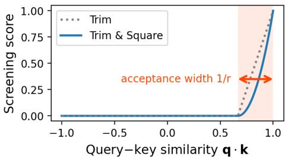

# 1. 论文基本信息
## 1.1. 标题
论文标题为《Screening Is Enough》，核心主题是提出一种替代Transformer自注意力的<strong>筛选（Screening）机制</strong>，基于该机制构建的Multiscreen语言模型架构，在参数效率、训练稳定性、长上下文能力、推理速度等多个维度全面优于标准Transformer基线。
## 1.2. 作者
唯一作者为Ken M. Nakanishi，隶属日本理化学研究所（RIKEN）紧急物质科学研究中心（CEMS），同时任职于东京大学大学院理学系研究科，主要研究方向为大语言模型架构、长上下文建模。
## 1.3. 发表状态
当前为arXiv预印本，尚未正式发表于学术期刊或会议。
## 1.4. 发表时间
2026年4月1日（UTC时间）。
## 1.5. 摘要
论文首先指出标准softmax自注意力的核心缺陷：无法定义绝对的查询-键（query-key）相关性，注意力权重是将固定的单位总权重在所有键之间按相对分数重新分配得到的，因此相关性仅相对于其他竞争键存在，无法显式拒绝不相关的键。针对该问题，论文提出Multiscreen架构，核心是筛选机制：无需在所有键之间重新分配注意力，而是为每个键设置显式的阈值评估，直接丢弃不相关的键，仅聚合剩余的相关键，从根本上消除了键之间的全局竞争。实验结果表明：
1.  Multiscreen仅用比Transformer基线少40%的参数即可达到相当的验证损失；
2.  支持使用大得多的学习率稳定训练；
3.  长上下文困惑度表现稳定，即使远超过训练上下文长度，检索性能几乎没有退化；
4.  100K词元上下文下推理延迟最高降低3.2倍。
## 1.6. 原文链接
- 预印本主页：https://arxiv.org/abs/2604.01178
- PDF链接：https://arxiv.org/pdf/2604.01178v1

  ---
# 2. 整体概括
## 2.1. 研究背景与动机
### 2.1.1. 核心问题
当前大语言模型的核心架构Transformer依赖的<strong>软max自注意力（softmax self-attention）</strong>存在本质缺陷：
1.  无绝对相关性判断：注意力权重是所有键的相对分数归一化的结果，总权重恒为1，即使所有键都不相关，也必须把权重分配出去，无法表示“无相关上下文”的状态；
2.  长上下文性能退化：随着上下文长度增加，注意力被稀释到大量不相关的键上，很难保留相关键的贡献，同时位置编码需要外推到远超训练的长度，进一步导致性能暴跌；
3.  训练不稳定：注意力分数无界，归一化过程引入的全局竞争导致梯度波动大，需要严格限制学习率、使用权重衰减和梯度裁剪才能稳定训练；
4.  推理效率低：自注意力的时间复杂度是上下文长度的平方级，长上下文下推理延迟极高。
### 2.1.2. 现有研究的空白
现有改进方案都没有跳出“相对权重重新分配”的框架：
1.  软注意力变体（如Sparsemax、Scalable-Softmax、稀疏注意力）：依然对选中的键子集做归一化，仍存在全局竞争，无法实现绝对的相关性判断；
2.  线性时间序列模型（如Mamba、Hyena、RetNet）：虽然降低了计算复杂度，但检索召回能力显著弱于Transformer，无法满足长上下文信息检索的需求；
3.  位置编码改进（如LongRoPE、NoPE）：仅解决位置外推的补丁问题，没有触及注意力机制本身的缺陷。
### 2.1.3. 创新思路
论文跳出相对权重分配的框架，提出基于绝对阈值的筛选机制：每个键独立判断是否和查询相关，低于阈值的直接丢弃，不需要和其他键比较，从根本上消除全局竞争，同时保留全token的连接能力，不会损失检索性能。
## 2.2. 核心贡献与主要发现
### 2.2.1. 核心贡献
1.  **新架构**：提出Multiscreen语言模型架构，基于筛选机制实现了绝对的查询-键相关性判断，替代传统的自注意力；
2.  **新基准**：提出ABCDigits无语义检索基准，消除自然语言语义、指令跟随、提示词等干扰因素，可纯测模型的底层检索能力；
3.  **全维度性能提升**：在参数效率、训练稳定性、长上下文外推能力、推理速度四个核心维度同时优于标准Transformer基线。
### 2.2.2. 主要发现
1.  无需基于重新分配的注意力机制，仅靠绝对阈值筛选就能实现更好的序列建模效果；
2.  消除键之间的全局竞争可以大幅提升训练稳定性，支持数倍于Transformer的学习率，无需权重衰减和梯度裁剪；
3.  仅在短上下文窗口启用位置编码、长上下文关闭的设计，从根本上避免了位置编码外推的问题，实现了极强的长上下文外推能力；
4.  验证损失等常规语言模型指标无法完全反映模型的检索能力，Multiscreen即使在验证损失略高的情况下，检索能力也远优于Transformer。

    ---
# 3. 预备知识与相关工作
## 3.1. 基础概念
### 3.1.1. Transformer与自注意力
**Transformer**是2017年提出的基于自注意力的序列建模架构，是当前所有大语言模型的基础架构。其核心的<strong>自注意力（self-attention）</strong>机制计算每个位置的输出时，会综合上下文所有位置的信息，计算公式为：
$$
\mathrm{Attention}(Q, K, V) = \mathrm{softmax}\left(\frac{QK^\top}{\sqrt{d_k}}\right)V
$$
符号解释：
- $Q \in \mathbb{R}^{T \times d_k}$：查询矩阵，每个行向量对应一个位置的查询表示，$T$为序列长度，$d_k$为键的维度；
- $K \in \mathbb{R}^{T \times d_k}$：键矩阵，每个行向量对应一个位置的键表示；
- $V \in \mathbb{R}^{T \times d_v}$：值矩阵，每个行向量对应一个位置的值表示，$d_v$为值的维度；
- $\frac{1}{\sqrt{d_k}}$：缩放因子，防止点积结果过大导致softmax饱和；
- $\mathrm{softmax}(\cdot)$：归一化函数，将输入的任意实数转换为和为1的概率分布，公式为$\mathrm{softmax}(x_i) = \frac{e^{x_i}}{\sum_{j=1}^T e^{x_j}}$。
  自注意力的核心问题正是来自softmax归一化：所有键的注意力权重和恒为1，每个键的权重不仅取决于自身和查询的相似度，还取决于其他所有键的相似度，是相对值，没有绝对的相关性判断标准。
### 3.1.2. 词元（Token）
大语言模型的输入单位，是将自然语言文本按照词表拆分得到的最小单元，可能是一个字、一个词或者词的一部分。
### 3.1.3. 困惑度（Perplexity, PPL）
衡量语言模型预测能力的核心指标，数值越低表示模型预测下一个词元的准确率越高，相当于模型平均需要猜多少次才能猜对下一个词元，计算公式为交叉熵损失的指数：$\mathrm{PPL} = \exp(L)$，其中$L$为交叉熵损失。
### 3.1.4. 旋转位置编码（RoPE）
当前大模型常用的相对位置编码，通过旋转查询和键的向量来注入位置信息，使得查询和键的点积仅和两者的相对位置有关，无需显式的位置嵌入。
### 3.1.5. 门控线性单元（GLU）
一种常用的特征选择机制，通过门控向量按元素缩放输入特征，保留有用的特征，抑制无用的特征，提升模型的表达能力。
## 3.2. 前人工作
### 3.2.1. 软注意力变体
- 分布形状改进：Sparsemax、Entmax等修改softmax的函数形式，鼓励注意力分布的稀疏性，但仍然是在所有键之间做归一化，保留相对权重分配的逻辑；
- 上下文长度适配：Scalable-Softmax、选择性注意力等通过调整温度、缩放因子适配长上下文，但没有解决相对相关性的本质问题；
- 稀疏注意力：只选择部分键计算注意力，降低计算量，但对选中的键仍然做softmax归一化，仍存在全局竞争。
### 3.2.2. 无注意力序列模型
以Mamba、Hyena、RetNet为代表，通过选择性状态空间、长卷积、循环保留等机制实现线性时间复杂度的序列建模，大幅提升长上下文推理速度，但大量实验证明这类模型的检索召回能力显著弱于Transformer，难以处理需要精准召回长距离信息的任务。
### 3.2.3. 长上下文位置编码改进
- 外推优化：ALiBi、LongRoPE等修改位置编码的计算方式，提升位置编码的外推能力，但仍然需要依赖位置编码的外推，无法从根本上避免长上下文下的性能退化；
- 无位置编码：NoPE等方案移除显式位置编码，提升长度泛化能力，但会损失短距离的位置依赖建模能力。
### 3.2.4. 检索基准
现有检索基准如“针在干草堆”（Needle-in-a-Haystack）、MQAR等，要么包含自然语言语义，模型可以通过语义线索作弊，要么依赖指令跟随能力，无法纯测模型的底层检索能力。
## 3.3. 技术演进
序列建模技术的演进路径为：
1.  早期：循环神经网络（RNN）、长短时记忆网络（LSTM），存在长距离依赖遗忘问题，并行训练效率低；
2.  2017年至今：Transformer自注意力成为主流，解决了长距离依赖和并行训练问题，但长上下文下复杂度高、性能退化；
3.  近年：线性时间序列模型（Mamba等）和注意力改进方案并行发展，分别解决效率问题和长上下文性能问题，但都存在各自的缺陷；
4.  本文：跳出相对权重分配的框架，提出基于绝对筛选的新架构，同时兼顾检索能力、训练稳定性和效率。
## 3.4. 差异化分析
本文方法与现有方案的核心区别：
1.  相关性判断逻辑：所有现有注意力类方法都是**相对相关性**，权重取决于所有键的分数，而本文的筛选机制是**绝对相关性**，每个键独立判断，仅取决于自身和查询的相似度，与其他键无关；
2.  全局竞争：现有方法存在键之间的全局竞争，本文完全消除了全局竞争；
3.  位置编码：现有方法要么全程使用位置编码（面临外推问题），要么全程不用（损失短距离性能），本文的最小位置编码仅在短窗口启用，长窗口关闭，兼顾两者的优势；
4.  能力均衡：现有线性时间模型损失检索能力，现有注意力类模型效率低，本文同时保留了Transformer级别的检索能力和线性级别的推理效率。

    ---
# 4. 方法论
## 4.1. 方法原理
核心直觉：如果能为每个查询-键对定义绝对的相关性阈值，仅保留相似度高于阈值的键，丢弃所有低于阈值的键，不需要在键之间重新分配权重，就能从根本上解决softmax注意力的所有核心缺陷：
- 没有全局竞争，训练更稳定；
- 可以显式表示“无相关上下文”的状态；
- 长上下文下不会出现注意力稀释问题；
- 可以跳过不相关键的计算，提升推理效率。
  下图（原文Figure 1）展示了Multiscreen的完整架构：

  ![Figure 1: (a) Multiscreen architecture. The model comprises a stack of $N _ { \\mathrm { L } }$ residual layers, each containing $N _ { \\mathrm { H } }$ parallel gated screening tiles. The input embedding matrix is normalized and shared with the language-modeling head, with learned scalars $\\mathrm { e } ^ { s _ { \\mathrm { E } } }$ and $\\mathrm { e } ^ { s _ { \\mathrm { F } } }$ controlling input and output scaling. (b) A gated screening tile. The tile computes query, key, value, and gate projections, applies a screening unit to the projected queries, keys, and values, modulates the result with a nonlinear gate, and projects back to the model dimension. (c) A screening unit. The unit normalizes queries, keys, and values to unit length, applies minimal positional encoding (MiPE) to queries and keys, computes distance-aware relevance through Trim, Square, and Softmask, aggregates the surviving values, and applies TanhNorm. In the diagrams, `@` " denotes matrix multiplication and "/RSS" denotes row-wise normalization to unit length.](images/1.jpg)
  *该图像是示意图，介绍了Multiscreen架构及其组成部分。图（a）展示了Multiscreen模型的整体结构，包含多个残差层和并行的门控筛选单元；图（b）说明了门控筛选单元的计算流程，包括查询、键、值的投影和筛选操作；图（c）则介绍了筛选单元的具体实现，包含对查询、键、值的归一化和距离感知相关性计算。*

## 4.2. 核心方法详解
### 4.2.1. 整体架构
Multiscreen由堆叠的残差层组成，每个残差层包含多个并行的门控筛选块，替换了Transformer的“自注意力+前馈网络”的层结构。
#### 输入嵌入层
输入嵌入矩阵的每一行都会被归一化到单位L2范数，再通过一个学习的标量控制缩放：
$$
\bar{\boldsymbol{e}}_j = \frac{\boldsymbol{e}_j}{\left\|\boldsymbol{e}_j\right\|}, \qquad \overline{W}_\mathrm{E} = [\bar{e}_1; \ldots; \bar{e}_{|\mathcal{V}|}]
$$
$$
\pmb{x}_i^{(0)} = \mathrm{e}^{s_\mathrm{E}} \bar{\pmb{e}}_{t_i}
$$
符号解释：
- $\boldsymbol{e}_j$：原始的第j个词表项的嵌入向量；
- $\bar{\boldsymbol{e}}_j$：归一化后的嵌入向量，L2范数为1；
- $\overline{W}_\mathrm{E}$：归一化后的嵌入矩阵，$|\mathcal{V}|$为词表大小；
- $s_\mathrm{E}$：学习的标量参数，控制输入嵌入的缩放尺度；
- $t_i$：第i个输入词元的词表索引；
- $\pmb{x}_i^{(0)}$：第i个词元的初始输入表示。
#### 残差层更新
每个残差层包含$N_\mathrm{H}$个并行的门控筛选块，最终的层输出为输入加上所有块的更新之和：
$$
\pmb{x}_i^{(\ell)} = \pmb{x}_i^{(\ell-1)} + \sum_{h=1}^{N_\mathrm{H}} \Delta \pmb{x}_i^{(\ell,h)}
$$
符号解释：
- $\pmb{x}_i^{(\ell)}$：第$\ell$层第i个词元的输出表示；
- $\Delta \pmb{x}_i^{(\ell,h)}$：第$\ell$层第h个门控筛选块输出的第i个词元的更新量。
#### 输出层
输出层使用和输入嵌入层绑定的归一化嵌入矩阵，再通过一个学习的标量控制缩放，得到每个词表项的logit：
$$
z_{ij} = \pmb{x}_i^{(N_\mathrm{L})} \left( \mathrm{e}^{s_\mathrm{F}} \bar{\pmb{e}}_j^\top \right), \qquad j \in \{1, \dotsc, |\mathcal{V}|\}
$$
符号解释：
- $z_{ij}$：第i个词元对应第j个词表项的logit；
- $N_\mathrm{L}$：总层数；
- $s_\mathrm{F}$：学习的标量参数，控制输出的缩放尺度。
  最终通过softmax得到下一个词元的预测概率。
#### 模型缩放规则
Multiscreen的规模仅由一个超参数$\Psi$控制：层数$N_\mathrm{L} = \Psi$，头数$N_\mathrm{H} = \Psi$，嵌入维度$d_\mathrm{E} = \Psi^2$，其他超参数（如键维度、值维度、位置编码阈值等）固定不变，无需随模型规模重新调参，非常方便缩放。
### 4.2.2. 筛选单元（Screening Unit）
筛选单元是Multiscreen的核心组件，负责实现绝对相关性判断和上下文聚合。
#### 基础参数
每个筛选单元有两个学习的标量参数，分别控制筛选窗口大小和相似度接受宽度：
$$
w = \mathrm{e}^{s_\mathrm{w}} + 1, \quad r = \mathrm{e}^{s_\mathrm{r}} + 1
$$
符号解释：
- $w$：筛选窗口大小，仅考虑当前位置之前$w$个词元内的键；
- $1/r$：相似度接受宽度，只有查询-键相似度大于`1-1/r`的键才会被保留，$r$越大，筛选越严格。
#### 步骤1：单位长度归一化
首先将查询、键、值都归一化到单位L2范数：
$$
\bar{q}_i = \frac{q_i}{\left\| q_i \right\|}, \qquad \bar{k}_i = \frac{k_i}{\left\| k_i \right\|}, \qquad \bar{v}_i = \frac{v_i}{\left\| v_i \right\|}
$$
该操作的作用：
1.  查询和键的点积变为余弦相似度，范围固定在`[-1,1]`，有统一的尺度，方便设置绝对阈值；
2.  消除向量模长对相似度的影响，相关性仅由查询和键的方向对齐程度决定；
3.  值归一化防止模长过大的值主导聚合结果，消除值范数带来的干扰。
#### 步骤2：最小位置编码（MiPE）
最小位置编码是一种条件激活的RoPE风格位置编码，仅当学习的窗口$w$小于阈值$w_\mathrm{th}$（默认256）时激活，否则完全关闭，避免长上下文下的位置编码外推问题。
MiPE仅作用于查询和键的前两个维度，其余维度保持不变，计算公式为：
$$
\tilde{z}_i = z_i M_i(w)
$$
其中旋转矩阵$M_i(w)$定义为：
$$
M_i(w) = \left( \begin{array}{cc} R(\phi(i,w)) & 0 \\ 0 & I_{d_\mathrm{K}-2} \end{array} \right), \qquad R(\phi) = \left( \begin{array}{cc} \cos\phi & -\sin\phi \\ \sin\phi & \cos\phi \end{array} \right)
$$
旋转角度$\phi(i,w)$为：
$$
\phi(i,w) = \frac{\pi i \gamma(w)}{w}
$$
其中激活控制函数$\gamma(w)$的作用是当$w \geq w_\mathrm{th}$时关闭位置编码，否则平滑下降：
$$
\gamma(w) = \left\{ \begin{array}{ll} \frac{1}{2}\left( \cos \frac{\pi w}{w_\mathrm{th}} + 1 \right), & w < w_\mathrm{th}, \\ 0, & w \geq w_\mathrm{th}. \end{array} \right.
$$
对查询和键应用MiPE后得到$\tilde{q}_i$和$\tilde{k}_j$，两者的点积仅和相对位置有关，和RoPE的特性一致。
#### 步骤3：距离无关相关性计算
首先计算查询和键的余弦相似度：
$$
s_{ij} = \tilde{q}_i \tilde{k}_j^\top, \qquad s_{ij} \in [-1, 1]
$$
然后通过Trim-and-Square变换得到距离无关的相关性：
$$
\alpha_{ij} = \left[ \max\left( 1 - r(1 - s_{ij}), 0 \right) \right]^2
$$
该变换的特性（原文Figure 2）：

*该图像是示意图，展示了 Trim 和 Trim & Square 变换的评分机制。横轴表示查询-键相似性 `q ullet k`，纵轴表示筛选得分。图中展示的接受宽度为 $1 / r$，只有相似度大于 $1 - 1 / r$ 的值才产生非零相关性，反映了有效的接受阈值。*

- 当$s_{ij} \leq 1 - 1/r$时，$\alpha_{ij}=0$，该键被直接丢弃，实现了绝对阈值筛选；
- 当$s_{ij} > 1 - 1/r$时，平方操作会放大高相似度的权重，突出最相关的键。
#### 步骤4：距离感知软掩码
添加因果、距离感知的软掩码，仅保留当前位置之前$w$个窗口内的键，掩码值随距离平滑下降：
$$
m_{ij}(w) = \left\{ \begin{array}{ll} \frac{1}{2}\left( \cos \frac{\pi (j - i)}{w} + 1 \right), & -w < j - i \leq 0, \\ 0, & \mathrm{otherwise}. \end{array} \right.
$$
其中$j$为键的位置，$i$为查询的位置，仅保留$j \leq i$（因果，不看未来词元）且距离不超过$w$的键。最终的距离感知相关性为：
$$
\alpha_{ij}^\mathrm{d} = \alpha_{ij} m_{ij}(w)
$$
只有同时通过内容相似度筛选和距离窗口筛选的键才会被保留。
> 推理优化：如果学习的窗口$w$超过训练时见过的最大序列长度，直接设置$w=\infty$，软掩码退化为标准的全因果掩码，支持任意长度的上下文推理。
#### 步骤5：加权聚合与TanhNorm
首先聚合所有保留的值向量：
$$
h_i = \sum_{j=1}^T \alpha_{ij}^\mathrm{d} \bar{v}_j
$$
和自注意力不同，这里没有归一化操作，当没有相关键时$h_i$为零向量，可以显式表示“无相关上下文”的状态。
然后应用作者提出的TanhNorm归一化，限制输出向量的范数不超过1，同时保留向量的方向：
$$
\mathrm{TanhNorm}(\pmb{x}) = \frac{\tanh \|\pmb{x}\|}{\|\pmb{x}\|} \pmb{x}
$$
特性：
- 当$\|\pmb{x}\|$很小时，$\tanh(\|\pmb{x}\|) \approx \|\pmb{x}\|$，TanhNorm近似恒等变换，几乎不改变输入；
- 当$\|\pmb{x}\|$很大时，$\tanh(\|\pmb{x}\|) \approx 1$，输出向量的范数近似为1，防止聚合结果的范数过大导致训练不稳定。
  筛选单元的最终输出为：
$$
\pmb{u}_i = \mathrm{TanhNorm}(\pmb{h}_i)
$$
不同层、不同头的距离感知相关性分布如原文Figure 10所示：

*该图像是示意图，展示了不同层和头的距离感知相关性图。每个图中行和列对应查询和键的位置，深色区域表示超出学习的筛选窗口的位置。每个小块中标注了其层和头的索引、学习的窗口宽度 $w$ 、接受宽度 $1 / r$ 以及窗口内非零相关性值的比例 $\mathrm{Pr}(\alpha_{ij}^{d} > 0)$。*

可以看到不同的头学习到了不同的窗口大小，有的关注局部短距离，有的关注长距离，且大部分键都被筛选掉，相关性分布非常稀疏。
### 4.2.3. 门控筛选块（Gated Screening Tile）
门控筛选块是每个头的完整模块，融合了筛选机制和GLU风格的门控特征选择。
#### 输入投影
首先将输入表示投影为查询、键、值、门控四个向量：
$$
q_i = x_i W_\mathrm{Q}, \qquad k_i = x_i W_\mathrm{K}, \qquad v_i = x_i W_\mathrm{V}, \qquad g_i = x_i W_\mathrm{G}
$$
符号解释：
- $W_\mathrm{Q}, W_\mathrm{K} \in \mathbb{R}^{d_\mathrm{E} \times d_\mathrm{K}}$：查询、键的投影矩阵，$d_\mathrm{K}$为键的维度，默认16；
- $W_\mathrm{V}, W_\mathrm{G} \in \mathbb{R}^{d_\mathrm{E} \times d_\mathrm{V}}$：值、门控的投影矩阵，$d_\mathrm{V}$为值的维度，默认64。
#### 筛选与门控
将查询、键、值输入筛选单元得到上下文聚合结果$\pmb{u}_i$，同时计算门控向量：
$$
\hat{\pmb{g}}_i = \tanh(\mathrm{SiLU}(\pmb{g}_i))
$$
其中$\mathrm{SiLU}(x) = x \cdot \sigma(x)$是带sigmoid的线性激活函数，门控向量用于对筛选得到的上下文特征做逐元素的特征选择：
$$
\pmb{h}_i = \pmb{u}_i \odot \hat{\pmb{g}}_i
$$
$\odot$表示逐元素乘法。
#### 输出投影
最终将结果投影回模型维度，得到该块的更新量：
$$
\Delta \pmb{x}_i = \pmb{h}_i \left( \mathrm{e}^{s_0} W_0 \right)
$$
符号解释：
- $W_0 \in \mathbb{R}^{d_\mathrm{V} \times d_\mathrm{E}}$：输出投影矩阵；
- $s_0$：学习的标量参数，控制更新量的尺度，保证残差连接的稳定性。
### 4.2.4. 初始化策略
所有投影矩阵和嵌入矩阵都从零均值高斯分布初始化，标准差和输出维度的平方根成反比，保证训练初期的数值稳定性：
- 窗口参数$s_\mathrm{w}$在每个层的头之间从0到$\log(w_\mathrm{th})$线性初始化，让不同的头初始就有不同的窗口大小，覆盖短、中、长距离的依赖；
- 残差输出缩放参数$s_0$初始化为$\log(1/\sqrt{N_\mathrm{H}N_\mathrm{L}})$，保证所有块的总更新量尺度合适；
- 输入输出缩放参数$s_\mathrm{E}$初始化为0，$s_\mathrm{F}$初始化为$\log(\sqrt{d_\mathrm{E}})$，保证初始训练的稳定性。

  ---
# 5. 实验设置
## 5.1. 数据集
### 5.1.1. 预训练数据集
使用SlimPajama数据集，是RedPajama数据集的清洗去重版本，总大小约628B词元，实验使用了其中44%的语料进行预训练，词表使用GPT-2的50257词元词表。
### 5.1.2. 长上下文困惑度评估数据集
使用PG-19数据集，包含1919年之前出版的古腾堡计划书籍，提取其中长度超过$2^{17}$（131072）词元的5747个文档，每个文档取中间的$2^{17}+1$个词元作为评估样本，避免文档边界的干扰。
### 5.1.3. 检索能力评估数据集（ABCDigits）
作者提出的无语义检索基准，样例如原文Figure 6a所示：

![Figure 6: (a) Example prompt for ABCDigits. (b) Retrieval accuracy heatmaps over context length (columns) and target depth (rows). Columns correspond to the two training settings: base models trained with context length $2 ^ { 1 2 }$ (left) and models after continual pretraining with context length $2 ^ { 1 5 }$ (right). Rows correspond to 353M Transformer (top), 286M Multiscreen (middle), and 28M Multiscreen (bottom). Colors indicate exact-match retrieval accuracy. For Transformer, each cell shows accuracy under the best-performing RoPE scaling factor selected from multiple candidates, and the number inside the cell indicates the selected factor. A dash ("-") indicates that no correct retrieval occurred. The dashed and dotted vertical lines mark the context lengths used during base pretraining $( 2 ^ { 1 2 } )$ and long-context continual pretraining $( 2 ^ { 1 5 } )$ , respectively.](images/6.jpg)
*该图像是图表，展示了图6中的两个部分：(a) ABCDigits的示例提示与(b) 随着上下文长度（列）和目标深度（行）变化的检索准确率热图。上半部分显示353M Transformer模型的准确率，底部是286M和28M Multiscreen模型。颜色表示准确匹配的检索精度，特定单元格中的数字是所选的RoPE缩放因子，"-"表示未成功检索。虚线标记了用于基础和长期预训练的上下文长度。*

样本构造规则：
1.  26个大写字母每个对应一个唯一的n位整数，上下文包含这些字母-数字的等式；
2.  非目标等式的采样服从高度偏态的分布，避免低频等式显得异常；
3.  所有等式随机打乱后，将目标等式插入指定深度，最后追加目标字母和等号（如$L=$），要求模型补全对应的整数。
    该基准的优势：
- 无自然语言语义，消除语义线索的干扰；
- 不需要指令跟随能力，模型仅需要通过上下文的模式完成任务；
- 键的数量固定为26个，不随上下文长度变化，消除键数量增加带来的干扰，纯测模型的底层检索能力。
## 5.2. 评估指标
### 5.2.1. 验证损失
衡量模型预训练性能的核心指标，使用下一词元预测的交叉熵损失，公式为：
$$
L = -\frac{1}{N} \sum_{i=1}^N \log p(y_i | x_i)
$$
符号解释：
- $N$：总词元数；
- $y_i$：第i个位置的真实下一词元；
- $p(y_i | x_i)$：模型预测的真实下一词元的概率。
  损失越低表示模型的语言建模能力越强。
### 5.2.2. 困惑度（PPL）
交叉熵损失的指数，公式为：
$\mathrm{PPL} = \exp(L)$
困惑度越低表示模型的预测准确率越高，相当于平均需要猜$\mathrm{PPL}$次才能猜对下一个词元。
### 5.2.3. 检索准确率
ABCDigits任务使用精确匹配准确率，即模型输出的整数和真实值完全一致的样本比例：
$$
\mathrm{Accuracy} = \frac{\text{正确预测的样本数}}{\text{总样本数}} \times 100\%
$$
准确率越高表示模型的检索能力越强。
### 5.2.4. 推理延迟
给定长度为100K的上下文，模型生成下一个词元的平均时间，单位为秒，数值越低表示推理效率越高。
## 5.3. 对比基线
使用LLaMA风格的标准Transformer作为基线，采用RoPE位置编码，输入输出嵌入绑定，超参数参考Pythia系列模型，和Multiscreen使用完全相同的训练数据、相同的词元预算，是当前大语言模型的标准基线，具有充分的代表性。

---
# 6. 实验结果与分析
## 6.1. 缩放效率
原文Figure 3展示了不同参数规模下Multiscreen和Transformer的验证损失对比：

*该图像是图表，展示了Transformer和Multiscreen的验证损失与模型规模（参数数量）之间的关系。验证损失在对数刻度上绘制，标记代表三次运行的均值，误差条表示一个标准偏差。可见，Multiscreen在参数数量大约减少40%的情况下，取得了与Transformer相似的验证损失。*

核心结论：
- Multiscreen的缩放曲线始终位于Transformer的左侧，要达到相同的验证损失，Multiscreen仅需要Transformer约60%的参数，参数效率提升40%；
- 趋势在所有参数规模下一致，从8M到4B模型都成立；
- 即使按非嵌入参数计算，Multiscreen的参数效率优势仍然保持。
## 6.2. 学习率稳定性
原文Figure 4展示了学习率扫描的结果：

*该图像是图表，展示了Transformers和Multiscreen在不同学习率下的验证损失比较。横坐标为学习率（对数刻度），纵坐标为验证损失。图中显示，45M的Transformer（灰色虚线）在较高学习率下训练不稳定，验证损失增加；而28M的Multiscreen（蓝色实线）在较大学习率下依然保持稳定的性能表现。*

核心结论：
- Transformer在学习率大于等于$2^{-4}$时训练完全发散，而Multiscreen在学习率大到$2^0$时仍然保持稳定，支持的最大学习率是Transformer的16倍以上；
- Multiscreen训练不需要权重衰减和梯度裁剪，训练流程更简单，收敛速度更快。
  训练损失曲线（原文Figure 8）进一步验证了该结论：Transformer在大学习率下损失剧烈震荡甚至发散，而Multiscreen的损失曲线始终平滑稳定。
梯度范数动态（原文Figure 9）也验证了稳定性的差异：

*该图像是图表，展示了Transformer和Multiscreen模型在训练过程中的梯度范数动态。图中显示，Multiscreen（蓝色）梯度范数迅速衰减且方差很小，而Transformer（灰色）维持了非零的梯度底线，有偶尔的峰值。对于可视化，超过1的值被裁剪，并用`imes`标记表示。*

Multiscreen的梯度范数快速衰减到接近0，方差极小，而Transformer的梯度范数始终维持非零的基线，且存在大量尖峰，是训练不稳定的根源。
## 6.3. 长上下文评估
### 6.3.1. 长上下文困惑度
原文Figure 5展示了长上下文困惑度的对比：

![Figure 5: Long-context perplexity comparison between $3 5 3 \\mathbf { M }$ Transformer and 286M Multiscreen models. The horizontal axis is context position, and the vertical axis is perplexity. The left panel shows the base models, while the right panel shows models after long-context continual pretraining. The black curve corresponds to Multiscreen, while colored curves correspond to Transformer with different RoPE scaling factors. Shaded regions indicate one standard deviation across three independently trained models. The dashed and dotted vertical lines indicate the sequence lengths used during base pretraining $( 2 ^ { 1 2 } )$ and long-context continual pretraining $( 2 ^ { 1 5 } )$ , respectively.](images/5.jpg)
*该图像是一个比较 $2^{12}$ 基础模型和 $2^{15}$ 长期持续预训练模型的长上下文困惑度图。左侧展示了基础模型的困惑度，右侧展示了经过长期预训练后的模型。黑色曲线对应于286M Multiscreen模型，彩色曲线则对应于不同RoPE缩放因子的353M Transformer模型，虚线指示了序列长度。*

实验设置：
- 基模型训练上下文长度为$2^{12}$（4096），持续预训练模型的训练上下文长度为$2^{15}$（32768）；
- Transformer测试了不同的RoPE缩放因子来提升外推能力。
  核心结论：
- Multiscreen的困惑度随着上下文长度增加始终保持稳定，即使远超过训练长度也没有明显上升；
- Transformer的困惑度一旦超过训练长度就会急剧上升，即使使用RoPE缩放也只能延迟退化，且缩放因子越大，整体困惑度越高；
- 该趋势在基模型和持续预训练模型中都成立，Multiscreen的长上下文稳定性显著优于Transformer。
### 6.3.2. 检索能力（ABCDigits）
原文Figure 6b的热力图展示了不同上下文长度、不同目标深度下的检索准确率：
核心结论：
- 286M Multiscreen基模型在上下文长度达到$2^{17}$（131072，是训练长度的32倍）时，检索准确率仍然接近100%，几乎没有退化；
- 仅28M的小Multiscreen模型，在最长上下文下仍然保持约80%的准确率，远优于353M的Transformer；
- 353M Transformer即使选择最优的RoPE缩放因子，在超过训练长度后准确率暴跌，甚至在训练长度内的准确率也低于28M的Multiscreen，说明验证损失等常规语言模型指标无法反映模型的检索能力。
## 6.4. 推理延迟
原文Table 4展示了100K上下文下的下一词元推理延迟对比：

<table>
<thead>
<tr>
<th>Model</th>
<th>Base</th>
<th>After continual pretraining</th>
</tr>
</thead>
<tbody>
<tr>
<td>353M Transformer</td>
<td>4.04 ± 0.03 s</td>
<td>4.05 ± 0.04 s</td>
</tr>
<tr>
<td>286M Multiscreen</td>
<td>1.72 ± 0.05 s</td>
<td>1.26 ± 0.06 s</td>
</tr>
</tbody>
</table>

核心结论：
- 基模型下Multiscreen比Transformer快2.3倍，持续预训练后提升到3.2倍；
- 持续预训练后速度提升的原因是：更多头的学习窗口$w$小于训练时的最大序列长度，不需要计算全量的键，计算量进一步降低；
- 100K上下文下Multiscreen的推理延迟仅为1.26秒，完全满足实时交互的需求。

  ---
# 7. 总结与思考
## 7.1. 结论总结
本文从Transformer软注意力的本质缺陷出发，提出了基于绝对筛选机制的Multiscreen架构，完全跳出了相对权重分配的框架，实现了多个维度的同时提升：
1.  **参数效率**：比Transformer少40%的参数即可达到相当的语言建模性能；
2.  **训练效率**：支持16倍以上的学习率稳定训练，不需要权重衰减和梯度裁剪，训练流程更简单，收敛速度更快；
3.  **长上下文能力**：困惑度随上下文长度增加保持稳定，检索能力即使远超训练长度也几乎没有退化，远优于Transformer；
4.  **推理效率**：100K上下文下推理延迟最高降低3.2倍，兼顾长上下文能力和推理速度。
    本文的核心发现是：基于绝对阈值的筛选机制可以完全替代传统的自注意力，是提升大语言模型长上下文能力的革命性方向，无需依赖相对权重的重新分配。
## 7.2. 局限性与未来工作
### 7.2.1. 论文指出的局限性与未来方向
1.  目前实验的最大模型规模为4B，未来需要验证Multiscreen在数十B、数百B超大规模下的表现；
2.  探索筛选机制在多模态、检索增强生成、代码生成等其他任务和领域的适用性；
3.  进一步优化筛选机制的推理实现，和KV缓存、动态稀疏等现有高效推理技术结合，进一步提升长上下文推理速度；
4.  扩展ABCDigits基准，覆盖更复杂的检索场景。
### 7.2.2. 潜在的未解决问题
1.  目前的筛选是每个键独立判断，没有考虑相关键之间的依赖关系，可能会漏掉一些单个相似度不高但组合起来有用的键；
2.  相似度接受宽度$r$是每个筛选单元共享的标量，无法根据每个查询的需求动态调整阈值，灵活性不足；
3.  无语义的ABCDigits基准的结果是否能完全迁移到有语义的真实自然语言检索场景，还需要进一步验证；
4.  最小位置编码仅作用于前两个维度，短距离的位置依赖建模能力可能弱于全维度的RoPE。
## 7.3. 个人启发与批判
1.  **范式革新价值**：本文的思路是对Transformer架构的底层范式革新，之前的大部分改进都是在原有框架下打补丁，而本文直接否定了相对权重分配的必要性，开辟了全新的研究方向，有可能成为下一代大语言模型的基础架构；
2.  **工程价值**：Multiscreen的训练流程更简单，仅需要一个超参数控制模型缩放，不需要复杂的调参，训练和推理成本都更低，非常适合工业界落地，尤其是长上下文场景，比如长文档理解、法律文书处理、代码库分析等；
3.  **可解释性提升**：筛选机制的相关性是绝对的、可解释的，可以直接看到哪些键被保留、哪些被丢弃，远优于黑盒的自注意力分布，有利于模型的可解释性分析和安全对齐；
4.  **竞争格局影响**：如果Multiscreen的优势在大规模下得到验证，将极大冲击当前Transformer的垄断地位，甚至改变整个大模型行业的技术栈。

    总的来说，本文是一篇极具突破性的工作，从底层逻辑上重新思考了序列建模的核心机制，其价值不亚于Transformer和Mamba的提出，值得持续关注后续的研究和落地进展。