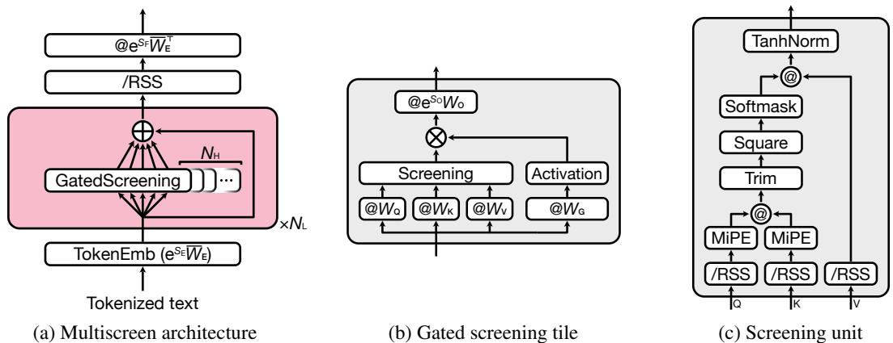
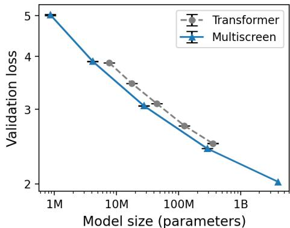
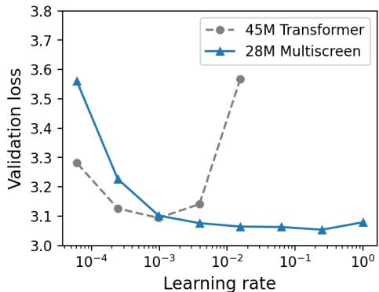
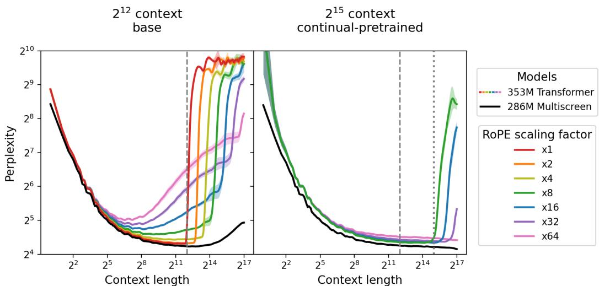
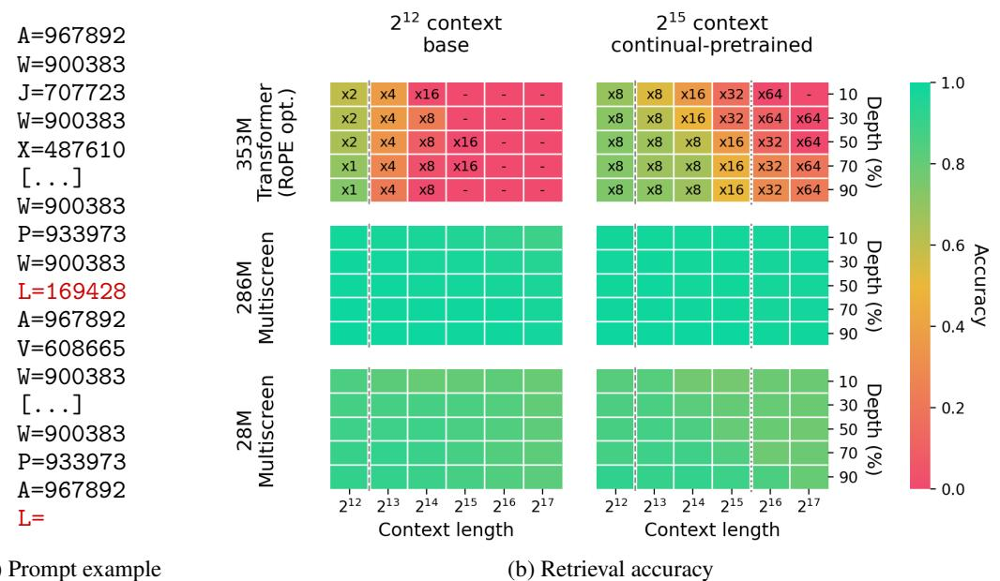
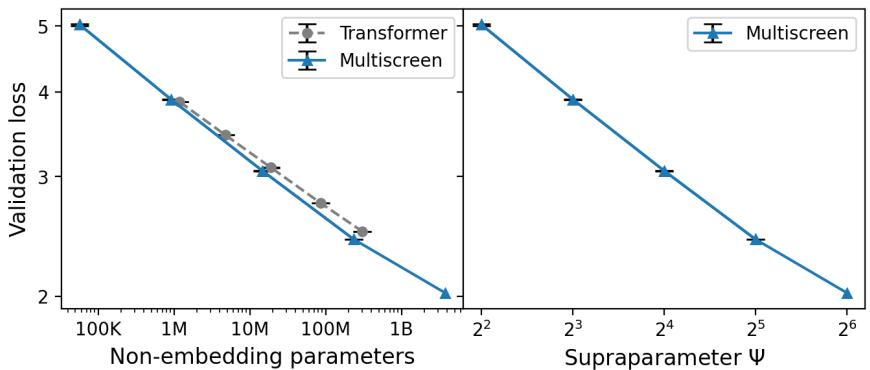
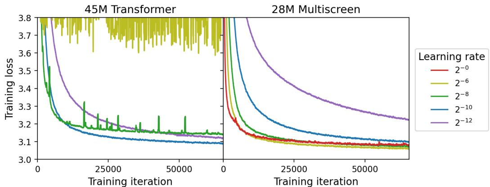
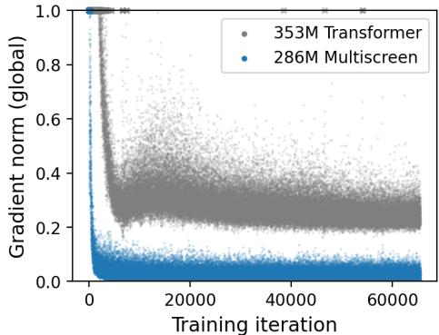
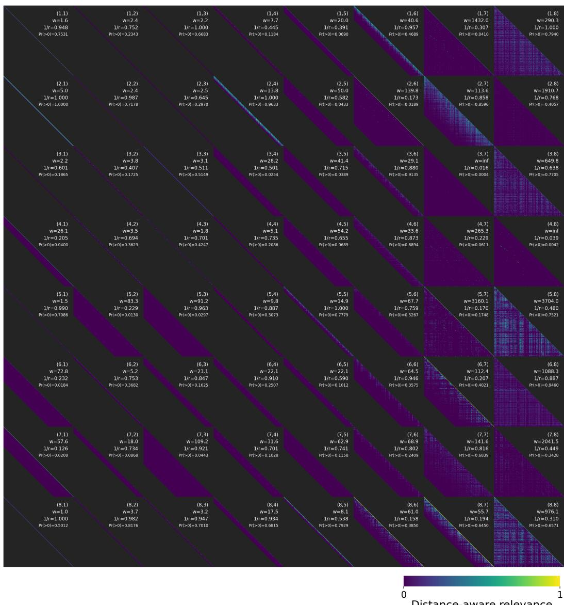

# Screening Is Enough

Ken M. Nakanishi   
Center for Emergent Matter Science (CEMS), RIKEN   
Graduate School of Science, The University of Tokyo ken.m.nakanishi@gmail.com

# Abstract

A core limitation of standard softmax attention is that it does not define a notion of absolute querykey relevance: atention weights are obtained by redistributing a fixed unit mass across all keys according to their relative scores. As a result, relevance is defined only relative to competing keys, and irrelevant keys cannot be explicitly rejected. We introduce Multiscreen, a language-model architecture built around a mechanism we call screening, which enables absolute querykey relevance. Instead of redistributing attention across all keys, screening evaluates each key against an explicit threshold, discarding irrelevant keys and aggregating the remaining keys, thereby removing global competition among keys. Across experiments, Multiscreen achieves comparable validation loss with approximately $40 \%$ fewer parameters than a Transformer baseline, enables stable optimization at substantially larger learning rates, maintains strong performance in long-context perplexity, shows little to no degradation in retrieval performance even far beyond the training context length, and reduces inference latency by up to $3 . 2 \times$ at 100K context length.

# 1 Introduction

Handling contexts substantially longer than those seen during training remains a central challenge for large language models (LLMs). Longer contexts are crucial for using in-context information effectively, but in practice, training with long sequences is computationally expensive because the cost of Transformer self-attention grows quadratically with sequence length [1]. As a result, models are often trained on relatively short contexts and then expected to generalize to much longer ones at inference time. However, simply increasing the nominal context length does not guarantee that a model can effectively use relevant information within it.

Prior work has shown that long-range dependency modeling remains difficult, and that models often fail to reliably utilize information from distant parts of the context [2, 3]. This challenge is not merely a matter of context length, but also of how relevant information is aggregated from context. In standard softmax attention, all unmasked keys are evaluated jointly, and attention weights are obtained by redistributing a fixed unit mass across all keys according to how each querykey score compares to the others. As a result, neither attention scores nor attention weights define a notion of absolute relevance: a key receives a large attention weight not because its score exceeds a fixed threshold, but only when its score is sufficiently large relative to those of competing keys. Irrelevant keys also cannot be cleanly rejected without explicit masking: even when no key is genuinely relevant, some attention weight must still be distributed across the available keys. Furthermore, because all unmasked keys receive nonzero weight, increasing the context length necessarily dilutes attention over many keys, making it increasingly difficult to preserve strong contributions from relevant tokens as the context grows. This behavior arises from the fact that attention produces normalized weights from unbounded scores, without any mechanism for applying an absolute threshold to querykey scores. In this paper, we present Multiscreen, a language-model architecture inspired by the Transformer but built around a mechanism we call screening, which enables absolute querykey relevance. Instead of redistributing a fixed unit mass across all keys, screening computes bounded querykey similarities and evaluates each key independently against an explicit threshold to compute relevance, discarding irrelevant keys and aggregating the remaining keys. This formulation removes global competition among keys by construction. As a result, the model can represent the absence of relevant context and more effectively utilize long-range information. Multiscreen further learns screening windows that determine effective context ranges, allowing each screening unit to adapt its context range and avoid unnecessary long-range computation. It also employs a minimal positional encoding that is enabled only when the screening window is sufficiently small and otherwise inactive. Consequently, long-range behavior does not rely on extrapolating positional patterns beyond those seen during training, avoiding the mismatch that typically arises from positional extrapolation. Evaluating language models is inherently challenging, as they exhibit a range of capabilities— including next-token prediction, retrieval, and instruction-following—that are not fully captured by a single metric. Standard next-token prediction metrics such as validation loss do not necessarily reflect a model's ability to retrieve and use relevant information. Moreover, certain benchmark designs do not isolate retrieval behavior, as performance can be driven by semantic cues, obscured by semantic masking [4], or influenced by prompt-specific effects, making it difficult to distinguish underlying retrieval ability from prompt-dependent behavior. To address these limitations, in addition to long-context perplexity, we introduce ABCDigits, a synthetic completion-based keyvalue retrieval benchmark that removes natural-language semantics, fixes the number of keys across context lengths, and ensures that the target output is uniquely determined without relying on instruction-following or semantic cues. We summarize our main empirical findings as follows. Across scaling experiments, Multiscreen achieves comparable validation loss with approximately $40 \%$ fewer parameters than a Transformer baseline under the same token budget. It also enables stable optimization at substantially larger learning rates than those tolerated by the Transformer baseline. On long-context evaluation, Multiscreen maintains strong performance in perplexity and shows little to no degradation in retrieval performance, even at context lengths far beyond those seen during training. On ABCDigits, a benchmark designed to isolate retrieval behavior, Multiscreen shows little to no degradation in retrieval performance even at context lengths far beyond those seen during training, and consistently outperforms a Transformer baseline even within the training context length, despite having substantially higher validation loss. Finally, for next-token prediction with a 100K-token context, Multiscreen reduces inference latency by $2 . 3 – 3 . 2 \times$ relative to the Transformer baseline. These results demonstrate that screening-based architectures can simultaneously improve parameter efficiency, training stability at large learning rates, retrieval ability, and inference latency. They further suggest that improving long-context behavior requires moving beyond redistribution-based mechanisms toward explicit selection of relevant information based on absolute relevance criteria. Our main contributions are as follows: •We introduce Multiscreen, a language-model architecture that enables absolute querykey relevance through a mechanism we call screening. •We show that Multiscreen simultaneously improves parameter efficiency, training stability at large learning rates, retrieval ability, and inference latency compared to a Transformer baseline. • We introduce ABCDigits, a semantics-free completion-based retrieval benchmark that isolates retrieval behavior without relying on instruction-following or semantic cues.

# 2 Related Work

Softmax-based attention and its variants. A large body of work has studied modifications of softmax attention, motivated by limitations in long-context settings as wellas efficiency considerations. Recent work has identified issues arising from softmax normalization as context length grows. Scalable-Softmax (SSMax) targets the attention-fading effect by sharpening the attention distribution as context length increases [5]. Selective Attention introduces query- and position-dependent temperature scaling within the softmax framework [6]. Other approaches such as sparsemax, entmax, and their variants modify the shape of normalized attention distributions to encourage sparsity [7, 8, 9]. More recent work explores sparse or retrieval-based attention mechanisms that restrict the set of attended keys for efficiency, while stillapplying normalized attention over the selected subset [10, 11]. Despite these differences, these approaches remain within the framework of attention that redistributes weight over competing keys. Our approach differs in a more fundamental way: Multiscreen is built around screening, which enables absolute querykey relevance by evaluating each key independently based on querykey similarity and aggregating without competition across keys. Sequence modeling beyond attention. A separate line of work explores alternative interaction structures for sequence modeling, aiming to achieve sub-quadratic or linear-time computation. Architectures such as Mamba, Hyena, and RetNet adopt alternative interaction mechanisms, including selective state spaces, long convolutions, or recurrent-retention mechanisms, to model long-range dependencies [12, 13, 14]. Hybrid approaches further combine efficient non-attention backbones with local or selective attention components [15]. While these methods demonstrate that long-sequence modeling can be achieved without explicit full token-to-token interaction, prior empirical work suggests that such models can lag behind on recall-oriented behaviors and in-context retrieval [3]. In contrast, Multiscreen preserves full tokento-token connectivity while reducing unnecessary computation through learned screening windows. In particular, tiles with finite screening windows operate in effectively linear time, while allowing the model to learn where full connectivity is required. This enables Multiscreen to combine strong retrieval behavior with improved computational efficiency. Long-context modeling and positional representations. Extending the usable context length of language models has been widely studied through both architectural changes and modifications of positional representations, particularly to address length generalization beyond the training context. Representative approaches include ALiBi-style or RoPE-based extrapolation methods, as well as methods such as LongRoPE that explicitly retune positional behavior for longer contexts [16, 17, 18, 19]. Related work also studies learned or function-based relative position schemes for length generalization, such as FIRE [20]. Other work studies removing explicit positional encodings altogether, including NoPE and subsequent analyses of its length generalization behavior [21, 22]. Our positional design is most closely related to this line of work, but differs in a key respect. Multiscreen employs a minimal positional encoding that is enabled only when the learned screening window is sufficiently small and otherwise inactive, with the effective context range determined by learned screening windows. As a result, long-range behavior does not rely on extrapolating positional patterns beyond the training range. To our knowledge, prior work has not explored combining learned screening windows with such a conditionally active positional mechanism. Retrieval evaluation and synthetic benchmarks. It is increasingly recognized that next-token prediction alone is insufficient to capture all aspects of language model behavior. In particular, failures in retrieval have been observed in both natural and synthetic settings, including lost-in-themiddle phenomena and retrieval-oriented analyses of efficient language models [23, 3]. At the same time, evaluating retrieval itself is non-trivial: benchmark behavior can be affected by semanticcues, obscured by semantic masking [4], or influenced by prompt-specific effects, making it difficult to isolate pure retrieval ability. Synthetic associative recall and keyvalue retrieval tasks have long been used to study memory in sequence models [24, 25]. More recent benchmarks include MQAR and related synthetic recall tasks [3], as well as needle-in-a-haystack and passkey-style evaluations for long-context retrieval [26, 27]. Our ABCDigits benchmark is closest in spirit to this retrieval-oriented line of work, but differs in using a semantics-free completion-based formulation with a fixed set of keys across contexts. This design removes natural-language semantics, fixes the number of keys across context lengths, and ensures that the target output is uniquely determined without relying on instruction-following or semantic cues, enabling a more direct measurement of retrieval behavior by isolating it from semantic and prompt-dependent effects.

  

Figure 1: (a) Multiscreen architecture. The model comprises a stack of $N _ { \mathrm { L } }$ residual layers, each containing $N _ { \mathrm { H } }$ parallel gated screening tiles. The input embedding matrix is normalized and shared with the language-modeling head, with learned scalars $\mathrm { e } ^ { s _ { \mathrm { E } } }$ and $\mathrm { e } ^ { s _ { \mathrm { F } } }$ controlling input and output scaling. (b) A gated screening tile. The tile computes query, key, value, and gate projections, applies a screening unit to the projected queries, keys, and values, modulates the result with a nonlinear gate, and projects back to the model dimension. (c) A screening unit. The unit normalizes queries, keys, and values to unit length, applies minimal positional encoding (MiPE) to queries and keys, computes distance-aware relevance through Trim, Square, and Softmask, aggregates the surviving values, and applies TanhNorm. In the diagrams, $@$ " denotes matrix multiplication and "/RSS" denotes row-wise normalization to unit length.

# 3 Model Architecture

Transformer [1] layers are typically composed of a self-attention module followed by a feed-forward block. In standard softmax attention, all keys are evaluated jointly, and their contributions are determined by redistributing a fixed unit mass across competing keys. As a result, relevance is defined only relative to other keys, and irrelevant keys cannot be cleanly rejected. To address this limitation, we propose a mechanism called screening that enables absolute querykey relevance. Instead of forming a normalized distribution over all keys, screening discards irrelevant keys exactly and aggregates only the remaining keys according to their relevance. This formulation removes global competition among keys and eliminates the sum-to-one constraint on total contribution. The Multiscreen model is illustrated in fig. 1. Each layer replaces the standard attentionfeed-forward pair with a set of parallel gated screening tiles. At a high level, a gated screening tile projects token representations into query, key, value, and gate vectors, applies a screening unit to retrieve relevant context, modulates the retrieved representation with a nonlinear gate inspired by GLU-style multiplicative gating [28, 29, 30], and projects the result back to the model space. The equations below describe the mathematically equivalent computation. In the actual implementation, several operations are fused, and terms outside the learned screening window are skipped for efficiency.

# 3.1 Overview

Given a tokenized input sequence $( t _ { 1 } , \dots , t _ { T } )$ , where each token $t _ { i } \in \{ 1 , \ldots , | \mathcal { V } | \}$ indexes into the vocabulary $\nu$ , we define an embedding matrix

$$
W _ { \mathrm { E } } = [ e _ { 1 } ; \ldots ; e _ { | \mathcal { V } | } ] \in \mathbb { R } ^ { | \mathcal { V } | \times d _ { \mathrm { E } } } .
$$

We normalize each embedding row to unit length, and map each token to its embedding with a learned scale $s _ { \mathrm { E } }$ :

$$
\bar { \boldsymbol { e } } _ { j } = \frac { \boldsymbol { e } _ { j } } { \left\| \boldsymbol { e } _ { j } \right\| } , \qquad \overline { { W } } _ { \mathrm { E } } = [ \bar { e } _ { 1 } ; \ldots ; \bar { e } _ { \left| \mathcal { V } \right| } ] ,
$$

$$
\pmb { x } _ { i } ^ { ( 0 ) } = \mathrm { e } ^ { s _ { \mathrm { E } } } \bar { \pmb { e } } _ { t _ { i } } .
$$

Table 1: Architectural hyperparameters of Multiscreen and their scaling with the supraparameter $\Psi$ .   

<table><tr><td>Hyperparameter</td><td>Symbol</td><td>Suggested</td><td>Used in our experiments</td></tr><tr><td>Number of layers</td><td>NL</td><td>I</td><td>I</td></tr><tr><td>Number of heads</td><td>NH</td><td>I</td><td>I</td></tr><tr><td>Embedding dim</td><td>dE</td><td>Ψ2</td><td>J2</td></tr><tr><td>Key dim</td><td>dK</td><td>16 or 32</td><td>16</td></tr><tr><td>Value dim</td><td>dv</td><td>64 or 128</td><td>64</td></tr><tr><td>MiPE threshold</td><td>Wth</td><td></td><td>256</td></tr><tr><td>Vocabulary size</td><td>|V|</td><td>−</td><td>50,257</td></tr></table>

Table 2: Comparison between Transformer attention and Multiscreen screening.   

<table><tr><td></td><td>Transformer</td><td>Multiscreen</td></tr><tr><td>Query-key dot product</td><td>attention score (unbounded)</td><td>similarity ( [−1, 1])</td></tr><tr><td>Weight computation</td><td>relative (softmax)</td><td>absolute (Trim / Square / Softmask)</td></tr><tr><td>Weights</td><td>attention weights (sum to 1)</td><td>relevance values ( [0, 1])</td></tr></table>

The model then applies a stack of $N _ { \mathrm { L } }$ residual layers, each containing $N _ { \mathrm { H } }$ parallel gated screening tiles. We refer to these units as tiles, which form a regular $N _ { \mathrm { L } } \times N _ { \mathrm { H } }$ grid across layers and heads. Let Δx(l, denote the update to token $i$ produced by tile $h$ in layer $\ell$ Then the representation is updated as

$$
\pmb { x } _ { i } ^ { ( \ell ) } = \pmb { x } _ { i } ^ { ( \ell - 1 ) } + \sum _ { h = 1 } ^ { N _ { \mathrm { H } } } \Delta \pmb { x } _ { i } ^ { ( \ell , h ) } .
$$

This aggregation across tiles is analogous to multi-head aggregation in a Transformer, but uses independent screening together with GLU-style gating within each tile. After the final layer, each token representation is projected to the vocabulary space using the same normalized embedding matrix $\overline { { W _ { \mathrm { E } } } }$ as in the input embedding, together with a learned scalar $s _ { \mathrm { F } }$ :

$$
z _ { i j } = \pmb { x } _ { i } ^ { ( N _ { \mathrm { L } } ) } \left( \mathrm { e } ^ { s _ { \mathrm { F } } } \bar { \pmb { e } } _ { j } ^ { \top } \right) , \qquad j \in \{ 1 , \dotsc , | \mathcal { V } | \} ,
$$

where $z _ { i j }$ denotes the logit corresponding to vocabulary index $j$ for token $i$ . A standard softmax yields next-token probabilities. The model uses a tied and normalized input-output embedding structure, with separate learned scalars controlling input and output scales. Finally, the model scale is controlled by a single scaling parameter $\Psi$ , which determines the number of layers, the number of heads, and the embedding dimension, while all other architectural hyperparameters can be kept fixed across model scales without retuning, as summarized in table 1. In our default scaling rule, $N _ { \mathrm { L } } = N _ { \mathrm { H } } = \Psi$ and $d _ { \mathrm { E } } = \Psi ^ { 2 }$ . Terminology: Similarity and relevance. To clarify terminology, we distinguish between attention score, attention weight, similarity, and relevance. In standard Transformer attention, the querykey dot product defines an attention score, which is unbounded. These scores are normalized across keys via softmax to produce attention weights, which are positive and sum to one, introducing competition among keys. In contrast, in Multiscreen, the querykey dot product defines a similarity in the range $[ - 1 , 1 ]$ , since e query and key vector is normalized to unit length, ensurg that the dot product ls in therange $[ - 1 , 1 ]$ . This similarity is then independently thresholded and transformed to produce relevance values in the range $[ 0 , 1 ]$ , without normalization across keys.

# 3.2 Screening Unit

We now describe the screening unit shown in fig. 1c. Given projected query, key, and value vectors the g pou t-epeentrei $\pmb { u } _ { i } \in \mathbb { R } ^ { 1 \times d \mathrm v }$ for each token. Screening evaluates each key independently by thresholding querykey similarity and transforming it to compute relevance, without normalization across keys.

$$
\pmb { q } _ { i } \in \mathbb { R } ^ { 1 \times d _ { \mathrm { K } } } , \qquad \pmb { k } _ { i } \in \mathbb { R } ^ { 1 \times d _ { \mathrm { K } } } , \qquad \pmb { v } _ { i } \in \mathbb { R } ^ { 1 \times d _ { \mathrm { V } } } ,
$$

The screening unit has two learned scalar parameters $s _ { \mathrm { w } }$ and $s _ { \mathrm { r } }$ , which define where $w$ is the screening window and $1 / r$ is the acceptance width for similarity.

$$
w = \mathrm { e } ^ { s _ { \mathrm { w } } } + 1 , \quad \quad r = \mathrm { e } ^ { s _ { \mathrm { r } } } + 1 ,
$$

Unit-length normalization. We first normalize queries, keys, and values to unit length:

$$
\bar { q } _ { i } = \frac { q _ { i } } { \left\| q _ { i } \right\| } , \qquad \bar { k } _ { i } = \frac { k _ { i } } { \left\| k _ { i } \right\| } , \qquad \bar { v } _ { i } = \frac { v _ { i } } { \left\| v _ { i } \right\| } .
$$

This ensures that querykey similarities lie in the range $[ - 1 , 1 ]$ , providing a consistent scale for relevance and enabling a well-defined threshold in subsequent screening operations. It also removes the influence of vector norms on these similarities, so that relevance depends only on directional alignment between queries and keys. Normalizing values prevents unusually large value norms from dominating the aggregation, thereby eliminating value-norm effects highlighted in prior analyses [31, 32]. Minimal positional encoding. To incorporate positional information, we introduce minimal positional encoding (MiPE), a RoPE-like rotation [17] applied only to the first two coordinates of queries and keys, and activated only when the learned screening window is sufficiently small, where the rotation angle is adaptively controlled by the learned window parameter $w$ For a vector $\boldsymbol { z } _ { i } \in \mathbb { R } ^ { 1 \times d _ { \mathrm { K } } }$ at position $i$ , MiPE is defined as where with

$$
\tilde { z } _ { i } = z _ { i } M _ { i } ( w ) ,
$$

$$
M _ { i } ( w ) = \left( \begin{array} { c c } { { R ( \phi ( i , w ) ) } } & { { 0 } } \\ { { 0 } } & { { I _ { d _ { \mathrm { K } } - 2 } } } \end{array} \right) , \qquad R ( \phi ) = \left( \begin{array} { c c } { { \cos \phi } } & { { - \sin \phi } } \\ { { \sin \phi } } & { { \cos \phi } } \end{array} \right) ,
$$

$$
\phi ( i , w ) = \frac { \pi i \gamma ( w ) } { w } .
$$

Here $\gamma ( w )$ is a deterministic function that smoothly decreases from 1 to 0 as $w$ approaches a fixed threshold $w _ { \mathrm { t h } }$ and becomes 0 for $w \geq w _ { \mathrm { t h } }$ , thereby disabling the positional rotation beyond this point:

$$
\gamma ( w ) = \left\{ \begin{array} { l l } { \frac { 1 } { 2 } \left( \cos \frac { \pi w } { w _ { \mathrm { t h } } } + 1 \right) , } & { w < w _ { \mathrm { t h } } , } \\ { 0 , } & { w \geq w _ { \mathrm { t h } } . } \end{array} \right.
$$

MiPE acts only when the learned screening window is short and becomes the identity when long-range access is required. Because $M _ { i } ( w )$ is orthogonal, MiPE preserves vector norms. Applying MiPE to normalized queries and keys, we obtain

$$
\tilde { \pmb q } _ { i } = \bar { \pmb q } _ { i } M _ { i } ( w ) , \qquad \tilde { \pmb k } _ { j } = \bar { \pmb k } _ { j } M _ { j } ( w ) .
$$

As in RoPE, the resulting similarity depends only on relative position:

$$
\tilde { \pmb q } _ { i } \tilde { \pmb k } _ { j } ^ { \top } = \bar { \pmb q } _ { i } M _ { i - j } ( w ) \bar { \pmb k } _ { j } ^ { \top } .
$$

Distance-unaware relevance. Using the position-encoded queries and keys, we compute the query-key similarity

$$
s _ { i j } = \tilde { q } _ { i } \tilde { k } _ { j } ^ { \top } , \qquad s _ { i j } \in [ - 1 , 1 ] .
$$

We then define a distance-unaware relevance $\alpha _ { i j }$ using a Trim-and-Square transform:

$$
\alpha _ { i j } = \left[ \operatorname* { m a x } \bigl ( 1 - r ( 1 - s _ { i j } ) , 0 \bigr ) \right] ^ { 2 } .
$$

This transform sets the relevance exactly to zero when $\begin{array} { r } { s _ { i j } \ \leq \ 1 - \ \frac { 1 } { r } } \end{array}$ and smoothly emphasizes similarities close to the maximum value 1, as illustrated in fig. 2. The bounded range $[ - 1 , 1 ]$ makes this thresholding well-defined.

  

Figure 2: Illustration of the Trim-and-Square transform (here shown with acceptance width $1 / r =$ $1 / 3 )$ . Only similarities greater than $1 - 1 / r$ produce nonzero relevance, illustrating the effective acceptance threshold.

Softmask. We next apply a causal and distance-aware softmask:

$$
m _ { i j } ( w ) = \left\{ \begin{array} { l l } { \frac { 1 } { 2 } \left( \cos \frac { \pi ( j - i ) } { w } + 1 \right) , } & { - w < j - i \leq 0 , } \\ { 0 , } & { \mathrm { o t h e r w i s e } . } \end{array} \right.
$$

The distance-aware relevance is

$$
\alpha _ { i j } ^ { \mathrm { d } } = \alpha _ { i j } m _ { i j } ( w ) .
$$

Thus, a key contributes only if it survives both content-based and distance-based screening. The softmask also makes the transition at the window boundary smooth. Since the window parameter $w$ is learned, the effective context range is determined adaptively during training. Moreover, since relevance is computed independently without normalization across keys, each value can be adjusted independently without affecting others, allowing for simple and transparent control of each contribution. For a qualitative illustration of the distance-aware relevance, we visualize their patterns in Appendix E. During inference, if the learned window width exceeds the maximum sequence length seen during training, we explicitly set $w = \infty$ . This effectively removes the window constraint, enabling full causal interaction over the prefix. In this limit, the softmask reduces to a standard full causal mask. Weighted aggregation and TanhNorm. The screening unit aggregates values weighted by the distance-aware relevance:

$$
h _ { i } = \sum _ { j = 1 } ^ { T } \alpha _ { i j } ^ { \mathrm { d } } \bar { v } _ { j } .
$$

Because the relevance $\alpha _ { i j } ^ { \mathrm { d } }$ is not normalized to sum to one, the screening unit can also represent the absence of relevant context. To preserve the aggregated representation while softly preventing excessive growth of its norm, we apply a normalization function that we introduce as TanhNorm,

$$
\mathrm { T a n h N o r m } ( { \pmb x } ) = \frac { \operatorname { t a n h } \| { \pmb x } \| } { \| { \pmb x } \| } { \pmb x } .
$$

TanhNorm preserves the direction of the vector, behaves approximately as the identity for small norms, and smoothly bounds the output norm by 1. The final output of the screening unit is

$$
\begin{array} { r } { { \pmb u } _ { i } = \mathrm { T a n h N o r m } ( { \pmb h } _ { i } ) . } \end{array}
$$

Overall, a screening unit returns a bounded context-dependent representation assembled only from keys that survive both similarity-based and distance-based screening. This ability to define absolute relevance distinguishes it fundamentally from softmax attention.

# 3.3 Gated Screening Tile

A gated screening tile is the head-level module illustrated in fig. 1b. It consists of three components: a screening unit that retrieves context from projected queries, keys, and values; a nonlinear gate inspired by GLU-style multiplicative gating that modulates the retrieved information; and an output projection to the model dimension.

Table 3: Parameter shapes and initialization of Multiscreen.   

<table><tr><td>Parameter</td><td>Shape</td><td>Initialization</td></tr><tr><td>WQ</td><td>(dE, )</td><td>N (0, 0.1/√dκ)</td></tr><tr><td>WK</td><td>(dE, dκ)</td><td>N(0, 0.1/√dκ)</td></tr><tr><td>Wv</td><td>(dE, v)</td><td>N (0, 0.1/√dv)</td></tr><tr><td>WG</td><td>(dE, v)</td><td>N(0, 0.1)</td></tr><tr><td>Wo</td><td>(, E)</td><td>N (0, 0.1/√dE)</td></tr><tr><td>WE</td><td>(V|, dE)</td><td>N(0, 0.1/√dE)</td></tr><tr><td>Sw</td><td>scalar</td><td>linearly spaced across heads from 0 to log wth in each layer</td></tr><tr><td>Sr</td><td>scalar</td><td>0</td></tr><tr><td>SO</td><td>scalar</td><td>log(1/√NHNL)</td></tr><tr><td>SE</td><td>scalar</td><td>0</td></tr><tr><td>SF</td><td>scalar</td><td>log √dE</td></tr></table>

Given input token representations $\pmb { x } _ { 1 } , \ldots , \pmb { x } _ { T } \in \mathbb { R } ^ { 1 \times d _ { \mathrm { E } } }$ , a tile first computes four linear projections for each token:

$$
\begin{array} { r } { q _ { i } = x _ { i } W _ { \mathrm { Q } } , \qquad k _ { i } = x _ { i } W _ { \mathrm { K } } , \qquad v _ { i } = x _ { i } W _ { \mathrm { V } } , \qquad g _ { i } = x _ { i } W _ { \mathrm { G } } , } \end{array}
$$

where $W _ { \mathrm { Q } } , W _ { \mathrm { K } } \in \mathbb { R } ^ { d _ { \mathrm { E } } \times d _ { \mathrm { K } } }$ and $W _ { \mathrm { V } } , W _ { \mathrm { G } } \in \mathbb { R } ^ { d _ { \mathrm { E } } \times d _ { \mathrm { V } } }$ . Using the notation from section 3.2, the screening unit produces

$$
\pmb { \mathscr { u } } _ { i } = \mathrm { S c r e e n i n g } \big ( \{ \pmb { q } _ { j } , \pmb { k } _ { j } , \pmb { v } _ { j } \} _ { j = 1 } ^ { T } \big ) _ { i } .
$$

In parallel, we compute a gate vector

$$
\hat { \pmb { g } } _ { i } = \operatorname { t a n h } ( \operatorname { S i L U } ( \pmb { g } _ { i } ) ) .
$$

This gate plays a role analogous to GLU-style gating in Transformer feed-forward networks [28, 29, 30]. This structure can be viewed as a generalization of GLU-style gating, where the linear transformation is replaced by a screening-based aggregation. In our experiments, we use the elementwise nonlinearity tanh(SiLU(·)) for gating [33]. The screened context and gate are then combined by elementwise multiplication:

$$
\begin{array} { r } { { \pmb h } _ { i } = { \pmb u } _ { i } \odot \hat { { \pmb g } } _ { i } . } \end{array}
$$

Finally, the tile projects its update to the model dimension:

$$
\Delta { \pmb x } _ { i } = \pmb { h } _ { i } \left( \mathrm { e } ^ { s _ { 0 } } W _ { 0 } \right) ,
$$

where $W _ { 0 } \in \mathbb { R } ^ { d _ { \mathrm { v } } \times d _ { \mathrm { E } } }$ and $s _ { 0 }$ is a learned scalar. Thus, a gated screening tile first screens the context, then applies input-dependent feature selection, an nay projects the result update to themoe spaAt a high leve, this mount to ni screening-based context retrieval and GLU-style gating in a single operation. Initialization. We initialize all projection and embedding matrices from zero-mean Gaussian distributions whose standard deviations are scaled inversely with the square root of their output dimension, as summarized in table 3. The gate projection $W _ { \mathrm { G } }$ is initialized with a fixed scale independent of dimension. The window parameter $s _ { \mathrm { w } }$ is initialized with values linearly spaced across heads from 0 to $\log w _ { \mathrm { t h } }$ in each layer. The residual output scale $s _ { 0 }$ is initialized to approximately normalize the total contribution across all tiles, ensuring that aggregated updates remain well-scaled as the number of tiles increases. The parameters $s _ { \mathrm { E } }$ and $s _ { \mathrm { F } }$ initialize the input and output scales to values that ensure stable training.

# 4 Experiments

We evaluate Multiscreen across several dimensions. We begin with the experimental setup, followed by an analysis of scaling behavior and stability at large learning rates compared to standard Transformers. We then study long-context capabilities through position-dependent perplexity and synthetic keyvalue retrieval benchmarks, and finally measure inference latency.

# 4.1 Experimental Setup

We compare Multiscreen against a Transformer baseline under matched data and token budget. Tokenization. We adopt the GPT-2 tokenizer [34] with a vocabulary of 50,257 tokens. Training Data. We pretrain all models on the SlimPajama [35] dataset, a compressed version of the RedPajama [36] dataset. After tokenization, the dataset contains approximately 628 billion tokens. We use approximately $44 \%$ of the dataset for pretraining. Model Sizes. To analyze scaling behavior, we train both Transformer and Multiscreen models across multiple parameter scales. For the Transformer baseline, we adopt a LLaMA-style architecture [37], with architecture hyperparameters based on those used in Pythia [38], and apply weight tying between the input embedding and the language modeling head to improve parameter efficiency and strengthen the baseline. Detailed configurations of the Transformer baseline are provided in Appendix A. For Multiscreen, the architecture hyperparameters are summarized in table 1. Training Setup. Base models are pretrained using $2 ^ { 3 8 }$ tokens with a sequence length of $2 ^ { 1 2 }$ .For lonx pt r l $2 ^ { 1 5 }$ using an additional $2 ^ { 2 \dot { 7 } }$ tokens. We use a global batch sizeof $2 ^ { 2 2 }$ tokens for both stages. All models are optimized using AdamW [39] with $( \beta _ { 1 } , \beta _ { 2 } ) = ( 0 . 9 , 0 . 9 5 )$ .During base pretraining, we use $2 ^ { 1 0 }$ warmup steps, and or continual pretraining we continue from the pretrained checkpoint without additional warmup, inheriting the optimizer states. For all models, the learning rate is kept constant after the warmup phase. For Transformer, we use RoPE with $\theta = 1 0 { , } 0 0 0$ following standard practice, and adopt a training configuration loosely based on Pythia [38], including weight decay (0.1), gradient clipping (threshold 1.0), and model-size-dependent learning rates. The learning rate is set to the peak value used in Pythia for each model scale: $1 \times 1 0 ^ { - 3 }$ for 8M, 18M, and 45M models, $6 \times 1 0 ^ { - 4 }$ for 124M, and $3 \times 1 0 ^ { - 4 }$ for 353M. For Multiscreen, we follow the same optimizer configuration as the Transformer baseline, while omitting weight decay and gradient clipping, which we found unnecessary for stable training in Multiscreen. We use a learning rate of $\bar { 2 } ^ { - 4 }$ , substantially larger than those used for Transformer, leveraging the improved stability of Multiscreen demonstrated in section 4.3.

# 4.2 Scaling Efficiency

We evaluate the scaling behavior of Multiscreen by pretraining models across multiple parameter scales. All models are trained with a fixed token budget, which may lead to undertraining at larger scales. Nevertheless, the comparison reflects the relative efficiency of the architectures under the same training budget. Except for the 4B model, each experiment is run three times with different random seeds. For the 4B model, we report only a single run due to computational constraints. We observe consistent trends across model scales. In fig. 3, we report the mean across runs, with error bars indicating one standard deviation. fig. 3 shows the relationship between model size and validation loss. Across the evaluated parameter scales, the scaling curve of Multiscreen lies roughly at $40 \%$ fewer parameters than that of Transformer for comparable validation loss. This indicates improved parameter efficiency for Multiscreen under the same training budget. We additionally verify that Multiscreen exhibits consistent scaling behavior under alternative measures of model size (see Appendix B).

  

Figure 3: Scaling behavior of Transformer and Multiscreen. Validation loss is plotted against model size (number of parameters) on a log scale. Markers represent the mean over three runs, and error bars indicate one standard deviation (smaller than the marker size). For the 4B model, only a single run is available due to computational constraints. Multiscreen achieves similar validation loss at roughly $40 \%$ fewer parameters along the scaling trend compared to Transformer.

  

Figure 4: Learning rate sweep comparing Transformer and Multiscreen. The learning rate is shown on a log scale. Multiscreen remains stable even at large learning rates, while Transformer training becomes unstable as the learning rate increases. For Transformer, runs with learning rates $\geq 2 ^ { - \overline { { 4 } } }$ diverged and are omitted from the plot.

For transparency, the 4B Multiscreen model follows a slightly different training trajectory from the smaller models. It was first trained for approximately $2 ^ { 3 8 }$ tokens with a slightly earlier architectural variant of Multiscreen, and was then converted to the final architecture used in all other Multiscreen models and trained for an additional $2 ^ { 3 4 }$ tokens (approximately $1 / 1 6$ of the original training). We include this model in the scaling plot since its final architecture matches the rest of the Multiscreen family.

# 4.3 Learning Rate Stability

Training large language models based on standard Transformer architectures requires careful tuning of the learning rate. If the learning rate is too small, optimization progresses slowly and training becomes inefficient. Conversely, excessively large learning rates often lead to unstable training or divergence. To study the stability of Multiscreen with respect to the learning rate, we conduct a learning-rate sweep for both 45M Transformer and 28M Multiscreen models. We sweep learning rates ranging from $2 ^ { - 1 4 }$ to $2 ^ { 0 }$ on a logarithmic scale. For each architecture, we train models under the same setup as in section 4.1, varying only the learning rate. As shown in fig. 4, Transformer exhibits unstable training when the learning rate exceeds a certain threshold, with divergence observed at relatively moderate learning rates. In contrast, Multiscreen remains stable even at large learning rates, without signs of divergence, including values at which Transformer training fails. Training-loss trajectories from the same runs further illustrate how instability emerges during optimization, with Transformer exhibiting increasingly noisy or divergent behavior at larger learning rates, whereas Multiscreen remains stable (see Appendix C). This improved learning-rate stability is consistent with the absence of competition across keys. In practice, it enables the use of larger learning rates, facilitating more stable and effcient optimization. In our main experiments, we use a learning rate of $2 ^ { - 4 }$ for Multiscreen, which is substantially larger than the learning rates used for Transformer (from $3 \times 1 0 ^ { - 4 }$ to $1 \times 1 0 ^ { - 3 }$ ). For Transformer, we use learning rates consistent with Pythia, where values around $1 \times 1 0 ^ { - 3 }$ are optimal for the 45M model, as confirmed by our sweep results. We further observe qualitatively different gradient dynamics between the two architectures. Multiscreen exhibits rapidly decaying gradient norms that remain close to zero, whereas Transformer maintains a non-zero gradient floor with substantial variability (see Appendix D). This difference is consistent with the improved stability of Multiscreen under large learning rates.

# 4.4 Long-Context Evaluation

We evaluate the long-context capabilities of Multiscreen using two complementary benchmarks. First, we analyze position-dependent perplexity to measure language modeling performance across long contexts. Second, we evaluate information retrieval ability using a synthetic keyvalue retrieval benchmark (ABCDigits) designed to isolate retrieval behavior.

# 4.4.1 Long-Context Perplexity

We evaluate long-context language modeling performance using position-dependent perplexity over long sequences. Specifically, we compare 353M Transformer and 286M Multiscreen models. For each architecture, we use the same three independently trained base models as in section 4.2, along with three models after continual pretraining. Perplexity at each position is averaged within a centered $\pm 1 0 \%$ window of the context length to reduce local variance. We use the PG-19 dataset [2], a corpus of books published before 1919 from Project Gutenberg, for evaluation1. From the dataset, we extract 5,747 documents whose token length exceeds $2 ^ { 1 7 }$ . For each document, we take a contiguous segment of $2 ^ { 1 7 } + 1$ tokens centered at the middle of the document to construct the evaluation set. This ensures that predictions are evaluated in the middle of long contexts rather than near document boundaries. For Transformer, we use a RoPE scaling factor of $\times 8$ during the continual pretraining stage. During evaluation, we test multiple RoPE scaling factors to assess extrapolation to longer contexts beyond the training length. For the base models, we evaluate scaling factors $\times 1$ , $\times 2$ $\times 4$ $\times 8$ , $\times 1 6$ , $\times 3 2$ ,and $\times 6 4$ , and for the continually pretrained models we evaluate $\times 8$ $\times 1 6$ , $\times 3 2$ , and $\times 6 4$ . The results are shown in fig. 5, where the left panel evaluates the base models and the right panel shows models after continual pretraining. Multiscreen maintains stable perplexity as context length increases, without sharp degradation beyond the training context. In contrast, Transformer exhibits abrupt increases in perplexity once the context length exceeds the training range. While increasing the RoPE scaling factor delays this breakdown, it also leads to higher perplexity overall. This behavior is consistent across both base models and those after continual pretraining.

# 4.4.2 Synthetic Key-Value Retrieval: ABCDigits

To better isolate retrieval ability, we build on synthetic associative recall and keyvalue retrieval benchmarks studied in prior work [24, 25, 23, 3]. We cast the task as a structured completion problem that directly requires recovering the associated value, enabling a more direct probe of retrieval behavior and reducing confounding effects from semantics, instruction following, and prompt-specific factors.

  

Figure 5: Long-context perplexity comparison between $3 5 3 \mathbf { M }$ Transformer and 286M Multiscreen models. The horizontal axis is context position, and the vertical axis is perplexity. The left panel shows the base models, while the right panel shows models after long-context continual pretraining. The black curve corresponds to Multiscreen, while colored curves correspond to Transformer with different RoPE scaling factors. Shaded regions indicate one standard deviation across three independently trained models. The dashed and dotted vertical lines indicate the sequence lengths used during base pretraining $( 2 ^ { 1 2 } )$ and long-context continual pretraining $( 2 ^ { 1 5 } )$ , respectively.

We introduce ABCDigits, a synthetic completion-based retrieval test conducted in a controlled, semantics-free setting designed to isolate retrieval behavior. The task presents a shuffled list of equations mapping each uppercase letter to an $n$ -digit integer (e.g., $\scriptstyle \mathtt { A } = 9 6 7 8 9 2$ ). A query is formed by appending a target letter followed by an equals sign (e.g., ${ \mathrm { L } } =$ ), and the model must complete the corresponding integer. The target mapping appears exactly once in the context, requiring the model to locate this unique occurrence. Since each letter is consistently mapped to a single integer across the context, the task implicitly enforces a one-to-one keyvalue correspondence without requiring explicit instructions. Furthermore, in our construction, the number of distinct keys remains fixed (26 uppercase letters) regardless of context length. This eliminates confounding effects arising from an increasing number of keys, allowing us to better isolate retrieval behavior.

To ensure that extremely low-frequency equations are not anomalous within the context, we construct the non-target portion of the context in two stages. First, we include exactly one instance of each of the 25 non-target letterdigit equations. We then fill the remaining context by sampling additional non-target equations from a highly skewed categorical distribution with weights proportional to $2 ^ { 0 } , 2 ^ { 1 } , \ldots , 2 ^ { \dot { 2 } 4 }$ ,where the assignment from letters to weights is randomized for each instance. This avoids making infrequent key-value pairs appear anomalous, ensuring that a range of frequencies is naturally represented within the context. All equations are then shuffled. Finally, the unique target equation (e.g., $\mathtt { L } { = } 1 6 9 4 2 8$ ) is inserted at a specified depth, and the query suffix $\mathrm { L } =$ is appended. A concrete example is shown in fig. 6a. Following the visualization protocol commonly used in needle-in-a-haystack evaluations [27, 40], we measure retrieval accuracy across a grid of context lengths and target depths. For each context length and depth, we generate 1,000 independent ABCDigits instances and evaluate exact-match accuracy under greedy decoding (temperature $= 0$ ). Context lengths range from $2 ^ { 1 2 }$ to $2 ^ { 1 7 }$ , and depths are set to 0.1, 0.3, 0.5, 0.7, and 0.9. Depth is defined with respect to the total number of letterdigit equations in the context, rather than token position. We evaluate the same 353M Transformer and 286M Multiscreen models as in section 4.4.1. In addition, we include smaller 28M Multiscreen models, using the same base models as in section 4.2 and corresponding models after continual pretraining, to assess how retrieval performance scales with model size.

  

Figure 6: (a) Example prompt for ABCDigits. (b) Retrieval accuracy heatmaps over context length (columns) and target depth (rows). Columns correspond to the two training settings: base models trained with context length $2 ^ { 1 2 }$ (left) and models after continual pretraining with context length $2 ^ { 1 5 }$ (right). Rows correspond to 353M Transformer (top), 286M Multiscreen (middle), and 28M Multiscreen (bottom). Colors indicate exact-match retrieval accuracy. For Transformer, each cell shows accuracy under the best-performing RoPE scaling factor selected from multiple candidates, and the number inside the cell indicates the selected factor. A dash ("-") indicates that no correct retrieval occurred. The dashed and dotted vertical lines mark the context lengths used during base pretraining $( 2 ^ { 1 2 } )$ and long-context continual pretraining $( 2 ^ { 1 5 } )$ , respectively.

For Transformer, we evaluate multiple RoPE scaling factors. For base models, we test scaling factors $\times 1$ to $\times 6 4$ , and for continually pretrained models we test $\times 8$ to $\times 6 4$ . For each context length and depth, we report the best average accuracy across scaling factors. For Multiscreen, we report the mean accuracy across three models. Results are shown in fig. 6. The 286M Multiscreen achieves near-perfect retrieval accuracy across all evaluated context lengths, even without continual pretraining and well beyond the training context. The smaller 28M Multiscreen exhibits slightly degraded performance but remains highly accurate, achieving strong retrieval performance even at the longest context length $( 2 ^ { 1 7 } )$ , where it maintains around $80 \%$ accuracy. In contrast, Transformer performs poorly despite selecting the best RoPE scaling factor for each setting. Retrieval accuracy degrades markedly once the context length exceeds the training length, and errors are already common even within the training range. Although continual pretraining improves Transformer performance, it does not close the large gap to Multiscreen. These results demonstrate that Multiscreen substantially improves retrieval ability and exhibits strong length generalization. Notably, the 28M Multiscreen consistently outperforms the 353M Transformer in retrieval accuracy, even within the training context length, despite having substantially higher validation loss, indicating that next-token prediction metrics such as validation loss do not fully capture retrieval ability. Finally, ABCDigits provides a controlled, semantics-free setting that removes natural-language semantics, fixes the number of keys across context lengths, and ensures that the target output is uniquely determined without relying on instruction-following or semantic cues. This design mitigates confounding effects from semantic masking and prompt-specific effects, enabling a more direct measurement of retrieval behavior. The implementation of ABCDigits is publicly available.2

Table 4: Inference latency (seconds) for next-token prediction with context length 100,000.   

<table><tr><td>Model</td><td>Base</td><td>After continual pretraining</td></tr><tr><td>353M Transformer</td><td>4.04 ± 0.03 s</td><td>4.05 ± 0.04 s</td></tr><tr><td>286M Multiscreen</td><td>1.72 ± 0.05 s</td><td>1.26 ± 0.06 s</td></tr></table>

# 4.5 Inference Latency

We evaluate inference efficiency by measuring the latency of next-token prediction for long input sequences. Specifically, we measure the time required to compute a single next-token prediction given an input context of length 100,00. We compare the same 353M Transformer and 286M Multiscreen models as in section 4.4.1. All experiments are conducted on an NVIDIA RTX 4090 GPU. Before inference, model weights are converted to bfloat16 precision. Inference is performed with batch size 1 under causal masking. We do not use KV caching; instead, the full input sequence is processed in a single forward pass. A single warm-up run is performed before measurement to stabilize GPU execution. For Transformer, we use torch.nn.functional.scaled_dot_product_attention. For Multiscreen, we use a custom Triton implementation of the screening module [41]. Each model uses an implementation appropriate for its architecture. For each model, we perform 100 independent measurements, resulting in a total of 300 runs per configuration. We report the mean and standard deviation of the measured latency. As shown in table 4, Multiscreen achieves significantly lower latency than Transformer. For base models, Multiscreen is approximately $2 . 3 \times$ faster, and for models after continual pretraining, the speedup increases to over $3 \times$ . The additional speedup after continual pretraining can be attributed to how screening windows are handled at inference time. As described in section 3.2, during inference we explicitly set $w = \infty$ whenever a learned screening window exceeds the maximum sequence length seen during training, resulting in full causal interaction over the prefix. By increasing this maximum sequence length through continual pretraining on longer sequences, a larger fraction of learned screening windows can remain finite at inference time. As a result, more tiles operate with $w \ne \infty$ , reducing the amount of computation required. In our models, tiles with $w = \infty$ account for approximately $9 . 4 \%$ of base models, compared with $4 . 7 \%$ after continual pretraining. These results demonstrate that Multiscreen substantially improves inference effciency while maintaining comparable or better language modeling performance, particularly in long-context settings.

# 5 Conclusion

In this work, we identify a fundamental limitation of standard softmax attention: it does not define a notion of absolute querykey relevance. All keys are evaluated jointly, and attention weights are obtained by redistributing a fixed unit mass according to relative querykey scores. As a result, relevance is defined only relative to competing keys, preventing explicit rejection of irrelevant keys and making it difficult to represent the absence of relevant context. To address this limitation, we introduce Multiscreen, a language-model architecture built around a mechanism we call screening, which enables absolute querykey relevance. Instead of redistributing attention across all keys, screening evaluates each key independently based on bounded querykey similarities and an explicit threshold, discarding irrelevant keys and aggregating the remaining ones. This formulation removes global competition among keys and allows relevance to be determined independently for each key. Empirically, Multiscreen simultaneously improves parameter efficiency, training stability at large learning rates, retrieval ability, and inference effciency compared to a Transformer baseline, while maintaining strong performance in long-context perplexity and showing little to no degradation in retrieval performance at context lengths far beyond those seen during training. More broadly, our findings suggest that improving long-context behavior requires moving beyond redistribution-based mechanisms toward architectures that define and utilize absolute relevance. This perspective provides a new lens for understanding how models process and utilize context, and may enable more transparent and interpretable analysis of model behavior.

# Acknowledgments and Disclosure of Funding

This research was conducted using the Supermicro ARS-111GL-DNHR-LCC and FUJITSU Server PRIMERGY CX2550 M7 (Miyabi) at the Joint Center for Advanced High Performance Computing (JCAHPC), as well as the computer resources offered under the category of General Projects by the Research Institute for Information Technology, Kyushu University. KMN is supported by the Center of Innovation for Sustainable Quantum AI (JST Grant Number JPMJPF2221). This work was supported by RIKEN through its institutional funding.

# References

[1] Ashish Vaswani, Noam Shazeer, Niki Parmar, Jakob Uszkoreit, Llion Jones, Aidan N Gomez, Lukasz Kaiser, and Illia Polosukhin. Attention is all you need. In Advances in Neural Information Processing Systems, 2017.   
[2] Jack W. Rae, Anna Potapenko, Siddhant M. Jayakumar, Chloe Hillier, and Timothy P. Lillicrap. Compressive transformers for long-range sequence modelling. In International Conference on Learning Representations, 2020.   
[3] Simran Arora, Sabri Eyuboglu, Aman Timalsina, Isys Johnson, Michael Poli, James Zou, Atri Rudra, and Christopher Ré. Zoology: Measuring and improving recal in efficient language models. In International Conference on Learning Representations, 2024.   
[4] Ken Shi and Gerald Penn. Semantic masking in a needle-in-a-haystack test for evaluating large language model long-text capabilities. In Proceedings of the First Workshop on Writing Aids at the Crossroads of AI, Cognitive Science and NLP (WRAICOGS 2025), pages 1623, 2025.   
[5] Ken M. Nakanishi. Scalable-softmax is superior for attention. arXiv preprint arXiv:2501.19399, 2025.   
[6] Xuechen Zhang, Xiangyu Chang, Mingchen Li, Amit Roy-Chowdhury, Jiasi Chen, and Samet Oymak. Selective attention: Enhancing transformer through principled context control. In Advances in Neural Information Processing Systems, 2024.   
[7] André F. T. Martins and Ramón Fernandez Astudillo. From softmax to sparsemax: A sparse model of attention and multi-label classification. In International Conference on Machine Learning, 2016.   
[8] Ben Peters, Vlad Niculae, and André F.T. Martins. Sparse sequence-to-sequence models. In Proceedings of the 57th Annual Meeting of the Association for Computational Linguistics, 2019.   
[9] Gonçalo M. Correia, Vlad Niculae, and André F.T. Martins. Adaptively sparse transformers. In Proceedings of the 2019 Conference on Empirical Methods in Natural Language Processing and the 9th International Joint Conference on Natural Language Processing (EMNLP-IJCNLP), 2019.   
10] Jingyang Yuan, Huazuo Gao, Damai Dai, Junyu Luo, Liang Zhao, Zhengyan Zhang, Zhenda Xie, Yuxing Wei, Lean Wang, Zhiping Xiao, Yuqing Wang, Chong Ruan, Ming Zhang, Wenfeng Liang, and Wangding Zeng. Native sparse attention: Hardware-aligned and natively trainable sparse attention. In Proceedings of the 63rd Annual Meeting of the Association for Computational Linguistics (Volume 1: Long Papers), 2025.   
[11] Di Liu, Meng Chen, Baotong Lu, Huiqiang Jiang, Zhenhua Han, Qianxi Zhang, Qi Chen, Chengruidong Zhang, Bailu Ding, Kai Zhang, Chen Chen, Fan Yang, Yuqing Yang, and Lili Qiu. Retrievalattention: Accelerating long-context LLM inference via vector retrieval. In The Thirty-ninth Annual Conference on Neural Information Processing Systems, 2025.   
[12] Albert Gu and Tri Dao. Mamba: Linear-time sequence modeling with selective state spaces. In First Conference on Language Modeling, 2024.   
[13] Michael Poli, Stefano Massaroli, Eric Nguyen, Daniel Y. Fu, Tri Dao, Stephen Baccus, Yoshua Bengio, Stefano Ermon, and Christopher Ré. Hyena hierarchy: Towards larger convolutional language models. In International Conference on Machine Learning, 2023.   
[14] Yutao Sun, Li Dong, Shaohan Huang, Shuming Ma, Yuqing Xia, Jilong Xue, Jianyong Wang, and Furu Wei. Retentive network: A successor to transformer for large language models. arXiv preprint arXiv:2307.08621, 2023.   
[15] Liliang Ren, Yang Liu, Yadong Lu, Yelong Shen, Chen Liang, and Weizhu Chen. Samba: Simple hybrid state space models for efficient unlimited context language modeling. In International Conference on Learning Representations, 2025.   
[16] Ofir Press, Noah Smith, and Mike Lewis. Train short, test long: Attention with linear biases enables input length extrapolation. In International Conference on Learning Representations, 2022.   
[17] Jianlin Su, Murtadha Ahmed, Yu Lu, Shengfeng Pan, Wen Bo, and Yunfeng Liu. Roformer: Enhanced transformer with rotary position embedding. Neurocomputing, 568:127063, 2024.   
[18] Shouyuan Chen, Sherman Wong, Liangjian Chen, and Yuandong Tian. Extending context window of large language models via positional interpolation. arXiv preprint arXiv:2306.15595, 2023.   
[19] Yiran Ding, Li Lyna Zhang, Chengruidong Zhang, Yuanyuan Xu, Ning Shang, Jiahang Xu, Fan Yang, and Mao Yang. Longrope: Extending llm context window beyond 2 million tokens. In International Conference on Machine Learning, 2024.   
[20] Shanda Li, Chong You, Guru Guruganesh, Joshua Ainslie, Santiago Ontanon, Manzil Zaheer, Sumit Sanghai, Yiming Yang, Sanjiv Kumar, and Srinadh Bhojanapalli. Functional interpolation for relative positions improves long context transformers. In The Twelfth International Conference on Learning Representations, 2024.   
[21] Amirhossein Kazemnejad, Inkit Padhi, Karthikeyan Natesan Ramamurthy, Payel Das, and Siva Reddy. The impact of positional encoding on length generalization in transformers. In Advances in Neural Information Processing Systems, 2023.   
[22] Jie Wang, Tao Ji, Yuanbin Wu, Hang Yan, Tao Gui, Qi Zhang, Xuan-Jing Huang, and Xiaoling Wang. Length generalization of causal transformers without position encoding. In Findings of the Association for Computational Linguistics: ACL 2024, 2024.   
[23] Nelson F. Liu, Kevin Lin, John Hewitt, Ashwin Paranjape, Michele Bevilacqua, Fabio Petroni, and Percy Liang. Lost in the middle: How language models use long contexts. Transactions of the Association for Computational Linguistics, 12:157173, 2024.   
[24] Alex Graves, Greg Wayne, and Ivo Danihelka. Neural turing machines. arXiv preprint arXiv:1410.5401, 2014.   
[25] Catherine Olsson, Nelson Elhage, Neel Nanda, Nicholas Joseph, Nova DasSarma, Tom Henighan, Ben Mann, Amanda Askell, Yuntao Bai, Anna Chen, Tom Conerly, Dawn Drain, Deep Ganguli, Zac Hatfield-Dodds, Danny Hernandez, Scott Johnston, Andy Jones, Jackson Kernion, Liane Lovitt, Kamal Ndousse, Dario Amodei, Tom Brown, Jack Clark, Jared Kaplan, Sam McCandlish, and Chris Olah. In-context learning and induction heads. arXiv preprint arXiv:2209.11895, 2022.   
[26] Amirkeivan Mohtashami and Martin Jaggi. Random-access infinite context length for transformers. In Advances in Neural Information Processing Systems, 2023. [27] Greg Kamradt. Needle in a haystack - pressure testing llms, 2023. Accessed on Jan 19, 2024. [28] Aaron van den Oord, Nal Kalchbrenner, Oriol Vinyals, Lasse Espeholt, Alex Graves, and Koray Kavukcuoglu. Conditional image generation with pixelcnn decoders. In Advances in Neural Information Processing Systems, 2016. [29] Yann N Dauphin, Angela Fan, Michael Auli, and David Grangier. Language modeling with gated convolutional networks. In International Conference on Machine Learning, 2017. 30] Noam Shazeer. Glu variants improve transformer. arXiv preprint arXiv:2002.05202, 2020. [31] Goro Kobayashi, Tatsuki Kuribayashi, Sho Yokoi, and Kentaro Inui. Attention is not only a weight: Analyzing transformers with vector norms. In Proceedings of the 2020 Conference on Empirical Methods in Natural Language Processing, 2020. [32] Zhiyu Guo, Hidetaka Kamigaito, and Taro Watanabe. Attention score is not all you need for token importance indicator in kv cache reduction: Value also matters. In Proceedings of the 2024 Conference on Empirical Methods in Natural Language Processing, 2024. [33] Stefan Elfwing, Eiji Uchibe, and Kenji Doya. Sigmoid-weighted linear units for neural network function approximation in reinforcement learning. Neural networks, 107:311, 2018. [34] Alec Radford, Jeffrey Wu, Rewon Child, David Luan, Dario Amodei, and Ilya Sutskever. Language models are unsupervised multitask learners. OpenAI blog, 1(8):9, 2019. [35] Daria Soboleva, Faisal Al-Khateeb, Robert Myers, Jacob R Steeves, Joel Hestness, and Nolan Dey. SlimPajama: A 627B token cleaned and deduplicated version of RedPajama. https://www.cerebras.net/blog/ slimpajama-a-627b-token-cleaned-and-deduplicated-version-of-redpajama, 2023. [36] Maurice Weber, Daniel Fu, Quentin Anthony, Yonatan Oren, Shane Adams, Anton Alexandrov, Xiaozhong Lyu, Huu Nguyen, Xiaozhe Yao, Virginia Adams, Ben Athiwaratkun, Rahul Chalamala, Kezhen Chen, Max Ryabinin, Tri Dao, Percy Liang, Christopher Ré, Irina Rish, and Ce Zhang. Redpajama: an open dataset for training large language models. In Advances in Neural Information Processing Systems, 2024. [37] Hugo Touvron, Thibaut Lavril, Gautier Izacard, Xavier Martinet, Marie-Anne Lachaux, Timothée Lacroix, Baptiste Rozière, Naman Goyal, Eric Hambro, Faisal Azhar, Aurelien Rodriguez, Armand Joulin, Edouard Grave, and Guillaume Lample. Llama: Open and efficient foundation language models. arXiv preprint arXiv:2302.13971, 2023. [38] Stella Biderman, Hailey Schoelkopf, Quentin Anthony, Herbie Bradley, Kyle O'Brien, Eric Hallahan, Mohammad Aflah Khan, Shivanshu Purohit, USVSN Sai Prashanth, Edward Raff, Aviya Skowron, Lintang Sutawika, and Oskar van der Wal. Pythia: A suite for analyzing large language models across training and scaling. In International Conference on Machine Learning, 2023. [39] Ilya Loshchilov and Frank Hutter. Decoupled weight decay regularization. In International Conference on Learning Representations, 2019. [40] Arize AI. Needle in a haystack - pressure testing llms, 2023. Accessed on Jan 19, 2024. [41] Philippe Tllet, H. T. Kung, and David Cox. Triton: an intermediate language and compiler for tiled neural network computations. In Proceedings of the 3rd ACM SIGPLAN International Workshop on Machine Learning and Programming Languages, 2019. [42] Jacob Devlin, Ming-Wei Chang, Kenton Lee, and Kristina Toutanova. Bert: Pre-training of deep bidirectional transformers for language understanding. In North American Chapter of the Association for Computational Linguistics, 2019.

# A Transformer Baseline Configurations

We provide detailed architecture configurations for the Transformer baseline models used in our experiments (table 5).

Table 5: Architecture hyperparameters for the Transformer baseline models across different parameter scales.   

<table><tr><td>Hyperparameter</td><td>8M</td><td>18M</td><td>45M</td><td>124M</td><td>353M</td></tr><tr><td>Number of layers (NL)</td><td>6</td><td>6</td><td>6</td><td>12</td><td>24</td></tr><tr><td>Number of heads (NH)</td><td>4</td><td>8</td><td>8</td><td>12</td><td>16</td></tr><tr><td>Embedding dim (dE)</td><td>128</td><td>256</td><td>512</td><td>768</td><td>1024</td></tr><tr><td>Total params</td><td>7,613,312</td><td>17,584,384</td><td>44,609,024</td><td>123,550,464</td><td>353,453,056</td></tr><tr><td>Non-embedding params</td><td>1,180,416</td><td>4,718,592</td><td>18,877,440</td><td>84,953,088</td><td>301,989,888</td></tr></table>

The Transformer baseline adopts a LLaMA-style architecture [37], with architecture hyperparameters based on Pythia [38]. We apply weight tying between the input embedding and the language modeling head. The head dimension is defined as $d _ { \mathrm { E } } / N _ { \mathrm { H } }$ The feeorward dimension is  to $\lfloor \frac { 8 } { 3 } d _ { \mathrm { E } } \rfloor$ Initialization. All weights are initialized from a normal distribution with standard deviation 0.02, following common practice [42, 34]. Following standard Transformer initialization practice, residual projection layers in attention and feed-forward modules are additionally scaled by $\mathrm { \dot { 1 } } / \mathrm { \sqrt { 2 N _ { L } } }$ .

# B Additional Scaling Analysis

We further analyze scaling behavior using alternative definitions of model size, as shown in fig. 7.

  

Figure 7: Scaling behavior under alternative definitions of model size. Left: scaling behavior of Transformer and Multiscreen with respect to non-embedding parameters. Right: scaling behavior of Multiscreen with respect to the supraparameter $\Psi$ The 4B Multiscreen model deviates from the scaling trend, which we attribute to undertraining.

Non-embedding parameters. In the left panel of fig. 7, we plot validation loss as a function of non-embedding parameters for both Transformer and Multiscreen. The same trend is observed, with an even clearer linear relationship, and the relative advantage of Multiscreen over Transformer is preserved under this parameterization, with a slightly steeper trend observed for Multiscreen. Supraparameter $\Psi$ In the right panel of fig. 7, we analyze scaling behavior using a unified supraparameter $\Psi$ defined for Multiscreen. This parameterization also yields a clean scaling relationship, suggesting that $\Psi$ provides a unified characterization of model scaling for Multiscreen.

  
Ti l ajetorfrom e sme uns   how  rentai rates. Curves are smoothed using a moving average over 256 training steps. Transformer becomes unstable at moderately large learning rates, exhibiting noisy and eventually divergent behavior, whereas Multiscreen maintains stable convergence even at very large learning rates (e.g., $2 ^ { 0 }$ ).

In both parameterizations, the 4B Multiscreen model deviates from the fitted scaling trend, which we attribute to undertraining at this scale, as larger models require more tokens to reach comparable convergence, suggesting that it would align with the scaling law if sufficiently trained.

# C Training Loss Dynamics

To complement the learning-rate sweep in fig. 4, we visualize training-loss trajectories from the same training runs, highlighting representative learning rates. As shown in fig. 8, Transformer exhibits increasingly unstable behavior as the learning rate increases. At moderate learning rates, training becomes increasingly noisy with frequent spikes, and at larger values the optimization fails to converge. In contrast, Multiscreen demonstrates stable and smooth convergence even at large learning rates. Notably, even at very large learning rates (e.g., $2 ^ { 0 }$ ), Multiscreen continues to train reliably without divergence. These results provide a complementary view to the validation-based learning-rate sweep. While fig. 4 summarizes the final performance, the training trajectories shown here illustrate how instability emerges during optimization. To better understand these behaviors, we next analyze the gradient dynamics in Appendix D. Together, these observations suggest that Multiscreen mitigates destabilizing gradient dynamics, leading to more robust optimization and enabling the use of substantially larger learning rates.

# D Gradient Norm Dynamics

We report gradient norms from the same training runs used in section 4.2, focusing on 353M Transformer and 286M Multiscreen. For each architecture, models are trained with three random seeds; we observe consistent behavior across runs and visualize a representative run. As shown in fig. 9, Multiscreen exhibits rapidly vanishing gradient norms with minimal variance, while Transformer maintains a non-zero gradient floor with occasional spikes. This suggests that the observed gradient dynamics are consistent with the absence of competition across keys, and with the improved stability of Multiscreen under large learning rates.

# E Visualization of Distance-Aware Relevance

We visualize distance-aware relevance maps $\underset { . } { \alpha _ { i j } ^ { \mathrm { d } } }$ for all tiles in a Multiscreen base model with $\Psi = 8$ (approximately 4M parameters), corresponding to one of the models used in section 4.2. Each map corresponds to a single tile.

  

Figure 9: Gradient norm dynamics during training for Transformer and Multiscreen. Multiscreen exhibits rapidly decaying gradient norms with minimal variance, while Transformer maintains a non-zero gradient floor with occasional spikes. For visualization, values above 1 are clipped and shown with $\times$ markers.

The input sequence is a 203-token natural-language passage (the abstract of this paper). All layers and heads are shown, arranged in a grid where rows correspond to layers and columns correspond to heads. Within each map, dark gray regions indicate positions outside the learned screening window, while color intensity represents the magnitude of $\dot { \alpha } _ { i j } ^ { \mathrm { d } }$ within the window. Each tile is annotated with its layer and head indices, the learned window width $w$ , the acceptance width $1 / r$ , and the fraction of nonzero relevance values within the window, $\mathrm { P r } ( \alpha _ { i j } ^ { \mathrm { d } } > 0 ) ,$ . Different tiles cover different context ranges, with some focusing on local neighborhoods and others covering broader portions of the sequence. Many maps contain a substantial number of zero entries, although the degree of sparsity varies across tiles.

  

Figure 10: Distance-aware relevance maps across layers and heads. Each map shows the distanceaware relevance, with rows and columns corresponding to query and key positions. Darker gray regions indicate positions outside the learned screening window. Each tile is annotated with its layer and head indices, the learned window width $w$ , the acceptance width $1 / r$ , and the fraction of nonzero relevance values $\mathrm { P r } ( \alpha _ { i j } ^ { \mathrm { d } } > 0 )$ within the window.