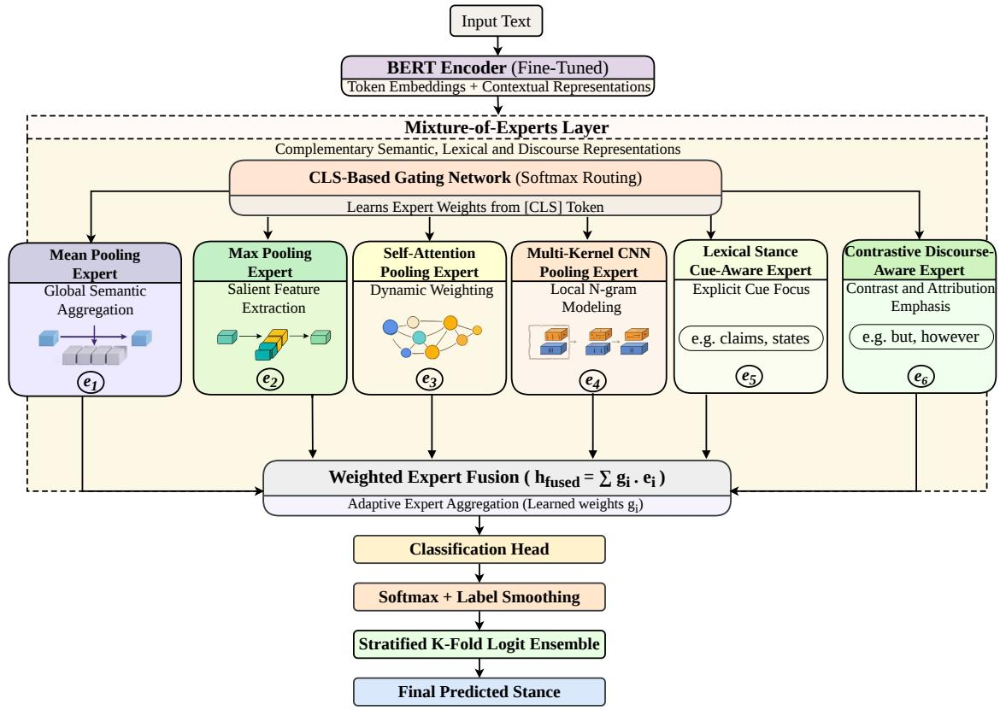
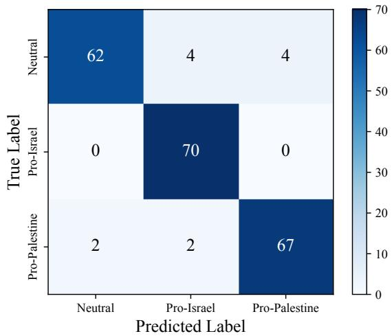

# 1. 论文基本信息

## 1.1. 标题
KUET at StanceNakba Shared Task: StanceMoE: Mixture-of-Experts Architecture for Stance Detection

## 1.2. 作者
Abdullah Al Shafi, Md. Milon Islam, Sk. Imran Hossain, K. M. Azharul Hasan

## 1.3. 发表期刊/会议
本文发表于 LREC-COLING 2024 (The 15th International Conference on Language Resources and Evaluation) 的 StanceNakba 2026 Shared Task。LREC 是计算语言学领域资源与评估方面的顶级国际会议，具有很高的学术影响力。

## 1.4. 发表年份
2026年

## 1.5. 摘要
针对角色级立场检测任务，现有的基于 Transformer 的模型通常依赖于统一的表示方法，可能无法充分捕捉对比性话语结构、框架线索和显著词汇指示符等异构语言信号。为此，本文提出了 StanceMoE，这是一种基于微调 BERT 编码器的上下文增强混合专家架构。该模型集成了六个专家模块，旨在捕捉互补的语言信号，包括全局语义方向、显著词汇线索、从句级焦点、短语级模式、框架指示符和对比驱动的语篇转移。通过上下文感知的门控机制动态加权专家贡献，实现了基于输入特征的自适应路由。在 StanceNakba 2026 Subtask A 数据集（包含 1,401 个标注的英文文本，目标角色在文本中是隐式的）上的实验表明，StanceMoE 实现了 94.26% 的宏 F1 分数，优于传统基线和其他基于 BERT 的变体。

## 1.6. 原文链接
arXiv 预印本链接: https://arxiv.org/abs/2604.00878
PDF 链接: https://arxiv.org/pdf/2604.00878v1
状态：预印本

# 2. 整体概括

## 2.1. 研究背景与动机
**核心问题：** 立场检测旨在确定作者对文本中提到的特定地缘政治角色所表达的支持、反对或中立立场。与情感分析不同，立场检测具有目标依赖性，即同一文本针对不同目标可能表现出不同的立场。特别是当目标角色在文本中未明确提及（隐式目标）且立场通过间接方式表达时，任务难度显著增加。

**现有挑战：** 尽管基于 Transformer（如 BERT）的模型取得了不错的效果，但它们通常生成单一的聚合表示。这种统一表示往往难以捕捉立场表达中存在的异构语言信号，例如：
1.  **对比性话语结构：** 如 "While A is true, but B is more important"。
2.  **框架线索：** 使用 "claims", "reports" 等中性报道动词。
3.  **显著词汇指示符：** 如 "terrorist", "occupation" 等具有强烈极性的词。

    **创新思路：** 论文提出需要自适应架构来显式建模这些多样化的立场表达模式。受混合专家模型的启发，作者设计了 StanceMoE，通过多个专门的专家模块分别捕捉不同的语言现象，并利用门控机制根据输入文本的特征动态地融合这些专家的输出。

## 2.2. 核心贡献/主要发现
**核心贡献：**
1.  提出了 StanceMoE 架构，一种基于 BERT 的上下文增强混合专家模型，专门用于角色级立场检测。
2.  设计了六个互补的专家模块，分别针对全局语义、显著极性词、从句焦点、短语模式、词汇框架线索和对比性语篇转移进行建模。
3.  引入了上下文感知的门控机制，实现了对专家输出的自适应加权，而非简单的平均或堆叠。

**主要发现：**
1.  StanceMoE 在 StanceNakba 2026 Subtask A 数据集上取得了 94.26% 的宏 F1 分数，在竞赛中获得第 3 名，显著优于传统机器学习方法、深度学习基线以及简单的 BERT 变体。
2.  消融实验表明，每个专家模块都对性能有贡献，其中自注意力池化专家和对比感知专家的移除会导致最大的性能下降，说明捕捉上下文依赖和语篇转移至关重要。

# 3. 预备知识与相关工作

## 3.1. 基础概念
为了理解本文，读者需要掌握以下核心概念：

*   **立场检测：** 不同于情感分析（通常只看正面/负面情绪），立场检测必须针对特定的目标。例如，“以色列有权自卫”这句话对“以色列”是支持立场，但对“巴勒斯坦”可能是反对立场。
*   **隐式目标：** 指文本中虽然表达了立场，但并没有直接点名目标实体。例如，“必须结束这场持续的占领”，虽然没有点名“以色列”，但隐含了对以色列占领行为的反对立场。
*   **Transformer / BERT：** 一种基于自注意力机制的深度学习模型，能够生成文本的上下文嵌入表示。`Fine-tuning`（微调）是指在预训练模型基础上，使用特定任务的数据进行进一步训练。
*   **混合专家：** 一种集成学习架构，包含多个“专家”网络和一个“门控”网络。门控网络负责决定输入数据应该由哪些专家处理以及赋予它们多大的权重。
*   **池化：** 将变长的序列（如一句话的所有词向量）转换为一个固定长度的向量的操作。常见的有平均池化和最大池化。

## 3.2. 前人工作
论文回顾了立场检测领域的发展历程：
1.  **基于规则的方法：** 早期依赖人工定义的规则和词典。
2.  **传统监督学习：** 使用 TF-IDF 等特征结合逻辑回归、SVM 等分类器。
3.  **深度学习：** 使用 CNN 和 LSTM 及其变体（如 BiLSTM, Attention）自动提取特征。
4.  **Transformer 时代：** 利用 BERT 及其变体（如 Stanceformer）和大型语言模型，利用其强大的上下文理解能力。

## 3.3. 技术演进
该领域从依赖人工特征工程，逐渐发展到利用神经网络自动提取特征，再到利用预训练语言模型捕捉深层语义。本文的工作处于 Transformer 时代，但针对单一 BERT 表示在捕捉复杂语言结构上的不足，引入了结构化的 MoE 架构进行细化建模。

## 3.4. 差异化分析
与直接使用 BERT 的 `[CLS]` 向量进行分类不同，本文方法通过多个专家显式地分解了立场建模过程。与简单的特征融合或堆叠不同，本文引入了动态门控机制，能够根据当前输入文本的特点（如是否包含对比词、是否包含特定框架词）自适应地调整不同专家的权重。

# 4. 方法论

## 4.1. 方法原理
StanceMoE 的核心思想是将复杂的立场检测任务分解为多个子任务，每个子任务由一个专门的专家模块负责处理。这些专家并行处理 BERT 输出的上下文嵌入，然后通过一个门控网络根据输入的全局上下文动态计算每个专家的重要性权重，最后加权融合得到最终预测。

## 4.2. 核心方法详解 (逐层深入)

### 4.2.1. 整体架构
模型主要由三部分组成：
1.  **上下文编码器：** 使用微调后的 BERT 将输入文本转换为上下文词向量序列。
2.  **专家模块：** 六个并行的模块，分别提取不同类型的特征。
3.  **上下文感知门控与融合：** 动态加权并融合专家输出，进行分类。

    下图（原文 Figure 1）展示了提出的混合专家架构：

    
    *该图像是提出的 Mixture-of-Experts 架构的示意图，用于执行演员级立场检测。该模型集成了多种专家模块，通过 CLS 基于的门控网络动态加权，以捕捉不同的语言信号。最终，模型采用加权专家融合的方法，得到最终的立场预测。*

### 4.2.2. 上下文编码器
首先，给定输入序列 $X = \{ x_1, \ldots, x_T \}$，使用预训练的 BERT 编码器获取上下文词向量表示 $H = \{ h_1, h_2, \ldots, h_T \}$，其中 $h_i \in \mathbb{R}^d$，$d$ 是隐藏层维度，$T$ 是序列长度。同时获取特殊的 `[CLS]` 嵌入向量 $h_{cls}$，它通常包含整句的全局语义信息。

### 4.2.3. 专家模块
基于 BERT 输出的 $H$，六个专家模块分别计算各自的输出向量 $e_i$。

**1. 平均池化专家**
该专家用于捕捉句子的整体语义方向。通过对所有词向量取平均，得到全局表示。
$$
e _ { 1 } = W _ { 1 } \left( \frac { 1 } { T } \sum _ { i = 1 } ^ { T } h _ { i } \right)
$$
*   **符号解释：**
    *   $e_1$：该专家的输出向量。
    *   $W_1$：该专家的可学习线性变换矩阵。
    *   $T$：序列长度。
    *   $h_i$：第 $i$ 个词的上下文向量。

**2. 最大池化专家**
该专家用于捕捉序列中具有最强激活度的特征维度，通常对应于具有强烈极性的关键词（如 "terrorist"）。
$$
e _ { 2 } = W _ { 2 } \left( \underset { i = 1 } { \overset { T } { \operatorname* { m a x } } } h _ { i } \right)
$$
*   **符号解释：**
    *   $e_2$：该专家的输出向量。
    *   $W_2$：可学习线性变换矩阵。
    *   $\operatorname*{max}$：对序列中所有词向量的每一维取最大值。

**3. 自注意力池化专家**
该专家通过学习一个注意力向量 $v$ 来计算序列中每个词的重要性权重 $\alpha_i$，从而聚焦于包含立场信息的关键从句。
首先计算注意力权重 $\alpha_i$：
$$
\alpha _ { i } = \frac { \mathsf { e x p } ( \mathsf { t a n h } ( h _ { i } ^ { \top } v ) ) } { \sum _ { j = 1 } ^ { T } \mathsf { e x p } ( \mathsf { t a n h } ( h _ { j } ^ { \top } v ) ) }
$$
然后根据权重加权求和得到输出：
$$
e _ { 3 } = W _ { 3 } \left( \sum _ { i = 1 } ^ { T } \alpha _ { i } h _ { i } ) \right)
$$
*   **符号解释：**
    *   $v$：可学习的注意力向量。
    *   $\alpha_i$：第 $i$ 个词的归一化注意力分数。
    *   $h_i^{\top} v$：词向量与注意力向量的点积，衡量相关性。
    *   $e_3$：加权求和后的专家输出。

**4. 多核 CNN 专家**
该专家用于捕捉短语级别的 n-gram 模式（如 "Free Palestine"）。使用不同卷积核大小 $k$ 进行卷积操作。
$$
e _ { 4 } = W _ { 4 } \left( { \mathsf { C o n c a t } } ( \mathsf { M e a n P o o l } ( \mathsf { R e L U } ( \mathsf { C o n v } _ { k } ( H ) ) ) ) \right)
$$
*   **符号解释：**
    *   $\mathsf{Conv}_k(H)$：使用核大小为 $k$ 的卷积核对输入序列 $H$ 进行卷积。
    *   $\mathsf{ReLU}$：激活函数。
    *   $\mathsf{MeanPool}$：对卷积后的特征图进行平均池化。
    *   $\mathsf{Concat}$：将不同核大小得到的特征向量拼接。

**5. 词汇线索感知专家**
该专家专注于捕捉特定的框架线索词（如 "claims", "reports"），这些词通常用于表达中立立场。定义一个线索词位置集合 $C$。
$$
e _ { 5 } = W _ { 5 } \left( { \frac { \sum _ { i \in C } h _ { i } } { | C | + \epsilon } } \right)
$$
*   **符号解释：**
    *   $C$：文本中预定义的立场指示线索词的位置索引集合。
    *   $|C|$：集合 $C$ 的大小。
    *   $\epsilon$：极小值，防止分母为零。

**6. 对比感知专家**
该专家用于增强对比标记（如 "but", "however"）所在位置的表示，因为这些词往往引出作者的真实立场。设 $D$ 为对比词的位置集合。
首先，对对比词位置的向量进行放大处理（乘以 3）：
$$
\tilde { h } _ { i } = \left\{ \begin{array} { l l } { 3 h _ { i } } & { \mathsf { i f } ~ i \in D , } \\ { h _ { i } } & { \mathsf { o t h e r w i s e } , } \end{array} \right.
$$
然后，对增强后的序列进行池化（原文中此公式紧接在对比逻辑描述之后，虽在附录中编号略显混乱，但逻辑上属于该专家）：
$$
e _ { 6 } = W _ { 6 } \left( \frac { \sum _ { i = { 1 } } ^ { T } \widetilde { h } _ { i } } { | D | + \epsilon } \right)
$$
*   **符号解释：**
    *   $\tilde{h}_i$：增强后的词向量。
    *   $D$：对比词的位置索引集合。
    *   $3h_i$：将对比词的向量放大 3 倍以增加其权重。

### 4.2.4. 上下文感知门控与融合
门控网络利用 BERT 的 `[CLS]` 向量 $h_{cls}$ 来决定每个专家的权重 $g$。
$$
g = { \mathsf { S o f t m a x } } ( W _ { g } h _ { \mathsf { c l s } } + b _ { g } )
$$
*   **符号解释：**
    *   $W_g$：门控网络的权重矩阵。
    *   $b_g$：偏置项。
    *   $g$：得到的权重向量，维度为专家数量 $K$（此处为 6），且 $\sum g_i = 1$。

        最终表示 $h_{moe}$ 是所有专家输出的加权和：
$$
h _ { \mathsf { m o e } } = \sum _ { i = 1 } ^ { K } g _ { i } e _ { i }
$$

### 4.2.5. 预测
将融合后的表示输入到最终的分类层：
$$
\hat { y } = \mathsf { s o f t m a x } ( W _ { o } h _ { \mathsf { m o e } } + b _ { o } )
$$
*   **符号解释：**
    *   $\hat{y}$：预测的类别概率分布（支持巴勒斯坦、支持以色列、中立）。
    *   $W_o, b_o$：分类层的权重和偏置。

# 5. 实验设置

## 5.1. 数据集
实验使用 StanceNakba 2026 Shared Task 提供的 Subtask A 数据集。
*   **来源：** StanceNakba 2026 Shared Task。
*   **规模：** 1,401 篇英文文本。
*   **类别：** `Pro-Palestine`（支持巴勒斯坦）、`Pro-Israel`（支持以色列）、`Neutral`（中立）。
*   **特点：** 目标角色在文本中是隐式的，需要模型推断。
*   **划分：** 官方划分为 70% 训练集、15% 开发集、15% 测试集。作者在实验中将训练集和开发集合并，采用分层 K 折交叉验证（K=10），测试集保持未见。

## 5.2. 评估指标
论文主要使用 **宏 F1 分数** 作为评估指标，同时也报告了准确率、精确率和召回率。

**1. 宏平均精确率**
*   **概念定义：** 先计算每个类别的精确率，然后取算术平均值。它关注模型在各个类别上的平均表现，不受类别样本数量不平衡的影响。
*   **数学公式：**
    $$
    \text{Macro-Precision} = \frac{1}{N} \sum_{i=1}^{N} \frac{TP_i}{TP_i + FP_i}
    $$
*   **符号解释：**
    *   $N$：类别总数（本任务中为 3）。
    *   $TP_i$：第 $i$ 类的真正例数。
    *   $FP_i$：第 $i$ 类的假正例数。

**2. 宏平均召回率**
*   **概念定义：** 先计算每个类别的召回率，然后取算术平均值。
*   **数学公式：**
    $$
$\text{Macro-Recall} = \frac{1}{N} \sum_{i=1}^{N} \frac{TP_i}{TP_i + FN_i}
$$
*   **符号解释：**
    *   $FN_i$：第 $i$ 类的假反例数。

**3. 宏平均 F1 分数**
*   **概念定义：** 精确率和召回率的调和平均数的宏平均。它是综合衡量模型性能的主要指标。
*   **数学公式：**
    $$
    \text{Macro-F1} = \frac{1}{N} \sum_{i=1}^{N} 2 \cdot \frac{\text{Precision}_i \cdot \text{Recall}_i}{\text{Precision}_i + \text{Recall}_i}
    $$

## 5.3. 对比基线
论文将 StanceMoE 与以下三类基线模型进行了比较：
1.  **传统机器学习方法：** 逻辑回归 (LR)、多项式朴素贝叶斯 (MNB)、支持向量机 (SVM)、随机森林 (RF)。
2.  **深度神经网络：** BiLSTM、目标特定注意力网络 (TAN)、门控卷积网络 (GCAE)、交叉网络。
3.  **BERT 变体：**
    *   `Stacked`：将专家模块按顺序堆叠应用。
    *   `Fusion`：将专家输出简单拼接融合，无自适应加权。

# 6. 实验结果与分析

## 6.1. 核心结果分析
以下是原文 Table 1 的结果，展示了 StanceMoE 与各基线模型在测试集上的性能对比：

以下是原文 [Table 1] 的结果：

<table>
<thead>
<tr>
<th rowspan="2">Methods</th>
<th colspan="4">K-fold (mean±std)</th>
<th colspan="4">Weighted Logit Ensemble</th>
</tr>
<tr>
<th>Acc</th>
<th>Pre</th>
<th>Rec</th>
<th>F1</th>
<th>Acc</th>
<th>Pre</th>
<th>Rec</th>
<th>F1</th>
</tr>
</thead>
<tbody>
<tr>
<td>LR</td>
<td>80.91±1.79</td>
<td>80.90±1.78</td>
<td>80.93±1.78</td>
<td>80.86±1.78</td>
<td>81.28</td>
<td>81.25</td>
<td>81.33</td>
<td>81.22</td>
</tr>
<tr>
<td>MNB</td>
<td>77.25±1.64</td>
<td>75.88±2.02</td>
<td>78.49±1.65</td>
<td>77.20±1.65</td>
<td>77.38</td>
<td>76.02</td>
<td>78.63</td>
<td>77.33</td>
</tr>
<tr>
<td>SVM</td>
<td>83.25±1.71</td>
<td>84.73±1.68</td>
<td>83.26±1.71</td>
<td>83.27±1.72</td>
<td>83.37</td>
<td>84.94</td>
<td>83.35</td>
<td>83.43</td>
</tr>
<tr>
<td>RF</td>
<td>84.05±1.83</td>
<td>84.73±1.73</td>
<td>84.05±1.82</td>
<td>84.05±1.90</td>
<td>84.16</td>
<td>84.83</td>
<td>84.14</td>
<td>84.19</td>
</tr>
<tr>
<td>BiLSTM</td>
<td>85.63±2.99</td>
<td>85.87±3.00</td>
<td>85.63±2.99</td>
<td>85.51±3.07</td>
<td>85.74</td>
<td>85.98</td>
<td>85.74</td>
<td>85.72</td>
</tr>
<tr>
<td>TAN</td>
<td>85.99±3.10</td>
<td>86.01±2.81</td>
<td>86.36±2.08</td>
<td>85.91±2.15</td>
<td>86.13</td>
<td>86.10</td>
<td>86.43</td>
<td>86.03</td>
</tr>
<tr>
<td>GCAE</td>
<td>87.69±2.85</td>
<td>87.98±2.92</td>
<td>87.48±2.16</td>
<td>87.49±2.78</td>
<td>87.82</td>
<td>88.10</td>
<td>87.53</td>
<td>87.62</td>
</tr>
<tr>
<td>CrossNet</td>
<td>85.13±2.28</td>
<td>85.55±1.89</td>
<td>84.90±1.90</td>
<td>84.77±2.25</td>
<td>85.29</td>
<td>85.65</td>
<td>84.97</td>
<td>84.88</td>
</tr>
<tr>
<td>BERT</td>
<td>89.77±2.35</td>
<td>90.04±2.30</td>
<td>89.77±2.31</td>
<td>89.61±2.29</td>
<td>90.05</td>
<td>90.28</td>
<td>90.03</td>
<td>89.86</td>
</tr>
<tr>
<td>Stacked</td>
<td>91.61±2.46</td>
<td>91.73±2.43</td>
<td>91.62±2.44</td>
<td>91.60±2.47</td>
<td>91.94</td>
<td>92.14</td>
<td>91.93</td>
<td>91.83</td>
</tr>
<tr>
<td>Fusion</td>
<td>91.03±2.26</td>
<td>91.20±2.29</td>
<td>91.03±2.24</td>
<td>91.02±2.26</td>
<td>91.18</td>
<td>91.45</td>
<td>91.17</td>
<td>91.17</td>
</tr>
<tr>
<td>StanceMoE</td>
<td>94.09±1.11</td>
<td>94.18±1.12</td>
<td>94.08±1.12</td>
<td>94.03±1.12</td>
<td>94.31</td>
<td>94.45</td>
<td>94.31</td>
<td><strong>94.26</strong></td>
</tr>
</tbody>
</table>

**分析：**
1.  **StanceMoE 的优越性：** 提出的 StanceMoE 在加权 Logit 集成后方法下达到了 **94.26%** 的宏 F1 分数，显著优于所有基线模型。
2.  **与传统 ML 的对比：** 表现最好的传统模型是随机森林 (RF, 84.19%)，证明了集成树方法在传统特征上的优势，但仍远低于深度学习方法。
3.  **与 BERT 变体的对比：** 标准的 BERT 达到了 89.86%。简单的 `Stacked` (91.83%) 和 `Fusion` (91.17%) 有所提升，但 StanceMoE 的提升幅度更大（约 2.4%），证明了**自适应门控机制**相比简单的堆叠或拼接更能有效地利用多源信息。
4.  **稳定性：** StanceMoE 的标准差 (±1.11%) 低于大多数基线，显示出较好的稳定性。

## 6.2. 消融实验/参数分析
为了验证各个专家模块的贡献，作者进行了消融实验，即每次移除一个专家模块观察性能变化。

以下是原文 [Table 4] 的消融实验结果：

<table>
<thead>
<tr>
<th rowspan="2">Methods</th>
<th colspan="4">K-fold (mean±std)</th>
<th colspan="4">Weighted Logit Ensemble</th>
</tr>
<tr>
<th>Acc</th>
<th>Pre</th>
<th>Rec</th>
<th>F1</th>
<th>Acc</th>
<th>Pre</th>
<th>Rec</th>
<th>F1</th>
</tr>
</thead>
<tbody>
<tr>
<td>w/o Mean</td>
<td>91.75±1.76</td>
<td>92.02±1.54</td>
<td>91.74±1.77</td>
<td>91.65±1.86</td>
<td>92.89</td>
<td>93.05</td>
<td>92.88</td>
<td>92.80</td>
</tr>
<tr>
<td>w/o Max</td>
<td>91.52±1.23</td>
<td>91.83±1.06</td>
<td>91.51±1.23</td>
<td>91.43±1.30</td>
<td>93.36</td>
<td>93.56</td>
<td>93.35</td>
<td>93.29</td>
</tr>
<tr>
<td>w/o Self-att</td>
<td>91.47±1.04</td>
<td>91.65±0.99</td>
<td>91.46±1.04</td>
<td>91.38±1.08</td>
<td>91.94</td>
<td>92.04</td>
<td>91.93</td>
<td>91.83</td>
</tr>
<tr>
<td>w/o CNN</td>
<td>92.09±1.04</td>
<td>92.20±0.97</td>
<td>92.08±1.04</td>
<td>92.00±1.11</td>
<td>93.36</td>
<td>93.38</td>
<td>93.37</td>
<td>93.29</td>
</tr>
<tr>
<td>w/o Lexical-cue</td>
<td>91.70±1.84</td>
<td>91.83±1.84</td>
<td>91.70±1.84</td>
<td>91.67±1.83</td>
<td>93.36</td>
<td>93.41</td>
<td>93.36</td>
<td>93.32</td>
</tr>
<tr>
<td>w/o Contrastive</td>
<td>91.75±1.81</td>
<td>91.99±1.67</td>
<td>91.74±1.82</td>
<td>91.64±1.87</td>
<td>91.94</td>
<td>92.13</td>
<td>91.94</td>
<td>91.82</td>
</tr>
<tr>
<td>StanceMoE</td>
<td>94.09±1.11</td>
<td>94.18±1.12</td>
<td>94.08±1.12</td>
<td>94.03±1.12</td>
<td>94.31</td>
<td>94.45</td>
<td>94.31</td>
<td>94.26</td>
</tr>
</tbody>
</table>

**分析：**
1.  **互补性：** 移除任何一个专家都会导致性能下降（从 94.26% 降至 91.82% - 93.32% 之间），证明了六个专家捕捉到了互补的语言信号。
2.  **关键专家：**
    *   移除 `Self-Attention` (91.83%) 和 `Contrastive` (91.82%) 导致最大的性能下降。这说明捕捉上下文依赖和语篇中的对比转折对于立场检测最为关键。
    *   移除 `Mean` (92.80%) 和 `Max` (93.29%) 也有显著影响，说明全局语义和极性词也很重要。
3.  **门控机制的作用：** 消融实验结果也间接证明了简单的特征移除会破坏模型的自适应能力，因为每个专家都在特定类型的文本上发挥主要作用。

## 6.3. 错误分析
作者对模型的错误预测进行了定性分析，主要发现了以下几类错误：
1.  **过度依赖词汇极性：** 将宗教赞美（如 "God bless Jewish people"）误判为政治立场。
2.  **元话语混淆：** 难以区分讨论某个话题与表达对该话题的立场（如讨论反犹主义的社会规范）。
3.  **复杂多从句推理：** 对于包含复杂转折和多层论证的长难句，模型可能未能正确权衡不同从句的重要性。
4.  **短文本歧义：** 极短的文本（如 "Against the Islamist terrorists"）缺乏上下文，容易导致误判。

    下图（原文 Figure 2）展示了 StanceMoE 的混淆矩阵，可以观察到模型在各个类别上的表现细节：

    
    *该图像是一个混淆矩阵，展示了使用StanceMoE架构进行的分类结果。矩阵中展示了真实标签与预测标签的对应关系，反映出模型在中立、支持以色列和支持巴勒斯坦三类上的分类精度。整体上，模型在各类中表现良好，特别是在支持以色列的类别上达到了70的预测准确度。*

# 7. 总结与思考

## 7.1. 结论总结
本文针对角色级立场检测中目标隐式和语言信号异构的挑战，提出了 StanceMoE 架构。通过设计六个专门捕捉不同语言现象（如全局语义、显著词汇、对比语篇等）的专家模块，并引入上下文感知的门控机制进行自适应融合，该方法在 StanceNakba 2026 数据集上取得了优异的成绩（94.26% F1），显著优于现有的主流基线模型。研究证明了显式分解和动态整合多样化语言信号的有效性。

## 7.2. 局限性与未来工作
**局限性：**
1.  模型在处理极度隐含的立场、复杂的元话语评论以及极短文本时仍存在困难。
2.  目前的门控机制相对简单（基于 CLS 向量的线性层），可能无法捕捉极其复杂的非线性路由决策。

**未来工作：**
1.  探索显式的目标感知建模，进一步处理目标角色隐式的情况。
2.  研究跨主题和跨领域的立场检测，评估模型的泛化能力。
3.  将该框架扩展到多语言场景，以处理更广泛的地缘政治话语。

## 7.3. 个人启发与批判
**启发：**
1.  **模块化设计的价值：** StanceMoE 的成功展示了在 NLP 任务中，将复杂的任务分解为多个可解释的子模块（专家）比单纯增加模型深度或参数量更有效。这种设计不仅提升了性能，还增加了模型的可解释性（我们可以分析哪个专家权重高）。
2.  **门控机制的重要性：** 简单的特征拼接往往不如加权融合有效，因为不同样本对不同特征的依赖程度不同。门控机制赋予了模型“选择”的能力。

**批判与改进：**
1.  **计算开销：** MoE 架构虽然参数量可能增加不多，但在推理时需要计算所有专家的前向传播，相比单一 BERT 模型，计算量有所增加。未来可以探索稀疏激活的 MoE 来降低开销。
2.  **专家设计的依赖性：** 当前的专家设计（如 CNN、Pooling）相对传统，虽然有效，但可能存在更先进的特征提取器（如专门设计的图神经网络来建模话语结构）可以替代现有专家。
3.  **数据集规模：** 1,401 个样本的数据集相对较小，如此复杂的模型是否存在过拟合风险？虽然作者使用了 K-fold 交叉验证和标签平滑来缓解，但在更大的数据集上验证该架构的上限是值得期待的。