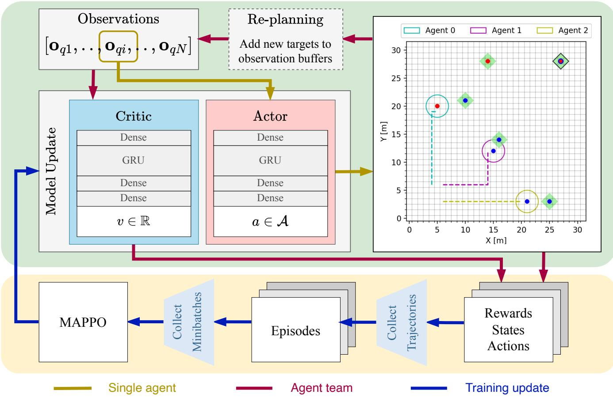
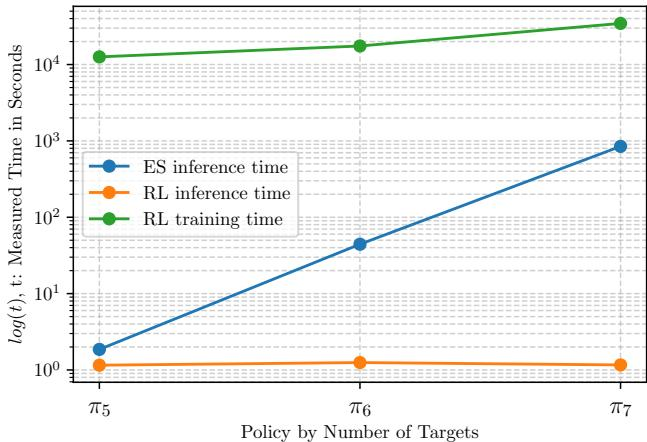

# 1. 论文基本信息
## 1.1. 标题
论文标题为《Collaborative Task and Path Planning for Heterogeneous Robotic Teams using Multi-Agent PPO》，核心主题是针对异质机器人团队，提出基于多智能体近端策略优化的协同任务与路径规划框架，统一解决任务分配、调度、路径规划三个耦合子问题，适配行星探索等需要实时重规划的资源受限场景。
## 1.2. 作者
四位作者均隶属于瑞士苏黎世联邦理工学院（ETH Zurich）机器人系统实验室（RSL），该实验室是全球移动机器人领域的顶尖研究机构：
- Matthias Rubio：研究方向为多智能体强化学习、行星探索机器人
- Julia Richter：研究方向为多目标路径规划、月球探索机器人
- Hendrik Kolvenbach：研究方向为腿式机器人、极端环境机器人
- Marco Hutter：ETH Zurich RSL主任，IEEE Fellow，全球知名腿式机器人专家，ANYmal四足机器人研发负责人，研究方向涵盖移动机器人、多机器人协同、极端环境机器人等。
## 1.3. 发表期刊/会议
当前为预印本状态，发布于arXiv预印本平台，尚未正式发表在期刊或会议上。arXiv是计算机科学、机器人学等领域最主流的预印本发布平台，用于快速分享最新研究成果。
## 1.4. 发表年份
2026年（UTC时间2026年4月1日发布）
## 1.5. 摘要
地外探索需要能力多样的异质机器人团队协同执行任务，但传统规划算法随机器人和任务数量增长会出现组合爆炸，规划周期长、推理成本高，无法满足行星探索场景下的实时重规划需求。本文提出基于<strong>多智能体近端策略优化（Multi-Agent Proximal Policy Optimization, MAPPO）</strong>的协同规划策略，首次实现了异质机器人团队目标分配、调度、路径规划的端到端统一求解。实验将该方法与穷举搜索得到的单目标最优解进行基准对比，验证了其在行星探索场景下的在线重规划能力。结果表明该方法推理时间恒定，性能接近全局最优，适合星上资源受限的实时决策场景。
## 1.6. 原文链接
- 预印本页面：images/1.jpg)
*该图像是一个示意图，展示了一组具有不同专长的机器人在执行任务过程中的协作计划。图中包括无人机、探测车和四足机器人，显示了它们如何在任务 T1、T2 和 T3 之间相遇、重新规划，以最小化任务时间。图中还标出执行计划与原始计划的时间线。*

- 智能体集合：$\mathcal{Q}$，共$N=|\mathcal{Q}|$个异质智能体，每个智能体的动作空间为$\mathcal{A} = \{up, down, left, right, stay\}$（上下左右移动、停留），如果移动超出网格边界则动作无效，停留在原位置。
- 任务集合：$\mathcal{T}$，共$M=|\mathcal{T}|$个任务，每个任务需要一组技能，分为两类：
  - OR类型：只要有一个具备匹配技能的智能体到达即可完成。
  - AND类型：需要所有具备匹配技能的智能体同时到达才能完成（协作任务）。
    每个智能体拥有一组固定技能，当任务要求的所有技能都有对应的智能体在同一时间步位于任务位置时，任务标记为已完成。当所有任务都完成时，当前环境回合结束。
### 4.2.2. 观测设计
每个智能体的观测由三部分拼接而成，包含所有决策需要的信息：
#### （1）位置相关观测
位置观测包含所有智能体的绝对位置，以及智能体到所有未完成任务的相对位置，已完成的任务相对位置设为0，避免智能体继续关注已完成的任务。
首先定义相对位置处理函数$g(\mathbf{r}_q^t)$：
$$
g(\mathbf{r}_q^t) = \left\{
\begin{aligned}
&\mathbf{r}_q^t \quad \mathrm{if} \ t \in \mathcal{T}_U(j) \\
&\mathbf{[0, 0]} \quad \mathrm{if} \ t \in \mathcal{T}_S(j)
\end{aligned}
\right.
$$
其中：
- $\mathbf{r}_q^t$是智能体$q$到任务$t$的相对坐标，$\mathcal{T}_U(j)$是第$j$个时间步未完成的任务集合，$\mathcal{T}_S(j)$是第$j$个时间步已完成的任务集合。
  然后位置观测$\mathbf{o}_{qi}^{pos}$为：
$$
\mathbf{o}_{qi}^{pos} = [\mathbf{p}_{qi}, ..., \mathbf{p}_{qN}, g(\mathbf{r}_{qi}^{t1}), ..., g(\mathbf{r}_{qi}^{tM})]
$$
其中：
- $\mathbf{p}_{qi}$是第$i$个智能体的绝对坐标，观测的第一个位置始终是当前观测智能体自己的坐标，帮助网络区分自身和其他智能体。
#### （2）技能相关观测
技能观测包含所有智能体的技能集合编码，以及所有任务的技能需求编码，让智能体知道自身、队友的能力和任务的要求：
$$
\mathbf{o}_{qi}^{skill} = [f(\mathrm{S}_{qi}), ..., f(\mathrm{S}_{qN}), f(\mathrm{S}_{t1}), ..., f(\mathrm{S}_{tM})]
$$
其中：
- $f(\mathrm{S})$是预设的编码函数，将技能集合映射为整数，$\mathrm{S}_{qi}$是第$i$个智能体的技能集合，$\mathrm{S}_{tk}$是第$k$个任务的技能需求。
#### （3）任务类型观测
任务类型观测包含所有任务的类型编码，区分OR和AND类型，让智能体知道是否需要协作：
$$
\mathbf{o}^{goalType} = [h_{t1}, ..., h_{tM}]
$$
其中：
- $h_{tk}$为1表示任务$k$是AND类型（需要协作），为0表示是OR类型。
#### （4）完整观测
最终每个智能体$q_i$的完整观测是三部分的拼接：
$$
\mathbf{o}_{qi} = [\mathbf{o}_{qi}^{pos}, \mathbf{o}_{qi}^{skill}, \mathbf{o}^{goalType}]
$$
### 4.2.3. 奖励函数设计
奖励函数由6个加权的子项组成，引导智能体学习高效的协同策略：
#### （1）吸引奖励（AR）
用于解决强化学习的奖励稀疏问题，引导智能体靠近自己能完成的未完成任务，距离越近奖励越高：
首先定义单个任务的吸引奖励函数$h_{qi}(t)$：
$$
h_{qi}(t) = \left\{
\begin{aligned}
&\exp(-C_{AR} \cdot \|\mathbf{r}_t\|_2) \quad \mathrm{if} \ (t \in \mathcal{T}_U(j)) \land (|\mathrm{S}_{qi} \cap \mathrm{S}_t|) > 0 \\
&0 \quad \mathrm{otherwise}
\end{aligned}
\right.
$$
其中：
- $C_{AR}$是控制吸引奖励范围的常数，$\|\mathbf{r}_t\|_2$是智能体到任务$t$的欧氏距离，$|\mathrm{S}_{qi} \cap \mathrm{S}_t|>0$表示智能体具备任务$t$需要的至少一个技能。
  然后总吸引奖励为所有任务的吸引奖励的平均值，归一化到0-1范围：
$$
r_{qi}^{AR} = \frac{1}{M \cdot T_{max}} \sum_{t \in \mathcal{T}} h_{qi}(t)
$$
其中$T_{max}$是每个回合的最大时间步。
#### （2）任务完成奖励（TR）
每当有一个任务完成时，所有智能体都获得相同的固定奖励，避免智能体之间出现竞争：
$$
r_{qi}^{TR} = \left\{
\begin{aligned}
&\frac{1}{M} \quad \mathrm{if} \ t \in \mathcal{T}_U(j-1) \land t \in \mathcal{T}_S(j) \\
&0 \quad \mathrm{otherwise}
\end{aligned}
\right.
$$
所有任务都完成时，总TR奖励之和为1。
#### （3）错误技能惩罚（WC）
如果智能体移动到自己不具备对应技能的任务位置，给予惩罚，避免智能体浪费时间去无法完成的任务：
$$
r_{qi}^{WC} = \sum_{t \in \mathcal{T}_U} \left\{
\begin{aligned}
&-1 \quad \mathrm{if} \ (\|\mathbf{r}_t\|_2 = 0) \land (|\mathrm{S}_{qi} \cap \mathrm{S}_t| = 0) \\
&0 \quad \mathrm{otherwise}
\end{aligned}
\right.
$$
#### （4）移动成本（SC）
每次移动都给予惩罚，鼓励智能体减少不必要的移动，降低总团队工作量：
$$
r_{qi}^{SC} = \left\{
\begin{aligned}
&0 \quad \mathrm{if} \ u(j-1) = stay \\
&-1 \quad \mathrm{otherwise}
\end{aligned}
\right.
$$
其中`u(j-1)`是上一个时间步的动作。
#### （5）时间成本（TC）
每个时间步根据未完成的任务数量给予惩罚，鼓励智能体尽快完成所有任务：
$$
r_{qi}^{TC} = \frac{|\mathcal{T}_U(j)|}{M \cdot T_{max}}
$$
当所有任务完成时，TC惩罚为0。
#### （6）终端奖励（TB）
当所有任务都完成时，给予所有智能体一个额外的终端奖励，鼓励智能体完成全部任务：
$$
r_{qi}^{TB} = \left\{
\begin{aligned}
&1 \quad \mathrm{if} \ (\mathcal{T}_S(j-1) \subset \mathcal{T}) \land (\mathcal{T} \subseteq \mathcal{T}_S(j)) \\
&0 \quad \mathrm{otherwise}
\end{aligned}
\right.
$$
#### （7）总奖励
最终每个智能体的总奖励是6个子项的加权和，权重可以根据目标偏好调整：
$$
\begin{aligned}
&\mathbf{r}_{qi} = [r_{qi}^{AR}, r_{qi}^{TR}, r_{qi}^{WC}, r_{qi}^{SC}, r_{qi}^{TC}, r_{qi}^{TB}]^\top \\
&\mathbf{w} = [w^{AR}, w^{TR}, w^{WC}, w^{SC}, w^{TC}, w^{TB}] \\
&r_{qi}^{ful} = \mathbf{w} \cdot \mathbf{r}_{qi}
\end{aligned}
$$
其中$\mathbf{w}$是每个奖励子项的权重向量。
### 4.2.4. 学习架构
本文采用标准的MAPPO Actor-Critic架构，如下图（原文Figure 2）所示：

*该图像是一个示意图，展示了基于多智能体近端策略优化（MAPPO）的协作任务与路径规划方法。图中包括对观察、模型更新、代理动作和奖励的描述，展示了不同代理在二维空间中的分布及其任务分配。整体系统旨在实现高效的机器人团队协同。*

- Actor网络：每个智能体共享同一个Actor网络，输入是单个智能体的局部观测，包含一个GRU层和全连接层，输出动作空间的概率分布，推理阶段是分散执行的。
- Critic网络：集中的全局Critic网络，输入是所有智能体的观测拼接，包含一个GRU层和全连接层，输出全局价值函数，仅在训练阶段使用，用于指导Actor网络的更新。
### 4.2.5. 训练策略
为了避免早期训练时移动成本和时间成本的惩罚导致智能体收敛到停留不动的退化策略，训练分为两个阶段：
1.  **Bootstrap阶段：** 仅启用吸引奖励、任务完成奖励、错误技能惩罚，引导智能体先学会找到并完成自己能做的任务，不需要考虑效率。
2.  **Refinement阶段：** 启用所有奖励子项，引导智能体学习更高效的策略，减少移动和时间消耗。
    训练过程中，智能体、任务的初始位置、技能集合、任务类型都是随机生成的，保证策略的泛化性。
### 4.2.6. 实现细节
本文基于JaxMARL框架实现，JaxMARL是基于JAX的多智能体强化学习框架，支持并行环境训练，训练参数根据GPU资源手动调优，不同任务数量的策略分别训练。

# 5. 实验设置
## 5.1. 数据集
本文没有使用公开数据集，而是自建了仿真实验环境：
- 网格大小：32x32的离散2D网格。
- 智能体设置：3个异质智能体，共2种技能，智能体的技能组合随机生成，保证所有任务需要的技能都能被覆盖。
- 任务设置：分别设置5、6、7个任务，每个任务的技能需求、位置、类型（OR/AND）随机生成，保证环境可解。
- 实验场景：模拟行星探索的动态场景，任务会动态新增，验证重规划能力。
## 5.2. 评估指标
本文使用三个评估指标量化性能：
### 5.2.1. 成功率（$M_{success}$）
#### 概念定义
量化智能体团队在规定时间内完成所有任务的概率，是最基础的有效性指标。
#### 数学公式
$$
M_{success} = \frac{K_{solved}}{K_{sims}}
$$
#### 符号解释
- $K_{solved}$：成功完成所有任务的环境回合数。
- $K_{sims}$：总测试的环境回合数。
### 5.2.2. 求解时间指标（$M_{st}$）
#### 概念定义
量化完成所有任务的时间效率，值越高说明完成任务的速度越快。
#### 数学公式
$M_{st} = T_{max} - T_{solved}$
#### 符号解释
- $T_{max}$：每个回合的最大时间步，超出则判定为失败。
- $T_{solved}$：完成所有任务实际消耗的时间步。
### 5.2.3. 总团队工作量指标（$M_{tte}$）
#### 概念定义
量化所有智能体的总移动消耗，值越高说明总移动量越少，能源消耗越低，对行星探索场景的电池受限场景非常重要。
#### 数学公式
$$
M_{tte} = \sum_{q \in \mathcal{A}} \left( T_{max} - \sum_{j=1}^{T_{solved}} |r_{qi}^{step}(j)| \right)
$$
#### 符号解释
- $r_{qi}^{step}(j)$：智能体$q_i$在第$j$个时间步是否移动，移动则为1，停留则为0。
- $T_{max}$：每个回合的最大时间步。
- $T_{solved}$：完成所有任务实际消耗的时间步。
## 5.3. 对比基线
本文的对比基线是穷举搜索（Exhaustive Search, ES）得到的两个全局最优解：
1.  **ES1：** 以最小化求解时间为优化目标的全局最优解，作为求解时间指标的上限。
2.  **ES2：** 以最小化总团队工作量为优化目标的全局最优解，作为总团队工作量指标的上限。
    选择穷举搜索作为基线的原因是它能得到理论上的最优解，可以准确衡量本文方法的性能与最优解的差距。

# 6. 实验结果与分析
## 6.1. 核心结果分析
### 6.1.1. 与最优解的性能对比
本文分别训练了处理5个任务的$\Pi_{5T}$、6个任务的$\Pi_{6T}$、7个任务的$\Pi_{7T}$三个策略，与穷举搜索的最优解对比，结果如下（原文Table IV）：

<table>
<thead>
<tr>
<th></th>
<th>$\Pi_{5T}$</th>
<th>$\Pi_{6T}$</th>
<th>$\Pi_{7T}$</th>
</tr>
</thead>
<tbody>
<tr>
<td>$M_{success}$</td>
<td>0.99</td>
<td>0.95</td>
<td>0.91</td>
</tr>
<tr>
<td>$\frac{M_{st}^{RL}}{M_{st}^{ES1}}$</td>
<td>0.86</td>
<td>0.81</td>
<td>0.73</td>
</tr>
<tr>
<td>$\frac{M_{tte}^{RL}}{M_{tte}^{ES2}}$</td>
<td>0.92</td>
<td>0.91</td>
<td>0.84</td>
</tr>
</tbody>
</table>

结果分析：
1.  三个策略的成功率都超过90%，5个任务的成功率达到99%，说明策略的可靠性很高。
2.  总团队工作量指标达到最优解的84%-92%，高于求解时间指标的73%-86%，说明奖励权重的设置让策略更偏向减少总移动量，而不是最快完成任务，符合行星探测机器人电池受限的需求。
3.  随着任务数量增加，所有指标的性能都略有下降，符合问题复杂度升高的预期。
### 6.1.2. 推理时间对比
推理时间的对比结果如下图（原文Figure 3）所示：

*该图像是一个图表，展示了针对不同目标数量的策略下，ES推理时间、RL推理时间和RL训练时间的对比。纵轴为以秒为单位的测量时间的对数，横轴为任务数量的策略。可见，随着目标数量的增加，ES推理时间显著增加，而RL方法则相对平稳。*

结果分析：
1.  穷举搜索的推理时间随任务数量增长呈指数级上升，从5个任务到7个任务，推理时间增长了1.5个数量级，完全无法满足实时需求。
2.  本文的RL方法推理时间几乎恒定，不受任务数量影响，每个时间步仅需要一次神经网络前向传播，推理时间在毫秒级，完全满足实时重规划的需求。
3.  RL方法的训练时间随任务数量增长较慢，仅增长了0.25个数量级，但训练是离线完成的，不影响部署后的推理速度，符合将复杂度转移到训练阶段的设计思路。
### 6.1.3. 重规划能力验证
为了验证在线重规划能力，本文对比了原始训练5个任务的策略$\Pi_{5T}$，和专门训练动态加入5个新任务的策略$\Pi_{5T5R}$，测试场景为总共需要完成10个任务（5个初始任务+5个动态新增任务），结果如下（原文Table V）：

<table>
<thead>
<tr>
<th></th>
<th>$M_{success}$</th>
<th>$M_{st}$</th>
<th>$M_{tte}$</th>
</tr>
</thead>
<tbody>
<tr>
<td>$\Pi_{5T}$</td>
<td>84.2 %</td>
<td>$85.70 \pm 20.1$</td>
<td>$232.5 \pm 72.8$</td>
</tr>
<tr>
<td>$\Pi_{5T5R}$</td>
<td>84.1 %</td>
<td>$85.73 \pm 20.9$</td>
<td>$220.0 \pm 81.3$</td>
</tr>
</tbody>
</table>

结果分析：
两个策略的性能几乎没有差异，说明无需专门针对动态新任务训练，仅需要将观测作为缓冲区，用新任务替换已完成的任务的位置，即可实现在线重规划，非常适合探索过程中不断发现新任务的场景。
## 6.2. 消融实验与参数分析
本文通过分阶段训练的消融实验验证了两阶段训练的必要性：如果一开始就启用所有奖励项，智能体会因为移动和时间惩罚的存在，收敛到停留不动的退化策略，成功率几乎为0，而分阶段训练可以有效避免这个问题。
奖励权重的调优对性能影响较大：当任务数量增加时，需要降低吸引奖励的强度，避免多个任务的吸引奖励重叠抵消，导致智能体无法定位目标。

# 7. 总结与思考
## 7.1. 结论总结
本文针对异质多机器人协同规划的痛点，提出了基于MAPPO的端到端统一规划框架，实现了任务分配、路径规划、调度的联合优化，实验证明：
1.  该方法的性能接近全局最优解，成功率超过90%，总团队工作量最高达到最优解的92%。
2.  推理时间恒定，不受任务和机器人数量增长的影响，适合资源受限的实时场景。
3.  无需额外训练即可支持在线重规划，适配行星探索等动态场景的需求。
    该工作为多异质机器人团队的实时协同规划提供了新的解决方案，具有很高的实际应用价值。
## 7.2. 局限性与未来工作
### 7.2.1. 本文指出的局限性
1.  观测大小固定：当前架构的观测大小由训练时的智能体数量和任务数量决定，无法支持动态变化的机器人团队规模和任务数量，扩展性受限。
2.  奖励调优成本高：奖励权重需要根据任务规模手动调优，当任务数量超过一定阈值后，原有权重不再适用。
3.  训练时间随规模增长：虽然训练时间增长比传统算法慢，但随着智能体和任务数量增加，训练的计算成本仍然增长较快。
### 7.2.2. 未来工作方向
1.  可变观测设计：采用图神经网络（GNN）对智能体和任务进行编码，生成与数量无关的嵌入表示，让策略可以泛化到不同规模的机器人团队和任务数量。
2.  世界模型引入：结合DreamerV3等世界模型方法，减少训练所需的环境交互量，降低训练成本。
3.  真实场景适配：将方法迁移到连续地形、带避障约束、通信受限的真实机器人场景中。
## 7.3. 个人启发与批判
### 7.3.1. 启发
1.  该方法的应用场景非常广泛，除了行星探索，还可以迁移到仓库AGV调度、智慧城市快递机器人调度、灾害救援机器人团队协同等多个异质多机器人场景，这些场景都有实时重规划、资源受限的需求。
2.  将组合优化问题转化为多智能体强化学习问题，把复杂度从推理阶段转移到训练阶段的思路，为很多大规模实时组合优化问题提供了新的解决路径。
### 7.3.2. 潜在改进点
1.  目前的观测需要所有智能体的全局位置和技能信息，推理阶段需要全量通信，实际场景中通信带宽可能受限，可以优化观测设计，仅需要局部邻居的信息，适配通信受限的场景。
2.  目前没有考虑机器人故障的场景，未来可以加入故障的随机模拟，让策略具备容错能力，当部分机器人故障时，剩余机器人可以自动重规划完成任务。
3.  目前是在离散网格环境中训练，真实场景是连续地形，未来可以引入地形成本、避障约束，让策略直接适配真实连续环境。