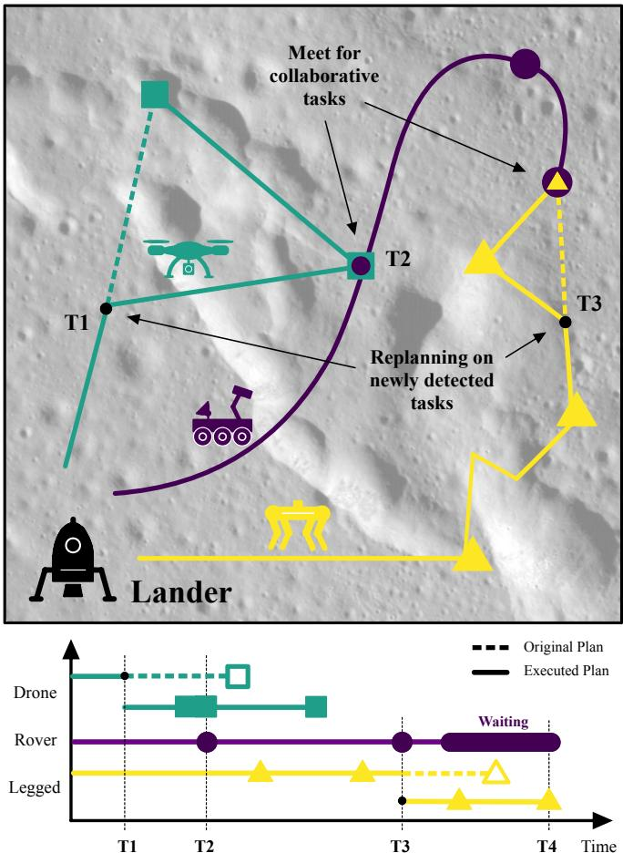

# 基于多智能体 PPO 的异构机器人团队协作任务与路径规划

马提亚斯·鲁比奥1, 朱莉亚·里希特1, 亨德里克·科尔文巴赫1, 和马尔科·胡特1

摘要—高效的机器人外星探索需要具备多种能力的机器人，从科学测量工具到先进的运动方式。机器人团队能够将任务分配到多个专业子系统，每个子系统提供特定的专业知识以完成任务。中心挑战在于有效协调团队，以最大化资源利用和科学价值的提取。经典的规划算法在问题规模上扩展性有限，导致较长的规划周期和由于可能的机器人-目标分配以及可能的轨迹的组合增长而产生的高推理成本。基于学习的方法是一种可行的替代方案，能够将扩展问题从运行时转移到训练时，为实现实时规划迈出了一个关键步骤。在本研究中，我们提出了一种基于多智能体近端策略优化（MAPPO）的协作规划策略，以协调一组异质机器人解决复杂的目标分配和调度问题。我们将该方法与通过穷举搜索获得的单目标最优解进行了基准测试，并评估其在行星探索情境下进行在线重规划的能力。 关键词—多移动机器人或智能体的路径规划；空间机器人技术及自动化；强化学习

# I. 引言

无人表面探测不仅可能需要不同的运动技术来克服严酷的地形，还需要各种科学设备和专用装置以与环境进行物理交互。然而，单个机器人的能力是有限的。因此，将特定任务组件分配到一组专业机器人中，可以允许多个任务并行执行，从而减少整体任务时间[1]。在2021年，毅力号探测器在火星上部署了直升飞机“创新号”，实现了在另一颗星球上的首次动力飞行[2]。这一开创性任务证明，使用具有替代运动技术的多个智能体有可能增强未来的行星探索任务。同样，Arm等人使用了一组具有互补技能的腿部机器人进行了一项地球资源勘探研究[3]。该团队能够在短时间内执行不同的任务，表明与单一机器人探索相比，协作提高了效率[1]。然而，在后一个例子中，任务分配和任务顺序是由五名人类操作员手动确定的。随着机器人和任务数量的增加，尤其是在行星任务中面临通信延迟和限制时，手动规划需要被一种在全球范围内协调团队的算法所取代。

  
Fig. 1: An illustrative plan for a collaborative robot fleet with different specializations, such as flying, walking, or driving. During the mission the drone and the legged robot find new tasks and replan to minimize mission time.

# A. 多机器人规划的挑战

对于单机器人路径规划，有许多可能的算法方法，Sánchez-Ibáñez等人进行了系统分类。图搜索算法，如 $\mathbf { A } ^ { * }$ ，在采样基础方法之外，构成了一个著名的子群。Richter等人展示了如何使用多目标 $\mathbf { A } ^ { * }$ 全局路径规划算法用于月球探索任务。然而，单机器人路径规划算法未能解决多智能体场景中的额外复杂性。除了寻找高效路径外，该算法还需要分配一部分任务并确定每个机器人的特定执行顺序。由于多个机器人可以相互作用和协作，算法还需要适当地调度机器人，以避免潜在冲突或利用它们之间的协同效应。在太空探索任务中，并非所有信息都是已知的，新增的兴趣区域、地形变化或机器人故障会导致意外情况。因此，一个完全自动化的机器人团队应该能够根据可用和输入的信息现场重新规划和适应。特别是在其他星球上的探索中，这可以避免不必要的通信延迟和空闲时间，同时延长科学探究的可用时间。由于计算资源有限，这样的算法还必须遵循太空系统所带来的严格实时约束。先前的工作以不同方式对该问题进行了框定，例如作为多旅行商问题（MTSP），并迈出了基于学习解决方案的第一步。然而，现有方法仅限于根据个体路径成本将智能体分配到目标上，然后在单独的步骤中进行调度，使得在单一求解器中处理这两个方面变得困难。相较之下，我们的工作提出了一种完全基于学习的方法，将路径规划、任务分配和调度统一用于异构多机器人团队。主要贡献可以总结如下。 • 基于MAPPO的强化学习框架，用于协作多智能体路径规划、任务分配和调度。 • 与最优穷举搜索基线的基准测试，证明了在可扩展性方面竞争力表现。 • 在动态环境中快速重新规划的验证，突出其对太空探索任务的适用性。 • 学习框架的开源发布。 本文的其余部分结构如下。在第三节中，详细解释了我们的方法，包括问题的正式描述和训练策略。在第四节中，展示了实施和性能及重新规划能力的结果，最后在第五节中讨论了该方法的局限性和未来工作的建议。

# II. 相关工作

# A. MTSP与算法方法

一种包含目标分配的路径规划问题的著名公式是多目标旅行商问题（MTSP），其众多变体列在文献[6]中。解决MTSP的精确方法包括约束编程[7]和整数规划算法[8]。该问题还可以扩展为要求无碰撞路径，例如在文献[9]中，Ma等人提出了一种基于冲突的最小成本流算法，适用于时间扩展图；或者在文献[10]中，Turpin等人展示了如何将目标分配和调度问题解耦，以便顺序解决这两个部分。一般来说，精确方法能够找到全局最优解。然而，它们在智能体和目标数量增加时往往扩展性差，因此导致长时间的计算，文献[6]中提到的计算时间可达数小时。这一问题使得在受限计算资源上进行连续重规划变得困难，例如在太空探索探测器上。文献中解决MTSP问题的最先进方法是元启发式算法，例如NSGA-II[11]或粒子群优化技术，例如蚁群优化[12]或人工蜂群算法[13,14]。元启发式算法受到欢迎，因为它们可以以计算效率高的方式实现。然而，它们并不能保证在有限时间内找到最优解，甚至可能根本找不到有效解。由于问题仍然随着智能体和目标的数量而扩展，因此计算时间和解的质量之间的权衡是不可避免的。Jiang等人通过他们的多智能体规划框架解决了这个问题，该框架由两种不同算法组成，展示了规划质量和计算效率之间的权衡[15]。最近的研究试图探索基于学习的方法的能力，其中扩展问题从运行时转移到训练时间，使得在前期有效利用计算资源并实现几乎恒定的推理时间。这对于需要实时计算的空间应用尤其具有吸引力。在文献[16]和[17]中，标准MTSP使用强化学习方法求解，该问题被分为两个阶段。第一阶段是一个图神经网络，学习如何将目标分配给智能体；第二阶段由一个标准的单旅行商问题求解器组成，该求解器也用于监督网络学习过程。该方法已被证明在解的质量上优于元启发式方法，适用于从小规模问题到数十个智能体和数百个城市的问题。然而，据我们所知，目前尚无完整的基于学习的方法尝试将MTSP扩展到包含协作任务的情况，这将包括对机器人适当的调度。

# B. 学习协同策略

为了涵盖全部子问题（目标分配、调度和重规划），可以在协作博弈理论的方法背景下框定该问题。在这种背景下，重点不再是寻求在大搜索空间中的最优解，而是识别一种可以通过经验学习并一致遵循的通用策略。这引发了一个问题，即是否可以采用基于学习的方法来学习这样的策略，以及它们在多大程度上接近最优。文献[18]中提出了一种无监督的多智能体路径规划方法（PRIMAL），并在文献[19]中进行了扩展。所提算法学习了一种去中心化策略，以在避免碰撞的同时朝目标导航。这个概念也在多个机器人团队的社会感知导航的背景下进行了探讨[20]。他们展示了如何训练机器人在拥挤环境中高效导航，同时确保周围人类的安全和舒适。学习架构由一个空间时序图神经网络组成，可以计算出表达人与机器人及机器人之间交互的嵌入，并且有一个基于多智能体近端策略优化（MAPPO）算法（[21，22]），用于学习如何为每个机器人计算动作。根据文献[21]，MAPPO已在多种基准环境中得到了验证，例如多智能体粒子世界环境（MPE）、星际争霸多智能体挑战、谷歌研究足球和汉诺塔挑战。因此，它是在合作多智能体学习中的一个有竞争力的基准，并为在探索任务中的目标分配和调度问题的应用提供了一个很有前景的基础。

# III. 方法

为了学习解决规划问题的策略，我们构建了一个包含智能体和目标的虚拟环境。智能体在每个步骤中可以自由选择其行动，以达到解决所有目标的目的。

# A. 训练环境

训练环境被建模为一个离散的二维网格（图 2），在该网格上，智能体 $q \in \mathcal{Q}$，$| \mathcal{Q} | = N$ 可以使用动作集合 $\mathcal{A} = \{ up, down, left, right, stay \}$ 移动。每个目标 $t \in \tau$，$| \mathcal{T} | = M$ 需要一组技能 $\mathrm{ ~ S ~ } \in \mathcal{P}(S)$，其中 $\mathcal{P}(S)$ 是所有技能集合的幂集。目标可以通过所需技能中的任一项（或类型）或全部（与类型）进行解决。每个智能体提供一组技能，用于解决目标。如果在时间步 $j$ 时，目标 $t \in \mathcal{T}_{S}(j)$ 的所有所需技能与目标本身在同一位置，则该目标被视为已解决。当未解决目标的数量为零时，智能体完成环境，即 $| \mathcal{T}_{U}(j)| = 0$。此外，整个地图的动作空间保持不变，即使在边界处。如果智能体尝试移动超过地图的边界，将会被恢复到其最后占据的有效单元格，无效动作将被忽略。

# B. 观察结果

首先，目标和所有智能体的位置都包含在智能体的观察中，如公式 (2) 所示。符号 $ { \mathbf { p } } \in { \mathbb { N } } _ { 0 } ^ { 2 }$ 表示网格上的绝对位置，$\mathbf { r } _ { q } ^ { t } \in \mathbb { Z } ^ { 2 }$ 是智能体 $q$ 和目标 $t$ 之间的相对位置。下标 $i$ 和 $k$ 分别是智能体和目标的索引，而 $N = | \mathcal { Q } |$ 和 $M = | \mathcal { T } |$ 是智能体和目标的数量。

$$
\begin{array} { r } { g ( \mathbf { r } _ { q } ^ { t } ) = \left\{ \mathbf { r } _ { q } ^ { t } \qquad \mathrm { i f ~ } t \in \mathcal { T } _ { U } ( j ) \right. } \\ { \qquad \left. \mathbf { \Gamma } ^ { 0 } \mathbf { , } 0 \right] \qquad \mathrm { i f ~ } t \in \mathcal { T } _ { S } ( j ) \qquad } \\ { \mathbf { o } _ { q i } ^ { p o s } = [ \mathbf { p } _ { q i } , . . . , \mathbf { p } _ { q N } , g ( \mathbf { r } _ { q i } ^ { t 1 } ) , . . . , g ( \mathbf { r } _ { q i } ^ { t M } ) ] } \end{array}
$$

为指示目标已被解决，函数 $g ( \mathbf { r } _ { t } )$ 在公式 (1) 中自动将其相对位置设置为零，适用于所有智能体。观察结构保持特定于智能体，记作下标 $q i$，始终将当前智能体的位置放在数组的第一个位置。强制执行这种结构使得演员网络能够将观察到的智能体与其位置关联起来。为了高效地解决目标，智能体需要了解其他智能体的技能集和每个目标的技能需求。由于多个技能可以与智能体或目标关联，公式 (3) 中的观察被编码为技能集，以 $\mathrm { S } _ { q i }$ 或 $\mathrm { S } _ { t k }$ 表示。实际上，技能集被枚举并通过预定函数 $f ( \mathrm { S } ) : \mathcal { P } ( \mathcal { S } ) \mathbb { N } _ { 0 }$ 分配给整数值。

$$
\mathbf { o } _ { q i } ^ { s k i l l } = [ f ( \mathrm { S } _ { q i } ) , . . . , f ( \mathrm { S } _ { q N } ) , f ( \mathrm { S } _ { t 1 } ) , . . . , f ( \mathrm { S } _ { t M } ) ]
$$

最后，目标必须根据其类型（AND类型或OR类型）进行区分，以指示是否需要协作。在公式 (4) 中，类型 $h$ 被编码为 1（AND类型）或 0（OR类型）。

$$
\mathbf { o } ^ { g o a l T y p e } = [ h _ { t 1 } , . . . , h _ { t M } ]
$$

智能体 $q_{i}$ 的完整观察是先前提到的观察的串联，可以表示为：

$$
\mathbf { o } _ { q i } = [ \mathbf { o } _ { q i } ^ { p o s } , \mathbf { o } _ { q i } ^ { s k i l l } , \mathbf { o } ^ { g o a l T y p e } ]
$$

请注意，智能体的观测取决于环境中存在的智能体和目标的数量。尽管这一设计选择在训练过程中防止了数量的变化，但它消除了处理动态大小观测所需的单独编码算法或网络。

# C. 奖励

在以下内容中，讨论了训练中使用的不同奖励项。为了帮助智能体朝着分散的目标导航，引入了一种吸引奖励（AR），该奖励在目标周围分布，并向中心的值逐渐增大。当目标未被解决且智能体至少具备与目标匹配的一个技能时，智能体在每个时间步骤都会收到该奖励，这可以表示为条件 $P = ( t \in \mathcal { T } _ { U } ( j ) ) \land ( | \mathrm { S } _ { q i } \cap \mathrm { S } _ { t } | ) > 0$ 。一个目标的奖励函数在方程（6）中显示，其中 $\mathbf { r } _ { t }$ 是智能体 $q i$ 到目标 $t$ 的相对距离，而 $C ^ { A R }$ 是一个常量参数，用于确定吸引奖励的分布。方程（7）中的吸引奖励是对环境中所有待解决目标的平均值，并相对于最大步骤数 $T _ { m a x }$ 进行了标准化。

$$
\begin{array} { r l r } & { } & { h _ { q i } ( t ) = \left\{ \begin{array} { l l } { \exp ( - C _ { A R } \cdot \left\| \mathbf { r } _ { t } \right\| _ { 2 } ) } & { \mathrm { ~ i f ~ } P } \\ { 0 } & { \mathrm { ~ o t h e r w i s e } } \end{array} \right. } \\ & { } & { r _ { q i } ^ { A R } = \frac { 1 } { M \cdot T _ { m a x } } \displaystyle \sum _ { t \in \mathcal { T } } h _ { q i } ( t ) } \end{array}
$$

一旦目标达到并得到解决，所有智能体将获得固定的报酬，无论他们是否为解决目标作出贡献。这能够防止智能体之间的竞争。

  
have a black border indicating a collaborative target (AND type).

目标奖励（TR）函数如公式（8）所示，其中 $j$ 表示当前时间步。如果所有目标都已解决，收集的奖励总和将为 1。

$$
\begin{array} { r } { r _ { q i } ^ { T R } = \left\{ \begin{array} { l l } { \frac { 1 } { M } \quad } & { \mathrm { i f } \ t \in \mathcal { T } _ { U } ( j - 1 ) \wedge t \in \mathcal { T } _ { S } ( j ) } \\ { 0 \quad } & { \mathrm { o t h e r w i s e } } \end{array} \right. } \end{array}
$$

为了更加重视技能，如果智能体踏上没有共同技能的目标，则会增加一个固定惩罚（WC），如公式（9）所示。

$$
r _ { q i } ^ { W C } = \sum _ { t \in \mathcal { T } _ { U } } \left\{ \begin{array} { l l } { - 1 \quad } & { \mathrm { i f ~ } ( \| \mathbf { r } _ { t } \| _ { 2 } = 0 ) \land ( | \mathrm { S } _ { q i } \cap \mathrm { S } _ { t } | = 0 ) } \\ { 0 \quad } & { \mathrm { o t h e r w i s e } } \end{array} \right.
$$

为了确保高效完成目标，特别是最小化所需的步骤数量，智能体在每次移动时都需要承担一个名义成本（SC），该成本可以如公式（10）所示进行表述。导致当前状态的动作表示为 $u ( j - 1 )$ 。

$$
r _ { q i } ^ { S C } = \left\{ \begin{array} { l l } { 0 \quad } & { \mathrm { i f ~ } u ( j - 1 ) = s t a y } \\ { - 1 \quad } & { \mathrm { o t h e r w i s e } } \end{array} \right.
$$

除了最小化步骤数量外，智能体还需在最短时间内完成目标，如方程（11）所示。求解时间成本（TC）随着已解决目标数量的增加而减少，并被总目标数量 $M$ 和该回合中的最大步骤数 $T _ { m a x }$ 进行归一化。由此可得，如果智能体在一次回合中解决所有目标，则该成本将消失。

$$
r _ { q i } ^ { T C } = \frac { | \mathcal { T } _ { U } ( j ) | } { M \cdot T _ { m a x } }
$$

最后，终端奖金通过对解决所有目标的智能体进行奖励，从而激励其进一步完成环境，如公式（12）所示。

$$
r _ { q i } ^ { T B } = \left\{ \begin{array} { r l } { 1 } & { \quad \mathrm { i f ~ } ( \mathcal { T } _ { S } ( j - 1 ) \subset \mathcal { T } ) \land ( \mathcal { T } \subseteq \mathcal { T } _ { S } ( j ) ) } \\ { 0 } & { \quad \mathrm { o t h e r w i s e } } \end{array} \right.
$$

在每个时间步计算的智能体的完整奖励如公式（13）所示，其中每个奖励项通过一个常数参数 $w \in \mathbb { R }$ 加权，这允许在训练中调整奖励的相对影响。

$$
\begin{array} { r l } & { \mathbf { r } _ { q i } = [ r _ { q i } ^ { A R } , r _ { q i } ^ { T R } , r _ { q i } ^ { W C } , r _ { q i } ^ { S C } , r _ { q i } ^ { T C } , r _ { q i } ^ { T B } ] ^ { \top } } \\ & { \mathbf { w } = [ w ^ { A R } , w ^ { T R } , w ^ { W C } , w ^ { S C } , w ^ { T C } , w ^ { T B } ] } \\ & { \qquad r _ { q i } ^ { f u l } = \mathbf { w } \cdot \mathbf { r } _ { q i } } \end{array}
$$

<table><tr><td rowspan=1 colspan=1>Training</td><td rowspan=1 colspan=1>AR</td><td rowspan=1 colspan=1>TR</td><td rowspan=1 colspan=1>WC</td><td rowspan=1 colspan=1>SC</td><td rowspan=1 colspan=1>TC</td><td rowspan=1 colspan=1>BR</td></tr><tr><td rowspan=1 colspan=1>BootstrapRefinement</td><td rowspan=1 colspan=1>V</td><td rowspan=1 colspan=1>√</td><td rowspan=1 colspan=1>√</td><td rowspan=1 colspan=1>X</td><td rowspan=1 colspan=1>X</td><td rowspan=1 colspan=1>X</td></tr></table>

# D. 学习架构

如第 II-B 节所述，我们使用 MAPPO 算法 [21,22]，因为它在合作多智能体环境中的表现得到了验证。我们遵循 Lowe 等人 [22] 的方法，采用带有演员-评论家结构的 MAPPO 网络。演员和评论家网络采用了门控递归单元（GRU），并由全连接层包装，如图 2 所示。评论家通过对所有智能体观察值的连接来以集中方式学习联合价值函数。另一方面，演员的执行是分散的，并在动作空间上输出一个概率分布。在我们的案例中，演员学习了一种适用于任何团队智能体的任意技能的策略。

# E. 训练策略

最初的步骤和解决时间成本令人沮丧。这可能在训练初期造成探索瓶颈，使得智能体无法发现有价值的行为，而是收敛到一种通过保持静止来最小化惩罚的退化策略。为了克服这个初始困难，训练被分为两个部分，称为引导（bootstrap）和精细化（refinement）。在引导阶段，智能体学习如何基于其技能导航到目标。在精细化阶段，它们学习如何高效地解决目标。奖励如表 I 所列进行激活。在精细化训练过程中，吸引奖励保持不变，以帮助智能体最终确定其导航策略。与其他奖励项相比，其显著较低的值旨在减少其在训练后期的影响。在所有训练过程中，智能体和目标的初始位置、技能集以及目标类型都是随机化的。然而，为了确保环境是可解的，智能体团队始终会被赋予至少一个所需技能。

# F. 实现

我们的管道是使用 JaxMARL 框架实现的，该框架提供了多智能体强化学习的基线训练算法和模板环境。环境步骤数、小批次数、并行环境数和总训练步骤数是根据解的质量和 GPU 硬件限制手动调整的。不同策略（目标数量不同）所使用的参数列于表 II。政策的奖励权重如表 III 所示。根据训练阶段，权重根据表 I 中的激活规则设置为零。表 II：按自上而下顺序修改的 MAPPO 训练参数包括并行训练的环境、每个环境的最大步骤数、周期/批量大小以及随机生成器种子。

<table><tr><td></td><td>Π5T</td><td>Π6T</td><td>Π7T</td></tr><tr><td>nENV</td><td>16&#x27;384 / 30&#x27;720</td><td>16&#x27;384 / 26&#x27;880</td><td>16&#x27;384 / 24576</td></tr><tr><td>nSTEPS</td><td>128</td><td>128</td><td>128</td></tr><tr><td>nTRAIN</td><td>572 / 1271</td><td>572 / 2034</td><td>1668 / 3814</td></tr><tr><td>nMINI</td><td>16 / 32</td><td>16 / 28</td><td>16 / 32</td></tr><tr><td>Seed</td><td>2 / 4</td><td>2</td><td>2</td></tr></table>

表 I：基线策略的奖励权重。

<table><tr><td></td><td>CAR</td><td>wAR</td><td>wT R</td><td>wWC</td><td>wSC</td><td>wTC</td><td>wT B</td></tr><tr><td>II5T</td><td>0.0075</td><td>1.0</td><td>1.0</td><td>0.25</td><td>0.3</td><td>0.5</td><td>0.2</td></tr><tr><td>I6T</td><td>0.0075</td><td>1.0</td><td>1.0</td><td>0.25</td><td>0.3</td><td>0.5</td><td>0.2</td></tr><tr><td>II7T</td><td>0.04</td><td>1.0</td><td>1.0</td><td>0.25</td><td>0.3</td><td>0.5</td><td>0.2</td></tr></table>

# IV. 结果

主要结果是通过在 $3 2 \mathbf { x } 3 2$ 网格上训练三个具有两种不同技能的智能体获得的。智能体具有两种可能的技能，因此可以组合出三种可能的技能组合。需要同时拥有这两种技能的目标可以是 AND 类型或 OR 类型。为了分析该方法在目标数量上的扩展能力，我们评估了三种不同的策略，$\Pi _ { 5 T } , \Pi _ { 6 T } , \Pi _ { 7 T }$，对应于智能体解决五到七个目标。由于固定的观察大小，如第 III-B 节所述，这三种策略必须分别进行训练。在训练过程中，智能体的动作是从由演员网络计算出的加权概率分布中采样，以允许一定程度的探索。在评估阶段，每个时间步应用概率最大的动作。演员-评论家网络的参数大约为 $2 4 5 \mathrm { ^ circ 0 0 0 }$ 个核参数，训练是在 Nvidia GeForce RTX 4090 GPU 上进行的。经过训练的网络和基线的推断时间是在配备 i5 $@$ $2 . 3 \ \mathrm { G H z }$ 和 8GB RAM 的 MacBook Pro 上测量的。

# A. 评估指标

我们引入了一组指标来量化我们方法的整体性能。在结果中，指标将对一系列随机生成的环境进行平均，以获得统计评估，并相应标记为条形 $ \overline { { M } }$。1) 成功率：成功率表示已解决环境的数量 $K _ { s o l v e d }$ 与模拟环境的总数 $K _ { s i m s }$ 之比。在已解决的环境中，所有目标均已解决。

$$
M _ { s u c c e s s } = \frac { K _ { s o l v e d } } { K _ { s i m s } }
$$

解决时间：$T _ { s o l v e d }$ 是代理解决所有目标所需的时间步数，而 $T _ { m a x }$ 等于表 II 中列出的最大环境步骤 $n _ { S T E P S }$。因此，指标 $M _ { s t }$ 的差异表示在环境被标记为未解决之前剩余的时间。我们使用这个差异来与基线算法进行相对比较。表 IV：在不同目标数量下三种策略的性能比较，以及最优解 ES1 相对于解决时间（st）和 ES2 相对于总团队努力（tte）。最优性能将用值 1 来表示。

<table><tr><td rowspan=1 colspan=1></td><td rowspan=1 colspan=1>I5T</td><td rowspan=1 colspan=1>I6T</td><td rowspan=1 colspan=1>I7T</td></tr><tr><td rowspan=1 colspan=1>M success</td><td rowspan=1 colspan=1>0.99</td><td rowspan=1 colspan=1>0.95</td><td rowspan=1 colspan=1>0.91</td></tr><tr><td rowspan=1 colspan=1>RL M EES1Mst</td><td rowspan=1 colspan=1>0.86</td><td rowspan=1 colspan=1>0.81</td><td rowspan=1 colspan=1>0.73</td></tr><tr><td rowspan=1 colspan=1>MtteRL MtteES2</td><td rowspan=1 colspan=1>0.92</td><td rowspan=1 colspan=1>0.91</td><td rowspan=1 colspan=1>0.84</td></tr></table>

$$
M _ { s t } = T _ { m a x } - T _ { s o l v e d }
$$

3) 总团队努力：总团队努力被定义为所有智能体移动的总和。与解决时间类似，我们将指标 $M _ { t t e }$ 定义为负面对应量，即所有目标解决后，智能体剩余的移动总和。函数 $r ^ { s t e p }$ 在第三节A中定义，评估时每个时间步 $j$ 的移动动作值为1。

$$
M _ { t t e } = \sum _ { q \in \mathcal { A } } \left( T _ { m a x } - \sum _ { j = 1 } ^ { T _ { s o l v e d } } | r _ { q i } ^ { s t e p } ( j ) | \right)
$$

# B. 策略与最优解

虽然我们的多智能体强化学习（RL）策略是针对多目标进行训练的，但我们在表 IV 中将其性能与通过穷举搜索（ES）找到的最优解进行了比较。这种方法提供了一个定量基准，展示了我们的策略在每个指标上的性能与理论最佳场景的接近程度。我们计算了两组最优解，分别优化 ES1 针对 $M _ { s t }$ 和 ES2 针对 $M _ { t t e }$。对于每个策略，我们在 100 个不同的模拟环境中对指标进行了平均。所有策略的成功率超过 $90 \%$，这表明大多数环境得到了成功解决。此外，三个训练后的策略在总团队努力上的最优性表现为 $92 \%$、$91 \%$ 和 $84 \%$，而在解决时间上的表现则为 $(86\%，81\%，73\%)$。这表明所选择的奖励权重导致了一个偏向团队努力而非以最短时间解决目标的策略。此外，数据显示随着目标数量的增加，所有指标的性能呈下降趋势，这与问题复杂性的增加是一致的。

# C. 推理时间比较

基于学习的方法一个显著的优势是推理时间保持不变，并且与问题的初始条件无关。这是因为通过网络的一次前向传播的时间复杂度为 $O ( 1 )$。这个特性使得在资源受限的环境中可以实现实时操作。相比之下，精确方法，如 ES 方法，其推理时间随着智能体、目标或技能数量的增加而呈指数级增长。此外，这些方法的推理时间在初始条件的变化下也会显著不同。如图 3 所示，我们比较了 ES 方法的推理时间、我们策略的运行时推理时间以及在不同目标数量下的相应训练时间。RL 策略的推理时间是通过运行模拟至极限来测量的，在我们的案例中是 128 步，即前向传播次数。对于两种方法，时间是通过 10 次模拟的平均值来计算的。图表显示，ES 求解时间呈现出大约 1.5 个数量级的指数增加，而 RL 训练时间则增长约 0.25 个数量级。然而，RL 训练时间远高于 ES 求解时间的数量级。

  
Fig. 3: RL inference and training time measurements compared to the inference time of the ES approach with respect to the trained policies by number of solved targets.

# D. 重新规划能力

网络具有短暂且稳定的推理时间，使得对新发现目标进行在线重新规划成为可能。如第 III-B 节所述，观察大小是固定的，对于预训练网络，目标数量无法更改。因此，我们将观察作为一个缓冲区，新到的目标将替换已经解决的目标。在本实验中，我们使用了基线策略 $\Pi _ { 5 T }$ 和一个额外的策略 $\Pi _ { 5 T 5 R }$，后者经过训练使得智能体必须在一个回合中解决五个初始目标和另外五个重新规划的目标。新目标是随机生成的，具有不同的位置、技能集和目标类型，并在其中一个初始目标被解决后立即添加到观察中。所有训练参数和奖励权重保持不变，训练策略亦然。这两种策略在 1000 个环境中进行了模拟，以解决五个初始目标和五个额外目标。如表 V 所示，两种策略的结果非常相似，表明明确训练新到的目标并未提高性能。请注意，表 $\mathrm { v }$ 中的成功率 $M _ { s u c c e s s }$ 低于第 IV-B 节中显示的结果，因为只有在智能体能够解决 10 个目标时，回合才被标记为成功，而回合的最大持续时间仍为 128。表 V：基线策略 $\Pi _ { 5 T }$ 与策略 $\Pi _ { 5 T 5 R }$ 的对比，后者在回合中包含了获得新目标的可能性。在 1000 个随机环境（种子=10）的 128 回合长度下进行模拟。

<table><tr><td rowspan=1 colspan=1></td><td rowspan=1 colspan=1>Msuccess</td><td rowspan=1 colspan=1>Mst</td><td rowspan=1 colspan=1>Mtte</td></tr><tr><td rowspan=1 colspan=1>II5T</td><td rowspan=1 colspan=1>84.2 %</td><td rowspan=1 colspan=1>85.70 ± 20.1</td><td rowspan=1 colspan=1>232.5 ± 72.8</td></tr><tr><td rowspan=1 colspan=1>Π5T5R</td><td rowspan=1 colspan=1>84.1 %</td><td rowspan=1 colspan=1>85.73 ± 20.9</td><td rowspan=1 colspan=1>220.0 ± 81.3</td></tr></table>

# V. 讨论

# A. 策略性能

在第四节B部分，我们将我们的方法与通过进化算法获得的两个最优解进行了比较。学习到的策略在求解时间上达到了最高 $86\%$ 的最优解质量，而在总团队努力方面则达到了 $92\%$。这些结果表明，强化学习策略可以在运行时以显著较低的计算成本逼近近似最优性能。与求解时间相比，总团队努力的更高最优性表明选定的奖励权重使策略偏向于最小化整体努力而非完成时间。此外，随着目标数量的增加，各项指标的表现均有所下降，反映出问题复杂性的增加。然而，最终的成功率还有提升的空间。训练更长的回合长度可能有助于探索更多极端情况，提高性能。然而，GPU内存限制在回合长度（即探索范围）和可并行训练的环境数量之间产生了权衡。正如在强化学习中常见的，奖励调节是一个核心挑战。当增加目标数量时，我们观察到之前调优的参数仅适用于一定数量的目标，超过该数量后需要重新调整权重。例如，在训练更多目标时，为了避免由于过度重叠导致目标奖励的相互抵消，需要减少吸引奖励的强度。

# B. 推理时间

当强化学习方法部署在真实硬件上时，固定规模网络的推理时间随着目标数量的增加保持不变。这一特性在设计实时嵌入式系统时可以证明是有利的。相对而言，精确方法的复杂度随着智能体、目标或技能的数量呈指数级增长，并对初始条件高度敏感。然而，图3中的结果也表明，问题的内在复杂性并未消除，而是转移并浓缩到训练阶段。训练时间和计算需求随着目标、智能体和技能数量的增加迅速上升，从而减缓策略开发。此外，第四节C部分中相应的增长率可能更高，因为引入额外目标时性能下降（表IV），这表明训练并未被充分利用。

# C. 重新规划

通过将观测作为缓冲区，并用新的目标替换已解决的目标，我们的方法展示了在线重规划的能力。在现实世界的任务中，这可以采取迭代应用的方式，而不是事先计算出完整的解决方案。计划将为较短的时间范围生成，并在智能体观测到新的目标时动态调整。这种迭代过程减少了前向传递的次数，从而提高了方法的计算效率。

# D. 限制因素

这种方法的主要限制在于当前架构的固定观测大小，这限制了目标数量和团队规模，从而限制了可扩展性。王等人[20]的研究利用图神经网络学习多机器人团队中的社会意识嵌入，为计算与实体数量无关的观测提供了一个可能的起点。Hafner等人则在DreamerV3[24]中提出了另一个思路，他们展示了如何通过增加一个自编码器来扩展演员-评论家方法，以根据智能体的瞬时部分观测来学习世界模型表示。

# VI. 结论

本研究探讨了一种强化学习方法用于多智能体的全局路径规划和调度问题，其中智能体学习一种新兴的团队协调和调度策略，以高效解决网格上的一组目标。通过采用基于MAPPO的集中训练框架，我们推导出了实现近似最佳解质量的分散政策。我们观察到，利用基于学习的方法，问题的复杂性从运行时转移到了训练时。这一特性对于计算能力有限的实时系统尤为有趣，因为推理只需要常量时间的前向传播。此外，该政策展示了通过将观察用作新到达目标的缓冲区进行在线重规划的能力。展望未来，实现普遍化和可扩展性的一项关键步骤是设计一个独立于智能体和目标数量的观察结构。这种表示将使得发掘适用于不同团队规模、目标数量和技能组合的通用策略成为可能。

# REFERENCES

[1] P. Arm, H. Kolvenbach, and M. Hutter, "Comparison of legged singlerobot and multi-robot planetary analog exploration systems," in IAC   
2023 Conference Proceedings. International Astronautical Federation,   
2023, p. 78381. [2] J. Balaram, M. M. Aung, and M. P. Golombek, "The ingenuity helicopter on the perseverance rover," Space Science Reviews, vol.   
217, 2021.   
[3] P. Arm, G. Waibel, J. Preisig, T. Tuna, R. Zhou, V. Bickel, G. Ligeza, T. Miki, F. Kehl, H. Kolvenbach, and M. Hutter, "Scientific exploration of challenging planetary analog environments with a team of legged robots," Science Robotics, vol. 8, 2023.   
[4] J. R. Sánchez-Ibáñez, C. J. Pérez-Del-pulgar, and A. García-Cerezo, "Path planning for autonomous mobile robots: A review," Sensors, vol. 21, 2021.   
[5] J. Richter, H. Kolvenbach, G. Valsecchi, and M. Hutter, "Multiobjective global path planning for lunar exploration with a quadruped robot," 2023.   
[6] O. Cheikhrouhou and I. Khoufi, "A comprehensive survey on the multiple traveling salesman problem: Applications, approaches and taxonomy," 2021.   
[7] M. Vali and K. Salimifard, "A constraint programming approach for solving multiple traveling salesman problem," 2017.   
[8] K. Sundar and S. Rathinam, "Algorithms for heterogeneous, multiple depot, multiple unmanned vehicle path planning problems," J. Intell. Robotics Syst., vol. 88, no. 24, p. 513526, 2017.   
[9] H. Ma and S. Koenig, "Optimal target assignment and path finding for teams of agents," 2016.   
[10] M. Turpin, N. Michael, and V. Kumar, "Concurrent assignment and planning of trajectories for large teams of interchangeable robots," in 2013 IEEE International Conference on Robotics and Automation. IEEE, 2013, pp. 842848.   
[11] Y. Shuai, S. Yunfeng, and Z. Kai, "An effective method for solving multiple travelling salesman problem based on nsga-ii," Systems Science and Control Engineering, vol. 7, pp. 121129, 2019.   
[12] A. K. Pamosoaji and D. B. Setyohadi, "Novel graph model for solving collision-free multiple-vehicle traveling salesman problem using ant colony optimization," Algorithms, vol. 13, 2020.   
[13] X. Dong, Q. Lin, M. Xu, and Y. Cai, "Artificial bee colony algorithm with generating neighbourhood solution for large scale coloured traveling salesman problem," IET Intelligent Transport Systems, vol. 13, pp. 14831491, 2019.   
[14] V. Pandiri and A. Singh, "A swarm intelligence approach for the colored traveling salesman problem," Applied Intelligence, vol. 48, pp. 44124428, 2018.   
[15] Y. Jiang, H. Yedidsion, S. Zhang, G. Sharon, and P. Stone, "Multi-robot planning with conflicts and synergies," Autonomous Robots, vol. 43, 2019.   
[16] Y. Hu, Y. Yao, and W. S. Lee, "A reinforcement learning approach for optimizing multiple traveling salesman problems over graphs," Knowledge-Based Systems, vol. 204, 2020.   
[17] Y. Guo, Z. Ren, and C. Wang, "imtsp: Solving min-max multiple traveling salesman problem with imperative learning," 2024.   
[18] G. Sartoretti, J. Kerr, Y. Shi, G. Wagner, T. K. S. Kumar, S. Koenig, and H. Choset, "Primal: Pathfinding via reinforcement and imitation multi-agent learning," IEEE Robotics and Automation Letters, vol. 4, no. 3, p. 23782385, Jul. 2019. [Online]. Available: http://dx.doi.org/10.1109/LRA.2019.2903261   
[19] Zhiyaoa and Sartoretti, "Deep reinforcement learning based multiagent pathfinding," 2020.   
[20] W. Wang, L. Mao, R. Wang, and B.-C. Min, "Multi-robot cooperative socially-aware navigation using multi-agent reinforcement learning," 2023.   
[21] C. Yu, A. Velu, E. Vinitsky, J. Gao, Y. Wang, A. Bayen, and Y. Wu, "The surprising effectiveness of ppo in cooperative, multiagent games," 2021.   
[22] R. Lowe, Y. Wu, A. Tamar, J. Harb, P. Abbeel, and I. Mordatch, "Multi-agent actor-critic for mixed cooperative-competitive environments," 2017.   
[23] A. Rutherford, B. Ellis, M. Gallici, J. Cook, A. Lupu, G. Ingvarsson, T. Willi, A. Khan, C. S. de Witt, A. Souly, S. Bandyopadhyay, M. Samvelyan, M. Jiang, R. T. Lange, S. Whiteson, B. Lacerda, N. Hawes, T. Rocktaschel, C. Lu, and J. N. Foerster, "Jaxmarl: Multiagent rl environments in jax," arXiv preprint arXiv:2311.10090, 2023.   
[24] D. Hafner, J. Pasukonis, J. Ba, and T. Lillicrap, "Mastering diverse domains through world models," arXiv preprint arXiv:2301.04104, 2023.