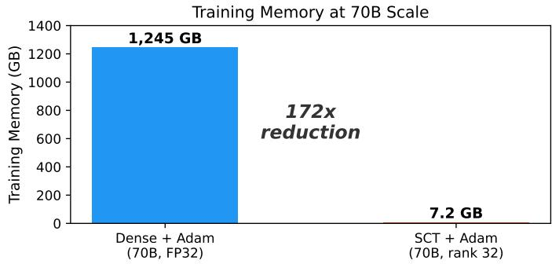
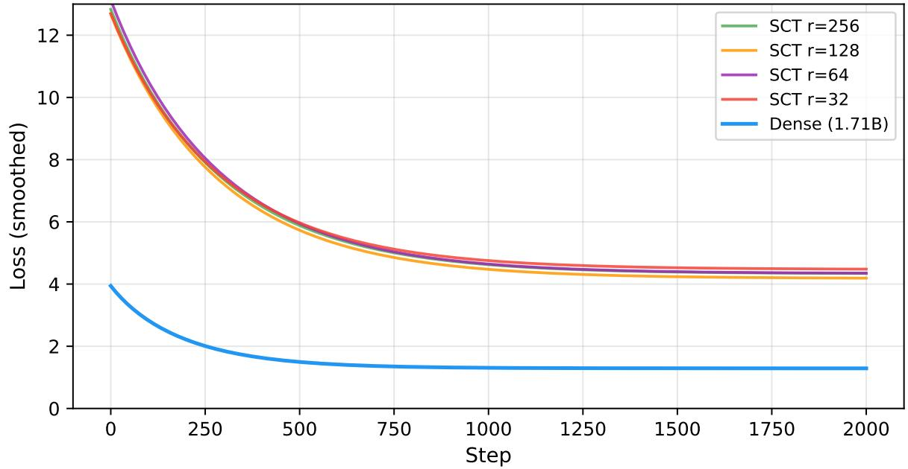
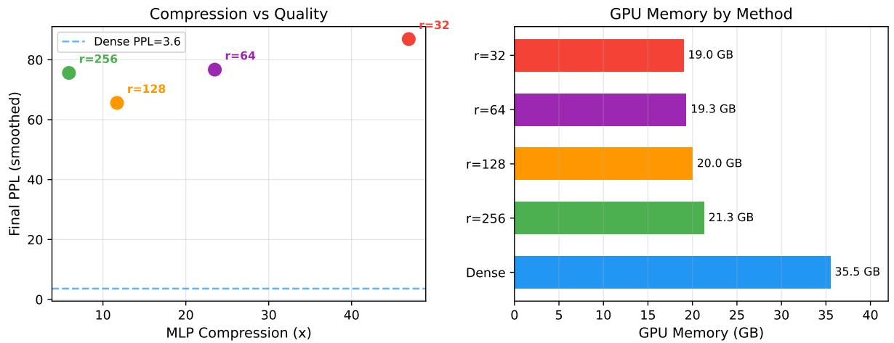

# 谱压缩训练：通过永久截断奇异值分解和斯蒂费尔QR回缩预训练大型语言模型

比约恩·R·科尔贝格 EctoSpace，爱尔兰都柏林 bkohlberger@icloud.com https://github.com/EctoSpace/SCT 2026年3月

# 摘要

内存墙仍然是消费者硬件上训练大型语言模型的主要瓶颈。我们提出了谱压缩训练（Spectral Compact Training，SCT）方法，该方法用永久性截断奇异值分解（SVD）因子（ $W = U \mathrm { d i a g } ( s ) V ^ { \mathrm { ~ \scriptsize ~ \backslash ~ } }$ ）替代了密集权重矩阵，在训练或推理过程中从未实际生成完整的密集矩阵。梯度通过标准反向传播在紧凑的谱因子中流动，并且 $U$ 和 $V$ 在每次优化步骤后通过 QR 分解收缩到 Stiefel 流形。

SCT 在 32 阶段下实现了每个 MLP 层最多 $1 9 9 \times$ 的内存减少，使得在 Steam Deck 手持设备上完成 70B 参数架构的完整训练步骤成为可能（峰值内存 7.2GB，相比于使用 Adam 的稠密 FP32 训练需要 1,245 GB）。在 SmolLM2-1.7B（阶级 32256，2000 步，NVIDIA A100）上进行的阶级扫描实验表明，所有测试的阶级都收敛到相同的损失底线 $( \sim 4 . 2 – 4 . 5 )$，确定学习率调度是与稠密训练拉开差距的主要瓶颈，而非 MLP 阶级。阶级 128 成为效率的最佳选择：11.7 $\times$ 的 MLP 压缩，20.0 GB 的 GPU 内存（与 35.5 GB 的稠密模型相比），以及 65.6 的困惑度（在所有 SCT 配置中为最佳）。在 32 阶段时，GPU 内存下降 46%，而训练吞吐量翻倍。

# 1 引言

大型语言模型在训练过程中面临严重的内存瓶颈。一个标准的70B模型在全精度下需要超过1200 GB用于权重、梯度和优化器状态，这限制了基础人工智能研究的发展，主要被资金充足的机构和多GPU集群所掌控。即使是7B模型也对单GPU设置造成了压力。SCT通过将每个权重矩阵永久存储在紧凑的SVD因子中来解决这一问题：$W =$ $U \mathrm { d i a g } ( s ) V ^ { \top }$，其中$U \in \mathbb { R } ^ { m \times k }$和$V \in \mathbb { R } ^ { n \times k }$具有正交归一列，$s \in \mathbb { R } ^ { k }$包含奇异值。密集矩阵从未构造。通过标准的反向传播算法计算梯度，产生的梯度形状为$( m \times k )$、$( k )$和$( n \times k )$，而不是$( m \times n )$。在每次优化器步骤之后，通过QR分解将$U$和$V$收回到Stiefel流形上以保持正交归一性。这种方法与后训练压缩（在训练后应用SVD）和像LoRA这样的适配器方法（在冻结的密集权重旁边添加小型可训练矩阵）有很大不同。SCT替代了参数化本身：光谱因子即权重。结果是在70B架构的32秩下，每个MLP层的内存减少了199倍，整体训练步骤在消费级硬件上完成仅需7.2 GB。

# 贡献。

1. 一种训练方法，永久性地以截断 SVD 形式存储和更新权重，并使用 Stiefel 流形收缩，从不生成稠密矩阵。 2. 架构验证显示完整的 70B 训练步骤（前向传播、反向传播、优化器、收缩）在 Steam Deck 上占用 7.2 GB，在 Apple M4 Pro 上占用 7.9 GB。 3. 在 SmolLM2-1.7B 上进行的秩搜索实验表明，所有秩（32256）收敛到相同的损失底线，秩 128 为 Pareto 最优配置（11.7 倍压缩，最佳困惑度）。 4. 证据表明，与稠密训练的收敛差距是由学习率配置驱动的，而不是由谱秩容量驱动的。

# 2 相关工作

SCT建立在多个研究方向的基础上。各个组成部分——SVD因式分解、Stiefel流形优化、低秩训练——都得到了充分研究。特定的组合看起来是新颖的：使用Stiefel QR收缩的永久截断SVD存储用于LLM训练，其中稠密矩阵从未实现。低秩CNN训练（ELRT）。Sui等人 [Sui et al., 2024] 使用带正交性正则化的Tucker-2分解从零开始训练紧凑的CNN。ELRT针对卷积架构，使用软正交性惩罚而非硬流形约束，并仍然实现稠密的中间表示。SCT在变换器MLP层中使用永久截断SVD，通过QR收缩（硬约束）强制实施正交性，且从不构建任何稠密矩阵。黎曼微调（StelLA）。Li等人 [Li et al., 2025] 提出了带Stiefel约束的三因子 $U S V ^ { \mid }$ 分解，用于LoRA适配器（NeurIPS 2025 Spotlight）。该因子形式和流形优化与SCT共享。关键的不同在于范围：StelLA将Stiefel约束应用于适配器 $\Delta W = U S V ^ { \top }$ ，而冻结的预训练稠密矩阵 $W$ 保持在内存中。SCT完全替换 $W$ 。StelLA是一种微调方法；SCT则目标是通过完全权重替换进行训练，这正是内存节省的来源。低秩适配器（LoRA）。Hu等人 [Hu et al., 2021] 冻结稠密矩阵 $W$ 并与之一起训练小型适配器矩阵。在整个过程中，完整的稠密模型保持在内存中。SCT从不存储 $W$ ；谱因子是模型对每个权重矩阵的唯一表示。低秩 $^ + $ 稀疏预训练（LOST）。Han等人 [Han et al., 2025] 将低秩和稀疏成分结合用于LLM从头预训练，使用SVD进行初始化。LOST与高效预训练的目标相同，但不维持因子的Stiefel流形约束，并使用稀疏性作为补充机制。CNN的SVD训练。Yang等人 [Yang et al., 2020] 将CNN层分解为全秩SVD形式，并以正交性正则化（软惩罚）训练 $U$ 、$s$ 、$V$ 。这与SCT的QR收缩（硬约束）不同。正则化方法无法保证正交性，这影响了奇异值的解释和秩截断的有效性。后训练SVD压缩。SVD-LLM [Wang et al., 2024] 和相关方法对已经训练好的稠密模型进行SVD截断。这些方法优化截断步骤，但没有以SVD形式训练。SCT从初始化开始便以低秩谱形式进行本地训练。内存高效的梯度方法（GaLore）。Zhao等人 [Zhao et al., 2024] 通过周期性SVD将稠密梯度投影到低秩子空间，降低优化器状态内存，同时保持全秩权重和梯度。SCT通过直接对较小的谱因子进行微分，完全避免了稠密梯度。黎曼优化。Stiefel流形上的优化 [Absil et al., 2008] 和通过Cayley变换的高效收缩 [Li et al., 2020] 是成熟的技术。SCT特别应用QR收缩以在神经网络训练期间保持谱因子的正交性。

# 3 方法论

SCT 替代了神经网络权重矩阵的存储和更新机制。谱表示。每个权重矩阵 $W \in \mathbb { R } ^ { m \times n }$ 以其秩-$k$ 截断奇异值分解存储：

$$
W = U \cdot \mathrm { d i a g } ( s ) \cdot V ^ { \top }
$$

其中 $U \in \mathbb { R } ^ { m \times k }$ , $V \in \mathbb { R } ^ { n \times k }$ 具有正交归一列，$s \in \mathbb { R } ^ { k }$ 存储：$k ( m + n + 1 )$ 个数，而不是 ${ m n n }$。对于 LLaMA-70B MLP 层（$m = 8192$ , $n = 28672$）$k = 32$ 时，这相当于 1.18M 与 234.9M 参数：每层减少了 199 倍。

# 前向传播。

$$
\begin{array} { l l l } { { h = x \cdot U } } & { { \qquad } } & { { [ b \times k ] \quad \mathrm { c o s t : } \ O ( b m k ) } } \\ { { h _ { s } = h \odot s } } & { { \qquad } } & { { [ b \times k ] \quad \mathrm { c o s t : } \ O ( b k ) } } \\ { { y = h _ { s } \cdot V ^ { \top } } } & { { \qquad } } & { { [ b \times n ] \quad \mathrm { c o s t : } \ O ( b k n ) } } \end{array}
$$

三个小矩阵乘法。总耗费：$O ( b k ( m + n ) ) ，$而不是 $O ( b m n ) $。反向传播。反向传播计算梯度 $\partial \mathcal { L } / \partial U \left( \boldsymbol { m } \times \boldsymbol { k } \right)$ , ${ \partial \mathcal L } / { \partial s \ ( \boldsymbol k ) } , { \partial \mathcal L } / { \partial V \left( \boldsymbol n \times \boldsymbol k \right) }$ 通过相同的分解操作，使用标准 PyTorch 的自动求导。任何时候都不存在 $m \times n$ 的梯度。关于梯度的说明：这些梯度是相对于分解参数化的精确梯度。它们与全秩稠密模型的梯度并不相同，因为秩约束模型定义了不同的损失函数空间。SCT 使用标准的反向传播；它并不替代或消除反向传播。它所消除的是稠密矩阵及其对应的稠密梯度。Stiefel 流形回缩。在每次优化器步骤（AdamW）之后，将 $U$ 和 $V$ 回缩到 Stiefel 流形：

$$
Q , R = \mathrm { Q R } ( U _ { \mathrm { u p d a t e d } } ) ; U  Q \cdot \mathrm { s i g n } ( \mathrm { d i a g } ( R ) )
$$

符号校正确保了连续性。每层的成本为 $O ( m k ^ { 2 } )$。内存分析。对于每个权重矩阵，使用 Adam 优化器，SCT 存储了 $k ( m + n + 1 )$ 个数的四个副本（权重、梯度、第一矩、第二矩），而不是 4mn。表 1 显示了在模型规模中，每个 MLP 层在秩 32 下的压缩情况。

Table 1: Per-MLP-layer training memory (weights $^ +$ gradients $^ +$ Adam states) at rank 32.   

<table><tr><td>Model</td><td>Layer (m × n)</td><td>Dense+Adam</td><td>SCT (k=32)</td><td>Compression</td></tr><tr><td>SmolLM2-135M</td><td>576 × 1536</td><td>14.2 MB</td><td>1.1 MB</td><td>13×</td></tr><tr><td>SmolLM2-360M</td><td>1024 × 4096</td><td>67.1 MB</td><td>2.6 MB</td><td>26×</td></tr><tr><td>SmolLM2-1.7B</td><td>2048 × 8192</td><td>268.4 MB</td><td>5.2 MB</td><td>51×</td></tr><tr><td>LLaMA-7B</td><td>4096 × 11008</td><td>721.4 MB</td><td>7.7MB</td><td>93×</td></tr><tr><td>Qwen-27B</td><td>4096 × 17408</td><td>1,141 MB</td><td>11.0 MB</td><td>104×</td></tr><tr><td>LLaMA-70B</td><td>8192 × 28672</td><td>3,758 MB</td><td>18.9 MB</td><td>199×</td></tr></table>

# 算法 1 SCT 训练步骤

需要：包含SpectralLinear层的模型，学习率 $\eta$ ，批次 $( x , y )$ 1: 前向传播：$\hat { y } = \mathrm { m o d e l } ( x )$ {使用 $\boldsymbol { h } = ( \boldsymbol { x } \cdot \boldsymbol { U } ) \odot \boldsymbol { s } \cdot \boldsymbol { V } ^ { \top } $} 2: 损失：$\mathcal { L } = \mathrm { C r o s s E n t r o p y } ( \hat { y } , y )$ 3: 反向传播：通过autograd计算 $\nabla _ { U } \mathcal { L }$ , $\nabla _ { s } \mathcal { L }$ , $\nabla _ { V } \mathcal { L }$ 4: 优化器：对 $U$ , $s$ , $V$ 进行AdamW步进 5: 撤回：对于每个SpectralLinear层： 6: $\begin{array} { r } { Q , R \gets \mathrm { Q R } ( U ) ; \quad U \gets Q \cdot \mathrm { s i g n } ( \mathrm { d i a g } ( R ) ) } \\ { Q , R \gets \mathrm { Q R } ( V ) ; \quad V \gets Q \cdot \mathrm { s i g n } ( \mathrm { d i a g } ( R ) ) } \end{array}$ 7:

# 4 实验

# 4.1 70B架构验证

一个完整的70B级变换器（80层，$d { = } 8 1 9 2$，$\mathrm { H n } { = } 2 8 6 7 2$，SwiGLU激活，匹配LLaMA-3-70B层维度）在秩为32的情况下以谱形式初始化，并执行了一完整的训练步骤：前向传播、反向传播、Adam优化器步骤和Stiefel QR收缩。注意力机制被简化（加法，未使用softmax/掩蔽），以将内存和梯度流的测试与序列长度问题隔离。452M谱参数对应于77.8B参数的稠密架构。这表明：一个70B架构的训练步骤的内存占用在8 GB以内。使用Adam进行相同架构的稠密FP32训练需要1,245 GB（图1）。这并不表明：在秩为32时收敛到一个有用的语言模型，或与稠密70B模型的等价性。这些是下文的秩搜索实验中要解决的独立问题。

# 4.2 排名扫描（SmolLM2-1.7B 在 Alpaca 上）

为了描述压缩质量的权衡，我们在经过 Alpaca 数据集微调的 SmolLM2-1.7B 上以秩 32、64、128 和 256 运行 dense baseline 和 SCT。MLP 层（gate_proj、up_proj、down_proj）通过截断 SVD 转换为 SpectralLinear；注意力投影、嵌入和层归一化保持为密集格式。所有运行：2000 步，批量大小 4，AdamW，NVIDIA A100 40 GB。密集学习率：$2 \times 10^{-5}$。SCT 学习率：$5 \times 10^{-4}$。

Table 2:70B architecture validation on consumer hardware. Both platforms complete a ful training step under 8GB.   

<table><tr><td>Metric</td><td>Apple M4 Pro (48 GB)</td><td>Steam Deck (16 GB)</td></tr><tr><td>Peak Memory</td><td>7,907MB</td><td>7,236 MB</td></tr><tr><td>Forward Pass</td><td>0.08 s</td><td>0.43 s</td></tr><tr><td>Backward Pass</td><td>0.09 s</td><td>0.92 s</td></tr><tr><td>Optimizer Step</td><td>0.22 s</td><td>2.35 s</td></tr><tr><td>QR Retraction</td><td>3.02 s</td><td>2.58 s</td></tr><tr><td>Total Step</td><td>3.41 s</td><td>6.28 s</td></tr><tr><td>Ortho. Error</td><td>&lt; 2 × 10−6</td><td>&lt; 2 × 10−6</td></tr></table>

  

Figure 1: Training memory at 70B scale. SCT requires $1 7 2 \times$ less memory than dense training.

Table 3: Rank sweep results. Loss and PPL are smoothed (window=50). Rank 128 (bold) achieves the best PPL among SCT configurations.   

<table><tr><td>Method</td><td>Params</td><td>MLP Comp.</td><td>Loss</td><td>PPL</td><td>GPU Mem.</td><td>Step Time</td></tr><tr><td>Dense</td><td>1,711M</td><td>1.0×</td><td>1.29</td><td>3.6</td><td>35.5 GB</td><td>1.17s</td></tr><tr><td>SCT r=256</td><td>692M</td><td>5.9×</td><td>4.33</td><td>75.6</td><td>21.3 GB</td><td>1.05 s</td></tr><tr><td>SCT r=128</td><td>598M</td><td>11.7×</td><td>4.18</td><td>65.6</td><td>20.0 GB</td><td>0.74 s</td></tr><tr><td>SCT r=64</td><td>551M</td><td>23.5×</td><td>4.34</td><td>76.7</td><td>19.3 GB</td><td>0.62 s</td></tr><tr><td>SCT r=32</td><td>527M</td><td>46.9×</td><td>4.47</td><td>86.9</td><td>19.0 GB</td><td>0.56 s</td></tr></table>

# 4.3 关键观察

所有等级的损失均收敛到相同的底线。在经过2000步后，等级256（$5.9 \times$压缩）和等级32（$46.9 \times$）之间的损失相差不超过0.3（见表3）。这表明，在这个训练时长内，MLP等级并不是收敛质量的主要瓶颈。等级256的表现不如等级128。这是学习率的伪影，而不是方法的特性。在等级256时，SVD截断保留了大部分预训练结构，因此$5 \times 10^{-4}$的学习率（为密集基线的$25\times$）导致超调并损害了初始化。在等级32时，较少的预训练结构在截断中幸存，因此激进的学习率有助于恢复。等级128对于这个特定的学习率处于甜点位置。

  

Figure 2: Loss convergence for all ranks. All SCT configurations converge to the same loss floo $( { \sim } 4 . 2 – 4 . 5 )$ regardless of rank. Dense converges to 1.29.

约 $3$ 的损失差距是学习率问题，而非容量问题。在秩为 $32$ 时，MLP 谱参数仅占总数的 $18M$ 中的 $527M$。注意力层（$403M$，占模型的 $77\%$）以相同的 $5 \times 10^{-4}$ 学习率进行训练。逐组件学习率调度（注意力/嵌入的稠密学习率，SCT 因子的更高学习率）是缩小这一差距的明确下一步。内存效率随压缩比例的增加而提升。GPU 使用量从 $35.5$ GB（稠密模式）下降至 $19.0$ GB（秩为 $32$），减少了 $46\%$。在秩为 $32$ 时，训练步骤速度提升了 $2.1 \times$（$0.56s$ 对 $1.17s$）。即使在秩为 $256$ 时，也能节省 $40\%$ 的 VRAM，同时提供 $5.9 \times$ 的 MLP 层压缩。

# 4.4 微调梯度完整性（SmolLM2-135M）

作为额外验证，预训练的 SmolLM2-135M 权重以95%的能量保留率转换为谱形，并在 Alpaca 上微调了 400 步（使用相同数据、相同随机种子、相同学习率与稠密基线相同）。损失收敛：所有等级

Table 4: SmolLM2-135M fine-tuning (gradient integrity test). The 135M model is below the optima scale for SCT compression; this test validates gradient flow, not compression utility.   

<table><tr><td>Method</td><td>Final Loss</td><td>Final PPL</td><td>Trainable Params</td><td>PPL Ratio</td></tr><tr><td>Dense + AdamW</td><td>0.235</td><td>1.3</td><td>134,515,008</td><td>1.0×</td></tr><tr><td>SCT (95% energy)</td><td>0.594</td><td>1.8</td><td>84,333,271</td><td>1.38×</td></tr></table>

  

Figure 3: Left: Compression vs. quality Pareto frontier. Rank 128 achieves the best PPL at $1 1 . 7 \times$ compression. Right: GPU memory by method. Even rank 256 saves $4 0 \%$ of VRAM.

SCT 从初始损失峰值（8.64）恢复到密集基线困惑度的 $1.38 \times$，通过特征值的谱分解确认了梯度完整性，并使用 Stiefel 收缩方法在压缩最小的模型规模下（隐藏维度为 576）。

# 5 限制与未来工作

收敛差距。SCT与稠密训练在2000步后仍存在约${ \sim } 3$的损失差距。排名扫描的证据表明，这一差距是由学习率配置驱动的，而非固有的容量限制，但尚未得到确凿证明。每个组件的学习率调度是下一个立即的实验。QR回缩成本。每层每步的花费为$O ( m k ^ { 2 } )$，对于小的$k$来说，回缩成本较低，但在更高秩或更大模型时可能会变得显著。70B基准显示回缩占总步骤时间的$40 \mathrm { - } 50 \%$。Cayley回缩[Li等，2020]是一个潜在的低成本替代方案。注意力层。目前的实验仅将MLP层转换为谱形式。将SCT扩展到注意力投影$( \boldsymbol { q } , \boldsymbol { k } , \boldsymbol { v } , \boldsymbol { o } )$在架构上是简单的，但引入了关于注意力模式保真度的考虑。完全预训练。在大规模数据集上训练至收敛（例如，完全预训练运行）尚未得到验证。1.7B的实验验证了该方法在微调上的有效性；扩展至完全预训练仍是未来的工作。小模型限制。在参数少于$\cdots$ 1.7B（隐藏维度$< 2048$）的模型中，在实际能量阈值下产生的秩接近于全维度，提供的压缩收益有限。

# 6 结论

SCT表明，永久截断奇异值分解与Stiefel流形重traction结合的训练方法是大型语言模型的可行训练方案。70B架构的验证确认了内存声明：在7.2GB下进行完整训练步骤，而密集训练则需要1,245GB。1.7B等级的扫描确认了在规模上的内存效率（GPU减少46%，步骤速度提升$2.1\times$），并揭示收敛差距是由学习率配置驱动的，而非谱秩容量。从32到256的所有秩趋于同一损失底线上，其中秩128作为帕累托最优配置出现。代码和实验笔记本可在 https://github.com/EctoSpace/SCT 获取。专利。爱尔兰短期专利申请 PTIE20260000000219 (S2026/0159)，提交于2026年3月27日。

# References

P.-A. Absil, R. Mahony, and R. Sepulchre. Optimization Algorithms on Matrix Manifolds. Princeton University Press, 2008.   
X. Han et al. LOST: Low-rank and sparse pre-training for large language models. arXiv:2508.02668, 2025.   
E. J. Hu, Y. Shen, P. Wallis, Z. Allen-Zhu, Y. Li, S. Wang, L. Wang, and W. Chen. LoRA: Low-rank adaptation of large language models. arXiv:2106.09685, 2021.   
J. Li et al. Efficient Riemannian optimization on the Stiefel manifold via the Cayley transform. In ICLR, 2020.   
Z. Li, S. Sajadmanesh, J. Li, and L. Lyu. StelLA: Subspace learning in low-rank adaptation using Stiefel manifold. NeurIPS 2025 Spotlight. arXiv:2510.01938, 2025.   
Y. Sui, M. Yin, Y. Gong, J. Xiao, H. Phan, and B. Yuan. ELRT: Efficient low-rank training for compact convolutional neural networks. arXiv:2401.10341, 2024.   
X. Wang et al. SVD-LLM: Truncation-aware SVD for LLM compression. ICLR 2025. arXiv:2403.07378, 2024.   
H. Yang et al. Learning low-rank deep neural networks via singular vector orthogonality regularization and singular value sparsification. arXiv:2004.09031, 2020.   
J. Zhao et al. GaLore: Memory-efficient LLM training by gradient low-rank projection. In ICML, 2024. arXiv:2403.03507.   
US Patent Application 20250021826. Low-rank compression of neural networks, 2025.