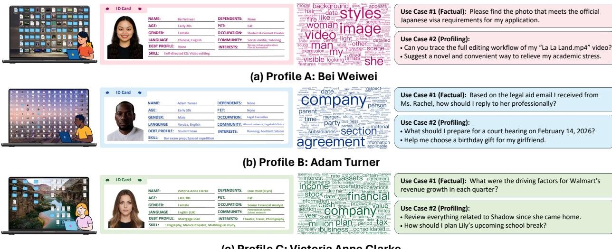
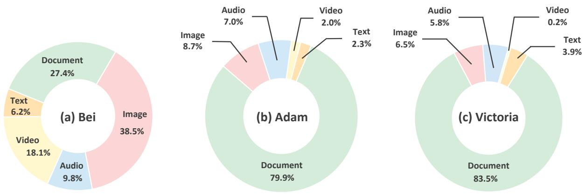
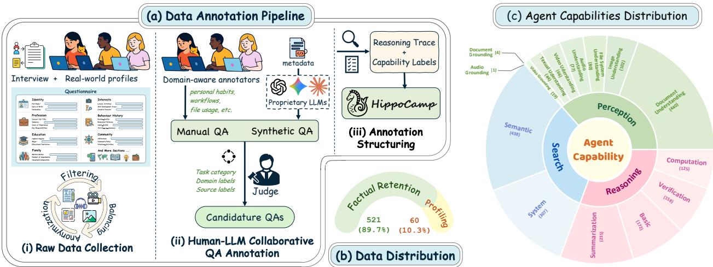
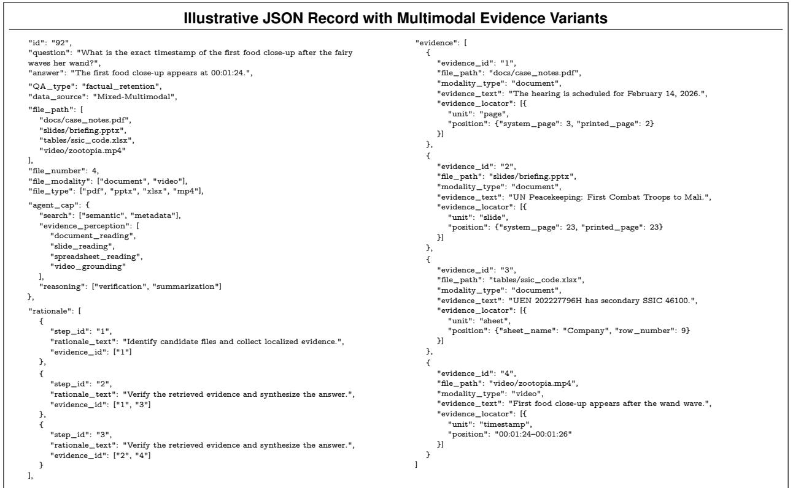
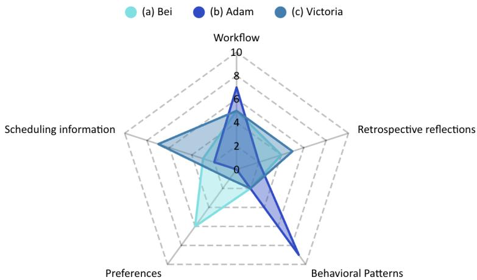
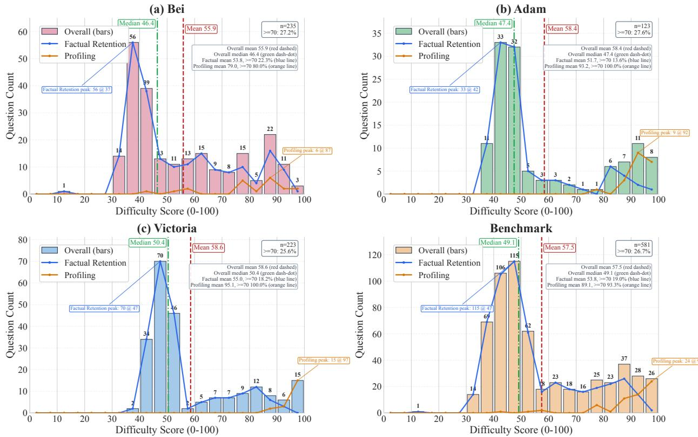
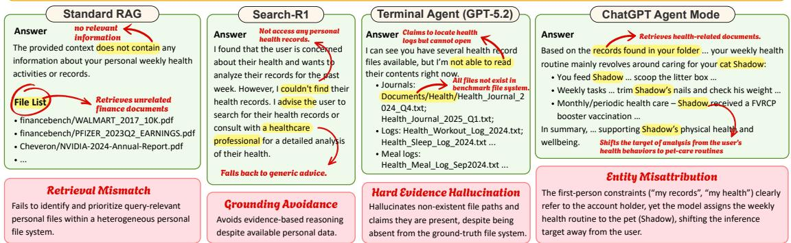
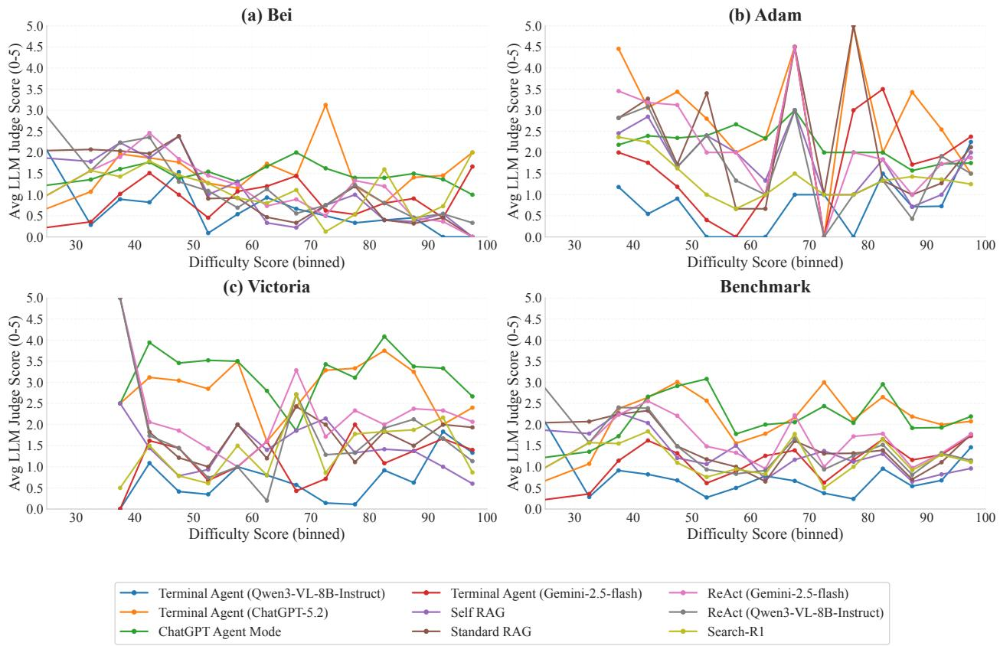

# 1. Bibliographic Information
## 1.1. Title
The paper is titled **HippoCamp: Benchmarking Contextual Agents on Personal Computers**. Its central topic is the design, construction, and evaluation of a novel benchmark for measuring the performance of multimodal AI agents on user-centric personal file management tasks, including factual retrieval from heterogeneous files and user preference profiling from distributed evidence.
## 1.2. Authors
The core author team is affiliated with two institutions:
1.  S-Lab, Nanyang Technological University, Singapore
2.  Synvo AI
    Corresponding authors are **Chen Change Loy** and **Ziwei Liu**, leading researchers in computer vision, multimodal learning, and AI agent systems. The full author list includes Zhe Yang, Shulin Tian, Karui Hu, Shuai Liu, Hoang-Nhat Nguyen, Yichi Zhang, Zujin Guo, Mengying Yu, Zinan Zhang, Jingkang Yang, Chen Change Loy, and Ziwei Liu.
## 1.3. Journal/Conference
As of the current publication date, the paper is hosted on **arXiv**, a preprint server for research papers prior to peer-reviewed conference or journal publication. arXiv is a widely used, high-visibility platform for sharing cutting-edge research in computer science and related fields.
## 1.4. Publication Year
2026 (published UTC 2026-04-01)
## 1.5. Abstract
This paper introduces HippoCamp, the first benchmark designed to evaluate AI agents' capabilities in multimodal personal file management. Unlike existing agent benchmarks that focus on generic web interaction, tool use, or software automation, HippoCamp simulates realistic user-centric personal computing environments with device-scale file systems derived from real user profiles. The benchmark includes 42.4 GB of data across over 2000 real-world files spanning all 5 modalities (text, document, image, video, audio), 581 evidence-grounded question-answering (QA) pairs, and 46.1K densely annotated structured trajectories for step-wise failure diagnosis. The authors evaluate a wide range of state-of-the-art multimodal large language models (MLLMs) and agentic methods on HippoCamp, revealing a large performance gap: even the most advanced commercial model achieves only 48.3% accuracy on user profiling tasks, with particular struggles on long-horizon retrieval and cross-modal reasoning in dense personal file systems. Step-wise failure analysis identifies multimodal perception and evidence grounding as the primary bottlenecks for current agents.
## 1.6. Original Source Link
- Official arXiv preprint page: https://arxiv.org/abs/2604.01221
- Direct PDF link: https://arxiv.org/pdf/2604.01221
- Publication status: Preprint (hosted on arXiv, no peer-reviewed conference/journal acceptance announced as of 2026-04-02)

# 2. Executive Summary
## 2.1. Background & Motivation
### Core Problem
Personal AI assistants that can manage, retrieve, and reason over users' local file systems are a high-impact, near-term application of agentic AI. However, there is no standardized benchmark to evaluate agent performance in this domain, as existing agent benchmarks focus on isolated, generic scenarios (web browsing, public tool use, software automation) detached from real user context.
### Importance & Research Gaps
Real personal file systems present unique, understudied challenges for agents:
1.  **Heterogeneous multimodal content**: Files span text, documents, images, videos, audio, and diverse long-tail formats.
2.  **Hierarchical, user-specific organization**: Folder structures, naming conventions, and file dependencies are idiosyncratic to individual users.
3.  **Long-horizon, cross-file reasoning**: Many user queries require integrating evidence across multiple files, time points, and modalities, rather than single-step retrieval.
4.  **User profiling requirements**: Useful assistants must infer user preferences, routines, and workflows from distributed, weak signals rather than just retrieving explicit facts.
    Prior benchmarks fail to capture these challenges: they use static public corpora, lack real file system structure, ignore personalized user context, and provide no fine-grained annotations for diagnosing failure points.
### Innovative Entry Point
The authors address this gap by building a realistic, device-scale benchmark that replicates real personal computing environments, with dense annotations to enable both end-to-end performance measurement and fine-grained capability diagnosis.
## 2.2. Main Contributions / Findings
### Primary Contributions
1.  **Realistic personal computing environments**: 3 archetypal user profiles (student/content creator, legal executive, senior financial analyst) with authentic, coherent file systems that capture real folder structures, long-term temporal traces, and cross-file dependencies.
2.  **Large-scale, densely supervised corpus**: 2000+ real-world files (42.4 GB total), 581 evidence-grounded QA pairs covering both factual retrieval and user profiling tasks, and 46.1K fine-grained structured trajectory annotations that decompose task solutions into search, perception, and reasoning stages.
3.  **Comprehensive evaluation framework**: A standardized evaluation protocol and fine-grained capability analysis pipeline to diagnose agent failure points across the full task pipeline.
### Key Findings
1.  **Large performance gap**: Even the strongest commercial agent (ChatGPT Agent Mode) only achieves 48.3% overall accuracy on user profiling tasks and 62.8% accuracy on factual retention tasks, showing current agents are far from solving real-world personal file management.
2.  **Dominant bottleneck is post-retrieval processing**: The main failure source is not evidence retrieval itself, but downstream steps: multimodal perception of heterogeneous file content, evidence grounding, entity binding, and answer verification.
3.  **Profiling is disproportionately hard**: Profiling tasks that require aggregating weak signals across time and modalities are far more challenging than factual retention tasks, with performance dropping by up to 5x for search-centric agent methods.
4.  **Retrieval quality does not guarantee answer quality**: Many methods achieve strong retrieval performance (high file F1) but fail to convert retrieved evidence into correct answers, while some methods produce correct answers using parametric knowledge rather than grounded file evidence.

# 3. Prerequisite Knowledge & Related Work
## 3.1. Foundational Concepts
All key technical terms are explained below for beginner readers:
1.  **Multimodal Large Language Models (MLLMs)**: An extension of standard large language models (LLMs) that can process and understand multiple types of data (called *modalities*) beyond just text, including images, videos, audio, and formatted documents. Regular LLMs only operate on text tokens; MLLMs include specialized encoders to convert non-text data into numerical embeddings that the LLM can interpret.
2.  **AI Agent / Agentic System**: An AI system that can perform autonomous, multi-step actions to achieve a user-specified goal, rather than generating a single static output from input. Agents typically include capabilities for planning, tool use, environment interaction, perception, reasoning, and memory.
3.  **Retrieval-Augmented Generation (RAG)**: A popular framework that allows LLMs to retrieve relevant external information from a custom corpus (e.g., personal files) during inference, then generate answers grounded in the retrieved content instead of relying only on knowledge learned during training (called *parametric knowledge*). The standard RAG pipeline is: (1) embed the user query into a numerical vector, (2) retrieve the top-k most similar documents from a pre-indexed vector store using cosine similarity, (3) insert the retrieved documents into the LLM prompt, (4) generate an answer grounded in the retrieved content.
    The core similarity calculation for RAG retrieval is cosine similarity between the query embedding $q \in \mathbb{R}^{d}$ and document embedding $d_i \in \mathbb{R}^{d}$:
    \$
    \text{sim}(q, d_i) = \frac{q \cdot d_i}{\|q\| \|d_i\|}
    \$
    Where $\cdot$ is the dot product of the two vectors, and $\|.\|$ is the L2 norm (length) of the vector.
4.  **ReAct Framework**: A widely used agent framework that interleaves *Reasoning (Re)* and *Acting (Act)* steps. The agent first explicitly reasons about what action to take next to gather missing information, executes the action (e.g., search for a file, read a document page), observes the result of the action, then repeats the cycle until it has enough information to generate a final answer.
5.  **LLM-as-a-Judge**: An evaluation method for open-ended tasks where exact string matching is not sufficient to judge answer correctness. A strong, trusted LLM is given the question, ground-truth answer, and model-generated answer, then outputs a binary correctness judgment (correct/incorrect) and a graded quality score.
6.  **Evidence Grounding**: The process of linking an agent's generated answer or intermediate reasoning step to specific, verifiable pieces of evidence in the underlying file system (e.g., a specific page in a PDF, a 10-second timestamp range in a video, a sentence in an email). Grounding ensures answers are not hallucinated.
7.  **User Profiling**: In the context of this benchmark, the task of inferring high-level user attributes (preferences, routines, behavioral patterns, workflows, scheduling constraints) from distributed evidence across their personal files, rather than just retrieving specific explicit facts.
## 3.2. Previous Works
The authors categorize related prior work into three groups, all of which have critical limitations for evaluating personal file system agents:
1.  **General QA & Agent Benchmarks**:
    - Text-only QA benchmarks like *HotpotQA* (Yang et al., 2018) and *KILT* (Petroni et al., 2021) focus on multi-hop reasoning over public Wikipedia text, with no multimodal content or personal context.
    - Web agent benchmarks like *WebShop* (Yao et al., 2022), *GAIA* (Mialon et al., 2024), and *BrowseComp* (Wei et al., 2025) evaluate agents on public web interaction tasks, not local personal file systems.
    - Limitation: All operate on public, generic environments, not user-specific personal contexts.
2.  **Multimodal & Document Benchmarks**:
    - Multimodal QA benchmarks like *MultiModalQA* (Talmor et al., 2021) and *WebQA* (Chang & Bisk, 2022) evaluate cross-modal reasoning over web-sourced text, images, and tables, but lack file system structure and personal context.
    - Document RAG benchmarks like *M3DocRAG* (Cho et al., 2024) and *MMDocRAG* (Dong et al., 2025b) evaluate retrieval-augmented generation for document understanding, but use static document corpora without hierarchical file system structure, cross-file dependencies, or user profiling tasks.
    - Limitation: No support for user-centric file system environments or longitudinal user profiling.
3.  **Personal Context Benchmarks**:
    - Lifelog benchmarks like *LoCoMo* (Maharana et al., 2024), *EgoLifeQA* (Yang et al., 2025), and *Ego-R1-Bench* (Tian et al., 2025) evaluate QA from personal lifelog data (text notes, egocentric video/audio).
    - Limitation: Limited modality coverage, small scale, no full hierarchical file system environment, no user profiling tasks requiring cross-file synthesis.
## 3.3. Technological Evolution
The development of agent benchmarks has progressed through three phases, with HippoCamp representing the latest phase:
1.  **2018-2020: Text-only, open-domain QA benchmarks**: Focus on measuring fact retrieval and multi-hop reasoning over static public text corpora, with no agent interaction.
2.  **2022-2024: Agent benchmarks for generic environments**: Rise of MLLMs and agentic systems leads to benchmarks for web interaction, tool use, and multimodal reasoning in public, task-specific environments.
3.  **2024-2025: Early personal context benchmarks**: First benchmarks focusing on personal lifelog data, but limited to small scale and narrow modality coverage.
4.  **2026: HippoCamp**: First benchmark for agent performance on full device-scale, multimodal personal file systems with realistic user profiles and fine-grained failure diagnosis annotations.
## 3.4. Differentiation Analysis
Compared to all prior work, HippoCamp has four core unique innovations:
1.  **Realistic file system environments**: First benchmark to replicate full hierarchical personal file systems with authentic user-specific organization, cross-file dependencies, and long-term temporal traces, rather than static flat corpora.
2.  **Full modality coverage**: Supports all 5 common personal file modalities (text, document, image, video, audio), unlike prior personal benchmarks limited to text or single modalities.
3.  **Dual task design**: Includes both factual retention (fact retrieval) and user profiling (user-level inference) tasks, requiring multi-step cross-file, cross-modal reasoning.
4.  **Fine-grained trajectory annotations**: Provides 46.1K structured trajectory annotations that decompose task solutions into search, perception, and reasoning stages, enabling step-wise failure diagnosis that is not possible with standard end-to-end accuracy metrics.

# 4. Methodology
## 4.1. Principles
The core design principle of HippoCamp is to replicate real-world personal computing environments as accurately as possible, to measure agent performance on tasks that users actually perform on their personal devices. The benchmark is designed to evaluate three tightly coupled core capabilities required for personal file management:
1.  **Search**: The ability to navigate hierarchical file systems, formulate effective search queries, and locate relevant files amid thousands of distractor files.
2.  **Perception**: The ability to interpret content across diverse file formats and modalities, extract relevant evidence from files, and ground reasoning to specific evidence locations.
3.  **Reasoning**: The ability to integrate evidence across multiple files, time points, and modalities to answer user queries, including both explicit fact retrieval and implicit user profiling.
    The theoretical intuition is that benchmarks for personal AI assistants must measure end-to-end performance in realistic environments, rather than isolating individual capabilities in artificial settings, to produce results that generalize to real-world deployment.
## 4.2. Core Methodology In-depth
The construction of HippoCamp proceeds in four sequential stages:
### Stage 1: Source Data Collection & Profile Aggregation
#### Step 1: Participant Recruitment & Screening
The authors recruited over 100 participants across diverse demographic, professional, and lifestyle backgrounds. They screened participants to select those with device file systems meeting three strict criteria:
1.  **File richness**: At least 500 user-generated files, covering at least 4 of 5 modalities (text, document, image, video, audio), and at least 10 distinct file extensions.
2.  **Longitudinal depth**: Files cover at least 3 months of activity, with stable recurring routines and workflows.
3.  **Evidence completeness**: Files support auditable user-level inference, with cross-file corroboration for key personal facts, consistent temporal anchors (timestamps, dated records), and interpretable organizational traces (folder structure, naming conventions).
    They excluded files from centrally managed corporate IT systems that obscure user-driven organization, obtained explicit written consent from all participants, and applied strict privacy safeguards to anonymize all sensitive identifiers (names, emails, phone numbers, GPS coordinates, etc.) using consistent pseudonyms while preserving evidence-bearing cues.
#### Step 2: Archetypal Profile Construction
The authors aggregated files from selected participants into 3 coherent, internally consistent archetypal user profiles, ensuring no conflicts in timestamps, entities, or cross-file references:
1.  **Profile A: Bei Weiwei**: A university student and content creator, with a media-rich file system (38.5% images, 18.1% videos, 9.8% audio, 27.4% documents).
2.  **Profile B: Adam Turner**: A legal executive, with a document-dominant file system (79.9% documents, small share of non-document modalities).
3.  **Profile C: Victoria Anne Clarke**: A senior financial analyst, with a document-dominant file system (83.5% documents, plus substantial audio files).
    The three archetypal profiles are shown below:

    
    *该图像是一个示意图，展示了 HippoCamp 基准测试中的三个用户个人资料及其使用案例。每个资料卡包含用户的基本信息、技能以及与多模态文件管理相关的问题，旨在评估人工智能在用户中心环境中的表现。*

To improve coverage of professional document types (legal contracts, financial reports) that are underrepresented in personal devices due to confidentiality constraints, the authors supplemented the profiles with public domain documents from *FinanceBench* (Islam et al., 2023) and *LegalBench-RAG* (Pipitone & Alami, 2024), rewriting all content to match the fictional profiles and anonymizing all real-world entities. The final corpus totals 42.4 GB across over 2000 real-world files. The modality distribution per profile is shown below:

*该图像是一个饼图，展示了三名用户（Bei、Adam 和 Victoria）不同类型文件的分布比例。在 (a) Bei 的数据中，图像占比最高（38.5%），文档和视频占比次之；(b) Adam 的文档占比显著（79.9%），而视频和文本的占比较少；(c) Victoria 的文档占比最高（83.5%）。*

The temporal coverage of files across all profiles spans from 2012 to 2025, with dense activity concentrated in 2024-2025, enabling both short-term factual retrieval and long-term longitudinal profiling tasks.
---
### Stage 2: QA & Trajectory Annotation
The authors used a hybrid human-LLM annotation pipeline to create QA pairs and structured trajectories, as illustrated below:

*该图像是图表，展示了HippoCamp的数据注释流程，包含原始数据收集、手动与合成问答(QA)的协作标注，以及代理能力分布。图(a)呈现了数据收集与注释架构，图(c)则展示了代理能力的分类分布，辅助理解多模态智能体的表现与能力瓶颈。*

#### Step 1: Question Proposal
Candidate questions come from two complementary sources to ensure coverage of both realistic user needs and underrepresented task patterns:
1.  **Manual proposals**: Written by participants and expert annotators familiar with the profiles, reflecting real personal computing information needs (e.g., recalling a past fact, planning a schedule, reconstructing a workflow).
2.  **Synthetic proposals**: Generated by LLMs conditioned only on limited metadata (file paths, timestamps, directory structure, seed examples) to improve coverage of underrepresented task patterns, modality combinations, and evidence set sizes. Synthetic proposals are treated strictly as candidates for human review, not final benchmark items.
#### Step 2: Candidate Screening & Balancing
All candidate questions are reviewed by human annotators to ensure they meet four criteria:
1.  **Grounded**: The answer can be fully supported by actual files in the profile, no external knowledge required.
2.  **Non-trivial**: Requires meaningful search, perception, or reasoning, not just direct filename or metadata lookup.
3.  **Low redundancy**: Does not duplicate existing questions at the intent level or reasoning pattern level.
4.  **Privacy safe**: Does not expose sensitive information beyond the anonymized profile.
    The authors then apply two levels of de-duplication:
- **Intent-level de-duplication**: Merge questions that express the same underlying information need with only superficial wording differences.
- **Pattern-level de-duplication**: Merge questions that rely on the same solution structure or evidence configuration, even if wording differs.
  Finally, the question set is rebalanced to ensure even coverage across modality combinations, evidence set sizes, and task families.
#### Step 3: Structured Trajectory Annotation
For each retained QA pair, annotators construct a grounded structured trajectory stored as a JSON record, following the schema shown below:

*该图像是一个示例 JSON 记录，展示了多模态证据变体的结构。记录包含了问题、答案、文件路径和证据的详细描述，显示了如何在多种模态下进行信息检索和推理。示例中还列出了不同步骤的推理和所需证据。该结构有助于展示复杂的文件管理和上下文意识的推理过程。*

Each trajectory record includes:
1.  **Task specification fields**: The user query, normalized ground truth answer, task type (factual retention / profiling), and profiling subtype if applicable.
2.  **File-level support fields**: The minimal set of files required to answer the query, file modalities, file types, and file paths.
3.  **Localized evidence fields**: Individual evidence items with modality-specific locators (e.g., page number for PDFs, timestamp range for video/audio, bounding box for image regions) and evidence text excerpts.
4.  **Step-wise rationale fields**: A trace of reasoning steps required to solve the task, each explicitly linked to corresponding evidence items.
5.  **Capability labels**: Tags indicating which capabilities (search, perception, reasoning) are required to solve the task.
    A key design principle is the *minimalist gold trajectory*: the annotation records only the smallest set of evidence nodes and reasoning transitions sufficient to justify the answer, leaving room for agents to discover alternative valid solution paths during inference.
#### Step 4: Quality Control
All annotations are cross-checked by multiple annotators, with disagreements resolved via adjudication. Automated sanity checks verify:
- All file paths are valid and exist in the profile file system
- All evidence locators are valid (page ranges within document bounds, timestamp ranges within media duration)
- All evidence references in the rationale trace are valid
- No sensitive identifiers are present
  The final benchmark includes 581 QA pairs and 46.1K structured trajectory annotations.
---
### Stage 3: Task Definition
The benchmark includes two core task types, designed to mirror real user information needs:
1.  **Factual Retention**: Tasks requiring retrieval and reasoning over verifiable, explicit file-grounded facts (e.g., "What class do my maximum flow problem notes belong to, and what is the course duration?"). These require accurate file localization, interpretation of heterogeneous content, and integration of information across files.
2.  **Profiling**: Tasks requiring construction of a coherent user-level model by aggregating grounded personal facts across time and modalities (e.g., "Schedule a good plan for me on the afternoon of October 27, 2025"). These require synthesizing heterogeneous cues from multimodal content, file system organization, and temporal regularities to produce globally consistent user-level inferences.
    Profiling tasks are further divided into 5 subtypes, with distribution across profiles shown below:

    
    *该图像是一个雷达图，展示了三位用户在工作流程、偏好、调度信息和行为模式方面的评分。不同颜色代表用户 Bei、Adam 和 Victoria，提供了对比分析以反映他们在多模态文件管理中的个体差异。*

- Preferences: Stable user choices reflected across repeated decisions
- Behavioral patterns: Persistent, temporally structured user habits
- Scheduling information: Constraint-aware planning under the user's established decision policy
- Retrospective reflections: Reconstruction of past events from heterogeneous traces
- Workflows: Procedure-level user modeling from repeated task executions
  ---
### Stage 4: Difficulty Score Calculation
To measure question difficulty consistently across the benchmark, the authors define a scalar difficulty score on a 0-100 scale, computed as follows:
1.  **Factor Extraction**: For each query $q$, extract 8 factors capturing different sources of difficulty:
    - $n_f$: Number of ground-truth evidence files required
    - $n_m$: Number of distinct modalities involved
    - $n_t$: Number of distinct file types/extensions involved
    - $n_e$: Number of localized evidence items required
    - $n_r$: Number of annotated reasoning steps required
    - $n_q$: Length of the question in tokens
    - $n_a$: Length of the ground truth answer in tokens
    - $n_\Delta$: Temporal span in days covered by the evidence
2.  **Factor Normalization**: Each factor $x$ is normalized using a log-quantile transform to handle heavy-tailed distributions and prevent outliers from dominating the score:
    \$
    s(x) = \text{clip}\left(\frac{\log(1 + x)}{\log(1 + P_{90}(x))}, 0, c\right)
    \$
    Where $P_{90}(x)$ is the 90th percentile of factor $x$ across the entire benchmark, $\text{clip}(\cdot)$ truncates values to the range `[0, c]` (c is a fixed cap).
3.  **Base Score Calculation**: Compute a weighted base score that prioritizes factors most indicative of difficulty (evidence breadth, evidence localization, reasoning depth):
    \$
    \text{Base}(q) = \sum_{i} w_i s_i(q)
    \$
    Where $w_i$ are predefined weights for each normalized factor $s_i(q)$.
4.  **Interaction Term Calculation**: Add interaction terms to capture coupled challenges that are harder than the sum of individual factors (e.g., multi-file reasoning, cross-modal processing):
    \$
    \text{Inter}(q) = \alpha_1 \sqrt{n_f n_r} + \alpha_2 \sqrt{n_m n_t} + \alpha_3 \sqrt{n_e n_\Delta}
    \$
    Where $\alpha_1, \alpha_2, \alpha_3$ are fixed coefficients for each interaction term.
5.  **Final Score Mapping**: Apply a hard-case bonus for queries with simultaneously high values on key difficulty axes, then map the raw score to a 0-100 scale using a sigmoid transformation to improve separability between medium and hard cases:
    \$
    \text{Diff}(q) = \frac{100}{1 + \exp(-\gamma(\text{Raw}(q) - \tau))}
    \$
    Where $\text{Raw}(q) = \text{Base}(q) + \text{Inter}(q) + \text{bonus}$, $\gamma$ is a scaling parameter, $\tau$ is a threshold parameter.
The final difficulty distribution across the benchmark is shown below:

*该图像是一个包含四个子图的图表，展示了不同用户（Bei、Adam、Victoria）在任务难度评分（0-100）上的问题数量（Question Count）分布。每个子图中展示了总体表现、事实保留和用户画像的得分情况，揭示了用户在特定难度下的表现差异。此外，整体均值和中位数也进行了标记。*

Profiling tasks are systematically harder than factual retention tasks: the mean difficulty score for profiling is 89.1, with 93.3% of profiling tasks scoring ≥70, compared to a mean of 53.8 for factual retention with only 19.0% scoring ≥70.

# 5. Experimental Setup
## 5.1. Datasets
All experiments are conducted on the HippoCamp benchmark itself, consisting of:
- 3 archetypal user profiles with 2000+ files (42.4GB total) spanning all 5 modalities
- 581 QA pairs: 426 factual retention queries (mid-range difficulty, mean score 53.8) and 155 profiling queries (high difficulty, mean score 89.1)
  Example data samples:
1.  Factual retention example: "Does the Saver Menu Logo in my ad comply with McDonald's clearspace guidelines?"
    Ground truth evidence: McDonald's brand manual PDF specifying the clearspace rule, and the advertisement video showing the logo placement.

    
    *该图像是一个示意图，展示了麦当劳的宣传材料，包括其Saver Menu和品牌标识。图中包含促销信息和关于品牌标识使用的指导，强调了清晰度要求和标识的空间限制。*

2.  Profiling example: "What do I usually do each week for my health?"
    Ground truth evidence: Calendar events, running logs, photos, voice memos, text notes, and emails showing the user's weekly running routine, dietary habits, and medical appointments.
The HippoCamp dataset is uniquely suited for this evaluation because it is the first realistic device-scale personal file system benchmark, capturing the exact challenges agents face when operating on real user devices, unlike artificial static corpora or web environments.
## 5.2. Evaluation Metrics
The paper uses three complementary sets of metrics to evaluate both end-to-end performance and fine-grained capability:
---
### 1. Answer Quality Metrics
These measure whether the agent produces a correct, useful answer to the user query.
#### Accuracy (Acc)
- **Conceptual Definition**: The fraction of model-generated answers that are semantically correct (judged by LLM-as-a-judge), measuring overall task success rate.
- **Formula**:
  \$
  \text{Acc} = \frac{\#(\text{pred} = \text{yes})}{N}
  \$
- **Symbol Explanation**:
  - $\#(\text{pred} = \text{yes})$: Number of answers judged correct by the LLM judge
  - $N$: Total number of test instances
#### Average Judge Score
- **Conceptual Definition**: A graded measure of answer quality on a 0-5 scale (rescaled to 0-10 in reports), capturing answer completeness, precision, and degree of evidence support beyond just binary correctness.
- **Formula**:
  \$
  \bar{s} = \frac{1}{N} \sum_{i=1}^N s_i, \quad s_i \in [0,5]
  \$
  The rescaled 0-10 score is: $\text{AvgScore}_{/10} = 2 \cdot \bar{s}$
- **Symbol Explanation**:
  - $s_i$: 0-5 quality score assigned by the LLM judge to the i-th instance
  - $N$: Total number of test instances
    ---
### 2. Evidence Retrieval Metrics
These measure how well the agent retrieves the required evidence files, separating retrieval performance from downstream reasoning performance.
#### File Precision
- **Conceptual Definition**: The fraction of files retrieved by the agent that are in the ground-truth minimal supporting file set, measuring how precise the agent's retrieval is (avoiding irrelevant files).
- **Formula**:
  \$
  P_i = \frac{|G_i \cap \hat{R}_i|}{|\hat{R}_i|}
  \$
  Overall File Precision is the average of $P_i$ across all instances.
- **Symbol Explanation**:
  - $G_i$: Ground-truth minimal supporting file set for instance $i$
  - $\hat{R}_i$: Set of files retrieved by the agent for instance $i$
  - $|G_i \cap \hat{R}_i|$: Number of files present in both the ground truth set and retrieved set
#### File Recall (File Hit Rate)
- **Conceptual Definition**: The fraction of ground-truth supporting files that are successfully retrieved by the agent, measuring how well the agent covers all required evidence files.
- **Formula**:
  \$
  \text{Rec}_i = \frac{|G_i \cap \hat{R}_i|}{|G_i|}
  \$
  Overall File Recall is the average of $\text{Rec}_i$ across all instances.
- **Symbol Explanation**: Same as File Precision, with $|G_i|$ being the number of files in the ground-truth supporting set.
#### File F1 Score
- **Conceptual Definition**: The harmonic mean of File Precision and File Recall, balancing both retrieval precision and coverage.
- **Formula**:
  \$
  F1_i = \frac{2 P_i \text{Rec}_i}{P_i + \text{Rec}_i}
  \$
  Overall File F1 is the average of `F1_i` across all instances.
---
### 3. Capability-wise Metrics
These measure agent performance on the three core capability stages (search, perception, reasoning), by computing accuracy and F1 score on subsets of queries labeled with each capability.
#### Capability-wise Accuracy
- **Conceptual Definition**: For each capability subcategory, the fraction of correct answers on queries requiring that capability, aggregated to the family level (search, perception, reasoning) via unweighted average across subcategories.
#### Capability-wise F1
- **Conceptual Definition**: The average File F1 score across queries requiring each capability, aggregated to the family level via unweighted average across subcategories.
  ---
## 5.3. Baselines
The authors evaluated three categories of representative state-of-the-art baseline methods, covering the full spectrum of current retrieval and agent approaches:
1.  **RAG Methods**:
    - *Standard RAG* (Lewis et al., 2020): Classical retrieve-rerank-generate pipeline, no iterative search or tool use. Represents the simplest retrieval-augmented generation baseline.
    - *Self-RAG* (Asai et al., 2024): RAG with internal reflection to grade retrieved evidence relevance, filter irrelevant items, and optionally rewrite queries for re-retrieval. Represents advanced static retrieval pipelines.
2.  **Search Agent Methods**:
    - *ReAct (Qwen3-30B-A3B)*: ReAct framework with open-source Qwen3-30B-A3B LLM backbone, interleaves reasoning and search actions.
    - *ReAct (Gemini-2.5-flash)*: ReAct framework with Google Gemini-2.5-flash backbone.
    - *Search-R1* (Jin et al., 2025): State-of-the-art reasoning model with integrated search, interleaves reasoning steps and search queries via structured tags. Represents advanced iterative search agents.
3.  **Autonomous Agent Systems**:
    - *Terminal Agent (Qwen3-VL-8B-Instruct)*: Docker-based terminal agent that interacts with the file system via command-line tools, with open-source Qwen3-VL-8B-Instruct multimodal backbone.
    - *Terminal Agent (Gemini-2.5-flash)*: Same terminal agent framework with Gemini-2.5-flash backbone.
    - *Terminal Agent (GPT-5.2)*: Same terminal agent framework with OpenAI GPT-5.2 backbone.
    - *ChatGPT Agent Mode (OpenAI)*: Official hosted commercial agent mode, represents the state-of-the-art deployed agent system available to consumers.
      These baselines are highly representative: they cover static retrieval pipelines, iterative search agents, and full autonomous terminal agents, including both open-source and commercial state-of-the-art models, enabling a comprehensive comparison of current capabilities.

# 6. Results & Analysis
## 6.1. Core Results Analysis
### Overall Task Performance
The following are the results from Table 2 of the original paper, showing overall performance across task types and profiles:

<table>
<thead>
<tr>
<th rowspan="3">Method</th>
<th colspan="6">Profiling</th>
<th colspan="8">Factual Retention</th>
</tr>
<tr>
<th colspan="2">(a) Bei</th>
<th colspan="2">(b) Adam</th>
<th colspan="2">(c) Victoria</th>
<th colspan="2">Overall</th>
<th colspan="2">(a) Bei</th>
<th colspan="2">(b) Adam</th>
<th colspan="2">(c) Victoria</th>
<th colspan="2">Overall</th>
</tr>
<tr>
<th>F1</th>
<th>Acc</th>
<th>F1</th>
<th>Acc</th>
<th>F1</th>
<th>Acc</th>
<th>F1</th>
<th>Acc</th>
<th>F1</th>
<th>Acc</th>
<th>F1</th>
<th>Acc</th>
<th>F1</th>
<th>Acc</th>
<th>F1</th>
<th>Acc</th>
</tr>
</thead>
<tbody>
<tr>
<td colspan="17">RAG Methods</td>
</tr>
<tr>
<td>Standard RAG (Lewis et al., 2020)</td>
<td>13.7</td>
<td>10.0</td>
<td>20.8</td>
<td>35.0</td>
<td>20.6</td>
<td>35.0</td>
<td>18.4</td>
<td>26.7</td>
<td>29.7</td>
<td>24.2</td>
<td>39.7</td>
<td>42.7</td>
<td>20.5</td>
<td>23.6</td>
<td>30.0</td>
<td>30.2</td>
</tr>
<tr>
<td>Self RAG (Asai et al., 2024)</td>
<td>13.8</td>
<td>5.0</td>
<td>16.0</td>
<td>25.0</td>
<td>15.9</td>
<td>0.0</td>
<td>15.2</td>
<td>10.0</td>
<td>33.9</td>
<td>26.1</td>
<td>41.5</td>
<td>38.8</td>
<td>20.2</td>
<td>17.7</td>
<td>31.9</td>
<td>27.5</td>
</tr>
<tr>
<td colspan="17">Search Agent Methods</td>
</tr>
<tr>
<td>ReAct (Yao et al., 2023) (Qwen3-30B-A3B)</td>
<td>5.5</td>
<td>5.6</td>
<td>17.8</td>
<td>25.0</td>
<td>12.2</td>
<td>10.0</td>
<td>13.5</td>
<td>10.0</td>
<td>42.4</td>
<td>26.1</td>
<td>60.4</td>
<td>37.9</td>
<td>26.5</td>
<td>21.7</td>
<td>43.1</td>
<td>28.5</td>
</tr>
<tr>
<td>ReAct (Yao et al., 2023) (Gemini-2.5-flash)</td>
<td>13.7</td>
<td>10.0</td>
<td>21.4</td>
<td>25.0</td>
<td>20.5</td>
<td>9.4</td>
<td>18.5</td>
<td>15.0</td>
<td>26.9</td>
<td>24.2</td>
<td>35.7</td>
<td>55.3</td>
<td>26.4</td>
<td>17.0</td>
<td>36.4</td>
<td>26.5</td>
</tr>
<tr>
<td>Search-R1 (Jin et al., 2025)</td>
<td>6.6</td>
<td>0.0</td>
<td>16.5</td>
<td>15.0</td>
<td>10.8</td>
<td>0.0</td>
<td>10.8</td>
<td>5.0</td>
<td>38.7</td>
<td>23.7</td>
<td>58.0</td>
<td>28.2</td>
<td>24.1</td>
<td>41.0</td>
<td>41.0</td>
<td>25.3</td>
</tr>
<tr>
<td colspan="17">Autonomous Agent Systems</td>
</tr>
<tr>
<td>Terminal Agent (Qwen3-VL-8B-Instruct)</td>
<td>5.4</td>
<td>0.0</td>
<td>16.3</td>
<td>25.0</td>
<td>13.2</td>
<td>25.0</td>
<td>11.6</td>
<td>16.7</td>
<td>14.6</td>
<td>10.7</td>
<td>21.6</td>
<td>13.6</td>
<td>15.7</td>
<td>10.3</td>
<td>17.3</td>
<td>11.5</td>
</tr>
<tr>
<td>Terminal Agent (Gemini-2.5-flash)</td>
<td>9.0</td>
<td>5.0</td>
<td>17.0</td>
<td>45.0</td>
<td>19.0</td>
<td>25.0</td>
<td>15.0</td>
<td>25.0</td>
<td>18.1</td>
<td>21.8</td>
<td>33.1</td>
<td>31.1</td>
<td>24.4</td>
<td>20.7</td>
<td>26.4</td>
<td>23.3</td>
</tr>
<tr>
<td>Terminal Agent (GPT-5.2)</td>
<td>8.1</td>
<td>15.0</td>
<td>14.9</td>
<td>45.0</td>
<td>10.5</td>
<td>30.0</td>
<td>11.1</td>
<td>30.0</td>
<td>13.0</td>
<td>29.8</td>
<td>31.6</td>
<td>59.2</td>
<td>29.0</td>
<td>55.7</td>
<td>24.6</td>
<td>48.2</td>
</tr>
<tr>
<td>ChatGPT Agent Mode (OpenAI)</td>
<td>23.8</td>
<td>35.0</td>
<td>22.7</td>
<td>55.0</td>
<td>16.7</td>
<td>55.0</td>
<td>21.0</td>
<td>48.3</td>
<td>20.4</td>
<td>31.2</td>
<td>56.2</td>
<td>90.3</td>
<td>29.3</td>
<td>67.0</td>
<td>35.3</td>
<td>62.8</td>
</tr>
</tbody>
</table>

Key observations from core results:
1.  **Large performance gap across all methods**: Even the best performing method (ChatGPT Agent Mode) only achieves 48.3% overall accuracy on profiling tasks and 62.8% overall accuracy on factual retention tasks, indicating current agents are far from solving real-world personal file management tasks effectively.
2.  **Profiling tasks are disproportionately hard**: For all methods, accuracy on profiling is significantly lower than on factual retention. For example, Search-R1 has 25.3% accuracy on factual retention but only 5.0% on profiling, a 5x drop. ChatGPT Agent Mode narrows this gap but still has a 14.5% difference between profiling and factual retention accuracy.
3.  **Profile difficulty gradient**: Performance is highest on Adam's document-centric legal profile (ChatGPT Agent Mode achieves 90.3% factual accuracy, 55.0% profiling accuracy), middle on Victoria's finance profile, and lowest on Bei's media-rich, socially entangled student profile (ChatGPT Agent Mode only 31.2% factual, 35.0% profiling accuracy). This is because structured, formal document environments have less entity ambiguity than informal, multi-entity media-rich environments.
4.  **Retrieval quality and answer quality are decoupled**: Two distinct patterns are observed:
    - *F1 > Accuracy*: Methods like ReAct (Qwen3) have high retrieval F1 (43.1% on factual retention) but low accuracy (28.5%), indicating they retrieve relevant files but fail to synthesize correct answers from them.
    - *Accuracy > F1*: Methods like Terminal Agent (GPT-5.2) have low retrieval F1 (24.6%) but higher accuracy (48.2%), indicating they may rely on parametric knowledge rather than grounded file evidence to produce correct answers.
      ---
### Capability-wise Performance Decomposition
The following are the results from Table 3 of the original paper, decomposing performance across the three core capability stages:

<table>
<thead>
<tr>
<th rowspan="3">Method</th>
<th colspan="6">Profiling</th>
<th colspan="9">Factual Retention</th>
</tr>
<tr>
<th colspan="2">Search</th>
<th colspan="2">Perception</th>
<th colspan="2">Reasoning</th>
<th colspan="2">Overall</th>
<th colspan="2">Search</th>
<th colspan="2">Perception</th>
<th colspan="2">Reasoning</th>
<th colspan="2">Overall</th>
</tr>
<tr>
<th>F1</th>
<th>Acc</th>
<th>F1</th>
<th>Acc</th>
<th>F1</th>
<th>Acc</th>
<th>F1</th>
<th>Acc</th>
<th>F1</th>
<th>Acc</th>
<th>F1</th>
<th>Acc</th>
<th>F1</th>
<th>Acc</th>
<th>F1</th>
<th>Acc</th>
</tr>
</thead>
<tbody>
<tr>
<td colspan="19">RAG Methods</td>
</tr>
<tr>
<td>Standard RAG</td>
<td>26.4</td>
<td>26.2</td>
<td>21.8</td>
<td>13.8</td>
<td>26.7</td>
<td>25.5</td>
<td>25.0</td>
<td>21.8</td>
<td>19.0</td>
<td>15.2</td>
<td>26.2</td>
<td>8.9</td>
<td>21.1</td>
<td>28.7</td>
<td>13.0</td>
<td>19.1</td>
<td>17.7</td>
<td>24.7</td>
</tr>
<tr>
<td>Self RAG</td>
<td>27.8</td>
<td>23.1</td>
<td>23.1</td>
<td>13.2</td>
<td>12.2</td>
<td>10.7</td>
<td>7.0</td>
<td>14.1</td>
<td>9.4</td>
<td>-</td>
<td>-</td>
<td>-</td>
<td>-</td>
<td>-</td>
<td>-</td>
<td>-</td>
<td>-</td>
<td>-</td>
</tr>
<tr>
<td colspan="19">Search Agent Methods</td>
</tr>
<tr>
<td>ReAct (Qwen3-30B-A3B)</td>
<td>36.3</td>
<td>26.1</td>
<td>27.9</td>
<td>16.7</td>
<td>18.7</td>
<td>8.6</td>
<td>10.6</td>
<td>11.7</td>
<td>14.2</td>
<td>-</td>
<td>-</td>
<td>-</td>
<td>-</td>
<td>-</td>
<td>-</td>
<td>-</td>
<td>-</td>
<td>-</td>
</tr>
<tr>
<td>ReAct (Gemini-2.5-flash)</td>
<td>23.5</td>
<td>34.9</td>
<td>20.5</td>
<td>36.3</td>
<td>20.4</td>
<td>15.7</td>
<td>23.4</td>
<td>33.0</td>
<td>33.5</td>
<td>29.4</td>
<td>22.1</td>
<td>19.4</td>
<td>19.1</td>
<td>21.3</td>
<td>23.4</td>
<td>13.2</td>
<td>14.8</td>
<td>19.1</td>
</tr>
<tr>
<td>Search-R1</td>
<td>34.8</td>
<td>24.9</td>
<td>32.8</td>
<td>7.2</td>
<td>7.8</td>
<td>35.1</td>
<td>25.8</td>
<td>34.2</td>
<td>22.5</td>
<td>10.2</td>
<td>3.8</td>
<td>12.3</td>
<td>-</td>
<td>7.2</td>
<td>-</td>
<td>3.9</td>
<td>-</td>
<td>5.0</td>
</tr>
<tr>
<td colspan="19">Autonomous Agent Systems</td>
</tr>
<tr>
<td>Terminal Agent (Qwen3-VL-8B-Instruct)</td>
<td>15.8</td>
<td>11.1</td>
<td>14.6</td>
<td>5.7</td>
<td>16.9</td>
<td>11.4</td>
<td>15.8</td>
<td>9.4</td>
<td>12.2</td>
<td>18.6</td>
<td>-</td>
<td>14.0</td>
<td>24.2</td>
<td>8.1</td>
<td>12.2</td>
<td>11.4</td>
<td>18.3</td>
<td>-</td>
</tr>
<tr>
<td>Terminal Agent (Gemini-2.5-flash)</td>
<td>24.5</td>
<td>21.0</td>
<td>26.9</td>
<td>13.7</td>
<td>25.2</td>
<td>21.1</td>
<td>25.5</td>
<td>18.6</td>
<td>14.9</td>
<td>23.3</td>
<td>14.4</td>
<td>10.2</td>
<td>24.7</td>
<td>12.2</td>
<td>17.2</td>
<td>13.8</td>
<td>21.7</td>
<td>-</td>
</tr>
<tr>
<td>Terminal Agent (GPT-5.2)</td>
<td>23.6</td>
<td>46.3</td>
<td>15.4</td>
<td>27.3</td>
<td>22.6</td>
<td>44.1</td>
<td>20.5</td>
<td>24.7</td>
<td>39.2</td>
<td>10.0</td>
<td>27.2</td>
<td>17.3</td>
<td>29.7</td>
<td>55.5</td>
<td>15.5</td>
<td>36.4</td>
<td>11.9</td>
<td>31.1</td>
</tr>
<tr>
<td>ChatGPT Agent Mode</td>
<td>28.9</td>
<td>56.5</td>
<td>15.1</td>
<td>28.5</td>
<td>30.2</td>
<td>55.8</td>
<td>46.9</td>
<td>19.5</td>
<td>49.1</td>
<td>17.3</td>
<td>-</td>
<td>30.4</td>
<td>-</td>
<td>33.8</td>
<td>22.4</td>
<td>46.1</td>
<td>-</td>
<td>-</td>
</tr>
</tbody>
</table>

Key observations from capability decomposition:
1.  **Search is necessary but not decisive**: Search-centric agents like ReAct (Qwen3) have high search F1 (36.3% on profiling) but low overall profiling accuracy (10.0%). ChatGPT Agent Mode has lower search F1 (28.9%) but much higher profiling accuracy (48.3%), showing that locating relevant files is a prerequisite but not sufficient for good performance.
2.  **Perception is the universal bottleneck**: Across all method families, perception accuracy on profiling tasks is uniformly low, ranging from 13.2% (Self-RAG) to 28.5% (ChatGPT Agent Mode). Even the strongest system has perception accuracy roughly half of its search accuracy, showing that converting heterogeneous file content (PDFs, images, videos, audio) into usable evidence is the biggest challenge for current agents.
3.  **Reasoning quality depends on prior evidence quality**: Reasoning is not an independent capability; it inherits errors from earlier search and perception stages. Strong reasoning capabilities cannot compensate for weak evidence selection, and high retrieval F1 does not guarantee correct reasoning outcomes.
## 6.2. Ablation Studies / Parameter Analysis
### Systematic Failure Mode Analysis
The authors conducted a detailed failure analysis to identify common error patterns across methods, as illustrated below:

*该图像是示意图，展示了不同代理模型在处理个人文件时的表现及其不足之处。图中分别列出了四种代理模式的回答特点，如标准RAG、Search-R1、Terminal Agent和ChatGPT Agent模式，并指出各自的局限性，包括检索不相关信息、择优规避证据、误处理实体等问题。这些结果凸显了在多模态文件管理中当前模型的挑战与限制。*

They identified a 5-stage failure pipeline that explains most agent errors:
1.  **Retrieval mismatch**: RAG systems often retrieve semantically similar but contextually irrelevant files (e.g., Standard RAG retrieves financial reports when searching for health records, due to keyword overlap like "health" in financial disclosures). Self-reflection mechanisms in methods like Self-RAG cannot recover from initial off-target retrieval.
2.  **Grounding avoidance**: Reasoning-centric agents locate relevant files but avoid committing to evidence-grounded answers, defaulting to generic parametric responses instead (e.g., Search-R1 gives generic health advice despite relevant health files being present). This occurs because models favor "safe" generic responses over risky grounding in unfamiliar personal file evidence.
3.  **Hard evidence hallucination**: Terminal agents often fabricate file paths or metadata that do not exist, producing internally consistent but false evidence chains (e.g., Terminal Agent (GPT-5.2) invents a non-existent Health_Journal_2024_Q4.txt file and claims it cannot open it).
4.  **Entity misattribution**: Agents retrieve real relevant evidence but assign it to the wrong entity (e.g., ChatGPT Agent Mode attributes the user's health routine to the user's pet, failing to resolve first-person references correctly when multiple entities share the file system).
5.  **Verification deficit**: No evaluated method includes an explicit final verification stage to check that the answer is traceable to the evidence set, so errors from earlier stages propagate to the final output unchecked.
    The only successful pattern observed was **iterative discovery**, used by ChatGPT Agent Mode: repeatedly exploring directories, reading candidate files, and progressively refining hypotheses, which allows the agent to recover from early missteps.
### Performance vs Difficulty Analysis
The authors analyzed agent performance as a function of question difficulty, as shown below:

*该图像是一个图表，展示了不同代理在多种任务中的平均评估分数与难度得分之间的关系。图中包括了四个部分：Bei、Adam、Victoria和Benchmark，各种颜色的曲线代表不同的代理，包括Terminal Agent和ReAct等。随着难度得分的变化，平均评估分数也表现出相应的波动。*

All methods' performance declines consistently with increasing difficulty, with near-floor performance in the hard tail (difficulty > 80), confirming that the proposed difficulty score effectively captures real task hardness. The performance decline is steepest for RAG and search agent methods, while ChatGPT Agent Mode maintains modest performance even in higher difficulty ranges.

# 7. Conclusion & Reflections
## 7.1. Conclusion Summary
This paper introduces HippoCamp, the first benchmark for evaluating agent capabilities on realistic, device-scale multimodal personal file systems. The benchmark fills a critical gap in prior research, which has focused on generic, public agent environments rather than user-specific personal computing contexts. Key outcomes include:
1.  A high-quality, realistic benchmark corpus with 3 archetypal user profiles, 42.4GB of real personal files, 581 evidence-grounded QA pairs, and 46.1K fine-grained structured trajectory annotations for step-wise failure diagnosis.
2.  Comprehensive evaluation of state-of-the-art models revealing a large performance gap: even the best commercial agent (ChatGPT Agent Mode) only achieves 48.3% accuracy on user profiling tasks and 62.8% on factual retention tasks.
3.  Key insights into agent bottlenecks: The dominant failure source is not evidence retrieval itself, but the post-retrieval pipeline, including multimodal perception, evidence grounding, entity binding, and answer verification.
    HippoCamp provides a rigorous, actionable foundation for diagnosing agent shortcomings and guiding the development of next-generation personal file-system agents.
## 7.2. Limitations & Future Work
The authors note several limitations of the current benchmark and suggest future research directions:
### Limitations
1.  **Static profiles**: The current benchmark uses static file system snapshots, while real user file systems are dynamic, with files being added, modified, and deleted over time.
2.  **English-only**: All files and queries are in English; the benchmark does not cover multilingual personal file systems.
3.  **Query-only tasks**: The current benchmark focuses on question-answering tasks, and does not include interactive tasks where agents modify the file system (e.g., edit documents, organize folders).
### Future Work
The authors propose four core design principles for next-generation file-system agents, based on their findings:
1.  **Structure-aware search**: Use file system hierarchies, temporal regularities, and cross-file relations as inductive biases for search, instead of flattening all files into a single vector index as in standard RAG.
2.  **Evidence narrowing before answering**: Form a minimal, sufficient support set of evidence before generating an answer, instead of summarizing from all retrieved candidates to reduce noise.
3.  **Profile-local entity modeling**: Explicitly maintain models of co-occurring entities (user, family members, colleagues, pets) to avoid entity misattribution errors.
4.  **Verification as an explicit final stage**: Add a dedicated verification step to confirm that the final answer is traceable to a minimal, coherent evidence set, mitigating hallucinations and grounding errors.
    Future versions of HippoCamp could include dynamic evolving profiles, multilingual support, and interactive file modification tasks to expand the benchmark's coverage.
## 7.3. Personal Insights & Critique
### Inspirations
This paper addresses a highly impactful, understudied problem: personal file management is one of the most requested features for AI assistants, yet prior research has largely ignored the unique challenges of this domain. The fine-grained trajectory annotations are particularly valuable, as they enable actionable diagnosis of where agents fail, instead of just measuring overall accuracy. The benchmark's design principles (realistic user-centric environments, dense step-wise annotations, capability decomposition) could be transferred to other agent domains, such as mobile agent benchmarks or smart home agent benchmarks.
### Potential Limitations
1.  **Static environment**: The static profile design does not test agents' ability to adapt to changing user file systems, which is a critical requirement for real-world deployment.
2.  **LLM-as-a-Judge bias**: The evaluation relies heavily on LLM-as-a-judge for open-ended answer scoring, which may have its own biases and inconsistencies, though the authors do conduct stratified human audits to validate judge outputs.
3.  **Opaque commercial agent**: The best performing method (ChatGPT Agent Mode) operates in a closed hosted environment with internal tooling that is not fully transparent, making it harder to isolate exactly which components contribute to its better performance.
### Areas for Improvement
Future work could expand the benchmark to include more diverse user profiles (e.g., users with disabilities, non-professional users, multilingual users) to ensure agents are robust across diverse user groups. Additionally, adding interactive tasks where agents modify the file system would cover a wider range of real personal assistant use cases beyond just question answering. Finally, extending the trajectory annotations to include expected action sequences for interactive tasks would enable even finer-grained diagnosis of agent behavior.