# HippoCamp: Benchmarking Contextual Agents on Personal Computers

Zhe Yang, Shulin Tian1, Karui $\mathsf { H } \mathbf { u } ^ { 1 , 2 }$ , Shuai Liu $^ { 1 , 2 }$ , Hoang-Nhat Nguyen $^ { 1 }$ , Yichi Zhang $^ { 1 }$ , Zujin Guo $^ { 1 }$ , Mengying $\pmb { \mu } ^ { 1 }$ , Zinan Zhang1, Jingkang Yang1, Chen Change Loy $^ { 1 , 2 , \dagger }$ , Ziwei Liu1,† 1S-Lab, Nanyang Technological University, Singapore, 2Synvo AI Corresponding authors

We present HippoCamp, a new benchmark designed to evaluate agents' capabilities on multimodal file management. Unlike existing agent benchmarks that focus on tasks like web interaction, tool-use, or software automation in generic settings, HippoCamp evaluates agents in user-centric environments to model individual user profiles and search from massive personal files for context-aware reasoning. Our benchmark instantiates device-scale file systems over real-world profiles spanning diverse modalities, comprising 42.4 GB of data across over 2K real-world files. Building upon the raw files, we construct 581 QA pairs to assess agents' capabilities in search, evidence perception, and multi-step reasoning. To facilitate fine-grained analysis, we provide 46.1K densely annotated structured trajectories for step-wise failure diagnosis. We evaluate a wide range of state-of-the-art multimodal large language models (MLLMs) and agentic methods on HippoCamp. Our comprehensive experiments reveal a significant performance gap: even the most advanced commercial models achieve merely a $4 8 . 3 \%$ accuracy in user profiling, struggling particularly with long-horizon retrieval and cross-modal reasoning within dense personal file systems. Furthermore, our step-wise failure diagnosis identifies multimodal perception and evidence grounding as the primary bottlenecks. Ultimately, HippoCamp exposes the critical limitations of current agents in realistic, user-centric environments and provides a robust foundation for developing next-generation personal AI assistants. Keywords: Multimodal Agents; File-System; Contextual Benchmarking; Personalized Memory. Date: April 1, 2026 Project Page: https://hippocamp-ai.github.io Data Visualization: https://hippocamp-ai.github.io/hippocamp/

# HippoCamp at a Glance ll C - e  eor te ng-aypec-ovienud across more than 2K files. See $\ S 3$ Benark to cplmetary rnalized-memy skHioCamevaluaal eio p, both of which require tightly coupled search, multimodal perception, and reasoning over user-specific evidence. See $\ S 3 . 2$ and §4 Eable tabluoHiCam p8 Aask ruus errors to be localized to search, perception, and reasoning stages. See $\it { \ S 5 . 1 }$ and §5.2 .Expose a large gap to robust personal-file agents: even the strongest evaluated system reaches only $4 8 . 3 \%$ profiling ave  erssn ailureeniysiuatin,ulialdianterti synthesis. See $\ S 4$ and §5.3

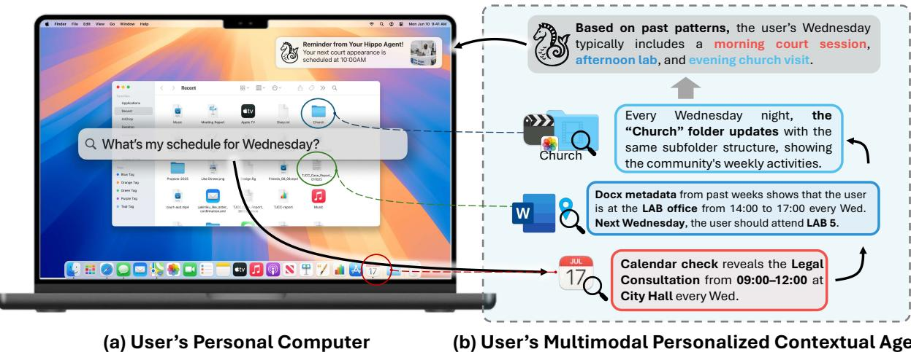  
FuOeTasmBarHiCamraet yecivealTraskh rva patohe br personalized multimodal memory of contextual agents.

The rise of large multimodal models (LMMs) and agentic systems has accelerated progress toward intelligent assistants capable of operating across perception, reasoning, and action (Xi et al., 2023; Sumers et al, 2024; Yao et al., 2025). A natural and impactful application of such systems lies in personalized digital environments (Wang et al., 2024b), where agents manage, retrieve, and reason over users' heterogeneous diitalasets (Lietal 2024b.Unlike web-basedortask-specficagents (We et al 205; Mialon et al2; Yao et al., 2022), personalized agents operating in local digital environments must navigate continuously evolving devics compose o multimodal fles, diverseformats, and long-term behavioral traces (Viana, 2019; Wu et al., 2024). Reasoning in such contexts requires integrating perception across modalities with retrieval and reflection over past interactions, paralling the role of the human hippocampus in contextual memory consolidation and recall.

However, despite recent progress in long-context reasoning and multimodal retrieval (Liu et al., 2025), there remains no standardized benchmark for evaluating an agent's ability to understand, recall, and reasonover massive, personalized, multimodal file systems. While recent efforts address document-level multimodal retrieval (Dong et al., 2025a) or personalized tool-use planning (Xiu et al., 2026), none target the scale and heterogeneity of personal computing environments. Existing evaluations predominantly target general domains suc as web automatin (Gure al 2024; Songet a, 202; Koh et l, 2024), code geneation (Yu et al 2024), document understanding (Ouyang et al., 2025), or embodied planning (Sadhu et al, 2025), while neglecting the rich information encoded in personalized file systems. Although these benchmarks have advanced perception and tool-use capabilities, they operate in isolated, goal-specific scenarios detachedfrom the user's personal context.Consequently, they fail to capture the long-term continuity, complex cross-referencing andvalidation across interrelated multimodal fles over time, and the personalized reasoning required for realistic personal computing. To fill this gap, we introduce HippoCamp, a benchmark for evaluating memory-augmented agents in realistic personal computing environments, as illustrated in Figure 1. HippoCamp constructs three representative personal computing environments derived from real-world user data. Rather than a literal three-way categorization, each environment is an archetypal instantiation of a high-dimensional profile space. Together, they expose device-scale file-system challenges such as deep hierarchical organization, heterogeneous longtail file formats, and cross-modal evidence dependencies. The benchmark encompasses two representative task categories that mirror authentic computer usage: factual retention and profling. Each task demands agnicbehaviors integrating searh, pereption,andreasning, enabling ystematicevluation  persaliz multimodal intelligence. In summary, HippoCamp makes three main contributions: 1. Realistic personal computing environments. We faithfully simulate user-level digital ecosystems by constructing three distinct, fle-intensive profiles. This design captures long-term continuity, idiosyncratic folder structures, and the interconnected nature of real-world personal file systems. 2. Device-scale corpus with dense supervision. We provide a massive dataset comprising over 2000 heterogeneous files (totaling 42.4 GB), accompanied by 581 user-need-driven, evidence-grounded queries. To support a rigorous evaluation of agent capabilities across varying depths and perspectives, we include 46.1K fine-grained annotations at multiple levels of granularity. 3Comprehensive agent capability evaluation. We formulate a rigorous question-answering benchmark built on two core task categories: factual retention: retrieving specific information, and profiling: inferring user preferences. These tasks go beyond simple retrieval, requiring agents to execute multi-step behaviors that seamlessly integrate file-system search, multimodal evidence perception, and personalized reasoning across interrelated files over time.

# 2 Related Work

Table 1 Comparison of Benchmarks Related to Multimodal Context and Agentic Reasoning. For modalities, $\mathrm { T }$ denotes text,  denotes images, denotes documents, $\pmb { \bigcirc }$ denotes videos, and $\blacktriangleleft$ denotes audio. HippoCamp introduces a pernalizultmoaleystemvment hat spans al theemodalitabln cossleancrosa reasoning tasks at real-world scale.

<table><tr><td>Benchmark</td><td>Source</td><td>Modalities</td><td></td><td>#Samples Multimodal User Profile File-System</td><td></td><td></td></tr><tr><td>HotpotQA (Yang et al., 2018) / KILT (Petroni et al., 2021)</td><td>Wikipedia</td><td>T</td><td>∼100k</td><td>X</td><td>X</td><td>X</td></tr><tr><td>BrowseComp (Wei et al., 2025)</td><td>Web</td><td>T</td><td>1,266</td><td>X</td><td>X</td><td>X</td></tr><tr><td>MetaTool (Huang et al., 2024) / MINT (Wang et al., 2024a)</td><td>Web + Tools</td><td>T (w/ code)</td><td>∼3k−20k</td><td></td><td></td><td></td></tr><tr><td>WebQA (Chang and Bisk, 2022)</td><td>Web</td><td>T</td><td>7.5k</td><td></td><td></td><td></td></tr><tr><td>GAIA (Mialon et al., 2024) / WebShop (Yao et al., 2022) / PaperBench (Starace et al., 2025)</td><td>Web</td><td>T</td><td>∼1k−10k</td><td></td><td></td><td></td></tr><tr><td>MultiModalQA (Talmor et al., 2021)</td><td>Web</td><td>T M (Table-Only)</td><td>29k</td><td></td><td></td><td>X</td></tr><tr><td>MMDocRAG (Dong et al., 2025b) / M3DocRAG (Cho et al., 2024)</td><td>Documents</td><td>T</td><td>∼4k−10k</td><td></td><td></td><td></td></tr><tr><td>LoCoMo (Maharana et al., 2024)†</td><td>Personal Lifelog</td><td>T</td><td>300</td><td></td><td></td><td></td></tr><tr><td>EgoLifeQA (Yang et al., 2025) / Ego-R1-Bench (Tian et al., 2025)‡</td><td>Personal Lifelog</td><td>TO)</td><td>∼5k</td><td></td><td></td><td></td></tr><tr><td>HippoCamp (Ours)</td><td>Personal File SystemsT </td><td></td><td>581 QAs</td><td></td><td></td><td></td></tr></table>

† LoCoMo contains 300 text-only personal questions; ‡ EgoLifeQA/Ego-R1-Bench provides approximately $2 0 \%$ personalized samples, and is limited to videos/audio single-modal context.

Benchmarks for Multimodal Contextual Agents. Contextual retrieval benchmarks span from text-centric datasets (Yang et al., 2018; Petroni et al., 2021; Tang and Yang, 2024; Friel et al., 2025) to multimodal and agentic settings driven by richer evidence needs. MultimodalQA (Talmor et al., 2021) supports crossmodal grounding over text, images, and tables, while WebQA (Chang and Bisk, 2022) studies retrieval from distractor-containing candidate pools. Document benchmarks such as M3DocRAG (Cho et al., 2024) and MMDocRAG (Dong et al., 2025b) emphasize fine-grained selection under noise. Agentic benchmarks move from static corpora to interactive environments: WebShop (Yao et al., 2022) and PaperBench (Starace et al, 2025) evaluate goal-driven action sequences, and MetaTool (Huang et al., 2024), MINT (Wang et al., 2024a), InfeepSeek (Xi et al., 2025), and BrowseComp (Wei et al., 2025) probe tool use, multi-turn reasoning, and web exploration. However, these benchmarks largely assume public data and fully observable states, and thus do not evaluate long-lived personalized context or heterogeneous multimodal evidence distributed across user devices. Real personal environments contain identity cues, behavioral histories, and longitudinal records across diverse file types—signals largely absent from current evaluations.

Agentic Systems with Memory and Personalization.Agentic ystems perform multi-step workfows in interactive environments and thus require context integration; memory is central to long-horizon coherence. Prior work explores (i) trajectory-based memory, e.g., internalizing experience via finetuning or reinforcement learning (Zhang et al., 2024; Fu et al, 2025); (i) retrieval-based memory, e.g., storing and retrieving past episdes r tool tracs (Zhaoet al, 2024; Luoe al., 025); and ii skill distillation, compressig reuable skills into inference-time modules (Wang et al., 2025; Zheng et al., 2025). Other lines build structured episodic/semantic memories to organize interaction histories and improve multi-step reliability (Zhange al, 2025a; Yang et al., 2025). Building on these mechanisms, personalization operationalizes memory at the user level: PersonaAgent (Zhang et al., 2025b) maintains user-specific episodic/semantic records, while recent systems learn user knowledgegraphs, preference embeddings, or long-term histories to adapt without parameter updates (Wang et al., 2024b; Lee et al, 2025). Complementarily, Telemem (Chen et al., 2026) consolidates user-grounded interactions into narrative and multimodal episodic memories, enabling personalized retrieval over dialogue and visual experience. However, existing evaluations are small-scale or synthetic and typically retricted to narrow modalities (e.g., text/webpages), failng to refect theheterogeneous and evolving context of personal computing where evidence spans al five modalities, motivating benchmarks that match the scale and diversity of user file ecosystems.

Multimodal Contextual Retrieval. Retrieval-augmented generation (RAG) uses retrieval as external memory to surface evidence beyond the context window, while reasoning-centric models such as DeepSeek-R1 (Guo et al, 2025a) refine intermediate traces and invoke tools during multi-step inference. Multimodal RAG generalizes text retrieval to heterogeneous evidence: document systems (Cho et al., 2024; Dong et al., 2025a) encode layout and mixed textimage content for fine-grained grounding; imagetext frameworks (Zhan et al., 2025; Gu et al., 2025b) fuse visual and textual features for cross-modal alignment; and video methods such as VideoRAG (Ren et al., 2025) index temporal clips for long-range visual retrieval. Despite broader coverage, top $k$ retrieval remains brittle when cues are dispersed across many files or long time spans. Reasoning models partially mitigate this by generating intermediate traces to coordinate search: Search-R1 (Jin et al, 2025) and MMSearch-R1 (Wu et al., 2025) iteratively refine queries, and Ego-R1 (Tian et al., 2025) extends this paradigm to egocentric streams. However, both RAG and reasoning models primarily assume public or task-bounded retrieval spaces, rather than the personalized, long-lived multimodal context of real user ecosystems. Our benchmark targets this setting directly (see Table 1), evaluating models where relevant signlsaccumulateacross all modalitis, and where both retrievl and reasoning must operate within authenic, user-specific digital environments.

# 3 The HippoCamp Benchmark

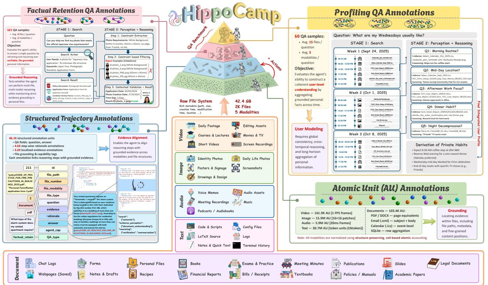  
u  u uvey herurosu cross-modal synthesis of multiple grounded facts into coherent user-level inference.

HippoCamp is a benchmark for evaluating memory-augmented agents in realistic, device-resident personal file systems It models personal computing as amultimodal, long-tailiformation space in which everyday artiacts anue ecor ani  le-ysm ruur toral medatWithh , we formulate personalized file understanding as open-ended, evidence-grounded question answering. Rather than serving as a dataset overview, Figure 2 specifies the benchmark's supervision hierarchy: it organizes annotation from low-level, localized evidence and action traces to structured trajectories and task-level evaluation, with increasing abstraction toward user-level memory. This hierarchy clarifies how HippoCamp supports diagnosis at multiple granularities, from whether an agent can localize evidence in individual fles to whether it can compose grounded intermediate steps into coherent answers over long-horizon contexts. Within this structure, we define two task types with increasingaggregation demands. Factual retention requres retrievin and reasoning ver veriable fe-roundd acts, whers profing sit at the top of the hiery, requiring agents to synthesize multiple grounded facts across time into coherent user-level inferences such as preferences, behavioral patterns, scheduling information, retrospective reflections, and workflows. Solving both tasks depends on three coupled capabilities: search to locate relevant files in a large heterogeneous system, perception to interpret multimodal contents, and reasoning to integrate cross-file, cross-temporal evidence into accurate, context-aware answers.

# 3.1 Dataset Construction # (c) Profile C: Victoria Anne Clarke

  
Fure 3Archetypaluser profiles inHipoamp.ach prol nstantiates stinc peroal-devievi carusn pai contents, together with factual retention and profiling QA examples for (a) Bei, (b) Adam, and (c) Victoria.

# Source.

HippoCamp is derived from interviews with $1 0 0 +$ participants sampled to reflect general personal-computing setisDuri recritmet, wapl sricmuistagesourelectin retaiiycndidates whosle systems exhibit stable behavioral regularities and evidence-complete long-horizon personal traces that support auditable user-levelnferencevicross-lereferences.We then aggregate the selected participants'flesino coherent archetypal profles by matchingle-type/modalitydistributions and high-levelorganizational patterns while spanning diverse demographic, socio-economic, professional, and lifestyle dimensions. These aggregated collections are then condensed into three distinct and representative profles, each assigned semantic attributes such as name and age. The resulting profiles(a) Bei Weiwei, (b) Adam Turner and (c) Victoria Anne Clarke, each highlight different facets of personal computing: Profle A represents a student and content-creator context, Profle Ba legal-executive environment, and Profile Ca senior-financial-analyst setting (see Figure 3 for detailed specifications). To preserve coherence, we screen for temporal and semantic conflicts and apply minimal edits only when unavoidable; we further remove system-generated, non-user artifacts and anonymize sensitive identifiers using consistent pseudonyms, producing an unindexed "haystack" fle system suitable for

  
Figure 4 Benchmark overview.(a) Data collection and humanLLM collaborativ annotation pipeline for grounded terulskua capability labels over search, perception, and reasoning.

# Annotation.

As shown in Figure 4(a), we annotate QA with a hybrid pipeline that combines expert-driven manual authoring and LLM-assisted synthesis. Domain-aware annotators, drawn from the contributor groups underlying each archetypal profle, create manual questions that are explicitly user-driven, grounded in their own fles and routines and reflective of authentic personal-computing needs. In parallel, proprietary LLMs (Comanici et al., 2025; PBC, 2025; OpenAI, 2025a) generate synthetic candidates conditioned on contextual metadata (file paths, timestamps, and directory hierarchies) to improve coverage and balance modality and evidence distributions. All candidates are then consolidated by human annotators, who rigorously review, edit, and filter them into a final curated question set that is meaningful, factually corect, and faithfully grounded in the personal context. We further enforce diversity through intent-level deduplication and pattern-level de-duplication, while balancing modality combinations and evidence-set sizes across the collection. For each retied question, aotators construc interediate supervisionby sructuring it int a rounded trajeoy including a step-wise reasoning trace, explicit file-grounded evidence, and agent capability labels.

# 3.2 Tasks

Each QA pair is annotated as a structured trajectory stored as a JSON record, including the question and ground-trut answer,a step-wise rationale, andfne-rained localized evidence with atomic pointers intole content (e.g., page indices, table cels, or textual spans), together with fle-level grounding metadata. Each trajectory is further labeled with agent capability tags (Figure 4(c)) that decompose the required behaviors into three tages: search (system-level navigation, semantic retrieval), perception (fle-system understanding, moality-speciic understanding and grounding for text, documents, images, videos, and audio), and reasoning (basic inference, computation, summarization, and verification). All trajectories are authored by human annotators following a minimalist annotation principle that explicitly links these stages, enabling interpretable diagnosis of multimodal agent behavior. This schema supports fine-grained capability analysis, evidence-level benchmarking, and evaluation of long-horizon, multi-step reasoning in realistic personalized fle ecosystems.

Profiling. The profiling tasks evaluate whether an agent can construct a coherent user-level model from device-resident fles by aggregating grounded personal facts across time. Each querytargets high-level persona attributes, including preferences and routines, scheduling constraints, retrospective accounts, and workfow pats pange, work, and studyUnlik siglact quers, rolng require synthesiziheterogenous cues from multimodal content, fle-system organization, and temporal regularities, and producing a globally consistent, actionable response. For example, "For the afternoon on October 27, 2025, schedule a good plan for me." tests whether the agent can integrate evidence from relevant fles (e.g., calendars and communications) with historical routines and stated preferences to produce a feasible, personalized plan consistent with existing commitments. Factual retention. The factual retention tasks focus on evaluating an agent's capability to rereve, comprehenandreason verfactualormatioistribute acrs multimodal les withier' device. Unlike conventional open-domain QA, these tasks are grounded in user-specific, device-scale contexts, requiring the agent to accurately locate relevant fles, interpret heterogeneous content types, and integrate information to produce precise, context-aware answers. For example, a query such as "I have notes on the maximum fow problem. Which class is the notes record from, and what is the course duration?" tests whether the agent can identify, understand, and reason over content stored in diverse formats. Solving such tasks does not only require fine-grained retrieval and multimodal comprehension but also long-horizon contextual reasoning across temporally and semantically related files.

# 4 Experiment

# 4.1 Experimental Setup

All evaluations are conducted in a controlled, profile-isolated setting.For each test case, a method is given acce only to the corresponding profile's fle system in HippoCamp, with no external retrieval web access, r auxiliary side-channel metadata. Agents receive the natural-language query as input and may freely explore the environment under full access permissions, using their native mechanisms to search, perceive, and reason over the complete multimodal file corpus. TableMain results on HippoCamp across user profies.We evaluate reresentativeMLMs an agentmethoo pnganactltentin, rporting F1anaccurayAcc o ac arhetypal pro nd theoveral ege. Values are percentages (one decimal; $\%$ omitted). Best is highlighted; second-best is underlined.   

<table><tr><td rowspan="3">Method</td><td colspan="6">Profiling</td><td colspan="8">Factual Retention</td></tr><tr><td colspan="2">(a) Bei</td><td colspan="2">(b) Adam</td><td colspan="2">(c) Victoria</td><td>Overall</td><td>(a) Bei</td><td>b) Adam</td><td></td><td></td><td>(c) Victoria</td><td></td><td></td><td>Overall</td></tr><tr><td>F1</td><td>Acc</td><td>F1</td><td>Acc F1</td><td>Acc</td><td>F1</td><td>Acc</td><td>F1</td><td>Acc</td><td>F1</td><td>Acc</td><td>F1</td><td>Acc</td><td>F1</td><td>Acc</td></tr><tr><td></td><td colspan="9">RAG Methods</td><td></td><td></td><td></td><td></td><td></td></tr><tr><td>Standard RAG (Lewis et al., 2020)</td><td>13.7</td><td>10.0 20.8</td><td>35.0</td><td>20.6</td><td>35.0</td><td>18.4</td><td>26.7</td><td>29.7</td><td>24.2</td><td>39.7</td><td>42.7</td><td>20.5</td><td>23.6</td><td>30.0</td><td>30.2</td></tr><tr><td>Self RAG (Asai et al., 2024)</td><td>13.8 5.0</td><td>16.0</td><td></td><td>25.0 15.9</td><td>0.0</td><td>15.2</td><td>10.0</td><td>33.9</td><td>26.1</td><td>41.5</td><td>38.8</td><td>20.2</td><td>17.7</td><td>31.9</td><td>27.5</td></tr><tr><td colspan="10">Search Agent Methods 11.8</td><td colspan="7"></td></tr><tr><td>ReAct (Yao et al., 2023) (Qwen3-30B-A3B (Bai et al., 2025))</td><td>5.5</td><td>5.6</td><td>17.8</td><td>25.0</td><td>12.2</td><td>10.0</td><td>13.5</td><td>42.4</td><td>26.1</td><td>60.4</td><td>37.9</td><td>26.5</td><td>21.7</td><td>43.1</td><td></td><td>28.5</td></tr><tr><td>ReAct (Yao et al., 2023) (Gemini-2.5-flash (Comanici et al., 2025)) Search-R1 (Jin et al., 2025)</td><td>13.7</td><td>10.0</td><td>21.4</td><td>25.0 20.5</td><td>9.4</td><td>25.0 0.0</td><td>18.5 20.0 10.8 5.0</td><td>26.9 38.7</td><td>24.2 23.7</td><td>35.7</td><td>55.3</td><td>26.4</td><td>17.0</td><td>36.4 24.1</td><td>26.5 41.0</td><td>38.7 25.3</td></tr><tr><td colspan="10">6.6 0.0 16.5 15.0</td><td colspan="7">58.0 28.2</td></tr><tr><td>Autonomous Agent Systems</td><td></td><td></td><td></td><td></td><td></td><td></td><td></td><td></td><td></td><td></td><td></td><td></td><td></td><td></td><td></td><td></td></tr><tr><td>Terminal Agent (Qwen3-VL-8B-Instruct (Bai et al., 2025)) Terminal Agent (Gemini-2.5-flash (Comanici et al., 2025))</td><td>5.4</td><td>0.0</td><td>16.3</td><td>25.0</td><td>13.2</td><td>25.0</td><td>11.6</td><td>16.7</td><td>14.6 10.7</td><td></td><td>21.6</td><td>13.6</td><td>15.7</td><td>10.3</td><td>17.3</td><td>11.5</td></tr><tr><td></td><td>9.0</td><td>5.0</td><td>17.0</td><td>45.0</td><td>19.0</td><td>25.0</td><td>15.0</td><td>25.0</td><td>21.8 18.1</td><td>33.1</td><td></td><td>31.1</td><td>24.4</td><td>20.7</td><td>26.4</td><td>23.3</td></tr><tr><td>Terminal Agent (GPT-5.2 (OpenAI, 2025b))</td><td>8.1</td><td>15.0</td><td>14.9</td><td>45.0</td><td>10.5</td><td>30.0</td><td>11.1</td><td>30.0</td><td>13.0 29.8</td><td></td><td>31.6</td><td>59.2</td><td>29.0</td><td>55.7</td><td>24.6</td><td>48.2</td></tr><tr><td>ChatGPT Agent Mode (OpenAI et al., 2024; OpenAI, 2025a)</td><td></td><td>23.8 35.0</td><td>22.7</td><td>55.0</td><td>16.7</td><td>55.0</td><td>21.0 48.3</td><td></td><td>20.4</td><td>31.2</td><td>56.2</td><td>90.3</td><td>29.3</td><td>67.0</td><td>35.3</td><td>62.8</td></tr></table>

All results in Table 2 follow a max-budget protocol, allowing each method to run up to its predefined step or token without artificial wal-clock constraints. Retrieval-augmented (RAG) baselines index the full fle corpus usi their built-i encoders, followed by retrieval and a single-pass generation step.All fles are reformated as required by each method to ensure fair comparison.Search agent baselines integrate retrieval with iterative reasoning and tool use. They alternate between search actions and evidence-conditioned generation over multiple steps. Autonomous agent baselines are evaluated either in a Dockerized Ubuntu environment that replicates the full fle system or in non-vacuum product-grade agent modes. The Docker setup exposes native system capabilities (e.g., Linux terminal and Python execution), while model-based methods access files through standardized APIs with internal modality conversion. In contrast, product-grade agent modes access and searc thecnected urtroug thestandarusernterfaces.Noaditinal spervision, extal plug-ins, or manually curated signals are introduced. To ensure comparability, all systems operate over the same underlying file structures and use their default configurations.

# 4.2 Baseline Methods

RAG methods. Standard RAG (Lewis et al., 2020), Self-RAG (Asai et al., 2024) represent classical retrieval and generation pipelines. They depend on shallow semantic retrieval over multimodal embedings and assume the relevant evidence wil be surfaced in a candidate set. These methods lack multi-step inspection, adaptive search, cross-fle synthesis, or persistent memory-capabilities that are essential for HippoCamp. Search Agent methos Search-agent baselines embed retrieval within an explicit multi-turn searchreason loop. Following the ReAct framework (Yao et al., 2023), we instantiate ReAct with both Gemini 2.5 Flash (Comanici et al., 2025) and Qwen3-30B-A3B (Bai et al., 2025) models, where the system alternates between reasoning steps and explicit search actions, conditioning subsequent generation on retrieved observations. Search-R1 (Jin e al 2025) similarly interleaves reasoning and searc through structured tags, enabling dynamic evidence acquisition across multiple steps. Autonomous Agent methods. We evaluate Docker-based autonomous agents instantiated with multiple model backends, including Gemini 2.5 Flash (Comanici et al., 2025), ChatGPT 5.2 (OpenAI, 2025b), Claude Sonnet 4.5 (PBC, 2025), and Qwen3-VL-8B-Instruct (Bai et al., 2025), alongside proprietary product-grade agent modes. In the main table, we report ChatGPT Agent Mode (OpenAI, 2025a; OpenAI et al., 2024); Claude-based agent (PBC, 2025) settings are discussed separately due to severe file system and long-document processing failures. These systems operate through recursive tool-use: issuing queries, browsing file previews, interpreting intermediate results, and updating hypotheses. They represent the most advanced publicly accessible paradigms for grounded reasoning, though their tool policies and architectural assumptions differ significantly.

# 4.3 Evaluation Protocol

To rigorously evaluate agent performance on personalized, multimodal fle management, HippoCamp employs aund evaluation protool covering two coredimensions:question answering qualy and evidence rerival accuracy. Each dimension is assessed using both automatic metrics and large language model (LLM)-based juetsueebilyos al tasksslltrate Figue, all methos areispatche common evaluator interface under profile-local access constraints, upporting three execution regimes:native retrieval, vacuum-Docker terminal agents, and hosted commercial agent modes. Full details on execution regimes, budgets, and robustness checks are provided in Section D. Question answering evaluation. For al tasks, we adopt an LLM-as-a-judge (Li et al., 2024a) paradigm. A strong reference LLM 1 is prompted with the question, ground-truth answer, and the model's generated response, and instructed to produce a binary correctness judgment (yes/no) together with a quality score on a standardized 05 scale. The prompt explicitly instructs the judge to consider factual alignment, reasoning soundness, and contextual personalization. We report overall accuracy, measured as the fraction of responses vatrask el qualiyusing recall hit rateand F1 score based nhe groun-ruth evidence fle et.F1 captures the balance betwrerivilevant  navoiisu n whilrealmeasurhegent bileny all necessary evidence supporting correct reasoning.

# 4.4 Experimental Results

Table 2 reports results across all profles and both task types.Overal a large gap persists between current methods and human experts, exposing fundamental weaknesses in both RAG pipelines and agentic systems for long-horizon personalized file reasoning. These results motivate HippoCamp as a diagnostic benchmark that surfaces failures in multimodal retrieval, hierarchical file understanding, and evidence-grounded multi-step reasoning, and they suggest the need for stronger indexing, persistent memory, and verification-centric agent architectures. We next analyze performance by method family. RAG methods. RAG pipelines perform poorly overall, especially on profiling, where performance remains low (e.g., Standard RAG: 18.4 F1 / 26.7 Acc overal; Self-RAG: 15.2 F1 / 10.0 Acc overall). Retrieval is brittle and frequently returns shalloworirrelevant fles, whilegeneration lacks robust cross-fle aggregation.This is most evident on Profile (c) Victoria, where Self-RAG fails to produce any correct profiling answer (0.0 Acc).

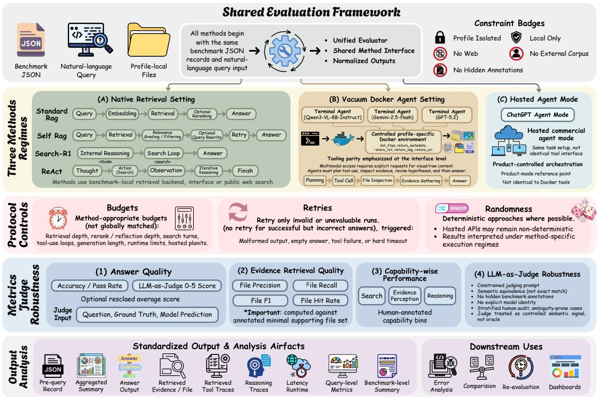  
Fa hal )aveDoc agents, and C) hosted commercial agent modes. The framework standardizes control policies, metriccomputation, and output artifacts for downstream analysis.

Factual retention improves only modestly (30.031.9 overal F1), largely limited to cases resembling direct lookup; models still often overfit to filenames or directory strings rather than grounding in file content. Searh agent methods. Iterative searc agents improvefactual retention by performing multi-step exploration and fle inspection, achieving up to 55.3 Acc on Profile (b) Adam (ReAct with Gemini-2.5-fash). Search-R1 attains strong factual-retention F1 on document-heavy profiles (e.g., 58.0 on Profile (b) Adam), suggesting advantages in dense document environments. However, these gains do not transfer to profiling: Search-R1 achieves only 10.8 overall profiling F1 with 5.0 Acc and yields 0.0 Acc on Profiles (a) and (c), indicating that locating candidate fles alone is insufficient for synthesizing longitudinal user-level inferences.

Autonomous Agent Systems. We further evaluate autonomous agents in a controlled vacuum Docker environment and in native (non-vacuum) agent modes. Overal, these systems yield only moderate gains over search-based agents and remain far below human performance. ChatGPT Agent Mode performs best, reaching $5 5 . 0 \%$ profiling acuracy on Profiles (b) Adam and (c) Victoria and achieving the strongest overall scores (profling: 21.0 F1 / 48.3 Acc; factual retention: 35.3 F1 / 62.8 Acc in Table 2). Despite these improvements, substantial errors persist. In practice, the system is computationally expensive (often requiring 1015 minutes per query) and operationally unstable, frequently producing incomplee outputs or mssing fle references that necessitatere-execution, therebyincreasing run-to-run variance an making observed performance sensitive o execution instability.Claude Sonnet 4.5 is omitted in the vacuum setting due to unreliable long-document processing under its API constraints; in native agent mode it cannot consistently interface with the local fle system, leading to near-zero performance.Common failures include imprecise le localization and inconsistent metadata interpretation, with more frequent hallucinated file references or unsupported metadata in the vacuum setting, indicating brittle grounding under constrained access.

# 5 Analysis

Our main results (Table 2) and capability decomposition (Table 3) converge on a single overarching finding: the dominant failure source in HippoCamp lies not in evidence retrieval per se, but in the post-retrieval pipeline—methods frequently locate partially relevant files yet fail to discriminate, ground, integrate, and verify them under profile-local, cross-modal, and temporally extended conditions. We unpack this finding along three axes: metric decoupling and bottleneck localization (Section 5.1), a canonical failure pipeline that unifies observed error modes (Section 5.2), and concrete design principles for next-generation fle-system agents (Section 5.3).

# 5.1 Capability-wise Decomposition

T al o (Acc) aggregated by agent capability labels, decomposed into search, perception, and reasoning, for profilng and factual retention as well as the overall average. Values are percentages (one decimal; $\%$ omitted). Best is highlighted; second-best is underlined.

<table><tr><td rowspan="3">Method</td><td colspan="6">Profiling</td><td colspan="9">Factual Retention</td></tr><tr><td>Search</td><td></td><td></td><td>Perception</td><td>Reasoning</td><td></td><td>Overall</td><td>Search</td><td></td><td>Perception</td><td></td><td>Reasoning</td><td></td><td></td><td>Overall</td></tr><tr><td>F1</td><td>Acc</td><td>F1</td><td>Acc</td><td>F1</td><td>Acc</td><td>F1 Acc</td><td>F1</td><td>Acc</td><td>F1</td><td>Acc</td><td>F1</td><td></td><td>Acc F1</td><td>Acc</td></tr><tr><td></td><td colspan="9">RAG Methods</td><td></td><td></td><td></td><td></td><td></td><td></td><td></td></tr><tr><td>Standard RAG (Lewis et al., 2020)</td><td>26.4</td><td>26.2</td><td>21.8</td><td>13.8</td><td>26.7 25.5</td><td></td><td>25.0 21.8</td><td>19.0 15.2</td><td>26.2 8.9</td><td>21.1</td><td>28.7</td><td>13.0</td><td>19.1</td><td>17.7</td><td></td><td>24.7</td></tr><tr><td>Self RAG (Asai et al., 2024)</td><td colspan="10">27.8 23.1 23.1</td><td></td><td>12.2</td><td>10.7</td><td>7.0</td><td>14.1</td><td>9.4</td></tr><tr><td></td><td colspan="10">Search Agent Methods</td><td></td><td></td><td></td><td></td><td></td><td></td></tr><tr><td>ReAct (Yao et al., 2023) (Qwen3-30B-A3B (Bai et al., 2025))</td><td colspan="10">36.3 26.1 27.9 16.7</td><td>18.7</td><td>8.6</td><td></td><td>10.6</td><td>11.7</td><td>14.2</td></tr><tr><td>ReAct (Yao et al., 2023) (Gemini-2.5-flash (Comanici et al., 2025)) Search-R1 (Jin et al., 2025)</td><td>23.5</td><td>34.9</td><td>20.5</td><td>36.3 20.4 15.7</td><td>23.4 33.0 35.1 25.8</td><td>33.5 22.5 34.2</td><td>29.4 22.1</td><td>19.4 10.2</td><td>19.1 3.8</td><td>21.3 12.3</td><td>23.4</td><td>13.2</td><td></td><td>14.8 18.0 10.1</td><td>19.1</td><td>5.0</td></tr><tr><td></td><td colspan="10">34.8 24.9 32.8</td><td colspan="3">7.2 7.8</td><td colspan="3">3.9</td></tr><tr><td></td><td></td><td>Autonomous Agent Systems</td><td></td><td></td><td></td><td></td><td></td><td></td><td></td><td></td><td></td><td></td><td></td><td></td><td></td><td></td></tr><tr><td>Terminal Agent (Qwen3-VL-8B-Instruct (Bai et al., 2025)) Terminal Agent (Gemini-2.5-flash (Comanici et al., 2025))</td><td>15.8</td><td>11.1</td><td>14.6</td><td>5.7</td><td>16.9 11.4</td><td>15.8</td><td>9.4</td><td>12.2 18.6</td><td></td><td>14.0</td><td>24.2</td><td>8.1</td><td></td><td>12.2</td><td>11.4</td><td>18.3 21.7</td></tr><tr><td></td><td>24.5</td><td>21.0</td><td>26.9</td><td>13.7</td><td>25.2 21.1</td><td></td><td>25.5 18.6</td><td>14.9</td><td>23.3</td><td>14.4 10.2</td><td>24.7</td><td>12.2</td><td></td><td>17.2</td><td>13.8</td><td>31.1</td></tr><tr><td>Terminal Agent (GPT-5.2 (OpenAI, 2025b)) ChatGPT Agent Mode (OpenAI et al., 2024; OpenAI, 2025a)</td><td>23.6</td><td>46.3</td><td>15.4</td><td>27.3</td><td>22.6</td><td>44.1 20.5 24.7</td><td>39.2 46.9</td><td>10.0</td><td>27.2 19.5 49.1</td><td>17.3</td><td>29.7</td><td>55.5 30.4</td><td>15.5</td><td>36.4 33.8</td><td>11.9</td><td>46.1</td></tr><tr><td></td><td>28.9</td><td>56.5</td><td>15.1</td><td>28.5</td><td>30.2</td><td>55.8</td><td></td><td></td><td></td><td></td><td></td><td></td><td></td><td></td><td>22.4</td><td></td></tr></table>

PcT accuracys systematically lowr thanfactualretention—and the gap widens for searc-centricmethods.Search-R1 drops from $2 5 . 3 \%$ factual accuracy to $5 . 0 \%$ on profiling, a five-fold decline. ReAct (Qwen3) shows a similar pattern: $2 8 . 5 \%$ factual versus $1 3 . 5 \%$ profiling. ChatGPT Agent Mode, by contrast, narrows the gap to $6 2 . 8 \%$ versus $4 8 . 3 \%$ . Factual retention rewards localized, file-grounded lookup; profiling demands weak-signal aggregation across temporally extended traces, referent disambiguation among co-occurring entities, and longitudinal abstraction into stable user-level patterns.Methods built around retrieval strength alone lack this capability composition. Poul v  ual ry  ey uiy n consistently across profiles (Table 2). Adam's document-centric legal environment yields the highest scores: ChatGPT Agent Mode reaches $9 0 . 3 \%$ factual accuracy and $5 5 . 0 \%$ profiling accuracy. Victoria's finance environment falls in the middle. Bei's socially entangled, media-rich college environment is hardest: the same system drops to $3 1 . 2 \%$ factual and $3 5 . 0 \%$ profiling. This gradient holds across method families. The underlying factor is not domain complexity but how explicitly personal structure is externalized. Structured environments with clear role boundaries and formal documents are easier; informal, multi-entity environments amplify referential ambiguity and weaken the signal-to-noise ratio of individual traces. Rerival quality ananswer qualitydecouple intwo disticmode.Tablereveal steaticive between F1 and accuracy. When F1 exceeds accuracy—as with ReAct (Qwen3) on factual retention (43.1% F1 vS. $2 8 . 5 \%$ Acc)—the method retrieves relevant files but fails to convert them into correct answers, indicating a breakdown in evidence discrimination or synthesis. When accuracy exceeds F1—as with Terminal Agent GPT-5.2 on factual retention ( $2 4 . 6 \%$ F1 vs. $4 8 . 2 \%$ Acc)—the method produces correct answers without retrieving the ground-truth evidence fles, suggesting reliance on parametricknowledge rather than grounded file evidence. Both modes confirm that search competence and answer quality are separable. To localize where in the agent pipeline these gaps originate, we turn to the capability-wise decomposition in Table 3. Searc isnecessary but not decisiveSearch-centricagents achive thehighest retrieval F1on profling:ReAct (Qwen3) reaches $3 6 . 3 \%$ and Search-R1 reaches $3 4 . 8 \%$ . Their overall profiling accuracy, however, lags far behind $2 2 . 2 \%$ and $2 2 . 1 \%$ , respectively. ChatGPT Agent Mode inverts this pattern: a lower search F1 of $2 8 . 9 \%$ but the highest accuracy of $5 6 . 5 \%$ .Locating candidate files is a prerequisite, not a solution. Perception is the most universal bottleneck. Across all method families, perception accuracy on profling is uniformly low, ranging from $1 3 . 2 \%$ (Self-RAG) to $2 8 . 5 \%$ (ChatGPT Agent Mode). Even the strongest system achieves perception accuracy roughly half of its search accuracy ( $2 8 . 5 \%$ vS. $5 6 . 5 \%$ ). This gap reflects more than OCR or vision failures. It captures the broader diffculty of converting heterogeneous fle content—PDFs, calendar entries, photos, voice memos—into evidence units that can support downstream reasoning. Reasnig qualitys contingent n prirevidencediscrinatio.Reasonisotandependen apabily; i inherits errors from earlier stages. Terminal Agent (GPT-5.2) achieves $4 4 . 1 \%$ profiling reasoning accuracy despite only $2 7 . 3 \%$ perception accuracy, raising the possibility that some correct answers stem from parametric knowledge rather than grounded evidence—consistent with the Acc-exceeds-F1 pattern observed in Table 2. Search-R1 shows the converse: strong retrieval signals $3 5 . 1 \%$ reasoning F1) but weak answer commitment $( 2 5 . 8 \%$ accuracy). Strong reasoning cannot compensate for weak evidence selection, and high retrieval F1 does not guarantee that the evidence reaching the reasoning stage is correct.

# 5.2 Systematic Failure Analysis

The capability gaps identied above anifest s cncreteerror patterns inagent outputsFigure ilsrate these on a representative profiling query—"Based on my records, what do I usually do each week for my health?"—whose ground truth requires cross-modal synthesis over six file types (calendar events, running logs, photos, voice memos, text notes, and emails). These cases are not isolated anecdotes. They form a recurring failure pipeline that progresses through five stages:off-target retrieval, grounding avoidance, evidencehallucination, entity misbinding, and missingverification. Different methods break at different stages, which explains why their capability profiles diverge even when overall accuracy is similar. Retrieval mismatch. RAG-based systems often fail to distinguish user-relevant personal files from semantically related but contextually irrelevant documents. In the case study, Standard RAG has retrieved financial reports, in our case, WALMART _2017_10K.pdf, and concludes that no relevant evidence exists, consistent with embedding-level ambiguity from keywordoverlap (e.g., "health" in disclosures). This mismatch cascades to weak downstream grounding: Standard RAG attains $2 6 . 4 \%$ search F1 but only $1 3 . 8 \%$ perception accuracy on profiling as shown in Table 3. Self-RAG collapses more sharply, with $0 . 0 \%$ profiling accuracy on Victoria shown Table  indicating that e-refection canno recoverfrom of-target initial rerievalThis s the earlst ailure pointinthe pipeline:once the retrieval irection is wrongal downstream stages inhert the error. Grounding avoidance. Even when retrieval surfaces partially relevant candidates, the pipeline can fail at the evidence commitment stage. Reasoning-centric agents locate candidates yet avoid committing to evidencegrounded answers. In the representative example, Search-R1 defaults to generic advice despite relevant health files being present. Quantitatively, this appears as a pronounced F1-accuracy gap: Search-R1 achieves $3 4 . 2 \%$ profiling F1 in Table 3 but only $5 . 0 \%$ profiling accuracy in Table 2, including $0 . 0 \%$ accuracy on Bei and Victoria despite $7 \mathrm { - } 1 7 \%$ profiling F1. A plausible explanation is that, under distribution shift in personal files, the model favors "safe" parametric responses over risky grounding in unfamiliar evidence. Hard evidence hallucination. A more dangerous grounding failure occurs when agents fabricate evidence rather than abstaining. Terminal-based agents operating in sandboxed environments frequently invent fle paths or metadata. The case study shows Terminal Agent with GPT-5.2 as backbone inventing health fles, in our case, Health_Journal_ $2 0 2 4 \_ \mathrm { Q 4 . t x t }$ , and then claiming it cannot open them, producing an internally consistent but fabricated evidence chain. Capability scores support this interpretation: the agent shows high search accuracy $( 4 6 . 3 \% )$ but low perception F1 (15.4%) on profiling in Table 3, suggesting actions proceed without verifiable grounding. Its profiling accuracy exceeding F1 (30.0% vs. $1 1 . 1 \%$ in Table 2) further indicates occasional correct outputs may be driven by parametric knowledge rather than grounded file evidence.

  
Ground ro udio_No

  
across heterogeneous personal fles and modalities.Standard RAG exhibits retrievalmismatch (retrieving urelated fnandocents, Searc-R1howoavoiancgevicdepivailablevidence, Teri (GPT-5.2) triggers hard evidence hallucination (fabricated fle paths/metadata), and ChatGPT Agent Mode makes a hee oe he e whip  e strongest overall behavior.

Entitymisattribution. Even when evidence is real and relevant, binding it to the correct referent remains a distinct failure stage. The strongest system can retrieve genuine health records yet assign them to the wrong entity. ChatGPT Agent Mode locates genuine health-related records but attributes the routine to the user's pet rather than the user, exposin difculty in first-person constraint resolution when multiple entitie share the same file system. Consistently, its retrieval outpaces comprehension ( $5 6 . 5 \%$ search accuracy vs. $2 8 . 5 \%$ perception accuracy on profiling in Table 3). The effect is profile-dependent: it reaches $9 0 . 3 \%$ factual accuracy on Adam's document-centric legal profile but only $3 1 . 2 \%$ on Bei, where richer interpersonal context increases entity ambiguity in Table 2. VeatidefitNonthevaluatemethodnclude explicit nalstagheckthatexami hehe the generated answer is traceable to a minimal, coherent evidence set. The consequence is visible in the F1 accuracy gaps throughout Table 3:retrieval and reasoning F1 consistently exceed answer accuracy, indicating that errors introduced at earlier stages—misbinding, hallucination, or insuficient discrimination—propagate unchecked to the final output. Success pattern: iterative discovery. ChatGPT Agent Mode exhibits a qualitatively distinct strategy of iterativ le-systemexploration.By repeatedlystin directories and reading candidate fles it progressively refines hypotheses and can recover from early missteps, yielding the best overall performance (48.3% profling accuracy and $6 2 . 8 \%$ factual accuracy in Table 2) and the most balanced capability profile (Table 3). The gains are strongest in structured domains, reaching $5 5 . 0 \%$ profiling accuracy and $9 0 . 3 \%$ factual accuracy on Adam (Table 2), but remain limited for cross-modal profiling where signals are weaker and more heterogeneous, reaching only $3 5 . 0 \%$ profiling accuracy on Bei. Its advantage is not stronger one-shot retrieval but the ability to revisit and correct errors at multiple stages of the pipeline—recovering from off-target queries, refining evidence hypotheses, and progressively narrowing the support set.

# 5.3 Prospect: Designing the Next-Generation File-system Agent

Evaluating true personalization beyond static personas.Unlike prior benchmarks that rely onexplicit,staic personas, HippoCamp demonstrates that true personalization in local digital environments is fundamentally a multimodal, cross-fle reasoning challenge. To authentically model an individual user's digital lfe, agents must synthesize implicit behavioral signals scattered across heterogeneous fle types rather than simply retrieving explicit statements. Furthermore, they must successfully disambiguate the account holder from other surrounding entities to avoid critical misattributions, while simultaneously reasoning over the lon-term temporalcontinuity o the user's digital footprint. By requiring the longitudinal synthesis of these complex, evolving constraints, HippoCamp moves beyond generic retrieval to provide a rigorous evaluation of how well an agent can genuinely adapt to a personalized computing ecosystem. How to design a good file-system agent? The gap between human capability and agent performance (Table 3) sugests that robust le-system agents require a tighter couplingof structure interaction and verification. Concretely, agents should treat fle-system hierarchies and cross-file relations as inductive biases for search, replace one-shot retrieval with iterative information foraging guided by metadata and lightweight checks, and integrateevidence-centric verification loops that bind intermediate inferences to concrete fle paths and localized evidence to mitigate hallucinations (Figure 6). Structure-aware search. File hierarchies, temporal regularities, attachment relations, and version histories encode organizational intent that pure embedding similarity discards. Our results show that methods relying solely n semantic rerievalfrequently cnfusetopically smila but contextually relevant fles (Sectin5.). Treating fle-system structure as an inductive bias for search—rather than fattening a fles into a single vector index—can reduce off-target retrieval at the pipeline's earliest stage. Evidence narrowing before answering. The consistent gap between retrieval F1 and answer accuracy across Table  nindicateshat suracin eevant fesdes ouaticay yicornswersSearmeos achieve the highet retrieval F1 on profing yet the lowest answeraccracy Table 3, sg that broad candidate pools without subsequent evidence selection introduce noise that downstream reasoning cannot filter. Agents should form a minimal, suficient support set before generating an answer, rather than summarizing from all retrieved candidates. Profie-local entitymodeling.Persnal lesyste contain multiple co-occurring entiti—theacount holder family members, pets, colleagues—that share fles and contexts. The entity misattribution failures in Figure 6 indicate that agents must explicitly maintain and update referent modes rather than assuming alfrst-person references map to a single user. Without such modeling, correct retrieval and perception still yield wrong answers. Veatinasn explicit fial stageNoevaluatemethoicludesveration lothatrebindsel answer to localized, fle-level evidence and checks for internal contradictions. Adding such a stage would direly dres the verication defic entifed  Secion .and help cosethe ap betwen retrievl quy and answer quality.A robust fle-system agent must not only retrieve broadly and synthesize across fles, but also confirm that its response is traceable to a minimal, coherent support set.

# 6 Conclusion

This work introduces HippoCamp, a benchmark evaluating agents' ability to search, perceive, and reason ove realistic, multimodal personal fle systems. Our analysis reveals that the dominant bottleneck lies not in evidence retrieval but in the post-retrieval pipeline—evidence discrimination, multimodal grounding, entity binding, and final verification—and that profiling demands a qualitatively different capability composition from factual retention. Personalized multimodal memory remains an unsolved challenge. HippoCamp provides a rigorous foundation to diagnose these shortcomings and guide the development of next-generation personal file-system agents.

# Appendix

This appendix provides supplementary benchmark construction, annotation, task, and evaluation details: •§A details participant selection, interview protocol, archetype aggregation, privacy filtering, external augmentation, and file-system statistics.   
$\bullet$ §B presents the trajectory schema, evidence-unit design, human-in-the-loop QA pipeline, and agreement procedures. •§C expands the task taxonomy, difficulty definitions, and representative profile examples.   
$\cdot$ §D describes evaluation settings, budgets, metrics, robustness checks, and extended result summaries.

# A Dataset Construction and Profile Aggregation

# A.1 Participant Pool and Source Selection

HippoCamp is constructed from interviews with $\ 100 +$ personal-device users. This section specifies the participant screening and source-selection protocol used to form the candidate pool prior to prole aggregation. Recruitment spans varied ages, living situations, and technical backgrounds, with stratified screening over demographic, socio-economic, professional, and lifestyle dimensions to preserve diversity while maintaining comparable device-resident usage intensity. We retain only participants whose devices satisfy the following reproducible criteria: (1) File-system richness and modality coverage.The device must contain a dense, heterogeneous corpus with at least 500 user fles, covering at least4 o thefive modalitis (text, document, image, video, audio) and at least 10 distinct file extensions. () Longitudinal depth. The corpus must cover at least a 3-month span of creation or modification activity, and the participant must report sustained ful-time study or professional practice with a personal workstation or laptop as the primary device, yielding stable routines and recurring workflows. ()Evidence completeness and auditability.Candidate sources must support auditable user-level inference witha minimal evidence checklist: (i) cros-fle corroboration for key personal facts (at least two independent supportinartifacts), (i) consistenttemporalanchors (timestampsordatedrecords) for long-horizon behaviors, and (ii) interpretable organizational traces (directory structure, naming conventions, or recurring records) that enable reconstructing schedules, routines, and workflows without relying on unverifiable narrative. This criterion excludes "profile holes" in which profiling claims cannot be grounded in verifiable evidence. We further exclude sources dominated by rigid corporate IT templates or centrally managed directory schemes that obscure user-driven organization. Candidates failing any criterion are removed prior to aggregation, and the remaining contributors form the screened candidate pool used in Appendix A.3. Finally, before any release-facing processing, we obtain explicit consent and apply privacy safeguards: participants provide anonymized directory trees and representative fles under controlled handling, and sensitive identifiers are redacted or pseudonymized while preserving evidence-bearing cues (Section A.4).

# A.2 In-Depth Interview Protocol

To support profile reconstruction and downstream validation, we conduct protocol-guided interviews (6090 minutes per participant) prior to data extraction. The interview protocol is designed to elicit reproducible information about device scope, organizational habits, recurring workflows, ambiguity-prone regions, and representative information needs, which are later used for source filtering, aggregation checks, and QA validation. Environment scoping. Participants describe primary devices, synchronization practices, and recurring task cycles. These responses define the operational scope of the personal environment used for subsequent extraction and validation. File-system mental model. We elicit top-level folder semantics, naming conventions, temporal or projectbased grouping rules, and the metadata cues participants rely on when locating historical materials. These responses are used to check whether reconstructed directory structure and retrieval-oriented organization remain behaviorally plausible after aggregation. Worwecnstructin Participants reconstruct concetetaskepisode en-to-end (eg preparideliverables, tracknversns rvisngog projec,eposicrosledependencndulstetrivl atts. These episodes serve as validation targets when constructing grounded trajectories and representative task instances. Boundary and breakdown analysis. We probe irregular regions (downloads, desktop dumps, temporary folders) andtimepressurefailure casetdentiy ystematicoiseourcesnmbiguity patters.Thesbservatins inform exclusion rules, privacy filtering, and later error-oriented QA design. Intelicitatio o task desUsidomain-elevant prompt, we elic recurri ersnal-computin neds in participants'on terms, epecially those involving verifcation, multisource aggregation, and longitudinal synthesis. In Appendix A, these intents function as reference constraints for later QA authoring rather than as direct benchmark instances. Post-extraction validation. After the directory crawl, participants review the extracted structure to conrm representativeness, fag irrelevant or missing elements, and approve privacy-preserving reconstruction. This step serves as a final consistency check before profile aggregation.

# A.3 Archetype Aggregation

We construct three archetypal profiles by aggregating fles from multiple contributors. In this appendix, cherence means that each resulting profile forms a logically closed and behaviorally plausible environment in which timestamps, entities, and cross-file references remain mutually consistent, so that both profiling and factual-retention queries admit verifiable fle-grounded evidence. To enforce this requirement, aggregation proceds through four stages:distribution-preserving partitioning, coherence checks, minimal-edit repair, and final human validation. Dstibuti-rervggregatiContrbutorre parttinnttrerchetypl proendenai on modality composition, file-type frequencies, and high-level organizational patterns. The partitioning procedure is designed to preserve long-tail format coverage, directory-structure diversity, and the relative balance between personal, academic, and professional materials, rather than concentrating specific formats or workflows in a single profile. When multiple allocations satisfy these constraints, we prefer assignments that maintain stronger internal compatibility in temporal scope, project structure, and recurring usage patterns. Coherence checks. After contributor partitioning and before any minimal repair, we apply automated and mnlvaldatiorrerm prolevelonstency:toalcniteccrosestampe artifacts (e.g., calendars, emails, logs, and media metadata) to avoid incompatible timelines; (i) entity and identiy consstency to prevent colsions among recurrinames, identifers,and persistent entits that would create contradictory narratives; and (ii) project and workflow consistency to ensure that multi-fle threads (e.gcourse materials, case folders, andanalyses) remain internally coherent, with valid cross-le references and dependencies. Detected violations are resolved by source re-assignment or, when necessary, removal of the minimal number of conflicting items. Minimal-edit policy. Edits are introduced only when required to repair contradictions that would otherwise break profle-level consistency. Typicalinterventions include pseudonym alignment, removal of duplicatedor conficting identifiers, and limited normalization of metadata or filenames when these are necessary to restore vacroefensWeonorucedittrih,ylertlyiveryhe environments; when a confict cannot be repaired locally, we instead remove the minimal number of offending items. Human validation. Finally, the aggregated profiles are reviewed as final candidate environments to verify cross-fle consistency, representative structure, and the absence o unresolved privacy or coherence violations before benchmark release. Contributing annotators then provide end-to-end sign-off that the assembled environments preserve native organizational patterns and habitual usage signals. These final checks produce three coherent archetypal profiles suitable for subsequent QA construction and evidence-grounded evaluation.

# A.4 Privacy, Filtering, and Anonymization

We adopt a privacy-first data governance protocol designed to eliminate leakage of personally identifying information (PII) while preserving the evidence-bearing cues required for benchmark evaluation. Participation is strictly opt-in with explicit consent, and contributors retain the right to withdraw their data at any time; upon withdrawal, the corresponding files are removed from the candidate pool and from any aggregated profile derived from them. All handling is performed under controlled access, and no raw data are used for annotation or analysis until privacy processing and participant verification are completed. Fitg sst-genertrtiats.Toavoi kewileystemstatisticwinon-use content eo system-generated, non-user artifacts that do not reflect user intent (e.g., OS caches, application temporary fles,indexin databases recyclebin remnants, andother backgroundtransient fles).Filtering is mplemented via a reproducible rule set combining path-based patterns (e.g., OS cache directories), fle-type and flename heuristics (e.g., known cache extensions), and duplicate/near-duplicate detection. This step is conservative with respect to user-generated content: we retain ordinary fles even when small or sparse, and only exclude artifacts that are clearly OS- or application-generated and semantically non-content-bearing.

Anymization with evidence preervatonAl privacy-reevant content inthe bencmark sther nthic generated using a proprietary image-generation model (Nano Banana (Comanici et al., 2025)) from the fictional identity profiles or reproduced to preserve task structure while removing identifiers. Any externally sourced non-sensitive assets are included only under licenses permitting redistribution and commercial use; no raw personal media containing real-world identifiers are retained. We anonymize sensitive identifiers through redaction and consistent pseudonymization while preserving the minimal cues needed for evidence grounding. Specifically, we (i) replace personally identifying names, emails, phone numbers, addresses, IDs, account handles, and organization names with stable pseudonyms that are consistent within a profile, (i) remove or sanitize embedded metadata fields that may reveal identity (e.g., author fields, device identifiers, GPS coordinates when present), and (ii) preserve structural and temporal signals necessary for evaluation, such as directory hierarchy, relativetimestamps andordering, and cross-l references.Whereredaction is appled, we maintain format fidelity (e.g. keeping date and numeric patterns) to avoid breaking downstream verification tasks, and we ensure that anonymization does not create spurious evidence. Parcpant viation and fna aproval.rucaomizatio  follow y  particpan v e. Contributors inspect the processed outputs (directory tree and redacted fles) and approve that no sensitive information remains and that the remaining content is an acceptable representation of their device context. Only data that pass this participant check are admitted to downstream aggregation and annotation. Together, filtering, anonymization, and participant verification ensure that HippoCamp contains no identifiable personal information while retaining the evidence cues needed for grounded evaluation.

# A.5 External Benchmark used for Data Augmentation

After profile aggregation (Section A.3), we observed an ecological asymmetry: certain specialized document form that requently arise in professional workfows are naturaly underrepresented in personal devicsdue o conentiality cnstraints (e.g regulatorydiscosures, client-faciontracts,andfnancial statements)This sparsity is most salient for the document-centric profiles (b) Adam (Law) and (c) Victoria (Finance), and it can reduce coverage of realistic task patterns that depend on such materials. To improve coverage without compromising privacyorcoherence, we incorporate a limited amount of curated publi-domain source material for these two profiles. Specifically, we use FinanceBench-derived documents for Finance and LegalBench-RAG-derived documents for Law as document-form enrichment rather than direct benchmark merging. Any imported content is rewritten/sanitized to match HippoCamp's fictional identity system (Section A.4), and all resulting QA and trajectories are re-annotated under our schema with complete contextual metadata (e.g. fle paths, timestamps, and directory hierarchy signals). These materials are used only to supplement underrepresented document forms; the benchmark semantics, task construction, and final annotations remain governed by the HippoCamp pipeline. FinanceBench integration (Islam et al., 2023). FinanceBench provides analyst-relevant document types. We incorporate its documents into the Finance profile as additional evidence-bearing artifacts. FinanceBench QA items, when used, are treated strictly as screened candidate material and are rewritten or adapted into user-need-driven questions consistent with the fictional persona and HippoCamp task taxonomy, rather than reused verbatim. All retained questions are paired with newly constructed step-wise rationales, localized evidence, and file grounding, with metadata normalized to our trajectory format. LegalBench-RAG integration (Pipitone and Alami, 2024). LegalBench-RAG requires heavier adaptation because its original entities and QA are tied to real jurisdictions and case identifiers. We therefore use its QA only as inspiration or seed candidates after screening, and systematically rewrite questions and sanitize document content to remove real-world entities while preserving task-relevant legal structure. The goal is to retain realistic legal document structure, not to preserve the original benchmark instance as such. Documents irelevant tothe rewriten tasks areremove and the remainin corpus is rougt into ful temporaldnity consistency with the fictional Law persona (Section A.4). All retained questions are re-annotated from scratch under HippoCamp's trajectory schema, including complete metadata, evidence localization, and step-wise reasoning traces. Distribution and coherence safeguards. To avoid biasing the benchmark toward augmented sources, we cap the contribution of externally sourced documents such that profle-level modality and fle-type statistics remain within the distributional constraints enforced during aggregation (Section A.3). All augmented items undergo the same coherence checks and human validation as native-source materials before inclusion. These externally sourced documents constitute only a minority supplement to the overall corpus and are introduced solely to improve coverage and structural completeness in underrepresented document regimes. Accordingly, task semantics, annotation protocols, and evaluation targets remain defined by HippoCamp rather than inherited from the source benchmarks or their original label spaces.

# A.6 File-System Statistics

# A.6.1 Modality Composition by Profile

  
l Bei Weiwei, (b) Adam Turner, and (c) Victoria Anne Clarke.

Figure 7 summarizes profile-specific modality composition by file count and should be read primarily as a description of evidence distribution rather than storage burden. The three archetypes are intentionally heterogeneous rather than uniformly balanced. Profle (a) Bei Weiwei exhibits the broadest modality spread, with images $( 3 8 . 5 \% )$ , videos $( 1 8 . 1 \% )$ , and audio $( 9 . 8 \% )$ contributing substantial evidence alongside documents $( 2 7 . 4 \% )$ . By contrast, Profiles (b) Adam Turner and (c) Victoria Anne Clarke are strongly document-dominant $7 9 . 9 \%$ and $8 3 . 5 \%$ documents, respectively), although both retain smaller but nontrivial shares of non-document modalitis.This variation matters because benchmark questions rarely depend on singlemodality isolatio: broader modality spread increases pressure on multimodal perception and cross-modal grounding, whereas document-dominant regimes place more weight on selective retrieval and evidence consolidation across many related artifacts. Preserving such heterogeneous modality mixtures prevents the benchmark from collapsing into an artifcially balancedsettingand exposes agents to realistichits in evidence composition acrossusers.

# A.6.2 Storage Footprint and File-Type Burden storage asymmetry and long-tail format coverage.

<table><tr><td>Ext.</td><td>Modality</td><td>Bei</td><td>Adam</td><td>Victoria</td></tr><tr><td>mp3</td><td>Audio</td><td>384.80 MB</td><td>21.16 MB</td><td>1.20 GB</td></tr><tr><td>csv</td><td>Documents</td><td></td><td>11.92 KB</td><td>435 B</td></tr><tr><td>docx</td><td>Documents</td><td>2.26 MB</td><td>44.98 MB</td><td>4.15 MB</td></tr><tr><td>eml</td><td>Documents</td><td>14.47 MB</td><td>21.84 MB</td><td>107.91 KB</td></tr><tr><td>ics</td><td>Documents</td><td>1.08 KB</td><td>13.28 KB</td><td>25.99 KB</td></tr><tr><td>pdf</td><td>Documents</td><td>1.08 GB</td><td>82.07 MB</td><td>960.08 MB</td></tr><tr><td>pptx</td><td>Documents</td><td>237.88 MB</td><td></td><td></td></tr><tr><td>xlsx</td><td>Documents</td><td></td><td>53.69 KB</td><td>11.98 KB</td></tr><tr><td>sqlite</td><td>Documents</td><td></td><td>76.00 KB</td><td></td></tr><tr><td>gif</td><td>Images</td><td>35.77 MB</td><td></td><td></td></tr><tr><td>jpeg</td><td>Images</td><td>207.18 MB</td><td></td><td></td></tr><tr><td>jpg</td><td>Images</td><td>152.97 MB</td><td></td><td></td></tr><tr><td>png</td><td>Images</td><td>94.38 MB</td><td>49.74 MB</td><td>64.89 MB</td></tr><tr><td>bin</td><td>Text</td><td>4.26 MB</td><td></td><td></td></tr><tr><td>ipynb</td><td>Text</td><td>389.56 KB</td><td></td><td></td></tr><tr><td>json</td><td>Text</td><td></td><td></td><td>6.95 KB</td></tr><tr><td>log</td><td>Text</td><td>2.02 KB</td><td></td><td></td></tr><tr><td>npy</td><td>Text</td><td>68.89 MB</td><td></td><td></td></tr><tr><td>pkl</td><td>Text</td><td>1.37 KB</td><td></td><td></td></tr><tr><td>pt</td><td>Text</td><td>12.31 MB</td><td></td><td></td></tr><tr><td>pth</td><td>Text</td><td>28.55 MB</td><td></td><td></td></tr><tr><td>py</td><td>Text</td><td>27.95 KB</td><td></td><td></td></tr><tr><td>txt</td><td>Text</td><td>2.23 MB</td><td>57.70 KB</td><td>14.95 KB</td></tr><tr><td>mkv</td><td>Video</td><td>7.95 GB</td><td>2.00 GB</td><td></td></tr><tr><td>mp4</td><td>Video</td><td>27.63 GB</td><td>116.99 MB</td><td>42.05 MB</td></tr><tr><td>md</td><td>Documents</td><td>22.71 KB</td><td></td><td>65.56 KB</td></tr></table>

Table 4 summarizes per-extension storage footprints and long-tail format coverage across the three profiles. Unlike Figure7, which characterizes modality composition by fle count, this table captures storage asymmery, extension diversity, and processing burden. The key observation is that fle-size footprint is not reducible to modality proportions alone:a relatively small number of large video, audio, or long-form document fles can dominate storage, whereas dense collections of smaller text and document artifacts can create heavy retrieval surfaces without comparable total volume. This distinctionis visibleacross the three profles.Beicontributesadisproportionatelylarestorage foopt through high-volume video containers (.mp4, .mkv) and sizable image/audio assets, making the profile expensive to index, convert, and search over at ful fidelity. Adam exhibits a more compact but extensiondiverse footprint, where long-form documents (.pdf, .docx) coexist with communication and scheduling traces (em, ics), increasing the need frselective retrievalacross many semantically adjacent artifacts.Vicora is dominated by large PDFs and structured artifacts (e.g. pdf, xlsx) alongside substantial audio (mp3), illustrating how storage burden can arise from heterogeneous professional and administrative materials even without extreme video volume.Overal, these statistics are most informative as a measure of retrieval cost, conversion overhead, extension-level processing complexity, and evidence-localization burden rather than as a restatement of profile semantics.

# A.6.3 Temporal Coverage of Files

Figure 8 summarizes the temporal footprint of the three profiles using both creation time (artifact origin) and modification time (most recent interaction), which jointly capture long-term accumulation and recent activity.Across profiles, fle activity concentrates in 20242025 while retaining a realistic long tail of leay artifacts extending back to 2012. This hybrid temporal structure is critical for HippoCamp: it enables (i) verification-oriented factual retention via temporal cross-checks among dated records (e.g. emails, calendars, andmedatmestamps), and (i) profling over longitudinal behavioral signals that requireaggregatinvidence across time rather than relying on a single snapshot. At the same time, the presence of both recent dense activity and older sparse traces prevents the benchmark from degenerating intoeither a purely recency-biased setting or an unrealistically archival-only corpus, thereby supporting evaluation of temporal generalization under realistic personal-device conditions.

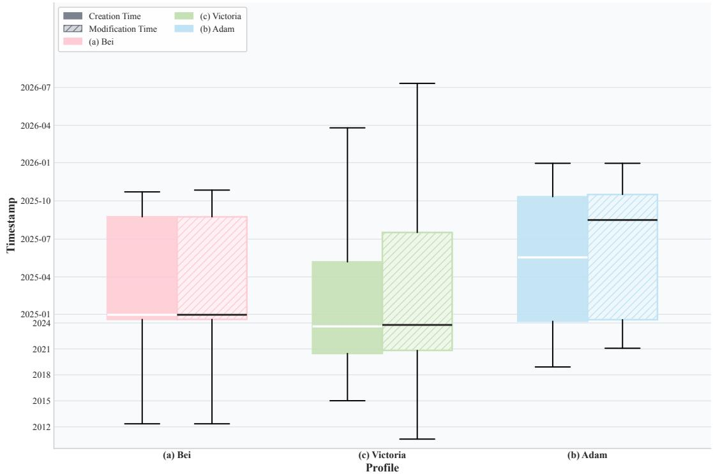  
B and (c) Victoria.

# B Annotation Schema and Quality Control

HippoCamp is annotated not as isolated QA pairs but as grounded trajectories that couple questions and answers with fle-system grounding, localized evidence, and stepwise reasoning traces; in this section, we detail the trajectory schema, evidence localization and atomicunits, the human-in-the-loop QA construction pipeline, and inter-annotator agreement with quality control.

# B.1 Trajectory JSON Schema

This section specifies the released trajectory JSON schema at a level intended to support direct parser reimplementation. Beyond documenting storage format, the schema also explains how our downstream analyses arederived including capability-wise breakdowns, difficulty statistic, and evidence-level evaluation. In particular,he top-levelrecoristiuishethetask speatitsel ithemil sppor st, ializidencspevision iv stewiatiaracesandv capabillabelsWeditaly expose several difficulty-related attributes either as native felds or as deterministic derived quantities. A schematic overview of the hierarchical annotation schema is shown in Figure 2, and we provide the detailed specification in the following subsections.

# B.2 JSON Record Overview

Each trajectory instance is represented as one JSON object; each released persona file stores an arrayof such objcs.Table5 summarizes the top-level felds used for parsing, evaluation, andanalysis.At the recordlevel, the schema separates:(i) task specification fields, including the query and normalized answer; (i) fle-level support fields, which define the minimal supporting fle set; (i) capability annotations over search, evidence perception, and reasoning; and (iv) process supervision through localized evidence items and stepwise rationale traces. Beyond the stored fields listed above, several analysis atributes are computed deterministically from the released content. Specifically, question_tokens and answer_tokens are the token counts of the corresponding text fields under the tokenizer used in analysis; evidence_items is defined as len(evidence); and time_- span_days is computed from the temporal extent of the annotated support, using the earliest and latest relevant evidence times when such timestamps are available, and defaulting to zero otherwise. v  op   

<table><tr><td>Field</td><td>Type</td><td>Allowed values / format</td><td>Role</td><td>Primary use</td></tr><tr><td>id</td><td>string</td><td>String identifier</td><td>Record identifier for one QA instance.</td><td>Per-instance alignment; error analysis.</td></tr><tr><td>question</td><td>string</td><td>Free-form natural language</td><td>User query defining the information need.</td><td>LLM-judge input; token statistics; difficulty.</td></tr><tr><td>answer</td><td>string</td><td>Normalized textual answer; optional file refs in [...]</td><td>Gold answer target in normalized form.</td><td>LLM-judge reference; token statistics; difficulty.</td></tr><tr><td>QA_type</td><td>string</td><td>factual_retention, profiling</td><td>Top-level task family label.</td><td>Main results grouping; task-type breakdowns.</td></tr><tr><td>profiling_type</td><td>string</td><td>Profiling subtype labels</td><td>Profiling subtask label when applicable.</td><td>Profiling-subtype breakdowns.</td></tr><tr><td>data_source</td><td>string</td><td>Source tag from annotation ontology</td><td>Provenance/source tag for the instance.</td><td>Source audit; source-based analyses.</td></tr><tr><td>file_path</td><td>array[string]</td><td>Valid file paths in the environment</td><td>Ground-truth minimal supporting file set.</td><td>File retrieval evaluation; difficulty; error analysis.</td></tr><tr><td>file_number</td><td>number</td><td>Non-negative integer</td><td>Cardinality of the supporting file set.</td><td>Evidence-breadth statistics; difficulty.</td></tr><tr><td>file_modality</td><td>array[string]</td><td>document, video, audio, text, image</td><td>Modality set of the supporting files.</td><td>Modality-breadth statistics; modality-wise analysis.</td></tr><tr><td>file_type</td><td>array[string]</td><td>Supporting-file extensions</td><td>Extension set of the supporting files.</td><td>File-type analysis; difficulty.</td></tr><tr><td>agent_cap</td><td>object</td><td>Capability labels over search / evidence perception / reasoning</td><td>Required capability annotations.</td><td>Capability-wise evaluation; breakdown analysis.</td></tr><tr><td>evidence</td><td>array[object]</td><td>Localized evidence objects</td><td>Localized answer-supporting evidence items.</td><td>Grounding evaluation; evidence statistics; evidence-level F1.</td></tr><tr><td>rationale</td><td>array[object]</td><td>Stepwise rationale objects</td><td>Stepwise reasoning trace linked to evidence.</td><td>Reasoning-depth analysis; process diagnosis.</td></tr></table>

# B.3 Field Semantics and Interpretation Rules

We clariy several field-level conventions that are important for correctly interpreting the released schema and reproducing downstream analyses. The feld fle_path records the ground-truth minimal file set required to answer  query rathr than theful set ffls traversed bynotators durin data cnstruction It theeore represents the smallest annotated support set sufcient for derivin the gold answer, while flenumber serves as its cardinality indicator. The fields fle_modality and evidence-level modality_type are defined at different levels of granularity. file_modality is a set-valued summary over the supporting fles listed in fle_path, whereas modality_type is assigned to each localized evidence item after normalization and characterizes the evidence unit itself. Accordingly, the former should be interpreted as a fle-level aggregate, while the latter provides item-level modality information and may capture finergrainedstructure than that expressed by the supporting fle as a whole. The eldanswe is defnesaoraliznswr targe rather thanratinalerace It is written  e, directly judgeable natural language, may contain one or multiple sentences when required for completeness, and may optionally include fle references in square-bracket form (e.g., [meeting_notes.pdf]) when such references are useful for disambiguation. By design, however, answer should not contain chain-of-thought, stepwise derivation, or unnecessary explanatory narrative. Finally, agent_cap encodes the capabilities required to solve an instance, rather than model predictions or observed system behaviors. Within this field, agentcap.reasoning foows a constrained label system:basic denotes the minimal reasoning regime and is mutually exclusive with all stronger reasoning categories, whereas computation, verification, and summarization may be assigned individually or jointly. Thus, the presence of basic precludes the co-occurrence of any higher-order reasoning label, while any instance requiring one or more higher-order reasoning operations must exclude basic.

# B.4 Evidence Object Specification

Each entry in evidence is a localized support object intended to be directly checkable against the source artifact. At minimum, an evidence object contains an evidence_id, a fle_path, a normalized item-level modality_type, an evidence_text field, and one or more localization entries under evidence_locator. The field evidenceid is unique within a single trajectory recordand serves as the key used by rationale steps to cite supporting evidence. It is not required to be globally unique across theentire benchmark release. The feld evidence_text is intended to preserve answer-supporting content in a verification-friendly form rather than tsumarize the whol le.For text ordocumet evidence, i is typicly adirc excerpt.Fordo video, istranriptionrghly ithul renderifthecaliz sement.Forage-ikeevidencei a concise content description anchored to the localized region rather than a free-form interpretation. Localization is stored in evidence_locator. Conceptually, each locator is represented as a {unit, position} pair, where unit defines the measurement basis and position specifies the actual range or index. Typical document evidence uses page-based units, while temporal media uses timestamp-based ranges. For page-based documents, the position may include both system_page and printed_page; for audio or video, the position is typically a startend timestamp range.

# B.5 Rationale Trace Specification

Each entry in rationalel] represents one annotated reasoning step. A rationale step minimally contains a step_id, a natural-language rationale_text, and an evidence_id list pointing to the evidence items that ground the step. The step_id is unique within the enclosing rationale trace; rationale_text describes the intermediate operation, observation, or conclusion at that step; and evidenceid provides explicit grounding links back to localized support. The released rationale traces follow a normalized three-stage structure. The frst stage is planning, which decomposes the task into subgoals or search intentions. The second stage is navigation $^ +$ reading, which covers file discovery, region localization, and evidence acquisition. The third stage is integration $^ { + }$ verification, which synthesizes evidence across sources, performs any necessary checking or computation, and assembles the final grounded answer. These stages are conceptual normalization categories rather than rigid user-visible tags, but they provide a consistent process template for reasoning analysis. Groundedness is enforced at the step level. We allow evidence_ $\mathrm { i d } = \mathrm { [ ] }$ only for abstract planning steps that frame the task before evidence has been located. Any step that reports file content, extracts factual support, performs cross-source integration, verifes a claim, executes a computation based on source material, orcontributes directly to the final answer must cite one or more valid evidence IDs. In other words, empty evidence references are permitted only for high-level planning, not for reading, integration, verification, or answer-bearing steps.

# B.6 Schema Validation Rules

To ensure reproducibility, we apply a lightweight schema-validation protocol to the released records. The purpose of this protocol is not to enforce an overly restrictive normalization layer, but to guarantee that the released JSON objects remain consistently parseable and that the bookkeeping underlying downstream evaluation is stable and reproducible across implementations. Our validation procedure checks the following conditions: •Evidence-reference consistency. Every non-empty evidence_id referenced by a rationale step must resolve to a valid evidence_id defined in the corresponding evidencel] aray of the same trajectory record. File-system-resolvable support paths. Every top-level fle_path entry, together with every evidence-level file_path, must be resolvable to an existing file in the released file system. Locator-rangevalidity Each evidence locator must be welformed under its declared unit.For page-based evidence, page indices must lie within the bounds of the corresponding document; for timestamp-based evidence, start and end times must define a valid interval within the duration of the associated media file. Answerevidence support consistency. The annotated answer must be supportable by the linked evidence set. We assess this through a combination of manual audit and script-level sanity checks over evidence references and their localized contents. Given these constraints, a parser can reconstruct a trajectory record by reading the top-level task and support fields, resolving evidence] into an evidence map indexed by evidence_id, grounding each rationale step throug  ctedevidence references, andverifying the resultin structure against the valdationrulesbove This procedure is sufficient to reproduce the bookkeeping required for capability-wise analysis, difficulty computation, and evidence-level matching metrics.

  
multimodal evidence objects, and evidence-linked rationale steps.

# B.7 Designing Atomic Units for Evidence

# B.7.1 Motivation

Acentral challenge in personal-fle QA is that evidenceis naturally lcalized at dfrent granularitieacros modalities. For example, documents are typically referenced at the page level, audio and video at the timestamp level, while images and embedded visual regions may require spatial localization. Without a modality-aligned notion of evidence granularity, evaluation becomes diffcult to compare across modalities and mayoverestimate retrieval quality whenamethod identifes the correct e but fails tolocalize the ecisve evidence. To address this issue, we introduce atomic units (AUs), a modality-normalized abstraction of the smallest evidence-bearing region used primarily for fine-grained grounding analysis and error diagnosis. Intuitively, AUs provide a diagnostic interface for asking not only whether an agent found the right fle, but also whether it grounded its answer in the right part of that file.

# B.7.2 Definition

We define an atomic unit as the minimal modality-aligned segment at which evidence can be localized and, in principle, independently verified. AUs do not replace the human-readable evidence_locator field in the released JSON; rather, they normalize heterogeneous locator types into a common analytical representation. In the current release, the schema explicitly instantiates page-level and timestamp-level locators, while the AU formulation additionally specifies how finer-grained spatial/structural regions can be represented when needed for diagnosis or future extensions. Tab A) alyUsoalzeuaoali minimal units.   

<table><tr><td>Modality</td><td>AU unit</td><td>Typical resolution</td><td>Example</td></tr><tr><td>Text</td><td>token span / sentence span</td><td>contiguous text span</td><td>a clause in a note or email body</td></tr><tr><td>Document</td><td>page-equivalent; optional region</td><td>page; optional table/figure region</td><td>page 4 of a PDF; a row in a regulatory table</td></tr><tr><td>Image</td><td>spatial patch / region</td><td>patch grid or bounding box</td><td>the face region or background region in a photo</td></tr><tr><td>Video</td><td>frame or temporal chunk</td><td>frame or timestamp window</td><td>00:0700:08 in an advertisement clip</td></tr><tr><td>Audio</td><td>temporal segment</td><td>timestamp window / frame span</td><td>00:42:5600:43:26 in a recording</td></tr></table>

# B.8 AU Generation Procedures

AUs are generated by modality-specific procedures that trade off precision and reproducibility. Text.For free-form text, we treat contiguous token or sentence spans as AUs. In the released data, evidence is stored as evidencetext; AU mapping is obtained by aligning the annotated span back to the coresponding textual region in the source file. Documents. For paginated documents, the default AU is a page-equivalent unit, since page indices are the native locators recorded in evidence_locator. When finer structure is required (e.g., a table row, a figure caption, or an embeded visual region), the page can be further refined into document regions using page coordinates and optional table-cell or figure-region subdivision. This page-first design matches the current release while remaining extensible to more granular document grounding. Images. For images, AUs are defined over a spatial coordinate system. A practical implementation is a regular patch grid (e.g., $1 6 \times 1 6$ patches over the image plane), with optional aggregation into bounding boxes when a human-meaningful region is available. In the current release, image evidence is often represented textually via evidence_text; AU assignment therefore functions primarily as an analysis-time abstraction unless explicit spatial regions are additionally annotated. Video. For video, AUs are temporal chunks or frames derived from a fixed sampling rule. A reproducible default is uniform frame sampling at a predefined frame rate (e.g., 1 fps for analysis) or timestamp-window segmentation with a fixed stride. The current release uses timestamp-based locators, so the AU mapping is directly induced by the referenced temporal interval. Audio. For audio, AUs are temporal segments induced by timestamp windows. A standard realization uses fixed-length frames or short segments (e.g., analysis windows with constant hop size), but the released benchmark records evidence at the timestamp level; the corresponding AU is therefore the segment spanned by the annotated time interval.

# B.9 AU-Evidence Mapping

Each evidence item in HippoCamp contains a human-readable evidence_locator, and AU mapping deterministically converts that locator into one or more modality-aligned units: Document page locator page-equivalent AU;   
Document region / table / figure locator region-level AU within the page;   
Image region spatial patch set or bounding-box AU;   
Timestamp or timestamp range audio/video temporal AU span. To support robust evaluation, AU matching is defined with tolerance where appropriate. For temporal media, matching can allow a small timestamp slack around the annotated interval; for spatial regions, overlap can be measured by standard region criteria (e.g., IoU-style overlap when bounding boxes are available). These tolerances ensure that AU-level grounding remains reproducible without being brittle tonegligible lignment differences.

# B.10 Usage in Evaluation, Diagnosis, and Training

AUs serve three purposes in HippoCamp. Evaluation. At evaluation time, AU-normalized grounding provides a modality-consistent way to assess whether a method has localized the decisive evidence rather than merely retrieving the correct fle. This is especially important for multimodal files where file-level hits can be misleading. AU-aware comparison therefore serves as a diagnostic complement to fle-level retrieval metrics, providing finer-grained evidence overlap and grounding analysis where localization quality is important. Diagnosis. At diagnosis time, AUs help distinguish between different failure modes. For example, a model may identify the correct file but ground on the wrong page, wrong timestamp, or wrong visual region. Such errors would be invisible under fle-level scoring alone but are exposed by AU-level analysis. In this sense, AUs are introduced primarily to support fine-grained perception and grounding error analysis rather than to define a standalone headline score. Training and release considerations. In the current benchmark release, AUs primarily support evaluation and diagnosis rather than being exposed as a standalone training supervision target. Accordingly, AU-level signals are intended mainly for fine-grained analysis and diagnostic breakdowns, while the benchmark's primary reported retrieval metric remain at thele level This desig is motivated by privacy, copyright, and annotation-cost considerations, especially for spatially localized personal media. At the same time, the AU formulation remains compatible with future privacy-preserving derived supervision schemes, such as masked crops, region descriptors, or AU-only representations that preserve grounding structure without exposing raw personal content.

# B.11 Human-in-the-loop QA Construction

As outlined in Figure 4, HippoCamp uses a human-in-the-loop QA construction pipeline to transform candidate information needs into finalized, trajectory-annotated benchmark instances. This pipeline proceeds ini stagetwosour question propoal cndidate consolidationdeuplicationncoverage balanc, trajectory structuring, and bounded model assistance. The role of this section is to describe how benchmark items are constructed;agreement, adjudication, and release-time quality control are deferred to Appendi B.18.

# B.12 Two-Source Question Proposal

Manual proposals. The primary source of HippoCamp questions is manual authoring by participants and expert annotators who are familiar with the profile-specific file systems. These questions are explicitly user-driven: they originate from concrete information needs that a participant could plausibly encounter in day-to-day personal computing, such as recalling a past fact, reconstructing a workflow, summarizing a prior episode, or planning under current constraints. Because contributors understand their own habits, oranization strategie, and recurng tasks manual proposals capture realisticintents that are difficult o recover from files alone. Synthetic proposals. To complement manual authoring, we use LLMs to generate candidate questions conditioneon restrictecontextual metadata, such asfle paths, tmestamps,directory ructure, nel seed examples. The role of synthetic proposals is not to define benchmark semantics, but to improve coverage along underrepresented dimensions, including modality combinations, evidence-set size, and long-tail task patterns. These proposals are therefore treated strictly as candidates and are passed to the consolidation stage for review, revision, merging, or rejection.

# B.13 Candidate Consolidation and Screening

All manually authored and LLM-suggested candidates are consolidated through a human screening stage. At this stage,anotatorsretainnly candidatesthat atisy our construction-timereqirements:grodness, mnng that a plausible answer can be supported by actual fles in the profle; (i non-triviality, me that the query requires meaningul retrieval, perception, or reasoning rather than direct flename or metadata lookup; (ii) low redundancy, meaning that the candidate does not duplicate existing items at the intent or reasoning-pattern level; and (iv) privacy safety, meaning that the wording and anticipated evidence requirements do not reintroduce sensitive information beyond the anonymized profile. The retained set forms the candidate pool passed to de-duplication, balancing, and trajectory structuring; final release-time acceptance criteria are described separately in Appendix B.18.4.

# B.14 De-duplication and Coverage Constraints

To avoid over-concentration in a small number of query forms, we apply de-duplication and balancing at two levels. Intent-level de-duplication. Questions that express the same underlying information need with only superficial rewording are merged, and only one representative formulation is kept. Pattern-level de-duplication. We also suppress repeated questions that rely on essentially the same solution structure or evidence configuration, even when the wording difers. For example, two questions reqrn the same , thesamecosse jois nd the samereasi patte re otreate  s items. Coverage balancing. After de-duplication, we rebalance the retained candidate set to improve coverage over modality combinations, evidence-set sizes, and task families. In particular, we monitor the relative rertiev o hereul, so that the final benchmark contains both common personal-computing questions and harder long-tail cases.

# B.15 Trajectory Structuring

For each retained QA candidate, human annotators construct the grounded trajectory record used for bencmark release.This recor includes (i) aminiml supportingle set and fle-level metadata, (i) lazed evidence objects withexplicit locators, (i) a stepwise rationale trace,and (iv) capability labels spanng searh, evidence perception, and reasoning. The objective of this stage is to convert an accepted question into a compact, schema-compliant support structure that can be used for evaluation and downstream diagnosis. A key desig principle is theminimalist gold trajectory.The goal is not t enumerate every plausible solutin path,but o recor the smallest seo evidence nodes and reasonigtransitins suficient to justythe nswe. The resulting trajectory therefore defines a compact support structure for evaluation while leaving room for agents to discover longer or alternative valid paths during inference.

# B.16 Model Assistance Protocol

To keep LLM assistance reproducible and bounded, we restrict the information visible to the model. LLMs are allowed to observe only limited contextual metadata and selected seed examples, including file paths, timestamps, and directory hierarchy cues; they do not receive unrestricted access to the full fle system, raw personalidentifiers,or any external knowledesource. Models are explicitly instructed not to invent PI, not to introduce unsupported facts, and not to propose questions whose answers depend on information outside the provided corpus. The typical output is either a candidate question or a lightweight JSON skeleton that is subsequently edited and completed by human annotators. Under this protocol, the model is used only for bounded proposal or lightweight structuring support; all finalized benchmark content remains subject to human revision and approval.

# B.17 Prompt Families for LLM-assisted Proposal

We use a small family of prompt templates to support bounded LLM-assisted proposal generation under different task families and profile contexts. These prompts are implementation details of the proposal stage rather than part of the benchmark definition itself: all outputs remain provisional and are subsequently screened, revised, or discarded by human annotators. Across all prompt families, the model only observes a curated local batch of related files together with limited contextual metadata and seed examples. It is explicitly prohibited from introducing external knowledge, unreleased personal identifiers, or flename/pathbased shortcuts, and all retained items undergo human review and trajectory structuring before inclusion. The prompt families vary mainly along two axes. First, they differ by task family: factual-retention prompts emphasize explicit fact extraction and verification from bounded evidence, whereas profling prompts emphasize cross-fle aggregation, temporal regularity, and user-level synthesis. Second, they differ by profile context: prompts for Bei emphasize academic, creative, and lifestyle traces; prompts for Adam emphasize legal workfow, professional correspondence, and structured routines; and prompts for Victoria emphasize financial analysis, reporting cycles, and numerically grounded research behavior. These profile-specific constraints help ensure that LLM proposals remain aligned with the intended personal-computing environment rather than drifting toward generic QA. Representative prompt example. Below we show a representative condensed prompt used for College Profling. It conditions the modelon ananonymized persona description, a curated local fle batch, a proflng subtask definition, and several seed questions, and asks for candidate profling questions that require grounded cross-file or cross-time synthesis.

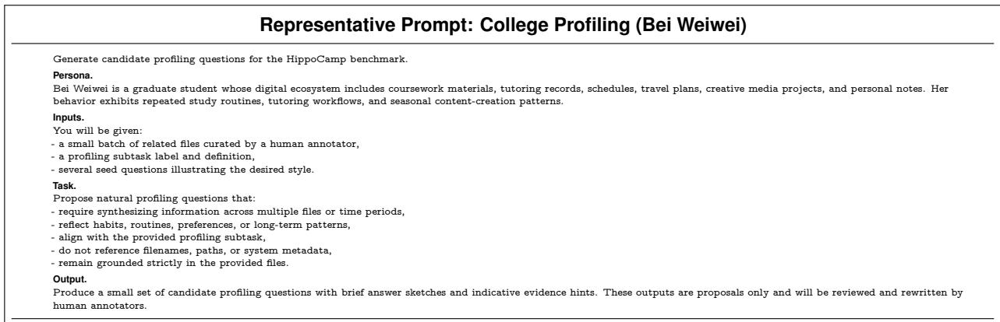  
F etativ  -assis osal atnenropro on pern, cala pbtskaThe ni q only; all retained items are subsequently reviewed and restructured by human annotators.

The remaining prompt families follow the same overal structure but differ in domain-specific constraints. Adam-oriented prompts emphasize legal workfow, correspondence, and verification-heavy assistance, whereas Victoria-oriented prompts emphasize analytical routines, reporting cycles, and numerically grounded task structure. In the most sensitive financial cases, human annotators author the question, answer, and evidence directly and the model isused nl or shemanormalization r ational draftin.Across al prompt fmils, LLM outputs function as bounded proposals rather than authoritative annotations.

# B.18 Inter-Annotator Agreement and Quality Control

This section describes the agreement, adjudication, and release-time quality-control procedures applied after candidate construction and trajectory authoring. The focus here is not how benchmark items are proposed or structured, but how accepted records are reviewed for consistency, privacy safety, grounding fidelity, and schema compliance before release.

# B.18.1 Annotator Setup and Sampling Protocol

HippoCamp is annotated by domain-aware human annotators drawn from the contributor groups underlying therarchetypal prThisuaol etudelberateecuoatorsetiateymi the organizational lgic, recurrin workfows, and realisticnormatin nees o theiowndigital environments, they can formulate and veriy grounded tasks with prole-speci contextual knowlede that would be difult to recover through external annotation alone. To mitigate profile-specific bias, however, all records are subsequently subjected to cross-checking, secondary review, and adjudication. For agreement and validation analysis, we adopt a stratified sampling protocol spanning al three profiles, both task families (factual retention and profiling), diverse modality configurations, and multiple difficulty bands.This ensures that reliability is assessed not only on simple text-dominant cases,but also on multile, multimodal, and long-horizon instances that are most diagnostic for agent evaluation.

# B.18.2 Unified Review Protocol

All annotators follow a unified review protocol during secondary review and release preparation. For each aceptedrecor, reviewers veriy that the questions interpretable under the release anonymized environment, tha theiurt nideaors  nt jushe lnseanthat labels, task labels, and rationale fields remain internally consistent. Reviewers do not seek to enumerate all possible valid reasoning paths; instead, they veriy that the released record is coherent, minimally sufficint, and schema-compliant. For every accepted question, annotators identiy the shortest plausible solution path that uses only the files and evidence spans strictly necessary to justify the gold answer. The resulting trajectory records the most direct, human-plausible reasoning route a domain expert would take, including only esential waypoints such as key files, relevant pages or timestamps, and minimal supporting evidence. This minimalist design preserves trajectory diversity during evaluation: agents may follow richer or longer valid paths, but any successful solution must recover at least the essential evidence nodes recorded inthe gold trace. The released trajectory should therefore be interpreted as a compact support structure rather than an exhaustive execution trace.

# B.18.3 Adjudication Protocol

Annotation disagreements are resolved through adjudication rather than automatic majority voting. When two annotations conflict, the item is forwarded to an additional reviewer, who re-examines the source files, evidence links, and task speciation. If the disagreement refects ambiguity in the underyingles, annoators resolve it through focused review and, when necessary, revise the evidence spans or question wording torestore interpretability and grounding. The final released record is therefore an adjudicated gold annotation, not a raw vote aggregate. Adjudication is especially important or profiling tasks, where disagreements more often arise from longitudinal interpreatirathhanexplc cxtraction andoecalizegalancles hespely plausible annotations may stll be unacceptable if they omit a controlling clause, numerical constraint, or domain-specific exception.

# B.18.4 Quality Control and Automated Sanity Checks

We adopt a multi-stage release-time quality-control pipeline that combines rule-based checks, human review, ersona consistency validation, and dataset-level balancing. Acceptance criteria.The following acceptance criteria apply to records considered for final release, rather than to the earlier candidate-screening stage described in Appendix B.13. Each candidate instance must satisy fve criteria: (i) groundedness, meaning that the answer is fully supported by the provided fles and does not relyon unverifable externalknowledge; (i clarity,meanin that the question isnterpretable to thir party with access only to the released files; (ii) task realism, meaning that it reflects a plausible information need for the corresponding persona; (iv) non-triviality, meaning that it cannot be solved by superficial metadata lookup or trivial copying; and (v) privacy safety, meaning that no textual component reintroduces identifers beyond the approved anonymized profile. Automated validation. In addition to human review, we run automated sanity checks over all records. Thes hecks veiyle existence and path validity, locator validity (e. page ranges and timestamp bounds), closure of evidenceid references, near-duplicate question detection via similarity thresholds, and a second privacy audit based on rule-based scans for names, emails, phone numbers, IDs, and other sensitive identifers. Filtering outcomes.Bason this pipelie, eac candidate is eitheraccepte,revisd, or rejected.Acct item satisfy all criteria; revised items contain correctable issues such as ambiguous wordingorincomplete grounding; rejected items contain structural faws requiring substantive rewriting, including hallucinated evidence, privacy leakage, or excessive redundancy.

# B.18.5 Post-hoc Audit and Final Validation

Afterannotation and adjudication, we perform an additional stratifed human audit across profile, task type, modality composition, and diffiuly evelThe purposeof this audit is to veriy that the releasd bencmark remains balanced and coherent undera fresh review pass and to identify any residual annotation artifacts that escaped earlier filtering. When failures are identified, the corresponding records are revised and versioned so that all post-hoc corrections remain traceable. Finally, before release, all accepted records must pass schema-level validation: evidence spans must be correctly referenced, rationale steps must conform to the trajectory specification, answer format must match the intended task, and task/profilng labels must be internally consistent. Together, these procedures ensure tha reeaseHippoCamprecor remaauditable,internally coherent, and suitable or fnegraineevalatin of long-horizon multimodal agents.

# C Tasks and Difficulty

# C.1 Task Taxonomy

This appendix expands the two task families introduced in the main text—Factual Retention and Profiling—by detailing their recurrent subtypes and providing representative grounded examples. Rather than restating the benchmark-level framing, we focus here on the distinct evidence structures, abstraction patterns, and representative case forms associated with each task family.

# C.1.1 Factual Retention

Motivation. Factual-retention queries require agents to recover precise, verifiable facts from a deviceresident corpus under realistic file-system "haystack" conditions. In Appendix C.1, we focus on the main evidence regimes these queries instantiate and on representative grounded examples, rather than repeating the task-family motivation given in the main text. Defnition.Factual retention covers several recurring evidence regimes, including (i) atomic fact retrieval (e.g.dates, quantities, entity attributes), (ii) docment-levellocalization (e.g identifying the correct le, path, or storage location), (ii) temporal or comparative fact recovery (e.g., trends or changes across dated records), and (iv) normative clause extraction (e.g.obligations, permissions, orexceptions stated in contracts and policies). The common requiremet across these cases is that the answer remain fully traceable t explict file-grounded evidence. Illustrative examples.Figures 11 and 12 show two representative factual-retention instances with grounded answers, supporting file lists, and evidence visualizations.

  
assets and identifies the matching photos, with ground-truth answer and evidence visualizations.

Example 1: Cross-modal asset retrieval. The first example asks the agent to locate a previously written vlog script and identify the corresponding cat photos required by the script. The ground-truth answer is supported by a small set of concrete evidence files: the script document Vlog Script_…Shadow Friend.docx and four images in Cat-Vlog/images/ that match the script's Required Assets specifications. The evidence visualization highlights two distinct alignment operations: (i) document parsing to extract strucured requirements (., "two silhouette photos"and "two warm lamp photos" from the script, and (ii) vlgringtoveriythat selecemages satisy thedescribeattrbutes (ebacklt iouait a bright window, and warm table-lamp illumination with the specifed pose). This instance therefore tests precise fle localization, structured fact extractionfromdocuments, and cross-modal matching under explicit constraints. Example 2: Document-video compliance verification. The second example evaluates rule-based factual verification under multimodal evidence. The query asks whether the "Saver Menu" logo placement in a user advertisement complies with McDonald's clearspace guidelines. The ground-truth answer relies on two evidence files: the brand manual mcdonalds_logomanual.pdf (which specifies the clearspace rule) and the advertisement video 2024_Saver_Menu_.mp4 (from which the spatial layout is inspected). The visualization anchors the decision to(i) a normative textual constraint from the manual (clearspace is equal to the width of one leg of the Golden Arches") and (i) a frame-level measurement/inspection of the logotext

# Question: Does the Saver Menu Logo in my ad comply with McDonald's clearspace guidelines?

Answer: Yes, the Saver Menu Logo in the advertisement complies with McDonald's clearspace guidelines.   
["Advertisement/mcdonalds_logomanual.d] adhering to the required isolation zone ["Advertisement/2024  Saver Menu Driving Lesson.mp4"].

  
FuT rule fomthemanual anheckin against videams, wiround-rutanswer n evidencisualatins.

separation in the video segment (00:0700:08). This instance stresses constrained extraction of a precise rule from a document and its verification against visual evidence, emphasizing grounded correctness and low-hallucination restatement.

# C.1.2 Profiling

Motivation. Profling queries require user-level inference from weak, distributed evidence spread across files, modalities, and time. Unlike factual retention, which is anchored to explicit verifiable facts, profling depends on aggregating repeated traces into coherent abstractions such as routines, preferences, scheduling policies, retrospective accounts, and workflows. The remainder of this subsection expands these profiling regimes through a subtask decomposition and representative grounded cases.

  
l, scheduling information, retrospective reflections, and workflows) across the three HippoCamp profiles.

Deon. proing query reqi erisr-eveattru odvireien iece st across fles, modalities, and time Answers are typically not grounded in a single decisive statement; instead, they rely n weak, distributed signals (e. repeated scheduling choices,recuring activity trace, consitent editrorattnghabitsandmultste workw rtifactthat must bentegrateintolobalcnsnt inference. Operationally, profling demands (i) longitudinal evidence integration across temporally separated records, (i) event-to-trait abstractionthat generalizes from episodicobservations to stable characteristics,and (ii) context-aware personalization that produces actionable outputs coherent with the user's constraints and history. Accordingly, evaluation emphasizes profile consistency, correct temporal anchoring, executability of suggested actions when applicable, and traceability to grounded evidence. Profiling subtasks overview. To make profiling evaluation more interpretable, we decompose profiling qintive reurrent subtaskspreferences,behavioral pattens,scheduling inforation rerosv reflecions, and workflows. Allfve require evidence grounding, but they differ in theirdominant abstraction operator, rangingrom trait inference and periodicity recoveryt constraint-aware planning and procedure-evel synthesis. Figure 13 visualizes their distribution across the three profiles.

# Question: Beforeoverthink photo edit every tme can you tel me what Iusually preer when editing photos?

Here is your validated 5-step checklist for your "default" edit: ["02_Reply_from_Lucy.eml"]. ["03_Reply_from_Weiwei.eml"] T in the conversation ["04_Final_emoj_ rom_Lucy.eml"].

  
F visual feedback and user confirmation.

i) Preference Case Study. Preference profiling targets stable, trait-like choices refected across repeated decisions, annotations,and sel-authoredartifacts.Figure 14 presents a representative instance groundedina four-email thread, whereannotated visal feedback andexplicit user confirmations jointly speciy aconsistent photo-editing template. The evidence indicates recurring adjustments to face or cranial shape, skin details, and neck wrinkles, together with a routine eye adjustment explicitly described as a usual operation. This case evaluates whether an agent can aggregate multimodal conversational evidence into a stable preference model while keeping each inferred trait traceable to file-grounded cues. ii Behavioral Patterns Case Study.Behavioral-pattern profiling targets persistent, temporally structured habits rather than isolated events. Figure 15 presents a representative instance on stress management under sustained exam and workload pressure, where the ground-truth pattern is a regular morning-running routine with a systematic Wednesday exception. The evidence is distributed across multiple modalities, including a hal-marathontrainng plan and confrmati emal, runing logs, chat recors eplainng the weekly excetin due to legal-aid commitments, diary entries reflecting increased tension when the run is skipped, a voice memo linking missed exercise to stress, and a preparation photo showing the recurring execution mechanism of laying out running gear the night before. This case evaluates whether an agent can integrate cross-file temporal cues, identiy periodicity together with structured exceptions, and derivestable behavioral patter that remains traceable to verifiable evidence.

  
logs, messages, diary notes, and multimodal evidence over time.

  
u ubu  p calendars/emails and historical conflict-resolution evidence.

iii) Scheduling Information Case Study. Scheduling-information profiling targets forward-looking, constraint-aware planning under a user's established decision policy. Figure 16 presents a representative instance that asks for a plan from 2:005:00 PM on Nov 14, 2025, under competing family and professional commitments. The ground-truth solution is explicitly conditional: it prioritizes a high-value networking event only i the user can (i) reschedule achild's dental appointment and (i) securea reliable alterative pickup or care arrangement; otherwise the plan switches to a family-first schedule. The evidence combines current constraints from calendar entries and reminder emails with historical conflict cases that reveal a consistent resolution policy: work first when commitments are movable and alternatives exist, but family first when alternatives fail or the obligation is non-negotiable. This case evaluates whether an agent can recover a user-specificdecision model from longitudinal evidence and generate an executable plan that is both constraint-consistent and evidence-traceable.

  
i calendar events, photo metadata, and personal notes into a coherent timeline.

iv) Retrospective Reflections Case Study. Retrospective-reflection profiling targets event-bounded user history and requires reconstructing what happened during a specific episode from incomplete, heterogeneous traces. Figure 17 presents a representative graduation-day reconstruction task in which the agent must recover a coherent itinerary by aligning calendar events, photo metadata, geolocation cues, and personal notes. The grounded schedule is supported jointly by fixed commitments and locations from CUHK $-$ . Graduation_Day.ics, timestamped campus and outdoor photos, and notes or draft post content that provide contextual details and participants. This case evaluates whether an agent can align timestamps, locations, and participants across modalities to produce a logically consistent retrospective account while keepin each inferred step traceable to concrete file-grounded evidence.

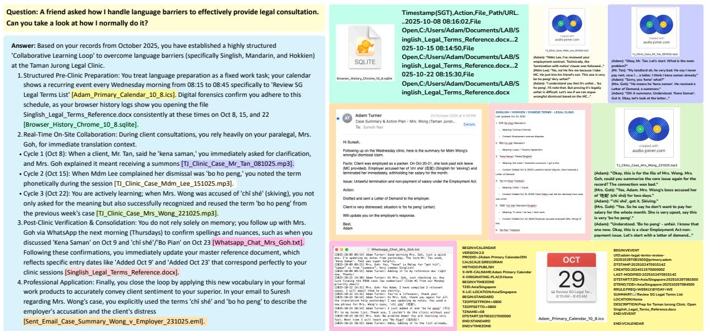  
Wuc events, logs, consultation audio, messages, and document updates.

v) Workflows Case Study. Workflow profiling targets procedure-level user modeling from repeated task executions. Figure 18 presents a representative language-barrier workflow in Adam's legal-aid practice, where the agent must abstract a recurring "collaborative learning loop" from distributed evidence over multiple occurrences. The grounded evidence supports three recurrent phases: (i) pre-session preparation, anchored by a weekly calendar event to review a legal-terms reference and corroborated by repeated file-open actions in browser or history logs; (i) in-session collaboration, where consultation audio recordings show real-time carification andtranslation witha paralegal acrss cases;and i post-essioconolidation, wher foll messages verify terms and the master reference document is updated, culminating in professional application in case-summary emails. This case evaluates whether an agent can integrate multimodal procedural traces into acoherent, reusable workflow representation while keeping each step traceable to concrete le-grounded evidence.

# C.2 Complexity Axes and Marginal Distributions

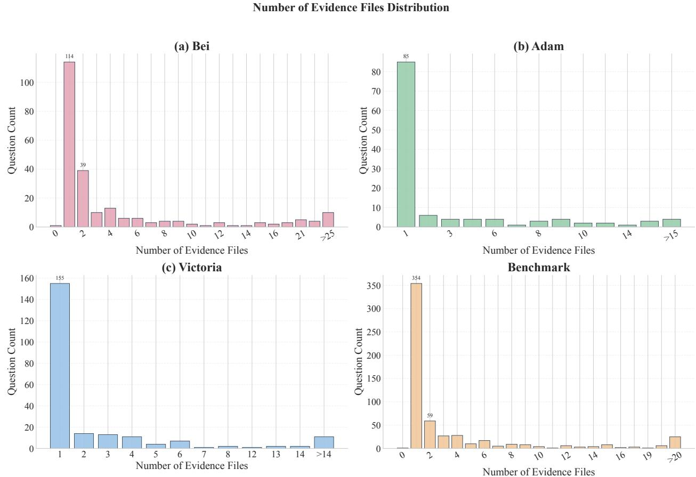  
and overall. The distribution is heavy-tailed, with many multi-file queries beyond 20 evidence files.

Before introducing a scalar difficulty score, we first characterize HippoCamp along three complementary complexity axes: evidence breadth (the number of distinct evidence files required), modality breadth (the number of modalities involved), and reasoning depth (the number of annotated rationale steps). These marginal indicators correspond to increasingly demanding requirements on retrieval, multimodal perception, and multi-step integration. They provide an interpretable frst-order view of benchmark complexity, ranging fromsinglesourelokupstolong-horizon quers that requregregating manyes, alginevidenceros modalities, and executing extended reasoning chains.

# C.3 Evidence Breadth

Figure 19 reports the number of ground-truth evidence fles required per query, which quantifies retrieval breth in a realistic fle-system "haystack"The distribution is sharply peaked at a single evidence le et ehibits a pronounced heavy tail. In particular, onele questions account for 114 instance in Bei, 85 inAdam, and 155 in Victoria, and 354 overal; however a substantial fraction requires aggregating multiple les (e. 59 twle questinsoveral aneac prolcntais on-trivlmass beyond0eidencels (.g19nsan for Bei). This pattern is ecologically plausible for personal devices: many queries originate from a single arifact, but the relevant context is frequently fagmented across attachments, versions, and cross-referencd records, inducing multi-fle reasoning. Crucially, even "unimodal" or apparently simple questions can be multi-fle, requirin agents t navigatedirectory structure,deduplicate near-duplicates, reconcileconi timestamps, and verify conclusions across corroborating sources. The long tail of high-evidence queries therefore provides hard stress tests for robust retrieval and evidence management, and it exposes failure modes in tool use,grounding, and cross-fle synthesis that are invisible in small-corpus or single-document benchmarks.

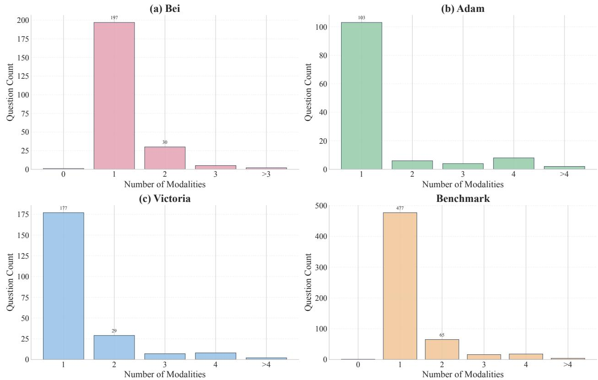  
Number of Modalities Distribution   
l l   o overall.

# C.4 Modality Breadth

Figure 20 measures modality breadth, i, the numberof distinct modalities required per query, which isolates the need for cross-modal perception and grounding. While unimodal queries dominate, HippoCamp contains a meaningful multimodal tail, including 65 two-modality queries overall and additional instances requiring three or more modalities. This distribution mirrors real fle-system ecology: users often seek answers within oemodality, yet high-valueassistanc frequently hinges oaligning evidenceacrossmodalitis (e. inkig a textual rule to visual media, or validating an event via timestamps across emails, calendars, and photos). Importantly, multimodality in HippoCamp is not superficial; it is coupled with evidence grounding and cross-fle dependency, requiring agents to interpret heterogeneous formats, localize evidence spans, and integrate signals under temporal constraints. Together with evidence breadth, modality breadth expands the benchmark's coverage from single-fle perception to multi-fle, multi-modal reasoning, enabling fine-grained diagnosis of agent capabilities in search, perception, and reasoning under realistic device-scale conditions.

# C.5 Reasoning Depth

Figure 21 reports the distribution of annotated reasoning-step counts per query, which serves as an explicit proxy for reasoning depth under our structured trajectories. Across profiles and in aggregate, HippoCamp concentrates around medium-depth problems while maintaining a non-trivial long tail of deep multi-step queries. In Bei, most questions fall within 5-8 steps (57 at 5 steps and 87 at 6 steps), with additional mass extending to $1 0 +$ steps; Adam exhibits a broader spread with peaks at 7-8 steps (40 and 27, respectively) and a pronounced tail through 11-13 steps; Victoria similarly concentrates at 7-8 steps (42 at 7 steps and 74 at 8 steps) while retaining substantial mass at 1214+ steps. Aggregated over the full benchmark, the distribution peaks at 5-8 steps (59 at 5, 110 at 6, and 115 at both 7 and 8) and exhibits a heavy tail beyond 10 steps (e.g., 28 at 10, 18 at 11, 29 at 12, 20 at 13), including a non-trivial $> 1 4$ bin. This structure is both ecologically plausible and diagnostically useful. Real personal-computing queries often require multiple rouretrival videcnspection crosslerelation, nveatinbeforeanswer ju especially for profiling and cross-modal tasks. The medium-depth mass ensures broad coverage of everyday multi-step reasoning, while the long tail provides hard stress tests that expose compounding failures in planning, grounding, and verification.

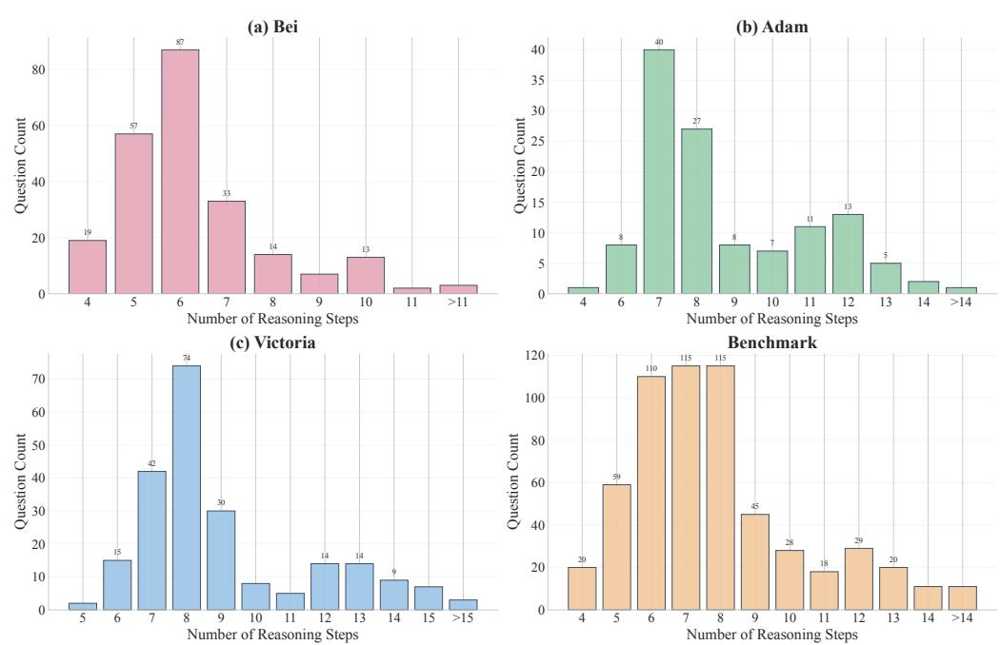  
Number of Reasoning Steps Distribution   
FuReag de dr u at esequ pe que  a pro overal. The distribution peaks at medium depth (6-8 steps) with a long tail of deep multi-step queries.

The preceding analysis reports three marginal indicators of complexity:evidence breadth, modality breadth, and reasoning depth. Although these axes provide an interpretable first-order characterization of the beark, they ot ully ptuefiv qtharnnralisti yses.n prticulr, that appr smple long ne xis ma stil b ilt becau coup cnstraints, suc as tight cross-le dependencies within a single modality, cross-modal grounding within a single evidence le, or high perception burden from structurally complex documents (e.g., tables, figures, scanned pages, and embedded visuals in PDFs). We therefore introduce a separate scalar question difficulty score in Appendix C.6 to approximate benchmark hardness beyond these marginal statistics.

# C.6 Question Difficulty

# C.6.1 Definition

We defnesalrquestion uly scoreasheuristicdiagnosticmeasureeectivehardness indevi resident, multimodal fle reasoning, where difficulty often arises from coupled retrieval, perception, and multi-step integration rather than from any single marginal statistic. For each query $q$ , we extract eight interpretable factors that approximate distinct sources of cognitive and computational load: (i) the number of ground-truth evidence files $n _ { f }$ , (ii) the number of modalities involved $n _ { m }$ , (ii) the number of distinct file types/extensions $n _ { t }$ , (iv) the number of localized evidence items $n _ { e }$ , (v) the number of annotated reasoning steps $n _ { r }$ , (vi) the question length in tokens $n _ { q }$ , (vii) the answer length in tokens $n _ { a }$ , and (viii) the temporal span in days covered by the evidence $n \Delta$ . Robust normalization. Each factor $x$ is mapped to a bounded score $s ( x )$ using a log-quantile transform to handle heavy-tailed distributions while preventing outliers from dominating:

$$
s ( x ) = \mathrm { c l i p } \left( \frac { \log ( 1 + x ) } { \log ( 1 + P _ { 9 0 } ( x ) ) } , 0 , c \right) ,
$$

where $P _ { 9 0 } ( x )$ is the benchmark-wide 90th percentile of factor $x , \mathrm { c l i p } ( \cdot )$ truncates to $[ 0 , c ]$ , and $c$ is a fixed cap. This normalization preserves ordering for typical cases, rewards long-tail diffculty, and yields comparable scales across heterogeneous factors. Core difficulty and interaction coupling. We compute a weighted base score where $s _ { i } ( \boldsymbol { q } )$ denotes the normalized score for factor $i$ and weights $w _ { i }$ emphasize axes most indicative of hard personal-file QA (notably evidence breadth, evidence localization, and reasoning depth). To capture the empiricalbservation that dilt questions areoften difficult because multiple constraints co-occur wead interaction terms:

$$
\operatorname { B a s e } ( q ) = \sum _ { i } w _ { i } s _ { i } ( q ) ,
$$

$$
\operatorname { I n t e r } ( q ) = \alpha _ { 1 } { \sqrt { n _ { f } n _ { r } } } + \alpha _ { 2 } { \sqrt { n _ { m } n _ { t } } } + \alpha _ { 3 } { \sqrt { n _ { e } n _ { \Delta } } } .
$$

These terms model coupled challenges such as multi-fle reasoning, multimodal long-tail formats, and longhorizon evidence alignment. Hard-case bonus and final mapping. We further apply a conservative bonus when key axes (evidence fles, evidence items, reasoning steps) are simultaneously high, reflecting compounded difficulty not captured by linear aggregation alone. The raw score is then mapped to a $[ 0 , 1 0 0 ]$ scale via a sigmoid transformation which improves separability between medium and genuinely hard tails while avoiding over-inflation. We report benchmark-wide summary statistics (mean/median and high-difficulty ratios) and use this score to characterize difficulty distributions across profiles and task types.

$$
\operatorname { D i f f } ( q ) = { \frac { 1 0 0 } { 1 + \exp ( - \gamma ( \operatorname { R a w } ( q ) - \tau ) ) } } ,
$$

# C.6.2 Distribution

Figure 22 reports the resulting dificulty distributions per profile and overall, together with mean/median markers and task-type overlays. Across the full benchmark, dificulty is centered at a moderate-to-high level (mean 57.5, median 49.1, $n { = } 5 8 1$ ) with a substantial hard tail: 26.7% of questions score $\geq 7 0$ . Importantly, the apparent "moderate" center does not imply easiness; it reflects that many queries are unimodal or involve a small evidenceset, yet stil require non-trivial perception and verication under realisticle-systemconditions. The overall histogram peaks around mid-range difficulty (factual-retention peak: 115 questions at score $\approx 4 7$ ), while profiling concentrates near the extreme tail (profiling peak: 26 questions at score $\approx 9 7$ ), revealing a clear separation between fact-level retrieval/verification and user-level synthesis.

  
ur ifu   Hi eiu o pro mean/median markers and task-type overlays (factual retention vs. profiling).

Decomposing by task type further highlights HippoCamp's diagnostic value. Factual retention occupies the mid-range with moderate variance (overall mean 53.8; $\geq 7 0$ ratio $1 9 . 0 \%$ ), whereas profiling is systematically harder (mean 89.1; $\geq 7 0$ ratio $9 3 . 3 \%$ ), consistent with the need to aggregate weak signals across time and files into coherent user-evel inferences. This separation is stable across profiles:for Bei, profiling mean 79.0 with $8 0 . 0 \% \geq 7 0$ ; for Adam, profiling mean 93.2 with $1 0 0 . 0 \% \geq 7 0$ ; for Victoria, profiling mean 95.1 with $1 0 0 . 0 \%$ $\geq 7 0$ . By contrast, factual retention remains challenging but less extreme, with profile-specific means in the low-to-mid 50s (Bei 53.8, Adam 51.7, Victoria 55.0) and non-trivial hard tails (e.g., $\mathrm { B e i } \geq 7 0$ at $2 2 . 3 \%$ ). Finally, the profile-level distributions corroborate that HippoCamp measures hardness under diverse personal ecosystems rather than a single regime: Bei (mean 55.9, median 46.4, $\geq$ 70 27.2%), Adam (mean 58.4, median 47.4, ≥ 70 27.6%), and Victoria (mean 58.6, median 50.4, $\geq$ 70 25.6%) show comparable overall difficulty while differing in where the mass concentrates and how the profiling tail manifests. Together, these distributions demonstrate that HippoCamp is both broad (covering common medium-diffculty personal queries) and deep (containing a sizable fraction of hig-diffculty instances that require coupled retrieval, multimodal grounding, and extended reasoning), thereby providing a rigorous and differentiating testbed for next-generation file-system agents.

  
-o (5) for nine methods as a function o bined dfficulty (5-point bins). Scores are enerally low-to-moderate and decline with increasing difficulty, with pronounced degradation in the hard tail.

# C.6.3 Correlation between Difficulty and Performance

Protocol. To assess whether the proposed dificulty score refects eective benchmark hardness, we analyze its correlation with model performance at the question level. For each query, we compute the difficulty score using the definition in Section C.6.1 and align it with the corresponding per-query LLM-judge score (LLM_as_a_judge_score, range 05) produced by each evaluated method. We then bin queries by difficulty (5-point bins) and report, for each method and each bin, the mean judge score. This yields a comparable difficulty-performance profile across profiles and for the merged benchmark. Results. Figure 23 shows average judge score as a function of binned difficulty for each profile and overall. Tsevatins ensisen cr panelFirstscore eneray dce iculyincreaes u that the difficulty definition captures non-trivial sources of hardness beyond marginal statistics. Second, even in low-to-mid dificulty bins, absolute scores remain modest for most methods and concentrate in the lower-to-middle portion of the 0-5 range, indicating that HippoCamp is challenging throughout rather than only in the extreme tail. In the high-difficulty regime, performance drops further and several method families approach near-foor behavior, reflecting failures to sustain grounded retrieval, multimodal perception, and multi-step verification when constraints co-occur. Together, these trends corroborate HippoCamp's diagnostic value: it induces a broad hardness spectrum while revealing clear capability gaps in current systems as difficulty increases (see also Tables 2 and 3). i o : Step 1: Identifying the Requirements   
must be "45 millimeters $\times 4 5$ in color, it "must have only a white background".   
Verifying the Iage   
"white background" mandates found in the policy document.

F an official document and verification against personal images, with grounded evidence.

# C.7 Profile Example Set

# C.8 Representative Example from Profile (a) Bei Weiwei

Figure 24 presents a representative factual-retention instance that stress-tests evidence-grounded verification under normative constraints. The query asks for a photo that satisies official Japanese visa requirements. An agent must (i) locate and parse the governing specification in policy/Photograph Standard.pdf to extract actionable constraints (e.g., $4 5 \mathrm { m m } \times 4 5 \mathrm { m m }$ , front-facing, no headwear, white background), (ii) retrieve and shorhel ysnyant (pose, background, occlusion) and checking metadata where relevant (e.g., dimensions). The ground-truth answer selects Identity/Id_photo_1.jpeg as the only compliant file, illustrating the coupled demands of search, multimodal perception, and rule-based verification with traceable evidence.

# C.9 Representative Example from Profile (b) Adam Turner

Figure 25 presents a representative factual-retention instance from Profile (b) Adam Turner that requires evidence-grounded professional correspondence drafting. Given Ms. Rachel's email about a PPO appeal, the agent must produce an accurate reply by (i) extracting the relevant factual constraints from the email thread, (i) retrieving the supporting precedent VYR v VYS ([2022] SGHCF 24), and (ii) grounding the response in determinative passages, including the clarification that Rule 100(2)(a) of the Family JusticeRules requires evidence-in-chief to be given by affidavit and that the court may consider admissible affidavit and oral testimony together. The ground-truth response exemplifies citation-backed legal reasoning anchored to the evidence fles, and this case further shows that HippoCamp evaluates grounded professional assistance by testing whether agents can maintain precise cross-document retrieval and evidence-linked justification in specialized domains.

  
Fo  ha with supporting precedent passages to produce a procedurally accurate response.

# C.10 Representative Example from Profile (c) Victoria Anne Clarke

Figure 26 presents a representative factual-retention instance from Profile (c) Victoria Anne Clarke that requires cross-quarter attribution grounded in multimodal corporate disclosures. The query asks for the drivers of Walmart's revenue growth from Q3 FY2025 to Q2 FY2026. To answer, an agent must retrieve and align evidence across multiple sources, including earnings-call audio transcripts and quarterly flings, then extract and reconcile the stated growth drivers over time. The grounded answer shows a consistent volume-led narrative through Q3Q1 (transaction counts and unit volumes repeatedly cited as the primary drivers, including explicit statements that results were not inflation-driven) and a shift in Q2 FY2026 toward joint contributions from average ticket and transactions. This example therefore stress-tests temporal alignment across quarters, cross-document corroboration, and evidence-linked summarization of changing causal attributions under realistic, document-heavy professional workloads.

# C.11 Edge Cases and Challenging Examples

These edge cases are rare but consequential: they occupy the extreme tails of the benchmark's complexity axe and function as diagnostic stress tests that separate superficial retrieval from robust, evidence-grounded agent behavior.Evidence-breadth tails require scalable searcoverfragmented personal histories, including candidate pruning, deduplication, and cross-fle corroboration; modality-breadth tails require genuine crossmodal grounding, where decisive signals are distributed across heterogeneous media rather than reducible to a singl text document; and reasoning-depth tails require extended, verification-centric multi-step synthesis in which intermediate conclusions must remain traceable to evidence to avoid cascading errors. Importantly,

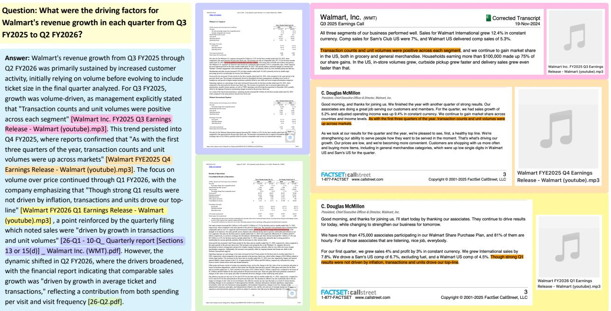  
aligning earnings-call transcripts and filings to identify changing revenue-growth drivers.

Tab modality breadth, and reasoning depth.

<table><tr><td>Axis</td><td>Selected tail instances (Profile; ID; complexity; diagnostic requirement)</td></tr><tr><td>Evidence breadth</td><td>(; I78How n wasylas ay Japel pcossec). ( Adam; I 93; 56fil:Filtertransferred companies with Date Incorporation after 2015. arge evidenceset management and structured verification). (a) Bei; ID ;mdalits:How hould I tructure folder rgnizing riocmet learnig udmaals?</td></tr><tr><td>Modality breadth</td><td>(cross-modal grounding across heterogeneous artifacts). () Victoria; ID 5; 5modalites: I&#x27;m thinkig about picking up the guitar. How might I get started? (multi-odal evidence alignment with user-specific context).</td></tr><tr><td>Reasoning depth</td><td>() Vcria; I34; 1stepsHow ight Apple&#x27;bybac cadenevolve  cash balan trendlower r rate it? (long-horizon, verification-centric synthesis). ( Aam; I5; Chec theemissi/ncret partin Manaci c n. ve checking, error finding, and evidence-linked correction).</td></tr></table>

these tails arise from realistic personal workflows rather than synthetic construction, and they complement the benchmark's large mid-range mass by exposing capability limits that are typicaly invisible in singledocument or tool-centric benchmarks. Together, they demonstrate that HippoCamp is simultaneously broad (covering everyday personal queries) and deep (containing hard, compositionalinstances that proberetrieval, grounding, and verification under device-scale conditions). Such compositional tails are particularly scarce in existing benchmarks, yet they are precisely where state-of-the-art agents fail in our experiments.

# D Evaluation Protocol and Robustness

We evaluate HippoCamp under a controlled, profile-isolated protocol designed to balance fairness, reproducibility, and fidelity to each method's native interaction paradigm. Rather than forcing all methods into a single artificial budget, we evaluate each system under a pre-specified, method-appropriate budget within its native implementation or serving environment. This appendix is organized around four components: shared evaluation constraints and framework design; method execution regimes and tooling; budgets, retries, and randomness control; and the metrics and robustness procedures used for answer-level and evidence-level evaluation. We conclude with an extended metric summary that complements, rather than repeats, the main-text results.

# D.1 Shared Evaluation Constraints and Framework

Unified evaluation framework. All evaluated methods are executed through a shared evaluation harness that standardizes dataset loading, method invocation, result recording, and metric computation. The purpose of this design is not to erase method heterogeneity, but to ensure that a systems are assessed under the same benchmark records, profile-local information boundaries, and output normalization rules. As illustratedin Figure 5 (reproduced in the main text), the evaluator loads benchmark JSON records, dispatches them to a registered method backend through a common interface, collects answers and optional traces, and computes standardized metrics for aggregation and analysis.

# D.1.1 Pipeline Overview

The evaluation pipeline proceeds in four stages. First, the evaluator loads each dataset record from JSON, extracting the query text, gold answer, and any optional supervision such as file-level evidence annotations or capability labels. Second, it constructs a unified request object and dispatches it through the shared evaluator interface to the selected method. This evaluator-side contract is common across retrieval-native systems, terminal-style agents, and hosted agent modes, even though their underlying tool surfaces and orchestration policies differ. Third the evaluator records the method outputs, including the final answer and, wheavailable, retrieveevidence, searctraces, tool calls, and runtime statistics suchas atency, step cunts, and retries. These outputs are normalized into a fixed result schema so that downstream scoring remains method-agnostic. Finaly, the evaluator computes the enabled metrics and writes two levels of output: a per-query evaluation record containing all query-level statistics, and an aggregated summary fle containing dataset-level results. This design ensures consistency across allevaluated methods while supporting efficient large-scale re-evaluation under different metric configurations.

# D.1.2 Profile-Isolated Evaluation

All evaluations are conducted in astrictly proile-iolated setting.For eac query amethod i ranteacces only to the simulated file system of the corresponding HippoCamp profile; no information from the other two profiles is exposed at inference time. This isolation applies uniformly to raw fles, accesible metadata, and any benchmark-provided interfaces. Methods receive as input only the natural-language query, and must solve it using information that would plausibly be available within a single user's device environment. This desig prevents cross-profle leakage and ensures that performance refects profle-speci search, perception, and reasoning rather than benchmark-wide memorization or unintended transfer across users.

# D.1.3 Execution Interfaces

The evaluation harnes supports two broad classes of systems. The first consists of retrieval-native methods, including Standard RAG and Self-RAG, whic operate over the profle-local corpus throug a retrievalinterface and return evidence-conditioned answers. The second consists of interactive agent methods, includin Search-R1, the ReAct variants, the Terminal Agent variants, and ChatGPT Agent Mode, which may iteratively search, inspect files, invoke tools, and refine intermediate hypotheses before producing a final answer. Regardless of implementation style, all methods are normalized to a common evaluation interface: the primary output is the final answer, and whenever available we additionally record retrieved fles or evidence lists, intermediate traceortool calls, and runtime statistics such as latency, search iterations, and retries.This normalization enables task-level comparison under shared benchmark and profile-local access constraints across systems with substantially different architectures, while preserving their native modes of interaction.

# D.1.4 Allowed and Disallowed Channels

The harness permits only benchmark-local interaction channels that are explicitly exposed by the evaluation environment. Allowed channels include the profile-local fle system, the benchmark-provided Docker API and terminal interface for vacuum-agent settings, and the native retrieval backend for retrieval-based methods. Disallowed channels include public web search, external retrieval corpora, hidden metadata not exposed to the method, and any profle-external information sources. For interactive agents, multimodal content is likewise mediated through the provided interfaces rather than given by default.

# D.2 Method Regimes and Tooling

HippoCamp evaluates methods under three execution regimes that differ in how retrieval, tool use, and multimodal perception are realized: (i) a native retrieval setting, where methods operate directly over a benchmark-local retrieval backend; (ii) a vacuum Docker agent setting, where terminal-style agents interact with a profile-specific container through a controlled command surface; and (ii) an official hosted agent setting, used for commercial agent products whose internal orchestration cannot be faithfully reproduced locally. Across all three regimes, accessible information remains profile-local. Comparisons across regimes are therefore intended to assess grounded task performance under matched profile-local information access, rather than to assert identical low-level tool interfaces or perfectly matched execution affordances.

# D.2.1 Native Retrieval Setting

We first evaluate a set of methods in anative retrival setting, where the system operates directly over the benchmark-local corpus rather than through the vacuum Docker terminal environment. This group includes two retrieval-native baselines (Standard RAG, Self-RAG) and three search-enabled generators (Search-R1 and two ReAct variants). Although these methods differ substantially in interaction style, they share the same proile-lcal retrieval backend and do not access external web resources.The goal of this setting is to compare methods under their native retrieval or search loop while preserving a common corpus and search scope. Standard RAG (Lewis et al., 2020). Standard RAG is implemented as a classical retrieve-rerankreturn pipeline. Given a query, the system first performs vector similarity retrieval over the benchmark-local vector store, optionally reranks the retrieved chunks, and returns the top- $k$ results to the generator. In our implementation, retrieval is parameterized by the number of initially retrieved documents $\left( \tt t o p \_ k \right)$ , whether reranking is enabled, and the final reranked cutoff (rerank_top_k). The method uses an embedding model, vector store, and optional reranker, but does not perform iterative query refinement, tool use, or environment interaction. It therefore serves as the simplest retrieval-native baseline in our comparison. Self-RAG (Asai et al., 2024). Self-RAG extends the standard retrieval setup with an internal reflection stage. The system first retrieves candidate chunks from the same benchmark-local vector store, then uses a generator to grade therelevance of each retrieved item, flters the set to keep only items above a relevance threshold, and optinally rewrites the qury andrepeats etrieval no suently relevant evidence  found. Key control parameters include the retrieval depth (top_k), the relevance threshold, and the maximum number of refinement iterations. Despite this sel-refective loop, Self-RAGremains a retrieval-native method rather than a ful interactive agent, because it does not operatethrough theexternalenvironment interfacor perform explicit file-level tool use. Search-R1 (Jin et al., 2025). Search-R1 is evaluated as an end-to-end generator with internalized search. Unlike RAG pipelines, it does not rely on a separate retrieval provider exposed to the evaluation harness. Instea,heodentreaveterainrerievalrougrucureopw speal uc as <think>, <search>, and <answer>. Search queries are issued dynamically during generation, and the returned results are incorporated back into the model context for subsequent reasoning. In our setup, these searches are executed against the same benchmark-local retrieval server as other native methods, ensuring that search scope remains profile-local and comparable. ReAct (Yao et al., 2023) variants. The ReAct methods implement the classic Thought-Action-Observation loop, in which the model explicitly reasons about what information is needed, issues a search acton, receiveservatinsfrome cal retrieval server,aniteratesunti producefnalanswer.Both ReAct variants share the same ReAct interaction skeleton and the same benchmark-local search backend; they differ only in the underlying generation model, namely Gemini-2.5-fash (Comanici et al., 2025) versus Qwen3-30B-A3B (Bai et al., 2025). In contrast to Standard RAG and Self-RAG, the ReAct systems are sear-interaciv rather than purely retrival-native, but theyare stilevaluateutside theDockreial environment and do not rely on external web access.

# D.2.2 Vacuum Docker Agent Setting

We next evaluate three terminal-style agents in a controlled vacuum Docker environment: Terminal Agent (Qwen3-VL-8B-Instruct (Bai et al., 2025)), Terminal Agent (ChatGPT-5.2 (OpenAI, 2025b)), and Terminal Agent (Gemini-2.5-fash (Comanici et al., 2025)). Unlike the native retrieval setting, these methods interact with the benchmark through a unified terminal-style interface exposed inside a profile-specific container. This setup is designed to approximate fle-system interaction under controlled conditions while preserving comparability across agent implementations. All three agents access the profile-local fle system through the same container-resident command/API surface. The environment exposes five benchmark-defined primitives. list_fles provides directory-level discovery by listing fles under the acessible data root, optionally with pattern-based filtering, and is therefore used for broad search and navigation. return_metadata returns struure leattributesincludinge type,modality, tetamps, and lcation-elateelds when avalble, enabling metadata-aware reasoning without revealing file content. return_txt returns a structured text representation of a file (e.g., extracted text segments together with basic file information), making it the primary interface for textual inspection of documents and other parseable formats. return_img renders a file or a selected page into image form and returns the resulting image path together with image payloads, supportin page-level inspection visually ic  sanecontent.Fina, return returns theial file path and raw fle bytes, enabling exact-fidelity access when a method can directly consume the source file. Together, these interfaces expose complementary levels of abstraction: discovery (list_fles), metadata inspection (return_metadata), text-level access (return_txt), rendered visual access (return_img), and raw-bytecces (returri).Thi envirment is controlledratherthan fu equivalent o real operai system. Agents do not receive unrestricted desktop interaction; instead, ll file access is mediated through benchmark-provided commands and conversion utilities. The evaluation value of this setting therefore lies not in faithfully reproducing a consumer OS, but in providing a reproducible, profle-isolated, and tool-consistent substrate or erminal-basedagent interaction. Because all termial agents are restricte to the samecomand s,dren  peroran can bettrute orirectly themodes abily to plan, sar, itept returnedcontent, anmanageiterediateypothesesrather than todiferences i toolavilbility.Aurhe design choice is that multimodal access is terminal-result driven rather than unconditional. In particular, image or raw-file channels become available to the agent only when it explicitly invokes return_img or return_ori and the command succeeds. The returned payload is then transformed into the model-specific multimodal input format used by the coresponding agent backend. Consequently, multimodal perception in this setting is not free: it must be triggered through deliberate tool use, just as fle discovery andmetadata inspection must be triggered through explicit commands.

# D.2.3 Docker Tooling and Multimodal Return Path

The vacuum Docker environment is built on an Ubuntu-based image and packages all profile-local resources required for controlled agent interaction, including benchmark data, metadata, gold text representations, auxiliary tools, and the lightweight WebUI/API layer. In addition to standard fle serving, the container includes a smal set of conversion utilities that make heterogeneous personal fles accessible through a unied interface, including LibreOffice for Ofice documents, Poppler/pdf2image for PDF rendering, SQLite support for structured database files, and dedicated metadata/image serving endpoints. The goal is not to emulate a full desktop operating system, but to expose a reproducible and tool-consistent substrate for terminal-based agents. Within this environment, alterminal agents interact through the same command surface:istfles, return_txt, returnimg, return_ori, and return_metadata. These commands define acommon abstraction over the underlying file system, ranging from discovery and metadata inspection to text extraction, rendered acces, anrawe ranser.Becausehecmandnventory enicl orall ermial agents,o parity is enforced at the interface levelevery method receives access to the same benchmark-local functions, and differences in performance arise from how effectively the model plans and exploits these tools rather than from tool availability itself. A critical aspect of fairness is that multimodal input is not exposed by default. Instead, multimodal acess is terminal-result driven: an agent enters the multimodal channel only after it explicitly invokes return _img or return_ori and the command returns success $=$ true. Thus, visual or sourc-evel content must be requestedthroug deliberate tol use rather than beig passively injected into the model context. This makes multimodal perception part of the agent's problem-solving burden, alongside file search and evidence localization. The returned multimodal payload is then consumed through a model-specic transport path. For ChatGPT-compatible terminal agents, rendered images are attached as image blocks or embedded as data-URL payloads. For Gemini-based terminal agents, the same outputs are converted into native multimodal parts (e.g., uploaded image/fle content) before the next model call. In both cases, the benchmark-level command semantics remain identical; what diffrs is only the backend-specificserialization of returned artifacts into the model's input channel. This separation is important: the environment equalizes what information can be requested, while the model backend determines only how that returned information is ingested.

# D.2.4 Official Hosted Agent Setting

In addition to the native retrieval and vacuum-Docker settings, we evaluate ChatGPT Agent Mode (OpenAl et al, 2024; OpenAl, 2025a) in it oficial hosted configuration provided by OpenAI. This setting corresponds to a commercial product deployment rather than a locally controlled research environment. Consequently, the method does not operate through our vacuum Docker interface and is not constrained to the same command/API surface as the terminal agents. We explicitly distinguish this configuration as a native hosted agent mode. The distinction matters because its internal tooling, orchestration policy, and multimodal handling are managed by the product platform rather than by our evaluation harness, and therefore cannot be fully standardized against the Docker-based agents. Nevertheless, we include it in the comparison because it represents a strong and practically relevant reference point for real-world deployed agent systems. In other words, while it is not strictly tool-parallel to the vacuum-Docker agents, it provides an important upper-bound-style comparison for what a state-of-the-art hosted agent can achieve on HippoCamp under its official usage conditions.

# D.3 Budgets, Retries, and Randomness

Because HippoCamp contains long-horizon, multimodal tasks, evaluation outcomes are sensitive to resource allocation.We therefore makeresource budgets explicit and interpret them as part of the evaluation protcol rather than as hidden implementation details. We do not enforce a single globally matched budget across all systems; instead, each methodis evaluated under a pre-specifed, method-appropriate budget within its native implementation or serving environment. The relevant constraints include search iterations, retrieved evidence volume, generation length, wall-clock runtime, and method-specific stopping rules.

# D.3.1 Resource Budgets

We distinguish between two broad budget regimes.

Retrieval-native methods. For retrieval-native systems, including Standard RAG and Self-RAG, the dominant budget axes are retrieval depth, reranking/refection depth, and generation length. Standard RAG us af retrival budet with a boundednumber  initially retrivechunks, an ptional reanking age, and a final reranked cutoff; it does not perform iterative searc or environment interaction, and therefore its effective budget is determined primarily by the retrieval top- $k$ , rerank top- $k$ , and the maximum generation length of the answer model. Self-RAG operates under the same corpus-local retrieval setting but allocates additional budget to sel-refection, including bounded relevancegrading,fltering, optional query rewriting, and a capped number of refinement iterations. In both cases, early stopping is enabled whenever the retrieval orgeneration pipeline returns no further valid evidence, and wal-clock runtime is bounded by the completion of the underlying retrieval/generation calls rather than by an external interaction loop. Interactive agents. For interactive methods, including Search-R1, the ReAct variants, the terminal agents, and ChatGPT Agent Mode, the relevant budget axes are more heterogeneous. Search-R1 and ReAct-based systems are bounded by the maximum number of search or reasoning turns, the number of retrieved results returned per search call, the maximum generation tokens per turn, and any built-in stopping conditions (e.g., terminating when a final answer action is produced). Terminal agents in the vacuum Docker environment are additionally constrained by terminal-interaction budget, including the number of tool-use iterations and the wall-clock time available to complete a query. ChatGPT Agent Mode is evaluated under the practical limits of the hosted product setting, which include platform-side constraints on interaction length, generation budget, and runtime. Across all interactive methods, early stopping is used whenever the method's native control loop terminates with a final answer or when no further productive interaction can be carried out within the remaining budget.

# D.3.2 Retries and Failure Handling

Because several evaluated systems are interactive and tool-using, failures may arise not only from reasoning errors but also from malformed actions, incompleteoutputs,or environment-sideexecution issues.We thereore specify retry handling explicitly. In general, we do not retry successful but incorrect answers: reruns are reserved for cases in which a run fails to produce avalidevaluable output.Concretely, retry triggers icude (i) malformed outputs that cannot be parsed into a final answer, (ii) empty answers, (ii) tool failures that prevent access to the requested benchmark-local resource, and (iv) hard timeouts. When such a failureoccrs, the system is re-executed from the same query under the same environment and budget constraints; successful bu incorrec answers are retained as failures rather than rerun. Reported results are then produced accoring to the pre-specified execution policy of each evaluated method under this framework. This distinction is particularly important for unstable interactive agents, for which execution failures can materialy affect the final measured outcome.

# D.3.3 Randomness and Determinism

We control randomness whenever the underlying method permits it, but exact determinism is not uniformly attainable across all evaluated systems.For retrieval-native methods, randomness is limited and can largely be controlled through fixed seeds and deterministic retrieval settings, with variability arising mainly from stochastic generation components when enabled. For interactive agent methods, additional non-determinism enters through search ordering, multi-turn decoding, tool-use branching, and backend-specific sampling behavior. Accordingly, we report the sampling configuration used by each method, including generation temperature where applicable. Hosted commercial APIs introduce a further source of variability because their internal serving stack and decoding behavior are not fully exposed to the user. In particular, hosted agent modes may remain non-deterministic even when prompts and visible settings are held fixed. As a result, runtime variance should be expected, especially for long-horizon interactive methods. When repeated runs are not feasible for all methods due to cost or platform constraints, we state this explicitly and interpret results as point estimates under the corresponding execution regime rather than as fully stabilized averages. This treatment is intended to make residual variance visible rather than implicitly hiding it behind incomplete claims of determinism.

# D.4 Metrics and Judge Robustness

HippoCamp is designed to evaluate not only whether a method reaches the correct final answer, but also whether t retrieves the necessary evidence and exercises the appropriate capabilities under realistic personal flenditions.Acordingy, e report metric  three complementary level:answer qualiy, evidence rval quality, and capability-wise performance. This decomposition aligns with the benchmark's core objective of diagosin iluresin search, perceptionand reasoning rathertha collapsia behaviorinto siglclar score.

# D.4.1 Answer Quality

We evaluate answer quality using an LLM-as-a-judge protocol that returns both a binary correctness decision and a graded semantic score. The judge provides the initial assessment for all examples, while stratified manual audit is applied to sampled cases to verify judgment quality. For each query, the judge receives the question, the model prediction, and the ground-truth answer, and outputs: (i) a binary label pred $\in \{ \tt y e s , n o \}$ indicating whether the prediction is semantically acceptable, and (ii) an integer score $s _ { i } \in [ 0 , 5 ]$ measuring answer quality on a coarse semantic scale. Accuracy (Acc). We report accuracy (equivalently, pass rate) as the fraction of judged responses marked yes:

$$
\mathrm { A c c } = { \frac { \# ( { \mathrm { p r e d } } = \mathbf { y } \mathbf { e } \mathbf { s } ) } { N } } ,
$$

where $N$ is the number of judged instances. In the aggregated result files, this quantity is also reported as Pass Rate. It captures whether a method produces a semantically correct answer under the judge's acceptance criterion. Average judge score. For a set of $N$ instances, we compute the average judge score as

$$
\bar { s } = \frac { 1 } { N } \sum _ { i = 1 } ^ { N } s _ { i } , \qquad s _ { i } \in [ 0 , 5 ] .
$$

When exported in the per-domain summary CSV, we additionally report a rescaled Avg Score (/10):

$$
{ \mathrm { A v g S c o r e } } _ { / 1 0 } = 2 \cdot { \bar { s } } ,
$$

so that the reported value lies on a 010 scale. This graded score is complementary to binary accuracy: two methods may achieve similar pass rates while differing substantially in answer completeness, precision, or degree of support. Benchmark-level aggregation. For method $m$ , the benchmark-wide average across profiles is computed as the sample-weighted mean over all judged instances:

$$
\mathrm { B e n c h m a r k A v g } _ { m } = \frac { \sum _ { d } \sum _ { i = 1 } ^ { N _ { m , d } } s _ { m , d , i } } { \sum _ { d } N _ { m , d } } ,
$$

where $d$ indexes profiles and $N _ { m , d }$ is the number of judged instances for method $m$ on profile $d$ . We also report the corresponding population standard deviation where $\mu _ { m } = \mathrm { B e n c h m a r k A v g } _ { m }$ and $\begin{array} { r } { N _ { m } = \sum _ { d } N _ { m , d } } \end{array}$

$$
\mathrm { B e n c h m a r k S t d } _ { m } = \sqrt { \frac { 1 } { N _ { m } } \sum _ { j = 1 } ^ { N _ { m } } { \left( s _ { m , j } - \mu _ { m } \right) ^ { 2 } } } ,
$$

These answer-level metrics directly reflect the benchmark's primary end objective: whether a system can produce a correct and useful response grounded in the user-local file system.

# D.4.2 Evidence Retrieval Metrics

Answer correctness alone is insufficient for HippoCamp, since a method may arrive at a plausible answer while failing to retrieve or ground the necessary evidence. We therefore evaluate retrieval quality against the annotated minimal supporting file set. Let $G _ { i }$ denote the ground-truth file set for instance $i$ and $\hat { R } _ { i }$ the file set retrieved or referenced by the method. We compute file-level precision, recall, and F1 as

$$
P _ { i } = { \frac { \left| G _ { i } \cap { \hat { R } } _ { i } \right| } { \left| { \hat { R } } _ { i } \right| } } , \qquad \mathrm { R e c } _ { i } = { \frac { \left| G _ { i } \cap { \hat { R } } _ { i } \right| } { \left| G _ { i } \right| } } , \qquad F 1 _ { i } = { \frac { 2 P _ { i } \operatorname { R e c } _ { i } } { P _ { i } + \operatorname { R e c } _ { i } } } .
$$

Reported File Precision, File Recall, and File $F 1$ are obtained by averaging these instance-level values over the evaluation split. File hit rate. We additionally report File Hit Rate, which in our implementation corresponds to mean file-level recall:

$$
\mathrm { H i t R a t e } = \frac { 1 } { N } \sum _ { i = 1 } ^ { N } \mathrm { R e c } _ { i } .
$$

This quantiy captures the extent to which the method covers the reqire supportinevidence, even  it lso retrieves spurious files. Interpretation for profiling. For profling tasks, the supporting evidence often consists of weak signals distributed across multiple fles and time points. Accordingly, fle-level F1 is always computed against the aotatedminimalsupporting fle et, not against the fu space o potentiall relevant fles.This distinction isiportant:the retrieval metricare intended tomeasure coveragef requir evidence, rather than whether the method reproduced the exact human reasoning path or retrieved every fle that could plausibly contribute to the same inference. These retrieval metrics are central to HippoCamp's diagnostic role: they separate failures of search and evidence coverage from failures of reasoning over already-retrieved content.

# D.4.3 Capability-wise Metrics

To further localize failure modes, we report capability-wise performance using the benchmark's humanannotated agent_cap labels. Each instance may contribute to one or more capability bins corresponding to search, evidence perception, and reasoning. For each capability family, we first compute performance within its constituent subcategories and then aggregate those subcategory statistics. Capability-wise accuracy. For a given subcategory $c$ , let ${ \mathrm { y e s } } _ { c }$ denote the number of judged correct responses and count $c$ the number of instances labeled with that subcategory. The subcategory accuracy is

$$
\operatorname { a c c } _ { c } = { \frac { \operatorname { y e s } _ { c } } { \operatorname { c o u n t } _ { c } } } .
$$

The reported capability-family accuracy (e.g., search/evidence/reasoning accuracy) is the unweighted arithmetic mean over the corresponding subcategories:

$$
{ \mathrm { A c c } } _ { \mathrm { f a m i l y } } = { \frac { 1 } { | C | } } \sum _ { c \in C } \operatorname { a c c } _ { c } ,
$$

where $C$ is the set of subcategories in that family. Capability-wise F1. Similarly, if $\mathrm { f } 1 _ { c }$ denotes the average file-level F1 or evidence-level F1 associated with subcategory $c$ , the reported family-level F1 is

$$
{ \mathrm { F } } 1 _ { { \mathrm { f a m i l y } } } = { \frac { 1 } { | C | } } \sum _ { c \in C } { { \mathrm { f } } 1 _ { c } } .
$$

We use unweighted rather than sample-weighted averaging so that broad capability families are not dominated by their most frequent subcategories. This makes the resulting metrics better suited for diagnosticcomparison across heterogeneous reasoning skills. Latency. Finally, for completeness, we report Avg Latency as the mean over valid per-instance runtimes:

$$
\mathrm { A v g L a t e n c y } = \frac { 1 } { k } \sum _ { i = 1 } ^ { k } t _ { i } , \qquad t _ { i } > 0 ,
$$

whereonly istances wit positiverecorded runtime are included. Latency is not treatedas a primary qualiy metric, but it is useful for understanding the practical trade-off between capability and effciency across method families. Overall, this metric suite reflects HippoCamp's benchmark philosophy: a strong method should not only produce correct answers, but should do so by retrieving the right evidence and exercising the appropriate search, perception, and reasoning capabilities in a grounded and auditable manner.

# D.4.4 LLM-as-Judge Robustness

Because a substantial portion of HippoCamp requires open-ended, evidence-grounded answers rather than exact-string matches, we adopt an LLM-as-a-judge protocol for semantic evaluation. We treat judge outputs as a controlled semantic signal rather than as a standalone oracle, and therefore make the judging setup, prompt constraints, and audit procedure explicit. Judge setup.For each evaluated instance, the judge receives three inputs: the question, the ground-ruth aswer, and the model prediction. It is instructed to assess semantic match rather than lexical overlap, allowing paraphrases and non-conflicting elaborations while penalizing omission of key information. The output consists of a binary decision pre $\mathsf { d } \in \{ \mathsf { y e s } , \mathsf { n o } \}$ together with an integer score $s \in [ 0 , 5 ]$ . This yields both a hard correctness signal anda graded quality signal, which are used throughout ouranswer-level evaluation. To reduce irrelevant variation, all inputs are normalized into a fixed prompt format before judging. The judge compares only the question, the gold answer, and the candidate answer; it is not given acess to hidden benchmark annotations such as capability labels, rationale traces, or gold evidence sets.In additon, the candidate response is presented without explicit system identity, so that the prompt does not directly reval which model produced the answer.The instruction is deliberately constrained:it prioritizes semantic equivalence, explicitly tolerates paraphrases and synonyms, and requires a minimal JSON output containing only predandscore, whic makes the judment proceure easy o parse,audit, andreproduce.Arepresentative judging instruction is shown below.

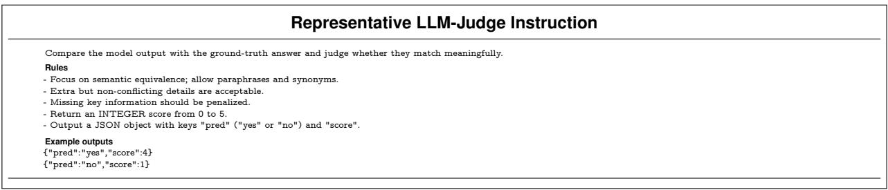  
FuRtiv i ask assessment and returns a binary decision together with an integer quality score.

Prompt sensitivity and human audit. We do not interpret LLM judgment in isolation. Instead, it is used as a scalable semantic evaluator whose outputs are considered together with orthogonal benchmark velyalyrno we conduct a stratified human audit on sampled instances spanning all three profiles, both task families, multiple modality configurations, and multiple diffiulty bands. This is important because a model may produce a plausible answer without retrieving the required evidence, or may retrieve the correct evidence but restate it incompletely. Under our evaluation design, such cases can be separated rather than collapsed into asingle undifferentiated outcome.To further control judge-side variance, we conduct a stratifedhuman audit on sampled instances spanning profles, task familes, modality configurations, and dificulty bands. The audits intentionally concentratedon judgment-sensitivecategorie, including long legalofnancialanswers, partially correct multi-part responses, and concise but evidence-grounded outputs whose surface form may differ substantially from the reference answer. For each audited instance, reviewers inspect the question, the ground-truth answer, the model prediction, and the judge output, and assess whether the judge's binary decision and 05 score are semantically justified. When discrepancies are identified, they are recorded by category (e.., omission f a decisive detail, over-acceptance of unsupported elaboration,orunder-acceptance of concise but valid restatement) and used to refine our interpretation of judge-based results. The role of this audit is not to replace large-scale automatic judging, but to check whether benchmark-level conclusions are sensitive torecurrent categories of judgeerror.This audit protocol serves two purposes it verifes that the constrained judging prompt behaves consistently on ambiguity-prone cases, and it provides an explicit check that benchmark conclusions are not artifacts of a small number of systematic judge errors. In this design, the binary label (pred) captures task-level success, while the graded score (05) provides a softer estimate of completeness and semantic quality. More importantly, the human audit anchors these signals to manual inspection on the cases most likely to challenge automatic judgment, making the LLM judge an audited semantic evaluator whose outputs are checked against manual inspection on ambiguity-prone cases.

# D.5 Extended Metric Summary

Table  coplements the main-text results by placinanswer quality, evidence retrieval quality, and runtime efncy  sglenidtableUnlikhe prol-wisen capabily-wisesumari the mainte, appendix table is intended to expose cross-metrictrade-o more directly, epecially the separation betwen answer correctness, evidence coverage, evidence specificity, and latency. TableOverall meri ary n Hipamp.For he ethods inTable , wereort answer uality an ence r LLMu oalevth metrics are shown as percentages with one decimal place ( $\%$ omitted). Best is highlighted; second-best is underlined.   

<table><tr><td>Method</td><td colspan="6">Profilling</td><td colspan="6"></td><td colspan="6">Overall</td></tr><tr><td></td><td> ie 1 Fie cl i </td><td></td><td></td><td></td><td></td><td>Avg Score Avg Latency</td><td></td><td></td><td>Acc le 1 ile call Fle cio</td><td></td><td>Avg Score Avg Latency</td><td></td><td></td><td></td><td></td><td></td><td>ileF i ca  co co </td><td></td></tr><tr><td>Standard RAG (Lewis et al., 2020)</td><td>0.0</td><td></td><td></td><td></td><td></td><td>5281.6</td><td>RAG Methods</td><td></td><td></td><td></td><td></td><td></td><td></td><td></td><td></td><td></td><td></td><td>5454.0</td></tr><tr><td>Self RAG (Asai et al., 204)</td><td></td><td>18.2</td><td>10.0</td><td>20.1</td><td>2.9</td><td>69917.9</td><td>27.3</td><td>30.1</td><td>76.6</td><td>21.8</td><td>$3.0</td><td>5473.8 75821.5</td><td>27.5</td><td>$2.1 </td><td>61.3</td><td>2.55</td><td>$3.2</td><td>75211.9</td></tr><tr><td></td><td></td><td></td><td></td><td></td><td></td><td>Search Agent Methods</td><td></td><td></td><td></td><td></td><td></td><td></td><td></td><td></td><td></td><td></td><td></td><td></td></tr><tr><td>ReAct ( (Yao et al., ,2023) (Qwn3-VL-8B-Instruct (Baie al.,</td><td>., 2025)) 13.5</td><td>1.6</td><td>8.2</td><td>27.3</td><td></td><td>388019.1</td><td>26.7</td><td>39.7</td><td>50.66</td><td>37.3</td><td>$\0rac{ }$</td><td>489949.4</td><td>25.3</td><td>36.9</td><td>49.8</td><td>36.2</td><td>$\frac{ { 2 }$</td><td>479423.0</td></tr><tr><td>RAc  Search-R1 (Jin et al., 2025)</td><td>50.0  </td><td></td><td>$20.5 </td><td>29.3</td><td>$22rac{2}$</td><td>12360.3</td><td>24. </td><td>2.8</td><td></td><td>32.5 </td><td></td><td>13918.2</td><td>32. 2</td><td>24.</td><td>74.5</td><td>31.5 </td><td></td><td>13503.0 11908.5</td></tr><tr><td></td><td></td><td></td><td></td><td></td><td></td><td>Autonomous Agent Systems</td><td></td><td></td><td></td><td></td><td></td><td>11856.4</td><td></td><td></td><td>54.2</td><td></td><td></td><td></td></tr><tr><td>TenalAew-VL-B-Inc l</td><td></td><td>11.6</td><td></td><td></td><td></td><td>101941.8</td><td>11.1</td><td></td><td></td><td></td><td></td><td></td><td></td><td></td><td></td><td></td><td></td><td>69242.9</td></tr><tr><td>Terminal Agent ( C 0</td><td></td><td>15.0</td><td></td><td></td><td></td><td>1953.9</td><td>21.7</td><td>$\r</td><td>$3rac$</td><td>$A0</td><td>$\frac{{ }$</td><td>65477.2 34474.4</td><td>22.0</td><td>15.9 24.0</td><td>19.3 $3r 5</td><td></td><td></td><td>32912.9</td></tr><tr><td>Tenal Aent GPT..2 OpenAL, 20)</td><td>A6.0</td><td>11.1</td><td>$6.7 15.8</td><td>$310 </td><td>$2f0rac{6}$</td><td>61514.9</td><td>45.7</td><td></td><td></td><td></td><td></td><td>146353.1</td><td>44.1</td><td>21.7</td><td></td><td></td><td>$\frac { { }$</td><td>1 3591.8</td></tr><tr><td>Ch An o enAl  a Op pen.AI, 2025a)</td><td>48.3</td><td>21.0</td><td></td><td>40.1</td><td>5.3</td><td>6146.7</td><td>56.8</td><td></td><td></td><td></td><td>5.9</td><td>805238.5</td><td>55.9</td><td>29.9</td><td></td><td>$Mra}$</td><td>5.8</td><td> 78558.1</td></tr><tr><td></td><td></td><td></td><td></td><td></td><td></td><td></td><td></td><td></td><td></td><td></td><td></td><td></td><td></td><td></td><td></td><td></td><td></td><td></td></tr><tr><td></td><td></td><td></td><td></td><td></td><td></td><td></td><td></td><td></td><td></td><td></td><td></td><td></td><td></td><td></td><td></td><td></td><td></td><td></td></tr><tr><td></td><td></td><td></td><td></td><td></td><td></td><td></td><td></td><td></td><td></td><td></td><td></td><td></td><td></td><td></td><td></td><td></td><td></td><td></td></tr><tr><td></td><td></td><td></td><td></td><td></td><td></td><td></td><td></td><td></td><td></td><td></td><td></td><td></td><td></td><td></td><td></td><td></td><td></td><td></td></tr><tr><td></td><td></td><td></td><td></td><td></td><td></td><td></td><td></td><td></td><td></td><td></td><td></td><td></td><td></td><td></td><td></td><td></td><td></td><td></td></tr><tr><td></td><td></td><td></td><td></td><td></td><td></td><td></td><td></td><td></td><td></td><td></td><td></td><td></td><td></td><td></td><td></td><td></td><td></td><td></td></tr></table>

F,the ank nduc byanswe quality cleary eparated from that inducd by etrival qualiy.O answer-level metrics, autonomous agent systems are consistently stronger than RAG-style pipelines and lightweight search agents. In particular, ChatGPT Agent Mode achieves the best accuracy across profiling (48.3), actual retention (56.8), and the overall benchmark average (55.9), and alsobtains the highest avege judge scores on all three aggregates (5.3, 5.9, and 5.8). Terminal Agent (GPT-5.2) is the second strongest methodters flnswe qualiy rchin 30./4.7/4.1ccac profln/acual etentin/vll, respectively. By contrast, methods with relatively competitive retrieval statistics, such as Search-R1 or ReAct variants, remain substantially behind on final judged correctness. This gap indicates that, in HippoCamp, performance is not bottlenecked by retrieval alone; converting retrieved evidence into a semantically correct final response remains a major source of error.

Sen strog eviece etrival does ot liably ystrongen-task peoranThsmosl the search-oriented methods. ReAct (Qwen3-VL-8B-Instruct) achieves the highest overall File F1 (36.9) and File Precision (36.2), while ReAct (Gemini-2.5-fash) yields the highest overall File Recall (74.5). Search-R1 is also competitive, with 34.9 overall File F1 and 54.2 overall File Recall. However, these methods do not translate their retrieval advantages into comparable answer accuracy:their overall accuracies are 25.3, 33.6, and 2.7, respectively a well below the best autonomous agents.This discrepancy suggests that a substantial fracio bencmarkfailure riserretrieval icludincompleteinterpretatiomultimodalence inability o reconcile partially relevant fles, and weak synthesis across multiple supportin sources. Inher wors, etrin hetat uportine s neary, ut ot suffint,r prodcg cor under the LLM-judge criterion.

Thir theoskmieintlcsnearcul ni than profiling at the answer level. For example, Terminal Agent (GPT-5.2) improves from 30.0 accuracy on profiling to 45.7 on factual retention, and ChatGPT Agent Mode improves from 48.3 to 56.8. This pattern is consistent with the intended task design. Factual-retention questions more often depend on recovering explicit user-local facts, whereas profiling requires abstraction from weak, distributed, and often temporally separate sinalNotably, this answer-level gap islarger thanthe correspondin gapnretrieval qualy.Fr several methods, profling File F1 is not dramatically worse than factual-retention File F1, and in some cases remains comparable relative to the method family. The larger drop in profling accuracy therefore points to a reasoning bottleneck rather than a purely retrieval bottleneck: even when candidate evidence is partially avilable, iferristable user traits, preferencs,rroutines  substantiallyharder than restating lcalizd facts. Fourth, RAG pipelines exhibit a characteristic coveragespecificity trade-off. Standard RAGand Self RAG achieve relatively high overall File Recall (69.3 and 61.3), but their overall File Precision remains limited (21.7 and 24.5), and their overall accuracies remain modest (27.5 and 23.8). This pattern suggests that these methods often retrieve broad evidence pools that overlap with the annotated supporting set, but struggle to isolate the minimal evidence needed for precise grounded answering. The effect is especially pronounced on factual retention, where both methods recover a large fraction of relevant files yet stillunderperform substantially on judgedcorrectness.This resul s consistent with the broader desig motivation o HippoCamp: benchmark success requires not only coarse retrieval coverage, but also disciplined evidence selection and reliable reasoning over heterogeneous personal files. Finally, there is a pronouncd efficiencycapability trade-ofStandard RAG is the fastest method by alarge margin, with the lowest average latency across all three aggregates, while ReAct (Gemini-2.5-fash) and Search-R1 remain relatively effcient compared with full autonomous agents. In contrast, the strongest answer-level method, ChatGPT Agent Mode, incurs by far the highest latency. The same trend holds, though less extremely, for other agentic systems with stronger end-task performance. This suggests that current gains in grounded multimodal fle reasoning are achieved partly through longer interaction horizons, more iterative tool use, or heavier cross-file processing, rather than through more efficient inference alone. Overal the results in Table 8 reinforce the central premise of HippoCamp: personalized fle-system QA cannot be adequately characterized by final accuracy alone. Methods that appear competitive in retrieval may still fail during evidence interpretation and synthesis, while methods that achieve stronger final correctness often do so with substantial computational overhead. The benchmark therefore exposes a three-way tension among evidence coverage, grounded reasoning, and efficiency, which is largely obscured by single-metricevaluation.

# References

[] Asai, A., Wu, Z., Wang, Y., Sil, A. Hajishirzi, H.: Self-RAG: Learni to retrieve, geneate, and criqe through self-reflection. In: The Twelfth International Conference on Learning Representations. (2024), https: //openreview.net/forum?id=hSyW5go0v8.   
[BaiS Cai, Y. hen,R., hen, K. hen, X. he, Z Deng, L. Dng W. Gao, C. Ge, C. Ge, W. Gu, Z, H . H J HF. Hu B.  S. Li Z. LiM. Li . LiK. Lin . inJ Lu X. J, LC. LiuY. Liu D. Liu S. LuD. Luo R. Lv C.Men R.Me L. Ren X.Ren X.SS. SuY., JTu J  J P Y. Xie T uY u H. u J, M. Yn J anA.YuB ZaF. ZhH. Z X. Zhe B ZH. Zhou, J Zhou,F. Z J, Zhu, Y., Zhu, K.: Qwen3-vl technical report, (2025), https://arxiv.org/abs/2511.21631.   
[3] Chang, Y., Bisk, Y.: Webqa: A multimodal multihop neurips challenge. In:NeurIPS 2021 Competitions and Demonstrations Track. pp. 232245. PMLR, (2022). [n CnM. Lin X. Li J LinL. Qhen, X. Luo JSunC. Z  Li, X.T: Building long-term and multimodal memory for agentic ai, (2026), https://arxiv.org/abs/2601.06037.   
[o, J. M .   He Y. alM. :ual  yu  u multi-document understanding, (2024), https://arxiv.org/abs/2411.04952.   
[c, G. Bieer,E. Shn, M. suat, I Seva N.Dhil, I Bn,M. Ram, O. Z, D. Rose, E., Mar, L.Petulla, S.Gafey, C. ai A. Lintz N. Pais T.C. Jacoson, H. Sz, I., Jiang, N.J., Hariasan, K., Omran, A., Sunshi, N., Bahri, D. Mishra, G., Chu, E., Boyd, T., Hekman, B., Parisi, A. Zhang, C., Kaiiranon, K. Bedrax-Weiss, T. Wang, O. Xu,Y., Purkiss, O. Mendlovic,U.,Deute, I., Nguyen, N., Langley, A., Korn, F., Rossazza, L., Ramé, A., Waghmare, S., Miller, H., Byrd, N., Sheshan, A., Hadsell, R., Bhardwaj, S., Janus, P., Rissa, T., Horgan, D., ., Helmholz, W.: Gemini 2.5: Pushing the fronier with advanced reasoning, multimodality, long context, and next generation agentic capabilitie, (2025), https://arxiv.org/abs/2507.06261.   
[ong, K.ChagY. Goh, X.D. Li, D. TagR. Liu, Y.MBenulerl r documents, (2025a), https://arxiv.org/abs/2501.08828. [] Dong, K. Chang, Y., Huang, S., Wang, Y., Tang, R., Liu, Y.: Benchmarkig retreval-augmentedmultiomal generation for document question answering. In: The Thirty-ninth Annual Conference on Neural Information Processing Systems Datasets and Benchmarks Track. (2025b),https://openreview.net/forum?id $\underline { { \underline { { \mathbf { \Pi } } } } } =$ W4b3v9jx1p. [9R.Bely M. Sayal, Raen:Explae v t , https://arxiv.org/abs/2407.11005.   
[0] Fu, D., He, K. Wang, Y., Hong, W., gQue, Z., Zen, W. Wang, W. Wang, J. Cai, X. Xu, W.: Enncgen alizati hrog ret tun. InTheThirtehIntatialnerecn Lr Representations. (2025), https://openreview.net/forum?id=FDimWzmcWn.   
[11] Guo, D. et al:Deepseek-r1 incentivizes reasoning in llms through reinforcement learning.Nature, (2025a), https://doi.org/10.1038/s41586-025-09422-z.   
[2] Guo, Z., Ren, X., Xu, L., Zhang, J., Huang, C.: Rag-anything: All-in-one rag framework, (2025b), https: //arxiv.org/abs/2510.12323.   
I  H. A.M.  Y. c .u,  , long context understanding, and program synthesis. In: The Twelfth International Conference on Learning Representations. (2024), https://openreview.net/forum?id=9JQtrumvg8.   
[H,Y. Shi J. Li,Y. Fan, C. Wu, S. Zha, Q. Liu,Y. Zhou, P. Wan,Y. Gog N.Z. Sun, L: Metatool benchmark for large language models: Deciding whether to use tools and which to use, (2024), https://openreview.net/forum?id $\displaystyle =$ R0c2qtalgG.   
[ I,    iea D. Qn R. S .Vie, BF: question answering. arXiv preprint arXiv:2311.11944, (2023).   
[ Jin B. Zen, H. Yue Z.Yoon J. rikS.OWan D. Z H Han J.S-r Ls and leverage search engines with reinforcement learning, (2025), https://openreview.net/forum?id $\ c =$ Rwhi91ideu.   
[7] Koh, J.Y., Lo, R., Jang, L., Duvvur, V., Lim, M.C., Huang, P.Y., Neubig, G. Zhou, S., Salautdinov, R. Fried, D.: Visualwebarena: Evaluating multimodal agents on realistic visual web tasks, (2024), https: //arxiv.org/abs/2401.13649.   
[18] Le, C.P. Choi, J Mutlu, B.Map:Multi-ser peronalzatin with colaborative -poweed agens.In: Proceedings of the Extended Abstracts of the CHI Conference on Human Factors in Computing Systems. CHI EA '25, New York, NY, USA, Association for Computing Machinery, (2025). doi: 10.1145/3706599.3719853, https://doi.org/10.1145/3706599.3719853.   
A.   . H..ui , T.Riedel, S., Kiela, D.Retrieval-augmented generation for knowledge-intensive lp tasks.Advances innural information processing systems, 33, 94599474, (2020).   
[0 Li . i B.  L BeigA. Zhao C. Tan Z. e A. igY.Chen C. u T. , Che L. Liu,HFroatio ojuent:Opporni ancalengas-udge.In:Cone EmpiricalMethodsinNatural LanguageProcessing. 024a),https:apisemanticcholar.orgCorpusID:27428057.   
[] ,Y. e, H. ,. X.  Y. Li G. Liu J. Xu . , X. S Y. R., Y.G H.L J. Jin X. Ye, Z. XiG ZF. Li X. XuM. Li Z. Li P LiuY. Z, Y.Q. Liu, Y. Persnal lm agents: Insihts and survey about the capabily, effiency and security, (02b), https://arxiv.org/abs/2401.05459.   
[J ZuD. Ba . HeY. L H. ue H. C G J Y., G H. Li S.Li Z. Y. Y.Tn J. uW.  Z. ZhuRFJ. aoY. He, , T. F. SuTanY.  Z.aJ Ye . ZB. W. H W Li S A comprehensive survey on long context language modeling, (2025), https://arxiv.org/abs/2503.17407.   
[3Luo, H. Dai, S.Ni,C. Li, X. Zhag G.WangK. LiT.Salam, H.edi: Hu-eve security evaluation for LLM agents. In:The Thirty-ninth Annual Conference on Neural Information Processing Systems. (2025), https://openreview.net/forum?id=2KKqp7MWJM.   
.H.TkB.Bva memory of  agents. Inrocedingsf the 6nd Annal Meeting f theAssociation or Computatinal Linguisi (Volume 1: Long Papers). pp. 1385113870. (2024).   
[5 Mio, GFr, C. Wol T. LeCun,Y. Scia, T.GAIA:ehroralAIasan(0, https://openreview.net/forum?id $\displaystyle =$ fibxvahvs3.   
[26OpenAI:Gpt-5 is proudlyunched., August2025a), https://peai.com/zh-Hans-CN/index/intrducin-t-/.   
[27] OpenAI: Update to gpt-5 system card: Gpt-5.2, (December 2025b), https://cdn.openai.com/pdf/ 3a4153c8-c748-4b71-8e31-aecbde944f8d/oai_5_2_system-card.pdf.   
[OeAI, Achia, J. Ader, S. Aaral S. Ad, L. kya, I.Aman, F.L. lia, D. lt, J, Aln S.AnkatS.AvilaR.Babuk, I Bala S.Balco,V.Balesc P. BaoH.Bava Beu, JBe Berine J. BerttShapiroG.Berer, BoL. Boiko BoyMBa, A.L. Brockman, G. Brooks, T., Brundage, M. Button, K., Cai, T. Campbel R., Cann, A. Carey, B. Carlon, C Caricael, R., Chan, B. Chang, C.Chantzis, F.Chen, D. Chen, S. Chen, R.Chen, J. Chen, M.he, BCho, C.Chu C.Chu, H.W.Cuis, D. Currier J.Dai, Y. Decarux, C. Degry T. Deusc, N., eve, D. DharA. , o S.D Scot, EleA.T. FrhiD.F L Feix, N.Fishman, S.P. Forte J. Fulfor, I. Gao, L Georges, E Gibson C., GoelV. Ggineni, T. GoG, Gonio-Lopes R.Goron, J. Grain, M. Gray, S. Greee, R. Gross, J. GuS.S. GuoY. Hallacy, C. Han, J Harr, J. HeY. Hean, M. Heicke, J. Hesse, C. Hickey A. Hickey, W. Hoele P. Hoon, B. H, K Hu S. Hu, X. H J. ai S.Ji S. Jg J.JA. J R. Jn H. Jin D.Jo SJ, BJun,H. Kaftan, T.Luk Kaiser Kamali A. Kanieier, I. Keskar, N.S. Khan, T. Kiaric, LK, J.W., Kim, C., Kim, Y., Kirchner, J.H., Kiros, J., Knight, M. Kokotajo, D., Lukasz Kondraciuk, Kondrich, A., Konns A. Kosic,K. ueer G Kuo V. Le, M. Lan, I Lee T. Leike J. Lug J. Levy i, C.M. Lim, R. Lin, M., Lin, S. Litwi, M. Lope, T. Lowe, R. Lue, P. Makju, A. Ma K. M, S., Markov, T., Markovski, Y., Martin, B., Mayer, K., Mayne, A., McGrew, B., McKinney, S.M., McLeavey, C., McMilan, P. McNeil, J., Medina, D. Mehta, A. Menick, J. Metz, L. Mishcheko, A., Mishkin, P. MonacoV., Morikawa, E. Mossi, D. Mu T. Murati, M. Murk, O. Méy, D., Nair A. Nako, R. Nayak, R. Neek, A. Ngo,R., Noh,H.Ouyn, LOKeee, C. Pcocki, J. Paino,A., Palero, J., Pantuano,A., ao, G J . vov...ver OvPnto H.P.Mice ky as, M. oV.H. we T.er A. r,B. PE, Pri R. Radford, A. Rae J. Ramesh, A.Raymond C. Real,F. Ribach, K. RossC. Rotsted, B. Rouss, H, Ryr, . Se M.SnersT. Sanrkr S. Sstry GSi, H.Sh .uan J. S, Sr.ko Sie J.ShoerS.Sy.Sior,  igM.S, J K. Sohl, I Soksky B. SonY. Staacher N. Such,F.P.Sers, N.Sutsver, I. Tang J. Tek., TnM.BTiet,P.TA.TsegE.uge P.Tury N.T, J. Uribe, J.F.C., A. Vijrgiya, A. VossC. Wairit,C.Wang, J.J. Wang, A. Wang, B. Ward, J. Wei, J.Weia, C We A. g  L . i . C. H Wor L. Wu S. Wu, J. WuM. Xio K. Xu, T. Yoo,S. Yu,K. Yua, Q. Za W. Zel, R. Zhang, C. Zhan, M.Zhao, S. Zheng, T. Zhun, J. Zhuk, W. Zoph, B. Gpt-tecnial report, (02), https://arxiv.org/abs/2303.08774.   
L uY.  H. Zhu J R n Q B. Zo Z. i. Zo X. Shi J, Cu P., Liu, M. Li, Z., Xu, C. Zhang, B. Shi, B. Tu, Z. He, C.Oiben:Bnarkdive document parsing with comprehensive annotations, (2025), https://arxiv.org/abs/2412.07626.   
[30 PBC, A. Intrduci caueonne .5 Sptemer 2025) https://ntic.com/news/claude-so-4.   
. n.oN.T J Y. , J Plachouras, V., Rocktäsche, T. Riedel, S. Kilt:a bencmark or knowledge intensive language tasks.In: Proceedings of the 2021 Conference of the North American Chapter of the Asociation for Computational Linguistics: Human Language Technologies. pp. 25232544. (2021).   
[2] Pipitone, N.AlamiG.H. Legalbench-rag:A bencmarkorretrieval-augente eneration the legalm. arXiv preprint arXiv:2408.10343, (2024).   
[3] Ren, X. Xu, L Xia, L. Wang, S. Yin, D. Huang,C. Viorag:Retrivalaugente generation wit extrme long-context videos, (2025), https://arxiv.org/abs/2502.01549.   
[34 Sad T henY. Peaer, AVtaBenc:i ear o o-or p Ir R- L MelS 2025 Conference on Empirical Methods in Natural Language Processing: Industry Track. pp. 21222145. Suzhou (China), Association for Computational Linguistics, (November 2025). doi: 10.18653/v1/2025.emnlp-industry.149, https://aclanthology.org/2025.emnlp-industry.149/.   
[35 Song, Y. Thai, K., Pham, C.M. Chang, Y. Nadf, M. Iyer, M. BEARCUBS:A benar or ous web agents, (2025), https://openreview.net/forum?id $\underline { { \underline { { \mathbf { \Pi } } } } } =$ OJzWiigkUy.   
J .u JChanJSa L asR.Mays B., HJG n:v second International Conference on Machine Learning. (2025), https://openreview.net/forum?id=xF5PuTLPbn.   
[37] Sumers, T.R., Yao, S., Narasimhan, K., Griffiths, T.L.:Cognitive architectures for language agents, (2024), https://arxiv.org/abs/2309.02427.   
TaYav. L Y.a.  HHBu Complex question answering over text, tables and images, (2021), https://arxiv.org/abs/2104.06039.   
[39] Tang, Y., Yang, Y.:Multiop-rag:Benchmarkig retrieval-ugmetedgeneration ormulthop qeris, (2024), https://arxiv.org/abs/2401.15391.   
[0Tan S. R. uo, H. , P. oY.  X.  J Z H. Zhu, H. u.- tool-thought for ultra-long egocentric video reasoning, (2025), https://arxiv.org/abs/2506.13654.   
[1 Va D., Kalokyri .Borgia, A. Nguye, T.D. Marn A.: Srteu peal digaltrc, (October 2019). doi: 10.1002/pra2.22, https://doi.org/10.1002/pra2.22.   
[ X.  .  JCheY.n   H.  H. with tools and language feedback, (2024a), https://openreview.net/forum?id $=$ jp3gWrMuIZ.   
[  Z. Li Z. J Z.Tu . Shi . editable memory graphs, (2024b), https://arxiv.org/abs/2409.19401.   
[44] Wang, Z., Xu, H., Wang, J., Zhang, X., Yan, M., Zhang, J., Huang, F., Ji, H.:Mobile-agent-e:Selfevolving mobile assistant for complex tasks. In: Workshop on Scaling Environments for Agents. (2025), https://openreview.net/forum?id=GRmrGws6Lf.   
[5Wi J.Sun .y S.  S. Han J.Fur I H.WPA.T. us W.G Browsecomp: A simple yet challenging benchmark for browsing agents, (2025), https://arxiv.org/abs/2504.12516.   
[J e .  Y.Y  B.Ma.  ., https://arxiv.org/abs/2506.20670.   
[u Z. Han C Dig Z.Weg Z. LiuZ. Yao S.YuT.K LO-T agents with self-improvement, (2024), https://arxiv.org/abs/2402.07456.   
[ Xi Y. Li, J. ZM. XioY. Ou, . u J. n T.nB. Lu . Y.T, R., W. Yu, Y. Infodeepseek: Benchmarking agentic information seeking fr retrieval-augmented generation, (2025), https://arxiv.org/abs/2505.15872.   
[9 Xi, Z.Cen W. Guo, X., He,W. DigY. Ho B.  . g J. Jin, S. Zou E. ZR.F X., W X. Xig, L. Zhou Y. Wag W. Jia C. Zou,Y. Liu, X. Yin, Z. Dou, S. We R.e W, Z Q. i W. Zhe Y. Qiu X. H X. Gui T.Thee agents: A survey, (2023), https://arxiv.org/abs/2309.07864.   
[0 Xi Z. SunD.Q. K.PelM. ae JZY. Lu J. AO. R.TzeO, M. BegioAstr-ben:Evalti oo-usagen reas nd act pla with peral usercxt, (2026), https://arxiv.org/abs/2603.01357.   
YJ Li So H. Y. X.  SgP  Z. Xi B. .B , e M. ai Li B.aY.  P Hn F, Jo FYang L Liu.o Towars egocentric le assistant. In:Procdingsf the IEEE/CVF Conference n Computer Vision and Pattern Recognition (CVPR). pp. 2888528900. (June 2025).   
[2 Yang, Z. Qi, P. Zhang, S. Benio, Y.Chen, W.W. Saluiov, R. M, C.D. Hotoqa:da diverse,explainable multihop question answering In: Proceedings f the 2018 conferenc nmpirical methods in natural language processing. pp. 23692380. (2018).   
Yo H R. H J JY  . ZhuR. JiY. LS Tao agentic multimodal large language models, (2025), https://arxiv.org/abs/2510.10991.   
[o,S henH.Yg Jn, K.We:T al eal-orwe i gets.Inoyejo S. MoS.Aarwal, . Begrave, D.Cho, K.Oh,A. sAva I so 0ht neurips.cc/paper_fles/paper/2022/fle/82ad13ec01f9fe44c01cb91814fd7b8c-Paper-Conference.pdf.   
[5]Yao, S. Zhao, J.Yu, D. Du, N.Saan, I., Narasi, K.R. Cao, Y.Reac:Syeizi and acting in language models. In:The Eleventh International Conference on Learning Representations. (2023), https://openreview.net/forum?id=WE_vluYUL-X.   
[6 Yu, H. Shen, B. Ran, D. Zhag J. Zhag, Q. Ma, Y., Lg, G. Li, Y., ang, Q. Xie,T.:Codeva:A bencmark of pragmatic code generation wit generative pre-trained models. In:Proceedings f the 6th IEEE/ACM International Conference on Software Engineering. pp. 112. (2024).   
[ Zhan, Z. Wang, J. Zhou S. Deng, J. ZhangR. ma:Mui-o eraleaige language models for biomedical in-context learning, (2025), https://arxiv.org/abs/2502.15954.   
[8] Zhang, G., Fu, M. Wang, K., Wan, G., Yu, M. YAN, S.:G-memory:Traci hierarchical memory for multiagent systems. In: The Thirty-ninth Annual Conference on Neural Information Processing Systems. (2025a), https://openreview.net/forum?id=mmIAp3cVSO.   
[9 J LaT R.  .Yao. Zhu. TanJ T..  L FY., Awalgaonkar, T., Niebles, J.C. Savarese, S., Heinecke, S., Wang, H., Xiong, C.: Agentohana: Desig unifed data and training pipeline for effective agent learning, (2024), https://arxiv.org/abs/2402.15506.   
[60] Zhang, W., Zhang, X., Zhang, C., Yang, L., Shang, J., Wei, Z., Zou, H.P., Huang, Z., Wang, Z., Gao, Y., Pan, X., Xiong, L., Liu, J., Yu, P.S., Li, X.: Personaagent: When large language model agents meet personalization at test time. In:First Workshop on Multi-Turn Interactions in Large Language Models. (2025b), https://openreview.net/forum?id=fgCOkyJG3f.   
[ Zhao A. Hua D. Xu Q. Lin,M. LuY.J. Hu GExpel Lereepelar (2), https://arxiv.org/abs/2308.10144.   
[  B. .Y.Jin . Z..ASoY Y.  J Liu G..: SilvWe vydki0ttv/ab/250