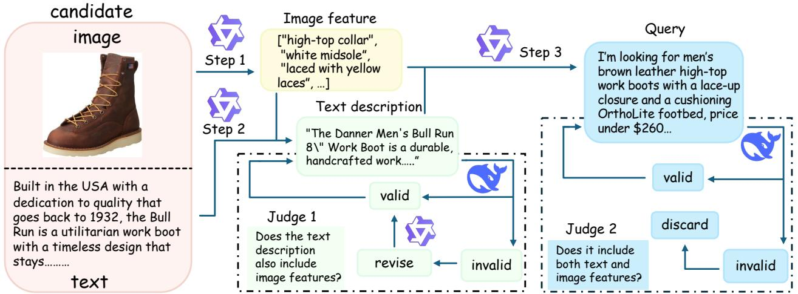

# 1. 论文基本信息

## 1.1. 标题
**Beyond Global Similarity: Towards Fine-Grained, Multi-Condition Multimodal Retrieval** (超越全局相似度：迈向细粒度、多条件多模态检索)

## 1.2. 作者
Xuan Lu (上海交通大学, 东方理工数字孪生研究所, 宁波市空间智能与数字衍生重点实验室)、Kangle Li (上海交通大学, 东方理工数字孪生研究所)、Haohang Huang (宁波市空间智能与数字衍生重点实验室)、Rui Meng (东方理工数字孪生研究所, 宁波市空间智能与数字衍生重点实验室)、Wenjun Zeng (东方理工数字孪生研究所, 宁波市空间智能与数字衍生重点实验室)、Xiaoyu Shen (东方理工数字孪生研究所, 宁波市空间智能与数字衍生重点实验室)。

## 1.3. 发表期刊/会议
arXiv 预印本。根据发表时间（2026年），这可能是一篇较新的研究成果，尚未正式发表于期刊或会议，或者刚刚被接收。

## 1.4. 发表年份
2026年

## 1.5. 摘要
本文提出 MCMR (Multi-Conditional Multimodal Retrieval)，这是一个大规模基准测试，旨在评估自然语言查询下的细粒度、多条件跨模态检索。现有的多模态大语言模型（MLLMs）虽然扩展了检索能力，但现有基准测试多关注粗粒度或单条件对齐，忽略了现实世界中用户指定多个跨模态约束的场景。MCMR 涵盖五个产品领域（上装、下装、珠宝、鞋类、家具），保留了丰富的长形式元数据。每个查询集成了互补的视觉和文本属性，要求模型必须同时满足所有指定条件才算相关。通过对多种 MLLM 检索器和视觉语言重排序器的基准测试，实验揭示了：(i) 模型间存在明显的模态不对称性；(ii) 视觉线索主导早期排序精度，而文本元数据稳定长尾排序；(iii) 基于 MLLM 的逐点重排序器通过显式验证查询-候选者一致性，显著改善了细粒度匹配。MCMR 为推动多模态检索向组合式、约束感知和可解释理解发展建立了一个具有挑战性和诊断性的基准。

## 1.6. 原文链接
https://arxiv.org/abs/2603.01082 (预印本状态)

# 2. 整体概括

## 2.1. 研究背景与动机
随着多模态大语言模型（MLLMs）的快速发展，多模态检索系统的能力得到了显著扩展。早期的模型如 CLIP 主要通过对比学习训练全局的图像-文本对，倾向于强调全局语义一致性。然而，在现实世界的应用场景中（如电商搜索），用户的查询往往非常复杂，包含多个相互依赖的约束条件，并且这些条件可能跨越不同的模态（例如，“找一件红色的衬衫”涉及视觉颜色，“材质要是纯棉的”涉及文本元数据）。

现有的基准测试存在明显的局限性：
1.  **粗粒度主导**：如 MS-COCO 和 Flickr30K，主要评估图像与整体描述之间的全局对齐，缺乏细粒度的属性推理。
2.  **单模态或单条件**：如 FashionIQ 和 CIRR，虽然引入了细粒度修改，但主要围绕单一视觉编辑，且多依赖参考图像而非自然语言描述。
3.  **缺乏跨模态证据验证**：大多数数据集无法强制要求模型必须同时利用图像和文本信息才能解决问题。

    为了解决这些空白，本文的切入点是构建一个**双重证据**的基准测试，强制要求某些属性只能从图像推断，而另一些只能从文本元数据推断，从而严格测试模型整合互补证据的能力。

## 2.2. 核心贡献/主要发现
1.  **基准测试 MCMR**：提出了一个大规模、细粒度、多条件的多模态检索基准测试。该数据集包含 10,400 个产品，覆盖五个领域，并严格遵循双重证据设计原则（即必须同时使用图像和文本信息）。
2.  **系统性评估**：对多种代表性的多模态检索器和基于 MLLM 的重排序器进行了全面评估，揭示了当前系统在处理复杂组合约束时的系统性弱点。
3.  **关键发现**：
    *   **模态不对称性**：不同模型对不同模态的依赖程度差异巨大。例如，GME 对视觉信息依赖较强，移除文本后性能下降较小；而 LLaVE 则严重依赖文本信息。
    *   **模态功能差异**：视觉线索对于提高排序前列的精度至关重要，而文本元数据则有助于稳定长尾排序。
    *   **重排序器的有效性**：基于 MLLM 的逐点重排序器能够通过显式验证查询与候选的一致性，显著提升细粒度匹配的性能，但这通常伴随着较高的计算成本。

# 3. 预备知识与相关工作

## 3.1. 基础概念
为了理解本文，需要掌握以下核心概念：

*   **多模态检索**：指在包含不同类型数据（如文本、图像、视频）的数据库中，根据一种模态的查询（如文本描述）检索出另一种模态（如图像）或混合模态的相关信息的技术。
*   **双编码器**：一种常见的多模态架构，包含两个独立的编码器，分别将图像和文本映射到同一个共享的潜在向量空间。检索时通过计算两个向量的相似度（如余弦相似度）来完成。代表模型有 CLIP, BLIP。
*   **多模态大语言模型**：这类模型结合了视觉编码器和语言大模型，能够处理图像和文本的交织输入，并生成文本输出。本文中提到的 MLLM 不仅用于生成，也被用作特征提取器（Embedding）或重排序器。
*   **检索与重排序**：
    *   **检索**：通常指在大规模候选集中快速筛选出可能相关的子集（如 Top-100）。
    *   **重排序**：对检索阶段返回的候选集进行更精细的重新排序，通常计算成本更高，但能提供更准确的排序结果。
*   **细粒度检索**：不同于全局语义匹配，细粒度检索关注具体的属性（如颜色、形状、材质）是否精确匹配。

## 3.2. 前人工作
作者在文中回顾了以下几类相关工作：

1.  **多模态检索模型**：
    *   **CLIP / ALIGN / BLIP**：基于对比学习的双编码器模型，奠定了图像-文本全局对齐的基础的基础。
    *   **VLM2Vec / MM-Embed / GME**：较新的方法，利用 MLLM 生成指令感知的统一嵌入，增强了模型对特定指令的响应能力。

2.  **多模态检索基准测试**：
    *   **MS-COCO / Flickr30K**：经典的图像-文本检索数据集，主要关注全局语义相似度。
    *   **FashionIQ / CIRR**：针对时尚领域的细粒度检索，通常基于参考图像进行修改（如“同样的款式但颜色更亮”），侧重于视觉编辑。
    *   **MERIT**：最近的工作，支持多语言和交织的文本-图像查询，允许引用多个图像。作者指出 MERIT 依赖于用户提供的参考图像，且未显式分离视觉和文本属性。

## 3.3. 技术演进
该领域从早期的**全局语义对齐**（CLIP时代）演进到**指令感知的检索**（MLLM-as-Embedding时代），再进一步向**组合式推理**发展。早期的基准测试只能验证模型是否理解了“大概是什么”，而现在的需求是验证模型是否理解了“具体细节是什么”以及“是否满足所有复杂条件”。本文的工作正是为了填补这一演进过程中缺失的评估环节。

## 3.4. 差异化分析
本文方法与相关工作最核心的区别在于**双重证据设计**和**自然语言多条件查询**。
*   与 FashionIQ/CIRR 不同：MCMR 不依赖参考图像，而是使用自然语言描述，且强制要求查询必须包含跨模态的约束。
*   与 MERIT 不同：MCMR 明确区分了“仅视觉”和“仅文本”的属性，使得研究者可以单独分析模型对每种模态的依赖程度，而 MERIT 的查询条件通常是相对参考图像提出的，难以剥离模态贡献。

# 4. 方法论

本文的核心方法论在于构建 MCMR 数据集的流水线以及评估协议。作者并没有提出一个新的模型架构，而是提出了一套严格的数据构建和评估标准。

## 4.1. 方法原理
MCMR 数据集构建的核心原理是**互补性约束**。为了保证检索任务必须同时利用视觉和文本信息，作者规定每个数据样本必须包含至少一个“仅图像可见”的属性（如纹理、图案）和一个“仅文本可见”的属性（如材质、品牌、发布日期）。通过这种方式，任何仅依赖单一模态的检索策略都无法完美解决该任务。

## 4.2. 核心方法详解 (逐层深入)
数据集的构建过程被设计为一个多阶段的流水线，结合了自动化模型生成与人工验证。

### 4.2.1. 数据收集与预处理
数据源基于 Amazon Reviews (2023) 语料库，涵盖五个产品领域。构建过程遵循三个原则：广泛覆盖、高质量、跨模态一致性。

1.  **属性归一化**：对结构化属性进行标准化，例如统一单位和货币、归一化日期、对齐材料和尺寸的控制词汇表。
2.  **质量过滤与去重**：基于文本长度、图像分辨率、宽高比进行过滤。利用感知哈希或嵌入相似度检测并去除近重复项。同时屏蔽 ASINs 和 URLs 等直接标识符以防止数据泄露。
3.  **互补性约束**：这是最关键的一步。系统检查每个产品，确保其包含至少一个文本专属属性和一个图像专属属性。如果不满足，则该样本被剔除。

### 4.2.2. 数据集构建流水线
为了生成高质量的多条件查询，作者设计了一个协作流水线，使用中等规模的模型进行大规模生成，并使用更强的模型进行验证和修正。下图展示了该流水线的核心步骤：

**步骤 1：图像侧结构化扩展**
*   **操作**：使用 `Qwen2.5-VL-32B-Instruct` 模型处理产品图像。
*   **目的**：生成结构化的、基于证据的摘要。
*   **输出**：包含类别标签和图像专属属性（如颜色、纹理、结构细节）的列表。
*   **约束**：严格排除功能性或推测性内容（如“穿着舒适”），仅保留视觉可见的特征。这构成了**视觉证据层**。

**步骤 2：文本侧结构化扩展**
*   **操作**：将产品的标题、描述和特性列表转换为结构化的文本配置文件（JSON格式）。
*   **目的**：提取元数据中的关键信息。
*   **输出**：包含 `attributes_text_only`（文本专属属性）、`category_text`（类别）以及可选字段（如价格、年份、材质）。
*   **约束**：对标识符进行清洗，仅当品牌名称与图像特征共现时才保留，以避免幻觉。

**步骤 3：文本描述生成**
*   **操作**：使用 `Qwen3-32B-Instruct` 模型。
*   **目的**：生成简洁的（80-120词）、目录风格的文本摘要。
*   **输入**：仅基于步骤2提取的文本元数据。
*   **约束**：显式排除任何视觉描述符。为了确保这一点，引入了一个验证器-编辑器循环（使用 `DeepSeek-R1-Distill-Qwen-32B`），检测“跨模态泄露”（即文本描述中是否混入了视觉词汇），并强制一致性。

**步骤 4：查询生成**
*   **操作**：使用 `Qwen3-32B-Instruct` 模型。
*   **输入**：同时基于步骤1的图像属性和步骤3的文本摘要。
*   **目的**：生成第一人称的、多条件的自然语言查询。
*   **逻辑**：查询必须结合来自两个模态的互补约束。数值和时间信息被归一化，保持中性的“购物者”语气。
*   **多样性**：针对不同领域（如服装侧重面料/合身度，珠宝侧重宝石/切工）使用特定的提示词变体。

**步骤 5：查询验证**
*   **操作**：使用 `DeepSeek-R1-Distill-Qwen-32B` 作为独立验证器。
*   **目的**：评估跨模态覆盖率和数值/时间一致性。
*   **流程**：失败或边缘情况的样本会被重新生成。此外，作者还进行了人工抽样检查（100个样本），通过双盲实验对比生成查询与人工撰写查询的质量。结果显示两者在属性正确性、跨模态覆盖率和自然度上得分相近（4.33 vs 4.41）。

### 4.2.3. 评估协议
作者采用了两阶段评估协议：
1.  **第一阶段检索**：使用多模态检索器对候选集进行编码和检索。
2.  **第二阶段重排序**：使用基于 MLLM 的逐点重排序器对第一阶段返回的 Top-50 候选进行重新打分。
    *   **打分逻辑**：重排序器接收文本查询和候选的（图像+元数据），输出二元相关性判断（True/False）。模型输出 "True" 词元的归一化 logit 分数被用作相关性分数。

# 5. 实验设置

## 5.1. 数据集
实验主要在 MCMR 数据集上进行。

*   **来源**：Amazon Reviews (2023)。
*   **规模**：包含 10,400 个产品，分为 3,997 个查询和 104,981 个候选集。
*   **领域分布**：上装、下装、鞋类、珠宝、家具。
*   **特点**：长形式元数据，双重证据设计。

    以下是原文 Table 2 的统计数据，展示了各领域的查询和候选数量以及文本长度统计：

    | | Upper | Bottom | Shoe | Jewelry | Furniture | Total | Max Tokens | Min Tokens | Avg. Tokens |
    | :--- | :--- | :--- | :--- | :--- | :--- | :--- | :--- | :--- | :--- |
    | **Queries** | 991 | 803 | 847 | 602 | 754 | 3997 | 57.00 | 25.00 | 35.86 |
    | **Candidates** | 29,986 | 29,514 | 24,997 | 5,491 | 14,993 | 104,981 | 269.00 | 54.00 | 190.94 |

## 5.2. 评估指标
论文使用了三个标准的信息检索（IR）指标：

1.  **Recall@K**
    *   **概念定义**：召回率，衡量在前 $K$ 个返回结果中，相关文档所占的比例。它反映了系统在多条件约束下 surfacing 正确结果的能力。
    *   **数学公式**：
        $$ \text{Recall@K} = \frac{|\{d \in R_K : d \in \text{Relevant}\}|}{|\text{Relevant}|} $$
    *   **符号解释**：$R_K$ 表示系统返回的前 $K$ 个结果集合，$\text{Relevant}$ 表示所有相关的文档集合，$| \cdot |$ 表示集合的大小。

2.  **nDCG@K (Normalized Discounted Cumulative Gain)**
    *   **概念定义**：归一化折损累计增益。它不仅考虑结果是否相关，还考虑相关项在排序中的位置（位置越靠前，得分越高）。它强调细粒度的排序质量。
    *   **数学公式**：
        $$ \text{nDCG@K} = \frac{DCG@K}{IDCG@K} $$
        其中 `DCG@K = \sum_{i=1}^{K} \frac{2^{rel_i} - 1}{\log_2(i+1)}`
    *   **符号解释**：$rel_i$ 表示第 $i$ 个结果的相关性等级（通常二值化为 0 或 1），`IDCG@K` 表示理想情况下前 $K$ 个结果的最大 DCG 值。

3.  **MRR@10 (Mean Reciprocal Rank)**
    *   **概念定义**：平均倒数排名。计算第一个相关文档出现位置的倒数的平均值。它总结了早期排序的性能，非常关注第一个正确答案的位置。
    *   **数学公式**：
        $$ \text{MRR@10} = \frac{1}{|Q|} \sum_{q \in Q} \frac{1}{\text{rank}_q} $$
    *   **符号解释**：$Q$ 是查询集合，$\text{rank}_q$ 是查询 $q$ 的第一个相关文档在返回列表中的排名（如果在 Top-10 中未找到，通常记为 0 或忽略）。

## 5.3. 对比基线
论文评估了以下两类模型：

*   **多模态检索器**：
    *   `GME-Qwen2-VL-7B`
    *   `LLaVE-7B`
    *   `VLM2Vec`
    *   `LamRA-Ret-Qwen2.5-VL-7B`
    *   `CORAL`
*   <strong>MLLM-as-Rerankers (重排序器)</strong>：
    *   `Qwen2.5-VL` (32B, 7B)
    *   `InternVL3-8B`
    *   `Qwen3-VL` (8B, 4B)
    *   `Qwen3-VL-Reranker-8B`
    *   `lychee-reranker-mm`

# 6. 实验结果与分析

## 6.1. 核心结果分析
实验主要在三种候选可见性模式下进行：**融合**、**仅图像** 和 **仅文本**。

### 6.1.1. 融合模式
当视觉和文本元数据都可用时，整体准确率处于中等水平。主流检索器的 Recall@1 仅在 18%-27% 之间，VLM2Vec 表现较差（1.83%）。然而，大多数模型最终能在更大的截断值处检索到正确项，最好的 Recall@10 达到 53.34% (CORAL)，而 LLaVE 在长尾表现（Recall@100）上最强（78.64%）。这表明相关项通常能被找到，但难以排在前列，暴露了模型在细粒度排序上的不足。

### 6.1.2. 仅图像模式
移除文本元数据对早期排序准确率打击很大。对于 LLaVE 等模型，R@1/5/10 急剧下降。然而，像 GME 这样视觉较强的编码器保持了竞争力，甚至在 R@1 上有所提升。这表明某些系统可以仅凭视觉线索满足多个条件。随着截断值增大，性能趋于稳定，说明文本移除主要降低了细粒度区分度，但不太妨碍在候选集中找到正确项。

### 6.1.3. 仅文本模式
仅依赖文本元数据导致所有指标的准确率明显下降。早期排序最弱，最好的 Recall@1 只有 12.98%。仅文本检索也始终弱于仅图像检索。这突显了 MCMR 中视觉线索更具判别力，文本主要起辅助作用。

以下是原文 Table 3 的完整结果，展示了不同模型在三种模式下的详细表现：

**(a) Fused Candidates (Image + Text)**

| model | size | R@1 | R@5 | R@10 | R@50 | R@100 | MRR | N@1 | N@5 | N@10 | N@50 | N@100 |
| :--- | :--- | :--- | :--- | :--- | :--- | :--- | :--- | :--- | :--- | :--- | :--- | :--- |
| LLaVE | 7B | 24.99 | 43.85 | 53.13 | 72.01 | 78.64 | 33.15 | 24.99 | 34.88 | 37.88 | 42.11 | 43.19 |
| GME-Qwen2VL | 7B | 21.23 | 38.20 | 45.74 | 64.71 | 73.52 | 28.35 | 21.23 | 30.06 | 32.48 | 36.66 | 38.08 |
| LamRA-Qwen2.5VL | 7B | 17.96 | 34.99 | 43.30 | 64.36 | 73.24 | 25.27 | 17.96 | 26.85 | 29.53 | 34.25 | 35.69 |
| MM-EMBED | 8B | 21.74 | 39.58 | 47.91 | 66.22 | 74.16 | 29.35 | 21.74 | 31.05 | 33.75 | 37.82 | 39.11 |
| CORAL | 3B | 26.57 | 46.69 | 53.34 | 70.90 | 77.73 | 34.94 | 26.57 | 37.20 | 39.35 | 43.27 | 44.37 |
| VLM2Vec | 4B | 1.83 | 4.88 | 7.03 | 14.38 | 18.96 | 3.11 | 1.83 | 3.33 | 4.02 | 5.63 | 6.38 |

**(b) Image-only**

| model | size | R@1 | R@5 | R@10 | R@50 | R@100 | MRR | N@1 | N@5 | N@10 | N@50 | N@100 |
| :--- | :--- | :--- | :--- | :--- | :--- | :--- | :--- | :--- | :--- | :--- | :--- | :--- |
| LLaVE | 7B | 0.90 | 2.53 | 3.93 | 9.48 | 13.68 | 1.67 | 0.90 | 1.52 | 2.19 | 3.39 | 4.06 |
| GME-Qwen2VL | 7B | 21.79 | 41.30 | 51.10 | 71.36 | 78.86 | 30.13 | 21.79 | 31.91 | 35.08 | 39.63 | 40.86 |
| LamRA-Qwen2.5VL | 7B | 18.05 | 36.25 | 43.30 | 66.83 | 76.73 | 25.96 | 18.05 | 27.63 | 30.51 | 35.35 | 36.96 |
| MM-EMBED | 8B | 13.23 | 28.15 | 35.68 | 57.29 | 67.00 | 19.72 | 13.23 | 21.06 | 23.50 | 28.30 | 29.89 |
| CORAL | 3B | 11.51 | 25.99 | 33.53 | 54.72 | 64.15 | 17.83 | 11.51 | 19.11 | 21.54 | 26.19 | 27.72 |

**(c) Text-only**

| model | size | R@1 | R@5 | R@10 | R@50 | R@100 | MRR | N@1 | N@5 | N@10 | N@50 | N@100 |
| :--- | :--- | :--- | :--- | :--- | :--- | :--- | :--- | :--- | :--- | :--- | :--- | :--- |
| LLaVE | 7B | 11.95 | 23.38 | 29.43 | 48.02 | 56.23 | 16.83 | 11.95 | 17.85 | 19.80 | 23.92 | 25.25 |
| GME-Qwen2VL | 7B | 10.62 | 22.65 | 29.60 | 48.55 | 57.50 | 16.00 | 10.62 | 16.95 | 19.21 | 23.42 | 24.87 |
| LamRA-Qwen2.5VL | 7B | 7.28 | 16.21 | 22.31 | 38.53 | 48.49 | 11.27 | 7.28 | 16.21 | 13.85 | 17.36 | 18.98 |
| MM-EMBED | 8B | 12.98 | 26.88 | 34.50 | 53.66 | 62.37 | 18.94 | 12.98 | 20.15 | 22.61 | 26.86 | 28.67 |
| CORAL | 3B | 8.58 | 17.10 | 22.88 | 39.30 | 47.73 | 12.37 | 8.58 | 12.98 | 14.83 | 18.43 | 19.80 |

## 6.2. 消融实验/参数分析

### 6.2.1. 候选侧模态分析
通过对比 Table 3 中的 (a), (b), (c) 部分，作者发现了明显的**模态不对称性**：
*   **GME 和 LamRA**：在仅图像模式下性能接近融合模式，说明它们更依赖视觉特征。
*   **LLaVE**：在移除文本后性能几乎崩溃（R@1 从 24.99 降至 0.90），说明它严重依赖文本先验。
*   **总体趋势**：仅文本候选的表现远差于融合候选，且对于大多数模型也差于仅图像候选。这证实了视觉线索在 MCMR 中更具判别力。

    下图（原文 Figure 3）直观地展示了不同模型在融合、仅文本和仅图像查询条件下的 Recall@10 性能差异：

    
    *该图像是一个柱状图，展示了不同条件下的检索性能（Recall `@ 10`）。图中分为三部分：融合（文本+图像）、仅文本和仅图像的检索结果，各种模型的表现有所不同，CORAL在融合条件下的表现最佳，达47.0%。*

### 6.2.2. 查询侧组合效应
作者还分析了查询中约束数量的影响。通过控制查询中包含的文本约束数 ($k_T$) 和图像约束数 ($k_I$)，发现随着约束数量的增加（从 1T+1I 到 5T+5I），所有模型的性能（Recall@10）都有所提升，尽管边际效应递减。

下图（原文 Figure 4）展示了随着组合约束数量的增加，各模型 Recall@10 的变化趋势：

*该图像是图表，展示了在不同组合约束下模型的 Recall `@ 10`（百分比），以不同的线条表示了五种模型的性能，分别为 CORAL、GME、LamRA、LLaVE 和 MM-EMBED。X 轴表示组合约束的数量，Y 轴显示 Recall 的值。*

### 6.2.3. 重排序性能分析
作者将基于 MLLM 的逐点重排序器应用于第一阶段检索器（LLaVE-7B）返回的 Top-50 候选上。结果显示，所有重排序器在早期排序准确率上都有显著提升，NDCG@1 普遍达到 70-80 范围。`lychee-reranker-mm` 表现最佳。

以下是原文 Table 4 的结果，展示了不同重排序器在 Top-50 候选池上的表现：

| model | size | N@1 | N@5 | N@10 | N@50 |
| :--- | :--- | :--- | :--- | :--- | :--- |
| Qwen2.5-VL | 32B | 78.22 | 79.87 | 82.58 | 84.88 |
| Qwen2.5-VL | 7B | 74.16 | 77.26 | 80.26 | 82.84 |
| internVL | 8b | 80.28 | 81.95 | 84.66 | 86.61 |
| Qwen3-VL | 8B | 72.45 | 75.48 | 78.32 | 81.44 |
| Qwen3-VL | 4B | 69.92 | 73.39 | 76.81 | 79.95 |
| Qwen3-VL-Reranker-8B | 8B | 78.69 | 80.79 | 83.51 | 85.57 |
| lychee-reranker-mm | 8B | 92.35 | 93.41 | 94.42 | 94.86 |

这揭示了一个巨大的性能差距：第一阶段的检索器在细粒度多条件推理上表现不佳，而生成式视觉语言模型在进行逐对相关性判断时却能很好地弥补这一差距。

# 7. 总结与思考

## 7.1. 结论总结
本文通过引入 MCMR 基准测试，填补了多模态检索领域中缺乏细粒度、多条件、跨模态评估标准的空白。主要结论包括：
1.  现有的多模态检索器虽然在全局语义对齐上表现良好，但在处理需要同时满足多个跨模态约束的复杂查询时，细粒度排序能力仍然不足。
2.  模型对视觉和文本模态的依赖存在显著的不对称性，且视觉线索通常对早期排序贡献更大。
3.  基于 MLLM 的重排序器能够通过显式的约束验证大幅提升性能，指明了未来提升检索精度的方向。

## 7.2. 局限性与未来工作
*   **局限性**：MCMR 目前主要关注电商领域的特定产品类别（服装、家具等），其在其他领域（如通用网页搜索、医疗影像）的泛化能力尚未验证。此外，虽然重排序器效果显著，但其计算成本高昂，难以直接应用于大规模候选集。
*   **未来工作**：作者希望 MCMR 能激发未来的研究，开发出既能保持大规模检索的可扩展性，又能集成细粒度多模态融合和组合理解能力的检索架构。

## 7.3. 个人启发与批判
这篇论文对多模态检索领域的启示在于，仅仅追求“懂大概意思”已经不够了，真正的挑战在于“精准地满足所有细节要求”。MCMR 的双重证据设计非常巧妙，它像是一个严格的考官，强迫学生（模型）必须同时阅读“图”和“文”才能答对题目。

从批判性角度看，虽然 MCMR 提供了高质量的评估，但其数据构建流程高度依赖于 GPT-4 等闭源或强模型进行生成和验证，这在一定程度上限制了其他研究者复现或扩展该数据集的便利性。此外，重排序器的高性能虽然证明了推理能力的重要性，但也反衬出当前双编码器检索架构在处理复杂逻辑时的结构性缺陷。未来的研究可能需要探索如何将重排序器中的细粒度推理能力“蒸馏”或“内化”到检索器的嵌入表示中，以实现速度与精度的平衡。