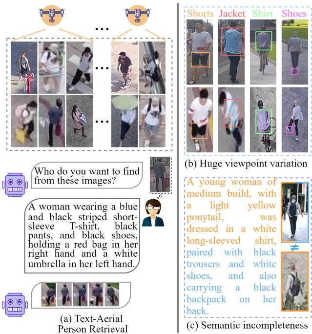
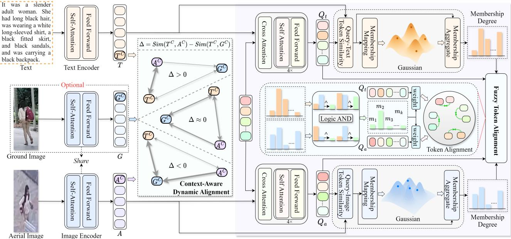
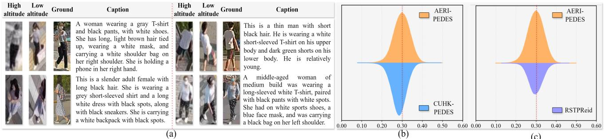
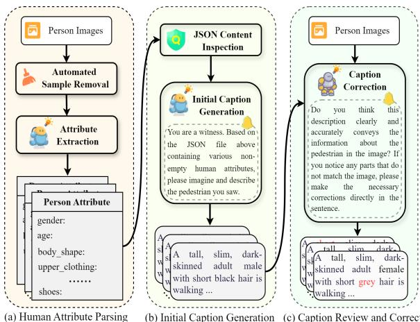
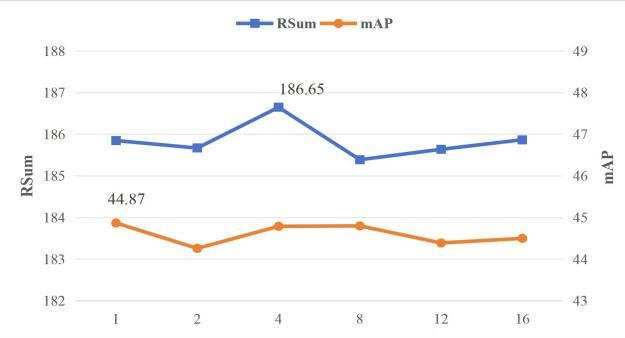

# 跨模态模糊对齐网络用于文本-空中人物检索及大规模基准测试

邓逸飞1,2，李成龙${ \mathrm { L i } } ^ { 1 , * }$ ，张宇阳4，胡古月$\mathrm { H u } ^ { 3 }$ ，唐瑾2 1 国家光电信息获取与保护技术重点实验室 2 安徽大学计算机科学与技术学院 3 安徽大学人工智能学院 香港大学 {yf-ah, 1cl1314}@foxmail.com u3604018@connect.hku.hk {guyue.hu, tangjin}@ahu.edu.cn

# 摘要

文本与航空图像中的人物检索旨在通过目击者的描述识别无人机捕获图像中的目标，支持智能交通和公共安全应用。与地面视角的文本图像人物检索相比，无人机捕获的图像通常由于视角和飞行高度的剧烈变化而导致视觉信息退化，使得其与文本描述的语义对齐非常具有挑战性。为了解决这一问题，我们提出了一种新颖的跨模态模糊对齐网络，通过模糊逻辑量化词元级别的可靠性，以实现准确的细粒度对齐，并将地面视角图像作为桥接因子，进一步缩小航空图像与文本描述之间的差距，以支持文本与航空图像中的人物检索。特别地，我们设计了模糊词元对齐模块，该模块采用模糊隶属函数动态建模词元级别的关联强度，并抑制不可观测或噪声词元的影响。它可以缓解因缺失视觉线索而导致的语义不一致性，并显著增强词元级别语义对齐的鲁棒性。此外，为了进一步缩小航空图像与文本描述之间的差距，我们设计了上下文感知动态对齐模块，将地面视角代理作为文本与航空对齐中的桥梁，自适应结合直接对齐和代理辅助对齐以提高鲁棒性。此外，我们构建了一个名为AERI-PEDES的大规模基准数据集，通过链式推理将文本生成分解为属性解析、初始字幕生成和细化，从而提升文本的准确性和语义一致性。在AERI-PEDES和TBAPR上的实验表明了我们方法的优越性。数据集和代码可访问：https://github.com/Yifei-AHU/AERI-PEDES

  
Figure 1. (a) Illustration of the text-aerial person retrieval task. (b) Semantically identical targets with substantial viewpoint discrepancies between ground and aerial perspectives. (c) Incomplete visual cues in aerial images result in only partial alignment with the corresponding captions.

# 1. 引言

随着深度学习和视觉语言模型的快速发展，文本-图像人物检索（TIPR）在近年来引起了越来越多的关注。TIPR旨在根据描述准确地从图像数据库中检索目标个体，其在智能监控和交通管理等重要应用领域具有广泛的应用价值。然而，所有现有的TIPR研究均依赖于固定的地面摄像头捕获的数据，这限制了对人员观察的覆盖范围，并且使得在复杂环境中捕获动态场景变得困难。无人机（UAV）的广泛应用为人物监控提供了独特的优势。无人机可以从多个角度和位置动态捕获场景，覆盖地面摄像头无法到达的区域，并提供更丰富的信息源。在此基础上，将TIPR任务扩展到无人机捕获的空中图像场景具有重要的研究价值和实际意义。这一方向不仅有助于解决复杂环境中跨模态匹配和语义对齐的挑战，而且充分释放无人机在智能交通管理、公共安全和安全监控等应用中的潜力。为了推动这一研究方向，王等人首次探索了从空中视角进行人物检索的问题，并提出了文本-空中人物检索（TAPR）任务，如图1(a)所示。

与传统的跨模态图像文本对齐（TIPR）不同，仅需处理文本与图像之间的跨模态语义对齐，由空中视角拍摄的人物图像因拍摄角度和高度的极端变化在外观、身体姿势和几何比例上表现出非线性的扭曲，如图 1(b) 所示。这显著增加了与文本描述对齐的难度。此外，查询文本通常来源于目击者描述，包含更完整且细致的人物属性和外观细节。然而，在无人机拍摄的场景中，由于高度、视角偏差和遮挡等因素，人物的视觉线索往往稀疏甚至部分缺失。如图 1(c) 所示，空中视角中的人物仅覆盖文本中描述的一部分语义区域（以橙色高亮），而地面视角中的人物则可以完全对应于文本描述。这种可见性的差异可能导致在构建词元级的细粒度关联时缺乏有效的视觉对应关系，从而引入错误的跨模态对齐。

为了应对上述挑战，我们提出了一种跨模态模糊对齐网络（CFAN），该网络利用模糊逻辑量化词元级可靠性，实现细粒度对齐，并将地面视图图像作为桥接代理，进一步缩小航拍图像与文本之间的差距。具体而言，为了减轻不同高度拍摄的航拍图像对跨模态对齐造成的视觉差异影响，我们设计了一个上下文感知动态对齐（CDA）模块。该模块利用地面图像作为桥梁，量化文本-航拍图像和文本-地面图像之间的对齐难度，并动态调整直接对齐和桥接对齐的贡献，从而增强文本-航拍图像对齐的稳定性。此外，为了解决因缺失视觉线索导致的细粒度对齐中的语义不一致问题，我们提出了一个模糊词元对齐（FTA）模块。该模块通过模糊隶属函数动态建模词元级关联强度，同时抑制不可观察或噪声词元，显著提高了词元级语义对齐的鲁棒性。为了进一步推动TAPR任务的研究，我们构建了一个大规模基准数据集AERI-PEDES，其中包含从不同相机和多样场景下捕获的112,672张人物图像。为了降低人工标注成本，我们设计了一种基于思维链（CoT）的生成框架，将字幕生成任务分解为使用多模态语言模型的结构化推理步骤，确保生成的训练字幕富含细粒度属性且视觉一致。为了更好地反映现实应用，测试字幕经过人工标注，以确保自然语义表达，使评估结果能准确反映模型的真实表现。在两个文本-航拍人物检索基准上进行的大量实验充分验证了所提出方法的有效性。总之，本论文的主要贡献如下： • 我们提出了一种跨模态模糊对齐网络，利用模糊逻辑量化词元级可靠性，实现精准的细粒度对齐，并将地面视图图像作为桥接代理，进一步缩小文本-航拍图像之间的差距。 • 我们设计了一个上下文感知动态对齐模块，将地面图像作为桥梁，并量化对齐难度，适应性地平衡直接对齐和桥接对齐，从而实现鲁棒的跨模态对齐。 • 我们引入了模糊词元对齐模块，使用模糊隶属函数建模词元级可靠性，增强共享词元的对齐，同时抑制非共享对齐，提升细粒度对齐能力。 • 我们构建了一个大规模基准数据集AERI-PEDES，并开发了一种基于思维链的字幕生成框架，以生成细粒度和视觉一致的字幕。

# 2. 相关工作

# 2.1. 文本-图像人物检索

TIPR旨在根据自然语言描述准确定位库中的对应人物图像。该任务首次由Li等人提出，建立了CUHK-PEDES数据集，为跨模态人物检索研究奠定了基础。随后，扩展基准如ICFG-PEDES和RST-PReid相继发布，进一步推动TIPR走向更逼真的场景。早期研究主要依赖于全局特征对齐，通过构建联合嵌入空间来缩小视觉和语言之间的模态差距。然而，这些方法通常集中于显著区域，使得捕捉细粒度的跨模态语义对应变得困难。为了解决这一问题，后来的研究逐渐转向局部特征匹配。例如，Chen等人通过多尺度特征捕获更丰富的语义信息以实现自适应跨模态对齐，而Wang等人探讨了人类属性与文本之间的关联，有效提高了细粒度对齐的准确性。近年来，视觉-语言预训练模型的发展进一步推动了TIPR研究。基于大规模预训练模型如CLIP的方法探索多层次语义挖掘、图像引导的语言重构，以及来自单模态教师的层次监督，显著提高了跨模态对齐的准确性和泛化能力。此外，使用扩散模型或视觉语言模型生成的大规模图像-文本数据进行预训练，也显著增强了检索的鲁棒性。

# 2.2. 模糊深度学习

模糊逻辑最初由洛特菲·扎德（Lotfi Zadeh）提出，旨在表征现实世界固有的不确定性和模糊性。近年来，研究人员将模糊逻辑与神经网络结合，形成了模糊深度学习的范式。这种整合赋予模型在不确定性和模糊性下进行推理的能力，在医学图像分析和跨模态检索等领域展现出显著优势。与传统深度学习相比，模糊深度学习在建模模糊边界和量化模型不确定性方面表现优异。例如，丁等人引入模糊邻接信息以优化MRI脑结构分割。阿克拉姆等人提出了双极模糊神经元，以实现更准确的医学诊断；南等人将模糊逻辑纳入注意力机制，构建了一种用于气道分割的模糊注意力网络，显著提高了分割性能。在跨模态检索领域，段等人提出了基于模糊集理论的模糊多模态学习框架，通过自估计的认知不确定性实现了更可靠的检索。徐等人引入了一种基于超图的残差模糊对齐网络用于开放集3D跨模态检索，显著提高了泛化能力。

# 3. 方法

# 3.1. 概述

图2展示了我们提出的跨模态模糊对齐网络，该网络由两个模块组成：基于上下文的动态对齐模块（CDA）和模糊词元对齐模块（FTA）。我们使用共享的CLIP图像编码器提取空中人像特征$A$和地面人像特征$G$，使用CLIP文本编码器提取人物描述特征$T$。CDA模块以空中特征的全局表示$A ^ { c }$、地面特征$G ^ { c }$和文本特征$T ^ { c }$作为输入。该模块通过比较文本与空中、文本与地面的相似度来评估每个样本的对齐难度，并动态调节直接对齐和桥接介导对齐的贡献，从而实现稳健的样本级跨模态对齐。FTA模块以$A$和$T$作为输入，在词元级引入模糊隶属函数，为每个词元分配一个连续存在度。通过逻辑与运算融合多源隶属度，从而在语义上调制词元级对齐，有效抑制不可观察或噪声词元的干扰，实现细粒度稳健的跨模态词元级对齐。通过结合CDA和FTA，我们的框架能够同时实现自适应样本级对齐和稳健的细粒度词元级对齐，有效弥合文本与空中图像之间的语义差距。

# 3.2. 上下文感知动态对齐

我们提出了一种上下文感知动态对齐（CDA）模块，以应对由航空图像中的视觉差异引起的跨模态对齐挑战。该模块利用地面视图图像作为辅助指导，量化文本地面（textground）与航空文本（textaerial）之间的对齐难度，动态调整直接对齐与地面辅助桥接对齐之间的权重。具体而言，给定全局文本特征 $\mathsf { \bar { \tau } } ^ { C } \in \mathsf { \bar { \mathbb { R } } } ^ { B \times D }$、全局航空图像特征 $A ^ { C } \in \mathbb { R } ^ { B \times D }$ 和全局地面图像特征 $G ^ { C } \in \mathbb { R } ^ { B \times D }$，我们首先计算每个样本的跨模态相似度差异：

$$
\Delta _ { i } = \sin ( \mathbf { T _ { i } ^ { C } } , \mathbf { A _ { i } ^ { C } } ) - \sin ( \mathbf { T _ { i } ^ { C } } , \mathbf { G _ { i } ^ { C } } ) , \quad i = 1 , \ldots , B ,
$$

其中 $\sin ( \cdot , \cdot )$ 表示余弦相似度。直观上，$\Delta _ { i } > 0$ 表示直接对齐很可能足够，而 $\Delta _ { i } ~ < ~ 0$ 则暗示通过地面图像建立桥梁是必要的。为了实现动态对齐，我们使用非线性、上下文敏感的激活方法，将相似度差异映射到连续系数 $\alpha _ { i } \in [ 0 , 1 ]$：

$$
\alpha _ { i } = \frac { 1 } { 1 + \exp \Big [ - \boldsymbol { k } \cdot \Delta _ { i } \Big ] } ,
$$

  
Figure 2. Overview of the proposed Cross-Modal Fuzzy Alignment Network.

其中 $k$ 是控制映射陡峭度的灵敏度超参数。从概念上讲，$\alpha _ { i }$ 起到一个软决策门的作用，样本之间具有高直接相似性 $( \mathrm { s i m ( T _ { i } ^ { C } , A _ { i } ^ { \bar { C } } ) \gg \mathrm { s i m ( T _ { i } ^ { C } , \bar { G } _ { i } ^ { C } ) } } )$ 时，$\alpha _ { i }$ 取 1，强调直接文本-航拍对齐，而具有低直接相似性的样本 $( \sin ( \bf { T } _ { i } ^ { C } , \bf { A } _ { i } ^ { C } ) \ll \sin ( \bf { T } _ { i } ^ { C } , \bf { G } _ { i } ^ { C } ) )$ 时，$\alpha _ { i }$ 取 ~ 0，强调通过地面图像进行的桥接对齐。因此，该模块的损失定义为：

$$
\begin{array} { r l r } & { } & { \mathcal { L } _ { \mathrm { C A D } } = \displaystyle \frac { 1 } { B } \sum _ { i = 1 } ^ { B } \Big [ \alpha _ { i } \cdot \mathcal { L } _ { \mathrm { d i r e c t } } \big ( \mathbf { T } _ { \mathrm { i } } ^ { \mathrm { C } } , \mathbf { A } _ { \mathrm { i } } ^ { \mathrm { C } } \big ) + } \\ & { } & { \big ( 1 - \alpha _ { i } \big ) \cdot \mathcal { L } _ { \mathrm { b r i d g e } } \big ( \mathbf { T } _ { \mathrm { i } } ^ { \mathrm { C } } , \mathbf { G } _ { \mathrm { i } } ^ { \mathrm { C } } , \mathbf { A } _ { \mathrm { i } } ^ { \mathrm { C } } \big ) \Big ] , } \end{array}
$$

其中 $\mathcal { L } _ { \mathrm { d i r e c t } }$ 表示文本与航拍图像之间的直接对齐损失，$\mathcal { L } _ { \mathrm { b r i d g e } }$ 则表示通过地面图像作为语义桥接进行的文本与航拍特征的间接对齐。两个对齐项均使用 SDM 损失进行实现 [13]：

$$
\mathcal { L } _ { \mathrm { d i r e c t } } ( \mathbf { T _ { i } ^ { C } } , \mathbf { A _ { i } ^ { C } } ) = \mathrm { S D M } ( \mathbf { T _ { i } ^ { C } } , \mathbf { A _ { i } ^ { C } } ) ,
$$

此设计使每个样本能够动态平衡直接对齐和桥接中介对齐，有效缓解由于视觉线索变异引起的跨模态对齐挑战。此外，当地面图像不可用时，CDA损失退化为标准的SDM损失。

$$
\begin{array} { r } { \mathcal { L } _ { \mathrm { b r i d g e } } ( \mathbf { T } _ { \mathrm { i } } ^ { \mathrm { C } } , \mathbf { G } _ { \mathrm { i } } ^ { \mathrm { C } } , \mathbf { A } _ { \mathrm { i } } ^ { \mathrm { C } } ) = \mathrm { S D M } ( \mathbf { T } _ { \mathrm { i } } ^ { \mathrm { C } } , \mathbf { G } _ { \mathrm { i } } ^ { \mathrm { C } } ) + } \\ { \mathrm { S D M } ( s g ( \mathbf { G } _ { \mathrm { i } } ^ { \mathrm { C } } ) , \mathbf { A } _ { \mathrm { i } } ^ { \mathrm { C } } ) , } \end{array}
$$

# 3.3. 模糊词元对齐，其中 $s g ( )$ 表示停止梯度算子，防止反向传播通过地面特征，从而确保空中特征自适应地与地面桥接对齐，而不改变地面表示。

为了解决文本与航空人像之间的细粒度不对齐问题，我们提出了模糊 token 对齐（FTA）模块，该模块基于模糊逻辑理论来量化每种模态中 token 的可靠性。低隶属度的 token 被视为不可靠，其对跨模态对齐的贡献被抑制，而在两种模态中具有高隶属度的 token 则得以保留，从而实现精确对齐。给定文本特征 $\mathbf { T } \in \mathbb { R } ^ { B \times N _ { t } \times D }$ 和航空图像特征 $\mathbf { A } \in \mathbb { R } ^ { B \times N _ { a } \times D }$，我们引入一个共享的可学习查询 $\mathbf { Q } \in \mathbb { R } ^ { K \times D }$ 以与两种模态进行交互，并将它们映射到统一的语义空间：

$$
\mathbf { Q } _ { a } = C r o s s F o r m e r ( \mathbf { Q } , \mathbf { A } , \mathbf { A } ) ,
$$

$$
\mathbf { Q } _ { t } = C r o s s F o r m e r ( \mathbf { Q } , \mathbf { T } , \mathbf { T } ) ,
$$

其中 CrossFormer 表示跨模态交互模块，由一个交叉注意力层和多个自注意力及前馈层组成，生成模态感知的查询表示 $\mathbf { Q } _ { t } , \dot { \mathbf { Q } _ { a } } \in \bar { \mathbb { R } } ^ { B \times K \times D }$。为了衡量每个查询词元的可靠性，我们使用相应模态的全局类别词元作为语义参考，并通过一个可学习的高斯尺度参数来量化词元的可靠性。以图像模态为例，我们首先通过一个多层感知机从全局类别词元 $\mathbf { A } ^ { \bar { C } } \in \mathbb { R } ^ { D }$ 预测高斯尺度 $\sigma$：

$$
\begin{array} { r } { \log \pmb { \sigma } = \mathrm { M L P } ( \mathbf { A } ^ { \mathbf { C } } ) , \quad \pmb { \sigma } = \exp ( \log \pmb { \sigma } ) . } \end{array}
$$

接下来，对于每个查询词元，我们计算其与类别词元 $r _ { j }$ 的整体相似度，并使用高斯函数将其映射为隶属度 $\mu _ { j } ^ { a }$。这个隶属度反映了该词元在图像模态中的可靠性：

$$
r _ { j } = \frac { Q _ { a } ^ { ( j ) } \cdot A ^ { C } } { | Q _ { a } ^ { ( j ) } | _ { 2 } | A ^ { C } | _ { 2 } } , \quad \mu _ { j } ^ { a } = \exp \Big ( - \frac { ( 1 - r _ { j } ) ^ { 2 } } { 2 \sigma ^ { 2 } } \Big ) .
$$

文本模态的成员资格 $\mu _ { j } ^ { t }$ 的计算方式类似于此。这样，每个词元的成员资格 $\mu _ { j } \in [ 0 , 1 ]$ 不仅反映了其与全局语义表示的对齐程度，还量化了该词元在跨模态对齐中的可靠性，值越高，越值得信赖；值越低，越可能是噪声或无信息的，应当被抑制。然后，我们使用模糊逻辑与运算融合来自两个模态的词元级成员资格：

$$
\mu _ { j } ^ { \mathrm { j o i n t } } = \mu _ { j } ^ { a } \cdot \mu _ { j } ^ { t } ,
$$

我们采用乘法形式作为可微分的软与运算符，这种形式强调在两个模态中高度自信的词元，同时允许基于梯度的优化。只有在两个模态中都具有高可靠性的词元在跨模态对齐期间保留强影响。接着，词元级的余弦相似度通过联合归属加权，以获得样本级相似度：

$$
s _ { j } = \frac { { q _ { a } ^ { ( j ) } } ^ { \top } q _ { t } ^ { ( j ) } } { \vert q _ { v } ^ { ( j ) } \vert _ { 2 } \vert q _ { t } ^ { ( j ) } \vert _ { 2 } } , \quad \sin ( Q _ { a } , Q _ { t } ) = \frac { 1 } { K } \sum _ { j = 1 } ^ { K } \mu _ { j } ^ { \mathrm { j o i n t } } s _ { j } .
$$

文本-图像相似度 $\sin ( Q _ { t } , Q _ { a } )$ 的计算方式类似。利用这些双向加权相似度，我们进一步采用相似度分布匹配 [13] 来计算模糊词元对齐损失 $L _ { \mathrm { F T A } }$。

$$
p _ { i , j } = \frac { \exp ( \sin ( Q _ { a } ^ { i } , Q _ { t } ^ { j } ) / \tau ) } { \sum _ { k = 1 } ^ { N } \exp ( \sin ( Q _ { a } ^ { i } , Q _ { t } ^ { k } ) / \tau ) } , \quad q _ { i , j } = \frac { y _ { i , j } } { \sum _ { k = 1 } ^ { N } y _ { i , k } } ,
$$

$$
\mathcal { L } _ { \mathrm { F T A } } = \frac { 1 } { 2 } \sum _ { i = 1 } ^ { N } \sum _ { j = 1 } ^ { N } \left[ p _ { i , j } \log \frac { p _ { i , j } } { q _ { i , j } + \epsilon } + p _ { j , i } \log \frac { p _ { j , i } } { q _ { j , i } + \epsilon } \right] ,
$$

其中 $\tau$ 是温度超参数，$\epsilon$ 用于防止计算过程中的数值不稳定性。该机制确保只有在两种模态中可靠存在的词元显著贡献于对齐，抑制了噪声或弱词元，从而实现精确稳健的细粒度跨模态对齐。

# 4. 基准测试

# 4.1. 概述

为了推动文本-空中人物检索的研究，我们构建了一个大规模基准数据集AERI-PEDES。该数据集中的人物图像来源于三个不同的空中-地面人物重识别数据集[28 30]，每个身份自然包含来自地面和空中视角的多个图像。为了减少人工标注成本，同时确保文字描述的准确性，我们提出了一种基于思维链（CoT）的描述生成框架，以生成高质量的文字描述。在测试集上，所有文字描述均由人工标注，以提供可靠的评估基准，能够真实反映实际场景。图3(a)展示了AERI-PEDES中的几个示例。

# 4.2. 基于链条思维的图像标题生成框架

现有基于多模态大语言模型的图像字幕生成方法通常面临属性遗漏和视觉幻觉问题。为了解决这些问题，我们提出了一种基于链式推理（CoT）的生成框架，如图4所示，旨在提高生成字幕的细粒度和可验证性。具体而言，感知模型 $f _ { \mathrm { p e r c e p } }$ 首先对输入图像 $I$ 进行结构化视觉解析，提取可见属性 $\mathbf { A } = a _ { 1 } , \ldots , a _ { n }$ 及其支持的视觉证据 $\mathbf { V }$ 和置信度分数 ( $\mathbf { C }$ )，形成一个中间表示 $T _ { 1 } ~ = ~ ( \bf { A } , \bf { V } , \bf { C } )$ 。这些属性随后被组织成一个初始字幕 $S _ { \mathrm { i n i t } }$ 以及记录的推理轨迹，得出 $T _ { 2 } ~ = ~ ( S _ { \mathrm { i n i t } } , \mathrm { t r a c e } _ { \mathrm { g e n } } )$ 。为了纠正潜在的遗漏或错误，第二模型 $f _ { \mathrm { c o r r } }$ 对 $( I , S _ { \mathrm { i n i t } } )$ 进行视觉引导审核，生成经过完善的字幕 $S _ { \mathrm { r e f i n e d } }$ 和一个纠正轨迹，从而得到最终状态 $T _ { 3 } = ( S _ { \mathrm { r e f i n e d } } , \mathrm { t r a c e } _ { \mathrm { c o r r } } )$ 。这一渐进式的链式推理机制有效整合了视觉解析和审核，保留了细粒度的属性细节，同时确保生成的字幕与视觉证据保持一致。更多实施细节请参见补充材料。

# 4.3. 基准属性和统计数据

我们构建了AERI-PEDES，这是一个大规模的跨视角基准，包含4,659个身份，使用基于链条推理的标题生成框架生成。训练集包括3,659个身份、112,672张航空图像、26,351张地面图像和26,213条生成的标题，而测试集包含1,000个身份、5,525张航空图像和6,141条手动标注的标题，以便进行可靠的评估。如表1所示，与其他人物检索数据集相比，AERI-PEDES提供了更大的规模、更广泛的跨平台覆盖和更丰富的场景多样性。这些标题详细且长度最大为108个单词，平均为38.6个单词；只有训练集中的标题是生成的，而测试集中的标题保持手动标注，以更好地反映现实世界的使用情况。我们进一步分析了基于CLIP的图像文本相似性分布（图3(b)(c)）。与完全手动的数据集如CUHK-PEDES和RSTPReid相比，AERI-PEDES展示了更广泛的相似性分布，证明了链条推理标题生成框架在生成高质量、语义一致描述方面的有效性。

Table 1. Comparison AERI-PEDES with other datasets for text-image person retrieval.   

<table><tr><td colspan="2">Datasets</td><td></td><td></td><td></td><td>AERI-PEDESTBAPR [38]CUHK-PEDES [23]ICFG-PEDES [7]RSTPReid [48]</td><td></td></tr><tr><td rowspan="3">Image</td><td>Number</td><td>144,548</td><td>65,880</td><td>40,206</td><td>54,522</td><td>20,505</td></tr><tr><td>Ground &amp; Aerial</td><td>√</td><td>√</td><td>×</td><td>×</td><td>×</td></tr><tr><td>Multi-Sources</td><td>√</td><td>√</td><td>√</td><td>×</td><td>×</td></tr><tr><td rowspan="3">Caption</td><td>Average Length</td><td>38.6</td><td>56.1</td><td>23.5</td><td>37.2</td><td>25.8</td></tr><tr><td>Maximum Length</td><td>105</td><td>87</td><td>96</td><td>83</td><td>70</td></tr><tr><td>Generated (Train) &amp; Human (Test)</td><td>√</td><td>×</td><td>×</td><td>×</td><td>×</td></tr></table>

  
with CUHK-PEDES. (c) Shows the text-image similarity distribution in comparison with RSTPReid.

  
Figure 4. Chain-of-Thought Based Caption Generation Framework.

# 5. 实验

# 5.1. 数据集与评估指标

数据集。我们在 AERI-PEDES 和 TBAPR [38] 上评估我们的方法。TBAPR 是第一个专门为文本-空中人物检索设计的基准数据集。它包含 65,880 幅人物图像，训练集包含 1,180 个身份，测试集包含 529 个身份。评估指标。我们使用多种广泛采用的检索指标对我们的方法进行评估，包括 Rank-k ($\mathbf { k } { = } 1$ , 5, 10)、mAP（平均精度均值）和 RSum（排名总和），详细介绍见补充材料。

# 5.2. 实施细节

CFAN 使用 CLIP 文本编码器进行文本特征提取，而航空图像和地面图像共享一个基于 CLIP 的视觉编码器，该编码器的初始权重由 Jiang et al 提供 [14]。图像数据经过标准数据增强操作处理，并统一调整为 $384 \times 128$ 的大小，而文本输入通过随机遮蔽进行增强，以提高模型的鲁棒性。FTA 模块中的跨模态交互查询由 4 个可学习的 512 维词元组成。模型使用 Adam 优化器训练，训练周期为 60 个 epoch，初始学习率为 $5 \times 10^{ - 6 }$，采用余弦衰减调度。批量大小设置为 64，训练在单个 RTX 4090 上进行。

Table 2. Comparison results on the AERI-PEDES, and TBAPR datasets.   

<table><tr><td rowspan="2">Method</td><td rowspan="2">Ref</td><td colspan="5">AERI-PEDES</td><td colspan="5">TBAPR</td></tr><tr><td>Rank-1</td><td>Rank-5 Rank-10</td><td></td><td>mAP</td><td>RSum</td><td>Rank-1</td><td></td><td>Rank-5 Rank-10</td><td>mAP</td><td>RSum</td></tr><tr><td>IRRA [13]</td><td>CVPR23</td><td>35.14</td><td>53.23</td><td>63.19</td><td>33.42</td><td>151.57</td><td>39.63</td><td>58.72</td><td>67.69</td><td>35.31</td><td>166.04</td></tr><tr><td>APTM [44]</td><td>MM23</td><td>34.62</td><td>53.95</td><td>64.5</td><td></td><td>31.09 153.07</td><td>43.59</td><td>62.03</td><td>69.75</td><td>38.71</td><td>175.37</td></tr><tr><td>RDE [32]</td><td>CVPR24</td><td>38.56</td><td>58.26</td><td>67.89</td><td></td><td>37.16 164.71</td><td>37.31</td><td>54.06</td><td>60.75</td><td>32.17</td><td>152.12</td></tr><tr><td>CFAM [49]</td><td>CVPR24</td><td>30.77</td><td>51.37</td><td>61.61</td><td>30.4</td><td>143.75</td><td>48.34</td><td>66.31</td><td>73.21</td><td>42.67</td><td>184.78</td></tr><tr><td>NAM [36]</td><td>CVPR24</td><td>42.47</td><td>61.72</td><td>69.99</td><td>40.22</td><td>174.17</td><td>46.56</td><td>63.13</td><td>70.13</td><td>40.92</td><td>179.82</td></tr><tr><td>VFE [34]</td><td>KBS25</td><td>35.76</td><td>55.35</td><td>65.56</td><td>35.35</td><td>156.67</td><td>47.94</td><td>62.5</td><td>68.17</td><td>42.18</td><td>178.63</td></tr><tr><td>DM-Adpeter [25]</td><td>AAAI25</td><td>33.42</td><td>53.17</td><td>62.79</td><td>32.41</td><td>149.37</td><td>37.81</td><td>58.34</td><td>66.56</td><td>33.28</td><td>162.71</td></tr><tr><td>LPNC [37]</td><td>TIFS25</td><td>35.65</td><td>53.61</td><td>63.69</td><td>35.19</td><td>152.95</td><td>41.78</td><td>58.03</td><td>65.50</td><td>37.87</td><td>165.31</td></tr><tr><td>LPNC+Pretrain [37]</td><td>TIFS25</td><td>43.79</td><td>61.49</td><td>70.40</td><td>42.22</td><td>175.68</td><td>45.41</td><td>62.31</td><td>69.94</td><td>42.17</td><td>177.66</td></tr><tr><td>AEA-FIRM [38]</td><td>TCSVT25</td><td>37.94</td><td>56.66</td><td>65.71</td><td>34.89</td><td>160.31</td><td>44.75</td><td>62.38</td><td>69.13</td><td>36.28</td><td>176.26</td></tr><tr><td>AEA-FIRM+Pretrain [14]</td><td>TCSVT25</td><td>44.42</td><td>61.96</td><td>71.03</td><td>41.12</td><td>177.41</td><td>48.15</td><td>63.87</td><td>71.21</td><td>42.01</td><td>183.23</td></tr><tr><td>HAM [14]</td><td>CVPR25</td><td>44.58</td><td>63.52</td><td>72.67</td><td>42.45</td><td>180.77</td><td>47.81</td><td>64.96</td><td>72.53</td><td>41.86</td><td>185.30</td></tr><tr><td>Ours (W/O Ground)</td><td></td><td>45.06</td><td>64.53</td><td>73.21</td><td>43.27</td><td>182.80</td><td>49.15</td><td>65.88</td><td>73.47</td><td>42.89</td><td>188.50</td></tr><tr><td>Ours (With Ground)</td><td>-</td><td>47.16</td><td>65.66</td><td>73.83</td><td></td><td>44.79 186.65</td><td>49.47</td><td>66.50</td><td>73.06</td><td></td><td>43.96 189.03</td></tr></table>

图形处理单元

# 5.3. 与最先进方法的比较

在AERI-PEDES数据集上的性能比较。如表2所示，我们对所提方法在AERI-PEDES数据集上进行了全面评估，并与现有的最先进方法进行了详细比较。具体而言，AEA-FIRM作为首个针对文本-空中人物对齐的尝试，在AERI-PEDES上展示出相对于传统文本-图像人物检索方法的某些优势。然而，由于该基准测试中视角变化极为巨大，跨模态对齐的难度显著增强。即使使用强大的预训练模型，AEA-FIRM的Rank-1准确率仅达到$44.42\%$，mAP为$41.12\%$，RSum为$177.41\%$，与HAM的表现相当。相比之下，我们的方法提供了显著的性能提升。在无地面辅助的设置下，我们的方法已超越所有竞争方法。当进一步将地面视图图像作为辅助线索引入时，我们的方法创造了新的最先进纪录，达到了$47.16\%$的Rank-1，$44.79\%$的mAP，以及$186.65\%$的$\mathbf{RSum}$，相较于之前的最佳方法在$\mathrm{RSum}$上提高了近$6\%$。这些结果突出显示了我们的方法在处理极端视角差异下的跨模态对齐能力的优越性。尽管现有方法在这一挑战性场景中表现不佳，我们的模型得益于基于模糊逻辑的词元级可靠性建模，使得细粒度跨模态对齐更加准确和稳健。

在TBAPR数据集上的性能比较。我们的算法在TBAPR数据集上的所有评估指标中始终优于所有对比方法。具体而言，在不使用地面视图图像的情况下，我们的方法已经达到了$49.15\%$的Rank-1准确率和$42.89\%$的mAP，超过了所有竞争方法。当进一步将地面视图图像作为辅助信息纳入时，我们的方法达到了新的最先进水平，实现了$66.50\%$的Rank-5和$189.03\%$的RSum。值得注意的是，由于TBAPR数据集中包含许多低空航拍图像，航拍图像与地面视图图像之间的视觉差异相对较小。这允许文本与航拍图像之间进行直接对齐，从而实现强大的性能，限制了地面图像的辅助贡献。相比之下，由于CDA模块的存在，我们的方法可以进一步改善结果，该模块自适应地平衡文本-航拍和文本-地面对齐的贡献。这使得跨模态语义匹配更加稳健，并有效利用地面视图信息。

Table 3. Ablation experiments of different components on AERI-PEDES dataset.   

<table><tr><td>Methods</td><td>Rank-1</td><td>Rank-5 Rank-10</td><td></td><td>mAP</td><td>RSum</td></tr><tr><td>Baseline</td><td>43.88</td><td>61.11</td><td>69.85</td><td>41.58</td><td>174.84</td></tr><tr><td>+ CDA</td><td>46.18</td><td>64.40</td><td>72.46</td><td>43.98</td><td>183.04</td></tr><tr><td>+ FTA</td><td>44.55</td><td>61.77</td><td>70.32</td><td>41.89</td><td>176.64</td></tr><tr><td>+ CDA + FTA</td><td>47.16</td><td>65.66</td><td>73.83</td><td>44.79</td><td>186.65</td></tr></table>

# 5.4. 消融实验

在本节中，我们使用基线模型评估 CFAN 的各个组成部分，并采用基于真实图像的桥接对齐损失进行比较。上下文感知动态对齐损失的有效性。如表 3 所示，仅使用桥接对齐（基线）实现 $4 3 . 8 8 \%$ 的 Rank-1、$4 1 . 5 8 \%$ 的 mAP 和 $1 7 4 . 8 4 \%$ 的 RSum。然而，尽管桥接对齐减轻了航空图像与文本之间的语义差距，但它未能充分利用低难度样本的直接对齐，从而导致匹配性能不佳。在引入 CDA 损失后，关键指标显著提高，RSum 增加了 $8 . 2 \%$，Rank-1 和 mAP 也相应提升。这一改善主要归因于 CDA，它动态估计对齐难度，并自适应平衡直接对齐与桥接对齐。具体而言，低难度样本强调直接对齐，而高难度样本则更依赖于桥接对齐，从而增强了整体对齐的准确性和鲁棒性。

Table 4. Impact of Different Bridge Modalities in CDA.   

<table><tr><td>Bridge</td><td>Rank-1</td><td>Rank-5</td><td>Rank-10</td><td>mAP</td><td>RSum</td></tr><tr><td>None</td><td>45.06</td><td>64.53</td><td>73.21</td><td>43.27</td><td>182.80</td></tr><tr><td>Aerial</td><td>46.08</td><td>64.60</td><td>73.33</td><td>44.20</td><td>184.01</td></tr><tr><td>Ground</td><td>47.16</td><td>65.66</td><td>73.83</td><td>44.79</td><td>186.65</td></tr></table>

模糊标记对齐的有效性。如表3所示，将FTA模块纳入基线模型可分别提升$0.67\%$、$0.31\%$和$1.2\%$的Rank-1、mAP和RSum。进一步将FTA整合到CDA损失上，产生额外的增益，分别为$0.98\%$、$0.81\%$和$3.61\%$。这些改进主要源于模糊标记对齐模块，通过模糊隶属度调节细粒度标记对应关系，并在标记级对齐过程中抑制不可观测或噪声标记的干扰。因此，只有可靠且语义上支持的标记参与跨模态匹配，从而实现更精确的对齐。CDA中不同桥接的影响。如表4所示，“None”表示没有中间桥接，“Aerial”使用相同身份的低空航拍图像，而“Ground”使用地面图像。引入桥接（Aerial或Ground）持续改善性能，表明中间模态有助于缓解跨模态对齐。航拍图像提供了显著的增益，而地面图像由于与文本具有更高的语义一致性而取得最佳结果。航拍与地面的微小差距表明，CDA并不严格依赖于地面图像，能够灵活使用不同的桥接模态实现稳健对齐。

# 5.5. 参数敏感性分析

我们对可学习查询 $Q$ 中词元的数量进行了消融研究。如图 5 所示，我们评估了词元数量从 1 到 16 的变化效果。结果表明，词元数量的变化对 mAP 指标影响较小。当词元数量设置为 4 时，模型达到了最高的 RSum 性能，为 $186.65\%$。然而，进一步增加词元数量导致性能下降，这可能是由于过度参数化造成的词元之间的冗余和干扰，从而削弱了细粒度的跨模态对齐。基于这些观察，我们在最终配置中将可学习查询词元的数量设置为 4。

  
Figure 5. Impact of the Number of Learnable Query Tokens.

Table 5. Sensitivity analysis of the hyperparameter $k$ in the context-aware dynamic alignment module.   

<table><tr><td>k</td><td>1</td><td>2</td><td>4</td><td>8</td><td>12</td><td>16</td></tr><tr><td>Rank-1 mAP</td><td>47.16</td><td>46.91</td><td>47.04</td><td>46.77</td><td>46.23</td><td>46.04</td></tr><tr><td>RSum</td><td>44.79 186.65</td><td>44.58 185.88</td><td>44.50 185.91</td><td>43.83 184.11</td><td>43.70 183.99</td><td>43.55 183.31</td></tr></table>

我们进一步分析了 CDA 模块中超参数 $k$ 的敏感性。如表 5 所示，最佳性能在 $k$ 时达到，而更大的 $k$ 值导致性能逐渐下降。这是因为增大 $k$ 使得 Sigmoid 函数变得过于陡峭，从而导致直接对齐和桥接对齐之间的权重过于极端，削弱了细粒度的调整，降低了整体性能。

# 6. 结论

在本文中，我们提出了一种用于文本-空中人脸检索的跨模态模糊对齐网络，旨在解决因空中图像中退化视觉线索而产生的跨模态对齐挑战。首先，我们引入了模糊标记对齐模块，该模块利用模糊逻辑来量化标记级可靠性，从而实现文本和空中图像特征之间的准确且稳健的细粒度对齐。其次，我们设计了上下文感知动态对齐模块，将地面视图图像作为桥接机制，有效减少文本和空中图像之间的对齐差异，针对每个样本自适应平衡直接对齐和桥接辅助对齐。此外，我们构建了AERI-PEDES，一个通过链式思维方法生成的大规模基准数据集。多阶段提示生成属性解析、初始标题和可追溯中间状态的精细描述，确保生成标题的高准确性、完整性和视觉一致性。大量实验表明了我们方法的优越效果和稳健性。

# References

[1] Mohsen Ahmadi, Fatemeh Dashti Ahangar, Nikoo Astaraki, Mohammad Abbasi, and Behzad Babaei. Fwnnet: Presentation of a new classifier of brain tumor diagnosis based on fuzzy logic and the wavelet-based neural network using machine-learning methods. Computational Intelligence and Neuroscience, 2021(1):8542637, 2021.   
[2] Fei-Long Chen, Du-Zhen Zhang, Ming-Lun Han, Xiu-Yi Chn, Jing Shi, Shuang Xu, and Bo Xu. Vlp: A survey on vision-language pre-training. Machine Intelligence Research, 20:3856, 2023.   
[3] Yuhao Chen, Guoqing Zhang, Yujiang Lu, Zhenxing Wang, and Yuhui Zheng. Tipcb: A simple but effective part-based convolutional baseline for text-based person search. Neurocomputing, 494:171181, 2022.   
[4] Yifei Deng, Zhengyu Chen, Chenglong Li, and Jin Tang. person retrieval. Visual Intelligence, 3(1):6, 2025.   
[5] Yifei Deng, Chenglong Li, Futian Wang, and Jin Tang. Learning hierarchical cross-modal association with intramodal context for text-image person retrieval. In Proceedings of the 33rd ACM International Conference on Multimedia, pages 27232731, 2025.   
[6] Weiping Ding, Mohamed Abdel-Basset, Hossam Hawash, and Witold Pedrycz. Multimodal infant brain segmentation by fuzzy-informed deep learning. IEEE Transactions on Fuzzy Systems, 30(4):10881101, 2021.   
[7] Zefeng Ding, Changxing Ding, Zhiyin Shao, and Dacheng Tao. Semantically self-aligned network for text-toimage part-aware person re-identification. arXiv preprint arXiv:2107.12666, 2021.   
[8] Zhaodong Ding, Chenglong Li, Tao Wang, and Futian Wang. Quality-aware spatio-temporal transformer network for rgbt tracking. IEEE Transactions on Image Processing, 34:7845 7858, 2025.   
[9] Siyuan Duan, Yuan Sun, Dezhong Peng, Zheng Liu, Xiaomin Song, and Peng Hu. Fuzzy multimodal learning for trusted cross-modal retrieval. In Proceedings of the Computer Vision and Pattern Recognition Conference, pages 2074720756, 2025.   
10] Chanho Eom and Bumsub Ham. Learning disentangled representation for robust person re-identification. Advances in neural information processing systems, 32, 2019.   
11] Adem Golcuk. Hybrid fuzzy expert system and difference equation software filter for biomedical sensors. IEEE Transactions on Instrumentation and Measurement, 71:1 12, 2022.   
12] Cosimo Ieracitano, Nadia Mammone, Mario Versaci, Giuseppe Varone, Abder-Rahman Ali, Antonio Armentano, Grazia Calabrese, Anna Ferrarelli, Lorena Turano, Carmela Tebala, et al. A fuzzy-enhanced deep learning approach for early detection of covid-19 pneumonia from portable chest x-ray images. Neurocomputing, 481:202215, 2022.   
13] Ding Jiang and Mang Ye. Cross-modal implicit relation reasoning and aligning for text-to-image person retrieval. In Proceedings of the IEEE/CVF Conference on Computer Vision and Pattern Recognition, pages 27872797, 2023.   
[14] Jiayu Jiang, Changxing Ding, Wentao Tan, Junhong Wang, Jin Tao, and Xiangmin Xu. Modeling thousands of human annotators for generalizable text-to-image person reidentification. In Proceedings of the Computer Vision and Pattern Recognition Conference, pages 92209230, 2025.   
[15] Jiandong Jin, Xiao Wang, Yin Lin, Chenglong Li, Lili Huang, Aihua Zheng, and Jin Tang. Sequencepar: Understanding pedestrian attributes via a sequence generation paradigm. Pattern Recognition, page 112356, 2025.   
[16] Jiandong Jin, Xiao Wang, Qian Zhu, Haiyang Wang, and Chenglong Li. Pedestrian attribute recognition: A new benchmark dataset and a large language model augmented framework. In Proceedings of the AAAI Conference on Artificial Intelligence, pages 41384146, 2025.   
[17] Ya Jing, Chenyang Si, Junbo Wang, Wei Wang, Liang Wang, and Tieniu Tan. Pose-guided multi-granularity attention network for text-based person search. In Proceedings of the AAAI Conference on Artificial Intelligence, pages 11189 11196, 2020.   
[8] Boyi i, f Shen, Yuae u, Yfan Xu, Ja Liu, Xinzhuo Li, Zhengyuan Li, Jingyuan Zhu, Yunhan Zhong, Fangzhou Lan, et al. Toward cognitive supersensing in multimodal large language model. arXiv preprint arXiv:2602.01541, 2026.   
[19] Junnan Li, Ramprasath Selvaraju, Akhilesh Gotmare, Shafiq Joty, Caiming Xiong, and Steven Chu Hong Hoi. Align before fuse: Vision and language representation learning with momentum distillation. Advances in neural information processing systems, 34:96949705, 2021.   
[20] Junnan Li, Dongxu Li, Silvio Savarese, and Steven Hoi. Blip-2: Bootstrapping language-image pre-training with frozen image encoders and large language models. In International conference on machine learning, pages 19730 19742. PMLR, 2023.   
[21] Kunchi Li, Hongyang Chen, Jun Wan, and Shan Yu. Ckdfv2: Effectively alleviating representation shift for continual learning with small memory. IEEE Transactions on Neural Networks and Learning Systems, 2025.   
[22] Kunchi Li, Chaoyue Ding, Jun Wan, and Shan Yu. Enhance the old representations' adaptability dynamically for exemplar-free continual learning. Neurocomputing, page 130286, 2025.   
[23] Shuang Li, Tong Xiao, Hongsheng Li, Bolei Zhou, Dayu Yue, and Xiaogang Wang. Person search with natural language description. In Proceedings of the IEEE conference on computer vision and pattern recognition, pages 19701979, 2017.   
[24] Lei Liu, Chenglong Li, Yun Xiao, Rui Ruan, and Minghao Fan. Rgbt tracking via challenge-based appearance disentanglement and interaction. IEEE Transactions on Image Processing, 33:17531767, 2024.   
[25] Yating Liu, Zimo Liu, Xiangyuan Lan, Wenming Yang, Yaowei Li, and Qingmin Liao. Dm-adapter: Domain-aware mixture-of-adapters for text-based person retrieval. In Proceedings of the AAAI Conference on Artificial Intelligence, pages 57035711, 2025.   
[26] Haoyu Lu, Yuqi Huo, Mingyu Ding, Nanyi Fei, and Zhiwu Lu.Cross-modal contrastive learning for generalizable and efficient image-text retrieval. Machine Intelligence Research, 20:569582, 2023.   
[27] Yang Nan, Javier Del Ser, Zeyu Tang, Peng Tang, Xiaodan Xing, Yingying Fang, Francisco Herrera, Witold Pedrycz, Simon Walsh, and Guang Yang. Fuzzy attention neural network to tackle discontinuity in airway segmentation. IEEE transactions on neural networks and learning systems, 35 (6):73917404, 2023.   
[28] Huy Nguyen, Kien Nguyen, Sridha Sridharan, and Clinton Fookes. Ag-reid. v2: Bridging aerial and ground views for person re-identification. IEEE Transactions on Information Forensics and Security, 19:28962908, 2024.   
[29] Huy Nguyen, Kien Nguyen, Akila Pemasiri, Feng Liu, Sridha Sridharan, and Clinton Fookes. Ag-vpreid: A challenging large-scale benchmark for aerial-ground video-based person re-identification. In Proceedings of the Computer Vision and Pattern Recognition Conference, pages 12411251, 2025.   
[30] Kien Nguyen, Clinton Fookes, Sridha Sridharan, Feng Liu, Xiaoming Liu, Arun Ross, Dana Michalski, Huy Nguyen, Debayan Deb, Mahak Kothari, et al. Ag-reid 2023: Aerialground person re-identification challenge results. In 2023 IEEE International Joint Conference on Biometrics (IJCB), pages 110. IEEE, 2023.   
[31] Song-Liang Pan, Kunchi Li, Da-Han Wang, Xu-Yao Zhang, Jiantao Liu, and Shunzhi Zhu. Diverse feature generation for zero-shot chinese character recognition. Expert Systems with Applications, page 129442, 2025.   
[32] Yang Qin, Yingke Chen, Dezhong Peng, Xi Peng, Joey Tianyi Zhou, and Peng Hu. Noisy-correspondence learning for text-to-image person re-identification. In Proceedings of the IEEE/CVF Conference on Computer Vision and Pattern Recognition, pages 2719727206, 2024.   
[33] Alec Radford, Jong Wook Kim, Chris Hallacy, Aditya Ramesh, Gabriel Goh, SandhiniAgarwal, Girish Sastry, AmdskeMi, JcCarkL transferable visual models from natural language supervision. In International conference on machine learning, pages 87488763. PmLR, 2021.   
[34] Wei Shen, Ming Fang, Yuxia Wang, Jiafeng Xiao, Diping Li, Huangqun Chen, Ling Xu, and Weifeng Zhang. Enhancing visual representation for text-based person searching. Knowledge-Based Systems, 309:112893, 2025.   
[35] Yifan Shen, Yuanzhe Liu, Jingyuan Zhu, Xu Cao, Xiaofeng Zhang, Yixiao He, Wenming Ye, James Matthew Rehg, and Ismini Lourentzou. Fine-grained preference optimization improves spatial reasoning in vlms. arXiv preprint arXiv:2506.21656, 2025.   
[36] Wentan Tan, Changxing Ding, Jiayu Jiang, Fei Wang, Yibing Zhan, and Dapeng Tao. Harnessing the power of mllms for transferable text-to-image person reid. In Proceedings of the IEEE/CVF Conference on Computer Vision and Pattern Recognition, pages 1712717137, 2024.   
[37] Xueping Wang, Hao Wu, Min Liu, and Yaonan Wang. Learnable prompts with neighbor-aware correction for text-based person search. IEEE Transactions on Information Forensics and Security, 2025.   
[38] Yihao Wang, Meng Yang, Rui Cao, and Guangwei Gao. Aeafirm: Adaptive elastic alignment with fine-grained representation mining for text-based aerial pedestrian retrieval. IEEE Transactions onCircuits andSystems or VideoTechno, 2025.   
[39] Zhe Wang, Zhiyuan Fang, Jun Wang, and Yezhou Yang. Vitaa: Visual-textual attributes alignment in person search by natural language. In Computer visionECCV 2020: 16th European conference, glasgow, UK, August 2328, 2020, proceedings, part XII 16, pages 402420. Springer, 2020.   
[40] Jason Wei, Xuezhi Wang, Dale Schuurmans, Maarten Bosma, Fei Xia, Ed Chi, Quoc V Le, Denny Zhou, et al. Chain-of-thought prompting elicits reasoning in large language models. Advances in neural information processing systems, 35:2482424837, 2022.   
[41] Feng Xu, Guangyao Zhai, Xin Kong, Tingzhong Fu, Daniel FN Gordon, Xueli An, and Benjamin Busam. Stare-vla: Progressive stage-aware reinforcement for finetuning vision-language-action models. arXiv preprint arXiv:2512.05107, 2025.   
[42] Yang Xu, Yifan Feng, Xu Zhuang, Jason Wang, Zongze Wu, and Yue Gao. Residual fuzzy alignment on hypergraph for open-set 3d cross-modal retrieval. IEEE Transactions on Multimedia, 2025.   
[43] Shuanglin Yan, Neng Dong, Liyan Zhang, and Jinhui Tang. Clip-driven fine-grained text-image person re-identification. IEEE Transactions on Image Processing, 32:60326046, 2023.   
[44] Shuyu Yang, Yinan Zhou, Zhedong Zheng, Yxiong Wang, Li Zhu, and Yujiao Wu. Towards unified text-based person retrieval: A large-scale multi-attribute and language search benchmark. In Proceedings of the 31st ACM International Conference on Multimedia, pages 44924501, 2023.   
[45] Lotfi A Zadeh. Fuzzy sets. Information and control, 8(3): 338353, 1965.   
[46] Xiaowei Zhao, Chenglong Li, Jin Tang, and Chuanfu Li. Leanng with Explicit Topological Priors or Chest X-ray Rib Segmentation . In proceedings of Medical Image Computing and Computer Assisted Intervention  MICCAI 2025. Springer Nature Switzerland, 2025.   
[47] Zhedong Zheng, Liang Zheng, Michael Garrett, Yi Yang, Mingliang Xu, and Yi-Dong Shen. Dual-path convolutional image-text embeddings with instance loss. ACM Transactions on Multimedia Computing, Communications, and Applications (TOMM), 16(2):123, 2020.   
[48] Aichun Zhu, Zijie Wang, Yifeng Li, Xili Wan, Jing Jin, Tian Wang, Fangqiang Hu, and Gang Hua. Dssl: Deep surroundings-person separation learning for text-based person retrieval. In Proceedings of the 29th ACM international conference on multimedia, pages 209217, 2021.   
[49] Jialong Zuo, Hanyu Zhou, Ying Nie, Feng Zhang, Tianyu Guo, Nong Sang, Yunhe Wang, and Changxin Gao. Ufinebench: Towards text-based person retrieval with ultrafine granularity. In Proceedings of the IEEE/CVF Conference on Computer Vision and Pattern Recognition, pages 2201022019, 2024.