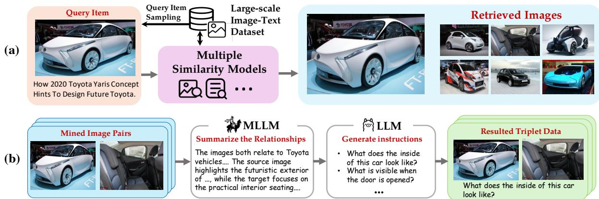
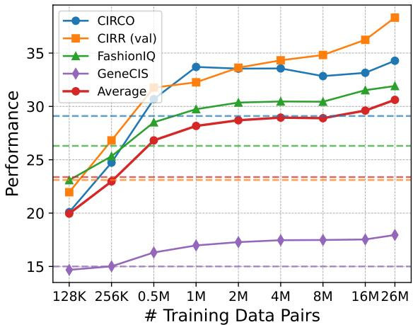
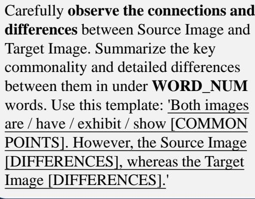
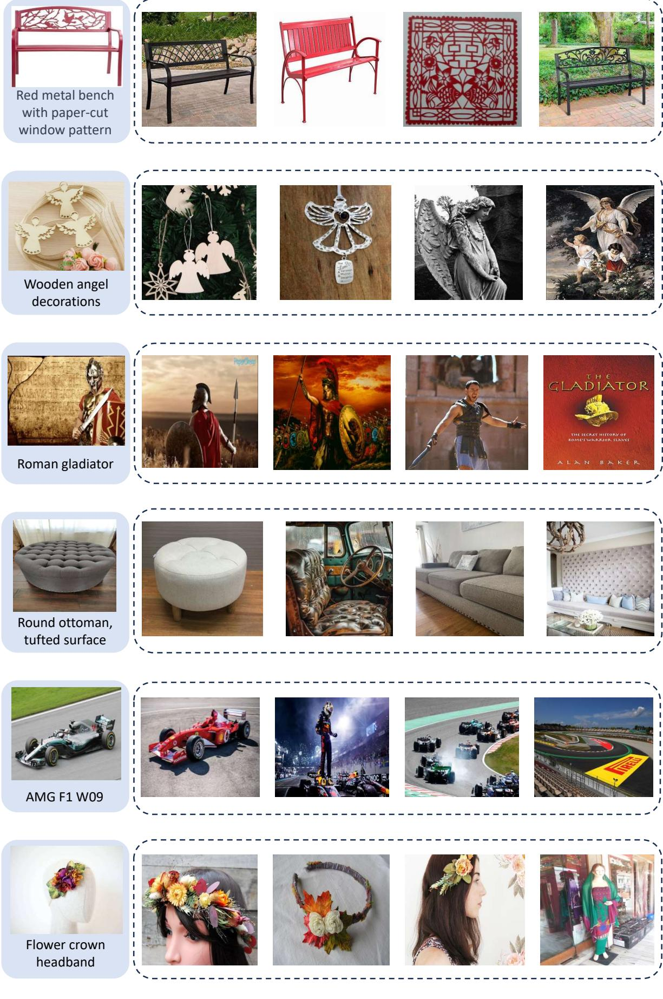
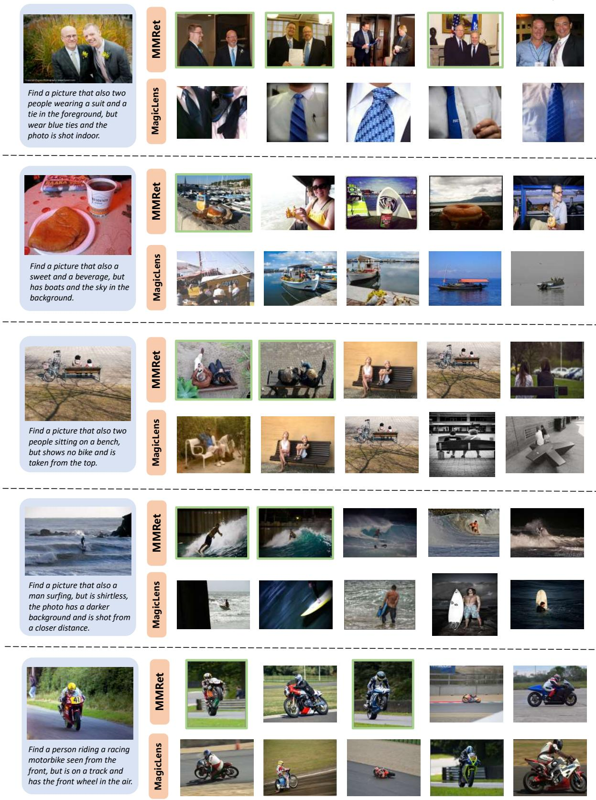

# MegaPairs: 大规模数据合成用于通用多模态检索

周君杰1，刘正$\mathbf { L i u ^ { 2 , 5 * } }$，$\mathbf { Z e L i u ^ { 3 } }$，肖世涛2，王跃泽$\mathbf { W a n g ^ { 2 } }$，赵博2,4，张晨杰5，廖德夫3，熊永平1 1 北京邮电大学，2 北京人工智能研究院，3 中国科学技术大学，4 上海交通大学，5 香港 Polytechnic University zhoujunjie@bupt.edu.cn zhengliu1026@gmail.com

# 摘要

尽管多模态检索的需求迅速增长，但该领域的进展仍受到训练数据匮乏的严重限制。本文介绍了MegaPairs，一种新颖的数据合成方法，利用视觉语言模型（VLMs）和开放域图像，以及通过该方法生成的大规模合成数据集。我们的实证分析表明，MegaPairs生成了高质量的数据，使多模态检索器显著超越了在现有数据集中训练的基线模型，该模型训练使用的数据量大约是其 $7 0 \times$。此外，由于MegaPairs完全依赖于通用图像语料库和开源的VLMs，它便于扩展，从而能够持续提升检索性能。在这一阶段，我们生成了超过2600万个训练实例，并使用这些数据训练了几种不同规模的模型。这些新模型在四个流行的复合图像检索（CIR）基准上实现了最先进的零-shot性能，并在MMEB提供的36个数据集上达到了最高的整体性能。随着额外下游微调，它们还显示出了显著的性能提升。我们生成的数据集、经过良好训练的模型以及数据合成流程将向公众开放，以促进该领域的未来发展。

# 1 引言

多模态检索是信息检索和人工智能领域中的一个关键研究问题。它旨在满足人们在不同数据模态中的信息需求，特别是文本和图像。如今，多模态检索已应用于各种现实场景，例如图像搜索（Chen et al., 2015；Wu et al., 2021；Zhang et al., 2024）、视觉问答（VQA）（Marino et al., 2019；Mathew et al., 2021）和视觉语言模型的检索增强生成（RAG）（Chen et al., 2022；Yu et al., 2024）。鉴于广泛的应用场景，有必要开发能够统一支持任何任务需求和工作领域的通用多模态检索器。通用多模态检索器在预训练的视觉语言模型（如CLIP（Radford et al., 2021）、ALIGN（Jia et al., 2021）和SigLIP（Zhai et al., 2023））上取得了显著进展。这些模型经过预训练，以生成文本和图像的区分性和统一表示，从而为多模态检索创造了坚实基础。然而，现有的视觉语言编码器大多是通过文本-图像匹配任务进行预训练的。虽然这些模型在文本到图像检索（Young et al., 2014；Chen et al., 2015）方面已取得初步能力，但对于其他常见的多模态任务，如复合图像检索（Liu et al., 2021；Baldrati et al., 2023；Zhang et al., 2024）和多模态文档检索（Chang et al., 2022；Liu et al., 2022）则显得不足。

为了增强多任务能力，对预训练模型进行全面指令微调的方法，通常称为指令微调，受到了广泛关注。该方法最早应用于大型语言模型（LLMs）的监督微调中（Ouyang et al., 2022；Wei et al., 2021；Chung et al., 2024），随后引入用于训练文本嵌入（Su et al., 2022；Asai et al., 2022；Zhang et al., 2023；Xiao et al., 2024）。在这些成功的基础上，指令微调进一步扩展到多模态嵌入模型（Wei et al., 2024；Sharifymoghaddam et al., 2024），通过使用多种多模态检索指令，持续微调预训练的视觉-语言编码器。鉴于嵌入模型的指令微调数据相对稀缺，研究人员提出利用大型语言模型从互联网资源生成合成数据（Wang et al., 2023）。在多模态检索领域，MagicLens（Zhang et al., 2024）提供了一个显著的例子，它为同一网页内共存的图像合成开放式搜索指令。尽管MagicLens近期取得了进展，目前的数据合成方法仍面临数据规模、质量、多样性和可用性等方面的重大限制。具体而言，互联网上仅有很小一部分网页包含多张图像（可扩展性），更不用说许多共存的图像要么无关，要么是近似重复的（质量）。此外，剩余的相关图像通常表现出单调的关系，例如同一物体的不同角度（多样性）。最后，用于多模态检索的大规模指令微调数据集通常由各个研究实验室私有保存（可用性）。

在本文中，我们介绍了一种新颖的数据合成方法，称为MegaPairs，并伴随有用这种方法生成的大规模指令数据集。MegaPairs的特点在于构建了异构KNN三元组，用于开放域图像。具体而言，它利用三种不同的相似性模型来采样相关的图像对，包括用于视觉语义相关性的CLIP视觉编码器（Sun等，2023）、用于视觉模式相关性的DINO视觉编码器（Oquab等，2024）和用于标题相关性的CLIP文本编码器。所采样的图像对会呈现给VLM和LLM标注者，后者生成两幅图像之间关系的综合描述，并根据这些描述创建伪检索指令。这种方法使得可以为通用数据集（如Datacomp（Gadre等，2024））生成大量指令，从而显著提高数据合成的可扩展性。由于从开放式图像语料库中采样异构关系，它还引入了保证质量的多样化指令。此外，通过利用开源的VLM和LLM模型（例如，InternVL2-26B（Chen等，2024b）、Llama-3-8B（Dubey等，2024）），整个过程可以以低成本进行。

在这一阶段，我们生成了2600万数据实例，在数据质量上超过了现有数据集。在我们的初步实验中，仅使用来自MegaPairs的50万样本实例，同一预训练模型的微调性能就已超过MagicLens的全部3670万个训练实例，即以$7 0 \times$更少的训练数据获得更好的结果。我们进一步基于整个合成数据集训练了三种不同规模的多模态检索器MMRet，并对广泛的多模态检索任务进行了全面评估。值得注意的是，MMRet在4个流行的复合图像检索（CIR）基准上和Jiang等（2024b）提供的36个数据集上，在零样本设置下取得了最先进的性能。此外，这些模型在下游微调后表现出显著的改进，并保持领先地位。整个资产包，包括数据集、经过良好训练的模型和数据生产管道，将公开发布，以推动该领域未来的发展。

# 2 相关工作

多模态检索。传统上，检索任务侧重于查询和候选项存在于不同模态的场景，例如单模态检索（Thakur et al., 2021）和跨模态检索（Chen et al., 2015）。然而，对多模态检索任务的需求日益增长，这些任务中的查询或候选项整合了图像和文本模态。这些任务具有广泛的应用，包括带指令的图像检索（Wu et al., 2021；Liu et al., 2021；Zhang et al., 2024）、多模态文档检索（Chang et al., 2022；Liu et al., 2022）、基于多模态查询的知识检索（Luo et al., 2023）以及增强检索生成（Yasunaga et al., 2023；Yu et al., 2024）。现有大多数方法采用预训练的视觉语言模型（VLM）来解决这些任务（Radford et al., 2021；Li et al., 2023；Saito et al., 2023）。然而，常见的VLM仅在图像-文本匹配数据集上进行训练（Changpinyo et al., 2021；Schuhmann et al., 2022），缺乏有效共同编码和理解两种模态的能力。因此，有必要创建适当的数据集来扩展VLM，以应对多样化的多模态检索任务。

多模态检索的指令调优。指令调优是一种流行策略，旨在提高大语言模型（Ouyang等，2022；Wei等，2021；Chung等，2024）和嵌入模型（Su等，2022；Asai等，2022；Zhang等，2023；Xiao等，2024；Chen等，2024a）的多任务能力。尽管针对多模态检索提出了一些指令数据集（Liu等，2021, 2022；Chang等，2022；Wei等，2024；Zhou等，2024），但由于依赖于人类标注，它们在规模和多样性上受到限制。最近，MagicLens（Zhang等，2024）在这方面取得了显著进展，创建了一个基于网页中共存图像的大规模开放式检索指令数据集。然而，由于多图像网页的短缺，MagicLens在可扩展性和数据质量上受到限制。此外，该数据集仍然是私有的，对公众用户不可访问。因此，创建和发布高质量的指令调优数据集对于推动多模态检索研究变得至关重要。

  
urConstruction pipelinmultimoal triplets)inmage pairs, )generatio e-nded instructions. Multiple similarity models are used to introduce diversified correlations for the image pairs.

# 3 方法论

# 3.1 MegaPairs 构建

在大规模开放世界数据上进行训练显著增强了基础模型的泛化能力。例如，CLIP（Radford等，2021）由于在文本-图像对上进行了大量训练，在跨模态检索和各种下游任务中取得了显著进展。然而，尽管多模态指令微调数据对多模态检索（Zhang等，2024）至关重要，但在自然世界中，它的稀缺性以及人工注释的高成本使得获取更加困难。本文提出通过数据合成构建大规模多模态指令微调数据集。形式上，每个数据实例包含以下三元组：一对图像 $( \mathcal { T } _ { q } , \mathcal { T } _ { t } )$，以及指定从查询图像 $\mathcal { T } _ { q }$ 到目标图像 $\mathcal { T } _ { t }$ 转换关系的文本指令 $\mathcal { T } _ { q t }$。我们识别出获取这些三元组的两个主要技术挑战：（1）大规模采样相关且多样化的图像对，（2）对所采样图像对的指令进行精确注释。为了解决这些挑战，我们提出利用常见的开放域图像语料库。直观上，大规模语料库包含丰富的相关图像，具有各种语义关系，可以被挖掘和注释以用于我们的指令微调数据。我们的数据合成流程如图1所示，主要包括两个组件：图像对的挖掘和开放式指令的生成。

挖掘相关图像对。如图 1(a) 所示，我们提议从大规模图像库中采样相关图像对。对于每个查询图像 $( \mathcal { T } _ { q } , \mathcal { C } _ { q } )$，我们利用多个相似性模型搜索一组多样的异质相关目标图像 $\{ \mathcal { T } _ { t _ { 1 } } , \mathcal { T } _ { t _ { 2 } } , \ldots , \mathcal { T } _ { t _ { n } } \}$。在我们的研究中，使用了以下类型的相关性：（1）视觉-语义相关性，该指标测量两幅图像的语义相关性，而不考虑视觉相似性，例如同一辆汽车的不同视角；（2）视觉模式相关性，捕捉两幅图像的视觉相似性，而不考虑语义相关性，例如背景相似的不同汽车；（3）标题相关性，测量两幅图像标题之间的文本相似性。意识到困难负样本在训练检索模型中的重要性（Xiong et al., 2020；Hofstätter et al., 2021；Zhang et al., 2022），对于每对 $( \mathcal { T } _ { q } , \mathcal { T } _ { t _ { i } } )$，我们从检索集包含额外的图像 $\{ \mathcal { T } _ { t _ { j } } \ \}$ $t _ { j } \neq t _ { i } \}$ 作为困难负样本。这种方法简单但在经验上有效。我们在第 4.3 节中验证我们数据对的可扩展性和质量，并在附录 F 中可视化了更多示例。

生成开放式指令。如图1(b)所示，我们利用开源的多模态大语言模型（MLLM）和大语言模型（LLM）对挖掘的图像对进行自动标注，记为 $\mathcal { P } = \{ ( \mathcal { T } _ { q } , \mathcal { T } _ { t _ { i } } ) \}$。最初，每个图像对 $( \mathcal { T } _ { q } , \mathcal { T } _ { t _ { i } } )$ 由MLLM处理，以生成关于查询图像 $\mathcal { T } _ { q }$ 和目标图像 $\mathcal { T } _ { t _ { i } }$ 之间共同概念和差异的详细描述 $\mathcal { D } _ { i }$。随后，该描述 $\mathcal { D } _ { i }$ 由LLM进行优化，以产生文本指令 $\mathcal { T } _ { q t _ { i } }$。我们促使LLM为每对图像生成多个 $\mathcal { T } _ { q t _ { i } }$，从而增强文本指令的多样性。最终，我们构建一个多模态三元组 $( \mathcal { T } _ { q } , \mathcal { T } _ { q t _ { i } } , \mathcal { T } _ { t _ { i } } )$，其中 $( \mathcal { T } _ { q } , \mathcal { T } _ { q t _ { i } } )$ 可用于检索 $\mathcal { T } _ { t _ { i } }$。这种两步标注方法在利用开源模型的同时，确保了自动标注过程的准确性和多样性。详细的提示信息可在附录A中找到。

实现。基于上述数据合成流程，我们创建了一个包含26,235,105对图像的数据集。我们利用Recap-DataComp-1B（Li等, 2024b）中的一个子集作为图像语料库，其中包含2000万张带有标题的图像。对于相似性模型，我们采用EVA-CLIP的图像编码器用于视觉-语义关联（Sun等, 2023），DINOv2（Oquab等, 2024）用于视觉模式关联，以及EVA-CLIP的文本编码器用于标题相似性。我们筛选出相似性分数在(0.8, 0.96)之间的图像对，从而消除弱关联和近重复项。我们进一步利用InternVL2-26B（Chen等, 2024b）和LLaMA3-8B（Dubey等, 2024）生成开放式指令。对于每对图像，我们创建至少三种不同的文本指令，并引入五个困难的负样本。

# 3.2 MMRet 模型

我们提出了MMRet，这是一系列基于预训练的视觉语言模型（VLMs）设计的通用多模态检索模型。我们的MMRet集成了两种不同的VLM架构，以实现通用多模态嵌入。基于CLIP的MMRet。原始的CLIP（Radford等，2021）模型采用了双编码器架构，独立编码图像和文本数据。我们将图像编码器表示为$\Phi _ { I }$，将文本编码器表示为$\Phi _ { T }$。给定图像$I$或文本$T$，它们的嵌入计算如下：

$$
\begin{array} { l } { \mathbf { e } _ { i } = \Phi _ { I } ( I ) } \\ { \mathbf { e } _ { t } = \Phi _ { T } ( T ) } \end{array}
$$

为了生成复合图像-文本样本 $( I , T )$ 的多模态嵌入，我们采用与 UniIR（Wei 等人，2024）使用的评分融合策略，该策略直接对双编码器的输出进行元素级相加：

$$
{ \bf e } _ { i t } = \Phi _ { I } ( I ) + \Phi _ { T } ( T )
$$

在我们的基于 CLIP 的多模态检索（MMRet）中，我们训练了基本模型和大型模型。基于多模态大型语言模型（MLLM）的 MMRet。多模态大型语言模型（MLLM）将视觉编码器（通常基于视觉变换器，参考 Dosovitskiy 等，2021）纳入大型语言模型（LLM）。这种集成使得图像词元可以直接被 LLM 处理。因此，MLLM 能够有效处理多样的多模态输入，通过将任何类型的输入转换为词元序列。例如，图像-文本复合数据被转换为交错的图像和文本词元序列，使模型能够无缝处理它们。我们的 MMRet 模型基于 LLaVA-1.6（Liu 等，2024）。在训练和推理阶段，MMRet 使用特定于任务的指令作为查询输入，以提高泛化能力，符合基于 LLM 的嵌入模型的标准实践（Wang 等，2023；Li 等，2024a）。典型的多模态查询输入结构如下：指令 {task_inst} {query $\left\{ q _ { t } \right\} ~ \left\{ q _ { i } \right\}$ [EOS] 其中 {task_inst} 表示特定于任务的指令，$\left\{ q _ { t } \right\}$ 表示输入查询文本，$\{ q _ { i } \}$ 是输入查询图像。在 MLLM 中，[EOS] 词元的标准化最后隐藏状态被用作任何给定输入序列的嵌入。

# 3.3 多模态对比学习

我们采用多模态对比学习将原始的 CLIP 和 MLLM 转换为我们的 MMRet 模型，以支持各种多模态检索任务。我们使用标准的 InfoNCE 损失（Oord 等，2018）作为我们的训练目标：

$$
\mathcal { L } = - \frac { 1 } { \vert \boldsymbol { \mathcal { Q } } \vert } \sum _ { q _ { i } \in \mathcal { Q } } \log \frac { \exp ( \mathbf { e } _ { q _ { i } } \cdot \mathbf { e } _ { c _ { i } ^ { + } } / \tau ) } { \sum _ { c _ { j } \in \mathcal { C } } \exp ( \mathbf { e } _ { q _ { i } } \cdot \mathbf { e } _ { c _ { j } } / \tau ) }
$$

集合 $\mathcal { Q }$ 包含批次中的所有查询样本 $q _ { i }$。向量 ${ \bf e } _ { q _ { i } }$ 和 ${ \mathbf { e } _ { c _ { i } ^ { + } } }$ 分别是查询 $q _ { i }$ 和其正候选 $c _ { i } ^ { + }$ 的嵌入表示。集合 $\mathcal { C }$ 包含所有批次内候选项。注意，$q$ 和 $c$ 可以是图像、文本或组合的图像-文本数据。参数 $\tau$ 调节对负样本的惩罚，默认为 0.02，除非本文另有说明。

<table><tr><td rowspan="2">Methods</td><td rowspan="2">Backbone</td><td rowspan="2"># Params</td><td>CIRCO</td><td colspan="2">CIRR</td><td>FashionIQ</td><td>GeneCIS</td></tr><tr><td>mAP@5</td><td>R@1</td><td>R_@1</td><td>R@10</td><td>R@1</td></tr><tr><td>SEARLE (Baldrati et al., 2023)</td><td>CLIP-B</td><td>165M</td><td>9.4</td><td>24.0</td><td>54.9</td><td>22.9</td><td>-</td></tr><tr><td>CIReVL (Karthik et al., 2023)</td><td>CLIP-B</td><td>12.3B†</td><td>14.9</td><td>23.9</td><td>60.2</td><td>28.3</td><td>15.9</td></tr><tr><td>LDRE (Yang et al., 2024)</td><td>CLIP-B</td><td>7.9B†</td><td>18.0</td><td>25.7</td><td>60.5</td><td>24.8</td><td>-</td></tr><tr><td>MagicLens-B (Zhang et al., 2024)</td><td>CLIP-B</td><td>166M</td><td>23.1</td><td>27.0</td><td>66.7</td><td>26.3</td><td>15.0</td></tr><tr><td>MagicLens-B‡ (Zhang et al., 2024)</td><td>CoCa-B</td><td>267M</td><td>30.8</td><td>31.6</td><td>69.3</td><td>35.2</td><td>17.4*</td></tr><tr><td>MMRet-Base</td><td>CLIP-B</td><td>149M</td><td>34.3</td><td>36.1</td><td>71.6</td><td>31.9</td><td>18.0</td></tr><tr><td>Pic2Word (Saito et al., 2023)</td><td>CLIP-L</td><td>429M</td><td>8.7</td><td>23.9</td><td>-</td><td>24.7</td><td>11.2</td></tr><tr><td>PLI (Chen and Lai, 2023)</td><td>CLIP-L</td><td>428M</td><td>10.4</td><td>25.5</td><td>55.6</td><td>35.4</td><td>-</td></tr><tr><td>SEARLE (Baldrati et al., 2023)</td><td>CLIP-L</td><td>442M</td><td>11.7</td><td>24.2</td><td>53.8</td><td>25.6</td><td>12.3</td></tr><tr><td>CompoDiff (Gu et al., 2024a)</td><td>CLIP-L</td><td>568M</td><td>12.6</td><td>18.2</td><td>57.4</td><td>36.0</td><td>14.9</td></tr><tr><td>CIReVL (Karthik et al., 2023)</td><td>CLIP-L</td><td>12.5B†</td><td>18.6</td><td>24.6</td><td>59.5</td><td>28.6</td><td>15.9</td></tr><tr><td>LDRE (Yang et al., 2024)</td><td>CLIP-L</td><td>8.2B†</td><td>23.4</td><td>26.5</td><td>60.4</td><td>28.5</td><td>-</td></tr><tr><td>MagicLens-L (Zhang et al., 2024)</td><td>CLIP-L</td><td>465M</td><td>29.6</td><td>30.1</td><td>68.1</td><td>30.7</td><td>16.3</td></tr><tr><td>MagicLens-L‡ (Zhang et al., 2024)</td><td>CoCa-L</td><td>613M</td><td>34.1*</td><td>33.3*</td><td>70.9*</td><td>38.0</td><td>16.7</td></tr><tr><td>MMRet-Large</td><td>CLIP-L</td><td>428M</td><td>39.2</td><td>38.0</td><td>73.2</td><td>34.6</td><td>18.1</td></tr><tr><td>LDRE (Yang et al., 2024)</td><td>CLIP-G</td><td>10.3B†</td><td>31.1</td><td>36.2</td><td>68.8</td><td>32.5</td><td>-</td></tr><tr><td>CIReVL (Karthik et al., 2023)</td><td>CLIP-G</td><td>14.6B†</td><td>26.8</td><td>34.7</td><td>68.0</td><td>32.2</td><td>17.4*</td></tr><tr><td>IP-CIR (Li et al., 2024c)</td><td>CLIP-G</td><td>43.8B†</td><td>32.8</td><td>39.3</td><td>70.0</td><td>45.7*</td><td>-</td></tr><tr><td>E5-V (Jiang et al., 2024a)</td><td>LLaVA-1.6</td><td>8.35B</td><td>19.1</td><td>33.9</td><td>-</td><td>31.8</td><td>-</td></tr><tr><td>MM-Emded (Lin et al., 2024)</td><td>LLaVA-1.6</td><td>7.57B</td><td>32.3</td><td>-</td><td>-</td><td>-</td><td>-</td></tr><tr><td>MMRet-MLLM</td><td>LLaVA-1.6</td><td>7.57B</td><td>42.2</td><td>46.7</td><td>75.4</td><td>35.6</td><td>21.1</td></tr></table>

表零：在各种信息检索基准测试上的零-shot 检索性能。表示每个基准在 MMRet 之前的最佳性能。† 表示具有多个组件的方法（例如，GPT-3.5，Qwen1.5-32B）；我们报告已知规模组件的参数数量。基于 CoCa 的 MagicLens ‡ 模型为专有模型。粗体和下划线结果分别表示每个模型规模的最佳和第二最佳性能。我们的 MMRet 在不同模型规模和基准测试上取得了先进的结果，比之前的 SOTA 高出 $8.1\%$，在主基准 CIRCO 上显著推动了零-shot CIR 方法的发展。

# 4 实验

在本节中，我们首先在第4.1节评估MegaPairs在零样本组合图像检索（CIR）任务上的有效性。接下来，在第4.2节中，我们探讨MegaPairs对更广泛的多模态检索任务的影响。最后，我们将在第4.3节对我们的MegaPairs进行详细分析。

# 4.1 CIR任务的零-shot表现

# 4.1.1 实现细节

我们利用我们的 MegaPairs 数据集对我们的 MMRet 模型进行多模态对比训练。对于基于 CLIP 的 MMRet，我们使用 CLIP 的 base1 和 large2 版本初始化模型，分别称为 MMRet-Base 和 MMRet-Large。对于基于 MLLM 的 MMRet，我们利用 LLaVA-1.6 Mistral 7B 架构，并相应地初始化模型参数，称为 MMRet-MLLM。有关 MMRet 在 MegaPairs 上的训练细节，请参见附录 B。

# 4.1.2 基准测试

我们在零样本设置下评估我们的 MMRet，涵盖四个不同的组合图像检索基准：CIRCO（Baldrati 等，2023年）、CIRR（Liu 等，2021年）、FashionIQ（Wu 等，2021年）和 GeneCIS（Vaze 等，2023年）。根据以往的做法（Zhang 等，2024年），CIRCO 被视为我们的主要基准，因为它拥有丰富的候选池和高质量的标注。每个基准的详细信息和指标可以在附录 C 中找到。

# 4.1.3 评估结果

MMRet 在四个基准测试上的主要评估结果如表 1 所示，每个基准的完整结果详见附录 D。我们识别出三项关键观察结果：（1）我们的 MMRet-MLLM 模型在四个基准中的三个上表现出领先性能。具体而言，在我们的主要基准上，

Table 2: Zero-shot performance on the Massive Multimodal Embedding Benchmark (MMEB). UnilR was trained on M-BEIR (Wei et al., 2024), which includes 10 of the 12 datasets in the MMEB retrieval tasks, it does not stl dherezeroshot stti. In ntrasur MMRe-MLLM,traixclusivelyn heMegaParat, achieves state-of-the-art zero-shot performance in overall scores and multiple meta-tasks on MMEB.   

<table><tr><td rowspan="2">Models</td><td colspan="4">Per Meta-Task Score</td><td rowspan="2">Overall</td></tr><tr><td>Classification</td><td>VQA</td><td>Retrieval</td><td>Grounding</td></tr><tr><td>number of datasets</td><td>10</td><td>10</td><td>12</td><td>4</td><td>36</td></tr><tr><td>BLIP2 (Li et al., 2023)</td><td>27.0</td><td>4.2</td><td>33.9</td><td>47.0</td><td>25.2</td></tr><tr><td>SigLIP (Zhai et al., 2023)</td><td>40.3</td><td>8.4</td><td>31.6</td><td>59.5</td><td>34.8</td></tr><tr><td>CLIP (Radford et al., 2021)</td><td>42.8</td><td>9.1</td><td>53.0</td><td>51.8</td><td>37.8</td></tr><tr><td>OpenCLIP (Cherti et al., 2023)</td><td>47.8</td><td>10.9</td><td>52.3</td><td>53.3</td><td>39.7</td></tr><tr><td>UniIR (Wei et al., 2024)</td><td>42.1</td><td>15.0</td><td>60.1†</td><td>62.2</td><td>42.8</td></tr><tr><td>MagicLens (Zhang et al., 2024)</td><td>38.8</td><td>8.3</td><td>35.4</td><td>26.0</td><td>27.8</td></tr><tr><td>E5-V (LLaVA-1.6) (Jiang et al., 2024a)</td><td>21.8</td><td>4.9</td><td>11.5</td><td>19.0</td><td>13.3</td></tr><tr><td>MMRet-MLLM (LLaVA-1.6)</td><td>47.2</td><td>18.4</td><td>56.5</td><td>62.2</td><td>44.0</td></tr></table>

CIRCO上，MMRet-MLLM以$42.2\% \ \mathrm{mAP} @ 5$的成绩超越了当前基于CoCa的最先进的MagicLens-L，该模型的成绩为$34.1\%$（提升了$8.1\%$）。在CIRR测试集上，它在$\mathbf{R} @ 1$和${\sf R}_{s} @ 1$上分别超出了当前最先进的模型$7.4\%$和$4.5\%$。此外，在GeneCIS上，MMRet在$\mathbb{R}_{s} @ 1$上领先当前最先进的模型$3.7\%$。(2) MMRet在所有模型规模上表现优越。例如，在CIRR测试集上，MMRet-Base和MMRet-Large分别在$\mathbb{R} @ 1$上超越可比模型$4.5\%$和$4.7\%$。此外，它们在CIRCO基准测试中的$\mathrm{mAP} @ 5$上分别超越相似模型$3.5\%$和$5.1\%$。在时尚领域的基准FashionIQ上，尽管没有获得最高分数，我们基于CLIP的MMRet在与其他基于CLIP的模型的竞赛中展现了竞争力。(3) MMRet-Base模型超越了大多数更大的模型，突显了我们MegaPairs数据集的卓越质量。尽管是我们最小的模型，MMRet-Base仍然超越了许多较大模型，如MagicLens-L。例如，除去我们自己的MMRet-Large和MMRet-MLLM模型外，其在CIRCO上的$\mathrm{mAP} @ 5$达到了$34.3\%$，取得了最佳结果。它甚至超越了那些参数多达数十倍的模型（例如，MM-Embed），强调了我们MegaPairs数据集的有效性。

# 4.2 在 MMEB 上的性能

为了进一步验证 MegaPairs 在更广泛的多模态嵌入任务中的泛化能力，我们在大规模多模态嵌入基准（MMEB）（Jiang et al., 2024b）上评估了 MMRet。MMEB 是一个综合基准，包括四个元任务类别下的 36 个数据集：分类、视觉问答、检索和视觉定位。它旨在评估多模态嵌入的质量，并评估模型在文本和图像模态的多样组合下的表现。我们在零-shot 和监督微调场景中展示了 MMRet 的性能。在之前的工作（Jiang et al., 2024a,b）的基础上，我们使用 MMRet-MLLM 进行实验。

# 4.2.1 零样本性能

实现细节。在 MMEB 的零-shot 评估中，我们直接利用第 4.1 节中的 MMRet-MLLM，保持与第 4.1.1 节一致的实现细节。指标。我们对所有任务评估 Precision $@ 1$，该指标衡量所有查询中排名第一的正向候选项的比率。我们报告四个元任务的平均得分以及总体平均值。根据 MMEB 的设置，我们在评估期间将预定义的任务特定指令纳入所有任务的查询中。结果。我们在 MMEB 上的 MMRet-MLLM 的零-shot 性能见表 2。MMRet-MLLM 在各种嵌入元任务中实现了最先进的零-shot 性能，记录了最高的总体平均表现。与最近的 E5-V (Jiang et al., 2024a) 相比，后者使用类似的 LLaVA-1.6 (Liu et al., 2024) 主干网络进行通用多模态嵌入，经过我们 MegaPairs 数据集训练的 MMRet-MLLM 展现了更优的性能。值得注意的是，第二好的模型 UniIR 是在 M-BEIR (Wei et al., 2024) 上训练的，该数据集涵盖了 MMEB 中 12 个检索元任务中的 10 个数据集，因此不被视为该元任务的零-shot。结果，我们的 MLLM-Ret 在检索元任务中显著优于其他方法，并展示了在所有任务上的强泛化能力。

Table 3: Supervised fine-tuning results on the MMEB benchmark. The backbone of our MMRet-MLLM is LLaVA-1.6 (Li etal., 2024). Wecmpareour resuts with the ollowi baselines:CLIP (Rador et l. 2021), OpeCLIP Cherti et al 2023), andtwoversionsfVLM2Vec (Jianget al 2024b)that mploy the LLaVA-1. (Liu et al., 2024) and $\mathrm { P h i } { - } 3 . 5 { \cdot } \mathrm { V }$ (Abdin et al., 2024) backbones. All baseline results are sourced from (Jiang et al., 2024b). IND: in-distribution dataset; OOD: out-of-distribution dataset.   

<table><tr><td rowspan="2">Models</td><td colspan="4">Per Meta-Task Score</td><td colspan="3">Average Score</td></tr><tr><td>Classification</td><td>VQA</td><td>Retrieval</td><td>Grounding</td><td>IND</td><td>OOD</td><td>Overall</td></tr><tr><td>number of datasets</td><td>10</td><td>10</td><td>12</td><td>4</td><td>20</td><td>16</td><td>36</td></tr><tr><td>CLIP</td><td>55.2</td><td>19.7</td><td>53.2</td><td>62.2</td><td>47.6</td><td>42.8</td><td>45.4</td></tr><tr><td>OpenCLIP</td><td>56.0</td><td>21.9</td><td>55.4</td><td>64.1</td><td>50.5</td><td>43.1</td><td>47.2</td></tr><tr><td>VLM2Vec (LLaVA-1.6)</td><td>54.7</td><td>50.3</td><td>56.2</td><td>64.0</td><td>61.0</td><td>47.5</td><td>55.0</td></tr><tr><td>VLM2Vec (Phi-3.5-V)</td><td>54.8</td><td>54.9</td><td>62.3</td><td>79.5</td><td>66.5</td><td>52.0</td><td>60.1</td></tr><tr><td>MMRet-MLLM</td><td>56.0</td><td>57.4</td><td>69.9</td><td>83.6</td><td>68.0</td><td>59.1</td><td>64.1</td></tr></table>

# 4.2.2 监督微调性能

实现细节。我们进一步在 MMEB 上微调我们的 MMRet-MLLM，以研究 MegaPairs 对下游任务性能的影响。MMEB 数据集包括 20 个分布内（IND）数据集用于训练，以及 16 个分布外（OOD）数据集用于评估。我们利用 $20 \mathrm{IND}$ 数据集中的训练集，包含约 662K 个数据点。学习率设置为 $5 \times 10^{-6}$，我们采用秩为 32 的 LoRA。批大小设置为 192，训练一个周期。根据 VLM2Vec 配置（Jiang et al., 2024b），我们在训练过程中将特定任务的指令纳入查询。指标。我们使用与第 4.2.1 节中所述相同的指标。此外，我们报告 IND 和 OOD 数据集的平均分数。结果。表 3 比较了我们的 MMRet 模型在 MMEB 数据集上的监督微调性能与各种基线。我们的 MMRet-MLLM 达到了最先进的性能，总体平均精度 $@ 1$ 为 $64.1\%$。与直接在 MMEB 上微调 LLaVA-1.6 的 VLM2Vec (LLaVA-1.6)（Jiang et al., 2024b）相比，MMRet-MLLM 通过在我们的 MegaPairs 上进行多模态对比训练，提升了下游任务性能 $9.1\%$。值得注意的是，与 VLM2Vec 的两个版本相比，我们的模型在分布外（OOD）数据集上表现出 $11.6\%$ 和 $7.1\%$ 的提升，突显了我们 MegaPairs 在更广泛的下游多模态嵌入任务中的优越泛化能力。

# 4.3 对MegaPairs的详细调查

我们首先在 4.3.1 节评估我们的 MegaPairs 数据集的质量和可扩展性。接下来，在 4.3.2 节评估 MegaPairs 提供的难负样本的有效性。最后，我们在 4.3.3 节探讨从开放域图像语料库中挖掘图像对的策略。除非另有说明，后续所有实验均使用我们的 MMRet-base 模型进行。

# 4.3.1 数据可扩展性与质量

我们首先通过在来自MegaPairs数据集的不同大小的子集上训练MMRet，评估其性能趋势，以验证其可扩展性。随后，我们将其与现有数据集进行比较，以突出MegaPairs的高质量特征。性能扩展。如图2所示，MMRet-base在各个基准测试中的性能随着训练数据量的增加而持续提升。这一上升趋势突显了MegaPairs的有效性和可扩展性。数据集质量与现有数据集的比较。

  

Figure 2: Performance scaling of MMRet-base on the MegaPairs as data size increases. The dashed lines indicate the performance of MagicLens-B (CLIP) trained on their dataset of $3 6 . 7 \mathbf { M }$ data pairs.

Table 4: Performance comparison of MMRet-base using different negative strategies at a 1M scale. Qry: query image negative; HN: our mined hard negatives. †We report CIRR validation set performance due to their test server submission limits.   

<table><tr><td colspan="2">Negatives</td><td>CIRCO</td><td>CIRR†</td><td>FIQ</td><td>CIS</td></tr><tr><td>Qry</td><td>HN</td><td>mAP@5</td><td>R@1</td><td>R@10</td><td>R@1</td></tr><tr><td>×</td><td>X</td><td>10.1</td><td>0.2</td><td>25.3</td><td>14.4</td></tr><tr><td>√</td><td>X</td><td>29.7</td><td>32.1</td><td>27.6</td><td>16.6</td></tr><tr><td>√</td><td>-</td><td>32.3</td><td>33.7</td><td>30.1</td><td>17.0</td></tr></table>

数据集。图 2 中的虚线表示在其 3670 万数据集上训练的 MagicLens-B (CLIP) 模型的性能（Zhang et al., 2024）。值得注意的是，仅使用我们 MegaPairs 数据集中的 $0 . 5 \mathbf { M }$ 样本，构成了 MagicLens 的不到 $2 \%$，MMRet 在所有基准测试中均显著超越 MagicLens，并使用相同的 CLIPbase 主干网络。这一结果突显了我们 MegaPairs 数据集的优越质量和效率。

# 4.3.2 硬负样本的影响

在MegaPairs中，从检索集获取的非目标图像被标记为困难负样本，为每个图像对提供了一个多样且充足的困难负样本目标图像集。如表4所示，与不使用负样本或仅使用查询图像作为负样本相比，使用我们挖掘的困难负样本进行训练显著提升了模型在所有基准上的性能。

# 4.3.3 数据对搜索策略

我们探讨了不同搜索策略在构建异构三元组中的影响。为了进行公平比较，我们为每种构建策略选择了100万个数据条目，并对模型进行了2000步的训练。

Table 5: Performance comparison of MMRet-base using different data pairing strategies at 1M scale. D: DINOv2 Encoder; I: CLIP Image Encoder; T: CLIP Text Encoder. FIQ and CIS represent the FashionIQ and GeneCIS benchmarks, respectively. † We report CIRR validation set performance due to test server submission limits.   

<table><tr><td colspan="2">Strategy</td><td rowspan="2"></td><td rowspan="2">CIRCO</td><td rowspan="2">CIRR†</td><td rowspan="2">FIQ</td><td rowspan="2">CIS</td></tr><tr><td>D I</td><td>T</td></tr><tr><td></td><td></td><td></td><td>mAP@5</td><td>R@1</td><td>R@10</td><td>R@1</td></tr><tr><td>✓</td><td>×</td><td>X X</td><td>29.0</td><td>31.5 30.0</td><td>24.7</td><td>17.2</td></tr><tr><td>X X</td><td>✓ X</td><td>✓</td><td>30.0 31.6</td><td>32.2</td><td>29.6 28.7</td><td>15.3 17.3</td></tr><tr><td></td><td></td><td></td><td></td><td></td><td></td><td></td></tr><tr><td></td><td>✓ X</td><td>X V</td><td>31.0 32.4</td><td>32.1 33.3</td><td>28.5 28.9</td><td>17.1 17.5</td></tr><tr><td>X</td><td>V</td><td>L</td><td>32.2</td><td>33.3</td><td>29.7</td><td></td></tr><tr><td></td><td></td><td></td><td></td><td></td><td></td><td>16.4</td></tr><tr><td>V</td><td></td><td>V</td><td>32.3</td><td>33.7</td><td>30.1</td><td>17.0</td></tr></table>

表5展示了在多个基准测试中各种数据配对策略的结果。最初，在评估单个策略时，我们观察到基于文本相似性的三元组达到了最高的零-shot CIR 性能。我们假设文本相似性捕捉了比图像相似性更丰富的关系。此外，任意两种配对策略的组合通常优于单一策略。这一提升可能是由于数据集内的多样性增加，这对训练稳健的多模态嵌入模型至关重要。最终，同时采用所有三种策略在所有数据集中提供了最稳健的性能。因此，这种方法被选用于构建 MegaPairs。

# 5 结论

在本论文中，我们介绍了MegaPairs，这是一个大规模的多模态配对数据集，旨在训练通用多模态检索器。MegaPairs包括来自开放世界的多样化图像对，并附有开放式文本说明，以捕捉它们的视觉和语义关系。利用MegaPairs，我们训练了我们的MMRet模型，在四个复合图像检索任务和由36个不同数据集组成的巨大多模态嵌入基准上，实现了最先进的零样本性能。广泛的实验进一步证明了MegaPairs的泛化能力和高质量特征。

# 限制因素

在构建 MegaPairs 时，我们发现使用多样的检索器可以生成更丰富的图像对。我们的研究使用了三种不同的检索器，这提供了可观的多样性。然而，仍然有潜力探索其他配对方法，例如利用更先进的文本领域检索器（例如 BGE（Xiao 等，2024））或采用多样化的策略，如图像-文本检索。

# 伦理声明

我们在MegaPairs数据集中所有图像均来源于Recap-Datacomp-1B数据集（Li等，2024b），并经过Datacomp团队严格筛选，以去除有害内容（Gadre等，2024）。尽管我们付出了最大努力，但我们承认这些筛选可能并非完全全面或无遗漏。此外，我们强烈不鼓励使用MM-Ret模型对敏感内容进行编码和检索。

# References

Marah Abdin, Jyoti Aneja, Hany Awadalla, Ahmed Awadallah, Ammar Ahmad Awan, Nguyen Bach, Amit Bahree, Arash Bakhtiari, Jianmin Bao, Harkirat Behl, et al. 2024. Phi-3 technical report: A highly capable language model locally on your phone. arXiv preprint arXiv:2404.14219.

Akari Asai, Timo Schick, Patrick Lewis, Xilun Chen, Gautier Izacard, Sebastian Riedel, Hannaneh Hajishirzi, and Wen-tau Yih. 2022. Task-aware retrieval with instructions. arXiv preprint arXiv:2211.09260.

Alberto Baldrati, Lorenzo Agnolucci, Marco Bertini, and Alberto Del Bimbo. 2023. Zero-shot composed image retrieval with textual inversion. In Proceedings of the IEEE/CVF International Conference on Computer Vision, pages 1533815347.

Yingshan Chang, Mridu Narang, Hisami Suzuki, Guihong Cao, Jianfeng Gao, and Yonatan Bisk. 2022. Webqa: Multihop and multimodal qa. In Proceedings of the IEEE/CVF Conference on Computer Vision and Pattern Recognition, pages 1649516504.

Soravit Changpinyo, Piyush Sharma, Nan Ding, and Radu Soricut. 2021. Conceptual $1 2 \mathrm { m }$ : Pushing webscale image-text pre-training to recognize long-tail visual concepts. In Proceedings of the IEEE/CVF Conference on Computer Vision and Pattern Recognition, pages 35583568.

Jianlv Chen, Shitao Xiao, Peitian Zhang, Kun Luo, Defu Lian, and Zheng Liu. 2024a. Bge m3-embedding:

Multi-lingual, multi-functionality, multi-granularity text embeddings through self-knowledge distillation. arXiv preprint arXiv:2402.03216.

Junyang Chen and Hanjiang Lai. 2023. Pretrain like you inference: Masked tuning improves zeroshot composed image retrieval. arXiv preprint arXiv:2311.07622.

Wenhu Chen, Hexiang Hu, Xi Chen, Pat Verga, and William W. Cohen. 2022. Murag: Multimodal retrieval-augmented generator for open question answering over images and text. In Proceedings of the 2022 Conference on Empirical Methods in Natural Language Processing, EMNLP 2022, Abu Dhabi, United Arab Emirates, December 7-11, 2022, pages 55585570. Association for Computational Linguistics.

Xinlei Chen, Hao Fang, Tsung-Yi Lin, Ramakrishna Vedantam, Saurabh Gupta, Piotr Dollár, and C Lawrence Zitnick. 2015. Microsoft coco captions: Data collection and evaluation server. arXiv preprint arXiv:1504.00325.

Zhe Chen, Weiyun Wang, Hao Tian, Shenglong Ye, Zhangwei Gao, Erfei Cui, Wenwen Tong, Kongzhi Hu, Jiapeng Luo, Zheng Ma, et al. 2024b. How far are we to gpt-4v? closing the gap to commercial multimodal models with open-source suites. arXiv preprint arXiv:2404.16821.

Mehdi Cherti, Romain Beaumont, Ross Wightman, Mitchell Wortsman, Gabriel Ilharco, Cade Gordon, Christoph Schuhmann, Ludwig Schmidt, and Jenia Jitsev. 2023. Reproducible scaling laws for contrastive language-image learning. In IEEE/CVF Conference on Computer Vision and Pattern Recognition, CVPR 2023, Vancouver, BC, Canada, June 17-24, 2023, pages 28182829. IEEE.

Hyung Won Chung, Le Hou, Shayne Longpre, Barret Zoph, Yi Tay, William Fedus, Yunxuan Li, Xuezhi Wang, Mostafa Dehghani, Siddhartha Brahma, et al. 2024. Scaling instruction-finetuned language models. Journal of Machine Learning Research, 25(70):153.

Niv Cohen, Rinon Gal, Eli A Meirom, Gal Chechik, and Yuval Atzmon. 2022. "this is my unicorn, fluffy": Personalizing frozen vision-language representations. In European conference on computer vision, pages 558577. Springer.

Alexey Dosovitskiy, Lucas Beyer, Alexander Kolesnikov, Dirk Weissenborn, Xiaohua Zhai, Thomas Unterthiner, Mostafa Dehghani, Matthias Minderer, Georg Heigold, Sylvain Gelly, Jakob Uszkoreit, and Neil Houlsby. 2021. An image is worth 16x16 words: Transformers for image recognition at scale. In 9th International Conference on Learning Representations, ICLR 2021, Virtual Event, Austria, May 3-7, 2021. OpenReview.net.

Abhimanyu Dubey, Abhinav Jauhri, Abhinav Pandey, Abhishek Kadian, Ahmad Al-Dahle, Aiesha Letman, Akhil Mathur, Alan Schelten, Amy Yang, Angela

Fan, et al. 2024. The llama 3 herd of models. arXiv preprint arXiv:2407.21783.

Samir Yitzhak Gadre, Gabriel Ilharco, Alex Fang, Jonathan Hayase, Georgios Smyrnis, Thao Nguyen, Ryan Marten, Mitchell Wortsman, Dhruba Ghosh, Jieyu Zhang, et al. 2024. Datacomp: In search of the next generation of multimodal datasets. Advances in Neural Information Processing Systems, 36.

Geonmo Gu, Sanghyuk Chun, Wonjae Kim, HeeJae Jun, Yoohoon Kang, and Sangdoo Yun. 2024a. Compodiff: Versatile composed image retrieval with latent diffusion. Trans. Mach. Learn. Res., 2024.

Geonmo Gu, Sanghyuk Chun, Wonjae Kim, Yoohoon Kang, and Sangdoo Yun. 2024b. Language-only efficient training of zero-shot composed image retrieval. In IEEE/CVF Conference on Computer Vision and Pattern Recognition, CVPR 2024, Seattle, WA, USA, June 16-22, 2024, pages 1322513234. IEEE.

Sebastian Hofstätter, Sheng-Chieh Lin, Jheng-Hong Yang, Jimmy Lin, and Allan Hanbury. 2021. Efficiently teaching an effective dense retriever with balanced topic aware sampling. In Proceedings of the 44th International ACM SIGIR Conference on Research and Development in Information Retrieval, pages 113122.

Edward J. Hu, Yelong Shen, Phillip Wallis, Zeyuan Allen-Zhu, Yuanzhi Li, Shean Wang, Lu Wang, and Weizhu Chen. 2022. Lora: Low-rank adaptation of large language models. In The Tenth International Conference on Learning Representations, ICLR 2022, Virtual Event, April 25-29, 2022. OpenReview.net.

Chao Jia, Yinfei Yang, Ye Xia, Yi-Ting Chen, Zarana Parekh, Hieu Pham, Quoc Le, Yun-Hsuan Sung, Zhen Li, and Tom Duerig. 2021. Scaling up visual and vision-language representation learning with noisy text supervision. In International conference on machine learning, pages 49044916. PMLR.

Ting Jiang, Minghui Song, Zihan Zhang, Haizhen Huang, Weiwei Deng, Feng Sun, Qi Zhang, Deqing Wang, and Fuzhen Zhuang. 2024a. E5-v: Universal embeddings with multimodal large language models. arXiv preprint arXiv:2407.12580.

Ziyan Jiang, Rui Meng, Xinyi Yang, Semih Yavuz, Yingbo Zhou, and Wenhu Chen. 2024b. Vlm2vec: Training vision-language models for massive multimodal embedding tasks. arXiv preprint arXiv:2410.05160.

Shyamgopal Karthik, Karsten Roth, Massimiliano Mancini, and Zeynep Akata. 2023. Vision-bylanguage for training-free compositional image retrieval. arXiv preprint arXiv:2310.09291.

Chaofan Li, Zheng Liu, Shitao Xiao, Yingxia Shao, and Defu Lian. 2024a. Llama2vec: Unsupervised adaptation of large language models for dense retrieval. In Proceedings of the 62nd Annual Meeting of the Association for Computational Linguistics (Volume 1: Long Papers), pages 34903500.

Junnan Li, Dongxu Li, Silvio Savarese, and Steven Hoi. 2023. Blip-2: Bootstrapping language-image pretraining with frozen image encoders and large language models. arXiv preprint arXiv:2301.12597.

Xianhang Li, Haoqin Tu, Mude Hui, Zeyu Wang, Bingchen Zhao, Junfei Xiao, Sucheng Ren, Jieru Mei, Qing Liu, Huangjie Zheng, et al. 2024b. What if we recaption billions of web images with llama-3? arXiv preprint arXiv:2406.08478.

You Li, Fan Ma, and Yi Yang. 2024c. Imagine and seek: Improving composed image retrieval with an imagined proxy. arXiv preprint arXiv:2411.16752.

Sheng-Chieh Lin, Chankyu Lee, Mohammad Shoeybi, Jimmy Lin, Bryan Catanzaro, and Wei Ping. 2024. Mm-embed: Universal multimodal retrieval with multimodal llms. arXiv preprint arXiv:2411.02571.

Haotian Liu, Chunyuan Li, Yuheng Li, Bo Li, Yuanhan Zhang, Sheng Shen, and Yong Jae Lee. 2024. Llavanext: Improved reasoning, ocr, and world knowledge.

Zhenghao Liu, Chenyan Xiong, Yuanhuiyi Lv, Zhiyuan Liu, and Ge Yu. 2022. Universal vision-language dense retrieval: Learning a unified representation space for multi-modal retrieval. In The Eleventh International Conference on Learning Representations.

Zheyuan Liu, Cristian Rodriguez-Opazo, Damien Teney, and Stephen Gould. 2021. Image retrieval on real-life images with pre-trained vision-and-language models. In Proceedings of the IEEE/CVF International Conference on Computer Vision, pages 21252134.

Man Luo, Zhiyuan Fang, Tejas Gokhale, Yezhou Yang, and Chitta Baral. 2023. End-to-end knowledge retrieval with multi-modal queries. In Proceedings of the 61st Annual Meeting of the Association for Computational Linguistics (Volume 1: Long Papers), ACL 2023, Toronto, Canada, July 9-14, 2023, pages 8573 8589. Association for Computational Linguistics.

Kenneth Marino, Mohammad Rastegari, Ali Farhadi, and Roozbeh Mottaghi. 2019. Ok-vqa: A visual question answering benchmark requiring external knowledge. In Proceedings of the IEEE/cvf conference on computer vision and pattern recognition, pages 31953204.

Minesh Mathew, Dimosthenis Karatzas, and CV Jawahar. 2021. Docvqa: A dataset for vqa on document images. In Proceedings of the IEEE/CVF winter conference on applications of computer vision, pages 22002209.

Aaron van den Oord, Yazhe Li, and Oriol Vinyals. 2018. Representation learning with contrastive predictive coding. arXiv preprint arXiv:1807.03748.

Maxime Oquab, Timothée Darcet, Théo Moutakanni, Huy V. Vo, Marc Szafraniec, Vasil Khalidov, Pierre Fernandez, Daniel Haziza, Francisco Massa, Alaaeldin El-Nouby, Mido Assran, Nicolas Ballas, Wojciech Galuba, Russell Howes, Po-Yao Huang,

Shang-Wen Li, Ishan Misra, Michael Rabbat, Vasu Sharma, Gabriel Synnaeve, Hu Xu, Hervé Jégou, Julien Mairal, Patrick Labatut, Armand Joulin, and Piotr Bojanowski. 2024. Dinov2: Learning robust visual features without supervision. Trans. Mach. Learn. Res., 2024.

Long Ouyang, Jeffrey Wu, Xu Jiang, Diogo Almeida, Carroll Wainwright, Pamela Mishkin, Chong Zhang, Sandhini Agarwal, Katarina Slama, Alex Ray, et al. 2022. Training language models to follow instructions with human feedback. Advances in neural information processing systems, 35:2773027744.

Alec Radford, Jong Wook Kim, Chris Hallacy, Aditya Ramesh, Gabriel Goh, Sandhini Agarwal, Girish Sastry, Amanda Askell, Pamela Mishkin, Jack Clark, et al. 2021. Learning transferable visual models from natural language supervision. In International conference on machine learning, pages 87488763. PMLR.

Kuniaki Saito, Kihyuk Sohn, Xiang Zhang, Chun-Liang Li, Chen-Yu Lee, Kate Saenko, and Tomas Pfister. 2023. Pic2word: Mapping pictures to words for zeroshot composed image retrieval. In Proceedings of the IEEE/CVF Conference on Computer Vision and Pattern Recognition, pages 1930519314.

Christoph Schuhmann, Romain Beaumont, Richard Vencu, Cade Gordon, Ross Wightman, Mehdi Cherti, Theo Coombes, Aarush Katta, Clayton Mullis, Mitchell Wortsman, Patrick Schramowski, Srivatsa Kundurthy, Katherine Crowson, Ludwig Schmidt, Robert Kaczmarczyk, and Jenia Jitsev. 2022. LAION-5B: an open large-scale dataset for training next generation image-text models. In Advances in Neural Information Processing Systems 35: Annual Conference on Neural Information Processing Systems 2022, NeurIPS 2022, New Orleans, LA, USA, November 28 - December 9, 2022.

Sahel Sharifymoghaddam, Shivani Upadhyay, Wenhu Chen, and Jimmy Lin. 2024. Unirag: Universal retrieval augmentation for multi-modal large language models. arXiv preprint arXiv:2405.10311.

Hongjin Su, Weijia Shi, Jungo Kasai, Yizhong Wang, Yushi Hu, Mari Ostendorf, Wen-tau Yih, Noah A Smith, Luke Zettlemoyer, and Tao Yu. 2022. One embedder, any task: Instruction-finetuned text embeddings. arXiv preprint arXiv:2212.09741.

Quan Sun, Yuxin Fang, Ledell Wu, Xinlong Wang, and Yue Cao. 2023. Eva-clip: Improved training techniques for clip at scale. arXiv preprint arXiv:2303.15389.

Nandan Thakur, Nils Reimers, Andreas Rücklé, Abhishek Srivastava, and Iryna Gurevych. 2021. Beir: A heterogenous benchmark for zero-shot evaluation of information retrieval models. arXiv preprint arXiv:2104.08663.

Sagar Vaze, Nicolas Carion, and Ishan Misra. 2023. Genecis: A benchmark for general conditional image similarity. In Proceedings of the IEEE/CVF Conference on Computer Vision and Pattern Recognition, pages 68626872.

Liang Wang, Nan Yang, Xiaolong Huang, Linjun Yang, Rangan Majumder, and Furu Wei. 2023. Improving text embeddings with large language models. arXiv preprint arXiv:2401.00368.

Cong Wei, Yang Chen, Haonan Chen, Hexiang Hu, Ge Zhang, Jie Fu, Alan Ritter, and Wenhu Chen. 2024. Uniir: Training and benchmarking universal multimodal information retrievers. In Computer Vision - ECCV 2024 - 18th European Conference, Milan, Italy, September 29-October 4, 2024, Proceedings, Part LXXxVII, volume 15145 of Lecture Notes in Computer Science, pages 387404. Springer.

Jason Wei, Maarten Bosma, Vincent Y Zhao, Kelvin Guu, Adams Wei Yu, Brian Lester, Nan Du, Andrew M Dai, and Quoc V Le. 2021. Finetuned language models are zero-shot learners. arXiv preprint arXiv:2109.01652.

Hui Wu, Yupeng Gao, Xiaoxiao Guo, Ziad Al-Halah, Steven Rennie, Kristen Grauman, and Rogerio Feris. 2021. Fashion iq: A new dataset towards retrieving images by natural language feedback. In Proceedings of the IEEE/CVF Conference on computer vision and pattern recognition, pages 1130711317.

Shitao Xiao, Zheng Liu, Peitian Zhang, Niklas Muennighoff, Defu Lian, and Jian-Yun Nie. 2024. C-pack: Packed resources for general chinese embeddings. In Proceedings of the 47th International ACM SIGIR Conference on Research and Development in Information Retrieval, SIGIR '24, page 641649, New York, NY, USA. Association for Computing Machinery.

Lee Xiong, Chenyan Xiong, Ye Li, Kwok-Fung Tang, Jialin Liu, Paul Bennett, Junaid Ahmed, and Arnold Overwijk. 2020. Approximate nearest neighbor negative contrastive learning for dense text retrieval. arXiv preprint arXiv:2007.00808.

Zhenyu Yang, Dizhan Xue, Shengsheng Qian, Weiming Dong, and Changsheng Xu. 2024. Ldre: Llm-based divergent reasoning and ensemble for zero-shot composed image retrieval. In Proceedings of the 47th International ACM SIGIR Conference on Research and Development in Information Retrieval, pages 8090.

Michihiro Yasunaga, Armen Aghajanyan, Weijia Shi, Richard James, Jure Leskovec, Percy Liang, Mike Lewis, Luke Zettlemoyer, and Wen-Tau Yih. 2023. Retrieval-augmented multimodal language modeling. In International Conference on Machine Learning, ICML 2023, 23-29 July 2023, Honolulu, Hawaii, USA, volume 202 of Proceedings of Machine Learning Research, pages 3975539769. PMLR.

Peter Young, Alice Lai, Micah Hodosh, and Julia Hockenmaier. 2014. From image descriptions to visual denotations: New similarity metrics for semantic inference over event descriptions. Transactions of the Association for Computational Linguistics, 2:6778.

Shi Yu, Chaoyue Tang, Bokai Xu, Junbo Cui, Junhao Ran, Yukun Yan, Zhenghao Liu, Shuo Wang, Xu Han, Zhiyuan Liu, et al. 2024. Visrag: Vision-based retrieval-augmented generation on multi-modality documents. arXiv preprint arXiv:2410.10594.

Xiaohua Zhai, Basil Mustafa, Alexander Kolesnikov, and Lucas Beyer. 2023. Sigmoid loss for language image pre-training. In Proceedings of the IEEE/CVF International Conference on Computer Vision, pages 1197511986.

Jianjin Zhang, Zheng Liu, Weihao Han, Shitao Xiao, Ruicheng Zheng, Yingxia Shao, Hao Sun, Hanqing Zhu, Premkumar Srinivasan, Weiwei Deng, et al. 2022. Uni-retriever: Towards learning the unified embedding based retriever in bing sponsored search. In Proceedings of the 28th ACM SIGKDD Conference on Knowledge Discovery and Data Mining, pages 44934501.

Kai Zhang, Yi Luan, Hexiang Hu, Kenton Lee, Siyuan Qiao, Wenhu Chen, Yu Su, and Ming-Wei Chang. 2024. Magiclens: Self-supervised image retrieval with open-ended instructions. In Forty-first International Conference on Machine Learning, ICML 2024, Vienna, Austria, July 21-27, 2024. OpenReview.net.

Peitian Zhang, Shitao Xiao, Zheng Liu, Zhicheng Dou, and Jian-Yun Nie. 2023. Retrieve anything to augment large language models. arXiv preprint arXiv:2310.07554.

Junjie Zhou, Zheng Liu, Shitao Xiao, Bo Zhao, and Yongping Xiong. 2024. VISTA: Visualized text embedding for universal multi-modal retrieval. In Proceedings of the 62nd Annual Meeting of the Association for Computational Linguistics (Volume 1: Long Papers), pages 31853200, Bangkok, Thailand. Association for Computational Linguistics.

# Appendix

# A Detailed Prompt for Annotating Open-Ended Instructions

To annotate open-ended instructions, we begin by using the MLLM to generate a detailed description of the commonalities and differences between the query image and the target image, where the corresponding prompt is illustrated in Figure 3. Subsequently, the description is refined by the LLM to produce textual instructions, with the associated prompt provided in Figure 4.

# B Training Details of MMRet on MegaPairs

For the CLIP-based MMRet, the training process employs a batch size of 2048, with each query

Source Image:

Source Image

Target Image:

Target Image

  
Figure 3: The specific prompts for MLLM. The value of WORD_NUM ranges from 60 to 100 in our practical data generation to enhance the diversity of the generated description.

paired with one positive image and four hard negatives. All input images are resized to $2 2 4 \mathbf { x } 2 2 4$ to match the model's configuration. During training, all CLIP parameters remain unfrozen. MMRetbase is trained for 15,000 steps, while MMRetlarge is trained for 25,000 steps on the MegaPairs dataset.

For the MLLM-based MMRet, we use a batch size of 144 during training, with each query associated with one positive image and three hard negatives. We apply LoRA (Hu et al., 2022) to both the ViT encoder and the LLM backbone of LLaVA-1.6, setting the LoRA rank to 32. Although the original model supports variable resolution image processing, we use a fixed resolution of $5 1 2 \mathrm { x } 5 1 2$ for all images to manage the token sequence length. MMRet-MLLM is trained for 20,000 steps on the MegaPairs dataset.

For both CLIP-based and MLLM-based MMRet models, we set an initial learning rate of $5 \times 1 0 ^ { - 6 }$ and employ a linear decay strategy.

# C Detailed Information and Evaluation Metrics of Zero-Shot CIR Benchmarks

The detailed information and metrics of our evaluation in zero-shot composed image retrieval (CIR) tasks for each benchmark are as follows:

# Instruction: Based on the provided connection of two different images, create interesting text queries that can be used with the source image to retrieve the target image.

1) Replace similarities with the source image using non-specific pronouns to avoid revealing explicit details about the source image, and keep it concise.

2) Detail the unique differences that are present only in the target image.

# ## Demonstrations:

Connection: Both images show a hand holding another hand. However, the Source Image includes a small heart symbol, whereas the Target Image does not.   
Text Query: ["Look for the same interaction but devoid of any heart symbol.", "Remove the small heart symbol", "An Image of the same gesture, but without the small heart symbol."] Connection: Both images exhibit a small, white, propeller-driven aircraft. However, the Source Image is parked outdoors with a clear sky in the background, whereas the Target Image is indoors in a hangar with artificial lighting.   
Text Query: ["Find a similar vehicle indoors in a hangar with artificial lighting.", "Similar aircraft locatedindoors within a hangar and under artificiallighting.", "What if this plane is put indoors?"]

# ## Your Task:

Connection: Descriptions from MLLM - Text Query:

Figure 4: The specific prompts for LLM. The figure showcases two demonstrations, while in our practical data generation process, five demonstrations are randomly selected from a pool of 50 and fed into the LLM.

CIRCO (Baldrati et al., 2023) is a challenging zero-shot CIR benchmark comprising 123,403 candidate natural images. We evaluete our MMRet models on its test set, which contains $8 0 0 \ \mathrm { c o m } .$ posed image-text queries, each annotated with multiple ground-truth images. We use mean Average Precision (mAP) as the evaluation metric. Due to its extensive candidate pool and high-quality annotations, CIRCO serves as a robust and comprehensive benchmark for zero-shot CIR evaluation, and we consider it our main benchmark.

CIRR (Liu et al., 2021) is the first dataset for conducting the CIR task using natural images. We conduct zero-shot evaluations on its test set, which comprises 4,148 queries and a corpus of 2,315 images. Each query in CIRR is annotated with exactly one positive target image, but it suffers from some false negative issues. For each query, CIRR provides a subset retrieval setting that retrieves target images from a small corpus. We assess both standard and subset retrieval performance using recall metrics (R and $\mathrm { R } _ { s }$ ).

FashionIQ (Wu et al., 2021) is another CIR task focusing on fashion products. We conduct zero-shot evaluations on its validation set, which includes 6,016 queries and 15,536 images. FashionIQ comprises three sub-tasks: dress, shirt, and toptee. We evaluate each sub-task separately and report their average recall values.

GeneCIS (Vaze et al., 2023) is a benchmark for conditional image similarity measurement, comprising four sub-tasks about changing or focusing the attribute or object in the given image. In each sub-task, models need to retrieve the most similar images from a dedicated small subset for the given query image and the condition keyword. We approach it as a CIR task by combining the query image and the text description of the sub-task derived from the condition keyword as a composed image-text query. Each query's candidate subset averages 13.8 images, and the mean $\mathrm { R } _ { s }$ across all four subsets is reported.

# D Full results on CIR Benchmarks

We report the full results on four CIR benchmarks (Baldrati et al., 2023; Liu et al., 2021; Wu et al. 2021; Vaze et al., 2023) in Tables 6, 7, 8, and 9, respectively. Our MMRet model achieves state-ofthe-art performance across various model sizes on the CIRCO, CIRR, and GeneCIS benchmarks.

# E Full Results on MMEB Benchmark

We list the full results on the MMEB benchmark (Jiang et al., 2024b) in Table 10. The MMEB benchmark consists of 36 datasets spanning four meta-task categories, including 20 in-distribution datasets and 16 out-of-distribution (O0D) datasets. The results on the OOD datasets are highlighted with a gray background in the table. Our MM-Ret model achieves state-of-the-art performance in both zero-shot and fine-tuning settings. Notably, MMRet surpasses the second-best performance on the OOD datasets, demonstrating its remarkable generalization capability.

# F Visualized Examples of MegaPairs

We present several examples of MegaPairs in Figure 5. Each row corresponds to a single example, where the query item, comprising an image and its corresponding alt-text caption, is associated with multiple target images. These target images include both visually similar ones and semantically related ones beyond visual features.

For example, in the 4th row, the query image showing an ottoman with the alt-text caption Round ottoman, tufted surface is paired with target items that feature visually similar images (e.g., the 1st target image, which shows an ottoman, and the 3rd target image, which depicts a sofa with a similar style) as well as semantically related images that transcend visual features (e.g., the 2nd and 4th target images, depicting the interior of a car and a living room wall, respectively. These share few visual features with the query image but also exhibit a tufted surface). In the 5th row, the query image showing an F1 car with the alt-text caption AMG F1 w09 is paired with target items featuring visually similar images (e.g., the 1st target image, which shows an F1 car in red, and the 3rd target image, which displays a race scene with multiple F1 cars) as well as semantically related images that transcend visual features (e.g., the 2nd target image, which shows an F1 driver, and the 4th target image, depicting an F1 circuit. These images bear no visual similarity to the query image but share the F1 concept).

# G Qualitative Results of MMRet on Zero-shot CIR Tasks

We present several top-5 retrieved images of our MMRet and the SOTA MagicLens (Zhang et al. 2024) on zero-shot CIR tasks, as shown in Figure 6. Since only the CLIP-based checkpoint is available for MagicLens, we select the CLIP-L backbone for both methods. 1) For the blue ties query, MMRet accurately interprets the query and identifies both the specific attire and indoor setting, retrieving multiple images that meet the specified requirements. In contrast, MagicLens focuses solely on the individual object, overlooking the broader semantic context. 2) For the sweet, beverage, boats and sky query, MMRet demonstrates a solid understanding of real-world entity concepts, successfully integrating both foreground and background elements to retrieve the most relevant image. 3) The success on the bench top query highlights MMRet's ability to comprehend specific pose and angle requirements. 4) The success on the darker ground and closer distance query illustrates MMRet's capacity to recognize lighting conditions and shooting distance. 5) The success on the whell in the air query indicates that MM-Ret can identify dynamic actions and contextual scene elements.

Table 6:Full results on the CIRCO benchmark (Baldrati et al., 202).† indicates methods with multiple components (e.g., GPT-3.5, Qwen1.5-32B); we report # parameters of components with known sizes. The CoCabased MagicLens‡ models are proprietary. Results in bold denote the best performances for each model scale.   

<table><tr><td>Methods</td><td>Backbone</td><td># Params</td><td>mAP@5</td><td>mAP@10</td><td>mAP@25</td><td>mAP@50</td></tr><tr><td>PALAVRA (Cohen et al., 2022)</td><td>CLIP-B</td><td>176M</td><td>4.6</td><td>5.3</td><td>6.3</td><td>6.8</td></tr><tr><td>PLI (Chen and Lai, 2023)</td><td>BLIP-B</td><td>224M</td><td>7.1</td><td>8.0</td><td>9.2</td><td>9.7</td></tr><tr><td>SEARLE (Baldrati et al., 2023)</td><td>CLIP-B</td><td>165M</td><td>9.4</td><td>9.9</td><td>11.1</td><td>11.8</td></tr><tr><td>CIReVL (Karthik et al., 2023)</td><td>CLIP-B</td><td>12.3B†</td><td>14.9</td><td>15.4</td><td>17.0</td><td>17.8</td></tr><tr><td>LDRE (Yang et al., 2024)</td><td>CLIP-B</td><td>7.9B†</td><td>18.0</td><td>18.3</td><td>20.2</td><td>21.1</td></tr><tr><td>MagicLens-B (Zhang et al., 2024)</td><td>CLIP-B</td><td>166M</td><td>23.1</td><td>23.8</td><td>25.8</td><td>26.7</td></tr><tr><td>MagicLens-B‡ (Zhang et al., 2024)</td><td>CoCa-B</td><td>267M</td><td>30.8</td><td>32.0</td><td>34.5</td><td>35.6</td></tr><tr><td>MMRet-Base</td><td>CLIP-B</td><td>149M</td><td>34.3</td><td>35.0</td><td>37.6</td><td>38.7</td></tr><tr><td>Pic2Word (Saito et al., 2023)</td><td>CLIP-L</td><td>429M</td><td>8.7</td><td>9.5</td><td>10.6</td><td>11.3</td></tr><tr><td>PLI (Chen and Lai, 2023)</td><td>CLIP-L</td><td>428M</td><td>10.4</td><td>11.6</td><td>13.0</td><td>13.7</td></tr><tr><td>SEARLE (Baldrati et al., 2023)</td><td>CLIP-L</td><td>442M</td><td>11.7</td><td>12.7</td><td>14.3</td><td>15.1</td></tr><tr><td>CIReVL (Karthik et al., 2023)</td><td>CLIP-L</td><td>12.5B†</td><td>18.6</td><td>19.0</td><td>20.9</td><td>21.8</td></tr><tr><td>LinCIR (Gu et al., 2024b)</td><td>CLIP-L</td><td>442M</td><td>12.6</td><td>13.6</td><td>15.0</td><td>15.9</td></tr><tr><td>CompoDiff (Gu et al., 2024a)</td><td>CLIP-L</td><td>568M</td><td>12.6</td><td>13.4</td><td>15.8</td><td>16.4</td></tr><tr><td>MagicLens-L (Zhang et al., 2024)</td><td>CLIP-L</td><td>465M</td><td>29.6</td><td>30.8</td><td>33.4</td><td>34.4</td></tr><tr><td>MagicLens-L‡ (Zhang et al., 2024)</td><td>CoCa-L</td><td>613M</td><td>34.1</td><td>35.4</td><td>38.1</td><td>39.2</td></tr><tr><td>MMRet-Large</td><td>CLIP-L</td><td>428M</td><td>39.2</td><td>40.2</td><td>42.9</td><td></td></tr><tr><td>Pic2Word (Saito et al., 2023)</td><td>CLIP-H</td><td>987M</td><td>11.7</td><td>12.3</td><td>13.7</td><td>44.0</td></tr><tr><td>SEARLE (Baldrati et al., 2023)</td><td>CLIP-H</td><td>1.0B</td><td>16.1</td><td>16.9</td><td>18.8</td><td>14.4</td></tr><tr><td>LinCIR (Gu et al., 2024b)</td><td>CLIP-H</td><td>1.0B</td><td>17.6</td><td>18.5</td><td>20.5</td><td>19.7</td></tr><tr><td>Pic2Word (Saito et al., 2023)</td><td>CLIP-G</td><td>2.5B</td><td>5.5</td><td>5.6</td><td>6.7</td><td>21.4</td></tr><tr><td>SEARLE (Baldrati et al., 2023)</td><td>CLIP-G</td><td>2.6B</td><td>13.2</td><td>13.9</td><td>15.3</td><td>7.1</td></tr><tr><td>CompoDiff (Gu et al., 2024a)</td><td>CLIP-G</td><td>2.9B</td><td>15.3</td><td>17.7</td><td></td><td>16.0</td></tr><tr><td>CIReVL (Karthik et al., 2023)</td><td>CLIP-G</td><td>14.6B†</td><td>26.8</td><td>27.6</td><td>19.4</td><td>-</td></tr><tr><td>LinCIR (Gu et al., 2024b)</td><td>CLIP-G</td><td>2.6B</td><td>19.7</td><td>21.0</td><td>30.0 23.1</td><td>31.0</td></tr><tr><td>LDRE (Yang et al., 2024)</td><td>CLIP-G</td><td>10.3B†</td><td>31.1</td><td>32.2</td><td></td><td>24.2</td></tr><tr><td>IP-CIR (Li et al., 2024c)</td><td>CLIP-G</td><td>43.8B†</td><td>32.8</td><td></td><td>35.0</td><td>36.0</td></tr><tr><td></td><td>LLaVA-1.6</td><td></td><td>19.1</td><td>34.3</td><td>36.9</td><td>38.0</td></tr><tr><td>E5-V (Jiang et al., 2024a) MM-Emded (Lin et al., 2024)</td><td>LLaVA-1.6</td><td>8.35B 7.57B</td><td>32.3</td><td>-</td><td>-</td><td>-</td></tr><tr><td>MMRet-MLLM</td><td>LLaVA-1.6</td><td>7.57B</td><td>42.2</td><td>- 43.4</td><td>- 46.5</td><td>- 47.6</td></tr></table>

<table><tr><td rowspan="2">Methods</td><td rowspan="2">Backbone</td><td rowspan="2"># Params</td><td colspan="4">Index Set</td><td colspan="3">Subset Set</td></tr><tr><td>R@1</td><td>R@5</td><td>R@10</td><td>R@50</td><td>R@1</td><td>R@2</td><td>R@3</td></tr><tr><td>PALAVRA (Cohen et al., 2022)</td><td>CLIP-B</td><td>176M</td><td>16.6</td><td>43.5</td><td>58.5</td><td>84.0</td><td>41.6</td><td>65.3</td><td>80.9</td></tr><tr><td>PLI (Chen and Lai, 2023)</td><td>BLIP-B</td><td>224M</td><td>27.2</td><td>58.9</td><td>71.4</td><td>91.3</td><td>55.1</td><td>77.4</td><td>89.1</td></tr><tr><td>SEARLE (Baldrati et al., 2023)</td><td>CLIP-B</td><td>165M</td><td>24.0</td><td>53.4</td><td>66.8</td><td>89.8</td><td>54.9</td><td>76.6</td><td>88.2</td></tr><tr><td>CIReVL (Karthik et al., 2023)</td><td>CLIP-B</td><td>12.3B†</td><td>23.9</td><td>52.5</td><td>66.0</td><td>87.0</td><td>60.2</td><td>80.1</td><td>90.2</td></tr><tr><td>LDRE (Yang et al., 2024)</td><td>CLIP-B</td><td>7.9B†</td><td>25.7</td><td>55.1</td><td>69.0</td><td>89.9</td><td>60.5</td><td>80.7</td><td>90.7</td></tr><tr><td>MagicLens-B (Zhang et al., 2024)</td><td>CLIP-B</td><td>166M</td><td>27.0</td><td>58.0</td><td>70.9</td><td>91.1</td><td>66.7</td><td>83.9</td><td>92.4</td></tr><tr><td>MagicLens-B‡ (Zhang et al., 2024)</td><td>CoCa-B</td><td>267M</td><td>31.6</td><td>64.0</td><td>76.9</td><td>93.8</td><td>69.3</td><td>86.0</td><td>94.0</td></tr><tr><td>MMRet-Base</td><td>CLIP-B</td><td>149M</td><td>36.1</td><td>68.1</td><td>79.5</td><td>94.7</td><td>71.6</td><td>87.2</td><td>94.0</td></tr><tr><td>Pic2Word (Saito et al., 2023)</td><td>CLIP-L</td><td>429M</td><td>23.9</td><td>51.7</td><td>65.3</td><td>87.8</td><td>-</td><td>-</td><td>-</td></tr><tr><td>PLI (Chen and Lai, 2023)</td><td>CLIP-L</td><td>428M</td><td>25.5</td><td>54.6</td><td>67.6</td><td>88.7</td><td>55.6</td><td>77.5</td><td>89.5</td></tr><tr><td>SEARLE (Baldrati et al., 2023)</td><td>CLIP-L</td><td>442M</td><td>24.2</td><td>52.5</td><td>66.3</td><td>88.8</td><td>53.8</td><td>75.0</td><td>88.2</td></tr><tr><td>CIReVL (Karthik et al., 2023)</td><td>CLIP-L</td><td>12.5B†</td><td>24.6</td><td>52.3</td><td>64.9</td><td>86.3</td><td>59.5</td><td>79.9</td><td>89.7</td></tr><tr><td>LinCIR (Gu et al., 2024b)</td><td>CLIP-L</td><td>442M</td><td>25.0</td><td>53.3</td><td>66.7</td><td>-</td><td>57.1</td><td>77.4</td><td>88.9</td></tr><tr><td>CompoDiff (Gu et al., 2024a)</td><td>CLIP-L</td><td>568M</td><td>18.2</td><td>53.1</td><td>70.8</td><td>90.3</td><td>57.4</td><td>77.1</td><td>87.9</td></tr><tr><td>MagicLens-L (Zhang et al., 2024)</td><td>CLIP-L</td><td>465M</td><td>30.1</td><td>61.7</td><td>74.4</td><td>92.6</td><td>68.1</td><td>84.8</td><td>93.2</td></tr><tr><td>MagicLens-L‡ (Zhang et al., 2024)</td><td>CoCa-L</td><td>613M</td><td>33.3</td><td>67.0</td><td>77.9</td><td>94.4</td><td>70.9</td><td>87.3</td><td>94.5</td></tr><tr><td>MMRet-Large</td><td>CLIP-L</td><td>428M</td><td>38.0</td><td>70.3</td><td>81.1</td><td>94.7</td><td>73.2</td><td>88.0</td><td>94.3</td></tr><tr><td>Pic2Word (Saito et al., 2023)</td><td>CLIP-H</td><td>987M</td><td>32.9</td><td>63.1</td><td>73.9</td><td>-</td><td>62.2</td><td>81.4</td><td>91.2</td></tr><tr><td>SEARLE (Baldrati et al., 2023)</td><td>CLIP-H</td><td>1.0B</td><td>34.0</td><td>64.0</td><td>75.3</td><td>-</td><td>64.6</td><td>83.2</td><td>92.8</td></tr><tr><td>LinCIR (Gu et al., 2024b)</td><td>CLIP-H</td><td>1.0B</td><td>33.8</td><td>63.5</td><td>73.4</td><td>-</td><td>62.4</td><td>81.5</td><td>92.1</td></tr><tr><td>Pic2Word (Saito et al., 2023)</td><td>CLIP-G</td><td>2.5B</td><td>30.4</td><td>58.1</td><td>69.2</td><td>-</td><td>68.9</td><td>85.5</td><td>93.0</td></tr><tr><td>SEARLE (Baldrati et al., 2023)</td><td>CLIP-G</td><td>2.6B</td><td>34.8</td><td>64.1</td><td>75.1</td><td>-</td><td>68.7</td><td>84.7</td><td>93.2</td></tr><tr><td>CompoDiff (Gu et al., 2024a)</td><td>CLIP-G</td><td>2.9B</td><td>26.7</td><td>55.1</td><td>74.5</td><td>92.0</td><td>64.5</td><td>82.4</td><td>91.8</td></tr><tr><td>CIReVL (Karthik et al., 2023)</td><td>CLIP-G</td><td>14.6B†</td><td>34.7</td><td>64.3</td><td>75.1</td><td>91.7</td><td>68.0</td><td>84.9</td><td>93.2</td></tr><tr><td>LinCIR (Gu et al., 2024b)</td><td>CLIP-G</td><td>2.6B</td><td>35.3</td><td>64.7</td><td>76.1</td><td>-</td><td>63.4</td><td>82.2</td><td>92.0</td></tr><tr><td>LDRE (Yang et al., 2024)</td><td>CLIP-G</td><td>10.3B†</td><td>36.2</td><td>66.4</td><td>77.3</td><td>94.0</td><td>68.8</td><td>85.7</td><td>93.8</td></tr><tr><td>IP-CIR (Li et al., 2024c)</td><td>CLIP-G</td><td>43.8B†</td><td>39.3</td><td>70.1</td><td>80.0</td><td>94.9</td><td>70.0</td><td>86.9</td><td>94.2</td></tr><tr><td>E5-V (Jiang et al., 2024a)</td><td>LLaVA-1.6</td><td>8.35B</td><td>33.9</td><td>64.1</td><td>75.9</td><td>93.5</td><td>-</td><td>-</td><td>-</td></tr><tr><td>MMRet-MLLM</td><td>LLaVA-1.6</td><td>7.57B</td><td>46.7</td><td>76.0</td><td>85.1</td><td>96.5</td><td>75.4</td><td>89.6</td><td>95.7</td></tr></table>

a Fu ult    br   l   e ul t GPT-3.5, Qwen1.5-32B); we report # parameters of components with known sizes. The CoCa-based MagicLens‡ models are proprietary. Results in bold denote the best performance for each model scale.

Tabl 8 Full results o the Fashion bencmar(Wu et al., 01. indicates methods with multiple cnents (e.g., GPT-3.5, Qwen1.5-32B); we report # parameters of components with known sizes. The CoCa-based MagicLens‡ models are proprietary. Results in bold denote the best performance for each model scale.   

<table><tr><td rowspan="2">Methods</td><td rowspan="2">Backbone</td><td rowspan="2"># Params</td><td colspan="2">Dress</td><td colspan="2">Shirt</td><td colspan="2">Toptee</td><td colspan="2">Overall</td></tr><tr><td>R@10</td><td>R@50</td><td>R@10</td><td>R@50</td><td>R@10</td><td>R@50</td><td>R@10</td><td>R@50</td></tr><tr><td>PALAVRA (Cohen et al., 2022)</td><td>CLIP-B</td><td>176M</td><td>17.3</td><td>35.9</td><td>21.5</td><td>37.1</td><td>20.6</td><td>38.8</td><td>19.8</td><td>37.3</td></tr><tr><td>PLI (Chen and Lai, 2023)</td><td>BLIP-B</td><td>224M</td><td>28.6</td><td>50.8</td><td>38.1</td><td>57.8</td><td>40.9</td><td>62.7</td><td>35.9</td><td>57.1</td></tr><tr><td>SEARLE (Baldrati et al., 2023)</td><td>CLIP-B</td><td>165M</td><td>18.5</td><td>39.5</td><td>24.4</td><td>41.6</td><td>25.7</td><td>46.5</td><td>22.9</td><td>42.5</td></tr><tr><td>CIReVL (Karthik et al., 2023)</td><td>CLIP-B</td><td>12.3B†</td><td>25.3</td><td>46.4</td><td>28.4</td><td>47.8</td><td>31.2</td><td>53.9</td><td>28.3</td><td>49.4</td></tr><tr><td>LDRE (Yang et al., 2024)</td><td>CLIP-B</td><td>7.9B†</td><td>27.4</td><td>46.3</td><td>20.0</td><td>41.8</td><td>27.1</td><td>48.8</td><td>24.8</td><td>45.6</td></tr><tr><td>MagicLens-B (Zhang et al., 2024)</td><td>CLIP-B</td><td>166M</td><td>21.5</td><td>41.3</td><td>27.3</td><td>48.8</td><td>30.2</td><td>52.3</td><td>26.3</td><td>47.4</td></tr><tr><td>MagicLens-B‡ (Zhang et al., 2024)</td><td>CoCa-B</td><td>267M</td><td>29.0</td><td>48.9</td><td>36.5</td><td>55.5</td><td>40.2</td><td>61.9</td><td>35.2</td><td>55.4</td></tr><tr><td>MMRet-Base</td><td>CLIP-B</td><td>149M</td><td>26.1</td><td>49.3</td><td>33.7</td><td>53.4</td><td>36.0</td><td>57.5</td><td>31.9</td><td>53.4</td></tr><tr><td>Pic2Word (Saito et al., 2023) PLI (Chen and Lai, 2023)</td><td>CLIP-L</td><td>429M</td><td>20.0</td><td>40.2</td><td>26.2</td><td>43.6</td><td>27.9</td><td>47.4</td><td>24.7</td><td>43.7</td></tr><tr><td></td><td>CLIP-L</td><td>428M</td><td>28.1</td><td>51.1</td><td>38.6</td><td>58.5</td><td>39.4</td><td>62.7</td><td>35.4</td><td>57.4</td></tr><tr><td>SEARLE (Baldrati et al., 2023)</td><td>CLIP-L</td><td>442M 12.5B†</td><td>20.5</td><td>43.1</td><td>26.9</td><td>45.6</td><td>29.3</td><td>50.0</td><td>25.6</td><td>46.2</td></tr><tr><td>CIReVL (Karthik et al., 2023)</td><td>CLIP-L</td><td></td><td>24.8</td><td>44.8</td><td>29.5</td><td>47.4</td><td>31.4</td><td>53.7</td><td>28.6</td><td>48.6</td></tr><tr><td>LinCIR (Gu et al., 2024b)</td><td>CLIP-L</td><td>442M</td><td>20.9</td><td>42.4</td><td>29.1</td><td>46.8</td><td>28.8</td><td>50.2</td><td>26.3</td><td>46.5</td></tr><tr><td>CompoDiff (Gu et al., 2024a)</td><td>CLIP-L</td><td>568M</td><td>32.2</td><td>46.3</td><td>37.7</td><td>49.1</td><td>38.1</td><td>50.6</td><td>36.0</td><td>48.6</td></tr><tr><td>MagicLens-L (Zhang et al., 2024)</td><td>CLIP-L</td><td>465M</td><td>25.5</td><td>46.1</td><td>32.7</td><td>53.8</td><td>34.0</td><td>57.7</td><td>30.7</td><td>52.5</td></tr><tr><td>MagicLens-L ‡ (Zhang et al., 2024)</td><td>CoCa-L</td><td>613M</td><td>32.3</td><td>52.7</td><td>40.5</td><td>59.2</td><td>41.4</td><td>63.0</td><td>38.0</td><td>58.2</td></tr><tr><td>MMRet-Large</td><td>CLIP-L</td><td>428M</td><td>29.7</td><td>50.3</td><td>37.0</td><td>56.1</td><td>37.0</td><td>59.3</td><td>34.6</td><td>55.2</td></tr><tr><td>Pic2Word (Saito et al., 2023) SEARLE (Baldrati et al., 2023)</td><td>CLIP-H</td><td>987M</td><td>28.0</td><td>51.5</td><td>36.9</td><td>56.0</td><td>40.2</td><td>62.0</td><td>35.0</td><td>56.5</td></tr><tr><td>LinCIR (Gu et al., 2024b)</td><td>CLIP-H</td><td>1.0B</td><td>28.5</td><td>51.1</td><td>36.5</td><td>55.5</td><td>38.8</td><td>60.9</td><td>34.6</td><td>55.8</td></tr><tr><td></td><td>CLIP-H</td><td>1.0B</td><td>29.8</td><td>52.1</td><td>36.9</td><td>57.8</td><td>42.1</td><td>62.5</td><td>36.3</td><td>57.5</td></tr><tr><td>Pic2Word (Saito et al., 2023)</td><td>CLIP-G</td><td>2.5B</td><td>25.4</td><td>47.7</td><td>33.2</td><td>50.4</td><td>35.2</td><td>57.6</td><td>31.3</td><td>51.9</td></tr><tr><td>SEARLE (Baldrati et al., 2023)</td><td>CLIP-G</td><td>2.6B</td><td>28.2</td><td>50.3</td><td>36.5</td><td>55.4</td><td>39.8</td><td>61.5</td><td>34.8</td><td>55.7</td></tr><tr><td>CompoDiff (Gu et al., 2024a)</td><td>CLIP-G</td><td>2.9B</td><td>37.8</td><td>49.1</td><td>41.3</td><td>55.2</td><td>44.3</td><td>56.4</td><td>39.0</td><td>51.7</td></tr><tr><td>CIReVL (Karthik et al., 2023)</td><td>CLIP-G</td><td>14.6B†</td><td>27.1</td><td>49.5</td><td>33.7</td><td>51.4</td><td>35.8</td><td>56.1</td><td>32.2</td><td>52.4</td></tr><tr><td>LinCIR (Gu et al., 2024b)</td><td>CLIP-G</td><td>2.6B</td><td>38.1</td><td>60.9</td><td>46.8</td><td>65.1</td><td>50.5</td><td>71.1</td><td>45.1</td><td>65.7</td></tr><tr><td>LDRE (Yang et al., 2024)</td><td>CLIP-G</td><td>10.3B†</td><td>35.9</td><td>58.6</td><td>26.1</td><td>51.1</td><td>35.4</td><td>56.7</td><td>32.5</td><td>55.5</td></tr><tr><td>IP-CIR (Li et al., 2024c)</td><td>CLIP-G</td><td>43.8B†</td><td>48.0</td><td>66.7</td><td>39.0</td><td>61.0</td><td>50.2</td><td>71.1</td><td>45.7</td><td>66.3</td></tr><tr><td>E5-V (Jiang et al., 2024a)</td><td>LLaVA-1.6</td><td>8.35B</td><td>36.4</td><td>56.4</td><td>23.8</td><td>47.5</td><td>35.3</td><td>57.5</td><td>31.8</td><td>53.8</td></tr><tr><td>MMRet-MLLM</td><td>LLaVA-1.6</td><td>7.57B</td><td>29.1</td><td>50.5</td><td>38.5</td><td>58.6</td><td>39.2</td><td>60.6</td><td>35.6</td><td>56.6</td></tr></table>

<table><tr><td rowspan="2">Methods</td><td rowspan="2">Backbone</td><td rowspan="2"># Params</td><td colspan="3">Focus Attribute</td><td colspan="3">Change Attribute</td><td colspan="3">Focus Object</td><td colspan="3">Change Object</td><td rowspan="2">Avg</td></tr><tr><td>R@1</td><td>R@2</td><td>R@3</td><td>R@1</td><td>R@2</td><td>R@3</td><td>R@1</td><td>R@2</td><td>R@3</td><td>R@1</td><td>R@2</td><td>R@3 R@1</td></tr><tr><td>CIReVL (Karthik et al., 2023)</td><td>CLIP-B</td><td>12.3B†</td><td>17.9</td><td>29.4</td><td>40.4</td><td>14.8</td><td>25.8</td><td>35.8</td><td>14.6</td><td>24.3</td><td>33.3</td><td>16.1</td><td>27.8</td><td>37.6</td><td>15.9</td></tr><tr><td>MagicLens-B (Zhang et al., 2024)</td><td>CLIP-B</td><td>166M</td><td>15.5</td><td>28.4</td><td>39.1</td><td>12.3</td><td>23.0</td><td>32.1</td><td>14.4</td><td>26.2</td><td>35.5</td><td>17.7</td><td>28.4</td><td>39.2</td><td>15.0</td></tr><tr><td>MagicLens-B‡ (Zhang et al., 2024)</td><td>CoCa-B</td><td>267M</td><td>16.2</td><td>27.8</td><td>38.6</td><td>16.2</td><td>27.2</td><td>36.6</td><td>17.1</td><td>27.7</td><td>38.2</td><td>20.2</td><td>32.2</td><td>42.9</td><td>17.4</td></tr><tr><td>MMRet-Base</td><td>CLIP-B</td><td>149M</td><td>18.3</td><td>30.9</td><td>39.6</td><td>15.2</td><td>25.6</td><td>34.8</td><td>16.6</td><td>27.3</td><td>35.8</td><td>21.7</td><td>34.9</td><td>45.0</td><td>18.0</td></tr><tr><td>Pic2Word (Saito et al., 2023)</td><td>CLIP-L</td><td>429M</td><td>15.7</td><td>28.2</td><td>38.7</td><td>13.9</td><td>24.7</td><td>33.1</td><td>8.4</td><td>18.0</td><td>25.8</td><td>6.7</td><td>15.1</td><td>24.0</td><td>11.2</td></tr><tr><td>SEARLE (Baldrati et al., 2023)</td><td>CLIP-L</td><td>442M</td><td>17.0</td><td>29.7</td><td>40.7</td><td>16.4</td><td>25.3</td><td>34.1</td><td>8.0</td><td>16.9</td><td>25.6</td><td>7.9</td><td>16.8</td><td>24.8</td><td>12.3</td></tr><tr><td>CIReVL (Karthik et al., 2023)</td><td>CLIP-L</td><td>12.5B†</td><td>19.5</td><td>31.8</td><td>42.0</td><td>14.4</td><td>26.0</td><td>35.2</td><td>12.3</td><td>21.8</td><td>30.5</td><td>17.2</td><td>28.9</td><td>37.6</td><td>15.9</td></tr><tr><td>LinCIR (Gu et al., 2024b)</td><td>CLIP-L</td><td>442M</td><td>16.9</td><td>30.0</td><td>41.5</td><td>16.2</td><td>28.0</td><td>36.8</td><td>8.3</td><td>17.4</td><td>26.2</td><td>7.4</td><td>15.7</td><td>25.0</td><td>12.2</td></tr><tr><td>CompoDiff (Gu et al., 2024a)</td><td>CLIP-L</td><td>568M</td><td>13.5</td><td>24.3</td><td>36.1</td><td>19.2</td><td>28.6</td><td>37.2</td><td>8.1</td><td>16.4</td><td>25.1</td><td>18.7</td><td>31.7</td><td>40.6</td><td>14.9</td></tr><tr><td>MagicLens-L (Zhang et al., 2 MagicLens-L‡ (Zhang et al., 2024)</td><td>CLIP-L</td><td>465M 613M</td><td>16.1</td><td>28.2</td><td>39.0</td><td>15.6</td><td>27.5</td><td>36.3</td><td>16.3</td><td>26.2</td><td>35.5</td><td>17.1</td><td>29.5</td><td>39.7</td><td>16.3</td></tr><tr><td></td><td>CoCa-L</td><td></td><td>16.6</td><td>28.7</td><td>39.3</td><td>16.0</td><td>27.5</td><td>36.5</td><td>15.7</td><td>27.6</td><td>37.3</td><td>18.7</td><td>31.7</td><td>40.2</td><td>16.7</td></tr><tr><td>MMRet-Large</td><td>CLIP-L</td><td>428M</td><td>18.4</td><td>30.0</td><td>38.5</td><td>15.4</td><td>27.6</td><td>35.7</td><td>17.4</td><td>26.6</td><td>36.3</td><td>21.0</td><td>34.0</td><td>42.4</td><td>18.1</td></tr><tr><td>Pic2Word (Saito et al., 2023)</td><td>CLIP-H</td><td>987M</td><td>18.6</td><td>30.7</td><td>42.1</td><td>13.2</td><td>23.9</td><td>33.1</td><td>9.2</td><td>17.6</td><td>27.1</td><td>6.6</td><td>16.5</td><td>25.4</td><td>11.9</td></tr><tr><td>SEARLE (Baldrati et al., 2023)</td><td>CLIP-H</td><td>1.0B</td><td>18.8</td><td>31.5</td><td>42.3</td><td>15.5</td><td>26.9</td><td>35.9</td><td>10.6</td><td>18.7</td><td>26.5</td><td>8.5</td><td>17.9</td><td>26.2</td><td>13.3</td></tr><tr><td>LinCIR (Gu et al., 2024b)</td><td>CLIP-H</td><td>1.0B</td><td>19.6</td><td>31.5</td><td>41.6</td><td>16.6</td><td>27.6</td><td>37.5</td><td>9.8</td><td>18.8</td><td>27.9</td><td>9.0</td><td>17.6</td><td>25.7</td><td>13.8</td></tr><tr><td>Pic2Word (Saito et al., 2023)</td><td>CLIP-G</td><td>2.5B</td><td>12.5</td><td>23.4</td><td>33.7</td><td>11.7</td><td>21.9</td><td>30.9</td><td>9.9</td><td>19.3</td><td>27.4</td><td>8.6</td><td>18.2</td><td>26.1</td><td>10.7</td></tr><tr><td>SEARLE (Baldrati et al., 2023)</td><td>CLIP-G</td><td>2.6B</td><td>16.3</td><td>29.4</td><td>40.7</td><td>16.2</td><td>27.3</td><td>35.5</td><td>10.8</td><td>18.2</td><td>27.9</td><td>8.3</td><td>15.6</td><td>25.8</td><td>12.9</td></tr><tr><td>CompoDiff (Gu et al., 2024a)</td><td>CLIP-G</td><td>2.9B</td><td>14.3</td><td>26.7</td><td>38.4</td><td>19.7</td><td>28.8</td><td>37.4</td><td>9.2</td><td>19.1</td><td>25.8</td><td>18.7</td><td>31.7</td><td>40.2</td><td>15.5</td></tr><tr><td>CIReVL (Karthik et al., 2023) LinCIR (Gu et al., 2024b)</td><td>CLIP-G</td><td>14.6B†</td><td>20.5</td><td>34.0</td><td>44.5</td><td>16.1</td><td>28.6</td><td>39.4</td><td>14.7</td><td>25.2</td><td>33.0</td><td>18.1</td><td>31.2</td><td>41.0</td><td>17.4</td></tr><tr><td>MMRet-MLLM</td><td>CLIP-G</td><td>2.6B</td><td>19.1</td><td>33.0</td><td>42.3</td><td>17.6</td><td>30.2</td><td>38.1</td><td>10.1</td><td>19.1</td><td>28.1</td><td>7.9</td><td>16.3</td><td>25.7</td><td>13.7</td></tr><tr><td></td><td>LLaVA-1.6</td><td>7.57B</td><td>18.4</td><td>31.4</td><td>41.0</td><td>16.7</td><td>27.7</td><td>36.4</td><td>22.4</td><td>32.5</td><td>41.6</td><td>26.9</td><td>40.4</td><td>49.9</td><td>21.1</td></tr></table>

Tae Ful results on the GeneC bencmrVaz al 0.indiats methos with multiple cnents (e.g., GPT-3.5, Qwen1.5-32B); we report # parameters of components with known sizes. The CoCa-based MagicLens‡ models are proprietary. Results in bold denote the best performance for each model scale.

<table><tr><td colspan="10"></td></tr><tr><td>Task</td><td colspan="7"></td><td colspan="2">Fine-Tune</td></tr><tr><td></td><td></td><td></td><td></td><td></td><td></td><td></td><td></td><td>CLIP OpenCLIP SigLIP BLIP2 MagicLens E5-V UniIR MMRet VLM2Vec MMRet</td><td></td></tr><tr><td colspan="10">Classification (10 tasks)</td></tr><tr><td>ImageNet-1K</td><td>55.8</td><td>63.5</td><td>45.4 10.3</td><td>48.0</td><td></td><td>9.6 53.7</td><td>49.1</td><td></td><td></td></tr><tr><td>N24News</td><td>34.7</td><td>38.6</td><td>13.9 36.0</td><td>33.7</td><td></td><td>23.4 33.9</td><td>45.8</td><td>65.6 79.5</td><td>58.8 71.3</td></tr><tr><td>HatefulMemes</td><td>51.1</td><td>51.7</td><td>47.2</td><td>49.6</td><td>49.0</td><td>49.7 51.0</td><td>51.0</td><td>67.1</td><td>53.7</td></tr><tr><td>VOC2007</td><td>50.7</td><td>52.4</td><td>64.3 52.1</td><td></td><td>51.6</td><td>49.9 62.7</td><td>74.6</td><td>88.6</td><td>85.0</td></tr><tr><td>SUN397</td><td>43.4</td><td>68.8</td><td>39.6 34.5</td><td></td><td>57.0</td><td>33.1 61.7</td><td>60.1</td><td>72.7</td><td>70.0</td></tr><tr><td>Place365</td><td>28.5</td><td>37.8</td><td>20.0 21.5</td><td></td><td>31.5</td><td>8.6 38.0</td><td>35.3</td><td>42.6</td><td>43.0</td></tr><tr><td>ImageNet-A</td><td>25.5</td><td>14.2</td><td>42.6 3.2</td><td>8.0</td><td></td><td>2.0 12.9</td><td>31.6</td><td>19.3</td><td>36.1</td></tr><tr><td>ImageNet-R</td><td>75.6</td><td>83.0</td><td>75.0 39.7</td><td></td><td>70.9</td><td>30.8 61.6</td><td>66.2</td><td>70.2</td><td>71.6</td></tr><tr><td>O bectNet</td><td>43.4</td><td>51.4</td><td>40.3 20.6</td><td></td><td>31.6</td><td>7.5 37.1</td><td>49.2</td><td>29.5</td><td>55.8</td></tr><tr><td>Country-211</td><td>19.2</td><td>16.8</td><td>14.2 2.5</td><td></td><td>6.2</td><td>3.1 8.8</td><td>9.3</td><td>13.0</td><td>14.7</td></tr><tr><td>All Classification</td><td>42.8</td><td>47.8</td><td>40.3</td><td>27.0</td><td>38.8</td><td>21.8 42.1</td><td>47.2</td><td>54.8</td><td>56.0</td></tr><tr><td colspan="10">VQA (10 tasks)</td></tr><tr><td>OK-QA</td><td>7.5</td><td>11.5</td><td>2.4 8.7</td><td></td><td>12.7</td><td>8.9 24.5</td><td>28.0</td><td>63.2</td><td>73.3</td></tr><tr><td>A-KQA</td><td>3.8</td><td>3.3</td><td>1.5</td><td>3.2</td><td>2.9</td><td>5.9 10.6</td><td>11.6</td><td>50.2</td><td>56.7</td></tr><tr><td>DocVQA</td><td>4.0</td><td>5.3</td><td>4.2 2.6</td><td></td><td>3.0</td><td>1.7 5.6</td><td>12.6</td><td>78.4</td><td>78.5</td></tr><tr><td>InfographicsVQA</td><td>4.6</td><td>4.6</td><td>2.7 2.0</td><td></td><td>5.9</td><td>2.3 5.0</td><td>10.6</td><td>40.8</td><td>39.3</td></tr><tr><td>ChartQA</td><td>1.4</td><td>1.5</td><td>3.0 0.5</td><td></td><td>0.9</td><td>2.4 1.8</td><td>2.4</td><td>59.0</td><td>41.7</td></tr><tr><td>Visual7W</td><td>4.0</td><td>2.6</td><td>1.2</td><td>1.3</td><td>2.5</td><td>5.8 12.3</td><td>9.0</td><td>47.7</td><td>49.5</td></tr><tr><td>ScienceQA</td><td>9.4</td><td>10.2</td><td>7.9</td><td></td><td>5.2</td><td>3.6 11.6</td><td>23.3</td><td>43.4</td><td>45.2</td></tr><tr><td>VizWiz</td><td>8.2</td><td>6.6</td><td>2.3</td><td></td><td>1.7</td><td>2.6 19.2</td><td>25.9</td><td>39.2</td><td>51.7</td></tr><tr><td>GQA</td><td>41.3</td><td>52.5</td><td>4.0 57.5 9.7</td><td></td><td>43.5</td><td>7.8 49.3</td><td>41.3</td><td>60.7</td><td>59.0</td></tr><tr><td>TextVQA</td><td>7.0</td><td>10.9</td><td>1.0 3.3</td><td></td><td></td><td>3.2 10.6</td><td>18.9</td><td>66.1</td><td>79.0</td></tr><tr><td>All VQA</td><td>9.1</td><td>10.9</td><td>8.4 4.2</td><td></td><td>4.6 8.3</td><td>4.9 15.0</td><td>18.4</td><td>54.9</td><td>57.4</td></tr><tr><td colspan="10">Retrieval (12 tasks)</td></tr><tr><td>VisDial</td><td>30.7</td><td>25.4</td><td>21.5</td><td>18.0</td><td>24.8</td><td>9.2 37.6</td><td>62.6</td><td>73.3</td><td>83.0</td></tr><tr><td>CIRR</td><td>12.6</td><td>15.4</td><td>15.1 9.8</td><td></td><td>39.1</td><td>6.1 53.2</td><td>65.7</td><td>47.8</td><td>61.4</td></tr><tr><td>VisualNews_t2i</td><td>78.9</td><td>74.0</td><td>51.0 48.1</td><td></td><td>50.7</td><td>13.5 63.6</td><td>45.7</td><td>67.2</td><td>74.2</td></tr><tr><td>VisualNews_i2t</td><td>79.6</td><td>78.0</td><td>52.4</td><td>13.5</td><td>21.1</td><td>8.1 68.8</td><td>53.4</td><td>70.7</td><td>78.1</td></tr><tr><td>MSCOCO_t2i</td><td>59.5</td><td>63.6</td><td>58.3 53.7</td><td></td><td>54.1</td><td>20.7 72.0</td><td>68.7</td><td>70.6</td><td>78.6</td></tr><tr><td>MSCOCO_i2t</td><td>57.7</td><td>62.1</td><td>55.0</td><td>20.3</td><td>40.0</td><td>14.0 74.1</td><td>56.7</td><td>66.5</td><td>72.4 68.3</td></tr><tr><td>NIGHTS</td><td>60.4</td><td>66.1</td><td>62.9</td><td>56.5</td><td>58.1</td><td>4.2 69.7</td><td>59.4</td><td>66.1</td><td></td></tr><tr><td>WebQA</td><td>67.5</td><td>62.1</td><td>58.1 55.4</td><td></td><td>43.0</td><td>17.7 86.3</td><td>76.3</td><td></td><td></td></tr><tr><td>FashionIQ</td><td>11.4</td><td>13.8</td><td>20.1 9.3</td><td></td><td>11.2</td><td>2.8 39.3</td><td>31.5</td><td>88.1 12.9</td><td></td></tr><tr><td>Wiki-SS-NQ</td><td>55.0</td><td>44.6</td><td>55.1 28.7</td><td></td><td>18.7</td><td>8.6 11.3</td><td>25.4</td><td>56.6</td><td>24.9</td></tr><tr><td>OVEN</td><td>41.1</td><td>45.0</td><td>56.0 39.5</td><td></td><td>1.6</td><td>5.9 66.6</td><td>73.0</td><td>47.3</td><td>87.5</td></tr><tr><td>EDIS</td><td>81.0</td><td>77.5</td><td>23.6 54.4</td><td>62.6</td><td></td><td>26.8 78.2</td><td>59.9</td><td>79.9</td><td>65.6</td></tr><tr><td>All Retrieval</td><td>53.0</td><td>52.3 31.6</td><td>33.9</td><td>35.4</td><td></td><td>11.5 60.1</td><td>56.5</td><td>62.3</td><td>69.9</td></tr><tr><td colspan="10">Visual Grounding (4 tasks)</td></tr><tr><td>MSCOCO</td><td>33.8</td><td>34.5</td><td>46.4 28.9</td><td>22.1</td><td></td><td>10.8 46.6</td><td>42.7</td><td>67.3</td><td>76.8</td></tr><tr><td>RefCOCO RefCOCO-matching</td><td>56.9 61.3</td><td>54.2 68.3</td><td>70.8 47.4</td><td>22.8 35.6</td><td>11.9 38.9</td><td>67.8 62.9</td><td>69.3 63.2</td><td>84.7 79.2</td><td>89.8 90.6</td></tr><tr></table>

Tale 10 The detaile results on the MM bencmark (Jiang et al., 024b We report the perormanc u MMRet under both zero-shot and fine-tuning settings.

  
Figure 5: The visualized examples of MegaPairs. Each row represents a single example, with the query item highlighted in a blue rectangle and the target items enclosed within a dashed box.

  
Figure 6: Top-5 retrieved images of MMRet and MagicLens on zero-shot CIR tasks, both using the CLIP-L bacu o ubn n hes r ar w e outlines.