# 通过多模态组合学习提升多模态大语言模型的上下文理解能力

# 李伟 1

呵呵范1 永康黄2 易扬1 莫汉卡卡汉利2

# 摘要

以往利用冻结的大型语言模型（LLMs）进行视觉理解的尝试，如图像描述或图像-文本检索任务，在处理复杂的多模态场景时面临挑战。为了增强多模态大型语言模型（MLLM）理解视觉和语言上下文的能力，我们提出了多模态组合学习（MCL），旨在映射或对齐视觉和语言输入。特别地，我们引入了两个任务：多模态上下文描述（MC-Cap）和多模态上下文检索（MC-Ret），以指导冻结的LLM理解视觉和语言上下文。这些专门任务旨在提高LLM高效处理和利用多模态输入的能力，从而增强其生成更准确的文本或视觉表示的熟练度。在检索任务（即零-shot组合图像检索、视觉故事图像检索和视觉对话图像检索）和文本生成任务（即视觉问答）上进行的广泛实验表明，所提出方法的有效性。代码可在以下地址获取：https://github.com/dhg-wei/MCL。

# 1. 引言

最近的研究（Merullo 等，2022；Li 等，2023；Koh 等，2023b;a）表明，冻结的大型语言模型（LLMs）能够理解视觉输入并通过利用图像-文本对学习一种简单的视觉-语言映射来生成视觉表示。在 LLMs 固有的强大上下文理解能力的帮助下，多模态大型语言模型（MLLMs）在多模态任务中展现出卓越的零-shot 能力。尽管这些模型的训练主要集中在图像描述或图像-文本检索上，但它们在视觉问答、上下文图像检索和多模态对话等活动中的表现卓越。这种多样性显示了它们超越初始训练重点的广泛适用性。然而，这些主要作为“模态翻译”的图像描述和图像-文本检索任务用于视觉-语言映射的方法在促进充分的跨模态交互方面存在不足。这一局限性导致它们在复杂多模态基准（如零-shot 组合图像检索，见图 1）上的表现不佳，而这些任务需要对多模态上下文有深入的理解。

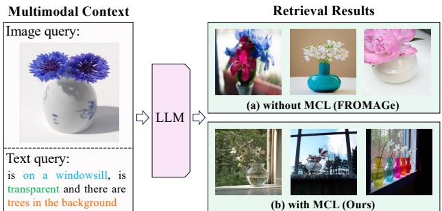  
Figure 1. Comparison between FROMAGe (Koh et al., 2023b) and our MCL on zero-shot composed image retrieval. MCL enables the frozen LLM to retrieve accurate images that match the multimodal context (image and text queries).

在本文中，我们提出了一种多模态组合学习（MCL）方法，以增强多语言大模型（MLLMs）中视觉与语言模态之间的映射。这种学习方法面临的一个显著障碍是数据密集性问题。现有的多模态组合数据集由图像查询、文本查询和组合图像目标组成，这些数据集在很大程度上依赖于人工标注（Liu et al., 2021a；Wu et al., 2021）。依赖人工标注限制了这些数据集的应用领域，并在扩展时面临挑战，从而阻碍了全面的视觉-语言映射的发展。为了获取大规模的多模态组合学习数据，我们提出利用大语言模型（LLMs）来增强现有网页收集的图像-文本配对，生成一个多模态组合（MMC）数据集。具体而言，给定一个网页收集的参考图像及其相应的参考标题，我们将参考标题输入到LLM，并提示生成文本条件和对应的目标标题，从而得到（参考图像，参考标题，文本条件，目标标题）的元组。例如，如图2所示，给定“橙色小猫”的参考图像及对应的参考标题“可爱的橙色小猫仰望”，我们首先随机生成文本条件“与玩具老鼠一起”，然后组合目标标题为“可爱的橙色小猫在玩具老鼠旁边玩耍”。需要注意的是，我们并不追求获取与目标标题对应的图像用于训练，而是利用目标标题的CLIP特征作为视觉监督。通过生成的MMC数据集，我们采用提出的MCL方法来增强视觉空间与语言空间之间的双向映射。具体而言，我们引入了两个任务：多模态上下文标题生成（MC-Cap）和多模态上下文检索（MC-Ret）。这些任务旨在促进从视觉特征到语言空间的映射学习，并改善从LLM输入的多模态上下文中提取视觉表征的能力。与传统的图像标题生成和图像-文本检索训练目标专注于视觉与语言模态之间的翻译不同，我们提出的MCL方法旨在提高模型理解和利用多模态信息的能力。通过训练模型理解和利用图像与语言信息，然后用于生成目标文本或视觉表征。我们的主要贡献包括：• 我们提出了一种用于视觉-语言映射的多模态组合学习（MCL）方法。MCL能够有效地使固定的LLM在各种多模态上下文中执行准确的图像检索和文本生成。• 我们提出了一个多模态组合（MMC）数据集，该数据集通过自动增强现有的网页收集图像-文本对构建，包含270万组（参考图像，参考标题，文本条件，目标标题）的元组。• 我们提出了一种堆叠检索机制，从LLM的多模态上下文中提取多样化的多模态信息。• 大量实验表明，MCL在四个零样本多模态上下文理解任务上的有效性，包括组合图像检索、视觉叙述图像检索、视觉对话图像检索和视觉问答。

# 2. 相关工作

视觉-语言映射。最近的研究中，有许多努力（Mokady 等，2021；Tsimpoukelli 等，2021；

Merullo 等人（2022）；Eichenberg 等人（2021）；Li 等人（2023）；Alayrac 等人（2022）；Zhang 等人（2024）；Yang 等人（2024）致力于通过图像字幕任务将视觉特征转换为固定的语言模型空间，从而将视觉模态与大语言模型（LLMs）集成起来。利用LLMs强大的文本处理能力，这些模型能够执行传统的视觉-语言生成任务，如图像字幕和视觉问答。此外，它们还被扩展以处理更复杂的应用，包括视觉对话和视觉叙事。另一个研究方向（Koh et al.，2023a;b）探讨了反向过程：将LLM表示映射到视觉特征空间。这是通过可学习的检索标记将隐藏状态映射到CLIP（Radford 等，2021）特征空间来实现的，具体用于图像-文本检索任务。在本文中，我们通过引入基于多模态组合的任务进一步细化视觉-语言映射。与以前关注通过图像字幕和图像-文本检索等任务将一种模态映射到另一种模态的方法不同，我们提出的多模态组合任务要求LLMs综合来自不同模态的信息，从而增强模型对多模态上下文的理解和利用。

复合图像检索。复合图像检索（CIR）旨在基于多模态查询来检索目标图像，这些查询包括参考图像和文本条件。先前的研究（Baldrati 等，2022a;b；Delmas 等，2022；Lee 等，2021；Liu 等，2021b）主要利用人工标注的三元组进行监督训练。最近的研究探索了在不需要这些人工标注三元组的情况下执行CIR任务。Pic2Word（Saito 等，2023）、CIRCO（Baldrati 等，2023）和KEDs（Suo 等，2024）将输入图像映射为伪文本词元，从而利用CLIP文本编码器实现图像和文本查询的组合。另一条研究方向（Vaze 等，2023；Gu 等，2023；Liu 等，2023b）开发了自动构建用于训练目的的CIR三元组的方法。在本研究中，我们利用大语言模型（LLMs）执行零-shot CIR。我们证明多模态查询可以在LLM空间内有效合成。使用LLMs的多模态数据增强。最近的工作（Liu 等，2023a；Fan 等，2023；Brooks 等，2023；Zhang 等，2023；Liu 等，2023b；Li 等，2024）利用LLMs进行多模态数据的精炼、增强和扩展。Brooks 等（2023）；Zhang 等（2023）；Liu 等（2023b）旨在生成成对的三元组（参考图像、编辑指令、目标图像），以满足特定的下游任务。在本文中，我们利用LLM，即Llama，将图像-标题对增强为（参考图像、文本条件、目标标题）对，以用于多模态学习（MCL）。我们的工作旨在将多模态组合学习引入视觉-语言对齐，以增强多模态上下文理解能力。

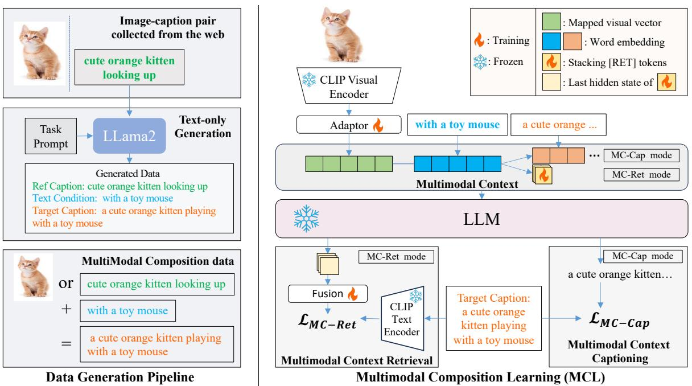

# 3. 方法

本节描述了所提出的MCL框架，其概述见图2。第3.1节详细说明了我们的MMC数据集的数据生成过程。在第3.2节中，我们介绍了如何使冻结的LLM处理视觉输入。第3.3节描述了从LLM的多模态上下文中提取视觉表示的过程。

# 3.1. 数据生成

收集配对数据（即多模态查询和构成目标）用于多模态构成学习面临重大挑战。这导致大规模训练数据的缺乏，限制了多模态构成学习的发展。为了解决这个问题，我们提出利用现成的大语言模型（即 Llama2）从现有的图像和标题对自动生成大规模多模态构成数据集。给定参考图像 $I _ { \mathrm { r e f } }$ 及其相关的标题 $T _ { \mathrm { r e f c } }$，我们将 $T _ { \mathrm { r e f c } }$ 输入到大语言模型中，并附加一个特定任务的提示。然后，大语言模型生成一个自由文本条件 $T _ { \mathrm { c o n } }$，该条件可以作为编辑顺序，用于改变属性和对象，或描述参考图像与目标图像之间的差异。接下来，大语言模型的任务是通过组合参考标题 $T _ { \mathrm { r e f c } }$ 和新生成的文本条件 $T _ { \mathrm { c o n } }$ 来生成目标标题 $T _ { \mathrm { t g t c } }$。因此，我们从 $\langle I _ { \mathrm { r e f } } , T _ { \mathrm { r e f c } } \rangle$ 对中推导出一个 $\langle I _ { \mathrm { r e f } } , T _ { \mathrm { r e f c } } , T _ { \mathrm { c o n } } , T _ { \mathrm { t g t c } } \rangle$ 元组，该元组可以从网上自动收集。

# 3.2. 将视觉输入映射到大语言模型

适应冻结的语言模型以处理视觉输入。根据最新的视觉-语言研究进展（Mokady等，2021；Merullo等，2022；Koh等，2023b），我们采用一个线性映射层（即适配器），将CLIP视觉特征映射到语言模型的嵌入空间。给定输入图像$I$，我们首先利用冻结的CLIP视觉编码器$E _ { \mathrm { i m a g e } }$提取相应的视觉特征。随后，应用线性映射层$f _ { \mathrm { m a p } }$将该视觉特征映射到语言模型的嵌入空间，得到$n$个视觉向量$\mathbf { V } = [ v _ { 0 } , v _ { 1 } , . . . , v _ { n } ] = f _ { \mathrm { m a p } } ( E _ { \mathrm { i m a g e } } ( I ) )$。视觉向量的维度与语言模型的词嵌入维度相匹配。简单图像描述目标。之前的方法采用传统的图像描述目标，通过预测下一个词元，从视觉词元和先前的描述词元中进行条件训练映射层$f _ { \mathrm { m a p } }$。该目标可以表述为：

$$
\mathcal { L } _ { \mathrm { C a p } } ( \theta _ { m } ) = - \frac { 1 } { | t | } \sum _ { i = 1 } ^ { | t | } \log P \Big ( t _ { i } | \mathbf { V } , t _ { < i } \Big ) ,
$$

其中 $t _ { i }$ 表示第 $i _ { t h }$ 个标题词元，$\theta _ { m }$ 表示映射层 $f _ { \mathrm { m a p } }$ 的权重，$P$ 表示一个冻结的语言模型。多模态上下文标题生成（MC-Cap）目标。在本研究中，我们通过将其与第 3.1 节中描述的生成的 MMC 数据集结合，增强了这种视觉到语言的映射。给定一个三元组 $\langle I _ { \mathrm { r e f } } , T _ { \mathrm { c o n } } , T _ { \mathrm { t g t c } } \rangle$ ，语言模型的任务是根据视觉向量 $\mathbf { V }$、文本条件词元和之前的目标标题词元预测下一个词元。目标描述为：

$$
\mathcal { L } _ { \mathrm { M C - C a p } } ( \theta _ { m } ) = - \frac { 1 } { | t | } \sum _ { i = 1 } ^ { | t | } \log P \Big ( t _ { i } | \mathbf { V } , c _ { 1 } , . . , c _ { | c | } , t _ { < i } \Big ) ,
$$

其中 $c _ { i }$ 表示文本条件的第 $i _ { t h }$ 词元，$t _ { i }$ 表示目标标题的第 $i _ { t h }$ 词元。与传统的图像描述目标（即方程 1）相比，我们提出的目标具有明显的优势。增强的语言视觉映射：我们的训练目标通过结合文本线索（即文本条件 $T _ { \mathrm { c o n , } }$ ）来优化映射过程，从而实现一种文本感知的映射，能够将视觉特征有效地融入语言模型的语义空间。增强的文本交互：语言模型的任务是基于文本条件查询映射的视觉向量，以获得目标标题。这确保了映射的视觉向量经过优化，以支持文本查询。

# 3.3. 从大语言模型中提取视觉表征

在本节中，我们阐明如何从大型语言模型的表示空间中提取视觉表示。根据（Koh et al., 2023b）的研究，我们利用可学习的词元从大型语言模型的多模态上下文中提取视觉信息。具体而言，特殊词元 [RET ] 被附加在上下文词元之后。[RET] 词元用于提示大型语言模型从多模态上下文中收集视觉信息。[RET] 词元的最后隐藏状态被用于输出相应的视觉表示。

天真的图像-文本检索目标。FROMAGe（Koh 等，2023b）利用图像-文本检索任务来训练[RET]嵌入。具体来说，给定一对图像和标题，他们在标题词元后添加一个[RET]词元作为对LLM的输入。[RET]词元的最后隐藏状态被用作LLM的输出，表示为$h \big ( \mathrm { [ R E T ] } | \mathbf { T } \big )$，其中$\mathbf { T }$表示标题词元。接着$h \big ( \left[ \mathrm { R E T } \right] \left| \mathbf { T } \right)$通过一个简单的线性层投影到CLIP潜在空间，表示为$p _ { v } = f _ { \mathrm { p r o j } } ( h ( \mathrm { [ R E T ] } | \mathbf { T } ) )$。采用infoNCE（Oord等，2018）损失对齐投影嵌入和目标图像的CLIP视觉特征。目标被公式化为：

$$
\begin{array} { l } {  { \mathcal { L } _ { \mathrm { R e t } } ( [ \mathrm { R E T } ] , \theta _ { p } ) } \qquad } \\ { = - \frac { 1 } { N } \sum _ { i = 1 } ^ { N } ( \log \frac { \exp ( \sin ( p _ { v } , \boldsymbol { e } _ { i } ) / \tau ) } { \sum _ { j = 1 } ^ { N } \exp ( \sin ( p _ { v } , \boldsymbol { e } _ { j } ) / \tau ) } ) , } \end{array}
$$

其中 $\theta _ { p }$ 表示项目层 $f _ { \mathrm { p r o j } }$ 的权重，$\sin ( \cdot , \cdot )$ 表示余弦相似度函数，$e _ { i } = E _ { \mathrm { i m a g e } } ( I _ { i } )$。

多模态上下文检索（MC-Ret）目标。通过简单的图像-文本匹配目标进行训练， [RET] 将大语言模型（LLM）上下文与 CLIP 特征空间连接起来。然而，在这种情况下，[RET] 令牌主要作为文本摘要令牌，负责将文本上下文浓缩到 CLIP 特征空间，缺乏根据给定的多模态上下文选择性提取目标信息的能力。为此，我们引入了 MC-Ret 目标，以增强从多模态上下文中提取信息的能力。给定三元组 $\langle I _ { \mathrm { r e f } } , T _ { \mathrm { c o n } } , T _ { \mathrm { t g t c } } \rangle$ ，我们将 $I _ { \mathrm { r e f } }$ 和 $T _ { \mathrm { c o n } }$ 输入 LLM，并在末尾附加 [RET] 令牌。在这种情况下，[RET] 学习组合多模态上下文以匹配目标标题 $T _ { \mathrm { t g t c } }$ 。该目标可以被公式化为：

$$
\begin{array} { l } {  { \mathcal { L } _ { \mathrm { M C - R e t } } ( \mathrm { [ ~ R E T ~ ] } , \theta _ { p } , \theta _ { m } ) } \qquad } \\ { = - \frac { 1 } { N } \sum _ { i = 1 } ^ { N } ( \log \frac { \exp ( \sin ( p _ { v } , \mathbf { e } _ { i } ) / \tau ) } { \sum _ { j = 1 } ^ { N } \exp ( \sin ( p _ { v } , \mathbf { e } _ { j } ) / \tau ) } ) , } \end{array}
$$

其中 $p _ { v } = f _ { \mathrm { p r o j } } ( h ( \mathsf { \Omega } [ \mathsf { R E T } ] | \mathbf { V } , \mathbf { T } ) )$，$\mathbf { V }$ 表示 $I _ { \mathrm { r e f } }$ 的映射视觉特征，$T$ 表示 $T _ { \mathrm { c o n } }$ 的描述词元，且 $\mathbf { e }$ 表示 $T _ { \mathrm { t g t c }}$。MC-Ret 目标带来了以下好处：（a）[RET] 词元在多模态上下文中训练，使其更好地适应多模态输入。（b）[RET] 词元学习根据多模态上下文选择性地提取信息，而不是无差别地压缩所有输入。多检索词元按顺序排列。增强视觉信息提取的一个简单有效的方法是在上下文词元后按顺序添加更多 [RET] 词元。我们通过简单地修改输出特征 $p _ { v }$ 来适应多 [RET] 词元的场景，如下所示：

$$
\begin{array} { r l } & { p _ { v } = f _ { \mathrm { f u s i o n } } ( h _ { 1 } , \ldots , h _ { r } ) , } \\ & { h _ { i } = h \big ( \left[ \mathrm { R E T } \right] _ { i } \big | \mathrm { \bf ~ V } , \mathrm { \bf ~ T } , \left[ \mathrm { R E T } \right] _ { < i } \big ) , } \end{array}
$$

其中 $r$ 表示 [RET] 词元的数量，$f _ { \mathrm { f u s i o n } }$ 表示一个融合函数，用于将多个隐藏状态整合为一个单一向量。多个 [RET] 词元被期望从多模态上下文中提取多样化的信息。然而，我们发现多个 [RET] 词元有时的表现不如单个 [RET] 词元。这一现象可以归因于由于大语言模型的内在特性，$[ \mathrm { R E T } ] _ { i }$ 的隐藏状态受到前面 $[ \mathrm { R E T } ] _ { < i }$ 词元的显著影响。因此，相邻的 [RET] 词元倾向于关注相似的内容。这一倾向与我们从上下文中提取多样化信息的目标相悖。堆叠检索机制。为了缓解这个问题并从大语言模型上下文中提取多样化的信息，我们引入了堆叠检索机制。在这种方法中，多个 [RET] 词元被追加到上下文词元之后，按堆叠顺序排列，而不是传统的顺序排列。输出特征 $p _ { v }$ 表示为：

$$
p _ { v } = f _ { \mathrm { f u s i o n } } ( h _ { 1 } , . . . , h _ { r } ) , \quad h _ { i } = h ( [ \mathrm { R E T } ] _ { i } \mid \mathbf { V } , \mathbf { T } )
$$

在这种情况下，每个 [RET] 词元的输出仅由多模态上下文决定，与其他 [RET] 词元无关。堆叠方法允许 [RET] 词元从大语言模型的上下文中提取更丰富的信息，而不是集中于相似内容。我们通过在 RET 词元之间添加额外的注意力掩码来实现堆叠机制。

# 3.4. 模型训练

我们将上述四个目标结合用于视觉-大语言模型映射。$\mathcal { L } _ { \mathrm { C a p } }$ 和 $\mathcal { L } _ { \mathrm { R e t } }$ 基于参考图像和参考字幕对，而提出的 $\mathcal { L } _ { \mathrm { M C - C a p } }$ 和 $\mathcal { L } _ { \mathrm { M C - R e t } }$ 基于三元组（参考图像、文本条件、目标字幕）。组合损失函数表示为：

$$
\mathcal { L } = \lambda _ { \mathrm { { C a p } } } ( \mathcal { L } _ { \mathrm { { C a p } } } + \mathcal { L } _ { \mathrm { { M C - C a p } } } ) + \lambda _ { \mathrm { { R e t } } } ( \mathcal { L } _ { \mathrm { { R e t } } } + \mathcal { L } _ { \mathrm { { M C - R e t } } } ) ,
$$

其中 $\lambda _ { \mathrm { C a p } }$ 和 $\lambda _ { \mathrm { R e t } }$ 表示生成损失和检索损失的权重。实施细节。我们采用 CLIP ViT-L/14 作为我们的图像-文本检索模型。我们使用 OPT-2.7B、OPT-6.7B 和 Llama2-7B 作为大语言模型主干。输入图像被映射到 LLM 空间中的 4 个视觉向量。设定 [RET] 词元的数量为 5。我们采用两层变换器，并使用均值池化作为多个 [RET] 词元的融合函数。MCL 在 MMC 上训练 50,000 次迭代，批量大小为 64。LLM 和 CLIP 模型均保持冻结。公式 7 中的损失权重 $\lambda _ { \mathrm { C a p } }$ 和 $\lambda _ { \mathrm { R e t } }$ 分别设置为 0.5 和 1.0。公式 3 和公式 4 中的温度 $\tau$ 设置为 0.07。

# 4. 实验

如图 3 所示，我们提出的 MCL 有效地使模型能够在任意多模态输入下执行多模态任务。本节中，我们首先对传统的多模态图像检索任务进行广泛实验，即零-shot 组合图像检索（见第 4.1 节）。进一步地，我们在密集多模态上下文理解任务上进行实验，该任务的输入包含多个图像和文本（见第 4.2 节）。然后，为了评估文本生成任务中的多模态理解能力，我们在视觉问答任务上进行实验（见第 4.3 节）。消融研究及分析见第 4.4 节。

# 4.1. 复合图像检索

基准与指标。我们在三个零样本CIR基准上评估MCL：CIRCO（Baldrati等，2023），CIRR（Liu等，2021a）和GeneCIS（Vaze等，2023）。CIRCO是一个开放域的零样本CIR基准，具有多个标注的真实值。按照现有的方法，我们在CIRCO上报告细粒度指标平均准确率（$ \mathrm { m A P @ } K $）。$\mathrm { m A P @ } K$ 指标是考虑每个查询的所有真实值图像计算得出的。对于CIRR和GeneCIS，我们报告召回率 $@ K$ 指标。

基线与竞争方法。我们在零-shot 设置中将我们的方法与几种基线以及最近的零-shot CIR 方法进行比较，包括：(1) 仅图像：使用参考图像的 CLIP 视觉特征来检索目标图像。(2) 仅文本：使用文本条件的 CLIP 文本特征来检索目标图像。(3) 图像 + 文本：将参考图像的 CLIP 视觉特征与文本条件的 CLIP 文本特征相加以检索目标图像。(4) 基于 CLIP 的文本反转方法：Pic2Word（Saito 等，2023年）和 SEARLE（Baldrati 等，2023年）。(5) CompoDiff（Gu 等，2023年）：在生成三元组上训练的 Combiner（Baldrati 等，2022a）。(6) 在我们提出的 MMC 上训练的 Combiner-MMC。(7) 基于 LLM 的方法：FROMAGe（Koh 等，2023b）。

结果与分析。表1展示了零-shot CIR 任务的结果。总体而言，MCL 在三个基准测试中表现出色，超越了之前基于 CLIP 的零-shot 组合方法和基于 LLM 的方法。我们可以从表中得出以下几点结论：(1) 所提出的多模态组合学习方法显著提升了 MLLM 在组合多模态上下文方面的能力。经过模态转换任务（即图像描述和图像-文本检索）训练的 FROMAGe MLLM 仅在单模态基线（即仅图像和仅文本）上表现出更好的效果。这表明模态转换任务不足以使 LLM 能够组合多模态上下文。得益于多模态组合训练，MCL 有效地组合了多模态上下文并提取了用于检索的目标表示。(2) LLM 在多模态组合方面优于 CLIP 文本编码器。MCL 在零-shot CIR 方法上显著超越了之前的研究，例如 Pic2Word（Mokady 等，2021）和 SEARLE（Baldrati 等，2023），这些方法在 CLIP 的文本编码器中组合多模态输入。这表明即使 LLM 是在文本语料库上进行预训练的，冻结的 LLM 空间也能够组合图像和文本输入。经过图像-文本对比学习训练的 CLIP 文本编码器通常在理解物体关系、词序和逻辑结构方面面临挑战（Yuksekgonul 等，2022；Ma 等，2023；Thrush 等，2022；

<table><tr><td rowspan="2">Method</td><td rowspan="2">LLM</td><td colspan="4">CIRCO (mAP@K)</td><td colspan="4">CIRR</td><td rowspan="2">GeneCIS R@1 (avg)</td></tr><tr><td>K=5</td><td>K=10</td><td>K=25</td><td>K=50</td><td>R@1</td><td>R@5</td><td>R@50</td><td>Rg@1</td></tr><tr><td>Image-only</td><td rowspan="6">Non-LLM</td><td>2.79</td><td>3.18</td><td>3.75</td><td>4.12</td><td>7.13</td><td>23.04</td><td>56.63</td><td>20.55</td><td>11.0</td></tr><tr><td>Text-only</td><td>2.50</td><td>2.64</td><td>3.11</td><td>3.38</td><td>20.55</td><td>44.17</td><td>78.94</td><td>60.74</td><td>9.1</td></tr><tr><td>Image + Text</td><td>6.37</td><td>7.04</td><td>8.11</td><td>8.72</td><td>12.27</td><td>35.81</td><td>77.04</td><td>33.33</td><td>12.6</td></tr><tr><td>Pic2Word</td><td>8.72</td><td>9.51</td><td>10.64</td><td>11.29</td><td>23.90</td><td>51.70</td><td>87.80</td><td>54.12</td><td>11.2</td></tr><tr><td>SEARLE</td><td>11.68</td><td>12.73</td><td>14.33</td><td>15.12</td><td>24.22</td><td>52.41</td><td>88.63</td><td>53.71</td><td>12.3</td></tr><tr><td>ComposDiff</td><td>12.55</td><td>13.36</td><td>15.83</td><td>16.43</td><td>18.24</td><td>53.14</td><td>90.25</td><td>57.42</td><td>14.9</td></tr><tr><td>Combiner-MMC</td><td></td><td>13.22</td><td>14.07</td><td>15.53</td><td>16.32</td><td>21.74</td><td>51.54</td><td>88.48</td><td>49.27</td><td>14.0</td></tr><tr><td>FROMAGe</td><td>OPT-6.7B</td><td>4.00</td><td>4.44</td><td>5.26</td><td>5.73</td><td>10.96</td><td>31.40</td><td>72.97</td><td>34.07</td><td>14.3</td></tr><tr><td>MCL (ours)</td><td>OPT-2.7B</td><td>14.55</td><td>15.79</td><td>17.38</td><td>18.27</td><td>23.28</td><td>54.17</td><td>90.05</td><td>58.24</td><td>15.8</td></tr><tr><td>MCL (ours)</td><td>OPT-6.7B</td><td>15.14</td><td>16.13</td><td>17.88</td><td>18.82</td><td>24.15</td><td>55.98</td><td>90.92</td><td>59.52</td><td>16.1</td></tr><tr><td>MCL (ours)</td><td>Llama2-7B</td><td>17.67</td><td>18.86</td><td>20.80</td><td>21.68</td><td>26.22</td><td>56.84</td><td>91.35</td><td>61.45</td><td>16.3</td></tr></table>

Wang et al., 2023)。这一限制限制了其在多模态合成中的能力。相比之下，LLM展现出卓越的能力，能够轻松理解这些复杂表达。我们在附录B.1中提供了有关逻辑词理解的更多定性比较和分析。(3) MCL受益于更强大的LLM。将MCL与更先进的LLM结合会在三个基准测试中产生一致的改进。这些改进源于增强的表示空间和更强的上下文理解能力。关于不同LLM主干网络的进一步定性结果和分析可在附录B.2中找到。(4) MMC可以用于传统CIR训练。我们使用MMC数据集训练了一个Combiner（Baldrati et al., 2022a）模型，这是一个经典的CIR方法，采用简单的合并组件来整合CLIP的图像编码器和文本编码器的特征。在MMC数据集上训练的Combiner模型取得了具有竞争力的结果，接近于之前基于文本反演的方法SEARlE，证明了生成的MMC数据集的有效性。尽管在相同的MMC数据集上训练，Combiner与所提议的MCL之间仍然存在显著的性能差距，这突出显示了LLM在多模态合成任务中的有效性。

# 4.2. 密集多模态上下文理解

为了研究MCL在更复杂场景下的多模态理解能力，我们考虑密集的多模态上下文理解任务，其中输入包含多幅图像和文本。传统的图像-文本匹配模型仅限于在单幅图像和单条文本之间进行检索。同样，组合图像检索模型也仅限于单一参考图像和单条文本查询。得益于大型语言模型，我们的方法尽管没有在多幅图像和文本的数据上进行明确训练，却展现了其理解密集多模态上下文的能力。

Table 2. Zero-shot image retrieval results on Visual Storytelling. indicates input images from the current story sequence are masked in the retrieval gallery.   

<table><tr><td>Method</td><td>Inputs</td><td>R@1</td><td>R@5</td><td>R@10</td></tr><tr><td>CLIP ViT-L/14 FROMAGe (OPT-6.7B) MCL (OPT-2.7B) MCL (OPT-6.7B) MCL (Llama2-7B)</td><td>1 caption</td><td>11.9 11.3 8.6 9.4 11.4</td><td>25.5 24.6 20.9 22.1 25.8 19.5</td><td>32.2 32.1 28.5 29.3 33.9</td></tr><tr><td>CLIP ViT-L/14 FROMAGe (OPT-6.7B) MCL (OPT-2.7B) MCL (OPT-6.7B) MCL (Llama2-7B)</td><td>5 captions</td><td>5.9 10.8 9.8 11.9 13.7</td><td>23.8 25.2 28.8 32.9</td><td>28.0 31.7 35.7 38.4 42.7</td></tr><tr><td>CLIP ViT-L/14 FROMAGe (OPT-6.7B) GILL (OPT-6.7B) MCL (OPT-2.7B) MCL (OPT-6.7B) MCL (Llama2-7B)</td><td>5 captions, 4 images†</td><td>2.4 18.2 20.3 21.8 22.5 23.1</td><td>21.3 42.7 45.0 44.6 46.5 46.7</td><td>34.0 51.8 53.7 53.9 55.8 56.1</td></tr></table>

根据Koh等人（2023b），我们在视觉讲故事（Huang等人，2016）和视觉对话（Das等人，2017）上进行零-shot实验。与仅涉及单一参考图像和单一文本条件的CIR任务不同，视觉对话和视觉讲故事都包含了冗长而复杂的上下文。在这些更具挑战性的场景中，模型不仅需要理解多模态上下文，还要求能够有效地从多模态对话或叙述中提取关键信息。

视觉叙事结果。视觉叙事数据集中每个示例由五对按时间顺序排列的图像文本对组成，我们报告最后一幅图像的召回率 $@ K$ 作为指标。遵循(Koh et al., 2023b)的研究，我们探索了几种不同输入配置的实验设置：（1）单一最后字幕作为输入；（2）输入包含所有五个字幕；（3）输入结合五个字幕及四幅相关图像。表 2 显示了结果。我们可以得出以下主要结论：（a）MCL 受益于密集上下文。当输入上下文从 $^ { \circ } 1$ 字幕增加到 '5 个字幕' 时，MCL 显示出显著改善。例如，Llama2 模型的 $\mathbf { R } \ @ 1$ 得分从 $1 1 . 4 \%$ 增加到 $1 3 . 7 \%$。相比之下，CLIP 模型的性能从 $1 1 . 9 \%$ 降低到 $5 . 9 \%$。同样，基于 LLM 的方法 FROMAGe 在更丰富的上下文中显示出轻微下降。这些结果表明，我们提出的多模态组合学习有效地增强了从密集上下文中提取信息的能力。（b）MCL 受益于多模态上下文。随着输入结合五个字幕及四幅相关图像，MCL 的性能进一步提高，超越了之前基于 LLM 的方法。

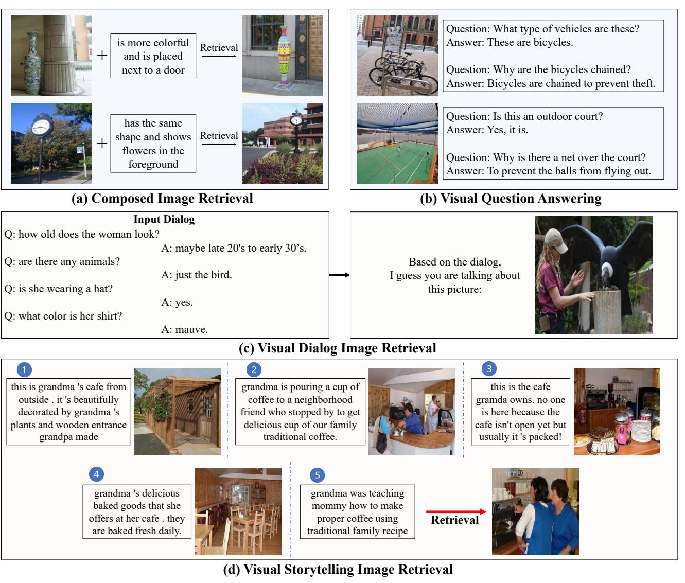  
. F visual storytelling image retrieval).

FROMAGe（Koh等，2023b）和GILL（Koh等，2023a）。这表明，MCL在从多模态上下文中提取信息方面是有效的。我们在附录B.3中提供了更多关于视觉叙事的定性结果。视觉对话结果。视觉对话中的每个样本包含一张图像和关于该图像的对话。我们将对话作为输入，以检索相应的图像。结果见表3。所提出的MCL在性能上显著优于CLIP基准和之前基于大型语言模型的检索方法。这证明了MCL不仅能从简单的标题样式上下文中提取视觉表征，还能从复杂的对话样式上下文中实现这一能力。

Table 3. Zero-shot image retrieval results on Visual Dialog   

<table><tr><td>Method</td><td>R@1</td><td>R@5</td><td>R@10</td></tr><tr><td>CLIP ViT-L/14</td><td>17.7</td><td>38.9</td><td>50.2</td></tr><tr><td>FROMAGe (OPT-6.7B)</td><td>20.8</td><td>44.9</td><td>56.0</td></tr><tr><td>MCL (OPT-2.7B)</td><td>25.6</td><td>51.9</td><td>65.2</td></tr><tr><td>MCL (OPT-6.7B)</td><td>27.2</td><td>51.0</td><td>64.0</td></tr><tr><td>MCL (Llama2-7B)</td><td>29.8</td><td>57.1</td><td>69.4</td></tr></table>

# 4.3. 视觉问答

为了进一步探讨 MCL 的多模态能力，我们在 VQAv2 (Goyal 等, 2017) 上进行了实验，该任务要求模型基于图像和问题对生成答案。结果如表 4 所示。我们使用提示语 "问题：$\{ Q u e s t i o n \}$ 答案：对于该图像，答案是 $\{ A n s w e r \} ^ { \prime }$" 进行评估。我们发现这种提示有效防止了大语言模型生成无关内容。MCL 在与特征参数效率相似的方法相比表现更佳，这些方法是通过简单的图像标注目标和图像-文本检索目标进行训练的。该结果表明我们提出的组合学习有效地将视觉特征整合到大语言模型空间中，从而为一系列多模态任务提供优势。我们注意到，这些零-shot 结果低于近期最先进的多语言大模型（Li 等, 2023; Zhu 等, 2023; Alayrac 等, 2022; Ye 等, 2023），因为它们使用了显著更多的计算资源和数据，尤其是其中一些使用了领域内数据进行训练（即 MSCOCO (Lin 等, 2014) 数据集，与 VQAv2 具有相同的数据来源）。

Table 4. Zero-shot results on VQAv2 val set. $\dagger$ denotes reproduced results with our prompts.   

<table><tr><td>Model</td><td>LLM</td><td>Acc@zero-shot</td></tr><tr><td>Frozen (Tsimpoukelli et al., 2021) MAGMA (Eichenberg et al., 2021)</td><td>GPT-2 GPT-J-6B</td><td>29.5</td></tr><tr><td>LinearMapping (Merullo et al., 2022)</td><td>GPT-J-6B</td><td>32.7 33.3</td></tr><tr><td></td><td></td><td></td></tr><tr><td>Fromage (Koh et al., 2023b)†</td><td>OPT-6.7B</td><td>36.8</td></tr><tr><td>GILL (Koh et al., 2023a)†</td><td>OPT-6.7B</td><td>38.8</td></tr><tr><td>MCL (Ours)</td><td>OPT-2.7B</td><td>38.4</td></tr><tr><td>MCL (Ours)</td><td>OPT-6.7B</td><td>40.2</td></tr><tr><td>MCL (Ours)</td><td>Llama2-7B</td><td>42.6</td></tr></table>

# 4.4. 分析与消融实验

通过可视化上下文词元与检索词元之间的相关性来理解MCL。在图4中，我们可视化了上下文词元与[ RET ]词元之间的相关性。相关性得分是通过聚合注意力层中的词元相关性计算得出的，如(Chefer等，2021)中所述。从图中我们可以发现：(a) 我们的组合学习使模型能够有效地组合视觉和文本输入，以准确检索目标图像。例如，在第一个示例中，模型通过识别“相同颜色”、“拥挤的街道”和“停下”等线索来检索目标。相反，没有组合学习的模型往往集中于视觉词元或仅使用部分文本线索，导致不正确的检索结果。(b) 提出的堆叠检索机制使学习到的检索词元关注于不同的上下文。例如，在第三个示例中，检索词元倾向于关注“不同颜色”、“侧面看到”和“背景中的天空”。相反，简单的顺序检索词元主要集中在“不同颜色”、“侧面看到”，而忽略了“背景中的天空”，导致错误结果。

Table 5. Results for the ablation study on the proposed Stacking Retrieval (S.R.) mechanism and MCL objectives, respecrtively. The CIRCO test set is used for evaluation.   

<table><tr><td>Method</td><td></td><td></td><td>LCap LRet LMC-Cap CMC-Ret</td><td></td><td>mAP@5 mAP@10 mAP@25 mAP@50</td><td></td><td></td></tr><tr><td>Single [RET] token</td><td>✓</td><td>✓</td><td>✓</td><td>✓</td><td>17.07 17.87</td><td>19.65</td><td>20.62</td></tr><tr><td>5 [RET] tokens w/o S.R.</td><td>✓</td><td>✓</td><td>✓</td><td>✓</td><td>16.48 17.67</td><td>19.48</td><td>20.35</td></tr><tr><td>5 [RET] tokens w/S.R.</td><td>√</td><td>✓</td><td>✓</td><td>✓</td><td>17.67 18.86</td><td>20.80</td><td>21.68</td></tr><tr><td>Naive Mapping</td><td>✓</td><td>√</td><td></td><td></td><td>4.38 4.70</td><td>5.44</td><td>5.85</td></tr><tr><td>Naive + MC-Cap</td><td>✓</td><td>✓</td><td>✓</td><td></td><td>6.58 6.97</td><td>7.82</td><td>8.36</td></tr><tr><td>Naive + MC-Ret</td><td>✓</td><td>✓</td><td></td><td>✓</td><td>16.73 17.80</td><td>19.58</td><td>20.51</td></tr><tr><td>MC-Cap + MC-Ret</td><td></td><td></td><td>✓</td><td></td><td>17.55 18.67</td><td>20.63</td><td>21.62</td></tr><tr><td>MCL</td><td>✓</td><td>✓</td><td>✓</td><td>¸</td><td>17.67 18.86</td><td>20.80</td><td>21.68</td></tr></table>

堆叠检索机制的消融实验。表5展示了关于堆叠检索机制的消融研究结果。当[RET]词元的数量增加到五个时，性能下降。这一下降归因于大型语言模型的固有特性，临近的词元相互之间的影响很大，导致聚焦于类似的上下文，如图4所示。堆叠检索机制允许多个[RET]词元从多模态上下文中提取多样化的信息。多模态组合学习损失。表5展示了关于所提目标的消融研究结果。结果表明，我们的MCL目标（即MC-Cap和MC-Ret）显著提高了组合图像检索任务的性能。MC-Ret目标效果最佳，因为它联合优化视觉输入和视觉输出的映射。只有采用所提出的MC-Cap和MC-Ret目标，模型才能良好工作。添加朴素的图像描述和图像-文本检索目标仅带来轻微的性能提升。

# 5. 结论

在本文中，我们提出了用于视觉-语言映射的多模态组成学习。与之前基于图像字幕生成和图像-文本检索任务训练的多模态大语言模型相比，我们的多模态组成学习在各种多模态场景中表现出更出色的性能。我们希望多模态组成学习能够激发未来将大语言模型与其他模态对齐的探索。

# 影响声明

该工作主要集中在提高多模态组合任务的功能性和效率。我们在该领域的进展旨在丰富人机之间的交互，增强对多模态信息的获取。这些改善可以导致更有效且用户友好的搜索引擎，搜索引擎在现代生活的各个方面都至关重要。此外，通过解决现有系统的局限性，我们为更准确和高效地处理多模态数据做出了贡献，避免了较为简单的模型可能导致的信息错误或误解。

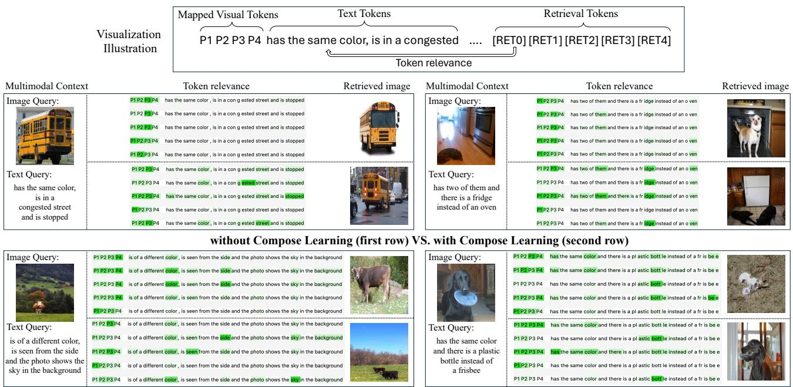  
Sequential Retrieval Tokens (first row) VS. Stacking Retrieval Tokens (second rov   
makes the learned retrieval tokens focus on different contexts.

M. 等。Flamingo：一种用于少样本学习的视觉语言模型。《神经信息处理系统进展》，35:2371623736，2022年。Baldrati, A.，Bertini, M.，Uricchio, T.，和 Del Bimbo, A. 基于条件和组合的图像检索，结合和部分微调基于 CLIP 的特征。发表于《IEEE/CVF计算机视觉与模式识别会议论文集》，第4959-4968页，2022年。

# 致谢

本研究得到了中国国家重点研发计划（编号 2023YFC3305600）、中国国家自然科学基金（U2336212）以及中央高校基础研究基金（编号 226-2022-00051）、卢氏研究生教育国际交流基金和新加坡国家研究基金会的支持，后者是其战略能力研究中心资金倡议的一部分。本文中所表达的任何意见、发现、结论或建议均为作者的观点，不代表新加坡国家研究基金会的观点。计算工作部分在新加坡国家超级计算中心的资源上进行（https://www.nscc.sg）。Baldrati, A., Bertini, M., Uricchio, T., 和 Del Bimbo, A. 有效的条件和组合图像检索，结合基于剪辑的特征。收录于IEEE/CVF计算机视觉与模式识别会议论文集， pp. 21466-21474, 2022b。Baldrati, A., Agnolucci, L., Bertini, M., 和 Del Bimbo, A. 零样本组合图像检索与文本反转。收录于IEEE/CVF国际计算机视觉大会论文集，2023。Brooks, T., Holynski, A., 和 Efros, A. A. Instructpix2pix: 学习遵循图像编辑指令。收录于IEEE/CVF计算机视觉与模式识别会议论文集， pp. 18392-18402, 2023。

# References

Alayrac, J.-B., Donahue, J., Luc, P., Miech, A., Barr, I., Hasson, Y., Lenc, K., Mensch, A., Millican, K., Reynolds,

Chefer, H., Gur, S., and Wolf, L. Generic attention-model explainability for interpreting bi-modal and encoderdecoder transformers. In Proceedings of the IEEE/CVF International Conference on Computer Vision, pp. 397 406, 2021.

Das, A., Kottur, S., Gupta, K., Singh, A., Yadav, D., Moura, J. M., Parikh, D., and Batra, D. Visual dialog. In Proceedings of the IEEE conference on computer vision and pattern recognition, pp. 326335, 2017.

Delmas, G., de Rezende, R. S., Csurka, G., and Larlus, D. ARTEMIS: Attention-based retrieval with textexplicit matching and implicit similarity. arXiv preprint arXiv:2203.08101, 2022.

Eichenberg, C., Black, S., Weinbach, S., Parcalabescu, L., and Frank, A. Magma-multimodal augmentation of generative models through adapter-based finetuning. arXiv preprint arXiv:2112.05253, 2021.

Fan, L., Krishnan, D., Isola, P., Katabi, D., and Tian, Y. Improving clip training with language rewrites. Advances in Neural Information Processing Systems, 36, 2023.

Goyal, Y., Khot, T., Summers-Stay, D., Batra, D., and Parikh, D. Making the v in vqa matter: Elevating the role of image understanding in visual question answering. In Proceedings of the IEEE conference on computer vision and pattern recognition, pp. 69046913, 2017.

Gu, G., Chun, S., Kim, W., Jun, H., Kang, Y., and Yun, S. CompoDiff: Versatile composed image retrieval with latent diffusion. arXiv preprint arXiv:2303.11916, 2023.

Huang, T.-H., Ferraro, F., Mostafazadeh, N., Misra, I., Agrawal, A., Devlin, J., Girshick, R., He, X., Kohli, P., Batra, D., Zitnick, C. L., Parikh, D., Vanderwende, L., Galley, M., and Mitchell, M. Visual storytelling. In Proceedings of the 2016 conference of the North American chapter of the association for computational linguistics: Human language technologies, pp. 12331239, 2016.

Koh, J. Y., Fried, D., and Salakhutdinov, R. Generating images with multimodal language models. arXiv preprint arXiv:2305.17216, 2023a.

Koh, J. Y., Salakhutdinov, R., and Fried, D. Grounding language models to images for multimodal inputs and outputs. In International Conference on Machine Learning, 2023b.

Lee, S., Kim, D., and Han, B. CoSMo: Content-style modulation for image retrieval with text feedback. In Proceedings of the IEEE/CVF Conference on Computer Vision and Pattern Recognition, pp. 802812, 2021.

Li, J., Li, D., Savarese, S., and Hoi, S. BLIP-2: Bootstrapping language-image pre-training with frozen image encoders and large language models. In International Conference on Machine Learning, 2023.

Li, W., Fan, H., Wong, Y., Kankanhalli, M., and Yang, Y. Topa: Extend large language models for video understanding via text-only pre-alignment. arXiv preprint arXiv:2405.13911, 2024.

Lin, T.-Y., Maire, M., Belongie, S., Hays, J., Perona, P., Ramanan, D., Dollár, P., and Zitnick, C. L. Microsoft coco: Common objects in context. In Computer VisionECCV 2014: 13th European Conference, Zurich, Switzerland, September 6-12, 2014, Proceedings, Part V 13, pp. 740 755. Springer, 2014.

Liu, H., Li, C., Wu, Q., and Lee, Y. J. Visual instruction tuning. Advances in neural information processing systems, 36, 2023a.

Liu, Y., Yao, J., Zhang, Y., Wang, Y., and Xie, W. Zero-shot composed text-image retrieval. BMVC, 2023b.

Liu, Z., Rodriguez-Opazo, C., Teney, D., and Gould, S. Image retrieval on real-life images with pre-trained visionand-language models. In Proceedings of the IEEE/CVF International Conference on Computer Vision, pp. 2125 2134, 2021a.

Liu, Z., Rodriguez-Opazo, C., Teney, D., and Gould, S. Image retrieval on real-life images with pre-trained visionand-language models. In Proceedings of the IEEE/CVF International Conference on Computer Vision, pp. 2125 2134, 2021b.

Ma, Z., Hong, J., Gul, M. O., Gandhi, M., Gao, I., and Krishna, R. CREPE: Can vision-language foundation models reason compositionally? In Proceedings of the IEEE/CVF Conference on Computer Vision and Pattern Recognition, pp. 1091010921, 2023.

Merullo, J., Castricato, L., Eickhoff, C., and Pavlick, E. Linearly mapping from image to text space. arXiv preprint arXiv:2209.15162, 2022.

Mokady, R., Hertz, A., and Bermano, A. H. Clip-Cap: CLIP prefix for image captioning. arXiv preprint arXiv:2111.09734, 2021.

Oord, A. v. d., Li, Y., and Vinyals, O. Representation learning with contrastive predictive coding. arXiv preprint arXiv:1807.03748, 2018.

Radford, A., Kim, J. W., Hallacy, C., Ramesh, A., Goh, G., Agarwal, S., Sastry, G., Askell, A., Mishkin, P., Clark, J., et al. Learning transferable visual models from natural language supervision. In International conference on machine learning, pp. 87488763. PMLR, 2021.

Saito, K., Sohn, K., Zhang, X., Li, C.-L., Lee, C.-Y., Saenko, K., and Pfister, T. Pic2word: Mapping pictures to words for zero-shot composed image retrieval. In Proceedings of the IEEE/CVF Conference on Computer Vision and Pattern Recognition, pp. 1930519314, 2023.

Sharma, P., Ding, N., Goodman, S., and Soricut, R. Conceptual captions: A cleaned, hypernymed, image alt-text dataset for automatic image captioning. In Proceedings of the 56th Annual Meeting of the Association for Computational Linguistics (Volume 1: Long Papers), pp. 2556 2565, 2018.

Suo, Y., Ma, F., Zhu, L., and Yang, Y. Knowledge-enhanced dual-stream zero-shot composed image retrieval. arXiv preprint arXiv:2403.16005, 2024.

Thrush, T., Jiang, R., Bartolo, M., Singh, A., Williams, A., Kiela, D., and Ross, C. Winoground: Probing vision and language models for visio-linguistic compositionality. In Proceedings of the IEEE/CVF Conference on Computer Vision and Pattern Recognition, pp. 52385248, 2022.

Touvron, H., Martin, L., Stone, K., Albert, P., Almahairi, A., Babaei, Y., Bashlykov, N., Batra, S., Bhargava, P., Bhosale, S., et al. Llama 2: Open foundation and finetuned chat models. arXiv preprint arXiv:2307.09288, 2023.

Tsimpoukelli, M., Menick, J. L., Cabi, S., Eslami, S., Vinyals, O., and Hill, F. Multimodal few-shot learning with frozen language models. Advances in Neural Information Processing Systems, 34:200212, 2021.

Vaze, S., Carion, N., and Misra, I. GeneCIS: A benchmark for general conditional image similarity. In Proceedings of the IEEE/CVF Conference on Computer Vision and Pattern Recognition, pp. 68626872, 2023.

Wang, H., Li, Y., Yao, H., and Li, X. Clipn for zero-shot ood detection: Teaching clip to say no. arXiv preprint arXiv:2308.12213, 2023.

Wu, H., Gao, Y., Guo, X., Al-Halah, Z., Rennie, S., Grauman, K., and Feris, R. Fashion IQ: A new dataset towards retrieving images by natural language feedback. In Proceedings of the IEEE/CVF Conference on computer vision and pattern recognition, pp. 1130711317, 2021.

Yang, Z., Chen, G., Li, X., Wang, W., and Yang, Y. Doraemongpt: Toward understanding dynamic scenes with large language models (exemplified as a video agent). In ICML, 2024.

Ye, Q., Xu, H., Xu, G., Ye, J., Yan, M., Zhou, Y., Wan, J. Hu, A., Shi, P., Shi, Y., et al. mplug-owl: Modularization empowers large language models with multimodality. arXiv preprint arXiv:2304.14178, 2023.

Yuksekgonul, M., Bianchi, F., Kalluri, P., Jurafsky, D., and Zou, J. When and why vision-language models behave like bags-of-words, and what to do about it? In The Eleventh International Conference on Learning Representations, 2022.

Zhang, S., Yang, X., Feng, Y., Qin, C., Chen, C.-C., Yu, N., Chen, Z., Wang, H., Savarese, S., Ermon, S., et al. Hive: Harnessing human feedback for instructional visual editing. arXiv preprint arXiv:2303.09618, 2023.

Zhang, Y., Fan, H., and Yang, Y. Prompt-aware adapter: Towards learning adaptive visual tokens for multimodal large language models. arXiv, 2024.

Zhu, D., Chen, J., Shen, X., Li, X., and Elhoseiny, M. MiniGPT-4: Enhancing vision-language understanding with advanced large language models. arXiv preprint arXiv:2304.10592, 2023.

# A. Detailed Composed Image Retrieval Results and Analysis

Aaysi n CIRR.Table ows h ai esults  CIRR es t.MCLhivs SOTA st ei.Noa CIRR  TT baseline surpasses the Image $+$ Text baseline a lot and even outperforms most zero-shot CIR methods on the $R e c a l l _ { \mathrm { s u b s e t } } @ K$ metrics. Despite this modality bias, MCL still achieves superior performance.

Table 6. Quantitative results on CIRR test set. Below the dashed line are LLM-based methods.   

<table><tr><td rowspan="2">Method</td><td colspan="4">Recall@K</td><td colspan="3">RecallSubset@K</td></tr><tr><td>K = 1</td><td>K = 5</td><td>K = 10</td><td>K = 50</td><td>K = 1</td><td>K = 2</td><td>K = 3</td></tr><tr><td>Image-only</td><td>7.13</td><td>23.04</td><td>32.99</td><td>56.63</td><td>20.55</td><td>40.96</td><td>61.04</td></tr><tr><td>Text-only</td><td>20.55</td><td>44.17</td><td>55.95</td><td>78.94</td><td>60.74</td><td>80.38</td><td>90.72</td></tr><tr><td>Image+Text</td><td>12.27</td><td>35.81</td><td>48.48</td><td>77.04</td><td>33.33</td><td>57.78</td><td>75.95</td></tr><tr><td>TransAgg</td><td>25.04</td><td>53.98</td><td>67.59</td><td>88.94</td><td>55.33</td><td>76.82</td><td>88.94</td></tr><tr><td>CompoDiff</td><td>18.24</td><td>53.14</td><td>70.82</td><td>90.35</td><td>57.42</td><td>77.10</td><td>87.90</td></tr><tr><td>Pic2Word</td><td>23.90</td><td>51.70</td><td>65.30</td><td>87.80</td><td>54.12</td><td>74.63</td><td>87.61</td></tr><tr><td>SEARLE</td><td>24.22</td><td>52.41</td><td>66.29</td><td>88.63</td><td>53.71</td><td>74.63</td><td>87.61</td></tr><tr><td>Combiner-MMC</td><td>21.74</td><td>51.54</td><td>65.33</td><td>88.48</td><td>49.28</td><td>72.88</td><td>87.01</td></tr><tr><td>FROMAGe-(OPT-6.7B)</td><td>10.96</td><td>31.40</td><td>44.33</td><td>72.97</td><td>34.07</td><td>58.84</td><td>76.80</td></tr><tr><td>MCL-(OPT-2.7B)</td><td>23.28</td><td>54.17</td><td>67.16</td><td>90.05</td><td>58.24</td><td>79.37</td><td>90.51</td></tr><tr><td>MCL-(OPT-6.7B)</td><td>24.15</td><td>55.98</td><td>69.21</td><td>90.82</td><td>59.52</td><td>80.34</td><td>91.13</td></tr><tr><td>MCL-(LLama2-7B)</td><td>26.22</td><td>56.84</td><td>70.00</td><td>91.35</td><td>61.45</td><td>81.61</td><td>91.93</td></tr></table>

Analysis on GeneCIS. Table7 shows the detailed results on GeneCIS. GeneCIS introduces fourunique tasksFocus AttaAttrieF ObjeabjeFor  sk ams proiThis seupdif ian om pr bencars uc  IRR n IRCOwhic te p caption-style text conditions. Overall, MCL achieves superior performance on the Avg $\mathbf { R } \ @ 1$ metric. In Focus Attribute task, FMAv   pTh  eal ao attribute task, where the Image-only baseline achieves $1 8 . 2 \%$ at $\mathbf { R } \ @ 1$ , outperforming the Image+Text baseline. For the relaasksCcehet pet ive u composition.

Table 7. Quantitative results on GeneCIS.   

<table><tr><td rowspan="2">Method</td><td colspan="3">Focus Attribute</td><td colspan="3">Change Attribute</td><td colspan="3">Focus Object</td><td colspan="3">Change Object</td><td rowspan="2">Avg R@1</td></tr><tr><td>R@1</td><td>R@ 2</td><td>R@3</td><td>R@1</td><td>R@ 2</td><td>R@3</td><td>R@1</td><td>R@ 2</td><td>R@3</td><td>R@1</td><td>R@2</td><td>R@3</td></tr><tr><td>Image Only</td><td>18.2</td><td>29.6</td><td>40.0</td><td>9.2</td><td>20.2</td><td>29.1</td><td>9.6</td><td>16.2</td><td>25.5</td><td>6.8</td><td>16.0</td><td>24.7</td><td>11.0</td></tr><tr><td> Text Only</td><td>12.3</td><td>20.2</td><td>31.3</td><td>8.1</td><td>17.7</td><td>24.6</td><td>8.2</td><td>15.3</td><td>24.1</td><td>7.6</td><td>15.4</td><td>25.1</td><td>9.1</td></tr><tr><td>Image+Text</td><td>17.6</td><td>29.5</td><td>40.0</td><td>10.6</td><td>22.1</td><td>31.9</td><td>11.8</td><td>21.4</td><td>29.0</td><td>10.3</td><td>21.0</td><td>31.1</td><td>12.6</td></tr><tr><td>Combiner-MMC</td><td>17.4</td><td>29.1</td><td>40.5</td><td>12.9</td><td>22.9</td><td>32.4</td><td>13.5</td><td>23.0</td><td>33.3</td><td>12.3</td><td>22.4</td><td>32.1</td><td>14.0</td></tr><tr><td>FROMAGe-(OPT-6.7B)</td><td>19.2</td><td>31.1</td><td>40.5</td><td>12.2</td><td>21.7</td><td>30.5</td><td>13.0</td><td>24.5</td><td>33.2</td><td>12.9</td><td>24.7</td><td>32.9</td><td>14.3</td></tr><tr><td>MCL-(OPT-2.7B)</td><td>18.2</td><td>28.8</td><td>38.9</td><td>13.9</td><td>24.6</td><td>34.0</td><td>14.6</td><td>24.7</td><td>34.7</td><td>16.8</td><td>26.9</td><td>36.4</td><td>15.8</td></tr><tr><td>MCL-(OPT-6.7B)</td><td>18.2</td><td>29.6</td><td>39.1</td><td>14.5</td><td>24.1</td><td>34.0</td><td>14.7</td><td>27.1</td><td>36.5</td><td>16.9</td><td>28.5</td><td>39.3</td><td>16.1</td></tr><tr><td>MCL-(LLama2-6.7B)</td><td>18.5</td><td>29.5</td><td>38.8</td><td>14.7</td><td>25.0</td><td>33.7</td><td>14.7</td><td>24.9</td><td>35.7</td><td>17.2</td><td>29.8</td><td>39.9</td><td>16.3</td></tr></table>

aliativResult IRCuho o qualiv esuloRCOvaat Th CIRCO e nalyur sv haiv an la  R len i some rue positive hich can  we retrive y MCL Theealse egativ dicateha MCL has differnt preerencpare cnventionalCLIiversi-basemethods,gstiMCL' potental existing benchmarks.

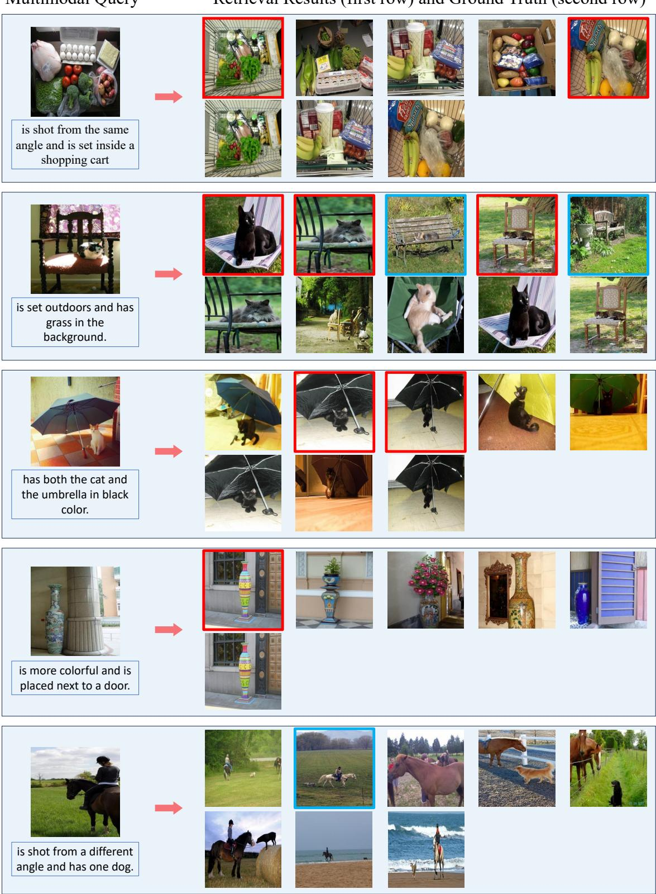  
ground truth images. True positives are marked in red and false negatives are marked in blue.

# B. More Qualitative Results and Analysis

# B.1. LLM VS. CLIP text encoder

ifxal lor oso ule o l haLI q I    oo MMC.u 'instead of' can be easily understood.

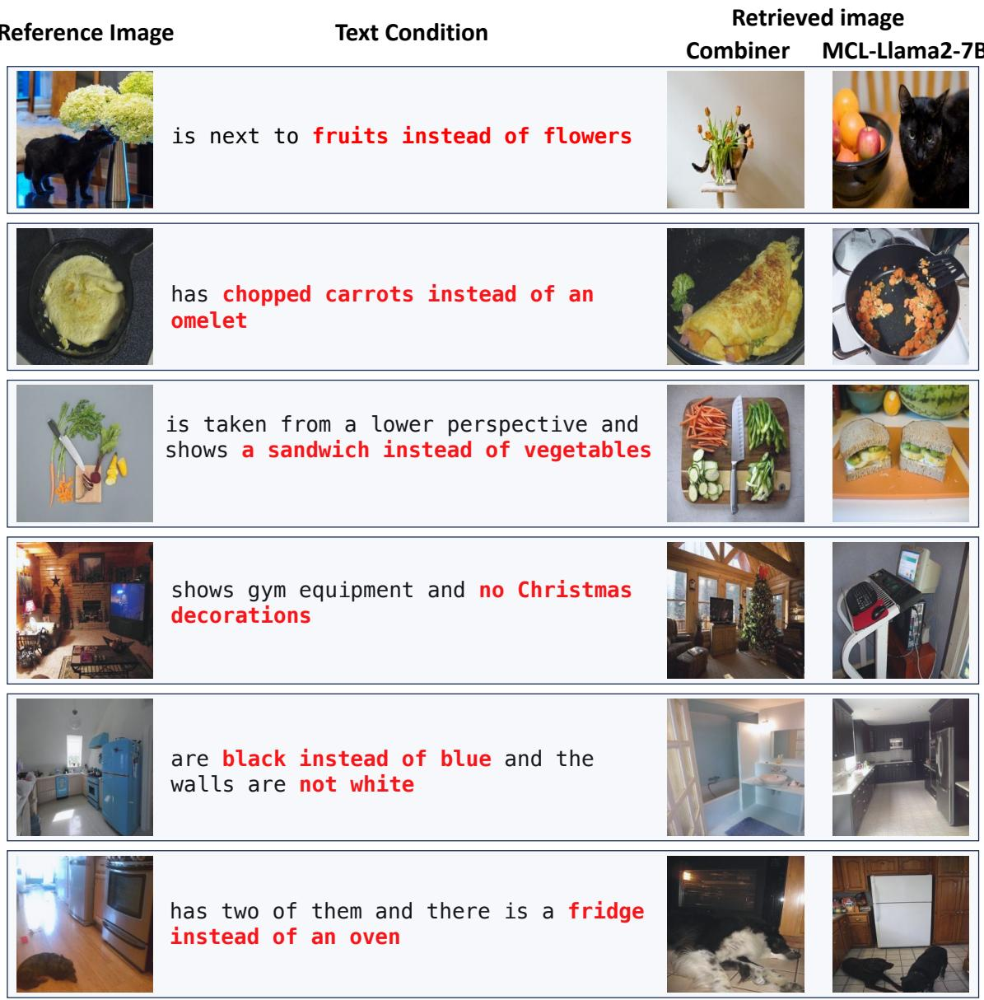

# B.2. Qualitative Results of MCL with Various LMM Backbones

I  uW sm ar sampl from CIRCO tet  and ist the result  MCL wi OPT-.3B, OPT-.7BandLama27B.As the corect image. Overall, benefiting from a more powerful language model, MCL with Llama2-7B shows improved panhemulalusosacae a ex retrieving the correct image, while the OPT-2.7B based models only catch the 'bottles of alcohol' cues.

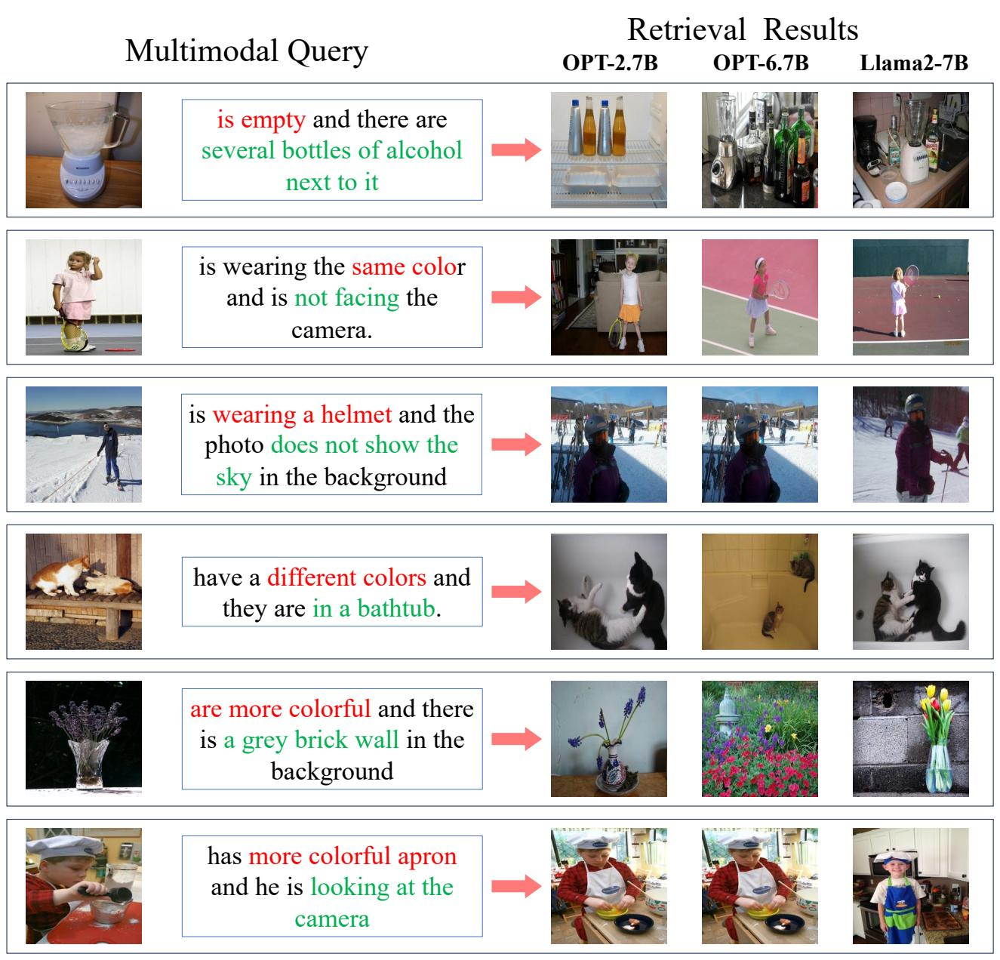  
CRC cues in each sample are highlighted.

# B.3. Qualitative Results on Visual Storytelling

showing great potential for wide-ranging applications in real-world multimodal scenarios.

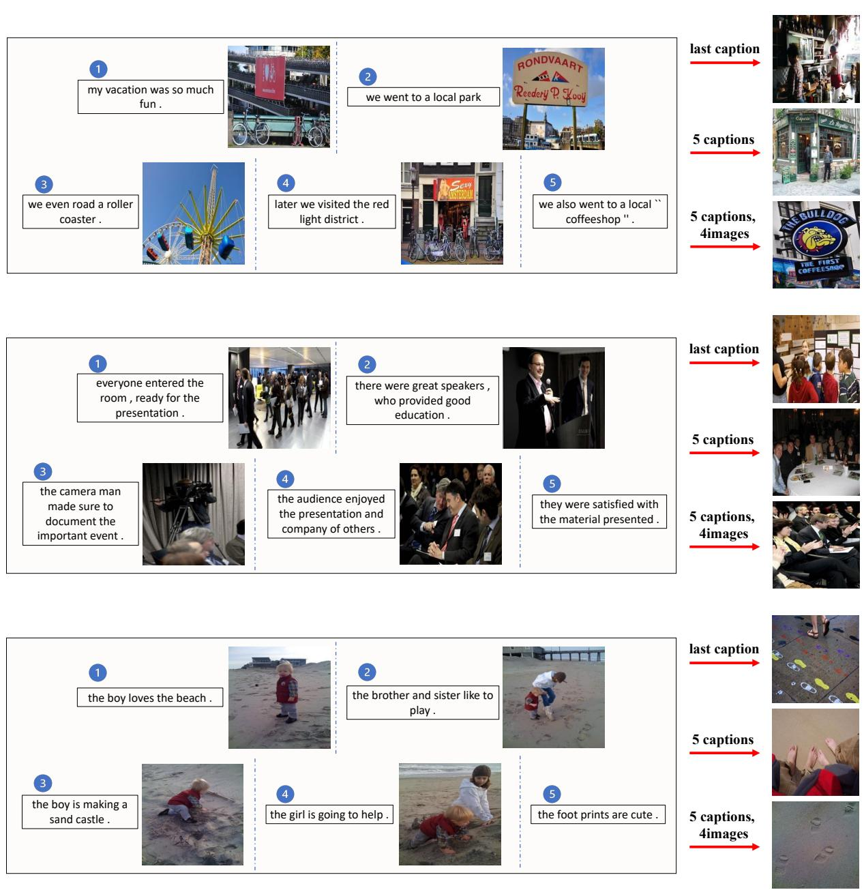  
Figure 8. Qualitative Results on Visual StoryTelling.

# C. Failure Cases and Limitations

Whe e i cl e q, s    r oT relating to the image content, are associated with the image's state or attributes.

Limitations inherited from CLIP model MCL leverages rozen CLIP model as the base mage-text retrieval moel. x F o x r Wal re  FurMCL  ilL space, thereby mitigating this issue.

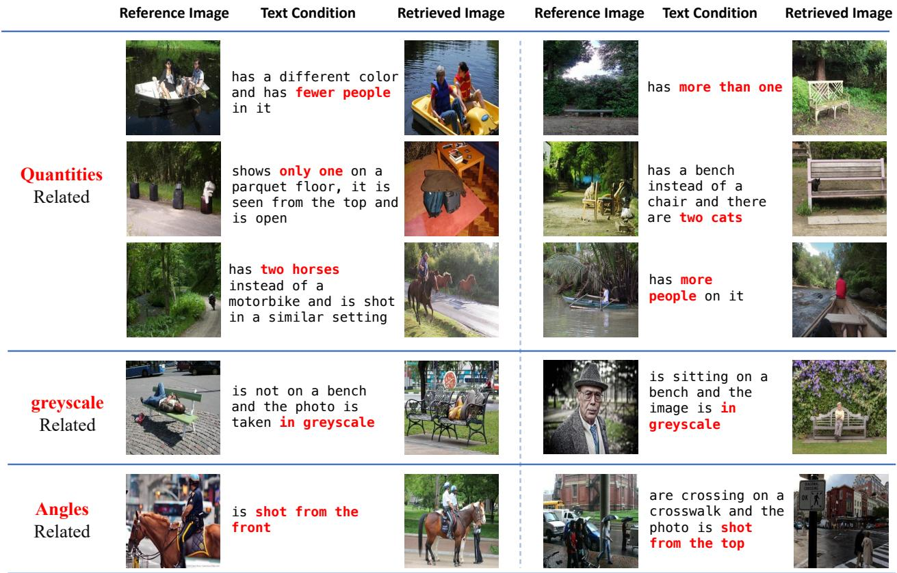  
Figure 9. Failure cases of MCL.

# D. Data Generation

W plyheLlama/7-Chat model ur ata neratiT hanche peroranc th pen-sourc LLM (  zh- e psu u vnal  e mil tupl usiaptn pair ro harl 018 u pairsWeialz o  ve ba The target caption effectively combines the source caption and the generated text condition.

# Task Prompt for LLama2/7B-Chat model

# User:

n cstrucmulioal ervatasetWhilhhall ndeavor, one effective method involves generating text-only triplets: source aptions, text conditions, and target captions. I'd appreciate your assistance in reating these triplets based on provided source captions. Here's how it works:

Source Caption: This is an image's description that I will provide for you. Text Condition: Generated based on the source caption, the text condition outlines a specific modification or requirement that the target caption (and correspondingly, the target image) must adhere to..

Target Caption: This should be crafted using both the source caption and the text condition. It will represent a new image that meets the requirements set by the text condition, using the original source image as a foundation.

Please ensure that all Source Captions, Text Conditions and Target Captions are visually relevant.

Asst.:

Understand! Please provide the source captions. I will generate visually relavant text conditions and target captions.

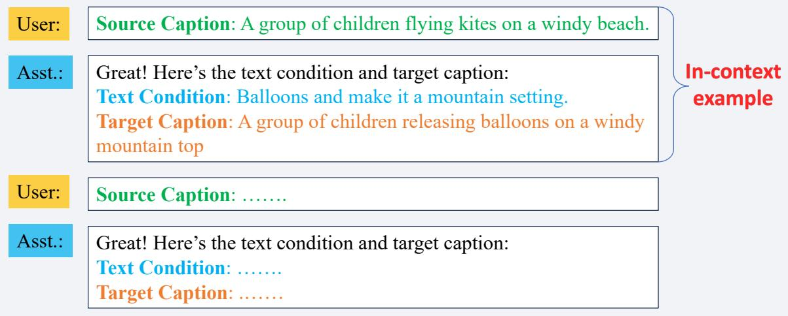  
Figure 10. Our specialized task prompt for Llama2/7B-Chat model.

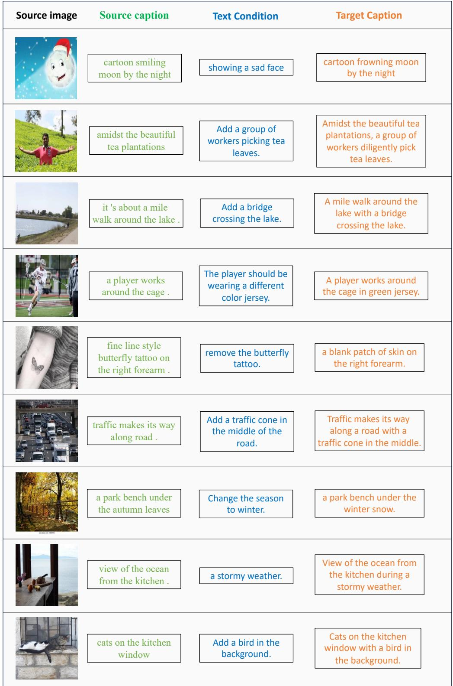  
and target caption generation.

# E. Training details of Combiner baseline

I tx t k xT nx vehe ctont .asiv  euse Other training parameters are the same as (Vaze et al., 2023).