# ReCALL: 重新校准基于大语言模型的复合图像检索能力衰退

杨天宇1,2，何晨伟$\mathrm { H e } ^ { 3 }$ ，郝向皓$^{1,2}$，王天悦1,2，郭佳锐4，郭海云$^{1,2,\dagger}$，曲雷纲$^{5,\dag}$，蔡达生5，王金桥1,2,6,7 中科院自动化研究所基础模型研究中心 2中国科学院大学人工智能学院 3东南大学 4北京邮电大学 5新加坡国立大学 6武汉人工智能研究院 7广东省理工学院 {yangtianyu2024, haoxiangzhao2023}@ia.ac.cn, hechenwei@seu.edu.cn

# 摘要

# 1. 引言

组合图像检索（CIR）的目标是基于由参考图像和修改文本组成的混合查询来检索目标图像。早期的双塔视觉-语言模型（VLMs）在执行该任务所需的跨模态组合推理时面临挑战。尽管将生成的多模态大语言模型（MLLMs）适配用于检索提供了一个有前景的方向，但我们识别出该策略忽视了一个基本问题：将生成的 MLLM 压缩为单一嵌入的判别检索器会引发范式冲突，导致能力退化——即在检索适配后，本征的细粒度推理能力下降。为了解决这一挑战，我们提出了 Re-CALL，一个与模型无关的框架，它遵循诊断-生成-精炼的流程：首先，我们通过自导向的信息实例挖掘诊断检索器的认知盲点。接下来，我们通过提示基础 MLLM 生成纠正指令和三元组，并通过基于 VQA 的一致性过滤进行质量控制。最后，我们通过对这些三元组进行持续训练，采用分组对比方案来精炼检索器，从而内化细粒度的视觉-语义区分，并使检索器的判别嵌入空间与 MLLM 内在的组合推理重新对齐。在 CIRR 和 FashionIQ 上的广泛实验表明，Re-CALL 一直能重新校准退化的能力，并实现最先进的性能。代码可在 https://github.com/RemRico/Recall 获取。组合图像检索（CIR）给定一个由参考图像和文本修改组合而成的查询来检索目标图像。由于在如电子商务和设计等领域的广泛应用潜力，最近引起了大量研究兴趣，使用户能够比传统图像检索表达更复杂和准确的搜索意图。

早期的双塔视觉语言模型（VLMs）因跨模态对齐浅薄和模态交互有限而在细粒度组合推理方面面临困难。相比之下，多模态大型语言模型（MLLMs）凭借深度融合架构和强大的指令遵循能力，自然适合于CIR。因此，最近的研究通过对比学习将MLLMs适配于检索。尽管取得了显著进展，我们识别出一个关键且被忽视的挑战：将MLLM的原生生成范式（侧重于逐步推理）转换为单嵌入判别范式（强调向量相似性）引入了内在的范式冲突，根本削弱了模型的组合推理能力，尤其是在细粒度锚定和关系理解方面。

为了证实能力退化现象，我们进行定性和定量分析，比较基础多模态大语言模型 $( \mathcal { F } )$ 在其原生生成模式下与微调的检索版本 $( \mathcal { R } _ { \mathrm { b a s e } } )$。定性方面，如图1（左）所示，$\mathcal { R } _ { \mathrm { b a s e } }$ 在面对一个具有挑战性的查询时未能检索到目标，而 $\mathcal { F }$ 通过零样本视觉问答（zeroshot VQA）成功找到了答案，这表明其内在组合推理能力受到抑制。定量方面（图1，右），这种退化是显而易见的：$\mathcal { R } _ { \mathrm { b a s e } }$ 的性能严重下降，$\mathbf { R } \ @ 1$ 仅达到 $62.33\%$ 和 $55.80\%$，分别对应于能够由 $\mathcal { F }$ 解决的 CIRR 和 FashionIQ 子集。

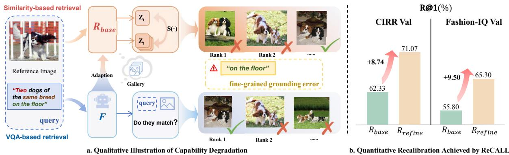  
Figure 1. Empirical illustration of Capability Degradation and the effectiveness of ReCALL $\left( \mathcal { R } _ { \mathrm { r e f i n e } } \right)$ . (a) We compare the Foundation MLLM $( \mathcal { F } )$ under its native VQA-based generative paradigm with its fine-tuned retrieval counterpart $( \mathcal { R } _ { \mathrm { b a s e } } )$ under a similarity-based discriminative paradigm using a challenging query that requires fine-grained reasoning. The base retriever $\mathcal { R } _ { \mathrm { b a s e } }$ fails due to fine-grained grounding errors, while $\mathcal { F }$ succeeds through step-wise reasoning. b) Quantitative evidence of Capability Degradation and Recalibration. We test $\mathcal { R } _ { \mathrm { b a s e } }$ on a subset of 1k instances where $\mathcal { F }$ successfully retrieves the target (i.e., $\mathcal { F }$ achieves $1 0 0 \% \mathrm { R } @ 1 .$ ). The low $\mathbb { R } \ @ 1$ performance of $\mathcal { R } _ { \mathrm { b a s e } }$ (only $6 2 . 3 3 \%$ on CIRR and $5 5 . 8 0 \%$ on FashionIQ) on this ${ \mathcal { F } }$ -solvable subset provides quantifiable proof of capability degradation. Our proposed ReCALL framework effectively recovers the lost abilities, elevating $\mathcal { R } _ { \mathrm { b a s e } }$ to ${ \mathcal { R } } _ { \mathrm { r e f i n e } }$ with significant gains.

为了解决这一问题，我们提出了 ReCALL，这是一个与模型无关的框架，通过重新校准基础模型中退化的能力并将其内化到检索器的表示中。我们的核心思想是利用 MLLM 逐步的原生推理信号来监督外部单嵌入检索空间，并在诊断-生成-精炼的流程中进行。为此，我们首先通过自我引导的信息实例挖掘程序诊断检索模型的认知盲点，该程序能够自主发现检索模型目前难以区分的样本。接下来，我们旨在生成明确针对这些不足之处的纠正监督。具体而言，我们通过链式思维（Chain-of-Thought, CoT）[9, 28, 44, 46, 64] 来提示基础模型，为信息性实例生成高质量的纠正文本指令，形成新的三元组。这些三元组在视觉和文本模态之间展现出微妙但在语义上有意义的变化，精确捕捉了检索模型之前未能区分的细微差别。至关重要的是，为了确保这些生成信号的可靠性，我们引入了基于视觉问答（VQA）的连贯性检查，以过滤掉噪声。最后，我们通过一种新颖的分组对比学习策略来精炼检索模型。通过构建训练批次，明确对比原始查询及其纠正对应的查询，我们促使模型内化这些细粒度的视觉-语义区别，从而重新对齐其区分表示空间与基础模型内在的组合推理能力。总之，我们的主要贡献如下：• 我们识别了一个在 MLLM 适应 CIR 中的关键挑战，称为能力退化，此时模型的原生组合推理能力在面向检索的微调中恶化。• 我们提出了一种与模型无关的框架 ReCALL，通过诊断-生成-精炼的流程重新校准检索器的嵌入空间与 MLLM 的组合推理能力。广泛的实验表明 ReCALL 有效地重新校准了退化的能力，最终在主流 CIR 基准上实现了最先进的性能，包括 CIRR [30] 和 FashionIQ [59]。

# 2. 相关工作

# 2.1. 复合图像检索

CIR旨在根据混合模态查询检索目标图像。早期的方法主要遵循VLM框架（例如，CLIP），缺乏查询模态之间的深入融合。它们依赖外部融合模块或通过伪词元进行拼接，但受到根本性架构缺陷的限制，即浅层对齐。为了克服这一局限性，最近的研究转向多模态大语言模型，以CIR-LVLM作为一个代表性例子，该模型利用LVLM作为用户意图感知的编码器进行CIR。得益于深度融合和指令跟随，这些适配 consistently 在主流基准上展现出卓越的性能。尽管取得了显著进展，但我们认为它们在区分检索方面的适配可能引入能力退化。这一冲突导致模型本身细粒度推理的退化，这是我们工作所力求解决的关键问题。

# 2.2. MLLMs 的自我改进

自我改进已被证明对大型语言模型有效：STaR 从模型生成的推理中引导，强化正确推理 [65]，而 Reflexion 和 Self-Refine 通过引入显式自反馈循环，迭代修正和改进输出 [33, 41]。相对而言，当代 MLLMs 的 CIR 适应主要采用单阶段的静态微调范式——在策划的基准上微调统一编码器，而不进行在线诊断和修复 [21, 27, 29, 45]。为了弥补这一差距，ReCALL 实现了一个以检索为导向的自我改进循环，与我们的诊断——生成——微调流程相一致。

# 3. 方法

本节概述了 ReCALL 框架。如图 2 所示，我们首先对任务进行形式化，并介绍模型组件（第 3.1 节），然后描述基线适应过程（第 3.2 节）。接下来，我们呈现诊断-生成-精炼的流程，包括自我引导的信息实例挖掘（第 3.3 节）、生成校准（第 3.4 节）和有针对性的精炼（第 3.5 节）。

# 3.1. 问题表述

CIR 定义如下：给定参考图像 $I_{r}$ 和修改文本 $T_{m}$，目标是从一个大型图库中检索目标图像 $I_{t}$。我们引入以下模型实体，用于整个工作中：基础模型 $(\mathcal{F})$：一个具有强大生成和推理能力的多模态大语言模型，为我们的框架提供内在的组合推理。基线检索模型 $(\mathcal{R}_{base})$：一个经过对比学习，从 $\mathcal{F}$ 微调而来的检索模型。尽管它提供了基本的检索性能，但仍然受限于第 1 节中描述的能力衰退。该模型作为我们诊断—生成—精炼流程的起点。精炼模型 $(\mathcal{R}_{refine})$：我们框架的最终模型变体。通过吸收 $\mathcal{F}$ 的组合推理，它解决了 $\mathcal{R}_{base}$ 中的能力衰退问题，从而生成一个重新校准且更具鲁棒性的检索器。

# 3.2. 阶段 1：基准检索模型适应

第一阶段将 $\mathcal { F }$ 调整为检索模型，以获得基本的鉴别能力，从而产生基线检索器 $( \mathcal { R } _ { b a s e } )$。它为随后进行的诊断-生成-精炼流程提供了一个稳定的起点。为了最大限度地保留预训练知识，$\mathcal { R } _ { b a s e }$ 直接从 $\mathcal { F }$ 初始化。然后，我们通过 InfoNCE [49] 在 CIR 三元组 $\left( I _ { r } , T _ { m } , I _ { t } \right)$ 上对模型进行微调，鼓励查询表示 $z _ { q }$ 与其正目标 $z _ { t }$ 对齐，同时远离批内负样本。尽管这一学习过程生成了一个功能性的检索器，但所产生的模型不可避免地会出现能力退化，即，鉴别微调可能会损害 $\mathcal { F }$ 内的细粒度组合推理。为了解决这一问题，接下来的诊断阶段被明确设计为检测和修正这些随之而来的盲点。

# 3.3. 第二阶段：自指导信息实例挖掘

为了有效重新校准 $\mathcal { R } _ { b a s e }$，我们引入了一种自导向的信息实例挖掘策略，以探测 $\mathcal { R } _ { b a s e }$ 的决策边界，这些边界最容易受到第1节中讨论的能力退化的影响。首先，我们使用 $\mathcal { R } _ { b a s e }$ 对训练集进行检索推理。我们排除了那些真实标签 $I _ { t }$ 被成功排名为第一的查询，假设这些实例具有足够的区分能力。相反，我们关注失败案例，因为它们很可能蕴含关于微调过程如何妨碍模型原有推理能力的最有信息的信号。对于每个失败案例，我们通过隔离排名在真实标签 $I _ { t }$ 之上的前 $K$ 张错误图像，构建一组信息实例，表示为 $\left\{ I _ { h } \right\}$。这些实例之所以高度信息化，恰恰是因为它们与目标共享微妙的视觉或语义细节，成功地欺骗了由于细致推理能力下降而受到影响的检索器。因此，这些特定实例作为后续校准阶段的关键锚点，准确指出模型的决策边界需要修正的地方。

# 3.4. 第三阶段：生成校准

给定在第 3.3 节中识别的有用实例 $\left\{ I _ { h } \right\}$，我们利用 $\mathcal { F }$ 的内在生成和推理能力来合成纠正监督信号。我们的目标是阐明原始指令 $T _ { m }$ 应如何进行最小调整，以便与每个 $I _ { h }$ 对齐，同时保持原始分布，从而有效地将失败案例转化为高质量的训练示例。

CoT辅助生成。一般而言，一个信息丰富的实例 $I _ { h }$ 仅在细微的视觉方面与真实标注 $I _ { t }$ 不同，如图2所示。这些细微的差异恰好反映了 $\mathcal { R } _ { b a s e }$ 的辨别能力不足，这可以被重新用于持续学习的信息监督。为实现这一目标，我们对 $T _ { m }$ 进行最小编辑，得到 $\tilde { T } _ { m }$，以准确反映 $I _ { t }$ 和 $I _ { h }$ 之间的视觉差异，从而使新的三元组 $( I _ { r } , \tilde { T } _ { m } , \bar { I } _ { h } )$ 传递信息监督，以进一步解锁检索器的细粒度辨别能力。具体而言，我们采用多步骤推理过程与 $\mathcal { F }$ 来识别查询 $( I _ { r } , T _ { m } )$ 和 $I _ { h }$ 之间的语义不匹配，然后应用必要的最小文本更改。该过程包括以下两个步骤：

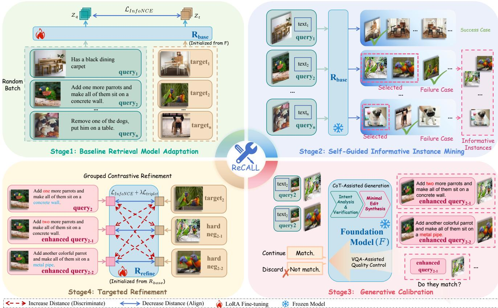  
Figure 2. Overview of the ReCALL framework. (1) Stage 1: A baseline retriever $\mathcal { R } _ { b a s e }$ is adapted from the foundation model $\mathcal { F }$ via standard fine-tuning. (2) Stage 2 (Diagnose): $\mathcal { R } _ { b a s e }$ surfaces its own failure cases via self-guided informative instance mining. (3) Stage 3 (Generate): Leveraging native reasoning (CoT), $\mathcal { F }$ synthesizes minimally edited corrective instructions for the mined informative produce the final $\mathcal { R } _ { r e f i n e }$ , effectively recalibrating the degraded capabilities.

1. 意图分解与验证：$\mathcal { F }$ 将 $T _ { m }$ 分解为原子意图，并针对 $\left( I _ { r } , I _ { h } \right)$ 验证每个意图，确定在 $I _ { h }$ 中哪些意图被违反。 2. 最小编辑合成：$\mathcal { F }$ 保留与 $\left( I _ { r } , I _ { h } \right)$ 一致的有效意图，并仅重新生成被违反的部分，产生修正后的指令 $\tilde { T } _ { m }$。该过程生成用于纠正的三元组 $( I _ { r } , \tilde { T } _ { m } , I _ { h } )$，提供密集且细粒度的监督：从 $T _ { m }$ 到 $\tilde { T } _ { m }$ 的最小文本编辑直接对应于 $I _ { t }$ 与 $I _ { h }$ 之间的细微视觉差异，促使检索器显式学习这些具有挑战性和信息丰富的区分。 VQA辅助质量控制。为了确保可靠性，我们进一步应用基于语义一致性的检查策略，并利用 $\mathcal { F }$ 的辨别理解。具体而言，我们通过针对 $\tilde { T _ { m } }$ 中关键属性的目标 VQA 问题来提示 $\mathcal { F }$，只有收到高置信度和内部一致回答的三元组才会保留至最终精炼阶段。

# 3.5. 第四阶段：针对性优化

最后阶段对 $\mathcal { R } _ { b a s e }$ 进行有针对性的微调，指导原则是第 3.4 节生成的纠正监督。我们从 $\mathcal { R } _ { b a s e }$ 初始化 $\mathcal { R } _ { r e f i n e }$，并训练其内化新构建三元组揭示的细微差别。这通过两个关键组件实现：分组对比微调和双重优化目标。

# 3.5.1. 分组对比精炼

为了充分利用第3.4节中提到的纠正性监督以支持持续学习，我们采用了一种结构化的批处理策略。对于每个查询，我们构建一个微组，包含原始的正三元组 $\left( I _ { r } , T _ { m } , I _ { t } \right)$ 及其纠正对应 $( \bar { I } _ { r } , \tilde { T } _ { m } , \bar { I } _ { h } )$。这种分组方式在单次梯度更新中暴露了模型的盲点。通过将 $I _ { t }$ 与其对应的有信息实例 $I _ { h }$ 以及最小不同的指令 $T _ { m }$ 和 $\tilde { T } _ { m }$ 放在同一批次中，模型被鼓励通过细粒度的语义线索来区分视觉上相邻的样本。因此，这些挖掘出的有信息实例作为有效的锚点，有助于优化决策边界。

# 3.5.2. 双重优化目标

为了平衡全局检索性能和细粒度校正，我们使用混合目标优化 $\mathcal { R } _ { r e f i n e }$：信息对比损失（InfoNCE损失）$( \mathcal { L } _ { i n f o N C E } )$。我们在整个批次上应用标准的InfoNCE损失 [49]，保留第3.2节中学习到的全局结构，同时适应新的区分：

$$
\mathcal { L } _ { i n f o N C E } = - \log \frac { \exp ( s ( z _ { q } , z _ { t ^ { + } } ) / \tau ) } { \sum _ { z _ { t } \in \mathcal { B } } \exp ( s ( z _ { q } , z _ { t } ) / \tau ) } ,
$$

其中 $\boldsymbol { B }$ 表示目标表示的批次，$\tau$ 是温度参数，$\begin{array} { r } { s ( u , v ) \ = \ \frac { u ^ { \top } v } { \| u \| \| v \| } } \end{array}$ 表示余弦相似度。此外，$z _ { q }$ 是从输入 $( I _ { r } , T _ { m } )$ 派生的查询表示，$z _ { t ^ { + } }$ 是正向真实图像 $I _ { t }$ 的表示，而 $z _ { t }$ 是来自批次 $\boldsymbol { B }$ 的一般目标表示。组内三元组边际损失 $( \mathcal { L } _ { t r i p l e t } )$ 为了明确强制目标与每个小组内特定信息实例之间的分离，我们添加了一个基于边际的损失 [40]：

$$
\mathcal { L } _ { t r i p l e t } = \operatorname* { m a x } ( 0 , s ( z _ { q } , z _ { t ^ { - } } ) - s ( z _ { q } , z _ { t ^ { + } } ) + m ) ,
$$

其中 $m$ 是一个边际超参数，而 $z _ { t ^ { - } }$ 对应于诊断阶段识别出的 $I _ { h }$。结合上述两个损失，最终目标被表述为：

$$
\mathcal { L } _ { t o t a l } = \mathcal { L } _ { i n f o N C E } + \lambda \mathcal { L } _ { t r i p l e t } ,
$$

其中 $\lambda$ 平衡了全局对齐和针对性细化。这种优化策略有效地对抗了能力退化，重新激励模型进行细粒度的组合推理。总之，ReCALL 实现了一个诊断—生成-细化的流程，凸显了基线检索器的失败案例，利用 $\mathcal{F}$ 生成精确的纠正监督，并通过针对性细化内部化这些区别。该过程对抗了能力退化，恢复了可靠的 CIR 所需的细粒度组合推理。

# 4. 实验

# 4.1. 数据集和评估指标

数据集。根据之前的研究 [25, 48, 60]，我们在两个广泛采用的CIR基准上评估我们的方法：FashionIQ和CIRR。FashionIQ [59] 是一个聚焦于时尚领域的细粒度基准数据集。它由来自电子商务网站的三元组组成，其中每个三元组包含一个参考图像、一个目标图像以及描述所需修改的自然语言指令。该数据集分为三个类别：连衣裙、衬衫和上衣&T恤，这使其特别适合评估模型理解细微属性变化的能力，例如颜色、图案和风格。CIRR [30] 作为开放域场景中泛化的测试平台。它来源于真实世界的NLVR2 [43] 数据集，包含涉及复杂物体交互和关系变化的三元组。与FashionIQ的领域特定性质相比，它提供了一个互补且具有挑战性的评估场景。

评估指标。根据标准协议 [8, 44, 45]，我们采用重召回率 $@ K$ $( R @ K )$ 作为我们的主要指标，该指标衡量目标出现在前 $K$ 个结果中的查询的百分比。对于 FashionIQ，我们报告 $R @ 1 0$ 和 $R @ 5 0$，并对其三个类别进行平均。对于 CIRR，我们报告 $R @ 1$、$R @ 5$、$R @ 1 0$ 和 $R @ 5 0$。此外，对于 CIRR，我们利用其独特设计报告 ${ \mathrm { R e c a l l } } _ { \mathrm { s u b s e t } } @ K$ 和 $R _ { \mathrm { s u b s e t } } @ K)$，其中 $K$ 在 $\{ 1 , 2 , 3 \}$ 中。该子集指标衡量从一个具有挑战性、经过精心策划的六个候选项的子集中检索正确项目的能力，提供了更有针对性的区分能力测量。

# 4.2. 实施细节

我们使用 Qwen2.5-VL-7B 作为 ReCALL 的主干网络，并通过 LoRA 进行微调（在 8 台 NVIDIA H20 GPU 上，秩 $r { = } 1 6$）。除非另有说明，我们在所有阶段共享相同的训练配置。对于 FashionIQ，我们使用学习率 $4 \times 1 0 ^ { - 5 }$，InfoNCE 温度 $\tau { = } 0 . 0 3$，全局批量大小为 512，在第 1 阶段进行 200 次优化步骤，第四阶段进行 250 次步骤。对于 CIRR，我们采用学习率 $2 \times 1 0 ^ { - 5 }$，$\tau { = } 0 . 0 2$，使用相同的批量大小，第 1 阶段和第 4 阶段分别进行 300 次和 350 次步骤。三元组损失边际为 $\mathrm { { \it m } = 0 . 0 5 }$，权重 $\lambda$ 在 FashionIQ 上为 0.30，在 CIRR 上为 0.25。

# 4.3. 与最先进方法的比较

我们将提出的 ReCALL 框架与现有的最先进方法进行了比较，基于 CIRR 和 FashionIQ 基准测试，涵盖了传统的双塔方法和近期的基于大语言模型的检索器。

关于CIRR的结果。表1报告了CIRR测试集上的定量结果。基线$( \mathcal { R } _ { \mathrm { b a s e } } )$单独在$R @ 1$上达到了竞争力的$51.23\%$，确认了MLLM架构在组合推理中的固有潜力。在此基础上，ReCALL建立了$55.52\%$的新最先进水平，超越了同时期的基于MLLM的CIR-LVLM [45] $( 53.64\% )$。值得注意的是，相较于$\mathcal { R } _ { \mathrm { b a s e } }$，在$R @ 1$上的相对提升$8.38\%$有力验证了我们“诊断—生成—优化”流程在纠正能力衰退方面的有效性。此外，在针对细粒度评估设计的$\mathtt { R e c a l l _ { s u b s e t } }$指标上，ReCALL获得了领先的$R _ { \mathrm { s u b s e t } } @ 1$，达到了$81.49\%$。这些提升确认了我们合成的三元组成功地增强了模型在高度干扰视觉干扰物面前的决策边界。

Table 1. Performance comparison on the CIRR test set. We compare the proposed ReCALL $( \mathcal { R } _ { \mathrm { r e f i n e } } )$ against state-of-the-art methods. $\mathcal { R } _ { \mathrm { b a s e } }$ is computed as $( R \mathbb { \cos } + R _ { \mathrm { s u b s e t } } \mathbb { \cos } 1 ) / 2$ . Best results are in bold, and the second-best are underlined. The bottom row $( \Delta )$ highlights the relative improvement of ReCALL over $\mathcal { R } _ { \mathrm { b a s e } }$ , quantifying the efficacy of our recalibration strategy.   

<table><tr><td rowspan="2">Method</td><td rowspan="2">Venue</td><td colspan="4">Recall@K</td><td colspan="3">Recallubset@K</td><td rowspan="2">Avg.</td></tr><tr><td>K = 1</td><td>K = 5</td><td>K = 10</td><td>K = 50</td><td>K = 1</td><td>K = 2</td><td>K = 3</td></tr><tr><td>TIRG [51]</td><td>CVPR&#x27;19</td><td>14.61</td><td>48.37</td><td>64.08</td><td>90.03</td><td>-</td><td>-</td><td>-</td><td>-</td></tr><tr><td>ARTEMIS [11]</td><td>ICLR&#x27;22</td><td>16.96</td><td>46.10</td><td>61.31</td><td>87.73</td><td>39.99</td><td>62.20</td><td>75.67</td><td>43.05</td></tr><tr><td>TG-CIR [57]</td><td>MM&#x27;23</td><td>45.25</td><td>78.29</td><td>87.16</td><td>97.30</td><td>72.84</td><td>89.25</td><td>95.13</td><td>75.57</td></tr><tr><td>SPRC [3]</td><td>ICLR&#x27;24</td><td>51.96</td><td>82.12</td><td>89.74</td><td>97.69</td><td>80.65</td><td>92.31</td><td>96.60</td><td>81.39</td></tr><tr><td>LIMN [56]</td><td>TPAMI&#x27;24</td><td>43.64</td><td>75.37</td><td>85.42</td><td>97.04</td><td>69.01</td><td>86.22</td><td>94.19</td><td>72.19</td></tr><tr><td>CoVR-2 [50]</td><td>TPAMI&#x27;24</td><td>50.43</td><td>81.08</td><td>88.89</td><td>98.05</td><td>76.75</td><td>90.34</td><td>95.78</td><td>79.28</td></tr><tr><td>CaLa [20]</td><td>SIGIR&#x27;24</td><td>49.11</td><td>81.21</td><td>89.59</td><td>98.00</td><td>76.27</td><td>91.04</td><td>96.46</td><td>78.74</td></tr><tr><td>ENCODER [26]</td><td>AAAI&#x27;25</td><td>46.10</td><td>77.98</td><td>87.16</td><td>97.64</td><td>76.92</td><td>90.41</td><td>95.95</td><td>77.45</td></tr><tr><td>CIR-LVLM [45]</td><td>AAAI&#x27;25</td><td>53.64</td><td>83.76</td><td>90.60</td><td>97.93</td><td>79.12</td><td>92.33</td><td>96.67</td><td>81.44</td></tr><tr><td>QuRe [22]</td><td>ICML&#x27;25</td><td>52.22</td><td>82.53</td><td>90.31</td><td>98.17</td><td>78.51</td><td>91.28</td><td>96.48</td><td>80.52</td></tr><tr><td>CCIN [48]</td><td>CVPR&#x27;25</td><td>53.41</td><td>84.05</td><td>91.17</td><td>98.00</td><td>-</td><td>-</td><td>-</td><td>-</td></tr><tr><td>TME [25]</td><td>CVPR&#x27;25</td><td>53.42</td><td>82.99</td><td>90.24</td><td>98.15</td><td>81.04</td><td>92.58</td><td>96.94</td><td>82.01</td></tr><tr><td>Baseline (Rbase)</td><td>-</td><td>51.23</td><td>82.15</td><td>90.20</td><td>98.20</td><td>77.57</td><td>91.83</td><td>96.34</td><td>79.86</td></tr><tr><td>ReCALL (Rrefine)</td><td>-</td><td>55.52</td><td>84.07</td><td>91.83</td><td>98.55</td><td>81.49</td><td>93.35</td><td>97.64</td><td>82.81</td></tr><tr><td>Improvement (∆)</td><td></td><td>+8.38%</td><td>+2.34%</td><td>+1.81%</td><td>+0.36%</td><td>+5.06%</td><td>+1.65%</td><td>+1.35%</td><td>+3.70%</td></tr></table>

在FashionIQ上的结果。表2详细列出了FashionIQ验证集上的定量结果。尽管存在诸如高标签噪声和细微属性操控等固有挑战，ReCALL通过实现最高的平均$R @ 10$为$57.04\%$和$R @ 50$为$76.42\%$，表现出持续的优越性，成功超越了同时期的CIR-LVLM [45]。与我们的$\mathcal{R}_{\mathrm{base}}$相比，ReCALL在平均$R @ 10$上提供了$7.16\%$的相对提升，其中在裙装类别中的增益高达$10.71\%$。这些在所有类别中的广泛改进有力地验证了我们的最小纠正编辑策略有效捕捉了细微的视觉-语义差异，能够实现精确检索，即使目标图像与参考图像之间仅有细微细节的差异。

# 4.4. 消融研究

我们进行了一系列实验以验证 ReCALL 的有效性、效率和泛化能力。

诊断阶段：自导性信息实例挖掘的影响。我们进一步探讨诊断阶段的必要性。近期大规模语言模型（MLLM）适应中的一个普遍趋势是无差别的大规模数据合成。为了严格模拟这种扩展方法，我们建立了一个随机挖掘基线。具体而言，对于每个训练查询，我们首先使用冻结的 $\mathcal { R } _ { \mathrm { b a s e } }$ 检索前50个候选图像。在这个候选池中，我们随机抽取负实例进行生成流水线，严格保持与我们方法相同的数据规模。为了确保实验的鲁棒性，我们在表3中报告四次独立运行（使用不同随机种子）的平均值和标准偏差。结果揭示了盲合成范式中的一个关键低效性。即使在多次运行的平均结果下，随机挖掘仅带来了微小的提升（将 $R @ 1 0$ 从 $5 3 . 2 3 \%$ 提高至 $5 3 . 8 0 \%$ ），而我们的自导性策略则显著提升至 $5 7 . 0 4 \%$。这一显著对比表明，无差别合成往往导致严重冗余：由于候选实例是随机从前50个中抽取的，许多实例可能已经被模型正确排序，从而提供了微不足道的梯度信号。相比之下，ReCALL遵循诊断-再生成的理念，精准集中生成预算于模型的主动失败案例。通过确保每个合成三元组针对特定的认知缺陷，ReCALL以最大的数据效率实现了卓越的能力提升。

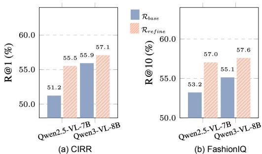  
Figure 3. Generalizability across backbones. We validate ReCALL on different foundation models (Qwen2.5-VL-7B and Qwen3-VL-8B). Despite higher baselines, ReCALL consistently delivers performance gains on both (a) CIRR and (b) FashionIQ, confirming the strong generalizability of our framework.

Table 2. Performance comparison on the FashionIQ validation set. We compare the proposed ReCALL $\left( \mathcal { R } _ { \mathrm { r e f i n e } } \right)$ against state-of-the-art methods in terms of Recall $@ K$ $( \% )$ . Consistent with Table 1, $\mathcal { R } _ { \mathrm { b a s e } }$ denotes the baseline retriever obtained after Stage 1, serving as the starting point or recalibration. Best results are in bold, and the second-best are underlined.The botto row $( \Delta )$ highlights the relative improvement of ReCALL over $\mathcal { R } _ { \mathrm { b a s e } }$ .   

<table><tr><td rowspan="2">Method</td><td rowspan="2">Venue</td><td colspan="2">Dress</td><td colspan="2">Shirt</td><td colspan="2">Top&amp;Tee</td><td colspan="2">Avg.</td></tr><tr><td>R@10</td><td>R@50</td><td>R@10</td><td>R@50</td><td>R@10</td><td>R@50</td><td>R@10</td><td>R@50</td></tr><tr><td>TIRG [51]</td><td>CVPR&#x27;19</td><td>14.13</td><td>34.61</td><td>13.10</td><td>30.91</td><td>14.79</td><td>34.37</td><td>14.01</td><td>33.30</td></tr><tr><td>ARTEMIS [11]</td><td>ICLR&#x27;22</td><td>25.68</td><td>51.05</td><td>21.57</td><td>44.13</td><td>28.59</td><td>55.06</td><td>25.28</td><td>50.08</td></tr><tr><td>FashionSAP [15]</td><td>CVPR&#x27;23</td><td>33.71</td><td>60.43</td><td>41.91</td><td>70.93</td><td>33.17</td><td>61.33</td><td>36.26</td><td>64.23</td></tr><tr><td>FAME-ViL [14]</td><td>CVPR&#x27;23</td><td>42.19</td><td>67.38</td><td>47.64</td><td>68.79</td><td>50.69</td><td>73.07</td><td>46.84</td><td>69.75</td></tr><tr><td>SyncMask [42]</td><td>CVPR&#x27;24</td><td>33.76</td><td>61.23</td><td>35.82</td><td>62.12</td><td>44.82</td><td>72.06</td><td>38.13</td><td>65.14</td></tr><tr><td>SADN [55]</td><td>MMI&#x27;24</td><td>40.01</td><td>65.10</td><td>43.67</td><td>66.05</td><td>48.04</td><td>70.93</td><td>43.91</td><td>67.36</td></tr><tr><td>CaLa [20]</td><td>SIGIR&#x27;24</td><td>42.38</td><td>66.08</td><td>46.76</td><td>68.16</td><td>50.93</td><td>73.42</td><td>46.69</td><td>69.22</td></tr><tr><td>CoVR-2 [50]</td><td>TPAMI&#x27;24</td><td>46.53</td><td>69.60</td><td>51.23</td><td>70.64</td><td>52.14</td><td>73.27</td><td>49.96</td><td>71.17</td></tr><tr><td>SPRC [3]</td><td>ICLR&#x27;24</td><td>49.18</td><td>72.43</td><td>55.64</td><td>73.89</td><td>59.35</td><td>78.58</td><td>54.72</td><td>74.97</td></tr><tr><td>CIR-LVLM [45]</td><td>AAAI&#x27;25</td><td>50.42</td><td>73.60</td><td>58.59</td><td>75.86</td><td>59.61</td><td>78.99</td><td>56.21</td><td>76.14</td></tr><tr><td>CCIN [48]</td><td>CVPR&#x27;25</td><td>49.38</td><td>72.58</td><td>55.93</td><td>74.14</td><td>57.93</td><td>77.56</td><td>54.41</td><td>74.76</td></tr><tr><td>TME [25]</td><td>CVPR&#x27;25</td><td>49.73</td><td>71.69</td><td>56.43</td><td>74.44</td><td>59.31</td><td>78.94</td><td>55.15</td><td>75.02</td></tr><tr><td>QuRe [22]</td><td>ICML&#x27;25</td><td>46.80</td><td>69.81</td><td>53.53</td><td>72.87</td><td>57.47</td><td>77.77</td><td>52.60</td><td>73.48</td></tr><tr><td>Baseline (Rbase)</td><td></td><td>46.80</td><td>70.60</td><td>55.00</td><td>74.39</td><td>57.88</td><td>78.12</td><td>53.23</td><td>74.37</td></tr><tr><td>ReCALL (Rrefine)</td><td></td><td>51.81</td><td>73.48</td><td>58.49</td><td>76.59</td><td>60.83</td><td>79.19</td><td>57.04</td><td>76.42</td></tr><tr><td>Improvement (∆)</td><td></td><td>+10.71%</td><td>+4.08%</td><td>+6.35%</td><td>+2.96%</td><td>+5.10%</td><td>+1.37%</td><td>+7.16%</td><td>+2.76%</td></tr></table>

Table 3. Ablation study on the mining strategy on the FashionIQ validation set. We compare our Self-Guided Mining against a Random Mining baseline under the same data budget. To ensure statistical robustness, results for the Random strategy are averaged over four independent runs with different random seeds.   

<table><tr><td>Mining Strategy</td><td>R@10</td><td>R@50</td><td>Mean</td></tr><tr><td>Rbase</td><td>53.23</td><td>74.37</td><td>63.80</td></tr><tr><td>+ Random Mining</td><td>53.80±0.20</td><td>74.32±0.06</td><td>64.06±0.10</td></tr><tr><td>+ Self-Guided</td><td>57.04</td><td>76.42</td><td>66.73</td></tr></table>

Table 4. Ablation study of the core components on the FashionIQ validation set. CG: CoT-assisted Generation, VC: VQA-Assisted Quality Control, GR: Grouped Contrastive Refinement. • denotes the component is included, and $^ { \circ }$ denotes excluded. All metrics are the average over the three categories (in $\%$ ). The stepwise performance improvements validate the effectiveness of each proposed module.   

<table><tr><td rowspan="2">Baseline</td><td colspan="3">Components</td><td colspan="3">Metrics (Avg.)</td></tr><tr><td>CG</td><td>VC</td><td>GR</td><td>R@10</td><td>R@50</td><td>Mean</td></tr><tr><td>•</td><td>O</td><td>O</td><td>O</td><td>53.23</td><td>74.37</td><td>63.80</td></tr><tr><td></td><td>•</td><td>O</td><td>O</td><td>55.41</td><td>75.17</td><td>65.29</td></tr><tr><td></td><td></td><td></td><td>O</td><td>56.13</td><td>76.04</td><td>66.09</td></tr><tr><td></td><td></td><td></td><td>•</td><td>57.04</td><td>76.42</td><td>66.73</td></tr></table>

生成阶段：生成校准的有效性（CG 和 VC）。这一组实验通过表 4（第 1-3 行）中的渐进研究验证了核心生成阶段。我们利用基础模型 $\mathcal{F}$ 创建纠正性监督。引入 CoT 辅助生成（CG）带来了实质性的提升，将 $R@10$ 从 $53.23\%$ 提升至 $55.41\%$。这一 $2.18\%$ 的绝对改善确认了利用 $\mathcal{F}$ 的本地生成推理合成有针对性的监督有效地减轻了认知缺陷。此外，添加 VQA 辅助质量控制（VC）进一步将 $R@10$ 升高至 $56.13\%$。此步骤利用 $\mathcal{F}$ 的内在辨别理解过滤噪音，确保仅高质量的三元组引导训练。总体而言，这些结果实证证明我们的框架成功地内化了基础模型强大的组合推理能力，减轻了初始适应带来的能力退化。

精 Refinement 阶段：分组强化（GR）的必要性。我们最终验证了 Refinement 阶段（表 4，第 3 - 4 行），该阶段集中于如何有效地内化纠正监督。如第 3 行所示，单纯通过标准随机批处理扩展包含合成三元组的训练集效果有限。相比之下，启用分组对比强化（GR）在 $R @ 10$ 上达到了 57.04\% 的最佳性能。这一比较突显了数据优化利用的重要性：我们的分组策略特别设计用于利用生成阶段中产生的微妙视觉和文本对比。通过强制在批内直接比较目标及其合成的近邻，该机制迫使模型明确解决微组内的模糊性。这种最优信号传递有效地将纠正监督转化为更清晰、细致的区分边界，成功重新校准了下降的组合推理能力。

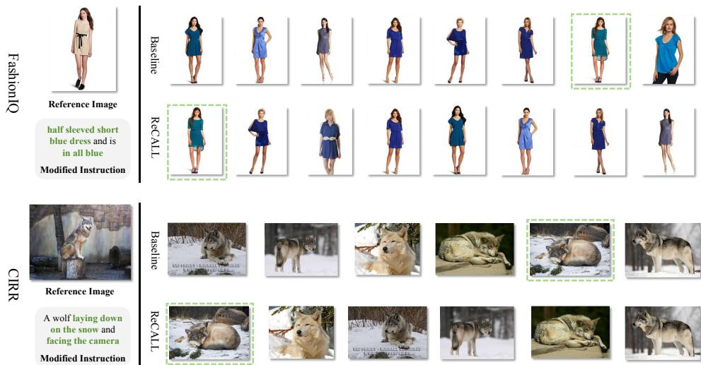  
Figure 4. Qualitative comparison between the baseline $R _ { \mathrm { b a s e } } )$ and our ReCALL $\left( \mathcal { R } _ { \mathrm { r e f i n e } } \right)$ on FashionIQ (top) and CIRR (bottom). The green dashed boxes indicate the ground-truth targets. $\mathcal { R } _ { \mathrm { b a s e } }$ suffers from capability degradation, failing to capture specic details like "half

主干网络的泛化能力。为了验证 Re-CALL 是一个模型无关的框架，而不是对较弱架构的特定补丁，我们将该方法应用于更先进的基础模型 Qwen3-VL-8B。正如图 3 所示，Qwen3-VL-8B 的基线适应 $( \mathcal { R } _ { \mathrm { b a s e } } )$ 已经展示了一个强有力的起点，显著优于标准的 Qwen2.5-VL-7B 基线（例如，在 CIRR 上的 $R @ 1$ 为 $5 5 . 9 3 \%$ 对比 $5 1 . 2 3 \%$）。尽管有如此高的基线，应用 ReCALL 仍然能持续带来改进，使得 CIRR 上的 $R @ 1$ 提升至 $5 7 . 0 9 \%$，FashionIQ 上的 $R @ 1 0$ 提升至 $5 7 . 6 0 \%$。值得注意的是，即使基础模型变得更强，因生成与检索之间的范式冲突而带来的能力退化现象依然存在。我们的结果确认 ReCALL 有效地解决了这一基本问题，展示了在不同模型能力下的可扩展性和鲁棒性。

# 4.5. 定性分析

为了直观展示能力退化和我们后续重新校准的有效性，图 4 展示了来自 FashionIQ 和 CIRR 数据集的两个代表性挑战案例，这些案例需要精确的细粒度推理。至关重要的是，我们验证了基础模型 $( \mathcal { F } )$ 通过 VQA 推理正确识别了这两个目标，确认所需的组合知识已经存在于预训练模型中。然而，适配后的 $\mathcal { R } _ { b a s e }$ 在这两种情况下都未能成功，暴露出明显的退化模式。基线模型保持粗粒度的理解，例如能够识别“蓝色连衣裙”或“雪上的狼”，但在具体约束上却失败。例如，它检索到了一件无袖连衣裙，而不是所请求的“半袖”连衣裙，以及一只侧面视角的狼而忽略了“面向相机”的指示。相比之下，ReCALL 成功地纠正了这些错误。通过诊断这些盲点并将表示空间与基础模型的本地推理能力重新对齐，我们的方法恢复了对细微属性和空间关系的敏感性，准确地在这两种情况下检索到了正确的目标。

# 5. 结论

在本研究中，我们通过提出 ReCALL 来解决能力退化问题——即在为检索适应生成式多语言模型时细粒度推理的恶化。我们的方法利用 MLLMs 的内在零-shot 推理，通过诊断—生成—精炼的流程创建并内化针对性的纠正监督。具体而言，自我引导的信息实例挖掘和分组精炼将基础模型的推理嵌入到检索空间中。实证结果表明，ReCALL 在主流的 CIR 基准测试中达到了最先进的性能。

# 致谢

本研究部分得到了中国国家重点研发计划（编号：2022ZD0160601）、中国国家自然科学基金（资助编号：62276260和U1701266）、北京市自然科学基金（资助编号：L252035）以及广东省知识产权和大数据重点实验室（资助编号：2018B030322016）的支持。

# References

[1] Jinze Bai, Shuai Bai, Shusheng Yang, Shijie Wang, Sinan Tan, Peng Wang, Junyang Lin, Chang Zhou, and Jingren Zhou. Qwen-vl: A frontier large vision-language model with versatile abilities. ArXiv, abs/2308.12966, 2023. 1   
[2] Shuai Bai, Keqin Chen, Xuejing Liu, Jialin Wang, Wenbin Ge, Sibo Song, Kai Dang, Peng Wang, Shijie Wang, Jun Tang, Humen Zhong, Yuanzhi Zhu, Mingkun Yang, Zhaohai Li, Jianqiang Wan, Pengfei Wang, Wei Ding, Zheren Fu, Yiheng Xu, Jiabo Ye, Xi Zhang, Tianbao Xie, Zesen Cheng, Hang Zhang, Zhibo Yang, Haiyang Xu, and Junyang Lin. Qwen2.5-vl technical report, 2025. 1, 5   
[3] Yang Bai, Xinxing Xu, Yong Liu, Salman Khan, Fahad Khan, Wangmeng Zuo, Rick Siow Mong Goh, and Chun-Mei Feng. Sentence-level prompts benefit composed image retrieval. arXiv preprint arXiv:2310.05473, 2023. 1, 2, 6, 7   
[4] Alberto Baldrati, Marco Bertini, Tiberio Uricchio, and A. Bimbo. Conditioned and composed image retrieval combining and partially fine-tuning clip-based features. 2022 IEEE/CVF Conference on Computer Vision and Pattern Recognition Workshops (CVPRW), pages 49554964, 2022. 2   
[5] Alberto Baldrati, Marco Bertini, Tiberio Uricchio, and A. Bimbo. Effective conditioned and composed image retrieval combining clip-based features. 2022 IEEE/CVF Conference on Computer Vision and Pattern Recognition (CVPR), pages 2143421442, 2022. 1, 2   
[6] Alberto Baldrati, Marco Bertini, Tiberio Uricchio, and A. Bimbo. Composed image retrieval using contrastive learning and task-oriented clip-based features. ACM Transactions on Multimedia Computing, Communications and Applications, 20:1  24, 2023. 2   
[7] Yanbei Chen, Shaogang Gong, and Loris Bazzani. Image search with text feedback by visiolinguistic attention learning. In 2020 IEEE/CVF Conference on Computer Vision and Pattern Recognition (CVPR), pages 29983008, 2020. 2   
[8] Yiyang Chen, Zhedong Zheng, Wei Ji, Leigang Qu, and Tat-Seng Chua. Composed image retrieval with text feedback via multi-grained uncertainty regularization. ArXiv, abs/2211.07394, 2022. 5   
[9] Zheng Chu, Jingchang Chen, Qianglong Chen, Weijiang Yu, Tao He, Haotian Wang, Weihua Peng, Ming Liu, Bing Qin, and Ting Liu. Navigate through enigmatic labyrinth a survey of chain of thought reasoning: Advances, frontiers and future. In Annual Meeting of the Association for Computational Linguistics, 2023. 2   
[10] Niv Cohen, Rinon Gal, Eli A. Meirom, Gal Chechik, and Yuval Atzmon. "this is my unicorn, fluffy": Personalizing frozen vision-language representations. ArXiv, abs/2204.01694, 2022. 2   
[11] Ginger Delmas, Rafael Sampaio de Rezende, Gabriela Csurka, and Diane Larlus. Artemis: Attention-based retrieval with text-explicit matching and implicit similarity. 2022. 2, 6, 7   
[12] Rinon Gal, Yuval Alaluf, Yuval Atzmon, Or Patashnik, Amit H. Bermano, Gal Chechik, and Daniel Cohen-Or. An image is worth one word: Personalizing text-to-image generation using textual inversion, 2022. 2   
[13] Albert Gordo, Jon Almazán, Jerome Revaud, and Diane Larlus. Deep image retrieval: Learning global representations for image search. In Computer Vision  ECCV 2016, pages 241257, Cham, 2016. Springer International Publishing. 1   
[14] Xiaoping Han, Xiatian Zhu, Licheng Yu, Li Zhang, Yi-Zhe Song, and Tao Xiang. Fame-vil: Multi-tasking visionlanguage model for heterogeneous fashion tasks. 2023 IEEE/CVF Conference on Computer Vision and Pattern Recognition (CVPR), pages 26692680, 2023. 7   
[15] Yunpeng Han, Lisai Zhang, Qingcai Chen, Zhijian Chen, Zhonghua Li, Jianxin Yang, and Zhao Cao. Fashionsap: Symbols and attributes prompt for fine-grained fashion vision-language pre-training. 2023 IEEE/CVF Conference on Computer Vision and Pattern Recognition (CVPR), pages 1502815038, 2023. 7   
[16] Xiangzhao Hao, Kuan Zhu, Hongyu Guo, Haiyun Guo, Ning Jiang, Quan Lu, Ming Tang, and Jinqiao Wang. Referring expression instance retrieval and a strong end-to-end baseline. In Proceedings of the 33rd ACM International Conference on Multimedia, pages 44644473, 2025. 1   
[17] Xiangzhao Hao, Shijie Wang, Tianyu Yang, Tanyue Wang, Haiyun Guo, and JinQiao Wang. Trace: Task-adaptive reasoning and representation learning for universal multimodal retrieval. arXiv preprint arXiv:2603.02929, 2026. 1   
[18] Cheng-Yu Hsieh, Jieyu Zhang, Zixian Ma, Aniruddha Kembhavi, and Ranjay Krishna. Sugarcrepe: Fixing hackable benchmarks for vision-language compositionality. In Advances in Neural Information Processing Systems, pages 3109631116. Curran Associates, Inc., 2023. 2   
[19] Edward J. Hu, Yelong Shen, Phillip Wallis, Zeyuan Allen-Zhu, Yuanzhi Li, Shean Wang, and Weizhu Chen. Lora: Low-rank adaptation of large language models. ArXiv, abs/2106.09685, 2021. 5   
[20] Xintong Jiang, Yaxiong Wang, Mengjian Li, Yujiao Wu, Bingwen Hu, and Xueming Qian. Cala: Complementary association learning for augmenting comoposed image retrieval. Proceedings of the 47th International ACM SIGIR Conference on Research and Development in Information Retrieval, 2024. 6, 7   
[21] Ziyan Jiang, Rui Meng, Xinyi Yang, Semih Yavuz, Yingbo Zhou, and Wenhu Chen. Vlm2vec: Training vision-language models for massive multimodal embedding tasks. In International Conference on Learning Representations, pages 12551279, 2025. 1, 3   
[22] Jaehyun Kwak, Ramahdani Muhammad Izaaz Inhar, Se-Young Yun, and Sung-Ju Lee. Qure: Query-relevant retrieval through hard negative sampling in composed image retrieval. ArXiv, abs/2507.12416, 2025. 6, 7   
[23] Matan Levy, Rami Ben-Ari, Nir Darshan, and Dani Lischinski. Data roaming and quality assessment for composed image retrieval. In AAAI Conference on Artificial Intelligence, 2023.2   
[24] Matan Levy, Rami Ben-Ari, Nir Darshan, and Dani Lischinski. Data roaming and quality assessment for composed image retrieval. Proceedings of the AAAI Conference on Artificial Intelligence, 38(4):29912999, 2024. 1, 2   
[25] Shuxian Li, Changhao He, Xiting Liu, Joey Tianyi Zhou, Xi Peng, and Peng Hu. Learning with noisy triplet correspondence for composed image retrieval‡. 2025 IEEE/CVF Conference on Computer Vision and Pattern Recognition (CVPR), pages 1962819637, 2025. 5, 6, 7   
[26] Zixu Li, Zhiwei Chen, Haokun Wen, Zhiheng Fu, Yupeng Hu, and Weili Guan. Encoder: Entity mining and modification relation binding for composed image retrieval. In AAAI Conference on Artificial Intelligence, 2025. 6   
[27] Sheng-Chieh Lin, Chankyu Lee, Mohammad Shoeybi, Jimmy Lin, Bryan Catanzaro, and Wei Ping. Mm-embed: Universal multimodal retrieval with multimodal llms. ArXiv, abs/2411.02571, 2024. 1, 3   
[28] Sheng Liu, Haotian Ye, Lei Xing, and James Y. Zou. Incontext vectors: Making in context learning more effective and controllable through latent space steering. In International Conference on Machine Learning, 2023. 2   
[29] Yikun Liu, Yajie Zhang, Jiayin Cai, Xiaolong Jiang, Yao Hu, Jiangchao Yao, Yanfeng Wang, and Weidi Xie. Lamra: Large multimodal model as your advanced retrieval assistant. In Proceedings of the Computer Vision and Pattern Recognition Conference, pages 40154025, 2025. 1, 3   
[30] Zheyuan Liu, Cristian Rodriguez-Opazo, Damien Teney, and Stephen Gould. Image retrieval on real-life images with pretrained vision-and-language models. 2021 IEEE/CVF International Conference on Computer Vision (ICCV), pages 21052114, 2021. 1, 2, 5   
[31] Zheyuan Liu, Weixuan Sun, Damien Teney, and Stephen Gould. Candidate set re-ranking for composed image retrieval with dual multi-modal encoder. Trans. Mach. Learn. Res., 2024, 2023. 2   
[32] Haoyu Lu, Wen Liu, Bo Zhang, Bing-Li Wang, Kai Dong, Bo Liu (Benjamin Liu), Jingxiang Sun, Tongzheng Ren, Zhuoshu Li, Hao Yang, Yaofeng Sun, Chengqi Deng, Hanwei Xu, Zhenda Xie, and Chong Ruan. Deepseek-vl: Towards real-world vision-language understanding. ArXiv, abs/2403.05525, 2024. 1   
[33] Aman Madaan, Niket Tandon, Prakhar Gupta, Skyler Hallinan, Luyu Gao, Sarah Wiegreffe, Uri Alon, Nouha Dziri, Shrimai Prabhumoye, Yiming Yang, Shashank Gupta, Bodhisattwa Prasad Majumder, Katherine Hermann, Sean Welleck, Amir Yazdanbakhsh, and Peter Clark. Self-refine: Iterative refinement with self-feedback. In Advances in Neural Information Processing Systems, pages 4653446594. Curran Associates, Inc., 2023. 3   
[34] Khoi Pham, Chuong Huynh, Ser-Nam Lim, and Abhinav Shrivastava. Composing object relations and attributes for image-text matching. 2024 IEEE/CVF Conference on Computer Vision and Pattern Recognition (CVPR), pages 14354 14363, 2024. 1   
[35] Leigang Qu, Meng Liu, Jianlong Wu, Zan Gao, and Liqiang Nie. Dynamic modality interaction modeling for image-text retrieval. In Proceedings of the 44th international ACM SI-GIR conference on research and development in information retrieval, pages 11041113, 2021. 1   
[36] Leigang Qu, Haochuan Li, Tan Wang, Wenjie Wang, Yongqi Li, Liqiang Nie, and Tat-Seng Chua. Tiger: Unifying text-toimage generation and retrieval with large multimodal models. arXiv preprint arXiv:2406.05814, 2024. 1   
[37] Leigang Qu, Feng Cheng, Ziyan Yang, Qi Zhao, Shanchuan Lin, Yichun Shi, Yicong Li, Wenjie Wang, Tat-Seng Chua, and Lu Jiang. Vincie: Unlocking in-context image editing from video. In The Fourteenth International Conference on Learning Representations, 2025. 1   
[38] Alec Radford, Jong Wook Kim, Chris Hallacy, Aditya Ramesh, Gabriel Goh, Sandhini Agarwal, Girish Sastry, Amanda Askell, Pamela Mishkin, Jack Clark, Gretchen Krueger, and Ilya Sutskever. Learning transferable visual models from natural language supervision. In International Conference on Machine Learning, 2021. 2   
[39] Kuniaki Saito, Kihyuk Sohn, Xiang Zhang, Chun-Liang Li, Chen-Yu Lee, Kate Saenko, and Tomas Pfister. Pic2word: Mapping pictures to words for zero-shot composed image retrieval. In Proceedings of the IEEE/CVF Conference on Computer Vision and Pattern Recognition (CVPR), pages 1930519314, 2023. 2   
[40] Florian Schroff, Dmitry Kalenichenko, and James Philbin. Facenet: A unified embedding for face recognition and clustering. 2015 IEEE Conference on Computer Vision and Pattern Recognition (CVPR), pages 815823, 2015. 5   
[41] Noah Shinn, Federico Cassano, Edward Berman, Ashwin Gopinath, Karthik Narasimhan, and Shunyu Yao. Reflexion: Language agents with verbal reinforcement learning, 2023. 3   
[42] Chull Hwan Song, Taebaek Hwang, Jooyoung Yoon, Shunghyun Choi, and Yeong Hyeon Gu. Syncmask: Synchronized attentional masking for fashion-centric visionlanguage pretraining. 2024 IEEE/CVF Conference on Computer Vision and Pattern Recognition (CVPR), pages 13948 13957, 2024. 7   
[43] Alane Suhr, Stephanie Zhou, Iris Zhang, Huajun Bai, and Yoav Artzi. A corpus for reasoning about natural language grounded in photographs. ArXiv, abs/1811.00491, 2018. 5   
[44] Zelong Sun, Dong Jing, and Zhiwu Lu. Cotmr: Chainof-thought multi-scale reasoning for training-free zero-shot composed image retrieval. In Proceedings of the IEEE/CVF International Conference on Computer Vision (ICCV), pages 2267522684, 2025. 2, 5   
[45] Zelong Sun, Dong Jing, Guoxing Yang, Nanyi Fei, and Zhiwu Lu. Leveraging large vision-language model as user intent-aware encoder for composed image retrieval. Proceedings of the AAAI Conference on Artificial Intelligence, 39(7):71497157, 2025. 2, 3, 5, 6, 7   
[46] Xinyu Tang, Xiaolei Wang, Zhihao Lv, Yingqian Min, Xi u,  d Unlocking general long chain-of-thought reasoning capabiliti o ar nggodel i erentaion e. ArXiv, abs/2503.11314, 2025. 2   
[47] Yuanmin Tang, J. Yu, Keke Gai, Jiamin Zhuang, Gang Xiong, Yue Hu, and Qi Wu. Context-i2w: Mapping images to context-dependent words for accurate zero-shot composed image retrieval. In AAAI Conference on Artificial Intelligence, 2023. 2   
[48] Likai Tian, Jian Zhao, Zechao Hu, Zhengwei Yang, Hao Li, Lei Jin, Zheng Wang, and Xuelong Li. Ccin: Compositional conflict identification and neutralization for composed image retrieval. 2025 IEEE/CVF Conference on Computer Vision and Pattern Recognition (CVPR), pages 39743983, 2025. 5, 6, 7   
[49] Aäron van den Oord, Yazhe Li, and Oriol Vinyals. Representation learning with contrastive predictive coding. ArXiv, abs/1807.03748, 2018. 3, 5   
[50] Lucas Ventura, Antoine Yang, Cordelia Schmid, and Gül Varol. Covr-2: Automatic data construction for composed video retrieval. IEEE Transactions on Pattern Analysis and Machine Intelligence, 46:1140911421, 2023. 6, 7   
[51] Nam S. Vo, Lu Jiang, Chen Sun, Kevin P. Murphy, Li-Jia Li, Li Fei-Fei, and James Hays. Composing text and image for image retrieval - an empirical odyssey. 2019 IEEE/CVF Conference on Computer Vision and Pattern Recognition (CVPR), pages 64326441, 2018. 6, 7   
[52] Nam S. Vo, Lu Jiang, Chen Sun, Kevin P. Murphy, Li-Jia Li, Li Fei-Fei, and James Hays. Composing text and image for image retrieval - an empirical odyssey. 2019 IEEE/CVF Conference on Computer Vision and Pattern Recognition (CVPR), pages 64326441, 2018. 1   
[53] Peng Wang, Shuai Bai, Sinan Tan, Shijie Wang, Zhihao Fan, Jinze Bai, Keqin Chen, Xuejing Liu, Jialin Wang, Wenbin Ge, Yang Fan, Kai Dang, Mengfei Du, Xuancheng Ren, Rui Men, Dayiheng Liu, Chang Zhou, Jingren Zhou, and Junyang Lin. Qwen2-vl: Enhancing vision-language model's perception of the world at any resolution, 2024.1   
[54] Tianyue Wang, Leigang Qu, Tianyu Yang, Xiangzhao Hao, Yifan Xu, Haiyun Guo, and Jinqiao Wang. Wiser: Wider search, deeper thinking, and adaptive fusion for trainingfree zero-shot composed image retrieval. arXiv preprint arXiv:2602.23029, 2026. 2   
[55] Yifan Wang, Wuliang Huang, Lei Li, and Chun Yuan. Semantic distillation from neighborhood for composed image retrieval. Proceedings of the 32nd ACM International Conference on Multimedia, 2024. 7   
[56] Haokun Wen, Xuemeng Song, Jianhua Yin, Jianlong Wu, Weili Guan, and Liqiang Nie. Self-training boosted multifactor matching network for composed image retrieval. IEEE Transactions on Pattern Analysis and Machine Intelligence, 46:36653678, 2023. 6   
[57] Haokun Wen, Xian Zhang, Xuemeng Song, Yin wei Wei, and Liqiang Nie. Target-guided composed image retrieval. Proceedings of the 31st ACM International Conference on Multimedia, 2023. 1, 2, 6   
[58] Chenwei Wu, Erran L. Li, Stefano Ermon, Patrick Haffner, Rong Ge, and Zaiwei Zhang. The role of linguistic priors in models. ArXiv, abs/2310.02777, 2023. 2 [59] Hui Wu, Yupeng Gao, Xiaoxiao Guo, Ziad Al-Halah, Steven Rennie, Kristen Grauman, and Rogerio Feris. Fashion iq: A new dataset towards retrieving images by natural language feedback. In 2021 IEEE/CVF Conference on Computer Vision and Pattern Recognition (CVPR), pages 1130211312. IEEE, 2021. 2, 5 [60] Eric Xing, Pranavi Kolouju, Robert Pless, Abby Stylianou, and Nathan Jacobs. Context-cir: Learning from concepts in text for composed image retrieval. 2025 IEEE/CVF Conference on Computer Vision and Pattern Recognition (CVPR), pages 1963819648, 2025. 5 [61] Guowei Xu, Peng Jin, Hao Li, Yibing Song, Lichao Sun, and Li Yuan. Llava-cot: Let vision language models reason stepby-step. ArXiv, abs/2411.10440, 2024. 1 [62] Jinyu Yang, Jiali Duan, S. Tran, Yi Xu, Sampath Chanda, Liqun Chen, Belinda Zeng, Trishul M. Chilimbi, and Junzhou Huang. Vision-language pre-training with triple contrastive learning. 2022 IEEE/CVF Conference on Computer Vision and Pattern Recognition (CVPR), pages 15650   
15659, 2022. 1 [63] Xun Yang, Shanshan Wang, Jian Dong, Jianfeng Dong, Meng Wang, and Tat-Seng Chua. Video moment retrieval with cross-modal neural architecture search. IEEE Transactions on Image Processing, 31:12041216, 2022. 1 [64] Zhenyu Yang, Dizhan Xue, Shengsheng Qian, Weiming Dong, and Changsheng Xu. Ldre: Llm-based divergent reasoning and ensemble for zero-shot composed image retrieval. Proceedings of the 47th International ACM SIGIR Conference on Research and Development in Information Retrieval, 2024. 2 [65] Eric Zelikman, Yuhuai Wu, Jesse Mu, and Noah Goodman. Star: Bootstrapping reasoning with reasoning. In Advances in Neural Information Processing Systems, pages 15476   
15488. Curran Associates, Inc., 2022. 3 [66] Jinguo Zhu, Weiyun Wang, Zhe Chen, Zhaoyang Liu, Shenglong Ye, Lixin Gu, Yuchen Duan, Hao Tian, Weijie Su, Jie Shao, Zhangwei Gao, Erfei Cui, Yue Cao, Yangzhou Liu, Haomin Wang, Weiye Xu, Hao Li, Jiahao Wang, Han Lv, Dengnian Chen, Songze Li, Yinan He, Tan Jiang, Jiapeng Luo, Yi Wang, Conghui He, Botian Shi, Xingcheng Zhang, Wenqi Shao, Junjun He, Ying Xiong, Wenwen Qu, Peng Sun, Penglong Jiao, Lijun Wu, Kai Zhang, Hui Deng, Jiaye Ge, Kaiming Chen, Limin Wang, Min Dou, Lewei Lu, Xizhou Zhu, Tong Lu, Dahua Lin, Yu Qiao, Jifeng Dai, and Wenhai Wang. Internvl3: Exploring advanced training and test-time recipes for open-source multimodal models. ArXiv, abs/2504.10479, 2025. 1

# ReCALL: Recalibrating Capability Degradation for MLLM-based Composed Image Retrieval

Supplementary Material

# 6. Additional Experimental Results and Analysis

# 6.1. Data Scale Study on FashionIQ

To investigate the scalability of our Self-Guided Informative Instance Mining strategy, we conduct a quantitative analysis on the FashionIQ dataset by varying the mining hyperparameter $K$ (denoted as top- $K$ ). This parameter determines the maximum number of informative instances mined for each failure query, directly controlling the volume of synthesized supervision.

Experimental Setup. To decouple data scaling from quality filtering, we conduct experiments without the VQA-Assisted Quality Control mechanism. The model is trained via the standard InfoNCE loss within our Grouped Contrastive Refinement framework.

Results. The quantitative results are visualized in Fig. 5. We employ a dual-axis plot to illustrate the relationship between the mining constraint $K$ (bottom $\mathbf { X }$ axis) and the resultant volume of synthesized training samples (top $\mathbf { X }$ -axis). As illustrated, increasing $K$ from 1 to 5 significantly expands the training set from 13,351 to 57,125 samples. Crucially, this increase in data scale correlates with a consistent upward trend in retrieval performance. Specifically, Avg. $\textrm { R @ 1 0 }$ (left axis) improves from $5 5 . 2 7 \%$ to $5 6 . 0 7 \%$ and Avg. $\mathrm { R @ 5 0 }$ (right axis) rises from $7 5 . 7 0 \%$ to $7 6 . 2 9 \%$ . This positive scaling effect demonstrates that ReCALL can effectively leverage larger pools of informative instances to refine its discriminative boundaries, yielding continuous gains even in the absence of additional filtering.

# 6.2. Hyperparameter Analysis of Triplet Loss

To identify the optimal configuration for the targeted refinement stage, we conduct a grid search over two critical hyperparameters in the joint loss function: the triplet loss weight $\lambda$ and the margin $m$ . We evaluate the model on the FashionIQ validation set, identifying the optimal setting based on the Average $\mathbb { R } \ @ 1 0$ metric. Specifically, the weight $\lambda$ is varied within $\{ 0 . 1 , 0 . 2 , 0 . 3 , 0 . 4 , 0 . 5 \}$ , and the margin $m$ within $\{ 0 . 0 5 , 0 . 1 0 , 0 . 2 0 \}$ .

Results. The sensitivity analysis is visualized in Fig. 6. First, concerning the loss weight $\lambda$ ,performance generally peaks at $\lambda ~ = ~ 0 . 3$ Lower weights (e.g., $\lambda \ = \ 0 . 1 $ provide insufficient supervision for fine-grained discrimination, whereas excessive weights (e.g., $\lambda ~ = ~ 0 . 5 )$ tend to over-regularize the representation, potentially conflicting with the global alignment objective of the InfoNCE loss.

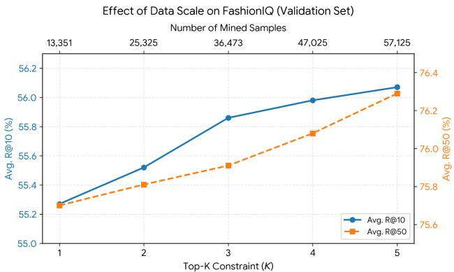  
Figure 5. Effect of data scale on the FashionIQ validation set. The visualization employs dual $\mathbf { X }$ -axes to map the mining hyperparameter $K$ (bottom) to the corresponding number of mined samples (top). The dual y-axes (left for $\mathrm { R @ 1 0 }$ , right for ${ \textrm R @ 5 0 }$ with zoomed-in scales highlight the monotonic performance gains as the data scale increases.

Second, regarding the margin $m$ , the model consistently favors a tighter constraint $( m = 0 . 0 5 )$ .This preference suggests that the informative instances mined by our framework share high visual affinity with the ground truth targets. Consequently, a tighter margin compels the model to resolve these fine-grained ambiguities without disrupting the broader semantic structure of the embedding space. Based on these empirical findings, we adopt $\lambda = 0 . 3$ and $m = 0 . 0 5$ as the default configuration for FashionIQ, which yields the best Avg. $\textrm { R @ 1 0 }$ of $5 7 . 0 4 \%$ .

# 6.3. Computational Cost and Efficiency Analysis

To ensure reproducibility and transparency regarding resource utilization, we detail the computational costs and data statistics of the ReCALL framework. All experiments were conducted on 8 NVIDIA H20 GPUs. Tab. 5 summarizes the training duration, generation latency, and filtering statistics for both the CIRR and FashionIQ datasets.

Analysis. We analyze the computational overhead across the three primary phases of our pipeline:

Comparable Training Latency (Stage 1 vs. Stage 4). The training duration for Targeted Refinement (Stage 4) is virtually identical to that of the Baseline Adaptation (Stage 1). For instance, on CIRR, Stage 4 requires approximately 3.6 hours, matching the 3.6 hours of Stage 1. This equivalence demonstrates that our Grouped Contrastive Refinement strategy (Sec. 3.5) effectively recalibrates the model without introducing significant computational overhead to the online training loop.

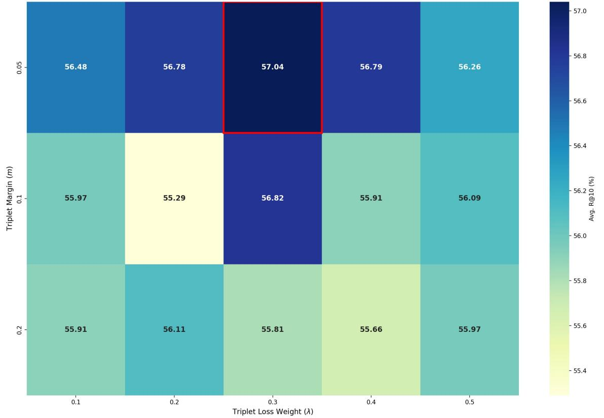  
Figure 6. Hyperparameter sensitivity analysis on the FashionIQ validation set. We report Avg. $R @ 1 0 ~ ( \% )$ under varying triplet loss weights $( \lambda )$ and margins $( m )$ . The red box highlights the optimal configuration adopted in our final model.

# 6.4. Generalization and Transferability Across Backbones

One-off Offline Synthesis (Stages 2 & 3). The combined process of mining informative instances and synthesizing corrective instructions constitutes the primary computational cost. Specifically, CoT-assisted generation accounts for approximately 14.2 hours on CIRR and 10.9 hours on FashionIQ. Crucially, however, this represents a one-time, ofline investment. Once synthesized, these highquality triplets serve as a permanent asset that can be reused indefinitely for subsequent training runs or hyperparameter tuning, rendering the amortized cost negligible.

Efficient Quality Assurance. The VQA-Assisted Quality Control mechanism demonstrates high efficiency. It effectively purges noisy data—removing 5,455 instances $( 8 . 5 \% )$ for CIRR and 5,947 instances $( 1 0 . 4 \% )$ for FashionIQ—while consuming only ${ \sim } 1$ hour of processing time. This ensures that the final refinement is driven by highfidelity supervision with minimal time penalty.

To evaluate the generalizability and transferability of the ReCALL framework, we extend our experiments to a different model family, LLaVA-NeXT. Furthermore, we investigate whether the informative instances and corrective instructions synthesized by one model can benefit another.

As shown in Tab. 6, cross-model transfer (training LLaVA-NeXT using triplets synthesized by Qwen2.5-VL) yields a $+ 1 . 1 5 \%$ gain $( 5 1 . 9 3 \% \to 5 3 . 0 8 \% )$ on CIRR. This confirms that different MLLMs share certain common cognitive blind spots, allowing synthesized corrective data to be highly transferable. However, the full ReCALL pipeline—where LLaVA-NeXT diagnoses and refines its own specific failure cases—achieves a more significant gain of $+ 2 . 7 2 \%$ $( 5 4 . 6 5 \%$ on $\mathbf { R } @ 1 $ ). This indicates that while cross-model transfer is effective, the self-diagnosis phase remains essential to optimally address model-specific cognitive gaps.

# 6.5. Comparison with Alternative Mining Strategies

We further compare our Self-Guided Informative Instance Mining against a standard Hard Negative Mining baseline.

TaacRAL a are one-time and offline.   

<table><tr><td rowspan="2">Dataset</td><td>Stage 1</td><td colspan="3">Stages 2 &amp; 3: Diagnose &amp; Generate (Offline)</td><td>Stage 4</td></tr><tr><td>Adaptation Time</td><td>Generation Time</td><td>Samples (Generated → Kept)</td><td>Filtering Time</td><td>Refinement Time</td></tr><tr><td>CIRR</td><td>3h 34m</td><td>~14.2h</td><td>64,105 → 58,650</td><td>1h 13m</td><td>3h 35m</td></tr><tr><td>FashionIQ</td><td>2h 43m</td><td>∼10.9h</td><td>57,125 → 51,155</td><td>1h 04m</td><td>2h 45m</td></tr></table>

Table 6. Generalization & Transferability Analysis on the CIRR test set.   

<table><tr><td>Method Setting</td><td>R@1</td><td>R@5</td><td>R@10</td><td>R@50</td></tr><tr><td>LLaVA Baseline (Rbase)</td><td>51.93</td><td>81.87</td><td>88.95</td><td>97.58</td></tr><tr><td>+ ReCALL (Transfer: Qwen Data)</td><td>53.08</td><td>83.40</td><td>91.21</td><td>98.46</td></tr><tr><td>+ ReCALL (Full Pipeline)</td><td>54.65</td><td>84.02</td><td>91.33</td><td>98.41</td></tr></table>

For the Hard Negative baseline, we re-finetune $\mathcal { R } _ { b a s e }$ directly using the mined informative instances as hard negatives without any textual refinement.

As reported in Tab. 7, the Hard Negative strategy achieves an $\mathbb { R } \ @ 1$ of $5 2 . 5 7 \%$ , comparable to a Random Mining strategy $( 5 2 . 0 7 \% )$ , and shows a notable decline in broader metrics $( \mathrm { R } @ 5 / 1 0 / 5 0 )$ compared to the baseline. This implies that blindly enforcing repulsion on visually ambiguous negatives—without explicitly defining why they differ—introduces contradictory gradients that distort the learned manifold. In contrast, ReCALL resolves this via semantic correction: we generate $\tilde { T } _ { m }$ to explicitly describe the hard negative, converting it into a constructive positive pair $( \boldsymbol { I _ { r } } , \boldsymbol { \tilde { T } _ { m } } , \boldsymbol { I _ { h } } )$ . This precise semantic direction explains the superior capability calibration $( + 4 . 2 9 \%$ on $\mathbf { R } @ 1$ achieved by the full ReCALL pipeline.

Table 7. Comparison of Mining Strategies on CIRR.   

<table><tr><td>Method Setting</td><td>R@1</td><td>R@5</td><td>R@10</td><td>R@50</td></tr><tr><td>Baseline (Rbase)</td><td>51.23</td><td>82.15</td><td>90.20</td><td>98.20</td></tr><tr><td>+ Random Mining</td><td>52.07</td><td>81.64</td><td>90.02</td><td>97.84</td></tr><tr><td>+ Hard Neg. Mining (No Edit)</td><td>52.57</td><td>81.56</td><td>89.33</td><td>97.70</td></tr><tr><td>+ ReCALL (Full Pipeline)</td><td>55.52</td><td>84.07</td><td>91.83</td><td>98.55</td></tr></table>

# 6.6. Ablation on Model Capacity and Adaptation

To investigate whether capability degradation stems from limited parameter capacity during adaptation, we conducted ablations by scaling the LoRA rank $( r = 3 2 , 6 4 )$ and performing Full Fine-tuning.

As shown in Tab. 8, increasing the number of trainable parameters paradoxically worsens retrieval performance. This confirms that capability degradation is not a consequence of limited parameter capacity. Instead, it originates from the intrinsic paradigm conflict between the MLLM's generative pre-training and the discriminative retrieval adaptation. Under a fixed training dataset, expanding trainable parameters accelerates overfitting to the coarsegrained retrieval task, thereby exacerbating the suppression of native fine-grained reasoning priors.

Table 8. Ablation on LoRA Rank & Full Fine-tuning on CIRR.   

<table><tr><td>Setting</td><td>R@1</td><td>R@5</td><td>R@10</td><td>R@50</td></tr><tr><td>LoRA r = 16 (Ours Baseline)</td><td>51.23</td><td>82.15</td><td>90.20</td><td>98.20</td></tr><tr><td>LoRA r = 32</td><td>51.04</td><td>81.69</td><td>89.54</td><td>98.22</td></tr><tr><td>LoRA r = 64</td><td>49.74</td><td>80.58</td><td>89.35</td><td>98.05</td></tr><tr><td>Full Fine-tuning</td><td>48.70</td><td>80.55</td><td>89.64</td><td>97.98</td></tr></table>

# 6.7. Further Methodological Discussions

Distribution Integrity and Label Space. It is crucial to emphasize that ReCALL operates strictly as an informative instance augmentation strategy rather than altering or re-labeling the original ground-truth targets. The original triplets $\left( I _ { r } , T _ { m } , I _ { t } \right)$ are strictly retained to anchor the model to the source distribution. Furthermore, our Minimal Edit Principle (Sec. 3.4) guarantees that the synthesized text $\tilde { T } _ { m }$ matches the original style and length. This design ensures that ReCALL provides additive regularization to sharpen decision boundaries without shifting the training label space.

Reliability of VQA-Assisted Filtering. To quantitatively ensure the reliability of the generated corrective supervision, we conducted a rigorous human evaluation of the VQA-Assisted Quality Control mechanism (Sec. 3.4). We employed three human evaluators to verify 300 randomly sampled triplets that passed the VQA filter (confidence threshold $\geq 0 . 9 5$ ). The evaluation yielded a high average accuracy of $92 \%$ , confirming that the VQA-based check serves as a highly reliable proxy for filtering valid textual modifications.

# Prompt for Composed Query on CIRR

[System Instruction] You are a multimodal retrieval encoder. Your sole function is to map any input into a compact embedding for nearest-neighbor retrieval.

[User Input] <Reference Image> Modify this image with {Modification Text} Represent the modified image in one word:

(a) Prompt for Composed Query on CIRR

# Prompt for Composed Query on Fashion-IQ

[System Instruction] You are a multimodal retrieval encoder. Your sole function is to map any input into a compact embedding for nearest-neighbor retrieval.

# Prompt for Candidate Image on CIRR

[System Instruction] You are a multimodal retrieval encoder. Your sole function is to map any input into a compact embedding for nearest-neighbor retrieval.

[User Input] <Target Image> Represent the given image in one word:

[User Input] <Reference Image> Change the style of this {Category} to {Modification Text}\n Represent this modified {Category} in one word:

(c) Prompt for Composed Query on FashionIQ (b) Prompt for Candidate Image on CIRR

# Prompt for Candidate Image on FashionIQ

[System Instruction] You are a multimodal retrieval encoder. Your sole function is to map any input into a compact embedding for nearest-neighbor retrieval.

[User Input] <Target Image> Represent the given image in one word:

(d) Prompt for Candidate Image on FashionIQ

# 7. Prompt Details

# 7.1. Retrieval Prompts for Query and Candidate Encoding

To counteract the Capability Degradation identified in Sec. 1, we engineer specialized prompt templates that explicitly condition the MLLM to operate as a discriminative retrieval encoder ( $\mathcal { R } _ { b a s e }$ and $\mathcal { R } _ { r e f i n e } ,$ , effectively suppressing its default conversational tendencies.

Fig. 7 illustrates the prompt architectures employed for encoding inputs on both the CIRR and FashionIQ datasets. Our design adheres to two governing principles:

Role Enforcement via System Instruction. A mandatory system instruction is embedded in every prompt instance. This directive explicitly constrains the model's output space, enforcing a retrieval-oriented role and inhibiting open-ended generative behaviors.

Dataset-Specific Attention Guidance. The user input instruction is tailored to steer the model's attention mechanism towards feature fusion strategies appropriate for each dataset. We highlight a critical distinction in the Composed Query prompt: whereas the CIRR template employs a generalized modification instruction suitable for open-domain objects, the FashionIQ template integrates category-aware phrasing (e.g., "Change the style of this $\{ C a t e g o r y \} . . . ^ { , } )$ to enhance domain specificity and attribute sensitivity.

# 7.2. Prompts for VQA-Assisted Quality Control

The generative calibration process described in Sec. 3.4 entails an inherent risk of synthesizing hallucinated or visually ungrounded corrective triplets. To attenuate this noise, we implement a VQA-Assisted Quality Control mechanism, repurposing the Foundation Model $( \mathcal { F } )$ to function as a rigorous visual verifier. This step necessitates a specialized VQA prompt designed to validate the semantic alignment between the synthesized modified instruction $( \tilde { T } _ { m } )$ and the actual informative instance $( I _ { h } )$ .

Fig. 8 illustrates the prompt structure engineered for this verification task. Our design relies on two key mechanisms: Strict Binary Constraint. The prompt explicitly constrains the model's output space, mandating a single, lowercase token response (yes or no). This binary restriction inhibits the model's open-ended generative tendencies.

Discriminative Reasoning Activation. By disabling the generative mode, the constraint compels the model to perform critical discriminative reasoning to verify semantic

# Prompt for VQA-Assisted Quality Control

[User Input] You are a strict visual verifier. Output exactly one token: yes or no (lowercase).Do not add punctuation or explanations.   
Reference image: <Reference Image> Candidate image: <Candidate Image>   
Instruction:[Modification Text}   
Decide if the candidate image matches the result of applying the instruction to the reference image.   
Return yes if all required elements implied by the instruction are satisfied (like counts, categories, attributes, spatial relations). If any required element is missing or contradicted, answer no.   
Answer:

consistency. This serves as a robust filter, ensuring that only high-fidelity informative instances are admitted into the final refinement stage.

# 7.3. Prompts for CoT-Assisted Instruction Synthesis

We provide the complete Chain-of-Thought (CoT) prompts utilized in Stage 3: Generative Calibration (see Sec. 3.4) to synthesize high-fidelity corrective supervision. Fig. 15 visualizes the prompt architectures for both datasets.

Structured Reasoning Constraints. Unlike standard open-ended captioning, our templates impose rigorous constraints through explicit Key Principles and a mandatory JSON Output Schema. This structured design compels the Foundation Model to engage in a sequential reasoning process: it must first perform Intent Decomposition & Verification before executing Minimal Edit Synthesis. This mechanism ensures that the generated instruction is not merely a hallucinated caption, but a precise modification strictly grounded in the observed visual discrepancies.

Domain-Specific Adaptation. To accommodate the distinct characteristics of the benchmarks, the prompts are domain-adapted. The CIRR prompt is engineered to reason about complex object relations, cardinalities, and spatial states, whereas the FashionIQ prompt is optimized for finegrained attribute manipulation, focusing on nuanced details such as texture, silhouette, and pattern.

# 8. Additional Qualitative Analysis and Visualization

# 8.1. Additional Baseline Comparisons

In this section, we present an expanded qualitative comparison between the baseline retriever $( \mathcal { R } _ { b a s e } )$ and our refined model $( \mathcal { R } _ { r e f i n e } )$ to further illustrate the impact of capability recalibration. Figs. 9 and 10 showcase top-ranked retrieval results on the CIRR and FashionIQ datasets, respectively. In each panel, the left column displays the multimodal query, highlighting the critical modification instructions, while the right columns compare the top retrieved candidates from both models. The ground-truth targets are highlighted with green bounding boxes.

The results on CIRR (Fig. 9) clearly expose the coarsegrained tendency of the baseline model. While $\mathcal { R } _ { b a s e }$ correctly identifies the main object category (e.g., food, llamas, or safety pins), it frequently collapses on finegrained spatial or state-based constraints. A striking example is Case 3, where the instruction demands a specific arrangement of safety pins ("opened and closed... side by side"). The baseline merely retrieves isolated pins or incorrect states, whereas ReCALL accurately reasons about the requested object configuration. Similarly, in Case 2, ReCALL respects the contextual constraint ("mountainous area"), whereas the baseline retrieves semantically relevant but visually inconsistent backgrounds. This validates that our framework effectively internalizes the complex logic required for open-domain compositional reasoning.

Parallel observations on FashionIQ (Fig. 10) demonstrate ReCALL's superiority in fine-grained attribute manipulation. The baseline often succumbs to visual biases, retrieving images that match the reference image's dominant features (such as color or shape) but ignoring the text modifier. For instance, in Case 1, although the instruction explicitly specifies "striped", the baseline is dominated by the solid green color of the reference. ReCALL, having been trained on generated hard negatives, successfully suppresses this bias to retrieve the correct textured garment. Furthermore, Case 3 highlights the model's ability to handle rigorous category shifts ("is a scarf and not a long dress"), where the baseline fails to disengage from the visual semantics of the reference dress. These comparisons confirm that ReCALL successfully recalibrates capability degradation, restoring the model's native ability to adhere to precise textual instructions.

# 8.2. Visualization of Informative Instance Mining and Triplet Synthesis

In this section, we provide additional qualitative visualizations to further substantiate the efficacy of the ReCALL framework. Figs. 13 and 14 present a detailed breakdown of the data construction pipeline on the CIRR and FashionIQ datasets, respectively. Unlike the schematic overview in the main paper, these figures showcase specific real-world examples where the baseline model $( \mathcal { R } _ { b a s e } )$ initially fails, tracing the complete trajectory from failure diagnosis to the synthesis of corrective training signals.

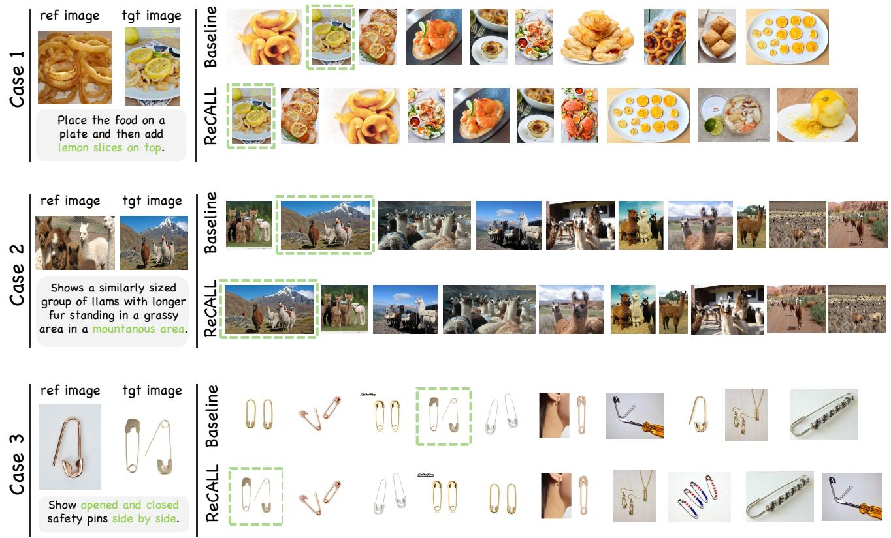  
Figure 9. Qualitative comparison on the CIRR dataset. We compare the top retrieved images from the baseline $( \mathcal { R } _ { b a s e } )$ and ReCALL $( \mathcal { R } _ { r e f i n e } )$ successfully retrieves the correct targets by reasoning about the fine-grained details in the modiication text.

The visualizations are organized to reflect the Diagnose-Generate-Refine workflow. As shown in the Original Triplet panel, the highlighted text (marked in red) indicates specific fine-grained constraints that the baseline retriever ignored, leading to the retrieval of the false positives shown in the Informative Instances panel. Crucially, these mined instances reveal distinct failure modes: while some queries are confused by a single distinct distractor (e.g., Case 1 in Fig. 13), others suffer from multiple high-confidence hard negatives (e.g., Case 2 in Fig. 13), necessitating the generation of multiple targeted corrective triplets.

By employing CoT-assisted generation, ReCALL explicitly verbalizes these visual discrepancies. The Synthesized Corrective Triplet panel demonstrates the precision of this process, where the generated instructions (with modifications highlighted in green) strictly adhere to the visual evidence of the mined instances. For example, in the CIRR dataset (Fig. 13), the model successfully disambiguates complex spatial relations ("stands" vs. "sits" vs. "lies") and fine-grained object categories ("ball" vs. "stuffed toy"). Similarly, in the FashionIQ dataset (Fig. 14), the synthesized triplets capture subtle attribute nuances, such as distinguishing "white polka dots" from a "white floral print" despite similar dress silhouettes. These qualitative results confirm that the synthesized supervision is both semantically dense and visually grounded, effectively guiding the model to recalibrate its decision boundaries.

# 8.3. Failure Case Analysis

To provide a comprehensive understanding of limitations, we visualize representative failure cases of ReCALL on FashionIQ and CIRR in Figs. 11 and 12. An analysis of these instances reveals that the "failures" often stem from the inherent ambiguity of natural language instructions and the incompleteness of ground-truth annotations, rather than a fundamental breakdown of the model's reasoning.

False Negatives and Annotation Issues. A significant portion of retrieval errors, particularly on FashionIQ (Fig. 11), can be attributed to the False Negative problem. In CIR tasks, datasets typically annotate a single groundtruth target per query. However, in large-scale galleries, multiple images may validly satisfy the modification instruction. For instance, in Case 2 of Fig. 11, the instruction requests a dress with "no sleeves" that is "white and short". ReCALL retrieves several valid candidates (Rank 1-4) that perfectly match this description. Yet, because they differ from the specific ground-truth instance (which is not in the top-10), they are penalized as errors. Similarly, in Case 3, the model retrieves multiple "red shirts with printed words", all semantically correct despite not being the annotated target. This suggests that the reported performance metrics may underestimate the model's actual retrieval utility.

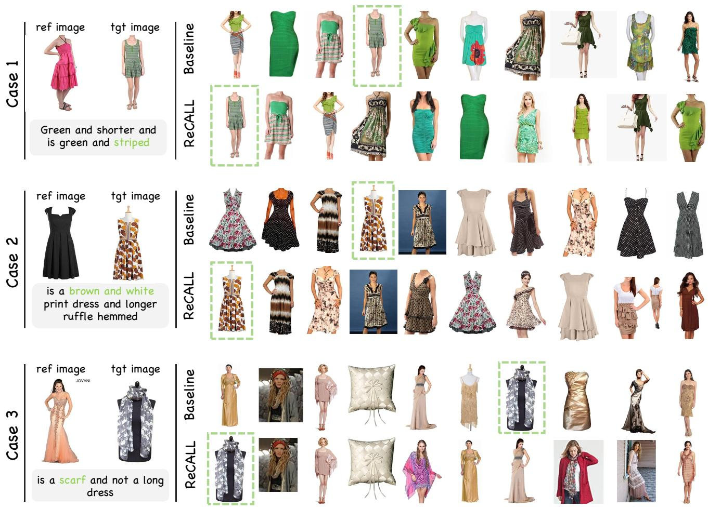  
AL. catory hi from  dress t  sarwhereas he baseline emaisfixate nhe referen mages atoy.

Ambiguity in Instructions. Certain directives such as different pattern" (Case 1 in Fig. 11) or "fewer animals" (Case 1 in Fig. 12) are inherently subjective. In the latter case, ReCALL retrieves images with small groups of birds, which is a valid interpretation of "fewer" compared to a large flock, even if it doesn't match the exact count of the ground truth. The model struggles to align its threshold for these relative terms with the annotator's intent.

Fine-grained Spatial Reasoning. While ReCALL significantly improves spatial understanding, it still faces challenges with complex geometric transformations. As shown in Case 3 of Fig. 12, the instruction requires rotating a stingray so its head faces "upward". While the model retrieves stingrays with varying orientations, it fails to consistently isolate the specific "upward" pose. This limitation likely stems from the Foundation Model, which, despite its strength, may still have residual weaknesses in zero-shot spatial rotation reasoning that are inherited by the retriever.

In summary, while ReCALL effectively recalibrates compositional reasoning, future work could focus on mitigating label noise through one-to-many evaluation protocols and further enhancing the spatial geometric understanding of the backbone itself.

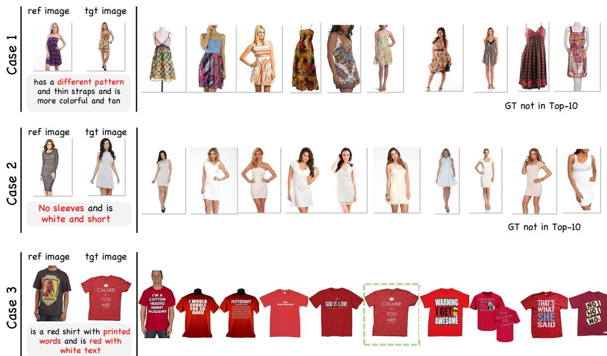  
indicates the key modification constraints.

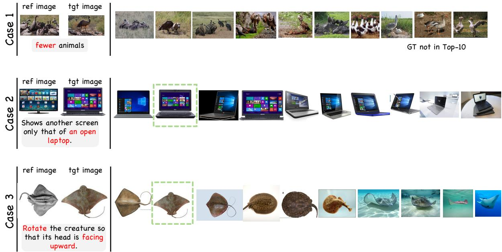  
appears in the top candidates; otherwise, the text "GT not in Top- $. 1 0 ^ { \circ }$ is displayed.

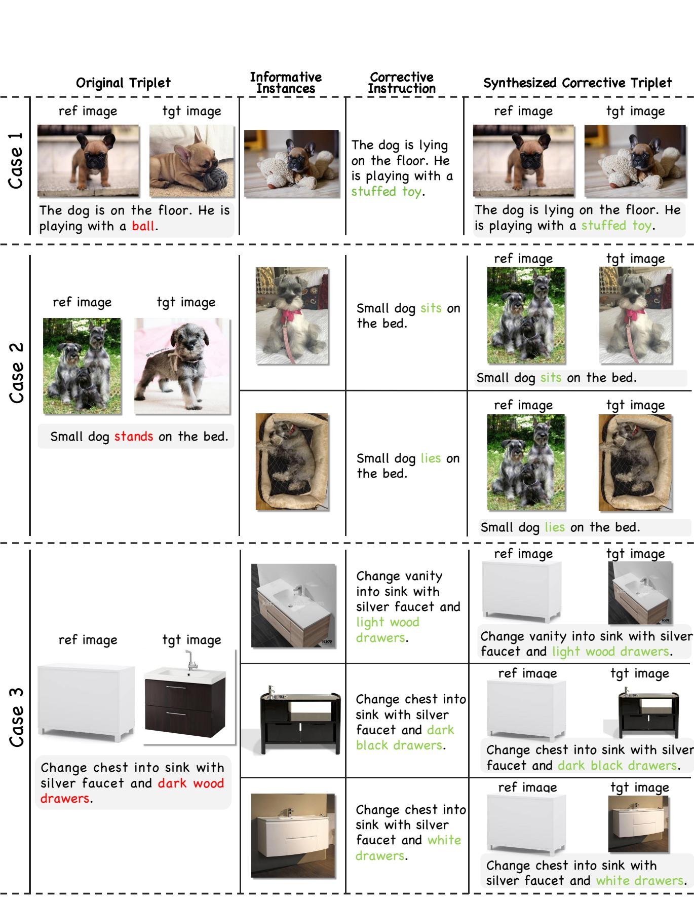  
constraints violated by hard negatives; (2) the mined Informative Instances $( I _ { h } )$ , representing the model's cognitive blind spots; (3) the C edits required to align the instruction with the mined instance.

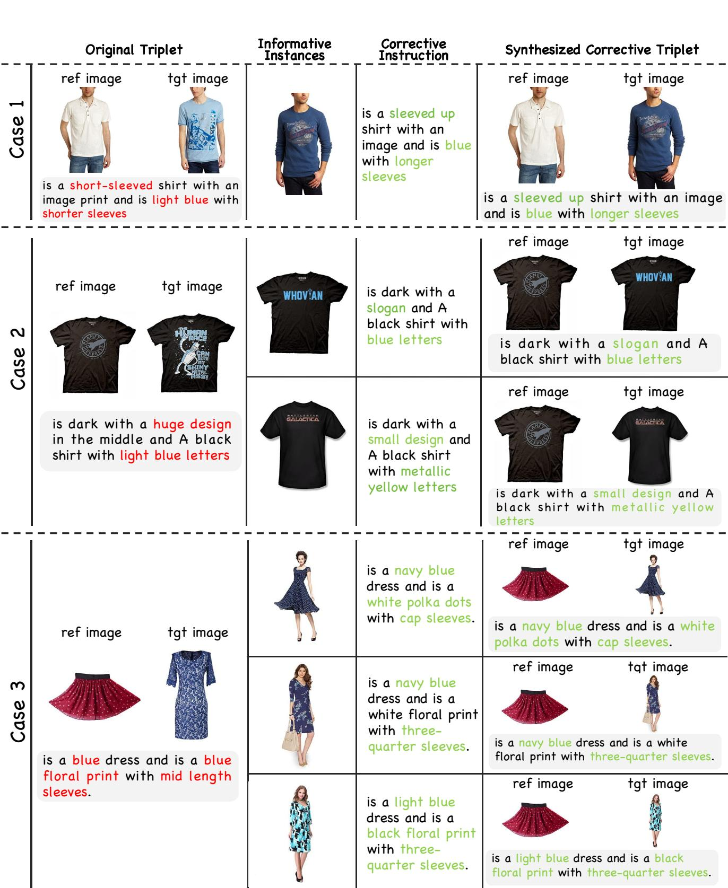  
highlights constraints violated by hard negatives; (2) the mined Informative Instances $( I _ { h } )$ , representing the model's cognitive blind spots; semantic edits required to align the instruction with the mined instance.

[System Instruction] You are a multimodal edit refiner. You receive TWO   
images (Picture $1 =$ REFERENCE, Picture $2 =$ TARGET) and ONE original edit   
text.   
Goal: produce a minimally edited rewrite that stays stylistically close to the   
original text while reflecting the TARGET image facts.   
Key principles:   
- Look directly at Picture 1 and Picture 2 to gather evidence.   
Preserve all parts of theoriginal text that remain correct; only replace   
spans that contradict the TARGET image.   
- Rewritten spans must remain short and natural, matching the tone and   
grammar of the original sentence.   
- When replacing an object (animal, item, etc.), include a visible   
distinguishing detail such as color, pattern, or breed if it is clear in the   
TARGET image.   
- When uncertainty exists, explicitly state "uncertain" in the relevant   
rewritten span.   
- Output strict JSON exactly matching the required schema; do not emit   
explanations outside the JSON.   
User Input]   
{   
"input": { reference_image<Reference Image>, "target_image": <Target Image>, original_edit_text:<Modification Text "tasks": [ "Describe concise visual facts for each picture", "List spans from the original edit text that must change", "Produce minimal replacements based on TARGET evidence", Retune al n x  eplacho an y ],   
"output_schema": { "visual_summary": { "reference": "short description focusing on key objects/attributes in   
Picture 1", "target": "short description focusing on key objects/attributes in Picture   
2", dif ul-}, "rewrite_segments": [ { "original_span": "exact substring copied from original_edit_text", "new_span": "replacement phrase grounded in TARGET", reason" "one-line justification referencing visible evidence" } ], "final_text": "string" }, "constraints": [ vll, "Do not invent spans that are not in the original text",   
final_text equal to original_edit_text",

"When changes are required, final_text must equal original_edit_text with each original_span replaced by new_span in order",

"If the text contains insteadof, 'replace with  r swap .o treat the whole contrast clause as a single span and rewrite it so the comparison is correct for the TARGET image (or remove it if no contrast remains)",

"Do not leave contradictory contrast phrases (e.g., instead of .) when the rewritten subject and contrast refer to the same object",

"If the contrast is no longer needed after rewriting, remove the entire 'instead of/replace/swap' clause",

[System Instruction] You are a multimodal fashion edit refiner. You receive TWO clothing images (Picture $\boldsymbol { \mathrm { 1 = } }$ REFERENCE garment, Picture $2 =$ TARGET garment) and ONE original edit text.

Goal: produce a minimally edited rewrite that stays stylistically close to the original text while reflecting the TARGET garment facts.

Key principles:

- Look directly at Picture 1 and Picture 2 to gather evidence.

F ictlsl  uteo ehi e outerwear, etc.), color/shade, pattern/print (solid, striped, plaid, floral, polka dots, graphic), silhouette/fit (slim, regular, oversized, bodycon, A-line),

length (sleeve length and hemline), neckline/collar (crew, v-neck, turtleneck polo, collared, collarless), materials/fabric (denim, knit, cotton, silk, chiffon, /eu pcfple bow, trim), layering if clearly visible.

- Ignore background, human identity, face, pose, lighting, and camera angle unles they directl ange howhe garment apers (.sleevvily or fit.

- Do not mention brand names or logos unless they are clearly visible and legible; otherwise mark as "uncertain".

- Preserve all parts of the original text that remain correct; only replace spans that contradict the TARGET garment.

- Rewritten spans must remain short and natural, matching the tone and grammar of the original sentence.

"Describe concise visual facts for each garment (category, color, pattern, silhouette/fit, length, neckline/collar, materials, and key details)",

"List spans from the original edit text that must change to match the TARGET garment",

"Produce minimal replacements grounded in TARGET garment evidence using concise fashion terminology",

"reference": "short garment description for Picture 1 (attributes listed above as applicable)",

"target": "short garment description for Picture 2 (attributes listed above as applicable)",

"If no change needed, return an empty list for rewrite_segments and set final_text equal to original_edit_text",

"When changes are required, final_text must equal original_edit_text with each original_span replaced by new_span in order",

"Keep wording style consistent with the original text", "Return valid JSON only"