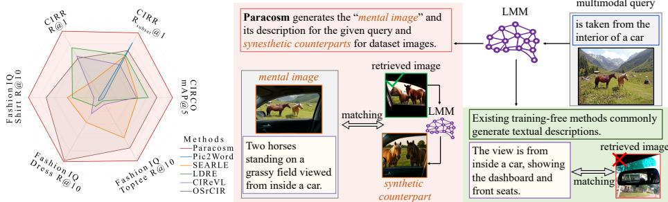
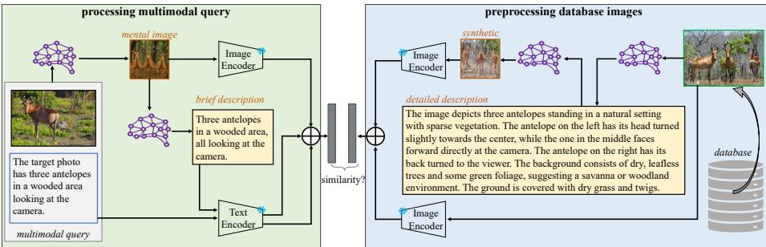
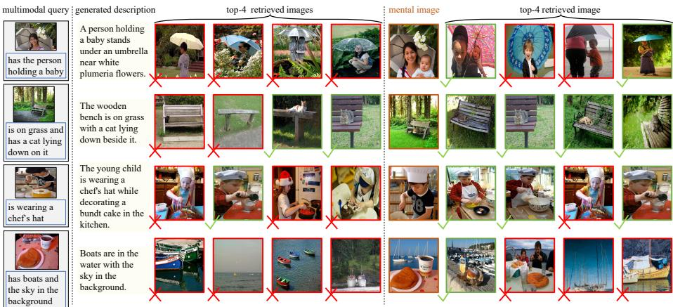
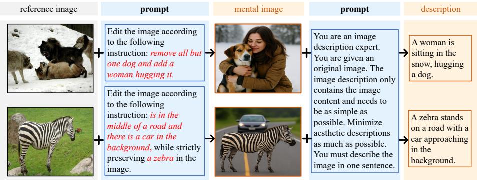
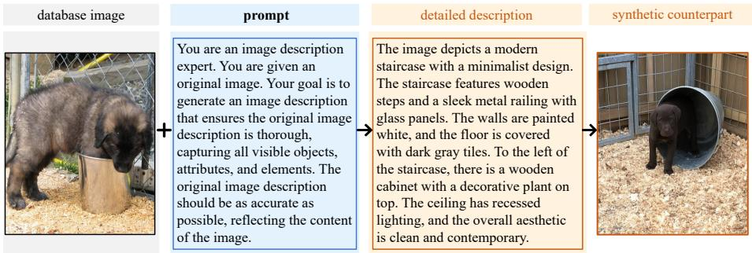
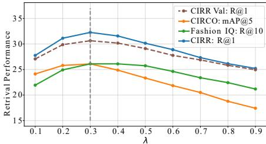
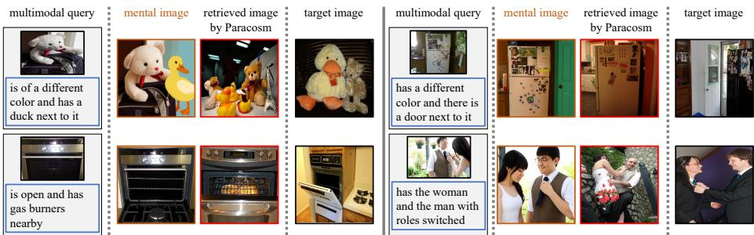
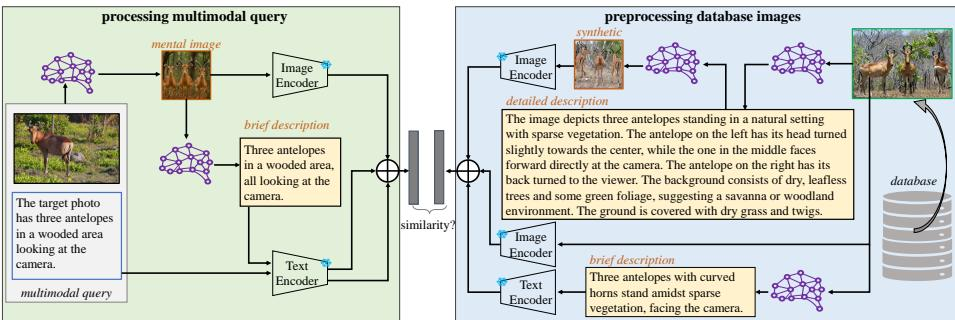
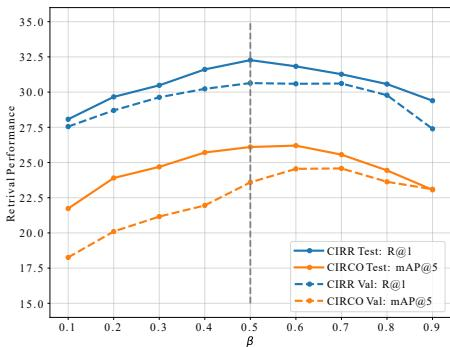
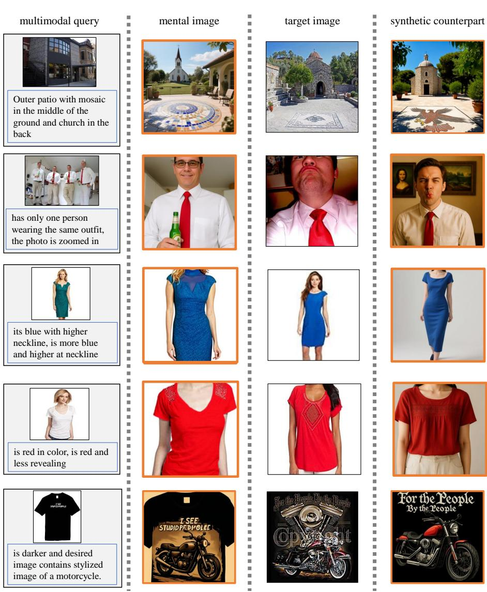

# Generating a Paracosm for Training-Free Zero-Shot Composed Image Retrieval

Tong Wang $^ { 1 }$ , Yunhan Zhao2, and Shu Kong $^ { 1 , 3 }$ 1 University of Macau, 2 UC Irvine, 3 Institute of Collaborative Innovation, University of Macau website and code: https://github.com/leowangtong/Paracosm/

Abstract. Composed Image Retrieval (CIR) is the task of retrieving a target image from a database using a multimodal query, which consists of a reference image and a modification text. The text specifies how to alter the reference image to form a "mental image", based on which CIR should find the target image in the database. The fundamental challenge of CIR is that this "mental image" is not physically available and is only implicitly defined by the query. The contemporary literature pursues zero-shot methods and uses a Large Multimodal Model (LMM) to generate a textual description for a given multimodal query, and then employs a Vision-Language Model (VLM) for textual-visual matching to search for the target image. In contrast, we address CIR from first principles by directly generating the "mental image" for more accurate matching. Particularly, we prompt an LMM to generate a "mental image" for a given multimodal query and propose to use this "mental image" to search for the target image. As the "mental image" has a synthetic-to-real domain gap with real images, we also generate a synthetic counterpart for each real image in the database to facilitate matching. In this sense, our method uses LMM to construct a "paracosm", where it matches the multimodal query and database images. Hence, we call this method Paracosm. Notably, Paracosm is a training-free zero-shot CIR method. It significantly outperforms existing zero-shot methods on challenging benchmarks, achieving state-of-the-art performance for zero-shot CIR. Keywords: Training-Free Zero-Shot Composed Image Retrieval · Foundation Models · Synthetic-to-Real Domain Gap

# 1 Introduction

Composed Image Retrieval (CIR) formulates new scenarios in internet search [10, 22] and e-commerce [42,59], where it retrieves a target image from a database based on a user-provided multimodal query, which consists of a reference image and modification text [56]. The modification text describes how to alter the reference image for which CIR algorithms should find the best-matching image from the database [1, 32, 59].

  
Fig. 1: Overview of our method and benchmarking results. Unlike existing training-free methods [21, 49, 62] generating descriptions for multimodal queries, which use an LMM to generate descriptions for multimodal queries, we use it to generate "mental images" for multimodal queries and synthetic counterparts of database images. Matching them effectively mitigates synthetic-to-real domain gaps and boosts CIR performance. Our final training-free zero-shot method Paracosm (Fig. 2) significantly outperforms existing zero-shot CIR methods, as summarized in the radar chart on standard benchmarks. Detailed results are provided in Section E.

Status Quo. CIR was addressed through supervised learning $[ 5 , 9 , 1 3 , 2 4 , 3 3 ]$ over annotated triplets <reference image, modification text, target image $>$ . As curating large-scale triplet data is prohibitively expensive, recent works have developed zero-shot CIR (ZS-CIR) approaches [4, 39, 49, 62]. Notably, ZS-CIR does not necessarily mean non-learning but emphasizes not directly training CIR models on data triplets. Rather, they still train models in an indirect way [16, 47, 48, 57, 64]. For example, many methods [4, 39] train textual inversion networks on image-text pairs to map images to text tokens for cross-modality matching; some [29, 57] synthesize a pseudo image for the multimodal query using pretrained image generative models [37, 40,68] to assist with cross-modality matching. To contrast training-based ZS-CIR approaches, training-free methods [21, 49, 62] propose to exploit Large Multimodal Models (LMMs) [8, 35, 55] to generate a description for the multimodal query and use it for text-to-image (T2I) matching for CIR.

Insights. The fundamental challenge of CIR is that the multimodal query only implicitly defines a "mental image" that does not physically exist to be used for retrieving the corresponding target image. We aspire to address this challenge from first principles by generating a "mental image" for a given query to enable more accurate retrieval (Fig. 1). While existing works have exploited LMMs to generate textual descriptions, we leverage LMMs for image generation based on multimodal queries [58]. Yet, as the generated "mental image" has synthetic-to-real domain gaps compared to the real images in the dataset, we propose generating a synthetic counterpart for each dataset image, which is used to facilitate matching. As our method essentially uses LMMs to define a synthetic or virtual space, like a "paracosm", we name our method Paracosm. Notably, Paracosm is a training-free zero-shot CIR method. To validate Paracosm, we follow the established experimental protocols that use pretrained Vision-Language Models (VLMs) [19, 36] for matching. Extensive experiments on challenging benchmarks demonstrate that Paracosm significantly outperforms existing ZS-CIR methods (ref. a summary in Fig. 1).

  
Fig. 2: Flowchart of our training-free zero-shot CIR method Paracosm. Given a multimodal query that consists of a reference image and a modification text, we feed it to an LMM to generate a "mental image". We further generate a brief description for it. Both the "mental image" and description, as well as the modification text, are used as feature representations for the query. As the "mental image" is synthetic, we mitigate synthetic-to-real domain gaps by generating synthetic counterparts of database images. To do so, we use the LMM to generate detailed descriptions, which are used as prompts for image generation. For a database image, we use both itself (i.e., the real photo) and its synthetic counterpart as representation for retrieval. In sum, our method uses LMMs to create a virtual paracosm, where it matches the query and database images.

Contributions. We make three major contributions: We solve CIR from first principles with the training-free method Paracosm. It generates "mental images" for multimodal queries to facilitate matching with database images. - We mitigate the synthetic-to-real domain gaps of mental images by generating synthetic counterparts of database images. Matching them together boosts CIR performance. On standard benchmarks, we demonstrate that Paracosm significantly outperforms existing ZS-CIR approaches, achieving state-of-the-art performance.

# 2 Related Work

Composed Image Retrieval (CIR) extends traditional retrieval tasks, such as text-to-image retrieval and image-to-image retrieval, by allowing users to use multimodal queries in retrieval [56]. CIR was initially approached by supervised learning methods [5, 9, 13, 24, 33], i.e., training models over annotated data triplets <reference image, modification text, target image $>$ . These methods [5, 18, 53, 60, 65, 66] propose to train a Transformer or an MLP atop pretrained backbones over the annotated data triplets, intending to fuse the reference image and the modification text in a feature space and to allow matching with database images. Some methods [25, 33, 34] finetune a pretrained Vision-Language Model (VLM) [26, 36] for better matching between multimodal queries and database images. However, as supervised learning methods require costly curation of triplet data, recent methods explore zero-shot CIR (ZS-CIR) [4, 16, 21, 29, 39, 49, 57, 62]. We explore training-free ZS-CIR and introduce a rather simple method that rivals some recent supervised methods.

  
Fig. 3: Comparison of qualitative results between OSrCIR [49] and our Paracosm. We show four examples from the CIRCO dataset [1] in the first column, followed by generated descriptions and top-4 retrievals by OSrCIR, and the mental images and top-4 retrievals by Paracosm. For each multimodal query, OSrCIR uses an LMM to generate a description, uses it to match database images, and returns top-ranked ones. Instead, Paracosm uses an LMM to generate a "mental image" for each query, which contains much richer information than a description, allowing image-to-image matching for better retrieval. Consequently, Paracosm yields better retrievals than OSrCIR.

Zero-Shot Composed Image Retrieval (ZS-CIR) aims to solve CIR without directly training on annotated triplet data [39]. It does not mean developing training-free methods but allows training in an indirect manner [4,16,39,47,48,64]. For example, many methods train a textual inversion network on existing image datasets [38,41], mapping the reference image to a pseudo-word token. This token, combined with the modification text, is then used in cross-modality matching with database images. A couple of recent methods [29, 57] use pretrained generative models [37, 40, 68] to synthesize a synthetic image (similar to our "mental image"), termed pseudo-target images, for a given multimodal query. They use these images to augment the textual feature (i.e., output by the textual inversion network) to compute similarity scores with database images. Importantly, training-free ZS-CIR methods [12, 21, 44, 49, 62] have emerged that leverage an LMM to generate a description for a given multimodal query. This avoids training a separate textual inversion network. Notably, existing ZS-CIR methods have not considered generating either descriptions or synthetic images for database images. In contrast, our work does so, motivated to address ZS-CIR from first principles. Specifically, we propose to generate the "mental image" for the query and synthetic counterparts of real database images, mitigating synthetic-to-real domain gaps for better performance.

Foundation Models (FMs), pretrained on various formats of web-scale data across multiple modalities, demonstrate unprecedented performance on downstream tasks in a zero-shot manner. Consequently, FMs are extensively utilized in the CIR literature [6, 7, 28, 31, 61]. First, Vision-Language Models (VLMs), pretrained on web-scale image-text pairs [19,36], are commonly employed in CIR to extract features from modification texts and images, enabling crossmodality matching [5, 21, 29, 45, 49]. Second, Large Language Models (LLMs), pretrained on massive text corpora [2, 8, 46, 54], are utilized in CIR to generate a target image description by incorporating the reference image caption and the modification text [29, 62]. Third, Large Multimodal Models (LMMs) [3, 35, 50, 58], which are pretrained on web-scale multimodal data and typically larger than VLMs in parameter size, are used in CIR to generate image captions [21, 29, 62] for multimodal queries. Earlier CIR works leverage LMMs to create triplet data for supervised training [31, 47, 64]. In contrast, most recent training-free ZS-CIR methods [21,49,62] employ LMMs to generate textual descriptions for multimodal queries and utilize a VLM to match these descriptions with database images, transforming the CIR task into a text-to-image retrieval problem. Building upon this foundation, we extensively exploit LMMs not only to generate "mental images" for multimodal queries but also to create synthetic counterparts of real database images. Matching them effectively mitigates synthetic-to-real domain gaps, thereby significantly enhancing CIR performance.

# 3 Methodology

We begin by defining the ZS-CIR problem and its development protocol. We then introduce our training-free method, Paracosm. Despite its conceptual simplicity, Paracosm achieves state-of-the-art performance among zero-shot methods. Fig. 2 illustrates the complete pipeline.

# 3.1 Preliminaries of Zero-Shot CIR

Task Definition. Let $\left( \mathbf { I } _ { r e f } , \mathbf { t } _ { m o d } \right)$ represent the reference image and modification text of a given multimodal query. $\mathbf { t } _ { m o d }$ describes how to alter $\mathbf { I } _ { r e f }$ to match what the user wants to search for, i.e., a target image $\mathbf { I } _ { t a r g e t }$ from a given database consisting of $n$ images $\{ \mathbf { I } ^ { 1 } , \mathbf { I } ^ { 2 } , . . . , \mathbf { I } ^ { n } \}$ . ZS-CIR aims to develop methods to retrieve target images for multimodal queries without directly training on annotated triplets $( \mathbf { I } _ { r e f } , \mathbf { t } _ { m o d } , \mathbf { I } _ { t a r g e t } )$ .

Methodology Development. While ZS-CIR eschews a training set of annotated triplet data, it still allows exploiting data available in the open world and pretrained FMs therein. Following this protocol, existing ZS-CIR methods leverage LMMs in different ways, e.g., using a VLM for cross-modality matching [4, 16, 39] and an LMM for generating descriptions [21, 49, 62]. By exploiting openworld data [38, 41], some methods train necessary models for fusing ${ \bf { I } } _ { r e f }$ and $\mathbf { t } _ { m o d }$ into features [4, 16, 39], or for generating pseudo images for the multimodal query [29, 57]. In this work, we aspire to develop a training-free method by extensively leveraging LMMs, without training any new models. Next, we present our method Paracosm in detail.

# 3.2 The Proposed Method: Paracosm

Paracosm is a rather simple method that processes multimodal queries and database images using LMMs. Below, we describe how it processes them and matches them for retrieval.

Processing Multimodal Query. For a multimodal query consisting of a reference image and modification text, Paracosm first generates the "mental image" ${ \mathbf { I } } _ { m e n t a l }$ using an LMM [58]. Based on this mental image $\mathbf { I } _ { m e n t a l }$ , we further generate a brief textual description $\mathbf { t } _ { q u e r y }$ , which can be thought of as the description of the target image $\mathbf { I } _ { t a r g e t }$ . For this step, we use a prompt that instructs the LMM [52] to focus solely on visual content while minimizing aesthetic details, producing single-sentence descriptions. Fig. 4 illustrates the prompt templates used for processing a multimodal query. Since different datasets provide modification texts in varying formats, we adapt the prompt template structure accordingly to ensure proper input formatting for the LMM. Given a multimodal query, Paracosm uses both the generated mental image and short description for retrieval. This is different from some recent methods [21, 49, 62], which exclusively use generated descriptions for retrieval. For example, some of such methods first generate a description for the reference image and then revise the description with the modification text using an LLM. Fig. 3 demonstrates that solely relying on generated descriptions misses crucial visual information, whereas our mental images retain rich information, facilitating CIR. Pre-Processing Database Images. As the generated mental images are synthetic and have synthetic-to-real domain gaps, directly matching them with real images from the database is suboptimal. To mitigate this gap, we create synthetic counterparts for database images and use such counterparts to assist matching [15,17,67]. Specifically, Paracosm first leverages an LMM [52] to generate a detailed description for each database image. We employ a description prompt that emphasizes capturing all visible objects, attributes, spatial relationships, and fine-grained visual elements to ensure maximum fidelity. Fig. 5 illustrates this prompt template. The detailed description then serves as a prompt for a text-$\mathbf { I } _ { s y n } ^ { i }$ for each database image ${ \bf \cal I } ^ { i }$ . Both real database images and synthetic counterparts are used jointly for matching multimodal queries. Matching for Retrieval. After transforming both multimodal queries and database images into the virtual paracosm, we construct features using a pretrained VLM, which consists of a visual encoder $V ( \cdot )$ and a text encoder $T ( \cdot )$ . Specifically, the query feature $\mathbf { q }$ and the $i ^ { t h }$ database image feature $\phi ^ { i }$ are computed as follows:

$$
\begin{array} { l } { \mathbf { q } = \lambda ( V ( \mathbf { I } _ { m e n t a l } ) + T ( \mathbf { t } _ { q u e r y } ) ) + ( 1 - \lambda ) T ( \mathbf { t } _ { m o d } ) } \\ { \phi ^ { i } = V ( \mathbf { I } ^ { i } ) + V ( \mathbf { I } _ { s y n } ^ { i } ) } \end{array}
$$

  
Fig. 4: Illustration of processing a multimodal query. Two random examples from CIRR and CIRCO datasets are displayed in the two rows, respectively. For a multimodal query consisting of a reference image and modification texts, we design a prompt incorporating the latter to edit the former, generating a mental image representing this query. As a modification text can contain a relative caption and a shared concept (ref. CIRCO in the second row), we design the prompt to incorporate both. Further, for the mental image, we prompt an LMM to generate a a concise, single-sentence description, exclusively focusing on its visual content while minimizing aesthetic details. We use both mental image and short description to retrieve the target image from the database.

where $\lambda$ is a hyperparameter controlling the contribution of incorporating the modification text $\mathbf { t } _ { m o d }$ . The weights of features are discussed in detail in Section 4.2 and Section C. Finally, Paracosm computes the cosine similarity score and returns the index of the potential target image:

$$
i ^ { * } = \underset { i = 1 } { \operatorname { a r g m a x } } \frac { \mathbf { q } ^ { T } \phi ^ { i } } { \| \mathbf { q } \| _ { 2 } \| \phi ^ { i } \| _ { 2 } }
$$

# 3.3 Remarks

Paracosm makes better use of LMMs. Existing ZS-CIR approaches [21, 49, 62] also leverage LMMs but focus on generating descriptions for multimodal queries and transforming the CIR problem into a text-to-image retrieval problem. However, text descriptions alone cannot sufficiently capture the rich visual information crucial to CIR and hence often lead to incorrectly retrieved images, as demonstrated in Fig. 3. A couple of recent works [29,57] realize the importance of incorporating pseudo-target images to facilitate CIR, e.g., by exploiting a pretrained text-to-image (T2I) generative model [68] to synthesize a pseudo-target image based on a description. Differently, we leverage an LMM that has image editing capability, i.e., editing the reference image based on the modification text into a "mental image". As shown in Table 2, editing reference images yields better CIR results than T2I generation of pseudo-target images. Moreover, Paracosm exploits an LMM to generate detailed descriptions for each database image and uses these descriptions as prompts to generate synthetic counterparts.

  
Fig. 5: Ilustration of processing database images. For a database image, we first prompt an LMM to generate a comprehensive description about its visual content, capturing all visible objects, attributes, and visual elements. Using this description, we prompt a text-to-image generation model to produce a synthetic counterpart for this database image. For a database image, we use both itself (i.e., the real photo) and its synthetic counterpart as representation for retrieval.

Is CIR still needed given the high-quality edited images? This question emerges in front of the high quality of the generated "mental images" based on multimodal queries (Fig. 3). We argue that CIR is still important in real-world visual search applications. For example, in e-commerce and the fashion industry, users might want to start from a photo of clothes and search for a different genre or style in an e-shop by specifying how to alter the photo. That said, no matter how photorealistic a mental image is, image generation cannot replace a real product in inventory.

Computation cost. As Paracosm extensively exploits LMMs, it has a high computation cost, especially for generating images, i.e., the mental images for the query and synthetic counterparts of database images. Yet, this is not a flaw pertaining only to Paracosm, as existing works also rely on generative models for retrieval. For example, prevailing ZS-CIR methods use LMMs to generate descriptions [21, 29, 49, 62], and some turn to generative models to synthesize images [29, 57]. Importantly, like these methods, Paracosm can process database images ahead of time and does not require computing features for them on the fly during inference. Thus, the major computational overhead is on the process of a given multimodal query during inference, including generating the corresponding mental images and their descriptions. As efficient inference in generative models is an important topic and has been greatly advanced through model optimization [20, 63] and optimized implementation [14, 23], Paracosm would not suffer from computation in the long run.

# 4 Experiments

We conduct extensive experiments to validate the proposed Paracosm, comparing it against existing methods and ablating its components. We start by introducing datasets, metrics, implementation details, and compared methods.

Table 1: Efficiency comparisons. Computational costs are measured on the CIRCO benchmark. We break down the costs into (1) offline one-time database processing (w.r.t. wall-clock time, and storage for synthetic images and features), and (2) online per-query inference (w.r.t. GPU memory consumption and latency). Notably, synthetic database images are generated only during pre-processing for feature extraction and do not need to be stored permanently; only compact features (0.38 GB) are retained. While Paracosm requires additional offline computation to mitigate synthetic-to-real domain gaps, it achieves state-of-the-art performance.

<table><tr><td>Method</td><td>hrs</td><td>time img stg. GB</td><td>feat. stg. GB</td><td>inference GB sec</td><td></td><td>CIRCO mAP@5</td><td>CIRR R@1</td><td>FashionIQ R@10</td></tr><tr><td>AutoCIR [12]</td><td>0.1</td><td>n/a</td><td>0.38</td><td>2.3 24</td><td></td><td>24.05</td><td>31.81</td><td>30.68</td></tr><tr><td>CoTMR [44]</td><td>0.1</td><td>n/a</td><td>0.38</td><td>70.2</td><td>1</td><td>27.61</td><td>35.02</td><td>35.05</td></tr><tr><td>OSSCR 49]</td><td>0.1</td><td>n/a</td><td>0.38</td><td>2.3</td><td>3</td><td>23.87</td><td>29.45</td><td>33.26</td></tr><tr><td>Paracosm</td><td>12.9</td><td>41.4</td><td>0.38</td><td>2.7</td><td>14</td><td>37.40</td><td>38.24</td><td>36.45</td></tr></table>

Table 2: Comparing methods for mental image generation. We adopt the CLIP ViT-B/32 VLM and report results on the CIRR test set. "T2I Generation" means that we first generate pseudotarget descriptions and then use them to generate mental images, as done in [29]. "Image Edit" is our final design choice, for generating mental images in Paracosm, which directly edits the reference image based on the corresponding modification text. Clearly, the latter performs better. Moreover, for "Image Edit", we compare using Qwen-Image-Edit vs. LongCat-Image-Edit as the image generator. Results show stable performance of our Paracosm.

<table><tr><td>Method</td><td>R@1</td><td>R@5</td><td>R@10</td><td>R@50</td></tr><tr><td>T2I Generation</td><td>31.71</td><td>61.37</td><td>73.59</td><td>91.54</td></tr><tr><td>Image Edit w/ Qwen</td><td>32.27</td><td>62.60</td><td>75.16</td><td>92.60</td></tr><tr><td>Image Edit w/1 LongCat</td><td>32.12</td><td>62.20</td><td>74.43</td><td>92.24</td></tr></table>

Datasets. Following the literature [4, 12, 29, 39, 62], we use established benchmarks: CIRR [32], CIRCO [1], and Fashion IQ [59]. These datasets are publicly available for non-commercial research and educational purposes. CIRCO is released under the CC-BY-NC 4.0 license; CIRR is licensed under CC-BY 4.0; Fashion-IQ is distributed under the Community Data License Agreement (CDLA). As we focus on ZS-CIR, we do not exploit their training data to develop models. For Fashion IQ, which only releases its validation set, we benchmark methods on this val-set; for other datasets, we benchmark methods on their official test sets. Moreover, Fashion IQ has multiple subsets for testing, we report results on each of them. We provide more details in the supplementary Section A. Metrics. Following prior arts [16, 21, 49, 62], we use Recall@k (R $@$ ) as the metric for CIRR and Fashion IQ. For CIRCO, we use mean average precision (mAP $@ \mathrm { k }$ ) as it has more target images for queries.

Implementation Details. Following the literature [21, 49, 62], we report the results of all the methods using CLIP ViT-L/14 [36] and OpenCLIP ViT-G/14 [19] to compute image and text features. The LMMs used in Paracosm are Qwen2.5-VL-7B-Instruct [52], Qwen-Image [58], and Qwen-Image-Edit [58], for description generation, database image synthesis, and "mental image" generation. For all image generation tasks (mental images and synthetic counterparts), we set the output resolution to $5 1 2 \times 5 1 2$ pixels, with all other parameters following the default values recommended by the official implementations. We preprocess database images with a computing cluster of $1 6 \times$ NVIDIA A100 GPUs. We run individual methods on a single NVIDIA A100 GPU. Figures 4 and 5 show the detailed generation process.

Table 3: Benchmarking results on CIRCO and CIRR test sets. We evaluate Paracosm against state-of-the-art zero-shot CIR methods using ViT-L/14 and ViT-G/14 backbones. Metrics include Recall@k/RecallSubset@k for CIRR and mAP $@$ k for CIRCO (which contains multiple target images per query). Best results are in bold, second-best are underlined. Paracosm achieves state-of-the-art performance among zeroshot methods across all benchmarks and backbones, demonstrating the effectiveness of our generation approach. Notably, our training-free method even surpasses several supervised approaches, highlighting its practical potential.   

<table><tr><td rowspan=1 colspan=13>CIRR                       CIRCORecall@k       RecallSubset@k          mAP@k</td></tr><tr><td rowspan=1 colspan=3>BackboneMethod         venue&amp;year</td><td rowspan=1 colspan=3>k=1 k=5 k=10</td><td rowspan=1 colspan=3>k=1 k=2 k=3</td><td rowspan=1 colspan=4>k=5k=10k=25k=50</td></tr><tr><td rowspan=3 colspan=3>Combiner [5]      CVPR&#x27;22supervisedBLIP4CIR [33]     WACV&#x27;24methodsCLIP-ProbCR [27]  ICMR&#x27;24</td><td rowspan=1 colspan=2>CVPR&#x27;22</td><td rowspan=1 colspan=1>33.59</td><td rowspan=1 colspan=1>65.35</td><td rowspan=1 colspan=1>77.35</td><td rowspan=1 colspan=1>62.39</td><td rowspan=1 colspan=1>81.81</td><td rowspan=1 colspan=1>92.02</td><td rowspan=1 colspan=2></td></tr><tr><td rowspan=1 colspan=1>WACV&#x27;24</td><td rowspan=1 colspan=1>40.17</td><td rowspan=1 colspan=1>71.81</td><td rowspan=1 colspan=1>83.18</td><td rowspan=1 colspan=1>72.34</td><td rowspan=1 colspan=1>88.70</td><td rowspan=1 colspan=1>95.23</td><td rowspan=1 colspan=1></td><td rowspan=1 colspan=1></td><td rowspan=1 colspan=1></td><td rowspan=1 colspan=1></td></tr><tr><td rowspan=1 colspan=1>23.32</td><td rowspan=1 colspan=1>54.36</td><td rowspan=1 colspan=1>68.64</td><td rowspan=1 colspan=1>54.32</td><td rowspan=1 colspan=1>76.30</td><td rowspan=1 colspan=1>88.88</td><td rowspan=1 colspan=1></td><td rowspan=1 colspan=1></td><td rowspan=1 colspan=1></td><td rowspan=1 colspan=1>−</td></tr><tr><td rowspan=1 colspan=2>Image-only</td><td rowspan=1 colspan=1>baseline</td><td rowspan=1 colspan=1>7.47</td><td rowspan=1 colspan=1>23.86</td><td rowspan=1 colspan=1>34.10</td><td rowspan=1 colspan=1>20.82</td><td rowspan=1 colspan=1>41.88</td><td rowspan=1 colspan=1>61.23</td><td rowspan=1 colspan=1>1.80</td><td rowspan=1 colspan=1>2.43</td><td rowspan=1 colspan=1>3.04</td><td rowspan=1 colspan=1>3.45</td></tr><tr><td rowspan=1 colspan=2>Text-only</td><td rowspan=1 colspan=1>baseline</td><td rowspan=1 colspan=1>22.05</td><td rowspan=1 colspan=1>45.64</td><td rowspan=1 colspan=1>57.54</td><td rowspan=1 colspan=1>61.69</td><td rowspan=1 colspan=1>80.31</td><td rowspan=1 colspan=1>90.41</td><td rowspan=1 colspan=1>2.99</td><td rowspan=1 colspan=1>3.18</td><td rowspan=1 colspan=1>3.68</td><td rowspan=1 colspan=1>3.92</td></tr><tr><td rowspan=1 colspan=2>Image+Text</td><td rowspan=1 colspan=1>baseline</td><td rowspan=1 colspan=1>10.58</td><td rowspan=1 colspan=1>32.65</td><td rowspan=1 colspan=1>45.69</td><td rowspan=1 colspan=1>31.08</td><td rowspan=1 colspan=1>55.71</td><td rowspan=1 colspan=1>73.90</td><td rowspan=1 colspan=1>3.89</td><td rowspan=1 colspan=1>4.79</td><td rowspan=1 colspan=1>5.93</td><td rowspan=1 colspan=1>6.47</td></tr><tr><td rowspan=1 colspan=2>Pic2Word [39]</td><td rowspan=1 colspan=1>CVPR&#x27;23</td><td rowspan=1 colspan=1>23.90</td><td rowspan=1 colspan=1>51.70</td><td rowspan=1 colspan=1>65.30</td><td rowspan=1 colspan=1>53.76</td><td rowspan=1 colspan=1>74.46</td><td rowspan=1 colspan=1>87.07</td><td rowspan=1 colspan=1>8.72</td><td rowspan=1 colspan=1>9.51</td><td rowspan=1 colspan=1>10.64</td><td rowspan=1 colspan=1>11.29</td></tr><tr><td rowspan=1 colspan=2>SEARLE [4]</td><td rowspan=1 colspan=1>ICCV&#x27;23</td><td rowspan=1 colspan=1>24.24</td><td rowspan=1 colspan=1>52.48</td><td rowspan=1 colspan=1>66.29</td><td rowspan=1 colspan=1>53.76</td><td rowspan=1 colspan=1>75.01</td><td rowspan=1 colspan=1>88.19</td><td rowspan=1 colspan=1>11.68</td><td rowspan=1 colspan=1>12.73</td><td rowspan=1 colspan=1>14.33</td><td rowspan=1 colspan=1>15.12</td></tr><tr><td rowspan=1 colspan=2>ViT-L/14 LinCIR [16]</td><td rowspan=1 colspan=1>CVPR&#x27;24</td><td rowspan=1 colspan=1>25.04</td><td rowspan=1 colspan=1>53.25</td><td rowspan=1 colspan=1>66.68</td><td rowspan=1 colspan=1>57.11</td><td rowspan=1 colspan=1>77.37</td><td rowspan=1 colspan=1>88.89</td><td rowspan=1 colspan=1>12.59</td><td rowspan=1 colspan=1>13.58</td><td rowspan=1 colspan=1>15.00</td><td rowspan=1 colspan=1>15.85</td></tr><tr><td rowspan=1 colspan=2>LDRE [62]</td><td rowspan=1 colspan=1>SIGIR&#x27;24</td><td rowspan=1 colspan=1>26.53</td><td rowspan=1 colspan=1>55.57</td><td rowspan=1 colspan=1>67.54</td><td rowspan=1 colspan=1>60.43</td><td rowspan=1 colspan=1>80.31</td><td rowspan=1 colspan=1>89.90</td><td rowspan=1 colspan=1>23.35</td><td rowspan=1 colspan=1>24.03</td><td rowspan=1 colspan=1>26.44</td><td rowspan=1 colspan=1>27.50</td></tr><tr><td rowspan=1 colspan=2>CIReVL [21]</td><td rowspan=1 colspan=1>ICLR&#x27;24</td><td rowspan=1 colspan=1>24.55</td><td rowspan=1 colspan=1>52.31</td><td rowspan=1 colspan=1>64.92</td><td rowspan=1 colspan=1>59.54</td><td rowspan=1 colspan=1>79.88</td><td rowspan=1 colspan=1>89.69</td><td rowspan=1 colspan=1>18.57</td><td rowspan=1 colspan=1>19.01</td><td rowspan=1 colspan=1>20.89</td><td rowspan=1 colspan=1>21.80</td></tr><tr><td rowspan=1 colspan=2>IP-CIR + LDRE [29]</td><td rowspan=1 colspan=1>CVPR&#x27;25</td><td rowspan=1 colspan=1>29.76</td><td rowspan=1 colspan=1>58.82</td><td rowspan=1 colspan=1>71.21</td><td rowspan=1 colspan=1>62.48</td><td rowspan=1 colspan=1>81.64</td><td rowspan=1 colspan=1>90.89</td><td rowspan=1 colspan=1>26.43</td><td rowspan=1 colspan=1>27.41</td><td rowspan=1 colspan=1>29.87</td><td rowspan=1 colspan=1>31.07</td></tr><tr><td rowspan=1 colspan=2>CIG + SEARLE [57]</td><td rowspan=1 colspan=1>CVPR&#x27;25</td><td rowspan=1 colspan=1>26.72</td><td rowspan=1 colspan=1>55.52</td><td rowspan=1 colspan=1>68.10</td><td rowspan=1 colspan=1>57.95</td><td rowspan=1 colspan=1>77.81</td><td rowspan=1 colspan=1>89.45</td><td rowspan=1 colspan=1>12.84</td><td rowspan=1 colspan=1>13.64</td><td rowspan=1 colspan=1>15.32</td><td rowspan=1 colspan=1>16.17</td></tr><tr><td rowspan=1 colspan=3>Paracosm        ours</td><td rowspan=1 colspan=1>31.95</td><td rowspan=1 colspan=1>61.56</td><td rowspan=1 colspan=1>72.96</td><td rowspan=1 colspan=1>64.68</td><td rowspan=1 colspan=1>82.89</td><td rowspan=1 colspan=1>91.47</td><td rowspan=1 colspan=1>30.24</td><td rowspan=1 colspan=1>31.51</td><td rowspan=1 colspan=1>34.29</td><td rowspan=1 colspan=1>35.42</td></tr><tr><td rowspan=1 colspan=3>Pic2Word [39]      CVPR&#x27;23</td><td rowspan=1 colspan=1>30.41</td><td rowspan=1 colspan=1>58.12</td><td rowspan=1 colspan=1>69.23</td><td rowspan=1 colspan=1>68.92</td><td rowspan=1 colspan=1>85.45</td><td rowspan=1 colspan=1>93.04</td><td rowspan=1 colspan=1>5.54</td><td rowspan=1 colspan=1>5.59</td><td rowspan=1 colspan=1>6.68</td><td rowspan=1 colspan=1>7.12</td></tr><tr><td rowspan=1 colspan=1></td><td rowspan=1 colspan=1>SEARLE [4]</td><td rowspan=1 colspan=1>ICCV&#x27;23</td><td rowspan=1 colspan=1>34.80</td><td rowspan=1 colspan=1>64.07</td><td rowspan=1 colspan=1>75.11</td><td rowspan=1 colspan=1>68.72</td><td rowspan=1 colspan=1>84.70</td><td rowspan=1 colspan=1>93.23</td><td rowspan=1 colspan=1>13.20</td><td rowspan=1 colspan=1>13.85</td><td rowspan=1 colspan=1>15.32</td><td rowspan=1 colspan=1>16.04</td></tr><tr><td rowspan=1 colspan=1></td><td rowspan=1 colspan=1>LinCIR [16]</td><td rowspan=1 colspan=1>CVPR&#x27;24</td><td rowspan=1 colspan=1>35.25</td><td rowspan=1 colspan=1>64.72</td><td rowspan=1 colspan=1>76.05</td><td rowspan=1 colspan=1>63.35</td><td rowspan=1 colspan=1>82.22</td><td rowspan=1 colspan=1>91.98</td><td rowspan=1 colspan=1>19.71</td><td rowspan=1 colspan=1>21.01</td><td rowspan=1 colspan=1>23.13</td><td rowspan=1 colspan=1>24.18</td></tr><tr><td rowspan=1 colspan=1></td><td rowspan=1 colspan=1>LDRE [62]</td><td rowspan=1 colspan=1>SIGIR&#x27;24</td><td rowspan=1 colspan=1>36.15</td><td rowspan=1 colspan=1>66.39</td><td rowspan=1 colspan=1>77.25</td><td rowspan=1 colspan=1>68.82</td><td rowspan=1 colspan=1>85.66</td><td rowspan=1 colspan=1>93.76</td><td rowspan=1 colspan=1>31.12</td><td rowspan=1 colspan=1>32.24</td><td rowspan=1 colspan=1>34.95</td><td rowspan=1 colspan=1>36.03</td></tr><tr><td rowspan=1 colspan=2>ViT-G/14 CIReVL [21]</td><td rowspan=1 colspan=1>ICLR&#x27;24</td><td rowspan=1 colspan=1>34.65</td><td rowspan=1 colspan=1>64.29</td><td rowspan=1 colspan=1>75.06</td><td rowspan=1 colspan=1>67.95</td><td rowspan=1 colspan=1>84.87</td><td rowspan=1 colspan=1>93.21</td><td rowspan=1 colspan=1>26.77</td><td rowspan=1 colspan=1>27.59</td><td rowspan=1 colspan=1>29.96</td><td rowspan=1 colspan=1>31.03</td></tr><tr><td rowspan=1 colspan=2>CIG + LinIR [57]</td><td rowspan=1 colspan=1>CVPR&#x27;25</td><td rowspan=1 colspan=1>36.05</td><td rowspan=1 colspan=1>66.31</td><td rowspan=1 colspan=1>76.96</td><td rowspan=1 colspan=1>64.94</td><td rowspan=1 colspan=1>83.18</td><td rowspan=1 colspan=1>91.93</td><td rowspan=1 colspan=1>20.64</td><td rowspan=1 colspan=1>21.90</td><td rowspan=1 colspan=1>24.04</td><td rowspan=1 colspan=1>25.20</td></tr><tr><td rowspan=1 colspan=2>CoTMR [44]</td><td rowspan=1 colspan=1>ICCV&#x27;25</td><td rowspan=1 colspan=1>36.36</td><td rowspan=1 colspan=1>67.52</td><td rowspan=1 colspan=1>77.82</td><td rowspan=1 colspan=1>71.19</td><td rowspan=1 colspan=1>86.34</td><td rowspan=1 colspan=1>93.87</td><td rowspan=1 colspan=1>32.23</td><td rowspan=1 colspan=1>32.72</td><td rowspan=1 colspan=1>35.60</td><td rowspan=1 colspan=1>36.83</td></tr><tr><td rowspan=1 colspan=2>OSrCIR [49]</td><td rowspan=1 colspan=1>CVPR&#x27;25</td><td rowspan=1 colspan=1>37.26</td><td rowspan=1 colspan=1>67.25</td><td rowspan=1 colspan=1>77.33</td><td rowspan=1 colspan=1>69.22</td><td rowspan=1 colspan=1>85.28</td><td rowspan=1 colspan=1>93.55</td><td rowspan=1 colspan=1>30.47</td><td rowspan=1 colspan=1>31.14</td><td rowspan=1 colspan=1>35.03</td><td rowspan=1 colspan=1>36.59</td></tr><tr><td rowspan=1 colspan=2>Paracosm</td><td rowspan=1 colspan=2>ours      39.30</td><td rowspan=1 colspan=1>70.41</td><td rowspan=1 colspan=1>80.39</td><td rowspan=1 colspan=1>70.82</td><td rowspan=1 colspan=1>86.92</td><td rowspan=1 colspan=1>94.46</td><td rowspan=1 colspan=1>39.82</td><td rowspan=1 colspan=1>40.86</td><td rowspan=1 colspan=1>43.96</td><td rowspan=1 colspan=1>45.05</td></tr></table>

Compared Methods. We compare our Paracosm with representative and recent ZS-CIR methods, which can be categorized into training-based and trainingfree groups. We also compare baseline methods. Baseline methods include "image-only" which uses features of reference images for matching database images, "text-only" which uses modification text for cross-modality matching, and "image+text" which sums the image and text features for matching. Training-based methods include Pic2Word [39], SEARLE [4], LinCIR [16], CIG [57], and IP-CIR [29]. All these methods rely on textual features, e.g., training a textual inversion network to map reference images into pseudo-word tokens and merge them with textual tokens of modification texts. Notably, IP-CIR [29] and CIG [57] generate pseudo-target images for multimodal queries using a pretrained generative model. Yet, they run along with other methods to ensure good CIR performance. - Training-free methods. CIReVL [21] uses an LMM to generate a description of a given reference image, and then an LLM to modify this description based on the modification text. It uses the modified description for cross-modality retrieval in the image database. LDRE [62] proposes to generate multiple diverse descriptions to improve CIR performance. AutoCIR [12] employs automatic multi-agent collaboration to iteratively refine retrieval queries through self-correction. CoTMR [44] leverages an LMM to generate both global captions and fine-grained object-level descriptions combined with a multi-grained scoring that significantly improves the retrieval performance. OSrCIR [49] carefully designs the prompt for an LMM with Reflective Chainof-Thought to improve the output description quality for a multimodal query.

Table 4: Benchmarking results on the Fashion IQ validation set. We compare Paracosm against zero-shot CIR methods using ViT-L/14 and ViT-G/14 backbones. Metrics include Recall@10 (R@10) and Recall@50 (R@50) across three categories (Shirt, Dress, Toptee) and their average. Best results are in bold, second-best are underlined. Paracosm achieves state-of-the-art performance among zero-shot methods across all benchmarks and backbones.   

<table><tr><td rowspan="2">Backbone</td><td rowspan="2">Method</td><td rowspan="2">venue&amp;year</td><td colspan="2">Shirt</td><td colspan="2">Dress</td><td colspan="2">Toptee</td><td colspan="2">Average</td></tr><tr><td>R@10</td><td>R@50</td><td>R@10</td><td>R@50</td><td>R@10</td><td>R@50</td><td>R@10</td><td>R@50</td></tr><tr><td rowspan="2">supervised methods</td><td>Combiner [5] PL4CIR [66]</td><td>CVPR&#x27;22 SIGIR&#x27;22</td><td>36.36 33.22</td><td>58.00 59.99</td><td>31.63 46.17</td><td>56.67 68.79</td><td>38.19 46.46</td><td>62.42 73.84</td><td>35.39</td><td>59.03</td></tr><tr><td>Uncertainty retrieval [11]</td><td>ICLR&#x27;24</td><td>32.61</td><td>61.34</td><td>33.23</td><td>62.55</td><td>41.40</td><td>72.51</td><td>41.98 35.75</td><td>67.54 65.47</td></tr><tr><td rowspan="9"></td><td>Image-only</td><td></td><td>10.45</td><td></td><td></td><td></td><td></td><td></td><td></td><td></td></tr><tr><td></td><td>baseline</td><td></td><td>20.76</td><td>5.21</td><td>13.49</td><td>8.01</td><td>18.05</td><td>7.89</td><td>17.43</td></tr><tr><td>Text-only Image+Text</td><td>baseline</td><td>20.26</td><td>34.10</td><td>15.12</td><td>33.71</td><td>21.98</td><td>39.98</td><td>19.12</td><td>35.93</td></tr><tr><td>Pic2Word [39]</td><td>baseline</td><td>19.14</td><td>32.63</td><td>14.38</td><td>31.09</td><td>20.50</td><td>36.26</td><td>18.01</td><td>33.33</td></tr><tr><td>SEARLE [4]</td><td>CVPR&#x27;23 ICCV&#x27;23</td><td>26.20</td><td>43.60</td><td>20.00</td><td>40.20</td><td>27.90</td><td>47.40</td><td>24.70</td><td>43.70</td></tr><tr><td></td><td>CVPR&#x27;24</td><td>26.89</td><td>45.58</td><td>20.48</td><td>43.13</td><td>29.32</td><td>49.97</td><td>25.56</td><td>46.23</td></tr><tr><td>LinCIR [16] CIReVL [21]</td><td></td><td>29.10</td><td>46.81</td><td>20.92</td><td>42.44</td><td>28.81</td><td>50.18</td><td>26.28</td><td>46.49</td></tr><tr><td>CIG + LinCIR [57]</td><td>ICLR&#x27;24 CVPR&#x27;25</td><td>29.49 28.90</td><td>47.40 47.25</td><td>24.79 21.12</td><td>44.76 43.88</td><td>31.36</td><td>53.65</td><td>28.55</td><td>48.57</td></tr><tr><td>Paracosm</td><td>ours</td><td>31.80</td><td>49.51</td><td>24.99</td><td>47.45</td><td>29.78 31.82</td><td>50.54 52.83</td><td>26.60 29.45</td><td>47.22 49.93</td></tr><tr><td rowspan="7">ViT-G/14</td><td>Pic2Word [39]</td><td>CVPR&#x27;23</td><td>33.17</td><td>50.39</td><td>25.43</td><td>47.65</td><td>35.24</td><td>57.62</td><td>31.28</td><td>51.89</td></tr><tr><td>SEARLE [4]</td><td>ICCV&#x27;23</td><td>36.46</td><td>55.35</td><td>28.16</td><td>50.32</td><td>39.83</td><td>61.45</td><td>34.82</td><td>55.71</td></tr><tr><td>CIReVL [21]</td><td>ICLR&#x27;24</td><td>33.71</td><td>51.42</td><td>27.07</td><td>49.53</td><td>35.80</td><td>56.14</td><td>32.19</td><td>52.36</td></tr><tr><td>LDRE [62]</td><td>SIGIR&#x27;24</td><td>35.94</td><td>58.58</td><td>26.11</td><td>51.12</td><td>35.42</td><td>56.67</td><td>32.49</td><td>55.46</td></tr><tr><td>AutoCIR [12]</td><td>KDD&#x27;25</td><td>36.36</td><td>55.84</td><td>26.18</td><td>47.69</td><td>37.28</td><td>60.38</td><td>33.27</td><td>54.63</td></tr><tr><td>OSrCIR [49]</td><td>CVPR&#x27;25</td><td>38.65</td><td>54.71</td><td>33.02</td><td>54.78</td><td>41.04</td><td>61.83</td><td>37.57</td><td>57.11</td></tr><tr><td>Paracosm</td><td>ours</td><td>40.48</td><td>57.80</td><td>33.17</td><td>55.18</td><td>42.58</td><td>64.20</td><td>38.74</td><td>59.06</td></tr></table>

# 4.1 Benchmarking Results

Quantitative Results. Table 3 and 4 display benchmarking results of all the compared methods across different VLM backbones, with respect to different metrics on all the test sets. Convincingly, Paracosm significantly outperforms all compared methods. Generally, with more powerful VLM models, e.g., ViT-G/14 $>$ ViT-L/14, methods yield better CIR performance. Paracosm even rivals recent supervised learning CIR methods [11, 66]. Qualitative Results. Fig. 3 visually compares the retrieved images by Paracosm and the recent method OSrCIR [49], along with their generated mental images and descriptions, respectively. Clearly, generated descriptions by OSrCIR insufficiently represent the given multimodal queries, whereas mental images by Paracosm preserve and capture rich visual details pertaining to the multimodal queries. This helps explain why Paracosm outperforms OSrCIR. Efficiency Comparisons. For a comprehensive analysis, we evaluate the computational costs of Paracosm and some recent zero-shot methods under the same experimental conditions in Table 1. To ensure a fair comparison, all methods are evaluated using the same VLM backbone (OpenCLIP ViT-L/14 [19]) for feature extraction and matching and are run on NVIDIA A100 GPUs. Regarding LMM backbones, AutoCIR [12] and OSrCIR [49] use GPT [35], whereas CoTMR [44] and our Paracosm use Qwen [3]. Computational costs are measured on the CIRCO benchmark [1], which comprises over 123K database images. The results show that (1) Paracosm incurs substantial wall time hours to process database images, (2) but its inference efficiency is comparable to AutoCIR, and (3) importantly, Paracosm significantly outperforms these methods!

  
Fig. 6: Analysis of $\lambda$ which controls the importance of incorporating modification text in Eq. 1. We set $\lambda = 0 . 3$ based on the results on the CIRR validation set. Interestingly, on all datasets, setting $\lambda =$ 0.3 consistently yields the highest numeric metrics reported for all the datasets.

# 4.2 Analyses and Ablation Study $\lambda$ for combining visual and textual features. Paracosm (Fig. 2) employs a hyperparameter $\lambda$ (Eq. 1) to control the contribution of modification texts from the query. We tuned $\lambda$ on the CIRR validation set using CLIP ViT-B/32 and set $\lambda = 0 . 3$ throughout our work. Fig. 6 studies its effects on the final CIR performance over the benchmarks. Interestingly, $\lambda = 0 . 3$ consistently produces the highest numeric metrics on all the benchmarks.

Reference image editing vs. Text-to-Image generation. When generating mental images for multimodal queries, our Paracosm leverages the LMM to directly edit the reference images based on modification texts. In comparison, another workaround is T2I generation, as done in the recent work [29]: generating descriptions for reference images using an LMM, then modifying the descriptions based on modification texts using an LLM, and lastly generating mental images based on the modified descriptions. Table 2 compares them, clearly showing that Paracosm's design choice leads to better performance. Different image generator. We compare the results of Paracosm using Qwen-Image-Edit [58] and another open-source image generator, LongCat-Image-Edit [51], on the CIRR test set without tuning hyperparameters or prompts. The results in Table 2 show stable performance of Paracosm with different generators. Ablation Study. We ablate core components in Paracosm with the CLIP ViT-B/32 VLM on CIRR and CIRCO. Table 5 summarizes key results; supplementary Section E provides comprehensive details. Incorporating mental images boosts performance. While existing training-free methods generate descriptions $\mathbf { t } _ { q u e r y }$ , aka pseudo-target descriptions [49], Paracosm further incorporates its generated mental images $\mathbf { I } _ { m e n t a l }$ .This results in clear performance gains.

Table 5: Ablation study. We ablate key components of Paracosm with the CLIP ViT-B/32 VLM on the CIRCO and CIRR test sets. Per Eq. 1, we focus on constructing features formultimodal queriesanddatabase images. ${ \mathbf { I } } _ { m e n t a l }$ , $\mathbf { t } _ { q u e r y }$ , and $\mathbf { t } _ { m o d }$ indicate the generated mental image, description of the target image based on the query, and modification text, respectively. $\mathbf { I } ^ { i }$ and $\mathbf { I } _ { { s y n } } ^ { i }$ represent database images and their synthetic counterparts. Best results are highlighted in bold. Clearly, incorporating $\mathbf { I } _ { m e n t a l }$ , $\mathbf { I } _ { { s y n } }$ and $\mathbf { t } _ { m o d }$ significantly boosts CIR performance.   

<table><tr><td colspan="3">multimodal query</td><td colspan="2">database images</td><td colspan="7">CIRR</td><td colspan="4">CIRCO</td></tr><tr><td></td><td></td><td></td><td></td><td></td><td colspan="3">Recall@k</td><td></td><td colspan="3">Recallsubset@k</td><td colspan="3">mAP@k</td></tr><tr><td>tquery</td><td>Imental</td><td>tmod</td><td>Ii</td><td>Isyn</td><td>k=1</td><td>k=5</td><td>k=10</td><td>k=50</td><td>k=1</td><td>k=2</td><td>k=3</td><td>k=5 k=10</td><td>k=25</td><td>k=50</td></tr><tr><td>√</td><td></td><td></td><td>√</td><td></td><td>17.21</td><td>43.49</td><td>55.90 81.16</td><td>52.00</td><td></td><td>72.31</td><td>84.92</td><td>14.91 15.34</td><td>16.79</td><td>17.60</td></tr><tr><td>√</td><td>√</td><td></td><td>.</td><td></td><td>18.80 44.96</td><td>58.84</td><td>82.65</td><td>50.39</td><td>72.80</td><td>83.93</td><td>13.71</td><td>13.89</td><td>15.19</td><td>15.92</td></tr><tr><td>√</td><td>√</td><td>√</td><td></td><td></td><td>27.93 57.11</td><td>70.29</td><td>90.31</td><td>61.88</td><td>80.70</td><td>90.70</td><td>18.29</td><td>18.69</td><td>20.45</td><td>21.27</td></tr><tr><td>√</td><td></td><td></td><td></td><td></td><td>17.21 43.93</td><td>56.29</td><td>80.10</td><td>50.94</td><td>71.81</td><td>84.53</td><td>13.58</td><td>13.92</td><td>15.44</td><td>16.30</td></tr><tr><td>√</td><td>√</td><td></td><td></td><td></td><td>19.95 46.29</td><td>59.98</td><td>82.34</td><td>51.42</td><td>72.17</td><td>84.80</td><td>14.07</td><td>14.43</td><td>15.76</td><td>16.42</td></tr><tr><td>√</td><td>√</td><td></td><td></td><td></td><td>25.95 54.24</td><td>67.16</td><td>88.84</td><td>60.80</td><td>79.71</td><td>89.74</td><td>17.43</td><td>17.98</td><td>19.62</td><td>20.46</td></tr><tr><td></td><td></td><td></td><td>√ √</td><td>√</td><td>22.46</td><td>50.99 63.59</td><td>84.58</td><td>53.88</td><td>74.80</td><td>86.27</td><td>16.72</td><td>17.41</td><td>19.19</td><td>20.11</td></tr><tr><td>~</td><td>√</td><td></td><td></td><td></td><td>24.60 52.68</td><td>65.86</td><td>86.53</td><td>54.84</td><td>74.92</td><td>86.82</td><td>16.57</td><td>17.10</td><td>18.59</td><td>19.30</td></tr><tr><td>√</td><td>√</td><td>√</td><td></td><td>√ √</td><td>32.27</td><td>62.60 75.16</td><td>92.60</td><td>65.16</td><td>83.25</td><td>92.34</td><td>26.10</td><td>27.02</td><td>29.29</td><td>30.45</td></tr></table>

Incorporating synthetic counterparts of database images boosts performance. As $\mathbf { I } _ { m e n t a l }$ has synthetic-to-real domain gaps with database images, Paracosm further generates synthetic counterparts ${ \bf { I } } _ { { s y n } } ^ { i }$ for them and uses such for matching (Eq. 1). Clearly, doing this significantly boosts the final performance. Incorporating modification texts boosts performance. Intuitively, modification texts $\mathbf { t } _ { m o d }$ contain crucial keywords that can be leveraged for CIR. Indeed, our ablation results demonstrate that incorporating modification texts greatly boosts CIR performance. This observation aligns with what is reported in prior works [4, 16, 57].

# 5 Impacts and Limitations

Societal Impacts. CIR is an important component of search services in many real-world applications, such as e-commerce and the fashion industry. The proposed Paracosm, by extensively leveraging LMMs, greatly advances the CIR area, as demonstrated by its state-of-the-art performance on standard benchmark datasets. It is worth noting that LMMs' large-scale pretraining datasets might contain poisonous, offensive, or biased data. This could cause the LMMs to generate inaccurate, biased, or even harmful text descriptions and synthetic images. Moreover, Paracosm does not have an alerting mechanism for inappropriate multimodal queries, which may contain malicious modification texts or intend to retrieve inappropriate target images. If forced to retrieve target images based on such queries, the intermediate mental images and retrieval outputs may lead to negative societal impacts.

Limitations and Future Work. Paracosm relies on the quality of LMMgenerated mental images for queries and synthetic counterparts of database images, as well as text descriptions for them. This means that the performance of Paracosm is inherently contingent upon the generative capabilities of the underlying LMMs. These generated images might look visually plausible at first sight but often lack factual fidelity and fine-grained details. For instance, in the first row of Figure 7, the mental image contains a cartoon-style duck, which does not correspond to any actual items in the real world and causes retrieval to fail. Future work can focus on improving methods for image generation or editing and developing methods to handle erroneously generated visuals. Moreover, to achieve state-of-the-art performance, Paracosm uses slightly different prompt templates in the benchmarking datasets. This is primarily due to variations in the format and specificity of modification texts across datasets, as shown in Figure 4. For example, a modification text can contain a relative caption and a shared concept(ref. CIRCO). To overcome this, future work could develop adaptive prompt generation methods that leverage LMMs to automatically construct optimal prompts for diverse types of multimodal queries, reducing the need for manual tuning and enhancing robustness across varying dataset distributions.

  
Fig. 7: Failure cases on the CIRCO dataset. Paracosm can fail due to limitations of generative models that can generate implausible and counterfactual mental images. Four examples, respectively, demonstrate different failures of Paracosm. (1) It incorrectly generates a cartoon-style duck, making it fail to return the correct database image, which captures a plush toy duck. (2) It generates a counterfactual oven that has gas burners on its door, making it incorrectly retrieve an image that captures a burning oven. (3) It fails to edit the door color of the specified refrigerator and hence fails to return the correct target image. (4) It fails to comprehend the multimodal query, resulting in an incorrect mental image and hence failing to return the target image.

# 6 Conclusions

We present Paracosm, a novel and rather simple training-free zero-shot CIR method. Different from most existing ZS-CIR methods, which rely on generated text descriptions of multimodal queries, Paracosm leverages LMMs to generate mental images for multimodal queries, offering rich visual information that is beneficial to CIR. Moreover, as the synthetic mental images have syntheticto-real domain gaps with real database images, it further generates synthetic counterparts of database images. By incorporating the generated visuals as well as the generated descriptions, it achieves state-of-the-art performance on popular benchmarking datasets. Paracosm significantly outperforms existing ZS-CIR methods and even rivals supervised learning approaches.

# References

1. Agnolucci, L., Baldrati, A., Bimbo, A.D., Bertini, M.: isearle: Improving textual inversion for zero-shot composed image retrieval. IEEE Transactions on Pattern Analysis and Machine Intelligence (TPAMI) 47(11), 1080110817 (2025). https: //doi.org/10.1109/TPAMI.2025.3593539

2. Bai, J., Bai, S., Chu, Y., Cui, Z., Dang, K., Deng, X., Fan, Y., Ge, W., Han, Y., Huang, F., et al.: Qwen technical report. arXiv preprint arXiv:2309.16609 (2023)   
3.Bai S. Chen K. Liu X. W, J Ge W Sog S. ag K.  P. W, S., Tang, J., et al.: Qwen2. 5-vl technical report. arXiv preprint arXiv:2502.13923 (2025)   
4.Baldrati, A., Agnolucci, L., Bertini, M., Del Bimbo, A.: Zero-shot composed image retrieval with textual inversion. In: Proceedings of the IEEE/CVF International Conference on Computer Vision (ICCV). pp. 1533815347 (October 2023)

5. Baldrati, A., Bertini, M., Uricchio, T., Del Bimbo, A.: Effective conditioned and composed image retrieval combining clip-based features. In: Proceedings of the IE/CVF Conece n Cmpuer Vision and Patte Reconition VPR). pp. 2146621474 (June 2022)   
6.Bao, T., Liu, C., Xu, D., Zheng, Z., Xu, T.: Mlm-i2w: Harnessing multimodal large language model for zero-shot composed image retrieval. In: Proceedings of the 31st International Conference on Computational Linguistics (COLING). pp. 18391849 (2025)   
7.Brooks, T., Holynski, A., Efros, A.A.: Instructpix2pix: Learning to follow image editing instructions. In: Proceedings of the IEEE/CVF Conference on Computer Vision and Pattern Recognition (CVPR). pp. 1839218402 (June 2023) 8. Brown, T., Mann, B., Ryder, N., Subbiah, M., Kaplan, J.D., Dhariwal, P., Neelakantan, A., Shyam, P., Sastry, G., Askell, A., et al.: Language models are few-shot learners. Advances in Neural Information Processing Systems (NeurIPS) 33, 1877 1901 (2020)   
9Chen, Y., Bazzani, L: Learing joint visual semantic atching embedings for language-guided retrieval. In: European Conference on Computer Vision (ECCV). pp. 136152. Springer (2020) 0. Chen, Y., Gong, S., Bazzani, L.: Image search with text feedback by visiolinguistic attention learning. In: Proceedings of the IEEE/CVF Conference on Computer Vision and Pattern Recognition (CVPR). pp. 30013011 (2020)   
1.Chen, Y., Zheng, Z., Ji, W., Qu, L., Chua, T.S.: Composed image retrieval with text feedback via multi-grained uncertainty regularization. In: International Conference on Learning Representations (ICLR) (2024)   
.Cheng, Z., Ma, Y., Lang, J., Zhang, K., Zhong, T., Wang, Y., Zhou, F.: Generative thinking, corrective action: User-friendly composed image retrieval via automatic multi-agent collaboration. In: Proceedings of the 31st ACM SIGKDD Conference on Knowledge Discovery and Data Mining V.2 (KDD). pp. 334344 (2025) 3. Delmas, G., Rezende, R.S., Csurka, G., Larlus, D.: Artemis: Attention-based retrieval with text-explicit matching and implicit similarity. In: International Conference on Learning Representations (ICLR) (2022) 4. Di, Z., Zhu, G., Duan, Z., Chu, Z., Chen, Y., Lu, W.: Diffsynth-engine: a high-performance diffusion inference engine. https://github. com/modelscope/ diffsynth-engine (2025)   
5.Gao, J., Zhang, J., Liu, X., Darell, T., Shelhamer, E., Wang, D.: Back to the source: Diffusion-driven adaptation to test-time corruption. In: Proceedings of the IEEE/CVF Conference on Computer Vision and Pattern Recognition (CVPR) (2023) 16. Gu, G., Chun, S., Kim, W., Kang, Y., Yun, S.: Language-only training of zeroshot composed image retrieval. In: Proceedings of the IEEE/CVF Conference on Computer Vision and Pattern Recognition (CVPR). pp. 1322513234 (June 2024) 17. Guo, J., Zhao, J., Du, C., Wang, Y., Ge, C., Ni, Z., Song, S., Shi, H., Huang, G.: Everything to the synthetic: Diffusion-driven test-time adaptation via syntheticdomain alignment. In: Proceedings of the Computer Vision and Pattern Recognition Conference (CVPR) (2025) 18. Hu, Z., Zhu, X., Tran, S., Vidal, R., Dhua, A.: Provla: Compositional image search with progressive vision-language alignment and multimodal fusion. In: Proceedings of the IEEE/CVF International Conference on Computer Vision (ICCV). pp. 2772- 2777 (2023) 19. Ilharco, G., Wortsman, M., Wightman, R., Gordon, C., Carlini, N., Taori, R., Dave, A., Shankar, V., Namkoong, H., Miller, J., Hajishirzi, H., Farhadi, A., Schmidt, L.: Openclip (Jul 2021). https://doi.org/10.5281/zenodo.5143773, https://doi.org/10.5281/zenodo.5143773 20. Imagen-Team-Google: Imagen 3. arXiv preprint arXiv:2408.07009 (2024) 21. Karthik, S., Roth, K., Mancini, M., Akata, Z.: Vision-by-language for training-free compositional image retrieval. In: International Conference on Learning Representations (ICLR) (2024) 22. Kwon, N., Lu, Q., Qazi, M.H., Liu, J., Oh, C., Kong, S., Kim, J.: Accesslens: Autodetecting inaccessibility of everyday objects. In: Proceedings of the CHI Conference on Human Factors in Computing Systems (2024) 23. Labs, B.F.: FLUX.2: Frontier Visual Intelligence. https://bf1.ai/blog/flux-2 (2025) 24. Lee, S., Kim, D., Han, B.: Cosmo: Content-style modulation for image retrieval with text feedback. In: Proceedings of the IEEE/CVF Conference on Computer Vision and Pattern Recognition (CVPR). pp. 802812 (June 2021) 25. Levy, M., Ben-Ari, R., Darshan, N., Lischinski, D.: Data roaming and quality assessment for composed image retrieval. In: Proceedings of the AAAI Conference on Artificial Intelligence (AAAI). vol. 38, pp. 29912999 (2024) 26. Li, J., Li, D., Xiong, C., Hoi, S.: Blip: Bootstrapping language-image pre-training for unified vision-language understanding and generation. In: International Conference on Machine Learning (ICML). pp. 1288812900. PMLR (2022) 27. Li, M., Zhao, Z., Jiang, X., Jiang, Z.: Clip-probcr: Clip-based probability embedding combination retrieval. In: Proceedings of the 2024 International Conference on Multimedia Retrieval (ICMR). pp. 11041109 (2024) 28. Li, W., Fan, H., Wong, Y., Yang, Y., Kankanhalli, M.: Improving context understanding in multimodal large language models ia multimodal composition learning. In: Forty-first International Conference on Machine Learning (ICML) (2024) 29. Li, Y., Ma, F., Yang, Y.: Imagine and seek: Improving composed image retrieval with an imagined proxy. In: Proceedings of the IEEE/CVF Conference on Computer Vision and Pattern Recognition (CVPR). pp. 39843993 (June 2025) 30. Lin, T.Y., Maire, M., Belongie, S., Hays, J., Perona, P., Ramanan, D., Dollár, P., Zitnick, C.L.: Microsoft coco: Common objects in context. In: European Conference on Computer Vision (ECCV). pp. 740755. Springer (2014) 31. Liu, Y., Yao, J., Zhang, Y., Wang, Y., Xie, W.: Zero-shot composed text-image retrieval (2024), https://arxiv.org/abs/2306.07272 32. Liu, Z., Rodriguez-Opazo, C., Teney, D., Gould, S.: Image retrieval on real-life images with pre-trained vision-and-language models. In: Proceedings of the IEEE/CVF International Conference on Computer Vision (ICCV). pp. 21252134 (October 2021) 33. Liu, Z., Sun, W., Hong, Y., Teney, D., Gould, S.: Bi-directional training for composed image retrieval via text prompt learning. In: Proceedings of the IEEE/CVF Winter Conference on Applications of Computer Vision (WACV). pp. 57535762 (January 2024) 34. Liu, Z., Sun, W., Teney, D., Gould, S.: Candidate set re-ranking for composed image retrieval with dual multi-modal encoder. Transactions on Machine Learning Research (TMLR) (2024), https://openreview.net/forum?id=fJAwemcvpL 35. OpenAI: Gpt-4 technical report (2024), https://arxiv.org/abs/2303.08774 36. Radford, A., Kim, J.W., Hallacy, C., Ramesh, A., Goh, G., Agarwal, S., Sastry, G., Askell, A., Mishkin, P., Clark, J., et al.: Learning transferable visual models from natural language supervision. In: International Conference on Machine Learning (ICML). pp. 87488763. PmLR (2021)   

37. Rombach, R., Blattmann, A., Lorenz, D., Esser, P., Ommer, B.: High-resolution image synthesis with latent diffusion models. In: Proceedings of the IEEE/CVF Conference on Computer Vision and Pattern Recognition (CVPR). pp. 1068410695 (June 2022)   
8Rsk O. De J. Su, H. , J. Ses S. Ma S. H Z, hy A.s .BM. BrA.C.Feie e Scale Visual Recognition Challenge. International Journal of Computer Vision (IJCV) 115(3), 211252 (2015). https://i.rg/10.1007/s11263-015-0816-y   
39.Saito, K., Sohn, K., Zhang, X., Li, C.L., Lee, C.Y., Saenko, K., Pfister, T.: Pic2word: Mapping pictures to words for zero-shot composed image retrieval. In: Proceedings of the IEEE/CVF Conference on Computer Vision and Pattern Recognition (CVPR). pp. 1930519314 (June 2023) 40. Sauer, A., Lorenz, D., Blattmann, A., Rombach, R.: Adversarial diffusion distillation. In: European Conference on Computer Vision (ECCV). pp. 87-103. Springer (2024) 41. Sharma, P., Ding, N., Goodman, S., Soricut, R.: Conceptual captions: A cleaned, hypernymed, image alt-text dataset for automatic image captioning. In: Proceedings of the 56th Annual Meeting of the Association for Computational Linguistics (ACL). pp. 25562565 (2018)   

42. Song, X., Feng, F., Han, X., Yang, X., Liu, W., Nie, L.: Neural compatibility modeling with attentive knowledge distillation. In: The 41st International ACM SIGIR Conference on Research and Development in Information Retrieval (SIGIR). pp. 514 (2018)   
Suhr, A. Zhou, S. hag A. Zhag, I., Bai H. Artzi Y.A co r about natural language grounded in photographs. In: Proceedings of the 57th Annual Meeting of the Association for Computational Linguistics (ACL). pp. 64186428 (2019)   
Sun, Z., Jing, D., Lu, Z.: Cotmr: Chain-of-thought multi-scale reasoning for trainingfree zero-shot composed image retrieval. In: Proceedings of the IEEE/CVF International Conference on Computer Vision (ICCV). pp. 2267522684 (October 2025)   
Z. Y. uT. P ZY.  Y. L  , J.: Alpha-clip: A clip model focusing on wherever you want. In: Proceedings of the IEEE/CVF conference on Computer Vision and Pattern Recognition (CVPR) (2024) 46. Tan, H., Bansal, M.: Lxmert: Learning cross-modality encoder representations from transformers. arXiv preprint arXiv:1908.07490 (2019) 47. Tang, Y., Yu, J., Gai, K., Zhuang, J., Xiong, G., Gou, G., Wu, Q.: Missing targetrelevant information prediction with world model for accurate zero-shot composed image retrieval. In: Proceedings of the Computer Vision and Pattern Recognition Conference (CVPR). pp. 2478524795 (2025) 48. Tang, Y., Yu, J., Gai, K., Zhuang, J., Xiong, G., Hu, Y., Wu, Q.: Context-i2w: Mapping images to context-dependent words for accurate zero-shot composed image retrieval. In: Proceedings of the AAAI Conference on Artificial Intelligence (AAAI). vol. 38, pp. 51805188 (2024)   
4Tang, Y., Zhang, J., Qin, X., Yu, J., Gou, G., Xiong, G., Lin, Q., Rajmohan, S., Zhang, D., Wu, Q.: Reason-before-retrieve: One-stage reflective chain-of-thoughts for training-free zero-shot composed image retrieval. In: Proceedings of the IEEE/CVF Conference on Computer Vision and Pattern Recognition (CVPR). pp. 1440014410 (June 2025) 50. Team, G.: Gemini: a family of highly capable multimodal models. arXiv preprint arXiv:2312.11805 (2023) 51. Team, M.L., Ma, H., Tan, H., Huang, J., Wu, J., He, J.Y., Gao, L., Xiao, S., Wei, X., Ma, X., et al.: Longcat-image technical report. arXiv preprint arXiv:2512.07584 (2025) 52. Team, Q.: Qwen2.5-vl (January 2025), https://qwenlm.github.io/blog/qwen2.5- vl/ 53. Tian, Y., Newsam, S., Boakye, K.: Fashion image retrieval with text feedback by aditiv atention compositional learning. In: roceedingsof the Winter Conference on Applications of Computer Vision (WACV). pp. 10111021 (2023) 54. Touvron, H., Lavril, T., Izacard, G., Martinet, X., Lachaux, M.A., Lacroix, T., Rozière, B., Goyal, N., Hambro, E., Azhar, F., Rodriguez, A., Joulin, A., Grave, E., Lample, G.: Llama: Open and efficient foundation language models. arXiv preprint arXiv:2302.13971 (2023) 55. Touvron, H., Martin, L., Stone, K., Albert, P., Almahairi, A., Babaei, Y., Bashlykov, N., Batra, S., Bhargava, P., Bhosale, S., et al.: Llama 2: Open foundation and fine-tuned chat models. arXiv preprint arXiv:2307.09288 (2023) 56. Vo, N., Jiang, L., Sun, C., Murphy, K., Li, L.J., Fei-Fei, L., Hays, J.: Composing text and image for image retrieval - an empirical odyssey. In: Proceedings of the IEEE/CVF Conference on Computer Vision and Pattern Recognition (CVPR) (June 2019) 57. Wang, L., Ao, W., Boddeti, V.N., Lim, S.N.: Generative zero-shot composed image retrieval. In: Proceedings of the IEEE/CVF Conference on Computer Vision and Pattern Recognition (CVPR). pp. 2969029700 (June 2025) 58. Wu, C., Li, J., Zhou, J., Lin, J., Gao, K., Yan, K., ming Yin, S., Bai, S., Xu, X., Chen, Y., Chen, Y., Tang, Z., Zhang, Z., Wang, Z., Yang, A., Yu, B., Cheng, C., Liu, D., Li, D., Zhang, H., Meng, H., Wei, H., Ni, J., Chen, K., Cao, K., Peng, L., Qu, L., Wu, M., Wang, P., Yu, S., Wen, T., Feng, W., Xu, X., Wang, Y., Zhang, Y., Zhu, Y., Wu, Y., Cai, Y., Liu, Z.: Qwen-image technical report (2025), https://arxiv.org/abs/2508.02324 59. Wu, H., Gao, Y., Guo, X., Al-Halah, Z., Rennie, S., Grauman, K., Feris, R.: Fashion iq: A new dataset towards retrieving images by natural language feedback. In: Proceedings of the IEEE/CVF Conference on Computer Vision and Pattern Recognition (CVPR). pp. 11307-11317 (June 2021) 60. Xu, Y., Bin, Y., Wei, J., Yang, Y., Wang, G., Shen, H.T.: Multi-modal transformer with global-local alignment for composed query image retrieval. IEEE Transactions on Multimedia (TMM) 25, 83468357 (2023) 61. Yang, Y., Wang, Y., Wang, Y.: Sda: Semantic discrepancy alignment for textconditioned image retrieval. In: Findings of the Association for Computational Linguistics (ACL). pp. 52505261 (2024) 62. Yang, Z., Xue, D., Qian, S., Dong, W., Xu, C.: Ldre: Llm-based divergent reasoning and ensemble for zero-shot composed image retrieval. In: Proceedings of the 47th International ACM SIGIR Conference on Research and Development in Information Retrieval (SIGIR). pp. 8090 (2024)   

63. Yin, T., Gharbi, M., Zhang, R., Shechtman, E., Durand, F., Freeman, W.T., Park, T.: One-step diffusion with distribution matching distillation. In: Proceedings of the IEEE/CVF Conference on Computer Vision and Pattern Recognition (CVPR). pp. 66136623 (2024)   
64.Zhang, K., Luan, Y., Hu, H., Lee, K., Qiao, S., Chen, W., Su, Y., Chang, M.W.: MagicLens: Self-supervised image retrieval with open-ended instructions. In: Salakhutdinov, R., Kolter, Z., Heller, K., Weller, A., Oliver, N., Scarlett, J., Berkenkamp, F. (eds.) International Conference on Machine Learning (ICML). Proceedings of Machine Learning Research, vol. 235, pp. 5940359420. PMLR (2127 Jul 2024), https://proceedings.mlr.press/v235/zhang24an.html 65. Zhang, X., Zheng, Z., Zhu, L., Yang, Y.: Collaborative group: Composed image retrieval via consensus learning from noisy annotations. Knowledge-Based Systems (KBS) 300, 112135 (2024) 66. Zhao, Y., Song, Y., Jin, Q.: Progressive learning for image retrieval with hybridmodality queries. In: Proceedings of the 45th international ACM SIGIR Conference on Research and Development in Information Retrieval (SIGIR). pp. 10121021 (2022) 67. Zhao, Y., Kong, S., Shin, D., Fowlkes, C.: Domain decluttering: Simplifying images to mitigate synthetic-real domain shift and improve depth estimation. In: Proceedings of the IEEE/CVF Conference on Computer Vision and Pattern Recognition (CVPR) (2020) 68. Zhou, D., Li, Y., Ma, F., Zhang, X., Yang, Y.: Migc: Multi-instance generation controller for text-to-image synthesis. In: Proceedings of the IEEE/CVF Conference on Computer Vision and Pattern Recognition (CVPR). pp. 68186828 (June 2024)

# Generating a Paracosm for Training-Free Zero-Shot Composed Image Retrieval

(Supplementary Material) This supplementary material provides detailed results and comprehensive analyses to complement the main paper. Here is the outline of the document: - Section A provides additional details on benchmark datasets. Section $\mathbf { B }$ presents qualitative analysis of mental images for queries and synthetic counterparts for database images. Section C presents additional analyses and ablation studies. Section $\mathbf { D }$ introduces the demo code included in this supplementary material.   
Section $\mathbf { E }$ provides detailed quantitative results for each benchmark dataset.

# A Additional Details of Benchmark Datasets

In this section, we provide additional details on the benchmark datasets used in our experiments, namely CIRR [32], CIRCO [1], and Fashion IQ [59]. We summarize these datasets used in Table 6. - The Compose Image Retrieval on Real-life images (CIRR) dataset constructs negative samples by mining visually similar images from NLVR2 [43]. To mitigate the false negative issue, CIRR organizes visually similar images into subsets. Since each subset contains images that are visually close to the target, evaluating retrieval within this constrained subset places greater demands on the model's discriminative capability.   
Composed Image Retrieval on Common Objects in context (CIRCO) is based on open-domain real-world images [30]. It is the first dataset for CIR with multiple ground-truth targets per query and fine-grained annotations. - Fashion Interactive Queries (Fashion IQ) contains fashion images across three categories (Shirt, Dress, Toptee) from Amazon.com. Following prior work [4, 12, 29, 39, 62], we evaluate on the validation set, as the test set is not publicly released.

# B Qualitative Analysis of Mental and Synthetic Counterparts

To gain deeper insight into the behavior of our Paracosm, we visualize the generated mental images for multimodal queries and synthetic counterparts for database images across datasets. As shown in Figure 10, we leverage Qwen-Image-Edit [58] to generate mental images from reference images, conditioned on the provided modification texts. Since the generated mental images are synthetic, they exhibit synthetic-to-real domain gaps relative to real database images. To address this, we generate a synthetic counterpart for each database image based on its detailed textual description, which is generated by an LMM. These synthetic counterparts preserve fine-grained visual attributes of the original images while aligning both queries and database images into a unified synthetic space, thereby mitigating the domain gap and enabling more effective retrieval.

Table 6: Statistics of datasets for ZS-CIR. We list query counts in the test/validation sets and the numbers of database images for each benchmark. Since Paracosm is a training-free ZS-CIR method, we only utilize the officially released evaluation splits: test sets for CIRR and CIRCO, and the validation set for Fashion IQ.   

<table><tr><td>Dataset</td><td>subset # query</td><td># database</td></tr><tr><td>CIRR [32]</td><td></td><td>4,148 2,315</td></tr><tr><td>CIRCO [1]</td><td>−</td><td>800 123,403 6,346</td></tr><tr><td rowspan="3">Fashion IQ [59]</td><td>Shirt</td><td>2,038</td></tr><tr><td>Dress</td><td>2,017 3,817</td></tr><tr><td>Toptee</td><td>1,961 5,373</td></tr></table>

Table 7: Detailed results corresponding to Figure 1. All results in this table are obtained using the OpenCLIP ViT-G/14 backbone to ensure fair comparison across methods. We report quantitative results for methods on CIRR, CIRCO, and Fashion IQ, matching the visual summary in Figure 1. For FashionIQ, we break down results by category: Shirt, Dress, and Toptee.   

<table><tr><td>Dataset</td><td>Subset</td><td>Metreic</td><td>Pic2Word [39]</td><td>SEARLE [4]</td><td>LDRE [62]</td><td>CIReVL [21]</td><td>OSrCIR [49]</td><td>Paracosm</td></tr><tr><td>CIRR</td><td>−</td><td>R@1</td><td>30.41</td><td>34.80</td><td>36.15</td><td>34.65</td><td>37.26</td><td>39.30</td></tr><tr><td>CIRR</td><td>−</td><td>RSubset@1</td><td>69.92</td><td>68.72</td><td>68.82</td><td>67.95</td><td>69.22</td><td>70.82</td></tr><tr><td>CIRCO</td><td>−</td><td>mAP@5</td><td>5.54</td><td>13.20</td><td>31.12</td><td>26.77</td><td>25.62</td><td>39.82</td></tr><tr><td></td><td>Shirt</td><td>R@10</td><td>33.17</td><td>36.46</td><td>35.94</td><td>33.71</td><td>38.65</td><td>40.48</td></tr><tr><td>Fashion IQ</td><td>Dress</td><td>R@10</td><td>25.43</td><td>28.16</td><td>26.11</td><td>27.07</td><td>33.02</td><td>33.17</td></tr><tr><td></td><td>Toptee</td><td>R@10</td><td>35.24</td><td>39.83</td><td>35.42</td><td>35.80</td><td>41.04</td><td>42.58</td></tr></table>

# C Further Analyses and Ablation Study

We further analyze the impact of different LMMs for generating textual descriptions of mental images. Specifically, we replace Qwen2.5-VL-7B-Instruct [52] used in Paracosm with GPT-4o, the LMM employed by OSrCIR [49]. As shown in Table 8, switching to GPT-4o yields only marginal improvements in retrieval performance. Notably, the best performance across all datasets is achieved when $\lambda = 0 . 3$ (Fig. 6), indicating that retrieval performance is relatively insensitive to the choice of LMM for mental image description generation. This indicates that the core strength of Paracosm lies not in the scale of LMMs but in the unified synthetic space ("paracosm") constructed by our method. Additionally, we evaluate the effect of incorporating brief textual descriptions $( \mathbf { t } _ { b r i e f } ^ { i } )$ for database images into Paracosm, as illustrated in Fig. 8. However, as shown in Tab. 8, this strategy yields performance gains only on the CIRR and CIRCO datasets, with negligible improvements on Fashion IQ. Consequently, we opt to exclude $\mathbf { t } _ { b r i e f } ^ { \ i }$ from our final pipeline to maintain simplicity and efficiency. Beyond the ablation study in Table 5, we further analyze an additional variant in Table 10 that incorporates detailed textual descriptions of database images into the matching process. However, this variant yields degraded performance compared to our final design. We attribute this decline to the granularity mismatch between the detailed descriptions of database images (which capture comprehensive visual attributes) and the brief descriptions of mental images (which focus on core semantic content).

  
Fig. 8: Extended flowchart of Paracosm incorporating brief database image descriptions $( \mathbf { w } / \mathbf { \nabla } \mathbf { t } _ { b r i e f } ^ { i } )$ . This variant incorporates brief textual descriptions of database images into the retrieval process. This version supports the study in Table 8, which evaluates the impact of brief database image descriptions on performance.

  
Fig. 9: Analysis of $\beta$ . The parameter $\beta$ balances the contributions of real database images $V ( I ^ { i } )$ and their synthetic counterparts $V ( I _ { \mathrm { s y n } } ^ { i } )$ in Eq. 1. Based on studies on the CIRR and CIRCO validation sets using CLIP ViT-B/32, we set $\beta \ : = \ : 0 . 5$ throughout our experiments, which not only yields competitive performance but also aligns with the principle of model simplicity by avoiding asymmetric weighting and reducing hyperparameter tuning.

Finally, we test the weighting parameter $\beta$ in Eq. (1), where $\beta$ and $( 1 - \beta )$ weight the features of real database images $V ( \mathbf { I } ^ { \ i } )$ and their synthetic counterparts $V ( \mathbf { I } _ { s y n } ^ { i } )$ , respectively. Based on the results of the CIRR and CIRCO validation sets with CLIP ViT-B/32 (Figure 9), we set $\beta = 0 . 5$ throughout our experiments, as this balanced weighting not only achieves competitive performance but also simplifies the method by eliminating the need for hyperparameter tuning.

# D Open-Source Code

We provide demo code (demo . ipynb) in the Supplementary Material for reproducibility. The notebook implements the full Paracosm pipeline, including mental image generation, description generation, synthetic counterpart generation, and retrieval on the CIRCO validation set. We also provide README.md with detailed guidelines on how to set up the environment and run the demo of Paracosm.

Table 8: Further analyses and ablation studies. We evaluate two potential enhancements to Paracosm: (1) replacing Qwen2.5-VL with GPT-4o for generating textual descriptions of mental images, and (2) incorporating brief textual descriptions of database images (w/ $\mathbf { t } _ { b r i e f } ^ { i }$ ) into the pipeline (see overview in Fig. 8). However, neither change yields significant performance gains across benchmarks. These results indicate that Paracosm is already well-optimized, with limited room for improvement from using larger LMMs or augmenting database image descriptions. We obtain these results using the CLIP ViT-B/32 VLM.   

<table><tr><td></td><td colspan="2">CIRR</td><td colspan="2">CIRCO</td><td colspan="2">Fashion IQ</td></tr><tr><td>Method</td><td colspan="2">Recall@k</td><td colspan="2">mAP@k</td><td colspan="2">Average</td></tr><tr><td></td><td>k=1</td><td>k=50</td><td>k=5</td><td>k=50</td><td>R@10</td><td>R@50</td></tr><tr><td>w GPT4o</td><td>31.86</td><td>92.41</td><td>26.44</td><td>30.85</td><td>26.65</td><td>46.14</td></tr><tr><td>w Qwen2.5-VL</td><td>32.27</td><td>92.60</td><td>26.10</td><td>30.45</td><td>26.14</td><td>46.39</td></tr><tr><td>t brief w/</td><td>32.89</td><td>92.82</td><td>26.95</td><td>31.20</td><td>26.06</td><td>45.56</td></tr></table>

Table 9: Comparison with OpenCLIP-based methods under OpenCLIP ViT-B/32 and ViT-L/14 backbones. Since AutoCIR [12] and CoTMR [44] are implemented with OpenCLIP [19], we provide a fair comparison under the same backbone family. Results are reported on CIRR (Recall@1/5/10), CIRCO (mAP@k), and Fashion-IQ (Recall $@ 1 0$ )benchmarks. Best results are highlighted in bold, and second-best results are underlined.   

<table><tr><td></td><td></td><td></td><td colspan="2">CIRR</td><td>CIRCO</td><td colspan="3">Fashion IQ</td></tr><tr><td>Backbone</td><td>Method</td><td>venue&amp;year</td><td>Recall@1</td><td>RecallSubset@1</td><td>mAP@5</td><td>Shirt R@10</td><td>Dress R@10</td><td>Toptee R@10</td></tr><tr><td rowspan="3">ViT-B/32</td><td>AutoCIR [12]</td><td>KDD&#x27;25</td><td>30.53</td><td>65.11</td><td>18.82</td><td>32.43</td><td>26.52</td><td>33.96</td></tr><tr><td>CoTMR [44]</td><td>ICCV&#x27;25</td><td>31.50</td><td>66.61</td><td>22.23</td><td>33.42</td><td>31.09</td><td>38.40</td></tr><tr><td>Paracosm</td><td>ours</td><td>36.29</td><td>69.52</td><td>31.31</td><td>36.70</td><td>29.40</td><td>39.32</td></tr><tr><td rowspan="3">ViT-L/14</td><td>AutoCIR [12]</td><td>KDD&#x27;25</td><td>31.81</td><td>67.21</td><td>24.05</td><td>34.00</td><td>24.94</td><td>33.10</td></tr><tr><td>CoTMR [44]</td><td>ICCV&#x27;25</td><td>35.02</td><td>69.39</td><td>27.61</td><td>35.43</td><td>31.18</td><td>38.55</td></tr><tr><td>Paracosm</td><td>ours</td><td>38.24</td><td>70.60</td><td>37.40</td><td>37.14</td><td>31.93</td><td>40.29</td></tr></table>

# E Detailed Quantitative Results

This section provides additional results to complement the findings in the main paper. Table 7 presents the detailed numerical values corresponding to the radar chart in Figure 1, enabling a quantitative comparison across methods and datasets. Since AutoCIR [12] and CoTMR [44] are implemented using ViT-B/32 and ViT-L/14 from OpenCLIP [19], we provide a fair comparison under the same backbone family in Table 9. Results show that Paracosm consistently outperforms both baselines across OpenCLIP ViT-B/32 and ViT-L/14, demonstrating the effectiveness of our approach independent of the specific VLM implementation.

Table 10: Ablation study. All results in this table are obtained using the CLIP ViT-B/32 VLM [36]. To evaluate the contribution of each component, we conduct a comprehensive ablation study by removing one module at a time while keeping others unchanged. Per Eq. (1), we focus on constructing features formultimodal queries and database images. $( \mathbf { I } _ { m e n t a l } , \mathbf { t } _ { q u e r y } , \mathbf { t } _ { m o d } )$ denotes (the generated mental image, description of the target image based on the query, modification text), while $( \mathbf { I } ^ { i } , \mathbf { I } _ { s y n } ^ { i } , \mathbf { t } _ { d e t a i l e d } ^ { i } )$ denotes (database image, synthetic counterpart, detailed description of database image). Paracosm's results are highlighted in bold.

<table><tr><td colspan="3">multimodal query</td><td colspan="3">database images</td><td colspan="6">CIRR</td><td colspan="4">CIRCO</td></tr><tr><td></td><td></td><td></td><td></td><td></td><td colspan="3">Recall@k</td><td></td><td colspan="3">RecallSubset@k</td><td></td><td colspan="3">mAP@k</td></tr><tr><td>Imental</td><td>tquery</td><td>tmod</td><td>I Isyn</td><td>t&#x27;detailed</td><td>k=1</td><td>k=5</td><td>k=10</td><td>k=50</td><td>k=1</td><td>k=2</td><td>k=3</td><td>k=5</td><td>k=10</td><td>k=25</td><td>k=50</td></tr><tr><td>√</td><td></td><td></td><td></td><td></td><td>15.35</td><td>38.34</td><td>51.66</td><td>75.35</td><td>45.42</td><td>67.59</td><td>81.52</td><td>8.42</td><td>8.52</td><td>9.50</td><td>10.01</td></tr><tr><td></td><td></td><td></td><td>√ √</td><td></td><td>17.21</td><td>43.49</td><td>55.90</td><td>81.16</td><td>52.00</td><td>72.31</td><td>84.92</td><td>14.91</td><td>15.34</td><td>16.79</td><td>17.60</td></tr><tr><td>√</td><td></td><td></td><td>v</td><td></td><td>18.80</td><td>44.96</td><td>58.84</td><td>82.65</td><td>50.39</td><td>72.80</td><td>83.93</td><td>13.71</td><td>13.89</td><td>15.19</td><td>15.92</td></tr><tr><td>√</td><td>√ √</td><td>√</td><td>v</td><td></td><td>27.93</td><td>57.11</td><td>70.29</td><td>90.31</td><td>61.88</td><td>80.70</td><td>90.70</td><td>18.29</td><td>18.69</td><td>20.45</td><td>21.27</td></tr><tr><td>√</td><td></td><td></td><td></td><td>√</td><td>17.64</td><td>41.93</td><td>54.46</td><td>77.37</td><td>48.36</td><td>69.11</td><td>83.21</td><td>10.06</td><td>10.43</td><td>11.44</td><td>12.03</td></tr><tr><td></td><td>√</td><td></td><td></td><td>√</td><td>17.21</td><td>43.93</td><td>56.29</td><td>80.10</td><td>50.94</td><td>71.81</td><td>84.53</td><td>13.58</td><td>13.92</td><td>15.44</td><td>16.30</td></tr><tr><td>√</td><td>√</td><td></td><td></td><td>√</td><td>19.95</td><td>46.29</td><td>59.98</td><td>82.34</td><td>51.42</td><td>72.17</td><td>84.80</td><td>14.07</td><td>14.43</td><td>15.76</td><td>16.42</td></tr><tr><td>v</td><td>√</td><td>√</td><td></td><td>√</td><td>25.95</td><td>54.24</td><td>67.16</td><td>88.84</td><td>60.80</td><td>79.71</td><td>89.74</td><td>17.43</td><td>17.98</td><td>19.62</td><td>20.46</td></tr><tr><td>√</td><td></td><td></td><td>√</td><td></td><td>20.82</td><td>48.48</td><td>60.68</td><td>82.72</td><td>51.33</td><td>72.24</td><td>84.94</td><td>13.48</td><td>13.79</td><td>15.24</td><td>15.89</td></tr><tr><td></td><td>√</td><td></td><td>v</td><td></td><td>22.46</td><td>50.99</td><td>63.59</td><td>84.58</td><td>53.88</td><td>74.80</td><td>86.27</td><td>16.72</td><td>17.41</td><td>19.19</td><td>20.11</td></tr><tr><td>√</td><td>√</td><td></td><td>&#x27;v</td><td></td><td>24.60</td><td>52.68</td><td>65.86</td><td>86.53</td><td>54.84</td><td>74.92</td><td>86.82</td><td>16.57</td><td>17.10</td><td>18.59</td><td>19.30</td></tr><tr><td>√</td><td>√</td><td>√</td><td>√</td><td></td><td>32.27</td><td>62.60</td><td>75.16</td><td>92.60</td><td>65.16</td><td>83.25</td><td>92.34</td><td>26.10</td><td>27.02</td><td>29.29</td><td>30.45</td></tr><tr><td>√</td><td></td><td></td><td>√</td><td></td><td>22.31</td><td>50.94</td><td>63.86</td><td>85.01</td><td>52.96</td><td>73.71</td><td>85.98</td><td>13.88</td><td>14.48</td><td>15.87</td><td>16.57</td></tr><tr><td></td><td>√</td><td></td><td>√ √</td><td>√</td><td>22.19</td><td>50.02</td><td>62.36</td><td>84.43</td><td>53.37</td><td>75.64</td><td>86.60</td><td>13.66</td><td>14.32</td><td>15.81</td><td>16.57</td></tr><tr><td>√</td><td>√</td><td></td><td>√ √</td><td>√</td><td>25.33</td><td>54.94</td><td>67.37</td><td>87.59</td><td>56.77</td><td>76.43</td><td>87.71</td><td>19.93</td><td>20.52</td><td>22.23</td><td>23.11</td></tr><tr><td>√</td><td>√</td><td>√</td><td>v √</td><td>√</td><td>28.33</td><td>57.30</td><td>70.39</td><td>90.89</td><td>62.39</td><td>81.01</td><td>91.35</td><td>21.05</td><td>21.53</td><td>23.48</td><td>24.46</td></tr></table>

  
Fig. 10: Additional qualitative examples of Paracosm from CIRR [32], CIRCO [1], and Fashion IQ [59]. The first column presents the reference image paired with its modification text. The second column displays the mental images generated for the multimodal queries. The third column shows the ground-truth target images. The fourth column contains synthetic counterparts generated from the detailed textual descriptions of database images.