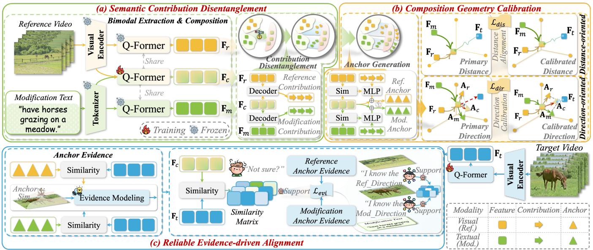

# 1. Bibliographic Information

## 1.1. Title
The central topic of the paper is the "ReTrack: Evidence-Driven Dual-Stream Directional Anchor Calibration Network for Composed Video Retrieval". This title indicates a focus on a novel neural network architecture named `ReTrack` designed to improve the retrieval of videos based on composed queries (combining a reference video and text) by addressing directional bias and utilizing evidence theory.

## 1.2. Authors
The authors are Zixu Li, Yupeng Hu, Zhiwei Chen, Qinlei Huang, Guozhi Qiu, Zhiheng Fu, and Meng Liu.
*   **Affiliations:** The authors are affiliated with the School of Software at Shandong University and the School of Computer Science and Technology at Shandong Jianzhu University.
*   **Research Background:** Based on the references and the nature of the work, the research group specializes in computer vision, specifically multi-modal retrieval, video understanding, and deep learning. They have previously published works on composed image retrieval and video moment localization.

## 1.3. Journal/Conference
The provided text does not explicitly state the journal or conference of publication. However, the references cited include works from prominent 2024 and 2025 venues such as CVPR, AAAI, ACM MM, and ICLR. Given the formatting and the "Related Work" section citing recent papers like "CoVR-2" (IEEE TPAMI), it is likely a submission to a top-tier conference or journal in the field of Computer Vision and Multi-media.

## 1.4. Publication Year
The paper references several works from 2025 (e.g., Liu et al. 2025a, Yue et al. 2025), and the text mentions "2025" in the context of recent work. Therefore, the publication year is likely **2025**.

## 1.5. Abstract
The paper addresses the **Composed Video Retrieval (CVR)** task, where a model retrieves a target video using a multi-modal query consisting of a reference video and a modification text. The core problem identified is the discrepancy in information density between video and text, which causes traditional methods to bias the composed feature toward the reference video, leading to suboptimal performance. To solve this, the authors propose **ReTrack**, an evidence-driven dual-stream directional anchor calibration network. ReTrack consists of three modules: **Semantic Contribution Disentanglement**, **Composition Geometry Calibration**, and **Reliable Evidence-driven Alignment**. These modules work together to calibrate directional bias and use bidirectional evidence for reliable similarity estimation. The proposed method achieves State-of-the-Art (SOTA) performance on three benchmark datasets for both CVR and Composed Image Retrieval (CIR).

## 1.6. Original Source Link
The original source is provided as an uploaded file: `uploaded://daae3e89-5efc-49b7-a8c4-e6f7e370b8c3`.
The PDF link is: `/files/papers/69dcaaf9e63e77db717ca198/paper.pdf`.

# 2. Executive Summary

## 2.1. Background & Motivation
The core problem the paper aims to solve is **Composed Video Retrieval (CVR)**. Unlike traditional video retrieval where a user might type a text query, CVR allows for more flexible, multi-modal queries. A user provides a reference video (e.g., "a person running on a beach") and a modification text (e.g., "wearing a red hat"). The system must then retrieve a target video that matches this combined description.

This problem is important because it supports complex, real-world applications like multi-modal reasoning and intelligent interaction systems. However, the field faces significant challenges:
1.  **Information Density Discrepancy:** Video data is rich in temporal and visual information, while text is concise. This imbalance often causes models to ignore the text and focus too heavily on the video.
2.  **Directional Bias:** Existing methods generate "composed features" that combine the video and text. These features often exhibit a "directional bias," meaning they are too similar to the reference video and not similar enough to the target video or the modification text. This makes it hard to distinguish the correct target from similar negative candidates.
3.  **Retrieval Uncertainty:** There are often many videos that look very similar (hard negatives), introducing uncertainty in the retrieval process.

    The paper's entry point is the observation that simply fusing features isn't enough. Instead, we need to explicitly **calibrate** the direction of the composed feature in the embedding space to ensure it points precisely toward the target video, and we need to quantify the **uncertainty** (reliability) of the similarity match.

The following figure (Figure 1 from the original paper) illustrates the CV task concept and the directional bias problem:

*该图像是示意图，展示了Composed Video Retrieval（CVR）过程及其相关问题。图(a)展示了一个典型的多模态查询示例，包括参考视频与修改文本。图(b)突显了现有方法中的方向性偏差问题，导致组成功能与目标视频的相似性难以区分。图(c)展示了我们的方法有效减轻了方向性偏差，明确了组成功能与目标视频之间的相似性。*

## 2.2. Main Contributions / Findings
The paper's primary contributions are:
1.  **Proposal of ReTrack:** A novel framework that is the first to explicitly correct directional bias in composed features for CVR.
2.  **Three Novel Modules:**
    *   **Semantic Contribution Disentanglement:** Separates the visual and textual contributions within the composed feature.
    *   **Composition Geometry Calibration:** Uses "directional anchors" to reconstruct the composed feature, eliminating bias by aligning it geometrically toward the target.
    *   **Reliable Evidence-driven Alignment:** Uses Dempster-Shafer Theory (Evidence Deep Learning) to compute the reliability of the match, reducing the impact of uncertain samples.
3.  **State-of-the-Art Performance:** ReTrack achieves superior results on three benchmarks: WebVid-CoVR (CVR), FashionIQ (CIR), and CIRR (CIR), demonstrating strong generalization even to image retrieval tasks.

    The key finding is that explicitly modeling the geometry of feature composition and quantifying evidence reliability leads to significantly better retrieval performance than standard feature fusion methods.

# 3. Prerequisite Knowledge & Related Work

## 3.1. Foundational Concepts
To understand this paper, one must grasp the following concepts:

*   **Composed Video Retrieval (CVR):** A task where the query is a pair $(x_r, x_m)$, consisting of a reference video $x_r$ and a modification text $x_m$. The goal is to find a target video $x_t$ that represents the reference video modified by the text.
*   **Composed Image Retrieval (CIR):** The image-only counterpart of CVR, where the reference is an image instead of a video.
*   **BLIP-2 and Q-Former:** BLIP-2 is a pre-training method that leverages frozen image encoders and large language models (LLMs). The `Q-Former` is a specific module within BLIP-2 (a Transformer-based network) that acts as a bottleneck to extract the most informative features from the image and bridge the gap between the visual encoder and the text decoder.
*   **Dempster-Shafer Theory (DST) / Evidential Deep Learning (EDL):** A framework for reasoning under uncertainty. Unlike probability theory, which assigns a probability to a single hypothesis, DST assigns "mass" (belief) to sets of hypotheses. In Deep Learning, this is used to let the model output "evidence" for a prediction, from which uncertainty can be derived. High evidence implies high confidence (low uncertainty).
*   **Directional Bias:** In vector space, if a vector is supposed to point from A to B, but points closer to A, it has a bias towards A. In this paper, the composed feature vector is biased towards the reference video feature rather than the target video feature.

## 3.2. Previous Works
The paper summarizes key prior studies:
*   **CoVR (Ventura et al. 2024b):** The first work to formalize CVR. It adapted pre-trained models like BLIP and BLIP-2 with simple composition mechanisms (like concatenation or summation) to handle the multi-modal query.
*   **CoVR-2 (Ventura et al. 2024a):** An improvement over CoVR that introduced automatic data construction techniques to improve training.
*   **CoVR Enrich (Thawakar et al. 2024):** Enhanced query semantics by generating enriched captions for the modification text to provide more context.
*   **CIR Methods (e.g., TG-CIR, SSN, SPRC):** Various methods for Composed Image Retrieval, which often serve as baselines or inspiration for CVR models.

**Necessary Background Addition:**
To understand the "Direction-oriented Calibration" in this paper, one must understand the **Parallelogram Law** in vector addition. If you have two vectors $\vec{u}$ and $\vec{v}$ originating from the same point, their sum $\vec{u} + \vec{v}$ is the diagonal of the parallelogram formed by them. The paper uses this geometric intuition to construct a "directional anchor" that represents the ideal shift from the reference feature to the target feature.

## 3.3. Technological Evolution
The field has evolved from:
1.  **Simple Unimodal Retrieval:** Text-to-Video or Video-to-Video.
2.  **Early CVR:** Direct application of Image-Text models (like CLIP or BLIP) by simply averaging or concatenating features. These methods struggled with the "modality gap" and bias.
3.  **Context Enrichment:** Methods like CoVR Enrich tried to fix this by adding more text data.
4.  **Geometry and Uncertainty Modeling (Current State - ReTrack):** Moving beyond simple feature manipulation to explicitly model the *geometry* of the feature space (where the vector should point) and the *uncertainty* of the model's belief. ReTrack represents this latest stage.

## 3.4. Differentiation Analysis
Compared to previous works:
*   **vs. CoVR/CoVR-2:** These methods rely on standard pre-trained fusion without explicitly correcting the bias. ReTrack introduces a dedicated "Composition Geometry Calibration" module to mathematically adjust the vector's direction.
*   **vs. CoVR Enrich:** CoVR Enrich requires extra external data (generated captions) to help the model understand. ReTrack achieves better performance without extra inputs, relying purely on architectural improvements (calibration and evidence learning).
*   **vs. CIR Methods:** ReTrack generalizes better to video data (CVR) than most CIR methods, which are often tuned for static images. It handles the temporal dynamics of videos better by leveraging the Q-Former on frame sequences.

# 4. Methodology

## 4.1. Principles
The core principle of ReTrack is to treat the composed feature not just as a static vector, but as a point in a geometric space that can be moved (calibrated) to a more optimal location. The method operates on three levels:
1.  **Disentanglement:** Break down the composed feature into parts attributable to the video and parts attributable to the text.
2.  **Calibration:** Use these parts to calculate "anchors"—ideal reference points. Then, use vector geometry (parallelogram law) to shift the composed feature towards the target.
3.  **Evidence:** Measure how much "proof" (evidence) we have that the anchor matches the target, and use this to weight the loss function, focusing on reliable matches.

## 4.2. Core Methodology In-depth (Layer by Layer)

### Step 1: Problem Formulation
The goal is to learn an embedding function $\mathcal{G}$ that maps the multi-modal query $(x_r, x_m)$ and the target video $x_t$ into a shared metric space. In this space, the distance between the query embedding and the target embedding should be minimized.
The paper formulates this as:
\$
\mathcal { G } ( x _ { r } , x _ { m } ) \approx \mathcal { G } ( x _ { t } )
\$
(Note: The original text displays this as $\mathcal { G } ( x _ { r } , x _ { m } ) \mathcal { G } ( x _ { t } )$, implying a similarity or closeness relationship).

### Step 2: Semantic Contribution Disentanglement
First, the model needs to extract raw features and understand how much each modality contributes to the composed representation.

**Bimodal Extraction & Composition:**
The model uses the `Q-Former` (from BLIP-2) to extract features from the reference video $x_r$, modification text $x_m$, and their cross-modal interaction. $\varPhi_{\mathbb{I}}$ is the visual encoder and $\varPhi_{\mathbb{T}}$ is the text tokenizer.
The formula for feature extraction is:
$$
\left\{ \begin{array} { l l } { \mathbf { F } _ { r } = \operatorname { Q - F o r m e r } ( \varPhi _ { \mathbb { I } } ( x _ { r } ) ) , \mathbf { F } _ { m } = \operatorname { Q - F o r m e r } ( \varPhi _ { \mathbb { T } } ( x _ { m } ) ) , } \\ { \mathbf { F } _ { c } = \operatorname { Q - F o r m e r } ( \varPhi _ { \mathbb { I } } ( x _ { r } ) , \varPhi _ { \mathbb { T } } ( x _ { m } ) ) , } \end{array} \right.
$$
Where:
*   $\mathbf{F}_r \in \mathbb{R}^{Q \times D}$ is the reference video feature matrix.
*   $\mathbf{F}_m \in \mathbb{R}^{Q \times D}$ is the modification text feature matrix.
*   $\mathbf{F}_c \in \mathbb{R}^{Q \times D}$ is the composed feature matrix (the interaction of video and text).
*   $Q$ is the number of learnable queries.
*   $D$ is the embedding dimension.

**Contribution Disentanglement:**
The authors argue that simply subtracting features isn't enough. Instead, they use a Transformer Decoder. To find the contribution of the reference video within the composed feature, the reference feature $\mathbf{F}_r$ acts as the Query, and the composed feature $\mathbf{F}_c$ acts as both Key and Value. This allows the model to "query" the composed feature to see what parts belong to the reference video.
The formula is:
$$
\mathbf { P } _ { r } = \operatorname { D e c o d e r } ( Q = \mathbf { F } _ { r } , \{ K , V \} = \mathbf { F } _ { c } ) ,
$$
Where:
*   $\mathbf{P}_r \in \mathbb{R}^{Q \times D}$ is the disentangled semantic contribution of the reference video.
*   $\mathbf{P}_m$ is calculated similarly for the modification text.

### Step 3: Composition Geometry Calibration
Once contributions are disentangled, the model calibrates the composed feature's position.

**Anchor Generation:**
The model generates "directional anchors" ($\mathbf{A}_r, \mathbf{A}_m$). These act as adjusted reference points. Not all feature channels are equally important, so the model learns "Point Weights" $\mathbf{W}_p$ based on the similarity between the reference and composed feature.
The weight calculation is:
$$
\mathbf { W } _ { p } = \mathrm { M L P } ( \mathbf { F } _ { c } \cdot \mathbf { F } _ { r } ^ { \top } ) .
$$
The anchor is then created by adding the weighted contribution to the composed feature:
$$
\mathbf { A } _ { r } = \mathbf { F } _ { c } + \mathbf { W } _ { p } \odot \mathbf { P } _ { r } ,
$$
Where:
*   $\mathbf{W}_p \in \mathbb{R}^{Q \times D}$ are the learned point weights.
*   $\odot$ denotes element-wise multiplication.
*   $\mathbf{A}_r$ is the reference anchor. $\mathbf{A}_m$ is the modification anchor.

**Distance-oriented Alignment:**
Before calibrating direction, the model ensures the composed feature is generally close to the target feature in terms of distance (magnitude). This uses a standard contrastive loss (InfoNCE style).
The loss is:
$$
\mathcal { L } _ { d i s } = \frac { 1 } { B } \sum _ { i = 1 } ^ { B } - \log \left\{ \frac { \exp \left\{ S \left( \mathbf { F } _ { c i } , \mathbf { F } _ { t i } \right) / \tau \right\} } { \sum _ { j = 1 } ^ { B } \exp \left\{ S \left( \mathbf { F } _ { c i } , \mathbf { F } _ { t j } \right) / \tau \right\} } \right\} ,
$$
Where:
*   $B$ is the batch size.
*   $S(\cdot, \cdot)$ is the similarity function (e.g., cosine similarity).
*   $\tau$ is the temperature coefficient.
*   $\mathbf{F}_{ti}$ is the target feature for the $i$-th sample.

**Direction-oriented Calibration:**
This is the core geometric innovation. The model constructs a "composition directional anchor" $\mathbf{A}_c$ using the parallelogram law. It sums the vectors from the composed feature to the reference anchor and the modification anchor.
The formula is:
$$
\mathbf { A } _ { c } = ( \mathbf { A } _ { r } - \mathbf { F } _ { c } ) + \left( \mathbf { A } _ { m } - \mathbf { F } _ { c } \right) .
$$
Then, it calculates the "true directional vector" $\mathbf{A}_t$ from the composed feature to the target feature. The loss function tries to make the constructed anchor $\mathbf{A}_c$ align with this true direction.
The loss is:
$$
\mathcal { L } _ { d i r } = \frac { 1 } { B } \sum _ { i = 1 } ^ { B } - \log \left\{ \frac { \exp \left\{ S \left( \mathbf { A } _ { c i } , \mathbf { A } _ { t i } \right) / \tau \right\} } { \sum _ { j = 1 } ^ { B } \exp \left\{ S \left( \mathbf { A } _ { c i } , \mathbf { A } _ { t j } \right) / \tau \right\} } \right\} ,
$$
Where:
*   $\mathbf{A}_{ti} = (\mathbf{F}_{ti} - \mathbf{F}_{ci})$ is the ground truth direction vector.
*   This loss explicitly optimizes the *direction* of the composed feature.

### Step 4: Reliable Evidence-driven Alignment
To handle uncertainty (e.g., when many videos look similar), the model uses Evidential Deep Learning (EDL).

**Evidence Modeling:**
The model computes "evidence" for the match between the reference anchor and the target feature. It uses the Subjective Logic framework. For each channel $q$ of the anchor, it finds the maximum similarity to the target feature.
The evidence $e_q$ is:
$$
e _ { q } = \exp ( \underset { \ b { \hat { q } } = 1 } { \overset { Q } { \operatorname* { m a x } } } \left( \mathbf A _ { r ( q ) } \cdot \mathbf F _ { t } ^ { \top } \right) _ { \ b { \hat { q } } } / \tau ) ,
$$
Where:
*   $\mathbf{A}_{r(q)}$ is the $q$-th channel of the reference anchor.
*   The exponential function ensures the evidence is positive.

    From this evidence, the "belief mass" $b_q$ (confidence) is calculated:
$$
b _ { q } = \frac { e _ { q } } { \sum _ { \hat { q } = 1 } ^ { Q } \left( e _ { \hat { q } } + 1 \right) } .
$$
Finally, the overall correlation reliability $\mathbb{E}_r$ is the sum of beliefs:
$$
\mathbb { E } _ { r } = \sum _ { q = 1 } ^ { Q } b _ { q } = 1 - \frac { Q } { \sum _ { \hat { q } = 1 } ^ { Q } \left( e _ { \hat { { q } } } + 1 \right) } .
$$
$\mathbb{E}_m$ is calculated similarly for the modification anchor.

**Optimization:**
The model enforces that the similarity score between composed and target features should match the calculated reliability (evidence). This acts as a regularization term.
The evidence-driven loss is:
$$
\mathcal { L } _ { e v i } = \frac { 1 } { B } \sum _ { b = 1 } ^ { B } { ( \mathbb { E } _ { r b } - S \left( \mathbf { F } _ { c b } , \mathbf { F } _ { t b } \right) ) ^ { 2 } } + \left( \mathbb { E } _ { m b } - S \left( \mathbf { F } _ { c b } , { \bf F } _ { t b } \right) \right) ^ { 2 } ,
$$
Where:
*   This is a Mean Squared Error (MSE) loss between the reliability score and the similarity score.

**Total Loss:**
The final objective function combines all three components:
$$
\Theta ^ { * } = \underset { \Theta } { \arg \operatorname* { m i n } } \left( \mathcal { L } _ { d i s } + \kappa \mathcal { L } _ { d i r } + \lambda \mathcal { L } _ { e v i } \right) ,
$$
Where:
*   $\Theta$ are the model parameters.
*   $\kappa$ and $\lambda$ are hyperparameters to balance the three losses.

    The following figure (Figure 2 from the original paper) illustrates the complete ReTrack architecture described above:

    
    *该图像是示意图，展示了ReTrack模型的三个关键模块：语义贡献解耦（a）、组合几何校准（b）和可靠证据驱动对齐（c）。图中分别通过框架和箭头展示了参考视频与修改文本的处理过程，包括视觉编码、锚点生成及相似性建模等步骤。这些模块共同作用，以解决视频检索中的信息密度不均和特征偏向等挑战。*

# 5. Experimental Setup

## 5.1. Datasets
The experiments are conducted on three widely-used benchmark datasets to validate both CVR and CIR capabilities.

1.  **WebVid-CoVR (CVR Task):**
    *   **Source:** Large-scale open-domain dataset constructed from web video captions.
    *   **Characteristics:** It contains triplets of (reference video, modification text, target video). It is designed to test the model's ability to understand complex video modifications.
    *   **Why Chosen:** It is the standard benchmark for the CVR task, allowing direct comparison with prior works like CoVR and CoVR-2.

2.  **FashionIQ (CIR Task):**
    *   **Source:** Fashion-domain dataset.
    *   **Characteristics:** Contains triplets of (reference image, modification text, target image) focused on fashion items (dresses, shirts, etc.).
    *   **Why Chosen:** To test the generalization ability of ReTrack from video to image retrieval.

3.  **CIRR (CIR Task):**
    *   **Source:** Open-domain Composed Image Retrieval dataset.
    *   **Characteristics:** Contains diverse images and relative captions.
    *   **Why Chosen:** Another standard benchmark for CIR to ensure the method isn't overfitted to just video data.

## 5.2. Evaluation Metrics
The paper uses **Recall@k** as the primary evaluation metric.

1.  **Conceptual Definition:** Recall@k measures the ability of the model to retrieve the correct item within the top $k$ results. For example, Recall@1 checks if the correct target is the very first result returned. Recall@10 checks if the correct target is among the top 10 results. It is a standard metric for retrieval tasks, focusing on the rank of the ground truth.

2.  **Mathematical Formula:**
    Let $Q$ be the set of queries. For a query $q \in Q$, let `rank(q)` be the rank position of the ground truth item in the retrieved list. The indicator function $\mathbb{I}(condition)$ is 1 if true, 0 otherwise.
    $$
    \text{Recall}@k = \frac{1}{|Q|} \sum_{q \in Q} \mathbb{I}(rank(q) \leq k)
    $$

3.  **Symbol Explanation:**
    *   $|Q|$: Total number of queries in the test set.
    *   `rank(q)`: The position (1, 2, 3...) of the correct target in the sorted list of retrieved items for query $q$.
    *   $k$: The cutoff threshold (e.g., 1, 5, 10, 50).

        The paper also reports the "Avg." (Average) of Recall@k scores for specific $k$ values (e.g., {1, 5, 10, 50}) to provide a single comprehensive metric.

## 5.3. Baselines
The paper compares ReTrack against several strong baselines:
*   **Pre-trained Models:** CLIP, BLIP. These serve as upper bounds for general feature representation but are not specifically fine-tuned for composed retrieval.
*   **CVR Models:** CoVR, CoVR Enrich, CoVR-2, FDCA. These are direct competitors in the CVR domain.
*   **CIR Models:** TG-CIR, SSN, SADN, SPRC, LIMN, IUDC, ENCODER. These are included in the CIR comparisons to show how a CVR model performs against specialized image retrieval models.

# 6. Results & Analysis

## 6.1. Core Results Analysis
The experimental results demonstrate that ReTrack achieves State-of-the-Art (SOTA) performance across all datasets.

**On WebVid-CoVR (CVR):**
ReTrack significantly outperforms previous CVR models. For instance, compared to the strong baseline CoVR-2, ReTrack shows improvements in R@1 (63.85% vs 59.82%). This validates that the "directional bias" was indeed a bottleneck in previous methods and that calibrating it improves retrieval accuracy.

**On FashionIQ and CIRR (CIR):**
ReTrack also achieves top results here. This is a crucial finding because it shows that the geometric calibration and evidence-driven alignment are not just tricks for video temporal data but are fundamental improvements to multi-modal composition in general.

The following are the results from Table 1 of the original paper:

| Method | WebVid-CoVR-Test | | | | Avg. |
| :--- | :--- | :--- | :--- | :--- | :--- |
| | k=1 | k=5 | k=10 | k=50 | |
| **Pre-trained Models** | | | | | |
| CLIP (Radford et al. 2021) | 44.37 | 69.13 | 77.62 | 93.00 | 71.03 |
| BLIP (Li et al. 2022) | 45.46 | 70.46 | 79.54 | 93.27 | 72.18 |
| **CVR Models** | | | | | |
| CoVR (Ventura et al. 2024b) | 53.13 | 79.93 | 86.85 | 97.69 | 79.40 |
| CoVR Enrich (Thawakar et al. 2024) | 60.12 | 84.32 | 91.27 | 98.72 | 83.61 |
| CoVR-2 (Ventura et al. 2024a) | 59.82 | 83.84 | 91.28 | 98.24 | 83.30 |
| FDCA (Yue et al. 2025) | 54.80 | 82.27 | 89.84 | 97.70 | 81.15 |
| **ReTrack (Ours)** | **63.85** | **87.05** | **92.80** | **99.10** | **85.70** |

The following are the results from Table 2 of the original paper, which includes complex headers for the CIR datasets:

<table>
<thead>
<tr>
<th rowspan="3">Method</th>
<th colspan="6">FashionIQ</th>
<th colspan="6">CIRR</th>
</tr>
<tr>
<th colspan="2">Dresses</th>
<th colspan="2">Shirts</th>
<th colspan="2">Tops&amp;Tees</th>
<th colspan="4">R@k</th>
<th colspan="3">Rsub @k</th>
</tr>
<tr>
<th>R@10</th>
<th>R@50</th>
<th>R@10</th>
<th>R@50</th>
<th>R@10</th>
<th>R@50</th>
<th>k=1</th>
<th>k=5</th>
<th>k=10</th>
<th>k=50</th>
<th>k=1</th>
<th>k=2</th>
<th>k=3</th>
</tr>
</thead>
<tbody>
<tr>
<td colspan="9"><strong>CIR Models</strong></td>
<td></td>
<td></td>
<td></td>
<td>89.25</td>
<td></td>
<td></td>
</tr>
<tr>
<td>TG-CIR (Wen et al. 2023b)</td>
<td>45.22</td>
<td>69.66</td>
<td>52.60</td>
<td>72.52</td>
<td>56.14</td>
<td>77.10</td>
<td>45.25</td>
<td>78.29</td>
<td>87.16</td>
<td>97.30</td>
<td></td>
<td>72.84</td>
<td>95.13</td>
</tr>
<tr>
<td>SSN (Yang et al. 2024)</td>
<td>34.36</td>
<td>60.78</td>
<td>38.13</td>

ugs      <td>61.83</td>
      <td>44.26</td>
      <td>69.05</td>
      <td>43.91</td>
      <td>77.25</td>
      <td>86.48</td>
      <td>97.45</td>
      <td>71.76</td>
      <td>88.63</td>
      <td>95.54</td>
    </tr>
    <tr>
      <td>SADN (Wang et al. 2024)</td>
      <td>40.01</td>
      <td>65.10</td>
      <td>43.67</td>
      <td>66.05</td>
      <td>48.04</td>
      <td>70.93</td>
      <td>44.27</td>
      <td>78.10</td>
      <td>87.71</td>
      <td>97.89</td>
      <td>72.34</td>
      <td>88.70</td>
      <td>95.23</td>
    </tr>
    <tr>
      <td>SPRC (Xu et al. 2024)</td>
      <td>49.18</td>
      <td>72.43</td>
      <td>55.64</td>
      <td>73.89</td>
      <td>59.35</td>
      <td>78.58</td>
      <td>51.96</td>
      <td>82.12</td>
      <td>89.74</td>
      <td>97.69</td>
      <td>80.65</td>
      <td>92.31</td>
      <td>96.60</td>
    </tr>
    <tr>
      <td>LIMN (Wen et al. 2023a)</td>
      <td>50.72</td>
      <td>74.52</td>
      <td>52.11</td>
      <td>56.08</td>
      <td>77.09</td>
      <td>60.94</td>
      <td>81.85</td>
      <td>43.64</td>
      <td>75.37</td>
      <td>85.42</td>
      <td>97.04</td>
      <td>69.01</td>
      <td>86.22</td>
      <td>94.19</td>
    </tr>
    <tr>
      <td>LIMN+ (Wen et al. 2023a)</td>
      <td></td>
      <td></td>
      <td></td>
      <td></td>
      <td></td>
      <td></td>
      <td></td>
      <td></td>
      <td></td>
      <td></td>
      <td></td>
      <td></td>
      <td></td>
    </tr>
    <tr>
      <td>IUDC (Ge et al. 2025)</td>
      <td>75.21</td>
      <td>35.22</td>
      <td>57.51</td>
      <td>77.92</td>
      <td>62.67</td>
      <td>82.66</td>
      <td>43.33</td>
      <td>75.41</td>
      <td>85.81</td>
      <td>97.21</td>
      <td></td>
      <td>69.28</td>
      <td>86.43</td>
      <td>-</td>
      <td>94.26</td>
    </tr>
    <tr>
      <td>ENCODER (Li et al. 2025b)</td>
      <td>61.90</td>
      <td>51.51</td>
      <td>76.95</td>
      <td>41.86</td>
      <td>54.86</td>
      <td>63.52</td>
      <td>74.93</td>
      <td>42.19</td>
      <td>62.01</td>
      <td>69.23</td>
      <td>80.88</td>
      <td></td>
      <td>-</td>
      <td>46.10</td>
      <td>77.98</td>
      <td>87.16</td>
      <td>97.64</td>
      <td>-</td>
      <td>-</td>
      <td>-</td>
      <td>76.92</td>
      <td>90.41</td>
      <td>95.95</td>
    </tr>
    <tr>
      <td colspan="9"><strong>CVR Models</strong></td>
      <td></td>
      <td></td>
      <td></td>
      <td></td>
      <td></td>
      <td></td>
      <td></td>
      <td></td>
      <td></td>
      <td></td>
      <td></td>
      <td></td>
      <td></td>
      <td></td>
      <td></td>
      <td></td>
      <td></td>
      <td></td>
      <td></td>
      <td></td>
      <td></td>
      <td></td>
      <td></td>
      <td></td>
      <td></td>
      <td></td>
      <td></td>
      <td></td>
      <td></td>
      <td></td>
      <td></td>
      <td></td>
      <td></td>
      <td></td>
      <td></td>
      <td></td>
      <td></td>
      <td></td>
      <td></td>
      <td></td>
      <td></td>
      <td></td>
      <td></td>
      <td></td>
      <td></td>
      <td></td>
      <td></td>
      <td></td>
      <td></td>
      <td></td>
      <td></td>
      <td></td>
      <td></td>
      <td></td>
      <td></td>
      <td></td>
      <td></td>
      <td></td>
      <td></td>
      <td></td>
      <td></td>
      <td></td>
      <td></td>
      <td></td>
      <td></td>
      <td></td>
      <td></td>
      <td></td>
      <td></td>
      <td></td>
      <td></td>
      <td></td>
      <td></td>
      <td></td>
      <td></td>
      <td></td>
      <td></td>
      <td></td>
      <td></td>
      <td></td>
      <td></td>
      <td></td>
      <td></td>
      <td></td>
      <td></td>
      <td></td>
      <td></td>
      <td></td>
      <td></td>
      <td></td>
      <td></td>
      <td></td>
      <td></td>
    </tr>
    <tr>
      <td>CoVR (Ventura et al. 2024b)</td>
      <td>44.55</td>
      <td>48.43</td>
      <td>67.42</td>
      <td>52.60</td>
      <td>74.31</td>
      <td></td>
      <td>49.69</td>
      <td>78.60</td>
      <td>86.77</td>
      <td>94.31</td>
      <td></td>
      <td>75.01</td>
      <td></td>
      <td>88.12</td>
      <td>93.16</td>
    </tr>
    <tr>
      <td>CoVR _Enrich (Thawakar et al. 2024)</td>
      <td></td>
      <td></td>
      <td></td>
      <td></td>
      <td></td>
      <td></td>
      <td></td>
      <td></td>
      <td></td>
      <td></td>
      <td></td>
      <td></td>
      <td></td>
      <td></td>
      <td></td>
      <td></td>
      <td></td>
      <td></td>
      <td></td>
      <td></td>
      <td></td>
      <td></td>
      <td></td>
      <td></td>
      <td></td>
      <td></td>
      <td></td>
      <td></td>
      <td></td>
      <td></td>
      <td></td>
      <td></td>
      <td></td>
      <td></td>
      <td></td>
      <td></td>
      <td></td>
      <td></td>
      <td></td>
      <td></td>
      <td></td>
      <td></td>
      <td></td>
      <td></td>
      <td></td>
      <td></td>
      <td></td>
      <td></td>
      <td></td>
      <td></td>
      <td></td>
      <td></td>
      <td></td>
      <td></td>
      <td></td>
      <td></td>
      <td></td>
      <td></td>
      <td></td>
      <td></td>
      <td></td>
      <td></td>
      <td></td>
      <td></td>
      <td></td>
      <td></td>
      <td></td>
      <td></td>
      <td></td>
      <td></td>
      <td></td>
      <td></td>
      <td></td>
      <td></td>
      <td></td>
      <td></td>
      <td></td>
      <td></td>
      <td></td>
      <td></td>
      <td></td>
      <td></td>
      <td></td>
      <td></td>
      <td></td>
      <td></td>
      <td></td>
      <td></td>
      <td></td>
      <td></td>
      <td></td>
      <td></td>
      <td></td>
      <td></td>
      <td></>      
      <td></td>
      <td></td>
      <td></td>
      <td></td>
      <td></td>
      <td></td>
      <td></td>
      <td></td>
      <td></td>
      <td></td>
      <td></td>
      <td></td>
      <td></td>
      <td></td>
      <td></td>
      <td></td>
      <td></td>
      <td></td>
      <td></td>
      <td></td>
      <td></td>
      <td></td>
      <td></td>
      <td></td>
      <td></td>
      <td></td>
      <td></td>
      <td></td>
      <td></td>
      <td></td>
      <td></td>
      <td></td>
      <td></td>
      <td></td>
      <td></td>
      <td></td>
      <td></td>
      <td></td>
      <td></td>
      <td></td>
      <td></td>
      <td></td>
      <td></td>
      <td></td>
      <td></td>
      <td></td>
      <td></td>
      <td></td>
      <td></td>
      <td></td>
      <td></td>
      <td></td>
      <td></td>
      <td></td>
      <td></td>
      <td></td>
      <td></td>
      <td></td>
      <td></td>
      <td></td>
      <td></td>
      <td></td>
      <td></td>
      <td></td>
      <td></td>
      <td></td>
      <td></td>
      <td></td>
      <td></td>
      <td></td>
      <td></td>
      <td></td>
      <td></td>
      <td></td>
      <td></td>
      <td></td>
      <td></td>
      <td></td>
      <td></td>
      <td></td>
      <td></td>
      <td></td>
      <td></td>
      <td></td>
      <td></td>
      <td></td>
      <td></td>
      <td></td>
      <td></td>
      <td></td>
      <td></td>
      <td></td>
      <td></td>
      <td></td>
      <td></td>
      <td></td>
      <td></td>
      <td></td>
      <td></td>
      <td></td>
      <td></td>
      <td></td>
      <td></td>
      <td></td>
      <td></td>
      <td></td>
      <td></td>
      <td></td>
      <td></td>
      <td></td>
      <td></td>
      <td></td>
      <td></td>
      <td></td>
      <td></td>
      <td></td>
      <td></td>
      <td></td>
      <td></td>
      <td></td>
      <td></td>
      <td></td>
      <td></td>
      <td></td>
      <td></td>
      <td></td>
      <td></td>
      <td></td>
      <td></td>
      <td></td>
      <td></td>
      <td></td>
      <td></td>
      <td></td>
      <td></td>
      <td></td>
      <td></td>
      <td></td>
      <td></td>
      <td></td>
      <td></td>
      <td></td>
      <td></td>
      <td></td>
      <td></td>
      <td></td>
      <td></td>
      <td></td>
      <td></td>
      <td></td>
      <td></td>
      <td></td>
      <td></td>
      <td></td>
      <td></td>
      <td></td>
      <td></td>
      <td></td>
      <td></td>
      <td></td>
      <td></td>
      <td></td>
      <td></td>
      <td></td>
      <td></td>
      <td></td>
      <td></td>
      <td></td>
      <td></td>
      <td></td>
      <td></td>
      <td></td>