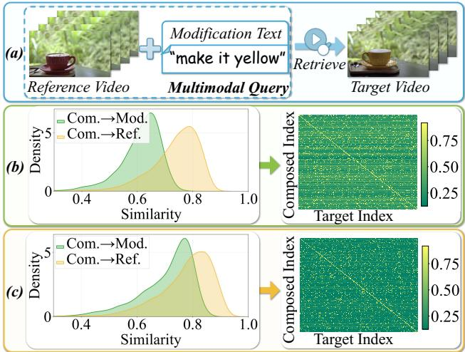
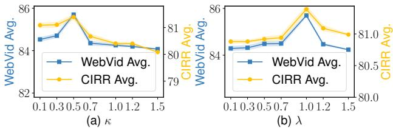
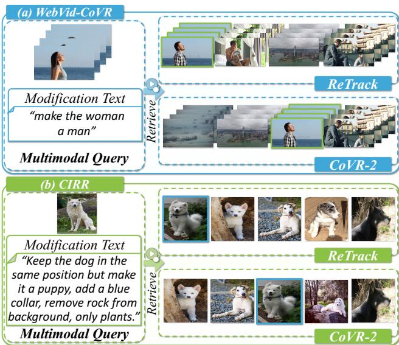

# ReTrack: Evidence-Driven Dual-Stream Directional Anchor Calibration Network for Composed Video Retrieval

Zixu $\mathbf { L i } ^ { 1 }$ , Yupeng $\mathbf { H } \mathbf { u } ^ { 1 * }$ , Zhiwei Chen', Qinlei Huang', Guozhi $\mathbf { Q } \mathbf { i } \mathbf { u } ^ { 1 }$ , Zhiheng $\mathbf { F u } ^ { 1 }$ , Meng Liu 1School of Software, Shandong University 2School of Computer Science and Technology, Shandong Jianzhu University {lizixu.cs, zivczw, fuzhiheng8, mengliu.sdu}@gmail.com, {hql, qiugz}@mail.sdu.edu.cn, huyupeng@sdu.edu.cn,

# Abstract

With the rapid growth of video data, Composed Video Retrieval (CVR) has emerged as a novel paradigm in video retrieval and is receiving increasing attention from researchers. Unlike unimodal video retrieval methods, the CVR task takes a multi-modal query consisting of a reference video and a piece of modification text as input. The modification text conveys the user's intended alterations to the reference video. Based on this input, the model aims to retrieve the most relevant target video. In the CVR task, there exists a substantial discrepancy in information density between video and text modalities. Traditional composition methods tend to bias the composed feature toward the reference video, which leads to suboptimal retrieval performance. This limitation is significant due to the presence of three core challenges: (1) modal contribution entanglement, (2) explicit optimization of composed features, and (3) retrieval uncertainty. To address these challenges, we propose the evidencedRivEn dual-sTream diRectionAl anChor calibration networK (ReTrack). ReTrack is the first CVR framework that improves multi-modal query understanding by calibrating directional bias in composed features. It consists of three key modules: Semantic Contribution Disentanglement, Composition Geometry Calibration, and Reliable Evidence-driven Alignment. Specifically, ReTrack estimates the semantic contribution of each modality to calibrate the directional bias of the composed feature. It then uses the calibrated directional anchors to compute bidirectional evidence that drives reliable composed-to-target similarity estimation. Moreover, ReTrack exhibits strong generalization to the Composed Image Retrieval (CIR) task, achieving SOTA performance across three benchmark datasets in both CVR and CIR scenarios.

# 1 Introduction

With the rapid expansion of video data (Liu et al. 2018a; Hu et al. 2021a; Zhang et al. 2025; Liu et al. 2018b; Hu et al. 2023; Liu et al. 2025a), video retrieval has become a central research focus in the field of multimodal retrieval (Kong et al. 2025; Pu et al. $2 0 2 5 \mathrm { a }$ ; Liu et al. 2024b; Pu et al. 2025b; Sun et al. $2 0 2 3 \mathrm { a }$ ; Zhang et al. 2023; Mu et al. 2025). To meet growing demands for flexible queries, Ventura et al.(Ventura et al. 2024b) proposed Composed Video Retrieval (CVR), which has since gained significant attention(Ventura et al. $2 0 2 4 \mathrm { a }$ ; Thawakar et al. 2024; Yue et al. 2025). As shown in Figure 1(a), unlike traditional unimodal video retrieval (Tian et al. 2025b,a; Wei et al. 2019, 2020), CVR retrieves the most relevant target video from a large-scale database using a multi-modal query comprising a reference video and a modification text. As a fundamental task in multi-modal interaction, CVR supports real-world applications such as multimodal reasoning (Sun et al. 2023b; Hu et al. 2021b; Li et al. 2025a, 2023b; Wang, Zhang, and Dodgson 2024, 2025; Yi-fan 2016; Xu et al. 2025), and intelligent interaction system (Ma et al. 2025b,a; Jiang et al. 2025; Ou, de Bruijn, and Schulz 2025; Liu et al. 2021a).

  

Figure 1: (a) illustrates a typical CVR example. (b) highlights the directional bias issue in existing methods, where the similarity between the composed feature and the target video becomes indistinguishable from that of certain negative candidates, degrading retrieval performance. (c) demonstrates that our method effectively mitigates directional bias, producing a clear separation between the composed feature's similarity to the target and all negative samples.

However, due to the overlooked directional bias in the composed feature, CVR remains at an early stage. Specifically, the video modality typically captures rich temporal and visual information, while the text modality conveys semantics concisely, resulting in a notable discrepancy in information density. Therefore, existing CVR methods (Ventura et al. 2024b,a; Thawakar et al. 2024) that utilize unified encoders (e.g., BLIP, BLIP-2) to encode video and text data tend to exhibit semantic bias. As shown in Figure 1(b), the composed features generated by existing methods often exhibit excessively high similarity to the reference video (yellow area) while showing low similarity to the modification text (green area). As illustrated in the similarity matrix on the right, this leads to the composed feature having a similarity to the positive target video that is close to that of certain negative candidates, ultimately resulting in degraded retrieval accuracy.

To address the directional bias in the composed feature, we propose a strategy based on a dual-stream directional anchor to explicitly calibrate the composed feature, enabling accurate integration of cross-modal semantics. As illustrated in Figure 1(c), the composed feature generated by our method exhibits comparable similarity to both the reference and modification semantics, and achieves improved discriminability among candidate target videos. However, implementing this strategy involves three primary challenges. (1) Modal contribution entanglement. Correcting directional bias requires identifying the semantic contributions of each modality. Nevertheless, due to the entangled nature of these semantics and the lack of explicit supervision, disentangling the semantic contributions from different modalities within the composed feature constitutes the first challenge. (2) Explicit optimization of composed features. Once the semantic contributions have been identified, the second challenge lies in evaluating whether the composed feature exhibits semantic directional bias based on the current semantic contributions, and performing explicit calibration accordingly. (3) Retrieval uncertainty. Similar to Composed Image Retrieval (CIR), the CVR task also relies on triplet data, which is expensive to annotate and often contains a large number of visually or semantically similar candidate videos (Yue et al. 2025). Such videos introduce substantial uncertainty in retrieving the correct target video. Consequently, relying solely on the similarity between the composed feature and candidate videos may be insufficient for accurate retrieval. The third challenge, therefore, is how to evaluate the reliability of similarity estimation to achieve precise retrieval. To address the above challenges, we propose the evidence-dRivEn dual-sTream diRectionAl anChor calibration networK (ReTrack), which calibrates the directional bias of the composed feature and leverages calibrated directional anchors to compute bidirectional evidence for reliable composed-to-target similarity estimation. Specifically, (1) to resolve the issue of modal contribution entanglement, we introduce Semantic Contribution Disentanglement, which separates visual and textual semantic contributions within the composed feature to support subsequent bias correction; (2) to address explicit optimization of composed features challenge, we propose Composition Geometry Calibration, which builds directional anchors based on modality semantic contribution and reconstructs the composed feature to eliminate directional bias; (3) to mitigate retrieval uncertainty, we design Reliable Evidence-driven Alignment, which derives bidirectional evidence from interactions between anchors and target features, enabling adaptive weighting of high-credible samples and robust alignment between composed and target features. In summary, our contributions include: • We propose a novel Composed Video Retrieval (CVR) framework named ReTrack. To the best of our knowledge, it is the first CVR model that improves multi-modal query understanding by correcting the directional bias in the composed feature. ReTrack enables secondary construction of the composed feature by disentangling the semantic contribution, allowing for fine-grained adjustment of its spatial position and directional bias. It further performs similarity reliability estimation through evidence learning to achieve precise composed feature optimization. Extensive experiments conducted on three widely-used benchmark datasets, covering both CVR and CIR tasks, demonstrate the superiority of our proposed ReTrack.

# 2 Related Work

Our work is closely related to Composed Video Retrieval (CVR) and Uncertainty Estimation.

Composed Video Retrieval. Similar to CIR (Li et al. 2025b,c; Huang et al. 2025c; Fu et al. 2025; Wen et al. 2023b; Chen et al. 2025b,a), the CVR task focuses on developing models that interpret user-modified descriptions and reference videos for multimodal video retrieval. Ventura et al.(Ventura et al. 2024b,a) first formalized CVR and demonstrated the effectiveness of pretrained visual-linguistic models like BLIP(Li et al. 2022) and BLIP-2 (Li et al. 2023a) for multimodal query understanding (Lu et al. 2024; Lu, Liu, and Kong 2023), adapting them to CVR with simple composition mechanisms. Thawakar et al.(Thawakar et al. 2024) later enhanced query semantics with enriched captions. However, prior approaches overlook directional bias in composed features and the challenge of multiple similar candidates, leading to retrieval inaccuracies. ReTrack addresses these issues by calibrating feature bias and using directional anchors to compute bidirectional evidence, improving similarity estimation and retrieval accuracy.

Uncertainty Estimation To quantify prediction uncertainty in deep neural networks (Huang et al. $2 0 2 5 \mathrm { a }$ Liu et al. 2025d; Huang et al. $2 0 2 4 \mathrm { a }$ ; Yifan 2018; Ting and Listening 2024), much research (Liu et al. 2024a; Huang et al. 2024b; Liu et al. 2025c; Lia0 et al. 2024, 2025; Liu et al. 2025b; Wu et al. 2025) has focused on uncertainty estimation. Early methods used Bayesian theory, approximating posterior predictive distributions (Huang et al. 2025b; Kingma, Salimans, and Welling 2015; Huang et al. 2023), leading to Bayesian Neural Networks (BNNs). However, BNNs suffer from high computational costs and slow inference. Evidential Deep Learning (EDL) addresses these limitations by modeling uncertainty through network outputs, achieving success in vision (Liu et al. 2025e; Wang et al. 2025; Liang et al. 2024; Li et al. 2024) and multi-modal tasks (Sensoy, Kaplan, and

  
Geometry Calibration, and (c) Reliable Evidence-driven Alignment.

Kandemir 2018). Sensoy et al. (Sensoy, Kaplan, and Kandemir 2018) introduced subjective logic for improved uncertainty estimation and robustness, while Han et al. (Han et al. 2022) extended these ideas to multi-view classification with dynamic evidence fusion, enhancing reliability. Inspired by EDL, ReTrack leverages bidirectional evidence interactions between directional anchors and target features. By adaptively weighting high-confidence samples, ReTrack more accurately aligns composite and target features, reducing the impact of similar candidate videos during retrieval.

# 3 ReTrack

As a key innovation, we introduce the ReTrack model, which calibrates directional bias in composed features and enables reliable composed-to-target similarity computation using evidence from calibrated directional anchors. As illustrated in Figure 2, ReTrack comprises three key modules: (a) Semantic Contribution Disentanglement, which disentangles visual and textual contributions within composed features to support effective bias calibration (Section 3.2); (b) Composition Geometry Calibration, which constructs directional anchors from modal semantic contributions and reconstructs the composed features to calibrate directional bias (Section 3.3); (c) Reliable Evidence-driven Alignment, which uses bidirectional evidence between directional anchors and target features to weight high-credibility samples and reliably align composed features with targets (Section 3.4). In this section, we first formalize the CVR task and then elaborate on each module of ReTrack.

# 3.1 Problem Formulation

The Composed Video Retrieval (CVR) task aims to retrieve the target video that fulfills the multimodal query. Let $\mathcal { T } = \{ ( x _ { r } , x _ { m } , x _ { t } ) _ { n } \} _ { n = 1 } ^ { N }$ denote a  set of $N$ triplets, where $x _ { r } , x _ { m }$ and $x _ { t }$ refer to the reference video, modification text and target video, respectively. Our goal is to optimize a metric space where the embedding of the multimodal query $( x _ { r } , x _ { m } )$ should be as close as possible to the corresponding target video $x _ { t }$ , formulated as, $\mathcal { G } ( x _ { r } , x _ { m } )  \mathcal { G } ( x _ { t } )$ ,where $\mathcal { G }$ denotes the to-be-optimized embedding function for both the multimodal query and target video.

# 3.2 Semantic Contribution Disentanglement

To calibrate directional bias in the composed feature, we first disentangle the semantic contributions of each modality. To this end, we introduce Semantic Contribution Disentanglement, which first extracts features for the reference video, modification text, and their composed feature. It then separately interacts the composed feature with reference video and modification text branches, disentangling their respective semantic contributions. The disentanglement forms basis for subsequent directional calibration, as detailed below. Bimodal Extraction & Composition. Following previous work (Ventura et al. 2024a; Xu et al. 2024; Li et al. 2025c), we first leverage the Q-Former to extract the features of the reference video and the modification text, as well as their cross-modal composed feature, formulated as follows, where $\mathbf { F } _ { r } , \mathbf { F } _ { m } , \mathbf { F } _ { c } \in \mathbb { R } ^ { Q \times D }$ are the reference feature, modification feature, and composed feature, respectively. $Q$ is the number of learnable queries for $N _ { f }$ sampled frames, $N _ { f }$ is the frame number, and $D$ is the embedding dimension. $\varPhi _ { \mathbb { I } }$ and $\varPhi _ { \mathbb { T } }$ denote the visual encoder and text tokenizer, respectively. Subsequently, for the target video, we apply the same manner to obtain the target feature Ft  R×

$$
\left\{ \begin{array} { l l } { \mathbf { F } _ { r } = \operatorname { Q - F o r m e r } ( \varPhi _ { \mathbb { I } } ( x _ { r } ) ) , \mathbf { F } _ { m } = \operatorname { Q - F o r m e r } ( \varPhi _ { \mathbb { T } } ( x _ { m } ) ) , } \\ { \mathbf { F } _ { c } = \operatorname { Q - F o r m e r } ( \varPhi _ { \mathbb { I } } ( x _ { r } ) , \varPhi _ { \mathbb { T } } ( x _ { m } ) ) , } \end{array} \right.
$$

Contribution Disentanglement. Subsequently, we disentangle the semantic contributions from the reference video and the modification text within the composed feature separately. Below, we take the reference video as an example. To disentangle the semantic contribution of the reference video, we might naturally consider subtracting the modification text feature from the composed feature. However, this naive subtraction fails to capture the true visual semantic contribution due to the complexity of modification semantics. Thus, we introduce a Transformer Decoder to more accurately extract the reference video's semantic contribution. Specifically, the reference video feature $\mathbf { F } _ { r }$ is used as the Query, and the composed feature $\mathbf { F } _ { c }$ serves as both the Key and Value, yielding the reference semantic contribution $\mathbf { P } _ { r }$ , where $ { \mathbf { P } } _ { r } \in \mathbb { R } ^ { Q \times D }$ is the reference contribution. Similarly, we obtain the modification contribution $\mathbf { P } _ { m } \in \mathbb { R } ^ { Q \times D }$ .

$$
\mathbf { P } _ { r } = \operatorname { D e c o d e r } ( Q = \mathbf { F } _ { r } , \{ K , V \} = \mathbf { F } _ { c } ) ,
$$

# 3.3 Composition Geometry Calibration

To calibrate potential directional bias in the composed feature (i.e., an excessive bias toward the visual or textual modality at the expense of the other), we introduce the Composition Geometry Calibration module, ensuring the calibrated feature remains close to the target video. This module first uses modal semantic contributions to generate bimodal directional anchors for each channel of the composed feature. It then employs Distance-oriented Alignment to minimize the distance to the target feature, and Directionoriented Calibration to reconstruct the composed feature from these anchors, optimizing its direction relative to the target. This approach enables more accurate multimodal feature composition, as detailed below. Anchor Generation. Firstly, since not all channels in the bimodal feature equally influence the composed direction, channels with greater compositional relations to the composed feature should be weighted more heavily in directional calibration. To address this, we introduce composition-oriented bimodal directional anchors based on semantic contributions. The computation of the reference anchor is described below as an example. Specifically, we first introduce Point Weights ${ \bf W } _ { p } \in \mathbf { \Sigma }$ $\mathbb { R } ^ { Q \times D }$ whic adaptively learn the weight of each channel feature's influence on directionality based on the similarity between the reference and composed feature, formulated as,

$$
\mathbf { W } _ { p } = \mathrm { M L P } ( \mathbf { F } _ { c } \cdot \mathbf { F } _ { r } ^ { \top } ) .
$$

Subsequently, we leverage the point weights $\mathbf { W } _ { p }$ to adjust the contribution of different feature channels in the semantic contributions to the composed direction, thereby generating the reference anchor $\mathbf { A } _ { r }$ , formulated as follows, where $\mathbf { A } _ { r } \in \mathbb { R } ^ { Q \times D }$ Similarly, we obtain the modification anchor Am  RQ×D.

$$
\mathbf { A } _ { r } = \mathbf { F } _ { c } + \mathbf { W } _ { p } \odot \mathbf { P } _ { r } ,
$$

Distance-oriented Alignment. Secondly, to provide a more accurate distance basis for the subsequent calibration, we perform Distance-oriented Alignment. In this part, we leverage a batch-based classification loss, which is widely utilized in CVR/CIR tasks (Ventura et al. $2 0 2 4 \mathrm { a }$ ;Xu et al. 2024), to pull the position of the composed feature closer to that of the target feature, formulated as follows, where $ { \boldsymbol { S } } ( \cdot , \cdot )$ is the similarity function, $B$ is the batch size, and $\tau$ is the temperature coefficient. ${ \bf F } _ { c i }$ and $\mathbf { F } _ { t i }$ denote the $i$ -th compose feature and target feature in the batch.

$$
\mathcal { L } _ { d i s } = \frac { 1 } { B } \sum _ { i = 1 } ^ { B } - \log \left\{ \frac { \exp \left\{ S \left( \mathbf { F } _ { c i } , \mathbf { F } _ { t i } \right) / \tau \right\} } { \sum _ { j = 1 } ^ { B } \exp \left\{ S \left( \mathbf { F } _ { c i } , \mathbf { F } _ { t j } \right) / \tau \right\} } \right\} ,
$$

Direction-oriented Calibration Finally, we start from the directional anchors and impose their semantic contributions onto the composed feature to derive the composition directional anchor. We then use this composition directional anchor as an intermediary, pulling it closer to the target feature, thereby ensuring the accuracy of each modality's semantic contribution within the composed feature. Specifically, we construct the composition directional anchor $\mathbf { A } _ { c } \in \mathbb { R } ^ { \sum Q \times D }$ based on the arallelogram l

$$
\mathbf { A } _ { c } = ( \mathbf { A } _ { r } - \mathbf { F } _ { c } ) + \left( \mathbf { A } _ { m } - \mathbf { F } _ { c } \right) .
$$

Subsequently, we compute the true directional vector from the original composed feature to the target feature as $\mathbf { A } _ { t } = ( \mathbf { F } _ { t } - \mathbf { \bar { F } } _ { c } ) \in \mathbb { R } ^ { \mathbf { \bar { Q } } \times D }$ , which serves to guide the calibration of the composition directional anchor $\mathbf { A } _ { c }$ toward the target feature, thereby eliminating directional bias and ensuring that the composition process more precisely points to the target feature in spatial direction, formulated as follows, where $ { \boldsymbol { S } } ( \cdot , \cdot )$ is the similarity function, $B$ is the batch size, and $\tau$ is the temperature coefficient. $\mathbf { A } _ { c _ { i } }$ and $\mathbf { A } _ { t _ { i } }$ denote the $i$ -th composition directional anchor and true directional vector in the batch, respectively.

$$
\mathcal { L } _ { d i r } = \frac { 1 } { B } \sum _ { i = 1 } ^ { B } - \log \left\{ \frac { \exp \left\{ S \left( \mathbf { A } _ { c i } , \mathbf { A } _ { t i } \right) / \tau \right\} } { \sum _ { j = 1 } ^ { B } \exp \left\{ S \left( \mathbf { A } _ { c i } , \mathbf { A } _ { t j } \right) / \tau \right\} } \right\} ,
$$

# 3.4 Reliable Evidence-driven Alignment

To reduce ReTrack's uncertainty when encountering similar candidate videos, we propose Reliable Evidence-driven Alignment. This approach computes bidirectional evidence by interacting directional anchors with the target feature, automatically weights highly credible samples, and reliably aligns the composed feature with the target feature. Evidence Modeling. To reduce the uncertainty in the alignment between the composed feature and the target feature, we utilize the Dempster-Shafer Theory of Evidence $( D S T )$ (Zadeh 1986). This theory is widely applied to handle available evidence from different sources in order to quantify the reliability of a given hypothesis. In our ReTrack model, we leverage DST to measure correlation reliability between the two sets of directional anchors and the target feature, thereby further enhancing the reliability of the similarity matrix during the alignment process. In the following, we illustrate the evidence computation process using the reference anchor as an example.

Specifically, we first define the evidence vector in DST as $\dot { \bf E } = [ e _ { 1 } , \dot { \bf \Xi } , \epsilon , e _ { Q } ] \in \mathbb { R } ^ { Q }$ , which represents the matching evidence between each channel of the reference anchor $\mathbf { A } _ { r }$ and the target feature $\mathbf { F } _ { t }$ . Following Evidence Deep Learning (EDL) (Sensoy, Kaplan, and Kandemir 2018), we utilize the Subjective Logic to formulate the evidence as follows, where $Q$ is the number of learnable queries in the Q-Former, and $\mathbf { A } _ { r ( q ) }$ denotes the $q$ -th channel of the reference anchor. $e _ { q }$ is the matching evidence between the $q$ -th channel of the reference anchor and the target feature. Based on the matching evidence from all channels, we further compute the belief mass for each channel to measure each channel's confidence in its own decision, formulated as follows,

Table 1: Performance comparison on the test set of the CVR dataset, WebVid-CoVR, relative to $\mathrm { { R @ } } k ( \% )$ . The overall best results are in bold, while the best results over baselines are underlined.   

<table><tr><td rowspan="3">Method</td><td colspan="5">WebVid-CoVR-Test</td></tr><tr><td></td><td colspan="3">R@k</td><td rowspan="2">Avg.</td></tr><tr><td>k=1</td><td>k=5</td><td>k=10</td><td>k=50</td></tr><tr><td></td><td>Pre-trianed Models</td><td></td><td></td><td></td><td></td></tr><tr><td>CLIP (Radford et al. 2021)</td><td>44.37</td><td>69.13</td><td>77.62</td><td>93.00</td><td>71.03</td></tr><tr><td>BLIP (Li et al. 2022)</td><td>45.46</td><td>70.46</td><td>79.54</td><td>93.27</td><td>72.18</td></tr><tr><td></td><td>CVR Models</td><td></td><td></td><td></td><td></td></tr><tr><td>CoVR (Ventura et al. 2024b)</td><td>53.13</td><td>79.93</td><td>86.85</td><td>97.69</td><td>79.40</td></tr><tr><td>CoVR Enrich (Thawakar et al. 2024)</td><td>60.12</td><td>84.32</td><td>91.27</td><td>98.72</td><td>83.61</td></tr><tr><td>CoVR-2 (Ventura et al. 2024a)</td><td>59.82</td><td>83.84</td><td>91.28</td><td>98.24</td><td>83.30</td></tr><tr><td>FDCA (Yue et al. 2025)</td><td>54.80</td><td>82.27</td><td>89.84</td><td>97.70</td><td>81.15</td></tr><tr><td>ReTrack (Ours)</td><td>63.85</td><td>87.05</td><td>92.80</td><td>99.10</td><td>85.70</td></tr></table>

$$
\begin{array} { r } { e _ { q } = \exp ( \underset { \ b { \hat { q } } = 1 } { \overset { Q } { \operatorname* { m a x } } } \left( \mathbf A _ { r ( q ) } \cdot \mathbf F _ { t } ^ { \top } \right) _ { \ b { \hat { q } } } / \tau ) , } \end{array}
$$

$$
b _ { q } = \frac { e _ { q } } { \sum _ { \hat { q } = 1 } ^ { Q } \left( e _ { \hat { q } } + 1 \right) } .
$$

Based on each channel's belief mass of its own decision, we can derive the overall correlation reliability of the reference anchor, which denotes the directional semantic information during the composition process, formulated as,

$$
\mathbb { E } _ { r } = \sum _ { q = 1 } ^ { Q } b _ { q } = 1 - \frac { Q } { \sum _ { \hat { q } = 1 } ^ { Q } \left( e _ { \hat { q } } + 1 \right) } .
$$

In the same manner, we can obtain the correlation reliability between the directional semantic information of the modification text and the target feature, denoted as $\mathbb { E } _ { m }$ . Optimization. Subsequently, based on EDL (Sensoy, Kaplan, and Kandemir 2018), we argue that the correlation reliability $\mathbb { E } _ { r } , \mathbb { E } _ { m }$ should be positively correlated with the similarity between the composed feature and the target feature within the batch, for better comprehension. Thus, based on the two sets of correlation reliability, we design an evidencedriven regularization loss to ensure consistency between the similarity measurement and the correlation reliability, thereby enhancing the reliability of the similarity between the composed feature and the target feature, formulated as, where $B$ is the batch size, and $\mathbf { F } _ { c b } , \mathbf { F } _ { t b }$ denote the $b$ -th composed feature and target feature in the batch, respectively.

$$
\mathcal { L } _ { e v i } = \frac { 1 } { B } \sum _ { b = 1 } ^ { B } { ( \mathbb { E } _ { r b } - S \left( \mathbf { F } _ { c b } , \mathbf { F } _ { t b } \right) ) ^ { 2 } } + \left( \mathbb { E } _ { m b } - S \left( \mathbf { F } _ { c b } , \mathbf { F } _ { t b } \right) \right) ^ { 2 } ,
$$

Finally, we obtain the final loss function for ReTrack as, where $\Theta$ is the ReTrack parameter to be learned and $\kappa , \lambda$ are the trade-off hyper-parameters.

$$
\Theta ^ { * } = \underset { \Theta } { \arg \operatorname* { m i n } } \left( \mathcal { L } _ { d i s } + \kappa \mathcal { L } _ { d i r } + \lambda \mathcal { L } _ { e v i } \right) ,
$$

# 4 Experiments

This section delves into our comprehensive experiments of ReTrack and the corresponding analyses.

# 4.1 Experimental Setup

Datasets. To comprehensively evaluate the efficacy and generalizability of the proposed ReTrack, we conduct experiments on both CVR and CIR tasks. For the CVR task, we adopt the large-scale open-domain WebVid-CoVR (Ventura et al. 2024b). For the CIR task, we employ the widely used fashion-domain FashionIQ dataset (Wu et al. 2021), and the open-domain CIRR dataset (Liu et al. 2021b). Evaluation Metrics. To ensure fair comparisons, we follow the standard evaluation protocols of each dataset and report $\operatorname { R e c a l l } @ k \left( \operatorname { R } @ k \right)$ as the primary metric: 1) WebVid-CoVR: ${ \mathrm { R } @ \left\{ 1 , 5 , 1 0 , 5 0 \right\} }$ , along with their mean. 2) FashionIQ: $\mathrm { R } @ \{ 1 0 , 5 0 \}$ for each category. 3) CIRR: ${ \mathrm { R } @ \{ 1 , 5 , 1 0 , 5 0 \} }$ , and subset-based metrics $\mathbf { R } _ { \mathrm { s u b } } @ \{ 1 , 2 , 3 \}$ .

Implementation Details. Following previous works (Ventura et al. 2024a), we adopt BLIP-2 (Li et al. 2023a) finetuned on the COCO dataset with 364-pixel input resolution as the backbone model for ReTrack and freeze the ViT during training. The frame number $N _ { f } ~ = ~ 4$ and the number of learning query $Q \ = \ 3 2 N _ { f }$ . For the trade-off hyper-parameters in Eq.(12), we conduct a grid search to set $\lambda = 1 . 0$ and $\kappa = 0 . 5$ The temperature coefficient $\tau = 0 . 1$ . ReTrack is trained with a batch size of 64 using the AdamW optimizer with a learning rate of $2 e \mathrm { ~ - ~ } 5$ Training is performed for 5, 10 epochs on CVR and CIR datasets. All experiments are conducted on an NVIDIA V100 GPU with 32GB memory.

# 4.2 Performance Comparison

To validate the performance and generalization of ReTrack, we conduct extensive comparisons on CVR and CIR tasks.

<table><tr><td rowspan="3">Method</td><td colspan="5">FashionIQ</td><td colspan="6">CIRR</td></tr><tr><td>Dresses</td><td></td><td>Shirts</td><td></td><td>Tops&amp;Tees</td><td></td><td>R@k</td><td></td><td></td><td>Rsub @k</td><td></td></tr><tr><td>R@10 R@50</td><td>R @ 10 R @50</td><td>R@ 10 R@ 50</td><td></td><td></td><td>k=1</td><td></td><td>k=5 k=10</td><td>k=50</td><td>k=1</td><td>k=2</td><td>k=3</td></tr><tr><td colspan="9">CIR Models</td><td></td><td>89.25</td><td></td></tr><tr><td>TG-CIR (Wen et al. 2023b)</td><td>45.22</td><td>69.66 52.60</td><td>72.52</td><td>56.14</td><td>77.10</td><td>45.25</td><td>78.29</td><td>87.16 97.30</td><td></td><td>72.84</td><td>95.13</td></tr><tr><td>SSN (Yang et al. 2024)</td><td>34.36</td><td>60.78 38.13</td><td>61.83</td><td>44.26</td><td>69.05</td><td>43.91</td><td>77.25</td><td>86.48</td><td>97.45</td><td>71.76 88.63</td><td>95.54</td></tr><tr><td>SADN (Wang et al. 2024)</td><td>40.01</td><td>65.10 43.67</td><td>66.05</td><td>48.04</td><td>70.93</td><td>44.27</td><td>78.10</td><td>87.71</td><td>97.89</td><td>72.34 88.70</td><td>95.23</td></tr><tr><td>SPRC (Xu et al. 2024)</td><td>49.18</td><td>72.43 55.64</td><td>73.89</td><td>59.35</td><td>78.58</td><td>51.96</td><td>82.12</td><td>89.74</td><td>97.69</td><td>80.65 92.31</td><td>96.60</td></tr><tr><td>LIMN (Wen et al. 2023a) LIMN+ (Wen et al. 2023a)</td><td>50.72 74.52 52.11</td><td>56.08</td><td>77.09</td><td>60.94</td><td>81.85</td><td>43.64</td><td>75.37</td><td>85.42</td><td>97.04</td><td>69.01 86.22</td><td>94.19</td></tr><tr><td>IUDC (Ge et al. 2025)</td><td>75.21 35.22</td><td>57.51</td><td>77.92</td><td>62.67</td><td>82.66</td><td>43.33</td><td>75.41</td><td>85.81 97.21</td><td></td><td>69.28 86.43 -</td><td>94.26</td></tr><tr><td>ENCODER (Li et al. 2025b)</td><td>61.90 51.51 76.95</td><td>41.86 54.86</td><td>63.52 74.93</td><td>42.19 62.01</td><td>69.23 80.88</td><td></td><td>- 46.10 77.98 87.16 97.64</td><td>-</td><td>-</td><td>76.92 90.41</td><td>95.95</td></tr><tr><td colspan="10">CVR Models</td><td></td></tr><tr><td colspan="10">69.03</td></tr><tr><td>CoVR (Ventura et al. 2024b) CoVR _Enrich (Thawakar et al. 2024)</td><td>44.55</td><td>48.43</td><td>67.42</td><td>52.60</td><td>74.31</td><td></td><td>49.69 78.60 86.77 94.31</td><td></td><td>75.01</td><td></td><td>88.12 93.16</td></tr><tr><td>CoVR-2 (Ventura et al. 2024a)</td><td>46.12 69.52</td><td>49.61</td><td>68.88</td><td>53.79</td><td>74.74</td><td>51.03</td><td></td><td>88.93 97.53</td><td>76.51</td><td>-</td><td>95.76</td></tr><tr><td>ReTrack (Ours)</td><td>46.53</td><td>69.60 51.23</td><td>70.64</td><td>52.14 63.22</td><td>73.27</td><td></td><td></td><td>50.43 81.08 88.89 98.05</td><td></td><td>76.75</td><td>90.34 95.78</td></tr><tr><td></td><td>52.91</td><td>77.54</td><td>61.91 81.26</td><td></td><td>83.36</td><td></td><td>52.34 82.53 90.34 98.13</td><td></td><td></td><td>79.64</td><td>92.58 96.99</td></tr></table>

Table 2: Performance comparison on the CIR dataset, FashionIQ and CIRR, relative to $R @ k ( \% )$ The overall best results are in bold, while the best results over baselines are underlined.

On CVR Task. As shown in Table 1, we compare two categories of baselines: pretrained models and CVR models. The results reveal the following observations: 1) ReTrack achieves the best performance across all evaluation metrics on both CVR datasets. Specifically, on WebVid-CoVR, ReTrack yields a $2 . 5 0 \%$ improvement in the mean metric. And the R1 metric improves significantly. This demonstrates that by calibrating directional bias in the composed feature and enhancing the reliability of the similarity between the composed feature and the target feature, ReTrack effectively improves its understanding of multi-modal queries. 2) CoVR_Enrich performs sub-optimal on WebVid-CoVR, likely due to its use of extra generated captions to improve cross-modal perception. In contrast, ReTrack surpasses it without extra inputs, relying solely on Composition Geometry Calibration and Reliable Evidence-driven Alignment.

On CIR Task. As shown in Table 2, we compare CIR models and CVR models. The results yield the following key insights: 1) ReTrack achieves the best performance on all metrics across both CIR datasets. Compared to the second-best method, ReTrack attains relative improvements of $1 . 5 4 \%$ , $7 . 7 \%$ , and $0 . 8 8 \%$ in $\mathrm { R @ 1 0 }$ on FashionIQ for different categories, and $0 . 7 3 \%$ in $\mathbf { R } \ @ 1$ on CIRR. This demonstrates that ReTrack's multimodal semantic disentanglement and calibration-based feature modeling provide strong domain generalization. 2) Most CVR models lag behind specialized CIR models on CIR tasks, likely due to their focus on global visual perspectives and reliance on repeated key targets across frames, which can overlook single-frame visual details and introduce semantic bias. In contrast, ReTrack effectively attends to multimodal details and performs crossmodal calibration, enabling precise semantic composition for both CVR and CIR. This highlights ReTrack's strong generalization in visual-modality semantic understanding.

# 4.3 Ablation Study

To assess the effect of each ReTrack module, we perform detailed ablation studies across the following variant groups:

G[A]: Ablation on Semantic Contribution Disentanglement D#(1) wo_C_ref, D#(2) wo_C_mod: Remove the semantic contribution from the reference video or modification text, respectively, using only one modality's contribution. $\mathbf { D } \# ( 3 )$ wo_SCD: Remove Semantic Contribution Disentanglement and use original features instead. G[B]: Ablation on Composition Geometry Calibration D#(4) wo_Ldis: Remove Distance-oriented Alignment to test its positional role in calibration. D#(5) wo_A_ref, D#(6) wo_A_mod: Remove the reference or modification anchor in Eq.(6), respectively. $ { \mathbf { D } } \# ( 7 )$ WO $\mathcal { L } _ { d i r }$ : Remove Direction-oriented Calibration $\mathcal { L } _ { d i r }$ in Eq.(7). G[C]: Ablation on Reliable Evidencedriven Alignment D#(8) wo_Evi_ref, D#(9) wo_Evi_mod: Remove the reference or modification evidence terms from the regularization loss. D#(10) wo. $\mathcal { L } _ { e v i }$ : Remove the entire evidence-driven regularization loss. G[D]: Ablation on $E \nu \mathrm { . }$ . idence Calculation D#(11) w_RELU, $ { \mathbf { D } } \# ( \mathbf { 1 } 2 )$ w Softplus: Replace the exponential evidence computation in Eq. (8) with ReLU and Softplus, to test the function choice.

From Table 3, we obtain the following observations. 1) Compared to the full ReTrack model, $ { \mathbf { D } } \# (  { \mathbf { 1 } } )$ and $\mathbf { D } \# ( 2 )$ show slight performance drops, indicating the necessity of disentangling both visual and textual contributions for effective calibration and retrieval. 2) Within G[A], $\mathbf { D } \# ( 3 )$ shows the largest decline, indicating that jointing multimodal semantic bias is essential for calibrating modality-specific semantic deviations, which in turn enhances multimodal understanding. 3) D#(4) yields a notable decrease, underscoring the importance of distance guidance for direction calibration. Both $ { \mathbf { D } } \# ( 5 )$ and $\bf { D } \# ( \bf { 6 } )$ reduce performance, confirming that reference and modification anchors each provide essential directional cues. D#(7) exhibits an even greater drop, reinforcing the role of distance in measuring each modality's contribution. 4) D#(8) and $\mathbf { D } \# ( \mathbf { 9 } )$ also lead to declines, showing that uncertainty quantification from both modalities is vital for reliable alignment. $\mathbf { D } \# ( \mathbf { 1 0 } )$ results in the sharpest drop in G[C], showing the importance of evidence-driven regularization for robust retrieval. 5) D#(11) and $ { \mathbf { D } } \# ( \mathbf { 1 } 2 )$ examine evidence computation methods, which reveals that evidencetheorycompliant approaches can estimate data uncertainty, with the exponential method adopted as optimal.

Table 3: Ablation study on three CVR and CIR datasets.   

<table><tr><td rowspan="2">D#</td><td rowspan="2">Derivatives</td><td colspan="2">FIQ-Avg.</td><td>CIRR</td><td>WebVid</td></tr><tr><td>R@10</td><td>R@50</td><td>Avg.</td><td>Avg.</td></tr><tr><td colspan="6">G[A]: Semantic Contribution Disentanglement</td></tr><tr><td>1</td><td>wo_C ref</td><td>58.84</td><td>80.25</td><td>79.86</td><td>83.90</td></tr><tr><td>2</td><td>wo_C_mod</td><td>58.68</td><td>79.94</td><td>79.54</td><td>84.20</td></tr><tr><td>3</td><td>Wo_SCD</td><td>57.69</td><td>78.48</td><td>78.49</td><td>83.37</td></tr><tr><td colspan="6">G[B]: Composition Geometry Calibration</td></tr><tr><td>4</td><td>wo_Ldis</td><td>3.78</td><td>9.12</td><td>16.08</td><td>27.59</td></tr><tr><td>5</td><td>wo_A_ref</td><td>58.21</td><td>79.48</td><td>79.73</td><td>84.33</td></tr><tr><td>6</td><td>wo_A_mod</td><td>58.31</td><td>79.87</td><td>79.54</td><td>84.27</td></tr><tr><td>7</td><td>woLdir</td><td>57.64</td><td>78.82</td><td>79.68</td><td>83.66</td></tr><tr><td colspan="6">G[C]: Reliable Evidence-driven Alignment</td></tr><tr><td>8</td><td>wo_Evi_ref</td><td>59.11</td><td>80.09</td><td>80.03</td><td>84.27</td></tr><tr><td>9</td><td>wo_Evi_mod</td><td>59.03</td><td>80.08</td><td>80.59</td><td>84.19</td></tr><tr><td>10</td><td>wo_Levi</td><td>56.93</td><td>78.19</td><td>78.94</td><td>83.02</td></tr><tr><td colspan="6">G[D]: Calculation of Evidence</td></tr><tr><td>11</td><td>w_ReLU</td><td>59.02</td><td>80.07</td><td>80.68</td><td>84.65</td></tr><tr><td>12</td><td>w_Softplus</td><td>59.11</td><td>80.19</td><td>81.01</td><td>84.54</td></tr><tr><td colspan="2">ReTrack (Ours)</td><td>59.35</td><td>80.72</td><td>81.09</td><td>85.70</td></tr></table>

  

Figure 3: Sensitivity to the hyper-parameters (a) $\kappa$ , and (b) $\lambda$ on WebVid-CoVR and CIRR datasets.

To analyse ReTrack's sensitivity to the hyperparameter $\kappa$ and $\lambda$ in Eq.(12), we present results on WebVid-CoVR and CIRR in Figure 3. We observe that, for both datasets, performance first increases and then decreases as $\kappa$ and $\lambda$ increase. This behavior is reasonable because the composition geometry requiring calibration does not exhibit unbounded deviation but lies within a limited range, so balanced hyperparameters are needed to constrain the degree of calibration. Moreover, a larger $\lambda$ effectively applies reliable evidence to the corresponding channels; however, not all channels require high evidence support, since some channels may inherently lack reliable semantic information. Thus, excessively large values lead to performance degradation.

# 4.4 Case Study

As shown in Figure 4, we compare retrieval results from our ReTrack model and the representative CVR model CoVR-2 on WebVid-CoVR and CIRR, with the following observations: 1) In Figure 4(a), ReTrack retrieves the target video at rank 1, while CoVR-2 returns two "sea-and-sky" videos as its top results. The prevalence of "sky" and "ocean" in the reference video introduces high uncertainty in video semantics, reducing the text's contribution and resulting in CoVR-2's inaccurate retrieval. Additionally, CoVR-2's composed feature becomes overly text-biased due to the emphasis on "man" in the modification text. By leveraging evidence-driven uncertainty quantification, ReTrack effectively mitigates background semantic interference and achieves higher-quality results, demonstrating the value of its bias calibration and reliable similarity computation. 2) In Figure 4(b), ReTrack ranks the target image first, whereas CoVR-2 places it third. The modification text includes several requirements with low uncertainty, and ReTrack accurately captures these, yielding more complete matches. CoVR-2, in contrast, retrieves an image meeting only some requirements as rank 1. This underscores the need for balanced modality contributions in forming the composed feature and reliable similarity computation.

  

Figure 4: Case study on (a) WebVid-CoVR and (b) CIRR.

# 5 Conclusion

In this work, we investigate the novel CVR task. Although previous methods have achieved impressive progress, they neglect the potential directional bias in the composed feature, which may lead to suboptimal retrieval performance. To address this limitation, we propose ReTrack, the first CVR framework that improves multi-modal query understanding by correcting directional bias in the composed feature. ReTrack calibrates the directional bias by computing modality-specific semantic contributions, and leverages the calibrated directional anchors to generate bidirectional evidence, enabling reliable composed-to-target similarity estimation. In addition, ReTrack is also compatible with CIR and achieves state-of-the-art performance on three benchmark datasets covering both CVR and CIR tasks. In future work, we plan to extend our method to multi-turn interactive Composed Multi-modal Retrieval.

# Acknowledgments

This work was supported in part by the National Natural Science Foundation of China, No.:62276155, No.:62576195, No.:62376140, and No.:U23A20315; and the Special Fund for Taishan Scholar Project of Shandong Province; in part by the China National University Student Innovation & Entrepreneurship Development Program, No.:2025282 and No.:2025283.

# References

Chen, Z.; Hu, Y.; Li, Z.; Fu, Z.; Song, X.; and Nie, L. 2025a. OFF-SET: Segmentation-based Focus Shift Revision for Composed Image Retrieval. In ACM MM, 61136122. ACM.   
Chen, Z.; Hu, Y.; Li, Z.; Fu, Z.; Wen, H.; and Guan, W. 2025b. HUD: Hierarchical Uncertainty-Aware Disambiguation Network for Composed Video Retrieval. In ACM MM, 61436152. ACM. Fu, Z.; Li, Z.; Chen, Z.; Wang, C.; Song, X.; Hu, Y.; and Nie, L. 2025. PAIR: Complementarity-guided Disentanglement for Composed Image Retrieval. In ICASSP, 15. IEEE.   
Ge, H.; Jiang, Y.; Sun, J.; Yuan, K.; and Liu, Y. 2025. LLM-Enhanced Composed Image Retrieval: An Intent Uncertainty-Aware Linguistic-Visual Dual Channel Matching Model. ACM TOIS, 43(2): 130.   
Han, Z.; Zhang, C.; Fu, H.; and Zhou, J. T. 2022. Trusted multiview classification with dynamic evidential fusion. IEEE TPAMI, 45(2): 25512566.   
Hu, Y.; Liu, M.; Su, X.; Gao, Z.; and Nie, L. 2021a. Video moment localization via deep cross-modal hashing. IEEE TIP, 30: 4667 4677.   
Hu, Y.; Nie, L.; Liu, M.; Wang, K.; Wang, Y.; and Hua, X.-S. 2021b. Coarse-to-fine semantic alignment for cross-modal moment localization. IEEE TIP, 30: 59335943.   
Hu, Y.; Wang, K.; Liu, M.; Tang, H.; and Nie, L. 2023. Semantic collaborative learning for cross-modal moment localization. ACM TOIS, 42(2): 126.   
Huang, J.; Du, L.; Chen, X.; Fu, Q.; Han, S.; and Zhang, D. 2023. Robust mid-pass filtering graph convolutional networks. In ACM WWW, 328338.   
Huang, J.; Mo, Y.; Hu, P.; Shi, X.; Yuan, S.; Zhang, Z.; and Zhu, X. 2024a. Exploring the Role of Node Diversity in Directed Graph Representation Learning. In IJCAI.   
Huang, J.; Mo, Y.; Shi, X.; Feng, L.; and Zhu, X. 2025a. Enhancing the Influence of Labels on Unlabeled Nodes in Graph Convolutional Networks. In ICML.   
Huang, J.; Shen, J.; Shi, X.; and Zhu, X. 2024b. On Which Nodes Does GCN Fail? Enhancing GCN From the Node Perspective. In ICML.   
Huang, J.; Xu, J.; Shi, X.; Hu, P.; Feng, L.; and Zhu, X. 2025b. The Final Layer Holds the Key: A Unified and Efficient GNN Calibration Framework. arXiv preprint arXiv:2505.11335.   
Huang, Q.; Chen, Z.; Li, Z.; Wang, C.; Song, X.; Hu, Y.; and Nie, L. 2025c. MEDIAN: Adaptive Intermediate-grained Aggregation Network for Composed Image Retrieval. In ICASSP, 15. IEEE. Jiang, W.; Zhang, S.; You, S.; Feng, P.; and Lu, Z. 2025. Traditional Chinese Painting Completion via Hierarchical Optimal Transport. IEEE Access.   
Kingma, D. P.; Salimans, T.; and Welling, M. 2015. Variational dropout and the local reparameterization trick. NeurIPS, 28. Kong, F.; Zhang, J.; Liu, Y.; Zhang, H.; Feng, S.; Yang, X.; Wang, D. Tian, Y.; Zhang, F.; Zhou, G.; et al. 2025. Modality curation: Building universal embeddings for advanced multimodal information retrieval. arXiv preprint arXiv:2505.19650.   
Li, J.; Li, D.; Savarese, S.; and Hoi, S. 2023a. Blip-2: Bootstrapping language-image pre-training with frozen image encoders and large language models. In ICML, 1973019742. PMLR.   
Li, J.; Li, D.; Xiong, C.; and Hoi, S. 2022. Blip: Bootstrapping language-image pre-training for unified vision-language understanding and generation. In ICML, 1288812900. PMLR. L Y.; Chen, C.; Zhag Y.; Liu, W.;Lyu, L.; Zheg, X.; MeD.; and Wang, J. 2023b. Ultrare: Enhancing receraser for recommendation unlearning via error decomposition. NeurIPS, 36: 12611 12625.   
Li, Y.; Zhang, Y.; Liu, W.; Feng, X.; Han, Z.; Chen, C.; and Yan, C. 2025a. Multi-Objective Unlearning in Recommender Systems via Preference Guided Pareto Exploration. IEEE TSC.   
Li, Z.; Chen, Z.; Wen, H.; Fu, Z.; Hu, Y.; and Guan, W. 2025b. ENCODER: Entity Mining and Modification Relation Binding for Composed Image Retrieval. In AAAI.   
Li, Z.; Fu, Z.; Hu, Y.; Chen, Z.; Wen, H.; and Nie, L. 2025c. FineCIR: Explicit Parsing of Fine-Grained Modification Semantics for Composed Image Retrieval. https://arxiv.org/abs/2503.21309. Li, Z.; He, Y.; He, L.; Wang, J.; Shi, T.; Lei, B.; Li, Y.; and Chen, Q. 2024. FALCÓN: Feedback-driven Adaptive Long/short-term memory reinforced Coding Optimization system. arXiv preprint arXiv:2410.21349.   
Liang, X.; He, Y.; Xia, Y.; Song, X.; Wang, J.; Tao, M.; Sun, uan X.Su, J. LiK. et al 0Sel-evoliAts with reflective and memory-augmented abilities. arXiv preprint arXiv:2409.00872.   
Liao, B.; Zhao, Z.; Chen, L.; Li, H.; Cremers, D.; and Liu, P. 2024. GlobalPointer: Large-Scale Plane Adjustment with Bi-Convex Relaxation. In ECCV, 360376. Springer.   
Liao, B.; Zhao, Z.; Li, H.; Zhou, Y.; Zeng, Y.; Li, H.; and Liu, P. 2025. Convex Relaxation for Robust Vanishing Point Estimation in Manhattan World. In CVPR, 1582315832.   
Liu, F.; Cheng, Z.; Zhu, L.; Gao, Z.; and Nie, L. 2021a. Interestaware message-passing GCN for recommendation. In ACM WWW, 12961305.   
Liu, F.; Liu, Y.; Chen, H.; Cheng, Z.; Nie, L.; and Kankanhalli, M. 2025a. Understanding Before Recommendation: Semantic Aspect-Aware Review Exploitation via Large Language Models. ACM TOIS, 43(2).   
Liu, H.; Li, X.; Zhang, X.; Liu, G.; and Lu, M. 2025b. In-Pipe Navigation Development Environment and a Smooth Path Planning Method on Pipeline Surface. In ICRA, 128084128090. IEEE. Liu, J.; Liu, Y.; Shang, F.; Liu, H.; Liu, J.; and Feng, W. 2025c. Improving Generalization in Federated Learning with Highly Heterogeneous Data via Momentum-Based Stochastic Controlled Weight Averaging. In ICML.   
Liu, J.; Shang, F.; Liu, Y.; Liu, H.; Li, Y.; and Gong, Y. 2024a. Fedbcgd: Communication-efficient accelerated block coordinate gradient descent for federated learning. In ACM MM, 29552963. Liu, J.; Shang, F.; Tian, Y.; Liu, H.; and Liu, Y. 2025d. Consistency of local and global flatness for federated learning. In ACM MM, 38753883.   
Liu, K.; Gong, Y.; Cao, Y.; Ren, Z.; Peng, D.; and Sun, Y. 2024b. Dual semantic fusion hashing for multi-label cross-modal retrieval. In IJCAI, 45694577. Liu, M.; Wang, X.; Nie, L.; He, X.; Chen, B.; and Chua, T.-S. 2018a. Attentive moment retrieval in videos. In ACM SIGIR, 15 24.   
Liu, M.; Wang, X.; Nie, L.; Tian, Q.; Chen, B.; and Chua, T.-S. 2018b. Cross-modal moment localization in videos. In ACM MM, 843851.   
Liu, X.; Lu, Y.; Wang, X.; and Wu, X. 2025e. Training-Free Multi-Style Fusion Through Reference-Based Adaptive Modulation. arXiv:2509.18602.   
Liu, Z.; Opazo, C. R.; Teney, D.; and Gould, S. 2021b. Image Retrieval on Real-life Images with Pre-trained Vision-and-Language Models. In ICCV, 21052114. IEEE.   
Lu, S.; Liu, Y.; and Kong, A. W.-K. 2023. Tf-icon: Diffusion-based training-free cross-domain image composition. In ICCV, 2294 2305.   
Lu, S.; Wang, Z.; Li, L.; Liu, Y.; and Kong, A. W.-K. 2024. Mace: Mass concept erasure in diffusion models. In CVPR, 64306440. Ma, Z.; Luo, Y.; Zhang, Z.; Sun, A.; Yang, Y.; and Liu, H. 2025a. Reinforcement Learning Approach for Highway Lane-Changing: PPO-Based Strategy Design.   
Ma, Z.; Zhang, Z.; Gao, Z.; Sun, A.; Yang, Y.; and Liu, H. 2025b. Energy-Constrained Motion Planning and Scheduling for Autonomous Robots in Complex Environments. preprints.   
Mu, X.; Tang, H.; Jiang, H.; Liang, T.; Zheng, Q.; and Zhu, J. 2025. FACE: A Dual-Template and Adaptive Curriculum Framework for Unsupervised Text-Based Person Search. In ACM MM, 41074116.   
Ou, Y.; de Bruijn, G.-J.; and Schulz, P. J. 2025. Social Media as an Emotional Barometer: Bidirectional Encoder Representations From TransformersLong Short-Term Memory Sentiment Analysis on the Evolution of Public Sentiments During Influenza A on Sina Weibo. JMIR, 27: e68205.   
Pu, R.; Qin, Y.; Song, X.; Peng, D.; Ren, Z.; and Sun, Y. 2025a. SHE: Streaming-media Hashing Retrieval. In ICML.   
R.Sun, Y.; Qin, Y.; Ren, Z.; Song, X.; Zh, H.; and P, D. 2025b. Robust Self-Paced Hashing for Cross-Modal Retrieval with Noisy Labels. In AAAI, volume 39, 1996919977.   
Radford, A.; Kim, J. W.; Hallacy, C.; Ramesh, A.; Goh, G.; Agarwal, S.; Sastry, G.; Askell, A.; Mishkin, P.; Clark, J.; et al. 2021. Learning transferable visual models from natural language supervision. In ICML, 87488763. PMLR.   
Sensoy, M.; Kaplan, L.; and Kandemir, M. 2018. Evidential deep learning to quantify classification uncertainty. NeurIPS, 31.   
Sun, Y.; Peng, D.; Dai, J.; and Ren, Z. 2023a. Stepwise refinement short hashing for image retrieval. In ACM MM, 65016509.   
Sun, Y.; Ren, Z.; Hu, P.; Peng, D.; and Wang, X. 2023b. Hierarchical consensus hashing for cross-modal retrieval. IEEE TMM, 26: 824836.   
Thawakar, O.; Naseer, M.; Anwer, R. M.; Khan, S.; Felsberg, M.; Shah, M.; and Khan, F. S. 2024. Composed video retrieval via enriched context and discriminative embeddings. In CVPR, 26896 26906.   
Tian, Y.; Liu, F.; Zhang, J.; Bi, W.; Hu, Y.; and Nie, L. 2025a. Open Multimodal Retrieval-Augmented Factual Image Generation. arXiv preprint arXiv:2510.22521.   
Tian, Y.; Liu, F.; Zhang, J.; W., V.; Hu, Y.; and Nie, L. 2025b. CoRe-MMRAG: Cross-Source Knowledge Reconciliation for Multimodal RAG. In ACL, 3296732982.   
Ting, Y.; and Listening, C. 2024. When Radio Become a Broadcasting Application. Ventura, L.; Yang, A.; Schmid, C.; and Varol, G. 2024a. CoVR-2: Automatic Data Construction for Composed Video Retrieval. IEEE TPAMI.   
Ventura, L.; Yang, A.; Schmid, C.; and Varol, G. 2024b. CoVR: Learning composed video retrieval from web video captions. In AAAI, volume 38, 52705279.   
Wang, R.; He, Y.; Sun, T.; Li, X.; and Shi, T. 2025. UniTMGE: Uniform Text-Motion Generation and Editing Model via Diffusion. In WACV, 61046114. IEEE.   
Wang, Y.; Huang, W.; Li, L.; and Yuan, C. 2024. Semantic Distillation from Neighborhood for Composed Image Retrieval. In ACM MM.   
Wang, Y.; Zhang, F.-L.; and Dodgson, N. A. 2024. Scantd: $3 6 0 ^ { \circ }$ scanpath prediction based on time-series diffusion. In ACM MM, 77647773.   
Wang, Y.; Zhang, F.-L.; and Dodgson, N. A. 2025. Target Scanpath-Guided 360-Degree Image Enhancement. In AAAI, volume 39, 81698177.   
Wei, Y.; Wang, X.; Nie, L.; He, X.; and Chua, T.-S. 2020. Graphrefined convolutional network for multimedia recommendation with implicit feedback. In ACM MM, 35413549.   
Wei, Y.; Wang, X.; Nie, L.; He, X.; Hong, R.; and Chua, T.-S. 2019. MMGCN: Multi-modal graph convolution network for personalized recommendation of micro-video. In ACM MM, 14371445. Wen, H.; Song, X.; Yin, J.; Wu, J.; Guan, W.; and Nie, L. 2023a. Self-Training Boosted Multi-Factor Matching Network for Composed Image Retrieval. IEEE TPAMI.   
H. h X. S Xiie, L b.T guided composed image retrieval. In ACM MM, 915923.   
Wu, H.; Gao, Y.; Guo, X.; Al-Halah, Z.; Rennie, S.; Grauman, K.; and Feris, R. 2021. Fashion iq: A new dataset towards retrieving images by natural language feedback. In CVPR, 1130711317. Wu, Y.; Liu, X.; Zhao, C.; and Wu, X. 2025. Prompt-Guided Dual Latent Steering for Inversion Problems. arXiv:2509.18619.   
Xu, M.; Yu, C.; Li, Z.; Tang, H.; Hu, Y.; and Nie, L. 2025. Hdnet: A hybrid domain network with multi-scale high-frequency information enhancement for infrared small target detection. IEEE Transactions on Geoscience and Remote Sensing.   
XuX.uY. S F Zuo Wo R..M., C.-M.; et al. 2024. Sentence-level Prompts Benefit Composed Image Retrieval. In ICLR.   
Yang, X.; Liu, D.; Zhang, H.; Luo, Y.; Wang, C.; and Zhang, J. 2024. Decomposing Semantic Shifts for Composed Image Retrieval. In AAAI, volume 38, 65766584.   
Yi-fan, O. 2016. Communication and operation of TV WeChat official account. Journalism and Mass Communication, 6(12): 730 736.   
Yifan, O. 2018. Participating in Chinese Social Question and Answer Communities: A Case Study of Zhihu. com.   
Yue, W.; Qi, Z.; Wu, Y.; Sun, J.; Wang, Y.; and Wang, S. 2025. Learning Fine-Grained Representations through Textual Token Disentanglement in Composed Video Retrieval. In ICLR.   
Zadeh, L. A. 1986. A simple view of the Dempster-Shafer theory of evidence and its implication for the rule of combination. AI magazine, 7(2): 8585.   
Zhang, H.; Liu, M.; Li, Y.; Yan, M.; Gao, Z.; Chang, X.; and Nie, .Attrbue-guie colaiv earor aral r re-identification. IEEE TPAMI, 45(12): 1414414160.   
Zhang, H.; Liu, M.; Li, Z.; Wen, H.; Guan, W.; Wang, Y.; and Nie, L. 5. Spatial Understanding from Videos: Structured Prompts Meet Simulation Data. In NeurIPS, 116.