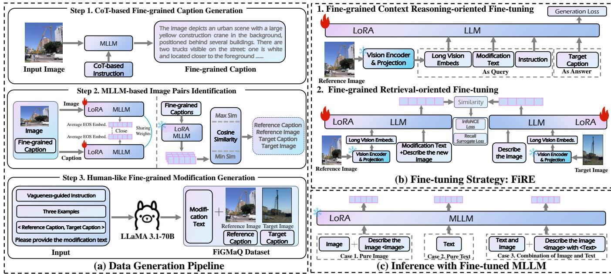
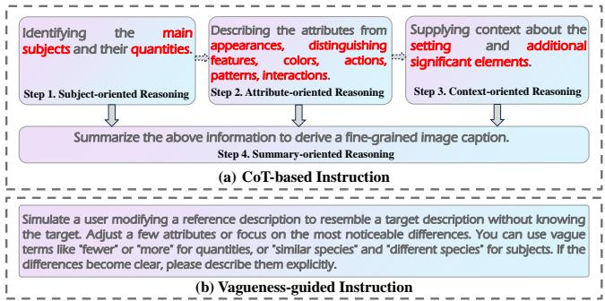
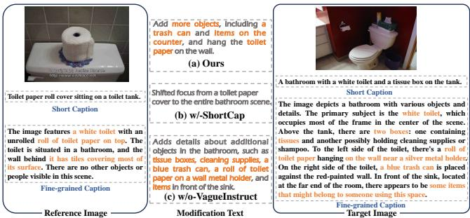
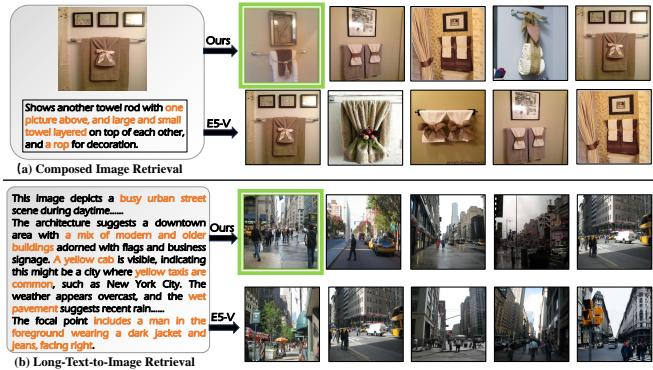

# 1. 论文基本信息

## 1.1. 标题
**FiRE: Enhancing MLLMs with Fine-Grained Context Learning for Complex Image Retrieval** (FiRE：利用细粒度上下文学习增强多模态大语言模型在复杂图像检索中的能力)

## 1.2. 作者
- **Bohan Hou**: 山东大学，中国青岛。
- **Haoqiang Lin**: 山东大学，中国青岛。
- **Xuemeng Song**: 香港城市大学，中国香港。
- **Haokun Wen**: 哈尔滨工业大学（深圳），中国深圳。
- **Meng Liu**: 山东建筑大学，中国济南。
- **Yupeng Hu**: 山东大学，中国济南。
- **Xiangyu Zhao**: 香港城市大学，中国香港。

## 1.3. 发表期刊/会议
**ACM SIGIR Conference on Research and Development in Information Retrieval (SIGIR '25)**
SIGIR 是信息检索领域最顶级的国际学术会议之一，具有极高的声誉和影响力。能在 SIGIR 发表通常意味着该工作在信息检索的理论、方法或应用上取得了显著进展。

## 1.4. 发表年份
2025年

## 1.5. 摘要
多模态大语言模型凭借其强大的泛化多模态处理和推理能力，显示出作为通用图像检索器的巨大潜力。然而，早期的研究虽然前景广阔，却忽视了细粒度上下文建模和解耦的微调目标在提升 MLLM 检索性能方面的潜力，尤其是在长文本到图像检索、视觉对话检索和组合图像检索（CIR）等复杂任务中。因此，本文提出了一种自动化的细粒度多模态五元组数据集构建管道和一种新颖的两阶段细粒度多模态微调策略。数据集生成管道产生了一个包含细粒度图像描述和修改文本的综合 CIR 数据集，促进了细粒度上下文建模。除了之前纠缠不清的微调范式，我们的方法将微调过程分为两个不同的阶段：(1) 细粒度上下文推理导向的微调和 (2) 细粒度检索导向的微调。这些阶段旨在依次增强模型的上下文理解和查询-目标对齐能力，从而提高检索性能。在包含多样化和复杂图像检索任务的五个数据集上的广泛实验表明，我们的方法在零样本检索设置下显著优于现有方法，即使与那些方法相比使用了更轻量级的 MLLM 主干网络。

## 1.6. 原文链接
- **PDF 链接**: /files/papers/69dcc906b03fbbc8eb026788/paper.pdf
- **发布状态**: 已发表于 SIGIR '25 Proceedings。

# 2. 整体概括

## 2.1. 研究背景与动机
### 2.1.1. 核心问题
随着用户需求的多样化，图像检索任务已从简单的短文本检索演变为更复杂的场景，如<strong>组合图像检索（Composed Image Retrieval, CIR）</strong>、**长文本到图像检索**和**基于对话的图像检索**。这些任务通常涉及长文本、多轮对话或图像与文本的组合查询，对模型理解复杂上下文和细粒度细节的能力提出了极高要求。现有的多模态大语言模型虽然具备强大的推理能力，但在直接应用于这些复杂检索任务时，往往面临性能瓶颈。

### 2.1.2. 现有挑战与空白
1.  **缺乏细粒度上下文建模**: 现有方法通常依赖简单的句子对或包含简短修改文本的三元组进行微调。这些数据仅提供粗粒度信息，缺乏详细描述，无法训练模型理解真实世界中常见的长文本或复合上下文。
2.  **次优的微调目标**: 现有的微调策略要么只关注查询-目标对齐（如 E5-V），要么将多模态上下文学习与检索任务纠缠在一起同时优化（如 MCL）。这种纠缠的优化目标可能导致无法在上下文理解和检索对齐之间取得最佳平衡，从而影响最终性能。

### 2.1.3. 切入点
本文旨在通过引入**细粒度上下文学习**来增强 MLLM，将其转化为能够处理各种复杂图像检索任务的强大通用检索器。具体切入点包括：
1.  构建一个大规模、高质量的细粒度多模态数据集，包含详细的图像描述和类人的修改文本。
2.  提出一种解耦的两阶段微调策略，分别优化模型的上下文推理能力和检索对齐能力。

## 2.2. 核心贡献/主要发现
1.  **数据集构建**: 提出了一个自动化的管道，用于生成大规模的细粒度多模态组合数据集 **FiGMaQ**。该数据集包含 87K 个五元组样本（参考图像、参考描述、修改文本、目标图像、目标描述），具有细粒度的描述和更贴近人类表达的修改文本。
2.  **微调策略**: 提出了一种名为 **FiRE** 的两阶段细粒度多模态微调策略。第一阶段专注于细粒度上下文推理，第二阶段专注于细粒度检索对齐。这种解耦策略在零样本设置下实现了最先进的性能。
3.  **实验验证**: 在七个涵盖复杂图像 retrieval 任务的数据集上进行了广泛实验，证明了 FiRE 在使用更轻量级 MLLM 主干网络（BLIP-3-4B）的情况下，性能显著优于现有的通用检索模型和专用的零样本 CIR 模型。

# 3. 预备知识与相关工作

## 3.1. 基础概念
为了理解本文，读者需要掌握以下核心概念：

1.  **多模态大语言模型**:
    这是一种结合了视觉编码器和大型语言模型（LLM）的模型，能够同时处理图像和文本输入，并生成文本输出或执行推理任务。例如 GPT-4V, LLaVA 等。本文使用的 MLLM 是 BLIP-3。

2.  **组合图像检索**:
    这是一种检索任务，用户输入包含两部分：一张参考图像和一段描述修改意图的文本。模型需要根据这两部分输入，检索出经过修改后的目标图像。例如，输入一张“红色衬衫”的图片和文本“变成蓝色”，模型应检索出“蓝色衬衫”的图片。

3.  **零样本检索**:
    指模型在没有在目标任务的数据集上进行特定训练的情况下，直接在该任务上进行测试的能力。这体现了模型的泛化能力。

4.  **链式思维**:
    一种提示技术，通过引导模型分步骤思考（例如先识别主体，再描述属性，最后总结），来提高模型在复杂任务上的推理能力和输出质量。

5.  **信息瓶颈与细粒度建模**:
    粗粒度的描述（如“一只狗”）丢失了太多细节（如“一只金毛犬在草地上接飞盘”），这对于区分细微差别的复杂检索任务是不够的。细粒度建模旨在保留和利用这些细节信息。

## 3.2. 前人工作
作者主要对比了以下几类相关工作：

1.  **MCL (ICML '24)**: 提出通过多模态组合学习来增强 MLLM 的上下文理解，使用了大规模的多模态组合数据集（MMC），并在多模态上下文描述和检索任务上进行联合微调。
2.  **E5-V (Arxiv '24)**: 专注于提升 MLLM 的查询-目标对齐能力，通过在纯文本对上微调 MLLM 的核心组件来实现。
3.  **MagicLens (ICML '24)**: 提出了一种自监督的图像检索方法，通过自动化管道生成大规模的三元组数据，但其生成的元数据较为粗粒度。
4.  <strong>Textual-inversion 类方法 (如 Pic2Word, SEARLE)</strong>: 试图将图像映射为伪词元，从而利用预训练的 VLP 编码器进行处理。

## 3.3. 技术演进
该领域的技术演进路径如下：
- <strong>早期 VLP 模型 (如 CLIP)</strong>: 利用对比学习学习图像-文本对齐，擅长简单任务，但缺乏复杂推理能力。
- **专用 CIR 模型**: 针对组合检索设计特定架构，但通常无法泛化到其他检索任务。
- **基于 LLM 的方法**: 利用 LLM 强大的语言能力，将 CIR 转化为文本检索或直接生成描述，但往往缺乏判别性的检索对齐能力。
- <strong>基于 MLLM 的通用检索器 (本文方向)</strong>: 结合视觉和语言优势，通过微调使其成为通用的图像检索器。本文进一步推进了这一方向，通过细粒度数据和解耦训练解决了现有 MLLM 检索器的不足。

## 3.4. 差异化分析
本文方法与现有方法的核心区别在于：
1.  **数据粒度**: 与 MagicLens 和 MCL 使用粗粒度数据不同，本文构建了包含细粒度描述（平均超过 100 个词元）和类人修改文本的数据集 FiGMaQ。
2.  **训练策略**: 与 MCL 的纠缠式训练不同，本文将微调解耦为“推理导向”和“检索导向”两个阶段，避免了目标冲突。
3.  **对齐方式**: 在检索微调阶段，本文将查询特征与多模态目标特征（而非单模态文本特征）进行对齐，增强了跨模态的一致性。

# 4. 方法论

本文的方法论主要包含两个核心部分：自动化数据集构建管道和两阶段微调策略。

## 4.1. 方法原理
核心思想是：为了解决 MLLM 在复杂检索任务中表现不佳的问题，必须从“数据”和“训练”两个维度入手。
1.  **数据维度**: 构建高质量、细粒度的多模态数据，迫使模型学习细节。
2.  **训练维度**: 分阶段训练，先让模型学会“理解”复杂的上下文（推理），再让模型学会“对齐”查询和目标（检索），从而在保持推理能力的同时获得判别性检索能力。

## 4.2. 核心方法详解 (逐层深入)

### 4.2.1. 细粒度多模态数据集生成管道
该管道旨在生成 FiGMaQ 数据集，包含三个阶段。

下图（原文 Figure 2）展示了 FiRE 的整体框架，包括数据生成管道（左侧）和两阶段微调策略（右侧）：

*该图像是示意图，展示了FiRE的多阶段数据生成与微调策略。图中包括了基于CoT的细粒度标题生成、使用MLLM进行图像对的识别、以及人类风格的细粒度修饰生成等步骤，旨在增强多模态大语言模型在复杂图像检索任务中的表现。*

#### 阶段 1: 基于 CoT 的细粒度图像描述生成
为了获得详细的图像描述，作者设计了一种思维链指令，引导 MLLM 分步骤生成描述。
- **步骤 1: 主体导向推理**: 识别图像中的主要对象及其数量。
- **步骤 2: 属性导向推理**: 描述对象的详细属性（外观、颜色、图案、特征、动作、交互）。
- **步骤 3: 上下文导向推理**: 描述背景环境和其他重要元素。
- **步骤 4: 总结导向推理**: 将上述信息综合成连贯的细粒度描述。

  这种分步骤生成确保了描述的丰富性和细节度，平均长度超过 100 个词元。

#### 阶段 2: 基于 MLLM 的图像对识别
为了构建组合检索所需的“参考图像-目标图像”对，需要识别语义相关但又有差异的图像对。不同于以往依赖视觉相似度的方法，本文利用**细粒度语义相似度**。

由于现有的 VLP 编码器难以处理过长的细粒度文本，作者选择微调一个 MLLM 来增强其长文本编码能力。
具体操作是：在输入序列（图像词元或描述词元）末尾追加 $M$ 个 **EOS (End-of-Sequence)** 词元，并利用 MLLM 输出层中这些 EOS 词元的嵌入平均值作为该输入的最终表示。公式如下：

$$
\mathbf { f } = \frac { 1 } { M } \sum _ { m = 1 } ^ { M } \mathrm { L L M } \big ( \mathrm { I n p u t } ; M \cdot [ \mathrm { E O S } ] \big ) \big [ - m \big ] .
$$

**符号解释**:
- $\mathbf{f}$: 输入（图像或文本）的最终特征向量。
- $M$: 追加的 EOS 词元数量。
- $\mathrm{LLM}(\cdot)$: 多模态大语言模型的正向传播过程。
- $\mathrm{Input}$: 输入的词元序列（图像词元或文本词元）。
- $M \cdot [\mathrm{EOS}]$: 表示 $M$ 个 EOS 词元。
- `[-m]`: 表示取输出序列倒数第 $m$ 个位置的嵌入。

  利用上述特征表示，作者使用标准的图像-文本对比损失来微调 MLLM，以对齐图像和其细粒度描述。损失函数如下：

$$
\mathcal { L } _ { a l i g n } = - \frac { 1 } { 2 B } \sum _ { i = 1 } ^ { B } \left[ \log \frac { \exp \left( s _ { i i } / \tau \right) } { \sum _ { j = 1 } ^ { B } \exp \left( s _ { i j } / \tau \right) } + \log \frac { \exp \left( s _ { i i } / \tau \right) } { \sum _ { j = 1 } ^ { B } \exp \left( s _ { j i } / \tau \right) } \right] .
$$

**符号解释**:
- $\mathcal{L}_{align}$: 对齐损失函数。
- $B$: 批次大小。
- $s_{ij}$: 第 $i$ 个图像与第 $j$ 个文本之间的相似度，计算公式为 $s_{ij} = \cos \langle \mathbf{f}_i^v, \mathbf{f}_j^t \rangle$。
- $\tau$: 温度参数，用于控制相似度分布的平滑程度。

  训练完成后，利用该模型计算图像之间的语义相似度，并设定阈值 $\theta_l$ 和 $\theta_h$ 来筛选出既不过于相似也不完全无关的图像对。公式如下：

$$
\{ \langle I _ { r } , I _ { t } \rangle \ : | \ : \cos \langle \mathbf { f } _ { I _ { r } } , \mathbf { f } _ { I _ { t } } \rangle \in [ \theta _ { l } , \theta _ { h } ] \} .
$$

**符号解释**:
- $I_r, I_t$: 参考图像和目标图像。
- $\mathbf{f}_{I_r}, \mathbf{f}_{I_t}$: 参考图像和目标图像的特征向量。
- $\theta_l, \theta_h$: 相似度的下限和上限阈值。

#### 阶段 3: 类人细粒度修改文本生成
为了生成更自然的修改文本，作者设计了一种**模糊引导指令**。
- **输入**: 图像对的细粒度描述。
- **指令**: 模拟真实场景，引导 LLM 生成模糊的修改（如“颜色变浅点”），而非精确的数值修改（如“RGB值增加10”）。
- **示例**: 提供少量人工标注的示例（包含模糊和精确修改）来辅助 LLM 理解。

  下图（原文 Figure 3）展示了 CoT 指令和模糊引导指令的具体结构：

  
  *该图像是示意图，展示了基于 CoT 的指令（a）和模糊引导指令（b）的步骤。图中包括四个步骤：主对象识别、属性描述、背景提供和总结推理，这些步骤帮助生成细粒度的图像描述。*

### 4.2.2. 细粒度多模态微调策略 (FiRE)
FiRE 将微调过程分为两个阶段，旨在解耦推理能力和检索对齐能力的优化。

#### 阶段 1: 细粒度上下文推理导向的微调
此阶段的目标是增强 MLLM 理解复杂上下文和进行细粒度推理的能力。
- **任务形式**: 给定参考图像和修改文本，生成目标图像的细粒度描述。
- **指令格式**: $<reference image> but modified with <modification text>. Please describe the new image$。
- **表示方式**: 将参考图像视为长文本序列，使用 MLLM 生成长序列词元嵌入，而非简单的 CLIP 视觉嵌入。这有助于模型学习细粒度上下文。
- **损失函数**: 使用标准的生成损失（交叉熵损失）。公式如下：

  $$
\mathcal { L } _ { g e n } = - \sum _ { i = 1 } ^ { N } \log P _ { L L M } ( x _ { i } | \Phi , x _ { 1 : i - 1 } ) ,
$$

**符号解释**:
- $\mathcal{L}_{gen}$: 生成损失。
- $N$: 答案（目标描述）的词元长度。
- $x_i$: 答案中第 $i$ 个词元。
- $\Phi$: 指令部分的嵌入。
- $P_{LLM}$: MLLM 预测下一个词元的概率。

#### 阶段 2: 细粒度检索导向的微调
此阶段基于第一阶段增强的推理能力，进一步优化模型的查询-目标对齐能力。
- **任务形式**: 组合图像检索（CIR）。
- **查询格式**: $(<reference image> but <modification text>, please describe the new image)$。
- **目标格式**: $(<target image>, describe the image)$。
- **特征提取**: 使用与数据生成阶段相同的 EOS 嵌入平均法（式 1）提取查询和目标的特征向量。
- **损失函数**: 结合了 **InfoNCE 损失**和 **Recall@k 代理损失**。

  InfoNCE 损失用于批次内的对比学习，拉近正样本对，推远负样本对。公式如下：

$$
\mathcal { L } _ { I n f o N C E } = - \frac { 1 } { B } \sum _ { i = 1 } ^ { B } \log \frac { \exp { \left( \cos \langle \mathbf { f } _ { i } ^ { \mathrm { q u e r y } } , \mathbf { f } _ { i } ^ { \mathrm { t a r g e t } } \rangle / \tau ^ { \prime } \right) } } { \sum _ { j = 1 } ^ { B } \exp { \left( \cos \langle \mathbf { f } _ { i } ^ { \mathrm { q u e r y } } , \mathbf { f } _ { j } ^ { \mathrm { t a r g e t } } \rangle / \tau ^ { \prime } \right) } } ,
$$

**符号解释**:
- $\mathcal{L}_{InfoNCE}$: InfoNCE 损失。
- $\mathbf{f}_i^{query}$: 第 $i$ 个样本的查询特征。
- $\mathbf{f}_j^{target}$: 第 $j$ 个样本的目标特征。
- $\tau'$: 温度参数。

  Recall@k 代理损失直接约束真实目标在批次内的排名，以提高检索性能。公式如下：

$$
\begin{array}{c} \begin{array} { r } { \left\{ \tilde { R } _ { \Omega } ^ { k } ( q ) = \frac { \displaystyle \sum _ { x \in \mathcal { P } _ { q } } \sigma _ { \tau _ { 1 } } \left( k - 1 - \displaystyle \sum _ { z \in \Omega , z \neq x } \sigma _ { \tau _ { 2 } } ( s _ { q z } - s _ { q x } ) \right) } { \displaystyle | \mathcal { P } _ { q } | } , \right.} \\ { \displaystyle \mathcal { L } _ { r e c a l l } ^ { k } = \frac { 1 } { B } \displaystyle \sum _ { i = 1 } ^ { B } ( 1 - \tilde { R } _ { \Omega } ^ { k } ( q _ { i } ) ) , } \end{array}   \end{array}
$$

**符号解释**:
- $\tilde{R}_{\Omega}^k(q)$: 查询 $q$ 在候选集 $\Omega$ 中的 Recall@k 的可微代理值。
- $\mathcal{P}_q$: 查询 $q$ 的真实匹配（正样本）集合。
- $\Omega$: 所有候选项目的集合。
- $s_{qz}$: 查询 $q$ 与候选 $z$ 的相似度分数。
- $\sigma_{\tau_1}, \sigma_{\tau_2}$: 带有温度参数的 Sigmoid 函数。
- $\mathcal{L}_{recall}^k$: Recall@k 代理损失。

  总损失函数为 InfoNCE 损失与多个 Recall@k 代理损失的加权和。公式如下：

$$
\mathcal { L } _ { T o t a l } = \mathcal { L } _ { I n f o N C E } + \sum _ { k \in \mathcal { R } _ { s } } \beta _ { k } \mathcal { L } _ { R e c a l l } ^ { k } ,
$$

**符号解释**:
- $\mathcal{L}_{Total}$: 总损失。
- $\mathcal{R}_s$: 采用的 $k$ 值集合（如 $\{1, 5\}$）。
- $\beta_k$: 控制不同 Recall 损失贡献的超参数。

# 5. 实验设置

## 5.1. 数据集
实验涵盖了多种图像检索任务，以全面评估模型的泛化能力。

1.  <strong>组合图像检索 (CIR)</strong>:
    - **CIRR**: 开放域数据集，包含参考图像、修改文本和目标图像。
    - **CIRCO**: 开放域数据集，评估指标为 mAP。
    - **FashionIQ**: 时尚领域数据集，分为 Dresses, Shirts, Tops&Tees 三个子集。

2.  **长文本到图像检索**:
    - **Urban1K**: 城市景观数据集，包含 1K 张图像和详细的细粒度描述。

3.  **基于对话的图像检索**:
    - **Visual Dialog**: 包含多轮对话历史和图像的数据集。

4.  **短文本到图像检索**:
    - **COCO** 和 **Flickr30K**: 经典的图像检索基准数据集。

## 5.2. 评估指标
论文使用了以下标准检索指标：

1.  **Recall@k (R@k)**:
    - **概念定义**: 召回率@k。它衡量的是在检索返回的前 $k$ 个结果中，是否包含至少一个真实标注数据。对于检索任务，R@1 是最严格的指标，R@k（k较大）则反映模型的整体排序能力。
    - **数学公式**:
      $$
        \text{Recall@k} = \frac{1}{|Q|} \sum_{q \in Q} \mathbb{I}(\text{rank}(q, \text{gt}) \leq k)
        $$
    - **符号解释**:
        - $|Q|$: 查询集合的总数。
        - $q$: 单个查询。
        - $\mathbb{I}(\cdot)$: 指示函数，条件为真时为 1，否则为 0。
        - $\text{rank}(q, \text{gt})$: 真实标注数据在查询 $q$ 的检索结果排序中的位置。

2.  **Mean Average Precision (mAP)**:
    - **概念定义**: 平均精度均值。它综合考虑了检索结果的排序位置，对排在前面的正确结果给予更高的奖励。常用于多标签检索或评估整体排序质量。
    - **数学公式**:
      $$
        \text{mAP} = \frac{1}{|Q|} \sum_{q \in Q} \left( \frac{1}{m_q} \sum_{i=1}^{m_q} \text{Precision}@i \right)
        $$
    - **符号解释**:
        - $m_q$: 查询 $q$ 对应的真实标注数据数量。
        - $\text{Precision}@i$: 截止到第 $i$ 个结果时的精度。

## 5.3. 对比基线
论文将 FiRE 与以下基线模型进行了对比：

1.  **MLLM 通用检索模型**:
    - **MCL**: 基于多模态组合学习的 MLLM 检索器。
    - **E5-V**: 专注于文本对齐的 MLLM 检索器。

2.  **专用零样本 CIR 模型**:
    - **Textual-inversion 类**: Pic2Word, LinCIR, SEARLE, ContextI2W, FTI4CIR。
    - **Triplets-generation 类**: MagicLens。
    - **LLM-based training-free 类**: CIReVL, LDRE。

3.  **其他基线**:
    - **Long-CLIP**: 专门处理长文本的 CLIP 变体。
    - **CLIP**: 经典的视觉-语言预训练模型。

# 6. 实验结果与分析

## 6.1. 核心结果分析
实验结果表明，FiRE 在大多数复杂检索任务上取得了最先进的性能。

### 6.1.1. 组合图像检索 (CIR) 结果
以下是原文 Table 1 的结果，展示了在 CIRR 和 CIRCO 数据集上的性能对比：

以下是原文 Table 1 的结果：

<table>
<thead>
<tr>
<th rowspan="3">Method</th>
<th colspan="7">CIRR</th>
<th colspan="4">CIRCO</th>
</tr>
<tr>
<th colspan="4">R@k</th>
<th colspan="3">Rsubset@</th>
<th colspan="4">mAP@k</th>
</tr>
<tr>
<th>k = 1</th>
<th>k = 5</th>
<th>k = 10</th>
<th>k = 50</th>
<th>k = 1</th>
<th>k = 2</th>
<th>k = 3</th>
<th>k = 5</th>
<th>k = 10</th>
<th>k = 25</th>
<th>k = 50</th>
</tr>
</thead>
<tbody>
<tr>
<td>Pic2Word [29](CVPR'23)</td>
<td>23.90</td>
<td>51.70</td>
<td>65.30</td>
<td>87.80</td>
<td>-</td>
<td>-</td>
<td>-</td>
<td>8.72</td>
<td>9.51</td>
<td>10.46</td>
<td>11.29</td>
</tr>
<tr>
<td>LinCIR [8](CVPR'24)</td>
<td>25.04</td>
<td>53.25</td>
<td>66.68</td>
<td>-</td>
<td>57.11</td>
<td>77.37</td>
<td>88.89</td>
<td>12.59</td>
<td>13.58</td>
<td>15.00</td>
<td>15.85</td>
</tr>
<tr>
<td>SEARLE-XL-OTI [1](ICCV'23)</td>
<td>24.87</td>
<td>52.31</td>
<td>66.29</td>
<td>88.58</td>
<td>53.80</td>
<td>74.31</td>
<td>86.94</td>
<td>10.18</td>
<td>11.03</td>
<td>12.72</td>
<td>13.67</td>
</tr>
<tr>
<td>SEARLE-XL [1](ICCV'23)</td>
<td>24.24</td>
<td>52.48</td>
<td>66.29</td>
<td>88.84</td>
<td>53.76</td>
<td>75.01</td>
<td>88.19</td>
<td>11.68</td>
<td>12.73</td>
<td>14.33</td>
<td>15.12</td>
</tr>
<tr>
<td>ContextI2W [31](AAAI'24)</td>
<td>25.60</td>
<td>55.10</td>
<td>68.50</td>
<td>89.80</td>
<td>-</td>
<td>-</td>
<td>-</td>
<td>-</td>
<td>-</td>
<td>-</td>
<td>-</td>
</tr>
<tr>
<td>FTI4CIR [17](SIGIR'24)</td>
<td>25.90</td>
<td>55.61</td>
<td>67.66</td>
<td>89.66</td>
<td>55.21</td>
<td>75.88</td>
<td>87.98</td>
<td>15.05</td>
<td>16.32</td>
<td>18.06</td>
<td>19.05</td>
</tr>
<tr>
<td>MagicLens [40](ICML 24)</td>
<td>30.10</td>
<td>61.70</td>
<td>74.40</td>
<td>92.60</td>
<td>68.10</td>
<td>84.80</td>
<td>93.20</td>
<td>29.60</td>
<td>30.80</td>
<td>33.40</td>
<td>34.40</td>
</tr>
<tr>
<td>CIReVL(GPT-3.5-turbo) [12](ICLR'24)</td>
<td>24.55</td>
<td>52.31</td>
<td>64.92</td>
<td>86.34</td>
<td>59.54</td>
<td>79.88</td>
<td>89.69</td>
<td>18.57</td>
<td>19.01</td>
<td>20.9</td>
<td>21.80</td>
</tr>
<tr>
<td>LDRE(GPT-3.5-turbo) [38](SIGIR'24)</td>
<td>26.53</td>
<td>55.57</td>
<td>67.54</td>
<td>88.50</td>
<td>66.43</td>
<td>80.31</td>
<td>90.05</td>
<td>23.35</td>
<td>24.03</td>
<td>26.44</td>
<td>27.50</td>
</tr>
<tr>
<td>MCL(OPT-2.7B) [16](ICML'24)</td>
<td>23.28</td>
<td>54.17</td>
<td>67.16</td>
<td>90.05</td>
<td>58.24</td>
<td>79.37</td>
<td>90.51</td>
<td>14.55</td>
<td>15.79</td>
<td>17.38</td>
<td>18.27</td>
</tr>
<tr>
<td>MCL(OPT-6.7B) [16](ICML'24)</td>
<td>24.15</td>
<td>55.98</td>
<td>69.21</td>
<td>90.82</td>
<td>59.52</td>
<td>80.34</td>
<td>91.13</td>
<td>14.14</td>
<td>16.13</td>
<td>17.88</td>
<td>18.82</td>
</tr>
<tr>
<td>MCL(LLaMA2-7B) [16](ICML'24)</td>
<td>26.22</td>
<td>56.84</td>
<td>70.00</td>
<td>91.35</td>
<td>61.45</td>
<td>81.61</td>
<td>91.93</td>
<td>17.67</td>
<td>18.86</td>
<td>20.80</td>
<td>21.68</td>
</tr>
<tr>
<td>E5-V(LLaVA-NeXT-8B) [11](Arxiv'24)</td>
<td>33.90</td>
<td>64.12</td>
<td>75.88</td>
<td>93.54</td>
<td>67.48</td>
<td>81.20</td>
<td>92.48</td>
<td>18.48</td>
<td>19.21</td>
<td>20.95</td>
<td>21.83</td>
</tr>
<tr>
<td><b>FiRE(BLIP-3-4B) (Ours)</b></td>
<td><b>43.33</b></td>
<td><b>74.02</b></td>
<td><b>83.51</b></td>
<td><b>95.83</b></td>
<td><b>73.01</b></td>
<td><b>88.38</b></td>
<td><b>94.94</b></td>
<td><b>31.03</b></td>
<td><b>32.08</b></td>
<td><b>34.40</b></td>
<td><b>35.50</b></td>
</tr>
<tr>
<td>Ours vs. Dedicated ZS-CIR Model</td>
<td>↑ 13.23</td>
<td>↑ 12.32</td>
<td>↑9.11</td>
<td>↑3.23</td>
<td>↑4.91</td>
<td>↑3.58</td>
<td>↑ 1.74</td>
<td>↑ 1.43</td>
<td>↑ 1.28</td>
<td>↑ 1.00</td>
<td>↑ 1.10</td>
</tr>
<tr>
<td>Ours vs. Universal Retrieval Model</td>
<td>↑ 9.43</td>
<td>↑9.90</td>
<td>↑7.63</td>
<td>↑ 2.29</td>
<td>↑ 5.53</td>
<td>↑7.18</td>
<td>↑2.46</td>
<td>↑ 12.55</td>
<td>↑ 12.87</td>
<td>↑ 13.45</td>
<td>↑ 13.77</td>
</tr>
</tbody>
</table>

**分析**:
- FiRE 在 CIRR 和 CIRCO 上均显著优于所有基线。与之前的最佳通用模型 E5-V 相比，FiRE 在 CIRR 的 R@1 上提升了约 9.4%，在 CIRCO 的 mAP@5 上提升了约 12.5%。
- 值得注意的是，FiRE 使用的是 4B 参数的 BLIP-3，而 E5-V 使用的是 8B 参数的 LLaVA-NeXT。这表明 FiRE 的方法在参数效率上也具有优势。

  以下是原文 Table 2 的结果，展示了在 FashionIQ 数据集上的性能对比：

以下是原文 Table 2 的结果：

<table>
<thead>
<tr>
<th rowspan="2">Method</th>
<th colspan="2">Dresses</th>
<th colspan="2">Shirts</th>
<th colspan="2">Tops&amp;Tees</th>
<th colspan="2">Avg</th>
</tr>
<tr>
<th>R@10</th>
<th>R@50</th>
<th>R@10</th>
<th>R@50</th>
<th>R@10</th>
<th>R@50</th>
<th>R@10</th>
<th>R@50</th>
</tr>
</thead>
<tbody>
<tr>
<td>Pic2Word [29](CVPR'23)</td>
<td>20.00</td>
<td>40.20</td>
<td>26.20</td>
<td>43.60</td>
<td>27.90</td>
<td>47.40</td>
<td>24.70</td>
<td>43.70</td>
</tr>
<tr>
<td>LinCIR [8](CVPR'24)</td>
<td>20.92</td>
<td>42.44</td>
<td>29.10</td>
<td>46.81</td>
<td>28.81</td>
<td>50.18</td>
<td>26.28</td>
<td>46.48</td>
</tr>
<tr>
<td>SEARLE-XL-OTI [1](ICCV'23(]</td>
<td>21.57</td>
<td>44.47</td>
<td>30.37</td>
<td>47.49</td>
<td>30.90</td>
<td>51.76</td>
<td>27.61</td>
<td>47.90</td>
</tr>
<tr>
<td>SEARLE-XL [1](ICCV'23)</td>
<td>20.48</td>
<td>43.13</td>
<td>26.89</td>
<td>45.58</td>
<td>29.32</td>
<td>49.97</td>
<td>25.56</td>
<td>46.23</td>
</tr>
<tr>
<td>Context-I2W [31](AAAI'24)</td>
<td>23.10</td>
<td>45.30</td>
<td>29.70</td>
<td>48.60</td>
<td>30.60</td>
<td>52.90</td>
<td>27.80</td>
<td>48.93</td>
</tr>
<tr>
<td>FTI4CIR [17](SIGIR'24)</td>
<td>24.39</td>
<td>47.84</td>
<td>31.35</td>
<td>50.59</td>
<td>32.43</td>
<td>54.21</td>
<td>29.39</td>
<td>50.88</td>
</tr>
<tr>
<td>MagicLens [40](CML2)</td>
<td>25.50</td>
<td>46.10</td>
<td>32.70</td>
<td>53.80</td>
<td>34.00</td>
<td>57.70</td>
<td>30.73</td>
<td>52.53</td>
</tr>
<tr>
<td>CIReVL(GPT-3.5-turbo) [12](ICLR'24)</td>
<td>24.79</td>
<td>44.76</td>
<td>29.49</td>
<td>47.40</td>
<td>31.36</td>
<td>53.65</td>
<td>28.55</td>
<td>48.57</td>
</tr>
<tr>
<td>LDRE(GPT-3.5-turbo) [38](SIGIR'24)</td>
<td>22.93</td>
<td>46.76</td>
<td>31.04</td>
<td>51.22</td>
<td>31.57</td>
<td>53.64</td>
<td>28.51</td>
<td>50.54</td>
</tr>
<tr>
<td>E5-V(LLaVA-NeXT-8B) [11](Arxiv'24)</td>
<td>23.75</td>
<td>47.45</td>
<td>36.36</td>
<td>56.43</td>
<td>35.29</td>
<td>57.47</td>
<td>31.80</td>
<td>53.78</td>
</tr>
<tr>
<td><b>FiRE(BLIP-3-4B) (Ours)</b></td>
<td><b>29.60</b></td>
<td><b>50.87</b></td>
<td><b>39.84</b></td>
<td><b>60.06</b></td>
<td><b>35.64</b></td>
<td><b>57.83</b></td>
<td><b>35.02</b></td>
<td><b>56.25</b></td>
</tr>
<tr>
<td>Ours vs. Dedicated ZS-CIR Model</td>
<td>↑4.10</td>
<td>↑3.03</td>
<td>↑7.14</td>
<td>↑6.26</td>
<td>↑ 1.64</td>
<td>↑0.13</td>
<td>↑4.29</td>
<td>↑3.72</td>
</tr>
<tr>
<td>Ours vs. Universal Retrieval Model</td>
<td>↑5.85</td>
<td>↑3.42</td>
<td> ↑ 3.48</td>
<td>↑ 3.63</td>
<td>↑ 0.35</td>
<td>↑ 0.36</td>
<td>↑3.22</td>
<td>↑ 2.47</td>
</tr>
</tbody>
</table>

### 6.1.2. 跨模态检索结果
以下是原文 Table 3 的结果，展示了在 Visual Dialog 和 Urban1K 上的性能：

以下是原文 Table 3 的结果：

<table>
<thead>
<tr>
<th rowspan="2">Method</th>
<th colspan="3">Visual Dialog</th>
<th colspan="3">Urban1K</th>
</tr>
<tr>
<th>R@1</th>
<th>R@5</th>
<th>R@10</th>
<th>R@1</th>
<th>R@5</th>
<th>R@10</th>
</tr>
</thead>
<tbody>
<tr>
<td>CLIP [27]</td>
<td>17.7</td>
<td>38.9</td>
<td>50.2</td>
<td>55.8</td>
<td>79.6</td>
<td>86.5</td>
</tr>
<tr>
<td>MCL(OPT-2.7B) [16]</td>
<td>25.6</td>
<td>51.9</td>
<td>65.2</td>
<td>-</td>
<td>-</td>
<td>-</td>
</tr>
<tr>
<td>MCL(OPT-6.7B) [16]</td>
<td>27.2</td>
<td>51.0</td>
<td>64.0</td>
<td>-</td>
<td>-</td>
<td>-</td>
</tr>
<tr>
<td>MCL(LLaMA2-7B) [16]</td>
<td>29.8</td>
<td>57.1</td>
<td>69.4</td>
<td>-</td>
<td>-</td>
<td>-</td>
</tr>
<tr>
<td>E5-V(LLaVA-NeXT-8B) [11]</td>
<td>48.1</td>
<td>74.8</td>
<td>83.7</td>
<td>80.6</td>
<td>93.9</td>
<td>96.6</td>
</tr>
<tr>
<td>Long-CLIP [39]</td>
<td>35.4</td>
<td>62.0</td>
<td>72.7</td>
<td>86.1</td>
<td>96.4</td>
<td>98.1</td>
</tr>
<tr>
<td><b>FiRE(BLIP-3-4B) (Ours)</b></td>
<td><b>54.9</b></td>
<td><b>79.9</b></td>
<td><b>88.0</b></td>
<td><b>91.4</b></td>
<td><b>98.0</b></td>
<td><b>99.2</b></td>
</tr>
</tbody>
</table>

**分析**:
- 在 Visual Dialog 和 Urban1K 这两个复杂任务上，FiRE 同样表现优异，显著优于 E5-V 和 Long-CLIP。这证明了通过 CIR 任务进行细粒度微调能够有效泛化到其他复杂检索任务。

  以下是原文 Table 4 的结果，展示了在 COCO 和 Flickr 上的性能：

以下是原文 Table 4 的结果：

<table>
<thead>
<tr>
<th rowspan="2">Method</th>
<th colspan="3">COCO</th>
<th colspan="3">Flickr</th>
</tr>
<tr>
<th>R@1</th>
<th>R@5</th>
<th>R@10</th>
<th>R@1</th>
<th>R@5</th>
<th>R@10</th>
</tr>
</thead>
<tbody>
<tr>
<td>CLIP [27]</td>
<td>35.4</td>
<td>60.1</td>
<td>70.2</td>
<td>68.7</td>
<td>90.6</td>
<td>95.2</td>
</tr>
<tr>
<td>MagicLens [40]</td>
<td>44.3</td>
<td>69.4</td>
<td>78.3</td>
<td>72.5</td>
<td>91.5</td>
<td>95.2</td>
</tr>
<tr>
<td>Long-CLIP [39]</td>
<td>46.3</td>
<td>70.8</td>
<td>79.8</td>
<td>76.1</td>
<td>93.5</td>
<td>95.2</td>
</tr>
<tr>
<td>E5-V [11]</td>
<td>52.0</td>
<td>76.5</td>
<td>84.7</td>
<td>79.5</td>
<td>95.0</td>
<td>97.6</td>
</tr>
<tr>
<td><b>FiRE (Ours)</b></td>
<td><b>52.3</b></td>
<td><b>76.7</b></td>
<td><b>82.6</b></td>
<td><b>76.2</b></td>
<td><b>93.0</b></td>
<td><b>95.5</b></td>
</tr>
</tbody>
</table>

**分析**:
- 在简单的短文本检索任务（COCO, Flickr）上，FiRE 的性能与 E5-V 持平或略优（考虑到 E5-V 模型更大且专门针对短文本训练），说明 FiRE 并未因专注于复杂任务而丢失简单任务的能力。

## 6.2. 消融实验/参数分析
以下是原文 Table 5 的消融实验结果：

以下是原文 Table 5 的消融实验结果：

<table>
<thead>
<tr>
<th rowspan="2">Method</th>
<th colspan="2">FashionIQ-Avg</th>
<th colspan="2">CIRR</th>
<th colspan="2">Visual Dialog</th>
<th colspan="2">Urban1K</th>
</tr>
<tr>
<th>R@10</th>
<th>R@50</th>
<th>R@1</th>
<th>R@5</th>
<th>R@1</th>
<th>R@5</th>
<th>R@1</th>
<th>R@5</th>
</tr>
</thead>
<tbody>
<tr>
<td>w/-Img-LongCap</td>
<td>11.24</td>
<td>23.56</td>
<td>11.33</td>
<td>33.61</td>
<td>53.10</td>
<td>77.82</td>
<td>91.70</td>
<td>98.40</td>
</tr>
<tr>
<td>w/-OneStage</td>
<td>32.72</td>
<td>53.60</td>
<td>41.67</td>
<td>72.35</td>
<td>53.21</td>
<td>78.99</td>
<td>87.90</td>
<td>96.20</td>
</tr>
<tr>
<td>w/o-FirstStage</td>
<td>32.54</td>
<td>52.06</td>
<td>41.79</td>
<td>71.59</td>
<td>54.12</td>
<td>79.31</td>
<td>88.20</td>
<td>97.40</td>
</tr>
<tr>
<td>w/-ShortCap</td>
<td>32.21</td>
<td>52.63</td>
<td>42.33</td>
<td>72.72</td>
<td>53.45</td>
<td>78.97</td>
<td>88.90</td>
<td>97.20</td>
</tr>
<tr>
<td>w/o-RecallLoss</td>
<td>33.14</td>
<td>53.69</td>
<td>41.21</td>
<td>72.25</td>
<td>53.88</td>
<td>79.12</td>
<td>87.90</td>
<td>97.20</td>
</tr>
<tr>
<td><b>FiRE (Ours)</b></td>
<td><b>35.02</b></td>
<td><b>56.25</b></td>
<td><b>43.33</b></td>
<td><b>74.02</b></td>
<td><b>54.88</b></td>
<td><b>79.89</b></td>
<td><b>91.40</b></td>
<td><b>98.00</b></td>
</tr>
</tbody>
</table>

**分析**:
- **w/-Img-LongCap**: 仅使用图像-长描述对对齐进行训练。结果显示在 CIR 和 Visual Dialog 上性能大幅下降，验证了使用 CIR 任务进行微调对于提升复杂推理能力的重要性。
- **w/-OneStage**: 将两个阶段合并为一个阶段。性能下降，说明解耦的两阶段训练优于纠缠式训练。
- **w/o-FirstStage**: 移除第一阶段推理训练。性能下降，说明第一阶段对于增强上下文理解至关重要。
- **w/-ShortCap**: 使用粗粒度描述替代细粒度描述。性能下降，验证了细粒度数据的必要性。
- **w/o-RecallLoss**: 移除 Recall 代理损失。性能下降，说明该损失能有效提升检索判别能力。

## 6.3. 数据集质量对比
以下是原文 Table 6 的数据集质量对比结果：

以下是原文 Table 6 的数据集质量对比结果：

<table>
<thead>
<tr>
<th rowspan="2">Supervision</th>
<th rowspan="2">Dataset</th>
<th rowspan="2">Scale</th>
<th colspan="3">R@k</th>
<th rowspan="2">RSubset@1</th>
</tr>
<tr>
<th>k = 1</th>
<th>k = 5</th>
<th>k = 10</th>
</tr>
</thead>
<tbody>
<tr>
<td rowspan="3">Zero-Shot</td>
<td>MMC [16]</td>
<td>2.7M</td>
<td>21.74</td>
<td>51.54</td>
<td>65.33</td>
<td>49.28</td>
</tr>
<tr>
<td>LaSCo [14]</td>
<td>359.2K</td>
<td>23.98</td>
<td>53.68</td>
<td>67.40</td>
<td>51.06</td>
</tr>
<tr>
<td><b>FiGMaQ(Ours)</b></td>
<td><b>87K</b></td>
<td><b>26.96</b></td>
<td><b>55.52</b></td>
<td><b>70.24</b></td>
<td><b>55.66</b></td>
</tr>
<tr>
<td>Supervised</td>
<td>CIRR</td>
<td>28.2K</td>
<td>28.17</td>
<td>57.51</td>
<td>71.74</td>
<td>58.77</td>
</tr>
</tbody>
</table>

**分析**:
- 尽管 FiGMaQ 规模最小（87K），但其零样本性能优于大规模的 MMC（2.7M）和 LaSCo（359.2K）。
- FiGMaQ 的性能甚至接近于在 CIRR 训练集上进行监督训练的结果。这证明了本文提出的数据生成管道能够生成高质量、高信息密度的数据。

  下图（原文 Figure 4）展示了不同方法生成的修改文本的定性对比。可以看出，本文的方法生成的修改文本更加自然且聚焦于关键差异。

  
  *该图像是示意图，展示了三种不同的修改文本：我们的版本（a）、使用短标题的版本（b）以及不含模糊指令的版本（c）。这些文本围绕浴室的场景进行描述，强调了细节的不同处理方式。*

## 6.4. 案例研究
下图（原文 Figure 5）展示了 FiRE 和 E5-V 在 CIR 和长文本检索任务上的检索结果对比。绿色框表示真实标注数据。

*该图像是一个示意图，展示了复合图像检索和长文本到图像检索的结果。上部分展示了包含一张大图和小图的毛巾的检索结果， ground-truth 图像用绿色框标出。下部分展示了繁忙城市街道白天的长文本描述及其检索结果，重要细节同样被突出显示。*

**分析**:
- 在 CIR 任务中，FiRE 准确地检索到了满足“数量变化”、“空间关系变化”和“细节（如绳子）”等细粒度要求的图像，而 E5-V 检索的结果未能完全满足这些修改要求。
- 在长文本检索任务中，FiRE 能够捕捉到“黄色出租车”、“雨天”、“特定着装的行人”等细节，而 E5-V 仅匹配了整体描述。

# 7. 总结与思考

## 7.1. 结论总结
本文提出了一种名为 FiRE 的新方法，通过构建高质量的细粒度多模态数据集 FiGMaQ 和实施解耦的两阶段微调策略，显著增强了 MLLM 在复杂图像检索任务中的性能。实验表明，FiRE 在多个零样本检索基准上取得了最先进的结果，证明了细粒度上下文学习和解耦训练的有效性。

## 7.2. 局限性与未来工作
- **局限性**: 论文未明确讨论计算成本的具体对比，虽然使用了轻量级模型，但两阶段训练和数据生成管道仍需一定的计算资源。此外，数据生成依赖于 LLM（如 LLaMA 3.1），可能存在幻觉或偏差。
- **未来工作**: 作者计划扩展数据集的规模和多样性，并探索通用的多模态重排序器以进一步提高检索精度。

## 7.3. 个人启发与批判
- **启发**:
    1.  **数据质量 > 数据规模**: FiGMaQ 的成功表明，在特定任务（如复杂检索）中，精心设计的细粒度小规模数据集往往比大规模的粗粒度数据集更有效。
    2.  **解耦训练的价值**: 将复杂的训练目标拆解为多个阶段，分别优化不同的能力（推理 vs 对齐），可以避免目标冲突，从而获得更好的整体性能。
    3.  **利用 LLM 生成训练数据**: 利用强大的 LLM 生成高质量的合成数据是提升模型性能的一条可行路径，特别是对于缺乏标注数据的复杂任务。

- **批判与思考**:
    1.  **泛化能力的边界**: 虽然 FiRE 在多个数据集上表现优异，但其泛化能力在完全不同于 CIR 结构的任务（如纯视频检索或极低资源的领域）中是否依然稳健，有待进一步验证。
    2.  **生成数据的偏差**: 数据生成管道依赖于 LLM 的先验知识，如果 LLM 本身存在某些偏见，这些偏见可能会传递到 FiGMaQ 数据集中，进而影响 FiRE 模型的公平性。
    3.  **工业应用潜力**: 两阶段微调策略虽然有效，但在工业界部署时可能会增加训练流程的复杂度。未来研究可以探索是否可以通过更高效的参数更新方法（如仅调整 Adapter）来实现类似的效果。