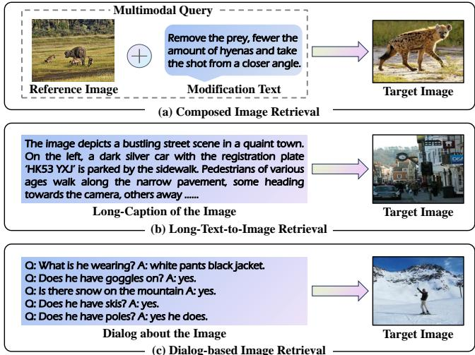

# FiRE  : Enhancing MLLMs with Fine-Grained Context Learning for Complex Image Retrieval

Bohan Hou   
Shandong University   
Qingdao, Shandong, China   
bohanhou@foxmail.com   
Haoqiang Lin   
Shandong University   
Qingdao, Shandong, China   
zichaohq@gmail.com   
Xuemeng Song\*   
City University of Hong Kong   
Hong kong, China   
sxmustc@gmail.com   
Haokun Wen   
Harbin Institute of Technology   
(Shenzhen)   
Shenzhen, Guangdong, China   
whenhaokun@gmail.com Meng Liu Shandong Jianzhu University Jinan, Shandong, China mengliu.sdu@gmail.com Yupeng Hu Shandong University Jinan, Shandong, China huyupeng@sdu.edu.cn Xiangyu Zhao   
City University of Hong Kong   
Hong kong, China   
xy.zhao@cityu.edu.hk

# Abstract

Due to their strong generalizable multimodal processing and reasoning capabilities, Multimodal Large Language Models (MLLMs) have demonstrated significant potential as universal image retrievers, effectively addressing diverse real-world image retrieval tasks. Nevertheless, pioneering studies, while promising, overlook the potential of fine-grained context modeling and disentangled fine-tuning objectives in enhancing MLLMs' retrieval performance, particularly for complex tasks such as long-text-to-image retrieval, visual dialog retrieval, and composed image retrieval (CIR). Therefore, in this work, we propose an automated fine-grained multimodal quintuple dataset construction pipeline and a novel two-stage fine-grained multimodal fine-tuning strategy. The dataset generation pipeline produces a comprehensive CIR dataset with fine-grained image captions and modification text, facilitating fine-grained context modeling. Beyond the previously entangled fine-tuning paradigm, our approach separates the fine-tuning process into two distinct stages: (1) fine-grained context reasoning-oriented fine-tuning and (2) fine-grained retrieval-oriented fine-tuning. These stages aim to sequentially enhance the model's context understanding and query-target alignment capabilities, thereby improving retrieval performance. Extensive experiments across five datasets encompassing diverse and complex image retrieval tasks demonstrate the remarkable superiority of our method over existing approaches in zero-shot retrieval settings, even with a more lightweight MLLM backbone compared to those methods.

# CCS Concepts

• Information systems Image search.

# Keywords

Multimodal Large Language Model; Image Retrieval; Complex Image Retrieval; Fine-grained Context Modeling;

# ACM Reference Format:

Bohan Hou, Haoqiang Lin, Xuemeng Song\*, Haokun Wen, Meng Liu, Yupeng Hu, and Xiangyu Zhao. 2025. FiRE : Enhancing MLLMs with Fine-Grained Context Learning for Complex Image Retrieval. In Proceedings of the 48th International ACM SIGIR Conference on Research and Development in Information Retrieval (SIGIR '25), July 1318, 2025, Padua, Italy. ACM, New York, NY, USA, 10 pages. https://doi.org/10.1145/3726302.3729979

# 1 Introduction

To meet the diverse demands of users in real-world applications [30, 33, 35, 36], various image retrieval paradigms have been proposed. These include the standard short-text-to-image retrieval [18, 26, 41], where a short caption suffices to express the user's search intent, as well as more complex paradigms like long-text-to-image retrieval [39], dialog-based image retrieval [5], and composed image retrieval (CIR) [10, 32]. In these more challenging scenarios, the user's complex search intent often needs to be conveyed through long, detailed queries or composed multimodal inputs (i.e., a reference image paired with a modification text), significantly increasing retrieval complexity. Existing approaches typically address these tasks independently, resulting in high training costs and fragmented solutions. To improve efficiency and scalability, recent research has shifted toward developing unified retrieval models capable of handling diverse tasks and query types within a single framework.

  

Figure 1: Illustration of complex image retrieval tasks: (a) Composed Image Retrieval, (b) Long-Text-to-Image Retrieval, and (c) Dialog-based Image Retrieval.

Pioneer works [2, 40] typically rely on Vision-Language Pretraining Models (VLPs) [15, 27], utilizing their strong multimodal embedding capabilities to address various retrieval tasks. However, VLPs struggle to understand complex queries [8], particularly those involving reasoning, due to their relatively small model scale. Recent studies have turned to Large Language Models (LLMs), which offer superior language understanding and reasoning capabilities [11], to address diverse image retrieval tasks. Since LLMs, as generative models, inherently lack the discriminative query-target alignment capabilities needed for retrieval tasks [13, 22, 23], these studies focus on designing effective fine-tuning strategies to bridge this gap. For instance, MCL [16] fine-tunes an LLM, integrated with a CLIP visual encoder and an adaptor, on two tasks—multimodal-context captioning and multimodal-context retrieval—using a custom large-scale multimodal composition dataset. Conversely, E5-V [11] fine-tunes the core LLM component of a pre-trained MLLM on pure sentence pairs, aiming to enhance its query-target alignment capabilities. Despite promising results, existing methods face two key limitations that hinder their performance on complex image retrieval tasks. 1) Lacking fine-grained context modeling. Existing methods rely on sentence pairs or $<$ reference image, short modification text, short target caption $>$ triplets to fine-tune MLLMs. However, these data types provide only coarse-grained information and lack the detailed descriptions necessary for developing the model's ability to fine-grained context understanding. In fact, queries in many real-world retrieval tasks often involve long or composite contexts (see Figure 1), which inherently demand fine-grained comprehension for accurate interpretation. Moreover, modern MLLMs typically represent each image as extensive token embeddings, akin to processing long contexts, further highlighting the importance of fine-grained context modeling. 2) Suboptimal fine-tuning objective. E5-V's fine-tuning strategy focuses solely on improving the MLLM's homogeneous querytarget alignment capability while neglecting the optimization of its multimodal context understanding ability. Although MCL incorporates multimodal context learning, it fine-tunes MLLMs simultaneously on both multimodal retrieval and generation tasks. This entangled fine-tuning objective may compromise the balance between enhancing context understanding and improving querytarget alignment, ultimately resulting in suboptimal retrieval performance.

Accordingly, our goal is to address these limitations by enhancing the MLLM with fine-grained context learning capabilities, transforming it into a powerful universal image retriever capable of handling various image retrieval tasks, particularly complex ones. Specifically, to address the first limitation, we propose a fully automated pipeline for generating a large-scale fine-grained multimodal composition dataset. The pipeline consists of three stages: (1) CoTbased fine-grained caption generation, where an LLM is guided to produce detailed captions through fine-grained reasoning steps, including subject-oriented, attribute-oriented, and context-oriented reasoning; (2) MLLM-based image pair identification, which uses fine-grained semantic similarity—rather than conventional visual or coarse-grained similarity—to identify potential reference-target image pairs. This stage involves fine-tuning an MLLM with $< i m \cdot$ age, fine-grained caption> pairs to enhance its long-text encoding capability; and (3) human-like fine-grained modification generation, where a vagueness-guided instruction is designed to bridge discrepancies between LLM outputs and human annotations. Using this pipeline, we create a large-scale Fine-Grained Multimodal Quintuple dataset, named FiGMaQ, with 87K samples, where each quintuple sample follows the format $<$ reference image, reference caption, modification text, target image, target caption>. Compared to existing LLM-generated multimodal triplet datasets, our dataset offers three significant features. 1) Image captions are fine-grEained, containing detailed information with an average of over 100 tokens. 2) Modification text captures more specific details and is more human-like, accommodating vague terms. 3) Each sample includes five components, facilitating a variety of fine-tuning tasks, such as multimodal-context captioning and retrieval.

To address the second limitation, we propose a two-stage FinegRained multimodal finE-tuning strategy, named FiRE, which aims to sequentially strengthen the MLLMs' context understanding and query-target alignment capabilities with disentangled fine-tuning objectives. Specifically, inspired by the success of CIR-based finetuning in boosting MLLM performance on various zero-shot retrieval tasks [16], we adopt CIR—requiring complex contextual understanding and fine-grained reasoning—as the representative task for MLLM fine-tuning. In the first stage, we perform fine-grained context reasoning-oriented fine-tuning by instructing MLLMs to generate fine-grained captions for target images based on reference images and modification text. In the second stage, building on the improved multimodal reasoning capability developed in the first stage, we conduct fine-grained retrieval-oriented fine-tuning, where both InfoNCE loss and Recall@k surrogate loss are used to boost the MLLM's query-target alignment capabilities. In summary, our contributions can be summarized as follows: •We propose an automated pipeline for generating fine-grained multimodal composition datasets and contribute a largescale dataset, FiGMaQ, to support future research on finegrained context learning with MLLMs.

  
(c) provides inferencing with fine-tuned MLLM.

We propose a two-stage fine-grained fine-tuning approach that separately strengthens the MLLM's abilities in complex context learning and query-target alignment, promoting its adaptation to diverse image retrieval tasks. With disentangled fine-tuning objectives, our fine-tuning approach requires fewer computational resources. We conducted extensive experiments on seven datasets spanning diverse image retrieval tasks, demonstrating the remarkable superiority of our method—achieving state-of-the-art performance across various complex image retrieval tasks in the zero-shot one-checkpoint setting—even with a more lightweight MLLM backbone.

# 2 Related Work

Multimodal Composition Dataset. Existing works [16] have demonstrated multimodal composition data can enhance MLLMs' understanding of multimodal inputs. Such data typically resembles CIR samples, taking the triplet form $<$ reference image, modification text, target image>. Early CIR datasets [1, 20, 35] are mainly manually annotated, making them limited in scale due to prohibitively expensive annotation costs. To address this issue, researchers have proposed several automated triplet generation methods, which fall into two categories. 1) Semi-Automated Annotation. This strategy [14] uses LLMs to annotate modification text for image pairs but relies on human intervention for image selection and triplet evaluation. For example, LaSCo [14] builds its CIR dataset from the VQA2.0 [7] dataset. Initially, it provides human volunteers with 24 visually similar images for each image, allowing them to select relevant images to form image pairs. Subsequently, it feeds the QA information of related image pairs into LLMs to generate modification text and employs human reviewers to assess the quality of the generated triplets. While this approach reduces manual annotation costs, it remains expensive and hard to scale due to human involvement. 2) Fully Automated Annotation. This strategy [16] aims to fully automate triplet data generation without human intervention. For example, MCL [16] generates its MMC dataset by using LLMs to produce modification and target captions based on a reference image and its derived caption. However, the absence of real target images results in low-quality triplets. In contrast, MagicLens [40] automatically identifies potential reference-target image pairs by first grouping images from the same webpage, then generating metadata for each image with various annotation tools, and finally using where image both CLIP-based visual similarity and textual similarity are used for potential pairs filtering. The metadata of these image pairs is then processed by an LLM to generate modification text. A major limitation of this approach is that the generated metadata remains coarse-grained, capturing only general and common attributes of the main subjects in the images. To address this issue, we propose a fully automated pipeline for producing fine-grained multimodal composition datasets.

# 3 Fine-Grained Multimodal Dataset Generation

In this section, we present our fine-grained multimodal quintuple dataset generation pipeline, as shown in Figure 2(a), consisting of three stages: CoT-based fine-grained image caption generation, MLLM-based image pairs identification, human-like fine-grained modification generation.

# 3.1 CoT-based Fine-grained Caption Generation.

In this stage, we aim to generate the images' fine-grained captions, providing detailed context as the input for the subsequent MLLMbased potential query-target image pairs identification. For this purpose, we utilize the unlabeled test split of ImageNet1K [6], comprising 100K unlabeled, open-domain, real-world images featuring a wide variety of subjects, as the initial dataset.

  

Figure 3: Illustration of instructions involved in: (a) CoTbased Instruction and (b) Vagueness-guided Instruction.

Instead of requiring the MLLM to generate a fine-grained image caption in a single reasoning step, we design a CoT instruction that encourages the generation of detailed captions through a sequence of fine-grained reasoning steps, ensuring richness and specificity. Intuitively, humans process visual information in stages—starting with the identification of principal subjects, followed by noticing their fine-grained attributes, and finally considering the background context. Accordingly, as shown in Figure 3(a), we structure the CoTguided instruction into four key reasoning steps: subject-oriented reasoning, attribute-oriented reasoning, context-oriented reasoning, and summary-oriented reasoning. The first step directs the MLLM to identify the subjects and their quantities, while the second step focuses on outputting the detailed attributes of these subjects. In this work, we define six types of attributes—appearance, color, pattern, distinguishing features, action, and interaction—to guide the MLLM in capturing the subjects' detailed properties. Next, in the context-oriented reasoning step, we guide the model to provide contextual information, including the setting and other significant elements. Finally, the summary-oriented reasoning step synthesizes the outputs from the previous three steps to form a coherent and comprehensive fine-grained image caption. Let $D _ { I }$ denote the generated fine-grained caption for each original image $I$ ,which is a relatively long text, averaging over 100 tokens.

# 3.2 MLLM-based Image Pairs Identification

Having obtained fine-grained image-caption pairs, we proceed to create the quintuple sample. First, we need to identify relevant image pairs to form reference-target pairs, and then generate modification text for each pair. Unlike previous CIR dataset generation methods [14, 20, 40] that primarily rely on visual or coarse-grained similarity, we use fine-grained semantic similarity for selecting relevant image pairs. This approach is motivated by our observation that visually similar image pairs can often be semantically irrelevant (e.g., images with a similar visual style but unrelated content) , which does not align with practical user retrieval demands. Considering that the existing VLP encoder [8] struggles with excessively fine-grained texts (e.g., our fine-grained captions), we turn to an LLM to leverage its strong context comprehension capabilities. However, since the LLM is a generative model, not originally designed for retrieval tasks, we propose fine-tuning it to improve its fine-grained long-text encoding capability. To achieve this, we utilize the fine-grained image-caption pairs obtained in Subsection 3.1 to optimize an MLLM for the task of image-text alignment. We then employ the LLM component of the fine-tuned MLLM for longtext encoding, enabling semantic similarity assessment for relevant image pair identification. Specifically, inspired by the decoder-only LLM-based querydocument retrieval model [22], which appends an End-of-Sequence (EOS) token to the end of a given token sequence to summarize its semantic content, we append $M$ EOS tokens to each image token sequence and its corresponding caption token sequence. We then average the $M$ EOS token embeddings from the MLLM's last hidden states to obtain the final representation of the input image/caption. This process can be formulated as follows:

$$
\mathbf { f } = \frac { 1 } { M } \sum _ { m = 1 } ^ { M } \mathrm { L L M } \big ( \mathrm { I n p u t } ; M \cdot [ \mathrm { E O S } ] \big ) \big [ - m \big ] .
$$

Thereafter, we employ the commonly used image-text contrastive loss for fine-tuning, which can be formalized as follows:

$$
\mathcal { L } _ { a l i g n } = - \frac { 1 } { 2 B } \sum _ { i = 1 } ^ { B } \left[ \log \frac { \exp \left( s _ { i i } / \tau \right) } { \sum _ { j = 1 } ^ { B } \exp \left( s _ { i j } / \tau \right) } + \log \frac { \exp \left( s _ { i i } / \tau \right) } { \sum _ { j = 1 } ^ { B } \exp \left( s _ { j i } / \tau \right) } \right] .
$$

Here, $s _ { i j } = \cos \bigl \langle \mathbf { f } _ { i } ^ { v } , \mathbf { f } _ { j } ^ { t } \bigr \rangle$ represents the similarity between image i and text $j . B$ is the batch size, and $\tau$ is a temperature parameter. Once the MLLM is adequately trained using the above loss function, it can be employed to identify potential image pairs. To exclude overly similar or irrelevant image pairs, which would not be useful for practical modification tasks, we adopt thresholds for cosine similarity, as suggested in [20, 40]. Specifically, we define an upper threshold $\theta _ { h }$ and a lower threshold $\theta _ { l }$ , and only retain image pairs whose cosine similarities lie within this range, as follows:

$$
\{ \langle I _ { r } , I _ { t } \rangle \ : | \ : \cos \langle \mathbf { f } _ { I _ { r } } , \mathbf { f } _ { I _ { t } } \rangle \in [ \theta _ { l } , \theta _ { h } ] \} .
$$

# 3.3 Human-like Fine-grained Modification Generation

Having obtained relevant image pairs, we can proceed to automated modification text generation. Existing works [19, 40] typically directly prompt LLMs to generate modification texts based on coarsegrained information (e.g., global captions) of image pairs. However, this approach has two key limitations: 1) hindering modification of fine-grained attributes due to the lack of detailed inputs, and 2) the generated modification texts tend to be overly precise, e.g., "change fifteen people to seven" and "replace dark red to light red", due to LLM's powerful reasoning capability. This precision deviates from real-world users' vaguer expressions (e.g., "fewer people", and "lighter color") when making modification requests. To facilitate fine-grained modifications and ensure natural expression, we propose a human-like fine-grained modification generation scheme. Unlike previous studies, we feed the fine-grained captions of image pairs into an LLM, enabling it to generate more accurate modification texts. Additionally, we design a vagueness-guided instruction to encourage LLMs to produce human-like modifications. As shown in Figure 3(b), our instruction simulates real-world scenarios and guides the model to generate vague modifications. Notably, we do not enforce the LLM to always produce vague modifications, but allow it to provide precise changes when the modification demands are highly specific (e.g., "changing a cat into a $\deg ^ { \prime \prime }$ ). To further enhance the LLM's understanding of this instruction, we provide three human-annotated examples that encompass both vague modifications and direct comparisons, leveraging the LLM's robust few-shot learning capabilities [3]. To ensure the quality of the generated modification text, we use a strong LLM, specifically LLaMA $3 . 1 7 0 \mathrm { B } ^ { 1 }$ . Ultimately, through this data generation pipeline, we construct a dataset of approximately 87K scalable quintuplets, each containing $<$ reference image, fine-grained reference caption, modification text, target image, fine-grained target caption>.

# 4 Fine-grained Multimodal Fine-tuning

In this section, we present our two-stage fine-tuning strategy, as shown in Figure 2(b), comprising fine-grained context reasoningoriented fine-tuning and fine-grained retrieval-oriented fine-tuning.

# 4.1 Fine-grained Context Reasoning-oriented Fine-tuning

MLLMs inherently lack sufficient fine-grained context modeling capability, resulting in deficiencies in fine-grained context reasoning and limiting their effectiveness in complex tasks. To overcome this limitation, we perform fine-grained context reasoning-oriented finetuning using instruction tuning [4, 24]. Specifically, similar to [16], we construct instruction-answer pairs based on our generated multimodal quintuples. The instruction is formatted as: "<reference image> but modified with modification text. Please describe the new image", while the answer corresponds to the fine-grained target caption. Notably, different from [16] which simply uses a single CLIP-based visual embedding, we use the long sequence of token embeddings yielded by MLLMs for representing the <reference image>. This approach is based on the idea of treating the reference image as analogous to a long text, offering two key benefits: 1) encouraging the MLLM to develop fine-grained context reasoning, and 2) enhancing the MLLM's generalization to other complex image retrieval tasks, such as long-text-to-image and dialog-based image retrieval. We fine-tune the MLLM with a generative loss, which can be formalized as follows:

$$
\mathcal { L } _ { g e n } = - \sum _ { i = 1 } ^ { N } \log P _ { L L M } ( x _ { i } | \Phi , x _ { 1 : i - 1 } ) ,
$$

where $\Phi$ represents the embeddings of the instruction, $N$ denotes the length of the token embeddings of the answer, and $x _ { i }$ represents the $i$ -th token embedding of the answer.

# 4.2 Fine-grained Retrieval-oriented Fine-tuning

This stage aims to optimize the MLLM's query-target alignment capability, building on the MLLM whose multimodal reasoning capability has been enhanced from the first stage. Specifically, similar to MCL [16], we adopt the composed image retrieval task for fine-tuning. However, different from MCL which targets aligning a multimodal query feature to an unimodal target caption feature, we propose aligning the multimodal query feature to a multimodal target feature. In particular, we format the query as "(reference image but modification, please describe the new image" and the target as " target image) describe the image". Adding the prompt "describe the image" leads to a unified multimodal input format, facilitating the cross-modal query-target alignment. Specifically, we derive the multimodal query and target features following Eq.(1) and use the batch-based InfoNCE loss for querytarget alignment optimization, which can be formalized as:

$$
\mathcal { L } _ { I n f o N C E } = - \frac { 1 } { B } \sum _ { i = 1 } ^ { B } \log \frac { \exp { \left( \cos \langle \mathbf { f } _ { i } ^ { \mathrm { q u e r y } } , \mathbf { f } _ { i } ^ { \mathrm { t a r g e t } } \rangle / \tau ^ { \prime } \right) } } { \sum _ { j = 1 } ^ { B } \exp { \left( \cos \langle \mathbf { f } _ { i } ^ { \mathrm { q u e r y } } , \mathbf { f } _ { j } ^ { \mathrm { t a r g e t } } \rangle / \tau ^ { \prime } \right) } } ,
$$

where $B$ is the batch size, and $\tau ^ { \prime }$ is a temperature parameter. To further enhance the MLLM's ability to achieve discriminative query-target alignment, we introduce the Recall@k Surrogate Loss [25]. This loss function directly constrains the rank of the ground truth target within the same batch, effectively improving target retrieval performance. The formula is as follows:

$$
\begin{array}{c} \begin{array} { r } { \left\{ \tilde { R } _ { \Omega } ^ { k } ( q ) = \frac { \displaystyle \sum _ { x \in \mathcal { P } _ { q } } \sigma _ { \tau _ { 1 } } \left( k - 1 - \displaystyle \sum _ { z \in \Omega , z \neq x } \sigma _ { \tau _ { 2 } } ( s _ { q z } - s _ { q x } ) \right) } { \displaystyle | \mathcal { P } _ { q } | } , \right.} \\ { \displaystyle \mathcal { L } _ { r e c a l l } ^ { k } = \frac { 1 } { B } \displaystyle \sum _ { i = 1 } ^ { B } ( 1 - \tilde { R } _ { \Omega } ^ { k } ( q _ { i } ) ) , } \end{array}   \end{array}
$$

where $s _ { q z }$ represents the similarity score between the query $q$ and a candidate $z$ , $\mathcal { P } _ { q }$ represents the set of ground-truth (positive) matches for the query $q$ ,and $\Omega$ represents the set of all candidate items. $\sigma _ { \tau _ { 1 } }$ and $\sigma _ { \tau _ { 2 } }$ represent sigmoid functions with temperature parameters $\tau _ { 1 }$ and $\tau _ { 2 }$ , respectively. $\tilde { R } _ { \Omega } ^ { k } ( q )$ is the differentiable Recall@k surrogate for a given query $q$ . In summary, our total loss can be written as:

$$
\mathcal { L } _ { T o t a l } = \mathcal { L } _ { I n f o N C E } + \sum _ { k \in \mathcal { R } _ { s } } \beta _ { k } \mathcal { L } _ { R e c a l l } ^ { k } ,
$$

where $\mathcal { R } s$ is the set of $k$ 's adopted for recall optimization. $\{ \beta _ { k } \}$ are hyperparameters that control the contributions of adopted recall surrogate losses.

# 4.3 Inference with the Fine-tuned MLLM

During inference, the fine-tuned MLLM encodes the query and candidate target images separately. The target image is then retrieved based on its similarity to the query. As illustrated in Figure 2(c), the fine-tuned MLLM supports various query types, including pure text, pure image (using the instruction describe the image <image>"), and a combination of image and text (using the instruction describe the image <image> with <text>"), where <image> and <text> are replaced by the corresponding image and text token embeddings.

# 5 Experiment

In this section, we first introduce the experimental settings and then provide the experiment results.

# 5.1 Experiment Settings

5.1.1 Evaluation Dataset. To comprehensively evaluate the effectiveness of our method across various image retrieval tasks, we selected three complex retrieval tasks: CIR, long-text-to-image retrieval, and dialog-based image retrieval, as well as a simpler task, i.e., short-text-to-image retrieval. For the CIR task, we adopted three commonly used datasets, including two open-domain datasets:

Table 1: Performance comparison on CIRR respect to $\mathbf { R } @ k ( \% )$ and $\mathbf { R _ { s u b s e t } } @ k ( \% )$ and CIRCO respect to $\mathbf { m } \mathbf { A } \mathbf { P } @ k ( \% )$ The best model and both dedicated ZS-CIR models and universal retrieval models.   

<table><tr><td rowspan="3">Method</td><td colspan="7">CIRR</td><td colspan="4">CIRCO</td></tr><tr><td colspan="4">R@k</td><td colspan="3">Rsubset@</td><td colspan="4">mAP@k</td></tr><tr><td>k = 1</td><td> = 5</td><td>k = 10</td><td>k = 50</td><td> = 1</td><td> = 2</td><td> = 3</td><td>k = 5</td><td>k = 10</td><td>k = 25</td><td>k = 50</td></tr><tr><td>Pic2Word [29](CVPR&#x27;23)</td><td>23.90</td><td>51.70</td><td>65.30</td><td>87.80</td><td></td><td>−</td><td>−</td><td>8.72</td><td>9.51</td><td>10.46</td><td>11.29</td></tr><tr><td>LinCIR [8](CVPR&#x27;24)</td><td>25.04</td><td>53.25</td><td>66.68</td><td>—</td><td>57.11</td><td>77.37</td><td>88.89</td><td>12.59</td><td>13.58</td><td>15.00</td><td>15.85</td></tr><tr><td>SEARLE-XL-OTI [1](ICCV&#x27;23)</td><td>24.87</td><td>52.31</td><td>66.29</td><td>88.58</td><td>53.80</td><td>74.31</td><td>86.94</td><td>10.18</td><td>11.03</td><td>12.72</td><td>13.67</td></tr><tr><td>SEARLE-XL [1](ICCV&#x27;23)</td><td>24.24</td><td>52.48</td><td>66.29</td><td>88.84</td><td>53.76</td><td>75.01</td><td>88.19</td><td>11.68</td><td>12.73</td><td>14.33</td><td>15.12</td></tr><tr><td>ContextI2W [31](AAAI&#x27;24)</td><td>25.60</td><td>55.10</td><td>68.50</td><td>89.80</td><td></td><td></td><td></td><td></td><td></td><td></td><td></td></tr><tr><td>FTI4CIR [17](SIGIR&#x27;24)</td><td>25.90</td><td>55.61</td><td>67.66</td><td>89.66</td><td>55.21</td><td>75.88</td><td>87.98</td><td>15.05</td><td>16.32</td><td>18.06</td><td>19.05</td></tr><tr><td>MagicLens [40](ICML 24)</td><td>30.10</td><td>61.70</td><td>74.40</td><td>92.60</td><td>68.10</td><td>84.80</td><td>93.20</td><td>29.60</td><td>30.80</td><td>33.40</td><td>34.40</td></tr><tr><td>CIReVL(GPT-3.5-turbo) [12]ICLR&#x27;24</td><td>24.55</td><td>52.31</td><td>64.92</td><td>86.34</td><td>59.54</td><td>79.88</td><td>89.69</td><td>18.57</td><td>19.01</td><td>20.9</td><td>21.80</td></tr><tr><td>LDRE(GPT-3.5-turbo) [38](SIGIR&#x27;24)</td><td>26.53</td><td>55.57</td><td>67.54</td><td>88.50</td><td>66.43</td><td>80.31</td><td>90.05</td><td>23.35</td><td>24.03</td><td>26.44</td><td>27.50</td></tr><tr><td>MCL(OPT-2.7B) [16](ICML&#x27;24)</td><td>23.28</td><td>54.17</td><td>67.16</td><td>90.05</td><td>58.24</td><td>79.37</td><td>90.51</td><td>14.55</td><td>15.79</td><td>17.38</td><td>18.27</td></tr><tr><td>MCL(OPT-6.7B) [16](ICML&#x27;24)</td><td>24.15</td><td>55.98</td><td>69.21</td><td>90.82</td><td>59.52</td><td>80.34</td><td>91.13</td><td>14.14</td><td>16.13</td><td>17.88</td><td>18.82</td></tr><tr><td>MCL(LLaMA2-7B) [16](ICML&#x27;24)</td><td>26.22</td><td>56.84</td><td>70.00</td><td>91.35</td><td>61.45</td><td>81.61</td><td>91.93</td><td>17.67</td><td>18.86</td><td>20.80</td><td>21.68</td></tr><tr><td>E5-V(LLaVA-NeXT-8B) [11](Arxiv&#x27;24)</td><td>33.90</td><td>64.12</td><td>75.88</td><td>93.54</td><td>67.48</td><td>81.20</td><td>92.48</td><td>18.48</td><td>19.21</td><td>20.95</td><td>21.83</td></tr><tr><td>FiRE(BLIP-3-4B) (Ours)</td><td>43.33</td><td>74.02</td><td>83.51</td><td>95.83</td><td>73.01</td><td>88.38</td><td>94.94</td><td>31.03</td><td>32.08</td><td>34.40</td><td>35.50</td></tr><tr><td>Ours vs. Dedicated ZS-CIR Model</td><td>↑ 13.23</td><td>↑ 12.32</td><td>↑9.11</td><td>↑3.23</td><td>↑4.91</td><td>↑3.58</td><td>↑ 1.74</td><td>↑ 1.43</td><td>↑ 1.28</td><td>↑ 1.00</td><td>↑ 1.10</td></tr><tr><td>Ours vs. Universal Retrieval Model</td><td>↑ 9.43</td><td>↑9.90</td><td>↑7.63</td><td>↑ 2.29</td><td>↑ 5.53</td><td>↑7.18</td><td>↑2.46</td><td>↑ 12.55</td><td>↑ 12.87</td><td>↑ 13.45</td><td>↑ 13.77</td></tr></table>

CIRR dataset [20] and CIRCO dataset [1], as well as a fashion domain dataset: FashionIQ, which can be further divided into three subsets: Dresses, Shirts, and Tops&Tees. For long-text-to-image retrieval, we adopted the publicly available Urban1K dataset [39], which consists of 1K images of cityscapes with subtle differences, and each image is accompanied by a fine-grained description. For dialog-based image retrieval, we used the Visual Dialog dataset [5]. For short-text-to-image retrieval, we selected two classic datasets: COCO [18] and Flickr30K [26]. 5.1.2 Implement Details. MLLMs inherently consume significant memory [11], and the long input embeddings involved in complex image retrieval tasks exacerbate this issue. Therefore, to mitigate memory consumption as much as possible, we used BLIP-3 [37], a more lightweight MLLM with only $4 B$ parameters, as the model backbone for both fine-grained dataset generation and universal image retrieval.

Regarding hyperparameters, for fine-grained dataset generation, we set the number of EOS tokens $M = 5$ in Eq.(1), the temperature coefficient $\tau$ of the image-text contrastive loss in Eq.(2) as 0.01. The lower and upper thresholds $\theta _ { l }$ and $\theta _ { h }$ in Eq.(3) are set to 0.6 and 0.83, respectively. For two-stage fine-tuning, we set $\tau ^ { \prime }$ in Eq.(5) as 0.01, temperature coefficients of the recall surrogate loss in Eq.(6) as $\tau _ { 1 } = 1$ and $\tau _ { 2 } = 0 . 0 1$ . Additionally, in Eq.(7), we adopted both Recall $@ 1$ and Recall $@ 5$ to enhance the model's discriminative retrieval capability. The parameters are set as follows: $\mathcal { R } _ { s } = [ 1 , 5 ]$ , with $\beta _ { 1 } = 0 . 4$ and $\beta _ { 2 } = 0 . 1 5$ For all stages, we used the AdamW [21] optimize for optimization.

For both data generation and model fine-tuning, we froze the visual encoder and projection layers of the MLLM and only fine-tuned the LLM with LoRA [9], a lightweight parameter-efficient finetuning approach. In particular, we set the rank of the LoRA approximation to 64, the lora_alpha parameter to 128, and lora_dropout parameter to 0.1. For deriving the MLLM encoder for relevant image pair identification in our data generation pipeline, we set the batch size as 16, the learning rate as 1e—4, and trained the model for 2 epochs. For the first-stage fine-tuning, we set the learning rate to $1 \mathrm { e } { - 4 }$ and trained the model for 1 epoch, while for the secondstage fine-tuning, we set the batch size as 16, and the learning rate as 1e—4, and trained for 2 epochs. In addition, we leveraged DeepSpeed ZeRO-2 [28] for distributed training. We conducted all training using only 4 NVIDIA A100-40G GPUs. Notably, once the model is well trained, we keep the same checkpoint for evaluating our model on various tasks in a zero-shot setting.

5.1.3 Evaluation. Following previous work [11, 16, 17], we adopted the standard evaluation protocols to validate our approach on each dataset. For CIRR, we computed Recall at Rank $k$ $( \mathbf { R } @ k )$ $( k \ = \ 1 , 5 , 1 0 , 5 0 )$ , as well as $\mathrm { R } _ { S u b s e t } @ k$ $( k \ : = \ : 1 , 2 , 3 )$ on the test split. For FashionIQ, we adopted $\mathrm { R } @ k ( k = 1 0 , 5 0 )$ for each category and reported the average metrics. For CIRCO, we adopted Mean Average Precision (mAP) as the metric, specifically $\mathrm { m A P } @ k$ $k = 5$ , 10, 25, 50). For Urban1K, Visual Dialog, COCO, and Flickr, we used $\mathrm { R @ } k$ $k = 1 , 5 , 1 0$ as evaluation metrics.

# 5.2 On CIR Comparison

For a comprehensive evaluation, we compared our method with not only the MLLM-based universal image retrieval models, including E5-V [11] and MCL [16], but also several dedicated zeroshot CIR methods of three categories. 1) Textual-inversion-based methods, including Pic2Word [29], LinCIR [8], SEARLE [1], Context I2W [31] and FTI4CIR [17]. These methods aim to pretrain a model to map images into pseudo word tokens, unifying the multimodal query into a token sequence, which can be processed by a pretrained VLP encoder for target image retrieval. 2) Tripletsgeneration-based method, i.e., MagicLens [40], which introduces a data generation pipeline to produce a large number of triplet samples for training a dual VLP encoder-based CIR model. Notably, the universal image retrieval model MCL and our proposed model also belong to this category. 3) LLM-based training-free methods, including CIReVL [12] and LDRE [38], directly utilize strong LLMs to generate the target image caption based on the input reference image and modification text, thereby converting CIR to target textto-image retrieval, which can be solved by VLP encoders. Notably, following E5-V [11], we included the subset clothing category in the prompt, as "describe the <clothing category>", for promoting the model's performance on the FashionIQ dataset.

Table 2: Performance comparison on FashionIQ with respect to $\mathbf { R } @ k ( \% )$ The best results are in boldface. We also reported the absoluteperormancprovementbetweurmodeland bothdedicateZ-IRmodel anniveralrerivalels.   

<table><tr><td rowspan="2">Method</td><td colspan="2">Dresses</td><td colspan="2">Shirts</td><td colspan="2">Tops&amp;Tees</td><td colspan="2">Avg</td></tr><tr><td>R@10</td><td>R@50</td><td>R@10</td><td>R@50</td><td>R@10</td><td>R@50</td><td>R@10</td><td>R@50</td></tr><tr><td>Pic2Word [29](CVPR&#x27;23)</td><td>20.00</td><td>40.20</td><td>26.20</td><td>43.60</td><td>27.90</td><td>47.40</td><td>24.70</td><td>43.70</td></tr><tr><td>LinCIR [8](CVPR&#x27;24)</td><td>20.92</td><td>42.44</td><td>29.10</td><td>46.81</td><td>28.81</td><td>50.18</td><td>26.28</td><td>46.48</td></tr><tr><td>SEARLE-XL-OTI [1](ICCV&#x27;23]</td><td>21.57</td><td>44.47</td><td>30.37</td><td>47.49</td><td>30.90</td><td>51.76</td><td>27.61</td><td>47.90</td></tr><tr><td>SEARLE-XL [1](ICCV&#x27;23)</td><td>20.48</td><td>43.13</td><td>26.89</td><td>45.58</td><td>29.32</td><td>49.97</td><td>25.56</td><td>46.23</td></tr><tr><td>Context-I2W [31](AAAI&#x27;24)</td><td>23.10</td><td>45.30</td><td>29.70</td><td>48.60</td><td>30.60</td><td>52.90</td><td>27.80</td><td>48.93</td></tr><tr><td>FTI4CIR [17](SIGIR&#x27;24)</td><td>24.39</td><td>47.84</td><td>31.35</td><td>50.59</td><td>32.43</td><td>54.21</td><td>29.39</td><td>50.88</td></tr><tr><td>MagicLens [40]CML2</td><td>25.50</td><td>46.10</td><td>32.70</td><td>53.80</td><td>34.00</td><td>57.70</td><td>30.73</td><td>52.53</td></tr><tr><td>CIReVL(GPT-3.5-turbo) [12](ICLR&#x27;24)</td><td>24.79</td><td>44.76</td><td>29.49</td><td>47.40</td><td>31.36</td><td>53.65</td><td>28.55</td><td>48.57</td></tr><tr><td>LDRE(GPT-3.5-turbo) [38](SIGIR&#x27;24)</td><td>22.93</td><td>46.76</td><td>31.04</td><td>51.22</td><td>31.57</td><td>53.64</td><td>28.51</td><td>50.54</td></tr><tr><td>E5-V(LLaVA-NeXT-8B) [11](Arxiv&#x27;24)</td><td>23.75</td><td>47.45</td><td>36.36</td><td>56.43</td><td>35.29</td><td>57.47</td><td>31.80</td><td>53.78</td></tr><tr><td>FiRE(BLIP-3-4B) (Ours)</td><td>29.60</td><td>50.87</td><td>39.84</td><td>60.06</td><td>35.64</td><td>57.83</td><td>35.02</td><td>56.25</td></tr><tr><td>Ours vs. Dedicated ZS-CIR Model</td><td>↑4.10</td><td>↑3.03</td><td>↑7.14</td><td>↑6.26</td><td>↑ 1.64</td><td>↑0.13</td><td>↑4.29</td><td>↑3.72</td></tr><tr><td>Ours vs. Universal Retrieval Model</td><td>↑5.85</td><td>↑3.42</td><td>↑ 3.48</td><td>↑ 3.63</td><td>↑ 0.35</td><td>↑ 0.36</td><td>↑3.22</td><td>↑ 2.47</td></tr></table>

Table 3: Performance comparison on Visual Dialog and Urban1K with $\mathbf { R } @ k ( \% )$ .The best results are in boldface.   

<table><tr><td rowspan="2">Method</td><td colspan="3">Visual Dialog</td><td colspan="3">Urban1K</td></tr><tr><td>R@1</td><td>R@5</td><td>R@10</td><td>R@1</td><td>R@5</td><td>R@10</td></tr><tr><td>CLIP [27]</td><td>17.7</td><td>38.9</td><td>50.2</td><td>55.8</td><td>79.6</td><td>86.5</td></tr><tr><td>MCL(OPT-2.7B) [16]</td><td>25.6</td><td>51.9</td><td>65.2</td><td>−</td><td></td><td>−</td></tr><tr><td>MCL(OPT-6.7B) [16]</td><td>27.2</td><td>51.0</td><td>64.0</td><td></td><td>−</td><td></td></tr><tr><td>MCL(LLaMA2-7B) [16]</td><td>29.8</td><td>57.1</td><td>69.4</td><td>−</td><td></td><td></td></tr><tr><td>E5-V(LLaVA-NeXT-8B) [11]</td><td>48.1</td><td>74.8</td><td>83.7</td><td>80.6</td><td>93.9</td><td>96.6</td></tr><tr><td>Long-CLIP [39]</td><td>35.4</td><td>62.0</td><td>72.7</td><td>86.1</td><td>96.4</td><td>98.1</td></tr><tr><td>FiRE(BLIP-3-4B) (Ours)</td><td>54.9</td><td>79.9</td><td>88.0</td><td>91.4</td><td>98.0</td><td>99.2</td></tr></table>

Table 1 and Table 2 present our results on CIRR, CIRCO, and FashionIQ. We directly used the results reported in the original papers of baselines, while we particularly reproduced the best universal image retrieval baseline E5-V with its public parameters, using it as the main benchmark. Notably, the reported results of all baselines are based on the ViT-L/14 visual encoder, consistent with the encoder used in our MLLM. We also reported the improvements in our results compared to the existing best specialized ZS-CIR model and the leading MLLM-based universal image retrieval model, i.e., E5-V. From these two tables, we have the following observations. 1) Compared to LLM-based universal image retrievers, i.e., MCL and E5-V, our method, even with a more lightweight MLLM backbone, consistently shows performance improvement across all metrics. Specifically, the average of $\mathrm { R @ 1 }$ on CIRR, $\mathrm { m A P } @ 5$ on CIRCO, and $\mathrm { R @ 1 0 }$ on FashionIQ, shows that our method improves by $8 . 4 \%$ compared to the best universal baseline E5-V. This shows the superior generalization capability of our model in various CIR contexts.

Table 4: Performance comparison on COCO and Flickr with respect to $\mathbf { R } @ k ( \% )$ The best results are in boldface.   

<table><tr><td rowspan="2">Method</td><td colspan="3">COCO</td><td colspan="2">Flickr</td></tr><tr><td>R@1</td><td>R@5</td><td>R@10</td><td>R@1 R@5</td><td>R@10</td></tr><tr><td>CLIP [27]</td><td>35.4</td><td>60.1</td><td>70.2</td><td>68.7 90.6</td><td>95.2</td></tr><tr><td>MagicLens [40]</td><td>44.3</td><td>69.4</td><td>78.3</td><td>72.5 91.5</td><td>95.2</td></tr><tr><td>Long-CLIP [39]</td><td>46.3</td><td>70.8</td><td>79.8</td><td>76.1 93.5</td><td>95.2</td></tr><tr><td>E5-V [11]</td><td>52.0</td><td>76.5</td><td>84.7</td><td>79.5 95.0</td><td>97.6</td></tr><tr><td>FiRE (Ours)</td><td>52.3</td><td>76.7</td><td>82.6</td><td>76.2 93.0</td><td>95.5</td></tr></table>

2) Compared to those dedicated CIR models, our universal model also consistently exhibits promising improvements across all metrics, demonstrating its superior multimodal context understanding capability. Notably, although the LLM-based training-free methods (i.e., $\mathrm { C I R e V L }$ and LDRE) use larger LLMs for inference, their retrieval performance remains lower than ours. This indicates the necessity of conducting proper LLM fine-tuning to enhance its multimodal context understanding capability. Additionally, compared to other triplets-generation-based methods (i.e., MCL and MagicLens), our method uses far fewer generated triplets (only 87K) for model fine-tuning, whereas MCL and MagicLens utilize $2 . 7 M$ and $3 6 . 7 M$ generated triplets, respectively. This suggests the higher quality of our generated dataset, featuring more fine-grained differences and modification text that are closer to human annotations. 3) On FashionIQ, which involves more fine-grained modifications to garment details, our method shows more exceptional performance on the Dresses and Shirts subsets, compared to the Tops&Tees subset. One possible explanation is that compared to Tops&Tees which involves various categories of tops, garments in Dresses and Shirts are more concentrated in a single clothing category, which requires the model to have stronger fine-grained reasoning capabilities. In these cases, the advantage of our model is highlighted.

Table 5: Ablation study on FashionIQ, CIRR, Visual Dialog, and Urban1K towards for key components of our method.   

<table><tr><td rowspan="2">Method</td><td>FashionIQ-Avg</td><td colspan="2">CIRR</td><td colspan="2">Visual Dialog</td><td colspan="2">Urban1K</td></tr><tr><td>R@10</td><td>R@50 R@1</td><td>R@5</td><td>R@1</td><td>R@5</td><td>R@1</td><td>R@5</td></tr><tr><td>w/-Img-LongCap</td><td>11.24 23.56</td><td>11.33</td><td>33.61</td><td>53.10</td><td>77.82</td><td>91.70</td><td>98.40</td></tr><tr><td>w/-OneStage</td><td>32.72 53.60</td><td>41.67</td><td>72.35</td><td>53.21</td><td>78.99</td><td>87.90</td><td>96.20</td></tr><tr><td>w/o-FirstStage</td><td>32.54 52.06</td><td>41.79</td><td>71.59</td><td>54.12</td><td>79.31</td><td>88.20</td><td>97.40</td></tr><tr><td>w/-ShortCap</td><td>32.21 52.63</td><td>42.33</td><td>72.72</td><td>53.45</td><td>78.97</td><td>88.90</td><td>97.20</td></tr><tr><td>w/o-RecallLoss</td><td>33.14</td><td>53.69 41.21</td><td>72.25</td><td>53.88</td><td>79.12</td><td>87.90</td><td>97.20</td></tr><tr><td>FiRE (Ours)</td><td>35.02</td><td>56.25</td><td>43.33</td><td>74.02</td><td>54.88</td><td>79.89</td><td>91.40 98.00</td></tr></table>

Table 6: Performance comparison of dataset on CIRR. The best zero-shot results are in boldface.   

<table><tr><td rowspan="2">Supervision</td><td rowspan="2">Dataset</td><td rowspan="2">Scale</td><td colspan="3">R@k</td><td rowspan="2">RSubset@1</td></tr><tr><td> = 1</td><td>k = 5</td><td> = 10</td></tr><tr><td rowspan="3">Zero-Shot</td><td>MMC [16]</td><td>2.7M</td><td>21.74</td><td>51.54</td><td>65.33</td><td>49.28</td></tr><tr><td>LaSCo [14]</td><td>359.2K</td><td>23.98</td><td>53.68</td><td>67.40</td><td>51.06</td></tr><tr><td>FiGMaQ(Ours)</td><td>87K</td><td>26.96</td><td>55.52</td><td>70.24</td><td>55.66</td></tr><tr><td>Supervised</td><td>CIRR</td><td>28.2K</td><td>28.17</td><td>57.51</td><td>71.74</td><td>58.77</td></tr></table>

# 5.3 On Cross-modal Retrieval Comparison

Apart from CIR, we also evaluated our model with three crossmodal image retrieval tasks, including two relatively complex tasks (i.e., long-text-to-image retrieval, and dialog-based image retrieval) and one standard task of short-text-to-image retrieval.

For the two complex retrieval tasks, to the best of our knowledge, there are no strong zero-shot baselines. Therefore, apart from the two universal image retrieval models (i.e., MCL and E5-V), we introduced Long-CLIP [39], a specialized zero-shot long-text retrieval model, as a baseline. Table 3 shows the performance comparison on the dialog-based image retrieval dataset Visual Dialog and longtext-to-image retrieval dataset Urban1K. As can be seen, despite not being specifically trained for these two tasks, our method still shows exceptional performance. On the one hand, this verifies that conducting fine-grained context modeling inherently enhances the MLLM's understanding of complex queries. On the other hand, this demonstrates that fine-tuning MLLMs with the CIR task contributes significantly to improving complex image retrieval tasks. We attribute this to the fact that the CIR task itself is inherently complex with multimodal composite queries, which potentially enhances the model's complex query understanding capability.

Table 4 shows the performance comparison among different models on standard short-text-to-image retrieval datasets (i.e., COCO and Flickr), where we excluded MCL due to its missing results on these datasets, but instead incorporated CLIP and MagicLens that have reported the corresponding results. Since Long-CLIP has demonstrated outstanding performance in zero-shot cross-modal retrieval tasks, we also included it in this comparison. As can be seen, the LLM-based models, including E5-V and our model, outperform all the VLP-based models. This suggests the advantage of using the LLM over the VLP model as the encoder. Regarding the observation that our model slightly underperforms E5-V on Flickr, we attribute this to two key factors: 1) E5-V utilizes a larger LLM with 8B parameters as its backbone, while ours has only 4B parameters; and 2) E5-V is specifically trained with short text pairs, making it better suited for short-text-to-image retrieval scenarios, whereas our model is trained on long, fine-grained text pairs to enhance its complex context understanding capability. Nonetheless, our model still performs comparably to E5-V on the COCO dataset, demonstrating its effectiveness in simpler image retrieval tasks. It is worth mentioning again that our model significantly outperforms E5-V on five datasets across various complex retrieval tasks.

  

Figure 4: Modification text generated by our method and its two variants: w/-ShortCap and w/o-VagueInstruct.

# 5.4 On Ablation Study

To verify the importance of each component in our method, we compared our method with its following derivatives.

• w/-Img-LongCap. To explore the impact of using the CIR task for MLLM fine-tuning, we fine-tuned MLLM with the standard image-text alignment task instead of the two multimodal reasoning and retrieval tasks. Specifically, only $< i m$ - age, generated fine-grained caption $>$ pairs were used. • w/-OneStage. To explore the benefit of conducting twostage fine-tuning, we mimicked MCL by simultaneously optimizing multimodal reasoning and retrieval tasks in one stage. •w/o-FirstStage. To explore the role of the fine-grained context reasoning-oriented fine-tuning phase, we disabled it. •w/-ShortCap. To validate the necessity of using fine-grained captions for multimodal context reasoning in the first finetuning stage, we replaced the fine-grained captions with coarse-grained captions [34] generated by BLIP-2 [15]. •w/o-RecallLoss. To explore the effect of the recall surrogate losses, we fine-tuned the model without using them.

From Table 5, we have the following observations. 1) w/-Img-LongCap shows significantly weaker performance than our method on CIR and dialog-based image retrieval tasks but has a slight advantage on the long-text-to-image retrieval task (Urban1K). This validates that fine-tuning with the CIR task and its derivative task (i.e., target caption generation task), due to their complexity and multimodal nature, better facilitates the enhancement of the MLLM's reasoning and contextual understanding abilities, compared to the simple cross-modal image-text alignment. It is also reasonable that w/-Img-LongCap specifically performs better on Urban1K, since its fine-tuning objective is totally aligned with the long-text-to-image retrieval task. 2) Our method shows superior performance than both w/-OneStage and w/o-FirstStage. This indicates the importance of sequentially conducting the fine-grained context reasoningoriented fine-tuning and retrieval-oriented fine-tuning to ensure the model's universal performance on various image retrieval tasks. 3) w/-ShortCap performs worse than ours on all tasks. This highlights the benefit of using fine-grained captions to improve the model's complex context reasoning capability. 4) Compared to our method, w/o-RecallLoss performs poorly. This confirms the effect of recall surrogate losses in enhancing the model's discriminative query-target alignment capability.

# 5.5 On Dataset Comparison

Quantitative Comparison. To validate the quality of our dataset FiGMaQ, following [16], we used it to train the classic CLIP encoderbased CIR model Combiner [2]. For comparison, we also adopted two large-scale publicly available CIR datasets: MMC (the dataset used by MCL) and LaSCo [14], whose modification text is also automatically annotated by an LLM, to train the Combiner model. Table 6 presents the zero-shot performance of Combiner models trained with different datasets, on the testing set of open-domain CIRR dataset. Notably, we also include the performance of Combiner in a supervised setting, where Combiner is trained with the training set of CIRR. As can be seen, despite having the smallest scale, our dataset achieves the best zero-shot performance. Meanwhile, we observed that the zero-shot performance of Combiner trained with our dataset is close to that trained in the conventional supervised setting. This verifies the high quality of our dataset, which stems from the following two reasons. 1) Our proposed fine-grained semantic filtering significantly reduces the inclusion of irrelevant pairs. 2) Our human-like fine-grained modification generation approach effectively mimics real human modifications, making the generated data more aligned with human annotation.

Qualitative Comparison. To gain a deep understanding of our generated dataset, we compared the modification text generated by our model and its two variants. 1) w/-ShortCap. Generating modification text based on the coarse-grained image caption generated by BLIP-2 [15] with LLaMA 3.1. 2) w/0-VagueInstruct. Using LLaMA 3.1 to generate modification text based on the given pair of fine-grained image captions with the general instruction. Figure 4 illustrates the modification text comparison with an example, where we also provided the generated coarse-grained and fine-grained image captions for reference. As can be seen, compared to fine-grained captions, the BLIP-2-generated coarse-grained image captions involve information loss on certain fine-grained details, leading to the LLM-generated modification text "to the entire bathroom scene" being too general and of little use for retrieving the target image. In addition, we find that the modification text generated by w/o-VagueInstruct is overly detailed, almost directly describing the target image. This can create biased triplets that hinder model fine-tuning and contrast with real-world scenarios, where users usually provide vague modifications focusing on key aspects of the image, rather than exactly detailing every element of the image.

# 5.6 On Case Study

Retrieval Results. Figure 5 illustrates our retrieval results on tasks of CIR and long-text-to-image retrieval, compared with the best-performing universal image retrieval model, E5-V [11]. As illustrated in Figure 5(a), the given composed query requires finegrained modifications to the reference image, involving multiple aspects, such as the subject quantity, spatial relationships, and subtle details (such as including a rop). For this case, our method accurately retrieves the ground truth in the first place, while E5-V fails, where its retrieved images cannot fully meet the modification demands, e.g., the quantity and spatial changes are not satisfied. As for the long-text-to-image retrieval case shown in Figure 5(b), E5-V performs significantly worse than ours. Specifically, E5-V primarily retrieves images that align with the general description of the query, which is insufficient to retrieve the correct image. In contrast, our method retrieves images that not only match the overall description but also satisfy fine-grained anchors in the query, such as a yellow taxi, rainy weather, or pedestrians with specified attire. These two cases demonstrate the effectiveness of our method in fine-grained context reasoning.

  

Figure 5: Illustration of CIR and Long-Text-to-Image Retrieval results, with ground-truth images highlighted in green boxes.

# 6 Conclusion and Future Works

In this work, we propose an automatic pipeline for constructing a fine-grained multimodal quintuple dataset and a novel two-stage fine-tuning strategy for MLLMs in complex image retrieval tasks. Using this pipeline, we create a large-scale dataset, FiGMaQ, to enhance fine-grained context modeling. Our strategy divides finetuning into two stages: (1) context reasoning-oriented fine-tuning and (2) retrieval-oriented fine-tuning, progressively improving context understanding and query-target alignment. Extensive experiments across five complex and two simple image retrieval tasks validate the effectiveness of our approach. Ablation and case studies further demonstrate the value of fine-grained fine-tuning. Future work will focus on expanding the dataset and exploring universal multimodal re-rankers for improved retrieval precision.

# 7 Acknowledgments

This work has been supported by the National Natural Science Foundation of China (No. 62376137, No. 624B2047, No.:62376140, No.:62276155 and No.:U23A20315), the Natural Science Foundation of Shandong Province (No. ZR2022YQ59). This work was also supported by Research Impact Fund (No.R1015-23),Collaborative Research Fund (No.C1043-24GF), Huawei (Huawei Innovation Research Program,Huawei Fellowship), Tencent (CCF-Tencent Open Fund, Tencent Rhino-Bird Focused Research Program), Alibaba (CCF-Alimama Tech Kangaroo Fund No. 2024002), Ant Group (CCF-Ant Research Fund), and Kuaishou.

# References

[1] Alberto Baldrati, Lorenzo Agnolucci, Marco Bertini, and Alberto Del Bimbo. 2023. Zero-Shot Composed Image Retrieval with Textual Inversion. In Proceedings of the IEEE/CVF International Conference on Computer Vision. IEEE, 1533815347.   
[2] Alberto Baldrati, Marco Bertini, Tiberio Uricchio, and Alberto Del Bimbo. 2023. Composed image retrieval using contrastive learning and task-oriented clipbased features. ACM Transactions on Multimedia Computing, Communications and Applications 20, 3 (2023), 124.   
[3] Tom Brown, Benjamin Mann, Nick Ryder, Melanie Subbiah, Jared D Kaplan, Prafulla Dhariwal, Arvind Neelakantan, Pranav Shyam, Girish Sastry, Amanda Askell, et al. 2020. Language models are few-shot learners. In Advances in neural information processing systems. 18771901.   
[4] Hyung Won Chung, Le Hou, Shayne Longpre, Barret Zoph, Yi Tay, William Fedus, Yunxuan Li, Xuezhi Wang, Mostafa Dehghani, Siddhartha Brahma, et al. 2024. Research 25, 70 (2024), 153.   
5  S   u A gh, D Y, Jos IEEE conference on computer vision and pattern recognition. 326335.   
[6] Jia Deng, Wei Dong, Richard Socher, Li-Jia Li, Kai Li, and Li Fei-Fei. 2009. Imaenet: A large-scale hierarchical image database. In 2009 IEEE conference on computer vision and pattern recognition. Ieee, 248255.   
[7] Yash Goyal, Tejas Khot, Douglas Summers-Stay, Dhruv Batra, and Devi Parikh. [n. .]. Making he  in va matter: Elevating the role of image understanding in visual question answering. In Proceedings of the IEEE conference on computer vision and pattern recognition. IEEE, 6904-6913.   
[8] Geonmo Gu, Sanghyuk Chun, Wonjae Kim, Yoohoon Kang, and Sangdoo Yun. 2024. Language-only training of zero-shot composed image retrieval. In Proceedi f the  Conference on Computer ision and Patter Reconition. IEEE, 1322513234.   
[9 wd Hu, Yeo She, hi Was, yleZu, azi, en W   Wi h   Lo p language models. arXiv preprint arXiv:2106.09685 (2021).   
[10] Surgan Jandial, Pinkesh Badjatiya, Pranit Chawla, Ayush Chopra, Mausoom Sarkar, and Balaji Krishnamurthy. 2022. SAC: Semantic Attention Composition for Text-Conditioned Image Retrieval. In Proceedings of the IEEE Winter Conference on Applications of Computer Vision. IEEE, 40214030.   
[11] Ting Jiang, Minghui Song, Zihan Zhang, Haizhen Huang, Weiwei Deng, Feng Sun, Qi Zhang, Deqing Wang, and Fuzhen Zhuang. 2024. E5-v: Universal embeddings with multimodal large language models. arXiv preprint arXiv:2407.12580 (2024).   
[12] Shyamgopal Karthik, Karsten Roth, Massimiliano Mancini, and Zeynep Akata. 2023. Vision-by-language for training-free compositional image retrieval. In Proceedings of the IEEE Conference on Computer Vision and Pattern Recognition. IEEE, 1-15.   
[1] Jing Yu Koh, Ruslan Salakhutdinov, and Daniel Fried. 03. Grounding lan-International Conference on Machine Learning. PMLR, 1728317300.   
[14] Matan Levy, Rami Ben-Ari, Nir Darshan, and Dani Lischinski. 2024. Data roaming and quality assessment for composed image retrieval. In Proceedings of the AAAI Conference on Artificial Intelligence, Vol. 38. 29912999.   
language-image pre-training with frozen image encoders and large language models. In Proceedings of the International Conference on Machine Learning. PMLR, 1973019742.   
[16] Wei Li, Hehe Fan, Yongkang Wong, Yi Yang, and Mohan Kankanhalli. 2024. Improving Context Understanding in Multimodal Large Language Models via Multimodal Composition Learning. In Proceedings of the International Conference on Machine Learning. PMLR, 121.   
[17] Haoqiang Lin, Haokun Wen, Xuemeng Song, Meng Liu, Yupeng Hu, and Liqiang Nie. 2024. Fine-grained Textual Inversion Network for Zero-Shot Composed Image Retrieval. In Proceedings of the International ACM SIGIR Conference on Research and Development in Information Retrieval. ACM, 240250.   
[18] Tsung-Yi Lin, Michael Maire, Serge Belongie, James Hays, Pietro Perona, Deva Ramanan, Piotr Dollár, and C Lawrence Zitnick. 2014. Microsoft coco: Common objects in context. In Proceedings of the European Conference on Computer Vision. Springer, 740755.   
, J o,  Z W n W Xe. 0. - shot composed text-image retrieval. arXiv preprint arXiv:2306.07272 (2023).   
[20] Zheyuan Liu, Cristian Rodriguez-Opazo, Damien Teney, and Stephen Gould. 2021. Image retrieval on real-life images with pre-trained vision-and-language models. In Proceedings of the IEEE/CVF International Conference on Computer Vision. IEEE, 21252134.   
[21] I Loshchilov. 2017. Decoupled weight decay regularization. arXiv preprint arXiv:1711.05101 (2017).   
[22] Xueguang Ma, Liang Wang, Nan Yang, Furu Wei, and Jimmy Lin. 2024. Fine-Tuning LLaMA for Multi-Stage Text Retrieval. In Proceedings of the International ACM SIGIR Conference on Research and Development in Information Retrieval. ACM, 24212425.   
[23] Niklas Muennighoff, Hongjin Su, Liang Wang, Nan Yang, Furu Wei, Tao Yu, Amanpreet Singh, and Douwe Kiela. 2024. Generative representational instruction tuning. arXiv preprint arXiv:2402.09906 (2024).   
[24 Lo Og, J , X J, o m,  Wih, mea Mishkin, Chong Zhang, Sandhini Agarwal, Katarina Slama, Alex Ray, et al. 2022. Training language models to follow instructions with human feedback. (2022), 2773027744.   
[25] Yash Patel, Giorgos Tolias, and Jirí Matas. 2022. Recall@k Surrogate Loss with Large Batches and Similarity Mixup. In Proceedings of the IEEE Conference on Computer Vision and Pattern Recognition. IEEE, 74927501.   
[26] Bryan A. Plummer, Liwei Wang, Chris M. Cervantes, Juan C. Caicedo, Julia Hockenmaier, and Svetlana Lazebnik. 2016. Flickr30k Entities: Collecting Regionto-Phrase Correspondences for Richer Image-to-Sentence Models. (2016).   
[27] Alec Radford, Jong Wook Kim, Chris Hallacy, Aditya Ramesh, Gabriel Goh, Sandhini Agarwal, Girish Sastry, Amanda Askell, Pamela Mishkin, Jack Clark, et al. 2021. Learning Transferable Visual Models From Natural Language Supervision. In Proceedings of the International Conference on Machine Learning. PMLR, 87488763.   
S   , O, n x He.  Z: Memory Optimization Towards Training A Trillion Parameter Models. arXiv preprint arXiv: 1910.02054 (2019).   
[29] Kuniaki Saito, Kihyuk Sohn, Xiang Zhang, Chun-Liang Li, Chen-Yu Lee, Kate S, nd Toms iser. 0.Wor Mapp us  Wors o Zero-shot Composed Image Retrieval. In Proceedings of the IEEE Conference on Computer Vision and Pattern Recognition. IEEE, 1930519314.   
[30] Xuemeng Song, Fuli Feng, Jinhuan Liu, Zekun Li, Liqiang Nie, and Jun Ma. 2017. of the ACM international conference on Multimedia. 753761.   
[31] Yuanmin Tang, Jing Yu, Keke Gai, Jiamin Zhuang, Gang Xiong, Yue Hu, and Qi Wu. 2024. Context-I2W: Mapping Images to Context-dependent Words for Accurate Zero-Shot Composed Image Retrieval. In Proceedings of the AAAI Conference on Artificial Intelligence. AAAI, 5180-5188.   
[32] Nam Vo, Lu Jiang, Chen Sun, Kevin Murphy, Li-Jia Li, Li Fei-Fei, and James Hays. 2019. Composing Text and Image for Image Retrieval - An Empirical Odyssey. In Proceedings of the IEEE conference on computer vision and pattern recognition. IEEE, 64396448.   
[33] Junyan Wang, Peng Zhang, Cheng Zhang, and Dawei Song. 2019. Scss-lie: A novel synchronous collaborative search system with a live interactive engine. In Proceedings of the International ACM SIGIR Conference on Research and Development in Information Retrieval. ACM, 13091312.   
[34] Haokun Wen, Xuemeng Song, Xiaolin Chen, Yinwei Wei, Liqiang Nie, and Tat-Seng Chua. 2024. Simple but Effective Raw-Data Level Multimodal Fusion for Composed Image Retrieval. In Proceedings of the International ACM SIGIR Conference on Research and Development in Information Retrieval. ACM, 229239.   
[35] Hui Wu, Yupeng Gao, Xiaoxiao Guo, Ziad Al-Halah, Steven Rennie, Kristen Iae y Natural ngg Feebac. In rocing  the  Cone Computer Vision and Pattern Recognition. IEEE, 1130711317.   
[36] Xiaohui Xie, Jiaxin Mao, Yiqun Liu, and Maarten de Rijke. 2020. Modeling user behavior for vertical search: images, apps and products. In Proceedings of the International ACM SIGIR Conference on Research and Development in Information Retrieval. ACM, 24402443.   
[37] Le Xue, Manli Shu, Anas Awadalla, Jun Wang, An Yan, Senthil Purushwalkam, Honglu Zhou, Viraj Prabhu, Yutong Dai, Michael S. Ryoo, Shrikant Kendre, Jieyu Zhang, Can Qin, Shu Zhang, Chia-Chih Chen, Ning Yu, Juntao Tan, Tulika Manoj Awalgaonkar, Shelby Heinecke, Huan Wang, Yejin Choi, Ludwig Schmidt, Zeyuan Chen, Silvio Savarese, Juan Carlos Niebles, Caiming Xiong, and Ran Xu. 2024. xGen-MM (BLIP-3): A Family of Open Large Multimodal Models. arXiv preprint arXiv:2408.08872 (2024).   
[38] Zhenyu Yang, Dizhan Xue, Shengsheng Qian, Weiming Dong, and Changsheng Xu. 2024. LDRE: LLM-based Divergent Reasoning and Ensemble for Zero-Shot Composed Image Retrieval. In Proceedings of the International ACM SIGIR Conference on Research and Development in Information Retrieval. ACM, 8090.   
[39] Beichen Zhang, Pan Zhang, Xiaoyi Dong, Yuhang Zang, and Jiaqi Wang. 2024. Long-CLIP: Unlocking the Long-Text Capability of CLIP. In Proceedings of the European Conference on Computer Vision. Springer, 310325.   
[40] Kai Zhang, Yi Luan, Hexiang Hu, Kenton Lee, Siyuan Qiao, Wenhu Chen, Yu Su, and Ming-Wei Chang. 2024. Magiclens: Self-supervised image retrieval with open-ended instructions. In Proceedings of the International Conference on Machine Learning. PMLR, 118.   
[41] Liangli Zhen, Peng Hu, Xu Wang, and Dezhong Peng. 2019. Deep supervised cross-modal retrieval. In Proceedings of the IEEE conference on computer vision and pattern recognition. IEEE, 10394-10403.