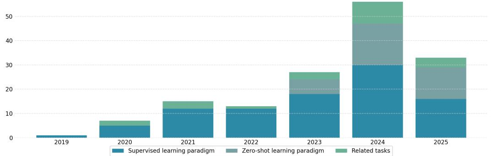
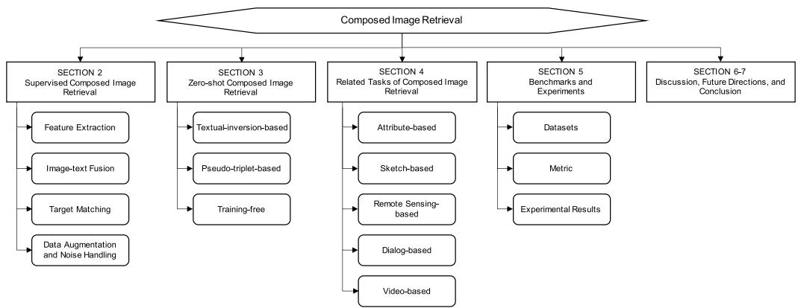
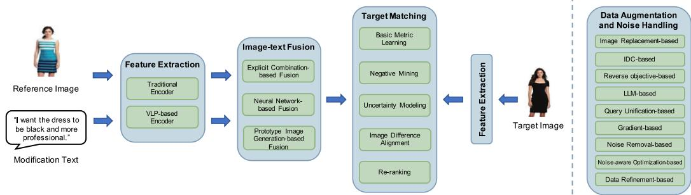
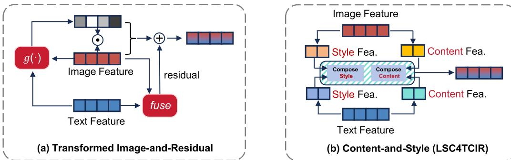
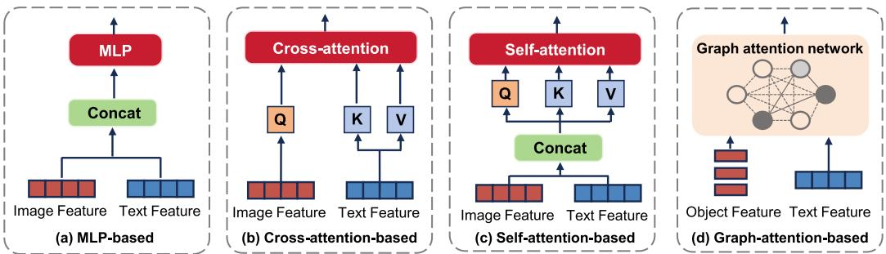
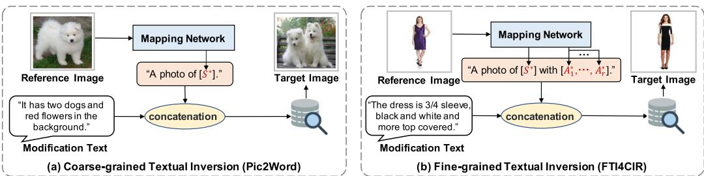
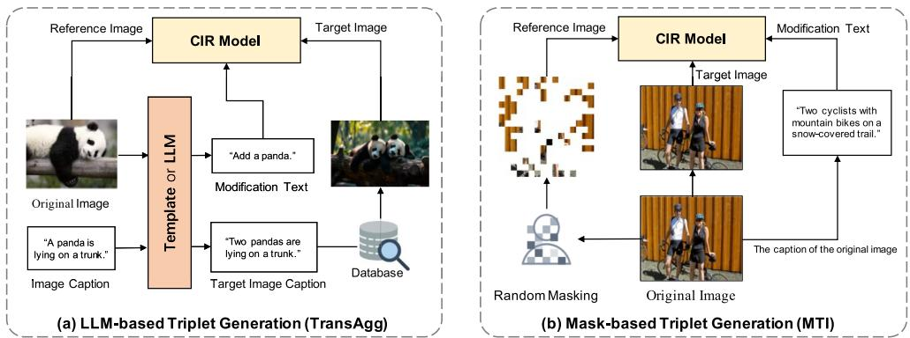
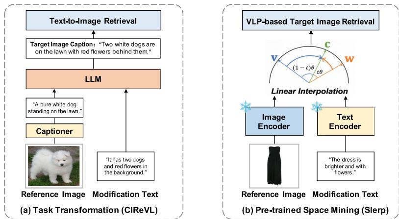

# 关于组合图像检索的全面调查

XUEMENG SONG 和 HAOQIANG LIN，山东大学计算机科学与技术学院，中国青岛 HAOKUN WEN，哈尔滨工业大学（深圳），中国深圳，以及香港城市大学，中国香港 BOHAN HOU，山东大学计算机科学与技术学院，中国青岛 MINGZHU XU，山东大学软件学院，中国济南 LIQIANG NIE，哈尔滨工业大学（深圳）计算机科学与技术学院，中国深圳 CCS 概念：$\bullet$ 信息系统 图像搜索；附加关键词和短语：复合图像检索，多模态检索，多模态融合

# ACM 参考格式：

Xuemeng Song, Haoqiang Lin, Haokun Wen, Bohan Hou, Mingzhu Xu, 和 Liqiang Nie. 2025. 一项关于复合图像检索的综合调研. ACM 信息系统事务 44, 1, 文章 19 (2025年11月), 54页. https://doi.org/10.1145/3767328

# 1 引言

图像检索自1970年代以来一直是计算机视觉和数据库管理的基本任务[37]，为各种应用奠定了基础，如人脸识别[50]、时尚检索[150, 156, 157, 212]、行人重识别[104]和时刻定位[121, 122]。传统的图像检索系统主要依赖单一模态查询，通过文本或图像传达用户的搜索意图[34, 137, 138, 142]。然而，用户往往难以通过单一文本查询清晰表达其搜索意图，或者难以找到完美的图像以准确表示该意图。为了应对这些局限并提供更大的灵活性，组合图像检索（CIR）[180]于2019年出现，允许用户通过结合参考图像与描述所需修改的文本来表达其搜索意图。通过使用户能够利用更细致的搜索查询，CIR为提升跨域搜索体验提供了显著潜力，例如电子商务[44]和互联网搜索引擎[86, 135, 183, 196]。

CIR的概念允许用户利用多模态查询来表达搜索意图，可以轻松适应各种实际检索场景。例如，可以用参考视频替换参考图像，以实现组合视频检索（CoVR），或单轮CIR可以演变为基于对话的多轮图像检索。自2019年引入以来，CIR因其在各个领域的潜在价值而受到越来越多的研究关注。如图1所示，CIR相关出版物的数量正在快速增加。为了总结这一快速发展的领域过去和现在的成就，我们提供了截至2025年6月的全面概述。现有研究主要集中在解决以下关键挑战上。(1) 多模态查询融合。在CIR中，修改文本和参考图像在传达用户搜索意图方面发挥互补作用。修改文本通常指定参考图像某些属性的变化。例如，给定的修改要求“我想要这件裙子是黑色的，并且更专业”，仅应更改参考图像中裙子的颜色和风格，而其他属性应保持不变。由于这一特性，如何实现有效的多模态融合，以准确理解多模态查询，构成了第一个挑战。(2) 目标图像匹配。由于多模态查询与目标图像之间的语义差距，其异质表示构成了一个重大挑战。此外，修改文本的简洁性可能导致歧义。例如，文本“我想将裙子改为长袖并且是黄色的”可能有多种解释：袖子可以从无袖变为短袖或长袖，颜色可以从浅黄到深黄。这种歧义表明可能有多个目标图像可以满足给定的查询。因此，弥合这种语义差距并管理一对多的查询与目标匹配关系，对于准确的查询-目标匹配至关重要。(3) 训练数据规模。训练CIR模型通常需要形式为<参考图像，修改文本，目标图像>的三元组。对于每个三元组，参考-目标图像对通常是使用启发式策略生成的，而修改文本则通常由人工标注。创建这样的训练样本劳动密集型，显著限制了基准数据集的规模。因此，解决训练数据不足的问题以提高模型的泛化能力仍然是一个重大挑战。

该领域的现有工作可以大致分为两类：基于监督学习的方法和基于零样本学习的方法。这些方法之间的关键区别在于是否有标注的训练三元组可用。监督方法依赖于来自数据集的标注三元组来训练模型，而零样本方法则利用大规模、易获取的数据，如图像-文本对，进行预训练，而不需要标注三元组进行优化。为了便于更深入的分析，我们对每个类别建立了细粒度的分类法。对于监督的复合图像检索（CIR）方法，我们根据通用框架的四个关键组成部分总结了现有方法：特征提取、图像-文本融合、目标匹配和数据增强。对于零样本复合图像检索（ZS-CIR）方法，我们将其分类为三个组：基于文本反演的、基于伪三元组的和无训练的。如前所述，使用复合多模态查询的概念可以适应多种场景。除了CIR的主要任务，还有几个相关任务也涉及复合查询，如参考图像加属性操作、草图加修改文本和视频加修改文本。由于这些任务与CIR密切相关，我们包括了它们的最新进展，以提供对该主题的全面回顾。根据多模态查询的类型，我们将这些相关任务分为五组：基于属性的、基于草图的、基于遥感的、基于对话的以及基于视频的。本文的结构如图2所示。总之，我们的主要贡献如下：

  
F 1The number of papers trending on the task of CIR and its related tasks from January 209 to May 2025.

  
Fi. 2.Organization of the present survey.

据我们所知，本文是首个关于CIR的全面综述，涵盖了超过150项原始研究。其目的是为这一快速发展的领域提供及时且富有洞察力的概述，以指导未来的研究。 我们系统地组织研究结果、技术方法、基准和实验，以促进理解，提出细致的分类法，以满足不同读者的需求。

  
Fig. 3. The illustration of the standard framework of supervised CIR.

CIR仍然是一个新兴的研究领域。根据调查的文献，我们识别出几个关键的研究挑战，并提出潜在的未来研究方向，为研究人员提供前瞻性的指导。

# 2 监督式CIR

在本节中，我们首先提供监督图像检索（CIR）任务的问题陈述，然后介绍现有的方法。通常，如图3所示，现有模型涉及四个关键组件：特征提取、图像-文本融合、目标匹配和数据增强。前三个是CIR的必要组件，而最后一个是可选的，旨在提升模型性能。现有监督CIR方法的总结见表1。

# 2.1 问题陈述

给定参考图像及其修改文本，CIR旨在从一组图库图像中检索目标图像。在监督学习环境下，现有方法依赖于训练样本 $\mathcal { D } = \{ ( I _ { r } , \bar { T } _ { m } , I _ { t } ) _ { i } \bar \} _ { i = 1 } ^ { N }$，表示这样的一组三元组，其中 $I _ { r }$ 是参考图像，$T _ { m }$ 是修改文本，$I _ { t }$ 表示目标图像，$N$ 是三元组的总数。然后，基于训练数据集 $\mathcal { D }$，现有方法旨在学习一个多模态融合函数 $f ( \cdot )$，该函数有效地结合多模态查询 $\left( I _ { r } , T _ { m } \right)$ 和视觉特征嵌入函数 $h ( \cdot )$，以确保组合查询与相应的目标图像在嵌入空间中接近。这可以形式化如下：

$$
f ( I _ { r } , T _ { m } ) \to h ( I _ { t } ) .
$$

# 2.2 特征提取

现有的监督式CIR方法主要使用已建立的文本和视觉编码器，我们将其分为两类：传统编码器和基于视觉-语言预训练（VLP）模型的编码器。

2.2.1 传统编码器。用于文本特征提取的常用编码器包括基于循环神经网络（RNN）和基于变换器（transformer）的编码器。代表性的基于RNN的编码器有双向门控循环单元（Bi-GRU）和长短期记忆网络（LSTM）。具体而言，现有的CIR研究采用Bi-GRU作为文本编码器以双向处理序列，通过同时捕捉过去和未来词元的上下文来丰富特征嵌入。同时，若干研究利用LSTM，它对标准RNN结构引入了门控机制，有效管理长程依赖，以提取修改文本特征。随着变换器的出现，越来越多的CIR研究采纳基于变换器的编码器，如BERT及其变体（例如RoBERTa和DistilBERT）。这些编码器利用自注意力机制捕获整个文本序列的全局上下文，支持并行处理并生成更深的上下文嵌入。

Table 1. Summarization of Main Supervised CIR Approaches   

<table><tr><td>Fusion Strategy Method</td></tr><tr><td rowspan="17"></td><td rowspan="17"></td><td>TIRG [180] VAL [24] JVSM [23]</td><td>Year 2019 2020</td><td>Image Encoder ResNet-17 ResNet-50, MobileNet</td><td>Text Encoder LSTM LSTM</td><td>Other Aspect CSS Dataset</td></tr><tr><td></td><td>2020</td><td>MobileNet</td><td>LSTM</td><td>Hierarchical Matching</td></tr><tr><td></td><td></td><td></td><td>LSTM</td><td>Joint Visual Semantic Matching</td></tr><tr><td>DATIR [61]</td><td>2021</td><td>ResNet-50, MobileNet</td><td></td><td>Hierarchical Matching</td></tr><tr><td>DCNet [95]</td><td>2021</td><td>ResNet-50 GloVe+MLP</td><td></td><td>Image Difference Alignment</td></tr><tr><td>MGF [124]</td><td>2021</td><td>ResNet-17</td><td>LSTM</td><td>Online Groups Matching</td></tr><tr><td>Transformed Image-and-Residual</td><td>MCR [230]</td><td>2021 ResNet-50</td><td>LSTM</td><td>Image Difference Alignment</td></tr><tr><td>CLVC-Net [193]</td><td>2021</td><td>ResNet-50</td><td>LSTM</td><td>Mutual Enhancement</td></tr><tr><td>SAC [86]</td><td>2022</td><td>ResNet-50</td><td>BERT</td><td>Matching Optimization</td></tr><tr><td>EER 228]</td><td>2022</td><td>ResNet-50</td><td>LSTM</td><td>Semantic Space Alignment</td></tr><tr><td>CRN [210]</td><td>2023</td><td>Swin Transformer</td><td>LSTM</td><td>Cross Relation Retrieval</td></tr><tr><td>MLCLSAP [229]</td><td>2023</td><td>ResNet-50</td><td>LSTM</td><td>Image Difference Alignment</td></tr><tr><td></td><td>TG-CIR [195]</td><td>2023 CLIP-B</td><td>CLIP-B</td><td>Target Similarity Guidance</td></tr><tr><td>Ranking-Aware [20]</td><td>2023</td><td>CLIP(RN50)</td><td>CLIP(RN50) LSTM</td><td>Uncertainty Modeling</td></tr><tr><td>MCEM [227]</td><td>2024</td><td>ResNet-18, ResNet-50</td><td></td><td>Negative Example Mining</td></tr><tr><td>C [78] Css-Net [236]</td><td>2024</td><td>ResNet-50, CLIP(RN50)</td><td>LSTM, CLIP(RN50)</td><td>Mutual Enhancement</td></tr><tr><td>AlRet [205]</td><td>2024</td><td>ResNet-18, ResNet-50 ResNet-50, CLIP(RN50)</td><td>RoBERTa LSTM, CLIP(RN50)</td><td>Collaborative Matching</td></tr><tr><td></td><td>CoSMo [99]</td><td>2024 2021 ResNet-18, ResNet-50</td><td>LSTM</td><td>Composition and Decomposition</td></tr><tr><td>Content-and-Style</td><td>LSC4TCIR [17] PCaSM [232]</td><td>2021</td><td></td><td></td></tr><tr><td rowspan="14">MLP-Based</td><td></td><td>2023</td><td>ResNet-50 ResNet-18, ResNet-50</td><td>GRU LSTM</td><td></td></tr><tr><td>S PIT [28]</td><td>2024</td><td>CLIP(RN50x4)</td><td>CLIP(RN50x4)</td><td>Patch-Level Graph Reasoning</td></tr><tr><td>ComposeAE [5]</td><td>2021</td><td>ResNet-17</td><td>BERT</td><td>Rotational Symmetry</td></tr><tr><td>Combiner [8] CLLIPACIR [7]</td><td>2022</td><td>CLIP(RN50x4)</td><td>CLIP(RN50x4)</td><td></td></tr><tr><td></td><td>2022</td><td>2022 CLIP(RN50x4)</td><td>CLIP(RN50x4)</td><td>Fine-Tune Strategy</td></tr><tr><td></td><td>2022</td><td>CLIP(RN50), CLIP-B</td><td>CLIP(RN50), CLIP-B</td><td>Fashion-Based Fine-Tuning</td></tr><tr><td>PL4CIR [241] ARTEMIS [38]</td><td></td><td>ResNet-18, ResNet-50</td><td>Bi-GRU, LSTM</td><td></td></tr><tr><td>CLIP4CIR2 [9]</td><td>2023</td><td>CLIP(RN50x4)</td><td>CLIP(RN50x4)</td><td>Fine-Tune Strategy</td></tr><tr><td>DSCN [107]</td><td>2023</td><td>ResNet-18, ResNet-50</td><td>Bi-GRU</td><td>Hierarchical Matching</td></tr><tr><td>CLIP-CD [116]</td><td></td><td>2023 CLIP(RN50x4)</td><td>CLIP(RN50x4)</td><td>Pseudo Triplet Generation</td></tr><tr><td>BLIP4CIR [128]</td><td></td><td>2024 BLIP</td><td>BLIP</td><td>Reverse Learning</td></tr><tr><td>CMAP [110]</td><td></td><td>2024 ResNet-50 2024</td><td>Bi-GRU, LSTM</td><td>Hierarchical Matching</td></tr><tr><td>CAFF [181]</td><td></td><td>CLIP(RN50) 2024 ResNet-50</td><td>CLIP(RN50)</td><td>Fashion-Based Fine-Tuning</td></tr><tr><td>MANME [109]</td><td></td><td>2024 ResNet-50, ResNet-152</td><td>Bi-GRU, LSTM Bi-GRU, LSTM</td><td>Hierarchical Matching</td></tr><tr><td>NSFSE [188]</td><td></td><td>2024 FashionCLIP</td><td>FashionCLIP</td><td>Negative Sensitive Framework</td></tr><tr><td>CLIP-ProbCR [106]</td><td>SHAF [208]</td><td>2024 CLIP</td><td>CLIP</td><td>Hierarchical Alignment</td></tr><tr><td></td><td>DMOT [207]</td><td>2024 BLIP</td><td>BLIP</td><td>Uncertainty Modeling</td></tr><tr><td></td><td>DQU-CIR [192]</td><td>2024 CLIP-H</td><td>CLIP-H</td><td>Data Augmentation</td></tr><tr><td>SADN [187] TMCIR [182]</td><td></td><td>2024 CLIP(RN50x4)</td><td>CLIP(RN50x4)</td><td>Neighborhood Distillation</td></tr><tr><td></td><td></td><td>2025 CLIP-L</td><td>CLIP-L</td><td>Intent-Aware Cross-Modal Alignment</td></tr><tr><td>MEDIAN [80]</td><td>ENCODER [113]</td><td>2025 CLIP-B CLIP-B</td><td>CLIP-B CLIP-B</td><td>Entity-Action Binding</td></tr><tr><td></td><td>NCL-CIR [54]</td><td>2025</td><td></td><td>Intermediate-Grained Semantic Mining</td></tr><tr><td>Cross-Attention-Based</td><td>PAIR [51]</td><td>2025 2025</td><td>CLIP CLIP-B</td><td>CLIP Noise-Aware Contrastive Learning</td></tr><tr><td></td><td>LBF [70]</td><td>2020 Faster R-CNN</td><td>CLIP-B TEP</td><td>Complementarity-Based Disentanglement Coarse and Fine Retrieval</td></tr><tr><td></td><td>MAAF [41]</td><td>2020 ResNet-50</td><td>LSTM</td><td></td></tr><tr><td></td><td>ProVLA [76]</td><td>2023 Swin Transformer</td><td>BERT</td><td>Negative Example Mining</td></tr><tr><td></td><td>ComqueryFormer [204]</td><td>2023 Swin Transformer ResNet-18</td><td>BERT</td><td>Hierarchical Matching</td></tr><tr><td></td><td>LGLI [77] ACNet [101]</td><td>2023 2023 ResNet-50</td><td>LSTM</td><td></td></tr><tr><td>Re-Ranking [129]</td><td></td><td>2024 BLIP</td><td>Bi-GRU BLIP</td><td>Image Difference Alignment Re-Rank</td></tr><tr><td>CASE [100]</td><td></td><td>2024 BLIP</td><td>BLIP</td><td>Reverse Learning</td></tr><tr><td></td><td>SDQUR [206]</td><td>2024 BLIP2</td><td>BLIP2</td><td>Uncertainty Regularization</td></tr><tr><td></td><td>IU C [57]</td><td>2024 CLIP</td><td>CLIP</td><td>LLM-Based Data Augmentation</td></tr><tr><td></td><td>DetailFusion [216] ConText-CIR [201]</td><td>2025</td><td>BLIP-2</td><td>Detail-Oriented Inference</td></tr><tr><td rowspan="14">Self-Attention-Based Graph-Attention-Based</td><td></td><td>2025</td><td>BLIP-2 CLIP-B/L/H</td><td>CLIP-B/L/H</td><td>Text Concept Consistency</td></tr><tr><td>CIRPLANT [127]</td><td>2021</td><td>ResNet-152</td><td></td><td>CIRR Dataset</td></tr><tr><td>FashionVLP [58] FashniL [67]</td><td>2022 2022</td><td>ResNet-18, ResNet-50</td><td>BERT</td><td>Asymmetric Design</td></tr><tr><td>FaD-VLP [132]</td><td>2022</td><td>ResNet-50 CLIP(RN50)</td><td>BERT CLIP(RN50)</td><td>Multi-Task Pre-Training</td></tr><tr><td>AMC [247]</td><td>2023</td><td>ResNet-50</td><td>LSTM</td><td>Multi-Task Pre-Training Dynamic Router Mechanism</td></tr><tr><td>AACL [171]</td><td>2023</td><td>Swin Transformer</td><td>DistilBERT</td><td>Revised Shopping100k Dataset</td></tr><tr><td>FAME-VIL [68]</td><td>2023</td><td>CLIP-B</td><td>CLIP-B</td><td>Multi-Task Pre-Training</td></tr><tr><td>NEUCORE [238]</td><td>2023</td><td>ResNet</td><td>Bi-GRU</td><td>Multi-Modal Concept Alignment</td></tr><tr><td>LMGA [174]</td><td>2023</td><td>ViT</td><td>Visual-BERT</td><td>Gradient Attention</td></tr><tr><td>FashionERN [27] SDFN [200]</td><td>2024 2024</td><td>CLIP-B ResNet-50</td><td>CLIP-B LSTM</td><td>Modifier Enhancement</td></tr><tr><td>SSN [211]</td><td>2024</td><td>CLIP-B</td><td>CLIP-B</td><td>Dynamic Router Mechanism</td></tr><tr><td>LIMN [194]</td><td>2024</td><td>CLIP-L</td><td>CLIP-L</td><td>Pseudo Triplet Generation</td></tr><tr><td>SPRC [203]</td><td>2024</td><td>BLIP2</td><td>BLIP2</td><td>Auxiliary Loss</td></tr><tr><td>VISTA [244]</td><td>2024</td><td>EVA-CLIP-02-Base VIT-B</td><td>BGE-Base-v1.5</td><td>Multi-Task Pre-Training</td></tr><tr><td>SyncMask [154] UniFashion [240]</td><td>2024 2024</td><td>CLIP</td><td>BERT CLIP</td><td>Multi-Task Pre-Training</td></tr><tr><td>PTHA [246]</td><td></td><td>2025 BLIP-2 2025 BLIP-2</td><td>BLIP-2 BLIP-2</td><td>Reverse Learning Fine-Grained Data Annotation Pipeline</td></tr><tr><td>TME [108]</td><td>FineCIR [114] CCIN [170]</td></table>

类似地，CIR 研究中使用的传统图像编码器可以分为基于 CNN 的编码器和基于变换器的编码器。许多 CIR 方法通过使用预训练的基于 CNN 的编码器（如 ResNet、GoogleNet 和 MobileNet）来提取图像特征，这些编码器在规模较大的数据集（如 ImageNet）上进行预训练，从而生成可泛化的特征嵌入。与直接将整幅图像输入编码器的基于 CNN 的编码器不同，基于变换器的编码器通过将图像划分为不重叠的块，并采用自注意力机制来建模空间关系，从而重新定义了图像编码。一个常用的基于变换器的编码器是视觉变换器（ViT），它通过对图像块的自注意力机制捕捉更细微的视觉细节。此外，一些 CIR 方法使用 Swin 变换器，它采用基于窗口的自注意力机制，在每个窗口内进行局部交互，从而降低计算复杂性。通常，基于变换器的编码器在表示能力上优于基于 RNN 或 CNN 的编码器，尤其是在对大规模数据集进行预训练时。

2.2.2 基于VLP的编码器。近期，视觉-语言预训练的进展导致了基于VLP的编码器的普遍应用，这得益于它们在大规模预训练数据集上获得的强大表征能力。例如，若干研究 [7, 20, 28, 116, 181, 192, 195, 205, 211, 241] 采用了CLIP [140]进行特征提取，该方法利用大型图像-文本数据集上的对比学习，并在各个领域表现出异常的灵活性。此外，一些研究 [100, 128, 129] 使用了BLIP [103]，该模型将视觉-语言理解和生成结合为一种多模态混合的编码-解码框架。此外，BLIP-2 [102] 也被最近的CIR研究 [203, 206] 采用，该模型通过轻量级的查询变换器（Q-Former）弥合了模态间的差距，并在各种视觉-语言任务上取得了最先进的性能。讨论。基于VLP的方法由于在大规模图像-文本配对上的预训练，为监督CIR中的多模态表征建立了坚实基础。因此，它们在性能上优于传统编码器，已成为研究界的主流方法。最近，几项研究探索了将多模态大型语言模型（MLLMs）作为多模态编码器的应用，如E5-V [90]、FiRE [71]和GME [235]，为编码器架构创新引入了新的视角，值得研究人员进一步调查。

# 2.3 图像-文本融合

在提取多模态查询特征后，关键步骤是有效地融合图像与文本信息，以精确表示输入查询。现有的融合方法可以分为三类：显式组合融合、神经网络融合和原型图像生成融合。2.3.1 显式组合融合。该类别的方法通过显式组合（例如，变换的图像与残差或内容与风格）来融合多模态查询，如图4所示。

  
Fi. .Illustration of explicit combination-based fusion methods, including (a) transformed image-andresidual combination and (b) content-and-style combination.

转换后的图像与残差。此类方法以图像特征为主导成分，通过学习两个部分实现图像与文本的融合：转换后的参考图像特征和残差特征，形式上可以表示为 $g \left( [ i m g ; t x t ] \right) \odot i m g + r e s .$ 其中，img 和 txt 分别表示参考图像特征和修改文本特征。为了增强图像与文本的融合，已探索了各种类型的图像/文本特征，包括全局特征 [20, 23, 180, 205, 227]，局部特征 [99, 124, 228]，层次特征 [24, 28, 77, 78, 86, 95, 193, 210, 229, 236]，以及解耦特征 [17, 195, 232]。函数 $g \left( \cdot \right)$ 是一个神经网络，用于推导应用于参考图像的参数，以实现修改操作，$\odot$ 表示逐元素相乘。res 指的是残差偏移信息。根据获得 res 的方法，这一方法可以进一步分为两大类。第一类方法，包括 TIRG [180]、VAL [24]、JVSM [23]、MGF [124]、DCNet [95]、CLVC-Net [193]、Css-Net [236] 和 CRN [210]，直接融合图像和文本特征以导出残差偏移信息，即 $r e s = h \left( \left[ i m g ; t x t \right] \right)$ 。最具代表性的方法是 TIRG [180]，其将 $g \left( \cdot \right)$ 设计为具有 Sigmoid 激活函数的门控函数，以自适应地保留参考图像中未更改的信息，而将 $h \left( \cdot \right)$ 设计为基于简单多层感知器（MLP）的神经网络，以融合图像和文本特征并导出残差偏移信息。VAL、CLVC-Net 和 CRN 与 TIRG 有相似的理念，只是它们使用注意力机制而非门控函数。

另一类方法遵循公式$r e s = h \left( \left[ i m g ; t x t \right] \right) \odot t x t$来学习残差部分。通常，$g \left( \cdot \right)$和$h \left( \cdot \right)$被缩放到0和1的范围内。这一策略旨在保留参考图像中未变化的部分，同时整合来自修改文本的信息，以替换某些方面。TG-CIR [195]、DWC [78]、AlRet [205]和EER [228]均遵循这一标准实现图像-文本融合。值得注意的是，一些方法采用更简单的融合策略，其中$g ( \cdot )$和$h ( \cdot )$简化为恒等映射：MCEM [227]和Ranking-aware [20]均设定为$I$，而LGLI [77]使用$g ( \cdot ) = \mathbf { I }$，SAC [86]则使用$h ( \cdot ) = \mathbf { I }$。此外，SAC并不使用逐元素相乘来转换图像特征，而是依赖注意力变换来推导文本条件下的图像表示，然后将其加入到修改文本表示中以获得融合特征，这可以表示为AttenTrans $([ i m g ; t x t ]) + t x t$。内容和风格。基于“每幅图像可以通过其内容和风格很好地表征”的前提[17]，如[17, 28, 99, 232]的方法在内容和风格空间中显式地融合图像-文本特征。例如，CoSMo [99]首先通过一个解耦的多模态非局部块修改内容，然后为逐步适应调整风格。相比之下，LSC4TCIR [17]和PCaSM [232]并行处理内容和风格的修改：（1）将参考图像分解为风格/内容特征；（2）在这两个空间中执行文本引导的语义替换；（3）通过组合模块融合特征。

  
Fig. 5. Illustration of different neural network-based image-text fusion methods.

2.3.2 基于神经网络的融合。该组方法完全依赖神经网络在没有显式组合操作的情况下融合参考图像和修改文本。这些方法可以分为四个子组：基于多层感知机（MLP）、基于交叉注意力、基于自注意力和基于图注意力的方法，如图5所示。 基于MLP。该分支的方法主要依赖MLP学习图像-文本融合的模态权重。例如，作为将CLIP应用于图像-文本任务的先驱，Baldrati等人引入了一种经典的多模态融合网络，即组合器，使用基于MLP的加权求和和特征拼接来整合基于CLIP的参考图像和修改文本特征。该网络已被后续方法直接采用或在后续研究中进行了改进。此外，DWC首次引入了一个可编辑模态去均衡器，分别通过空间和单词注意力机制来精炼图像和文本特征，然后利用基于MLP的自适应加权模块根据其贡献分配模态融合权重。类似地，PL4CIR引入了一个多阶段学习框架，逐步获取多模态图像检索所需的复杂知识，并采用基于MLP的查询自适应加权策略进行图像-文本融合。TMCIR引入了一个基于MLP的自适应词元融合网络，通过计算词元间的余弦相似度动态合并视觉和文本词元。ENCODER首次提出了一个实体挖掘和修改关系绑定网络，从多模态查询中提取视觉实体和修改动作，然后通过关系关联进行绑定。它进一步引入了基于MLP的多尺度特征组合模块，以充分利用这些已建立的实体-动作绑定。

基于交叉注意力的CIR方法 [41, 57, 70, 76, 77, 100, 101, 201, 204, 206] 主要采用交叉注意力来建模修改文本中每个单词与参考图像中每个局部区域之间的交互，从而增强它们的融合。其中，LGLI [77] 引入了一种源自Faster R-CNN [143] 的定位掩码，作为图像-文本融合的额外输入，实现对参考图像的精准局部修改。考虑到生成的定位掩码可能并非总是可靠，作者还引入了通道交叉模态注意力机制和空间交叉模态注意力机制，以有效定位待修改区域。ACNet [101] 提出了一种多阶段复合框架，该框架基于文本语义依次修改参考图像。在每个阶段，框架首先使用自注意力层增强图像特征，然后应用基于交叉注意力的关系转换层，建立图像区域和单词特征之间的交叉模态关联。为了实现全面的修改意图推理，IUDC [57] 引入了一种双通道匹配模型，包括一个语义匹配模块和一个视觉匹配模块，其中基于门控的注意力机制用于融合LLM生成的参考图像属性与修改文本以进行语义匹配，交叉注意力机制则用于视觉匹配。相对而言，为了捕捉组成查询与目标之间的细粒度确定性多对多对应，SDQUR [206] 利用BLIP2 [102] 的Q-Former模块实现了对修改文本中每个单词与参考图像中每个局部区域的自适应细粒度图像-文本融合。DetailFusion [216] 提出了一种双分支框架，包括一个用于整体语义对齐的全局特征匹配分支和一个用于细粒度区域-文本推理的细节导向推理分支，其中引入了基于交叉注意力的自适应特征组合器，用于动态融合全局和细节特征，从而增强目标图像检索。与之前基于VLP编码器的方法采用晚期融合方式组合多模态查询不同，CASE [100] 引入了一种基于BLIP图像引导文本编码器的交叉注意力驱动的移位编码器，即具有中间交叉注意力层的BERT编码器。图像首先通过ViT编码，然后注入移位编码器的交叉注意力层，实现早期的图像-文本融合。

自注意力基础。与交叉注意力不同，自注意力在计算每个元素的注意力得分时，同时使用相同的输入序列作为查询、键和值。这使得模型能够捕捉单一序列内元素之间的依赖关系。在这一领域的方法[27, 68, 132, 154, 171, 174, 194, 211, 238, 240]通常将编码后的参考图像特征与修改文本特征的拼接输入到基于自注意力的网络，如Transformer，以充分学习它们之间的交互，从而促进图像与文本的融合。其中，AACL[171]对标准Transformer编码器进行了改进，增加了一个加性自注意力层，利用加性注意力机制捕捉上下文信息，并选择性地抑制或突出每个词元的表示，从而促进参考图像信息的保留和修改。将修改文本视为指令，SSN[211]将修改文本所传达的语义转换分解为两个步骤：（1）通过MLP网络将参考图像降级为视觉原型（仅保留目标属性），然后（2）通过Transformer网络升级为最终图片。两个过程都受到修改文本的指导。与以上基于提取特征构建多模态查询的方法不同，某些方法[58, 67, 108, 114, 127, 170, 203, 244, 246]首先将编码的参考图像特征和来自修改文本的词元拼接，然后将拼接后的词元序列输入到基于Transformer的模型中进行图像与文本的融合。不同于采用单一融合策略的上述方法，AMC[247]和SDFN[200]考虑了多种融合策略，其中自注意力机制仅作为一种融合选项，并结合动态路由机制进行自适应的图像与文本融合。值得注意的是，多个方法[68, 132, 154]使用基于Transformer的基础模型，通过多任务预训练共同处理各种时尚检索任务（例如CIR和跨模态检索），在不同任务上取得了良好的表现。图注意力基础。与之前的方法不同，部分研究利用图注意力模型化图像属性与修改文本之间的细粒度交互。例如，JAMMA[224]使用Faster R-CNN特征构建属性图，将其作为节点，将空间关系作为边，并引入跳跃图注意力网络将修改文本的语义信息注入属性图，动态加权与文本相关的属性。最后，它采用门控和记忆机制[105]来过滤冗余属性，从而获得更具区分性的全局查询特征。此外，GSCMR[225]结合图像的几何信息以增强跨模态注意力，并在修改文本的指导下，通过多头图注意力网络[177]调整视觉特征。基于原型图像生成的融合。这类方法通过直接合成满足多模态查询要求的原型图像来实现多模态融合，将CIR转化为图像到图像的检索问题。例如，SynthTripletGAN[167]率先将生成对抗网络（GAN）整合到CIR中，其中采用三元组损失进行度量学习。相对而言，TIS[226]引入了一种多阶段的基于GAN的结构，将检索模型嵌入到GAN框架中。为了学习具有区分性的组合查询特征，TIS使用两个不同的判别器：一个针对生成的图像与目标图像之间的全局差异，另一个识别生成图像中的局部修改。与上述两种集中于CIR任务的方法不同，UniFashion[240]专注于开发一个统一框架，利用LLMs和扩散模型来增强多模态检索和生成任务的性能，通过相互任务增强实现。

讨论。在图像-文本融合的CIR领域，三类方法相互关联，并适应不同的特征提取主干。显式组合基于的融合方法提供了可解释的规则驱动融合模板。它们通过残差偏移 [17, 20, 23, 24, 28, 77, 78, 86, 95, 99, 124, 180, 193, 195, 205, 210, 227229, 232, 236] 或内容-风格重组合 [17, 28, 99, 232] 等操作直接合并图像和文本特征。这些“手工制作”的交互模式通常适用于各种特征提取方法，包括传统编码器和VLP编码器。基于神经网络的融合方法进一步发展了这些概念。它们不再使用固定规则，而是利用变换器或多层感知机等架构学习隐式的数据驱动融合策略，将显式组合逻辑转变为自适应交互。一些基于神经网络的融合方法与特定的特征提取主干绑定。例如，基于图注意力的方法 [224, 225] 通常依赖于图像对象特征。基于原型图像生成的融合方法将CIR重新构建为通过合成原型实现的图像-图像检索任务。尽管看似不同，这些方法与实现有效多模态表示的核心目标是一致的。然而，额外的生成框架不可避免地会引入检索延迟。因此，此类方法可能在纯检索场景中不可接受。然而，它们可以在统一的检索与生成范式中获得认可，例如UniFashion [239]。

# 2.4 目标匹配

我们首先介绍CIR目标匹配的基本度量学习方法，然后引入四种增强策略：负样本挖掘、图像差异对齐、不确定性建模和重排序。2.4.1 基础度量学习。现有CIR研究主要采用三种类型的损失函数：基于批次的分类（BBC）[180]损失、软三元组损失和铰链基础三元组排序损失，用于度量学习。BBC损失。该损失函数是当前CIR研究中使用最广泛的度量学习损失[79, 70, 77, 79, 91, 95, 100, 101, 152, 180, 195, 203, 208, 211, 228]。该损失函数旨在将查询嵌入与标注目标图像嵌入拉近，同时将同一批中的所有其他目标图像视为负样本，推动它们远离查询嵌入。其形式为：

$$
L _ { B B C } = \frac { 1 } { B } \sum _ { i = 1 } ^ { B } \left[ - \log \left( \frac { e x p \{ \kappa ( \phi ^ { ( i ) } , \mathbf { x } _ { t } ^ { ( i ) } ) / \tau \} } { \sum _ { j = 1 } ^ { B } e x p \{ \kappa ( \phi ^ { ( i ) } , \mathbf { x } _ { t } ^ { ( j ) } ) / \tau \} } \right) \right] ,
$$

其中 $\phi ^ { ( i ) }$ 和 $\mathbf { x } _ { t } ^ { ( i ) }$ 分别表示批次中的元素。$B$ 是批次大小，$\kappa \left( \cdot , \cdot \right)$ 表示余弦相似度函数，$\tau$ 是温度参数。软三元组损失。这种损失函数是 BBC 损失函数的变体，在每次批次迭代中选择一张候选图像作为负例。该方法广泛应用于 CIR 度量学习 [70, 124, 127, 180, 214]，其公式如下：

$$
L _ { S T } = \frac { 1 } { M * B } \sum _ { i = 1 } ^ { B } \sum _ { m = 1 } ^ { M } \log \{ 1 + e x p \{ \kappa ( \phi ^ { ( i ) } , \mathbf { x } _ { t } ^ { ( i ) } ) - \kappa ( \phi ^ { ( i ) } , \tilde { \mathbf { x } } _ { ( t , m ) } ^ { ( i ) } ) \} \} ,
$$

其中 $\tilde { \mathbf { x } } _ { ( t , m ) } ^ { ( i ) }$，$M$ 是一个批次中 $\phi ^ { ( i ) }$ 的负样本数量。基于铰链的三元组排名损失。该损失被多个 CIR 研究所采用[23, 107, 224, 225]，其重点在于优化困难负样本，以解决软三元组损失中随机负样本的冗余性和收敛速度慢的问题。形式上，目标函数定义如下：

$$
L _ { r a n k } = m a x [ 0 , \gamma - F ( \phi ^ { ( i ) } , \mathbf { x } _ { t } ^ { ( i ) } ) + F ( \phi ^ { ( i ) } , \tilde { \mathbf { x } } _ { t } ^ { ( i ) } ) ] + m a x [ 0 , \gamma - F ( \phi ^ { ( i ) } , \mathbf { x } _ { t } ^ { ( i ) } ) + F ( \tilde { \phi } ^ { ( i ) } , \mathbf { x } _ { t } ^ { ( i ) } ) ] ,
$$

其中 $F ( \cdot )$ 表示语义相似度函数，$\gamma$ 是一个边际值，$\tilde { \phi }$ 表示 $\phi$ 的困难负样本，$\tilde { \mathbf { x } } _ { t }$ 表示 $\mathbf { x } _ { t }$ 的困难负样本。大多数 CIR 方法使用单粒度特征进行度量学习。然而，由于视觉元素存在显著的尺度变化 [126]，多个研究 [24, 77, 107, 109, 110, 204] 采用层次匹配来增强目标对齐。这些方法通常：(1) 提取多粒度视觉特征；(2) 将其与文本特征进行整合；(3) 应用粒度特定的度量学习。 2.4.2 难样本挖掘。虽然主流的 BBC 损失帮助模型学习复合查询与目标图像之间的关联，但它将同一批次中的所有其他示例平等地视为负样本。这导致了两个潜在的问题：(1) 伪负样本，在 CIR 任务中，一个查询可能对应多个目标图像，尽管只有一个被标注为正例；(2) 在度量学习中忽视不同负样本的不同影响。为了解决伪负样本问题，TG-CIR [195] 首先利用真实目标图像特征与批次中其他候选图像特征之间的视觉相似度分布来规范模型的度量学习。此外，NSFSE [188] 灵活地使用高斯分布学习匹配三元组和不匹配三元组之间的边界，其中学习了一个灵活的阈值来区分正目标图像和负图像。此外，SADN [187] 首先计算复合查询与每个候选目标图像之间的相似度，以选择前 $K$ 个最相关的候选图像作为邻域。然后，它适应性地聚合这些邻域目标图像的特征来细化查询特征。这种邻域目标特征的整合有效地减轻了伪负样本带来的不利影响。为了挖掘困难负样本，即特别难以分类的负例，并提升度量学习，ProVLA [76] 引入了一种基于动量队列的困难负样本挖掘机制，使用基于动量的蒸馏动态存储复合查询、参考图像和目标图像的最新嵌入。这些存储的嵌入作为三元组的困难负样本，使得可以跨多个批次选择困难的负样本。不像传统构建查询级困难负样本，MCEM [227] 将每个查询分解为两个组件（即参考图像和修改文本），并以两种方式生成组件级困难负样本：(1) 在训练三元组中替换完整的修改文本，或 (2) 仅替换修改文本嵌入的部分维度以创建更困难的负样本。 2.4.3 不确定性建模。如前所述，来自一般修改文本的内在模糊性往往导致输入查询与目标图像之间的多对多关系。然而，在现有的 CIR 数据集中，每个查询仅有一个目标图像被标注。为了解决这一限制，CIR-MU [26] 为每个目标图像特征添加从原始目标图像特征分布估算得到的高斯噪声，并根据注入噪声的波动水平动态调整常规的一对一匹配目标。不同的是，Ranking-aware [20] 和 SDQUR [206] 将数据的不确定性建模为将复合查询和目标图像编码为高斯分布，而不是确定性特征，并对查询和目标的分布进行对齐以进行优化。

2.4.4 图像差异对齐。如上所述，主流方法将该任务建模为查询-目标匹配任务，即将多模态查询编码为单一特征，然后与目标图像对齐。然而，这种学习范式仅探索每个三元组内最直接的关系。事实上，除了查询-目标匹配关系之外，参考图像和目标图像对之间还存在一个潜在关系与修改文本相关。直观上，修改文本应捕捉参考图像与目标图像之间的视觉差异。它充当一种隐式变换，将参考图像转换为目标图像。因此，一些研究[91, 95, 101, 214, 230]探讨了图像差异对齐，即将参考图像与目标图像之间的差异对齐到修改文本，以提升度量学习。为此，一些研究[91, 95, 101]调整了常规的BBC损失用于图像差异对齐，如下所示：

$$
L _ { B B C } ^ { ' } = \frac { 1 } { B } \sum _ { i = 1 } ^ { B } \left[ - \log \left( \frac { e x p \{ \kappa ( \mathbf { v } _ { d } ^ { ( i ) } , \mathbf { t } _ { m } ^ { ( i ) } ) / \tau \} } { \sum _ { j = 1 } ^ { B } e x p \{ \kappa ( \mathbf { v } _ { d } ^ { ( i ) } , \mathbf { t } _ { m } ^ { ( j ) } ) / \tau \} } \right) \right] ,
$$

其中 $\mathbf { v } _ { d } ^ { ( i ) }$ 和 t() 表示第 i 对参考-目标图像对的视觉差异表示和相应的修改文本表示。通常，$\mathbf { v _ { d } }$ 是通过多层感知机（MLP）和交叉注意力网络从参考图像特征和目标图像特征中导出的。不同的是，JPM [214] 采用均方误差（MSE）损失来缩小图像差异和文本修改之间的距离，如下所示：

$$
L _ { M S E } = \frac { 1 } { N } \sum _ { i = 1 } ^ { N } \parallel  { \mathbf { v } } _ { d } ^ { ( i ) } - \mathbf { t } _ { m } ^ { ( i ) } \parallel ^ { 2 } ,
$$

此外，为了增强图像差异对齐，NEUCORE 设计了多模态概念对齐，旨在挖掘和对齐参考图像和目标图像中的视觉概念与修改文本中的语义概念。由于修改文本通常简洁且包含的语义概念有限，而图像则传达大量的视觉概念，NEUCORE 采用不对称损失来监督多模态概念对齐，如下所示：

$$
\left\{ \begin{array} { l l } { \mathbf { s _ { i } } = s i g m o d ( \mathbf { v } _ { r t } ^ { ( i ) } \cdot \mathbf { w } _ { c } ^ { ( i ) } ) , } \\ { L _ { a s y } = - \frac { 1 } { N } \Bigg ( \sum _ { i \in \mathcal { P } } ( 1 - \mathbf { s } _ { i } ) ^ { \beta + } l o g ( \mathbf { s } _ { i } ) + \sum _ { j \in N } ( \mathbf { s } _ { j } ) ^ { \beta - } l o g ( 1 - \mathbf { s } _ { j } ) \Bigg ) , } \end{array} \right.
$$

其中 $\mathbf { v } _ { r t }$ 和 ${ \bf w } _ { c }$ 分别表示第 $i$ 对参考-目标图像的联合视觉概念特征和从相应修改文本中提取的一个语义概念的嵌入。 $\mathcal { P }$ 和 $N$ 分别是正样本集和负样本集。 $\beta +$ 和 $\beta -$ 是平衡正负概念重要性的超参数。值得注意的是，与上述方法不同，MCR [230] 将图像差异对齐公式化为修改文本生成问题。它将参考图像和目标图像的特征输入到 LSTM 中，尝试直接生成修改文本。为优化此过程，采用了文本生成中常用的交叉熵损失。

2.4.5 重新排序。正如图3所示，大多数现有的CIR方法采用双分支架构：一条分支对查询进行编码，而另一条分支对目标图像进行检索编码，并利用BBC损失通过调节目标图像与每个给定查询之间的距离来优化模型。这种设计使得推理效率高，因为候选图像的嵌入可以预先计算，仅需要在部署时对测试查询进行嵌入和比较。然而，由于假阴性和修改歧义等问题，这种范式无法保证检索性能。因此，一些研究提出了重新排序技术以提升CIR性能。例如，重新排序[129]引入双编码器来重新排序由标准CIR模型获得的初始检索结果：一个共同编码给定查询和每个候选目标图像，另一个共同编码修改文本和每个候选目标图像。它们的输出通过多层感知机进行融合，以计算最终排名分数。这种重新排序策略使得查询与候选项之间的交互更为深入，同时保持高效，因为它仅处理经过预筛选的候选子集。此外，VQA4CIR [47]通过查询一个MLLM，例如LLaVA [120]，来重新排序检索结果，以确定候选图像是否包含修改文本中指定的所需属性。这种方法作为后处理方法，可以无缝集成到任何现有的CIR模型中。

讨论。从本质上讲，度量学习可以被视为一个围绕查询、正样本和负样本之间相互作用的艺术。现有的CIR方法主要依赖于既定的度量学习导向的损失函数（例如，BBC损失、基于软三元组的损失和基于铰链的三元组排名损失）来进行目标匹配。其核心在于在度量空间中将查询拉近到正样本，同时将其推远于负样本。为了提升度量学习，许多研究采用负样本挖掘，旨在通过确保负样本既“足够负”又不包含假负样本来优化负样本的选择。这是在CIR中一个关键方面，因为数据集中标注的正样本通常无法覆盖所有实际的正样本。此外，不确定性建模作为一种建模潜在正样本的方法，采用高斯噪声注入或高斯分布表示。这些方法不仅适用于CIR，还可扩展到广泛的检索任务中。图像差异对齐方法通过显式建模查询-目标图像差异与修改文本之间的关系，提供了另一种细化的维度。这些方法作为标准度量学习目标的有价值的补充正则化项。最后，虽然重新排序方法通过深入分析每个候选目标图像与给定查询之间的关系可以提高检索准确性，但往往会带来额外的推理成本。事实上，基于对话的CIR通过迭代用户交互实现检索结果的逐步细化，使其比计算量重的重新排序技术更具实用性。这与探索性搜索行为完美契合，允许用户通过连续细化逐渐明确意图。我们将在第4.4节中展示这一研究方向。

# 2.5 数据增强与噪声处理

现有的CIR数据集通常包含$<$参考图像、修改文本、目标图像$>$形式的三元组。然而，构建这样的三元组成本高且劳动密集，严重限制了基准数据集的规模。此外，人工标注不可避免地引入了噪声三元组，其中目标图像可能仅部分匹配或甚至与修改文本不匹配。因此，依赖这些有限且可能噪声较大的三元组的先前研究往往遭遇过拟合，导致泛化能力差。为了解决上述挑战，研究人员提出了各种数据增强和噪声处理策略。在数据增强领域，涌现了六种代表性方法：——基于图像替换的。CLIP-CD [116] 提出了一个基于CLIP视觉相似性的 数据增强方法，通过用视觉上相似的替代品替换三元组中的参考或目标图像，从而生成伪三元组，有效扩大数据集。值得注意的是，它设置了下限和上限相似性阈值，以确保增强样本的质量和相关性。——基于图像差异注释（IDC）。LIMN $^ +$ [194] 引入了一种迭代双重自训练范式，以利用数据集中未标注的参考-目标对。它使用IDC模型 [89] 自动标注图像对，生成伪三元组。特别是在每次迭代中，它使用在前一次迭代中训练的CIR模型过滤低评分三元组，从而确保伪三元组的质量。——基于反向目标的。CASE [100] 和 BLIP4CIR [128] 通过引入反向检索任务来扩展数据集，即在给定目标图像和修改文本的情况下检索参考图像。它们添加了一个特殊标记（例如"[REV]"或"[Backward]"）来指定检索方向，鼓励模型学习参考图像与目标图像之间的移位向量，从两个方向进行学习。——基于大型语言模型（LLM）。IUDC [57] 使用GPT-4V提取属性级标签，将其与TF-IDF [147] 结合以识别潜在的参考-目标图像对，然后使用ChatGPT自动生成修改文本。SDA [215] 首先通过ChatGPT编辑原始文本以创建伪修改，然后基于参考图像和生成的修改文本使用GPT-4V合成目标图像。

查询统一基础。为了减轻过拟合，DQU-CIR [192] 避免了伪三元组生成，但引入了两种查询统一方法，以充分利用 VLP 模型的跨模态对齐能力。(1) 以文本为导向的统一将修改文本与参考图像的 BLIP-2 生成描述结合，以创建仅文本查询。(2) 以视觉为导向的统一直接将关键修改词嵌入参考图像，以形成仅图像查询。通过统一查询，它将 CIR 重新表述为标准的文本到图像或图像到图像检索问题，兼容 VLP 编码器。- 基于梯度的方法。GA [79] 通过梯度增强而非原始数据增强来改善模型的泛化能力。它包括两个部分：(1) 明确的对抗性梯度增强，介绍了一个面向梯度的正则化项，以模拟对抗样本训练；(2) 隐式各向同性梯度增强，根据各向同性原则修改梯度，以增加三元组的多样性。关于噪声处理，已开发出三种典型方法： — 基于噪声去除。NCL-CIR [54] 引入了一种基于高斯混合模型的噪声对过滤块，自动识别并过滤掉噪音三元组（例如，部分匹配或不匹配的图像-文本对），同时通过概率阈值机制保留有效三元组，以用于度量学习。 — 基于噪声意识优化。与 NCL-CIR 类似，TME [108] 也使用高斯混合模型将三元组划分为干净和带噪声的集合。不同的是，TME 将噪音三元组对应重新表述为适配器不匹配问题，并采用视觉变化建模生成与真实修改对齐的伪文本词元，从而能够同时学习干净和带噪声的数据。此外，TME 引入了任务导向的提示，以替换不相关的参考图像，增强文本与图像的对齐，并减轻部分匹配三元组造成的过拟合。 基于数据精炼。TMCIR [182] 引入了一种基于扩散的伪目标生成模块，根据参考图像和修改文本合成无噪声的伪目标图像，从而改善嵌入空间中的跨模态对齐。讨论。目前的数据增强方法主要集中在从现有数据集中挖掘潜在三元组 [100, 116, 128, 194] 或利用 LLM 丰富训练数据 [57, 192, 215]。尽管这些方法显示出一些改善，但其增强的数据是有限的，并且大多是领域内的数据。未来探索大规模开放域三元组构建有望进一步增强模型的泛化能力。关于噪声处理，近年来的进展越来越关注噪音三元组的影响，策略也从被动删除转向主动利用（例如，噪声意识优化或伪目标生成）。然而，现有方法采用严格的二元分类将样本划分为干净和带噪声的类别。此外，它们将所有带噪声样本视为同等，未能认识到其中一些可以作为有益的难负样本来增强度量学习。因此，值得进一步研究能够充分利用带噪声样本的高级噪声处理方法。

# 3 ZS-CIR

尽管监督式CIR方法已获得良好性能，但它们在训练中高度依赖于以<参考图像, 修改文本, 目标图像>形式的标注三元组。然而，为每对可能的<$参考图像, 目标图像>进行修改文本标注是一项耗时的过程。为了减少对标记数据集的依赖，Pic2Word[146]引入了ZS-CIR，旨在在不需要任何标注训练三元组的情况下进行检索。现有的ZS-CIR方法大致可以分为三类：基于文本逆转的、基于伪三元组的以及无训练的。为了便于参考，表2总结了这三类方法。

# 3.1 基于文本反演的

这一类别中的方法 [1, 6, 10, 29, 43, 63, 117, 146, 162, 165, 185] 首先使用文本反演技术 [36, 52] 将参考图像嵌入映射为文本令牌表示。这些令牌随后与来自修改文本的令牌组合，形成一个统一的查询。这个查询随后使用类似 CLIP 的视觉语言处理模型的文本编码器进行编码，从而实现图像与文本的融合。如图 6 所示，现有方法大致可以分为两个组别：粗粒度文本反演和细粒度文本反演。

3.1.1 粗粒度文本反演。为实现无三元组数据的零样本类别识别（ZS-CIR），该领域的文献[1, 6, 10, 29, 146, 162, 185]考虑将参考图像的全局特征映射到伪词元（pseudo-word tokens），以应对多模态融合的挑战。Pic2Word [146] 是该类别的开创性方法，引入了 ZS-CIR 任务。它利用一组未标记图像训练轻量级映射网络，将从 CLIP 视觉编码器中获得的图像嵌入转化为与 CLIP 文本编码器兼容的词元嵌入。这样，每个图像可以用基于伪词元的句子表示，例如 "a photo of $S ^ { * }$"，其中 $S ^ { * }$ 表示可学习的伪词。映射网络使用图像特征与其相应的基于伪词元的句子嵌入之间的对比损失进行优化。同一时期，SEARLE [6] 提出了两种方法：基于优化的文本反演（OTI）方法和基于映射网络的方法，旨在学习封装每个图像视觉内容的伪词元。与 Pic2Word 不同的是，这些方法结合了基于类别的语义正则化，以将伪词元与 CLIP 词元嵌入空间对齐，从而确保与真实文本词元的兼容性。在此基础上，iSEARLE [1] 在 OTI 过程中引入高斯噪声以减少文本与图像之间的模态差距。此外，iSEARLE 还实施了一种基于相似性聚类的硬负采样策略，以增强映射网络捕获视觉内容的能力，确保每个训练批次包含一定比例的视觉相似图像。此外，KEDs [162] 引入了一种双模态知识引导投影网络，利用外部数据库提供相关的图像-标题对作为知识，丰富映射功能并提高其泛化能力。此外，KEDs 还引入了附加的培训流，明确将伪词元与语义对齐，利用从图像-标题对中挖掘出的伪三元组，以应对仅依靠图像对比训练时伪词元与真实文本概念对齐的挑战。为了减轻预训练（图像与文本对齐）和推理（图像与文本组合）之间的任务差异，DeG [29] 从图像标题中挖掘互补信息，以丰富伪词元的语义。为了解决映射中的模态差距，CIG [185] 提出了一个两阶段机制：首先将图像映射到伪词，然后通过潜在扩散模型生成伪目标图像，再将这些伪图像重新映射到增强的伪词。通过融合原始与增强的伪词，CIG 生成更强大的组合文本嵌入，缩小语言空间与视觉空间之间的差距。相反，MLLM-I2W [10] 通过动态融合视觉特征与 MLLM 生成的图像描述来生成区分性的伪词，从而解决这一挑战。此外，MLLM-I2W 用混合专家（Mixture-of-Experts）架构取代传统的基于多层感知机（MLP）的映射网络，其中动态激活任务特定的专家，以改善在多样化检索场景中的泛化能力。

Table 2. Summarization of Main ZS-CIR Approaches   

<table><tr><td rowspan=1 colspan=1>Category</td><td rowspan=1 colspan=3>Method</td><td rowspan=1 colspan=1>Year</td><td rowspan=1 colspan=1>Encoder</td><td rowspan=1 colspan=1>Key Aspect</td></tr><tr><td rowspan=11 colspan=1>Textual-Inversion-Based</td><td rowspan=1 colspan=3>Pic2Word [146]</td><td rowspan=1 colspan=1>2023</td><td rowspan=1 colspan=1>CLIP-L</td><td rowspan=1 colspan=1>Coarse-Grained Inversion</td></tr><tr><td rowspan=1 colspan=2>SEARLE [6]</td><td rowspan=1 colspan=1></td><td rowspan=1 colspan=1>2023</td><td rowspan=1 colspan=1>CLIP-B/L</td><td rowspan=1 colspan=1>Coarse-Grained Inversion</td></tr><tr><td rowspan=1 colspan=2>iSEARLE [1]</td><td rowspan=1 colspan=1></td><td rowspan=1 colspan=1>2024</td><td rowspan=1 colspan=1>CLIP-B/L</td><td rowspan=1 colspan=1>Coarse-Grained Inversion</td></tr><tr><td rowspan=1 colspan=2>KEDs [162]</td><td rowspan=1 colspan=1></td><td rowspan=1 colspan=1>2024</td><td rowspan=1 colspan=1>CLIP-L</td><td rowspan=1 colspan=1>Knowledge Enhancement</td></tr><tr><td rowspan=1 colspan=3>Context-I2W [165]</td><td rowspan=1 colspan=1>2024</td><td rowspan=1 colspan=1>CLIP-L</td><td rowspan=1 colspan=1>Context-Dependent Inversion</td></tr><tr><td rowspan=1 colspan=3>FTI4CIR [117]</td><td rowspan=1 colspan=1>2024</td><td rowspan=1 colspan=1>CLIP-L</td><td rowspan=1 colspan=1>Fine-Grained Inversion</td></tr><tr><td rowspan=1 colspan=3>ISA [43]</td><td rowspan=1 colspan=1>2024</td><td rowspan=1 colspan=1>BLIP</td><td rowspan=1 colspan=1>Adaptive Inversion</td></tr><tr><td rowspan=1 colspan=3>LinCIR [63]</td><td rowspan=1 colspan=1>2024</td><td rowspan=1 colspan=1>CLIP-L/H/G</td><td rowspan=1 colspan=1>Self-Masking Projection</td></tr><tr><td rowspan=1 colspan=2>DeG [29]</td><td rowspan=1 colspan=1></td><td rowspan=1 colspan=1>2025</td><td rowspan=1 colspan=1>CLIP-L</td><td rowspan=1 colspan=1>Textual Supplement</td></tr><tr><td rowspan=1 colspan=2>MLLM-I2W [10]</td><td rowspan=1 colspan=1></td><td rowspan=1 colspan=1>2025</td><td rowspan=1 colspan=1>CLIP-L</td><td rowspan=1 colspan=1>MLLM-Enhanced Inversion</td></tr><tr><td rowspan=1 colspan=2>CIG [185]</td><td rowspan=1 colspan=1></td><td rowspan=1 colspan=1>2025</td><td rowspan=1 colspan=1>CLIP-B/L/G</td><td rowspan=1 colspan=1>Composed Image Generation</td></tr><tr><td rowspan=15 colspan=1>Pseudo-Triplet-Based</td><td rowspan=1 colspan=2>TransAgg [125]</td><td rowspan=1 colspan=1></td><td rowspan=1 colspan=1>2023</td><td rowspan=1 colspan=1>BLIP-B, CLIP-B/L</td><td rowspan=1 colspan=1>Transformer-Based</td></tr><tr><td rowspan=1 colspan=2>MTI [19]</td><td rowspan=1 colspan=1></td><td rowspan=1 colspan=1>2023</td><td rowspan=1 colspan=1>CLIP-B/L</td><td rowspan=1 colspan=1>Masked Learning</td></tr><tr><td rowspan=1 colspan=3>HyCIR [92]</td><td rowspan=1 colspan=1>2024</td><td rowspan=1 colspan=1>BLIP-B, CLIP-B</td><td rowspan=1 colspan=1>Additional Training Stream</td></tr><tr><td rowspan=1 colspan=3>MCL [111]</td><td rowspan=1 colspan=1>2024</td><td rowspan=1 colspan=1>CLIP-L</td><td rowspan=1 colspan=1>MLLM-Based</td></tr><tr><td rowspan=1 colspan=3>MagicLens [233]</td><td rowspan=1 colspan=1>2024</td><td rowspan=1 colspan=1>CoCa-B/L, CLIP-B/L</td><td rowspan=1 colspan=1>Transformer-Based</td></tr><tr><td rowspan=1 colspan=3>RTD [15]</td><td rowspan=1 colspan=1>2024</td><td rowspan=1 colspan=1>-</td><td rowspan=1 colspan=1>Target-Anchored Contrastive Learning</td></tr><tr><td rowspan=1 colspan=3>CompoDiff [62]</td><td rowspan=1 colspan=1>2024</td><td rowspan=1 colspan=1>CLIP-L/G</td><td rowspan=1 colspan=1>Diffusion-Based</td></tr><tr><td rowspan=1 colspan=3>PVLF [186]</td><td rowspan=1 colspan=1>2024</td><td rowspan=1 colspan=1>BLIP</td><td rowspan=1 colspan=1>V&amp;L Prompt Learning</td></tr><tr><td rowspan=1 colspan=3>PM [231]</td><td rowspan=1 colspan=1>2024</td><td rowspan=1 colspan=1>CLIP-L</td><td rowspan=1 colspan=1>Masked Learning</td></tr><tr><td rowspan=1 colspan=3>TSCIR [189]</td><td rowspan=1 colspan=1>2025</td><td rowspan=1 colspan=1>CLIP-L</td><td rowspan=1 colspan=1>Two Stage Learning</td></tr><tr><td rowspan=1 colspan=3>SCOT [88]</td><td rowspan=1 colspan=1>2025</td><td rowspan=1 colspan=1>BLIP2-G</td><td rowspan=1 colspan=1>Combiner-Based Fusion</td></tr><tr><td rowspan=1 colspan=3>MVFT-JI [172]</td><td rowspan=1 colspan=1>2025</td><td rowspan=1 colspan=1>BLIP2-L</td><td rowspan=1 colspan=1>Joint Inference</td></tr><tr><td rowspan=1 colspan=3>MRA-CIR [173]</td><td rowspan=1 colspan=1>2025</td><td rowspan=1 colspan=1>BLIP2-L</td><td rowspan=1 colspan=1>Multimodal Reasoning Agent-Based</td></tr><tr><td rowspan=1 colspan=3>InstructCIR [45]</td><td rowspan=1 colspan=1>2025</td><td rowspan=1 colspan=1>CLIP-L</td><td rowspan=1 colspan=1>Embedding Reformulation Architecture</td></tr><tr><td rowspan=1 colspan=3>PrediCIR [164]</td><td rowspan=1 colspan=1>2025</td><td rowspan=1 colspan=1>CLIP-G</td><td rowspan=1 colspan=1>World View Generation</td></tr><tr><td rowspan=10 colspan=1>Training-Free</td><td rowspan=1 colspan=3>CIReVL [94]</td><td rowspan=1 colspan=1>2023</td><td rowspan=1 colspan=1>CLIP-B/L/G</td><td rowspan=1 colspan=1>Language-Level Reasoning</td></tr><tr><td rowspan=1 colspan=3>GRB [159]</td><td rowspan=1 colspan=1>2023</td><td rowspan=1 colspan=1>BLIP2</td><td rowspan=1 colspan=1>Coarse-Fine Re-Ranking</td></tr><tr><td rowspan=1 colspan=3>LDRE[218]</td><td rowspan=1 colspan=1>2024</td><td rowspan=1 colspan=1>CLIP-B/L/G</td><td rowspan=1 colspan=1>Divergent Reasoning</td></tr><tr><td rowspan=1 colspan=3>SEIZE[217]</td><td rowspan=1 colspan=1>2024</td><td rowspan=1 colspan=1>CLIP-B/L/G</td><td rowspan=1 colspan=1>Divergent Reasoning</td></tr><tr><td rowspan=1 colspan=3>Slerp[87]</td><td rowspan=1 colspan=1>2024</td><td rowspan=1 colspan=1>BLIP-L, CLIP-B/L</td><td rowspan=1 colspan=1>Spherical Linear Interpolation</td></tr><tr><td rowspan=1 colspan=3>WeiMoCIR [198]</td><td rowspan=1 colspan=1>2024</td><td rowspan=1 colspan=1>CLIP-L/H/G</td><td rowspan=1 colspan=1>Weighted Modality Fusion</td></tr><tr><td rowspan=1 colspan=1>CoTMR [160]</td><td rowspan=1 colspan=1>160</td><td rowspan=1 colspan=1></td><td rowspan=1 colspan=1>2025</td><td rowspan=1 colspan=1>CLIP-B/L/G</td><td rowspan=1 colspan=1>Multi-Scale Reasoning</td></tr><tr><td rowspan=1 colspan=1>—OSrCIR</td><td rowspan=1 colspan=1></td><td rowspan=1 colspan=1></td><td rowspan=1 colspan=1>2025</td><td rowspan=1 colspan=1>CLIP-B/L/G</td><td rowspan=1 colspan=1>Reflective Chain-of-Thought</td></tr><tr><td rowspan=1 colspan=1>IP-CIR</td><td rowspan=1 colspan=1>[112]</td><td rowspan=1 colspan=1></td><td rowspan=1 colspan=1>2025</td><td rowspan=1 colspan=1>CLIP-L/G</td><td rowspan=1 colspan=1>Imagined Retrieval Proxy</td></tr><tr><td rowspan=1 colspan=3>FREEDOM [46]</td><td rowspan=1 colspan=1>2025</td><td rowspan=1 colspan=1>CLIP-L</td><td rowspan=1 colspan=1>Memory-Based Inversion</td></tr></table>

  
F Illustration of the coarse-graineand fine-graine textual-inversion-based ZS-CIR paradigm.

3.1.2 精细化文本反转。除了以上方法外，一些研究[43, 117, 162, 165]探索了精细化文本反转，该方法细致地整合了图像的全局与局部特征，以增强零样本连续图像反转（ZS-CIR）的性能。例如，Context-I2W [165] 并非转换图像的整个视觉内容，而是采用上下文相关的词映射网络自适应选择与标题相关的内容进行文本反转。它使用意图视图选择器将给定图像映射到任务特定的操作视图，并使用视觉目标提取器收集与特定视图相关的内容。FTI4CIR [117] 则不是将图像转换为单一的伪词元，而是将图像映射为以主题为导向的伪词元以及若干个以属性为导向的伪词元，以全面地以文本形式表示图像。此外，它引入了一种基于 BLIP 生成的图像标题的三重语义正则化方法，使精细化的伪词元与真实词元的嵌入空间对齐。ISA [43] 类似于 FTI4CIR，将图像转换为一系列句子词元，而不是单一伪词元。它结合了一种基于空间注意机制的自适应词元学习器，从图像中选择显著的视觉模式。此外，ISA 采用不对称架构以优化在资源受限环境中的部署。尽管这些方法在未见数据集上表现出令人期待的泛化能力，但在训练过程中依赖于固定的预定义文本提示（例如，"一张 $S ^ { * * }$ 的照片"）。这一限制降低了它们处理现实应用中多样化文本条件的能力。为了解决这个问题，LinCIR [63] 引入了一种自掩蔽投影，训练一个仅基于语言的映射网络，能够通过灵活地将文本中的“关键词”（即连续的形容词和名词）替换为文本的投影潜在嵌入，将给定文本投影到伪词元基础的嵌入中。通过最小化伪词元基础嵌入与投影的潜在文本嵌入之间的均方误差损失，"关键词"的伪词元有效地封装了输入文本的基本信息。为了进一步缩小推理过程中模态之间的差距，LinCIR 引入了一种随机噪声添加策略，使得仅基于语言的映射网络能够无缝处理视觉输入。

  
FThe overall framework o the LLM-based triplet generation and mask-based triplet generation ZS-CIR method.

讨论。在讨论的方法中，粗粒度方法（例如，Pic2Word、SEARLE、KEDs）通过将整个图像映射到单个伪词元令牌建立了一个基础框架。然而，这种过于简化的方法本质上牺牲了细粒度的视觉细节，限制了其有效性。相比之下，细粒度方法（例如，Context-I2W、FTI4CIR）通过将局部图像信息纳入映射的伪词元令牌来解决这一限制，显示出更优越的性能。尽管有这些进展，所有现有方法仍面临两个关键挑战：（1）训练目标（集中于图像-文本对齐）与推理任务（组合检索）之间的根本错位，限制了泛化能力；（2）在伪令牌映射过程中不可逆的信息损失，降低了对需要详细信息的复杂查询的零-shot性能。虽然近期的努力（例如，DeG、CIG）通过知识引导投影和伪图像融合等技术部分缓解了这些问题，但这两个挑战仍然是需要进一步探索的开放性问题。

# 3.2 基于伪三元组的

这些研究通过自动伪三元组生成来解决零样本类别识别（ZS-CIR），分为两类（如图7所示）：基于大语言模型（LLM）的三元组生成方法和基于掩码的三元组生成方法。3.2.1 基于LLM的三元组生成。为了减少对人工标注的依赖，一些研究 [15, 45, 62, 88, 92, 111, 125, 172, 173, 186, 189, 233] 利用LLM的推理能力来自动生成伪三元组。

图文基础。在这些方法中，TransAgg 是首个利用大型语言模型（LLM）从一组图像-文本对中生成伪三元组的方法，例如 Laion-COCO 数据集中的对。具体而言，给定一对图像-文本，它将图像视为参考图像，并根据提供的文本生成修改文本和目标图像标题，使用精心设计的模板或大型语言模型作为工具。从中获得灵感，TransAgg 引入了八种语义操作类型：基数、添加、否定、直接指代、比较与变更、比较陈述、基于连接的陈述和视角，这些操作指导修改文本的生成。然后，它使用生成的目标图像标题作为查询，通过计算目标标题与每张图像标题之间的语义相似度，从 Laion-COCO 数据集中检索相关图像。这些检索到的图像与参考图像和生成的修改文本一起构成表述伪三元组。在 TransAgg 的伪三元组基础上，TSCIR 把训练过程分为： (1) 从图像-文本对进行图像到伪词的映射，其后是 (2) 基于伪三元组的多模态融合。此两阶段设计明确区分了视觉概念映射与组合推理。MCL 采用与 TransAgg 相似的伪三元组生成策略，但不是使用基于生成目标标题检索到的目标图像，而是直接使用生成目标标题的 CLIP 特征作为 CIR 模型训练的监督。同时，SCOT 采用 LLM 扩展给定的图像-文本对，通过生成修改文本和目标标题，并依靠组合器网络实现多模态融合。

基于图像。HyCIR [92] 并不依赖于图像-文本对，而是纯粹从未标记的图像数据集中生成伪三元组，例如 COcO。该过程包含四个步骤：（1）提取潜在的参考-目标图像对；（2）使用图像标题生成模型为两个图像生成标题；（3）基于这两个标题使用大语言模型生成修改文本；（4）过滤低语义相似度的三元组。然后，在现有的基于文本反演的方法 Pic2Word 的基础上，引入一个额外的训练流，它将从参考图像映射的伪词元与修改文本相结合，形成一个统一的文本查询。该查询随后用于通过对比损失来监督文本查询表示和目标图像表示。与依赖视觉相似性不同，MagicLens [233] 通过挖掘来自同一网页的图像提取潜在的参考-目标图像对，这些图像之间通常存在隐含关系。它为每个图像添加详细描述，包括替代文本、图像内容注释标签和由大型多模态模型 PaLI [22] 生成的标题。此外，MVFT-JI [172] 利用未标记的图像和多语言大型语言模型生成初始图像描述，然后通过语义扩展生成修改文本和目标图像描述。该框架建立了两个核心训练目标：（1）文本到图像的检索；（2）目标文本的检索。相较之下，MRA-CIR [173] 使用多语言大型语言模型为通过基于相似性的策略挖掘的图像对生成修改文本，然后构造伪三元组进行训练。最后，PaLM2 [4] 根据每对图像的详细描述生成开放式的修改文本。为了确保生成的修改文本逻辑合理，采用了诸如指令跟随 [35]、少量示例演示 [14] 和思维链提示 [191] 等技术。

基于文本。受扩散模型强大生成能力的启发，Gu等人[62]提出了一种生成方法来构建伪三元组。具体而言，他们的目标是首先生成文本三元组，结构为$<$参考标题，修改文本，目标标题$>$，采用两种策略：(1) 从现有标题数据集中收集大量标题，通过替换参考标题中的关键词生成目标标题，同时基于随机抽样的预定义模板生成修改文本；(2) 使用大型语言模型（即OPT-6.7B [234]）生成文本三元组，该模型经过与现有图像编辑研究InstructPix2Pix [13]的文本三元组微调。随后，基于各自的标题使用文本到图像生成模型生成参考图像和目标图像，例如StableDiffusion [145]。值得注意的是，这项工作还开发了一种基于扩散的CIR方法CompoDiff，能够处理各种修改案例并实现对修改强度的控制。

3.2.2 基于掩码的三元组生成。尽管上述基于大语言模型的三元组构建方法能够高效生成大量伪三元组数据，但它们通常需要过多的计算资源。为了解决这个问题，一些研究人员探索了基于掩码的三元组生成策略，这些策略在资源利用上更加高效。MTI 是该领域的代表性工作。具体来说，给定一个图像-标题对，MTI 将给定的图像视为目标图像，并随机掩盖其某些部分，以推导出相应的参考图像。然后，所提供的标题作为修改文本，帮助重新构建被掩盖的图像，使其恢复到原始形式。与随机掩盖不同，PM 引入了一种基于类别激活图（CAM）引导的掩盖策略，以更好地模拟参考图像和修改文本在内容检索中的互补角色。具体而言，PM 首先将给定标题中的第一个名词替换为 "[REMOVE]"，以创建修改文本。然后，它计算给定图像的 CAM 矩阵，识别与被掩盖名词最相关的区域。这些区域随后被掩盖。与使用简单颜色块掩盖图像的 MTI 不同，PM 用同一批次中另一张图像的相应区域替换被掩盖的区域，从而确保参考图像的完整性。与随机掩盖相比，PrediCIR 动态裁剪原始图像以作为目标视图，迫使模型预测缺失的目标视觉内容。与随机掩覆盖相比，裁剪后的图像更易于被编码器解释。

讨论。基于大语言模型的方法，例如 TransAgg、HyCIR 和 CompoDiff，利用大语言模型强大的推理和生成能力，自动从图像-文本对、未标记图像或纯文本说明中构建伪三元组。这些方法在生成多样化和语义丰富的三元组方面表现出色，对于训练稳健的 CIR 模型至关重要。然而，由于大语言模型的资源密集性，这些方法通常面临高计算成本，从而限制了它们的扩展性和实际适用性。相比之下，基于掩码的策略（如 MTI 和 PM）通过图像掩码生成伪三元组，提供了更高效的资源替代方案。虽然在计算上更轻量，这些方法在确保生成三元组的质量和多样性方面面临挑战。例如，通过掩码生成的参考图像欠缺真实感，对掩码精度非常敏感。此外，这些方法中的修改文本仅限于描述目标图像，这与实际使用情况有所偏离，实际中文本应表达相对与参考图像的修改意图。这种不一致可能引入数据偏差，使模型过度依赖修改文本进行检索，而不是学习参考图像、修改文本与目标图像之间的细微关系。此外，掩码生成的三元组中参考图像和目标图像之间的高相关性限制了样本的多样性，可能阻碍模型的泛化能力。

# 3.3 无需训练

鉴于其灵活性和可扩展性，研究越来越多地关注于无训练的零样本跨模态检索解决方案。如图8所示，现有方法分为两类：（1）将跨模态检索任务转换为图像检索任务，该任务可以由预训练的视觉语言预训练编码器处理；（2）直接利用视觉语言模型的预训练嵌入空间。

3.3.1 任务转换。本分支的方法 [46, 94, 112, 159, 160, 166, 218] 利用大语言模型（LLM）生成目标图像的描述，然后通过视觉语言预训练模型（VLP）的预训练编码器检索目标图像。例如，CIReVL [94] 引入了一个模块化框架，其中 VLP 模型为每个参考图像生成描述。随后，LLM 将这些描述与修改文本结合，以推断目标图像的描述，作为图像检索的基础。由于 CIR 的特性，参考图像和修改文本通常涉及相互冲突的语义，推断出的目标图像描述可能包含不应出现在目标图像中的概念。例如，给定修改文本“将狗换为猫”，目标图像中不应出现“狗”的概念。为了解决这个问题，GRB [159] 通过引入局部概念重排名（LCR）机制来增强 CIReVL，以确保检索到的图像包含正确的局部概念。此外，由于 CIR 本质上是一个模糊检索任务——目标图像的语义并未被输入查询完全捕捉——LDRE [218] 引入了一种基于 LLM 的发散组合推理方法。该方法生成多个多样的目标描述，而不是单一描述，更广泛地捕获目标图像中可能的语义。为了完成 ZS-CIR 任务，LDRE 还引入了发散描述集成技术，将这些生成描述的 CLIP 嵌入合并以相应地检索目标图像。不一样的是，OSrCIR [166] 引入了反思 CoT 推理，以克服在操作意图理解中的局限性。通过逐步（1）提取视觉细节；（2）推理隐含目标；（3）过滤语义不一致，精炼检索所需的目标描述。与此同时，COTMR [160] 采用多尺度推理：首先通过 MLLM 整合查询以生成描述，然后使用 CIRCoT 确定应出现在目标图像中的对象及不应出现的对象。不同于上述方法，IP-CIR [112] 实现了一种新颖框架，首先通过 LLM 将多模态输入转换为文本表示，然后使用 MIGC [243] 生成伪目标图像以进行检索。

  
free ZS-CIR method.

3.3.2 预训练空间挖掘。这个无训练方法的分支专注于利用 VLP 模型（如 CLIP 和 BLIP）的预训练通用嵌入空间。这些 VLP 模型主要使用标准化温度缩放的交叉熵损失与余弦相似度相结合进行优化，从而使图像和文本嵌入位于由缩放因子（即温度参数）确定的联合超球面上。WeiMoCIR [198] 直接采用简单的加权和来结合从视觉编码器提取的参考图像特征和从文本编码器提取的修改文本特征，以推导查询特征。为了提高检索性能，WeiMoCIR 通过考虑查询与图像和查询与标题的相似性来计算每个候选图像的得分。它利用 MLLM（如 Gemini [168]）为每个候选图像生成多个标题，从而提供关于图像的不同视角。相比之下，Slerp [87] 应用球面线性插值 [153] 通过计算参考图像嵌入（记作 $v$）和修改文本嵌入（记作 $t$）的中间嵌入来获得融合嵌入，二者均由 VLP 编码器推导。其公式如下：

$$
S l e r p ( v , t ; \alpha ) = { \frac { \sin ( ( 1 - \alpha ) \theta ) } { \sin ( \theta ) } } \cdot v + { \frac { \sin ( ( \alpha ) \theta ) } { \sin ( \theta ) } } \cdot t ,
$$

Table 3. Summary of Representative Approaches for Related Tasks on CIR   

<table><tr><td rowspan=1 colspan=1>Related Task</td><td rowspan=1 colspan=3>Method</td><td rowspan=1 colspan=1>Year</td><td rowspan=1 colspan=1>Visual Encoder</td><td rowspan=1 colspan=1>Text Encoder</td><td rowspan=1 colspan=1>Key Aspect</td></tr><tr><td rowspan=7 colspan=1>Attribute-Based</td><td rowspan=1 colspan=1>AMNet [237]</td><td rowspan=1 colspan=1>237</td><td rowspan=1 colspan=1></td><td rowspan=1 colspan=1>2017</td><td rowspan=1 colspan=1>Alex, VGGNet</td><td rowspan=1 colspan=1>-</td><td rowspan=1 colspan=1>Memory-Augmented</td></tr><tr><td rowspan=1 colspan=1>EITree</td><td rowspan=1 colspan=1> [115</td><td rowspan=1 colspan=1></td><td rowspan=1 colspan=1>2018</td><td rowspan=1 colspan=1>ResNet-50</td><td rowspan=1 colspan=1>BLSTM</td><td rowspan=1 colspan=1>EI-Tree</td></tr><tr><td rowspan=1 colspan=3>FashionSearchNet [2]</td><td rowspan=1 colspan=1>2018</td><td rowspan=1 colspan=1>AlexNet</td><td rowspan=1 colspan=1>-</td><td rowspan=1 colspan=1>Attribute Localization</td></tr><tr><td rowspan=1 colspan=3>EMASL [3]</td><td rowspan=1 colspan=1>2018</td><td rowspan=1 colspan=1>AlexNet</td><td rowspan=1 colspan=1>-</td><td rowspan=1 colspan=1>Attribute Localization</td></tr><tr><td rowspan=1 colspan=3>AMGAN</td><td rowspan=1 colspan=1>2020</td><td rowspan=1 colspan=1>Generator-Encoder</td><td rowspan=1 colspan=1>-</td><td rowspan=1 colspan=1>GAN-Based</td></tr><tr><td rowspan=1 colspan=3>ADDE [73]</td><td rowspan=1 colspan=1>2021</td><td rowspan=1 colspan=1>AlexNet, ResNet-18</td><td rowspan=1 colspan=1>-</td><td rowspan=1 colspan=1>Attribute-Driven Disentangled</td></tr><tr><td rowspan=1 colspan=3>FIRAM [222]</td><td rowspan=1 colspan=1>2021</td><td rowspan=1 colspan=1>StyleGAN</td><td rowspan=1 colspan=1>-</td><td rowspan=1 colspan=1>GAN-Based</td></tr><tr><td rowspan=5 colspan=1>Sketch-Based</td><td rowspan=1 colspan=3>TSFGIR [155]</td><td rowspan=1 colspan=1>2022</td><td rowspan=1 colspan=1>CNN</td><td rowspan=1 colspan=1>LSTM</td><td rowspan=1 colspan=1>Quadruplet Deep Network</td></tr><tr><td rowspan=1 colspan=3>TASK-Former [148]</td><td rowspan=1 colspan=1>2022</td><td rowspan=1 colspan=1>CLIP-B</td><td rowspan=1 colspan=1>CLIP-B</td><td rowspan=1 colspan=1>Auxiliary Tasks Learning</td></tr><tr><td rowspan=1 colspan=3>SceneTrilogy [32]</td><td rowspan=1 colspan=1>2023</td><td rowspan=1 colspan=1>VGG-16</td><td rowspan=1 colspan=1>Bi-GRU</td><td rowspan=1 colspan=1>Conditional Invertible Networks</td></tr><tr><td rowspan=1 colspan=3>STNET [56]</td><td rowspan=1 colspan=1>2024</td><td rowspan=1 colspan=1>CLIP</td><td rowspan=1 colspan=1>CLIP</td><td rowspan=1 colspan=1>Auxiliary Tasks Learning</td></tr><tr><td rowspan=1 colspan=3>STD4FGIR [96]</td><td rowspan=1 colspan=1>2024</td><td rowspan=1 colspan=1>CLIP-L</td><td rowspan=1 colspan=1>CLIP-L</td><td rowspan=1 colspan=1>Textual-Inversion-Based</td></tr><tr><td rowspan=3 colspan=1>Remote Sensing-Based</td><td rowspan=1 colspan=3>WEICOM [135]</td><td rowspan=1 colspan=1>2024</td><td rowspan=1 colspan=1>CLIP-L, RemoteCLIP-L</td><td rowspan=1 colspan=1>CLIP-L, RemoteCLIP-L</td><td rowspan=1 colspan=1>Weighted Average</td></tr><tr><td rowspan=1 colspan=3>SHF [183]</td><td rowspan=1 colspan=1>2024</td><td rowspan=1 colspan=1>ResNet-50</td><td rowspan=1 colspan=1>LSTM</td><td rowspan=1 colspan=1>Hierarchical Fusion</td></tr><tr><td rowspan=1 colspan=3>Lempo [209]</td><td rowspan=1 colspan=1>2025</td><td rowspan=1 colspan=1>CLIP-B/L</td><td rowspan=1 colspan=1>CLIP-B/L</td><td rowspan=1 colspan=1>Hybrid Similarity Tuning</td></tr><tr><td rowspan=8 colspan=1>Dialog-Based</td><td rowspan=1 colspan=3>DIIR [64]</td><td rowspan=1 colspan=1>2018</td><td rowspan=1 colspan=1>ResNet-101</td><td rowspan=1 colspan=1>MLP+CNN</td><td rowspan=1 colspan=1>Reinforcement Learning</td></tr><tr><td rowspan=1 colspan=3>CFIR [220]</td><td rowspan=1 colspan=1>2021</td><td rowspan=1 colspan=1>ResNet-101, ResNet-152</td><td rowspan=1 colspan=1>Self-Attention Blocks</td><td rowspan=1 colspan=1>Mutual Attention Strategy</td></tr><tr><td rowspan=1 colspan=3>FashionNTM [133]</td><td rowspan=1 colspan=1>2023</td><td rowspan=1 colspan=1>FashionVLP</td><td rowspan=1 colspan=1>FashionVLP</td><td rowspan=1 colspan=1>Cascaded Memory</td></tr><tr><td rowspan=1 colspan=3>IRR [190]</td><td rowspan=1 colspan=1>2023</td><td rowspan=1 colspan=1>FashionBERT</td><td rowspan=1 colspan=1>CLIP-B</td><td rowspan=1 colspan=1>Iterative Sequence Refinement</td></tr><tr><td rowspan=1 colspan=3>Fashion-GPT [21]</td><td rowspan=1 colspan=1>2023</td><td rowspan=1 colspan=1>Swin Transformer</td><td rowspan=1 colspan=1>RoBERTa</td><td rowspan=1 colspan=1>LLM-Integration</td></tr><tr><td rowspan=1 colspan=3>LLM4MS [11]</td><td rowspan=1 colspan=1>2024</td><td rowspan=1 colspan=1>CLIP-L</td><td rowspan=1 colspan=1>Flan T5 XL</td><td rowspan=1 colspan=1>LLM-Integration</td></tr><tr><td rowspan=1 colspan=3>MAI [25]</td><td rowspan=1 colspan=1>2025</td><td rowspan=1 colspan=1>BLIP-2</td><td rowspan=1 colspan=1>BLIP-2</td><td rowspan=1 colspan=1>Two-Stage Semantic Aggregation</td></tr><tr><td rowspan=1 colspan=3>ImageScope [131]</td><td rowspan=1 colspan=1>2025</td><td rowspan=1 colspan=1>CLIP-L</td><td rowspan=1 colspan=1>CLIP-L XL</td><td rowspan=1 colspan=1>Collective Reasoning</td></tr><tr><td rowspan=5 colspan=1>Video-Based</td><td rowspan=1 colspan=3>CoVR-BLIP [179]</td><td rowspan=1 colspan=1>2024</td><td rowspan=1 colspan=1>CLIP, BLIP</td><td rowspan=1 colspan=1>CLIP, BLIP</td><td rowspan=1 colspan=1>BLIP-Based Fusion</td></tr><tr><td rowspan=1 colspan=3>ECDE [169]</td><td rowspan=1 colspan=1>2024</td><td rowspan=1 colspan=1>BLIP</td><td rowspan=1 colspan=1>BLIP</td><td rowspan=1 colspan=1>Video Contextual Complement</td></tr><tr><td rowspan=1 colspan=3>TFR-CVR [82]</td><td rowspan=1 colspan=1>2024</td><td rowspan=1 colspan=1>BLIP, CLIP-L</td><td rowspan=1 colspan=1>BLIP, CLIP-L</td><td rowspan=1 colspan=1>Language-Level Reasoning</td></tr><tr><td rowspan=1 colspan=3>CoVR-BLIP2 [178]</td><td rowspan=1 colspan=1>2024</td><td rowspan=1 colspan=1>BLIP-2</td><td rowspan=1 colspan=1>BLIP-2</td><td rowspan=1 colspan=1>BLIP2-Based Fusion</td></tr><tr><td rowspan=1 colspan=3>FDCA [221]</td><td rowspan=1 colspan=1>2025</td><td rowspan=1 colspan=1>CLIP, BLIP</td><td rowspan=1 colspan=1>CLIP, BLIP</td><td rowspan=1 colspan=1>Retained and Injected</td></tr></table>

其中 $\theta = \cos ^ { - 1 } ( \boldsymbol { v } \cdot \boldsymbol { w } )$，而 $\alpha$ 是一个在 [0, 1] 范围内的平衡标量值。通过球面线性插值获得的融合嵌入可以直接用于目标图像检索。

讨论。基于任务转化的方法，如 CIReVL、GRB 和 LDRE，通过利用大语言模型（LLMs）从参考图像和修改文本生成目标文本说明，有效地将 CIR 转换成由预训练的视觉语言模型（VLMs）可解决的基于文本说明的检索任务。尽管这些方法有效，但面临两个主要挑战：（1）将视觉图像转换为文本说明可能会丢弃关键的视觉信息，从而影响多模态查询的理解；（2）依赖 LLMs 不可避免地增加了内存开销并降低了推理速度。高级变种如 OSrCIR、COTMR 和 IP-CIR 通过精细的推理机制（例如反射链推理、多尺度推理）或伪图像合成在一定程度上缓解了第一个问题。相比之下，基于预训练空间挖掘的方法（如 WeiMoCIR 和 Slerp）直接使用预训练的 VLM 编码器提取多模态查询特征，通过基本操作（如加权求和或球面插值）进行融合，并通过相同的 VLM 检索目标图像。尽管这些方法消除了对 LLM 的依赖，使其计算效率高，但其简单的融合启发式方法和有限的推理能力使其在处理复杂组合查询时显得不够稳健。

# CIR的相关任务

除了CIR的主要任务外，研究人员还探索了各种相关任务，以满足现实场景中多样化的信息检索需求。在这里，我们展示了五个具有代表性的相关任务，涉及不同类型的多模态查询：基于属性的、基于草图的、基于遥感的、基于对话的和基于视频的。为了便于参考，我们在表3中总结了为这些任务提出的方法。

# 4.1 基于属性的

在自然语言修改基础的图像检索（CIR）正式引入之前，另一个灵活的图像检索任务——查询涉及参考图像和基于属性的修改——吸引了大量关注。该任务限于预定义属性，主要应用于具有结构化属性集的领域，如时尚和人脸图像检索。赵等人首次提出了这个任务，提出了AMNet，该网络包括一个内存块用于存储各种属性值的表示。属性操作通过直接从内存块检索特定的属性表示，然后与参考图像的表示融合，以检索目标图像。同样，ADDE也包含一个内存块，用于存储属性值。与AMNet不同，ADDE设计了一个基于属性的解耦模块，利用属性作为监督信号来引导解耦图像表示的学习。通过从内存块索引适当的属性表示，可以通过移除、保留或添加特定属性值来修改解耦表示，实现有效的属性操作。认识到不同属性与时尚图像中的不同区域相关，FashionSearchNet采用属性激活图来提取区域特定的属性特征。每个时尚项目可以用一组属性特征来表示，属性操作通过直接替换特定的属性特征来完成。与此类似，EMASL基于设计的规则提取不同的部件特征以获取属性特征。例如，上半部分与领口相关，而侧部与左/右袖子相关。EITree通过将时尚概念组织成层次树结构来增强可解释性。在这个树结构的指导下，EITree生成有意义的图像表示，其中每个维度对应于特定的时尚概念。该结构允许将概念级用户反馈（如属性操作）无缝整合到时尚项目的可解释表示中。在生成模型在图像编辑中的成功基础上，AMGAN引入了一个端到端的生成属性操纵框架。该框架生成一个原型图像，与用户期望的参考图像属性修改对齐，以改进目标图像检索。AMGAN由生成器和判别器组成：生成器采用视觉-语义和像素级一致性约束，而判别器结合了语义学习，以实现精确的属性操作，以及对抗性度量学习，以提高时尚搜索的有效性。专注于人脸图像检索，FIRAM在其框架设计中利用了生成对抗网络（GAN）。与AMGAN直接生成原型图像不同，FIRAM旨在学习StyleGAN潜在空间中的稀疏和正交基向量。这种方法解耦了属性语义，允许独立的属性调整和偏好分配。

# 4.2 基于草图的

许多研究关注于结合草图和文本描述，以帮助用户检索目标图像。在这些研究中，TSFGIR [155] 开创性地探讨了文本和草图模态之间的互补性。该研究引入了一个多模态四元深度神经网络，鼓励输入的草图和文本更接近相应的正目标图像，而非任何负目标图像。此外，该研究贡献了一个包含1,374个草图-照片-文本三元组的鞋类数据集。为建模草图和文本输入之间更明确的交互，TASK-former [148] 扩展了基于双编码器的 CLIP 框架，结合了草图编码器和两个新的预训练目标：多标签分类，使得三个编码器能够识别物体，以及基于草图-文本嵌入（通过文本和草图嵌入的简单相加计算得到）重建输入文本的标题生成。针对涉及粗略草图与互补文本描述的更复杂场景，Gatti 等人 [56] 提出了一个包括约2M查询和108K自然场景图像的数据集。他们还提出了一个基于多模态变换器的框架 STNET。与 TASK-former 类似，STNET 使用三个 CLIP 编码器处理文本、草图和图像模态。然而，除了对比学习之外，它还加入了三个任务特定的预训练目标：（a）物体分类；（b）草图引导的物体检测；以及（c）草图重建。与上述方法不同，STD4FGIR [96] 受到文本反转技术的启发，通过将输入草图转换为伪词元，使多模态输入能够直接由 CLIP 文本编码器编码。为了应对草图基础的细粒度图像检索的数据标注成本挑战，STD4FGIR 仅使用草图-图像对进行训练。它将图像嵌入和草图嵌入之间的差异视为缺失文本查询的代理，并引入组合性约束来建模这种关系。为了实现组合查询与目标图像之间的细粒度匹配，STD4FGIR 结合了两个创新的损失函数：一个用于精准对齐的区域感知三元损失，以及一个增强表征学习的草图到照片重建损失。值得注意的是，STD4FGIR 可以应用于多种应用场景，例如基于物体草图的场景检索、领域属性转换和基于草图+文本的细粒度图像生成。同时，SceneTrilogy [32] 重点学习一种灵活的联合嵌入，能够支持草图、图像或文本的任意组合作为不同的检索和标题任务的查询。利用条件可逆网络，SceneTrilogy 将输入草图、文本或照片的特征表示解耦为两个部分：一种模态无关部分和一种模态特定部分。所有三个模态的模态无关部分通过对比损失进行对齐，以实现跨模态检索，而模态特定部分则针对自重建进行优化，以确保有效的表征学习。

# 4.3 基于遥感的

近年来，通过遥感进行地球观测的数据量显著增加，给管理和提取相关信息带来了挑战。为增强搜索能力的表现力和灵活性，Psomas等人引入了CIR概念，并构建了基准数据集。作为一项开创性研究，它聚焦于基于属性的CIR，旨在检索与给定参考图像共享同一类别且具备文本描述中指定的期望属性的目标图像。这项工作设计了一种无训练方法WEICOM，引入了模态控制参数，以平衡归一化图像导向和文本导向相似性的权重。W等人研究了基于自然语言的文本反馈的遥感图像检索。他们认识到以往对CIR的研究主要集中在目标对象的内在属性上，而忽视了遥感领域中空间关系等重要的外在信息，因此，王等人提出了一种场景图感知的分层融合（SHF）网络。这种方法将遥感图像场景图作为补充输入数据，以提升结构化图像表示学习和目标图像检索。SHF采用了两阶段的多模态信息融合过程。在第一阶段，它在多个层次上融合遥感图像场景图与遥感参考图像的特征，以全面捕捉视觉内容。在第二阶段，修改后的文本特征与第一阶段的最终场景特征利用内容调节器和风格调节器进一步融合，有效捕捉并应用内容和风格的变化。考虑到现有的大语言模型在处理结构化场景图时存在困难，LEmpo利用大语言模型进行伪标题生成和场景图解释，将结构化场景图转换为自然语言标题，以实现统一的特征提取和对齐。

# 4.4 基于对话的

对话式CIR的任务旨在解决用户往往难以清晰表达其意图或详细描述感兴趣对象的挑战。与传统的单轮CIR不同，它允许用户迭代地精炼查询，直到找到满意的物品。这进一步要求模型将历史检索数据与当前查询结合，以有效定位目标图像。为此，DIR将任务框架设定为一个强化学习问题，其中对话系统在每轮对话中通过提高目标图像的排名获得奖励。该模型并未使用真实用户进行交互和训练，而是使用了一个在亚马逊机械土耳其工人平台上收集的新数据集来训练用户模拟器，在购物聊天场景中手动注释了分类性和相对性描述。值得注意的是，由于训练多轮模拟器的数据标注成本高昂，该工作仅探索了单轮用户模拟器。为了丰富目标图像检索的决策过程，CFIR从三个角度设计了检索框架：(1) 组成查询与候选图像之间的视觉相似性；(2) 参考-目标图像差异表示与文本反馈表示之间的对齐；(3) 候选目标图像的属性表示与文本反馈表示之间的对齐。与此同时，CFIR贡献了一个大规模的多轮数据集，命名为Multi-turn FashionIQ，通过整合多个单轮三元组来自FashionIQ。受到神经图灵机(NTMs)在处理复杂长期关系中表现卓越能力的启发，FashionNTM引入了一种级联记忆神经图灵机(CM-TM)，用于多轮图像检索，设计了一个控制器、独立的读/写头和内存块，CM-NTM通过级联机制顺序处理多轮查询，其中每个块的输入由当前轮的查询特征和前一个块的输出组成，支持建模输入序列中的复杂关系。超越之前的研究，IRR提出了一种生成式对话组合检索框架，将任务形式化为带有交替参考图像和修改文本的多模态标记序列。在历史交互数据的基础上，IRR旨在自回归地预测目标图像特征。为了缓解多轮对话数据集中稀缺的历史上下文，陈等人通过图像选择、描述生成、基础修改生成和回顾性修改生成的四步流水线自动构建FashionMT。他们还提出了MAI，这是一种具有两阶段语义聚合范式和循环组合损失的模型，通过逐步整合参考图像、描述和修改文本，增强语义一致性和跨模态对齐。最近，LLM4MS、Fashion-GPT和ImageScope将大语言模型集成到检索系统中，实现对话式CIR。具体而言，LLM4MS在BLIP2中采用Q-Former将图像信息转换为文本伪标记，然后采用大语言模型T5考虑所有查询信息以检索目标图像。为了在保持知识的同时将T5模型适应于该特定任务，LLM4MS在T5中所有自注意力和交叉注意力层的查询和价值矩阵上应用了LoRA技术以实现高效微调。为了构建一个商业时尚检索系统，Fashion-GPT将ChatGPT与时尚领域的检索模型池集成，以满足用户多样的检索需求。为了利用大语言模型的多模态集体推理能力，ImageScope提出了一种无训练的检索框架，能够处理各种语言引导的图像检索任务，如文本到图像的检索、CIR和对话式CIR，通过将其转换为统一的文本到图像检索过程。

# 4.5 基于视频的

CoVR旨在为给定的参考图像/视频和修改文本检索目标视频。Ventura等人首次提出这一任务，并通过分别将BLIP和BLIP2适配到CoVR任务中，开发了名为CoVR-BLIP和CoVR-BLIP2的模型。由于每个视频可以通过采样帧进行表示，这些模型能够同时处理CIR和CoVR。这项工作还贡献了一个名为WebVid-CoVR的数据集，其中包含160万个三元组，通过利用大型语言模型（LLM）自动生成两个相似视频的修改文本，这些视频由相似的标题识别。该数据集的一个关键问题是其样本修改主要涉及静态颜色/形状/对象变化，不需要时间理解。为了解决这个问题，Hummel等人引入了EgoCVR，这是一个手动整理的数据集，包含2,295个查询。此外，他们提出了一种无训练方法TF-CVR，类似于之前的CIR模型CIReVL。TF-CVR涉及一个视频字幕生成模型，为参考视频生成字幕。然后，它使用LLM将视频字幕和修改文本结合，以获得目标视频字幕，并采用现有的文本转视频模型执行目标视频的跨模态检索。为了避免选择语义相似但视觉无关的视频，他们引入了一种基于相似性的过滤策略，首先缩小TF-CVR候选视频的范围进行排名。为了挖掘丰富的查询特定上下文以促进目标视频的检索，ECDE引入了一个新的CoVR框架。该框架使用来自多模态对话模型的详细语言描述作为额外输入，明确编码查询特定的上下文信息。对于判别嵌入学习，ECDE不仅将输入查询的联合多模态嵌入与目标视频的传统视觉嵌入对齐，同时也分别与目标视频的文本嵌入和视觉-文本联合嵌入对齐。为了应对WebVid-CoVR等数据集在建模细粒度意图方面的局限性，吴等人提出了FineCVR-1M，这是一个包含结构化文本描述的100万三元组数据集，将视频语义分解为保留、注入和排除特征，降低视觉冗余，提高检索精度。他们还引入了FDCA，一个具有双层文本解缠的框架，以获得更具判别性的表示。

# 5 基准测试与实验

在本节中，我们首先介绍与CIR相关的公共数据集，然后提供代表性方法的实验结果和分析。

# 5.1 数据集

在本部分，我们简要介绍了11个用于CIR的公共数据集以及8个与其相关任务的数据集。这些数据集的统计信息汇总在表4中。

FashionIQ [196] 是一个基于自然语言的互动时尚检索数据集，爬取自 Amazon.com。它提供了区分相似服装图像对的人为生成的描述。数据集中的时尚物品分为三类：连衣裙、衬衫和上衣。该数据集包含约 77.6 K 张图像和 30.1 K 个三元组，其中训练集中约有 46.6 K 张图像和 18 K 个三元组，验证集中约有 15.5 K 张图像和 6 K 个三元组，测试集中约有 15.5 K 张图像和 6 K 个三元组。尽管这是一个具有挑战性的数据集，但测试集并非公开可用。值得注意的是，FashionIQ 包括两种评估协议：VAL-Split [24] 和 Original-Split [196]。VAL-Split 由早期阶段的 CIR 研究引入，基于验证集中所有三元组的参考图像和目标图像的并集构建测试的候选图像集。Original-Split 最近被采用，它直接使用 FashionIQ 数据集中提供的原始候选图像集进行测试。

Table 4. Statistics of Datasets for CIR and Its Related Tasks   

<table><tr><td>Dataset</td><td>Data Type</td><td>Vision Scale</td><td>Triplet Scale</td><td>Triplet Construction</td></tr><tr><td colspan="5">Datasets for CIR</td></tr><tr><td>FashionIQ [196] Shoes [12]</td><td>image+text image+text</td><td>77.6K 14.7K</td><td>30.1K 10.7K</td><td>Human Annotation Human Annotation</td></tr><tr><td>CIRR [127]</td><td>image+text</td><td>21.6K</td><td>36.5K</td><td>Human Annotation Human Annotation</td></tr><tr><td>B2W [49]</td><td>image+text</td><td>3.5K 120K</td><td>16.1K 1.0K</td><td>Human Annotation</td></tr><tr><td>CIRCO [6]</td><td>image+text</td><td></td><td></td><td></td></tr><tr><td>GeneCIS [176]</td><td>image+text</td><td>33.3K</td><td>8.0K</td><td>Human Annotation</td></tr><tr><td>Fashion200K [66]</td><td>image+text</td><td>200K</td><td>205K</td><td>Template-Base Generation</td></tr><tr><td>MIT-States [84]</td><td>image+text</td><td>53K</td><td>-</td><td>Template-Base Generation</td></tr><tr><td>CSS [180]</td><td>image+text</td><td>-</td><td>32K</td><td>Template-Base Generation</td></tr><tr><td>SynthTriplets18M [62]</td><td>image+text</td><td>-</td><td>18.8M</td><td></td></tr><tr><td></td><td></td><td></td><td></td><td>Template-Base Generation</td></tr><tr><td>LaSCo [100]</td><td>image+text</td><td>121.5K</td><td>389.3K</td><td>LLM-Base Generation</td></tr><tr><td colspan="5">Datasets for Related Tasks of CIR</td></tr><tr><td>Shopping100k [3]</td><td>image+attributes</td><td>101K</td><td>1.1M</td><td>Template-Base Generation</td></tr><tr><td>WebVid-CoVR</td><td>video+text</td><td>130.8K</td><td>1.6M</td><td>LLM-Base Generation</td></tr><tr><td>FS-COCO [33]</td><td>sketch+image+text</td><td>10K</td><td>10K</td><td>Template-Base Generation</td></tr><tr><td>SketchyCOCO [53]</td><td>sketch+image+text</td><td>14K</td><td>14K</td><td>Template-Base Generation</td></tr><tr><td>CSTBIR [56]</td><td>sketch+image+text</td><td>108K</td><td>2M</td><td>Template-Base Generation</td></tr><tr><td>PATTERNCOM</td><td>image+text</td><td>30K</td><td>21K</td><td>Template-Base Generation</td></tr><tr><td>Airplane, Tennis, and WHIRT [183]</td><td>image+scene graph+text</td><td>7.7K</td><td>8.7K</td><td>Human Annotation</td></tr><tr><td>Multi-Turn FashionIQ [220]</td><td>image+text</td><td>13.6K</td><td>11.5K</td><td>Human Annotation</td></tr></table>

会话。鞋子 [12]。该数据集最初从 like.com 收集，针对属性发现任务，并由 [64] 进一步开发，增加了用于对话式交互检索的相关描述注释。数据集包括靴子、运动鞋、高跟鞋、木屐、泵鞋、雨靴、平底鞋、细高跟鞋、婚礼鞋和运动鞋等类别。总体而言，该数据集包含约 ${ \sim } 1 4 . 7 \mathrm { K }$ 图像和约 ${ \sim } 1 0 . 7 \mathrm { K }$ 三元组，其中用于训练的有 10K 图像和约 ${ \sim } 9 \mathrm { K }$ 三元组，用于测试的有约 ${ \sim } 4 . 7 \mathrm { K }$ 图像和约 ${ \sim } 1 . 7 \mathrm { K }$ 三元组。CIRR [127]。这是一个开放领域数据集，使用来自自然语言推理数据集 $\mathrm { \tt N L V R } ^ { 2 }$ [158] 的约 ${ \sim } 2 1 . 5 \mathrm { K }$ 图像构建而成。CIRR 包含约 ${ \sim } 3 6 . 5 \mathrm { K }$ 三元组，分为训练集、验证集和测试集，分配比例为 $8 : 1 : 1$。为了解决假阴性问题，CIRR 首先根据图像的视觉相似性将相似图像聚类成子集，然后再构建参考-目标图像对。在注释过程中，修改文本的语义必须使目标图像与同一子集中其他相似图像区分开来。具体而言，考虑到每个子集包含与目标图像高度视觉相似的样本，在该子集上的检索测试对模型的区分能力提出了更高的要求。Birds-to-Words（B2W）[49]。B2W 数据集由来自 iNaturalist 的鸟类图像组成，伴有由人类撰写的段落，描述图像对之间的区别。该数据集包含约 ${ \sim } 3 . 5 \mathrm { K }$ 图像和约 ${ \sim } 1 6 . 1 \mathrm { K }$ 三元组。值得注意的是，每个文本描述相对详细，平均长度为 31.38 个单词，为鸟类图像之间的细微变化提供了丰富的见解。CIRCO [6]。这是一个开放领域数据集，基于 COCO 2017 未标注集 [118] 开发，用于解决现有数据集中普遍存在的假阴性问题。与典型的 CIR 数据集不同，CIRCO 每个查询包含多个目标图像，从而显著减少假阴性的发生，使其成为首个具有多个真实目标图像的 CIR 数据集。

Table 5. Performance Comparison among Supervised CIR Models on FashionIQ (VAL Split)   

<table><tr><td rowspan="2">Model</td><td colspan="2">Dresses</td><td colspan="2">Shirts</td><td colspan="2">Tops and Tees</td><td colspan="2">Average</td><td rowspan="2">Avg.</td></tr><tr><td>R@10</td><td>R@50</td><td>R@10</td><td>R@50</td><td>R@10</td><td>R@50</td><td>R@10</td><td>R@50</td></tr><tr><td colspan="9">Traditional Encoder-Based Methods</td></tr><tr><td>LSC4TCIR [17] (CVPRW&#x27;21)</td><td>19.33</td><td>43.52</td><td>14.47</td><td>35.47</td><td>19.73</td><td>44.56</td><td>17.84</td><td>41.18</td><td>29.51</td></tr><tr><td>CIRPLANT [127] (ICCV&#x27;21)</td><td>17.45</td><td>40.41</td><td>17.53</td><td>38.81</td><td>21.64</td><td>45.38</td><td>18.87</td><td>41.53</td><td>30.20</td></tr><tr><td>VAL [24] (CVPR&#x27;20)</td><td>21.12</td><td>42.19</td><td>21.03</td><td>43.44</td><td>25.64</td><td>49.49</td><td>22.60</td><td>45.04</td><td>33.82</td></tr><tr><td>DATIR [61] (MM&#x27;21)</td><td>21.90</td><td>43.80</td><td>21.90</td><td>43.70</td><td>27.20</td><td>51.60</td><td>23.70</td><td>46.40</td><td>35.00</td></tr><tr><td>SynthTripletGAN [167] (Arxiv&#x27;21)</td><td>22.60</td><td>45.10</td><td>20.50</td><td>44.08</td><td>28.01</td><td>52.10</td><td>23.70</td><td>47.09</td><td>35.40</td></tr><tr><td>VAL+JPM [214] (MM&#x27;21)</td><td>21.38</td><td>45.15</td><td>22.81</td><td>45.18</td><td>27.78</td><td>51.70</td><td>23.99</td><td>47.34</td><td>35.67</td></tr><tr><td>MCR [230] (MM&#x27;21)</td><td>26.20</td><td>51.20</td><td>22.40</td><td>46.00</td><td>29.70</td><td>56.40</td><td>26.10</td><td>51.20</td><td>38.65</td></tr><tr><td>CoSMo [99] (CVPR&#x27;21)</td><td>25.64</td><td>50.30</td><td>24.90</td><td>49.18</td><td>29.21</td><td>57.46</td><td>26.58</td><td>52.31</td><td>39.45</td></tr><tr><td>ACNet [101] (ICME&#x27;23)</td><td>29.20</td><td>55.68</td><td>25.12</td><td>47.75</td><td>30.96</td><td>57.72</td><td>28.43</td><td>53.72</td><td>41.07</td></tr><tr><td>NSFSE [188] (TMM&#x27;24)</td><td>31.12</td><td>55.73</td><td>24.58</td><td>45.85</td><td>31.93</td><td>58.37</td><td>29.21</td><td>53.32</td><td>41.26</td></tr><tr><td>SAC [86] (WACV&#x27;22)</td><td>26.52</td><td>51.01</td><td>28.02</td><td>51.86</td><td>32.70</td><td>61.23</td><td>29.08</td><td>54.70</td><td>41.89</td></tr><tr><td>ARTEMIS [38] (ICLR&#x27;22)</td><td>29.04</td><td>53.55</td><td>25.56</td><td>50.86</td><td>33.58</td><td>60.48</td><td>29.39</td><td>54.96</td><td>42.18</td></tr><tr><td>EER [228] (TIP&#x27;22)</td><td>30.02</td><td>55.44</td><td>25.32</td><td>49.87</td><td>33.20</td><td>60.34</td><td>29.51</td><td>55.22</td><td>42.36</td></tr><tr><td>MANME [109] (TCSVT&#x27;24)</td><td>31.26</td><td>57.66</td><td>26.37</td><td>47.94</td><td>32.33</td><td>59.31</td><td>29.95</td><td>54.90</td><td>42.48</td></tr><tr><td>MLCLSAP [229] (TMM&#x27;23)</td><td>30.74</td><td>55.92</td><td>26.05</td><td>50.64</td><td>34.42</td><td>61.14</td><td>30.40</td><td>55.90</td><td>43.15</td></tr><tr><td>MCEM [227] (TIP&#x27;24)</td><td>32.11</td><td>59.21</td><td>27.28</td><td>52.01</td><td>33.96</td><td>62.30</td><td>31.12</td><td>57.84</td><td>44.48</td></tr><tr><td>CLVC-Net [193] (SIGIR&#x27;21)</td><td>29.85</td><td>56.47</td><td>28.75</td><td>54.76</td><td>33.50</td><td>64.00</td><td>30.70</td><td>58.41</td><td>44.56</td></tr><tr><td>CRN (Swin-Base) [210] (TIP&#x27;23)</td><td>30.34</td><td>57.61</td><td>29.83</td><td>55.54</td><td>33.91</td><td>64.04</td><td>31.36</td><td>59.06</td><td>45.21</td></tr><tr><td>AlRet (RN50) [205] (TMM&#x27;24)</td><td>30.19</td><td>58.80</td><td>29.39</td><td>55.69</td><td>37.66</td><td>64.97</td><td>32.41</td><td>59.82</td><td>46.12</td></tr><tr><td>CRN (Swin-Large) [210] (TIP&#x27;23)</td><td>32.67</td><td>59.30</td><td>30.27</td><td>56.97</td><td>37.74</td><td>65.94</td><td>33.56</td><td>60.74</td><td>47.15</td></tr><tr><td>AMC [247] (TOMM&#x27;23)</td><td>31.73</td><td>59.25</td><td>30.67</td><td>59.08</td><td>36.21</td><td>66.60</td><td>32.87</td><td>61.64</td><td>47.25</td></tr><tr><td>CLVC-Net+MU [26] (ICLR&#x27;24)</td><td>31.25</td><td>58.35</td><td>31.69</td><td>60.65</td><td>39.82</td><td>71.07</td><td>34.25</td><td>63.36</td><td>48.81</td></tr><tr><td>ComqueryFormer [204] (TMM&#x27;23)</td><td>33.86</td><td>61.08</td><td>35.57</td><td>62.19</td><td>42.07</td><td>69.30</td><td>37.17</td><td>64.19</td><td>50.68</td></tr><tr><td>CMAP [110] (TOMM&#x27;24)</td><td>36.44</td><td>64.25</td><td>34.83</td><td>60.06</td><td>41.79</td><td>69.12</td><td>37.69</td><td>64.48</td><td>51.08</td></tr><tr><td>Css-Net [236] (KBS&#x27;24)</td><td>33.65</td><td>63.16</td><td>35.96</td><td>61.96</td><td>42.65</td><td>70.70</td><td>37.42</td><td>65.27</td><td>51.35</td></tr><tr><td colspan="8">SDFN [200] (ICASSP&#x27;24) 37.33 64.45 37.10 62.56 43.35 VLP I Encoder-Based Methods</td><td>66.37 52.81</td></tr><tr><td colspan="8">CLIP-ProbCR [106] (ICMR&#x27;24) 30.71</td><td>56.57</td><td>43.98</td></tr><tr><td>FashionViL [67] (ECCV&#x27;22)</td><td>33.47</td><td>56.55 59.94</td><td>28.41 25.17</td><td>52.04 50.39</td><td>35.03 34.98</td><td>61.11 60.79</td><td>31.38 31.21</td><td></td><td></td></tr><tr><td>FashionVLP [58] (CVPR&#x27;22)</td><td>32.42</td><td>60.29</td><td>31.89</td><td>58.44</td><td>38.51</td><td>68.79</td><td>34.27</td><td>57.04 62.51</td><td>44.12</td></tr><tr><td>DWC [78] (AAAI&#x27;24)</td><td>32.67</td><td>57.96</td><td>35.53</td><td>60.11</td><td>40.13</td><td>66.09</td><td>36.11</td><td>61.39</td><td>48.39 48.75</td></tr><tr><td>SyncMask [154] (CVPR&#x27;24)</td><td>33.76</td><td>61.23</td><td>35.82</td><td>62.12</td><td>44.82</td><td>72.06</td><td>38.13</td><td>65.14</td><td>51.64</td></tr><tr><td>PL4CIR (CLIP-RN50) [241] (SIGIR&#x27;22)</td><td>33.22</td><td>59.99</td><td>46.17</td><td>68.79</td><td>46.46</td><td>73.84</td><td>41.95</td><td>67.54</td><td>54.76</td></tr><tr><td>AlRet (CLIP-RN50) [205] (TMM&#x27;24)</td><td>40.23</td><td>65.89</td><td>47.15</td><td>70.88</td><td>51.05</td><td>75.78</td><td>46.14</td><td>70.85</td><td>58.50</td></tr><tr><td>PL4CIR (CLIP-ViT-B/32) [241] (SIGIR&#x27;22)</td><td>38.18</td><td>64.50</td><td>48.63</td><td>71.54</td><td>52.32</td><td>76.90</td><td>46.38</td><td>70.98</td><td>58.68</td></tr><tr><td>TG-CIR [195] (MM&#x27;23)</td><td>45.22</td><td>69.66</td><td>52.60</td><td>72.52</td><td>56.14</td><td>77.10</td><td>51.32</td><td>73.09</td><td>62.21</td></tr><tr><td>FashionERN (CLIP-RN50x4) [27] (AAAI&#x27;24)</td><td>43.93</td><td>68.77</td><td>52.70</td><td>75.07</td><td>56.09</td><td>78.38</td><td>50.91</td><td>74.07</td><td>62.49</td></tr><tr><td>SPIRIT [28] (TOMM&#x27;24)</td><td>43.83</td><td>68.86</td><td>52.50</td><td>74.19</td><td>56.60</td><td>79.25</td><td>50.98</td><td>74.10</td><td>62.54</td></tr><tr><td>LIMN [194] (TPAMI&#x27;24)</td><td>50.72</td><td>74.52</td><td>56.08</td><td>77.09</td><td>60.94</td><td>81.85</td><td>55.91</td><td>77.82</td><td>66.87</td></tr><tr><td>LIMN+ [194] (TPAMI&#x27;24)</td><td>52.11 57.63</td><td>75.21 78.56</td><td>57.51 62.14</td><td>77.92 80.38</td><td>62.67 66.15</td><td>82.66 85.73</td><td>57.43 61.97</td><td>78.60 81.56</td><td>68.01 71.77</td></table>

CIRCO 是专门设计用于评估零样本跨图像检索模型的，它包含 220 个用于模型验证的查询和 800 个用于测试的查询。每个查询包括一张参考图像、修改文本以及平均 4.53 张真实标注目标图像。利用 COCO 的 120,000 张图像作为索引集，CIRCO 提供了比 CIRR 测试集中的 2,000 张图像更大数量的干扰项。GeneCIS [176] 是一个开放域 CIR 数据集，用作评估条件相似性任务的基准。该数据集包括四个子集：关注属性、变化属性、关注对象和变化对象，代表四个不同的任务。其中，关注对象和变化对象是基于 COCO [118] 数据集构建的，而关注属性和变化属性是基于 VAW [134] 数据集构建的。与提供修改文本的其他开放域数据集 CIRR 和 CIRCO 不同，GeneCIS 仅提供单个对象名称或属性作为检索条件。为减少假阴性的影响，为每个三元组选择了一个图库作为检索候选集，图库大小范围为 10 至 15 张图像。该数据集由约 8,000 个三元组组成。

Fashion200K [66]。该数据集包含约 200K 张服装图像，分为五类：连衣裙、上衣、裤子、裙子和夹克。每张图像附有一个紧凑的属性描述，例如“黑色摩托夹克”。该数据集分为三个部分：约 172K 张图像用于训练集，约 12K 张图像用于验证集，以及约 25K 张图像用于测试集。为构建适用于 CIR 任务的三元组，现有工作 [180, 193] 首先通过识别描述中仅一个词的差异来创建图像对。修改文本是使用包含不同词的模板生成的，例如“将红色替换为绿色”。基于该构建方法，训练集提供约 172K 个三元组，评估集提供约 33K 个三元组。 MIT-States [84]。该数据集展示了多种对象、场景和材料在不同状态下的丰富集合。它包含约 53K 张图像，每张图像附有形容词或状态标签以及名词或对象标签（例如，“新相机”或“熟牛肉”）。该数据集涵盖 245 个名词和 115 个形容词，每个名词平均可由约 9 个不同的形容词修饰。按照 [180] 的方法，选择共享相同对象标签但具有不同属性或状态的图像对作为参考图像和目标图像，不同的属性或状态用作修改文本。为了评估模型处理未见对象的能力，49 个名词用于测试，其余用于训练。 CSS [180]。该数据集使用 CLEVR 工具包 [93] 构建，生成 3x3 网格场景中的合成图像，展示在颜色、形状和大小方面有变化的对象。每张图像均提供简化的 2D 斑点版本和详细的 3D 渲染版本。数据集包含约 16K 个用于训练的查询和约 16K 个用于测试的查询。每个查询由参考图像（2D 或 3D）、修改文本和目标图像组成。值得注意的是，修改文本分为三类：添加、移除或更改对象属性。 SynthTriplets18M [62]。与依赖人工标注的数据集不同，SynthTriplets18M 使用扩散模型自动创建约 18M 个三元组，包括参考图像、修改指令和目标图像。采取 Instruct Pix2Pix 的方法，数据集最初通过利用特定指令修改参考标题创建标题三元组，然后将这些三元组转换为基于图像的三元组，生成高度多样和真实的数据。该数据集涵盖广泛的关键词，增强了其在开放域 CIR 任务中的适用性，并提供丰富的文本提示。该自动生成过程使得可以创建在现实中不常出现的稀有和多样化图像三元组。 LaSCo [100]。这是一个大规模开放域数据集，由自然图像构成，专门为 CIR 任务设计。通过利用 VQA 2.0 数据集 [59]，LaSCo 凭借“互补”图像对创建，该图像对为相似图像，对同一问题给出不同的答案，并使用 GPT-3 将这些问答对转换为有效的过渡文本。通过利用过渡对称性，该数据集积累了约 121.5K 张图像和约 389.3K 对图像，然后组织成三元组。 Shopping100k [3]。该数据集由约 101.0K 张纯服装图像构成，特征为 12 种属性，具有 151 种可能的属性值。根据 [73]，仅在一个或两个属性上有所不同的图像对被用作参考图像和目标图像。不同的属性作为修改属性，便于构建基于属性的 CIR 任务的三元组数据。这种方法生成了约 95.4K 个训练三元组和约 118.3K 个测试三元组，为重点关注细致时尚属性的 CIR 模型的开发和评估奠定了坚实基础。 WebVid-CoVR。该数据集是为 CoVR 设计的大规模数据集，包含约 1.6M 个三元组。数据集中每个视频的平均时长为 16.8 秒，修改文本由约 4.8 个单词构成。每个目标视频链接约 12.7 个三元组，该数据集提供了丰富的上下文变体，这对有效训练 CoVR 模型至关重要。为确保稳健评估，他们进一步引入一个精心策划的测试集，称为 WebVid-CoVR-Test，该测试集经过人工标注，包含约 2.5K 个三元组。 FS-COCO [33]。这是一个大规模的数据集，由自由手绘场景草图与文本描述和相应图像配对构成，旨在推动精细场景草图理解的研究。它包含约 10K 个非专业人士画的独特草图，其中约 7K 个用于训练，约 3K 个用于测试，每个草图与 MS-COCO 数据集中的一张照片和描述性标题相匹配。FS-COCO 包含来自 COCO-stuff [16] 的 90 多个对象类别，并提供笔画的时间顺序信息，使得对场景抽象以及早期与晚期笔画的重要性进行详细研究成为可能。该数据集作为精细图像检索、基于草图的标题生成和理解草图与文本之间互补信息的基准。 SketchyCOCO [53]。这是一个大型复合数据集，专为从场景级自由手绘草图自动生成图像的任务而设计。基于 COCO-stuff 数据集 [16]，它包括约 14K 个独特的场景级草图，配有相应的图像和文本描述，组织成约 14K 个草图-文本-图像三元组，80% 用于训练，剩余 20% 用于测试。此外，数据集包括约 20K 个涵盖 14 个类别的前景草图、图像和边缘图的三元组示例，以及约 27K 个涵盖 3 个类别的背景草图-图像对。这一分层结构促进了对场景级草图生成的详细研究，并为前景和背景合成任务提供了全面训练的五元组数据。

复合素描 $^ +$ 基于文本的图像检索 (CSTBIR) [56]。CSTBIR 数据集是一个多模态数据集，专门用于通过素描和部分文本描述进行图像检索。它包含约 ${ \sim } 1 0 8 \mathrm { K }$ 自然场景图像和约 ${ \sim } 2 \mathrm { M }$ 注释三元组，每个三元组包含一个参考素描、一个部分文本描述和一个目标图像。自然图像和文本描述来自于 Visual Genome 数据集 [97]，而素描则是手绘自 Quick, Draw! 数据集 [65]。通过交叉 Visual Genome 和 Quick, Draw! 之间的对象类别，该数据集中包含 258 个交叉对象类别，并根据 Visual Genome 的划分将其分为训练集、验证集和测试集。训练集包括约 ${ \sim } 9 7 \mathrm { K }$ 图像、约 ${ \sim } 4 8 4 \mathrm { K }$ 素描和约 ${ \sim } 1 . 8 9 \mathrm { M }$ 查询。此外，CSTBIR 包括三个不同的测试集：Test-1K、Test-5K 以及一个开放类别集。其中，只有开放类别测试集是为了评估模型在训练期间未出现的新对象类别的性能而设计的，该测试集包含 70 个新对象类别（其中 50 个为“难以命名”）及其对应的素描。 PATTERNCOM。这是一个新基准，旨在评估遥感 CIR 方法，基于 PatternNet 数据集 [245]，这是一个大规模、高分辨率的遥感图像集合。PATTERNCOM 侧重于来自 PatternNet 的选定类别，包含查询图像和对应文本描述，定义每个类别的相关属性。例如，“游泳池”类别包括指定形状的文本查询，例如“矩形”、“椭圆形”和“肾形”。该数据集涵盖六个属性，每个属性与多达四个不同类别和每个类别的两个到五个值相关联。总体而言，PATTERNCOM 包含超过 21K 查询，正向匹配从每个查询的 2 到 1,345 不等。

Airplane、Tennis 和 WHIRT [183] 数据集是为遥感 CIR 精心整理的。每个数据集由五元组组织，包括参考 RS 图像及其场景图、目标 RS 图像及其场景图，以及一对修饰句。Airplane 数据集包含来自 UCM [213]、PatternNet [245] 和 NWPU-RESISC45 [30] 的 1,600 张遥感图像，以及 3,461 对描述飞机属性差异和飞机与其他物体之间空间关系的修饰句对。Tennis 数据集包括 1,200 张包含网球场的图像和 1,924 对手动标注的修饰句对。它强调目标和非目标之间的空间关系，同时忽略非目标物体之间的关系。WHIRT 数据集是最大的，包含来自 WHDLD [151] 的 4,940 张图像和 3,344 对参考-目标图像对。其场景图提供了对象属性和空间关系的全面细节，适应复杂的遥感场景。每个数据集都有领域专家的高质量标注，作为复杂遥感环境中高级检索任务的强大基准。 Multi-turn FashionIQ [220] 是原始 FashionIQ 数据集 [196] 的扩展，旨在建模时尚产品检索中的多轮用户交互。它包含大约 1.5 K 的会话，结构为多轮交互，涵盖三种服装类型：连衣裙、衬衫和上衣。每个会话由多个参考图像、修改文本和一个目标图像组成，回合数从 3 到 5。会话通过链接来自 FashionIQ 的单轮三元组构建，将一个三元组的目标图像与另一个三元组的参考图像匹配，从而形成连贯的多轮序列。此外，该数据集扩展了原始属性数据，以确保全面覆盖，将每个目标图像与纹理、面料、形状、部分和风格等属性关联。

# 5.2 指标

召回率 召回率是信息检索中广泛使用的指标，用于评估检索系统的有效性。它通常表示为 Recall $@ k$ $( \mathrm { R } @ k )$，衡量在前 $k$ 个结果中正确目标图像被检索到的查询所占的比例。Recall $@ k$ 可以通过以下公式定义：

$$
\mathrm { R e c a l l } @ k = \frac { 1 } { Q } \sum _ { q = 1 } ^ { Q } \frac { \vert \mathcal { R } _ { q } \cap \mathcal { D } _ { q } ^ { k } \vert } { \vert \mathcal { R } _ { q } \vert } ,
$$

其中 $Q$ 表示查询的总数，$\mathcal{R}_{q}$ 是每个查询 $q$ 的所有相关目标图像的集合，$\mathcal{D}_{q}^{k}$ 是查询 $q$ 的前 $k$ 个检索到的项目的集合，$| \mathcal{R}_{q} \cap \mathcal{D}_{q}^{k} |$ 表示在前 $k$ 个结果中找到的目标图像数量，而 $| \mathcal{R}_{q}|$ 表示查询 $q$ 的目标图像总数。值得注意的是，在大多数现有的 CIR 数据集中，每个查询通常只对应一个目标图像，即 $| \mathcal{R}_{q}| = 1$，除 CIRCO 外。此外，CIRR [127] 进一步定义 $\mathrm{R e c a l l}_{s u b s e t}@k$ 来评估在仅考虑特定子集图像时，所需目标图像在前 $k$ 个结果中出现的频率。平均精度。平均精度 $k$ ($\mathrm{mAP}@k$) 是评估检索系统的重要指标，特别是在存在多个相关项目的情况下。该指标最初在 CIRCO [6] 中使用，它将不同排名的精度综合起来，得出系统在检索相关项目方面的单一平均有效指标。$\mathbf{mAP@k}$ 的公式为：

$$
\mathrm { m A P } @ k = \frac { 1 } { Q } \sum _ { q = 1 } ^ { Q } \frac { 1 } { \mathrm { m i n } ( k , \mathcal { R } _ { q } ) } \sum _ { k = 1 } ^ { k } P @ k \cdot \mathrm { r e l } @ k ,
$$

其中 $\mathrm { P @ } k$ 是第 $k$ 位的精准度，rel $@ k$ 是一个相关性函数。相关性函数是一个指示函数，当第 $k$ 位的图像被标记为正例时，其值为 1，否则为 0。

# 5.3 实验结果

在本小节中，我们对上述的监督CIR和零样本CIR方法进行了比较和分析。5.3.1 监督CIR。为了更深入地理解监督CIR方法的性能，我们在表69中展示了它们在多个广泛采用的数据集上的结果的比较分析。经过评估的数据集包括FashionIQ、Fashion $2 0 0 \mathrm { k }$ MIT-States、CSS、Shoes和CIRR。值得注意的是，FashionIQ数据集包含两个不同的评估协议。然而，某些现有方法在模型比较时错误地将这些协议的结果混为一谈。为了解决这一不一致，我们对这些方法和其公开可用的源代码进行了详细审查，然后对VAL分割和原始分割进行了单独比较，以确保公平性。此外，鉴于编码器架构对模型性能的重大影响，我们将方法分为两组：使用传统编码器（例如ResNet、LSTM）和利用VLP编码器（例如CLIP、BLIP）作为特征提取主干的两类。

Table 6. Performance Comparison among Supervised CIR Models on FashionIQ (Original Split)   

<table><tr><td rowspan=2 colspan=4>Model</td><td rowspan=1 colspan=2>Dresses</td><td rowspan=1 colspan=2>Shirts</td><td rowspan=1 colspan=2>Tops and Tees</td><td rowspan=1 colspan=2>Average</td><td rowspan=2 colspan=1>Avg.</td></tr><tr><td rowspan=1 colspan=2>R@10 R@50</td><td rowspan=1 colspan=2>R@10 R@50</td><td rowspan=1 colspan=2>R@10 R@50</td><td rowspan=1 colspan=2>R@10 R@50</td></tr><tr><td rowspan=3 colspan=4>JVSM [23] (ECCV&#x27;20)TIRG [180] (CVPR&#x27;19)</td><td rowspan=1 colspan=2>Traditional Encoder-Based Methods</td><td rowspan=1 colspan=2>r-Based Methods</td><td rowspan=1 colspan=2></td><td rowspan=1 colspan=2></td><td rowspan=1 colspan=1></td></tr><tr><td rowspan=1 colspan=2>10.70  25.90</td><td rowspan=1 colspan=2>12.00  27.10</td><td rowspan=1 colspan=2>13.00  26.90</td><td rowspan=1 colspan=2>11.90  26.63</td><td rowspan=1 colspan=1>19.27</td></tr><tr><td rowspan=1 colspan=2>14.13  34.61</td><td rowspan=1 colspan=2>13.10  30.91</td><td rowspan=1 colspan=2>14.79  34.37</td><td rowspan=1 colspan=2>14.01  33.30</td><td rowspan=1 colspan=1>23.66</td></tr><tr><td rowspan=7 colspan=4>AlRet (RN50) [205] (TMM&#x27;24)ARTEMIS [38] (ICLR&#x27;22)FashionVLP [58] (CVPR&#x27;22)NEUCORE [238] (NIPSW&#x27;23)PCaSM [232] (ICME&#x27;23)DCNet [95] (AAAI&#x27;21)AACL [171] (WACV&#x27;23)</td><td rowspan=1 colspan=2>27.34  53.42</td><td rowspan=1 colspan=2>21.30  43.08</td><td rowspan=1 colspan=2>29.07  54.21</td><td rowspan=1 colspan=2>25.90  50.24</td><td rowspan=1 colspan=1>38.07</td></tr><tr><td rowspan=1 colspan=2>27.16  52.40</td><td rowspan=1 colspan=2>21.78  43.64</td><td rowspan=1 colspan=2>29.20  54.83</td><td rowspan=1 colspan=2>26.05  50.29</td><td rowspan=1 colspan=1>38.17</td></tr><tr><td rowspan=1 colspan=2>26.77  53.20</td><td rowspan=1 colspan=2>22.67  46.22</td><td rowspan=1 colspan=2>28.51  57.47</td><td rowspan=1 colspan=2>25.98  52.30</td><td rowspan=1 colspan=1>39.14</td></tr><tr><td rowspan=1 colspan=2>27.00  53.79</td><td rowspan=1 colspan=2>22.84  45.00</td><td rowspan=1 colspan=2>29.63  56.65</td><td rowspan=1 colspan=2>26.45  51.75</td><td rowspan=1 colspan=1>39.15</td></tr><tr><td rowspan=1 colspan=2>25.12  51.17</td><td rowspan=1 colspan=2>24.09  50.66</td><td rowspan=1 colspan=2>28.00  57.45</td><td rowspan=1 colspan=2>25.74  53.09</td><td rowspan=1 colspan=1>39.42</td></tr><tr><td rowspan=1 colspan=2>28.95  56.07</td><td rowspan=1 colspan=2>23.95  47.30</td><td rowspan=1 colspan=2>30.44  58.29</td><td rowspan=1 colspan=2>27.78  53.89</td><td rowspan=1 colspan=1>40.83</td></tr><tr><td rowspan=1 colspan=2>29.89  55.85</td><td rowspan=1 colspan=2>24.82  48.85</td><td rowspan=1 colspan=2>30.88  56.85</td><td rowspan=1 colspan=2>28.53  53.85</td><td rowspan=1 colspan=1>41.19</td></tr><tr><td rowspan=2 colspan=4>DSCN [107] (ICMR&#x27;23)ComqueryFormer [204] (TMM&#x27;23)</td><td rowspan=1 colspan=2>30.61  56.67</td><td rowspan=1 colspan=2>25.74  48.48</td><td rowspan=1 colspan=1>32.38</td><td rowspan=1 colspan=1>59.13</td><td rowspan=1 colspan=2>29.58  54.76</td><td rowspan=1 colspan=1>42.17</td></tr><tr><td rowspan=1 colspan=2>28.85  55.38</td><td rowspan=1 colspan=2>25.64  50.22</td><td rowspan=1 colspan=1>33.61</td><td rowspan=1 colspan=1>60.48</td><td rowspan=1 colspan=2>29.37  55.36</td><td rowspan=1 colspan=1>42.36</td></tr><tr><td rowspan=13 colspan=4>FaD-VLP [132] (EMNLP&#x27;22)PL4CIR (CLIP-RN50) [241] (SIGIR&#x27;22)Combiner [8] (CVPRW &#x27;22)CaLa_CLIP4Cir [91] (SIGIR&#x27;24)CAFF [181] (CVPR&#x27;24)CLIP4CIR [7] (CVPR&#x27;22)Combiner+MU [26] (ICLR&#x27;24)AlRet (CLIP-RN50) [205] (TMM&#x27;24)PL4CIR (CLIP-ViT-B/32) [241] (SIGIR&#x27;22)SSN [211] (AAAI&#x27;24)IUDC [57] (TOIS&#x27;24)CLIP4CIR2 [9] (TOMM&#x27;23)</td><td></td><td></td><td></td><td></td><td></td><td></td><td></td><td></td><td></td></tr><tr><td rowspan=1 colspan=2>32.08  57.96</td><td rowspan=1 colspan=2>25.22  49.71</td><td rowspan=1 colspan=1>33.20</td><td rowspan=1 colspan=1>60.84</td><td rowspan=1 colspan=1>30.17</td><td rowspan=1 colspan=1>56.17</td><td rowspan=1 colspan=1>43.17</td></tr><tr><td rowspan=1 colspan=2>29.00  53.94</td><td rowspan=1 colspan=2>35.43  58.88</td><td rowspan=1 colspan=1>39.16</td><td rowspan=1 colspan=1>64.56</td><td rowspan=1 colspan=1>34.53</td><td rowspan=1 colspan=1>59.13</td><td rowspan=1 colspan=1>46.83</td></tr><tr><td rowspan=1 colspan=2>31.63  56.67</td><td rowspan=1 colspan=2>36.36  58.00</td><td rowspan=1 colspan=1>38.19</td><td rowspan=1 colspan=1>62.42</td><td rowspan=1 colspan=1>35.39</td><td rowspan=1 colspan=1>59.03</td><td rowspan=1 colspan=1>47.21</td></tr><tr><td rowspan=1 colspan=2>32.96  56.82</td><td rowspan=1 colspan=2>39.20  60.13</td><td rowspan=1 colspan=1>39.16</td><td rowspan=1 colspan=1>63.83</td><td rowspan=1 colspan=1>37.11</td><td rowspan=1 colspan=1>60.26</td><td rowspan=1 colspan=1>48.68</td></tr><tr><td rowspan=1 colspan=2>35.74  59.85</td><td rowspan=1 colspan=2>35.80  61.94</td><td rowspan=1 colspan=1>38.51</td><td rowspan=1 colspan=1>68.34</td><td rowspan=1 colspan=1>36.68</td><td rowspan=1 colspan=1>63.38</td><td rowspan=1 colspan=1>50.03</td></tr><tr><td rowspan=1 colspan=2>33.81  59.40</td><td rowspan=1 colspan=2>39.99  60.45</td><td rowspan=1 colspan=1>41.41</td><td rowspan=1 colspan=1>65.37</td><td rowspan=1 colspan=1>38.40</td><td rowspan=1 colspan=1>61.74</td><td rowspan=1 colspan=1>50.07</td></tr><tr><td rowspan=1 colspan=2>32.61  61.34</td><td rowspan=1 colspan=2>33.23  62.55</td><td rowspan=1 colspan=1>41.40</td><td rowspan=1 colspan=1>72.51</td><td rowspan=1 colspan=1>35.75</td><td rowspan=1 colspan=1>65.47</td><td rowspan=1 colspan=1>50.61</td></tr><tr><td rowspan=1 colspan=1></td><td rowspan=1 colspan=2>35.75  60.56</td><td rowspan=1 colspan=1>37.02</td><td rowspan=1 colspan=1>60.55</td><td rowspan=1 colspan=1>42.25</td><td rowspan=1 colspan=1>67.52</td><td rowspan=1 colspan=1>38.34</td><td rowspan=1 colspan=1>62.88</td><td rowspan=1 colspan=1>50.61</td></tr><tr><td rowspan=1 colspan=3>PL4CIR (CLIP-ViT-B/32) [241] (SIGIR&#x27;22)</td><td rowspan=1 colspan=1>33.60</td><td rowspan=1 colspan=1>58.90</td><td rowspan=1 colspan=1>39.45</td><td rowspan=1 colspan=1>61.78</td><td rowspan=1 colspan=1>43.96</td><td rowspan=1 colspan=1>68.33</td><td rowspan=1 colspan=1>39.00</td><td rowspan=1 colspan=1>63.00</td><td rowspan=1 colspan=1>51.01</td></tr><tr><td rowspan=2 colspan=3>IUDC [57] (TOIS&#x27;24)CLIP4CIR2 [9] (TOMM&#x27;23)</td><td rowspan=1 colspan=1></td><td rowspan=1 colspan=1>34.36</td><td rowspan=1 colspan=1>60.78</td><td rowspan=1 colspan=1>38.13</td><td rowspan=1 colspan=1>61.83</td><td rowspan=1 colspan=1>44.26</td><td rowspan=1 colspan=1>69.05</td><td rowspan=1 colspan=1>38.92</td><td rowspan=1 colspan=1>63.89</td><td rowspan=1 colspan=1>51.40</td></tr><tr><td rowspan=1 colspan=1>35.22</td><td rowspan=1 colspan=1>61.90</td><td rowspan=1 colspan=1>41.86</td><td rowspan=1 colspan=1>63.52</td><td rowspan=1 colspan=1>42.19</td><td rowspan=1 colspan=1>69.23</td><td rowspan=1 colspan=1>39.76</td><td rowspan=1 colspan=1>64.88</td><td rowspan=1 colspan=1>52.32</td></tr><tr><td rowspan=1 colspan=1>37.67</td><td rowspan=1 colspan=1>63.16</td><td rowspan=1 colspan=1>39.87</td><td rowspan=1 colspan=1>60.84</td><td rowspan=1 colspan=1>44.88</td><td rowspan=1 colspan=1>68.59</td><td rowspan=1 colspan=1>40.80</td><td rowspan=1 colspan=1>64.20</td><td rowspan=1 colspan=1>52.50</td></tr><tr><td rowspan=4 colspan=4>CLIP-CD [116] (AJCAI&#x27;23)IUDC+AUG [57] (TOIS&#x27;24)BLIP4CIR [128] (WACV&#x27;24SHAF [208] (ICIC&#x27;24)</td><td rowspan=1 colspan=1>37.68</td><td rowspan=1 colspan=1>62.62</td><td rowspan=1 colspan=1>42.44</td><td rowspan=1 colspan=1>63.74</td><td rowspan=1 colspan=1>45.33</td><td rowspan=1 colspan=1>67.72</td><td rowspan=1 colspan=1>41.82</td><td rowspan=1 colspan=1>64.69</td><td rowspan=1 colspan=1>53.26</td></tr><tr><td rowspan=1 colspan=1>36.60</td><td rowspan=1 colspan=1>63.45</td><td rowspan=1 colspan=1>42.61</td><td rowspan=1 colspan=1>64.86</td><td rowspan=1 colspan=1>43.52</td><td rowspan=1 colspan=1>71.15</td><td rowspan=1 colspan=1>40.91</td><td rowspan=1 colspan=1>66.49</td><td rowspan=1 colspan=1>53.70</td></tr><tr><td rowspan=1 colspan=1>40.65</td><td rowspan=1 colspan=1>66.34</td><td rowspan=1 colspan=1>40.38</td><td rowspan=1 colspan=1>64.13</td><td rowspan=1 colspan=1>46.86</td><td rowspan=1 colspan=1>69.91</td><td rowspan=1 colspan=1>42.63</td><td rowspan=1 colspan=1>66.79</td><td rowspan=1 colspan=1>54.71</td></tr><tr><td rowspan=1 colspan=1>41.15</td><td rowspan=1 colspan=1>62.46</td><td rowspan=1 colspan=1>43.03</td><td rowspan=1 colspan=1>64.00</td><td rowspan=1 colspan=1>49.52</td><td rowspan=1 colspan=1>71.09</td><td rowspan=1 colspan=1>44.57</td><td rowspan=1 colspan=1>65.85</td><td rowspan=1 colspan=1>55.21</td></tr><tr><td rowspan=1 colspan=4>Ranking-Aware [20] (Arxiv&#x27;23)</td><td rowspan=1 colspan=1>34.80</td><td rowspan=1 colspan=1>60.22</td><td rowspan=1 colspan=1>45.01</td><td rowspan=1 colspan=1>69.06</td><td rowspan=1 colspan=1>47.68</td><td rowspan=1 colspan=1>74.85</td><td rowspan=1 colspan=1>42.50</td><td rowspan=1 colspan=1>68.04</td><td rowspan=1 colspan=1>55.27</td></tr><tr><td rowspan=1 colspan=4>FAME-VIL(ST) [68] (CVPR&#x27;23)</td><td rowspan=1 colspan=1>37.78</td><td rowspan=1 colspan=1>63.86</td><td rowspan=1 colspan=1>45.63</td><td rowspan=1 colspan=1>66.78</td><td rowspan=1 colspan=1>47.22</td><td rowspan=1 colspan=1>70.88</td><td rowspan=1 colspan=1>43.54</td><td rowspan=1 colspan=1>67.17</td><td rowspan=1 colspan=1>55.36</td></tr><tr><td rowspan=2 colspan=4>BLIP4CIR+Bi [128] (WACV&#x27;24)SPIRIT [28] (TOMM&#x27;24)</td><td rowspan=1 colspan=1>42.09</td><td rowspan=1 colspan=1>67.33</td><td rowspan=1 colspan=1>41.76</td><td rowspan=1 colspan=1>64.28</td><td rowspan=1 colspan=1>46.61</td><td rowspan=1 colspan=1>70.32</td><td rowspan=1 colspan=1>43.49</td><td rowspan=1 colspan=1>67.31</td><td rowspan=1 colspan=1>55.40</td></tr><tr><td rowspan=1 colspan=1>39.86</td><td rowspan=1 colspan=1>64.30</td><td rowspan=1 colspan=1>44.11</td><td rowspan=1 colspan=1>65.60</td><td rowspan=1 colspan=1>47.68</td><td rowspan=1 colspan=1>71.70</td><td rowspan=1 colspan=1>43.88</td><td rowspan=1 colspan=1>67.20</td><td rowspan=1 colspan=1>55.54</td></tr><tr><td rowspan=2 colspan=4>FashionERN (CLIP-RN50x4) [27] (AAAI&#x27;24)SADN [187] (MM&#x27;24)</td><td rowspan=1 colspan=1>38.52</td><td rowspan=1 colspan=1>64.30</td><td rowspan=1 colspan=1>45.00</td><td rowspan=1 colspan=1>66.05</td><td rowspan=1 colspan=1>48.80</td><td rowspan=1 colspan=1>71.09</td><td rowspan=1 colspan=1>44.11</td><td rowspan=1 colspan=1>67.15</td><td rowspan=1 colspan=1>55.63</td></tr><tr><td rowspan=1 colspan=1>40.01</td><td rowspan=1 colspan=1>65.10</td><td rowspan=1 colspan=1>43.67</td><td rowspan=1 colspan=1>66.05</td><td rowspan=1 colspan=1>48.04</td><td rowspan=1 colspan=1>70.93</td><td rowspan=1 colspan=1>43.91</td><td rowspan=1 colspan=1>67.36</td><td rowspan=1 colspan=1>55.63</td></tr><tr><td rowspan=4 colspan=4>CaLa_BLIP2Cir [91] (SIGIR&#x27;24)FAME-VIL [68] (CVPR&#x27;23)CASE [100] (AAAI&#x27;24)Re-Ranking_R100 [129] (TMLR&#x27;24)</td><td rowspan=1 colspan=1>42.38</td><td rowspan=1 colspan=1>66.08</td><td rowspan=1 colspan=1>46.76</td><td rowspan=1 colspan=1>68.16</td><td rowspan=1 colspan=1>50.93</td><td rowspan=1 colspan=1>73.42</td><td rowspan=1 colspan=1>46.69</td><td rowspan=1 colspan=1>69.22</td><td rowspan=1 colspan=1>57.96</td></tr><tr><td rowspan=1 colspan=1>42.19</td><td rowspan=1 colspan=1>67.38</td><td rowspan=1 colspan=1>47.64</td><td rowspan=1 colspan=1>68.79</td><td rowspan=1 colspan=1>50.69</td><td rowspan=1 colspan=1>73.07</td><td rowspan=1 colspan=1>46.84</td><td rowspan=1 colspan=1>69.75</td><td rowspan=1 colspan=1>58.29</td></tr><tr><td rowspan=1 colspan=1>47.44</td><td rowspan=1 colspan=1>69.36</td><td rowspan=1 colspan=1>48.48</td><td rowspan=1 colspan=1>70.23</td><td rowspan=1 colspan=1>50.18</td><td rowspan=1 colspan=1>72.24</td><td rowspan=1 colspan=1>48.70</td><td rowspan=1 colspan=1>70.61</td><td rowspan=1 colspan=1>59.66</td></tr><tr><td rowspan=1 colspan=1>48.14</td><td rowspan=1 colspan=1>71.34</td><td rowspan=1 colspan=1>50.15</td><td rowspan=1 colspan=1>71.25</td><td rowspan=1 colspan=1>55.23</td><td rowspan=1 colspan=1>76.80</td><td rowspan=1 colspan=1>51.17</td><td rowspan=1 colspan=1>73.13</td><td rowspan=1 colspan=1>62.15</td></tr><tr><td rowspan=2 colspan=4>FashionERN (CLIP-ViT-B/16) [27] (AAAI&#x27;24)PAIR [51] (ICASSP&#x27;25)</td><td rowspan=1 colspan=1>50.32</td><td rowspan=1 colspan=1>71.29</td><td rowspan=1 colspan=1>50.15</td><td rowspan=1 colspan=1>70.36</td><td rowspan=1 colspan=1>56.40</td><td rowspan=1 colspan=1>77.21</td><td rowspan=1 colspan=1>52.26</td><td rowspan=1 colspan=1>72.95</td><td rowspan=1 colspan=1>62.62</td></tr><tr><td rowspan=1 colspan=1>46.78</td><td rowspan=1 colspan=1>70.93</td><td rowspan=1 colspan=1>52.60</td><td rowspan=1 colspan=1>73.80</td><td rowspan=1 colspan=1>58.91</td><td rowspan=1 colspan=1>78.81</td><td rowspan=1 colspan=1>52.76</td><td rowspan=1 colspan=1>74.51</td><td rowspan=1 colspan=1>63.64</td></tr><tr><td rowspan=1 colspan=4>MEDIAN [80] (ICASSP&#x27;25)</td><td rowspan=1 colspan=1>46.90</td><td rowspan=1 colspan=1>70.30</td><td rowspan=1 colspan=1>52.65</td><td rowspan=1 colspan=1>73.96</td><td rowspan=1 colspan=1>57.62</td><td rowspan=1 colspan=1>76.23</td><td rowspan=1 colspan=1>52.39</td><td rowspan=1 colspan=1>74.30</td><td rowspan=1 colspan=1>63.36</td></tr><tr><td rowspan=1 colspan=4>CCIN [170] (CVPR&#x27;25)</td><td rowspan=1 colspan=1>49.38</td><td rowspan=1 colspan=1>72.58</td><td rowspan=1 colspan=1>55.93</td><td rowspan=1 colspan=1>74.14</td><td rowspan=1 colspan=1>57.93</td><td rowspan=1 colspan=1>77.56</td><td rowspan=1 colspan=1>54.41</td><td rowspan=1 colspan=1>74.76</td><td rowspan=1 colspan=1>64.59</td></tr><tr><td rowspan=7 colspan=4>SPRC [203] (ICLR&#x27;24)NCL-CIR [54] (ICASSP&#x27;25)TME [108]] (CVPR&#x27;25)DQU-CIR [192] (SIGIR&#x27;24)SPRC+VQA [47] (Arxiv&#x27;23)PTHA (MTST) [246] (Arxiv&#x27;25)SDQUR [206] (TCSVT&quot;24)</td><td rowspan=1 colspan=1>49.18</td><td rowspan=1 colspan=1>72.43</td><td rowspan=1 colspan=1>55.64</td><td rowspan=1 colspan=1>73.89</td><td rowspan=1 colspan=1>59.35</td><td rowspan=1 colspan=1>78.58</td><td rowspan=1 colspan=1>54.72</td><td rowspan=1 colspan=1>74.97</td><td rowspan=1 colspan=1>64.85</td></tr><tr><td rowspan=1 colspan=1>51.71</td><td rowspan=1 colspan=1>74.46</td><td rowspan=1 colspan=1>54.43</td><td rowspan=1 colspan=1>72.95</td><td rowspan=1 colspan=1>58.45</td><td rowspan=1 colspan=1>78.86</td><td rowspan=1 colspan=1>54.83</td><td rowspan=1 colspan=1>75.42</td><td rowspan=1 colspan=1>64.98</td></tr><tr><td rowspan=1 colspan=1>49.73</td><td rowspan=1 colspan=1>71.69</td><td rowspan=1 colspan=1>56.43</td><td rowspan=1 colspan=1>74.44</td><td rowspan=1 colspan=1>59.31</td><td rowspan=1 colspan=1>78.94</td><td rowspan=1 colspan=1>55.15</td><td rowspan=1 colspan=1>75.02</td><td rowspan=1 colspan=1>65.09</td></tr><tr><td rowspan=1 colspan=1>51.90</td><td rowspan=1 colspan=1>74.37</td><td rowspan=1 colspan=1>53.57</td><td rowspan=1 colspan=1>73.21</td><td rowspan=1 colspan=1>58.48</td><td rowspan=1 colspan=1>79.23</td><td rowspan=1 colspan=1>54.65</td><td rowspan=1 colspan=1>75.60</td><td rowspan=1 colspan=1>65.13</td></tr><tr><td rowspan=1 colspan=2>49.18  73.06</td><td rowspan=1 colspan=1>56.79</td><td rowspan=1 colspan=1>74.52</td><td rowspan=1 colspan=1>59.67</td><td rowspan=1 colspan=1>79.30</td><td rowspan=1 colspan=1>55.21</td><td rowspan=1 colspan=1>75.62</td><td rowspan=1 colspan=1>65.41</td></tr><tr><td rowspan=1 colspan=2>50.77  73.75</td><td rowspan=1 colspan=1>55.91</td><td rowspan=1 colspan=1>75.36</td><td rowspan=1 colspan=1>58.28</td><td rowspan=1 colspan=1>79.70</td><td rowspan=1 colspan=1>54.99</td><td rowspan=1 colspan=1>76.28</td><td rowspan=1 colspan=1>65.64</td></tr><tr><td rowspan=1 colspan=2>49.93  73.33</td><td rowspan=1 colspan=1>56.87</td><td rowspan=1 colspan=1>76.50</td><td rowspan=1 colspan=1>59.66</td><td rowspan=1 colspan=1>79.25</td><td rowspan=1 colspan=1>55.49</td><td rowspan=1 colspan=1>76.36</td><td rowspan=1 colspan=1>65.93</td></tr><tr><td rowspan=1 colspan=4>CIR-LVLM [161] (AAAI&#x27;25)</td><td rowspan=1 colspan=2>50.42  73.37</td><td rowspan=1 colspan=1>58.59</td><td rowspan=1 colspan=1>75.86</td><td rowspan=1 colspan=1>59.61</td><td rowspan=1 colspan=1>78.99</td><td rowspan=1 colspan=1>56.21</td><td rowspan=1 colspan=1>76.14</td><td rowspan=1 colspan=1>66.17</td></tr><tr><td rowspan=1 colspan=4>SPRC+SPN [48] (MM&#x27;24)</td><td rowspan=1 colspan=2>50.57  74.12</td><td rowspan=1 colspan=1>57.70</td><td rowspan=1 colspan=1>75.27</td><td rowspan=1 colspan=1>60.84</td><td rowspan=1 colspan=1>79.96</td><td rowspan=1 colspan=1>56.37</td><td rowspan=1 colspan=1>76.45</td><td rowspan=1 colspan=1>66.41</td></tr><tr><td rowspan=4 colspan=4>TMCIR [182] (Årxiv&#x27;25)DetailFusion [216] (Arxiv&#x27;25)ENCODER [113] (AAAI&#x27;25)FineCIR [114] (Arxiv&#x27;25)</td><td rowspan=1 colspan=2>50.67  73.86</td><td rowspan=1 colspan=1>59.12</td><td rowspan=1 colspan=1>76.34</td><td rowspan=1 colspan=1>59.93</td><td rowspan=1 colspan=1>79.46</td><td rowspan=1 colspan=1>56.57</td><td rowspan=1 colspan=1>76.55</td><td rowspan=1 colspan=1>66.56</td></tr><tr><td rowspan=1 colspan=2>51.34  74.05</td><td rowspan=1 colspan=2>58.12  75.95</td><td rowspan=1 colspan=1>61.22</td><td rowspan=1 colspan=1>80.09</td><td rowspan=1 colspan=1>56.89</td><td rowspan=1 colspan=1>76.70</td><td rowspan=1 colspan=1>66.79</td></tr><tr><td rowspan=1 colspan=2>51.51  76.95</td><td rowspan=1 colspan=2>54.86  74.93</td><td rowspan=1 colspan=1>62.01</td><td rowspan=1 colspan=1>80.88</td><td rowspan=1 colspan=1>56.13</td><td rowspan=1 colspan=1>77.59</td><td rowspan=1 colspan=1>66.86</td></tr><tr><td rowspan=1 colspan=2>55.29  79.61</td><td rowspan=1 colspan=2>64.84  84.82</td><td rowspan=1 colspan=2>63.42  83.64</td><td rowspan=1 colspan=2>61.18  82.69</td><td rowspan=1 colspan=1>71.94</td></tr></table>

通过这些表格，我们得到以下观察结果。(1) 基于VLP编码器的方法通常在性能上显著超越传统编码器的方法。这是因为VLP编码器的规模通常更大，并且通过对比学习在大规模的图像-文本语料库上进行预训练，使其具备优秀的多模态对齐和跨模态检索能力，这对于CIR至关重要。这一点可以通过采用相同融合策略但使用不同编码器的方法加以说明，例如使用VLP编码器的AlRet (CLIP-RN50)在性能上明显优于使用传统编码器的AlRet (RN50)，如表57所示。即便使用相同类型的编码器，参数规模更大的版本通常表现更好，例如CRN (Swin-Large)的表现优于CRN (Swin-Base)（表5和7）和FashionERN (CLIP-ViT-B/16)超越FashionERN (CLIP-RN50x4)（表6）。这些发现强调了图像和文本编码器的选择在CIR中的关键作用，往往超过了图像-文本融合和目标匹配方法设计的重要性。(2) 关于图像-文本融合，各种策略已经证明是有效的。通过总结在FashionIQ-VAL、FashionIQ-ori、Fashion200k、Shoes、CIRR、MIT-States和CSS数据集上表现最佳的方法，并仅评估原型方法（禁用数据增强和重新排序等附加模块），我们发现DQU-CIR (基于MLP)、FineCIR (基于自注意力)、NCL-CIR (基于MLP)和GSCMR (基于图注意力)取得了最佳结果。这表明，尽管图像-文本融合是CIR方法的重要组成部分，但它并不是最终性能的唯一决定因素，识别普遍最佳的融合策略仍然具有挑战性。(3) 采用额外目标匹配技术或数据增强模块的模型始终优于其原始版本。例如，使用视觉问答来重新排序检索列表的SPRC-VQA，其性能优于SPRC，如表6和8所示；利用增强伪三元组进行迭代训练的LIMN $^ +$ 的结果优于LIMN（表5和7）；ComposeAE $+ \mathrm { G A }$通过梯度增强正则化实现数据集增强和过拟合缓解，超越了ComposeAE（表7和9）。这些例子突显了进一步探索先进目标匹配策略和实施数据集增强技术以提升模型泛化能力的重要性。

Table 7. Performance Comparison among Supervised CIR Models on Fashion200K and Shoes   

<table><tr><td rowspan="2">Model</td><td colspan="4">Fashion200K</td><td colspan="4">Shoes</td></tr><tr><td>R@1</td><td colspan="2">R@10 R@50</td><td>Avg.</td><td colspan="2">R@1</td><td>R@10 R@50</td><td>Avg.</td></tr><tr><td></td><td></td><td>Traditional Encoder-Based Methods</td><td></td><td></td><td></td><td></td><td></td><td></td></tr><tr><td>TIRG [180] (CVPR&#x27;19)</td><td>14.10</td><td>42.50</td><td>63.80</td><td>40.13</td><td>12.60</td><td>45.45</td><td>69.39</td><td>42.28</td></tr><tr><td>MGF [124] (MMM&#x27;21)</td><td>16.00</td><td>44.60</td><td></td><td></td><td>—</td><td>-</td><td></td><td></td></tr><tr><td>TIRG+JPM(Tri) [214] (MM&#x27;21)</td><td>17.70</td><td>44.70</td><td></td><td></td><td></td><td></td><td></td><td></td></tr><tr><td></td><td></td><td></td><td>64.50</td><td>42.30</td><td></td><td>-</td><td>-</td><td></td></tr><tr><td>JAMMA [224] (MM&#x27;20)</td><td>17.34</td><td>45.28</td><td>65.65</td><td>42.76</td><td></td><td></td><td></td><td></td></tr><tr><td>DCNet [95] (AAAI&#x27;21)</td><td></td><td>46.89</td><td>67.56</td><td>-</td><td>-</td><td>53.82</td><td>79.33</td><td></td></tr><tr><td>TIS [226] (TOMM&#x27;22)</td><td>16.25</td><td>44.14</td><td>65.02</td><td>41.80</td><td></td><td></td><td></td><td></td></tr><tr><td>TIRG+JPM(MSE) [214] (MM&#x27;21)</td><td>19.80</td><td>46.50</td><td>66.60</td><td>44.30</td><td>—</td><td></td><td>—</td><td></td></tr><tr><td>LBF-Small [70] (CVPR&#x27;20)</td><td>16.26</td><td>46.90</td><td>71.73</td><td>44.96</td><td></td><td>-</td><td></td><td></td></tr><tr><td>LBF-Big [70] (CVPR&#x27;20)</td><td>17.78</td><td>48.35</td><td>68.50</td><td>44.88</td><td></td><td></td><td></td><td></td></tr><tr><td>MCR [230] (MM&#x27;21)</td><td>18.24</td><td>49.41</td><td>69.37</td><td>45.67</td><td>17.85</td><td>50.95</td><td>77.24</td><td>48.68</td></tr><tr><td>SAC [86 (WACV&#x27;22)</td><td></td><td>49.00</td><td>68.80</td><td></td><td>18.50</td><td>51.73</td><td>77.28</td><td>49.17</td></tr><tr><td>VAL [24] (CVPR&#x27;20)</td><td>21.20</td><td>52.10</td><td>70.00</td><td>46.33 47.03</td><td>16.49</td><td>49.12</td><td>73.53</td><td>46.38</td></tr><tr><td>JVSM [23] (ECCV&#x27;20)</td><td>19.00</td><td>48.80</td><td>71.60</td><td></td><td>- 17.20</td><td>- 51.10</td><td></td><td></td></tr><tr><td>DATIR [61] (MM&#x27;21)</td><td>21.50</td><td>49.90</td><td>70.50</td><td>47.30 -</td><td>—</td><td></td><td>75.60</td><td>47.97 —</td></tr><tr><td>FashionVLP [58] (CVPR&#x27;22)</td><td>22.20</td><td>50.50</td><td>69.70</td><td>47.47</td><td>20.13</td><td>56.81</td><td>81.32</td><td>52.75</td></tr><tr><td>Css-Net [236] (KBS&#x27;24)</td><td>23.30</td><td>50.40</td><td>69.30</td><td>47.67</td><td>16.72</td><td>48.36</td><td>75.64</td><td>46.91</td></tr><tr><td>CoSMo [99] (CVPR&#x27;21) ACNet [101] (ICME&#x27;23)</td><td></td><td>50.58</td><td>70.12</td><td></td><td></td><td>53.39</td><td>79.53</td><td></td></tr><tr><td></td><td>21.57</td><td>52.84</td><td>70.12</td><td>48.18</td><td>−</td><td>—</td><td></td><td>−</td></tr><tr><td>GSCMR [225] (TIP&#x27;22)</td><td></td><td>50.88</td><td>70.60</td><td>-</td><td>19.87</td><td>55.96</td><td>79.58</td><td>51.80</td></tr><tr><td>EER [228] (TIP&#x27;22)</td><td></td><td></td><td></td><td></td><td>19.76</td><td>55.48</td><td>80.75</td><td>52.00</td></tr><tr><td>NEUCORE [238] (NIPSW&#x27;23) AMC [247] (TOMM&#x27;23)</td><td></td><td></td><td></td><td></td><td>19.99</td><td>56.89</td><td>79.27</td><td>52.05</td></tr><tr><td>MLCLSAP [229] (TMM&#x27;23)</td><td></td><td>51.06</td><td>70.13</td><td>—</td><td>19.54</td><td>55.15</td><td>77.22</td><td>50.64</td></tr><tr><td>Css-Net [236] (KBS&#x27;24)</td><td>23.40</td><td>52.00</td><td>72.00</td><td>49.13</td><td></td><td></td><td>−</td><td></td></tr><tr><td>ComqueryFormer [204] (TMM&#x27;23)</td><td>-</td><td>52.20</td><td>72.20</td><td>-</td><td></td><td></td><td></td><td>−</td></tr><tr><td>CRN (Swin-Base) [210] (TIP&#x27;23)</td><td></td><td>53.30</td><td>73.30</td><td></td><td>17.32</td><td>54.15</td><td>79.34</td><td>50.27</td></tr><tr><td>CLVC-Net [193] (SIGIR&#x27;21)</td><td>22.60</td><td>53.00</td><td>72.20</td><td>49.27</td><td>17.64</td><td>54.39</td><td>79.47</td><td>50.50</td></tr><tr><td>CRN (Swin-Large) [210] (TIP&#x27;23)</td><td></td><td>53.50</td><td>74.50</td><td></td><td>18.92</td><td>54.55</td><td>80.04</td><td>51.17</td></tr><tr><td>ComposeAE+GA [79] (TIP&#x27;22)</td><td>25.20</td><td>52.80</td><td>71.20</td><td>49.70</td><td></td><td></td><td></td><td></td></tr><tr><td>ProVLA [76] (ICCVW &#x27;23)</td><td>21.70</td><td>53.70</td><td>74.60</td><td>50.00</td><td>19.20</td><td>56.20</td><td>73.30</td><td>49.57</td></tr><tr><td>SDFN [200] (ICASSP&#x27;24)</td><td>23.30</td><td>54.40</td><td>73.60</td><td>50.40</td><td>23.09</td><td>58.51</td><td>81.08</td><td>54.22</td></tr><tr><td>ComposeAE [5] (WACV&#x27;21)</td><td>22.80</td><td>55.30</td><td>73.40</td><td>50.50</td><td></td><td></td><td></td><td></td></tr><tr><td>AlRet (RN50) [205] (TMM&#x27;24)</td><td>24.42</td><td>53.93</td><td>73.25</td><td>50.53</td><td>18.13</td><td>53.98</td><td>78.81</td><td>50.31</td></tr><tr><td>ARTEMIS [38] (ICLR&#x27;22)</td><td></td><td></td><td></td><td></td><td>18.72</td><td>53.11</td><td>79.31</td><td>50.38</td></tr><tr><td>NSFSE [188] (TMM&#x27;24)</td><td>24.90</td><td>54.30</td><td>73.40</td><td>50.90</td><td></td><td></td><td></td><td></td></tr><tr><td>MANME [109] (TCSVT&#x27;24)</td><td>23.00</td><td>57.90</td><td>75.30</td><td>52.00</td><td>20.73</td><td>55.96</td><td>80.98</td><td>52.56</td></tr><tr><td></td><td>24.20</td><td>56.90</td><td>75.30</td><td>52.10</td><td>21.48</td><td>56.18</td><td>81.14</td><td>52.93</td></tr><tr><td>CMAP [110] (TOMM&#x27;24) DSCN [107] | (ICMR&#x27;23)</td><td>25.60</td><td>56.20</td><td>74.90</td><td>52.23</td><td>20.33</td><td>55.84</td><td>80.55</td><td>52.24</td></tr><tr><td></td><td>19.64</td><td>58.85</td><td>78.86</td><td>52.45</td><td>—</td><td>—</td><td></td><td></td></tr><tr><td>AACL [171] (WACV&#x27;23) MCEM [227] (TIP&#x27;24)</td><td>24.86</td><td>56.76</td><td>76.91</td><td>52.84</td><td>19.10</td><td>55.37</td><td>79.57</td><td>51.35</td></tr><tr><td>LGLI [77] (CVPRW&#x27;23)</td><td>26.50</td><td>58.60</td><td>75.60</td><td>53.60</td><td></td><td></td><td></td><td></td></tr><tr><td></td><td>VLP Encoder-Based Methods</td><td></td><td></td><td></td><td></td><td></td></table>

Table 8. Performance Comparison among Supervised CIR Models on CIRR. Avg Means the Average of $\mathsf { R } @ 5$ and $\mathsf { R } _ { s u b s e t } @ 1$   

<table><tr><td rowspan="2">Method</td><td colspan="4">R@k</td><td colspan="3">Rsubset@</td><td rowspan="2">Avg</td></tr><tr><td> = 1</td><td> = 5</td><td> = 10</td><td> = 50</td><td> = 1</td><td> = 2</td><td> = 3</td></tr><tr><td colspan="9">Traditional Encoder-Based Methods</td></tr><tr><td>TIRG [180] (CVPR&#x27;19)</td><td>14.61</td><td>48.37</td><td>64.08</td><td>90.03</td><td>22.67</td><td>44.97</td><td>65.14</td><td>35.52</td></tr><tr><td>ARTEMIS [38] (ICLR&#x27;22)</td><td>16.96</td><td>46.10</td><td>61.31</td><td>87.73</td><td>39.99</td><td>62.20</td><td>75.67</td><td>43.05</td></tr><tr><td>CIRPLANT [127] (ICCV&#x27;21)</td><td>19.55</td><td>52.55</td><td>68.39</td><td>92.38</td><td>39.20</td><td>63.03</td><td>79.49</td><td>45.88</td></tr><tr><td>MCEM [227] (TIP&#x27;24)</td><td>17.48</td><td>46.13</td><td>62.17</td><td>88.91</td><td>−</td><td>−</td><td>−</td><td>−</td></tr><tr><td>NEUCORE [238] (NIPSW&#x27;23)</td><td>18.46</td><td>49.40</td><td>63.57</td><td>89.35</td><td>44.27</td><td>67.06</td><td>78.92</td><td>46.84</td></tr><tr><td>NSFSE [188] (TMM&#x27;24)</td><td>20.70</td><td>52.50</td><td>67.96</td><td>90.74</td><td>44.20</td><td>65.53</td><td>78.50</td><td>48.35</td></tr><tr><td>ComqueryFormer [204] (TMM&#x27;23)</td><td>25.76</td><td>61.76</td><td>75.90</td><td>95.13</td><td>51.86</td><td>76.26</td><td>89.25</td><td>56.81</td></tr><tr><td colspan="9">VLP Encoder-Based Methods</td></tr><tr><td>CLIP-ProbCR [106] (ICMR&#x27;24)</td><td>23.32</td><td>54.36</td><td>68.64</td><td>93.05</td><td>54.32</td><td>76.30</td><td>88.88</td><td>54.34</td></tr><tr><td>Combiner [8] (CVPRW&#x27;22)</td><td>33.59</td><td>65.35</td><td>77.35</td><td>95.21</td><td>62.39</td><td>81.81</td><td>92.02</td><td>63.87</td></tr><tr><td>Ranking-Aware [20] (Arxiv&#x27;23)</td><td>32.24</td><td>66.63</td><td>79.23</td><td>96.43</td><td>61.25</td><td>81.33</td><td>92.02</td><td>63.94</td></tr><tr><td>CLIP4CIR [7] (CVPR&#x27;22)</td><td>38.53</td><td>69.98</td><td>81.86</td><td>95.93</td><td>68.19</td><td>85.64</td><td>94.17</td><td>69.09</td></tr><tr><td>BLIP4CIR [128] (WACV&#x27;24)</td><td>40.17</td><td>71.81</td><td>83.18</td><td>95.69</td><td>72.34</td><td>88.70</td><td>95.23</td><td>72.07</td></tr><tr><td>BLIP4CIR+Bi [128] (WACV&#x27;24)</td><td>40.15</td><td>73.08</td><td>83.88</td><td>96.27</td><td>72.10</td><td>88.27</td><td>95.93</td><td>72.59</td></tr><tr><td>FashionERN [27] (AAAI&#x27;24)</td><td></td><td>74.77</td><td>−</td><td>−</td><td>74.93</td><td>−</td><td>−</td><td>74.85</td></tr><tr><td>CLIP4CIR2 [9] (TOMM&#x27;23)</td><td>42.05</td><td>76.13</td><td>86.51</td><td>97.49</td><td>70.15</td><td>87.18</td><td>94.40</td><td>73.14</td></tr><tr><td>DMOT [207] (ACCV&#x27;24)</td><td>41.55</td><td>74.25</td><td>84.67</td><td>96.49</td><td>74.20</td><td>89.55</td><td>95.58</td><td>73.70</td></tr><tr><td>SPIRIT [28] (TOMM&#x27;24)</td><td>40.23</td><td>75.10</td><td>84.16</td><td>96.88</td><td>73.74</td><td>89.60</td><td>95.93</td><td>74.42</td></tr><tr><td>VISTA [244] (ACL&#x27;24)</td><td></td><td>76.10</td><td>−</td><td>−</td><td>75.70</td><td>−</td><td></td><td>75.90</td></tr><tr><td>SSN [211] (AAAI&#x27;24)</td><td>43.91</td><td>77.25</td><td>86.48</td><td>97.45</td><td>71.76</td><td>88.63</td><td>95.54</td><td>74.51</td></tr><tr><td>DQU-CIR [192] (SIGIR&#x27;24)</td><td>46.22</td><td>78.17</td><td>87.64</td><td>97.81</td><td>70.92</td><td>87.69</td><td>94.68</td><td>74.55</td></tr><tr><td>SADN [187] (MM&#x27;24)</td><td>44.27</td><td>78.10</td><td>87.71</td><td>97.89</td><td>72.71</td><td>89.33</td><td>95.38</td><td>75.41</td></tr><tr><td>TG-CIR [195] (MM&#x27;23)</td><td>45.25</td><td>78.29</td><td>87.16</td><td>97.30</td><td>72.84</td><td>89.25</td><td>95.13</td><td>75.57</td></tr><tr><td>PAIR [51] (ICASSP&#x27;25)</td><td>46.36</td><td>78.43</td><td>87.86</td><td>97.90</td><td>74.63</td><td>89.64</td><td>95.61</td><td>76.53</td></tr><tr><td>MEDIAN [80] (ICASSP&#x27;25)</td><td>45.66</td><td>78.72</td><td>87.88</td><td>97.89</td><td>75.52</td><td>89.45</td><td>95.57</td><td>77.12</td></tr><tr><td>TG-CIR+SPN [48] (MM&#x27;24)</td><td>47.28</td><td>79.13</td><td>87.98</td><td>97.54</td><td>75.40</td><td>89.78</td><td>95.21</td><td>77.27</td></tr><tr><td>ENCODER [113] (AAAI&#x27;25)</td><td>46.10</td><td>77.98</td><td>87.16</td><td>97.44</td><td>76.92</td><td>90.41</td><td>95.95</td><td>77.45</td></tr><tr><td>CASE [100] (AAAI&#x27;24)</td><td>48.00</td><td>79.11</td><td>87.25</td><td>97.57</td><td>75.88</td><td>90.58</td><td>96.00</td><td>77.50</td></tr><tr><td>CaLa_BLIP2Cir [48] (SIGIR&#x27;24)</td><td>49.11</td><td>81.21</td><td>89.59</td><td>98.00</td><td>76.27</td><td>91.04</td><td>96.46</td><td>78.74</td></tr><tr><td>Re-Ranking R50 [129] (TMLR&#x27;24)</td><td>50.55</td><td>81.75</td><td>89.78</td><td>97.18</td><td>80.04</td><td>91.90</td><td>96.58</td><td>80.90</td></tr><tr><td>SDQUR [206] (TCSVT&#x27;24)</td><td>53.13</td><td>83.16</td><td>90.60</td><td>98.22</td><td>79.47</td><td>91.74</td><td>96.63</td><td>81.32</td></tr><tr><td>SPRC [203] (ICLR&#x27;24)</td><td>51.96</td><td>82.12</td><td>89.74</td><td>97.69</td><td>80.65</td><td>92.31</td><td>96.60</td><td>81.39</td></tr><tr><td>CIR-LVLM [161] (AÁAI&#x27;25)</td><td>53.64</td><td>83.76</td><td>90.60</td><td>97.93</td><td>79.21</td><td>92.33</td><td>96.67</td><td>81.44</td></tr><tr><td>CCIN [170] (CVPR&#x27;25)</td><td>53.41</td><td>84.05</td><td>91.17</td><td>98.00</td><td></td><td>−</td><td>-</td><td>81.66</td></tr><tr><td>ConText-CIR [201] (CVPR&#x27;25)</td><td>52.65</td><td>83.27</td><td>89.51</td><td>98.87</td><td>80.32</td><td>91.23</td><td>96.08</td><td>81.80</td></tr><tr><td>TME [108] (CVPR&#x27;25)</td><td>53.42</td><td>82.99</td><td>90.24</td><td>98.15</td><td>81.04</td><td>92.58</td><td>96.94</td><td>82.02</td></tr><tr><td>SPRC2 [203] (ICLR&#x27;24)</td><td>54.15</td><td>83.01</td><td>90.39</td><td>98.17</td><td>82.31</td><td>92.68</td><td>96.87</td><td>82.66</td></tr><tr><td>TMCIR [182] (Arxiv&#x27;25)</td><td>54.12</td><td>84.27</td><td>91.06</td><td>98.43</td><td>82.64</td><td>92.45</td><td>96.77</td><td>82.66</td></tr><tr><td>SPRC+SPN [48] (MM&#x27;24)</td><td>55.06</td><td>83.83</td><td>90.87</td><td>98.29</td><td>81.54</td><td>92.65</td><td>97.04</td><td>82.69</td></tr><tr><td>SPRC+VQA [47] (Arxiv&#x27;23)</td><td>54.00</td><td>84.23</td><td>91.85</td><td>98.10</td><td>82.07</td><td>93.45</td><td>97.08</td><td>83.15</td></tr><tr><td>DetailFusion [216] (Arxiv&#x27;25)</td><td>55.76</td><td>84.77</td><td>91.66</td><td>98.58</td><td>82.22</td><td>93.66</td><td>97.50</td><td>83.50</td></tr><tr><td>PTHA (MTST) [246] (Arxiv&#x27;25)</td><td>56.43</td><td>84.92</td><td>91.74</td><td>98.43</td><td>82.12</td><td>93.25</td><td>97.42 97.45</td><td>83.52 84.73</td></tr><tr><td>FineCIR [114] (Arxiv&#x27;25)</td><td>57.67</td><td>85.69</td><td>92.02</td><td>98.37</td><td>83.77</td><td>93.86</td></table>

Table 9. Performance Comparison among Supervised CIR Models on MIT-States and CSS   

<table><tr><td rowspan="2">Model</td><td colspan="4">MIT-States</td><td colspan="2">CSS</td></tr><tr><td>R@1</td><td>R@5</td><td>R@10</td><td>Avg.</td><td>R@1(3D-to-3D)</td><td>R@1(2D-to-3D)</td></tr><tr><td colspan="7">Traditional Encoder-Based Methods</td></tr><tr><td>TIRG [180] (CVPR&#x27;19)</td><td>12.20</td><td>31.90</td><td>43.10</td><td>29.07</td><td>73.70</td><td>46.60</td></tr><tr><td>MGF [124] (MMM&#x27;21)</td><td>13.10</td><td></td><td>43.60</td><td>−</td><td>74.20</td><td>62.80</td></tr><tr><td>TIS [226] (TOMM&#x27;22)</td><td>13.13</td><td>31.94</td><td>43.32</td><td>29.46</td><td>76.64</td><td>48.02</td></tr><tr><td>TIRG+JPM(Tri) [214] (MM&#x27;21)</td><td></td><td>−</td><td>−</td><td></td><td>83.20</td><td></td></tr><tr><td>TIRG+JPM(MSE) [214] (MM&#x27;21)</td><td>−</td><td></td><td>-</td><td>−</td><td>83.80</td><td>−</td></tr><tr><td>TIRG+GA [79] (TIP&#x27;22)</td><td>13.60</td><td>32.40</td><td>43.20</td><td>29.70</td><td>91.20</td><td>−</td></tr><tr><td>JAMMA [224] (MM&#x27;20)</td><td>14.27</td><td>33.21</td><td>45.34</td><td>30.94</td><td>76.07</td><td>48.85</td></tr><tr><td>LBF-Small [70] (CVPR&#x27;20)</td><td>14.29</td><td>34.67</td><td>46.06</td><td>31.67</td><td>67.26</td><td>50.31</td></tr><tr><td>LBF-Big [70] (CVPR&#x27;20)</td><td>14.72</td><td>35.30</td><td>46.56</td><td>32.19</td><td>79.20</td><td>55.69</td></tr><tr><td>MCR [230] (MM&#x27;21)</td><td>14.30</td><td>35.36</td><td>47.12</td><td>32.26</td><td>−</td><td></td></tr><tr><td>ComposeAE [5] (WACV&#x27;21)</td><td>13.90</td><td>35.30</td><td>47.90</td><td>32.37</td><td>-</td><td>-</td></tr><tr><td>LGLI [77] (CVPRW&#x27;23)</td><td>14.90</td><td>36.40</td><td>47.70</td><td>33.00</td><td>93.30</td><td></td></tr><tr><td>ComposeAE+GA [79] (TIP&#x27;22)</td><td>14.60</td><td>37.00</td><td>47.90</td><td>33.20</td><td></td><td></td></tr><tr><td>GSCMR [225] (TIP&#x27;22)</td><td>17.28</td><td>36.45</td><td>47.04</td><td>33.59</td><td>81.81</td><td>58.74</td></tr></table>

5.3.2 ZS-CIR。ZS-CIR 模型，包括基于文本反演的模型、伪三元组模型和无训练模型，在 FashionIQ、CIRR 和 CIRCO 数据集上进行了评估。我们直接在表 10 和表 11 中总结了它们的实验结果。值得注意的是，现有的 ZS-CIR 方法通常依赖于基于 VLP 的编码器的泛化能力，并且通常使用不同的主干版本进行测试。因此，为了进行全面比较，我们在表中列出了利用不同主干的所有方法的性能结果。从这些表中，我们得到了以下观察结果。 (1) 某些零-shot 方法的结果可与一些有监督方法相媲美。例如，在 FashionIQ-ori 数据集上，表现最佳的 ZS-CIR 方法 LinCIR $+ \mathrm { I P }$ -CIR （CLIP-G 版本）的平均得分为 56.01。显著的是，它不仅优于所有传统编码器基于的有监督方法，而且其性能与近一半的 VLP 编码器基于的有监督方法相当。这表明，即使在缺乏手动标注的三元组数据时，通过巧妙设计预训练策略并充分激活 CIR 背景下强大的 VLP 能力，仍然可以获得令人满意的检索结果。 (2) 通常情况下，相同的零-shot 方法在配备大型主干时，表现会更好。例如，LinCIR、ISA、MagicLens、CompoDiff、LDRE、SEIZE 和 WieMoCIR 都确认它们的大规模变体表现更为有效。这进一步证明了拥有良好训练的多模态编码和跨模态检索能力的 VLP 编码器对 ZS-CIR 性能的显著影响。 (3) 一般来说，在三种类型的零-shot 方法中，伪三元组基于和无训练方法的整体表现优于基于文本反演的方法。例如，在 FashionIQ-ori 数据集中，关于基于文本反演的方法、伪三元组基于的方法和无训练方法的平均召回，表现超过 $4 5 . 0 0 \%$ 的方法数量分别为 2、9 和 6。在 CIRR 数据集中，基于 $\mathrm { R @ 1 0 } > 7 5 \%$，相应的数量为 2、6 和 6。而在 CIRCO 数据集中，基于 $\mathrm { m A P } @ 1 0 > 3 0 \%$，数量为 0、3 和 5。这可以归因于伪三元组基于的方法仍然构造最接近有监督训练范式的三元组数据。尽管这一组方法在伪三元组构建阶段相对资源密集，但它们的整体性能非常有前景。至于无训练方法，它们完美保留了先进 VLP 模型固有的跨模态图像检索能力，而不需要任何可能导致性能下降的微调。

# 6 讨论与未来方向

处理CIR任务需要在视觉和文本信息上进行联合推理，这使得该任务尤其具有挑战性。在本节中，我们首先检查监督CIR和ZS-CIR中存在的固有问题，强调各自的潜在技术趋势。然后，我们探讨CIR中的相关任务。

# 6.1 有监督相干信息重建

以下是监督式CIR的未来研究方向，按照其对推动该领域发展的潜在影响进行优先排序。

—基于大语言模型的图像-文本融合。尽管现有的图像文本融合方法已经探索了多样的融合策略，但对于查询编码和融合中采用大语言模型（LLMs）/多模态大语言模型（MLLMs）的研究仍然不足，这对研究和实际应用都有深远影响。早期研究表明利用LLMs进行查询编码和融合的潜力，但在增强视觉-文本对齐和保持生成推理能力之间的基本权衡构成了一个关键挑战。这一局限性尤其重大，因为推理在处理复杂的现实世界图像文本查询中至关重要，用户通常在修改中结合多个属性或抽象概念。LLMs在微调过程中的原生推理能力的下降可能会严重限制其在细腻检索场景中的有效性，最终限制这些先进模型的实际应用价值。此外，由于多模态大语言模型最有前景的优势之一是它们固有的处理多模态任务的能力，而无需特定于任务的架构，克服这一局限性不仅是技术上的改进，更是一个关键步骤，这可能决定基于LLM的方法是否能实现作为通用检索系统的多功能性，能够处理跨领域的多样复杂查询。开发能够调和这些竞争目标的先进微调策略，可能会在多模态检索中开辟新的能力。

基准数据集构建。现有数据集对监督的CIR系统的发展施加了重大限制。（1）数据集范围狭窄。现有数据集主要限于特定领域（例如，时尚、鸟类）。针对这些狭窄基准优化的模型在面对现实世界中的多样化查询时，往往会失败。（2）注释引发的假阴性。标准的注释流程——首先选择候选图像对，然后描述它们之间的差异——本质上通过排除许多有效目标图像引入了假阴性。基于这些数据训练的模型无法实现稳健的多模态理解。尽管开放域数据集CIRR解决了假阴性问题，但也引入了新的限制。（1）以往研究表明，修改文本通常足以单独提供足够的信息，使模型完全绕过视觉推理。这削弱了真正组合推理能力的发展，威胁到CIR的基本前提。（2）刚性的单对单查询-目标配对无法捕捉现实世界中多幅图像可能满足一个查询的模糊性。这限制了系统在需要返回多样化、合理结果的现实场景中的适用性。（3）数据集的规模有限（36.5K三元组）制约了CIR模型从规模规律预测的性能提升中获益。这使得CIR面临落后于其他多模态任务（例如，图像描述、跨模态检索）的风险，后者依靠数十亿规模的数据集取得了显著突破。因此，未来的数据集必须：（i）采用多对多映射以反映现实检索中的模糊性；（ii）在注释中解耦视觉-文本依赖关系，以促进真正的组合学习；（iii）包含大量高质量的三元组。未来的努力应优先关注大规模开放域数据集，涵盖多样化且具有挑战性的组合例子，以推动稳健且具有良好泛化能力的CIR系统。

Table 10. Performance Comparison among ZS-CIR Models on FashionlQ (Original Split)   

<table><tr><td rowspan=2 colspan=4>Model</td><td rowspan=2 colspan=1>Encoder</td><td rowspan=1 colspan=2>Dresses</td><td rowspan=1 colspan=2>Shirts</td><td rowspan=1 colspan=2>Tops and Tees</td><td rowspan=1 colspan=2>Average</td><td rowspan=2 colspan=1>Avg.</td></tr><tr><td rowspan=1 colspan=2>R@10 R@50</td><td rowspan=1 colspan=2>R@10 R@50</td><td rowspan=1 colspan=2>R@10 R@50</td><td rowspan=1 colspan=2>R@10 R@50</td></tr><tr><td rowspan=1 colspan=4></td><td rowspan=1 colspan=1></td><td rowspan=1 colspan=2>Textual-Inversion-Based Methods</td><td rowspan=1 colspan=2></td><td rowspan=1 colspan=2></td><td rowspan=1 colspan=2></td><td rowspan=1 colspan=1></td></tr><tr><td rowspan=1 colspan=4>SEARLE [6] (ICCV&#x27;23)</td><td rowspan=1 colspan=1>CLIP-B</td><td rowspan=1 colspan=2>18.54  39.51</td><td rowspan=1 colspan=2>24.44  41.61</td><td rowspan=1 colspan=2>25.70  46.46</td><td rowspan=1 colspan=2>22.89  42.53</td><td rowspan=1 colspan=1>32.71</td></tr><tr><td rowspan=1 colspan=4>iSEARLE [1] (Arxiv&#x27;24)</td><td rowspan=1 colspan=1>CLIP-B</td><td rowspan=1 colspan=2>20.92  42.19</td><td rowspan=1 colspan=2>25.81  43.52</td><td rowspan=1 colspan=2>26.47  48.70</td><td rowspan=1 colspan=2>24.40  44.80</td><td rowspan=1 colspan=1>34.60</td></tr><tr><td rowspan=1 colspan=4>Pic2Word [146] (CVPR&#x27;23)</td><td rowspan=1 colspan=1>CLIP-L</td><td rowspan=1 colspan=2>20.00  40.20</td><td rowspan=1 colspan=2>26.20  43.60</td><td rowspan=1 colspan=2>27.90  47.40</td><td rowspan=1 colspan=2>24.70  43.70</td><td rowspan=1 colspan=1>34.22</td></tr><tr><td rowspan=1 colspan=4>SEARLE-XL [6] (ICCV&#x27;23)</td><td rowspan=1 colspan=1>CLIP-L</td><td rowspan=1 colspan=2>20.48  43.13</td><td rowspan=1 colspan=2>26.89  45.58</td><td rowspan=1 colspan=2>29.32  49.97</td><td rowspan=1 colspan=2>25.56  46.23</td><td rowspan=1 colspan=1>35.90</td></tr><tr><td rowspan=1 colspan=2>LinCIR [63]</td><td></td><td rowspan=1 colspan=1>|(CVPR&#x27;24)</td><td rowspan=1 colspan=1>CLIP-L</td><td rowspan=1 colspan=2>20.92  42.44</td><td rowspan=1 colspan=2>29.10  46.81</td><td rowspan=1 colspan=2>28.81  50.18</td><td rowspan=1 colspan=2>26.28  46.49</td><td rowspan=1 colspan=1>36.38</td></tr><tr><td rowspan=1 colspan=1>KEDs [1</td><td></td><td></td><td rowspan=1 colspan=1></td><td rowspan=1 colspan=1>CLIP-L</td><td rowspan=1 colspan=2>21.70  43.80</td><td rowspan=1 colspan=2>28.90  48.00</td><td rowspan=1 colspan=2>29.90  51.90</td><td rowspan=1 colspan=2>26.80  47.90</td><td rowspan=1 colspan=1>37.37</td></tr><tr><td rowspan=1 colspan=1>iSEARLE</td><td></td><td></td><td rowspan=1 colspan=1></td><td rowspan=1 colspan=1>CLIP-L</td><td rowspan=1 colspan=2>22.51  46.36</td><td rowspan=1 colspan=2>28.75  47.84</td><td rowspan=1 colspan=1>31.31</td><td rowspan=1 colspan=1>52.68</td><td rowspan=1 colspan=2>27.52  48.96</td><td rowspan=1 colspan=1>38.24</td></tr><tr><td rowspan=1 colspan=1>Context-</td><td></td><td></td><td rowspan=1 colspan=1></td><td rowspan=1 colspan=1>CLIP-L</td><td rowspan=1 colspan=2>23.10  45.30</td><td rowspan=1 colspan=1>29.70</td><td rowspan=1 colspan=1>48.60</td><td rowspan=1 colspan=1>30.60</td><td rowspan=1 colspan=1>52.90</td><td rowspan=1 colspan=1>27.80</td><td rowspan=1 colspan=1>48.90</td><td rowspan=1 colspan=1>38.40</td></tr><tr><td rowspan=3 colspan=2>DeG [29] (Arxiv&#x27;25)</td><td></td><td rowspan=1 colspan=1></td><td rowspan=1 colspan=1>CLIP-L</td><td rowspan=1 colspan=2>24.39  47.84</td><td rowspan=1 colspan=1>31.35</td><td rowspan=1 colspan=1>50.59</td><td rowspan=1 colspan=1>32.43</td><td rowspan=1 colspan=1>54.21</td><td rowspan=1 colspan=1>29.39</td><td rowspan=1 colspan=1>50.88</td><td rowspan=1 colspan=1>40.14</td></tr><tr><td></td><td rowspan=1 colspan=1></td><td rowspan=1 colspan=1>CLIP-L</td><td rowspan=1 colspan=2>24.40  46.50</td><td rowspan=1 colspan=1>30.70</td><td rowspan=1 colspan=1>50.30</td><td rowspan=1 colspan=1>31.60</td><td rowspan=1 colspan=1>52.00</td><td rowspan=1 colspan=1>28.90</td><td rowspan=1 colspan=1>49.60</td><td rowspan=1 colspan=1>39.25</td></tr><tr><td></td><td rowspan=1 colspan=1></td><td rowspan=1 colspan=1>CLIP-L</td><td rowspan=1 colspan=2>29.90  48.60</td><td rowspan=1 colspan=1>27.30</td><td rowspan=1 colspan=1>46.50</td><td rowspan=1 colspan=1>33.80</td><td rowspan=1 colspan=1>55.20</td><td rowspan=1 colspan=1>30.30</td><td rowspan=1 colspan=1>50.10</td><td rowspan=1 colspan=1>40.20</td></tr><tr><td rowspan=1 colspan=2>LinCIR +</td><td></td><td rowspan=1 colspan=1></td><td rowspan=1 colspan=1>CLIP-L</td><td rowspan=1 colspan=1>28.70</td><td rowspan=1 colspan=1>47.06</td><td rowspan=1 colspan=1>21.12</td><td rowspan=1 colspan=1>43.88</td><td rowspan=1 colspan=1>29.73</td><td rowspan=1 colspan=1>50.23</td><td rowspan=1 colspan=1>26.52</td><td rowspan=1 colspan=1>47.05</td><td rowspan=1 colspan=1>36.79</td></tr><tr><td rowspan=1 colspan=4>LinCIR [63] (CVPR&#x27;24)</td><td rowspan=1 colspan=1>CLIP-H</td><td rowspan=1 colspan=1>29.80</td><td rowspan=1 colspan=1>52.11</td><td rowspan=1 colspan=1>36.90</td><td rowspan=1 colspan=1>57.75</td><td rowspan=1 colspan=1>42.07</td><td rowspan=1 colspan=1>62.52</td><td rowspan=1 colspan=1>36.26</td><td rowspan=1 colspan=1>57.46</td><td rowspan=1 colspan=1>46.86</td></tr><tr><td rowspan=1 colspan=4>LinCIR [63] (CVPR&#x27;24)</td><td rowspan=1 colspan=1>CLIP-G</td><td rowspan=1 colspan=1>38.08</td><td rowspan=1 colspan=1>60.88</td><td rowspan=1 colspan=1>46.76</td><td rowspan=1 colspan=1>65.11</td><td rowspan=1 colspan=1>50.48</td><td rowspan=1 colspan=1>71.09</td><td rowspan=1 colspan=1>45.11</td><td rowspan=1 colspan=1>65.69</td><td rowspan=1 colspan=1>55.40</td></tr><tr><td rowspan=1 colspan=4>ISA [43] (ICLR&#x27;24)</td><td rowspan=1 colspan=1>BLIP</td><td rowspan=1 colspan=1>24.69</td><td rowspan=1 colspan=1>43.88</td><td rowspan=1 colspan=1>30.79</td><td rowspan=1 colspan=1>50.05</td><td rowspan=1 colspan=1>33.91</td><td rowspan=1 colspan=1>53.65</td><td rowspan=1 colspan=1>29.79</td><td rowspan=1 colspan=1>49.19</td><td rowspan=1 colspan=1>39.50</td></tr><tr><td rowspan=1 colspan=4>ISA [43] (ICLR&#x27;24)</td><td rowspan=1 colspan=1>BLIP_CNN</td><td rowspan=1 colspan=1>25.33</td><td rowspan=1 colspan=1>46.26</td><td rowspan=1 colspan=1>30.03</td><td rowspan=1 colspan=1>48.58</td><td rowspan=1 colspan=1>33.45</td><td rowspan=1 colspan=1>53.80</td><td rowspan=1 colspan=1>29.60</td><td rowspan=1 colspan=1>49.54</td><td rowspan=1 colspan=1>39.58</td></tr><tr><td rowspan=2 colspan=4>ISA [43] (ICLR&#x27;24)Slerp+TAT [87] (Årxiv&#x27;24)</td><td rowspan=1 colspan=1>BLIP_VIT</td><td rowspan=1 colspan=1>25.48</td><td rowspan=1 colspan=1>45.51</td><td rowspan=1 colspan=1>29.64</td><td rowspan=1 colspan=1>48.68</td><td rowspan=1 colspan=1>32.94</td><td rowspan=1 colspan=1>54.31</td><td rowspan=1 colspan=1>29.35</td><td rowspan=1 colspan=1>49.50</td><td rowspan=1 colspan=1>39.43</td></tr><tr><td rowspan=1 colspan=1>BLIP</td><td rowspan=1 colspan=2>29.15  50.62</td><td rowspan=1 colspan=1>32.14</td><td rowspan=1 colspan=1>51.62</td><td rowspan=1 colspan=1>37.02</td><td rowspan=1 colspan=1>57.73</td><td rowspan=1 colspan=1>32.77</td><td rowspan=1 colspan=1>53.32</td><td rowspan=1 colspan=1>43.05</td></tr><tr><td rowspan=2 colspan=4>MagicLens [233] (ICML&#x27;24)MTI [19] (Arxiv&#x27;23)</td><td></td><td></td><td></td><td></td><td></td><td></td><td></td><td></td><td></td><td></td></tr><tr><td rowspan=1 colspan=1>CLIP-B</td><td rowspan=1 colspan=2>21.50  41.30</td><td rowspan=1 colspan=1>27.30</td><td rowspan=1 colspan=1>48.80</td><td rowspan=1 colspan=1>30.20</td><td rowspan=1 colspan=1>52.30</td><td rowspan=1 colspan=1>26.30</td><td rowspan=1 colspan=1>47.40</td><td rowspan=1 colspan=1>36.90</td></tr><tr><td rowspan=1 colspan=2>MTI [19] (</td><td></td><td rowspan=1 colspan=1></td><td rowspan=1 colspan=1>CLIP-B</td><td rowspan=1 colspan=2>25.71  47.81</td><td rowspan=1 colspan=1>33.36</td><td rowspan=1 colspan=1>53.47</td><td rowspan=1 colspan=1>34.87</td><td rowspan=1 colspan=1>58.44</td><td rowspan=1 colspan=1>31.31</td><td rowspan=1 colspan=1>53.24</td><td rowspan=1 colspan=1>42.28</td></tr><tr><td rowspan=1 colspan=2>Pic2Word</td><td></td><td rowspan=1 colspan=1>[yCIR [92] (Arxiv'24)</td><td rowspan=1 colspan=1>CLIP-L</td><td rowspan=1 colspan=1>19.98</td><td rowspan=1 colspan=1>40.80</td><td rowspan=1 colspan=1>27.62</td><td rowspan=1 colspan=1>44.94</td><td rowspan=1 colspan=1>28.14</td><td rowspan=1 colspan=1>47.67</td><td rowspan=1 colspan=1>25.25</td><td rowspan=1 colspan=1>44.47</td><td rowspan=1 colspan=1>34.86</td></tr><tr><td rowspan=1 colspan=2>PM [231]</td><td></td><td rowspan=1 colspan=1></td><td rowspan=1 colspan=1>CLIP-L</td><td rowspan=1 colspan=1>21.40</td><td rowspan=1 colspan=1>41.70</td><td rowspan=1 colspan=1>27.10</td><td rowspan=1 colspan=1>43.80</td><td rowspan=1 colspan=1>28.90</td><td rowspan=1 colspan=1>47.30</td><td rowspan=1 colspan=1>25.80</td><td rowspan=1 colspan=1>44.20</td><td rowspan=1 colspan=1>35.00</td></tr><tr><td rowspan=1 colspan=4>LinCIR+RTD [15] (Arxiv&#x27;24)</td><td rowspan=1 colspan=1>CLIP-L</td><td rowspan=1 colspan=1>24.49</td><td rowspan=1 colspan=1>48.24</td><td rowspan=1 colspan=1>32.83</td><td rowspan=1 colspan=1>50.44</td><td rowspan=1 colspan=1>33.40</td><td rowspan=1 colspan=1>54.56</td><td rowspan=1 colspan=1>30.24</td><td rowspan=1 colspan=1>51.08</td><td rowspan=1 colspan=1>40.66</td></tr><tr><td rowspan=1 colspan=4>MagicLens [233] (ICML&#x27;24)</td><td rowspan=1 colspan=1>CLIP-L</td><td rowspan=1 colspan=1>25.50</td><td rowspan=1 colspan=1>46.10</td><td rowspan=1 colspan=1>32.70</td><td rowspan=1 colspan=1>53.80</td><td rowspan=1 colspan=1>34.00</td><td rowspan=1 colspan=1>57.70</td><td rowspan=1 colspan=1>30.70</td><td rowspan=1 colspan=1>52.50</td><td rowspan=1 colspan=1>41.60</td></tr><tr><td rowspan=1 colspan=4>CompoDiff [62] (TMLR&#x27;24)</td><td rowspan=1 colspan=1>CLIP-L</td><td rowspan=1 colspan=1>33.91</td><td rowspan=1 colspan=1>47.85</td><td rowspan=1 colspan=1>38.10</td><td rowspan=1 colspan=1>52.48</td><td rowspan=1 colspan=1>40.07</td><td rowspan=1 colspan=1>52.22</td><td rowspan=1 colspan=1>37.36</td><td rowspan=1 colspan=1>50.85</td><td rowspan=1 colspan=1>44.11</td></tr><tr><td rowspan=1 colspan=4>MTI [19] (Arxiv&#x27;23)</td><td rowspan=1 colspan=1>CLIP-L</td><td rowspan=1 colspan=1>28.11</td><td rowspan=1 colspan=1>51.12</td><td rowspan=1 colspan=1>38.63</td><td rowspan=1 colspan=1>58.51</td><td rowspan=1 colspan=1>39.42</td><td rowspan=1 colspan=1>62.68</td><td rowspan=1 colspan=1>35.39</td><td rowspan=1 colspan=1>57.44</td><td rowspan=1 colspan=1>46.41</td></tr><tr><td rowspan=1 colspan=4>TSCIR [189] (Arxiv&#x27;25)</td><td rowspan=1 colspan=1>CLIP-L</td><td rowspan=1 colspan=1>27.22</td><td rowspan=1 colspan=1>50.87</td><td rowspan=1 colspan=1>33.71</td><td rowspan=1 colspan=1>53.43</td><td rowspan=1 colspan=1>34.73</td><td rowspan=1 colspan=1>57.22</td><td rowspan=1 colspan=1>31.89</td><td rowspan=1 colspan=1>53.84</td><td rowspan=1 colspan=1>42.86</td></tr><tr><td rowspan=1 colspan=2>InstructC</td><td rowspan=1 colspan=1>CIR</td><td rowspan=1 colspan=1>InstructCIR [45] (Arxiv&#x27;25)</td><td rowspan=1 colspan=1>CLIP-L</td><td rowspan=1 colspan=1></td><td rowspan=1 colspan=1></td><td rowspan=1 colspan=1></td><td rowspan=1 colspan=1></td><td rowspan=1 colspan=1></td><td rowspan=1 colspan=1></td><td rowspan=1 colspan=1>36.56</td><td rowspan=1 colspan=1>56.33</td><td rowspan=1 colspan=1>46.45</td></tr><tr><td rowspan=1 colspan=2>PrediCIR</td><td rowspan=1 colspan=1></td><td rowspan=1 colspan=1></td><td rowspan=1 colspan=1>CLIP-L</td><td rowspan=1 colspan=1>25.40</td><td rowspan=1 colspan=1>49.50</td><td rowspan=1 colspan=1>31.80</td><td rowspan=1 colspan=1>52.00</td><td rowspan=1 colspan=1>33.10</td><td rowspan=1 colspan=1>55.40</td><td rowspan=1 colspan=1>30.10</td><td rowspan=1 colspan=1>52.30</td><td rowspan=1 colspan=1>41.20</td></tr><tr><td rowspan=1 colspan=4>SCOT [88] (WACV&#x27;25)</td><td rowspan=1 colspan=1>CLIP-L</td><td rowspan=1 colspan=1>23.69</td><td rowspan=1 colspan=1>45.06</td><td rowspan=1 colspan=1>29.09</td><td rowspan=1 colspan=1>47.01</td><td rowspan=1 colspan=1>32.02</td><td rowspan=1 colspan=1>50.33</td><td rowspan=1 colspan=1>28.27</td><td rowspan=1 colspan=1>47.44</td><td rowspan=1 colspan=1>37.86</td></tr><tr><td rowspan=1 colspan=4>MagicLens [233] (ICML&#x27;24)</td><td rowspan=1 colspan=1>CoCa-B</td><td rowspan=1 colspan=1>29.00</td><td rowspan=1 colspan=1>48.90</td><td rowspan=1 colspan=1>36.50</td><td rowspan=1 colspan=1>55.50</td><td rowspan=1 colspan=1>40.20</td><td rowspan=1 colspan=1>61.90</td><td rowspan=1 colspan=1>35.20</td><td rowspan=1 colspan=1>55.40</td><td rowspan=1 colspan=1>45.30</td></tr><tr><td rowspan=1 colspan=4>MagicLens [233](ICML&#x27;24)</td><td rowspan=1 colspan=1>CoCa-L</td><td rowspan=1 colspan=1>32.30</td><td rowspan=1 colspan=1>52.70</td><td rowspan=1 colspan=1>40.50</td><td rowspan=1 colspan=1>59.20</td><td rowspan=1 colspan=1>41.40</td><td rowspan=1 colspan=1>63.00</td><td rowspan=1 colspan=1>38.00</td><td rowspan=1 colspan=1>58.20</td><td rowspan=1 colspan=1>48.10</td></tr><tr><td rowspan=1 colspan=4>CompoDiff [62] (TMLR&#x27;24)</td><td rowspan=1 colspan=1>CLIP-G</td><td rowspan=1 colspan=1>37.78</td><td rowspan=1 colspan=1>49.10</td><td rowspan=1 colspan=1>41.31</td><td rowspan=1 colspan=1>55.17</td><td rowspan=1 colspan=1>44.26</td><td rowspan=1 colspan=1>56.41</td><td rowspan=1 colspan=1>41.12</td><td rowspan=1 colspan=1>53.56</td><td rowspan=1 colspan=1>47.34</td></tr><tr><td rowspan=1 colspan=4>TransAgg [125]] (BMVC&#x27;23)</td><td rowspan=1 colspan=1>BLIP</td><td rowspan=1 colspan=1>31.28</td><td rowspan=1 colspan=1>52.75</td><td rowspan=1 colspan=1>34.45</td><td rowspan=1 colspan=1>53.97</td><td rowspan=1 colspan=1>37.79</td><td rowspan=1 colspan=1>60.48</td><td rowspan=1 colspan=1>34.64</td><td rowspan=1 colspan=1>55.72</td><td rowspan=1 colspan=1>45.18</td></tr><tr><td rowspan=1 colspan=4>PVLF [186] (ACML&#x27;24)</td><td rowspan=1 colspan=1>BLIP</td><td rowspan=1 colspan=1>31.58</td><td rowspan=1 colspan=1>54.24</td><td rowspan=1 colspan=1>36.61</td><td rowspan=1 colspan=1>55.05</td><td rowspan=1 colspan=1>38.85</td><td rowspan=1 colspan=1>61.24</td><td rowspan=1 colspan=1>35.68</td><td rowspan=1 colspan=1>56.85</td><td rowspan=1 colspan=1>46.26</td></tr><tr><td rowspan=1 colspan=4>MVFT-JI [172] (Arxiv&#x27;25)</td><td rowspan=1 colspan=1>BLIP2</td><td rowspan=1 colspan=1>30.09</td><td rowspan=1 colspan=1>50.91</td><td rowspan=1 colspan=1>36.84</td><td rowspan=1 colspan=1>56.96</td><td rowspan=1 colspan=1>37.58</td><td rowspan=1 colspan=1>60.98</td><td rowspan=1 colspan=1>34.84</td><td rowspan=1 colspan=1>56.29</td><td rowspan=1 colspan=1>45.57</td></tr><tr><td rowspan=1 colspan=4>MRA-CIR [173] (Arxiv&#x27;25)</td><td rowspan=1 colspan=1>BLIP2</td><td rowspan=1 colspan=1>31.87</td><td rowspan=1 colspan=1>54.23</td><td rowspan=1 colspan=1>40.43</td><td rowspan=1 colspan=1>60.20</td><td rowspan=1 colspan=1>41.25</td><td rowspan=1 colspan=1>62.51</td><td rowspan=1 colspan=1>37.85</td><td rowspan=1 colspan=1>58.98</td><td rowspan=1 colspan=1>48.42</td></tr><tr><td></td><td></td><td></td><td></td><td rowspan=1 colspan=1></td><td rowspan=1 colspan=1></td><td rowspan=1 colspan=1>ing-Fre</td><td rowspan=1 colspan=1></td><td rowspan=1 colspan=1></td><td rowspan=1 colspan=1></td><td rowspan=1 colspan=1></td><td rowspan=1 colspan=1></td><td rowspan=1 colspan=1></td><td rowspan=1 colspan=1></td></tr><tr><td rowspan=1 colspan=2>LDRE [218</td><td rowspan=1 colspan=2></td><td rowspan=1 colspan=1>CLIP-B</td><td rowspan=1 colspan=1>19.97</td><td rowspan=1 colspan=1>41.84</td><td rowspan=1 colspan=1>27.38</td><td rowspan=1 colspan=1>46.27</td><td rowspan=1 colspan=1>27.07</td><td rowspan=1 colspan=1>48.78</td><td rowspan=1 colspan=1>24.81</td><td rowspan=1 colspan=1>45.63</td><td rowspan=1 colspan=1>35.22</td></tr><tr><td rowspan=2 colspan=4>SEIZE [217] (MM&#x27;24)</td><td></td><td></td><td></td><td></td><td></td><td></td><td></td><td></td><td></td><td></td></tr><tr><td rowspan=1 colspan=1>CLIP-B</td><td rowspan=1 colspan=1>25.37</td><td rowspan=1 colspan=1>46.84</td><td rowspan=1 colspan=1>29.38</td><td rowspan=1 colspan=1>47.97</td><td rowspan=1 colspan=1>32.07</td><td rowspan=1 colspan=1>54.78</td><td rowspan=1 colspan=1>28.94</td><td rowspan=1 colspan=1>49.86</td><td rowspan=1 colspan=1>39.40</td></tr><tr><td rowspan=1 colspan=4>CoTMR [160] (Arxiv&#x27;25)</td><td rowspan=1 colspan=1>CLIP-B</td><td rowspan=1 colspan=1>31.09</td><td rowspan=1 colspan=1>54.54</td><td rowspan=1 colspan=1>33.42</td><td rowspan=1 colspan=1>53.93</td><td rowspan=1 colspan=1>38.40</td><td rowspan=1 colspan=1>61.14</td><td rowspan=1 colspan=1>34.30</td><td rowspan=1 colspan=1>56.54</td><td rowspan=1 colspan=1>45.42</td></tr><tr><td rowspan=1 colspan=4>OSrCIR [166] (CVPR&#x27;25)</td><td rowspan=1 colspan=1>CLIP-B</td><td rowspan=1 colspan=1>29.35</td><td rowspan=1 colspan=1>50.37</td><td rowspan=1 colspan=1>31.16</td><td rowspan=1 colspan=1>51.13</td><td rowspan=1 colspan=1>36.51</td><td rowspan=1 colspan=1>58.71</td><td rowspan=1 colspan=1>32.34</td><td rowspan=1 colspan=1>53.40</td><td rowspan=1 colspan=1>42.87</td></tr><tr><td rowspan=1 colspan=4>WeiMoCIR [198] (Arxiv&#x27;24)</td><td rowspan=1 colspan=1>CLIP-L</td><td rowspan=1 colspan=1>25.88</td><td rowspan=1 colspan=1>47.29</td><td rowspan=1 colspan=1>32.78</td><td rowspan=1 colspan=1>48.97</td><td rowspan=1 colspan=1>35.95</td><td rowspan=1 colspan=1>56.71</td><td rowspan=1 colspan=1>31.54</td><td rowspan=1 colspan=1>50.99</td><td rowspan=1 colspan=1>41.26</td></tr><tr><td rowspan=1 colspan=2>LDRE [21</td><td rowspan=1 colspan=1>2181</td><td rowspan=1 colspan=1></td><td rowspan=1 colspan=1>CLIP-L</td><td rowspan=1 colspan=1>22.93</td><td rowspan=1 colspan=1>46.76</td><td rowspan=1 colspan=1>31.04</td><td rowspan=1 colspan=1>51.22</td><td rowspan=1 colspan=1>31.57</td><td rowspan=1 colspan=1>53.64</td><td rowspan=1 colspan=1>28.51</td><td rowspan=1 colspan=1>50.54</td><td rowspan=1 colspan=1>39.53</td></tr><tr><td rowspan=1 colspan=2>SEIZE [21</td><td rowspan=1 colspan=1>17] (N</td><td rowspan=1 colspan=1></td><td rowspan=1 colspan=1>CLIP-L</td><td rowspan=1 colspan=1>30.93</td><td rowspan=1 colspan=1>50.76</td><td rowspan=1 colspan=1>33.04</td><td rowspan=1 colspan=1>53.22</td><td rowspan=1 colspan=1>35.57</td><td rowspan=1 colspan=1>58.64</td><td rowspan=1 colspan=1>33.18</td><td rowspan=1 colspan=1>54.21</td><td rowspan=1 colspan=1>43.69</td></tr><tr><td rowspan=1 colspan=4>CoTMR [160] (Arxiv&#x27;25)</td><td rowspan=1 colspan=1>CLIP-L</td><td rowspan=1 colspan=1>31.18</td><td rowspan=1 colspan=1>55.04</td><td rowspan=1 colspan=1>35.43</td><td rowspan=1 colspan=1>54.91</td><td rowspan=1 colspan=1>38.55</td><td rowspan=1 colspan=1>61.33</td><td rowspan=1 colspan=1>35.05</td><td rowspan=1 colspan=1>57.09</td><td rowspan=1 colspan=1>46.50</td></tr><tr><td rowspan=1 colspan=4>OSrCIR [166] (CVPR&#x27;25)</td><td rowspan=1 colspan=1>CLIP-L</td><td rowspan=1 colspan=1>29.70</td><td rowspan=1 colspan=1>51.81</td><td rowspan=1 colspan=1>33.17</td><td rowspan=1 colspan=1>57.03</td><td rowspan=1 colspan=1>36.92</td><td rowspan=1 colspan=1>59.27</td><td rowspan=1 colspan=1>33.26</td><td rowspan=1 colspan=1>56.04</td><td rowspan=1 colspan=1>44.65</td></tr><tr><td rowspan=1 colspan=4>WeiMoCIR [198] (Arxiv&#x27;24)</td><td rowspan=1 colspan=1>CLIP-H</td><td rowspan=1 colspan=1>28.76</td><td rowspan=1 colspan=1>48.98</td><td rowspan=1 colspan=1>36.56</td><td rowspan=1 colspan=1>53.58</td><td rowspan=1 colspan=1>39.72</td><td rowspan=1 colspan=1>59.87</td><td rowspan=1 colspan=1>35.01</td><td rowspan=1 colspan=1>54.14</td><td rowspan=1 colspan=1>44.58</td></tr><tr><td rowspan=1 colspan=4>LDRE [218] (SIGIR&#x27;24)</td><td rowspan=1 colspan=1>CLIP-G</td><td rowspan=1 colspan=1>26.11</td><td rowspan=1 colspan=1>51.12</td><td rowspan=1 colspan=1>35.94</td><td rowspan=1 colspan=1>58.58</td><td rowspan=1 colspan=1>35.42</td><td rowspan=1 colspan=1>56.67</td><td rowspan=1 colspan=1>32.49</td><td rowspan=1 colspan=1>55.46</td><td rowspan=1 colspan=1>43.97</td></tr><tr><td rowspan=1 colspan=4>WeiMoCIR [198] (Arxiv&#x27;24)</td><td rowspan=1 colspan=1>CLIP-G</td><td rowspan=1 colspan=1>30.99</td><td rowspan=1 colspan=1>52.45</td><td rowspan=1 colspan=1>37.73</td><td rowspan=1 colspan=1>56.18</td><td rowspan=1 colspan=1>42.38</td><td rowspan=1 colspan=1>63.23</td><td rowspan=1 colspan=1>37.03</td><td rowspan=1 colspan=1>57.29</td><td rowspan=1 colspan=1>47.16</td></tr><tr><td rowspan=1 colspan=4>SEIZE [217] (MM&#x27;24)</td><td rowspan=1 colspan=1>CLIP-G</td><td rowspan=1 colspan=1>39.61</td><td rowspan=1 colspan=1>61.02</td><td rowspan=1 colspan=1>43.60</td><td rowspan=1 colspan=1>65.42</td><td rowspan=1 colspan=1>45.94</td><td rowspan=1 colspan=1>71.12</td><td rowspan=1 colspan=1>43.05</td><td rowspan=1 colspan=1>65.85</td><td rowspan=1 colspan=1>54.45</td></tr><tr><td rowspan=1 colspan=4>CoTMR [160] (Arxiv&#x27;25)</td><td rowspan=1 colspan=1>CLIP-G</td><td rowspan=1 colspan=1>31.18</td><td rowspan=1 colspan=1>55.04</td><td rowspan=1 colspan=1>38.32</td><td rowspan=1 colspan=1>62.24</td><td rowspan=1 colspan=1>41.90</td><td rowspan=1 colspan=1>64.30</td><td rowspan=1 colspan=1>38.25</td><td rowspan=1 colspan=1>61.32</td><td rowspan=1 colspan=1>49.78</td></tr><tr><td rowspan=1 colspan=4>OSrCIR [166] (CVPR&#x27;25)</td><td rowspan=1 colspan=1>CLIP-G</td><td rowspan=1 colspan=1>33.02</td><td rowspan=1 colspan=1>54.78</td><td rowspan=1 colspan=1>38.65</td><td rowspan=1 colspan=1>54.71</td><td rowspan=1 colspan=1>41.04</td><td rowspan=1 colspan=1>61.83</td><td rowspan=1 colspan=1>37.57</td><td rowspan=1 colspan=1>57.11</td><td rowspan=1 colspan=1>47.34</td></tr><tr><td rowspan=1 colspan=4>LinCIR + IP-CIR [112] (CVPR&#x27;25)</td><td rowspan=1 colspan=1>CLIP-G</td><td rowspan=1 colspan=1>39.02</td><td rowspan=1 colspan=1>61.03</td><td rowspan=1 colspan=1>48.04</td><td rowspan=1 colspan=1>66.68</td><td rowspan=1 colspan=1>50.16</td><td rowspan=1 colspan=1>71.13</td><td rowspan=1 colspan=1>45.74</td><td rowspan=1 colspan=1>66.28</td><td rowspan=1 colspan=1>56.01</td></tr><tr><td rowspan=1 colspan=4>Slerp [87] (Arxiv&#x27;24)</td><td rowspan=1 colspan=1>BLIP</td><td rowspan=1 colspan=1>22.91</td><td rowspan=1 colspan=1>42.39</td><td rowspan=1 colspan=1>27.33</td><td rowspan=1 colspan=1>45.25</td><td rowspan=1 colspan=1>32.33</td><td rowspan=1 colspan=1>50.48</td><td rowspan=1 colspan=1>27.52</td><td rowspan=1 colspan=1>46.04</td><td rowspan=1 colspan=1>36.78</td></tr><tr><td rowspan=1 colspan=4>GRB [159] (Arxiv&#x27;23)</td><td rowspan=1 colspan=1>BLIP2</td><td rowspan=1 colspan=2>24.14  45.56</td><td rowspan=1 colspan=1>34.54</td><td rowspan=1 colspan=1>55.15</td><td rowspan=1 colspan=1>33.55</td><td rowspan=1 colspan=1>53.60</td><td rowspan=1 colspan=2>30.74  51.44</td><td rowspan=1 colspan=1>41.09</td></tr></table>

Table 11. Performance Comparison among ZS-CIR Models on CIRR and CIRCO   

<table><tr><td rowspan=3 colspan=1>Model</td><td rowspan=3 colspan=1>Encoder</td><td rowspan=1 colspan=7>CIRR</td><td rowspan=1 colspan=4>CIRCO</td></tr><tr><td rowspan=1 colspan=4>R@k</td><td rowspan=1 colspan=3>Rsubset@</td><td rowspan=1 colspan=4>mAP@k</td></tr><tr><td rowspan=1 colspan=4> = 1 = 5 = 10k = 50</td><td rowspan=1 colspan=3> = 1 = 2  = 3</td><td rowspan=1 colspan=4> = 5 = 10  = 25 = 50</td></tr><tr><td rowspan=2 colspan=1>SEARLE [6] (ICCV&#x27;23)</td><td rowspan=1 colspan=1></td><td rowspan=1 colspan=4>Textual-Inversion-Based Methods</td><td rowspan=1 colspan=3></td><td rowspan=2 colspan=4>9.35 9.94 11.13 11.84</td></tr><tr><td rowspan=1 colspan=1>CLIP-B</td><td rowspan=1 colspan=4>24.0053.42 66.82 89.78</td><td rowspan=1 colspan=3>54.8976.6088.19</td></tr><tr><td rowspan=1 colspan=1>iSEARLE [1] (Arxiv&#x27;24)</td><td rowspan=1 colspan=1>CLIP-B</td><td rowspan=1 colspan=4>25.2355.69 68.05 90.82</td><td rowspan=1 colspan=3>−    −   −</td><td rowspan=1 colspan=4>10.58 11.24 12.51 13.26</td></tr><tr><td rowspan=1 colspan=1>Pic2Word [146] (CVPR&#x27;23)</td><td rowspan=1 colspan=1>CLIP-L</td><td rowspan=1 colspan=4>23.9051.70 65.30 87.80</td><td rowspan=1 colspan=3>    −</td><td rowspan=1 colspan=4>-     −    −</td></tr><tr><td rowspan=1 colspan=1>SEARLE-XL [6] (ICCV&#x27;23)</td><td rowspan=1 colspan=1>CLIP-L</td><td rowspan=1 colspan=4>24.2452.4866.29 88.84</td><td rowspan=1 colspan=3>53.7675.0188.19</td><td rowspan=1 colspan=1>11.68</td><td rowspan=1 colspan=3>12.73 14.33 15.12</td></tr><tr><td rowspan=1 colspan=1>KEDs [162] (CVPR&#x27;24)</td><td rowspan=1 colspan=1>CLIP-L</td><td rowspan=1 colspan=4>26.4054.80 67.20 89.20</td><td rowspan=1 colspan=3></td><td rowspan=1 colspan=1></td><td rowspan=1 colspan=3></td></tr><tr><td rowspan=1 colspan=1>LinCIR [6] CVPR&#x27;24</td><td rowspan=1 colspan=1>CLIP-L</td><td rowspan=1 colspan=4>25.0453.2566.68   −</td><td rowspan=1 colspan=3>57.1177.3788.89</td><td rowspan=1 colspan=1>12.59</td><td rowspan=1 colspan=3>13.58 15.00 15.85</td></tr><tr><td rowspan=1 colspan=1>iSEARLE [1] (Arxiv&#x27;24)</td><td rowspan=1 colspan=1>CLIP-L</td><td rowspan=1 colspan=4>25.2854.00 66.72 88.80</td><td rowspan=1 colspan=3>−</td><td rowspan=1 colspan=1>12.50</td><td rowspan=1 colspan=2>13.61 15.36</td><td rowspan=1 colspan=1>16.25</td></tr><tr><td rowspan=1 colspan=1>Context-I2W [165] (AÅAI&#x27;24)</td><td rowspan=1 colspan=1>CLIP-L</td><td rowspan=1 colspan=4>25.6055.10 68.50 89.80</td><td rowspan=1 colspan=3></td><td rowspan=1 colspan=1></td><td rowspan=1 colspan=2></td><td rowspan=1 colspan=1></td></tr><tr><td rowspan=3 colspan=1>FTI4CIR [117] (SIGIR&#x27;24)DeG [29] (Arxiv&#x27;25)MLLM-I2W [10] (COLING&#x27;25)</td><td rowspan=1 colspan=1>CLIP-L</td><td rowspan=1 colspan=3>25.9055.61 67.66</td><td rowspan=1 colspan=1>89.66</td><td rowspan=1 colspan=3>55.2175.8887.98</td><td rowspan=1 colspan=1>15.05</td><td rowspan=1 colspan=2>16.32 18.06</td><td rowspan=1 colspan=1>19.05</td></tr><tr><td rowspan=1 colspan=1>CLIP-L</td><td rowspan=1 colspan=2>26.8055.50</td><td rowspan=1 colspan=1>67.70</td><td rowspan=1 colspan=1></td><td rowspan=1 colspan=1></td><td rowspan=1 colspan=1>−</td><td rowspan=1 colspan=1></td><td rowspan=1 colspan=1>13.7</td><td rowspan=1 colspan=1>14.9</td><td rowspan=1 colspan=1>16.8</td><td rowspan=1 colspan=1>17.7</td></tr><tr><td rowspan=1 colspan=1>CLIP-L</td><td rowspan=1 colspan=1>28.30</td><td rowspan=1 colspan=1>57.90</td><td rowspan=1 colspan=1>70.20</td><td rowspan=1 colspan=1>93.90</td><td rowspan=1 colspan=1>-</td><td rowspan=1 colspan=1></td><td rowspan=1 colspan=1></td><td rowspan=1 colspan=1></td><td rowspan=1 colspan=1></td><td rowspan=1 colspan=1>−</td><td rowspan=1 colspan=1>−</td></tr><tr><td rowspan=1 colspan=1>LinCIR + CIG [185] (CVPR&#x27;25)</td><td rowspan=1 colspan=1>CLIP-L</td><td rowspan=1 colspan=1>25.64</td><td rowspan=1 colspan=1>54.77</td><td rowspan=1 colspan=1>67.59</td><td rowspan=1 colspan=1>89.04</td><td rowspan=1 colspan=1>58.12</td><td rowspan=1 colspan=1>78.34</td><td rowspan=1 colspan=1>89.37</td><td rowspan=1 colspan=1>12.97</td><td rowspan=1 colspan=1>13.64</td><td rowspan=1 colspan=1>15.14</td><td rowspan=1 colspan=1>16.01</td></tr><tr><td rowspan=1 colspan=1>LinCIR [63] (CVPR&#x27;24)</td><td rowspan=1 colspan=1>CLIP-H</td><td rowspan=1 colspan=1>33.83</td><td rowspan=1 colspan=1>63.52</td><td rowspan=1 colspan=1>75.35</td><td rowspan=1 colspan=1></td><td rowspan=1 colspan=1>62.43</td><td rowspan=1 colspan=1>81.47</td><td rowspan=1 colspan=1>92.12</td><td rowspan=1 colspan=1>17.60</td><td rowspan=1 colspan=1>18.52</td><td rowspan=1 colspan=1>20.46</td><td rowspan=1 colspan=1>21.39</td></tr><tr><td rowspan=1 colspan=1>LinCIR [63] (CVPR&#x27;24)</td><td rowspan=1 colspan=1>CLIP-G</td><td rowspan=1 colspan=2>35.2564.72</td><td rowspan=1 colspan=1>76.05</td><td rowspan=1 colspan=1></td><td rowspan=1 colspan=1>63.35</td><td rowspan=1 colspan=1>82.22</td><td rowspan=1 colspan=1>91.98</td><td rowspan=1 colspan=1>19.71</td><td rowspan=1 colspan=1>21.01</td><td rowspan=1 colspan=1>23.13</td><td rowspan=1 colspan=1>24.18</td></tr><tr><td rowspan=1 colspan=1>ISA [43] (ICLR&#x27;24)</td><td rowspan=1 colspan=1>BLIP_CNN</td><td rowspan=1 colspan=2>30.8461.06</td><td rowspan=1 colspan=1>73.57</td><td rowspan=1 colspan=1>92.43</td><td rowspan=1 colspan=1></td><td rowspan=1 colspan=1></td><td rowspan=1 colspan=1></td><td rowspan=1 colspan=1>11.33</td><td rowspan=1 colspan=1>12.25</td><td rowspan=1 colspan=1>13.42</td><td rowspan=1 colspan=1>13.97</td></tr><tr><td rowspan=1 colspan=1>ISA [43] (ICLR&#x27;24)</td><td rowspan=1 colspan=1>BLIP_VIT</td><td rowspan=1 colspan=1>29.63</td><td rowspan=1 colspan=1>58.99</td><td rowspan=1 colspan=1>71.37</td><td rowspan=1 colspan=1>91.47</td><td rowspan=1 colspan=1></td><td rowspan=1 colspan=1></td><td rowspan=1 colspan=1></td><td rowspan=1 colspan=1>9.82</td><td rowspan=1 colspan=1>10.50</td><td rowspan=1 colspan=1>11.61</td><td rowspan=1 colspan=1>12.09</td></tr><tr><td rowspan=1 colspan=1>ISA [43] (ICLR&#x27;24)</td><td rowspan=1 colspan=1>BLIP</td><td rowspan=1 colspan=1>29.68</td><td rowspan=1 colspan=1>58.72</td><td rowspan=1 colspan=1>70.79</td><td rowspan=1 colspan=1>90.33</td><td rowspan=1 colspan=1></td><td rowspan=1 colspan=1></td><td rowspan=1 colspan=1></td><td rowspan=1 colspan=1>9.67</td><td rowspan=1 colspan=1>10.32</td><td rowspan=1 colspan=1>11.26</td><td rowspan=1 colspan=1>11.61</td></tr><tr><td rowspan=1 colspan=1>Slerp+TAT [87] (Arxiv&#x27;2</td><td rowspan=1 colspan=1>BLIP</td><td rowspan=1 colspan=1>33.98</td><td rowspan=1 colspan=1>61.74</td><td rowspan=1 colspan=1>72.70</td><td rowspan=1 colspan=1>88.94</td><td rowspan=1 colspan=1>68.55</td><td rowspan=1 colspan=2>85.1193.21</td><td rowspan=1 colspan=1>17.84</td><td rowspan=1 colspan=1>18.44</td><td rowspan=1 colspan=1>20.24</td><td rowspan=1 colspan=1>21.07</td></tr><tr><td rowspan=4 colspan=1>MTI [19] (Arxiv&#x27;23)MagicLens [233] (ICML&#x27;24)MTI [19] (Arxiv&#x27;23)</td><td rowspan=1 colspan=1></td><td rowspan=1 colspan=1></td><td rowspan=1 colspan=1>eudo-Tr</td><td rowspan=1 colspan=1>iplet-Bas</td><td rowspan=1 colspan=1>ed Meth</td><td rowspan=1 colspan=1></td><td rowspan=1 colspan=2></td><td rowspan=1 colspan=1></td><td rowspan=1 colspan=1></td><td rowspan=1 colspan=1></td><td rowspan=1 colspan=1></td></tr><tr><td rowspan=1 colspan=1>CLIP-B</td><td rowspan=1 colspan=1>18.80</td><td rowspan=1 colspan=1>46.07</td><td rowspan=1 colspan=1>60.75</td><td rowspan=1 colspan=1>86.41</td><td rowspan=1 colspan=1>44.29</td><td rowspan=1 colspan=1>68.10</td><td rowspan=1 colspan=1>83.42</td><td rowspan=1 colspan=1>8.14</td><td rowspan=1 colspan=1>8.90</td><td rowspan=1 colspan=1>10.12</td><td rowspan=1 colspan=1>10.75</td></tr><tr><td rowspan=1 colspan=1>CLIP-B</td><td rowspan=1 colspan=1>27.00</td><td rowspan=1 colspan=1>58.00</td><td rowspan=1 colspan=1>76.90</td><td rowspan=1 colspan=1>91.10</td><td rowspan=1 colspan=1>66.70</td><td rowspan=1 colspan=1>83.90</td><td rowspan=1 colspan=1>92.40</td><td rowspan=1 colspan=1>23.10</td><td rowspan=1 colspan=1>23.80</td><td rowspan=1 colspan=1>25.80</td><td rowspan=1 colspan=1>26.70</td></tr><tr><td rowspan=1 colspan=1>CLIP-L</td><td rowspan=1 colspan=1>25.52</td><td rowspan=1 colspan=1>54.58</td><td rowspan=1 colspan=1>67.59</td><td rowspan=1 colspan=1>88.70</td><td rowspan=1 colspan=1>55.64</td><td rowspan=1 colspan=1>77.54</td><td rowspan=1 colspan=1>89.47</td><td rowspan=1 colspan=1>10.36</td><td rowspan=1 colspan=1>11.63</td><td rowspan=1 colspan=1>12.95</td><td rowspan=1 colspan=1>13.67</td></tr><tr><td rowspan=1 colspan=1>MCL [111] (ICML&#x27;24)</td><td rowspan=1 colspan=1>CLIP-L</td><td rowspan=1 colspan=1>26.22</td><td rowspan=1 colspan=1>56.84</td><td rowspan=1 colspan=1>70.00</td><td rowspan=1 colspan=1>91.35</td><td rowspan=1 colspan=1>61.45</td><td rowspan=1 colspan=1>81.61</td><td rowspan=1 colspan=1>91.93</td><td rowspan=1 colspan=1>17.67</td><td rowspan=1 colspan=1>18.86</td><td rowspan=1 colspan=1>20.80</td><td rowspan=1 colspan=1>21.68</td></tr><tr><td rowspan=1 colspan=1>LinCIR+RTD [15] (Arxiv&#x27;24)</td><td rowspan=1 colspan=1>CLIP-L</td><td rowspan=1 colspan=1>26.63</td><td rowspan=1 colspan=1>56.17</td><td rowspan=1 colspan=1>68.96</td><td rowspan=1 colspan=1>−</td><td rowspan=1 colspan=1></td><td rowspan=1 colspan=1></td><td rowspan=1 colspan=1></td><td rowspan=1 colspan=1>17.11</td><td rowspan=1 colspan=1>18.11</td><td rowspan=1 colspan=1>20.06</td><td rowspan=1 colspan=1>21.01</td></tr><tr><td rowspan=1 colspan=1>MagicLens [233] (ICML&#x27;24)</td><td rowspan=1 colspan=1>CLIP-L</td><td rowspan=1 colspan=1>30.10</td><td rowspan=1 colspan=1>61.70</td><td rowspan=1 colspan=1>74.40</td><td rowspan=1 colspan=1>92.60</td><td rowspan=1 colspan=1>68.10</td><td rowspan=1 colspan=1>84.80</td><td rowspan=1 colspan=1>93.20</td><td rowspan=1 colspan=1>29.60</td><td rowspan=1 colspan=1>30.80</td><td rowspan=1 colspan=1>33.40</td><td rowspan=1 colspan=1>34.40</td></tr><tr><td rowspan=1 colspan=1>CompoDif [62] (TMLR&#x27;24)</td><td rowspan=1 colspan=1>CLIP-L</td><td rowspan=1 colspan=1>19.37</td><td rowspan=1 colspan=1>53.81</td><td rowspan=1 colspan=1>72.02</td><td rowspan=1 colspan=1>90.85</td><td rowspan=1 colspan=1>59.13</td><td rowspan=1 colspan=1>78.81</td><td rowspan=1 colspan=1>89.33</td><td rowspan=1 colspan=1>12.31</td><td rowspan=1 colspan=1>13.51</td><td rowspan=1 colspan=1>15.67</td><td rowspan=1 colspan=1>16.15</td></tr><tr><td rowspan=1 colspan=1>Pic2Word+HyCIR [92] (Arxiv&#x27;24)</td><td rowspan=1 colspan=1>CLIP-L</td><td rowspan=1 colspan=1>25.08</td><td rowspan=1 colspan=1>53.49</td><td rowspan=1 colspan=1>67.03</td><td rowspan=1 colspan=1>89.85</td><td rowspan=1 colspan=1>53.83</td><td rowspan=1 colspan=1>75.06</td><td rowspan=1 colspan=1>87.18</td><td rowspan=1 colspan=1>14.12</td><td rowspan=1 colspan=1>15.02</td><td rowspan=1 colspan=1>16.72</td><td rowspan=1 colspan=1>17.56</td></tr><tr><td rowspan=3 colspan=1>PM [231] (ICIP&#x27;24)MRA-CIR [173] (Arxiv&#x27;25)MVFT-JI [172] (Arxiv25)</td><td rowspan=1 colspan=1>CLIP-L</td><td rowspan=1 colspan=1>26.10</td><td rowspan=1 colspan=1>55.20</td><td rowspan=1 colspan=1>67.50</td><td rowspan=1 colspan=1>90.20</td><td rowspan=1 colspan=1>56.00</td><td rowspan=1 colspan=1>76.60</td><td rowspan=1 colspan=1>88.00</td><td rowspan=1 colspan=1>-</td><td rowspan=1 colspan=1></td><td rowspan=1 colspan=1></td><td rowspan=1 colspan=1>−</td></tr><tr><td rowspan=1 colspan=1>BLIP2</td><td rowspan=1 colspan=1>31.87</td><td rowspan=1 colspan=1>54.23</td><td rowspan=1 colspan=1>40.43</td><td rowspan=1 colspan=1>60.20</td><td rowspan=1 colspan=1>41.25</td><td rowspan=1 colspan=1>62.51</td><td rowspan=1 colspan=1>37.85</td><td rowspan=1 colspan=1>27.14</td><td rowspan=1 colspan=1>28.85</td><td rowspan=1 colspan=1>31.54</td><td rowspan=1 colspan=1>32.63</td></tr><tr><td rowspan=1 colspan=1>BLIP2</td><td rowspan=1 colspan=1>30.09</td><td rowspan=1 colspan=1>50.91</td><td rowspan=1 colspan=1>36.84</td><td rowspan=1 colspan=1>56.96</td><td rowspan=1 colspan=1>37.58</td><td rowspan=1 colspan=1>60.98</td><td rowspan=1 colspan=1>34.84</td><td rowspan=1 colspan=1>21.69</td><td rowspan=1 colspan=1>22.99</td><td rowspan=1 colspan=1>25.35</td><td rowspan=1 colspan=1>26.37</td></tr><tr><td rowspan=4 colspan=1>TSCIR [189] (Arxiv&#x27;25)PrediCIR [164] (CVPR&#x27;25)SCOT [88] (WACV&#x27;25)CompoDiff [62] (TMLR&#x27;24)</td><td rowspan=1 colspan=1>CLIP-L</td><td rowspan=1 colspan=1>29.16</td><td rowspan=1 colspan=1>59.33</td><td rowspan=1 colspan=1>71.88</td><td rowspan=1 colspan=1>91.52</td><td rowspan=1 colspan=1>−</td><td rowspan=1 colspan=1>−</td><td rowspan=1 colspan=1>−</td><td rowspan=1 colspan=1>18.37</td><td rowspan=1 colspan=1>19.55</td><td rowspan=1 colspan=1>21.64</td><td rowspan=1 colspan=1>22.71</td></tr><tr><td rowspan=1 colspan=1>CLIP-L</td><td rowspan=1 colspan=1>27.20</td><td rowspan=1 colspan=1>57.00</td><td rowspan=1 colspan=1>70.20</td><td rowspan=1 colspan=1></td><td rowspan=1 colspan=1></td><td rowspan=1 colspan=1></td><td rowspan=1 colspan=1>-</td><td rowspan=1 colspan=1>23.70</td><td rowspan=1 colspan=1>24.60</td><td rowspan=1 colspan=1>25.40</td><td rowspan=1 colspan=1>26.00</td></tr><tr><td rowspan=1 colspan=1>CLIP-L</td><td rowspan=1 colspan=1>24.36</td><td rowspan=1 colspan=1>53.52</td><td rowspan=1 colspan=1>67.37</td><td rowspan=1 colspan=1>89.35</td><td rowspan=1 colspan=1>51.47</td><td rowspan=1 colspan=1>74.24</td><td rowspan=1 colspan=1>87.90</td><td rowspan=1 colspan=1></td><td rowspan=1 colspan=1></td><td rowspan=1 colspan=1></td><td rowspan=1 colspan=1></td></tr><tr><td rowspan=1 colspan=1>CLIP-G</td><td rowspan=1 colspan=1>26.71</td><td rowspan=1 colspan=1>55.14</td><td rowspan=1 colspan=1>74.52</td><td rowspan=1 colspan=1>92.01</td><td rowspan=1 colspan=1>64.54</td><td rowspan=1 colspan=1>82.39</td><td rowspan=1 colspan=1>91.81</td><td rowspan=1 colspan=1>15.33</td><td rowspan=1 colspan=1>17.71</td><td rowspan=1 colspan=1>19.45</td><td rowspan=1 colspan=1>21.01</td></tr><tr><td rowspan=1 colspan=1>MagicLens [233] (ICML&#x27;24)</td><td rowspan=1 colspan=1>CoCa-B</td><td rowspan=1 colspan=1>31.60</td><td rowspan=1 colspan=1>64.00</td><td rowspan=1 colspan=1>76.90</td><td rowspan=1 colspan=1>93.80</td><td rowspan=1 colspan=1>69.30</td><td rowspan=1 colspan=1>86.00</td><td rowspan=1 colspan=1>94.00</td><td rowspan=1 colspan=1>30.80</td><td rowspan=1 colspan=1>32.00</td><td rowspan=1 colspan=1>34.50</td><td rowspan=1 colspan=1>35.60</td></tr><tr><td rowspan=1 colspan=1>MagicLens [233] (ICML&#x27;24)</td><td rowspan=1 colspan=1>CoCa-L</td><td rowspan=1 colspan=1>33.30</td><td rowspan=1 colspan=1>67.00</td><td rowspan=1 colspan=1>77.90</td><td rowspan=1 colspan=1>94.40</td><td rowspan=1 colspan=1>70.90</td><td rowspan=1 colspan=1>87.30</td><td rowspan=1 colspan=1>94.50</td><td rowspan=1 colspan=1>34.10</td><td rowspan=1 colspan=1>35.40</td><td rowspan=1 colspan=1>38.10</td><td rowspan=1 colspan=1>39.20</td></tr><tr><td rowspan=1 colspan=1>TransAgg [125] (BMVC&#x27;23)</td><td rowspan=1 colspan=1>BLIP</td><td rowspan=1 colspan=1>37.18</td><td rowspan=1 colspan=1>67.21</td><td rowspan=1 colspan=1>77.92</td><td rowspan=1 colspan=1>93.43</td><td rowspan=1 colspan=1>69.34</td><td rowspan=1 colspan=1>85.68</td><td rowspan=1 colspan=1>93.62</td><td rowspan=1 colspan=1></td><td rowspan=1 colspan=1></td><td rowspan=1 colspan=1></td><td rowspan=1 colspan=1></td></tr><tr><td rowspan=1 colspan=1>Pic2Word+HyCIR [92] (Arxiv&#x27;24)</td><td rowspan=1 colspan=1>BLIP</td><td rowspan=1 colspan=1>38.28</td><td rowspan=1 colspan=1>69.03</td><td rowspan=1 colspan=1>79.71</td><td rowspan=1 colspan=1>95.27</td><td rowspan=1 colspan=1>66.79</td><td rowspan=1 colspan=1>84.79</td><td rowspan=1 colspan=1>93.06</td><td rowspan=1 colspan=1>18.91</td><td rowspan=1 colspan=1>19.67</td><td rowspan=1 colspan=1>21.58</td><td rowspan=1 colspan=1>22.49</td></tr><tr><td rowspan=1 colspan=1>PVLF [186] (ACML &#x27;24)</td><td rowspan=1 colspan=1>BLIP</td><td rowspan=1 colspan=1>40.33</td><td rowspan=1 colspan=1>72.50</td><td rowspan=1 colspan=1>82.44</td><td rowspan=1 colspan=1>95.43</td><td rowspan=1 colspan=1>72.64</td><td rowspan=1 colspan=1>87.37</td><td rowspan=1 colspan=1>94.69</td><td rowspan=1 colspan=1></td><td rowspan=1 colspan=1></td><td rowspan=1 colspan=1></td><td rowspan=1 colspan=1></td></tr><tr><td rowspan=3 colspan=1>CIReVL [94] (ICLR&#x27;24)</td><td></td><td></td><td></td><td></td><td></td><td></td><td></td><td></td><td></td><td></td><td></td><td></td></tr><tr><td rowspan=2 colspan=1>CLIP-B</td><td rowspan=2 colspan=1>23.94</td><td rowspan=2 colspan=1>52.51</td><td rowspan=2 colspan=1>66.00</td><td rowspan=2 colspan=1>86.95</td><td rowspan=2 colspan=1>60.17</td><td rowspan=2 colspan=1>80.05</td><td rowspan=2 colspan=1>88.19</td><td rowspan=2 colspan=1>14.94</td><td rowspan=2 colspan=1>15.42</td><td rowspan=2 colspan=1>17.00</td><td></td></tr><tr><td rowspan=1 colspan=1>17.82</td></tr><tr><td rowspan=1 colspan=1>LDRE [218] (SIGIR&#x27;24)</td><td rowspan=1 colspan=1>CLIP-B</td><td rowspan=1 colspan=1>25.69</td><td rowspan=1 colspan=1>55.13</td><td rowspan=1 colspan=1>69.04</td><td rowspan=1 colspan=1>89.90</td><td rowspan=1 colspan=1>60.53</td><td rowspan=1 colspan=1>80.65</td><td rowspan=1 colspan=1>90.70</td><td rowspan=1 colspan=1>17.96</td><td rowspan=1 colspan=1>18.32</td><td rowspan=1 colspan=1>20.21</td><td rowspan=1 colspan=1>21.11</td></tr><tr><td rowspan=1 colspan=1>SEIZE [217] (MM&#x27;24)</td><td rowspan=1 colspan=1>CLIP-B</td><td rowspan=1 colspan=1>27.47</td><td rowspan=1 colspan=1>57.42</td><td rowspan=1 colspan=1>70.17</td><td rowspan=1 colspan=1></td><td rowspan=1 colspan=1>65.59</td><td rowspan=1 colspan=1>84.48</td><td rowspan=1 colspan=1>92.77</td><td rowspan=1 colspan=1>19.04</td><td rowspan=1 colspan=1>19.64</td><td rowspan=1 colspan=1>21.55</td><td rowspan=1 colspan=1>22.49</td></tr><tr><td rowspan=1 colspan=1>CoTMR [160] (Arxiv&#x27;25)</td><td rowspan=1 colspan=1>CLIP-B</td><td rowspan=1 colspan=1>31.50</td><td rowspan=1 colspan=1>60.80</td><td rowspan=1 colspan=1>73.04</td><td rowspan=1 colspan=1>91.06</td><td rowspan=1 colspan=1>61.84</td><td rowspan=1 colspan=1>84.90</td><td rowspan=1 colspan=1>92.55</td><td rowspan=1 colspan=1>22.23</td><td rowspan=1 colspan=1>22.78</td><td rowspan=1 colspan=1>24.68</td><td rowspan=1 colspan=1>25.74</td></tr><tr><td rowspan=1 colspan=1>OSrCIR [166] (CVPR&#x27;25)</td><td rowspan=1 colspan=1>CLIP-B</td><td rowspan=1 colspan=1>25.42</td><td rowspan=1 colspan=1>54.54</td><td rowspan=1 colspan=1>68.19</td><td rowspan=1 colspan=1>80.86</td><td rowspan=1 colspan=1>62.31</td><td rowspan=1 colspan=1>80.86</td><td rowspan=1 colspan=1>91.13</td><td rowspan=1 colspan=1>18.04</td><td rowspan=1 colspan=1>19.17</td><td rowspan=1 colspan=1>20.94</td><td rowspan=1 colspan=1>21.85</td></tr><tr><td rowspan=1 colspan=1>CIReVL [94] (ICLR&#x27;24)</td><td rowspan=1 colspan=1>CLIP-L</td><td rowspan=1 colspan=1>24.55</td><td rowspan=1 colspan=1>52.31</td><td rowspan=1 colspan=1>64.92</td><td rowspan=1 colspan=1>86.34</td><td rowspan=1 colspan=1>59.54</td><td rowspan=1 colspan=1>79.88</td><td rowspan=1 colspan=1>89.69</td><td rowspan=1 colspan=1>18.57</td><td rowspan=1 colspan=1>19.01</td><td rowspan=1 colspan=1>20.89</td><td rowspan=1 colspan=1>21.80</td></tr><tr><td rowspan=1 colspan=1>WeiMoCIR [198] (Arxiv&#x27;24)</td><td rowspan=1 colspan=1>CLIP-L</td><td rowspan=1 colspan=1>30.94</td><td rowspan=1 colspan=1>60.87</td><td rowspan=1 colspan=1>73.08</td><td rowspan=1 colspan=1>91.61</td><td rowspan=1 colspan=1>58.55</td><td rowspan=1 colspan=1>79.06</td><td rowspan=1 colspan=1>90.07</td><td rowspan=1 colspan=1></td><td rowspan=1 colspan=1></td><td rowspan=1 colspan=1></td><td rowspan=1 colspan=1>−</td></tr><tr><td rowspan=1 colspan=1>LDRE [218] (SIGIR&#x27;24)</td><td rowspan=1 colspan=1>CLIP-L</td><td rowspan=1 colspan=1>26.53</td><td rowspan=1 colspan=1>55.57</td><td rowspan=1 colspan=1>67.54</td><td rowspan=1 colspan=1>88.50</td><td rowspan=1 colspan=1>66.43</td><td rowspan=1 colspan=1>80.31</td><td rowspan=1 colspan=1>89.90</td><td rowspan=1 colspan=1>23.35</td><td rowspan=1 colspan=1>24.03</td><td rowspan=1 colspan=1>26.44</td><td rowspan=1 colspan=1>27.50</td></tr><tr><td rowspan=7 colspan=1>SEIZE [217] (MM&#x27;24)CoTMR [160] (Arxiv 25)OSrCIR [166] CVPR&#x27;25WeiMoCIR [198] (Arxiv&#x27;24)CIReVL [94] (ICLR&#x27;24)WeiMoCIR [198] (Arxiv&#x27;24)LDRE [218] (SIGIR&#x27;24)</td><td rowspan=1 colspan=1>CLIP-L</td><td rowspan=1 colspan=1>28.65</td><td rowspan=1 colspan=1>57.16</td><td rowspan=1 colspan=1>69.23</td><td rowspan=1 colspan=1></td><td rowspan=1 colspan=1>66.22</td><td rowspan=1 colspan=1>84.05</td><td rowspan=1 colspan=1>92.34</td><td rowspan=1 colspan=1>24.98</td><td rowspan=1 colspan=1>25.82</td><td rowspan=1 colspan=1>28.24</td><td rowspan=1 colspan=1>29.35</td></tr><tr><td rowspan=1 colspan=1>CLIP-L</td><td rowspan=1 colspan=1>34.68</td><td rowspan=1 colspan=1>68.36</td><td rowspan=1 colspan=1>83.13</td><td rowspan=1 colspan=1>96.75</td><td rowspan=1 colspan=1>69.39</td><td rowspan=1 colspan=1>85.75</td><td rowspan=1 colspan=1>93.33</td><td rowspan=1 colspan=1>27.61</td><td rowspan=1 colspan=1>28.22</td><td rowspan=1 colspan=1>30.61</td><td rowspan=1 colspan=1>31.70</td></tr><tr><td rowspan=1 colspan=1>CLIP-L</td><td rowspan=1 colspan=1>29.45</td><td rowspan=1 colspan=1>57.68</td><td rowspan=1 colspan=1>69.86</td><td rowspan=1 colspan=1>81.92</td><td rowspan=1 colspan=1>62.12</td><td rowspan=1 colspan=1>81.92</td><td rowspan=1 colspan=1>91.10</td><td rowspan=1 colspan=1>23.87</td><td rowspan=1 colspan=1>25.33</td><td rowspan=1 colspan=1>27.84</td><td rowspan=1 colspan=1>28.97</td></tr><tr><td rowspan=1 colspan=1>CLIP-H</td><td rowspan=1 colspan=1>29.11</td><td rowspan=1 colspan=1>59.76</td><td rowspan=1 colspan=1>72.34</td><td rowspan=1 colspan=1>91.18</td><td rowspan=1 colspan=1>57.23</td><td rowspan=1 colspan=1>79.08</td><td rowspan=1 colspan=1>89.76</td><td rowspan=1 colspan=1></td><td rowspan=1 colspan=1></td><td rowspan=1 colspan=1></td><td rowspan=1 colspan=1></td></tr><tr><td rowspan=1 colspan=1>CLIP-G</td><td rowspan=1 colspan=1>34.65</td><td rowspan=1 colspan=1>64.29</td><td rowspan=1 colspan=1>75.06</td><td rowspan=1 colspan=1>91.66</td><td rowspan=1 colspan=1>67.95</td><td rowspan=1 colspan=1>84.87</td><td rowspan=1 colspan=1>93.21</td><td rowspan=1 colspan=1>26.77</td><td rowspan=1 colspan=1>27.59</td><td rowspan=1 colspan=1>29.96</td><td rowspan=1 colspan=1>31.03</td></tr><tr><td rowspan=1 colspan=1>CLIP-G</td><td rowspan=1 colspan=1>31.04</td><td rowspan=1 colspan=1>60.41</td><td rowspan=1 colspan=1>72.27</td><td rowspan=1 colspan=1>90.89</td><td rowspan=1 colspan=1>58.84</td><td rowspan=1 colspan=1>78.92</td><td rowspan=1 colspan=1>89.64</td><td rowspan=1 colspan=1>-</td><td rowspan=1 colspan=1></td><td rowspan=1 colspan=1>−</td><td rowspan=1 colspan=1>−</td></tr><tr><td rowspan=1 colspan=1>CLIP-G</td><td rowspan=1 colspan=1>36.15</td><td rowspan=1 colspan=1>66.39</td><td rowspan=1 colspan=1>77.25</td><td rowspan=1 colspan=1>93.95</td><td rowspan=1 colspan=1>68.82</td><td rowspan=1 colspan=1>85.66</td><td rowspan=1 colspan=1>93.76</td><td rowspan=1 colspan=1>31.12</td><td rowspan=1 colspan=1>32.24</td><td rowspan=1 colspan=1>34.95</td><td rowspan=1 colspan=1>36.03</td></tr><tr><td rowspan=1 colspan=1>SEIZE [217] (MM&#x27;24)</td><td rowspan=1 colspan=1>CLIP-G</td><td rowspan=1 colspan=1>38.87</td><td rowspan=1 colspan=1>69.42</td><td rowspan=1 colspan=1>79.42</td><td rowspan=1 colspan=1>−</td><td rowspan=1 colspan=1>74.15</td><td rowspan=1 colspan=1>89.23</td><td rowspan=1 colspan=1>95.71</td><td rowspan=1 colspan=1>32.46</td><td rowspan=1 colspan=1>33.77</td><td rowspan=1 colspan=1>36.46</td><td rowspan=1 colspan=1>37.55</td></tr><tr><td rowspan=1 colspan=1>CoTMR [160] (Arxiv&#x27;25)</td><td rowspan=1 colspan=1>CLIP-G</td><td rowspan=1 colspan=1>36.36</td><td rowspan=1 colspan=1>67.52</td><td rowspan=1 colspan=1>77.82</td><td rowspan=1 colspan=1>93.99</td><td rowspan=1 colspan=1>71.19</td><td rowspan=1 colspan=1>86.34</td><td rowspan=1 colspan=1>93.87</td><td rowspan=1 colspan=1>32.23</td><td rowspan=1 colspan=1>32.72</td><td rowspan=1 colspan=1>35.60</td><td rowspan=1 colspan=1>36.83</td></tr><tr><td rowspan=1 colspan=1>OSrCIR [166] (CVPR&#x27;25)</td><td rowspan=1 colspan=1>CLIP-G</td><td rowspan=1 colspan=1>37.26</td><td rowspan=1 colspan=1>67.25</td><td rowspan=1 colspan=1>77.33</td><td rowspan=1 colspan=1>85.28</td><td rowspan=1 colspan=1>69.22</td><td rowspan=1 colspan=1>85.28</td><td rowspan=1 colspan=1>93.55</td><td rowspan=1 colspan=1>30.47</td><td rowspan=1 colspan=1>31.14</td><td rowspan=1 colspan=1>35.03</td><td rowspan=1 colspan=1>36.59</td></tr><tr><td rowspan=3 colspan=1>LinCIR + IP-CIR [112] (CVPR&#x27;25)Slerp [87] (Arxiv24)GRB [159] (Arxiv&#x27;23)</td><td rowspan=1 colspan=1>CLIP-G</td><td rowspan=1 colspan=1>29.76</td><td rowspan=1 colspan=1>58.82</td><td rowspan=1 colspan=1>71.21</td><td rowspan=1 colspan=1>90.41</td><td rowspan=1 colspan=1>62.48</td><td rowspan=1 colspan=1>81.64</td><td rowspan=1 colspan=1>90.89</td><td rowspan=1 colspan=1>32.75</td><td rowspan=1 colspan=1>34.26</td><td rowspan=1 colspan=1>36.86</td><td rowspan=1 colspan=1>38.03</td></tr><tr><td rowspan=1 colspan=1>BLIP</td><td rowspan=1 colspan=1>28.60</td><td rowspan=1 colspan=1>55.37</td><td rowspan=1 colspan=1>65.66</td><td rowspan=1 colspan=1>84.05</td><td rowspan=1 colspan=1>65.16</td><td rowspan=1 colspan=1>83.90</td><td rowspan=1 colspan=1>92.05</td><td rowspan=1 colspan=1>9.61</td><td rowspan=1 colspan=1>10.11</td><td rowspan=1 colspan=1>11.10</td><td rowspan=1 colspan=1>11.66</td></tr><tr><td rowspan=1 colspan=1>BLIP2</td><td rowspan=1 colspan=1>24.19</td><td rowspan=1 colspan=1>52.07</td><td rowspan=1 colspan=1>65.48</td><td rowspan=1 colspan=1>85.28</td><td rowspan=1 colspan=1>60.17</td><td rowspan=1 colspan=1>79.13</td><td rowspan=1 colspan=1>89.34</td><td rowspan=1 colspan=1>23.76</td><td rowspan=1 colspan=1>25.31</td><td rowspan=1 colspan=1>28.19</td><td rowspan=1 colspan=1>29.17</td></tr></table>

任务协同。CIR三元组（参考图像、文本、目标图像）在输入结构和多模态理解要求上与基于文本的图像编辑具有基本相似性。然而，当前方法将这些任务独立对待，忽视了它们互补的优势——这是一个关键的疏漏，阻碍了两个领域的进步。这种内在的任务双重性使得强有力的相互增强成为可能。首先，检索引导的生成解决了纯生成模型的一个基本限制：它们倾向于虚构不切实际的细节。检索到的图像作为生成的现实锚点，使检索增强的合成能够保持分布的真实性，同时避免常见的伪影，如不现实的属性组合。其次，生成增强的检索则解决了CIR中的数据稀缺瓶颈。生成过程需要深入的目标理解，隐性地增强了检索解释细微查询意图的能力，超越字面描述。同时，合成图像提供了难以分类的负样本以强化嵌入判别力。最重要的是，统一的方法能够实现动态适应——在可用时检索现有匹配，同时为未匹配的查询生成新组合。因此，开发这样一种统一的方法，充分利用两种范式的协同潜力，代表了推动多模态智能系统发展的关键研究方向。带有噪声数据的目标匹配。CIR的组合特性引入了数据集注释中的重大挑战，常常导致现有基准中的三元组噪声样本。噪声样本从根本上损害了学习过程，通过强化虚假的关联并稀释有意义的信号，导致下游应用中的检索性能下降。目前对噪声缓解的方法仍然有限，主要依赖于具有全局阈值的二元三元组分类。这些方法存在两个关键弱点。首先，它们通过错误分类边界案例传播错误——部分有效的样本要么被完全包含要么被丢弃。其次，它们未能认识到某些“噪声”样本实际上作为有益的难负样本，可以强化度量学习。从本质上讲，基本挑战在于区分有害噪声（应被移除）和具有挑战性但有用的样本（应适当加权保留）。总体而言，这需要开发先进的方法，能够精准评估样本的有效性，并战略性地将其纳入以增强模型的鲁棒性。——带有偏见数据的目标匹配。带有偏见数据的目标匹配的限制在CIR领域中构成了重大挑战，因为它削弱了模型开发稳健的多模态推理能力。当数据集中包含过于特定的注释以避免假阴性时，模型可能利用表面的文本-图像关联，而不是学习有意义的组合关系。这种对虚假模式的过拟合不仅限制了对现实场景的泛化能力，还模糊了CIR的真正目标：实现对视觉和文本组件的细致理解。成功缓解这一挑战不仅会增强CIR系统，还会促进更可靠和更具普适性的多模态学习框架。通过因果干预方法解决这一问题可能代表了一项重要的进展，因为这将使模型能够将文本偏差与真实推理解开。——模型可解释性。随着CIR模型越来越复杂，其可解释性逐渐下降，使得理解在检索过程中如何做出决策变得困难。这种缺乏透明度对改善模型以及建立用户信任提出了重大挑战，尤其是在医疗或法律搜索等高风险应用中。未来的研究方向可以集中于设计将神经网络与可解释组件（如注意力机制或基于规则的系统）相结合的模型，以提供对模型行为的更清晰的洞察。此外，针对可解释性的标准化评估指标以及评估解释在现实场景中有效性的用户研究，将对推动该领域的发展至关重要。通过优先考虑可解释性，CIR社区可以促进更可靠和可信的检索系统。

# 6.2 关于 ZS-CIR

尽管在零样本类别识别（ZS-CIR）领域取得了显著进展，但仍然存在一些挑战和未解的问题。以下是我们根据这些问题对该领域预期影响的重要性进行组织的关键问题。

伪三元组生成。目前生成伪三元组的方法依赖于级联系统——描述模型将丰富的视觉数据压缩为有限的文本描述，随后由大型语言模型（LLMs）生成修改文本。这个流程造成了根本性的瓶颈：关键的视觉细节（如纹理、细微图案）被丢失。当大型语言模型生成修改时这种信息损失进一步加剧，因为它们是在已经退化的输入上操作，且往往产生通用的编辑（如“将颜色改为蓝色”），而不是精准且考虑上下文的调整（如“使花卉刺绣更密集，但保留丝绸的质感”）。这一限制的影响主要体现在两个方面：一方面，生成的伪三元组通常产生粗略的修改，导致训练模型在处理需要精细控制的真实世界查询时遇到困难；另一方面， LLM 生成的提示的均匀性引入了合成偏差：大多数修改遵循可预测的句法模式，而人类查询则展现出多样化的表达。克服这一限制对于将CIR扩展到真实应用至关重要，其中细微属性控制和多样化的查询表述是必不可少的。未来的工作可能会借助多模态密集描述，保留细粒度视觉属性，逐步细化框架，利用LLM与视觉基础模型的互动，根据反馈循环逐渐提升修改效果，以及数据增强，通过模拟不同的用户角色或语言风格来丰富提示的表述。未来的研究必须将伪三元组生成视为多模态推理挑战，整合密集描述以保留视觉细节，与视觉基础的反馈进行迭代细化，以提高信息精度，以及驱动角色增强调模拟人类多样性。没有这些进展，CIR系统将始终受到合成数据伪影的限制。

基于 MLLM 的无训练方法。现有的无训练方法主要利用 LLM 对参考图像的字幕以及修改文本进行总结，从而将任务转变为文本到图像的检索。然而，这引入了语义瓶颈——在融合过程中丢失视觉细节，同时继承了字幕模型的偏差。MLLM 的出现为解决这些挑战提供了颠覆性的机会。与传统的基于 LLM 的方法不同，MLLM 可以直接处理和推理视觉内容与文本修改，从而在解释组合查询时保留细致的视觉细节。这一能力使得对多模态查询有更复杂的理解。未来的研究方向可以探索：（1）最佳提示策略，以引导 MLLM 的视觉推理能力用于检索任务；以及（2）在保持模型组合理解的同时，减轻潜在幻觉问题的技术。基于 MLLM 的零样本 CIR 系统的发展最终有可能弥合类人视觉理解与可扩展检索系统之间的差距。这代表着在培训数据稀缺但精确的多模态理解至关重要的现实应用中，潜在的突破。

高级文本反演。如前所述，尽管细粒度文本反演方法通过在伪标记映射过程中保留局部视觉细节，在组成检索任务中表现出优越性能，但仍然存在两个基本挑战。首先，训练和推理目标之间存在不匹配，模型优化的是通用图像-文本对齐，但在组成检索任务上进行评估。目前的方法将组成检索视为通用预训练的副产品，而不是需要深入组成推理的专业任务。例如，模型可能在匹配“红色鞋子”方面表现出色，但在查询“像这些但更红的鞋子”时失败，突显了它们无法分解和重组属性的能力。其次，当前伪标记映射中不可避免地存在信息损失。当前文本反演方案倾向于忽略空间关系或对复杂查询至关重要的细微纹理（例如，“一幅用类似于梵高的笔触但使用粉彩色调的画”）。成功解决这两个挑战不仅可以解锁更强大和更具适应性的组成检索系统，还可以弥合通用视觉-语言预训练与组成检索的专业需求之间的差距。

少样本组合推理。当前的组合推理方法面临根本性困境：监督方法受到数据集稀缺的限制，而零样本方法则完全忽视有价值的标注示例。在实际操作中，标注少量样本通常是可行的。近年来，少样本组合推理作为一个务实的折中方案应运而生，通过战略性选择的标注可以获得良好的性能提升。少样本学习的有效性依赖于两个关键因素：（1）确保组合操作的多样性覆盖（如颜色变化、纹理修改和空间调整）；（2）最大化每个标注三元组的指导价值——它在多大程度上教会模型处理各种组合查询。这一见解提示我们应超越随机抽样，采用智能选择信息丰富示例的主动学习策略。仍然存在一些重要的开放问题，例如如何量化潜在样本的效用，或者选择策略应该如何适应不同领域，如时尚和家具设计。成功应对这些挑战可以实现高效的组合推理系统，实现复杂的组合推理，同时仅需最少的标注示例——这是在数据稀缺领域进行实际部署的关键能力。 —— 效能与效率的权衡。当前的评估协议优先考虑检索效能，而在很大程度上忽视了效率考虑。这种狭隘的关注常常以实际应用为代价。例如，几个方法通过对多模态查询进行多次大语言模型推理来提高检索准确性，尽管这引入了巨大的计算开销。因此，实现效能与效率之间的最佳平衡至关重要，特别是为了支持现实世界的部署。两个关键研究方向应对这一挑战：（1）开发知识蒸馏方案，以实现轻量架构的竞争性性能；（2）纳入加速检索技术，如哈希学习和先进的索引结构。

# 6.3 关于 CIR 的相关任务

尽管当前研究已将CIR扩展到各种查询格式，包括基于属性的、基于草图的、遥感基的、对话式的和基于视频的查询，但仍存在显著的局限性。首先，当前对CIR相关任务的方法仍然不够成熟，常常未能充分满足特定子任务（如基于属性的、基于草图的或基于视频的检索）的独特需求。这些任务各自面临着不同的挑战——从时尚检索中的精确属性解耦到视频检索中的时间一致性——需要专业化的解决方案。这一缺口代表了一个重要的研究机会，可以开发更具针对性的解决方案，以更好地捕捉这些领域特定的要求。其次，除了完善现有方法，该领域还将从探索推动CIR边界的新任务构成中受益匪浅。潜在方向包括针对产品配置的3D感知检索或多智能体协作检索系统。这些扩展不仅可以拓宽CIR的实际应用，还可以加深我们对跨模态组合推理的理论理解。最重要的是，该领域迫切需要具有动态适应能力的统一多模态架构——能够通过共享的主干网络处理多样化输入模态（例如，草图、视频片段和文本属性），同时自动专门化其注意机制以满足任务特定要求的系统。

# 7 结论

在本文中，我们对当前最先进的图像恢复（CIR）方法进行了全面综述。具体而言，我们首先回顾了监督式图像恢复方法，重点关注其通用框架的四个主要组成部分。随后，我们探讨了零样本图像恢复这一新兴领域，以及与之相关的多个任务。在此之后，我们回顾了各种图像恢复数据集，按照数据集对结果进行了分组，并提供了相应的分析。通过这些全面的努力，我们对当前图像恢复领域的挑战获得了深刻的洞察，并勾勒出了一些未来有前景的研究方向。这份全面的调查对研究人员和从业者来说是一个宝贵且富有洞察力的资源，将显著推动快速发展的图像恢复领域。

# References

[Loreznolu, Abert Baldra, Marc Bertii, anAlberto Del Bimbo. 202ARLE: Iprovi xtual inversionor zero-shot cmposeimag retrievalarXiv:2405.0295.Retrieveromhttps/arxiv.org/abs/240.02951   
[2 Kenan E. Ak, AshraA. Kassim, Joo Hwee Lim, and JoYew Tham. 2018. Learnig ttribue representations with localization for flexible fashion search. In rocedings o theE Conference on Computer Vision and Pattern Recognition. IEEE, 7708-7717.   
[.ko Hw  JYe a s 0. Eut or ttb ar.Ii hei pls Vision. IEEE, 16711679.   
[4] Roan Anil, Andrew M. Dai, Orhan Firat, Melvin Johnson, Dmitry Lepikhin, Alexandre Passos, Siamak Shakei, ETaropaPgBail ZhifeChe 0aLtecni reorrXiv:230.1040.Rem https://arxiv.org/abs/2305.10403   
[5] Muhammad Umer Anwaar, Egor Labintcev, and Martin Kleinsteuber. 2021. Compositional learning of image-text qer  val I e e pl ri, 11401149.   
[6Alberto Baldrati, Lorenzo Agnolucci, Marco Bertini, and Alberto Del Bimbo. 2023. Zero-shot compose image rerieva wiextalnversion. Irocdingthe Interatial onferecnmuerVis 1533815347.   
[Abe Balda, Mar Bert, Tbe ric,  Aber e io.0. nd  e arh Vision and Pattern Recognition. IEEE, 49594968.   
Bl aBr erv-baatueInoheeuisn Recognition. IEEE, 21466-21474.   
[9bBa MarBer riAbereli0.ustrastiv learnndaskrientecip-baseeatureTransonsnMultedCputi Ction and Applications 20, 3 (2023), 124.   
[0Tong Bo,Che Lu, Derong Xu, Zhi Zheng and Tong Xu. 025. MLL-2W: Harei ultal arge e model for zero-shot composed image retrieval. In Proceedings of the International Conference on Computational Linguistics, 18391849.   
[Ool Barbay Michel Hua Xia Zhu anAraDhua 02. Levaingeoe oulimoal search. In Proceedings ofthe E Conference on Compuer Vision and Pattern Reconition. IEEE, 1201210   
TLBeAln .BrJo hi. uu from noisy web data. In Proceedings of the European Conference on Computer Vision. Springer, 663676.   
[Brok lekan Holynsk nAlexEo.03.Istix2PLeaoa insrucions. I Procding fthe EE Conference n Computer Vision and PatterRecogniton. EE, 18392802.   
[TomBon, BenjaMannNickRyderMlaiubbih, Jre.Kaplan, fuDhar ArviNeelkn, Pra Shyam, Giris Sastryman skel . 0Lanuagemodels re ewshot earners. I roc the Advances in Neural Information Processing Systems, Vol. 33, 18771901.   
[5 Jk Byun, Seokyen Jeon WnKim, SangyuChun, nd Teu Moon 02.Reducas dis oftext encoders for zero-shot compose image retrieval. arXiv:2406.09188. Retrieved fromhttps://arxiv.org/abs/ 2406.09188 of the IEEE Conference on Computer Vision and Pattern Recognition. IEEE, 12091218.   
[rahawl, Sugn andia nke Badjaya us hor Mau Srkar ndBalainary. 1. Lviylenn oe ml Iing he Computer Vision and Pattern Recognition. IEEE, 39783982.   
[8 Hilhehi Gurand Lior Wo. 0Gnaten-odelxlaabilyoteretii-a and encoder-decoderransormers. I Proceedings oftheE/CInternational onferenceon Computer ision.IEEE, 397-406.   
[9Junyang Chen and Hanjang Lai. 023. Pretrain ke you iference: Maskduni proves zero-shot cod image retrieval. arXiv:2311.07622. Retrieved from https://arxiv.org/abs/2311.07622   
[0Juynn 0.Rn-iuiralXi:0. Retrieved from https://arxiv.org/abs/2308.08131   
[1 ianqin Chen, Tianyi Zhang, Maowen Nie, Zheng Wang, Shihao Xu, Wei Shi, and Zhao Cao. 2023.Fashion-GPT: Integrating LLMs with fashion retrieval system. In Proceedings o the Workshopon Lare Generative Models Meet Multimodal Applications. ACM, 6978.   
[2 Xi hen, JosiDjolonga, PorPadewski, BasilMustaa, Soravi hanpinyo, Jialn Wu, Carls RiqulRui, Seas G, XiWai Ta al . LI-: On cl utlvsnnl. arXiv:2305.18565. Retrieved from https://arxiv.org/abs/2305.18565   
[Yanb hen nd Lori Bazzani 020.Learig jit visual sanicmatching mbeding o languaeidd retrieval. In Proceedings of the European Conference on Computer Vision. Springer, 136152.   
[n  L B    a learning. In Proceedings of the IEEE Conference on Computer Vision and Pattern Recognition. IEEE, 30013011.   
[az he ZiYang, ng Xu, nYuxi e 02. AIul-ue-ra commag etrival IProcing theInteationalonfeencn LearnRertations.OpenRevi, 120.   
[yn Chen, Zh Zheng Wi Ji, Leigang u, andTat-Seng hua 02o riva w xt feacvimulincrtaintyeguarization. Inrodingthe Inteatial Cnferencn L Representations. OpenReview.net, 113. Enhance-and-refine network for composed fashion image retrieval. In Proceedings of the AAAI Conference on Artificial Intelligence. AAAI Press, 12281236. with text feedback.ACM Transactions on Multimedia Computing, Communications and Applications 20, 6 (2024), 17.   
[Zie Zhic h  uXiZahaa composed image retrieval. arXiv:2503.05204. Retrieved from https://arxiv.org/abs/2503.05204   
[0 G he Ju Han  XiLu. Rem n as: Be of the art. Proceedings of the IEEE 105, 10 (2017), 18651883.   
[1 KyughyunCho.01. Lear phras erentaions usin RNN encde-decoder oatisicalachieltion. In Proceedings of the Conference on Empirical Methods in Natural Language Processing. ACL, 17241734.   
[32] Pinaki Nath Chowdhury, Ayan Kumar Bhunia, neeshan Sain, Subhadep Koley, Tao Xiang, andi-Zhe Song. 023. SceneTrilogy: On human scene-sketch and its complementarity with photo and text. In Proceedings of the IEEE Conference on Computer Vision and Pattern Recognition. IEEE, 1097210983.   
[3 a Nath Chouy, nan Sain, AyanKuu, To Xiang, Yul Gyatky, andiZhe So. 0FS-OCO Towarsunderstanding of freehand sketche f common bjects in context. In rocedings the European Conference on Computer Vision. Springer, 253270.   
. ... International Conference on Multimedia. ACM, 211218.   
[35] Hyung Won Chung, Le Hou, Shayne Longpre, Barret Zoph, Yi Tay, William Fedus, Yunxuan Li, Xuezhi Wang, Learning Research 25, 70 (2024), 153.   
558577.   
hJh new age. ACM Computing Surveys 40, 2 (2008), 160.   
[38Ginger Delas, Rafael. Rezende, Gabrie Curka, an Diane Larlus. 022.ARTEMI:Attentin-baseriva texexpli tching nplc ilary. IroigheIteaial oenL Representations. OpenReview.net, 112.   
iii-: database. In Proceedings of the IEEE Conference on Computer Vision and Pattern Recognition. IEEE, 248255.   
0e ofthe Conference of the North American Chapter of the Association for Computational Linguistics. ACL, 41714186.   
[1os, Jaculpee HerY ZhanKo Boa Moay-t for visual search with text feedback. arXiv:2007.00145. Retrieved from https://arxiv.org/abs/2007.00145   
[42] Alexey Dosovitskiy. 2021. An image is worth $1 6 \times 1 6$ words: Transformers for image recognition at scale. In Proceedings of the International Conference on Learning Representations. OpenReview.net, 122.   
[Yongcha Du, Min Wang Wengan Zhou, Shupi Hui, and Houqing Li. 024. ImageSentece bas asyi zero-shot composed image retrieval. In Proceedings of the International Conference on Learning Representations. OpenReview.net, 121.   
[ u,  W n Xiprouc rerieval. InProceeding f theACM Interational Conference nWeb Search andDataMining.ACM, 10031011.   
[4i Duan, SmRmshe, ephen Gould, nntha halayasgam. 0. cal pro zro shot composeimage retrival with image-only dataarXiv:2504.00812.Retrievedromhtps:rxiv.rg/abs/ 2504.00812   
[i Zakskr KosrOn,nG Toias. 202.ma trival orrainiFREEDOMa coversion. InProding  the EEE/CVWr Conference on Applications of Computer Vision. IEEE, 17231733.   
[47Chun-Mei Fng, Yng Bai, ToLuo, Zhen Li, Salan Khan, Wangeng Zuo, Xinxing Xu, Ric Siow ong Goh, and Yong Liu. 2023. VQA4CIR: Boosting composed image retrieval with visual question answering. arXiv:2312.12273. Retrieved from https://arxiv.org/abs/2312.12273   
[ Rc a Zhiv wit scaling positives and negatives. In Procdings of the ACM International Conference n Multimedia. ACM, 110.   
[aeFo iheu ha rg e e: hl ACL, 708717. hisattayacI, 03   
[1] Zhiheng u, Zixu Li, Zhiwei Chen, Chunxio Wang, Xuemeng Song, Yupeng Hu, and Liqang Nie. 2025. PAIR: Complementarity-guided disentanglement for composed image retrieval. In Procedings of the IEEE International Conference on Acoustics, Speech and Signal Processing. IEEE, 15.   
[52 Rinon Gal, Yuval Alaluf, Yuval Atzmon, Or Patashnik, Amit Haim Bermano, Gal Chechik, and Daniel Cohen-Or. the International Conference on Learning Representations. OpenReview.net, 118.   
[3] Chengying Gao, Qi Liu, Qi Xu, Limin Wang, Jianzhuang Liu, and Changqing Zou. 2020. SketchyCOCO: Image generation rom reehand scene sketches. In Procdings f the  Conference nComputer Vision and attern Recognition. IEEE, 51735182.   
[oLi heXuL Hui Y Hu, 02.CLR conastiroromal. Iin heial oc, Speech and Signal Processing. IEEE, 15.   
[5 nan Go, Yun Xiong, Xi Go, Kaniang Jia, Jilu an, Yuxi Bi, Yxi Dai, Jiawei Sun, Haoe Wng, anHaofen Wang. 2023. Retrieval-augmentedgeneration for large language models: A survey. arXiv:2312.10997 Retrieved from https://arxiv.org/abs/2312.10997   
[6 raal Gati, Khit Parikh, Dhrirasaa Paul, Manih Gupt, and Anand Mishra. 024. Composi h $^ +$ text q orije i eusi n p tions. I ig heAI Ce Artificial Intelligence. AAAI Press, 18691877.   
[7Honge Ge Yuancun Jiang, Jianshan Sun, KunYuan, andYezheng Liu 2025. LLM-enhanc cpo ma etivaltecainywarguisvisualulaeathioeTrionI Systems 43, 2 (2025), 130.   
[58 Sonam Goenka, Zhaoheng Zheng, Ayush Jaiswal, Rakeh Chada, Yue Wu, Varsha Hedau, and Pradee Natarajan. 2FashionVLPVision anguage ransormer orfashion retrieval with feedback. In Procdings f the IEEE Conference on Computer Vision and Pattern Recognition. IEEE, 1410514115.   
[9 Yash Goyal, Tejas Khot, Dougas Sumers-Stay, Dhruv Batra, and Devi Parik. 2017.Making the Vin VA matter: Elevating the olemagenderandin i visal question nsweringInProing  the Conerc Computer Vision and Pattern Recognition. IEEE, 6325-6334.   
[60Alex Graves. 2014. Neural turing machines. arXiv:1410.5401.Retrieved from https://arxiv.org/abs/1410.5401   
[, JBu, Zhe Zha Ziu, Ma, d W Wa . wih ex by deehirarchicl atentionutualoratimaxization. InProding the Inteatinal o on Multimedia. ACM, 46004609.   
[e u,anuChun WonKi, HeeJ Jun Yooangand SanoYun02.CVe composed image retrieval with latent diffusion. Transactions on Machine Learning Research 2024 (2024), 130.   
[3 Gonmo Gu, Sanghyuk Chun, Wonjae Kim, Yoohoon Kang, and Sangdoo Yun. 2024. Language-only training of ero al Ihe iatR IEEE, 1322513234.   
[ i u HuW he SvRGral Te nRoe Da-bas image retrieval. In Proceedings of the Advances in Neural Information Processing Systems, Vol. 31.   
[ avi Ha nDougas ck. . ualeai ke awis. I oig he Ite Conference on Learning Representations. OpenReview.net, 115.   
[6 Xin Han Zu Wu,  X. Hu, Xi Za Megn Zhu,Yuan  an Zhaoand Larry Dvi. 2utay-washcnc sovey.Iri he/CItetial o on Computer Vision. IEEE.   
[ XiaoHan, LichengYu, Xiatan Zhu, Li Zhan, YiZhe Song andTao Xiang202. ashiniL:Fashio-d anangrarIroi hereis 634651.   
[8 Xia Han Xia Zhu, Liche Yu, i Zhang, Yi-Zhe Song, andTo Xiag. 2023. AME-ViL: Mui-askisnlanguage model for heterogeneous fashion tasks. In Proceedings of the EEE Conferenceon Computer Visin and Pattern Recognition. IEEE, 2669-2680.   
[69] S. Hochreiter and J. Schmidhuber. 1997. Long short-term memory. Neural Computation 9, 8 (1997), 17351780.   
[0 Mehrad Hossizadehand Yang Wan. 02. Compose query mage retrival usi locally bounde eatures. In Proceedings of the IEEE Conference on Computer Vision and Pattern Recognition. IEEE, 3596-3605.   
[71] Bohan Hou, Haoqiang Lin, Xuemeng Song, Haokun Wen, Meng Liu, Yupeng Hu, and Xiangyu Zhao. 2025. FiRE: EnLs iai conte rpe  erval Ioing he Itel ACM SIGIR Conference on Research and Development in Information Retrieval. ACM, 111. compose image retrieval. InProceding  the 024 Internationaloint onferencen Neural Networks., 1   
[ux Hou EleVi, MicDo, n LoBzz 0.Leattuivia reation oteracivashion etrival.nroding he/Cteatnalonerencn Vision. IEEE, 1214712157.   
[ndre . Howard 0. MobileNets Efnt cvlutialeura networks oobil visnppliatins. In Proceedings of the IEEE Conference on Computer Vision and Pattern Recognition. IEEE, 1-9.   
[ Hu, ei  u  W. Representations. OpenReview.net, 126.   
[76 Zhizhang Hu, Xiniang Zhu, Son ran, Reé Vidal, and Arnab Dhua. 023. ProVLA: Cmosital image arch with progressive vision-anguage aligment andmultiodal usion. InProcding f the EEE/CF Interatinal Conference on Computer Vision. IEEE, 27722777.   
of the IEEE Conference on Computer Vision and Pattern Recognition. IEEE, 6104−6113.   
[78 Fx Huang, Lei Zhang, XioweFu, and Suq Song. 2024. Dyaiwege cbierorie-moae retrieval. In Proceedings of the AAAI Conference on Artificial Intelligence. AAAI Press, 23032311.   
x Hun, Li Zha Yh Zo n Xin 0ve nrd image retrieval with text feedback. IEEE Transactions on Multimedia 25 (2022), 74157427.   
[80 inlei Hua, Zhiwei Chen, Zixu i, Chuni Wang, Xuemeg Song, Yupeng Hu, andLiqang Nie. 02. MEDIAN: Adaptive intermediate-grained aggregation network for composed image retrieval. In Proceedings of the IEEE International Conference on Acoustics, Speech and Signal Processing. IEEE, 15.   
[81] i Hua, Jianeg Huag, Yfan Lu, Mi n, Jaxi v, Jiazng Lu, Wei Xiong, He Zag, Shieg Chen, and Liangliang Ca0. 2024. Diffusin model-based image editingA survey.arXiv:2402.17525. Retrievefrom https://arxiv.org/abs/2402.17525   
[82 Thomas Hummel, Shyamgopal Karthik, Mariana-IulianaGeorgescu, and ZeyneAkata. 2024. EgoCVRA egoceric bencmark r nerain composevidoretrievl. InProding theuroeanonferencn mpueris. Springer, 117.   
[ Huy, Ji hi T bhaho an R Ha Ti Sriav02re al Ihe on Computer Vision and Pattern Recognition. IEEE, 3994-4004.   
. In Procedings of the IEEE Conference on Computer Vision and Pattern Recognition. IEEE, 13831391.   
[Rober . Jcos, Michael . Jorn, teve J. owan, n GeofHnon. 19.Aaptiveixur experts. Neural Computation 3, 1 (1991), 7987.   
[86 na k a,  ha uo u rk Bal y. 2. SACSmanattentn cmosion or text-condi img etrival. In Pring  the IEEE/CVF Winr Conference on Applications of Computer Vision. IEEE, 4021-4030.   
[87Yug Kyun Jng, Dat Huyh, Ashish Shah, Wen-Kai Chen, and Ser-Nam Lim. 2024.Sheiln to and text-anchorinor zero-hot composeimag rerievalrXiv:2405.057.Retrievefromhttps:arxiv.rg/abs/ 2405.00571   
[88 a Jwe, J. B., Kpia D Dyn, m Be ule, SV Gr  eis zero-shot comositional retrieval. InProceding f the EEE/C Winter Conference on Applications o Compuer Vision. IEEE, 1-11.   
[ H -ia.    p. In Proceedings of the Conference on Empirical Methods in Natural Language Processing. ACL, 4024-4034.   
[90 Ting Jang, Minghui Song, Zihan Zhang, Haizhen Huang, Weiwei Deng, Feng Sun, Qi Zhang, Deqng Wang, and Fuzhen Zhuang. 2024. E5-V: Universal embeddings with multimodal large language models. arXiv:2407.12580. Retrieved from https://arxiv.org/abs/2407.12580   
[91 XigJa, Yaxi Wang, Mea , Yuj Wu, Bie Hu, nd Xue an. 024.CL:Cy association learning for augmenting composed image retrieval. In Proceedings of the International ACM SIGIR Conference on Research and Development in Information Retrieval. ACM, 21772187.   
[92 Yingyig Jiang, Hanchao Jia, Xiaobig Wang, and Peng Hao. 2024. HyCIR: Boosting zro-shot composd mage retrieval with synthetic labels. arXiv:2407.05795. Retrieved from https://arxiv.org/abs/2407.05795 2017CLEVR: A diagnosticdataset for compositional language and elementaryvisual reasoning. In Proceding the IEEE Conference on Computer Vision and Pattern Recognition. IEEE, 19881997.   
l Iheinat IEEE, 1-15.   
[95] Jongsok Kim, Youngae Yu, Hoeseong Kim, and Gunhee Kim. 2021. Dual compositonal learning in interactive image retrieval. In Proceedings of the AAAI Conference on Artificial Intelligence. AAAI Press, 17711779.   
[96 Subhade Koley, AyanKumarBhunia Aneeshan Sain, PnakiNath Chowdhury, Tao Xiang, and YiZhe Song. 2024. You n l I on Computer Vision and Pattern Recognition. IEEE, 16509-16519.   
[anisa uku,ivGrohusJ, e Ha Joshaviephen Y idis, Li-Ji Li, Davi Shaa, el. 7.Visual enoe: necinanguage n visnusi cour dense image annotations. International Journal of Computer Vision 123 (2017), 3273.   
[9Alex rihevsky,  Sutskever, and Geoffe E Hinton. . ImageNet casstio with dee convolual neural networks. Communications of the ACM 60, 6 (2017), 8490.   
[99 Sunmin Lee Donwan Kim, and Bohyung Han. 202.CoSMo: Conten-style odulation ormage retrieval wih text feedback. In Procding ofthe IEE Conference on Computer Vision and PatternRecognition. EE, 802812.   
[10 Matan Levy, Rami Ben-Ari, Nir Darshan, and Dani Lischinski. 2024. Data roaming and qualty assesment for compose image retrieval. InProceings o the AAAI Conference nArtificial Intelligence.AAAI Pres, 2991999.   
[01] Dafeng Li and Yingyin Zhu. 202. Visual-iguisc ligment and coposition or mage retrival with text feedback. In Proceedings of the IEEE International Conference on Multimedia and Expo. IEEE, 108113.   
e o0.LP- B e wit rozen mageencoder and largelanguagemodels. In Procdingsf the International ConferenceonMacine Learning. PMLR, 1973019742.   
XiSv o. 0.LP:B run vision-languageunderstanding andgenerationIn Proceedings o the International ConferenceonMachine Learning. PMLR, 12888-12900.   
h  W re-identification. IEEE Transactions on Pattern Analysis and Machine Intelligence 44, 2 (2019), 622635.   
. In Proceedings of the IEEE/CVF International Conference on Computer Vision. IEEE.   
Li Z ZhXnn Zheian02LIP-roCRLIP-a combination retrieval. In Proceedings of the ACM International Conference on MultimediaRetrieval. ACM, 1104109.   
[h al-  -ba  Iings of the ACM International Conference on Multimedia Retrieval. ACM, 636639.   
u Ca He, Xiu, Jy  Zhou, XPe nd en Hu. L i crrepondenceorcoemage trival.In roigtheonrencen uterVisinandatt Recognition. IEEE, 19628-19637.   
Shehe i Xi Xu, Xun Jiang  hen, inLiu and Hen oShen. 023. ulte wit mutual exclusion or compose query-based image retrieval.  Transactions on Crcits and Systes for Video Technology 34, 4 (2023), 29592972.   
hee XiXu,XunJn F he Zheun nnicc 2ovation with sel-contrastiv learningorcomposed query-basedmage retrievalACM TransactionsonMultmedia Computing, Communications and Applications 20, 6 (2024), 122.   
[11Wei Li, Hehe Fan, Yongkang Wong, Y Yang, and Mohan Kankanhall. 2024. Improvin context understandin in mulno iheIal on Machine Learning. PMLR, 121.   
[Yu  a0.    I  . In Proceedings of the IEEE Conference on Computer Vision and Pattern Recognition. IEEE, 3984-3993.   
[ Zix  Zhi hen, HaokWen ZhihgFu, Yupe Hu, and Wei Guan. 0.cr: nty ind modifcation relation binding for composed image retrieval. In Procedings of the AAAI Conference on Artiial Intelligence. AAAI Press, 51015109.   
[ Zix  Zhie Fu, upeg Hu, Zhi en, Hao Wen, and Lqag Ni. 025.FiC: Expic arg of fine-grained modification semantics for composed image retrieval. arXiv:2503.21309. Retrieved from https: //arxiv.org/abs/2503.21309 fashion products. In Proceedings of the ACM International Conference on Multimedia. ACM, 15711579.   
[16 Haoqiang Lin, Haokun Wen, Xiaolin Chen, and Xuemeg Song. 203.CLIP-based composemage retrieval with comprehensive usion and data augmentation. In Proceedings of theAustralasian Joint Conference on Artcial Intelligence. Springer, 190202.   
[ Haoqiang Lin, Haokun Wen, Xuemeg Song, Meng Lu, Yupeng Hu, and Liqiang Nie. 2024. Fine-raie extual ivr eo  zho m al I oi theIal  GI on Research and Development in Information Retrieval. ACM, 240250.   
[8- in i Ma S J. Be, Jm Hy  D ol  C. w Zitnick0. ico  je  cnext. InProi he uroonfer Computer Vision. Springer, 740755.   
n e Z   hou, au , u Z. RemoteCLIP: A visin anguag foundation model or emote sensing. IEEETransactions n Goscience andRemote Sensing 62 (2024), 116.   
[0H u ,  Wu, nYonJ Le. 02. I Advances in Neural Information Processing Systems, Vol. 36, 676686.   
[Meng Liu, Xiang Wang, Liqiang Nie, Xiangan He, Baoquan Chen, and Tat-Seng Chua. 01. Attentiveet rerieval in videos. In Proceedings of the 41st Interational ACM SIGIR Conference on Research and Development in Information Retrieval, 1524.   
[2 Meng Liu, Xiang Wang, Liqiang Nie, Qi Tan, Boqun Chen, and Tat-Sen Chua. 01. Cross-oal oment localization in videos. In Proceedings of the 26th ACM International Conference on Multimedia (ACMMM), 843851.   
[Ya L01. RoBERT: Arobus tiz BERT prerai prac. Xiv:1907.1169.Retrvfrm https://arxiv.org/abs/1907.11692   
n. ulusam al Ieu Lok Tomá Skopal, Klaus Schoefan, Vasileio Mezris, Xirong Li, Stefanos rochiis, and Ianis Patras (Es., Springer, 315327.   
JoZha WaWii0.ox In Proceedings of the British Machine Vision Conference. BMVA Press, 381397.   
[6 Ze Liu, Yutong Lin, Yue ao, Han Hu, Yixuan Wi, Zheng Zhang Stephen Lin, and Bi Guo. 202.Swin transormer: Hierarchical vision transormer using hifted windows. In Proceeding f the EEE/CVF Internatinal Conference on Computer Vision. IEEE, 1001210022.   
wit pre-rainvision-an-anguageodels. In rocdingthe EEInterational CnferencenCpuer Vision. IEEE, 21252134.   
[28 Zheyuan u, Wein Sn Yicong Hon, Dam Tney, nd Sephe Goul. 02.Bi-ireial ai r l   . IE of Computer Vision. IEEE, 57535762.   
[ e  W     u retrieval with dual multi-modal encoder. Transactions on Machine Learning Research 2024 (2024), 119.   
[30 Zijun Long, Kangheng Liang, Gerardo Aragon Camarasa, Richard Mccreadie, and Paul Henderson. 205. Dfn l vx l I International ACM SIGIR Conference on Research and Development in Information Retrieval.   
uo  Tu,   ,  e0.- u  , 16661682.   
[2SuvirMirchandani, LichegYu, Meng Wang, Anieh Sina, Wenwen Jang Tao Xiang,and Nin Zhan. 222. -LPFash n re- wa niil t. I e Conference on Empirical Methods in Natural Language Processing. ACL, 1048410497.   
[3AnweanPal, Sahil Wdhwa, yush Jaiswa, Xu Zhang, Yue Wu, Rakeh Chada, PradeeNataran, and Hek ICristesen 2023. FashionNTM Multi-ur shi mage retrivalvcascmemory. InProdinge IEEE/CVF International Conference on Computer Vision. IEEE, 1132311334.   
o prec ialttue  e wl. I rog he /Coenr snatt Recognition. IEEE, 13018-13028.   
[5 ll Psomas, oanis Kakogeorgiou, Nikos Efthymiadis, Giorgos Tolias, OndeChum, Yanni Avrithis, and KonstantsKranzalos024posmage trival oemotesensng. InPring  theInteal Geoscience and Remote Sensing Symposium (IGARSS). IEEE, 85268534.   
[36 Leigan Qu, Hochuan Li Tan Wang, Wenje Wang, Yongqi Li, Liqiang Nie, and Tat-Seng Chua. 2025. TGeR: Uniyingtext-to-imageneration and retrieva with largemultmoalmodel.InProcding theInteaial Conference on Learning Representations. OpenReview.net, 130.   
[7 Leigang Qu, MengLiu Da ao, Liqan Nie, nd i Tan 02. Contet-awa uli-vi azatek for image-text matching. In Proceedings of the ACM International Conference on Multimedia. ACM, 10471055.   
[38] Leigang Qu, Meng Liu, Jianlong Wu, Zan Gao, and Liqing Nie. 2021. Dynamicmodaliy interaction moelig for mage-text retrieval. In Proceedings o theInternationalACM IGIR ConferenceonResearch and Developent in Information Retrieval. ACM, 11041113.   
[9AlecRador Karhi araan TSals, andaSutskevr. 18mriLang Underany Geerativere-TrainngSanFrancicoCA,USARetrieveromhttps:peai.com/rearch/anguage-unsupevis   
[0AlcRador, JoWookKi,ris HallyAiRamh, GariGoh, nara, Grh Sasty Ark In Proceedings of the International Conference on Machine Learning. PMLR, 87488763.   
olRaf No Shaz AamRobert, atheeLee SharNara McMatea Ya Zo  Li, Learning Research 21, 140 (2020), 167.   
[ Jun Rao, Fei Wang, Liang Dng, Shuhan i, Yibi Zhan, Weien Lu, nd Dacheng Tao.02Where  he performance improvement come from?—A reproducibiliy concern aboutimage-text retrieval. In Procedingf the International ACM SIGIR Conference on Research and Development in Information Retrieval. ACM, 27272737.   
[Re  He, Ros B.Gr ndJn un. 017 as-N:T eal wi reoalorks.ns Pattenaly MacIntelenc , 6 (0, 7   
[Tale-Barh avar oy, I MarotandLi Zeik. 20Asymmetricoss or multi-label clasification. In Proceedings f the EE/C International Conferec Computer Vision. IEEE, 82-91.   
[145 Robin Rombach, Andreas Blatmann, Dominik Lorenz, Patrick Eser, and Bör Ommer. 2022. High-resolution i yntes i laten iffuodes. Inroing he oner mterisindate Recognition. IEEE, 10684−10695.   
[146 Kuniaki Saito, Kihyuk Sohn, Xiang Zhang, Chun-Liang Li, Chen-u Le, Kate Saenko, and Tomas ister. 2023. PiWor: Mappn picture  word or zero-hot posmag rerieval. In roin  the  oene on Computer Vision and Pattern Recognition. IEEE, 19305-19314.   
G Salonnrih ucy. TehexvaI Processing & Management 24, 5 (1988), 513523.   
rerievl with text and sketch. InProcdings ftheEuropean Conference on Computer Vision. Springer, 2167.   
from https://arxiv.org/abs/1910.01108   
0Govzi, FdeBecatti ber DeliAttrism t reversal for interactive fashion retrieval. Pattern Recognition Letters 172 (2023), 203212.   
[Ze haYWeiZouvlgebenue sensing image retrieval using a dense labeling dataset. Remote Sensing 10, 6 (2018), 964.   
[2 Minchul Shin, Yoonje Cho, Byungsoo Ko, and Geonmo Gu. 2021. RTIC:Resiual learnng or text and image composition usinggraph convolutionalnetwork.arXiv:2104.03015.Retrieved fromhttps://arxiv.org/abs/2104.03015   
[Ken Shoake .Aniti rotatin wi quateni curves. In Prcdng the Conferenc Cur Graphics and Interactive Techniques. ACM, 245254.   
[54Chul Hwan Song, Taebaek Hwang, Jooyoung Yoon, Shungyun Choi, and Yeong Hyeon Gu2024. SyncMask:Syncizalaskhig e Iihe on Computer Vision and Pattern Recognition. IEEE, 1394813957.   
[Ji Song YiZheSong, To Xiang ndTmot Hospedals. 017Fiaia erival Theexth input dilemma. In Procedings of the British Machine Vision Conference. BMVA Press, 112.   
[6 Xue Son Fuli Fg, Xian Han, XinYang Weiu, nd Liqi i 018. Neu ay wit attentiv nowle isllatin. I rocing the 1t InteaialAC GIRCorencnResr Development in Information Retrieval (SIGIR), 514.   
\~ modeling for clothing matching. In Proceedings of the 25th ACM International Conference on Multimedia (ACMMM), 753-761.   
natural lnguagerounde in photgraphs. In roding  the Conferenc theAssociationor Cpual Linguistics. ACL, 64186428.   
ne,   .  o concept reranking. arXiv:2312.08924. Retrieved from https://arxiv.org/abs/2312.08924   
[0 Zelon un, Don Jing n Zhi u. 02. CTR: aiohot ulcal eas r aee zero-shot composed image retrieval. arXiv:2502.20826. Retrieved from https://arxiv.org/abs/2502.20826   
[ Zelong un, Dong Jig, Goxi Yang, Nany Fei, nd ZhiwLu. 05.Leveragi largevison-angu el as user intent-aware encoder for composed image retrieval. In Procedings of the AAAI Conference on Artificial Intelligence. AAAI Press, 71497157.   
u0 retrieval. In Proceedings o the IEEEConference on Computer Vision and Pattern Recognition. IEEE, 2695126962.   
ze Wi    SoRe ao Vaouck, an AndrRabiovich. 01.Goi eer wi coolutions. I roin  the oe Computer Vision and Pattern Recognition. IEEE, 1-9.   
[4Yuanin Tang, Jing u, Keke Gai, Jiami Zhuag Gang Xiong, Gaopeng Gou, and i Wu.2025. issigetreevanoain eicn w wormodeoe zoo omal. Inro the IEEE Conference on Computer Vision and Pattern Recognition. IEEE, 2478524795.   
uan Tang, Jinu, Keke Gai m Zhua, GanXiong, Yue Hu, nd i u. 2.Cone-2W:Map images to context-dependent wors oraccurate zer-hot composemage retrieval. In rocdings o the AAAI Conference on Artificial Intelligence. AAAI Press, 51805188.   
[Yua Tang, Jue Zhang Xiotig in, Jingu, Gaopeg Gou,Gang Xiong, ngweiLin, Sarava Raan, Don Zhang, an iWu 202.Reason-beforeretriev: One-stagerelectiv chain-o-thoughts orraii-ree zer-hoeral Innheonn isinattRe IEEE, 1440014410.   
uu query expansion. arXiv:2102.08871. Retrieved from https://arxiv.org/abs/2102.08871   
[8GTeam Roha SbaBoreJan-Baptilayr, Jiahu,Rad Sri, JohaScha, Andrew M. Dai, Anja Hauth, KatieMilican, e al. 03. Gemini: A family o highl capablemultimoal odels. arXiv:2312.11805. Retrieved from https://arxiv.org/abs/2312.11805   
[169] Omkar Thawakar, Muzammal Naseer, Rao Muhammad Anwer, Salman Khan, Michael Felsberg, Mubarak Shah, andFahadShahbaz Khan. 2024. Composedvido retrievalvia enriched context anddiscriminative embeddings. In Proceedings of the IEEE Conference on Computer Vision and Pattern Recognition. IEEE, 2689626906.   
[70Likai Tian, Jian Zhao, Zechao Hu, Zhenwei Yang, Hao Li, Lei Jin, Zheng Wang, and Xuelog Li. 025.CCN: Composiional conc ientiation and neulization or cpoimag etrival. InProdin the IEEE Conference on Computer Vision and Pattern Recognition. IEEE, 3974-3983.   
compositinal learnng. Inroing he/CWinter onference nplications uerVisn, 1011-1021.   
[2Rong-Chen Tu Zhao Jin, Jinyi Liao, Xiao Luo, YingieWang, Li Shen, andDachen Tao. 2025.MLLided VLM fine-tuning with joint inference for zero-shot composed image retrieval. arXiv:2505.19707. Retrieved from https://arxiv.org/abs/2505.19707   
heT Hao JHhT0u reasonin agent fo zero-shot compose imageretrieval arXiv:2505.19952. Retrieve fromhttps/arxiv.org/abs/ 2505.19952   
tekana ii,BlaVi L ulo aexplieralXiv:3064Rerottsrxir/abs/0   
[5hiVaswi oahaz ikarar, JakoUzko Ln Jons idn.Gm kKiser o  lyou eeIn oihe eul Ioa, Vol. 30, 59986008.   
I i .I   y. In Proceedings of the IEEE Conference on Computer Vision and Pattern Recognition. IEEE, 6862-6872.   
[ uil  Be attenonetworks. InProcdingthe InteationalConferencnLeariRepreetationsOpeReviewe   
[78Lus Ventu, nto n CrdSchmi, nd ül arol. 02.-:Aut  cnsrun r composed video retrieval. EEE Transactions on Pattern Analysis and Machine Intelligence 46, 12 (2024), 115.   
[    e   ro  l web video captions. In Proceedings of the AAAI Conference on Artificial Intelligence. AAAI Press, 52705279.   
e n v   FH x for image retrievalAn empirical odyssey. In Proceedings of the IEEE Conference on Computer Vision and Pattern Recognition. IEEE, 6439-6448.   
[1Yonn Wn Wei Wa Go Zu,  Boe Za 02. oss-oal tu  ndn for compose mage retrieval. In Proceings f the E Conference on ComputerVision and Pattern Reconition. IEEE, 8384-8388.   
[Caa Wang Zeyu Zhang, Lon Te Ziun an Shic Kan. 0. TCR Toke ee bene c image retrieval. arXiv:2504.10995. Retrieved fromhttps://arxiv.org/abs/2504.10995   
[3 W Xi Zhu Xi , Y Zha  L 0 fuetworomnsa eriva w ex ebc.anion  GeocnR Sensing 62 (2024), 116.   
[ J Wang T Zhang Ji Sg Nic S nd Hen T She01 ur   h. IEEE Transactions on Pattern Analysis and Machine Intelligence 40, 4 (2017), 769790.   
[  g  o, i areh Bod nd S-am Li 0. eiv zeo-hocma l. In Proceedings of the IEEE Conference on Computer Vision and Pattern Recognition. IEEE, 2969029700.   
o image retrieval. In Proceedings of the Asian Conference on Machine Learning, 116.   
[Wan Wul Huan L  nCunYuan. 02mt ombooor image retrieval. In Proceedings of the ACM International Conference on Multimedia. ACM, 19.   
Wn  uan i  n  0Nei enhancement for composed image retrieval. IEEE Transactions on Multimedia 26 (2024), 76087621.   
Wan  Zhe o i  W0 to composing: A two-stageframework for zero-shot composed image retrieval. arXiv:2504.17990.Retrievedfrom https://arxiv.org/abs/2504.17990   
0 Ho W hu W Zhe Xue h ennd  a. iterative sequence refinement. In Proceedings of the ACM International Conference on Multimedia. ACM, 63906399.   
[  W u W al Mr  Fi Xi i, . L  Zou  . 2. Chainohought protingelici reasnin in larg anguagemodels. In rocing theAva in Neural Information Processing Systems, Vol. 35, 2482424837.   
H e Xu  Xie  W neu 0  u raw-data level multimodal fusion for composed image retrieval. In Proceedings of the International ACM SIGIR Conference on Research and Development in Information Retrieval. ACM, 229239.   
[93] Haokun Wen, Xuemeng Song, Xin Yang, Yibing Zhan, and Liqiang Nie. 2021. Comprehensive inguisic-visual coposition etwork or mageretrieval. InProceding  the Inteatinal CM GR onferencenResear n Development in Information Retrieval. ACM, 13691378.   
HoWen, Xu Son in, Jn Wu,Wei Gan nLn e. 2Selai d muliactor matching network for compose image retrival. IE Transacions on Pattern Analysis and Machine Intelligence 46, 5 (2024), 36653678.   
[195] Haokun Wen, Xian Zhang, Xuemeng Song, Yinwei Wei, and Liqiang Nie. 2023. Target-guided composedimage retrieval. In Proceedings of the ACM International Conference on Multimedia. ACM, 915923.   
[96 Hui Wu, Yupeng Go, Xiaoxio Guo, Ziad A-Halah, Steve Rennie, Kristen Grauman, and Rogerio Feris. 221. Fashion I: A new dataset towards retrieving images by natural language eedback. In Procdings of the IEEE Conference on Computer Vision and Pattern Recognition. IEEE, 1130711317.   
[7 JundaWu, Rui Wang, Handong Zho, Ruiy Zhang, Chochao Lu, Shuai Li, and Ricard Henao 2023. Fe-shot composition learning for image retrieval with prompt tuning. In Procdings of the AAAI Conference on Articial Intelligence. AAAI Press, 4729-4737.   
Re-Wu,u-Ye nHu-02 o-o modality fusion and similarity. arXiv:2409.04918. Retrieved from https://arxiv.org/abs/2409.04918   
tidimensional index structure or reprogrammable flash memory. EE Transactions on Computer-Aided Desi Integrated Circuits and Systems 43, 11 (2024), 36003613.   
[0Y Wu, Hani i Faa Wan lo Zhan, nd Ronu Lan 02. Sel-istilsn al and Signal Processing. IEEE, 3260-3264.   
[ric XiaKlo Robre AySy  Nath Jcobs02.Text-R: Lm t  ex al I oh  n Recognition. IEEE, 1963819648.   
[  Xu. t    I International Conference on Machine Learning. PMLR, 20482057.   
[203] Xinxing Xu, Yong Liu, Salman Khan, Fahad Khan, Wangmeng Zuo, Rick Siow Mong Goh, Chun-Mei Feng, et al. entence-level prompts benet compose image etrieval. In Procding fthe International Conferen Learning Representations. OpenReview.net, 113.   
[ Y u, Bi, Ji Wi   G W d He e 03.Mulh global-ocal alignment for composed query image retrieval EEE Transactions on Multimedia 25 (2023), 83468357.   
[ u    WH andeii ar   w xt .  Tns  Multe 6 (024), 113.   
u     e regularization or compose image retrieval. Transactions n Cirits and Systems for VidoTechnology3, 10 (2024), 1049410506.   
[ Cirng an, Men Ma, Yani Zhag, ad Yonqan Wan. 024. Dual-path mulil otil tranort r coomag erieval. In MultMeiodeli. Minsu ho, van Laptev, Du Tran, Ange Yao and Hongin Zha (Eds), Springer Nature, Singapore, 23954.   
Springer, 447459.   
[2 Jian ang, Shengyang i, Yuhan Sun, Han Wang, and Zhuang Zhou. 2025. Language-powere cnversin for reo ensimage rerival wi text eedback.Trancinsn Geoscc n Remo Snsing  (2025), 115.   
[   a , Zh  K   Bou. . wihhirarchical aggregation transormer.  Transactions on mag rocesing 32 (2023), 45434554.   
[ Xi  D , He Zha, Yn o,  Wag d J Zha. 0. D shis for compose image retrieval. In Procdings of the AAAI Conerence on Artificial Intelligence. AAAI Press, 65766584.   
Xia Xu og Xin an Ho We, J ie Lqe.  Gelat hem o exibashion searc. In roin the Itetial  GI neecnRr Development in Information Retrieval. ACM, 941950.   
0o  a I ceedings ofthe IGSPATIAL International ConferenceonAdvances in Geographic Information Systems. ACM, 270279.   
[14Yuche ang, Min Wang, Wengan Zhou, and Houing Li. 02. ros-oal jint predicn n aget r compoe queryimageretrival. In rocdings  theACM Inteational Conference n Multmedia. ACM, 3033311.   
retrieval. In Proceedings of the Conference of the Association for Computational Linguistics. ACL, 52505261.   
u   Zo ue i ha Zn,   , un L  al 0. DetailFusA dua-ran mewo wi detl eanmet rcmpo mage eal arXiv:2505.17796. Retrieved from https://arxiv.org/abs/2505.17796   
he he n zh e, ho , n  W og hh u. . Semaneditngincreet bneit zeroho compoimag retrival. In Proding heACM Inteal Conference on Multimedia. ACM, 12451254.   
[18 Zhey Yang izhan Xue, henheg an Wei Dong ndCanhen Xu. 02 RE: L-s ivt reasoning and ensemble for zero-shot compose image retrieval. In Procdings of the International ACM SGIR Conference on Research and Development in Information Retrieval. ACM, 80-90.   
, XHe Z Bea Zhn h u a 0. :A unieimage editing dataset and benchmark.arXiv:2505.20275.Retrievedfrom https://arxiv.org/abs/2505.20275   
0  In Procdings of the International ACM SIGIR Conference n Research and Development in Information Retrieval ACM, 839848.   
[W.U. Yue, Zao i, Yil Wu, unu Sn, Yo Wang, nd ui Wa. 20. Leae-id Conference on Learning Representations. OpenReview.net, 123.   
[2Alireza Zeezade, Shabnam Ghadar, Baldo Faieta, Zhe Lin NazaninRahnavard Mubarak Shah, and Ratheeh on Computer Vision. IEEE, 1211612125.   
[an Zhan, Yheu, RonganWu, Jiah Za hiinLu, Lingiu AaKortyleski r T  Xi 0. ultl  nh dit: Te aiv  .  T Pattern Analysis and Machine Intelligence 45, 12 (2023), 1509815119.   
[ Fei Zhang Miglng Xu, g Mao, nd haheng Xu. 020. Joinattriu alan nmly aliment learning for composing text and image to imag retrieval. In Procedings of the ACM Internatonal Conference on Multimedia. ACM, 33673376.   
[ FZhang Minglang Xu, an Chanhen Xu. 021. Ge nsiive coss-odalasi or cosd query based image retrieval. EEE Transactions n Image Processin 31 (2021), 10001011. text and image to image retrieval. ACM Transactions on Multimedia Computing, Communications and Applications 18, 2 (2022), 123.   
Zahi hi  h    Z0 mining for composed query image retrieval. IEEE Transactions on Image Processing 33 (2024), 11491161.   
i erasure and replenishment wit semanti algnment. E Transactions n Image Processin 31 (2022), 5976988.   
Zahi H ,  Z0. muleve colaborativcalization nivene pereptrainsMutedi6 0, 916928.   
[0Gn Za, Shi W Huai n n  Zh 0.Htus au n cosal aligment or composed image retrieval. In Proceedings of the ACM International Conference on Multimedia ACM, 53535362.   
H         o reval consiering query-target relationship leveraging maske image-text pairs. In Procedingf the IEEE International Conference on Image Processing. IEEE, 24312437.   
[ Jiayan Zhang, Jie Zhang, Honghao Wu, Zongwei Zhao, Jinyu Hu, and Minyog Li. 023. aSM: Text-uided yus. on Multimedia and Expo. IEEE, 411-416.   
e Sei ri i eenduions. I oihe Ieal o on Machine Learning. PMLR, 118.   
[SsnZhag eph Roller, Naman Goyal Mike Atee, oy hen, Shuoi en, Crisoher ewan, Mon D Xin L, XiVioLin  al. 02OPT Open pr-rai anorme emodels. rXiv:0010 Retrieved from https://arxiv.org/abs/2205.01068   
[ XinZang, Yan Zhang, Wen Xie, Mi i, Ziqi ai, igun Long,Pun Xi, Mei Zang We Li, 0 ri ali oi niel ull el y al r mls. In Procding f the EEE/CV Conferenc n Compuer isin nd Patte Recnition VP), 92749285.   
[Xu Zan Zhe Zhe L Zhu, n 0Co : al consensus learning from noisy annotations. Knowledge-Based Systems 300 (2024), 112135. ineraish ar. Ii heen uerisattRec 15201528.   
H of the 1st Workshop on Unifying Representations in Neural Models (UniReps). PMLR, 4759.   
[9 Xiany Zhao, Yuehan Zhag Wenlg Zhang, and Xio-Ming Wu. 024. UniFashi:A ni visi-ae m or multimodal fshion retrieval and generation. In Procedings o the Conference on Emirical Methods in Natural Language Processing. ACL, 1490-1507.   
[20 Xiangy Zhao, Yuehan Zhang, Wenlong Zhang, andXioMing Wu. 2024.UniFashio:Aunivisin-angage moelormultil fashion etrievalndenerationarXiv:2408.11305Retrieveromhttpsarxiv.org/bs/208. 11305   
[  . I Proceedings of the International ACM SIGIR Conferenceon Research and Development in Information Retrieval. ACM, 10121021.   
[2 Wenla Zhong, Weizi n, Feng Jing, Hehuan , Yuzi uo, andJunzu Huang. 024. Comiae rerievalvistruction-awarcontastiveleainXiv:2412.05756Retrievefromhttps:/arxiv.orgabs/2412 05756   
[ Dew Zhou, Yu L, FaMa, Xi Za niYn. 2 MGMula o text-to-image yntheis. In rocdings of theConference nComputer VisinandPatternReconition.IE, 68186828.   
[Jun Zhou Zhen Lhit XiaoBo Zhao, n Yo Xio202VISTAVislizexter universalul-odalretrival InrocdingheonfeenctheAssationoruatial Lins. ACL, 31853200.   
[245 Weixun Zhou, Shawn Newsam, Congmin Li, and Zhenfeng Shao. 2018. PatternNet: A benchmark dataset for peroranvluatimeensgeerlRouralorenRemo Sens5 (2018), 197209.   
[246Ynan Zhou, Yaxiong Wang, Hokun Lin, Chen Ma, Li Zhu, and Zhedong Zheng. 2025.Scale up composemage rerieval learningviamodfication text generation.rXiv preprint arXiv:2504.05316.Retrievefromhttps:xiv. org/abs/2504.05316   
[Hon ZhuYun We, Yo ZhaoCu Zhang an Shuj Huan023.Maptiv ul colborative network for text-guided image retrieval. ACM Transactions on Multimedia Computing, Communications and Applications 19, 6 (2023), 122.