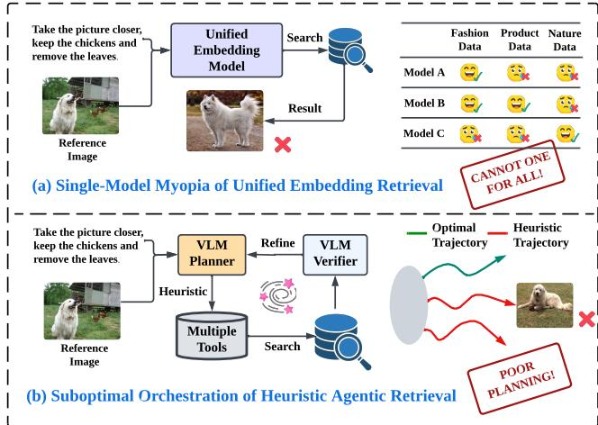
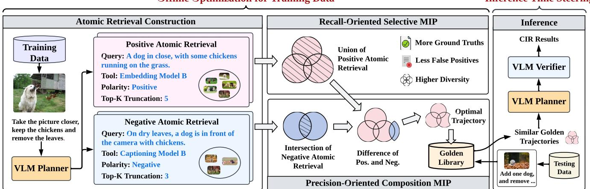
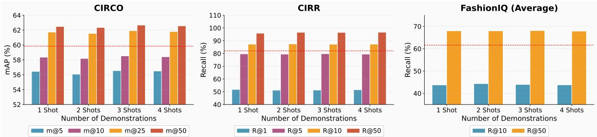
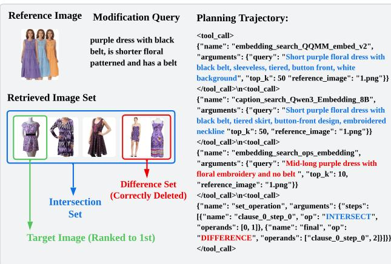

# OSCAR: 优化引导的自主规划用于组合图像检索

滕王 wt0318@connect.hku.hk OPPO 中国深圳 荣山 shanrong@sjtu.edu.cn 上海交通大学 中国上海 林江浩 linjianghao@sjtu.edu.cn 上海交通大学 中国上海 武俊杰 wujunjie1@oppo.com OPPO 中国深圳 许天怡 crimsonflag@sjtu.edu.cn 上海交通大学 中国上海 张建平 jpzhang1810@gmail.com 上海交通大学 中国上海 陈文腾 cwt-03@sjtu.edu.cn 上海交通大学 中国上海 张长旺 changwangzhang@foxmail.com OPPO 中国深圳 王兆祥 steven.wangzx@gmail.com OPPO 中国深圳 张维南 wnzhang@sjtu.edu.cn 上海交通大学 中国上海 王军 junwang.lu@gmail.com OPPO 中国深圳

# 摘要

构图图像检索（CIR）需要对异构视觉和文本约束进行复杂推理。现有方法主要分为两类：统一嵌入检索，存在单模型近视的问题；启发式智能检索，则受到次优试错协调的限制。为此，我们提出了OSCAR，一个优化驱动的智能规划框架用于构图图像检索。我们首次将智能CIR重新表述为一个原则性的轨迹优化问题，而非简单的启发式搜索过程。OSCAR采用了一种新颖的离线-在线范式，而不是依赖启发式的试错探索。在离线阶段，我们通过原子检索选择和组合将CIR建模为一个两阶段的混合整数规划问题，数学上推导出通过严格的布尔集合操作最大化训练样本的真实标注覆盖率的最优轨迹。这些轨迹随后存储在一个黄金库中，作为在线推理时VLM规划器的上下文示例。针对三个公共基准和一个私有工业基准的广泛实验表明，OSCAR在性能上始终优于最先进的基线。值得注意的是，它在仅使用$\mathbf { 1 0 \% }$的训练数据时就达到了优越的性能，展示了规划逻辑的强泛化能力，而非数据集特定的记忆。我们的代码已公开。

# 1 引言

随着现代检索系统的发展，真实用户的查询变得愈加复杂和多模态，通常涉及组合描述、多重约束，以及对视觉和文本信息的隐性推理[14, 31]。为此，越来越多的研究应运而生，旨在解决组合图像检索问题，通常分为两种范式：统一嵌入检索和启发式智能体检索。尽管两者都取得了令人鼓舞的进展，但它们在基础上存在的局限性逐渐成为制约实际应用效果的瓶颈，正如图1所示。

  

Figure 1: The illustration of limitations of existing image retrieval methods, i.e., (a) single-model myopia of unified embedding retrieval, and (b) suboptimal orchestration of heuristic agentic retrieval.

首先，统一嵌入检索试图通过单一的整体表示模型来解决复杂查询，无论是使用通用的多模态编码器，还是针对特定场景微调的领域特定模型。然而，它们面临单一模型短视的问题。具体而言，这种范式隐含地假设单个潜在空间能够作为 универсальное 解决方案，而现实世界中的查询本质上是异质的。用户意图在粒度上有很大差异，从高层次的风格转变（如更正式）到细致的属性约束（如特定的颜色、纹理或图案），而最佳的视觉证据在不同领域之间有差异。在这样的多样性下，依赖单一嵌入空间不可避免地导致短视行为。如图1(a)所示，针对自然图像优化的模型可能无法解析时尚特定属性，而以时尚为导向的模型在处理自然场景推理时可能会遇到困难。因此，即使是最先进的单模型系统在实际应用中仍然脆弱，因为它们无法适应在不同领域中演变或漂移的意图。

其次，启发式智能体检索旨在通过将任务分解为由大型语言模型（LLMs）或视觉-语言模型（VLMs）调用的多步骤工作流来克服表示瓶颈。这些方法利用外部工具（例如，标题生成器、重写器和检索器）来处理复杂查询。然而，尽管这些方法灵活，它们在协调上却存在不足，如图1(b)所示。当前的管道严重依赖于智能体的内部启发式方法（例如，ReAct风格的循环），模型根据中间输出做出贪心的、迭代的决策，决定下一步调用哪个工具。这种缺乏全局目标的方法导致了不结构化和低效的轨迹，特征是重复调用、糟糕的逻辑排序以及对集合论约束（包含/排除）的处理不可靠。此外，依赖迭代交互会带来显著的计算开销，但并未提供任何关于最优检索路径的保证。为此，我们提出了OSCAR，一个优化驱动的智能体规划框架，用于复合图像检索，它首次将智能体CIR重新框架为一个原则性的轨迹规划问题。与依赖启发式、试错的LLM探索的先前方法不同，OSCAR引入了一种新颖的离线-在线范式。在离线阶段，我们将每个单独的检索器调用视为基本单元，并通过解决一个两阶段混合整数规划（MIP）公式来推导训练样本的最优工具调用规划轨迹。这些最优轨迹随后被存储在一个黄金库中，以供推理时的推理演示。在测试时，OSCAR获取相关的规划模式以指导VLM智能体，使其能够复制CIR的最优逻辑推理，而无需昂贵的迭代搜索或人工标注。总之，我们的贡献如下：优化视角。根据我们所知，我们首次将智能体CIR表述为一个MIP问题。通过从启发式搜索转向全局优化，我们数学地推导出训练样本的最优规划轨迹，最大化真值覆盖的同时最小化计算冗余，提供强有力的演示信号而无须人工标注。集合论组合逻辑。我们引入了一种严格的逻辑，通过布尔集合运算（即并、交和差）组合CIR结果。这使得智能体能够执行明确的包含和保守的排除推理，这一能力在单嵌入模型和启发式智能体方法中在数学上是不可处理的。OSCAR框架。我们提出了一种新颖的离线-在线范式，连接了MIP优化和智能体规划。通过将MIP解决方案存储到黄金库作为演示，OSCAR有效地指导VLM在一次推理过程中执行复杂的复合规划。经验优越性。在三个公共基准和一个私有工业基准上，OSCAR始终优于最先进的单嵌入和智能体基线。值得注意的是，它仅使用$10\%$的训练数据进行库构建，便取得了这些增益，显示出对抽象规划逻辑的强泛化能力，而非简单的记忆。

# 2 相关工作

复合图像检索（CIR）旨在检索满足特定文本修改的目标图像，同时保留参考图像的视觉上下文。该任务要求对多模态异构属性进行细粒度的组合推理，伴随着不断增加的语义复杂性。

统一嵌入检索（CIR）。一个主流研究方向通过将由参考图像和修改文本组成的查询压缩为单个嵌入来表述CIR，然后进行最近邻检索。组合通常通过跨模态融合或在共享潜在空间中进行特征编辑来实现。最近的方法进一步通过将图像投影到文本对齐空间或纯粹在文本领域内进行组合来对齐视觉内容与语言。此外，最近的大规模基准测试和排行榜推动了CIR多模态嵌入模型的快速进展，一系列方法取得了越来越强的表现。然而，不同模型在不同领域和数据集上展现出不同的优势，导致了单模型短视问题。启发式智能体检索（CIR）。为了克服统一嵌入的局限性，最近的研究探索了将CIR分解为多个具有专门角色的步骤（如查询重写、检索和纠正）的智能体表述。这些方法通过利用迭代推理和工具使用，展示了更好的灵活性和可解释性。然而，它们通常依赖于启发式探索，往往需要反复的模型交互，造成高计算成本，并缺乏全局最优性保证。相比之下，我们提出的OSCAR用优化驱动的规划替代了这种启发式的试错，在离线MIP表述的指导下，引导智能体朝向可证明高效且准确的检索轨迹。更详细的相关工作见附录A。

# 3 方法论

在本节中，我们介绍OSCAR，一种面向优化的智能规划框架，用于组合图像检索。OSCAR的整体框架如图2所示。所有用于大语言模型调用的提示均在附录I中提供。

# 离线优化训练数据

  

Figure 2: The overall framework of our proposed OSCAR

# 3.1 前言

问题表述。设 $q = \{ q _ { i m g } , q _ { t x t } \}$ 表示一个复合查询，其中 $q _ { i m g }$ 是参考图像，$q _ { t x t }$ 是修改文本。CIR 的目标是从图像库 $\boldsymbol { \mathcal { T } }$ 基于复合查询 $q$ 检索一组真实标注图像 $I ^ { + } \subset I$ 。标准方法通常学习一个单一的检索模型，在统一的潜在空间中执行 CIR，因此面临单模型近视的问题。为此，代理方法将这些现有的检索模型重新构造为一组原子工具，表示为 $\mathcal { T } = \{ f _ { 1 } , f _ { 2 } , . . . , f _ { m } \}$ 。每个工具接受复合查询输入，并返回一组候选图像。这样的表述使我们能够将检索过程视为在可用工具空间上的组合规划问题，而非单一的推理步骤。

从启发式探索到全局优化。现有的智能体方法通常通过启发式探索在这一工具空间中导航（例如，ReAct循环 [48]），在此过程中，LLM/VLM 根据局部上下文迭代决定下一步。虽然灵活，但它们缺乏对解空间的全局视图：智能体可能冗余地查询重叠概念或未能严格执行排除约束。我们观察到，对于任何给定查询 $q$ 和已知真值 ${ \cal { T } } ^ { + }$，理想的工具使用可以数学上表述为集合覆盖 [6] 变体：我们寻求最小的原子工具输出子集，其并集覆盖 ${ \cal { T } } ^ { + }$ ，同时最大限度减少其与非目标 $J ^ { - } = J \setminus \tau ^ { + }$ 的交集。这一认识使我们能够将规划过程重新构架为一个明确求解全局最优路径的混合整数规划（MIP）问题。OSCAR框架。如图2所示，由于在检索过程中真值集是未知的，OSCAR通过一种离线-在线的独特范式弥补这一差距，该范式利用从训练数据中得出的黄金示例引导检索过程。• 离线优化。对于每个训练样本，我们首先通过改变查询和前 $k$ 截断构建并执行原子检索。然后，我们通过两阶段的 MIP 优化全局规划轨迹：(1) 一个以召回为导向的 MIP，识别最佳的原子检索子集，以最大化真值覆盖；(2) 一个以精度为导向的 MIP，结合严格的集合论操作（并集、交集、差集）过滤不相关的图像。得到的最优轨迹被存储在一个黄金库中，以引导在线智能体规划 CIR。• 在线引导。对于具有未知真值的测试查询，我们从黄金库中选择与相似查询相关的最优轨迹作为上下文示例。通过这种方式，我们有效地推广离线得出的高级逻辑，并引导智能体朝向接近最优的 CIR 规划。

# 3.2 原子检索构建

为了实现细粒度规划，OSCAR 首先将复杂的用户意图分解为离散可执行动作的搜索空间。我们将原子检索 $r$ 定义为该空间的基本单元，用四元组进行形式化表示：

$$
r = ( f , \ { \hat { q } } , \ p , \ k ) ,
$$

其中 $f \in \mathcal T$ 是检索工具（例如，基于标题的搜索器或多模态编码器），$\hat { q } = \{ q _ { i m g } , \hat { q } _ { t x t } \}$ 是通过重写文本查询得出的，$p \in \{ + , - \}$ 表示极性（正极性表示包含，负极性表示排除），$k$ 是返回的候选图像数量（即前 $k$ 截断）。每个原子检索 $r$ 代表一个不可分割的规划单元，返回特定候选图像集 $S _ { r } \subset \mathcal { I }$。查询分解与极性。我们并不仅仅依赖于原始查询，而是利用 VLM 生成一组多样化的重写查询。VLM 被提示将修改指令分解为特定的视觉属性或语义约束。关键是，每个生成的查询 $\hat { q }$ 都被赋予一个极性 $\mathcal { P }$。如图 2 所示，正查询 $\left( \boldsymbol { p } \ : = \ : + \right)$ 目标是结果中必须存在的属性（例如，鸡），而负查询 $( p = - )$ 目标是必须明确排除的属性（例如，树叶）。这种解耦使得后续优化阶段能够利用布尔集合逻辑进行精确包括和排除，这是单个检索模型所缺乏的能力。Top $\mathbf { \nabla } \cdot \mathbf { k }$ 截断。截断参数 $k$ 决定了给定工具 $f$ 在召回率和精确率之间的权衡。为了在不同的范围粒度上进行规划，我们将截断参数 $k$ 离散化为有限的级别集：

$$
\mathcal { K } = \{ k _ { 1 } , k _ { 2 } , . ~ . ~ . , k _ { m a x } \} .
$$

对于固定工具 $f$ 和查询 $\hat{q}$，检索结果是确定性的，并且随着 $k$ 单调递增（即 $S_{k_{1}} \subset S_{k_{2}}$ 对于 $k_{1} < k_{2}$）。为了确保计算效率，我们一次执行最大截断 $k_{\mathrm{max}}$ 的检索，通过切片生成更小的前 $k$ 变体，避免冗余的模型推理。通过对可用工具 $f$、重写查询 $\hat{q}$ 的极性 $\boldsymbol{p}$ 和截断 $k$ 进行笛卡尔积，我们构建一个多样的全局原子检索集，记作 $\mathcal{R}$（每个样本有 1,182 个原子检索）。该集合作为后续离线优化阶段的决策空间，我们在此选择和组合 $\mathcal{R}$ 的最优子集，以满足全局检索目标。

# 3.3 召回导向的选择混合整数规划

第一阶段的召回导向混合整数规划（MIP）旨在识别一个紧凑的正向原子检索子集 $\mathcal { R } ^ { + }$，以最大化真实标注图像 ${ \cal { T } } ^ { + }$ 的覆盖率，同时最小化与之无关的噪声 $\boldsymbol { \mathcal { T } ^ { - } }$ 的包含。这一选择过程有效地修剪了在 3.2 节中构建的庞大原子检索空间，形成用于后续细粒度组合阶段的召回导向候选图像集 $\mathcal { U } \subset \mathcal { I }$。 优化变量。我们定义二进制决策变量 $x _ { r } \in \{ 0 , 1 \}$，指示是否选择正向原子检索 $r \in \mathcal { R } ^ { + }$。我们进一步定义辅助状态变量，这些变量根据决策变量 $x _ { r }$ 逻辑确定，以跟踪图像覆盖率和工具多样性： - $c _ { i } \in \{ 0 , 1 \}$ 指示图像 $i \in \mathcal { I }$ 是否被至少一个选择的原子检索覆盖。 - $t _ { f } \in \{ 0 , 1 \}$ 指示工具 $f$ 是否被至少一个选择的原子检索使用，即是否处于活跃状态。 此外，为了防止工具冗余，我们将原子检索分组到不同的家族 $\mathcal { F }$ 中。一个家族 $F \in { \mathcal { F } }$ 包含共享相同工具 $f$ 查询 $\hat { q } _ { : }$ 和极性 $\mathcal { P }$ 的检索，仅在其截断阈值 $k$ 上有所不同。由于较大的 $k$ 值严格包含较小的值（单调性），从同一家族中选择多个成员会带来收益递减。 MIP 公式化。我们将选择问题公式化为一个 MIP，平衡三个竞争目标：（1）最大化真实标注覆盖率 $\textstyle \sum _ { i \in J ^ { + } } c _ { i } / | J ^ { + } |$， （2）最小化无关噪声 $\textstyle \sum _ { i \in J ^ { - } } c _ { i } / | J ^ { - } |$，以及（3）鼓励工具多样性 $\textstyle \sum _ { f \in { \mathcal { T } } } t _ { f }$。优化公式如下：

$$
\begin{array} { r l } { \underset { \{ x _ { r } \} _ { r \in \mathcal { R } ^ { + } } } { \operatorname* { m a x } } } & { \frac { w _ { R } } { | \mathcal { T } ^ { + } | } \displaystyle \sum _ { i \in \mathcal { I } ^ { + } } c _ { i } - \frac { w _ { P } } { | \mathcal { T } ^ { - } | } \displaystyle \sum _ { i \in \mathcal { I } ^ { - } } c _ { i } + \lambda _ { \mathrm { d i v } } \displaystyle \sum _ { f \in \mathcal { T } } t _ { f } } \\ { \mathrm { s . t . } } & { \displaystyle \sum _ { r \in F } x _ { r } \leq 1 , \quad \forall F \in \mathcal { F } , } \\ & { x _ { r } , c _ { i } , t _ { f } \in \{ 0 , 1 \} . } \end{array}
$$

方程 (3) 中的目标函数优先考虑高召回率 $( w _ { R } )$ 以确保真实标注数据在候选集合中存在，同时对用无关图像扩展搜索空间施加惩罚 $( w _ { P } )$。项 $\lambda _ { \mathrm { d i v } }$ 被用作正则化项，以防止过度依赖单一工具，即单一模型近视。方程 (4) 中的约束强制执行截断独占性：对于任何给定的工具和查询配置，求解器必须选择至多一个最佳的 $k$ 阈值，防止对嵌套子集的冗余覆盖。优化输出。该混合整数规划（MIP）得出的解产生了最优的正原子检索集合，记作 $\mathcal { R } _ { * } ^ { + }$，该集合生成了以召回为导向的图像候选集 $\begin{array} { r } { \mathcal { U } = \bigcup _ { r \in \mathcal { R } _ { * } ^ { + } } S _ { r } } \end{array}$。虽然 $\boldsymbol { \mathcal U }$ 确保了对真实标注数据的高覆盖率，但由于我们省略了负原子检索，它不可避免地包含无关图像。因此，下一阶段进行以精度为导向的过滤，以去除剩余的噪声。

# 3.4 精度导向的组合混合整数规划

在第一阶段确保高召回率的同时，得到的候选图像集 $\mathcal{U}$ 不可避免地含有大量噪声，因为负原子检索尚未被考虑。因此，我们通过将原子检索组合成严格的布尔表达式来进行逻辑过滤并优化 $\boldsymbol{\mathcal{U}}$。为了确保稳定性和可解释性，我们将搜索空间限制为固定的两子句结构：

$$
S _ { f i n a l } ~ = ~ \Bigl ( \bigcup _ { r \in \mathcal { R } _ { * * } ^ { + } } S _ { r } \Bigr ) \ \backslash \quad \Bigl ( \bigcap _ { r \in \mathcal { R } _ { * } ^ { - } } S _ { r } \Bigr ) \quad ,
$$

其中 $\mathcal { R } _ { * * } ^ { + } \subseteq \mathcal { R } _ { * } ^ { + } \subseteq \mathcal { R } ^ { + }$ 和 $\mathcal { R } _ { * } ^ { - } \subseteq \mathcal { R } ^ { - }$ 表示在此阶段选择的正负原子检索的最优子集。$\mathcal { R } _ { * } ^ { + }$ 是来自上一个阶段的最优解。关键在于，我们为负子句采用交集方法来实施保守排除：只有当所有选定的负工具一致认为某图像无关时，该图像才会被移除，从而防止因单个工具的幻觉而意外删除真实样本。优化变量。我们定义二元决策变量 $x _ { r } \in \{ 0 , 1 \}$ 来指示原子检索 $r \in \mathcal { R } _ { * } ^ { + } \cup \mathcal { R } ^ { - }$ 是否被选择。基于公式 6，这些决策通过三个逻辑相关变量确定每个候选图像 $i \in \mathcal { U }$ 的状态：• $u _ { i } \in \{ 0 , 1 \}$ 指示图像 $i$ 是否被正联合覆盖，即被至少一个选定的正原子检索检索。• $v _ { i } \in \{ 0 , 1 \}$ 指示图像 $i$ 是否属于负交集，即被所有选定的负原子检索检索。• $z _ { i } \in \{ 0 , 1 \}$ 指示图像 $i$ 是否保留在最终集合 $S _ { f i n a l }$ 中。从逻辑上讲，当且仅当 $u _ { i } = 1$ 且 $v _ { i } = 0$（集合差）时，$z _ { i } = 1$。混合整数规划（MIP）模型。目标是最大化最终集合 $S _ { f i n a l }$ 中真实图像的保留。我们引入正则化项 $\lambda _ { r e g }$ 来减轻假阳性，从而避免平凡解，例如选择不适用负工具以最大化召回率。MIP 的公式如下：

$$
\begin{array} { r l } { \displaystyle \operatorname* { m a x } _ { \{ x _ { r } \} _ { r \in \mathcal { R } _ { * } ^ { + } \cup \mathcal { R } ^ { - } } } } & { \displaystyle \sum _ { i \in \mathcal { U } \cap \mathcal { I } ^ { + } } z _ { i } - \lambda _ { r e g } \sum _ { i \in \mathcal { I } ^ { - } } z _ { i } } \\ { \mathrm { s . t . } } & { \displaystyle \sum _ { r \in \mathcal { R } _ { * } ^ { + } } x _ { r } \geq 1 , } \\ & { \displaystyle x _ { r } , z _ { i } \in \{ 0 , 1 \} . } \end{array}
$$

方程8中的约束确保至少选择一个正原子检索，从而强制正并集非空。优化输出。该解产生一个最优计划 $( \mathcal { R } _ { * * } ^ { + } , \mathcal { R } _ { * } ^ { - } )$，由选定的正和负原子检索组成。它们共同定义了训练样本的智能体组合图像检索的最优轨迹，即一系列与重写查询和前 $k$ 截断相关的特定工具调用，以及导致真实标注数据的相应集合操作。这些轨迹存储在一个金库中，以便在测试时间推理期间进行在线引导，供智能体组合图像检索使用。

# 3.5 基于优化的 CIR 推理

第3.3和3.4节中描述的优化流程计算密集，并依赖于真实标注数据的可用性，因此在推理过程中无法应用。然而，这些阶段产生的轨迹代表了理想规划逻辑的黄金示范。为了将这种优化推理转移到CIR智能体，我们构建了一个黄金库，将这些离线见解提炼为增强检索的上下文示范。对于每个训练实例，我们使用Qwen3-Embedding-8B对问题上下文进行编码，该上下文是修改查询$q _ { t x t }$和参考图像标题$q _ { i m g }$的串联。标题由Qwen3-VL-32B生成。生成的问题上下文向量作为索引的键，相应的两阶段MIP解决方案则是值。在测试时，如图2所示，给定一个组合查询，我们首先计算其问题上下文嵌入，然后根据余弦相似度从黄金库中检索前$N$个最相似的案例。这些轨迹作为VLM规划器的上下文示范。规划器的输出随后传递给VLM验证器，以生成最终的排名结果。至关重要的是，这一过程不仅提供相似问题的答案，而是转移一般化的规划逻辑。通过观察优化规划器如何处理类似的语义结构，规划器学习复制潜在的推理策略，例如选择适当的工具类型、确定排除的正确极性，以及校准截断阈值$k$。这一逻辑转移的鲁棒性在我们的实验中得到了证明：OSCAR在仅使用$\mathbf { 1 0 \% }$可用训练数据构建黄金库时，仍取得了最先进的性能，表明该系统学习了抽象的元策略，而不是记忆特定于数据集的解决方案。

# 3.6 讨论

我们澄清关键设计选择和实施细节，以确保OSCAR框架的可重复性和科学严谨性。逻辑依赖关系的严格实施。在第3.3节和第3.4节中，我们通过逻辑蕴涵描述了主要决策变量（即 $x _ { r }$）与状态变量（如 $c _ { i } , t _ { f } , z _ { i }$）之间的关系，以优先考虑概念的清晰性。在我们的实际实施中，这些逻辑依赖关系通过标准线性约束（例如，Big-M公式和逻辑不等式）被严格执行。完整的数学严谨的公式，包括所有辅助约束和边界，详见附录B。双阶段优化的理由。从理论上讲，召回和精度目标可以统一为一个整体的混合整数规划（MIP），在单一阶段中求解全局最优解。然而，在实际操作中，单阶段公式遭遇了严重的组合爆炸，使得在大规模数据集上计算不可行。我们的双阶段设计采用修剪与精细化策略：第一个MIP充当高召回过滤器，将整个搜索空间缩小到可管理的候选集合 $\boldsymbol { \mathcal { U } }$，使得第二个组合MIP在计算上可行。负面结果和失败的探索。为了提供问题领域的全面视角并使研究社区受益，我们在附录C中详细讨论了负面结果，例如组合MIP的最优但低效的公式以及替代轨迹检索策略。通过记录这些探索，我们旨在突出OSCAR的有效设计以及优化智能体检索轨迹中固有的非平凡挑战。

# 4 实验

# 4.1 实验设置

4.1.1 数据集。我们的主要实验是在三个代表性的公共数据集上进行的：CIRCO、CIRR 和 FashionIQ。具体而言，CIRR 被划分为训练集、验证集和测试集，而 CIRCO 没有训练集。FashionIQ 由三个子集（裙子、衬衫和上衣）组成，每个子集都包含训练集和验证集。遵循之前的工作，我们在 FashionIQ 验证集上进行评估，并通过官方远程评估服务器在 CIRR 和 CIRCO 测试集上进行评估。我们利用 CIRCO 的验证集，CIRR 和 FashionIQ 的训练集来构建黄金库（仅 $1 0 \%$ 的数据）。数据集的详细信息汇总在表 1 中。

Table 1: The dataset statistics.   

<table><tr><td rowspan="2">Split</td><td rowspan="2">Num</td><td rowspan="2">CIRCO</td><td rowspan="2">CIRR</td><td colspan="3">FashionIQ</td></tr><tr><td>Dress</td><td>Shirt</td><td>Toptee</td></tr><tr><td rowspan="2">Training</td><td>#Query</td><td>-</td><td>28,225</td><td>5,985</td><td>5,988</td><td>6,027</td></tr><tr><td>#Image</td><td>-</td><td>16,939</td><td>11,452</td><td>19,036</td><td>16,121</td></tr><tr><td rowspan="2">Validation</td><td>#Query</td><td>220</td><td>4,181</td><td>2,017</td><td>2,038</td><td>1,961</td></tr><tr><td>#Image</td><td>123,403</td><td>2,297</td><td>3,817</td><td>6,346</td><td>5,373</td></tr><tr><td rowspan="2">Testing</td><td>#Query</td><td>800</td><td>4,148</td><td>-</td><td></td><td>-</td></tr><tr><td>#Image</td><td>123,403</td><td>2,315</td><td>-</td><td>-</td><td>-</td></tr></table>

4.1.2 评估指标。我们采用 Recall@K 来评估 CIRR 和 FashionIQ 数据集上的检索性能。由于 CIRCO 数据集中的每个查询都有多个真实标注图像，我们使用均值平均精度 $( \mathbf { m A P } @ K )$ 来评估详细的排名质量。这是遵循之前工作的标准做法 [7, 13, 18, 26, 42, 45, 47]。此外，我们还在附录 D.1 中提供了 CIRCO 数据集上的 Recall@k 性能。 4.1.3 基线。为了评估我们提出的 OS-CAR 框架的有效性，我们与四种类型的基线进行比较： • 多模态嵌入模型。这些是通用的视觉语言嵌入模型。我们选择 Ops-MM-embeddingv1-7B [28]、RzenEmbed-v2-7B [19]、VLM2Vec [21]、B3-Qwen2-7B [35] 和 QQMM-embed-v2 [43]。 • 基于标题的文本嵌入模型。这些基线通过将组成的查询和候选图像转换为标题风格的文本表示，将 CIR 简化为文本检索问题。具体而言，查询是通过连接文本修改查询和参考图像标题构建的，而每个目标图像则通过其标题表示。我们选择 Qwen3-VL-32B [4] 用于图像描述，并选取 bge-m3 [12] 和 Qwen3-Embedding (0.6B, 4B, 8B) [24] 作为文本嵌入基线。 • 针对 CIR 的专用方法。这些方法专门针对 CIR 进行设计，重点通过专门的融合算子、查询重写或学习得到的变换来建模图像-文本查询组合，从而更好地捕捉细粒度修改，包括 Pic2Word [30]、SEARLE [7]、SEARLE-XL-OTI [7]、CIReVL [22]、LinCIR [17]、LDRE [47] 和 FiRE [18]。 • 智能 CIR 方法。这些方法依赖于多步骤的智能管道，通常在 ReAct 风格的范式下编排为迭代循环。这些管道依赖于启发式设计的工作流，而没有明确或优化的工具调用规划，在此过程中，基于 VLM 的智能体分析查询，调用嵌入或图像描述模型，并迭代优化候选结果。我们选取 MRA-CIR [37]、AutoCIR [13] 和 $X ^ { R }$ [45] 作为代表。我们的 OSCAR 框架也属于此范畴。 4.1.4 实现细节。由于页面限制，我们在附录 E 中提供实现细节。

# 4.2 主要结果

表2和表3报告了标准CIR基准上的主要结果。我们还在附录D.1中提供了CIRCO数据集中基线与我们方法之间的Recall $@ k$性能。从表中我们可以得出以下观察结果：整体性能。一般而言，OSCAR在所有数据集上表现最佳，始终 outperforming 其他基线方法，且仅基于 $\mathbf{1 0 \%}$ 的训练数据获得演示。值得注意的是，OSCAR是一个基于开源模型的无训练框架，甚至超过了那些基于特定领域微调或封闭源大语言模型的基线方法。 •与单嵌入方法的比较。OSCAR始终优于单嵌入基线，包括多模态和文本嵌入方法。例如，OSCAR在CIRCO上实现了 mAP@5 相对改善 $2 3 . 1 3 \%$，在CIRR上提升了 Recall $@ 1$ $7 6 . 6 0 \%$，在FashionIQ上提升了 Recall $@ 1 0$ $1 . 2 5 \%$。这些结果表明，通过优化导向的规划和现有检索工具的结构化组合，可以实现显著的性能提升，而不是依靠单一统一的表示。 •与CIR专用方法的比较。OSCAR在CIR专用方法上取得了显著的改进。与这些依赖于专门任务训练的组件进行查询融合或重写的方法不同，OSCAR采用了工具无关的规划方法。它通过将工具调用规划表述为明确的优化问题，并通过结构化集合操作组合输出，系统化了工具的使用，免去了数据集特定的工程。结果表明，对通用工具进行明确的、优化的规划提供了一种高效且可重复使用的替代方案，用以设计专门的CIR模型。 •与智能体方法的比较。OSCAR也始终优于之前的智能体检索方法。例如，OSCAR在CIRR上实现了 Recall@1 相对改善 $1 8 . 6 7 \%$，在FashionIQ上提升了 Recall@10 $1 5 . 5 4 \%$。值得注意的是，这些提升是在没有迭代智能体互动或多轮推理的情况下实现的。与先前智能体方法的启发式探索相比，OSCAR利用优化导出的轨迹的黄金库来指导VLM，从而实现更有效的工具调用规划和提高检索性能。

# 4.3 深入分析

4.3.1 消融研究。表4分析了黄金轨迹演示和集合论操作在OSCAR中的影响，我们可以得到以下观察结果：轨迹演示。在推理时去除最佳轨迹演示（不带演示）通常会降低性能，这表明优化衍生的轨迹提供了有关如何选择和组合检索工具的宝贵信号。此外，黄金库隐式捕捉了数据集和查询特定模式，包括查询意图风格、首选组合策略以及顶部 $\mathbf { \nabla } \cdot \mathbf { k }$ 选择偏差，使规划者能够在不同分布中调整其轨迹规划。 • 集合论操作。当去除集合差或集合交操作（不带集合差和不带集合差与集合交）时，性能显著下降。特别是，去除这两者会将组合简化为检索结果的简单并集，这类似于多通道检索。如表4所示，该变体的表现通常较差，在各数据集的召回率 $\textcircled { a } 5 0$ 上尤其大幅下降。简单地聚合来自多个原子检索的输出是不够的，因为仅仅是并集组合无法过滤出匹配负属性的项。总体而言，这些结果强调了在OSCAR中全面集合操作的重要性。4.3.2 OSCAR的泛化。我们进一步调查了所提出的OSCAR在不同VLM规划者主干上的泛化能力。我们使用Qwen3-4B/8B/32B [44] 和InternVL3.5-38B [40] 在CIRCO数据集上进行评估，并在表5中报告结果。我们得到以下观察结果：•OSCAR在不同VLM主干上有良好的泛化能力，并且持续带来显著的性能提升。这表明我们离线衍生的黄金库捕捉了广泛适用的规划逻辑，使OSCAR能够作为一个无训练、即插即用的框架，具有良好的模型兼容性。OSCAR在VLM主干上的性能提升主要依赖于VLM的智能推理和工具调用能力。因此，更强的VLM（例如Qwen3-VL-32B）可能更好地利用黄金库，并带来更大的改进。在我们与Qwen2.5-VL [5] 和MiniCPM-V [49] 的初步实验中，这一趋势也很明显：具有较弱工具调用能力的模型往往无法遵循工具使用指令，无法可靠地执行所需调用，导致性能下降。4.3.3 对演示数量的鲁棒性。我们研究了从黄金库检索的演示数量（即样本数量）如何影响VLM规划者的推理时引导。具体而言，我们在 $\{ 1, 2, 3, 4\}$ 中变化演示的数量，并在其他设置相同的情况下评估CIR性能。如图3所示，OSCAR对演示数量的变化基本上没有敏感。随着样本数量的增加，性能在所有数据集上保持稳定，仅有轻微波动。这再次表明，黄金库主要提供可泛化的规划轨迹，而不仅仅是记忆类似查询的答案。因此，增加更多演示所提供的信息超出单一轨迹的增益有限。

Table 2: Performance comparison on CIRCO and CIRR datasets. $\mathbf { m } @ K$ and $\mathbf { R } @ K$ denote $\mathbf { m } \mathbf { A } \mathbf { P } @ K$ and Recall $@ K$ ,respectivel baseline result. "-" means that the result is not reported in the original paper.   

<table><tr><td rowspan="2">Type</td><td rowspan="2">Method</td><td rowspan="2">Training Free</td><td colspan="4">CIRCO</td><td colspan="4">CIRR</td></tr><tr><td>m@5</td><td>m@10</td><td>m@25</td><td>m@50</td><td>R@1</td><td>R@5</td><td>R@10</td><td>R@50</td></tr><tr><td rowspan="5">Multimodal Embedding</td><td>Ops-MM-v1-7B</td><td>✓</td><td>13.56</td><td>15.96</td><td>18.61</td><td>19.68</td><td>1.90</td><td>50.29</td><td>66.68</td><td>91.64</td></tr><tr><td>RzenEmbed-v2-7B</td><td>V</td><td>32.20</td><td>34.19</td><td>37.41</td><td>38.61</td><td>19.30</td><td>70.36</td><td>83.08</td><td>96.77</td></tr><tr><td>VLM2Vec</td><td></td><td>3.40</td><td>4.07</td><td>5.08</td><td>5.74</td><td>0.10</td><td>26.48</td><td>41.35</td><td>71.74</td></tr><tr><td>B3_Qwen2_7B</td><td>✓</td><td>3.67</td><td>4.55</td><td>5.53</td><td>6.13</td><td>0.80</td><td>37.95</td><td>54.39</td><td>81.01</td></tr><tr><td>QQMM-embed-v2</td><td>✓</td><td>45.92</td><td>47.13</td><td>50.39</td><td>51.45</td><td>28.98</td><td>73.66</td><td>82.98</td><td>96.72</td></tr><tr><td rowspan="4">Text Embedding</td><td>bge-m3</td><td>✓</td><td>8.15</td><td>8.61</td><td>9.62</td><td>10.21</td><td>12.53</td><td>34.00</td><td>48.63</td><td>75.06</td></tr><tr><td>Qwen3-Embed-0.6B</td><td>✓</td><td>9.55</td><td>10.35</td><td>11.61</td><td>12.33</td><td>14.87</td><td>39.11</td><td>54.53</td><td>82.51</td></tr><tr><td>Qwen3-Embed-4B</td><td>;</td><td>13.55</td><td>14.60</td><td>16.33</td><td>17.20</td><td>22.17</td><td>51.57</td><td>64.84</td><td>88.19</td></tr><tr><td>Qwen3-Embed-8B</td><td></td><td>16.45</td><td>17.23</td><td>18.98</td><td>19.88</td><td>23.21</td><td>52.48</td><td>66.51</td><td>89.71</td></tr><tr><td rowspan="7">CIR Dedicated</td><td>Pic2Word</td><td>20</td><td>8.72</td><td>9.51</td><td>10.46</td><td>11.29</td><td>23.90</td><td>51.70</td><td>65.30</td><td>87.80</td></tr><tr><td>SEARLE</td><td></td><td>11.68</td><td>12.73</td><td>14.33</td><td>15.12</td><td>24.24</td><td>52.48</td><td>66.29</td><td>88.84</td></tr><tr><td>SEARLE-XL-OTI</td><td></td><td>10.18</td><td>11.03</td><td>12.72</td><td>13.67</td><td>24.87</td><td>52.31</td><td>66.29</td><td>88.58</td></tr><tr><td>CIReVL</td><td></td><td>18.57</td><td>19.01</td><td>20.89</td><td>21.80</td><td>24.55</td><td>52.31</td><td>64.92</td><td>86.34</td></tr><tr><td>LinCIR</td><td></td><td>12.59</td><td>13.58</td><td>15.00</td><td>15.85</td><td>25.04</td><td>53.25</td><td>66.68</td><td>-</td></tr><tr><td>LDRE</td><td></td><td>23.35</td><td>24.03</td><td>26.44</td><td>27.50</td><td>26.53</td><td>55.57</td><td>67.54</td><td>88.50</td></tr><tr><td>FiRE</td><td></td><td>31.03</td><td>32.08</td><td>34.40</td><td>35.50</td><td>43.33</td><td>74.02</td><td>83.51</td><td>95.83</td></tr><tr><td rowspan="4">Agentic</td><td>MRA-CIR</td><td></td><td>27.14</td><td>28.85</td><td>31.54</td><td>32.63</td><td>37.98</td><td>67.45</td><td>78.07</td><td>93.98</td></tr><tr><td>AutoCIR</td><td>2</td><td>24.05</td><td>25.14</td><td>27.35</td><td>28.36</td><td>31.81</td><td>61.95</td><td>73.86</td><td>92.07</td></tr><tr><td>XR</td><td></td><td>31.38</td><td>32.88</td><td>35.46</td><td>36.50</td><td>43.13</td><td>73.59</td><td>83.09</td><td>94.05</td></tr><tr><td>OSCAR (Ours)</td><td></td><td>56.54</td><td>58.53</td><td>61.92</td><td>62.67</td><td>51.18</td><td>79.50</td><td>87.45</td><td>96.56</td></tr><tr><td colspan="2">Relative Improvement (%)</td><td></td><td>23.13%</td><td>24.19%</td><td>22.88%</td><td>21.81%</td><td>18.67%</td><td>7.40%</td><td>5.25%</td><td>-0.22%</td></tr></table>

  
steering. $" \mathbf { m } "$ and $\mathbf { \mu } ^ { \infty } \mathbf { \ddot { R } } \mathbf { \ " }$ denotes mAP and Recall The red dashed line denotes the zero-shot performance of OSCAR (i.e., mAP@50 on CIRCO, Recall $\textcircled { \pmb { \omega } } 5 \mathbf { 0 }$ on CIRR and FashionIQ).

# 4.4 案例研究

我们在图4中展示了FashionIQ和CIRR数据集的案例研究。左侧面板展示了一条成功的规划轨迹，在该轨迹中，结构化集合操作成功地检索到目标图像并将其排名第一。右侧面板强调了黄金库的影响：基于上下文中的黄金演示，规划者被引导作出更合适的工具调用和集合操作选择，从而检索到真实图像。我们观察到的一种常见失败模式是负证据中的极性不匹配。负分支旨在检索不希望出现的概念（例如图1中的“多个甲虫”）并通过SeT DIFFEreNcE将其移除。然而，规划者可能会错误地检索到否定概念（例如“一个甲虫”），并错误地将其作为要减去的集合。这颠倒了预期的集合语义，可能会移除有效目标。借助我们优化衍生的指导，规划者被引导朝着一致的负证据和集合组合，从而防止这种错误排除。

  
agent can avoid previous wrong tool calls and finally retrieve the ground truth image.

引用图像修改查询规划轨迹 无黄金库：…… 删除一个甲虫，{"name": "caption_search_Qwen3_Embedding_8B", "arguments": 将甲虫平放在{"name": "set_operation", "arguments": {"steps": ["name": "positive", 检索图像集 无黄金库 "o": "UNI", "operands": [0, 1, 2, ("name": "negative", "op": "ITERECT", "operands": [3, 4, ("name": "final", "op": "DIFFERENCE", "perands": "positive", "negativ" 上下文示例：移除一个昆虫及另一个角度 被DIFFERENCE错误删除！……{"name": "final", "op": "UNION" ….} 检索图像集 有黄金库 规划轨迹 有黄金库：{"name": "embedding_search_QQMM_embed_v2", "arguments": {"query": "一只平躺在小土块上的甲虫，没有第二只甲虫", "top_":50, "reference_image": "1.png"} …… 目标图像（排名第一）{"name": "set_operation", "arguments": {"steps": [{"name": "final", "UNI", "s":[0,1, 2,3,,5,6,7,}

Table 3: Performance comparison on three subsets of FashionIQ datasets. R@K denotes Recall@K. Best results are highlighted in bold, while the second best are underlined.   

<table><tr><td rowspan="2">Method</td><td colspan="2">Dress</td><td colspan="2">Shirt</td><td colspan="2">Toptee</td><td colspan="2">Average</td></tr><tr><td>R@10</td><td>R@50</td><td>R@10</td><td>R@50</td><td>R@10</td><td>R@50</td><td>R@10</td><td>R@50</td></tr><tr><td>Ops-MM-v1-7B</td><td>19.39</td><td>38.13</td><td>31.45</td><td>48.87</td><td>27.69</td><td>46.51</td><td>26.18</td><td>44.50</td></tr><tr><td>RzenEmbed-v2-7B</td><td>37.38</td><td>61.97</td><td>45.63</td><td>64.97</td><td>46.56</td><td>67.57</td><td>43.19</td><td>64.84</td></tr><tr><td>VLM2Vec</td><td>4.76</td><td>14.77</td><td>15.60</td><td>30.62</td><td>11.37</td><td>22.95</td><td>10.58</td><td>22.78</td></tr><tr><td>B3_Qwen2_7B</td><td>8.53</td><td>22.31</td><td>19.53</td><td>34.49</td><td>14.99</td><td>29.88</td><td>14.35</td><td>28.89</td></tr><tr><td>QQMM-embed-v2</td><td>36.44</td><td>60.09</td><td>46.07</td><td>65.65</td><td>46.35</td><td>68.49</td><td>42.95</td><td>64.74</td></tr><tr><td>bge-m3</td><td>10.81</td><td>23.75</td><td>20.66</td><td>33.66</td><td>15.96</td><td>27.33</td><td>15.81</td><td>28.25</td></tr><tr><td>Qwen3-Embed-0.6B</td><td>9.32</td><td>19.83</td><td>21.00</td><td>34.69</td><td>15.96</td><td>27.84</td><td>15.43</td><td>27.45</td></tr><tr><td>Qwen3-Embed-4B</td><td>12.69</td><td>27.02</td><td>26.69</td><td>40.68</td><td>21.88</td><td>36.05</td><td>20.42</td><td>34.58</td></tr><tr><td>Qwen3-Embed-8B</td><td>12.64</td><td>29.20</td><td>28.70</td><td>43.13</td><td>23.41</td><td>36.97</td><td>21.58</td><td>36.43</td></tr><tr><td>Pic2Word</td><td>20.20</td><td>40.20</td><td>26.20</td><td>43.60</td><td>27.90</td><td>47.40</td><td>24.77</td><td>43.73</td></tr><tr><td>SEARLE</td><td>20.48</td><td>43.13</td><td>26.89</td><td>45.58</td><td>29.32</td><td>49.97</td><td>25.56</td><td>46.23</td></tr><tr><td>SEARLE-XL-OTI</td><td>21.57</td><td>44.47</td><td>30.37</td><td>47.49</td><td>30.90</td><td>51.76</td><td>27.61</td><td>47.91</td></tr><tr><td>CIReVL</td><td>24.79</td><td>44.76</td><td>29.49</td><td>47.40</td><td>31.36</td><td>53.65</td><td>28.55</td><td>48.60</td></tr><tr><td>LinCIR</td><td>20.92</td><td>42.44</td><td>29.10</td><td>46.81</td><td>28.81</td><td>50.18</td><td>26.28</td><td>46.48</td></tr><tr><td>LDRE</td><td>22.93</td><td>46.76</td><td>31.04</td><td>51.22</td><td>31.57</td><td>53.64</td><td>28.51</td><td>50.54</td></tr><tr><td>FiRE</td><td>29.60</td><td>50.87</td><td>39.84</td><td>60.06</td><td>35.64</td><td>57.83</td><td>35.03</td><td>56.25</td></tr><tr><td>MRA-CIR</td><td>31.87</td><td>54.23</td><td>40.43</td><td>60.20</td><td>41.25</td><td>62.51</td><td>37.85</td><td>58.98</td></tr><tr><td>AutoCIR</td><td>24.94</td><td>45.81</td><td>34.00</td><td>53.43</td><td>33.10</td><td>55.58</td><td>30.68</td><td>51.61</td></tr><tr><td>X R</td><td>28.71</td><td>52.50</td><td>38.91</td><td>56.82</td><td>43.91</td><td>62.57</td><td>37.18</td><td>57.30</td></tr><tr><td>OSCAR (Ours)</td><td>38.47</td><td>65.15</td><td>44.50</td><td>67.52</td><td>48.24</td><td>71.24</td><td>43.73</td><td>67.97</td></tr><tr><td>Rel. Improv. (%)</td><td>2.92%</td><td>5.13%</td><td>-3.40%</td><td>2.84%</td><td>3.61%</td><td>4.02%</td><td>1.25%</td><td>4.82%</td></tr></table>

# 4.5 在工业照片库上的评估

为了进一步评估我们在真实工业场景下的OSCAR的鲁棒性，我们在一个包含多个用户照片集的私有实景数据集上进行了评估。每个画廊对应着单个用户的照片集合，并与画廊内图像检索的文本查询相关联。这种设置反映了实际的相册搜索场景，任务变成了通用的文本到图像检索，其中图像分布非常多样，查询通常需要对用户意图进行非平凡的推理，超越简单的视觉描述。具体而言，我们在三个画廊上进行了测试，这些画廊包含1,069/1,466/1,047张真实世界的图像和483/336/369个真实用户查询。

Table 4: Ablation study on different variants of our OSCAR. We remove different components to evaluate their contribution respectively. FIQ.Avg denotes average results over subsets of the FashionIQ dataset. The best result is given in bold, and the second-best value is underlined.   

<table><tr><td rowspan="2">Variants</td><td colspan="2">CIRCO</td><td colspan="2">CIRR</td><td colspan="2">FIQ.Avg</td></tr><tr><td>m@25</td><td>m@50</td><td>R@10</td><td>R@50</td><td>R@10</td><td>R@50</td></tr><tr><td>OSCAR (Ours)</td><td>61.92</td><td>62.67</td><td>87.45</td><td>96.56</td><td>43.73</td><td>67.97</td></tr><tr><td>w/o Demo.</td><td>59.72</td><td>59.84</td><td>75.01</td><td>82.02</td><td>46.57</td><td>61.62</td></tr><tr><td>w/o Set.Diff.</td><td>59.54</td><td>59.62</td><td>87.32</td><td>93.80</td><td>46.46</td><td>62.08</td></tr><tr><td>w/o Set.Diff. &amp; Set.Int.</td><td>58.63</td><td>58.66</td><td>39.11</td><td>54.53</td><td>49.44</td><td>53.96</td></tr></table>

Table 5: Performance of different VLM backbones on CIRCO dataset. Better results are given in bold. The best result from each baseline category is also reported. "-" means that the baseline result is not reported in the original paper.   

<table><tr><td>Model</td><td>m@10</td><td>m@25</td><td>m@50</td><td>R@10</td><td>R@25</td><td>R@50</td></tr><tr><td>QQMM-embed-v2</td><td>47.13</td><td>50.39</td><td>51.45</td><td>79.75</td><td>90.25</td><td>95.26</td></tr><tr><td>Qwen3-Embed-8B</td><td>17.23</td><td>18.98</td><td>19.88</td><td>38.75</td><td>53.12</td><td>65.62</td></tr><tr><td>FiRE</td><td>32.08</td><td>34.40</td><td>35.50</td><td>-</td><td>-</td><td>-</td></tr><tr><td>XR</td><td>32.88</td><td>35.46</td><td>36.50</td><td>-</td><td>-</td><td>-</td></tr><tr><td>Qwen3-VL-4B</td><td>58.12</td><td>59.22</td><td>59.33</td><td>84.75</td><td>88.62</td><td>88.75</td></tr><tr><td>w/ OSCAR</td><td>58.11</td><td>61.18</td><td>61.91</td><td>84.75</td><td>93.75</td><td>96.12</td></tr><tr><td>Rel.Improv. (%)</td><td>-0.01%</td><td>3.31%</td><td>4.35%</td><td>0.00%</td><td>5.79%</td><td>8.30%</td></tr><tr><td>Qwen3-VL-8B</td><td>57.85</td><td>59.22</td><td>59.31</td><td>83.75</td><td>88.12</td><td>88.25</td></tr><tr><td>w/ OSCAR</td><td>58.28</td><td>61.65</td><td>62.40</td><td>85.38</td><td>94.88</td><td>97.12</td></tr><tr><td>Rel.Improv. (%)</td><td>0.074%</td><td>4.10%</td><td>5.21%</td><td>1.95%</td><td>7.68%</td><td>10.05%</td></tr><tr><td>Qwen3-VL-32B</td><td>58.32</td><td>59.72</td><td>59.84</td><td>82.75</td><td>86.88</td><td>87.00</td></tr><tr><td>w/ OSCAR</td><td>58.53</td><td>61.92</td><td>62.67</td><td>85.50</td><td>94.62</td><td>97.50</td></tr><tr><td>Rel.Improv. (%)</td><td>0.36%</td><td>3.68%</td><td>4.73%</td><td>3.32%</td><td>8.91%</td><td>12.07%</td></tr><tr><td>InternVL3.5-38B</td><td>57.88</td><td>60.29</td><td>60.62</td><td>84.88</td><td>90.88</td><td>91.75</td></tr><tr><td>w/ OSCAR</td><td>58.74</td><td>61.20</td><td>61.58</td><td>85.50</td><td>92.38</td><td>93.75</td></tr><tr><td>Rel.Improv. (%)</td><td>1.49%</td><td>1.51%</td><td>1.58%</td><td>0.72%</td><td>1.65%</td><td>2.18%</td></tr></table>

我们在表6中报告了性能。我们可以观察到，OS-CAR在所有画廊中的表现始终优于强大的基于嵌入的方法基准，在两个指标上均表现出色。平均而言，OS-CAR在$\mathrm{NDCG} @ 10$上相对于最佳基准实现了$14.26\%$的相对提升，在Recall $@ 10$上实现了$21.74\%$的相对提升。这些结果表明，我们的优化引导工具调用轨迹规划和结构化集合论组合不仅在公共基准中有效，而且能够很好地推广到自然数据分布和复杂用户意图的真实用户照片集合。

Table 6: Performance of real-world text-to-image retrieval on private industrial photo galleries. $\mathbf { N } @ K$ and $\mathbf { R } @ K$ denote NDCG@K and Recal $@ K$ ,respectively. Best results are highlighted in bold, while the second best are underlined.   

<table><tr><td rowspan="2">Model</td><td colspan="2">Gallery1</td><td colspan="2">Gallery2</td><td colspan="2">Gallery3</td><td colspan="2">Avg</td></tr><tr><td>N@10</td><td>R@10</td><td>N@10</td><td>R@10</td><td>N@10</td><td>R@10</td><td>N@10</td><td>R@10</td></tr><tr><td>VLM2Vec</td><td>44.29</td><td>47.78</td><td>44.91</td><td>48.69</td><td>38.96</td><td>41.86</td><td>42.72</td><td>46.11</td></tr><tr><td>B3_Qwen2_7B</td><td>42.87</td><td>47.32</td><td>41.84</td><td>45.71</td><td>37.49</td><td>40.76</td><td>40.73</td><td>44.60</td></tr><tr><td>Ops-MM-v1</td><td>51.78</td><td>53.74</td><td>48.95</td><td>51.44</td><td>43.98</td><td>46.99</td><td>48.24</td><td>50.72</td></tr><tr><td>RzenEmbed-v2-7B</td><td>51.04</td><td>53.79</td><td>49.62</td><td>51.93</td><td>46.23</td><td>47.59</td><td>48.96</td><td>51.10</td></tr><tr><td>QQMM-embed-v2</td><td>51.64</td><td>54.43</td><td>48.42</td><td>51.29</td><td>44.60</td><td>46.63</td><td>48.22</td><td>50.78</td></tr><tr><td>bge-m3</td><td>39.61</td><td>41.98</td><td>38.36</td><td>41.47</td><td>39.87</td><td>41.41</td><td>39.28</td><td>41.62</td></tr><tr><td>Qwen3-Embed-0.6B</td><td>40.73</td><td>42.78</td><td>40.11</td><td>42.54</td><td>39.60</td><td>41.11</td><td>40.15</td><td>42.14</td></tr><tr><td>Qwen3-Embed-4B</td><td>43.06</td><td>44.93</td><td>44.55</td><td>46.80</td><td>41.48</td><td>43.07</td><td>43.03</td><td>44.93</td></tr><tr><td>Qwen3-Embed-8B</td><td>42.92</td><td>45.05</td><td>44.57</td><td>46.86</td><td>41.89</td><td>43.13</td><td>43.13</td><td>45.01</td></tr><tr><td>OSCAR (Ours)</td><td>56.01</td><td>65.28</td><td>53.12</td><td>57.43</td><td>58.70</td><td>63.92</td><td>55.94</td><td>62.21</td></tr><tr><td>Rel.Improve. (%)</td><td>8.17%</td><td>19.93%</td><td>7.05%</td><td>10.59%</td><td>26.97%</td><td>34.31%</td><td>14.26%</td><td>21.74%</td></tr></table>

# 5 结论

我们提出了OSCAR，一个优化引导的规划框架，将自主组成的图像检索重新定义为一个原则性的轨迹规划问题，而非启发式搜索过程。通过离线求解一个两阶段的混合整数规划（MIP）公式，OSCAR 数学上推导出最优规划策略，包括查询重写、截断选择和布尔集合组合，而无需人工标注。这些最优轨迹被存储为黄金演示，以有效引导视觉语言模型（VLM）规划器在推理过程中单次复制复杂推理逻辑。在三个公共基准和私有工业用户画廊的大规模实验中，OSCAR在准确性和稳健性泛化方面始终优于现有最先进的基线（SOTA）。未来的工作将探讨将这种优化引导的范式扩展到其他复杂推理任务，例如多跳问答和开放式工具使用。

# References

[1] Josh Achiam, Steven Adler, Sandhini Agarwal, Lama Ahmad, Ige Akkaya, Florencia Leoni Aleman, Diogo Almeida, Janko Altenschmidt, Sam Altman, Shyamal Anadkat, et al. 2023. Gpt-4 technical report. arXiv preprint arXiv:2303.08774 (2023).   
[2] Lorenzo Agnolucci, Alberto Baldrati, Marco Bertini, and Alberto Del Bimbo. 2024. iSEARLE: Improving Textual Inversion for Zero-Shot Composed Image Retrieval. arXiv preprint arXiv:2405.02951 (2024).   
[3 Anthropic. 2024. Introducing the Model Context Protocol.https://www.anthropic. com/news/model-context-protocol Accessed: 2026-01-29.   
[4] Shuai Bai, Yuxuan Cai, Ruizhe Chen, Keqin Chen, Xionghui Chen, Zesen Cheng, Lianghao Deng, Wei Ding, Chang Gao, and etc. 2025. Qwen3-VL Technical Report. arXiv preprint arXiv:2511.21631 (2025).   
[5] Shuai Bai, Keqin Chen, Xuejing Liu, Jialin Wang, Wenbin Ge, Sibo Song, Kai Dang, Zhaohai Li, Jianqang Wan, Pengei Wang, Wei Ding, Zheren Fu, Yiheng Xu, Jiabo Ye, Xi Zhang, Tianbao Xie, Zesen Cheng, Hang Zhang, Zhibo Yang, Haiyang Xu, and Junyang Lin. 2025. Qwen2.5-VL Technical Report. arXiv:2502.13923 [cs.CV] https://arxiv.org/abs/2502.13923   
[6] Egon Balas and Manfred W Padberg. 1972. On the set-covering problem. Operations Research 20, 6 (1972), 11521161.   
[7] Alberto Baldrati, Lorenzo Agnolucci, Marco Bertini, and Alberto Del Bimbo. 2023. Zero-shot composed image retrieval with textual inversion. In Proceedings of the IEEE/CVF International Conference on Computer Vision. 1533815347.   
[8] Alberto Baldrati, Marco Bertini, Tiberio Uricchio, and Alberto Del Bimbo. 2023. Composed Image Retrieval using Contrastive Learning and Task-oriented CLIPbased Features. ACM Transactions on Multimedia Computing, Communications and Applications (2023).   
[9] Alberto Baldrati, Marco Bertini, Tiberio Uricchio, and Alberto Del Bimbo. 2022. Effective conditioned and composed image retrieval combining clip-based features. In Proceedings of the IEEE/CVF conference on computer vision and pattern recognition. 2146621474.   
[10] Dimitris Bertsimas and John N Tsitsiklis. 1997. Introduction to linear optimization. Vol. 6. Athena scientific Belmont, MA.   
[11] Chia-Yuan Chang, Zhimeng Jiang, Vineeth Rakesh, Menghai Pan, Chin-Cha Michael Yeh, Guancu Wang, Mingzhi Hu, Zhichao Xu, Yan Zheng, Mahashweta Das, and Na Zou. 2025. MAIN-RAG: Multi-Agent Filtering Retrieval-Augmented Generation. In Proceedings of the 63rd Annual Meeting of the Assciation for Computational Linguistics (Volume 1: Long Papers). Association for Compul Liguti, Viea, Austa.https:/antoogy.og/2025.-on.131/   
[12] Jianlv Chen, Shitao Xiao, Peitian Zhang, Kun Luo, Defu Lian, and Zheng Liu. 2024. BGE M3-Embedding: Multi-Lingual, Multi-Functionality, Multi-Granularity Text Embeddings Through Self-Knowledge Distillation. arXiv:2402.03216 [cs.CL]   
[13] Zhango Cheng, Yuhao Ma, Jian Lang, Kunpeng Zhang, ing Zhong, Yong Wang, and Fan Zhou. 2025. Generative Thinking, Corrective Action: User-Friendly Compos Image Retrieval via Automatic Multi-Agent Collaboration. In roceedings of the 31st ACM SIGKDD Conference on Knowledge Discovery and Data Mining V. 2. 334344.   
[14] Ritendra Datta, Dhiraj Joshi, Jia Li, and James Z Wang. 2008. Image retrieval: Ideas, influences, and trends of the new age. ACM Computing Surveys (Csur) 40, 2 (2008), 160.   
[15] Ginger Delmas, Rafael S Rezende, Gabriela Csurka, and Diane Larlus. 2022. ARTEMIS: Attention-based Retrieval with Text-Explicit Matching and Implicit Similarity. In International Conference on Learning Representations.   
[16] Dongdong Ge, Qi Huangfu, Zizhuo Wang, Jian Wu, and Yinyu Ye. 2022. Cardinal Optimizer (COPT) user guide. arXiv preprint arXiv:2208.14314 (2022).   
[17] Geonmo Gu, Sanghyuk Chun, Wonjae Kim, , Yoohoon Kang, and Sangdoo Yun. 2024. Language-only Training of Zero-shot Composed Image Retrieval. In Conference on Computer Vision and Pattern Recognition (CVPR).   
[18] Bohan Hou, Haoqiang Lin, Xuemeng Song, Haokun Wen, Meng Liu, Yupeng Hu, and Xiangyu Zhao. 2025. FiRE: Enhancing MLLMs with fine-grained context le pe ma etl In oi ohe 48 Iteol C SIGIR Conference on Research and Development in Information Retrieval. 803812.   
[19] Weijian Jian, Yajun Zhang, Dawei Liang, Chunyu Xie, Yixiao He, Dawei Leng, and Yuhui Yin. 2025. Rzenembed: Towards comprehensive multimodal retrieval. arXiv preprint arXiv:2510.27350 (2025).   
[20] Ziyan Jiang, Rui Meng, Xinyi Yang, Semih Yavuz, Yingbo Zhou, and Wenhu Chen. 2024. VLM2Vec: Training Vision-Language Models for Massive Multimodal Embedding Tasks. arXiv preprint arXiv:2410.05160 (2024).   
[21] Ziyan Jiang, Rui Meng, Xinyi Yang, Semih Yavuz, Yingbo Zhou, and Wenhu Chen. 2024. Vlm2vec: Training vision-language models for massive multimodal embedding tasks. arXiv preprint arXiv:2410.05160 (2024).   
[22] Shyamgopal Karthik, Karsten Roth, Massimiliano Mancini, and Zeynep Akata. 2024. Vision-by-Language for Training-Free Compositional Image Retrieval. IntratonalConfeec n Lear Rpreeations .   
[23] Jongseok Kim, Youngjae Yu, Hoeseong Kim, and Gunhee Kim. 2021. Dual compositional learning in interactive image retrieval. In Proceedings of the AAAI Conference on Artificial Intelligence, Vol. 35. 17711779.   
[24] Mingxin Li, Yanzhao Zhang, Dingkun Long, Keqin Chen, Sibo Song, Shuai Bai, Zhibo Yang, Pengjun Xie, An Yang, Dayiheng Liu, et al. 2026. Qwen3-VL-Embedding and Qwen3-VL-Reranker: A Unified Framework for State-of-the-Art Multimodal Retrieval and Ranking. arXiv preprint arXiv:2601.04720 (2026).   
[25] Haoqiang Lin, Haokun Wen, Xuemeng Song, Meng Liu, Yupeng Hu, and Liqiang Nie. 2024. Fine-grained textual inversion network for zero-shot composed image retrieval. In Proceedings of the 47th International ACM SIGIR Conference on Research and Development in Information Retrieval. 240250.   
[26] Zheyuan Liu, Cristian Rodriguez-Opazo, Damien Teney, and Stephen Gould. 2021. Image Retrieval on Real-Life Images With Pre-Trained Vision-and-Language Models. In Proceedings of the IEE/CVF International Conference on Computer Vision (ICCV). 21252134.   
[27] Rui Meng, Ziyan Jiang, Ye Liu, Mingyi Su, Xinyi Yang, Yuepeng Fu, Can Qin, Zeyuan Chen, Ran Xu, Caiming Xiong, et al. 2025. Vlm2vec-v2: Advancing multimodal embedding for videos, images, and visual documents. arXiv preprint arXiv:2507.04590 (2025).   
[28] OpenSearch-AI. 2025. OpenSearch-AI/Ops-MM-embedding-v1-7B. https:// huggingface.co/OpenSearch-AI/Ops-MM-embedding-v1-7B.   
[29] Alec Radford, Jong Wook Kim, Chris Hallacy, Aditya Ramesh, Gabriel Goh, Sandhini Agarwal, Girish Sastry, Amanda Askell, Pamela Mishkin, Jack Clark, . In International conference on machine learning. PmLR, 87488763.   
[30] Kuniaki Saito, Kihyuk Sohn, Xiang Zhang, Chun-Liang Li, Chen-Yu Lee, Kate Saenko, and Tomas Pfister. 2023. Pic2Word: Mapping Pictures to Words for Zero-shot Composed Image Retrieval. arXiv:2302.03084 [cs.CV] https://arxiv. org/abs/2302.03084   
X o  n Ho n B o  X, Liqiang Nie. 2025. A Comprehensive Survey on Composed Image Retrieval. arXiv:2502.18495 [cs.MM] https://arxiv.org/abs/2502.18495   
[32] Yucheng Suo, Fan Ma, Linchao Zhu, and Yi Yang. 2024. Knowledge-enhanced dual-stream zero-shot composed image retrieval. In Proceedings of the IEEE/CVF conference on computer vision and pattern recognition. 2695126962.   
[33] Yuanmin Tang, Jing Yu, Keke Gai, Jiamin Zhuang, Gang Xiong, Yue Hu, and Qi Wu. 2024. Context-w: Mapping images to contex-dependent words for accurate zero-shot composed image retrieval. In Proceedings of the AAAI Conference on Artificial Intelligence, Vol. 38. 51805188.   
[34] Yuanmin Tang, Jue Zhang, Xiaoting Qin, Jing Yu, Gaopeng Gou, Gang Xiong, Qingwei Lin, Saravan Rajmohan, Dongmei Zhang, and Qi Wu. 2025. Reasonbefore-retrieve: One-stage reflective chain-of-thoughts for training-free zeroshot composed image retrieval. In Proceedings of the Computer Vision and Pattern Recognition Conference. 14400-14410.   
[35] Raghuveer Thirukovalluru, Rui Meng, Ye Liu, Karthikeyan K, Mingyi Su, Ping Nie, Semih Yavuz, Yingbo Zhou, Wenhu Chen, and Bhuwan Dhingra. 2025. Breakhe Batch Barr (B3) o Contrastie Learnig v Smar Batch Mining. arXiv:2505.11293 [cs.CV] https://arxiv.org/abs/2505.11293   
[36] Rong-Cheng Tu, Wenhao Sun, Hanzhe You, Yingjie Wang, Jiaxing Huang, Li Shen, and Dacheng Tao. 2025. Multimodal Reasoning Agent for Zero-Shot Composed Image Retrieval. arXiv preprint arXiv:2505.19952 (2025).   
[37] Rong-Cheng Tu, Wenhao Sun, Hanzhe You, Yingjie Wang, Jiaxing Huang, Li Shen, and Dacheng Tao. 2025. Multimodal Reasoning Agent for Zero-Shot Composed Image Retrieval. arXiv:2505.19952 [cs.CV] https://arxiv.org/abs/2505.19952   
[38] Nam Vo, Lu Jiang, Chen Sun, Kevin Murphy, Li-Jia Li, Li Fei-Fei, and James Hays. 2019. Composing text and image for image retrieval-an empirical odyssey. In Procings f the IEE/CV conerenceon computer vision and patten recoition. 64396448.   
[39] Teng Wang, Wing Yin Yu, Zhenqi He, Zehua Liu, HaileiGong HaileiGong, Han Wu, Xiongwei Han, Wei Shi, Ruifeng She, Fangzhou Zhu, and Tao Zhong. 2025. B-earh nhann Te  Thouh Rasnn o Mathemai Modelin Problem Solving. In Proceedings of the 63rd Annual Meeting of the Association for Computational Linguistics (Volume 1: Long Papers). Association for Computational Linguistics.   
[40] Weiyun Wang, Zhangwei Gao, Lixin Gu, Hengjun Pu, Long Cui, Xingguang Wei, Zhaoyang Liu, Linglin Jing, Shenglong Ye, Jie Shao, Zhaokai Wang, Zhe Chen, Hongjie Zhang, Ganlin Yang, Haomin Wang, Qi Wei, Jinhui Yin, Wenhao Li, Er Cui, Guanzhou Chen, Zichen Ding, Changyao Tian, Zhenyu Wu, Jingjing Xie, Zehao Li, Bowen Yang, Yuchen Duan, Xuehui Wang, Zhi Hou, Haoran Hao, Tianyi Zhang, Songze Li, Xiangyu Zhao, Haodong Duan, Nianchen Deng, Bin Fu, Yinan He, Yi Wang, Conghui He, Botian Shi, Junjun He, Yingong Xiong, Han Lv, Lijun Wu, Wenqi Shao, Kaipeng Zhang, Huipeng Deng, Biqing Qi, Jiaye Ge, Qipeng Guo, Wenwei Zhang, Songyang Zhang, Maosong Cao, Junyao Lin, Kexian Tang, Jianfei Gao, Hain Huag, Yuzhe Gu, Chengqi Lyu, Huanze Tang, Rui Wang, Haijun Lv, Wanli Ouyang, Limin Wang, Min Dou, Xizhou Zhu, Tong Lu, Dahua Lin, Jifeng Dai, Weijie Su, Bowen Zhou, Kai Chen, Yu Qiao, Wenhai Wang, and Gen Luo. 2025. InternVL3.5: Advancing Open-Source Multimodal M n Veratility, Reang, and Efficncy.arXiv:2508.18265 [cs.CV ht: //arxiv.org/abs/2508.18265   
[41] Laurence A Wolsey and George L Nemhauser. 1999. Integer and combinatorial optimization. John Wiley & Sons.   
[42] Hui Wu, Yupeng Gao, Xiaoxiao Guo, Ziad Al-Halah, Steven Rennie, Kristen Grauman, and Rogerio Feris. 2021. The Fashion IQ Dataset: Retrieving Images by Combining Side Information and Relative Natural Language Feedback. CVPR (2021).   
[43] Youze Xue, Dian Li, and Gang Liu. 2025. Improve Multi-Modal Embedding Learning via Explicit Hard Negative Gradient Amplifying. arXiv preprint arXiv:2506.02020 (2025).   
[44] An Yang, Anfeng Li, Baosong Yang, Beichen Zhang, Binyuan Hui, Bo Zheng, Bowen Yu, Chang Gao, Chengen Huang, and etc. 2025. Qwen3 Technical Report. arXiv preprint arXiv:2505.09388 (2025).   
[45] Zhongyu Yang, Wei Pang, and Yingfang Yuan. 2026. XR: Cross-Modal Agents for Composed Image Retrieval. arXiv preprint arXiv:2601.14245 (2026).   
[46] Zhenyu Yang, Shengsheng Qian, Dizhan Xue, Jiahong Wu, Fan Yang, Weiming Dong, and Changsheng Xu. 2024. Semantic Editing Increment Benefits Zero-Shot Composed Image Retrieval. In Proceedings of the 32nd ACM International Conference on Multimedia. 12451254.   
[47] Zhenyu Yang, Dizhan Xue, Shengsheng Qian, Weiming Dong, and Changsheng Xu. 2024. LDRE: LLM-based Divergent Reasoning and Ensemble for Zero-Shot Composed Image Retrieval. In Proceedings of the 47th International ACM SIGIR Conference on Research and Development in Information Retrieval. 8090.   
[48] Shunyu Yao, Jeffrey Zhao, Dian Yu, Nan Du, Izhak Shafran, Karthik Narasimhan, and Yuan Cao. 2023. ReAct: Synergizing Reasoning and Acting in Language Models. In International Conference on Learning Representations (ICLR).   
[49] Yuan Yao, Tianyu Yu, Ao Zhang, Chongyi Wang, Junbo Cui, Hongji Zhu, Tianchi Ci Haoyu i, Weiln Zhao, Zhihui He, Qanyu hen, Huaro Zhou, Zhenen H   o  H Zeng, Dahai Li, Zhiyuan Liu, and Maosong Sun. 2024. MiniCPM-V: A GPT-4V Level MLLM on Your Phone. arXiv:2408.01800 [cs.CV] https://arxiv.org/abs/ 2408.01800

# A Related Work

# A.1 Unified Embedding Retrieval for CIR

TIRG [38] introduces a gated residual composition mechanism, where the reference image embedding is modified via text-conditionec residual and gating functions. Building on VLMs, Baldrati et al. [9] propose a conditioned composition framework that combines CLIPbased visual and textual features through a learned fusion module. CLIP4CIR [8] builds upon CLIP by fine-tuning the vision-language encoders and learning a dedicated combiner network to fuse the reference image and modification text into a unified retrieval representation. ARTEMIS [15] focuses on relative image descriptions and contrastive supervision to improve sensitivity to semantic changes, while still collapsing the composed query into a unified embedding. DC-Net [23] adopts a dual-branch transformation strategy, separately processing visual and textual features before fusing them into a single retrieval representation.

Pic2Word [30] projects image features into the textual embedding space as pseudo-word tokens, enabling image-text composition through pretrained text encoders. SEARLE [2] further extends this idea by learning task-specific textual inversion or composition modules that encode visual modifications implicitly within a single embedding. Context-I2W [33] further maps images to contextdependent pseudo-word tokens conditioned on the modification intent, improving zero-shot composed retrieval under diverse edits. FTI4CIR [25] introduces fine-grained textual inversion by mapping an image into a subject-oriented token together with multiple attribute-oriented tokens, capturing finer visual details.

Beyond explicit composition mechanisms, some works focus on improving embedding learning strategies for CIR without altering the underlying retrieval formulation. Suo et al. [32] enrich pseudo-word token mapping with an external database and an additional concept-alignment stream, improving fine-grained semantic alignment in the text embedding space. In contrast to tokenbased mapping, SEIZE [46] adopts a training-free textual reasoning pipeline that generates diverse captions and leverages LLM-based compositional reasoning before retrieval.

Some works improve embedding learning for CIR without altering the composition mechanism. LinCIR [17] adopts a languageonly self-supervised training strategy for zero-shot CIR, while FiRE [18] fine-tunes VLMs to enhance multimodal retrieval representations.

Within the unified embedding paradigm, CIReVL [22] proposes a training-free framework following this paradigm, while LDRE [47] explores LLM-based divergent reasoning and ensemble-style aggregation to improve coverage of possible semantic interpretations. Caption-based approaches make intermediate reasoning steps explicit in the language space; however, their effectiveness depends heavily on the quality of caption generation and rewriting, and may suffer from information loss when compressing visual content into text.

Recent advances in large-scale multimodal embedding models have substantially improved zero-shot retrieval performance. However, evaluations such as MMEB [20, 27] show that no single embedding consistently performs well across diverse CIR scenarios; instead, models such as QQMM-embed [43], Rzenembed [19], Ops-MM-embedding [28] and VLM2Vec [20] display complementary strengths, motivating the use of multiple embedding tools rather than a single retriever.

Despite architectural and training differences, all these approaches ultimately reduce CIR to the unified-embedding model search, where complex compositional constraints such as inclusion and exclusion are implicitly encoded in a continuous representation.

# A.2 Heuristic Agentic Retrieval for CIR

Recent work has explored agentic formulations for CIR, where the retrieval process is decomposed into multiple steps with specialized roles (e.g., planning, retrieval, and correction), often involving iterative refinement or feedback. AutoCIR [13] exemplifies this approach by structuring CIR as a multi-component pipeline that iteratively revises queries and retrieval results. MRA-CIR [36] further advances this paradigm by introducing a multimodal reasoning agent that explicitly decouples intent reasoning from retrieval execution, bridging LLM-based logic and retrieval tools. Tang et al. [34] propose a reflective reasoning-before-retrieval paradigm for training-free zero-shot CIR, while $X ^ { R }$ [45] introduces a cross-modal agent framework that coordinates specialized tools through synergistic planning across visual and textual modalities. While this line of work demonstrates the potential of multi-step reasoning, including generating alternative hypotheses and correcting failure cases, such agentic pipelines are typically iterative and computationally expensive due to repeated model interactions. Furthermore, these methods largely rely on heuristic exploration rather than explicit planning with optimality guarantees, leaving open the challenge of how to formalize and optimize tool execution under explicit global constraints.

# A.3 Optimization-Based Planning

From a different perspective, Operations Research formulations model decision-making problems by explicitly defining decision variables, constraints, and objective functions, and solving them via combinatorial optimization such as MIP [10, 39, 41]. This paradigm enables principled and interpretable decision-making with explicit optimization objectives, rather than relying on heuristic or trialand-error search.

Our work adopts this optimization perspective by formulating tool-call trajectory generation for CIR as a two-stage MIP problem. Each atomic retrieval corresponds to a discrete decision variable, while inclusion, exclusion, and composition constraints are explicitly modeled through set-level constraints. This formulation allows retrieval trajectories to be generated with explicit optimality objectives, distinguishing our approach from heuristic agentic planning.

# B Implementation Details of two-stage MIPs

The common notations are summarized in Table 7.

# B.1 Recall-Oriented Atomic Retrieval Selection

We introduce binary decision variables $x _ { r }$ to indicate if a positive atomic retrieval $r \in \mathcal { R } ^ { + }$ is selected. For image coverage, we use binary indicators $y _ { i }$ for $i \in \mathcal { I } ^ { + }$ and $z _ { i }$ for $i \in \mathcal { I } ^ { - }$ to denote whether a ground-truth image or a non-ground-truth image, respectively, is retrieved by at least one selected atomic retrieval.

Table 7: Notation for the Problem Formulation   

<table><tr><td>Symbol</td><td>Description</td></tr><tr><td>I</td><td>An image gallery</td></tr><tr><td>R+</td><td>Set of positive atomic retrievals</td></tr><tr><td>R-</td><td>Set of negative atomic retrievals.</td></tr><tr><td>r  R+UR-</td><td>An atomic retrieval.</td></tr><tr><td>Sr</td><td>Set of candidate images returned by atomic re-</td></tr><tr><td>I +</td><td>trieval call r, where S,  I . Set of ground-truth images, I +  I .</td></tr><tr><td>I-</td><td>Set of non-ground-truth images, I - = I \ I +.</td></tr><tr><td>i  I</td><td>A candidate image.</td></tr><tr><td>ai</td><td> = 1[  I + ∩ Sr ], r  R+.</td></tr><tr><td>bir</td><td> = 1[  I− ∩ S ], r  R+.</td></tr><tr><td>R+</td><td>Set of positive atomic retrievals from Stage I.</td></tr><tr><td>U</td><td>Positive candidate universe induced by the se-</td></tr><tr><td></td><td>lected positive retrievals from Stage I. = 1[  U ∩ S ], r  R+.</td></tr><tr><td>i</td><td> = 1[i  U ∩ Sr ], r  R−.</td></tr><tr><td>R+</td><td>Set of positive atomic retrievals from Stage II.</td></tr><tr><td>R</td><td>Set of negative atomic retrievals from Stage I.</td></tr></table>

Moreover, we group atomic retrievals into different families $\mathcal { F }$ . A family $F \in { \mathcal { F } }$ consists of retrievals that share the same tool $f$ query $\hat { q }$ , and polarity $\boldsymbol { p }$ , differing only in their truncation threshold $k$ .We also introduce binary variables $t _ { f }$ to indicate whether any selected atomic retrieval is associated with tool $f$ .

Based on the incidence definitions in Table 7, we define the following upper-bound coefficients:

$$
\hat { a } _ { i } : = \sum _ { r \in \mathcal { R } ^ { + } } a _ { i r } , \qquad \hat { b } _ { i } : = \sum _ { r \in \mathcal { R } ^ { + } } b _ { i r } ,
$$

which respectively count the number of positive atomic retrievals that retrieve image $i$ as a target or non-target instance.

The recall-oriented atomic retrieval selection is formulated in the following MIP:

$$
\begin{array} { r l } { \underset { x , y , z , t } { \operatorname* { m a x } } } & { \warrow \displaystyle { \frac { 1 } { | \mathcal { F } ^ { + } | } } \sum _ { i \in I ^ { + } } y _ { i } - w _ { F } \frac { 1 } { | \mathcal { F } ^ { - } | } \sum _ { i \in I } z _ { i } + \lambda _ { \mathrm { d i v } } \sum _ { f } t _ { f } } \\ { \mathrm { s . t . } } & { y _ { i } \leq \displaystyle { \sum _ { r \in \mathbb { R } ^ { d } } a _ { i r } x _ { r } \leq \hat { a } _ { i } y _ { i } , \quad \forall i \in I ^ { + } , } } \\ & { \quad \quad \quad \quad \quad \tau _ { r \in \mathbb { R } ^ { d } } } \\ & { \quad \quad \quad \quad \quad \quad \quad \quad \quad \quad \quad \quad \quad \quad \quad \quad \quad \quad \quad \quad \quad \quad \quad \quad \quad \quad \quad \quad \quad \quad \quad \quad \quad \times \quad \quad } \\ &  \quad \quad \quad \quad \quad \quad \quad \quad \quad \quad \tau _ { i } < \displaystyle { b _ { i } \} x _ { r } x _ { r } \leq \hat { b } _ { i } z _ { i } , \quad \quad \forall i \in I ^ { - } , } \\ & { \quad \quad \quad \quad \quad \quad \quad \quad \quad \quad \quad \quad \quad \quad \quad \quad \quad \quad \quad \quad \quad \quad \quad \quad \quad \quad \quad \quad \quad \quad \quad \quad \quad \quad \quad } \\ & { \quad \quad \quad \quad \quad \quad \quad \quad \quad \quad \quad \quad \quad \quad \quad \quad \quad \quad \quad \quad \quad \quad \quad \quad \quad \quad \quad \quad \quad \quad \quad \quad \quad \quad \quad \quad \quad \quad \quad \quad \quad } \\ & { \quad \quad \quad \quad \quad \quad \quad \quad \quad \quad \quad \quad \quad \quad \quad \quad \quad \quad \quad \quad \quad \quad \quad \quad \quad \quad \quad \quad \quad \quad \quad \quad \quad \quad \quad \quad \quad \quad \quad \quad \quad \quad \quad \quad } \\ &  \quad \quad \quad \quad \quad \quad \quad \quad \quad \quad \quad \quad \quad \quad \quad \quad \quad \quad \quad \quad \quad \quad \quad \quad \quad \quad \quad \quad \quad \quad \ \end{array}
$$

The objective in (1a) prioritizes recall to retain sufficient candidates for subsequent composition, with diversity serving as a tie-breaker.

Constraints (1b)(1c) ensure that an image is treated as retrieved if it is returned by at least one selected positive atomic retrieval.

Constraint (1d) therefore selects at most one variant per family, avoiding redundant inclusion of nested result sets.

Constraint (1e) introduces a mild tool-type diversity bias, encouraging solutions that draw from multiple retrieval tools.

The solution to this MIP yields the optimal set of positive atomic retrievals, denoted as $\mathcal { R } _ { * } ^ { + }$ , which produces the recall-oriented candidate set of images $\textstyle { \mathcal { U } } = \bigcup _ { r \in { \mathcal { R } } _ { * } ^ { + } } S _ { r }$ .

# B.2 Precision-Oriented Logic Composition

We use binary variables $x _ { r }$ and $w _ { r }$ to indicate if a positive or negative atomic retrieval $r \in \mathcal { R } _ { * } ^ { + }$ or $r \in \mathcal { R } ^ { - }$ is selected, respectively. For each image $i \in \mathcal { U }$ , the binary variable $e _ { i }$ indicates whether $i$ is included in the final composed result. We further introduce an auxiliary binary variable $g _ { i }$ to indicate whether image i lies in the intersection of the selected negative atomic retrieval result sets.

The precision-oriented logic composition is formulated in the following MIP:

$$
\begin{array} { r l } { \displaystyle \operatorname* { m a x } _ { x , v , r \neq \rho } } & { \displaystyle \sum _ { i \in \mathcal { U } ( T ) } e _ { i } } \\ { \mathrm { s . t . } } & { e _ { i } \leq \displaystyle \sum _ { r \neq \rho } c _ { i } x , \quad \forall i \in \mathcal { U } } \\ & { e _ { i } \leq 1 - g _ { i } , \quad \quad \forall i \in \mathcal { U } } \\ & { g _ { i } \leq d _ { i } e + ( 1 - w _ { r } ) , \quad \forall i \in \mathcal { U } , \forall r \in \mathcal { R } ^ { - } } \\ & { g _ { i } \geq 1 - \displaystyle \sum _ { r \neq \rho } ( 1 - d _ { r } ) \ : w _ { r } , \quad \forall i \in \mathcal { U } } \\ & { \displaystyle \sum _ { r \in \mathcal { R } ^ { + } } x _ { r } \geq 1 } \\ & { x _ { r } \exp , } \\ & { x _ { r } , w _ { r } , e _ { i } , g _ { i } \in \{ 0 , 1 \} . } \end{array}
$$

The objective (2a) is precision-oriented by design and encourages retaining as many target images as possible after filtering.

Constraint (2b) allows an item to be included in the final result if it is retrieved by at least one selected positive atomic retrieval.

Constraint (2c) implements exclusion by preventing items that satisfy the negative clause from being returned.

Constraints (2d)-(2e) ensure that $g _ { u } = 1$ if and only if image $u$ is retrieved by all selected negative atomic retrievals.

Constraint (2f) prevents degenerate solutions by enforcing that at least one positive tool is selected, ensuring a non-empty positive clause in the two-clause composition.

The solution yields an optimal plan $( \mathcal { R } _ { * * } ^ { + } , \mathcal { R } _ { * } ^ { - } )$ consisting of the selected positive and negative atomic retrievals, which can be used to construct the golden library.

# C Alternative Stage II: F1-Optimized DNF Composition

Stage II adopts a fixed set-composition structure for stability. Here, we consider a more flexible alternative that represents logical composition in disjunctive normal form (DNF) and selects clauses via an MIP to directly optimize an F1-style objective.

To handle negative atomic retrievals, we convert set difference into intersection via relative complements. Specifically, for any two sets $A$ and $B$ with $A , B \subseteq { \mathcal { U } }$ , we apply the identity

$$
A \setminus B \ = \ A \cap ( { \mathcal { U } } \setminus B ) \ = \ A \cap { \overline { { B } } } ,
$$

where $\boldsymbol { \mathcal U }$ denotes the positive candidate universe induced by Stage I, and $\overline { B }$ denotes the relative complement of $B$ with respect to $\mathcal { U }$ i.e., ${ \overline { { B } } } : = { \mathcal { U } } \setminus B$ .

Accordingly, each clause $C _ { c }$ is defined as

$$
C _ { c } = \bigcap _ { r \in P _ { c } } \tilde { S } _ { r } , \qquad \tilde { S } _ { r } = \left\{ \begin{array} { l l } { S _ { r } , } & { r \in \mathcal { R } _ { * } ^ { + } , } \\ { \mathcal { U } \backslash S _ { r } , } & { r \in \mathcal { R } ^ { - } , } \end{array} \right.
$$

where $P _ { c } \subseteq \mathcal { R } _ { * } ^ { + } \cup \mathcal { R } ^ { - }$ denotes the set of atomic retrievals included in clause $c$ .

We enumerate clauses prior to optimization by imposing con-$\{ C _ { c } \} _ { c = 1 } ^ { C }$ We introduce a binary indicator $u _ { c }$ to denote whether clause $c$ is selected, and define the final retrieval result as the union of selected clauses:

$$
O = \bigcup _ { c : u _ { c } = 1 } C _ { c } .
$$

We define clause-level incidence matrices

$$
\alpha _ { i c } = \mathbb { 1 } [ i \in { \cal Z } ^ { + } \cap { \cal C } _ { c } ] , \qquad \beta _ { i c } = \mathbb { 1 } [ i \in { \cal Z } ^ { - } \cap { \cal C } _ { c } ] ,
$$

together with the corresponding upper-bound coefficients

$$
\hat { \alpha } _ { i } : = \sum _ { c } \alpha _ { i c } , \qquad \hat { \beta } _ { i } : = \sum _ { c } \beta _ { i c } .
$$

Binary indicators $y _ { i }$ and $z _ { i }$ are used to indicate whether image $i$ is included in the final result $o$ We further impose a budget constraint that limits the number of selected clauses to at most $M$ .

We formulate logic composition in the following MIP:

$$
\begin{array} { r l } { \displaystyle \operatorname* { m a x } _ { u , y , z } \ } & { \displaystyle 2 \sum _ { i \in I ^ { + } } y _ { i } - \lambda \Big ( | I ^ { + } | + \sum _ { i \in I ^ { + } } y _ { i } + \sum _ { i \in I ^ { - } } z _ { i } \Big ) - \alpha \sum _ { c } \Big | P _ { c } \Big | u _ { c } } \\ { \mathrm { ~ s . t . ~ } } & { y _ { i } \leq \displaystyle \sum _ { c } \alpha _ { i c } u _ { c } \leq \hat { \alpha } _ { i } y _ { i } , \qquad \forall i \in I ^ { + } , } \\ & { z _ { i } \leq \displaystyle \sum _ { c } \beta _ { i c } u _ { c } \leq \hat { \beta } _ { i } z _ { i } , \qquad \forall i \in I ^ { - } , } \\ & { \displaystyle \sum _ { c } u _ { c } \leq M , } \\ & { u , \qquad z _ { i } , z _ { i } \in \{ 0 , 1 \} . } \end{array}
$$

The F1 score corresponding to the selected clause union $O =$ $\textstyle \bigcup _ { c : u _ { c } = 1 } C _ { c }$ is given by

$$
F _ { 1 } ( O ) = \frac { 2 \sum _ { i \in \bar { \cal I } ^ { + } } y _ { i } } { | { \cal I } ^ { + } | + \sum _ { i \in \bar { \cal I } ^ { + } } y _ { i } + \sum _ { i \in \bar { \cal I } ^ { - } } z _ { i } } ,
$$

and the parameter $\lambda$ in (3a) is updated via Dinkelbach iteration as

$$
\lambda  \frac { 2 \sum _ { i \in \mathcal { I } ^ { + } } y _ { i } } { \vert \bar { J } ^ { + } \vert + \sum _ { i \in \mathcal { I } ^ { + } } y _ { i } + \sum _ { i \in \mathcal { I } ^ { - } } z _ { i } } .
$$

The objective in (3a) is obtained via the Dinkelbach reformulation of the fractional F1 objective in (13). At each iteration, an MIP is solved to maximize the difference between the numerator and the denominator scaled by the current value of $\lambda$ , and $\lambda$ is updated to the resulting F1 score until convergence. The complexity penalty $\begin{array} { r } { \alpha \sum _ { c } | P _ { c } | u _ { c } } \end{array}$ discourages selecting long clauses. Constraints (3b) (3c) link clause selection to image-level inclusion through $y _ { i }$ and $z _ { i }$ and Constraint (3d) limits the number of selected clauses.

In practice, allowing unions over many enumerated clauses often produces bloated and unintuitive DNF expressions that are difficult to interpret or learn. For example, the resulting composition may take the form

$$
( A \setminus B ) \cup ( A \cap C ) \cup D ,
$$

where the underlying retrieval logic is fragmented across multiple overlapping clauses. To facilitate effective learning of tool-call trajectories by the planner, we therefore adopt the less flexible but more structured Stage II formulation in Section 3.4 in the main method.

# D Additional Experiments

# D.1 CIRCO Recall

In addition to the widely used mAP metric on CIRCO, we also report Recall $@ \mathrm { K }$ in Table 8. As shown in the table, OSCAR consistently achieves higher recal than unified embedding baselines, indicating its ability to retrieve a larger portion of target images.

Table 8: Recall comparison on CIRCO dataset. Best results are highlighted in bold, while the second best are underlined. Rel.Impr denotes the relative improvement over the best baseline.   

<table><tr><td>Method</td><td>R@5</td><td>R@10</td><td>R@25</td><td>R@50</td></tr><tr><td>Ops-MM-v1-7B</td><td>37.88</td><td>54.25</td><td>69.75</td><td>78.00</td></tr><tr><td>RzenEmbed-v2-7B</td><td>60.75</td><td>72.38</td><td>85.75</td><td>92.25</td></tr><tr><td>VLM2Vec</td><td>11.00</td><td>16.38</td><td>26.75</td><td>38.62</td></tr><tr><td>B3_Qwen2_7B</td><td>12.00</td><td>18.00</td><td>29.00</td><td>38.75</td></tr><tr><td>QQMM-embed-v2</td><td>71.12</td><td>79.75</td><td>90.25</td><td>95.26</td></tr><tr><td>bge-m3</td><td>14.62</td><td>20.62</td><td>32.25</td><td>40.62</td></tr><tr><td>Qwen3-Embed-0.6B</td><td>17.12</td><td>25.00</td><td>38.00</td><td>50.62</td></tr><tr><td>Qwen3-Embed-4B</td><td>25.62</td><td>37.38</td><td>51.25</td><td>62.62</td></tr><tr><td>Qwen3-Embed-8B</td><td>27.25</td><td>38.75</td><td>53.12</td><td>65.62</td></tr><tr><td>OSCAR (Ours)</td><td>75.50</td><td>85.50</td><td>94.62</td><td>97.50</td></tr><tr><td>Rel.Impr (%)</td><td>6.16</td><td>6.72</td><td>4.84</td><td>2.35</td></tr></table>

# E Implementation Details

For the tool planning process, we mainly use Qwen3-VL-32B [4] as the planner agent. We adopt COPT [16] as the MIP solver and discretize the top- $\mathbf { \nabla } \cdot \mathbf { k }$ parameter described in Section 3.2 into the range from 5 to 50 with a step size of 5. The detailed prompt for the planner is demonstrated in Appendix I. We adopt Qwen3-VL-32B as the verifier agent to perform a binary relevance judgment between the candidates and queries. A detailed explanation of this binary scoring formulation is provided in Appendix F.

For the tools used by the planner, we select Ops-MM-v1-7B [28], RzenEmbed-v2-7B [19], QQMM-embed-v2 [43] as embedding-based retrieval tools, and bge-m3 [12], Qwen3-Embed-4B [24], Qwen3- Embed-8B [24] as caption-based retrieval tools. In addition, we introduce a dedicated tool that performs structured set operations on retrieved result sets (details are provided in Appendix H). All retrieval and composition tools are deployed via MCP servers [3]. All experiments are conducted on A100 GPUs.

To emphasize generalization, we construct the golden library using only a limited subset of the available training data: specifically, we generate 220 cases for CIRCO, and sample $1 0 \%$ of the training set to construct cases for CIRR and FashionIQ.

# F Binary Logit-Based Relevance Scoring

Our verifier computes a relevance score by comparing the likelihood of generating "yes" and "no" as the next decoded token. Let $_ \textmd { ‰}$ denote the vocabulary, and let $z _ { t }$ be the model's output logit for token $t \in \mathcal { N }$ under a fixed context which consists of a reference image, a modification query, and a candidate image. The corresponding prompt for the verifier is provided in Appendix I.

Step 1: Next-token distribution over the whole vocabulary. By definition, VLM induces a normalized probability distribution over the next token via softmax:

$$
P ( t ) = \frac { \exp ( z _ { t } ) } { \sum _ { v \in \mathcal { V } } \exp ( z _ { v } ) } , \quad t \in \mathcal { V } .
$$

In particular,

$$
P ( \mathsf { y e s } ) = \frac { \displaystyle \exp ( z _ { \mathsf { y e s } } ) } { \displaystyle \sum _ { \boldsymbol { v } \in \mathcal { V } } \exp ( z _ { \boldsymbol { v } } ) } , \qquad P ( \mathsf { n o } ) = \frac { \displaystyle \exp ( z _ { \mathsf { n o } } ) } { \displaystyle \sum _ { \boldsymbol { v } \in \mathcal { V } } \exp ( z _ { \boldsymbol { v } } ) } .
$$

Step 2: Restricting to a binary decision and renormalization. We interpret relevance as a binary decision within the subset {yes, no}.

$$
{ \begin{array} { r l } { P ( { \mathrm { y e s ~ } } | { \mathrm { ~ y e s ~ o r ~ n o } } ) = { \frac { P ( { \mathrm { y e s } } ) } { P ( { \mathrm { y e s } } ) + P ( { \mathrm { n o } } ) } } } & { } \\ & { = { \frac { \frac { \exp ( z _ { \mathrm { { e v } } } ) } { \exp ( z _ { \mathrm { { e v } } } ) } } { { \frac { \exp ( z _ { \mathrm { { e v } } } ) } { \sum _ { \mathrm { { e v } } \in \mathcal { V } } ( z _ { \mathrm { { e v } } } ) } } + { \frac { \exp ( z _ { \mathrm { { e v } } } ) } { \sum _ { \mathrm { { e v } } \in \mathcal { V } } ( z _ { \mathrm { { e v } } } ) } } } } } \\ & { = { \frac { \exp ( z _ { \mathrm { { g e } } } ) } { \exp ( z _ { \mathrm { { g e } } } ) + \exp ( z _ { \mathrm { { n o } } } ) } } } \\ & { = { \frac { 1 } { 1 + \exp ( z _ { \mathrm { { n o } } } - z _ { \mathrm { { g e } } } ) } } } \\ & { = \sigma ( z _ { \mathrm { { g e } } } - z _ { \mathrm { { n o } } } ) ~ . } \end{array} }
$$

where $\begin{array} { r } { \sigma ( x ) \ = \ \frac { 1 } { 1 + \exp ( - x ) } } \end{array}$   
mentation, we use this binary probability as the relevance score $s _ { u } = \sigma ( z _ { y e s } - z _ { n o } )$ .

# G Statistics of Candidate Pruning

Table 9 reports the average number of candidates removed by the difference operation across different datasets. When applied appropriately, the difference operation can effectively reduce the size of the candidate set, thereby alleviating the computational burden on the verifier.

Table 9: Statistics of candidate pruning by the difference operation. Avg. Removed denotes the average number of candidates excluded when difference is used.   

<table><tr><td>Dataset</td><td>Avg. Removed</td></tr><tr><td>CIRR</td><td>10.20</td></tr><tr><td>CIRCO</td><td>3.69</td></tr><tr><td>FashionIQ-Shirt</td><td>3.67</td></tr><tr><td>FashionIQ-Dress</td><td>3.05</td></tr><tr><td>FashionIQ-Toptee</td><td>2.51</td></tr></table>

# H Set Operations

We consider three types of set operations: union, intersection, and difference. These operations enable explicit composition of results returned by multiple retrieval tools, producing a concise candidate set for subsequent ranking. Specifically, union is used to improve recall by aggregating candidates from different tools, intersection increases precision by retaining only commonly retrieved results, and difference filters out candidates that are likely to be irrelevant.

# I Prompts

For completeness, we present the planner, image captioning, and verifier prompts used in our OSCAR framework below.

Role: You are a search planner for Composed Image Retrieval (CIR).   
.

# Available Models:

Embedding models: rzenembed, ops_embedding, QQMM_embed_v2 Caption models: bge_m3, Qwen3_Embed_4B, Qwen3_Embed_8B

# Available Tools:

t_operation(steps): Combine results (INTERSCT, UNION, DIFFERENCE). MUST be the last tool call when using $^ { 2 + }$ tools.

# CRITICAL - Set Operation Rules:

• INTERSECT (AND): Return items in ALL operands. Use when results must satisfy multiple criteria. UNION ( R): Return items in ANY operand. Use for maximum coverage.   
•DIFFERENCE (A - B): Return items in first but NOT in second. Use to exclude specific unwanted features.

Strategy - How to Handle CIR Queries:

Step 1: Analyze Additions, Removals, or Changes

•When to use DIFFERENCE: Only when an object is COMPLETELY ABSENT (e.g., "has no X", "without X"). query should be "toppings", NOT "cake with toppngs").

# Step 2: Generate Tool Calls

Positive tools: Search for "Shared concept" $^ +$ additions.   
Negative tools: ONLY search for objects that DON'T EXIST.

# Step 3: Set Operation (Mandatory)

Union all positive tools "positive".   
Intersect all negative tools "negative".   
DIFFERENCE(positive, negative) "final".

# Static Reference Examples (Learn the format!)

# Below are examples showing the correct tool call FoRMAT (not related to your query):

Query: Changes: shows two people and has a more colorful background. Shared concept: a girl with a traditional Chinese umbrella.   
Reference image: 000000271520.jpg   
Reference caption: A young woman in traditional Chinese attire performs gracefully on a dimly lit stage, holding a large, ornate red parasol.

Analysis:

- Shared: girl with Chinese umbrella/parasol, traditional attire   
- Changes: ADD two people, ADD colorful background (instead of dimly lit stage) - No removals, No DIFFERENCE needed, just UNION   
- Search strategy: Find images with girl $^ +$ Chinese umbrella $^ +$ multiple people $^ +$ colorful s

<tool_call>

{"name": "embedding_search_Qmm_embed_v2", "arguments": {"query": "Two people with traditional Chinese umbrella parasol, colorful vibrant background", "top_k": 20, "reference_image": 000000271520.jpg"}}   
</tool_call>   
<tool_call>   
{"name": "embedding_search_rzenembed", "arguments": {"query": "Girl with Chinese parasol umbrella, two people together, colorful setting", "top_k": 15, "reference_image": "00000271520.jpg"}}   
</tool_call>   
<tool_call>   
{"name": "embedding_search_ops_embedding", "arguments": {"query": "Chinese umbrella, traditional dress, multiple people, colorful background", "top_k": 15, "reference_image": "00000271520.jpg" }}   
</tool_call>   
<tool_call>   
{"name": "caption_search_Qwen3_Embedding_8B", "arguments": {"query": "girl with Chinese umbrella parasol, two people, colorful vibrant background", "top_k": 10, "reference_image": "00000271520. jpg "}}   
</tool_call>   
<tool_call>   
{"name": "set_operation", "arguments": {"steps": [ {"name": "final", "op": "UNIoN", "operands": [0, 1, 2, 3]}]}}   
</tool_call>

# Example2 - DIFFERENCE (Remove elements)

Query: Changes: has no toppings and shows the rest in the background. Shared concept: a slice of cake on a plate in the foreground.   
Reference image: 000000119289.jpg   
Reference caption: A slice of chocolate cake with white frosting and cherry toppings sits on a white plate.   
Analysis: Shared: slice of cake on plate, foreground - Changes: REMovE toppings (no cherry, no frosting decorations), ADD background elements has no toppings, toppings are ABSENT: Use DIFFERENCE CRITICAL: cake EXISTS in target! NEVER include cake in negative query! Search strategy: Find cake slices WITHouT toppings/decorations, with background visible.Use DIFFERENCE to exclude images with visible toppings. Warning: Negative query ONLY contains toppings/cherries/decorations, NOT cake!   
<tool_call>   
{"name": "embedding_search_QQMm_embed_v2", "arguments": {"query": "Plain slice of cake on plate, simple cake, background visible", "top_k": 20, "reference_image": "000000119289.jpg"}}   
</tool_call>   
<tool_call>   
{"name": "embedding_search_rzenembed", "arguments": {"query": "Simple cake slice on plate in foreground, background scene", "top_k": 15, "reference_image": "000000119289.jpg"}}   
</tool_call>   
<tool_call>   
{"name": "embedding_search_ops_embedding", "arguments": {"query": "Cake slice plate foreground, plain simple, background visible", "top_k": 25, "reference_image": "000000119289. jpg"}}   
</tool_call>   
<tool_call>   
{"name": "caption_search_Qwen3_Embedding_8B", "arguments": {"query": "plain cake slice on plate, background visible", "top_k": 10, "reference_image": "000000119289. jpg"}}   
</tool_call>   
<tool_call>   
{"name": "embedding_search_QQMm_embed_v2", "arguments": {"query": "cherry topping, frosting decorations, fruit toppings, garnish", "top_k": 20, "reference_image": "000000119289.jpg"}}   
</tool_call>   
<tool_call>   
{"name": "embedding_search_rzenembed", "arguments": {"query": "cherries, whipped cream topping, dessert decorations, garnish", "top_k": 20, "reference_image": "00000119289.jpg"}}   
</tool_call>   
<tool_call>   
{"name": "caption_search_Qwen3_Embedding_8B", "arguments": {"query": "toppings, cherries, frosting decorations, garnished dessert", "top_k": 10, "reference_image": "000000119289.jpg"}}   
</tool_call>   
<tool_call>   
{"name": "set_operation" "arguments": {"steps": [{"name": "positive", "op": "UNION" "operands": [0, 1, 2, 3]}, {"name": "negative", "op": "INTERsECT", "operands": [4, 5, 6]}, {"name": "final", "I op": "DIFFERENcE", "operands": ["positive", "negative"]}]}}   
</tool_call>

# RETRIEVED SIMILAR CASES

Be yr q p

Query Rewrite   
Tool selection and composition   
top_k values

{retrieved_cases}

Now solve the following task: Modification Query: {query} Reference Image: {ref_img} Reference Image Caption: {ref_caption}

Now generate tool_calls to retrieve targetimages based onthe provided Modification Query and Reference Image.

# Image Captioning Prompt

Describe this image comprehensively:

1. Main subjects and their attributes   
2. Actions, interactions, and relationships   
3. Scene, background, and context   
4. Any visible text (signs, labels, watermarks, etc.)   
Return your response as JSON:   
\*json   
"caption": "your comprehensive description here"

# Verifier Agent Prompt

{Reference image}   
{Candidate image}   
Modification query: {<query>}

# Instruction:

You are given two images.   
The firsage is the eerencage.   
The second image is a candidate image.   
reference image.   
Answer with "yes" or "no" only.