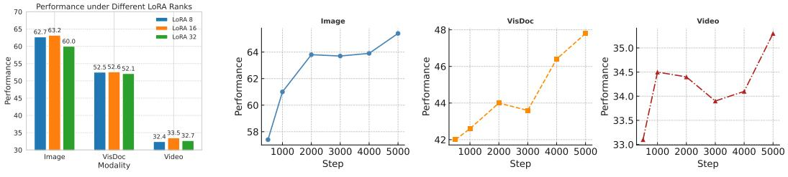

# 1. Bibliographic Information

## 1.1. Title
The central topic of the paper is `VLM2Vec-V2`, a unified framework designed to advance multimodal embedding capabilities. The research focuses on creating a general-purpose model capable of processing and generating unified embeddings for diverse visual forms, specifically expanding beyond standard natural images to include videos and visual documents (like PDFs and slides).

## 1.2. Authors
The paper is authored by a collaborative team of researchers:
*   **Rui Meng** (Salesforce Research)
*   **Ziyan Jiang** (UC Santa Barbara)
*   **Ye Liu** (Salesforce Research)
*   **Mingyi Su** (University of Waterloo)
*   **Xinyi Yang** (Salesforce Research)
*   **Yuepeng Fu** (Tsinghua University)
*   **Can Qin** (Salesforce Research)
*   **Zeyuan Chen** (Salesforce Research)
*   **Ran Xu** (Salesforce Research)
*   **Caiming Xiong** (Salesforce Research)
*   **Yingbo Zhou** (Salesforce Research)
*   **Wenhu Chen** (Salesforce Research)
*   **Semih Yavuz** (Salesforce Research)

    The research is primarily driven by Salesforce Research, with contributions from academic institutions known for strong AI and computer vision programs (UC Santa Barbara, University of Waterloo, Tsinghua University).

## 1.3. Journal/Conference
The paper is currently available as a preprint on arXiv (arXiv:2507.04590). While not yet published in a specific journal or conference proceedings at the time of this analysis, arXiv is a highly reputable repository for preliminary scientific reports in the fields of physics, mathematics, and computer science, serving as a primary venue for the latest AI research.

## 1.4. Publication Year
The paper was published on July 7, 2025 (UTC).

## 1.5. Abstract
The paper addresses the limitation of existing multimodal embedding models (like `VLM2Vec`, `E5-V`, `GME`), which predominantly focus on natural images and lack robust support for videos and visual documents. This gap restricts their utility in real-world applications such as AI agents, multimodal search, and Retrieval-Augmented Generation (RAG). To solve this, the authors propose `VLM2Vec-V2`, a unified framework for learning embeddings across diverse visual forms. They introduce `MMEB-V2`, a comprehensive benchmark extending the original `MMEB` with five new task types (visual document retrieval, video retrieval, temporal grounding, video classification, and video question answering). Experiments demonstrate that `VLM2Vec-V2` achieves strong performance on these new tasks while improving upon prior baselines on original image benchmarks, offering insights into unified embedding learning strategies.

## 1.6. Original Source Link
*   **arXiv Link:** https://arxiv.org/abs/2507.04590
*   **PDF Link:** https://arxiv.org/pdf/2507.04590v1
*   **Status:** Preprint

# 2. Executive Summary

## 2.1. Background & Motivation
The core problem is the limited scope of current multimodal embedding models. While models like CLIP or BLIP have successfully mapped text and images into a shared vector space, real-world data is far more complex. It includes temporal data (videos) and structured data (visual documents like slides, charts, and PDFs). Existing models struggle to generalize to these modalities because they are trained predominantly on datasets of natural images (e.g., MSCOCO, Flickr). This creates a significant bottleneck for applications like searching for a specific moment in a YouTube video or retrieving a relevant slide deck from a company database. The paper's entry point is the hypothesis that a unified model, trained with specific instructions on a mixture of image, video, and document data, can learn a shared embedding space that captures semantic similarity across all these diverse forms.

## 2.2. Main Contributions / Findings
The paper makes three primary contributions:
1.  **MMEB-V2 Benchmark:** A new, comprehensive dataset for evaluating multimodal embeddings. It adds 42 new tasks across five categories (Video Retrieval, Moment Retrieval, Video Classification, Video QA, and Visual Document Retrieval) to the existing MMEB benchmark, covering 78 datasets in total.
2.  **VLM2Vec-V2 Model:** A unified multimodal embedding model based on the `Qwen2-VL` architecture. It uses instruction-guided contrastive learning to produce embeddings for text, images, videos, and visual documents within a single vector space.
3.  **Empirical Validation:** The authors demonstrate that `VLM2Vec-V2` outperforms prior baselines (including specialized models) across the board. Key findings include the effectiveness of interleaved sub-batching for training stability and the observation that training on all three modalities (Image, Video, VisDoc) yields the best generalization performance, rather than training on them separately.

# 3. Prerequisite Knowledge & Related Work

## 3.1. Foundational Concepts
To understand this paper, one must grasp several fundamental concepts in machine learning and computer vision:

*   **Embedding Model:** A neural network that maps input data (text, image, etc.) to a vector of fixed size (e.g., 768 or 4096 dimensions). The goal is to place semantically similar items close together in this vector space.
*   **Contrastive Learning:** A training technique where a model learns to distinguish between similar (positive) and dissimilar (negative) pairs of data points. The model is rewarded for pulling positive pairs closer and pushing negative pairs apart.
*   **InfoNCE Loss:** A specific loss function often used in contrastive learning. It stands for "Noise Contrastive Estimation". It treats the task as a classification problem: given a query (e.g., an image), identify the correct target (e.g., its caption) from a set of candidates consisting of one positive (correct) and many negatives (incorrect).
*   **Vision-Language Model (VLM):** A deep learning model designed to understand and generate content involving both visual and linguistic modalities. Examples include CLIP, BLIP, and GPT-4V. They typically consist of an image encoder (like a Vision Transformer) and a text encoder (like a Transformer).
*   **LoRA (Low-Rank Adaptation):** A parameter-efficient fine-tuning technique. Instead of updating all the weights in a large pre-trained model, LoRA adds smaller, trainable rank-decomposition matrices to the existing weights. This allows fine-tuning on new tasks with significantly less memory and compute.
*   **Instruction Tuning:** A method where models are trained using natural language instructions (e.g., "Retrieve the video that matches this description") to guide their behavior. This helps the model generalize to new tasks it hasn't explicitly seen during training by following the instruction.

## 3.2. Previous Works
The paper builds upon several lines of research:

*   **CLIP (Contrastive Language-Image Pre-training):** Proposed by Radford et al. (2021), CLIP is a foundational work that learns visual concepts from natural language supervision. It uses a contrastive loss to align image and text embeddings. The formula for the similarity function used in CLIP is typically the cosine similarity scaled by a temperature parameter $\tau$:
    $$ \text{sim}(z_i, z_j) = \frac{z_i^T z_j}{\tau \|z_i\| \|z_j\|} $$
    This concept is central to the methodology of `VLM2Vec-V2`.
*   **VLM2Vec:** The direct predecessor to this work (Jiang et al., 2024). It converted Vision-Language Models into embedding models using instruction tuning and contrastive learning, but focused primarily on image-text tasks.
*   **ColPali:** A model specialized for visual document retrieval (Faysse et al., 2024). It uses a late interaction mechanism (MaxSim operation) to match query tokens with document tokens, which is different from the single-vector approach used in standard CLIP-like models.
*   **GME (General Multimodal Embedding):** A unified embedding model (Zhang et al., 2024) that supports text, images, and audio, but lacks specific optimization for the temporal dynamics of video or the structural layout of documents compared to the proposed V2 approach.

## 3.3. Technological Evolution
The field has evolved from simple image-text retrieval (CLIP) to more complex, instruction-following models capable of handling multiple tasks (VLM2Vec). Initially, video and document understanding required specialized architectures (e.g., 3D CNNs for video, layout-aware models for documents). The current trend, exemplified by this paper, is to leverage powerful, general-purpose VLM backbones (like Qwen2-VL) that can handle variable resolutions and temporal sequences natively, and fine-tune them to act as universal embedders for *all* modalities, unifying the representation space.

## 3.4. Differentiation Analysis
Unlike `ColPali`, which uses a multi-vector "late interaction" approach (keeping all token embeddings for a document), `VLM2Vec-V2` adopts a "single-vector" approach where the entire video or document is compressed into one embedding vector. This makes `VLM2Vec-V2` faster and more compatible with standard vector databases (like FAISS), whereas `ColPali` requires specialized indexing. Unlike `GME`, which focuses on broad modality support, `VLM2Vec-V2` specifically targets the structural and temporal challenges of documents and videos through its choice of backbone (`Qwen2-VL`) and data sampling strategies.

# 4. Methodology

## 4.1. Principles
The core principle of `VLM2Vec-V2` is to learn a unified embedding space where semantically related items—regardless of whether they are text, images, videos, or visual documents—are located close to each other. The method relies on **Instruction-Guided Contrastive Learning**. By feeding natural language instructions (e.g., "Find a video similar to this query") into the model alongside the data, the model learns to disentangle the *task* from the *content*, allowing a single model to perform retrieval, classification, and QA effectively.

## 4.2. Core Methodology In-depth (Layer by Layer)

The methodology can be broken down into four key steps: Backbone Selection, Data Formatting, Similarity Calculation, and Training Strategy.

### Step 1: Backbone Selection and Encoding
The authors selected `Qwen2-VL` as the backbone model. This is a critical choice because `Qwen2-VL` possesses specific architectural features necessary for this task:
1.  **Naive Dynamic Resolution:** It can handle images and videos of varying aspect ratios without forced resizing or cropping, preserving important details.
2.  **Multimodal Rotary Position Embedding (M-RoPE):** This allows the model to understand spatial (2D) and temporal (3D) positions within a unified framework, essential for understanding video sequences.
3.  **Unified Architecture:** It integrates 2D (image) and 3D (video) convolutions, meaning it doesn't need separate processing pipelines for static images and moving videos.

    When an input (query or target) is fed into the model, it is processed by this backbone to produce a hidden state representation. The authors extract the embedding vector by taking the last layer vector representation of the last token in the sequence.

### Step 2: Data Formatting and Instruction Integration
To handle diverse tasks, the authors standardize the input format. They define a training example as a pair $(q, t^+)$, where $q$ is the query and $t^+$ is the positive target (the correct match).

Crucially, they prepend an instruction to the query to create an instruction-conditioned query $q_{inst}$. The formula for this formatting is:

$$ q_{inst} = [ \mathsf{VISUAL\_TOKEN}] \ \mathsf{Instruct:} \ \{task\_instruction\} \backslash \mathsf{n} \ \mathsf{Query:} \ \{q\} $$

Here, $[ \mathsf{VISUAL\_TOKEN}]$ is a special token indicating the modality (e.g., `<|image_pad|>` or `<|video_pad|>`). The `task_instruction` is a natural language description (e.g., "Recognize the category of the video contents."). This forces the model to encode the data *in the context of the task*.

Similarly, the target $t^+$ is formatted as:
$$ t^+ = [ \mathsf{VISUAL\_TOKEN}] \ \{target\_instruction\} $$
For example, "Understand the content of the provided video:".

### Step 3: Contrastive Learning and Loss Calculation
Once the query $q_{inst}$ and target $t^+$ are encoded by the backbone, we obtain their embeddings $\mathbf{h}_{q_{inst}}$ and $\mathbf{h}_{t^+}$.

The model is trained using the standard **InfoNCE loss**. The goal is to maximize the similarity between the query and the positive target while minimizing similarity with negative targets (denoted as $t^-$).

The loss function $\mathcal{L}$ is defined as:

$$ \operatorname* { m i n } \mathcal { L } = - \log \frac { \phi ( \mathbf { h } _ { q _ { \mathrm { i n s t } } } , \mathbf { h } _ { t ^ { + } } ) } { \phi ( \mathbf { h } _ { q _ { \mathrm { i n s t } } } , \mathbf { h } _ { t ^ { + } } ) + \displaystyle \sum _ { t ^ { - } \in \mathbb { N } } \phi ( \mathbf { h } _ { q _ { \mathrm { i n s t } } } , \mathbf { h } _ { t ^ { - } } ) } $$

**Explanation of the Formula:**
*   $\operatorname*{min} \mathcal{L}$: We are minimizing the loss value.
*   $-\log$: The negative logarithm. Inside the log is a ratio (probability-like value). Minimizing the negative log is equivalent to maximizing the ratio inside.
*   **Numerator:** $\phi ( \mathbf { h } _ { q _ { \mathrm { i n s t } } } , \mathbf { h } _ { t ^ { + } } )$. This is the similarity score between the query embedding and the *positive* (correct) target embedding. We want this to be high.
*   **Denominator:** $\phi ( \mathbf { h } _ { q _ { \mathrm { i n s t } } } , \mathbf { h } _ { t ^ { + } } ) + \sum_{t^- \in \mathbb{N}} \phi ( \mathbf { h } _ { q _ { \mathrm { i n s t } } } , \mathbf { h } _ { t ^ { - } } )$. This is the sum of the similarity score for the positive target plus the sum of similarity scores for all negative targets in the set $\mathbb{N}$.
*   **Intuition:** The loss forces the similarity of the positive pair to be much larger than the sum of similarities of all negative pairs. If the model mistakenly assigns a high score to a negative example, the denominator grows, the ratio shrinks, and the loss increases.

    The function $\phi$ computes the matching score. The authors use the temperature-scaled cosine similarity:

$$ \phi ( \mathbf { h } _ { q } , \mathbf { h } _ { t } ) = \exp \left( \frac { 1 } { \tau } \cos ( \mathbf { \bar { h } } _ { q } , \mathbf { h } _ { t } ) \right) $$

**Explanation of the Formula:**
*   $\exp(\dots)$: The exponential function ensures the output is positive.
*   $\tau$: The temperature parameter. A lower temperature makes the distribution "sharper" (more confident), while a higher temperature makes it "softer".
*   $\cos(\mathbf{\bar{h}}_q, \mathbf{h}_t)$: The cosine similarity between the query vector $\mathbf{\bar{h}}_q$ (which appears to be normalized or treated as such) and the target vector $\mathbf{h}_t$. Cosine similarity measures the angle between two vectors, ranging from -1 to 1.

### Step 4: Data Sampling Strategy (Interleaved Sub-batching)
Training on a mixture of images, videos, and documents is challenging because the data distributions differ. The authors propose "Interleaved Sub-batching".
1.  A full batch (e.g., 1024 samples) is divided into smaller sub-batches (e.g., 8 sub-batches of 128 samples).
2.  Each sub-batch is sampled independently from a specific data source (e.g., one sub-batch for video, one for documents).
3.  These sub-batches are then interleaved to form the full training batch.

    This strategy increases the "hardness" of the contrastive task (because negatives within a sub-batch are semantically similar, making discrimination harder) while maintaining diversity across the full batch (preventing the model from collapsing to a single modality).

The following figure (Figure 1 from the original paper) provides an overview of the MMEB-V2 benchmark and the diverse tasks involved:

*该图像是MMEB-V2的示意图，展示了包括9个元任务和总计78个任务的多模态嵌入基准。该基准扩展了原有的任务类型，新增了针对视频和视觉文档的任务标识，蓝色边框表示原有任务，红色边框表示新任务。*

# 5. Experimental Setup

## 5.1. Datasets
The experiments utilize a diverse collection of datasets to train and evaluate the model across three modalities.

### Training Data
*   **LLaVA-Hound:** Provides synthetic video-caption pairs (300k) and video QA examples (240k). This teaches the model video-text alignment.
*   **ViDoRe & VisRAG:** Provide visual document retrieval data (approx. 480k samples). This teaches the model to understand structured documents (PDFs, slides).
*   **MMEB-train:** Provides image-based vision tasks (QA, classification, retrieval). This ensures the model retains its capabilities on standard images.

### Evaluation Data (MMEB-V2 Benchmark)
The benchmark includes 78 datasets. A concrete example of a data sample for the **Video Retrieval** task might look like this:
*   **Query:** "A person cooking pasta in a kitchen." (Text)
*   **Instruction:** "Retrieve a video that matches the description."
*   **Candidates:** A pool of 1,000 video clips (e.g., one of a car, one of a dog, one of cooking, etc.).
*   **Target:** The specific video clip ID that contains the cooking action.

    For **Visual Document Retrieval**, a sample might be:
*   **Query:** "What is the revenue growth in 2024?" (Text)
*   **Candidates:** 50 pages from a financial report PDF (Images).
*   **Target:** The specific page containing the revenue chart.

    The following are the results from Table 1 of the original paper, summarizing the statistics of the MMEB-V2 benchmark:

    <table>
    <thead>
    <tr>
    <th rowspan="2">Task</th>
    <th rowspan="2"></th>
    <th rowspan="2">Query MOD Target MOD</th>
    <th rowspan="2">Domain</th>
    <th rowspan="2">#Query</th>
    <th rowspan="2">#Candidates</th>
    </tr>
    </thead>
    <tbody>
    <tr>
    <td colspan="6"><strong>Video Retrieval (5 Tasks)</strong></td>
    </tr>
    <tr>
    <td>DiDeMo</td>
    <td></td>
    <td>V</td>
    <td>Open</td>
    <td>1,004</td>
    <td>1,004</td>
    </tr>
    <tr>
    <td>MSR-VTT</td>
    <td></td>
    <td>T</td>
    <td>V</td>
    <td>Open</td>
    <td>1,000</td>
    <td>1,000</td>
    </tr>
    <tr>
    <td>MSVD</td>
    <td></td>
    <td>T</td>
    <td>V</td>
    <td>Open</td>
    <td>6700</td>
    <td>670</td>
    </tr>
    <tr>
    <td>VATEX</td>
    <td></td>
    <td></td>
    <td>V</td>
    <td>Open</td>
    <td>4,468</td>
    <td>4,468</td>
    </tr>
    <tr>
    <td>YouCook2</td>
    <td></td>
    <td>T</td>
    <td>V</td>
    <td>T Cooking</td>
    <td>3,179</td>
    <td>3,179</td>
    </tr>
    <tr>
    <td colspan="6"><strong>Moment Retrieval (3 Tasks)</strong></td>
    </tr>
    <tr>
    <td>QVHighlights</td>
    <td></td>
    <td>T+V</td>
    <td>V</td>
    <td>Vlog/News</td>
    <td>1,083</td>
    <td>10</td>
    </tr>
    <tr>
    <td>Charades-STA</td>
    <td></td>
    <td>T +V</td>
    <td>V</td>
    <td>Activity</td>
    <td>727</td>
    <td>10</td>
    </tr>
    <tr>
    <td>MomentSeeker</td>
    <td></I +V</td>
    <td>V</td>
    <td>Open</td>
    <td>1,800</td>
    <td>10</td>
    </tr>
    <tr>
    <td colspan="6"><strong>Video Classification (5 Tasks)</strong></td>
    </tr>
    <tr>
    <td>Kinetics-700</td>
    <td></td>
    <td>V</td>
    <td>T</td>
    <td>Open</td>
    <td>1,000</td>
    <td>700</td>
    </tr>
    <tr>
    <td>SSv2</td>
    <td></td>
    <td>V</td>
    <td>T</td>
    <td>Human-Object Interaction</td>
    <td>1,000</td>
    <td>174</td>
    </tr>
    <tr>
    <td>HMD51</td>
    <td></td>
    <td>V</td>
    <td>T</td>
    <td>Open</td>
    <td>1,000</td>
    <td>51</td>
    </tr>
    <tr>
    <td>UCF101</td>
    <td></td>
    <td>V</td>
    <td>T</td>
    <td>Open</td>
    <td>1,000</td>
    <td>101</td>
    </tr>
    <tr>
    <td>Breakfast</td>
    <td></td>
    <td>V</td>
    <td>T</td>
    <td>Cooking</td>
    <td>433</td>
    <td>10</td>
    </tr>
    <tr>
    <td colspan="6"><strong>Video QA (5 Tasks)</strong></td>
    </tr>
    <tr>
    <td>MVBench</td>
    <td></td>
    <td>V + T</td>
    <td>T</td>
    <td>Spatial/Temporal</td>
    <td>4,000</td>
    <td>3~5</td>
    </tr>
    <tr>
    <td>Video-MME</td>
    <td></td>
    <td>V + T</td>
    <td>T</td>
    <td>Real-world</td>
    <td>900</td>
    <td>4</td>
    </tr>
    <tr>
    <td>NExT-QA</td>
    <td></td>
    <td>V + T</td>
    <td>T</td>
    <td>Daily activity</td>
    <td>8,564</td>
    <td>5</td>
    </tr>
    <tr>
    <td>EgoSchema</td>
    <td></td>
    <td>V + T</td>
    <td>T</td>
    <td>Egocentric</td>
    <td>0</td>
    <td>5</td>
    </tr>
    <tr>
    <td>ActivityNetQA</td>
    <td></td>
    <td>V + T</td>
    <td>T</td>
    <td>Activity</td>
    <td>1000</td>
    <td>2</td>
    </tr>
    <tr>
    <td colspan="6"><strong>Visual Document Retrieval (24 Tasks)</strong></td>
    </tr>
    <tr>
    <td>ViDoRe (10)</td>
    <td></td>
    <td>T</td>
    <td>D</td>
    <td>Documents</td>
    <td>280 - 1,646</td>
    <td>70 - 999</td>
    </tr>
    <tr>
    <td>ViDoRe-V2 (4)</td>
    <td></td>
    <td>T</td>
    <td>D</td>
    <td>Documents</td>
    <td>52 - 640</td>
    <td>452 - 1,538</td>
    </tr>
    <tr>
    <td>VisRAG (6)</td>
    <td></td>
    <td></td>
    <td>D</td>
    <td>Documents</td>
    <td>63-816</td>
    <td>500 - 9,590</td>
    </tr>
    <tr>
    <td>ViDoSeek (2)</td>
    <td></td>
    <td>T</td>
    <td>D</td>
    <td>Documents</td>
    <td>1,142</td>
    <td>5,349</td>
    </tr>
    <tr>
    <td>MMLongBench-Doc (2)</td>
    <td></td>
    <td>T</td>
    <td>D</td>
    <td>Documents</td>
    <td>838</td>
    <td>6, 492</td>
    </tr>
    </tbody>
    </table>

## 5.2. Evaluation Metrics
The paper uses two primary metrics to evaluate performance.

### 1. Hit@1 (Recall@1)
*   **Conceptual Definition:** This metric measures the accuracy of the top-ranked result. It answers the question: "Is the correct item the very first one returned by the model?" It is a strict metric often used in retrieval and classification tasks.
*   **Mathematical Formula:**
    $$ \text{Hit@1} = \frac{1}{N} \sum_{i=1}^{N} \mathbb{I}(\text{rank}(q_i, t_i^+) \leq 1) $$
*   **Symbol Explanation:**
    *   $N$: The total number of queries.
    *   $\mathbb{I}(\cdot)$: The indicator function, which is 1 if the condition is true and 0 otherwise.
    *   $\text{rank}(q_i, t_i^+)$: The rank position of the positive target $t_i^+$ for query $q_i$ in the sorted list of candidates.

### 2. NDCG@5 (Normalized Discounted Cumulative Gain)
*   **Conceptual Definition:** This metric evaluates the quality of the ranking, considering the position of the correct item. Unlike Hit@1, it gives partial credit if the correct item appears in the top 5 positions, but higher scores are awarded for higher ranks (e.g., rank 1 is better than rank 5). It is commonly used in document retrieval where multiple relevant documents might exist.
*   **Mathematical Formula:**
    $$ \text{NDCG}@k = \frac{1}{|Q|} \sum_{q \in Q} \frac{DCG@k(q)}{IDCG@k(q)} $$
    Where:
    $$ DCG@k(q) = \sum_{i=1}^{k} \frac{2^{rel_i} - 1}{\log_2(i+1)} $$
*   **Symbol Explanation:**
    *   $Q$: The set of queries.
    *   $k$: The cutoff rank (in this paper, $k=5$).
    *   $rel_i$: The graded relevance of the result at position $i$ (often 1 for relevant, 0 for irrelevant).
    *   `IDCG`: The Ideal DCG, representing the perfect ranking (all relevant items at the top), used for normalization.

## 5.3. Baselines
The paper compares `VLM2Vec-V2` against several strong baselines:
*   **ColPali v1.3 (3B):** A state-of-the-art model specialized for visual document retrieval.
*   **GME (2B & 7B):** A general multimodal embedding model based on Qwen2-VL, supporting text, images, and audio.
*   **LamRA-Qwen2 (7B):** A large multimodal model used as a retrieval assistant, trained via two-stage instruction tuning.
*   **VLM2Vec-Qwen2VL (2B & 7B):** The predecessor model, trained primarily on image-text tasks.

# 6. Results & Analysis

## 6.1. Core Results Analysis
The main results demonstrate that `VLM2Vec-V2` achieves the highest overall average score (58.0) across all 78 datasets, outperforming the 7B parameter `GME` model (57.8) and the 7B `VLM2Vec` (52.3), despite `VLM2Vec-V2` being a smaller 2B model. This highlights the efficiency of the unified training approach.

*   **Image Tasks:** `VLM2Vec-V2` (64.9) significantly outperforms the 2B baselines and is competitive with the 7B `VLM2Vec` (65.5). This suggests that adding video and document data does not degrade image performance (catastrophic forgetting is avoided).
*   **Video Tasks:** `VLM2Vec-V2` (34.9) performs competitively, beating the image-centric `VLM2Vec` (34.0) and matching `GME` (38.6 for 7B).
*   **Visual Document Tasks:** `VLM2Vec-V2` (65.4) shows massive improvement over the previous `VLM2Vec` (46.4), proving the value of incorporating document training data. However, it still trails behind the specialized `ColPali` (71.0), which uses a more complex multi-vector matching mechanism.

    The following are the results from Table 2 of the original paper:

    <table>
    <thead>
    <tr>
    <th rowspan="2">Model</th>
    <th colspan="5">Image</th>
    <th colspan="5">Video</th>
    <th colspan="5">VisDoc</th>
    <th rowspan="2">All</th>
    </tr>
    <tr>
    <th>CLS</th>
    <th>QA</th>
    <th>RET</th>
    <th>GD</th>
    <th>Overall</th>
    <th>CLS</th>
    <th>QA</th>
    <th>RET</th>
    <th>MRET</th>
    <th>Overall</</th>
    <th>VDRv1</th>
    <th>VDRv2</th>
    <th>VR</th>
    <th>OOD</th>
    <th>Overall</th>
    </tr>
    </thead>
    <tbody>
    <tr>
    <td colspan="11"><strong>Baseline Models</strong></td>
    </tr>
    <tr>
    <td>ColPali v1.3 (3B)</td>
    <td>40.3</td>
    <td>11.5</td>
    <td>48.1</td>
    <td>40.3</td>
    <td>34.9</td>
    <td>26.7</td>
    <td>37.8</td>
    <td>21.6</td>
    <td>25.5</td>
    <td>28.2</td>
    <td>83.6</td>
    <td>52.0</td>
    <td>81.1</td>
    <td>43.1</td>
    <td>71.0</td>
    <td>44.4</td>
    </tr>
    <tr>
    <td>GME (2B)</td>
    <td>54.4</td>
    <td>29.9</td>
    <td>66.9</td>
    <td>55.5</td>
    <td>51.9</td>
    <td>34.9</td>
    <td>42.0</td>
    <td>25.6</td>
    <td>32.4</td>
    <td>33.9</td>
    <td>86.1</td>
    <td>54.0</td>
    <td>82.5</td>
    <td>43.1</td>
    <td>72.7</td>
    <td>54.1</td>
    </tr>
    <tr>
    <td>GME (7B)</td>
    <td>57.7</td>
    <td>34.7</td>
    <td>71.2</td>
    <td>59.3</td>
    <td>56.0</td>
    <td>37.4</td>
    <td>50.4</td>
    <td>28.4</td>
    <td>38.2</td>
    <td>38.6</td>
    <td>89.4</td>
    <td>55.6</td>
    <td>85.0</td>
    <td>44.4</td>
    <td>75.2</td>
    <td>57.8</td>
    </tr>
    <tr>
    <td>LamRA-Qwen2 (7B)</td>
    <td>59.2</td>
    <td>26.5</td>
    <td>70.0</td>
    <td>62.7</td>
    <td>54.1</td>
    <td>39.3</td>
    <td>42.6</td>
    <td>24.3</td>
    <td>34.6</td>
    <td>35.2</td>
    <td>22.0</td>
    <td>11.5</td>
    <td>37.4</td>
    <td>21.0</td>
    <td>23.9</td>
    <td>40.4</td>
    </tr>
    <tr>
    <td>LamRA-Qwen2.5 (7B)</td>
    <td>51.7</td>
    <td>34.1</td>
    <td>66.9</td>
    <td>56.7</td>
    <td>52.4</td>
    <td>32.9</td>
    <td>42.6</td>
    <td>23.2</td>
    <td>37.6</td>
    <td>33.7</td>
    <td>56.3</td>
    <td>33.3</td>
    <td>58.2</td>
    <td>40.1</td>
    <td>50.2</td>
    <td>47.4.0</td>
    </tr>
    <tr>
    <td>VLM2Vec-Qwen2VL (2B)</td>
    <td>58.7</td>
    <td>49.3</td>
    <td>65.0</td>
    <td>72.9</td>
    <td>59.7</td>
    <td>33.4</td>
    <td>30.5</td>
    <td>20.6</td>
    <td>33.0</td>
    <td>29.0</td>
    <td>49.8</td>
    <td>13.5</td>
    <td>51.8</td>
    <td>33.5</td>
    <td>41.6</td>
    <td>47.0</td>
    </tr>
    <tr>
    <td>VLM2Vec-Qwen2VL (7B)</td>
    <td>62.7</td>
    <td>56.9</td>
    <td>69.4</td>
    <td>82.2</td>
    <td>65.5</td>
    <td>39.1</td>
    <td>30.0</td>
    <td>29.0</td>
    <td>40.6</td>
    <td>34.0</td>
    <td>56.9</td>
    <td>9.4</td>
    <td>59.1</td>
    <td>38.1</td>
    <td>46.4</td>
    <td>52.3</td>
    </tr>
    <tr>
    <td colspan="11"><strong>Ours</strong></td>
    </tr>
    <tr>
    <td>VLM2Vec-V2 (2B)</td>
    <td>62.9</td>
    <td>56.3</td>
    <td>69.5</td>
    <td>77.3</td>
    <td>64.9</td>
    <td>39.3</td>
    <td>34.3</td>
    <td>28.8</td>
    <td>38.5</td>
    <td>34.9</td>
    <td>75.5</td>
    <td>44.9</td>
    <td>79.4</td>
    <td>39.4</td>
    <td>65.4</td>
    <td>58.0</td>
    </tr>
    </tbody>
    </table>

## 6.2. Ablation Studies / Parameter Analysis

### Generalization Across Modalities
The authors analyzed the impact of training data composition (Table 3). Training on all three modalities (Image+Video+VisDoc) yielded the highest overall score (49.1) and the best performance on Visual Document tasks (52.2). Interestingly, training on Image+Video actually improved Image performance (63.3) compared to Image-only (62.5), suggesting that video data provides a regularization effect or complementary features for image understanding.

### Data Sampling Strategies
The "Interleaved Sub-batching" strategy was analyzed by varying the sub-batch size (Table 4).
*   **VisDoc & Video:** Performance consistently improved as sub-batch size increased (more homogeneity within sub-batches). This implies that for these complex modalities, having harder negatives (similar items within the batch) is beneficial.
*   **Image:** Performance followed an inverted U-shape, peaking at a sub-batch size of 64. Too much homogeneity (size 1024) hurt performance, likely because image tasks benefit from more diverse negatives.

    The following figure (Figure 2 from the original paper) illustrates the impact of LoRA ranks and training steps:

    
    *该图像是图表，左侧柱状图展示了不同LoRA等级下三种模态（图像、视觉文档和视频）的性能；右侧三幅折线图则展示了随着训练步骤的增加，各模态的性能趋势。*

### Model Settings
*   **LoRA Rank:** A rank of 16 was found to be optimal. Increasing to 32 did not yield gains, suggesting the model does not need excessive additional capacity to adapt to these tasks.
*   **Training Steps:** Performance improved steadily up to 5,000 steps without saturation, particularly for Video and VisDoc tasks. This suggests the model could benefit from even longer training.

# 7. Conclusion & Reflections

## 7.1. Conclusion Summary
The paper successfully demonstrates that a unified multimodal embedding model, `VLM2Vec-V2`, can effectively bridge the gap between text, images, videos, and visual documents. By introducing the `MMEB-V2` benchmark, the authors provide a rigorous testing ground for future research. The results show that a single 2B model can outperform larger specialized baselines on general tasks, validating the hypothesis that unified, instruction-guided training is a viable path forward for general-purpose multimodal retrieval.

## 7.2. Limitations & Future Work
The authors acknowledge that while `VLM2Vec-V2` is strong, it still trails behind specialized models like `ColPali` on pure visual document retrieval tasks. This highlights the trade-off between generalization and specialization. The ablation study also indicates that the model had not fully converged by 5,000 steps, suggesting that performance could be further improved with extended training or larger data volumes. Future work could explore hybrid approaches that combine the single-vector efficiency of `VLM2Vec-V2` with the precision of late-interaction mechanisms for specific domains.

## 7.3. Personal Insights & Critique
This paper is a significant step towards "one model for all modalities." The choice of `Qwen2-VL` as a backbone is strategic, as its native support for temporal and spatial data removes the need for patchwork solutions. The "Interleaved Sub-batching" strategy is a practical engineering insight that addresses the instability of multi-task contrastive learning.

However, the reliance on single-vector embeddings for documents is a double-edged sword. While it enables fast retrieval using standard ANN (Approximate Nearest Neighbor) libraries, it inevitably loses fine-grained details (like specific text regions in a PDF) that multi-vector models preserve. For enterprise search where precision is paramount, a hybrid system using `VLM2Vec-V2` for coarse filtering and a re-ranker (like `ColPali`) might be the ultimate solution. The paper sets a strong baseline for this unified approach, opening the door for more "universal" AI agents that can truly see and understand the world in all its formats.