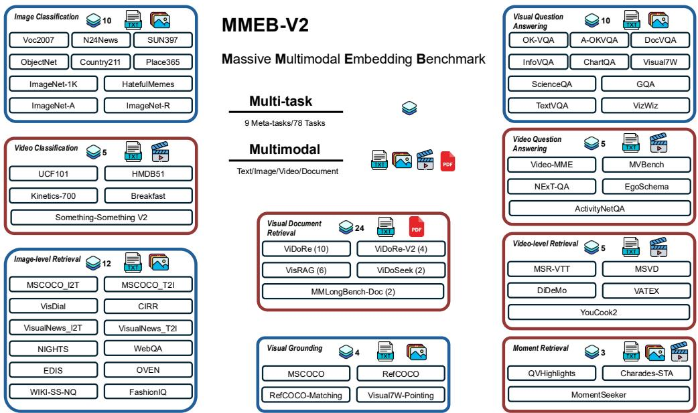

# VLM2Vec-V2：推进视频、图像和视觉文档的多模态嵌入

Rui Meng1\* Ziyan Jiang2\* Ye ${ { \bf { L i u } } ^ { 1 } }$ Mingyi $\mathbf { S } \mathbf { u } ^ { 3 }$ Xinyi Yang1 Yuepeng $\mathbf { F u ^ { 4 }}$ Can Qin Zeyuan Chen1 Ran ${ \bf \chi } _ { \bf u } ^ { 1 }$ Caiming Xiong1 Yingbo Zhou Wenhu Chen3 Semih Yavuz1 1Salesforce研究 2加州大学圣巴巴拉分校 3滑铁卢大学 4清华大学 https://tiger-ai-lab.github.io/VLM2Vec/

# 摘要

多模态嵌入模型在实现诸如语义相似性、信息检索和跨不同模态的聚类等各种下游任务中发挥了关键作用。然而，现有的多模态嵌入，如VLM2Vec、E5-V、GME等，主要集中于自然图像，对视频和视觉文档等其他视觉形式的支持有限。这限制了它们在现实世界场景中的适用性，包括AI智能体、多模态搜索和推荐，以及检索增强生成（RAG）。为了解决这一问题，我们提出了VLM2Vec-V2，这是一个跨多种视觉形式学习嵌入的统一框架。首先，我们引入了MMEB-V2，这是一个全面的基准，扩展了MMEB，增加了五种新的任务类型：视觉文档检索、视频检索、时间定位、视频分类和视频问答，涵盖了文本、图像、视频和视觉文档输入。接下来，我们训练了VLM2Vec-V2，一个通用的嵌入模型，支持文本、图像、视频和视觉文档输入。大量实验表明，VLM2Vec-V2不仅在新引入的视频和文档检索任务上表现出色，而且在原始图像基准上也超越了先前的基线。通过广泛的评估，我们的研究提供了对各种多模态嵌入模型通用性的洞见，并强调了统一嵌入学习的有效策略，为研究和现实世界环境中的更具可扩展性和适应性的表示学习奠定了基础。

# 1 引言

嵌入模型在连接不同模态的数据方面发挥着关键作用。通过将异构的多模态数据编码为共享的密集表示空间，它们使得许多下游应用成为可能，如分类、聚类、检索等。近年来，嵌入模型取得了重大进展，这主要得益于大规模基础模型的发展。例如，最近在文本嵌入方面的突破（Su et al., 2023; Wang et al., 2024a; Meng et al., 2024; BehnamGhader et al., 2024）是通过将预训练的大型语言模型与多任务指令嵌入微调相结合而实现的。同样，Jiang et al. (2024); Zhang et al. (2024b); Chen et al. (2025) 通过将视觉语言模型（VLMs）进行指令微调，展示了在多个文本-图像任务中的强大性能。现有的多模态嵌入模型是在如MMEB（Jiang et al. 2024）和M-BEIR（Wei et al., 2023）等数据集上训练的，这些数据集主要集中在自然图像或照片上，数据来源于MSCÖCO（Lin et al., 2014）、Flickr（Plummer et al., 2015）和ImageNet（Deng et al., 2009）数据集。这些数据集未覆盖更广泛的视觉信息形式，如文档、pdf、网站、视频、幻灯片等。缺乏覆盖范围使现有嵌入模型在许多现实任务中表现不佳，如文章搜索、网站搜索、Youtube视频搜索等。为了解决这些局限性，我们引入了MEB-V2，这是一个先进的多模态嵌入数据集，旨在训练和评估跨越三种关键视觉模态（图像、视频和视觉文档）的嵌入模型。在原有的MMEB（Jiang et al., 2024）框架的基础上，MEB-v2扩大了评估范围，涵盖五项新任务，包括四个基于视频的任务——视频检索、时刻检索、视频分类和视频问答——以及一个针对视觉文档的任务：视觉文档检索。这一综合任务组允许对静态、时序和结构化视觉数据环境中的多模态嵌入模型进行全面评估。在MMEB-V2的基础上，我们提出了VLM2Vec-V2，这是一个从最先进的视觉-语言模型（Wang et al., 2024b）微调而来的强大多模态嵌入模型。VLM2Vec-V2使用跨多个任务类别的指令跟随任务混合进行训练，使其能够为各种视觉模态生成统一的表示。通过VLM2Vec-V2和MMEB-V2，我们旨在探索以下研究问题：多模态嵌入在不同视觉模态中的泛化能力如何？训练稳健和多功能多模态嵌入模型的关键要素是什么？在视频中表示时序信息和在视觉文档中表示结构信息的主要挑战是什么？本工作的贡献体现在以下三方面。• 我们提出了MMEB-v2，一个综合数据集，用于系统评估涉及视频、图像和视觉文档的多样任务上的嵌入模型。• 我们开发了VLM2Vec-V2，一个统一的多模态嵌入模型，支持多样的输入格式，并遵循任务指令生成通用嵌入以支持各种下游任务。• 我们的实验显示，VLM2Vec-V2在78个数据集上超越了先前的基准。通过详细的消融实验，我们识别出了跨模态学习嵌入模型的有效训练策略。

# 2 MMEB-V2：扩展嵌入基准测试超越图像-文本

我们介绍了MMEB-V2，这是一个全面的数据集，旨在评估模型在涉及文本、图像、视频和视觉文档多模态嵌入任务上的性能。除了涉及自然图像和文本的五个任务类别外，MEB-v2还包括四个视频理解任务和一个视觉文档理解任务。图1展示了MMEB-V2的概览。每个任务为模型提供一个查询和一组候选响应，目标是选择正确的目标。查询由指令、文本组件和视频或文档的组合构成。对于基于视频的任务，视频以均匀间隔从原始录像中采样的帧序列表示，以确保一致的时间覆盖。指令用于指定模型的目标（例如，“识别视频内容的类别。”），查询文本可以是特定于视频的问题、描述或命令（例如，“在视频结束时，壁炉上方有多少双红色袜子？”，“选择包含海豚的视频片段。”）。每个任务与特定的目标类型相关联，具体取决于任务的性质。例如，在视频分类中，模型必须识别活动或对象类别标签（例如，“瑜伽”或“汽车”）。为了使数据集在未来的研究中实用和可访问，我们选择性地下采样某些数据集，以确保完整基准可以在合理的时间内运行。我们的数据集涵盖多个领域，包括体育、物体识别、日常生活活动以及电影或电视节目的片段。这些样本来自YouTube、专业制作和众包内容等多种来源，确保了多样性和真实世界的相关性。每个任务的总结统计信息在表1中呈现。有关构建每个数据集的详细信息请参见附录A.2。

  

Figure 1: An overview of MMEB-V2, which includes 9 meta-tasks and 78 tasks in total. In addition to the original MMEB benchmark, MMEB-v2 introduces five new meta-tasks focused on video and visual documents. Tasks from MMEB are indicated with blue borders, while newly introduced tasks in MMEB-V2 are marked with red borders.

• 视频检索（V-RET）查询由指令、与视频内容相关的描述性文本以及一系列视频帧组成。模型必须从数千个视频候选中检索出正确的对应视频。 • 时刻检索（M-RET）查询由指令、文本描述，和可选的完整视频组成，目标是检索与描述最匹配的时间段。模型必须从完整视频中的大约 10 个候选片段中选择出真实的片段。

• 视频分类 (V-CLS) 在给定指令和视频帧序列的情况下，模型的任务是从可能的类别集中预测与场景或动作相关的正确类别标签。 视频问答 (V-QA) 输入包含一个指令、一道文本问题和一个视频。模型必须从多个选项中选择正确答案，包括一个正确选项和许多干扰项。 视觉文档检索 (VisDoc) 此任务类别评估模型根据自然语言查询检索结构化视觉文档的能力，例如多页PDF和幻灯片文档。我们在此基准中包含五个数据集。ViDoRe V1 和 V2 (Faysse et al., 2024; Macé et al., 2025) 以及 VisRAG (Yu et al., 2024) 由多个文档问答数据集组成，涵盖广泛的文档类型和应用场景（例如图表和幻灯片），尽管它们并非最初设计用于检索。为了补充这些数据集，我们还包括 ViDoSeek (Wang et al., 2025) 和 MMLongBench-Doc (Ma et al., 2024)，这两个数据集提供适合于检索评估的细粒度页面级注释。此外，我们重新格式化这两个数据集，以支持文档级和页面级评估。最终的 VisDoc 得分计算为24个任务的 NDCG@5 得分的平均值。

# 3 统一嵌入模型用于视频、图像和视觉文档

在不同模态和任务之间统一嵌入学习具有固有挑战性，因为它们在结构和语义特征上存在显著差异。我们的目标是将来自不同模态的数据对齐到一个共享的嵌入空间，同时通过自然语言指令引导模型的行为，这些指令定义了每个任务。

Table 1: The statistics of MMEB-V2, which includes 42 tasks across five meta-task categories in addition to the original MMEB, are summarized below. Here, we list only the additional datasets introduced beyond those in MMEB. We consider four modalities (MOD): T (Text), I (Image), V (Video), and D (Visual Document).   

<table><tr><td>Task</td><td></td><td>Query MOD Target MOD</td><td>Domain</td><td>#Query</td><td>#Candidates</td></tr><tr><td colspan="6">Video Retrieval (5 Tasks)</td></tr><tr><td>DiDeMo</td><td></td><td>V</td><td>Open</td><td>1,004</td><td>1,004</td></tr><tr><td>MSR-VTT</td><td>T</td><td>V</td><td>Open</td><td>1,000</td><td>1,000</td></tr><tr><td>MSVD</td><td>T</td><td>V</td><td>Open</td><td>6700</td><td>670</td></tr><tr><td>VATEX</td><td></td><td>V</td><td>Open</td><td>4,468</td><td>4,468</td></tr><tr><td>YouCook2</td><td>T</td><td>V</td><td>T Coking</td><td>,179</td><td>3,179</td></tr><tr><td colspan="6">Moment Retrieval (3 Tasks)</td></tr><tr><td>QVHighlights</td><td>T+V</td><td>V</td><td>Vlog/News</td><td>1,083</td><td>10</td></tr><tr><td>Charades-STA</td><td>T +V</td><td>V</td><td> Acctivity</td><td>727</td><td>10</td></tr><tr><td>MomentSeeker</td><td>I +V</td><td>V</td><td>Open</td><td>1,800</td><td>10</td></tr><tr><td colspan="6">Video Classification (5 Tasks)</td></tr><tr><td>Kinetics-700</td><td>V</td><td>T</td><td>Open</td><td>1,000</td><td>700</td></tr><tr><td>SSv2</td><td>V</td><td>T</td><td>Human-Object Interaction</td><td>1,000</td><td>174</td></tr><tr><td>HMD51</td><td>V</td><td>T</td><td>Open</td><td>1,000</td><td>51</td></tr><tr><td>UCF101</td><td>V</td><td>T</td><td>Open</td><td>1,000</td><td>101</td></tr><tr><td>Breakfast</td><td>V</td><td>T</td><td> Coking</td><td>433</td><td>10</td></tr><tr><td colspan="6">Video QA (5 Tasks)</td></tr><tr><td>MVBench</td><td>V + T</td><td>T</td><td>Spatial/Temporal</td><td>4,000</td><td>3~5</td></tr><tr><td>Video-MME</td><td>V + T</td><td>T</td><td>Real-world</td><td>900</td><td>4</td></tr><tr><td> NExT-QA</td><td>V + T</td><td>T</td><td>Daily aactivity</td><td>8,564</td><td>5</td></tr><tr><td>EgoSchema</td><td>V + T</td><td>T</td><td>Egocentric</td><td>0 </td><td>5</td></tr><tr><td>ActivityNetQA</td><td>V + T</td><td>T</td><td>Activity</td><td>1000</td><td>2</td></tr><tr><td colspan="6">Visual Document Retrieval (24 Tasks)</td></tr><tr><td>ViDoRe (10)</td><td>T</td><td>D</td><td>Documents</td><td>280 - 1,646</td><td>70 - 999</td></tr><tr><td>ViDoRe-V2 (4)</td><td>T</td><td>D</td><td>Documents</td><td>52 - 640</td><td>452 - 1,538</td></tr><tr><td>VisRAG (6)</td><td></td><td>D</td><td>Documents</td><td>63-816</td><td>500 - 9,590</td></tr><tr><td>ViDoSeek (2)</td><td>T</td><td>D</td><td>Documents</td><td>1,142</td><td>5,349</td></tr><tr><td>MMLongBench-Doc (2)</td><td>T</td><td>D</td><td>Documents</td><td>838</td><td>6, 492</td></tr></table>

本节概述了我们的方法，包括多模态输入格式化（第3.1节）、共享主干的统一编码（第3.2节）、基于指令的对比训练（第3.3节）以及平衡数据源的战略采样（第3.4节）。

# 3.1 多模态数据的统一表示

我们的目标是学习一个统一的嵌入空间，以支持多样化的视觉模态和任务。这需要一个模型主干，能够灵活编码交错的文本、图像和视频序列，同时处理长格式输入，例如完整长度的视频和多页视觉文档。视觉-语言模型（Liu et al., 2024a）在基准测试中表现出色，并已被证明是多模态嵌入模型的有效基础（Jiang et al., 2024; Lin et al., 2024）。基于这些标准，我们采用Qwen2-VL（Wang et al., 2024b）作为VLM2Vec-V2的主干。Qwen2-VL特别适合我们的需求，提供了（1）简单动态分辨率，用于高效处理具有可变分辨率的输入，（2）多模态旋转位置嵌入（M-RoPE），用于捕捉空间和时间结构，以及（3）统一架构，集成二维和三维卷积，以实现一致的图像和视频理解。这些能力使得在异构多模态数据中实现可扩展和通用的编码成为可能。

# 3.2 对比学习

我们采用对比训练将视觉语言模型适应为嵌入模型。给定一个预训练的视觉语言模型，我们将查询和目标输入其中，以通过获取最后一个标记的最后一层向量表示来获得查询和目标嵌入 $( \mathbf { h } _ { q _ { \mathrm { i n s t } } } , \mathbf { h } _ { t ^ { + } } )$。为了训练嵌入模型，我们采用标准的 InfoNCE 损失（Oord 等，2018） $\mathcal { L }$，该损失针对批内负样本和难负样本进行计算：

$$
\operatorname* { m i n } \mathcal { L } = - \log \frac { \phi ( \mathbf { h } _ { q _ { \mathrm { i n s t } } } , \mathbf { h } _ { t ^ { + } } ) } { \phi ( \mathbf { h } _ { q _ { \mathrm { i n s t } } } , \mathbf { h } _ { t ^ { + } } ) + \displaystyle \sum _ { t ^ { - } \in \mathbb { N } } \phi ( \mathbf { h } _ { q _ { \mathrm { i n s t } } } , \mathbf { h } _ { t ^ { - } } ) } ,
$$

其中 $\mathbb{N}$ 表示所有负样本的集合，$\phi ( \mathbf{h}_{q}, \mathbf{h}_{t} )$ 是计算查询 $q$ 与目标 $t$ 之间匹配得分的函数。在本文中，我们采用温度缩放的余弦相似度函数，定义为 $\phi ( \mathbf{h}_{q}, \mathbf{h}_{t} ) = \exp ( \frac{1}{\tau} \cos ( \mathbf{\bar{h}}_{q}, \mathbf{h}_{t} ) )$，其中 $\tau$ 是温度参数。

# 3.3 多模态数据格式化

为了在多样化的任务和模态上训练一个统一的嵌入模型，我们采用标准化格式来表示所有查询-目标对。每个训练示例被表示为一对 $( q , t ^ { + } )$ ，其中 $q$ 是查询，$t ^ { + }$ 是正目标。这两个组成部分可以是单个图像、多张图像、文本或交错的文本和图像序列。除了原始输入对之外，我们引入了一个指令 inst，它指定了查询和目标之间的任务特定关系。这一指导有助于模型更好地理解上下文并跨异构任务进行泛化。我们将指令应用于原始查询 $q$ ，生成一个基于指令的版本 $q _ { \mathrm { i n s t } }$ 。

$$
q _ { \mathrm { i n s t } } = [ \mathsf { V I S U A L _ { - } T O K E N } ] \mathrm { ~ I n s t r u c t : ~ } \{ t a s k \_ i n s t r u c t i o n \} \backslash \mathsf { n } \mathrm { Q u e r y : ~ } \{ q \} ,
$$

其中 {task_instruction $\}$ 是对嵌入任务的简短描述，例如“找到包含以下视觉内容的视频：”。 [VISUAL_TOKEN] 是一个特定于模态的标记，前置以指示视觉输入是图像还是视频。例如，Qwen2-VL 对于图像输入使用 $< | i m a g e _ { - } p a d | >$，对于视频输入使用 $< | v i d e o _ { - } p a d | >$。类似地，我们还可以对目标输入 $t ^ { + }$ 应用简单的指令，以指导表示学习，例如“理解提供的视频的内容：”。

$$
t ^ { + } = [ \mathsf { V I S U A L _ { - } T O K E N } ] \ \{ t a r g e t \_ i n s t r u c t i o n \} .
$$

这种统一格式允许模型一致地处理多模态输入，同时利用指令信号来提升跨任务和跨模态的泛化能力。

# 3.4 数据采样策略

为了支持在异构数据源上有效的多任务训练，我们设计了一个灵活且可扩展的数据采样管道，包含两个关键组件。首先，我们通过预定义的采样权重表进行动态批次混合。该表指定了从每个数据集中抽样的相对概率，从而实现了平衡覆盖，防止过拟合到任何单一模态或领域。其次，我们引入了交错子批次策略，以增强对比学习的难度和稳定性。具体而言，每个完整批次（例如，大小为1024）被分为较小的子批次（例如，8个大小为128的子批次），每个子批次独立抽样。与逐样独立抽样相比，将相似样本分组到子批次中提高了子批次内的同质性，从而提升了对比辨别的难度。同时，交错多个这样的子批次保持了完整批次内的跨任务多样性，避免了来自单一来源的完全同质批次中常见的不稳定性。这一策略在样本多样性和结构一致性之间取得了平衡，促进了更加稳定和鲁棒的优化动态。

# 4 实验

# 4.1 实验设置

# 4.1.1 训练数据

为了在多种多模态任务中有效训练 VLM2Vec-V2，我们整理了一个训练数据集，主要包括三个来源：视频语言指令数据、视觉文档检索和基于图像的视觉任务。首先，我们利用来自 LLaVA-Hound（Zhang et al., 2024a）的训练数据，其中包含由 ChatGPT 生成的合成视频-标题对和视频问答示例。具体而言，我们使用 30 万个视频-标题对和 24 万个视频问答对。对于标题数据，我们采用两种格式：在视频检索设置中，将标题作为查询，将视频作为目标，或者将视频作为查询，从候选标题中检索出最相关的文本描述。其次，对于视觉文档检索任务，我们引入来自 ViDoRe（Faysse et al., 2024）和 VisRAG（Yu et al., 2024）的数据集，包括 colpali 训练集（11.8 万）、VisRAG 合成数据集（23.9 万）和 VisRAG 领域内数据集（12.3 万），这些数据集为基于图像的文档理解和检索提供了训练示例。最后，我们还纳入来自 MMEB-train（iang et al., 2024）的图像-文本数据集，以支持在广泛的视觉理解任务中进行泛化，包括问答、分类、检索和视觉定位。这些数据集有助于提高所学习嵌入在多任务中的稳健性。

# 4.1.2 训练设置

我们使用 Qwen2-VL 2B（Wang et al., 2024b）作为主干网络训练 VLM2Vec-V2，批次大小为 1,024，训练 2K/5K 步，交错子批次大小为 64，损失温度设定为 0.02。为了支持可扩展训练，我们使用 GradCache（Gao et al., 2021）来启用大规模全局批次，并在 8 个 H100 GPU 上运行所有实验。为了实现高效的参数训练，我们应用 LoRA 微调，秩为 16，缩放因子 $\alpha \stackrel { \bullet } { = } 3 2$，并使用 PEFT 框架（Mangrulkar et al., 2022）。在训练和评估期间，我们使用 8 个均匀采样的帧来表示每个视频。我们使用 $\mathrm { H i t @ 1 }$ 作为所有视频和图像任务的主要评估指标，测量正确目标在顶部排名的查询比例。对于视觉文档任务，我们报告 NDCG $@ 5$，以保持与该领域先前工作的持续一致性。

# 4.1.3 基线设置

我们将几种 VLM 嵌入模型进行比较，包括 GME（Zhang et al., 2024b）、VLM2Vec（Jiang et al., 2024）和 LamRA（Liu et al., 2024b），这些模型主要是在图像-文本对上训练的。虽然这些模型并非专门为视频任务设计，但许多可以通过将多个帧编码为顺序图像来适应视频输入。在视频评估中，GME 和 LamRA 使用单个中间帧，而其余模型则使用 8 幅均匀采样的帧。此外，为了在不同模态之间提供公平的比较，我们评估了 VLM2Vec-V2，针对每种模态的代表性模型进行了比较。具体而言，我们包括了 Col-Pali（Faysse et al., 2024）（v1.3），这是一种使用后交互匹配机制专为文档检索量身定制的模型。

# 4.2 主要结果

表2对VLM2Vec-V2与一组多样的基线模型在78个涵盖图像、视频和视觉文档任务的数据集上的全面比较进行了展示。完整结果详见附录A.4。VLM2Vec-V2实现了最高的整体平均分（58.0），超越了多个强基线模型，包括基于相同Qwen2-VL主干网络构建的GME、LamRA和VLM2Vec。这凸显了我们的统一训练方法在不同模态和任务中提供强大而均衡性能的有效性。在图像任务中，VLM2Vec-V2表现优异，以较大优势超越大多数基线模型，并且尽管仅有2B的规模，其性能可与VLM2Vec-7B相媲美。在视频任务中，尽管训练所用的视频数据相对较少，VLM2Vec-V2仍然达到了具有竞争力的表现。在视觉文档检索中，VLM2Vec-V2超越了所有VLM2Vec变种，但仍然落后于专门为VisDoc任务优化的ColPali。

Table 2: Performance comparison between baseline models and our VLM2Vec-V2 across image, video, and visual document tasks. CLS: classification, QA: question answering, RET: retrieval, GD: grounding, MRET: moment retrieval, VDR: ViDoRe, VR: VisRAG, OOD: out-of-domain.   

<table><tr><td rowspan="2">Model</td><td colspan="5">Image</td><td colspan="5">Video</td><td colspan="5">VisDoc</td><td rowspan="2">All</td></tr><tr><td>CLS</td><td>QA</td><td>RET</td><td>GD</td><td>Overall</td><td>CLS</td><td>QA</td><td>RET</td><td>MRET</td><td>Overall</td><td>VDRv1</td><td>VDRv2</td><td>VR</td><td>OOD</td><td>Overall</td></tr><tr><td># of Datasets →</td><td>10</td><td>10</td><td>12</td><td>4</td><td>36</td><td>5</td><td>5</td><td>5</td><td>3</td><td>18</td><td>10</td><td>4</td><td>6</td><td>4</td><td>24</td><td>78</td></tr><tr><td colspan="10">Baseline Models</td><td></td><td></td><td></td><td></td><td></td><td></td><td></td></tr><tr><td>ColPali v1.3 (3B)</td><td>40.3</td><td>11.5</td><td>48.1</td><td>40.3</td><td>34.9</td><td>26.7</td><td>37.8</td><td>21.6</td><td>25.5</td><td>28.2</td><td>83.6</td><td>52.0</td><td>81.1</td><td>43.1</td><td>71.0</td><td>44.4</td></tr><tr><td>GME (2B)</td><td>54.4</td><td>29.9</td><td>66.9</td><td>55.5</td><td>51.9</td><td>34.9</td><td>42.0</td><td>25.6</td><td>32.4</td><td>33.9</td><td>86.1</td><td>54.0</td><td>82.5</td><td>43.1</td><td>72.7</td><td>54.1</td></tr><tr><td>GME (7B)</td><td>57.7</td><td>34.7</td><td>71.2</td><td>59.3</td><td>56.0</td><td>37.4</td><td>50.4</td><td>28.4</td><td>38.2</td><td>38.6</td><td>89.4</td><td>55.6</td><td>85.0</td><td>44.4</td><td>75.2</td><td>57.8</td></tr><tr><td>LamRA-Qwen2 (7B)</td><td>59.2</td><td>26.5</td><td>70.0</td><td>62.7</td><td>54.1</td><td>39.3</td><td>42.6</td><td>24.3</td><td>34.6</td><td>35.2</td><td>22.0</td><td>11.5</td><td>37.4</td><td>21.0</td><td>23.9</td><td>40.4</td></tr><tr><td>LamRA-Qwen2.5 (7B)</td><td>51.7</td><td>34.1</td><td>66.9</td><td>56.7</td><td>52.4</td><td>32.9</td><td>42.6</td><td>23.2</td><td>37.6</td><td>33.7</td><td>56.3</td><td>33.3</td><td>58.2</td><td>40.1</td><td>50.2</td><td>47.4</td></tr><tr><td>VLM2Vec-Qwen2VL (2B)</td><td>58.7</td><td>49.3</td><td>65.0</td><td>72.9</td><td>59.7</td><td>33.4</td><td>30.5</td><td>20.6</td><td>33.0</td><td>29.0</td><td>49.8</td><td>13.5</td><td>51.8</td><td>33.5</td><td>41.6</td><td>47.0</td></tr><tr><td>VLM2Vec-Qwen2VL (7B)</td><td>62.7</td><td>56.9</td><td>69.4</td><td>82.2</td><td>65.5</td><td>39.1</td><td>30.0</td><td>29.0</td><td>40.6</td><td>34.0</td><td>56.9</td><td>9.4</td><td>59.1</td><td>38.1</td><td>46.4</td><td>52.3</td></tr><tr><td colspan="10">Ours</td><td colspan="7"></td></tr><tr><td>VLM2Vec-V2 (2B)</td><td>62.9</td><td>56.3</td><td>69.5</td><td>77.3</td><td>64.9</td><td>39.3</td><td>34.3</td><td>28.8</td><td>38.5</td><td>34.9</td><td>75.5</td><td>44.9</td><td>79.4</td><td>39.4</td><td>65.4</td><td>58.0</td></tr></table>

# 4.3 消融分析

# 4.3.1 跨模态泛化

为了评估不同模态源对模型性能的影响，我们考虑了三种类型的训练数据：基于图像的数据（Image）、视觉文档数据（VisDoc）和视频数据（Video）。除了单独在每种模态上训练模型外，我们还构建了结合两种模态的数据集（Image+VisDoc，Image+Video）以及结合三种模态的数据集（Image+VisDoc+Video）。这种设置使我们能够系统地分析每种模态的贡献以及多模态组合对模型性能的影响。通过比较使用单模态和多模态数据训练的模型，我们旨在评估多模态训练如何影响泛化能力和任务有效性。Vidore-V2未用于消融研究。如表3所示，在单模态模型中，基于图像的数据训练提供了最高的平均性能。在两种模态组合中，Image $^+$ Video稍微优于Image+VisDoc，尤其在图像基准测试中显示出明显的提升。值得注意的是，结合三种模态的训练在视觉文档任务上取得了最佳性能，并且整体得分最高，突显了全面训练数据的优势。

<table><tr><td>Modality</td><td>Image</td><td>VisDoc</td><td>Video</td><td>Image+Video</td><td>Image+VisDoc</td><td>Image+Video+VisDoc</td></tr><tr><td>Image</td><td>62.5</td><td>27.9</td><td>33.9</td><td>63.3</td><td>62.4</td><td>62.7</td></tr><tr><td>VisDoc</td><td>41.5</td><td>42.6</td><td>47.9</td><td>51.9</td><td>47.4</td><td>52.2</td></tr><tr><td>Video</td><td>31.5</td><td>29.1</td><td>19.9</td><td>29.7</td><td>33.3</td><td>32.4</td></tr><tr><td>AVG</td><td>45.2</td><td>33.2</td><td>33.9</td><td>48.3</td><td>47.7</td><td>49.1</td></tr></table>

Table 3: Performance comparison of models trained on different combinations of modality data. Rows indicate evaluation performance per modality (Image, Video, VisDoc), while columns represent the modality or modality combinations used during training.

# 4.3.2 数据抽样策略的消融研究

作为我们消融研究的一部分，我们探讨了交错子批次对三种模态模型性能的影响。当交错子批次大小（IB）设为0时，批次中的所有样本都是从不同来源随机抽取而不进行分组。值为64表示大小为1,024的批次被划分为大小为64的子批次，从而每个批次包含来自16个不同来源的数据。在另一个极端情况下，IB为1024表示整个批次来自单一来源，有效地禁用了交错。这种设置使我们能够分析不同水平的来源混合对训练动态和跨模态泛化的影响。正如表4所示，增加子批次大小一致地提高了VisDoc和Video的性能。相反，图像模态的最佳性能是在子批次大小为64时实现的，表现出一种倒U形趋势——从0到64单调增加，然后从64到1024单调下降。

<table><tr><td>Modality</td><td>IB0</td><td>IB32</td><td>IB64</td><td>IB128</td><td>IB1024</td></tr><tr><td>Image</td><td>61.2</td><td>62.3</td><td>63.2</td><td>62.0</td><td>60.7</td></tr><tr><td>VisDoc</td><td>48.6</td><td>51.0</td><td>52.1</td><td>53.9</td><td>54.3</td></tr><tr><td>Video</td><td>34.6</td><td>33.2</td><td>33.5</td><td>34.5</td><td>35.4</td></tr></table>

Table 4: Performance comparison across different sub-batch size for different modalities.

# 4.3.3 关于模型设置的消融研究

我们研究了不同 LoRA 排数（8、16、32）对模型在不同模态上性能的影响，以了解参数高效微调的能力如何影响模型的泛化能力。如图 2 左侧所示，LoRA 排数为 16 时，在图像、视频和视觉文档任务上表现最佳。这表明适度的可调参数数量有助于处理多样化的模态，而进一步将排数增加到 32 并没有带来额外的提升。我们还考察了不同训练步骤下的性能，以了解每种模态如何从持续训练中受益。如图 2 右侧所示，所有三种模态在增加训练步骤时都表现出性能提升。值得注意的是，在 5K 步骤时并没有明显的饱和迹象，特别是在视觉文档和视频任务上，这表明通过延长训练还有可能获得进一步提升。我们将在未来的工作中更深入地探索长周期训练和收敛行为。

  

Figure 2: The left figure shows performance across LoRA ranks for different modalities, while the right figure illustrates performance trends across training steps.

# 5 相关工作

# 5.1 多模态嵌入基准测试

众多基准已经被提出用于评估多模态模型，早期的努力多数集中在静态图像-文本对上。数据集如 MSCOCO（Lin et al., 2014）、Flickr30K（Plummer et al., 2015）和 Conceptual Captions（Sharma et al., 2018）促进了图像字幕生成和检索等任务的发展。线性探测也是一种常见的评估设置，它为图像分类训练一个线性层（Radford et al., 2021），以研究表示向量的泛化能力。最近的基准如 M-BEIR（Wei et al., 2023）和 MMEB（Jiang et al., 2024）引入了多任务评估，用于多模态嵌入模型，涵盖了检索和问答等任务。然而，这些基准仍然局限于静态图像和简短上下文。基于视频的基准如 MSR-VTT（Xu et al., 2016）、QVHighlights（Lei et al., 2021）和 ActivityNet Captions（Krishna et al., 2017）针对检索和字幕生成任务，但缺乏对嵌入的统一评估框架。我们的 MMEB-V2 通过整合视频和结构化文档中的指令跟随任务来解决这些空白，提供了一个综合的嵌入基准，适用于多样的视觉模态。

# 5.2 视频表示学习

视频表示学习已经经历了显著的发展，从早期的卷积方法进化到复杂的基于变换器的架构。传统的视觉-语言模型如 CLIP (Radford 等, 2021) 和 BLIP (Li 等, 2022)，虽然在图像-文本任务中表现有效，但通常难以捕捉视频数据中固有的时间动态。为了解决这个问题，最近开发了一些模型，更好地处理视频理解的复杂性。VideoCLIP (Xu 等, 2021) 和 VideoCoCa (Yan 等, 2022) 将对比学习与字幕目标相结合，以增强视频-文本表示的对齐。InternVideo2 (Wang 等, 2024c) 采用了渐进训练方法，统一了掩蔽视频建模、跨模态对比学习和下一词预测，从而在 60 多个视频和音频任务上取得了卓越的性能。最近的模型如 LLaVE (Lan 等, 2025) 和 LamRA (Liu 等, 2024b)，尽管仅在图像-文本数据上训练，仍表现出在零样本情况下对文本-视频检索任务的泛化能力。这些进展突显了持续努力开发能够有效理解和表示视频数据中复杂时间和语义信息的模型。

# 5.3 视觉文档表示学习

视觉文档表示学习在文档检索、理解以及增强生成（RAG）等任务中变得越来越重要。传统的基于文本的模型常常难以捕捉文档中丰富的视觉和结构信息，因此需要集成视觉和文本两种模态的方法。其中一个显著的进展是ColPali（Faysse等，2024），它利用视觉-语言模型通过有效捕捉文本和视觉特征来提升文档检索效率。在增强生成的领域中，VisRAG（Yu等，2024）建立了一个基于视觉的RAG流程，通过使用视觉-语言模型直接将文档嵌入为图像，从而保留原始文档信息，并超越传统的基于文本的RAG系统。同样，ViDoRAG（Wang等，2025）引入了一个多智能体框架，以应对视觉文档中的复杂推理，采用动态迭代推理过程来增强检索和生成任务。此外，像MMLongBench-Doc（Ma等，2024）这样的基准测试被开发出来，以评估长上下文文档理解与可视化，为多模态模型提供全面的评估框架。

# 5.4 统一模态检索

统一模态检索方法旨在构建能够在单一框架内检索多种数据类型的信息模型，包括文本、图像、音频和视频。像 GME（Zhang et al., 2024b）和 Uni-Retrieval（Jia et al., 2025）这样的研究利用了多模态大语言模型和提示微调，以适应多样化的查询和模态，并在通用基准测试中取得了良好的表现。同时，UniversalRAG（Yeo et al., 2025）和 UniRAG（Sharifymoghaddam et al., 2025）等方法通过动态路由查询到最合适的模态和粒度，提升了检索增强生成的灵活性和准确性。然而，以上模型均未设计用于在单一框架内统一图像、视频和视觉文档的检索，而我们的 VLM2Vec-V2 则实现了这一目标。

# 6 结论

我们推出了 MMEB-v2，这是一个用于评估多模态嵌入模型在文本、图像、视频和视觉文档模态之间的综合基准。与此同时，我们提出了 vLM2Vec-V2，这是一个通过对比学习在多样化任务和模态组合上训练的强基线。我们广泛的实验展示了 VLM2Vec-V2 的有效性以及 MMEB-V2 的诊断价值。

# References

Lisa Anne Hendricks, Oliver Wang, Eli Shechtman, Josef Sivic, Trevor Darrell, and Bryan Russell. Localizing moments in video with natural language. In Proceedings of the IEEE international conference on computer vision, pp. 58035812, 2017.

Parishad BehnamGhader, Vaibhav Adlakha, Marius Mosbach, Dzmitry Bahdanau, Nicolas Chapados, and Siva Reddy. Llm2vec: Large language models are secretly powerful text encoders. arXiv preprint arXiv:2404.05961, 2024.

Joao Carreira, Eric Noland, Chloe Hillier, and Andrew Zisserman. A short note on the kinetics-700 human action dataset, 2022. URL https: //arxiv . org/abs/1907 . 06987.

Boqi Chen, Anuj Khare, Gaurav Kumar, Arjun Akula, and Pradyumna Narayana. Seeing beyond: Enhancing visual question answering with multi-modal retrieval. In Proceedings of the 31st International Conference on Computational Linguistics: Industry Track, pp. 410 421, Abu Dhabi, UAE, January 2025. Association for Computational Linguistics. URL https://aclanthology.org/2025.coling-industry.35/.

David Chen and William B Dolan. Collecting highly parallel data for paraphrase evaluation. In Proceedings of the 49th annual meeting of the association for computational linguistics: human language technologies, pp. 190200, 2011.

Jia Deng, Wei Dong, Richard Socher, Li-Jia Li, Kai Li, and Li Fei-Fei. Imagenet: A largescale hierarchical image database. In 2009 IEEE conference on computer vision and pattern recognition, pp. 248255. Ieee, 2009.

Manuel Faysse, Hugues Sibille, Tony Wu, Gautier Viaud, Céline Hudelot, and Pierre Colombo. Colpali: Efficient document retrieval with vision language models. arXiv preprint arXiv:2407.01449, 2024.

Chaoyou Fu, Yuhan Dai, Yongdong Luo, Lei Li, Shuhuai Ren, Renrui Zhang, Zihan Wang, Chenyu Zhou, Yunhang Shen, Mengdan Zhang, et al. Video-mme: The first-ever comprehensive evaluation benchmark of multi-modal llms in video analysis. arXiv preprint arXiv:2405.21075, 2024.

Jiyang Gao, Chen Sun, Zhenheng Yang, and Ram Nevatia. Tall: Temporal activity localization via language query. In Proceedings of the IEEE international conference on computer vision, pp. 52675275, 2017.

Luyu Gao, Yunyi Zhang, Jiawei Han, and Jamie Callan. Scaling deep contrastive learning batch size under memory limited setup. arXiv preprint arXiv:2101.06983, 2021.

Raghav Goyal, Samira Ebrahimi Kahou, Vincent Michalski, Joanna Materzynska, Susanne Westphal, Heuna Kim, Valentin Haenel, Ingo Fruend, Peter Yianilos, Moritz Mueller-Freitag, Florian Hoppe, Christian Thurau, Ingo Bax, and Roland Memisevic. The "something something" video database for learning and evaluating visual common sense, 2017. URL https://arxiv.org/abs/1706.04261.

Yanhao Jia, Xinyi Wu, Hao Li, Qinglin Zhang, Yuxiao $\scriptstyle \mathrm { H u } ,$ Shuai Zhao, and Wenqi Fan Uni-retrieval: A multi-style retrieval framework for stem's education. arXiv preprint arXiv:2502.05863, 2025.

Ziyan Jiang, Rui Meng, Xinyi Yang, Semih Yavuz, Yingbo Zhou, and Wenhu Chen. Vlm2vec: Training vision-language models for massive multimodal embedding tasks. arXiv preprint arXiv:2410.05160, 2024.

Ranjay Krishna, Kenji Hata, Frederic Ren, Li Fei-Fei, and Juan Carlos Niebles. Densecaptioning events in videos. In Proceedings of the IEEE international conference on computer vision, pp. 706715, 2017.

H. Kuehne, H. Jhuang, E. Garrote, T. Poggio, and T. Serre. Hmdb: A large video database forhuman motion recognition. In 011International Conference on Computer Vision, pp. 25562563, 2011. doi: 10.1109/ICCV.2011.6126543.

Hilde Kuehne, Ali Arslan, and Thomas Serre. The language of actions: Recovering the syntax and semantics of goal-directed human activities. In 2014 IEEE Conference on Computer Vision and Pattern Recognition, pp. 780787, 2014. doi: 10.1109/CVPR.2014.105.

Zhibin Lan, Liqiang Niu, Fandong Meng, Jie Zhou, and Jinsong Su. Llave: Large language and vision embedding models with hardness-weighted contrastive learning. arXiv preprint arXiv:2503.04812, 2025.

Jie Lei, Tamara L. Berg, and Mohit Bansal. Qvhighlights: Detecting moments and highlights in videos via natural language queries. ArXiv, abs/2107.09609, 2021. URL https : / /api . semanticscholar.org/CorpusID:236133968.

Junnan Li, Dongxu Li, Caiming Xiong, and Steven Hoi. Blip: Bootstrapping language-image pre-training for unified vision-language understanding and generation. In International conference on machine learning, pp. 1288812900. PMLR, 2022.

Kunchang Li, Yali Wang, Yinan He, Yizhuo Li, Yi Wang, Yi Liu, Zun Wang, Jilan Xu, Guo Chen, Ping Luo, et al. Mvbench: A comprehensive multi-modal video understanding benchmark. In Proceedings of the IEEE/VF Conference on Computer Vision and Pattern Recognition, pp. 2219522206, 2024.

Sheng-Chieh Lin, Chankyu Lee, Mohammad Shoeybi, Jimmy Lin, Bryan Catanzaro, and Wei Ping. Mm-embed: Universal multimodal retrieval with multimodal llms. arXiv preprint arXiv:2411.02571, 2024.

Tsung-Yi Lin, Michael Maire, Serge Belongie, James Hays, Pietro Perona, Deva Ramanan, Piotr Dollár, and C Lawrence Zitnick. Microsoft coco: Common objects in context. In Computer VisionECCV 2014: 13th European Conference, Zurich, Switzerland, September 6-12, 2014, Proceedings, Part V 13, pp. 740755. Springer, 2014.

Haotian Liu, Chunyuan Li, Qingyang Wu, and Yong Jae Lee. Visual instruction tuning. Advances in neural information processing systems, 36, 2024a.

Yang Liu, Samuel Albanie, Arsha Nagrani, and Andrew Zisserman. Use what you have: Video retrieval using representations from collaborative experts. arXiv preprint arXiv:1907.13487, 2019.

Yikun Liu, Pingan Chen, Jiayin Cai, Xiaolong Jiang, Yao Hu, Jiangchao Yao, Yanfeng Wang, and Weidi Xie. Lamra: Large multimodal model as your advanced retrieval assistant. arXiv preprint arXiv:2412.01720, 2024b.

Huaishao Luo, Lei Ji, Ming Zhong, Yang Chen, Wen Lei, Nan Duan, and Tianrui Li. Clip4clip: An empirical study of clip for end to end video clip retrieval. arXiv preprint arXiv:2104.08860, 2021.

Yubo Ma, Yuhang Zang, Liangyu Chen, Meiqi Chen, Yizhu Jiao, Xinze Li, Xinyuan Lu, Ziyu Liu, Yan Ma, Xiaoyi Dong, et al. Mmlongbench-doc: Benchmarking long-context document understanding with visualizations. arXiv preprint arXiv:2407.01523, 2024.

Quentin Macé, António Loison, and Manuel Faysse. Vidore benchmark v2: Raising the bar for visual retrieval. arXiv preprint arXiv:2505.17166, 2025.

Kartikeya Mangalam, Raiymbek Akshulakov, and Jitendra Malik. Egoschema: A diagnostic benchmark for very long-form video language understanding. Advances in Neural Information Processing Systems, 36:4621246244, 2023.

Sourab Mangrulkar, Sylvain Gugger, Lysandre Debut, Younes Belkada, Sayak Paul, and Benjamin Bossan. Peft: State-of-the-art parameter-efficient fine-tuning methods. https : //github.com/huggingface/peft, 2022.

Rui Meng, Ye Liu, Shafiq Joty, Caiming Xiong, Yingbo Zhou, and Semih Yavuz. Sfrembedding-2: Advanced text embedding with multi-stage training, 2024. URL https: //huggingface.co/Salesforce/SFR-Embedding-2_R.

Antoine Miech, Dimitri Zhukov, Jean-Baptiste Alayrac, Makarand Tapaswi, Ivan Laptev, and Josef Sivic. Howto100m: Learning a text-video embedding by watching hundred million narrated video clips. In Proceedings of the IEEE/CVF international conference on computer vision, pp. 26302640, 2019.

Aaron van den Oord, Yazhe Li, and Oriol Vinyals. Representation learning with contrastive predictive coding. arXiv preprint arXiv:1807.03748, 2018.

Bryan A Plummer, Liwei Wang, Chris M Cervantes, Juan C Caicedo, Julia Hockenmaier, and Svetlana Lazebnik. Flickr30k entities: Collecting region-to-phrase correspondences for richer image-to-sentence models. In Proceedings of the IEEE international conference on computer vision, pp. 26412649, 2015.

Alec Radford, Jong Wook Kim, Chris Hallacy, Aditya Ramesh, Gabriel Goh, Sandhini Agarwal, Girish Sastry, Amanda Askell, Pamela Mishkin, Jack Clark, et al. Learning transferable visual models from natural language supervision. In International conference on machine learning, pp. 87488763. PMLR, 2021.

Sahel Sharifymoghaddam, Shivani Upadhyay, Wenhu Chen, and Jimmy Lin. Unirag: Universal retrieval augmentation for large vision language models. In Findings of the Association for Computational Linguistics: NAACL 2025, pp. 20262039, 2025.

Piyush Sharma, Nan Ding, Sebastian Goodman, and Radu Soricut. Conceptual captions: A cleaned, hypernymed, image alt-text dataset for automatic image captioning. In ACL, 2018.

Gunnar A Sigurdsson, Gül Varol, Xiaolong Wang, Ali Farhadi, Ivan Laptev, and Abhinav Gupta. Hollywood in homes: Crowdsourcing data collection for activity understanding. In Computer VisionECCV 2016: 14th European Conference, Amsterdam, The Netherlands, October 1114, 2016, Proceedings, Part I 14, pp. 510526. Springer, 2016.

Khurram Soomro, Amir Roshan Zamir, and Mubarak Shah. Ucf101: A dataset of 101 human actions classes from videos in the wild, 2012. URL https: //arxiv. org/abs/1212. 0402.

Hongjin Su, Weijia Shi, Jungo Kasai, Yizhong Wang, Yushi Hu, Mari Ostendorf, Wen-tau Yih, Noah A Smith, Luke Zettlemoyer, and Tao Yu. One embedder, any task: Instructionfinetuned text embeddings. In Findings of the Association for Computational Linguistics: ACL 2023, pp. 11021121, 2023.

Liang Wang, Nan Yang, Xiaolong Huang, Linjun Yang, Rangan Majumder, and Furu Wei. Improving text embeddings with large language models. arXiv preprint arXiv:2401.00368, 2024a.

Peng Wang, Shuai Bai, Sinan Tan, Shijie Wang, Zhihao Fan, Jinze Bai, Keqin Chen, Xuejing Liu, Jialin Wang, Wenbin Ge, Yang Fan, Kai Dang, Mengfei Du, Xuancheng Ren, Rui Men, Dayiheng Liu, Chang Zhou, Jingren Zhou, and Junyang Lin. Qwen2-vl: Enhancing vision-language model's perception of the world at any resolution. arXiv preprint arXiv:2409.12191, 2024b.

Quchen Wang, Ruixue Ding, Zehui Chen, Weiqi Wu, Shihang Wang, Pengjun Xie, and Feng Zhao. Vidorag: Visual document retrieval-augmented generation via dynamic iterative reasoning agents. arXiv preprint arXiv:2502.18017, 2025.

Xin Wang, Jiawei Wu, Junkun Chen, Lei Li, Yuan-Fang Wang, and Wiliam Yang Wang. Vatex: A large-scale, high-quality multilingual dataset for video-and-language research. In Proceedings of the IEEE/CVF international conference on computer vision, pp. 45814591, 2019.

Yi Wang, Kunchang Li, Xinhao Li, Jiashuo Yu, Yinan He, Chenting Wang, Guo Chen, Baoqi Pei, Rongkun Zheng, Jilan Xu, Zun Wang, et al. Internvideo2: Scaling video foundation models for multimodal video understanding. arXiv preprint arXiv:2403.15377, 2024c.

Cong Wei, Yang Chen, Haonan Chen, Hexiang Hu, Ge Zhang, Jie Fu, Alan Ritter, and Wenhu Chen. Uniir: Training and benchmarking universal multimodal information retrievers. arXiv preprint arXiv:2311.17136, 2023.

Junbin Xiao, Xindi Shang, Angela Yao, and Tat-Seng Chua. Next-qa: Next phase of questionanswering to explaining temporal actions. In Proceedings of the IEEE/CVF conference on computer vision and pattern recognition, pp. 97779786, 2021.

Hu Xu, Gargi Ghosh, Po-Yao Huang, Dmytro Okhonko, Armen Aghajanyan, Florian Metze, Luke Zettlemoyer, and Christoph Feichtenhofer. Videoclip: Contrastive pre-training for zero-shot video-text understanding. arXiv preprint arXiv:2109.14084, 2021.

Jun Xu, Tao Mei, Ting Yao, and Yong Rui. Msr-vtt: A large video description dataset for bridging video and language. In Proceedings of the IEEE conference on computer vision and pattern recognition, pp. 52885296, 2016.

Shen Yan, Tao Zhu, Zirui Wang, Yuan Cao, Mi Zhang, Soham Ghosh, Yonghui Wu, and Jiahui Yu. Videococa: Video-text modeling with zero-shot transfer from contrastive captioners. arXiv preprint arXiv:2212.04979, 2022.

Woongyeong Yeo, Kangsan Kim, Soyeong Jeong, Jinheon Baek, and Sung Ju Hwang. Universalrag: Retrieval-augmented generation over multiple corpora with diverse modalities and granularities. arXiv preprint arXiv:2504.20734, 2025.

Shi Yu, Chaoyue Tang, Bokai Xu, Junbo Cui, Junhao Ran, Yukun Yan, Zhenghao Liu, Shuo Wang, Xu Han, Zhiyuan Liu, et al. Visrag: Vision-based retrieval-augmented generation on multi-modality documents. arXiv preprint arXiv:2410.10594, 2024.

Youngjae Yu, Jongseok Kim, and Gunhee Kim. A joint sequence fusion model for video question answering and retrieval. In Proceedings of the European conference on computer vision (ECCV), pp. 471487, 2018.

Huaying Yuan, Jian Ni, Yueze Wang, Junjie Zhou, Zhengyang Liang, Zheng Liu, Zhao Cao, Zhicheng Dou, and Ji-Rong Wen. Momentseeker: A comprehensive benchmark and a strong baseline for moment retrieval within long videos. arXiv preprint arXiv:2502.12558, 2025.

Ruohong Zhang, Liangke Gui, Zhiqing Sun, Yihao Feng, Keyang Xu, Yuanhan Zhang, Di Fu, Chunyuan Li, Alexander Hauptmann, Yonatan Bisk, et al. Direct preference optimization of video large multimodal models from language model reward. arXiv preprint arXiv:2404.01258, 2024a.

Xin Zhang, Yanzhao Zhang, Wen Xie, Mingxin Li, Ziqi Dai, Dingkun Long, Pengjun Xie, Meishan Zhang, Wenjie Li, and Min Zhang. Gme: Improving universal multimodal retrieval by multimodal llms. arXiv preprint arXiv:2412.16855, 2024b.

Luowei Zhou, Chenliang Xu, and Jason Corso. Towards automatic learning of procedures from web instructional videos. In Proceedings of the AAAI conference on artificial intelligence, volume 32, 2018.

# A Appendix

# A.1 Author Contributions

The VLM2Vec-V2 project was a collaborative effort. Overall project leadership and research guidance were provided by Semih Yavuz, Wenhu Chen, Yingbo Zhou, Caiming Xiong, Ran Xu, and Zeyuan Chen. The specific contributions of the core authors are as follows:

•Project and Research Leadership: Rui and Ziyan co-drove the project's technical direction, spearheaded the overall model development and led the creation of the MMEB-v2 benchmark. Semih managed the project's progress, while he and Wenhu provided key research guidance throughout the process.

• Codebase and Infrastructure: Rui led the development of the codebase, implementing the v2 refactoring for training and evaluation, and redesigning the data processing infrastructure. Ziyan refactored the evaluation pipeline to integrate the diverse set of tasks. Xinyi contributed to the evaluation for visual document tasks.

•Benchmark and Data Curation: The creation of the MMEB-v2 benchmark was a significant team effort.

Video Tasks: Contributions to the video benchmarks were made by Ziyan (Video Retrieval), Mingyi (Video Classification), Yuepeng (Moment Retrieval), and Rui (Video QA).

Visual Documents: Xinyi curated the majority of the visual document datasets. Ye contributed the ViDoSeek and MMLongBench datasets, and Rui curated ViDoRe-V2. Ziyan developed the corresponding data parsers and evaluation logic.

•Modeling and Experiments: Ye conducted the training experiments for most models. Can ran the overall evaluations and reported the scores. Xinyi conducted the evaluation for visual document tasks. The collection of baseline results was a joint effort by Ziyan, Rui, Mingyi, Xinyi, and Yuepeng.

•Maintenance: Our team is committed to the long-term and active maintenance of the leaderboard and code package. All co-authors contribute to maintaining the code package, and Mingyi is responsible for maintaining the leaderboard.

# A.2 Details of Baseline Models

VLM2Vec (Jiang et al., 2024) converts vision-language models (VLMs) into the embedding models capable of handling diverse tasks. It reformulates all tasks as instruction-following ranking problems. Using contrastive learning and task-specific instructions, VLM2VEC learns to produce fixed-dimensional embeddings aligned across modalities.

ColPali (Faysse et al., 2024) leverages a vision-language model trained to generate highquality multi-vector embeddings from document page images. Combined with a late interaction matching mechanism, it achieves strong performance on visual document retrieval tasks.

LamRA (Liu et al., 2024b) explores the use of large multimodal models (LMMs) for retrieval, ul n s It achieves this by employing two-stage training—language-only pretraining followed by multimodal instruction tuning—to enhance retrieval effectiveness.

GME (Zhang et al., 2024b) is a unified multimodal embedding model finetuned from Qwen2- VL. It supports retrieval across single-modal, cross-modal, and fused-modal settings. GME is trained via contrastive learning using a diverse set of multimodal pairs including text, images, and image-text combinations.

# A.3 Details of Benchmark Construction

# A.3.1 Video Retrieval

MSR-VTT (Xu et al., 2016) is a dataset composed of 10K open-domain videos, each video clip ranging from 10 to 32 seconds in length and accompanied by a total of 200K captions. Following JSFusion (Yu et al., 2018), we sampled 1K clip-text pairs to incorporate into our benchmark. The query side contains both the instruction and the video caption, while the candidates consist of all 1K videos.

DiDeMo (Anne Hendricks et al., 2017) consists of 10K videos collected from Flickr, each trimmed to a maximum of 30 seconds. Each video includes approximately 3 to 5 annotated pairs of descriptions and their corresponding distinct moments. Following previous work (Liu et al., 2019; Luo et al., 2021), we concatenate these descriptions and perform "paragraph-to-video" retrieval on this benchmark. The official test split, which contains 1,004 paragraph-video pairs, is used.

MSVD (Chen & Dolan, 2011) contains 80K English descriptions for 1,970 YouTube videos, each ranging from 1 to 62 seconds in length. Each video is annotated with approximately 40 sentences. We use the official test split, which includes 670 videos, and select one sentence per video to construct 670 test cases.

YouCook2 (Zhou et al., 2018) consists of 14K video clips sourced from 2K instructional cooking videos on YouTube. Each video contains multiple actions performed by the chef, accompanied by corresponding textual descriptions and temporal annotations. Each video clip is extracted and annotated with a single sentence. We follow the common practice (Miech et al., 2019) of using the validation split and removing videos that also appear in HowTo100M. Different papers may report slightly varying numbers of test cases, typically ranging from 3.1K to 3.3K. Our benchmark includes 3,179 clip-text pairs from YouCook2.

VATEx (Wang et al., 2019) contains 41,250 video clips sourced from Kinetics-600 dataset and 825K sentence-level descriptions. The public test set originally contained 6K videos. However, since many of them have been removed or set to private and are no longer accessible online, we use only a subset of 4,468 available videos. For each video, we select one description to include in our benchmark.

# A.3.2 Moment Retrieval

QVHighlights (Lei et al., 2021) is a dataset comprising 10K videos collected from YouTube, covering a diverse range of topics. Each video is annotated with high-quality labels for both query-based video moment retrieval and highlight detection. In our embedding benchmark, weadopt the standard practice of ranking candidate clips and evaluating performance using Recall $\bar { \textcircled { a } } 1$ . In contrast, the QVHighlights paper and some other Vision-Language Models like InternVideo2 (Wang et al., $\widetilde { 2 0 } 2 4 \mathrm { { c } ) }$ evaluate models using Recall $@ 0 . 5$ and Recall $@ 0 . 7$ with Intersection over Union (IoU) as a threshold, a metric that is not well-suited for embedding-based approaches.

Charades-STA (Gao et al., 2017), derived from the Charades (Sigurdsson et al., 2016) dataset, includes sentence-level temporal annotations for approximately 10K videos. Unlike its predecessor, Charades, Charades-STA replaces annotated action types with temporal sentences that describe actions. To minimize ambiguity in candidate clips, we created a filtered subset of the Charades-STA test set by applying a condition that selects videos where the relevant segment occupies less than one-third of the total video length.

MomentSeeker (Yuan et al., 2025) is a dataset designed to benchmark multimodal retrievers on long video moment retrieval tasks. Containing 1.8K queries, MomentSeeker consists of 4 subtasks with various query-side modalities. Additionally, MomentSeeker spans a diverse range of topics, including egocentric videos, cartoons, sports, and movies. For each query, we uniformly sampled nine negative clips and included allthe ground truth clips as positive examples.

# A.3.3 Video Classification

Kinetics-700-2020 (Carreira et al., 2022) is made up of approximately 648K Youtube video clips, covering a wide range of human actions, around 700 labels in total, such as cooking, driving, and drawing. Each video clip lasts 3 seconds on average. We sampled 1K video answer pairs from the validation set into our benchmark. The candidate texts are the list of all the labels. The raw video data are retrieved from CVD Foundation Github.

Something Something v2 (Goyal et al., 2017) is the updated version of the Something Something v1 dataset. It consists of 220K crowd-source videos focusing on the physical interactions between humans and objects, with an average length of 4.03 seconds and a total of 174 action classes. We randomly sampled 1000 videos-text pairs from the validation split into our benchmark. The candidate texts are the list of all action classes. The raw video data are retrieved from Qualcomm.

HMDB51 (Kuehne et al., 2011) is composed of 6K video clips, including both movies and web videos, with 51 action labels, such as catch, drink, and kick. We sampled 1K frames-text pairs from the test splits into our benchmark. The candidate texts are all labels. The raw video data are retrieved from the official website.

Breakfast (Kuehne et al., 2014) contains around 1.9K crowdsource video clips in the wild, more than 70 hours of total length, which are about preparing for 10 different types of breakfast, such as cereal, milk, pancakes, and fried eggs. There are 6 different camera viewpoints, and we only selected the clips filmed with camera 01, ignoring those filmed by other cameras. We used all the video clips of camera 01, around 433 samples in total. The candidate texts are the 10 types of breakfast. The raw video data are retrieved from the official website.

UCF101 (Soomro et al., 2012) is an open domain video data set consisting of approximately 13K videos with 101 action categories, such as applying makeup, sports and playing instruments. We sampled 1K clip-text pairs from test splits into our benchmarks, and the candidate texts are all the action categories. The raw video data are retrieved from the official website.

# A.3.4 Video QA

While embedding models are not primarily designed for open-ended visual question answering, QA tasks offer a valuable way to assess whether a model can effectively understand visual inputs for different downstream purposes. They also enable fair comparison between embedding-based and generation-based approaches. To this end, we select multi-choice QA benchmarks that span a wide range of task types and are relatively less dependent on knowledge or reasoning abilities. We retain the original dataset configurations to ensure compatibility with prior work and facilitate direct comparison with existing models.

MVBench (Li et al., 2024) is a comprehensive benchmark designed to evaluate multimodal large language models on video understanding, with a particular focus on temporal understanding. It defines 20 video tasks covering a wide spectrum of temporal abilities from perception to cognition  by transforming static tasks into dynamic, multiple-choice QA formats.

Video-MME (Fu et al., 2024) is a full-spectrum benchmark for evaluating Multi-modal Large Language Models (MLLMs) on video understanding. It consists of 2,700 manually annotated QA pairs based on 900 videos (totaling 254 hours). It ensures broad scenario coverage and captures diverse temporal dynamics by including a variety of video types and durations.

NExT-QA (Xiao et al., 2021) is a video question answering benchmark focused on causal and temporal reasoning in untrimmed daily activity videos. It supports both multiple-choice (what we use) and open-ended QA formats. In our study, we utilize only the multiple-choice portion to evaluate models' ability to reason about complex action dynamics and object interactions.

EgoSchema (Mangalam et al., 2023) is a diagnostic benchmark for long-form video understanding, constructed from Ego4D and comprising over 5,000 multiple-choice QA pairs spanning more than 250 hours of egocentric video. Each question is grounded in a 3- minute clip and targets long-range temporal reasoning. In our study, we use a subset of 500 questions for which answer annotations are publicly available.

# A.3.5 Visual Document Retrieval

ViDoRe (Faysse et al., 2024; Macé et al., 2025) is a benchmark designed to evaluate document retrieval systems. The first version (v1) includes 10 subtasks. The dataset originates from two sources: (1) for academic tasks, it repurposes widely used visual question-answering (VQA) benchmarks, treating each question as a query and the corresponding page as the gold document; (2) for practical tasks, publicly accessible PDF documents are collected, and queries relevant to document pages are generated using Claude-3 Sonnet.

To address the saturation of the original ViDoRe benchmark, ViDoRe-v2 introduces more realistic and challenging retrieval tasks, including four new diverse and multilingual datasets.

VisRAG (Yu et al., 2024) serves as the test set for the VisRAG pipeline, which assesses multimodal retrievers in document retrieval. This benchmark consists of six subtasks adapted from VQA datasets, with a filtering process applied to exclude context-dependent queries unsuitable for retrieval.

ViDoSeek (Wang et al., 2025) is a large-scale document collection question-answering dataset originally designed to evaluate retrieval-augmented generation (RAG) performance requiring complex reasoning. We adapt it for retrieval by using questions as queries and reference pages as gold images, with each query linked to relevant images from a collection of approximately 5,000 images. The dataset covers diverse content types, including text, charts, tables, and structured layouts.

MMLongBench-Doc (Ma et al., 2024) is a long-context, multimodal VQA benchmark containing 1,082 expert-annotated questions. Unlike previous VQA datasets, it is built on 135 lengthy PDF documents, averaging 47.5 pages each. To ensure comprehensive evaluation, questions require evidence from multiple sources (text, images, charts, tables, and layout structures) and locations (e.g., specific page numbers). We repurpose this dataset for retrieval, treating questions as queries and evidence pages as gold images, with each query linked to relevant images from a collection of approximately 6,000 images.

# A.4 Detailed Scores

<table><tr><td>Avg - All (78 tasks)</td><td>44.4</td><td>54.1</td><td>57.8</td><td>40.4</td><td>47.4</td><td>47.0</td><td>52.3</td><td>58.0</td></tr><tr><td>Avg - Image (36 tasks, Hit@1) Avg-Video (18 tasks, Hit@</td><td>34.9 28.2</td><td>51.9 33.6</td><td>56.0 38.4</td><td>54.1 35.0</td><td>52.4 33.6</td><td>59.7 28.6</td><td>65.5 33.7</td><td>64.9 346</td></tr><tr><td>Avg - Visdoc (24 tasks, NDCG@5) I-CLS (10) 1QAQA(10)</td><td>71.0 40.3</td><td>72.7 54.4</td><td>75.2 57.7</td><td>23.9 59.2</td><td>50.2 51.7</td><td>441.6 58.7</td><td>46.4 62.7</td><td>65.4 62.9</td></tr><tr><td>IREt (12) I-VG (4)</td><td>111.5 48.1</td><td>29.9 66.9</td><td>34.7 71.2</td><td>26.5 70.0</td><td>34.1 66.9</td><td>49.3 65.0</td><td>56.9 69.4</td><td>56.3 69.5</td></tr><tr><td></td><td>40.3</td><td>55.5</td><td>59.3</td><td>62.7</td><td>56.7</td><td>2.9</td><td>82.2</td><td>777.3</td></tr><tr><td>VCLS (5)</td><td>26.7</td><td>34.9</td><td>37.4</td><td>39.3</td><td>32.9</td><td>33.4</td><td>39.1</td><td>39.3</td></tr><tr><td>V-QA (5</td><td>37.8</td><td>42.0</td><td>50.4</td><td>42.6</td><td>42.6</td><td>30.5</td><td>30.0</td><td>34.3</td></tr><tr><td>VRET ( )</td><td>216</td><td>25.6</td><td>28.4</td><td>24.3</td><td>23.2</td><td>20.6</td><td>29.0</td><td>28.8 36.8</td></tr><tr><td>V-MR ((3)</td><td>25.5</td><td>31.1</td><td>37.0</td><td>32.8</td><td>37.2</td><td>300.7</td><td>38.9</td><td>75.5</td></tr><tr><td>VD-Vidore-V1 (10)</td><td></td><td>86.1</td><td>89.4</td><td>22.0</td><td>56.3</td><td>49.8</td><td>56.9</td><td>44.9</td></tr><tr><td>VD-Vidore-V2 (4)</td><td>83.6 52.0</td><td>54.0</td><td>5.6</td><td>111.5</td><td>33.3</td><td>13.5</td><td>9.4</td><td>79.4</td></tr><tr><td>VD-VisRAG (6)</td><td>81.1</td><td>82.5</td><td>85.0</td><td>37.4</td><td>58.2</td><td>51.8</td><td>59.1</td><td>39.4</td></tr><tr><td>VD-OD (4)</td><td>43.1</td><td>43.1</td><td>44.4</td><td>21.0</td><td>40.1</td><td>33.5</td><td>38.1</td><td>80.8</td></tr><tr><td></td><td></td><td></td><td></td><td>72.3</td><td>58.9</td><td>77.5</td><td>80.1</td><td></td></tr><tr><td>ImageNet-1K</td><td>42.4</td><td>58.3</td><td>64.6</td><td>51.3</td><td>29.8</td><td>73.7</td><td>79.7</td><td>72.9</td></tr><tr><td>N24News</td><td>25.5</td><td>50.1</td><td>50.5</td><td>49.0</td><td>51.3</td><td>58.3</td><td>69.7</td><td>56.3</td></tr><tr><td>HatefulMemes</td><td>50.6</td><td>52.5</td><td>5.6 80.3</td><td>80.1</td><td>78.7</td><td>74.3</td><td>80.7</td><td>85.0</td></tr><tr><td>VOC2007</td><td>69.8</td><td>75.9</td><td>69.5</td><td>68.5</td><td>66.5</td><td>73.8</td><td>77.4</td><td>71.0</td></tr><tr><td>SUN397</td><td>56.1</td><td>67.3 35.8</td><td>39.1</td><td>40.6</td><td>37.4</td><td>35.3</td><td>37.4</td><td>35.9</td></tr><tr><td>Place365</td><td>27.5</td><td>28.8</td><td>41.2</td><td>47.0</td><td>36.3</td><td>50.9</td><td>58.1</td><td>47.4 89.3</td></tr><tr><td>ImageNet-A mageNet-R</td><td>14.9</td><td>78.6</td><td>83.9</td><td>88.5</td><td>77.0</td><td>84.7</td><td>73.9</td><td>65.2</td></tr><tr><td>OjectNet</td><td>64.6</td><td>70.6</td><td>669.00</td><td>66.4</td><td>59.4</td><td>37.1</td><td>40.1</td><td>25.2</td></tr><tr><td></td><td>45.6</td><td>26.5</td><td>24.8</td><td>28.3</td><td>21.7</td><td>21.5</td><td>29.8</td><td>511.5</td></tr><tr><td>Country211</td><td>6.0</td><td>29.9</td><td>33.2</td><td>37.8</td><td>39.9</td><td>48.5</td><td>56.8</td><td>43.6</td></tr><tr><td>OOK-VQA A-OKVQA</td><td>9.4</td><td>18.6</td><td>21.0</td><td>27.0</td><td>34.1</td><td>39.5</td><td>47.3 89.7</td><td>90.1</td></tr><tr><td>DocVA</td><td>6.6</td><td>29.8</td><td>41.4</td><td>22.3</td><td>37.1</td><td>82.5</td><td>60.0</td><td>58.8</td></tr><tr><td>InfographicsVQA</td><td>11.3</td><td>11.6</td><td>20.3</td><td>16.5</td><td>23.7</td><td>47.7</td><td>56.9</td><td>47.4</td></tr><tr><td>ChartA VVisual7wW</td><td>5.0 5.7</td><td>13.4</td><td>17.8</td><td>11.7</td><td>15.0</td><td>42.3</td><td>52.7</td><td>52.9</td></tr><tr><td></td><td>6.1</td><td>16.2</td><td>22.2</td><td>19.6 26.3</td><td>24.6</td><td>51.2 30.7</td><td>38.5</td><td>38.2</td></tr><tr><td>ScienceQA</td><td>16.3</td><td>27.3 37.0</td><td>28.0 39.0</td><td>32.0</td><td>31.3 32.0</td><td>38.6</td><td>39.9</td><td>43.3 64.9</td></tr><tr><td>VizWiz GGQA</td><td>27.6</td><td>75.1</td><td>76.9</td><td>38.5</td><td>57.4</td><td>48.3</td><td>55.1</td><td>72.2</td></tr><tr><td>TextVQA</td><td>8.3</td><td>39.7</td><td>46.8</td><td>33.0</td><td>46.1</td><td>63.3</td><td>71.6 81.9</td><td>82.7</td></tr><tr><td>VisDial</td><td>18.8 41.2</td><td>48.1</td><td>60.8</td><td>61.3</td><td>62.5</td><td>74.3</td><td>51.1</td><td>57.5 74.5</td></tr><tr><td>CIRR VisualNews.t2i</td><td>8.2</td><td>44.2</td><td>54.9</td><td>51.7 70.4</td><td>44.7 70.1</td><td>46.8 73.1</td><td>80.5</td><td>78.2</td></tr><tr><td>VisualNews_i2t</td><td>50.1</td><td>74.7 78.3</td><td>79.7</td><td>83.9</td><td>74.2</td><td>73.7</td><td>81.2</td><td>75.3</td></tr><tr><td>MSCOCO.t2i</td><td>47.6</td><td>68.1</td><td>83.6 71.2</td><td>72.2</td><td>65.7</td><td>73.4</td><td>77.2 73.9</td><td>71.4 68.6</td></tr><tr><td>MSCOCO i2t</td><td>59.2</td><td>63.1</td><td>57.7</td><td>73.7</td><td>71.1</td><td>68.5</td><td>67.6</td><td>90.6</td></tr><tr><td>NIGHTS</td><td>49.9</td><td>67.0</td><td>67.6</td><td>65.6</td><td>64.4</td><td>66.3</td><td>88.3</td><td>19.5</td></tr><tr><td>WebQA</td><td>65.5 53.8</td><td>88.8</td><td>91.4</td><td>81.0 42.0</td><td>85.7 33.4</td><td>85.9 14.0</td><td>17.1</td><td>66.9</td></tr><tr><td>FashionI</td><td>5.9</td><td>32.9 73.9</td><td>37.8</td><td>69.7</td><td>67.0</td><td>54.2</td><td>62.3</td><td>64.3 84.1</td></tr><tr><td>Wiki-ss-NQ</td><td>80.5</td><td>72.3</td><td>78.2</td><td>82.0</td><td>84.8</td><td>68.3</td><td>66.5 85.7</td><td>67.1</td></tr><tr><td>OVEN EDIS</td><td>50.0</td><td>91.8</td><td>75.1 96.0</td><td>85.9</td><td>78.7</td><td>81.2</td><td>75.7</td><td>87.1</td></tr><tr><td>MSCOCO</td><td>64.7</td><td>28.6</td><td>31.4</td><td>44.8</td><td>36.0</td><td>66.5</td><td>87.6</td><td>85.8</td></tr><tr><td>RefCOCO</td><td>36.7</td><td>5.9</td><td>60.9</td><td>62.8</td><td>57.1</td><td>80.9 75.7</td><td>84.6</td><td>69.2</td></tr><tr><td>RefCOCO-Matching</td><td>64.5</td><td>73.3</td><td>78.4</td><td>75.7 67.3</td><td>82.6 51.2</td><td>68.3</td><td>81.0 35.5</td><td>38.0 32.1 42.8 42.2 40.9</td></tr><tr><td>Visual7W-Pointing</td><td>3.9 56.1</td><td>64.1 35.2</td><td>66.5 39.7</td></table>

Table 5: Performance comparison of various models on the full MMEB-v2 benchmark, covering 78 tasks across image, video, and visual document modalities. Numbers in parentheses represent the task count for each category.