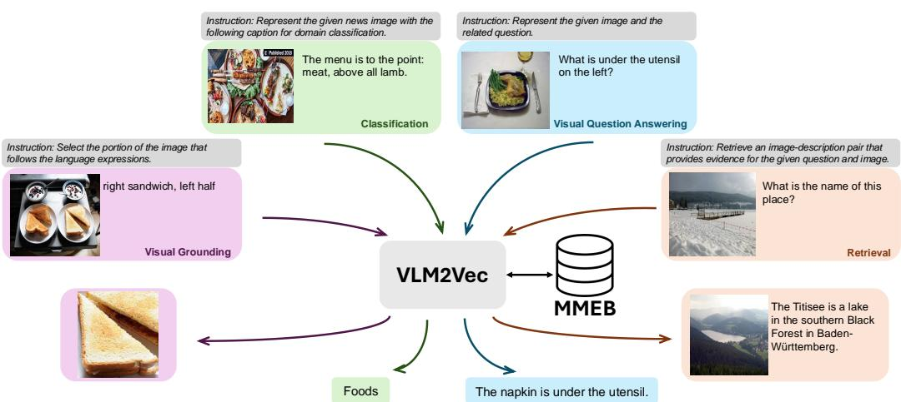
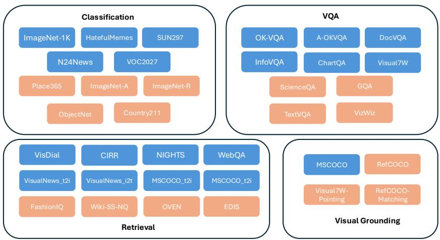
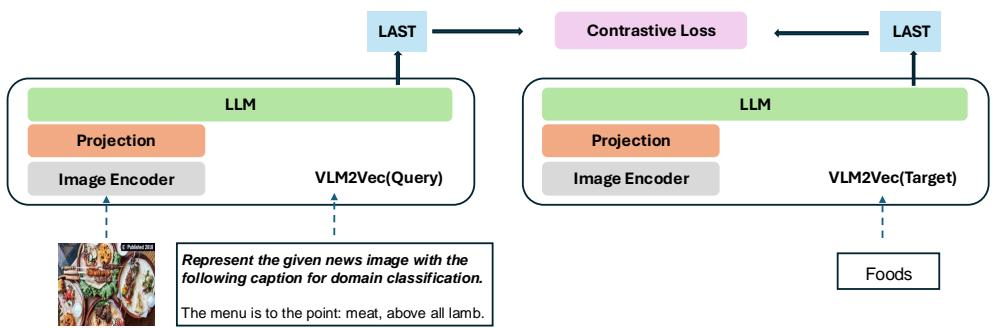
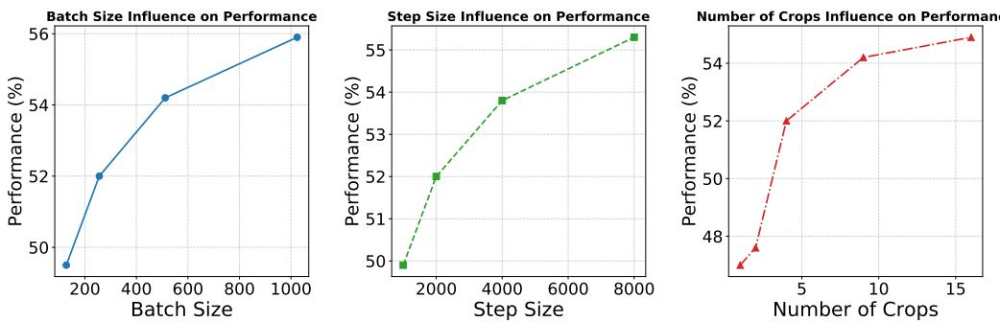
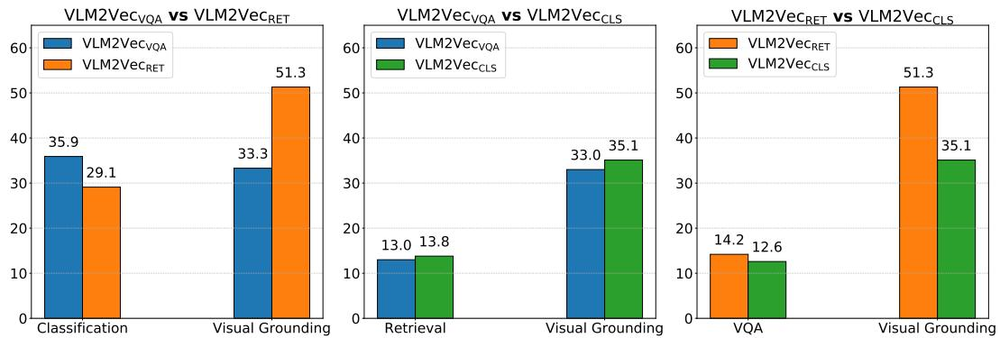

# VLM2Vec：用于大规模多模态嵌入任务的视觉-语言模型训练

Ziyan Jiang1 \*, Rui Meng2, Xinyi Yang2, Semih Yavuz2, Yingbo Zhou2, Wenhu Chen1 1滑铁卢大学, Salesforce研究 ziyanjiang $5 2 8 @$ gmail.com, ruimeng@salesforce.com, wenhuchen@uwaterloo.ca https://tiger-ai-lab.github.io/VLM2Vec/

# 摘要

嵌入模型在实现各种下游任务（如语义相似性、信息检索和聚类）方面至关重要。最近，开发能够在任务之间泛化的通用文本嵌入模型（如 MTEB）受到了广泛关注。然而，尽管其重要性和实用性，学习通用多模态嵌入模型的进展相对缓慢。在本研究中，我们旨在探索构建能够处理广泛下游任务的通用多模态嵌入的潜力。我们的贡献有两方面：(1) 我们提出了 MMEB（大规模多模态嵌入基准），涵盖 4 个元任务（即分类、视觉问答、多模态检索和视觉定位）和 36 个数据集，包括 20 个训练数据集和 16 个评估数据集，涵盖分布内和分布外任务；(2) ${ \tt V I M 2 V E C }$（视觉-语言模型向量），这是一个对比训练框架，通过在 MMEB 上进行对比训练，将任何视觉-语言模型转换为嵌入模型。与之前的模型如 CLIP 或 BLIP 不同，后者独立编码文本或图像而不提供任何任务指令，$\mathtt { V I M 2 V E C }$ 能够处理任何图像和文本的组合，以根据给定的任务指令生成固定维度的向量。我们在最先进的视觉语言模型（如 Phi-3.5-V、LLaVA-1.6）上构建了一系列 $\mathtt { V I M 2 V E C }$ 模型，并在 MMEB 的评估集上进行了评估。通过 LoRA 调优，${ \tt V I M 2 V E C }$ 在 MMEB 评估集上可以比现有多模态嵌入模型提高 $10 \%$ 至 $20 \%$ 的性能。我们证明了视觉语言模型实际上是强大的嵌入模型。

# 1 引言

嵌入或分布式表示，将输入（无论是文本还是图像）编码为固定维度的向量，从而使一系列下游任务成为可能。自Word2Vec（Mikolov，2013）和GloVe（Pennington等，2014）问世以来，研究者们在学习文本嵌入（Kiros等，2015；Conneau等，2017）和图像嵌入（Radford等，2021；Li等，2022；Jia等，2021；Yu等，2022）方面进行了大量研究。这些嵌入促进了多种应用，包括文本和视觉语义相似性（Agirre等，2012；Marelli等，2014；Chechik等，2010；Cer等，2017）、信息检索（Mitra等，2017；Karpukhin等，2020；Lin等，2014）、自动评估（Zhang等，2020；Sellam等，2020）、上下文学习的提示检索（Liu等，2022；Rubin等，2022；Hongjin等，2022）以及检索增强生成（Lewis等，2020；Guu等，2020；Izacard & Grave，2020）。近期的研究转向开发能够在广泛任务中进行推广的通用嵌入。例如，Muennighoff等（2023）推出了MTEB（大规模文本嵌入基准），以全面评估分类和聚类等任务的文本嵌入。MTEB已成为评估通用文本嵌入的标准。近期的研究工作（Wang等，2022a；Su等，2023；Wang等，2024；Springer等，2024；BehnamGhader等，2024）在MTEB基准上显示了良好的结果。然而，多模态嵌入的进展相对较慢。尽管文本嵌入有所进展，但多模态嵌入领域缺乏基准和方法论仍然是一个挑战。

  

Figure 1: We develop a universal multimodal embedding benchmark, MMEB, along with ${ \tt V I M 2 V E C }$ , an embedding model adapted from vision-language models (VLMs). $\mathtt { V I M 2 V E C }$ is capable of following instructions and performing various multimodal embedding tasks, accommodating any combination of image and text modalities.

当前多模态嵌入研究面临两个主要限制：(1) 现有研究通常在孤立任务上评估视觉嵌入，例如 ImageNet 分类（Deng et al., 2009; Hendrycks et al., 2021a;b）或 MSCOCO/Flickr 检索（Lin et al., 2014; Plummer et al., 2015）；(2) 大多数现有模型，如 CLIP（Radford et al., 2021）、BLIP（Li et al., 2022）和 SigLIP（Zhai et al., 2023），要么单独处理文本和图像，要么对视觉和文本信息进行浅层融合（Wei et al., 2023），限制了它们充分捕捉文本和图像模态之间关系的能力。此外，这些模型在复杂推理任务的零-shot 场景中表现出有限的推理和泛化能力。本文尝试构建一个通用的多模态嵌入框架，为未来的研究铺平道路，该框架包括两个工作：- MMEB：我们提出一个新基准，MMEB（大规模多模态嵌入基准），包含 36 个数据集，跨越四个元任务类别：分类、视觉问答、检索和视觉定位。MMEB 提供了一个全面的框架，用于在各种文本和图像模态组合中训练和评估嵌入模型。所有任务都被重新表述为排序任务，模型根据指令处理查询，并从一组候选中选择正确的目标。查询和目标可以是图像、文本或两者的结合。MMEB 被划分为 20 个分布内数据集，可用于训练，以及 16 个分布外数据集，保留用于评估。

- VLm2Vec：我们采用了预训练的视觉-语言模型，如Phi-3.5-V（Abdin等，2024）和LLaVA-1.6（Li等，2024）作为VLm2VE C的主干网络。与依赖于CLIP（Radford等，2021）特征的后期融合的其他多模态嵌入模型（如UnilR（Wei等，2023）和MagicLens（Zhang等，2024））相比，我们的方法利用了在变换器架构中视觉和语言特征的深度融合。这种方法有几个优点：（1）VLM在大规模多模态数据集上进行训练，能够处理任意组合的图像和文本，以及高分辨率图像和长文本输入；（2）在变换器模型中，视觉和语言特征被深度融合，提高了模型捕捉跨模态关系的能力；（3）这些模型非常适合在多样任务中进行泛化，尤其是在需要跟随指令的任务中。这些因素使得${ \tt V I M 2 V E C }$成为任务泛化的理想选择。我们使用对比学习在20个MMEB训练数据集上训练了VLm2VE C，并将其性能与各种基线进行了比较。

经过广泛的对比训练，VLm2Vec能够处理任意组合的图像和文本，生成固定维度的向量。我们将VLM2VE与广泛的多模态嵌入模型进行了评估，包括CLIP（Radford等，2021）、BLIP2（Li等，2023a）、SigLIP（Zhai等，2023）、MagicLens（Zhang等，2024）、UniR（Wei等，2023）和E5-V（jiang等，2024），在所有任务类别中都展示出一致的提升。值得注意的是，相较于没有进行微调的最佳基线模型，我们的模型在所有36个MMEB数据集上实现了18.2分的提升（从44.7提升至62.9），在16个分布外数据集的零样本评估中提升了15.4分（从41.7提升至57.1）。相比于经过微调的最佳基线模型，我们的模型在所有36个MMEB数据集上实现了15.7分的提升（从47.2提升至62.9），在16个分布外数据集的零样本评估中提升了14.0分（从43.1提升至57.1）。此外，作为一个通用的多模态表示模型，VLm2Vec在Flickr30K上依然能够实现与现有CLIP类模型竞争的零样本T2I（文本到图像）和I2T（图像到文本）性能，如表11所示。

# 2 MMEB：多模态嵌入基准测试

# 2.1 数据集概述

我们提出了 MMEB（大规模多模态嵌入基准），这是一个全面的基准，用于评估多模态嵌入在多样化任务中的表现。MMEB 包含 36 个数据集，分为四个元任务：分类、视觉问答、检索和视觉定位。每个任务都被重新表述为一个排名问题，其中模型接收一个指令和一个查询（查询可以由文本、图像或两者组成），并被要求从候选集合中选择正确答案。这些候选答案可以是文本、图像或额外的指令。数据集分为两个类别：20 个用于训练的分布内数据集和 16 个用于评估的分布外数据集。我们报告了所有 36 个任务的性能指标。MMEB 的概述见图 2，数据集统计信息见表 1。嵌入模型应将查询侧压缩为一个向量，将目标候选压缩为一组向量。具有最高内积的候选将被选择作为评估的预测。我们通过 $@ 1$ 精确度来反映顶级候选与真实标签匹配的百分比。针对目标候选的数量，较大的数量可能会增加评估成本并妨碍快速模型迭代，而较小的数量则可能使基准过于简单且容易饱和。为了在这两者之间取得平衡，我们选择了 1,000 个候选。有关此决策的进一步细节可在 A.2 节中找到。MMEB 提供了来自各个领域的广泛任务，如常识、新闻、维基百科、网页和时尚。该基准集纳了查询和目标的多种不同模态组合，包括文本、图像和文本-图像对。此外，任务设计遵循不同类型的指令。例如，任务可能涉及物体识别（例如，“识别图像中显示的物体。”）、检索（例如，“找到与给定字幕匹配的图像。”）或视觉定位（例如，“选择回答该问题的图像部分。”）。MMEB 中每个数据集的示例见表 7、8、9 和 10。MMEB 的多样性使其成为通用嵌入的理想测试平台。

# 2.2 元任务与数据集设计

MMEB 被组织为四个主要的元任务类别： 分类 查询由一个指令、一张图像以及可选的相关文本组成，而目标是类标签。候选数量等于类的数量。 视觉问答 查询由一个指令、一张图像和一段文本作为问题组成，而目标是答案。每个查询有 1 个真实标注数据和 999 个干扰项作为候选。 信息检索 查询和目标两侧可以涉及文本、图像和指令的组合。每个查询有 1 个真实标注数据和 999 个干扰项作为候选。 视觉定位 该类别源于目标检测任务。查询结合了一个指令（例如，“选择图像中与给定标签相隔离的对象部分：红苹果”）和完整图像。该指令引导模型聚焦于图像中的特定对象。每个候选对应于图像的裁剪区域（边界框），包括感兴趣的对象和干扰区域。每个查询包括 1,000 个候选：1 个真实标注数据和 999 个干扰项。这些干扰项可能包括相同对象类别的困难负样本、图像中的其他对象或来自不同图像的随机对象。

Table 1: The statistics of MMEB: 36 datasets across 4 meta-task categories, with 20 in-distribution datasets used for training and 16 out-of-distribution datasets used exclusively for evaluation.   

<table><tr><td rowspan=1 colspan=2>Meta-Task</td><td rowspan=1 colspan=1>Dataset</td><td rowspan=1 colspan=6>Query  Target  OOD?  #Training  #Eval</td><td rowspan=1 colspan=1>#Candidates</td></tr><tr><td rowspan=10 colspan=2>Classification(10 Tasks)</td><td rowspan=1 colspan=1>ImageNet-1K</td><td rowspan=1 colspan=1>I</td><td rowspan=1 colspan=2>T</td><td rowspan=1 colspan=1></td><td rowspan=1 colspan=1>100K</td><td rowspan=1 colspan=1>1000</td><td rowspan=1 colspan=1>1000</td></tr><tr><td rowspan=1 colspan=1>N24News</td><td rowspan=1 colspan=1>I +T</td><td rowspan=1 colspan=2>I</td><td rowspan=1 colspan=1></td><td rowspan=1 colspan=1>49K</td><td rowspan=1 colspan=1>1000</td><td rowspan=1 colspan=1>24</td></tr><tr><td rowspan=1 colspan=1>HatefulMemes</td><td rowspan=1 colspan=1>I</td><td rowspan=1 colspan=2>T</td><td rowspan=1 colspan=1></td><td rowspan=1 colspan=1>8K</td><td rowspan=1 colspan=1>1000</td><td rowspan=1 colspan=1>2</td></tr><tr><td rowspan=1 colspan=1>VOC2007</td><td rowspan=1 colspan=1>I</td><td rowspan=1 colspan=2>T</td><td rowspan=1 colspan=1></td><td rowspan=1 colspan=1>8K</td><td rowspan=1 colspan=1>1000</td><td rowspan=1 colspan=1>20</td></tr><tr><td rowspan=1 colspan=1>SUN397</td><td rowspan=1 colspan=1>I</td><td rowspan=1 colspan=2>T</td><td rowspan=1 colspan=1></td><td rowspan=1 colspan=1>20K</td><td rowspan=1 colspan=1>1000</td><td rowspan=1 colspan=1>397</td></tr><tr><td rowspan=1 colspan=1>Place365</td><td rowspan=1 colspan=1>I</td><td rowspan=1 colspan=2>T</td><td rowspan=1 colspan=1>✓</td><td rowspan=1 colspan=1>b</td><td rowspan=1 colspan=1>1000</td><td rowspan=1 colspan=1>365</td></tr><tr><td rowspan=1 colspan=1>ImageNet-A</td><td rowspan=1 colspan=1>I</td><td rowspan=1 colspan=2>T</td><td rowspan=1 colspan=1>✓</td><td rowspan=1 colspan=1>-</td><td rowspan=1 colspan=1>1000</td><td rowspan=1 colspan=1>1000</td></tr><tr><td rowspan=1 colspan=1>ImageNet-R</td><td rowspan=1 colspan=1>I</td><td rowspan=1 colspan=2>T</td><td rowspan=1 colspan=1>✓</td><td rowspan=1 colspan=1>-</td><td rowspan=1 colspan=1>1000</td><td rowspan=1 colspan=1>200</td></tr><tr><td rowspan=1 colspan=1>ObjectNet</td><td rowspan=1 colspan=1>I</td><td rowspan=1 colspan=2>T</td><td rowspan=1 colspan=1>✓</td><td rowspan=1 colspan=1>-</td><td rowspan=1 colspan=1>1000</td><td rowspan=1 colspan=1>313</td></tr><tr><td rowspan=1 colspan=1>Country-211</td><td rowspan=1 colspan=1>I</td><td rowspan=1 colspan=2>T</td><td rowspan=1 colspan=1>✓</td><td rowspan=1 colspan=1>b</td><td rowspan=1 colspan=1>1000</td><td rowspan=1 colspan=1>211</td></tr><tr><td rowspan=10 colspan=2>VQA(10 Tasks)</td><td rowspan=1 colspan=1>OK-VQA</td><td rowspan=1 colspan=1>I +T</td><td rowspan=1 colspan=2>T</td><td rowspan=1 colspan=1></td><td rowspan=1 colspan=1>9K</td><td rowspan=1 colspan=1>1000</td><td rowspan=1 colspan=1>1000</td></tr><tr><td rowspan=1 colspan=1>A-OKVQA</td><td rowspan=1 colspan=1>I +T</td><td rowspan=1 colspan=2>T</td><td rowspan=1 colspan=1></td><td rowspan=1 colspan=1>17K</td><td rowspan=1 colspan=1>1000</td><td rowspan=1 colspan=1>1000</td></tr><tr><td rowspan=1 colspan=1>DocVQA</td><td rowspan=1 colspan=1>I +T</td><td rowspan=1 colspan=2>T</td><td rowspan=1 colspan=1></td><td rowspan=1 colspan=1>40K</td><td rowspan=1 colspan=1>1000</td><td rowspan=1 colspan=1>1000</td></tr><tr><td rowspan=1 colspan=1>InfographicVQA</td><td rowspan=1 colspan=1>I +T</td><td rowspan=1 colspan=2>T</td><td rowspan=1 colspan=1></td><td rowspan=1 colspan=1>24K</td><td rowspan=1 colspan=1>1000</td><td rowspan=1 colspan=1>1000</td></tr><tr><td rowspan=1 colspan=1>ChartQA</td><td rowspan=1 colspan=1>I +T</td><td rowspan=1 colspan=2>T</td><td rowspan=1 colspan=1></td><td rowspan=1 colspan=1>28K</td><td rowspan=1 colspan=1>1000</td><td rowspan=1 colspan=1>1000</td></tr><tr><td rowspan=1 colspan=1>Visual7W</td><td rowspan=1 colspan=1>I +T</td><td rowspan=1 colspan=2>T</td><td rowspan=1 colspan=1></td><td rowspan=1 colspan=1>70K</td><td rowspan=1 colspan=1>1000</td><td rowspan=1 colspan=1>1000</td></tr><tr><td rowspan=1 colspan=1>ScienceQA</td><td rowspan=1 colspan=1>I +T</td><td rowspan=1 colspan=2>T</td><td rowspan=1 colspan=1>✓</td><td rowspan=1 colspan=1>b</td><td rowspan=1 colspan=1>1000</td><td rowspan=1 colspan=1>1000</td></tr><tr><td rowspan=1 colspan=1>VizWiz</td><td rowspan=1 colspan=1>I +T</td><td rowspan=1 colspan=2>T</td><td rowspan=1 colspan=1>✓</td><td rowspan=1 colspan=1>-</td><td rowspan=1 colspan=1>1000</td><td rowspan=1 colspan=1>1000</td></tr><tr><td rowspan=1 colspan=1>GQA</td><td rowspan=1 colspan=1>I + T</td><td rowspan=1 colspan=2>T</td><td rowspan=1 colspan=1>✓</td><td rowspan=1 colspan=1>-</td><td rowspan=1 colspan=1>1000</td><td rowspan=1 colspan=1>1000</td></tr><tr><td rowspan=1 colspan=1>TextVQA</td><td rowspan=1 colspan=1>I + T</td><td rowspan=1 colspan=2>T</td><td rowspan=1 colspan=1>✓</td><td rowspan=1 colspan=1>-</td><td rowspan=1 colspan=1>1000</td><td rowspan=1 colspan=1>1000</td></tr><tr><td rowspan=12 colspan=2>Retrieval(12 Tasks)</td><td rowspan=1 colspan=1>VisDial</td><td rowspan=1 colspan=1>T</td><td rowspan=1 colspan=2>I</td><td rowspan=1 colspan=1></td><td rowspan=1 colspan=1>123K</td><td rowspan=1 colspan=1>1000</td><td rowspan=1 colspan=1>1000</td></tr><tr><td rowspan=1 colspan=1>CIRR</td><td rowspan=1 colspan=1>I +T</td><td rowspan=1 colspan=2>I</td><td rowspan=1 colspan=1></td><td rowspan=1 colspan=1>26K</td><td rowspan=1 colspan=1>1000</td><td rowspan=1 colspan=1>1000</td></tr><tr><td rowspan=1 colspan=1>VisualNews_t2i</td><td rowspan=1 colspan=1>T</td><td rowspan=1 colspan=2>I</td><td rowspan=1 colspan=1></td><td rowspan=1 colspan=1>100K</td><td rowspan=1 colspan=1>1000</td><td rowspan=1 colspan=1>1000</td></tr><tr><td rowspan=1 colspan=1>VisualNews_i2t</td><td rowspan=1 colspan=1>I</td><td rowspan=1 colspan=1></td><td rowspan=1 colspan=1></td><td rowspan=1 colspan=1></td><td rowspan=1 colspan=1>100K</td><td rowspan=1 colspan=1>1000</td><td rowspan=1 colspan=1>1000</td></tr><tr><td rowspan=1 colspan=1>MSCOCO_t2i</td><td rowspan=1 colspan=1>T</td><td rowspan=1 colspan=1></td><td rowspan=1 colspan=1></td><td rowspan=1 colspan=1></td><td rowspan=1 colspan=1>100K</td><td rowspan=1 colspan=1>1000</td><td rowspan=1 colspan=1>1000</td></tr><tr><td rowspan=1 colspan=1>MSCOCO i2t</td><td rowspan=1 colspan=1>I</td><td rowspan=1 colspan=1></td><td rowspan=1 colspan=1></td><td rowspan=1 colspan=1></td><td rowspan=1 colspan=1>113K</td><td rowspan=1 colspan=1>1000</td><td rowspan=1 colspan=1>1000</td></tr><tr><td rowspan=1 colspan=1>NIGHTS</td><td rowspan=1 colspan=1>I</td><td rowspan=1 colspan=1></td><td rowspan=1 colspan=1>I</td><td rowspan=1 colspan=1></td><td rowspan=1 colspan=1>16K</td><td rowspan=1 colspan=1>1000</td><td rowspan=1 colspan=1>1000</td></tr><tr><td rowspan=1 colspan=1>WebQA</td><td rowspan=1 colspan=1>T</td><td rowspan=1 colspan=2>I +T</td><td rowspan=1 colspan=1></td><td rowspan=1 colspan=1>17K</td><td rowspan=1 colspan=1>1000</td><td rowspan=1 colspan=1>1000</td></tr><tr><td rowspan=1 colspan=1>OVEN</td><td rowspan=1 colspan=1>I +T</td><td rowspan=1 colspan=2>I +T</td><td rowspan=1 colspan=1>✓</td><td rowspan=1 colspan=1>b</td><td rowspan=1 colspan=1>1000</td><td rowspan=1 colspan=1>1000</td></tr><tr><td rowspan=1 colspan=1>FashionIQ</td><td rowspan=1 colspan=1>I +T</td><td rowspan=1 colspan=2>I</td><td rowspan=1 colspan=1>✓</td><td rowspan=1 colspan=1>-</td><td rowspan=1 colspan=1>1000</td><td rowspan=1 colspan=1>1000</td></tr><tr><td rowspan=1 colspan=1>EDIS</td><td rowspan=1 colspan=1>T</td><td rowspan=1 colspan=2>I +T</td><td rowspan=1 colspan=1>✓</td><td rowspan=1 colspan=1>b</td><td rowspan=1 colspan=1>1000</td><td rowspan=1 colspan=1>1000</td></tr><tr><td rowspan=1 colspan=1>Wiki-SS-NQ</td><td rowspan=1 colspan=1>T</td><td rowspan=1 colspan=1></td><td rowspan=1 colspan=1></td><td rowspan=1 colspan=1>✓</td><td rowspan=1 colspan=1>-</td><td rowspan=1 colspan=1>1000</td><td rowspan=1 colspan=1>1000</td></tr><tr><td rowspan=2 colspan=2>Visual Grounding</td><td rowspan=1 colspan=1>MSCOCO</td><td rowspan=1 colspan=1>I +T</td><td rowspan=1 colspan=1>−</td><td rowspan=1 colspan=1></td><td rowspan=1 colspan=1></td><td rowspan=1 colspan=1>100K</td><td rowspan=1 colspan=1>1000</td><td rowspan=1 colspan=1>1000</td></tr><tr><td rowspan=1 colspan=1>ding</td><td rowspan=1 colspan=1>Visual7W-Pointing</td><td rowspan=1 colspan=1>I +T</td><td rowspan=1 colspan=1></td><td rowspan=1 colspan=1></td><td rowspan=1 colspan=1>✓</td><td rowspan=1 colspan=1></td><td rowspan=1 colspan=1>1000</td><td rowspan=1 colspan=1>1000</td></tr><tr><td rowspan=2 colspan=2>(4 Tasks)</td><td rowspan=1 colspan=1></td><td rowspan=1 colspan=3>RefCOCO</td><td rowspan=1 colspan=1>I +T</td><td rowspan=1 colspan=1></td><td rowspan=1 colspan=1></td><td rowspan=1 colspan=1>✓</td></tr><tr><td rowspan=1 colspan=1>RefCOCO-Matching</td><td rowspan=1 colspan=1>I +T</td><td rowspan=1 colspan=2>I +T</td><td rowspan=1 colspan=1>✓</td><td rowspan=1 colspan=1>-</td><td rowspan=1 colspan=1>1000</td><td rowspan=1 colspan=1>1000</td></tr></table>

数据集处理的进一步细节可以在 A.1 节中找到。

# 3 Vlm2Vec：将LvMs转化为嵌入器

# 3.1 对比训练

我们开发了 ${ \tt V I M 2 V E C }$ ，这是一种对比训练框架，旨在将任何最先进的视觉-语言模型转换为嵌入模型，如图 3 所示。相关的查询-目标对表示为 $( q , t ^ { + } )$ 。$q$ 和 $t ^ { + }$ 都可以是单张图像、文本或单张图像加文本。我们将 $q$ 定义为 $\left( q _ { t } , q _ { i } \right)$ ，将 $t ^ { + }$ 定义为 $( t _ { t } ^ { \mp } , t _ { i } ^ { + } )$ 。然后，我们将指令应用于原始查询 $q$ ，生成新的查询 $q _ { \mathrm { i n s t } }$ ：

$$
q _ { \mathrm { i n s t } } = \left[ \mathrm { T M A G E } _ { - } \mathrm { T O K E N } \right] \mathrm { I n s t r u c t } ; \left\{ t a s k _ { - } d e f i n i t i o n \right\} \backslash n \mathrm { Q u e r y } ; \left\{ q \right\}
$$

  

Figure 2: An overview of the tasks and datasets in MMEB. MMEB includes four meta-tasks and 36 datasets: 20 in-distribution datasets (blue) used for training and 16 out-of-distribution (orange) datasets used exclusively for evaluation.

其中 $\tilde { \cdot } \varepsilon _ { } \{ t a s k \mathcal { A } e f i n i t i o n \} ^ { \ast }$ 是对嵌入任务的单句描述的占位符。为了通过更好地理解指令来增强嵌入模型的泛化能力，我们制定了特定任务的指令，如表 7、8、9 和 10 所示。给定一个预训练的视觉语言模型（VLM），我们将查询和目标输入其中，以通过获取最后一个标记的最后一层向量表示，得到查询和目标嵌入 $( \mathbf { h } _ { q _ { \mathrm { i n s t } } } , \mathbf { h } _ { t + } )$。为了训练嵌入模型，我们采用标准的 InfoNCE 损失 $\mathcal { L }$，该损失基于批内负样本和困难负样本进行计算：

$$
\operatorname* { m i n } \mathcal { L } = - \log \frac { \phi ( \mathbf { h } _ { q _ { \mathrm { i n s t } } } , \mathbf { h } _ { t ^ { + } } ) } { \phi ( \mathbf { h } _ { q _ { \mathrm { i n s t } } } , \mathbf { h } _ { t ^ { + } } ) + \displaystyle \sum _ { t ^ { - } \in \mathbb { N } } ( \phi ( \mathbf { h } _ { q _ { \mathrm { i n s t } } } , \mathbf { h } _ { t ^ { - } } ) ) }
$$

其中 $\mathbb{N}$ 表示所有负数的集合，$\phi(\mathbf{h}_q, \mathbf{h}_t)$ 是一个计算查询 $q$ 和目标 $t$ 之间匹配得分的函数。在本文中，我们采用温度缩放的余弦相似度函数，定义为 $\phi(\dot{\mathbf{h}}_q, \dot{\mathbf{h}}_t) = \exp\left(\frac{1}{\tau} \cos(\mathbf{h}_q, \mathbf{h}_t)\right)$ ，其中 $\tau$ 是一个温度超参数。

# 3.2 通过 GradCache 增加批量大小

由于难以或模糊收集硬负样本，尤其是在多模态数据集上，使用更大的批大小显得尤为重要。这增加了批内随机负样本的数量，从而有助于提升嵌入模型的性能。一个瓶颈在于GPU内存，它限制了我们在训练过程中增加批大小和批内随机负样本的数量，因为每个训练实例可能包括一张图像（来自查询或目标端）或多张图像（来自查询和目标端），导致显著的内存消耗。我们应用GradCache（Gao et al., 2021a），一种梯度缓存技术，它解耦了对比损失与编码器之间的反向传播，消除了沿批次维度的编码器反向传递数据依赖。从数学上讲，假设我们有一大批查询 $\mathcal { Q }$，并将其划分为一组子批，每个子批可以适合内存进行梯度计算：$\mathcal { Q } = \{ \hat { Q } _ { 1 } , \hat { Q } _ { 2 } , \dots \}$。主要有两个步骤：“表示梯度计算与缓存”和“子批梯度”。然后，梯度在所有子批中累积到编码器参数上：

$$
{ \frac { \partial { \mathcal { L } } } { \partial \Theta } } = \sum _ { { \hat { Q } } _ { j } \in Q } \sum _ { q _ { i } \in { \hat { Q } } _ { j } } { \frac { \partial { \mathcal { L } } } { \partial f ( q _ { i } ) } } { \frac { \partial f ( q _ { i } ) } { \partial \Theta } } = \sum _ { { \hat { Q } } _ { j } \in \mathbb { Q } } \sum _ { q _ { i } \in { \hat { Q } } _ { j } } \mathbf { u } _ { i } { \frac { \partial f ( q _ { i } ) } { \partial \Theta } }
$$

  

Figure 3: VLM2VE c uses a VLM as the backbone to deeply integrate image and text features. It is trained with a contrastive loss between the query and target, following task-specific instructions. The training data consists of diverse combinations of modalities on both the query and target sides, which may include images, text, or image-text pairs.

# 4 实验

在本节中，我们采用 Phi-3.5-V 和 LLaVA-1.6 作为主干视觉语言模型（VLM），训练通过全模型微调或 LoRA 进行。损失函数的温度设定为 0.02，批量大小为 1,024，最大文本长度为 256 个词元，训练步数为 2K。LoRA 变体使用了秩 8。对于利用 Phi-3.5-V 作为主干的 $\mathtt { V I M 2 V E C }$，我们配置了 4 个子图像裁剪。对于使用 LLaVA-1.6 作为主干的 $\mathtt { V I M 2 V E C }$，我们将输入图像调整为统一分辨率，采用两种设置：高分辨率配置为 $1 3 4 4 \times 1 3 4 4$，低分辨率配置为 $3 3 6 \times 3 3 6$。对于 20 个训练数据集，如果某个数据集包含超过 50K 样本，我们随机选择 50K 以保持一致性，总训练集数据点为 662K。当使用 GradCache 时，我们设置子批量大小为 4，以实现全模型调优，总批量大小累积到 1,024。所有实验均在 8 个 H100 GPU 上运行。我们在表中报告所有模型的准确率 $@ 1$。它测量所有查询中正样本候选项排名第一的比例。

# 4.1 基准模型

本研究中报告了四组基线。CLIP家族：我们利用诸如CLIP（Radford等，2021）、Open-CLIP（Cherti等，2023）、SigLIP（Zhai等，2023）和BLIP2（Li等，2023a）等视觉/语言编码器作为基线。由于文本编码器的长度限制，某些任务中的一些查询或目标文本可能会被截断。我们通过以相等的权重$\mathbf { \nabla } w _ { 1 } = w _ { 2 } = 1$进行元素级加法来应用得分级融合，从而组合多模态特征。我们不使用指令，因为它们可能会降低性能。更多细节请参阅第4.3.4节。UniR：UnilR（Wei等，2023）是一个统一的、以指令为指导的多模态检索器，旨在处理八种不同的检索任务，涉及多种模态。该模型建立在CLIP和BLIP的基础上，采用浅层融合技术，如得分级和特征级融合，以整合模态。在本研究中，我们使用CLIP_SF和BLIP FF变体作为基线。MagicLens：MagicLens（Zhang等，2024）是一个自监督图像检索模型，能够处理开放性指令。它使用共享参数的双编码器架构，初始化视觉和语言编码器为CoCa或CLIP。该模型使用多头注意力池化器将多模态输入统一成单个嵌入。在本研究中，我们使用CLIP-Large主干报告结果。E5-V：E5-V（Jiang等，2024）是一个现代模型，也利用视觉-语言模型进行多模态嵌入任务。它提出了一种单模态训练方法，其中模型仅在文本对上进行训练。相比之下，我们的模型在多模态对上进行训练，包括查询和目标两侧的图像和文本模态的各种组合。对于所有的基线模型，我们首先使用其原始版本。此外，我们已对CLIP和OpenCLIP在MMEB训练数据集上进行了微调。我们采用与${ \tt V I M 2 V E C }$相同的实验配置，以确保公平比较。对于其余基线模型，UnilR和MagicLens也基于CLIP模型采用了浅层融合方法，其主要贡献在于所训练的数据集。E5-V则提出仅在文本对上进行训练，使其不适合在我们的数据集上进行微调。因此，我们未将这三种模型的微调版本纳入比较。

# 4.2 主要结果

Table 2: Results on the MMEB benchmark. The scores are averaged per meta-task. For detailed scores per dataset, see Table 6. We include baselines with and without fine-tuning on MMEB training datasets and our models with LLaVA-1.6 and Phi-3.5 backbones. FFT means fully fine-tuned.   

<table><tr><td rowspan="2">Model</td><td colspan="4">Per Meta-Task Score</td><td colspan="3">Average Score</td></tr><tr><td>Classification</td><td>VQA</td><td>Retrieval</td><td>Grounding</td><td>IND</td><td>OOD</td><td>Overall</td></tr><tr><td># of datasets →</td><td>10</td><td>10</td><td>12</td><td>4</td><td>20</td><td>16</td><td>36</td></tr><tr><td colspan="8">Baseline Models (No Fine-tuning on MMEB Training)</td></tr><tr><td>CLIP (Radford et al., 2021)</td><td>42.8</td><td>9.1</td><td>53.0</td><td>51.8</td><td>37.1</td><td>38.7</td><td>37.8</td></tr><tr><td>BLIP2 (Li et al., 2023a)</td><td>27.0</td><td>4.2</td><td>33.9</td><td>47.0</td><td>25.3</td><td>25.1</td><td>25.2</td></tr><tr><td>SigLIP (Zhai et al., 2023)</td><td>40.3</td><td>8.4</td><td>31.6</td><td>59.5</td><td>32.3</td><td>38.0</td><td>34.8</td></tr><tr><td>OpenCLIP (Cherti et al., 2023)</td><td>47.8</td><td>10.9</td><td>52.3</td><td>53.3</td><td>39.3</td><td>40.2</td><td>39.7</td></tr><tr><td>UnilR (BLIP_FF) (Wei et al., 2023)</td><td>42.1</td><td>15.0</td><td>60.1</td><td>62.2</td><td>44.7</td><td>40.4</td><td>42.8</td></tr><tr><td>UnilR (CLIP_SF) (Wei et al., 2023)</td><td>44.3</td><td>16.2</td><td>61.8</td><td>65.3</td><td>47.1</td><td>41.7</td><td>44.7</td></tr><tr><td>E5-V (Jiang et al., 2024)</td><td>21.8</td><td>4.9</td><td>11.5</td><td>19.0</td><td>14.9</td><td>11.5</td><td>13.3</td></tr><tr><td>Magiclens (Zhang et al., 2024)</td><td>38.8</td><td>8.3</td><td>35.4</td><td>26.0</td><td>31.0</td><td>23.7</td><td>27.8</td></tr><tr><td colspan="8">Baseline Models (Fine-tuning on MMEB Training)</td></tr><tr><td>CLIP-FFT</td><td>55.2</td><td>19.7</td><td>53.2</td><td>62.2</td><td>47.6</td><td>42.8</td><td>45.4</td></tr><tr><td>OpenCLIP-FFT</td><td>56.0</td><td>21.9</td><td>55.4</td><td>64.1</td><td>50.5</td><td>43.1</td><td>47.2</td></tr><tr><td colspan="8">Ours (VLM2VEC)</td></tr><tr><td>Phi-3.5-V, FFT (bs=1024)</td><td>52.8</td><td>50.3</td><td>57.8</td><td>72.3</td><td>62.8</td><td>47.4</td><td>55.9</td></tr><tr><td>Phi-3.5-V, LoRA (bs=1024)</td><td>54.8</td><td>54.9</td><td>62.3</td><td>79.5</td><td>66.5</td><td>52.0</td><td>60.1</td></tr><tr><td>LLaVA-1.6, LoRA (bs=1024,res=336x336)</td><td>54.7</td><td>50.3</td><td>56.2</td><td>64.0</td><td>61.0</td><td>47.5</td><td>55.0</td></tr><tr><td>LLaVA-1.6, LoRA (bs=1024,res=1344x1344)</td><td>61.2</td><td>49.9</td><td>67.4</td><td>86.1</td><td>675</td><td>57.1</td><td>62.9</td></tr><tr><td>Δ - Best baseline (No Fine-tuning)</td><td>+16.9</td><td>+33.7</td><td>+5.6</td><td>+20.8</td><td>+20.4</td><td>+15.4</td><td>+18.2</td></tr><tr><td>∆ - Best baseline (Fine-tuning)</td><td>+5.2</td><td>+28.0</td><td>+12.0</td><td>+22.0</td><td>+17.0</td><td>+14.0</td><td>+15.7</td></tr></table>

根据表2，最佳变体${ \tt V I M 2 V E C }$利用了LLaVA-1.6，经过LoRA训练，并以相对较高的分辨率$1 3 4 4 \times 1 3 4 4$处理输入图像。它在MMEB的所有36个数据集上实现了$@ 1$的平均精度为$6 2 . 9 \%$。此外，在16个零样本评估中的分布外任务上，它保持了$@ 1$的平均精度为$5 7 . 1 \%$，这表明其具有很强的泛化能力。这表明，当我们的模型在来自不同任务类别、领域和模态组合的数据集上进行良好训练时，可以有效地执行指令以对齐视觉和文本空间，并在未见任务中表现良好。重要的是强调LLaVA-1.6（Li et al., 2024）具有透明的预训练数据开发方案，与我们的MMEB分布外数据集几乎没有重叠。这证明了${ \tt V I M 2 V E C }$在零样本评估中取得的强大结果并不是由于LLaVA-1.6主干对分布外数据集的先前接触。当使用相同的主干时，完全微调的变体相比于LoRA版本的得分稍低。有关完全微调与LoRA比较的详细讨论，请参见第4.3.1节。

与其他基准模型相比，无论是否在 MMEB 训练数据上进行微调，我们的模型展示了一致的改进。与未进行微调的最佳基准模型相比，我们的模型在所有 36 个 MMEB 数据集上实现了 18.2 分的提升（从 44.7 提升至 62.9），在 16 个超出分布的数据集上实现了 15.4 分的提高（从 41.7 提升至 57.1），用于零-shot 评估。与进行微调的最佳基准模型相比，我们的模型在所有 36 个 MMEB 数据集上实现了 15.7 分的提升（从 47.2 提升至 62.9），在 16 个超出分布的数据集上实现了 14.0 分的提高（从 43.1 提升至 57.1），用于零-shot 评估。此外，不同于基准模型在所有不同任务类别中未能展示出合理性能，VLM2VE C 在所有四个元任务类别中获得了相对较强的表现（至少 $50 \%$）。这突显了其有效处理广泛多模态嵌入任务的能力。

# 4.3 结果分析

为了训练有效且具有通用性的多模态嵌入，需要考虑多个因素，从数据到训练设置。在本节中，我们将对这三个因素进行详细的消融研究。我们将讨论两种训练设置：全微调与LoRA，及其训练参数，还有两个与数据相关的话题：元任务泛化和指令的影响。

# 4.3.1 完全微调与LoRA

在对视觉语言模型（VLMs）进行微调时，一个关键决策是是否进行全量微调，即更新模型中的所有参数，或者采用如 LoRA 的参数高效方法。我们比较了完全微调的 $\mathtt { V I M 2 V E C }$ 与其不同秩的 LoRA 变体的性能。所有模型的训练和数据设置保持一致。我们观察到，当适当地配置秩时，LoRA 达到了更好的性能。

Table 3: We compare the performance of fully fine-tuned VLM2VEC with its LoRA variants at different ranks. LoRA can achieve better performance when the rank is appropriately configured. All the models utilize Phi-3.5-V as their backbone.   

<table><tr><td rowspan="2">Model</td><td colspan="4">Meta-Task Average Score</td><td colspan="3">Average Score</td></tr><tr><td>Classification</td><td>VQA</td><td>Retrieval</td><td>Grounding</td><td>IND</td><td>OOD</td><td>Overall</td></tr><tr><td># of datasets →</td><td>10</td><td>10</td><td>12</td><td>4</td><td>20</td><td>16</td><td>36</td></tr><tr><td>Full Fine-Tuning (bs=256)</td><td>50.4</td><td>46.4</td><td>52.6</td><td>68.6</td><td>57.9</td><td>44.7</td><td>52.0</td></tr><tr><td>LoRA r = 4 (bs=256)</td><td>52.7</td><td>53.6</td><td>60.1</td><td>80.2</td><td>64.9</td><td>50.4</td><td>58.4</td></tr><tr><td>LoRA r = 8 (bs=256)</td><td>52.9</td><td>52.5</td><td>60.3</td><td>80.0</td><td>64.2</td><td>50.8</td><td>58.2</td></tr><tr><td>LoRA r = 16 (bs=256)</td><td>51.1</td><td>40.5</td><td>52.0</td><td>72.5</td><td>54.9</td><td>45.8</td><td>50.8</td></tr><tr><td>LoRA r = 32 (bs=256)</td><td>50.6</td><td>47.8</td><td>53.9</td><td>72.5</td><td>58.9</td><td>46.5</td><td>53.4</td></tr></table>

# 4.3.2 训练参数

在我们的实验中，我们确定了三个关键参数，显著影响 ${ \tt V I M 2 V E C }$ 的性能：训练批次大小、子图像裁剪数量和训练步骤数量。在图 4 中，我们观察到随着批次大小、训练步长和子图像裁剪数量的增加，最终性能逐渐改善。我们特别想强调批次大小的影响。由于缺乏困难负样本，使用大型批次和大量随机负样本，并结合 GradCache 技术，对于增强 ${ \tt V I M 2 V E C }$ 的性能起着至关重要的作用，如第 3.2 节所讨论的。

  

Figure 4: The figures demonstrate the influence of the training setup on $\mathtt { V I M 2 V E C }$ 's final performance. Here, we examine the effects of training batch size, the number of sub-image crops, and the number of training steps. All the models utilize $\mathrm { P h i } { - } 3 . 5 { \cdot } \mathrm { V }$ as their backbone.

# 4.3.3 元任务泛化

我们已经证明，${ \tt V I M 2 V E C }$ 在经过多样化的分布内数据集训练后，有潜力转移到分布外数据集，并且是在遵循指令的设置下产生的。一个有趣的问题是，专注于特定的元任务是否可以提高模型的整体泛化能力。我们训练了三种模型，每种模型仅专注于一个元任务（分类、视觉问答和检索）。由于训练数据集的数量有限，视觉定位未被纳入。然后，我们评估了这些模型向其他元任务的迁移能力。我们将这三种模型称为 $\mathtt { V L M 2 V E C } _ { \mathtt { R E T } }$、${ \tt V I M 2 V E C }$ VQA（在6个视觉问答任务上训练）和 $\mathrm { V L M } 2 \mathrm { V E } \mathrm { C } ~ \mathrm { C L S }$（在5个分类任务上训练）。图5展示了这三种模型在未见元任务上的泛化能力。我们可以观察到，与另外两个模型相比，VLM2VE C RET 在其他元任务上的泛化能力更强，特别是在视觉定位类别上。这是因为检索任务涉及来自查询和目标两侧的更丰富的文本与视觉模态组合，这有助于模型更好地向未见元任务进行泛化。这个观察结果突出了在${ \tt V I M 2 V E C }$训练过程中使用更多样化任务的好处。

  

Figure 5: The figures show the generalization ability of models trained on one meta-task to other unseen meta-tasks. For example, the first subplot compares the performance of ${ \tt V I M 2 V E C }$ trained exclusively on VQA datasets with ${ \tt V I M 2 V E C }$ trained exclusively on retrieval datasets across the other two meta-task categories: classification and visual grounding. Overall, ${ \tt V I M 2 V E C }$ trained on retrieval tasks demonstrate better generalization ability because retrieval tasks involve a more diverse combination of text and visual modalities from both the query and target sides. ${ \tt V I M 2 V E C }$ utilizes Phi-3.5-V as its backbone.

# 4.3.4 指令的影响

之前的研究表明，指令对完成各种任务有影响。VLm2VE C 利用 VLM 作为主干网络，并在大规模数据集上进行指令训练，预计能够更好地跨任务泛化，并提高多模态嵌入任务的性能。在本节中，我们评估了 CLIP 和 ${ \tt V I M 2 V E C }$ 在有无任务特定指令情况下的性能，以量化将指令纳入嵌入过程的影响。如表 4 所示，纳入指令后，CLIP 模型的性能降低了 $29.4 \%$，而我们的 ${ \tt V I M 2 V E C }$ 实现了 $49.4 \%$ 的提升。这突显了 VLM 主干增强了嵌入模型的指令遵循能力，并强调了指令引导嵌入的优势。

# 5 相关研究

# 5.1 文本嵌入

文本嵌入在推动下游应用方面展现出显著潜力，例如信息检索（Karpukhin等，2020；Xiong等，2020）、文本相似性（Gao等，2021b）、上下文学习的提示检索（Hongjin等，2022）和分类（Logeswaran & Lee，2018；Reimers & Gurevych，2019）。早期的研究集中在为特定任务创建有效的嵌入。随着预训练语言模型的兴起，研究方向转向开发能够处理广泛嵌入任务的通用嵌入模型。诸如GTR（Ni等，2022）和E5（Wang等，2022a）的研究利用大量噪声配对数据进行预训练和微调稠密检索器。最近的研究如TART（Asai等，2022）和InstructOR（Su等，2023）引入自然语言提示，指导嵌入模型生成与任务相关的嵌入。在此基础上，像E5Mistral（Wang等，2024）、SFR-Embedding（Meng等，2024）、RepLLaMA（Ma等，2024b）、GTE-Qwen2（Li等，2023b）和NV-Embed（Lee等，2024）等模型利用预训练的大型语言模型（LLMs）作为主干，通过多任务数据和指令进行微调。这些模型在未使用LLMs进行初始化或指令调优的早期方法基础上，取得了显著的改进。

Table 4: Comparison of CLIP and our ${ \tt V I M 2 V E C }$ with and without task-specific instructions. Incorporating instructions could decrease CLIP's performance by $2 9 . 4 \%$ , whereas our $\mathtt { V I M 2 V E C }$ achieves a $4 9 . 4 \%$ improvement. ${ \tt V I M 2 V E C }$ utilizes $\mathrm { P h i } { - } 3 . 5 { \cdot } \mathrm { V }$ as its backbone.   

<table><tr><td rowspan="2">Model</td><td colspan="4">Meta-Task Average Score</td><td colspan="3">Average Score</td></tr><tr><td>Classification</td><td>VQA</td><td>Retrieval</td><td>Grounding</td><td>IND</td><td>OOD</td><td>Overall</td></tr><tr><td># of datasets →</td><td>10</td><td>10</td><td>12</td><td>4</td><td>20</td><td>16</td><td>36</td></tr><tr><td colspan="8">CILP</td></tr><tr><td>w/o instruction</td><td>42.8</td><td>9.1</td><td>53.0</td><td>51.8</td><td>37.1</td><td>38.7</td><td>37.8</td></tr><tr><td>w/ instruction</td><td>17.4</td><td>8.0</td><td>41.3</td><td>52.9</td><td>23.8</td><td>30.3</td><td>26.7</td></tr><tr><td>∆</td><td>-59.3%</td><td>-12.1%</td><td>-22.1%</td><td>2.1%</td><td>-35.8%</td><td>-21.7%</td><td>-29.4%</td></tr><tr><td colspan="8">Ours (VLm2Vec)</td></tr><tr><td>w/o instruction</td><td>36.7</td><td>33.5</td><td>31.1</td><td>44.3</td><td>37.3</td><td>31.6</td><td>34.8</td></tr><tr><td>w/ instruction</td><td>50.4</td><td>46.4</td><td>52.6</td><td>68.6</td><td>57.9</td><td>44.7</td><td>52.0</td></tr><tr><td>∆</td><td>37.3%</td><td>38.5%</td><td>69.1%</td><td>54.9%</td><td>55.2%</td><td>41.5%</td><td>49.4%</td></tr></table>

# 5.2 多模态嵌入

多模态嵌入一直是一个重要的研究挑战。早期的研究例如 CLIP (Radford 等, 2021)、BLIP (Li 等, 2022; 2023a)、Align (Jia 等, 2021)、SigLIP (Zhai 等, 2023)、SimVLM (Wang 等, 2022b) 和 CoCa (Yu 等, 2022) 主要集中于从大规模的弱监督图像-文本对中学习通用表征。这些模型通常会分别编码图像和文本，并将它们投影到共享空间。这种方法为更近期的多模态模型如 LLaVA (Liu 等, 2024) 奠定了基础。大多数关于通用多模态嵌入的研究涉及微调如 CLIP 或 BLIP 这样的模型，通常使用简单的融合机制来结合视觉和语言信息。例如，UnilR (Wei 等, 2023) 通过简单地相加文本和视觉特征来创建多模态嵌入，而 MagicLens (Zhang 等, 2024) 则采用浅层自注意力层来更有效地整合这些特征。与我们研究最相似的是 E5-V (Jiang 等, 2024)，这是一个当代工作，仅使用文本训练数据微调一个视觉-语言模型。

# 5.3 嵌入基准测试

为了评估检索系统，已经进行了大量努力来开发基准。在文本检索模型中，MS MARCO（Nguyen et al.，2016）和Natural Questions（Kwiatkowski et al.，2019b）是通用领域中使用最广泛的两个基准。为了在更多不同领域中扩展评估，推出了BEIR（Thakur et al.），该基准包含来自各个领域的18个数据集。在此基础上，MTEB（Muennighoff et al.，2023）通过新增分类、聚类和语义文本相似性（STS）等任务进一步扩展了BEIR的范围。对于多模态检索，已经引入了若干基准来评估模型在不同模态下的性能。MBEIR（Wei et al.，2023）包括8个任务和16个数据集，旨在测试模型基于各种形式的查询和指令检索信息的能力。

# 6 结论

在本文中，我们旨在构建第一个大规模多模态嵌入框架，包含两个主要组成部分：MMEB 和 ${ \tt V I M 2 V E C }$。MMEB 包括跨四个元任务类别的 36 个数据集，为训练和评估嵌入模型提供了一个全面而多样化的框架。$\mathtt { V I M 2 V E C }$ 利用 VLM 作为主干网络，深度融合视觉和文本空间，通过遵循指令增强对未见任务的泛化能力。

# REFERENCES

Marah Abdin, Sam Ade Jacobs, Ammar Ahmad Awan, Jyoti Aneja, Ahmed Awadallah, Hany Awadalla, Nguyen Bach, Amit Bahree, Arash Bakhtiari, Harkirat Behl, et al. Phi-3 technical report: A highly capable language model locally on your phone. arXiv preprint arXiv:2404.14219, 2024.

Eneko Agirre, Daniel Cer, Mona Diab, and Aitor Gonzalez-Agirre. SemEval-2012 task 6: A pilot on semantic textual similarity. In Eneko Agirre, Johan Bos, Mona Diab, Suresh Manandhar, Yuval Marton, and Deniz Yuret (eds.), \*SEM 2012: The First Joint Conference on Lexical and Computational Semantics  Volume 1: Proceedings of the main conference and the shared task, and Volume 2: Proceedings of the Sixth International Workshop on Semantic Evaluation (SemEval 2012), pp. 385393, Montréal, Canada, 7-8 June 2012. Association for Computational Linguistics. URL https://aclanthology.org/S12-1051.

Akari Asai, Timo Schick, Patrick Lewis, Xilun Chen, Gautier Izacard, Sebastian Riedel, Hannaneh Hajishirzi, and Wen-tau Yih. Task-aware retrieval with instructions. arXiv preprint arXiv:2211.09260, 2022.

Andrei Barbu, David Mayo, Julian Alverio, William Luo, Christopher Wang, Dan Gutfreund, Josh Tenenbaum, and Boris Katz. Objectnet: A large-scale bias-controlled dataset for pushing the limits of object recognition models. Advances in neural information processing systems, 32, 2019.

Parishad BehnamGhader, Vaibhav Adlakha, Marius Mosbach, Dzmitry Bahdanau, Nicolas Chapados, and Siva Reddy. Llm2vec: Large language models are secretly powerful text encoders. arXiv preprint arXiv:2404.05961, 2024.

Daniel Cer, Mona Diab, Eneko Agirre, Iñigo Lopez-Gazpio, and Lucia Specia. SemEval-2017 task 1: Semantic textual similarity multilingual and crosslingual focused evaluation. In Steven Bethard, Marine Carpuat, Marianna Apidianaki, Saif M. Mohammad, Daniel Cer, and David Jurgens (eds.), Proceedings of the 11th International Workshop on Semantic Evaluation (SemEval-2017), pp. 114, Vancouver, Canada, August 2017. Association for Computational Linguistics. doi: 10.18653/vl/S17-2001. URL https://aclanthology.org/s17-2001.

Yingshan Chang, Mridu Narang, Hisami Suzuki, Guihong Cao, Jianfeng Gao, and Yonatan Bisk. Webqa: Multihop and multimodal qa. In Proceedings of the IEEE/CVF conference on computer vision and pattern recognition, pp. 1649516504, 2022.

Gal Chechik, Varun Sharma, Uri Shalit, and Samy Bengio. Large scale online learning of image similarity through ranking. Journal of Machine Learning Research, 11(3), 2010.

Mehdi Cherti, Romain Beaumont, Ross Wightman, Mitchell Wortsman, Gabriel Ilharco, Cade Gordon, Christoph Schuhmann, Ludwig Schmidt, and Jenia Jitsev. Reproducible scaling laws for contrastive language-image learning. In Proceedings of the IEEE/CVF Conference on Computer Vision and Pattern Recognition, pp. 28182829, 2023.

Alexis Conneau, Douwe Kiela, Holger Schwenk, Loïc Barrault, and Antoine Bordes. Supervised learning of universal sentence representations from natural language inference data. In Proceedings of the 2017 Conference on Empirical Methods in Natural Language Processing, pp. 670680, 2017.

Abhishek Das, Satwik Kottur, Khushi Gupta, Avi Singh, Deshraj Yadav, José MF Moura, Devi Parikh, and Dhruv Batra. Visual dialog. In Proceedings of the IEEE conference on computer vision and pattern recognition, pp. 326335, 2017.

Jia Deng, Wei Dong, Richard Socher, Li-Jia Li, Kai Li, and Li Fei-Fei. Imagenet: A large-scale hierarchical image database. In 2009 IEEE conference on computer vision and pattern recognition, pp. 248255. Ieee, 2009.

Mark Everingham, S. M. Ali Eslami, Luc Van Gool, Christopher K. I. Williams, John M. Winn, and Andrew Zisserman. The pascal visual object classes challenge: A retrospective. International Journal ofComputer Vision, 111:98 - 136, 2014. URL https : / /api . semanticscholar. org/CorpusID:207252270.

Stephanie Fu, Netanel Tamir, Shobhita Sundaram, Lucy Chai, Richard Zhang, Tali Dekel, and Phillip Isola. Dreamsim: Learning new dimensions of human visual similarity using synthetic data. arXiv preprint arXiv:2306.09344, 2023.

Luyu Gao, Yunyi Zhang, Jiawei Han, and Jamie Callan. Scaling deep contrastive learning batch size under memory limited setup. arXiv preprint arXiv:2101.06983, 2021a.

Tianyu Gao, Xingcheng Yao, and Danqi Chen. Simcse: Simple contrastive learning of sentence embeddings. In Proceedings of the 2021 Conference on Empirical Methods in Natural Language Processing, pp. 68946910, 2021b.

Danna Gurari, Qing Li, Abigale J Stangl, Anhong Guo, Chi Lin, Kristen Grauman, Jiebo Luo, and Jeffrey P Bigham. Vizwiz grand challenge: Answering visual questions from blind people. In Proceedings of the IEEE conference on computer vision and pattern recognition, pp. 36083617, 2018.

Kelvin Guu, Kenton Lee, Zora Tung, Panupong Pasupat, and Mingwei Chang. Retrieval augmented language model pre-training. In International conference on machine learning, pp. 39293938. PMLR, 2020.

Dan Hendrycks, Steven Basart, Norman Mu, Saurav Kadavath, Frank Wang, Evan Dorundo, Rahul Desai, Tyler Zhu, Samyak Parajuli, Mike Guo, et al. The many faces of robustness: A critical analysis of out-of-distribution generalization. In Proceedings of the IEEE/CVF international conference on computer vision, pp. 83408349, 2021a.

Dan Hendrycks, Kevin Zhao, Steven Basart, Jacob Steinhardt, and Dawn Song. Natural adversarial examples. In Proceedings of the IEEE/CVF conference on computer vision and pattern recognition, pp. 1526215271, 2021b.

SU Hongjin, Jungo Kasai, Chen Henry Wu, Weijia Shi, Tianlu Wang, Jiayi Xin, Rui Zhang, Mari Ostendorf, Luke Zettlemoyer, Noah A Smith, et al. Selective annotation makes language models better few-shot learners. In The Eleventh International Conference on Learning Representations, 2022.

Hexiang Hu, Yi Luan, Yang Chen, Urvashi Khandelwal, Mandar Joshi, Kenton Lee, Kristina Toutanova, and Ming-Wei Chang. Open-domain visual entity recognition: Towards recognizing millions of wikipedia entities. In Proceedings of the IEEE/CVF International Conference on Computer Vision, pp. 1206512075, 2023.

Drew A Hudson and Christopher D Manning. Gqa: A new dataset for real-world visual reasoning and compositional question answering. In Proceedings of the IEEE/CVF conference on computer vision and pattern recognition, pp. 67006709, 2019.

Gautier Izacard and Edouard Grave. Leveraging passage retrieval with generative models for open domain question answering, 2020. URL https: / /arxiv.org/abs/2007.0128.

Chao Jia, Yinfei Yang, Ye Xia, Yi-Ting Chen, Zarana Parekh, Hieu Pham, Quoc Le, Yun-Hsuan Sung, Zhen Li, and Tom Duerig. Scaling up visual and vision-language representation learning with noisy text supervision. In International conference on machine learning, pp. 4904 4916. PMLR, 2021.

Ting Jiang, Minghui Song, Zihan Zhang, Haizhen Huang, Weiwei Deng, Feng Sun, Qi Zhang, Deqng Wang, and Fuzhen Zhuang. E5-v: Universal embeddings with multimodal large language models. arXiv preprint arXiv:2407.12580, 2024.

Vladimir Karpukhin, Barlas Oguz, Sewon Min, Patrick Lewis, Ledell Wu, Sergey Edunov, Danqi Chen, and Wen-tau Yih. Dense passage retrieval for open-domain question answering. In Proceedings of the 2020 Conference on Empirical Methods in Natural Language Processing (EMNLP), pp. 67696781, 2020.

Sahar Kazemzadeh, Vicente Ordonez, Mark Matten, and Tamara Berg. Referitgame: Referring to objects in photographs of natural scenes. In Proceedings of the 2014 conference on empirical methods in natural language processing (EMNLP), pp. 787798, 2014.

Douwe Kiela, Hamed Firooz, Aravind Mohan, Vedanuj Goswami, Amanpreet Singh, Pratik Ringshia, and Davide Testuggine. The hateful memes challenge: Detecting hate speech in multimodal memes. Advances in neural information processing systems, 33:26112624, 2020.

Ryan Kiros, Yukun Zhu, Russ R Salakhutdinov, Richard Zemel, Raquel Urtasun, Antonio Torralba, and Sanja Fidler. Skip-thought vectors. Advances in neural information processing systems, 28, 2015.

Tom Kwiatkowski, Jennimaria Palomaki, Olivia Redfield, Michael Collins, Ankur Parikh, Chris Alberti, Danielle Epstein, Illia Polosukhin, Jacob Devlin, Kenton Lee, et al. Natural questions: a benchmark for question answering research. Transactions of the Association for Computational Linguistics, 7:453466, 2019a.

Tom Kwiatkowski, Jennimaria Palomaki, Olivia Redfield, Michael Collins, Ankur Parikh, Chris Alberti, Danielle Epstein, Illia Polosukhin, Jacob Devlin, Kenton Lee, et al. Natural questions: A benchmark for question answering research. Transactions of the Association for Computational Linguistics, 7:452466, 2019b.

Chankyu Lee, Rajarshi Roy, Mengyao Xu, Jonathan Raiman, Mohammad Shoeybi, Bryan Catanzaro, and Wei Ping. Nv-embed: Improved techniques for training llms as generalist embedding models. arXiv preprint arXiv:2405.17428, 2024.

Patrick Lewis, Ethan Perez, Aleksandra Piktus, Fabio Petroni, Vladimir Karpukhin, Naman Goyal, Heinrich Küttler, Mike Lewis, Wen-tau Yih, Tim Rocktäschel, et al. Retrieval-augmented generation for knowledge-intensive nlp tasks. Advances in Neural Information Processing Systems, 33: 94599474, 2020.

Feng Li, Renrui Zhang, Hao Zhang, Yuanhan Zhang, Bo Li, Wei Li, Zejun Ma, and Chunyuan Li. Llava-next-interleave: Tackling multi-image, video, and 3d in large multimodal models. arXiv preprint arXiv:2407.07895, 2024.

Junnan Li, Dongxu Li, Caiming Xiong, and Steven Hoi. Blip: Bootstrapping language-image pretraining for unified vision-language understanding and generation. In International conference on machine learning, pp. 1288812900. PMLR, 2022.

Junnan Li, Dongxu Li, Silvio Savarese, and Steven Hoi. Blip-2: Bootstrapping language-image pre-training with frozen image encoders and large language models. In International conference on machine learning, pp. 1973019742. PMLR, 2023a.

Zehan Li, Xin Zhang, Yanzhao Zhang, Dingkun Long, Pengjun Xie, and Meishan Zhang. Towards general text embeddings with multi-stage contrastive learning. arXiv preprint arXiv:2308.03281, 2023b.

Tsung-Yi Lin, Michael Maire, Serge Belongie, James Hays, Pietro Perona, Deva Ramanan, Piotr Dollár, and C Lawrence Zitnick. Microsoft coco: Common objects in context. In Computer VisionECCV 2014: 13th European Conference, Zurich, Switzerland, September 6-12, 2014, Proceedings, Part V 13, pp. 740755. Springer, 2014.

Fuxiao Liu, Yinghan Wang, Tianlu Wang, and Vicente Ordonez. Visual news: Benchmark and challenges in news image captioning. arXiv preprint arXiv:2010.03743, 2020.

Haotian Liu, Chunyuan Li, Qingyang Wu, and Yong Jae Lee. Visual instruction tuning. Advances in neural information processing systems, 36, 2024.

Jiachang Liu, Dinghan Shen, Yizhe Zhang, Bill Dolan, Lawrence Carin, and Weizhu Chen. What makes good in-context examples for gpt-3? DeeLIO 2022, pp. 100, 2022.

Siqi Liu, Weixi Feng, Tsu-jui Fu, Wenhu Chen, and William Yang Wang. Edis: Entity-driven image search over multimodal web content. arXiv preprint arXiv:2305.13631, 2023.

Zheyuan Liu, Cristian Rodriguez-Opazo, Damien Teney, and Stephen Gould. Image retrieval on real-life images with pre-trained vision-and-language models. In Proceedings of the IEEE/CVF International Conference on Computer Vision, pp. 21252134, 2021.

Lajanugen Logeswaran and Honglak Lee. An efficient framework for learning sentence representations. In International Conference on Learning Representations, 2018. URL https: //openreview.net/forum?id ${ . } = { }$ rJvJXZbOW.

Pan Lu, Swaroop Mishra, Tanglin Xia, Liang Qiu, Kai-Wei Chang, Song-Chun Zhu, Oyvind Tafjord, Peter Clark, and Ashwin Kalyan. Learn to explain: Multimodal reasoning via thought chains for science question answering. Advances in Neural Information Processing Systems, 35:25072521, 2022.

Xueguang Ma, Sheng-Chieh Lin, Minghan Li, Wenhu Chen, and Jimmy Lin. Unifying multimodal retrieval via document screenshot embedding. arXiv preprint arXiv:2406.11251, 2024a.

Xueguang Ma, Liang Wang, Nan Yang, Furu Wei, and Jimmy Lin. Fine-tuning llama for multi-stage text retrieval. In Proceedings of the 47th International ACM SIGIR Conference on Research and Development in Information Retrieval, pp. 24212425, 2024b.

Marco Marelli, Stefano Menini, Marco Baroni, Luisa Bentivogli, Raffaella Bernardi, and Roberto Zamparelli. A SICK cure for the evaluation of compositional distributional semantic models. In Nicoletta Calzolari, Khalid Choukri, Thierry Declerck, Hrafn Loftsson, Bente Maegaard, Joseph Mariani, Asuncion Moreno, Jan Odijk, and Stelios Piperidis (eds.), Proceedings of the Ninth International Conference on Language Resources and Evaluation (LREC'14), pp. 216 223, Reykjavik, Iceland, May 2014. European Language Resources Association (ELRA). URL http://www.lrec-conf.org/proceedings/lrec2014/pdf/363_Paper.pdf.

Kenneth Marino, Mohammad Rastegari, Ali Farhadi, and Roozbeh Mottaghi. Ok-vqa: A visual question answering benchmark requiring external knowledge. In Proceedings of the IEEE/cvf conference on computer vision and pattern recognition, pp. 31953204, 2019.

Ahmed Masry, Do Xuan Long, Jia Qing Tan, Shafiq Joty, and Enamul Hoque. Chartqa: A benchmark for question answering about charts with visual and logical reasoning. arXiv preprint arXiv:2203.10244, 2022.

Minesh Mathew, Dimosthenis Karatzas, and CV Jawahar. Docvqa: A dataset for vqa on document images. In Proceedings of the IEEE/CVF winter conference on applications of computer vision, pp. 22002209, 2021.

Minesh Mathew, Viraj Bagal, Rubèn Tito, Dimosthenis Karatzas, Ernest Valveny, and CV Jawahar. Infographicvqa. In Proceedings of the IEEE/CVF Winter Conference on Applications of Computer Vision, pp. 16971706, 2022.

Rui Meng, Ye Liu, Shafiq Joty, Caiming Xiong, Yingbo Zhou, and Semih Yavuz. Sfr-embedding-2: Advanced text embedding with multi-stage training, 2024. URL https : / /huggingface. co/Salesforce/SFR-Embedding-2_R.

Tomas Mikolov. Efficient estimation of word representations in vector space. arXiv preprint arXiv:1301.3781, 2013.

Bhaskar Mitra, Fernando Diaz, and Nick Craswell. Learning to match using local and distributed representations of text for web search. In Proceedings of the 26th international conference on world wide web, pp. 12911299, 2017.

Niklas Muennighoff, Nouamane Tazi, Loic Magne, and Nils Reimers. Mteb: Massive text embedding benchmark. In Proceedings of the 17th Conference of the European Chapter of the Association for Computational Linguistics, pp. 20142037, 2023.

Tri Nguyen, Mir Rosenberg, Xia Song, Jianfeng Gao, Saurabh Tiwary, Rangan Majumder, and Li Deng. Ms marco: A human generated machine reading comprehension dataset. November 2016. URL https://www.microsoft.com/en-us/research/publication/ ms-marco-human-generated-machine-reading-comprehension-dataset/.

Jianmo Ni, Chen Qu, Jing Lu, Zhuyun Dai, Gustavo Hernandez Abrego, Ji Ma, Vincent Zhao, Yi Luan, Keith Hall, Ming-Wei Chang, et al. Large dual encoders are generalizable retrievers. In Proceedings of the 2022 Conference on Empirical Methods in Natural Language Processing, pp. 98449855, 2022.

Jeffrey Pennington, Richard Socher, and Christopher D Manning. Glove: Global vectors for word representation. In Proceedings of the 2014 conference on empirical methods in natural language processing (EMNLP), pp. 15321543, 2014.

Bryan A Plummer, Liwei Wang, Chris M Cervantes, Juan C Caicedo, Julia Hockenmaier, and Svetlana Lazebnik. Flickr30k entities: Collecting region-to-phrase correspondences for richer imageto-sentence models. In Proceedings of the IEEE international conference on computer vision, pp. 26412649, 2015.

Alec Radford, Jong Wook Kim, Chris Hallacy, Aditya Ramesh, Gabriel Goh, Sandhini Agarwal, Girish Sastry, Amanda Askell, Pamela Mishkin, Jack Clark, et al. Learning transferable visual models from natural language supervision. In International conference on machine learning, pp. 87488763. PMLR, 2021.

Nils Reimers and Iryna Gurevych. Sentence-BERT: Sentence embeddings using Siamese BERTnetworks. In Proceedings of the 2019 Conference on Empirical Methods in Natural Language Processing and the 9th International Joint Conference on Natural Language Processing (EMNLP-IJCNLP), pp. 39823992, Hong Kong, China, November 2019. Association for Computational Linguistics. doi: 10.18653/v1/D19-1410. URL https : / /aclanthology.org/ D19-1410.

Ohad Rubin, Jonathan Herzig, and Jonathan Berant. Learning to retrieve prompts for in-context learning. In Proceedings of the 2022 Conference of the North American Chapter of the Association for Computational Linguistics: Human Language Technologies, pp. 26552671, 2022.

Dustin Schwenk, Apoorv Khandelwal, Christopher Clark, Kenneth Marino, and Roozbeh Mottaghi. A-okvqa: A benchmark for visual question answering using world knowledge. In European conference on computer vision, pp. 146162. Springer, 2022.

Thibault Sellam, Dipanjan Das, and Ankur Parikh. Bleurt: Learning robust metrics for text generation. In Proceedings of the 58th Annual Meeting of the Association for Computational Linguistics, pp. 78817892, 2020.

Amanpreet Singh, Vivek Natarajan, Meet Shah, Yu Jiang, Xinlei Chen, Dhruv Batra, Devi Parikh, and Marcus Rohrbach. Towards vqa models that can read. In Proceedings of the IEEE/CVF conference on computer vision and pattern recognition, pp. 83178326, 2019.

Jacob Mitchell Springer, Suhas Kotha, Daniel Fried, Graham Neubig, and Aditi Raghunathan. Repetition improves language model embeddings. arXiv preprint arXiv:2402.15449, 2024.

Hongjin Su, Weijia Shi, Jungo Kasai, Yizhong Wang, Yushi Hu, Mari Ostendorf, Wen-tau Yih, Noah A Smith, Luke Zettlemoyer, and Tao Yu. One embedder, any task: Instruction-finetuned text embeddings. In Findings of the Association for Computational Linguistics: ACL 2023, pp. 11021121, 2023.

Quan Sun, Yuxin Fang, Ledell Wu, Xinlong Wang, and Yue Cao. Eva-clip: Improved training techniques for clip at scale. arXiv preprint arXiv:2303.15389, 2023.

Nandan Thakur, Nils Reimers, Andreas Rücklé, Abhishek Srivastava, and Iryna Gurevych. Beir: A heterogeneous benchmark for zero-shot evaluation of information retrieval models. In Thirty-fifth Conference on Neural Information Processing Systems Datasets and Benchmarks Track (Round 2).

Liang Wang, Nan Yang, Xiaolong Huang, Binxing Jiao, Linjun Yang, Daxin Jiang, Rangan Majumder, and Furu Wei. Text embeddings by weakly-supervised contrastive pre-training. arXiv preprint arXiv:2212.03533, 2022a.

Liang Wang, Nan Yang, Xiaolong Huang, Linjun Yang, Rangan Majumder, and Furu Wei. Improving text embeddings with large language models. arXiv preprint arXiv:2401.00368, 2024.

Zhen Wang, Xu Shan, Xiangxie Zhang, and Jie Yang. N24news: A new dataset for multimodal news classification. arXiv preprint arXiv:2108.13327, 2021.

Zirui Wang, Jiahui Yu, Adams Wei Yu, Zihang Dai, Yulia Tsvetkov, and Yuan Cao. Simvlm: Simple visual language model pretraining with weak supervision. In International Conference on Learning Representations, 2022b.

Cong Wei, Yang Chen, Haonan Chen, Hexiang Hu, Ge Zhang, Jie Fu, Alan Ritter, and Wenhu Chen. Uniir: Training and benchmarking universal multimodal information retrievers. arXiv preprint arXiv:2311.17136, 2023.

Hui Wu, Yupeng Gao, Xiaoxiao Guo, Ziad Al-Halah, Steven Rennie, Kristen Grauman, and Rogerio Feris. Fashion iq: A new dataset towards retrieving images by natural language feedback. In Proceedings of the IEEE/CVF Conference on computer vision and pattern recognition, pp. 1130711317, 2021.

Jianxiong Xiao, James Hays, Krista A Ehinger, Aude Oliva, and Antonio Torralba. Sun database: Large-scale scene recognition from abey to zoo. In 2010 IEEE computer society conference on computer vision and pattern recognition, pp. 34853492. IEEE, 2010.

Lee Xiong, Chenyan Xiong, Ye Li, Kwok-Fung Tang, Jialin Liu, Paul Bennett, Junaid Ahmed, and Arnold Overwijk. Approximate nearest neighbor negative contrastive learning for dense text retrieval. arXiv preprint arXiv:2007.00808, 2020.

Jiahui Yu, Zirui Wang, Vijay Vasudevan, Legg Yeung, Mojtaba Seyedhosseini, and Yonghui Wu. Coca: Contrastive captioners are image-text foundation models. Transactions on Machine Learning Research, 2022.

Xiaohua Zhai, Basil Mustafa, Alexander Kolesnikov, and Lucas Beyer. Sigmoid loss for language image pre-training. In Proceedings of the IEEE/CVF International Conference on Computer Vision, pp. 1197511986, 2023.

Kai Zhang, Yi Luan, Hexiang Hu, Kenton Lee, Siyuan Qiao, Wenhu Chen, Yu Su, and Ming-Wei Chang. Magiclens: Self-supervised image retrieval with open-ended instructions. arXiv preprint arXiv:2403.19651, 2024.

Tianyi Zhang, Varsha Kishore, Felix Wu, Kilian Q Weinberger, and Yoav Artzi. Bertscore: Evaluating text generation with bert. In International Conference on Learning Representations, 2020.

Bolei Zhou, Agata Lapedriza, Aditya Khosla, Aude Oliva, and Antonio Torralba. Places: A 10 million image database for scene recognition. IEEE Transactions on Pattern Analysis and Machine Intelligence, 2017.

Yuke Zhu, Oliver Groth, Michael Bernstein, and Li Fei-Fei. Visual7w: Grounded question answering in images. In Proceedings of the IEEE conference on computer vision and pattern recognition, pp. 49955004, 2016.

# A DETAILS OF MMEB

In this section, we provide additional details about our proposed benchmark, MMEB (Massive Multimodal Embedding Benchmark). Section A.1 outlines the specifics of the 36 datasets used in the MMEB benchmark. Section A.2 explains the process for determining the number of candidates in MMEB.

# A.1 Dataset Details

# A.1.1 CLASSIFICATION

There are a total of 10 datasets for classification tasks.

ImageNet-1K (Deng et al., 2009) The dataset is s large-scale dataset commonly used in image classification, consisting of over 1 million images across 1K different classes.

ImageNet-A (Hendrycks et al., 2021b) The dataset contains images from a distribution unlike the ImageNet training distribution. ImageNet-A examples belong to ImageNet classes, but the examples are harder and can cause mistakes across various models. They cause consistent classification mistakes due to scene complications encountered in the long tail of scene configurations and by exploiting classifier blind spots.

ImageNet-R (Hendrycks et al., 2021a) The dataset contains set of images labeled with ImageNet labels obtained by collecting art, cartoons, deviantart, graffiti, embroidery, graphics, origami, paintings, patterns, plastic objects, plush objects, sculptures, sketches, tattoos, toys, and video game renditions of ImageNet classes.

VOC2007 (Everingham et al., 2014) The dataset focuses on recognizing objects in realistic scenarios and contains 20 object classes.

N24News (Wang et al., 2021) The dataset is sourced from the New York Times and consists of 24 categories, with each news article containing both text and image information. The task is to classify the given news image and its accompanying text into one of the 24 categories.

HatefulMemes (Kiela et al., 2020) The dataset proposes a new challenge set for multimodal classification, focusing on detecting hate speech in multimodal memes.

Place365 (Zhou et al., 2017) The dataset is a repository of 10 million scene photographs, labeled with scene semantic categories, comprising a large and diverse list of the types of environments encountered in the world.

SUN397 (Xiao et al., 2010) The dataset is a dataset for scene recognition consisting of 397 categories.

ObjectNet (Barbu et al., 2019) The dataset is a crowd-sourced test set of 50K images featuring objects in unusual poses and cluttered scenes, designed to challenge recognition performance. It includes controls for rotation, background, and viewpoint, and covers 313 object classes.

Country-211 (Radford et al., 2021) The dataset is designed to assess the geolocation capability of visual representations. It filters the YFCC100M dataset to find 211 countries that have at least 300 photos with GPS coordinates.

# A.1.2 Visual Question Answering (VQA)

There are a total of 10 datasets for VQA tasks.

OK-VQA (Marino et al., 2019) The dataset includes questions that require external resources for answers.

A-OKVQA (Schwenk et al., 2022) The dataset is an augmented successor of OK-VQA, requiring a broad base of commonsense and world knowledge to answer. The questions generally cannot be answered by simply querying a knowledge base, and instead require some form of commonsense reasoning about the scene depicted in the image.

DocVQA (Mathew et al., 2021) The dataset contains questions for document analysis and recognition over document images of various types and content.

InfographicsVQA (Mathew et al., 2022) The dataset comprises a diverse collection of infographics accompanied by natural language question and answer annotations. The questions require methods capable of jointly reasoning over the document layout, textual content, graphical elements, and data visualizations.

ChartQA (Masry et al., 2022) The dataset is designed for question answering about charts, with a focus on visual and logical reasoning applied to real-world charts.

ScienceQA (Lu et al., 2022) The dataset contains questions with diverse science topics and annotations of their answers with corresponding lectures and explanations.

Visual7W-telling (Zhu et al., 2016) The dataset establishes a semantic link between textual descriptions and image regions through object-level grounding.It has two types of questions:tellg" and "pointing". It leverages the six W questions (what, where, when, who, why, and how) to systematically examine a model's capability for visual understanding through telling questions. Additionally, a seventh "which" question is appended for visual answers as pointing questions. We use "Visual7W-telling" in our VA category and "Visual7W-pointing" in our visual grounding category.

VizWiz (Gurari et al., 2018) The dataset originates from a natural visual question answering scenario, where blind individuals captured images and recorded spoken questions about them, along with 10 crowdsourced answers for each visual question. For our task, we select only the answerable questions.

TextVQA (Singh et al., 2019) The dataset is designed to benchmark visual reasoning based on text within images. Models need to read and reason about the text in images to answer related questions.

GQA (Hudson & Manning, 2019) The dataset is designed for real-world visual reasoning and compositional question answering. It uses real images from the Visual Genome dataset. Each image is accompanied by scene graph annotations that describe the classes and attributes of objects in the scene, as well as their pairwise relationships.

# A.1.3 RETRIEVAL

There are a total of 12 datasets for retrieval tasks.

VisDial (Das et al., 2017) The dataset features dialogues created by two Amazon Mechanical Turk workers. One worker takes the role of the "questioner", who only sees the text description of an image, while the other plays the "answerer", who has access to the image. They engage in a 10- round Q&A session about the image. We repurpose this dataset as a retrieval task, where the goal is to retrieve the image based on the given dialogue.

CIRR (Liu et al., 2021) The dataset is designed for the task of composed image retrieval. It consists of pairs of real-life reference and target images, along with a modification sentence that describes the changes made between the two images.

FashionIQ (Wu et al., 2021) The dataset contains images of fashion products with crowd-sourced descriptions highlighting the differences between these products. Similar to CIRR, FashionIQ can also be used for the task of composed image retrieval, where each test case consists of a pair of reference and target images, along with a modification sentence that describes the changes between the two images.

VisualNews (Liu et al., 2020) The dataset contains publicly available news image paired with captions. We split this task into two setups: "VisualNews i2t", which retrieves the caption given the news image and "VisualNews_t2i", which retrieves the news image given the caption.

MSCOCO (Lin et al., 2014) The dataset is a well-known image caption dataset. Similar to VisualNews, WE split this task into two setups: "MSCOCO i2t', which retrieves the caption given the image and "MSCOCO_t2i", which retrieves the image given the caption.

WebQA (Chang et al., 2022) The dataset is a multihop, multimodal QA dataset that requires retrieving a Wikipedia page to answer a given question. We use the Wikipedia page's image and text descriptions as the candidates for retrieval.

NIGHTS (Fu et al., 2023) The dataset contains human similarity judgments on image pairs that are alike in various ways. The original dataset consists of triplets: a reference image and two perturbed versions, along with human judgments indicating which version is most similar to the reference. Following M-BEIR (Wei et al., 2023), we refactor this dataset into a retrieval task to match pairwise images, where the reference image serves as the query, and the perturbed version that aligns with human judgment is the target.

OVEN (Hu et al., 2023) The dataset contains instances that include an image and a visual recognition text question. Additionally, each instance provides a related Wikipedia image along with its corresponding text description (the Wikipedia title and the first 100 tokens of its summary) as a reference for answering the question, which we treat as the target candidate.

EDIS (Liu et al., 2023) The dataset is a cross-modal image search in the news domain. This dataset contains entity-rich queries, requiring the model to understand both entities and events from the text queries. The candidate consists of the news image and its accompanying headline.

Wiki-SS-NQ (Ma et al., 2024a) The dataset is another retrieval-based VQA dataset. Unlike the original Natural Questions dataset (Kwiatkowski et al., 2019a), which uses a Wikipedia paragraph to answer the question, this dataset leverages Wiki-SS, utilizing Wikipedia page screenshots as the corpus. The screenshot provides more comprehensive information than a plain Wikipedia paragraph.

For CIRR, FashionIQ, VisualNews, MSCOCO, WebQA, NIGHTS, OVEN and EDIS, we use the processed versions from M-BEIR (Wei et al., 2023).

# A.1.4 Visual Grounding

There are a total of 4 datasets for visual grounding tasks.

MSCOCO (Lin et al., 2014) The dataset includes an object detection task, which involves recognizing an object from a given class in an image. We have repurposed this task into a ranking problem within the MMEB format. The query consists of the image and the object name, while the target is the cropped image of the specified object. We gather distractors from other objects in the same image as well as from different images. We discard test cases where the object is too small.

RefCOCO (Kazemzadeh et al., 2014) The dataset includes an object detection task that requires more reasoning than MSCOCO. Unlike simply identifying the object class, the RefCOCO dataset uses language expressions to refer to specific objects within an image. In our MMEB, we have two tasks related to RefCOCO: "RefCOCO" and "RefCOCO-Matching". In "RefCOCO", the query consists of the image and the language expressions referring to a specific object, while the target is the cropped image of that object. In "RefCOCO-Matching", both the query and the target contain the image and the language expressions referring to a specific object, where the two objects are identical.

Visual7W-pointing (Zhu et al., 2016) The dataset establishes a semantic link between textual descriptions and image regions through object-level grounding. It has two types of questions: "telling" and "pointing". It leverages the six W questions (what, where, when, who, why, and how) to systematically examine a model's capability for visual understanding through telling questions. Additionally, a seventh "which" question is appended for visual answers as pointing questions. We use Visual7W-tellng" in our VA category and "Visual7W-pointing" in our visual grounding category.

# A.2 SELection OF NUMbER Of CAnDIDaTES

A large number of candidates can make the benchmark more challenging and realistic. However, we also considered the computational cost when designing the benchmark. Choosing an excessively large number of candidates could result in very high inference costs, which may hinder rapid model iteration. As shown in Table 5, we compare the performance of ${ \tt V I M 2 V E C }$ with different numbers of candidates in the MMEB benchmark. The results show that if the number of candidates is too small, the benchmark becomes saturated quickly. To balance evaluation cost with benchmark diffculty, we selected 1,000 as the optimal number of candidates.

Table 5: We compare the performance of VLM2VE C using different numbers of candidates in MMEB. To balance evaluation cost with benchmark difficulty, we selected 1,000 as the optimal number of candidates.   

<table><tr><td rowspan="2">#Candidates</td><td colspan="4">Meta-Task Average Score</td><td colspan="3">Average Score</td></tr><tr><td>Classification</td><td>VQA</td><td>Retrieval</td><td>Grounding</td><td>IND</td><td>OOD</td><td>Overall</td></tr><tr><td># of datasets →</td><td>10</td><td>10</td><td>12</td><td>4</td><td>20</td><td>16</td><td>36</td></tr><tr><td>100</td><td>54.8</td><td>81.8</td><td>86.1</td><td>89.6</td><td>85.2</td><td>65.9</td><td>76.6</td></tr><tr><td>500</td><td>54.8</td><td>65.9</td><td>72.6</td><td>82.8</td><td>74.6</td><td>57.3</td><td>66.9</td></tr><tr><td>1000</td><td>54.8</td><td>54.9</td><td>62.3</td><td>79.5</td><td>66.5</td><td>52.0</td><td>60.1</td></tr><tr><td>2000</td><td>54.8</td><td>50.1</td><td>56.7</td><td>71.0</td><td>62.2</td><td>48.0</td><td>55.9</td></tr><tr><td>5000</td><td>54.8</td><td>41.3</td><td>46.5</td><td>65.3</td><td>54.5</td><td>43.2</td><td>49.5</td></tr></table>

Table 6: The detailed results of the baselines and our VLM2VE C on MMEB, which includes 20 indistribution datasets and 16 out-of-distribution datasets. The out-of-distribution datasets are highlighted with a yellow background in the table. We include only the best version of ${ \tt V I M 2 V E C }$ in the table, which uses LLaVA-1.6 as backbone.   

<table><tr><td></td><td>CLIP</td><td>OpenCLIP</td><td>SigLIP</td><td>BLIP2</td><td>MagicLens</td><td>E5-V</td><td>UniIR</td><td>VLM2VEC</td></tr><tr><td colspan="9">Classification (10 tasks)</td></tr><tr><td>ImageNet-1K</td><td>55.8</td><td>63.5</td><td>45.4</td><td>10.3</td><td>48.0</td><td>9.6</td><td>58.3</td><td>74.5</td></tr><tr><td> 24News</td><td>34.7</td><td>38.6</td><td>13.9</td><td>36.0</td><td>33.7</td><td>23.4</td><td>42.5</td><td>80.3</td></tr><tr><td>HatefulMemes</td><td>51.1</td><td>51.7</td><td>47.2</td><td>49.6</td><td>49.0</td><td>49.7</td><td>56.4</td><td>67.9</td></tr><tr><td>VOC2007</td><td>50.7</td><td>52.4</td><td>64.3</td><td>52.1</td><td>51.6</td><td>49.9</td><td>66.2</td><td>91.5</td></tr><tr><td>SUN397</td><td>43.4</td><td>68.8</td><td>39.6</td><td>34.5</td><td>57.00</td><td>33.1</td><td>63.2</td><td>75.8</td></tr><tr><td>Place365</td><td>28.5</td><td>37.8</td><td>20.0</td><td>21.5</td><td>31.5</td><td>8.6</td><td>36.5</td><td>44.0</td></tr><tr><td>ImageNet-A</td><td>25.5</td><td>14.2</td><td>42.6</td><td>3.2</td><td>8.0</td><td>2.0</td><td>9.8</td><td>43.6</td></tr><tr><td>mageNet-R</td><td>75.6</td><td>83.0</td><td>75.0</td><td>39.7</td><td>70.9</td><td>30.8</td><td>66.2</td><td>79.8</td></tr><tr><td> ObjectNet</td><td>43.4</td><td>51.4</td><td>40.3</td><td>20.6</td><td>31.6</td><td>7.5</td><td>32.2</td><td>39.6</td></tr><tr><td> Country-211</td><td>19.2</td><td>16.8</td><td>14.2</td><td>2.5</td><td>6.2</td><td>3.1</td><td>11.3</td><td>14.7</td></tr><tr><td>All Classification</td><td>42.8</td><td>47.8</td><td>40.3</td><td>27.0</td><td>38.8</td><td>21.8</td><td>44.3</td><td>61.2</td></tr><tr><td colspan="9">VQA (10 tasks)</td></tr><tr><td>OK--VQA</td><td>7.5</td><td>11.5</td><td>2.4</td><td>8.7</td><td>12.7</td><td>8.9</td><td>25.4</td><td>69.0</td></tr><tr><td>A-OKVQA</td><td>3.8</td><td>3.3</td><td>1.5</td><td>3.2</td><td>2.9</td><td>5.9</td><td>8.8</td><td>54.4</td></tr><tr><td>DocVQA</td><td>4.0</td><td>5.3</td><td>4.2</td><td>2.6</td><td>3.0</td><td>1.7</td><td>6.2</td><td>52.0</td></tr><tr><td>InfographicsVQA</td><td>4.6</td><td>4.6</td><td>2.7</td><td>2.0</td><td>5.9</td><td>2.3</td><td>4.6</td><td>30.7</td></tr><tr><td>ChartA</td><td>1.4</td><td>1.5</td><td>3.0</td><td>0.5</td><td>0.9</td><td>2.4</td><td>1.6</td><td>34.8</td></tr><tr><td> Visual7w</td><td>4.0</td><td>2.6</td><td>1.2</td><td>1.3</td><td>2.5</td><td>5.8</td><td>14.5</td><td>49.8</td></tr><tr><td>S ScienceQA</td><td>9.4</td><td>10.2</td><td>7.9</td><td>6.8</td><td>5.2</td><td>3.6</td><td>12.8</td><td>42.1</td></tr><tr><td> ViizWiz</td><td>8.2</td><td>6.6</td><td>2.3</td><td>4.0</td><td>1.7</td><td>2.6</td><td>24.3</td><td>43.0</td></tr><tr><td>NATIOAL GA</td><td>41.3</td><td>52.5</td><td>557.5</td><td>9.7</td><td>43.5</td><td>7.8</td><td>48.8</td><td>61.2</td></tr><tr><td> TextVQA</td><td>7.0</td><td>100.9</td><td>1.0</td><td>3.3</td><td>4.6</td><td>8.2</td><td>15.1</td><td>62.0</td></tr><tr><td>AIl VGA</td><td>9.1</td><td>10.9</td><td>8.4</td><td>4.2</td><td>8.3</td><td>4.9</td><td>16.2</td><td>49.9</td></tr><tr><td colspan="9">Retrieval (12 tasks)</td></tr><tr><td>VisDial</td><td>30.7</td><td>25.4</td><td>21.5</td><td>18.0</td><td>24.8</td><td>9.2</td><td>42.2</td><td>80.9</td></tr><tr><td>CIRR</td><td>12.6</td><td>15.4</td><td>15.1</td><td>9.8</td><td>39.1</td><td>6.1</td><td>51.3</td><td>49.9</td></tr><tr><td>VisualNews_t2i</td><td>78.9</td><td>74.0</td><td>51.0</td><td>48.1</td><td>50.7</td><td>13.5</td><td>74.3</td><td>75.4</td></tr><tr><td>VisualNews_i2t</td><td>79.6</td><td>78.0</td><td>52.4</td><td>13.5</td><td>21.1</td><td>8.1</td><td>76.8</td><td>80.0</td></tr><tr><td>MSCOCO t2i</td><td>59.5</td><td>63.6</td><td>58.3</td><td>53.7</td><td>54.1</td><td>20.7</td><td>68.5</td><td>75.7</td></tr><tr><td>MSCO i2t</td><td>57.7</td><td>62.1</td><td>55.0</td><td>20.3</td><td>40.0</td><td>14.0</td><td>72.1</td><td>73.1</td></tr><tr><td>NIGHTS</td><td>60.4</td><td>66.1</td><td>62.9</td><td>56.5</td><td>58.1</td><td>4.2</td><td>66.2</td><td>65.5</td></tr><tr><td>WebQA</td><td>67.5</td><td>62.1</td><td>58.1</td><td>55.4</td><td>43.0</td><td>17.7</td><td>89.6</td><td>87.6</td></tr><tr><td> FashionI</td><td>11.4</td><td>13.8</td><td>20.1</td><td>9.3</td><td>11.2</td><td>2.8</td><td>40.2</td><td>16.2</td></tr><tr><td>Wikis-NQ</td><td>55.0</td><td>44.6</td><td>55.1</td><td>28.7</td><td>18.7</td><td>8.6</td><td>12.2</td><td>60.2</td></tr><tr><td>OVEN</td><td>41.1</td><td>45.0</td><td>56.0</td><td>39.5</td><td>1.6</td><td>5.9</td><td>69.4</td><td>56.5</td></tr><tr><td>EDIS DS</td><td>81.0</td><td>77.5</td><td>23.6</td><td>54.4</td><td>62.6</td><td>226.8</td><td>79.2</td><td>87.8</td></tr><tr><td>All Retrieval</td><td>53.0</td><td>52.3</td><td>31.6</td><td>33.9</td><td>35.4</td><td>11.5</td><td>61.8</td><td>67.4</td></tr><tr><td colspan="9">Visual Grounding (4 tasks)</td></tr><tr><td>MSCOCO</td><td>33.8</td><td>34.5</td><td>46.4</td><td>28.9</td><td>22.1</td><td>10.8</td><td>46.6</td><td>80.6</td></tr><tr><td>RefCoCcCO</td><td>56.9</td><td>54.2</td><td>70.8</td><td>47.4</td><td>22.8</td><td>11.9</td><td>67.8</td><td>88.7</td></tr><tr><td>RefCOoCO-matching</td><td>61.3</td><td>68.3</td><td>50.8</td><td>59.5</td><td>35.6</td><td>38.9</td><td>62.9</td><td>84.0</td></tr><tr><td>isual7W-pointing</td><td>55.1</td><td>56.3</td><td>70.1</td><td>52.0</td><td>23.4</td><td>14.3</td><td>71.3</td><td>90.9</td></tr><tr><td>All Visual Grounding</td><td>51.8</td><td>53.3</td><td>59.5</td><td>47.0</td><td>26.0</td><td>19.0</td><td>65.3</td><td>86.1</td></tr><tr><td colspan="9">Final Score (36 tasks)</td></tr><tr><td>All</td><td>37.8</td><td>39.7</td><td>34.8</td><td>25.2</td><td>27.8 31.0</td><td>13.3 14.9</td><td>44.7 47.1</td><td>62.9 67.5</td></tr><tr><td>All IND All OOD</td><td>37.1 38.7</td><td>39.3 40.2</td><td>32.3 38.0</td><td>25.3 25.1</td></table>

Table 7: Examples of datasets in MMEB (Part 1 of 4). Instructions are written in italic font style.   

<table><tr><td>Category</td><td>Dataset</td><td>Query Text</td><td>Query Image</td><td>Target Text</td><td>Target Image</td></tr><tr><td rowspan="6">Classification</td><td>ImageNet-1K (Deng et al., 2009)</td><td>Represent the given image for classification</td><td></td><td>Italian greyhound</td><td></td></tr><tr><td>ImageNet-A (Hendrycks et al., 2021b)</td><td>Represent the given image for classification.</td><td></td><td>sea anemone, anemone</td><td></td></tr><tr><td>ImageNet-R (Hendrycks et al., 2021a)</td><td>Represent the given image for classification.</td><td></td><td>baseball player</td><td></td></tr><tr><td>N24News (Wang et al., 2021)</td><td>Represent the given news image with the following caption for domain classifi- cation. Ms. Goodman styled Am- ber Valletta with wings for a 1993 shoot by Peter Lind- bergh for Harper&#x27;s Bazaar.</td><td></td><td>Style</td><td></td></tr><tr><td>VOC2007 (Everingham et al, 2014)</td><td>Identify the object shown in the image.</td><td></td><td>bus</td><td></td></tr><tr><td>SUN397 (Xiao et al., 2010)</td><td>Identify the scene shown in the image.</td><td></td><td>firing range indoor</td><td></td></tr><tr><td>ObjectNet (Barbu et al., 2019)</td><td></td><td>Identify the object shown in the image.</td><td></td><td>mug</td><td></td></tr><tr><td>Country-211 et al., 2021)</td><td>(Radford</td><td>Identify the country de- picted in the image.</td><td></td><td>China</td><td></td></tr><tr><td>2020)</td><td>HatefulMemes (Kiela et al.,</td><td>Represent the given image for binary classification to determine whether it con- stitutes hateful speech or not.</td><td></td><td>No</td><td></td></tr><tr><td>Place365 2017)</td><td>(Zhou et al.,</td><td>Identify the scene shown in the image.</td><td></td><td>Airport Terminal</td><td></td></tr></table>

Table 8: Examples of datasets in MMEB (Part 2 of 4). Instructions are written in italic font style.   

<table><tr><td>Category</td><td>Dataset</td><td>Query Text</td><td>Query Image</td><td>Target Text</td><td>Target Image</td></tr><tr><td rowspan="8">VQA</td><td>OK-VQA (Marino et al., 2019)</td><td>Represent the given image with the following question. What breed of dog is this?</td><td></td><td>chihuahua</td><td></td></tr><tr><td>A-OKVQA (Schwenk et al., 2022)</td><td>Represent the given image with the following question. What is the metal basket near the net used to hold?</td><td></td><td>tennis balls</td><td></td></tr><tr><td>DocVQA (Mathew et al., 2021)</td><td>Represent the given image with the following question. What is name of university?</td><td></td><td>university of california</td><td></td></tr><tr><td>InfographicsVQA (Mathew et al., 2022)</td><td>Represent the given image with the following question. Which social platform has heavy fe- male audience?</td><td></td><td>pinterest</td><td></td></tr><tr><td>ChartQA (Masry et al., 2022)</td><td>Represent the given image with the following question. How many food item is shown in the bar graph?</td><td></td><td>14</td><td></td></tr><tr><td>ScienceQA (Lu et al., 2022)</td><td>Represent the given image with the following question. Which of these states is farthest north?</td><td></td><td>South Carolina</td><td></td></tr><tr><td>Visual7W-telling (Zhu et al., 2016)</td><td>Represent the given image with the following question. Where is the man sitting?</td><td></td><td>At the computer</td><td></td></tr><tr><td>VizWiz (Gurari et al., 2018)</td><td>Represent the given image with the following question. Can you tell me what this medicine is please?</td><td></td><td>night time</td><td></td></tr><tr><td>GQA (Hudson &amp; Manning, 2019)</td><td>Represent the given image with the following question. What is under the utensil on the left?</td><td></td><td>The napkin is under the utensil.</td><td></td></tr><tr><td>TextVQA (Singh et al., 2019)</td><td>Represent the given image with the following question. What is the brand of this camera?</td><td></td><td>dakota</td><td></td></tr></table>

Table 9: Examples of datasets in MMEB (Part 3 of 4). Instructions are written in italic font style.   

<table><tr><td>Category</td><td>Dataset</td><td>Query Text</td><td>Query Image</td><td>Target Text</td><td>Target Image</td></tr><tr><td rowspan="7"></td><td>VisDial (Das et al., 2017)</td><td>Represent the given dialogue about an image, which is used for image retrieval. Q:do you see a lot of people A:just 3 Q:what is the tennis player wear- ing A:white tennis dress Q:what color is her tennis racket A:black Q:is she wearing a hat A:a visor Q:is she close to the net A:no Q:do</td><td></td><td>Represent the given image.</td><td></td></tr><tr><td>VisualNews-t2i (Liu et al., 2020)</td><td>Retrieve an image of this news cap- tion. US goalkeeper Hope Solo makes a save.</td><td></td><td>Represent the given image.</td><td></td></tr><tr><td>MSCOCOt2i (Lin et al., 2014)</td><td>Find me an everyday image that matches the given caption. Man riding a motor bike on a dirt road on the countryside.</td><td></td><td>Represent the given image.</td><td></td></tr><tr><td>WebQA (Chang et al., 2022)</td><td>Find a Wikipedia image-passage pair that answers this question. Do both the Hays County Court- house in San Marcos, Texas and the Ike Wood House at 227 Mitchell Street in San Marcos, Texas have six columns on their front entrance?</td><td></td><td>age with related text information. Hays County Courthouse (2018), San Marcos, TX The Hays County Courthouse in San Marcos, Texas. Listed on the National Register of Historic Places. 227 Mitchell, San Marcos, Texas Ike Wood House at 227 Mitchell Street in San Marcos, Texas.</td><td></td></tr><tr><td>EDIS (Liu et al., 2023)</td><td>Find a news image that matches the provided caption. Tom Holland makes his debut in the Spidey suit in Captain America Civil War.</td><td></td><td>Represent the given image with re- lated text information. Comic RiffsJon Favreau is set to reprise his Iron Man role for Spider Man: Homecoming.</td><td></td></tr><tr><td>Wiki-SS-NQ (Ma et al., 2024a)</td><td>Find the document screenshot that can answer the given query.</td><td></td><td>Represent the given document screenshot.</td><td></td></tr><tr><td>VisualNews.i2t (Liu et al., 2020)</td><td>Find a caption for the news in the given photo.</td><td></td><td>Canadian Prime Minister Stephen Harper shakes hands with President Obama during the North American Leaders Summit in Toluca Mexico in February 2014.</td><td></td></tr><tr><td>MSCOCOi2t (Lin et al., 2014)</td><td>Find an image caption describing the given everyday image.</td><td></td><td>A man on a bicycle riding next to a train.</td><td></td></tr></table>

Category Dataset Query Text Query Image Target Text Target Image Given an image, find a similar ev-CIRR (Liu et al., 2021) Represent the given image. Show three bottles of soft drink. THE Find an image to match the fashion FashionIQ (Wu et al., 2021) Represent the given image. sleeves and ft and flare.   
Retrieval Find a day-to-day image that looks NIGHTS (Fu et al., 2023) similar to the provided image. Represent the given image. Represent the given Wikipedia image with related text information. Tee. Te Tee   aki the southern Black Forest in Baden-Würtemberg. It covers an area of 1.3 (km2) and is an average of 20 deep. It owes its formation to Retrieve a Wikipedia image- the Feldberg glacier, the moraines description pair that provides of which were formed in the Pleis-OVEN (Hu et al., 2023) evidence for the question of this tocene epoch and nowadays form image. the shores of the lake. The lake's What is the name of this place? outflow, at 840 (m) above sea level, is the River Gutach, which merges with the Haslach stream below Kappel to form the Wutach. The waters of the Titisee thus i eventually into the Upper Rhine between Tiengen and Waldshut. On the north shore lies the. MSCOCO (Lin et al., 2014) Select the portion of the image that Represent thiven roppedage SOOD sign". Select the portion of the image that Visual7W-Pointing (Zhu et al., answers the given question. Represent the given cropped image 2016 Which door is behind a person sit- of the object. ting on a bench?   
Grounding RefCoco (Kazemzadeh et al, Select he e porofhe ing that Represent th ive roed age RtaC.ocCo-Matching(Kazemzadch Select he prrth imge hat Select he e prth imge that

Table 10: Examples of datasets in MMEB (Part 4 of 4). Instructions are written in italic font style.   
Table 11: Zero-shot text-image retrieval performance on Flickr30K. As a general multimodal representation model, VLM2VE C can still achieve competitive T2I (Text-to-Image) and I2T (Imageto-Text) scores when compared to existing CLIP-like models. The baseline numbers are sourced from Sun et al. (2023) and Zhang et al. (2024). We use the best version of VLM2VE c here, which is built upon the LLaVA-1.6 backbone.   

<table><tr><td>Model</td><td colspan="3">image retrieval</td><td colspan="3">text retrieval</td></tr><tr><td></td><td>R@1</td><td>R@5</td><td>R@10</td><td>R@1</td><td>R@5</td><td>R@10</td></tr><tr><td>OpenAI CLIP-B/16</td><td>62.1</td><td>85.6</td><td>91.8</td><td>81.9</td><td>96.2</td><td>98.8</td></tr><tr><td>Open CLIP-B/16</td><td>69.8</td><td>90.4</td><td>94.6</td><td>86.3</td><td>97.9</td><td>99.4</td></tr><tr><td>EVA-02-CLIP-B/16</td><td>71.2</td><td>91.0</td><td>94.7</td><td>85.7</td><td>96.7</td><td>98.9</td></tr><tr><td>OpenAI CLIP-L/14</td><td>65.2</td><td>87.3</td><td>92.0</td><td>85.2</td><td>97.3</td><td>99.0</td></tr><tr><td>Open CLIP-L/14</td><td>75.0</td><td>92.5</td><td>95.6</td><td>88.7</td><td>98.4</td><td>99.2</td></tr><tr><td>EVA-02-CLIP-L/14</td><td>77.3</td><td>93.6</td><td>96.8</td><td>89.7</td><td>98.6</td><td>99.2</td></tr><tr><td>MagicLens-B</td><td>76.2</td><td>93.7</td><td>96.5</td><td>87.9</td><td>97.7</td><td>99.5</td></tr><tr><td>MagicLens-L</td><td>79.7</td><td>95.0</td><td>97.4</td><td>89.6</td><td>98.7</td><td>99.4</td></tr><tr><td>VLM2VEC</td><td>80.3</td><td>95.0</td><td>97.4</td><td>94.6</td><td>99.5</td><td>99.8</td></tr></table>