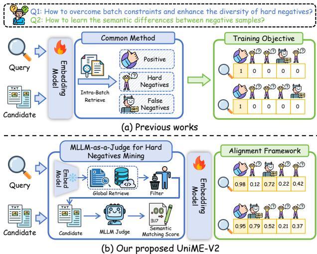
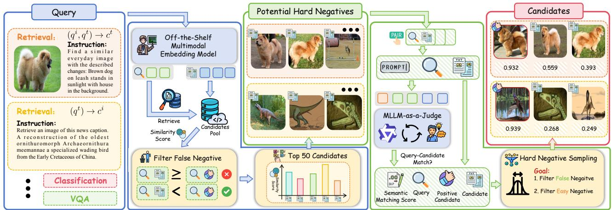
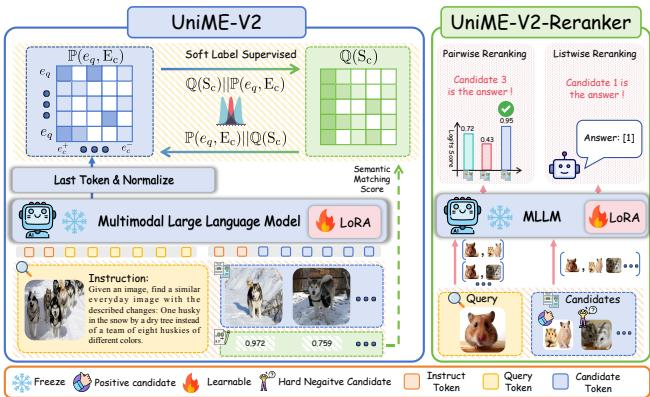
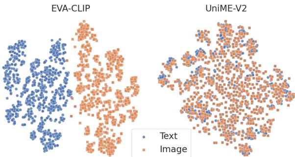
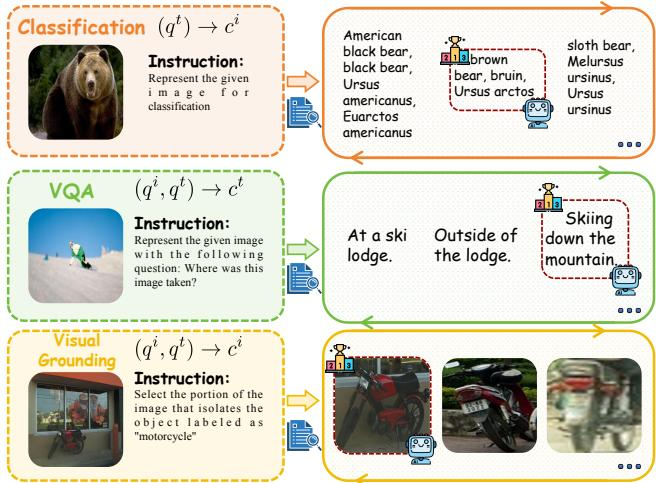
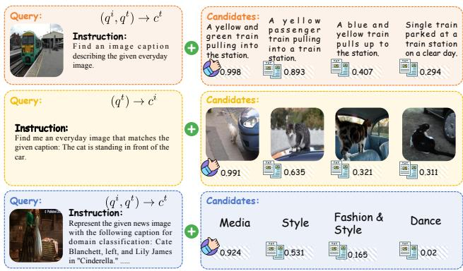
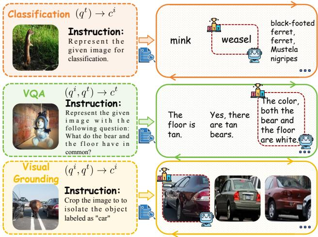

# UniME-V2: MLLM-as-a-Judge for Universal Multimodal Embedding Learning

Tiancheng $\mathbf { G } \mathbf { u } ^ { \boldsymbol { \Psi } , \bullet ^ { * } }$ , Kaicheng Yang\*\*, Kaichen Zhang \*, Xiang $\mathbf { A } \mathbf { n } ^ { * }$ , Ziyong Feng\*, Yueyi Zhang, Weidong Cai\*, Jiankang $\mathbf { D e n g } ^ { * \ddagger }$ , Lidong Bing MiroMind AI \*The University of Sydney ${ \bf \cl { * } _ { M . R . L } }$ .Team LMMs-Lab Team \*Imperial College London yueyi.zhang $@$ miromind.ai, j.deng $1 6 @$ imperial.ac.uk Webpage: https://garygutc.github.io/UniME-v2 Github: https://github.com/GaryGuTC/UniME-v2

# Abstract

Universal multimodal embedding models are foundational to various tasks. Existing approaches typically employ inbatch negative mining by measuring the similarity of querycandidate pairs. However, these methods often struggle to capture subtle semantic differences among candidates and lack diversity in negative samples. Moreover, the embeddings exhibit limited discriminative ability in distinguishing false and hard negatives. In this paper, we leverage the advanced understanding capabilities of MLLMs to enhance representation learning and present a novel Universal Multimodal Embedding (UniME-V2) model. Our approach first constructs a potential hard negative set through global retrieval. We then introduce the MLLM-as-a-Judge mechanism, which utilizes MLLMs to assess the semantic alignment of query-candidate pairs and generate soft semantic matching scores. These scores serve as a foundation for hard negative mining, mitigating the impact of false negatives and enabling the identification of diverse, high-quality hard negatives. Furthermore, the semantic matching scores are used as soft labels to mitigate the rigid one-to-one mapping constraint. By aligning the similarity matrix with the soft semantic matching score matrix, the model learns semantic distinctions among candidates, significantly enhancing its discriminative capacity. To further improve performance, we propose UniME-V2-Reranker, a reranking model trained on our mined hard negatives through a joint pairwise and listwise optimization approach. We conduct comprehensive experiments on the MMEB benchmark and multiple retrieval tasks, demonstrating that our method achieves state-of-the-art performance on average across all tasks.

# Introduction

Multimodal embedding models aim to encode heterogeneous multimodal data into a unified dense representation space, enabling a wide range of downstream applications such as visual question answering (Dong et al. 2025; Hamza et al. 2025;

  

Figure 1: Comparison between previous works and UniME-V2. UniME-V2 exploits the understanding capabilities of MLLMs for hard negatives mining and generates a soft semantic matching score to supervise the model in learning the semantic difference among candidates.

Li et al. 2025) and multimodal retrieval (Zheng et al. 2025; Gu et al. 2025b; Yang et al. 2025; Gu et al. 2024). With the increasing adoption of these models, multimodal representation learning has garnered significant research attention. Among these models, CLIP (Radford et al. 2021) stands out as a pioneering approach, achieving remarkable performance in textimage retrieval by leveraging cross-modal contrastive learning on large-scale web-collected image-text pairs (Schuhmann et al. 2021). However, its effectiveness is hindered by three major limitations: (1) CLIP enforces a strict text token limit of 77, which restricts its ability to process detailed or lengthy descriptions (Zhang et al. 2024a; Cao, Wei, and Ma 2024; Huang et al. 2024b); (2) Its dual-encoder design processes images and text independently, which reduces its effectiveness in handling complex tasks, such as instructionfollowing multimodal retrieval (Jiang et al. 2025; Liu et al. 2024; Gu et al. 2025a); and (3) CLIP exhibits limited proficiency in advanced language understanding, struggles with handling compositionality, and often demonstrates bag-ofwords behavior (Yuksekgonul et al. 2022; Tschannen et al. 2023; Hu et al. 2025).

Recent advances in Large Language Models (LLMs) have achieved state-of-the-art performance on the MTEB benchmark (Muennighoff et al. 2022). Motivated by these developments (Lee et al. 2024; BehnamGhader et al. 2024), researchers are currently exploring how to utilize Multimodal Large Language Models (MLLMs) to learn universal multimodal representation. E5-V (Jiang et al. 2024) adopts a unimodal contrastive learning approach, training the language component of MLLMs on sentence pairs to better align the cross-modal representation spaces. VLM2Vec (Jiang et al. 2025) introduces the Massive Multimodal Embedding Benchmark (MMEB), comprising 36 datasets across four metatasks, and proposes a contrastive learning framework to repurpose pre-trained vision-language models as embedding models via training on the MMEB dataset. QQMM (Xue, Li, and Liu 2025a) provides an in-depth analysis of the gradients derived from the InfoNCE loss and proposes amplifying gradients associated with hard negative samples to encourage the model to learn more discriminative embeddings. UniME (Gu et al. 2025a) presents a two-stage framework that leverages a powerful LLM-based teacher model to improve the embedding capabilities of the language component in MLLMs. Furthermore, it incorporates a hard negative sampling strategy that selects multiple challenging negatives per instance within each batch. Despite these advances, existing methods fail to fully exploit the semantic differences between candidates and are limited by the lack of diversity in negative samples. Moreover, the raw embeddings produced by these mdes arequently adequateor eliably sa between hard negatives and false negatives.

In this paper, we propose a novel Universal Multimodal Embedding (UniME-V2) model, which leverages the robust understanding capabilities of MLLMs to enhance representation learning. As shown in Fig. 1, we first construct a potential hard negative set through global retrieval. Then, we introduce MLLM-as-a-Judge to assess the semantic alignment of query-candidate pairs, producing semantic matching scores. This score serves as the foundation for hard negative mining, effectively reducing interference from false negatives and enabling the identification of high-quality, diverse hard negatives. Additionally, we use the scores as soft labels to mitigate strict one-to-one mapping constraints. Aligning the similarity matrix with the semantic score matrix enables the model to capture semantic distinctions among candidates, significantly improving its discriminative ability. To further enhance performance, we introduce UniME-V2-Reranker, a reranking model trained on our mined hard negatives through a joint pairwise and listwise optimization approach. Extensive experiments on the MMEB benchmark and various retrieval tasks, including short/long caption retrieval and compositional retrieval, demonstrate that our method achieves state-of-the-art performance across all tasks. The main contributions of this paper are summarized as follows: • We introduce a MLLM-as-a-Judge pipeline for hard negative mining that uses the advanced understanding capabilities of MLLM to assess the semantic alignment of each query-candidate pair within a globally retrieved potential hard negative set. •We present UniME-V2, a novel universal multimodal embedding model trained with an MLLM judgment based distribution alignment framework. By leveraging semantic matching scores as soft labels, the model effectively captures semantic differences between candidates, significantly enhancing its discriminative capability. We propose UniME-V2-Reranker, a reranking model trained on high-quality, diverse hard negatives through a joint pairwise and listwise optimization approach. •We conduct extensive experiments on the MMEB benchmark and various retrieval tasks, including short and long caption retrieval as well as compositional retrieval. The results demonstrate that our method achieves state-of-the-art performance on average across all tasks.

# Related Work

# Multimodal Large Language Models

Multimodal Large Language Models (MLLMs) extend traditional LLMs to process and integrate information across multiple modalities (Wang et al. 2025b,a; Xie et al. 2024; Bai et al. 2025; An et al. 2025a, 2024). As a foundational contribution, LLaVA (Liu et al. 2023) leverages a subset of the CC3M (Changpinyo et al. 2021) dataset to achieve more balanced conceptual coverage. In this approach, the visual encoder and language model remain frozen, while only the projection layer is trained to align visual features with language tokens. Subsequently, numerous MLLM variants (Peng et al. 2023; Lin et al. 2024a; Tang et al. 2025a,b; An et al. 2025b) have achieved remarkable results in multimodal understanding and reasoning tasks. For instance, $\mathrm { C o g V L M }$ (Wang et al. 2023) incorporates a trainable visual expert module into the attention and feed-forward layers of the language model, achieving significant improvements on 17 standard crossmodal benchmarks. Similarly, Qwen2-VL (Wang et al. 2024) introduces the Naive Dynamic Resolution mechanism and integrates M-RoPE to enhance positional information fusion, yielding competitive performance across diverse benchmarks. LLaVA-OneVision (Li et al. 2024) pushes the boundaries of open MLLMs by excelling in single-image, multi-image, and video tasks, showcasing robust video understanding through effective task transfer from image-based training. Although these advances have significantly improved the understanding capabilities of MLLMs, further research is needed to explore how MLLMs can effectively learn unified multimodal representations.

# Multimodal Representation Learning

CLIP (Radford et al. 2021) demonstrates strong image-text retrieval performance through large-scale cross-modal contrastive learning but faces three key limitations: (1) A 77- token text truncation restricts fine-grained semantic alignment (Zhang et al. 2024a; Cao, Wei, and Ma 2024; Huang et al. 2024b); (2) Its dual-encoder architecture limits effective cross-modal fusion, particularly for instruction-sensitive tasks (Jiang et al. 2025; Liu et al. 2024; Gu et al. 2025a); and (3) Simplistic language modeling results in bag-of-words representations (Yuksekgonul et al. 2022; Tschannen et al. 2023; Hu et al. 2025; Lei et al. 2024; Huang et al. 2024a; Andonian, Chen, and Hamid 2022). To address these issues, recent studies have incorporated MLLMs for enhanced multimodal representation learning. E5-V (Jiang et al. 2024) employs unimodal contrastive learning, training the language component of MLLMs on sentence pairs to reduce cross-modal representation gaps. VLM2Vec (Jiang et al. 2025) introduces the Massive Multimodal Embedding Benchmark (MMEB) and adapts state-of-the-art vision-language models into embedding models using a contrastive framework trained on MMEB. QQMM (Xue, Li, and Liu 2025a) analyzes InfoNCE loss gradients and proposes enhancing gradients associated with hard negatives to improve embedding discrimination. UniME (Gu et al. 2025a) adopts a two-stage framework with an LLM-based teacher model to refine language embeddings and employs a hard negative sampling strategy, selecting multiple challenging negatives per batch. Despite these advancements, existing methods still under-utilize the semantic differences among candidates and struggle to effectively identify and leverage hard negatives during retrieval.

  
FeLLJu el areaivMilizisul tre quey-cndiate pir base the mantlment abli preenation harneive.

# Methodology

# Task Definition

Unlike CLIP, which employs separate encoders to generate embeddings for each modality, we investigate leveraging the unified architecture of MLLM to extract embeddings across multiple modalities and improve retrieval performance through reranking. Specifically, given a query $q$ and a set of candidates $\Omega _ { c } = \{ c _ { 1 } , c _ { 2 } , \ldots , c _ { n } \}$ , which may include images, text, and interleaved image-text data, the universal embedding model $\Phi _ { \mathrm { e m b } }$ encodes the query and candidates, retrieving the top- $k$ most relevant candidates $\Omega _ { k } ~ = ~ \Phi _ { \mathrm { e m b } } ( q , \Omega _ { c } )$ . To further enhance retrieval performance, a reranker model $\Phi _ { \mathrm { r a n k } }$ refines this subset through a reranking process, producing the final ranked output $\hat { \Omega } _ { k } \stackrel { - } { = }$

$$
\Phi _ { \mathrm { r a n k } } ( q , \Omega _ { k } ) .
$$

# MLLM-as-a-Judge for Hard Negatives Mining

Previous works (Jiang et al. 2025; Liu et al. 2024) primarily rely on in-batch hard negative mining, where query-candidate embedding similarities are computed to sample negatives. However, this method often suffers from limited negative sample diversity and insufficient embedding discriminative power to effectively distinguish false and hard negatives. To overcome these challenges, as shown in Fig. 2, we first construct a potential hard negative set using global retrieval. After that, inspired by previous work (Zheng et al. 2023; Chen et al. 2024a), we leverage the robust understanding capabilities of MLLMs to assess the semantic alignment of each querycandidate pair and generate a soft semantic matching score. This score guides hard negative mining, enabling the identification of diverse and high-quality hard negatives while reducing the impact of false negatives. Potential Hard Negative Set. To extract higher-quality hard negatives from global samples, we first use VLM2Vec to generate embeddings for both queries and candidates. We then retrieve the top 50 most relevant candidates for each query. To address false negatives and improve diversity, we apply a similarity threshold $( \delta )$ based on the query-candidate similarity scores and select the top 50 candidates as the potential hard negative set $( \Omega _ { p } )$ :

$$
\Omega _ { p } = { \mathrm { R a n k } } _ { 5 0 } \left( \left\{ x _ { 1 } , \ldots , x _ { n } \right\} \right) , { \mathrm { w h e r e ~ } } x _ { i } < \delta ,
$$

where $x _ { i }$ is the similarity score of the query $q$ and candidates $\hat { \Omega } _ { c }$ calculated by the VLM2Vec model. Semantic Matching Score. After constructing the potential hard negative set $( \Omega _ { p } )$ , we employ an MLLM as a judge to compute a semantic matching score for each query-candidate pair in $\Omega _ { p }$ , guided by the following instruction:

  

Figure 3: The architecture of the MLLM Judgment Based Training Framework. UniME-V2 uses soft semantic matching scores as supervised signals to enhance semantic distinction learning between candidates. UniME-V2-Reranker employs joint pairwise and listwise optimization to enhance reranking performance.

I will provide you with a query and a candidate. Please evaluate whether the candidate meets the requirements of the query. If it does, respond with 'Yes'; if it doesn't, respond with 'No'. Query: $<$ Query>, Candidates: $<$ Candidate>.

After that, we compute the semantic matching score $\mathrm { S } =$ $\{ s _ { 1 } , s _ { 2 } , \ldots , s _ { m } \}$ based on the logits of the Yes $( e _ { y } )$ and $\mathrm { N o } \ ( e _ { n } )$ tokens, where $\begin{array} { r } { s _ { i } = \frac { e _ { y } ^ { i } } { e _ { y } ^ { i } + e _ { n } ^ { i } } } \end{array}$ , where $\mathrm { S } \in \mathbb { R } ^ { n _ { q } \times 5 0 }$ and $n _ { q }$ denotes the number of queries. Leveraging the advanced understanding capabilities of MLLMs, the semantic matching score S effectively captures the degree of semantic alignment between queries and candidates.

Hard Negative Sampling. To enhance the quality of hard negatives, we refine candidates using the semantic matching score (S). False negatives are excluded if their score exceeds a threshold $\alpha = \sigma _ { q , c _ { t } } - \beta$ ,where $c _ { t }$ denotes the positive sample and $\beta$ is a hyperparameter controlling the threshold margin as 0.01. To maintain diversity, we apply a cyclical sampling strategy with five-step intervals. If the refined set contains fewer than ten candidates, we duplicate selections to ensure a minimum of ten. In the rare case where no candidates meet the criteria $( < 1 \% )$ , we randomly select 10 candidates from the initial pool of fifty and assign each a semantic matching score of 1.0. Finally, for each query $q$ , we obtain the hard negative set $\Omega _ { h } = \{ c _ { 1 } , . . . , c _ { k } \}$ along with the corresponding semantic matching scores $\mathrm { S } _ { \mathrm { h } } = \{ s _ { q , c _ { 1 } } , . . . , s _ { q , c _ { k } } \}$ .

# MLLM Judgment Based Training Framework

UniME-V2. Previous works (Jiang et al. 2025; Gu et al. 2025a) are limited by a rigid one-to-one mapping, which restricts the ability to learn distinctions among diverse negative samples. To address this, as shown in Fig. 3, we propose an MLLM judgment based distribution alignment framework, leveraging soft semantic matching scores as supervised signals to improve representation performance. Specifically, given a query $q$ and its candidate set $\Omega _ { c } = \{ c _ { t } , c _ { 1 } , . . . , c _ { k } \}$ we input them into the MLLM and extract the last token as embeddings for the query $e _ { q }$ and candidates $\operatorname { E _ { c } } =$ $\{ e _ { c } ^ { + } , e _ { c _ { 1 } } ^ { - } , . . , e _ { c _ { k } } ^ { - } \}$ ,where $e _ { c } ^ { + }$ is the embedding of target candidate and $k$ is the hard negative number for each query. We then compute the relation score matrix between the query embedding $e _ { q }$ and candidate embeddings $\mathrm { E _ { c } }$ as follows:

$$
\mathbb { P } ( e _ { q } , \mathrm { E } _ { \mathrm { c } } ) = \frac { e x p ( c o s ( e _ { q } , e _ { c } ^ { + } ) / \tau ) } { e x p ( c o s ( e _ { q } , e _ { c } ^ { + } ) / \tau ) + \sum _ { i = 1 } ^ { k } e x p ( c o s ( e _ { q } , e _ { c _ { i } ^ { - } } ) / \tau ) } .
$$

Based on the semantic matching scores $\begin{array} { r l } { \mathrm { S _ { c } } } & { { } = } \end{array}$ $\left\{ s _ { q , c _ { t } } , s _ { q , c _ { 1 } } , . . . , s _ { q , c _ { k } } \right\}$ , we compute the semantic matching score matrix $\mathbb { Q } ( \mathrm { S } _ { \mathrm { c } } )$ derived from the MLLM judgment as follows:

$$
\mathbb { Q } ( \mathrm { S } _ { \mathrm { c } } ) = \frac { e x p ( s _ { q , c _ { t } } / \tau ) } { e x p ( s _ { q , c _ { t } } / \tau ) + \sum _ { i = 1 } ^ { k } e x p ( s _ { q , c _ { i } } / \tau ) } .
$$

To enhance learning robustness and ensure matrix symmetry, we employ JS-Divergence, a symmetric alternative to KL-Divergence (Nielsen 2020). The final loss function $\mathcal { L }$ is defined as:

$$
\begin{array} { r } { \mathcal { L } = \displaystyle \frac { 1 } { 2 } ( \frac { 1 } { N } \sum _ { i = 1 } ^ { N } \mathrm { K L } ( \mathbb { P } ( e _ { i } , \mathrm { E } _ { \mathrm { c } } ) | | \mathbb { Q } ( \mathrm { S } _ { \mathrm { c } } ) ) + } \\ { \displaystyle \frac { 1 } { N } \sum _ { i = 1 } ^ { N } \mathrm { K L } ( \mathbb { Q } ( \mathrm { S } _ { \mathrm { c } } ) | | \mathbb { P } ( e _ { i } , \mathrm { E } _ { \mathrm { c } } ) ) ) . } \end{array}
$$

UniME-V2-Reranker. Following previous works (Liu et al. 2024; Lin et al. 2024b), we train a reranking model to enhance retrieval precision following initial embedding-based retrieval. Specifically, we train UniME-V2-Reranker using joint pairwise and listwise approaches to enhance its reranking capability (refer to Fig. 3). In pairwise training, we construct two pairs for each query $q$ by combining with the positive candidate $c _ { t }$ and the hardest negatives $c _ { h }$ . We then instruct UniME-V2-Reranker to output YES for the positive and NO for the negative. The pairwise loss $\mathcal { L } _ { p a i r }$ is computed using the cross-entropy loss function as:

$$
\mathcal { L } _ { p a i r } = \mathcal { L } _ { c e } ( \mathrm { Y E S } , \eta ( \boldsymbol { q } , \boldsymbol { c } _ { t } ) ) + \mathcal { L } _ { c e } ( \mathrm { N O } , \eta ( \boldsymbol { q } , \boldsymbol { c } _ { h } ) ) ,
$$

where $\eta$ denotes the autoregressive output process of UniME-V2-Reranker. For listwise training, based on the semantic matching score, we choose top- $x$ candidates $( \{ c _ { 1 } , . . . c _ { x } \} )$ from the hard negative candidates, insert the target candidate $c _ { t }$ at a random position and get its index $I _ { c _ { t } }$ . The UniME-V2-Reranker is then prompted to output the position of the ground truth, formulated as:

$$
\mathcal { L } _ { l i s t } = \mathcal { L } _ { c e } ( I _ { c _ { t } } , \eta ( q , c _ { t } , \{ c _ { 1 } , . . . c _ { x } \} ) ) .
$$

The final loss function is defined as ${ \mathcal { L } } = { \mathcal { L } } _ { p a i r } + { \mathcal { L } } _ { l i s t }$ Detailed descriptions of the prompts used for pairwise and listwise training are provided in the supplementary material.

# Inference Pipeline

After obtaining UniME-V2 and UniME-V2-Reranker, we integrate them during inference to improve retrieval performance. We initially use UniME-V2 embed query and candidate into features and utilize cosine similarity scores to retrieve the top-10 most relevant candidates. Subsequently, UniME-V2-Reranker reranks these candidates based on the following instruction:

<table><tr><td rowspan="2">Models</td><td rowspan="2">#Parameters</td><td colspan="4">Per Meta-Task Score</td><td colspan="3">Average Score</td></tr><tr><td>Classification</td><td>VQA</td><td>Retrieval</td><td>Grounding</td><td>IND</td><td>OOD</td><td>Overall</td></tr><tr><td># of Datasets →</td><td></td><td>10</td><td>10</td><td>12</td><td>4</td><td>20</td><td>16</td><td>36</td></tr><tr><td colspan="9">Zero-shot on MMEB</td></tr><tr><td>CLIP (ViT-L)(Jiang et al. 2025)</td><td>0.4B</td><td>42.8</td><td>9.1</td><td>53.0</td><td>51.8</td><td>37.1</td><td>38.7</td><td>39.2</td></tr><tr><td>OpenCLIP (ViT-L)(Radford et al. 2021)</td><td>0.4B</td><td>41.5</td><td>6.9</td><td>44.6</td><td>53.5</td><td>32.8</td><td>36.0</td><td>36.6</td></tr><tr><td>Magiclens (ViT-L)(Zhang et al. 2024b)</td><td>0.4B</td><td>38.8</td><td>8.3</td><td>35.4</td><td>26.0</td><td>31.0</td><td>23.7</td><td>27.1</td></tr><tr><td>SigLIP (So/14)(Zhai et al. 2023)</td><td>0.9B</td><td>40.3</td><td>8.4</td><td>31.6</td><td>59.5</td><td>32.3</td><td>38.0</td><td>35.0</td></tr><tr><td>BLIP2 (ViT-L)(Li et al. 2023)</td><td>1.2B</td><td>27.0</td><td>4.2</td><td>33.9</td><td>47.0</td><td>25.3</td><td>25.1</td><td>28.0</td></tr><tr><td>CLIP (ViT-BigG/14)(Cherti et al. 2022)</td><td>2.5B</td><td>52.3</td><td>14.0</td><td>50.5</td><td>60.3</td><td>38.9</td><td>45.8</td><td>44.3</td></tr><tr><td>EVA-CLIP(Sun et al. 2023)</td><td>8B</td><td>56.0</td><td>10.4</td><td>49.2</td><td>58.9</td><td>38.1</td><td>45.6</td><td>43.7</td></tr><tr><td>E5-V (Phi3.5-V)(Jiang et al. 2024)</td><td>4.2B</td><td>39.1</td><td>9.6</td><td>38.0</td><td>57.6</td><td>33.1</td><td>31.9</td><td>36.1</td></tr><tr><td>E5-V (LLaVA-1.6)(Jiang et al. 2024)</td><td>7B</td><td>39.7</td><td>10.8</td><td>39.4</td><td>60.2</td><td>34.2</td><td>33.4</td><td>37.5</td></tr><tr><td colspan="9">Fine-tuning on MMEB</td></tr><tr><td>CLIP (ViT-L)(Jiang et al. 2025)</td><td>0.4B</td><td>55.2</td><td>19.7</td><td>53.2</td><td>62.2</td><td>47.6</td><td>42.8</td><td>47.6</td></tr><tr><td>VLM2Vec (Qwen2-VL)(Jiang et al. 2025)</td><td>2B</td><td>59.0</td><td>49.4</td><td>65.4</td><td>73.4</td><td>66.0</td><td>52.6</td><td>60.1</td></tr><tr><td>VLM2Vec (Qwen2-VL)(Jiang et al. 2025)</td><td>7B</td><td>62.6</td><td>57.8</td><td>69.9</td><td>81.7</td><td>72.2</td><td>57.8</td><td>65.8</td></tr><tr><td>LLaVE (LLaVA-OV)(Lan et al. 2025)</td><td>7B</td><td>65.7</td><td>65.4</td><td>70.9</td><td>91.9</td><td>75.0</td><td>64.4</td><td>70.3</td></tr><tr><td>QQMM (LLaVA-OV)(Xue, Li, and Liu 2025b)</td><td>7B</td><td>66.8</td><td>66.8</td><td>70.5</td><td>90.4</td><td>74.7</td><td>65.6</td><td>70.7</td></tr><tr><td>UniME (Qwen2-VL)(Gu et al. 2025a)</td><td>2B</td><td>59.0</td><td>53.4</td><td>64.9</td><td>69.6</td><td>65.5</td><td>54.6</td><td>60.6</td></tr><tr><td>UniME (Qwen2-VL)(Gu et al. 2025a)</td><td>7B</td><td>64.7</td><td>59.0</td><td>71.6</td><td>82.7</td><td>72.2</td><td>61.4</td><td>67.4</td></tr><tr><td>UniME (LLaVA-OV)(Gu et al. 2025a)</td><td>7B</td><td>66.8</td><td>66.6</td><td>70.5</td><td>90.9</td><td>74.6</td><td>65.8</td><td>70.7</td></tr><tr><td>UniME-V2(Qwen2-VL)</td><td>2B</td><td>62.1(+3.1)</td><td></td><td>56.3(+2.9) 68.0(+3.1) 72.7(+3.1)</td><td></td><td></td><td></td><td>67.4(+1.9) 58.9(+4.3) 63.6(+3.0)</td></tr><tr><td>UniME-V2(Qwen2-VL)</td><td>7B</td><td>64.0(-0.7)</td><td>60.1(+1.1)</td><td>73.1(+1.5)</td><td>82.8(+0.1)</td><td>72.0(-0.2)</td><td>63.0(+1.6)</td><td>68.0(+0.6)</td></tr><tr><td>UniME-V2(LLaVA-OV)</td><td>7B</td><td>65.3(-1.5)</td><td>67.6(+1.0)</td><td>72.9(+2.4)</td><td>90.2(-0.7)</td><td>74.8(+0.2)</td><td>66.7(+0.9)</td><td>71.2(+0.5)</td></tr></table>

R usu ve $@ 1$ Detailed results are in the supplementary material. I will provide you with a query followed by multiple candidates in the format: (1) candidate1 (2) candidate2, etc. Each candidate is independent of the others. Evaluate each candidate against the query, and respond with the number corresponding to the candidate that best meets the requirements of the query. Query: $<$ Query>, Candidates: $<$ Candidate list>.

# Experiments and Results

# Implementation

We extract query and candidate embeddings using VLM2Vec (Qwen2-VL-7B) to construct a potential hard negative set. We use the Qwen2.5VL-7B to generate the soft semantic matching score. We train UniME-V2 using two different multimodal large language models: Qwen2-VL (Wang et al. 2024) and LLaVA-OneVision (Li et al. 2024). To optimize GPU memory, we implement LoRA (rank ${ = } 1 6$ with Deep-Speed ZeRO stage-2 (Aminabadi et al. 2022). The training of UniME-V2 is conducted on $8 \times$ NVIDIA A800 (80GB) GPUs to accommodate the substantial computational demands. We use $3 3 6 \times 3 3 6$ resolution image inputs, set the accumulated batch size to 1024, with learning rates of 1e-4 (Qwen2-VL) and 2e-5 (LLaVA-OneVision). We set the temperature of the Symmetric KL loss $\tau = 0 . 0 2$ and sample $k = 8$ hard negatives, and train each model for 2,000 steps.

# Datasets and Evaluation

Training Data. Following VLM2Vec (Jiang et al. 2025) and UniME (Gu et al. 2025a), we employ 20 in-distribution datasets from the MMEB benchmark, which cover four core multimodal tasks: classification, visual question answering, multimodal retrieval, and visual grounding. This comprehensive training corpus, incorporating both unimodal and multimodal input data, totals 662k carefully curated training pairs, ensuring robust model adaptation across diverse multimodal tasks.

Evaluation. In this study, we evaluate UniME-V2 across both in-distribution (20 test sets) and out-of-distribution (16 test sets) benchmarks from MMEB (Jiang et al. 2025) to assess its multimodal embedding capabilities across diverse retrieval tasks. Following standard evaluation protocols (Liu et al. 2024; Jiang et al. 2025), we report Precision, measuring the proportion of correct matches among the top-ranked candidates for each dataset. To further examine the unimodal embedding performance of UniME-V2, we conduct experiments on multiple cross-modal retrieval tasks, including short-caption image-text retrieval on Flickr30K (Plummer et al. 2015) and C0CO2014 (Lin et al. 2014), long-caption image-text retrieval on ShareGPT4V (Chen et al. 2024b) and Urban1K (Zhang et al. 2024a), and compositional retrieval on SugarCrepe (Hsieh et al. 2023). Consistent with the MMEB benchmark, we use Precision as the primary evaluation metric across all datasets.

# Main Results

Multi-Modal Retrieval. In Tab. 1, we present the performance of the proposed UniME-V2 compared to existing baseline models. Under identical training data and configurations, UniME-V2 consistently achieves notable performance improvements across various foundation models. Specifically, UniME-V2 outperforms VLM2Vec by $3 . 5 \%$ and $2 . 2 \%$ on the Qwen2-VL-2B and 7B models, respectively. When built on LLaVA-OneVision as the foundation, UniME-V2 achieves a $0 . 5 \%$ $0 . 9 \%$ improvement over previous state-of-the-art models, including QQMM, LLaVE, and UniME. Furthermore, UniME-V2 attains a score of 66.7 on out-of-distribution datasets, significantly exceeding all prior approaches, highlighting its robustness and superior transferability. TZhoF0Kand compositional (SugarCrepe) datasets. Scores are Recall $@ 1$ .   

<table><tr><td rowspan="3">Models</td><td rowspan="3">#Parameters</td><td colspan="4">Short Caption</td><td colspan="4">Long Caption</td><td colspan="3">Compositional</td></tr><tr><td colspan="2">Flickr30K</td><td colspan="2">COCO</td><td colspan="2">ShareGPT4V</td><td colspan="2">Urban1K</td><td colspan="3">SugarCrepe</td></tr><tr><td>→ ci</td><td>→ ct qi</td><td>→ ci</td><td>q i → ct</td><td>qt → ci</td><td>qi → ct</td><td>qt → ci</td><td>→ ct g2</td><td>Replace</td><td>Swap</td><td>Add</td></tr><tr><td>OpenCLIP (ViT-L) (Radford et al. 2021)</td><td>0.4B</td><td>67.3</td><td>87.2</td><td>37.0</td><td>58.1</td><td>81.8</td><td>84.0</td><td>47.0</td><td>47.0</td><td>79.5</td><td>62.7</td><td>74.9</td></tr><tr><td>CLIP (ViT-BigG/14) (Cherti et al. 2022)</td><td>2.5B</td><td>79.5</td><td>92.9</td><td>51.3</td><td>67.3</td><td>90.1</td><td>93.6</td><td>77.8</td><td>80.7</td><td>86.5</td><td>68.9</td><td>88.4</td></tr><tr><td>EVA-CLIP (Sun et al. 2023)</td><td>8B</td><td>80.3</td><td>94.5</td><td>52.0</td><td>70.1</td><td>93.1</td><td>91.2</td><td>80.4</td><td>77.8</td><td>85.9</td><td>70.3</td><td>86.7</td></tr><tr><td>E5-V (Phi3.5-V) (Jiang et al. 2024)</td><td>4.2B</td><td>72.2</td><td>79.6</td><td>44.7</td><td>53.4</td><td>86.0</td><td>88.5</td><td>83.8</td><td>83.6</td><td>88.2</td><td>66.6</td><td>75.3</td></tr><tr><td>E5-V (LLaVA-1.6) (Jiang et al. 2024)</td><td>7B</td><td>77.3</td><td>85.7</td><td>49.1</td><td>57.6</td><td>85.1</td><td>82.1</td><td>88.9</td><td>83.2</td><td>86.3</td><td>68.7</td><td>66.9</td></tr><tr><td>VLM2Vec (Qwen2-VL) (Jiang et al. 2025)</td><td>2B</td><td>69.3</td><td>89.6</td><td>40.0</td><td>62.5</td><td>78.1</td><td>88.2</td><td>78.7</td><td>83.9</td><td>67.2</td><td>46.5</td><td>66.4</td></tr><tr><td>VLM2Vec (Qwen2-VL) (Jiang et al. 2025)</td><td>7B</td><td>80.0</td><td>94.2</td><td>49.2</td><td>68.5</td><td>78.5</td><td>90.4</td><td>94.0</td><td>94.2</td><td>70.0</td><td>51.7</td><td>72.2</td></tr><tr><td>UniME (Qwen2-VL) (Gu et al. 2025a)</td><td>2B</td><td>74.9</td><td>90.6</td><td>44.0</td><td>63.5</td><td>83.6</td><td>88.6</td><td>83.3</td><td>83.2</td><td>65.6</td><td>45.2</td><td>65.7</td></tr><tr><td>UniME (Qwen2-VL) (Gu et al. 2025a)</td><td>7B</td><td>80.8</td><td>92.7</td><td>50.9</td><td>69.8</td><td>86.5</td><td>93.8</td><td>95.3</td><td>94.0</td><td>68.8</td><td>53.0</td><td>69.8</td></tr><tr><td>UniME (LLaVA-OV) (Gu et al. 2025a)</td><td>7B</td><td>83.3</td><td>94.4</td><td>54.8</td><td>74.0</td><td>93.9</td><td>89.3</td><td>94.3</td><td>95.5</td><td>80.5</td><td>65.5</td><td>82.2</td></tr><tr><td>UniME-V2 (Qwen2-VL)</td><td>2B</td><td>79.84.9.90..7(.)65.11.91.8.)94..)95.61.)9.(+9.70.9(+5.1.2(6.)0.2+.)</td><td></td><td></td><td></td><td></td><td></td><td></td><td></td><td></td><td></td><td></td></tr><tr><td>UniME-V2 (Qwen2-VL)</td><td>7B</td><td colspan="9">8.+3.8)93.5(0.)57.3(+6.)0.3(+0.594.3(0.)95.197.2(196.3+2.7.8(+9.0)62.2(9.79.0+.)</td><td></td></tr><tr><td>UniME-V2 (LLaVA-OV)</td><td>7B</td><td colspan="9">8.5(+2.93.70.760.9(+6.174.1(+0.195.1(+1.)94.1(+4.96.3(+2.96.7(+1.)88.6(+8.173.7(8.2)90.5(+8.3)</td></tr></table>

  

Figure 4: Comparison of representation distributions between EVA-CLIP-8B and UniME-V2 (LLaVA-OneVision-7B).

Short & Long Caption Cross-Modal Retrieval. We evaluate UniME-V2 on zero-shot cross-modal retrieval tasks. For short-caption datasets, including Flickr30K and MS-COCO, UniME-V2 demonstrates a $2 . 2 \% - 9 . 7 \%$ performance improvement in image-to-text retrieval compared to UniME. In textto-image retrieval, its performance is comparable to UniME, primarily due to two factors: (1) the limited proportion of text-to-image data in the MMEB training set and (2) the insufficient semantic information in short captions. For longcaption cross-modal retrieval tasks, UniME-V2 achieves significant improvements on ShareGPT4V and Urban1K, benefitting from its enhanced discriminative capability and the richer semantic content provided by detailed captions. Notably, compared to EVA-CLIP-8B, UniME-V2 demonstrates more robust retrieval performance. This is primarily due to its universal multimodal embedding can significantly reduce the modality gap (as shown in Fig. 4).

Table 3: Comparison of reranking performance between LamRA and UniME-V2-Reranker using UniME-V2 (Qwen2- VL-7B) and UniME-V2 (Qwen2-VL-2B).   

<table><tr><td>Embedding Model</td><td>Reranker</td><td>#Data</td><td>MMEB</td><td>RShort</td><td>RLong</td><td>RCompos</td></tr><tr><td>UniME(2B)</td><td></td><td></td><td>60.6</td><td>68.3</td><td>84.7</td><td>58.8</td></tr><tr><td>UniME-V2(2B)</td><td></td><td></td><td>63.6</td><td>72.1</td><td>93.4</td><td>64.1</td></tr><tr><td>UniME-V2(2B)</td><td>LamRA(7B)</td><td>1.1M</td><td>67.3</td><td>76.4</td><td>96.4</td><td>87.4</td></tr><tr><td>UniME-V2(2B)</td><td>UniME-V2(7B)</td><td>0.6M</td><td>67.6</td><td>76.4</td><td>96.9</td><td>94.8</td></tr><tr><td>UniME(7B)</td><td></td><td></td><td>67.4</td><td>73.6</td><td>92.4</td><td>63.9</td></tr><tr><td>UniME-V2(7B)</td><td></td><td></td><td>68.0</td><td>76.4</td><td>95.8</td><td>73.0</td></tr><tr><td>UniME-V2(7B)</td><td>LamRA(7B)</td><td>1.1M</td><td>69.1</td><td>78.3</td><td>97.2</td><td>87.4</td></tr><tr><td>UniME-V2(7B)</td><td>UniME-V2(7B)</td><td>0.6M</td><td>69.6</td><td>78.7</td><td>97.5</td><td>94.8</td></tr></table>

Compositional Cross-Modal Retrieval. We evaluate the capacity of the UniME-V2 model to discriminate hard negative samples using the compositional benchmark SugarCrepe. As shown in Tab. 2, UniME-V2 consistently delivers superior performance across all evaluated metrics. Compared with UniME, our model achieves $5 . 3 \%$ , $6 . 0 \%$ , $4 . 5 \%$ performance improvement using Qwen2-VL-2B. After scaling the model from 2B to 7B, our model also achieves $9 . 0 \%$ , $9 . 2 \%$ , and $9 . 2 \%$ performance improvement. Additionally, UniME-V2 exhibits improvements of $2 . 7 \%$ , $3 . 4 \%$ , and $3 . 8 \%$ compared to EVA-CLIP-8B, underscoring its robust capability to discriminate against hard negative samples.

Reranking Comparison. In Tab. 3, we compare the performance between LamRA and UniME-V2-Reranker using listwise reranking on the top-5 retrieval results. To ensure fairness, we use the same training parameters and base model (Qwen2.5-VL-7B) as LamRA. When UniME-V2 (Qwen2- VL-2B) is used for retrieval, both LamRA and UniME-V2-Reranker improve performance across four downstream tasks, with UniME-V2-Reranker consistently achieving superior results while utilizing only half the data. Similarly, with UniME-V2 (Qwen2-VL-7B) for retrieval, UniME-V2- Reranker outperforms LamRA, achieving performance gains of $0 . 5 \%$ , $0 . 4 \%$ , $0 . 3 \%$ , and $7 . 4 \%$ across the four tasks. Notably,

Table 4: Ablation study on our proposed MLLM-as-a-Judge hard negatives mining method and MLLM judgment based training framework.   

<table><tr><td>Hard Negatives</td><td>Soft Score</td><td>MMEB</td><td>RShort</td><td>RLong</td><td>RCompos</td></tr><tr><td>x</td><td>×</td><td>60.1</td><td>63.4</td><td>82.2</td><td>60.0</td></tr><tr><td></td><td></td><td>61.6</td><td>68.9</td><td>89.8</td><td>63.7</td></tr><tr><td>v</td><td>v</td><td>63.6</td><td>72.1</td><td>93.4</td><td>64.1</td></tr></table>

Table 5: Ablation study on different MLLM-based judges.   

<table><tr><td>Judge Model</td><td>MMEB</td><td>RShort</td><td>RLong</td><td>RCompos</td></tr><tr><td>Qwen2.5VL-7B</td><td>63.6</td><td>72.1</td><td>93.4</td><td>64.1</td></tr><tr><td>InternVL3-8B</td><td>58.5</td><td>70.2</td><td>91.3</td><td>64.1</td></tr><tr><td>InternVL3-14B</td><td>63.2</td><td>72.9</td><td>93.1</td><td>63.2</td></tr></table>

<table><tr><td>#Negatives</td><td>MMEB</td><td>RShort</td><td>RLong</td><td>RCompos</td></tr><tr><td>4</td><td>61.3</td><td>69.2</td><td>91.0</td><td>62.4</td></tr><tr><td>6</td><td>61.8</td><td>70.8</td><td>91.7</td><td>61.2</td></tr><tr><td>8</td><td>63.6</td><td>72.1</td><td>93.4</td><td>64.1</td></tr><tr><td>10</td><td>63.0</td><td>72.0</td><td>93.4</td><td>63.4</td></tr></table>

Table 6: Ablation study on the number of hard negatives.

UniME-V2-Reranker demonstrates a significant advantage over LamRA in compositional understanding retrieval tasks, attributed to its use of MLLM's understanding capabilities to extract diverse and high-quality hard samples, which effectively enhance the model's discriminative power.

# Analysis

Ablation on Different Components. We evaluate the effectiveness of UniME-V2 through ablation studies on the proposed MLLM-as-a-Judge hard negatives mining method and the MLLM judgment based training framework, utilizing Qwen2-VL-2B. As shown in Tab. 4, our proposed hard negatives mining method achieves performance improvements of $1 . 5 \%$ , $5 . 5 \%$ , $7 . 6 \%$ , and $3 . 7 \%$ over direct contrastive learning (e.g., VLM2Vec) on the MMEB, short-retrieval, longretrieval, and composed-retrieval tasks, respectively. Building on this, the introduction of the MLLM judgment based training framework further enhances the model's discriminative ability by capturing finer semantic distinctions among candidate samples, leading to additional performance gains of $2 . 0 \%$ , $3 . 2 \%$ $3 . 6 \%$ , and $0 . 4 \%$ for the corresponding tasks.

Ablation on Different MLLM-based Judges. The comprehension ability of the MLLM acting as a judge directly impacts the accuracy of the generated semantic matching scores, thereby influencing the final model performance. Therefore, based on Qwen2-VL-2B, we compare two influential MLLMs in the current open-source community: Qwen2.5-VL-7B, InternVL3-8B, and InternVL3-14B. As shown in Tab. 5, under the same inference settings, the quality of semantic matching scores produced by Qwen2.5-VL is significantly superior to that of InternVL3-8B, particularly on the MMEB (63.6 v.s. 58.5). When employing InternVL3-14B, there is a notable enhancement in downstream performance compared to Intern3-8B, but it remains slightly inferior to Qwen2.5-7B. The primary reason can be attributed to differences in the distribution of instruction data used during their SFT phase.

  

Figure 5: Qualitative examples. We present the retrieval and reranking results of our method across different tasks.

Ablation on the Number of Hard Negatives. Tab. 6 presents the impact of varying the number of hard negatives based on Qwen2-VL-2B. When the number of hard negative samples increases from 4 to 8, UniME-V2 demonstrates consistent improvements across all evaluation metrics: $+ 2 . 3 \%$ on MMEB, $+ 2 . 9 \%$ on short retrieval, $+ 2 . 4 \%$ on long retrieval, and $+ 1 . 7 \%$ on composed retrieval. These gains can be attributed to the model's enhanced ability to discriminate between candidates during training. However, further increasing to 10 introduces easier negatives, diminishing discriminative learning, and slightly reducing performance. Qualitative Results. Fig. 5 illustrates the qualitative results of our method across various tasks. Retrieval results from UniME-V2 are shown, with the top-1 candidate refined by UniME-V2-Reranker highlighted in red dashed boxes. UniME-V2 effectively retrieves query-relevant candidates, such as "black bear" and "brown bear" in the first example, while UniME-V2-Reranker further refines the ranking of retrieved results, prioritizing "brown bear" over "black bear".

# Conclusion

In this paper, we explore how to leverage the advanced understanding capabilities of MLLMs to enhance representation learning and propose a novel Universal Multimodal Embedding model (UniME-V2). Specifically, we first construct a potential hard negative set using global retrieval. We then introduce MLLM-as-a-Judge, which utilizes the robust semantic understanding of MLLMs to assess the alignment of query-candidate pairs and generate soft semantic matching scores. These scores guide hard negative mining by reducing false negative interference and identifying high-quality, diverse hard negatives. Additionally, the scores serve as soft labels, relaxing the rigid one-to-one mapping constraint. By aligning the similarity matrix with the soft semantic matching score matrix, the model learns finer-grained semantic distinctions among candidates, thereby enhancing its discriminative power. To further improve performance, we propose UniME-V2-Reranker, which incorporates joint pairwise and listwise reranking optimization based on the mined hard negatives. We conduct extensive experiments on the MMEB benchmark and various retrieval tasks and our method achieves state-of-the-art performance on average across all tasks. We hope our work provides insights into universal multimodal representation learning.

# References

Aminabadi, R. Y.; Rajbhandari, S.; Awan, A. A.; Li, C.; Li, D.; Zheng, E.; Ruwase, O.; Smith, S.; Zhang, M.; Rasley, J.; et al. 2022. Deepspeed-inference: enabling efficient inference of transformer models at unprecedented scale. In SC22: International Conference for High Performance Computing, Networking, Storage and Analysis, 115. IEEE.   
An, R.; Yang, S.; Lu, M.; Zhang, R.; Zeng, K.; Luo, Y.; Cao, J.; Liang, H.; Chen, Y.; She, Q.; et al. 2024. Mc-llava: Multiconcept personalized vision-language model. arXiv preprint arXiv:2411.11706.   
R. S Zh R he Z. L M.Dai  , H.Guo, Z.; Yan, S.; Luo, Y.; et al. 2025a.UniCTokens: Boosting Personalized Understanding and Generation via Unified Concept Tokens. arXiv preprint arXiv:2505.14671. An, X.; Xie, Y.; Yang, K.; Zhang, W.; Zhao, X.; Cheng, Z.; Wang, Y.; Xu, S.; Chen, C.; Wu, C.; et al. 2025b. LLaVA-OneVision-1.5: Fully Open Framework for Democratized Multimodal Training. arXiv preprint arXiv:2509.23661. Andonian, A.; Chen, S.; and Hamid, R. 2022. Robust cross-modal representation learning with progressive selfdistillation. In CVPR.   
Bi S.; hen, K. Liu, X.; Wang, J. Ge, .Song S. a, K.; Wang, P.; Wang, S.; Tang, J.; et al. 2025. Qwen2. 5-vl technical report. arXiv preprint arXiv:2502.13923.   
BehnamGhader, P.; Adlakha, V.; Mosbach, M.; Bahdanau, D.; Chapados, N.; and Reddy, S. 2024. Llm2vec: Large language models are secretly powerful text encoders. COLM.   
Cao, A.; Wei, X.; and Ma, Z. 2024. FLAME: Frozen Large Language Models Enable Data-Efficient Language-Image Pre-training. arXiv:2411.11927.   
Changpinyo, S.; Sharma, P.; Ding, N.; and Soricut, R. 2021. Conceptual $1 2 \mathrm { m }$ : Pushing web-scale image-text pre-training to recognize long-tail visual concepts. In CVPR, 35583568. Chen, D.; Chen, R.; Zhang, S.; Wang, Y.; Liu, Y.; Zhou, H.; Zhang, Q.; Wan, Y.; Zhou, P.; and Sun, L. 2024a. Mllm-asa-judge: Assessing multimodal llm-as-a-judge with visionlanguage benchmark. In ICML.   
Chen, L.; Li, J.; Dong, X.; Zhang, P.; He, C.; Wang, J.; Zhao, F.; and Lin, D. 2024b. Sharegpt4v: Improving large multimodal models with better captions. In ECCV.   
Cherti, M.; Beaumont, R.; Wightman, R.; Wortsman, M.; Ilharco, G.; Gordon, C.; Schuhmann, C.; Schmidt, L.; and Jitsev, J. 2022. Reproducible scaling laws for contrastive language-image learning. arXiv:2212.07143.   
Dong, G.; Song, X.; Zhu, Y.; Qiao, R.; Dou, Z.; and Wen, J.-R. 205. Towar general instruction-following alignment for retrieval-augmented generation. In AAAI. G LZha Y.; Han, J.; anCallan, J.201.Sci deep contrastive learning batch size under memory limited setup. arXiv preprint arXiv:2101.06983.   
TYag,K.An, X.Fe Z. Liu, D. Cai W, J. 2024. Rwkv-clip: A robust vision-language representation learner. In EMNLP.   
Gu, T.; Yang, K.; Feng, Z.; Wang, X.; Zhang, Y.; Long, D.; Chen, Y.; Cai, W.; and Deng, J. 2025a. Breakig the Modality Barrier: Universal Embedding Learning with Multimodal LLMs. In ACM MM.   
Gu T.; Yang, K.; Zhang, C.; Xie, Y.; An, X.; Feng, Z.; Liu, D.; Cai, W.; and Deng, J. 2025b. RealSyn: An Effective and Scalable Multimodal Interleaved Document Transformation Paradigm. In ACM MM.   
Hamza, A.; Ahn, Y. H.; Lee, S.; Kim, S. T.; et al. 2025. Llava needs more knowledge: Retrieval augmented natural language generation with knowledge graph for explaining thoracic pathologies. In AAAI.   
Hsieh, C.-Y.; Zhang, J.; Ma, Z.; Kembhavi, A.; and Krishna, R. 2023. Sugarcrepe: Fixing hackable benchmarks for visionlanguage compositionality. NeurIPS.   
Hu, X.; Yang, K.; Wang, J.; Xu, H.; Feng, Z.; and Wang, Y. 2025. Decoupled Global-Local Alignment for Improving Compositional Understanding. In ACM MM.   
Huang, H.; Nie, Z.; Wang, Z.; and Shang, Z. 2024a. Crossmodal and uni-modal soft-label alignment for image-text retrieval. In AAAI.   
Huang, W.; Wu, A.; Yang, Y.; Luo, X.; Yang, Y.; Hu, L.; Dai, Q.; Dai, X.; Chen, D.; Luo, C.; et al. 2024b. Llm2clip: Powerful language model unlock richer visual representation. arXiv:2411.04997.   
Jiang, T.; Song, M.; Zhang, Z.; Huang, H.; Deng, W.; Sun, F.; Zhang, Q.; Wang, D.; and Zhuang, F. 2024. E5-v: Universal embeddings with multimodal large language models. arXiv:2407.12580.   
Jiang, Z.; Meng, R.; Yang, X.; Yavuz, S.; Zhou, Y.; and Chen, W. 2025. Vlm2vec: Training vision-language models for massive multimodal embedding tasks. ICLR.   
Lan, Z.; Niu, L.; Meng, F.; Zhou, J.; and Su, J. 2025. Llave: Large language and vision embedding models with hardness-weighted contrastive learning. arXiv preprint arXiv:2503.04812.   
Lee, C.; Roy, R.; Xu, M.; Raiman, J.; Shoeybi, M.; Catanzaro, B.; and Ping, W. 2024. Nv-embed: Improved techniques for training llms as generalist embedding models. ICLR.   
Lei, Y.; He, F.; Chen, C.; Mo, Y.; Li, S. J.; Xie, D.; and Lu, H. 2024. MCAD: Multi-teacher Cross-modal Alignment Distillation for efficient image-text retrieval. In NAACL. Li B.; Zhang Y.; Guo, D.; Zhang, R.; Li, F.; Zhang, H.; Zhang, K.; Zhang, P.; Li, Y.; Liu, Z.; et al. 2024. Llava-onevision: Easy visual task transfer. arXiv preprint arXiv:2408.03326.   
Li, J.; Li, D.; Savarese, S.; and Hoi, S. 2023. Blip-2: Bootstrapping language-image pre-training with frozen image encoders and large language models. In ICML. L Y Cao,Y.; He, H; he, Q.; Fu, X. Xiao, X T.; and Tang, R. 2025. M2IV: Towards Efficient and Finegrained Multimodal In-Context Learning via Representation Engineering. In Second Conference on Language Modeling. Lin, J.; Yin, H.; Ping, W.; Molchanov, P.; Shoeybi, M.; and Han, S. 0a. Vil: On pre-raii r visual ange models. In CVPR.   
Lin, S.-C.; Lee, C.; Shoeybi, M.; Lin, J.; Catanzaro, B.; and Ping, W. 2024b. Mm-embed: Universal multimodal retrieval with multimodal llms. arXiv preprint arXiv:2411.02571. Lin, T.-Y.; Maire, M.; Belongie, S.; Hays, J.; Perona, P.; Ramanan, D.; Dollár, P.; and Zitnick, C. L. 2014. Microsoft coco: Common objects in context. In ECCV.   
Liu, H.; Li, C.; Wu, Q.; and Lee, Y. J. 2023. Visual instruction tuning. NeurIPS.   
Y.Ch  Cai, J.; J X.Hu . ao, J. Y.; and Xie, W. 2024. LamRA: Large Multimodal Model as Your Advanced Retrieval Assistant. CVPR.   
Muennighoff, N.; Tazi, N.; Magne, L.; and Reimers, N. 2022. MTEB: Massive Text Embedding Benchmark. arXiv:2210.07316.   
Nielsen, F. 2020. On a generalization of the JensenShannon divergence and the JensenShannon centroid. Entropy. Peng, Z.; Wang, W.; Dong, L.; Hao, Y.; Huang, S.; Ma, S.; and Wei, F. 2023. Kosmos-2: Grounding multimodal large language models to the world. arXiv:2306.14824.   
Plummer, B. A.; Wang, L.; Cervantes, C. M.; Caicedo, J. C.; Hockenmaier, J.; and Lazebnik, S. 2015. Flickr30k entities: Collecting region-to-phrase correspondences for richer image-to-sentence models. In ICCV.   
Radford, A.; Kim, J. W.; Hallacy, C.; Ramesh, A.; Goh, G.; Agarwal, S.; Sastry, G.; Askell, A.; Mishkin, P.; Clark, J.; et al. 2021. Learning transferable visual models from natural language supervision. In ICML.   
Schuhmann, C.; Vencu, R.; Beaumont, R.; Kaczmarczyk, R.Mullis, C.;KattaA.Coobes, T.; Jitsev, J.;and Komatsuzaki, A. 2021. Laion- $4 0 0 \mathrm { m }$ : Open dataset of clip-filtered 400 million image-text pairs. arXiv preprint arXiv:2111.02114.   
Sun, Q.; Wang, J.; Yu, Q.; Cui, Y.; Zhang, F.; Zhang, X.; and Wang, X. 2023. EVA-CLIP-18B: Scaling CLIP to 18 Billion Parameters. arXiv:2402.04252.   
Tan, F.; Huang, Z.; Liu, C.; Sun, Q.; Yang, H.; and Lim, S.-N.0. Inteveni nhor toke Decdi at n alleviating hallucinations for MLLMs. In ICLR.   
Tang, F.; Liu, C.; Xu, Z.; Hu, M.; Huang, Z.; Xue, H.; Chen, Z.; Peng, Z.; Yang, Z.; Zhou, S.; et al. 2025b. Seeing Far and Clearly: Mitigating Hallucinations in MLLMs with Attention Causal Decoding. In CVPR, 2614726159.   
Tn, M.; Kuar, M.; Steiner, A.; Zhai, X.; Houly, N.; and Beyer, L. 2023. Image captioners are scalable vision learners too. NeurIPS.   
W H.; Li, L.; Qu, C.; Zhu, F; Xu, W.; Chu W.; ad Lin, F. 2025a. To code or not to code? adaptive tool integration for math language models via expectation-maximization. arXiv preprint arXiv:2502.00691. Wang, H.; Qu, C.; Huang, Z.; Chu, W.; Lin, F.; and Chen, W. 2025b. V1-rethinker: Incentivizing self-reflection of visionlanguage models with reinforcement learning. arXiv preprint arXiv:2504.08837.   
Wang, P.; Bai, S.; Tan, S.; Wang, S.; Fan, Z.; Bai, J.; Chen, K.; Liu, X.; Wang, J.; Ge, W.; et al. 2024. Qwen2-vl: Enhancig ision-nguge mode's percetion  he world t ay resolution. arXiv preprint arXiv:2409.12191.   
Wan, W.; Lv, Q.; Yu, W.; Ho, W.; Qi, J.; Wa, Y.; Ji, J.; Yang, Z.; Zhao, L.; Song, X.; Xu, J.; Xu, B.; Li, J.; Dong, Y.; Ding, M.; and Tang, J. 2023. CogVLM: Visual Expert for Pretrained Language Models. arXiv:2311.03079.   
Xi Y.; Yag, K.;Yag, N.; Deg W.; ai, X.; Gu, T.; Wa, YAn, X.ZY.Fe .. .C large multimodal models with cross-modal comprehension. arXiv preprint arXiv:2410.14332.   
Xue, Y.; Li, D.; and Liu, G. 2025a. Improve Multi-Modal Embedding Learning via Explicit Hard Negative Gradient Amplifying. arXiv preprint arXiv:2506.02020.   
Xue, Y.; Li, D.; and Liu, G. 2025b. Improve Multi-Modal Embedding Learning via Explicit Hard Negative Gradient Amplifying. arXiv preprint arXiv:2506.02020.   
Yang, K.; Gu, T.; An, X.; Jiang, H.; Dai, X.; Feng, Z.; Cai, W.; and Deng, J. 2025. Clip-cid: Efficient clip distillation via cluster-instance discrimination. In AAAI, volume 39, 2197421982.   
Yuksekgonul, M.; Bianchi, F.; Kalluri, P.; Jurafsky, D.; and Zou, J. 2022. When and why vision-language models behave like bags-of-words, and what to do about it? arXiv:2210.01936.   
Zhai, X.; Mustafa, B.; Kolesnikov, A.; and Beyer, L. 2023. Sigmoid loss for language image pre-training. In ICCV. Zhang, B.; Zhang, P.; Dong, X.; Zang, Y.; and Wang, J. 2024a. Long-clip: Unlocking the long-text capability of clip. In ECCV.   
Zhang, K.; Luan, Y.; Hu, H.; Lee, K.; Qiao, S.; Chen, W.; Su, Y.; and Chang, M.-W. 2024b. Magiclens: Selfsupervised image retrieval with open-ended instructions. arXiv:2403.19651.   
Zheng, L.; Chiang, W.-L.; Sheng, Y.; Zhuang, S.; Wu, Z.; Zhuang, Y.; Lin, Z.; Li, Z.; Li, D.; Xing, E.; et al. 2023. Judging llm-as-a-judge with mt-bench and chatbot arena. NeuriPS, 36: 4659546623.   
Zh T; Zhg, Y.; An, X.; Feng, Z.; Yag, K.; an Dig, Q. 2025. Gradient-Attention Guided Dual-Masking Synergetic Framework for Robust Text-based Person Retrieval. In EMNLP. This supplementary material elaborates on our experimental setup, covering training configurations, instruction prompts for UniME-V2-Reranker and evaluation benchmarks for retrieval tasks. It also includes extended results such as an ablation study on temperature and a detailed performance analysis on the MMEB benchmark. Additionally, we provide supplementary visualizations of training data samples, retrieval outputs, and reranking results.

# Detail Experiment Setting

# Training Details

We provide the training configurations of UniME-V2 in Tab. 7 and UniME-V2-Reranker in Tab. 8. UniME-V2: Following UniME (Gu et al. 2025a), we adopt identical experimental settings for training UniME-V2. We configure LoRA rank as 16 and employ GradCache (Gao et al. 2021) for efficient training over 2,000 steps using $8 \times \mathbf { A } 8 0 0$ GPUs (80GB memory each). The learning rate is set to $1 \times 1 0 ^ { - 4 }$ for the Qwen series and $2 \times 1 0 ^ { - 5 }$ for LLaVA-OneVision. Due to memory constraints, the input resolution is fixed at 336 for LLaVA-OneVision and 672 for the Qwen series.

Table 7: Training hyperparameters and computational requirements for UniME-V2 (Qwen2-VL-2B/7B) and UniME-V2 (LLaVA-OneVision-7B).   

<table><tr><td>Hyperparameter</td><td>Qwen2-VL-2B/7B</td><td>LLaVA-OV-7B</td></tr><tr><td>Training samples</td><td>662K</td><td></td></tr><tr><td>Batch size</td><td>1024</td><td></td></tr><tr><td>Learning rate</td><td>1×10−4</td><td>2×10−5</td></tr><tr><td>LoRA rank</td><td>16</td><td></td></tr><tr><td>Training steps</td><td>2000</td><td></td></tr><tr><td>Optimizer</td><td>AdamW</td><td></td></tr><tr><td>Infra</td><td>GradCache</td><td></td></tr><tr><td>Max length</td><td>4096</td><td></td></tr><tr><td>temperature</td><td>0.02</td><td></td></tr><tr><td>#Hard Negatives</td><td>8</td><td></td></tr><tr><td>Image Resolution</td><td>672</td><td>336</td></tr><tr><td>Precision</td><td>BF16</td><td></td></tr><tr><td>GPU configuration</td><td>8×A800</td><td></td></tr><tr><td>Random Seed</td><td>42</td><td></td></tr></table>

UniME-V2-Reranker: Following LamRA's experimental setup (Liu et al. 2024), we adopt Qwen2.5-VL-7B as the backbone for UniME-V2-Reranker. The model is trained using LoRA with a rank of 128 for 1 epoch almost 2,000 steps. All experiments are conducted using the lmms-finetune infrastructure with a maximum sequence length of 4096 tokens.

# Detail Instruction Prompt for UniME-V2-Reranker

The prompt template employed for pairwise training of UniME-V2-Reranker is presented below:

Table 8: Training hyperparameters and computational requirements for UniME-V2-Reranker (Qwen2.5-VL-7B).   

<table><tr><td>Hyperparameter</td><td>Qwen2.5-VL-7B</td></tr><tr><td>Training samples</td><td>662K</td></tr><tr><td>Batch size</td><td>64</td></tr><tr><td>Learning rate</td><td>2×10-5</td></tr><tr><td>LoRA rank</td><td>128</td></tr><tr><td>Training epochs</td><td>1</td></tr><tr><td>Optimizer</td><td>AdamW</td></tr><tr><td>Infra</td><td>lmms-finetune</td></tr><tr><td>Max length</td><td>4096</td></tr><tr><td>Precision</td><td>BF16</td></tr><tr><td>DeepSpeed Stage</td><td>2</td></tr><tr><td>GPU configuration</td><td>8×A800</td></tr><tr><td>Random Seed</td><td>42</td></tr></table>

I will provide you with a query and a candidate. Please evaluate whether the candidate meets the requirements of the query. If it does, respond with 'Yes'; if it doesn't, respond with 'No'. uery: $<$ Query>, Candidate: $<$ Candidate>. The prompt used for listwise training of UniME-V2- Reranker is shown below: I will provide you with a query followed by multiple candidates in the format: (1) cand1 (2) cand2, etc. Each candidate is independent of the others. Evaluate each candidate against the query, and respond with the number corresponding to the candidate that best meets the requirements of the query. Query: $<$ Query>, Candidates: $<$ Candidate list>.

# Retrieval Task Evaluation Benchmarks

We evaluate UniME-V2 and UniME-V2-Reranker on diverse retrieval benchmarks, including short-caption, long-caption, and compositional image-text tasks (Tab. 9). For each benchmark, we follow the standard evaluation protocol. In retrieval tasks, we primarily report Recall $@ 1$ as the evaluation metric, using the prompt "Represent the image/text" for both image and text instructions.

<table><tr><td>Benchmark</td><td>Zero-shot #Queries #Cands</td><td></td><td></td></tr><tr><td>Flickr30K (Plummer et al. 2015)</td><td></td><td>1K</td><td>5K</td></tr><tr><td>COCO (Lin et al. 2014)</td><td>E</td><td>5K</td><td>25K</td></tr><tr><td>ShareGPT4V (Chen et al. 2024b)</td><td></td><td>1K</td><td>1K</td></tr><tr><td>Urban1K (Zhang et al. 2024a)</td><td>:</td><td>1K</td><td>1K</td></tr><tr><td>SugarCrepe (Hsieh et al. 2023)</td><td></td><td>7.5K</td><td>2</td></tr></table>

Table 9: Summary of the evaluation benchmarks. # Queries represents the number of test queries, and # Cands denotes the number of test candidates per query.

<table><tr><td>Temperature</td><td>MMEB</td><td>RShort</td><td>RLong</td><td>RCompos</td></tr><tr><td>0.03</td><td>61.9</td><td>70.6</td><td>92.0</td><td>65.8</td></tr><tr><td>0.02</td><td>63.6</td><td>72.1</td><td>93.4</td><td>64.1</td></tr><tr><td>0.01</td><td>62.1</td><td>70.1</td><td>91.1</td><td>66.5</td></tr></table>

Table 10: Ablation study on the temperature. We report the mean scores on the MMEB benchmark, short and long crossmodal retrieval, as well as compositional cross-modal retrieval.

  

Figure 6: Qualitative examples. We present examples showing queries and their corresponding hard negative candidates processed after our hard negative mining pipeline.

# External Results

# Ablation on the Temperature

We conduct additional experiments with UniME-V2 (Qwen2- VL-2B) to analyze the impact of temperature in the final loss function. As evidenced by Tab. 10, a temperature value of 0.02 yields optimal performance across all evaluation metrics, including MMEB, short & long retrieval, and compositional retrieval tasks.

# Specific Results on the MMEB Benchmark

Tab. 11 presents comprehensive results on the MMEB benchmark across eight models: BLIP2, MagicLens, EVA-CLIP, E5-V, VLM2Vec, UniME, UniME-V2, and UniME- $\mathbf { V } 2 ^ { \dagger }$ .Results for BLIP2 through UniME are reproduced directly from UniME (Gu et al. 2025a). Our implementation details specify that UniME-V2 employs the Qwen2-VL-7B backbone, while UniME-V2† represents uses LLaVA-OneVision-7B as its backbone.

# Further Analysis

# Visualization of the Training Data

Fig. 6 presents training examples from the MMEB dataset annotated with their semantic matching scores, which obtained after our proposed pipeline. The visualization demonstrates: (1) target candidates achieving the highest match scores (nearly 1.0), (2) partially relevant candidates with intermediate scores (between 0.0 and 1.0), and (3) irrelevant candidates receiving near-zero scores.

  

Figure 7: Qualitative examples. We present the additional retrieval and reranking results of our method across different tasks.

# Visualization of the Retrieval and Rerank Results

Fig. 7 presents additional qualitative results demonstrating our method's performance across multiple tasks. The visualization reveals that while UniME-V2 successfully retrieves query-matched candidates, UniME-V2-Reranker further refines these results by selecting the optimally matched candidate as the final output.

<table><tr><td></td><td>BLIP2</td><td>MagicLens</td><td>EVA-CLIP</td><td>E5-V</td><td>VLM2Vec</td><td>UniME</td><td>UniME-V2</td><td>UniME-V2†</td></tr><tr><td colspan="9">Classification (10 tasks)</td></tr><tr><td>ImageNet-1K</td><td>10.3</td><td>48.0</td><td>75.0</td><td>40.5</td><td>66.5</td><td>71.3</td><td>80.3</td><td>78.8</td></tr><tr><td> 24News</td><td>36.0</td><td>33.7</td><td>33.8</td><td>31.5</td><td>76.4</td><td>79.5</td><td>66.9</td><td>66.6</td></tr><tr><td>HatefulMemes</td><td>49.6</td><td>49.0</td><td>49.3</td><td>49.3</td><td>60.9</td><td>64.6</td><td>65.9</td><td>65.3</td></tr><tr><td>VOC2007</td><td>52.1</td><td>51.6</td><td>44.3</td><td>76.7</td><td>84.0</td><td>90.4</td><td>84.9</td><td>92.0</td></tr><tr><td>SUN397</td><td>34.5</td><td>57.0</td><td>62.7</td><td>52.3</td><td>73.2</td><td>75.9</td><td>78.9</td><td>78.7</td></tr><tr><td>Place365</td><td>21.5</td><td>31.5</td><td>38.7</td><td>32.0</td><td>42.1</td><td>45.6</td><td>42.5</td><td>42.9</td></tr><tr><td> mageNet-A</td><td>3.2</td><td>8.0</td><td>54.8</td><td>18.2</td><td>39.9</td><td>45.5</td><td>53.7</td><td>48.0</td></tr><tr><td> mageNet-R</td><td>39.7</td><td>70.9</td><td>95.4</td><td>56.7</td><td>746</td><td>78.4</td><td>87.9</td><td>89.3</td></tr><tr><td> ObjectNet</td><td>20.6</td><td>31.6</td><td>67.8</td><td>34.2</td><td>34.3</td><td>36.4</td><td>35.0</td><td>73.1</td></tr><tr><td> Cuntry-211</td><td>2.5</td><td>6.2</td><td>38.7</td><td>5.9</td><td>16.1</td><td>18.7</td><td>32.3</td><td>19.8</td></tr><tr><td>All Classification</td><td>27.0</td><td>38.8</td><td>56.0</td><td>39.7</td><td>56.8</td><td>60.6</td><td>64.0</td><td>65.3</td></tr><tr><td colspan="9">VQA (10 tasks)</td></tr><tr><td>OK-VQA</td><td>8.7</td><td>12.7</td><td>9.9</td><td>15.1</td><td>66.5</td><td>68.3</td><td>59.3</td><td>71.9</td></tr><tr><td> -OKQA</td><td>3.2</td><td>2.9</td><td>2.8</td><td>4.7</td><td>54.9</td><td>58.7</td><td>32.3</td><td>71.4</td></tr><tr><td>T DocVGQA</td><td>2.6</td><td>3.0</td><td>7.4</td><td>9.1</td><td>64.4</td><td>6.6</td><td>91.2</td><td>92.6</td></tr><tr><td>InfographicsVQA</td><td>2.0</td><td>5.9</td><td>6.0</td><td>8.7</td><td>34.8</td><td>37.0</td><td>63.9</td><td>63.5</td></tr><tr><td>ChartA</td><td>0.5</td><td>0.9</td><td>1.5</td><td>4.2</td><td>33.1</td><td>33.4</td><td>56.9</td><td>55.8</td></tr><tr><td> Visual7w</td><td>1.3</td><td>2.5</td><td>2.2</td><td>4.5</td><td>49.8</td><td>51.7</td><td>600.1</td><td>62.5</td></tr><tr><td>SScienceQA</td><td>6.8</td><td>5.2</td><td>14.1</td><td>9.6</td><td>37.3</td><td>40.5</td><td>44.5</td><td>54.0</td></tr><tr><td> ViizWiz</td><td>4.0</td><td>1.7</td><td>4.3</td><td>8.6</td><td>39.9</td><td>42.7</td><td>47.4</td><td>53.7</td></tr><tr><td>NAIQAL GQA</td><td>9.7</td><td>43.5</td><td>44.7</td><td>34.1</td><td>557.3</td><td>63.6</td><td>55.8</td><td>669.5</td></tr><tr><td>T TextiVA</td><td>3.3</td><td>4.6</td><td>10.8</td><td>9.5</td><td>65.7</td><td>65.2</td><td>78.4</td><td>84.5</td></tr><tr><td>A A VGA</td><td>4.2</td><td>8.3</td><td>10.4</td><td>10.8</td><td>50.4</td><td>52.9</td><td>60.1</td><td>67.6</td></tr><tr><td colspan="9">Retrieval (12 tasks)</td></tr><tr><td>VisDial</td><td>18.0</td><td>24.8</td><td>20.4</td><td>57.6</td><td>75.3</td><td>79.7</td><td>83.4</td><td>84.2</td></tr><tr><td>CIRR</td><td>9.8</td><td>39.1</td><td>36.0</td><td>41.0</td><td>51.3</td><td>52.2</td><td>64.0</td><td>65.5</td></tr><tr><td>VisualNews_t2i</td><td>48.1</td><td>50.7</td><td>82.4</td><td>43.9</td><td>70.7</td><td>74.8</td><td>79.9</td><td>77.3</td></tr><tr><td>VisualNews_i2t</td><td>13.5</td><td>21.1</td><td>88.2</td><td>46.8</td><td>75.2</td><td>78.8</td><td>83.5</td><td>79.2</td></tr><tr><td>MSCOCO_t2i</td><td>53.7</td><td>54.1</td><td>65.3</td><td>68.6</td><td>69.9</td><td>74.9</td><td>77.7</td><td>79.1</td></tr><tr><td>MSCO i2t</td><td>20.3</td><td>40.0</td><td>67.2</td><td>54.8</td><td>67.7</td><td>73.8</td><td>73.0</td><td>75.2</td></tr><tr><td> NIGHTS</td><td>56.5</td><td>58.1</td><td>0.2</td><td>0.1</td><td>63.3</td><td>66.2</td><td>69.3</td><td>68.1</td></tr><tr><td>WWebQA</td><td>55.4</td><td>43.0</td><td>70.9</td><td>33.7</td><td>83.6</td><td>89.8</td><td>91.5</td><td>90.6</td></tr><tr><td>FashionIQ</td><td>9.3</td><td>11.2</td><td>16.1</td><td>11.2</td><td>15.2</td><td>16.5</td><td>28.5</td><td>26.4</td></tr><tr><td>Wi-S-NQ</td><td>28.7</td><td>18.7</td><td>46.7</td><td>61.0</td><td>63.4</td><td>66.6</td><td>688</td><td>71.2</td></tr><tr><td> VEN</td><td>39.5</td><td>1.6</td><td>1.8</td><td>0.5</td><td>49.6</td><td>5.7</td><td>71.2</td><td>68.0</td></tr><tr><td>EDIS</td><td>54.4</td><td>62.6</td><td>95.6</td><td>553.8</td><td>73.7</td><td>86.2</td><td>84.4</td><td>88.2</td></tr><tr><td>All Retrieval</td><td>33.9</td><td>35.4</td><td>49.2</td><td>39.4</td><td>63.3</td><td>67.9</td><td>73.1</td><td>72.9</td></tr><tr><td colspan="9">Visual Grounding (4 tasks)</td></tr><tr><td>MSCOCO</td><td>28.9</td><td>22.1</td><td>35.8</td><td>41.7</td><td>77.0</td><td>76.5</td><td>69.3</td><td>78.2</td></tr><tr><td>RefCoco</td><td>47.4</td><td>22.8</td><td>59.9</td><td>62.2</td><td>85.9</td><td>89.3</td><td>88.4</td><td>94.6</td></tr><tr><td>RefCoCO-matching</td><td>59.5</td><td>35.6</td><td>70.0</td><td>74.9</td><td>83.8</td><td>90.6</td><td>89.7</td><td>91.4</td></tr><tr><td>isual7W-pointing</td><td>552.0</td><td>23.4</td><td>70.2</td><td>61.8</td><td>83.6</td><td>84.1</td><td>78.7</td><td>93.8</td></tr><tr><td>All Visual Grounding</td><td>47.0</td><td>26.0</td><td>58.9</td><td>60.2</td><td>82.6</td><td>85.1</td><td>82.8</td><td>90.2</td></tr><tr><td colspan="9">Final Score (36 tasks)</td></tr><tr><td>All</td><td>28.0</td><td>27.1</td><td>43.7</td><td>37.5</td><td>63.3 64.9</td><td>66.6 68.4</td><td>68.0 72.0</td><td>71.2 74.8</td></tr><tr><td>All IND All OOD</td><td>25.3 25.1</td><td>31.0 23.7</td><td>38.1 45.6</td><td>34.2 33.4</td></table>

Ta Thesalu eul araseet rnM , VL-7B as its backbone, and UniME-V2† denotes using LLaVA-OneVision-7B as its backbone.