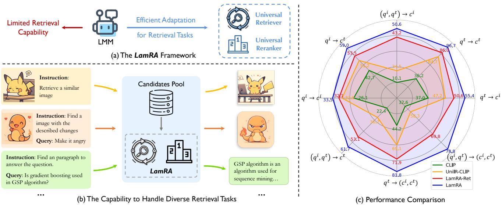
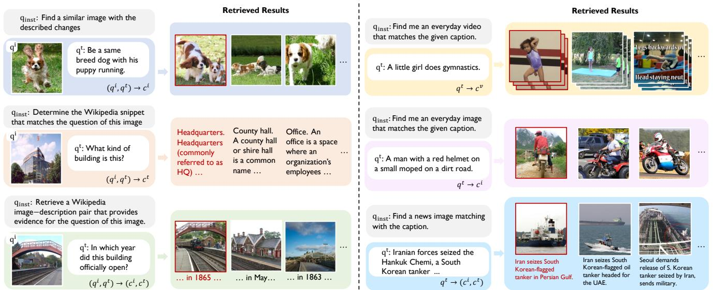

# 1. Bibliographic Information

## 1.1. Title
The central topic of the paper is `LamRA`, which stands for "Large Multimodal Model as Your Advanced Retrieval Assistant." The paper focuses on adapting generative Large Multimodal Models (LMMs) to perform universal information retrieval and reranking tasks, addressing the limitations of traditional dual-encoder models in handling complex, multimodal queries.

## 1.2. Authors
The authors are Yikun Liu, Pingan Chen, Jiayin Cai, Xiaolong Jiang, Yao Hu, Jiangchao Yao, Yanfeng Wang, and Weidi Xie.
*   **Affiliations:** The authors are affiliated with the School of Artificial Intelligence and CMIC at Shanghai Jiao Tong University, China, and Xiaohongshu Inc., China.
*   **Background:** The research team appears to have a strong background in computer vision, natural language processing, and multimodal learning, particularly focusing on retrieval systems and large model adaptation.

## 1.3. Journal/Conference
The paper is currently available as a preprint on `arXiv` (published on 2024-12-02). It has not yet been published in a specific journal or conference proceedings at the time of this analysis. However, given the topic's relevance to computer vision and information retrieval, it is likely intended for top-tier venues like CVPR, ICCV, or SIGIR.

## 1.4. Publication Year
2024.

## 1.5. Abstract
The paper addresses the challenge of increasingly complex multimodal information retrieval tasks. Existing methods often rely on task-specific fine-tuning of vision-language models (like CLIP). The authors propose `LamRA`, a framework that repurposes generative Large Multimodal Models (LMMs) for retrieval. This allows unifying various retrieval tasks under a single formulation and enables extrapolation to unseen tasks without additional training. Key contributions include:
1.  Introducing the `LamRA` framework.
2.  A two-stage training strategy (language-only pre-training and multimodal instruction tuning) for retrieval (`LamRA-Ret`).
3.  Joint training for pointwise and listwise reranking (`LamRA-Rank`).
4.  Extensive experiments showing robust performance on over 10 retrieval tasks in both supervised and zero-shot settings.

## 1.6. Original Source Link
*   **arXiv Link:** https://arxiv.org/abs/2412.01720
*   **PDF Link:** https://arxiv.org/pdf/2412.01720v1
*   **Status:** Preprint.

# 2. Executive Summary

## 2.1. Background & Motivation
The field of multimodal information retrieval has evolved beyond simple text-to-image or image-to-text tasks. We now face complex challenges such as composed image retrieval (finding an image based on a reference image and a text modification), long-text image retrieval, and retrieving multimodal documents.
*   **Core Problem:** Traditional Vision-Language Models (VLMs) like CLIP typically use a dual-encoder architecture trained with contrastive learning. While effective for simple tasks, they struggle with complex, interleaved inputs (e.g., "find an image like this one but with red shoes") and require task-specific fine-tuning for every new scenario, which is inefficient.
*   **Innovation:** The authors propose leveraging the power of generative Large Multimodal Models (LMMs), such as LLaVA or Qwen2-VL. These models excel at understanding complex natural language and visual context. By re-purposing these generative models for retrieval, the paper aims to create a "universal retriever" that can handle any retrieval task type without architectural changes.

## 2.2. Main Contributions / Findings
*   **LamRA Framework:** A versatile framework that empowers LMMs with retrieval and reranking capabilities by inserting lightweight LoRA (Low-Rank Adaptation) modules.
*   **LamRA-Ret (Retrieval):** A two-stage training strategy. Stage I adapts the LMM to output embeddings using text-only data (NLI dataset). Stage II uses instruction tuning on diverse multimodal datasets (M-BEIR) to teach the model to handle various retrieval formats.
*   **LamRA-Rank (Reranking):** A reranking module trained on hard negatives mined from the retriever. It supports both pointwise (judging single relevance) and listwise (ranking a list) reranking to refine results.
*   **Performance:** LamRA demonstrates state-of-the-art or competitive performance across more than 10 retrieval tasks. Crucially, it shows strong zero-shot generalization to unseen datasets and tasks, outperforming traditional dual-encoder models significantly in complex scenarios.

# 3. Prerequisite Knowledge & Related Work

## 3.1. Foundational Concepts
To understand this paper, one must grasp several key concepts in machine learning and computer vision:

*   **Vision-Language Models (VLMs):** These are models designed to understand and generate content across images and text. A classic example is `CLIP` (Contrastive Language-Image Pre-training), which uses two separate encoders (one for images, one for text) to map them into a shared embedding space where similar concepts are close together.
*   **Large Multimodal Models (LMMs):** These are an evolution of VLMs, typically built by connecting a vision encoder to a Large Language Model (LLM). Examples include `LLaVA` and `Qwen2-VL`. Unlike CLIP, LMMs are generative; they take text and images as input and generate text as output, making them highly flexible for tasks like Visual Question Answering (VQA).
*   **LoRA (Low-Rank Adaptation):** A parameter-efficient fine-tuning technique. Instead of retraining all the massive weights of a neural network, LoRA adds small, trainable rank-decomposition matrices to the existing weights. This allows models to be adapted to new tasks with significantly less memory and compute.
*   **Contrastive Learning:** A technique where a model learns to make similar items (positive pairs) closer in the embedding space and dissimilar items (negative pairs) further apart. The standard loss function used is `InfoNCE`.
*   **Explicit One-word Limitation (EOL):** A technique to extract embeddings from generative models. By prompting the model to "Summarize in one word: <emb>", the hidden state of the token preceding $<emb>$ can be used as a dense vector representation of the input.

## 3.2. Previous Works
The paper discusses several lines of prior research:
*   **Dual-Encoder Models:** Models like `CLIP`, `ALIGN`, and `BLIP`. These are foundational but struggle with interleaved inputs (e.g., image+text query -> image+text candidate) and complex text understanding.
*   **Universal Retrieval:** Works like `UniIR` attempt to train a single model on multiple retrieval tasks. However, they often rely on the dual-encoder paradigm, inheriting its limitations.
*   **LMMs for Vision Tasks:** Models like `LISA` (for segmentation) and `DetGPT` (for detection) have shown that LMMs can be adapted for specific vision tasks. The paper positions itself as extending this trend to information retrieval.
*   **E5-V:** A concurrent work that uses LMMs to map images and text into a shared language hidden space. While effective, the authors claim LamRA offers better performance on complex tasks through its specific training strategy.

## 3.3. Technological Evolution
The field has moved from simple cross-modal matching (CLIP) to composed retrieval (modifying reference images) and now towards universal models capable of handling any modality combination. LamRA represents the shift from "discriminative" dual-encoders (which only compare similarity) to "generative" LMMs (which can reason about the content) for retrieval tasks.

## 3.4. Differentiation Analysis
The core difference between LamRA and prior work (like CLIP or UniIR) is the **architecture and training objective**.
*   **Prior Work:** Typically uses two separate towers (vision encoder, text encoder) trained with contrastive loss to align embeddings.
*   **LamRA:** Uses a single, unified generative LMM. It extracts embeddings via the "EOL" trick. This allows the model to leverage the LLM's inherent world knowledge and reasoning capabilities, which is crucial for complex queries like "Find a Wikipedia paragraph about the entity in this image." Furthermore, LamRA integrates a dedicated reranking component (`LamRA-Rank`), which is a novel addition not typically found in standard dual-encoder pipelines.

# 4. Methodology

## 4.1. Principles
The core principle of LamRA is to treat a generative Large Multimodal Model as a feature extractor capable of encoding any combination of images and text into a unified embedding space. The framework consists of two main modules:
1.  **LamRA-Ret:** A retriever that efficiently filters a large corpus to find top-K candidates.
2.  **LamRA-Rank:** A reranker that refines the order of these top-K candidates using the LMM's advanced reasoning capabilities.

    The following figure illustrates the overall framework and its application capabilities.

    
    *该图像是图表，展示了LamRA框架及其在多种检索任务中的应用能力。图(a)描述了LamRA框架的结构与任务适应能力，图(b)展示了多种检索指令的示例，图(c)比较了LamRA与其他模型的性能，体现了其在不同检索场景中的有效性。*

## 4.2. Core Methodology In-depth (Layer by Layer)

### 4.2.1. Architecture & Feature Extraction
LamRA utilizes a standard LMM architecture comprising a Vision Encoder, a Vision Projector, and a Language Model (LLM).
To extract an embedding vector for retrieval, the authors employ the **Explicit One-word Limitation (EOL)** strategy. Instead of generating a full sentence, the model is prompted to summarize the input into a single token placeholder $<emb>$.
*   **Prompts:**
    *   Image-only: $<image> Summarize above image in one word: <emb>$
    *   Text-only: $<text> Summarize above sentence in one word: <emb>$
    *   Mixed: $<image><text> Summarize above image and sentence in one word: <emb>$
*   **Feature Extraction:** The model processes the input, and the hidden state of the token immediately preceding $<emb>$ is extracted as the representation vector. This vector is then used for similarity calculation.

### 4.2.2. Training for Retrieval (LamRA-Ret)
The training of the retriever is divided into two progressive stages to adapt the generative model to the retrieval task.

**Stage I: Language-only Pre-training**
Since LMMs are trained for next-token prediction (generative), they are not natively optimized for discriminative retrieval. To bridge this gap, the first stage involves fine-tuning the LMM on the `NLI` (Natural Language Inference) dataset using LoRA. This dataset contains text pairs (entailment, contradiction, neutral), which helps the model learn semantic relationships between text sequences, forming a basis for embedding alignment.

**Stage II: Instruction Tuning for Universal Retrieval**
In this stage, the model is fine-tuned on the `M-BEIR` benchmark, which includes 8 distinct retrieval tasks (e.g., text-to-image, image-to-image, composed retrieval). Task-specific instructions are used to guide the model. For example, for image-to-image retrieval, the instruction might be "retrieve a similar image."

**Training Objective (InfoNCE Loss)**
For both stages, the model is trained using contrastive learning with the InfoNCE loss. The goal is to pull the embedding of a query $q_n$ closer to its positive target $c_n$ (the correct answer) retriever, and push it away from other candidates in the batch.

The loss function used in the paper is:

$$
\mathcal { L } _ { \mathrm { r e t } } = - \frac { 1 } { B } \sum _ { n = 1 } ^ { B } \log \left[ \frac { \exp \left[ \kappa \left( \mathrm { L M M } ( q _ { n } ) , \mathrm { L M M } ( c _ { n } ) \right) / \tau \right] } { \sum _ { m = 1 } ^ { B } \exp \left[ \kappa \left( \mathrm { L M M } ( q _ { n } ) , \mathrm { L M M } ( c _ { m } ) \right) / \tau \right] } \right]
$$

Where:
*   $\mathcal{L}_{\mathrm{ret}}$: The total retrieval loss.
*   $B$: The batch size.
*   $n$: The index of the current query-positive pair in the batch.
*   $m$: The index of the candidate being compared against (ranging from 1 to $B$).
*   $\mathrm{LMM}(\cdot)$: The function representing the feature extraction process (getting the embedding) using the Large Multimodal Model.
*   $\kappa(\cdot, \cdot)$: The cosine similarity function between two vectors.
*   $\tau$: The temperature parameter, which controls the concentration of the distribution (scaling the logits).
*   $q_n$: The $n$-th query input.
*   $c_n$: The positive candidate (ground truth) corresponding to query $q_n$.
*   $c_m$: The $m$-th candidate in the batch (which acts as a negative if $m \neq n$).

    This formula maximizes the similarity between the query and its positive pair relative to all other pairs in the batch.

### 4.2.3. Training for Reranking (LamRA-Rank)
To further improve precision, a separate LoRA module is trained for reranking. This module leverages the LMM's ability to process multiple candidates or long texts, which is often computationally expensive for the initial retrieval over the whole corpus.

**Collecting Training Data**
The training data for the reranker consists of "hard negatives." Specifically, the trained `LamRA-Ret` model is used to retrieve the top 100 candidates for a query. The ground truth is the positive, and high-ranking incorrect items in this list are treated as hard negatives. This forces the reranker to learn fine-grained distinctions.

**Joint Training for Pointwise and Listwise Reranking**
The reranker is trained jointly using two strategies:

1.  **Pointwise Reranking:** The model takes a query $q$ and a single candidate $c$. It is instructed to output "YES" if the candidate is relevant (positive) and "NO" if it is not (negative). The loss is the standard Cross-Entropy loss.
    The formula for pointwise loss is:
    $$ \mathcal { L } _ { \mathrm { p o i n t } } ~ = ~ \mathcal { L } _ { \mathrm { c e } } ( \mathrm { { Y E S , R e r a n k e r } } ( q , c _ { \mathrm { p o s } } ) ) ~ + ~ \mathcal { L } _ { \mathrm { c e } } \left( \mathrm { N O , R e r a n k e r } ( q , c _ { \mathrm { n e g } } ) \right) $$
    Where:
    *   $\mathcal{L}_{\mathrm{point}}$: The pointwise reranking loss.
    *   $\mathcal{L}_{\mathrm{ce}}$: The Cross-Entropy loss function.
    *   $\mathrm{Reranker}(q, c)$: The autoregressive generation output of the model given query $q$ and candidate $c$.
    *   $c_{\mathrm{pos}}$: The positive candidate.
    *   $c_{\mathrm{neg}}$: The negative candidate.

2.  **Listwise Reranking:** The model takes a query $q$ and a list of candidates (including the ground truth). It is instructed to output the position number (e.g., "1", "2", "3") of the ground truth within the list.
    The formula for listwise loss is:
    $$ \mathcal { L } _ { \mathrm { l i s t } } ~ = ~ \mathcal { L } _ { \mathrm { c e } } ( \text { GT-POSITION }, \mathrm { R e r a n k e r } ( q , c _ { \mathrm { p o s } } , c _ { 1 } , c _ { 2 } , \cdot \cdot \cdot , c _ { M } ) ) $$
    Where:
    *   $\mathcal{L}_{\mathrm{list}}$: The listwise reranking loss.
    *   GT-POSITION: The ground truth position index (an integer).
    *   $M$: The number of negative samples randomly selected from the top 100 hard negatives.
    *   $c_1, \dots, c_M$: The $M$ negative candidates.

        The total loss for the reranker is the weighted sum of these two components:
$$ \mathcal { L } _ { \mathrm { r a n k } } = \mathcal { L } _ { \mathrm { p o i n t } } + \mathcal { L } _ { \mathrm { l i s t } } $$

### 4.2.4. Inference Pipeline
The final inference process combines both modules:
1.  **Retrieval:** `LamRA-Ret` computes embeddings for the query and all candidates in the corpus $\Omega$. It ranks them by cosine similarity to get the top-K candidates $\mathcal{C}_1$.
2.  **Reranking:** `LamRA-Rank` processes the top-K candidates.
    *   If using **pointwise**, it calculates a score based on the probability of outputting "YES" for each candidate.
    *   If using **listwise**, it takes the whole list and outputs the position of the best match.
3.  **Aggregation:** The final score $S$ is a weighted sum of the retrieval similarity score $S_{\mathrm{ret}}$ and the reranking score $S_{\mathrm{rank}}$:
    $$ S = \alpha \times S _ { \mathrm { { r e t } } } + ( 1 - \alpha ) \times S _ { \mathrm { { r a n k } } } $$
    Where $\alpha$ is a hyperparameter (default 0.5).

# 5. Experimental Setup

## 5.1. Datasets
The experiments utilize a comprehensive set of benchmarks to evaluate versatility and generalization.

*   **M-BEIR (Multimodal BEIR):** This is the primary dataset for instruction tuning and evaluation. It comprises 8 distinct retrieval tasks across 10 datasets (e.g., VisualNews, MSCOCO, WebQA). It includes 1.1M training samples.
*   **NLI (Natural Language Inference):** Used for Stage-I pre-training to adapt the LMM to text-to-text retrieval.
*   **Unseen Datasets:** To test zero-shot capabilities, the model is evaluated on datasets not seen during training, including `ShareGPT4V`, `Urban-1K`, `Flickr30K`, `CIRCO`, `Visual Dialog`, etc.
*   **Video Datasets:** `MSR-VTT` and `MSVD` are used to test zero-shot text-to-video retrieval.

## 5.2. Evaluation Metrics
The paper uses standard information retrieval metrics.

*   **Recall@K (R@K):**
    *   **Conceptual Definition:** Recall@K measures the ability of the system to find relevant items within the top $K$ results. It answers the question: "Of all the relevant items in the database, what percentage were retrieved in the top K results?"
    *   **Mathematical Formula:**
        $$ \text{Recall@K} = \frac{|\{ \text{relevant items} \} \cap \{ \text{top K items} \}|}{|\{ \text{relevant items} \}|} $$
    *   **Symbol Explanation:**
        *   The numerator is the count of items that are both relevant and appear in the top K retrieved list.
        *   The denominator is the total count of all relevant items for that query in the entire database.

*   **Accuracy:**
    *   **Conceptual Definition:** Used for Image-Text Matching (ITM) tasks. It measures the proportion of correct predictions (either matching or not matching) out of the total predictions made.
    *   **Mathematical Formula:**
        $$ \text{Accuracy} = \frac{\text{Number of correct predictions}}{\text{Total number of predictions}} $$

## 5.3. Baselines
The paper compares LamRA against several strong baselines:
*   **Dual-Encoder VLMs:** `CLIP`, `SigLIP`, `BLIP`, `BLIP2`. These represent the traditional approach.
*   **Supervised Universal Retrievers:** `UniIR-BLIP` and `UniIR-CLIP`. These are fine-tuned on the M-BEIR benchmark, representing the previous state-of-the-art for unified retrieval.
*   **LMM-based Retrievers:** `E5-V`, `MagicLens`. These are concurrent or recent methods using LMMs for embedding.
*   **Large Scale Models:** `EVA-CLIP-18B`.

# 6. Results & Analysis

## 6.1. Core Results Analysis
The experimental results demonstrate that LamRA significantly outperforms existing methods, particularly on complex tasks.

**Versatility Across Various Retrieval Tasks**
The following table (Table 2 from the original paper) compares LamRA with baselines on the M-BEIR benchmark.

The following are the results from Table 2 of the original paper:

<table>
<thead>
<tr>
<th rowspan="3">Methods</th>
<th colspan="3">$q^t \to c^i$</th>
<th colspan="2">$q^t \to c^t$</th>
<th colspan="2">$q^t \to (c^i, c^t)$</th>
<th colspan="2">$q^i \to c^t$</th>
<th>$q^i \to c^i$</th>
<th colspan="2">$(q^i, q^t) \to c^t$</th>
<th colspan="2">$(q^i, q^t) \to c^i$</th>
<th colspan="2">$(q^i, q^t) \to (c^i, c^t)$</th>
</tr>
<tr>
<th>VN</th>
<th>COCO</th>
<th>F200K</th>
<th>WebQA</th>
<th>EDIS</th>
<th>WebQA</th>
<th>VN</th>
<th>COCO</th>
<th>F200K</th>
<th>NIGHTS</th>
<th>OVEN</th>
<th>InfoS</th>
<th>FIQ</th>
<th>CIRR</th>
<th>OVEN</th>
<th>InfoS</th>
<th>Avg.</th>
</tr>
<tr>
<th>R@5</th>
<th>R@5</th>
<th>R@10</th>
<th>R@5</th>
<th>R@5</th>
<th>R@5</th>
<th>R@5</th>
<th>R@5</th>
<th>R@10</th>
<th>R@5</th>
<th>R@5</th>
<th>R@5</th>
<th>R@10</th>
<th>R@5</th>
<th>R@5</th>
<th>R@5</th>
<th>R@5</th>
</tr>
</thead>
<tbody>
<tr>
<td>CLIP-L [42]</td>
<td>43.3</td>
<td>61.1</td>
<td>6.6</td>
<td>36.2</td>
<td>43.3</td>
<td>41.3</td>
<td>79.0</td>
<td>7.7</td>
<td>26.1</td>
<td>24.2</td>
<td>20.5</td>
<td>7.0</td>
<td>13.2</td>
<td>38.8</td>
<td>26.4</td>
<td>32.5</td>
</tr>
<tr>
<td>SigLIP [57]</td>
<td>30.1</td>
<td>75.7</td>
<td>36.5</td>
<td>39.8</td>
<td>27.0</td>
<td>45.1</td>
<td>43.5</td>
<td>30.8</td>
<td>88.2</td>
<td>34.2</td>
<td>28.9</td>
<td>29.7</td>
<td>25.1</td>
<td>14.4</td>
<td>22.7</td>
<td>41.7</td>
<td>27.4</td>
<td>37.2</td>
</tr>
<tr>
<td>BLIP [24]</td>
<td>16.4</td>
<td>74.4</td>
<td>15.9</td>
<td>44.9</td>
<td>26.8</td>
<td>20.3</td>
<td>17.2</td>
<td>83.2</td>
<td>19.9</td>
<td>27.4</td>
<td>16.1</td>
<td>10.2</td>
<td>2.3</td>
<td>10.6</td>
<td>27.4</td>
<td>16.6</td>
<td>26.8</td>
</tr>
<tr>
<td>BLIP2 [25]</td>
<td>16.7</td>
<td>63.8</td>
<td>14.0</td>
<td>38.6</td>
<td>26.9</td>
<td>24.5</td>
<td>15.0</td>
<td>80.0</td>
<td>14.2</td>
<td>25.4</td>
<td>12.2</td>
<td>5.5</td>
<td>4.4</td>
<td>11.8</td>
<td>27.3</td>
<td>15.8</td>
<td>24.8</td>
</tr>
<tr>
<td>Qwen2-VL-7B [46]</td>
<td>9.3</td>
<td>55.1</td>
<td>5.0</td>
<td>42.0</td>
<td>26.2</td>
<td>9.4</td>
<td>5.4</td>
<td>46.6</td>
<td>4.0</td>
<td>21.3</td>
<td>21.4</td>
<td>22.5</td>
<td>4.3</td>
<td>16.3</td>
<td>43.6</td>
<td>36.2</td>
<td>23.0</td>
</tr>
<tr>
<td colspan="18"><strong>Supervised - Dual Encoder</strong></td>
</tr>
<tr>
<td>UniIR-BLIPFT [51]</td>
<td>23.4</td>
<td>79.7</td>
<td></td>
<td>26.1</td>
<td>80.0</td>
<td>50.9</td>
<td>79.8</td>
<td>22.8</td>
<td>89.9</td>
<td>28.9</td>
<td>33.0</td>
<td>41.0</td>
<td>22.4</td>
<td>29.2</td>
<td>52.2</td>
<td>55.8</td>
<td>33.0</td>
<td>46.8</td>
</tr>
<tr>
<td>UniIR-CLIPFT [51]</td>
<td>42.6</td>
<td>81.1</td>
<td></td>
<td>18.0</td>
<td>84.7</td>
<td>59.4</td>
<td>78.7</td>
<td>43.1</td>
<td>92.3</td>
<td>18.3</td>
<td>32.0</td>
<td>45.5</td>
<td>27.9</td>
<td>24.4</td>
<td>44.6</td>
<td>67.6</td>
<td>48.9</td>
<td>50.6</td>
</tr>
<tr>
<td colspan="18"><strong>Supervised - LMMs</strong></td>
</tr>
<tr>
<td>LamRA-Ret</td>
<td>41.6</td>
<td>81.5</td>
<td></td>
<td>28.7</td>
<td>86.0</td>
<td>62.6</td>
<td>81.2</td>
<td>39.6</td>
<td>90.6</td>
<td>30.4</td>
<td>32.1</td>
<td>54.1</td>
<td>52.1</td>
<td>33.2</td>
<td>53.1</td>
<td>76.2</td>
<td>63.3</td>
<td>56.6</td>
</tr>
<tr>
<td>LamRA</td>
<td>48.0</td>
<td>85.2</td>
<td></td>
<td>32.9</td>
<td>96.7</td>
<td>75.8</td>
<td>87.7</td>
<td>48.6</td>
<td>92.3</td>
<td>36.1</td>
<td>33.5</td>
<td>59.2</td>
<td>64.1</td>
<td>37.8</td>
<td>63.3</td>
<td>79.2</td>
<td>78.3</td>
<td>63.7</td>
</tr>
</tbody>
</table>

*   **Analysis:**
    *   **Complex Tasks:** LamRA significantly outperforms `UniIR-CLIP` (the best dual-encoder baseline) on complex tasks like `InfoSeek` (text-image-to-text retrieval), improving by 24.2 points (R@5), and `CIRR` (composed image retrieval), improving by 8.5 points. This validates the hypothesis that LMMs handle complex semantics better.
    *   **Simple Tasks:** On simple text-to-image tasks (e.g., MSCOCO), LamRA performs comparably to or slightly better than dual-encoders.
    *   **Reranking Impact:** Adding `LamRA-Rank` (reranking) to `LamRA-Ret` provides an average boost of 7.1 points across all tasks.
    *   **Base Model:** The base `Qwen2-VL-7B` model performs poorly (Avg 23.0) without the proposed training, highlighting the necessity of the two-stage adaptation.

**Generalization on Unseen Datasets**
The following are the results from Table 4 of the original paper:

<table>
<thead>
<tr>
<th rowspan="3">Methods</th>
<th colspan="3">$q^t \to c^i$</th>
<th colspan="3">$q^i \to c^t$</th>
<th colspan="2">$(q^i, q^t) \to c^i$</th>
<th>$q^{dialog} \to c^i$</th>
<th colspan="2">$(q^i \oplus q^t) \to c^i$</th>
<th colspan="2">ITM</th>
</tr>
<tr>
<th>Share4V</th>
<th>Urban*</th>
<th>Flickr</th>
<th>Share4V</th>
<th>Urban*</th>
<th>Flickr</th>
<th>CIRCO*</th>
<th>GeneCIS*</th>
<th>VisD*</th>
<th>VIST</th>
<th>MT-FIQ*</th>
<th>CC-Neg</th>
<th>Sugar-Crepe*</th>
</tr>
<tr>
<th>R@1</th>
<th>R@1</th>
<th>R@1</th>
<th>R@1</th>
<th>R@1</th>
<th>R@1</th>
<th>MAP@5</th>
<th>R@1</th>
<th>R@1</th>
<th>R@5</th>
<th>Acc.</th>
<th>Acc.</th>
</tr>
</thead>
<tbody>
<tr>
<td>CLIP-L [42]</td>
<td>84.0</td>
<td>52.8</td>
<td>67.3</td>
<td>81.8</td>
<td>68.7</td>
<td>87.2</td>
<td>4.0</td>
<td>13.3</td>
<td>23.7</td>
<td>0.6</td>
<td>17.7</td>
<td>66.7</td>
<td>73.0</td>
</tr>
<tr>
<td>Long-CLIP-L [58]</td>
<td>95.6</td>
<td>86.1</td>
<td>76.1</td>
<td>95.8</td>
<td>82.7</td>
<td>89.3</td>
<td>5.7</td>
<td>16.3</td>
<td>37.9</td>
<td>1.1</td>
<td>18.5</td>
<td>76.3</td>
<td>80.9</td>
</tr>
<tr>
<td>UniIR-CLIP [51]</td>
<td>85.8</td>
<td>75.0</td>
<td>78.7</td>
<td>84.1</td>
<td>78.4</td>
<td>94.2</td>
<td>12.5</td>
<td>16.8</td>
<td>26.8</td>
<td>0.6</td>
<td>39.4</td>
<td>79.9</td>
<td>80.3</td>
</tr>
<tr>
<td>E5-V [18]</td>
<td>86.7</td>
<td>84.0</td>
<td>79.5</td>
<td>84.0</td>
<td>82.4</td>
<td>88.2</td>
<td>24.8</td>
<td>18.5</td>
<td>54.6</td>
<td>10.0</td>
<td>19.2</td>
<td>83.2</td>
<td>84.7</td>
</tr>
<tr>
<td>MagicLens-L [59]</td>
<td>85.5</td>
<td>59.3</td>
<td>72.5</td>
<td>60.9</td>
<td>24.2</td>
<td>84.6</td>
<td>29.6</td>
<td>16.3</td>
<td>28.0</td>
<td>3.3</td>
<td>22.6</td>
<td>62.7</td>
<td>75.9</td>
</tr>
<tr>
<td>EVA-CLIP-8B [44]</td>
<td>91.2</td>
<td>77.8</td>
<td>80.8</td>
<td>93.1</td>
<td>80.4</td>
<td>95.6</td>
<td>6.0</td>
<td>13.1</td>
<td>23.2</td>
<td>1.2</td>
<td>22.1</td>
<td>59.4</td>
<td>81.7</td>
</tr>
<tr>
<td>EVA-CLIP-18B [44]</td>
<td>92.1</td>
<td>81.7</td>
<td>83.3</td>
<td>94.0</td>
<td>83.3</td>
<td>96.7</td>
<td>6.1</td>
<td>13.6</td>
<td>24.7</td>
<td>1.0</td>
<td>21.9</td>
<td>63.8</td>
<td>83.1</td>
</tr>
<tr>
<td>LamRA-Ret</td>
<td>93.3</td>
<td>95.1</td>
<td>82.8</td>
<td>88.1</td>
<td>94.3</td>
<td>92.7</td>
<td>33.2</td>
<td>18.9</td>
<td>62.8</td>
<td>23.1</td>
<td>60.9</td>
<td>79.6</td>
<td>85.8</td>
</tr>
<tr>
<td>LamRA</td>
<td>97.9</td>
<td>98.8</td>
<td>88.1</td>
<td>96.5</td>
<td>98.0</td>
<td>97.6</td>
<td>42.8</td>
<td>24.8</td>
<td>70.9</td>
<td>28.6</td>
<td>63.9</td>
<td>85.9</td>
<td>93.5</td>
</tr>
</tbody>
</table>

*   **Analysis:** LamRA demonstrates exceptional zero-shot performance. For instance, on `Urban-1K` (long-text retrieval), it achieves 98.8 R@1, vastly outperforming `EVA-CLIP-18B` (81.7). This confirms that the LLM's text understanding capability is a major asset for long-text retrieval.

    The following figure (Figure 3 from the original paper) provides qualitative examples of the retrieval results across different tasks.

    
    *该图像是示意图，展示了多模态检索任务的不同实例与检索结果。左侧展示了与给定描述相似的图像，而右侧则展示了与给定标题匹配的日常视频和新闻图像。此框架结合了语言和视觉信息，适用于复杂的检索任务。*

## 6.2. Ablation Studies / Parameter Analysis

**Effectiveness of Two-stage Training**
The following are the results from Table 5 of the original paper:

<table>
<thead>
<tr>
<th>Pre-training</th>
<th>Instruction tuning</th>
<th>Avg.</th>
</tr>
</thead>
<tbody>
<tr>
<td></td>
<td>X</td>
<td>23.0 (-33.6)</td>
</tr>
<tr>
<td>X</td>
<td></td>
<td>36.2 (-20.4)</td>
</tr>
<tr>
<td></td>
<td></td>
<td>53.6 (-3.0)</td>
</tr>
<tr>
<td>X</td>
<td>X</td>
<td>56.6</td>
</tr>
</tbody>
</table>

*   **Analysis:** Removing either stage hurts performance. Removing pre-training drops the score by 33.6 points, indicating that the generative LLM is initially very poor at discriminative retrieval without the NLI adaptation.

**Scaling Trends of LamRA**
The following are the results from Table 6 of the original paper:

<table>
<thead>
<tr>
<th>LMMs</th>
<th>LamRA-Ret</th>
<th>LamRA-Rank</th>
<th>Avg.</th>
</tr>
</thead>
<tbody>
<tr>
<td>Qwen2-VL-2B [46]</td>
<td>X</td>
<td></td>
<td>51.6</td>
</tr>
<tr>
<td></td>
<td></td>
<td>X</td>
<td>58.3</td>
</tr>
<tr>
<td>Qwen2-VL-7B [46]</td>
<td>X</td>
<td></td>
<td>56.6</td>
</tr>
<tr>
<td></td>
<td></td>
<td>X</td>
<td>63.7</td>
</tr>
</tbody>
</table>

*   **Analysis:** Performance improves as the model scales from 2B to 7B parameters, suggesting that larger LMMs would yield even better results.

**Pointwise vs. Listwise Reranking**
The following are the results from Table 7 of the original paper:

<table>
<thead>
<tr>
<th rowspan="2">Task</th>
<th colspan="2">LamRA-Ret</th>
<th colspan="2">LamRA-Rank(P)</thress>
<th colspan="2">LamRA-Rank(L)</th>
</tr>
<tr>
<th>R@1</th>
<th>Time</th>
<th>R@1</th>
<th>Time</th>
<th>R@1</th>
<th>Time</th>
</tr>
</thead>
<tbody>
<tr>
<td>$q^t \to c^t$</td>
<td>58.2</td>
<td></td>
<td>75.9</td>
<td>0.020s</td>
<td>75.9</td>
<td>0.010s</td>
</tr>
<tr>
<td>$(q^i, q^t) \to c^i$</td>
<td>18.5</td>
<td></td>
<td>24.5</td>
<td>0.071s</td>
<td>24.3</td>
<td>0.067s</td>
</tr>
<tr>
<td>$(q^i, q^t) \to c^t$</td>
<td>30.1</td>
<td></td>
<td>37.3</td>
<td>0.047s</td>
<td>36.6</td>
<td>0.017s</td>
</tr>
<tr>
<td>$(q^i, q^t) \to (c^i, c^t)$</td>
<td>33.4</td>
<td></td>
<td>39.9</td>
<td>0.084s</td>
<td>39.5</td>
<td>0.085s</td>
</tr>
</tbody>
</table>

*   **Analysis:** Both methods improve performance. Pointwise is generally more accurate but slower (requires multiple inferences). Listwise is faster (single inference) but constrained by the context window length (how many candidates fit in the prompt).

# 7. Conclusion & Reflections

## 7.1. Conclusion Summary
The paper successfully demonstrates that generative Large Multimodal Models (LMMs) can be effectively repurposed as universal information retrieval and reranking systems. By introducing the `LamRA` framework, which utilizes a two-stage training strategy (NLI pre-training and M-BEIR instruction tuning) and a joint pointwise/listwise reranking module, the authors achieve state-of-the-art performance on over 10 diverse retrieval tasks. The method excels particularly in complex scenarios involving composed queries and long texts, where traditional dual-encoder models fail. Furthermore, LamRA exhibits impressive zero-shot generalization capabilities to unseen datasets and tasks.

## 7.2. Limitations & Future Work
*   **Inference Cost:** The primary limitation is the high computational cost of using LMMs for retrieval, especially compared to lightweight dual-encoders like CLIP. The authors suggest mitigating for pre-extracting features or using efficient serving techniques.
*   **Context Length:** The listwise reranking method is limited by the LLM's context window, restricting the number of candidates that can be reranked simultaneously.
*   **Video Data:** While LamRA shows zero-shot video capabilities, it is trained primarily on image-text data. Future work could explicitly incorporate video data to close the gap with specialized video retrieval models like InternVideo2.

## 7.3. Personal Insights & Critique
*   **Innovation:** The shift from discriminative to generative models for retrieval is a significant paradigm shift. It effectively solves the "interleaved input" problem (e.g., image+text query) that plagues dual-encoders without needing complex architectural modifications.
*   **Practicality:** While the results are impressive, the computational overhead is a non-trivial barrier for real-time, large-scale deployment. The reliance on a two-step process (Retriever + Reranker) is a smart compromise, using the expensive LMM only on the top-K candidates.
*   **Future Potential:** This approach opens doors for "reasoning-assisted retrieval." Since the model is an LLM, future iterations could potentially explain *why* a document was retrieved, not just retrieve it, bridging the gap between retrieval and explainable AI. The success of the EOL technique also suggests that generative models are versatile feature extractors, a concept that could be applied to other domains like recommendation systems or audio retrieval.